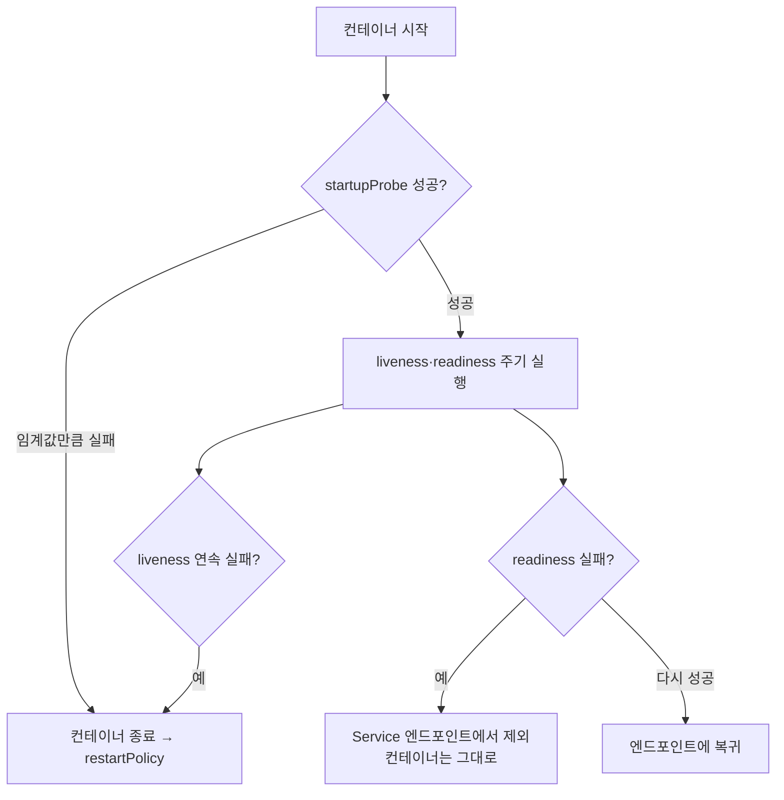

## 이론

### 왜 필요한가

프로세스가 떠 있다고 해서 일을 할 수 있는 것은 아니다. 교착(deadlock)에 빠진 서버는 프로세스로는 살아 있지만 요청에 답하지 못하고, 막 시작한 서버는 캐시를 채우기 전이라 요청을 받으면 안 된다. 쿠버네티스는 컨테이너 상태를 "실행 중"보다 세밀하게 알아야 재시작할지, 트래픽을 보낼지 판단할 수 있다. 그 판단 근거를 주는 장치가 프로브(probe)다.

### 메커니즘

프로브는 각 노드의 kubelet이 컨테이너에 주기적으로 실행하는 진단이다. 방식은 명령 실행(exec), HTTP 요청(httpGet), TCP 연결(tcpSocket), gRPC 헬스 체크(grpc) 중 하나이고, 결과는 성공·실패로 판정된다. 같은 진단이라도 어떤 프로브 자리에 두느냐에 따라 실패의 결과가 완전히 달라진다.



liveness 프로브(liveness probe)가 정해진 횟수만큼 연속 실패하면 kubelet은 컨테이너를 종료하고 restartPolicy에 따라 다시 띄운다. readiness 프로브(readiness probe)는 실패해도 재시작하지 않는다. 대신 Pod가 Ready 상태를 잃어 Service가 트래픽을 보내지 않고, 다시 성공하면 돌아온다.

::embed[k8s.probes.i13]

startup 프로브(startup probe)는 시작이 느린 앱을 위한 보호막이다. 이것이 설정되어 있으면 성공할 때까지 나머지 두 프로브가 돌지 않으므로, 준비 중인 컨테이너가 liveness에 걸려 죽는 일을 막는다. 주의할 점은 liveness에 데이터베이스 같은 외부 의존성 확인을 넣지 않는 것이다. 의존성이 잠시 끊기면 모든 Pod가 함께 재시작되어 장애가 커진다.

## 코드

### Worked example

시작에 최대 2분이 걸리는 HTTP 서버에 세 프로브를 붙인 Pod다. 주석의 번호가 설정 순서(서브골)이며, 매니페스트는 보기용이다.

```yaml
apiVersion: v1
kind: Pod
metadata:
  name: catalog-api
spec:
  containers:
    - name: app
      image: registry.example.com/catalog-api:3.1.0
      ports:
        - containerPort: 8080
      # ① 느린 시작을 보호한다 — 성공할 때까지 liveness·readiness가 돌지 않는다
      startupProbe:
        httpGet: { path: /healthz, port: 8080 }
        periodSeconds: 10
        failureThreshold: 12        # ② 최대 시작 시간 ≈ 12 × 10초 = 120초
      # ③ 프로세스 자신만 본다 — DB 같은 외부 의존성은 넣지 않는다
      livenessProbe:
        httpGet: { path: /healthz, port: 8080 }
        periodSeconds: 10
        failureThreshold: 3         # ④ 한 번의 지연으로 재시작하지 않도록 여유를 둔다
      # ⑤ 요청을 받을 준비가 됐는지 본다 — 실패하면 재시작 없이 트래픽에서만 빠진다
      readinessProbe:
        httpGet: { path: /ready, port: 8080 }
        periodSeconds: 5
        failureThreshold: 2
```

`/healthz`는 프로세스 내부 상태(이벤트 루프 응답, 교착 여부)만 확인하고, `/ready`는 캐시 적재처럼 요청 처리에 필요한 조건까지 확인하도록 앱에서 나눠 구현한다. 상태는 `kubectl describe pod catalog-api`의 Events와 Conditions에서 확인한다.

## 핵심

### 언제 쓰지 않나

- 외부 의존성(데이터베이스·다른 서비스)이 끊겼는지를 liveness로 확인하지 않는다. 재시작해도 고쳐지지 않는 문제라 모든 Pod가 함께 재시작되며 장애를 키운다(→ [연쇄 장애](concept:sre.cascading-failure)).
- 시작이 느리다는 이유로 liveness의 initialDelaySeconds만 크게 늘리지 않는다. 시작이 빨리 끝나도 그 시간 동안 감시가 비므로 startupProbe를 쓴다.
- 앱이 스스로 오류 시 종료(크래시)하는 구조라면 같은 판정을 하는 liveness를 굳이 덧붙이지 않는다. kubelet이 restartPolicy로 이미 재시작한다.

### 대조

| | liveness | readiness | startup |
|---|---|---|---|
| 실패하면 | 컨테이너 종료 후 재시작 | Service 엔드포인트에서 제외 | 컨테이너 종료 후 재시작 |
| 언제 도나 | startup 성공 뒤 계속 | startup 성공 뒤 계속 | 시작 직후, 성공하면 멈춤 |
| 확인할 것 | 프로세스 자신의 생존 | 요청 처리 준비 상태 | 시작 완료 여부 |

::ku-list
