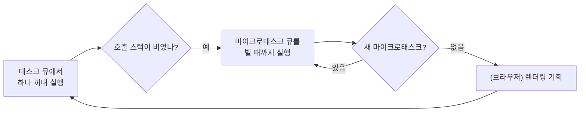

## 이론

### 왜 필요한가

JavaScript는 호출 스택(call stack) 하나로 코드를 실행한다. 그런데 웹 페이지와 서버는 클릭, 타이머, 네트워크 응답처럼 언제 올지 모르는 일을 동시에 기다려야 한다. 스레드를 늘리지 않고 이것을 해내는 장치가 이벤트 루프(event loop)다. 비동기 코드의 실행 순서를 예측하지 못하면 "값이 아직 없다"거나 "타이머가 늦게 돈다" 같은 버그를 이해할 수 없다.

### 메커니즘

이벤트 루프는 태스크 큐(task queue)에서 태스크 하나를 꺼내 호출 스택이 빌 때까지 실행한다. 스크립트 전체 실행, `setTimeout` 콜백, I/O 이벤트 콜백이 각각 태스크다. 실행 중인 콜백은 끝날 때까지 다른 콜백에 끼어들기를 당하지 않는다(실행 완료, run-to-completion).

태스크가 끝나면 다음 태스크로 가기 전에 마이크로태스크 큐(microtask queue)를 바닥날 때까지 비운다. `Promise`의 `then` 콜백, `queueMicrotask` 콜백, `await` 뒤의 이어지는 코드가 마이크로태스크다. 비우는 도중 새로 예약된 마이크로태스크도 같은 차례에 실행된다. 브라우저는 이 큐를 다 비운 뒤에야 화면을 다시 그릴 기회를 얻는다.



::embed[lang.js-event-loop.i13]

그래서 `setTimeout(fn, 0)`의 0은 "지금 바로"가 아니라 "최소 지연"이다. 현재 스크립트와 그 뒤의 마이크로태스크가 모두 끝나야 차례가 온다. `Promise` 생성자에 넘긴 함수(executor)는 동기로 즉시 실행되고, 비동기로 미뤄지는 것은 `then`에 등록한 콜백뿐이다. `async` 함수도 첫 `await`까지는 호출한 쪽에서 동기로 돌고, 나머지만 마이크로태스크로 이어진다. 별도 스레드는 없다.

## 코드

### Worked example

출력 순서를 결정하는 규칙을 한 번에 보여 주는 예다. 그대로 `node`로 실행할 수 있고, 주석의 번호가 읽는 순서(서브골)다.

```js
// ① 동기 코드 — 지금 호출 스택에서 바로 실행된다
console.log('A: script start');
// ② 태스크 예약 — 타이머가 끝나면 태스크 큐에 들어간다
setTimeout(() => console.log('F: timeout'), 0);
// ③ 마이크로태스크 예약 — 현재 태스크가 끝나는 즉시 차례로 실행된다
Promise.resolve()
  .then(() => console.log('D: then 1'))
  .then(() => console.log('E: then 2'));
// ④ Promise 생성자에 넘긴 함수(executor)는 동기로 실행된다
new Promise((resolve) => {
  console.log('B: executor');
  resolve();
});
// ⑤ 스크립트 끝 — 이제 마이크로태스크를 모두 비운 뒤 다음 태스크로 넘어간다
console.log('C: script end');
```

Node.js 22에서 실행한 출력이다.

```text
A: script start
B: executor
C: script end
D: then 1
E: then 2
F: timeout
```

`E: then 2`는 `D: then 1`이 끝난 뒤에야 예약되지만, 같은 마이크로태스크 체크포인트 안에서 처리되므로 `F: timeout`보다 먼저 나온다.

## 핵심

### 언제 쓰지 않나

- 무거운 계산을 `Promise`나 `async` 함수로 감싸면 비동기가 된다고 기대하지 않는다. 같은 스레드에서 돌기 때문에 여전히 루프를 막는다. 조각으로 나누거나 워커로 옮긴다(→ [동시성 패턴](concept:lang.concurrency-patterns)).
- 다음 화면 갱신이나 다른 이벤트에 차례를 넘겨야 하는 작업을 `queueMicrotask`로 반복 예약하지 않는다. 마이크로태스크는 큐가 빌 때까지 이어지므로 태스크와 렌더링이 굶는다.
- 실행 순서를 정밀하게 맞추려고 `setTimeout` 지연값에 기대지 않는다. 지연은 최소값일 뿐이며, 순서가 중요하면 `await`나 `then`으로 명시적으로 잇는다.

### 대조

| | 태스크 | 마이크로태스크 |
|---|---|---|
| 예약하는 API | `setTimeout`·I/O 콜백·스크립트 실행 | `then`·`catch`·`finally`·`queueMicrotask`·`await` 이후 |
| 한 번에 처리하는 양 | 루프 한 바퀴에 하나 | 큐가 빌 때까지 전부 |
| 남용하면 | 응답이 늦어진다 | 태스크와 렌더링이 무한히 밀린다 |

::ku-list
