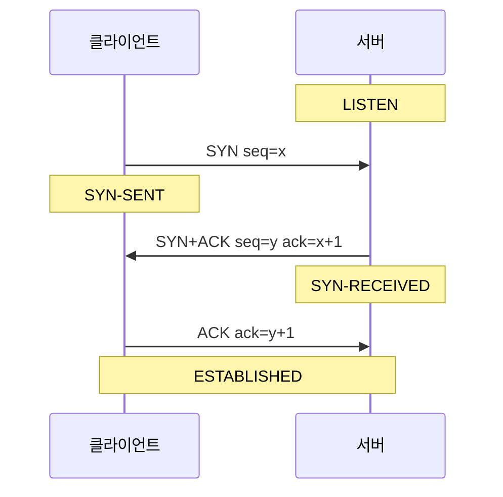
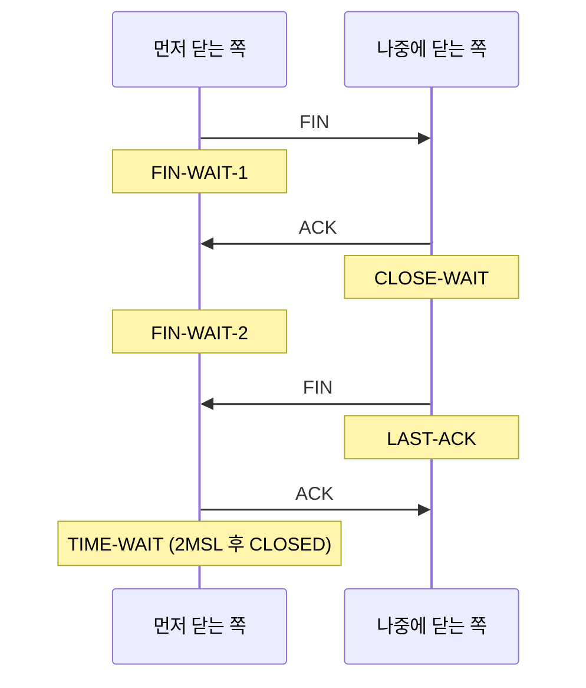

## 이론

### 왜 필요한가

IP는 패킷을 보낼 뿐 순서나 도착을 약속하지 않는다. TCP가 신뢰할 수 있는 바이트 스트림을 만들려면 데이터를 보내기 전에 양쪽이 "어디부터 번호를 셀지"를 합의해야 한다. 이 합의가 연결 수립이고, 쓰고 나면 남은 데이터를 잃지 않으면서 자원을 돌려주는 절차가 연결 종료다. 운영에서 자주 보는 `TIME-WAIT`·`CLOSE-WAIT` 같은 상태 이름도 이 두 절차에서 나온다. 핸드셰이크는 데이터 전에 왕복 한 번(RTT)을 더 쓰므로, 연결을 매번 새로 여는 설계는 그만큼 느려진다.

### 메커니즘

연결 수립은 3방향 핸드셰이크(three-way handshake)다. 클라이언트가 자기 초기 순서 번호(ISN, initial sequence number)를 담은 SYN을 보내고, 서버는 그 번호를 확인(ACK)하면서 자기 ISN을 담은 SYN을 한 세그먼트로 돌려준다. 마지막으로 클라이언트가 서버의 번호를 확인하면 양쪽이 서로의 시작 번호를 알게 된다. 방향마다 "번호 알림 + 확인"이 필요한데, 서버 쪽의 확인과 알림을 합쳤기 때문에 세 번으로 끝난다.



::embed[net.tcp-handshake.i13]

종료는 방향별로 따로 닫는다. 먼저 닫는 쪽이 FIN을 보내면 받은 쪽은 ACK를 돌려준 뒤 CLOSE-WAIT에 머물며, 애플리케이션이 close를 부를 때까지 반대 방향으로 데이터를 계속 보낼 수 있다(반쪽 닫힘, half-close). 받은 쪽이 자기 FIN을 보내고 그 ACK를 받으면 끝난다.



먼저 FIN을 보낸 쪽은 마지막 ACK를 보낸 뒤 바로 사라지지 않고 TIME-WAIT에서 최대 세그먼트 수명(MSL)의 두 배를 기다린다. 그 ACK가 유실되면 다시 보내야 하고, 같은 주소·포트 쌍으로 새로 열린 연결에 이전 연결의 늦은 세그먼트가 섞이면 안 되기 때문이다.

## 코드

### Worked example

서버(예시 주소 `192.0.2.10`)에서 `ss`로 연결 상태를 관찰하는 순서다. 명령은 보기용이며 주석의 번호가 관찰 순서(서브골)다.

```bash
# ① 듣는 소켓을 확인한다 — 상태가 LISTEN이면 SYN을 받을 준비가 된 것이다
ss -tln '( sport = :8080 )'
# ② 다른 터미널에서 요청을 하나 보낸다 — 핸드셰이크가 끝나야 HTTP 요청이 나간다
curl -s http://192.0.2.10:8080/ > /dev/null
# ③ 상태별로 연결 수를 센다 — 첫 줄은 머리글이다
ss -tan | awk 'NR > 1 { print $1 }' | sort | uniq -c
# ④ CLOSE-WAIT만 골라 어느 프로세스가 붙잡고 있는지 본다 — 프로세스 정보는 root 권한에서 보인다
ss -tanp state close-wait
```

③의 출력 예시다. 숫자는 합성한 값이다.

```text
      1 LISTEN
      3 ESTAB
     42 TIME-WAIT
    118 CLOSE-WAIT
```

TIME-WAIT 42개는 서버가 먼저 연결을 닫은 결과로, 시간이 지나면 저절로 사라진다. CLOSE-WAIT 118개는 상대가 이미 FIN을 보냈는데 이 서버의 애플리케이션이 소켓을 닫지 않았다는 뜻이므로 ④로 프로세스를 찾아 코드에서 close 누락을 확인한다.

## 핵심

### 언제 쓰지 않나

- TIME-WAIT 소켓이 많다는 이유만으로 커널 설정을 바꿔 대기 시간을 없애지 않는다. 대부분은 정상 동작이며, 줄이고 싶다면 연결 재사용(keep-alive·커넥션 풀)이 먼저다(→ [커넥션 풀](concept:db.connection-pool)).
- 연결을 끊는 수단으로 RST를 일부러 보내지 않는다. RST는 아직 전달되지 않은 데이터를 버리므로 정상 종료가 아니라 중단이다.
- 핸드셰이크 지연이 문제인 짧은 요청을 매번 새 연결로 보내는 설계는 피한다. 상위 프로토콜의 연결 재사용을 먼저 검토한다(→ [HTTP 기초](concept:net.http-basics)).

### 대조

| | TIME-WAIT | CLOSE-WAIT |
|---|---|---|
| 생기는 쪽 | 먼저 FIN을 보낸 쪽 | FIN을 받고 아직 닫지 않은 쪽 |
| 의미 | 정상 대기(2MSL 후 자동 해제) | 애플리케이션이 close를 부르지 않음 |
| 많을 때 할 일 | 대개 그대로 둔다, 연결 재사용 검토 | 코드에서 소켓 닫기 누락을 찾는다 |

::ku-list
