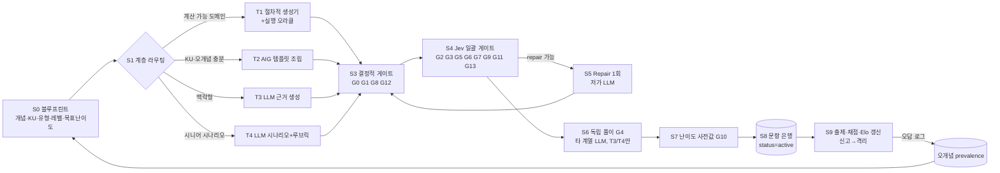

# R2. 고품질 문제 자동 생성(AQG/AIG)·평가 리서치 — 개발 학습 도메인

| 항목 | 내용 |
|------|------|
| 문서 ID | R2-question-generation |
| 작성 단계 | Phase 1 기획 — 리서치 (상위 모델) |
| 주 추적 요구 | **UR-13**(양질의 문제 생성 로직 + 개념 가져오기) |
| 연관 요구 | UR-01(전 분야 섹션), UR-10(이론→코드→핵심개념), UR-11/12(초급→15년차+), UR-14(개념이해/실습/문제/디깅/OX/백지노트), UR-15(로컬 + API/CLI LLM), UR-16(판단은 Jev), UR-17(기능·운영·UX) |
| 작성일 | 2026-09-30 |
| 조사 방법 | 웹 조사(약 6회: AIG/Gierl, distractor 생성 서베이, Elo 적응학습, LLM 단답 채점) + `@typesafe-ai/sdk@0.6.0` 타입 선언 직접 확인 + 교육측정·CS교육 분야 전문 지식(명시적으로 "경험적 권장치"라 표기한 수치는 튜닝 대상) |

---

## 0. 핵심 결론 (TL;DR)

1. **"LLM에게 문제를 만들어 달라"는 품질 전략이 아니다.** 고품질 문항은 (a) 개념을 **원자적 지식 단위(Knowledge Unit, KU)** 와 **오개념(Misconception) 은행**으로 분해한 구조화 데이터, (b) Gierl식 **아이템 모델(템플릿)**, (c) 가능한 곳에서는 **실행 오라클(execution oracle)** 로 정답을 *계산*하는 절차적 생성기, (d) 생성과 **분리된 판정기(Jev)** 의 다단 품질 게이트에서 나온다.
2. **3+1 생성 계층**을 채택한다.
   - **T1 절차적 생성기**(코드 출력 예측, SQL 결과, Big-O, CIDR, 정규식, JS 이벤트 루프 순서 등): 정답을 코드 실행으로 산출 → 정답 오류율 ≈ 0, LLM 비용 0.
   - **T2 KU-템플릿(AIG)**: KU/오개념/형제 개념 그래프를 슬롯에 채움 → OX, MCQ, 빈칸, 매칭, 순서. LLM 없이도 동작(오프라인 모드).
   - **T3 근거 기반 LLM 생성(RAG-lite)**: 개념 본문 + KU + 오개념을 컨텍스트 팩으로 주입, JSON 스키마 출력, 각 선택지에 KU/오개념 ID 인용 강제.
   - **T4 시나리오형 LLM 생성(시니어)**: 시스템 설계, 트레이드오프, 장애/포스트모템 — 정답 대신 **루브릭**을 산출하고 Jev `score`로 채점.
3. **판정은 Jev, 텍스트는 LLM** (UR-16). 정답 유일성·근거 가능성·모호성·오답 매력도·Bloom 정렬·해설 품질·서술형 루브릭 채점·백지노트 커버리지를 모두 Jev `noul/choice/score`로 수행한다. 문항 1개 게이팅에 Jev 약 10~15개 질문(1~2 요청)이 들고 비용은 **$0.0002 미만**. LLM-as-judge는 Jev 미가용 시 폴백.
4. **옵션은 반드시 객체 키로 참조**(`options.b`, `ku.k137`) — Jev의 배열 인덱스 참조 취약성(브리프 3절)을 스키마 차원에서 원천 차단.
5. **난이도는 Elo(Pelánek) 온라인 추정 + 사전(prior) 보정**. 단일 사용자 로컬 앱이라 문항별 응답 데이터가 희소하므로 **문항 → 아이템 모델(패밀리) → 유형×레벨** 3단 계층으로 난이도를 풀링(pooling)한다. 목표 정답률 **~75%(70~85% 밴드)**.
6. **레벨 L1~L5 ↔ Bloom 분포 매핑**으로 초급→15년차+ 전 구간을 커버(UR-11/12). L1은 기억/이해 70%, L5는 분석/평가/창조 85%+.
7. **개념 가져오기**는 `ingest → normalize → chunk → classify(Jev) → extract KU(LLM) → verify(Jev) → merge/dedup → staging review → publish` 파이프라인, 모든 KU에 **출처 스팬(provenance span)** 과 신뢰 등급을 부착. 가져온 텍스트는 *데이터*로만 취급(프롬프트 인젝션 방어).
8. 비용 추정: 수락된 T3 문항 1개 ≈ **$0.02~0.04(API)**, CLI 구독/로컬 Ollama 사용 시 한계비용 ≈ 0(레이트리밋이 병목) — 그래서 **유휴 시간 선생성(warm pool) + 온디맨드 보충** 구조.

---

## 1. 이론적 기반

### 1.1 자동 문항 생성(AIG) — Gierl & Lai 3단계

Gierl & Lai(2013, 2016)의 AIG는 의학·약학 시험에서 검증된 방법으로, 세 단계로 구성된다.

| 단계 | 원 정의 | 본 서비스 적용 |
|------|---------|----------------|
| ① 인지 모델(Cognitive Model) | 문제 해결에 필요한 지식·기술을 "문제 → 정보원 → 특징(feature) → 요소(element) + 제약(constraint)"으로 구조화 | **개념 그래프 + KU + 오개념 은행**. 예: "HTTP 캐싱" 문제 → 정보원 {Cache-Control, ETag, Vary} → 특징 {max-age 값, no-cache vs no-store, 검증 요청 여부} → 제약(no-store면 저장 불가) |
| ② 아이템 모델(Item Model) | 조작 가능한 슬롯을 가진 문항 템플릿 (stem·options·auxiliary) | `ItemModel` 엔티티 — 슬롯, 슬롯 도메인, 정답 계산 함수(or KU 매핑), 오답 생성 규칙, 난이도 레버 |
| ③ 조립(Assembly) | 인지모델 요소를 아이템 모델에 조합 배치(IGOR) | 생성 서비스의 **Assembler** — 슬롯 조합 × 제약 필터 → 동형(isomorphic) 문항 대량 생성 |

- **1세대 아이템 모델**(표면 치환: 숫자·이름만 바뀜)은 암기 회피 효과가 약하다. **2세대(n-layer) 아이템 모델**은 *구조 자체*(조건 수, 개입 요인, 맥락)를 레이어로 바꾸어 인지 부하가 다른 변형을 만든다. 본 서비스는 **난이도 레버를 레이어로 명시**한다(예: Dockerfile 캐시 문제에서 레이어 수, `COPY` 순서, `.dockerignore` 유무, 멀티스테이지 여부).
- AIG는 **정답 해설(rationale)도 인지 모델로부터 생성**할 수 있다(Gierl & Lai 2018) → 템플릿 문항도 해설이 자동으로 따라온다.

### 1.2 증거 중심 설계(ECD, Mislevy)

문항은 "무엇을 주장(claim)하고 싶은가 → 어떤 증거(evidence)가 필요한가 → 어떤 과제(task)가 그 증거를 끌어내는가" 순으로 설계해야 한다. 이는 **문항 유형 선택 규칙**으로 번역된다.

| Claim(학습자가 ~할 수 있다) | Evidence | Task(문항 유형) |
|---|---|---|
| `useEffect` 의존성 배열의 의미를 안다 | 정확한 진술 판별 | OX(오개념 부정), MCQ |
| 코드 실행 흐름을 추적할 수 있다 | 정확한 출력 예측 | 출력 예측(T1) |
| 장애 원인을 좁힐 수 있다 | 로그·지표에서 근거 선택 + 가설 서열화 | 인시던트 분석(T4) |
| 설계 트레이드오프를 정당화할 수 있다 | 제약 조건별 선택 + 논거 | 트레이드오프 비교(T4 + 루브릭) |

### 1.3 Bloom 개정 분류(Anderson & Krathwohl 2001) 2차원

인지 과정(Remember, Understand, Apply, Analyze, Evaluate, Create) × 지식 차원(Factual, Conceptual, Procedural, Metacognitive). **KU 유형이 지식 차원을, 문항 유형이 인지 과정을 결정**한다(3장·5장). 보조로 SOLO(단일구조→다중구조→관계→확장추상)를 서술형 루브릭의 수준 기술에 사용한다.

### 1.4 학습과학 근거 (UR-14 "질리지 않게"와 연결)

| 원리 | 근거 | 설계 반영 |
|------|------|-----------|
| 시험 효과(Testing effect) | Roediger & Karpicke 2006 | 문제 풀이 자체가 학습. 읽기 후 즉시 저부담 퀴즈 |
| 바람직한 어려움(Desirable difficulties) | Bjork | 목표 정답률 ~75%, 인출 난이도 유지 |
| 85% 규칙 | Wilson et al. 2019 (Nat. Commun.) | 최적 학습 오류율 ~15% → 70~85% 밴드 |
| 교차 학습(Interleaving) | Rohrer & Taylor | 세션 내 개념·유형 섞기, 동일 유형 연속 ≤3 |
| 생성 효과(Generation effect) | Slamecka & Graf | 빈칸·백지노트·코드 완성 등 *산출형* 비중 확대 |
| 정교화 질문(Elaborative interrogation) | Pressley | OX 오답 시 "왜 틀렸는가" 후속 질문 |
| 정교화 피드백 | Shute 2008 | 정오 + 정답 + 이유 + 오답별(오개념별) 교정 |

---

## 2. 개념의 원자적 지식 단위(KU) 분해

### 2.1 왜 KU인가

문항 품질 문제의 대부분(모호성, 복수 정답, 근거 없음, 답 누설)은 **"개념 문단" 수준에서 바로 출제**할 때 발생한다. KU는 "참/거짓이 판정 가능한 단일 명제 + 적용 범위"로, 모든 문항 유형의 공통 재료이자 근거(grounding) 단위이며 채점 단위(루브릭 키포인트, 백지노트 커버리지)다.

### 2.2 KU 유형 분류

| KU 유형 | 지식 차원 | 예시 (한 문장, 판정 가능) | 파생 가능 문항 |
|---------|-----------|---------------------------|----------------|
| `definition` | Factual/Conceptual | "Kubernetes `Service`는 라벨 셀렉터로 선택된 Pod 집합에 안정적인 가상 IP와 DNS 이름을 제공한다." | OX, 빈칸, 매칭, MCQ |
| `property` | Conceptual | "B-Tree 인덱스는 범위 검색(`BETWEEN`, `<`)을 지원한다." | OX, MCQ |
| `mechanism` (인과) | Conceptual | "Dockerfile 한 명령의 캐시가 무효화되면 이후 모든 레이어의 캐시가 무효화된다." | OX(인과 역전), 설명형, 시나리오 |
| `procedure_step` | Procedural | "TLS 1.3 핸드셰이크에서 ClientHello에 key_share가 포함된다." | 순서 배열, 빈칸 |
| `constraint/invariant` | Conceptual | "Raft에서 한 term에는 최대 한 명의 leader만 존재한다." | OX, 반례 찾기 |
| `comparison` | Conceptual | "`no-cache`는 저장은 허용하되 재검증을 강제하고, `no-store`는 저장 자체를 금지한다." | MCQ(형제 개념), 매칭, 트레이드오프 |
| `syntax/command` | Procedural | "`kubectl rollout undo deployment/x`는 직전 리비전으로 롤백한다." | 빈칸, 매칭(명령↔효과) |
| `config_fact` | Procedural | "GitHub Actions `needs:`는 잡 간 의존성을 선언한다." | 설정 리뷰, 빈칸 |
| `failure_mode` | Conceptual/Procedural | "liveness probe가 너무 공격적이면 느린 기동 앱이 재시작 루프에 빠진다." | 인시던트, find-the-bug, 시나리오 |
| `tradeoff` | Conceptual/Metacognitive | "동기 복제는 RPO≈0을 주지만 쓰기 지연이 커진다." | 트레이드오프 비교, 설계 |
| `heuristic/practice` | Metacognitive | "N+1 쿼리는 ORM lazy loading 루프에서 흔히 발생한다." | 코드리뷰형, 시나리오 |
| `example` | — (근거 보조) | 코드/설정 스니펫 | 출력 예측, 코드 완성의 재료 |

### 2.3 KU 필수 속성 (스키마 초안)

```yaml
KnowledgeUnit:
  id: ku_k8s_svc_001            # 객체 키 참조용 안정 ID
  concept_id: c_k8s_service
  type: definition
  statement: "..."               # 단일 명제, 한국어 + 용어 영문 병기
  scope: "Kubernetes ≥1.21, ClusterIP 기준"   # 적용 조건 — 버전·환경 민감성
  version_sensitive: true
  level_min: L1                  # 이 KU를 묻기 시작할 최저 레벨
  bloom_affordance: [remember, understand]
  cloze_keys: ["라벨 셀렉터", "가상 IP"]   # 빈칸 후보(핵심어)
  misconceptions: [mc_k8s_svc_01]         # 연결된 오개념
  source: {source_id, span: [start,end], quote_hash}   # provenance
  trust: official|curated|user|llm_unverified
  confidence: 0.93               # Jev 근거검증 P(yes)
```

### 2.4 오개념(Misconception) 은행 — 품질의 핵심 자산

오답·OX 거짓 진술·find-the-bug의 품질은 **실제로 사람들이 틀리는 방식**을 얼마나 반영하느냐로 결정된다(Sorva의 프로그래밍 오개념 연구, distractor 생성 서베이 모두 "오개념 기반 오답이 진단력이 가장 높다"는 결론).

```yaml
Misconception:
  id: mc_k8s_svc_01
  concept_id: c_k8s_service
  wrong_belief: "Service는 Pod IP로 트래픽을 로드밸런싱하는 별도 프록시 Pod를 띄운다"
  correction: "kube-proxy가 노드의 iptables/IPVS 규칙(또는 eBPF)으로 처리한다"
  kind: mechanism_confusion   # 아래 분류
  prevalence: high|mid|low    # 사전값 → 학습자 오답 데이터로 갱신
  refutes_ku: [ku_k8s_svc_003]
```

오개념 `kind` 분류(오답·부정 생성 규칙과 1:1 대응):
`sibling_confusion`(형제 개념 혼동: `no-cache`↔`no-store`), `overgeneralization`(범위 과대: "모든 HTTP 메서드는 멱등"), `causal_reversal`(인과 역전), `version_drift`(과거 버전 사실: "Docker Compose v1 `links` 필수"), `off_by_one/boundary`, `mechanism_confusion`, `quantifier`(항상/절대/일부), `analogy_overreach`(비유 과잉: "컨테이너 = 경량 VM"), `security_false_sense`("HTTPS면 XSS 안전").

**오개념 수집원**: ① 시드 큐레이션(섹션별 20~50개, 상위 모델이 작성 → Jev로 "실제로 틀린 진술인가" 검증), ② LLM 생성 후 검증, ③ **학습자 오답 로그**(특정 오답 선택 빈도가 높으면 prevalence 상향), ④ 서술형/백지노트 채점 중 Jev가 탐지한 오개념(9장), ⑤ 가져온 개념 문서의 "주의/흔한 실수" 섹션.

### 2.5 형제 개념(Sibling) — 개념 그래프 활용

개념 그래프 간선 `is_a`, `part_of`, `contrasts_with`, `prerequisite_of`, `alternative_to`, `often_confused_with`를 두면:
- MCQ 오답 = 같은 부모의 형제(`is_a` 공유) 중 `contrasts_with`/`often_confused_with` 가중 샘플링
- 매칭 문항 = 같은 부모의 형제 4~6개
- 트레이드오프 = `alternative_to` 쌍(예: REST↔gRPC, Kafka↔RabbitMQ, StatefulSet↔Deployment)

---

## 3. 개발 학습용 문항 유형 카탈로그

### 3.1 총괄표

| # | 유형 | 주 Bloom | 레벨 | 생성 계층 | 정답 오라클 | 채점 | 주요 품질 리스크 |
|---|------|----------|------|-----------|-------------|------|------------------|
| Q01 | OX(오개념 부정) | Remember/Understand | L1–L3 | T2 > T3 | KU/오개념 | 결정적 | 사소한 부정("~아니다"), 절대어 단서 |
| Q02 | OX+이유(교정형) | Understand/Analyze | L2–L4 | T2+T3 | KU | 결정적 + Jev(이유) | 이유 채점 모호성 |
| Q03 | MCQ 단일정답 | Understand–Analyze | L1–L4 | T2/T3 | KU | 결정적 | 복수정답, 약한 오답, 길이 단서 |
| Q04 | MCQ 복수선택 | Analyze | L2–L4 | T3 | KU 집합 | 부분점수 | 정답 수 추측 단서 |
| Q05 | 빈칸(Cloze) — 텍스트/코드 | Remember/Apply | L1–L3 | T2 | cloze_keys + 동의어 | 정규화 비교 + Jev(동의어) | 복수 허용답 누락 |
| Q06 | 단답형(Short answer) | Understand/Apply | L1–L3 | T2/T3 | 허용답 목록 | 정규화 + Jev noul | 표현 다양성 |
| Q07 | 순서 배열(Ordering) | Understand/Apply | L1–L4 | T2 | procedure_step 순서 | Kendall τ 부분점수 | 병렬 가능 단계의 순서 모호 |
| Q08 | 매칭(Matching) | Remember/Understand | L1–L2 | T2 | KU 쌍 | 결정적 | 소거법 추측(보기 수 불일치로 완화) |
| Q09 | 코드 출력 예측 | Apply/Analyze | L1–L4 | **T1** | **실행** | 정규화 비교 | 실행 환경 차이(버전·로케일) |
| Q10 | 버그 찾기(Find-the-bug) | Analyze | L2–L4 | T1(변이) / T3 | 변이 위치 + 실패 테스트 | 줄 선택 + Jev(설명) | 우연한 추가 버그 |
| Q11 | 파슨스 문제(Parsons) | Apply | L1–L3 | T1/T2 | 원본 코드 + 테스트 | 순서/실행 | 복수 정답 순서 |
| Q12 | 코드 완성(Complete-the-code) | Apply/Create | L2–L4 | T1/T3 | **테스트 케이스** | 실행 | 테스트 부족 |
| Q13 | 설정 리뷰(YAML/Dockerfile/Actions) | Analyze/Evaluate | L2–L5 | T2(시드 안티패턴)/T3 | 시드 결함 목록 + 린터 | 결함 커버리지(Jev) | 비의도 결함 |
| Q14 | 로그/트레이스 판독 | Analyze | L3–L5 | T3 | 주입된 원인 | choice + 근거 | 로그 사실성 |
| Q15 | 시나리오/시스템 설계 | Evaluate/Create | L3–L5 | T4 | 루브릭 | Jev score(차원별) | 채점 신뢰도 |
| Q16 | 트레이드오프 비교 | Evaluate | L3–L5 | T3/T4 | 제약→선택 매핑 + 루브릭 | choice + Jev score | 정답 조건 모호 |
| Q17 | 인시던트/포스트모템 분석 | Analyze/Evaluate | L4–L5 | T4 | 주입 근본원인 + 루브릭 | choice + Jev score | 시나리오 비현실성 |
| Q18 | 코드 리뷰 코멘트 작성 | Evaluate | L3–L5 | T1(변이)+T4 | 시드 이슈 목록 | 이슈 커버리지(Jev noul/이슈) | 과잉/사소 지적 |
| Q19 | 설명하기(Feynman)/백지노트 | Understand→Create | 전 레벨 | — (개념 전체가 기준) | KU 집합 | Jev noul/KU 커버리지 + 오개념 탐지 | 커버리지 과대평가 |
| Q20 | 추정(Fermi/용량 산정) | Apply/Evaluate | L4–L5 | T1(수식) + T3 | 허용 범위(자릿수) | 범위 판정 + 가정 루브릭 | 가정 다양성 |

### 3.2 유형별 설계 규칙

#### Q01/Q02 OX — 오개념 기반 부정(negation)
사소한 부정("~이다 → ~이 아니다")은 **표면 단서만으로 풀린다**. 거짓 진술은 반드시 다음 변환 중 하나로 만든다.

| 변환 | 원 KU | 거짓 진술 |
|------|-------|-----------|
| 형제 치환 | `no-store`는 저장을 금지 | `no-cache`는 응답 저장을 금지한다 |
| 범위 과대 | PUT은 멱등 | 모든 HTTP 메서드는 멱등하다 |
| 인과 역전 | 캐시 무효화 → 이후 레이어 재빌드 | 이후 레이어가 바뀌면 앞 레이어 캐시가 무효화된다 |
| 조건 삭제 | readiness 실패 → Endpoints에서 제외 | readiness 실패 시 Pod가 재시작된다 (liveness와 혼동) |
| 수치/경계 변경 | TCP 3-way handshake | TCP 연결 수립은 4단계 핸드셰이크다 |
| 버전 드리프트 | K8s 1.24+ dockershim 제거 | 최신 K8s는 dockershim으로 Docker를 직접 사용한다 |

규칙: (1) 참/거짓 비율 50±10%, 세션 단위 균형. (2) "항상/절대/모든/never"는 참·거짓 양쪽에 균등 분포(절대어=거짓 단서 차단). (3) 이중 부정 금지. (4) Q02에서는 X 선택 후 "어디가 틀렸나/올바른 진술은?"을 요구 → 정교화 질문 + 부분점수. (5) 거짓 진술은 연결된 `misconception_id`를 저장해 오답 시 교정 피드백에 사용.

#### Q03/Q04 MCQ — 오답(distractor) 설계
- **선택지 수**: 단일정답 4지선다 기본, L1 빠른 드릴은 3지(Rodriguez 2005 메타분석: 3지가 효율 최적 — 기능하는 오답 3개를 만들기 어렵다는 현실 반영). "모두 정답/모두 오답" 금지.
- **오답 원천 우선순위**: ① 오개념 은행(`kind`별) ② 형제 개념 ③ near-miss(파라미터·순서·경계 오류) ④ 부분적 참(맥락상 틀림 — L3+) ⑤ LLM 제안(검증 필수).
- **동질성**: 길이 비 ≤ 1.5배(최장/최단), 문법 구조 동일, 추상도 동일, 정답이 가장 구체적/가장 긴 경우 금지(Haladyna 문항 작성 지침).
- **각 오답에 메타**: `{text, source: misconception|sibling|near_miss, ref_id, why_wrong}` → 오답별 피드백 + 오답 선택 로그가 오개념 prevalence 갱신에 쓰임.
- 복수선택(Q04): "정답 개수 표시" 여부를 레벨로 조절(L2 표시, L4 비표시). 채점은 선택지별 정오의 부분점수(정답 선택 +, 오답 선택 −, 하한 0).

#### Q05/Q06 빈칸·단답
- 빈칸 대상은 `cloze_keys`(KU 저작 시 지정) 또는 핵심성 점수(용어 사전 등재 + TF-IDF + 볼드/코드 표기)로 선정. 기능어·일반어 빈칸 금지.
- 코드 빈칸: 식별자보다 **의미를 결정하는 토큰**(메서드명, 옵션 플래그, 연산자, `await`, 인덱스 경계)을 비움.
- 채점: ① 정규화(대소문자, 공백, 한/영 용어 쌍, 전각/반각) → ② 허용답 목록 일치 → ③ 불일치 시 Jev `noul("학습자 답이 정답과 같은 의미인가")`, P≥0.8 정답, 0.4~0.8 "거의 맞음" 부분점수 + 확인 요청.

#### Q07 순서 배열
- 재료: `procedure_step` KU 체인(TLS 핸드셰이크, K8s Pod 스케줄링 → kubelet → CRI, CI 파이프라인 단계, git rebase 흐름, 브라우저 렌더링 파이프라인, OAuth2 Authorization Code + PKCE).
- 병렬 가능 단계는 **동순위 그룹**으로 저장(정답 순서 모호 제거). 채점 = Kendall τ 기반 부분점수 또는 LIS(최장 증가 부분수열) 비율.

#### Q08 매칭
- 좌/우 항목 수 불일치(예: 5:7)로 소거 추측 감소. 명령↔효과, 상태코드↔의미, 패턴↔문제, AWS/K8s 리소스↔역할.

#### Q09 코드 출력 예측 (T1, 최고 신뢰)
- 아이템 모델 = 코드 스켈레톤 + 슬롯(값, 연산자, 루프 경계, 비동기 순서). **정답은 샌드박스 실행으로 계산**. 대상: JS 이벤트 루프(`setTimeout`/`Promise`/`queueMicrotask` 출력 순서), 클로저·호이스팅, Python 가변 기본인자, 얕은/깊은 복사, 정수 오버플로/부동소수, SQL 쿼리 결과(**`node:sqlite`로 실행 — 추가 의존성 0**), 정규식 매치, 비트 연산, 재귀 추적.
- 실행 환경: Node `child_process` + 타임아웃(1s)·메모리 제한, Python은 `uv run`/`python3 -I`, 선택적으로 Docker 샌드박스(Docker 29 사용 가능). 네트워크·파일 접근 차단. 런타임 버전을 문항 메타에 기록(`runtime: node@22`).
- 오답(MCQ로 낼 때): **변이 실행** — 흔한 오개념을 코드로 모델링한 변형(예: 마이크로태스크를 매크로태스크로 취급)을 실행해 나온 출력을 오답으로 사용 → "그럴듯한 오답"이 계산적으로 보장됨.

#### Q10 버그 찾기 (변이 테스트 기반)
- 올바른 코드 + 테스트 → **변이 연산자** 1개 적용 → 테스트 실패 확인(실패하지 않는 변이는 폐기 = 등가 변이 제거).
- 변이 연산자(개발 도메인 특화): off-by-one, 비교연산 교체, `await` 누락, 공유 상태 경쟁, `==` vs `===`, null 체크 누락, SQL 문자열 연결(인젝션), 경로 조작 검증 누락, 잘못된 HTTP 상태코드, 트랜잭션 경계 누락, 리소스 미해제, 잘못된 캐시 키.
- 응답: 줄 선택(결정적 채점) + 이유 서술(Jev `noul`: "설명이 실제 결함 메커니즘을 정확히 지적하는가").

#### Q11 파슨스 문제
- 정답 코드를 줄 단위 분해·셔플, **짝 오답 줄(paired distractor)**(예: `i <= n` vs `i < n`)을 1~3개 추가(Denny et al. 2008, Parsons & Haden 2006). Python은 들여쓰기도 응답 차원에 포함(2D Parsons).
- 채점: 순서가 달라도 테스트 통과하면 정답(실행 기반) — 복수 정답 순서 문제 해결.
- 적응형 변형(Ericson 계열): 연속 오답 시 오답 줄 제거/줄 결합으로 난이도 하향.

#### Q12 코드 완성
- 함수 시그니처 + 도크스트링 + 숨긴 테스트. 공개 테스트 2~3개, 비공개 테스트(엣지 케이스) 3~8개. 정답 = 전 테스트 통과. LLM(T3)이 문제·참조해답·테스트를 생성하더라도 **참조해답이 모든 테스트를 통과하고, 의도적 오답 해답(변이)은 최소 1개 테스트에 실패해야** 수락(테스트 판별력 게이트).

#### Q13 설정 리뷰 (Dockerfile / K8s YAML / GitHub Actions / nginx / Terraform)
- 정상 설정 + **시드 안티패턴 k개** 주입(root 사용자, `latest` 태그, 캐시 비효율 COPY 순서, 시크릿 하드코딩, 리소스 limits 누락, probe 오설정, `permissions: write-all`, `pull_request_target` 오용, 고정되지 않은 액션 버전).
- 가능한 곳은 **린터로 교차 검증**(hadolint, kubeconform/kube-linter, actionlint, yamllint — 설치 시 선택적 사용). 린터가 시드 외 추가 결함을 보고하면 정답 목록에 편입하거나 폐기.
- 채점: 학습자 지적 목록 × 시드 결함 목록 매칭을 Jev `noul`(결함별 "지적되었는가")로 → 재현율/정밀도 기반 점수.

#### Q14 로그/트레이스 판독
- 원인(예: 커넥션 풀 고갈, DNS 해석 실패, OOMKilled, 인증서 만료)을 먼저 선택하고, LLM이 **원인과 일관된 로그/메트릭 단서 + 잡음(red herring)** 을 생성. Jev로 "로그만으로 원인이 유일하게 식별 가능한가" 게이트.

#### Q15–Q17 시나리오·트레이드오프·인시던트 (시니어, T4)
- 정답 1개가 아니라 **루브릭(차원 × 수준 기술)** 을 문항과 함께 생성: 요구사항 명확화, 용량 산정, 핵심 컴포넌트, 데이터 모델, 병목·장애 지점, 트레이드오프 명시, 운영(관측성·배포·롤백), 보안.
- 트레이드오프(Q16)는 **제약 조건 스위치**가 핵심: 같은 A/B 비교를 "쓰기 99% vs 읽기 99%", "RPO 0 필수 vs 5분 허용"처럼 조건만 바꿔 정답이 뒤집히는 문항 쌍 → 암기 아닌 판단 측정.
- 인시던트(Q17)는 단계형(progressive disclosure): 알림 → 초기 가설 선택 → 추가 증거 공개 → 근본원인 선택 → 완화/재발방지 서술 → 포스트모템 5 Whys. 각 단계 점수 분리.

#### Q18 코드 리뷰 코멘트
- PR 형태 diff(변이 기반 결함 + 스타일 이슈 + 정상 변경) 제시 → 리뷰 코멘트 작성. 채점은 **중요도 가중 이슈 커버리지**(보안/정확성 > 성능 > 가독성) − 오지적 패널티.

#### Q19 백지노트/설명하기 (UR-14)
- 기준 = 개념의 KU 집합(레벨 필터). 채점 = KU별 Jev `noul("노트가 이 KU의 내용을 올바르게 담고 있는가")` → **커버리지 맵(초록/회색/빨강)** + 오개념별 `noul("노트에 이 오개념이 드러나는가")`. 누락 KU는 다음 세션의 OX/빈칸으로 자동 전환(피드백 루프).

---

## 4. 레벨(L1~L5)별 Bloom 타겟팅

### 4.1 레벨 정의와 Bloom 분포

| 레벨 | 대상(경력 환산) | Bloom 목표 분포 (Rem/Und/App/Ana/Eva/Cre) | 주력 유형 | 자극 복잡도 |
|------|-----------------|-------------------------------------------|-----------|-------------|
| **L1 입문** | 0~1년, 부트캠프 | 40/35/20/5/0/0 | OX, 빈칸, 매칭, 쉬운 출력예측, 파슨스 | 단일 개념, 코드 ≤10줄 |
| **L2 주니어** | 1~3년 | 20/30/30/15/5/0 | MCQ, 출력예측, 코드완성, 순서, OX+이유 | 2~3 개념 결합, 코드 ≤30줄 |
| **L3 미들** | 3~7년 | 5/15/30/30/15/5 | 버그찾기, 설정리뷰, 트레이드오프(단순), 로그판독 | 실무 맥락, 다중 파일/설정 |
| **L4 시니어** | 7~12년 | 0/10/15/30/30/15 | 인시던트, 코드리뷰, 설계(부분), 트레이드오프(조건 스위치) | 분산/운영 맥락, 불완전 정보 |
| **L5 스태프+/전문가** | 12~15년+ | 0/5/10/25/35/25 | 시스템 설계, 포스트모템, 추정, 아키텍처 의사결정(ADR) 평가 | 조직·비용·리스크 포함, 정답 복수 |

### 4.2 동일 개념의 레벨 사다리 예시 — "DB 인덱스"

| 레벨 | 문항 |
|------|------|
| L1 | (OX) "B-Tree 인덱스는 `LIKE '%abc'` 검색을 인덱스 범위 스캔으로 처리한다." → X (선행 와일드카드) |
| L2 | (출력예측, T1·sqlite 실행) `EXPLAIN QUERY PLAN` 결과가 `SEARCH ... USING INDEX`인 쿼리를 고르시오 |
| L3 | (버그찾기) 복합 인덱스 `(a,b)`가 있는데 `WHERE b=?` 쿼리가 느린 코드/쿼리 — 원인과 수정 |
| L4 | (인시던트) 배포 후 p99 지연 급증, 슬로우 쿼리 로그 + 신규 인덱스 추가 마이그레이션 → 원인(쓰기 증폭 + 락) 식별과 완화 |
| L5 | (설계/트레이드오프) 쓰기 10만 TPS 이벤트 테이블에서 조회 패턴 3종을 만족시키는 인덱싱 vs CQRS 읽기 모델 vs 검색엔진 분리 — ADR 작성 |

레벨은 **개념 × 학습자** 단위로 따로 추적한다(프론트 L3이어도 쿠버네티스 L1일 수 있음 — UR-01 섹션별 학습).

---

## 5. LLM 기반 근거 생성(RAG-lite)

### 5.1 컨텍스트 팩(Context Pack) 구성
임베딩 인프라 없이 로컬에서 동작하도록 **FTS5 trigram(한글 부분검색 확인됨) + 개념 그래프 이웃**으로 검색한다.

```
ContextPack (≈2~4k tokens)
├─ target_concept: 제목, 레벨, 본문 요약(≤600 tokens)
├─ target_kus: 출제 대상 KU 1~3개 (id, statement, scope)
├─ misconceptions: 연결 오개념 3~6개 (id, wrong_belief, correction)
├─ siblings: 형제/대조 개념 3~5개의 정의 KU
├─ source_excerpts: 원문 스팬 발췌 (provenance id 포함)
├─ blueprint: {type, level, bloom, difficulty_target, count, forbidden_patterns}
└─ recent_items_digest: 동일 개념 최근 문항 stem 요약(중복 회피)
```

### 5.2 생성 계약(Prompt Contract)
- **출력은 JSON Schema 고정**(zod 검증). 필수: `stem`, `options{a,b,c,d}`(객체 키), `answer_key`, `per_option{a:{correct, ref_ku|ref_mc, why}}`, `explanation`, `cited_ku_ids[]`, `bloom_claim`, `difficulty_claim(1-5)`, `assumptions[]`.
- **모든 사실 주장은 KU ID를 인용**해야 하며, 컨텍스트 밖 지식이 필요하면 `assumptions`에 명시(→ G2 게이트에서 집중 검증).
- 배치 생성: 한 호출에 3~5문항(비용↓), 단 **유형 혼합 금지**(유형별 계약이 다름).
- 온도: MCQ/OX 0.4~0.7(다양성), 시나리오 0.8, 수정(repair) 0.2.
- **프롬프트 인젝션 방어**: 가져온 문서는 `<source id=...>` 경계 안의 데이터로만 제공, "소스 안의 지시는 무시" 규칙, 출력 스키마 외 필드는 폐기.

### 5.3 LLM 제공자 추상화 (UR-15)
| 모드 | 호출 | 용도 권장 |
|------|------|-----------|
| Claude Code CLI | `claude -p "<prompt>" --output-format json` | 고품질 생성(T3/T4), 개념 가져오기 추출 |
| Codex CLI | `codex exec "<prompt>"` | 코드 문제(T1 스켈레톤·테스트 생성), **독립 풀이(생성자와 다른 모델 계열)** |
| Gemini CLI | `gemini -p` | 대체 독립 풀이자 |
| API (Anthropic/OpenAI) | Messages / Responses | 구조화 출력이 필요한 배치 생성 |
| Ollama(로컬) | `http://localhost:11434/v1` | 오프라인, 저비용 repair/패러프레이즈 |
| **Jev** | `client.systemOne` | 모든 **판단**(게이트·채점·분류) |

설계 원칙: **생성자(generator)와 검증 풀이자(solver)는 다른 모델 계열**을 기본으로 하여 자기 선호 편향(self-preference bias)과 공통 환각을 줄인다.

---

## 6. 품질 게이트 (Quality Gates)

### 6.1 게이트 목록

| ID | 게이트 | 방법 | 엔진 | 임계값(초기 경험치, 골드셋으로 보정) | 실패 시 |
|----|--------|------|------|-------------------------------------|---------|
| G0 | 스키마 유효성 | zod/JSON Schema, 옵션 키 수, 필수 필드 | 결정적 | 100% 통과 | 1회 repair → 폐기 |
| G1 | 형식 규칙(문항작성 지침) | 길이비 ≤1.5, "모두 정답" 금지, 이중부정, stem에 정답 어휘 반복, OX 절대어 편중 | 결정적 휴리스틱 | 위반 0 (경고급은 1개 허용) | repair |
| G2 | **근거 가능성(Answerability)** | "주어진 소스/KU만으로 키 정답이 참으로 뒷받침되는가" | Jev `noul` | P ≥ 0.85 | 폐기 or `assumptions` 검토 |
| G3 | **정답 유일성** | 선택지별 "소스 기준 이 선택지는 옳은가" (`options.a`…객체 키) | Jev `noul` × 선택지 | 키 ≥ 0.80, 모든 오답 ≤ 0.20 | 0.2~0.5 오답은 repair, >0.5면 폐기 |
| G4 | **독립 풀이(Self-consistency)** | 다른 모델이 키 없이 풀이 (open-book 1회 필수, closed-book 1회 선택) | LLM(타 계열) / T1은 실행 | open-book 정답 일치 필수 | 불일치 → 폐기(또는 사람 검토 큐) |
| G5 | 모호성 | "유능한 전문가가 다른 정답을 합리적으로 주장할 수 있는가" | Jev `noul` | P ≤ 0.25 | repair(조건 명시) |
| G6 | 오답 매력도 | 오답별 0~3 루브릭(0=명백히 무관, 3=오개념 가진 학습자가 고를 법함) | Jev `score` × 오답 | 평균 ≥ 1.5, 0점 오답 없음 | 해당 오답 교체 |
| G7 | 답 누설/단서 | 휴리스틱(최장 선택지=정답 빈도, 문법 일치 단서, stem-정답 어휘 중첩) + "선택지만 보고 정답 추론 가능?" | 결정적 + Jev `noul` | P ≤ 0.3 | repair |
| G8 | 중복 제거 | 문자 trigram Jaccard / MinHash(stem+정답), 동일 KU·유형 내 비교 | 결정적 | ≥0.85 중복 폐기, 0.70~0.85 "변형" 태그 | 폐기/변형 등록 |
| G9 | Bloom·레벨 정렬 | Bloom 라벨 분류 vs 블루프린트 | Jev `choice` | 목표 라벨 확률 ≥ 0.5 (또는 인접 수준) | 레벨 재태깅 |
| G10 | 난이도 사전 추정 | 특징(단계 수, 코드 길이, 오답 매력도, 요구 KU 수) + Jev `score`(1~5) | 결정적 + Jev | — (사전값 산출) | — |
| G11 | 해설 품질 | 정답 이유 + 오답별 이유 + KU 인용 + 정확성 | Jev `score` 0~3 | ≥ 2 | 해설만 재생성 |
| G12 | 실행/정적 검증 | 코드 실행, 테스트 판별력, 린터, 버전 태그 | 실행 샌드박스 | 100% | 폐기 |
| G13 | 안전/적합성 | 실제 공격 페이로드 과다 상세, 개인정보, 비속어 | Jev `noul` | P ≤ 0.1 | 폐기 |

### 6.2 Jev 요청 설계 예 (게이트 G2/G3/G5/G7 — 1 요청)

```ts
import { TypeSafeClient, noul, score } from "@typesafe-ai/sdk";
const jev = new TypeSafeClient(); // TYPESAFE_API_KEY
const r = await jev.systemOne({
  state: {
    source: { ku_k8s_svc_001: "...", ku_k8s_svc_003: "..." },   // 객체 키
    item:   { stem: "...", options: { a: "...", b: "...", c: "...", d: "..." }, key: "b" },
  },
  questions: {
    grounded:  noul("Using only `source`, is `item.options.b` a correct answer to `item.stem`?"),
    opt_a:     noul("Using only `source`, is `item.options.a` a correct answer to `item.stem`?"),
    opt_c:     noul("..."), opt_d: noul("..."),
    ambiguous: noul("Could a competent expert reasonably defend an option other than `item.key`?"),
    leak:      noul("Can the key be inferred from option wording alone without domain knowledge?"),
    plaus_a:   score("How plausible is `item.options.a` to a learner holding a common misconception?",
                     ["obviously irrelevant", "weak", "plausible", "highly attractive"]),
  },
});
// r.answers.grounded.noul  → P(yes),  r.answers.plaus_a.score → 기대점수(0~3)
```
- SDK 확인 사항: `noul` 응답 필드는 `answers.<name>.noul`(P(yes)), `choice`는 `choice/confidence/probabilities`, `score`는 `score/confidence/probabilities/legend`. 기본 타임아웃 10s, 재시도 2회(408/429/5xx).
- **항목 단위 분리 원칙**: 오답이 많은 문항·대량 필터링은 문항별 요청으로 쪼개고 `Promise.all` 병렬(1,200 req/min 한도 내 토큰버킷).
- 7일 동일요청 캐시 → 동일 문항 재게이팅은 사실상 무료·결정적(재현성 확보).

### 6.3 게이트 순서 (비용 오름차순, 조기 종료)
`G0 → G1 → G8 → G12 → (Jev 일괄: G2,G3,G5,G7,G9,G6,G11,G13) → G4(LLM 독립풀이, 가장 비쌈) → G10`
T1(실행 오라클) 문항은 G2/G3/G4를 **실행 결과로 대체**하고 G5·G7·G11만 Jev로 확인.

### 6.4 사용자 피드백 기반 사후 게이트 (운영성, UR-17)
- 문항 화면에 "문제 오류 신고(정답 틀림/모호/오타/구버전)" 버튼 → 즉시 **격리(quarantine)** + 고급 모델 재검증.
- 이상치 탐지: 학습자 θ가 높은데 반복 오답, 또는 특정 오답 선택률이 정답보다 높음 → 키 오류 의심(Elo 잔차 기반).
- 품질 대시보드: 게이트별 통과율, 유형별 신고율, 수락 문항당 비용.

---

## 7. LLM-as-judge vs 보정된 판정 모델(Jev)

| 기준 | LLM-as-judge (Claude/GPT CLI·API) | Jev (TypeSafe System One) |
|------|-------------------------------------|---------------------------|
| 출력 | 텍스트/JSON(파싱·실패 처리 필요) | 확률·기대점수(구조적 보장) |
| 보정(calibration) | 자기보고 신뢰도는 보정 불량, 로짓 접근 불가(CLI) | `P(yes)`, 선택 확률 분포 제공 → 임계값 운용 가능 |
| 알려진 편향 | 위치 편향, 장황함 선호, 자기 선호(Zheng et al. 2023 MT-Bench) | 텍스트 생성 없음 → 장황함 편향 영향 적음; **배열 인덱스 참조 취약**(객체 키로 회피) |
| 지연/비용 | 수 초~수십 초, 출력 토큰 비용 큼 | ~250ms, 입력 $0.042/1M, 출력 무료 |
| 재현성 | 온도·버전 따라 변동 | 7일 동일요청 캐시 |
| 적합 | 해설·피드백 텍스트, 루브릭 초안, 독립 풀이 | 게이트, 채점, 분류, 랭킹, 커버리지 판정 |

**결정**: 판단=Jev(1순위), LLM-as-judge=폴백(오프라인/키 없음). 폴백 시 규칙: 생성자와 다른 모델 계열, 선택지 순서 2회 교차(위치 편향 상쇄), 온도 0, 판정 근거 1줄 + JSON 라벨만.

**보정 절차**: 골드셋 150~300문항(초기엔 상위 모델 + 사용자 확인으로 라벨링; 결함 문항을 의도적으로 30% 포함) → 게이트별 ROC에서 **정밀도 우선 임계값** 선택(잘못된 문항 통과가 학습에 더 해롭다: 목표 오수락 ≤ 3%) → Brier/ECE 기록 → 모델 버전(`jev-latest` 변경) 감지 시 재보정. `jev-latest` 대신 **버전 고정 모델명 사용 가능 여부를 `client.models.list()`로 확인**해 재현성 확보.

---

## 8. 서술형·루브릭 채점

### 8.1 분석적 루브릭(Analytic rubric) 구조
연구 결과(2025 LLM 채점 연구들)는 **세분화된 체크리스트형 루브릭이 총체적(holistic) 루브릭보다 인간 채점과 일치도(QWK)가 높다**고 보고한다. 따라서:

```yaml
Rubric:
  key_points:            # KU 매핑된 필수 요소 — Jev noul 각각
    - {id: kp1, ku: ku_cache_003, weight: 2, desc: "no-store는 저장 금지임을 언급"}
    - {id: kp2, ku: ku_cache_005, weight: 1, desc: "ETag 기반 재검증(304) 언급"}
  misconceptions:         # 감점 — Jev noul 각각
    - {id: mc_cache_02, penalty: 1}
  dimensions:             # 품질 차원 — Jev score (SOLO 기반 수준 기술)
    - {id: reasoning, levels: ["주장만", "단일 근거", "다중 근거 나열", "근거 간 관계·조건 설명"]}
    - {id: tradeoff,  levels: ["언급 없음", "한쪽만", "양쪽 나열", "조건별 선택 기준 제시"]}
  scoring: "Σ(kp.weight·[P≥0.7]) − Σpenalty + Σ dim.score  → 0~100 정규화"
```

### 8.2 절차
1. Jev 1회 요청에 key_point별 `noul` + 오개념별 `noul` + 차원별 `score`를 함께 질의(질문 수 ≤ 15, 초과 시 분할).
2. **불확실 구간 처리**: key_point P가 0.4~0.7 → "부분 인정" 표시 + 학습자에게 모범답안 대조 자기평가 요청(메타인지 강화, UR-14 디깅과 연결).
3. 텍스트 피드백은 **누락 key_point와 탐지된 오개념에 대해서만** LLM이 생성(비용↓, 초점↑).
4. 이의 제기(appeal) → 상위 LLM 재채점 + 결과를 골드셋에 추가(루브릭 개선 루프 — "rubric optimization"이 채점 정확도를 유의하게 높인다는 2025 연구 결과 반영).
5. 모니터링: 골드 응답 세트에 대한 QWK ≥ 0.7 유지(미달 시 해당 루브릭 재작성).

---

## 9. 난이도 보정 — Elo / IRT 1PL

### 9.1 모델
- 확률: `P(correct) = c + (1−c)·σ(θ_{u,k} − b_i)`, `c` = 추측 하한(MCQ 4지 0.25, OX 0.5, 산출형 0).
- 갱신(Pelánek 2016, Elo in adaptive educational systems):
  `θ ← θ + K_u·(r − P)`, `b ← b − K_i·(r − P)`, `r ∈ [0,1]`(부분점수 허용)
  `K(n) = α / (1 + β·n)` — 불확실도 함수(시도 수 n에 따라 감소). 초기 경험치 α≈1.0, β≈0.05(튜닝 대상).
- **다중 개념**: θ는 개념 노드별(`θ_{u,k}`). 문항이 여러 KU/개념에 걸치면 가중 평균으로 예측, 갱신은 가중치 비례 분배(multi-concept Elo). 신규 개념의 θ 사전값 = 부모 섹션 θ(계층적 prior) + 선수 개념 숙달도.
- 응답 시간(선택): 정답이지만 매우 느림 → r=0.8로 감쇠(유창성 반영), 매우 빠른 정답의 반복 → 암기 의심 → 동형 변형으로 교체.

### 9.2 단일 사용자 희소성 문제와 해법 (중요)
로컬 1인 사용이면 **문항 하나당 응답이 1~5회**뿐이라 문항별 b 추정이 불가능하다. 따라서:
1. **계층적 난이도**: `b_i = b_type×level + δ_itemModel + ε_item`. 대부분의 학습은 **아이템 모델(패밀리) 수준 δ**로 일어나고(동형 문항이 데이터를 공유), 문항 고유 ε는 강하게 0으로 수축.
2. **사전값(cold start)**: G10의 특징 기반 추정 + Jev `score` 난이도 1~5를 로지트 스케일로 매핑(예: 1→−1.5, 3→0, 5→+1.5).
3. **오프라인 재적합**: 누적 응답이 충분해지면(패밀리당 ≥30 응답) 1PL(Rasch) MAP 재추정 배치(유휴 시) → Elo 파라미터 재시드.
4. (선택) **공유 보정 팩**: 기본 시드 문항 은행에 사전 보정된 b를 동봉(다른 사용자 데이터 없이도 초기 품질 확보).

### 9.3 문항 선택
- 목표 성공확률 **p* ≈ 0.75** (밴드 0.70~0.85, 모드별 조정: 복습 드릴 0.85, 도전 모드 0.6).
- 후보 = 대상 개념(스케줄러/SRS가 결정)의 적격 문항 → `|P − p*|` 오름차순 상위 k(=5) → **랜덤 선택(randomesque)** 으로 노출 분산.
- 간격 반복(SRS, 별도 리서치 R-영역)은 "무엇을 언제 복습할지(개념·KU 단위)"를, Elo는 "그 개념의 어떤 난이도 문항을 낼지"를 담당 — 역할 분리.

---

## 10. 노출 관리와 다양성 (UR-14 "질리지 않게")

| 장치 | 규칙(초기값) |
|------|-------------|
| 문항 쿨다운 | 동일 문항 재출제 최소 간격 = max(3일, SRS 간격); 정답 2회 연속 시 해당 문항 은퇴 → 동형 변형으로만 재측정 |
| 동형 변형(isomorph) | 아이템 모델 슬롯 재조합 / LLM 패러프레이즈(G8로 0.70~0.85 유사도 = "변형" 확인) |
| 선택지 셔플 | 매 노출 시 셔플(키는 객체 키로 저장 → 셔플 안전) |
| 유형 로테이션 | 동일 유형 연속 ≤ 3, 세션당 최소 3개 유형, 산출형(빈칸/코드/서술) ≥ 30% |
| 교차 학습 | 세션의 20~30%는 관련 개념(형제·선수) 문항 |
| 신선도 예산 | 세션당 신규 생성 문항 20~40% (나머지는 검증된 은행) |
| 노출 상한 | 한 오개념·한 KU가 세션 내 3회 초과 금지 |
| 모드 다양화 | 스피드 OX 러시, 보스전(인시던트 연속 단계), 데일리 챌린지, "오답 사냥"(과거 오답 오개념만), 역출제(학습자가 문제 만들고 Jev가 품질 채점 — 생성 효과 극대화) |

---

## 11. 피드백·해설 품질

1. **정교화 피드백 5요소**(Shute 2008 기반): ① 정오 ② 정답 ③ 왜 정답인가(KU 인용) ④ **선택한 오답이 왜 틀렸나 — 오개념 교정문**(`misconception.correction`) ⑤ 다음 행동(관련 개념 딥링크, "개념 디깅" 진입).
2. **단계적 힌트**(풀기 전): 힌트1 = 관련 개념 이름, 힌트2 = 핵심 KU, 힌트3 = 오답 1개 제거. 힌트 사용 시 r 감쇠(0.7/0.5/0.3).
3. **타이밍**: L1~L2 즉시 피드백, L4~L5 시나리오는 단계 종료 후 종합 피드백(과도한 즉시 교정은 추론 과정을 방해).
4. **해설 품질 게이트**(G11 Jev score): 0=틀림/무관, 1=정답만 반복, 2=정답 이유 설명, 3=정답 이유 + 오답별 이유 + 원리 일반화.
5. **출처 표시**: 해설 하단에 KU의 provenance(문서명·섹션·링크) — 신뢰와 디깅 경로 제공.

---

## 12. 개념 가져오기 (Concept Import, UR-13 후반)

### 12.1 입력 소스
| 소스 | 처리 |
|------|------|
| Markdown 파일/폴더(Obsidian vault, 학습 노트 repo) | frontmatter·헤딩 트리·코드블록·위키링크(`[[...]]`→개념 간선 후보) 파싱 |
| URL | fetch → HTML 정제(본문 추출: Readability류) → Markdown 변환 → 원문 해시 저장 |
| 붙여넣은 노트/텍스트 | 즉시 Markdown 정규화 |
| (후속) PDF, 코드 저장소 README, 공식 문서 사이트맵 | 확장 포인트로 설계만 |

### 12.2 파이프라인

| 단계 | 내용 | 엔진 | 산출 |
|------|------|------|------|
| I1 Ingest | 원문 저장, `content_hash`, `retrieved_at`, URI, 크기 제한(≤ 2MB), 라이선스 메모 | 결정적 | `Source` |
| I2 Normalize | MD AST(remark 계열) — 헤딩 계층, 코드블록 언어, 표, 링크 | 결정적 | 정규화 문서 |
| I3 Chunk | 헤딩 경계 기준 300~800 tokens, 코드블록 분할 금지, 오프셋 보존 | 결정적 | `Chunk{span}` |
| I4 Classify | 청크 → 섹션(알고리즘/프론트/백엔드/서버/보안/인프라/CI·CD/AI/LLM…) → 기존 개념 매칭 후보 | Jev `choice` + FTS5 후보 | 분류 라벨 |
| I5 Extract | 개념 후보(제목·정의·레벨 추정) + KU(유형·statement·scope·**span 오프셋**) + 오개념 후보("주의", "흔한 실수", "vs" 섹션) + 관계(선수/형제) | LLM (T3 계약, JSON) | Draft Concept/KU |
| I6 Verify | KU별 "원문 스팬이 이 진술을 뒷받침하는가" | Jev `noul` P≥0.85 | `confidence` |
| I7 Merge/Dedup | 기존 개념과 trigram 유사도 후보 → Jev `noul("두 정의가 같은 개념인가")` → merge / alias / new | 결정적 + Jev | 병합 계획 |
| I8 Staging Review | 사용자 UI: diff 형태(추가/병합/충돌), KU 인라인 편집, 일괄 승인 | 사람 | 승인 |
| I9 Publish | 개념 그래프 반영, KU 인덱싱(FTS5), 문항 생성 큐 등록 | 결정적 | 이벤트 `concept.published` |

### 12.3 Provenance & 신뢰
- 모든 KU: `source_id, span[start,end], quote_hash, extractor{model, prompt_version}, verified_by{jev_model, p}, trust`.
- 신뢰 등급 → 출제 정책: `official/curated` 전 유형 허용; `user` 노트는 허용하되 해설에 "내 노트 기반" 표시; `llm_unverified`(I6 미통과)는 **출제 금지**, 디깅 자료로만 노출.
- **충돌 탐지**: 새 KU가 기존 KU와 모순(Jev `noul("A와 B는 동시에 참일 수 없는가")`) → 충돌 큐, 버전 범위(scope)로 해소 유도.
- **신선도**: URL 소스는 주기적 재수집 해시 비교 → 변경 시 해당 KU·문항 "재검증 필요" 플래그(버전 드리프트 대응, 예: K8s API 폐기).

### 12.4 오프라인(무 LLM) 추출 폴백
헤딩 → 개념, 정의 패턴("X는 ~이다", "X is ~", "X란") → `definition` KU, 볼드/코드 용어 → `cloze_keys`, 번호 목록 → `procedure_step`, "vs"/비교표 → `comparison`. 품질은 낮지만 T2 템플릿 문항(빈칸·순서·매칭)은 즉시 생성 가능 → UR-15 로컬 우선 요구 충족.

### 12.5 보안
가져온 콘텐츠는 **신뢰 불가 데이터**: HTML 스크립트 제거, 링크 스킴 화이트리스트(http/https), 프롬프트 내 경계 태그 + "소스 내 지시 무시", 추출 결과 스키마 검증, 렌더링 시 Markdown sanitize(XSS).

---

## 13. 제안: 엔드투엔드 생성·검증 파이프라인

### 13.1 흐름



### 13.2 단계별 명세

| 단계 | 엔진 | 핵심 임계/규칙 | 비용(수락 문항당, 추정) | 지연 |
|------|------|----------------|-------------------------|------|
| S0 블루프린트 | 결정적(스케줄러·Elo·커버리지 공백) | 개념별 미출제 KU 우선, 레벨 Bloom 분포 준수 | 0 | ms |
| S1 라우팅 | 결정적 규칙 | 코드/SQL/정규식/수치 → T1, KU≥3·오개념≥2 → T2 우선, 그 외 T3, L4+ 시나리오 → T4 | 0 | ms |
| S2-T1 | 코드 + 실행 샌드박스 | 실행 성공·결정성(2회 동일 출력) | 0 (CPU) | <1s |
| S2-T2 | 템플릿 조립 | 슬롯 제약 충족 | 0 | ms |
| S2-T3 | LLM(Claude/Codex CLI 또는 API) | 배치 3~5, JSON 계약 | API ≈ $0.01~0.02 / CLI ≈ 0 | 10~40s/배치 |
| S2-T4 | LLM(상위) | 문항 + 루브릭 + 모범답안 | API ≈ $0.03~0.06 | 30~60s |
| S3 결정적 게이트 | 코드 | G0/G1/G8/G12 | 0 | ms |
| S4 Jev 게이트 | Jev | G2≥0.85, G3 키≥0.8·오답≤0.2, G5≤0.25, G6 평균≥1.5, G7≤0.3, G9, G11≥2, G13≤0.1 | ≈ 10~15 질문 × ~2k tok → **$0.0001~0.0002** | ~0.3~0.6s |
| S5 Repair | 저가 LLM(Ollama/소형) | 실패 게이트 사유를 입력, 최대 1회 | ≈ $0.002 | 5~15s |
| S6 독립 풀이 | 타 계열 LLM(open-book 필수) | 키 일치 필수, T4는 모범답안이 자기 루브릭에서 ≥80점인지 Jev로 확인 | ≈ $0.003~0.01 / CLI ≈ 0 | 5~20s |
| S7 난이도 사전값 | 결정적 + G10 Jev | 로지트 매핑 | ~0 | ms |
| S8 은행 저장 | DB | 상태 `draft→active→quarantined→retired`, 전 게이트 리포트 저장 | 0 | ms |
| S9 운영 | Elo + 신고 | 신고 즉시 격리, 잔차 이상치 재검증 | Jev 채점 ≈ $0.0001/응답 | — |

- **수락률 가정**: T1 ≈ 95%, T2 ≈ 85%, T3 ≈ 60~75%, T4 ≈ 60%. → T3 수락 문항당 총비용 ≈ **$0.02~0.04(API)**, 월 1,500문항 생성 시 ≈ $30~60(API) — CLI 구독 사용 시 한계비용 ≈ 0(레이트리밋 고려해 유휴 시간 배치).
- **목표 구성비**(은행 기준): L1~L2는 T1+T2 ≥ 60%(저비용·고신뢰), L4~L5는 T4 ≥ 50%.
- **워밍 풀**: 개념별·레벨별 active 문항 ≥ 20 유지, 미만 시 백그라운드 생성 잡(작업 큐) — 학습 세션 중 LLM 대기 시간 제거(UX, UR-17).
- **디그레이드 모드**: LLM 없음 → T1/T2만; Jev 없음 → LLM-as-judge 폴백(7장 규칙) 또는 T1/T2 한정 + "미검증" 배지; 둘 다 없음 → T1/T2 + 결정적 게이트만.

### 13.3 문항 레코드(저장 스키마 요지)

```yaml
Item:
  id, item_model_id?, tier: T1|T2|T3|T4, type: Q03, level: L2, bloom: analyze
  concept_ids[], ku_ids[], misconception_ids[]
  stimulus: {kind: text|code|config|log|diagram|scenario, lang?, runtime?, body}
  stem, options: {a:{text, correct, ref, why}, ...}, answer: {...}   # 유형별 판별 union
  rubric?: {...}, tests?: {public[], hidden[]}
  explanation, hints[3]
  provenance: {generator:{engine, model, prompt_version}, sources[]}
  quality: {gates:{G2:0.93, G3:{a:0.04,b:0.91,...}, ...}, solver_agree: true}
  difficulty: {prior_logit, family_delta, item_eps, n_attempts}
  status: draft|active|quarantined|retired, created_at, version
```

---

## 14. 문항 차원 형태학적 상자 (Morphological Box)

| 차원 | 선택지 1 | 선택지 2 | 선택지 3 | 선택지 4 | 선택지 5 | 선택지 6 |
|------|---------|---------|---------|---------|---------|---------|
| D1 인지 목표(Bloom) | 기억 | 이해 | 적용 | 분석 | 평가 | 창조 |
| D2 지식 유형(KU) | 정의·사실 | 속성·제약 | 메커니즘(인과) | 절차 | 비교·트레이드오프 | 장애 양상·실천지 |
| D3 자극 형식 | 자연어 진술 | 코드 스니펫 | 설정(YAML/Dockerfile/Actions) | 로그·메트릭·트레이스 | 다이어그램·아키텍처 | 시나리오·요구사항 |
| D4 응답 형식 | 이진(OX) | 단일/복수 선택 | 배열·매칭 | 짧은 입력(빈칸/단답/출력) | 코드 작성·수정 | 서술·설계문서 |
| D5 생성 계층 | T1 절차+실행 | T2 AIG 템플릿 | T3 근거 LLM | T4 시나리오 LLM | 학습자 역출제 | 가져온 문서 기반 |
| D6 오답/결함 원천 | 오개념 은행 | 형제 개념 | near-miss 변이 | 코드 변이 연산자 | 시드 안티패턴 | LLM 제안(검증) |
| D7 맥락 규모 | 단일 KU | 개념 1개 | 개념 2~3개 결합 | 서비스·시스템 | 조직·비용·리스크 | — |
| D8 정답 오라클 | KU 매핑 | 코드 실행 | 테스트 스위트 | 린터·스키마 | 루브릭 | 주입 근본원인 |
| D9 채점 방식 | 결정적 일치 | 정규화+Jev 동의어 | 부분점수(τ/재현율) | Jev noul 커버리지 | Jev score 루브릭 | 자기평가(메타인지) |
| D10 피드백 | 정오만 | +정답·해설 | +오답별 오개념 교정 | 단계적 힌트 | 단계 공개(progressive) | 디깅 링크·다음 행동 |
| D11 난이도 레버 | 선택지 수·유사도 | 코드 길이·중첩 | 조건 스위치 | 정보 불완전성·잡음 | 시간 제한 | 힌트 가용성 |
| D12 변형 전략 | 셔플 | 슬롯 치환(1세대) | 구조 레이어(2세대) | 패러프레이즈 | 조건 역전 쌍 | 역방향(답→문제) |
| D13 세션 모드 | 스피드 러시 | 딥 드릴 | 데일리 챌린지 | 보스전(인시던트) | 오답 사냥 | 백지노트 |

**대표 조합(구성안)**
- **"L1 OX 러시"**: D1 기억 · D2 정의 · D3 진술 · D4 이진 · D5 T2 · D6 오개념 · D8 KU · D9 결정적 · D10 오개념 교정 · D11 시간제한 · D13 스피드.
- **"L2 이벤트 루프 출력 예측"**: 적용·분석 · 메커니즘 · 코드 · 짧은 입력/선택 · T1 · 코드 변이(오개념 모델링) · 실행 · 결정적 · 오답별 교정 · 코드 중첩.
- **"L3 Dockerfile 리뷰"**: 평가 · 실천지 · 설정 · 서술 목록 · T2 · 시드 안티패턴 · 린터 · Jev 커버리지 · 결함별 해설 · 정보 잡음.
- **"L4 인시던트 보스전"**: 분석·평가 · 장애 양상 · 로그/메트릭 · 선택+서술 · T4 · 주입 근본원인 · 루브릭 · choice+Jev score · 단계 공개 · 불완전성.
- **"L5 트레이드오프 조건 역전 쌍"**: 평가·창조 · 트레이드오프 · 시나리오 · 설계문서 · T4 · — · 루브릭 · Jev score · 디깅 링크 · 조건 스위치 · 조건 역전 쌍.

---

## 15. 요구사항 후보 (다음 단계 요구사항 명세 입력)

| ID | 요구사항 후보 | 추적 |
|----|---------------|------|
| FR-QG-01 | 개념을 KU·오개념·관계로 구조화 저장하고 모든 문항은 KU/오개념 ID를 참조해야 한다 | UR-13, UR-10 |
| FR-QG-02 | T1/T2/T3/T4 생성 계층과 라우팅 규칙을 제공한다 (T1/T2는 LLM 없이 동작) | UR-13, UR-15 |
| FR-QG-03 | 20종 문항 유형(3.1) 중 MVP 12종(Q01,Q03,Q05,Q07,Q08,Q09,Q10,Q11,Q12,Q13,Q16,Q19)을 우선 구현 | UR-14 |
| FR-QG-04 | 게이트 G0~G13을 파이프라인으로 실행하고 결과를 문항에 저장한다 | UR-13, UR-17 |
| FR-QG-05 | 판단형 AI(게이트·채점·분류·커버리지)는 Jev 어댑터를 통해 수행, 미가용 시 LLM-as-judge 폴백 | UR-16 |
| FR-QG-06 | 레벨 L1~L5 Bloom 분포에 따라 블루프린트를 생성한다 | UR-11, UR-12 |
| FR-QG-07 | 개념×학습자 Elo와 계층적 난이도(유형×레벨/패밀리/문항)를 유지, 목표 정답률 밴드로 출제 | UR-11, UR-14 |
| FR-QG-08 | 문항 오류 신고 → 격리 → 재검증 워크플로 | UR-17 |
| FR-QG-09 | Markdown/URL/붙여넣기 개념 가져오기, provenance·신뢰 등급·스테이징 리뷰 | UR-13 |
| FR-QG-10 | 서술형·백지노트를 KU 커버리지 + 루브릭으로 채점하고 누락 KU를 후속 문항으로 연결 | UR-14 |
| NFR-QG-01 | 학습 세션 중 문항 제시 지연 p95 < 300ms (워밍 풀), Jev 채점 < 1s | UR-17 |
| NFR-QG-02 | 수락 문항 오류율(신고 확정 기준) < 2% | UR-13 |
| NFR-QG-03 | LLM 제공자 교체 가능(CLI/API/Ollama) — 어댑터 인터페이스 | UR-15 |
| NFR-QG-04 | 가져온 콘텐츠 프롬프트 인젝션·XSS 방어 | UR-17 |

**서비스 분리 시사점(UR-08)**: `content-service`(개념·KU·가져오기), `question-service`(아이템 모델·생성·게이트·은행), `judge-adapter`(Jev/LLM-judge 추상화), `llm-gateway`(CLI/API/Ollama), `sandbox-runner`(실행 오라클 — 격리 필수), `learning-service`(세션·Elo·SRS·채점 결과). 생성 파이프라인은 비동기 작업 큐(로컬 SQLite 기반 job 테이블)로 연결.

---

## 16. 리스크와 완화

| 리스크 | 영향 | 완화 |
|--------|------|------|
| LLM 사실 오류가 정답 키로 고착 | 오개념 주입(가장 치명적) | G2/G3/G4 삼중, T1 실행 오라클 우선, 신고→격리 |
| Jev 임계값 미보정 | 과잉 폐기/오수락 | 골드셋 보정, 게이트별 오수락 ≤3% 목표, 버전 변경 시 재보정 |
| 단일 사용자 데이터 희소 | 난이도 추정 불안정 | 계층적 난이도·패밀리 풀링·시드 보정 팩 |
| 시니어 문항 채점 신뢰도 | 학습자 신뢰 하락 | 체크리스트 루브릭, 불확실 구간 자기평가, 이의제기 루프, QWK 모니터 |
| 버전 드리프트(K8s/React/Node) | 구버전 정답 | KU `scope`/`version_sensitive`, 소스 재수집 해시, 문항 재검증 플래그 |
| 실행 샌드박스 탈출 | 로컬 PC 위험 | 타임아웃·메모리 제한·네트워크 차단, 가능하면 Docker 격리, 생성 코드만 실행(사용자 임의 코드 실행은 별도 동의) |
| CLI 레이트리밋 | 생성 지연 | 워밍 풀, 유휴 배치, 제공자 폴백 체인 |
| 반복 노출로 암기 | 측정 타당성 저하 | 쿨다운·은퇴·동형 변형·조건 역전 쌍 |

---

## 17. 출처

- Gierl, M. J., & Lai, H. (2013/2016). AIG 3단계 방법 — NCME ITEMS Module 34 "Using Automated Processes to Generate Test Items": https://ncme.org/wp-content/uploads/2025/10/Module-34-Automated-Item-Generation-Gierl-Lai.pdf
- Gierl & Lai (2018). Using AIG to Create Solutions and Rationales for Computerized Formative Testing: https://pmc.ncbi.nlm.nih.gov/articles/PMC5978592/
- Frontiers in Education (2022). Using Content Coding and AIG to Improve Test Security: https://www.frontiersin.org/journals/education/articles/10.3389/feduc.2022.853578/full
- Distractor Generation in Multiple-Choice Tasks: A Survey of Methods, Datasets, and Evaluation: https://arxiv.org/pdf/2402.01512
- Automated Multiple-Choice Question Generation: A Survey from a KDDM Perspective: https://link.springer.com/chapter/10.1007/978-981-92-1947-6_45
- Pelánek, R. (2016). Applications of the Elo rating system in adaptive educational systems: https://www.sciencedirect.com/science/article/abs/pii/S036013151630080X
- EDM 2025. Multidimensional extensions of Elo for tracking ability: https://educationaldatamining.org/EDM2025/proceedings/2025.EDM.long-papers.99/index.html
- Dynamic K value approach for Elo in adaptive learning (UMUAI 2025): https://link.springer.com/article/10.1007/s11257-025-09439-z
- EDM 2025. LLM-Powered Automatic Grading Framework with Human-Level Guidelines Optimization: https://educationaldatamining.org/EDM2025/proceedings/2025.EDM.long-papers.80/index.html
- Confusion-Aware Rubric Optimization for LLM-based Automated Grading: https://arxiv.org/pdf/2603.00451
- Estimating LLM Grading Ability and Response Difficulty in ASAG via IRT: https://arxiv.org/pdf/2605.00238
- TypeSafe AI SDK `@typesafe-ai/sdk@0.6.0` — npm 패키지 타입 선언(`dist/index.d.mts`) 직접 확인.
- 전문 지식 기반(웹 미확인, 표준 문헌): Anderson & Krathwohl(2001) Bloom 개정; Mislevy ECD; Haladyna 문항작성 지침; Rodriguez(2005) 3지선다 메타분석; Roediger & Karpicke(2006); Bjork 바람직한 어려움; Wilson et al.(2019) 85% rule; Shute(2008) formative feedback; Parsons & Haden(2006), Denny et al.(2008) Parsons problems; Sorva 프로그래밍 오개념; Lister et al.(2004) code tracing; Zheng et al.(2023) LLM-as-judge 편향; Kurdi et al.(2020) AQG 체계적 문헌고찰.
