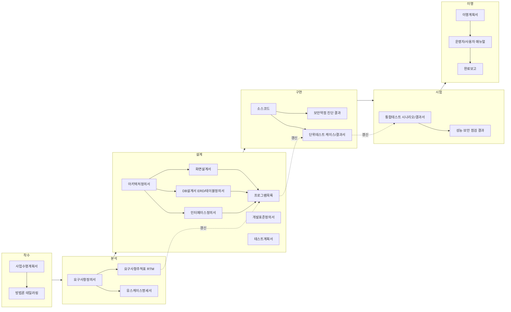
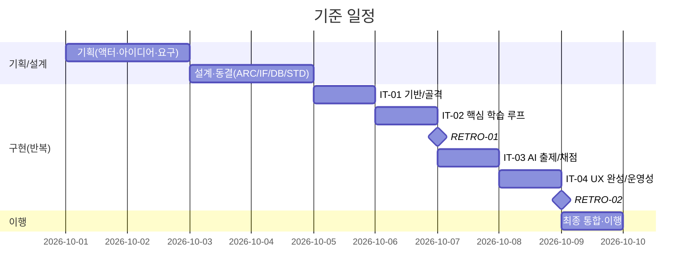
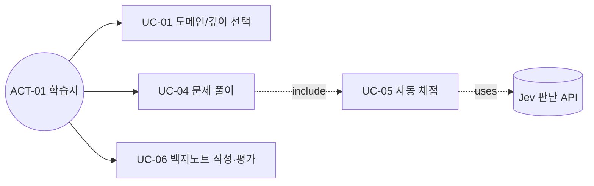
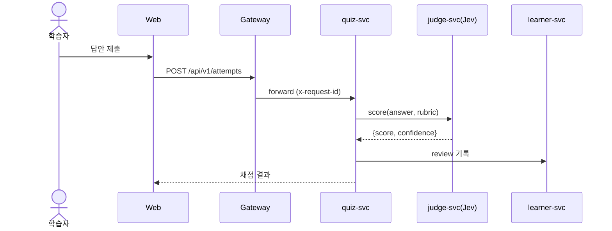
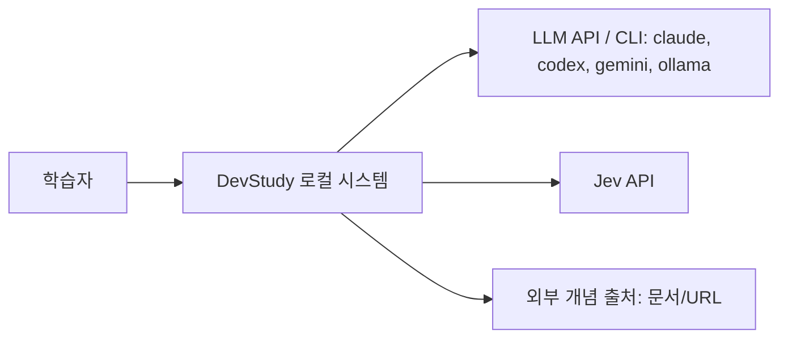
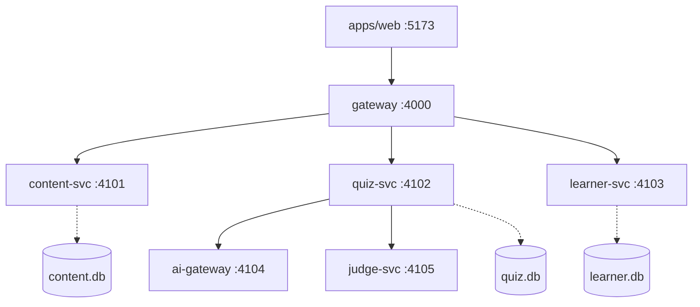
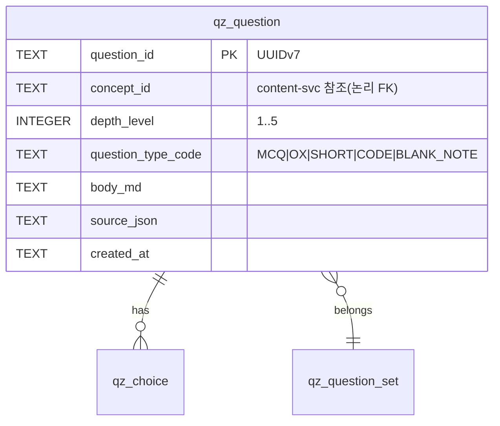
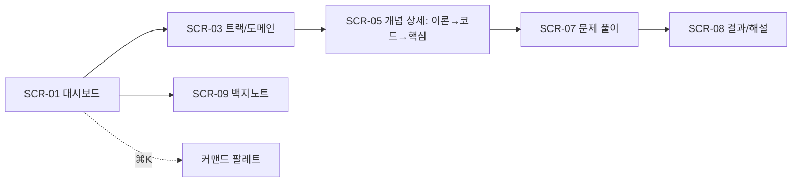
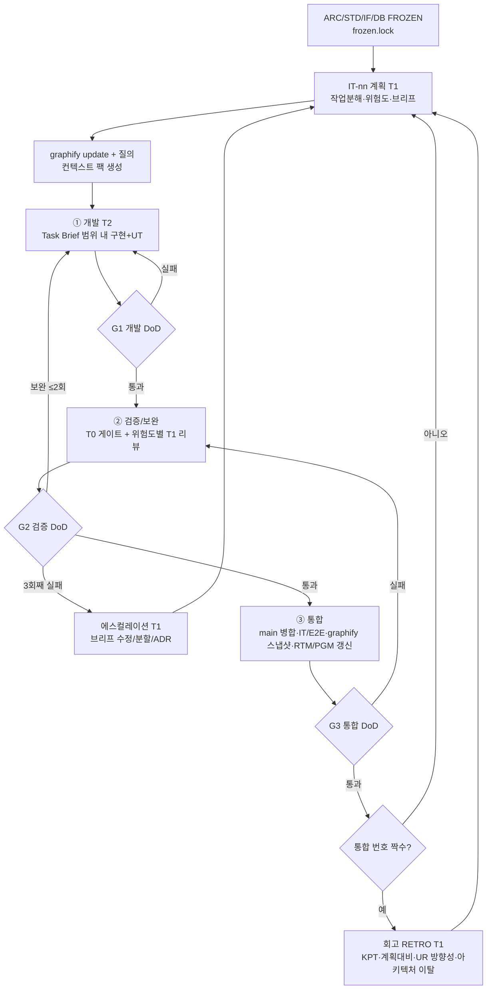
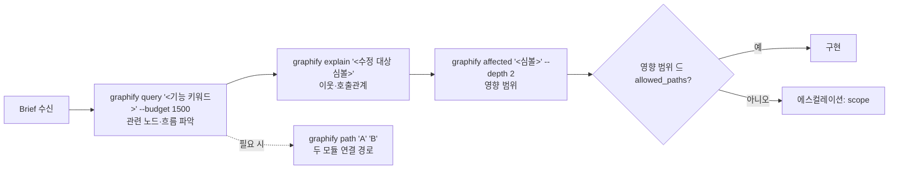

# R6. SI 산출물 체계 · 개발표준 · 반복 개발 프로세스 연구 (SI Deliverables & Process)

> 문서 ID: `RSH-R6` · 작성: 상위 모델(기획/아키텍트 역할) · 기준일: 2026-09-30
> 추적: **UR-07**(SI 산출물·개발표준정의서), **UR-03**(개발→검증/보완→통합, 회고), **UR-05**(아키텍처 동결·순서 불변), **UR-06**(모델 배분), **UR-09**(graphify), 보조: UR-08(서비스 분리), UR-15/16(AI 연동·Jev), UR-17(운영성), UR-18(계획 검증 후 즉시 코딩)
> 본 문서는 **복사해서 바로 쓰는 린(lean) 템플릿**을 제공한다. 템플릿은 `~~~markdown` 블록 안에 있으며, 내부 Mermaid는 ```` ```mermaid ```` 로 작성되어 있다.

---

## 0. 결론 요약 (TL;DR)

1. **테일러링 원칙**: 한국 공공/대기업 SI 방법론의 5단계(분석→설계→구현→시험→이행) + 착수 단계 산출물 중, *추적성(traceability)과 품질 게이트에 기여하는 것만* 남기고 나머지는 병합·자동화한다. 최종 **17종 산출물 → 12개 파일 + 반복(Iteration) 기록 3종**으로 축소.
2. **추적 체인**: `UR → (SFR/PER/SER/…)요구사항 → UC → ARC/IF/TBL/SCR → PGM → UT/IT → INT` 를 **요구사항추적표(RTM) 1개 파일**로 관리하고, *통합(Integration) DoD에 RTM 갱신을 필수로* 넣어 문서가 코드와 함께 늙게 한다.
3. **요구사항 ID**는 조달청/행안부 제안요청서(RFP) 요구사항 분류 체계(SFR·PER·SIR·DAR·TER·SER·QUR·COR)를 차용한다 → 사용자가 SK 계열 SI 현장 문서와 동일한 어휘를 익힘(UR-07, 사용자 상황).
4. **개발표준정의서(STD)** 는 전자정부 표준프레임워크(eGovFrame)의 계층 명명(Controller/Service/ServiceImpl/DAO/VO, `select/insert/update/delete` 동사)과 공공데이터 공통표준용어의 *속성분류어(class word)* 개념을 **TypeScript/Fastify/SQLite 세계로 번역**한 규칙으로 작성한다(§5).
5. **시큐어코딩**: 행안부 「소프트웨어 보안약점 진단가이드(2021.11)」 **49개 항목 전체**를 Node/TS 적용성으로 재분류(§6). 로컬 앱 특화 위험 — **LLM CLI 호출 시 OS 명령어 삽입**, **개념 가져오기(UR-13)의 SSRF**, **로컬 서버의 DNS rebinding/CSRF**, **FTS5 MATCH 구문 삽입**, **개념 선수관계 그래프의 무한 재귀** — 를 핵심 5대 리스크로 지정.
6. **반복 프로세스**: `개발(하위 모델) → 검증/보완(결정적 게이트 + 위험도별 상위 모델 리뷰, 보완 최대 2회) → 통합(메인 병합·IT/E2E·graphify 갱신·RTM 갱신·통합기록)`. **통합 2회마다 회고(상위 모델)**: KPT + 계획 대비 실적 + UR-01~18 방향성·구현성 점검 + graphify 기반 아키텍처 이탈(drift) 점검(§7).
7. **모델 배분**: T1(상위: 기획·설계·리뷰·회고·ADR 판정) / T2(하위: 코드·테스트·리팩터링) / T0(결정적 도구: tsc·biome·vitest·경계검사·graphify). 코딩 에이전트는 **Task Brief**(허용 경로·금지 경로·컨텍스트 팩·수용기준·에스컬레이션 조건·완료 보고 JSON)로만 움직이며, 동결 아키텍처는 `frozen.lock` 해시 검사 + import 경계 검사로 **기계적으로** 보호한다(§8).
8. **graphify**: `--code-only`(LLM 불필요, 결정적) 루트 그래프 1개를 `graphify-out/`에 두고 **gitignore**, 통합 시점마다 `GRAPH_REPORT.md`+지표 JSON만 `docs/40-impl/graph/INT-nn/`에 **스냅샷 커밋**. 에이전트는 코드 수정 전 `query → explain → affected` 3단 질의 결과를 Task Brief의 컨텍스트 팩에 첨부(§9).

---

## 1. 조사 범위와 근거 (Sources & Confidence)

| 항목 | 근거 | 신뢰도 |
|---|---|---|
| 보안약점 49개 항목명·분류 | 행안부 「소프트웨어 보안약점 진단가이드」(2021.11.30, 공공데이터포털 15049185), 「소프트웨어 개발보안 가이드」(2021.12.29, 15049187). **항목명은 eGovFrame 공식 문서 저장소(`eGovFramework/egovframe-docs` → `implementation-tool/code-inspection.md`의 "개발환경의 보안 항목별 관련 룰 보유 여부" 표)와 교차 확인**. 2021 개정 시 47→49개, 신규 6개(입력 3·보안기능 2·코드오류 1) | 높음 |
| 설계단계 보안요구항목 20개 | 「소프트웨어 개발보안 가이드」 분석·설계 단계 보안요구항목 — **전문가 지식 기반 재구성**(원문 PDF는 egress 차단으로 직접 대조 못함) | 중 |
| eGovFrame 계층·코드 생성 규칙 | `egovframe-docs/implementation-tool/code-generation-template-crud.md`(Mapper/VO/DAO/Service/ServiceImpl/Controller 생성 구조) 직접 확인 + 실무 관례(메서드 `selectXxxList` 등) | 높음/중 |
| RFP 요구사항 분류(SFR, PER, SIR, DAR, TER, SER, QUR, COR, PMR, PSR, ECR) | 조달청·행안부 제안요청서 작성 관례 — 전문가 지식 | 중상 |
| SI 단계별 산출물 구성 | 국내 대형 SI 방법론(공공 정보시스템 감리 점검 기준의 단계 산출물 구조) — 전문가 지식, 사별 명칭 차이 존재 | 중상 |
| graphify CLI | 컨테이너 설치본 `graphify --help` 실측(0.9.72): `extract --code-only`, `update [--force]`, `query --budget`, `explain`, `path`, `affected --depth`, `god-nodes --json`, `export callflow-html`, `claude/codex install`, `hook install`, `save-result`, `reflect` | 높음 |
| Node/TS 적용 방안 | 전문가 지식(Node 22, Fastify 5, `node:sqlite`, zod 4) | 높음 |

> KISA는 **「JavaScript 시큐어코딩 가이드(2022)」** 도 발간했다(ISAC 게시, 본 환경에서 원문 접근 차단). §6의 Node 대응 방안은 이 가이드의 취지와 일치하도록 작성했으며, 설계 단계에서 원문 입수 가능 시 항목 대조를 권고한다.

---

## 2. 한국 SI 방법론 개요와 테일러링 원칙

### 2.1 SI 표준 공정과 산출물 흐름



- 공공 SI는 「행정기관 및 공공기관 정보시스템 구축·운영 지침」(행안부 고시)에 따라 **요구사항 명확화, SW 개발보안(보안약점 제거), 감리(요구정의·설계·종료 단계)** 가 사실상 의무이고, 감리인은 "요구사항 → 설계 → 구현 → 시험"의 **추적성**과 **표준 준수**를 가장 먼저 본다. 즉 SI 산출물의 본질은 *종이*가 아니라 **추적성·검증 가능성·표준 준수의 증거**다.
- 민간 대형 SI(그룹사 SI 포함)도 사별 방법론 명칭만 다를 뿐 동일 구조를 쓰며, 착수 시 **방법론 테일러링 결과서**로 "어떤 산출물을 필수/선택/생략할지"를 합의한다. 본 프로젝트도 이 관행을 따라 §3의 테일러링 표 자체를 *테일러링 결과서*로 삼는다.

### 2.2 린(Lean) 테일러링 5원칙 (솔로 + AI 에이전트)

| # | 원칙 | 적용 |
|---|---|---|
| L1 | **추적성 우선** — 모든 산출물은 상위 ID를 참조해야 존재 이유가 있다 | 모든 템플릿 헤더에 `Trace:` 필드 필수 |
| L2 | **코드가 곧 문서인 곳은 코드에 둔다** | API 스키마 = `packages/contracts` zod 스키마, 단위테스트케이스 = vitest `describe('UT-…')`, 테이블정의서 = 마이그레이션 SQL + 자동 생성 표 |
| L3 | **자동 생성 가능한 결과서는 생성한다** | 단위/통합 테스트 결과서, 프로그램목록 초안, 그래프 지표는 스크립트 생성 |
| L4 | **문서는 게이트에 묶는다** | 통합 DoD에 RTM·프로그램목록 갱신이 없으면 통합 불가 |
| L5 | **1 산출물 = 1 파일, 파일당 목적 1개** | 병합 산출물은 섹션으로 구분(예: 테스트계획서에 성능·보안 점검 계획 포함) |

### 2.3 요구사항 분류 체계 (RFP 관례 차용)

| 코드 | 공공 RFP 분류 | 본 프로젝트 사용 | 예시 |
|---|---|---|---|
| SFR | 기능 요구사항 | ● | `SFR-QZ-003` 개념 기반 문제 자동 생성 |
| PER | 성능 요구사항 | ● | `PER-002` 비AI API p95 < 150ms |
| SIR | 인터페이스 요구사항 | ● | `SIR-003` Claude/Codex/Gemini CLI 어댑터 |
| DAR | 데이터 요구사항 | ● | `DAR-001` 개념 콘텐츠 팩 스키마·출처 표기 |
| TER | 테스트 요구사항 | ● | `TER-001` 서비스별 도메인 커버리지 ≥ 80% |
| SER | 보안 요구사항 | ● | `SER-004` 로컬 바인딩 127.0.0.1 한정 |
| QUR | 품질 요구사항 | ● | `QUR-002` WCAG 2.2 AA 대비, 키보드 전 기능 |
| COR | 제약사항 | ● | `COR-001` 로컬 실행, 네이티브 빌드 의존성 금지 |
| PMR | 프로젝트 관리 요구사항 | ○(프로세스 문서로 대체) | 본 문서 §7 |
| PSR | 프로젝트 지원 요구사항 | ○(이행계획서로 대체) | 설치·백업 가이드 |
| ECR | 시스템 장비 구성 | ✕(로컬) | — |

ID 규칙: `<분류>-<영역>-<NNN>` (영역은 서비스 약어, 공통은 생략). 예) `SFR-LRN-012`, `SER-007`.

---

## 3. 산출물 목록과 테일러링 결정 (= 테일러링 결과서)

### 3.1 단계별 산출물 표

| 단계 | 산출물(원형) | 문서 ID | 결정 | 린 형태 / 경로 | 작성 주체(모델) | 트리거 |
|---|---|---|---|---|---|---|
| 착수 | 사업수행계획서 | PLN-01 | **축약** | `docs/10-plan/PLN-01-project-plan.md` (범위·마일스톤·역할=에이전트·위험·품질계획) | T1 | 기획 완료 시 |
| 착수 | 방법론 테일러링 결과서 | PLN-02 | **병합** | 본 절(§3) 표를 그대로 사용 | T1 | — |
| 분석 | 요구사항정의서 | REQ-01 | **필수** | `docs/20-analysis/REQ-01-requirements.md` | T1 | 액터/아이디어 확정 후 |
| 분석 | 유스케이스명세서 | UC-01 | **필수(핵심 UC만)** | `docs/20-analysis/UC-01-usecases.md` (Must 요구의 UC만 상세, 나머지는 목록) | T1 | REQ 후 |
| 분석 | 요구사항추적표(RTM) | RTM-01 | **필수·상시** | `docs/20-analysis/RTM-01-traceability.md` | T1 작성, T2 갱신 | 매 통합 |
| 분석 | 현행시스템분석서 | — | 생략 | 신규 구축(대신 R3 벤치마크 연구가 대체) | — | — |
| 설계 | 아키텍처정의서 | ARC-01 | **필수·동결 대상** | `docs/30-design/ARC-01-architecture.md` | T1 | 설계 |
| 설계 | 아키텍처 결정기록(ADR) | ADR-nnn | **필수(추가)** | `docs/30-design/adr/ADR-001-*.md` | T1 | 결정/변경 시 |
| 설계 | 인터페이스정의서 | IF-01 | **필수** | `docs/30-design/IF-01-interfaces.md` + `packages/contracts` (정본) | T1 | 설계 |
| 설계 | 데이터베이스설계서(ERD·테이블정의서) | DB-01 | **필수** | `docs/30-design/DB-01-database.md` + `services/*/migrations/*.sql`(정본) | T1 | 설계 |
| 설계 | 데이터수집계획서 | DCP-01 | **필수(UR-02)** | `docs/30-design/DCP-01-data-collection.md` (R4/R2 연계) | T1 | 설계 |
| 설계 | 화면설계서(스토리보드) | SCR-01 | **필수** | `docs/30-design/SCR-01-screens.md` (+ 선택: HTML 프로토타입) | T1 | 설계 |
| 설계 | 프로그램목록 | PGM-01 | **필수·상시** | `docs/30-design/PGM-01-programs.md` | T1 초안, T2 갱신 | 매 통합 |
| 설계 | 개발표준정의서 | STD-01 | **필수·동결 대상** | `docs/30-design/STD-01-dev-standard.md` (§5) | T1 | 설계 |
| 설계 | 테스트계획서(단위/통합/성능/보안) | TST-01 | **병합** | `docs/30-design/TST-01-test-plan.md` | T1 | 설계 |
| 구현 | 소스코드 | — | 필수 | `apps/*`, `services/*`, `packages/*` | T2 | 반복 |
| 구현 | 단위테스트케이스 | UT | **코드 내장** | `*.test.ts`, `describe('UT-QZ-003 …')` | T2 | 반복 |
| 구현 | 단위테스트결과서 | UTR-nn | **자동 생성** | `docs/50-test/UTR-INT-nn.md` (vitest JSON → md) | T0 | 매 통합 |
| 구현 | 보안약점 진단 결과 | SEC-nn | **체크리스트 + 자동 점검** | `docs/50-test/SEC-INT-nn.md` | T0 + T1 | 짝수 통합(회고 전) |
| 시험 | 통합테스트시나리오 | ITS-01 | **필수** | `docs/50-test/ITS-01-integration-scenarios.md` (+ `tests/integration`, `tests/e2e`) | T1 시나리오, T2 코드 | 설계/반복 |
| 시험 | 통합테스트결과서 | ITR-nn | **자동 생성 + 판정** | `docs/50-test/ITR-INT-nn.md` | T0 + T1 | 매 통합 |
| 시험 | 성능 점검 결과 | PRF-nn | **축약** | `docs/50-test/PRF-INT-nn.md` | T0 | 짝수 통합 |
| 이행 | 이행계획서 | TRN-01 | **축약(로컬 설치·업그레이드·백업)** | `docs/60-transition/TRN-01-transition-plan.md` | T1 | 마지막 반복 전 |
| 이행 | 운영자/사용자 매뉴얼 | MAN-01 | **축약** | `README.md` + `docs/60-transition/MAN-01-operations.md` | T2 | 최종 |
| 반복 | 반복 계획(Iteration Plan) | IT-nn | **추가** | `docs/40-impl/iterations/IT-nn-plan.md` | T1 | 반복 시작 |
| 반복 | 통합 기록(Integration Record) | INT-nn | **추가** | `docs/40-impl/integrations/INT-nn.md` | T1 판정, T0 수집 | 매 통합 |
| 반복 | 회고서(Retrospective) | RETRO-nn | **추가(UR-03)** | `docs/90-retro/RETRO-nn.md` | T1 | 통합 2회마다 |

### 3.2 ID 체계 (추적 키)

| 종류 | 패턴 | 예 | 정본 위치 |
|---|---|---|---|
| 원 요구 | `UR-nn` | UR-13 | 00-brief |
| 요구사항 | `<SFR/PER/SIR/DAR/TER/SER/QUR/COR>-[SVC-]nnn` | SFR-QZ-003 | REQ-01 |
| 유스케이스 | `UC-nn` | UC-04 | UC-01 |
| 아키텍처 요소 | `ARC-<SVC>` / 품질 시나리오 `QAS-nn` | ARC-QZ, QAS-03 | ARC-01 |
| 인터페이스 | `IF-<SVC>-nnn`(서비스 API), `IF-EXT-nnn`(외부) | IF-QZ-004, IF-EXT-002 | IF-01/contracts |
| 테이블 | `TBL-<svc>_<entity>` | TBL-qz_question | DB-01 |
| 화면 | `SCR-nn` | SCR-07 | SCR-01 |
| 프로그램 | `PGM-<SVC>-nnn` | PGM-QZ-012 | PGM-01 |
| 단위테스트 | `UT-<SVC>-nnn` | UT-QZ-031 | 코드 |
| 통합테스트 | `IT-nnn` / E2E `E2E-nnn` | IT-014 | ITS-01 |
| 작업 | `T-<IT>-nn` | T-03-07 | IT-nn-plan |
| 결정 | `ADR-nnn` / 변경요청 `CR-nnn` | ADR-004 | adr/ |
| 서비스 약어(예시) | GW(gateway), CT(content), QZ(quiz), LRN(learner/SRS), AI(ai-gateway), JDG(judge/Jev) | — | **ARC-01에서 확정** |

> 서비스 약어는 이 문서에서 *예시*일 뿐이며, 실제 서비스 분할(UR-08)은 아키텍처정의서에서 확정·동결된다.

### 3.3 문서 폴더 구조

```
docs/
  00-brief/            # 원천 요구 (불변)
  00-research/         # R1~R6 연구
  10-plan/             # PLN-01, 액터·아이디에이션 결과
  20-analysis/         # REQ-01, UC-01, RTM-01
  30-design/           # ARC-01, IF-01, DB-01, DCP-01, SCR-01, PGM-01, STD-01, TST-01, frozen.lock
    adr/               # ADR-nnn
  40-impl/
    iterations/        # IT-nn-plan.md, briefs/T-nn-mm.md
    integrations/      # INT-nn.md
    graph/INT-nn/      # GRAPH_REPORT.md, metrics.json (graphify 스냅샷)
  50-test/             # ITS-01, UTR/ITR/SEC/PRF-INT-nn
  60-transition/       # TRN-01, MAN-01
  90-retro/            # RETRO-nn.md
```

---

## 4. 산출물별 목적 · 필수 섹션 · 린 템플릿

### 4.1 사업수행계획서 (PLN-01)

- **목적**: 범위·일정·조직·품질·위험을 한 장에 합의. 감리에서 "계획 대비 실적" 비교의 기준선(baseline). → 회고의 *plan-vs-actual* 기준.
- **필수 섹션**: 목표/범위(In/Out) · 마일스톤 · 수행 조직(=에이전트 역할과 모델 티어) · 품질관리 계획(게이트) · 위험관리 · 산출물 목록(§3 참조).

~~~markdown
# PLN-01 사업수행계획서
Trace: UR-01..UR-18 | 상태: Draft/Baselined(YYYY-MM-DD) | 작성: T1

## 1. 목표와 범위
- 목표(측정 가능): 예) 10개 도메인 × 5단계 깊이 커리큘럼으로 학습/출제/복습 루프 동작
- In-scope: …
- Out-of-scope: 다중 사용자, 클라우드 배포, 결제 …

## 2. 마일스톤 (Baseline)


## 3. 수행 조직 (에이전트 역할)
| 역할 | 모델 티어 | 책임 | 산출물 |
|---|---|---|---|
| PM/아키텍트 | T1 | 계획·설계·동결·회고 | PLN, ARC, ADR, RETRO |
| 리뷰어 | T1 | R2/R3 diff 리뷰, 통합 판정 | INT 판정 |
| 개발자(서비스별) | T2 | 코드·단위테스트 | 소스, UT |
| QA 자동화 | T0/T2 | 게이트 실행, 결과서 생성 | UTR, ITR |

## 4. 품질관리 계획
- 게이트: G1 개발 DoD → G2 검증 DoD → G3 통합 DoD (PRC §7)
- 품질 지표: 게이트 1회 통과율, 보완 라운드 수, 커버리지, 경계 위반 0

## 5. 위험관리
| ID | 위험 | 확률 | 영향 | 대응 | 트리거 |
|---|---|---|---|---|---|
| RSK-01 | 하위 모델의 아키텍처 이탈 | 중 | 상 | frozen.lock+경계검사, Brief 범위 제한 | 경계검사 실패 |

## 6. 산출물 목록 → docs/00-research/R6-si-process.md §3 준용
~~~

### 4.2 요구사항정의서 (REQ-01)

- **목적**: 무엇을 만들지 *검증 가능한 문장*으로 확정. 모든 후속 산출물의 부모.
- **필수 섹션**: 액터 요약 · 요구사항 목록(분류별) · 수용기준(Given/When/Then) · 우선순위(MoSCoW) · 출처(UR/액터) · 검증방법(T=Test, I=Inspection, A=Analysis, D=Demonstration) · 변경이력.
- **품질 기준(ISO/IEC/IEEE 29148 차용)**: 원자성(1요구=1동작), 검증가능성(수치/관찰 가능), 모호어 금지("빠르게", "적절히", "등" 금지), 추적성(출처 필수), 구현 비의존(해결책이 아닌 필요를 기술).

~~~markdown
# REQ-01 요구사항정의서
Trace: UR-01..UR-18, PLN-01 | 버전: v1.0 | 상태: Draft/Frozen

## 1. 액터
| 액터 ID | 이름 | 설명 | 핵심 목표 |
|---|---|---|---|
| ACT-01 | 주니어 풀스택(1~3년차) | … | … |

## 2. 요구사항 목록
| ID | 분류 | 요구사항명 | 상세 설명 | 수용기준 (G/W/T) | 우선 | 출처 | 검증 | 상태 |
|---|---|---|---|---|---|---|---|---|
| SFR-QZ-003 | 기능 | 개념 기반 문제 생성 | 선택한 개념(1..n)과 깊이(L1~L5), 유형(객관식/OX/서술/코드)을 입력받아 문제를 생성한다 | G 개념 K와 L3 선택 / W 생성 요청 / T 30초 내 5문항, 각 문항에 concept_id·정답·해설·근거 출처 포함, 스키마 검증 100% 통과 | M | UR-13, ACT-01 | T | Draft |
| PER-002 | 성능 | 비AI API 응답 | 비AI 조회 API는 로컬에서 p95 150ms 이하 | 50k 개념 시드, autocannon 30s 측정 | S | UR-17 | T | Draft |
| SER-004 | 보안 | 로컬 바인딩 | 모든 서비스는 127.0.0.1에만 바인딩한다 | 0.0.0.0 리슨 시 부팅 실패 테스트 | M | UR-15 | T/I | Draft |

## 3. 비기능 요약 (품질 속성 → QAS로 연결)
## 4. 제약사항 (COR)
## 5. 용어집
## 6. 변경이력
| 버전 | 일자 | 변경 | CR/ADR |
~~~

### 4.3 유스케이스명세서 (UC-01)

- **목적**: 요구사항을 *액터–시스템 상호작용 흐름*으로 구체화 → 화면·인터페이스·통합테스트 시나리오의 원천.
- **필수 섹션**: UC 다이어그램 · UC별(액터, 트리거, 사전조건, 기본흐름, 대안흐름, 예외흐름, 사후조건, 업무규칙, 관련 SCR/IF) · 시퀀스.

~~~markdown
# UC-01 유스케이스명세서
Trace: REQ-01

## 0. 유스케이스 다이어그램


## UC-04 문제 풀이
| 항목 | 내용 |
|---|---|
| 액터 | ACT-01 |
| 관련 요구 | SFR-QZ-003, SFR-QZ-007 |
| 트리거 | 학습자가 세션 시작 |
| 사전조건 | 개념 1개 이상 선택, 문제 풀 ≥ 5 또는 AI 연결 가능 |
| 기본흐름 | 1. 시스템은 SRS 우선순위로 문항 N개 제시 2. 학습자 응답 3. 서버 채점(객관식: 결정적 / 서술: Jev score) 4. 피드백·해설 표시 5. FSRS 스케줄 갱신 |
| 대안흐름 | 3a. AI 미연결 → 결정적 채점 가능한 유형만 출제 |
| 예외흐름 | E1. 채점 API 타임아웃(3s) → "보류" 저장 후 백그라운드 재채점 |
| 사후조건 | review_log 1행 추가, 다음 복습일 갱신 |
| 업무규칙 | BR-07 채점은 서버에서만 수행(클라이언트 정답 판정 신뢰 금지) |
| 관련 | SCR-07, IF-QZ-004, IF-LRN-002, IT-014 |


~~~

### 4.4 요구사항추적표 (RTM-01)

- **목적**: *양방향 추적* — 순방향(요구→테스트, 누락 탐지), 역방향(코드→요구, 금도금(gold-plating) 탐지). 회고의 UR 방향성 점검 원천.
- **필수 섹션**: 추적 매트릭스 · 커버리지 요약(요구 중 테스트로 검증된 비율) · 고아(orphan) 목록.
- **운영 규칙**: 통합 DoD 항목. T2가 행 갱신, T1이 통합 판정 시 검토.

~~~markdown
# RTM-01 요구사항추적표
갱신: INT-nn | 커버리지: 검증완료 x / 전체 y (z%)

| UR | 요구 ID | UC | 설계(ARC/IF/TBL/SCR) | PGM | 테스트(UT/IT/E2E) | 반복 | 상태 |
|---|---|---|---|---|---|---|---|
| UR-13 | SFR-QZ-003 | UC-04 | IF-QZ-001, IF-EXT-002, TBL-qz_question, SCR-07 | PGM-QZ-004 | UT-QZ-010..014, IT-011 | IT-03 | ✅검증 |
| UR-14 | SFR-LRN-006 | UC-06 | IF-LRN-005, SCR-09 | PGM-LRN-008 | UT-LRN-020 | IT-02 | 🔄구현 |

상태: ⬜미착수 · 🔄구현 · 🧪검증중 · ✅검증 · ⛔보류(사유)

## 고아 목록
- 요구 없는 PGM: (없음이어야 함 — 있으면 금도금 의심, 회고 안건)
- 테스트 없는 Must 요구: …
~~~

### 4.5 아키텍처정의서 (ARC-01) — **동결 대상**

- **목적**: 서비스 분할(UR-08), 경계, 통신, 데이터 소유권, 횡단 관심사, 기술 스택을 확정하고 *동결 선언*으로 개발 순서를 고정(UR-05).
- **필수 섹션**: 품질 속성·제약 · 원칙 · C4 L1/L2 · 서비스 카탈로그 · 런타임 뷰 · 배포 뷰 · 데이터 소유권 · 횡단 관심사 · 스택/버전 고정 · 품질 시나리오(QAS) · ADR 목록 · **동결 기록**.

~~~markdown
# ARC-01 아키텍처정의서
Trace: REQ-01 (PER/SER/QUR/COR), UR-05, UR-08 | 상태: Draft → **FROZEN (YYYY-MM-DD, ADR-000)**

## 1. 품질 속성 우선순위 (ISO/IEC 25010)
1) 유지보수성(15년 사용 가정, UR-12) 2) 보안(로컬 비밀키) 3) 사용성(UR-17) 4) 성능 효율성 …

## 2. 아키텍처 원칙
- P1 서비스는 자기 데이터만 소유(database-per-service), 타 서비스 DB 직접 접근 금지
- P2 서비스 간 통신은 `packages/contracts`의 zod 스키마로 정의된 HTTP API만 사용
- P3 AI 호출은 ai-gateway 단일 경로(키·비용·재시도·캐시 집중)
- P4 판단(정오/분류/채점)은 Jev, 생성(문제/해설)은 LLM (UR-16)

## 3. 컨텍스트 (C4 L1)


## 4. 컨테이너/서비스 (C4 L2)

| 서비스 | 책임 | 소유 데이터 | 포트 | 호출 가능 대상 | 약어 |
|---|---|---|---|---|---|
| gateway | 라우팅·Host 검증·rate limit | — | 4000 | 전 서비스 | GW |

## 5. 런타임 뷰 (핵심 시나리오 2~3개 시퀀스)
## 6. 배포 뷰 (로컬 프로세스 / 선택: docker compose)
## 7. 데이터 아키텍처 (소유권 표, 동기화 방식: API 조회 vs 이벤트)
## 8. 횡단 관심사 (STD-01 참조: 로깅·오류·설정·보안·관측)
## 9. 기술 스택 & 버전 고정 (tech-stack-facts 기반, exact pin)
## 10. 품질 시나리오
| QAS | 자극 | 환경 | 응답 | 측정 |
|---|---|---|---|---|
| QAS-01 | LLM CLI 무응답 | 문제 생성 중 | 120s 타임아웃 후 프로세스 kill, 대체 제공자 시도 | 좀비 프로세스 0 |

## 11. ADR 목록
## 12. 동결 기록 (Freeze Record)
- 동결 대상 파일: ARC-01, STD-01, IF-01, DB-01(스키마 소유권), packages/contracts/**, 서비스 목록·포트
- frozen.lock 해시 생성일, 변경은 ADR + CR 로만
~~~

### 4.6 ADR (Architecture Decision Record)

~~~markdown
# ADR-004 <결정 제목>
상태: Proposed | Accepted | Superseded by ADR-0xx · 일자 · 결정자: T1
Trace: UR-xx, REQ ID, 관련 CR-nnn

## 맥락 (Context)
## 결정 (Decision)
## 대안 (Options considered) — 최소 2개, 각 장단점
## 결과 (Consequences) — 긍정/부정/후속 작업(영향받는 PGM, graphify affected 결과 첨부)
## 동결 영향 — frozen.lock 갱신 필요 여부, 영향 서비스
~~~

### 4.7 인터페이스정의서 (IF-01)

- **목적**: 서비스 간·외부 연동 계약의 단일 진실 공급원(SSOT). **정본은 `packages/contracts`의 zod 스키마**, 문서는 색인·행위 규약(타임아웃·멱등성·오류)을 기술.
- **필수 섹션**: 공통 규약(URL, 헤더, 오류 포맷, 페이지네이션, 버전) · 내부 API 목록 · 외부 연동(LLM API/CLI, Jev) · 이벤트(있다면).

~~~markdown
# IF-01 인터페이스정의서
Trace: ARC-01, REQ-01(SIR-*) | 정본: packages/contracts/src/**

## 1. 공통 규약
- Base: `/api/v1`, JSON, `application/problem+json`(RFC 9457) 오류
- 헤더: `x-request-id`(필수 전파), `idempotency-key`(POST 생성/AI 작업), `x-internal-token`(서비스 간)
- 페이지네이션: cursor(`?cursor=&limit=` ≤ 100)
- 타임아웃 기본: 내부 2s, Jev 3s, LLM 120s(비동기 작업)

## 2. 내부 API 목록
| IF ID | 제공 | 소비 | Method Path | 요청 스키마 | 응답 스키마 | 오류코드 | 멱등 | 타임아웃 | 관련 요구 |
|---|---|---|---|---|---|---|---|---|---|
| IF-QZ-001 | quiz | web | POST /api/v1/question-sets | CreateQuestionSetReq | JobAccepted(202) | QZ-VAL-001, QZ-EXT-001 | Y(key) | 2s(수락) | SFR-QZ-003 |

## 3. 외부 연동
| IF ID | 대상 | 방식 | 입력 | 출력 | 실패 처리 |
|---|---|---|---|---|---|
| IF-EXT-001 | Jev | HTTPS POST /v1/systemone (@typesafe-ai/sdk) | state, questions(noul/choice/score) | P(yes)/choice/score+confidence | 3s timeout → 보류 큐 |
| IF-EXT-002 | Claude CLI | spawn `claude -p --output-format json` (stdin 프롬프트) | prompt+JSON schema | JSON | 120s kill → 다음 provider |

## 4. 상세 (IF별)
### IF-QZ-001
- 설명 / 선행조건 / 요청 예시 / 응답 예시 / 오류 예시 / 시퀀스(mermaid)
~~~

### 4.8 데이터베이스설계서 (DB-01): ERD + 테이블정의서

- **목적**: 서비스별 데이터 소유권과 스키마. **정본은 마이그레이션 SQL**, 테이블정의서는 스크립트로 `PRAGMA table_info` 결과에서 생성 가능.
- **필수 섹션**: 서비스별 ERD(Mermaid `erDiagram`) · 테이블정의서(컬럼·타입·NULL·기본값·키·설명·표준용어) · 인덱스/FTS · 마이그레이션 정책 · 데이터 보존/백업.

~~~markdown
# DB-01 데이터베이스설계서
Trace: ARC-01 §7, REQ-01(DAR-*) | 정본: services/<svc>/migrations/NNNN_<desc>.sql

## quiz-svc (quiz.db)


### TBL-qz_question
| # | 컬럼 | 타입 | NULL | 기본값 | 키 | 설명 | 표준 클래스워드 |
|---|---|---|---|---|---|---|---|
| 1 | question_id | TEXT | N | — | PK | UUIDv7 | _id |
| 2 | concept_id | TEXT | N | — | 논리FK(content) | 개념 | _id |
| 3 | depth_level | INTEGER | N | 1 | CHECK 1..5 | 깊이 | _level |
| 4 | question_type_code | TEXT | N | — | CHECK IN(...) | 유형 | _code |
| 5 | is_active | INTEGER | N | 1 | CHECK 0/1 | 사용여부 | is_ (≒ _YN) |
| 6 | created_at | TEXT | N | strftime('%Y-%m-%dT%H:%M:%fZ') | — | 생성일시 | _at (≒ _DT) |

인덱스: `ix_qz_question__concept_id_depth_level`
FTS: `qz_question_fts` (fts5, tokenize='trigram') — external content

## 마이그레이션 정책
- 전진 전용(forward-only), 번호 4자리, 적용 이력 `_migration` 테이블, 부팅 시 자동 적용, 적용 전 `.backup` 스냅샷
~~~

### 4.9 화면설계서 / 스토리보드 (SCR-01)

- **목적**: 화면 단위의 구성·상태·상호작용을 확정(UR-04, UR-17). 디자인 토큰은 별도(디자인 연구 R-문서) 참조.
- **필수 섹션**: 화면 목록/내비게이션 맵 · 화면별(목적, 진입 경로, 와이어프레임, 컴포넌트, **상태 4종: empty/loading/error/success**, 인터랙션·단축키, 접근성, 관련 IF) · 공통 레이아웃.

~~~markdown
# SCR-01 화면설계서
Trace: UC-01, REQ-01(QUR-*), 디자인 토큰 문서

## 1. 내비게이션 맵


## SCR-07 문제 풀이
| 항목 | 내용 |
|---|---|
| 목적 | 한 문항에 집중, 즉시 피드백 |
| 진입 | SCR-05 "문제 풀기", 대시보드 "오늘의 복습" |
| 관련 | UC-04, IF-QZ-004, SFR-QZ-007 |

와이어프레임
```
┌──────────────────────────────────────────────┐
│ ← 세션명      3 / 10 ▓▓▓░░░░░░░   ⏱ 01:23   ⋯ │
├──────────────────────────────────────────────┤
│ [L3·Backend·트랜잭션 격리]                    │
│ Q. REPEATABLE READ에서 발생 가능한 이상 현상은? │
│  (A) … (B) … (C) … (D) …                      │
│ [확신도: 모름 | 애매 | 확실]                   │
│                         [건너뛰기] [제출 ⏎]    │
└──────────────────────────────────────────────┘
```
| 상태 | 표시 |
|---|---|
| loading | 스켈레톤 3줄, 200ms 이후 표시 |
| empty | "출제 가능한 문항 없음 → AI 생성" CTA |
| error | 인라인 경고 + 재시도, request-id 복사 |
| success | 정오 색상+아이콘(색상 단독 의존 금지), 해설 펼침 |

인터랙션: 1~4 선택, Enter 제출, Space 해설, ? 단축키 도움말
접근성: 포커스 링, aria-live="polite" 결과 안내, 대비 4.5:1
~~~

### 4.10 프로그램목록 (PGM-01)

- **목적**: 구현 단위 인벤토리 = 작업 분배·진척·추적의 기준. SI에서 "프로그램 ID"는 개발자 할당과 진척률 산정의 기본 단위.
- **린 규칙**: 1 PGM = 1 유스케이스 단계를 수행하는 엔드포인트/화면/배치/라이브러리 모듈. 초안은 T1이 설계에서 작성, 경로·상태는 통합 시 T2가 갱신(선택: graphify 노드와 대조하여 누락 검출).

~~~markdown
# PGM-01 프로그램목록
갱신: INT-nn | 진척: 완료 a / 전체 b

| PGM ID | 프로그램명 | 유형(API/UI/JOB/LIB) | 서비스 | 경로 | 관련 요구/IF/SCR | 반복 | 담당 티어 | 위험도 | 상태 |
|---|---|---|---|---|---|---|---|---|---|
| PGM-QZ-004 | 문제세트 생성 | API | quiz | services/quiz/src/routes/question-set.routes.ts | SFR-QZ-003 / IF-QZ-001 | IT-03 | T2 | R3 | ✅ |
| PGM-WEB-007 | 문제 풀이 화면 | UI | web | apps/web/src/routes/session/$id.tsx | SCR-07 | IT-02 | T2 | R1 | 🔄 |
~~~

### 4.11 테스트계획서 (TST-01) — 단위·통합·성능·보안 병합

- **필수 섹션**: 테스트 레벨·범위 · 도구 · 진입/종료 기준 · 커버리지 목표 · 테스트 데이터 · 성능 점검 계획 · 보안 점검 계획 · 결함 관리(심각도 정의).

~~~markdown
# TST-01 테스트계획서
Trace: REQ-01(TER/PER/SER), ARC-01

## 1. 레벨
| 레벨 | 도구 | 대상 | 실행 시점 | 종료 기준 |
|---|---|---|---|---|
| 단위(UT) | vitest | domain/application | 매 커밋(G1) | 신규 로직 100% 테스트 존재, domain 라인 ≥ 80% |
| 계약(CT) | vitest + zod | contracts ↔ 핸들러 | G2 | 계약 스키마 전수 검증 |
| 통합(IT) | vitest + fastify.inject / 실프로세스 | 서비스 간 | G3 | ITS 대상 시나리오 100% 통과 |
| E2E | Playwright | 핵심 UC 흐름 | G3 | 스모크 100%, 전체 ≥ 95% (flaky 격리) |
| 성능(PRF) | autocannon, Lighthouse CI(선택) | PER-* | 짝수 통합 | PER 목표 충족 |
| 보안(SEC) | 체크리스트(§6) + pnpm audit + secret scan + 커스텀 lint | SER-* | 짝수 통합 | High 0, Medium 사유 기재 |

## 2. 결함 심각도
S1 기능불가/데이터손상 · S2 주요기능 오동작 · S3 우회 가능 · S4 외관
통합 차단: S1/S2 미해결
## 3. 테스트 데이터: 시드 팩(개념 50k 합성), AI 응답 녹화 fixture(네트워크 없는 결정적 테스트)
~~~

### 4.12 단위테스트케이스 / 결과서 (UT, UTR)

- **케이스 = 코드**: `describe('UT-QZ-012 채점: 부분점수 루브릭', …)`. 케이스 ID가 이름에 들어가야 RTM에서 grep 추적 가능.
- **결과서 = 자동 생성**: `vitest run --reporter=json --outputFile=.reports/ut.json` → 스크립트가 서비스별 통과/실패/커버리지 표로 변환.

~~~markdown
# UTR-INT-03 단위테스트결과서 (자동 생성)
실행: 2026-10-05T12:00Z · 커밋: abc1234 · 명령: pnpm -w test:ci

| 서비스 | 케이스 | 통과 | 실패 | 건너뜀 | 라인 커버리지(domain/전체) |
|---|---|---|---|---|---|
| quiz | 84 | 84 | 0 | 0 | 88% / 71% |

## 실패/건너뜀 상세 (사유 필수)
## 신규 케이스 → 요구 매핑 (RTM 반영 대상)
~~~

### 4.13 통합테스트 시나리오 / 결과서 (ITS-01, ITR)

~~~markdown
# ITS-01 통합테스트시나리오
Trace: UC-01, IF-01

| IT ID | 시나리오 | 관련 UC/IF | 사전조건 | 절차 | 기대결과 | 자동화 위치 | 우선 |
|---|---|---|---|---|---|---|---|
| IT-011 | 개념→AI 문제생성→저장→조회 | UC-04 / IF-QZ-001, IF-EXT-002 | AI fixture 모드 | 1) POST question-sets 2) job 폴링 3) GET | 5문항, 스키마 유효, concept_id 일치 | tests/integration/qz-generate.it.test.ts | M |
| E2E-003 | 복습 세션 완주 | UC-04 | 시드 | Playwright | 결과 화면, 다음 복습일 표시 | tests/e2e/review.spec.ts | M |
~~~

~~~markdown
# ITR-INT-03 통합테스트결과서
| IT ID | 결과 | 소요 | 결함 ID | 비고 |
|---|---|---|---|---|
| IT-011 | PASS | 1.8s | — | |
판정(T1): 통합 가능 / 조건부(사유) / 불가
~~~

### 4.14 성능·보안 점검 결과 (PRF, SEC)

~~~markdown
# PRF-INT-04 성능 점검 결과
| PER ID | 대상 | 조건 | 목표 | 측정 | 판정 |
|---|---|---|---|---|---|
| PER-002 | GET /api/v1/concepts?q= | 50k 개념, FTS trigram, 10 conn 30s | p95 < 150ms | p95 42ms | PASS |
| PER-005 | 웹 초기 로드 | 로컬 프로덕션 빌드 | LCP < 1.5s, JS < 250KB gz | … | |
~~~

~~~markdown
# SEC-INT-04 보안약점 진단 결과
기준: 행안부 보안약점 49개(§6 적용표) + LLM 특화 항목
| 항목 | 적용 | 점검 방법 | 결과 | 조치 |
|---|---|---|---|---|
| 운영체제 명령어 삽입 | 상 | 금지 API grep(exec, shell:true) + 코드리뷰(ai-gateway) | 적합 | — |
자동 점검: pnpm audit --prod (High 0) · secret scan (0) · 금지 API 스캔 (0)
~~~

### 4.15 이행계획서 (TRN-01) — 로컬 앱 버전

- **목적**: "설치 → 초기 데이터 적재 → 업그레이드 → 백업/복구 → 롤백"을 절차화(UR-15, UR-17 운영성).
- **필수 섹션**: 대상 환경(OS별) · 사전요건 · 설치 절차 · 초기 데이터(콘텐츠 팩) 적재 · 버전 업그레이드(마이그레이션) · 백업/복구 · 롤백 · 이행 점검표 · 운영 절차(로그 위치, 진단 명령).

~~~markdown
# TRN-01 이행계획서
## 1. 대상 환경: Windows 11 / macOS 14+ / Linux, Node ≥ 22.13, pnpm 10
## 2. 설치: `pnpm i --frozen-lockfile` → `pnpm setup:env` → `pnpm start`
## 3. 초기 데이터: `pnpm seed --pack core@x.y.z` (sha256 검증)
## 4. 업그레이드: 앱 종료 → 자동 백업(`data/backup/<ts>/*.db`) → 마이그레이션 → 헬스체크
## 5. 롤백: 이전 태그 체크아웃 + 백업 복원 (`pnpm db:restore <ts>`)
## 6. 이행 점검표
- [ ] 전 서비스 /healthz 200  - [ ] 127.0.0.1 바인딩 확인  - [ ] AI 제공자 연결 진단(`pnpm doctor`)
## 7. 운영: 로그 `data/logs/<svc>.log`(일 단위 회전, 14일 보관), 진단 `pnpm doctor`
~~~

---

## 5. 개발표준정의서 (STD-01) — 린 본문 초안

> 아래는 **STD-01 초안 본문** 그 자체다. 설계 단계에서 서비스 목록 확정 후 약어·포트만 채워 동결한다. 각 조항은 ID(`STD-xxx-nn`)를 가져 Task Brief에서 인용 가능하다.

### 5.1 eGovFrame 규칙의 TS 번역표 (참조 표준)

eGovFrame은 `Controller → Service(인터페이스) → ServiceImpl → DAO/Mapper → VO` 계층과 CRUD 동사(`select…List`, `select…`, `insert…`, `update…`, `delete…`), URL `.do` 접미, 패키지 `egovframework.<업무>.<서브>.service|service.impl|web` 구조를 표준으로 삼는다(코드 생성 템플릿이 Mapper·VO·DAO·Service·ServiceImpl·Controller·JSP를 일괄 생성). 본 프로젝트는 그 **계층 분리·동사 일관성·속성분류어 사상**을 유지하고 문법만 번역한다.

| eGovFrame(Java) | 본 프로젝트(TypeScript) | 비고 |
|---|---|---|
| 패키지 `egovframework.<biz>.<sub>.web` | `services/<svc>/src/routes/<entity>.routes.ts` | Fastify 플러그인 |
| `XxxController` | `registerXxxRoutes(app)` | 입출력 변환·검증만 |
| `XxxService` + `XxxServiceImpl` | `application/<entity>.service.ts` (`createXxxService(deps)` 팩토리) | 인터페이스 분리는 외부 포트(port)에만 |
| `XxxDAO` / `XxxMapper`(.xml) | `infra/<entity>.repository.ts` (`XxxRepository`) + SQL 상수 | prepared statement 전용 |
| `XxxVO` / `XxxDefaultVO` | `domain/<entity>.ts`(`type Xxx`) + `contracts`의 `XxxSchema`/`XxxDto` | DB 행 타입 `XxxRow` |
| `selectXxxList` / `selectXxx` | Repository `findMany` / `findById` · Service `listXxx` / `getXxx` | |
| `insertXxx` / `updateXxx` / `deleteXxx` | Repository `insert` / `update` / `delete` · Service `createXxx` / `updateXxx` / `removeXxx` | |
| URL `/xxx/selectXxxList.do` | `GET /api/v1/xxxs` | REST 명사 복수 |
| 테이블 접두 `COMTN…`(공통컴포넌트) | `<svc>_<entity>` (예: `qz_question`) | 소유 서비스 식별 |
| 공통표준용어 속성분류어 `_ID _NM _CD _YN _DT _CN _CNT _SN` | `_id _name _code is_ _at/_date _md/_text _count _seq` | 영문 풀워드 + 클래스워드 접미 |
| EgovInspectionRules(PMD) | Biome 규칙 + 커스텀 금지 API 스캔 | §6.3 |

### 5.2 STD 조항 (복사용 본문)

~~~markdown
# STD-01 개발표준정의서
Trace: UR-07, ARC-01 | 상태: FROZEN(YYYY-MM-DD) | 변경: ADR 필수

## STD-GEN 일반
- STD-GEN-01 언어: TypeScript(strict, noUncheckedIndexedAccess, exactOptionalPropertyTypes), ESM only, Node ≥ 22.13
- STD-GEN-02 린트/포맷: Biome(`biome ci`) 경고 0. `// biome-ignore` 사용 시 사유 주석 필수
- STD-GEN-03 의존성 추가는 Task Brief에 명시된 경우만. 버전 exact pin, 네이티브 빌드 패키지 금지(COR-001)
- STD-GEN-04 함수 ≤ 60줄, 파일 ≤ 400줄 권고, 순환 import 금지

## STD-DIR 디렉터리
```
apps/web/src/{routes,features/<feature>/{components,hooks,api},components/ui,lib,styles}
services/<svc>/
  src/{index.ts, app.ts, config.ts,
       routes/, application/, domain/, infra/, errors.ts}
  migrations/NNNN_<desc>.sql
  test/{unit,integration}/
packages/{contracts, shared-kernel(로깅·에러·설정 공통), ui(선택)}
tests/{integration,e2e}/   scripts/   docs/
```
- STD-DIR-01 의존 방향: routes → application → domain ← infra (domain은 외부 import 금지: node:*, fastify, sqlite 불가)
- STD-DIR-02 서비스 간 import 금지. 공유는 `packages/contracts`, `packages/shared-kernel`만
- STD-DIR-03 apps/web은 services/* import 금지(contracts만)

## STD-NAM 명명
| 대상 | 규칙 | 예 |
|---|---|---|
| 파일 | kebab-case + 역할 접미 | question-set.service.ts, question.repository.ts, question.routes.ts, *.test.ts |
| 타입/클래스/React 컴포넌트 | PascalCase | QuestionSet, QuizCard |
| 함수/변수 | camelCase, 동사 시작 | createQuestionSet, isDue |
| 상수 | UPPER_SNAKE | MAX_BATCH_SIZE |
| boolean | is/has/can/should 접두 | isActive |
| zod 스키마 | PascalCase + Schema, 추론 타입 동명 | QuestionSchema / type Question |
| 서비스 메서드 | get/list/create/update/remove/<도메인 동사> | gradeAttempt, scheduleReview |
| 저장소 메서드 | findById/findMany/insert/update/delete | |
| DB 테이블 | `<svc>_<entity>` 단수 snake | qz_question |
| DB 컬럼 | snake + 클래스워드 | concept_id, depth_level, is_active, created_at, body_md, attempt_count |
| 인덱스 | ix_<table>__<cols> / ux_ | ix_qz_question__concept_id |
| URL | /api/v1/<복수-kebab>[/:id][/<동작>] | /api/v1/question-sets/:id/attempts |
| 이벤트/로그 이벤트명 | <domain>.<action>.<result> | quiz.generate.succeeded |
| 환경변수 | DEVSTUDY_<SVC>_<KEY> (외부 SDK 표준명은 유지) | DEVSTUDY_QZ_PORT, TYPESAFE_API_KEY |
| 테스트 | describe('<UT|IT>-<SVC>-nnn <설명>') | UT-QZ-012 |

클래스워드 사전(발췌): _id 식별자 · _code 코드 · _name 명 · _at 일시(ISO8601 UTC) · _date 일자 · _count 수 · _seq 순번 · _md 마크다운 본문 · _json JSON 텍스트 · _level 등급 · _score 점수(0..1 REAL) · is_ 여부(INTEGER 0/1)

## STD-API API
- STD-API-01 모든 요청/응답은 contracts의 zod 스키마로 검증(Fastify schema 또는 preHandler)
- STD-API-02 오류는 application/problem+json: {type, title, status, detail, instance, code, requestId}
- STD-API-03 생성 201 + Location, 비동기 작업 202 + {jobId}, 목록 {items, nextCursor}
- STD-API-04 버저닝 /api/v1, 호환 깨는 변경은 v2 + ADR
- STD-API-05 AI 작업·생성 POST는 idempotency-key 지원(24h)
- STD-API-06 시간은 ISO8601 UTC 문자열, ID는 UUIDv7

## STD-ERR 예외/오류
- STD-ERR-01 오류코드: <SVC>-<CAT>-<NNN>, CAT ∈ VAL(400) NF(404) CONF(409) AUTH(401/403) RATE(429) EXT(502/504) SYS(500)
- STD-ERR-02 도메인은 AppError(code, message, cause) 던짐, HTTP 매핑은 routes 계층의 전역 errorHandler만
- STD-ERR-03 catch 후 무시 금지. 재던지기 시 { cause } 보존. `catch (e: unknown)` 후 좁히기
- STD-ERR-04 클라이언트 응답에 stack/SQL/경로/키 노출 금지(보안약점: 오류메시지 정보노출)
- STD-ERR-05 process 'unhandledRejection'/'uncaughtException' → fatal 로그 후 종료(감시자가 재시작)
- STD-ERR-06 외부 호출(Jev/LLM)은 timeout+AbortController+제한된 재시도(지수 백오프, 최대 2회)

## STD-LOG 로깅
- STD-LOG-01 pino JSON, 필드: time, level, svc, reqId, event, msg, durationMs, err{code,message}
- STD-LOG-02 레벨: fatal/error(조치 필요) · warn(자동 복구) · info(상태 변화, 요청 1건당 ≤ 2줄) · debug(개발)
- STD-LOG-03 redact: authorization, x-internal-token, *.apiKey, *.token, env.* — 프롬프트/사용자 답안 원문은 로그 금지(길이·sha256 prefix만)
- STD-LOG-04 x-request-id 게이트웨이에서 생성, 전 서비스 전파, 오류 응답에 포함
- STD-LOG-05 console.* 금지(Biome noConsole), 파일 로그 data/logs/<svc>.log 회전

## STD-SEC 시큐어코딩 (R6 §6 적용표를 준수)
- STD-SEC-01 SQL은 prepare + 바인딩만. 문자열 결합/템플릿 SQL 금지. FTS MATCH 입력은 escapeFtsQuery() 필수
- STD-SEC-02 child_process는 ai-gateway의 runCli()만 사용: spawn(bin, args[], {shell:false}), 바이너리 allowlist, 프롬프트는 stdin, timeout·출력 상한
- STD-SEC-03 외부 URL fetch는 safeFetch()만(SSRF 가드)
- STD-SEC-04 파일 경로는 resolveInside(baseDir, p)만
- STD-SEC-05 금지 API: eval, new Function, vm(샌드박스 용도), child_process.exec/execSync, shell:true, dangerouslySetInnerHTML(허용 래퍼 제외), NODE_TLS_REJECT_UNAUTHORIZED, Math.random(보안 용도), crypto.createCipher
- STD-SEC-06 비밀값: .env(gitignore) 또는 OS 키체인. 코드·DB 평문·로그·프런트 번들 금지

## STD-CFG 설정
- zod로 환경변수 파싱·검증, 부팅 시 실패하면 즉시 종료. 기본값은 config.ts에만

## STD-TST 테스트
- 신규 domain/application 로직은 UT 필수, 외부 I/O는 포트 목킹, AI는 녹화 fixture
- 테스트 ID 명명 필수, 스냅샷 테스트는 UI 외 금지

## STD-GIT 커밋/브랜치
- Conventional Commits: `<type>(<scope>): <subject>` — type ∈ feat|fix|refactor|test|docs|chore|perf|build|ci, scope = 서비스 약어 소문자 또는 패키지명
- 본문 트레일러: `Refs: SFR-QZ-003, PGM-QZ-004` `Task: T-03-07` (`ADR: ADR-004` 동결 파일 변경 시 필수)
- 브랜치: `it<nn>/<task-id>-<slug>` → 통합 시 main 병합, 태그 `int-<nn>`
- 1 커밋 = 1 논리 변경, 생성물(graphify-out, .reports, dist) 커밋 금지

## STD-UI 프런트엔드
- 디자인 토큰만 사용(하드코딩 색·px 금지), 상태 4종(empty/loading/error/success) 필수, 키보드 접근, prefers-reduced-motion 준수
~~~

---

## 6. 시큐어코딩: 행안부 보안약점 49개의 Node/TS 적용표

### 6.1 적용 등급 정의
- **상**: 본 시스템 구조상 실제 공격면 존재 → STD 조항 + 자동 점검 + R3 리뷰
- **중**: 발생 가능하나 영향 제한 → STD 조항 + 리뷰 체크
- **하/N/A**: 런타임 특성상 거의 해당 없음 → 근거만 기록(감리 대응 관행)

### 6.2 적용표 (2021.11 개정 49개 전체; ★ = 2021 신규)

**① 입력데이터 검증 및 표현 (17)**

| # | 보안약점 | 등급 | Node/TS 대응 (본 프로젝트) | 점검 |
|---|---|---|---|---|
| 1 | SQL 삽입 | 상 | `node:sqlite` `prepare().all(...params)` 전용. **FTS5 `MATCH` 구문 삽입**(따옴표·`NEAR`·`*`·컬럼필터 주입) 방지: 토큰을 `"…"`로 감싸고 내부 `"`는 `""`로 이스케이프하는 `escapeFtsQuery()` | 템플릿 리터럴 SQL grep, UT |
| 2 | 코드 삽입 ★ | 상 | `eval/new Function/vm` 금지. 실습 코드 실행(UR-14 실습)은 **Docker 샌드박스**(`--network none --read-only --memory 256m --cpus 0.5 --pids-limit 64`, 타임아웃)에서만 | 금지 API 스캔 |
| 3 | 경로 조작 및 자원 삽입 | 상 | 콘텐츠 팩/노트 import·export: `path.resolve(base, p)` 후 `startsWith(base + path.sep)` 검사, NUL·절대경로 거부, **zip slip** 방지 | UT(`../` 케이스) |
| 4 | 크로스사이트 스크립트 | 상 | React 자동 이스케이프, `react-markdown`에 `rehype-raw` 금지, 허용 태그 화이트리스트, LLM 생성 해설도 동일 처리, CSP `default-src 'self'` | E2E XSS 페이로드 |
| 5 | 운영체제 명령어 삽입 | **상(핵심)** | LLM CLI 호출: `spawn(bin, args, {shell:false})`, 바이너리 allowlist(claude/codex/gemini), **프롬프트는 stdin**(argv 노출·ARG_MAX 회피). **Windows 주의**: Node는 CVE-2024-27980 대응으로 `.cmd/.bat`를 `shell:false`로 spawn 시 EINVAL → 실행 파일 절대경로 해석 또는 검증된 래퍼 사용, `shell:true` 우회 금지 | 코드리뷰 R3, UT |
| 6 | 위험한 형식 파일 업로드 | 중 | import 허용 확장자(.md/.json/.zip) + 매직넘버 + 크기 상한(10MB) + 압축해제 총량 상한(zip bomb) | UT |
| 7 | 신뢰되지 않는 URL 자동접속 | 중 | 리다이렉트 파라미터 금지, 외부 링크 `rel="noopener noreferrer"`, 출처 URL은 http/https만 렌더 | 리뷰 |
| 8 | 부적절한 XML 외부개체 참조 ★ | 하 | XML 파싱 없음이 원칙. RSS/sitemap 수집 시 엔티티 처리 비활성 파서 설정 | 리뷰 |
| 9 | XML 삽입 | N/A | XPath/XQuery 미사용 | — |
| 10 | LDAP 삽입 | N/A | LDAP 미사용 | — |
| 11 | 크로스사이트 요청 위조 | **상** | 로컬 서버라도 브라우저의 악성 페이지가 `localhost`로 요청 가능 → CORS 허용 origin 고정, 변경 요청은 커스텀 헤더(`x-devstudy-csrf`) 요구(단순 요청 차단), 쿠키 사용 시 SameSite=Strict | IT |
| 12 | 서버사이드 요청 위조 ★ | **상** | UR-13 "개념 가져오기"의 URL fetch: http/https만, DNS 해석 후 **루프백·사설·링크로컬(169.254/16)·IPv6 ULA 차단**, 해석 IP 고정(pinning)으로 DNS rebinding 방지, 리다이렉트마다 재검사, 5s 타임아웃·2MB 상한 → `safeFetch()` | UT(사설 IP 케이스) |
| 13 | HTTP 응답분할 | 하 | Node/Fastify가 헤더 CRLF 거부. 사용자 입력을 헤더에 넣지 않음(`Content-Disposition` 파일명은 RFC 5987 인코딩) | 리뷰 |
| 14 | 정수형 오버플로우 | 중 | `Number.isSafeInteger`, zod `.int().min().max()`로 limit/offset/레벨 경계 제한 | UT |
| 15 | 보안기능 결정에 사용되는 부적절한 입력값 | 상 | 정답 여부·점수·레벨 승급을 **클라이언트 값으로 결정 금지**, 서버 재계산(BR-07) | IT |
| 16 | 메모리 버퍼 오버플로우 | 하 | `Buffer.allocUnsafe` 금지(초기화 안 된 메모리 노출), 스트림 크기 상한 | 스캔 |
| 17 | 포맷 스트링 삽입 | 하 | `util.format`/pino 첫 인자에 사용자 입력 금지(`log.info({q}, 'search')`) | 리뷰 |

**② 보안기능 (16)**

| # | 보안약점 | 등급 | 대응 | 점검 |
|---|---|---|---|---|
| 1 | 적절한 인증 없는 중요기능 허용 | 중 | 단일 로컬 사용자 전제. 파괴적 기능(DB 초기화·API 키 변경·전체 export)은 확인 대화상자 + 게이트웨이 전용 라우트, 선택적 로컬 패스프레이즈 | IT |
| 2 | 부적절한 인가 | 중 | 서비스는 게이트웨이 경유만 허용: `x-internal-token`(부팅 시 랜덤 생성, 프로세스 간 공유) 검증 | IT |
| 3 | 중요한 자원에 대한 잘못된 권한 설정 | 중 | `data/` 0700, `.env`·키 파일 0600(Windows는 사용자 프로필 하위 저장) | doctor 점검 |
| 4 | 취약한 암호화 알고리즘 사용 | 중 | 키 저장 암호화 시 AES-256-GCM(`node:crypto`), MD5/SHA-1 보안 용도 금지 | 스캔 |
| 5 | 암호화되지 않은 중요정보 | 상 | LLM/Jev API 키는 OS 키체인 우선, 불가 시 암호화 파일. SQLite 평문 저장 금지, 프런트로 전송 금지(마스킹 표시만) | 리뷰 |
| 6 | 하드코드된 중요정보 | 상 | 키·토큰 코드 내 금지, pre-commit secret scan(gitleaks 또는 secretlint) | 자동 |
| 7 | 충분하지 않은 키 길이 사용 | 하 | AES-256, (서명 사용 시) Ed25519/RSA ≥ 2048 | 리뷰 |
| 8 | 적절하지 않은 난수 값 사용 | 중 | 토큰·ID는 `crypto.randomUUID/randomBytes`, `Math.random`은 UI 셔플 등 비보안 용도만 | 스캔 |
| 9 | 취약한 비밀번호 허용 | 하 | 로컬 패스프레이즈 사용 시 ≥ 12자, scrypt | UT |
| 10 | 부적절한 전자서명 확인 ★ | 하 | 콘텐츠 팩 서명 도입 시 서명 검증 실패 = 적재 거부(초기엔 sha256 체크섬) | UT |
| 11 | 부적절한 인증서 유효성 검증 ★ | 중 | `NODE_TLS_REJECT_UNAUTHORIZED=0`·`rejectUnauthorized:false` 금지. **사내 프록시(SK 등 기업망) 대응은 `NODE_EXTRA_CA_CERTS`로 CA 추가** | 스캔 |
| 12 | 사용자 하드디스크에 저장되는 쿠키를 통한 정보노출 | 하 | 영속 쿠키에 민감정보 금지, 필요 시 HttpOnly+SameSite=Strict. localStorage에 키 저장 금지 | 리뷰 |
| 13 | 주석문 안에 포함된 시스템 주요정보 | 중 | 주석/fixture에 실키·내부 URL 금지, 녹화 fixture는 키 마스킹 후 저장 | secret scan |
| 14 | 솔트 없이 일방향 해시 함수 사용 | 하 | 비밀번호류는 scrypt(salt 내장). 캐시 키 sha256은 비보안 용도로 허용 | 리뷰 |
| 15 | 무결성 검사 없는 코드 다운로드 | 중 | `pnpm i --frozen-lockfile`, 콘텐츠 팩·모델 파일 sha256 검증, `curl … \| sh` 방식 설치 안내 금지 | CI |
| 16 | 반복된 인증시도 제한 기능 부재 | 중 | `@fastify/rate-limit`: 패스프레이즈 5회/분, **AI 엔드포인트는 비용 보호용 제한**(LLM10 무제한 소비 대응) | IT |

**③ 시간 및 상태 (2)**

| # | 보안약점 | 등급 | 대응 |
|---|---|---|---|
| 1 | 경쟁조건: 검사시점과 사용시점(TOCTOU) | 중 | `fs.existsSync` 후 쓰기 금지 → `open(path,'wx')`; SRS 갱신·출제 확정은 `BEGIN IMMEDIATE` 트랜잭션; AI 작업 중복 실행은 idempotency-key |
| 2 | 종료되지 않는 반복문 또는 재귀 함수 | **상** | **개념 선수관계 그래프(UR-11/13)** 순회 시 visited 집합 + 최대 깊이, 사이클 탐지(가져온 외부 개념이 사이클 유발 가능), AI 재시도/폴링 루프 상한 |

**④ 에러처리 (3)**

| # | 보안약점 | 등급 | 대응 |
|---|---|---|---|
| 1 | 오류 메시지 정보노출 | 중 | problem+json에 stack·SQL·파일경로 금지(STD-ERR-04) |
| 2 | 오류상황 대응 부재 | 중 | floating promise 금지(Biome `noFloatingPromises` 류 규칙 또는 tsc 기반 점검), 외부 호출 실패 시 대체 경로(다른 provider/보류 큐) |
| 3 | 부적절한 예외 처리 | 중 | 빈 catch 금지, 광범위 catch 후 성공 응답 금지 |

**⑤ 코드오류 (5)**

| # | 보안약점 | 등급 | 대응 |
|---|---|---|---|
| 1 | Null Pointer 역참조 | 중 | TS strict + `noUncheckedIndexedAccess`, `!` 단언 금지(리뷰) |
| 2 | 부적절한 자원 해제 | 상 | SQLite 핸들 graceful shutdown 시 close, **CLI 자식 프로세스 타임아웃 시 kill(Windows는 프로세스 트리 종료)**, 스트림 `pipeline()` 사용 |
| 3 | 해제된 자원 사용 | 하 | 종료 중 요청 거부(`onClose` 훅 이후 503) |
| 4 | 초기화되지 않은 변수 사용 | 하 | TS strict, `let` 최소화 |
| 5 | 신뢰할 수 없는 데이터의 역직렬화 ★ | 상 | `JSON.parse` 후 **zod strict 파싱 필수**(LLM 출력·가져온 콘텐츠 포함), `__proto__`/`constructor` 키 거부(프로토타입 오염), YAML은 안전 스키마만, `node-serialize`류 금지 |

**⑥ 캡슐화 (4)**

| # | 보안약점 | 등급 | 대응 |
|---|---|---|---|
| 1 | 잘못된 세션에 의한 데이터 정보노출 | 하 | 요청 간 공유되는 모듈 전역 가변 상태 금지(요청 컨텍스트는 인자로 전달) |
| 2 | 제거되지 않고 남은 디버그 코드 | 중 | `console.*`·`debugger` 금지, 디버그 라우트는 `DEVSTUDY_DEBUG=1`일 때만 등록 |
| 3 | Public 메소드로부터 반환된 Private 배열 | 하 | 내부 컬렉션은 `readonly` 타입/복사본 반환 |
| 4 | Private 배열에 Public 데이터 할당 | 하 | 입력 배열 방어적 복사(`[...arr]`) |

**⑦ API 오용 (2)**

| # | 보안약점 | 등급 | 대응 |
|---|---|---|---|
| 1 | DNS lookup에 의존한 보안결정 | 중 | 호스트명 기반 허용 금지, 해석 IP 기준 판정(SSRF 가드와 동일 로직). **로컬 서버 DNS rebinding 방어: 게이트웨이가 `Host` 헤더를 `localhost:<port>`/`127.0.0.1:<port>`만 허용** |
| 2 | 취약한 API 사용 | 중 | STD-SEC-05 금지 목록 + deprecated API(`new Buffer()`, `url.parse`, `crypto.createCipher`) 금지, 요청 경로의 `*Sync` I/O 금지 |

### 6.3 설계단계 보안요구항목 (20개 → SER 요구사항 변환)

행안부 개발보안 가이드는 분석·설계 단계에 **보안요구항목 20개**를 정의한다(원문 대조 필요, §1). REQ-01 작성 시 아래를 SER로 변환한다.

| 분류 | 설계 보안요구항목 | 본 프로젝트 SER 초안 |
|---|---|---|
| 입력데이터 검증 및 표현(10) | DBMS 조회·결과 검증 / XML 조회·결과 검증 / 디렉터리 서비스 조회·결과 검증 / 시스템 자원 접근·명령어 수행 입력값 검증 / 웹 서비스 요청·결과 검증 / 웹 기반 중요기능 수행 요청 유효성 검증 / HTTP 프로토콜 유효성 검증 / 허용된 범위 내 메모리 접근 / 보안기능 동작에 사용되는 입력값 검증 / 업로드·다운로드 파일 검증 | SER-001 파라미터 바인딩, SER-002 CLI 실행 격리, SER-003 SSRF 가드, SER-005 CSRF/Host 검증, SER-006 import 파일 검증, SER-007 서버측 채점 |
| 보안기능(8) | 인증 대상 및 방식 / 인증 수행 제한 / 비밀번호 관리 / 중요자원 접근통제 / 암호키 관리 / 암호연산 / 중요정보 저장 / 중요정보 전송 | SER-004 로컬 바인딩, SER-008 내부 토큰, SER-009 API 키 보관, SER-010 rate limit |
| 에러처리(1) | 예외처리 | SER-011 오류 정보 비노출 |
| 세션통제(1) | 세션통제 | SER-012 (쿠키 미사용 원칙, 사용 시 속성) |

### 6.4 LLM 특화 보완 (OWASP Top 10 for LLM Applications 2025 대응)

| 위험 | 본 시스템 발생 지점 | 대응 |
|---|---|---|
| LLM01 프롬프트 인젝션(간접) | 가져온 외부 개념·문서가 출제 프롬프트에 삽입 | 외부 텍스트는 데이터 구획(`<source>…</source>`)으로 격리, 지시문 무시 규정, 출력은 스키마로만 수용 |
| LLM05 부적절한 출력 처리 | LLM이 만든 문제/해설 JSON·마크다운 | zod strict 파싱, 마크다운 안전 렌더, 코드 블록은 실행하지 않음(실습 실행은 샌드박스) |
| LLM06 과도한 권한(Excessive agency) | `claude -p`/`codex exec`가 에이전트로서 파일·셸 도구 사용 가능 | CLI를 **도구 비활성/읽기 전용 샌드박스 모드**로 호출(예: Codex의 read-only sandbox, Claude의 허용 도구 최소화 — 정확한 플래그는 설계 단계에서 `--help` 실측 후 IF-EXT에 고정), 작업 디렉터리를 빈 임시 폴더로 |
| LLM09 오정보 | 틀린 정답/해설 | 생성 후 **Jev 판단(noul/score)으로 자기일관성 검증**, 출처 필수, 사용자 신고 → 문항 격리 |
| LLM10 무제한 소비 | 대량 생성 반복 | 일일 토큰/호출 예산, rate limit, 캐시 |

### 6.5 자동 점검 (결정적 게이트용)
- `scripts/scan-forbidden.ts`: 금지 API 정규식/AST 스캔(eval, new Function, child_process.exec, shell: true, dangerouslySetInnerHTML, NODE_TLS_REJECT_UNAUTHORIZED, Buffer.allocUnsafe, rejectUnauthorized: false, 템플릿 리터럴 내 SELECT|INSERT|UPDATE|DELETE)
- `pnpm audit --prod --audit-level high`, secret scan, Biome `noConsole`
- 결과는 SEC-INT-nn에 자동 첨부

---

## 7. 반복 개발 프로세스 (PRC): 개발 → 검증/보완 → 통합 → (2회마다) 회고

### 7.1 전체 흐름



- **순서 불변 규칙(UR-05)**: 동결 전에는 어떤 `services/*` 코드도 작성하지 않는다(스캐폴딩 포함). 동결 후 아키텍처 변경은 `CR → ADR(T1) → frozen.lock 재생성` 경로로만.
- **반복 단위**: 1 반복(IT) = 3~8개 Task, 한 가지 사용자 가치(예: "핵심 학습 루프")를 끝까지 관통하는 수직 슬라이스. 1 통합(INT) = 1 반복의 산출물 병합.
- **병렬성**: 서로 다른 서비스의 Task는 병렬 개발 가능(서비스 경계 = 충돌 경계). 같은 서비스 Task는 의존 순서대로. `packages/contracts` 변경 Task는 반복 첫 번째로 직렬 처리.

### 7.2 단계별 Definition of Done

**G1 — 개발 DoD (T2 자기 점검 + T0)**
- [ ] 변경 파일이 Brief의 `allowed_paths` 안에만 있음 (`scripts/check-scope.ts`)
- [ ] `pnpm -F <svc> typecheck` · `biome ci` 경고 0
- [ ] 신규/변경 로직에 UT 존재(ID 명명), `pnpm -F <svc> test` 통과
- [ ] 금지 API 스캔 0, `TODO`는 `TODO(T-nn-mm)` 형식만
- [ ] 완료 보고 JSON 제출(§8.4)

**G2 — 검증/보완 DoD**
- [ ] 워크스페이스 전체 `typecheck/lint/test` 통과, 계약 테스트 통과
- [ ] 경계 검사(`check:boundaries`) 위반 0, `check:frozen` 통과(또는 ADR 참조 존재)
- [ ] 커버리지: 해당 서비스 domain ≥ 80% 라인, 감소 폭 ≤ 2%p
- [ ] 위험도별 리뷰 완료: R1 = T0만 / R2 = T1 샘플 리뷰(diff 요약) / R3 = T1 전수 리뷰 + §6 해당 항목 체크
- [ ] 리뷰 지적 전부 해결 또는 "수용 안 함 + 사유" 기록
- [ ] 보완 라운드 ≤ 2 (3회째 실패 시 에스컬레이션, 지표로 기록)

**G3 — 통합 DoD**
- [ ] main 최신과 병합 후 전체 빌드(`pnpm -w build`) 성공
- [ ] 통합테스트(IT) 대상 시나리오 통과, E2E 스모크 통과
- [ ] 전 서비스 기동 스모크(`pnpm dev:smoke`: /healthz 200, 127.0.0.1 바인딩)
- [ ] `graphify update .` 후 스냅샷 저장, 교차 서비스 금지 엣지 0 확인
- [ ] RTM·PGM 갱신, UTR/ITR 자동 생성
- [ ] INT-nn 기록 작성, 태그 `int-<nn>`
- [ ] S1/S2 결함 0

### 7.3 위험도(Risk Tier) 분류 기준

| 등급 | 조건 (하나라도 해당 시 상위 등급) | 리뷰 |
|---|---|---|
| R1 | UI 스타일·문구, 테스트 추가, 서비스 내부 순수 함수 | T0 게이트만 |
| R2 | 서비스 내부 신규 엔드포인트/테이블(자기 소유), 상태 관리 로직 | T1 요약 리뷰 |
| R3 | `packages/contracts` 변경, 마이그레이션, 서비스 간 호출 추가, 보안 관련(spawn·fetch·파일 I/O·키), AI 프롬프트/판단 로직(채점 정확도에 영향), 동결 파일 | T1 전수 리뷰 + 보안 체크 |

### 7.4 통합 체크리스트 + 통합 기록 템플릿 (INT-nn)

~~~markdown
# INT-03 통합 기록
반복: IT-03 · 일자 · 판정자: T1 · 태그: int-03 · 커밋: <sha>
Trace: IT-03-plan, RTM-01

## 1. 포함 Task
| Task | PGM | 위험 | 보완 라운드 | 리뷰 | 결과 |
|---|---|---|---|---|---|
| T-03-01 | PGM-QZ-004 | R3 | 1 | T1 전수 | 병합 |

## 2. 게이트 결과
| 게이트 | 명령 | 결과 |
|---|---|---|
| build | pnpm -w build | ✅ |
| unit | pnpm -w test:ci | ✅ 312/312 |
| contract | pnpm -w test:contract | ✅ |
| integration | pnpm test:it | ✅ 14/14 |
| e2e smoke | pnpm e2e:smoke | ✅ |
| boundaries | pnpm check:boundaries | ✅ 0 |
| frozen | pnpm check:frozen | ✅ (ADR 없음) |
| security scan | pnpm scan:security | ✅ |
| graphify | graphify update . | ✅ nodes 1,842 (+211), edges 5,120 |

## 3. 아키텍처 적합성 (graphify)
- 교차 서비스 직접 엣지: 0 (허용: contracts, shared-kernel 경유)
- god-nodes Top5 변화: …
## 4. 문서 갱신: RTM ✅ PGM ✅ UTR ✅ ITR ✅ IF/DB 변경 여부(ADR)
## 5. 이월/결함
## 6. 판정: 통합 완료 / 조건부(조건) / 반려
## 7. 다음: INT 번호 짝수 → RETRO 필요 여부
~~~

### 7.5 회고 (RETRO) — 통합 2회마다 (INT-02, 04, 06 …)

**추가 트리거(비정기)**: ① G2 에스컬레이션 2건 이상/반복 ② 경계·동결 위반 발생 ③ Must 요구 일정 지연 > 1 반복 ④ 사용자 요청.

**입력 자료(T0가 수집, T1이 판정)**: INT 기록 2건, RTM 차분, PGM 진척, 게이트 통계(1회 통과율, 보완 라운드), 테스트/커버리지 추세, graphify 스냅샷 2개 비교(노드·엣지·커뮤니티 수, god-nodes, 교차 서비스 엣지), PLN-01 기준선.

**선택(UR-16)**: UR별 충족도 루브릭 판정에 **Jev `score`** 를 보조 신호로 사용(state = UR 원문 + 증거 요약, 5단계 루브릭). 최종 판정·서술은 T1. Jev 결과와 T1 판정이 2단계 이상 벌어지면 해당 UR을 "재검토" 안건으로 올린다(편향 탐지 용도).

~~~markdown
# RETRO-02 회고서
범위: INT-03, INT-04 · 일자 · 진행: T1 · 타임박스: 분석 30분 상당
Trace: PLN-01, RTM-01, UR-01..UR-18

## 1. 지표 요약
| 지표 | 이전(RETRO-01) | 현재 | 추세 | 목표 |
|---|---|---|---|---|
| 계획 Task 완료율 | 7/8 | 9/10 | ↑ | ≥ 90% |
| G2 1회 통과율 | 60% | 75% | ↑ | ≥ 70% |
| 평균 보완 라운드 | 1.4 | 0.9 | ↓ | ≤ 1 |
| 에스컬레이션 | 2 | 0 | ↓ | 0 |
| 테스트 수 / domain 커버리지 | 180 / 82% | 312 / 86% | ↑ | ≥ 80% |
| RTM 검증 완료율(Must) | 35% | 62% | ↑ | 100%(최종) |
| 교차 서비스 금지 엣지 | 0 | 0 | = | 0 |

## 2. KPT
| Keep | Problem | Try (→ Action ID) |
|---|---|---|
| contracts 선행 직렬화로 충돌 0 | AI fixture 녹화가 수동이라 누락 | A-05 fixture 자동 녹화 스크립트 |

## 3. 계획 대비 실적 (Plan vs Actual)
| 항목 | 계획(PLN-01/IT-plan) | 실제 | 차이 | 원인 | 조치 |
|---|---|---|---|---|---|
| IT-03 범위 | AI 출제·Jev 채점·해설 | 해설 스트리밍 이월 | -1 Task | CLI 스트림 포맷 불일치 | IT-04 선행 Task로 이관 |

## 4. UR 방향성·구현성 점검
| UR | 요구 요지 | 방향성(정렬 ●/◐/○) | 구현성(가능/위험/불가) | 증거(RTM·PGM·화면) | 갭 / 조치 |
|---|---|---|---|---|---|
| UR-01 | 전 분야 섹션 | ● | 가능 | 10개 트랙 시드, SCR-03 | — |
| UR-03 | 개발→검증→통합, 회고 | ● | 가능 | INT-01..04, 본 문서 | — |
| UR-05 | 동결·순서 불변 | ● | 가능 | frozen.lock 위반 0 | — |
| UR-08 | 서비스 분리 | ◐ | 위험 | quiz→learner 호출 급증(graph) | ADR 검토: 이벤트화 |
| UR-13 | 양질의 문제 생성 | ◐ | 가능 | 품질 판정 통과율 71% | A-06 루브릭 보강 |
| UR-16 | Jev 활용 | ● | 가능 | 채점·필터 3개 지점 | — |
| … UR-18까지 전부 기재 (생략 금지) | | | | | |

## 5. 아키텍처 이탈 점검 (graphify 스냅샷 비교)
- god-nodes 변화 / 새 허브 등장 여부 / 커뮤니티가 서비스 경계와 일치하는가
- 결론: 이탈 없음 | 경미(리팩터 Task) | 중대(ADR 필요)

## 6. 결정
- 계속(Continue) / 조정(Adjust: 백로그·우선순위 변경) / 전환(Pivot: ADR)
## 7. 액션 아이템
| ID | 내용 | 담당 티어 | 대상 반복 | 완료 기준 |
|---|---|---|---|---|
| A-05 | AI fixture 자동 녹화 | T2 | IT-05 | 스크립트 + UT |
~~~

### 7.6 변경 통제 (Change Request)

~~~markdown
# CR-007 변경요청
요청: T2(Task T-04-03 에스컬레이션) / 사용자 / 회고 A-xx · 일자
대상 동결 요소: packages/contracts/src/quiz.ts (IF-QZ-004)
변경 내용 / 사유 / 대안
영향 분석: graphify affected "AttemptSchema" --depth 3 결과 첨부, 영향 PGM·IT 목록
판정(T1): 승인 → ADR-0xx 작성, frozen.lock 재생성 / 반려(사유)
~~~

---

## 8. 모델 배분 정책 (UR-06) · Task Brief · 동결 가드레일

### 8.1 티어 정의와 작업 배분

| 티어 | 모델(예시, 가용 목록 기준으로 설계 시 확정) | 담당 | 금지 |
|---|---|---|---|
| **T1 상위** | Opus 계열(기획·추론 최상위) | 액터·아이디에이션·요구·아키텍처·ADR·동결 판정·Task 분해/브리프 작성·R2/R3 리뷰·통합 판정·회고·에스컬레이션 해결 | 대량 코드 작성(비용·일관성 이유) |
| **T2 하위** | Sonnet/Haiku 계열 또는 Codex CLI | Brief 범위 내 코드·UT·리팩터링·문서 행 갱신(RTM/PGM)·fixture 작성 | 동결 파일 수정, 의존성 추가(Brief 외), 서비스 경계 변경, 요구 해석 변경 |
| **T0 결정적** | 도구(tsc, biome, vitest, playwright, scan, graphify, check-*) | 모든 게이트, 결과서 생성, 그래프 지표 | — |
| (제품 내) Jev | `jev-latest` | 제품 기능의 판단(채점·분류·필터) + 선택적 회고 보조 신호 | 텍스트 생성 |

**배분 원칙**
1. *판단의 비가역성*이 높을수록 상위 티어: 설계·계약·보안 판단은 T1, 되돌리기 쉬운 구현은 T2.
2. *검증 가능성*이 높은 일은 하위 티어 + 결정적 게이트로: 테스트로 정답이 정의되면 T2로 충분.
3. **Writer ≠ Reviewer**: 같은 Task의 작성자와 리뷰어는 다른 에이전트 인스턴스(R3는 반드시 T1).
4. 에스컬레이션은 비용이 아니라 *품질 신호*로 기록한다(회고 지표).

### 8.2 코딩 에이전트가 동결 아키텍처 안에 머물게 하는 6가지 장치

| # | 장치 | 구현 |
|---|---|---|
| 1 | **범위 화이트리스트** | Brief `allowed_paths`(glob) → `scripts/check-scope.ts`가 `git diff --name-only`와 대조 |
| 2 | **동결 해시** | `docs/30-design/frozen.lock` = 동결 파일 목록 + sha256. `pnpm check:frozen`이 불일치 시 커밋 메시지에 `ADR:` 트레일러 없으면 실패 |
| 3 | **import 경계** | `pnpm check:boundaries`: services/A → services/B import 금지, domain → infra/node:* 금지 (dependency-cruiser 규칙 또는 Biome `noRestrictedImports` + 커스텀 스크립트) |
| 4 | **계약 우선** | 모든 I/O 타입은 `packages/contracts`에서 import. 로컬 재정의 금지(리뷰 체크) |
| 5 | **컨텍스트 팩 제한** | Brief에 필요한 STD 조항·IF·TBL·graphify 결과만 첨부 → 에이전트가 전 코드베이스를 "재설계"할 유인 제거 |
| 6 | **에이전트 지침 파일** | 루트 `CLAUDE.md`/`AGENTS.md`에 "동결 규칙·게이트 명령·에스컬레이션 조건·graphify 사용법" 명시 (`graphify claude install`/`codex install`가 그래프 섹션 자동 추가) |

### 8.3 Task Brief 템플릿 (T1 작성 → T2 수행)

~~~markdown
# Task Brief T-03-04 — 서술형 답안 Jev 채점 연동
Trace: SFR-QZ-007, UC-04, PGM-QZ-009, IF-EXT-001, UR-16 | 위험도: R3 | 수행: T2 | 리뷰: T1

## 1. 목표 (한 문장)
quiz-svc에서 서술형 답안을 judge-svc의 score API로 채점하고 결과를 attempt에 저장한다.

## 2. 범위
allowed_paths:
  - services/quiz/src/application/grade-attempt.service.ts
  - services/quiz/src/infra/judge.client.ts
  - services/quiz/test/unit/grade-attempt.test.ts
forbidden (동결): packages/contracts/**, services/*/migrations/**, docs/30-design/**
의존성 추가: 불가

## 3. 컨텍스트 팩
- 계약: packages/contracts/src/judge.ts → ScoreRequestSchema, ScoreResponseSchema (읽기 전용)
- 표준: STD-ERR-01/06, STD-LOG-03(답안 원문 로그 금지), STD-SEC-06
- 테이블: TBL-qz_attempt (score REAL 0..1, grade_status_code IN('GRADED','PENDING'))
- graphify:
  - `graphify query "attempt grading" --budget 1500` 결과 요약: gradeAttempt → AttemptRepository.update, routes/attempt.routes.ts
  - `graphify affected "gradeAttempt" --depth 2`: attempt.routes.ts, session.service.ts
- 참고 구현: services/quiz/src/infra/content.client.ts (동일 패턴의 내부 HTTP 클라이언트)

## 4. 입출력·동작 규약
- 입력: attemptId / 출력: { score: number(0..1), confidence: number, status }
- judge 호출 타임아웃 3s, 실패 시 status='PENDING' 저장 후 AppError 아님(정상 응답)
- confidence < 0.6 이면 status='PENDING'(사람/재채점 대상)

## 5. 수용 기준 (모두 테스트로)
- UT-QZ-031 정상 채점 → GRADED, score 저장
- UT-QZ-032 타임아웃 → PENDING, 로그 event=quiz.grade.deferred
- UT-QZ-033 저신뢰 → PENDING
- UT-QZ-034 로그에 답안 원문 미포함

## 6. 완료 명령 (모두 exit 0)
pnpm -F @devstudy/quiz typecheck && pnpm -F @devstudy/quiz test && pnpm check:scope T-03-04 && pnpm scan:security

## 7. 에스컬레이션 조건 (하나라도 해당 시 코드 작성 중단 후 보고)
- allowed_paths 밖 수정 필요 / 계약·스키마 변경 필요 / 새 의존성 필요
- 수용 기준 간 모순, 요구 해석이 2가지 이상 가능
- 동일 실패로 2회 연속 게이트 실패

## 8. 완료 보고 형식 → §8.4 JSON
~~~

**Brief 작성 규칙(T1용)**: ① 목표 1문장 ② allowed_paths는 최소(파일 단위 권장, 디렉터리 glob은 신규 파일 생성 시만) ③ 수용 기준은 테스트 ID로 ④ 컨텍스트 팩은 ≤ 2k 토큰 목표(graphify `--budget`) ⑤ "참고 구현" 1개를 지정해 패턴 복제 유도 ⑥ 모호어 금지 ⑦ 1 Brief = 1 PGM 원칙(최대 2).

### 8.4 완료 보고 JSON 스키마 (T2 → 오케스트레이터)

```json
{
  "taskId": "T-03-04",
  "status": "done | blocked | partial",
  "changedFiles": ["services/quiz/src/application/grade-attempt.service.ts"],
  "testsAdded": ["UT-QZ-031", "UT-QZ-032", "UT-QZ-033", "UT-QZ-034"],
  "commands": [{ "cmd": "pnpm -F @devstudy/quiz test", "exit": 0 }],
  "deviations": [],
  "escalations": [{ "type": "contract_change | scope | dependency | ambiguity | repeated_failure", "detail": "..." }],
  "rtmUpdates": [{ "req": "SFR-QZ-007", "pgm": "PGM-QZ-009", "tests": ["UT-QZ-031..034"] }],
  "notes": "≤ 5줄"
}
```

### 8.5 반복 계획 템플릿 (IT-nn-plan)

~~~markdown
# IT-03 반복 계획
목표(사용자 가치): AI 문제 생성 → 풀이 → Jev 채점 루프 완성
Trace: SFR-QZ-003, SFR-QZ-007, UC-04 | 기준선: PLN-01 §2

| Task | 내용 | PGM | 서비스 | 위험 | 선행 | 수행 | 리뷰 | 병렬 그룹 |
|---|---|---|---|---|---|---|---|---|
| T-03-01 | contracts: QuestionSet 생성 스키마 | — | contracts | R3 | — | T2 | T1 | A(직렬 선행) |
| T-03-02 | ai-gateway CLI 어댑터 | PGM-AI-002 | ai | R3 | 01 | T2 | T1 | B |
| T-03-03 | 문제세트 생성 API | PGM-QZ-004 | quiz | R3 | 01 | T2 | T1 | B |
| T-03-05 | 풀이 화면 | PGM-WEB-007 | web | R1 | 01 | T2 | T0 | B |

통합 예정: INT-03 · 회고: (홀수 → 없음)
~~~

---

## 9. graphify 운용 (UR-09)

### 9.1 원칙
- **결정적 그래프 우선**: `--code-only`(tree-sitter AST, LLM·API 키 불필요) → 재현 가능·무비용·게이트에 넣을 수 있음. 문서 의미 추출(LLM 백엔드)은 회고 때만 선택적으로.
- **루트 단일 그래프**: 모노레포 루트에서 1개 그래프(서비스 간 관계를 봐야 경계 점검이 가능). 노드 > 5,000이면 서비스별 그래프 + `graphify merge-graphs`로 전환.
- **그래프는 파생물**: `graphify-out/`은 커밋하지 않는다. 대신 **통합 시점 스냅샷(보고서 + 지표 JSON)** 만 문서로 커밋해 회고에서 비교한다.

### 9.2 언제 재생성하는가

| 시점 | 명령 | 목적 | 실행 주체 |
|---|---|---|---|
| 최초(스캐폴딩 직후, 동결 후 IT-01 시작) | `graphify extract . --code-only` | 기준 그래프 | T0 |
| 반복 시작(IT 계획 전) | `graphify update .` | Brief 컨텍스트 팩 생성 | T0 → T1 사용 |
| Task 착수 직전(에이전트) | 재생성 없음, 질의만 (§9.3) | 작업 흐름 탐색 | T2 |
| 커밋 후(선택) | `graphify hook install` (post-commit/post-checkout 자동 갱신) | 로컬 최신성 | 자동 |
| 통합(G3) | `graphify update .` (코드 삭제·리팩터 포함 시 `--force`) → 스냅샷 저장 | 경계 점검·기록 | T0 |
| 회고 | `graphify god-nodes --top 15 --json`, 선택 `graphify export callflow-html` | 이탈 분석 | T0 → T1 |
| 개발 중 연속 관찰(선택) | `graphify watch .` | 대화형 탐색 | 사용자 |

> 주의(실측 help): `graphify update`는 **재빌드 결과 노드 수가 줄면 덮어쓰기를 거부**한다. 파일 삭제/대규모 리팩터 뒤에는 `--force`(또는 `GRAPHIFY_FORCE=1`)를 명시하고 INT 기록에 사유를 남긴다.

### 9.3 에이전트의 코드 수정 전 질의 절차 (3단 질의)



- **affected 결과가 Brief 범위를 넘으면 구현하지 않고 에스컬레이션**(동결 보호의 조기 경보).
- (선택) 유용했던 질의는 `graphify save-result --question … --answer … --outcome useful|dead_end|corrected`로 저장 → 회고 때 `graphify reflect`가 `graphify-out/reflections/LESSONS.md` 생성 → 다음 Brief 작성 품질 개선.
- Claude Code/Codex 연동: `graphify claude install`(CLAUDE.md 섹션 + PreToolUse 훅), `graphify codex install`(AGENTS.md 섹션). 설치 후 생성된 섹션을 T1이 검토해 본 절차(§9.3)와 충돌 없는지 확인.

### 9.4 산출물 위치와 gitignore 정책

| 경로 | 내용 | Git |
|---|---|---|
| `graphify-out/graph.json`, `graph.html`, `GRAPH_REPORT.md`, 캐시 | 작업용 최신 그래프 | **ignore** |
| `graphify-out/memory/`, `reflections/` | 질의 기억·교훈 | ignore (교훈은 회고서로 옮겨 커밋) |
| `docs/40-impl/graph/INT-nn/GRAPH_REPORT.md` | 통합 시점 보고서 스냅샷 | **commit** |
| `docs/40-impl/graph/INT-nn/metrics.json` | 노드/엣지/커뮤니티 수, god-nodes Top15, 서비스별 노드 수, 교차 서비스 엣지 목록 | **commit** |
| `.graphifyignore` | 추출 제외 | commit |

```gitignore
# .gitignore (발췌)
graphify-out/
**/graphify-out/
.reports/
data/
.env
.env.*
!.env.example
```

```gitignore
# .graphifyignore
node_modules/
dist/
build/
coverage/
.reports/
data/
docs/
**/*.test.ts
**/fixtures/**
```

> 테스트 파일을 제외하는 이유: god-nodes가 테스트 헬퍼로 오염되는 것을 막고 *제품 코드의 구조*만 보기 위함. 테스트 흐름 분석이 필요하면 별도 `--out`으로 테스트 포함 그래프를 만든다.

### 9.5 그래프 기반 경계 점검 (통합 G3 보조 신호)

`scripts/graph-metrics.ts`(T2 구현 대상)가 `graphify-out/graph.json`을 읽어:
1. 노드의 소스 경로로 서비스 소속 판별(`services/<svc>/…`, `apps/web`, `packages/*`)
2. `services/A → services/B` 직접 엣지(import/call) 수 = **0이어야 함**(허용: → packages/contracts, packages/shared-kernel)
3. god-nodes Top15 중 `packages/shared-kernel` 이외의 교차 서비스 허브 등장 시 경고
4. 결과를 `metrics.json`으로 저장, INT 기록 §3와 회고 §5에 인용

> 정본 경계 검사는 결정적 import 분석(`check:boundaries`)이며, graphify 지표는 *구조 변화 추세*를 보는 보조 신호다(그래프 엣지 해석 방식이 도구 버전에 따라 달라질 수 있으므로 게이트 실패 조건은 check:boundaries에 둔다).

---

## 10. 단계 게이트 요약 (기획 → 코딩 즉시 착수, UR-18)

| 게이트 | 통과 조건 | 산출물 | 판정 |
|---|---|---|---|
| PG-1 기획 확정 | 액터·아이디어·REQ(Must 전부 수용기준 보유)·UC 핵심 | PLN-01, REQ-01, UC-01, RTM 골격 | T1 + 적대적 리뷰 |
| PG-2 설계 동결 | ARC/IF/DB/DCP/SCR/STD/TST 상호 참조 무결, 서비스 카탈로그·포트·계약 확정, PGM 초안 | frozen.lock, ADR-000(동결 선언) | T1 교차 검증 |
| PG-3 착수 | IT-01 계획 + Brief 전부 작성, 스캐폴딩 Task가 첫 Task | IT-01-plan, briefs | T1 |
| 이후 | §7 루프 (G1→G2→G3, 짝수 INT 후 RETRO) | INT, RETRO | T0/T1 |

PG-2 통과 직후 PG-3를 같은 세션에서 수행해 **계획 검증 → 즉시 코드 작업**(UR-18)으로 끊김 없이 이어지게 한다.

---

## 11. 설계 단계로 넘기는 결정 필요 사항 (Open Items)

| # | 항목 | 권고 | 결정 문서 |
|---|---|---|---|
| O-1 | 서비스 목록·약어·포트 | §3.2 예시(GW/CT/QZ/LRN/AI/JDG) 기반, 과분할 방지(6개 이하) | ARC-01 |
| O-2 | 경계 검사 도구 | dependency-cruiser(규칙 표현력) vs 커스텀 스크립트(의존성 0) — 네이티브 의존 없음 확인 후 선택 | ADR |
| O-3 | Secret 보관 | OS 키체인(네이티브 모듈 필요 가능성 → COR-001 충돌) vs AES-GCM 암호화 파일 + OS 사용자 권한 | ADR |
| O-4 | LLM CLI 도구 비활성 플래그 | `claude --help`, `codex exec --help` 실측 후 IF-EXT에 고정 | IF-01 |
| O-5 | 실습 코드 실행 샌드박스 | Docker 필수 여부(미설치 사용자 대비 비활성 모드) | ARC-01, SER |
| O-6 | 테스트 결과서 생성 스크립트 | vitest JSON reporter → md 변환 | TST-01 |
| O-7 | 회고 Jev 보조 신호 사용 여부 | 선택 기능, 키 없으면 생략 | PRC |

---

## 부록 A. 복사용 템플릿 색인

| 템플릿 | 절 |
|---|---|
| PLN-01 사업수행계획서 | §4.1 |
| REQ-01 요구사항정의서 | §4.2 |
| UC-01 유스케이스명세서 | §4.3 |
| RTM-01 요구사항추적표 | §4.4 |
| ARC-01 아키텍처정의서 | §4.5 |
| ADR | §4.6 |
| IF-01 인터페이스정의서 | §4.7 |
| DB-01 데이터베이스설계서 | §4.8 |
| SCR-01 화면설계서 | §4.9 |
| PGM-01 프로그램목록 | §4.10 |
| TST-01 테스트계획서 | §4.11 |
| UTR / ITS / ITR / PRF / SEC | §4.12~4.14 |
| TRN-01 이행계획서 | §4.15 |
| STD-01 개발표준정의서 본문 | §5.2 |
| INT-nn 통합 기록 | §7.4 |
| RETRO-nn 회고서 | §7.5 |
| CR 변경요청 | §7.6 |
| Task Brief / 완료 보고 JSON / 반복 계획 | §8.3~8.5 |
| .gitignore / .graphifyignore | §9.4 |

## 부록 B. 참고 출처
- 행정안전부, 「소프트웨어 보안약점 진단가이드」(2021.11.30) — 공공데이터포털 data.go.kr/data/15049185
- 행정안전부, 「소프트웨어 개발보안 가이드」(2021.12.29) — data.go.kr/data/15049187
- KISA, 「JavaScript 시큐어코딩 가이드」(2022) — 원문 접근 차단, 취지 반영
- 전자정부 표준프레임워크 문서 저장소 github.com/eGovFramework/egovframe-docs — `egovframe-development/implementation-tool/code-inspection.md`(보안항목별 룰 표), `code-generation-template-crud.md`(CRUD 계층 생성 구조)
- OWASP Top 10 for LLM Applications 2025
- ISO/IEC/IEEE 29148(요구사항 품질), ISO/IEC 25010(품질 속성), RFC 9457(problem+json)
- graphify 0.9.72 `--help` 실측 (본 컨테이너)
