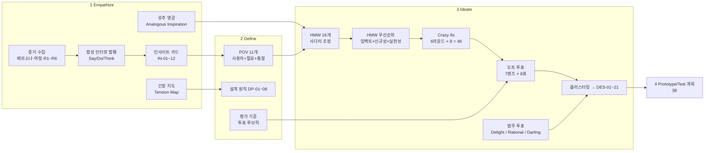

# PLN-IDE-DT. 아이디에이션 ① — Design Thinking (Empathize → Define → Ideate) + HMW + Crazy 8s

> **Trace**: UR-02(복수 기획 방법론, 전문가 수준 아이디어) 중심 · 기능 대상 UR-01, UR-04, UR-07, UR-09~UR-17
> **입력**: `00-brief/project-brief.md`, `00-research/R1~R6`, `01-planning/01-actors-personas.md`(P0~P5, E1~E3, SCN-01~14, RC-01~40)
> **버전**: v1.0 (Draft) · **작성 주체**: T1(상위 모델, 기획) · **작성일**: 2026-09-30
> **독립성**: 다른 아이디에이션 방법론 문서의 결과는 보지 않고 작성했다. 수렴은 후속 통합 문서에서 한다.
> **근거 수준**: 웹 호출 0회. 방법론 출처(d.school Bootleg, IDEO HMW, GV Design Sprint, Script Concordance Test 등)와 학습과학 근거는 전문 지식이며 `[지식]`으로 표시했다. 수치 임계값은 모두 **시작값**이고 REQ/설계 단계에서 확정한다.

---

## 0. 요약 (TL;DR)

1. **재정의한 문제**: 이 서비스가 풀어야 할 것은 "공부할 거리 제공"이 아니다. 다음 세 가지다.
   - **착각을 증거로 바꾼다** (P0: "들어봤지만 설명 못 한다").
   - **일과 공부 사이의 끊김을 잇는다** (P0~P2: 업무·AI 코딩 중 마주친 개념이 흘러가 버림).
   - **정답이 없는 판단을 연습·채점 가능하게 만든다** (P3~P5: "it depends"에 정답 하나를 강요하면 떠남).
2. **POV 11개 → HMW 16개 → 상위 HMW 6개 × Crazy 8s = 아이디어 48개**를 만들었다. 7개 관점 렌즈의 도트 투표(56표)와 d.school 범주 투표로 **21개 기능 후보(DES-01~21)**로 수렴했다.
3. **기존 RC-01~40에 없는 차별화 아이디어** (최다 득표와 대담한 아이디어 위주):
   - **DES-02 코드 회상 카타**: 코드용 백지노트. 테스트로 결정적으로 채점하고 FSRS로 간격 복습한다.
   - **DES-01 착각 지도**: CBM 확신도와 실제 정답률의 격차를 Depth Map 위에 표시한다.
   - **DES-05 Encounter Inbox**: CLI/북마클릿/붙여넣기로 캡처하고, 에러 로그를 개념으로 연결한다.
   - **DES-06 Repo Lens**: graphify로 자기 저장소를 스캔해 "쓰고 있지만 증명 못 한 개념", 즉 이해 부채를 보여준다.
   - **DES-08 SCT 판단 문항**: 의학교육의 Script Concordance Test를 차용해 전문가 패널 분포로 채점한다.
   - **DES-12 캠페인 월드**: 가상 회사의 시스템이 시즌마다 진화하고, 내가 쓴 ADR이 이후 장애의 원인이 된다.
   - **DES-15 AI 출력 감사**: 품질 게이트에서 탈락한 LLM 문항까지 재활용해 AI가 틀린 곳을 찾게 한다.
   - **DES-17 자기 판정 보정 루프**: Jev 한국어 판정 리스크(AS-08)를 사용 중에 줄여 나간다.
4. **공통 설계 원칙 8개(DP-01~08)**를 도출했다. 모든 아이디어는 AI 의존 등급 `[O]` 오프라인 가능 / `[J]` Jev 필요 / `[L]` LLM 필요를 달고, `[J]`·`[L]`는 폴백을 명시했다(UR-15).
5. **다음 단계(Prototype/Test)**: 가장 위험한 가정 6개와 싼 검증 방법을 §8에 정리했다. SCT 패널 합의도, Repo Lens 개념 탐지 정밀도, Jev 한국어 판정이 대상이다.

---

## 1. 방법론 설계 — 왜, 어떻게 적용했나

### 1.1 결합 구조



| 단계 | 도구 | 출처 `[지식]` | 이 프로젝트에 맞춘 변형 |
|---|---|---|---|
| Empathize | Empathy synthesis, 합성 인터뷰, **Analogous Inspiration** | Stanford d.school *Bootleg*, IDEO *Field Guide* | 실사용자 인터뷰가 없다. 그래서 01-actors-personas.md의 JTBD·Pains·Say-Do Gap을 **증거**로 삼고, 인터뷰 발췌는 "합성"임을 명시했다. 다른 분야(의학교육·항공·체스·음악)에서 메커니즘을 빌려 온다. |
| Define | **POV 문장** ("[사용자]는 [필요]가 필요하다. 왜냐하면 [놀라운 통찰]") | d.school POV Madlib | **종단 페르소나**(같은 사람의 15년)이므로 POV마다 "그 시기에만 참인 통찰"을 쓴다. |
| Ideate | **HMW** | P&G → IDEO, Warren Berger | 각 HMW는 사다리(너무 넓음 ↔ 너무 좁음)로 조정했다. |
| Ideate | **Crazy 8s** (8분 8칸) | Google Ventures Design Sprint (Knapp) | 라운드마다 8칸째는 반드시 **"와일드 카드"**(제약을 깬 아이디어)로 채웠다. |
| Converge | **도트 투표 + 범주 투표** | GV "Heat map / Straw poll", d.school "Most likely to delight / Rational choice / Darling" | 투표자는 **관점 렌즈 7개**(페르소나 3 + Edge 1 + 전문가 3)다. 한 렌즈에 8표, 한 아이디어에 최대 2표. |

**정직성 메모**: 워크숍은 T1 모델이 렌즈를 바꿔 가며 **시뮬레이션**한 것이다. 렌즈마다 무엇을 중시하는지(§3.3)를 먼저 고정한 뒤 투표해 자기 편향을 줄였다. 실제 사용자 검증은 §8의 프로토타입 테스트와 RETRO-01(통합 2회차 회고)의 실사용 로그로 대체한다.

---

## 2. Empathize — 공감

### 2.1 증거 입력

| 증거원 | 사용한 부분 | 추출한 것 |
|---|---|---|
| 페르소나 문서 §3.1~3.9 | JTBD F/E/S, Pains, Gains, Anti-goals | 페르소나별 필요와 금기 |
| 페르소나 문서 §4 | Empathy Map, **Say-Do Gap 4건** | 착각 패턴 |
| 페르소나 문서 §5 | 하루/주/연 여정, **이탈 위험 MT-1~6** | 감정 저점과 개입 타이밍 |
| R1 | Dunlosky 효용, FSRS, CBM, expertise reversal, 몰입 밴드 0.70~0.85 | 무엇이 실제로 학습을 만드는가 |
| R2 | KU·오개념 은행, T1~T4, G0~G13 | 어떤 문항을 결정적으로 만들 수 있는가 |
| R3 | BL-01~20, AP-01~07, 경쟁 공백 | 시장에 없는 것과 금지 패턴 |
| R4 | 469개 개념, Case, 트랙 19개, `ctx:si` | 콘텐츠 표면 |
| R5 | 4단계 AI 모드, Jev 과업 J01~J19, CLI 격리 | AI가 할 수 있는 것과 없는 것 |
| R6 | SI 산출물, 행안부 보안약점 49개, 개발표준정의서 | SI 현장 맥락과 결함 분류 |

### 2.2 합성 인터뷰 발췌 (Synthetic Voice — 페르소나 증거를 1인칭으로 재구성)

> 아래는 **실제 발화가 아니다**. 페르소나 증거를 감정 단위로 읽기 위해 재구성했다.

| 페르소나 | 발췌 | 숨은 욕구 |
|---|---|---|
| P0 도현(신입) | "Claude Code가 짜준 Dockerfile이 돌아가긴 하는데, 사수가 '왜 멀티스테이지야?'라고 물으면 얼어요." | AI가 만든 결과물에 대한 **소유감(ownership)** |
| P0 | "Notion에 정리는 엄청 했어요. 근데 다시 본 적은 없어요." | 정리 대신 **인출**이 되는 흐름 |
| P0 | "제가 뭘 모르는지를 몰라요. 로드맵 체크리스트는 다 체크했는데." | **모르는 줄 몰랐던 것**을 드러내 주기 |
| P1 (1년차) | "보안약점 진단에서 경로 조작이 나왔는데, 교육 때 들은 것 같긴 한데…" | 업무 사건을 **그 자리에서** 학습으로 전환 |
| P2 (3년차) | "OX 카드 넘기다 보면 '내가 지금 뭐 하나' 싶어요. 쉬운 건 지루하고, 어려운 건 막막하고." | 레벨 전환기의 **도전 재설계** |
| P2 | "장애 회고 쓰면서 생각했어요. 이거 미리 연습해 봤으면 새벽에 덜 헤맸을 텐데." | **안전한 실패 연습장** |
| P3 (7년차) | "설계 리뷰 문제에 정답 하나 들이밀면 바로 닫아요. 현실은 '조건에 따라'잖아요." | 모호성을 **존중하는 채점** |
| P4 (12년차) | "10년 전에 제가 뭐라고 답했을지 궁금하네요. 지금은 완전히 다르게 말할 텐데." | **과거의 나와의 대화** (관계성) |
| P5 (15년+) | "잊는 건 괜찮아요. 무서운 건 틀린 걸 확신하고 있는 거예요." | forgetting이 아니라 **obsolescence**와 과신 |
| E3 (망분리) | "현장 PC에선 AI가 다 막혀요. 그럼 이 앱도 반쪽이 되나요?" | 오프라인에서도 **품질이 같은 모드** |
| H02 (큐레이터 모자) | "AI가 만든 문제가 틀렸을 때 신고하는 게 오히려 공부가 되더라고요." | **품질 관리 = 학습**이라는 전환 |

### 2.3 인사이트 카드 (IN-01~12)

형식: *관찰 → 해석(왜) → 기회*

| ID | 관찰 | 해석 (근본 원인) | 기회 (HMW 씨앗) |
|---|---|---|---|
| IN-01 | "도커 해봤어요" ≠ 멀티스테이지 설명 가능 (Say-Do Gap) | 재인(recognition)의 유창성을 회상(recall)으로 착각한다. 확신이 정답률보다 앞선다 | 확신과 실력의 **격차 자체**를 보여 주기 |
| IN-02 | 정리는 하지만 다시 보지 않음 | 정리는 수동적(ICAP Active 하단)이고 인출 경로가 만들어지지 않는다 | 입력을 받자마자 **질문으로 변환** |
| IN-03 | AI가 만든 코드를 설명하지 못해 불안함(가면 증후군) | 2026년의 신입은 코드를 **생산**하기보다 **검증·설명**하는 일이 늘었다. 그런데 이것을 연습할 도구가 없다 | "AI 결과물 감사"를 **핵심 역량**으로 훈련 |
| IN-04 | 업무 중 모르는 용어·에러가 나와도 흘려보냄 | 캡처 비용(앱 전환·분류)이 순간의 호기심보다 크다 | **5초 캡처**, 분류는 나중에 자동으로 |
| IN-05 | 자기 저장소(`axis-*`, `myfirst_api_server`)에 쓴 기술을 설명 못 함 | 사용한 것과 이해한 것이 분리되어 있다 | 내 코드가 곧 **나의 커리큘럼** |
| IN-06 | L3 전환기에 OX가 지루함 (MT-5) | expertise reversal. 과제 형식이 능력보다 낮다 | 레벨별로 **형식 자체가 달라지는** 도전 |
| IN-07 | 시니어는 단일 정답 채점을 거부함 | 전문가 판단은 확률적이고 조건부다. 모호성은 결함이 아니라 본질이다 | **전문가 분포 대비 채점** (의학교육 SCT 유추) |
| IN-08 | 장애 대응은 실전에서만 배움 | 고비용·저빈도 사건이라 연습 기회가 0에 가깝다 | 결과가 이어지는 **시뮬레이션 세계** |
| IN-09 | 15년 사용이면 어떤 모드든 결국 질림 | 새로움은 기능 수보다 **맥락의 변화**(서사·제약·레벨)에서 나온다 | 시즌·서사·제약 변주 |
| IN-10 | 과거 답과 현재 답을 비교하고 싶어 함 | 로컬 1인 앱에서 관계성(SDT)의 유일한 원천은 **과거의 나**다 | 타임캡슐·오버레이 |
| IN-11 | AI 채점이 한국어에서 맞는지 모름 (AS-08) | 보정은 골드셋이 필요한데 사용자가 1명뿐이다 | 사용자를 **라벨러**로 만들되 편향을 통제 |
| IN-12 | 신고가 곧 학습이 됨 (큐레이터) | 오류를 찾는 일은 Bloom Evaluate 수준의 인지 활동이다 | **LLM의 실수를 교재로** 재활용 |

### 2.4 유추 영감 (Analogous Inspiration) — 다른 분야의 해결 메커니즘

| 분야 | 그 분야의 메커니즘 `[지식]` | 이 서비스로의 전이 | 결과 아이디어 |
|---|---|---|---|
| 의학교육 | **Script Concordance Test** (Charlin 외, 2000): 불확실성 아래의 임상 추론을 "새 정보가 가설을 −2~+2로 얼마나 움직이나"로 묻고, 전문가 패널 응답 분포로 부분 점수를 준다 | "it depends" 설계 판단의 채점 | DES-08 |
| 항공 | **Recurrent training / Checkride**: 면허가 있어도 정기 재검증을 받는다. 시뮬레이터로 드문 비상 상황을 반복한다 | 레벨은 영구가 아니라 유지를 검증하는 것. 인시던트 시뮬레이션 | DES-18, DES-12 |
| 체스 | **Tactics trainer** (Elo 문제 레이팅), 전술 모티프 태깅 | 문제 난이도 Elo(이미 R1/R2에 있음), 모티프 = 오개념/패턴 | DES-03 |
| 음악 연습 | **Deliberate practice**: 느린 템포에서 빠른 템포로, 곡 전체를 **암보(暗譜)**로 연주 | 코드를 보지 않고 다시 쓰기, 시간 제한은 점진적으로 | DES-02 |
| 군 / 소방 | **AAR (After Action Review)**, **Pre-mortem** (Klein) | 실패를 먼저 상상하는 설계 리뷰 | DES-11 |
| 과학 교육 | **Fermi 추정** (자릿수 감각) | 시스템 디자인의 용량 추정. 결정적 채점 가능 | DES-09 |
| 코드 리뷰 문화 | **Seeded defect inspection** (Fagan 인스펙션 교육) | 결함을 심어 둔 PR 리뷰 → 재현율·정밀도 | DES-10 |
| 저널리즘 / 팩트체크 | 주장 단위 검증 (claim → evidence) | AI 출력의 주장 단위 감사 | DES-15 |
| ThoughtWorks | **Technology Radar** (Adopt/Trial/Assess/Hold) | 개인 기술 판단의 기록과 재검증 | DES-20 |
| 교육학 | **학습자 질문 생성 전략** (Rosenshine 외 1996 메타분석, 질문 생성 훈련이 이해도를 올림) | 학습자가 출제 → Jev 게이트 → 자기 풀 | DES-16 |

### 2.5 긴장 지도 (Tension Map) — 설계가 동시에 만족해야 할 모순

| # | 긴장 A | ↔ | 긴장 B | 해소 전략 (→ 설계 원칙) |
|---|---|---|---|---|
| T-1 | 짧은 세션 (평일 10~45분) | ↔ | 전문가 깊이 (Case 90분) | 세션 **길이**가 아니라 **이어 하기**로 깊이를 낸다: Case의 턴 저장, 캠페인 연속성 (DP-04) |
| T-2 | 자동화된 큐 (선택 피로 제거) | ↔ | 자율성 (SDT, AP-06) | 기본값은 자동, 모든 블록에 "왜 지금?"과 교체권 (DP-05) |
| T-3 | AI의 도움 | ↔ | 생성 효과 (AP-07) | AI는 **질문하고 판정**만, 정답은 인출 이후에 (DP-03) |
| T-4 | 초급자 안내 | ↔ | 전문가 역효과 | 트랙 레벨별로 형식을 전환 (LS-09 계승) |
| T-5 | 오프라인 필수 (E3) | ↔ | AI 품질 | 결정적 문항군(T1)을 **1급 시민**으로 (DP-02) |
| T-6 | 15년 연속성 | ↔ | 기술·스키마 변화 | 불변 이벤트 + 증거 원장 + 신선도 (DP-07) |
| T-7 | 업무 맥락 활용 | ↔ | 기밀·보안 (NG-06) | 로컬 우선, 민감 표시 시 로컬 LLM만, 비밀 자동 마스킹 (DP-06) |
| T-8 | 측정 (증거 기반) | ↔ | 감시 피로 / 숫자 과잉 | 숫자는 **질문을 받았을 때만** 보여 준다. 기본 화면은 형태·색 (DP-08) |

---

## 3. Define — 문제 정의

### 3.1 POV 문장 (Point of View)

형식: **[사용자]는 [필요]가 필요하다. 왜냐하면 [놀라운 통찰] 때문이다.** 통찰은 §2.3 인사이트에서 가져왔다.

| POV | 사용자 | 필요 (동사로) | 놀라운 통찰 | 근거 |
|---|---|---|---|---|
| POV-01 | **P0** 부트캠프 출신 신입 도현 | 자기가 "안다고 느끼는 것"과 "실제로 꺼낼 수 있는 것"의 차이를 **부끄럽지 않게** 확인해야 한다 | 그는 모르는 것보다 **안다고 착각하는 것**에 더 크게 발목 잡힌다. 그 착각은 AI가 대신 만든 결과물 때문에 오히려 커진다 | IN-01, IN-03 |
| POV-02 | **P0** | 업무·AI 코딩 중에 스친 개념을 **흐름을 끊지 않고** 공부 큐에 넣어야 한다 | 그의 가장 좋은 커리큘럼은 로드맵이 아니라 **이번 주에 실제로 막힌 것**이다. 다만 캡처 비용이 호기심보다 크면 사라진다 | IN-02, IN-04 |
| POV-03 | **P1** SI 주니어 백엔드 | 현장에서 나온 결함(보안약점·표준 위반)을 **자기 역량 훈련**으로 바꿔야 한다 | SI 현장의 산출물·진단 결과는 억압적인 숙제로 느껴지지만, 실은 **공짜로 주어지는 채점표**다 | R6, P1 JTBD |
| POV-04 | **P1/P2** 자기 저장소를 가진 개발자 | 내가 쓴 코드 속 기술을 **내가 설명할 수 있는지** 알아야 한다 | 사용과 이해가 분리된 영역은 이미 코드에 **지도처럼 새겨져** 있다. graphify로 읽어 낼 수 있다 | IN-05, UR-09 |
| POV-05 | **P2** L3 전환기 미드레벨 | 문제의 **형식 자체가 한 단계 올라가는** 경험이 필요하다 | 그를 지루하게 만드는 것은 난이도가 아니라 **인지 과정의 종류**(재인 vs 판단)다 | IN-06, LS-09 |
| POV-06 | **P2/P3** on-call 엔지니어 | 드물고 비싼 실패를 **결과가 누적되는 세계**에서 미리 겪어 봐야 한다 | 장애 대응 역량은 단발 문제로는 자라지 않는다. **과거 결정의 대가**를 치러 봐야 자란다 | IN-08 |
| POV-07 | **P3** 테크리드 | 정답이 없는 판단을 **공정하게 비교 채점**받아야 한다 | 전문가는 틀렸다는 말보다 "전문가 대부분은 다르게 봤다"는 **분포 피드백**을 신뢰한다 | IN-07 |
| POV-08 | **P4** 아키텍트 | 자기 판단을 **여러 이해관계자의 반론**에 맞서 방어하는 연습이 필요하다 | 그의 실제 업무는 설계가 아니라 **설계를 방어하는 일**이다 (위원회·고객) | P4 JTBD-S |
| POV-09 | **P5** 15년+ 전문가 | 확신하고 있지만 **이미 틀려진 지식**을 찾아내야 한다 | 망각은 복구되지만 **과신된 구식 지식**은 스스로 발견되지 않는다 | IN-10, SCN-12 |
| POV-10 | **E3** 망분리 현장 | AI가 없어도 **질이 떨어지지 않는** 문항과 채점이 필요하다 | 가장 믿을 만한 채점은 AI가 아니라 **실행 결과**다. 오프라인은 약점이 아니라 **결정적 문항의 강점**이 드러나는 조건이다 | IN-11, R2 T1 |
| POV-11 | **H02/H03** 큐레이터·운영자 모자 | AI 판정을 **믿어도 되는지** 사용하면서 알아야 한다 | 1인 앱의 보정 데이터는 사용자뿐이다. 단, 자기 답을 자기가 채점하면 **자기 편향**이 생긴다 | IN-11, IN-12, AS-08 |

### 3.2 설계 원칙 (Design Principles, DP-01~08)

| DP | 원칙 | 근거 (긴장/인사이트) | 위반 예시 |
|---|---|---|---|
| DP-01 | **모든 활동은 인출 사건을 남긴다.** 읽기·보기만으로는 진척이 오르지 않는다 | R1 결론 1, AP-03 | "읽음" 체크로 진척률 상승 |
| DP-02 | **결정적 채점이 1순위.** 실행·비교로 채점할 수 있으면 AI를 쓰지 않는다 | T-5, POV-10 | 코드 출력 예측을 LLM이 채점 |
| DP-03 | **AI는 묻고 판정한다. 먼저 답하지 않는다** | T-3, AP-07 | 오답 즉시 모범답안 전문 노출 |
| DP-04 | **깊이는 이어 하기로 만든다.** 모든 긴 과제는 저장·재개 가능하다 | T-1 | 90분 Case를 중단하면 처음부터 |
| DP-05 | **자동은 기본값이고 설명 가능하며 교체할 수 있다** | T-2 | 이유 없이 큐에 뜨는 카드 |
| DP-06 | **내 맥락은 내 기기에서.** 업무 맥락 입력은 기본 로컬이고, 비밀은 자동 마스킹한다 | T-7, NG-06 | 캡처한 에러 로그를 그대로 API로 전송 |
| DP-07 | **15년을 견디는 증거.** 판정의 근거는 불변 기록으로 남고, 모델이 바뀌면 재계산한다 | T-6, LS-11 | 레벨이 숫자만 남고 근거는 소실 |
| DP-08 | **형태가 먼저, 숫자는 요청할 때.** 홈은 색과 형태로 상태를 보여 준다 | T-8, AP-05 | 연체 2,300 빨간 배지 |

### 3.3 수렴 평가 기준 (투표 렌즈 정의)

| 렌즈 | 대표 | 이 렌즈가 표를 주는 조건 |
|---|---|---|
| L-P0 | P0 도현 | 오늘 당장 15분 안에 쓰고 싶고, 불안을 줄여 준다 |
| L-P2 | P2 미드레벨 | 지루함을 깨고, 업무 사건에 바로 쓸 수 있다 |
| L-P4 | P4 아키텍트 | 판단·방어·폭을 다루고, 단일 정답을 강요하지 않는다 |
| L-E3 | E3 망분리 | `[O]`로 온전히 동작하고, 결정적으로 채점된다 |
| L-LS | 학습과학자 (R1) | 인출·간격·변별·생성 효과의 근거가 강하다 |
| L-AO | 아키텍트/운영 (R5·R6) | 서비스 경계가 명확하고, 보안·운영 리스크를 통제할 수 있고, 테스트할 수 있다 |
| L-DX | 디자이너 (R3·D3) | 시그니처 경험이 되고, 반복해도 기분이 좋고, 형태로 소통한다 |

---

## 4. HMW — How Might We

### 4.1 HMW 목록 (사다리 조정 후)

> 사다리 조정: 너무 넓은 HMW("어떻게 하면 개발 공부를 잘하게?")는 **한 단계 좁히고**, 해결책이 내장된 HMW("어떻게 하면 퀴즈 버튼을 추가할까?")는 **한 단계 넓혔다**.

| HMW | 질문 | POV | 원래 초안 → 조정 | UR |
|---|---|---|---|---|
| HMW-01 | 어떻게 하면 "들어봤지만 설명 못 하는" **유창성 착각**을 학습자가 **부끄럽지 않게 스스로 알아차리게** 할 수 있을까? | POV-01 | "진단 퀴즈를 넣을까?" → 넓힘 | UR-11, UR-14 |
| HMW-02 | 어떻게 하면 업무·AI 코딩 중 스친 개념을 **5초 안에** 학습 흐름으로 끌어올 수 있을까? | POV-02, 03 | "메모 기능?" → 넓힘 | UR-13, UR-15 |
| HMW-03 | 어떻게 하면 정답이 "it depends"인 L4~L5 판단을 **공정하게 채점하고** 반복 연습하게 할 수 있을까? | POV-07, 08 | 적정 | UR-11, UR-16 |
| HMW-04 | 어떻게 하면 **15년 동안** 같은 앱을 써도 시기마다 새로운 도전처럼 느끼게 할 수 있을까? | POV-05, 06 | "질리지 않게?" → 좁힘 (시간 축 명시) | UR-12, UR-14 |
| HMW-05 | 어떻게 하면 AI가 정답을 대신 주는 시대에 AI를 **생각의 스파링 상대**로 쓰게 만들 수 있을까? | POV-01, 11 | 적정 | UR-15, UR-16 |
| HMW-06 | 어떻게 하면 성장의 증거를 **과거의 나와 외부 평가자**에게 믿을 만하게 보여 줄 수 있을까? | POV-09, P0 JTBD-S | 적정 | UR-12, UR-17 |
| HMW-07 | 어떻게 하면 **내 저장소의 코드**를 나만의 교재로 바꿀 수 있을까? | POV-04 | 적정 | UR-09, UR-13 |
| HMW-08 | 어떻게 하면 비싸고 드문 **실패(장애)**를 안전하고 싸게, 결과가 이어지게 겪게 할 수 있을까? | POV-06 | 적정 | UR-14, UR-11 |
| HMW-09 | 어떻게 하면 오프라인에서도 **채점 신뢰도가 떨어지지 않는** 문항을 늘릴 수 있을까? | POV-10 | 적정 | UR-15, UR-13 |
| HMW-10 | 어떻게 하면 **서로 헷갈리는 개념 쌍**을 확실히 갈라놓게 할 수 있을까? | POV-01 | 적정 | UR-14 |
| HMW-11 | 어떻게 하면 **이미 틀려진 지식**을 사용자가 확신하기 전에 찾아낼 수 있을까? | POV-09 | 적정 | UR-12, UR-17 |
| HMW-12 | 어떻게 하면 AI 판정의 신뢰도를 **사용하면서** 올리되 자기 편향은 막을 수 있을까? | POV-11 | 적정 | UR-16, UR-17 |
| HMW-13 | 어떻게 하면 SI 산출물·보안약점을 **숙제가 아니라 훈련장**으로 바꿀 수 있을까? | POV-03 | 적정 | UR-07, UR-01 |
| HMW-14 | 어떻게 하면 품질 관리(오류 문항 찾기)를 **학습 행위**로 만들 수 있을까? | POV-11 | 적정 | UR-13, UR-17 |
| HMW-15 | 어떻게 하면 90분짜리 깊이 과제를 **15분 조각**으로 나눠도 몰입이 이어지게 할 수 있을까? | T-1 | 적정 | UR-14, UR-17 |
| HMW-16 | 어떻게 하면 시니어가 **가르치면서** 자기 지식을 강화하고 조직에 남기게 할 수 있을까? | POV-08, P3 JTBD-S | 적정 | UR-12, UR-14 |

### 4.2 HMW 우선순위 (Crazy 8s 대상 선정)

점수는 1~5점이다. 임팩트 = 영향 페르소나 수 × 고통 강도, 신규성 = RC-01~40·경쟁 서비스 대비 차별성, 실현성 = 로컬·오프라인 제약에서의 구현 가능성.

| HMW | 임팩트 | 신규성 | 실현성 | 합 | 선정 | 메모 |
|---|---|---|---|---|---|---|
| HMW-01 착각 | 5 | 4 | 5 | **14** | ✅ R1 | P0 1순위 고통, CBM 데이터 이미 존재 |
| HMW-02 5초 캡처 | 5 | 5 | 4 | **14** | ✅ R2 | HMW-07·13을 흡수 |
| HMW-03 it-depends | 4 | 5 | 3 | **12** | ✅ R3 | P3~P5 이탈 원인 |
| HMW-04 15년 | 5 | 4 | 3 | **12** | ✅ R4 | HMW-08·15를 흡수 |
| HMW-05 AI 스파링 | 5 | 5 | 4 | **14** | ✅ R5 | HMW-12·14를 흡수 |
| HMW-06 증거 | 4 | 4 | 4 | **12** | ✅ R6 | HMW-11·16을 흡수 |
| HMW-07 내 저장소 | 3 | 5 | 3 | 11 | ⤵ R2에 흡수 | |
| HMW-08 장애 | 3 | 4 | 3 | 10 | ⤵ R4에 흡수 | RC-39 존재 |
| HMW-09 오프라인 | 3 | 2 | 5 | 10 | ⤴ **전 라운드 제약** | 모든 아이디어에 `[O/J/L]` 태그 |
| HMW-10 헷갈리는 쌍 | 4 | 3 | 5 | 12 | ⤵ R1에 흡수 | |
| HMW-11 틀려진 지식 | 2 | 3 | 3 | 8 | ⤵ R6에 흡수 | RC-37 존재 |
| HMW-12 판정 보정 | 3 | 4 | 4 | 11 | ⤵ R5에 흡수 | |
| HMW-13 SI 훈련장 | 3 | 4 | 4 | 11 | ⤵ R2·R3에 분산 | |
| HMW-14 품질=학습 | 2 | 5 | 4 | 11 | ⤵ R5에 흡수 | |
| HMW-15 조각 몰입 | 3 | 3 | 4 | 10 | ⤵ R4에 흡수 | |
| HMW-16 가르치기 | 3 | 3 | 4 | 10 | ⤵ R6에 흡수 | RC-40 존재 |

---

## 5. Crazy 8s — 6라운드 × 8 = 48 아이디어

> 규칙: 라운드당 8칸, 칸당 1분(시뮬레이션), 비판 금지. **8번째 칸은 와일드 카드**(제약 파괴)다.
> 태그: `[O]` 오프라인 완전 동작 · `[J]` Jev 필요(폴백 있음) · `[L]` LLM 필요(폴백 있음). ★ = 도트 투표에서 표를 받은 아이디어(§6.1의 기호 A~W).

### R1 — HMW-01 유창성 착각을 부끄럽지 않게 드러내기 (+HMW-10)

| # | 아이디어 | 메커니즘 한 줄 | 태그 |
|---|---|---|---|
| 1a ★A | **착각 지도 (Overconfidence Map)** | Depth Map 위에 "평균 확신(CBM 구간 → 확률) − 실제 정답률" 격차를 등고선처럼 표시한다. 격차가 +0.15 이상인 개념만 은은하게 표시 | O |
| 1b | 정답인데 "왜?" 기습 | 고확신 정답의 10%에 한 문장 이유를 요구해 요행 정답을 가려낸다 | J (폴백: 자기판정) |
| 1c | 선언 vs 증명 | 온보딩과 시즌 시작 때 개념별 자기평가(0~3) → 5문항 증명 → Say-Do 격차 점수 | O |
| 1d ★B | **코드 회상 카타 (Code Recall Kata)** | LRU 캐시, debounce, 멀티스테이지 Dockerfile, SQL 윈도 함수 등을 **빈 에디터에서 다시 쓰고** 숨은 테스트로 채점한다. FSRS `facet=code`로 간격 복습 | O |
| 1e | 60초 러버덕 | 60초 안에 개념 설명을 타이핑하면 Jev가 KU 커버리지를 채점한다 | J |
| 1f ★C | **쌍둥이 드릴 (Confusable Twins)** | 오개념 은행의 "X와 Y 혼동" 항목과 사용자의 혼동 행렬에서 쌍을 캐내, 한 특징만 다른 대조 문항으로 교대 출제한다 | O |
| 1g ★D | **프런티어 탐침 (Unknown-unknowns Probe)** | 숙달 개념에 인접한 미접촉 개념에서 1문항씩 프리테스트(벌점 없음) → "몰랐던 줄 몰랐던 것" 목록 | O |
| 1h | 🃏 가짜 설명 찾기 | 그럴듯한 오답 설명과 진짜 설명을 섞어 놓고 가짜를 고른다 (→ R5의 5a로 발전) | O/L |

### R2 — HMW-02 업무·AI 코딩 중 스친 개념을 5초 안에 (+HMW-07·13)

| # | 아이디어 | 메커니즘 한 줄 | 태그 |
|---|---|---|---|
| 2a ★E | **Encounter Inbox** | `devstudy capture "OOMKilled" --ctx "배치 파드"` CLI, 북마클릿, 붙여넣기 → 인박스. 분류는 다음 세션에서 자동: FTS5 후보 → Jev 매칭 | O (매칭은 J, 폴백 FTS) |
| 2b ★W | 에러 → 개념 | 스택트레이스·에러 로그 붙여넣기 → 시그니처 사전(`ECONNREFUSED`, `CrashLoopBackOff`, `ORA-00060`, N+1 패턴…)으로 트랙·개념 연결 → 진단 3문항 | O (사전) / J |
| 2c ★F | **Repo Lens (이해 부채 원장)** | 개인 저장소 경로 지정 → `graphify extract --code-only` + 탐지 규칙(import·설정 파일·AST 패턴) → "내 코드가 쓰는 개념 38개 중 증명된 것 12개" | O |
| 2d | 내 코드 기반 문항 | "`axis-backend/auth.py`에서 토큰이 만료되면 어느 분기로?" 같은 문항. T1/T2 템플릿 + 발췌 코드 | O / L (로컬 LLM) |
| 2e ★G | **AI 작업 디브리프** | Claude Code/Codex 작업 후 `devstudy debrief HEAD~3..HEAD` → AI가 대신 결정한 지점을 추출 → 설명 역질문 3개 → Jev가 KU 체크리스트로 채점 | L+J (폴백: 템플릿 질문 + 자기판정) |
| 2f | Claude Code 슬래시 커맨드/MCP | 코딩 중 `/study quiz-me`로 호출 | L |
| 2g | 읽기 전 예측 (predict-then-read) | 북마크한 글을 열기 전에 제목만 보고 3가지를 예측하게 한 뒤 import | L |
| 2h | 🃏 회의 단어 포수 | 회의록 붙여넣기 → "오늘 회의에서 아는 척한 용어 7개" 추출 | J/L |

### R3 — HMW-03 "it depends" 판단의 공정한 채점

| # | 아이디어 | 메커니즘 한 줄 | 태그 |
|---|---|---|---|
| 3a ★H | **SCT 판단 문항** | "가설: 캐시 계층을 추가해야 한다 / 새 정보: 쓰기 비율 60% → 이 가설은 (−2 … +2)". 패널 분포로 부분 점수를 준다 | O (키 확정 후) |
| 3b | 트레이드오프 슬라이더 | 선택지를 축(정합성↔지연, 비용↔가용성) 위에 배치하고 근거를 쓴다. 위치는 밴드로, 근거는 Jev로 채점 | O / J |
| 3c ★I | **Fermi 추정 드릴** | "DAU 200만, 사진 업로드 3%/일, 평균 2MB → 1년 저장량?" 로그 오차로 결정적 채점 | O |
| 3d ★K | **설계 리뷰 아레나** | 보안·SRE·FinOps·DBA·PM 리뷰어 페르소나가 내 설계에 반론 → 반박 → Jev가 "반론의 핵심을 다뤘나"를 판정 | L+J (폴백: 반론 은행) |
| 3e ★J | **PR 리뷰 도장 (Review Dojo)** | 결함을 심어 둔 합성 PR(보안약점 49, N+1, 경쟁 조건, 개발표준정의서 위반)에 라인 코멘트 → 재현율·정밀도 | J (폴백: 라인 매칭 + 자기매칭) |
| 3f | ADR 결과 부메랑 | 과거에 쓴 ADR의 결정이 몇 주 뒤 Case에서 결과로 돌아온다 (→ 4a로 흡수) | L |
| 3g | 전문가 불일치 카드 | 두 신뢰할 만한 입장(모듈러 모놀리스 vs 마이크로서비스) → "결정을 뒤집는 조건 3개"를 쓰게 한다 | J |
| 3h | 🃏 프리모템 | "이 설계는 1년 뒤 실패했다. 이유 5개" → 실패 모드 은행과 대조 | J |

### R4 — HMW-04 15년 동안 매 시기가 새로운 도전 (+HMW-08·15)

| # | 아이디어 | 메커니즘 한 줄 | 태그 |
|---|---|---|---|
| 4a ★L | **캠페인 월드** | 가상 회사 "Axis Commerce"(실존 기업 아님)의 시스템이 시즌마다 진화한다. 내 ADR·선택이 world state에 저장되고 이후 인시던트의 원인이 된다 | L (폴백: 사전 작성 분기) |
| 4b ★M | **스터디 믹스테이프** | 세션을 4~6개 블록의 "플레이리스트"로 보여 준다. 블록마다 "왜 지금?" 칩이 있고 교체할 수 있다. 연속 ≤2, 세션당 ≥3종 | O |
| 4c | 와일드카드 제약 주간 | "다이어그램으로만 설명", "한 문장", "전문용어 금지", "PM에게 설명" | J |
| 4d ★N | **레벨 렌즈 + 미래의 문제** | 개념 페이지에서 L1~L5 facet을 토글한다. 하루 한 문제는 **L+1**("3년 후 당신이 풀 문제"), 벌점 없는 프리테스트 | O |
| 4e ★O | 체크라이드 | 트랙별 연 1회 20분 재검증. 통과하면 레벨 유지가 확인되고, 실패하면 rusty 표시(강등 없음) | O / J |
| 4f | 프런티어 산책 | 그래프 경계의 미접촉 개념 3분 맛보기 (→ 1g와 병합) | O |
| 4g | 시즌 보스 | 3개 트랙에 걸친 캡스톤 Case | J |
| 4h ★V | 🃏 **개인 테크 레이더** | 기술별 Adopt/Trial/Assess/Hold를 분기마다 재투표한다. 근거(Case·신선도)가 없으면 이동할 수 없다 | O |

### R5 — HMW-05 AI를 생각의 스파링 상대로 (+HMW-12·14)

| # | 아이디어 | 메커니즘 한 줄 | 태그 |
|---|---|---|---|
| 5a ★P | **AI 출력 감사 (AI Output Audit)** | AI 스타일의 설명·코드에 오류 k개를 주입(정답 키 확보)하거나, **G0~G13에서 탈락한 실제 LLM 문항**을 재활용 → 오류 구간 표시·수정 | O (주입) / L |
| 5b ★Q | **역출제 (Reverse Quiz)** | 학습자가 KU로 문항·정답·오답지를 쓴다 → Jev 게이트(유일 정답, 누설 없음, 오답지 = 오개념 연결) → 통과하면 "내가 만든 문항" 풀 → 몇 달 뒤 나에게 출제 | J |
| 5c | 소크라틱 전용 토글 | P3 이상에서 AI는 **질문만** 할 수 있고 단정할 수 없다 | L+J |
| 5d | 오개념 학생 아레나 | RC-40 확장: AI 학생의 오개념이 교정될 때까지 대화 | L+J |
| 5e | 위임 프롬프트 드릴 | "이 기능을 코딩 에이전트에게 맡길 명세를 써라" → Jev 체크리스트(수용 기준·제약·테스트·보안·컨텍스트) | J |
| 5f ★R | **자기 판정 보정 루프** | 엔진끼리(Jev vs LLM-judge vs 자기) 판정이 엇갈린 사례를 하루 ≤3장 "판정 확인 카드"로 → 개인 골드셋 → 과업별 임계값 재보정 | J |
| 5g | 수정안 설명 후 적용 | 실습에서 AI가 제안한 수정은 **이유를 설명해야** 적용 버튼이 열린다 | J |
| 5h | 🃏 적응형 경계 탐사관 | 10문항 CAT(Elo 기반)로 "지식 경계선"을 찾아 보고 | O |

### R6 — HMW-06 성장의 증거를 믿을 만하게 (+HMW-11·16)

| # | 아이디어 | 메커니즘 한 줄 | 태그 |
|---|---|---|---|
| 6a ★S | **증거 원장 (Evidence Ledger)** | 모든 레벨·숙달 주장에 "근거 보기"(시도 ID, 형식 다양성, Case, BPS, 가중치). 해시 체인으로 변조 탐지 | O |
| 6b ★T | **타임캡슐 답안** | 개방형 질문("좋은 API란?")에 답하고 봉인 → 6/12/36개월 뒤 다시 답함 → 나란히 diff + Jev 쌍대 비교 | O / J |
| 6c | 포트폴리오 export | 역량 리포트 + 선택한 ADR·포스트모템 (RC-14와 중복) | O |
| 6d | Depth Map 타임랩스 | RC-11과 중복 | O |
| 6e | 연간 성장 서사 | 통계 → LLM이 연간 리포트 문장을 작성 | L |
| 6f | 평가 시즌 자기기술서 초안 | 한국 인사평가 시즌용 "올해 증명된 역량" 초안 | L |
| 6g | 해시 체인 원장 | review_log/attempt_log에 prev-hash (→ 6a에 병합) | O |
| 6h | 🃏 **멘토 팩 (Lesson Forge)** | 내가 숙달한 개념 묶음 → 주니어용 스터디 팩 (요약·문항 10·오개념·해설, 라이선스 가드) | O / L |

---

## 6. 수렴 — 투표와 선정

### 6.1 도트 투표 결과 (7렌즈 × 8표 = 56표, 아이디어당 렌즈별 최대 2표)

| 기호 | 아이디어 | L-P0 | L-P2 | L-P4 | L-E3 | L-LS | L-AO | L-DX | **합** |
|---|---|---|---|---|---|---|---|---|---|
| B | 1d 코드 회상 카타 | 1 | | | 2 | 2 | | | **5** |
| A | 1a 착각 지도 | 2 | | | | 1 | | 1 | **4** |
| E | 2a Encounter Inbox | 2 | 1 | | | | 1 | | **4** |
| F | 2c Repo Lens | | 2 | | | | 1 | | **3** |
| H | 3a SCT 판단 문항 | | | 2 | 1 | | | | **3** |
| I | 3c Fermi 추정 | | | | 2 | | 1 | | **3** |
| J | 3e PR 리뷰 도장 | | 2 | | | | 1 | | **3** |
| L | 4a 캠페인 월드 | | 1 | 2 | | | | | **3** |
| M | 4b 스터디 믹스테이프 | 1 | | | | | | 2 | **3** |
| S | 6a 증거 원장 | | | | 1 | | 2 | | **3** |
| T | 6b 타임캡슐 | | | 1 | | 1 | | 1 | **3** |
| C | 1f 쌍둥이 드릴 | | | | 1 | 1 | | | 2 |
| D | 1g 프런티어 탐침 | | | | 1 | 1 | | | 2 |
| G | 2e AI 작업 디브리프 | 2 | | | | | | | 2 |
| K | 3d 설계 리뷰 아레나 | | | 2 | | | | | 2 |
| N | 4d 레벨 렌즈 | | | | | | | 2 | 2 |
| P | 5a AI 출력 감사 | | 1 | | | | | 1 | 2 |
| Q | 5b 역출제 | | | | | 2 | | | 2 |
| R | 5f 자기 판정 보정 | | | | | | 2 | | 2 |
| O | 4e 체크라이드 | | | | | | | 1 | 1 |
| V | 4h 테크 레이더 | | | 1 | | | | | 1 |
| W | 2b 에러 → 개념 | | 1 | | | | | | 1 |
| | **렌즈별 합계** | 8 | 8 | 8 | 8 | 8 | 8 | 8 | **56** |

**렌즈별 투표 이유 (요지)**
- **L-P0**: 착각 지도는 "내 위치를 숫자 없이 본다", Inbox는 "흐름이 끊기지 않는다", 디브리프는 "AI 코드를 설명할 수 있게 된다". 셋 다 가면 증후군을 직접 겨눈다.
- **L-P2**: Repo Lens와 PR 리뷰 도장은 지루해진 OX를 대체하는 **L3다운 형식**이다. 캠페인 월드는 on-call 대비에 쓴다.
- **L-P4**: SCT는 유일하게 "it depends"를 존중하는 채점이다. 아레나는 "설계 방어"라는 실제 업무와 같은 형태다.
- **L-E3**: 카타·Fermi는 **100% 결정적**이다. SCT는 키가 확정되면 오프라인에서 돈다. 증거 원장은 네트워크가 필요 없다.
- **L-LS**: 카타는 생성 + 인출 + 간격 복습의 교과서적 결합이다. 역출제는 질문 생성 전략이고, 쌍둥이는 변별 교대학습(interleaving)이다.
- **L-AO**: 증거 원장과 보정 루프는 **15년 운영과 AS-08 리스크**에 직접 대응한다. Inbox·Repo Lens는 로컬 경계가 명확하다.
- **L-DX**: 믹스테이프와 레벨 렌즈는 시그니처 인터랙션 후보다. 착각 지도는 D3 Bathymetry("수심") 메타포와 정확히 맞물린다(착각 = 얕은데 깊다고 믿는 지대).

### 6.2 범주 투표 (d.school)

| 범주 | 선정 | 이유 |
|---|---|---|
| **Most likely to delight** | 4b 스터디 믹스테이프 · 6b 타임캡슐 | 매일 마주치는 기쁨과 1년 뒤 오는 감동. 서로 다른 시간 축의 즐거움 |
| **Rational choice** | 1d 코드 회상 카타 · 6a 증거 원장 | 결정적이고 오프라인에서 돌고, 근거가 강하며 구현 리스크가 낮다 |
| **Darling (long shot)** | 4a 캠페인 월드 · 5a AI 출력 감사 | 경쟁 서비스에 없는 체험이다. 콘텐츠 저작 비용이 크지만 L3~L5 체류의 핵심 동력이 될 수 있다 |

### 6.3 선정 규칙과 적용

1. **3표 이상** → 채택.
2. **2표** → 범주 투표에 뽑혔거나, 페르소나 커버리지 공백을 메우거나, 리스크를 줄이는(AS-08 등) 경우 채택.
3. **1표 이하** → 병합 또는 보류. 단 **페르소나 커버리지 규칙**: 어떤 페르소나에게도 전용 신규 기능이 없으면 그 페르소나 대표 아이디어 1개를 구제한다.

| 결과 | 아이디어 |
|---|---|
| 채택 (≥3표) | B, A, E, F, H, I, J, L, M, S, T |
| 채택 (2표 + 규칙) | C (변별, LS 근거), D (착각의 다른 면), G (IN-03 대응 유일안), K (P4 핵심), N (디자인 시그니처), P (Darling), Q (생성 효과), R (AS-08 리스크 감소) |
| 구제 (커버리지) | V 테크 레이더 (P5 전용 신규안 부재), 6h 멘토 팩 (P3 JTBD-S·H04 외부 평가자) |
| 병합 | O 체크라이드 → S 증거 원장 · W 에러→개념 → E Inbox · 1c 선언vs증명 → A 착각 지도 · 4f → D · 3f·4g → L · 3h → K · 4c·5h → M(와일드카드 블록) · 5e·5g → P · 6g → S · 2d → F |

### 6.4 버린 아이디어 / 보류 (Kill & Parking Lot)

| 아이디어 | 판정 | 이유 |
|---|---|---|
| 2f Claude Code MCP 서버 / 슬래시 커맨드 | **보류 (v1.1)** | 로컬 학습 DB를 에이전트에 노출하면 프롬프트 인젝션 → 데이터 유출 경로가 생긴다(R6 §6). 먼저 CLI `capture`/`debrief`로 가치를 검증한다 |
| 휴대폰 LAN 동반 앱 (출근길 OX) | **보류 (v2)** | 127.0.0.1 바인딩 원칙과 충돌한다. 페어링 토큰·TLS가 필요하다. 수요가 확인되면 ADR로 결정 |
| 리더보드 / XP / 힌트 코인 | **폐기** | NG-01, AP-02 |
| 스트릭 푸시 알림 / 마이크로 퀴즈 팝업 | **폐기** | AP-01. 알림은 사용자가 켠 "내일 예고" 하나로 한정 |
| 음성 모의 면접 | **폐기 (v1)** | NG-07 |
| 2h 회의 단어 포수 | **Inbox 입력 유형으로 흡수** | 별도 기능을 만들 가치가 낮다. 회의록은 기밀 가능성이 높아 DP-06 적용 |
| 6e 연간 성장 서사 · 6f 자기기술서 초안 | **RC-11/14로 흡수** | LLM 문장화는 부가 기능이다. 원천은 증거 원장 |
| 5c 소크라틱 전용 토글 | **RC-25 설정 옵션으로 흡수** | 신규 기능이 아니라 정책값 |

---

## 7. 컨셉 스토리보드 (상위 4개)

### 7.1 DES-02 코드 회상 카타 — "암보(暗譜)로 치는 코드"

```
┌ 오늘 · 블록 3/5  [카타]  debounce(fn, ms) ─────────────── 왜 지금? R=0.71 · 18일 전 ┐
│  명세: trailing 호출, cancel() 지원, this/args 보존                        ⏱ 06:00 │
│ ┌──────────────── 빈 에디터 (참고 자료 숨김, 자동완성 OFF) ────────────────────────┐ │
│ │ function debounce(fn, ms) {                                                  │ │
│ │   let t; ...                                                                 │ │
│ └──────────────────────────────────────────────────────────────────────────────┘ │
│  [실행 ⌘↵]  테스트 5/7 ✔   ✖ cancel() 이후 호출됨   ✖ this 바인딩 손실            │
│  힌트 사다리: ① 방향 ② 개념 링크(js.this-binding) ③ 부분 코드   (사용 시 grade↓)   │
└ 결과 → FSRS grade Hard · 실패 테스트 2개 → 오개념 `js.closure!mc02` 카드 연결 ─────────┘
```
- 레벨이 오를수록 시간 제한이 줄고 명세가 모호해진다(L1: 스켈레톤 제공 → L4: "프로덕션 품질로").
- 언어·런타임: Node 내장 러너(필수), Python(선택), SQL(`node:sqlite`), Dockerfile(정적 규칙 + 선택적 `docker build --check`).

### 7.2 DES-01 착각 지도 — "얕은데 깊다고 믿는 지대"

- Depth Map(D3 Bathymetry) 위에 **확신-정답 격차**를 반투명 해칭으로 겹친다. 숫자는 호버·포커스할 때만 보인다(DP-08).
- 클릭하면 "이 영역에서 확신 3으로 답한 12문항 중 5개 오답 → 쌍둥이 드릴 추천"이 나온다.
- 온보딩과 시즌 시작 때 "선언(자기평가 0~3) vs 증명(5문항)" 격차를 한 번 보여 준다. 카피는 판정이 아니라 **발견**의 톤으로 쓴다: "여기 생각보다 얕아요 — 좋은 소식은 원인이 이름 붙은 오개념 2개라는 것".

### 7.3 DES-05 Encounter Inbox — "5초 캡처, 나중에 분류"

```
$ devstudy capture "readinessProbe 실패인데 트래픽이 계속 들어옴" --tag work
✔ Inbox #231 (로컬 저장, 비밀 패턴 0건 마스킹)
$ kubectl logs api-7f.. | devstudy capture --stdin --kind error
✔ Inbox #232  시그니처: CrashLoopBackOff → k8s.probes / k8s.pod-lifecycle
```
다음 세션의 첫 블록 = **Inbox 트리아지 3분**. 개념이 자동으로 매칭되고(FTS5 trigram 상위 10 → Jev `noul`, 객체 키 참조), 사용자가 확정하면 즉시 프리테스트 1문항을 푼다. 매칭이 없으면 import 후보 큐로 보낸다. 캡처 내용에는 비밀 패턴(키·토큰·IP·주민번호 형식) 마스킹이 적용되고, 기본값은 **외부 AI 전송 금지**다(DP-06).

### 7.4 DES-08 SCT 판단 문항 — "전문가 분포 대비 채점"

```
상황: 주문 API p99 800ms, 읽기:쓰기 = 40:60, 재고 정합성 중요.
가설: "Redis 읽기 캐시를 도입해야 한다"
새 정보: "지연의 70%는 결제 PG 외부 호출에서 발생한다"
→ 이 정보로 가설의 타당성은?   (−2 매우 약화) (−1) (0) (+1) (+2 매우 강화)
패널 분포: −2: 5명 · −1: 3명 · 0: 1명 · +1/+2: 0
내 답 −1 → 3/5 = 0.6점  · 패널 근거 요약 보기
```
- 패널 = 시드 저자 키(있으면) + **서로 다른 모델 계열 LLM 2개 이상의 독립 응답** + **Jev `choice`(5개 라벨의 확률 분포를 소프트 패널로 사용)**.
- 합의가 너무 흩어진 문항(엔트로피 상한 초과)과 모두 같은 답인 문항(변별력 없음)은 게이트에서 탈락한다.
- 키가 확정되면 오프라인에서 채점된다.

---

## 8. Prototype/Test 계획 — 위험한 가정 검증 (DT 다음 단계)

| # | 가정 | 대상 DES | 가장 싼 검증 | 통과 기준 (시작값) | 실패 시 |
|---|---|---|---|---|---|
| PT-1 | Jev가 한국어 KU 커버리지·반론 대응을 판정할 수 있다 | 05, 07, 11, 15, 16 | 골드셋 60건 (백지노트 20, 서술 20, 반박 20), 사람 라벨 대비 | 정확도 ≥ 0.85, confidence ≥ 0.6 구간 정밀도 ≥ 0.9 | 해당 과업은 LLM-judge + 사용자 확인(DES-17 비중 상향) |
| PT-2 | SCT 패널(LLM 2계열 + Jev)이 안정된 분포를 만든다 | 08 | `arch`·`sre` 20문항, 패널 3회 반복 | 반복 간 최빈값 일치 ≥ 80%, 시드 저자 키와 최빈값 일치 ≥ 70% | 시드 저자 키만 쓰는 "큐레이티드 SCT"로 축소 |
| PT-3 | Repo Lens 탐지 규칙이 개념을 정확히 잡는다 | 06 | 공개 예제 저장소 3개 (FastAPI·React·k8s manifest), 수동 라벨 | 정밀도 ≥ 0.8, 재현율 ≥ 0.6 | 탐지 결과를 "후보"로 표시하고 사용자 확정 필수 |
| PT-4 | 카타 샌드박스가 안전하고 빠르다 | 02 | 악성 입력 20종 (무한 루프, fs 접근, net, fork) | 타임아웃 100%, 호스트 접근 0, 실행 p95 ≤ 1.5s | Python·Docker 카타는 비활성, JS/SQL만 |
| PT-5 | 캠페인 분기가 서사적으로 일관된다 | 12 | 시즌 1~2 종이 프로토타입, 분기 8개 수동 작성 후 T1 교차 리뷰 | 모순 0건, 이전 결정 참조율 ≥ 1회/Case | 분기 없는 선형 캠페인 + 결정 "회상" 연출만 |
| PT-6 | 역출제가 학습 활동으로 받아들여지고 게이트를 통과한다 | 16 | 시드 KU 10개로 직접 출제 20문항 | 게이트 통과율 30~70% (너무 쉽지도, 어렵지도 않음), 소요 ≤ 4분/문항 | 오답지만 작성하는 축소판(부분 역출제) |

---

## 9. Feature Candidates (기능 후보)

> 태그 `[O/J/L]`는 AI 의존 등급이다. **모든 `[J]`·`[L]` 기능은 폴백을 명시**했다(UR-15, R5 4단계 모드).
> effort: S ≤ 1 Iteration, M = 2~3 Iteration, L ≥ 4 Iteration 또는 콘텐츠 저작 비용 큼.
> 기존 RC와의 관계는 §9.1을 참고한다.

| id | name | description | persona(s) | UR trace | expected value | effort | risk |
|---|---|---|---|---|---|---|---|
| DES-01 | 착각 지도 (Overconfidence Map) + 선언 vs 증명 | `[O]` Depth Map 위에 개념별 "평균 확신(CBM 구간 → 확률) − 실제 정답률" 격차를 해칭 오버레이로 표시한다(시도 ≥ 8, 격차 ≥ +0.15인 개념만). 온보딩·시즌 시작 때 자기평가 0~3과 5문항 증명의 격차를 한 번 보여 준다. 클릭하면 원인 오개념과 추천 드릴(DES-03)로 이동 | P0, P1, P2, E1 | UR-11, UR-14, UR-04, UR-17 | **H** — P0 1순위 고통(유창성 착각)을 직접 겨냥한다. 기존 CBM·Elo 데이터만 쓰므로 한계비용이 0에 가깝다. 지표: 격차 ≥ 0.15 개념 수가 12주 내 50% 감소 | S | L — 표본 적을 때 오탐 → 최소 시도 수와 신뢰구간으로 억제 |
| DES-02 | 코드 회상 카타 (Code Recall Kata) | `[O]` 알고리즘·유틸(LRU, debounce, 재시도+지터), SQL(`node:sqlite` 실행), Dockerfile·YAML(정적 규칙) 등 핵심 코드를 **참고 없이 빈 에디터에서 재작성**하고 숨은 테스트로 채점한다. 결과(통과율·시간·힌트)를 FSRS grade로 매핑하고 `facet=code`로 간격 복습한다. 레벨이 오를수록 스켈레톤이 사라지고 명세가 모호해진다 | P0, P1, P2, E1, E3 | UR-10, UR-14, UR-11, UR-15, UR-01 | **H** — "코드 백지노트". 생성 + 인출 + 간격의 결합으로 근거가 가장 강하고 결정적 채점이라 오프라인 품질이 같다. 코테(E1)에 직결. 지표: 카타 재작성 성공률, 실습 전이 | M | M — 샌드박스 보안(무한 루프·fs·net) → 자식 프로세스 + 타임아웃 + 권한 제한(PT-4) |
| DES-03 | 쌍둥이 드릴 (Confusable Twins) | `[O]` 오개념 은행의 "X↔Y 혼동" 유형과 사용자 혼동 행렬(X 문항에 Y의 답을 고른 빈도)에서 개념 쌍을 채굴한다(liveness↔readiness, 프로세스↔스레드, 인증↔인가). **한 특징만 다른** 대조 문항을 교대 출제하고, 판별 규칙 카드를 자동 생성 | P0, P1, P2, E1, E3 | UR-14, UR-13, UR-11 | **M-H** — 변별 교대학습 근거가 있다. 고확신 오답의 주원인을 표적으로 한다. 지표: 쌍 혼동률 감소 | S | L — 쌍 오탐은 사용자가 "쌍 아님" 처리 |
| DES-04 | 프런티어 탐침 (Unknown-unknowns Probe) | `[O]` 숙달 개념의 선수관계 그래프 인접부에서 미접촉 개념을 골라 주 1회 5~8개 프리테스트 문항(벌점 없음, Elo 가중 0.3)을 낸다. "몰랐던 줄 몰랐던 것" 목록을 만들고 시즌 계획에 제안. 그래프 경계 산책(3분 맛보기) 포함 | P0, P2, P3, E2 | UR-01, UR-11, UR-14 | **M** — "무엇을 모르는지 모른다"(P0 Pain 2)를 해소하고 프리테스트 효과도 얻는다. 지표: 탐침 → 학습 착수 전환율 | S | L — 과다 노출 시 불안 → 주 1회·상한 |
| DES-05 | Encounter Inbox (캡처 → 개념 매칭) | `[O]` + 매칭 `[J]` (폴백: FTS5 순위 + 수동 확정). `devstudy capture` CLI(stdin 지원), 북마클릿, 붙여넣기로 용어·질문·**에러 로그**를 5초 안에 캡처한다. 에러 시그니처 사전으로 오프라인 1차 매핑 → 다음 세션 첫 블록 "Inbox 트리아지 3분" → 개념 연결과 즉시 프리테스트. 미매칭은 import 후보로. 비밀 자동 마스킹, 기본 외부 전송 금지 | P0, P1, P2, P3 | UR-13, UR-15, UR-17, UR-01 | **H** — 일-공부 단절(IN-04)을 해소한다. "이번 주에 실제로 막힌 것"이 커리큘럼이 된다. 지표: 캡처 → 학습 전환율 ≥ 60% | M | M — 회사 정보 유입(NG-06) → 마스킹, 민감 태그, 로컬 LLM 강제 옵션 (RC-31) |
| DES-06 | Repo Lens (이해 부채 원장) | `[O]` 사용자가 지정한 **개인** 저장소를 `graphify extract --code-only` + 탐지 규칙(import 이름, Dockerfile·k8s·Actions 설정, AST 패턴 → 개념 ID)으로 스캔한다. "내 코드가 쓰는 개념 vs 증명된 개념" = **이해 부채**를 보여 주고, 발췌 코드 기반 T1/T2 문항("이 Dockerfile에서 requirements 변경 시 무효화되는 레이어는?")을 만든다. LLM 문항은 로컬 LLM만(`[L]` 선택) | P1, P2, P0 | UR-09, UR-13, UR-10, UR-15 | **H** — 경쟁 서비스에 없다. 내 코드가 교재가 되어 전이가 크다. UR-09 도구(graphify)를 제품 가치로도 재사용. 지표: 이해 부채 해소 개념 수 | M | M — 탐지 정밀도(PT-3), graphify 출력 스키마 변화 → 어댑터 격리, Python 미설치 시 경량 import 스캐너 폴백 |
| DES-07 | AI 작업 디브리프 (AI Session Debrief) | `[L+J]` (폴백: 탐지 규칙 + 템플릿 질문 + 자기판정). `devstudy debrief <git range>` → diff에서 AI가 대신 결정한 지점(새 의존성, 설정값, 패턴)을 추출 → "왜 여기서 X를 썼나?" 설명 역질문 3개 → Jev가 KU 체크리스트로 채점 → 약점을 카드로. Claude Code/Codex 사용 습관과 연동 | P0, P1, P2 | UR-15, UR-16, UR-13, UR-14 | **H** — 2026년 신입의 핵심 불안인 "AI 코드를 설명 못 함"(IN-03)을 정면으로 다룬다. 지표: 디브리프 질문 정답률 추이 | M | M-H — 기밀 코드 → 저장소 allowlist(개인 태그만), 민감 시 로컬 LLM만. diff 속 주입 문자열 → 데이터 필드 분리 |
| DES-08 | SCT 판단 문항 (Script Concordance) | `[O]` 채점(키 확정 후), 키 생성은 `[L+J]`. "상황 + 가설 + 새 정보 → −2~+2" 형식으로 L4~L5 판단을 묻고, 패널 분포 비례로 부분 점수를 준다. 패널 = 시드 저자 키 + 서로 다른 계열 LLM ≥ 2 독립 응답 + Jev `choice` 확률 분포. 합의 과분산·만장일치 문항은 게이트에서 탈락. 패널 근거 요약 제공 | P3, P4, P5, E1 | UR-11, UR-12, UR-16, UR-13 | **H** — "it depends"를 존중하는 유일한 객관 채점이다. P3 이상 이탈 방지. 의학교육 검증 방법론 차용 `[지식]`. 지표: P3~P5 Case 외 판단 문항 비중 ≥ 20% | M | M-H — 패널 키 품질(PT-2), LLM 계열 간 상관 → 큐레이티드 SCT 폴백 |
| DES-09 | Fermi 추정 드릴 | `[O]` 용량·QPS·저장량·지연 예산·비용 추정 문항. 정답은 계산식(T1 생성기 파라미터 무작위)이고, 점수 = max(0, 1 − \|log10(답/정답)\| / log10(허용배수)), 2배 이내 만점. 풀이 단계(가정 → 계산) 입력 시 단계별 부분 점수. "Latency numbers" 카드와 연결 | P2, P3, E1, E3 | UR-01, UR-11, UR-14, UR-15 | **M-H** — 시스템 디자인의 기초 체력을 결정적으로 채점한다. 면접(E1) 직결, 오프라인 동급. 지표: 로그 오차 중앙값 | S | L — 기준 수치 노후화 → `vol:evolving` 태그 + 신선도 감시 |
| DES-10 | PR 리뷰 도장 (Review Dojo) | `[J]` (폴백: 라인 범위 매칭 + 자기매칭). 시드 코드에 결함 분류 체계(행안부 보안약점 49, N+1, 경쟁 조건, 자원 누수, **개발표준정의서 명명·로깅 위반**)의 결함을 키로 심은 합성 PR → 라인 코멘트 → (코멘트, 결함 키) 쌍마다 Jev `noul`(객체 키 참조) → 심각도 가중 재현율·정밀도·시간 | P1, P2, P3 | UR-07, UR-14, UR-16, UR-01 | **H** — 실무와 같은 형식이다. SI 표준·시큐어코딩을 **훈련장**으로 바꾼다(HMW-13). P3 "리뷰 체계화" 대응. 지표: 재현율 ≥ 70% | M | M — 결함 주입 코드 품질, 복수 결함 상호작용 → 시드별 T0 테스트로 결함 존재 검증 |
| DES-11 | 설계 리뷰 아레나 (+ 프리모템) | `[L+J]` (폴백: 품질속성별 반론 은행 템플릿). 설계 답안(ADR·다이어그램 설명)에 보안·SRE·FinOps·DBA·PM 리뷰어 페르소나가 반론(품질속성·실패 모드 은행 기반, LLM은 문장만)을 낸다 → 사용자 반박 → Jev가 "반론의 핵심을 다뤘나" `noul` + 설득력 `score`. 프리모템 변형: "1년 뒤 실패 이유 5개"를 실패 모드 은행과 대조 | P3, P4, P5, E1 | UR-11, UR-12, UR-16, UR-14 | **H** — P4의 실제 업무(설계 방어)와 같다. 다관점 비판을 훈련한다. 지표: 반론 대응률, ADR 루브릭 | M | M — 반론 품질 편차 → 반론 은행 기반으로 LLM 자유도 제한, 턴 상한 |
| DES-12 | 캠페인 월드 (Axis Commerce) | `[L]` (폴백: 사전 작성 분기 캠페인 `[O]`). 가상 회사(실존 기업 아님)의 시스템이 시즌마다 진화한다: S1 모놀리스 → S2 컨테이너 → S3 k8s → S4 확장 장애 → S5 LLM 기능 → S6 보안 감사. 내 선택·ADR은 **world state(JSON)**에 저장되고, 이후 인시던트 Case의 조건이 된다(예: TTL 없는 캐시 결정 → S4 메모리 eviction 폭풍). 시즌 보스 = 3트랙 캡스톤. 턴 저장으로 15분 조각 진행 | P2, P3, P4, E1 | UR-14, UR-11, UR-12, UR-01 | **H** — 15년 차별화의 핵심 동력이다. 서사로 트랙을 통합하고, "결정의 대가"를 학습시킨다(POV-06). 지표: 시즌 완주율, Case 루브릭 | L | H — 콘텐츠 저작 비용, 분기 폭발, 서사 일관성(PT-5) → 제한된 분기(시즌당 2~3), 시즌 1~2만 MVP |
| DES-13 | 스터디 믹스테이프 (+ 와일드카드·피로 감지) | `[O]` 세션을 4~6 블록의 플레이리스트로 시각화한다. 블록마다 "왜 지금?" 칩(R값, 약점, 시즌 목표, Inbox)과 교체·순서 변경 기능. 규칙: 같은 모드 연속 ≤ 2, 세션당 ≥ 3종. 주 1회 **와일드카드 블록**(다이어그램만, 한 문장, 전문용어 금지, PM에게 설명). 응답 지연 증가·연속 오답으로 피로를 감지하면 "쉬운 승리로 마무리" 블록 제안 | P0~P5, E2 | UR-14, UR-04, UR-17 | **H** — 지루함(MT-1)과 자율성 긴장(T-2)을 동시에 푼다. 시그니처 UI 후보. 지표: 세션 완주율, 블록 교체율 | S | L — 교체 남용으로 회피 → 교체 시 대체 블록도 같은 약점 KC 유지 |
| DES-14 | 레벨 렌즈 + 미래의 문제 | `[O]` 개념 페이지에서 같은 개념의 L1~L5 facet(이론·코드·핵심)을 토글해 나선형 재방문을 가시화한다. 하루 1문항 **L+1 "미래의 문제"**(벌점 없는 프리테스트, Elo 가중 0.3)와 "3년 후 당신이 풀 문제" 카피 | P0, P1, P2 | UR-10, UR-11, UR-12, UR-04 | **M** — 호기심과 장기 목표를 가시화한다. expertise reversal 전환기에 대비. 지표: 미래 문항 클릭률 | S | L — 레벨 facet 콘텐츠 부족 → 없는 facet은 숨김 |
| DES-15 | AI 출력 감사 드릴 (+ 위임 명세 드릴) | `[O]` 주입형 / `[L]` 재활용형. (a) AI 스타일 설명·코드에 오개념 은행 기반 오류 k개를 주입하고(정답 키 확보), (b) **G0~G13에서 탈락한 실제 LLM 문항·해설을 재활용**한다 → 오류 구간 표시 + 수정 → 구간 겹침과 Jev 수정 판정. (c) 위임 명세 드릴: "이 기능을 코딩 에이전트에 맡길 명세"를 Jev 체크리스트(수용 기준·제약·테스트·보안)로 채점. (d) 실습에서 AI 제안 수정은 설명해야 적용 가능 | P0, P1, P2, P3 | UR-15, UR-16, UR-13, UR-14 | **H** — AI 시대의 핵심 역량(검증·위임)을 훈련한다. 품질 게이트 폐기물이 교재가 되어 생성 비용을 회수한다. 지표: 오류 탐지 재현율 | M | M — 재활용 문항의 "진짜 오류" 키 불확실 → 게이트 실패 사유가 명확한 것만 사용 |
| DES-16 | 역출제 (Reverse Quiz) | `[J]` (폴백: 자기 체크리스트 + 보류 큐). 학습자가 KU를 골라 문항·정답·오답지(오개념 연결 필수)를 작성 → Jev 게이트 부분집합(유일 정답, 누설 없음, Bloom 태그 일치, 오답지 그럴듯함) → 통과하면 "내가 만든 문항" 출처로 개인 풀에 편입 → 수개월 뒤 자신에게 출제 | P1, P2, P3, P4 | UR-13, UR-14, UR-16 | **M-H** — 질문 생성 전략의 학습 효과 `[지식]`에 문항 풀 확장까지 이중 효과. 지표: 게이트 통과율 30~70%(PT-6) | S | L — 저품질 자작 문항 → 게이트와 신고 루프 |
| DES-17 | 자기 판정 보정 루프 (Personal Calibration) | `[J]`. 엔진 간 불일치(Jev ↔ LLM-judge ↔ 자기채점)나 저신뢰(confidence < 0.6) 사례를 하루 ≤ 3장 "판정 확인 카드"로 사용자에게 보인다. **자기 편향 차단**: 자기 답이 아니라 합성·익명화된 샘플 답안 위주로 라벨링 → 과업(J01~J19)별 개인 골드셋 → 주간 보정 작업이 임계값·`calibrated` 플래그를 갱신. 신뢰도 다이어그램 표시 | H02, H03, P0~P5 | UR-16, UR-17, UR-15 | **H(리스크 감소)** — 최대 리스크 AS-08(Jev 한국어)을 운영 중에 줄인다. 채점 신뢰가 모든 모드의 기반. 지표: 과업별 ECE 감소 | M | M — 라벨 피로 → 일일 상한과 선택적 참여 |
| DES-18 | 증거 원장 (Evidence Ledger + 체크라이드) | `[O]`. 모든 레벨·숙달 판정에 "근거 보기"(시도 ID, 형식 다양성, Case, BPS, 가중치 계산식)를 붙인다. attempt/review 이벤트에 prev-hash 체인을 걸어 export 시 변조를 탐지한다. L3 이상 트랙은 연 1회 20분 **체크라이드**(재검증)로 유지를 확인하고, 실패하면 rusty 표시만(강등 없음) | P0~P5, H04 | UR-12, UR-17, UR-11 | **H** — 15년 신뢰성의 토대. 외부 평가자(H04)에게 믿을 만한 증거가 된다. 모델 교체 시 재계산 근거 | M | L — 해시 체인과 마이그레이션 충돌 → 체크포인트 재서명 규칙 |
| DES-19 | 타임캡슐 답안 | `[O]` 저장·diff / `[J]` 비교. 트랙별 개방형 "영구 질문"(예: "좋은 API란?", "마이크로서비스를 쓰지 말아야 할 때는?")에 답하고 봉인한다 → 6·12·36개월 뒤 재질문 → 나란히 diff + Jev 쌍대 비교(`answers.y2026` vs `answers.y2027`, 객체 키) + 새로 등장한 개념 하이라이트 | P0~P5 | UR-12, UR-14, UR-04 | **M-H** — 로컬 1인 앱의 관계성(과거의 나)을 감동적으로 구현한다. 비용이 매우 낮다. 지표: 재답변 참여율 | S | L — 장기 미사용 시 알림 없이 다음 방문 때 제시 |
| DES-20 | 개인 테크 레이더 | `[O]`. 기술(개념 ID와 연결)을 Adopt/Trial/Assess/Hold 링으로 배치하고 분기마다 재투표한다. 링 이동에는 근거(Case·신선도 결과·ADR) 링크가 필수. 신선도 감시(RC-37) 변경이 해당 항목에 "재평가 필요"를 표시. Markdown export | P4, P5, P3 | UR-12, UR-17, UR-01 | **M** — P5의 "틀려진 확신"(POV-09)과 P4의 도입 판단을 구조화한다. 지표: 분기 재평가 수행률 | S | L — 개인 의견 기록에 그쳐 학습 효과 약함 → 근거 링크 필수로 완화 |
| DES-21 | 멘토 팩 (Lesson Forge) | `[O]` 조립 / `[L]` 문장 다듬기. 숙달한 개념 묶음 → 주니어용 스터디 팩(요약, 문항 10, 오개념, 해설, 출처) Markdown export. 라이선스 클래스 A/B와 본인 작성분만 포함하고 copy-guard를 적용. 팩을 만드는 과정 자체가 Teaching facet 증거(RC-40 연계) | P3, P4, P5, H04 | UR-12, UR-13, UR-14 | **M** — 시니어의 사회적 잡(가르치기)과 조직 기여를 지원하고 Feynman 효과를 확장한다 | S | M — 라이선스 위반 위험 → R4 §7 copy-guard 재사용 |

### 9.1 기존 요구 후보(RC)와의 관계

| DES | 관계 | 연계 RC |
|---|---|---|
| DES-01 | **신규** (CBM 데이터 재사용) | RC-01, RC-11 |
| DES-02 | **신규** (백지노트의 코드판) | RC-21~23, RC-18 |
| DES-03 | **신규** | RC-04 |
| DES-04 | **신규** | RC-08(프리테스트) |
| DES-05 | **신규** | RC-28(import 후보), RC-31 |
| DES-06 | **신규** | RC-28, UR-09 |
| DES-07 | **신규** | RC-25, RC-31 |
| DES-08 | **신규** | RC-36(루브릭 보완) |
| DES-09 | **신규** | R2 T1 생성기 |
| DES-10 | **신규** | RC-38(`ctx:si`) |
| DES-11 | 확장 | RC-39, RC-40, SCN-09 반박 |
| DES-12 | **신규** (Case 엔진 위 서사 계층) | RC-39, RC-36 |
| DES-13 | 확장 (UI·자율성 계층) | RC-07, RC-09, RC-15 |
| DES-14 | **신규** | RC-12 |
| DES-15 | **신규** | RC-32(게이트 폐기물 재활용) |
| DES-16 | **신규** | RC-32 |
| DES-17 | **신규** (AS-08 대응) | RC-24, RC-35 |
| DES-18 | 확장 | RC-14, RC-36 |
| DES-19 | **신규** | RC-11 |
| DES-20 | **신규** | RC-37 |
| DES-21 | 확장 | RC-14, RC-40, RC-29 |

### 9.2 페르소나 커버리지 점검

| 페르소나 | 전용·주력 DES | 판정 |
|---|---|---|
| P0 | 01, 02, 03, 05, 07, 13, 14 | 충분 |
| P1 | 02, 05, 06, 07, 10, 15 | 충분 (SI 표준 = DES-10) |
| P2 | 06, 09, 10, 12, 15, 16 | 충분 (L3 형식 전환) |
| P3 | 08, 10, 11, 12, 21 | 충분 |
| P4 | 08, 11, 12, 20, 21 | 충분 |
| P5 | 18, 19, 20, 21 | 충분 (구제안 DES-20 포함) |
| E1 | 02, 08, 09, 11 | 충분 (코테 + 시스템 디자인) |
| E2 | 04, 13 | 보통. 복귀 모드는 RC-13이 주력 |
| E3 | 02, 03, 09 + 모든 `[O]` | 충분 (21개 중 `[O]` 동작 16개) |
| H02/H03 | 15, 16, 17 | 충분 |

### 9.3 권장 도입 웨이브 (아이디에이션 관점 초안 — 최종은 REQ-01/ARC-01)

| 웨이브 | DES | 이유 |
|---|---|---|
| W1 (MVP 핵심 루프와 함께) | 01, 02, 03, 09, 13, 18 | 모두 `[O]`, S~M, 핵심 루프(인출·채점·증거) 강화 |
| W2 (AI 연결 이후) | 05, 06, 10, 15, 16, 17, 14, 19 | Jev·탐지 규칙 기반. DES-17은 PT-1 결과에 따라 앞당길 수 있음 |
| W3 (L3~L5 확장) | 07, 08, 11, 12(시즌 1~2), 20, 21, 04 | 콘텐츠 저작·패널 키 등 선행 검증(PT-2, PT-5) 필요 |

### 9.4 아키텍처 인계 메모 (ARC-01 입력, 확정 아님)

- **새 데이터 개체 후보**: `inbox_item`(원문 마스킹본, 출처, 매칭 후보), `repo_scan`(저장소 해시, 탐지 결과), `kata`(명세·숨은 테스트·런타임), `sct_item`(가설·새 정보·패널 분포), `defect_seed`(PR·결함 키·라인 범위), `world_state`(캠페인 JSON, 결정 이력), `time_capsule`(봉인 답안, 재질문 일정), `radar_entry`, `calibration_label`(과업 ID, 샘플, 라벨), `evidence_chain`(prev_hash).
- **서비스 경계 시사점 (UR-08)**:
  - 결정적 실행 채점(카타·Fermi·T1)은 **실습/러너 서비스**에 둔다.
  - 캡처·Repo Lens·디브리프는 **콘텐츠 수집(ingest) 서비스**의 새 입력 채널이다. 비밀 마스킹과 민감 라우팅은 이 서비스 입구에 둔다.
  - SCT 패널·보정 루프는 **판정(judge) 서비스**가 소유한다.
  - 캠페인 world state는 **학습 코어의 Case 엔진 위 별도 모듈**로 분리해 교체할 수 있게 한다.
- **CLI 표면**: `devstudy capture | debrief | scan` 은 로컬 서버 API(127.0.0.1, 토큰)의 얇은 클라이언트다. 셸 호출 없이 동작해야 한다(R5·R6 시큐어코딩).
- **보안**: Inbox·디브리프·Repo Lens는 모두 **신뢰 불가 입력**(페르소나 문서 §2.6)으로 분류해 데이터 필드 분리, 주입 탐지(J), 경로 탐색 방지(저장소 경로 allowlist)를 적용한다.
