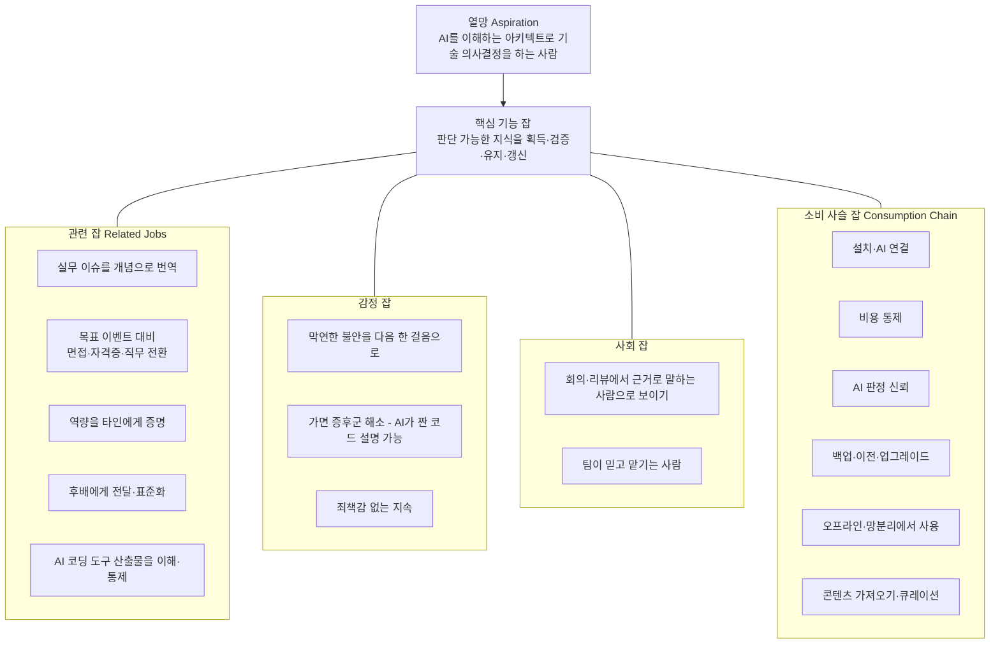
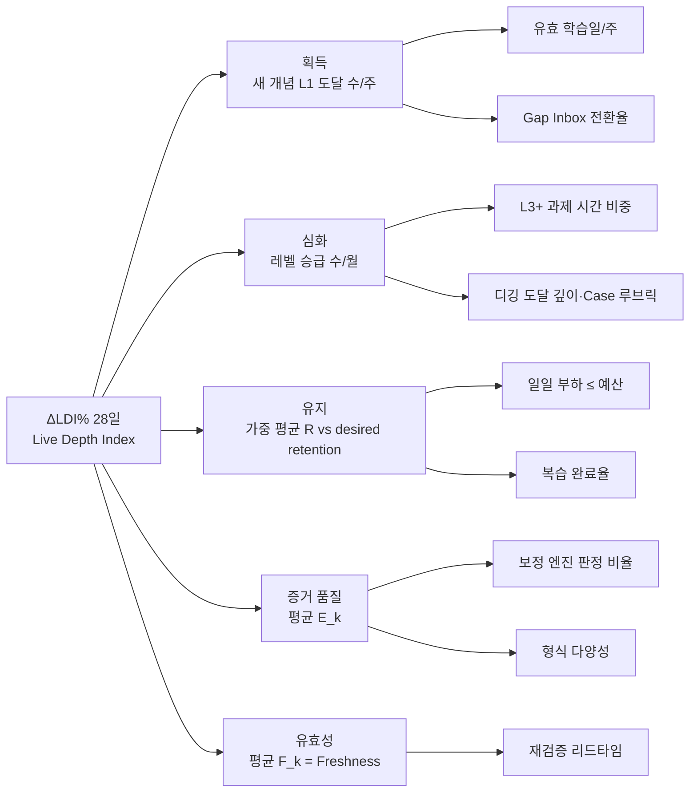
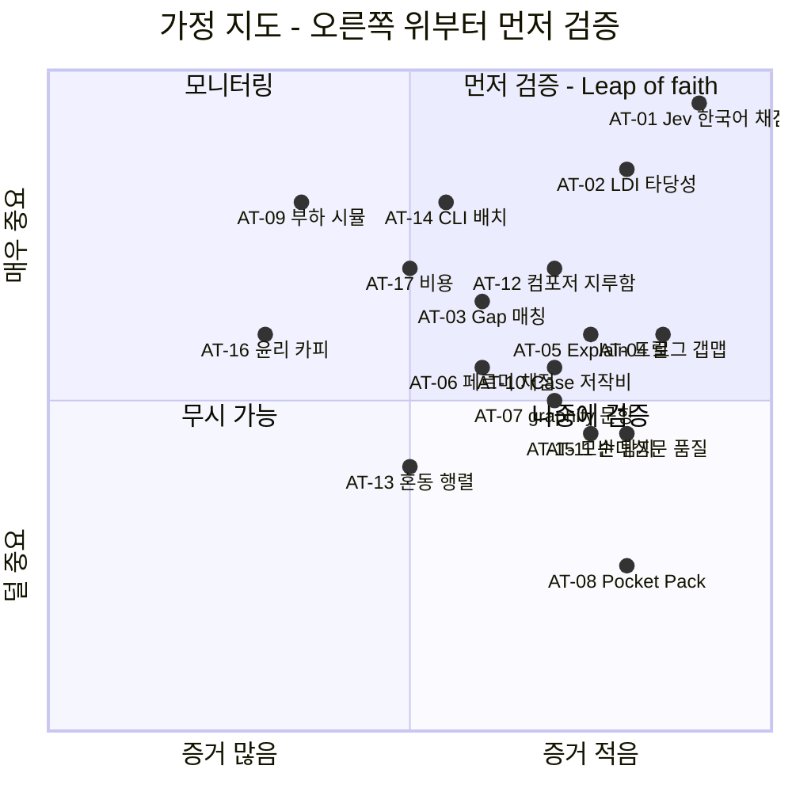

# PLN-IDE-02. 아이디에이션 — Jobs-To-Be-Done × Opportunity Solution Tree

> **Trace**: UR-02(여러 기획 방법론으로 전문가 수준 아이디어) 중심. 아이디어는 UR-01·10~17로 추적한다.
> **입력**: `00-brief/project-brief.md`, `01-planning/01-actors-personas.md`(액터 ACT-*, 페르소나 P0~P5·E1~E3, 요구 후보 RC-01~40), 연구 R1~R6.
> **버전**: v1.0 (Draft → 교차 방법론 합성·적대적 리뷰 대상) · **작성 주체**: T1(상위 모델, 기획) · **작성일**: 2026-09-30
> **후속 소비**: 아이디어 합성 문서(방법론 간 수렴), REQ-01 요구사항정의서, ARC-01(가정 검증 스파이크 결과 → 아키텍처 동결 전 반영)

---

## 0. 요약 (TL;DR)

1. **핵심 잡(Core Functional Job)**을 이렇게 정의했다. "필요한 순간에 옳은 기술 판단을 내릴 수 있을 만큼의 개발 지식을 **획득·검증·유지·갱신**한다." 학습자는 동일 인물 "도현"이고, 이 잡을 15년 동안 수행한다. 이 잡은 "공부한다"가 아니다. 사용자가 원하는 진전은 **판단 가능 상태**이고, 공부는 그 수단이다.
2. **Universal Job Map 8단계 × 27개 Desired Outcome Statement(DO)**를 ODI 방식으로 점수화했다. 인터뷰 데이터가 없으므로 점수는 페르소나·연구 기반 **추정치**다. 가장 덜 충족된 기회는 아래 세 가지다.
   - DO-02 "모르는지조차 모르는 선수 개념 놓침"(Opp 15.5)
   - DO-03 "안다고 착각", DO-10 "틀린/모호한 AI 문항"(각 15)
   - DO-13/14/16 "트레이드오프 정량화·장애 첫 가설·AI 코드 설명 불가"(각 15)
3. **OST 루트 결과(Desired Outcome)**는 **Live Depth Index(LDI, 살아있는 깊이 지수)**다.
   - 정의: `LDI = Σ_k w_k · d(L_k) · R_k(t) · E_k · F_k`. 중요도 × 검증된 깊이 × 현재 인출 가능성 × 증거 품질 × 지식 유효성을 곱한다.
   - 초급자(폭·유지)부터 15년차(깊이·신선도)까지 **하나의 식**으로 성장을 표현한다.
   - 문항 수·스트릭으로는 올릴 수 없다(Anti-Goodhart).
   - 이벤트 로그에서 결정적으로 재계산할 수 있다(AI 불필요).
4. **OST 1층 기회 7개**:
   - A 모르는 것을 모른다
   - B 안다고 착각한다
   - C 배운 게 사라지고 복습이 짐이 된다
   - D 지루하거나 막막하다
   - E 지식이 판단으로 전이되지 않는다
   - F 지식이 낡고, 남기지 못한다
   - G 도구 자체가 부담이다

   이 아래에 하위 기회 24개를 두었다. 하위 기회마다 해법 후보 2~3개를 비교해 1개를 선택했다(Torres "compare & contrast").
5. **차별화 아이디어**는 기존 RC 목록에 없던 것들이다.
   - **AI 대화 로그 → 갭 맵**(JTB-04): "당신이 AI에게 물은 것이 곧 당신의 빈칸"이라는 발상. Claude Code 트랜스크립트는 `~/.claude/projects/*/*.jsonl`에 있음을 컨테이너에서 확인했다.
   - **Explain-the-AI-Code 드릴**(JTB-06)
   - **Back-of-Envelope Gym**(JTB-15): 페르미 추정 문항을 결정적 T1 방식으로 채점한다.
   - **Codebase Cartography**(JTB-16): graphify의 `path`/`affected`/`god-nodes`로 정답을 계산하는 코드 구조 파악 문항. UR-09의 graphify를 **학습 콘텐츠로도** 쓴다.
   - **Contrast Pair Generator**(JTB-29): 오답 혼동 행렬로 헷갈리는 형제 개념 쌍을 찾아낸다.
   - **Past-Self Mirror**(JTB-13)
   - **Belief Audit**(JTB-20): 망각이 아니라 노후화(obsolescence)를 경보한다.
   - **Goal Compiler**(JTB-05): JD·면접·자격증을 역산해 시즌 플랜으로 바꾼다.
6. **가정 검증 백로그 AT-01~AT-17**을 두었다.
   - 아키텍처를 좌우하는 6건은 **동결 전 타임박스 스파이크(S0)**로 먼저 돌린다. 대상은 AT-01 Jev 한국어 채점, AT-06 페르미 채점, AT-07 graphify 문항, AT-09 부하 시뮬, AT-14 CLI 배치, AT-17 비용이다.
   - 나머지는 **feature flag 뒤에서** Iteration 중에 검증한다. 실패해도 아키텍처를 뒤집지 않는다(UR-05·UR-18 정합).
7. **Feature Candidates는 JTB-01~JTB-30**이다(§12). 제안 슬라이스는 다음과 같다.
   - v1 Must: 신뢰할 수 있는 코어 루프 — JTB-01·02·07·08·09·12·24·25·26·27·30
   - v1.x: 차별화 — JTB-03·04·05·06·10·13·15·22·29
   - v2: 전문가 구간 — JTB-11·14·16·17·18·19·20·21·23·28

---

## 1. 방법론 Walkthrough

### 1.1 왜 JTBD + OST인가

| 문제 | 기능 목록 중심 기획의 한계 | JTBD + OST가 주는 것 |
|---|---|---|
| 사용자가 15년간 **다른 사람처럼 변한다**(UR-12) | P0용 기능과 P4용 기능이 서로 무관한 목록으로 흩어진다 | 잡(Job)은 안정적이다. 변하는 것은 잡을 수행하는 **상황**과 **성공 기준**뿐이다. 하나의 잡 맵으로 15년을 관통한다 |
| AI가 무엇이든 만들어 줄 수 있어 **솔루션 과잉**이 된다 | "AI로 X 해주기" 기능이 난립한다 | OST는 **결과(outcome) → 기회 → 해법 → 가정 검증** 순서를 강제한다. 결과 지표에 기여하지 않는 해법은 가지에 붙지 않는다 |
| 인터뷰 대상이 1명(가상)이다 | 근거 없는 확신 | 모든 기회·점수에 **추정 태그**를 붙이고, 틀려도 괜찮도록 **가정 검증(AT)**을 설계에 내장한다 |
| UR-05/18: 아키텍처 동결 후 한 번에 개발 | 개발 중 발견이 구조를 뒤집을 위험 | 구조에 영향을 주는 가정은 **동결 전 스파이크**, 나머지는 flag 뒤에서 검증하도록 가정을 **분류**한다 |

### 1.2 결합한 도구와 적용 순서

| 단계 | 도구 | 출처(작성자 지식, 웹 미검증) | 이 문서의 산출물 | 절 |
|---|---|---|---|---|
| ① | **Jobs Theory** — 기능/감정/사회 잡, 잡 계층(Main·Related·Consumption chain) | Christensen *Competing Against Luck*(2016) | 잡 계층 정의 | §2 |
| ② | **Universal Job Map** 8단계 (Define→Locate→Prepare→Confirm→Execute→Monitor→Modify→Conclude) | Ulwick *Jobs to be Done: Theory to Practice*(2016), Bettencourt & Ulwick HBR(2008) | 잡 맵 | §3 |
| ③ | **Forces of Progress** (Push·Pull·Anxiety·Habit) + Hire/Fire 분석 | Moesta *Demand-Side Sales 101*(2020), Klement *When Coffee and Kale Compete*(2016) | 전환 힘 캔버스, 경쟁 고용 표 | §4 |
| ④ | **Job Stories** ("When…, I want to…, so I can…") — 상황·고충 순간(struggling moment) 중심 | Klement(Intercom 2013~) | 경력 단계별 잡 스토리 32개 | §5 |
| ⑤ | **ODI Desired Outcome Statement + Opportunity Algorithm** `Opp = I + max(I − S, 0)` | Ulwick ODI | DO-01~27 점수표 | §6 |
| ⑥ | **Product Outcome 정의 + Driver Tree** | Torres *Continuous Discovery Habits*(2021) "business outcome ≠ product outcome", North Star Framework(Amplitude) | LDI 정의·드라이버 트리·가드레일 | §7 |
| ⑦ | **Opportunity Solution Tree** — 타깃 기회 선정, 해법 ≥ 3개 비교 | Torres(2016~2021) | OST 다이어그램, 가지별 해법 비교 | §8 |
| ⑧ | **Assumption Mapping** (Desirability·Viability·Feasibility·Usability·Ethical) + 검증 카드 | Torres, Bland & Osterwalder *Testing Business Ideas*(2019) | 가정 지도, AT-01~17 | §9 |
| ⑨ | 우선순위(Opp × Confidence × Reach / Effort) → 슬라이스 | RICE 변형 | 우선순위 표 | §10~11 |

**근거 수준 표기**
- `[실측]` — 이 컨테이너에서 직접 확인한 것.
- `[연구]` — R1~R6 문서의 값.
- `[추정]` — 페르소나로 추정한 값. 인터뷰가 없어 ODI 점수는 전부 `[추정]`이며, §6.3의 1인 재보정 절차로 교정한다.

---

## 2. 잡 계층 (Job Hierarchy)

### 2.1 잡 실행자와 핵심 잡

- **잡 실행자(Job Executor)**: ACT-H01 학습자 "도현"(P0→P5). 모자(ACT-H02 큐레이터, ACT-H03 운영자)는 **소비 사슬 잡**의 실행자다.
- **핵심 기능 잡(Core Functional Job)**. Ulwick 문법(동사 + 목적 대상 + 맥락 한정어)으로 쓰면 다음과 같다.
  > **"실무의 필요한 순간에 옳은 기술 판단을 내릴 수 있도록, 개발 전 분야의 지식을 획득·검증·유지·갱신한다."**
  - "획득"은 P0~P1에서 지배적이다. "검증"은 전 구간에 걸친다. "유지"는 P2 이후 비용의 중심이다. "갱신"은 P4~P5에서 지배적이다. 네 동사의 **가중치 이동**이 곧 15년 여정이다.
  - 성공 판정 기준은 "공부를 했다"가 아니라 **"판단 순간에 꺼내 쓸 수 있었다"**다. 그래서 결과 지표는 인출 가능성(R)과 깊이(L)를 곱한 형태여야 한다(§7).

### 2.2 잡 계층도



### 2.3 잡 가중치의 종단 이동 `[추정]`

| 잡 동사 / 관련 잡 | P0 | P1 | P2 | P3 | P4 | P5 |
|---|---|---|---|---|---|---|
| 획득 (새 개념) | ●●● | ●●● | ●● | ● | ● | ● |
| 검증 (안다 ↔ 착각) | ●●● | ●●● | ●●● | ●● | ●● | ●● |
| 유지 (망각 방지) | ●● | ●● | ●●● | ●●● | ●● | ●● |
| 갱신 (노후화 대응) | ○ | ● | ● | ●● | ●●● | ●●● |
| R1 실무 → 개념 번역 | ●●● | ●●● | ●●● | ●● | ● | ● |
| R2 목표 이벤트 대비 | ●● | ●●● | ●● | ● | ○ | ○ |
| R3 역량 증명 | ●● | ●● | ●● | ●● | ●●● | ●● |
| R4 전달·표준화 | ○ | ○ | ● | ●● | ●●● | ●●● |
| R5 AI 산출물 이해·통제 | ●●● | ●●● | ●● | ●● | ●● | ●● |

---

## 3. Universal Job Map — 핵심 잡의 8단계

| 단계 | 사용자가 하려는 것 | 지금 "고용"하는 대안 | 실패 지점(고충 순간) | 연결 DO |
|---|---|---|---|---|
| **1. Define** 목표·범위 정하기 | 어느 트랙을 어디까지, 언제까지 | roadmap.sh 체크리스트, 유튜브 로드맵, 동기 비교 | 목표가 "쿠버 공부"처럼 **측정 불가**하다. 개인 레벨 벡터를 반영하지 못한다 | DO-02, DO-25 |
| **2. Locate** 필요한 지식·자료 찾기 | 모르는 개념과 양질 자료 찾기 | 검색, ChatGPT/Claude 질의, 인프런 | "무엇을 모르는지 모름". 자료 품질 편차가 크다. 영어 문서가 피곤하다 | DO-01, DO-02, DO-27 |
| **3. Prepare** 학습 재료·환경 준비 | 카드·문제·실습 환경 만들기 | Anki 카드 수작업, Notion 정리, 로컬 Docker | 카드 제작 비용이 크다. 실습 환경 오류로 주말을 날린다 | DO-09, DO-10 |
| **4. Confirm** 시작 전 준비됐는지 확인 | 선수 개념 충족 여부, 오늘 가용 시간·에너지 | 직감 | 선수 결손을 모른 채 진행하다 막힌다. 과부하 계획을 세운다 | DO-02, DO-05, DO-06 |
| **5. Execute** 학습·인출·실습 수행 | 이해 → 코드 → 핵심 → 인출 | 강의 시청, AI에 질문 후 복붙 | 수동 소비가 된다(ICAP Passive). AI 답이 기억에 남지 않는다. 단조롭다 | DO-03, DO-07, DO-16, DO-26, DO-27 |
| **6. Monitor** 진척·숙달 확인 | 정말 아는지, 얼마나 남았는지 | 수강률, 체크박스, 느낌 | 자기보고 = 착시(AP-03). 틀린 이유를 모른다 | DO-03, DO-11, DO-21 |
| **7. Modify** 조정 | 난이도·계획·보존 전략 수정 | 계획 재작성, Anki 설정 만지기 | 연체 폭탄. 쉬운 문제 반복. 공백 후 포기 | DO-05, DO-08, DO-12 |
| **8. Conclude** 완결·다음 사이클 | 승급, 산출물, 역량 증명, 다음 시즌 | 자격증, 블로그 | 성장의 증거가 흩어져 있다. 낡은 지식이 계속 "안다"로 남는다 | DO-18, DO-19, DO-20, DO-24 |

**소비 사슬 잡 맵(운영자·큐레이터 모자)**
- 설치 → AI 연결 → 예산 설정 → 콘텐츠 가져오기 → 품질 관리 → 백업 → 업그레이드/마이그레이션 → 기기 이전 → export
- 연결 DO: DO-21~24. 이 사슬 어디서든 실패하면 **15년 사용 가정(UR-12)이 무너진다**. 기능 잡과 동등한 비중으로 다룬다(UR-17 운영성).

---

## 4. 전환 힘(Forces of Progress)과 경쟁 고용 분석

### 4.1 Forces of Progress 캔버스 — "Notion + Anki + ChatGPT + 인프런 조합"에서 이 서비스로 갈아타는 순간

| 힘 | 내용 `[추정 — 페르소나 §4 공감지도 기반]` | 설계 대응 |
|---|---|---|
| **Push** (현 상황의 고통) | 정리만 하고 다시 안 본다. Anki는 1주 빠지면 연체 폭발. AI 답은 휘발된다. "넓고 얕다"는 불안. 동기들의 자격증 인증샷 | 노트/AI 대화 import → 문항화(JTB-04), 부하 거버너(JTB-09), LDI로 불안을 수치화(JTB-01) |
| **Pull** (새 해법의 매력) | 오늘 할 일이 자동으로 정해진다. 틀린 이유가 오개념 이름으로 나온다. 기존 구독(Claude/Codex)을 재활용해 비용 ≈ 0. Depth Map | 세션 컴포저(JTB-12), 오개념 피드백(RC-04), CLI 라우팅(JTB-25) |
| **Anxiety** (새 해법에 대한 불안) | "설정이 복잡하지 않을까", "AI 채점을 믿어도 되나", "API 비용 폭탄", "몇 년 쓴 데이터가 날아가면?", "회사 코드가 외부로 나가면?" | 3분 온보딩 + OFFLINE 기본 동작(JTB-27), 판정 근거·이의제기(JTB-24), 비용 미터·상한(JTB-25), 15년 데이터 계약(JTB-26), 로컬 LLM 강제 토글(RC-31) |
| **Habit** (기존 습관의 관성) | 모르면 ChatGPT에 묻는다. 인프런 영상을 틀어둔다. Notion에 정리한다 | 습관을 **막지 말고 흡수한다**: AI 대화 로그 → 갭 맵(JTB-04), Notion/MD 폴더 import(RC-28), "AI에게 묻기 전에 먼저 예측" 1문항 프롬프트(JTB-03 Gap Inbox) |

> **통찰**: Habit 힘이 가장 강하다. 사용자는 이미 하루 수십 번 Claude Code/Codex에 질문한다. 이 서비스는 그 행동을 **대체하지 말고 원료로 삼아야** 한다. 그래서 JTB-03·04·06을 차별화 축으로 둔다.

### 4.2 경쟁 고용 표 (Hire / Fire)

| 현재 고용된 해법 | 고용 이유(잡) | 해고 이유 | 이 서비스의 입장 |
|---|---|---|---|
| ChatGPT/Claude/Codex 질의 | 즉시 설명, 코드 대필 | 기억에 남지 않는다(생성 효과 없음). 틀려도 모른다. 이력이 흩어진다 | **흡수**: 대화 로그를 갭 신호로 쓴다(JTB-04). AI는 생성, Jev는 판단 |
| Anki | 장기 기억 | 카드 제작 비용, 백로그 폭증, 판단 과제 불가 | **계승 + 보완**: FSRS 계승, 카드 자동 생성, 부하 거버너 |
| Notion/Obsidian 정리 | 내 지식 베이스 소유 | 정리 ≠ 인출. 그래프가 장식적이다 | **계승**: MD export·wikilink, 그래프는 "작업 가능" |
| 인프런/유데미/FEM | 체계적 설명 | 수동 시청, 수강률 착시 | **보완**: 외부 강의 노트 import → 검증 |
| roadmap.sh | 전체 지형 | 자기보고 Done, 개인화 없음, 라이선스상 구조 복제 불가 | **대체**: 자체 R4 택소노미 + 증거 기반 숙달 |
| 프로그래머스/LeetCode | 코테 | 알고리즘 한정 | **부분 보완**: `alg` 트랙 코테 Kit |
| 사수·스터디 | 맥락 있는 피드백 | 시간·가용성, 망설임 | **보조**: 소크라틱 디깅·AI 학생(Feynman) |
| 자격증 교재 | 외부 인정 | 암기 중심, 시험 후 휘발 | **보완**: D-day 모드 + 시험 후 자동 보존 |

---

## 5. Job Stories — 경력 단계별

형식: **When**(상황·고충 순간) / **I want to**(동기) / **so I can**(기대 결과) / **결과 측정**(서비스 안에서 측정 가능한 신호).

### 5.1 P0 도현 (0~1년차 · SI/클라우드 신입)

| ID | When … | I want to … | so I can … | 결과 측정 |
|---|---|---|---|---|
| JS-01 | 회의에서 "그건 readiness로 처리하죠"처럼 **모르는 용어가 스쳐 갈 때** | 10초 안에 용어를 던져두고 저녁에 내가 그걸 아는지 확인하고 싶다 | 모르는 것을 흘려보내지 않는다 | 캡처 → 프로브까지의 전환율, 캡처 개념의 7일 후 R |
| JS-02 | Claude Code가 짜준 FastAPI 코드를 **사수가 "이거 왜 이렇게 했어?"라고 물을 때** | AI가 쓴 코드의 핵심 결정을 내 말로 설명할 수 있는지 미리 점검하고 싶다 | 가면 증후군 없이 코드 리뷰를 받는다 | Explain 드릴 KU 커버리지, 동일 패턴 재출제 정답률 |
| JS-03 | 앱을 처음 열었는데 **"도커 해봤어요" 수준의 자신감이 진짜인지 모를 때** | 20분 안에 트랙별 내 위치를 증거로 받고 싶다 | L1 복습에 시간을 낭비하지 않고 빈 곳부터 채운다 | 배치 진단 문항 수·시간, 진단 레벨과 4주 후 실측 레벨 일치율 |
| JS-04 | 지하철에서 **15분이 생겼는데 뭘 할지 고르다 5분이 지날 때** | 앱을 열자마자 오늘 할 만큼이 준비돼 있길 원한다 | 선택 피로 없이 누적 진전을 만든다 | 앱 열기 → 첫 응답 시간, 세션 완주율 |
| JS-05 | OX를 **확신에 차서 틀렸을 때** | 내가 어떤 오개념을 가졌는지 이름으로 알고 싶다 | 같은 착각을 반복하지 않는다 | 고확신 오답 재발률, Brier |
| JS-06 | 영어 공식 문서(k8s docs)를 **읽다가 세 문단째 집중이 끊길 때** | 핵심 문장만 한국어 앵커로 확인하고 이해했는지 점검하고 싶다 | 영어 문서를 1차 자료로 쓸 수 있게 된다 | 독해 드릴 정답률, 원문 링크 클릭 → 문항 전환 |

### 5.2 P1 (1~3년차 · SI 주니어 백엔드)

| ID | When … | I want to … | so I can … | 결과 측정 |
|---|---|---|---|---|
| JS-07 | 보안약점 진단 리포트에 **"경로 조작 3건"이 찍혀 왔을 때** | 해당 약점의 원리와 우리 스택의 수정 패턴을 바로 훈련하고 싶다 | 재발 없이 조치한다 | 보안약점 find-the-bug 정답률, 동일 약점 재출제 R |
| JS-08 | 정보처리기사/CKA **시험일이 확정됐을 때** | 남은 일수와 약점으로 매일 할 일을 역산받고 싶다 | 불안을 계획으로 바꾼다 | D-day 시점 예측 R, 모의 정답률 |
| JS-09 | **오픈 크런치로 2주를 날렸을 때** | 밀린 숫자를 보지 않고 오늘 할 만큼만 하고 싶다 | 죄책감 없이 이어간다 | 복귀 후 3일 내 일상 큐 회복률 |
| JS-10 | 주말에 **kind 실습을 하다 환경 오류로 1시간을 날릴 때** | 시작 전에 환경을 점검받고, 안 되면 같은 개념을 다른 형식으로 하고 싶다 | 주말 학습 시간이 환경 디버깅에 먹히지 않는다 | doctor 통과율, 대체 경로 전환 후 완료율 |

### 5.3 P2 (3~6년차 · 미드레벨 풀스택/AI 플랫폼)

| ID | When … | I want to … | so I can … | 결과 측정 |
|---|---|---|---|---|
| JS-11 | **L1~L2 카드가 매일 60장씩 쌓여 지루할 때** | 이미 굳은 것은 덜 보고 L3 판단 과제에 시간을 쓰고 싶다 | 성장이 정체되지 않는다 | L1~L2 리뷰 시간 비중, archive 이동 후 R 유지 |
| JS-12 | **새벽 on-call에서 알람을 보고 뭐부터 봐야 할지 멍할 때** | 평소에 비슷한 실패 모드를 단계적 증거 공개 시뮬레이션으로 훈련해 두고 싶다 | 첫 유효 가설까지 시간을 줄인다 | 시뮬레이션 턴 수·증거 요청 효율, 루브릭 점수 |
| JS-13 | **처음 보는 사내 레포(수백 파일)를 인수받을 때** | 핵심 허브 모듈과 영향 범위를 빠르게 파악하는 훈련을 하고 싶다 | 첫 PR까지 걸리는 시간을 줄인다 | Cartography 드릴 정답률·소요 시간 |
| JS-14 | 좋은 기술 글을 **읽고 3일 뒤 내용이 기억나지 않을 때** | 5분 안에 글을 개념·문항으로 만들어 내 복습 흐름에 넣고 싶다 | 읽은 것이 휘발되지 않는다 | import → 발행 시간, 가져온 KU의 30일 R |
| JS-15 | 이직 공고를 보고 **"내가 이 JD에 몇 % 맞나"가 궁금할 때** | JD를 붙이면 격차와 역산 플랜을 받고 싶다 | 막연함 대신 6~8주 시즌 목표를 세운다 | JD 커버리지 %의 시즌 전후 변화 |

### 5.4 P3 (6~10년차 · 시니어/테크리드)

| ID | When … | I want to … | so I can … | 결과 측정 |
|---|---|---|---|---|
| JS-16 | 설계 리뷰에서 "**Redis 클러스터면 충분하다**"는 말에 반박할 숫자가 떠오르지 않을 때 | QPS·용량·지연·비용을 봉투 뒷면 계산으로 빠르게 추정하는 감을 유지하고 싶다 | 트레이드오프를 숫자로 말한다 | 페르미 문항 허용오차 내 비율, 응답 시간 |
| JS-17 | 팀원 설계서를 **리뷰할 시간 30분밖에 없을 때** | 핵심 리스크를 빠짐없이 짚는 체크 감각을 훈련해 두고 싶다 | 리뷰가 기분이 아니라 체계가 된다 | 설계 리뷰 Case의 핵심 이슈 재현율 |
| JS-18 | 몇 달 코딩을 못 해 **손이 녹슨 느낌이 들 때** | 벌점 없이 rusty 영역만 10분씩 회복하고 싶다 | 코딩 감각을 유지한다 | rusty 트랙 R 회복 곡선 |
| JS-19 | **주니어가 같은 질문을 세 번째 할 때** | 내가 설명한 것을 재사용 가능한 교안·퀴즈 팩으로 만들고 싶다 | 멘토링을 체계화한다 | 팩 export 수, Teaching score |

### 5.5 P4 (10~15년차 · 아키텍트/수석)

| ID | When … | I want to … | so I can … | 결과 측정 |
|---|---|---|---|---|
| JS-20 | 기술위원회에서 **내 ADR이 공격받을 게 예상될 때** | 이종 모델의 반대 심문으로 미리 방어 연습을 하고 싶다 | 판단 근거를 문서로 방어한다 | ADR 루브릭, 반박 대응 턴의 Jev 점수 |
| JS-21 | 개발표준정의서 **조항을 새로 써야 할 때** | 검증 가능한 조항을 쓰는 연습과 피드백을 받고 싶다 | 조직 표준의 품질을 올린다 | 조항 루브릭(명확성·검증가능성) |
| JS-22 | 상·하반기 **평가 시즌에 성과를 정리해야 할 때** | 기간 내 역량 성장을 증거 링크와 함께 한 문서로 뽑고 싶다 | 주관적 자기평가 대신 증거로 말한다 | 리포트 생성 시간, 증거 링크 수 |

### 5.6 P5 (15년+ · 전문가)

| ID | When … | I want to … | so I can … | 결과 측정 |
|---|---|---|---|---|
| JS-23 | K8s 메이저 변경·LLM SDK 교체 뉴스가 쏟아질 때 | **내가 확신하고 있는 지식 중 무효화된 것만** 골라 받고 싶다 | 낡은 확신으로 잘못된 결정을 내리지 않는다 | Freshness, 모순 KU 탐지 → 재학습 리드타임 |
| JS-24 | 15년치 이력이 쌓였는데 **앱·스키마·스케줄러가 바뀔 때** | 이력이 손실 없이 새 모델로 재계산되길 원한다 | 평생 도구로 신뢰한다 | 마이그레이션 무손실 검증, 리플레이 일치율 |
| JS-25 | 조직에 **내 지식을 남겨야 할 때** | 내 개념 팩·Case를 타인이 쓸 수 있는 형태로 내보내고 싶다 | 가르치는 것으로 성장을 이어간다 | 팩 품질 게이트 통과율 |

### 5.7 Edge (E1~E3)와 모자(H02·H03)

| ID | 대상 | When … | I want to … | so I can … | 결과 측정 |
|---|---|---|---|---|---|
| JS-26 | E1 | 면접 **D-9인데 시스템 디자인 구술이 막힐 때** | 깊이 사다리로 어디서 막히는지 확인하고 싶다 | 약점 지점만 보강한다 | 디깅 도달 깊이 D, Case 루브릭 |
| JS-27 | E2 | **8개월 만에 앱을 열었을 때** | 연체 숫자가 아니라 "오늘 12분"을 보고 싶다 | 다시 습관을 만든다 | 복귀 2주 내 주간 스트릭 회복 |
| JS-28 | E3 | **인터넷이 없는 현장 PC**에서 점심시간 20분이 생겼을 때 | AI 없이도 모든 모드를 쓰고 싶다 | 환경에 상관없이 누적한다 | 외부 호출 0 상태의 세션 완주율 |
| JS-29 | H02 | 생성 문항이 **"정답이 둘인데?" 싶을 때** | 1키로 신고하면 원인이 분류되고 대체 문항이 생기길 원한다 | 문항 풀을 믿는다 | 신고 → 처리 리드타임, 신고율 |
| JS-30 | H02 | 가져온 블로그 글에 **이상한 지시문이 숨어 있을 때** | 시스템이 알아서 격리하고 나에게 알려주길 원한다 | 안심하고 외부 자료를 쓴다 | 주입 탐지 정밀도·재현율 |
| JS-31 | H03 | 월말에 **AI 비용이 얼마나 나왔는지 불안할 때** | 기능별 비용과 남은 예산을 한 화면에서 보고 싶다 | 구독·API를 안심하고 쓴다 | 예산 초과 0건 |
| JS-32 | H01 | AI가 내 백지노트를 **68점으로 채점했는데 납득이 안 갈 때** | 어떤 항목이 왜 누락 판정됐는지 보고 이의를 제기하고 싶다 | AI 판정을 신뢰하거나 교정한다 | 이의 인용률, 이의 후 판정 변경률 |

---

## 6. Desired Outcome Statements (ODI) 와 기회 점수

### 6.1 점수 규칙

- 문법: **방향(최소화) + 측정 단위(시간/가능성/빈도) + 대상 + 맥락**. Ulwick 규칙에 따라 해법 중립으로 썼다.
- I(중요도)·S(현재 대안 만족도)는 0~10 척도로, **P0~P5·E 가중 평균** `[추정]`이다. 가중치는 15년 체류 시간 비율을 따른다: P0 .15 / P1 .20 / P2 .20 / P3 .20 / P4 .15 / P5 .10.
- `Opp = I + max(I − S, 0)`. **≥ 15는 극단적 미충족, 12~15는 미충족, 10~12는 적정, < 10은 과충족 또는 저중요**(Ulwick 관례).

### 6.2 DO 점수표 (Opp 내림차순)

| DO | Desired Outcome Statement | 주 페르소나 | I | S | **Opp** | 잡 맵 단계 |
|---|---|---|---|---|---|---|
| DO-02 | 내가 모른다는 사실조차 모르는 **선수 개념을 놓칠 가능성** 최소화 | P0, P1 | 9.0 | 2.5 | **15.5** | Define/Confirm |
| DO-03 | "안다"고 느끼지만 **설명·적용하지 못하는 개념의 수** 최소화 | 전원 | 9.0 | 3.0 | **15.0** | Monitor |
| DO-10 | 학습에 쓰는 문항이 **틀리거나 모호할 가능성** 최소화 | 전원 | 9.0 | 3.0 | **15.0** | Prepare |
| DO-13 | 트레이드오프를 **정량 근거로 설명하지 못할 가능성** 최소화 | P3, P4, E1 | 8.5 | 2.0 | **15.0** | Execute |
| DO-14 | 장애 상황에서 **첫 유효 가설까지 걸리는 시간** 최소화 | P2, P3 | 8.5 | 2.0 | **15.0** | Execute |
| DO-16 | AI가 생성한 코드를 **설명하지 못한 채 사용할 가능성** 최소화 | P0, P1, P2 | 8.5 | 2.0 | **15.0** | Execute |
| DO-27 | AI에게 물어 알게 된 내용이 **기억에 남지 않을 가능성** 최소화 | P0~P2 | 8.0 | 2.0 | **14.0** | Locate/Execute |
| DO-01 | 실무에서 새 개념을 마주쳤을 때 **내 이해 수준을 판별하는 시간** 최소화 | P0~P2 | 8.5 | 3.0 | **14.0** | Locate |
| DO-17 | 내 설계 판단을 **반박에 방어하지 못할 가능성** 최소화 | P3~P5 | 8.0 | 2.0 | **14.0** | Execute/Conclude |
| DO-18 | **이미 무효화된 지식을 확신하고 쓸 가능성** 최소화 | P4, P5, E2 | 8.0 | 2.0 | **14.0** | Conclude/Modify |
| DO-25 | 목표(면접·자격증·JD) 대비 **남은 격차를 추정하는 시간** 최소화 | P1, P2, E1 | 8.0 | 2.5 | **13.5** | Define |
| DO-04 | 학습한 개념을 **필요 시점에 인출하지 못할 가능성** 최소화 | 전원 | 9.0 | 5.0 | **13.0** | Monitor |
| DO-05 | 복습 부하가 **가용 시간을 초과하는 날의 빈도** 최소화 | P2, P5 | 8.0 | 3.0 | **13.0** | Modify |
| DO-11 | 틀린 이유(**오개념**)를 특정하지 못할 가능성 최소화 | P0, P1 | 8.0 | 3.0 | **13.0** | Monitor |
| DO-15 | 낯선 코드베이스의 **구조·영향 범위 파악 시간** 최소화 | P2, P3 | 8.0 | 3.0 | **13.0** | Execute |
| DO-21 | AI 채점 결과를 **믿지 못해 재확인하는 빈도** 최소화 | 전원 | 8.0 | 3.0 | **13.0** | Monitor |
| DO-24 | 수년간의 학습 이력을 **도구 변경·업데이트로 잃을 가능성** 최소화 | P4, P5 | 8.5 | 4.0 | **13.0** | Conclude |
| DO-09 | 문항·카드를 **직접 만드는 데 드는 시간** 최소화 | P0~P2 | 8.0 | 4.0 | **12.0** | Prepare |
| DO-08 | 공백 후 **재시작까지 걸리는 시간** 최소화 | E2, P1 | 7.0 | 2.0 | **12.0** | Modify |
| DO-12 | 레벨이 올라도 **이미 아는 쉬운 문제에 쓰는 시간 비율** 최소화 | P2, P3 | 7.5 | 3.0 | **12.0** | Modify |
| DO-19 | 내 역량을 **제3자에게 증거로 설명하는 시간** 최소화 | P1~P4 | 7.0 | 2.0 | **12.0** | Conclude |
| DO-06 | **오늘 무엇을 할지 결정하는 시간** 최소화 | P0 | 7.5 | 4.0 | **11.0** | Confirm |
| DO-26 | 공부가 단조로워 **세션을 조기 종료할 가능성** 최소화 | 전원 | 7.5 | 4.0 | **11.0** | Execute |
| DO-20 | 내 지식을 **후배에게 전달 가능한 형태로 만드는 시간** 최소화 | P3~P5 | 6.5 | 3.0 | **10.0** | Conclude |
| DO-23 | 네트워크·AI 부재 시 **학습이 중단될 가능성** 최소화 | E3, P1 | 7.0 | 4.0 | **10.0** | Execute |
| DO-07 | 자투리 5~15분을 **유효 학습으로 전환하지 못할 가능성** 최소화 | P0, P1 | 7.0 | 5.0 | **9.0** | Execute |
| DO-22 | AI 비용이 **예산을 넘을 가능성** 최소화 | H03 | 7.0 | 5.0 | **9.0** | (소비 사슬) |

**해석**
1. **극단적 미충족(≥ 15)은 두 부류다.**
   - "검증" 계열(DO-02/03/10): 착각과 문항 신뢰. 초급 구간의 핵심이다.
   - "판단 전이" 계열(DO-13/14/16): 정량 트레이드오프, 장애 가설, AI 코드 설명. 중·고급 구간의 핵심이다.
   - 즉 이 서비스의 차별 가치는 **"기억"이 아니라 "검증된 판단력"**이다.
2. DO-04(인출)는 중요도가 최고지만 Anki·FSRS가 이미 상당 부분 충족한다(S 5). 그래서 **코어로 유지하되 차별화 축은 아니다**. FSRS는 "테이블 스테이크"다.
3. DO-07(자투리)·DO-22(비용)는 과충족 쪽이다. 모바일 앱 수준의 자투리 기능에 큰 투자를 하지 않는다(→ JTB-11 Pocket Pack은 v2, 위험 높음).

### 6.3 `[추정]` 교정 절차 (1인 ODI 재보정)

- 기획 확정 전 **선택 과업**: 사용자가 DO 27개에 I/S를 1~5로 답한다(약 5분). §6.2와 편차가 ±2 이상인 DO만 재검토한다.
- 운영 중 **행동 데이터로 교정**한다(통합 2회차 회고 RETRO-01).
  - DO-05 ← 일일 부하 초과일 비율
  - DO-26 ← 세션 조기 종료율
  - DO-21 ← 이의제기율
  - 이런 식으로 DO마다 **측정 신호를 1개씩 매핑**했다(§5 잡 스토리의 "결과 측정" 열).

---

## 7. OST 루트 — Desired Outcome: Live Depth Index (LDI)

### 7.1 왜 새 지표인가

| 후보 지표 | 문제 |
|---|---|
| 푼 문항 수 / 세션 수 / 스트릭 | 양적 지표 = 목표 대체(AP-02, P3 anti-goal). Goodhart에 즉시 취약 |
| 정답률 | 난이도 제어(목표 P 0.70~0.85, R1 §8.2)를 하면 **설계상 일정**하다. 성장을 보여주지 못한다 |
| FSRS 평균 유지율 | 깊이를 반영하지 않는다. L1 카드만 쌓아도 높다 |
| 레벨(L1~L5) 개수 | 망각·노후화를 반영하지 않는다. "한때 알았음"이 계속 남는다 |
| **LDI** | 깊이 × 현재 인출 가능성 × 증거 품질 × 유효성. 15년 전 구간에서 의미가 있다 |

### 7.2 정의

```
LDI(t) = Σ_k  w_k · d(L_k) · R_k(t) · E_k · F_k
```

| 항 | 의미 | 값 | 출처/계산 |
|---|---|---|---|
| `k` | Concept(= KC, R4 §1) | 469개 중 활성 개념 | R4 |
| `w_k` | 개념 중요도 = 보존 계층 | core 1.0 / standard 0.7 / breadth 0.4 / archive 0.2 | R1 LS-12 |
| `L_k` | 증거로 **검증된** 레벨(해당 레벨 facet의 숙달 규칙 충족) | L0~L5 | R1 §7.3 |
| `d(L)` | 깊이 가치(볼록 함수 → 깊이에 보상, L1 파밍 억제) | L0 0 · L1 1 · L2 2 · L3 3.5 · L4 5.5 · L5 8 | 본 문서 제안 `[추정]` — 레벨 간 학습 시간 비 ≈ 1.6× 가정 |
| `R_k(t)` | 해당 레벨 facet 카드들의 현재 인출 가능성 평균 | 0~1 | FSRS-6 retrievability(R1 §2.2) |
| `E_k` | 증거 품질 = `0.5·c_k + 0.5·v_k` | 0~1 | `c_k`는 엔진 보정 가중치: 결정적·Jev = 1.0, LLM-judge = 0.6, 자기채점 = 0.4(R5 calibrated 플래그). `v_k` = min(1, 서로 다른 형식 수 / 2) |
| `F_k` | 지식 유효성 | valid 1 / 재검증 필요 0.5 / deprecated 0 | R4 `valid_as_of`·`deprecated_by`, A04 신선도 감시자 |

**표시 형태**
- 경로 정규화: `LDI% = LDI / LDI_max(path 목표 레벨)`. 트랙별 `LDI_t`는 Depth Map 색 농도로 쓴다.
- 북극성 판독값은 **ΔLDI% (28일 이동)**이다. 홈에 큰 숫자로 노출하지 않고 **주간 리뷰·시즌 회고에서만** 보여준다. 숫자 압박을 피하기 위해서다(AP-05 정신).
- **결정적·재계산 가능**: `review_log`/`attempt_log`/KU 상태만으로 계산하고 AI 호출이 필요 없다. 파라미터(d, w, 엔진 가중치)를 바꿔도 이벤트 리플레이로 과거를 재계산할 수 있다(LS-11, JTB-26).

### 7.3 페르소나별 LDI 역학 `[추정]`

| 페르소나 | LDI를 주로 움직이는 항 | 건강한 ΔLDI% (28일) | 주의 신호 |
|---|---|---|---|
| P0 | 개념 수 증가(L1→L2), `E_k`(형식 다양화) | +4~6%p | 신규 과다 → R 하락으로 상쇄 |
| P1 | `L_k` L2 승급, cert 개념 R | +3~5%p | 크런치 기간 R 하락(정상, 복귀 모드로 회복) |
| P2 | `d(L)` L3 도달, archive 이동으로 부하 감소 | +2~4%p | L1 파밍(d 볼록성으로 억제) |
| P3 | L4 Case 증거(`E_k` 형식 다양성) | +1~3%p | Case 없이 인출만 → L 정체 |
| P4 | L5, 교차 트랙 | +0.5~2%p | `F_k` 하락 |
| P5 | **`F_k` 유지**가 핵심. 성장보다 "감소하지 않음" | −0.5~+1%p (유지 자체가 성공) | 노후화 누적 |

### 7.4 Driver Tree (입력 지표)



### 7.5 가드레일 (LDI를 올리다 망가뜨리면 안 되는 것)

| ID | 가드레일 | 임계 | 근거 |
|---|---|---|---|
| GR-1 | 일일 학습 부하 ≤ 사용자 예산 | 90% 이상의 날 | DO-05, BL-04 |
| GR-2 | 세션 조기 종료율 | ≤ 15% | DO-26 |
| GR-3 | AI 판정 이의 인용률 | ≤ 10% (초과 시 해당 엔진·과업 가중치 하향) | DO-21 |
| GR-4 | 문항 신고율 | ≤ 5% | DO-10, P2 성공 지표 |
| GR-5 | 월 AI 비용 | ≤ 사용자 예산(기본 ₩30,000) | DO-22 |
| GR-6 | 보정(Brier) | 4주 이동평균이 악화되지 않음 | R1 §5.1 |
| GR-7 | 빠른 추측 비율 | ≤ 5% (추측 응답은 증거 가중 0) | RC-15 |
| GR-8 | 외부 호출 | OFFLINE 모드에서 0 | E3 |

**Anti-Goodhart 설계**
- 문항을 많이 풀어도 R은 1에서 포화한다. L은 서로 다른 형식의 증거가 있어야 오르고, `E_k`는 자기채점만으로는 0.7에서 멈춘다.
- 따라서 LDI를 올리는 **유일한 경로는 "다양한 형식으로, 보정된 판정 아래, 더 깊게, 잊지 않게"**다. 이는 학습과학(R1 §0)의 권고 그 자체다.

---

## 8. Opportunity Solution Tree

### 8.1 트리 개요

```mermaid
flowchart TB
  OUT([Desired Outcome<br/>ΔLDI% 28일 ↑ · 가드레일 GR-1~8 유지])
  OUT --> A[OP-A 모르는 것을 모른다<br/>DO-01·02·25·27]
  OUT --> B[OP-B 안다고 착각한다<br/>DO-03·11·16]
  OUT --> C[OP-C 배운 게 사라지고 복습이 짐<br/>DO-04·05·07·08]
  OUT --> D[OP-D 지루하거나 막막하다<br/>DO-06·12·26]
  OUT --> E[OP-E 지식이 판단으로 전이되지 않는다<br/>DO-13·14·15·17]
  OUT --> F[OP-F 지식이 낡고 남기지 못한다<br/>DO-18·19·20]
  OUT --> G[OP-G 도구 자체가 부담<br/>DO-09·10·21·22·23·24]

  A --> A1[A1 첫 위치를 모른다]
  A --> A2[A2 실무에서 스친 개념을 흘린다]
  A --> A3[A3 AI에 물은 것이 학습으로 안 이어짐]
  A --> A4[A4 목표를 계획으로 못 바꾼다]
  B --> B1[B1 확신과 실력의 불일치]
  B --> B2[B2 AI가 쓴 코드를 설명 못 함]
  B --> B3[B3 완료 = 자기보고]
  B --> B4[B4 헷갈리는 형제 개념]
  C --> C1[C1 백로그 폭증]
  C --> C2[C2 공백·크런치 후 포기]
  C --> C3[C3 자투리 시간 미활용]
  D --> D1[D1 오늘 뭘 할지 결정 피로]
  D --> D2[D2 모드 단조로움 Day3·Month7]
  D --> D3[D3 성장 체감 부재]
  D --> D4[D4 전문성 역전 - 쉬운 건 지루]
  E --> E1[E1 장애 대응 경험 부족]
  E --> E2[E2 숫자로 말하지 못함]
  E --> E3[E3 낯선 코드베이스]
  E --> E4[E4 설계 방어·표준 작성]
  E --> E5[E5 SI·보안 실무 맥락]
  F --> F1[F1 노후화 obsolescence]
  F --> F2[F2 역량 증명]
  F --> F3[F3 가르치기·전수]
  G --> G1[G1 AI 판정 불신]
  G --> G2[G2 설치·AI 연결·비용]
  G --> G3[G3 15년 데이터 연속성]
  G --> G4[G4 오프라인·망분리]

  A1 -.-> S02[JTB-02]
  A2 -.-> S03[JTB-03]
  A3 -.-> S04[JTB-04]
  A4 -.-> S05[JTB-05]
  B1 -.-> S07[JTB-07]
  B2 -.-> S06[JTB-06]
  B3 -.-> S08[JTB-08]
  B4 -.-> S29[JTB-29]
  C1 -.-> S09[JTB-09]
  C2 -.-> S10[JTB-10]
  C3 -.-> S11[JTB-11]
  D1 -.-> S12[JTB-12]
  D2 -.-> S12
  D3 -.-> S13[JTB-13 · JTB-30]
  D4 -.-> S12
  E1 -.-> S14[JTB-14 · JTB-28]
  E2 -.-> S15[JTB-15]
  E3 -.-> S16[JTB-16]
  E4 -.-> S17[JTB-17]
  E5 -.-> S22[JTB-22]
  F1 -.-> S20[JTB-20]
  F2 -.-> S21[JTB-21]
  F3 -.-> S18[JTB-18 · JTB-19]
  G1 -.-> S24[JTB-24]
  G2 -.-> S25[JTB-25]
  G3 -.-> S26[JTB-26]
  G4 -.-> S27[JTB-27]
```



> JTB-01(LDI 엔진)은 루트 결과 자체를 측정하는 **계측 해법**이므로 트리 전체에 걸친다. JTB-23(English Doc Bridge)은 A2·B1의 보조 해법이다.

### 8.2 타깃 기회 선정 (Torres: 한 번에 하나의 타깃)

| 순서 | 타깃 기회 | 선정 이유 | 릴리스 |
|---|---|---|---|
| T-1 | **OP-B 안다고 착각한다** + **OP-C 복습이 짐** | 극단적 미충족(DO-03)이다. 코어 루프의 신뢰성이 이것에 달려 있고, 다른 모든 기회의 **전제**다(검증 안 된 숙달 위에 판단 과제를 얹을 수 없다) | v1 |
| T-2 | **OP-A 모르는 것을 모른다** (특히 A2·A3) | Habit 힘을 흡수하는 차별화 축이다. 사용자의 실제 행동(AI CLI 사용)과 직결된다 | v1.x |
| T-3 | **OP-E 판단 전이** | DO-13/14/16이 극단적 미충족이다. P2~P4 체류 기간(약 10년)의 핵심이다 | v1.x(E2, E5) → v2(E1, E3, E4) |
| T-4 | OP-F, OP-D 잔여 | P4~P5와 장기 운영 | v2 |
| 상시 | OP-G | 소비 사슬 실패는 전 기회를 무효화한다 → **Must 기반** | v1 |

### 8.3 가지별 해법 비교 (각 하위 기회에 대해 후보 해법 ≥ 2~3개)

평가 기준은 **영향**(LDI·DO 기여), **노력**, **차별화**, **위험**이다. ★는 선택된 해법이다.

#### OP-A 모르는 것을 모른다

| 하위 기회 | 후보 해법 | 평가 | 선택 |
|---|---|---|---|
| A1 첫 위치를 모른다 (JS-03) | (a) 경력 연차로 레벨 추정만 (b) 트랙당 고정 20문항 진단 (c) **Elo 기반 적응형 배치 진단(CAT)**: 트랙당 5~8문항, 경력 prior, 선수 DAG로 전파 추론 | (a) 오차가 크다 (b) 20분 × 19트랙은 불가능 (c) 문항 수를 60% 줄이고, "k8s L2 통과 → docker L1 추론" 식 DAG 전파를 한다 | ★(c) → **JTB-02** |
| A2 실무에서 스친 개념을 흘린다 (JS-01) | (a) 수동 검색 후 개념 페이지 열기 (b) **Gap Inbox**: 명령 팔레트/`dstudy add "…"` CLI로 10초 캡처 → FTS5 trigram·별칭 매칭 → Jev `choice`로 개념 확정 → 저녁 세션에 **3문항 프로브**(프리테스트 효과) → 결과로 큐 편입 여부 결정 (c) 브라우저 확장으로 선택 텍스트 전송 | (a) 마찰이 크다 (c) 로컬 서버에 CSRF 표면이 생기고 배포 비용이 든다 (b) 저비용이고 기존 CLI 습관에 맞는다 | ★(b) → **JTB-03** |
| A3 AI에 물은 것이 학습으로 안 이어진다 (DO-27) | (a) "AI에게 묻기 전 예측" 넛지만 (b) **AI 대화 로그 → 갭 맵**: 사용자가 허용한 폴더의 Claude Code(`~/.claude/projects/*/*.jsonl` `[실측]`)·Codex 세션 로그에서 **사용자 질문 턴만** 로컬 파싱 → 비밀정보 레닥션 → 개념 매칭 → "지난 2주 당신이 AI에 가장 많이 물은 개념 Top 10" + 각 개념 프로브 (c) 채팅 UI를 서비스 안에 내장 | (a) 약하다 (c) 기존 도구를 대체하려 하는데 Habit 힘에 역행한다 (b) 습관을 원료로 쓴다. 단 형식이 비공식이라 드리프트 위험이 있다 | ★(b) + (a)는 Gap Inbox에 통합 → **JTB-04** |
| A4 목표를 계획으로 못 바꾼다 (JS-08, JS-15, JS-26) | (a) 수동 시즌 계획 (b) 자격증 태그 필터만 (c) **Goal Compiler**: JD·시험 범위·면접 유형 텍스트 → LLM이 스킬 추출 → Jev `choice`로 R4 개념/태그에 매핑(객체 키 참조) → 레벨 벡터와 격차 → D-day 역산(cram-aware retention, 종료 후 복귀) | (c)는 E1/P1/P2 세 페르소나에 걸치고, 기존 D-day 모드(RC-27)를 일반화한다 | ★(c) → **JTB-05** |

#### OP-B 안다고 착각한다

| 하위 기회 | 후보 해법 | 평가 | 선택 |
|---|---|---|---|
| B1 확신과 실력의 불일치 (JS-05) | (a) 정답률만 표시 (b) **보정 스튜디오**: CBM 3버튼, "착각 지수(Illusion Gap) = 확신 가중 기대 정답률 − 실제", 고확신 오답 24h 재출제, 백지노트 "애매 표시 vs 실제" 대조 (c) 매 문항 0~100 확신 슬라이더 | (c) 입력 비용이 크다 (b) R1 CBM 근거와 1키 입력 | ★(b) → **JTB-07** |
| B2 AI가 쓴 코드를 설명 못 한다 (JS-02, DO-16) | (a) 일반 코드 문항만 (b) **Explain-the-AI-Code 드릴**: 개인 저장소 커밋 diff 또는 붙여넣은 코드 → (i) "이 줄의 의도" 설명(Jev KU 체크리스트) (ii) 출력 예측(T1 실행) (iii) 뮤테이션 1개 주입 후 버그 찾기 (iv) 대안 비교 1문. **기본은 로컬 LLM/CLI**, 회사 코드 경고 (c) AI 코딩 세션 실시간 훅 | (c) 침습적이고 NG-06 위험 (b) 명시적 사용자 행동, 로컬 우선 | ★(b) → **JTB-06** |
| B3 완료 = 자기보고 | (a) 체크박스 (b) **"검증 받기"**: 개념 완료 대신 3~5문항 이종 형식 숙달 체크(서로 다른 형식 ≥ 2, 보정 엔진) → L 승인 (c) 완료 체크 + 나중 시험 | R3 BL-02 그대로. (b)는 LDI의 `E_k`와 직결된다 | ★(b) → **JTB-08** |
| B4 헷갈리는 형제 개념 (JS-05 파생) | (a) 수작업 대조 사례 (b) **Contrast Pair Generator**: MCQ 오답지는 개념에 매핑돼 있다(R2 오답지 = 오개념/형제 개념). attempt 로그로 **혼동 행렬**을 누적하고, 쌍 혼동 ≥ 임계(예: 5회 중 3회)이면 대조 문항(두 개념의 차이 1문장 + 판별 시나리오 3개)을 자동 편성 (c) LLM에게 "헷갈릴 만한 쌍"을 추천받기 | (b) 개인 데이터 기반이고 결정적이며 AI 불필요. T2 템플릿으로 생성 가능 | ★(b) → **JTB-29** |

#### OP-C 배운 게 사라지고 복습이 짐

| 하위 기회 | 후보 해법 | 평가 | 선택 |
|---|---|---|---|
| C1 백로그 폭증 (JS-11) | (a) 일일 상한만 (b) **부하 거버너**: 사용자 시간 예산(분) → ts-fsrs 시뮬레이터로 향후 30일 부하 예측 → 신규 도입량 자동 조절 + 보존 계층 이동 제안(archive 0.80) + 로드밸런싱 (c) 연체 자동 리셋 | (c) 이력 왜곡 (b) R1 LS-12 + 워크로드 시뮬레이터 | ★(b) → **JTB-09** |
| C2 공백·크런치 후 포기 (JS-09, JS-27) | (a) 휴식 토큰만 (b) **복귀·크런치 프로토콜**: 일시정지(예정된 크런치), 복귀 모드(연체 비노출·core 우선·4~6주 분산·재배치 진단), 공백기 신선도 변경 요약 | RC-13 확장. P1·E2 공통 | ★(b) → **JTB-10** |
| C3 자투리 시간 미활용 (JS-04, DO-07 Opp 9) | (a) 반응형 웹을 LAN에 노출(페어링 토큰) (b) **Pocket Pack**: 오늘 큐의 OX/카드를 정적 단일 HTML로 내보내 휴대기기에서 오프라인으로 풀고, 응답 파일로 재수입(타임스탬프 보존) (c) 아무것도 하지 않음 — 노트북 5분 퀵 모드로 충분 | DO-07은 과충족 쪽. (a)는 127.0.0.1 원칙과 충돌(DNS rebinding·CSRF) (b)는 보안상 안전하지만 동기화 UX 위험이 있다 | v1은 (c), v2에 ★(b) 검증 후 → **JTB-11** |

#### OP-D 지루하거나 막막하다

| 하위 기회 | 후보 해법 | 평가 | 선택 |
|---|---|---|---|
| D1·D2·D4 결정 피로·단조로움·전문성 역전 | (a) 고정 세션 템플릿 (b) **세션 컴포저**: 입력(가용 시간 × 에너지 3단 × 트랙별 레벨 믹스 × 최근 모드 이력) → 블록 편성(연속 동일 모드 ≤ 2, 세션당 ≥ 3종, 보스 문제 1, 목표 P 0.70~0.85). 레벨이 오르면 믹스가 자동 전환된다 (c) 사용자가 매번 모드 선택 | (b)는 RC-07/09/12를 **하나의 엔진**으로 통합한다. 결정적이라 AI 불필요 | ★(b) → **JTB-12** |
| D3 성장 체감 부재 (Month 7 정체기) | (a) 누적 통계 그래프 (b) **Past-Self Mirror**: 같은 개념의 6개월 전 백지노트/디깅 답변/풀이 시간을 오늘 결과와 나란히 diff("그때 놓친 4개 중 3개를 이제 씀"), 고스트 레이스 (c) 배지 | (b)는 SDT 관계성의 대체재("과거의 나", BL-20)이고 이미 저장된 데이터만 쓴다 | ★(b) → **JTB-13** + 주간 의식 **JTB-30** |

#### OP-E 지식이 판단으로 전이되지 않는다

| 하위 기회 | 후보 해법 | 평가 | 선택 |
|---|---|---|---|
| E1 장애 대응 경험 부족 (JS-12) | (a) 서술형 사례 문항 (b) **Incident Simulator**: Case를 **상태 머신 YAML**(증거 노드·공개 조건·비용)로 저작하고, 학습자가 증거를 요청하면 단계적으로 공개. 턴 수·증거 효율 → 시뮬레이션 MTTR, 포스트모템 루브릭(Jev `score`) (c) 실제 kind 카오스 | (b)는 LLM 없이도 결정적으로 진행된다(LLM은 선택적 서술). (c)는 **Break-it Lab**(JTB-28)으로 별도 보완 | ★(b) → **JTB-14**, 보조 **JTB-28** |
| E2 숫자로 말하지 못한다 (JS-16, DO-13) | (a) LLM 시스템 디자인 문답 (b) **Back-of-Envelope Gym**: 파라미터 표(DAU, 요청 크기, 복제 계수, 레이턴시 상수표 등) × 템플릿으로 **T1 생성**하고, 정답은 코드로 계산한다. 채점은 로그 스케일 허용오차(×2 이내 만점, ×10 이내 부분점, 단위 오류 별도 태그). "Latency numbers" 카드 FSRS | (b)는 결정적이고 저비용이며 AI 불필요. 시스템 디자인 면접(E1)과 P3 설계 리뷰 모두에 쓰인다 | ★(b) → **JTB-15** |
| E3 낯선 코드베이스 (JS-13, DO-15) | (a) 코드 읽기 서술 문항 (b) **Codebase Cartography**: 라이선스 A/B 급 OSS 레포(또는 사용자 개인 레포)를 `graphify clone` / `graphify extract --code-only` → `god-nodes`, `path A B`, `affected X`로 **정답이 계산되는** 문항을 생성한다. 예: "`X`를 바꾸면 2홉 내 영향받는 모듈은?", "요청 핸들러에서 DB 계층까지의 경로는?" `[실측: graphify CLI 명령 존재 확인]` (c) LLM이 레포를 요약하고 퀴즈를 낸다 | (b)는 UR-09의 도구를 **학습 콘텐츠로도** 재사용하고 정답이 결정적이다 | ★(b) → **JTB-16** |
| E4 설계 방어·표준 작성 (JS-20, JS-21) | (a) ADR 작성 + 루브릭 (b) **Design Defense Arena**: ADR 작성 → **작성·채점과 다른 모델 계열**의 반대 심문 3턴(LLM은 질문 문장만 생성) → 각 응답을 Jev가 판정(`noul`: 반박을 직접 다뤘는가, `score`: 근거 정량성). "정답"이 아니라 **고려사항 커버리지**로 채점해 it-depends 문제를 해소한다 (c) 사용자 자기 리뷰 | (b)는 P3~P5의 핵심 잡(S1 사회 잡) | ★(b) → **JTB-17** |
| E5 SI·보안 실무 맥락 (JS-07, JS-21) | (a) 일반 보안 문항 (b) **SI·보안 실무 드릴 팩**: 행안부 49 보안약점 × 스택별 뮤테이션 find-the-bug(R6 §6), 산출물 해부(요구사항 ID 분류·표준용어 클래스워드·RTM 추적) OX/매칭, L5 조항 작성 과제 | (b)는 한국 SI 맥락이라는 차별점이다(BL-16) | ★(b) → **JTB-22** |

#### OP-F 지식이 낡고, 남기지 못한다

| 하위 기회 | 후보 해법 | 평가 | 선택 |
|---|---|---|---|
| F1 노후화 (JS-23, DO-18) | (a) 전체 개념 주기적 재검증 (b) **Belief Audit**: 신선도 감시자의 원문 변경 × **사용자의 고안정도(S 높음)·고확신 카드** 교집합을 우선 경보한다("당신이 가장 확신하는 것 중 바뀐 것"). 모순 KU 출제 중단, `deprecated_by` 연결, changelog → "무엇이 바뀌었나" 드릴 | (b)는 알림 수를 최소화한다(P5 anti-goal: 알림 피로) | ★(b) → **JTB-20** |
| F2 역량 증명 (JS-22) | (a) 대시보드 스크린샷 (b) **Evidence Portfolio**: 기간 선택 → 트랙별 ΔLDI, 승급 근거, 대표 산출물(ADR·포스트모템·백지노트 diff) 링크, 오개념 극복 이력 → MD/HTML export. 증거 출처 해시 포함 | (b)는 한국 기업 상·하반기 평가 주기에 맞춘다 | ★(b) → **JTB-21** |
| F3 가르치기·전수 (JS-19, JS-25) | (a) MD export만 (b) **Teach-back**(오개념을 가진 AI 학생 + Teaching score) (c) **Concept Pack Authoring & Export**: 내 KU·오개념·Case를 팩으로 묶어 품질 게이트를 통과시킨 뒤 정적 퀴즈 HTML/JSON 팩으로 내보낸다(라이선스 태그 유지) | (b)와 (c)는 상보적이다. (b)는 학습자 본인 성장, (c)는 조직 전달 | ★(b) → **JTB-18**, ★(c) → **JTB-19** |

#### OP-G 도구 자체가 부담

| 하위 기회 | 후보 해법 | 평가 | 선택 |
|---|---|---|---|
| G1 AI 판정 불신 (JS-32, DO-21) | (a) 점수만 표시 (b) **판정 투명성 & 이의제기**: 판정 카드에 엔진·calibrated 배지·항목별(객체 키) 판정·confidence 표시 → "이의" 1키 → 상위 사다리 재판정 또는 사용자 override. override 이력은 **캘리브레이션 골드셋**으로 축적한다 | (b)는 신뢰 문제를 데이터 자산으로 바꾼다 | ★(b) → **JTB-24** |
| G2 설치·AI 연결·비용 (JS-31) | (a) 설정 파일 수작업 (b) **AI 연결 마법사 + 비용 미터**: probe(CLI 로그인·API 키·Ollama·Jev 감지), 라우팅 요약, 기능별 비용·예산 상한·서킷 브레이커 강등 | RC-02/05 통합 | ★(b) → **JTB-25** |
| G3 15년 데이터 연속성 (JS-24) | (a) DB 파일 백업만 (b) **15년 데이터 계약**: 불변 이벤트 로그, 모델 교체 리플레이, 마이그레이션 드라이런 + 자동 백업·롤백, 오픈 포맷(JSONL+MD) 완전 export·재import 왕복 테스트 | (b)는 P5 anti-goal(lock-in)의 해소책 | ★(b) → **JTB-26** |
| G4 오프라인·망분리 (JS-28) | (a) 오프라인 시 기능 비활성 (b) **Offline-first 번들 & 보류 재채점**: 단일 설치 번들(폰트·콘텐츠 팩 포함), 외부 호출 0 검증 로그, 보류 큐 재채점과 FSRS/Elo 소급 반영 | RC-33~35 | ★(b) → **JTB-27** |

---

## 9. 가정 지도 (Assumption Mapping) & 검증 백로그

### 9.1 가정 지도 (중요도 × 증거 수준)



### 9.2 검증 카드 (Assumption Tests)

유형: **D** Desirability · **V** Viability(비용·시간) · **F** Feasibility · **U** Usability · **E** Ethical.
시점:
- **S0** = 아키텍처 동결 전 타임박스 스파이크(각 ≤ 0.5일, T1 판정·T2 스크립트). 결과가 구조를 바꿀 수 있는 것만 둔다.
- **IT-n** = n번째 Iteration에서 feature flag 뒤로 검증한다.
- **RETRO** = 회고에서 판정한다.

| AT | 가정 | 유형 | 검증 방법 | 통과 기준 | 실패 시 행동 | 시점 | 관련 JTB |
|---|---|---|---|---|---|---|---|
| **AT-01** | Jev가 한국어 백지노트 idea unit·OX 교정·루브릭을 충분히 정확하게 판정한다 | F | 골드셋 100건(idea unit `noul` 60, OX 교정 20, 루브릭 `score` 20)을 T1 모델 2개가 독립 라벨링하고 불일치는 사용자 판정. Jev와 비교(객체 키 참조, 요청당 ≤ 15문항) | `noul` 정확도 ≥ 0.85, `score` 가중 κ ≥ 0.6, confidence ≥ 0.6 구간 정확도 ≥ 0.9, ECE ≤ 0.1 | 한국어 과업은 LLM-judge 1차 + 비보정 가중(E_k c=0.6)으로 전환. 판단 인터페이스(R5)는 그대로라 구조 불변 | **S0** | 07, 08, 17, 18, 24 |
| **AT-02** | LDI가 실제 판단 역량의 선행 지표다 | D/F | (1) ts-fsrs 시뮬레이터로 가상 학습자 3유형(성실·크런치·L1 파밍) 1년 리플레이 → 파밍형 LDI가 가장 낮은지 (2) 도그푸딩 4주 후 트랙별 LDI vs 미노출 혼합 평가(20문항) 점수 | (1) 파밍형 LDI 순위 최하 (2) Spearman ρ ≥ 0.5 | d(L)·E_k 가중 조정(파라미터 테이블이라 구조 불변). ρ < 0.3이면 북극성을 "검증 레벨 수 × R"로 단순화 | S0(1) · RETRO-01(2) | 01 |
| AT-03 | 캡처한 자유 용어가 올바른 개념에 매칭된다 | F | 실무 용어 50개(한/영 혼용, 약어: "HPA", "리드니스") → FTS5 trigram + 별칭 top-3, Jev `choice` top-1 | top-3 ≥ 0.8, top-1 ≥ 0.7 | 별칭 사전 보강, 미매칭 → import 후보 큐 | IT-2 | 03, 04 |
| **AT-04** | AI 대화 로그에서 의미 있는 갭 신호를 안전하게 뽑을 수 있다 | D/F/E | 사용자 동의하에 본인 세션 20개 파싱(사용자 턴만). ① 개념 후보 정밀도 ② 가짜 비밀값 30개(API 키·토큰·사내 도메인 패턴)를 심은 레닥션 재현율 ③ 스키마 드리프트 시 안전 실패 | 정밀도 ≥ 0.7, 레닥션 재현율 = 1.0, 파서 실패 시 0건 import(부분 오염 없음) | 기능을 "수동 붙여넣기"로 축소(구조 불변: import 파이프라인 재사용) | IT-3 | 04 |
| AT-05 | Explain-the-AI-Code 드릴 문항이 유용하고 정확하다 | D/F | 개인 레포 diff 20개 → 문항 생성 → G0~G13 게이트 통과율, 사용자 유용성 1~5 | 게이트 통과 ≥ 0.6, 유용성 ≥ 4 비율 ≥ 0.6 | 뮤테이션·출력예측(T1)만 유지, 서술 설명형 축소 | IT-3 | 06 |
| **AT-06** | 페르미 추정을 결정적으로 공정하게 채점할 수 있다 | F | 파라미터 표 × 템플릿 10종으로 200문항 생성. 참조해를 코드로 계산하고, 이종 LLM 2개 독립 풀이가 허용대역(×2) 안에 드는지 확인 | 참조해-독립풀이 일치 ≥ 0.9, 단위 오류 탐지 100%(단위 타입 검사) | 허용대역을 템플릿별로 조정. 불일치 템플릿은 폐기 | **S0** | 15 |
| **AT-07** | graphify 결과로 정답이 결정적인 코드 구조 문항을 만들 수 있다 | F | 소형 OSS 레포 3개(라이선스 A/B)에 `extract --code-only` → `path`·`affected`·`god-nodes` 결과 20건을 사람이 대조 | 정답 정확 ≥ 0.9, 문항당 풀이 ≤ 3분, 레포당 추출 ≤ 2분 | 문항 유형을 `god-nodes`(허브 식별)·`path`로 한정. graphify는 선택 의존성(부재 시 기능 숨김) | **S0** | 16 |
| AT-08 | Pocket Pack을 실제로 쓴다 | D/U | Wizard-of-Oz: 1주간 수동으로 정적 HTML 팩을 만들어 휴대기기에 제공 | 주 ≥ 3일 사용, 재수입 오류 0 | 폐기(DO-07 과충족 확인) | IT-5+ | 11 |
| **AT-09** | 부하 거버너가 시간 예산을 지킨다 | F/V | ts-fsrs 시뮬레이터로 P0·P2·P5 예산 프로필 365일 시뮬레이션(신규 도입 조절 on/off) | 예산 초과일 ≤ 10%, 조절 on 시 LDI 손실 ≤ 5% | 신규 도입 규칙 재설계(스케줄러 포트 안에서 해결) | **S0** | 09, 10 |
| AT-10 | Incident Case를 저비용으로 저작할 수 있다 | V/F | 상태 머신 YAML 스키마로 Case 3개 저작(T1). 루브릭 Jev vs 사람 비교 | Case당 저작 ≤ 2h, κ ≥ 0.5 | LLM 보조 저작 + 사람 승인. 비율 하향 | IT-4 | 14 |
| AT-11 | 이종 모델 반대 심문이 실질적 반박을 만든다 | D/F | ADR 5개 × 3턴 → Jev `noul`("이 반박은 원 결정의 핵심 가정을 겨냥하는가") | 실질 반박 ≥ 2/3 턴 | 반박 템플릿 은행(ATAM 품질 속성 시나리오) + LLM 문장화 | IT-5 | 17 |
| AT-12 | 세션 컴포저가 지루함을 줄인다 | D/U | 도그푸딩 2주: 고정 템플릿 vs 컴포저 A/B(주 단위 교대) | 완주율 ≥ 0.8, 자기보고 지루함 ≤ 2/5, 컴포저 쪽이 우위 | 로테이션 파라미터 조정 | IT-2 | 12 |
| AT-13 | 혼동 행렬로 형제 개념 쌍을 탐지할 수 있다 | F | 알려진 혼동 쌍 10개를 심은 합성 attempt 로그 | 재현율 ≥ 0.8, 오탐 ≤ 0.2 | 임계 조정, 수작업 쌍 시드 | IT-3 | 29 |
| **AT-14** | LLM CLI 구독으로 야간 배치 생성이 가능하다 | F/V | `claude -p` · `codex exec`로 T3 문항 20개 배치(도구 비활성·빈 cwd·stdin) — R5 플래그 | 성공률 ≥ 0.9, 콜드스타트 ≤ 10s, 구독 한도 내 | 배치를 API(저가 모델) + Ollama로. 게이트웨이 라우팅만 변경 | **S0** | 25 |
| AT-15 | 원문 변경 → KU 모순을 정확히 탐지한다 | F | 공식 문서 5개 섹션을 인위 수정(모순 5, 비모순 재서술 5) → Jev `noul` | 정밀도 ≥ 0.8, 재현율 ≥ 0.8 | 모순 판정 대신 "변경 알림 + 수동 확인" | IT-5+ | 20 |
| AT-16 | 카피·알림이 불안을 유발하지 않는다 | E | 모든 사용자 노출 문구를 AP-01~07 체크리스트로 Jev `noul` 린트 + T1 리뷰 | 위반 0 | 문구 수정 | 매 통합 | 전체 |
| **AT-17** | P0 사용 프로필의 월 AI 비용이 예산 안에 든다 | V | R2 단가(T3 수락 문항당 $0.02~0.04, Jev ≤ $0.0002/문항)로 월 사용량 모델 계산(신규 문항 600, 채점 3,000회, import 4회) | CLI 라우팅 시 ≤ ₩15,000, API-only 시 ≤ ₩30,000 | 풀 워밍 목표 하향(≥ 20 → ≥ 12), T2 비중 상향 | **S0** | 25 |

> **UR-05·UR-18 정합**: S0의 6건(AT-01·06·07·09·14·17)과 AT-02의 시뮬레이션 파트(1)는 기획 검증과 아키텍처 확정 **사이**에 한 번에 수행한다. 모든 실패 행동은 **포트/어댑터·파라미터 테이블·feature flag 수준**에서 흡수하도록 설계했으므로, 결과와 무관하게 아키텍처 동결 후 개발을 뒤집지 않는다.

---

## 10. 우선순위 산정

`Priority = (Opp/10) × Reach × Confidence ÷ Effort`
- Reach: 영향 페르소나 체류 비율 합(0~1)
- Confidence: 0.5~1.0(가정 위험 반영)
- Effort: S = 1, M = 2, L = 4

| JTB | 주 DO (Opp) | Reach | Conf. | Effort | **Priority** | 슬라이스 |
|---|---|---|---|---|---|---|
| 07 보정 스튜디오 | DO-03 (15) | 1.0 | 0.9 | S | **1.35** | v1 |
| 08 검증 받기 | DO-03 (15) | 1.0 | 0.9 | S | **1.35** | v1 |
| 24 판정 투명성·이의 | DO-21 (13) | 1.0 | 0.9 | S | **1.17** | v1 |
| 30 주간 리뷰 의식 | DO-26 (11) | 1.0 | 0.9 | S | **0.99** | v1 |
| 15 Back-of-Envelope Gym | DO-13 (15) | 0.75 | 0.8 | S | **0.90** | v1.x |
| 13 Past-Self Mirror | DO-26 (11) | 1.0 | 0.8 | S | **0.88** | v1.x |
| 29 Contrast Pair | DO-11 (13) | 0.55 | 0.8 | S | **0.57** | v1.x |
| 02 적응형 배치 | DO-02 (15.5) | 1.0 | 0.75 | M | **0.58** | v1 |
| 12 세션 컴포저 | DO-06/26 (11) | 1.0 | 0.85 | M | **0.47** | v1 |
| 09 부하 거버너 | DO-05 (13) | 1.0 | 0.7 | M | **0.46** | v1 |
| 01 LDI 엔진 | 루트 | 1.0 | 0.6 | M | (계측 — 필수) | v1 |
| 25 AI 마법사·비용 | DO-22 (9) | 1.0 | 0.9 | M | **0.41** | v1 |
| 26 15년 데이터 계약 | DO-24 (13) | 1.0 | 0.85 | M | **0.55** | v1 |
| 27 Offline 번들 | DO-23 (10) | 1.0 | 0.9 | M | **0.45** | v1 |
| 03 Gap Inbox | DO-01 (14) | 0.55 | 0.75 | M | **0.29** | v1.x |
| 04 AI 로그 갭맵 | DO-27 (14) | 0.55 | 0.6 | M | **0.23** | v1.x |
| 05 Goal Compiler | DO-25 (13.5) | 0.55 | 0.7 | M | **0.26** | v1.x |
| 06 Explain-AI-Code | DO-16 (15) | 0.55 | 0.65 | L | **0.13** | v1.x |
| 22 SI·보안 드릴 | DO-02 (15.5) | 0.5 | 0.8 | M | **0.31** | v1.x |
| 10 복귀·크런치 | DO-08 (12) | 0.6 | 0.85 | M | **0.31** | v1.x |
| 14 Incident Sim | DO-14 (15) | 0.55 | 0.7 | L | **0.14** | v2 |
| 16 Cartography | DO-15 (13) | 0.55 | 0.65 | M | **0.23** | v2 |
| 17 Design Defense | DO-17 (14) | 0.45 | 0.6 | M | **0.19** | v2 |
| 20 Belief Audit | DO-18 (14) | 0.35 | 0.6 | M | **0.15** | v2 |
| 21 Evidence Portfolio | DO-19 (12) | 0.7 | 0.85 | M | **0.36** | v2 (v1.x 가능) |
| 18 Teach-back | DO-20 (10) | 0.45 | 0.6 | M | **0.14** | v2 |
| 19 Pack Authoring | DO-20 (10) | 0.25 | 0.7 | M | **0.09** | v2 |
| 23 English Doc Bridge | DO-01 (14) | 0.35 | 0.75 | S | **0.37** | v2 (v1.x 가능) |
| 28 Break-it Lab | DO-14 (15) | 0.4 | 0.6 | L | **0.09** | v2 |
| 11 Pocket Pack | DO-07 (9) | 0.35 | 0.4 | L | **0.03** | v2 (AT-08 조건부) |

**슬라이스 논리**
- **v1 (신뢰 가능한 코어 + 계측)**: 점수가 낮아도 OP-G 기반(24·25·26·27)과 계측(01)은 필수로 둔다. 이게 없으면 다른 모든 해법이 신뢰·지속되지 않는다.
- **v1.x (차별화)**: 저비용·결정적 해법(15·13·29)을 먼저 하고, Habit 흡수 해법(03·04·05·06)을 이어서 한다.
- **v2 (전문가 구간)**: P3~P5는 사용자가 도달하기까지 수년이 걸린다. **데이터 모델만 v1에서 준비**하고(Case YAML 스키마, `valid_as_of`, 팩 매니페스트) 기능은 v2로 미룬다. 이렇게 하면 아키텍처 동결(UR-05)을 지키면서 확장한다.

---

## 11. 기반 역량 전제 (Feature Candidates가 딛고 서는 코어 — 본 방법론의 신규 제안 아님)

아래는 R1~R5·페르소나 문서에서 이미 확정적으로 도출된 것이다. 본 문서의 JTB 후보는 이 위에 얹힌다고 가정한다.

| 기반 | 출처 |
|---|---|
| FSRS-6 스케줄러(KC × facet 카드, 문항 variant 로테이션, 보존 계층) | LS-01, LS-12, RC-10 |
| 계층형 Elo 숙달·난이도 | LS-02 |
| 문항 생성 T1~T4 + 품질 게이트 G0~G13 + 워밍 풀 | R2, RC-03, RC-32 |
| 채점 사다리(결정적 → Jev → LLM-judge → 자기채점) | LS-05, R5 |
| 개념 3단 페이지(이론 → 코드 → 핵심) + 프리테스트 | RC-08, UR-10 |
| UR-14 모드군: OX·MCQ·출력예측·Parsons·백지노트(BPS)·디깅(D1~D7)·실습 티켓 | R1, RC-17~26 |
| import I1~I9 + 라이선스 copy-guard + 주입 탐지 | R2 §12, R4 §7, RC-28~31 |
| AI 게이트웨이 4모드(FULL/JUDGE_ONLY/LLM_ONLY/OFFLINE) | R5, RC-33 |

---

## 12. Feature Candidates

| id | name | description | persona(s) | UR trace | expected value | effort | risk |
|---|---|---|---|---|---|---|---|
| **JTB-01** | Live Depth Index 엔진 | `LDI = Σ w·d(L)·R·E·F`를 이벤트 로그에서 결정적으로 계산한다(트랙·경로·28일 Δ). Depth Map 색 농도와 주간·시즌 리포트의 북극성으로 쓴다. 파라미터 테이블화와 리플레이 재계산을 지원한다 | 전원 | UR-11, UR-12, UR-17, UR-03(회고 지표) | OST 루트 결과의 계측. 양적 지표(AP-02)를 대체하고 Anti-Goodhart. 15년 전 구간을 단일 지표로 표현 | M | 중 — 가중치 타당성 미검증(AT-02). 지표 과신 → 대시보드 노출 최소화로 완화 |
| **JTB-02** | 적응형 배치 진단 (CAT) | 경력 prior + 트랙당 5~8문항 Elo 적응형 진단. 선수 DAG로 인접 트랙 레벨을 전파 추론한다. 재배치 진단(복귀)에 재사용 | P0, P3+ 신규 설치, E2 | UR-11, UR-12, UR-01 | DO-02(15.5)·DO-01. 첫 세션 3분 목표. L1 강요 방지 | M | 중 — 초기 문항 난이도 β 미보정 → 템플릿 패밀리 풀링(R2) |
| **JTB-03** | Gap Inbox (실무 트리거 캡처) | 명령 팔레트·`dstudy add` CLI로 10초 캡처한다. FTS5 trigram·별칭 → Jev `choice`로 개념을 확정하고, 3문항 프로브(프리테스트)로 큐 편입을 결정한다. 미매칭은 import 후보로 보낸다 | P0, P1, P2 | UR-13, UR-14, UR-16, UR-10 | DO-01(14)·DO-02. 실무 ↔ 학습 연결의 입구. Habit 흡수 | M | 중 — 한·영·약어 매칭 정확도(AT-03) |
| **JTB-04** | AI 대화 로그 → 갭 맵 | opt-in 폴더의 Claude Code(`~/.claude/projects/*/*.jsonl`)·Codex 세션 로그에서 **사용자 질문 턴만** 로컬 파싱한다. 비밀정보 레닥션 → 개념 매칭 → "AI에 가장 많이 물은 개념 Top 10" + 프로브·카드화 | P0, P1, P2 | UR-13, UR-15, UR-16, UR-14 | DO-27(14). **차별화 핵심**: 기존 습관을 원료로 쓴다. 카드 제작 비용 0(DO-09) | M | **고** — 비공식 로그 형식 드리프트, 회사 코드·비밀 유출(E). 로컬 처리 전용, 레닥션 재현율 1.0 게이트(AT-04), 기본 off |
| **JTB-05** | Goal Compiler (JD·시험·면접 역산) | JD·시험 범위 텍스트 → LLM 스킬 추출 → Jev `choice`로 개념·태그 매핑(객체 키) → 레벨 벡터와의 격차 → 시즌/D-day 역산 플랜. cram-aware retention을 쓰고 종료 후 자동 복귀·분산한다 | E1, P1, P2 | UR-01, UR-11, UR-14, UR-15, UR-16 | DO-25(13.5). 불안을 계획으로(감정 잡 E1). RC-27 일반화 | M | 중 — 스킬 → 개념 매핑 오류. 스테이징 확인 UI로 완화 |
| **JTB-06** | Explain-the-AI-Code 드릴 | 개인 레포 커밋 diff 또는 붙여넣은 코드에서 4종 문항을 만든다: 의도 설명(Jev KU 체크), 출력 예측(T1 실행), 뮤테이션 버그 찾기, 대안 비교. 기본은 로컬 LLM/CLI, 회사 코드 경고 | P0, P1, P2 | UR-10, UR-13, UR-14, UR-16 | DO-16(15). 가면 증후군(E2) 해소. AI 시대 주니어의 고유 잡 | L | 고 — 기밀 코드(NG-06), 문항 품질(AT-05). 경고·로컬 강제·게이트 |
| **JTB-07** | 보정 스튜디오 (Calibration Studio) | CBM 3버튼, Illusion Gap 지표, 고확신 오답 24h 재출제, 백지노트 "애매 표시 vs 실제" 대조, "나의 착각 목록" 페이지 | 전원 (P0·P1 중심) | UR-14, UR-17 | DO-03(15)·DO-11. LDI `E_k`·GR-6 연동. 메타인지 훈련 | S | 저 — R1 근거 탄탄 |
| **JTB-08** | "검증 받기" 숙달 체크 | 개념 완료 체크박스를 없앤다. 3~5문항, 서로 다른 형식 ≥ 2개, 보정 엔진 판정으로 레벨을 승인한다. 실패하면 부족 증거 목록을 보여주고 재도전은 2일 후 | 전원 | UR-11, UR-13, UR-14 | DO-03(15). AP-03(자기보고) 제거. LDI `L_k` 산정의 유일 경로 | S | 저 — 문항 풀 부족 시 T2 즉석 생성 |
| **JTB-09** | 지속가능 부하 거버너 | 분 단위 시간 예산 → ts-fsrs 시뮬레이터로 30일 부하 예측 → 신규 도입량 자동 조절, archive 계층 이동 제안(사용자 확인), 로드밸런싱. "오늘 할 만큼"으로 표시 | 전원 (P2·P5 중심) | UR-12, UR-14, UR-17 | DO-05(13). GR-1 준수. 15년 번아웃 방지 | M | 중 — 시뮬레이터 정확도(AT-09) |
| **JTB-10** | 복귀·크런치 프로토콜 | 예정 크런치 일시정지(기간 선택), 복귀 모드(연체 비노출·core 우선·4~6주 분산·재배치 진단), 공백기 신선도 변경 요약, 첫 주 목표 자동 완화 | E2, P1, 전원 | UR-12, UR-14, UR-17 | DO-08(12). 이탈 지점 MT-3·MT-6 대응 | M | 저~중 |
| **JTB-11** | Pocket Pack (오프라인 휴대 팩) | 오늘 큐의 OX/카드를 서명된 정적 단일 HTML로 내보낸다. 휴대기기에서 오프라인으로 풀고 응답 파일로 재수입한다(원 타임스탬프 보존, 중복 방지) | P0, P1, E3 | UR-14, UR-15 | DO-07(9, 과충족). 자투리 활용 | L | 고 — 동기화 충돌, 사용 여부 불확실(AT-08). 조건부 |
| **JTB-12** | 세션 컴포저 | 가용 시간 × 에너지 3단 × 트랙별 레벨 믹스 × 최근 모드 이력 → 블록 편성. 동일 모드 연속 ≤ 2, 세션당 ≥ 3종, 보스 문제 1개, 목표 P 0.70~0.85. 레벨 승급 시 믹스가 자동 전환된다(결정적) | 전원 | UR-14, UR-11, UR-17 | DO-06·DO-26·DO-12. RC-07/09/12를 단일 엔진으로 통합 | M | 중 — 파라미터 튜닝(AT-12) |
| **JTB-13** | Past-Self Mirror | 같은 개념의 N개월 전 백지노트·디깅 답변·풀이 시간을 오늘 결과와 diff로 보여준다("그때 놓친 4개 중 3개를 이제 씀"). 고스트 레이스, Depth Map 과거 오버레이 연결 | 전원 (P0 M7·P2) | UR-12, UR-14, UR-04 | DO-26. 정체기(MT-4) 대응. 관계성 대체(BL-20) | S | 저 — 저장된 데이터만 사용 |
| **JTB-14** | Incident Simulator | Case = 상태 머신 YAML(증거 노드·공개 조건·요청 비용). 단계적 공개, 12턴 상한, 시뮬레이션 MTTR·증거 효율, 포스트모템 루브릭(Jev `score`). LLM은 서술 선택 | P2, P3, P4, E1 | UR-11, UR-14, UR-16, UR-12 | DO-14(15). on-call 준비. L3~L4 승급 증거 | L | 중 — Case 저작 비용(AT-10) |
| **JTB-15** | Back-of-Envelope Gym | 파라미터 표 × 템플릿으로 페르미 추정 문항(QPS·스토리지·대역폭·지연·비용)을 T1 생성한다. 로그 스케일 허용오차로 결정적 채점하고 단위 오류를 태그한다. Latency Numbers 카드 FSRS | P2, P3, P4, E1 | UR-11, UR-13, UR-14 | DO-13(15). AI 불필요, 한계비용 0. 시스템 디자인 면접 직결 | S | 저 — 허용대역 공정성(AT-06) |
| **JTB-16** | Codebase Cartography 드릴 | 라이선스 A/B OSS 또는 개인 레포 → `graphify extract --code-only` → `god-nodes`·`path`·`affected`로 정답이 계산되는 구조 파악 문항("X 변경 시 2홉 영향 모듈?"). graphify는 선택 의존성 | P2, P3, P4 | UR-09, UR-13, UR-14, UR-01 | DO-15(13). UR-09 도구의 학습적 재사용. 레포 인수인계 역량 | M | 중 — 언어별 추출 품질·레포 크기(AT-07) |
| **JTB-17** | Design Defense Arena | ADR 작성 → 채점과 다른 모델 계열의 반대 심문 3턴(LLM은 질문 문장만 생성) → Jev가 응답별 `noul`/`score`로 판정. 고려사항 커버리지 루브릭으로 "it depends" 문제를 해소한다 | P3, P4, P5 | UR-11, UR-12, UR-16, UR-06 | DO-17(14). 사회 잡(근거로 방어). L4~L5 증거 | M | 중 — 반박 품질(AT-11), 비용 |
| **JTB-18** | Teach-back (AI 학생 Feynman) | 오개념 2개를 의도적으로 가진 AI 학생에게 설명한다. Jev가 KU 커버리지·미정의 용어·이해 가능성·오개념 교정 성공을 판정해 Teaching score를 낸다 | P3, P4, P5 | UR-12, UR-14, UR-16 | DO-20. 장기 동기 원천(가르치기) | M | 중 — AI 학생 일관성 |
| **JTB-19** | Concept Pack Authoring & Export | 내 KU·오개념·Case를 팩으로 묶는다 → 품질 게이트 → 정적 퀴즈 HTML/JSON 팩(라이선스·출처 태그 유지)으로 멘티에게 전달. 팩 import 왕복 | P4, P5 (H02) | UR-12, UR-13, UR-17 | DO-20. 조직 전수 잡(R4) | M | 중 — 라이선스(class D 원문 재배포 금지) |
| **JTB-20** | Belief Audit (노후화 경보) | 원문 변경 × 사용자의 고안정도·고확신 카드 교집합을 우선 경보한다. Jev 모순 판정 → 출제 중단 → `deprecated_by` 연결 → "무엇이 바뀌었나" 드릴. 월간 30분 리뷰 | P4, P5, E2 | UR-12, UR-13, UR-16, UR-17 | DO-18(14). LDI `F_k`. 망각이 아닌 obsolescence 대응 | M | 중 — 모순 탐지 정확도(AT-15), 네트워크 필요 |
| **JTB-21** | Evidence Portfolio | 기간 필터(상·하반기) → 트랙별 ΔLDI, 승급 근거, 대표 산출물(ADR·포스트모템·백지노트 diff), 오개념 극복 이력 → MD/HTML export, 증거 해시 | P1~P4, E1 | UR-12, UR-17 | DO-19(12). 사회 잡(역량 증명), ACT-H04 소비 | M | 저 |
| **JTB-22** | SI·보안 실무 드릴 팩 | 행안부 49 보안약점 × 스택별(TS/Java/Python) 뮤테이션 find-the-bug, 산출물 해부(요구사항 ID 분류·표준용어 클래스워드·RTM), L5 표준 조항 작성 과제(`ctx:si`) | P0, P1, P4, E3 | UR-01, UR-07, UR-13, UR-14 | DO-02·DO-16. 한국 SI 맥락 차별화(BL-16) | M | 중 — 원문(행안부 PDF) 대조 미완(R6) |
| **JTB-23** | English Doc Bridge | 영문 공식 문서 섹션 → 핵심 문장 한국어 앵커 + 용어 병기 → 한 문단 요약·판별 문항(Jev 판정). 원문 링크 유지, copy-guard 준수 | P0, P1 | UR-01, UR-10, UR-13 | DO-01. 1차 자료 독해 역량 | S | 중 — 라이선스(class C/D 원문 복제 금지) |
| **JTB-24** | 판정 투명성 & 이의제기 | 판정 카드(엔진·calibrated 배지·항목별 객체 키 판정·confidence) + "이의" 1키 → 상위 사다리 재판정 또는 사용자 override. override는 캘리브레이션 골드셋으로 축적하고 GR-3을 모니터링 | 전원 | UR-16, UR-17, UR-15 | DO-21(13). AI 신뢰(Anxiety 힘) 해소. 지속적 Jev 보정 데이터 | S | 저~중 — override 남용 → 증거 가중 하향 규칙 |
| **JTB-25** | AI 연결 마법사 + 비용 미터 | CLI 로그인·API 키·Ollama·Jev probe, `ANTHROPIC_API_KEY` 과금 전환 경고, 라우팅 요약, 기능별 비용·일/월 상한, 서킷 브레이커 → 하위 모드 강등 | H03, 전원 | UR-15, UR-17, UR-16 | DO-22·Anxiety 해소. 기존 구독 재활용(Pull) | M | 중 — CLI 버전 드리프트(AT-14) |
| **JTB-26** | 15년 데이터 계약 | 불변 이벤트 로그, 스케줄러·LDI 모델 교체 리플레이, 마이그레이션 드라이런 + 자동 백업·롤백, JSONL+MD 완전 export ↔ 재import 왕복 테스트 | P5, H03, 전원 | UR-12, UR-17 | DO-24(13). lock-in 제거. 평생 도구의 조건(BL-17) | M | 중 — 스키마 진화 설계 부담(초기 결정 필수) |
| **JTB-27** | Offline-first 번들 & 보류 재채점 | 단일 설치 번들(폰트·콘텐츠 팩), 외부 호출 0 로그 검증, 서술형 보류 큐 → AI 복귀 시 재채점 + FSRS/Elo 소급 반영 + 자기채점 편향 리포트 | E3, P1, 전원 | UR-15, UR-14, UR-17 | DO-23. 망분리 SI 현장 대응 | M | 중 — 소급 반영 규칙 복잡도 |
| **JTB-28** | Break-it Lab | kind/compose 환경을 의도적으로 망가뜨려 제공한다(잘못된 probe, 네트워크 정책, 리소스 고갈). 사용자가 수정하면 상태 검증 스크립트로 채점하고, doctor·teardown을 보장한다 | P1, P2 | UR-01, UR-14, UR-17 | DO-14. 실전 디버깅 근육. SCN-02 확장 | L | 고 — 호스트 영향·OS 호환(Windows WSL) |
| **JTB-29** | Contrast Pair Generator | MCQ 오답지 ↔ 개념 매핑으로 개인 혼동 행렬을 누적한다. 임계 초과 쌍에 대해 대조 문항(차이 1문장 + 판별 시나리오 3개)을 T2 템플릿으로 자동 편성한다 | P0, P1, P2 | UR-13, UR-14 | DO-11(13). 개인화된 대조 사례(R1 §3.8), AI 불필요 | S | 저 — 데이터 누적 필요(AT-13) |
| **JTB-30** | 주간 리뷰 의식 (Weekly Ritual) | 일요일 10분: ΔLDI·약점 Top 5·오개념 패턴·모드 편중·Past-Self 하이라이트 → 다음 주 계획 1클릭. 시즌 회고와 동형 | 전원 | UR-03(회고 동형), UR-14, UR-17 | DO-26·DO-06. 성장 가시화, 자기조절 루프 | S | 저 |

---

## 13. 후속 문서로의 인계

### 13.1 기존 RC와의 관계

| 구분 | JTB |
|---|---|
| **신규 (RC에 없음)** | 01 LDI, 03 Gap Inbox, 04 AI 로그 갭맵, 05 Goal Compiler(RC-27 일반화), 06 Explain-AI-Code, 11 Pocket Pack, 13 Past-Self Mirror, 15 Back-of-Envelope, 16 Cartography, 17 Design Defense, 19 Pack Authoring, 20 Belief Audit(RC-37 심화), 21 Evidence Portfolio, 23 English Doc Bridge, 24 이의제기, 29 Contrast Pair, 30 주간 의식 |
| **통합·재구성** | 12 세션 컴포저(RC-07·09·12), 09 부하 거버너(RC-10), 10 복귀·크런치(RC-06·13·37), 25 마법사·비용(RC-02·05), 26 데이터 계약(RC-14), 27 Offline(RC-33~35) |
| **기존 강화** | 02 CAT(UC-01), 07 보정(RC-01), 08 검증 받기(BL-02), 14 Incident(RC-39), 18 Teach-back(RC-40), 22 SI·보안(RC-38), 28 Break-it(RC-17·18) |

### 13.2 아키텍처(ARC-01)에 주는 입력

1. **LDI는 결정적 도메인 서비스**다(분석/리포트 서비스). 입력은 이벤트 로그와 파라미터 테이블이며 AI 게이트웨이에 의존하지 않는다.
2. **"로컬 파일 파서" 어댑터 계층**이 필요하다: AI 로그, 개인 레포 diff, graphify JSON. 모두 신뢰 불가 입력으로 취급해 레닥션·크기 제한·경로 탐색 방지를 적용한다(R6 §6).
3. **T1 결정적 생성기 플러그인 포트**: 페르미, graphify 문항, 혼동 쌍 대조. 기존 T1(출력 예측·SQL)과 같은 포트를 쓴다.
4. **Case 상태 머신 스키마·팩 매니페스트·`valid_as_of`는 v1 스키마에 포함**한다. v2 기능 추가 시 마이그레이션 최소화 → UR-05 동결 원칙.
5. S0 스파이크 6건 결과를 ARC 동결 체크리스트에 넣는다.

### 13.3 미결 사항

| # | 미결 | 결정 주체/시점 |
|---|---|---|
| Q-1 | LDI의 `d(L)`·엔진 가중치 초기값 | AT-02 시뮬레이션 후 ARC 파라미터 표 |
| Q-2 | AI 로그 import 대상 도구 범위(Claude Code만 v1.x? Codex·Gemini 포함?) — Codex 세션 경로는 이 컨테이너에 없어 `[미실측]` | REQ-01 |
| Q-3 | `dstudy` CLI를 별도 패키지로 둘지, 서비스 API 클라이언트로 둘지 | ARC-01 |
| Q-4 | Pocket Pack 채택 여부 | AT-08 이후 RETRO |
| Q-5 | LDI를 UI에 얼마나 노출할지(숫자 vs 색/형태만) | SCR-01 + 디자인 리뷰 |

### 13.4 이 방법론이 확인한 Non-goals

- 채팅형 범용 AI 튜터 내장: Habit에 역행한다. 사용자가 이미 쓰는 CLI/웹 AI와 경쟁하지 않는다.
- 브라우저 확장·LAN 노출: 127.0.0.1 신뢰 경계를 유지한다.
- 실시간 AI 코딩 세션 훅: 침습적이고 NG-06 위험이 있다.
- 기존 NG-01~07(페르소나 문서 §7.3)을 그대로 유지한다.
