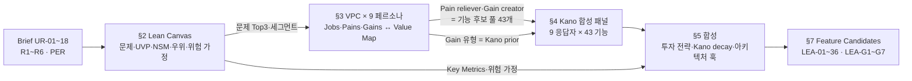
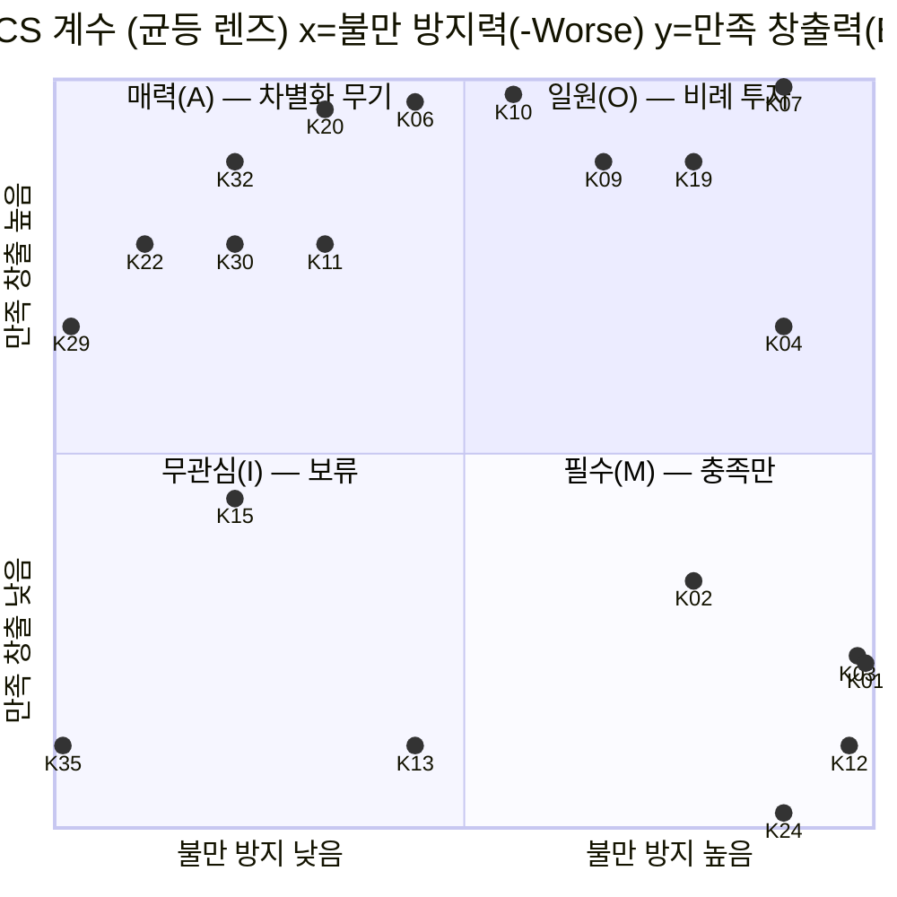

# PLN-IDE-LVK. 아이디어 기획 — Lean Canvas × Value Proposition Canvas × Kano

> **Trace**: UR-02(여러 기획 방법론, 전문가 수준 아이디어) 중심 · UR-01, 10~17 전반 · UR-05(동결 전 아키텍처 훅 도출)
> **입력**: `00-brief/project-brief.md`, R1~R6(`00-research/`), `01-planning/01-actors-personas.md`(ACT/P0~P5/E1~E3/RC-01~40)
> **버전**: v1.0 (Draft → 교차 리뷰 대상) · **작성 주체**: T1(상위 모델, 기획) · **작성일**: 2026-09-30
> **독립성**: 다른 기법 문서(design-thinking, jtbd-ost, scamper-benchmark, six-hats-premortem)는 참조하지 않고 독립 작성했다. 통합 단계에서 교차 비교한다.
> **근거 표기**: `[R1 §x]` 연구 문서 · `[PER]` 페르소나 문서 · `[지식]` 전문 지식(외부 검증 안 됨) · `[추정]` 계산·가정

---

## 0. 요약 (TL;DR)

1. **세 기법을 하나의 파이프라인으로 연결했다.** Lean Canvas가 "무엇을 왜"를 정하고(문제·UVP·핵심 지표·불공정 우위), VPC가 페르소나별로 "누구의 어떤 고통을 무엇이 덜어주는가"를 검증하고, Kano가 후보 기능을 **투자 방식**(충족만 할 것 / 비례 투자할 것 / 차별화 무기로 쓸 것 / 금지할 것)으로 분류한다. VPC의 Gain 유형(required/expected/desired/unexpected)을 Kano 사전 분류(prior)로 연결해 두 기법의 판단을 교차 검증했다.
2. **개인 로컬 도구에 맞게 Lean Canvas를 재정의했다.** 고객 = "시간축 위의 같은 사람(P0→P5)", 매출 = **학습 시간 ROI(시간당 검증된 깊이)**, 비용 = 시간·주의력·AI 비용·유지보수, 채널 = "하루에 학습이 끼어드는 틈"과 "지식이 들어오는 입구". 진짜 경쟁자는 개별 서비스가 아니라 **DIY 스택(Anki + ChatGPT/Claude + roadmap.sh + Notion)** 과 "그냥 AI에 물어보고 끝내기"다.
3. **UVP**: *"로드맵 위에서, 증거로 증명되는 깊이 — 15년 동안 함께 자라는 로컬 개발 공부 OS."* 핵심은 "많이 봤다"가 아니라 **"설명·판단할 수 있음이 증거로 남는다"**.
4. **North Star Metric**: **WVD(Weekly Verified Depth, 주간 검증 깊이 증가량)** = 이번 주에 새로 "숙달(Mastered) ∧ 유지(R ≥ 목표)" 상태에 들어간 KC의 레벨 가중 합. 가드 지표 5개(일일 리뷰 부하, Brier, 검증 KC당 AI 비용, 문항 신고율, 게이트 오통과율)로 지표 게이밍을 막는다.
5. **불공정 우위는 "15년치 개인 증거 로그"다.** 복제 가능한 기능이 아니라, 앱을 쓸수록 쌓이는 개인 오개념 지도·보정 곡선·학습 이력이 DIY 스택으로 대체할 수 없는 해자다. 따라서 **데이터 수명(불변 이벤트 로그·안정 ID·export)은 Kano상 현재 "무관심(I)"이어도 아키텍처 동결 전에 반드시 넣어야 할 훅**이다(§5.5).
6. **Kano 합성 패널**: 페르소나 9명(P0~P5, E1~E3)을 응답자로 삼아 43개 기능의 기능적/역기능적 질문에 답하게 하고(시뮬레이션), 3가지 렌즈(균등·v1 가중·15년 가중)로 분류 + Better/Worse 계수를 계산했다. 결과: Must-be 5, Performance 12, Attractive 10, Indifferent 10, **Reverse 6**.
7. **발견 ①: Kano 붕괴(Kano decay)가 시간축에서 뚜렷하다.** CBM 보정·Depth Map·Case 드릴은 P0에게 A(매력)였다가 P3+에서 O(일원)로, export·근거 열람·워크로드 시뮬레이터는 P0의 I(무관심)에서 P3~P5의 **M(필수)** 로 변한다. 반대로 "선수 개념 강제 잠금"은 P0의 A에서 P2+의 **R(역)** 로 뒤집힌다 → 강제 대신 "권장·경고"로 설계.
8. **발견 ②: 단기 선호와 학습 효과가 충돌하는 역품질 기능**(AI 즉시 정답, AI가 백지노트 대필)은 P0가 "좋다(A)"고 답하지만 학습과학상 해롭다[R1, R3 AP-07]. Kano 응답이 아니라 **학습과학 근거로 역품질 판정**하고, 대신 "참조 모드(학습 증거로 쓰지 않는 조회)"로 분리해 욕구를 흡수한다.
9. **차별화 기능(Attractive, Better ≥ 0.67) 중 v1 서명 기능 3개**: ① 백지노트 BPS + 3색 diff(Jev) ② CBM 확신도 + 보정 코칭 ③ Depth Map 과거 오버레이. 확장 서명 후보: **오개념 게놈**(교차 트랙 오개념 패턴), **업무 사건 → 개념 브리지**, **AI 생성 코드 감사 드릴**, **내 옛 저장소 코드 리딩(graphify 재활용)** — 이 네 가지는 기존 벤치마크 어디에도 없는 신규 아이디어다.
10. **최종 산출**: 기능 후보 **LEA-01 ~ LEA-36** + 역품질 가드레일 **LEA-G1 ~ G7** (§7). 가장 큰 위험 가정(RA-1: Jev 한국어 판정 품질)은 개발 전 캘리브레이션 스파이크로 검증한다(§2.7).

---

## 1. 방법론 설계 — 왜 이 세 가지를, 어떤 순서로

### 1.1 기법별 역할과 한계 보완

| 기법 | 원 출처 [지식] | 이 문서에서 답하는 질문 | 단독 사용 시 한계 | 보완 관계 |
|---|---|---|---|---|
| **Lean Canvas** | Ash Maurya, *Running Lean* (2010/2022 3판) | 이 제품은 **왜** 존재하며, 무엇으로 성공을 재고, 무엇이 가장 위험한 가정인가? | 스타트업·매출 전제 → 개인 로컬 도구에 그대로 맞지 않음. 페르소나 간 차이를 뭉갬 | 블록을 재정의(§2.1)하고, 페르소나 차이는 VPC가 담당 |
| **Value Proposition Canvas** | Osterwalder et al., *Value Proposition Design* (2014) | **누구의** 어떤 Job·Pain·Gain을 **무엇이** 해결하는가? Fit은 몇 %인가? | 기능 우선순위·투자 강도를 알려주지 않음. 종단 페르소나 간 충돌을 보여주지 않음 | Gain 유형 → Kano prior, Pain reliever → 기능 후보 풀 |
| **Kano Model** | Noriaki Kano (1984), Berger et al. (1993) CS 계수 | 각 기능에 **어떻게 투자할 것인가**(충족 / 비례 / 차별화 / 금지)? | 실제 응답자 필요, 시간에 따른 범주 이동을 놓침 | 페르소나 9명 합성 패널 + 3렌즈 가중 + 시간축(Kano decay) 분석으로 보완 |

### 1.2 파이프라인



### 1.3 시뮬레이션의 정직성 규칙

- 실제 사용자 인터뷰·Kano 설문은 **없다**. 페르소나 문서의 Pains/Gains/Anti-goals/성공 지표를 근거로 T1이 각 페르소나의 **응답을 추론**했다. 각 응답은 페르소나 문서의 특정 문장으로 역추적 가능해야 한다는 규칙을 적용했다(§4.3 표의 근거 열).
- 따라서 Kano 결과는 **"설계 가설"** 이며, 통합 2회차 회고(RETRO-01)에서 실사용 로그(기능별 사용률·이탈·신고)로 재분류한다(§5.6).
- 학습과학 근거(R1)와 Kano 응답이 충돌하면 **학습과학을 우선**한다(예: AI 즉시 정답). 이는 "고객이 원하는 것 ≠ 고객에게 좋은 것"이라는 교육 제품의 특수성 때문이다.

---

## 2. Lean Canvas — 개인 로컬 도구용 재정의

### 2.1 블록 재정의 규칙

| 원 블록 | 스타트업 의미 | **이 프로젝트에서의 재정의** | 이유 |
|---|---|---|---|
| Customer Segments | 돈을 내는 고객군 | **시간축 세그먼트**: 같은 사람의 P0→P5 + 상황 세그먼트 E1~E3. Early adopter = **P0(현재의 사용자)** | 사용자 1명이 15년 동안 다른 사람이 됨[PER §0] |
| Problem | 고객의 상위 3개 문제 | 동일. 단, "현재의 대안(Existing Alternatives)"은 **DIY 스택** | 경쟁은 앱이 아니라 습관·조합 |
| UVP | 한 문장 가치 | 동일 + High-concept pitch | — |
| Solution | 문제별 최소 해결책 | 문제별 **최소 기능 묶음** (MVP 경계) | — |
| Channels | 고객 도달 경로 | ① **학습 진입 채널**(하루의 틈에 학습이 끼어드는 경로) ② **지식 유입 채널**(콘텐츠가 들어오는 입구) | 개인 도구엔 마케팅이 없지만 "사용 계기"가 곧 채널 |
| Revenue Streams | 매출 | **가치 회수(Return)**: 시간당 검증 깊이, 승급, 자격증·면접, 포트폴리오 산출물 | 통화 = 시간과 주의력 |
| Cost Structure | 비용 | **시간 비용**(학습 외 오버헤드) + **금전**(AI 호출) + **인지 비용**(설정·큐레이션) + **유지 비용**(콘텐츠 신선도, 마이그레이션) + **개발 비용** | — |
| Key Metrics | 핵심 지표 | North Star + 입력 지표 + 가드 지표 (AARRR 개인화) | — |
| Unfair Advantage | 복제 불가 우위 | **DIY 스택으로 주말에 따라 만들 수 없는 것** | 판정 기준 명시(§2.6) |

### 2.2 Lean Canvas (P0 Early Adopter 기준, v1 범위)

| **② Problem** | **④ Solution** | **③ UVP** | **⑨ Unfair Advantage** | **① Customer Segments** |
|---|---|---|---|---|
| **PR-1** 넓게 배웠지만 깊이가 증명되지 않는다 — "들어봤는데 설명 못 함"(유창성 착각) | **S-1** 모든 모드가 인출 이벤트를 만들고, 숙달(Elo)·유지(FSRS)·설명력(BPS·디깅)을 **분리 측정** | **"로드맵 위에서, 증거로 증명되는 깊이."** | **UA-1** 15년치 개인 불변 이벤트 로그(오개념 지도·보정 곡선·Depth 이력) | **Early adopter: P0 "도현"** — SKALA 수료, AI 배경, SI/클라우드 신입, AI CLI 구독자 |
| **PR-2** 무엇을 모르는지 모르고, 오늘 뭘 할지 매번 고민한다(선택 피로) | **S-2** 오늘 큐(FSRS + 약점 KU + 시즌 목표) + 에너지 선택 + 5분 MVD | 15년 동안 함께 자라는 **로컬 개발 공부 OS** | **UA-2** KU 단위 출처·신뢰 등급 + 오개념 은행 위의 생성→판정 분리 파이프라인(R2) | 시간축: P1(1~3y) → P2 → P3 → P4 → P5(15y+) |
| **PR-3** 공부 자료는 넘치지만 **문제로 변환되지 않는다**(카드 작성 비용, AI 답은 휘발) | **S-3** 개념→KU→문항 자동 생성(T1~T4) + 품질 게이트 + 외부 개념 가져오기 | **High-concept**: "Anki의 기억 × roadmap.sh의 지도 × 인시던트 드릴, 채점은 Jev" | **UA-3** Jev 판단($0.0002/건 이하, 보정된 확률)을 채점·게이트·라우팅에 체계적으로 사용 | 상황: E1 면접 D-day · E2 공백 복귀 · E3 망분리 |
| **Existing Alternatives** | **⑧ Key Metrics** | | **⑤ Channels** | |
| Anki(카드 작성·백로그 지옥) · roadmap.sh(자기보고 체크) · LeetCode/프로그래머스(알고리즘만) · 인프런/FEM(수동 시청) · Notion 정리(다시 안 봄) · **Claude/ChatGPT에 묻고 끝**(생성 효과 없음) | **NSM: WVD**(주간 검증 깊이) · 유효 학습 주 비율 · 첫 문항 ≤ 2초 · Brier · 검증 KC당 AI 비용 · 문항 신고율 | | 학습 진입: 출근 전·점심·퇴근 후 틈, `Ctrl/⌘+K`, 브라우저 핀 탭 · 지식 유입: 시드 팩, URL/노트/사내 글 import, 업무 사건 한 줄 | |
| **⑦ Cost Structure** | | | **⑥ Revenue (가치 회수)** | |
| 사용자 시간 주 4~5h(오버헤드 ≤ 10% 목표) · AI 월 ≤ ₩30,000(CLI 구독 재활용 시 ≈ ₩0 추가) · 콘텐츠 시드 469 개념·~150 Case 구축 · 신선도 유지 · 서비스 분리 개발·운영 비용 | | | 시간당 검증 깊이 ↑ · 트랙 승급(12주 `be` L2) · 정보처리기사·CKA · 면접 · 포트폴리오(ADR·포스트모템·교안) export | |

### 2.3 문제 블록 심화 — 근본 원인과 반증 가능성

| ID | 문제 | 근본 원인 (5 Whys 요약) | 현재 대안이 실패하는 지점 | 이 문제가 **틀렸다면** 관측될 신호 |
|---|---|---|---|---|
| PR-1 | 깊이가 증명되지 않음 | 학습 = 소비(시청·읽기·AI 응답 읽기) → 인출·생성 없음 → 유창성 착각 → 자기평가 과대[R1 §1, §5] | roadmap.sh·인프런은 "완료=숙달"로 계산(AP-03) | 배치 진단에서 자기평가와 실측 차이가 작음(Brier 초기값 ≤ 0.15) → 진단·보정 기능의 가치 하향 |
| PR-2 | 선택 피로·무계획 | 19개 트랙 × 469 개념 = 선택지 폭발, 우선순위 기준 부재 | Anki는 "무엇을 새로 배울지" 모름, roadmap.sh는 순서만 | 사용자가 오늘 큐를 무시하고 수동 선택 비율 > 60% → 큐 알고리즘 재설계 |
| PR-3 | 자료→문제 변환 비용 | 카드·문항 작성은 전문성과 시간이 필요, AI 답은 저장·재인출 경로가 없음 | Anki 카드 수작업, ChatGPT 대화는 휘발 | import 사용률 < 주 1회(P2 이후) → import는 Must가 아님(현재도 A로 분류됨과 일치) |

### 2.4 UVP 설계 — 3가지 대안 문장 비교

| 후보 | 문장 | 명확성 | 차별성 | 15년 적합성 | 판정 |
|---|---|---|---|---|---|
| U-A | "AI가 만들어주는 무한 개발 문제집" | 높음 | 낮음(생성형 퀴즈 앱 범람, 2026) | 낮음(초급 편향) | 기각 |
| U-B | "Anki for developers" | 높음 | 중 | 중(백로그·카드 작성 연상) | 기각 — 약점을 연상시킴 |
| **U-C** | **"로드맵 위에서, 증거로 증명되는 깊이 — 15년 동안 함께 자라는 로컬 개발 공부 OS"** | 중상 | 높음(증거·깊이·로컬·장기) | 높음 | **채택** |

**UVP의 운영적 정의(검증 가능해야 UVP다)**: "증거로 증명" = Depth Map의 모든 셀을 클릭하면 그 상태를 만든 **시도 로그·채점 엔진·신뢰도**까지 내려가 볼 수 있다(LEA-33). 이것이 구현되지 않으면 UVP는 카피에 불과하다.

### 2.5 Key Metrics — 개인화 AARRR과 North Star

**North Star: WVD (Weekly Verified Depth)**

```
WVD(week) = Σ_{kc ∈ 이번 주 신규 진입} w(level(kc)) × 1[mastered(kc)] × 1[R_kc(now) ≥ r_target(tier(kc))]
  w(L1..L5) = 1, 2, 3, 5, 8          (피보나치형: 상위 레벨 1 KC가 하위 여러 KC보다 무겁다)
  mastered = Elo P(정답|θ,β) ≥ 0.8 ∧ 형식 다양성 ≥ 2 ∧ (L3+: 디깅 D4 또는 Case 증거) [R1 §7.3, R4 §2.2]
  r_target: core .92 / standard .90 / breadth .85 / archive .80 [R1 LS-12]
  퇴행(유지 R 하락으로 이탈)은 음수로 계산하지 않고 별도 'Rusty KC' 지표로 표시 (벌점 없음 원칙)
```

왜 WVD인가: 문항 수·학습 시간(양적 지표)은 P3의 Anti-goal이고 게이밍이 쉽다[PER §3.4]. WVD는 **인출 + 다양한 형식 + 유지**가 동시에 충족돼야 오르므로 "빨리 많이 풀기"로 올릴 수 없다.

| 단계 (개인화 AARRR) | 지표 | P0 목표 | 측정 소스 | 가드 |
|---|---|---|---|---|
| **Acquisition → 설치** | 설치 → 첫 세션 완료 시간 | ≤ 3분 | onboarding 이벤트 | 설정 질문 ≤ 3개 |
| **Activation** | Day 1에 첫 "검증 KC"(배치 진단으로 확인된 KC 포함) 1개 이상 | 100% | placement + attempt | — |
| **Retention** | 유효 학습 주 비율(주 4일, MVD 포함) | 12주 중 ≥ 9주 | session log | 푸시 알림 없음(AP-01) |
| **Revenue(가치 회수)** | **WVD**, 시간당 WVD(= WVD / 학습 분) | 추세 ↑ (절대값은 레벨 의존) | mastery/FSRS 스냅샷 | 일일 리뷰 ≤ 상한 |
| **Referral → 가르치기/내보내기** | 월간 export 산출물(ADR·포스트모템·교안) 수, Teaching score | P3+부터 월 ≥ 1 | export log | 품질 루브릭 ≥ 3/4 |

**가드 지표(North Star 게이밍·부작용 감시)**

| ID | 가드 지표 | 임계 | 위반 시 반응 |
|---|---|---|---|
| GM-1 | 일일 리뷰 부하(예측 포함) | P0 ≤ 80, P2 ≤ 60, P5 ≤ 30 | 신규 도입량 자동 축소(LEA-21) |
| GM-2 | Brier score(확신도 보정) | 악화 추세 4주 연속 금지 | 보정 코칭 블록 삽입(LEA-06) |
| GM-3 | 검증 KC당 AI 비용 | ≤ ₩300 [추정] | 라우팅을 CLI·템플릿 쪽으로 이동(LEA-24) |
| GM-4 | 문항 신고율 | ≤ 5% | 템플릿 패밀리 재검사(LEA-12) |
| GM-5 | 게이트 오통과율(사후 신고로 발견된 게이트 통과 불량 문항) | ≤ 2% | 게이트 임계 상향, Jev 재보정(LEA-36) |

### 2.6 Unfair Advantage — "주말 DIY 테스트"

판정 기준: *"숙련 개발자가 Anki + Claude + roadmap.sh + Notion + 스크립트로 주말 이틀 안에 동등하게 만들 수 있는가?"* 가능하면 우위가 아니다.

| 후보 | DIY 복제 가능? | 판정 | 강화 방법 |
|---|---|---|---|
| FSRS 스케줄러 | 예 (Anki 내장) | ✗ 우위 아님 — **Must-be 위생 요소** | 그대로 구현, 투자 최소화 |
| LLM 문항 생성 | 예 (프롬프트 한 줄) | ✗ | 품질은 우위가 될 수 있음 → UA-2 |
| **UA-1 개인 증거 로그 15년** | 아니오 — 시간이 필요하고 스키마 연속성이 필요 | **✓ 핵심 해자** | 불변 이벤트, 안정 ID, 리플레이(LEA-27) |
| **UA-2 KU·오개념 은행 기반 생성 + 게이트** | 부분 — 주말에 파이프라인은 가능하나 469 개념 × KU × 오개념 × 출처·라이선스 데이터는 불가 | **✓ 중기 해자** | 시드 팩 품질, 오개념 게놈(LEA-32) |
| **UA-3 Jev 판단 체계 (채점·게이트·라우팅)** | 부분 — API는 공개지만, 판단 과업 설계(객체 키·15문항 분할·보정 임계)와 개인 골드셋 보정은 노하우 | **✓** | 개인 골드셋 보정 루프(LEA-36) |
| UA-4 이미 쓰는 CLI 구독 재활용(추가 비용 ≈ 0) | 예 | △ 비용 우위이지 해자 아님 | 안전한 spawn은 품질 요소 |
| UA-5 한국 SI 맥락(`ctx:si`, 개발표준정의서 과제) | 부분 | △ 틈새 우위 | LEA-18 |

### 2.7 위험 가정 (Riskiest Assumptions) — Lean Validation Board

Lean Canvas 방법론의 핵심은 캔버스 작성이 아니라 **가장 위험한 가정부터 싸게 반증**하는 것이다. 개발 순서를 뒤집지 않기 위해(UR-05), 아래 스파이크는 **아키텍처 동결 전** 또는 **첫 Iteration 안**에서 끝낸다.

| ID | 가정 | 위험도(영향×불확실) | 실험 (최소 비용) | 성공 기준 | 실패(kill) 시 피벗 | 시점 |
|---|---|---|---|---|---|---|
| **RA-1** | Jev가 한국어 백지노트 idea unit·OX 교정·루브릭을 충분히 정확히 판정한다 | 5×5 | 골드셋 60건(idea unit 30 · OX 교정 15 · 루브릭 15), T1 사람 판정 대비 비교 | unit 판정 AUC ≥ 0.85, 루브릭 가중 κ ≥ 0.6 | LLM-judge를 1차 엔진으로, Jev는 게이트·분류 전용. "비보정" 배지 표시 | 설계 단계(동결 전) |
| **RA-2** | L4~L5(Case·T4) 생성 문항이 게이트 후 쓸 만하다 | 4×4 | T4 Case 20건 생성 → G0~G13 → T1 교차 모델 리뷰 | 채택률 ≥ 50%, 채택분의 T1 "전문가 타당" ≥ 80% | L4~L5는 **큐레이션 시드 Case 우선**, 생성은 변형(variant)만 | Iteration 1~2 |
| **RA-3** | 사용자가 주 4일 습관을 유지한다(푸시 없이) | 4×3 | 도그푸딩 2주(개발 중 실사용), 세션 로그 | 유효 학습일 주 ≥ 4 | 브라우저 시작 탭·OS 로그인 시 트레이 요약 같은 **비강압적 진입점** 추가 | 통합 2회차 회고 |
| **RA-4** | 워밍 풀로 첫 문항 ≤ 2초 | 3×2 | 풀 20문항/개념×레벨 시드 상태에서 콜드 스타트 측정 | p95 ≤ 2초 | 세션 선계산(prefetch) 강화 | Iteration 1 |
| **RA-5** | LLM CLI 배치가 안정적이다(구독 쿼터·스키마) | 3×3 | `claude`/`codex` 각 100 잡, 스키마 적합·타임아웃 | 성공 ≥ 95%, repair 후 ≥ 99% | API 소량 + Ollama 폴백, 야간 재시도 | Iteration 2 |
| **RA-6** | CBM 확신도 입력이 마찰이 되지 않는다 | 2×3 | 1주 사용, 확신도 스킵률 | 스킵 ≤ 15% | 기본값 "보통" + 키 1회 입력(정답 키와 결합: `O1/O2/O3`) | Iteration 2 |
| **RA-7** | 469 개념 시드를 합리적 비용으로 채운다 | 4×3 | 1개 트랙(`k8s`, ~30 개념) 전 파이프라인 시범 | 트랙당 T1 검토 ≤ 2시간, 비용 ≤ $5 | 트랙 우선순위로 단계적 시드(경로 `path.ai-fullstack-engineer` 우선) | Iteration 1 |

**비용 추정 [추정]**: 469 개념 × 기본 1레벨 × 20문항 ≈ 9,400문항. T3 비중 40% → 약 3,750문항 × $0.03 ≈ **$113(API)** 또는 CLI 구독 시 ≈ $0 추가. Jev 게이트는 문항당 요청 2~4회 × $0.0002 ≈ **$2~8**. 즉 **비용 병목은 돈이 아니라 T1 검토 시간과 CLI 쿼터**다 → 생성 워커를 야간 배치 + 우선순위 큐로 설계해야 한다.

### 2.8 15년 지평의 캔버스 변화 (P0 → P5 델타)

| 블록 | P0 (v1) | P3 (7y) | P5 (15y+) |
|---|---|---|---|
| Problem Top1 | 깊이가 증명되지 않음 | 트레이드오프를 체계적으로 판단·방어 못 함 | 지식의 **노후화(obsolescence)** 와 이력 손실 |
| UVP 강조점 | "증거로 확인되는 성장" | "판단력 훈련장(Case·설계 리뷰)" | "무효화된 지식만 알려주는 신선도 레이더 + 평생 기록" |
| Key Metric | WVD, 유효 학습 주 | Case 루브릭 평균, 시뮬레이션 MTTR | Freshness ≥ 85%, 무손실 마이그레이션 |
| Channel | 출근 전 OX 스프린트 | 주 1회 90분 딥워크 | 월 1회 신선도 리뷰 |
| Cost 병목 | 학습 시간 | 회의로 쪼개진 주의력 | 리뷰 부하·데이터 유지 |
| Unfair Advantage | 아직 약함(로그 적음) | 오개념 게놈·보정 곡선 | **15년 로그 = 대체 불가** |

→ **시사점**: UVP가 경력 단계별로 이동하므로 홈 화면 기본값도 이동해야 한다(오늘 큐 → Depth Map/Case 라이브러리 → 신선도 리포트)[PER §3.7]. 또한 가치의 절반 이상이 **미래 페르소나**에 있으므로, v1이 P0만 최적화하고 스키마를 좁게 잡으면 UA-1이 소멸한다.

---

## 3. Value Proposition Canvas — 페르소나별

### 3.1 작성 규칙

- **Customer Jobs**: Functional / Social / Emotional + Osterwalder의 **Supporting jobs**(구매자·공동 창작자·이전자 역할 → 여기서는 "큐레이터 모자·운영자 모자"[PER §2.3]).
- **Pains**: 심각도 1~5(5 = extreme). **Gains**: Osterwalder 4유형 — **Required**(없으면 성립 불가) / **Expected**(당연히 기대) / **Desired**(원하지만 말하지 않음) / **Unexpected**(생각도 못 한 것).
- **Gain 유형 → Kano prior 매핑**: Required → M, Expected → M/O, Desired → O, Unexpected → A. §4에서 합성 패널 응답과 이 prior가 불일치하면 재검토 대상으로 표시했다(§4.5).
- **Fit 점수(Pain 기준)** = Σ(Pain 심각도 × 해소도) / Σ Pain 심각도. 해소도는 "완전 1.0 / 부분 0.5 / 미해소 0". Gain 창출은 표의 매핑으로 정성 확인한다.

### 3.2 P0 "도현" (0~1년차, Early Adopter) — 상세

**Customer Profile**

| 구분 | 항목 |
|---|---|
| Functional jobs | FJ-1 실무에서 나온 개념(도커·쿠버·네트워크)을 짧게 다시 꺼내 빈 곳을 찾아 메운다 · FJ-2 자투리 5~15분에 인출 세션을 한다 · FJ-3 정보처리기사 준비 · FJ-4 첫 프로젝트 SI 산출물을 이해·작성한다 · FJ-5 AI가 짠 코드를 **설명·검증**할 수 있게 된다 |
| Social jobs | SJ-1 사수·팀장에게 "어디까지 아는지"를 증거로 말한다 · SJ-2 "AI 파트만 하는 사람"이 아닌 풀스택으로 인정받는다 |
| Emotional jobs | EJ-1 "넓고 얕다"는 불안을 "다음 한 걸음"으로 바꾼다 · EJ-2 공부가 숙제처럼 느껴지지 않는다 · EJ-3 가면 증후군 완화 |
| Supporting jobs | SP-1 (운영자 모자) 이미 쓰는 Claude/Codex 구독을 연결한다 · SP-2 (큐레이터 모자) 자기 노트·블로그를 문제로 만든다 |

| Pain | 내용 | 심각도 |
|---|---|---|
| PA-1 | 유창성 착각 — "들어봤는데 설명 못 함" | 5 |
| PA-2 | 무엇을 모르는지 모름, 오늘 뭘 할지 고민 | 4 |
| PA-3 | Anki 카드 작성 귀찮음 + 1주 빠지면 연체 폭증 | 4 |
| PA-4 | AI 답이 머리에 남지 않음 | 4 |
| PA-5 | 퇴근 후 에너지 편차로 계획 붕괴 | 3 |
| PA-6 | 한국어 심화 자료 부족, 영문 문서 피로 | 3 |
| PA-7 | AI가 짜준 코드를 설명 못 하면 들킬 것 같은 불안 | 4 |
| PA-8 | SI 산출물이 낯섦 | 2 |

| Gain | 내용 | 유형 | Kano prior |
|---|---|---|---|
| GA-1 | 오늘 할 일이 자동으로 정해짐 | Required | M |
| GA-2 | 첫 문항이 즉시 뜸 | Expected | M |
| GA-3 | 틀린 이유가 오개념 이름으로 나옴 | Desired | O |
| GA-4 | 5분만 해도 인정 | Desired | O |
| GA-5 | 트랙별 깊이가 채워지는 지도 + 6개월 전 비교 | Unexpected | A |
| GA-6 | 자기 확신도가 실력과 얼마나 맞는지 보여줌(보정) | Unexpected | A |
| GA-7 | 자기 노트가 바로 문제로 | Desired | O/A |
| GA-8 | 추가 비용 ≈ 0 (구독 재활용) | Expected | M |
| GA-9 | 포트폴리오로 내보낼 증거 | Desired | O |
| GA-10 | 업무에서 본 것이 바로 복습 흐름에 들어감 | Unexpected | A |

**Value Map**

| Products & Services | Pain Relievers | Gain Creators |
|---|---|---|
| 오늘 큐(LEA-01), 인출 모드군(OX·MCQ·출력 예측·Parsons), 백지노트(LEA-10), 개념 3단 페이지(LEA-05), AI 제어면(LEA-24), Depth Map(LEA-20) | PA-1 ← 백지노트 BPS·배치 진단·CBM(LEA-10/02/06) · PA-2 ← 오늘 큐·에너지 세션(LEA-01/09) · PA-3 ← KU 자동 문항·로드밸런싱·복귀 모드(LEA-12/21/22) · PA-4 ← 힌트 사다리·참조 모드 분리(LEA-G3) · PA-5 ← 에너지 선택·MVD(LEA-09/28) · PA-6 ← 한국어 KU·영문 용어 병기, 영문 원문 import 요약(LEA-14) · PA-7 ← **AI 생성 코드 감사 드릴(LEA-30)** · PA-8 ← `ctx:si` 콘텐츠(LEA-18) | GA-1/2 ← LEA-01/03 · GA-3 ← LEA-07 · GA-4 ← LEA-28 · GA-5 ← LEA-20 · GA-6 ← LEA-06 · GA-7 ← LEA-14 · GA-8 ← LEA-24(CLI 라우팅) · GA-9 ← LEA-33 · GA-10 ← **LEA-29** |

**Fit**: Pain 해소 = PA-1 1.0, PA-2 1.0, PA-3 1.0, PA-4 0.5(AI를 쓰는 습관 자체는 앱 밖), PA-5 1.0, PA-6 0.5, PA-7 1.0, PA-8 0.5 → (5+4+4+2+3+1.5+4+1)/29 = **84%**. 미해소 영역: PA-4(앱 밖 AI 사용 습관) → 인사이트: "Claude에 물어본 대화를 붙여넣으면 거기서 KU·문항을 뽑는" 경로(LEA-14의 소스 유형 추가)로 앱 밖 습관을 앱 안으로 끌어들인다.

### 3.3 P1 "도현 +1년" (SI 주니어 백엔드)

| Customer Profile | Value Map |
|---|---|
| **Jobs**: 보안약점 진단 결과(SQL 삽입·XSS·경로 조작) 원리·수정 패턴 복습(F) · 사수 질문에 실행계획 근거로 답함(S) · 크런치 후 죄책감 없이 재개(E) · 정보처리기사 실기·CKA(F) | **Products**: D-day 모드(LEA-23), 버그 찾기·설정 리뷰 문항, 인프라 티켓 lab(LEA-15), 업무 사건 브리지(LEA-29) |
| **Pains**: 시간 불규칙(4) · 업무 스택(Java/Spring)과 관심사(AI/k8s)의 분열(3) · 자격증 암기 부담(3) · 망분리로 AI 사용 불가(4) · 회사 코드 유출 위험(5) | **Pain relievers**: MVD·휴식 토큰(LEA-28) · 트랙 병행 시즌 계획 · cert 태그 큐 + variant 로테이션으로 기출 암기 방지(LEA-08) · OFFLINE 완전 동작(LEA-04) · import 시 민감 자료 경고·로컬 LLM 강제(LEA-14) |
| **Gains**: 자격증 D-day 역산(Desired→O) · 업무 이슈 즉시 개념 연결(Unexpected→A) · 주말 실습 티켓(Desired→O) · 복귀 3일 내 회복(Expected→M) | **Gain creators**: LEA-23, LEA-29, LEA-15, LEA-22 |

**Fit ≈ 82%** — 미해소: 업무 스택(Java/Spring) 트랙 콘텐츠의 시드 우선순위 낮음(경로가 ai-fullstack) → 경로 보조로 `lang.java`·`be.spring` 시드를 v1.1 후보로 기록.

### 3.4 P2 "도현 +3년" (미드레벨·on-call 시작)

| Customer Profile | Value Map |
|---|---|
| **Jobs**: 장애 전 실패 모드 훈련(F) · 좋은 글을 5분 내 문항화(F) · L3 전환기의 지루함/막막함 해소(E) · 포스트모템·대안 비교 작성(S) | **Products**: Case·인시던트 드릴(LEA-16), import(LEA-14), 승급·모드 믹스 전환(LEA-19), 문항 근거 열람(LEA-13) |
| **Pains**: L1~L2 카드 누적으로 지루함(expertise reversal)(4) · 연체 수천 장(4) · 외부 자료 품질 편차(3) · 디깅이 정답 맞히기로 변질(3) · 사내 기밀의 외부 API 전송 위험(5) | **Pain relievers**: 모드 믹스 자동 전환 + archive 보존율(LEA-19/21) · 워크로드 시뮬레이터 · 스테이징 diff·신뢰 등급 · Jev `choice` 라우팅(디깅 행동 결정은 코드) · 로컬 LLM 전용 import |
| **Gains**: Case로 on-call 자신감(Desired→O) · 내 실수 패턴이 트랙을 가로질러 보임(Unexpected→A) · 읽은 글이 휘발되지 않음(Desired→A/O) | **Gain creators**: LEA-16, **LEA-32 오개념 게놈**, LEA-14 |

**Fit ≈ 86%**.

### 3.5 P3 "도현 +7년" (테크리드)

| Customer Profile | Value Map |
|---|---|
| **Jobs**: 설계 리뷰 핵심 리스크를 체계적으로 짚음(F) · 트레이드오프를 숫자로(F) · 주니어 교안(S) · 코딩 감각 녹슬지 않기(E) | **Products**: Case 라이브러리, 설계 리뷰 문항(Q-design review), Feynman AI 주니어(LEA-17), rusty 표시(LEA-19) |
| **Pains**: 시간 극소(5) · 기초 퀴즈 거부감(4) · 전문가 문항의 정답 모호성("it depends")(5) · AI 피드백 신뢰 문제(4) · 양적 지표 혐오(3) | **Pain relievers**: 90분 딥워크 단일 Case · 레벨별 믹스(L4: faded 5%) · **루브릭 채점 + 근거·게이트 열람 + 이의제기(LEA-13/36)** · WVD(질적 지표) |
| **Gains**: 리뷰 코멘트 재현율 지표(Unexpected→A) · 교안 export(Desired→O) · 과거 7년 성장 타임랩스(Unexpected→A) | **Gain creators**: LEA-16, LEA-33, LEA-20 |

**Fit ≈ 78%** — 가장 낮은 Pain 해소는 "정답 모호성"(0.5): 루브릭 + 이의제기로 **완화**할 뿐 제거 불가 → L4~L5 채점은 "점수"보다 **루브릭 차원별 피드백**을 주 산출로, 점수는 보조로 표시하는 UI 원칙 도출.

### 3.6 P4 "도현 +12년" (아키텍트/AA) · P5 "15년+" (전문가)

| | P4 | P5 |
|---|---|---|
| **핵심 Jobs** | 새 기술을 기존 원칙과 충돌 지점으로 구조화 → ADR 결정(F) · 판단을 문서로 방어(S) · 표준 조항 작성(F) | 무효화된 지식만 골라 알림(F) · 녹슬지 않기(E) · 15년 지식을 교안·표준으로 남기기(S) |
| **Top Pains** | 학습 시간 거의 없음(5) · "이미 아는 것" 확인 비용(4) · 판단 과제 정답 부재 → AI 신뢰(5) · 기밀 설계 유출(5) | 카드 수만 장(5) · **obsolescence**(5) · 스케줄러/스키마 교체 시 이력 손실(5) · 강제 업데이트로 작동 중단(4) |
| **Top Gains** | ADR + 소크라틱 반박(Desired→O) · Teaching score(Unexpected→A) · 포트폴리오(Expected→O) | 신선도 레이더(Required→M for P5) · 이벤트 리플레이 모델 교체(Required→M) · 15년 타임랩스(Unexpected→A) |
| **Value Map 핵심** | LEA-18 ADR·표준 과제, LEA-17 Feynman, LEA-33 증거 원장, LEA-36 이의제기 | LEA-34 신선도 레이더, LEA-27 데이터 수명, LEA-21 워크로드·archive, LEA-20 타임랩스 |
| **Fit** | ≈ 80% | ≈ 83% (단, LEA-27이 v1 스키마에 없으면 **≈ 40%** 로 붕괴) |

### 3.7 Edge 페르소나 (요약)

| | E1 면접 D-28 | E2 8개월 공백 복귀 | E3 망분리 SI 현장 |
|---|---|---|---|
| **결정적 Job** | 남은 일수·약점 기준 일일 계획 | 연체 숫자 말고 "오늘 할 만큼" | 네트워크 0에서 전 모드 사용 |
| **결정적 Pain(5)** | 단기 과부하 + FSRS는 D-day 최적 아님 | 연체 공포 | AI·외부 폰트·CDN 불가 |
| **Required Gain** | D-day R ≥ 0.9 예측 | 연체 비노출 | 외부 호출 0건 |
| **핵심 기능** | LEA-23 D-day 모드, LEA-11 디깅(시스템 디자인), LEA-17 구술 대비 Feynman | LEA-22 복귀 모드, LEA-34 공백기 변경 요약 | LEA-04 OFFLINE + 보류 큐, T1/T2 생성, self-host 자산 |
| **Fit** | ≈ 85% | ≈ 90% | ≈ 80% (Docker lab·디깅 품질 저하는 불가피) |

### 3.8 교차 페르소나 인사이트 (VPC에서만 보이는 것)

| # | 인사이트 | 근거 | 설계 반영 |
|---|---|---|---|
| X-1 | **"신뢰"의 대상이 이동한다**: P0는 "오늘 큐를 믿고 따를 수 있는가", P3~P4는 "채점을 믿을 수 있는가", P5는 "데이터가 사라지지 않는가" | P0 GA-1 · P3 Pain "AI 신뢰" · P5 Pain "이력 손실" | 신뢰 장치를 단계별로 배치: 큐 설명("왜 이 문항?") → 근거·이의제기 → 무손실 마이그레이션 |
| X-2 | **동일 기능이 페르소나에 따라 Pain reliever이자 Pain creator** — 스캐폴딩(P0 reliever, P3 creator), 축하 모션(P0 gain, P4 anti-goal) | PER §3.4·3.5 Anti-goals | 트랙 레벨에 따라 UI 밀도·안내·축하를 자동 페이딩(LEA-19) |
| X-3 | **모든 페르소나에 공통된 Required Gain은 딱 3개**: 즉시 시작(오늘 큐·≤ 2초), 로컬 데이터 소유, AI 없어도 동작 | 9개 VPC 교집합 | 이 3개가 진짜 Must-be 핵심 — §4 Kano M과 일치 |
| X-4 | **업무와 학습의 연결**이 P0~P3 모두의 Unexpected Gain | P0 GA-10, P1, P2 | LEA-29 업무 사건 브리지를 서명 확장 후보로 |
| X-5 | **"AI 시대의 주니어 불안"(PA-7)** 은 기존 벤치마크 15개 어디에도 대응 기능이 없다[R3 Part A] | P0 공감 지도 "AI가 짜준 코드를 설명 못 하면 들킬 것" | LEA-30 AI 생성 코드 감사 드릴 — 2026년 맥락의 신규 차별화 |

---

## 4. Kano 분석 — 합성 페르소나 패널

### 4.1 설문 설계 (기능적/역기능적 질문 쌍)

각 기능 K마다 두 질문을 묻는다. 답: ① 좋다(Like) ② 당연하다(Must-be) ③ 상관없다(Neutral) ④ 참을 수 있다(Live-with) ⑤ 싫다(Dislike).

예시 (K10 백지노트 BPS + 3색 diff):
- **기능적**: "백지노트를 제출하면 AI가 핵심 아이디어별로 회상함/누락/오류를 3색으로 표시하고 점수를 준다면 어떻습니까?"
- **역기능적**: "백지노트를 제출해도 자기채점 체크리스트만 있고 AI 비교는 없다면 어떻습니까?"

예시 (K40 선수 개념 강제 잠금):
- **기능적**: "선수 개념을 숙달하기 전에는 상위 개념이 잠겨서 열 수 없다면?"
- **역기능적**: "선수 개념과 관계없이 어떤 개념이든 열 수 있다면?"

**Kano 평가표** (행 = 기능적 답, 열 = 역기능적 답)

| 기능적 \ 역기능적 | Like | Must-be | Neutral | Live-with | Dislike |
|---|---|---|---|---|---|
| **Like** | Q | A | A | A | **O** |
| **Must-be** | R | I | I | I | M |
| **Neutral** | R | I | I | I | M |
| **Live-with** | R | I | I | I | M |
| **Dislike** | R | R | R | R | Q |

(A 매력 · O 일원 · M 필수 · I 무관심 · R 역 · Q 모순)

### 4.2 집계 규칙

- **응답자 9명**: P0, P1, P2, P3, P4, P5, E1, E2, E3 (응답 문자열 순서 동일).
- **3가지 렌즈**
  - **균등**: 각 1표.
  - **v1 렌즈**(첫 릴리스 최적화): P0×3, P1×2, E3×2, P2·E1·E2×1, P3×1, P4·P5×0.5.
  - **15년 렌즈**(평생 도구 최적화, 각 단계 체류 연수 비례): P0×1, P1×2, P2×3, P3×4, P4×5, P5×5, E1~E3×1.
- **최빈 범주**로 분류, 동률 시 **M > O > A > I** 우선(보수적: 위생 요인을 놓치지 않기 위해).
- **CS 계수**(Berger 1993): Better = (A+O)/(A+O+M+I), Worse = −(O+M)/(A+O+M+I). R·Q는 분모에서 제외.
- 계산은 스크립트로 수행(결과를 손으로 옮기지 않음).

### 4.3 결과표 (43 기능)

응답 문자열 = `P0 P1 P2 P3 P4 P5 E1 E2 E3` 순.

| ID | 기능 | 응답 | M | O | A | I | R | **균등** | v1 | 15y | Better | Worse |
|---|---|---|---|---|---|---|---|---|---|---|---|---|
| K01 | 오늘 큐 자동 구성(FSRS·상한·로드밸런싱) | `MMMMOOMMM` | 7 | 2 | 0 | 0 | 0 | **M** | M | M | 0.22 | -1.00 |
| K02 | 3분 온보딩(단일 설치·배치 진단·AI 없이 시작) | `MMMOOIOIM` | 4 | 3 | 0 | 2 | 0 | **M** | M | O | 0.33 | -0.78 |
| K03 | 첫 문항 ≤2초(워밍 풀) | `MMMMMOMOM` | 7 | 2 | 0 | 0 | 0 | **M** | M | M | 0.22 | -1.00 |
| K04 | OFFLINE 완전 동작 + 보류 큐 재채점 | `OMOOOOIOM` | 2 | 6 | 0 | 1 | 0 | **O** | O | O | 0.67 | -0.89 |
| K05 | 이론→코드→핵심 3단 + 프리테스트 | `MOOIIIOOM` | 2 | 4 | 0 | 3 | 0 | **O** | M | I | 0.44 | -0.67 |
| K06 | CBM 확신도 + 보정 코칭 | `AAOOOOAAA` | 0 | 4 | 5 | 0 | 0 | **A** | A | O | 1.00 | -0.44 |
| K07 | 오개념 태그 피드백 | `AOOOOOOOO` | 0 | 8 | 1 | 0 | 0 | **O** | O | O | 1.00 | -0.89 |
| K08 | 문항 variant 로테이션(정답 암기 방지) | `IAOOOOAII` | 0 | 4 | 2 | 3 | 0 | **O** | I | O | 0.67 | -0.44 |
| K09 | 모드 로테이션 + 에너지 기반 세션 | `OOOAAIOOO` | 0 | 6 | 2 | 1 | 0 | **O** | O | O | 0.89 | -0.67 |
| K10 | 백지노트 BPS + 3색 diff | `AAOOOOOAA` | 0 | 5 | 4 | 0 | 0 | **O** | A | O | 1.00 | -0.56 |
| K11 | 디깅 D1~D7(LLM 문장·Jev 라우팅) | `AAAAOOOII` | 0 | 3 | 4 | 2 | 0 | **A** | A | O | 0.78 | -0.33 |
| K12 | 문항 품질 게이트 + 신고→재생성 | `OMMMMMMMM` | 8 | 1 | 0 | 0 | 0 | **M** | M | M | 0.11 | -1.00 |
| K13 | 문항 근거·게이트 결과 열람 | `IIOMMMIII` | 3 | 1 | 0 | 5 | 0 | **I** | I | M | 0.11 | -0.44 |
| K14 | 외부 개념 가져오기(스테이징 승인) | `IAAAOOAII` | 0 | 2 | 4 | 3 | 0 | **A** | I | O | 0.67 | -0.22 |
| K15 | 인프라 티켓 lab(kind·상태 검증) | `AOOAIIIII` | 0 | 2 | 2 | 5 | 0 | **I** | I | I | 0.44 | -0.22 |
| K16 | Case·인시던트 드릴(단계적 공개) | `IAOOOOOII` | 0 | 5 | 1 | 3 | 0 | **O** | I | O | 0.67 | -0.56 |
| K17 | Feynman AI 학생 + Teaching score | `IAAAOOAII` | 0 | 2 | 4 | 3 | 0 | **A** | I | O | 0.67 | -0.22 |
| K18 | ADR·표준 조항 작성 과제 | `IAIAOOIII` | 0 | 2 | 2 | 5 | 0 | **I** | I | O | 0.44 | -0.22 |
| K19 | 승급 평가 + 모드 믹스 자동 전환 | `AOOMOOOOA` | 1 | 6 | 2 | 0 | 0 | **O** | O | O | 0.89 | -0.78 |
| K20 | Depth Map + 과거 오버레이 | `AAAOOOAAA` | 0 | 3 | 6 | 0 | 0 | **A** | A | O | 1.00 | -0.33 |
| K21 | 워크로드 시뮬레이터 + 보존율 계층 | `IIOOMMIOI` | 2 | 3 | 0 | 4 | 0 | **I** | I | M | 0.33 | -0.56 |
| K22 | 복귀 모드(연체 비노출) | `AAAAAAIMA` | 1 | 0 | 7 | 1 | 0 | **A** | A | A | 0.78 | -0.11 |
| K23 | D-day 모드(cram-aware) | `AOAIIIMII` | 1 | 1 | 2 | 5 | 0 | **I** | I | I | 0.33 | -0.22 |
| K24 | AI probe·라우팅·예산·서킷 브레이커 | `MMMMMMMMI` | 8 | 0 | 0 | 1 | 0 | **M** | M | M | 0.00 | -0.89 |
| K25 | 키보드 우선·IME 안전·초성 팔레트 | `OOOMMMOOO` | 3 | 6 | 0 | 0 | 0 | **O** | O | M | 0.67 | -1.00 |
| K26 | D3 디자인 시스템(다크/라이트·AA) | `OOMMMMOOO` | 4 | 5 | 0 | 0 | 0 | **O** | O | M | 0.56 | -1.00 |
| K27 | 백업·MD/JSON export·무손실 마이그레이션 | `IIOMMMIOI` | 3 | 2 | 0 | 4 | 0 | **I** | I | M | 0.22 | -0.56 |
| K28 | 주간 목표 스트릭 + 휴식 토큰 + MVD | `OOAIIIIOO` | 0 | 4 | 1 | 4 | 0 | **O** | O | I | 0.56 | -0.44 |
| K29 | 업무 사건→개념 브리지 | `AAAAAIIAI` | 0 | 0 | 6 | 3 | 0 | **A** | A | A | 0.67 | 0.00 |
| K30 | AI 생성 코드 감사 드릴 | `AAAOOIAIA` | 0 | 2 | 5 | 2 | 0 | **A** | A | O | 0.78 | -0.22 |
| K31 | 내 옛 저장소 코드 리딩(graphify) | `AAAAIIAII` | 0 | 0 | 5 | 4 | 0 | **A** | A | I | 0.56 | 0.00 |
| K32 | 오개념 게놈(교차 트랙 패턴) | `AAAAOOAIA` | 0 | 2 | 6 | 1 | 0 | **A** | A | A | 0.89 | -0.22 |
| K33 | 증거 원장 + 역량 포트폴리오 export | `AAAOOOMII` | 1 | 3 | 3 | 2 | 0 | **O** | A | O | 0.67 | -0.44 |
| K34 | 신선도 레이더(무효화 지식 알림) | `IIAOOMIOI` | 1 | 3 | 1 | 4 | 0 | **I** | I | O | 0.44 | -0.44 |
| K35 | 음성 모의 면접 | `IIIIIIAII` | 0 | 0 | 1 | 8 | 0 | **I** | I | I | 0.11 | 0.00 |
| K36 | 다수 테마·레이아웃 커스터마이징 | `IIIIIIIII` | 0 | 0 | 0 | 9 | 0 | **I** | I | I | 0.00 | 0.00 |
| K37 | XP·코인·레벨업 폭죽 | `IRRRRRIRR` | 0 | 0 | 0 | 2 | 7 | **R** | R | R | — | — |
| K38 | 리더보드·소셜 비교 | `IRRRRRIIR` | 0 | 0 | 0 | 3 | 6 | **R** | R | R | — | — |
| K39 | 학습 중 AI 즉시 정답/코드 대필 버튼 | `ARRRRIIRR` | 0 | 0 | 1 | 2 | 6 | **R** | R | R | — | — |
| K40 | 선수 개념 강제 잠금 | `AIRRRRRRI` | 0 | 0 | 1 | 2 | 6 | **R** | R | R | — | — |
| K41 | 연체 빨간 배지 + 스트릭 끊김 푸시 | `RRRRRRIRR` | 0 | 0 | 0 | 1 | 8 | **R** | R | R | — | — |
| K42 | 강의 영상 중심 콘텐츠 | `IIIRRRIII` | 0 | 0 | 0 | 6 | 3 | **I** | I | R | — | — |
| K43 | AI가 백지노트·정리 대신 작성 | `ARRRRRIII` | 0 | 0 | 1 | 3 | 5 | **R** | R | R | — | — |

(R 범주 기능의 Better/Worse는 의미가 없어 생략. 균등 기준 분포: **M 5 · O 12 · A 10 · I 10 · R 6**; K42는 균등 I이나 15년 렌즈 R.)

### 4.4 주요 판정의 근거 (응답 추론의 역추적)

| ID | 결정적 응답 | 페르소나 근거 |
|---|---|---|
| K01 | 전원 M/O | P0 GA-1 "오늘 할 일 자동" Required, E2 "오늘 할 만큼"[PER §3.9] |
| K04 | E3·P1 = M, 나머지 O | E3 성공 지표 "네트워크 0에서 전 모드", P1 망분리[PER §3.2] — **세그먼트 특정 Must-be** |
| K05 | P0·E3 = M, P3~P5 = I | P3 Anti-goal "긴 이론 본문" → 이론 페이지는 초급의 위생 요인, 전문가엔 무관 |
| K06 | P0 = A → P2+ = O | P0는 보정 개념을 모름(Unexpected), P3+는 "과신 트랙"을 아는 게 판단 품질에 직결 |
| K12 | P0만 O, 나머지 M | P0는 불량 문항을 식별할 능력이 낮음(존재를 모름) → 그래도 M으로 취급(아래 §5.2 전략적 보정) |
| K13 | P3~P5 = M, 나머지 I | P3 Pain "전문가 문항의 정답 모호성", P4 "AI 신뢰 문제" |
| K15 | P0·P3 = A, P1·P2 = O, 나머지 I | P1 선호 "설정 리뷰·주말 실습", E3는 Docker 불가, P4+ 코드 비중 10% |
| K21·K27 | P4·P5 = M | P5 Pain "카드 수만 장", "이력 손실"[PER §3.6] |
| K22 | E2 = M, 나머지 대부분 A | "공백은 누구에게나 온다" — 평소엔 존재를 모르다가 필요할 때 감동 |
| K39 | P0 = A, 나머지 R | P0 DOES "Claude에 질문하고 답 복붙" → 단기 선호. 학습과학상 역효과[R3 AP-07] |
| K40 | P0 = A, P2+ = R | P0는 "순서 고민" 해소를 원함, 경력자는 자율성 침해[R3 AP-06] |

### 4.5 VPC prior vs Kano 결과 — 불일치 검토

| 기능 | VPC prior | Kano 결과 | 해석 | 결정 |
|---|---|---|---|---|
| K10 백지노트 BPS | Unexpected(A) — P0 | 균등 O, v1 A | P0에겐 매력, 중기 이후 일원 | **서명 기능**으로 v1 투자 (A가 O로 붕괴하기 전에 선점) |
| K14 import | Desired(O/A) | 균등 A, v1 I | P0에게는 아직 이르다 | v1은 "붙여넣기·MD 파일"만, URL·배치는 P2 시점 강화 |
| K12 품질 게이트 | 명시 없음 | M | Must-be는 고객이 말하지 않는다(Kano의 고전적 함정) | 내부 품질 요구로 명시 → NFR |
| K28 스트릭 | Desired(O) | 균등 O, 15y I | 장기 사용자에겐 무의미 | 트랙 레벨 L4+에서 스트릭 UI 자동 축소 |

### 4.6 Kano 붕괴(Kano Decay) — 시간축 범주 이동

같은 사람의 응답을 단계별로 읽으면 범주가 이동한다. 이것이 종단 페르소나 + Kano 결합의 핵심 산출이다.

| 기능 | P0 | P1 | P2 | P3 | P4 | P5 | 이동 패턴 | 설계 함의 |
|---|---|---|---|---|---|---|---|---|
| K06 CBM 보정 | A | A | O | O | O | O | **A → O** (정상 붕괴) | v1에서 도입해 습관화 → 이후 필수 지표화 |
| K20 Depth Map | A | A | A | O | O | O | A → O | 오버레이·타임랩스는 데이터가 쌓일수록 가치 ↑ |
| K13 근거 열람 | I | I | O | M | M | M | **I → M** (잠복 필수) | v1에 데이터(출처 span·게이트 결과)는 저장, UI는 서랍형 |
| K27 데이터 수명 | I | I | O | M | M | M | **I → M** | **아키텍처 훅: 동결 전 필수** |
| K21 워크로드 | I | I | O | O | M | M | I → M | 보존율 계층 필드는 v1 스키마에 |
| K34 신선도 | I | I | A | O | O | M | I → A → M | `valid_as_of`·`vol:*` 태그는 v1 시드부터 |
| K05 3단 이론 | M | O | O | I | I | I | **M → I** (역붕괴: 필요 소멸) | 레벨에 따라 이론 섹션 접힘 기본값 |
| K28 스트릭 | O | O | A | I | I | I | O → I | L4+에서 UI 축소 |
| K40 강제 잠금 | A | I | R | R | R | R | **A → R** (역전) | 강제 잠금 금지, P0에겐 "추천 경로 하이라이트"로 욕구 흡수 |
| K39 AI 즉시 정답 | A | R | R | R | R | I | A → R | 학습 모드엔 금지, P5용 "참조 모드" 분리 |



---

## 5. 합성 — 투자 전략과 설계 결정

### 5.1 Kano 범주별 투자 규칙

| 범주 | 투자 원칙 | 적용 기능 | 구체 "충분" 기준 (과투자 금지선) |
|---|---|---|---|
| **M 필수** | 기준선까지만 확실히, 그 이상 투자는 만족을 올리지 않음 | K01, K02, K03, K12, K24 (+ 전략 보정: K27) | 첫 문항 p95 ≤ 2초(1초로 줄이는 추가 최적화는 하지 않음), 온보딩 ≤ 3분, 게이트 오통과 ≤ 2%, 키 평문 저장 0 |
| **O 일원** | 성능에 비례해 만족 ↑ → 핵심 지표와 연결해 반복 개선 | K04, K05, K07, K08, K09, K10(균등), K16, K19, K25, K26, K28, K33 | 각 기능에 KPI 1개 연결(예: K07 → 오개념 태그 부착률 ≥ 90%) |
| **A 매력** | 소수만 골라 **탁월하게**. 없어도 불만 없음 → 범위 확장보다 완성도 | K06, K10(v1), K11, K14, K17, K20, K22, K29, K30, K31, K32 | v1 서명 3개만 완성도 100%, 나머지는 로드맵 |
| **I 무관심** | 구현 보류, 단 **I→M 붕괴 예정이면 데이터 훅만 v1에** | K13, K15, K18, K21, K23, K27, K34, K35, K36, K42 | "데이터 저장 O / UI 없음 or 서랍형" |
| **R 역** | 금지 + **자동 검사(lint)** 로 재유입 차단 | K37~K41, K43 (+15년 렌즈 K42) | 가드레일 LEA-G1~G7 |

### 5.2 전략적 보정 (Kano만으로 결정하지 않는 경우)

| 기능 | Kano 결과 | 보정 결정 | 근거 |
|---|---|---|---|
| K15 인프라 티켓 lab | I (전 렌즈) | **O로 취급, 단 비용 절감형** — v1은 "설정 리뷰·로그 판독 문항 + 선택형 kind lab 2~3개" | UR-01(도커·쿠버 명시), UR-14(실습 명시)는 **사용자 원 요구 = 제약**. Kano는 투자 강도만 조정 |
| K27 데이터 수명 | 균등 I, 15y M | **M(아키텍처 훅)** | UR-12(15년 사용), UA-1 해자. 나중에 추가 불가능한 유형 |
| K13 근거 열람 | 균등 I, 15y M | 데이터는 M, UI는 A(서랍) | UVP "증거로 증명"의 운영적 정의 |
| K12 품질 게이트 | M | M 유지 + **P0에게는 보이지 않게** | Must-be는 존재가 보이지 않을 때 성공 |
| K05 3단 이론 | 균등 O, v1 M | v1 M | UR-10 원 요구 |
| K18 ADR·표준 조항 | I | v1.x 로드맵(시드 Case 몇 개는 v1) | UR-07을 **학습 콘텐츠**로도 반영(SCN-09), 단 P4용이므로 후순위 |
| K39 AI 즉시 정답 | R | 금지 + **참조 모드**로 욕구 흡수(학습 증거에 불포함, 조회 후 해당 KC에 "참조함" 플래그 → 다음 인출에서 grade 보수화) | 욕구를 부정하지 말고 경로를 분리 |

### 5.3 v1 서명 기능 선정 (Attractive 중 3개)

선정 기준: Better ≥ 0.67 · v1 렌즈 A · UVP("증거로 증명되는 깊이") 직결 · RA 스파이크로 검증 가능 · OFFLINE 폴백 존재.

| 순위 | 기능 | Better | UVP 연결 | OFFLINE 폴백 | 선정 |
|---|---|---|---|---|---|
| 1 | K10 백지노트 BPS + 3색 diff | 1.00 | "설명할 수 있음"을 직접 측정 | 자기채점 체크리스트 + 편향 추적 | **서명 #1** |
| 2 | K06 CBM 확신도 + 보정 코칭 | 1.00 | 유창성 착각(PR-1)의 정량 교정 | 완전 결정적(AI 불필요) | **서명 #2** |
| 3 | K20 Depth Map + 과거 오버레이 | 1.00 | 증거의 가시화, R3 D3 시그니처 요소 | 완전 결정적 | **서명 #3** |
| 4 | K32 오개념 게놈 | 0.89 | 증거의 **패턴화** | 규칙 기반(오개념 태그 공출현) | v1.1 (데이터 축적 필요) |
| 5 | K11 디깅 | 0.78 | 깊이 D1~D7 | 질문 은행 | v1 Must 기능군(PER §7.2)으로 포함하되 서명은 아님 |
| 6 | K30 AI 코드 감사 드릴 | 0.78 | AI 시대의 설명·검증 능력 | T1 mutation(결정적 결함 주입) | v1.1 서명 후보 |

→ 세 서명 기능이 모두 **결정적 코어 또는 폴백이 강한 기능**이다. RA-1(Jev 한국어)이 실패해도 서명 #2·#3은 흔들리지 않고, #1은 자기채점 + LLM-judge로 후퇴 가능 — **위험 분산된 서명 구성**.

### 5.4 신규 아이디어 상세 (이 문서의 기여)

기존 연구·페르소나 문서의 RC-01~40에 없던, 이 기법 조합에서 도출된 아이디어.

#### (1) 오개념 게놈 (Misconception Genome) — LEA-32
- **무엇**: 개별 오개념(`k8s.probes!mc01`)을 넘어, 사용자의 오답을 **메타 오개념 유형**으로 군집화한다. 예: "상태 전이 경계 혼동"(liveness/readiness, TCP TIME_WAIT 위치, Promise 상태), "동기/비동기 경계 혼동"(JS 이벤트 루프, Kafka 커밋 시점, DB 트랜잭션 커밋), "캐시 무효화 방향 착오".
- **어떻게**: 오개념 은행에 `meta_type` 필드(약 20종 분류 체계, 시드 시점 T1이 정의) → 오답 발생 시 태그 공출현 + Jev `choice`(메타 유형 분류, 객체 키 라벨)로 개인 게놈 누적 → 월간 리포트: "당신은 '동기/비동기 경계'에서 4개 트랙에 걸쳐 11회 틀렸습니다" → **교차 트랙 대조 세트**(서로 다른 트랙의 같은 메타 오개념 문항을 인터리빙) 자동 편성.
- **왜 전문가 수준인가**: 전문가의 강점은 트랙 간 전이(transfer)다[R1 지식 구조]. 트랙별로만 약점을 보는 기존 도구와 달리, 약점을 **사고 패턴** 수준에서 드러낸다.
- **위험**: 메타 유형 분류 체계의 타당성 → v1은 태그 필드만, 분류 체계는 데이터 300+ 오답 축적 후.

#### (2) 업무 사건 → 개념 브리지 (Work-to-Learn Bridge) — LEA-29
- **무엇**: 명령 팔레트에서 "오늘 본 것" 한 줄 입력(예: "커넥션 풀 고갈로 p99 튐", "autovacuum 지연 bloat"). **회사 코드·로그 원문 금지** 안내 + 민감어 탐지.
- **어떻게**: FTS5 trigram 검색 + Jev `choice`로 관련 KC 상위 3개 매칭 → 사용자 확인 → 해당 KC에 "업무 맥락" 앵커(사용자 문장) 저장 → 다음 3일 내 관련 인출 문항 우선 배치 + 관련 Case 추천. 매칭 실패 시 import 후보 큐.
- **왜**: 전이는 맥락이 붙을 때 강해진다(elaborative encoding). P0~P3 공통 Unexpected Gain(X-4). 학습 진입 **채널**이기도 하다(Lean 채널 ①).
- **위험**: 기밀 유출 → 입력은 로컬 저장, 외부 AI로는 **KC 매칭에 필요한 요약만**, 옵션으로 로컬 LLM/Jev 없이 FTS만.

#### (3) AI 생성 코드 감사 드릴 (AI Code Audit Drill) — LEA-30
- **무엇**: "AI가 방금 짜준 코드"처럼 보이는 그럴듯한 코드(Dockerfile, FastAPI 라우터, K8s YAML, SQL)에 **실제로 흔한 AI 코드 결함**(존재하지 않는 API 옵션, 보안 기본값 누락, 경계 조건, 비관용적 패턴)을 심고, 사용자가 리뷰 코멘트를 쓴다.
- **어떻게**: T1 결정적 mutation(R2 버그 찾기 유형 확장) + T3 LLM 생성 코드에 결함 카탈로그 주입 → 러너로 결함 재현 검증 → Jev `noul`로 코멘트별 결함 적중 판정(객체 키 `defects.d_missing_user`). 행안부 보안약점 49개[R6 §6]를 결함 카탈로그에 연결 → `sec` 트랙과 연동.
- **왜**: P0의 PA-7(AI 코드 설명 불안), 2026년 실무에서 "코드 작성"보다 "AI 코드 검토"의 비중 증가[지식]. 벤치마크 15개에 없음(X-5).
- **위험**: 결함이 너무 인위적 → 실제 AI 출력 샘플(사용자가 붙여넣은 자기 AI 대화 코드)로 variant 생성 옵션.

#### (4) 내 옛 저장소 코드 리딩 (Own-Repo Code Reading via graphify) — LEA-31
- **무엇**: 사용자의 **개인** 저장소(예: `first_docker`, `myfirst_api_server`, `langgraph-rag-service`)를 로컬 경로로 지정 → `graphify extract --code-only`로 AST 그래프 생성 → "이 함수의 호출자는?", "이 모듈을 바꾸면 영향받는 곳은?", "1년 전의 당신이 쓴 이 코드의 버그는?" 같은 **코드 독해·영향 분석 문항** 생성.
- **어떻게**: graphify `query/path/explain` 결과를 정답 원천으로 쓰는 T1(결정적) 문항 → LLM 없이도 동작. 과거 코드 × 현재 레벨의 KU를 대조해 "지금이라면 어떻게 고치겠는가" 서술형(Jev 루브릭).
- **왜**: UR-09(graphify)를 개발 도구에서 **학습 기능으로 재활용** — 개발 과정과 제품이 같은 도구를 공유. "과거의 나와 비교"(R3 BL-20)를 코드 수준에서 구현. 전문가 핵심 역량인 "남의(과거 자신의) 코드 독해"를 훈련.
- **위험**: graphify는 Python 도구(uv) 의존 → 선택 기능, 미설치 시 비활성. 회사 코드 지정 금지 경고.

#### (5) 판정 이의제기 + 개인 골드셋 보정 루프 — LEA-36
- **무엇**: 모든 AI 채점(Jev·LLM-judge)에 "이의제기" 버튼. 사용자가 판정을 뒤집으면 (원답·판정·사용자 판정·근거)가 **개인 골드셋**으로 적재.
- **어떻게**: 과업(J01~J19)별 골드셋 ≥ 30건이 되면 결정 임계(예: `P(yes) ≥ 0.6`)를 개인 데이터로 재보정(단조 회귀/Platt), 과업별 동의율을 운영 화면에 표시. 이의제기 남용 방지: 이의제기한 문항은 다음 인출에서 우선 재출제(자기 확신 검증).
- **왜**: P3~P4의 최대 Pain("AI 신뢰")을 해결하고, RA-1(Jev 한국어 품질)을 **운영 중 지속 검증**하는 장치. UA-3 강화.
- **위험**: 사용자가 관대해지는 편향 → 이의제기 수용은 "AI 채점과 불일치" 태그만, 원 판정 보존(불변 로그).

#### (6) 학습 ROI 대시보드 (WVD 계기) — LEA-35
- **무엇**: 시간당 WVD, 모드별 WVD 기여, AI 비용 대비 WVD, "가장 효율 좋았던 모드 Top 3"를 주간 리포트에 표시.
- **왜**: Lean Canvas의 Revenue(가치 회수)를 가시화 → P3+ 사용자가 **학습 방법 자체를 최적화**(메타인지). 모드 믹스 조정의 증거.
- **위험**: 지표 게이밍 → 가드 지표 GM-1~5 동시 표시, 수치 대신 추세 중심.

### 5.5 아키텍처 동결 전 필수 훅 (Kano I→M 붕괴에서 도출, UR-05)

"나중에 필요해질 때 추가하면 된다"가 **불가능한** 것들 — 데이터가 쌓이기 시작한 뒤에는 소급할 수 없다.

| 훅 | 이유(붕괴 기능) | 스키마/설계 요구 | 소급 불가 이유 |
|---|---|---|---|
| H-1 불변 이벤트 로그(review/attempt/judge) | K27, K21, K32, LEA-36 | append-only, 엔진·버전·confidence·calibrated 포함 | 과거 이벤트는 재생성 불가 |
| H-2 안정 ID(개념·KU·오개념·Case, 객체 키) | K27, K34 | R4 ID 규칙, rename은 alias | ID 변경 시 이력 단절 |
| H-3 KU 출처 span·trust·license·`valid_as_of` | K13, K34 | KU 테이블 필수 컬럼 | 출처 없는 KU는 신선도 추적 불가 |
| H-4 판정 원자료 보존(Jev 확률 분포·루브릭 차원별 점수) | K13, LEA-36 | judge_log에 probabilities 저장 | 재보정에 원 확률 필요 |
| H-5 보존율 계층·오개념 `meta_type` 필드(null 허용) | K21, K32 | 컬럼만 선반영 | 분류는 나중에 가능하지만 필드 부재 시 마이그레이션 비용 |
| H-6 확신도(CBM)·응답 시간·힌트 사용 | K06, 빠른 추측 탐지 | attempt 필수 컬럼 | 보정 곡선은 과거 데이터로만 계산 |

### 5.6 검증 계획 (Kano 가설 → 실측)

| 시점 | 방법 | 판정 |
|---|---|---|
| 통합 2회차 회고(RETRO-01) | 기능별 사용률, 세션 이탈 지점, 신고·이의제기 수 | A로 분류한 서명 기능 사용률 < 20% → 발견성(discoverability) 문제인지 가치 문제인지 분리 |
| 통합 4회차 회고 | 사용자(실제 본인) 대상 **실제 Kano 설문**(20문항 축약판, 앱 내 1회) | 합성 패널과 불일치 범주 ≥ 30% → 페르소나 문서 개정 |
| 운영 중 | "이 기능이 없어진다면?" 1문항(역기능 질문) 분기별 | Must-be 탐지 |

---

## 6. 방법론 자체 평가

| 관점 | 평가 |
|---|---|
| 강점 | ① 투자 강도(충족/비례/차별화/금지)를 명시적으로 구분 ② 종단 페르소나 × Kano로 **시간축 범주 이동**을 정량적으로 드러냄 → 아키텍처 훅 도출 ③ Lean Canvas가 NSM·위험 가정 스파이크로 개발 착수 조건을 구체화 |
| 약점 | ① 합성 패널은 T1의 추론이며 실제 설문이 아님(자기 확증 위험) ② 9명 패널은 표본이 작아 동률 규칙에 민감(K02·K33) ③ Kano는 기능 간 상호작용(예: CBM이 있어야 보정 코칭이 의미)을 보지 못함 |
| 완화 | 응답 근거 역추적(§4.4), 3렌즈 비교로 민감도 확인, 실측 재분류 계획(§5.6), 의존 관계는 §7 표의 "리스크" 열에 명시 |

---

## 7. Feature Candidates

**열 설명**: persona = 주 수혜 페르소나 · Kano = 균등/v1/15y · expected value = H/M/L + 근거 · effort = S(≤ 1 Iteration 일부) / M(1 Iteration) / L(2+ Iteration 또는 콘텐츠 대량) · risk = 주요 위험(→ 완화).

| id | name | description | persona(s) | UR trace | expected value | effort | risk |
|---|---|---|---|---|---|---|---|
| LEA-01 | 오늘 큐 (Daily Queue) | FSRS due + 약점 KU + 시즌 목표를 합쳐 "오늘 할 만큼(분·개수)"을 자동 구성. 일일 상한·로드밸런싱, "왜 이 문항?" 설명 한 줄 | 전원 | UR-14, UR-17, UR-12 | **H** — Kano M/M/M, Worse −1.00 (없으면 즉시 이탈) | M | 큐 알고리즘 과복잡 → 규칙 기반 v1 + 가중치 설정 파일 |
| LEA-02 | 3분 온보딩 + 배치 진단 | 단일 명령 설치 → AI probe → 경력 입력 → 트랙당 5~8문항 배치 진단(Elo 초기화) → 첫 세션. AI 없이도 시작 | P0, P3(신규), E3 | UR-11, UR-15, UR-17 | **H** — M/M/O, P3 이상 L1 강요 방지 | M | 진단 문항 품질 → 시드 진단 세트는 T1 큐레이션 |
| LEA-03 | 워밍 풀 · 첫 문항 ≤ 2초 | 개념×레벨 ≥ 20문항 사전 생성, 세션 prefetch, 풀 부족 시 T2 즉시 생성 | 전원 | UR-13, UR-17 | **H** — M/M/M, Worse −1.00 | M | 풀 고갈(RA-4) → T1/T2 즉시 생성 폴백 |
| LEA-04 | OFFLINE 완전 동작 + 보류 큐 재채점 | 4단계 AI 모드, 외부 호출 0, 서술형은 보류 → AI 복귀 시 재채점·FSRS/Elo 소급, 자기채점 편향 리포트 | E3, P1, 전원 | UR-15, UR-16, UR-17 | **H** — O/O/O, E3·P1에겐 M | M | 소급 반영 규칙 복잡 → 이벤트 리플레이(H-1)로 단순화 |
| LEA-05 | 개념 3단 페이지 + 프리테스트 | 이론→코드→핵심 3단, 진입 시 "먼저 풀어보기", 이론 속 임베디드 질문. 레벨 L4+는 이론 기본 접힘 | P0, P1, E3 | UR-10, UR-11, UR-14 | **H**(v1) — O/M/I, 레벨 따라 역붕괴 | L(콘텐츠) | 469 개념 본문 작성량(RA-7) → 경로 우선 단계 시드 |
| LEA-06 | CBM 확신도 + 보정 코칭 **[서명 #2]** | 모든 객관식에 확신도 3단(키 `O1/O2/O3` 결합 입력), Brier·보정 오차, 트랙별 과신/과소신 지도, 고확신 오답 24h 재출제 | 전원 (P0 A → P2+ O) | UR-14, UR-17 | **H** — A/A/O, Better 1.00 | S | 입력 마찰(RA-6) → 기본값 + 결합 키 |
| LEA-07 | 오개념 태그 피드백 | 오답 시 오개념 ID·이름·1문장 근거, 클릭 → 대조 사례. 오개념은 OX 변형과 연결 | 전원 | UR-13, UR-14 | **H** — O/O/O, Better 1.00, Worse −0.89 | M | 오개념 은행 품질 → 시드 단계 T1 검토 필수 |
| LEA-08 | 문항 variant 로테이션 | 스케줄 단위는 KC×facet, 매 리뷰마다 다른 variant·형식 출제, 노출 이력 기반 반복 회피 | P1~P5, E1 | UR-13, UR-14 | **M** — O/I/O, 기출 암기 방지 | M | variant 부족 → 풀 워밍과 연동 |
| LEA-09 | 세션 컴포저 (에너지 + 모드 로테이션) | 가볍게/보통/깊게 선택 → 길이·모드 구성, 같은 모드 연속 ≤ 2블록, 세션당 ≥ 3종, 목표 정답률 0.70~0.85 | 전원 | UR-14, UR-17 | **H** — O/O/O, Better 0.89 | M | 규칙 충돌 → 제약 우선순위 명시 |
| LEA-10 | 백지노트 BPS + 3색 diff **[서명 #1]** | 집중 모드·타이머·L1 골격형, Jev idea unit `noul`(객체 키)·SOLO `score`, 회상/누락/오류 3색 diff, 누락→카드·오개념→OX, 재회상 예약 | P0~P3, E1, E3 | UR-14, UR-16, UR-13 | **H** — O/A/O, Better 1.00 | M | RA-1 Jev 한국어 → 스파이크 + LLM-judge/자기채점 폴백 |
| LEA-11 | 개념 디깅 엔진 D1~D7 | LLM은 질문 문장만, 다음 행동은 Jev `choice` + 고정 코드, 12턴 상한, 깊이 게이지·연결 개념 미니 그래프, 신규 개념 → import 후보 | P1~P4, E1 | UR-14, UR-16, UR-13 | **H** — A/A/O, Better 0.78 | M | 대화 품질 편차 → 질문 은행 템플릿 병행 |
| LEA-12 | 문항 품질 게이트 + 신고 루프 | G0~G13(비용 오름차순), 근거 KU ID 인용 필수, 독립 풀이 불일치 폐기, 신고 `R` → 세션 제외·증거 제외·패밀리 재검사·대체 생성 | 전원(비가시) | UR-13, UR-16, UR-17 | **H** — M/M/M, Worse −1.00 | L | 게이트 과엄격 → 채택률 모니터링(GM-5) |
| LEA-13 | 근거 서랍 (Provenance Drawer) | 문항·채점마다 출처 span, 근거 KU, 게이트 결과, 채점 엔진·confidence·calibrated 배지를 서랍형으로 열람 | P3~P5, H02 | UR-13, UR-16, UR-17 | **M**(v1) → **H**(P3+) — I/I/M, 잠복 필수 | S (데이터는 H-3/H-4) | 정보 과다 → 기본 닫힘 |
| LEA-14 | 개념 가져오기 + 스테이징 | 붙여넣기·MD 파일·URL·**AI 대화 로그** → I1~I9, 라이선스 분류·copy-guard, 주입 탐지, 스테이징 diff 승인, 민감 자료 로컬 LLM 강제 | P2~P5 (P0는 붙여넣기만) | UR-13, UR-15, UR-16 | **M** — A/I/O, P2+에서 H | L | SSRF·주입·라이선스 → R6 시큐어코딩, 보류 큐 |
| LEA-15 | 인프라 실습 (티켓 lab + 대체 경로) | 설정 리뷰·로그 판독 문항(기본) + 선택형 kind/Docker 티켓(doctor·전용 클러스터·상태 검증·teardown) | P0~P2 | UR-01, UR-14, UR-17 | **M** — Kano I이나 UR 제약으로 O 취급(§5.2) | L | 호스트 영향·OS 편차 → 명시 동의, 대체 경로 기본 |
| LEA-16 | Case 엔진 (단계적 공개 인시던트·설계 리뷰) | 알람 1개에서 시작, 증거 요청 시 단계 공개, 턴·요청 로그 → 시뮬레이션 MTTR, 4차원 루브릭(Jev score) | P2~P5, E1 | UR-11, UR-12, UR-14, UR-16 | **H**(L3+) — O/I/O | L | RA-2 생성 품질 → 시드 Case 150 큐레이션 우선 |
| LEA-17 | Feynman AI 주니어 | 오개념 2개를 가진 AI 학생에게 설명, KU 커버리지·미정의 용어·이해 가능성·오개념 교정 성공 → Teaching score | P3~P5, E1 | UR-12, UR-14, UR-16 | **M** — A/I/O | M | AI 학생 페르소나 일관성 → 오개념을 state로 고정 |
| LEA-18 | ADR·SI 표준 조항 작성 과제 | `ctx:si` 콘텐츠: 클래스워드·요구 ID 분류(L2) → 개발표준정의서 조항·ADR 작성 + 소크라틱 반박 1턴(L5) | P1, P4 | UR-07, UR-11, UR-12 | **L**(v1) / **M**(P4) — I/I/O | M | 정답 모호 → 루브릭 차원 피드백 중심 |
| LEA-19 | 증거 기반 승급 + 적응형 스캐폴딩 | 승급 규칙(Mastered ≥ 85%, CBM ≥ 70%, L3 디깅 D4, L4 Case ≥ 2.5/4), 트랙별 모드 믹스·UI 밀도·축하·안내 자동 페이딩, rusty 표시(강등 없음) | P0~P4 | UR-11, UR-12, UR-14 | **H** — O/O/O, Better 0.89 | M | 승급 오판 → 근거 열람 + 재도전 2주 |
| LEA-20 | Depth Map + 과거 오버레이 **[서명 #3]** | 트랙×레벨 깊이 지도(D3 depth ramp), 숙달·유지 2축 사분면, N개월 전 오버레이, 연간 타임랩스, 셀 → 증거 드릴다운 | 전원 | UR-01, UR-04, UR-11, UR-12 | **H** — A/A/O, Better 1.00 | M | 장식 그래프화(AP-04) → 모든 셀 클릭 가능·행동 연결 |
| LEA-21 | 워크로드 시뮬레이터 + 보존율 계층 | core .92 / std .90 / breadth .85 / archive .80, 신규 도입량 자동 조절, "archive 이동 시 일일 72→48장" 예측 | P2~P5 | UR-12, UR-17 | **M**(v1) → **H**(P4+) — I/I/M | M | 시뮬레이션 정확도 → FSRS 파라미터 최적화 후 |
| LEA-22 | 복귀 모드 | 연체 수 비노출, core + 경로 선수 KC 우선 하루 상한, 나머지 4~6주 분산, 재배치 진단, 공백기 신선도 변경 요약 | E2, 전원(크런치) | UR-12, UR-14, UR-17 | **H** — A/A/A, E2엔 M | S | 트리거 임계(공백 N일) 튜닝 |
| LEA-23 | 목표 D-day 모드 | 면접·자격증 역산 플랜, D-day 시점 R 기준 cram-aware 스케줄, cert 태그 큐, 종료 후 자동 평시 복귀 + 분산 | E1, P1 | UR-14, UR-11 | **M** — I/I/I, E1엔 M | M | 종료 후 연체 폭탄 → 종료 시 로드밸런싱 필수 |
| LEA-24 | AI 제어면 (Probe·라우팅·예산) | CLI·API·Ollama·Jev 자동 감지, 과업별 라우팅 요약, 월/일 예산·서킷 브레이커 강등, 상태 칩, 오늘 비용·검증 KC당 비용, `ANTHROPIC_API_KEY` 과금 전환 경고 | 전원(운영자 모자) | UR-15, UR-16, UR-17 | **H** — M/M/M | M | CLI 버전 변동(RA-5) → probe 기반 기능 플래그 |
| LEA-25 | 키보드 우선 · IME 안전 · 초성 팔레트 | 한글 IME 켠 상태 단축키, `Ctrl/⌘+K` 초성 검색(es-hangul), 모든 문항 유형 키보드 대안(Parsons 포함) | 전원 | UR-04, UR-17 | **H** — O/O/M, Worse −1.00 | S | 브라우저별 IME 이벤트 차이 → Playwright 회귀 |
| LEA-26 | D3 Bathymetry 디자인 시스템 | 다크 우선·라이트 지원, 색 의미 2종(깊이 L1~L5·상태), WCAG 2.2 AA, self-host 폰트, 토큰 단일 소스 → UI 표준서 자동 생성 | 전원 | UR-04, UR-17, UR-07 | **H** — O/O/M | M | 과장식 → 서명 요소는 Depth Map 1개로 제한 |
| LEA-27 | 데이터 수명 (이벤트 로그·백업·export·리플레이) | append-only 이벤트, 안정 ID, 주간 자동 백업 7세대, MD(`[[wikilink]]`)/JSON export, 마이그레이션 전 백업·롤백, 스케줄러 교체 시 리플레이 | P3~P5 (전원 잠재) | UR-12, UR-17 | **H**(장기) — I/I/M → 전략 보정 M, **아키텍처 훅** | M | v1에서 빠지면 UA-1 소멸 → 동결 전 H-1~H-6 확정 |
| LEA-28 | 주간 목표 스트릭 + 휴식 토큰 + MVD | 주 N일 목표, 5분/리뷰 10개 = 유효 학습일, 휴식 토큰 주 1~2, 손실 공포 카피 금지, L4+ UI 축소 | P0, P1, E2, E3 | UR-14, UR-17 | **M** — O/O/I | S | 게이밍(5분 채우기) → WVD와 분리 표시 |
| LEA-29 | 업무 사건 → 개념 브리지 | "오늘 본 것" 한 줄 → FTS + Jev `choice` KC 매칭 → 업무 맥락 앵커 저장, 3일 내 관련 인출·Case 우선, 매칭 실패 시 import 후보 | P0~P3 | UR-13, UR-14, UR-16 | **M~H** — A/A/A, Worse 0.00(없어도 불만 없음, 있으면 감동) | S | 기밀 입력 → 민감어 탐지·로컬 전용 옵션·원문 금지 안내 |
| LEA-30 | AI 생성 코드 감사 드릴 | AI 결함 카탈로그(환각 API·보안 기본값·경계) 주입 코드 리뷰, 러너로 결함 재현, 코멘트별 Jev 적중 판정, 보안약점 49개 연결 | P0~P3 | UR-01, UR-13, UR-14, UR-16 | **H**(차별화) — A/A/O, Better 0.78 | M | 결함 인위성 → 사용자 AI 대화 코드 기반 variant |
| LEA-31 | 내 옛 저장소 코드 리딩 (graphify) | 개인 저장소 경로 → `graphify extract --code-only` → 호출자·영향 범위·경로 문항(결정적 정답) + "지금이라면?" 서술형 | P0~P3 | UR-09, UR-12, UR-14 | **M** — A/A/I | M | Python 도구 의존·회사 코드 → 선택 기능, 경고 |
| LEA-32 | 오개념 게놈 | 오개념 `meta_type` 군집, 교차 트랙 사고 패턴 리포트, 동일 메타 오개념 인터리빙 대조 세트 | P0~P5 | UR-11, UR-12, UR-13, UR-16 | **H**(중기) — A/A/A, Better 0.89 | M (v1은 필드만 S) | 분류 체계 타당성 → 300+ 오답 축적 후 활성 |
| LEA-33 | 증거 원장 + 역량 포트폴리오 | Depth Map 셀 → 시도·채점 근거 드릴다운, 트랙 역량 리포트·ADR·포스트모템·교안 export(해시 포함 무결성 표시) | P1~P5, E1, H04 | UR-12, UR-17 | **M~H** — O/A/O, UVP 운영적 정의 | M | 과시용 변질 → 증거 중심·수치 최소 |
| LEA-34 | 신선도 레이더 | `vol:*` 개념 소스 해시 감시, Jev 모순 판정, 영향 KU·문항 출제 중단·재검증, `valid_as_of`/`deprecated_by`, Freshness 지표 | P3~P5, E2 | UR-12, UR-13, UR-17 | **M**(v1 수동 트리거) → **H**(P5) — I/I/O | M | 네트워크·오탐 → 알림만, 사람 승인 |
| LEA-35 | 학습 ROI 대시보드 (WVD) | 시간당 WVD, 모드별 기여, AI 비용 대비 WVD, 가드 지표 GM-1~5 동시 표시, 주간 리포트 | P2~P5 | UR-12, UR-17 | **M** — Lean Revenue 가시화, 메타인지 | S | 지표 게이밍 → 추세·가드 병기 |
| LEA-36 | 판정 이의제기 + 개인 골드셋 보정 | 모든 AI 채점에 이의제기, 과업별 골드셋 ≥ 30건 시 임계 재보정, 과업별 동의율 표시, 이의 문항 우선 재출제 | P2~P5 | UR-16, UR-17 | **H**(신뢰) — RA-1 지속 검증, UA-3 강화 | M | 관대화 편향 → 원 판정 보존, 태그만 |

### 7.1 역품질 가드레일 (Kano R → 금지 + 자동 검사)

| id | 금지 대상 | Kano | 대체 설계(욕구 흡수) | 검사 방법 | UR |
|---|---|---|---|---|---|
| LEA-G1 | XP·코인·레벨업 폭죽 (K37) | R | 역량 이정표(승급) + 세션 리포트 1회 축하 모션 | 디자인 토큰에 보상 애니메이션 없음, UI 리뷰 체크리스트 | UR-14, UR-17 |
| LEA-G2 | 리더보드·소셜 비교 (K38) | R | 과거의 나 오버레이(LEA-20) | 네트워크 기능 부재(로컬), 스키마에 타 사용자 없음 | UR-15 |
| LEA-G3 | 학습 중 AI 즉시 정답·코드 대필 (K39) | R | 힌트 사다리 + **참조 모드**(학습 증거 불포함, "참조함" 플래그 → 다음 grade 보수화) | 학습 화면 API에 정답 공개 엔드포인트는 제출 후만 허용(계약 테스트) | UR-14 |
| LEA-G4 | 선수 개념 강제 잠금 (K40) | R | 추천 경로 하이라이트 + "선수 안정도 낮음" 경고 | 라우팅에 잠금 로직 금지 규칙 | UR-11 |
| LEA-G5 | 연체 빨간 배지·스트릭 끊김 푸시 (K41) | R | "오늘 할 만큼 N분", 휴식 토큰, 복귀 모드 | 디자인 lint: due 수치의 danger 색 사용 금지 | UR-14, UR-17 |
| LEA-G6 | 강의 영상 중심 콘텐츠 (K42) | I(15y R) | 텍스트+코드+실행 위젯, 외부 강의는 import로 KU화 | 콘텐츠 스키마에 영상 본문 타입 없음 | UR-10 |
| LEA-G7 | AI가 백지노트·정리 대신 작성 (K43) | R | AI는 **비교·피드백만**(3색 diff), 모범 노트는 제출 후 공개 | 백지노트 제출 전 생성 호출 금지(ai-gateway 정책) | UR-14, UR-16 |

### 7.2 릴리스 매핑 초안 (Kano 투자 규칙 적용)

| 릴리스 | 포함 | 근거 |
|---|---|---|
| **v1 (P0·E3 최적화)** | LEA-01~07, 09, 10, 11, 12, 19, 20, 22, 24~28, G1~G7 + 데이터 훅(LEA-13/21/32/34 필드), LEA-15(대체 경로 + lab 2~3), LEA-14(붙여넣기·MD만), LEA-36(이의제기 버튼 + 로그) | M 전부 + O 핵심 + 서명 A 3개 + 동결 전 훅 |
| **v1.1 (P1·P2 진입)** | LEA-08 강화, 14(URL·AI 대화 로그), 15(lab 확장), 16(시드 Case), 23, 29, 30, 32(활성), 35 | Kano A 확장 서명 + L3 전환기 대비 |
| **v2 (P3+)** | LEA-17, 18, 21(UI), 31, 33, 34(자동), 36(재보정) | 15년 렌즈 O/M 전환 기능 |

---

## 부록 A. 추적 요약 (UR → LEA)

| UR | 주 LEA |
|---|---|
| UR-01 전 분야 | LEA-15, 20, 30 (+ 시드 콘텐츠 전반) |
| UR-02 기획 방법론 | 본 문서 전체(Lean·VPC·Kano), RA-1~7 |
| UR-04 디자인 | LEA-20, 25, 26 |
| UR-05 아키텍처 확정 | §5.5 H-1~H-6 (동결 전 훅) |
| UR-07 SI 산출물 | LEA-18, 26(토큰→UI 표준서) |
| UR-09 graphify | LEA-31 (제품 내 재활용) |
| UR-10 이론→코드→핵심 | LEA-05 |
| UR-11 초급~전문가 | LEA-02, 19, 32 |
| UR-12 15년 | LEA-20, 21, 27, 33, 34, 35 |
| UR-13 문항 생성·개념 가져오기 | LEA-03, 07, 08, 12, 14, 29 |
| UR-14 다양한 공부 방식 | LEA-06, 09, 10, 11, 15, 16, 17, 22, 28, 30 |
| UR-15 로컬·API/CLI | LEA-04, 24 |
| UR-16 Jev | LEA-10, 11, 12, 36 |
| UR-17 기능·운영·UX | LEA-01, 03, 24, 25, 26, 27, 35 |

(UR-03·06·08·18은 개발 프로세스 요구로 기능 후보가 아니라 R6 프로세스 문서가 담당. 단 LEA-26의 "토큰 → UI 표준서 자동 생성"은 UR-07/UR-03 검증 단계의 산출물 자동화로 기여.)
