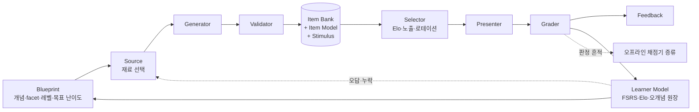
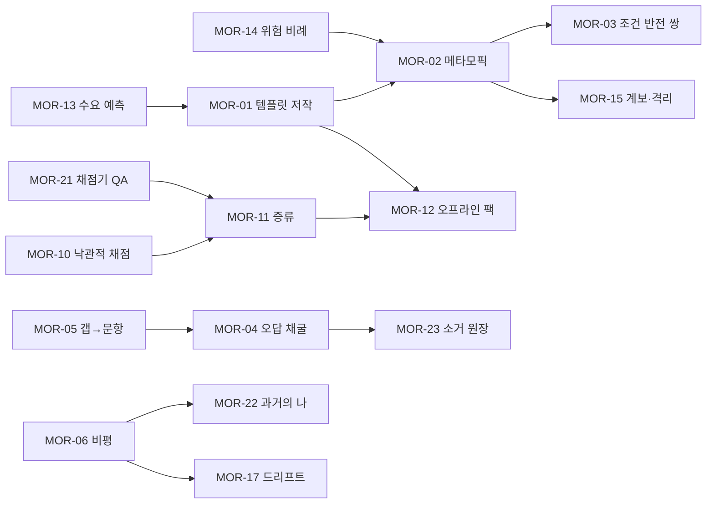

# PLN-IDEA-MOR. 형태학적 분석(Zwicky Box) + TRIZ — 문항 생성·채점 엔진 아이데이션

| 항목 | 내용 |
|---|---|
| 문서 ID | PLN-IDEA-MOR (`docs/01-planning/02-ideation/morphological-qgen.md`) |
| 단계 | Phase 1 기획 — 아이데이션 (T1 상위 모델) |
| 주 추적 | **UR-13**(양질의 문제 생성 + 개념 가져오기), **UR-02**(여러 기획 방법론으로 전문가 수준 아이디어) |
| 연관 | UR-10·11·12(이론→코드→핵심, L1→L5, 15년), UR-14(다양한 학습 방식, 질리지 않게), UR-15(로컬 + API/CLI), UR-16(판단은 Jev), UR-17(기능·운영·UX), UR-08(서비스 분리) |
| 입력 | 브리프, R1~R6, PLN-ACT-01(액터·페르소나 P0~P5, E1~E3, RC-01~40) |
| 방법 | ① Zwicky 형태학적 상자 + Ritchey식 교차 일관성 평가(CCA), 실제 전수 열거 스크립트로 해 공간 축소 ② TRIZ: 9-Windows, 이상적 최종 결과(IFR), 자원 분석, 기술적·물리적 모순, 분리 원리, 40 발명 원리, Trimming ③ Pugh 개념 선택 |
| 근거 수준 | 웹 조사 없음. 방법론(Zwicky 1969, Ritchey 2011 GMA, Altshuller TRIZ, Mann의 소프트웨어 TRIZ)은 **작성자 지식**. 비용·지연 수치는 R2/R5 값을 재사용했고, 새로 추정한 값은 `(추정)`으로 표시. CCA 수치는 이 문서의 규칙으로 **직접 계산**했다(§4). |

---

## 0. 핵심 결론 (TL;DR)

1. **해 공간.** 핵심 파라미터 8개(유형·Bloom·출처·생성기·검증기·채점기·난이도·피드백)로 상자를 만들면 원시 조합이 **16,257,024개**다. 103개 비호환 쌍 규칙(CCA)을 적용하면 **3,746,771개(23.1%)**가 남는다.
   - 이 중 **실행 시점에 AI가 필요 없는 조합은 39.7%**, 저작 시점까지 AI가 필요 없는 조합은 **15.4%**다.
   - 따라서 UR-15(오프라인 완전 동작)는 "AI를 빼면 조금 약해지는 앱"이 아니라 **설계로 지켜야 하는 좁은 부분공간**이다.
2. **CCA 스크리닝의 가장 강한 신호: 문항마다 LLM을 부르는 방식(T3/T4 개별 생성)은 거의 모든 레벨 밴드에서 점수가 밀린다.**
   - 앞서는 것은 실행 오라클(T1), 템플릿(T2), **LLM이 저작한 템플릿(D4)**, **기존 문항 변환기(D7)**다.
   - 개별 생성은 "템플릿이 아직 없는 영역을 처음 여는 탐사선"으로 격을 낮추는 것이 맞다.
   - 핵심 발상은 **LLM을 "문항 작가"에서 "아이템 모델(템플릿) 작가"로 바꾸는 것**(MOR-01)이다. LLM은 1회 저작하고, 로컬에서 수십 번 전개한다.
3. **L3~L5 밴드에서 일관되게 상위에 오른 값 조합:**
   - 조건 스위치 난이도(G5) × 쌍 일관성 채점(F8) × 대조 쌍 피드백(H7).
   - 이는 **조건 반전 쌍(Condition-Flip Twins)**을 1급 문항 구조로 만들라는 뜻이다(MOR-03).
   - 전문가 문항의 고질병인 "it depends라 채점이 안 된다"를 "**어떤 조건에서 답이 뒤집히는가(pivot)**"라는 채점 가능한 질문으로 바꾼다.
4. **TRIZ 모순 8개를 풀었다.** 공통 해법은 세 가지다.
   - **시간 분리:** AI는 온라인·유휴 시간에 *내구성 있는 산출물*을 만들고, 오프라인 실행 시점에는 그 산출물만 쓴다.
   - **규모 분리:** 다양성은 인스턴스 수준에서, 일관성·보정은 패밀리 수준에서 확보한다.
   - **조건 분리:** 검증 강도와 깊이 요구를 위험·신호에 비례시킨다.
5. **"학습자의 오류는 자원이다"(원리 22, 전화위복).**
   - 학습자의 과거 오답, 백지노트 누락, 6개월 전 자기 답안이 **가장 진단력 높은 오답지·문항 원천**이 된다(MOR-04·05·22).
   - 이 원천들은 신뢰 불가 입력이다. 그래서 *정답 키*가 아니라 *오답·비평 대상*으로만 쓴다. 이렇게 하면 신뢰 문제가 구조적으로 사라진다.
6. **"판정은 흔적을 남겨 오프라인을 가르친다"(원리 26 복제 + 23 피드백).**
   - Jev 판정 이력을 학습자 개인의 **오프라인 채점기(별칭·trigram·kNN)로 증류**한다(MOR-11).
   - 단일 사용자 앱이라서 개인 표현에 과적합해도 결함이 아니라 **기능**이다.
7. **속도 대 깊이는 "연재(serial)"로 푼다(원리 1 분할 + 19 주기적 작용).**
   - L4~L5 Case를 5~7분 에피소드로 쪼개 평일에 연재하고, 주말에 종합한다(MOR-08).
   - P3~P5의 평일 10~20분 예산과 Case 학습이 공존할 수 있다.
8. **Trimming(기능 요소 제거):** 기본 채점 경로에서 **LLM-as-judge를 제거**한다.
   - 기본 경로는 결정적 채점 → Jev → 자기채점이다.
   - LLM은 ① 템플릿·시나리오 저작 ② 피드백·소크라틱 문장 ③ 독립 풀이에만 남긴다.
   - UR-16의 "판단은 Jev"를 아키텍처 불변식으로 격상한다.
9. 결과물로 **Feature Candidates MOR-01~MOR-23**을 제안한다(§8). 이 중 MVP 권장은 01·02·03·05·09·10·13·14·20이다.

---

## 1. 방법론 설계 (UR-02)

### 1.1 왜 두 방법을 결합하나

| 방법 | 강점 | 약점 | 이 문서에서의 역할 |
|---|---|---|---|
| **형태학적 분석 (Zwicky Box)** | 파라미터 × 값의 **전수 공간**을 보여 줘서 "생각 못 한 조합"을 체계적으로 드러냄 | 공간이 폭발(10⁷)하고, 모순되는 조합을 해결하지 못함 | **발산**: 해 공간 정의, 드문 조합에서 신규 아이디어 발굴 |
| **CCA (Ritchey, General Morphological Analysis)** | 쌍별 비호환 판정으로 공간을 **논리적으로 축소** | 규칙을 누가 쓰느냐에 결과가 의존 | **수렴 1**: 불가능·무의미 조합 제거, 부분공간(오프라인 등) 크기 계량 |
| **TRIZ** | 트레이드오프를 타협하지 않고 **모순을 해소**하는 원리 제공(분리 원리, 40원리, IFR, 자원) | 소프트웨어 도메인 매핑은 유추적 | **도약**: 상자에서 매력적이지만 "비싸다/느리다/오프라인 불가" 때문에 버려질 조합을 되살림 |
| **Pugh 선택** | 기준선 대비 +/0/− 비교로 개념 선택을 투명화 | 가중치 주관 | **수렴 2**: 최종 엔진 개념 선택 |

### 1.2 절차

⑧ → ② 되먹임이 중요하다. TRIZ 해법에서 나온 새 값(D4 "LLM이 템플릿 저작", E6 "메타모픽 검증", F8 "쌍 일관성 채점")을 상자에 다시 넣어 재열거했다. 최종 상자는 이 되먹임 2회를 거친 결과다.

---

## 2. 문제 정의 (Problem Framing)

### 2.1 Focus Question

> **"로컬 1인 학습자가 15년 동안 L1→L5+로 성장하는 동안, 임의의 (개념 × facet × 레벨 × 순간)에 대해 *타당하고(정답 오류 ≈ 0)*, *진단력 있고*, *질리지 않고*, *싸고*, *AI 없이도 동작하는* '문항 + 채점 + 피드백' 단위를 어떻게 공급할 것인가?"**

### 2.2 시스템 경계 — 엔진 기능 체인

- **경계 안:** Blueprint ~ Learner Model 갱신 입력.
- **경계 밖:**
  - FSRS 알고리즘 자체(R1)
  - 개념 가져오기 I1~I9 파이프라인(R2 §12). 단, 그 산출물인 KU·오개념은 Source로 들어온다.
  - UI 렌더링(R3)

### 2.3 평가 기준 (Configuration 스크리닝·Pugh 공통)

| 기준 | 정의 | 가중치 | UR |
|---|---|---|---|
| **V 타당성** | 정답 키·채점이 옳을 확률(생성기 고유 신뢰 × 검증 강도) | 0.30 | UR-13 |
| **Fit 레벨 적합** | 해당 Bloom 밴드에 그 문항 유형이 얼마나 진정성 있는 과제인가 | 0.20 | UR-11·12 |
| **Cost 비용** | 수락 문항당 AI 비용 + 학습자·큐레이터 시간(음수 가중) | −0.20 | UR-15·17 |
| **Var 다양성** | 동형 변형 생산력, 개인화 원천 사용 | 0.15 | UR-14 |
| **FB 피드백 가치** | 해당 밴드에서 피드백 유형의 학습 효과(Shute 2008, R1 §8) | 0.10 | UR-14 |
| **Off 오프라인** | 실행 시점에 AI 불필요 | 0.05 (+ 별도 부분공간으로 계량) | UR-15 |

### 2.4 불변 제약 (Non-negotiables, 상자 밖 제약)

| ID | 제약 | 출처 |
|---|---|---|
| K-01 | Jev state에서 참조는 **객체 키**(`options.b`, `units.u_x`). 배열 인덱스 금지 | 브리프 §3, R5 |
| K-02 | UR-14의 모든 모드는 OFFLINE에서 동작(품질 저하는 허용하되 기능 부재는 금지) | R5 §7, E3 |
| K-03 | LLM 출력·외부 문서·학습자 입력은 신뢰 불가 → 정답 키로 승격하려면 검증기 통과 필수 | PLN-ACT-01 §2.6 |
| K-04 | `trust=llm_unverified` KU로는 출제 금지 | R2 §12.3 |
| K-05 | AI가 즉시 정답을 공개하지 않음(힌트 사다리 우선) | R3 AP-07 |
| K-06 | 세션 첫 문항까지 ≤ 2초, 세션 중 LLM 대기 없음 | RC-03 |
| K-07 | 게이트 과업은 Jev가 없으면 보류 큐로 보냄(휴리스틱으로 통과시키지 않음) | R5 §5 |

---

## 3. 형태학적 상자 (Zwicky Box)

### 3.1 핵심 파라미터 8개 × 값

> R2 §14의 상자는 **문항 자체**의 속성(자극·응답 형식·오답 원천 등) 13차원이다. 이 상자는 **엔진**의 속성이다. 출처·생성기·검증기·채점기를 독립 축으로 떼어 내고, 학습자 역할(비평·출제)과 개인화 원천(오답 로그·작업물·버전 diff)을 새 값으로 넣었다. 굵은 값은 TRIZ 되먹임으로 추가된 값이다.

| 파라미터 | 값 1 | 값 2 | 값 3 | 값 4 | 값 5 | 값 6 | 값 7 | 값 8 | 값 9 |
|---|---|---|---|---|---|---|---|---|---|
| **A 문항 유형군** | A1 선택형 (OX·MCQ·복수; Q01~04) | A2 짧은 산출 (빈칸·단답·출력 예측; Q05·06·09) | A3 구조화 (순서·매칭·Parsons·개념맵 엣지; Q07·08·11) | A4 코드 산출 (완성·버그 수정; Q10·12) | A5 아티팩트 판독 (설정 리뷰·로그·트레이스; Q13·14) | A6 판단·설계 (트레이드오프·시나리오·인시던트·추정·ADR; Q15~17·20) | A7 생성·설명 (백지노트·Feynman; Q19) | **A8 비평·출제** (AI/과거 답안 비평, 역출제; Q18 확장) | — |
| **B 인지 목표 (Bloom+)** | B1 기억 | B2 이해 | B3 적용 | B4 분석 | B5 평가 | B6 창조 | **B7 메타인지** (자기 점수 예측·확신도 보정) | — | — |
| **C 출처 (재료)** | C1 시드 팩 (큐레이션, 해시 고정) | C2 KU·오개념 은행 | C3 개념 그래프 관계 (형제·대조·선수) | C4 실행 런타임 (JS·Python·`node:sqlite`·정규식) | C5 가져온 외부 문서 (I1~I9 통과) | **C6 학습자 오답·누락 로그** | **C7 학습자 작업물** (실습 코드·YAML·노트·과거 답안) | **C8 버전 변경 diff** (공식 문서 해시 변경·릴리스 노트) | C9 Case 시나리오 은행 (R4 ~150개) |
| **D 생성기** | D1 정적 (시드 그대로) | D2 T1 절차 생성 + 실행 오라클 | D3 T2 AIG 템플릿 (KU 슬롯) | **D4 LLM이 아이템 모델을 저작 → T2로 전개** | D5 T3 근거 LLM 문항 | D6 T4 시나리오 + 루브릭 LLM | **D7 변환기** (기존 문항 → 동형·조건 반전·레벨 변환·결함 주입) | D8 학습자 저작 (역출제) | — |
| **E 결정 검증기** (스택 중 결정적 역할) | E1 없음 (신뢰 소스) | E2 결정적 (스키마·형식·중복·린터) | E3 실행 오라클·테스트 판별력 | E4 Jev 게이트 번들 (G2·3·5·6·7·9·11·13) | E5 타 계열 LLM 독립 풀이 | **E6 메타모픽 검증** (변형 간 불변식·반전식) | E7 사후 운영 검증 (Elo 잔차·신고) | E8 사람 스테이징 승인 | — |
| **F 채점기** | F1 결정적 일치 | F2 정규화 + Jev 동치 | F3 실행·테스트·상태 검증 | F4 Jev `noul` 체크리스트 (KU·결함 커버리지) | F5 Jev `score` 루브릭 | F6 LLM-as-judge | F7 자기채점 + 편향 보정 | **F8 쌍 일관성 채점** (twin·변형 간 일관성) | — |
| **G 난이도 제어** | G1 정적 라벨 | G2 특징 + Jev 사전값 | G3 Elo 계층 풀링 (유형×레벨 / 패밀리 / 문항) | G4 2세대 구조 레버 (레이어 수·중첩·잡음) | G5 조건 스위치·정보 불완전성 | G6 세션 내 동적 (힌트·단계 공개) | G7 학습자 도전 다이얼 | — | — |
| **H 피드백** | H1 정오만 (지연) | H2 정답 + KU 인용 해설 | H3 오개념 교정문 | H4 힌트 사다리 (풀기 전) | H5 단계적 공개 (progressive disclosure) | H6 소크라틱 후속 (디깅 진입) | **H7 대조 쌍 제시** (조건 반전 쌍) | H8 갭 → 다음 문항·카드 즉시 생성 | **H9 보정 피드백** (예측 대 실제, 확신도) |

값의 개수는 A8·B7·C9·D8·E8·F8·G7·H9이고, 곱은 8×7×9×8×8×8×7×9 = **16,257,024**다.

### 3.2 보조 파라미터 (정성 탐색용 — 열거에서 제외)

| 파라미터 | 값 |
|---|---|
| P9 생성 시점 | 사전 시드 / 야간 배치(CLI 구독 유휴 쿼터) / 수요 예측 선생성 / 세션 중 온디맨드 / 세션 후 정리 |
| P10 스케줄 단위 | 문항 / KU / **개념 × facet**(R1 채택) / Case / 자극(stimulus) |
| P11 학습자 역할 | 응답자 / 설명자 / **비평가** / 출제자 / 교사(Feynman) / 지휘관(인시던트) |
| P12 AI 모드 | FULL / JUDGE_ONLY / LLM_ONLY / OFFLINE (R5) |

---

## 4. 교차 일관성 평가 (CCA)

### 4.1 비호환 규칙 (103쌍, 규칙 그룹 13개)

`X` = 논리적으로 불가능하거나, 자원·신뢰 제약상 **금지**되거나, 다른 값에 **완전히 지배되는**(무의미한) 쌍이다. 조건부로 가능한 쌍(`?`)은 남겨 두고 점수에서 불리하게 처리했다.

| 규칙 | 비호환 쌍 (요지) | 근거 |
|---|---|---|
| CC-01 유형 × Bloom | A1·A2·A3 × B6, A3 × B5, A2 × B5, A5 × B1·B6, A6 × B1·B2, A8 × B1, A1 × B4 | 선택형으로 창조 수준을 측정할 수 없다. 판단 과제를 기억 수준으로 묻는 것은 과제 위장이다(ECD claim-evidence 불일치, R2 §1.2). A1 × B4는 Q02(OX+이유)가 A1이 아니라 A1+A7 복합으로 분류되므로 제외했다. |
| CC-02 학습자 저작 전용 | D8 × {A1~A7} | 역출제는 A8에만 속한다. |
| CC-03 실행 오라클 적용역 | D2 × A1·A6·A7·A8, D2 × B5 | 실행으로 정답이 계산되지 않는 과제다. OX는 A2에 지배된다. |
| CC-04 템플릿 한계 | D3 × A6, D3 × B6 | 순수 KU 슬롯으로는 개방형 설계 과제·루브릭을 만들 수 없다(D4·D6 영역). |
| CC-05 채점기 적용역 | F1 × A4·A6·A7·A8, F3 × A1·A6·A7·A8, F5 × A1·A2·A3, F6 × A1·A3, F8 × A3·A7 | 코드는 테스트로 채점하고, 개방형은 체크리스트·루브릭으로 채점한다. 결정적 채점이 가능한 유형에 LLM·루브릭을 쓰면 비용만 늘고 신뢰는 떨어진다(지배됨). |
| CC-06 피드백 적용역 | H5 × A1·A2·A3·A4·A8, H7 × A3·A7 | 단계적 공개는 다단계 과제에만, 대조 쌍은 조건을 가진 과제에만 의미가 있다. |
| CC-07 난이도 레버 적용역 | G4 × A7, G5 × A3·A7, G4 × D1·D5·D6·D8 | 2세대 구조 레버는 템플릿·절차 생성기에만 존재한다. |
| CC-08 출처 × 생성기 | D1 × C5~C8, C1 × D8, C4 × D6·D8, C5 × D2, C3 × D2, C6 × D2·D6·D8, C8 × D2·D6·D8, C9 × D2·D8 | 동적 원천은 정적 시드가 될 수 없다. 학습자 로그를 LLM 시나리오 원천으로 쓰면 프라이버시·신뢰 이득이 없다(→ D3·D5·D7로 충분). |
| CC-09 출처 × 유형 | C4 × A6·A7, C9 × A1·A2·A3 | Case를 OX로 쪼개면 Case가 아니라 KU다. |
| CC-10 신뢰 경계 (K-03) | {C5, C6, C7, C8} × E1, {D4, D5, D6, D7, D8} × E1 | 신뢰 불가 원천이나 생성물에 검증 없음은 금지다. |
| CC-11 실행 검증 적용역 | E3 × D6·D8, E3 × A1·A6·A7·A8, E3 × C2·C3·C8·C9 | 실행 가능한 재료가 없다. |
| CC-12 독립 풀이·메타모픽 적용역 | E5 × A7·D1·D2, E6 × D1·D6·D8·A7 | 풀 정답이 없거나(A7), 실행 오라클에 지배되거나(D2), 변형 패밀리가 없다. |
| CC-13 메타인지 | B7 × H1 | 보정 피드백 없이 메타인지 목표는 성립하지 않는다. |

### 4.2 열거 결과 (직접 계산)

| 지표 | 값 | 해석 |
|---|---|---|
| 원시 조합 | 16,257,024 | — |
| **CCA 통과** | **3,746,771 (23.05%)** | 상자의 77%는 논리적으로 버려진다. 규칙 103쌍은 모두 설계 제약으로 REQ에 이관할 수 있다. |
| 실행 시점 AI 불필요 (F ∉ {F2, F4, F5, F6}, H ≠ H6) | 1,485,624 (통과분의 **39.7%**) | 오프라인에서도 조합의 40%는 그대로 쓸 수 있다. 나머지 60%는 채점을 보류하거나 자기채점으로 강등된다. |
| 저작 시점까지 AI 불필요 (D ∉ {D4, D5, D6}, E ∉ {E4, E5}) | 578,062 (**15.4%**) | E3 망분리 환경에서 **새 문항을 만들 수 있는** 공간은 15%뿐이다. → MOR-12(오프라인 팩)가 필요한 정량 근거. |
| 생성기별 잔존 | D4·D7 각 764,544 > D3 682,077 > D5 660,322 > D6 355,390 > D1 299,010 > D2 187,044 > D8 33,840 | D4·D7(TRIZ로 추가한 값)이 **가장 많은 유효 조합과 호환**된다. 범용성이 가장 크다. |
| Bloom 밴드별 잔존 | L1~2(B1~3) 1,717,506 · L3(B4) 636,838 · L4~5(B5~6) 777,328 · 메타(B7) 615,099 | 상위 밴드의 조합 공간이 좁은 것이 아니라, **다른 값(A6·A8·F5·F8·H5·H7)에 몰려 있다**. |

### 4.3 스크리닝 점수와 밴드별 최상위 구성 (생성기별 1위)

점수식은 `S = 0.30·V + 0.20·Fit + 0.15·Var + 0.10·FB − 0.20·Cost + 0.05·Off`이다. V = 1−(1−생성기 고유 신뢰)×(1−검증 강도). 생성기 고유 신뢰는 D1 .95, D2 .98, D3 .85, D4 .80, D5 .60, D6 .50, D7 .80, D8 .40이다. 검증 강도는 E3 .9, E5 .75, E4 .7, E6·E8 .6, E7 .4, E2 .2이다. 비용은 R2 §13 단가를 0~1로 정규화했다.

> ⚠️ 이 점수는 **스크리닝 휴리스틱**이다. 계수는 작성자가 R2·R5 수치에서 정했다. 개인화 원천(C6~C8)의 다양성 가산(+0.1)은 결과를 그쪽으로 기울이므로, **절대 순위가 아니라 "생성기 간 상대 격차"만** 해석한다.

| 밴드 | 1위 생성기 (S) | D4 LLM 템플릿 저작 | D7 변환기 | D1 정적 시드 | D5 T3 개별 LLM | D6 T4 개별 LLM | D8 역출제 |
|---|---|---|---|---|---|---|---|
| L1~2 | D2 (0.756) A3·B3·D2·F1·G4·H3 — Parsons + 실행 + 구조 레버 + 오개념 교정 | 0.739 | 0.734 | 0.641 | **0.613** | **0.505** | 0.557 |
| L3 | D2 (0.776) A5·B4·D2·F1·G5·H7 — 설정·로그 판독 + 조건 스위치 + 대조 쌍 | 0.759 | 0.754 | 0.661 | **0.633** | **0.525** | 0.637 |
| L4~5 | **D4 (0.753)** A6·B6·D4·E4·**F8·G5·H7** — 설계 과제 + 쌍 일관성 채점 | **0.753** | 0.748 | 0.667 | **0.615** | **0.531** | 0.667 |
| 메타 | D3 (0.727) A7·B7·D3·E4·F7·G7·H9 — 백지노트 점수 예측 + 보정 | 0.722 | 0.717 | 0.636 | 0.584 | 0.500 | 0.627 |

### 4.4 CCA·스크리닝에서 얻은 통찰

| # | 통찰 | 설계 귀결 |
|---|---|---|
| I-1 | 모든 밴드에서 **D5·D6(문항마다 LLM 호출)이 D4·D7보다 0.12~0.23 낮다.** 원인은 비용과 타당성 두 가지다. | LLM의 역할을 "문항 작가"에서 **"아이템 모델·자극·루브릭 작가"**로 바꾼다(MOR-01, MOR-07). T3/T4 개별 생성은 **탐사(새 패밀리 개척)** 용도로만 쓴다. |
| I-2 | L4~5 1위가 D4이고, F8·G5·H7이 모든 L3+ 상위 조합에 반복 등장한다. | **조건 반전 쌍**을 1급 구조로 둔다(MOR-03). "it depends"를 채점 가능하게 만든다. |
| I-3 | E6(메타모픽)은 D2·D3·D4·D7과 호환되고 비용이 E5의 1/10 수준(추정)이다. | 비싼 독립 풀이(G4)의 **상당 부분을 메타모픽 검증으로 대체**하고, 독립 풀이는 고위험 문항에만 쓴다(MOR-02, MOR-14). |
| I-4 | 저작까지 오프라인인 공간이 15%뿐이다. | 오프라인에서 "새 문항 생성"은 T1·T2·변환기뿐이다. **온라인 시점에 미리 만든 자산을 반입**해야 한다(MOR-12). |
| I-5 | A8(비평)은 L3+에서 D8 역출제와 함께 비용이 거의 0이면서 Fit 0.8~0.9다. | **비평 모드**(결함이 주입된 답안 리뷰)를 L2~L5 핵심 유형으로 승격한다(MOR-06). 결함을 *우리가 주입*했으므로 정답(결함 목록)이 알려져 있다. |
| I-6 | B7(메타인지)은 거의 모든 유형과 호환되고 비용은 0이다. | 별도 모드를 만들기보다 **기존 문항에 "예측" 레이어를 얹는다**(MOR-16). |

---

## 5. 구성 탐색 (Configuration Exploration)

### 5.1 명명된 구성 (상자 좌표 → 아이디어)

CCA 상위 조합과 **의도적 강제 결합**(평소 같이 쓰지 않는 값을 짝지음, ★ 표시)에서 뽑았다.

| CFG | 이름 | 좌표 (A·B·C·D·E·F·G·H) | 레벨 | 페르소나 | 핵심 아이디어 | → MOR |
|---|---|---|---|---|---|---|
| CFG-01 | 실행 오라클 드릴 | A2·B3·C4·D2·E3·F1·G4·H3 | L1~L3 | P0, P1, E3 | 오답지도 **변이 실행**으로 계산한다(마이크로태스크를 매크로태스크로 취급한 코드의 출력). 완전 오프라인이다. | (R2 기존) + MOR-02 |
| CFG-02 | LLM 템플릿 저작 루프 | A1~A5·B1~B4·C2/C3·**D4**·E4+E6·F1/F2·G4·H3 | L1~L3 | 전원 | LLM이 선언적 아이템 모델(슬롯·제약·KU 참조·오답 규칙·난이도 레버)을 1회 저작한다. Jev가 표본 8개를 게이트하고 메타모픽 검증을 거친 뒤 **로컬에서 무한 전개**한다. | MOR-01 |
| CFG-03 | 조건 반전 쌍 | A6·B5·C2/C9·D4/D7·E4+E6·**F8**·**G5**·**H7** | L3~L5 | P2~P4, E1 | 같은 비교를 조건만 바꿔 2문항으로 낸다. 두 답의 **일관성**과 **pivot 조건 명시**로 판단력을 채점한다. | MOR-03 |
| CFG-04 | 개인 오개념 채굴 | A1·B2·**C6**·D3/D7·E4·F1·G3·H3 | L1~L3 | P0~P2 | 학습자의 과거 단답 오답·백지노트 빨강 unit을 군집화한다. Jev로 "틀린 진술"임을 확인한 뒤 **개인 오답지**로 쓴다. | MOR-04 |
| CFG-05 | 갭 → 문항 | A1/A2·B1/B2·**C6**·D3·E2·F1·**H8** | L1~L3 | P0~P3 | 백지노트 회색(누락) unit과 디깅 실패 지점이 **같은 세션 말미에** T2 문항 3개로 돌아온다. | MOR-05 |
| CFG-06 | ★ 결함 주입 답안 비평 | **A8**·B5·C2/C9·D7(주입)/D6·E4·F4·G4·H3 | L2~L5 | P1~P4 | "선배 AI의 답안"(코드·설계서·ADR·포스트모템)에 오개념 은행·변이 연산자로 결함 k개를 주입한다. 학습자가 찾아 고친다. **정답 = 주입 목록**이다. | MOR-06 |
| CFG-07 | 한 자극, 다섯 깊이 | A2→A4→A5→A6 · B1→B6 · C4/C9 · D1/D7 · … | L1~L5 | 전원 | 같은 자극(코드·설정·로그·Case)을 레벨별 프롬프트로 재사용한다: L1 식별 → L2 예측 → L3 디버그 → L4 제약하 결정 → L5 재설계·ADR. | MOR-07 |
| CFG-08 | 연재형 Case | A6·B4/B5·C9·D1/D6·E4·F5·G6·H5 | L4~L5 | P3~P5, E1 | Case를 5~7분 에피소드 4~6편으로 나눠 평일 연재, 주말 종합(포스트모템). | MOR-08 |
| CFG-09 | 적응형 깊이 당김 | A1+A7·B2→B4·C2·D3·E4·F1→F4·G6·H6 | L1~L3 | P0~P2 | 빠른 OX 뒤에 **신호가 있을 때만**("고확신 오답", "저확신 정답") "왜?" 한 줄을 요구한다. | MOR-09 |
| CFG-10 | ★ 과거의 나 리뷰 | **A8**·B5·**C7**(6개월 전 자기 답안)·D7·E4·F4·G1·H9 | L2~L5 | P1~P5 | 과거 자기 백지노트·ADR·Case 답안을 **비평 대상**으로 다시 푼다. 성장이 차이(diff)로 보인다. | MOR-22 |
| CFG-11 | ★ 구버전 답안 비평 | A8·B5·**C8**·D7·E4·F4·G5·H7 | L3~L5 | P4, P5 | `valid_as_of` 이전 기준으로 작성된 답안에서 **버전 드리프트를 찾는다**(예: dockershim, PSP→PSA). | MOR-17 |
| CFG-12 | ★ 내 작업물 문항 | A5·B4·**C7**(실습 Dockerfile·YAML)·D2(정적 분석·린터)·E3·F1·G5·H3 | L2~L3 | P1, P2 | "당신이 어제 쓴 Dockerfile에서 캐시를 무효화하는 첫 줄은?" — 개인 관련성이 최대다. | MOR-18 |
| CFG-13 | ★ 출제로 측정하는 전문성 | **A8·B6**·C2·**D8**·E4·F5·G7·H3 | L3~L5 | P3, P4 | 학습자가 *진단력 있는 오답지*를 설계하게 한다. 오개념 지식은 전문가의 표지다. G6 매력도 점수를 **전문성 증거**로 쓴다. | MOR-19 |
| CFG-14 | 점수 예측 후 인출 | A7·**B7**·C2·D3·E4·F7/F4·G7·**H9** | 전 레벨 | P0~P3 | 백지노트·Case 전에 "몇 % 커버할까?"를 예측하게 한다. 사후 보정 곡선을 보여 준다. | MOR-16 |

### 5.2 드문 조합 강제 결합 — 기각 기록 (탐색의 흔적)

| 조합 | 판정 | 이유 |
|---|---|---|
| A1(OX) × C8(버전 diff) × D3 | **채택**(MOR-17 일부) | 오개념 종류 `version_drift`와 정합한다. "K8s 1.25+에서 PodSecurityPolicy로 …한다" (X). |
| A7(백지노트) × G5(조건 스위치) | 기각 | 자유 회상에 조건을 걸면 과제가 설계 문항(A6)으로 바뀐다. |
| A3(Parsons) × F8(쌍 일관성) | 기각 | 순서 문제의 변형 간 일관성은 실행 테스트(F3)로 이미 보장된다. |
| D8(역출제) × E3(실행) | 보류(`?`) | 학습자가 코드 문항을 출제하는 경우는 L4 이상에서만 가능하다. 샌드박스 부담이 있어 v1.1로 미룬다. |
| C6(오답 로그) × D6(T4 시나리오) | 기각(CC-08) | 개인 오류를 LLM 시나리오에 넣어도 이득은 작고 외부 전송(RC-31)이 생긴다. D3·D7로 충분하다. |
| A6 × F6(LLM-judge 단독) | **Trimming 대상**(§6.6) | 동일 과업을 Jev `score`(F5)가 더 싸고 보정된 확률로 수행한다. |

---

## 6. TRIZ

### 6.1 9-Windows (System Operator)

|  | 과거 (저작·준비) | 현재 (세션) | 미래 (15년) |
|---|---|---|---|
| **상위 시스템** (학습자 경력 + AI 생태계) | 시드 콘텐츠 팩, 라이선스(R4), CLI 구독의 **야간 유휴 쿼터** | 하루 10~45분, 에너지 편차, 망분리 가능성(E3) | 모델 세대 교체(jev-latest 변경, LLM 교체), FSRS 버전업, 기술 폐기(obsolescence), 학습자가 L5 전문가가 됨 |
| **시스템** (문항 엔진) | 생성·게이트·은행 적재, 수요 예측 | 선택 → 제시 → 채점 → 피드백 → 모델 갱신 | 은행 수만 문항, 패밀리 보정 누적, 판정 증류 데이터 누적 |
| **하위 시스템** (문항·KU·오개념) | 아이템 모델·자극·루브릭 | 인스턴스, 셔플, 힌트 | 버전 드리프트로 KU 무효화, 오개념 소거 |

**9-Windows에서 도출한 요구:**

1. **미래 × 시스템:** 모델이 바뀌어도 자산이 살아야 한다. 따라서 LLM 산출물은 모델 비의존 **선언적 자산**(아이템 모델·루브릭·별칭 목록)이어야 하고, `provenance.generator`를 기록해 재검증할 수 있어야 한다. → MOR-01, MOR-15
2. **과거 × 상위 시스템:** 야간 유휴 쿼터는 "공짜 자원"이다. → MOR-13
3. **미래 × 하위 시스템:** 오개념은 "소거"되는 대상이다. 학습자가 오개념을 버렸다는 증거를 **여러 형식에 걸쳐** 모아야 한다. → MOR-23
4. **미래 × 상위 시스템:** 학습자가 L5가 되면 **학습자 자신이 최고의 콘텐츠 원천**이 된다(역출제·비평·교안). → MOR-19, MOR-22

### 6.2 이상적 최종 결과 (IFR)와 자원 분석

**Ideality = Σ 유익 기능 / (Σ 비용 + Σ 해악)**

| 대상 | IFR 진술 ("스스로, 비용 없이, 해악 없이") | 현실 근사 |
|---|---|---|
| 생성 | 문항이 **스스로** 필요한 만큼, 필요한 때, 무한히 다양하게 생긴다. | 수요 예측 + 템플릿 전개 + 변환기(MOR-01·07·13) |
| 검증 | 문항이 **스스로** 자기 오류를 드러낸다. | 메타모픽 불변식 + Elo 잔차 자기 격리(MOR-02·15) |
| 채점 | 채점기가 **쓸수록** 싸지고 오프라인이 된다. | 판정 증류(MOR-11) |
| 난이도 | 난이도가 **저절로** 맞춰진다. | 패밀리 풀링 Elo + 조건 스위치 레버(R2 + MOR-03) |
| 다양성 | 학습자 **자신이** 새로움의 원천이 된다. | 오답·작업물·과거 답안(MOR-04·18·22) |

**자원 목록 (Substance-Field 자원의 소프트웨어 대응)**

| 자원 | 종류 | 현재 활용 | 미활용 잠재력 |
|---|---|---|---|
| KU·오개념 은행, 개념 그래프 | 물질(데이터) | T2 슬롯, 오답지 | 조건 반전 쌍의 **pivot 조건 원천**(`tradeoff` KU의 조건절) |
| `node:sqlite`·Node 런타임 | 장(실행) | T1 정답 계산 | 변이 실행으로 **오답지 계산**, 학습자 작업물 정적 분석 |
| Jev 7일 동일요청 캐시 | 시간 | 재채점 무료 | 메타모픽 검증 시 **불변 변형의 재질의 비용 ≈ 0** → 일관성 검사 비용 절감 |
| CLI 구독 야간 유휴 쿼터 | 시간 | 배치 생성 | **수요 예측 기반** 결손분만 생성 |
| 학습자 오답·누락·과거 답안 | 물질(부산물) | Elo·prevalence 갱신 | **오답지·비평 대상·갭 문항** |
| 학습자 실습 산출물 | 물질 | 상태 검증 채점 | 개인 문항 자극 |
| 린터(hadolint, actionlint, kube-linter) | 도구 | Q13 교차 검증 | 결함 주입의 **역검증**(주입 결함이 린터에 잡히는가 = 결함 실재 증명) |
| Jev 판정 이력 | 정보(부산물) | 로그 | **오프라인 채점기 학습 데이터** |
| 세션 대기 시간(Jev 250ms~LLM 수 초) | 시간 | 스피너 | 다음 문항 선제시·낙관적 채점(원리 20) |
| FSRS due 예측 | 정보 | 오늘 큐 | **생성 수요 예측**, 오프라인 팩 범위 결정 |

### 6.3 모순 정식화

> 고전 39 파라미터 모순 행렬의 셀 값은 원문을 확인하지 못해 **행렬 조회를 하지 않았다**. 대신 모순을 **물리적 모순(PC: 한 요소가 A이면서 not-A여야 함)**으로 날카롭게 만든 뒤 **4대 분리 원리**(시간·공간·조건·시스템 수준)로 풀고, 40원리는 정성적으로 선택했다(Mann의 소프트웨어 TRIZ 방식). 괄호 안 번호는 고전 39 파라미터 중 가장 가까운 것이다.

| CT | 요청 축 | 기술적 모순 (개선 ↑ / 악화 ↓) | 물리적 모순 (핵심 요소) | 분리 원리 |
|---|---|---|---|---|
| **CT-1** | 품질 ↔ 비용 | 정답 키 신뢰도(27 신뢰성, 28 측정 정확도) ↑ / 비용·생산성(39 생산성, 25 시간 손실) ↓ | **검증기는 강해야(교차 계열 LLM 풀이) 하고 약해야(싸야) 한다** | 시스템 수준(패밀리 vs 인스턴스), 조건(위험도), 시간(1회 검증·장기 사용) |
| **CT-2** | AI 능력 ↔ 오프라인 | 생성·채점 능력(35 적응성) ↑ / 가용성·독립성(27 신뢰성, 36 장치 복잡성) ↓ | **AI는 존재해야(품질) 하고 부재해야(오프라인·망분리) 한다** | **시간**(저작 시점 vs 실행 시점), 조건(보류 큐) |
| **CT-3** | 다양성 ↔ 일관성 | 변형 수·신선도(35 적응성) ↑ / 난이도 보정·측정 비교가능성(28 측정 정확도)·오류 위험(27) ↓ | **문항은 매번 달라야(암기 방지) 하고 같아야(보정·비교) 한다** | **시스템 수준**(인스턴스는 다르고 패밀리·불변식은 같음) |
| **CT-4** | 속도 ↔ 깊이 | 세션 짧음·첫 문항 ≤2초(25 시간 손실) ↑ / 과제 깊이·진정성(L4~5 Case)(33 사용 편의 대 36 복잡성) ↓ | **과제는 짧아야(평일 10분) 하고 길어야(90분 Case) 한다** | **시간**(연재 분할), 조건(신호가 있을 때만 깊이), 공간(중첩: 깊은 과제 안의 짧은 체크) |
| CT-5 | 진단력 ↔ 공정성 | 오답지 매력도 ↑ / 모호성·복수 정답 위험 ↓ | 오답지는 **거의 맞아야** 하고 **명백히 틀려야** 한다 | 조건(오답지마다 반박 KU `refutes_ku`가 존재할 때만 매력적 오답 허용) |
| CT-6 | 전문가 진정성 ↔ 채점 가능성 | 개방형·복수 정답(L5) ↑ / 채점 신뢰도 ↓ | 답은 **열려 있어야** 하고 **닫혀 있어야**(판정 가능) 한다 | 부분-전체(답은 열고 **채점 차원**은 닫음), 다른 차원(쌍의 일관성) |
| CT-7 | 개인화 ↔ 신뢰 | 학습자 원천(오답·노트·작업물) 사용 ↑ / 정답 오류·오염 위험 ↓ | 학습자 원천은 **쓰여야** 하고 **믿으면 안 된다** | 조건(키가 아닌 오답·비평 대상으로만 사용) |
| CT-8 | 자동화 ↔ 큐레이션 부담 | 자동 생성량 ↑ / 사람 검토 부담(H02 시간) ↓ | 사람은 **검토해야** 하고 **검토하지 않아야** 한다 | 조건(예외만 사람에게), 자기 서비스 |

### 6.4 모순별 해결

#### CT-1 품질 ↔ 비용

| 원리 | 적용 | 결과 개념 |
|---|---|---|
| **#1 분할 + 시스템 수준 분리** | 검증 대상을 문항 인스턴스에서 **아이템 모델(패밀리)**로 올린다. 비싼 검증은 패밀리당 1회, 인스턴스는 싼 결정적 검사만 거친다. | MOR-01 |
| **#10 사전 작용** | 검증을 사용 시점 전에 끝낸다(워밍 풀). 1회 검증 비용이 문항 생애 전체와 동형 변형에 **상각**된다. | MOR-13 |
| **#16 부분적·과잉 작용** | 모든 문항에 완벽 검증을 하지 않는다. 연습 문항은 캐스케이드 게이트, **고위험 문항**(승급 평가, 고확신 오답 재출제, 시드 핵심 사실)만 독립 풀이 + 메타모픽 + 사람 승인을 거친다. | MOR-14 |
| **#23 피드백 + #25 자기 서비스** | 사전 검증에서 샌 오류는 사용 중에 스스로 드러나게 한다(Elo 잔차, 변형 간 불일치, 신고). 패밀리 단위로 전파 격리한다. | MOR-15 |
| **#28 기계 시스템 대체** (비싼 LLM 풀이 → 다른 물리 원리) | 독립 풀이(LLM)를 **메타모픽 관계**(불변 변형은 키 유지, 반전 변형은 키 반전)와 **실행 오라클**로 대체한다. Jev 7일 캐시 덕분에 재질의 비용 ≈ 0. | MOR-02 |

**수치 추정 (추정):**
- T3 개별 수락 문항은 $0.02~0.04다(R2).
- D4 아이템 모델 1개의 저작 비용은 T3 배치 1~2회 ≈ $0.03~0.08이다. 여기에 Jev 표본 게이트 8 × $0.0002를 더한다.
- 모델당 유효 인스턴스를 40~60개로 보면 **인스턴스당 $0.001~0.002**다. T3 대비 **10~20배 절감**된다.
- CLI 구독 경로에서는 저작 비용도 ≈ 0이 된다.

#### CT-2 AI 능력 ↔ 오프라인

| 원리 | 적용 | 결과 개념 |
|---|---|---|
| **시간 분리 + #10 사전 작용** | AI는 온라인·유휴 시점에 **내구성 산출물**(아이템 모델, 자극, 루브릭, 모범답안, 별칭 목록, 소크라틱 질문 은행)을 만든다. 오프라인 실행은 그 산출물만 소비한다. | DP-01, MOR-01 |
| **#24 중개물** | 온라인 PC에서 만든 **오프라인 콘텐츠 팩**(서명된 데이터 번들, 코드 없음)을 망분리 PC로 반입한다. 답안은 역방향 팩으로 돌아와 재채점된다. | MOR-12 |
| **#26 복제 (값싼 사본)** | 비싼 Jev 판정의 값싼 사본으로 **증류 채점기**를 쓴다. KP별 긍정·부정 예시 → trigram kNN과 임계값 → Jev 일치율 ≥ 0.85인 KP만 오프라인 자동 채점하고 나머지는 자기채점한다. | MOR-11 |
| **#11 사전 완충 + 조건 분리** | 오프라인 채점은 "잠정" 표시 후 보류 큐에 넣는다. 온라인 복귀 시 소급 보정(RC-35)하고 자기채점 편향을 측정한다. | MOR-10 |
| **#15 동역학** | AI 모드(FULL→JUDGE_ONLY→…→OFFLINE)에 따라 라우터가 생성기·채점기 값을 **동적으로 재선택**한다. 상자의 좌표가 모드별로 이동한다. | MOR-20 |

#### CT-3 다양성 ↔ 일관성

| 원리 | 적용 | 결과 개념 |
|---|---|---|
| **시스템 수준 분리 + #3 국소적 품질** | 인스턴스의 **표면**(식별자·수치·맥락·선택지 순서)은 다르게, 패밀리의 **구조·불변식·난이도 δ**는 같게 둔다. 난이도는 패밀리에서 풀링한다(R2 §9.2). | MOR-01, MOR-02 |
| **#35 파라미터 변경** | 변형을 두 종류로 명시한다. **불변 변형**(답 유지: rename, 독립 문장 재배열, 패러프레이즈, 셔플)과 **반전 변형**(답 변경: 조건 스위치, 경계값 이동, 버전 변경). 변형마다 기대 효과를 선언한다. | MOR-02 |
| **#5 병합** | 반전 변형 둘을 **쌍 문항**으로 묶는다. 다양성(두 문항)과 일관성(쌍 관계)이 동시에 측정 대상이 된다. | MOR-03 |
| **#23 피드백** | 학습자가 불변 변형에서 서로 다른 답을 내면 추측·암기 신호다. 반대로 문항 쪽의 불일치는 문항 결함 신호다. | MOR-15 |
| **#17 다른 차원** | 다양성을 "문항 내용"이 아니라 **학습자 역할 차원**(응답 → 비평 → 출제 → 교사)에서 얻는다. 같은 KU를 다른 역할로 만나면 암기가 불가능하다. | MOR-06, MOR-19, MOR-20 |

#### CT-4 속도 ↔ 깊이

| 원리 | 적용 | 결과 개념 |
|---|---|---|
| **시간 분리 + #1 분할 + #19 주기적 작용** | Case를 에피소드 4~6편(각 5~7분)으로 분할한다. 에피소드 간 최대 간격은 2일이다(맥락 보존). 각 편은 30초 요약 → 새 증거 공개 → 결정 1개(`choice`) + 근거 1줄(Jev `noul`) → 클리프행어 순서다. 주말에 종합 포스트모템(루브릭)을 쓴다. | MOR-08 |
| **조건 분리 + #15 동역학** | 깊이는 **신호가 있을 때만** 당긴다. 고확신 오답이면 오개념 진단 질문, 저확신 정답이면 근거 1줄, 무작위 10% 감사. 세션당 상한은 10문항당 3회다. | MOR-09 |
| **#7 중첩 인형** | 깊은 과제 안에 짧은 체크(Case 속 OX 확인)를, 짧은 과제 안에 깊이 진입점(OX 해설의 "디깅" 링크)을 넣는다. | MOR-07, MOR-08 |
| **#20 유용한 작용의 연속 + #21 급속 통과** | Jev·LLM 대기 시간에 다음 문항을 먼저 제시한다. 채점은 낙관적 즉시값을 먼저 보이고 정밀값으로 갱신한다. 느린 부분은 "빨리 지나가게" 한다. | MOR-10 |
| **#2 추출** | 깊이 과제에서 무거운 부분(시나리오 저작)을 세션 밖(야간 배치)으로 빼낸다. 세션에는 결정 행위만 남긴다. | MOR-13 |

#### CT-5 ~ CT-8

| CT | 원리 | 해결 개념 | → MOR |
|---|---|---|---|
| CT-5 진단력 ↔ 공정성 | #3 국소적 품질, #13 반대로 하기 | 매력적 오답지는 **반박 KU(`refutes_ku`)가 있는 오개념 출처일 때만** 허용한다. 오답지마다 "이 진술은 KU 기준 거짓인가" Jev `noul`을 적용한다(객체 키, K-01). 오답지를 "정답을 흐리는 것"이 아니라 "특정 오개념을 탐지하는 센서"로 뒤집어 본다. 선택된 오답은 오개념 원장에 기록한다. | MOR-04, MOR-23 |
| CT-6 진정성 ↔ 채점 가능성 | 부분-전체 분리, #17 다른 차원, #13 반대로 | 답은 열어 두고 **채점 차원(체크리스트·차원 루브릭)**은 닫는다. "it depends"는 쌍 문항의 **pivot 조건**으로 채점한다. 학습자가 쓰는 대신 **결함 주입 답안을 비평**하게 해서, 정답(주입 목록)이 알려진 상태로 L5 판단을 측정한다. | MOR-03, MOR-06 |
| CT-7 개인화 ↔ 신뢰 | #22 전화위복, 조건 분리 | 학습자 원천은 **틀린 것으로 확인된 경우에만** 오답지·비평 대상으로 쓴다. 정답 키로는 절대 승격하지 않는다(K-03). 틀린 답이기 때문에 가치가 있다. | MOR-04, MOR-05, MOR-22 |
| CT-8 자동화 ↔ 큐레이션 부담 | #25 자기 서비스, 조건 분리 | 사람(H02)은 **예외만** 본다. 대상은 게이트 경계 구간(0.4~0.7), 패밀리 격리, 충돌 KU다. 나머지는 자기 격리·자동 재생성한다. 문항 계보 그래프로 일괄 조치한다. | MOR-15 |

### 6.5 원리 사용 빈도

| 원리 | 사용 CT | 빈도 |
|---|---|---|
| #1 분할 | CT-1, CT-4 | 2 |
| #10 사전 작용 | CT-1, CT-2 | 2 |
| #23 피드백 | CT-1, CT-3 | 2 |
| #3 국소적 품질 | CT-3, CT-5 | 2 |
| #13 반대로 하기 | CT-5, CT-6 | 2 |
| #15 동역학 | CT-2, CT-4 | 2 |
| #17 다른 차원 | CT-3, CT-6 | 2 |
| #25 자기 서비스 | CT-1, CT-8 | 2 |
| #2, #5, #7, #11, #16, #19, #20, #21, #22, #24, #26, #28, #35 | 각 1 | 1 |
| 분리 원리 | 시간 3 · 시스템 수준 3 · 조건 6 · 부분-전체 1 | — |

**해석:** 이 엔진에서는 **조건 분리**가 가장 강력한 도구다. 신호·위험·신뢰에 따라 강도를 달리하는 설계다. 그다음은 **시간 분리**(저작 시점 vs 실행 시점)다. 이 둘은 아키텍처에서 각각 `policy`(조건 규칙 레지스트리)와 `authoring vs runtime` 서비스 경계(UR-08)로 구현하기에 자연스럽다.

### 6.6 Trimming (기능 요소 제거)

| 제거 대상 | 그 기능을 누가 대신하나 | 효과 |
|---|---|---|
| **기본 채점 경로의 LLM-as-judge** | 결정적 채점 → Jev(`noul`·`choice`·`score`) → 자기채점. LLM-judge는 Jev 부재(LLM_ONLY 모드)나 confidence < 0.6 재검토에만 쓴다. | 비용·지연·편향(장황함·위치) 제거. UR-16을 불변식으로 격상 |
| **L1~L2의 T3 개별 생성** | D2·D3·D4·D7 | L1~L2 은행의 T1+T2 비중이 ≥ 60%(R2)에서 **≥ 85%(목표)**로 오른다. |
| **G4 독립 풀이의 전면 적용** | E6 메타모픽 + E3 실행. 독립 풀이는 고위험 문항에만 쓴다. | 수락 문항당 비용 약 30~50% 절감 (추정) |
| **사람의 전수 스테이징 승인** | 게이트 경계 구간 예외만 보여 준다. | 큐레이터 시간 절감(CT-8) |
| **LLM의 실행 코드 저작(런타임)** | LLM은 **선언적 아이템 모델**만 저작한다. 계산형 정답은 앱에 내장된 T1 생성기 패밀리(검토된 코드)에 파라미터로만 전달한다. | 샌드박스·오프라인 팩에 **코드가 섞이지 않음** → 보안(R6 §6) |

---

## 7. 개념 통합 — 엔진 설계 원칙과 개념 선택

### 7.1 설계 원칙 (Design Principles) — 아키텍처 단계 인계용

| DP | 원칙 | 출처 CT·원리 |
|---|---|---|
| DP-01 | **AI 산출물은 내구성 있는 자산이어야 한다.** LLM 호출 결과는 아이템 모델·자극·루브릭·모범답안·별칭처럼 *재사용되고 오프라인에서 실행 가능한* 형태로 저장한다. 일회성 텍스트는 피드백 문장뿐이다. | CT-1, CT-2 / #10, #26 |
| DP-02 | **판정과 생성은 분리하고, 판정은 흔적을 남긴다.** 모든 Jev 판정은 (대상 키, 입력 해시, 확률, 모델 버전)으로 저장해 보정·증류·재현에 쓴다. | CT-2 / #26, #23 |
| DP-03 | **변형은 불변식과 함께 태어난다.** 변환기는 변형마다 기대 효과(`preserve` / `flip` + 기대 키)를 선언한다. 선언은 검증기와 채점기가 공유한다. | CT-3 / #35 |
| DP-04 | **학습자의 오류는 자원이다. 단, 키가 아니라 오답·비평 대상으로만 쓴다.** | CT-7 / #22 |
| DP-05 | **깊이는 연재로, 강도는 신호로.** 긴 과제는 분할해 연재하고, 깊이 요구는 신호(확신도·오류·무작위 감사)에 비례시킨다. | CT-4 / #1, #19, #15 |
| DP-06 | **검증 강도는 위험에 비례한다.** stakes(연습/재출제/승급/시드) × 생성기 신뢰 → 게이트 스택을 결정한다. | CT-1 / #16 |
| DP-07 | **모든 문항은 계보를 가진다.** 원천 KU·오개념 → 아이템 모델 → 변환 → 인스턴스 → 게이트 결과 → 노출·응답을 그래프로 저장한다. 일괄 격리·설명("왜 이 문항?")·품질 분석에 쓴다. | CT-8 / #25 |
| DP-08 | **세션은 형태학적 거리로 구성한다.** 연속 블록 간 상자 좌표(유형·역할·자극·Bloom)의 거리를 최대화해 질림을 막는다. 방법론 자체를 런타임으로 옮긴 것이다. | CT-3 / #17 |

### 7.2 Pugh 개념 선택

- **α (기준선):** "LLM에 문항 생성 요청 + LLM-as-judge 채점" — 흔한 AI 학습 앱 방식.
- **β:** R2 §13 파이프라인 그대로 — 개별 T3/T4 + G0~G13 게이트 + G4 전면.
- **γ:** 이 문서의 개념 — β + D4 템플릿 저작 + E6 메타모픽 + 쌍 문항 + 비평 모드 + 증류 + 위험 비례 검증 + 연재.

| 기준 (가중) | α | β | γ |
|---|---|---|---|
| 정답 타당성 (3) | 0 | + | + (메타모픽이 인스턴스 수준 결함까지 탐지) |
| 비용 (2) | 0 | − (게이트·독립 풀이 추가) | + (상각 10~20배, 추정) |
| 오프라인 동작 (3) | 0 (불가) | + (T1/T2) | ++ (팩·증류·템플릿 전개) |
| 다양성·질림 방지 (2) | + (무한 생성) | + | ++ (역할 차원·개인 원천·쌍) |
| L4~L5 채점 가능성 (3) | − (LLM 채점 편향) | + (Jev 루브릭) | ++ (pivot·주입 결함으로 정답 알려진 판단 과제) |
| 속도·지연 (2) | − (세션 중 생성 대기) | + (워밍 풀) | + (수요 예측·낙관적 채점) |
| 구현 복잡도 (2) | + | 0 | − (변환기·계보·증류 추가) |
| 운영성·설명 가능성 (1) | − | + | ++ (계보 그래프) |
| **가중 합** | −2 | +12 | **+23** |

+는 1점, ++는 2점, −는 −1점에 가중치를 곱해 합산했다. **γ를 채택한다.** 복잡도 증가는 MVP 분할로 관리한다(§8의 MVP 표시).

---

## 8. Feature Candidates

| id | name | description | persona(s) | UR trace | expected value | effort | risk |
|---|---|---|---|---|---|---|---|
| **MOR-01** | LLM 아이템 모델 저작 루프 (Template Authoring) | LLM(주로 CLI 야간 배치)이 **선언적 아이템 모델**(슬롯·슬롯 도메인·제약·KU/오개념 참조·오답 규칙·난이도 레버·불변·반전 변형 선언)을 저작한다. 표본 인스턴스 8개를 Jev 게이트(G2/G3/G5/G6/G7) + 메타모픽 검사에 통과시킨 모델만 `active`가 되고, 이후 **로컬·오프라인에서 전개**한다. 실행 코드 저작은 금지한다(계산형은 내장 T1 패밀리에 파라미터만 전달). | P0~P3, E3, H02 | UR-13, UR-15, UR-16, UR-17 | 인스턴스당 비용 10~20배 절감(추정), 오프라인 다양성 확보, 모델 교체에도 자산 유지 | L | 모델 스키마 설계 난도, 표본 게이트 통과 후 드문 인스턴스 결함 → MOR-02·15로 보완 |
| **MOR-02** | 메타모픽 검증기 (Metamorphic Validation) | 변형마다 선언된 관계를 검사한다. `preserve`(rename·독립 문장 재배열·패러프레이즈·셔플 → 키 동일)와 `flip`(조건 스위치·경계 이동·버전 변경 → 기대 키로 변경). 판정은 실행 오라클 또는 Jev `noul`(객체 키)로 한다. 위반 시 인스턴스 폐기, 패밀리 위반율 > 5%면 모델을 격리한다. 독립 풀이(G4)를 부분 대체한다. | 전원(비가시), H02 | UR-13, UR-16, UR-17 | 독립 풀이 비용 절감, 인스턴스 수준 결함 탐지, 재현 가능(Jev 캐시) | M | 유형별 변형 연산자 정의 비용, 패러프레이즈 동치 판정의 한국어 품질(AS-08) |
| **MOR-03** | 조건 반전 쌍 + Pivot 채점 (Condition-Flip Twins) | 트레이드오프·설계·설정 문항을 **조건만 다른 쌍**으로 낸다(읽기 99% ↔ 쓰기 99%, RPO 0 ↔ 5분). 채점은 ① 두 답의 정오 ② **쌍 일관성**(한쪽만 맞으면 암기·편향 의심, 증거 가중 ↓) ③ "답을 뒤집는 조건"을 명시했는지(Jev `noul`)로 한다. 피드백은 대조 쌍을 나란히 보여 준다. | P2~P4, E1 | UR-11, UR-12, UR-14, UR-16 | L3~L5 판단력의 채점 가능한 측정, "it depends" 문제 해소, 면접 대비 | M | 유효한 반전 조건 생성 난도 → 쌍 양쪽 G3 필수, `tradeoff` KU의 조건절에서 파생 |
| **MOR-04** | 개인 오개념 채굴 → 개인 오답지 | 학습자의 단답 오답, 백지노트 빨강 unit, 디깅 `misconception` 판정을 trigram + Jev 쌍별 `noul`로 군집화한다. "KU 기준 거짓" 확인(Jev) 후 **개인 오답지**와 오개념 후보(prevalence ↑)로 등록한다. 학습자 답이 사실은 옳은 경우는 이의제기 경로로 처리한다. | P0~P2 | UR-13, UR-14, UR-16 | 가장 진단력 높은 오답지(자기 실제 오류), 오개념 은행 자동 성장 | M | 옳은 답을 오답으로 등록할 위험(Jev 확인 + 이의제기), 소표본 군집 불안정 |
| **MOR-05** | 갭 → 문항 즉시 루프 (Gap-to-Item) | 백지노트 회색 unit, 디깅 실패 깊이, 비평 모드에서 놓친 결함을 **같은 세션 마무리 블록에** T2 문항 1~3개로 되돌린다. 이후 FSRS facet으로 예약하고, 문항에 `source=gap` 칩을 표시한다. | P0~P3 | UR-13, UR-14, UR-10 | 누락이 곧바로 인출 연습이 되는 폐루프, "무엇을 모르는지 모름" 해소 | S | 세션 말미 과부하 → 상한 3개 |
| **MOR-06** | 결함 주입 답안 비평 모드 (Critic Mode) | "선배 AI의 답안"(코드·Dockerfile·설계서·ADR·포스트모템)에 오개념 은행·변이 연산자로 결함 k개(레벨별 2~5)를 **주입**한다. 학습자는 찾고, 고치고, 우선순위를 매긴다. 채점은 결함별 Jev `noul`(객체 키 `flaws.f1`) + 오지적 감점 + 우선순위 `score`로 한다. 주입 결함은 린터로 역검증한다. 오프라인에서는 시드 모범답안 × T2 주입으로 만든다. | P1~P4, E1 | UR-14, UR-12, UR-16, UR-11 | 정답이 알려진 L3~L5 판단 과제, 코드 리뷰·설계 리뷰 역량 직접 훈련, 신선한 역할 | M | 의도치 않은 원 답안 결함 → 추가 지적은 Jev 확인 후 가점, 이의제기 |
| **MOR-07** | 자극 은행 + 한 자극, 다섯 깊이 (Stimulus Ladder) | 자극(코드·설정·로그·Case)을 1급 엔티티로 저장하고 레벨별 프롬프트 사다리를 붙인다: L1 식별 → L2 예측 → L3 디버그 → L4 제약하 결정 → L5 재설계·ADR. 자극 검증은 1회로 상각한다. 레벨 간 노출 규칙(하위 레벨 해설이 상위 정답을 누설하지 않도록)을 둔다. Depth Map에 "같은 자극, 더 깊이" 궤적을 표시한다. | 전원 | UR-10, UR-11, UR-12 | 나선형 재방문, 생성 비용 절감, 성장 가시화 | M | 레벨 간 답 누설 → 노출 제어, 사다리 저작 품질 |
| **MOR-08** | 연재형 Case (Case Serial) | L4~L5 Case를 에피소드 4~6편(5~7분)으로 분할한다. 각 편은 30초 요약 → 증거 공개 → 결정 1개(`choice`) + 근거 1줄(Jev) → 다음 편 예고로 구성하고, 에피소드 간 간격은 ≤ 2일이다. 주말에 종합(포스트모템·ADR, Jev 루브릭)한다. 상태 기계는 결정적 코드이고 LLM은 문장만 쓴다. | P3~P5, E1 | UR-12, UR-14, UR-17, UR-11 | 평일 10~20분 예산으로 전문가 과제 지속, 몰입(서사) | M | 맥락 소실 → 요약 카드, 연재 중단 시 재개 UX |
| **MOR-09** | 적응형 깊이 당김 (Adaptive Depth Pull) | 빠른 문항(OX·MCQ) 뒤에 신호 기반으로만 후속을 요구한다. 고확신 오답이면 "왜 그렇게 봤나"(Jev `choice`로 오개념 진단), 저확신 정답이면 "근거 한 줄"(Jev `noul`), 무작위 10%는 감사다. 10문항당 최대 3회. 오프라인에서는 키워드·자기판정으로 대체한다. | P0~P2 | UR-14, UR-16 | 모든 OX를 느리게 하지 않고 정교화 질문 효과 획득 | S | 과도한 개입 피로 → 상한·사용자 끄기 옵션 |
| **MOR-10** | 낙관적 채점 + 비동기 정밀화 | 결정적·증류 채점값을 즉시 보이고, Jev 결과가 도착하면 **밴드가 바뀔 때만** 작은 diff로 갱신한다. FSRS/Elo 증거는 최종값으로 소급 반영한다. 오프라인에서는 "잠정" 표시 → 보류 큐 → 복귀 시 재채점 + 자기채점 편향 리포트. | 전원, E3 | UR-15, UR-17, UR-16 | 세션 지연 0, AI 장애에도 흐름 유지 | M | 점수 번복의 신뢰 저하 → 밴드 변경 시에만 알림 |
| **MOR-11** | Jev 판정 증류 → 개인 오프라인 채점기 | KP·idea unit별 Jev 판정(답안 스팬, P)을 누적해 긍정·부정 예시 기반 trigram kNN + 별칭 목록을 만든다. **Jev 일치율 ≥ 0.85, n ≥ 8**인 KP만 오프라인 자동 채점하고, 나머지는 자기채점으로 처리한다. KP별 일치율을 운영 화면에 보여 준다. | P1, E3, H03 | UR-15, UR-16, UR-17 | 쓸수록 싸지고 오프라인이 되는 채점, 망분리 대응 | M | 표현이 바뀌면 재현율 저하 → 온라인 복귀 시 재보정, 임계 미달 KP는 자동 강등 |
| **MOR-12** | 오프라인 콘텐츠 팩 (Air-gap Pack) | 온라인 PC에서 향후 N주(기본 4주)의 FSRS due 예측 + 시즌 목표 개념에 대해 인스턴스(facet당 변형 ≥ 3), **아이템 모델**, 루브릭, 모범답안, 증류 채점기, 소크라틱 질문 은행을 서명 번들(sha256 매니페스트, **데이터 전용, 코드 없음**)로 만든다. 망분리 PC로 반입하고, 답안은 역방향 팩으로 회수해 재채점한다. | E3, P1, H03 | UR-15, UR-17 | 저작 시점 오프라인 공간 15% 한계를 돌파, 한국 공공 SI 현장 대응 | M | 번들 무결성·신선도, 반입 규정 → 해시 검증·만료일 표시 |
| **MOR-13** | 수요 예측 기반 풀 워밍 (Forecast-driven Warm Pool) | 수요(개념, 레벨, 유형, 14일) = FSRS due 예측 × 레벨 믹스 × 로테이션 요구 × (1 + 신규 예산) − 미노출 재고로 계산한다. 안전 재고는 min(20, 1.5 × 14일 수요)이다. 결손분만 CLI 야간 유휴 창에 생성하고, 생성기 우선순위는 D2 > D3 > D4 전개 > D7 > D5/D6(탐사)이다. | 전원(비가시), H03 | UR-13, UR-15, UR-17 | 세션 중 AI 대기 0, 구독 쿼터 최소 사용, 과잉 생성 방지 | M | 예측 오차 → 안전 재고·온디맨드 T2 폴백 |
| **MOR-14** | 위험 비례 검증 강도 (Risk-tiered Validation) | stakes 등급: S0 연습(G0·G1·G8·Jev 번들), S1 고확신 오답 재출제·승급 평가(+메타모픽 + 타 계열 독립 풀이), S2 시드 핵심 사실·승급 Case 루브릭(+사람 승인). 생성기 신뢰(D1~D8)와 곱해 게이트 스택을 결정한다. 정책은 레지스트리(설정)로 둔다. | 전원(비가시), H02 | UR-13, UR-16, UR-17 | 검증 비용 30~50% 절감(추정)하면서 고위험 오류 최소화 | S | 저위험 문항 오류 누수 → MOR-15 사후 게이트 |
| **MOR-15** | 문항 계보 그래프 + 자기 격리 (Item Genealogy) | KU·오개념 → 아이템 모델 → 변환 → 인스턴스 → 게이트 → 노출·응답 계보를 저장한다. Elo 잔차 이상치, 변형 간 불일치, 신고가 쌓이면 **패밀리 단위로 전파 격리**하고 재게이트한다. 학습자에게 "왜 이 문항?" 칩(due·약점 오개념·갭·신규)을 보여 준다. | P2~P5, H02, H03 | UR-17, UR-13, UR-09(구조 가시화 원칙) | 일괄 조치, 품질 분석, 설명 가능성 | S~M | 저장량 증가 → 인덱스·보존 정책 |
| **MOR-16** | 예측 후 인출 (Predict-then-Recall) | 백지노트·Case·승급 평가 전에 "커버리지·점수 예측"을 입력하게 한다. 사후 보정 곡선(과신/과소)과 KU별 "잊을 것 같은 것" 예측 적중률을 보여 준다. Bloom B7을 1급 목표로 둔다. | P0~P3 | UR-14, UR-12 | 메타인지 보정(Brier 개선 목표, R1), 유창성 착각 교정 | S | 입력 피로 → 20% 표본에만 요청 |
| **MOR-17** | 버전 드리프트 문항 + 구버전 답안 비평 | 신선도 감시자(A04)가 감지한 원문 diff·`deprecated_by` KU에서 ① `version_drift` OX·MCQ(`valid_as_of` 명시) ② **구버전 기준 답안에서 드리프트 찾기**(비평 모드) ③ 공백기 복귀 요약 문항을 생성한다. Freshness 지표의 입력이 된다. | P4, P5, E2 | UR-12, UR-13, UR-17 | 지식 노후화(obsolescence) 대응, 15년 사용의 핵심 가치 | M | 소스 접근(네트워크) → 수동 붙여넣기, 드리프트 오탐 → Jev 모순 판정 + 사람 확인 |
| **MOR-18** | 내 작업물 문항 (Own-Artifact Items) | 실습 산출물(내 Dockerfile·K8s YAML·SQL·노트)을 자극으로 삼아 T1 정적 분석·린터 + T2 템플릿으로 문항을 만든다(예: "캐시를 무효화하는 첫 줄은?", "이 Deployment의 QoS 클래스는?"). 회사 코드 import 경고(NG-06)와 로컬 전용 처리를 적용한다. | P1, P2 | UR-10, UR-14, UR-17 | 개인 관련성 최대, 실습 → 인출 연결 | M | 사용자 코드 신뢰 불가 → 샌드박스·정적 분석 우선, 민감 코드 유입 |
| **MOR-19** | 역출제 = 전문성 측정 (Authoring as Expertise Probe) | 학습자가 주어진 KU·오개념으로 문항을 출제하고, 특히 **진단력 있는 오답지**를 설계한다. Jev G2/G3/G5/G6 결과를 피드백으로 준다. 오답지 매력도(G6)와 오개념 커버리지를 L4+ 전문성 증거로 기록한다. 채택 문항은 "내가 만든 문항"으로 은행에 들어간다(큐레이터 모자). | P3, P4, P2 | UR-14, UR-16, UR-12, UR-13 | 생성 효과 극대화, 전문가 역할 전환, 은행 성장 | S~M | 저품질 문항 유입 → 게이트 필수·개인 은행 격리 |
| **MOR-20** | 형태학적 거리 세션 구성기 + 모드 라우터 | 모든 문항에 상자 좌표 벡터(유형군·역할·자극·Bloom·출처)를 부여한다. 세션 플래너는 FSRS due와 레벨 믹스 제약 안에서 **직전 2블록과의 좌표 거리 최대화**로 다음 블록을 고른다(동일 유형 ≤ 2 연속, 세션당 ≥ 3종, RC-09). AI 모드 변경 시 가용 좌표 부분공간으로 자동 전환한다(CT-2 #15). | 전원 | UR-14, UR-15, UR-17 | 질림 방지를 규칙이 아닌 최적화로 달성, 모드 강등의 매끄러운 처리 | S | 과도한 무작위감 → 테마 일관성 가중치 |
| **MOR-21** | 채점기 메타모픽 QA (Grader Self-test) | 채점기(Jev·LLM-judge·증류)를 주기적으로 **답안 변형**으로 시험한다. 정답 패러프레이즈 → 점수 동일(±0.5), 오개념 문장 주입 → 감점 + 오개념 `noul` 발화, 무관한 장황함 추가 → 점수 불변(장황함 편향), 한↔영 용어 교체 → 동일. 과업별 일치율 리포트를 만들고, 미달 과업은 라우팅 1순위를 변경한다. | H03, 전원(비가시) | UR-16, UR-17, UR-15 | **AS-08(Jev 한국어 판정 미검증) 리스크의 상시 측정 장치**, 캘리브레이션 스파이크 재사용 | M | 변형 생성 비용 → 골드셋 기반 고정 세트 + Jev 캐시 |
| **MOR-22** | 과거의 나 리뷰 (Past-self Review) | 3개월 이상 지난 자기 백지노트·ADR·Case 답안을 **비평 대상**으로 다시 제시한다. 현재 KU 기준 누락·오류를 표시하게 하고(Jev), 당시 점수 대비 현재 비평 정확도와 성장 diff를 보여 준다. 연간 리포트·포트폴리오에 연결한다. | P1~P5, E2 | UR-12, UR-14, UR-17 | 15년 성장 가시화, 관계성(과거의 나, R1 §8), 신선한 역할 | S~M | 과거 답안이 부끄러움 유발 → 성장 프레이밍 카피 |
| **MOR-23** | 오개념 소거 원장 (Misconception Extinction Ledger) | 오개념별 상태(`active` → `suppressed` → `extinguished`)를 추적한다. `extinguished`가 되려면 **서로 다른 형식군 ≥ 3**(OX 거짓 판별, MCQ에서 해당 오답지 비선택, 자유 회상에서 미발현)에서 **간격을 둔 ≥ 2회**의 거부 증거가 필요하다. 재발하면 `active`로 복귀해 24h 재출제한다. 대시보드에 "소거한 오개념" 수를 보인다. | P0~P3 | UR-13, UR-14, UR-11 | 형식 삼각측량으로 "진짜 이해" 판정, 진단적 동기 부여 | M | 형식 가용성 부족 개념 → 가용 형식 수로 기준 완화 |

### 8.1 MVP 권장과 의존 관계

| 우선 | 항목 | 근거 |
|---|---|---|
| **MVP (v1)** | MOR-01(범위: T2 선언 모델 + Jev 표본 게이트), MOR-02(preserve 변형만), MOR-03, MOR-05, MOR-09, MOR-10, MOR-13, MOR-14, MOR-20 | P0·E3 Must 기능군(PLN-ACT-01 §7.2)과 직결. 오프라인·비용·질림 방지의 구조적 토대 |
| v1.1 | MOR-04, MOR-06, MOR-07, MOR-08, MOR-11, MOR-12, MOR-15, MOR-16, MOR-21, MOR-23 | 데이터 누적이 필요하거나(04·11·23) 콘텐츠 저작 부담이 있음(06·07·08) |
| v1.2+ | MOR-17, MOR-18, MOR-19, MOR-22 | 신선도 감시·실습 lab·장기 이력이 전제 |

---

## 9. 후속 문서 인계

### 9.1 기존 요구 후보와의 매핑

| MOR | 강화·구체화하는 기존 후보 | 신규성 |
|---|---|---|
| 01, 02, 14 | FR-QG-02·04, RC-32 | 신규: 템플릿 저작 주체, 메타모픽 게이트, stakes 정책 |
| 03 | R2 Q16 조건 스위치 | 신규: 쌍 일관성 채점, pivot 채점, 대조 피드백 |
| 04, 23 | R2 §2.4 오개념 수집원 ③④ | 신규: 개인 오답지, 소거 상태 기계 |
| 05 | RC-23 | 세션 내 즉시 루프로 구체화 |
| 06, 22 | R2 Q18 코드 리뷰 | 신규: 결함 주입 답안 전 영역 확장, 과거 자기 답안 |
| 08 | RC-39 | 신규: 연재 분할 |
| 09 | R2 §3.2 Q02 | 신규: 신호 기반 조건부 |
| 10, 11, 12 | RC-24·34·35 | 신규: 증류 채점기, 오프라인 팩 |
| 13 | RC-03 | 신규: 수요 예측식 |
| 20 | RC-09 | 신규: 좌표 거리 최적화 |
| 21 | AS-08, R5 캘리브레이션 | 신규: 상시 메타모픽 QA |

### 9.2 아키텍처 단계 결정 사항 (ARC로 이관)

1. **서비스 경계 (UR-08):**
   - `authoring`(D4·D5·D6·E4·E5 — AI 필요, 비동기 잡)과 `runtime`(선택·채점·피드백 — AI 선택적)을 분리한다.
   - 둘 사이의 계약은 **선언적 자산 스키마**(ItemModel, Stimulus, Rubric, DistilledGrader, TransformSpec)다.
2. **ItemModel DSL 범위:**
   - 선언적 슬롯·제약·KU 참조·변형 선언까지만 허용하고, 계산형은 내장 T1 패밀리 ID + 파라미터로 표현한다.
   - LLM 산출 코드는 런타임에서 실행하지 않는다(보안·오프라인 팩 무코드 원칙).
3. **정책 레지스트리:** 조건 분리 규칙(stakes, 깊이 당김 트리거, 증류 자동 채점 임계, AI 모드별 좌표 부분공간)을 코드가 아니라 **버전 관리되는 설정**으로 둔다.
4. **계보 저장:** 문항 계보·판정 흔적의 저장소와 보존 정책(15년, 이벤트 불변 로그와 정합).

### 9.3 검증 실험 (Spike 제안)

| EXP | 가설 | 방법 | 성공 기준 |
|---|---|---|---|
| EXP-01 | D4 템플릿 인스턴스의 결함률이 T3 개별 생성 이하 | `k8s.probes`·`net.tcp-handshake`·`db.index` 3개념 × 모델 3개 × 인스턴스 30개 vs T3 90문항, 상위 모델 + 사용자 라벨 | 결함률 ≤ T3, 비용 ≤ 1/5 |
| EXP-02 | 메타모픽 검증이 독립 풀이 탐지 결함의 ≥ 70%를 잡음 | 결함 30% 섞인 골드셋(R2 §7)에서 E6 vs E5 비교 | 재현율 ≥ 0.7, 비용 ≤ 1/10 |
| EXP-03 | 조건 반전 쌍의 일관성 점수가 단일 문항보다 판단력을 잘 구분 | 모범답안·암기답안·반대답안 시뮬레이션 응답 | 암기 응답 탐지율 ≥ 0.8 |
| EXP-04 | Jev 한국어 동치·커버리지 판정이 메타모픽 QA를 통과 | MOR-21 변형 세트 100건 (AS-08 스파이크와 통합) | 패러프레이즈 일치 ≥ 0.9, 장황함 편향 < 0.3점 |
| EXP-05 | 증류 채점기의 KP별 Jev 일치율 | 합성 답안 KP당 20건 | 일치율 ≥ 0.85인 KP 비율 측정(목표 ≥ 50%) |

### 9.4 리스크

| 리스크 | 영향 | 완화 |
|---|---|---|
| 아이템 모델 스키마가 과설계되어 MVP 지연 | 일정 | MVP는 T2 선언 모델(OX·MCQ·빈칸·매칭·순서)만, 조건 반전 선언은 v1 후반 |
| 메타모픽 관계 정의가 유형별로 흩어짐 | 유지보수 | TransformSpec을 유형군(A1~A8) 단위 공통 연산자 + 유형 확장으로 |
| 학습자 원천 사용이 프라이버시 우려(회사 코드) 유발 | 신뢰 | 로컬 전용, 외부 AI 전송 시 명시 동의 + 로컬 LLM 강제 옵션(RC-31) |
| CCA 점수 계수의 주관성 | 의사결정 왜곡 | 상대 격차만 사용했고, EXP-01·02로 실측 대체 |
| 비평 모드에서 AI 답안의 비의도 결함 | 채점 분쟁 | 주입 결함 + 린터 역검증, 추가 지적은 Jev 확인 후 가점 |

### 9.5 재현 정보

CCA 열거는 작성자 스크래치 스크립트(파이썬, 값 64개, 비호환 쌍 103개, 8중 백트래킹 + 쌍 조기 거부, 실행 약 30초)로 수행했다. 규칙은 §4.1이 정본이다. 아키텍처 단계에서 규칙을 바꾸면 수치를 다시 계산해야 한다.
