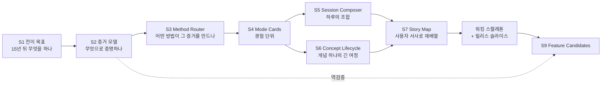
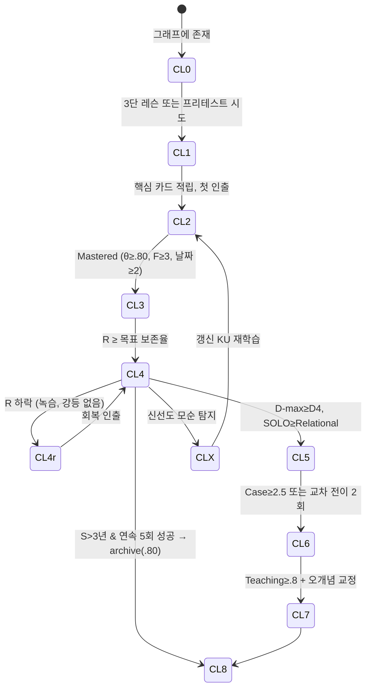
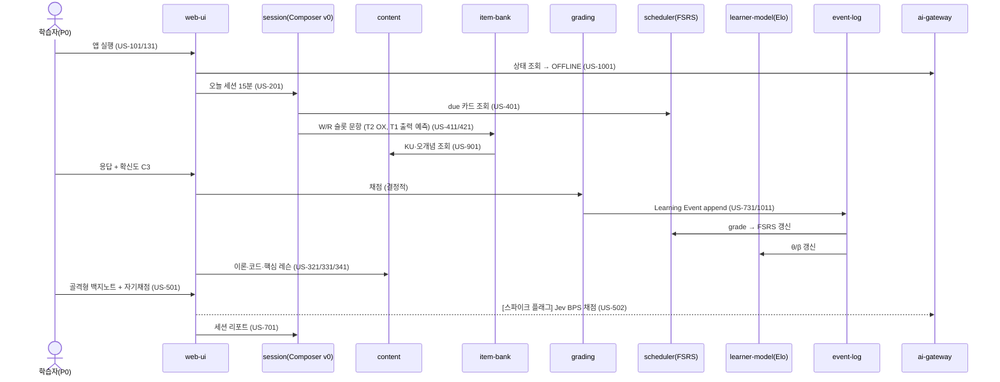

# PLN-IDEA-PED. 교육학 우선 설계 (Pedagogy-first Design) + 사용자 스토리 맵 (User Story Mapping)

> **Trace**: UR-02(여러 기획 방법론, 전문가 수준 아이디어) 중심. 설계 대상은 UR-10(이론→코드→핵심), UR-11/12(L1~L5, 15년), UR-13(문항 생성·개념 가져오기), UR-14(다양한 학습법, 질리지 않기), UR-15/16(선택적 AI, Jev 판단), UR-17(기능·운영·UX). 구조 입력: UR-03(개발→검증→통합, 회고), UR-08(서비스 분리), UR-18(한 번에 완주).
> **입력**: `00-brief/project-brief.md`, R1~R6, `01-planning/01-actors-personas.md`(액터 ACT-*, 페르소나 P0~P5·E1~E3, 시나리오 SCN-01~14, 요구 후보 RC-01~40)
> **버전**: v1.0 (Ideation, 적대적 리뷰 전) · **작성 주체**: T1(상위 모델) · **작성일**: 2026-09-30
> **후속 소비 문서**: REQ-01 요구사항정의서(SFR 후보), UC-01(스토리 → UC 흐름), ARC-01(워킹 스켈레톤 → 서비스 경계 검증), 반복 계획서 IT-plan(릴리스 슬라이스 → 통합 순서)

---

## 0. 요약 (TL;DR)

1. **방법론의 핵심 뒤집기**: 기능(화면)에서 시작하지 않고 **"15년 뒤 무엇을 할 수 있어야 하는가(전이 목표)" → "그걸 무엇으로 증명하나(증거)" → "그 증거를 만드는 활동은 무엇인가(학습 경험)"** 순서로 설계했다(Wiggins & McTighe의 *Backward Design*에 Mislevy의 *Evidence-Centered Design, ECD*를 결합). 기능은 맨 마지막에 **증거를 만들거나 소비하는 장치**로만 도출된다. 이렇게 해야 "OX 버튼·XP 배지" 같은 기능 나열(feature soup)을 막을 수 있다.
2. **전이 목표 9개(TG-1~9)**와 **역량 모델 변수 10개**를 정했다. 변수는 유지(R), 숙달(θ), 형식 다양성(F), 깊이(D-max), 구조(SOLO), 보정(Brier), 전이(Case), 가르치기(Teach), 신선도(Fresh), 활성 오개념(Misc)이다. 모든 학습 모드는 같은 **Learning Event** 계약으로 이 변수들에 증거를 넣는다. 형식별 증거 가중치는 **증거 가중 매트릭스**(§3.3)로 고정한다. 예: OX 0.5, 자기채점 0.3, 테스트 통과 코드 1.0.
3. **Bloom × Dreyfus × 지식유형 매트릭스를 "Method Router"라는 데이터 정책으로 만들었다.** 지식유형 5개(D/C/P/S + M)와 레벨 5개가 만나는 25칸마다 주력 방법, 문항형(R2 Q01~Q20), 스캐폴딩 정도, 채점 사다리를 지정했다. 레벨별 Bloom 분포도 정했다(L1은 Remember·Understand 75%, L5는 Analyze·Evaluate·Create 85%). **금기 매트릭스**(expertise reversal)도 함께 두었다. UR-10의 3단(이론→코드→핵심)은 **모든 레벨에서 유지**하고, 레벨이 오를수록 **진입점만 바꾼다**. L1~L2는 이론부터, L3는 프리테스트부터, L4 이상은 생산적 실패(문제 먼저)로 들어간다.
4. **Session Composer**는 슬롯 문법(W 워밍업 · R 복습 · N 신규 · D 심화 · S 도전 · C 마무리)과 시간 예산 템플릿(5/15/25/45/90분)을 쓴다. 후보를 8개 항(교육효용·긴급도·목표·신선도·선호 − 피로·전환비용·믹스 편차)으로 점수화하고, 하드 제약 11개(HC-01~11)를 적용한 뒤 **시드 고정 softmax(top-3)**로 고른다. 따라서 결과는 재현 가능해 테스트할 수 있고, 매번 조금씩 달라 질리지 않는다. 세션 중에는 적응 규칙 7개(AR-01~07)로 조정한다. 연속 3오답이면 모드를 강등하고, 피로가 감지되면 저비용 모드로 바꾸고, 빠른 추측이면 증거 가중을 낮춘다. 세션은 항상 **성공으로 끝나는 난이도 파도**(peak-end rule)를 탄다.
5. **Concept Lifecycle 9단계**를 둔다: 미탐색 → 노출 → 연습 → 숙달 → 유지/녹슴 → 심화 → 전이 → 전수 → 보관, 그리고 갱신 필요 상태. 개념의 레벨이 **도달 목표 단계(천장)**를 정한다. L1 개념은 "유지"가 목표이고, L5 개념은 "전수"까지 간다. 단계마다 **Next-Best-Activity**가 정해져 있고, Composer가 이를 후보로 사용한다. 실패하면 **선수 역추적 진단**(Prerequisite Backtrace)으로 "모름의 근본 원인"을 찾는다. 선수 그래프를 이진 탐색해 4문항 이내로 찾는 방식이다.
6. **User Story Map**은 백본 활동 10개(시작 · 계획 · 배우기 · 인출 · 깊이 · 적용 · 돌아보기 · 레벨 전환 · 확장 · 운영), 태스크 50개, 스토리 138개로 구성했다. 스토리는 **5개 릴리스 슬라이스**(R0 워킹 스켈레톤 → R1 코어 교육 MVP → R2 AI 심화 → R3 전문가·장기 → R4 확장 훅)로 나눴다. UR-18("한 번에 완주")에 따라 R0~R3은 **이번 빌드의 통합 순서(INT-1~INT-7)**이며 별도 출시가 아니다. UR-03에 따라 회고는 INT-2, INT-4, INT-6 뒤에 한다.
7. **워킹 스켈레톤(R0)**은 시드 개념 3개(`net.tcp-handshake`, `k8s.probes`, `lang.js-event-loop`)로 모든 가칭 서비스 경계를 한 번씩 관통하는 OFFLINE 우선 수직 슬라이스다. 흐름은 UI → Composer → 콘텐츠 → 문항 은행(T1 실행형 + T2 템플릿) → 채점 → FSRS/Elo → 이벤트 로그 → 리포트이다. 여기에 AS-08(Jev 한국어 판정) 리스크를 초기에 깨기 위한 **Jev 백지노트 스파이크** 1개를 붙였다.
8. 결론적으로 **기능 후보 34개(PED-01~34)**를 도출했다. 차별화 핵심 7개는 다음과 같다: Method Router, Session Composer, Evidence Ledger, Concept Lifecycle과 Next-Best-Activity, 선수 역추적 진단, 백지노트 사다리, Explain-Again 타임라인. 대담한 실험 기능으로 **N-of-1 개인 학습 실험실**(자기 자신에 대한 교차·간격 전략 실험)을 제안하되, 고위험으로 표시했다.

---

## 1. 방법론 워크스루 — 왜, 어떤 순서로 (UR-02)

### 1.1 방법 결합 구조

| 단계 | 방법 | 출처 (지식) | 이 문서의 산출물 | 절 |
|---|---|---|---|---|
| S1 | **Backward Design Stage 1** — 바라는 결과(전이 목표·영속적 이해) | Wiggins & McTighe, *Understanding by Design*(1998/2005) | 전이 목표 TG-1~9 × L1~L5 수행 기대표 | §2 |
| S2 | **Evidence-Centered Design** — 역량 모델 / 증거 모델 / 과제 모델 | Mislevy, Steinberg & Almond(2003) | 역량 변수 10개, 증거 가중 매트릭스, 과제 특징(feature) 목록, 숙달 판정 규칙 | §3 |
| S3 | **Bloom(개정) × Dreyfus × 지식유형 매트릭스** | Anderson & Krathwohl(2001), Dreyfus(1980), R1 §1·§6, R4 §4 | Method Router 25칸, 레벨별 Bloom 분포, 레이어×레벨, 금기 매트릭스 | §4 |
| S4 | **Mode Card 캔버스** (학습 경험 설계) | ICAP(Chi & Wylie 2014), R1 §12 카탈로그 | 학습 모드 16종 카드, Learning Event 계약 | §5 |
| S5 | **Session Composer** — 제약 기반 시퀀싱 | R1 §8·§10, R3 §4, 본 문서 고안 | 슬롯 문법, 점수 함수, HC/AR 규칙, 예시 세션 4종 | §6 |
| S6 | **Concept Lifecycle** (미시 여정) | Mastery Learning(Bloom 1968), R1 §7, R4 §2 | 9단계 상태기계, Next-Best-Activity, 선수 역추적 | §7 |
| S7 | **User Story Mapping** | Jeff Patton, *User Story Mapping*(2014) | 백본 10 · 태스크 50 · 스토리 138 · 릴리스 슬라이스 · 워킹 스켈레톤 | §8 |
| S8 | **검증** — 커버리지·교육학 리스크 | UR 추적, Pre-mortem 약식 | UR×활동, 페르소나×릴리스, 모드×릴리스, 리스크 PR-01~12 | §9 |
| S9 | **기능 후보 수렴** | — | PED-01~34 | §10 |



### 1.2 왜 "교육학 우선"인가 — 이 서비스에서의 구체적 이유

| 흔한 실패 | 원인 | 교육학 우선이 막는 방식 |
|---|---|---|
| "퀴즈 앱 + 노트 앱 + AI 챗봇"의 합성물 | 화면 단위 기획 | 모든 기능이 **역량 변수 중 최소 1개에 증거를 넣거나 소비해야** 존재 이유가 생긴다(§10 표의 "증거" 열). |
| 15년 사용 중 3년차부터 지루해짐 | 레벨 무관 단일 UX | Method Router가 **트랙 레벨별로 활동 믹스를 바꾼다**(expertise reversal, R1 §4.1). |
| 숙달 착시 (roadmap.sh 체크, 강의 완주) | 자기보고·완료율을 진척으로 계산 | 숙달은 **증거 원장(Evidence Ledger)**에서만 계산한다. "완료" 버튼은 없다(R3 AP-03). |
| AI가 정답을 줘서 기억에 남지 않음 | AI를 답변기로 사용 | AI 역할을 셋으로 나눈다. LLM은 문장 **생성**, Jev는 **판단과 라우팅**, 결정적 코어는 **스케줄**을 맡는다(R5). |
| 게이미피케이션으로 동기 유지 | 외적 보상 | 동기는 **역량 가시화**(Depth Map, Lifecycle 진행)와 **난이도 파도**(flow)로 만든다(R1 §8). |

---

## 2. S1 — 전이 목표 (Backward Design Stage 1)

### 2.1 전이 목표 (Transfer Goals) — "15년차 전문가가 혼자서 해내는 것"

| TG | 전이 목표 | 지식유형 | 대표 증거 (→ §3) | UR-10 레이어 |
|---|---|---|---|---|
| TG-1 | **정확히 설명한다** — 정의·작동 원리·설계 이유를 자기 말로 | C, D | 백지노트 BPS, 디깅 D1~D3, 자기설명 score | 이론·핵심 |
| TG-2 | **읽고 예측한다** — 코드/설정/로그를 읽고 실행 전에 동작을 예측 | P, C | 출력 예측(Q09), 설정 리뷰(Q13), 로그 판독(Q14) | 코드 |
| TG-3 | **만들고 고친다** — 요구에서 동작하는 코드·설정을 작성·수정 | P | 테스트 통과 코드(Q12), faded, find-the-bug(Q10), lab 상태 검증 | 코드 |
| TG-4 | **진단한다** — 증상 → 가설 → 증거 요청 → 원인 → 조치 | S | 인시던트 Case(Q17), 시뮬레이션 MTTR | 사례 |
| TG-5 | **판단하고 방어한다** — 제약 하 트레이드오프를 숫자로 결정하고 반박을 견딤 | S | 트레이드오프(Q16), 설계 리뷰, ADR, 소크라테스 반박 | 사례·핵심 |
| TG-6 | **연결·전이한다** — 한 트랙의 원리를 다른 트랙·새 맥락에 적용 | C, S | 교차 트랙 전이 문항, 디깅 D6~D7, SOLO Extended abstract | 핵심 |
| TG-7 | **가르치고 표준화한다** — 남이 쓸 설명·교안·표준 조항·ADR 작성 | S | Feynman Teaching score, 표준 조항 루브릭(`ctx:si`) | 사례 |
| TG-8 | **스스로 학습을 조절한다** — 무엇을 모르는지 알고 계획 | M | Brier/ECE, JOL 예측 오차, 시즌 목표 달성률 | (전 레이어) |
| TG-9 | **최신성을 유지한다** — 지식의 유효기간을 관리하고 무효화된 확신을 버림 | M, S | Freshness, `deprecated_by` 재학습 성공률 | 핵심 |

### 2.2 TG × 레벨 수행 기대표 (L1~L5 "할 수 있어야 하는 것")

| TG | L1 Novice (0~1y) | L2 Adv. Beginner (1~3y) | L3 Competent (3~6y) | L4 Proficient (6~10y) | L5 Expert (10~15y+) |
|---|---|---|---|---|---|
| TG-1 설명 | 용어 정의 회상 | 작동 원리 1단계 설명 | 원리 간 인과 연결(Relational) | 설계 이유·대안과 함께 설명 | 일반화·역사적 가정의 유효성 논의 |
| TG-2 예측 | 짧은 코드 출력 예측 | 비동기·스코프 등 notional machine | 설정 조합 효과 예측 | 부하·장애 시 거동 예측 | 새 기술의 거동을 원리로 예견 |
| TG-3 제작 | 예제 수정 | 명세 기반 구현 | 불완전 명세 분해·구현 | 대안 구현 비교·성능 튜닝 | 패턴·라이브러리 수준 설계 |
| TG-4 진단 | 에러 메시지 해석 | 단일 원인 버그 수정 | 원인 추적 디버깅 | 복합 장애 가설·검증 | 조직 차원 재발 방지 체계 |
| TG-5 판단 | — | 정해진 기준으로 선택 | 대안 2개 비교 | 비용·지연·가용성 수치 평가 | 문제 재정의·원칙 수립 |
| TG-6 전이 | — | 같은 트랙 내 유사 문제 | 인접 트랙 연결 | 3트랙 복합 문제 | 분야 간 원리 일반화 |
| TG-7 전수 | — | — | 동료에게 설명 | 리뷰·멘토링 | 표준·교안·ADR |
| TG-8 조절 | 확신도 표시 습관 | 약점 인지 | 주간 계획 조정 | 시즌 목표 설계 | 장기 학습 포트폴리오 운영 |
| TG-9 최신성 | — | 버전 차이 인지 | 변경 영향 파악 | 도입·폐기 판단 | 조직 기술 레이더 운영 |

### 2.3 예시 — 한 개념(`k8s.probes`)의 영속적 이해 사다리

| 레벨 | 영속적 이해 (Enduring understanding) | 본질 질문 (Essential question) | 대표 과제 |
|---|---|---|---|
| L1 | liveness/readiness/startup은 **서로 다른 결과**를 낳는다(재시작 vs 트래픽 제외 vs 기동 유예) | "프로브가 실패하면 무엇이 일어나나?" | 오개념 OX(`!mc01`), 매칭 |
| L2 | 프로브는 **애플리케이션 기동 특성**에 맞춰야 한다 | "이 앱에 initialDelay 10초는 맞나?" | 설정 리뷰(Q13), faded YAML |
| L3 | 잘못된 liveness는 **장애 증폭기**다(연쇄 재시작) | "프로브가 장애를 키우는 경우는?" | CrashLoopBackOff 티켓 lab(SCN-02), 디깅 D4 |
| L4 | 프로브는 **의존성 경계 설계**의 일부다(깊은 헬스체크의 위험) | "DB를 확인하는 readiness는 좋은가?" | 인시던트 Case, 트레이드오프 |
| L5 | 헬스 시그널은 **조직의 SLO·배포 전략**과 한 체계다 | "플랫폼 표준으로 무엇을 강제할까?" | 플랫폼 표준 조항 작성, ADR |

---

## 3. S2 — 증거 중심 설계 (ECD)

### 3.1 역량 모델 (Competency / Student Model) 변수

> 트랙·개념 단위 변수다. 사람 전체를 점수 하나로 표현하지 않는다(R1 §1.2, 페르소나 문서 §3.0).

| 변수 | 의미 | 단위 | 모델/계산 | 갱신 원천 | UI 표시 |
|---|---|---|---|---|---|
| **R** (Retention) | 지금 인출 가능 확률 | card(KC×facet) | FSRS-6 (`ts-fsrs`) | 모든 인출 이벤트의 FSRS grade | "유지" 게이지, 녹슨 배지 |
| **θ** (Mastery) | 해당 난이도 문항을 풀 능력 | user→track→KC 계층 | 계층형 Elo, β는 문항 | 채점 결과(부분점수 허용) | "숙달" 게이지 |
| **F** (Format breadth) | 서로 다른 형식에서의 성공 수 | KC | 성공 형식 집합의 크기 | 모든 채점 이벤트 | 숙달 조건 체크 |
| **D-max** (Depth) | 디깅 최대 도달 깊이 D1~D7 | KC | 최댓값 + 최근성 감쇠 | 디깅 세션 | 깊이 게이지 |
| **SOLO** | 설명 구조 수준 0~4 | KC/단원 | Jev `score` 기대값 이동평균 | 백지노트, 자기설명, Feynman | 구조 배지 |
| **Cal** (Calibration) | 확신도 정확성 | track | Brier, ECE, 과신 지수 | CBM 3버튼, JOL | 보정 곡선 |
| **Tr** (Transfer) | 사례·교차 트랙 판단 수준 | track / Case | Case 루브릭 평균(0~4) | Case, 전이 문항 | T-index, Case 커버리지 |
| **Teach** | 가르치기 성공 | KC | Teaching score | Feynman, 표준 조항 | Teaching 배지 |
| **Fresh** | 최신 KU 인출 성공률 | `vol:volatile/evolving` KC | 성공률 | 신선도 재학습 | Freshness % |
| **Misc** | 활성 오개념 | KC!mc | P(held), BKT류 이진 상태 | 오개념 연계 문항·Jev 탐지 | 오개념 목록 |

### 3.2 증거 모델 — 관측값 → 변수 갱신 규칙

| 관측값 (observable) | 추출 방법 | 갱신 변수 | 비고 |
|---|---|---|---|
| 정오·부분점수 y∈[0,1] | 결정적 / Jev `score` 정규화 | θ, R(grade), F | 부분점수는 R1 §2.2.3 등급 규칙을 따른다 |
| 확신도 C1~C3 | 3버튼 | Cal, R(grade), Misc | 고확신 오답은 Misc P↑, 24h 재출제 |
| 응답시간 | 클라이언트 측정 | R(Easy 판정), 게이밍 탐지 | 개인 중앙값 대비 |
| 힌트 단계 사용 | 힌트 사다리 | R(grade 감점), θ 가중↓ | Hard 상한 |
| 오류 원인 | Jev `choice` {개념오해, 절차실수, 부주의, 오독, 선수부족} | Misc, 역추적 트리거 | 약점 드릴 입력 |
| idea unit 회상 | Jev `noul`×unit(객체 키) | SOLO, R(free_recall 카드), 누락→카드 | BPS |
| 도달 깊이 | 디깅 엔진 | D-max | 3회 연속 실패 시 종료 |
| 루브릭 차원 점수 | Jev `score`×차원 | Tr, Teach | confidence < 0.6이면 사다리 상향 |
| "모르겠다" | 버튼 | (벌점 없음) Misc 아님, 공백 표시 | 심리적 안전 |
| 신고/이의제기 | 사용자 | 해당 이벤트 증거에서 제외 | SCN-14 |

### 3.3 증거 가중 매트릭스 (Evidence Weight Matrix) — 형식 × 채점기

> 숙달(θ) 갱신에 쓰는 **증거 가중 w**는 형식 신뢰도와 채점기 신뢰도를 곱한 값이다: `w = w_format × w_grader`. Elo의 K에 곱하고, 숙달 조건 계산에도 쓴다. 수치는 **초기값**이며 골드셋과 실사용 로그로 튜닝한다.

| 형식 (R2) | w_format | 추측 확률 G | 기여 변수 | 비고 |
|---|---|---|---|---|
| Q01 OX | 0.5 | 0.5 | θ, R, Misc | 숙달 주 증거 금지(워밍업·진단용) |
| Q02 OX+교정 | 0.8 | 0.25(교정 포함) | θ, R, Misc | 교정 판정은 Jev `noul` |
| Q03 MCQ | 0.7 | 0.25 | θ, R | |
| Q05/Q06 빈칸·단답 | 0.9 | ~0 | θ, R | 동의어는 Jev |
| Q07/Q08 순서·매칭 | 0.7 | 소거 추측 | θ, R | |
| Q09 출력 예측 | 1.0 | ~0 | θ, R, F | 실행 기반 정답 |
| Q11 Parsons | 0.7 | 낮음 | θ | L3+에선 0.5 |
| Q10 find-the-bug | 1.0 | 낮음 | θ, Tr(L3+) | |
| Q12 코드 완성(테스트) | 1.0 | 0 | θ, F | |
| Q13/Q14 설정 리뷰·로그 판독 | 0.9 | 낮음 | θ, Tr | |
| Lab 상태 검증 | 1.0 | 0 | θ, F, Tr | 힌트 사용 시 감점 |
| Q19 백지노트 | 0.9 | 0 | SOLO, R, Misc | BPS → grade |
| 디깅 | 0.8 | 0 | D-max, SOLO, Misc | |
| Q15~Q18 Case·설계·코드 리뷰 | 1.0 | 0 | Tr, θ | 루브릭 |
| Feynman | 0.9 | 0 | Teach, SOLO | |

| 채점기 (R5 `engine`) | w_grader | 조건 |
|---|---|---|
| 결정적(정답키·테스트·실행) | 1.0 | — |
| Jev (calibrated, conf ≥ 0.6) | 0.9 | 한국어 골드셋 캘리브레이션 통과 후. 그 전에는 0.7 |
| Jev (conf < 0.6) | 0.4 | 사다리 상향 또는 사용자 확인 후 재계산 |
| LLM-as-judge (uncalibrated) | 0.6 | 비보정 배지 |
| 휴리스틱(키워드) | 0.4 | OFFLINE |
| 자기채점 | 0.3 | 편향 추적 계수로 보정(RC-24) |
| 보류(pending) | 0 → 소급 | AI 복귀 후 재채점(RC-35) |

### 3.4 숙달·유지·심화·전이 판정 규칙 (R1 §7, R4 §2.2 정합)

| 판정 | 조건 (모두 만족) | 비고 |
|---|---|---|
| **Mastered** | 가중 Elo P(정답 \| 해당 레벨 중앙 난이도) ≥ 0.80 **AND** F ≥ 3 (w ≥ 0.7인 형식만 계산) **AND** 서로 다른 날짜 ≥ 2 | OX만으로는 도달 불가 |
| **Retained** | Mastered **AND** 현재 R ≥ 해당 카드 계층의 desired retention | 떨어지면 "녹슨" 표시(강등 없음) |
| **Deepened** | D-max ≥ D4 **AND** SOLO ≥ Relational(2.5) | L3+ 개념 |
| **Transferred** | 해당 개념이 포함된 Case 루브릭 ≥ 2.5/4 **OR** 교차 트랙 전이 문항 2회 성공 | L4+ 개념 |
| **Taught** | Teaching score ≥ 0.8 **AND** AI 학생 오개념 교정 성공 | L5 개념 |

### 3.5 과제 모델 — Composer가 조절할 수 있는 과제 특징

| 특징 | 값 범위 | 조절 주체 |
|---|---|---|
| 형식 | Q01~Q20, lab, 디깅, Feynman, Case | Method Router |
| Bloom 과정 | Remember ~ Create | 레벨별 분포(§4.2) |
| 단서 수준 (cue) | 완전 단서 → 부분 단서 → 무단서 | Scaffold Fader |
| 스캐폴딩 | worked → faded(1~3칸) → 시그니처+테스트 → 명세만 → 불완전 명세 | Elo P 기반 |
| 맥락 | 일반 / `ctx:si` / `ctx:cloud-native` / 사용자 업무 태그 | 경로·선호 |
| 트랙 혼합 | 단일 / 헷갈림 쌍 / 교차 트랙 | 교차 규칙 |
| 시간 제한 | 없음 / 소프트 / 스프린트 | 모드 |
| AI 요구 | 없음 / Jev / LLM / 둘 다 | 현재 AI 모드 |
| 목표 성공률 | 0.5(보스) / 0.70~0.85(연습) / FSRS(리뷰) | Flow 제어 |

---

## 4. S3 — Bloom × Dreyfus × 지식유형 매트릭스 (Method Router)

### 4.1 레벨 프로파일

| 레벨 | Dreyfus 지원 방식 (R1 §6.3) | 주 ICAP | 스캐폴딩 기본값 | SOLO 목표 | 단서 수준 | 진입점 (UR-10) |
|---|---|---|---|---|---|---|
| L1 | 규칙·체크리스트 카드 | Active → Constructive | 완전 예제 + 서브골 라벨 | Uni→Multi | 완전/부분 | **이론 먼저**(사전 질문 2개) |
| L2 | 사례 기반 예제 | Constructive | faded 1~2칸, Parsons | Multi | 부분 | 이론 먼저 + 짧은 프리테스트 |
| L3 | 의사결정 문제 | Constructive + Interactive | 시그니처+테스트 / 명세 | Relational | 부분→무단서 | **프리테스트 먼저** |
| L4 | 패턴 인식 드릴, 이상 탐지 | Interactive | 불완전 명세, Case | Relational→Ext. | 무단서 | **생산적 실패 먼저**(문제 → 이론 참조) |
| L5 | 경계·반례 탐구, 가르치기, 표준 | Interactive (생성) | 없음(자유 과제) | Extended abstract | 무단서 | **문제 정의 먼저**(Case·ADR → 이론은 참고 자료) |

> **UR-10 불변식**: 모든 개념 페이지는 이론·코드(또는 사례)·핵심의 3단을 **항상 갖고, 화면에 그 순서로 보여준다**. 레벨에 따라 바뀌는 것은 **처음 들어가는 지점과 각 단의 모양**뿐이다(§4.4). 순서가 뒤집혀도 3단 구조는 사라지지 않는다.

### 4.2 레벨별 Bloom 인지과정 분포 (문항 출제 목표 비율, %)

| 레벨 | Remember | Understand | Apply | Analyze | Evaluate | Create | 검증 |
|---|---|---|---|---|---|---|---|
| L1 | 40 | 35 | 20 | 5 | 0 | 0 | R+U = 75 (R2 정합) |
| L2 | 20 | 30 | 35 | 15 | 0 | 0 | |
| L3 | 10 | 15 | 30 | 30 | 15 | 0 | |
| L4 | 5 | 10 | 15 | 30 | 30 | 10 | |
| L5 | 5 | 5 | 5 | 25 | 35 | 25 | An+Ev+Cr = 85 (R2 정합) |

(리뷰 카드는 FSRS 대상이라 이 분포와 별도로 운영한다. 이 분포는 **신규 연습·승급 평가·보스 문항**의 목표 비율이다. Jev `choice`로 문항의 실제 Bloom 수준을 재분류해 분포 편차를 측정한다.)

### 4.3 Method Router — 지식유형 × 레벨 25칸

> 칸 표기: **주력 방법** / 문항형 / 채점 사다리(FULL → OFFLINE 폴백). 번호는 R1 §12 카탈로그(#)와 R2 문항형(Q).

| 유형 \ 레벨 | L1 | L2 | L3 | L4 | L5 |
|---|---|---|---|---|---|
| **D 사실** | **카드 인출(#1) + OX CBM(#3)** / Q01·Q05·Q08 / 결정적 | **cloze·매칭 교차(#1,#4)** / Q05·Q06·Q08 / 결정적 → 동의어 Jev | **설정·명령 맥락 인출** / Q05·Q13(부분) / 결정적 | 유지 모드(archive 0.80), 신선도 중심 / Q01·Q05 / 결정적 | 신선도 인출만(`vol:volatile`) / Q02 / 결정적+Jev |
| **C 개념** | **이중부호화 + 사전 질문(#9,#20)**, 오개념 OX / Q01·Q03 / 결정적 | **자기설명·정교화(#5,#6)**, 골격 백지노트 / Q02·Q03·Q19(골격) / Jev → 자기채점 | **백지노트(#8) + 디깅 D1~D4(#15) + 대조 사례(#16)** / Q04·Q16·Q19 / Jev → 템플릿 디깅 | **디깅 D4~D7 + 인출 개념맵(#10)** / Q16·Q19 / Jev | **Feynman(#7), 반례 사냥**, 교차 트랙 전이 / Q19 / Jev + LLM(학생) |
| **P 절차** | **worked example + 서브골(#11), Parsons(#12), PRIMM(#13)** / Q09·Q11 / 결정적 | **faded(#11), 출력 예측, 코드 완성** / Q09·Q11·Q12 / 결정적 | **디버깅·교차 연습(#4), lab 티켓** / Q10·Q12·Q13 / 결정적 + 설명 Jev | **코드 리뷰·성능 분석**, 대안 구현 비교 / Q10·Q18 / 결정적 + Jev | 설계+구현 자유 과제, 라이브러리 설계 리뷰 / Q18 / Jev 루브릭 |
| **S 판단** | — (규칙 카드로만 노출) | 기준 주어진 선택 MCQ / Q03(시나리오) / 결정적 | **대조 사례(#16), 트레이드오프 비교, 생산적 실패(#17)** / Q16·Q15(입문) / Jev | **Case: 인시던트·설계 리뷰(#18)**, 용량 추정 / Q14·Q15·Q17·Q20 / Jev 루브릭 + LLM 피드백 | **ADR·표준 조항·설계 방어**, 반례 생성 / Q15·Q18 / Jev 루브릭 + 소크라테스 반박 |
| **M 메타인지** (전 유형 공통 활동) | 확신도 3버튼 습관화 | 오답 원인 태깅(자기) | JOL(세션 전 예측) + 주간 보정 | 시즌 목표 설계, 약점 드릴 설계 | 개인 학습 실험(N-of-1), 포트폴리오 관리 |

### 4.4 UR-10 레이어 × 레벨 — 각 단의 모양 변화

| 레이어 | L1 | L2 | L3 | L4 | L5 |
|---|---|---|---|---|---|
| **이론** | 800~1,200자, 도식 필수, 임베디드 질문 3개, 용어 카드 | 원리 + 대표 예, 임베디드 질문 2개 | 짧은 본문 + "왜" 링크, 대조쌍 | 참고 자료 형태(필요할 때 펼침), 설계 배경·역사 | 원 논문/스펙 발췌 링크, 가정의 유효성 |
| **코드/사례** | 완전 예제 → 1칸 faded → Parsons | faded 2칸 → 시그니처+테스트 | 명세 → 구현, 디버깅, lab 티켓 | 불완전 명세, 성능·장애 Case | 자유 설계, ADR, 표준 조항 |
| **핵심** | KU 5~8개 → 카드 자동 적립, 오개념 OX | KU + 대조쌍 카드 | KU + 백지노트 기준 idea unit + 관계 | 원칙 카드("언제 쓰지 말아야 하나") | 반례·경계조건 카드, 교안 요약 |
| **진입 흐름** | 이→코→핵 | 이(프리테스트 1)→코→핵 | 프리테스트→이→코→핵 | 문제(생산적 실패)→이→사→핵 | 문제 정의→사→이(참고)→핵 |

### 4.5 금기 매트릭스 (Contraindications) — Router가 막는 조합

| 조합 | 이유 (근거) | Router 동작 |
|---|---|---|
| L4+ 트랙에서 worked example·Parsons 비중 > 5% | Expertise reversal(Kalyuga 2003, R1 §4.1) | HC-10으로 제한, "건너뛰기" 기본 노출 |
| L1에게 디깅 D5 이상 | 사전지식 부족 시 정교화가 효과 없음(R1 §3.1) | 디깅 상한 D3 |
| L1에게 무단서 백지노트 | 좌절, 인출 실패 누적 | 골격형 백지노트만(§5 M-09 사다리) |
| OX 결과만으로 Mastered | 추측 50%(R1 §2.6) | w=0.5, F 계산 제외 |
| 신규 학습을 교차(interleave)로 시작 | 교차는 판별 연습용이며 스키마 형성 전에는 부하 과다 | "block then interleave": 신규는 블록, 리뷰는 교차 |
| 개념맵을 "보면서 그리기" | 인출 없음(Karpicke & Blunt 2011) | 인출 기반 빈 맵 퀴즈만 |
| 생산적 실패를 L1~L2에 | 실패 후 설명 수용 전제가 부족 | L3+에서만 |
| AI가 해설을 먼저 제시 | 생성 효과 파괴(R3 AP-07) | 해설은 응답 후, 힌트는 사다리 순서 |
| 프리테스트 점수를 숙달 증거로 | 틀리는 것이 목적 | 증거 가중 0, Elo β 보정에만 사용 |

### 4.6 Router 정책을 "데이터"로 — 운영성 (UR-17)

- Router는 코드 분기가 아니라 **버전이 붙은 정책 테이블**(`method_policy@v1`)이다. 칸마다 (방법, 문항형 가중치, 스캐폴딩 기본값, 폴백 체인)을 가진다.
- 정책이 바뀌면 **리플레이 시뮬레이션**을 돌린다. 지난 30일 이벤트에 새 정책을 적용했을 때 믹스가 어떻게 달라지는지 비교한 다음 적용한다.
- 사용자 오버라이드("이 트랙은 L3처럼 다뤄줘", "Parsons 끄기")는 정책 위 **개인 레이어**에 저장한다(SDT 자율성).

---

## 5. S4 — Mode Cards (학습 경험 단위)

### 5.1 모드 카드 요약 (16종)

> 피로 비용(1~5)은 인지 부하 추정치로 Composer의 F항에 쓴다. 질림 가치는 R1 §12의 ★와 같다. **OFFLINE 폴백 열은 AI 없이도 모든 UR-14 모드가 동작함을 보증한다**(R5, E3).

| ID | 모드 | UR-14 대응 | ICAP | 유형/레벨 | 길이 | 채점 사다리 (FULL → OFFLINE) | 방출 증거 | 피로 | 질림 가치 |
|---|---|---|---|---|---|---|---|---|---|
| M-01 | 3단 레슨 (이론→코드→핵심) | 개념이해 | A→C | 전 유형 / L1~L3 주력 | 10~20분 | 임베디드 질문 결정적 | θ(약), 카드 적립 | 3 | ★★ |
| M-02 | 프리테스트 | 개념이해 | C | D·C / L1~L4 | 1~3분 | 결정적 | (증거 0) β 보정 | 1 | ★★★ |
| M-03 | OX 스프린트 (오개념+CBM+교정) | OX | A | D·C / L1~L3 | 2~4분 | 결정적 + 교정 Jev → 키워드 | θ, R, Cal, Misc | 1 | ★★★ |
| M-04 | 문제 믹스 (MCQ·빈칸·단답·순서·매칭, 교차) | 문제 | A→C | D·C / L1~L3 | 5~12분 | 결정적 / 동의어 Jev → 정규화 | θ, R, F, Cal | 2 | ★★★ |
| M-05 | 코드 읽기 (PRIMM·출력 예측) | 문제·실습 | C | P·C / L1~L3 | 5~10분 | 실행 결정적 + 이유 Jev → 생략 | θ, F | 2 | ★★★★ |
| M-06 | 코드 쓰기 (worked→faded·Parsons·완성) | 실습 | C | P / L1~L3 | 8~20분 | 테스트 결정적 | θ, F | 4 | ★★ |
| M-07 | 오류 예제 (find-the-bug·잘못된 풀이 고치기) | 문제·실습 | C | P·S / L2~L4 | 5~10분 | 결정적(변이 위치) + 설명 Jev | θ, Tr, Misc | 3 | ★★★★ |
| M-08 | 실습 Lab 티켓 (docker/kind) | 실습 | C/I | P·S / L2~L4 | 30~60분 | 상태 검증 스크립트 → Q13/Q14 대체 | θ, F, Tr | 4 | ★★★★★ |
| M-09 | 백지노트 (사다리형) | 백지노트 | C | C·D묶음·S / L1~L5 | 5~15분 + diff | Jev BPS → 자기채점 체크리스트 | SOLO, R, Misc | 4 | ★★★★ |
| M-10 | 개념 디깅 D1~D7 | 개념 디깅 | I | C·S / L2~L5 | 10~20분 | LLM 문장 + Jev 라우팅 → 질문 은행 × KU + 자기판정 | D-max, SOLO, Misc | 4 | ★★★★★ |
| M-11 | 대조 사례 / 헷갈림 쌍 | 문제·디깅 | C | C·S / L2~L5 | 5~10분 | 핵심 차이 Jev `choice` → MCQ화 | θ, Misc | 3 | ★★★★ |
| M-12 | Feynman (AI 주니어에게 가르치기) | 개념 디깅(심화) | I | C·S / L3~L5 | 10~20분 | Jev Teaching → OFFLINE: 체크리스트 자기채점 | Teach, SOLO | 5 | ★★★★★ |
| M-13 | Case (인시던트·설계 리뷰·ADR·코드 리뷰) | 실습·문제 | I | S / L3~L5 | 20~60분 | Jev 루브릭 + LLM 피드백 → 루브릭 자기채점 + 모범 답 비교 | Tr, θ | 5 | ★★★★★ |
| M-14 | 약점 드릴 | 문제 | C | P·S / L2~L5 | 10~20분 | 형식별 | θ, Misc | 3 | ★★★ |
| M-15 | 보스 챌린지 (상위 레벨 1문항) | 문제 | C | 전 유형 | 3~10분 | 형식별 | θ(가중 0.5), 탐색 | 3 | ★★★★ |
| M-16 | 인출 개념맵 (빈 맵 퀴즈) | 개념이해·디깅 | C | C·S / L3~L5 | 8~15분 | 엣지 결정적 + 라벨 Jev `choice` → 라벨 목록 선택형 | SOLO, Tr(약) | 3 | ★★★ |

### 5.2 모드 카드 상세 예 — M-09 백지노트 사다리 (차별화 핵심)

| 단계 | 조건 (Elo·SOLO) | 제시 단서 | 타이머 | 채점 | 다음 단계 조건 |
|---|---|---|---|---|---|
| BN-1 **골격형** | L1, 첫 백지노트 | 소제목 골격 + 빈칸 개수 | 5분 | BPS(Coverage 가중↑) | BPS ≥ 70 두 번 |
| BN-2 **제목형** | L1~L2 | 소제목만 | 7분 | BPS | BPS ≥ 70 두 번 |
| BN-3 **주제형** (R1 표준) | L2~L3 | 주제 + 범위 | 10분 | BPS 4요소 | SOLO ≥ Relational |
| BN-4 **관계 덤프** | L3~L4 | 주제 3개 동시("TCP·TLS·HTTP/2의 관계") | 12분 | Structure 가중↑ | Tr 문항 성공 |
| BN-5 **트랙 덤프** | L4~L5 | 트랙 하위 영역 전체("k8s 네트워킹 전부") | 15분 | Coverage는 core unit만, Depth 가중↑ | — (연 1~2회 "자기 지도 그리기") |

- 모든 단계에서 공통 규칙: 제출 전 "애매한 부분" 형광 표시(보정), 3색 diff, 누락 core unit은 카드로, 오개념은 OX로, 타당한 확장은 가져오기 후보로 보낸다. 재회상은 1일 → 1주 → 1개월로 예약한다(R1 §3.4).
- **BN-5 트랙 덤프**는 15년 사용자를 위한 장치다. 예를 들어 1년에 한 번 "k8s 전체"를 백지에 적고 **작년 덤프와 비교해 보여준다**. 이것이 PED-16 Explain-Again 타임라인과 연결된다.

### 5.3 Learning Event 계약 (모드 무관 공통 — 개념 스펙, 코드 아님)

| 필드 | 뜻 | 비고 |
|---|---|---|
| `event_id`, `occurred_at`, `session_id`, `block_slot` | 식별·시각·세션 슬롯(W/R/N/D/S/C) | 불변 append-only(R1 LS-11) |
| `mode`, `format`, `item_id`, `variant_of` | 모드·문항형·문항·템플릿 패밀리 | 형식 다양성 F 계산 |
| `concept_id`, `facet`, `ku_ids`, `misconception_ids` | 대상 | 객체 키 참조 |
| `bloom`, `level`, `ktype` | 좌표 | 분포 모니터링 |
| `outcome.score` ∈[0,1], `outcome.correct` | 결과 | 부분점수 허용 |
| `confidence` C1~C3, `jol_pred` | 메타인지 | CBM, JOL |
| `duration_ms`, `hints_used`, `hint_max_level` | 행동 | 게이밍 탐지 |
| `grader.engine`, `grader.calibrated`, `grader.confidence`, `grader.pending` | 채점 출처 | 증거 가중 w_grader |
| `evidence_weight` | w_format × w_grader × 게이밍 계수 | 저장 시점 값 고정, 재계산 시 새 이벤트 |
| `fsrs_grade_suggested`, `fsrs_grade_final` | 자동 추천 + 1탭 수정 | 자기 수정 편향 추적 |
| `ai_mode` | FULL/JUDGE_ONLY/LLM_ONLY/OFFLINE | 보류 재채점 |

---

## 6. S5 — Session Composer (세션 조합기)

### 6.1 입력

| 입력 | 출처 | 예 |
|---|---|---|
| 시간 예산 | 사용자 선택 (5/15/25/45/90) 또는 캘린더 없는 기본값 | 25분 |
| 에너지 | 가볍게 / 보통 / 깊게 (RC-07) | 보통 |
| 트랙 레벨 벡터 | 역량 모델 | `{be:L1, docker:L1, net:L1, llm:L2}` |
| due 카드 (R 오름차순) | 스케줄러 | 23장, 그중 core 계층 9장 |
| 24h 재출제 큐 | 고확신 오답 | 2건 |
| 약점 클러스터 | 오류 원인 분류 | "비동기 에러 처리 누락" |
| 시즌 목표 / D-day | 계획 | `docker` L2 시즌, 정보처리기사 D-41 |
| 모드 이력 (7일) | 이벤트 로그 | 백지노트 0회, OX 9회 |
| 선호·오버라이드 | 사용자 | Parsons 선호 +, Feynman 끄기 |
| AI 모드·워밍 풀 상태 | ai-gateway, 문항 풀 | `JUDGE_ONLY`, `docker.multistage` L1 풀 14/20 |
| 주간 믹스 실적 vs 목표 | Router 목표 믹스 | 디깅 목표 10% 대비 실적 0% |

### 6.2 슬롯 문법과 시간 템플릿

슬롯: **W**(워밍업, 빠른 인출) · **R**(복습, due 교차) · **N**(신규, 3단 레슨 블록) · **D**(심화·생성: 백지노트/디깅/대조/Feynman) · **S**(도전: 보스·Case·lab) · **C**(마무리: 보정 요약, JOL, 한 줄 회고)

| 예산 | 템플릿 | 분 배분 | 스트릭 인정 | 주 대상 |
|---|---|---|---|---|
| 5분 (MVD) | W → R → C | 2 / 2.5 / 0.5 | 인정 | 크런치, E2 첫날 |
| 15분 | W → R → D(mini) → C | 3 / 7 / 4 / 1 | 인정 | 출근 전 P0, P3 평일 |
| 25분 | W → R → N **or** D → C | 3 / 9 / 12 / 1 | 인정 | 표준 |
| 45분 | W → R → N → D → S → C | 4 / 10 / 15 / 10 / 4 / 2 | 인정 | P0 저녁 |
| 90분 (딥워크) | W → R → S(Case/Lab 45~50) → D(디깅·Feynman) → C | 5 / 10 / 50 / 15 / 5 (+45분 휴식 권고) | 인정 | 주말, P3~P4 |

- 에너지 "가볍게"는 N을 D(mini) 또는 R로 바꾸고, 피로 비용 ≤ 2인 모드만 쓴다. "깊게"는 S 슬롯을 넣고 90분 템플릿을 권한다.
- L4+ 주력 트랙에서는 25분 이상 템플릿의 N을 **S(미니 Case)**로 바꾼다. 신규 개념보다 판단 과제가 우선이기 때문이다(R4 §2.5).

### 6.3 후보 점수 함수

각 슬롯 후보 c(모드 × 개념 × 문항 조합)에 대해 다음을 계산한다.

```
score(c) = 0.30·E(c) + 0.25·U(c) + 0.15·G(c) + 0.10·N(c) + 0.10·P(c)
         − 0.05·F(c) − 0.05·S(c) − 0.10·ΔMix(c)
선택: 상위 3개 후보에 softmax(τ = 0.3), RNG 시드 = hash(date, session_seq, user_salt)
```

| 항 | 의미 | 계산 |
|---|---|---|
| E | 교육 효용 | Method Router 칸 가중치(레벨×유형), 형식 미경험 보너스(F 증가 가능 시 +0.2) |
| U | 긴급도 | due 카드 1−R, 24h 재출제 = 1.0, core 계층 ×1.2 |
| G | 목표 정렬 | 시즌 목표 트랙·D-day 태그(`cert:`)면 1, 경로 트랙 0.5 |
| N | 신선도(탐험) | 1 − (최근 7일 해당 모드 빈도 / 최다 모드 빈도) |
| P | 선호 | 사용자 선호 가중(−1~+1) → [0,1] |
| F | 피로 비용 | 모드 피로(1~5)/5 × 현재 피로 추정(§6.5 AR-04) |
| S | 전환 비용 | 직전 블록과 트랙·모드 모두 다르면 1, 하나만 다르면 0.5 |
| ΔMix | 주간 믹스 편차 증가량 | 선택 후 주간 실적 믹스와 목표 믹스(R1 §10.2 레벨 가중) 사이 L1 거리 변화 |

- **시드 고정 softmax**는 테스트 가능성(같은 입력이면 같은 세션)과 질림 방지(날마다 다른 세션)를 함께 얻는 장치다. 운영 측면에서는 "왜 이 구성인가" 로그를 그대로 재현할 수 있다.
- 가중치는 정책 테이블(`composer_policy@v1`)에 둔다. 초기값이며 R1 회고에서 로그로 조정한다.

### 6.4 하드 제약 (위반 시 후보 제거)

| ID | 제약 | 근거 |
|---|---|---|
| HC-01 | 같은 모드 연속 ≤ 2블록 | R1 §8.3, RC-09 |
| HC-02 | 15분 이상 세션: 모드 ≥ 3종, 인지 활동 3군(인출·적용·생성) 모두 포함 | R3 §4 |
| HC-03 | 25분 이상 세션: Constructive+Interactive 시간 ≥ 60% | R1 §1.3 |
| HC-04 | 24h 재출제(고확신 오답)는 24h 안의 첫 세션 W/R에 최우선 배치 | R1 §5.1 초과교정 |
| HC-05 | 신규(N)는 블록, 복습(R)은 교차. 신규 개념 수 ≤ 워크로드 예측 기반 상한 | R1 §2.3, RC-10 |
| HC-06 | 보스는 세션당 ≤ 1개. 마지막 채점 블록은 예측 성공률 ≥ 0.8 (peak-end) | R1 §8.3, Kahneman peak-end |
| HC-07 | 현재 AI 모드에서 폴백이 없는 후보는 제외. 첫 문항은 워밍 풀에서만(≤ 2초) | R5, RC-03 |
| HC-08 | 연습 블록 예측 성공률 ∈ [0.70, 0.85] (리뷰는 FSRS가 결정, 보스는 0.5) | R1 §8.2 |
| HC-09 | 총 시간 ≤ 예산 × 1.1 | 신뢰 |
| HC-10 | L4+ 트랙: worked·Parsons 시간 ≤ 5% | 금기 매트릭스 |
| HC-11 | 같은 KC×facet의 variant는 최근 5회 출제분 제외 | R1 LS-01 |

### 6.5 세션 중 적응 규칙 (Adaptive Controller)

| ID | 트리거 | 반응 | 사용자에게 보이는 것 |
|---|---|---|---|
| AR-01 | 연속 3오답 | **모드 강등 사다리**(서술 → MCQ → OX / 빈 에디터 → faded → Parsons), 힌트 1단계 제안, "모멘텀 문항"(P ≥ 0.9) 1개 | "한 단계 쉬운 형식으로 이어갈게요" |
| AR-02 | 연속 8정답 또는 최근 10문항 성공률 > 0.9 | 난이도 한 단계 상향, 보스를 앞당김 | "도전 문제 열림" |
| AR-03 | 응답시간이 개인 하위 5%이면서 오답 2회 | 빠른 추측으로 판정, 증거 가중 ×0.3, 짧은 휴지 안내 | 비난 없는 한 줄 |
| AR-04 | 최근 5문항 응답시간 +40%이면서 정확도 −15%p (피로) | 남은 블록을 피로 ≤ 2인 모드로 교체, 조기 종료 제안(스트릭 인정) | "오늘은 여기까지도 충분해요" |
| AR-05 | 디깅 중 "모르겠다" 또는 실패 3회 | 해설(LLM 또는 KU 원문) + 카드 생성 + 디깅 종료 → 선수 역추적 제안 | 깊이 게이지 저장 |
| AR-06 | 같은 모드 건너뛰기 2회 | 해당 모드 선호를 이번 주에만 −0.3, 대체 후보 | 선택권 존중 |
| AR-07 | Jev·LLM 지연(> 3초) 또는 보류 | 결정적 블록을 먼저 진행하고 비동기 결과는 C 블록에서 반영 | "AI 채점 도착" 토스트 |

### 6.6 난이도 파도 (세션 내부 형태)

```
예측 성공률
0.95 |  W                                          C(종료 문항)
0.85 |  ██   R                                   ██
0.75 |       ████   N(블록)            D          
0.60 |              ██████          ██████        
0.50 |                        S(보스)              
     +--------------------------------------------→ 시간
      쉬운 진입  →  적정 난이도 유지  →  정점 도전  →  성공으로 마무리
```

### 6.7 주 단위 조합 규칙 (Week Composer)

| 규칙 | 값 | 근거 |
|---|---|---|
| 주간 쿼터 | 디깅 ≥ 1, 실습(lab 또는 코드 과제) ≥ 1, 신규 개념마다 3일 안에 백지노트 1회, 교차 트랙 믹스 세션 ≥ 1 | R3 §4, R1 §3.4 |
| 모드 엔트로피 가드 | 최근 7일 모드 분포의 Shannon 엔트로피 ≥ 2.3 bits(유효 모드 ≈ 5종). 미달이면 N항 가중 ×2 | 질림 방지를 수치화 |
| 주간 테마 (선택) | "보안 주간", "장애 대응 주간", "고전 논문 주간" — 시즌 목표와 충돌하면 테마는 D 슬롯에만 | R1 §8.3 |
| 휴식 토큰 | 주 1~2개 자동 지급, 주간 목표 = 유효 학습일 N일(기본 4) | R1 §8.4, RC-06 |
| 주간 리포트 입력 | 믹스 실적 vs 목표 편차, 보정, 약점 Top5 → 다음 주 가중치 제안 | R3 주 루프 |

### 6.8 예시 세션 4종 (검증용 워크스루)

**(a) P0 "도현" 평일 저녁 45분 · FULL · 트랙 `docker` L1(시즌 목표), `net` L1, `be` L1**

| 슬롯 | 모드 | 내용 | 분 | 점수 근거 | 제약 체크 |
|---|---|---|---|---|---|
| W | M-03 OX 스프린트 | `docker`·`net` 오개념 OX 8문항(CBM). 그중 1문항은 어제 고확신 오답의 24h 재출제 | 4 | U=1.0(HC-04) | 워밍 풀 첫 문항 ≤ 2초 |
| R | M-04 + M-05 교차 | due 10: cloze(net), 출력 예측(JS 이벤트 루프), MCQ(be) | 10 | U, 교차 | HC-11 variant |
| N | M-02 → M-01 | `docker.multistage`: 프리테스트 2 → 이론(임베디드 질문) → worked → faded 1칸 → 핵심 카드 5장 | 15 | G=1(시즌), E(L1 P 유형) | 블록 |
| D | M-09 BN-1 | `net.tcp-handshake` 골격형 백지노트(3주 전 학습분 재회상 due) | 8 | 주간 쿼터(백지노트 0회) | 3군 충족 |
| S | M-15 보스 | L2 find-the-bug: Dockerfile 캐시 무효화 | 4 | 탐색 | 보스 ≤ 1 |
| C | 마무리 | 과신 1건, 오늘 R 변화, 내일 JOL("내일 docker 몇 개 맞힐 것 같나요?") | 2 (+2 여유) | — | 마지막 채점 블록 P ≥ 0.8: 보스 뒤에 모멘텀 문항 1개 |

→ 모드 5종, C+I 비율 ≈ 66%(N의 faded, D, S 포함), 같은 모드 연속 없음.

**(b) P3 "도현 +7년" 토요일 90분 · FULL · `k8s` L4, `sre` L3→L4 목표, `arch` L4**

| 슬롯 | 모드 | 내용 | 분 |
|---|---|---|---|
| W | M-11 헷갈림 쌍 | PodDisruptionBudget vs ResourceQuota vs LimitRange 분류 선행 문항 5 | 5 |
| R | M-04 교차 | due 12(archive 계층 L1 카드는 0.80으로 빈도 낮음) | 10 |
| S | M-13 Case | `case.sre-connection-pool-exhaustion` 단계적 공개, 12턴 상한, 포스트모템 요약 | 50 |
| D | M-10 디깅 | Case에서 약했던 "서킷 브레이커 반개방 상태" D3→D6 | 15 |
| C | 마무리 | 루브릭 결과(4차원), 시뮬레이션 MTTR, 발견 개념 2개 → 가져오기 후보 | 5 |

→ HC-10: worked·Parsons 0%. 45분 시점에 휴식 권고.

**(c) E3 망분리 현장 15분 · OFFLINE**

| 슬롯 | 모드 | OFFLINE 동작 |
|---|---|---|
| W | M-03 | T2 템플릿 OX(오개념 은행), 교정은 키워드 휴리스틱 + "보류" 태그 |
| R | M-05 | T1 출력 예측(로컬 Node 실행 정답), SQL 결과(`node:sqlite`) |
| D | M-10 (템플릿) | 질문 은행("없으면 무슨 일이?", "경계 조건은?") × KU, 자기판정 분기 |
| C | 마무리 | "AI 채점 보류 2건: 연결되면 재채점" |

**(d) E2 8개월 공백 후 복귀 12분**

- 연체 수는 보여주지 않는다. W(쉬운 모멘텀 OX 5) → R(core 계층 + 경로 선수 개념 중 R 최저 8장) → C(공백기 신선도 변경 요약 1줄).
- Composer 복귀 프로파일(PED-28): 신규(N) 0, 보스 0, 주간 목표 3일로 자동 완화, 연체는 6주에 걸쳐 분산.

### 6.9 투명성과 통제 (SDT 자율성 · UR-17)

- 세션 시작 카드에 **"오늘 구성 이유" 한 줄**을 보여준다. 예: "시즌 목표 docker 50% · 어제 확신했는데 틀린 문항 1 · 이번 주 백지노트가 아직 없어요."
- 블록마다 **교체**(같은 슬롯의 차순위 후보), **잠금**("오늘은 디깅만"), **건너뛰기**를 제공한다. 오버라이드는 이벤트로 남기고 AR-06 선호 학습에 쓴다.
- Composer가 "완벽한 계획"을 강요하지 않도록, 사용자 선택이 제약을 어겨도 허용하고 경고만 한다. 단 HC-07(AI 폴백)은 예외로, 기능이 동작하지 않으므로 허용하지 않는다.

### 6.10 참여도·질림 측정 지표 (Composer 품질 KPI)

| 지표 | 정의 | 목표 |
|---|---|---|
| 세션 완주율 | 시작 대비 C 블록 도달 | ≥ 85% |
| 블록 건너뛰기율 | 건너뛴 블록 / 제시 블록 | ≤ 10% |
| 모드 엔트로피(7일) | Shannon H | ≥ 2.3 bits |
| 연습 성공률 대역 체류 | 연습 블록 중 0.70~0.85 비율 | ≥ 70% |
| 피로 종료율 | AR-04 발동 세션 비율 | 추이 모니터(급증 시 템플릿 재조정) |
| 실측 유지율 vs 목표 | 리뷰 정답률 − desired retention | \|편차\| ≤ 3%p |

---

## 7. S6 — Concept Lifecycle (개념 하나의 15년 여정)

### 7.1 상태 기계



| 상태 | 이름 | UI 표현 (Depth Map 노드) |
|---|---|---|
| CL-0 | 미탐색 | 안개 |
| CL-1 | 노출 | 윤곽선 |
| CL-2 | 연습 중 | 반투명 채움 |
| CL-3 | 숙달 | 레벨 색 채움 |
| CL-4 / CL-4r | 유지 / 녹슨 | 채움 + 유지 링 / 링 끊김 |
| CL-5 | 심화 | 깊이 테두리(D-max) |
| CL-6 | 전이 | 교차 트랙 엣지 강조 |
| CL-7 | 전수 | 별표 |
| CL-8 | 보관 | 차분한 톤 |
| CL-X | 갱신 필요 | 점선 + 버전 칩 |

### 7.2 레벨별 도달 목표 단계 (Lifecycle Ceiling)

| 개념 레벨 | 목표 단계 | 이유 |
|---|---|---|
| L1~L2 | CL-4 유지 | 기초 사실·절차는 유지가 목적이다. 심화는 상위 개념에서 한다 |
| L3 | CL-5 심화 | R4 L3 증거(D4, Relational) |
| L4 | CL-6 전이 | Case 루브릭 |
| L5 | CL-7 전수 | Teaching, 표준 |

→ 기본 진척은 **"목표 단계 도달 개념 수 / 경로 개념 수"**로 계산한다. 개념마다 끝점이 달라서 모든 개념을 CL-7까지 끌고 가는 과부하가 생기지 않는다.

### 7.3 Next-Best-Activity (상태 → Composer 후보)

| 상태 | 다음 최선 활동 | 모드 | 스케줄 |
|---|---|---|---|
| CL-0 | 프리테스트 1~2문항 또는 3단 레슨 | M-02, M-01 | 경로 순서·선수 soft gate |
| CL-1 | 1일 후 첫 인출 + faded | M-04, M-06 | FSRS learning step |
| CL-2 | 형식 다양화(미경험 형식 우선), 3일 내 백지노트 | M-05, M-07, M-09 | E항 보너스 |
| CL-3 | 간격 인출(variant 로테이션) | M-04 | FSRS |
| CL-4r | 회복 인출 → 실패 시 선수 역추적 | M-04, §7.4 | R 오름차순 |
| CL-4 (L3+) | 디깅 D4 도전 | M-10 | 주간 쿼터 |
| CL-5 (L4+) | 이 개념이 포함된 Case / 교차 전이 문항 | M-13, 전이 문항 | 딥워크 슬롯 |
| CL-6 (L5) | Feynman, 표준 조항 | M-12 | 월 2~3회 |
| CL-8 | 저빈도 유지 인출 | M-03, M-04 | archive 0.80 |
| CL-X | 변경 diff 읽기 → 갱신 KU 인출 | M-01(변경분), M-04 | 신선도 리뷰 |

### 7.4 선수 역추적 진단 (Prerequisite Backtrace Diagnosis) — "모름의 근본 원인"

- **트리거**: 개념 X에서 (a) Jev 오류 원인이 `선수부족`, (b) 같은 facet에서 lapse 2회, (c) 디깅 D2 이하에서 AR-05 종료 중 하나.
- **절차**:
  1. X의 선수 폐포(transitive closure)를 R4 선수 그래프에서 구하고 `θ×R`가 낮은 순으로 정렬한다. 최장 체인은 11이다(R4 lint).
  2. 체인 위에서 **이진 탐색**한다. 가운데 선수에 진단 문항 1개(결정적 형식 우선, P 예측 0.8 난이도)를 내고, 맞으면 위쪽 절반, 틀리면 아래쪽 절반을 탐색한다.
  3. **최대 4문항**으로 "가장 낮은 실패 선수" Y를 찾는다(log₂ 11 ≈ 3.5).
  4. Y의 마이크로 레슨(3단 레슨 축약판 5분)을 다음 세션 N 슬롯에 넣고, X는 Y가 CL-3이 될 때까지 soft gate("먼저 Y를 보면 좋아요")로 둔다.
- **안전장치**: 방문 집합으로 순환을 방지한다(R6 무한 재귀 보안 약점). 탐색은 세션당 1회로 제한한다. 진단 문항의 증거 가중은 정상 값을 쓴다(진짜 인출이기 때문).
- **가치**: P0의 핵심 고통인 "무엇을 모르는지 모른다"에 직접 답한다. 예를 들어 k8s 서비스 디스커버리가 안 되는 원인이 사실은 `net.dns` 공백이라는 것을 찾아준다.

---

## 8. S7 — User Story Map

### 8.1 백본 (Backbone) — 사용자 서사 순서

```
A1 시작·배치 → A2 계획 → A3 배우기 → A4 인출·문제 → A5 깊이 파기 → A6 적용 → A7 돌아보기 → A8 레벨 전환 → A9 확장·큐레이션 → A10 운영
 (첫날)         (매일)     (새 개념)    (매일 핵심)     (주 1~3회)     (주말·딥워크)  (세션·주·시즌)   (분기~연)       (주 1회, L3+)       (월 1회)
```

- 모자(Hat): A1~A8은 학습자(ACT-H01), A9는 큐레이터(ACT-H02), A10은 운영자(ACT-H03)가 맡는다.
- 릴리스 슬라이스: **R0** 워킹 스켈레톤 · **R1** 코어 교육 MVP(P0·E3 완전 사용) · **R2** AI 심화(P1·P2) · **R3** 전문가·장기(P3~P5·E1·E2) · **R4** 확장 훅(설계만 반영하고 구현은 선택).

### 8.2 스토리 맵 (태스크 × 릴리스)

> 스토리 표기: `US-<활동><번호>` 제목 [주 페르소나]. 수용 기준은 REQ/UC 단계에서 Given-When-Then으로 상세화한다. 여기서는 핵심 수용 기준만 괄호로 적는다.

#### A1 시작·배치 (Onboard & Place)

| 태스크 | R0 | R1 | R2 | R3 |
|---|---|---|---|---|
| T1.1 첫 실행·AI 상태 | **US-101** AI 없이 OFFLINE으로 바로 시작 [P0,E3] (외부 호출 0) | US-102 AI probe 결과와 라우팅 요약 표시 [P0] | US-103 Jev 키 등록 후 채점 모드 전환 [P0] | — |
| T1.2 경력·목표 입력 | **US-111** 경력 연차 → 트랙 레벨 prior [P0,P3] | US-112 경로 선택(`path.ai-fullstack-engineer` 기본) [P0] | — | US-113 경력자 빠른 온보딩(P3+, L1 강요 방지) [P3,P4] |
| T1.3 배치 진단 | — | US-121 트랙당 5~8문항 CAT(Elo 초기화) [P0] | US-122 서술 1문항 포함 진단(Jev) [P2] | US-123 재배치 진단(복귀·레벨 의심 시) [E2] |
| T1.4 첫 세션 진입 | **US-131** 설치 후 3분 안에 첫 문항 [P0] | US-132 첫 세션 전용 가이드 투어(건너뛰기 가능) [P0] | — | — |

#### A2 계획 (Plan)

| 태스크 | R0 | R1 | R2 | R3 |
|---|---|---|---|---|
| T2.1 오늘 큐 | **US-201** 고정 템플릿 15분 세션 구성 [P0] | US-202 시간 예산 5/15/25/45/90 선택 [전원] · US-203 에너지 선택 [P0] · US-204 Composer v1(점수 함수 + HC-01~11) [전원] · US-205 "오늘 구성 이유" 한 줄 + 블록 교체 [전원] | US-206 AI 모드별 후보 필터·폴백 치환 [E3] | US-207 딥워크 90분 템플릿(Case 중심) [P3,P4] |
| T2.2 주간 계획 | — | US-211 주간 목표 스트릭(주 N일) + 휴식 토큰 [P0,P1] · US-212 주간 쿼터·모드 엔트로피 가드 [전원] | US-213 주간 테마 선택 [P2] | — |
| T2.3 시즌 | — | — | US-221 시즌(6~8주) 목표 선언: 트랙×레벨 [P0,P1] | US-222 시즌 회고 템플릿(목표 대비 실적·방향성) [전원] |
| T2.4 D-day | — | — | US-231 D-day 역산 플랜(`cert:` 태그) [P1,E1] | US-232 cram-aware 보존율과 종료 후 자동 복귀·분산 [E1] |
| T2.5 일시정지·복귀 | — | US-241 일시정지 모드 [P1] | — | US-242 복귀 모드(연체 비노출, core 우선, 6주 분산) [E2] |

#### A3 배우기 — 이론 → 코드 → 핵심 (UR-10)

| 태스크 | R0 | R1 | R2 | R3 |
|---|---|---|---|---|
| T3.1 개념 찾기 | **US-301** 트랙 목록 → 개념 페이지 [P0] | US-302 명령 팔레트 초성 검색으로 개념 점프 [전원] · US-303 Depth Map에서 노드 클릭 → 학습 [P0] | — | — |
| T3.2 프리테스트 | — | US-311 개념 진입 시 프리테스트 1~2문항(증거 0) [P0,P1] | — | US-312 L4+ 생산적 실패 진입(문제 먼저) [P3,P4] |
| T3.3 이론 | **US-321** 이론 본문 + 도식 + 임베디드 질문 [P0] | US-322 레벨별 이론 모양(L4+ 접힘 참고 자료) [P2,P3] | US-323 이론 속 "왜?" 정교화 질문 Jev 채점 [P1] | — |
| T3.4 코드 | **US-331** worked example + 서브골 라벨 [P0] | US-332 Scaffold Fader(backward fading, Elo 기반 단계 이동) [P0,P1] · US-333 Parsons(키보드 대체 조작) [P0] · US-334 PRIMM 실행(로컬 러너) [P0] | US-335 코드 스타일·설계 Jev 코멘트(선택) [P2] | — |
| T3.5 핵심 적립 | **US-341** KU → FSRS 카드 자동 적립(KC×facet) [P0] | US-342 오개념·대조쌍 카드 [P0] | — | US-343 원칙 카드("언제 쓰지 말까") [P3] |

#### A4 인출·문제 (Recall & Practice)

| 태스크 | R0 | R1 | R2 | R3 |
|---|---|---|---|---|
| T4.1 복습 | **US-401** FSRS due 복습, variant 로테이션 [전원] | US-402 보존율 계층(core/std/breadth/archive) [P2,P5] | — | US-403 워크로드 시뮬레이터 연동 신규 상한 [P2,P5] |
| T4.2 OX | **US-411** 오개념 기반 OX + CBM 3버튼 [P0] | US-412 X 선택 시 한 줄 교정 + 24h 초과교정 재출제 [P0] | US-413 교정 문장 Jev `noul` 판정 [P0] | — |
| T4.3 문제 믹스 | **US-421** T1 출력 예측 1종(JS 이벤트 루프) [P0] | US-422 MVP 문항형 12종 [전원] · US-423 교차 출제 + 메타 설명 배너 [P1] | US-424 T3 LLM 생성 문항 풀 워밍(게이트 통과분만) [전원] | US-425 교차 트랙 전이 문항 [P3,P4] |
| T4.4 피드백 | **US-431** 정답·근거 1문장·오개념 이름 [P0] | US-432 힌트 사다리(방향→링크→부분→해설), grade 반영 [P0,P1] · US-433 FSRS 자동 추천 등급 + 1탭 수정 [전원] | US-434 오류 원인 Jev `choice` 분류 [P1] | — |
| T4.5 약점 드릴 | — | — | US-441 오류 원인 클러스터 → 5~10문항 드릴 [P1,P2] | — |
| T4.6 도전 | — | US-451 보스 챌린지 1/세션 [P0] | — | — |
| T4.7 헷갈림 쌍 | — | US-461 형제 개념 쌍 분류 선행 문항 [P1] | US-462 대조 사례 설명 Jev 채점 [P2] | — |

#### A5 깊이 파기 (Deepen)

| 태스크 | R0 | R1 | R2 | R3 |
|---|---|---|---|---|
| T5.1 백지노트 | **US-501** 골격형 백지노트 + idea unit 체크리스트 자기채점 [P0,E3] · **US-502 (스파이크)** 같은 노트 Jev BPS 채점 비교(한국어 골드셋 10건) [P0] | US-503 집중 모드·타이머·애매함 형광 [P0] · US-504 3색 diff + 누락→카드·오개념→OX [P0] · US-505 사다리 BN-1~3 [P0,P1] | US-506 Depth 확장 → 가져오기 후보 [P2] · US-507 자기채점 편향 추적 리포트 [E3] | US-508 BN-4 관계 덤프·BN-5 트랙 덤프 [P3~P5] |
| T5.2 디깅 | — | US-511 템플릿 디깅(질문 은행 × KU, 자기판정) D1~D3 [P0,E3] · US-512 깊이 게이지 [P1] | US-513 LLM 문장 + Jev 라우팅 D1~D7, 12턴 상한 [P2,E1] · US-514 발견 개념 미니 그래프 → 가져오기 후보 [P2] | — |
| T5.3 선수 역추적 | — | — | US-521 선수 역추적 진단(≤ 4문항) + 마이크로 레슨 [P0,P1] | — |
| T5.4 개념맵 | — | — | US-531 인출 기반 빈 맵 퀴즈 [P2] | — |
| T5.5 Feynman | — | — | — | US-541 오개념 보유 AI 주니어에게 설명, Teaching score [P3,P4] · US-542 세션 종료 시 AI 학생 오개념 교정 요약 [P4] |
| T5.6 재설명 타임라인 | — | — | US-551 같은 개념 재설명 시 과거 설명과 SOLO 비교 [P2] | US-552 연간 트랙 덤프 타임랩스 [P5] |

#### A6 적용 (Apply)

| 태스크 | R0 | R1 | R2 | R3 |
|---|---|---|---|---|
| T6.1 코드 과제 | — | US-601 테스트 기반 코드 완성(Q12) 로컬 러너 샌드박스 [P0,P1] | US-602 find-the-bug 변이 생성(T1) [P1] · US-603 오류 예제(잘못된 풀이 고치기) [P1] | — |
| T6.2 인프라 lab | — | US-611 lab 불가 시 대체 경로(Q13·Q14) [E3] | US-612 lab doctor + 전용 kind 클러스터 + teardown [P1] · US-613 상태 검증 스크립트 채점 [P1] | — |
| T6.3 Case | — | — | US-621 설정 리뷰·로그 판독 미니 Case [P2] | US-622 단계적 공개 인시던트 Case(턴·증거 요청 로그, 시뮬 MTTR) [P3] · US-623 설계 리뷰 Case(기준 리스크 커버리지) [P3] · US-624 ADR 작성 + 소크라테스 반박 1턴 [P4] |
| T6.4 표준·SI | — | US-631 `ctx:si` 산출물 L2 문항(클래스워드·요구 ID 분류) [P1] | — | US-632 표준 조항 작성 과제(루브릭) [P4] |
| T6.5 반례 사냥 | — | — | — | US-641 L5 반례·경계조건 생성 과제 [P4,P5] |

#### A7 돌아보기 (Reflect)

| 태스크 | R0 | R1 | R2 | R3 |
|---|---|---|---|---|
| T7.1 세션 리포트 | **US-701** R·θ 변화 3줄 요약(유일한 축하 모션) [P0] | US-702 과신 건수·Brier, 내일 예고 [P0] · US-703 JOL 예측 → 실제 비교 [P0] | — | — |
| T7.2 주간 리포트 | — | US-711 약점 Top5, 모드 편중 경고, 믹스 편차 [전원] | US-712 보정 곡선·섹션별 과신 지수 [P1,P2] | — |
| T7.3 Depth Map | — | US-721 트랙×레벨 Depth Map + Lifecycle 노드 표현 [P0] | US-722 6개월 전 오버레이 [P0,P2] | US-723 T-index·Case 커버리지·Freshness 폭 지표 [P5] |
| T7.4 증거 원장 | **US-731** 모든 판정의 근거 이벤트 열람(내부 뷰) [전원] | US-732 개념 페이지 "왜 숙달인가" 증거 패널 [P2,P3] | — | US-733 포트폴리오 export(ADR·포스트모템·Teaching 결과) [P4,E1] |
| T7.5 연간 | — | — | — | US-741 연간 성장 리포트 [전원] |

#### A8 레벨 전환 (Level up)

| 태스크 | R0 | R1 | R2 | R3 |
|---|---|---|---|---|
| T8.1 승급 평가 | — | — | US-801 승급 준비 알림 + 승급 평가(10~15문항 혼합, CBM ≥ 70%) [P0,P1] | US-802 L3+/L4+ 추가 조건(D4 ≥ 5, Case ≥ 2.5) 검사 [P2,P3] |
| T8.2 믹스 전환 | — | US-811 트랙 레벨 → Router 칸 전환(자동) [전원] | US-812 스캐폴딩 페이딩 기본값 전환 [P1,P2] | US-813 L1~L2 카드 archive 이동 제안 + 워크로드 예측 [P3] · US-814 홈 기본 화면 전환 제안 [P3] |
| T8.3 녹슴 | — | US-821 녹슨 배지(강등 없음) + 회복 큐 [P3] | — | — |
| T8.4 오버라이드 | — | US-831 "이 트랙은 더 쉽게/어렵게" 개인 정책 레이어 [P3] | — | — |

#### A9 확장·큐레이션 (Curate) — 큐레이터 모자

| 태스크 | R0 | R1 | R2 | R3 |
|---|---|---|---|---|
| T9.1 시드 콘텐츠 | **US-901** 시드 팩 로드(해시 고정, 개념 3개) [전원] | US-902 시드 팩 확장(경로 트랙 우선) [전원] | — | — |
| T9.2 가져오기 | — | US-911 붙여넣기·로컬 MD 규칙 기반 추출(`trust=user`, T2 문항만) [P2,E3] | US-912 URL import I1~I9 + 라이선스 분류 + copy-guard [P2] · US-913 주입 탐지·청크 격리 [P2] · US-914 스테이징 diff 승인 [P2] | US-915 민감 자료 "로컬 LLM만" 강제 [P2,P3] |
| T9.3 후보 큐 | — | — | US-921 디깅·백지노트 발견 개념 → 후보 큐 → 승인 [P2] | — |
| T9.4 문항 품질 | — | US-931 문항 신고(`R`) → 즉시 제외, 증거 제거 [P2] | US-932 신고 사유 Jev 재판정 + 패밀리 재검사 [P2] | — |
| T9.5 신선도 | — | — | — | US-941 수동 신선도 점검(해시 비교·모순 탐지·재검증 플래그) [P5] · US-942 공백기 변경 요약 [E2] |

#### A10 운영 (Operate) — 운영자 모자

| 태스크 | R0 | R1 | R2 | R3 |
|---|---|---|---|---|
| T10.1 AI 연결 | **US-1001** AI 모드 상태 칩(OFFLINE 표시) [전원] | US-1002 4단계 AI 모드 자동 판정 [전원] | US-1003 키 보관(키체인/env/암호 파일)·예산·서킷 브레이커 [P0] · US-1004 보류 큐 재채점·소급 반영 [E3] | — |
| T10.2 백업·export | **US-1011** 불변 이벤트 로그 + 리플레이로 상태 재구성 검증 [P5] | US-1012 자동 백업 + 복원 리허설 [전원] · US-1013 Markdown/JSON export [P5] | — | US-1014 스키마 마이그레이션 전 백업·롤백 [P5] |
| T10.3 스케줄 파라미터 | — | US-1021 desired retention 계층·일일 상한 설정 [P2] | — | US-1022 워크로드 시뮬레이터 UI [P2,P5] · US-1023 FSRS 개인 최적화 배치(log-loss 비교 후 교체) [P5] |
| T10.4 정책 운영 | — | US-1031 Router·Composer 정책 버전 + 리플레이 비교 [운영] | — | US-1032 N-of-1 개인 학습 실험실(opt-in) [P2~P5] |

**R4 확장 훅 (설계에만 반영)**: US-1101 음성 Feynman(NG-07), US-1102 `data` 트랙, US-1103 외부 강의 진도 연동, US-1104 다중 기기 수동 동기화(파일 기반). 모두 이벤트 계약·정책 테이블의 확장 지점만 확보하고 구현하지 않는다.

**집계**: 백본 10 · 태스크 50 · 스토리 138. 내역은 R0 19 · R1 51 · R2 36 · R3 32(US-1101~1104 제외, 스크립트로 셈).

### 8.3 워킹 스켈레톤 (R0) 정의

**목적**: 가장 얇은 end-to-end 흐름으로 **(1) 모든 서비스 경계를 한 번씩 관통**해 UR-08 분리 구조를 검증하고, **(2) 핵심 학습 루프(인출 → 채점 → 스케줄 → 리포트)를 완주**하며, **(3) 최대 불확실성(AS-08 Jev 한국어)을 초기에 측정**한다.

**시드 콘텐츠**(개념 ID는 R4 규칙의 예시이며, 최종 ID는 시드 팩에서 확정):

| 개념 | 레벨 | 유형 | R0에서 쓰는 문항형 | 이유 |
|---|---|---|---|---|
| `net.tcp-handshake` | L2 | C | T2 오개념 OX, 골격형 백지노트 | 백지노트·SOLO 검증(SCN-03) |
| `k8s.probes` | L2 | C/P | T2 오개념 OX(`!mc01`), MCQ | 오개념 피드백 검증(SCN-01) |
| `lang.js-event-loop` | L2 | P/C | **T1 출력 예측**(로컬 Node 실행으로 정답 계산) | 결정적 T1 생성기 검증 |

**E2E 경로 (R0 스토리 19개가 모두 이 흐름 위에 있다. US-111 prior 설정, US-301 개념 선택, US-431 피드백은 표시 단계에 포함되어 그림에서는 생략)**:



> 서비스 이름은 **가칭**이다. 최종 경계는 ARC-01에서 확정한다(UR-05/08). 스켈레톤의 역할은 "경계 후보마다 최소 1개의 실제 호출이 흐르는가"를 증명해 아키텍처 동결 전에 인터페이스 결함을 드러내는 것이다. graphify 그래프의 첫 스냅샷(INT-1)도 이 흐름에서 나온다(UR-09).

**R0 완료 조건 (DoD)**:

| # | 조건 | 측정 |
|---|---|---|
| 1 | OFFLINE에서 세션 1회 완주, 외부 네트워크 호출 0건 | 로그 검증 |
| 2 | 세션 시작 → 첫 문항 ≤ 2초 | 계측 |
| 3 | 이벤트 로그만으로 FSRS 카드 상태·Elo θ를 리플레이 재구성해 라이브 상태와 일치 | 테스트 |
| 4 | T1 출력 예측 정답이 실제 실행 결과와 100% 일치 | 테스트 |
| 5 | Jev 스파이크: 골드셋 10건에서 idea unit 판정과 사람 판정의 일치율 측정(합격선은 스파이크 결과로 결정) + 객체 키 참조만 사용 | 스파이크 리포트 |
| 6 | 모든 서비스 경계 후보에 계약(스키마) 기반 호출 ≥ 1 | 계약 테스트 |

### 8.4 릴리스 슬라이스 = 통합 순서 (UR-03 · UR-18)

> UR-18에 따라 R0~R3은 **이번 빌드 안에서 모두 수행하는 통합 순서**다. 슬라이스는 "무엇을 먼저 통합하면 위험이 가장 빨리 줄어드는가"로 정했다. 회고는 통합 2회마다 한다(프로젝트 브리프 §4).

| 슬라이스 | 통합 | 목표 (Outcome) | 검증할 교육학 가설 | 성공 지표 | 종료 조건 |
|---|---|---|---|---|---|
| **R0** 워킹 스켈레톤 | INT-1 | 경계 관통 + 루프 완주 + Jev 리스크 측정 | H0: 결정적 코어만으로 인출 루프가 성립한다 | §8.3 DoD | DoD 6개 충족 |
| **R1** 코어 교육 MVP | INT-2, INT-3 (INT-2 뒤 **RETRO-01**) | P0·E3가 AI 없이도 매일 쓸 수 있다 | H1: 모드 로테이션과 CBM이 있으면 2주 동안 세션 완주율 ≥ 85%가 유지된다 · H2: 오개념 기반 OX 피드백이 24h 재출제 정답률 ≥ 80%를 만든다 | 완주율, 엔트로피 ≥ 2.3, 첫 문항 ≤ 2초, 문항형 12종 동작 | UR-14 6개 모드 모두 OFFLINE 동작 |
| **R2** AI 심화 | INT-4, INT-5 (INT-4 뒤 **RETRO-02**) | Jev 판단과 LLM 생성으로 서술·디깅·import 품질 확보 | H3: Jev BPS와 사람 판정의 일치가 자기채점보다 높다 · H4: 선수 역추적이 lapse 재발을 줄인다 | Jev 판정 일치율, 게이트 통과율, 보류 재채점 성공 | 채점 사다리 4단 모두 동작, 게이트 없이 출제되는 문항 0 |
| **R3** 전문가·장기 | INT-6, INT-7 (INT-6 뒤 **RETRO-03**) | P3~P5가 지루하지 않다. 15년 데이터가 안전하다 | H5: L4 믹스 전환 뒤 건너뛰기율이 줄어든다 · H6: Case 루브릭 채점이 재채점해도 안정적이다(±0.5) | Case 루브릭 분산, 마이그레이션 무손실, 워크로드 예측 오차 | 페르소나 P3~P5 시나리오(SCN-07~12) E2E 통과 |
| **R4** 확장 훅 | — | 설계에 확장점만 둔다 | — | 계약 호환성 | ADR 기록 |

### 8.5 커버리지 검증

**(a) UR × 백본 활동**

| UR | A1 | A2 | A3 | A4 | A5 | A6 | A7 | A8 | A9 | A10 | 비고 |
|---|---|---|---|---|---|---|---|---|---|---|---|
| UR-01 전 분야·섹션 | ● | ● | ● | | | ● | ● | | ● | | 트랙 19 + 경로 |
| UR-10 이론→코드→핵심 | | | ●●● | ● | | | | ● | | | §4.4 불변식 |
| UR-11 깊이 L1~L5 | ● | | ● | ● | ● | ● | ● | ●●● | | | Router |
| UR-12 15년 | | ● | | ● | ● | ● | ●● | ●● | ● | ●● | Lifecycle, 이벤트 로그 |
| UR-13 문항 생성·개념 가져오기 | | | ● | ●● | ● | | | | ●●● | | variant, import |
| UR-14 다양한 방법·질림 방지 | | ●●● | ● | ●●● | ●●● | ●● | ● | ● | | | Composer + 16 모드 |
| UR-15 로컬·선택적 AI | ●● | ● | | ● | ● | ● | | | ● | ●●● | OFFLINE 폴백 |
| UR-16 Jev 판단 | | | ● | ● | ●●● | ●● | | ● | ●● | | 채점·라우팅·게이트 |
| UR-17 기능·운영·UX | ● | ●● | ● | ● | ● | ● | ●● | ● | ● | ●●● | 정책 버전, 투명성 |
| UR-07 SI 산출물 | | | | | | ● | | | | | `ctx:si` 학습 콘텐츠 |
| UR-08/09 서비스 분리·graphify | — | — | — | — | — | — | — | — | — | — | 스켈레톤 경계 관통(§8.3) |
| UR-03/05/18 프로세스 | — | — | — | — | — | — | — | — | — | — | 슬라이스 = 통합 순서(§8.4) |
| UR-04 디자인 | | | | | | | ● | | | | Depth Map·Lifecycle 노드(시각 설계는 SCR-01) |

**(b) 페르소나 × 슬라이스 — "누가 언제 쓸 수 있게 되나"**

| 페르소나 | R0 | R1 | R2 | R3 |
|---|---|---|---|---|
| P0 신입 | 데모 | **완전 사용** | 향상 | — |
| P1 1년차 | — | 사용 가능 | **완전 사용**(lab, 드릴, D-day 일부) | D-day 완성 |
| P2 3년차 | — | 부분 | **완전 사용**(import, 디깅, 역추적) | 믹스 전환 |
| P3 7년차 | — | 부분(녹슨 회복) | 부분 | **완전 사용**(Case, 승급, 딥워크) |
| P4 12년차 | — | — | 부분 | **완전 사용**(ADR, Feynman, 표준 조항) |
| P5 15년+ | 이벤트 로그 기반 | export | — | **완전 사용**(신선도, 폭 지표, 마이그레이션) |
| E1 면접 | — | — | D-day 기본 | 완성 |
| E2 복귀 | — | 일시정지 | — | 복귀 모드 |
| E3 망분리 | **OFFLINE 루프** | **완전 사용** | 보류 재채점 | — |

**(c) UR-14 모드 × 최초 가용 슬라이스**: 개념이해(R0) · OX(R0) · 문제(R0) · 백지노트(R0 자기채점 → R2 Jev) · 실습(R1 코드 과제·대체 경로 → R2 lab) · 개념 디깅(R1 템플릿 → R2 AI). 6개 모두 **R1에서 OFFLINE으로 동작**한다.

---

## 9. S8 — 교육학 리스크와 대응 (Pre-mortem 약식)

| ID | 리스크 (실패 시나리오) | 영향 | 대응 | 관련 기능 |
|---|---|---|---|---|
| PR-01 | **Goodhart**: 사용자가 쉬운 형식(OX)만 반복해 숙달 수치를 올린다 | 숙달 착시 | w_format(OX 0.5), F ≥ 3 조건(w ≥ 0.7 형식만 인정), 빠른 추측 가중 ×0.3 | PED-04, 05 |
| PR-02 | Jev 한국어 판정 오차로 잘못된 숙달·오개념 판정 | 신뢰 붕괴 | R0 스파이크, calibrated 플래그, conf < 0.6이면 사다리 상향, 사용자 이의제기 → 증거 제외 | PED-04, 13 |
| PR-03 | 레벨 오판으로 expertise reversal 반대 방향 발생(전문가에게 L1 수업) | P3+ 이탈 | 경력 prior + CAT + "너무 쉬움" 버튼 → θ 상향 + 개인 정책 레이어 | PED-01, 27 |
| PR-04 | 모드 전환이 너무 잦아 인지 전환 비용 증가 | 피로 | 전환비용 항 S, 블록 최소 3분, 헷갈림 쌍은 의도된 전환만 허용 | PED-02 |
| PR-05 | L1 백지노트 좌절 | 모드 회피 | BN-1 골격형부터 시작, 타이머는 선택 | PED-13 |
| PR-06 | 디깅에서 장황한 답이 깊이로 오인된다(길이 편향) | 가짜 깊이 | Jev 지시문에 "길이 무관" 명시, KU `noul` 기반 판정, 답변 길이와 점수의 상관 모니터 | PED-15 |
| PR-07 | Case 정답 모호성("it depends")으로 루브릭 불신 | P3+ 이탈 | 루브릭 차원 공개, "대안 타당성" 차원, 재채점 안정성 H6, 이의제기 | PED-18 |
| PR-08 | Composer가 불투명해 자율성이 떨어진다 | 동기 저하 | 구성 이유 표시, 교체·잠금·건너뛰기, 오버라이드 학습 | PED-32 |
| PR-09 | 15년 누적 카드 부하 | 백로그 이탈 | 보존율 계층, archive, 개념 단위 스케줄, 워크로드 시뮬레이터, 신규 상한 | PED-28, US-1022 |
| PR-10 | N-of-1 실험이 효과가 입증된 기법을 빼앗는다 | 학습 손실 | **효과 입증 기법은 빼지 않는다**. 입증된 두 변형끼리만 비교하고 opt-in, 기간 ≤ 4주 | PED-30 |
| PR-11 | Feynman AI 학생의 의도된 오개념이 사용자에게 옮는다 | 오개념 전파 | AI 학생 오개념을 명시 태깅, 세션 종료 시 교정 요약, L3 미만에는 비활성 | PED-17 |
| PR-12 | 프리테스트 실패가 쌓여 부정 감정이 생긴다 | 진입 회피 | "틀려도 된다" 명시, 증거 가중 0, 점수 비표시 | PED-07 |

---

## 10. Feature Candidates (기능 후보)

> 열 설명: **증거**는 §3.1의 역량 변수 중 이 기능이 증거를 생산(▲)하거나 소비(▽)하는 것(교육학 우선 원칙의 역검증). Effort는 S(≤ 3일) / M(1~2주) / L(2주 초과), 하위 모델 구현 기준 추정. 선행 R0/R1 인프라가 있다고 가정한다.

| id | name | description | persona(s) | UR trace | expected value | effort | risk |
|---|---|---|---|---|---|---|---|
| PED-01 | **Method Router** (Bloom×Dreyfus×유형 정책) | 지식유형(D/C/P/S+M) × 트랙 레벨 25칸마다 주력 방법·문항형 가중·스캐폴딩·폴백 체인을 정의한 버전 관리 정책 테이블. 레벨별 Bloom 분포와 금기 매트릭스 포함. 증거: ▽θ(레벨) | 전원 (특히 P2~P4) | UR-11, UR-12, UR-14, UR-17 | **매우 높음**: 15년 사용 중 expertise reversal로 인한 이탈 방지, 모든 모드 선택의 단일 근거 | M | 중: 초기 가중치가 경험칙 → 리플레이 비교·회고로 튜닝 |
| PED-02 | **Session Composer** | 슬롯 문법(W/R/N/D/S/C) + 시간 템플릿 5종 + 8항 점수 함수 + HC-01~11 + 시드 고정 softmax(top-3). 재현 가능하면서 날마다 다른 세션 구성. 증거: ▽R, θ, Misc | 전원 | UR-14, UR-17, UR-10 | **매우 높음**: "오늘 뭘 할지 고민 안 하기"(P0 경험 목표) + 질림 방지 핵심 | L | 중: 제약 충돌 시 해 없음 → 제약 완화 순서(soft화 우선순위) 정의 필요 |
| PED-03 | **In-session Adaptive Controller** | AR-01~07: 연속 오답 모드 강등 사다리, 연속 정답 상향, 빠른 추측·피로 탐지, AI 지연 시 블록 재배열. 증거: ▲게이밍 계수 | 전원 | UR-14, UR-17 | 높음: flow 채널 유지, 좌절 이탈 방지 | M | 중: 피로 탐지 오탐 → 제안형(강제 아님) |
| PED-04 | **Learning Event 계약 + Evidence Ledger** | 모든 모드가 공통 이벤트를 불변 append하고, 형식×채점기 증거 가중 매트릭스로 w를 고정 기록. 모든 판정은 근거 이벤트로 역추적 가능. 증거: ▲전 변수 | 전원, H04(외부 평가자) | UR-12, UR-16, UR-17, UR-14 | **매우 높음**: 숙달 착시 차단, 리플레이·모델 교체, 판정 신뢰 | M | 낮~중: 이벤트 스키마 진화 → 버전 필드 + 업캐스터 |
| PED-05 | **4중 역량 표시** (숙달 / 유지 / 심화 / 전이) | Mastered·Retained·Deepened·Transferred·Taught 판정 규칙(§3.4)을 분리 계산·표시. 녹슨 배지(강등 없음). 증거: ▽θ, R, D-max, Tr, Teach | 전원 | UR-11, UR-12, UR-04 | 높음: "아는 것 같은데 설명 못 함"을 가시화 | S | 낮음 |
| PED-06 | **Concept Lifecycle 9단계 + Next-Best-Activity** | 개념별 상태 기계(CL-0~8, CL-X)와 레벨별 도달 목표 단계, 상태별 다음 최선 활동을 Composer 후보로 공급. Depth Map 노드 표현. 증거: ▽전 변수 | 전원 | UR-10, UR-11, UR-12, UR-14 | **높음**: 15년 동안 개념 하나의 여정을 한 모델로 관리. 과부하 없는 진척 정의 | M | 중: 상태 전이 경계값 튜닝 |
| PED-07 | **프리테스트 진입 + 임베디드 질문** | 개념 진입 시 1~2문항 프리테스트(증거 0, β 보정), 이론 본문 중 임베디드 질문 2~3개. 증거: ▲(β만) | P0, P1, P2 | UR-10, UR-14 | 중상: 수동 읽기(ICAP Passive) 제거, 주의 유도 | S | 낮음: PR-12 부정 감정 → 점수 비표시 |
| PED-08 | **Scaffold Fader** (backward fading) | worked → faded 1~3칸 → 시그니처+테스트 → 명세 → 불완전 명세. Elo P ≥ 0.8이면 전진, 연속 2실패면 후퇴. 개념×레벨 단위. 증거: ▽θ ▲θ | P0, P1, P2 | UR-10, UR-11 | 높음: 코드 단계의 핵심 학습 효과(A−/B 근거) | M | 중: faded 콘텐츠 제작 비용 → T1 변이·템플릿 활용 |
| PED-09 | **레벨별 진입점 전환** (생산적 실패 진입) | UR-10 3단은 유지하고 진입점만 레벨별로 바꿈: L3 프리테스트, L4 문제 먼저, L5 문제 정의 먼저. 증거: ▲Tr | P3, P4 | UR-10, UR-11, UR-12 | 중상: 상위 레벨의 "이론 벽" 지루함 제거 | M | 중: UR-10 해석 논쟁 → §4.1 불변식으로 명문화 |
| PED-10 | **OX 스프린트 2.0** | 오개념 은행 기반 거짓 진술 + CBM 3버튼 + X 선택 시 한 줄 교정(Jev `noul`/키워드) + 고확신 오답 24h 초과교정 재출제. 증거: ▲θ, R, Cal, Misc | P0, P1, E3 | UR-14, UR-13, UR-16 | 높음: 가장 짧은 세션(5분 MVD)의 주력, 오개념 대면 | S | 낮음 |
| PED-11 | **헷갈림 쌍 교차 드릴** | R4 형제 개념 그래프에서 혼동 쌍을 골라 "어떤 개념/유형인가" 분류 선행 질문 + 대조 사례. 교차 효과 메타 설명 배너. 증거: ▲θ, Misc | P1, P2, P3 | UR-14, UR-11 | 중상: 교차 연습 g≈0.42, 실무 혼동(Deployment vs StatefulSet) 직접 해소 | M | 중: 쌍 품질 → Jev 유사도 + 큐레이터 승인 |
| PED-12 | **오류 예제 모드** (Erroneous examples) | 잘못된 풀이/코드/설정을 주고 오류 위치 찾기 + 수정 + 이유. 사용자 자신의 과거 오답을 익명화해 오류 예제로 재활용. 증거: ▲θ, Misc, Tr | P1, P2 | UR-14, UR-13 | 중상: find-the-bug보다 한 단계 높은 메타 학습(오류 예제 연구, 근거 B) | M | 중: 오답 재활용 시 원래 오개념 강화 위험 → 항상 교정과 함께 |
| PED-13 | **백지노트 사다리 + BPS + 3색 diff** | BN-1 골격형 → BN-5 트랙 덤프 5단계, BPS 4요소(Jev `noul` 객체 키), 누락→카드·오개념→OX·확장→가져오기 후보, 재회상 예약, OFFLINE 자기채점 + 편향 추적. 증거: ▲SOLO, R, Misc | P0~P5, E3 | UR-14, UR-16, UR-13, UR-15 | **매우 높음**: 사용자 명시 요구(백지노트) + 한국 수험 관행 + A− 근거 | L | 중상: AS-08 Jev 한국어 → R0 스파이크 |
| PED-14 | **선수 역추적 진단** (Prerequisite Backtrace) | 실패 시 선수 폐포를 θ×R 순으로 정렬하고 이진 탐색으로 ≤ 4문항 안에 가장 낮은 실패 선수를 찾아 마이크로 레슨 삽입, soft gate. 순환 방지. 증거: ▽θ, R ▲θ | P0, P1, P2 | UR-11, UR-13, UR-14 | **높음**: P0 핵심 고통 "무엇을 모르는지 모름"에 직접 대응. 경쟁 서비스에 없음 | M | 중: 선수 그래프 품질에 의존(R4 lint 통과) |
| PED-15 | **개념 디깅 엔진 D1~D7** | LLM은 질문 문장만, Jev `score`/`noul`/`choice`가 다음 행동을 라우팅, 12턴 상한, 3실패 종료. OFFLINE은 질문 은행 × KU + 자기판정. 깊이 게이지 + 발견 개념 미니 그래프. 증거: ▲D-max, SOLO, Misc | P1~P4, E1 | UR-14, UR-16, UR-13, UR-15 | **매우 높음**: 사용자 명시 요구(개념 디깅), L3+ 승급 증거 | L | 중: 길이 편향(PR-06), LLM 지연 → 템플릿 폴백 |
| PED-16 | **Explain-Again 타임라인** | 같은 개념을 몇 달 간격으로 다시 설명하거나 백지로 적게 하고, 과거 설명과 나란히 SOLO·KU 커버리지·용어 정확성 변화를 보여줌. 연간 트랙 덤프 타임랩스. 증거: ▽SOLO ▲SOLO | P2~P5 | UR-12, UR-14, UR-04 | 높음: "과거의 나"와의 비교(SDT 관계성 대체), 장기 동기 원천 | S | 낮음 |
| PED-17 | **Feynman AI 주니어** | 오개념 2개를 의도적으로 가진 LLM 학생 페르소나에게 설명. Jev가 미정의 용어·이해 가능성·KU 커버리지·오개념 교정 성공을 판정해 Teaching score 산출. 종료 시 교정 요약. 증거: ▲Teach, SOLO | P3, P4, P5 | UR-12, UR-14, UR-16 | 높음: L5 정의(가르치기) 충족, 지식의 저주 탐지 | M | 중: AI 학생 오개념 전파(PR-11) |
| PED-18 | **Case 엔진** (단계적 공개) | 인시던트·설계 리뷰·코드 리뷰·ADR Case. 증거 요청 시 로그·메트릭을 단계적으로 공개, 턴·증거 요청 로그, 시뮬레이션 MTTR, Jev 4차원 루브릭 + LLM 피드백. OFFLINE은 루브릭 자기채점 + 모범 답 비교. 증거: ▲Tr, θ | P2~P5, E1 | UR-12, UR-14, UR-16, UR-01 | **매우 높음**: L4~L5의 주 학습 재료, 경쟁 서비스 공백 | L | 중상: 시나리오 사실성·루브릭 신뢰(PR-07), 콘텐츠 제작 비용(Case 약 150개) |
| PED-19 | **교차 트랙 전이 문항** | 한 트랙의 원리(예: backpressure)를 다른 트랙 맥락(스트림·k8s·LLM 레이트리밋)에 적용하는 유추 전이 문항. Case 커버리지·T-index에 기여. 증거: ▲Tr | P3, P4, P5 | UR-01, UR-12, UR-13 | 중상: TG-6 전이의 직접 측정, 15년 폭 성장 | M | 중: 생성 품질(T3/T4) → 게이트 + 큐레이터 승인 |
| PED-20 | **나선형 facet 재방문** | 같은 개념을 레벨이 오를 때 상위 facet(depth_facets)으로 다시 여는 스케줄. 예: 클래스워드 L2 → 로깅 표준 조항 L5. 증거: ▽θ | P1→P4 | UR-11, UR-12, UR-07 | 중: 개념 재사용으로 콘텐츠 효율 + 연속성 | S | 낮음 |
| PED-21 | **약점 드릴** | 오류 원인(Jev `choice` 5분류) 클러스터 → 목표를 명시한 5~10문항 집중 세트, 전후 비교("경계 조건 오류율 32%→11%"). 증거: ▽Misc ▲θ | P1, P2, P3 | UR-14, UR-16 | 중상: 의도적 연습의 피드백 루프를 서비스가 제공 | M | 중: 원인 분류 정확도 |
| PED-22 | **난이도 파도 + 보스 챌린지** | 세션 내부 난이도 곡선(쉬운 진입 → 적정 → 정점 → 성공 마무리), 보스 1/세션(P≈0.5, 증거 가중 0.5), 마지막 채점 블록 P ≥ 0.8 보장. 증거: ▲θ(약) | 전원 | UR-14 | 중상: peak-end로 세션 기억을 긍정적으로 만들어 재방문 동기 확보 | S | 낮음 |
| PED-23 | **JOL 예측 → 확인 보정 코치** | 세션 전 "몇 개 맞힐 것 같나", 마무리 때 실제와 비교. CBM Brier·ECE·과신 지수와 결합해 트랙별 보정 곡선 제공. 증거: ▲Cal | P0, P1, P2 | UR-14, UR-17 | 중: 메타인지(TG-8) 훈련, 자기평가 신뢰도 상승 | S | 낮음 |
| PED-24 | **시간·에너지 기반 세션 템플릿** | 5/15/25/45/90분 × 가볍게/보통/깊게 → 슬롯 배분·피로 한도 결정. 5분 MVD 인정. | 전원, E2 | UR-14, UR-17 | 높음: 불규칙한 직장인 일정(P0/P1)에서 계획 붕괴 방지 | S | 낮음 |
| PED-25 | **주간 쿼터 + 모드 엔트로피 가드 + 테마** | 디깅·실습·백지노트·교차 세션 주간 쿼터, 7일 모드 엔트로피 ≥ 2.3 bits 미달 시 신선도 가중 ×2, 주간 테마. | 전원 | UR-14 | 중상: 질림 방지를 측정 가능한 지표로 운영 | S | 낮음 |
| PED-26 | **시즌 플래너 + 시즌 회고** | 6~8주 트랙×레벨 목표 선언, 주간 체크, 시즌 회고(목표 대비 실적·방향성·구현성). 개발 프로세스 회고(UR-03)와 같은 형식. 증거: ▽전 변수 | 전원 | UR-03(동형), UR-12, UR-14 | 중상: 중기 동기 루프, 방향성 점검 습관 | M | 낮음 |
| PED-27 | **승급 평가 + 믹스 자동 전환** | 승급 조건(85% Mastered, CBM ≥ 70%, D4 ≥ 5, Case ≥ 2.5) 검사 → 승급 평가 → Router 칸 전환, 스캐폴딩 페이딩, archive 이동 제안, 판정 근거 열람. 증거: ▽θ, D-max, Tr | P0→P5 | UR-11, UR-12 | 높음: 15년 성장 서사의 이정표 | M | 중: 승급 기준 오판 → 근거 열람 + 이의제기 |
| PED-28 | **스케줄 프로파일** (평시 / D-day / 복귀 / 일시정지) | Composer·스케줄러 파라미터 묶음. D-day는 cram-aware 보존율과 종료 후 분산, 복귀는 연체 비노출·core 우선·6주 분산·주간 목표 완화. | E1, E2, P1 | UR-12, UR-14, UR-17 | 높음: 이탈 위험 MT-3/MT-6 대응 | M | 중: D-day 이후 연체 폭탄 → 종료 로드밸런싱 필수 |
| PED-29 | **반례 사냥** (Counterexample Hunt) | L5 과제: 원칙·패턴이 깨지는 조건과 반례를 생성하고 Jev가 타당성·새로움을 판정. 전문가 사각지대 탐지. 증거: ▲SOLO(Ext.), Tr | P4, P5 | UR-11, UR-12, UR-16 | 중: L5 "경계조건 예견" 증거(R4) | M | 중상: 정답 부재 → 루브릭·대안 타당성 중심 |
| PED-30 | **N-of-1 개인 학습 실험실** | opt-in. 입증된 두 변형(예: 신규 직후 백지노트 vs 카드 추가, 교차 vs 블록 리뷰)을 개념 집합에 무작위 배정하고 7/30일 지연 유지율을 비교해 개인 정책을 추천. 증거: ▽R, θ | P2~P5 | UR-12, UR-14, UR-17 | 중: 15년 사용자에게 "나에게 맞는 학습법"의 증거 제공, 강한 차별화 | L | **높음**: 표본·교란(개념 난이도 차) → 층화 배정, 효과 입증 기법은 빼지 않음(PR-10) |
| PED-31 | **`ctx:si` 산출물 학습 트랙 과제** | L2 SI 산출물 문항(클래스워드, 요구 ID 분류, 보안약점) → L5 표준 조항 작성(루브릭 + 소크라테스 반박 1턴). 증거: ▲θ, Tr | P1, P4, E3 | UR-07, UR-11, UR-12 | 중상: 사용자 현장(SK 계열 SI)과 직결, 차별화 | M | 낮~중: 콘텐츠 원문 대조 필요(R6 출처 한계) |
| PED-32 | **Composer 투명성·오버라이드** | "오늘 구성 이유" 한 줄, 블록 교체·잠금·건너뛰기, 오버라이드 이벤트로 선호 학습, 제약 위반은 경고만(HC-07 예외). | 전원 (특히 P3~P5) | UR-17, UR-14 | 중상: 자율성(SDT) 보장, 경력자의 거부감 해소 | S | 낮음 |
| PED-33 | **인출 기반 개념맵** (빈 맵 퀴즈) | 개념 그래프 일부 노드만 주고 링크 라벨(의존·대체·구현) 채우기. 엣지는 결정적 비교, 라벨은 Jev `choice`(OFFLINE은 선택형). 개인 맵을 R·Lifecycle로 채색. 증거: ▲SOLO, Tr(약) | P2, P3 | UR-14, UR-09(그래프 재사용), UR-04 | 중: 구조적 지식, 장식적 그래프 탈피(R3 AP-04) | M | 중: 드래그 접근성 → 키보드 대체 필수 |
| PED-34 | **증거 기반 포트폴리오 export** | 증거 원장에서 ADR·포스트모템·Teaching 결과·승급 근거·Depth Map 타임랩스를 Markdown/JSON으로 export(외부 평가자 ACT-H04용). 원문 라이선스 규칙 준수. 증거: ▽전 변수 | P2~P5, E1 | UR-12, UR-17, UR-15 | 중: 면접·사내 평가에서 쓸 수 있는 "증거", 락인 방지 | S | 낮음: 민감정보 포함 여부 검사 필요 |

### 10.1 우선순위 요약 (슬라이스 매핑)

| 슬라이스 | PED 기능 |
|---|---|
| R0 | PED-04(계약 최소판), PED-10(OX 최소판), PED-13(BN-1 자기채점 + Jev 스파이크), PED-24(15분 고정 템플릿) |
| R1 | PED-01, 02, 03, 05, 06, 07, 08, 10, 11, 22, 23, 24, 25, 32, 13(BN-1~3), 15(템플릿 디깅), 31(L2 문항) |
| R2 | PED-12, 14, 15(AI), 21, 26(시즌 선언), 27(승급 기본), 28(D-day), 33, 16(재설명 비교) |
| R3 | PED-09, 17, 18, 19, 20, 26(회고), 27(L3+/L4+ 조건), 28(복귀), 29, 30, 31(L5), 34, 13(BN-4/5), 16(타임랩스) |

### 10.2 다음 단계로 넘기는 결정 사항

| # | 결정 필요 | 넘길 곳 |
|---|---|---|
| D-P1 | Method Router·Composer 정책 테이블의 저장 위치와 버전 관리(콘텐츠 팩 vs 설정) | ARC-01 / DAR |
| D-P2 | Learning Event 스키마와 증거 가중 매트릭스의 확정값(골드셋 튜닝 계획 포함) | REQ-01(SFR/DAR), 데이터 설계 |
| D-P3 | Composer 제약이 충돌할 때의 완화 순서(HC 중 soft로 바꿀 수 있는 것의 우선순위) | UC-02 상세 |
| D-P4 | Lifecycle 경계값(CL-3~CL-7)과 승급 조건의 단일 정본 위치(R1/R4/본 문서 중복 제거) | REQ-01 |
| D-P5 | Jev 스파이크 합격선과 불합격 시 BPS 대체 전략(LLM-judge 비중 상향 vs 자기채점 + 편향 보정) | R0 스파이크 → ADR-AI |
| D-P6 | N-of-1 실험의 윤리·UX 가드(opt-in 문구, 중단 조건) | REQ-01 QUR, SCR-01 |

---

## 부록 A. 용어

| 용어 | 뜻 |
|---|---|
| Backward Design | 결과(전이 목표) → 증거 → 학습 경험 순서로 설계하는 교육과정 설계법 |
| ECD | Evidence-Centered Design. 역량 모델·증거 모델·과제 모델로 평가를 설계 |
| Method Router | 지식유형×레벨별 학습법·문항형·스캐폴딩·폴백을 정의한 정책 테이블 |
| Session Composer | 슬롯 문법·점수 함수·제약으로 하루 세션을 구성하는 엔진 |
| Learning Event | 모든 학습 모드가 방출하는 공통 불변 이벤트 |
| Evidence Ledger | Learning Event와 증거 가중을 모아 판정 근거를 추적하는 원장 |
| Concept Lifecycle | 개념 단위 상태 기계(CL-0~8, CL-X) |
| Next-Best-Activity | Lifecycle 상태별 다음 최선 활동 |
| 선수 역추적 | 선수 그래프를 이진 탐색해 근본 공백을 찾는 진단 |
| 난이도 파도 | 세션 내 예측 성공률 곡선. 성공으로 끝나도록 설계 |
| JOL | Judgment of Learning. 학습자의 수행 예측 |
| 워킹 스켈레톤 | 모든 구성요소를 관통하는 가장 얇은 end-to-end 구현 |
