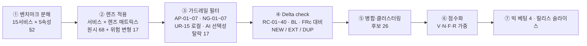
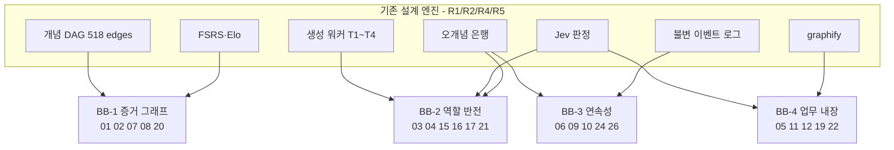

# PLN-IDEA-SCA. 아이디에이션 — 벤치마크 서비스 대상 SCAMPER

> **Trace**: UR-02(복수 아이디어 기획 방법론·전문가 수준) 중심 · 산출 기능은 UR-01, 09~17로 추적
> **입력**: `00-brief/project-brief.md`(UR-01~18), `00-research/R1~R6`, `01-planning/01-actors-personas.md`(P0~P5, E1~E3, RC-01~40)
> **버전**: v1.0 Draft · **작성 주체**: T1(상위 모델, 기획) · **작성일**: 2026-09-30
> **후속 소비**: 아이디어 수렴(타 방법론 결과와 통합) → REQ-01 요구사항정의서(SFR 후보), ARC-01(서비스 경계 영향)

> **근거 표기** — `[지식]`: 작성자 도메인 지식(2026-06 기준). 이 작업에서는 **웹 호출을 하지 않았다**. 벤치마크 서비스의 기능 서술은 R3 §2(역시 `[지식]`)를 그대로 입력으로 썼고, 타 분야 유비(체스 게임 리뷰, 의학 EPA, git bisect, 뮤테이션 테스트, IRT 앵커 동등화, PeerWise, Toulmin 논증 모델 등)도 지식 기반이다. 수치(임계값·문항 수)는 모두 **출발값**이며 REQ/설계에서 확정한다.

---

## 0. 요약 (TL;DR)

1. **방법**: R3의 15개 벤치마크를 "핵심 객체·핵심 동사·진척 단위·신뢰 원천·**숨은 가정**" 5속성으로 분해한 뒤(§2), SCAMPER 7렌즈를 **서비스 × 렌즈 매트릭스**로 강제 적용했다(§3). 렌즈 표의 원시 아이디어 **68개**와 위험 변형 17개, 합계 **85개**를 검토했다. 가드레일 필터(AP-01~07, NG-01~07, UR-15 로컬, AI 선택성)로 **17개를 탈락**시켰고(§4), 기존 요구와 중복된 **DUP 7개를 폐기**한 뒤 병합해 **후보 26개(SCA-01~26)**를 남겼다(§8, §11).
2. **중복 방지(Delta check)**: 이미 R3 BL/FRc와 페르소나 문서 RC-01~40에 있는 기능은 재발견으로 치고 버렸다. 남긴 후보는 모두 **신규(NEW)** 또는 기존 RC의 **질적 확장(EXT)**이다. "벤치마크 15개 어디에도 없는가"를 Novelty 점수에 반영했다.
3. **가장 강한 발견 — "숨은 가정 뒤집기"**: 벤치마크 전부가 공유하는 가정은 ① 학습자는 **답하는 사람**이다, ② 정답은 **하나**다, ③ 진척은 **개별 카드/문제 단위**다, ④ 학습은 **업무와 분리된 시간**에 한다, 이 네 가지다. 이 가정들을 뒤집은 결과가 4개 **빅 베팅(Big Bet)**으로 수렴했다(§7).
   - **BB-1 증거 그래프(Evidence Graph)**: 개념 DAG를 복습 우선순위와 진단 경로로 쓴다. 해당 후보는 Keystone 우선순위(SCA-01), 선수 이분 탐색(SCA-02), 위임 가능 업무 지도(SCA-07), 앵커 시험(SCA-08).
   - **BB-2 역할 반전 연습장(Adversarial Practice)**: 학습자가 검증자·파괴자·출제자·방어자가 된다. 해당 후보는 Mutant Hunt(SCA-03), Review Gauntlet·AI 답변 감사(SCA-04), Exploit→Patch(SCA-15), 학습자 출제(SCA-16), 방어실(SCA-21). 2026년 개발자에게 가장 희소한 역량인 **"AI 출력을 검증하는 능력"**을 정면으로 훈련한다.
   - **BB-3 연속성(Continuity)**: 15년이라는 시간 자체를 학습 재료로 쓴다. 해당 후보는 과거의 나 비평(SCA-09), 학습 포스트모템·오개념 지문(SCA-10), 연속 세계관 캠페인(SCA-06), 체스식 케이스 리플레이(SCA-26).
   - **BB-4 업무 내장(Work-embedded)**: 학습이 업무 흐름 안에서 일어난다. 해당 후보는 Terminal Companion(SCA-12), JIT Pack(SCA-11), Code Graph Drills(SCA-05), Mentor Kit(SCA-22). UR-09의 graphify가 **개발 도구에서 학습 기능으로 재사용**된다(SCA-05).
4. **가중 점수 상위 8** (V 0.35 · N 0.25 · F 0.25 · 역위험 0.15):
   - SCA-09 과거의 나 비평 (4.65)
   - SCA-02 선수 이분 탐색 (4.35)
   - SCA-17 It-Depends 매트릭스 문항 (4.35)
   - SCA-12 Terminal Companion (4.25)
   - SCA-04 Review Gauntlet (4.20)
   - SCA-07 위임 가능 업무 지도 (4.20)
   - SCA-24 시즌 프리모템 (4.05)
   - SCA-01 / 03 / 08 / 10 / 16 (4.00)
5. **v1 권고 묶음**(저비용·고가치, AI 없이도 동작): SCA-01, 02, 09, 17, 20, 24, 04-lite(오개념 치환형 "AI 답변 감사", 오프라인 T2), 10-lite. 나머지는 v1.x/v2 로드맵으로 넘긴다(§9).

---

## 1. 방법론 — 이 문서에서 SCAMPER를 어떻게 썼나

### 1.1 SCAMPER 정의와 선택 이유

| 렌즈 | 원 질문 (Osborn 1953 → Eberle 1971 정리) `[지식]` | 이 프로젝트에서의 강제 질문 |
|---|---|---|
| **S** Substitute | 무엇을 다른 것으로 바꿀 수 있나? | 벤치마크의 **채점 주체·보상·교사·실습 환경**을 무엇으로 대체하면 "로컬·1인·15년"에서 더 강해지나? |
| **C** Combine | 무엇과 무엇을 합칠 수 있나? | 서로 다른 벤치마크의 **강점 2개**를 합치면 어느 한쪽도 못 하던 것이 생기나? |
| **A** Adapt | 다른 맥락에서 무엇을 빌려올 수 있나? | 개발 학습 **밖의 도메인**(의학·항공·체스·스포츠·SRE·git)에서 검증된 훈련 장치는? |
| **M** Modify / Magnify / Minify | 크기·빈도·강도를 바꾸면? | 세션·문제·제약을 **극단적으로 줄이거나 키우면** 어떤 새 모드가 생기나? |
| **P** Put to other use | 다른 용도로 쓰면? | 우리가 **어차피 만드는 자산**(문항 풀, Jev 판정, 오개념 은행, graphify, LLM CLI, 학습 로그)을 다른 용도로 쓰면? |
| **E** Eliminate | 무엇을 없앨 수 있나? | 벤치마크가 당연시하는 **단계·전제**(정답 키, 설정, 카드 작성, 세션 경계)를 없애면? |
| **R** Reverse / Rearrange | 순서·역할을 뒤집으면? | **학습자↔시스템, 답↔문제, 원인↔결과, 과거↔미래**를 뒤집으면? |

**선택 이유**: 이 프로젝트는 이미 R3에서 벤치마크 교훈(BL-01~20)을 **채택/변형/회피**로 정리했다. 이 방식은 "남이 한 것 중 무엇을 가져올지"를 정하는 **수렴형** 분석이다. SCAMPER는 같은 입력(벤치마크)에 **발산형** 변형 연산자 7개를 강제로 적용한다. 그래서 BL 목록에는 원리상 나올 수 없는 **"아무도 하지 않은 것"**을 끌어낸다. 즉 R3가 벤치마크 수준을 따라잡는 도구라면, SCAMPER는 벤치마크를 넘어서는 도구다.

### 1.2 적용 프로토콜 (재현 가능하게)

| 단계 | 규칙 |
|---|---|
| ① 분해 | 각 서비스에서 **숨은 가정**을 최소 1개 명시한다. E/R 렌즈의 연료가 된다. |
| ② 적용 | 렌즈마다 **최소 5개 서비스**에 적용한다. 렌즈당 원시 아이디어 ≥ 8개. |
| ③ 필터 | 안티패턴(R3 AP), Non-goal(페르소나 NG), 로컬 전용(UR-15), "AI 없이도 최소 기능 동작"(R5 OFFLINE 원칙) 중 **하나라도 위반하면 탈락**한다. 단, 위반 부분만 떼어내고 살릴 수 있으면 **수정 후 통과**. |
| ④ Delta | RC/BL/FRc와 같은 것은 `DUP`로 폐기한다. 같은 목적이지만 메커니즘이 새로우면 `EXT`, 완전히 새로우면 `NEW`. |
| ⑤ 병합 | 같은 엔진을 공유하는 아이디어는 하나의 후보로 묶는다. 예: PR 리뷰와 AI 답변 감사 → SCA-04. |
| ⑥ 점수 | **V**alue(페르소나 고통 강도 × 커버 수), **N**ovelty(15 벤치마크 + 기존 RC 대비), **F**easibility(로컬·기존 엔진 재사용도), **R**isk(보안·품질·범위). 1~5점, `Score = 0.35V + 0.25N + 0.25F + 0.15(6−R)`. |

---

## 2. 벤치마크 분해 캔버스 (SCAMPER 입력 산출물)

> "숨은 가정"은 서비스가 말하지 않지만 설계 전체가 기대고 있는 전제다. E(없애기)·R(뒤집기) 렌즈는 여기서 출발한다.

| # | 서비스 | 핵심 객체 | 핵심 동사 | 진척 단위 | 신뢰 원천(무엇이 "안다"를 보증?) | **숨은 가정** |
|---|---|---|---|---|---|---|
| B01 | roadmap.sh | 로드맵 노드 | 열람·체크 | 노드 Done % | 자기보고 | 지도는 **정적**이고 모든 노드는 **동등**하다(의존 가중치 없음) |
| B02 | Codecademy | 체크포인트 과제 | 따라 치기 | 경로 % | 테스트 통과 | 실행 환경은 **제공되는 것**이지 학습자의 것이 아니다 |
| B03 | Educative | 텍스트 레슨·패턴 | 읽기·실행 | 완료율 | 퀴즈 | 패턴은 **작성자가** 추상화한다 |
| B04 | 인프런 | 영상 강의 | 시청 | 수강률 | 수료증 | 시청 = 학습. 강의 **밖**의 복습은 서비스 책임이 아니다 |
| B05 | Frontend Masters | 워크숍 영상 | 시청·따라하기 | 경로 완료 | 강사 권위 | 전문가 지식은 **전달**된다(구성되지 않는다) |
| B06 | Anki | 카드 | 회상·자기평가 | 카드 성숙도 | 자기평가 + FSRS | 카드는 **서로 독립**이다(선수관계 무시) |
| B07 | RemNote | Rem(노트=카드) | 작성·회상 | 덱 숙달 | 자기평가 | 학습자가 **작성자**다 |
| B08 | Obsidian | Markdown 노트 | 쓰기·링크 | 없음 | 없음 | 연결 = 이해(그래프는 **보는 것**) |
| B09 | LeetCode | 문제 + 테스트 | 코딩·제출 | 해결 수·레이팅 | 숨은 테스트 | 테스트는 **출제자가** 쓰고, 제약은 **고정**이다 |
| B10 | 프로그래머스 | 코테 문제 | 코딩·제출 | 레벨·점수 | 채점기 | 평가는 **한 시점의 시험**이다 |
| B11 | Exercism | 연습 + 멘토 | 로컬 풀이·피드백 | 개념 트리 unlock | 인간 멘토·analyzer | 좋은 피드백은 **타인**이 준다 |
| B12 | Boot.dev | 과제 + 소크라틱 AI | 풀이·질문 | XP·레벨 | 테스트 | 동기는 **외재적 보상**으로 유지된다 |
| B13 | KodeKloud | 클라우드 랩·티켓 | 고치기 | 인증 경로 | 상태 검증 스크립트 | 장애는 **사람이 손으로** 시나리오를 쓴다 |
| B14 | Brilliant | 인터랙티브 위젯 | 조작·예측 | 코스 경로 | 위젯 결과 | 위젯은 **개념마다 맞춤 제작**한다(고비용) |
| B15 | Duolingo | 3~5분 레슨 | 반복·스트릭 | XP·리그 | 즉시 채점 | 학습은 **앱을 열어야** 일어난다 |

**공통 숨은 가정 (Meta-assumptions)** — 15개 서비스 모두 다음 네 가지 중 셋 이상을 공유한다.

| MA | 공통 가정 | 반례가 되는 전문가 현실 | 뒤집으면 → |
|---|---|---|---|
| MA-1 | 학습자는 **답하는 사람**이다 | 시니어의 일은 답하기보다 **검증·리뷰·반박·출제**다 | BB-2 역할 반전 |
| MA-2 | 정답은 **하나**이고 사전에 알려져 있다 | L4~L5 문제는 "it depends"이며 조건이 답이다 | SCA-17, SCA-21 |
| MA-3 | 진척 단위는 **개별 카드/문제**다 | 지식은 **의존 그래프**이고, 기초가 무너지면 상위가 같이 무너진다 | BB-1 증거 그래프 |
| MA-4 | 학습은 업무와 **분리된 시간**에 **앱 안에서** 일어난다 | 직장인 학습의 계기는 업무 사건(장애·리뷰·진단)이고, 쓸 수 있는 시간은 자투리다 | BB-4 업무 내장 |
| MA-5 | 학습 이력은 **현재 상태**만 의미 있다 | 15년 이력은 자신의 성장을 비추는 **거울이자 교재**다 | BB-3 연속성 |

---

## 3. 렌즈별 워크스루

> 표기: `Δ` = Delta check 결과(**NEW** 신규 / **EXT(RC-xx)** 기존 요구 후보의 질적 확장 / **DUP(xx)** 중복 → 폐기). `→SCA` = 최종 후보 번호. `✗` = §4에서 탈락.

### 3.1 S — Substitute (대체)

**강제 질문**: 채점자, 교사, 보상, 실습 환경, 콘텐츠 원천을 무엇으로 바꿀까?

| # | 원천 | 무엇을 → 무엇으로 | 아이디어 | Δ | →SCA |
|---|---|---|---|---|---|
| S1 | B09 LeetCode | 출제자가 쓴 테스트 → **학습자가 쓴 테스트** | 숨은 **뮤턴트(mutant)**를 죽이는 테스트 작성. 점수 = kill ratio | NEW | 03 |
| S2 | B11 Exercism | 인간 멘토 → **과거의 나** | 6개월 이상 된 내 답안(백지노트·ADR·디깅 로그)을 지금의 내가 비평 | NEW | 09 |
| S3 | B04/B05 인프런·FEM | 시청 진도 → **챕터 출구 인출** | 외부 강의 챕터마다 우리 KU 은행에서 뽑은 3문항 "출구 티켓"과 간격 후속 | EXT(BL-14) | 19 |
| S4 | B02 Codecademy | 제공된 샌드박스 → **내 저장소** | 내 개인 저장소를 graphify로 그래프화하고, 호출·영향 경로 문항을 만든다 | NEW | 05 |
| S5 | B12/B15 | 리그·리더보드 → **과거의 나 고스트** | 같은 앵커 시험에서 1년 전 내 기록을 고스트로 겹쳐 본다 | EXT(RC-11) | 08 |
| S6 | B06 Anki | 자기평가 4버튼 → 증거 자동 grade | (이미 BL-03, RC-01) | DUP(BL-03) | — |
| S7 | B01 roadmap.sh | Done 체크 → 검증 퀴즈 | (이미 BL-02 "검증 받기") | DUP(BL-02) | — |
| S8 | B13 KodeKloud | 손으로 쓴 장애 시나리오 → **시드 기반 결함 합성** | 결함 카탈로그 × 시드로 재현 가능한 무한 변형 티켓 | EXT(RC-18) | 14 |
| S9 | B12 Boot.dev | XP 보상 → "안정도 상승" 보상 | (이미 BL-07) | DUP(BL-07) | — |
| S10 | B03 Educative | 작성자가 추상화한 패턴 → **학습자가 추출한 패턴** | 문제 5개를 푼 뒤 "공통 신호/패턴"을 직접 서술하게 하고 Jev가 채점 | EXT(RC-08) | 병합→16 |

### 3.2 C — Combine (결합)

**강제 질문**: 두 벤치마크의 강점을 곱하면 무엇이 생기나?

| # | 결합 | 아이디어 | Δ | →SCA |
|---|---|---|---|---|
| C1 | B01 지도 × B06 FSRS | **Keystone 우선순위**: 복습 우선순위를 (1−R) × 하류 의존 개념 수로 매긴다. 기초가 무너지면 "기초 균열" 표시 | NEW | 01 |
| C2 | B15 Stories × B13 Engineer 티켓 × R4 Case | **연속 세계관 캠페인**: 가상 회사 한 곳의 시스템이 시즌마다 진화한다. 내 과거 ADR이 미래 장애의 원인이 된다 | NEW | 06 |
| C3 | B14 위젯 × 코드 러너 | **범용 상태기계 스테퍼**: JSON 명세 하나로 TCP·Pod 수명주기·Raft·서킷 브레이커를 인터랙티브로 | EXT(BL-08) | 18 |
| C4 | B09 Discuss × B11 커뮤니티 솔루션 | **해법 테이스팅**: 풀고 나서 대조 해법 3개(naive/idiomatic/performant)를 순위 매기고 비평 | NEW | 병합→04 |
| C5 | B08 Obsidian × B07 RemNote | **양방향 볼트 브리지**: Obsidian에서 고친 내용이 KU 후보로 돌아온다 | EXT(FRc-D10) | 25 |
| C6 | B06 필터 덱 × 업무 산출물 | **JIT Pack**: 에러 로그·보안 진단·리뷰 코멘트 → 10분 팩 | NEW | 11 |
| C7 | SRE 포스트모템 × B06 통계 | **학습 포스트모템**: 주간 오답 군집을 5 Whys로 원인 분석 | EXT(R3 주 루프) | 10 |
| C8 | B10 스킬체크 × 의학 EPA | 레벨 → **위임 가능 업무** 인증 | NEW | 07 |
| C9 | B09 레이팅 × CBM | 보정된 레이팅 | DUP(RC-01) | — |
| C10 | B14 × B03 | 이론 본문 속 조작 위젯 | EXT(RC-08) | 병합→18 |

### 3.3 A — Adapt (타 도메인 차용)

**강제 질문**: 개발 학습 밖에서 **이미 수십 년 검증된** 전문가 훈련 장치는 무엇인가?

| # | 차용 원천 `[지식]` | 원 장치 | 우리 변형 | Δ | →SCA |
|---|---|---|---|---|---|
| A1 | **git bisect** | 커밋 이분 탐색으로 회귀 지점 찾기 | **선수 이분 탐색**: 고확신 오답이 나오면 선수 DAG를 이분 탐색해 끊긴 지점을 2~4문항 안에 찾는다 | NEW | 02 |
| A2 | **의학 EPA** (ten Cate 2005) | "감독 없이 맡길 수 있는 업무" 5단계 위임 척도 | 트랙 레벨을 "on-call 1차 대응 단독 가능" 같은 업무 위임 주장으로 환산 | NEW | 07 |
| A3 | **체스 게임 리뷰**(엔진 분석) | 수마다 Best/Inaccuracy/Mistake/Blunder, "놓친 기회" | 인시던트 드릴·케이스의 **턴별 분류**와 결정적 순간부터 분기 재시도 | EXT(RC-39) | 26 |
| A4 | **Strava 세그먼트 / IRT 앵커 문항** | 고정 코스의 개인 기록 / 공통 문항 동등화 | **앵커 시험**: 트랙×레벨대별로 동결된 평행형 문항 세트를 반기마다 치러 척도 드리프트 없이 성장 측정 | NEW | 08 |
| A5 | **Krashen i+1 / 단계별 리더(graded reader)** | 이해 가능한 입력보다 한 단계 위 읽기 | **코드 리딩 드릴**: 라이선스가 허용하는 OSS 스냅샷을 i+1 수준으로 읽고 호출 경로 문항 | NEW | 병합→05 |
| A6 | **SRE Wheel of Misfortune / Game Day** | 장애 롤플레이 | (RC-39 인시던트 드릴로 이미 존재) | DUP(RC-39) | — |
| A7 | **항공 정기 심사(recurrent checkride)** | 자격 유지 주기 점검 | 숙달 트랙 반기 점검 → 앵커 시험과 같은 엔진 | EXT(RC-36) | 병합→08 |
| A8 | **한국 SI 감리** | 감리원 지적 → 조치계획서 | **방어실**: AI 감리원·사수·고객 PM의 반박에 설계를 방어 | EXT(SCN-09) | 21 |
| A9 | **PeerWise** (Denny 2008, 학생 출제) | 학생이 MCQ를 만들고 동료가 평가 | 학습자 출제 + 동일 G 게이트 판정 | NEW | 16 |
| A10 | **의학 M&M 컨퍼런스** | 실패 사례 공개 검토 | 학습 포스트모템과 통합 | EXT | 병합→10 |
| A11 | **Toulmin 논증 모델** | 주장·근거·보증·반박·한정 | 방어실·It-Depends 채점 루브릭의 뼈대 | — | 21, 17 요소 |

### 3.4 M — Modify / Magnify / Minify (변형·확대·축소)

| # | 원천 | 극단화 | 아이디어 | Δ | →SCA |
|---|---|---|---|---|---|
| M1 | B15 Duolingo 3~5분 | **Minify → 30초, 앱 밖** | **Terminal Companion**: `dstudy q`로 터미널에서 1문항. Claude Code/Codex가 작업하는 동안의 대기 시간을 학습 시간으로 쓴다 | NEW | 12 |
| M2 | B09 LeetCode 고정 제약 | **Magnify 제약** | **제약 사다리**: 같은 문제에서 n=10³ → 10⁹ → 메모리 64MB → 분산 → 적대적 입력 순으로 제약을 키운다. 알고리즘에서 시스템 디자인까지 이어진다 | NEW | 13 |
| M3 | B13 KodeKloud 티켓 1개 | **Magnify 변형 수** | 시드 결함 조합과 레드헤링 로그 노이즈로 난이도를 조절 | EXT(RC-18) | 14 |
| M4 | 오개념 태그(개별) | **Magnify 추상 수준** | **오개념 지문(fingerprint)**: 트랙을 가로지르는 메타 오개념 계열. 예: "상태 vs 이벤트", "평균 vs 꼬리 지연" | NEW | 병합→10 |
| M5 | B01 거대한 지도 | **Minify → 최전선만** | ZPD 프런티어 뷰: 선수 숙달이 끝난 개념만 표시 | EXT(FRc-D08) | 병합→01 |
| M6 | B06 일일 카드 수 | **Magnify 시간축 → 예산 우선** | 분 예산을 넣으면 보존율 계층을 역산 | EXT(RC-10) | 20 |
| M7 | B14 위젯 1개 = 개념 1개 | **Minify 제작비** | 선언적 명세 하나로 모든 상태기계를 표현 | EXT | 병합→18 |
| M8 | 세션 리포트 | **Magnify → 시즌 예측** | 시즌 시작 시 목표 달성 확률을 예측하고 끝에서 대조(거시 보정) | NEW | 24 |

### 3.5 P — Put to other use (전용)

**강제 질문**: 우리가 **어차피 만드는 자산**을 다른 곳에 쓰면?

| # | 자산 | 원 용도 | 다른 용도 | Δ | →SCA |
|---|---|---|---|---|---|
| P1 | **LLM CLI 배치 생성** | 문항 생성 | **결함이 심어진 PR diff**를 생성하고 사람이 리뷰한다(정답 = 결함 매니페스트) | NEW | 04 |
| P2 | **오개념 은행**(R2) | OX 오답 선택지 | 올바른 해설에 오개념을 치환해 넣은 **"그럴듯하게 틀린 AI 답변"**. 감사 연습용이며 오프라인 T2로 생성 가능 | NEW | 04 |
| P3 | **graphify**(UR-09 개발 도구) | 개발 에이전트의 작업 흐름 탐색 | 학습자 코드·OSS의 **코드 리딩 문항 생성기**(T1, LLM 불필요) | NEW | 05 |
| P4 | **Jev 품질 게이트 G0~G13** | LLM 문항 검수 | **학습자가 만든 문항** 채점. 출제 능력 = Bloom Create | NEW | 16 |
| P5 | **학습 이력(review_log, 15년)** | 스케줄링 | 과거의 나 비평 교재, 성장 증거 | NEW | 09 |
| P6 | **문항 풀 + 루브릭** | 내 학습 | **멘토 키트**: 팀 스터디 세트, 주니어 온보딩 퀴즈 export(P3~P5 관계성) | EXT(RC-14) | 22 |
| P7 | **KU의 procedural/pitfall facet** | 문항 원천 | **현장 체크리스트**(배포 전 프로브 점검표 등) export | NEW | 병합→22 |
| P8 | **SRE 포스트모템 양식**(sre 트랙 콘텐츠) | 학습 내용 | 학습 자체의 주간 포스트모템 양식 → 동시에 sre 역량 훈련 | EXT | 10 |
| P9 | **R6 SI 산출물 템플릿** | 개발 프로세스 | 가상 RFP에서 요구사항정의서 행을 작성하는 과제(캠페인 에피소드) | EXT(RC-38) | 병합→06 |
| P10 | **FSRS 워크로드 시뮬레이터** | 파라미터 조정 | 시즌 프리모템에서 "이 목표를 이루려면 하루 몇 분" 제시 | EXT | 병합→24 |

### 3.6 E — Eliminate (제거)

| # | 없앨 대상 | 원천 | 결과 아이디어 | Δ | →SCA |
|---|---|---|---|---|---|
| E1 | **단일 정답 키** | B09/B10 (MA-2) | **It-Depends 매트릭스 문항**: 선택지 × 조건 표를 채우고, 빠진 조건을 추가한다 | NEW | 17 |
| E2 | **보존율 설정 부담** | B06 Anki 옵션 | 예산 우선 스케줄링(사용자는 "분"만 정한다) | EXT(RC-10) | 20 |
| E3 | **앱을 열어야 한다는 전제** | B15 (MA-4) | Terminal Companion 상태줄·훅 | NEW | 12 |
| E4 | **업무 데이터 유출 위험 자체** | JIT Pack의 위험 | 로컬 redaction 미리보기와 로컬 전용 분류 기본값 | — | 11 설계 제약 |
| E5 | **"이론부터 읽기" 진입 장벽** | B03/B05 | **산출물 먼저 역설계 레슨**. 진입점만 바꾸고 이론→코드→핵심 3층은 유지한다(UR-10 보존) | EXT(RC-08) | 23 |
| E6 | 카드 작성 | B06 | (이미 BL-05) | DUP | — |
| E7 | 인프라 설치 | B13 | (이미 RC-20 대체 경로) | DUP | — |
| E8 | 콘텐츠 위젯 개별 제작비 | B14 | 범용 스테퍼 | EXT | 18 |
| E9 | **선형 이력 서술** | 모든 서비스 | 결정적 순간 분기 재시도(체스 리플레이) | EXT | 26 |

### 3.7 R — Reverse / Rearrange (역전·재배열)

| # | 뒤집는 축 | 원천 | 아이디어 | Δ | →SCA |
|---|---|---|---|---|---|
| R1 | 답하는 사람 → **출제하는 사람** | 모든 서비스 (MA-1) | 학습자 출제 + G 게이트 | NEW | 16 |
| R2 | 버그 찾기 → **버그·익스플로잇 만들기** | B09/B13 | **Exploit→Patch 레인지**: 행안부 보안약점 49개 기반 로컬 CTF-lite. 뚫고(flag) 나서 막기(패치 테스트) | NEW | 15 |
| R3 | 채점받는 사람 → **채점하는 사람** | B11 analyzer | AI 답변 감사, PR 리뷰 (Review Gauntlet) | NEW | 04 |
| R4 | 보존율 → 워크로드 계산을 **워크로드 → 보존율**로 | B06 | 예산 우선 스케줄링 | EXT | 20 |
| R5 | 회고(과거) → **프리모템(미래)** | UR-03 회고 | 시즌 프리모템 | NEW | 24 |
| R6 | 원리 → 적용 순서를 **적용 → 원리**로 | B03/B05 | 역설계 레슨 | EXT | 23 |
| R7 | 시스템이 묻고 내가 답함 → **내가 설계하고 AI가 푼다** | SRE Game Day | 학습자가 장애를 설계하고 AI(또는 과거의 나 기록)가 조사한다. 설계 품질을 Jev가 채점 | NEW | 병합→15/26 v2 옵션 |
| R8 | 결과 → 원인 (오답 → 근본 원인) | B06 통계 | 학습 포스트모템 | EXT | 10 |
| R9 | 현재 → 과거 (내가 과거를 평가) | B15 스트릭 | 과거의 나 비평 | NEW | 09 |
| R10 | 지식 → 업무 (학습에서 업무로) | — | 현장 체크리스트 export | NEW | 22 |

### 3.8 렌즈 × 원천 집계 (원시 아이디어 수)

| 원천 유형 | S | C | A | M | P | E | R | 계 |
|---|---|---|---|---|---|---|---|---|
| 벤치마크 15개 직접 | 10 | 10 | – | 6 | – | 7 | 6 | **39** |
| └ 그중 Anki(B06) 관여 | 1 | 3 | – | 1 | – | 2 | 2 | 9 |
| 자체 자산(Jev·graphify·CLI·오개념 은행·로그·SI 템플릿) | – | – | – | 2 | 10 | 1 | 2 | **15** |
| 타 도메인 유비 | – | – | 11 | – | – | – | 1 | **12** |
| 공통 숨은 가정(MA) 직접 | – | – | – | – | – | 1 | 1 | **2** |
| **렌즈 합계** | **10** | **10** | **11** | **8** | **10** | **9** | **10** | **68** |

집계: 렌즈 표 68개 + 가드레일 단계에서 기록한 위험 변형 17개(§4) = **검토 85개**. 렌즈 표 68개 중 DUP 7개를 폐기하고 병합한 결과 → **후보 26개**.

**관찰**: 단일 벤치마크로는 Anki(자기 이력·스케줄러 가정, 9개)가 가장 많은 변형을 낳았다. 하지만 가장 새로운 아이디어는 **우리 자신의 자산**(15개)과 타 도메인(12개)에서 나왔다. 즉 차별화의 원천은 경쟁 서비스를 흉내 내는 데 있지 않고, **이미 설계된 엔진(Jev·오개념 은행·graphify·FSRS 로그)을 여러 용도로 쓰는 데** 있다. 이는 UR-08 서비스 분리에도 유리하다. 새 서비스를 늘리지 않고 기존 서비스의 소비자만 늘어나기 때문이다(§10).

---

## 4. 가드레일 필터 — 탈락 아이디어 (17)

> 탈락 이유를 남겨야 이후 방법론 결과와 수렴할 때 같은 아이디어가 다시 살아나지 않는다.

| # | 탈락 아이디어 | 위반 | 구제 가능 부분 |
|---|---|---|---|
| X01 | 익명 텔레메트리 기반 전 세계 사용자 비교 리그 | NG-01 로컬·소셜 없음, AP-02 | 과거의 나 고스트(SCA-08) |
| X02 | 학습자 출제 문항 수에 따른 포인트 | AP-02 과잉정당화 | 채택 문항 "기여 기록"만(SCA-16) |
| X03 | 선수 이분 탐색을 통과해야 상위 개념 unlock | AP-06 강제 잠금 | 권장·경고만(SCA-02) |
| X04 | 백지노트 막힘 시 AI가 문장 자동 완성 | AP-07 | 힌트 사다리 1단계(방향)만 |
| X05 | "기초 균열" OS 푸시 알림 | AP-01 불안 알림 | 앱 내 조용한 표시(SCA-01) |
| X06 | KodeKloud식 클라우드 랩 대여 | UR-15 로컬, 비용 | 로컬 kind + 시드 결함(SCA-14) |
| X07 | 회사 저장소를 Code Graph Drills에 넣고 API LLM으로 문항 생성 | NG-06 | 개인·OSS만, 사내 코드는 **T1 그래프 문항 + 로컬 LLM만**(SCA-05) |
| X08 | 스트릭 동결권 구매 | AP-02 | 휴식 토큰(RC-06) |
| X09 | 인기 강의 영상 임베드 재생 | NG-02, 라이선스 | 외부 링크 + 출구 티켓(SCA-19) |
| X10 | 음성 면접 롤플레이 | NG-07 (v1) | 텍스트 방어실(SCA-21) |
| X11 | roadmap.sh 구조 자동 스크랩 → 지도 생성 | R4 라이선스(개인 사용만) | 자체 R4 택소노미 |
| X12 | ADR을 "모범 답안"과 유사도로 채점 | P3/P4 Anti-goal(단일 정답 강요) | Toulmin 루브릭 + 조건 커버리지(SCA-17/21) |
| X13 | 캠페인 세계관에서 실패하면 "회사 파산" 게임 오버 | AP-01 손실 공포, 15년 번아웃 | 실패 = 다음 에피소드 장애의 씨앗(학습 재료) |
| X14 | 강의 트랜스크립트 전문을 KU로 추출·출제 | 저작권(R4 class D) | 우리 KU 은행에서만 출구 문항(SCA-19) |
| X15 | 과거 답안을 자동 삭제해 "새 출발" | P5 Anti-goal(이력 손실) | 복귀 모드는 숨김만 |
| X16 | Terminal Companion이 코딩 에이전트 작업 중 **자동 팝업** | 업무 흐름 방해(UR-17 UX), 강요 | 풀(pull) 방식 + 상태줄 수치만 |
| X17 | 취약 앱을 LAN에 노출해 친구와 CTF | NG-01, SER(보안) | 127.0.0.1 + 컨테이너 격리(SCA-15) |

---

## 5. Delta check 요약 — 기존 요구 후보 대비 어디가 새로운가

| 기존 요구 | 기존 내용 | SCAMPER가 더한 것 |
|---|---|---|
| RC-10 워크로드 시뮬레이터 | 보존율 → 부하 예측 | **역방향**(부하 → 보존율, SCA-20), **DAG 가중**(SCA-01) |
| RC-04 오개념 태그 | 문항 단위 오개념 | **트랙 횡단 메타 오개념 지문 + 주간 RCA**(SCA-10), **선수 이분 탐색**(SCA-02) |
| RC-18 상태 검증 채점 | 고정 티켓 | **시드 합성·무한 변형·레드헤링**(SCA-14) |
| RC-36 승급 평가 | 레벨 판정 | **업무 위임 척도**(SCA-07), **척도 드리프트 없는 앵커**(SCA-08) |
| RC-39 단계적 공개 Case | 턴 로그 | **턴 분류·결정적 순간 분기 재시도**(SCA-26), **연속 세계관**(SCA-06) |
| RC-40 Feynman | AI 학생에게 설명 | **출제**(SCA-16), **감사**(SCA-04), **방어**(SCA-21), **익스플로잇**(SCA-15): 역할 반전 4종 |
| RC-11 과거 오버레이 | 지도 색 비교 | **과거 답안 자체를 교재로**(SCA-09), **고스트**(SCA-08) |
| RC-14 export | 백업·포트폴리오 | **멘토 키트·현장 체크리스트**(SCA-22), **EPA 증거 트레일**(SCA-07) |
| BL-14 외부 개념 가져오기 | URL → KU | **외부 강의 진도와 인출 결합**(SCA-19), **JIT 업무 산출물**(SCA-11) |
| (없음) | — | **UR-09 graphify를 제품 기능으로 재사용**(SCA-05), **앱 밖 학습**(SCA-12), **sec 트랙 실습**(SCA-15, 벤치마크 15개 중 보안 실습 보유 0) |

---

## 6. 점수화 (Scoring Matrix)

> V=가치(페르소나 고통 강도·커버 수), N=신규성(15 벤치마크·기존 RC 대비), F=실현성(5=쉬움, 기존 엔진 재사용), R=위험(5=높음). `Score = 0.35V + 0.25N + 0.25F + 0.15(6−R)`.

| SCA | 이름 | V | N | F | R | **Score** | 순위 |
|---|---|---|---|---|---|---|---|
| 09 | 과거의 나 비평 | 4 | 5 | 5 | 1 | **4.65** | 1 |
| 02 | 선수 이분 탐색 | 5 | 4 | 4 | 2 | **4.35** | 2 |
| 17 | It-Depends 매트릭스 문항 | 5 | 4 | 4 | 2 | **4.35** | 2 |
| 12 | Terminal Companion | 4 | 5 | 4 | 2 | **4.25** | 4 |
| 04 | Review Gauntlet (PR·AI 답변 감사) | 5 | 5 | 3 | 3 | **4.20** | 5 |
| 07 | 위임 가능 업무 지도(EPA) | 5 | 5 | 3 | 3 | **4.20** | 5 |
| 24 | 시즌 프리모템 | 3 | 4 | 5 | 1 | **4.05** | 7 |
| 01 | Keystone 우선순위·기초 균열 | 4 | 4 | 4 | 2 | **4.00** | 8 |
| 03 | Mutant Hunt | 4 | 5 | 3 | 2 | **4.00** | 8 |
| 08 | 앵커 시험 & 고스트 | 4 | 4 | 4 | 2 | **4.00** | 8 |
| 10 | 학습 포스트모템·오개념 지문 | 4 | 4 | 4 | 2 | **4.00** | 8 |
| 16 | 학습자 출제 | 4 | 4 | 4 | 2 | **4.00** | 8 |
| 05 | Code Graph Drills | 4 | 5 | 3 | 3 | **3.85** | 13 |
| 19 | Course Companion | 4 | 4 | 4 | 3 | **3.85** | 13 |
| 11 | JIT Pack | 5 | 4 | 3 | 4 | **3.80** | 15 |
| 22 | 멘토 키트·현장 체크리스트 | 3 | 3 | 5 | 1 | **3.80** | 15 |
| 13 | 제약 사다리 | 4 | 4 | 3 | 2 | **3.75** | 17 |
| 20 | 예산 우선 스케줄링 | 4 | 3 | 4 | 2 | **3.75** | 17 |
| 26 | 체스식 케이스 리플레이 | 4 | 4 | 3 | 2 | **3.75** | 17 |
| 21 | 방어실(설계 방어·감리 대응) | 4 | 4 | 3 | 3 | **3.60** | 20 |
| 06 | 연속 세계관 캠페인 | 5 | 5 | 1 | 4 | **3.55** | 21 |
| 23 | 역설계 레슨 | 3 | 3 | 4 | 1 | **3.55** | 21 |
| 18 | 범용 상태기계 스테퍼 | 4 | 3 | 3 | 2 | **3.50** | 23 |
| 15 | Exploit→Patch 레인지 | 4 | 4 | 3 | 4 | **3.45** | 24 |
| 14 | 시드 결함 랩 | 4 | 3 | 3 | 3 | **3.35** | 25 |
| 25 | 양방향 볼트 브리지 | 3 | 2 | 3 | 3 | **2.75** | 26 |

**점수 해석 주의**: SCA-06(캠페인)은 실현성 때문에 점수가 낮지만 **차별화 잠재력은 최상위**다(V5·N5). 그래서 "v2 빅 베팅, v1에서는 Case 메타데이터에 `world_id`만 예약"으로 처리한다(§9). SCA-15(Exploit→Patch)는 위험이 높은 대신, 벤치마크 15개 중 **보안 실습이 전무**하다는 공백을 메우므로 UR-01(보안) 커버리지 측면에서 **대체 불가**하다.

---

## 7. 빅 베팅 (Big Bets) — 후보를 관통하는 4개 전략 테마

| BB | 테마 | 뒤집은 가정 | 구성 후보 | 페르소나 무게중심 | 검증 가설 (회고 RETRO에서 확인) |
|---|---|---|---|---|---|
| **BB-1** | **증거 그래프** — 지식을 카드 목록이 아닌 의존 그래프 위의 증거로 다룬다 | MA-3 | 01, 02, 07, 08, 20 | P0~P5 전원(비가시 엔진) | H1: Keystone 우선순위가 적용되면 선수 개념 망각에서 오는 하류 오답률이 ≥ 15% 감소한다. H2: 이분 탐색 1회당 ≤ 4문항으로 원인 개념을 찾는다(사후 학습 후 해당 하류 문항 정답 전환율로 확인) |
| **BB-2** | **역할 반전 연습장** — 답하는 사람에서 검증·파괴·출제·방어하는 사람으로 | MA-1, MA-2 | 03, 04, 15, 16, 17, 21 | P1~P4 (L3+) | H3: AI 답변 감사 정답률(심은 오류 재현율)이 시즌 단위로 상승하고, 같은 개념의 일반 문항 정답률과 양의 상관을 보인다. H4: L4+ 트랙에서 "지루함" 자기보고 또는 세션 단축이 감소한다(MT-5 대응) |
| **BB-3** | **연속성** — 15년 이력을 교재·거울로 쓴다 | MA-5 | 06, 09, 10, 24, 26 | P2~P5, E2 | H5: 과거의 나 비평 세션의 완료율이 일반 서술형보다 높다(관계성 대체). H6: 오개념 지문에서 계열 1개를 해소하면 여러 트랙의 오답이 함께 줄어든다 |
| **BB-4** | **업무 내장** — 학습 계기와 시간을 업무 흐름 안에서 찾는다 | MA-4 | 05, 11, 12, 19, 22 | P0~P2, E3 제외 | H7: Terminal Companion 사용자의 주간 MVD 달성률이 ≥ 10%p 상승한다. H8: JIT Pack으로 연결된 개념의 30일 R이 일반 신규 개념보다 높다(맥락 부호화 효과) |

---

## 8. 후보 상세 명세 (핵심 메커니즘 — 설계 입력)

> 아래는 Feature Candidates 표(§11)의 설명을 설계 수준으로 풀어 쓴 것이다. 모든 판정은 R5 원칙을 따른다. **판정은 Jev, 문장 생성은 LLM, 결정은 고정 코드**, 참조는 객체 키, AI가 없을 때의 폴백을 명시한다.

### SCA-01 Keystone 우선순위 · 기초 균열
- **우선순위 식(출발값)**: `prio_i = (1 − R_i(t)) × tier_w_i × (1 + α·ln(1 + D_i))`.
  - `D_i` = 활성 경로 안의 **전이적 하류 개념 수**(R4 DAG 518 엣지, 최장 체인 11).
  - α = 0.5.
  - `tier_w` = core 1.0 / std 0.8 / breadth 0.6 / archive 0.4.
- **FSRS와의 관계**: FSRS의 due는 건드리지 않는다. 같은 날 due가 상한을 넘을 때 **어느 것을 먼저 할지** 정하는 순서 결정에만 쓴다. 따라서 스케줄러 이론은 보존된다.
- **기초 균열**: 선수 개념 R이 0.7 미만이고 하류 개념 ≥ 3개가 Mastered인 경우, 해당 노드를 Depth Map에서 **점선 테두리**로 표시한다. 알림은 보내지 않는다(X05).
- 폴백: AI 불필요, 완전 결정적.

### SCA-02 선수 이분 탐색 (Prerequisite Bisect)
- **트리거**: 고확신 오답이거나, 같은 개념에서 연속 오답 2회.
- **절차**:
  1. 해당 개념의 선수 조상 집합 `A`를 위상 깊이로 정렬한다.
  2. 조상 가중치(`1 − R` × 중요도)의 누적이 절반이 되는 지점의 개념을 고른다. DAG 위의 bisect다.
  3. 그 개념에 T2 OX/MCQ 1문항(≤ 20초)을 낸다.
  4. 맞히면 위쪽 절반을, 틀리면 아래쪽 절반을 탐색한다.
  5. 최대 4문항에서 멈춘다(log₂11 ≈ 3.5).
- **결과**: "끊긴 지점: `net.tcp-handshake` → 복구 팩 5분". 각 프로브 결과는 해당 개념의 증거로도 기록된다(버리는 문항이 없다).
- **피로 방지**: 세션당 최대 1회. "나중에"를 누르면 주간 포스트모템(SCA-10) 입력으로 넘긴다.
- 폴백: 완전 결정적(T2 문항 + Elo).

### SCA-03 Mutant Hunt (테스트로 뮤턴트 잡기)
- **구성**: 명세 + 정답 구현 + 숨은 뮤턴트 k개.
  - 뮤턴트는 AST 뮤테이션 연산자로 만든다: 경계 `<`→`<=`, 부정, 산술 치환, early-return 삭제, 널 가드 삭제.
  - 생성기는 **T1 결정적**이다. Stryker 류의 개념을 직접 구현하며, Node 22의 JS/TS를 기본 대상으로 한다.
- **등가 뮤턴트 처리**: 사전에 참조 테스트 스위트와 퍼즈 입력으로 걸러낸다.
- **채점**:
  - `kill_ratio = 죽인 뮤턴트 / 비등가 뮤턴트`.
  - 정답 구현을 실패시키는 테스트는 **거짓 양성**으로 감점한다.
  - 테스트가 요구하는 개념 신호도 본다(경계값·동치 분할 등, Jev `noul`).
- **대상**: `eng`(테스팅), `lang`, `alg`. P1~P3, CI/CD 트랙의 "좋은 테스트란" 체득.

### SCA-04 Review Gauntlet — PR 리뷰 & AI 답변 감사
- **(a) PR 모드**:
  - LLM(주로 CLI 배치)이 diff와 **결함 매니페스트** `defects.d01 {line_range, category, severity, ku_ref}`를 생성한다.
  - T0 검증: 각 결함마다 이를 드러내는 테스트가 실제로 실패하는지 확인한다. 실패하지 않으면 폐기한다.
  - 사용자 코멘트와 결함은 **쌍별 Jev `noul`**("코멘트 c가 결함 d를 지적하는가")로 매칭한다. 배열 인덱스 함정을 피하기 위한 방식이다.
  - 매니페스트 밖 지적은 Jev가 "타당한 이슈인가"로 판정해 보너스를 준다.
  - 지표: 재현율, 정밀도, 심각도 가중 점수.
- **(b) AI 답변 감사**:
  - 올바른 참조 해설의 KU 문장을 **오개념 은행의 mc로 치환**해 그럴듯하게 틀린 답변을 만든다. **T2 템플릿이라 오프라인 가능** → v1-lite.
  - 사용자는 틀린 문장을 표시하고 교정한다. 정답은 치환 위치이므로 결정적으로 채점한다.
- **(c) 해법 테이스팅(C4 병합)**: naive/idiomatic/performant 해법 3개를 순위 매기고 근거를 쓴다. 채점은 Jev `score`.
- **의의**: 2026년 주니어의 가장 큰 공백인 "AI가 짠 코드를 설명·검증하지 못한다"(P0 가면 증후군)를 **정면 훈련**한다.

### SCA-05 Code Graph Drills (graphify 전용)
- **대상 코드**:
  - (a) 사용자가 등록한 **개인** 저장소. 기본값은 로컬 전용이며, 외부 AI 전송을 금지한다.
  - (b) 라이선스 class A/B(Apache-2.0, MIT 등)의 소형 OSS 스냅샷. 해시로 고정한다.
- **절차**: `graphify extract <dir> --code-only`(tree-sitter AST, LLM 불필요)로 `graph.json`을 만든 뒤, 결정적 문항을 생성한다. 오답 선택지는 같은 모듈의 형제 노드에서 뽑는다.
  - "`X`를 호출하는 함수는?"
  - "`A`→`B` 호출 경로를 완성하라"(Parsons 변형)
  - "`Y` 시그니처 변경 시 영향받는 모듈은?"
- **i+1 난이도**: 경로 길이, 팬아웃, 모듈 경계 횡단 수.
- **"왜" 문항**("왜 이 계층이 분리됐나")은 LLM 선택이며, 개인 저장소는 **Ollama만** 허용한다.
- **의존성**: graphify(Python/uv)는 **선택 설치**이며 probe로 감지한다. 없으면 기능을 숨긴다.
- **의의**: 개발 도구(UR-09)가 학습 기능으로 재사용된다. 전문가 역량의 큰 축인 **코드 읽기**를 훈련한다.

### SCA-06 연속 세계관 캠페인 (가상 회사 "액시스페이" — 가칭)
- **세계관**: 하나의 가상 회사 시스템(모놀리식 결제 API → 시즌마다 MSA, k8s, LLM 기능 도입)이 **시즌과 함께 진화**한다.
- **에피소드**: Case·티켓·설계 리뷰·SI 산출물 과제(가상 RFP → 요구사항정의서 행, P9)가 같은 아키텍처 문서를 공유한다. 그래서 **교차 트랙 Case**(R4 권장 150개 시드)가 자연스럽게 생긴다.
- **결정의 연속성**: 내가 쓴 ADR의 결정(예: "캐시 TTL 1h")이 `world_state`에 기록된다. 이후 에피소드에서 그 결정이 **장애의 씨앗**이 될 수 있다. 결과적 사고(consequential thinking) 훈련이다.
- **레벨 연동**: L1~L2는 세계관을 배경 서사로만 쓴다. L4~L5는 아키텍처 전환을 결정하는 쪽이다.
- **v1**: Case 스키마에 `world_id`, `world_state_refs`만 예약한다. 콘텐츠 제작비가 크므로 v2.

### SCA-07 위임 가능 업무 지도 (Entrustment Map, EPA)
- **EPA 정의**: 약 30개의 업무 단위를 정의한다. 각 EPA의 요건은 필요 개념 × 레벨, 필요 Case 유형, 증거 임계값이다. 예:
  - `epa.ops.oncall-first-response`: 프로덕션 장애 1차 대응
  - `epa.db.schema-change-review`
  - `epa.sec.secure-code-diagnosis`: 보안약점 진단 조치
  - `epa.si.dev-standard-authoring`: 개발표준정의서 조항 작성
- **위임 척도(ten Cate 5단계 변형)**: 1 관찰만 → 2 직접 감독 → 3 간접 감독 → 4 단독 수행 → 5 타인 감독 가능.
- **출력**: "지금 당신은 `epa.ops.oncall-first-response` 3단계. 4단계까지: `sre.slo` Case 1건, `k8s.probes` D4". 한국 SI 직급 기대치(R4 §2.1 앵커)와 나란히 보여준다.
- **export**: 판정 근거(어느 attempt·Case가 증거인가) 트레일을 포함하는 역량 리포트로 내보낸다(ACT-H04 외부 평가자용). 지표가 **자기보고가 아닌 증거 기반**이라는 점이 roadmap.sh와 결정적으로 다르다.

### SCA-08 앵커 시험 & 고스트
- **문항 세트**: 트랙 × 레벨대별로 **평행형 A/B 세트**(각 20~30문항)를 둔다.
  - 세트는 해시로 동결하고 일반 풀에서 제외한다. 연습 효과를 막기 위해서다.
  - A/B를 번갈아 사용하며, 응시 간격은 반기 이상이다.
- **동등화**: 콘텐츠가 바뀌어도 공통 문항 동등화로 척도를 연결한다(IRT 앵커 원리 `[지식]`). 15년 동안 Elo 드리프트와 풀 변화에 영향받지 않는 **유일한 고정 자**다.
- **고스트**: 1년 전 같은 세트의 문항별 결과·시간을 겹쳐 보여준다. 리더보드를 대체하는 관계성 장치이며, 비교 대상은 과거의 나뿐이다.
- 항공 정기 심사(A7)처럼 **숙달 트랙의 "rusty" 여부를 공식 판정**하는 데에도 쓴다.

### SCA-09 과거의 나 비평 (Time-Capsule Critique)
- **트리거**: facet이 due이고, 같은 개념·facet에 대해 **180일 이상 된 내 자유 서술 답안**이 있다(백지노트·디깅 로그·ADR·Feynman 설명).
- **과제**: "6개월 전 당신의 답입니다. 틀린 것, 빠진 것, 지금이라면 다르게 말할 것을 쓰세요."
- **채점**: Jev가 과거 답의 KU 커버리지 대비 **비평의 정확성**(`noul` per KU: "비평이 누락된 KU d를 지적하는가")과 새 오류 여부를 판정한다.
- **효과**:
  - 인출 + 오류 탐지 + 성장 가시화를 한 번에 얻는다.
  - 결과는 레벨 승급 증거와 SCA-07 증거로 쓴다.
  - 관계성(SDT)을 "과거의 나"로 대체한다(페르소나 §2.3의 의도적 제외와 정합).
- 폴백(OFFLINE): 과거 답과 현재 KU 체크리스트를 나란히 놓고 자기채점하고, 보류 큐에 넣는다.

### SCA-10 학습 포스트모템 · 오개념 지문
- **메타 오개념 계열(출발값 12)**:
  - 상태 vs 이벤트
  - 동기 vs 비동기 경계
  - 선언 시점 vs 실행 시점(lazy)
  - 단일 노드 가정(분산 무시)
  - 평균 vs 꼬리 지연
  - 인증 vs 인가
  - 용량 vs 처리량
  - 정합성 vs 가용성
  - 참조 vs 값
  - 캐시 무효화 시점
  - 상관 vs 인과(관측성)
  - 기본값 신뢰(설정 누락)
- **계열 분류**: 모든 `!mc`에 `family` 태그를 붙인다. 새 mc는 Jev `choice`로 분류하고, 없으면 큐레이터가 태깅한다.
- **주간 포스트모템(자동)**: SRE 양식을 따르며 **비난 없는(blameless) 카피**로 쓴다. 이 양식 자체가 `sre` 트랙 훈련이다.
  - 증상: 오답 군집
  - 근접 원인: mc
  - 근본 원인: 메타 계열 또는 이분 탐색이 찾은 선수 공백
  - 조치: 자동 예약 팩
- **v1-lite**: 계열 태그와 주간 표 한 개만.

### SCA-11 JIT Pack (업무 산출물 → 10분 팩)
- **입력**: 에러 로그·스택 트레이스, 보안약점 진단 항목 코드(행안부 49), PR 리뷰 코멘트, `EXPLAIN` 출력.
- **파이프라인**:
  1. **로컬 redaction**: 시크릿·IP·이메일·사내 호스트·식별자 정규식 처리. 사용자에게 미리보기를 보여준다.
  2. 개념 매핑: FTS5 trigram 로컬 검색이 기본이다. 사용자가 명시 동의하면 Jev `choice`를 쓰고, 이때도 redaction된 텍스트만 보낸다.
  3. 8~12문항 팩을 만든다. FSRS due와 분리된 "추가 학습"으로 넣되, 로그는 정상 기록한다.
  4. 선택: "Case 씨앗으로 저장". **사용자 문장만** 저장하고 원문은 저장하지 않는다.
- **위험**: NG-06(회사 데이터). 기본값은 **로컬 전용**이며 원문은 저장하지 않는다. R 점수 4.

### SCA-12 Terminal Companion (`dstudy` CLI)
- **명령**: `dstudy q`(due 1문항: OX/MCQ/수치/짧은 답), `dstudy status`, `dstudy pack <concept>`.
- **통신**: 로컬 서비스와 127.0.0.1 + 토큰으로 통신한다(DNS rebinding 방어, R5).
- **통합**: Claude Code·Codex의 상태줄에 "due 12 · 균열 1" 같은 수치만 보여준다. **훅은 사용자 opt-in**이며 자동 팝업은 금지한다(X16).
- **집계**: 에이전트가 작업하는 30초~3분의 대기 시간을 인출로 바꾼다. 결과는 같은 attempt 로그에 쌓이며, 10문항이 모이면 MVD로 인정된다(RC-06).
- **의의**: 사용자 상황(브리프 §2: AI 코딩 CLI를 상시 사용)에 **정확히 맞춘 차별점**. 벤치마크 15개 중 앱 밖 학습은 없다.

### SCA-13 제약 사다리 (Constraint Escalation)
- **예시** — 한 문제 패밀리("중복 요청 탐지"):
  1. n=10³, 해시셋
  2. n=10⁹, 메모리 64MB: 블룸 필터·오탐 허용
  3. 다중 서버: 공유 저장소 vs 로컬 + 동기화
  4. 적대적 입력: 해시 플러딩
  5. SLO p99 10ms: 설계 트레이드오프
- **각 단**: "기존 해법은 어디서 깨지나?"(MCQ) + 접근 선택 + (1~2단) 코드 제출.
  - 1~2단은 T1 실행 측정(생성 입력으로 시간·메모리 확인).
  - 3~5단은 T4 루브릭.
- **의의**: `alg`에서 `arch`로 가는 다리. LeetCode·프로그래머스의 고정 제약 가정(MA-2)을 깨고, 면접 E1의 시스템 디자인까지 잇는다.

### SCA-14 시드 결함 랩 (Seeded Fault Lab)
- **결함 카탈로그 `F-xx`**: 잘못된 프로브, limits OOM, 잘못된 이미지 태그, env 누락, DNS 오설정, NetworkPolicy 차단, PVC Pending, 인증서 만료, 포트 충돌 등.
- **합성**: `seed → (결함 k개 × 대상 서비스 × 레드헤링 로그 노이즈)`. 같은 시드면 같은 환경이 재현된다.
- **채점**: 결정적 `verify` 스크립트가 복구 상태를 점검한다.
- **난이도**: 결함 수, 노이즈 비율, 증거 은닉 깊이.
- **환경**: 가벼운 docker compose 변형(8GB 노트북 대응)과 kind 변형 두 가지. 인프라 문항 생성(UR-13)을 **LLM 없이 T1로** 해결한다.

### SCA-15 Exploit→Patch 레인지 (로컬 CTF-lite)
- **구성**: 행안부 보안약점 항목별 미니 앱을 만든다(Node `node:http` 기반). 예: SQL 삽입, 경로 조작, XSS, SSRF, 부적절한 인가.
  - 1단계 **익스플로잇**: flag 획득을 결정적으로 판정한다.
  - 2단계 **패치**: 익스플로잇 테스트가 실패하고 기능 테스트는 통과해야 한다.
  - 3단계: 시큐어코딩 가이드 조항 서술(Jev).
- **격리**:
  - 127.0.0.1 임의 포트 또는 `--network none` 컨테이너에서 실행한다.
  - 세션 종료 시 kill한다.
  - 취약 코드는 교육용 표식과 함께 앱 번들 안에서만 실행한다.
- **의의**: 벤치마크 15개 중 **보안 실습 보유 0** → UR-01 "보안" 섹션의 핵심 차별점이자 P1 JTBD(보안약점 진단 조치)에 직결된다.

### SCA-16 학습자 출제 (Learner-Authored Items)
- **과제**: 개념 하나에 대해 MCQ/OX를 **오답 선택지와 오개념 매핑까지** 만든다(Bloom Create).
- **판정**: R2 G 게이트를 그대로 재사용한다. 게이트 결과 자체가 피드백이다(예: "선택지 c도 정답 가능" → 개념 경계 이해 부족).
  - 유일 정답
  - 단서 누설
  - KU 정합
  - 오답 매력도(Jev)
- **풀 반영**: 채택 문항은 `author=user` 플래그와 낮은 prior로 풀에 들어간다. 복습에서 자기 문항은 제외한다(답을 외우므로).
- **패턴 추출(S10 병합)**: 문제 5개를 푼 뒤 공통 신호를 서술하게 한다.

### SCA-17 It-Depends 매트릭스 문항
- **형식**: 선택지(예: Redis 중앙 카운터 / 로컬 + 동기화 / 게이트웨이 한도) × 조건(트래픽 규모, 정합성 요구, 장애 허용, 비용) 표를 채운다.
  - 각 셀에 "우세/열세/무관"을 적는다.
  - "**빠진 조건 1개 추가**"도 과제에 포함된다.
- **채점**:
  - 핵심 셀은 KU의 tradeoff facet에서 도출된 키로 **결정적**으로 채점한다.
  - 추가 조건의 타당성은 Jev `noul`로 판정한다.
  - 한정어(qualifier) 사용은 Toulmin 루브릭 `score`로 본다.
- **생성**: T2 템플릿(tradeoff facet → 매트릭스). 오프라인에서도 가능하다.
- **의의**: L4~L5의 "정답 모호성"(P3 pain, X12)을 형식 자체로 해결한다.

### SCA-18 범용 상태기계 스테퍼
- **명세**: 선언적 JSON `{states, events, guards, vars, invariants}` 하나로 상태기계를 표현한다.
- **상호작용**:
  - 다음 상태 예측
  - 불법 전이 찾기
  - 목표 상태까지 이벤트 시퀀스 구성
  - 불변식 위반 찾기
- **초기 명세 20개**(BL-08의 "핵심 20개 개념"): TCP, Pod 수명주기, git 객체, Raft 선출, OAuth 코드 플로, 서킷 브레이커, 이벤트 루프 큐, 트랜잭션 격리 이상현상 등.
- **디자인·접근성**: D3 Depth Map과 같은 토큰 체계를 쓰고, 드래그에는 **키보드 대안**을 둔다(R3 WCAG).

### SCA-19 Course Companion (외부 강의 동반자)
- **등록**: 사용자가 수강 중인 외부 강의의 **목차 제목만** 입력하거나 붙여넣는다. `src.*`, 라이선스 class P(로컬 전용).
- **매핑**: Jev `choice` 또는 FTS5로 챕터를 개념에 매핑한다.
- **출구 티켓**: 챕터를 마치면 **우리 KU 은행에서만** 3문항을 낸다. 강의 내용은 복제하지 않는다(X14). 이어서 1일·1주 간격 후속.
- **지표**: "수강 완료 ≠ 인출 가능" 갭 리포트(Say-Do Gap 대응).

### SCA-20 예산 우선 스케줄링
- **입력**: 요일별 분 예산.
- **계산**: FSRS 시뮬레이터로 계층별 desired retention과 신규 도입률을 최적화한다. 목표는 예산 안에서 가중 기억량을 최대화하는 것이다(FSRS 커뮤니티의 CMRR 개념과 같은 계열 `[지식]`).
- **설명 카피**: "이 예산이면 core 0.91 · std 0.87 유지".
- **연동**: 크런치(MT-3)나 D-day(E1) 예산 변화에 자동으로 재계산한다.

### SCA-21 방어실 (설계 방어 · SI 감리 대응)
- **역할**: AI가 사수·보안 담당·고객 PM·**감리원**·CTO 중 하나를 맡는다. 역할별 반박 은행이 있다.
  - 감리원 예: "요구사항 추적성 누락", "보안약점 조치 증적 미비".
- **턴 루프**: 디깅 엔진(RC-25)을 재사용한다. LLM은 문장, Jev는 판정, 고정 코드는 다음 반박 유형을 맡는다.
- **채점**: Toulmin 루브릭(주장·근거·보증·반박 수용·한정). 감리 모드는 **조치계획서** 산출물로 마무리한다.
- **의의**: `ctx:si`와 P4 JTBD-S("판단 근거를 문서로 방어")에 직결되는 한국 SI 특화 모드.

### SCA-22 멘토 키트 · 현장 체크리스트 export
- **(a) 멘토 키트**: 개념 → 문항·해설·루브릭·오개념 목록 MD/PDF. P3~P5의 팀 스터디·온보딩용.
- **(b) 현장 체크리스트**: KU의 procedural/pitfall facet → "배포 전 프로브 점검 7항목" 형태.
- **라이선스**: class A 콘텐츠와 사용자 자작만 포함하고, copy-guard를 적용한다(R4 §7).

### SCA-23 역설계 레슨 (Artifact-first)
- **진입**: 실제로 동작하는 산출물(멀티스테이지 Dockerfile, k8s 매니페스트, 실행계획)로 시작한다.
- **흐름**: "각 줄이 하는 일·이유 예측" → 이론 → 코드 → 핵심.
- **UR-10 보존**: 3층 구조는 유지하고 **진입점만** 바꾼다. 모드 로테이션의 한 변형으로 넣는다.

### SCA-24 시즌 프리모템
- **시즌 시작**: 목표별 달성 확률(0~100%)과 예상 실패 원인(목록 선택)을 입력한다. 워크로드 시뮬레이터가 필요 일일 분량을 함께 보여준다.
- **시즌 종료**: 예측과 실제를 대조한다(거시 Brier). 결과는 시즌 회고 입력으로 쓰며, UR-03 회고 문화와 동형이다.

### SCA-25 양방향 볼트 브리지
- **export**: 개념 MD에 frontmatter 상태를 포함한다.
- **import-back**: `## 내 노트` 섹션의 변경만 파싱해 KU 후보(`trust=user`)로 만들고 스테이징 diff로 보낸다.
- **충돌 처리**: 앱 쪽이 정본이고, 사용자 섹션만 역류한다.

### SCA-26 체스식 케이스 리플레이
- **전문가 경로 그래프**: Case마다 증거 요청과 조치의 DAG를 저술해 둔다.
- **턴 분류**: 사용자 턴을 Best / Good / Inaccuracy / Mistake / Blunder / 놓친 기회로 분류한다.
  - 메뉴에서 행동을 고르면 결정적으로 분류한다.
  - 자유 서술이면 Jev `choice`로 분류한다.
- **결정적 순간**: 2~3개를 강조하고 **그 시점에서 분기 재시도**를 제공한다.
- **지표**: 시뮬레이션 MTTR과 증거 효율을 함께 기록한다.

---

## 9. 릴리스 슬라이스 제안 (REQ-01 MoSCoW 입력)

| 슬라이스 | 후보 | 근거 |
|---|---|---|
| **v1 (MVP 편입 권고)** | SCA-01, 02, 09, 17, 20, 24, **04-lite**(AI 답변 감사 T2), **10-lite**(계열 태그 + 주간 표) | 모두 **기존 엔진만으로** 가능(FSRS·DAG·오개념 은행·Jev·T2)하고 OFFLINE에서도 동작한다. 새 서비스가 필요 없다 |
| **v1.x** | SCA-03, 07, 08, 12, 16, 19, 22, 23, 26, 13 | 새 생성기(뮤테이션·앵커 세트)나 새 인터페이스(CLI)가 필요하지만 범위가 닫혀 있다 |
| **v2 (빅 베팅)** | SCA-05, 06, 11, 14, 15, 18, 21, 25 | 외부 도구 의존(graphify·Docker), 콘텐츠 제작비, 보안 격리 설계가 필요하다. v1에서는 **스키마 예약만** 한다(`world_id`, `mc.family`, `epa_ref`, `anchor_set_id`, `defect_manifest`) |

---

## 10. 아키텍처 영향 메모 (UR-08 서비스 분리 관점, ARC-01 입력)

> 서비스 목록은 ARC-01에서 확정한다. 여기서는 **어떤 역량 경계에 부하가 가는지**만 표시한다.

| 역량 경계 (가칭) | 영향 후보 | 새로 생기는 데이터 / 인터페이스 |
|---|---|---|
| learning-scheduler (FSRS·큐) | 01, 02, 20, 24 | `prio` 계산기(DAG 조회), bisect 세션, 예산 → 보존율 최적화기 |
| content-graph (개념·KU·mc·DAG) | 01, 02, 07, 10, 17 | `mc.family`, `epa` 정의, tradeoff facet 매트릭스 키 |
| item-generation (T1~T4, 게이트) | 03, 04, 13, 14, 16, 17 | 뮤테이터, 결함 매니페스트, 시드 결함 합성기, 사용자 출제 게이트 경로 |
| assessment / judge (채점 사다리) | 04, 09, 16, 17, 21, 26 | 쌍별 `noul` 매칭기, Toulmin 루브릭, 턴 분류기 |
| lab-runner (코드·컨테이너 샌드박스) | 03, 13, 14, 15 | 뮤턴트 실행, verify 스크립트, 취약 앱 격리 프로필 |
| ai-gateway | 04, 05, 11, 21 | 로컬 전용 강제 플래그(개인 저장소·JIT), redaction 전처리 |
| progress / evidence (Mastery·리포트) | 07, 08, 09, 10, 24 | EPA 판정, 앵커 동등화, 과거 답안 인덱스, 거시 Brier |
| **신규 어댑터** | 05 (graphify), 12 (CLI) | graphify 어댑터(선택 설치 probe), `dstudy` CLI 클라이언트(127.0.0.1 + 토큰) |

**결론**: 26개 후보 중 **새 서비스가 필요한 것은 0개**다. 기존 역량 경계에 모듈이 추가되고 어댑터 2개가 생길 뿐이다. SCAMPER의 P 렌즈가 보여준 "자산 재사용"이 아키텍처 안정성(UR-05 동결)과 충돌하지 않는다.

---

## 11. Feature Candidates (최종)

| id | name | description | persona(s) | UR trace | expected value | effort | risk |
|---|---|---|---|---|---|---|---|
| **SCA-01** | Keystone 우선순위 · 기초 균열 | 같은 날 due가 넘칠 때 `(1−R)×tier×(1+α·ln(1+하류 개념 수))`로 순서를 정한다(FSRS due 불변). 선수 R < 0.7이면서 하류 Mastered ≥ 3이면 Depth Map에 점선 "균열" 표시. 알림 없음 | P0~P5, E2 | UR-01, 11, 12, 14, 17 | 제한된 시간에서 **무너지면 가장 비싼 기초부터** 지킨다. 복귀(E2) 트리아지 품질 향상. 벤치마크 전무(카드 독립 가정 파괴) | S | 低: α 튜닝, DAG 오류 전파 → R4 lint 재사용 |
| **SCA-02** | 선수 이분 탐색 | 고확신 오답 또는 연속 오답 시, 조상 DAG를 가중 bisect해 ≤ 4개 T2 프로브로 끊긴 선수 개념을 찾고 5분 복구 팩을 제시. 세션당 1회, 강제 잠금 없음 | P0, P1, P2, E1, E2 | UR-11, 13, 14 | "무엇을 모르는지 모른다"(P0 핵심 pain)를 **분 단위로 진단**. 프로브도 증거로 재활용 | S | 低: 피로 → 빈도 상한·"나중에" |
| **SCA-03** | Mutant Hunt | 명세·정답 구현·숨은 AST 뮤턴트를 두고 학습자가 테스트를 작성한다. 점수 = kill ratio − 거짓 양성. 등가 뮤턴트는 사전 필터(T1 결정적) | P1, P2, P3 | UR-01(CI/CD·테스팅), 10, 13, 14 | "좋은 테스트"를 **측정 가능하게** 훈련. 코드 실행 채점의 새 유형이며 LLM 불필요 | M | 中: 등가 뮤턴트 판정·언어별 뮤테이터 비용(JS/TS 우선) |
| **SCA-04** | Review Gauntlet (PR 리뷰 · AI 답변 감사 · 해법 테이스팅) | (a) LLM 배치가 결함 매니페스트와 함께 PR diff를 생성하고, T0가 결함 실재를 검증하고, 쌍별 Jev `noul`로 코멘트↔결함 매칭 → 재현율·정밀도. (b) 참조 해설에 오개념 은행을 치환한 "그럴듯하게 틀린 AI 답변"을 감사(T2, 오프라인 가능). (c) 대조 해법 3개 순위·비평 | P0~P4 | UR-13, 14, 15, 16 | **AI 출력 검증 역량**이라는 2026년 핵심 공백을 정면 훈련. P0의 "AI 코드 설명 못 함" 가면 증후군 해소. L3+ 지루함 완화 | M (lite: S) | 中: 생성 PR 품질 → T0 결함 실재 검증 필수, Jev 한국어 매칭 캘리브레이션 |
| **SCA-05** | Code Graph Drills | graphify `--code-only` 그래프(개인 저장소 또는 라이선스 A/B OSS 스냅샷)에서 호출자·경로 완성·변경 영향 문항을 결정적으로 생성. i+1 난이도 = 경로 길이·모듈 횡단. 개인 코드는 로컬 LLM만 | P1, P2, P3 | UR-09, 13, 14, 15 | 전문가 핵심 역량인 **코드 읽기** 훈련, 내 코드로 학습. 개발 도구(UR-09)를 제품 기능으로 재사용 | M | 中: graphify 선택 설치(Python), 사내 코드 유입(NG-06) → 로컬 전용 강제 |
| **SCA-06** | 연속 세계관 캠페인 | 가상 회사 시스템 하나가 시즌마다 진화하고, Case·티켓·ADR·SI 산출물 과제가 같은 세계를 공유한다. 과거 ADR 결정이 `world_state`에 남아 미래 장애의 씨앗이 된다 | P1~P5 | UR-01, 07, 11, 12, 14 | 교차 트랙 Case 자연 생성, **결과적 사고** 훈련, 15년 서사로 이탈 방지(MT-4, 7) | L | 高: 콘텐츠 제작비·일관성 → v1은 스키마 예약만 |
| **SCA-07** | 위임 가능 업무 지도 (EPA) | 약 30개 업무 단위(on-call 1차 대응, 스키마 변경 리뷰, 보안약점 조치, 개발표준 조항 작성 …) × ten Cate 5단계 위임 척도. 개념·Case 증거로 자동 판정하고 증거 트레일과 함께 export | P0~P5, E1, H04 | UR-07, 11, 12, 17 | 레벨을 **업무 언어**로 번역. 면접·평가·승진 근거가 되며 "어디까지 믿고 맡길 수 있나"에 답함 | M | 中: EPA 정의의 전문성·과대 주장 → 판정 근거 공개·보수적 임계 |
| **SCA-08** | 앵커 시험 & 고스트 | 트랙 × 레벨대별 동결 평행형 A/B 세트(일반 풀 제외). 반기마다 응시하고 공통 문항 동등화로 척도를 유지. 1년 전 내 결과를 고스트로 겹침. rusty 공식 판정 | P2~P5, E2 | UR-11, 12, 17 | 15년간 **드리프트 없는 성장 측정** 도구. 리더보드 없는 비교 동기(과거의 나) | M | 低~中: 문항 노출·세트 제작 → 소규모로 시작, 버전 링크 |
| **SCA-09** | 과거의 나 비평 | due facet에 180일+ 된 내 서술 답안이 있으면 "틀린 것·빠진 것·지금이라면"을 비평하게 한다. Jev가 KU별 비평 정확도 판정. 성장 증거로 기록 | P1~P5, E2 | UR-11, 12, 14, 16 | 인출 + 오류 탐지 + 성장 가시화를 한 번에. **관계성(SDT) 대체**, 15년 이력을 교재로 전환. 비용 최저 | S | 低: 과거 답안 부족 초기 → 1년차 이후 자연 활성 |
| **SCA-10** | 학습 포스트모템 · 오개념 지문 | 모든 mc에 12개 메타 계열 태그(상태 vs 이벤트, 평균 vs 꼬리 지연 …). 주간 자동 blameless 포스트모템(증상 → mc → 계열·선수 공백 → 조치 팩) | P0~P5 | UR-03(동형), 13, 14, 16 | 트랙을 가로지르는 **사고 버그**를 교정해 여러 트랙 오답을 한 번에 줄임. 양식 자체가 sre 훈련 | S (lite) / M | 低: 계열 분류 정확도 → 큐레이터 확인 |
| **SCA-11** | JIT Pack | 에러 로그·보안 진단 코드·리뷰 코멘트·EXPLAIN을 붙여넣으면 로컬 redaction 미리보기 → 로컬 FTS5 개념 매핑(동의 시 Jev) → 8~12문항 10분 팩. 원문은 저장하지 않음 | P1, P2, P3 | UR-13, 14, 15, 17 | 업무 사건을 학습 계기로(맥락 부호화). P1 JTBD "보안약점 진단 → 즉시 복습" 직결 | M | 高: 회사 데이터 유출(NG-06) → 기본 로컬 전용, redaction, 외부 전송 명시 동의 |
| **SCA-12** | Terminal Companion | `dstudy q/status/pack` CLI(127.0.0.1 + 토큰), Claude Code·Codex 상태줄에 due·균열 수치 표시(opt-in). AI 코딩 대기 30초~3분을 인출로. 자동 팝업 금지 | P0, P1, P2 | UR-14, 15, 17 | 사용자가 **이미 사는 곳(터미널)**에서 학습. MVD 달성률 상승. 벤치마크 전무 | M | 低~中: 흐름 방해 → pull 방식, 로컬 API 인증 |
| **SCA-13** | 제약 사다리 | 한 문제 패밀리의 제약을 n → 메모리 → 분산 → 적대적 입력 → SLO 순으로 키운다. 하위 단은 T1 실행 측정, 상위 단은 T4 루브릭 | P0~P3, E1 | UR-01, 11, 13, 14 | 알고리즘에서 시스템 디자인으로 가는 **다리**. 면접 대비와 전문가 사고(제약이 설계를 결정) 동시 훈련 | M | 中: 상위 단 채점 모호성 → 조건 매트릭스(SCA-17) 병용 |
| **SCA-14** | 시드 결함 랩 | 결함 카탈로그 × 시드 × 레드헤링 로그로 재현 가능한 무한 변형 인프라 티켓을 합성. 결정적 verify. compose/kind 이중 프로필 | P1, P2, P3 | UR-01, 13, 14, 17 | 인프라 문항 생성을 **LLM 없이** 해결, 반복 연습의 무한 공급 | M | 中: 호스트 자원·OS 편차(Windows WSL) → doctor·대체 경로(RC-20) |
| **SCA-15** | Exploit→Patch 레인지 | 행안부 보안약점 기반 미니 취약 앱: flag 획득(결정적) → 패치(익스플로잇 테스트 실패 + 기능 테스트 통과) → 조항 서술(Jev). 127.0.0.1/`--network none` 격리 | P1, P2, P3, P4 | UR-01(보안), 07, 14, 17 | **벤치마크 15개 중 보안 실습 0** → 보안 섹션의 핵심 차별점. 공격자 관점 체득 | L | 高: 취약 코드 실행 → 격리·kill·번들 내 한정, SER 검토 필수 |
| **SCA-16** | 학습자 출제 | 학습자가 오답 선택지·오개념 매핑까지 포함한 MCQ/OX를 만들고, R2 G 게이트가 그대로 판정해 피드백. 채택 문항은 `author=user`로 풀에 추가(자기 복습 제외). 패턴 추출 과제 포함 | P2~P5 | UR-13, 14, 16 | Bloom Create 수준 학습. 게이트 결과가 곧 개념 경계 피드백. 문항 풀 보강 부수효과 | S | 低: 품질 편차 → 낮은 prior·게이트 |
| **SCA-17** | It-Depends 매트릭스 문항 | 선택지 × 조건 표의 셀(우세/열세/무관)을 채우고 빠진 조건 1개를 추가. 핵심 셀은 tradeoff facet 키로 결정적 채점, 추가 조건은 Jev, 한정어는 Toulmin `score`. T2 생성, 오프라인 가능 | P2~P5, E1 | UR-11, 12, 13, 14 | L4~L5 **단일 정답 부재 문제를 형식으로 해결**(P3 pain). 트레이드오프를 숫자·조건으로 말하는 훈련 | S | 低: 셀 키 저술 비용 → tradeoff facet 재사용 |
| **SCA-18** | 범용 상태기계 스테퍼 | JSON 명세 하나로 상태·이벤트·가드·불변식 시각화. 다음 상태 예측, 불법 전이 찾기, 목표 도달 시퀀스. 핵심 20개 명세, 키보드 대안 | P0~P2 | UR-04, 10, 14, 17 | Brilliant식 직관 형성을 **개념별 제작비 없이** 제공. 세련된 인터랙션(UR-04) | M | 低~中: 명세 정확성 → 불변식 자동 검사 |
| **SCA-19** | Course Companion | 수강 중인 외부 강의 목차만 등록 → 챕터 ↔ 개념 매핑 → 챕터 출구 티켓(우리 KU 은행 3문항) + 간격 후속 + "수강 ≠ 인출" 갭 리포트. 강의 내용 복제 없음 | P0, P1 | UR-13, 14, 15 | 이미 돈 낸 인프런/FEM 학습의 **휘발 방지**, Say-Do Gap 교정 | S | 中: 매핑 오류·라이선스 → 목차만 받기, class P |
| **SCA-20** | 예산 우선 스케줄링 | 요일별 분 예산을 입력하면 FSRS 시뮬레이터가 계층별 desired retention과 신규 도입률을 역산. 크런치·D-day 때 자동 재계산 | P0~P5, E1, E2 | UR-12, 14, 17 | 설정 부담 제거, **번아웃 없는 15년**. RC-10의 역방향 | S | 低: 최적화 계산 비용 → 오프라인 배치 |
| **SCA-21** | 방어실 (설계 방어 · 감리 대응) | AI가 사수·보안 담당·고객 PM·감리원 역할로 반박하고(디깅 엔진 재사용), Toulmin 루브릭으로 채점. 감리 모드는 조치계획서로 마감 | P1, P3, P4 | UR-07, 11, 14, 16 | 한국 SI 특화, **판단을 문서로 방어**(P4 JTBD-S). 소통·논증 역량 | M | 中: LLM 반박 품질·Jev 한국어 → 반박 은행 + 캘리브레이션 |
| **SCA-22** | 멘토 키트 · 현장 체크리스트 | 개념 → 문항·해설·루브릭·오개념 MD/PDF(팀 스터디·온보딩), KU procedural/pitfall → 현장 점검표. class A와 자작 콘텐츠만, copy-guard 적용 | P3, P4, P5, H04 | UR-12, 17 | 가르치기를 통한 관계성·전문가 동기(장기 동기 원천), 학습의 **업무 전이** | S | 低: 라이선스 → 기존 copy-guard |
| **SCA-23** | 역설계 레슨 | 동작하는 산출물(Dockerfile·매니페스트·실행계획)에서 시작해 "각 줄의 이유 예측" 후 이론 → 코드 → 핵심. 3층 구조 유지, 진입점만 변형 | P0, P1, P2 | UR-10, 14 | 이론 벽(P0 pain) 완화, 모드 로테이션 다양성(MT-1) | S | 低: UR-10 해석 충돌 → 3층 유지 명시 |
| **SCA-24** | 시즌 프리모템 | 시즌 시작 시 목표별 달성 확률과 예상 실패 원인을 입력(필요 분량 시뮬레이션 동반)하고, 종료 시 거시 Brier로 대조해 시즌 회고에 반영 | P0~P5 | UR-03, 12, 14 | 계획 착오(planning fallacy) 교정, 회고 문화의 학습 내 동형화 | S | 低 |
| **SCA-25** | 양방향 볼트 브리지 | Obsidian MD export(frontmatter 상태) + `## 내 노트` 섹션 변경만 KU 후보로 역류(스테이징 diff). 앱이 정본 | P2~P5 | UR-12, 13, 17 | 평생 도구(Obsidian) 사용자의 이중 관리 제거 | M | 中: 동기화 충돌·파일 감시 OS 편차 |
| **SCA-26** | 체스식 케이스 리플레이 | Case별 전문가 경로 DAG 대비 턴 분류(Best~Blunder, 놓친 기회), 결정적 순간 2~3개 강조, 그 시점부터 분기 재시도. 시뮬레이션 MTTR·증거 효율 기록 | P2~P5, E1 | UR-11, 14, 16 | 케이스 한 번의 학습 가치를 극대화(반복 가능한 결정 연습), **전문가 판단의 명시화** | M | 中: 전문가 경로 저술 비용 → 핵심 Case부터 |

---

## 12. 미결 사항 · 다음 단계로 넘길 질문

| # | 질문 | 관련 SCA | 결정 주체/시점 |
|---|---|---|---|
| Q1 | Keystone α·균열 임계(0.7)는 R4 DAG에서 시뮬레이션으로 정할 것인가, 초기값 고정 후 RETRO에서 조정할 것인가 | 01 | ARC/알고리즘 설계 |
| Q2 | EPA 30개 목록을 누가 저술하나(T1 기획 산출물 vs 콘텐츠 팩) · 한국 SI 직급 기대치 매핑 근거 | 07 | REQ-01, 콘텐츠 계획 |
| Q3 | 앵커 세트 응시를 사용자 선택으로 할지, 시즌 종료 자동 제안으로 할지 | 08 | UX(SCR-01) |
| Q4 | Terminal Companion의 Claude Code 통합 범위(statusLine만 vs 훅 포함) · 사용자 설정 파일을 앱이 수정해도 되는가(동의 UX) | 12 | SER·UX |
| Q5 | Exploit→Patch 취약 앱을 Docker 필수로 할지(격리 강함), Node 프로세스 격리로 허용할지 | 15 | SER, ARC |
| Q6 | Jev 한국어 판정 캘리브레이션(AS-08) 결과에 따라 SCA-04/09/21의 채점 경로 가중치 조정 | 04, 09, 17, 21 | 캘리브레이션 스파이크 |
| Q7 | 다른 아이디에이션 방법론 결과와 수렴할 때 BB-1~4를 제품 포지셔닝("지도 위 숙달 증명 로컬 학습 OS", R3)에 어떻게 반영할지. 제안: "**AI 시대의 검증 가능한 전문성**" 부제 | 전체 | 아이디어 수렴 문서 |
