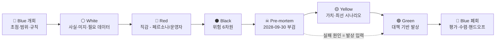

# PLN-IDEA-SIX. 아이디에이션 — Six Thinking Hats + Pre-mortem (Risk-first)

> **Trace**: UR-02 (여러 기획 방법론으로 전문가 수준 아이디어) 중심. 결과는 UR-01·03·07·09·11~17로 추적.
> **입력**: `00-brief/project-brief.md`, R1~R6 연구 문서(`docs/00-research/`), `01-planning/01-actors-personas.md`(액터 ACT-*, 페르소나 P0~P5·E1~E3, 시나리오 SCN-01~14, 요구 후보 RC-01~40)
> **작성 주체**: T1(상위 모델, 기획) · **작성일**: 2026-09-30 · **버전**: v1.0 (다른 방법론 산출물과 독립 작성. 병합·중복 제거는 아이디어 통합 문서에서 한다)
> **근거 수준**: 웹 조사는 하지 않았다. 수치는 R1~R6과 브리프의 실측값을 인용하고, 그 밖의 값은 `[지식]`(전문 지식) 또는 `[가정]`으로 표시했다. 모든 임계값은 초기값이며 통합 회고(RETRO)에서 실사용 로그로 조정한다.

---

## 0. 요약 (TL;DR)

1. **질문을 바꿨다.** "어떤 기능이 좋은가?"가 아니라 **"2년 뒤 도현이 이 앱을 지웠다면, 왜인가?"**에서 출발했다(Risk-first). 기능 아이디어는 거의 모두 실패 원인 중 하나 이상을 막는 대책으로 나왔다.
2. **흰 모자(White)에서 나온 가장 중요한 숫자 두 개.**
   - **시간이 최대 제약이다.** 주 4.5시간 × 52주 × 15년 ≈ **3,500시간**, 469개 개념이면 개념당 평균 **약 7.5시간**이다. 콘텐츠 양보다 **1분당 학습 효율과 우선순위**가 성패를 가른다.
   - **풀 전체를 API로 만들면 예산을 넘는다.** 개념 469 × 20문항 ≈ 9,400문항 × $0.03 ≈ **$280**이고, 월 예산 ₩30,000(≈$22)의 약 13개월분이다. 그래서 **T1/T2 결정적 생성 + CLI 구독 야간 배치 + 시즌 범위 JIT 워밍**이 필수다.
3. **검은 모자(Black)와 프리모템에서 사망 원인 14개(PM-01~14)를 뽑고 FMEA로 점수를 매겼다.** 상위 5개는 다음과 같다.
   - PM-09 **전문가 단계 진행 없음**: "결국 퀴즈 앱"이라 L3에서 정체.
   - PM-01 **지루함·단조**.
   - PM-05 **저품질 문항으로 인한 신뢰 붕괴**.
   - PM-13 **1인 운영자의 유지보수 불능**: 서비스 분리가 오히려 운영 부담이 된다.
   - PM-03 **콘텐츠 부패**: 망각이 아니라 지식 자체가 낡는다(obsolescence).
   - (공동 4위) PM-06 **채점 불신**: 한국어 판정 오류에 이의 제기 경로가 없다.
4. **운영성 결론.** 이 앱은 사용자 본인이 SRE다. 그래서 **학습 자체를 서비스처럼 운영**한다.
   - 이탈 조기경보: 로컬 전용 신호 13개 **Tripwire(TW-01~13)**.
   - 콘텐츠 품질 **SLO와 에러 버짓**.
   - **생성 회귀 평가 하네스**, **Provider Canary**, **OFFLINE CI 게이트**.
   - `study doctor`와 **복원 리허설**, **단일 슈퍼바이저 `study up`**. 서비스 분리(UR-08)의 운영 비용을 한 명령으로 흡수한다.
5. **초록 모자(Green)에서 나온 차별화 아이디어**(자극·역전·무작위 입력 기법 사용).
   - **AI 답안 감사 드릴(SIX-03)**: 오개념을 심어 둔 AI 답을 사용자가 감사한다. AI 시대 핵심 역량인 "AI 산출물 리뷰"를 직접 훈련한다.
   - **Repo Radar(SIX-04)**: 사용자 본인의 로컬 저장소를 graphify와 lockfile 파서로 분석해 "쓰고 있지만 증명되지 않은 개념"을 Depth Map 위에 표시한다.
   - **역출제(SIX-25)**: 품질 게이트 G2/G3/G5/G6을 학습 도구로 전환한다.
   - **과거의 나 비평(SIX-17)**: 2년 전 같은 Case 답안과 블라인드로 비교한다.
   - **Expert Artifact Studio(SIX-18)**: L4~L5의 학습 단위를 ADR·런북·포스트모템·표준 조항 같은 "산출물"로 삼는다.
6. **결과물**: 후보 **SIX-01~SIX-31**(§9). 이 중 SIX-27은 디자인 원칙으로 SCR-01에 이관하고, 기능 후보 30개의 우선순위 초안은 **MVP 11 / v1 12 / v2 7**이다. 모든 PM은 서로 다른 계층의 대책(예방·탐지·복구) **2개 이상**으로 덮여 있다(§8.3 커버리지 매트릭스).

---

## 1. 방법론 설계 (Blue Hat — 개회)

### 1.1 왜 이 조합인가

| 방법 | 출처 [지식] | 이 과제에서 막는 실패 | 산출물 |
|---|---|---|---|
| **Six Thinking Hats** | de Bono, *Six Thinking Hats*(1985) — 평행 사고(parallel thinking) | 한 사람(단일 모델)의 기획이 낙관이나 비관 한쪽으로 쏠리는 것. 사실·감정·위험·가치·창의·통제를 **시간 분리**로 섞지 않는다 | 모자별 표·캔버스(§2~§7) |
| **Pre-mortem** | Gary Klein, "Performing a Project Premortem", HBR(2007) — prospective hindsight | "잘될 것"이라는 계획 편향. 실패를 **이미 일어난 사실**로 두면 실패 원인을 떠올리는 정확도가 올라간다(Mitchell 외 1989, 약 30% [지식]) | 부검 보고서, 5 Whys, FMEA, Tripwire(§5) |
| **FMEA-lite** | IEC 60812 계열 [지식] | 위험의 "느낌"을 **정량 우선순위**로 바꾼다 | S×O×D = RPN 표(§5.4) |
| **Lateral thinking 기법** | de Bono — Po(자극), Reversal, Random Entry, Concept Fan | 초록 모자가 "기존 기능의 변형"에 머무는 것 | 아이디어 풀 GH-01~36(§7) |

### 1.2 모자 순서 (Risk-first 시퀀스)

일반적인 순서(흰 → 노 → 검 → 빨 → 초 → 파)를 쓰지 않고 **위험을 가치보다 먼저** 보았다. 노랑(가치)이 먼저 나오면 이후 비판이 "방어 대상"이 되기 때문이다.



### 1.3 초점 질문과 경계

| 항목 | 내용 |
|---|---|
| **초점 질문 (Focus)** | "초급 개발자 1명이 15년 이상, **로컬**에서, AI는 **선택적으로** 쓰면서 전 분야 전문가가 될 때까지 **계속 쓰게** 만드는 공부 서비스의 핵심 기능과 운영 방식은 무엇인가?" |
| **평가 관점 (UR-17)** | 기능성 / 운영성 / UI·UX. 모든 아이디어에 세 관점을 태깅한다 |
| **범위 안** | 제품 기능, 콘텐츠 공급망, AI 라우팅·비용, 로컬 운영(설치·업데이트·백업·관측), 동기 설계 |
| **범위 밖** | 서비스 분할의 구체안(ARC-01), 화면 상세(SCR-01), 스키마(TBL) — 여기서는 **요구 후보**까지만 만든다 |
| **규칙** | ① 모자마다 해당 사고만 한다(검은 모자에서 대책 금지). ② 숫자는 출처를 붙인다. ③ 각 아이디어는 UR과 페르소나에 추적한다. ④ 기존 RC-01~40을 반복하지 않고 **확장하거나 새로 만든다**(중복이면 RC 번호를 참조). |

---

## 2. ⚪ White Hat — 사실 · 미지 · 필요한 데이터

### 2.1 확인된 사실 (Facts)

| ID | 사실 | 출처 | 설계 함의 |
|---|---|---|---|
| WH-01 | 주 4~5시간, 크런치 때는 주 1시간 이하 | 페르소나 P0 §3.1 | 5분 MVD가 기본 단위이고, 90분 딥워크는 주 1회뿐이다 |
| WH-02 | 15년 총 학습 가능 시간 ≈ 4.5h × 52 × 15 ≈ **3,510h** | WH-01에서 산출 | 개념 469개 기준 개념당 약 7.5h. **무엇을 공부하지 않을지**(archive·우선순위)가 핵심 기능이다 |
| WH-03 | 개념 469개(핵심 459), 선수관계 518개, 최장 체인 11, L1 16%·L2 26%·L3 30%·L4 19%·L5 8% | R4 | L3~L5 비중이 57%다. 퀴즈형 인출만으로는 과반을 다룰 수 없다 → Case·산출물 엔진 필요 |
| WH-04 | Case 시드 약 150개 권장 | R4 | 전문가 단계의 주 재료. 150개를 소진하면 정체된다(PM-09) |
| WH-05 | T3 문항 비용: 채택 1건당 약 $0.02~0.04(API), CLI/Ollama는 ≈ $0 | R2 | 풀 전체(≈ 9,400문항)를 API로 만들면 ≈ **$280**. 월 예산 ₩30,000(≈ $22, 환율 ₩1,380 가정)의 약 13개월분 |
| WH-06 | Jev: 약 250ms, 입력 $0.042/1M tokens, 1,200 req/min, 7일 캐시 | 브리프 §3 | 게이트 1건당 약 $0.0002 이하. 1만 문항 전수 게이트도 약 $2 → **판단은 싸고 생성은 비싸다** |
| WH-07 | FSRS-6: 보존율 0.95 → 간격 ≈ 0.40×S, 0.85 → ≈ 1.91×S | R1 | 보존율 계층(core 0.92 / std 0.90 / breadth 0.85 / archive 0.80)이 워크로드를 좌우한다 |
| WH-08 | 로그 규모: 하루 100 리뷰 × 365 × 15 ≈ **55만 행** | 산출 [가정] | SQLite 단일 파일로 충분하다. 병목은 용량이 아니라 **스키마 진화와 리플레이**다 |
| WH-09 | `node:sqlite`(Node ≥ 22.13)에서 FTS5 + trigram(한글 부분 검색) 동작 확인, 단 ExperimentalWarning 출력 | 브리프 §3 | 네이티브 빌드가 없어 설치 마찰이 적다. 경고 억제·버전 고정 필요 |
| WH-10 | CLI 3종(claude/codex/gemini)의 격리 플래그가 서로 다르고, Gemini CLI에는 스키마 플래그가 없다 | R5 | Provider마다 계약이 다르다 → 버전 드리프트 탐지 필요(SIX-09) |
| WH-11 | 환경에 `ANTHROPIC_API_KEY`가 있으면 Claude Code가 API 과금으로 전환된다 | R5 | 비용 사고의 대표 경로. env allowlist로 막는다 |
| WH-12 | Jev는 배열 인덱스 참조가 많을수록 오답률이 급증한다 | 브리프 §3 | 모든 판단 state는 객체 키로 넘긴다. `[n]`은 lint로 금지 |
| WH-13 | roadmap.sh는 개인 사용만 허용한다. MDN 본문과 OWASP는 share-alike | R4 §7 | 콘텐츠 부패 대책(외부 재수집)은 **라이선스 등급별로** 설계한다 |
| WH-14 | 벤치마크 15종 중 전 요소(지도·숙달 증명·SRS·자동 출제·실습·백지노트·L5·로컬)를 모두 갖춘 서비스는 없다 | R3 | 차별화 여지는 크다. 대신 한 곳에서 모두 구현해야 하는 **범위 위험**이 있다 |

### 2.2 미지 (Known Unknowns) → 필요한 데이터

| ID | 모르는 것 | 왜 중요한가 | 해소 방법(스파이크/측정) | 시점 |
|---|---|---|---|---|
| WH-U1 | **Jev의 한국어 판정 정확도** (백지노트 idea unit, 서술 루브릭) | 백지노트·디깅·Case 채점이 모두 여기에 의존한다(AS-08) | 골드셋 100건(한국어, 사람 라벨) → AUROC·보정곡선, confidence 임계 튜닝 | **설계 동결 전** |
| WH-U2 | 1인 사용자에서 Elo 문항 난이도의 수렴 속도 | 문항당 응답이 1~3회뿐이다 | 템플릿 패밀리·type×level 풀링 시뮬레이션(R2) | 개발 Iteration 2 |
| WH-U3 | CLI 구독 쿼터로 야간에 몇 문항까지 만들 수 있는가 | 비용 모델(WH-05)의 전제 | 야간 배치 1주 실측(성공률·쿼터 소진 시점) | Iteration 3 |
| WH-U4 | 이탈 선행지표의 실제 분포 | Tripwire 임계값의 근거 | 첫 8주 로그로 기준선을 잡는다(개인 앱이므로 자기 기준선) | RETRO-01 |
| WH-U5 | 시드 콘텐츠 1개 개념의 제작 시간(이론·코드·핵심 + KU + mc + 문항 20) | 콜드스타트 범위(PM-04) | 파일럿 10개 개념 제작 시간 측정 | 설계 단계 |
| WH-U6 | Windows에서 CLI spawn·kind 실습 성공률 | P0는 회사 Windows를 쓴다 | 양 OS 스모크 테스트 | Iteration 1 |
| WH-U7 | 사용자 실제 상황(AS-01/03/05) | 페르소나 가정 | 온보딩 3문항 + 설정값으로 흡수 | 온보딩 |

### 2.3 흰 모자 결론

- **제약 순위: 시간 > 신뢰(품질) > 비용 > 기술.** 기술적으로 막히는 것은 거의 없다. 망하는 길은 "시간을 낭비시키는 앱", "틀린 문제를 내는 앱", "돈 걱정을 하게 하는 앱"이다.
- 판단(Jev)은 싸고 생성(LLM)은 비싸다. **생성은 최소화하고 판단은 넓게** 쓰는 비대칭 설계가 비용 곡선을 바꾼다.

---

## 3. 🔴 Red Hat — 직감 (정당화 없이)

### 3.1 페르소나의 목소리 (종단 감정 라인)

| 시점 | 페르소나 | 직감 (1인칭, 날것) | 감정 강도 (−3~+3) |
|---|---|---|---|
| Day 1 | P0 | "설치하자마자 AI 키부터 물으면 닫을 거야." | −2 |
| Day 1 | P0 | "첫 문제가 내가 아는 걸 확인해 주면 좋고, 도커 문제를 틀리면 오히려 자극이 돼." | +2 |
| Week 3 | P0 | "또 OX야? 폰 게임 같아." | −2 |
| Month 2 | P1 | "야근 3주 했는데 앱이 날 혼내면 지운다." | −3 |
| Month 7 | P0 | "뭔가 늘긴 했는데… 진짜 는 건가?" | −1 |
| Year 1 | P1 | "업무에서 쓰는 Spring이랑 여기 문제가 따로 논다." | −2 |
| Year 3 | P2 | "L1 카드 복습이 하루 40장이야. 이건 벌이지." | −3 |
| Year 3 | P2 | "AI 채점이 내 서술을 2점 줬는데 납득이 안 가." | −2 |
| Year 3 | P2 | "사내 장애를 Case로 만들어 풀 수 있다면 이건 무기다." | +3 |
| Year 7 | P3 | "나는 이제 퀴즈를 풀 사람이 아니라 리뷰하는 사람이야." | −1 |
| Year 7 | P3 | "주니어가 AI로 짠 코드를 리뷰하는 연습이 제일 필요해." | +3 |
| Year 12 | P4 | "5년 전 내 ADR이 얼마나 순진했는지 보는 건 짜릿할 거야." | +3 |
| Year 15 | P5 | "내가 아는 것 중 **낡은 것**만 알려 줘. 나머지는 믿어." | +2 |
| 복귀 | E2 | "연체 2,300. …그냥 초기화할까." | −3 |
| 망분리 | E3 | "회색 버튼만 가득하면 기분이 나쁘다." | −2 |

### 3.2 만드는 사람·운영자(ACT-H03)의 직감

| ID | 직감 | 방향 |
|---|---|---|
| RH-01 | "469개 개념을 **혼자 신선하게 유지**하는 건 불가능해 보인다." | 불안 |
| RH-02 | "서비스 6개를 로컬에서 띄우는 건 사용자에게 **포트 지옥**이 될 것 같다." | 불안 |
| RH-03 | "Jev의 한국어가 무너지면 백지노트가 통째로 무너진다." | 불안 |
| RH-04 | "AI 없는 모드가 **정말 재미있을지** 확신이 없다." | 의심 |
| RH-05 | "SI 산출물 학습은 지루할 수 있다. 하지만 L5에서 '조항을 직접 쓰는 과제'는 흥미롭다." | 양가 |
| RH-06 | "AI가 코드를 짜는 시대에 '코드 암기형' 문제는 2년 안에 무의미해질 것 같다. **판단형**으로 가야 한다." | 확신 |
| RH-07 | "사용자가 이미 Claude Code 안에 산다. 앱을 **따로 여는 것 자체**가 마찰이다." | 직감 |
| RH-08 | "Depth Map은 예쁘지만, 반년 뒤엔 아무도 안 본다. 행동을 바꾸는 화면이어야 한다." | 의심 |

### 3.3 빨간 모자 결론

- 감정이 가장 낮은 구간은 **Month 2(죄책감)·Year 3(expertise reversal)·복귀(연체 공포)**다. 모두 "앱이 사용자를 **판정**하는 순간"이다. 반대로 가장 높은 구간(+3)은 **내 일과 연결되는 순간(사내 장애 → Case)**과 **과거의 나와 비교하는 순간**이다.
- 직감 RH-06·RH-07은 이후 초록 모자의 두 축, **"AI 산출물 감사"**와 **"사용자가 이미 있는 곳(터미널·코드 저장소)으로 가기"**로 이어진다.

---

## 4. ⚫ Black Hat — 위험 (6차원)

> 대책은 적지 않는다(규칙 ①). 심각도: ●●● 치명 / ●● 중대 / ● 경미.

| ID | 차원 | 위험 | 메커니즘 | 심각도 |
|---|---|---|---|---|
| BH-01 | 학습 | 인출 편중 → L3+ 역량 미형성 | 문항 생성이 쉬운 L1~L2에 공급이 몰린다. 평가하기 쉬운 것만 측정된다(McNamara fallacy) | ●●● |
| BH-02 | 학습 | Expertise reversal | L1 스캐폴딩이 L3+ 사용자에게 부담이 된다 | ●● |
| BH-03 | 학습 | Goodhart: 지표 최적화 | "정답률 75% 유지"가 목표가 되면 쉬운 문제만 고른다. 빠른 추측으로 due를 처리한다 | ●● |
| BH-04 | 콘텐츠 | 공급 병목 | 469개 × (이론·코드·핵심 + KU + mc + 20문항)을 1인과 AI로 만들어야 한다 | ●●● |
| BH-05 | 콘텐츠 | 부패 | K8s·LLM SDK·React는 6~12개월 주기로 변한다. 틀린 문제는 **틀린 확신**을 강화한다(학습 해악) | ●●● |
| BH-06 | 콘텐츠 | 라이선스 | 외부 재수집 시 share-alike·개인 사용 한정 소스가 섞인다 | ●● |
| BH-07 | AI | 한국어 판정 미검증 | 백지노트 커버리지의 오판정이 FSRS grade를 오염시킨다 | ●●● |
| BH-08 | AI | Provider 드리프트 | CLI 메이저 업데이트로 플래그·출력 형식이 바뀌어 야간 배치가 조용히 실패한다 | ●● |
| BH-09 | AI | 비용 사고 | `ANTHROPIC_API_KEY` 과금 전환, 재시도 폭주, 캐시 미스 | ●● |
| BH-10 | AI/보안 | 주입·유출 | 가져온 글의 간접 주입, 회사 코드가 외부 API로 전송된다 | ●●● |
| BH-11 | 운영 | 다중 서비스 로컬 운영 | 프로세스 N개, 포트 충돌, 로그 분산, 부분 장애("문제는 뜨는데 채점이 안 됨") | ●● |
| BH-12 | 운영 | 업그레이드 파손 | Node 메이저 업, `node:sqlite` API 변경, 스키마 마이그레이션 실패 | ●●● |
| BH-13 | 운영 | 데이터 소실 | 단일 SQLite 파일 손상, 백업 부재. 15년 이력 소실은 곧 서비스 사망이다 | ●●● |
| BH-14 | 운영 | 설치 마찰 | Node 22.13+ 요구, Docker·kind 선택 설치, Windows `.cmd` 런처, 망분리 반입 | ●● |
| BH-15 | UX | 선택 과부하 | 모드 20종·트랙 19개·설정 수십 개가 "오늘 뭐 하지"를 되살린다 | ●● |
| BH-16 | UX | 판정 불신 | 이유가 보이지 않는 채점·승급·스케줄은 신뢰를 잃는다 | ●● |
| BH-17 | UX | 디자인 노후 | 15년 동안 한 가지 시각 언어는 낡는다 | ● |
| BH-18 | 프로세스 | 범위 폭발 | UR-18("한 번에 끝나게")과 UR-01("전 분야")이 충돌한다. 넓게 만들다 모두 얕아진다 | ●●● |
| BH-19 | 프로세스 | 동결 구조 이탈 | 하위 모델(T2)이 경계를 넘는 수정을 하면 서비스 분리(UR-08)가 무너진다 | ●● |

---

## 5. ☠ Pre-mortem — "2028-09-30, 도현은 앱을 지웠다"

### 5.1 부검 설정

> **가정된 사실**: 2년 뒤(2028-09-30), 도현(P1→P2 전환기, 3년차)은 이 앱을 3개월째 열지 않았고, 결국 삭제했다. 삭제 직전 마지막 세션은 4분이었다.
> **과제**: "왜 실패했는가?"를 **확정된 과거형**으로 쓴다. 원인마다 ① 부검 서사 ② 사망 전 징후(탐지 가능했던 신호) ③ 근본 원인을 적는다.

### 5.2 사망 원인 카탈로그 (PM-01 ~ PM-14)

| ID | 사망 원인 | 부검 서사 (과거형) | 사망 전 징후 (로컬에서 탐지 가능했던 것) | 근본 원인 |
|---|---|---|---|---|
| **PM-01** | 지루함·단조 | 3주차부터 매일 OX 12문항이었다. 모드 로테이션은 있었지만 '같은 형식의 다른 문제'였을 뿐이다. 4개월차엔 평균 세션이 6분까지 줄었다. | 세션 길이 28일 이동평균 하락, 응답 < 1.5s 비율 상승, 단일 모드 비중 > 60% | 형식 공급이 생성 비용이 낮은 쪽(T2 OX)으로 쏠렸다. "새로움"을 **예산**으로 관리하지 않았다 |
| **PM-02** | 복습 부채 | 시즌 2에서 신규 개념을 과도하게 넣어 일일 리뷰가 120장이 됐다. 크런치 2주 뒤 연체가 900장. | 예측 일일 리뷰가 상한 × 1.2를 7일 연속 초과, 신규 도입 속도 > 소화 속도 | 신규 도입량이 워크로드 예측과 연동되지 않았다 |
| **PM-03** | 콘텐츠 부패 | 2027년 K8s의 API 변경을 반영하지 못했다. 도현은 앱에서 외운 대로 답했다가 회의에서 틀렸다. "이 앱은 옛날 지식을 가르친다." | volatile KU의 마지막 검증일 > 180일 비율 증가, 사용자 "outdated" 신고 | 신선도 감시가 Could(v2)로 밀렸다. 사용자가 실제로 쓰는 버전을 몰랐다 |
| **PM-04** | 콜드스타트·빈 콘텐츠 | 지도에는 469개 개념이 있었지만 제대로 된 문항이 있는 건 70개였다. 나머지를 누르면 "생성 중"이었다. | 활성 경로 중 풀 < 20인 concept×level 비율, 첫 문항 지연 | 넓게 얕게 시드했다. "모든 트랙 1차 완성"이라는 목표 설정 오류 |
| **PM-05** | 저품질 문항 → 신뢰 붕괴 | 정답이 둘인 MCQ 3개, 한국어가 어색한 문항, 번역체 오답. 신고 버튼은 있었지만 누르고 나서 무슨 일이 일어났는지 보이지 않았다. | 신고율 > 2%, 특정 템플릿 패밀리의 선택지 편향(한 오답이 선택률 0%) | 생성 후 **사후 품질(Item Health)**을 측정하지 않았다. 프롬프트와 모델을 바꿔도 회귀 테스트가 없었다 |
| **PM-06** | 채점 불신 | 백지노트에 분명히 쓴 내용을 "누락"으로 판정받았다(한국어 표현 차이). 이의 제기 방법이 없었다. 도현은 백지노트를 안 쓰게 됐다. | 자기채점 대 AI 채점 괴리 확대, 백지노트 모드 사용률 급감 | Jev 한국어 캘리브레이션 없이 출시했다. 판정 근거와 이의 제기 경로가 없었다 |
| **PM-07** | AI 비용 공포 | 첫 달에 ₩47,000이 청구됐다(API 키 과금 전환 + 재시도 루프). 도현은 AI를 껐고, 남은 앱은 '빈약한 퀴즈 앱'이었다. | 일 비용 급증, 동일 요청 재시도 횟수, 캐시 적중률 하락 | 비용을 사후 통보로 다뤘다. OFFLINE 품질이 낮아 AI를 끄자 가치가 급감했다 |
| **PM-08** | 설치·업데이트 마찰 | 회사 노트북에서 Node 버전이 맞지 않았다. 업데이트 후 Codex CLI 플래그가 바뀌어 야간 생성이 2주간 조용히 실패했다. 풀이 말랐다. | 야간 배치 성공률 0%, 풀 고갈 예측, 앱 기동 실패 로그 | 환경 진단·Provider 계약 테스트가 없었다. "조용한 실패"를 표면화하지 않았다 |
| **PM-09** | 전문가 단계 진행 없음 | L3에 도달하자 앱은 같은 형식의 '더 어려운 문제'만 냈다. 실제 3년차에 필요한 설계·장애 판단·리뷰 역량은 이 앱과 무관했다. 도현은 "이건 신입용"이라 결론지었다. | 주력 트랙 승급 증거 8주 증가 0, Case 모드 미사용, L1~L2 카드 비중 > 40% | L3+의 학습 단위를 '문항'으로 설계했다. 판단 과제의 채점·공급 엔진이 약했다 |
| **PM-10** | 업무 무관성 | 앱의 커리큘럼은 일반론이었다. 도현이 매일 쓰는 스택(Spring, eGovFrame, 회사 k8s 구성)과 연결되지 않았다. | 캡처·가져오기 사용 0, 업무 관련 태그 문항 비율 낮음 | 사용자 맥락을 **입력받는 통로**가 무거웠다(import 9단계) |
| **PM-11** | 데이터 손실·마이그레이션 실패 | v1.4 업데이트의 마이그레이션이 중간에 실패했다. 백업은 3주 전 것뿐이었다. 8개월 이력이 사라졌다. | 백업 경과일, 복원 리허설 미실행, integrity_check 경고 | 백업은 있었지만 **복원 검증**이 없었다 |
| **PM-12** | 보안·프라이버시 사고 | 사내 장애 보고서를 가져오기에 붙였는데 외부 API로 전송됐다. 보안팀 경고 후 사내 사용 금지. | 민감 패턴(사내 도메인, 키, 사번) 탐지 로그 | 전송 전 스캔과 로컬 LLM 강제 라우팅이 옵션으로만 있었다 |
| **PM-13** | 1인 운영 불능 | 서비스 6개 중 grading 서비스만 죽어 문제는 뜨는데 채점이 무한 대기했다. 로그는 6군데에 있었다. 도현은 고치다 포기했다. | 서비스 헬스 실패, 요청 타임아웃 비율 | 서비스 분리(UR-08)의 운영 비용을 **사용자에게 전가**했다. 슈퍼바이저·통합 로그·부분 장애 격하가 없었다 |
| **PM-14** | UX 피로·과부하 | 홈 화면에 지표 11개, 모드 20개. "오늘 뭐 하지"가 되살아났다. 2년 뒤 UI는 촌스러워 보였다. | 홈에서 첫 액션까지 걸린 시간 증가, 명령 팔레트 미사용 | 기능이 늘 때마다 화면이 늘었다. **기본값 하나**의 원칙이 없었다 |

### 5.3 상위 원인 근본 분석 (5 Whys)

**PM-09 전문가 단계 진행 없음**
1. 왜 떠났나? → L3 이후 앱이 실무 역량과 무관했다.
2. 왜 무관했나? → L3+ 과제도 "정답이 하나인 문항"이었다.
3. 왜 문항이었나? → 채점을 자동화할 수 있는 것이 문항뿐이라고 가정했다.
4. 왜 그렇게 가정했나? → 판단 과제의 **루브릭 채점(Jev score/noul)과 산출물 기반 학습**을 1급 엔진으로 설계하지 않았다.
5. 왜? → MVP 범위를 P0 중심으로만 잡아, 15년 사용(UR-12)의 **중반 이후 엔진을 아키텍처에서 빼 버렸다.**
→ **대책 방향**: 아키텍처 동결 시점에 Case·산출물·루브릭 엔진의 **인터페이스와 데이터 모델은 포함**한다(구현은 v1이어도 된다). UR-05(순서 불변) 때문에 나중에 끼우기 어렵다.

**PM-01 지루함**
1. 왜 지루했나? → 매일 같은 형식이었다.
2. 왜? → 오늘 큐가 FSRS due 순서로만 구성됐다.
3. 왜? → 스케줄러가 "무엇을"만 고르고 "어떻게(형식)"는 고르지 않았다.
4. 왜? → 형식 선택이 문항 공급량에 종속됐다(T2 OX가 가장 많았다).
5. 왜? → 새로움을 **측정·예산화하지 않았다.**
→ **대책 방향**: 스케줄러를 "개념 선택(FSRS)"과 "형식 선택(Novelty/Mix 정책)"으로 분리하고, 주간 **변주 예산**과 **Wildcard**를 보장한다(SIX-02).

**PM-05 저품질 문항**
1. 왜 신뢰를 잃었나? → 틀린 문항을 여러 번 만났다.
2. 왜? → 사전 게이트(G0~G13)를 통과한 불량이 있었다.
3. 왜 방치됐나? → 사후 신호(신고·선택지 분포·시간 이상)를 모으지 않았다.
4. 왜 재발했나? → 프롬프트·모델 변경의 회귀 평가가 없었다.
5. 왜? → 품질을 기능이 아니라 **운영 목표(SLO)**로 다루지 않았다.
→ **대책 방향**: Content Health SLO + 에러 버짓(SIX-06), Item Health(SIX-07), 생성 회귀 하네스(SIX-08), 신고 처리 결과 가시화.

### 5.4 FMEA-lite (S × O × D = RPN)

> S=심각도(1~5, 5=사망), O=발생 가능성(1~5), D=탐지 난이도(1~5, 5=탐지 불가). 대책 **전** 점수.

| PM | S | O | D | **RPN** | 순위 | 주 대책 (§9) |
|---|---|---|---|---|---|---|
| PM-09 전문가 정체 | 5 | 4 | 4 | **80** | 1 | SIX-17, 18, 19, 03, 15 |
| PM-01 지루함 | 4 | 5 | 3 | **60** | 2 | SIX-01, 02, 03, 25 |
| PM-05 저품질 문항 | 5 | 4 | 3 | **60** | 2 | SIX-06, 07, 08, 16 |
| PM-13 1인 운영 불능 | 4 | 4 | 3 | **48** | 4 | SIX-12, 13, 26 |
| PM-03 콘텐츠 부패 | 4 | 4 | 3 | **48** | 4 | SIX-20, 04, 06 |
| PM-06 채점 불신 | 4 | 3 | 4 | **48** | 4 | SIX-15, 16, 08 |
| PM-11 데이터 손실 | 5 | 2 | 4 | **40** | 7 | SIX-14, 13 |
| PM-10 업무 무관 | 3 | 4 | 3 | **36** | 8 | SIX-04, 05, 19, 23 |
| PM-08 설치·업데이트 | 3 | 4 | 3 | **36** | 8 | SIX-12, 13, 09 |
| PM-04 콜드스타트 | 4 | 4 | 2 | **32** | 10 | SIX-29, 28 |
| PM-12 보안 사고 | 5 | 2 | 3 | **30** | 11 | SIX-30 |
| PM-14 UX 과부하 | 3 | 3 | 3 | **27** | 12 | SIX-27, 22, 31 |
| PM-02 복습 부채 | 4 | 3 | 2 | **24** | 13 | SIX-22, 01 (+RC-10/13) |
| PM-07 AI 비용 | 3 | 3 | 2 | **18** | 14 | SIX-10, 11, 09 |

**해석**: RC-10·13(워크로드·복귀 모드)이 이미 있어 PM-02(복습 부채)는 기존 요구로 상당 부분 막힌다. 반면 **PM-09·05·13·03·06은 기존 RC로 덮이지 않는 영역**이며, 이 문서의 신규 기여가 가장 필요한 곳이다.

### 5.5 Tripwire — 로컬 이탈·운영 조기경보 (Operability 핵심)

> 모든 신호는 **로컬에서만** 계산하고 외부로 보내지 않는다(NG-01). 임계값은 초기값이며, 첫 8주 뒤 **개인 기준선(자기 28일 평균)** 대비 상대값으로 전환한다.

| TW | 신호 | 초기 임계 | 점검 주기 | 자동 조치 (사용자에게 비난 카피 금지) | 대상 PM |
|---|---|---|---|---|---|
| TW-01 | 7일 세션 수 / 직전 28일 주 평균 | < 0.5 | 일 1회 | 다음 주 신규 도입 −30%, 홈에 "가볍게 재시작(8분)" 1개만 표시, 시즌 목표 축소 제안 | PM-01, 02 |
| TW-02 | 주간 단일 모드 비중 | > 60% | 주 1회 | 다음 세션에 Wildcard 1블록 강제 삽입(SIX-02) | PM-01 |
| TW-03 | 빠른 추측 비율(응답 < 1.5s & 오답) | > 15% (세션) | 세션 중 | 세션 조기 종료 제안, 형식 전환(OX → 서술 1문장), 증거 가중치 하향(RC-15) | PM-01, BH-03 |
| TW-04 | 문항 신고율(템플릿 패밀리 7일) | > 2% | 일 1회 | 해당 패밀리 출제 동결, 재검사 배치, 에러 버짓 소진 기록(SIX-06) | PM-05 |
| TW-05 | 예측 일일 리뷰 / 사용자 상한 | > 1.2, 7일 연속 | 일 1회 | 신규 도입 자동 스로틀, archive 이동 후보 제안 | PM-02 |
| TW-06 | 월 AI 비용 / 예산 (월 20일 시점) | > 80% | 일 1회 | 생성 라우팅을 CLI/T2로 강등, interactive 해설은 캐시·템플릿 우선 | PM-07 |
| TW-07 | 게이트 통과율 7일 변화 | −15%p 이상 | 배치 후 | Provider canary 실행, 직전 프롬프트 버전으로 롤백(SIX-08/09) | PM-05, 08 |
| TW-08 | 채점 이의 제기 인용률(인용/전체) | > 10% | 주 1회 | 해당 과업의 Jev 임계 상향, 이중 판정 전환, 캘리브레이션 샘플 수집(SIX-16) | PM-06 |
| TW-09 | 마지막 성공 백업 경과 / 복원 리허설 | > 8일 / 실패 | 기동 시 | 운영 배너, `study doctor --fix` 제안(SIX-13/14) | PM-11 |
| TW-10 | volatile KU 중 검증 > 180일 비율 | > 20% | 주 1회 | 신선도 스프린트(30분) 시즌 과제로 제안(SIX-20) | PM-03 |
| TW-11 | 주력 트랙 승급 증거 증가량 | 8주간 0 | 주 1회 | 재진단, Case·디깅 비중 상향, "다음 레벨로 가는 증거 목록" 표시 | PM-09 |
| TW-12 | 첫 문항 지연 p95 | > 2s | 세션 | 워밍 잡 우선순위 상향, T1/T2 즉석 생성 폴백 | PM-04, 08 |
| TW-13 | L4+ 트랙 큐 중 L1~L2 카드 비중 | > 40% | 주 1회 | archive 보존율(0.80) 이동 제안 + 워크로드 시뮬레이터 결과 제시 | PM-09, 02 |

### 5.6 개발 프로젝트 자체의 프리모템 (Delivery Pre-mortem)

> "2027-03, 서비스는 끝내 완성되지 못했다" — 제품이 아니라 **개발 과정**의 사망 원인. UR-03/05/06/18과 연결.

| ID | 사망 원인 | 징후 | 대책 (프로세스 요구 → R6 산출물) |
|---|---|---|---|
| DPM-01 | 범위 폭발(UR-01 × UR-18) | Iteration마다 "트랙 하나 더" | **Walking Skeleton 우선**: 한 경로(`path.ai-fullstack-engineer`의 상위 60개 개념, SIX-29)로 **모든 엔진을 관통**한 뒤 트랙을 넓힌다. 트랙 추가는 콘텐츠 팩 작업이지 코드 작업이 아니게 한다(SIX-28) |
| DPM-02 | 콘텐츠 제작 병목 | 코드는 완료, 시드는 20% | 콘텐츠 팩을 코드와 **별도 파이프라인**(lint·게이트·팩 빌드)으로 두고, 각 Iteration DoD에 "팩 커버리지" 포함 |
| DPM-03 | Jev 한국어 판정 실패가 늦게 드러남 | 백지노트 E2E 불안정 | 설계 동결 **전** 캘리브레이션 스파이크(WH-U1). 실패 시 폴백 설계(LLM-judge 다수결 + 자기채점)를 ADR로 확정 |
| DPM-04 | 동결 구조 이탈 | graphify affected 범위가 Brief 초과 | R6 §8 보호장치(allowed_paths, `frozen.lock`, import 경계) + 통합 시 graphify 메트릭 diff를 회고 입력으로 사용 |
| DPM-05 | OS 호환성 뒤늦은 발견 | Windows 사용자 첫 실행 실패 | CI 매트릭스(ubuntu/windows/macos)를 Iteration 1부터 적용, SIX-11 OFFLINE 게이트와 함께 |

---

## 6. 🟡 Yellow Hat — 가치 · 최선 시나리오

### 6.1 구조적 이점 (Unfair Advantages)

| ID | 이점 | 왜 경쟁 서비스가 못 하나 | 활용 |
|---|---|---|---|
| YH-01 | **15년치 개인 학습 이벤트 로그**가 로컬에 쌓인다 | SaaS는 이탈 시 데이터가 사라지거나 lock-in된다 | 개인화 FSRS 파라미터, 과거의 나 비교(SIX-17), 성장 타임랩스 |
| YH-02 | **판단이 싸다**(Jev ≈ $0.0002/건) | 대부분 앱은 LLM-judge라 비싸고 느리며 보정되지 않았다 | 문항마다 게이트, 백지노트 unit별 판정, 역출제 채점(SIX-25) |
| YH-03 | **CLI 구독 재활용**으로 생성 한계비용 ≈ 0 | 클라우드 앱은 API 비용을 구독료로 전가해야 한다 | 야간 배치 워밍 |
| YH-04 | **사용자의 로컬 코드·문서에 접근**할 수 있다(동의 하에) | 웹 서비스는 사용자 저장소를 볼 수 없다 | Repo Radar(SIX-04), 업무 캡처(SIX-05) |
| YH-05 | **SI 맥락**(`ctx:si`, 개발표준정의서, 보안약점 49개) | 해외 서비스엔 없고, 국내 강의는 수동 시청형이다 | P1·P4의 차별 콘텐츠(RC-38) |
| YH-06 | 사용자가 이미 **AI 코딩 도구 파워유저**다 | 일반 학습 앱은 AI를 튜터로만 쓴다 | AI 산출물 감사(SIX-03), Study MCP 브리지(SIX-24) |

### 6.2 최선 시나리오 (Best Case)

| 시점 | 도현의 상태 | 이 앱이 한 일 | 측정 가능한 신호 |
|---|---|---|---|
| +12주 | `be` L2 승급, 주간 스트릭 11/12 | 매일 2초 안에 첫 문항, 모드가 매주 바뀜 | TW 경보 0~1회, Brier 0.25 → 0.20 |
| +1년 | 정보처리기사 합격, 회사 Spring 코드의 트랜잭션 전파를 설명 가능 | Repo Radar가 "쓰지만 모르는 개념" 12개를 끌어올렸다 | 업무 연결 문항 비율 ≥ 25% |
| +3년 | on-call에서 가설 수립 속도 향상, 사내 장애 3건을 Case로 만들어 훈련 | Case Foundry, 인시던트 드릴 | 시뮬레이션 MTTR 턴 수 −30% |
| +7년 | 설계 리뷰 체크 재현율 70% 이상, 주니어가 AI로 짠 PR에서 결함을 빠르게 찾는다 | AI 답안 감사 드릴 L4, 설계 리뷰 Case | 감사 드릴 결함 재현율 ≥ 80% |
| +12년 | 5년 전 자신의 ADR을 비평하고, 개발표준정의서 조항을 작성 | 과거의 나 비평, Artifact Studio | 루브릭 차원별 향상 +1.0/4 |
| +15년 | "내가 아는 것 중 낡은 것"만 알림받는다 | Frontier Feed, 신선도 감시, 무손실 마이그레이션 12회 | Freshness ≥ 85%, 이력 손실 0 |

### 6.3 가치 가설 (검증 가능 형태)

| ID | 가설 | 반증 조건 (RETRO에서 확인) |
|---|---|---|
| YH-H1 | 변주 예산(SIX-02)이 있으면 8주차 세션 수가 1주차 대비 ≥ 80%로 유지된다 | < 60%이면 변주가 원인 해결이 아니다 → 시간 예산·난이도 쪽 재조사 |
| YH-H2 | 업무 연결 문항(SIX-04/05)의 정답 후 지속 시간(stability 증가)이 일반 문항보다 크다 | 차이 없음 → 관련성은 동기에만 기여, 기억 효과 없음 |
| YH-H3 | 판정 근거 표시와 이의 제기(SIX-15/16)가 있으면 백지노트 사용률이 유지된다 | 하락 지속 → 채점 정확도 자체가 문제(WH-U1 재검증) |

---

## 7. 🟢 Green Hat — 대책 기반 발상 (Risk-first Ideation)

### 7.1 기법별 발상 기록

**(a) Po — 자극 문장 (Provocation)**

| Po | 자극 | 거기서 끌어낸 아이디어 | → |
|---|---|---|---|
| Po-1 | "사용자가 문제를 낸다" | 역출제: 사용자가 쓴 문항을 품질 게이트로 채점한다. 게이트가 곧 이해도 측정기다 | SIX-25 |
| Po-2 | "앱이 일부러 틀린다" | AI 답안에 오개념을 심고 사용자가 감사한다 | SIX-03 |
| Po-3 | "앱을 열지 않아도 공부가 된다" | 터미널 컴패니언, Study MCP 브리지(코딩 에이전트가 방금 짠 코드로 퀴즈) | SIX-23, 24 |
| Po-4 | "앱이 사용자의 코드를 읽는다" | Repo Radar: 사용 기술 → 개념 매핑, lockfile → 신선도 우선순위 | SIX-04 |
| Po-5 | "정답이 없는 문제만 낸다" | L4+ Expert Artifact Studio: 루브릭 기반 산출물 | SIX-18 |
| Po-6 | "과거의 내가 채점자다" | 타임캡슐 재도전·과거 답안 비평 | SIX-17 |
| Po-7 | "콘텐츠는 운영 중인 서비스다" | Content Health SLO, 에러 버짓, 신고→결과 가시화 | SIX-06 |

**(b) Reversal — 역전**

| 통념 | 역전 | 아이디어 | → |
|---|---|---|---|
| 앱이 사용자를 채점한다 | 사용자가 앱의 채점을 채점한다 | 채점 이의 제기 + 이중 판정, 인용 데이터로 캘리브레이션 | SIX-16 |
| 스케줄은 블랙박스다 | 스케줄이 이유를 말한다 | "Why now?" 설명 + 조절 노브 | SIX-22 |
| 복습 부채는 사용자 책임이다 | 부채는 시스템의 과도한 도입 책임이다 | TW-05 자동 스로틀 | §5.5 |
| 운영은 사용자가 한다 | 앱이 스스로 진단·복구한다 | `study doctor`, 복원 리허설 | SIX-13, 14 |
| 새 콘텐츠 = 새 개념 | 새 콘텐츠 = 변경점(delta) | 릴리스 노트 → "무엇이 바뀌었나" 문항 | SIX-20 |

**(c) Random Entry — 무작위 단어**: "부검(autopsy)", "세관(customs)", "계기판(instrument panel)"

| 단어 | 연상 | 아이디어 | → |
|---|---|---|---|
| 부검 | 사망 원인 분석, 포스트모템 | 사용자 자신의 사내 장애를 Case로 가공(민감정보 제거 후) | SIX-19 |
| 세관 | 반입·반출 검사 | AI 전송 전 민감정보 방화벽, 반출 로그 | SIX-30 |
| 계기판 | 조종사는 5개만 본다 | 홈 = 오늘 하나의 기본 행동 + 경보만. 지표는 한 단계 아래 | SIX-27 |

**(d) Concept Fan — "왜 계속 쓰나?"를 넓혀 가기**

```
계속 쓰게 한다
├─ 매일이 가볍다 ─── 2초 첫 문항(RC-03) · 5분 MVD(RC-06) · 터미널 컴패니언(SIX-23)
├─ 매주가 새롭다 ─── 변주 예산·Wildcard(SIX-02) · 역출제(SIX-25) · AI 답안 감사(SIX-03)
├─ 매년 성장이 증명된다 ─ 증거 원장(SIX-15) · 과거의 나 비평(SIX-17) · 보정 지도(SIX-21)
├─ 일과 연결된다 ─── Repo Radar(SIX-04) · 업무 캡처(SIX-05) · Case Foundry(SIX-19)
├─ 믿을 수 있다 ──── Content SLO(SIX-06) · Item Health(SIX-07) · 이의 제기(SIX-16)
├─ 고장 나지 않는다 ─ doctor(SIX-13) · 슈퍼바이저(SIX-26) · 복원 리허설(SIX-14) · canary(SIX-09)
└─ 끝이 없다 ────── Artifact Studio(SIX-18) · Frontier Feed(SIX-20) · 폭 지표(R4 §2.4)
```

### 7.2 원시 아이디어 풀 → 필터

36개 원시 아이디어(GH-01~36)를 아래 3개 필터로 걸렀다. 통과한 31개가 §9의 SIX 후보다(SIX-27은 디자인 원칙).

| 필터 | 기준 | 탈락 예 |
|---|---|---|
| F1 UR·NG 적합 | UR 1개 이상에 추적되고 NG-01~07을 위반하지 않을 것 | GH-07 "익명 리그"(NG-01), GH-12 "음성 모의 면접"(NG-07), GH-21 "XP 상점"(AP-02) |
| F2 AI-선택성 | OFFLINE 폴백이 정의되거나, AI 전용이라도 코어 학습 루프 밖일 것 | GH-15 "모든 해설을 실시간 LLM으로"(OFFLINE에서 붕괴) |
| F3 실현 근거 | 확인된 기술 사실(브리프 §3, R2·R5)로 구현 경로가 보일 것 | GH-30 "화면 녹화로 업무 자동 캡처"(프라이버시·구현 근거 없음), GH-33 "IDE 플러그인 3종"(범위 과다 → SIX-24 MCP로 대체) |

### 7.3 실패 원인 × 대책 계층 설계 원칙 (방어의 깊이)

각 PM에 대해 **예방(Prevent) → 탐지(Detect) → 복구(Recover)**의 세 계층 중 두 계층 이상을 채운다. 예를 들어 PM-05 저품질 문항은 예방=게이트(G0~G13, 기존)+회귀 하네스(SIX-08), 탐지=Item Health(SIX-07)+TW-04, 복구=패밀리 동결·재생성(SIX-06)+신고 처리 결과 가시화다.

---

## 8. 🔵 Blue Hat — 수렴 · 평가 · 핸드오프

### 8.1 평가 기준

| 기준 | 가중치 | 척도 |
|---|---|---|
| V 가치(페르소나 커버리지 × 강도) | 30% | 1~5 |
| R 위험 감소(막는 PM의 RPN 합) | 30% | 1~5 |
| D 차별화(R3 벤치마크 대비 독창성) | 15% | 1~5 |
| E 노력(역수: S=5, M=3, L=1) | 15% | 1~5 |
| A 아키텍처 영향(동결 전에 결정해야 하는가: 예=5) | 10% | 1~5 |

### 8.2 우선순위 (점수 = 가중합, 소수 1자리)

| 등급 | 후보 | 비고 |
|---|---|---|
| **MVP (동결 전 인터페이스 + 구현)** | SIX-01, 06, 08, 11, 12, 13, 14, 15, 22, 26, 29 | 운영성 기반 + 신뢰 기반. 대부분 S~M. **SIX-26·14·15는 데이터 모델과 서비스 경계에 영향을 주므로 동결 전 확정 필수** |
| **v1 (인터페이스만 MVP에 포함)** | SIX-02, 03, 04, 05, 07, 09, 10, 16, 17, 21, 25, 30 | 차별화 핵심. SIX-03·25는 문항 스키마의 `format` 확장, SIX-17은 attempt 보존 정책에 영향 |
| **v2 (확장)** | SIX-18, 19, 20, 23, 24, 28, 31 | 전문가 단계 엔진. 단 SIX-18·19의 **Case/Artifact 스키마는 MVP 동결에 포함**한다(PM-09 5 Whys 결론) |

> SIX-27(홈 계기판 원칙)은 기능이 아니라 **디자인 원칙**이므로 SCR-01 화면설계 규칙으로 이관한다(등급 없음).

### 8.3 커버리지 매트릭스 — PM × 대책 (P=예방, D=탐지, R=복구)

| PM ↓ / 대책 → | 01 | 02 | 03 | 04 | 05 | 06 | 07 | 08 | 09 | 10 | 11 | 12 | 13 | 14 | 15 | 16 | 17 | 18 | 19 | 20 | 21 | 22 | 25 | 26 | 28 | 29 | 30 | 계층 수 |
|---|---|---|---|---|---|---|---|---|---|---|---|---|---|---|---|---|---|---|---|---|---|---|---|---|---|---|---|---|
| PM-01 지루함 | D | P | P | | | | | | | | | | | | | | P | | | | | | P | | | | | 2 |
| PM-02 복습 부채 | D·R | | | | | | | | | | | | | | | | | | | | | P | | | | | | 3 |
| PM-03 콘텐츠 부패 | | | | P | | D | | | | | | | | | | | | | | P·D | | | | | P | | | 2 |
| PM-04 콜드스타트 | | | | | | D | | | | | | | | | | | | | | | | | | | P | P | | 2 |
| PM-05 저품질 문항 | | | | | | D·R | D | P | | | | | | | | R | | | | | | | | | P | | | 3 |
| PM-06 채점 불신 | | | | | | | | P | | | | | | | D | R | | | | | | | | | | | | 3 |
| PM-07 AI 비용 | | | | | | | | | P | P·D | P | | | | | | | | | | | | | | | | | 2 |
| PM-08 설치·업데이트 | | | | | | | | | D | | P | P | D·R | | | | | | | | | | | | | | | 3 |
| PM-09 전문가 정체 | D | | P | | | | | | | | | | | | D | | P | P | P | | | | | | | | | 2 |
| PM-10 업무 무관 | | | | P | P | | | | | | | | | | | | | | P | | | | | | | | | 1 → **+SIX-23/24(P)** |
| PM-11 데이터 손실 | | | | | | | | | | | | | D | P·D·R | | | | | | | | | | | | | | 3 |
| PM-12 보안 사고 | | | | | | | | | | | | | | | | | | | | | | | | | | | P·D | 2 |
| PM-13 1인 운영 | | | | | | | | | | | | P | D·R | | | | | | | | | | | P·D·R | | | | 3 |
| PM-14 UX 과부하 | | | | | | | | | | | | | | | | | | | | | | P | | | | | | 1 → **+SIX-27·31(P)** |

→ PM-10·14는 표 밖의 후보(SIX-23/24, SIX-27/31)를 더해 예방 계층을 두텁게 했다. 탐지 계층은 TW-01·14 대응 신호(홈 첫 액션 시간)를 REQ 단계에서 추가해야 한다(**미결 O-4**).

### 8.4 결정 · 미결 · 핸드오프

**결정 (이 방법론의 결론으로 제안)**

| # | 결정 제안 | 근거 | 받는 문서 |
|---|---|---|---|
| DEC-SIX-1 | 스케줄러를 **개념 선택(FSRS)**과 **형식 선택(Mix/Novelty 정책)** 2단으로 분리 | PM-01 5 Whys | ARC-01, REQ(SFR) |
| DEC-SIX-2 | Case·Artifact·Rubric 데이터 모델은 **MVP 동결에 포함**(구현은 v1~v2) | PM-09 5 Whys, UR-05 | ARC-01, TBL |
| DEC-SIX-3 | 학습·콘텐츠·AI·운영의 **로컬 텔레메트리 이벤트**를 1급 스트림으로(외부 전송 금지). TW·SLO·회고가 모두 이 스트림을 소비 | §5.5, UR-03·17 | ARC-01, DAR |
| DEC-SIX-4 | 서비스 분리는 유지하되 **단일 슈퍼바이저 + 통합 로그 + 부분 장애 격하**를 필수 운영 요구로 | PM-13, UR-08·17 | ARC-01, PER/QUR |
| DEC-SIX-5 | 콘텐츠는 **팩(pack as code)**으로 코드와 분리된 파이프라인에서 lint·게이트·빌드 | DPM-01·02, PM-04 | DCP(데이터수집계획), 개발표준 |
| DEC-SIX-6 | Jev 한국어 캘리브레이션 스파이크를 **설계 동결의 선행 조건**으로 | WH-U1, DPM-03 | 계획서, ADR |

**미결 (Open)**

| # | 질문 | 누가 / 언제 |
|---|---|---|
| O-1 | Repo Radar의 기본값: opt-in 폴더 지정 vs 자동 탐색 금지 → **opt-in 권장** | REQ 검토 |
| O-2 | Study MCP 브리지의 쓰기 권한 범위(인박스 한정?) | 보안 리뷰(SER) |
| O-3 | Node SEA 단일 실행파일의 `node:sqlite` 지원 여부 [지식, 검증 필요] | 설치 스파이크 |
| O-4 | UX 과부하 탐지 신호 정의(홈 → 첫 액션 시간 등) | SCR-01 |
| O-5 | Tripwire 자동 조치의 "강도" — 자동 적용 vs 제안만 | 사용자 결정(자율성, AP-06 정신) |

---

## 9. Feature Candidates (기능 후보)

> 표기: 페르소나 P0~P5·E1~E3, 모자 H02(큐레이터)·H03(운영자). 노력 S(≤ 1 Iteration) / M(1~2) / L(≥ 3). 기존 RC와 겹치면 "확장: RC-xx"로 표기했다. 관점 태그: [F]기능성 [O]운영성 [U]UI·UX (UR-17).

| id | name | description | persona(s) | UR trace | expected value | effort | risk |
|---|---|---|---|---|---|---|---|
| SIX-01 | **Retention Radar (이탈 조기경보)** [O][U] | TW-01~13 신호를 로컬 텔레메트리에서 계산해 "학습 건강도"를 판정하고, 자동 조치(신규 도입 스로틀, 가볍게 재시작, Wildcard 삽입, 재진단)를 **비난 없는 카피**로 적용·제안한다. 외부 전송 0 | P0~P5, E2 | UR-14, UR-17, UR-12 | PM-01·02·09를 사망 전에 탐지한다. 개인 기준선으로 과잉 개입을 줄인다 | M | 과잉 개입(간섭감) → 조치 강도 설정(O-5), 경보 음소거 |
| SIX-02 | **Novelty Budget & Wildcard Deck (변주 예산)** [F][U] | 스케줄러 2단 분리(DEC-SIX-1) 중 "형식 선택" 정책. 주 1회 이상 **새 형식 또는 교차 트랙 블록**을 보장한다. Wildcard 덱: AI 답안 감사, 반대편 변론(steelman), 3문장 설명, 다이어그램 디버그, 역출제, 스피드런 OX, 보스 Case | P0~P3, E1 | UR-14 | PM-01 예방. "질리지 않게"(UR-14)를 정책으로 측정 가능하게 한다 | M | 형식별 문항 공급 불균형 → T2 템플릿 형식부터 확장 |
| SIX-03 | **AI Output Review Drill (AI 답안 감사)** [F] | 오개념 은행에서 고른 mc ID를 **의도적으로 심은** AI 답변·코드·설정(Dockerfile, K8s YAML, SQL, 설계안)을 제시하고, 사용자가 결함 위치와 이유를 지적·수정한다. 코드·설정은 T2 변이(mutation)로 결함을 주입하고(정답 키 = 주입 위치 + mc ID, 결정적 채점), 산문만 LLM이 쓴다. Jev가 "주입 결함 존재 & 의도치 않은 결함 부재"를 게이트한다 | P0~P4 | UR-13, UR-14, UR-16 | AI 시대 핵심 역량(AI 산출물 리뷰)을 직접 훈련한다. 경쟁 서비스에 없는 차별점. 오개념 은행을 재사용한다 | M | LLM 산문이 추가 결함을 만든다 → Jev 게이트 + 독립 풀이. OFFLINE은 T2 변이만 사용 |
| SIX-04 | **Repo Radar (내 코드 → 개념 지도)** [F][U] | 사용자가 지정한(opt-in) 로컬 저장소를 `graphify extract --code-only` + lockfile·Dockerfile·K8s manifest·CI YAML 파서로 분석한다. 사용 기술·패턴을 concept ID로 매핑해 Depth Map에 **"쓰고 있지만 증명 안 된 개념"**으로 겹쳐 표시한다. 의존성 버전은 신선도 우선순위에 반영한다. 코드는 외부로 보내지 않고 concept ID만 사용한다 | P0~P3 | UR-01, UR-09, UR-12, UR-13 | PM-10(업무 무관)과 PM-03(부패) 예방. "무엇을 모르는지 모른다"(P0 Pain 2)를 해결한다 | M~L | 매핑 규칙 정확도, 회사 코드 정책 → opt-in·로컬 전용·경고(O-1) |
| SIX-05 | **Work Capture Inbox (업무 조우 캡처)** [F][U] | `study add "..."` CLI, 전역 단축키, 명령 팔레트로 "오늘 마주친 것"을 한 줄 캡처한다. Jev `choice`로 기존 concept에 매핑하거나 import 후보로 보낸다. 주간 3분 트리아지. OFFLINE은 FTS5 trigram 매칭 | P0~P3 | UR-13, UR-15, UR-17 | import 9단계(RC-28)의 무거움을 보완하는 **초경량 입구**. PM-10 예방 | S | 인박스 방치 → 주간 트리아지를 세션 블록으로 편입 |
| SIX-06 | **Content Health SLO & Error Budget** [O] | 콘텐츠를 운영 서비스로 관리한다. SLO 예시: 문항 결함률(신고/시도) ≤ 2%, 활성 경로 concept×level 풀 충족률 ≥ 90%, volatile KU 180일 내 검증률 ≥ 80%, 게이트 통과율 추세. 버짓이 소진되면 해당 패밀리 생성·출제를 동결하고 큐레이션 과제를 자동 생성한다. **신고 처리 결과를 사용자에게 보여준다** | H02, P1~P5 | UR-13, UR-17, UR-03 | PM-05·03·04 탐지·복구. 품질을 "느낌"에서 운영 목표로 바꾼다 | M | 1인 데이터의 통계적 잡음 → 패밀리 단위 풀링, 최소 표본 규칙 |
| SIX-07 | **Item Health Monitor (문항 사후 심리측정)** [O] | 문항·템플릿 패밀리별 사후 지표: 정답률 drift, 선택률 0% 오답(무력 선택지), 응답시간 이상, 추측 정답, 신고. 규칙에 따라 자동 플래그 → 재게이트 → 폐기·교체. Elo 난이도는 패밀리·type×level로 풀링(R2) | H02, 전원 | UR-13, UR-17 | PM-05 탐지. G0~G13(사전)을 사후 신호로 보완한다 | M | 오탐 폐기 → "폐기 전 재게이트" 단계 필수 |
| SIX-08 | **Generation Eval Harness (생성 회귀 평가)** [O] | 한국어 골드셋(≥ 100건, 사람 검증) + 녹화 fixture로 프롬프트 버전 × 모델 × CLI 버전 조합을 평가한다. 지표: 게이트 통과율, 골드 일치율, 채택 1건당 비용, Jev 판정 AUROC. **회귀가 없을 때만 승격**. Jev 한국어 캘리브레이션 스파이크(DEC-SIX-6)의 산출물을 재사용 | 개발/운영(H03), 간접 전원 | UR-13, UR-16, UR-17, UR-03 | PM-05·06·08 예방. 통합(INT) DoD에 들어가는 품질 증거 | M | 골드셋 제작 비용 → 50건으로 시작해 신고 문항으로 증식 |
| SIX-09 | **Provider Canary & Contract Test** [O] | 매일 첫 기동 시 CLI/API/Jev의 버전·필수 플래그(`--json-schema`, `--output-schema`, `--sandbox read-only` 등)를 점검하고, 소형 canary 프롬프트로 스키마 준수를 확인한다. 드리프트가 감지되면 해당 라우트를 격하하고 상태 칩과 운영 로그에 알린다. **조용한 실패 금지** | H03, P0~P5 | UR-15, UR-17 | PM-08(야간 배치 조용한 실패) 탐지 | S | canary 자체 비용 → Jev 캐시·최소 토큰, 하루 1회 |
| SIX-10 | **Cost Governor & Learning-Cost Ledger** [O][U] | 월·일 예산(RC-05)을 넘어 **예측**(월말 추정액), 채택 문항 1건당 비용, 숙달 증거 1건당 비용을 표시한다. 라우팅 우선순위: T1 → T2 → CLI 야간 → API. TW-06에 따라 자동 격하. `ANTHROPIC_API_KEY` 과금 전환 감지 경고 | H03, P0 | UR-15, UR-17 | PM-07 예방. "돈 걱정 없이 AI를 켜 두는" 상태 | S~M | 예측 부정확 → 보수적 상한 |
| SIX-11 | **Zero-AI Floor Guarantee (OFFLINE CI 게이트)** [O] | 네트워크를 차단한 E2E 스위트가 UR-14 전 모드(개념이해·실습·문제·디깅·OX·백지노트)를 실행하고, 외부 호출 0건을 단언한다. 실패 시 릴리스와 통합을 차단한다. ubuntu/windows/macos 매트릭스 | E3, P1, 개발 | UR-15, UR-17, UR-03 | PM-07(AI를 끄면 앱이 빈약해짐)·E3 예방. RC-34를 **검증 가능한 게이트**로 만든다 | S | E2E 유지비 → 핵심 시나리오 SCN-06 기준 최소 세트 |
| SIX-12 | **3-Minute Install & Portable Bundle** [O][U] | 온라인: 단일 명령 설치(pnpm dlx 또는 npx) → 첫 세션까지 3분 이내, AI 설정은 나중에(progressive). 오프라인: Node 런타임, self-host 폰트, 시드 팩을 포함한 단일 번들(망분리 반입). 기동 시 Node 버전 검사, `node:sqlite` ExperimentalWarning 억제 | P0, E3, H03 | UR-15, UR-17 | PM-08·13, 온보딩 이탈 예방 | M | Node SEA와 `node:sqlite` 호환 미검증(O-3) → 폴백: 포터블 Node 동봉 zip |
| SIX-13 | **`study doctor` & Safe Mode** [O] | 환경·데이터 진단 명령과 UI: Node 버전, DB `PRAGMA integrity_check`, 마이그레이션 상태, 백업 경과, 포트 충돌, 서비스 헬스, AI probe, Docker/kind, 디스크. 한 번의 클릭으로 고치기(`--fix`). **Safe Mode** 부팅(AI·백그라운드 워커 off, 읽기 우선) | H03, 전원 | UR-17, UR-15 | PM-08·11·13 탐지·복구. 1인 운영자의 "고칠 수 있다" 경험 | S~M | 자동 수정의 부작용 → 수정 전 백업 강제 |
| SIX-14 | **Durability Drill & Exit Plan (내구성 훈련)** [O] | append-only 이벤트 로그(review/attempt), 스키마 마이그레이션 전 자동 백업 + 실패 시 롤백, **분기별 자동 복원 리허설**(임시 DB 복원 → 체크섬·행 수 비교), 공개 스키마 문서, 전량 JSON/Markdown export, 과거 fixture 로그의 신규 스케줄러 **리플레이 호환 테스트** | P5, H03, 전원 | UR-12, UR-17 | PM-11 예방·탐지. 15년 사용(UR-12)의 전제 조건 | M | 이벤트 스키마 초기 설계 오류는 비싸다 → 동결 전 리뷰(DEC-SIX-2·3) |
| SIX-15 | **Evidence Ledger (숙달 증거 원장)** [F][U] | 모든 Mastery·레벨 판정을 증거 이벤트 목록(형식·엔진·calibrated 여부·가중치·신선도)으로 보여준다. "왜 L3인가?", "L4까지 부족한 증거" 드릴다운. 판정별 **이의 제기** 진입점 | P0~P5 | UR-11, UR-16, UR-17 | PM-06·09 탐지. 자기보고 완료(AP-03)의 대안인 "증명된 성장" 가시화 | M | 정보 과부하 → 1단계 요약 + 펼치기 |
| SIX-16 | **Grading Appeal & Dual-Judge (채점 이의 제기)** [F][O] | 사용자가 Jev/LLM 채점에 이의를 제기하면 다른 엔진이 재판정한다(Jev ↔ LLM-judge, 필요시 사용자 확정). 결과는 FSRS·Elo에 소급 반영(RC-35 규칙 재사용)하고, 인용된 사례는 **캘리브레이션 골드셋에 자동 편입**(SIX-08). 인용률은 TW-08 | P0~P4 | UR-16, UR-17 | PM-06 복구. 채점 신뢰를 회복하고 판정 품질을 스스로 개선하는 루프 | S~M | 이의 남용(점수 올리기) → 이의 결과 통계 표시, 기각 시 사유 |
| SIX-17 | **Past-Self Critique (타임캡슐 재도전)** [F][U] | Case·ADR·백지노트·디깅 답안을 봉인 보관하고, 6~24개월 후 같은 과제를 **블라인드로 재수행**한다. 이후 과거 답안과 나란히 비교하고, Jev가 루브릭 차원별 향상을 판정한다. "과거의 나에게 코멘트 달기" | P2~P5 | UR-12, UR-14, UR-11 | PM-09·01 예방. 관계성(SDT)의 대체재 "과거의 나"(R3 BL-20)를 가장 강하게 구현. 전문가의 성장을 정답률 없이 증명한다 | M | 재수행 시 기억 오염 → 최소 6개월 간격 + 변형 Case |
| SIX-18 | **Expert Artifact Studio (L4~L5 산출물 학습)** [F] | L4+의 학습 단위를 산출물로 삼는다: ADR, 런북, 포스트모템, 설계 리뷰 코멘트, 개발표준정의서 조항, 교안. 과제 템플릿 + 루브릭(Jev score/noul, 기준은 객체 키) + 소크라틱 반박 1~3턴. 결과는 개인 지식 베이스와 포트폴리오 export로 간다 | P3~P5, E1 | UR-07, UR-11, UR-12, UR-14, UR-16 | PM-09 예방의 본체. L3~L5 57%(WH-03)를 퀴즈 밖에서 다룬다 | L | 루브릭 판정의 정답 부재 → 이중 판정·자기평가 병기, 루브릭 버전 관리 |
| SIX-19 | **Personal Case Foundry (실무 사례 → Case)** [F][O] | 사용자가 쓴 사내 장애·설계 메모를 **로컬에서** 가공한다. 민감정보 방화벽(SIX-30)으로 비식별화 → 구조화(증상·증거 단계·가설·조치·트레이드오프) → 단계적 공개 Case(RC-39)로 변환해 라이브러리에 추가. 생성은 로컬 LLM이 기본, 외부 AI는 사용자 확인 후 | P2~P4 | UR-12, UR-13, UR-14 | PM-09·10 예방. Case 시드 150개(WH-04) 고갈 문제 해결. 빨간 모자 +3 지점 | M | 기밀 유출 → 기본 로컬 전용, 전송 전 diff 확인 |
| SIX-20 | **Frontier Feed (릴리스 노트 → 변경점 문항)** [F][O] | 추적 기술(K8s, Node, React, PostgreSQL, LLM SDK 등)의 공식 changelog·릴리스 노트를 신선도 감시자(ACT-A04)가 수집한다. 영향받는 KU를 찾아 "무엇이 바뀌었나" **delta 문항**과 폐기(deprecated_by) 알림을 만든다. 라이선스는 사실만 추출(R4 등급). Repo Radar가 사용 중인 버전을 우선 | P2~P5, E2 | UR-12, UR-13, UR-17 | PM-03 예방·탐지. P5의 "낡은 것만 알려 줘" | M | 네트워크·소스 형식 변화 → 소스별 어댑터 + 실패 시 알림만 |
| SIX-21 | **Calibration Map (메타인지 지도)** [F][U] | 진단 전에 개념 지도에서 자기 확신도를 표시하게 하고, 측정값과 비교해 **과신 지대·과소평가 지대**를 겹쳐 보여준다. 주간 Brier·ECE 추이. 전문가 단계의 핵심 KPI로 "보정"을 제시 | P0~P5 | UR-11, UR-14 | 유창성 착각(P0 Pain 1) 교정. 판단 역량의 기초. 구현 비용이 낮다 | S | 입력 피로 → 트랙 단위 빠른 표시 |
| SIX-22 | **"Why now?" Scheduler Transparency** [U][O] | 큐의 모든 항목에 선택 이유를 표시한다(R=0.82, core 계층, 시즌 목표, 고확신 오답 재출제, Wildcard). 조절 노브(desired retention 계층, 일일 상한, 신규 도입량)와 워크로드 시뮬레이터(RC-10) 결과를 함께 보여준다 | P0~P5, H03 | UR-17, UR-14 | PM-02·06·14 예방. 블랙박스 불신 제거 | S | 숫자 과잉 → 호버/펼치기로 숨김 |
| SIX-23 | **Terminal Companion (`study` TUI)** [U] | 빌드·배포 대기 중 터미널에서 3~5분 OX·출력 예측·캡처를 한다. 같은 로컬 API를 사용하고, 결과는 동일 이벤트 로그로 들어간다. IME 문제가 없다 | P0~P3 | UR-14, UR-15, UR-17 | 빨간 모자 RH-07("앱을 따로 여는 마찰") 해소. 일일 접점 증가(PM-01·10) | M | 두 번째 UI의 유지비 → 문항 형식 제한(텍스트 형식만) |
| SIX-24 | **Study MCP Bridge (코딩 에이전트 연결)** [F] | 로컬 MCP 서버로 제한된 도구를 노출한다: `quiz_me(concept)`, `capture(text)`, `my_weak_spots(track)`. Claude Code·Codex 세션 안에서 "방금 짠 코드와 관련된 약점으로 퀴즈"가 가능하다. **쓰기는 인박스로 한정**, 채점·스케줄 변경 권한 없음 | P0~P3 | UR-15, UR-16, UR-14 | 사용자가 이미 있는 곳(AI 코딩 CLI)으로 학습을 가져간다. 차별화 | M | 에이전트 경유 주입·권한 확대 → 읽기·인박스 전용, 127.0.0.1, 토큰(O-2) |
| SIX-25 | **Reverse Authoring (역출제 모드)** [F] | 사용자가 개념에 대한 문항(정답 + 오개념 기반 오답 3개 + 해설)을 직접 쓰면, 품질 게이트 G2(근거)·G3(유일 정답)·G5(모호성)·G6(오답 매력도)·G7(단서 누설)가 **사용자의 이해도를 채점**한다. 통과한 문항은 사용자 확인 후 풀에 편입(trust=user) | P1~P4, H02 | UR-13, UR-14, UR-16 | 생성 효과·오개념 인식을 훈련하고, 동시에 콘텐츠 공급을 늘린다(PM-04·01). 게이트 인프라 재사용이라 한계비용이 낮다 | S~M | 자기 문항 셀프 출제 편향 → 자기 문항은 본인 복습에서 가중치 하향 |
| SIX-26 | **Single Supervisor `study up` & Unified Ops Console** [O] | 분리된 서비스(UR-08)를 한 명령으로 기동·감시·재시작한다. 포트 자동 할당, 통합 구조화 로그(pino, 상관관계 ID), 서비스 헬스 보드. **부분 장애 격하**: 예) grading 장애 시 자기채점 + 보류 큐로 학습 계속 | H03, 전원 | UR-08, UR-17, UR-15 | PM-13 예방·탐지·복구. 서비스 분리의 운영 비용을 사용자에게 전가하지 않는다 | M | 슈퍼바이저 자체가 SPOF → 최소 기능·자기 재시작, 서비스는 독립 기동도 가능 |
| SIX-27 | **Cockpit Home 원칙 (계기판 홈)** [U] | 홈은 "오늘의 기본 행동 1개 + 경보(있을 때만) + 에너지 선택"만 보여준다. 지표·Depth Map은 한 단계 아래. 기능이 늘어도 홈 요소 수는 고정 예산(≤ 5) | 전원 | UR-04, UR-17 | PM-14 예방. 선택 과부하 제거 | S | 파워유저 불만 → 명령 팔레트와 레이아웃 선택(P3+) |
| SIX-28 | **Content Pack as Code (콘텐츠 팩 파이프라인)** [O] | 시드 콘텐츠를 버전 관리되는 YAML 팩(트랙 단위)으로 만들고, lint(순환·레벨 역전·라이선스 등급·copy-guard) → 게이트 → 서명 해시 → 업데이트 채널로 배포한다. 업데이트는 **ID 불변·폐기는 삭제 대신 deprecated_by**로, 사용자 이력·수정과 3-way 병합 | H02, 개발, 전원 | UR-13, UR-17, UR-07, UR-01 | DPM-01·02, PM-03·04 예방. 트랙 추가가 코드 변경이 아니게 된다 | L | 병합 충돌 UX → 스테이징 diff(RC-28) 재사용 |
| SIX-29 | **Minimum Lovable Content (깊은 우선 시드)** [F][O] | 첫 릴리스에서 `path.ai-fullstack-engineer` 상위 약 60개 개념을 **완전 시드**(이론·코드·핵심 + KU + mc + T1/T2 문항 ≥ 20 + Case 10)한다. 나머지는 지도에 보이되 "첫 학습 시 JIT 생성 + 가져오기 유도". 시즌 범위 JIT 워밍으로 비용을 제어 | P0, E3 | UR-01, UR-13, UR-18 | PM-04 예방. 비용 계산(WH-05)과 범위 폭발(DPM-01)을 동시에 해결 | M | 60개 선정 오류 → 배치 진단 결과로 다음 시드 순서 조정 |
| SIX-30 | **Privacy Firewall (AI 전송 전 세관)** [O] | 외부 AI로 보내는 모든 페이로드를 사전 검사한다: 비밀값 정규식(키·토큰), 사내 도메인·사번 패턴(사용자 정의), Jev `noul` "기밀 가능성". 결과에 따라 차단, 로컬 LLM 강제 라우팅(RC-31 확장), 마스킹 중 하나. 전송 로그 열람 | P1~P4, H03 | UR-15, UR-17 | PM-12 예방·탐지. 사내 사용 금지 사태 방지 | S~M | 오탐으로 인한 불편 → 로컬 LLM 폴백으로 학습은 계속 |
| SIX-31 | **Adaptive UI Density (Guided → Pro)** [U] | 트랙 레벨에 따라 UI 밀도와 안내를 전환한다: L1~L2 안내·설명 중심, L4+ 조밀 레이아웃·키보드 우선·축하 최소화. 디자인 토큰(R3 D3 Bathymetry) 기반 **테마 교체 가능 구조**로 15년 디자인 노후에 대응 | P0, P3~P5 | UR-04, UR-11, UR-17 | PM-14 예방. P3/P4 anti-goal("초급 UI의 과한 안내") 해소 | S | 두 밀도 유지 비용 → 토큰·레이아웃 변수로만 차이를 둔다 |

> **개수**: 31개(SIX-27은 디자인 원칙으로 SCR-01에 이관, 기능 후보는 30개). §8.2의 등급과 함께 아이디어 통합 문서로 넘긴다.

### 9.1 UR 커버리지 점검

| UR | 이 문서의 기여 후보 |
|---|---|
| UR-01 | SIX-04, 28, 29 |
| UR-02 | 문서 자체(Six Hats + Pre-mortem + FMEA + Lateral) |
| UR-03 | SIX-06, 08, 11 (통합 DoD 증거), §5.6 DPM, TW를 회고 입력으로 사용 |
| UR-04 | SIX-27, 31 |
| UR-07 | SIX-18, 28 |
| UR-08 | SIX-26, DEC-SIX-4 |
| UR-09 | SIX-04 (graphify를 **제품 기능**으로도 활용), DPM-04 |
| UR-10 | (기존 RC-08 유지, 본 문서에서는 SIX-18의 "이론→코드→핵심→사례" 확장) |
| UR-11 | SIX-15, 17, 18, 21, 31 |
| UR-12 | SIX-01, 04, 14, 17, 18, 19, 20 |
| UR-13 | SIX-03, 04, 05, 06, 07, 08, 19, 20, 25, 28, 29 |
| UR-14 | SIX-01, 02, 03, 17, 18, 19, 21, 22, 23, 24, 25 |
| UR-15 | SIX-05, 09, 10, 11, 12, 23, 24, 26, 30 |
| UR-16 | SIX-03, 08, 15, 16, 18, 24, 25 |
| UR-17 | SIX-01, 06~16, 20, 22, 26, 27, 30, 31 |
| UR-05, 06, 18 | DEC-SIX-2(동결 범위), DEC-SIX-6(동결 선행 조건), SIX-29(한 번에 끝나는 범위 설계) |
