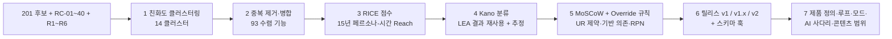
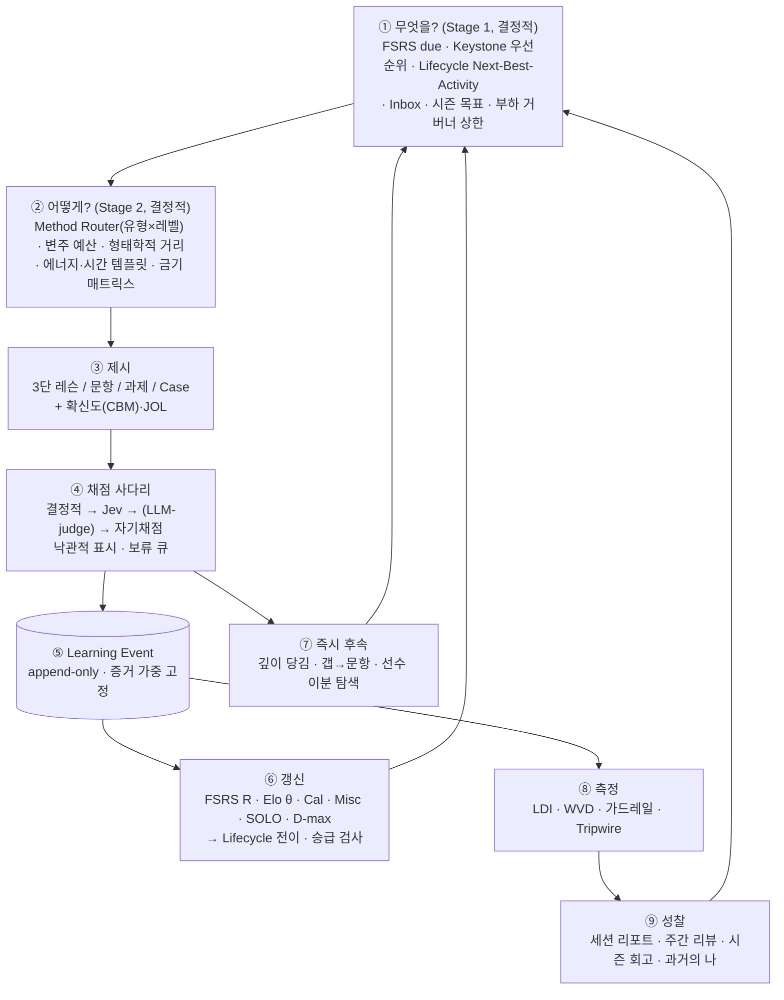

# PLN-CNV-01. 아이디어 수렴 · 제품 정의서 (Convergence & Product Definition)

> **Trace**: UR-01 ~ UR-18 전체. 특히 UR-02(복수 방법론 → 전문가 수준 수렴), UR-05(동결 전 범위 확정), UR-14(학습 방식 다양화), UR-15(로컬·AI 선택), UR-16(판단은 Jev), UR-18(계획 검증 후 한 번에 완성).
> **입력**: `00-brief/project-brief.md`, `00-brief/tech-stack-facts.md`, `00-research/R1~R6`, `01-planning/01-actors-personas.md`(P0~P5, E1~E3, SCN-01~14, RC-01~40), 아이디에이션 7종 — Design Thinking(DES), JTBD+OST(JTB), SCAMPER(SCA), Six Hats+Pre-mortem(SIX), Lean+VPC+Kano(LEA), Pedagogy+Story Map(PED), Morphological+TRIZ(MOR).
> **버전**: **v1.1** (적대적 리뷰 51건 반영 → Planning Baseline v1.0, `07-planning-review.md` = PLN-REV-01) · **작성 주체**: T1(상위 모델) · **작성일**: 2026-09-30
> **v1.1 표기**: 개정한 절·행에 **[v1.1]**을 달았다. 결정은 §10 DEC-CNV-19~36, 스파이크는 §11 SP-6~8로 추가했다.
> **후속 소비**: REQ-01(SFR/PER/SER/QUR/DAR/COR 분류), UC-01, ARC-01(서비스 경계·동결), DCP-01(데이터 수집 계획), SCR-01(화면), STD-01, IT-nn 반복 계획.
> **근거 수준**: 웹 호출 0회. 모든 수치는 입력 문서 인용이거나 `[추정]` 표기. 제품명 충돌 판단은 `[지식]`.

---

## 0. 요약 (TL;DR)

1. **수렴 규모**: 7개 방법론의 기능 후보 **201개**(+ 역품질 가드레일 7개)를 친화도 분석으로 **14개 클러스터 → 수렴 기능 93개(F-A01 ~ F-M04)**로 합쳤다(중복 제거 54%). 201개 원천 ID는 전부 하나 이상의 수렴 기능에 매핑되었다(§2.3 검증).
2. **제품 정의**: 이름은 **Fathom · 깊이**(영문 *fathom* = 수심 단위이자 "깊이 이해하다"), 슬로건 **"깊이는 증거로 남는다 — Prove your depth."** 정체성은 "로드맵 위에서 증거로 증명되는 깊이, 15년 동안 함께 자라는 로컬 개발 공부 OS". CLI는 `fathom`, 데이터 디렉터리는 `~/.fathom`.
3. **North Star = LDI(Live Depth Index)**: `Σ 중요도 × 검증 깊이 d(L) × 현재 인출확률 R × 증거 품질 E × 유효성 F`. 이벤트 로그에서 AI 없이 결정적으로 재계산한다. WVD(주간 검증 깊이)는 입력 지표로 격하. 가드레일 13개(GR-01~13)가 게이밍·번아웃·비용·품질·데이터 손실을 막는다.
4. **코어 루프 = 증거 루프(Evidence Loop)**: 무엇을(FSRS·Keystone·Lifecycle) → 어떻게(Method Router·변주 예산) → 제시 → 응답+확신도 → 채점 사다리(결정적 → Jev → LLM-judge → 자기) → 불변 이벤트 → 모델 갱신 → 측정·성찰. 세션·일·주·시즌·커리어 5중 시간 루프로 감싼다.
5. **학습 모드 21종 + 수식어 5종**: UR-14의 6개(개념이해·실습·문제·개념 디깅·OX·백지노트)를 모두 포함하고, 질림 방지를 위해 **역할 반전**(AI 답안 감사·PR 리뷰 도장·역출제), **판단**(조건 반전 쌍·페르미·Case·산출물), **과거의 나** 계열을 더했다. 21종 모두 OFFLINE 폴백이 있다.
6. **v1 = 완결 제품 65개 기능**(Must 46 + Should 19 → **[v1.1] Must 47 + Should 18**, F06 승격, v1.0 기준 약 148 작업 단위 → **[v1.1] 코드 169u + 콘텐츠 34cu ≈ INT-1~INT-7**, §7.2). 코어 루프·21개 모드·AI 4단 강등·증거 원장·LDI·15년 데이터 계약·단일 명령 운영까지 포함한다. **v1.x 23개**(사유 명시), **v2 5개**. v1.x/v2 기능의 스키마 훅은 v1 동결에 포함해 나중에 아키텍처를 뒤집지 않는다(UR-05).
7. **AI 강등 사다리**: `FULL(Jev+LLM) → JUDGE_ONLY → LLM_ONLY → OFFLINE`. 30개 AI 관여 기능마다 모드별 동작과 증거 가중(w_grader)을 표로 고정했다(§8). 게이트는 휴리스틱으로 통과시키지 않고 보류 큐로 보낸다.
8. **v1 시드 콘텐츠**: 469개 개념 메타데이터 전량(Tier C, R4 표에서 스크립트 변환) + **Tier A 72개**(3단 본문·KU·오개념·코드·백지노트 기준·디깅 체인) + **Tier B 100개**(요약·KU·오개념). 저작 문항 **1,264개** + T2 전개 약 **3,000개** + T1 생성기 **12종** + Case **18개** + 카타 24 + 조건 반전 쌍 30 + 비평 산출물 16 + 배치 진단 152 + Jev 한국어 골드셋 60.
9. **동결 전 스파이크 5건**(SP-1 Jev 한국어, SP-2 러너 샌드박스, SP-3 FSRS 부하·리플레이, SP-4 `node:sqlite` 다중 프로세스·FTS5, SP-5 시드 제작 파일럿). 실패 시 대응은 모두 어댑터·파라미터·플래그 수준으로 **사전 확정**했다.
10. **[v1.1] 적대적 리뷰 반영(51건: blocker 7 · major 26 · minor 18)**: ① 전문가 깊이 — Tier A를 L4 12·L5 6으로 재배분, Case 목표 30(하한 12)을 파라미터화 템플릿으로, L4→L5 승급 기준과 Must L5 증거 모드(F06 산출물 Must 승격), 필수 개념(Tier A/B)·희소 레벨 규칙·트랙별 OFFLINE 상한(cap)을 정직하게 공개 ② 숙달 형식 산입 = `w_format ≥ 0.7 ∧ w_grader ≥ 0.6`, OFFLINE은 대체 증거 + 잠정 승급 ③ 다기기(device_id·ULID·기기별 체인·병합 import)와 원장 자급성(단일 writer·outbox·리플레이 입력 내장)을 R0에 동결 ④ 러너 격리를 실측 기반으로 재설계, Privacy Firewall 로컬 전용 ⑤ 검증 등급(V-build/V-ci/V-live/V-field)으로 Product DoD를 빌드 환경에서 검증 가능하게 재작성 ⑥ 용량: 코드 **169u** + 콘텐츠 **34cu**, **보장 코어 ≈ 103u**, Must별 lite 사양·콘텐츠 하한을 cut line에 포함, INT-1을 1a(스캐폴드·계약)/1b(관통 루프)로 분할 ⑦ 습관 루프·백업을 R1로 앞당김, 트랙 한정 세션·범용 CLI·알고리즘 은행·보안 패치 과제·사용자 오버레이·자격증 블루프린트 추가.

---

## 1. 입력과 수렴 방법

### 1.1 입력 산출물

| 원천 | 방법론 | 후보 ID | 후보 수 | 이 문서가 주로 가져온 것 |
|---|---|---|---|---|
| design-thinking.md | Design Thinking + HMW + Crazy 8s + 도트 투표 | DES-01~21 | 21 | 재정의 문제 3개, 설계 원칙 DP-01~08, 차별화 아이디어(카타·착각 지도·Inbox·SCT·AI 출력 감사) |
| jtbd-ost.md | JTBD + ODI + OST | JTB-01~30 | 30 | 핵심 잡(획득·검증·유지·갱신), DO 기회 점수, **LDI**, 가드레일 GR-1~8, AT-01~17 |
| scamper-benchmark.md | SCAMPER × 벤치마크 15종 | SCA-01~26 | 26 | 벤치마크 공통 가정 5개 뒤집기, 빅 베팅 BB-1~4, 스키마 예약 필드 |
| six-hats-premortem.md | Six Hats + Pre-mortem + FMEA | SIX-01~31 | 31 | 사망 원인 PM-01~14 + RPN, Tripwire TW-01~13, 운영성 결정 DEC-SIX-1~6 |
| lean-vpc-kano.md | Lean Canvas + VPC + Kano | LEA-01~36, LEA-G1~G7 | 36 (+7) | Kano 43기능 분류와 시간축 붕괴, WVD, 동결 전 훅 H-1~H-6, 서명 기능 3개 |
| pedagogy-storymap.md | Backward Design + ECD + Story Map | PED-01~34 | 34 | 역량 변수 10종, 증거 가중 매트릭스, Method Router, Composer, Lifecycle, 슬라이스 R0~R3 |
| morphological-qgen.md | Zwicky Box + CCA + TRIZ | MOR-01~23 | 23 | "LLM = 템플릿 작가", 조건 반전 쌍, 메타모픽 검증, 기본 경로에서 LLM-as-judge 제거 |
| **합계** | | | **201** (+7) | |

### 1.2 수렴 파이프라인



- **병합 규칙**: 같은 사용자 문제를 같은 메커니즘으로 푸는 후보는 하나로 합친다. 메커니즘이 다르면(예: 조건 반전 쌍 vs SCT 패널) 같은 클러스터 안에서도 분리한다. 한 후보가 두 기능에 걸치면(예: SCA-04 = 비평 + PR 리뷰) 양쪽에 매핑하고 이중 매핑으로 표시한다.
- **이름 규칙**: 수렴 기능 ID는 `F-<클러스터 문자><번호>`. 본문에서는 `F-` 접두어를 생략하기도 한다(예: A01).

### 1.3 왜 ICE가 아니라 RICE인가

ICE는 도달(Reach)을 뺀다. 이 제품의 사용자는 한 명이지만 **15년에 걸쳐 다른 사람처럼 변하는 종단 페르소나**(P0~P5)다. 따라서 "몇 명에게 닿는가"가 아니라 **"15년 중 몇 년 동안 가치가 있는가"**가 곧 Reach다. 이 차원을 버리면 P0에게만 좋은 기능이 과대평가되고(Lean 문서 §2.8의 경고) 전문가 단계 엔진이 빠진다(Six Hats PM-09, RPN 80).

---

## 2. 친화도 클러스터링과 중복 제거

### 2.1 클러스터 요약

| 클러스터 | 이름 | 매핑된 원천 수 | 수렴 기능 수 | 이 클러스터의 핵심 통찰 |
|---|---|---|---|---|
| **A** | 학습 코어 루프 · 스케줄링 | 23 | 5 | 스케줄러는 "무엇을(FSRS)"과 "어떻게(형식 정책)"의 2단이어야 한다(PM-01 5 Whys). 7개 방법론 중 5개가 독립적으로 세션 조합기를 제안 |
| **B** | 개념 이해 경험 | 10 | 4 | UR-10의 3단(이론→코드→핵심)은 불변이고, 레벨에 따라 **진입점만** 바뀐다 |
| **C** | 인출 · 문제 형식 | 16 | 9 | "it depends"를 채점 가능하게 만드는 두 경로(조건 반전 쌍 vs SCT) 중 오프라인·단일 제공자에서 동작하는 쪽을 v1로 |
| **D** | 실습 | 7 | 6 | 코드 실행 채점은 결정적이라 오프라인 품질이 같다. 호스트를 건드리는 실습(kind·취약 앱)은 격리 설계가 끝난 뒤로 |
| **E** | 생성 · 심화 (백지노트·디깅·가르치기) | 8 | 4 | 사용자 명시 요구 2개(백지노트·개념 디깅)가 모두 Jev 한국어 판정(AS-08)에 걸려 있다 → 폴백 사다리가 필수 |
| **F** | 판단 · 역할 반전 | 27 | 9 | 가장 많은 방법론이 겹친 곳. "답하는 사람 → 검증·출제·방어하는 사람"이 L3+ 지루함(PM-09)의 해답 |
| **G** | 증거 · 메타인지 | 29 | 10 | 자기보고 완료(AP-03)를 없애는 대가로 **증거 원장·보정·숙달 규칙**이 모든 기능의 기반이 된다 |
| **H** | 성찰 · 연속성 | 18 | 8 | 관계성(SDT)의 대체재는 "과거의 나". 6개 방법론이 같은 아이디어를 냈다 |
| **I** | 업무 · AI 연결 | 22 | 11 | 일-공부 단절(PM-10)을 잇는 아이디어가 많지만 대부분 **회사 데이터 유출(NG-06)** 위험을 안고 있다 → v1은 가장 가벼운 입구(Inbox)만 |
| **J** | 콘텐츠 공급 · 품질 | 19 | 9 | "적게 생성하고 넓게 판정한다"(생성은 비싸고 Jev 판단은 싸다, WH-05/06). 품질은 기능이 아니라 SLO |
| **K** | AI 통합 · 신뢰 | 14 | 7 | 채점 불신(PM-06)은 투명성 + 이의제기 + 개인 골드셋 보정 루프로만 회복된다 |
| **L** | 운영 · 데이터 수명 | 12 | 7 | 사용자 본인이 SRE다. 서비스 분리(UR-08)의 운영 비용을 **단일 명령**으로 흡수해야 한다(PM-13) |
| **M** | UX 기반 | 4 | 4 | 홈 요소 예산(≤ 5)과 키보드·IME 품질이 15년 피로(PM-14)를 막는다 |
| **N** | 역품질 가드레일 | (LEA-G1~G7) | NFR | 금지 목록을 lint·계약 테스트로 자동 검사 |
| **합계** | | **209 매핑**(201 원천 + 이중 매핑 8) | **93** | |

### 2.2 합의 신호 (Consensus Signals) — 여러 방법론이 독립적으로 도달한 아이디어

> 7개 문서는 서로의 결과를 보지 않고 작성되었다. 따라서 3개 이상 방법론이 같은 메커니즘에 도달했다면 강한 신호로 본다.

| 아이디어 | 제안한 방법론 수 | 원천 | 수렴 판정 |
|---|---|---|---|
| 과거의 나와 비교 (타임캡슐·과거 답안 비평·재설명 타임라인) | 6 | DES-19, JTB-13, SCA-09, SIX-17, PED-16, MOR-22 | **v1 Should (H04)** — 데이터는 봉인하는 순간부터 쌓여야 하므로 메커니즘을 v1에 넣는다 |
| 보정 · 착각 지도 (CBM, 선언 vs 증명, JOL) | 6 | DES-01, JTB-07, LEA-06, SIX-21, PED-23, MOR-16 | **v1 Must (G02)**, 서명 기능 #2 |
| 내 코드 → 개념 지도 (graphify 활용) | 6 | DES-06, SIX-04, SCA-05, JTB-16, LEA-31, MOR-18 | **v1.x 1순위 (I06)** — 신뢰도(PT-3 탐지 정밀도 미검증)와 Python 선택 의존 때문. v1은 어댑터 포트와 스키마만 |
| AI 답안 감사 · 비평 모드 (결함 주입) | 5 | DES-15, SCA-04, SIX-03, LEA-30, MOR-06 | **v1 Should (F01)** — T2 결함 주입이면 정답 키가 결정적이고 오프라인 동작 |
| 증거 원장 · 근거 서랍 | 5 | PED-04, DES-18, SIX-15, LEA-13, LEA-33 | **v1 Must (G01)**, 모든 기능의 기반 |
| 산출물 과제 + 설계 방어 | 5 | SIX-18, LEA-18, DES-11, JTB-17, SCA-21 | **v1 Should (F06)** — 1~3턴 반박까지, 다중 리뷰어 아레나는 v1.x |
| 역출제 (게이트를 학습 도구로) | 4 | DES-16, SCA-16, SIX-25, MOR-19 | **v1 Should (F03)** — 게이트 인프라 재사용으로 한계비용이 낮다 |
| 업무 조우 캡처 Inbox | 4 | DES-05, JTB-03, SIX-05, LEA-29 | **v1 Should (I01)** |
| 신선도 · 노후화 경보 | 4 | LEA-34, JTB-20, SIX-20, MOR-17 | **v1 Must(lite) / v1.x(자동)** (J08) |
| 이의제기 · 개인 골드셋 보정 | 4 | JTB-24, SIX-16, LEA-36, DES-17 | **v1 Must (K03)** |

### 2.3 매핑 완전성 검증

- DES 21/21, JTB 30/30, SCA 26/26, SIX 31/31, LEA 36/36, PED 34/34, MOR 23/23 → **201/201 매핑 완료**. 누락 0.
- 이중 매핑 8건: SCA-04(F01·F02), SCA-10(G07·H02), DES-18(G01·G10), LEA-02(G05·L05), LEA-04(K02·L04), LEA-33(G01·H06), LEA-35(G08·H02), JTB-27(K02·L04).
- SIX-27(Cockpit Home)은 Six Hats 문서에서 "디자인 원칙"으로 분류됐지만 구현 대상 화면 규칙이 있으므로 M02 기능으로 수용했다.
- LEA-G1~G7은 기능이 아니라 금지 규칙이므로 §3.3 NFR로 수용했다.
- 원천 없이 기반 요구(RC)에서 온 수렴 기능은 **D01(코드 과제 러너 + 힌트 사다리, RC-18·19)** 1개뿐이다.

---
## 3. 우선순위 — RICE × Kano × MoSCoW

### 3.1 척도

| 요소 | 정의 | 값 |
|---|---|---|
| **R** Reach | 15년 페르소나-시간 중 이 기능이 가치를 주는 비율. 체류 연수 가중: P0 1년 · P1 2년 · P2 3년 · P3 4년 · P4 5년(P5·Edge는 가산) | 0.2 / 0.4 / 0.6 / 0.8 / 1.0 |
| **I** Impact | ODI 기회 점수(JTB DO Opp), FMEA RPN(SIX), UR 명시 여부로 판정 | **3** = DO ≥ 15 또는 RPN ≥ 60 예방 또는 UR 핵심 구현 · **2** 높음 · **1** 보통 · **0.5** 낮음 · **0.25** 최소 |
| **C** Confidence | 근거 강도 | **1.0** 결정적·검증된 패턴 · **0.8** 알려진 패턴 + 일부 가정 · **0.5** 미검증(Jev 한국어, LLM 생성 품질, 외부 도구, 신규 UX) |
| **E** Effort | 에이전트 작업 단위 **1u ≈ Task Brief 1건**(T2 하위 모델 구현 + 단위테스트 + T0 게이트 + 보완 ≤ 2회) | S=1 · M=2 · L=4 · XL=8 |
| **RICE** | `R × I × C ÷ E × 10` (읽기 쉽게 ×10) | 0.3 ~ 30 |

**Kano 표기**: `M` 필수 · `M*` 잠복 필수(사용자가 말하지 않지만 없으면 신뢰가 무너짐, 15년 렌즈에서 M) · `O` 일원 · `A` 매력 · `I` 무관심 · `X→Y` 시간축 붕괴(LEA §4.6). K번호가 있으면 LEA 합성 패널 결과, 없으면 `(추정)`.

**MoSCoW 규칙**
- **Must**: (a) Kano M/M*, (b) UR 명시 요구의 유일한 구현체, (c) 다른 Must의 기반, (d) RPN ≥ 48 실패 원인의 유일한 예방책. **이 조건은 RICE보다 우선한다**(⚑ Override 표기).
- **Should**: RICE ≥ 4.0 **그리고** E ≤ M **그리고** OFFLINE 폴백 존재.
- **Could → v1.x**: 나머지. 사유를 반드시 적는다(§7.4).
- **Won't(이번) → v2**: 전제(데이터·격리 설계·수요)가 없거나 RICE < 1.0이면서 E ≥ L. v1에 스키마 훅만 둔다.
- **데이터 시간 규칙**: 데이터를 **쌓기 시작하는** 쪽(봉인·기준선·로그)은 v1, 쌓인 데이터를 **소비하는 무거운** 쪽은 v1.x.

### 3.2 수렴 기능 점수표

#### A. 학습 코어 루프 · 스케줄링

| ID | 수렴 기능 (핵심 내용) | 병합 원천 | R | I | C | E | RICE | Kano | MoSCoW | 릴리스 |
|---|---|---|---|---|---|---|---|---|---|---|
| A01 | **오늘 큐 + FSRS-6 스케줄러**: 카드 = 개념×facet, 보존율 계층(core .92 / std .90 / breadth .85 / archive .80), 일일 상한, 로드밸런싱, **Keystone 우선순위**(`(1−R)×tier×(1+α·ln(1+하류 수))`)와 기초 균열 표시 | LEA-01, SCA-01 | 1.0 | 3 | 1.0 | 2 | **15.0** | M (K01) | Must | v1 |
| A02 | **부하 거버너**: 분 단위 예산 → ts-fsrs 시뮬레이터로 30일 부하 예측 → 신규 도입량 자동 조절, archive 이동 제안(확인 후), "오늘 할 만큼" 표시 | JTB-09, SCA-20, LEA-21 | 0.8 | 2 | 0.8 | 2 | 6.4 | I→M (K21) | Must ⚑(c,15y) | v1 |
| A03 | **Session Composer**: 슬롯 문법 W/R/N/D/S/C, 시간 템플릿 5·15·25·45·90분 × 에너지 3단, 8항 점수 함수 + 하드 제약, **형태학적 거리 최대화**, 변주 예산·Wildcard, 난이도 파도·보스, 주간 쿼터·모드 엔트로피 가드, 세션 중 적응 제어(연속 오답 강등·빠른 추측·피로), "왜 지금?" 칩·교체·잠금·건너뛰기, 믹스테이프형 블록 UI | PED-02, PED-03, PED-22, PED-24, PED-25, PED-32, JTB-12, LEA-09, SIX-02, SIX-22, MOR-20, DES-13 | 1.0 | 3 | 0.8 | 4 | 6.0 | O (K09) | Must | v1 |
| A04 | **Method Router**: 지식유형(D/C/P/S) × 레벨 25칸 정책 테이블 `method_policy@v1`, 레벨별 Bloom 분포, 금기 매트릭스, 개인 오버라이드 레이어, 정책 변경 시 리플레이 비교 | PED-01 | 1.0 | 2 | 0.8 | 2 | 8.0 | M* (추정) | Must | v1 |
| A05 | **스케줄 프로파일 · 리듬**: 평시 / D-day(cram-aware, 종료 후 분산 복귀) / 복귀(연체 비노출·core 우선·4~6주 분산·재배치) / 일시정지·크런치, 주간 목표 스트릭 + 휴식 토큰 + MVD(5분 또는 리뷰 10개) | PED-28, JTB-10, LEA-22, LEA-23, LEA-28 | 0.8 | 2 | 0.8 | 2 | 6.4 | A (K22) / O (K28) | Must ⚑(d: MT-3·MT-6) | v1 |

#### B. 개념 이해 경험

| ID | 수렴 기능 | 병합 원천 | R | I | C | E | RICE | Kano | MoSCoW | 릴리스 |
|---|---|---|---|---|---|---|---|---|---|---|
| B01 | **3단 개념 페이지**(이론 → 코드/사례 → 핵심) + 프리테스트("먼저 풀어보기") + 임베디드 질문 + **레벨별 진입점**(L3 프리테스트 먼저, L4 문제 먼저, L5 문제 정의 먼저) + 레벨 렌즈(L1~L5 facet 토글, "미래의 문제") + 역설계 진입(동작하는 산출물에서 시작) | LEA-05, PED-07, PED-09, PED-20, DES-14, SCA-23, MOR-07 | 0.8 | 3 | 1.0 | 4 | 6.0 | O (K05, v1 M) | Must ⚑(b: UR-10) | v1 |
| B02 | **Scaffold Fader**: worked → faded 1~3칸 → 시그니처+테스트 → 명세 → 불완전 명세. Elo P ≥ 0.8이면 전진, 연속 2실패면 후퇴 | PED-08 | 0.6 | 2 | 0.8 | 2 | 4.8 | O (추정) | Should | v1 |
| B03 | 범용 상태기계 스테퍼(JSON 명세 1개로 시각화·다음 상태 예측) | SCA-18 | 0.4 | 1 | 0.8 | 2 | 1.6 | A (추정) | Could | v1.x |
| B04 | 인출 개념맵(빈 맵 퀴즈, 링크 라벨) | PED-33 | 0.6 | 1 | 0.8 | 2 | 2.4 | A (추정) | Could | v1.x |

#### C. 인출 · 문제 형식

| ID | 수렴 기능 | 병합 원천 | R | I | C | E | RICE | Kano | MoSCoW | 릴리스 |
|---|---|---|---|---|---|---|---|---|---|---|
| C01 | **OX 스프린트 2.0**: 오개념 기반 거짓 진술 + CBM 3버튼(`O1/O2/O3` 결합 키) + X 선택 시 한 줄 교정 + 고확신 오답 24h 재출제 | PED-10 | 1.0 | 2 | 1.0 | 1 | **20.0** | O (K07) | Must ⚑(b: UR-14 OX) | v1 |
| C02 | **문제 믹스 + 즉시 피드백**: MCQ·빈칸·단답·순서·매칭, variant 로테이션(스케줄 단위는 개념×facet, 문항은 매번 다름), 오답 시 오개념 ID·이름·1문장 근거·해설 | LEA-07, LEA-08 | 1.0 | 3 | 1.0 | 2 | **15.0** | O (K07·K08) | Must | v1 |
| C03 | **코드·설정 판독**: 출력 예측(T1 실행 오라클), find-the-bug(변이 위치), 설정 리뷰(Dockerfile·K8s YAML·Actions, 시드 결함), 로그 판독, 오류 예제(익명화한 과거 오답 포함) | PED-12 | 0.8 | 2 | 1.0 | 2 | 8.0 | O (추정) | Must ⚑(b: UR-01 인프라) | v1 |
| C04 | **헷갈림 쌍 대조 드릴**: 형제 개념 그래프 + 개인 혼동 행렬(X 문항에 Y 답 선택 빈도)로 쌍 채굴 → "한 특징만 다른" 대조 문항 교대 출제 + 판별 규칙 카드 | DES-03, JTB-29, PED-11 | 0.8 | 2 | 0.8 | 1 | 12.8 | A (추정) | Should | v1 |
| C05 | **페르미 추정 드릴**: 파라미터 표 × 템플릿(QPS·스토리지·대역폭·지연·비용), 점수 = max(0, 1 − \|log10(답/정답)\| / log10(허용배수)), 단위 오류 태그, Latency Numbers 카드 | DES-09, JTB-15 | 0.6 | 2 | 0.8 | 1 | 9.6 | A (추정) | Should | v1 |
| C06 | **조건 반전 쌍 / It-depends 매트릭스**: 같은 트레이드오프를 조건 1개만 바꿔 쌍으로 출제(읽기 99% ↔ 쓰기 99%), 채점 = 두 답 정오 + **쌍 일관성** + "답을 뒤집는 조건(pivot)" 명시 여부, 선택지×조건 셀 채우기 | MOR-03, SCA-17 | 0.8 | 3 | 0.8 | 2 | 9.6 | A→O (추정) | Must ⚑(d: PM-09 RPN 80) | v1 |
| C07 | SCT 판단 문항(패널 분포 대비 부분 점수) | DES-08 | 0.6 | 2 | 0.5 | 2 | 3.0 | A (추정) | Could | v1.x |
| C08 | **적응형 후속**: 깊이 당김(고확신 오답 → "왜 그렇게 봤나", 저확신 정답 → "근거 한 줄", 무작위 10% 감사, 10문항당 ≤ 3회) + 갭 → 문항 즉시 루프(백지노트 회색 unit·디깅 실패·비평 누락을 같은 세션 마무리 블록에 T2 1~3개로) | MOR-09, MOR-05 | 1.0 | 2 | 0.8 | 1 | **16.0** | A (추정) | Should | v1 |
| C09 | **약점 드릴**: 오류 원인 5분류(개념오해·절차실수·부주의·오독·선수부족) 클러스터 → 5~10문항 집중 세트 + 전후 비교. (개인 오답지 채굴 MOR-04는 v1.x) | PED-21, MOR-04 | 0.8 | 1 | 0.8 | 1 | 6.4 | O (추정) | Should | v1 |

#### D. 실습

| ID | 수렴 기능 | 병합 원천 | R | I | C | E | RICE | Kano | MoSCoW | 릴리스 |
|---|---|---|---|---|---|---|---|---|---|---|
| D01 | **코드 과제 러너 + 힌트 사다리**: 코드 완성·faded·Parsons, JS/TS(Node 자식 프로세스)·SQL(`node:sqlite`) 샌드박스(타임아웃·메모리·네트워크 off), 힌트 사다리(방향 → 개념 링크 → 부분 코드 → 해설, 사용량 grade 반영), **참조 모드**(정답 열람 시 학습 증거 불포함) | 기반 RC-18·19, LEA-G3 | 0.8 | 3 | 0.8 | 4 | 4.8 | O (추정) | Must ⚑(b: UR-14 실습) | v1 |
| D02 | **코드 회상 카타**: 핵심 코드(LRU, debounce, 재시도+지터, SQL 윈도 함수 …)를 참고 없이 빈 에디터에서 재작성 → 숨은 테스트 채점 → FSRS `facet=code` 간격 복습, 레벨↑ 스켈레톤 소거·명세 모호화 | DES-02 | 0.8 | 2 | 0.8 | 1 | 12.8 | A (추정) | Should | v1 |
| D03 | **인프라 실습 lite**: Dockerfile·K8s manifest·Actions 작성/수정 과제를 TS 정적 규칙(yaml 파서 + 규칙 엔진)으로 채점, Docker 감지 시 `docker build --check` 선택 검증, 실습 불가 환경은 설정 리뷰·로그 판독으로 자동 대체 | LEA-15 | 0.6 | 2 | 0.8 | 2 | 4.8 | I (K15, 전략 보정 O) | Must ⚑(b: UR-01 도커·쿠버) | v1 |
| D04 | Break-it Lab / 시드 결함 랩(kind·compose 환경을 망가뜨려 제공, 상태 검증 스크립트 채점) | JTB-28, SCA-14 | 0.4 | 2 | 0.5 | 4 | 1.0 | I (K15) | Could | v1.x |
| D05 | 고급 코드 실습 팩: Mutant Hunt(테스트로 AST 뮤턴트 잡기) + 제약 사다리(n → 메모리 → 분산 → SLO) | SCA-03, SCA-13 | 0.6 | 2 | 0.5 | 4 | 1.5 | A (추정) | Could | v1.x |
| D06 | Exploit→Patch 레인지(행안부 보안약점 기반 미니 취약 앱) | SCA-15 | 0.4 | 2 | 0.5 | 4 | 1.0 | A (추정) | Could | v1.x |

#### E. 생성 · 심화

| ID | 수렴 기능 | 병합 원천 | R | I | C | E | RICE | Kano | MoSCoW | 릴리스 |
|---|---|---|---|---|---|---|---|---|---|---|
| E01 | **백지노트 사다리 + BPS + 3색 diff**: BN-1 골격형 → BN-2 제목형 → BN-3 주제형 → BN-4 관계 덤프 → BN-5 트랙 덤프, BPS 4요소(Coverage·Accuracy·Structure·Depth), idea unit 객체 키 판정, 회상/누락/오류 3색 diff, 누락 → 카드·오개념 → OX·확장 → 가져오기 후보, 재회상 1일·1주·1개월, "애매 표시" 보정 | LEA-10, PED-13 | 1.0 | 3 | 0.8 | 4 | 6.0 | O (K10, v1 A) | Must ⚑(b: UR-14) | v1 |
| E02 | **개념 디깅 엔진 D1–D7**: 결정적 상태기계가 다음 수(move)를 정하고, Jev가 턴을 판정(complete·partial·misconception·off_topic·dont_know), LLM은 발화 문장만. 12턴 상한·3실패 종료, 깊이 게이지, 발견 개념 미니 그래프 → import 후보 | LEA-11, PED-15 | 0.8 | 3 | 0.8 | 4 | 4.8 | A (K11) | Must ⚑(b: UR-14) | v1 |
| E03 | **Feynman 가르치기**: 오개념 2개를 state로 고정한 AI 주니어에게 설명 → Jev가 KU 커버리지·미정의 용어·이해 가능성·오개념 교정 성공 판정 → Teaching score, 종료 시 교정 요약 | JTB-18, LEA-17, PED-17 | 0.6 | 2 | 0.5 | 2 | 3.0 | A (K17) | Should ⚑(c: Lifecycle CL-7 "Taught" 유일 증거원) | v1 |
| E04 | 반례 사냥(원칙이 깨지는 조건 생성) | PED-29 | 0.4 | 1 | 0.5 | 2 | 1.0 | A (추정) | Could | v1.x |

#### F. 판단 · 역할 반전

| ID | 수렴 기능 | 병합 원천 | R | I | C | E | RICE | Kano | MoSCoW | 릴리스 |
|---|---|---|---|---|---|---|---|---|---|---|
| F01 | **AI 답안 감사(비평 모드)**: "선배 AI의 답안"(코드·설정·설명·설계 요지)에 오개념 은행·T2 변이로 결함 k개(레벨별 2~5)를 주입 → 위치 지적·수정·우선순위. 정답 키 = 주입 위치 + mc ID(결정적), 설명은 Jev `noul` × 결함(객체 키 `flaws.f1`). FULL에서는 품질 게이트 탈락 LLM 산출물 재활용(탈락 사유가 명확한 것만) | DES-15, SCA-04, SIX-03, LEA-30, MOR-06 | 0.8 | 3 | 0.8 | 2 | 9.6 | A (K30) | Should | v1 |
| F02 | **PR 리뷰 도장 + SI·보안 실무 드릴**: 시드 결함(행안부 보안약점 49 중 Node/TS 적용 항목, N+1, 경쟁 조건, 자원 누수, **개발표준정의서 명명·로깅 위반**)을 키로 심은 합성 PR에 라인 코멘트 → 코멘트↔결함 쌍별 매칭 → 심각도 가중 재현율·정밀도. `ctx:si` 문항(클래스워드, 요구사항 ID 분류, RTM) 포함 | DES-10, SCA-04, JTB-22, PED-31 | 0.6 | 2 | 0.8 | 2 | 4.8 | A (추정) | Must ⚑(b: UR-07 SI 산출물, UR-01 보안) | v1 |
| F03 | **역출제**: 학습자가 KU를 골라 문항·정답·오개념 연결 오답지·해설을 작성 → 품질 게이트 G2·G3·G5·G6·G7이 **학습자 이해도**를 채점 → 통과 문항은 확인 후 `author=user`로 편입(본인 복습 가중 하향). L4+는 오답지 진단력을 전문성 증거로 기록 | DES-16, SCA-16, SIX-25, MOR-19 | 0.6 | 2 | 0.8 | 1 | 9.6 | A (추정) | Should | v1 |
| F04 | **Case 엔진**: 상태기계 YAML(증거 노드·공개 조건·요청 비용), 알람 1개에서 시작해 증거 요청 시 단계 공개, 결정점(choice), 턴·증거 요청 로그 → 시뮬레이션 MTTR·증거 효율, 차원별 루브릭(진단·완화·예방·소통), 전문가 디브리프, 저장·재개 | PED-18, LEA-16, JTB-14 | 0.8 | 3 | 0.8 | 4 | 4.8 | O (K16) | Must ⚑(d: PM-09, DEC-SIX-2) | v1 |
| F05 | 연재형 Case(5~7분 에피소드) + 체스식 리플레이(전문가 경로 대비 Best~Blunder) | MOR-08, SCA-26 | 0.6 | 2 | 0.5 | 2 | 3.0 | A (추정) | Could | v1.x |
| F06 | **전문가 산출물 과제 + 반박**: ADR·런북·포스트모템·설계 리뷰 코멘트·개발표준정의서 조항 템플릿 + 차원별 루브릭(Jev `score`, 기준은 객체 키) + 소크라틱 반박 1~3턴(반론은 품질속성·실패 모드 은행 기반, LLM은 문장만) | SIX-18, LEA-18, DES-11, JTB-17, SCA-21 | 0.6 | 3 | 0.5 | 2 | 4.5 | I→O (K18) | **Must ⚑(b: L5 증거 모드, v1.1 DEC-CNV-21)** | v1 |
| F07 | 교차 트랙 전이 문항(한 트랙 원리를 다른 트랙 맥락에 적용) | PED-19 | 0.6 | 2 | 0.5 | 2 | 3.0 | A (추정) | Could | v1.x |
| F08 | 캠페인 월드(가상 회사 시스템이 시즌마다 진화, 과거 ADR이 미래 장애의 씨앗) | DES-12, SCA-06 | 0.8 | 3 | 0.5 | 8 | 1.5 | A (추정) | Won't(이번) | v2 |
| F09 | 개인 Case 파운드리(사내 장애 메모 → 비식별화 → 단계적 공개 Case) | SIX-19 | 0.6 | 2 | 0.5 | 2 | 3.0 | A (추정) | Could | v1.x |

#### G. 증거 · 메타인지

| ID | 수렴 기능 | 병합 원천 | R | I | C | E | RICE | Kano | MoSCoW | 릴리스 |
|---|---|---|---|---|---|---|---|---|---|---|
| G01 | **Learning Event 계약 + 증거 원장 + 근거 서랍**: 모든 모드가 공통 이벤트(모드·형식·개념·KU·오개념·결과·확신도·시간·힌트·채점 엔진·calibrated·confidence·pending·증거 가중·ai_mode)를 append-only로 기록, 증거 가중 `w = w_format × w_grader × 게이밍 계수` 고정 저장, prev-hash 체인(export 변조 탐지), 모든 판정 → 근거 이벤트 드릴다운, 문항·채점의 출처 span·게이트 결과 서랍 | PED-04, DES-18, SIX-15, LEA-13, LEA-33 | 1.0 | 3 | 1.0 | 2 | **15.0** | I→M (K13·K27) | Must ⚑(c: 기반) | v1 |
| G02 | **보정 스튜디오**: CBM 3버튼 전 문항 내장, Brier·ECE·과신 지수, **착각 지도**(개념별 평균 확신 − 실제 정답률, 시도 ≥ 8·격차 ≥ +0.15만 해칭), 온보딩·시즌 시작 "선언 vs 증명", JOL(세션 전 예측 → 마무리 대조), 백지노트 "애매 표시 vs 실제" | JTB-07, LEA-06, DES-01, SIX-21, PED-23, MOR-16 | 1.0 | 3 | 1.0 | 2 | **15.0** | A→O (K06) | Must (서명 #2) | v1 |
| G03 | **숙달 판정 "검증 받기" + 4중 역량 + Concept Lifecycle**: 완료 체크박스 없음. Mastered = 가중 Elo P ≥ 0.80 ∧ 형식 F ≥ 3(w ≥ 0.7 형식만) ∧ 서로 다른 날 ≥ 2. Retained·Deepened(D4 ∧ SOLO ≥ Relational)·Transferred(Case ≥ 2.5/4)·Taught(Teaching ≥ 0.8) 분리 표시, 9단계 상태기계 CL-0~8 + CL-X, 상태별 Next-Best-Activity를 Composer에 공급, 녹슨 표시(강등 없음) | JTB-08, PED-05, PED-06 | 1.0 | 3 | 0.8 | 2 | 12.0 | O (추정) | Must | v1 |
| G04 | **승급 평가 + 자동 전환**: 트랙 Lk 필수 개념 ≥ 85% Mastered + 승급 평가 CBM ≥ 70% (+L3 디깅 D4 ≥ 5, +L4 Case ≥ 2.5/4) → Router 칸·스캐폴딩·UI 밀도·축하 강도 전환, 판정 근거 열람, 재도전 2주 | PED-27, LEA-19 | 1.0 | 2 | 0.8 | 2 | 8.0 | O (K19) | Must ⚑(b: UR-11) | v1 |
| G05 | **적응형 배치 진단(CAT)**: 경력 prior + 트랙당 5~8문항 Elo 적응형, 선수 DAG로 인접 트랙 레벨 전파, 결과를 **anchor-0 기준선**으로 봉인, 복귀 시 재배치에 재사용 | JTB-02, LEA-02 | 1.0 | 2 | 0.8 | 2 | 8.0 | M (K02) | Must | v1 |
| G06 | **모름 진단**: 선수 이분 탐색(고확신 오답·같은 facet lapse 2회 트리거 → 선수 폐포를 θ×R 순 정렬 → ≤ 4문항으로 "가장 낮은 실패 선수" 탐지 → 5분 마이크로 레슨·soft gate, 방문 집합으로 순환 방지) + 프런티어 탐침(숙달 경계 밖 미접촉 개념 주 1회 5~8문항, 증거 가중 0.3) | SCA-02, PED-14, DES-04 | 0.8 | 3 | 0.8 | 2 | 9.6 | A (추정) | Should | v1 |
| G07 | **오개념 소거 원장 + 계열 태그**: 오개념 상태 active → suppressed → extinguished(서로 다른 형식군 ≥ 3에서 간격 둔 거부 ≥ 2회), 재발 시 active 복귀·24h 재출제. 모든 mc에 `meta_family`(약 12종: 상태 vs 이벤트, 평균 vs 꼬리 지연, 동기/비동기 경계 …), 주간 리뷰에 교차 트랙 계열 표. (군집 기반 개인 게놈 리포트는 v1.x) | MOR-23, LEA-32, SCA-10 | 0.8 | 2 | 0.8 | 2 | 6.4 | A (K32) | Should | v1 |
| G08 | **LDI 엔진**: §4.7 공식, 트랙·경로·28일 Δ, 파라미터 테이블화, 이벤트 리플레이 재계산, WVD·시간당 WVD·모드별 기여(학습 ROI) 입력 지표 산출 | JTB-01, LEA-35 | 1.0 | 2 | 0.8 | 2 | 8.0 | M* (추정) | Must ⚑(c: 회고·가드레일 계측) | v1 |
| G09 | 위임 가능 업무 지도(EPA, ten Cate 5단계) | SCA-07 | 0.6 | 2 | 0.5 | 2 | 3.0 | A (추정) | Could | v1.x |
| G10 | 앵커 시험 & 고스트 + 연간 체크라이드(동결 평행형 세트, 공통 문항 동등화) | SCA-08, DES-18 | 0.6 | 2 | 0.8 | 2 | 4.8 | O (추정) | Could (데이터 시간 규칙) | v1.x |

#### H. 성찰 · 연속성

| ID | 수렴 기능 | 병합 원천 | R | I | C | E | RICE | Kano | MoSCoW | 릴리스 |
|---|---|---|---|---|---|---|---|---|---|---|
| H01 | **Depth Map**: 트랙×레벨 해저 지형(D3 depth ramp), 숙달·유지 2축, Lifecycle 노드 표현(안개 → 채움 → 유지 링 → 깊이 테두리 → 별표), 레이어 토글(착각 해칭·기초 균열 점선·갱신 필요 점선), N개월 전 오버레이·연간 타임랩스, 모든 셀 → 증거 드릴다운·행동 연결 | LEA-20 | 1.0 | 3 | 1.0 | 4 | 7.5 | A→O (K20) | Must (서명 #3, UR-04) | v1 |
| H02 | **세션 리포트 + 주간 리뷰 의식**: 세션 끝 3줄(안정도·깊이 변화·다음 추천, 유일한 축하 모션), 일요일 10분 리뷰(ΔLDI, 약점 Top 5, 오개념 계열, 모드 편중, blameless 학습 포스트모템 lite, 시간당 WVD) → 다음 주 계획 1클릭 | JTB-30, SCA-10, LEA-35 | 1.0 | 2 | 1.0 | 2 | 10.0 | O (추정) | Must | v1 |
| H03 | **시즌 플래너 · 프리모템 · 회고**: 6~8주 트랙×레벨 목표, 목표별 달성 확률·예상 실패 원인 입력(필요 분량 시뮬레이션), 주간 체크, 종료 시 거시 Brier + 목표 대비 실적(개발 회고 UR-03과 동형) | PED-26, SCA-24 | 1.0 | 1 | 0.8 | 2 | 4.0 | O (추정) | Should | v1 |
| H04 | **과거의 나**: 트랙별 영구 질문 타임캡슐(봉인 → 6·12·36개월 재질문), 180일+ 된 내 서술 답안 비평, 같은 개념 재설명/백지노트 나란히 비교(SOLO·KU 커버리지 변화), BN-5 트랙 덤프 연간 비교 | DES-19, JTB-13, SCA-09, SIX-17, PED-16, MOR-22 | 1.0 | 2 | 0.8 | 2 | 8.0 | A (추정) | Should | v1 |
| H05 | **Retention Radar**: 로컬 Tripwire TW-01~13(§4.8 GR 연결), 개인 기준선(8주 후 자기 28일 평균 대비), 비난 없는 카피, 조치 강도 설정(제안 / 자동) | SIX-01 | 1.0 | 2 | 0.8 | 2 | 8.0 | M* (추정) | Should | v1 |
| H06 | **증거 포트폴리오 export**: 기간 필터 → 트랙별 ΔLDI, 승급 근거, 대표 산출물(ADR·포스트모템·백지노트 diff), 오개념 극복 이력 → MD/HTML + 증거 해시 | JTB-21, PED-34, LEA-33 | 0.6 | 1 | 1.0 | 1 | 6.0 | O (K33) | Should | v1 |
| H07 | 개인 테크 레이더(Adopt/Trial/Assess/Hold, 근거 링크 필수) | DES-20 | 0.4 | 1 | 0.8 | 1 | 3.2 | A (추정) | Could | v1.x |
| H08 | N-of-1 개인 학습 실험실 | PED-30 | 0.4 | 1 | 0.5 | 4 | 0.5 | A (추정) | Won't(이번) | v2 |

#### I. 업무 · AI 연결

| ID | 수렴 기능 | 병합 원천 | R | I | C | E | RICE | Kano | MoSCoW | 릴리스 |
|---|---|---|---|---|---|---|---|---|---|---|
| I01 | **Encounter Inbox**: `fathom capture "..."`(stdin 지원)·명령 팔레트로 5초 캡처 → 비밀 패턴 마스킹 → FTS5 trigram 상위 10 → Jev `choice`(객체 키) 개념 확정 → 3문항 프로브 → 큐 편입, 미매칭은 import 후보, 다음 세션 첫 블록 "Inbox 트리아지 3분", 기본 외부 전송 금지 | DES-05, JTB-03, SIX-05, LEA-29 | 0.8 | 2 | 0.8 | 2 | 6.4 | A (K29) | Should | v1 |
| I02 | **개념 가져오기 + 스테이징**: 붙여넣기·MD 파일·URL(스킴 allowlist, 사설 대역·메타데이터 IP 차단, 2MB) → I1~I9(정규화 → 청크 → 분류 → 추출 → 근거 검증 → 병합 → 스테이징 diff → 발행), 라이선스 등급·copy-guard(연속 80자, 8-gram ≤ 10%), 주입 탐지, 민감 자료 로컬 LLM 강제 | LEA-14 | 0.6 | 2 | 0.8 | 4 | 2.4 | A (K14) | Must ⚑(b: UR-13 "개념을 가져올 수 있어야") | v1 |
| I03 | JIT Pack(업무 산출물 → 10분 팩) | SCA-11 | 0.6 | 2 | 0.5 | 2 | 3.0 | A (추정) | Could | v1.x |
| I04 | AI 대화 로그 → 갭 맵(Claude Code `~/.claude/projects/*/*.jsonl` 사용자 턴만) | JTB-04 | 0.6 | 2 | 0.5 | 2 | 3.0 | A (추정) | Could | v1.x |
| I05 | AI 작업 디브리프 / Explain-the-AI-Code(개인 레포 diff → 설명 역질문) | DES-07, JTB-06 | 0.6 | 3 | 0.5 | 4 | 2.3 | A (추정) | Could | v1.x |
| I06 | Repo Lens · 코드 그래프 드릴 · 내 작업물 문항(graphify `extract --code-only`/`path`/`affected`/`god-nodes`) | DES-06, SIX-04, SCA-05, JTB-16, LEA-31, MOR-18 | 0.6 | 2 | 0.5 | 4 | 1.5 | A (K31) | Could (v1.x 1순위) | v1.x |
| I07 | Terminal Companion TUI(`fathom q`) / Study MCP Bridge | SCA-12, SIX-23, SIX-24 | 0.6 | 1 | 0.5 | 2 | 1.5 | A (추정) | Could / Won't(MCP) | v1.x / v2 |
| I08 | Goal Compiler(JD·시험 범위 → 스킬 추출 → 개념 매핑 → 시즌/D-day 플랜) | JTB-05 | 0.4 | 2 | 0.5 | 2 | 2.0 | I (K23) | Could | v1.x |
| I09 | Course Companion(외부 강의 목차 → 챕터 출구 티켓) | SCA-19 | 0.4 | 1 | 0.8 | 1 | 3.2 | A (추정) | Could | v1.x |
| I10 | English Doc Bridge | JTB-23 | 0.4 | 1 | 0.5 | 1 | 2.0 | I (추정) | Won't(이번) | v2 |
| I11 | 양방향 볼트(Obsidian) 브리지 | SCA-25 | 0.4 | 0.5 | 0.5 | 2 | 0.5 | I (추정) | Won't(이번) | v2 |

#### J. 콘텐츠 공급 · 품질

| ID | 수렴 기능 | 병합 원천 | R | I | C | E | RICE | Kano | MoSCoW | 릴리스 |
|---|---|---|---|---|---|---|---|---|---|---|
| J01 | **콘텐츠 팩 as Code**: 트랙 단위 YAML 팩(Concept·KU·Misconception·Case·Source·ItemModel), zod 스키마, 택소노미 lint(R-ID·R-DAG·R-LVL·R-REF·R-SRC …), copy-guard, sha256 매니페스트, ID 불변·rename은 alias·폐기는 `deprecated_by`, SQLite 적재 + FTS5 trigram. (사용자 수정과 3-way 병합은 v1.x) | SIX-28 | 1.0 | 3 | 1.0 | 4 | 7.5 | M* (추정) | Must ⚑(c) | v1 |
| J02 | **Minimum Lovable Content**: 깊이 우선 시드 Tier A 72 / B 120 / C 277(§9, **[v1.1]** 목표·하한 분리, 34cu) | SIX-29 | 1.0 | 3 | 0.8 | 8 | 3.0 | M (PM-04) | Must ⚑(c) | v1 |
| J03 | **생성 계층 + 아이템 모델 저작 루프**: T1 절차 생성기 12종(실행 오라클), T2 KU-템플릿(선언적 ItemModel 전개, 오프라인), T3 근거 기반 LLM 생성·T4 시나리오+루브릭(CLI 야간 배치 우선), **LLM은 문항 작가가 아니라 템플릿 작가**(표본 8개 게이트 통과 모델만 active), LLM 산출 코드는 런타임 실행 금지 | MOR-01 | 1.0 | 3 | 0.8 | 4 | 6.0 | M (K12) | Must ⚑(b: UR-13) | v1 |
| J04 | **품질 게이트 G0~G13 + 위험 비례 검증 + 메타모픽 검증**: 비용 오름차순 조기 종료, stakes S0 연습 / S1 재출제·승급 / S2 시드 핵심·승급 Case(상위 모델 승인), 변형마다 `preserve`/`flip` 관계 검사, 게이트 과업은 Jev 부재 시 **보류 큐**(휴리스틱 통과 금지) | LEA-12, MOR-14, MOR-02 | 1.0 | 3 | 0.8 | 4 | 6.0 | M (K12) | Must | v1 |
| J05 | **수요 예측 워밍 풀**: 수요(개념, 레벨, 유형, 14일) = FSRS due 예측 × 레벨 믹스 × 로테이션 요구 × (1 + 신규 예산) − 미노출 재고, 안전 재고 min(20, 1.5 × 14일 수요), 결손분만 유휴 창 생성, 세션 prefetch, 첫 문항 p95 ≤ 2s | MOR-13, LEA-03 | 1.0 | 2 | 0.8 | 2 | 8.0 | M (K03) | Must | v1 |
| J06 | **문항 건강 · Content Health SLO · 계보 · 신고 루프**: 문항·패밀리별 정답률 drift, 선택률 0% 오답, 응답시간 이상, 신고율 → 자동 플래그 → 재게이트 → 폐기·교체, KU → ItemModel → 인스턴스 → 게이트 → 노출 계보 그래프, 패밀리 단위 전파 격리, **신고 처리 결과를 사용자에게 표시**, 에러 버짓 소진 시 패밀리 동결 | SIX-06, SIX-07, MOR-15 | 1.0 | 2 | 0.8 | 2 | 8.0 | M (K12) | Must ⚑(d: PM-05 RPN 60) | v1 |
| J07 | **생성 회귀 평가 하네스**: 한국어 골드셋 + 녹화 cassette로 프롬프트 버전 × 모델 × CLI 버전 평가(게이트 통과율·골드 일치율·채택 1건당 비용·Jev AUROC), 회귀 없을 때만 승격, CI 네트워크 0 | SIX-08 | 1.0 | 2 | 0.8 | 2 | 8.0 | M* (추정) | Should | v1 |
| J08 | **신선도**: v1 = 모든 KU `scope`·`vol:*`·`valid_as_of`·`deprecated_by`, CL-X 상태, "outdated" 신고, 수동 재검증 트리거, 복귀 시 변경 요약 / v1.x = 신선도 감시자 자동 수집·Belief Audit(고안정·고확신 카드 교집합 우선)·Frontier Feed·버전 드리프트 문항 | LEA-34, JTB-20, SIX-20, MOR-17 | 0.8 | 2 | 0.8 | 1 | 12.8 | I→A→M (K34) | Must(lite) ⚑(d: PM-03) | v1 lite / v1.x |
| J09 | 멘토 키트 · 팩 저작 export(주니어용 스터디 팩, 현장 체크리스트) | DES-21, JTB-19, SCA-22 | 0.4 | 1 | 0.8 | 2 | 1.6 | I (추정) | Could | v1.x |

#### K. AI 통합 · 신뢰

| ID | 수렴 기능 | 병합 원천 | R | I | C | E | RICE | Kano | MoSCoW | 릴리스 |
|---|---|---|---|---|---|---|---|---|---|---|
| K01 | **AI 제어면**: CLI(claude·codex·gemini)·API(Anthropic·OpenAI·Gemini)·Ollama·Jev probe, 과업 레지스트리 라우팅(AI-J01~J19, AI-G01~G13), 4단 성능 모드 + 상태 칩, 월·일 예산·월말 추정액·검증 KC당 비용, 서킷 브레이커 강등, `ANTHROPIC_API_KEY` 과금 전환 경고, 비밀 저장소(env > OS 키체인 > AES-GCM 파일, DB 비저장), CLI 안전 호출 4원칙 | LEA-24, JTB-25, SIX-10 | 1.0 | 3 | 0.8 | 4 | 6.0 | M (K24) | Must ⚑(b: UR-15) | v1 |
| K02 | **채점 사다리 + 낙관적 채점 + 보류 재채점**: 결정적 → Jev → (LLM-judge) → 자기채점, interactive 데드라인 3s 초과 시 즉시 하위 사다리 응답 후 Jev 백그라운드 계속 → 밴드가 바뀔 때만 작은 diff로 갱신, OFFLINE 서술형은 "잠정" → 보류 큐 → AI 복귀 시 재채점 + FSRS/Elo 소급 반영(이벤트 추가, 원 이벤트 불변) + 자기채점 편향 리포트 | MOR-10, LEA-04, JTB-27 | 1.0 | 3 | 0.8 | 2 | 12.0 | O (K04) | Must ⚑(b: UR-16) | v1 |
| K03 | **판정 투명성 · 이의제기 · 개인 골드셋 보정**: 판정 카드(엔진·calibrated 배지·항목별 객체 키 판정·confidence), 이의 1키 → 다른 엔진 재판정 또는 사용자 확정, 원 판정 보존, 인용 사례 → 과업별 개인 골드셋, 저신뢰·엔진 불일치 사례 하루 ≤ 3장 "판정 확인 카드"(자기 답이 아닌 합성·익명 샘플 위주 → 자기 편향 차단), 과업별 골드셋 ≥ 30건이면 임계 재보정 **제안** | JTB-24, SIX-16, LEA-36, DES-17 | 1.0 | 3 | 0.8 | 2 | 12.0 | I→M (K13) | Must ⚑(d: PM-06) | v1 |
| K04 | **채점기 메타모픽 QA + Jev 한국어 캘리브레이션**: 골드셋 60 + 답안 변형(패러프레이즈 → 점수 동일 ±0.5, 오개념 문장 주입 → 감점, 무관한 장황함 → 불변, 한↔영 용어 교체 → 동일)으로 과업별 일치율 리포트, 미달 과업은 라우팅 1순위·w_grader 자동 하향 | MOR-21 | 1.0 | 2 | 0.8 | 2 | 8.0 | M* (추정) | Must ⚑(d: AS-08) | v1 |
| K05 | Jev 판정 증류 → 개인 오프라인 채점기(KP별 n ≥ 8, 일치율 ≥ 0.85만) | MOR-11 | 0.6 | 2 | 0.5 | 2 | 3.0 | A (추정) | Could (데이터 시간 규칙) | v1.x |
| K06 | **Privacy Firewall**: 외부 AI 전송 전 모든 페이로드 검사 — 비밀 정규식(키·토큰·주민번호 형식·IP), 사용자 정의 사내 도메인·사번 패턴, Jev `noul` 기밀 가능성 → 차단 / 로컬 LLM 강제 / 마스킹, 전송 로그 열람 | SIX-30 | 0.8 | 2 | 0.8 | 1 | 12.8 | M* (추정) | Must ⚑(d: PM-12, NG-06) | v1 |
| K07 | **Provider Canary & Contract Test**: 매일 첫 기동 시 CLI·API·Jev 버전·필수 플래그 점검 + 소형 canary 스키마 준수 확인, 드리프트 시 라우트 격하 + 상태 칩 경보(조용한 실패 금지) | SIX-09 | 1.0 | 1 | 1.0 | 1 | 10.0 | M* (추정) | Must ⚑(d: PM-08) | v1 |

#### L. 운영 · 데이터 수명

| ID | 수렴 기능 | 병합 원천 | R | I | C | E | RICE | Kano | MoSCoW | 릴리스 |
|---|---|---|---|---|---|---|---|---|---|---|
| L01 | **15년 데이터 계약**: append-only 이벤트·안정 ID(G01에서 동결), 스키마 마이그레이션 드라이런 + 사전 자동 백업 + 실패 롤백, 주간 백업 7세대, **분기별 자동 복원 리허설**(임시 DB 복원 → 체크섬·행 수 비교), 전량 JSONL+MD(`[[wikilink]]`) export ↔ 재import 왕복 테스트, 스케줄러·LDI 모델 교체 리플레이 호환 테스트 | JTB-26, SIX-14, LEA-27 | 1.0 | 3 | 1.0 | 4 | 7.5 | I→M (K27) | Must ⚑(c: UA-1 해자) | v1 |
| L02 | **단일 슈퍼바이저 `fathom up`**: 분리된 서비스 기동·감시·재시작, 포트 자동 할당, 통합 구조화 로그(pino, 상관관계 ID), 헬스 보드, **부분 장애 격하**(예: 채점 서비스 장애 → 자기채점 + 보류 큐로 학습 계속) | SIX-26 | 1.0 | 3 | 0.8 | 2 | 12.0 | M* (추정) | Must ⚑(d: PM-13, UR-08 운영비) | v1 |
| L03 | **`fathom doctor` + Safe Mode**: Node 버전, `PRAGMA integrity_check`, 마이그레이션 상태, 백업 경과, 포트 충돌, 서비스 헬스, AI probe, Docker·graphify 감지, 디스크 → `--fix`(수정 전 백업 강제), Safe Mode 부팅(AI·백그라운드 워커 off) | SIX-13 | 1.0 | 2 | 1.0 | 2 | 10.0 | M* (추정) | Must | v1 |
| L04 | **Zero-AI Floor 보증**: 네트워크 차단 E2E 스위트가 UR-14 전 모드를 실행하고 외부 호출 0건을 단언, 실패 시 통합 차단, ubuntu/windows/macos 매트릭스 | SIX-11, JTB-27, LEA-04 | 1.0 | 3 | 1.0 | 1 | **30.0** | O (K04, E3에 M) | Must | v1 |
| L05 | **3분 설치 + 포터블 번들**: `pnpm i && pnpm fathom up` → 첫 세션 3분 이내, AI 설정은 나중에(progressive), self-host 폰트, `node:sqlite` ExperimentalWarning 억제, 오프라인 반입용 tar 번들(빌드 산출물 + node_modules + 시드 팩, Node ≥ 22.13 전제) | SIX-12, LEA-02 | 1.0 | 2 | 0.8 | 2 | 8.0 | M (K02) | Must | v1 |
| L06 | 에어갭 팩(향후 N주 콘텐츠 서명 번들 반입 + 답안 역방향 팩 회수·재채점) | MOR-12 | 0.4 | 2 | 0.8 | 2 | 3.2 | A (추정) | Could | v1.x |
| L07 | Pocket Pack(정적 단일 HTML 휴대 퀴즈 + 응답 재수입) | JTB-11 | 0.4 | 0.5 | 0.5 | 4 | 0.3 | I (추정) | Won't(이번) | v2 |

#### M. UX 기반

| ID | 수렴 기능 | 병합 원천 | R | I | C | E | RICE | Kano | MoSCoW | 릴리스 |
|---|---|---|---|---|---|---|---|---|---|---|
| M01 | **D3 Bathymetry 디자인 시스템**: OKLCH 토큰 단일 소스(`@theme`), 다크 우선·라이트 지원, 색은 깊이(L1~L5)와 상태만 인코딩, WCAG 2.2 AA, Pretendard·JetBrains Mono+D2Coding·Geist self-host, `/_design` 살아있는 스타일가이드, 토큰 → UI 표준정의서 표 자동 생성, 대비 lint | LEA-26 | 1.0 | 2 | 1.0 | 2 | 10.0 | O (K26) | Must ⚑(b: UR-04) | v1 |
| M02 | **Cockpit Home**: 오늘의 기본 행동 1개 + 경보(있을 때만) + 에너지 선택. 홈 요소 예산 ≤ 5, 지표·Depth Map은 한 단계 아래, 레벨에 따라 기본 화면 이동(오늘 큐 → Depth Map → Case 라이브러리 → 신선도 리포트) | SIX-27 | 1.0 | 2 | 1.0 | 1 | **20.0** | O (추정) | Must | v1 |
| M03 | **키보드 우선 · IME 안전 · 초성 명령 팔레트**: `event.code` 기반 단축키, Enter `isComposing` 가드, `Ctrl/⌘+K` cmdk + es-hangul 초성, 모든 문항형 키보드 대안(Parsons 포함) | LEA-25 | 1.0 | 2 | 1.0 | 1 | **20.0** | O (K25) | Must | v1 |
| M04 | **적응형 UI 밀도**(Guided → Pro): L1~L2 안내 중심, L4+ 조밀·키보드 우선·축하 최소, 토큰·레이아웃 변수로만 차이 | SIX-31 | 1.0 | 1 | 0.8 | 1 | 8.0 | A (추정) | Should | v1 |

### 3.3 N. 역품질 가드레일 (NFR — v1 Must, 자동 검사)

| ID | 금지 대상 (Kano R) | 대체 설계(욕구 흡수) | 자동 검사 |
|---|---|---|---|
| NG-G1 | XP·코인·레벨업 폭죽 (LEA-G1) | 승급 이정표 + 세션 리포트 1회 축하 모션 | 디자인 토큰에 보상 애니메이션 없음, UI 리뷰 체크리스트 |
| NG-G2 | 리더보드·소셜 비교 (LEA-G2) | 과거의 나 오버레이(H01·H04) | 스키마에 타 사용자 개념 없음, 네트워크 공유 기능 없음 |
| NG-G3 | 학습 중 AI 즉시 정답·코드 대필 (LEA-G3) | 힌트 사다리 + 참조 모드(증거 불포함, 다음 grade 보수화) | 정답 공개 API는 제출 후에만 허용(계약 테스트) |
| NG-G4 | 선수 개념 강제 잠금 (LEA-G4) | 추천 경로 하이라이트 + soft gate 경고 | 라우팅 코드에 잠금 분기 금지 규칙 |
| NG-G5 | 연체 빨간 배지·스트릭 끊김 푸시 (LEA-G5) | "오늘 할 만큼 N분", 휴식 토큰, 복귀 모드 | 디자인 lint: due 수치에 danger 색 금지, 푸시 알림 API 미사용 |
| NG-G6 | 강의 영상 중심 콘텐츠 (LEA-G6) | 텍스트 + 코드 + 실행 위젯, 외부 강의는 import로 KU화 | 콘텐츠 스키마에 영상 본문 타입 없음 |
| NG-G7 | AI가 백지노트·정리를 대신 작성 (LEA-G7) | AI는 비교·피드백만, 모범 노트는 제출 후 공개 | ai-gateway 정책: 백지노트 제출 전 생성 호출 거부 |

### 3.4 점수에서 읽은 것

**RICE 상위 12**: L04 Zero-AI Floor(30.0) · C01 OX(20.0) · M02 Cockpit Home(20.0) · M03 키보드·IME(20.0) · C08 적응형 후속(16.0) · A01 오늘 큐(15.0) · C02 문제 믹스(15.0) · G01 증거 원장(15.0) · G02 보정(15.0) · C04 대조 쌍 / D02 카타 / J08 신선도 lite / K06 Privacy Firewall(12.8).
→ 상위권이 거의 전부 **결정적(AI 불필요)·S~M 노력**이다. "AI는 강화 계층"이라는 R5 결론이 점수로도 확인된다.

**RICE가 낮지만 Must인 기능(⚑ Override)과 이유**

| 기능 | RICE | Override 사유 |
|---|---|---|
| I02 개념 가져오기 | 2.4 | UR-13 명시("개념을 가져올 수 있어야 함")의 유일한 구현체. P0 시점 도달률이 낮을 뿐 P2+ 핵심(SCN-05) |
| J02 시드 콘텐츠 | 3.0 | 콘텐츠 없이는 어떤 기능도 가치가 없다(PM-04 콜드스타트). Effort가 XL이라 점수가 눌렸다 |
| E03 Feynman | 3.0 | Lifecycle CL-7 "Taught"와 L5 정의(가르치기, R4 §2.2)의 유일한 증거원 → Should로 올림 |
| D01·D03 실습 | 4.8 | UR-01(도커·쿠버)·UR-14(실습) 명시. Kano I라도 사용자 원 요구는 제약이다(LEA §5.2 전략 보정) |
| F02 PR 리뷰 도장 + SI 드릴 | 4.8 | UR-07(SI 산출물 활용)을 **학습 콘텐츠**로도 구현하는 유일한 경로 |
| F04 Case 엔진 | 4.8 | PM-09(전문가 정체, RPN 80, 1위)의 본체 대책. DEC-SIX-2: 동결에 포함 |
| E02 디깅 | 4.8 | UR-14 명시 모드 |

**신뢰도(C = 0.5)가 발목을 잡은 차별화 아이디어**: Repo Lens(I06), 디브리프(I05), SCT(C07), 캠페인(F08), 연재 Case(F05). 모두 **검증 실험을 붙여 v1.x/v2**로 보내고, v1에는 스키마 훅(§7.3)만 둔다. 이렇게 해야 "검증되지 않은 가정 위에 아키텍처를 얹는" DPM-01(범위 폭발)을 피한다.

---

## 4. 제품 정의

### 4.1 비전 (Vision)

> **초급 개발자가 15년차 전문가가 될 때까지, 전 분야 지도 위에서 "안다고 믿는 것"이 아니라 "증명한 깊이"를 쌓고, 잃지 않고, 갱신하게 한다 — 내 PC에서, AI가 없어도.**

- 핵심 잡(JTB §2): 필요한 순간에 옳은 기술 판단을 내릴 수 있을 만큼의 지식을 **획득 · 검증 · 유지 · 갱신**한다. 네 동사의 무게는 경력에 따라 이동한다(P0 획득·검증 → P3 판단 전이 → P5 갱신).
- 재정의한 문제(DES §0): ① 착각을 증거로 바꾼다 ② 일과 공부의 끊김을 잇는다 ③ 정답 없는 판단을 연습·채점 가능하게 만든다.

### 4.2 제품명

| 후보 | 의미 적합(깊이 + 이해) | 기억성·길이 | 한국어 발음·표기 | CLI 입력성·충돌 | 디자인 언어(D3 Bathymetry) 정합 | 판정 |
|---|---|---|---|---|---|---|
| **Fathom · 깊이** | ★★★★★ 명사 = 수심 단위(1.83 m), 동사 = "깊이 이해하다". 두 뜻이 제품의 두 축(깊이 측정 + 이해)과 정확히 겹친다 | ★★★★ 6자 | ★★★★ "패덤", 한글명은 "깊이" | ★★★★ `fathom` — 표준 유닉스 명령과 충돌 없음 `[지식]` | ★★★★★ 수심도(Bathymetry)와 같은 은유 | **채택** |
| Plumb · 측연 | ★★★★ "plumb the depths" | ★★★★ | ★★ 한국어 화자에게 낯섦 | ★★★★ | ★★★★ | 차선 |
| 심도(Simdo) | ★★★ 깊이만 | ★★★★ | ★★★★★ | ★★ 로마자 입력 애매 | ★★★ | 기각 |
| Sounding · 측심 | ★★★ 측정만 | ★★★ | ★★ | ★★★ | ★★★★ | 기각 |
| DevDepth | ★★ 설명적 | ★★ | ★★★ | ★★★ | ★★ | 기각(제네릭) |

- **결정**: 제품명 **Fathom**, 한글 표기 **패덤**, 한국어 이름 **"깊이"**. 앱 제목 표기 `Fathom 깊이`. CLI `fathom`, 데이터 디렉터리 `~/.fathom`(Windows `%APPDATA%\fathom`), 팩 네임스페이스 `fathom-pack/<track>`.
- 동명의 SaaS(웹 분석·회의록 AI)가 존재하지만 이 제품은 배포·판매하지 않는 **개인 로컬 도구**이므로 상표 위험은 낮다 `[지식]`. 공개 배포를 결정하면 ADR로 재검토한다.
- 기존 문서의 `devstudy`/`dstudy`/`study` 명칭은 모두 `fathom`으로 통일한다(DEC-CNV-01).

### 4.3 태그라인 · 한 줄 설명

- **슬로건(KR)**: **깊이는 증거로 남는다.**
- **Tagline(EN)**: **Prove your depth.**
- **한 줄 설명**: 로드맵 위에서, 증거로 증명되는 깊이 — 15년 동안 함께 자라는 로컬 개발 공부 OS. (LEA §2.4 UVP 재사용)
- **보조 카피(온보딩)**: "넓게 배운 것을, 깊게 증명하세요. AI가 없어도, 내 PC에서."

### 4.4 포지셔닝 (Moore 템플릿)

> **대상**: 한국 SI·클라우드 현장에서 성장하려는 AI/데이터 배경 주니어 개발자, 그리고 15년 뒤의 그 자신
> **문제**: 넓게 배웠지만 무엇이 깊은지 증명하지 못하고, AI가 짜 준 코드를 설명하지 못할까 불안하며, 배운 것이 사라지거나 낡는다
> **Fathom은** 19개 트랙 지도 위에서 인출 · 판단 · 산출물 과제로 깊이를 **증거로** 쌓고 잃지 않게 하는 **로컬 우선 개발 공부 OS**다.
> **대안과 달리**: roadmap.sh(지도만, 자기보고 완료), Anki(기억만, 카드 작성 비용), LeetCode·프로그래머스(알고리즘만), 인프런(시청만), 범용 AI 챗봇(답만 주고 기억에 안 남음)과 달리,
> **Fathom은** 모든 판정을 증거 원장에 남기고, AI 없이도 모든 학습 모드가 동작하며, 판단은 보정된 Jev가, 문장 생성은 LLM이, 결정은 코드가 맡는다.

**진짜 경쟁자**는 단일 서비스가 아니라 "Anki + Claude/ChatGPT + roadmap.sh + Notion"의 DIY 조합이다(LEA §2.6). 주말 DIY로 복제할 수 없는 해자는 **① 15년 개인 증거 로그(UA-1) ② KU·오개념 은행 기반 생성 + 게이트(UA-2) ③ Jev 판단 체계와 개인 골드셋 보정(UA-3)**이다.

### 4.5 전략 기둥 (Strategic Pillars)

| 기둥 | 뒤집은 가정(SCA 공통 가정) | v1 대표 기능 | v1.x/v2 확장 |
|---|---|---|---|
| **P1 증거로 증명되는 깊이** | "진척 = 카드 수·완료 체크" | G01, G02, G03, G04, G08, H01 | G09 EPA, G10 앵커 |
| **P2 판단을 채점 가능하게** | "문항에는 정답이 하나" | C06 조건 반전 쌍, C05 페르미, F04 Case, F06 산출물 | C07 SCT, F05 연재·리플레이, F08 캠페인 |
| **P3 AI 산출물을 검증하는 사람** | "학습자는 답만 한다" | F01 AI 답안 감사, F02 PR 리뷰 도장, F03 역출제 | I05 디브리프, D05 Mutant Hunt |
| **P4 15년 연속성** | "현재 상태만 중요" | H04 과거의 나, G07 오개념 소거, J08 신선도 lite, L01 데이터 계약, A02 부하 거버너 | J08 자동 신선도, K05 증류 채점기 |
| **P5 일과 공부 잇기** | "공부는 업무 밖에서" | I01 Encounter Inbox, I02 가져오기 | I06 Repo Lens, I04 AI 로그 갭 맵, I03 JIT Pack, I07 터미널 |

### 4.6 제품 원칙 (Product Principles) — 7개 문서의 설계 원칙 수렴

| # | 원칙 | 원천 | 위반 예 |
|---|---|---|---|
| PP-01 | **증거 없이는 진척 없다.** 모든 활동은 인출 사건을 남기고, 읽기·보기만으로는 숙달이 오르지 않는다 | DES DP-01, R3 AP-03 | "읽음" 체크로 진척률 상승 |
| PP-02 | **결정적 채점 우선 · 판단은 Jev · 생성은 LLM · 결정은 코드.** LLM-as-judge는 기본 경로에 없다(LLM_ONLY 모드·이의 재판정에서만) | DES DP-02, MOR Trimming, R5 ADR-AI-02·09, UR-16 | 코드 출력 예측을 LLM이 채점 |
| PP-03 | **AI는 묻고 판정한다. 먼저 답하지 않는다** | DES DP-03, LEA-G3·G7 | 오답 즉시 모범답안 전문 노출 |
| PP-04 | **AI는 강화 계층이다.** 모든 모드가 OFFLINE에서 동작하고 이를 CI로 증명한다 | R5 §0, SIX-11 | AI를 끄면 백지노트가 사라짐 |
| PP-05 | **적게 생성하고 넓게 판정한다.** LLM 산출물은 재사용 가능한 자산(템플릿·루브릭·모범답안)으로 저장한다 | MOR DP-01, SIX WH-05/06 | 세션 중 문항마다 LLM 호출 |
| PP-06 | **내 맥락은 내 기기에서.** 업무 입력은 기본 로컬, 외부 전송은 세관(K06)을 거친다 | DES DP-06, SIX-30, NG-06 | 캡처한 에러 로그를 그대로 API로 |
| PP-07 | **15년을 견디는 데이터.** append-only 이벤트·안정 ID·리플레이. 판정 원자료(확률 분포)까지 보존한다 | DES DP-07, LEA H-1~H-6 | 레벨 숫자만 남고 근거 소실 |
| PP-08 | **자동은 기본값이고, 설명 가능하며, 교체할 수 있다** | DES DP-05, PED-32 | 이유 없이 큐에 뜨는 카드 |
| PP-09 | **형태가 먼저, 숫자는 요청할 때.** 홈 요소 ≤ 5, 색은 깊이와 상태만 | DES DP-08, SIX-27, R3 D3 | 연체 2,300 빨간 배지 |
| PP-10 | **무엇을 공부하지 않을지도 기능이다.** 15년 총 ≈ 3,510시간, 개념당 ≈ 7.5시간 | SIX WH-02, R1 LS-12 | 모든 개념을 CL-7까지 끌고 감 |
| PP-11 | **새로움은 예산으로 관리한다.** 형식 다양성을 측정하고 하한을 보장한다 | SIX DEC-SIX-1, MOR DP-08 | 매일 OX 12문항만 |
| PP-12 | **학습자의 오류는 자원이다. 단, 정답 키가 아니라 오답·비평 대상으로만** | MOR DP-04 | 학습자 답을 정답 키로 등록 |

### 4.7 North Star — LDI (Live Depth Index)

**선정**: 후보는 JTB의 **LDI**(재고 지표)와 LEA의 **WVD**(주간 흐름 지표) 둘이었다. LDI를 북극성으로 택한다. 이유: ① P5(15년+)는 새 깊이보다 **유지·신선도**가 성공인데 WVD는 이를 0으로 본다 ② LDI는 망각(R)과 노후화(F)를 반영해 "한때 알았음"이 남지 않는다 ③ 두 지표 모두 결정적·재계산 가능하므로 비용 차이가 없다. WVD는 **입력(선행) 지표**로 쓴다.

```
LDI(t) = Σ_k  w_k · d(L_k) · R_k(t) · E_k · F_k
```

| 항 | 의미 | 값 (파라미터 테이블 `ldi_params@v1`, SP-3 시뮬레이션으로 확정) |
|---|---|---|
| k | 활성 개념(Concept) | 469개 중 경로·사용자 활성 |
| w_k | 개념 중요도 = 보존 계층 | core 1.0 · standard 0.7 · breadth 0.4 · archive 0.2 |
| L_k | **증거로 검증된** 최고 레벨 facet(G03 Mastered 규칙 충족) | L0 ~ L5 |
| d(L) | 깊이 가치(볼록, L1 파밍 억제) | L0 0 · L1 1 · L2 2 · L3 3 · L4 5 · L5 8 (피보나치형, JTB 1/2/3.5/5.5/8과 LEA 1/2/3/5/8을 후자로 통일) |
| R_k(t) | 해당 facet 카드의 FSRS retrievability 평균 | 0 ~ 1 |
| E_k | 증거 품질 = 0.5·c̄_k + 0.5·min(1, F_k/3) | c̄ = 숙달 증거의 평균 w_grader(§8.3), F = 서로 다른 형식 수 |
| F_k | 지식 유효성 | valid 1 · 재검증 필요(CL-X) 0.5 · deprecated 0 |

- **표시**: `LDI% = LDI / LDI_max(경로 목표 레벨)`. 판독값은 **ΔLDI%(28일)**. 홈에는 숫자 대신 Depth Map의 형태로만 보이고, 숫자는 **주간 리뷰·시즌 회고에서만** 노출한다(PP-09).
- **Anti-Goodhart**: 문항을 많이 풀어도 R은 1에서 포화한다. L은 서로 다른 형식 3개가 있어야 오르고, 자기채점만으로는 E가 0.65에서 멈춘다(0.5×0.3 + 0.5×1). 따라서 LDI를 올리는 유일한 경로는 **"다양한 형식으로, 보정된 판정 아래, 더 깊게, 잊지 않게"**다.

**입력 지표 (Driver Tree)**

| 드라이버 | 지표 | 건강 기준(초기값, RETRO에서 개인 기준선으로 전환) |
|---|---|---|
| 획득 | **WVD** = Σ(이번 주 신규 Mastered∧Retained 개념 × d(L)) | 추세 ↑(절대값은 레벨 의존) |
| 습관 | 유효 학습일/주 (MVD 포함) | ≥ 4일, 12주 중 ≥ 9주 |
| 심화 | 레벨 승급 증거 증가량/월, L3+ 과제 시간 비중 | 주력 트랙 8주 증가 > 0 |
| 유지 | 계층 가중 평균 R ÷ desired retention | ≥ 0.95 |
| 증거 품질 | 보정 엔진(D·Jev calibrated) 판정 비율, 형식 다양성 평균 | ≥ 70%, ≥ 3 |
| 유효성 | Freshness(volatile KU 최신 인출 성공률), 재검증 리드타임 | ≥ 85% (P5) |

### 4.8 가드레일 지표 (GR) — JTB GR-1~8 + LEA GM-1~5 + SIX TW-01~13 수렴

| GR | 지표 | 임계 | 탐지 (Tripwire) | 자동 대응 (비난 없는 카피) |
|---|---|---|---|---|
| GR-01 | 일일 학습 부하(예측 포함) ÷ 사용자 예산 | 90%의 날 ≤ 1.0, 1.2 초과 7일 연속 금지 | TW-05 | 신규 도입 스로틀, archive 이동 후보 제안 |
| GR-02 | 세션 조기 종료율(28일) | ≤ 15% | TW-01 | "가볍게 재시작(8분)" 1개만 표시, 시즌 목표 축소 제안 |
| GR-03 | 모드 엔트로피(7일) / 단일 모드 비중 | **[v1.1]** ≥ H_min = min(2.3, 0.8·log2(min(k, B))) bits(k 가용 모드, B 7일 채점 블록 수) / ≤ 60% | TW-02 | 다음 세션 Wildcard 1블록 강제(주력 트랙 L4+ 또는 사용자 설정 시 제안) |
| GR-04 | **[v1.1]** 빠른 응답 비율(응답 < t_min, **정오 무관**) | 주간 ≤ 5%, 세션 15% 초과 시 개입 | TW-03 | 증거 가중 0(정오 무관, DEC-CNV-33), 형식 전환(OX → 한 문장) |
| GR-05 | 문항 신고율 | 패밀리 7일 ≤ 2%(SLO), 전체 ≤ 5% | TW-04 | 패밀리 출제 동결 → 재게이트, 에러 버짓 기록 |
| GR-06 | 채점 이의 인용률(과업별) | ≤ 10% | TW-08 | 해당 과업 임계 상향·이중 판정·골드셋 수집 |
| GR-07 | 보정(Brier) 4주 이동평균 | 악화 추세 4주 연속 금지 | 주간 계산 | 보정 코칭 블록 삽입 |
| GR-08 | AI 비용 | 월 ≤ 예산(기본 ₩30,000), 20일 시점 80% 초과 시 강등 / 검증 KC당 ≤ ₩300 `[추정]` | TW-06 | 생성 라우팅을 CLI·T2로 강등, 해설은 캐시·템플릿 우선 |
| GR-09 | OFFLINE 외부 호출 | 0건 | CI(L04) + 런타임 로그 | 위반 시 릴리스·통합 차단 |
| GR-10 | 세션 첫 문항 p95 | ≤ 2s | TW-12 | 워밍 잡 우선순위 상향, T1/T2 즉석 생성 |
| GR-11 | 마지막 성공 백업 / 복원 리허설 | ≤ 8일 / 분기 성공 | TW-09 | 운영 배너, `fathom doctor --fix` 제안 |
| GR-12 | volatile KU 중 검증 > 180일 비율 | ≤ 20% | TW-10 | 30분 신선도 스프린트를 시즌 과제로 제안 |
| GR-13 | 전문가 정체: 주력 트랙 승급 증거 8주 증가 / L4+ 트랙 큐의 L1~L2 비중 | > 0 / ≤ 40% | TW-11, TW-13 | 재진단, Case·디깅 비중 상향, archive 이동 제안 |

**운영 신호(가드레일은 아님)**: 게이트 통과율 7일 변화(TW-07, −15%p 시 Provider canary + 프롬프트 롤백), 홈 → 첫 액션 시간(UX 과부하 탐지, SIX O-4).

### 4.9 Non-goals (통합)

| # | 하지 않는 것 | 근거 |
|---|---|---|
| NG-01 | 다중 사용자·클라우드 동기화·소셜·리더보드 | UR-15, R3 AP-02 |
| NG-02 | 강의 영상 호스팅, 수동 시청 중심 학습 | ICAP Passive 최소화 |
| NG-03 | AI의 즉시 정답 제공·코드 대필 | R3 AP-07 |
| NG-04 | XP·코인·손실 공포형 스트릭 알림, 푸시 알림(사용자가 켠 "내일 예고" 1종 제외) | R3 AP-01/02 |
| NG-05 | 강제 잠금 | R3 AP-06 |
| NG-06 | 회사 코드·고객 데이터를 외부 AI로 전송 | 페르소나 P1/P2 anti-goal |
| NG-07 | 음성 모의 면접(v1) | 범위 관리 |
| NG-08 | 채팅형 범용 AI 튜터 내장 | 사용자가 이미 쓰는 CLI·웹 AI와 경쟁하지 않는다(JTB §13.4) |
| NG-09 | 브라우저 확장·LAN 노출(127.0.0.1 밖) | 신뢰 경계 유지. **[v1.1]** 폰 채널은 v1.x LAN 페어링(DEF-32, ADR 필요)으로 재검토하되, 오프라인 응답 재수입 계약은 R0에 동결(DEC-CNV-27) |
| NG-10 | AI 코딩 세션 실시간 훅(자동 팝업) | 침습적, NG-06 위험. pull 방식만(v1.x TUI) |

---

## 5. 코어 학습 루프

### 5.1 증거 루프 (Evidence Loop) — 모든 모드가 공유하는 한 바퀴



- **2단 스케줄러(DEC-SIX-1)**: Stage 1은 "어떤 개념·facet을" 고르고(FSRS가 날짜를 정하되 같은 날 넘칠 때는 Keystone 순서), Stage 2는 "어떤 형식으로" 제시할지 고른다. 스케줄 단위는 **개념 × facet 카드**이고 문항은 매번 다른 variant·형식이므로 기출 암기가 생기지 않는다.
- **학습 모델 반영 규칙**: FSRS는 자기평가 grade도 그대로 받는다(인출 스케줄링). 숙달(θ)·LDI는 증거 가중 `w = w_format × w_grader`로 감쇠한다(§8.3). 두 규칙을 분리해 R5(자기평가 Elo 0.8)와 PED(w_grader 0.3)의 충돌을 해소했다(DEC-CNV-04).

### 5.2 5중 시간 루프

| 루프 | 주기 | 입력 → 출력 | 핵심 기능 |
|---|---|---|---|
| **세션** | 5 / 15 / 25 / 45 / 90분 | 에너지·시간 선택 → 블록 4~6개 → 세션 리포트 3줄 | A03, B01, C·D·E·F 모드, H02 |
| **일** | 사용자 설정 "하루 시작 04:00" | due + 약점 + 시즌 목표 + Inbox → "오늘 할 만큼 N분" | A01, A02, I01, M02 |
| **주** | 일요일 10분 | 이벤트 → ΔLDI·약점 Top 5·오개념 계열·모드 편중 → 다음 주 계획 1클릭 | H02, G07, H05 |
| **시즌** | 6~8주 | 트랙×레벨 목표 + 프리모템 → 주간 체크 → 시즌 회고(거시 Brier) | H03, G04 |
| **커리어** | 연 1회 + 레벨 전환 시 | Depth Map 타임랩스·트랙 덤프 비교·승급 이력 → 포트폴리오 | H01, H04, H06, G04 |

### 5.3 세션 문법 (Session Grammar)

| 슬롯 | 의미 | 기본 모드 후보 | 규칙 |
|---|---|---|---|
| **W** 워밍업 | 진입 장벽을 낮추는 빠른 인출 | M-03 OX, M-04 빈칸 | 예측 성공률 ≥ 0.8로 시작 |
| **R** 복습 | FSRS due(R 낮은 순, 교차) | M-03~M-09, M-11 | 같은 모드 연속 ≤ 2블록 |
| **N** 신규 | 이론 → 코드 → 핵심 | M-01, M-02, M-10 | 신규는 블록 학습(교차 금지), 레벨별 진입점 |
| **D** 심화 | 생성·설명 | M-13, M-14, M-15, M-19, M-20 | 주간 쿼터(디깅·실습·백지노트 각 ≥ 1). **[v1.1]** 주력 트랙 L4+는 제안, 10분 이하 L4/L5 세션은 마이크로 판단 포맷 우선 |
| **S** 도전 | 보스·역할 반전·Wildcard | M-16, M-17, M-18, ◆보스 | 보스 1/세션, P ≈ 0.5, 증거 가중 ×0.5 |
| **C** 마무리 | 보정 요약·갭 → 문항·내일 예고 | C08 후속, JOL 대조 | 마지막 채점 블록 P ≥ 0.8(성공으로 끝남) |

| 템플릿 | 슬롯 배치 (예) | 대상 |
|---|---|---|
| 5분 (MVD) | W → R | 출근길, 크런치, 복귀 첫 주 |
| 15분 | W → R → C | 평일 기본(P0~P2) |
| 25분 | W → R → N → C | 평일 저녁 |
| 45분 | W → R → N → D → S → C | 주 2~3회 |
| 90분 (딥워크) | W → R → D(Case/산출물) → D → S → C | 주말, L3+ |

### 5.4 질리지 않게 (UR-14) — 반(反)지루함 장치 11종

| # | 장치 | 측정·보장 방식 | 기능 |
|---|---|---|---|
| 1 | 2단 스케줄러 | 형식 선택이 문항 공급량에 종속되지 않음 | A01·A03 |
| 2 | 형태학적 거리 최대화 | 연속 블록 간 (유형군·역할·자극·Bloom) 좌표 거리 | A03 |
| 3 | 변주 예산 + Wildcard 덱 | 주 1회 이상 새 형식 또는 교차 트랙 블록, "다이어그램만 / 한 문장 / 전문용어 금지 / PM에게 설명" 제약 | A03 |
| 4 | 모드 엔트로피 가드 | **[v1.1]** 7일 H ≥ H_min = min(2.3, 0.8·log2(min(k, B))) bits 미달 시 신선도 가중 ×2 (GR-03) — 짧은 세션 사용자에게 불가능한 목표를 강요하지 않도록 블록 수로 스케일링 | A03·H05 |
| 5 | 난이도 파도 + 보스 + 성공 마무리 | peak-end: 마지막 채점 블록 P ≥ 0.8 | A03 |
| 6 | 역할 반전 | 답하는 사람 → 감사·리뷰·출제·방어하는 사람 | F01·F02·F03·F06 |
| 7 | 과거의 나 | 6·12·36개월 타임캡슐, 180일+ 답안 비평 | H04 |
| 8 | 주간 테마·시즌 목표 | "TCP 주간", 6~8주 선언 | H02·H03 |
| 9 | 레벨별 믹스 자동 전환 | expertise reversal 대응(L4+ worked example ≤ 5%) | A04·G04 |
| 10 | 에너지 선택 | 가볍게 / 보통 / 깊게 → 피로 비용 한도 | A03 |
| 11 | 보상 설계 금지 목록 | XP·리더보드·손실 공포 없음, 보상 = 깊이 상승·안정도 증가만 | NG-G1~G7 |

---

## 6. 학습 모드 세트

### 6.1 v1 모드 카탈로그 (21종)

> **채점 사다리** 표기는 `FULL → OFFLINE`. w_format은 PED §3.3 증거 가중 매트릭스(숙달 계산용). 피로 1~5, 새로움 ★1~5. 21종 모두 OFFLINE 경로를 갖는다(§8, L04 CI 게이트로 증명).
> **[v1.1] 카탈로그 vs 릴리스**: 21종은 **목표 카탈로그**다. 이번 릴리스에 포함되는 모드는 기계 판독형 **모드 매니페스트**(`modes.manifest.json`, REQ FR-STD-033)가 정하고, Zero-AI·키보드·접근성 E2E와 Product DoD는 매니페스트를 읽는다. UR-14 6개 명명 계열(개념이해·실습·문제·개념 디깅·OX·백지노트)은 **항상** included다. cut line으로 이월한 Should 모드는 `deferred`가 된다.

| ID | 모드 | UR-14 계열 | 레벨 | 길이 | 채점 사다리 | 방출 증거 | w_format | 피로 | 새로움 | 기능 |
|---|---|---|---|---|---|---|---|---|---|---|
| M-01 | 3단 레슨 (이론 → 코드/사례 → 핵심) | **개념이해** | L1~L5 (진입점 가변) | 10~20분 | 임베디드 질문 결정적 | θ(약), 핵심 카드 적립 | 0.5 | 3 | ★★ | B01 |
| M-02 | 먼저 풀어보기 (프리테스트) | **개념이해** | L1~L4 | 1~3분 | 결정적 | β 보정만(증거 0) | 0 | 1 | ★★★ | B01 |
| M-03 | OX 스프린트 (오개념 + CBM + 교정) | **OX** | L1~L3 (워밍업은 전 레벨) | 2~4분 | O/X 결정적 · 교정 Jev → 키워드 → 자기 | θ, R, Cal, Misc | 0.5 (교정 0.8) | 1 | ★★★ | C01 |
| M-04 | 문제 믹스 (MCQ·빈칸·단답·순서·매칭) | **문제** | L1~L4 | 5~12분 | 결정적 · 동치 Jev → 정규화 | θ, R, F, Cal | 0.7~0.9 | 2 | ★★★ | C02 |
| M-05 | 코드 읽기 (출력 예측·PRIMM) | **문제** | L1~L3 | 5~10분 | 실행 결정적 (+이유 Jev 선택) | θ, F | 1.0 | 2 | ★★★★ | C03 |
| M-06 | 오류 찾기 (버그·설정 리뷰·로그 판독·오류 예제) | **문제·실습** | L2~L4 | 5~10분 | 위치 결정적 + 설명 Jev → 자기 | θ, Tr, Misc | 0.9~1.0 | 3 | ★★★★ | C03 |
| M-07 | 헷갈림 쌍 | **문제** | L2~L5 | 5~10분 | 결정적 + 핵심 차이 Jev `choice` → 선택형 | θ, Misc | 0.7 | 3 | ★★★★ | C04 |
| M-08 | 페르미 추정 | **문제** | L3~L5 (+E1) | 3~8분 | 로그 허용오차 결정적 | θ, Tr | 1.0 | 3 | ★★★★ | C05 |
| M-09 | 조건 반전 쌍 (It-depends) | **문제** | L3~L5 | 5~10분 | 셀·쌍 일관성 결정적 + pivot Jev → 선택형 | Tr, θ | 1.0 | 3 | ★★★★ | C06 |
| M-10 | 코드 과제 (worked → faded → Parsons → 완성) | **실습** | L1~L3 | 8~20분 | 테스트 결정적 | θ, F | 0.7~1.0 | 4 | ★★ | D01·B02 |
| M-11 | 코드 회상 카타 | **실습** | L1~L4 | 6~15분 | 숨은 테스트 결정적 | θ, R(facet=code), F | 1.0 | 4 | ★★★★ | D02 |
| M-12 | 인프라 과제 lite (Dockerfile·K8s·Actions) | **실습** | L2~L4 | 10~25분 | 정적 규칙 결정적 (+`docker build --check` 선택) | θ, F, Tr | 0.9 | 4 | ★★★★ | D03 |
| M-13 | 백지노트 사다리 (BN-1~5) | **백지노트** | L1~L5 | 5~15분 + diff | Jev BPS → LLM-judge → trigram 힌트 + KP 체크리스트 자기채점 | SOLO, R, Misc | 0.9 | 4 | ★★★★ | E01 |
| M-14 | 개념 디깅 D1~D7 | **개념 디깅** | L2~L5 (L1은 D3 상한) | 10~20분 | Jev 턴 판정 + LLM 발화 → 질문 은행 × KU + 자기판정 | D-max, SOLO, Misc | 0.8 | 4 | ★★★★★ | E02 |
| M-15 | Feynman 가르치기 | **개념 디깅**(심화) | L3~L5 | 10~20분 | Jev Teaching → 스크립트 학생 + 체크리스트 자기채점 | Teach, SOLO | 0.9 | 5 | ★★★★★ | E03 |
| M-16 | AI 답안 감사 (비평) | 문제 · *역할 반전* | L1~L5 (결함 2~5) | 5~15분 | 주입 위치 결정적 + 설명 Jev → 자기 | θ, Misc, Tr | 1.0 | 3 | ★★★★★ | F01 |
| M-17 | PR 리뷰 도장 | 실습 · *역할 반전* | L2~L4 | 10~20분 | 코멘트↔결함 Jev `noul` → 라인 범위 결정적 + 자기매칭 | θ, Tr | 1.0 | 4 | ★★★★ | F02 |
| M-18 | 역출제 | 문제 · *생성* | L2~L5 | 5~10분 | Jev 게이트(G2·G3·G5·G6·G7) → 형식 검사 + 자기 체크리스트 + 보류 | SOLO, Tr(L4+ 오답지 진단력) | 0.8 | 4 | ★★★★ | F03 |
| M-19 | Case (인시던트·설계 리뷰·마이그레이션·트레이드오프) | 실습·문제 · *판단* | L3~L5 | 20~60분(저장·재개) | 결정점 결정적 + 루브릭 Jev → 자기채점 + 모범 답 비교 | Tr, θ | 1.0 | 5 | ★★★★★ | F04 |
| M-20 | 산출물 과제 (ADR·표준 조항·포스트모템·런북) + 반박 | 실습 · *판단* | L4~L5 (L2 SI 문항 포함) | 20~45분 | Jev 루브릭 + LLM 반박 1~3턴 → 자기채점(잠정) + 반론 은행 | Tr, Teach | 1.0 | 5 | ★★★★ | F06 (**[v1.1] Must — L5 증거 모드**) |
| M-21 | 과거의 나 (타임캡슐·과거 답안 비평·재설명) | 백지노트·디깅 · *성찰* | L1~L5 (180일+) | 5~15분 | Jev 쌍대 비교(`answers.y2026` vs `answers.y2027`)·KU 비평 → diff + 자기 | SOLO, Tr | 0.9 | 3 | ★★★★★ | H04 |

**UR-14 6개 요구 모드 → v1 모드**: 개념이해(M-01, M-02) · 실습(M-10, M-11, M-12, M-17) · 문제(M-04~M-09, M-16, M-18) · 개념 디깅(M-14, M-15) · OX(M-03) · 백지노트(M-13, M-21).

### 6.2 수식어 (Modifiers) — 모드 위에 얹는 블록 속성

| 수식어 | 동작 | 증거 처리 | 기능 |
|---|---|---|---|
| ◆ 보스 챌린지 | L+1 문항 1개/세션, 예측 P ≈ 0.5 | 가중 ×0.5, 탐색 신호 | A03 |
| ◆ 검증 받기 | 숙달·승급 평가: 3~5문항, 서로 다른 형식, 보정 엔진만 | 정상 가중, 실패 시 부족 증거 목록 + 재도전 2일 후 | G03·G04 |
| ◆ 약점 드릴 | 오류 원인 클러스터 5~10문항 + 전후 비교 | 정상 | C09 |
| ◆ 깊이 당김 | 빠른 문항 뒤 신호 기반 "왜?/근거 한 줄" | 정교화 증거(SOLO 약) | C08 |
| ◆ Wildcard | 주 1회 제약 변주(다이어그램만·한 문장·용어 금지·비개발자에게 설명) | 정상 | A03 |

### 6.3 레벨별 모드 믹스 (Method Router 기본값, R1 §10.2 정합)

| 활동군 | L1 | L2 | L3 | L4 | L5 |
|---|---|---|---|---|---|
| 코드 과제·Parsons·faded (M-10) | 35% | 25% | 10% | 5% | 0~5% |
| 인출·간격 (M-03, M-04, M-05, M-11) | 30% | 30% | 25% | 20% | 15% |
| 구현·디버깅·교차 (M-06, M-07, M-12, M-17) | 15% | 25% | 30% | 20% | 10% |
| 백지노트·자기설명 (M-13, M-21) | 15% | 15% | 20% | 15% | 15% |
| 디깅·대조·Feynman·감사 (M-14, M-15, M-16, M-09) | 5% | 5% | 10% | 20% | 25% |
| Case·산출물·페르미 (M-19, M-20, M-08) | 0% | 0% | 5% | 20% | 30% |
| **UR-10 진입점** | 이 → 코 → 핵 | 이(프리테스트 1) → 코 → 핵 | 프리테스트 → 이 → 코 → 핵 | 문제(생산적 실패) → 이 → 사 → 핵 | 문제 정의 → 사 → 이(참고) → 핵 |

> UR-10 불변식: 모든 개념 페이지는 이론·코드(또는 사례)·핵심 3단을 **항상** 갖고 그 순서로 보여준다. 레벨이 바꾸는 것은 처음 들어가는 지점과 각 단의 모양뿐이다(PED §4.1).
> **[v1.1] 티어별 최소 사양**(REQ FR-CUR-005): Tier A = 전체 본문 · Tier B = 이론 요약 + 코드 스니펫/사례 ≥ 1 + 핵심 KU · Tier C = 3단 골격(요약·출처 / "보강 필요" 자리표시자 / 학습 목표 질문 3). lint R-3STAGE가 469개 전부를 검사하고, 트랙별 3단 커버리지 KPI를 공개한다(FR-CUR-026).

### 6.4 v1.x 이후 추가될 모드

SCT 판단 문항(C07) · 연재형 Case·체스식 리플레이(F05) · 인출 개념맵(B04) · 상태기계 스테퍼(B03) · Break-it Lab(D04) · Mutant Hunt·제약 사다리(D05) · Exploit→Patch(D06) · 교차 트랙 전이(F07) · 반례 사냥(E04) · 코드 그래프 드릴(I06) · AI 작업 디브리프(I05). 모두 기존 Learning Event 계약과 채점 사다리를 그대로 쓰므로 **새 서비스·스키마 변경 없이** 모드 카드와 생성기만 추가된다(SCA §10 결론과 일치).

---

## 7. v1 범위

### 7.1 "완결 제품"의 정의 (UR-18)

v1은 MVP 스텁이 아니다. 아래 7개 조건을 모두 만족해야 v1이다.

1. **P0와 E3가 AI 없이 매일 쓸 수 있다**: **[v1.1]** UR-14의 6개 명명 계열과 모드 매니페스트의 included 모드 전부가 OFFLINE에서 동작하고, 외부 호출 0건이 V-build CI(ubuntu 컨테이너 Chromium)로 증명된다. 3 OS 매트릭스는 V-ci 워크플로로 제공한다.
2. **P1~P5가 각자 "완전 사용" 경로를 하나 이상 갖는다**: P1 실습(알고리즘 은행·보안 패치 포함)·PR 리뷰·D-day(자격증 블루프린트), P2 디깅·가져오기·조건 반전 쌍·AI 답안 감사, P3 Case·승급(**[v1.1] OFFLINE은 잠정 승급, 트랙 cap 공개**), P4 산출물(Must)·L5 승급·Feynman, P5 신선도 lite·오버레이·다기기·데이터 계약·과거의 나.
3. **AI를 연결하면 품질이 오르되, 연결하지 않아도 가치가 무너지지 않는다**: 4단 강등이 기능마다 정의되어 있다(§8).
4. **모든 판정에 근거가 있다**: 증거 원장, 판정 카드, 이의제기.
5. **15년 데이터 계약**: append-only 이벤트, 안정 ID, 백업·복원 리허설, 완전 export ↔ import.
6. **1인 운영이 가능하다**: `fathom up` 한 명령, `fathom doctor`, 부분 장애 격하.
7. **v1.x/v2 기능을 넣을 때 아키텍처를 뒤집지 않는다**: 스키마 훅(§7.3)이 동결에 포함된다.

### 7.2 v1 기능과 통합 순서 (슬라이스 = 통합 순서, PED §8.4 정합) — [v1.1] 재계상

> **계상 단위(v1.1)**: 코드 **u** = Task Brief 1건(T2 하위 모델 구현 + 단위테스트 + T0 게이트 + 보완 ≤ 2회). 콘텐츠 **cu** = 콘텐츠 Brief 1건(§9.6). v1.0은 콘텐츠 26건을 J02 8u로만 잡고 시뮬레이터·SI 문서 생성을 빠뜨렸다(리뷰 FE-01). v1.1은 **코드 169u + 콘텐츠 34cu**로 분리 계상한다. 회고는 INT-2·4·6 뒤(RETRO-01·02·03), 속도 체크포인트 **VC-1**은 INT-1 뒤다. 콘텐츠는 코드와 별도 파이프라인이며 **콘텐츠 미달은 코드 INT DoD를 막지 않는다**(Product DoD의 하한만 막는다).

| 슬라이스 | 통합 | 목표(Outcome) | 완성되는 기능 (u) | 합계 |
|---|---|---|---|---|
| **R0 워킹 스켈레톤** | **INT-1a** 스캐폴드·계약 / **INT-1b** 관통 루프 | 1a: 모노레포·계약(이벤트 envelope 상세 동결)·게이트·툴체인 확정. 1b: 모든 서비스 경계 1회 관통, 인출 → 채점 → 스케줄 → 리포트, Jev 리스크 측정(SP-1) | 1a(7): contracts·envelope·outbox(2) · L02 최소(2) · 게이트 6종(1) · SP-7 툴체인 + graphify 기준선(1) · SI 문서 자동 생성기(RTM·verification-class·modes.manifest)(1). 1b(9): G01(2) · J01(3) · M01(2) · C01(1) · 시뮬레이터 골격(1) + A01·C02·C03·E01·K01 최소 경로 | **16u** |
| **R1 오프라인 코어** | INT-2, INT-3 (→ RETRO-01) | P0·E3가 AI 없이 매일 쓰고, **습관 루프와 백업이 처음부터 있다** | INT-2(26): A01 + response_mode(3) · A03(4) · A04(2) · B01(4) · C02(2) · C03(2) · J05(2) · L04 + 매니페스트(1) · 트랙 범위 세션(1) · A05-lite 주간 목표·MVD·일시정지·복귀 최소(2) · A02-lite 상한 스로틀(1) · 시뮬레이터 완성(2). INT-3(27): D01 + 러너 격리·출처 정책(5) · E01 오프라인 + Jev 훅(4) · G02(2) · G03 2조건(2) · G05(2) · G08(2) · H01-lite(2) · M02(1) · M03(1) · L01-lite 증분·스냅샷·2차 대상·epoch·복원·export(3) · 다기기 병합(1) · 진입 마찰(고정 포트·`fathom open`·쿠키)(1) · H02-lite 주간 리뷰(1) | **53u** |
| **R2 AI 심화·신뢰** | INT-4, INT-5 (→ RETRO-02) | Jev 판단·LLM 생성으로 서술·디깅·가져오기 품질을 올리고, 신뢰·비용·쿼터를 운영한다 | INT-4(25): K01 + 범용 CLI·CLI 격리·쿼터·배치 창·대량 승인(6) · K02(2) · K03(2) · K04 + 골드셋 확정(2) · K06 로컬 전용(1) · K07(1) · J03(4) · J04 + gate_status(4) · J07(2) · 원장 자급 리플레이·outbox 검증(1). INT-5(25): J06 + 오버레이(3) · E02 + OFFLINE D4 MCQ(4) · E03(2) · F01(2) · F03(1) · G06(2) · I01(2) · I02(4) · C08(1) · C04(1) · 알고리즘 은행 러너 기능(1) · ml/llm 예측형(1) · L4+ 출처 lint(1) | **50u** |
| **R3 전문가·장기·운영** | INT-6, INT-7 (→ RETRO-03) | P3~P5가 지루하지 않고, 15년 데이터가 안전하며, 장기 리듬이 완성된다 | INT-6(26): F04 + 변형 재도전(5) · F02(2) · F06 **Must**(2) · C06(2) · C05(1) · C09(1) · G04 + L5 기준 + 모드별 프로파일·잠정(3) · G07(2) · B02(2) · D02(1) · D03(2) · 보안 패치 과제(1) · M04(1) · 마이크로 판단 포맷(1). INT-7(24): A02 완성(1) · A05 D-day + 블루프린트(2) · H02 완성(1) · H03(2) · H04(2) · H05(2) · H06(1) · J08(1) · L01 완성(2) · L03(2) · L05 + 런타임 동봉(2) · leech·suspend/retire(1) · FSRS 최적화(1) · 파운드리 lite(1) · pack refresh(1) · 자동 기동·PWA(1) · H01 타임랩스·잔여 레이어(1) | **50u** |
| **합계** | 7회 통합(INT-1은 1a·1b) · 회고 3회 · VC-1 | | Must 136u + Should 33u | **169u + 34cu** |

**배치 원칙**: R1은 "AI 없이도 완결"을 먼저 증명하고, 동시에 **이탈 방지(습관 루프)와 데이터 보호(백업·다기기)**를 R1에 둔다(리뷰 PX-06·PX-10: RETRO-01이 습관을 검증하려면 습관 기능이 있어야 한다). R2에 AI를 얹는다. R3는 전문가 기능과 장기 운영을 완성한다. 전문가 기능의 **데이터 모델**(Case 파라미터화·Artifact·Rubric·필수 개념·cap)은 R0 동결 시점에 스키마로 확정한다(DEC-SIX-2).

**보장 코어(Guaranteed Core, GC ≈ 103u)**: R0(16) + R1(53) + INT-4의 Must(23) + E02-lite(3) + I02-lite(2) + F04-lite(3) + G04-lite(2) + F06-lite(1). GC만으로 제품이 완결된다: UR-14 6계열 전부(OFFLINE), AI 강화 채점·게이트·Firewall, 가져오기(붙여넣기·MD), Case·승급(L1→L5 규칙), 백업·다기기·export. **실측 속도가 계획의 61%만 나와도 GC는 완성된다.**

### 7.3 Cut line — 역량 초과 시 사전 합의된 조정 순서 [v1.1 재작성]

- **판단 시점**: **VC-1(INT-1 뒤)**, RETRO-01(INT-2 뒤), RETRO-02(INT-4 뒤), RETRO-03(INT-6 뒤). 실측 u 속도로 남은 u를 재투영해 예산의 115%를 넘으면 적용한다.
- **1단계 — Should 이월**(RICE 낮은 순, ⚑ Override는 마지막): 자동 기동·PWA → pack refresh → 파운드리 lite → FSRS 최적화 → 마이크로 판단 포맷 → H03 시즌(4.0) → B02 Fader(4.8) → H06 포트폴리오(6.0) → G07 오개념 소거(6.4) → I01 Inbox(6.4) → C09 약점 드릴(6.4) → H04 과거의 나(8.0) → H05 Radar(8.0) → J07 하네스(8.0) → M04 UI 밀도(8.0) → C05 페르미(9.6) → F01 AI 감사(9.6) → F03 역출제(9.6) → G06 모름 진단(9.6) → C04 대조 쌍(12.8) → D02 카타(12.8) → C08 적응형 후속(16.0) → E03 Feynman(⚑). 이월 모드는 매니페스트에서 `deferred`가 된다. (F06은 v1.1에서 Must로 승격해 목록에서 뺐다.)
- **2단계 — Must lite 전환**(v1.0에서 "lite CR"만 적고 정의하지 않았던 부분을 **지금 정의**한다). 전환 순서: H01 → A02 → L05 → L03 → H02 → C06 → D03 → F02 → J06 → J05 → K07 → A03 → J03 → J04 → K03 → K04 → B01 → E02 → I02 → F04 → G04 → F06 → L01.

| Must 기능 | lite 사양(수용기준 하한) |
|---|---|
| A02 부하 거버너 | 일일 상한 기반 스로틀 + 예측은 "범위"로만 표시(MAPE 기준 면제) |
| A03 Composer | 슬롯 문법 + 하드 제약 + reason codes + 트랙 범위. 형태학적 거리·난이도 파도·보스 제외 |
| A04 Router | 25칸 정책 테이블. 개인 오버라이드 제외 |
| A05 리듬 | 주간 목표·MVD·일시정지·복귀(연체 비노출). D-day는 범위·목표일만(cram-aware 제외) |
| B01 3단 페이지 | 3단 + 레벨 진입점. 레벨 렌즈 제외 |
| C03 판독 | 출력 예측 + find-the-bug. 로그 판독 제외 |
| C06 조건 반전 쌍 | 시드 15쌍, pivot은 선택형만 |
| D01 러너 | JS 러너 + SQL 러너(격리 전부 유지). Parsons 제외 |
| D03 인프라 lite | Dockerfile·K8s 규칙 8개. Actions·`docker build --check` 제외 |
| E01 백지노트 | BN-1~3 + 3색 diff + Jev BPS. BN-4/5 제외 |
| E02 디깅 | D1~D5 상태기계 + OFFLINE D4 MCQ. 미니 그래프 제외 |
| F02 PR 리뷰 | 시드 PR 6, `ctx:si` 20 |
| F04 Case | 단계 공개·결정점·루브릭·저장·변형 1개 이상. MTTR·증거 효율 계산 제외 |
| F06 산출물 | ADR·표준 조항 템플릿 + 루브릭 + 반박 1턴 |
| G02 보정 | CBM + Brier/착각 지도. JOL·선언 대비 제외 |
| G04 승급 | 규칙 전체(L1→L5, 잠정 포함) + 평가. 기본 화면 제안 제외 |
| H01 Depth Map | 지도 + 레이어 2종(착각·균열) + 표 뷰. 타임랩스·과거 오버레이 제외 |
| H02 리뷰 | 세션 리포트 + 주간 리뷰 수치 템플릿 + 다음 주 계획 |
| I02 가져오기 | 붙여넣기·MD 파일 + 규칙 추출 + 스테이징 승인 + copy-guard. URL 수집·AI 추출 제외 |
| J03 생성 | T1 8종 + T2 전개 + T3. T4·ItemModel 저작 루프 제외 |
| J04 게이트 | G0/G1/G8/G12 + Jev G2/G3/G7 + gate_status + 보류 큐. 메타모픽·G4 제외 |
| J05 워밍 | 고정 안전 재고(수요 예측 제외) |
| J06 문항 건강 | 신고·격리·처리 결과·오버레이 수정. 자동 drift 탐지 제외 |
| K01 AI 제어면 | probe·4모드·라우팅(Claude CLI + Jev + 범용 CLI)·예산·쿼터·격리. 서킷 브레이커 단순화 |
| K03 판정 투명성 | 판정 카드 + 이의(재판정·사용자 확정). 재보정 제안 제외 |
| K04 캘리브레이션 | 골드셋 실행·배지·사용자 확정. 메타모픽 변형 제외 |
| K07 Canary | 버전·플래그 점검만 |
| L01 데이터 계약 | 증분 + 스냅샷 + 2차 대상 + export/import 왕복 + 수동 리허설. 분기 자동 리허설 제외 |
| L03 doctor | 점검 + Safe Mode(`--fix` 제외) |
| L05 설치 | 3분 설치. 포터블 번들은 수동 스크립트 |
| G01·G03·G05·G08·K02·K06·L02·L04·M01~M03·J01 | **lite 없음**(기반·보안·UR 불변식) |

- **3단계 — 콘텐츠 목표 → 하한**(§9.4의 하한 열). 하한 미달은 Product DoD D-11 실패이므로 cu를 코드보다 먼저 재배분한다.
- **불가침**: 보장 코어(GC), 스키마·이벤트 타입(R0 동결), UR-14 6계열. 1~3단계 어느 것도 **아키텍처·스키마 변경을 만들지 않는다**.

### 7.4 v1에 동결할 스키마 훅 (v1.x/v2용 — UR-05) — [v1.1] 이름 훅 + `ext` 2층

> 리뷰 FE-11: 첫 소비자가 INT-6 이후에나 나오는 추측성 훅까지 상세 동결하면 결함이 늦게 드러나 ADR이 쏟아지거나 고치지 않고 버티게 된다. 그래서 **식별·불변성에 영향을 주거나 v1에서 이미 쓰는 것**만 이름 필드로 상세 동결하고, 나머지는 엔티티마다 둔 `ext` JSON 컬럼 + 스키마 버전 마이그레이션으로 받는다. 가산적 변경은 CR 로그만, 파괴적 변경은 ADR이다(REQ NFR-MAINT-006).

| 층 | 훅 | 위치 | 대상 기능 |
|---|---|---|---|
| **이름(상세 동결)** | `event.event_id`(ULID)·`device_id`·`device_seq`·`client_ts`·`idempotency_key` | Learning Event | 다기기 병합, 오프라인 응답 재수입(LAN 페어링 DEF-32·Pocket Pack) |
| 이름 | `experiment_arm` | Learning Event | H08 N-of-1 |
| 이름 | `judge_log.probabilities`·`input_hash`·`model_version` | 판정 로그 | K05 증류, K03 재보정 |
| 이름 | `item.source_kind`·`stem_family`·`gate_status`·`defect_manifest` | 문항 | C09·I06·F03, 문형 로테이션, 게이트 상태기계, F02 |
| 이름 | `card.response_mode` | 카드 | 재인/생산 분리 스케줄 |
| 이름 | `misconception.meta_family`·`status` | 오개념 | G07 |
| 이름 | `ku.valid_as_of`·`deprecated_by`·`scope`, `concept.volatility` | 콘텐츠 | J08 |
| 이름 | `concept.required_for_level`, `track.offline_cap_level` | 콘텐츠 | 승급·cap |
| 이름 | `case.variant_params`·`root_cause_pool`·`best_if`·`contested` | Case | 변형 재도전, 이견 표현 |
| 이름 | `overlay.base_version`, `pack.channel`, `inbox.source_kind` | 오버레이·팩·Inbox | 사용자 수정, 로컬 팩, 캡처 경로 |
| **`ext`(규약만 동결)** | `case.world_id`·`episode_seq`·`expert_path` | Case | F08 캠페인, F05 연재·리플레이 |
| `ext` | `concept.epa_refs`, `anchor_set_id`, `attempt.anchor_run_id` | 개념·시도 | G09 EPA, G10 앵커 |
| `ext` | `item.mutants`·`panel_distribution` | 문항 | D05 Mutant Hunt, C07 SCT |
| `ext` | `stimulus_id`·`stimulus.ladder` | 자극 | B01 레벨 렌즈 확장 |
| `ext` | `graph_ref` + 포트 `CodeGraphPort` | 콘텐츠·문항 | I06 Repo Lens |
| `ext` | `pack.signature`·`direction` | 팩 매니페스트 | L06 에어갭, L07 Pocket, J09 멘토 키트 |

**동결 게이트**: `lint:hooks`가 DB-01·contracts에 이름 훅 전부와 `ext` 컬럼이 있는지 검사한다. **PG-2(설계 동결) 게이트와 IT-01 DoD**에 넣는다(리뷰 BC-09).

### 7.5 v1.x 백로그 (23개) — 사유와 v1 대체 경로

| ID | 기능 | v1에서 뺀 사유 | v1의 대체 | 진입 트리거 |
|---|---|---|---|---|
| I06 | Repo Lens · 코드 그래프 드릴 (**v1.x 1순위**) | graphify(Python) 선택 의존, 탐지 정밀도 미검증(PT-3), 회사 코드 유입 위험 | `CodeGraphPort` + doctor의 graphify 감지 + 스키마 훅 | PT-3 통과(정밀도 ≥ 0.8, 재현율 ≥ 0.6) |
| I05 | AI 작업 디브리프 | 기밀 코드 위험, 저장소 allowlist·로컬 LLM 강제 설계 필요, Effort L | F01 AI 답안 감사가 "AI 산출물 검증" 역량을 훈련 | K06 Privacy Firewall 운영 로그 4주 무사고 |
| I04 | AI 대화 로그 → 갭 맵 | 비공식 로그 형식 드리프트, 비밀 레닥션 재현율 1.0 게이트(AT-04) | I01 Inbox 수동 캡처 | AT-04 통과 |
| I03 | JIT Pack | 회사 데이터 붙여넣기 유출 위험(NG-06) | I01 Inbox | K06 운영 검증 후 |
| I07 | Terminal Companion TUI (MCP Bridge는 v2) | 두 번째 UI 유지비, MCP는 에이전트 경유 주입·권한 확대 위험(SIX O-2) | CLI `capture`/`status` | 실사용 로그에서 CLI 사용 확인 |
| I08 | Goal Compiler | LLM 스킬 추출 → 개념 매핑 정확도 미검증 | A05 D-day 프로파일(수동 태그·개념 선택) | E1 상황 발생 |
| I09 | Course Companion | 외부 강의 매핑 오류·라이선스, 우선순위 낮음 | I02 가져오기(목차 붙여넣기) | — |
| C07 | SCT 판단 문항 | 패널 안정성 미검증(PT-2), 서로 다른 LLM 계열 2개 이상 필요 → 단일 제공자·OFFLINE 사용자 불가 | C06 조건 반전 쌍이 "it depends" 채점을 담당 | PT-2 통과 |
| F05 | 연재형 Case · 체스식 리플레이 | 전문가 경로 DAG 저술 비용, 연재 재개 UX | F04 Case 저장·재개 | Case 18개 소진 또는 P3 진입 |
| F07 | 교차 트랙 전이 문항 | T3/T4 생성 품질 미검증(RA-2) | F04 복수 트랙 Case | RA-2 통과 |
| F09 | 개인 Case 파운드리 | 사내 메모 비식별화 + 로컬 LLM 의존 | F04 시드 Case | K06 + Ollama 가용 |
| D04 | Break-it Lab (kind/compose) | 호스트 영향, Windows WSL 편차, kind 설치 의존 | D03 인프라 lite + C03 로그 판독 | 양 OS 스모크 통과 |
| D05 | Mutant Hunt · 제약 사다리 | 등가 뮤턴트 필터, 상위 단 루브릭 | D01 코드 과제, C06 | — |
| D06 | Exploit→Patch 레인지 | 취약 코드 실행 격리·SER 검토 필요 | F02 보안약점 PR 리뷰 | Docker `--network none` 격리 ADR |
| E04 | 반례 사냥 | 정답 부재 루브릭 검증, L5 도달까지 수년 | F06 산출물 반박 | P4 진입 |
| B03 | 상태기계 스테퍼 | 명세 20개 저작 + 인터랙션 제작비 | B01 다이어그램(Mermaid) | — |
| B04 | 인출 개념맵 | 드래그 접근성 대체 UI 필요 | H01 Depth Map 탐색, M-13 BN-4 관계 덤프 | — |
| G09 | EPA 위임 가능 업무 지도 | 30개 EPA 정의의 전문성·근거 저술 | G04 승급 + H06 포트폴리오 | Case 증거 축적 |
| G10 | 앵커 시험 · 체크라이드 | 평행형 세트 저작, 첫 응시가 6개월 후 | G05 배치 진단 결과를 anchor-0으로 봉인 | v1 사용 6개월 |
| H07 | 개인 테크 레이더 | P4+ 전용, 신선도 자동화 후 가치 | J08 lite | P4 진입 |
| J09 | 멘토 키트 · 팩 저작 export | P3+ 전용, 라이선스 검사 확장 필요 | H06 포트폴리오 export | P3 진입 |
| K05 | 증류 오프라인 채점기 | KP별 Jev 판정 n ≥ 8 누적 필요(데이터 시간 규칙) | K02 보류 큐 재채점 | KP 판정 누적 |
| L06 | 에어갭 팩 반입·회수 | 역방향 팩 병합·재채점 규칙 필요 | L05 포터블 번들 + OFFLINE 완전 동작 | E3 상황 발생 |

(추가로 v1 기능의 확장분: J08 자동 신선도 감시·Belief Audit·Frontier Feed·드리프트 문항, G07 군집 기반 개인 게놈 리포트, C09 개인 오답지 채굴(MOR-04), F06 다중 리뷰어 아레나·감리 모드, J01 사용자 수정과 3-way 병합, K03 자동 재보정 적용.)

### 7.6 v2 (Won't this release)

F08 캠페인 월드(Effort XL, 서사 일관성 PT-5) · H08 N-of-1 실험실(표본·교란, PR-10) · I07 Study MCP Bridge(권한 모델) · I10 English Doc Bridge(라이선스 C/D) · I11 양방향 볼트 브리지(동기화 충돌) · L07 Pocket Pack(AT-08 수요 미확인). 모두 §7.4 훅으로 마이그레이션 없이 추가 가능.

### 7.7 v1 제품 완료 정의 (Product DoD) — [v1.1] 검증 등급 기준으로 재작성

> 모든 조건은 **V-build**(빌드 컨테이너: Linux + Chromium, AI 키 없음)에서 판정한다. 3 OS·3 엔진·실제 AI 행동은 V-ci·V-live로 분리하며 이번 빌드의 게이트가 아니다(REQ §1.7).

| # | 조건 | 측정 (등급) |
|---|---|---|
| D-1 | UR-14 6개 명명 계열 + 모드 매니페스트 included 모드 전부 OFFLINE E2E 통과, 외부 호출 0 | L04 CI(ubuntu 컨테이너 Chromium, V-build). windows·macos 워크플로 존재(V-ci) |
| D-2 | 설치 → 첫 세션 완료 ≤ 3분(AI 설정 없이) | E2E 타이머(V-build) |
| D-3 | 세션 첫 문항 p95 ≤ 2s | 컨테이너 계측(V-build) |
| D-4 | **원장만으로**(content·assessment DB 없이) 리플레이한 FSRS·Elo·Lifecycle·LDI = 라이브 상태, 다기기 병합 결과가 병합 순서와 무관 | 리플레이·병합 테스트(V-build) |
| D-5 | T1 정답이 실제 실행 결과와 100% 일치 | 단위 테스트(V-build) |
| D-6 | 게이트 없이 출제되는 AI 생성 문항 0, `deferred` 출제 0 | 계보 검사(synthetic cassette, V-build) |
| D-7 | 페르소나 시나리오 SCN-01~14 E2E(v1 범위 정의 = §7.9) | OFFLINE + 모의 제공자(V-build). 실제 FULL = V-live |
| D-8 | export → 빈 DB import 왕복 동일 + epoch 일관 백업 복원 | 왕복·복원 테스트(V-build) |
| D-9 | 서비스 1개 강제 종료 시 학습 계속 | 카오스 테스트(V-build) |
| D-10 | NG-G1~G7·WCAG 2.2 AA 대비·한국어 타이포 lint 통과 | CI(V-build) |
| D-11 | 콘텐츠 **하한**(§9.4) 충족 + 3단 커버리지 KPI·트랙 cap 표 게시 | 팩 리포트(V-build [I]) |
| D-12 | 러너 SP-2 차단 목록 전부 실패 + 잔여 위험 문서(RSK-RUN) | 보안 테스트(V-build) |
| D-13 | 디자인 리뷰 평균 ≥ 4.0(차원 < 3 없음) + 사용성 과업 5종 통과 | INT-7 보고서(V-build [I]/[T]) |
| D-14 | V-live 작업(SP-1 캘리브레이션·SP-8 CLI 격리·CLI 스모크)이 첫 AI 연결 때 자동 생성되고 승인 대기 | [T] 작업 생성(V-build). 결과는 V-live |

### 7.8 UR 커버리지 (v1)

| UR | v1 구현 | 비고 |
|---|---|---|
| UR-01 전 분야·섹션 | 19 코어 트랙 469개 개념 지도(Tier C 골격), **[v1.1]** 트랙 한정 세션(REQ FR-STD-032), 트랙별 OFFLINE 학습 가능 개념 목표 ≥ 5(하한 ≥ 4), 알고리즘 구현 은행·보안 패치 과제, H01, D03, F02 | `data` 확장은 메타데이터만. 라이브 kind 랩·런타임 Python은 v1.x(DEC-CNV-23·24). 판정: **부분**(PLN-REV-01 §3) |
| UR-02 기획 방법론·액터 | 본 문서 + 아이디에이션 7종 + PLN-ACT-01 | 프로세스 |
| UR-03 개발→검증→통합, 회고 | §7.2 INT-1~7 + RETRO 3회, H03 시즌 회고(제품 내 동형) | R6 §7 |
| UR-04 세련된 디자인 | M01 D3 Bathymetry, H01, M02, M03, M04, **[v1.1]** 참조 세트(PR-016)·INT별 디자인 리뷰(NFR-UX-012)·사용성 검사(NFR-UX-013)·한국어 타이포(NFR-UX-009 Must) | SCR-01 |
| UR-05 아키텍처 확정 후 개발 | §7.4 스키마 훅, §11 동결 전 스파이크 | ARC-01 |
| UR-06 상위/하위 모델 | 1u = Task Brief(T2 하위), 기획·리뷰·회고 T1 / 런타임 과업 티어(high·mid·low) | R6 §8, R5 |
| UR-07 SI 산출물 | 프로세스 산출물(R6) + 학습 콘텐츠 F02(`ctx:si`)·F06(표준 조항)·M01(UI 표준서 자동 생성) | |
| UR-08 서비스 분리 | §12.1 역량 경계 6개 + L02 슈퍼바이저 | ARC-01 확정 |
| UR-09 graphify | 개발 프로세스(R6 §9) + 제품 `CodeGraphPort`·doctor 감지, 학습 기능은 I06 v1.x | |
| UR-10 이론→코드→핵심 | B01, §6.3 진입점 규칙, **[v1.1]** 티어별 최소 사양·R-3STAGE 469개 검사·3단 커버리지 KPI | 불변식. 전체 본문 72/469(15%), lite 120(26%), 골격 277(59%) — 판정: **부분** |
| UR-11 초급~전문가 | G03, G04(L1→L5 규칙, 필수 개념·희소 레벨·잠정), G05, A04, C06, F04(변형), F06(Must), **[v1.1]** Tier A L4 12·L5 6, Case L4 14·L5 8(목표) | 트랙 cap: L5 13트랙·L4 6트랙(§9.3). 판정: **조건부**(SP-6 통과 조건) |
| UR-12 15년 | L01, G08, H04, A02, J08 lite, G07, **[v1.1]** 다기기 병합·오버레이·pack refresh·백업 2차 대상·suspend/retire·leech·FSRS 개인화·파운드리 lite | 판정: **부분** — 데이터 수명은 완전, 전문가 콘텐츠의 장기 공급은 사용자 로컬 파이프라인 의존 |
| UR-13 문제 생성·개념 가져오기 | J03, J04, J05, J06, I02, C08 갭 → 문항 | |
| UR-14 다양한 방법·질림 방지 | 모드 21종(카탈로그) + 수식어 5종, §5.4 장치 11종, **[v1.1]** 모드 매니페스트·엔트로피 스케일링·마이크로 판단 포맷·문형 로테이션 | 6계열 = 항상 포함(완전). 카탈로그는 매니페스트 기준 |
| UR-15 로컬·API/CLI | K01, L04, L05, §8, **[v1.1]** 범용 CLI 어댑터(IR-018)·쿼터 예산·CLI 설정 격리 | |
| UR-16 판단은 Jev | K02, K03, K04, PP-02, §8 | |
| UR-17 기능·운영·UX | L01~L05, H05, J06, J07, K07, M01~M04 | |
| UR-18 한 번에 완성 | §7.1 완결 정의, **[v1.1]** §7.2 169u + 34cu, 보장 코어 103u, §7.3 Should 이월 + Must lite + 콘텐츠 하한, VC-1 | 판정: **조건부(계획)** |

### 7.9 페르소나 · 시나리오 커버리지 (v1)

| 페르소나 | v1 "완전 사용" 경로 | 부족분(v1.x) |
|---|---|---|
| P0 신입 | 오늘 큐(A01) · OX(C01) · 3단 레슨(B01) · 백지노트(E01) · 보정(G02) · Depth Map(H01) · 배치 진단(G05) · **[v1.1]** 트랙 범위 세션 · 습관 루프(R1) · 다기기 병합 · 자격증 블루프린트 | 폰 채널(지하철·점심 5분) — v1은 노트북·데스크톱 한정(DEC-CNV-27), LAN 페어링 v1.x(DEF-32) |
| P1 1~3년 | 코드 과제·카타(D01·D02) · 인프라 lite(D03) · PR 리뷰 도장·SI 드릴(F02) · D-day + CKA 블루프린트(A05) · **[v1.1]** 알고리즘 구현 은행 · 보안 패치 과제 | kind 라이브 랩(D04, DEC-CNV-23) |
| P2 3~6년 | 디깅(E02) · 가져오기(I02) · 조건 반전 쌍(C06) · AI 답안 감사(F01) · 모름 진단(G06) · Inbox(I01) | Repo Lens(I06), 디브리프(I05) |
| P3 6~10년 | Case(F04, 변형 재도전) · 승급(G04: FULL 확정 / OFFLINE 잠정) · 페르미(C05) · 역출제(F03) · 마이크로 판단 포맷 | 연재 Case(F05), SCT(C07). **조건부**: cap L4 트랙 6개(alg·cs·net·lang·fe·linux)는 v1에서 L5 불가 |
| P4 10~15년 | 산출물 + 반박(F06, **Must**) · L5 승급(FR-PRG-032) · Feynman(E03) · 표준 조항(F02·F06) · 포트폴리오(H06) · 파운드리 lite | EPA(G09), 테크 레이더(H07) |
| P5 15년+ | 신선도 lite(J08) · 데이터 계약(L01) · 과거의 나(H04) · 부하 거버너·archive(A02) · **[v1.1]** 오버레이·pack refresh · 백업 2차 대상 · suspend/retire · leech | 자동 신선도 감시(J08 확장) |
| E1 면접 | D-day 프로파일(A05) · 페르미(C05) · 카타(D02) · 설계 Case(F04) | Goal Compiler(I08) |
| E2 복귀 | 복귀 프로파일(A05) · 재배치(G05) · Keystone 트리아지(A01) | — |
| E3 망분리 | OFFLINE 전 모드(L04) · 포터블 번들(L05, 런타임 동봉 옵션) · 보류 큐 재채점(K02). **[v1.1]** E3 = "승인된 반입 또는 개인 오프라인 기기", 반입 승인 체크리스트 동봉 | 에어갭 팩(L06) |

| 시나리오 | v1 기능 | 판정 |
|---|---|---|
| SCN-01 출근 전 OX 스프린트 | C01, G02 | **부분(v1.1)**: 노트북·데스크톱에서만("지하철에서 MacBook" 서술은 v1 범위 밖). 폰 응답은 DEF-32 |
| SCN-02 k8s CrashLoopBackOff 티켓 | D03 + C03 로그 판독 + F04 Case #1·#12 | 부분 — **v1 범위 = 정적 매니페스트 채점 + 로그 판독 + k8s Case**. 라이브 kind 조작(RC-17)은 DEC-CNV-23으로 v1.x(D04) |
| SCN-03 백지노트 TCP | E01 | 완전 |
| SCN-04 면접 디깅 Rate Limiter | E02, C05, F04 | 완전 |
| SCN-05 외부 글 가져오기 MVCC | I02 | 완전 |
| SCN-06 AI 키 없이 오프라인 | L04, §8 | 완전 |
| SCN-07 k8s L3 → L4 | G04, A04, F04 | **조건부(v1.1)**: FULL = 확정 승급, OFFLINE = 잠정 승급(FR-PRG-033). SP-6 통과가 조건 |
| SCN-08 8개월 복귀 | A05, G05, A01 | 완전 |
| SCN-09 개발표준정의서 조항 쓰기 | F02, F06 | 완전 |
| SCN-10 인시던트 드릴 | F04 | 완전 |
| SCN-11 Feynman + ADR | E03, F06 | 완전 |
| SCN-12 버전 드리프트·신선도 | J08 lite(수동 재검증·CL-X·복귀 요약) | 부분(자동 감시 v1.x) |
| SCN-13 로컬 운영자 | K01, L01, L02, L03 | 완전 |
| SCN-14 불량 문항 신고 → 재생성 | J06, K03, J03 | 완전 |

---

## 8. AI 강등 사다리 (Degradation Ladder)

### 8.1 전역 성능 모드 (R5 §7.2 채택)

| 모드 | 조건 | 켜지는 것 | UI 상태 칩 |
|---|---|---|---|
| `FULL` | Jev + LLM ≥ 1개(API·CLI·Ollama) | 전부 | `AI: 전체` |
| `JUDGE_ONLY` | Jev만 | 정밀 채점·게이트(시드·T1·T2 문항), 규칙 추출 + Jev 검증, 템플릿 피드백·질문 은행 발화 | `AI: 판단만` |
| `LLM_ONLY` | LLM만 | 생성 전부, 판단은 LLM-as-judge(비보정 배지·보수 임계·생성자와 다른 계열 우선) | `AI: 생성만` |
| `OFFLINE` | 둘 다 없음 | 시드 + T1/T2 + 결정적·휴리스틱 채점 + 자기채점 + 템플릿 피드백 + 질문 은행 | `AI: 오프라인` |

**공통 규칙**
1. 결정적 과업(FSRS·Elo·정오·실행 채점·스키마·중복 1차·세션 구성·통계)은 **어떤 모드에서도 AI를 쓰지 않는다**(R5 §6.3).
2. **게이트 과업(G2~G13)은 휴리스틱으로 통과시키지 않는다.** Jev·LLM-judge가 모두 없으면 보류 큐에 넣고 출제하지 않는다(품질 > 신선도).
3. interactive 판단은 데드라인 3s. 초과하면 즉시 하위 사다리로 답하고 상위 엔진은 백그라운드로 계속 → 결과가 도착해 **점수 밴드가 바뀔 때만** 갱신(K02).
4. 비보정 판정(LLM-judge·휴리스틱·자기)은 FSRS에는 학습자 확인 후, 숙달·LDI에는 가중 감쇠로 반영(§8.3).
5. 외부로 나가는 모든 페이로드(**Jev 포함**)는 Privacy Firewall(K06)을 통과한다. **[v1.1]** Firewall 판정은 로컬에서만 한다(정규식·사용자 패턴·선택적 Ollama). 민감 판정 시 로컬 LLM으로 강제하거나 차단한다.
6. 백지노트·정리는 **제출 전 생성 호출 금지**(NG-G7). 해설은 응답 후에만.

### 8.2 기능별 사다리 (v1의 AI 관여 기능 전부)

> 표기: **D** 결정적 · **J** Jev(`noul`/`choice`/`score`, 객체 키 참조) · **L** LLM 생성 · **LJ** LLM-as-judge · **H** 휴리스틱 · **S** 학습자 자기평가 · **보류** = pending 큐 후 AI 복귀 시 재처리. 괄호 안은 R5 과업 ID.

| 기능 | FULL (Jev + LLM) | JUDGE_ONLY (Jev) | LLM_ONLY | OFFLINE |
|---|---|---|---|---|
| C01 OX 교정문 | O/X는 D, 교정문 J `noul`(AI-J01) | 동일 | LJ(비보정) | H 교정 키워드 → S |
| C02 빈칸·단답 동치 | D 정규화 → 불일치 시 J(AI-J02) | 동일 | D → LJ | D만 + "내 답도 맞음" 이의 → 보류 |
| C02 해설·오답 교정문 | 시드 해설, 누락 시 L 보강(AI-G04) | KU statement + 오개념 correction 템플릿 | L | 템플릿 |
| C03 오류 찾기·설정 리뷰 | 위치 D + 이유 J(AI-J04) | 동일 | 위치 D + LJ | 위치 D + 이유 S |
| C04 헷갈림 쌍 | 쌍 채굴 D + 핵심 차이 J `choice` | 동일 | D + LJ | D + 핵심 차이를 선택형(MCQ화) |
| C05 페르미 | D(로그 허용오차) + 가정 서술 J `score`(선택) | D + J | D + LJ | D만 |
| C06 조건 반전 쌍 | 셀·쌍 일관성 D + pivot 조건 J `noul` | 동일 | D + LJ | D + pivot을 조건 목록 선택형 → S |
| C08 깊이 당김 · 갭→문항 | 오개념 진단 J `choice`, 근거 J `noul`, 갭→문항은 T2(D) | 동일 | LJ + T2 | 키워드 H + S, 갭→문항 T2(D) |
| D01·D02 코드 과제·카타 | 테스트 D, 스타일 코멘트 L(선택) | D | D + L | D (품질 동일) |
| D03 인프라 lite | 정적 규칙 D (+Docker 있으면 `build --check`), 설명 J | D + J | D + LJ | D |
| E01 백지노트 BPS | J `noul` × idea unit + 오개념 + `score` SOLO(AI-J03), 피드백 문장 L(AI-G06) | J + 템플릿 피드백 | LJ 동일 스키마(비보정, 학습자 확인) + L 피드백 | trigram 힌트 H + KP 체크리스트 S + **보류 큐 재채점** |
| E02 개념 디깅 | 턴 판정 J(AI-J17) → 상태기계 D → 발화 L(AI-G07) | J + 질문 은행 템플릿 발화 | LJ 라벨 + L 발화 | 질문 은행 × KU 순차 + "이해 / 막힘" S 분기(D1~D3) + **[v1.1] D4~D5 결정적 MCQ 변형(D)** |
| E03 Feynman | 학생 발화 L(오개념 state 고정) + Teaching J `score`(AI-J05) | 스크립트 학생(오개념 질문 템플릿) + J | L 학생 + LJ | 스크립트 학생 + 체크리스트 S |
| F01 AI 답안 감사 | T2 주입 + L 산문 결함 주입 추가(J가 "주입 결함 존재 ∧ 비의도 결함 부재" 게이트) + 설명 J `noul` × 결함 | T2 주입 + J | L 주입 + LJ | T2 주입(시드 모범답안 × 오개념 치환) + 위치 D + 설명 S |
| F02 PR 리뷰 도장 | 코멘트↔결함 J `noul`(쌍별, 객체 키) | 동일 | LJ | 라인 범위 매칭 D + 자기매칭 S |
| F03 역출제 | 게이트 J(AI-J18: G2·G3·G5·G6·G7) | 동일 | LJ(비보정) | G0·G1 형식 검사 D + 자기 체크리스트 S → 보류 |
| F04 Case | 결정점 D + 서술 루브릭 J `score` × 차원(AI-J04) + 디브리프 L | D + J + 시드 디브리프 | D + LJ + L | **[v1.1]** 결정점 D(가중 ≥ 60%) + 루브릭 S(≤ 40%) + 모범 답 비교 |
| F06 산출물 + 반박 | 루브릭 J + 반박 발화 L(반론 은행 기반) | J + 반론 은행 템플릿 | LJ + L | 루브릭 S + 반론 은행 |
| G03·G04 숙달·승급 | D 규칙. **[v1.1]** 형식 산입 = w_format ≥ 0.7 ∧ w_grader ≥ 0.6 | 동일 | 동일 | 대체 증거(D4 MCQ·결정점 D·T2 매칭)로 판정, 서술 증거가 자기채점뿐이면 **잠정**(AI 복귀 후 확정·철회) |
| G06 모름 진단 | 트리거에 오류 원인 J `choice` 사용, 탐색은 D | 동일 | LJ | lapse 2회·고확신 오답 트리거(D)만 |
| G07 오개념 소거 | 산출형 답의 오개념 진단 J(AI-J06) | 동일 | LJ | 선택지↔mc 매핑 D만 |
| H02 주간 리뷰 | 수치 D + 요약 문장 L(선택) | 템플릿 | L | 템플릿 |
| I01 Inbox 매칭 | FTS5 상위 10 D → J `choice` | 동일 | LJ `choice` | FTS5 순위 + 수동 확정 |
| I02 개념 가져오기 | 추출 L(AI-G05) → 근거 검증 J(AI-J14) · 분류 J(AI-J13) · 주입 탐지 H+J(AI-J16) · 모순 J(AI-J15) | 규칙 추출 + J 검증 | L 추출 + LJ 검증(`trust=llm_unverified`, 사용자 승인 전 출제 금지) | 규칙 추출 → `trust=user`, T2 문항만 |
| J03 생성 | T1/T2 D + T3/T4·ItemModel 저작 L(CLI **배치 창** 우선·쿼터 예산·대량 승인, AI-G01·G02·G13) + 게이트 J | T1/T2 + active ItemModel 전개 | L + LJ 게이트(보수 임계, 타 계열 독립 풀이 AI-G11) | T1/T2 + 시드 |
| J04 게이트 | J(AI-J07~J12), G4 독립 풀이 L(≠ 생성 계열) | J(G4는 메타모픽으로 대체) | LJ(≠ 생성 계열, 선택지 순서 2회 교차) | **보류**(출제 안 함) |
| J06 신고·재게이트 | 신고 분류 J(AI-J19) → 재게이트 → 재생성 L | J + 격리 | LJ + L | 즉시 격리 + 사용자 판단 우선 |
| K03 이의제기 | 다른 엔진 재판정(Jev ↔ LJ) + 사용자 확정 | J 재판정(임계 상향) | LJ(high tier) | 사용자 확정, 원 판정 보존 |
| K04 채점기 QA | 골드셋·변형 세트로 J·LJ 모두 측정 | J만 측정 | LJ만 측정 | 실행 안 함(다음 온라인 기동 때) |
| K06 Privacy Firewall | **[v1.1]** 로컬 정규식 H + 사용자 사내 패턴 + (선택) 로컬 LLM. Jev `noul` 기밀 판정은 **Deprecated**(판정하려고 제3자에게 보내는 것 자체가 유출) | 동일 | 동일 | 해당 없음(외부 전송 없음) |

**AI 무관(모든 모드 동일)**: A01~A05, B01·B02, C01(O/X), D01·D02 채점, G01·G02·G05·G08, H01·H03·H04 저장·diff, H05, H06, J01, J05, L01~L05, M01~M04.

### 8.3 증거 가중 (단일 정본: PED §3.3 채택)

| 채점 엔진 | w_grader (숙달·LDI) | FSRS 반영 | UI 배지 |
|---|---|---|---|
| 결정적(정답 키·테스트·실행) | 1.0 | 그대로 | — |
| Jev, calibrated(SP-1 통과 후), confidence ≥ 0.6 | 0.9 | 그대로 | `AI 채점` |
| Jev, SP-1 통과 전(미보정) | 0.7 | 그대로 | `AI 채점 · 보정 전` |
| Jev, confidence < 0.6 | 0.4 → 사다리 상향 또는 학습자 확인 후 재계산 | 확인 후 | `AI 채점 · 확인 필요` |
| LLM-as-judge | 0.6 | 확인 후 | `AI 추정 · 확인 필요` |
| 휴리스틱 | 0.4 | 확인 필수 | `간이 채점` |
| 자기채점 | 0.3 (편향 추적 계수로 보정) | 그대로 | `자기평가` |
| 보류(pending) | 0 → AI 복귀 후 **새 이벤트로** 소급 | 보류 | `채점 대기` |

`w = w_format × w_grader × 게이밍 계수`(**[v1.1] 빠른 응답 = 정오 무관 0**, 힌트 사용 시 감점). 저장 시점 값으로 고정하고, 재계산은 새 이벤트를 추가해 수행한다(PP-07).

**[v1.1] 숙달 형식 산입 규칙(DEC-CNV-19)**: Mastered의 "서로 다른 형식 F ≥ 3"에서 형식 1개는 그 형식에 `w_format ≥ 0.7` **그리고** `w_grader ≥ 0.6`인 정답 이벤트가 있어야 센다. 곱 w(예: Jev 미보정 0.7 × 백지노트 0.9 = 0.63)로 판정하지 않는다. 따라서 SP-1이 실패해 Jev가 w 0.7에 머물러도 서술형 증거는 숙달에 들어가고, 휴리스틱(0.4)·자기채점(0.3)은 들어가지 않는다. OFFLINE은 D4 MCQ·결정점 D·T2 매칭으로 형식을 채우고, 자기채점뿐인 승급은 잠정으로 기록한다.

---

## 9. v1 시드 콘텐츠 범위

### 9.1 원칙

- **깊이 우선, 지도는 전부**(SIX-29 + R4 §8): 469개 개념 전부 지도에 보이지만(Tier C), 본문·문항은 경로 우선으로 깊게 만든다. "넓고 얕은 시드"는 PM-04(콜드스타트)의 근본 원인이다.
- **적게 생성하고 넓게 판정한다**(PP-05): 저작 문항은 개념당 4~12개로 제한하고, 나머지 풀은 T1 생성기와 T2 템플릿 전개로 **오프라인에서 결정적으로** 채운다.
- **AI 에이전트가 한 번에 만들고 검증할 수 있는 크기**: **[v1.1]** 콘텐츠 Brief **34cu**(목표)·**20cu**(하한)로 끝나는 양으로 정했다(§9.6). 목표와 하한을 분리해, 콘텐츠가 밀려도 코드 INT가 막히지 않게 했다.
- 한국어 본문 + 기술 용어 영문 병기, 원문 비복제(자체 저술 + A 등급 차용 + B 등급 사실 추출, R4 §7).

### 9.2 개념 티어

| 티어 | 개념 수 | 내용 | 생성 방법 | 오프라인 가능 모드 |
|---|---|---|---|---|
| **Tier A — 완전 시드** | **72** | 3단 본문(이론 800~1,200자 + Mermaid + 사전질문 2) · 코드/사례 단계(worked·faded·task, P 유형) · KU 평균 8 · 오개념 평균 3 · 대조쌍 · 백지노트 기준 idea unit · 디깅 체인 5 · 설명 루브릭 · 출처 · `valid_as_of` | 상위 모델 저작 + 교차 리뷰 | 21종 전부 |
| **Tier B — 코어 시드** | **120** (하한 60) | 한 줄 요약 + 이론 요약(≤ 400자) + **[v1.1] 코드 스니펫(≤ 15줄) 또는 사례 3문장 ≥ 1** · KU 평균 5 · 오개념 평균 2 · 출처 · 백지노트 기준(KU 목록으로 대체) | 하위 모델 저작 + 샘플 리뷰(5% 독립 감사) | OX, 문제 믹스(MCQ·빈칸·단답·**T2 매칭**), 헷갈림 쌍, 백지노트(KU 기준), 디깅(질문 은행) → OFFLINE에서 형식 3개로 Mastered 가능 |
| **Tier C — 지도 시드** | **277** | id · 트랙 · 레벨 · 지식유형 · 선수 간선 · 태그 · 한 줄 요약 · 출처 링크 + **[v1.1] 3단 골격**(학습 목표 질문 3 템플릿) | **R4 §5 표 → YAML 스크립트 변환(LLM 불필요)** | 지도 탐색·3단 골격 → "첫 학습 시 생성"(AI 연결 시, 제안) 또는 가져오기 유도. `required_for_level` 불가 |
| **합계** | **469** | 코어 19트랙 459 + `data` 확장 10(Tier C) | | |

- **Tier B 구성 [v1.1]**: 코어 L1 중 Tier A가 아닌 50개 + 기본 경로(`path.ai-fullstack-engineer`: llm·be·fe·db·docker·k8s·cicd·ml) L2 중 Tier A가 아닌 42개 + **경로 트랙 L3 필수 후보 24개(트랙당 3)** + `eng` SI 산출물 L2 4개 = 120. 하한 60은 경로 트랙 L1~L3 우선.
- **승격 경로**: 사용자가 Tier C 개념을 열면 AI 연결 시 on-demand로 Tier B 수준을 생성·게이트·캐시하고(J03·J04), 3회 이상 학습한 개념의 Tier A 수준 보강은 **[v1.1] 제안 → 비용·쿼터 미리보기 → 승인** 후 배치 창에서 실행한다. 필수 개념은 Tier A/B뿐이므로 이 승격은 승급의 전제가 아니다.

### 9.3 Tier A 트랙 × 레벨 분포 (72개) — [v1.1] 전문가 깊이 재배분

> v1.0은 L4 3개·L5 1개뿐이어서 UR-11/12(15년차 전문가)를 채우지 못했다(리뷰 BC-01·PX-03). v1.1은 **같은 72개**를 L1 18 · L2 18 · L3 18 · **L4 12 · L5 6**으로 재배분한다. 줄어든 L1~L2 본문은 Tier B(120, 스니펫 포함)가 메운다. lead·arch·sre·sec의 L4~L5 Tier A는 12개다. 괄호는 R4 §5.22의 해당 칸 전체 개념 수(v1.0 표 기준).

| 트랙 | L1 | L2 | L3 | L4 | L5 | 계 | L4/L5 Tier A 예 (최종 ID는 팩에서 확정) |
|---|---|---|---|---|---|---|---|
| alg | 1 (8) | 1 (8) | 1 (7) | — | — | 3 | (L4 깊이는 알고리즘 구현 은행 L4 8문제 + Case #27) |
| cs | 1 (4) | 1 (6) | 1 (6) | — | — | 3 | — |
| net | 1 (5) | 1 (7) | 1 (8) | — | — | 3 | — |
| lang | 1 (4) | 1 (6) | 1 (8) | — | — | 3 | — |
| fe | 1 (5) | 1 (8) | 1 (9) | — | — | 3 | — |
| be | 1 (4) | 1 (7) | 1 (9) | 1 | — | 4 | L4 분산 트랜잭션·사가·멱등 설계 |
| db | 1 (2) | 1 (8) | 1 (7) | 1 (6) | 1 | 5 | L4 `db.btree-internals`, L5 무중단 스키마 마이그레이션(dual-write·backfill) |
| linux | 1 (5) | 1 (8) | 1 (7) | — | — | 3 | — |
| docker | 1 (5) | 1 (8) | 1 (4) | — | — | 3 | — |
| k8s | 1 (7) | 1 (7) | 1 (7) | 1 | — | 4 | L4 롤아웃·PDB·가용성 설계 |
| cicd | 1 (2) | 1 (6) | 1 (8) | — | — | 3 | — |
| sre | 1 (1) | 1 (4) | 1 (8) | 2 (5) | 1 | 6 | L4 연쇄 장애·과부하 제어, 용량 계획. L5 SLO·에러 버짓 조직 정책 |
| cloud | 1 (4) | 1 (5) | 1 (7) | — | — | 3 | — |
| sec | 1 (4) | 1 (5) | 1 (9) | 2 | 1 | 6 | L4 위협 모델링, 비밀 관리·키 순환. L5 보안 사고 대응 체계·규제 대응(ISMS-P) |
| ml | 1 (3) | 1 (6) | 1 (7) | — | — | 3 | — |
| llm | 1 (3) | 1 (7) | 1 (10) | 1 | 1 | 5 | L4 LLM 에이전트 평가 설계. L5 LLM 시스템 거버넌스·안전 |
| arch | — (0) | 1 (2) | 1 (7) | 2 (11) | 1 (6) | 5 | L4 캐시 전략·일관성 모델, CAP/PACELC 적용. L5 분산 합의·아키텍처 의사결정 |
| eng | 1 (5) | 1 (12) | 1 (5) | — | — | 3 | — |
| lead | 1 (3) | — | — | 2 | 1 | 4 | L4 Build vs Buy·기술 부채 의사결정, 기술 전략 문서. L5 사회기술 설계(Conway·팀 토폴로지) |
| **합계** | **18** | **18** | **18** | **12** | **6** | **72** | |

**트랙별 깊이 자산과 OFFLINE 상한(cap, 목표 기준)** — cap은 FR-CUR-025가 인벤토리에서 자동 계산하고 지도에 표시한다. 깊이 자산 = Tier A · Case(§9.5 번호) · 산출물 과제 · 조건 반전 쌍 ≥ 3.

| 트랙 | L4 깊이 자산 | L5 깊이 자산 | cap(목표) |
|---|---|---|---|
| alg | Case #27, 구현 은행 L4 | — | **L4** |
| cs | Case #29 | — | **L4** |
| net | Case #6(L3)·#10 | — | **L4** |
| lang | Case #27 | — | **L4** |
| fe | Case #28 | — | **L4** |
| linux | Case #29 | — | **L4** |
| be | Tier A, Case #10·#11 | Case #19 | L5 |
| db | Tier A, Case #9 | Tier A, Case #17·#19 | L5 |
| docker | Case #29, 조건 반전 쌍 | Case #18 | L5 |
| k8s | Tier A, Case #12·#29 | Case #18 | L5 |
| cicd | Case #25, 조건 반전 쌍 | Case #18·#21 | L5 |
| sre | Tier A ×2, Case #11·#12 | Tier A, Case #17·#26 | L5 |
| cloud | Case #13·#14·#20 | Case #17 | L5 |
| sec | Tier A ×2, Case #13·#24 | Tier A, Case #16·#21 | L5 |
| ml | Case #30 | Case #26 | L5 |
| llm | Tier A, Case #14 | Tier A, Case #26 | L5 |
| arch | Tier A ×2, Case #10 | Tier A, Case #17·#22 | L5 |
| eng | Case #24, 산출물(표준 조항) | Case #16·#23, 산출물(ADR) | L5 |
| lead | Tier A ×2, Case #15·#20 | Tier A, Case #22·#23 | L5 |

→ **cap L5 = 13트랙, cap L4 = 6트랙(alg·cs·net·lang·fe·linux)**. 6트랙의 L5는 팩 증분·파운드리·pack refresh로 채우며, 그 전까지 지도에 "v1 콘텐츠 상한 L4"로 정직하게 표시한다. **하한**(Tier A 40·Case 12)에서는 cap이 더 낮아질 수 있으며, 모든 트랙 cap ≥ L3을 보장하고 실제 cap 표를 D-11로 게시한다.

### 9.4 자산 수량 — [v1.1] 목표 · 하한

| 자산 | 목표 | 하한(D-11) | 산정 | 용도(모드) |
|---|---|---|---|---|
| KU(원자 지식 단위) | **1,176** | 620 | A 72×8 + B 120×5 | 전 모드의 채점 근거 |
| 오개념(Misconception) | **456** | 240 | A 72×3 + B 120×2, 전부 `meta_family` 태그 | M-03, M-07, M-16, G07 |
| 저작 문항 (Tier A) | **864** | 480 | 72 × 12 = OX 4 · MCQ 3 · 빈칸/단답 2 · 코드·설정형 2 · 백지노트 프롬프트 1 | M-03~M-06, M-13 |
| 저작 문항 (Tier B) | **600** | 300 | 120 × 5 = OX 2 · MCQ 1 · 빈칸 1 · 단답 또는 매칭 1 | M-03, M-04 |
| **저작 문항 합계** | **1,464** | 780 | | |
| T2 템플릿 전개 인스턴스 | **약 3,400** | 약 1,900 | KU × 2(빈칸·참 OX) + 오개념 × 2(거짓 OX·오답지) + **KU 매칭 템플릿**, G8 중복 제거 후. 개념당 문형(`stem_family`) ≥ 3계열 | 풀 워밍(오프라인) |
| T1 절차 생성기 | **12종** | 8종 | JS 출력 예측 · 이벤트 루프 · SQL 결과 · 정규식 · CIDR · HTTP · Big-O · cron · 비트 · Docker 레이어 캐시 · K8s YAML 결함 · 페르미 | M-05, M-06, M-08, M-12 |
| 페르미 템플릿 | 12 | 6 | QPS·스토리지·대역폭·지연 예산·비용 | M-08 |
| 조건 반전 쌍 | 30쌍 | 15쌍 | arch·db·be·sre·llm·cloud·k8s·docker·cicd | M-09, 마이크로 포맷 |
| 코드 회상 카타 | 24 | 12 | JS/TS 14 · SQL 6 · Dockerfile/YAML 4 | M-11 |
| 코드 과제 단계 | 약 84 | 42 | P 유형 Tier A × worked·faded·task | M-10 |
| **알고리즘 구현 문제 [v1.1]** | **40** | 24 | L1 8 · L2 12 · L3 12 · L4 8(하한 4), 숨은·복잡도 테스트 | M-10(alg) |
| **보안 패치 과제 [v1.1]** | **8** | 6 | SQLi·경로 탐색·XSS·IDOR·SSRF·JWT alg=none·프로토타입 오염·ReDoS, 익스플로잇 테스트 | M-10(sec) |
| **ml/llm Python 예측 문항 [v1.1]** | **24** | 12 | 빌드타임 오라클(uv) | M-05(ml·llm) |
| 인프라 lite 과제 | 12 | 8 | Dockerfile 5 · K8s 5 · Actions 2 | M-12 |
| AI 답안 감사 시드 산출물 | 16 | 8 | 결함 2~5개 키 포함 | M-16 |
| PR 리뷰 시드 PR | 12 | 6 | 보안약점 6 · 개발표준 위반 3 · 성능·자원 3 | M-17 |
| `ctx:si` 문항 | 40 | 20 | 클래스워드 · 요구사항 ID 분류 · RTM · 보안약점 매핑 | M-04, M-17 |
| **Case** | **30** | 12 | L3 8 · L4 14 · L5 8(하한 L3 6 · L4 4 · L5 2), 파라미터화 템플릿(root_cause_pool ≥ 3, 하한 ≥ 2) | M-19, 마이크로 포맷 |
| 산출물 과제 | **12** | 6 | ADR 4 · 표준 조항 3 · 포스트모템 2 · 런북 2 · 설계 리뷰 1 | M-20 |
| 반론 은행 | 30 | 20 | 품질 속성 10 × 반론 3 | M-20, E02 |
| 백지노트 기준 | 72 | 40 | Tier A idea unit(객체 키) | M-13 |
| 디깅 체인 | 360 + 8 (+ D4·D5 MCQ 144) | 200 + 8 (+ 80) | Tier A × 5 질문 + 범용 템플릿 8 + **OFFLINE D4·D5 MCQ 변형** | M-14 |
| Feynman 오프라인 학생 스크립트 | 72 | 40 | Tier A별 오개념 2개 기반 | M-15 |
| 타임캡슐 영구 질문 | 19 | 19 | 트랙당 1 | M-21 |
| 배치 진단 세트 | 152 | 114 | 19트랙 × 8(하한 6) | G05 |
| Jev 한국어 골드셋 | 60 + 변형 100 | 60 + 50 | **`model_labeled_draft`**, 사용자 확정 ≥ 20/과업 후 calibrated(FR-AI-027) | SP-1, K04, J07 |
| **자격증 블루프린트 [v1.1]** | 3 | 2 | 정보처리기사 필기·CKA(하한) + 정보처리기사 실기. 공식 출제기준만 | A05 D-day |
| **평가셋 [v1.1]** | 검색 120(2음절 20) · 정규화 200 · SSRF 20 · 주입 30 · 비밀 50 · 비식별화 30 | 동일 | 테스트 자산(DCP-01 제작) | NFR·FR 수용기준 |
| Source 레지스트리 | 약 50 | 35 | A·B·P 등급 + **L4+ 1차 출처**(공개 포스트모템·SRE Book·RFC·논문) | 출처 서랍, FR-CUR-021 |

**풀 충분성 검사(J05 안전 재고 20 대비)**: Tier A 개념당 저작 12 + T2 약 24 = 36(중복 제거 후 ≥ 25) → 충족. Tier B 개념당 저작 5 + T2 약 15 = 20 → OFFLINE 목표 ≥ 15 충족, 형식 3종(MCQ·빈칸·매칭)으로 OFFLINE Mastered 가능. 반복 노출은 variant·문형 로테이션과 T1 무한 인스턴스로 흡수한다.

### 9.5 Case 30개 (시드 목록) — [v1.1] 시니어 원형 12개 추가 · 파라미터화

| # | Case ID (가칭) | 레벨 | 종류 | 관련 트랙 | 하한 포함 |
|---|---|---|---|---|---|
| 1 | `case.k8s-liveness-restart-storm` | L3 | incident | k8s, sre, db | ● |
| 2 | `case.db-connection-pool-exhaustion` | L3 | incident | be, db, sre | ● |
| 3 | `case.docker-image-bloat-cache-miss` | L3 | review | docker, cicd | ● |
| 4 | `case.fe-bundle-regression-lcp` | L3 | incident | fe, sre | |
| 5 | `case.llm-rag-hallucination-eval` | L3 | design | llm, ml | ● |
| 6 | `case.net-dns-timeout-chain` | L3 | incident | net, k8s | ● |
| 7 | `case.sec-idor-api` | L3 | review | sec, be (행안부 보안약점) | ● |
| 8 | `case.cicd-flaky-pipeline` | L3 | incident | cicd, eng | |
| 9 | `case.db-mvcc-vacuum-bloat` | L4 | incident | db, sre | ● |
| 10 | `case.api-rate-limiter-design` | L4 | design | arch, be, net | |
| 11 | `case.cache-stampede-ttl` | L4 | incident | arch, be, sre | |
| 12 | `case.k8s-rollout-pdb-availability` | L4 | design | k8s, sre, cicd | ● |
| 13 | `case.cloud-iam-overprivilege` | L4 | incident | cloud, sec | ● |
| 14 | `case.llm-serving-latency-cost` | L4 | tradeoff | llm, cloud, arch | |
| 15 | `case.monolith-to-services-migration` | L4 | migration | arch, be, lead | |
| 16 | `case.si-logging-standard-clause` | L5 | design | eng, lead, sec (SI) | ● |
| 17 | `case.multi-region-dr-rpo` | L5 | design | arch, cloud, db, sre | |
| 18 | `case.platform-golden-path` | L5 | migration | cicd, k8s, docker, lead | |
| 19 | `case.zero-downtime-schema-migration` (dual-write·backfill·cutover) | L5 | migration | db, be, sre | ● |
| 20 | `case.finops-cost-regression` (비용 급증·예약·스팟 트레이드오프) | L4 | tradeoff | cloud, sre, lead | |
| 21 | `case.secret-key-leak-response` (키 유출 탐지·폐기·영향 분석·공지) | L5 | incident | sec, cicd, eng | |
| 22 | `case.build-vs-buy-search` (검색 엔진 자체 구축 vs 도입) | L5 | tradeoff | lead, arch | |
| 23 | `case.conway-team-topology-split` (조직 구조와 서비스 경계) | L5 | design | lead, arch, eng | |
| 24 | `case.pipa-ismsp-data-retention` (개인정보보호법·ISMS-P 보존·파기) | L4 | review | sec, db, eng | |
| 25 | `case.fin-network-separation-ci` (전자금융 망분리 환경 CI/CD) | L4 | design | cicd, sec, cloud | |
| 26 | `case.llm-agent-eval-regression` (대규모 에이전트 평가·회귀) | L5 | design | llm, ml, sre | |
| 27 | `case.alg-hot-path-complexity` (규모 증가로 드러난 O(n²)) | L4 | incident | alg, lang, be | |
| 28 | `case.fe-state-architecture-rewrite` | L4 | migration | fe, arch | |
| 29 | `case.linux-oom-cgroup-throttle` | L4 | incident | linux, cs, docker, k8s | ● |
| 30 | `case.ml-training-serving-skew` | L4 | incident | ml, llm, data | |

- 레벨 분포: L3 8 · L4 14 · L5 8(목표) / 하한 12(●): L3 6 · L4 4 · L5 2, 트랙군 6개(기초·앱·인프라·보안·AI·설계/리더십) 각 ≥ 1.
- 각 Case: 상황·합성 아티팩트(로그·메트릭 CSV·매니페스트, 자체 생성) · 제약 · 결정점 3~5개(`options` 객체 키, **`best_if` 조건부 정답**, 근거) · 증거 노드와 공개 조건 · 차원별 4단계 루브릭 · 전문가 디브리프 · `inspired_by`(공개 포스트모템은 링크·재구성만) · **[v1.1] `variant_params`·`root_cause_pool`(목표 ≥ 3)·`contested`**. L4+ 디브리프는 1차 출처 span 인용 필수(FR-CUR-021).
- **재도전**: 같은 Case를 다시 풀면 미노출 변형(다른 근본 원인·제약·수치)을 인스턴스화한다. 변형이 소진되면 "회상 모드"(증거 ×0.5)로 표시한다 — 한 번 디브리프를 본 Case가 판단이 아니라 회상이 되는 문제를 막는다(리뷰 PX-03).
- **장기 공급**: v2 목표 150개(R4 권장)는 ① T4 생성 + **런타임 S2**(다른 계열 high tier 교차 판정 + 출처 검증 + 사용자 승인, REQ FR-QST-004) ② 개인 Case 파운드리 lite(FR-CUR-022, 사내 메모 → 로컬 LLM) ③ pack refresh(FR-CUR-023)로 늘린다.

### 9.6 제작 · 검증 계획 — [v1.1] cu 계상 · 목표/하한 · 검증 재정의

**제작 단위(콘텐츠 Brief = 1cu, 코드와 별도 파이프라인 — DEC-SIX-5)**

| 묶음 | 목표 cu | 하한 cu | 담당 | 비고 |
|---|---|---|---|---|
| Tier C 변환(R4 §5 → YAML, 간선·태그·3단 골격) | 1 | 1 | 하위 모델 + 스크립트 | LLM 불필요, lint로 검증 |
| Tier A 저작(개념 6개/cu) | 12 | 7 | 상위 모델(UR-06: 본문 품질이 곧 학습 품질) | 워킹 스켈레톤 3개(`net.tcp-handshake`, `k8s.probes`, `lang.js-event-loop`)가 1번 cu |
| Tier B 저작(개념 20개/cu, 스니펫 포함) | 6 | 3 | 하위 모델 | 5% 독립 감사(NFR-MAINT-013) |
| Case 저작(6개/cu, 파라미터화) | 5 | 2 | 상위 모델 | 전수 독립 리뷰 |
| 카타·페르미·조건 반전 쌍·인프라 lite | 2 | 1 | 하위 모델 | T1 실행 검증 |
| 알고리즘 구현 은행 | 2 | 1 | 하위 모델 | 숨은·복잡도 테스트 실행 검증 |
| 보안 패치 과제 | 1 | 1 | 상위 모델 | 익스플로잇 테스트 역검증 |
| 감사 산출물·PR 시드·`ctx:si`·산출물 과제·반론 은행 | 2 | 1 | 상위 모델 | 결함 키 린터 역검증 |
| 골드셋·배치 진단 세트 | 1 | 1 | 상위 모델 | 골드셋은 `model_labeled_draft` → 앱에서 사용자 확정 |
| 자격증 블루프린트 | 1 | 1 | 상위 모델 | 공식 출제기준만(Q-Net 출제기준, CNCF curriculum 저장소) |
| 평가셋(검색·정규화·SSRF·주입·비밀·비식별화) | 1 | 1 | 하위 모델 | 테스트 자산 |
| **합계** | **34** | **20** | | R1: Tier C + A ≥ 24 + B ≥ 40 → R2: 하한 → 팩 증분: 목표 |

**배치 일정**: 콘텐츠 cu는 INT-1b부터 병행한다. INT DoD에는 "콘텐츠 일정 대비 진척"을 **경보**로만 넣고(차단 아님), Product DoD D-11이 하한을 차단 조건으로 갖는다.

**검증 게이트 (팩 빌드)**

| # | 검증 | 통과 기준 | AI 필요 |
|---|---|---|---|
| V1 | zod 스키마 | 100% | 아니오 |
| V2 | 택소노미 lint(R-ID·R-DAG·R-LVL·R-REF·R-SRC·**R-3STAGE(469)·R-REQ**) | error 0 | 아니오 |
| V3 | copy-guard **[v1.1] 범위**: 가져온 콘텐츠(I02)는 원문 대비 연속 80자 0·8-gram ≤ 10%. 저작 시드는 `origin: authored`로 두고, 원문을 확보한 Source(레지스트리 캐시)에 대해서만 대조한다(프록시가 대부분의 문서 도메인을 막아 원문 확보가 불가능하므로). 저작 프롬프트는 1문장 초과 인용을 금지한다 | 가져온 콘텐츠 위반 0, 캐시 대조 위반 0 | 아니오 |
| V4 | 실행 검증(T1·코드 과제·카타·알고리즘 은행·보안 패치·인프라 규칙·**ml/llm Python 빌드타임 오라클**) | 100% 재현 | 아니오 |
| V5 | G1 형식 · G8 중복(≥ 0.85 폐기) | 위반 0 | 아니오 |
| V6 | 출처 | published KU `source_refs` 100%, **L4+ 자산 1차 출처 span 100%** | 아니오 |
| V7 | **[v1.1] 독립 리뷰**(= S2 승인 레코드): 다른 컨텍스트·다른 프롬프트·상위 티어 리뷰어(두 번째 모델 계열이 있으면 그것). 빌드 환경에는 Claude 계열만 있으므로 "교차 모델"을 요구하지 않는다 | Tier A 무작위 20% + Case·배치 진단·블루프린트 100%, 표본 결함률 > 5%면 해당 묶음 전수 재검토 | 상위 모델 |
| V7b | **[v1.1] 표본 감사**: T2 인스턴스·Tier B 5% | 결함률 ≤ 5% | 상위 모델 |
| V8 | Jev 게이트 G2·G3·G5·G7 | 키 가용 시 저작 객관식 전부. 미가용 시 V7 통과분은 `gate_status=seed_reviewed`로 **모든 모드 출제**, 첫 AI 연결 시 재게이트는 flag/demote만(REQ FR-QST-011) | Jev(선택) |
| V9 | 난이도 prior | G10 특징 기반 | 아니오 |
| V10 | 한국어 품질 | 번역체·어색한 오답 체크리스트(V7 항목) | 상위 모델 |

**비용·시간 `[추정]`**: Tier A 개념당 출력 약 8~10k 토큰, 전체 출력 약 1.5~3M 토큰 + 리뷰. API 사용 시 약 $40~60, CLI 구독 사용 시 ≈ $0이지만 **CLI 쿼터가 병목**이다(구독 쿼터 예산, REQ FR-AI-025). SP-5 파일럿(개념 6개)으로 cu당 소요를 실측하고 VC-1에서 재투영한다.

---

## 10. 수렴 결정 로그 — 문서 간 충돌 해소

| DEC | 충돌 / 미결 | 입력 문서의 서로 다른 값 | 결정 | 근거 |
|---|---|---|---|---|
| DEC-CNV-01 | 제품·CLI 명칭 | `devstudy`(DES), `dstudy`(JTB·SCA), `study`(SIX) | **Fathom · 깊이**, CLI `fathom`, 데이터 `~/.fathom` | §4.2 |
| DEC-CNV-02 | 북극성 지표 | LDI(JTB) vs WVD(LEA) | **LDI = North Star**, WVD = 입력 지표 | P5 유지·신선도 반영, §4.7 |
| DEC-CNV-03 | 깊이 가중 d(L) | 1/2/3.5/5.5/8(JTB) vs 1/2/3/5/8(LEA) | **1/2/3/5/8**, 파라미터 테이블화 후 SP-3로 조정 | 단순성, 차이 미미 |
| DEC-CNV-04 | 자기채점 반영 | Elo 계수 0.8(R5 §6.4) vs w_grader 0.3(PED §3.3) | **FSRS = grade 그대로, 숙달·LDI = w 0.3**. PED §3.3을 증거 가중 단일 정본으로 | 스케줄링과 숙달 판정의 목적이 다름 |
| DEC-CNV-05 | Mastered 정의 | "3~5문항·형식 ≥ 2"(JTB-08) vs "F ≥ 3"(PED·R4) | **P ≥ 0.80 ∧ F ≥ 3(w ≥ 0.7 형식) ∧ 서로 다른 날 ≥ 2**. "검증 받기"는 부족한 형식을 채우는 평가 | OX 파밍 차단(PR-01) |
| DEC-CNV-06 | LLM-as-judge 위치 | R5 폴백 #2 vs MOR "기본 경로에서 제거" | **기본 경로(Jev 가용)에 없음**. LLM_ONLY 모드·이의 재판정·게이트 독립 풀이에서만, w 0.6 + 배지 | PP-02, UR-16 |
| DEC-CNV-07 | 스케줄러 구조 | FSRS due 순(RC-10) vs 2단(DEC-SIX-1) vs 형태 거리(MOR-20) | **2단 스케줄러**: Stage 1 FSRS + Keystone, Stage 2 Router + 변주 예산 + 형태 거리 | PM-01 5 Whys |
| DEC-CNV-08 | 모드 연속 규칙 | "같은 모드 3회 금지"(R3) vs "연속 ≤ 2블록"(RC-09) | **연속 ≤ 2블록, 세션당 ≥ 3종, 7일 엔트로피 ≥ 2.3 bits** | 가장 엄격한 쪽 |
| DEC-CNV-09 | 세션 길이 | 30~45분(R1) vs 15~25분(R3) vs 5/15/25/45/90(PED) | **PED 템플릿 5종 + 에너지 3단** | 평일 예산 편차(P0 30~45, P4 10~15) |
| DEC-CNV-10 | 시드 깊이 | 60개 완전 시드(SIX-29) vs 경로 L1~L2 90개(R4) | **Tier A 72 + Tier B 100 + Tier C 297** → **[v1.1] DEC-CNV-22로 개정**: Tier A 72(L4 12·L5 6) + Tier B 120 + Tier C 277 | 모든 트랙 커버 + 경로 집중, §9 |
| DEC-CNV-11 | Case 시드 수 | 150 권장(R4) vs "Case 10"(SIX-29) | **v1 18개**(L3 8·L4 7·L5 3) + T4 생성 파이프라인, v2 목표 150 | 저작 비용 vs PM-09 |
| DEC-CNV-12 | 신고율 임계 | ≤ 2%(SIX TW-04) vs ≤ 5%(JTB GR-4, LEA GM-4) | **패밀리 7일 ≤ 2% = SLO(자동 동결), 전체 ≤ 5% = 가드레일** | 두 수준의 목적이 다름 |
| DEC-CNV-13 | 게이트 강도 | 전면 게이트(R2) vs 위험 비례(MOR-14) | **stakes S0/S1/S2 × 생성기 신뢰 → 게이트 스택**, 시드는 S2(상위 모델 교차 리뷰 = 사람 승인 대체) | 비용 30~50% 절감 `[추정]` |
| DEC-CNV-14 | graphify의 제품 내 사용 | 6개 방법론이 제안 vs 신뢰도 0.5 | **v1.x 1순위**, v1은 `CodeGraphPort` + doctor 감지 + 스키마 훅. UR-09는 개발 프로세스(R6 §9)로 v1에서 충족 | §3.4 |
| DEC-CNV-15 | CLI 표면 | capture·debrief·scan(DES) vs q·status·pack(SCA) vs study up·doctor(SIX) | **v1: `fathom up / down / doctor [--fix] / backup / restore / export / import / capture / status / seed`**. `q`(TUI)·`debrief`·`scan`은 v1.x | 운영성 우선, 로컬 API(127.0.0.1 + 세션 토큰)의 얇은 클라이언트 |
| DEC-CNV-16 | Tripwire 자동 조치 강도(SIX O-5) | 자동 vs 제안 | **부하 스로틀(GR-01)만 자동, 나머지는 "제안 + 1클릭 적용"**, 설정에서 변경 가능 | SDT 자율성, AP-06 정신 |
| DEC-CNV-17 | Case·Artifact·Rubric 모델 | 구현 시점 논쟁 | **데이터 모델은 동결에 포함**, 구현은 R3 | DEC-SIX-2, PM-09 |
| DEC-CNV-18 | 첫 기동 AI 모드 | — | **OFFLINE으로 시작 → probe 결과 요약 → 사용자 동의 후 연결**. 감지된 CLI는 동의 전까지 배경 생성에 쓰지 않음(쿼터·비용) | PP-06, PM-07 |
| DEC-CNV-19 | **[v1.1]** 숙달 형식 산입 규칙 | 곱 w ≥ 0.7(모호) vs w_format만 | **형식 산입 = w_format ≥ 0.7 ∧ w_grader ≥ 0.6** (2조건). SP-1 실패 시에도 Jev 서술 증거 유효 | 리뷰 PX-02, FE-06 |
| DEC-CNV-20 | **[v1.1]** 필수 개념·희소 레벨·cap | "필수 개념" 미정의 | 필수 = Tier A/B(`required_for_level`), 필수 < 3이면 희소 레벨 규칙, 트랙별 `offline_cap_level` 공개 | 리뷰 BC-01, PX-02 |
| DEC-CNV-21 | **[v1.1]** L4→L5 기준과 Must L5 증거 모드 | L5 증거 모드 전부 Should | L4→L5 기준 정의(REQ FR-PRG-032), **F06 산출물 Should → Must** | 리뷰 BC-01 |
| DEC-CNV-22 | **[v1.1]** 전문가 콘텐츠 분량 | Tier A L4 3·L5 1, Case 18 | Tier A 재배분(L4 12·L5 6), Case 30(하한 12) 파라미터화, 산출물 12, 목표/하한 분리 | 리뷰 BC-01, PX-03, FE-04 |
| DEC-CNV-23 | **[v1.1]** RC-17 라이브 kind 티켓 랩 | SCN-02·RC-17 vs 격리 미설계 | **v1 제외(DEF-12 유지)**. SCN-02 v1 범위 = 정적 매니페스트 + 로그 판독 + k8s Case. FR-LAB-011 trace 정정 | 리뷰 BC-04 |
| DEC-CNV-24 | **[v1.1]** RC-18 러너 언어 | Python 선택 러너(액터 문서) vs JS/SQL만(REQ) | **런타임은 JS/TS·SQL만**. ml/llm 코드 단은 예측형 + **빌드타임 Python 오라클**. 런타임 Python은 v1.x(DEF-31) | 리뷰 BC-04, FE-03 |
| DEC-CNV-25 | **[v1.1]** 알고리즘·보안 실습 | alg는 Big-O 식별뿐, 보안 실습 v1.x | 알고리즘 구현 은행(목표 40)·보안 패치 과제(목표 8)를 v1 Must로 | 리뷰 BC-04 |
| DEC-CNV-26 | **[v1.1]** 다기기 | 단일 기기 원장 가정 | device_id·ULID event_id·기기별 해시 체인·체크포인트·`export --since`/`import --merge`, 동기화 폴더 라이브 DB 금지(경고) | 리뷰 PX-01 |
| DEC-CNV-27 | **[v1.1]** 폰·자투리 채널 | SCN-01 "지하철 MacBook" vs 127.0.0.1 전용 | **(a) 채택**: v1은 노트북·데스크톱 전용임을 명시(SCN-01 v1 범위 재정의). 오프라인 응답 재수입 계약(client_ts·device_id·idempotency_key)은 R0 동결, LAN 페어링은 v1.x(DEF-32) | 리뷰 PX-08 |
| DEC-CNV-28 | **[v1.1]** Privacy Firewall 판정 위치 | Jev `noul` 기밀 판정 | **로컬 전용**(정규식·사용자 패턴·선택적 Ollama). Jev는 외부 처리자로 표시, 7일 캐시 고지 | 리뷰 FE-08 |
| DEC-CNV-29 | **[v1.1]** 매일 진입·세션 | 자동 포트·기동마다 sessionStorage 토큰 | 선호 고정 포트 + `fathom open` 1회용 부트스트랩 + HttpOnly·SameSite=Strict 쿠키(ADR) + PWA, 자동 기동은 Should | 리뷰 PX-07, FE-15 |
| DEC-CNV-30 | **[v1.1]** 동결 범위 | R2/R3 계약·추측성 훅 13종까지 상세 동결 | **2단 동결**(아키텍처·R0/R1 상세, R2/R3 개요) + 이름 훅/`ext` + 가산 변경은 CR | 리뷰 FE-11 |
| DEC-CNV-31 | **[v1.1]** 검증 가능성 | 3 OS·3 엔진·실제 AI를 게이트로 둠 | **검증 등급 V-build/V-ci/V-live/V-field**, Product DoD는 V-build. synthetic cassette는 형상 적합성만 주장 | 리뷰 FE-02 |
| DEC-CNV-32 | **[v1.1]** 용량 | 148u(콘텐츠·시뮬레이터·SI 문서 미계상), Must lite 미정의 | **코드 169u + 콘텐츠 34cu**, 보장 코어 103u, Must별 lite 사양, 콘텐츠 하한, INT-1a/1b, VC-1 | 리뷰 BC-08, FE-01 |
| DEC-CNV-33 | **[v1.1]** 게이밍 계수 | 빠른 추측은 오답일 때만 w 0 | **정오 무관 w 0**(t_min 형식별·개인화), FSRS 추천 Hard 이하 | 리뷰 PX-04 |
| DEC-CNV-34 | **[v1.1]** SRS 카드 모델 | 개념×facet 카드에 재인·생산 형식 혼합 | 카드 키에 **response_mode** 추가, 추천 grade 형식 정규화, leech·suspend·retire, FSRS 개인화(Should) | 리뷰 PX-05 |
| DEC-CNV-35 | **[v1.1]** 콘텐츠 유지 모델 | 상류 팩 업데이트 의존, 사용자 수정 v1.x | **불변 시드 + 사용자 오버레이(v1 Must)** + `fathom pack refresh`(Should). 3-way 병합은 Deprecated | 리뷰 PX-11 |
| DEC-CNV-36 | **[v1.1]** 습관 루프·백업 시점 | R3(INT-7) | **R1(INT-2~3)로 앞당김**: 주간 목표·MVD·일시정지·복귀 최소·상한 스로틀·주간 리뷰 lite·백업 | 리뷰 PX-06, PX-10 |

---

## 11. 아키텍처 동결 전 검증 스파이크

> 아래 5건은 결과에 따라 **파라미터·어댑터·기능 플래그만** 바뀌도록 실패 대응을 미리 정했다. 따라서 어떤 결과가 나와도 동결 후 순서를 뒤집지 않는다(UR-05, UR-18). 스파이크는 PG-2(설계 동결) 직전, 또는 키·CLI가 없는 환경이면 INT-1 안에서 실행한다.

| SP | 검증할 가정 | 통합한 원천 | 방법 | 통과 기준 | 실패 시 사전 확정 대응 |
|---|---|---|---|---|---|
| **SP-1** | Jev가 한국어 idea unit·OX 교정·루브릭을 충분히 판정한다 | AS-08, RA-1, PT-1, AT-01, EXP-04, WH-U1, DPM-03 | 골드셋 60(**[v1.1] `model_labeled_draft` → 사용자 확정 ≥ 20/과업**, REQ FR-AI-027) + 메타모픽 변형 100, 모든 참조는 객체 키. **V-live**(빌드 환경에 키 없음) | idea unit 정확도 ≥ 0.85, confidence ≥ 0.6 구간 정밀도 ≥ 0.90, 루브릭 가중 κ ≥ 0.6, 패러프레이즈 일치 ≥ 0.9, 장황함 편향 < 0.3점(0~4 척도) | Jev는 게이트·분류 전용, BPS·루브릭 1차 = LLM-judge(n=2 다수결) + 학습자 확인, w_grader Jev 0.7 유지(DEC-CNV-19로 숙달 산입은 유지). `JudgeProvider` 계약 불변 |
| **SP-2** | 로컬 코드·SQL 러너 격리가 명세대로 동작한다 | PT-4, SER(R6 §6), 리뷰 FE-03 | **[v1.1] 실측 전제**(Node 22.22.2): `--permission`은 fs·child_process는 막지만 **net은 막지 않음**, `--max-old-space-size`는 힙 밖 `Buffer`를 막지 않음(2,560MB 할당), `node:sqlite`에 authorizer 없음·`ATTACH`가 권한 모델을 우회해 파일 생성. 설계: 전용 러너 자식 + `--permission` + preload 모듈 차단(net·dgram·dns·http(s)·http2·tls·inspector·child_process·worker_threads) + RSS 감시자 256MB 트리 kill + SQL 토크나이저 allowlist + `:memory:` + `allowExtension:false` + 코드 출처 정책 | 차단 시도 목록 ≥ 20종 전부 실패, 잔여 위험 문서(RSK-RUN) 작성, 정상 실행 p95 ≤ 1.5s | 차단 불가 항목 발견 시 해당 과제 형식 비활성 + Docker `--network none` 선택 경로 권장 + 잔여 위험 고지. `RunnerPort` 불변 |
| **SP-3** | FSRS 부하 예측과 이벤트 리플레이가 결정적이다 | AT-09, AT-02(시뮬 절반), WH-08 | 시뮬레이터(REQ NFR-MAINT-012)로 15년 × 일 100리뷰(약 55만 행) 합성 로그, LDI 파라미터 민감도(`ldi_params@v1` 초기값 = REQ 부록 A), **[v1.1] 원장만으로 리플레이**(content·assessment DB 없이), 다기기 병합 순서 불변성 | 30일 부하 예측 오차 ≤ 15%, 리플레이 = 라이브 100%, LDI 증분 ≤ 1s, 병합 순서 무관 | 예측은 "범위"로만 표시, LDI 증분 스냅샷 테이블(스키마 훅 존재) |
| **SP-4** | `node:sqlite`가 서비스별 DB 파일·WAL·FTS5 trigram 한국어 검색을 감당한다 | 브리프 §3, SIX O-3 | 서비스 3개 프로세스 동시 쓰기(각자 파일), 한국어·영문·약어 혼합 검색 정밀도, ExperimentalWarning 억제, Windows 경로 | 쓰기 경합 오류 0, 검색 상위 10 재현율 ≥ 0.8, 양 OS 동작 | 검색 전용 읽기 복제 또는 `content` 서비스 단일 쓰기 창구. Node SEA 단일 실행파일은 v1.x(포터블 tar로 대체) |
| **SP-5** | 시드 제작 파이프라인이 예산 안에서 품질을 낸다 | RA-7, WH-U5, AT-17, RA-5·AT-14(CLI 배치) | Tier A 6개(스켈레톤 3 포함) 전 파이프라인 + CLI 배치 100건(가능 시) | 개념당 리뷰 ≤ 20분, V1~V7 통과, 표본 결함률 ≤ 5%, CLI 스키마 적합 ≥ 95%(repair 후 ≥ 99%) | Tier A를 60개로 축소하고 Tier B를 늘림, 생성 경로를 API 소량 + 템플릿 우선으로 |
| **SP-6** | **[v1.1]** 승급이 모든 AI 모드에서 도달 가능하다 | 리뷰 BC-01, PX-02, FE-06 | 시뮬레이터로 트랙 19 × 전이 4(L1→L5) × AI 모드 4 × SP-1 결과 2 조합에서 이상적 학습자·현실적 학습자·무작위 찍기 에이전트 실행 | 이상적 학습자: cap 이하 모든 전이 도달(OFFLINE은 잠정 포함). 무작위 에이전트: θ 상승 ≤ 0.02, Mastered 0 | 도달 불가 조합 → 해당 트랙 cap 하향 표시 + 콘텐츠 보강 Brief 생성(코드 구조 불변) |
| **SP-7** | **[v1.1]** TS 7(tsgo) 세대에서 정적 게이트를 구현할 수 있다 | tech-stack-facts 호환 경고, 리뷰 FE-14 | check:boundaries·Jev 인덱스 lint·SQL 템플릿 스캔·NG-G lint를 Biome(GritQL 플러그인)·정규식·graphify 엣지로 PoC | 4종 검사 PoC 동작(INT-1a G1 게이트 전) | 도구 전용 TS 5.9/6.x를 devDependency로 병행 pin(앱 컴파일은 TS 7 유지). STD-01에 기록 |
| **SP-8** | **[v1.1]** LLM CLI가 사용자 설정(hooks·MCP·플러그인·CLAUDE.md)에서 격리된다 | 리뷰 FE-09 | Claude Code 2.1.285 `--help` 실측 플래그(`--safe-mode`, `--strict-mcp-config`, `--setting-sources`, `--disable-slash-commands`, `--tools ""`) 조합으로 canary hook 실행 여부 확인. 빌드 환경은 모의 CLI(V-build) + 사용자 기기 V-live | canary 실행 0 | 격리 불가 CLI는 구독 배치 비활성, API 경로만 사용 |

**동결 선행 조건 [v1.1]**: SP-2, SP-3, SP-4, SP-6(시뮬레이터 골격으로 설계 단계 계산 가능한 부분), SP-7. SP-1·SP-8은 V-live이므로 **사전 확정 대응**으로 충족한다. SP-5는 콘텐츠 계획 확정 조건이며 코드 구조에는 영향이 없다. 반복 중 검증(flag 뒤): AT-06 페르미 허용대역, RA-6 CBM 입력 마찰, RA-3 주 4일 습관(RETRO-01 — 습관 기능이 R1에 있으므로 이제 검증 가능), PT-6 역출제 통과율(30~70%).

---

## 12. 후속 문서 인계

### 12.1 역량 경계 힌트 (ARC-01 입력 — 확정 아님)

> R6 O-1 권고(서비스 6개 이하, 과분할 방지)와 R5 §12(ai-gateway 단일 키 접근)를 따른다. 각 서비스는 자기 SQLite 파일을 소유하고, 다른 서비스 데이터는 HTTP 계약(zod)으로만 접근한다.

| 역량 경계(가칭) | 소유 기능 | 소유 데이터 |
|---|---|---|
| `web` (apps/web, React 19 + Vite 8) | M01~M04 및 모든 화면 | — |
| `gateway` (BFF, 127.0.0.1, 세션 토큰, CLI API) | API 집계, I01 입구, CLI 얇은 클라이언트 | 세션 토큰(메모리) |
| `content` | J01, J02, J08, B01 콘텐츠, I02 가져오기, C04 쌍 채굴(그래프), 개념 그래프·FTS 검색 | concept · ku · misconception · case · source · pack |
| `assessment` | J03~J07, C01~C09, D01~D03 러너, E01 BPS 조율, F01~F04, F06, K02 채점 사다리 조율 | item · item_model · gate_result · genealogy · grading · runner |
| `learning` | A01~A05, G01~G08, H01~H06, E02·E03 상태기계(ARC 결정 Q-1) | learning_event(원장) · card · learner_state · lifecycle · ldi · report |
| `ai-gateway` | K01, K03 판정 기록, K04, K06, K07 | provider · ai_job · ai_cache · ai_call_log · judge_log · gold_item · budget (키는 DB 비저장) |
| `ops` (supervisor) | L01~L05, H05 Tripwire 계산 | backup 메타 · telemetry · health |

**[v1.1] ARC 동결 조건(리뷰 FE-07)** — 서비스마다 SQLite 파일이 따로 있어 서비스를 넘는 원자적 쓰기가 불가능하므로, 아래를 ARC-01 동결 게이트에 넣는다.
1. 증거에 영향을 주는 이벤트의 **단일 writer는 `learning`**이다. `assessment`는 판정 결과를 반환만 한다.
2. 서비스 간 쓰기는 **transactional outbox + Idempotency-Key**로 한다.
3. 이벤트는 리플레이 입력(item β 스냅샷, w, policy_version, gate_result_id, item_content_hash)을 **내장**해 원장만으로 자급한다.
4. 백업·export는 슈퍼바이저가 조율한다: 쓰기 quiesce → 전 DB 스냅샷 → **전역 epoch 매니페스트**.
5. `content`와 `assessment` 병합으로 서비스 수·홉을 줄일지 ARC에서 결정한다(Q-7, 권고: 병합 검토. 러너는 어느 경우든 별도 자식 프로세스 풀).

### 12.2 화면 목록 후보 (SCR-01 입력)

홈(Cockpit) · 오늘 세션 플레이어(블록 믹스테이프) · 개념 페이지(3단 + 레벨 렌즈) · 지도/Depth Map · 개념 상세·증거 원장 · 백지노트 에디터 + 3색 diff · 디깅·Feynman 대화 · Case 플레이어 · 산출물 에디터 · 주간 리뷰 · 시즌 플래너·회고 · Inbox 트리아지 · 가져오기 스테이징 · 콘텐츠 큐레이션(신고·문항 건강) · AI 연결·비용 · 운영 콘솔(doctor·백업·헬스) · 설정(스케줄 프로파일·예산·보존율) · `/_design`. **18개**. 모두 명령 팔레트로 진입 가능.

### 12.3 문서별 인계 항목

| 받는 문서 | 이 문서가 넘기는 것 |
|---|---|
| **REQ-01 요구사항정의서** | 수렴 기능 65개(v1)를 SFR로, GR-01~13·D-1~D-10을 PER/QUR로, NG-G1~G7·K06·SP-2를 SER로, §7.4 훅·L01을 DAR로, UR-15 로컬·Node ≥ 22.13·네이티브 빌드 금지를 COR로 분류. v1.x·v2는 "보류 요구"로 등재 |
| **UC-01 유스케이스** | PLN-ACT-01 UC-01~20에 신규 UC 추가: 비평(F01) · PR 리뷰(F02) · 역출제(F03) · 조건 반전 쌍(C06) · 카타(D02) · 이의제기(K03) · Inbox 캡처(I01) · 과거의 나(H04) |
| **ARC-01 아키텍처정의서** | §12.1 역량 경계, DEC-CNV-04·06·07·13·17·18, §7.4 스키마 훅, §11 스파이크 결과, LDI·Router·Composer 정책 테이블의 저장 위치(PED D-P1: 콘텐츠 팩과 분리된 `policy` 버전 파일 권장) |
| **DCP-01 데이터 수집 계획** | §9 전체(티어·수량·검증 게이트·제작 묶음), Source 레지스트리, 로컬 텔레메트리 이벤트(Tripwire·GR 입력), 골드셋 |
| **SCR-01 화면설계서** | §12.2, PP-09(홈 요소 ≤ 5), M01 D3 토큰, 레벨별 UI 밀도, 판정 배지 7종(§8.3) |
| **STD-01 개발표준정의서** | 객체 키 참조 lint(Jev 배열 인덱스 금지), NG-G 자동 검사, 명칭 `fathom` |
| **IT-01 반복 계획** | §7.2 슬라이스·u 예산(INT-1a/1b), §7.3 cut line(Should 이월·Must lite·콘텐츠 하한), R0 워킹 스켈레톤 DoD(PED §8.3), 콘텐츠 Brief 34cu(하한 20cu), VC-1 속도 체크포인트 |

### 12.4 남은 질문 (결정 주체 · 시점)

| # | 질문 | 권고 | 결정 |
|---|---|---|---|
| Q-1 | 디깅·Feynman·Case 대화 상태기계는 `learning`과 `assessment` 중 어디에 두는가 | 턴 판정·루브릭 채점은 `assessment`, 세션 상태·재개는 `learning` | ARC-01 |
| Q-2 | 빌드 환경에 Jev 키가 없을 때 SP-1 실행 | 대응을 사전 확정(w 0.7 미보정 배지)하고, 사용자 기기에서 첫 AI 연결 시 자동 실행 | 계획서 |
| Q-3 | LDI 숫자 노출 범위 | 주간 리뷰·시즌 회고만, 홈은 형태 | SCR-01 |
| Q-4 | Windows 지원 수준 | CI 매트릭스에 windows 포함, CLI spawn `.cmd` 처리, Docker는 선택 | ARC-01 · TST-01 |
| Q-5 | 사용자 실제 상황(AS-01·03·05) 확인 | 온보딩 3문항 + 설정값으로 흡수 | 온보딩(G05) |
| Q-6 | 실제 Kano 재분류 | 통합 4회차 회고에서 앱 내 20문항 축약 설문(LEA §5.6) | RETRO-02 |
| Q-7 | **[v1.1]** content + assessment 병합 | 병합 검토(단일 writer = learning 불변) | ARC-01 |
| Q-8 | **[v1.1]** 세션 쿠키 vs sessionStorage + BroadcastChannel | 쿠키(REQ NFR-SEC-019 v1.1) | ARC-01 · IF-01 ADR |
| Q-9 | **[v1.1]** FSRS 최적화 구현 | 순수 WASM 가용성 확인 `[검증 필요]`, 없으면 선택적 Python | ARC-01 |
| Q-10 | **[v1.1]** codex 격리 `CODEX_HOME` | canary 계약 테스트로 결정 | IF-01 |
| Q-11 | **[v1.1]** 선호 고정 포트 기본값 | 4747 `[추정]` | ARC-01 |
| Q-12 | **[v1.1]** LAN 페어링(v1.x) 보안 모델 | QR 토큰 + 자체서명 TLS + 응답 전용 API | v1.x ADR |

---

*끝. v1.1 = Planning Baseline v1.0(PLN-REV-01 §5)에 포함되어 Frozen. 이후 변경은 CR(R6 §7.6)로만 하며, 가산적 변경은 CR 로그, 파괴적 변경은 ADR이다.*
