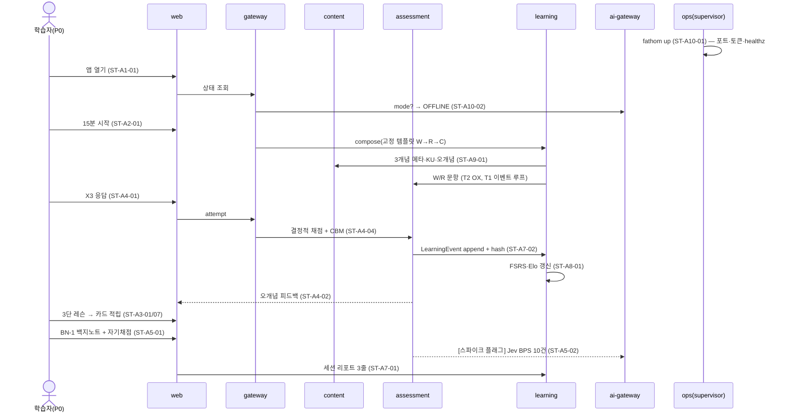

# USM-01. 사용자 스토리 맵 · 릴리스 슬라이싱 · UR 커버리지 — Fathom · 깊이

> **Trace**: REQ-01(`04-requirements-spec.md`) · UC-01(`05-use-cases.md`) · PLN-CNV-01 §7.2(슬라이스 = 통합 순서, **v1.1: 169u + 34cu**) · PED §8(백본 10개, 워킹 스켈레톤 정의) · R6 §7(PRC), §8.5(반복 계획 템플릿) · PLN-REV-01(`07-planning-review.md`)
> **버전**: **v1.1** (적대적 리뷰 51건 반영 → Planning Baseline v1.0) · **작성 주체**: T1 · **작성일**: 2026-09-30
> **후속 소비**: IT-01~07 반복 계획(`docs/40-impl/iterations/`), Task Brief, RTM-01(스토리 → FR 열), RETRO-01~03(계획 대비 실적 기준선)

---

## 0. 요약 (TL;DR)

1. **백본 활동은 10개**다(A1 시작·배치 → A10 운영). PED §8의 백본을 이어받고, 스토리는 REQ-01의 FR ID로 다시 작성했다. **[v1.1] 스토리 168개**(활동 155 + 교차 13)가 FR 236개를 빠짐없이 덮는다(§7). 스토리 하나는 1~5개 FR을 묶은 "사용자가 체감하는 한 조각"이다.
2. **릴리스 = 이번 빌드의 통합 순서**다(UR-18). **[v1.1]** R0 워킹 스켈레톤(INT-1a 스캐폴드·계약 7u + INT-1b 관통 루프 9u = 16u) → R1 오프라인 코어 + 습관 루프 + 백업·다기기(INT-2~3, 53u) → R2 AI 심화·신뢰(INT-4~5, 50u) → R3 전문가·장기·운영(INT-6~7, 50u). 합계 **코드 169u + 콘텐츠 34cu**, 통합 7회, **회고 3회**(INT-2·4·6 뒤) + **속도 체크포인트 VC-1**(INT-1 뒤). **보장 코어 GC ≈ 103u**는 속도가 계획의 61%여도 완성된다.
3. **슬라이싱 원칙**: ① R1은 "AI 없이도 완결"을 먼저 증명한다(PP-04). ② 데이터를 **쌓기 시작하는** 기능(증거 원장·봉인·기준선)과 **이탈·손실을 막는** 기능(습관 루프·백업·다기기)은 앞에, **소비하는** 무거운 기능은 뒤에 둔다. ③ 전문가 기능의 **데이터 모델**(Case 파라미터화·Artifact·Rubric·필수 개념·cap·스키마 훅)은 R0 동결에 포함한다(UR-05).
4. **UR-01~UR-18 대응 18/18**. 단, v1.1은 판정을 정직하게 고쳤다: **완전 13 · 부분 3(UR-01·10·12) · 조건부 2(UR-11·18)**(§6). RETRO-01~03은 이 표를 기준선으로 방향성·구현성을 판정한다(UR-03).

---

## 1. 백본 (Backbone Activities)

```
A1 시작·배치 → A2 계획 → A3 배우기 → A4 인출·문제 → A5 깊이 파기 → A6 적용 → A7 돌아보기 → A8 레벨 전환 → A9 확장·큐레이션 → A10 운영
 (첫날)        (매일)     (새 개념)    (매일 핵심)     (주 1~3회)     (주말·딥워크)  (세션·주·시즌)   (분기~연)       (주 1회, L3+)       (월 1회)
```

| 활동 | 사용자 목표 | 모자 | 주 페르소나 | 주요 UC | 스토리 수 |
|---|---|---|---|---|---|
| A1 시작·배치 | 설치하고 3분 안에 공부를 시작하며, 내 수준에서 출발하고, 어느 기기에서든 매일 쉽게 들어온다 | 학습자·운영자 | P0, P3, E3 | UC-01, UC-29, UC-34, UC-36 | 8 |
| A2 계획 | 오늘·이번 주·이번 시즌에 무엇을 얼마나 할지, **어느 트랙만 할지** 고민 없이 정해진다 | 학습자 | 전원, E1, E2 | UC-02, UC-10, UC-14, UC-19, UC-20, UC-33 | 17 |
| A3 배우기 | 새 개념을 이론 → 코드 → 핵심으로 배운다(UR-10) | 학습자 | P0, P1 | UC-03 | 13 |
| A4 인출·문제 | 다양한 형식으로 꺼내 보며 증거를 쌓고 오개념을 고친다 | 학습자 | 전원 | UC-04, UC-21, UC-23, UC-24 | 18 |
| A5 깊이 파기 | 백지노트·디깅·가르치기로 "진짜 이해"를 확인한다 | 학습자 | P0~P4, E1 | UC-06, UC-07, UC-28, UC-31 | 9 |
| A6 적용 | 코드·알고리즘·보안·인프라·Case·산출물로 실무 판단을 연습한다 | 학습자 | P1~P4 | UC-08, UC-09, UC-22, UC-25, UC-32 | 15 |
| A7 돌아보기 | 성장을 증거로 보고, 착각과 편향을 알아챈다 | 학습자 | 전원 | UC-13, UC-16 | 12 |
| A8 레벨 전환 | 증거로 레벨을 올리고(L5까지), 레벨에 맞게 공부 방식이 바뀐다(UR-11) | 학습자 | P2→P3, P3→P4, P4→P5 | UC-30 | 8 |
| A9 확장·큐레이션 | 콘텐츠를 가져오고 품질을 관리하며, **내가 고치고 갱신할 수 있다**(UR-13) | 큐레이터 | P2~P5 | UC-11, UC-12, UC-17, UC-18, UC-20, UC-27, UC-35 | 24 |
| A10 운영 | AI·비용·쿼터·백업·장애를 혼자서 한 명령으로 운영한다(UR-15·UR-17) | 운영자 | 전원 | UC-15, UC-16, UC-29, UC-36 | 31 |
| **합계** | | | | | **155** |

> 스토리 수는 활동별 표의 행 수다. **[v1.1]** 활동 표 합계는 155이고, 교차 활동 스토리 13개(ST-X-01~13)를 더해 총 **168**이다(v1.0: 132 + 6 = 138, 신규 30).

---

## 2. 스토리 맵 (활동 × 스토리 × 슬라이스)

> 표기: 스토리는 "(페르소나) 나는 ~하고 싶다 — ~하기 위해"의 형태로 적는다. 수용 요약은 REQ-01 수용기준의 핵심만 옮겼다(상세는 FR 참조). 슬라이스: **R0**(INT-1) · **R1**(INT-2~3) · **R2**(INT-4~5) · **R3**(INT-6~7).

### A1 시작 · 배치

| ID | 스토리 | 수용 요약 | FR | 슬라이스 |
|---|---|---|---|---|
| ST-A1-01 | (P0·E3) AI 설정 없이 설치 직후 바로 공부를 시작하고 싶다 — 키 발급을 기다리다 포기하지 않기 위해 | 첫 기동 OFFLINE, 외부 호출 0, `fathom up` 한 명령 | FR-AI-003, FR-SET-001, FR-SET-015 | **R0** |
| ST-A1-02 | (P0) 경력·주당 시간·경로를 90초 안에 알려 주고 싶다 — 내 상황에 맞는 기본값으로 시작하기 위해 | 온보딩 3문항, 전부 건너뛰기 가능, 기본 경로 `path.ai-fullstack-engineer` | FR-SET-019, FR-CUR-019 | R1 |
| ST-A1-03 | (P0) 트랙별로 "안다고 생각하는 수준"을 선언해 두고 싶다 — 나중에 증명된 수준과 비교하기 위해 | 선언 레코드 봉인, 보정 스튜디오에 대비 표시 | FR-PRG-025 | R1 |
| ST-A1-04 | (P3) 경력자로서 L1 문제만 풀지 않고 내 실제 수준에서 시작하고 싶다 — 시간 낭비를 막기 위해 | 트랙당 5~8문항 CAT, 첫 문항 레벨 ≥ prior, anchor-0 봉인 | FR-PRG-014 | R1 |
| ST-A1-05 | (운영자) 내 PC에 있는 AI 도구를 감지하고 동의한 것만 연결하고 싶다 — 쿼터·비용을 통제하기 위해 | probe ≤ 10s, 동의 전 라우팅 0, 4단 모드 판정 | FR-AI-001, FR-AI-002 | R2 |
| ST-A1-06 | (P0·E3) 설치부터 첫 세션까지 3분 안에 끝내고, 망분리 PC에도 번들로 옮기고 싶다 — 환경 때문에 공부가 끊기지 않기 위해 | 설치 → 첫 세션 리포트 ≤ 3분, 오프라인 tar 번들 동작 | FR-SET-012, FR-SET-013 | R3 |
| ST-A1-07 | (P0) 회사 노트북과 개인 MacBook에서 번갈아 공부해도 기록이 하나로 합쳐지기를 원한다 — 기기를 바꿔도 15년 원장이 끊기지 않기 위해 | device_id·ULID·기기별 체인, `export --since`/`import --merge` 멱등·순서 무관 | FR-SET-022, NFR-DATA-011 | R1 |
| ST-A1-08 | (P0) 부팅 후 북마크 한 번이면 바로 공부 화면이 뜨기를 원한다 — 매일 터미널을 여는 마찰 때문에 그만두지 않기 위해 | 선호 고정 포트, `fathom open` 부트스트랩, 쿠키 세션(다중 탭·재기동 유지), PWA | FR-SET-023, FR-SET-001, NFR-SEC-019 | R1 |

### A2 계획

| ID | 스토리 | 수용 요약 | FR | 슬라이스 |
|---|---|---|---|---|
| ST-A2-01 | (P0) 버튼 하나로 15분 세션을 시작하고 싶다 — 무엇을 할지 고민하지 않기 위해 | 고정 템플릿 W → R → C, 첫 문항 ≤ 2s | FR-STD-001 | **R0** |
| ST-A2-02 | (전원) 오늘 가용 시간(5~90분)과 에너지를 고르고 싶다 — 컨디션에 맞춰 공부하기 위해 | 템플릿 5종 × 에너지 3단, 예상 소요 ±20% | FR-STD-001 | R1 |
| ST-A2-03 | (전원) 세션이 워밍업 → 복습 → 신규 → 심화 → 도전 → 마무리로 짜이고, 같은 방식만 반복되지 않기를 원한다 — 질리지 않기 위해 | 슬롯 문법, 연속 ≤ 2블록, 세션당 ≥ 3종, 보스 1개, 성공 마무리, 적응 제어 | FR-STD-002, FR-STD-003, FR-STD-004, FR-STD-005 | R1 |
| ST-A2-04 | (전원) 각 블록이 왜 지금 나왔는지 보고, 마음에 안 들면 바꾸거나 건너뛰고 싶다 — 자동화를 믿고 통제감을 갖기 위해 | reason_codes ≥ 1, 교체 후에도 하드 제약 유지, 믹스테이프 타임라인 | FR-STD-006, FR-UX-016 | R1 |
| ST-A2-05 | (P3) 트랙 레벨에 맞는 공부 방식이 자동으로 섞이고, "더 어렵게"를 내가 조정하고 싶다 — 전문가가 되어도 초급 방식에 머물지 않기 위해 | Router 25칸, 레벨별 믹스 ±10%p, 개인 오버라이드 레이어 | FR-STD-007, FR-STD-008, FR-PRG-028 | R1 |
| ST-A2-06 | (전원) 한 주에 디깅·실습·백지노트를 최소 한 번씩 하도록 보장받고 싶다 — 편한 모드로만 도망가지 않기 위해 | 주간 쿼터, 엔트로피 ≥ 2.3 bits 가드, Wildcard | FR-STD-009 | R1 |
| ST-A2-07 | (P0·E2) 복습할 게 넘칠 때 기초가 되는 개념부터 하고 싶다 — 무너진 기초 위에 쌓지 않기 위해 | Keystone 우선순위, 일일 상한·3일 분산, 기초 균열 표시 | FR-PRG-006 | R1 |
| ST-A2-08 | (P3) 긴 세션이나 Case를 중간에 멈췄다가 이어서 하고 싶다 — 끊기는 일정에서도 완주하기 위해 | 블록 단위 저장, 재기동 후 복원, 이벤트 중복 0 | FR-STD-031 | R1 |
| ST-A2-09 | (P0·P1) 매일이 아니라 "주 4일" 목표로, 바쁜 날은 5분만 해도 인정받고 싶다 — 스트릭 압박 없이 습관을 이어가기 위해 | 주간 목표, 휴식 토큰, MVD(5분/리뷰 10), 끊김 알림 0 | FR-PRG-022 | **R1** ([v1.1] R3 → R1) |
| ST-A2-10 | (E1) 면접일까지 역산한 계획을 받고, 끝나면 평소 리듬으로 돌아가고 싶다 — 벼락치기 후 다 잊지 않기 위해 | D-day 역산, cram-aware, D+1 복귀·14일 분산 | FR-PRG-019 | R3 |
| ST-A2-11 | (P1) SI 크런치 기간에는 공부를 멈추거나 최소로 줄이고 싶다 — 죄책감 없이 쉬었다 돌아오기 위해 | 일시정지 due 이연, 크런치 = MVD·core만 | FR-PRG-021 | **R1** ([v1.1] R3 → R1) |
| ST-A2-12 | (E2) 8개월 쉬고 돌아왔을 때 연체 2,000장을 보지 않고 다시 시작하고 싶다 — 복귀 첫날 포기하지 않기 위해 | 연체 비노출, core ≥ 70%, 4~6주 분산, 재배치 제안 | FR-PRG-020 | **R1**(최소: 연체 비노출·core 우선)→R3 |
| ST-A2-13 | (P2·P5) 복습 부담이 예산을 넘지 않도록 신규 도입이 자동 조절되기를 원한다 — 15년 동안 복습 부채에 짓눌리지 않기 위해 | R1: 일일 상한 스로틀 / R3: 30일 부하 예측(오차 ≤ 15%, 시뮬레이터), 자동 스로틀, archive는 확인 후 | FR-PRG-018 | **R1**(lite)→R3 |
| ST-A2-14 | (전원) 6~8주 시즌 목표와 달성 확률을 적고, 끝나면 회고하고 싶다 — 방향을 잃지 않기 위해 | 시즌 목표 봉인, 필요 분량 시뮬레이션, 거시 Brier 회고 | FR-DSH-012 | R3 |
| ST-A2-15 | (P0) 세션 전에 "오늘 몇 % 맞힐지" 예측하고 끝나서 비교하고 싶다 — 내 감을 보정하기 위해 | JOL 입력(선택), 리포트에 예측 대 실제 | FR-PRG-026 | R1 |
| ST-A2-16 | (P0·P1·E1) "오늘은 k8s만"처럼 한 트랙만 골라 복습·문제·신규를 하고 싶다 — 섹션별로 집중해 공부하기 위해(UR-01) | 범위 = 전체/경로/트랙/개념 집합, 블록 100% 범위 트랙, 완화 사유 표시, 범위 밖 due 손실 0 | FR-STD-032 | R1 |
| ST-A2-17 | (P5·E2) 계속 틀리는 카드는 따로 진단받고, 안 할 트랙은 은퇴시키고, 내 기억 패턴에 맞게 간격이 조정되기를 원한다 — 15년 누적 복습에 짓눌리지 않기 위해 | leech(lapse ≥ 8) → 진단 제안, suspend/retire 이벤트, FSRS 개인화(Should, 승인 후) | FR-PRG-029, FR-PRG-030, FR-PRG-031 | R3 |

### A3 배우기 (UR-10)

| ID | 스토리 | 수용 요약 | FR | 슬라이스 |
|---|---|---|---|---|
| ST-A3-01 | (P0) 새 개념을 이론 → 코드 → 핵심 순서로 배우고 싶다 — 원리부터 실제 코드, 요점까지 한 번에 잡기 위해 | 3단 불변식, 스켈레톤 3개념(`net.tcp-handshake`, `k8s.probes`, `lang.js-event-loop`) | FR-CUR-001, FR-CUR-005, FR-STD-010 | **R0** |
| ST-A3-02 | (P3·P4) 내 레벨에서는 문제부터 부딪히고 싶다 — 이미 아는 이론을 다시 읽지 않기 위해 | 레벨별 진입점(L3 프리테스트·L4 문제·L5 문제 정의), 레벨 렌즈 | FR-CUR-006 | R1 |
| ST-A3-03 | (P0·P1) 배우기 전에 먼저 한두 문제를 풀어 보고 싶다 — 무엇을 모르는지 알고 읽기 위해 | 프리테스트 1~2문항, 증거 0, β 보정만 | FR-CUR-007 | R1 |
| ST-A3-04 | (P0) 이론을 읽는 중간에 짧은 질문으로 확인하고 싶다 — 수동으로 읽기만 하지 않기 위해 | 임베디드 질문 ≥ 1, w 0.5 이벤트 | FR-CUR-008 | R1 |
| ST-A3-05 | (P0) 예제 코드 → 빈칸 코드 → 줄 맞추기로 단계적으로 익히고 싶다 — 코드가 손에 붙게 하기 위해 | worked·faded·Parsons(키보드 대체) | FR-LAB-003 | R1 |
| ST-A3-06 | (P0) 코드 결과를 예측한 뒤 실제로 돌려 보고 싶다 — 머릿속 모델을 검증하기 위해 | 예측 전 실행 불가, 예측과 실제 diff | FR-LAB-007 | R1 |
| ST-A3-07 | (P0) 배운 핵심이 자동으로 복습 카드가 되기를 원한다 — 따로 카드를 만들지 않기 위해 | 개념 × facet 카드, 중복 0 | FR-PRG-004 | **R0** |
| ST-A3-08 | (전원) 한글 초성이나 약어로 개념을 바로 찾고 싶다 — 떠오른 순간 바로 공부하기 위해 | FTS5 trigram 재현율 ≥ 0.8, 팔레트 "ㄷㅋ" 검색 | FR-CUR-011, FR-UX-005 | R1 |
| ST-A3-09 | (P2) 이 내용이 어디에 근거하는지 출처를 보고 싶다 — AI가 만든 내용을 맹신하지 않기 위해 | 출처 서랍: 근거 KU·출처·게이트 결과 | FR-CUR-012 | R1 |
| ST-A3-10 | (P0) 선수 개념을 안 했어도 막히지 않고, 대신 추천 경로를 보고 싶다 — 궁금한 것부터 할 자유를 위해 | 잠금 0, 경고 1회, 선수 그래프 기반 추천 | FR-UX-015, FR-CUR-018 | R1 |
| ST-A3-11 | (P2) 지도에만 있는 개념(Tier C)을 열면 AI가 요약·KU를 채워 주기를 원한다 — 469개 전부를 공부할 수 있기 위해 | FULL ≤ 60s 초안 + 게이트, OFFLINE은 가져오기 유도 | FR-CUR-010 | R2 |
| ST-A3-12 | (P0·P1) 잘할수록 예제의 빈칸이 늘어나 스스로 작성하게 되기를 원한다 — 보조 바퀴를 자연스럽게 떼기 위해 | Scaffold Fader: P ≥ 0.8 전진, 2연속 실패 후퇴 | FR-LAB-008 | R3 |
| ST-A3-13 | (전원) 어떤 개념을 열어도 이론 → 코드 → 핵심 3단이 보이고, 트랙별로 얼마나 채워졌는지 알고 싶다 — 비어 있는 섹션에 속지 않기 위해 | 티어별 최소 사양, R-3STAGE 469개 검사, 3단 커버리지 KPI | FR-CUR-005, FR-CUR-026 | R1 |

### A4 인출 · 문제

| ID | 스토리 | 수용 요약 | FR | 슬라이스 |
|---|---|---|---|---|
| ST-A4-01 | (P0) 출근길에 OX를 확신도와 함께 빠르게 풀고 싶다 — 짧은 시간에 착각을 잡기 위해 | 결합 키 O1~X3, CBM 점수표, 3분 12문항 | FR-STD-011, FR-QST-024 | **R0** |
| ST-A4-02 | (P0) 틀리면 어떤 오개념 때문인지 한 문장으로 알고 싶다 — 같은 실수를 반복하지 않기 위해 | 오답지 ↔ mc 연결, 오개념 이름 + 근거 1문장 | FR-QST-023, FR-QST-007 | **R0** |
| ST-A4-03 | (P0) JS 이벤트 루프 출력 순서를 예측하는 문제를 풀고 싶다 — 실행 모델을 정확히 이해하기 위해 | T1 생성기, 정답 = 실제 실행 결과 100% | FR-STD-013, FR-QST-001 | **R0** |
| ST-A4-04 | (전원) 채점이 서버에서 공정하게 되고 정답이 미리 새지 않기를 원한다 — 점수를 신뢰하기 위해 | 제출 전 정답·해설 0, 결정적 형식 AI 호출 0 | FR-QST-022, FR-QST-017 | **R0** |
| ST-A4-05 | (전원) MCQ·빈칸·단답·순서·매칭이 섞여 나오고, 단답은 조사·대소문자 차이로 틀리지 않기를 원한다 — 형식이 아니라 지식으로 평가받기 위해 | 5형식, 정규화 정확도 ≥ 0.98 | FR-STD-012, FR-QST-018 | R1 |
| ST-A4-06 | (전원) 같은 개념이라도 매번 다른 문제가 나오기를 원한다 — 문제를 외우지 않고 개념을 익히기 위해 | T2 전개 ≥ 20/개념, 30일 인스턴스 재노출 0 | FR-QST-006, FR-QST-002 | R1 |
| ST-A4-07 | (P1) 버그·Dockerfile·K8s YAML·로그에서 문제를 찾아내는 연습을 하고 싶다 — 현장 티켓에 대비하기 위해 | 라인 범위 ±1 결정적 채점, 설정 리뷰 과제 ≥ 12 | FR-STD-014 | R1 |
| ST-A4-08 | (P1·P2) 자꾸 헷갈리는 두 개념(예: Liveness vs Readiness)을 번갈아 비교하고 싶다 — 구분 기준을 확실히 하기 위해 | 혼동 ≥ 3회 쌍 → 대조 블록, 판별 규칙 카드 | FR-STD-015 | R1 |
| ST-A4-09 | (전원) 복습 등급을 시스템이 추천하고 나는 한 번만 눌러 고치고 싶다 — 채점 피로 없이 정확한 간격을 얻기 위해 | FSRS-6·보존율 계층, 추천 grade + 1탭 수정 | FR-PRG-005, FR-PRG-007 | R1 |
| ST-A4-10 | (전원) 찍거나 힌트로 푼 것이 실력으로 과대 계산되지 않고, 해설은 푼 뒤에만 보이기를 원한다 — 정직한 증거를 쌓기 위해 | **[v1.1]** t_min 미만 빠른 응답은 정오 무관 w 0(FSRS Hard 이하), 힌트 ×0.8^n, 제출 전 해설 0, 무작위 찍기 θ 상승 ≤ 0.02 | FR-QST-025, FR-QST-026 | R1 |
| ST-A4-11 | (P2) 이상한 문제를 `R` 한 번으로 신고하고 즉시 빼고 싶다 — 불량 문제 때문에 기록이 망가지지 않기 위해 | 즉시 제외·증거 무효, 처리 결과 표시(R2) | FR-QST-016 | R1 |
| ST-A4-12 | (전원) 확신했는데 틀렸을 때 "왜 그렇게 생각했는지" 질문을 받고 싶다 — 착각의 뿌리를 드러내기 위해 | 깊이 당김, 10문항당 ≤ 3회 | FR-STD-028 | R2 |
| ST-A4-13 | (전원) 백지노트에서 빠뜨린 내용이 같은 세션 끝에 바로 문제로 나오기를 원한다 — 빈틈을 즉시 메우기 위해 | 누락 unit → 마무리 블록 T2 1~3개 | FR-STD-029 | R2 |
| ST-A4-14 | (P2) AI가 쓴 답안의 결함을 찾아내는 감사 연습을 하고 싶다 — AI 산출물을 검증하는 역량을 키우기 위해 | 결함 2~5 주입, 위치 결정적 채점, 설명 Jev | FR-STD-022 | R2 |
| ST-A4-15 | (P2·P3) 내가 직접 문제와 매력적인 오답을 만들어 보고 싶다 — 출제자 수준으로 이해하기 위해 | 게이트 G2·G3·G5·G6·G7 채점, 편입 시 본인 가중 ≤ 0.5 | FR-STD-024 | R2 |
| ST-A4-16 | (E1·P3) 시스템 설계 면접처럼 QPS·스토리지를 어림하는 연습을 하고 싶다 — 숫자 감각을 기르기 위해 | 로그 허용오차 점수, 단위 오류 태그, 템플릿 12 | FR-STD-016 | R3 |
| ST-A4-17 | (P2·P3) 조건 하나가 바뀌면 답이 어떻게 뒤집히는지 쌍으로 풀고 싶다 — "it depends"를 설명할 수 있기 위해 | 쌍 일관성 + pivot 채점, 시드 30쌍 | FR-STD-017 | R3 |
| ST-A4-18 | (P1·P2) 내 오류 원인별로 모아서 집중 드릴을 하고 싶다 — 같은 유형의 실수를 끊기 위해 | 원인 5분류 클러스터 → 5~10문항, 전후 비교 | FR-STD-030 | R3 |

### A5 깊이 파기

| ID | 스토리 | 수용 요약 | FR | 슬라이스 |
|---|---|---|---|---|
| ST-A5-01 | (P0·E3) 골격만 보고 백지노트를 쓰고 체크리스트로 스스로 채점하고 싶다 — AI 없이도 백지 복습을 하기 위해 | BN-1, KP 체크리스트 자기채점(w 0.3), 제출 전 AI 호출 0 | FR-STD-018, FR-QST-021 | **R0** |
| ST-A5-02 | (개발팀·P0) 같은 백지노트를 Jev로 채점해 사람 판정과 비교해 보고 싶다 — 한국어 판정 리스크를 초기에 측정하기 위해 | 골드셋 10건 일치율 리포트, 객체 키 참조만 | FR-AI-014 | **R0**(스파이크) |
| ST-A5-03 | (P0·P1) 단계가 오르는 백지노트 사다리(골격 → 제목 → 주제)와 집중 모드·타이머·애매 표시를 원한다 — 점점 더 스스로 떠올리기 위해 | BN-1~3, 레벨별 타이머, 애매 표시 저장 | FR-STD-018 | R1 |
| ST-A5-04 | (P0) 제출하면 회상·누락·오류를 3색으로 보고, 빠진 것은 카드·OX로 이어지기를 원한다 — 한 번의 노트로 복습 계획까지 얻기 위해 | unit별 판정(객체 키), BPS, 카드·OX·재회상 예약, OFFLINE 보류 | FR-STD-019 | R1→R2 |
| ST-A5-05 | (P2·E1) AI가 "왜?"를 계속 물으며 D7까지 파고들게 하고 싶다 — 면접에서 꼬리 질문에 무너지지 않기 위해 | 결정적 상태기계 + Jev 턴 판정 + LLM 발화, 12턴 상한, OFFLINE 질문 은행 + **[v1.1] D4~D5 결정적 MCQ** | FR-STD-020 | R2 |
| ST-A5-06 | (P2) 디깅 중 처음 나온 개념을 나중에 가져올 후보로 모아 두고 싶다 — 호기심을 잃지 않기 위해 | 미니 그래프 → 후보 큐(중복 병합) | FR-IMP-012 | R2 |
| ST-A5-07 | (P4) 일부러 틀린 생각을 가진 AI 주니어를 가르쳐 보고 싶다 — 가르칠 수 있을 만큼 아는지 확인하기 위해 | 오개념 2개 고정, Teaching score ≥ 0.8 → Taught | FR-STD-021 | R2 |
| ST-A5-08 | (P0·P1) 계속 틀리는 개념의 진짜 원인이 어느 선수 개념인지 찾아 주기를 원한다 — 엉뚱한 곳을 반복하지 않기 위해 | 선수 이분 탐색 ≤ 4문항, 마이크로 레슨, 프런티어 탐침 w 0.3 | FR-PRG-015 | R2 |
| ST-A5-09 | (P5) 1년 전·3년 전의 내 설명과 지금을 나란히 비교하고 싶다 — 성장을 실감하고 과거의 착각을 고치기 위해 | 타임캡슐 6·12·36개월, 180일+ 답안 비평, SOLO Δ | FR-STD-027 | R3 |

### A6 적용

| ID | 스토리 | 수용 요약 | FR | 슬라이스 |
|---|---|---|---|---|
| ST-A6-01 | (P1) 코드 과제를 안전하게 실행하고 테스트로 채점받고 싶다 — 내 PC를 위험에 두지 않고 실습하기 위해 | 타임아웃·메모리·네트워크 차단, 숨은 테스트 비공개, 결과 기록 | FR-LAB-001, FR-LAB-004, FR-LAB-013 | R1 |
| ST-A6-02 | (P1) SQL 윈도 함수 같은 쿼리를 바로 실행해 확인하고 싶다 — DB 없이도 SQL 실력을 쌓기 위해 | `node:sqlite` 인메모리, ATTACH 차단 | FR-LAB-002 | R1 |
| ST-A6-03 | (P0·P1) 막히면 방향 → 개념 → 부분 코드 순으로 힌트를 받고, 정답을 보면 기록에서 빠지기를 원한다 — 스스로 푸는 힘을 지키기 위해 | 힌트 4단 순차, 참조 모드 증거 0 | FR-LAB-005, FR-LAB-006 | R1 |
| ST-A6-04 | (P1·E1) LRU·debounce 같은 핵심 코드를 빈 화면에서 다시 짜 보고 싶다 — 손으로 기억하기 위해 | 카타 24, 숨은 테스트, facet=code 간격 복습 | FR-LAB-009 | R3 |
| ST-A6-05 | (P1) Dockerfile·K8s manifest·Actions를 작성하고 규칙으로 채점받고 싶다 — Docker가 없어도 인프라 실습을 하기 위해 | 정적 규칙 엔진, 과제 12, 채점에 Docker 불필요 | FR-LAB-010 | R3 |
| ST-A6-06 | (P1) Docker가 있으면 실제 빌드 검사도 해 보고 싶다 — 정적 검사 너머를 확인하기 위해 | 동의 후 `docker build --check`, 임시 파일 정리 | FR-LAB-011 | R3 |
| ST-A6-07 | (E3) Docker가 없는 망분리 PC에서는 같은 역량을 리뷰·로그 문제로 대신 훈련하고 싶다 — 환경 탓에 빠지는 역량이 없기 위해 | 자동 대체 + 사유 기록 | FR-LAB-012 | R3 |
| ST-A6-08 | (P3) 새벽 3시 장애를 증거를 요청해 가며 진단·완화하는 Case를 풀고 싶다 — 실제 인시던트 판단력을 기르기 위해 | 단계적 공개, 결정점(객체 키), MTTR, 루브릭 4차원, 저장·재개, 시드 18 | FR-STD-025, FR-CUR-016 | R3 |
| ST-A6-09 | (P1·P4) 보안약점·개발표준 위반이 심어진 PR을 리뷰하고, SI 산출물 문제를 풀고 싶다 — SI 현장 리뷰 역량과 산출물 감각을 기르기 위해 | 시드 PR 12, 재현율·정밀도, `ctx:si` 40문항 | FR-STD-023, FR-CUR-015 | R3 |
| ST-A6-10 | (P4) ADR·표준 조항·포스트모템을 쓰고 반박을 받아 방어하고 싶다 — 아키텍트의 산출물 역량을 기르기 위해 | **[v1.1] Must(L5 증거 모드)**, 템플릿 목표 12(하한 6), 차원별 루브릭, 반박 1~3턴 | FR-STD-026 | R3 |
| ST-A6-11 | (P1·E1) 알고리즘 문제를 직접 구현하고 숨은·복잡도 테스트로 채점받고 싶다 — 코딩 테스트와 성능 감각을 함께 기르기 위해 | 목표 40(하한 24), L1~L4, O(n²) 풀이는 복잡도 테스트 실패 | FR-LAB-014 | R2 |
| ST-A6-12 | (P1·P2) 취약한 코드를 익스플로잇 테스트가 막히도록 고쳐 보고 싶다 — 보안약점을 손으로 막아 보기 위해 | 목표 8(하한 6), 기능 테스트 유지 + 익스플로잇 실패, 러너 샌드박스 | FR-LAB-015 | R3 |
| ST-A6-13 | (P0) ml·llm 트랙도 Python 코드의 출력·버그를 예측하며 배우고 싶다 — 내 Python·LangChain 배경을 살리기 위해 | 예측·빈칸·Parsons·오류 찾기, 빌드타임 오라클, 런타임 Python 0 | FR-LAB-017 | R2 |
| ST-A6-14 | (P3~P5) 같은 Case를 다시 풀면 다른 근본 원인이 나오기를 원한다 — 답을 외운 회상이 아니라 판단을 연습하기 위해 | variant_params·root_cause_pool, 미노출 변형, 소진 시 회상 모드 ×0.5 | FR-STD-034, FR-CUR-016 | R3 |
| ST-A6-15 | (P3~P5) 평일 10분에도 판단 연습을 하고 싶다 — 시니어의 짧은 시간을 판단에 쓰기 위해 | 조건 반전 1쌍·결정점 1개 마이크로 Case | FR-STD-035 | R3 |

### A7 돌아보기

| ID | 스토리 | 수용 요약 | FR | 슬라이스 |
|---|---|---|---|---|
| ST-A7-01 | (P0) 세션이 끝나면 무엇이 좋아졌는지 3줄로 보고 싶다 — 작은 성취를 느끼기 위해 | 안정도·깊이 변화·다음 추천, 축하 모션 1곳 | FR-DSH-008 | **R0** |
| ST-A7-02 | (P5) 내 모든 학습 기록이 지워지거나 조작되지 않는 원장으로 남기를 원한다 — 15년 뒤에도 증거로 쓰기 위해 | append-only, w 고정, prev-hash 체인 | FR-PRG-001, FR-PRG-002, FR-PRG-003 | **R0** |
| ST-A7-03 | (P0) 내가 어디서 과신하는지 착각 지도로 보고 싶다 — 안다고 착각한 곳을 먼저 고치기 위해 | Brier·ECE·과신 지수, 착각(시도 ≥ 8·격차 ≥ 0.15), 보정 스튜디오 | FR-PRG-023, FR-PRG-024, FR-DSH-010 | R1 |
| ST-A7-04 | (P0·P5) 트랙 × 레벨 해저 지도로 내 깊이를 한눈에, 과거와 겹쳐 보고 싶다 — 성장의 형태를 보기 위해 | Depth Map 469 노드 ≤ 1s, 레이어 4종, N개월 전 오버레이·타임랩스 | FR-DSH-003, FR-DSH-004, FR-DSH-005 | R1 |
| ST-A7-05 | (P2) 지도에서 개념을 누르면 "왜 숙달인가"의 근거와 다음 할 일이 보이기를 원한다 — 숫자를 믿을 수 있기 위해 | 증거 패널 = 판정 입력 집합, 3입력 안에 행동 시작 | FR-DSH-006, FR-DSH-007 | R1 |
| ST-A7-06 | (전원) 내 깊이가 하나의 지표(LDI)로 계산되되, 홈에서는 숫자에 쫓기지 않기를 원한다 — 지표 중독 없이 방향을 보기 위해 | LDI 리플레이 일치, 숫자는 주간 리뷰·시즌 회고만 | FR-PRG-017, FR-DSH-011 | R1 |
| ST-A7-07 | (P0) 홈에는 지금 할 일 하나만 보이기를 원한다 — 앱을 열자마자 시작하기 위해 | 홈 요소 ≤ 5, 연체 배지 0 | FR-DSH-001 | R1 |
| ST-A7-08 | (전원) 일요일 10분 동안 한 주를 돌아보고 다음 주 계획을 한 번에 적용하고 싶다 — 학습을 운영하기 위해 | R1 lite: ΔLDI·약점 Top5·모드 편중 + 1클릭 계획 / R3: 오개념 계열·시간당 깊이·포스트모템 lite | FR-DSH-009, FR-DSH-015, FR-DSH-016 | **R1**(lite)→R3 |
| ST-A7-09 | (P0~P5) 이탈 조짐이 보이면 비난 없이 가볍게 도움을 받고 싶다 — 몇 주 쉬다 영영 그만두지 않기 위해 | Tripwire 13, 개인 기준선, 조치 강도 설정 | FR-DSH-013, FR-SET-021 | R3 |
| ST-A7-10 | (E1·P4) 기간별 성장 근거와 대표 산출물을 포트폴리오로 내보내고 싶다 — 면접관·팀장에게 증거로 보여 주기 위해 | MD/HTML 단일 파일, 증거 해시 | FR-DSH-014 | R3 |
| ST-A7-11 | (P2~P5) 고쳤다고 생각한 오개념이 정말 사라졌는지 추적하고 싶다 — 같은 착각이 몇 년 뒤 재발하지 않기 위해 | active → suppressed → extinguished, 재발 시 24h 재출제, meta_family | FR-PRG-016 | R3 |
| ST-A7-12 | (E3) AI가 돌아왔을 때 내 자기채점이 얼마나 관대했는지 알고 싶다 — 자기평가를 보정하기 위해 | 자기 대 AI 편향 계수, 주간 리뷰 문장 | FR-QST-021 | R2 |

### A8 레벨 전환 (UR-11)

| ID | 스토리 | 수용 요약 | FR | 슬라이스 |
|---|---|---|---|---|
| ST-A8-01 | (전원) 내 실력과 문제 난이도가 함께 추정되어 적당히 어려운 문제가 나오기를 원한다 — 너무 쉽거나 어렵지 않기 위해 | Elo θ/β, w 0 이벤트는 θ 불변 | FR-PRG-008 | **R0**(최소)→R1 |
| ST-A8-02 | (P2) "완료" 체크가 아니라 여러 형식의 증거로 숙달이 판정되고, 기억·깊이·전이·가르치기가 따로 보이기를 원한다 — 진짜 숙달만 인정받기 위해 | Mastered 3조건, 4중 역량 배지 | FR-PRG-009, FR-PRG-010 | R1 |
| ST-A8-03 | (P3) 오래 안 본 개념은 "녹슬었다"고만 표시되고 레벨이 깎이지 않기를 원한다 — 쌓은 것을 잃는 공포 없이 복구하기 위해 | Lifecycle CL-0~8·CL-X, NBA, 녹슴(강등 없음) | FR-PRG-011 | R1 |
| ST-A8-04 | (P0·P1) 숙달을 확인받는 짧은 평가를 원할 때 받고 싶다 — 스스로 확신하기 위해 | 3~5문항·형식 중복 0·보정 엔진만, 실패 시 부족 증거 + 2일 | FR-PRG-012 | R1 |
| ST-A8-05 | (P2→P3) 조건을 채우면 승급 평가를 보고, 통과하면 공부 방식이 전문가 쪽으로 바뀌기를 원한다 — 레벨에 맞게 성장하기 위해 | **[v1.1]** 필수 개념(Tier A/B) ≥ 85% Mastered(희소 레벨 규칙), 평가 12문항·형식 ≥ 4·CBM ≥ 70% (+D4 개념 ≥ min(5, 가능 수)·Case ≥ 2.5), OFFLINE은 잠정 승급, Router·밀도 전환 | FR-PRG-013 | R3 |
| ST-A8-06 | (P3~P5) 레벨이 오르면 화면이 조밀해지고 기본 화면도 바꾸자는 제안을 받고 싶다 — 숙련자에게 맞는 도구가 되기 위해 | Guided → Pro(토큰만), 기본 화면 제안 1회 | FR-UX-006, FR-DSH-002 | R3 |
| ST-A8-07 | (P4·P5) 가르치거나 표준을 만들 수 있음을 증거로 보여 L5에 오르고 싶다 — 15년차 전문가 수준을 증명하기 위해 | L4→L5: L4+ Case 2개 ≥ 3.0 + (Taught ≥ 2 또는 산출물 2개 ≥ 3.0 + 반박 방어) + CBM ≥ 75% | FR-PRG-032, FR-STD-026 | R3 |
| ST-A8-08 | (전원) 무엇이 필수 개념인지, 이 트랙이 v1에서 어디까지 오를 수 있는지, AI 없이 받은 판정이 잠정인지 알고 싶다 — 승급 규칙을 믿기 위해 | required_for_level(Tier A/B), 희소 레벨 규칙, offline_cap_level 배지, 잠정 판정 확정·철회 | FR-CUR-025, FR-PRG-033 | R1(메타)→R3 |

### A9 확장 · 큐레이션 (UR-13)

| ID | 스토리 | 수용 요약 | FR | 슬라이스 |
|---|---|---|---|---|
| ST-A9-01 | (큐레이터) 콘텐츠 팩을 검증된 상태로만 적재하고 싶다 — 깨진 콘텐츠가 학습을 망치지 않기 위해 | zod·sha256·원자적 적재, lint 5규칙, ID 불변·alias | FR-CUR-002, FR-CUR-003, FR-CUR-004 | **R0** |
| ST-A9-02 | (전원) 19개 트랙 469개 개념 전체 지도와 깊이 있는 시드 콘텐츠를 원한다 — 전 분야를 섹션별로 공부하기 위해(UR-01) | **[v1.1]** R1: Tier C 전량 + A ≥ 24 + B ≥ 40 → R2: 하한(A ≥ 40·B ≥ 60·트랙당 OFFLINE ≥ 4) → 팩 증분: 목표(A 72·B 120) | FR-CUR-001, FR-CUR-009 | R1→R2 |
| ST-A9-03 | (전원) 개념 사이의 선수·형제 관계가 모델링되기를 원한다 — 기초 균열·헷갈림·진단이 가능하기 위해 | 선수 폐포 ≤ 50ms, 하류 수 오라클 일치 | FR-CUR-018 | R1 |
| ST-A9-04 | (운영자) 새 팩 버전을 설치해도 내 기록이 그대로이기를 원한다 — 콘텐츠를 안심하고 업데이트하기 위해 | `fathom seed`, 이벤트 불변, 변경 KU 목록 | FR-SET-014 | R1 |
| ST-A9-05 | (P0) 세션 문제가 미리 준비되어 첫 문항이 바로 뜨기를 원한다 — 기다리다 흐름이 깨지지 않기 위해 | 수요 예측 워밍, 안전 재고, p95 ≤ 2s | FR-QST-013 | R1 |
| ST-A9-06 | (P2) URL·MD 파일·붙여넣기로 외부 글을 안전하게 가져오고 싶다 — 업무에서 만난 좋은 글을 공부로 바꾸기 위해 | 3종 입력, SSRF 차단 100%, I1~I9 단계 재개 | FR-IMP-001, FR-IMP-002, FR-IMP-003 | R2 |
| ST-A9-07 | (P2·E3) AI가 있으면 정확히, 없으면 규칙으로라도 개념·KU를 추출하고 싶다 — 어떤 환경에서도 가져오기가 되기 위해 | AI 추출 + Jev 근거 검증(p ≥ 0.85), OFFLINE 규칙 추출 `trust=user` | FR-IMP-004, FR-IMP-005 | R2 |
| ST-A9-08 | (P2·권리자) 가져온 글에 숨은 AI 지시나 저작권 문제가 걸러지기를 원한다 — 안전하고 합법적으로 쓰기 위해 | 주입 탐지 ≥ 0.9(H+J), 라이선스 A~P, copy-guard | FR-IMP-006, FR-IMP-007 | R2 |
| ST-A9-09 | (P2) 기존 지식과 겹치는 부분은 합치고, 바뀌는 내용을 diff로 보고 승인하고 싶다 — 지도가 중복·오염되지 않기 위해 | 유사도 구간별 병합, 스테이징 승인, 미승인 출제 0 | FR-IMP-008, FR-IMP-009 | R2 |
| ST-A9-10 | (P1·P2) 회사 관련 자료는 로컬 LLM으로만 처리하고 싶다 — 회사 정보를 외부로 보내지 않기 위해 | 민감 표시 → 외부 호출 0, Ollama 없으면 보류 | FR-IMP-010, FR-AI-023 | R2 |
| ST-A9-11 | (P2) 가져온 개념이 바로 문제·카드가 되기를 원한다 — 가져오기로 끝나지 않고 학습이 되기 위해 | 발행 5분 안에 T2 ≥ 2/KU, 3단 누락 "보강 필요" | FR-IMP-011 | R2 |
| ST-A9-12 | (P1·P2) 업무 중 만난 개념을 터미널에서 5초 만에 적어 두고, 다음 세션에 정리하고 싶다 — 일과 공부를 잇기 위해 | `fathom capture` ≤ 500ms, 마스킹, 트리아지 블록, Jev `choice` | FR-IMP-013, FR-IMP-014 | R2 |
| ST-A9-13 | (전원) AI가 근거 있는 새 문제와 문제 템플릿을 만들어 풀이 부족해지지 않기를 원한다 — 오래 써도 같은 문제만 보지 않기 위해 | T3 근거 필수, T4 S2 승인, LLM = 템플릿 작가(표본 8) | FR-QST-003, FR-QST-004, FR-QST-005 | R2 |
| ST-A9-14 | (전원) AI가 만든 문제는 품질 검사를 통과한 것만 나오기를 원한다 — 틀린 문제로 잘못 배우지 않기 위해 | G0~G13 비용순, stakes, 메타모픽, OFFLINE 보류, G4 ≠ 생성 계열 | FR-QST-008, FR-QST-009, FR-QST-010, FR-QST-011, FR-QST-012 | R2 |
| ST-A9-15 | (큐레이터) 이상한 문제가 통계로 자동 탐지되고 같은 계열이 함께 격리되기를 원한다 — 불량이 퍼지지 않기 위해 | drift·0% 오답지·신고율 SLO 2%, 패밀리 격리 | FR-QST-014, FR-QST-015 | R2 |
| ST-A9-16 | (큐레이터) 신고·보류·격리·후보를 한 콘솔에서 처리하고 싶다 — 콘텐츠 운영을 몰아서 끝내기 위해 | 콘솔, 보류 수 = DB pending | FR-SET-011 | R2 |
| ST-A9-17 | (P5) 낡은 지식을 표시하고 재검증하며, 공백 뒤 바뀐 것을 요약받고 싶다 — 과거 버전 지식으로 판단하지 않기 위해 | `valid_as_of`·CL-X·F_k, outdated 신고, 복귀 변경 요약 | FR-CUR-013, FR-CUR-014 | R3 |
| ST-A9-18 | (P2~P5) 정책(스케줄·숙달 규칙)이 바뀌기 전에 과거 기록으로 영향을 미리 보고 싶다 — 규칙 변경이 내 기록을 흔들지 않게 하기 위해 | 정책 버전 파일, 이벤트에 policy_version, 리플레이 비교 리포트 | FR-CUR-017, FR-SET-018 | R1 |
| ST-A9-19 | (개발팀) 시드 콘텐츠 목표분(Tier A 나머지·Tier B 120·Case 30·자산)을 파이프라인으로 공급하고 싶다 — 코드와 병행해 콘텐츠 커버리지를 채우기 위해 | **[v1.1]** 34cu(하한 20cu), V1~V10 + 5% 표본 감사, 콘텐츠 미달은 코드 INT 비차단(D-11만 차단) | FR-CUR-009, NFR-MAINT-013 | R2 |
| ST-A9-20 | (P2·P5) 시드 문제의 오류를 내가 직접 고치고, 팩을 업데이트해도 내 수정이 남기를 원한다 — 틀린 내용을 몇 년씩 보지 않기 위해 | 오버레이 패치 이벤트, 팩 업그레이드 시 재적용·충돌 diff | FR-CUR-020 | R2 |
| ST-A9-21 | (P5) 오래된 트랙 팩을 내 AI 구독으로 다시 만들어 승인해 쓰고 싶다 — 상류 업데이트가 없어도 콘텐츠를 신선하게 유지하기 위해 | `fathom pack refresh`, 미리보기·승인, `channel=local` | FR-CUR-023 | R3 |
| ST-A9-22 | (P0·P1) 정보처리기사·CKA 출제 범위로 D-day 공부를 하고 커버리지를 보고 싶다 — 자격증 목표를 직접 지원받기 위해 | 공식 출제기준 블루프린트 2종(하한), 가중 커버리지 % | FR-CUR-024, FR-PRG-019 | R3 |
| ST-A9-23 | (P3~P5) 회사 장애 메모를 외부로 보내지 않고 나만의 Case로 바꾸고 싶다 — 가장 현실적인 전문가 과제를 얻기 위해 | 로컬 비식별화 + Ollama 초안/템플릿, 외부 호출 0 | FR-CUR-022 | R3 |
| ST-A9-24 | (P3~P5) 전문가 해설이 1차 출처에 근거하고, 이견이 있는 판단은 조건과 함께 제시되기를 원한다 — 미묘하게 틀린 "정답"을 배우지 않기 위해 | L4+ 1차 출처 span 100%, contested → best 복수 + 조건 | FR-CUR-021 | R2 |

### A10 운영 (UR-15 · UR-17)

| ID | 스토리 | 수용 요약 | FR | 슬라이스 |
|---|---|---|---|---|
| ST-A10-01 | (운영자) `fathom up/down/status`로 모든 서비스를 한 번에 다루고 싶다 — 서비스가 여러 개여도 운영이 한 명령이기 위해 | 전 서비스 healthz ≤ 10s, 포트 자동, 크래시 5s 재시작 | FR-SET-001, FR-SET-015 | **R0** |
| ST-A10-02 | (전원) 지금 AI가 어떤 상태인지 항상 보이기를 원한다 — 채점 품질을 오해하지 않기 위해 | 헤더 상태 칩(OFFLINE 표시), 전역 셸 | FR-AI-002, FR-UX-010 | **R0** |
| ST-A10-03 | (P0) 첫 화면부터 세련된 다크 테마·한국어 폰트·IME 안전 입력을 원한다 — 오래 머물고 싶은 도구이기 위해(UR-04) | OKLCH 토큰 단일 소스, 폰트 self-host, 조합 중 Enter 제출 0 | FR-UX-001, FR-UX-004, FR-UX-013 | **R0** |
| ST-A10-04 | (전원) XP·폭죽·연체 빨간 배지 같은 조작적 장치가 없기를 원한다 — 보상이 아닌 깊이로 동기를 얻기 위해 | NG-G1~G7 lint CI 통과 | FR-UX-008 | **R0** |
| ST-A10-05 | (전원) PC 시간이 바뀌거나 절전해도 복습 일정이 꼬이지 않기를 원한다 — 기록의 정확성을 위해 | 하루 시작 04:00, 시각 역행 보정 | FR-PRG-027 | **R0** |
| ST-A10-06 | (전원) 서비스 하나가 죽어도 공부는 계속되기를 원한다 — 장애 때문에 흐름이 끊기지 않기 위해 | ai-gateway kill → 세션 계속, 격하 표시 ≤ 5s | FR-SET-002 | R1 |
| ST-A10-07 | (운영자) 문제가 생기면 요청 하나를 따라 모든 서비스 로그를 보고 싶다 — 혼자서 원인을 찾기 위해 | x-request-id 연결 검색 | FR-SET-016 | R1 |
| ST-A10-08 | (P2) 보존율·일일 상한·하루 시작 시각을 조정하고 결과를 미리 보고 싶다 — 내 생활에 맞게 튜닝하기 위해 | 범위 검증, 변경 이벤트, 부하 미리보기 | FR-SET-009 | R1 |
| ST-A10-09 | (전원) 공부 화면에서 실수로 데이터를 지우거나 예산을 올리지 않기를 원한다 — 오조작을 막기 위해 | 학습/관리 공간 분리, 확인 토큰 없으면 409 | FR-SET-010 | R1 |
| ST-A10-10 | (E3·운영자) AI를 끄고도 모든 모드가 되는지 매번 자동으로 증명되기를 원한다 — 오프라인 약속이 깨지지 않기 위해 | Zero-AI E2E 3 OS, 외부 호출 0, 제출 전 생성 호출 거부 정책 | FR-AI-020 | R1 |
| ST-A10-11 | (P0) 어떤 화면이든 키보드로 조작하고, 오류가 나도 복구 방법이 보이며, 콘텐츠가 안전하게 렌더되기를 원한다 — 막힘 없이 쓰기 위해 | 단축키 12종·`?` 도움말, 빈/로딩/오류 상태, 안전 MD·Mermaid, `/_design`, 모션 규칙, 18개 화면 | FR-UX-002, FR-UX-003, FR-UX-009, FR-UX-011, FR-UX-012, FR-UX-014 | R1 |
| ST-A10-12 | (운영자) API 키를 안전하게 저장하고 구독/API 과금 모드를 명확히 하고 싶다 — 키 유출과 예상 밖 청구를 막기 위해 | 키체인/암호 파일, DB·로그 키 0, `ANTHROPIC_API_KEY` 경고 | FR-SET-008, FR-AI-022, FR-AI-001 | R2 |
| ST-A10-13 | (운영자) 과업마다 알맞은 AI로 자동 라우팅되고, 장애·중복 호출이 흡수되기를 원한다 — 신경 쓰지 않아도 안정적으로 돌기 위해 | 레지스트리 32과업, 구조화 출력, 서킷 브레이커, 캐시·single-flight, 배치 큐 | FR-AI-004, FR-AI-006, FR-AI-008, FR-AI-009, FR-AI-010 | R2 |
| ST-A10-14 | (전원) AI 채점이 무엇을 근거로 어떤 확신으로 판정했는지 보고 싶다 — 판정을 신뢰하거나 반박하기 위해 | Jev 객체 키·데이터 필드 격리, 판정 카드, 배지 7종 | FR-AI-005, FR-AI-011, FR-UX-007 | R2 |
| ST-A10-15 | (전원) AI가 느려도 3초 안에 결과를 보고, 오프라인 답안은 AI가 돌아오면 다시 채점되기를 원한다 — 기다리지 않고 공정하게 평가받기 위해 | 3s 낙관적 채점, 밴드 변경 시만 diff, 보류 재채점 소급 | FR-QST-019, FR-QST-020, FR-QST-017 | R2 |
| ST-A10-16 | (P0~P4) AI 판정이 틀렸다고 생각하면 한 번에 이의를 제기하고 싶다 — 억울한 기록을 남기지 않기 위해 | 다른 엔진 재판정, 원 판정 보존, 골드셋, 확인 카드 ≤ 3/일 | FR-AI-012, FR-AI-013 | R2 |
| ST-A10-17 | (개발팀·운영자) Jev의 한국어 판정 품질이 측정되어 신뢰도가 배지에 반영되기를 원한다 — 미검증 판정을 과신하지 않기 위해 | 골드셋 60 + 변형 100, calibrated 기준, 미달 w 하향 | FR-AI-014 | R2 |
| ST-A10-18 | (운영자) 월 예산 안에서 AI를 쓰고, 어디에 얼마 썼는지 보고 싶다 — 비용 걱정 없이 AI를 켜 두기 위해 | ₩30,000 기본, 20일 80% 강등, 호출 로그 | FR-AI-007, FR-AI-021 | R2 |
| ST-A10-19 | (P1·P2) 외부 AI로 나가는 내용에서 비밀·사내 정보가 걸러지기를 원한다 — 회사 정보 유출을 막기 위해 | **[v1.1] 로컬 판정 전용**(Jev 포함 외부로 판정 목적 전송 0), 비밀 패턴 재현율 1.0, 사내 패턴, 전송 로그(Jev = 외부 처리자) | FR-AI-019 | R2 |
| ST-A10-20 | (운영자) CLI·모델이 업데이트되어 동작이 바뀌면 조용히 망가지지 않고 알려 주기를 원한다 — 품질 저하를 즉시 알기 위해 | 일일 canary, 드리프트 격하·경보, 회귀 하네스 | FR-AI-015, FR-AI-016 | R2 |
| ST-A10-21 | (개발팀) 모든 AI 기능이 모드 4종에서 정해진 대로 강등되고, LLM이 채점관이 되는 일이 제한되기를 원한다 — 설계 원칙이 코드에서 지켜지기 위해 | 기능 × 모드 매트릭스 E2E, FULL에서 LJ 0 | FR-AI-017, FR-AI-018 | R2 |
| ST-A10-22 | (운영자) `fathom doctor`로 문제를 진단·수리하고 Safe Mode로 부팅하고 싶다 — 혼자서 장애를 복구하기 위해 | 9항목 점검, `--fix` 선행 백업, `--safe` | FR-SET-003 | R3 |
| ST-A10-23 | (P5) 매일 증분·매주 스냅샷으로 백업되고, 다른 디스크에도 복제되며, 복원이 실제로 되는지 검증되기를 원한다 — 15년 기록을 잃지 않기 위해 | **[v1.1]** 증분 JSONL + epoch 스냅샷 7세대, 2차 대상 복제·선택 암호화, 수동 리허설(R1)·분기 자동(R3) | FR-SET-004, FR-SET-005 | **R1**→R3 |
| ST-A10-24 | (P5) 전체 데이터를 열린 형식으로 내보내고 되돌릴 수 있으며, 업그레이드가 안전하기를 원한다 — 도구에 갇히지 않기 위해 | JSONL+MD 왕복 체크섬 동일(스트리밍 import), 마이그레이션 드라이런·롤백 | FR-SET-006, FR-SET-007 | **R1**(export)→R3 |
| ST-A10-25 | (전원) 백업 지연·디스크 부족 같은 운영 문제를 한 줄 배너로만 알고, 알림은 내가 켠 것만 받고 싶다 — 방해받지 않으면서 놓치지 않기 위해 | 배너 1개 우선순위, 알림 기본 꺼짐("내일 예고"만) | FR-SET-017, FR-SET-020 | R3 |
| ST-A10-26 | (운영자) claude·codex·gemini 말고 내가 쓰는 다른 LLM CLI도 설정만으로 붙이고 싶다 — 도구 선택을 자유롭게 하기 위해(UR-15) | argv 템플릿·stdin·JSON 추출·zod + repair 1회, 코드 변경 0 | FR-AI-024, IR-018 | R2 |
| ST-A10-27 | (P0·운영자) 배치 생성이 업무용 Claude/Codex 한도를 잠식하지 않고, 큰 작업은 비용을 보고 승인하고 싶다 — 공부 도구 때문에 일을 못 하는 일이 없기 위해 | 구독 쿼터 예산, 사용자 CLI 활동 시 일시정지, 배치 창(유휴·AC), 대량 작업 미리보기·승인, 과금/구독 분리 | FR-AI-025, FR-AI-026, FR-AI-007, FR-AI-010 | R2 |
| ST-A10-28 | (개발팀·전원) AI 채점의 한국어 보정이 모델 라벨이 아니라 내가 확인한 골드셋으로 인정되기를 원한다 — 보정 배지를 믿기 위해 | model_labeled_draft → 확정 ≥ 20/과업 후 calibrated | FR-AI-027, FR-AI-014 | R2 |
| ST-A10-29 | (P0) 컴퓨터를 켜면 Fathom이 자동으로 떠 있기를 원한다 — 시작 마찰을 0으로 만들기 위해 | 옵트인 launchd·작업 스케줄러·systemd, 기본 off | FR-SET-024 | R3 |
| ST-A10-30 | (운영자) 데이터 폴더를 Dropbox·iCloud에 두면 경고받고 싶다 — DB가 깨지지 않기 위해 | 동기화 폴더 12종 탐지, 경고 후 기동 허용 | FR-SET-025 | R1 |
| ST-A10-31 | (E3) 승인받은 반입 절차로 Node까지 들어 있는 번들을 설치하고 싶다 — 규정을 어기지 않고 오프라인 PC에서 공부하기 위해 | 반입 체크리스트·해시 매니페스트, 런타임 동봉 옵션 | FR-SET-026, FR-SET-013 | R3 |

### 교차 활동 (Cross-cutting) — 품질 속성 스토리

| ID | 스토리 | 수용 요약 | 요구 | 슬라이스 |
|---|---|---|---|---|
| ST-X-01 | (전원) 어떤 작업도 127.0.0.1 밖으로 노출되지 않기를 원한다 | 로컬 바인딩, Host 검증, 내부 토큰, 세션 토큰 | NFR-SEC-001/002/003/019 | **R0** |
| ST-X-02 | (전원) 15년 뒤에도 오늘 기록을 똑같이 재구성할 수 있기를 원한다 | 리플레이 일치 100%, append-only 트리거 | NFR-DATA-001/002, NFR-PERF-005 | **R0** |
| ST-X-03 | (운영자) Windows·macOS·Linux 어디서나 네이티브 빌드 없이 돌기를 원한다 | 3 OS CI, `--ignore-scripts` 동작 | NFR-PORT-001/003 | R1 |
| ST-X-04 | (P0) 앱이 빠르게 반응하기를 원한다 | 첫 문항 ≤ 2s, 결정적 채점 ≤ 300ms, INP ≤ 200ms | NFR-PERF-001/003/009 | R1 |
| ST-X-05 | (전원) 색만으로 정보를 전달하지 않고 스크린리더로도 결과를 들을 수 있기를 원한다 | WCAG 2.2 AA, axe serious 0, 표 뷰 | NFR-UX-001~004 | R1 |
| ST-X-06 | (개발팀) 서비스 경계가 코드에서 강제되고 그래프로 확인되기를 원한다 | check:boundaries 0, graphify 교차 엣지 0 | NFR-MAINT-001/002, PR-008 | **R0** |
| ST-X-07 | (전원) 화면이 매 통합마다 디자인 루브릭과 과업 기반 사용성으로 검증되기를 원한다 | 6차원 루브릭 평균 ≥ 4.0, 과업 5종 입력 상한·막다른 길 0 | NFR-UX-012, NFR-UX-013, PR-016 | **R0**(기준선)~R3 |
| ST-X-08 | (개발팀) 합성 학습자 시뮬레이터로 정책·승급·부하를 결정적으로 검증하고 싶다 | 같은 시드 → 같은 로그, 55만 이벤트 ≤ 60s, SP-3·SP-6 | NFR-MAINT-012 | **R0**(골격)→R1 |
| ST-X-09 | (P5·개발팀) 원장만으로 모든 상태를 재구성할 수 있고, 서비스 간 쓰기가 유실·중복되지 않기를 원한다 | 단일 writer learning, outbox + Idempotency-Key, 리플레이 입력 내장, epoch 백업 | NFR-DATA-012, NFR-DATA-013 | **R0**(계약)→R1 |
| ST-X-10 | (개발팀) 이번 릴리스의 모드와 수용기준별 검증 등급이 기계 판독형으로 관리되기를 원한다 | modes.manifest.json, verification-class.json, E2E 대상 = included 모드 | FR-STD-033, DR-028, CON-015 | **R0** |
| ST-X-11 | (전원) 내 PC에서 실행되는 코드와 CLI가 격리되기를 원한다 | 러너 차단 목록 ≥ 20종, 코드 출처 정책, CLI 설정 격리 canary 0 | FR-LAB-016, NFR-SEC-006, NFR-SEC-020 | R1~R2 |
| ST-X-12 | (P0) 한국어 본문이 읽기 좋게 조판되고, 타이머·단축키가 접근성 기준을 지키기를 원한다 | keep-all·측정폭·행간·tabular-nums lint, 타이머 끄기·연장, 단일 키 단축키 입력 포커스 비활성 | NFR-UX-009, NFR-UX-014 | **R0**(토큰)→R1 |
| ST-X-13 | (P5) Node·SQLite 런타임이 바뀌어도 15년 동안 계속 돌기를 원한다 | SqlitePort, LTS 매트릭스(V-ci), doctor EOL 경고 | NFR-PORT-009 | R3 |

---

## 3. 워킹 스켈레톤 (R0 = INT-1)

### 3.1 목적

가장 얇은 end-to-end 흐름으로 다음 세 가지를 한다. ① 모든 서비스 경계 후보(web·gateway·content·assessment·learning·ai-gateway·ops)를 **한 번씩 관통**해 UR-08 분리 구조를 검증한다. ② 핵심 학습 루프(**인출 → 채점 → 스케줄 → 리포트**)를 완주한다. ③ 최대 불확실성(AS-08 Jev 한국어)을 **초기에 측정**한다. graphify 기준 그래프의 첫 스냅샷도 이 흐름에서 나온다(UR-09).

### 3.2 R0 스토리 (27개, [v1.1])

**INT-1a 스캐폴드·계약**: ST-A10-01(최소) · ST-X-01 · ST-X-06 · ST-X-09(계약) · ST-X-10 · ST-X-12(토큰) · ST-X-07(디자인 기준선)
**INT-1b 관통 루프**: ST-A1-01 · ST-A2-01 · ST-A3-01 · ST-A3-07 · ST-A4-01 · ST-A4-02 · ST-A4-03 · ST-A4-04 · ST-A5-01 · ST-A5-02 · ST-A7-01 · ST-A7-02 · ST-A8-01(최소) · ST-A9-01 · ST-A10-02 · ST-A10-03 · ST-A10-04 · ST-A10-05 · ST-X-02 · ST-X-08(골격)

### 3.3 관통 경로



### 3.4 R0 완료 조건 (INT-1 DoD, PED §8.3 + PLN-CNV-01 §7.2 통합)

| # | 조건 | 측정 | 관련 요구 |
|---|---|---|---|
| 1 | OFFLINE에서 세션 1회 완주, 외부 네트워크 호출 0건 | 네트워크 로그 | FR-AI-003, NFR-AVL-001(부분) |
| 2 | 세션 시작 → 첫 문항 ≤ 2s | 계측 | NFR-PERF-001 |
| 3 | 이벤트 로그 리플레이로 FSRS 카드·Elo θ 재구성 = 라이브 상태 | 테스트 | NFR-DATA-002 |
| 4 | T1 출력 예측 정답 = 실제 실행 결과 100% | 테스트 | FR-QST-001 |
| 5 | Jev 스파이크: 골드셋 10건 idea unit 판정 일치율 측정, 객체 키 참조만 사용(키 없으면 대응 사전 확정 기록) | 스파이크 리포트 | FR-AI-014, PR-014 |
| 6 | 모든 서비스 경계 후보에 계약(zod) 기반 호출 ≥ 1, check:boundaries 0 | 계약 테스트 | NFR-MAINT-001~003 |
| 7 | NG-G1~G7 lint, 로컬 바인딩·Host 검증 테스트 통과 | CI | FR-UX-008, NFR-SEC-001/002 |
| 8 | graphify 기준 그래프 + INT-1 스냅샷(metrics.json) 저장 | 파일 존재 | PR-008 |
| 9 | **[v1.1]** `lint:hooks`: DR-020 이름 훅 전부 + `ext` 컬럼이 DB-01·contracts에 존재, FR-CUR-016 Case 스키마(파라미터화 필드 포함) 동결 | lint | DR-020, FR-CUR-016, NFR-MAINT-006 |
| 10 | **[v1.1]** SP-7 툴체인 결과 반영(정적 게이트 4종 동작), graphify `--help`로 `affected`·`god-nodes` 재확인 | 스파이크 리포트 | PR-014, IR-013 |
| 11 | **[v1.1]** `modes.manifest.json`·`verification-class.json` 생성, RTM이 검증 등급 열을 가짐 | 파일·스크립트 | FR-STD-033, DR-028 |
| 12 | **[v1.1]** 원장만 리플레이(content·assessment DB 없이) = 라이브, outbox 재전송 정확히 1회 | 테스트 | NFR-DATA-013 |
| 13 | **[v1.1]** 시뮬레이터 골격: 같은 시드 → 같은 로그 | 테스트 | NFR-MAINT-012 |
| 14 | **[v1.1]** VC-1: INT-1a·1b 실측 u 속도 기록과 잔여 재투영, 디자인 리뷰 기준선(셸·토큰 화면) | INT-1 보고서 | PR-017, NFR-UX-012 |

---

## 4. 릴리스 슬라이싱 → 개발 반복(Iteration) 계획

> 1u ≈ Task Brief 1건(T2 구현 + 단위 테스트 + T0 게이트 + 보완 ≤ 2회). 1cu ≈ 콘텐츠 Brief 1건. 반복 1개 = 통합 1개(IT-01만 INT-1a·1b 두 번의 부분 통합으로 나누되 회고 주기에서는 1회로 센다). 모든 반복은 **개발 → 검증/보완 → 통합** 게이트(PR-005)를 거치고, 짝수 통합 뒤에는 회고한다(PR-009). **[v1.1]** 콘텐츠 34cu는 코드와 **별도 파이프라인**으로 INT-1b~INT-6에 병행하며, INT DoD에서는 콘텐츠 진척을 **경보**로만 다루고(차단 아님) 하한은 Product DoD D-11이 차단한다. 모든 DoD 항목은 V-build로 판정한다(REQ §1.7).

### 4.1 반복 총괄

| 반복 | 통합 | 슬라이스 | 목표 (Outcome) | 수렴 기능 (u) | u | 종료 후 |
|---|---|---|---|---|---|---|
| **IT-01** | INT-1a · INT-1b | **R0 워킹 스켈레톤** | 1a: 계약·게이트·툴체인 확정 / 1b: 경계 관통, 루프 완주, Jev 리스크 측정 | 1a(7): contracts·envelope·outbox 2 · L02 최소 2 · 게이트 6종 1 · SP-7 + graphify 1 · SI 문서 생성기 1 / 1b(9): G01 2 · J01 3 · M01 2 · C01 1 · 시뮬레이터 골격 1 | **16** | **VC-1** |
| **IT-02** | INT-2 | R1-a 오프라인 코어 루프 + 습관 | 매일 쓰는 세션이 AI 없이 다양하게 돌고, 트랙만 골라 공부하며, 주 4일 습관·일시정지·복귀가 처음부터 있다 | A01 + response_mode 3 · A03 4 · A04 2 · B01 4 · C02 2 · C03 2 · J05 2 · L04 + 매니페스트 1 · 트랙 범위 1 · A05-lite 2 · A02-lite 1 · 시뮬레이터 완성 2 | **26** | **RETRO-01** |
| **IT-03** | INT-3 | R1-b 증거·지도·실습·데이터 보호 | 숙달·보정·깊이가 증거로 보이고, 격리된 러너로 실습하며, 백업·다기기·매일 진입이 된다 | D01 + 격리·출처 5 · E01 오프라인 + 훅 4 · G02 2 · G03 2 · G05 2 · G08 2 · H01-lite 2 · M02 1 · M03 1 · L01-lite 3 · 다기기 병합 1 · 진입 마찰 1 · H02-lite 1 | **27** | — |
| **IT-04** | INT-4 | R2-a AI 제어면·채점 신뢰 | AI를 안전하게(격리·로컬 Firewall·쿼터) 연결하고, 판정이 투명하며 이의제기가 된다 | K01 + 범용 CLI·격리·쿼터·배치 창·대량 승인 6 · K02 2 · K03 2 · K04 + 골드셋 확정 2 · K06 1 · K07 1 · J03 4 · J04 + gate_status 4 · J07 2 · 원장 자급 검증 1 | **25** | **RETRO-02** |
| **IT-05** | INT-5 | R2-b AI 심화·가져오기·사용자 콘텐츠 | 디깅·Feynman·감사·역출제·가져오기·Inbox가 품질 있게 돌고, 사용자가 콘텐츠를 고친다 | J06 + 오버레이 3 · E02 + D4 MCQ 4 · E03 2 · F01 2 · F03 1 · G06 2 · I01 2 · I02 4 · C08 1 · C04 1 · 알고리즘 은행 1 · ml/llm 예측형 1 · L4+ 출처 lint 1 | **25** | — |
| **IT-06** | INT-6 | R3-a 전문가 판단 | P3~P5가 지루하지 않다(Case 변형·산출물·조건 반전·L1→L5 승급·보안 패치) | F04 + 변형 5 · F02 2 · F06(Must) 2 · C06 2 · C05 1 · C09 1 · G04 + L5 + 잠정 3 · G07 2 · B02 2 · D02 1 · D03 2 · 보안 패치 1 · M04 1 · 마이크로 포맷 1 | **26** | **RETRO-03** |
| **IT-07** | INT-7 | R3-b 장기·운영·완성 | 15년 데이터와 장기 리듬이 완성되고, 1인 운영이 된다 | A02 1 · A05 D-day + 블루프린트 2 · H02 1 · H03 2 · H04 2 · H05 2 · H06 1 · J08 1 · L01 완성 2 · L03 2 · L05 + 런타임 2 · leech·suspend/retire 1 · FSRS 최적화 1 · 파운드리 1 · pack refresh 1 · 자동 기동·PWA 1 · H01 타임랩스 1 | **24** | Product DoD |
| **합계** | 7회 | | | Must 136u + Should 33u (+ 콘텐츠 34cu) | **169** | 회고 3회 + VC-1 |

**보장 코어(GC ≈ 103u)** = IT-01(16) + IT-02(26) + IT-03(27) + IT-04 Must(23) + E02-lite 3 + I02-lite 2 + F04-lite 3 + G04-lite 2 + F06-lite 1. VC-1에서 투영이 예산의 115%를 넘으면 §4.4 순서로 조정하되 GC는 건드리지 않는다.

### 4.2 반복별 스토리 · 요구 · DoD

| 반복 | 포함 스토리 | 핵심 FR·NFR | 반복 DoD (G3 통합 DoD에 추가, V-build) |
|---|---|---|---|
| IT-01 | §3.2의 27개 | 1a: FR-SET-001(최소)·015(up/down/status), FR-STD-033, FR-CUR-016(스키마), NFR-MAINT-001~003·005·006·009·012(골격), NFR-SEC-001~003·010·011·016·019, NFR-DATA-013(계약), NFR-UX-009, DR-020, DR-028, PR-008 / 1b: FR-PRG-001~004·008·027, FR-CUR-001~005, FR-STD-001(고정)·010·011·013·018(BN-1), FR-QST-001·002·007·017(D)·021~024, FR-AI-002·003·014(스파이크), FR-UX-001·004·008·010·013, FR-DSH-001(셸)·008 | §3.4의 14개 조건 |
| IT-02 | ST-A2-02~07·09·11·12(최소)·13(lite)·16, ST-A3-02~04·08~10·13, ST-A4-05~07·09, ST-A8-08(메타), ST-A9-02(1차)·03·05, ST-A10-06·10, ST-X-03·04·08(완성) | FR-STD-001~009·012·014·032, FR-CUR-006~009·011·012·018·019·025·026, FR-PRG-005~007·018(lite)·020(최소)·021·022, FR-QST-006·011(상태기계)·013·018, FR-SET-002, FR-AI-020, NFR-AVL-001, NFR-MAINT-012 | ① 매니페스트의 R1 대상 모드 OFFLINE E2E ② 1,000 시드 세션 하드 제약 위반 0 + 트랙 범위 블록 100% ③ 습관 루프 lite E2E(주간 목표·MVD·일시정지·복귀 최소) ④ 첫 문항 p95 ≤ 2s ⑤ R-3STAGE 469 위반 0, 3단 KPI 게시 ⑥ (경보) 콘텐츠: Tier C 전량 + A ≥ 24 + B ≥ 40 |
| IT-03 | ST-A1-02~04·07·08, ST-A2-08·15, ST-A3-05·06, ST-A4-10·11, ST-A5-03·04(오프라인), ST-A6-01~03, ST-A7-03~07·08(lite), ST-A8-02~04, ST-A9-04·18, ST-A10-07~09·11·23·24(export)·30, ST-X-05·09(완성)·11(러너)·12(A11Y) | FR-LAB-001~007·013·016, FR-STD-018·019(오프라인)·031, FR-PRG-009~012·014·017·023~026·028, FR-DSH-001·003~007·009(lite)·010·011, FR-UX-002·003·005·009·011·012·014~016, FR-SET-004·005(수동)·006(export)·009·010·014·016·018·019·022·023·025, FR-QST-016(제외)·025·026, FR-CUR-017, NFR-SEC-006·014, NFR-DATA-011·012, NFR-UX-013(①②)·014, NFR-AVL-004 | ① SP-2 차단 목록 ≥ 20종 + RSK-RUN ② LDI·원장 리플레이 일치 ③ Depth Map 469 노드 ≤ 1s ④ **UR-14 6계열 전부 OFFLINE 동작**(R1 종료 조건) ⑤ axe serious 0 ⑥ 증분·epoch 스냅샷·2차 대상·복원 ⑦ 다기기 병합 멱등·순서 무관 ⑧ 재기동 후 북마크 진입 입력 0 ⑨ 사용성 과업 ①② 통과 ⑩ 무작위 찍기 θ 상승 ≤ 0.02 |
| IT-04 | ST-A1-05, ST-A5-04(Jev), ST-A9-13·14, ST-A10-12~21·26~28, ST-X-11(CLI) | FR-AI-001·004~019·021·022·024~027, **FR-SET-008**, FR-QST-003~005·008~012·017·019·020, FR-UX-007, FR-STD-019(Jev), NFR-SEC-004·005·020, IR-001~008·010·018 | ① 모의 제공자로 기능 × 모드 매트릭스 E2E(synthetic) ② Firewall 비밀 재현율 1.0 + 판정 목적 외부 호출 0 ③ 게이트 없이 출제된 AI 문항 0, deferred 출제 0 ④ CLI 4원칙(POSIX; Windows = V-ci) ⑤ 범용 CLI 설정만으로 등록·과업 성공 ⑥ 모의 canary hook 격리 ⑦ 대량 작업 승인 게이트·쿼터 일시정지 ⑧ AI 설정 화면 SCN-13(FR-SET-008) ⑨ SP-1 V-live 작업 자동 생성 |
| IT-05 | ST-A3-11, ST-A4-08·12~15, ST-A5-05~08, ST-A6-11·13, ST-A7-12, ST-A9-06~12·15·16·19·20·24 | FR-STD-015·020~022·024·028·029, FR-PRG-015, FR-IMP-001~014, FR-QST-014·015·016(분류·오버레이)·021(편향), FR-CUR-010·020·021, FR-SET-011, FR-AI-023, FR-LAB-014·017, NFR-MAINT-013 | ① SSRF·주입(H) 테스트셋 ② SCN-04·05·14 E2E ③ 디깅 OFFLINE D1~D5(D4 MCQ) ④ 채점 사다리 4단 ⑤ 오버레이 재적용·충돌 diff ⑥ 알고리즘 은행 복잡도 테스트 ⑦ 사용성 과업 ④⑤ ⑧ (경보) 콘텐츠 **하한** 충족 목표 시점 |
| IT-06 | ST-A3-12, ST-A4-16~18, ST-A6-04~10·12·14·15, ST-A7-11, ST-A8-05~07 | FR-STD-016·017·023·025·026·030·034·035, FR-LAB-008~012·015, FR-CUR-015·016, FR-PRG-013·016·032·033, FR-UX-006, FR-DSH-002 | ① Case 도달 가능성(전 변형)·재채점 분산 ±0.5 ② SCN-07(FULL 확정·OFFLINE 잠정)·09·10·11 E2E ③ 인프라 lite 규칙 오라클 ④ **SP-6 승급 도달 가능성 전 조합** + 트랙 cap 표 ⑤ 보안 패치 익스플로잇 테스트 ⑥ 사용성 과업 ③ |
| IT-07 | ST-A1-06, ST-A2-10·12(완성)·13(완성)·14·17, ST-A5-09, ST-A7-08(완성)·09·10, ST-A9-17·21~23, ST-A10-22·24(왕복)·25·29·31, ST-X-13 | FR-PRG-018(완성)·019·020(완성)·029~031, FR-DSH-005(타임랩스)·008(완성)·009(완성)·012~016, FR-STD-027, FR-CUR-013·014·022~024, FR-SET-003·005(자동)·007·012·013·017·020·021·024·026, NFR-PORT-009 | ① **Product DoD D-1~D-14 전부**(V-build) ② export ↔ import 왕복 ③ 카오스 테스트 ④ 설치 → 첫 세션 ≤ 3분 ⑤ SCN-01~14 E2E(v1 범위 정의) ⑥ TRN-01·MAN-01 ⑦ V-ci 워크플로·V-live 작업 존재 |

> **횡단**: ST-X-07(디자인 리뷰·사용성)은 모든 INT DoD에 "해당 INT 화면 루브릭 평균 ≥ 4.0"으로 들어간다. **PR-018** 스크립트가 PG-3 게이트에서 모든 FR·NFR의 IT 배정(미배정 0·중복 0)을 검사한다 — v1.0에서 IT-04 목록에 FR-SET-008이 빠졌던 결함(리뷰 BC-11)을 이 검사로 막는다.

**NFR 배정(첫 검증 IT, PR-018 입력)** — 이후 INT에서는 회귀 테스트로 계속 검증한다.

| IT | NFR |
|---|---|
| IT-01 | NFR-AVL-003·006, NFR-DATA-001·002·006·013, NFR-MAINT-001~006·008~012, NFR-PERF-001·003·008, NFR-PORT-002·003·005·006, NFR-SEC-001~003·010·011·016·019, NFR-UX-001·006·008·009 |
| IT-02 | NFR-AVL-001·011·012, NFR-MAINT-007·013, NFR-PERF-002·005·006, NFR-PORT-001·007·008, NFR-UX-010 |
| IT-03 | NFR-AVL-002·004·007, NFR-DATA-009·011·012, NFR-PERF-007·009, NFR-SEC-006·012·014·015·017, NFR-UX-002~005·013·014 |
| IT-04 | NFR-AVL-005·010, NFR-DATA-005, NFR-PERF-004·012, NFR-PORT-004, NFR-SEC-004·005·008·009·013·020, NFR-UX-011 |
| IT-05 | NFR-SEC-007, NFR-DATA-010 |
| IT-07 | NFR-AVL-008·009, NFR-DATA-003·004·007·008, NFR-PERF-010·011, NFR-PORT-009, NFR-SEC-018, NFR-UX-007 |
| 횡단(매 INT) | NFR-UX-012 |

### 4.3 회고·체크포인트 시점과 확인 항목 (UR-03)

| 회고 | 시점 | 이 맵 기준의 확인 항목 | cut line 판단 |
|---|---|---|---|
| **VC-1** | INT-1 뒤 | INT-1a·1b 실측 u 속도, 잔여 153u 재투영, SP-7 결과, 콘텐츠 cu 진척(SP-5 파일럿) | 투영 > 예산 115% → §4.4 1단계 즉시 적용, 2단계 후보 표시 |
| RETRO-01 | INT-2 뒤 | R1 진척, 속도, **습관 루프 lite 실사용 로그(RA-3 주 4일 — 이제 기능이 있음)**, RA-6 CBM 입력 마찰, 3단 커버리지 KPI, 콘텐츠 하한 진척, 디자인 리뷰 점수 추세, `[추정]` 수치 실측 | 동일 + 콘텐츠 하한 위험 시 cu 재배분 |
| RETRO-02 | INT-4 뒤 | SP-1(V-live 가능 시)·배지 분포, 게이트 통과율, 비용·**쿼터** 실측, UR-15·16 방향성, Kano 재분류 설문(Q-6) | 동일 |
| RETRO-03 | INT-6 뒤 | 전문가 기능 체감(PM-09), **SP-6 결과·트랙 cap 표**, Case 변형 안정성, 15년 데이터 계약 준비도, UR-11·12 방향성(§6의 "부분·조건부" 판정 재평가) | Should 이월, Must lite 전환 |

### 4.4 Cut line (역량 초과 시 사전 합의된 조정 순서, PLN-CNV-01 §7.3)

1. **Should 이월**: 자동 기동·PWA(ST-A10-29) → pack refresh(ST-A9-21) → 파운드리 lite(ST-A9-23) → FSRS 최적화(ST-A2-17 일부) → 마이크로 포맷(ST-A6-15) → H03 시즌(ST-A2-14) → B02 Fader(ST-A3-12) → H06 포트폴리오(ST-A7-10) → G07 오개념 소거(ST-A7-11) → I01 Inbox(ST-A9-12) → C09 약점 드릴(ST-A4-18) → H04 과거의 나(ST-A5-09) → H05 Radar(ST-A7-09) → J07 하네스(ST-A10-20 일부) → M04 UI 밀도(ST-A8-06) → C05 페르미(ST-A4-16) → F01 AI 감사(ST-A4-14) → F03 역출제(ST-A4-15) → G06 모름 진단(ST-A5-08) → C04 대조 쌍(ST-A4-08) → D02 카타(ST-A6-04) → C08 적응형 후속(ST-A4-12/13) → E03 Feynman(ST-A5-07). 이월한 모드는 매니페스트에서 `deferred`가 된다.
2. **Must lite 전환**(PLN-CNV-01 §7.3 lite 표): H01 → A02 → L05 → L03 → H02 → C06 → D03 → F02 → J06 → J05 → K07 → A03 → J03 → J04 → K03 → K04 → B01 → E02 → I02 → F04 → G04 → F06 → L01.
3. **콘텐츠 목표 → 하한**(PLN-CNV-01 §9.4 하한 열).

이월·lite 전환·콘텐츠 하한 모두 스키마·이벤트 타입이 R0에서 동결되었으므로 **아키텍처 변경은 0**이다. 보장 코어(GC)와 UR-14 6계열은 불가침이다.

---

## 5. 슬라이스 × 페르소나 완결성 [v1.1 판정 개정]

| 페르소나 | R0 후 | R1 후 (INT-3) | R2 후 (INT-5) | R3 후 (INT-7) |
|---|---|---|---|---|
| P0 신입 | 오늘 세션·OX·레슨·백지노트(자기채점) | **완전 사용(노트북·데스크톱 채널)**: 큐·트랙 범위 세션·매니페스트 R1 모드·보정·Depth Map·배치 진단·주간 목표·백업·다기기·북마크 진입 | + Jev 채점·디깅·ml/llm 예측형 | + 자격증 블루프린트·주간 리뷰 완성. 폰 채널(지하철·점심 5분)은 v1.x(DEF-32) |
| P1 1~3년 | — | 코드 과제·설정 리뷰·일시정지/크런치 | + 가져오기·Inbox·알고리즘 은행 | **완전(v1 범위)**: 인프라 lite·PR 리뷰·보안 패치·D-day + CKA 블루프린트·카타. 라이브 kind 랩은 v1.x(DEC-CNV-23) |
| P2 3~6년 | — | 숙달 증거(2조건) | **완전**: 디깅(OFFLINE D4 MCQ)·가져오기·AI 감사·모름 진단·역출제·오버레이 | + 조건 반전 쌍 |
| P3 6~10년 | — | 레벨 진입점·녹슴 | 역출제 | **조건부 완전**: Case(변형 재도전)·L1→L4 승급(FULL 확정 / OFFLINE 잠정)·페르미·마이크로 포맷. cap L4 트랙 6개는 L5 불가 |
| P4 10~15년 | — | — | Feynman | **완전**: 산출물(Must) + 반박·**L5 승급**·표준 조항·포트폴리오·파운드리 lite |
| P5 15년+ | 증거 원장(데이터 축적 시작) | LDI·오버레이·**백업 2차 대상·다기기** | 오버레이 수정 | **완전**: 신선도 lite·pack refresh·데이터 계약·과거의 나·부하 거버너·leech·suspend/retire |
| E1 면접 | — | 트랙 범위 세션 | 디깅·알고리즘 은행 | **완전**: D-day(블루프린트)·페르미·카타·설계 Case |
| E2 복귀 | — | **복귀 최소(연체 비노출·core 우선)**·배치 진단 | — | **완전**: 복귀 프로파일 분산·재배치·leech 진단 |
| E3 망분리 | OFFLINE 세션 | **완전**: Zero-AI V-build 보증 | 보류 재채점 | + 포터블 번들(런타임 동봉·반입 체크리스트). E3 = "승인된 반입 또는 개인 오프라인 기기" |

---

## 6. UR → 요구 커버리지 (UR-01 ~ UR-18) — [v1.1] 정직한 판정

> 제품 UR은 FR/NFR로, 개발 방식에 대한 **프로세스 UR(UR-02·03·05·06·07·09·18)**은 REQ-01 §10의 **PR-xxx**로 대응한다. **판정**: 완전 = v1 범위에서 요구 전부 충족 · 부분 = 핵심은 충족하나 수치로 표시한 갭이 남음 · 조건부 = 충족 여부가 명시한 검증(스파이크·속도)에 달림. v1.0은 UR-01·10·11·12·14를 모두 "완전"으로 표시했으나 리뷰(BC-15)에서 과대 판정으로 확인되어 고쳤다. **RETRO-01~03은 이 표를 기준선으로 쓴다.**

| UR | 원 요구 (요지) | 대응 요구 | 대표 스토리 | 슬라이스 | 판정 · 잔여 갭 |
|---|---|---|---|---|---|
| UR-01 | 전 분야 섹션별 공부 | FR-CUR-001·009·011·018·019·025·026, **FR-STD-032**, FR-STD-014·023, FR-LAB-001·002·010~017, FR-DSH-003, NFR-PORT-007 | ST-A2-16, ST-A9-02, ST-A6-05·09·11·12·13, ST-A7-04 | R1~R3 | **부분** — 19트랙 469개 지도·트랙 한정 세션은 완전. OFFLINE 학습 가능 개념 목표 192/469(41%), 하한 트랙당 ≥ 4. 라이브 kind 랩(DEF-12)·런타임 Python(DEF-31)은 v1.x. `data`는 지도만 |
| UR-02 | 복수 기획 방법론·가상 액터·요구 분석·아키텍처·데이터 수집 계획 선행 | **PR-001, PR-002, PR-003, PR-013**, DR-023 | (기획 산출물) | 기획·설계 | **완전** — 방법론 7종, PLN-ACT-01, REQ-01, 적대적 리뷰 PLN-REV-01, DCP-01 예정 |
| UR-03 | 개발 → 검증/보완 → 통합, 회고 | **PR-005, PR-009, PR-015, PR-017, PR-018**, NFR-MAINT-004·009·012, FR-DSH-009·012, FR-CUR-026 | ST-A7-08, ST-A2-14, ST-X-08 | INT-1~7, VC-1, RETRO-01~03 | **완전** |
| UR-04 | 디자인 스킬·웹서비스 참고, 최신·세련된 디자인 | **PR-012, PR-016**, FR-UX-001~016, FR-DSH-001·003·004, NFR-UX-001~014 | ST-A10-03, ST-A7-04, ST-A10-11, ST-X-07, ST-X-12 | R0~R3 | **완전** — 참조 세트·INT별 6차원 루브릭(평균 ≥ 4.0)·과업 기반 사용성 5종으로 검증 수단 확보. 시각 품질의 주관 요소는 T1 리뷰로 판정 |
| UR-05 | 아키텍처 확정 후 개발, 순서 불변 | **PR-003, PR-004, PR-014**, CON-010, NFR-MAINT-006(2단 동결), DR-020(이름 훅 + `ext`), NFR-DATA-013, FR-CUR-016·017, FR-SET-018 | ST-A9-18, ST-X-09 | 설계·R0 | **완전** — `lint:hooks`를 PG-2 게이트에 포함 |
| UR-06 | 코드는 하위 모델, 기획·논의는 상위 모델 | **PR-006**(모델 ID 교차 검증), CON-011 | (프로세스) | 전 단계 | **완전** |
| UR-07 | SI 산출물 활용 | **PR-007, PR-013**, NFR-MAINT-010·011, NFR-SEC-015 · 학습 콘텐츠로도: FR-CUR-015, FR-STD-023·026, FR-LAB-015, FR-UX-002 | ST-A6-09, ST-A6-10, ST-A6-12 | 전 단계 · R3 | **완전** |
| UR-08 | 서비스별 분리 | CON-004, NFR-MAINT-001~003, NFR-DATA-013(단일 writer·outbox), FR-SET-001·002, NFR-AVL-002·003·006, IR-015 | ST-A10-01, ST-A10-06, ST-X-06, ST-X-09 | R0~R1 | **완전** — 서비스 수는 ARC에서 확정(Q-7 content+assessment 병합 검토) |
| UR-09 | graphify로 구조 파악·작업 흐름 탐색 | **PR-008**, NFR-MAINT-001, IR-013 | ST-X-06 | INT-1~7 | **완전(프로세스)** — `affected`·`god-nodes` 실측 확인. 제품 내 Repo Lens는 v1.x(DEF-01) |
| UR-10 | 이론 → 코드 → 핵심 | FR-CUR-005(티어별 최소)·006~008·026, FR-STD-008·010, FR-LAB-003·007·017, FR-IMP-011 | ST-A3-01~06, ST-A3-13 | R0~R1 | **부분** — 3단 불변식은 469개 전부(R-3STAGE). 3단 전체 본문 72(15.4%), lite 120(25.6%), 골격 277(59.1%) |
| UR-11 | 초급 ~ 전문가 깊이 | FR-PRG-008~014·028·032·033, FR-CUR-025, FR-STD-007·008·017·025·026·034·035, FR-UX-006·015, FR-DSH-002 | ST-A8-01~08, ST-A6-08·10·14 | R1~R3 | **조건부** — L1→L5 규칙·필수 개념·잠정 승급 완비. 트랙 cap: L5 13 · L4 6(alg·cs·net·lang·fe·linux). OFFLINE 승급은 잠정. SP-6 통과가 조건 |
| UR-12 | 15년차 이상 전문가까지 사용 | FR-PRG-001~003·016~018·029~031, FR-STD-027·034, FR-CUR-004·013·014·020~023, FR-SET-004~007·022·025, FR-DSH-005·014, NFR-DATA-001~013, NFR-PERF-005·011, NFR-PORT-009, DR-020 | ST-A7-02, ST-A1-07, ST-A10-23·24, ST-A9-20·21·23, ST-A5-09, ST-A2-13·17 | R0~R3 | **부분** — 데이터 수명(원장·다기기·백업·런타임 교체)은 완전. 전문가 콘텐츠 장기 공급은 Tier A L4+ 18·Case L4+ 22·산출물 12 + 변형 재도전 + 사용자 로컬 파이프라인(pack refresh·파운드리) 의존. 자동 신선도 감시는 v1.x |
| UR-13 | 양질의 문제 생성·개념 가져오기 | FR-QST-001~016, FR-IMP-001~014, FR-CUR-010·020·021·023, FR-STD-029, FR-AI-016·027, NFR-AVL-010, NFR-DATA-009, NFR-MAINT-013 | ST-A9-05~15·20·24, ST-A4-06 | R1~R2 | **완전** — gate_status 상태기계, 런타임 S2 정의, 5% 표본 감사, 문형 로테이션 |
| UR-14 | 개념이해·실습·문제·디깅·OX·백지노트, 질리지 않게 | 모드: FR-STD-010~035, FR-CUR-007, FR-LAB-001~017 · 반지루함: FR-STD-002~006·009 · 진척: FR-PRG-022 · 정직성: FR-QST-025 | A3~A6 전 스토리, ST-A2-03·06 | R0~R3 | **완전(6계열)** — 6계열은 R1 종료 시 OFFLINE 동작, 항상 매니페스트 included. 21종 카탈로그 중 Should 모드는 cut 가능 |
| UR-15 | 로컬 사용, AI는 API·codex/claude/기타 LLM CLI | FR-AI-001~004·006~010·019·021~026, FR-SET-008·012·013·023·024·026, IR-001~008·010·014·018, NFR-AVL-001, NFR-SEC-001·004·005·020, NFR-PORT-001~009, CON-001·002 | ST-A1-01·05·08, ST-A10-12·26·27, ST-A10-10 | R0~R3 | **완전** — 범용 CLI 어댑터 추가. 폰 채널은 v1.x(DEF-32) |
| UR-16 | 분석·판단에는 Jev | FR-AI-005·011~014·018·027, FR-QST-017·019, FR-STD-019·020·022~025, FR-IMP-005·006·008·014, IR-008, CON-003 | ST-A10-14~17·28, ST-A5-04·05 | R1(훅)~R2 | **완전** — 한국어 품질은 SP-1(V-live) + 사용자 확정 골드셋으로 배지화 |
| UR-17 | 기능성·운영성·UI/UX | 운영: FR-SET-001~026, NFR-AVL-001~012, FR-AI-007·008·015·021·025·026, NFR-DATA-011·012 · UX: FR-UX-*, NFR-UX-* · 기능: FR 전 영역 | A10 전 스토리, ST-A1-07·08, ST-A7-09 | R0~R3 | **완전** |
| UR-18 | 계획·검증 후 바로 코드, 한 번에 완료 | **PR-010, PR-011, PR-017, PR-018**, CON-013, CON-015, FR-SET-012 | §4 반복 계획 전체 | PG-2 → PG-3 → INT-7 | **조건부(계획)** — 코드 169u + 콘텐츠 34cu, 보장 코어 103u, Must lite·콘텐츠 하한 사전 정의, VC-1 재투영 |

**커버리지 요약**: UR 18/18 대응. 판정 **완전 13 · 부분 3(UR-01·10·12) · 조건부 2(UR-11·18)**. 부분·조건부 항목은 모두 수치와 해소 경로(팩 증분·v1.x·스파이크·속도 체크포인트)를 갖는다.

---

## 7. 추적 무결성 검사 [v1.1]

| 검사 | 방법 | 결과 |
|---|---|---|
| 모든 FR이 스토리 ≥ 1개에 등장 | REQ-01 FR ID 236개와 이 문서 본문의 FR ID 집합을 스크립트로 대조(PR-018과 같은 스크립트) | 누락 0 목표 — v1.1 신규 FR 29개는 신규 스토리 30개(ST-A1-07·08, ST-A2-16·17, ST-A3-13, ST-A6-11~15, ST-A8-07·08, ST-A9-20~24, ST-A10-26~31, ST-X-07~13)에 배정 |
| 모든 FR·NFR이 IT에 배정 | PR-018 스크립트(PG-3 게이트), §4.2 표 + NFR 배정 표 | 미배정 0(v1.1 작성 시 스크립트로 확인: FR 236/236, NFR 93/93). 여러 IT에 걸친 FR은 단계 표기((최소)·(lite)·(완성)·(스키마) 등)가 있는 16건만 허용. v1.0 결함(FR-SET-008 IT-04 누락) 수정 |
| 모든 스토리가 FR 또는 NFR/PR ≥ 1개를 참조 | 표 파싱 | 누락 0 |
| 스토리 슬라이스 = REQ-01 우선순위 칸 슬라이스 | 표본 대조(Must 전부) | 일치(R0→R1처럼 걸친 요구는 첫 슬라이스를 따른다). v1.1 이동: FR-PRG-020·021·022, FR-SET-004·005·006, FR-DSH-009, FR-PRG-018 → R1 |
| 반복 u 합 | §4.1 | 16 + 26 + 27 + 25 + 25 + 26 + 24 = **169u** (+ 콘텐츠 34cu) |
| UR-01~18 대응 | §6 | 18/18 (완전 13 · 부분 3 · 조건부 2) |
| 스토리 수 | §1·§2 | 활동 155 + 교차 13 = **168** |

*끝. v1.1 = Planning Baseline v1.0에 포함되어 Frozen. 반복 계획(IT-nn-plan)은 이 문서의 §4를 기준선으로 작성하고, 변경은 VC·RETRO 결정 또는 CR로 한다.*
