# ARC-01. 아키텍처정의서 (Architecture Definition) — Fathom · 깊이

> **문서 ID**: ARC-01 · **버전**: v1.0 (Accepted, PG-2 동결 후보) · **작성일**: 2026-10-01 · **작성 주체**: T1(상위 모델, 아키텍처)
> **Trace**: UR-01~18(BRIEF) · Planning Baseline v1.0(PLN-REV-01 §4 AQ-01~17, §5.5~5.8) · REQ-01 v1.1(FR 236 · NFR 93 · DR 28 · IR 18 · CON 15 · PR 18) · PLN-CNV-01 v1.1(§7~§8, §11, §12.1) · UC-01 v1.1 · USM-01 v1.1 · 제안 A/B/C와 심사 기록(`proposals/00-judge-panel-record.md`) · 스파이크 SP-2 · SP-3 · SP-4 · SP-6 · SP-7
> **합성 규칙**: ① 기반안 = **제안 A(운영성 우선, 24.0점)**. ② 세 심사 렌즈의 graft를 이식하고, 서로 충돌하는 graft·AQ 입장은 §21에서 하나로 결정한다. ③ 스파이크 실측값은 **구속력**을 가지며, 독립 감사(Audit) 수치·구속 결정이 보고서 본문보다 우선한다. ④ 감사 결과(`spikes/00-audit-summary.md`, 2026-09-30: SP-2 PASS · SP-3 PARTIAL · SP-4 PARTIAL · SP-6 PARTIAL · SP-7 PASS)의 **구속 결정 전부**를 이 문서와 ADR에 반영했다. 항목별 반영 위치는 **부록 B(감사 반영 대장)**, SP-6 미결 4건의 결정은 §7.3과 CR-18~CR-21이다.
> **후속 문서**: IF-01(계약 상세 = `packages/contracts` 정본의 색인), DB-01(DDL), DCP-01, SCR-01, STD-01, TST-01. ADR: `docs/02-design/adr/ADR-001` ~ `ADR-016`.
> **표기**: `[결정]` 이 문서의 결정 · `[CR-nn]` 기획 기준선에 대한 변경 요청(§22) · `[V-build]`·`[V-ci]`·`[V-live]`·`[V-field]` 검증 등급(REQ §1.7) · `D`/`O` 상세 동결·개요 동결(NFR-MAINT-006).

---

## 0. 요약 (TL;DR)

1. **서비스 6개(≤ 7, 7번째 슬롯은 향후 분리용 예약)**: `web`(SPA, 프로세스 아님) · `gateway`(BFF, **127.0.0.1:4747**) · `content`(**content + assessment 병합**, BC 모듈 5개: catalog · acquisition · itembank · grading · runner, :4762) · `learning`(**증거 단일 writer**, BC 모듈 5개: practice · ledger · learner-model · insight · curriculum-ref, :4763) · `ai-gateway`(키·CLI·Jev·LLM의 유일 접점, :4764) · `ops`(**supervisor** 프로세스 + **ops-api** 프로세스, :4761). 상주 Node 프로세스 6개(supervisor + 5), 유휴 RSS 합계 ≤ 400MB(Tripwire).
2. **외부 인프라 0**: 브로커·Redis·Docker·런타임 Python·네이티브 애드온 없음. Node 22.22 + TypeScript 7.0 + `node:sqlite`(서비스 소유 파일).
3. **통신 = 동기 REST + transactional outbox push relay**: 질의·명령은 `/internal/v1`(서비스 간)·`/api/v1`(브라우저·CLI) REST(zod 계약). 상태 전파는 생산자 트랜잭션 안의 `outbox` → 목적지별 커서(`outbox_delivery`) push → 소비자 `POST /internal/v1/inbox`(dedupe·watermark·dead-letter). 구독은 **소비자가 선언**(`packages/contracts/src/events/__consumers__/<svc>.json`)하고 라우팅 표는 생성물이다. **AQ-02: push relay 채택, feed long-poll 기각**(§8.2). 통합 이벤트 23종, 원장 이벤트 17종.
4. **증거 원장**: `learning.db`의 `lr_event`만 event sourcing. 총순서 `(client_ts, device_id, device_seq)`, 쓰기는 `INSERT OR IGNORE`만(REPLACE·UPSERT 정적 금지, 연결마다 `recursive_triggers=ON`), 기기별 해시 체인 + **체인 헤드 외부 앵커**(체크포인트·export·epoch 매니페스트), 리플레이 입력 내장(SP-3 §6.8 + `study_day` + `item_n_options`), 투영 파라미터는 이벤트의 `policy_version`이 가리키는 불변 세트에서만, 채점 멱등 키 `verdict:<verdict_id>`, `schema_version` + upcaster, fuzz off, `ts-fsrs` 5.4.2 고정, 실효 θ = min(θ, θ_q)(SP-6 F4) + 채점 이벤트 30건 미만 개념은 사전 수축. content·ai DB를 지워도 리플레이 = 라이브(D-4).
5. **한 명령·한 origin·dev = 운영 경로**: `fathom up`/`pnpm dev`가 같은 supervisor(fork + IPC, 토큰은 IPC 봉투로만)를 쓴다. 개발 시 gateway가 Vite(5173)를 프록시해 origin이 하나다. 브라우저 세션은 **1회용 부트스트랩 토큰(URL fragment `#bt=`) → HttpOnly·SameSite=Strict 쿠키(포트 바인딩) + `X-Fathom-CSRF`**.
6. **AI**: 첫 기동 OFFLINE, 동의한 제공자만. 모드 FULL/JUDGE_ONLY/LLM_ONLY/OFFLINE은 ai-gateway가 산정하고 각 서비스가 자기 동작만 바꾼다. Jev는 객체 키로만 참조, 외부 페이로드는 전부 **로컬 Privacy Firewall**(`FirewalledPayload` 브랜드 타입, 데이터 등급 C0~C3) 통과. 채점 사다리의 D/H/S 엔진은 content 로컬이라 ai-gateway가 죽어도 채점이 계속된다.
7. **러너**: SP-2 확정 플래그로 요청당 spawn(재사용 풀 없음), 세마포어 `min(3, cores−1)`, RSS 감시 **25~50ms(전 OS)** — Linux 25ms · macOS 50ms · Windows 상주 헬퍼 ≤ 50ms, Linux `prlimit`, 숨은 테스트는 별도 하네스 자식이 원시값만 fd3로 보내고 **부모가 판정**(학습자 출력 불신, RES-14), SQL 토크나이저 allowlist(부모·자식 이중). Windows·macOS는 해당 OS에서 차단 스위트가 통과하기 전까지 **러너 과업 형식 비활성 + Docker 권고**.
8. **콘텐츠 = content-as-code**: `content/packs/*`(Markdown + YAML) → `tools/packc` → `.fpack`(sha256 + merkle root). content는 컴파일본만 설치한다. 카탈로그 쓰기 경로는 **.fpack · PackDelta · 오버레이** 셋뿐(단일 수입 포트). 정책은 `policy/<name>@v<k>.yaml` + `policy.lock.json`, 소유 서비스가 로드·해시 검증.
9. **운영**: epoch 일관 백업(quiesce 2s → 각 서비스가 **자기 단명 자식 프로세스**에서 자기 DB만 `VACUUM INTO` → 매니페스트, 실패 시 epoch 중단), 일 증분, 2차 대상, `fathom upgrade`(자동 epoch → 단명 migrate dry-run → 버전 핸드셰이크 → 2세대 롤백). DB를 여는 대량 작업(스냅샷·팩 적재·병합·재구축·리플레이 검증·무결성 검사)은 전부 소유 서비스의 단명 자식 job이다.
10. **정적 게이트(TS 7)**: TS 컴파일러 API 비의존. 1차 = **의존성 0 Node 토큰 스크립트** `tools/gates/check-*.mjs`(공용 어휘 분석기 `tools/gates/lib/lex.mjs`, 종료 코드 0 통과 · 1 위반 · 2 엔진 고장·0파일 스캔), `check:boundaries`는 CI 기본 `--engine=both`(tokens ∪ tsgo `typescript/unstable/sync`, fail-closed). `typescript`는 **7.0.2 정확 pin**이며 TS 5.9/6.x 병행 pin은 하지 않는다. 보조 = Biome GritQL(에디터 피드백 전용) · graphify(감사 경로, 비차단). 첫 R0 통합은 경고 모드 → 이후 오류로 승격.

---

## 1. 개요 · 목표 · 제약

### 1.1 목적과 범위

ARC-01은 Planning Baseline v1.0(동결)의 요구를 만족하는 **최종 아키텍처**를 정한다. 서비스 경계, 데이터 소유, 통신·이벤트 계약, 보안 경계, 배포·운영 절차, 모노레포 파일 배치를 **코드 수준으로 정확하게** 고정한다. 코드는 하위 모델 AI 코딩 에이전트가 병렬로 쓴다(UR-06). 그래서 이 문서는 "어느 파일을 누가 소유하고, 어떤 계약을 어떤 모양으로 지키는가"까지 내려간다. 범위 밖: 테이블별 전체 DDL(DB-01), 라우트별 요청·응답 필드 전체(IF-01), 화면(SCR-01), 코딩 규칙 세부(STD-01).

### 1.2 아키텍처 목표 — 품질 속성 우선순위

REQ-01 §6의 순서(데이터 수명 > 가용성 > 보안 > 사용성 > 성능 > 유지보수성 > 이식성)를 따르되, 심사에서 기반안으로 뽑힌 A의 운영성 원칙을 앞의 세 항목을 구현하는 수단으로 둔다.

| 순위 | 품질 속성 (ISO/IEC 25010) | 이 아키텍처에서의 의미 | 대표 요구 |
|---|---|---|---|
| 1 | 데이터 무결성·수명 | 원장 자급, 리플레이 = 라이브, 병합 결정성, epoch 백업, 15년 스키마 진화(upcaster) | NFR-DATA-001~013, FR-PRG-001~003 |
| 2 | 가용성(Zero-AI)·운영성 | 첫 기동 OFFLINE, 서비스 1개 장애에도 학습 지속, 5s 자가 치유, 조용한 실패 0 | NFR-AVL-001~012, FR-SET-001~007 |
| 3 | 보안·프라이버시 | 127.0.0.1, 키 격리(ai-gateway 단독), 러너·CLI 격리, 로컬 Firewall | NFR-SEC-001~020 |
| 4 | 사용성 | 매일 진입 입력 0(쿠키·고정 포트·PWA), 한국어 IME·타이포 | FR-SET-023, NFR-UX-* |
| 5 | 성능 | 첫 문항 p95 ≤ 2s, 결정적 채점 p95 ≤ 300ms | NFR-PERF-001~012 |
| 6 | 유지보수성 | 서비스 골격 1개, contracts-as-code, 기계적 경계 검사, 2단 동결 | NFR-MAINT-001~013 |
| 7 | 이식성 | Windows·macOS·Linux, 네이티브 빌드 0, 선택 도구 부재 허용 | NFR-PORT-001~009 |

### 1.3 제약 (결정됨 — 재개봉하지 않는다)

| # | 제약 | 출처 |
|---|---|---|
| C-01 | 로컬 우선 단일 사용자, Windows/macOS/Linux, **127.0.0.1 전용** 바인딩 | UR-15, CON-001, NFR-SEC-001 |
| C-02 | 바운디드 컨텍스트별 서비스 분리, **서비스 ≤ 7**, 서비스 간 코드 import 0(공유는 `packages/contracts`·`packages/shared-kernel`만) | UR-08, CON-004, NFR-MAINT-001 |
| C-03 | **learning = 증거 단일 writer** | NFR-DATA-013, CNV §12.1 |
| C-04 | 서비스 간 쓰기 = **transactional outbox + Idempotency-Key** | NFR-DATA-013, NFR-AVL-011 |
| C-05 | 이벤트는 **리플레이 입력을 내장**(원장 자급) | NFR-DATA-013, SP-3 §6.8 |
| C-06 | **epoch 일관 백업** | NFR-DATA-012, FR-SET-004 |
| C-07 | AI 사다리 FULL / JUDGE_ONLY / LLM_ONLY / OFFLINE, **첫 기동 OFFLINE** | Baseline §5.6, FR-AI-002·003 |
| C-08 | **Jev는 객체 키로만** 참조 | UR-16, BRIEF §3 |
| C-09 | 러너 = **요청당 자식 프로세스 + SP-2 격리** | FR-LAB-001·002·016, SP-2 |
| C-10 | **v1 런타임 Python 0**(ml/llm은 빌드타임 오라클) | FR-LAB-017, DEF-31 |
| C-11 | 코드는 하위 모델 에이전트가 병렬로 작성 → **계약은 코드로 정확, 파일 소유는 명시** | UR-06, PR-006 |
| C-12 | Node ≥ 22.15(권장 22.22.2), 네이티브 빌드 금지, DB = `node:sqlite` | CON-005, NFR-PORT-002·003, [CR-09] |
| C-13 | 빌드 검증 환경 = Linux 컨테이너 + Chromium, AI 키 없음 → Product DoD는 V-build | CON-015, DEC-CNV-31 |

### 1.4 입력과 구속력

| 입력 | 이 문서에서 구속력을 갖는 값 |
|---|---|
| SP-2 러너 격리(Linux PASS · 감사 PASS) | 요청당 전용 자식(재사용 풀 금지, 예외 = 차단 스위트를 통과한 1회용 prewarm 예비 1개), 플래그 세트 §3.3, preload 가드(builtin default-deny 허용 목록), `prlimit --as=1610612736 --cpu=t+1 --fsize=8388608 --core=0`(NPROC 금지), RSS 감시 25~50ms(**감사 오버슈트 표본값: 100ms 394MB · 50ms 355MB · 25ms 309MB**, 상한 아님), 출력 캡 `>= 64KB`, TS 부모 strip 후 `.mjs` 실행, SQL 토크나이저(ATTACH·VACUUM INTO의 유일한 관문)·1,000행·1KB 셀 캡, 학습자 stdout 불신(RES-14). 차단 스위트 = 격리 공격 37 + 자원 격리 14 + 수용 위험 1(RES-14, 미완화) + SQL 16 + 기능 대조 7. p95(감사 재실행) JS 63ms · SQL 74ms · TS 155ms(목표 1.5s) |
| SP-3 리플레이·병합(감사 PARTIAL) | 총순서 `(client_ts, device_id, device_seq)`, `INSERT OR IGNORE`만(REPLACE·`ON CONFLICT DO UPDATE` 정적 금지)·연결마다 `recursive_triggers=ON`, 체인 헤드 외부 앵커, 리플레이 입력 §6.8 + `study_day`·`fsrs_at`, 파라미터 = 이벤트가 참조하는 불변 세트, fuzz off, `f.next()`, ts-fsrs 5.4.2 pin, 리플레이 7.5~9.9s/55만 건, 병합 후 전체 리플레이 원자 교체, `synchronous=FULL`(원장, p99 11.7ms), LDI는 표시 시 전체 재계산(캐시 금지), 예측 = 범위·띠 폭은 사용자 이력 오차로 보정·거버너는 하한 비교, **`ldi_params@v1` 미확정** |
| SP-4 `node:sqlite`(감사 PARTIAL) | 파일 분리 시 경합 0, `timeout: 5000`, `BEGIN IMMEDIATE`만, `synchronous=NORMAL`(원장 외), WAL, `VACUUM INTO`(`backup()` 금지: 완료 시간 무한), **백업·대량 작업은 별도 프로세스**, FTS5 V2 하이브리드(재현율@10 0.962, 1.2만 건 p95 17~25ms, 질의 토큰 구두점·따옴표 제거, 짧은 토큰은 `instr()`·LIKE 금지, **V3 전환 임계 2만 건**), **2음절 부분집합 재현율 미검증**(DCP-01), NFC 필수, `--disable-warning=ExperimentalWarning` 전파 규칙, `Date` 바인딩 금지, `%LOCALAPPDATA%\Fathom`, Windows·macOS 미확립(V-ci 후속 게이트) |
| SP-6 승급 도달성(감사 PARTIAL) | `mastery_rules@v1`에 F0(추측 보정 Elo, `item_n_options`) · F1(empty_level skip) · F3(d4 floor) · F4(실효 θ = min(θ, θ_q)), 2조건 형식 산입 + `geq(ε=1e-9)`, F2 기각, cap 오라클에 모드별 평가 풀 ≥ 12·형식 ≥ 4(`structuralFeasibility()`, R-POOL), **θ는 개념당 채점 이벤트 ≥ 30 전까지 UI 비노출 + 사전 수축 후에만 LDI·적응 난이도·숙달 P에 투입**, 승급 평가 = 결정적 + 보정 Jev 형식만, 잠정 철회는 강등 없음, 미결 (a)~(d) → §7.3·CR-18~21 |
| SP-7 정적 게이트(보고서 + 감사 PASS) | TS 7.0.2 `require('typescript')`에 `createProgram` 없음, typescript-eslint 미지원, dependency-cruiser는 TS 7에서 **조용히 0 모듈 분석**(fail-open). `tokens`: 경계 P 1.0/R 0.92, Jev·SQL·NG-G P 1.0/R 1.0. `both`(tokens ∪ tsgo) 경계 P 1.0/R 1.0. tsgo 타입 기반 SQL(규칙 기준) 0.82/0.82. graphify 파일 단위 5/5·오탐 0. 822파일 tokens 129~219ms · tsgo 643~726ms. **감사 정정 = 이식 필수 조건**: 모든 게이트 엔진 예외 → exit 2, 0파일 스캔 → exit 2(기대 단위 디렉터리 단언), `check:gates`의 tsconfig 부재 시 무경고 tokens 강등 금지 |

---

## 2. 아키텍처 원칙

| ID | 원칙 | 구체화(기계적 강제 수단) |
|---|---|---|
| AP-01 | **서비스는 자기 데이터만 소유한다** | DB 파일 1개 이상을 정확히 1 서비스가 연다. 타 서비스 DB 경로 문자열·`ATTACH` 0(`check:db-paths`, 런타임 파일 핸들 검사) |
| AP-02 | **계약이 코드다** | 모든 서비스 간 I/O는 `@fathom/contracts`의 zod 스키마. 로컬 타입 재정의 0. 계약 변경 = 소비자 계약 테스트 실행 |
| AP-03 | **증거는 한 곳에서만 쓴다** | `lr_event` INSERT는 `services/learning/src/infra/ledger/ledger-writer.ts` 한 파일(`check:ledger-writer`) |
| AP-04 | **서비스 간 쓰기는 outbox + 멱등** | 모든 상태 변경 HTTP는 `Idempotency-Key` 필수(없으면 400), 이벤트는 같은 tx 안에서 `outbox` 기록 |
| AP-05 | **한 명령·한 origin·한 로그 스트림** | `fathom up`/`pnpm dev` → 같은 supervisor. 브라우저는 `127.0.0.1:4747`만 본다. 서비스는 stdout JSON만 쓰고 파일은 supervisor가 쓴다 |
| AP-06 | **한 서비스 골격** | 모든 서비스는 `@fathom/shared-kernel/service/service`의 `createService()`로 부팅(헬스·인증·ACL·오류·멱등·outbox·admin·종료 공통) |
| AP-07 | **외부 인프라 0** | 브로커·캐시 서버·컨테이너·런타임 Python·네이티브 애드온 금지(`pnpm i --ignore-scripts`로 전체 동작) |
| AP-08 | **AI는 ai-gateway 한 곳으로만 나간다** | AI SDK·CLI spawn·키 저장 코드는 ai-gateway에만 존재(`check:deps` 허용표). 외부 페이로드는 `FirewalledPayload`만 |
| AP-09 | **결정적 과업은 어떤 모드에서도 AI를 쓰지 않는다** | FSRS·Elo·정오·실행 채점·세션 구성은 AI 경로가 없다. 판단 게이트는 휴리스틱으로 통과시키지 않는다(`deferred` 출제 0) |
| AP-10 | **강등은 보인다** | 강등·보류·적체·격하 경로는 이벤트 → SSE → 칩/배너(`tests/contract/degradation-visible`) |
| AP-11 | **동기 SQLite의 긴 작업은 이벤트 루프 밖, DB를 여는 대량 작업은 프로세스 밖** | 스냅샷·팩 적재·병합·재구축·전체 리플레이 검증·무결성 검사·FSRS 최적화 = 소유 서비스의 **단명 자식 job**(`--mode=job --job=<name>`, 쓰기는 `BEGIN IMMEDIATE` 짧은 배치 tx, SP-4 감사 W3). worker_threads는 DB 핸들이 없는 순수 CPU 계산(부하 예측)만. 배치 파이프라인 계산도 단명 자식. 서빙 프로세스의 쓰기 tx ≤ 100ms |
| AP-12 | **dev = 운영 경로** | 같은 supervisor, 같은 포트 규칙(프로파일만 다름), 같은 쿠키·CSRF. "개발에서만 되는" 설정 금지 |
| AP-13 | **바뀌는 것은 데이터로, 구조는 ADR로** | 정책·임계·과업 라우팅·프롬프트·팩은 버전 파일(코드 상수 0). 가산 변경 = CR, 파괴 변경 = ADR + `frozen.lock` 재생성 |
| AP-14 | **BC 경계는 서비스 경계보다 먼저다** | 서비스 내부 `domain/<bcA>` ↛ `domain/<bcB>`. 교차 BC는 `application/<bc>/ports.ts` 인터페이스로만. 이벤트 타입 이름은 BC 문맥(`catalog.*`, `grading.*`)을 쓴다 → 향후 분리 시 이름 불변 |
| AP-15 | **게이트는 스스로 실패를 증명한다** | 모든 정적 게이트는 "반드시 실패해야 하는" 음성 fixture를 가진다(`check:gate-selftest`). 종료 코드 0 통과 · 1 위반 · **2 엔진 고장**: 엔진 예외, 스캔 파일 0개, 기대 단위 디렉터리(`services/*`·`packages/contracts`) 부재, tsconfig 부재 시 강등 시도는 모두 exit 2(vacuous pass 금지, SP-7 감사). fail-open 도구(예: TS 7 위의 dependency-cruiser) 금지 |

---

## 3. C4 L1 — 시스템 컨텍스트

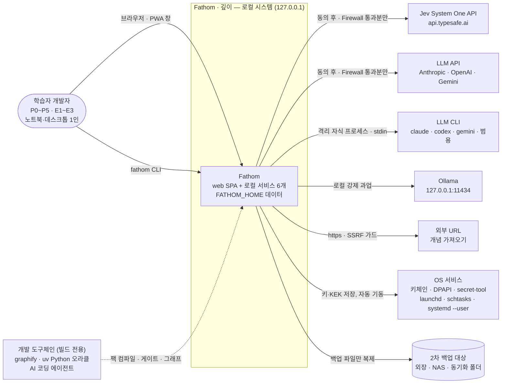

| 외부 요소 | 방향 · 방식 | 경계 규칙 |
|---|---|---|
| 학습자 | 브라우저(`http://127.0.0.1:4747`) · PWA · `fathom` CLI | 쿠키 + CSRF(브라우저), `run/cli.token`(CLI) |
| Jev | ai-gateway → HTTPS(`@typesafe-ai/sdk` 0.6.0) | 동의 전 호출 0, 객체 키, 외부 처리자로 로그 표시, 7일 캐시 고지 |
| LLM API | ai-gateway → HTTPS | Firewall·예산·쿼터·작업 주문 |
| LLM CLI | ai-gateway → `spawn(shell:false)` | 격리 플래그, 빈 cwd, env allowlist, 트리 kill |
| Ollama | ai-gateway → `http://127.0.0.1:11434/v1` | C3 데이터의 유일한 허용 경로 |
| 외부 URL | content(acquisition) → HTTPS GET | https만, DNS 해석 후 사설 대역 거부, 2MB·10s |
| OS 서비스 | ai-gateway(키) · ops-api(자동 기동) → execFile + stdin | 비밀은 argv에 0 |
| 2차 백업 | ops-api → 파일 복사 | 백업 파일만(라이브 DB 금지), 선택 암호화 |
| 개발 도구체인 | 저장소 빌드 시점만 | 런타임 의존 0(graphify·Python 없이 제품 동작) |

---

## 4. C4 L2 — 컨테이너

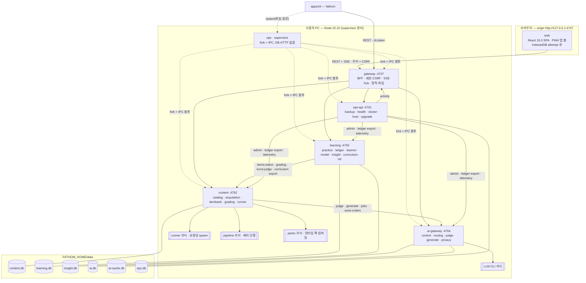

- 그림의 실선은 **동기 REST 호출 방향**이다. 이벤트 push(outbox relay)는 §8.5 표의 생산자 → 소비자 `POST /internal/v1/inbox`이며 호출 ACL에 별도로 등록된다(§5.2).
- 세 가지 실행 단위: **상주 프로세스**(supervisor, ops-api, gateway, content, learning, ai-gateway) · **단명 자식**(runner, pipeline, packc, LLM CLI, Windows RSS 헬퍼, supervisor가 띄우는 서비스의 `--mode=migrate|restore|verify`, **서비스가 스스로 fork하는 job**: content `snapshot·pack-load·integrity`, learning `snapshot·integrity·replay-verify·merge·rebuild·fsrs-optimize`, ai-gateway·ops-api `snapshot·integrity`) · **worker_threads**(learning `forecast`만 — DB 핸들 없는 순수 CPU). DB를 여는 대량 작업을 서빙 프로세스 밖에 두는 이유는 `node:sqlite` 네이티브 크래시 격리다(SP-4 감사 구속, RK-05).

---

## 5. 서비스 카탈로그

### 5.1 카탈로그

포트는 **선호 고정값**이다. 충돌 시 gateway는 4748 → 4756 순차 폴백 후 OS 할당(안내 1회), 내부 서비스는 OS 할당 후 `run/registry.json`에 기록한다. 프로파일별 포트는 §14.1.

| 서비스 · 패키지 | 선호 포트 (prod / dev) | 책임 | 소유 DB 파일 | 의존(동기 호출 대상) | 노출 API 그룹 | 발행 이벤트 | 구독 이벤트 |
|---|---|---|---|---|---|---|---|
| **web** · `@fathom/app-web` | gateway가 정적 제공 (dev: Vite 5173을 gateway가 프록시) | 17개 화면 + `/_design` = 18 라우트, 디자인 시스템, 명령 팔레트, PWA 앱 셸, 미전송 attempt 큐 | 없음(브라우저 IndexedDB `fathom-attempts`, SW 앱 셸 캐시) | gateway | — | — | SSE 17종 + `resync`(§8.5) |
| **gateway** · `@fathom/svc-gateway` | **4747** / 4847 | BFF 화면 집계, 부트스트랩→쿠키·CSRF·Host/Origin/포트 검증, rate limit, SSE hub(메모리 링 1,000), CLI API, 정적 파일, dev 프록시, 사용자 활동 시각 | 없음(무상태). `run/session.key`·`run/cli.token` 파일만 읽음 | learning, content, ai-gateway, ops-api | `/api/v1/{session,stream,home,sessions,concepts,map,search,evidence,dialogs,cases,artifacts,review,season,inbox,imports,curation,ai,ops,settings}` · `/api/v1/cli/*` · `/internal/v1/activity` · 정적 `/*` | 없음(outbox 없음) | 전부 `notify` 모드: §8.5의 UI 관련 17종 |
| **content** · `@fathom/svc-content` | **4762** / 4862 | [catalog] 팩 설치(blue/green)·개념·KU·오개념·출처·Case·루브릭·블루프린트·오버레이·FTS5 하이브리드 검색·커리큘럼 export / [acquisition] 가져오기 I1~I9·SSRF 가드·ingress 마스킹·Inbox·스테이징 diff / [itembank] 문항 선택·T1/T2 전개·게이트 상태기계·PackDelta 수입·워밍 풀·문항 건강·신고 / [grading] 채점 사다리(D/J/LJ/H/S)·Verdict 발급·보류 큐·대화 턴 판정·발화 렌더·이의제기·복잡도 판정 / [runner] RunnerPort·요청당 격리 자식 | `data/content.db` (`ct_*` · `aq_*` · `ib_*` · `gr_*` · `rn_*` + 공통 인프라 테이블) | ai-gateway | `/internal/v1/catalog/*` · `/internal/v1/acquisition/*` · `/internal/v1/itembank/*` · `/internal/v1/grading/*` · `/internal/v1/runner/*` + 공통(§5.3) | `catalog.pack.activated` · `catalog.concept.changed` · `catalog.overlay.conflicted` · `acquisition.import.staged` · `grading.verdict.issued` · `grading.verdict.revised` · `itembank.item.corrected` | `learning.evidence.recorded` · `learning.session.completed` · `learning.demand.forecasted` · `ai.mode.changed` · `ai.job.completed` · `ai.work_order.decided` |
| **learning** · `@fathom/svc-learning` | **4763** / 4863 | [ledger] 증거 원장 **단일 writer**·기기별 체인·체크포인트·export/merge·upcaster / [learner-model] FSRS·Elo θ/θ_q·숙달·Lifecycle·LDI·승급·보정 투영 / [practice] 세션 조립(2단 스케줄러·Router·Composer)·블록 prefetch·대화·장기 과제·리듬 / [insight] 대시보드 읽기 모델(`insight.db`) / [curriculum-ref] 커리큘럼 계약 사본 | `data/learning.db` (`lr_*`, **synchronous=FULL**) · `data/insight.db` (`iv_*`, 재구성 가능, 백업 제외) | content | `/internal/v1/practice/*` · `/internal/v1/learner/*` · `/internal/v1/insight/*` · `/internal/v1/ledger/*` · `/internal/v1/settings/*` · `/internal/v1/telemetry/*` + 공통 | `learning.evidence.recorded` · `learning.session.completed` · `learning.demand.forecasted` · `learning.mastery.changed` · `learning.level.promoted` · `learning.ledger.merged` | `grading.verdict.issued` · `grading.verdict.revised` · `itembank.item.corrected` · `catalog.pack.activated` · `catalog.concept.changed` · `ai.mode.changed` · `ops.host_state.changed` |
| **ai-gateway** · `@fathom/svc-ai-gateway` | **4764** / 4864 | 제공자 probe·동의·canary·모드 산정, 과업 레지스트리 라우팅, 예산·쿼터·배치 창·작업 주문(단일 PEP), Jev·LLM API·LLM CLI·범용 CLI·Ollama 어댑터(ACL), 프롬프트 레지스트리, 판정 로그·캘리브레이션·골드셋, Privacy Firewall(egress), SecretStore, AI 캐시 | `data/ai.db` (`ai_*`, 키 문자열 0) · `data/ai-cache.db` (`ac_*`, 백업 제외) | 없음(외부만) | `/internal/v1/judge/{taskId}` · `/internal/v1/generate/{taskId}` · `/internal/v1/streams/{ref}` · `/internal/v1/jobs` · `/internal/v1/work-orders` · `/internal/v1/providers` · `/internal/v1/secrets` · `/internal/v1/usage` · `/internal/v1/mode` · `/internal/v1/calibration` · `/internal/v1/firewall` + 공통 | `ai.mode.changed` · `ai.provider.status_changed` · `ai.job.completed` · `ai.work_order.approval_requested` · `ai.work_order.decided` · `ai.budget.threshold_reached` · `ai.judge.drift_detected` | `ops.host_state.changed` |
| **ops** · `@fathom/svc-ops` — supervisor | 포트 없음(IPC만) | 프로세스 기동·감시·재시작(250ms→1s→2s, 60s 3회 초과 degraded), 포트 레지스트리, 호출자 토큰 발급(IPC), 버전 핸드셰이크, 로그 수집·회전, dev 파일 감시 재기동 | 없음 | — | IPC 메시지(§14.2) | — | — |
| **ops** · `@fathom/svc-ops` — ops-api | **4761** / 4861 | 헬스 보드·배너·로컬 SLO·Tripwire·텔레메트리, epoch 백업·증분·2차 대상·복원·리허설, export/import 조율, doctor·Safe Mode, host 상태(유휴 창·전원·대화형 CLI 감지·동기화 폴더·디스크), 업그레이드 조율, 자동 기동, 이벤트 타임라인, 로그 검색 | `data/ops.db` (`op_*`) | content, learning, ai-gateway(admin·export·telemetry), gateway(activity) | `/internal/v1/health-board` · `/internal/v1/backups/*` · `/internal/v1/doctor/*` · `/internal/v1/upgrade/*` · `/internal/v1/autostart/*` · `/internal/v1/timeline` · `/internal/v1/logs/*` · `/internal/v1/telemetry/*` + 공통 | `ops.health.changed` · `ops.backup.completed` · `ops.host_state.changed` | `learning.session.completed` · `learning.level.promoted` · `learning.ledger.merged` · `ai.mode.changed` · `ai.provider.status_changed` · `ai.budget.threshold_reached` · `ai.judge.drift_detected` |
| (예약) 7번째 슬롯 | 4765 / 4865 | 분리 트리거 발동 시에만 사용(§6.4) | — | — | — | — | — |

### 5.2 호출 ACL = 컨텍스트 맵 (런타임 강제)

각 라우트 정의(`packages/contracts/src/http/<svc>/v1/*.ts`)의 `allowedCallers`가 정본이다. supervisor가 기동마다 **호출자 서비스별 256bit 토큰**을 만들고 IPC 봉투로만 나눠 준다. 피호출자는 토큰으로 호출자를 식별하고 라우트 ACL을 적용한다. 아래 표에 없는 호출은 401/403이다.

| 호출자 → 피호출자 | 허용 라우트 그룹 | 관계 패턴 |
|---|---|---|
| browser → gateway | `/api/v1/*`(쿠키 + CSRF), `/api/v1/stream`(쿠키) | Conformist to BFF 계약 |
| cli → gateway | `/api/v1/cli/*`(Bearer `cli.token`) | OHS |
| gateway → learning · content · ai-gateway · ops-api | 각 서비스의 화면 집계용 조회·명령 라우트(라우트별 `allowedCallers`에 `gateway`) | Open Host Service + Published Language |
| learning → content | `itembank/items:select`, `grading/attempts`, `grading/turns:judge`, `grading/appeals`, `catalog/curriculum/export` | Customer/Supplier(learning = 고객) |
| content → ai-gateway | `judge/*`, `generate/*`, `streams/*`, `jobs`, `work-orders`, `firewall/patterns`(읽기) | Conformist(Jev 질문 대수) + ACL |
| ops-api → content · learning · ai-gateway | `/internal/v1/admin/*`, `ledger/export`·`ledger/import`, `catalog/overlays/export`·`import`, `calibration/gold/export`, `telemetry/*`, `integrity` | Ops Protocol |
| ops-api → gateway | `GET /internal/v1/activity` | 조회 |
| 이벤트 push(생산자 → 소비자) | `POST /internal/v1/inbox` — 소비자 매니페스트에 선언된 생산자만 | Published Language(통합 이벤트) |
| runner·CLI·pipeline·packc 자식 → 어느 서비스 | **불가**(토큰을 받지 않음 → 401) | — |

- learning은 v1에서 **AI를 호출하지 않는다**(원장·투영 코어를 AI-무관·결정적으로 유지). FR-DSH-009 주간 리뷰 요약 문장은 정의된 폴백인 템플릿을 쓴다. LLM 요약은 가산 CR(새 ACL 엣지 + 과업 ID)로만 추가한다.
- ai-gateway는 어떤 내부 서비스도 동기 호출하지 않는다(외부 전용). ops.host 상태는 이벤트로만 받는다.

### 5.3 모든 서비스 공통 엔드포인트 (`createService()`가 제공)

| 엔드포인트 | 용도 | 호출자 |
|---|---|---|
| `GET /healthz` | 생존(의존 무관, 200) | supervisor, ops-api |
| `GET /readyz` | 준비(DB 열림·스키마 버전 일치·정책 로드·필수 peer 등록) 200/503 | supervisor, gateway, ops-api |
| `GET /internal/v1/metrics` | Prometheus text(카운터·히스토그램·`process_resident_memory_bytes`·`eventloop_delay_p99_ms`·outbox 적체) | ops-api |
| `POST /internal/v1/inbox` | 이벤트 수신(배치 ≤ 100, dedupe·watermark·dead-letter) | 구독 선언된 생산자 |
| `POST /internal/v1/admin/quiesce` · `snapshot` · `resume` · `shutdown` | epoch 백업·종료 | ops-api |
| `GET /internal/v1/admin/events?correlation_id=` | 이벤트 타임라인용 outbox·inbox 기록 조회 | ops-api |
| `POST /internal/v1/admin/integrity` | `PRAGMA quick_check\|integrity_check`·`foreign_key_check`(단명 자식 job `integrity`) | ops-api |

### 5.4 서비스 내부 구조 규칙 (모든 서비스 동일)

```
services/<svc>/src/
├─ main.ts        # --mode=serve|migrate|restore|verify|job 분기 → createService() / runJob()
├─ app.ts         # composition root: 포트 인터페이스 ↔ 어댑터 결선 (INT-1a 이후 동결)
├─ config.ts      # 부트스트랩 봉투 + 설정 zod 검증
├─ http/<bc>/     # Fastify 라우트 플러그인. 라우트 정의는 contracts에서 import
├─ application/<bc>/  # 유스케이스(명령·질의), 프로세스 매니저, inbox 핸들러, ports.ts(교차 BC 인터페이스)
├─ domain/<bc>/   # 순수: aggregate·값 객체·정책·리듀서. node:*·fastify·sqlite import 금지
├─ infra/         # 어댑터: db/(리포지토리 + *.sql.ts 정적 SQL 상수), clients/(peer HTTP), events/(outbox·inbox 결선), <bc 전용 어댑터>
├─ jobs/          # 단명 자식 job 진입점(--mode=job --job=<name>): 서비스가 shared-kernel `jobs.run()`으로 자기 자신을 fork
└─ workers/       # worker_threads 진입점(DB 핸들 금지, 순수 CPU) — 현재 learning `forecast.ts`만
```

- 의존 방향: `http → application → domain ← infra`. `domain/<bcA>` → `domain/<bcB>` import 금지. 교차 BC는 `application/<bc>/ports.ts` 인터페이스로만(`check:boundaries` 규칙 `bc-cross`).
- **job 규약**(`@fathom/shared-kernel/jobs/jobs`): `jobs.run(name, args, {timeoutMs, extraExecArgv?})`가 `child_process.fork(<자기 진입 파일>, ['--mode=job', '--job=' + name], {execArgv: [...process.execArgv, ...extraExecArgv]})`로 띄우고(prod는 `--disable-warning=ExperimentalWarning`, dev는 `+ --import tsx --conditions=source`를 그대로 물려받음; `pipeline`만 `--max-old-space-size=512` 추가) IPC로 `{progress}`·`{result}`·`{error}`를 받는다. job 자식은 HTTP를 열지 않고 토큰을 받지 않으며, 부모 서비스의 DB 파일만 연다(`pipeline`은 DB를 열지 않음). 쓰기는 `BEGIN IMMEDIATE` + 짧은 배치 tx만 하고(서빙 프로세스와 `busy_timeout` 5,000ms로 교대), 투영 원자 교체(`merge`·`rebuild`)는 job의 마지막 1 tx, 팩 활성 포인터 전환은 job 완료 후 부모의 1 tx다. 동시에 실행되는 job은 서비스당 1개(`jobs` 큐), 기한 초과 시 부모가 트리 kill. 부모가 죽으면 IPC 끊김으로 job도 종료한다.
- **코드 배치 규약(STD-01 동결, SP-7 감사 구속 — 게이트가 경로·이름으로 범위를 잡는다)**: Jev 요청을 조립하는 코드는 `src/jev/` 디렉터리 또는 `*.jev.ts`, 라우팅 코드는 `routing/` 또는 `*.route.ts`, 제출 전 스키마는 `pre-submit/` 또는 `*PreSubmit*`(제출 후 `post-submit/`과 별개 zod 객체, 스프레드·`.extend` 파생 금지), 백지노트 코드는 `blank-note/`(제출 후 공개 코드는 `blank-note/post-submit/`), 정적 SQL 상수는 `*.sql.ts`의 `UPPER_SNAKE` export, 원색 리터럴은 `packages/design-tokens/`에만.
- 모듈 등록: 각 BC는 `application/<bc>/register.ts`의 `register<Bc>(app, deps)` 하나를 export하고 `app.ts`는 이를 나열만 한다(병렬 머지 핫스팟 제거).

---

## 6. C4 L3 — content (content + assessment 병합 서비스)

### 6.1 컴포넌트

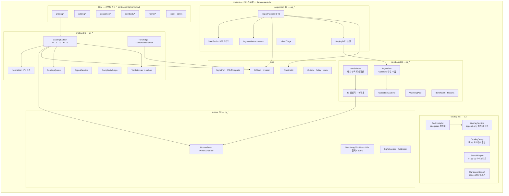

| BC · 컴포넌트 | 책임 | 파일 위치(`services/content/src/`) | 교차 BC 접근(포트) |
|---|---|---|---|
| catalog · PackInstaller | `.fpack` 해시·merkle 검증 → 단명 자식 job `pack-load`가 비활성 버전 행에 적재(`BEGIN IMMEDIATE` 500행 배치) → 오버레이 재적용 → 부모가 활성 포인터 전환 1 tx → `catalog.pack.activated`·`catalog.concept.changed` | `application/catalog/install-pack.ts`, `jobs/pack-load.ts`, `infra/packs/` | — |
| catalog · CatalogQuery/OverlayService | 조회 = 팩 레코드 ⊕ 오버레이. 오버레이는 `ct_overlay_event` append-only, 되돌리기 = 역패치 | `application/catalog/*`, `domain/catalog/overlay/` | itembank는 `CatalogReader`로만 읽음 |
| catalog · SearchEngine | SP-4 V2(trigram AND → 조사 제거 → 공백 제거 → IDF OR → 동순위 가산). 색인·질의 모두 NFC + 소문자, **질의 토큰은 구두점·따옴표 문자를 제거**한 뒤 3자 이상은 `"…"`로 인용(내부 `"`는 `""`로 이중화), 3자 미만은 `instr()` 스캔(**LIKE 금지** — `%`·`_` 와일드카드가 전체 일치), `hangul_initials` 사용자 함수. 문서 수가 `search_params@v1.v3_switch_docs`(**20,000**, 보수값)를 넘으면 짧은 토큰 경로를 V3(unicode61 prefix)로 전환 | `infra/search/` | acquisition·Inbox 매칭 재사용 |
| catalog · CurriculumExport | learning `curriculum_ref` 재구성용 `GET /internal/v1/catalog/curriculum/export?since=<version>` | `application/catalog/export-curriculum.ts` | — |
| acquisition · ImportPipeline | I1 정규화(+ingress 마스킹) → I1.5 주입 스캔 → I2 청크 → I3/I4 분류 → I5 추출 → I6 근거 검증 → I7 병합 → copy-guard → I8 스테이징 diff(승인) → I9 PackDelta. 실패 단계부터 재개 | `application/acquisition/pipeline/`, `infra/pipeline/`(PipelineKit), `jobs/pipeline.ts` | 발행은 itembank·catalog `IngestPort`로만 |
| itembank · IngestPort | **서빙 테이블 쓰기의 유일한 경로**(팩 설치·PackDelta·오버레이 적용 결과). `check:content-ingest`가 서빙 테이블 INSERT/UPDATE 문자열 위치를 `application/{catalog,itembank}/ingest/*`로 제한 | `application/itembank/ingest/`, `application/catalog/ingest/` | — |
| itembank · GateStateMachine | `authored → seed_reviewed`, `draft → deferred → gated_pass/gated_fail`, `seed_reviewed → jev_verified/flagged → demoted/quarantined → retired`(FR-QST-011). 출제 가능 = `{seed_reviewed, jev_verified, gated_pass}` | `domain/itembank/gate/` | 전이 시 `itembank.item.corrected` |
| itembank · ItemSelector | learning의 블록 슬롯 명세를 받아 문항 배치 선택(미노출 변형·문형 30일 로테이션·패밀리 격리), `ItemDelivery`(정답·해설 제외) 반환 | `application/itembank/select-items.ts` | — |
| grading · GradingLadder | 형식·ai_mode·stakes로 엔진 체인 결정. D/H/S는 로컬 코드, J/LJ는 `AiClient`. interactive 데드라인 3s, 초과 시 하위 결과 + 백그라운드 계속 | `domain/grading/ladder/`, `application/grading/grade-attempt.ts` | 문항은 `ItemReader`(itembank)로 **스냅샷 포함** 조회 — catalog 무조회(자급형 계측기) |
| grading · VerdictIssuer | `gr_verdict` INSERT + outbox `grading.verdict.issued`를 한 tx. 상향·재채점은 `supersedes` 체인 + `grading.verdict.revised` | `application/grading/issue-verdict.ts` | — |
| grading · TurnJudge | 디깅·Feynman·Case 턴 판정(AI-J17) + 다음 move(결정적 상태기계 정의는 팩) + 발화(AI-G07 스트림 또는 질문 은행) | `application/grading/judge-turn.ts` | 상태·재개는 learning 소유 |
| runner · ProcessRunner | SP-2 확정안(§12.6). 출처 정책 `sourceKind ∈ {learner, seed, t1}` | `infra/runner/`, `assets/runner/*.mjs` | grading·itembank(T1 정답 계산)만 호출 |

### 6.2 content 내부 규칙

- **테이블 접두어 = 모듈 소유**: `ct_`(catalog) · `aq_`(acquisition) · `ib_`(itembank) · `gr_`(grading) · `rn_`(runner). 공통 인프라 테이블(`outbox`, `outbox_delivery`, `inbox_*`, `idem_request`, `schema_migrations`)은 접두어 없음.
- **마이그레이션은 모듈 디렉터리별**: `services/content/migrations/{catalog,acquisition,itembank,grading,runner}/NNNN_<desc>.sql`. 공통 인프라 모듈 `_infra`(§8.3 DDL)는 `packages/shared-kernel/infra-migrations/`(export `@fathom/shared-kernel/infra-migrations/*`)가 제공하며 항상 먼저 적용된다. 적용 순서 = `_infra` → 위 나열 순, 모듈 안은 번호 순. 교차 모듈 FOREIGN KEY 금지(ID는 TEXT 참조만) → 재분리 시 테이블 이동만.
- **자급형 계측기**: 발행된 `ib_item`은 채점에 필요한 KU·오개념 스냅샷(`snapshot_json`)과 `content_hash`를 내장한다. grading은 catalog 테이블을 읽지 않는다(`check:boundaries` 규칙 `grading-no-catalog`).
- **배치 격리**: 배치 AI 파이프라인의 CPU·메모리 무거운 단계(장문 정규화·청크·규칙 추출·MinHash 중복·copy-guard·diff)는 job `pipeline`(`--max-old-space-size=512`, **DB를 열지 않음**) **단명 자식**에서 계산하고 결과를 IPC로 돌려준다. **AI 호출과 스테이징 쓰기는 부모(content)만** 한다(W1 유지).
- **Jev 입력 조립 위치**: content가 ai-gateway judge 과업(AI-J*)에 넘기는 후보·기준 객체(객체 키 맵)를 만드는 코드는 `*.jev.ts` 파일(예: `application/grading/judge-input.jev.ts`, `application/itembank/gate-input.jev.ts`, `application/acquisition/classify-input.jev.ts`)에만 둔다 → `check:jev-index` 범위(§11.2). 미승인 초안은 `aq_staging_*`·`ib_staging_item`에만 있고, 출제 쿼리는 `gate_status IN ('seed_reviewed','jev_verified','gated_pass')` 조건으로 이중 방어한다.

### 6.3 분리 재검토 트리거 (ADR-001)

① 러너·게이트 부하로 검색 p95 > 100ms가 2주 지속 ② 배치 파이프라인이 결정적 채점 p95(300ms)를 침범 ③ catalog와 grading의 릴리스 주기 분리 필요 ④ 생성 파이프라인 크래시가 주 2회 이상 content 재시작을 유발. 어느 하나라도 충족하면 ADR로 `grading+runner` 또는 `acquisition+생성 파이프라인(forge)`을 7번째 슬롯(4765)으로 분리한다. 모듈·테이블 접두어·이벤트 이름(BC 문맥)·마이그레이션 디렉터리가 이미 나뉘어 있어 이관 스크립트 + ACL 표 수정으로 끝난다.

---

## 7. C4 L3 — learning (증거 단일 writer)

### 7.1 컴포넌트

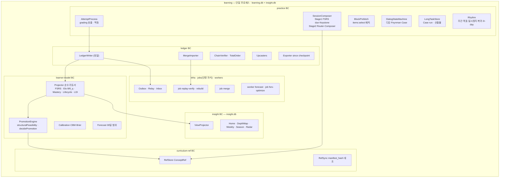

| BC · 컴포넌트 | 책임 | 파일 위치(`services/learning/src/`) |
|---|---|---|
| ledger · LedgerWriter | `lr_event` append의 **유일한** 코드. 기기 단조 `client_ts = max(now, last+1)`, `device_seq` 증가, `study_day`(04:00 경계, 생성 시 고정)·`prev_hash`·`hash` 계산, **`INSERT OR IGNORE`만**(event_id·idempotency_key·(device_id, device_seq) 유일; `INSERT OR REPLACE`·`REPLACE`·`ON CONFLICT DO UPDATE` 금지 — `check:ledger-writer`), 같은 tx에서 투영 증분 + outbox. 원장 연결은 열 때마다 `PRAGMA recursive_triggers=ON`(REPLACE의 암묵 DELETE도 트리거가 거부). UPDATE·DELETE 거부 트리거는 **실수 방지 장치이지 보안 경계가 아니다**. `ts-fsrs`의 `FSRSValidationError`는 삼키지 않고 원장 무결성 경보(`ops` 배너 + doctor)로 올린다 | `infra/ledger/ledger-writer.ts`(`check:ledger-writer`) |
| ledger · TotalOrder/ChainVerifier | 총순서 `ORDER BY client_ts, device_id, device_seq`로만 리플레이(`rowid`·도착 순서·ULID 순서 금지), 카드별 적용은 `ts` 비감소 순서만. 기기별 체인 검증. **체인 헤드 앵커** `(device_id, device_seq, head_hash)`를 원장 밖 세 곳(체크포인트 매니페스트 `lr_checkpoint.devices_json`, export JSONL 헤더, epoch 매니페스트 `ledger_head`)에 기록하고 import·restore·doctor에서 대조 → 꼬리 변조·절단 탐지 | `domain/ledger/order/`, `domain/ledger/chain/` |
| ledger · MergeImporter | `import --merge` = job `merge`(단명 자식): 스트리밍 `INSERT OR IGNORE`(5,000건 배치, 배치마다 `BEGIN IMMEDIATE`) → 체인·앵커 검증 → 섀도 투영 전체 리플레이(≈ 10s/55만 건) → 섀도 시작 뒤 서빙 프로세스가 추가한 이벤트 캐치업 → 원자 교체 1 tx(SP-3 §6.4) → IPC 결과 → 부모가 캐시 재적재 후 `learning.ledger.merged` | `jobs/merge.ts`, `application/ledger/merge.ts` |
| ledger · Upcasters | `schema_version`별 순수 함수 체인(`v1 → v2 → …`). 저장 이벤트는 다시 쓰지 않는다. 골든 원장 fixture 회귀 | `domain/ledger/upcasters/<type>/v<n>-to-v<n+1>.ts` |
| learner-model · Projector | `apply(state, event, params) → state` 순수 리듀서. 입력은 payload + `client_ts` + **이벤트의 `policy_version`이 가리키는 불변 파라미터 세트**뿐(시계·난수·현재 설정·타 DB 조회 금지). fast path는 카드 `last_review < ts` ∧ 개념 `last_ts < ts`(엄격)일 때만, 아니면 `ix_card`·`ix_concept`로 키 재도출. 정정은 2-패스 무효 집합 | `domain/learner-model/{fsrs,elo,mastery,lifecycle,ldi}/` |
| learner-model · Elo θ/θ_q | 추측 보정 `P = c + (1−c)·σ(θ−β)`(c = 1/`item_n_options`, 열린 형식 0), K = `α/(1+b·n)`(α 0.8, b 0.05). θ_q는 `geq(w_format, 0.7) ∧ geq(w_grader, 0.6)` 이벤트로만 갱신, **실효 θ = min(θ, θ_q)**(F4). **증거 수축**(SP-6 감사): 개념의 채점 이벤트 수 n < 30이면 UI에 θ를 표시하지 않고, 숙달 P·LDI·적응 난이도에는 항상 수축값 `θ̃ = θ0 + (θ_eff − θ0)·n/(n + n0)`(θ0 = `theta_prior`, n0 = `theta_shrink_n0`, §7.3)만 넣는다 [CR-22] | `domain/learner-model/elo/` |
| learner-model · PromotionEngine | SP-6 `promotion.ts` 이식: 2조건 형식 산입, 희소 레벨·empty_level skip(F1)·d4 floor(F3)·CBM·Case·L5 게이트. `decidePromotion(input, rules) → {decision, profile{policy_version, ai_mode, sp1_state}, gates[]}`(FR-PRG-033 결정 카드), `reconcileProvisional()`은 **강등하지 않는다**(BR-14, 철회 = 원장 `level.provisional_resolved{outcome: 'provisional_revoked', needs_reconfirmation: true}` — 레벨 유지 + "재확인 필요" 배지), `structuralFeasibility(policy, inventory, transition, mode, sp1)` 순수 함수로 부족 조건 표시(팩 리포트·R-POOL CI 게이트와 같은 함수). 임계값은 전부 `mastery_rules@v1`에서 인자로 받는다. 미결 4건의 결정은 §7.3 | `domain/learner-model/promotion/` |
| practice · SessionComposer | 2단 스케줄러, `method_policy@v1` 25칸, `composer_policy@v1` 하드 제약·엔트로피 가드, 세션 범위(전체·경로·트랙·개념 집합), `modes.manifest.json` included 모드만. 하드 잠금 금지(NG-G4)는 `routing/` 범위 정적 검사 + 계약 테스트 | `domain/practice/{composer,routing}/` |
| practice · BlockPrefetch | 세션 시작 시 전체 블록 슬롯을 `items:select` 1회로 받아 `lr_block`에 보관(D-9: content 재시작 중에도 제시 지속) | `application/practice/start-session.ts` |
| practice · DialogStateMachine | 대화 상태·재개(`lr_dialog_state`, 턴 로그 append-only). 판정·발화는 content에 위임(AQ-03) | `domain/practice/dialog/` |
| insight · ViewProjector | Home Cockpit·Depth Map 셀·주간 리뷰·시즌·Radar·보정 뷰를 `insight.db`에 비동기 투영. 언제든 원장 + curriculum_ref에서 재구성, 백업 제외 | `domain/insight/views/`, `infra/insight-db/` |
| curriculum-ref · RefStore/RefSync | `lr_curriculum_ref`(concept_id, track, level, tier, knowledge_type, prereq_ids, required_for_level, aliases, deprecated_by, summary_ko, volatility, version, content_hash) + `lr_curriculum_meta(pack_id, version, manifest_hash)`. `catalog.*` 이벤트로 갱신, 해시 불일치 시 export로 재구성 | `domain/curriculum-ref/`, `application/curriculum-ref/sync.ts` |

### 7.2 learning 내부 규칙

- **learning은 content·ai를 읽지 않고도 세션을 조립하고 승급을 판정한다**: Keystone·희소 레벨·cap·트랙 범위 세션은 `curriculum_ref`만 쓴다. content 호출은 문항 선택·채점·턴 판정·커리큘럼 export 4종뿐이다.
- 투영(`lr_card_state`, `lr_concept_state`, `lr_track_level`, `lr_lifecycle` 등)은 원장과 **같은 tx**의 인라인 투영이다(read-your-writes). insight 뷰만 비동기 투영이다.
- **LDI는 표시 시점에 전체 재계산**한다(카드 1.4만 장 ≈ 9~14ms). `R_k(t)`가 표시 시각 t에 의존하므로 시각 의존 항을 캐시하지 않고, LDI 전용 항·스냅샷 테이블도 두지 않는다(SP-3 감사 구속; 정책 전환 대비는 `lr_projection_meta.ext` 훅만). `ldi_params@v1`은 REQ 부록 A 초기값이며 **미확정**이다 — 민감도 분석은 시뮬레이터 후속 과제(SIM-LDI, §23 RK-19)이고, 결과는 정책 버전 교체(`ldi_params@v2`)로만 반영한다.
- **부하 예측**(FR-PRG-018): 30일 총량 **범위만** 표시(일 단위 값 비표시). 띠 폭은 사용자 자신의 과거 예측 오차 분포(`lr_forecast_log`의 예측 대비 실측, 기본 표본 ≥ 8개 창)로 보정하고, 이력이 모자라면 기본 ±15%. 부하 거버너는 **예측 하한**을 예산과 비교해, 하한조차 예산을 넘을 때만 신규 카드 도입을 줄인다(불확실한 예측으로 학습을 막지 않는다). model(FSRS 망각곡선) 대 observed(최근 실측) 선택은 V-field까지 잠정이다 [CR-05].
- 마이그레이션: `services/learning/migrations/{ledger,learner-model,practice,curriculum-ref}/`(`_infra`는 shared-kernel 제공, 먼저 적용), `insight.db`는 `services/learning/migrations-insight/`.
- 합성 학습자 시뮬레이터(SP-3·SP-6 코드 이식, NFR-MAINT-012)는 learning 패키지 안의 개발 전용 디렉터리 `services/learning/sim/`에 둔다(도구가 서비스 domain을 import하는 교차 엣지를 만들지 않기 위해, 번들 제외).

### 7.3 승급 규칙 — SP-6 감사 미결 4건의 결정 `[결정]`

SP-6 감사는 동결 전에 네 가지를 정하라고 요구했다. 아래 값은 전부 `policy/mastery_rules@v1.yaml`의 파라미터이며 순수 함수(`decidePromotion`·`structuralFeasibility`)에 인자로 들어간다. 확정 전에 `services/learning/sim`으로 SP-6 행렬(19트랙 × 4전이 × 4모드 × SP-1 2)을 다시 돌려 이상적 학습자 도달·무작위 Mastered 0을 재확인한다(SIM-PROMO, INT-2 진입 조건).

| # | 미결 사항(감사) | 결정 | 파라미터 | CR |
|---|---|---|---|---|
| (a) | JUDGE_ONLY × SP-1 실패일 때 루브릭(Case·Teaching·Artifact) 채점 엔진 | CNV SP-1 폴백을 그대로 따른다: 미보정 Jev는 게이트·분류 전용이고 루브릭 1차 엔진이 아니다. JUDGE_ONLY에는 LLM이 없으므로 이 셀의 서술형 게이트 증거는 **자기채점(S) + 미보정 Jev 참고 점수 표시 → `provisional = true`**(OFFLINE과 같은 경로). 확정은 보정된 엔진(SP-1 통과한 Jev, 또는 FULL·LLM_ONLY의 LJ)이 재채점해 통과할 때만 `level.provisional_resolved{outcome: confirmed}` | `ai_profiles.JUDGE_ONLY.rubric_engine: {sp1_pass: 'J', sp1_fail: 'S_provisional'}` | CR-18 |
| (b) | CBM 규칙(12문항에서 70% = 75%, 전부 C2 정답이 66.7%로 탈락) | **두 조건**으로 재정의한다. ① 정확도: 정답 수 ≥ `accuracy_min_correct`(L1→L2·L2→L3·L3→L4 = 10/12, L4→L5 = 11/12) ② 보정: `cbm_ratio = Σ cbm_score / Σ cbm_max(선택한 확신도)` ≥ `cbm_min`(L1~L3 출발 0.70, L4 출발 0.75). 점수표는 FR-QST-024 그대로(+1/+2/+3, 0/−2/−6), 분모만 "C3 최대"에서 "선택한 확신도의 최대"로 바꾼다. 결과: 전부 C2 정답 = 1.0 통과, C3로 2문항 오답 = 0.5 탈락(과신 차단), 모르는 문항을 C1로 표시하면 통과 가능(보정 보상). 평가 12문항은 확신도 입력 필수 | `assessment.accuracy_min_correct: {1: 10, 2: 10, 3: 10, 4: 11}`, `assessment.cbm_denominator: chosen_confidence_max`, `assessment.cbm_min: {1: 0.70, 2: 0.70, 3: 0.70, 4: 0.75}` | CR-19 |
| (c) | 필수 개념 85%가 n ≤ 6에서 100% | 필요 Mastered 수 = `n ≤ 3 ? n : min(n − 1, ceil(0.85·n))`(n ≥ 4에서 1개 미달 허용, n ≥ 7에서는 기존과 동일). n < 3은 희소 레벨 규칙 그대로 | `promotion.required_mastered: {all_if_n_le: 3, ratio: 0.85, allow_misses: 1}` → `n ≤ all_if_n_le ? n : min(n − allow_misses, ceil(ratio·n))` | CR-20 |
| (d) | 희소 레벨 깊이 증거 범위, D4 가능 개념 범위 | 깊이 자산 증거 1건 = **트랙 범위**(FR-PRG-013 문자 그대로, SP-6 모델과 동일). D4 가능 개념 = **레벨 ≤ k**(상위 레벨 개념을 승급 전에 디깅하게 강요하지 않음, SP-6 모델과 동일). 두 값 모두 SP-6 계산 조건과 같으므로 도달성 결과는 바뀌지 않는다 | `sparse.depth_scope: track`, `d4.possible_scope: level_le_k` | CR-21 |

같은 정책 파일에 함께 기록하는 SP-6 감사 구속 값: F0 추측 보정, F1 `empty_level: skip`, F3 `d4.floor_mode: min_with_possible`, F4 실효 θ = min(θ, θ_q), F2 기각, 형식 산입 2조건 + `geq(ε = 1e-9)`, **θ 증거 수축** `theta_shrink_n0 = 10`·`theta_prior = −0.5`·`theta_display_min_events = 30`(시뮬레이터 재검증 후 확정, CR-22), 승급 평가 = 형식 라운드로빈 12문항·형식 ≥ 4·**결정적 형식 + (SP-1 통과 시) 보정 Jev 형식만**(LJ·S 0), Brief 콘텐츠가 들어오기 전까지 제품 지도는 선언 cap이 아니라 **오라클 cap**(docker·cicd·cloud·ml·eng = L4)을 표시. SP-6 기준 (2)는 "개념당 채점 이벤트 ≥ 30 이후 θ 상승 ≤ 0.02"로 다시 적고, 회귀 테스트는 노출 필터 없이 전체 개념 실행으로 돈다.

---

## 8. 통신 방식과 이벤트 카탈로그

### 8.1 원칙

1. **질의·명령 = 동기 REST**: HTTP/1.1 keep-alive, JSON, zod 검증. 서비스 간 `/internal/v1/<bc|resource>`, 브라우저·CLI는 gateway의 `/api/v1/*` [CR-08].
2. **상태 전파 = 통합 이벤트**: 생산 서비스의 쓰기 tx 안에서 `outbox`에 기록 → 서비스 내장 relay가 목적지별 커서로 push → 소비자 inbox가 같은 tx에서 dedupe·반영(at-least-once + 멱등 = effectively-once).
3. **쓰기 요청은 전부 `Idempotency-Key`**(브라우저가 ULID 생성 → gateway → 하위 서비스 전파). 저장 키 = (key, caller, route_id), 보관 7일, 같은 키·다른 본문 → 422.
4. **브라우저 알림 = SSE 하나**(`GET /api/v1/stream`, `Last-Event-ID`, 15s heartbeat). gateway는 메모리 링 1,000건만 가진다. 재시작으로 링이 비면 `event: resync` → 클라이언트가 TanStack Query 캐시를 전체 무효화(IR-016 누락 0).
5. **공통 헤더**: `x-request-id`(gateway 생성 ULID, 전 홉 전파) · `traceparent`(W3C, 전 홉·이벤트 envelope 전파) · `authorization: Bearer <caller token>`(내부) · `idempotency-key` · `x-fathom-deadline-ms`(남은 예산 ms, 홉마다 차감, interactive 3000) · `x-fathom-delivery-attempt`(inbox).
6. **오류 형식** [CR-08]: RFC 9457 `application/problem+json` + 확장 멤버 `{type:"urn:fathom:problem:<code>", title, status, detail, code:"<SVC>-<CAT>-<NNN>", error_id, request_id}`. SVC ∈ `GW CT LR AI OP CLI`, CAT ∈ `VAL AUTH ACL NOTFOUND CONFLICT DEP LIMIT POLICY INTERNAL`. 스택·경로·SQL은 응답에 0(NFR-SEC-012).
7. **타임아웃**: 내부 연결 300ms, 요청 기본 2s(interactive는 deadline 헤더), Jev interactive 3s·batch 10s, LLM 과업별(기본 120s, 비동기 job).

### 8.2 AQ-02 결정 — push relay 채택, feed long-poll 기각 `[결정]`

| 기준 | push relay (A·C) | outbox-as-feed long-poll (B) |
|---|---|---|
| 상주 연결 | 없음(필요 시 POST) | 생산자 × 소비자 ≈ 12개 long-poll 상시 |
| 소비자 코드 | 수동 핸들러 1개(`POST /inbox`) | 생산자별 폴링 루프·커서 관리 |
| 생산자가 소비자를 알아야 하나 | **아니오** — 소비자가 `__consumers__/<svc>.json`에 구독을 선언하고 라우팅 표는 생성물 | 아니오 |
| 소비자 추가 시 수정 파일 | 소비자 매니페스트 1개(+ 생성물 재생성) | 소비자 코드만 |
| 유실 0·중복 0 증명 | 생산자 `outbox_delivery` 커서 + 소비자 `inbox_watermark`를 epoch 매니페스트에 기록, 복원 시 커서를 워터마크로 되감기 | 소비자 커서를 매니페스트에 기록 |
| outbox 보존 | 모든 durable 목적지 ack 후 7일 | 가장 느린 소비자 기준 90일 |
| gateway SSE hub | 이벤트를 받기만 함 | feed 4개를 폴링해야 함 |
| 심사 입장 | local-operability·requirements-fit 채택 | agent-buildability 권고 |

**결정**: push relay를 채택한다. feed의 핵심 장점(생산자가 소비자를 모름, 병렬 머지 핫스팟 제거, 커서 기반 복원 증명)은 **소비자 주도 구독 매니페스트 + 생성된 라우팅 표 + 목적지별 커서 테이블 + inbox watermark**로 그대로 확보한다. 반면 상시 long-poll 약 12개와 소비자별 폴링 루프라는 운영 부품은 들이지 않는다(1인 운영, 2:1 심사). 새 구독의 과거 이벤트가 필요하면 생산자의 스냅샷 API로 재구성한다(예: `curriculum/export`).

### 8.3 outbox · delivery · inbox — 공통 인프라 DDL (shared-kernel `eventing` 소유, 모든 writer DB의 `_infra` 마이그레이션)

```sql
CREATE TABLE outbox(
  seq            INTEGER PRIMARY KEY AUTOINCREMENT,   -- = envelope.producer_seq (생산자 내 총순서)
  event_id       TEXT    NOT NULL UNIQUE,             -- ULID
  type           TEXT    NOT NULL,                    -- 'grading.verdict.issued'
  schema_version INTEGER NOT NULL,
  occurred_at    INTEGER NOT NULL,                    -- epoch ms
  correlation_id TEXT    NOT NULL,
  causation_id   TEXT,
  traceparent    TEXT,
  payload        TEXT    NOT NULL CHECK (json_valid(payload))
) STRICT;

CREATE TABLE outbox_delivery(                         -- 목적지별 push 커서 = 목적지별 FIFO
  dest            TEXT    PRIMARY KEY,                -- 'learning'|'content'|'gateway'|'ai-gateway'|'ops-api'
  mode            TEXT    NOT NULL CHECK (mode IN ('durable','notify')),
  last_acked_seq  INTEGER NOT NULL DEFAULT 0,
  attempts        INTEGER NOT NULL DEFAULT 0,
  next_attempt_at INTEGER NOT NULL DEFAULT 0,
  last_error_code TEXT,
  updated_at      INTEGER NOT NULL
) STRICT;

CREATE TABLE inbox_dedupe(
  event_id     TEXT    PRIMARY KEY,
  producer     TEXT    NOT NULL,
  producer_seq INTEGER NOT NULL,
  type         TEXT    NOT NULL,
  received_at  INTEGER NOT NULL
) STRICT;

CREATE TABLE inbox_watermark(                         -- 생산자별 처리 완료 최대 producer_seq (epoch 매니페스트 기록)
  producer          TEXT    PRIMARY KEY,
  last_producer_seq INTEGER NOT NULL,
  updated_at        INTEGER NOT NULL
) STRICT;

CREATE TABLE inbox_dead(                              -- 비원장 경로의 독 이벤트 격리
  event_id     TEXT    PRIMARY KEY,
  producer     TEXT    NOT NULL,
  producer_seq INTEGER NOT NULL,
  type         TEXT    NOT NULL,
  envelope     TEXT    NOT NULL CHECK (json_valid(envelope)),
  error_code   TEXT    NOT NULL,
  error_detail TEXT    NOT NULL,
  attempts     INTEGER NOT NULL,
  failed_at    INTEGER NOT NULL,
  resolved_at  INTEGER,
  resolution   TEXT CHECK (resolution IN ('replayed','discarded'))
) STRICT;

CREATE TABLE idem_request(
  key           TEXT    NOT NULL,
  caller        TEXT    NOT NULL,
  route_id      TEXT    NOT NULL,
  request_hash  TEXT    NOT NULL,                      -- sha256(canonical JSON body)
  status        INTEGER NOT NULL,
  response_json TEXT    NOT NULL CHECK (json_valid(response_json)),
  created_at    INTEGER NOT NULL,
  PRIMARY KEY (key, caller, route_id)
) STRICT;

CREATE TABLE schema_migrations(
  module     TEXT    NOT NULL,                         -- '_infra' | 'catalog' | 'ledger' | ...
  version    INTEGER NOT NULL,
  name       TEXT    NOT NULL,
  sha256     TEXT    NOT NULL,
  applied_at INTEGER NOT NULL,
  PRIMARY KEY (module, version)
) STRICT;
```

**relay 규칙**(생산자 측, `shared-kernel/eventing/relay`):
- 커밋 직후 `setImmediate(drain)` + 500ms 폴링 안전망. 목적지별 in-flight 1개. `SELECT … FROM outbox WHERE seq > last_acked_seq AND type IN (<dest 구독 타입>) ORDER BY seq LIMIT 100` → `POST /internal/v1/inbox {producer, events[]}`.
- 응답 `200 {acked_through_seq}` → `last_acked_seq` 전진(구독하지 않는 타입을 건너뛴 구간 포함). 실패 시 0.5s → 30s 지수 백오프(재시작 후에도 이어짐).
- `notify` 목적지(gateway)는 발생 60s가 지난 이벤트를 건너뛴다(재연결 시 `resync`가 보정). outbox 정리 = 모든 `durable` 목적지가 ack한 행 중 7일 경과분.

**inbox 규칙**(소비자 측, `shared-kernel/eventing/inbox`):
- 이벤트마다 개별 `BEGIN IMMEDIATE` tx: `inbox_dedupe` 확인 → envelope·payload zod 검증(type × schema_version) → 핸들러(순수 함수 + 짧은 쓰기) → `inbox_dedupe` INSERT + `inbox_watermark` UPSERT → COMMIT. tx 안 `await`·외부 호출 금지(SP-4 W2).
- 핸들러 실패: 구독 선언의 `on_poison`이 `dead_letter`이고 전달 시도 ≥ 3이면 `inbox_dead` 격리 + ack + `ops.health.changed` 배너. **`halt`(원장 경로)이면 격리하지 않고** 그 지점에서 멈추고 `503 {acked_through_seq}`로 응답 → 생산자가 백오프 재시도, 헬스 보드에 "원장 경로 정지" 경보(증거 유실 0).

### 8.4 통합 이벤트 envelope (R0 상세 동결 D)

```ts
// packages/contracts/src/events/envelope.ts — 형태 스케치(정본은 코드)
export const ServiceName = z.enum(['gateway', 'content', 'learning', 'ai-gateway', 'ops-api']);
export const EventType = z.string().regex(/^[a-z]+\.[a-z_]+\.[a-z_]+$/);   // <context>.<entity>.<past_tense>
export const IntegrationEventEnvelope = z.object({
  event_id:       Ulid,                              // 전역 유일, 소비자 dedupe 키
  type:           EventType,
  schema_version: z.number().int().min(1),           // 타입별, 가산 변경만(파괴 = ADR + 새 버전)
  producer:       ServiceName,                       // 배포 단위(서비스)
  producer_seq:   z.number().int().min(1),           // = outbox.seq
  occurred_at:    EpochMs,
  correlation_id: Ulid,                              // 사용자 의도 단위(attempt_id, job_id, epoch_id …)
  causation_id:   Ulid.nullable(),                   // 이 이벤트를 낳은 명령·이벤트
  traceparent:    z.string().regex(/^00-[0-9a-f]{32}-[0-9a-f]{16}-0[01]$/).nullable(),
  payload:        z.record(z.string(), z.unknown()), // type × schema_version 스키마로 2차 검증
}).strict();

// packages/contracts/src/events/__consumers__/learning.json — 소비자 주도 구독 선언(형태)
// { "consumer": "learning",
//   "subscriptions": [
//     { "type": "grading.verdict.issued", "schema_versions": [1], "mode": "durable", "on_poison": "halt",
//       "reads": ["verdict_id", "attempt_id", "item_id", "w_format", "w_grader", "..."] } ] }
```

- 이벤트 **타입 이름의 context는 BC 문맥**(`catalog`·`acquisition`·`itembank`·`grading`·`learning`·`ai`·`ops`), `producer`는 배포 단위다. content가 나중에 분리돼도 타입 이름은 바뀌지 않는다(AP-14).
- `reads`는 소비자 주도 계약이다: 생산자가 소비자가 읽는 필드를 삭제·개명·의미 변경하면 `check:consumers`가 실패한다(가산만 허용, 파괴는 ADR).
- 라우팅 표 `packages/contracts/src/events/routing.gen.ts`와 타입 레지스트리 `registry.gen.ts`는 `pnpm contracts:gen`의 생성물이다(수기 편집 금지, CI가 최신 여부 검사).

### 8.5 통합 이벤트 카탈로그 (23종)

모드: **dur** = durable(재시도·커서), **ntf** = notify(60s 경과분 폐기). poison: **H** = halt(원장 경로), **DL** = dead-letter. 동결: D = R0/R1 상세, O = R2/R3 개요.

| # | type (v1) | 생산 | 소비 (모드·poison) | 동결 | payload 핵심 필드 | 목적 |
|---|---|---|---|---|---|---|
| 1 | `catalog.pack.activated` | content | learning(dur·DL), gateway(ntf) | D | pack_id, track, version, channel, manifest_hash, merkle_root, previous_version, changed_concept_ids[], changed_ku_ids[], offline_cap_level, activated_at | curriculum_ref 대조, Lifecycle CL-X·복귀 요약(FR-CUR-014), UI 캐시 무효화 |
| 2 | `catalog.concept.changed` | content | learning(dur·DL) | D | change(`published`·`revised`·`deprecated`·`tier_promoted`), concept(ConceptRef 전체 스냅샷), pack_id, version | curriculum_ref 사본 갱신(event-carried state transfer) |
| 3 | `catalog.overlay.conflicted` | content | gateway(ntf) | O | patch_id, target_kind, target_id, field, base_version, new_base_version | 스테이징 diff 알림 |
| 4 | `acquisition.import.staged` | content | gateway(ntf) | O | job_id, source_kind, diff_summary{concepts, kus, items}, requires_approval | 가져오기 승인 대기(FR-IMP-009) |
| 5 | `grading.verdict.issued` | content | learning(dur·**H**) | D | Verdict 전체(§8.6·ADR-011): verdict_id, attempt_id, session_id, item_id, item_content_hash, item_beta_snapshot, item_n_options, gate_result_id, stakes, concept_id, ku_ids[], mc_ids[], facet, format, response_mode, tier, result, band, score, confidence, latency_ms, rapid, hints_used, grader_engine, calibrated, grader_confidence, pending, provisional, w_format, w_grader, gaming_factor, recommended_grade, ai_mode, policy_version, judge_log_ref, prompt_version, issued_at | 동기 응답 유실 대비 **보장 전달(backstop)**, 멱등 키 `verdict:<verdict_id>` |
| 6 | `grading.verdict.revised` | content | learning(dur·**H**), gateway(ntf) | O | verdict(새 Verdict), supersedes_verdict_id, reason(`deadline_upgrade`·`pending_regrade`·`appeal`), band_changed | 3s 이후 상위 엔진(FR-QST-019)·보류 재채점(FR-QST-020)·이의 → learning `evidence.upgraded`/`evidence.regraded` |
| 7 | `itembank.item.corrected` | content | learning(dur·**H**), gateway(ntf) | D | item_id, correction(`quarantined`·`demoted`·`key_fixed`·`retired`), evidence_policy(`void`·`halve`·`keep`), basis(`regate_g3`·`regate_g5`·`report`·`health`·`overlay`), gate_result_id, effective_from | 증거 보정 코레오그래피 → `evidence.voided`/`evidence.weight_adjusted` |
| 8 | `learning.evidence.recorded` | learning | content(dur·DL) | D | ledger_event_id, verdict_id, item_id, concept_id, format, result, latency_ms, rapid, confidence, selected_option_key, ai_mode, recorded_at | 문항 건강·노출·로테이션(FR-QST-014) |
| 9 | `learning.session.completed` | learning | content(dur·DL), ops-api(dur·DL), gateway(ntf) | D | session_id, scope, template, blocks_total, blocks_done, modes[], duration_ms, first_item_latency_ms, completed_at | 워밍 재계산, Tripwire, UI |
| 10 | `learning.demand.forecasted` | learning | content(dur·DL) | D | window_days(14), demand[{concept_id, facet, format, level, n}], computed_at | 워밍 풀 결손 계산(FR-QST-013) |
| 11 | `learning.mastery.changed` | learning | gateway(ntf) | D | concept_id, from, to, provisional | Depth Map 셀 갱신 |
| 12 | `learning.level.promoted` | learning | gateway(ntf), ops-api(dur·DL) | D | track, from_level, to_level, provisional, profile{policy_version, ai_mode} | 승급 알림·운영 기록 |
| 13 | `learning.ledger.merged` | learning | gateway(ntf), ops-api(dur·DL) | D | checkpoint_id, root_hash, imported_events, devices[] | 병합 결과 |
| 14 | `ai.mode.changed` | ai-gateway | content(dur·DL), learning(dur·DL), ops-api(dur·DL), gateway(ntf) | D | mode, previous_mode, reasons[], providers[{id, kind, status}], changed_at | 사다리 정책·숙달 AI 모드 프로파일·`ai_mode.observed`·상태 칩 |
| 15 | `ai.provider.status_changed` | ai-gateway | ops-api(dur·DL), gateway(ntf) | O | provider_id, status(`ok`·`degraded`·`down`·`unconsented`·`disabled`), breaker, reason_code | 칩 상세·헬스 보드 |
| 16 | `ai.job.completed` | ai-gateway | content(dur·DL) | O | job_id, task_id, work_order_id, outcome(`ok`·`failed`·`cancelled`·`deferred`), result_ref, prompt_version | 배치 결과 회수(T3/T4·재게이트·Tier 승격) |
| 17 | `ai.work_order.approval_requested` | ai-gateway | gateway(ntf) | O | work_order_id, purpose, estimate{calls, krw, quota_pct, duration_s}, requested_by | 대량 작업 전역 승인 다이얼로그(FR-AI-026) |
| 18 | `ai.work_order.decided` | ai-gateway | content(dur·DL), gateway(ntf) | O | work_order_id, decision(`approved`·`rejected`·`exhausted`·`expired`), reservation{calls, krw, expires_at} | 파이프라인 재개·파킹 |
| 19 | `ai.budget.threshold_reached` | ai-gateway | ops-api(dur·DL), gateway(ntf) | O | scope(`money`·`quota`), provider_id, ratio(0.8·1.0), period | 80%·100% 강등 배너(FR-AI-007) |
| 20 | `ai.judge.drift_detected` | ai-gateway | ops-api(dur·DL), gateway(ntf) | O | provider_id, task_id, model_version_prev, model_version_new | "보정 전" 강등(w 0.7)·calibrate 제안(D-14) |
| 21 | `ops.health.changed` | ops-api | gateway(ntf) | D | services[{svc, state, restarts_60s}], degraded[], outbox_lag[{svc, dest, oldest_age_ms}], banners[] | 헬스 보드·격하 표시 ≤ 5s |
| 22 | `ops.backup.completed` | ops-api | gateway(ntf) | D | epoch_id, kind(`snapshot`·`incremental`), outcome(`ok`·`aborted`·`failed`), reason, rpo_hours | 배너·RPO 표시 |
| 23 | `ops.host_state.changed` | ops-api | ai-gateway(dur·DL), learning(dur·DL) | D | idle_window_open, idle_since, power(`ac`·`battery`·`unknown`), interactive_cli[], sampled_at | 배치 창(FR-AI-010)·CLI 양보(FR-AI-025)·유휴 리플레이 검증 |

gateway가 SSE로 브라우저에 내보내는 타입 = 위 표에서 gateway가 소비하는 17종 + 합성 `resync`. web의 `lib/invalidation-map.ts`가 타입 → TanStack Query key 무효화를 정의한다.

### 8.6 원장 이벤트 (learning 내부 · 17종 · R0 상세 동결)

원장 이벤트는 통합 이벤트가 아니다(서비스 밖으로 나가지 않는 영구 사실 기록). 타입·envelope·리플레이 입력은 `packages/contracts/src/ledger/`에 동결하고 ADR-011에 상세를 둔다.

| 군 | 타입 |
|---|---|
| 증거 | `attempt.graded` · `evidence.upgraded` · `evidence.regraded` · `evidence.voided` · `evidence.weight_adjusted` · `pretest.answered`(β 전용, 증거 0) · `lesson.completed` · `self_assessment.recorded` |
| 카드 | `card.enrolled` · `card.status_changed`(active·suspended·retired) |
| 설정·정책 | `profile.setting_changed`(기록용 — 리플레이는 각 이벤트에 내장된 `study_day`·`policy_version`만 쓴다) · `policy.switched`(정책 세트 승인) · `ai_mode.observed` |
| 선언·승급 | `declaration.sealed`(타임캡슐·anchor-0·시즌 목표) · `promotion.exam_completed` · `level.promoted` · `level.provisional_resolved`(outcome `confirmed`·`provisional_revoked`, 철회 시 `needs_reconfirmation: true`, 강등 없음) |

### 8.7 핵심 런타임 흐름

**(a) 세션 시작 → 첫 문항 (NFR-PERF-001 p95 ≤ 2s)**

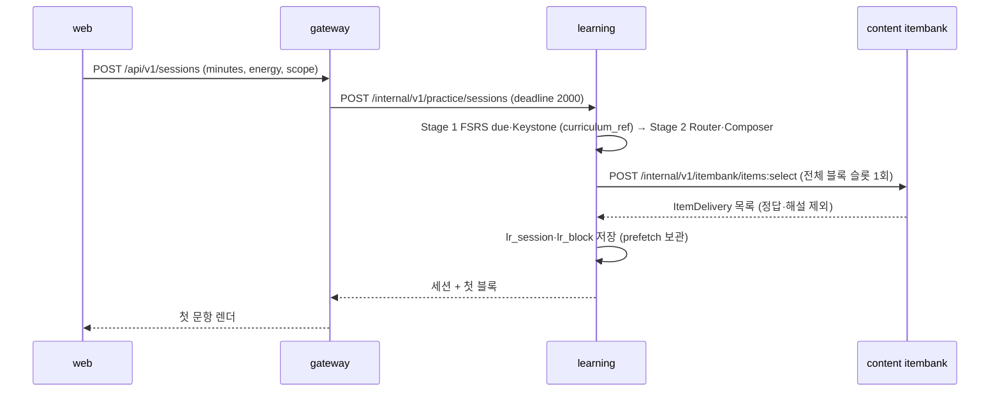

**(b) 응답 제출 → 채점 → 증거 기록 (NFR-PERF-003 p95 ≤ 300ms, NFR-DATA-013)**

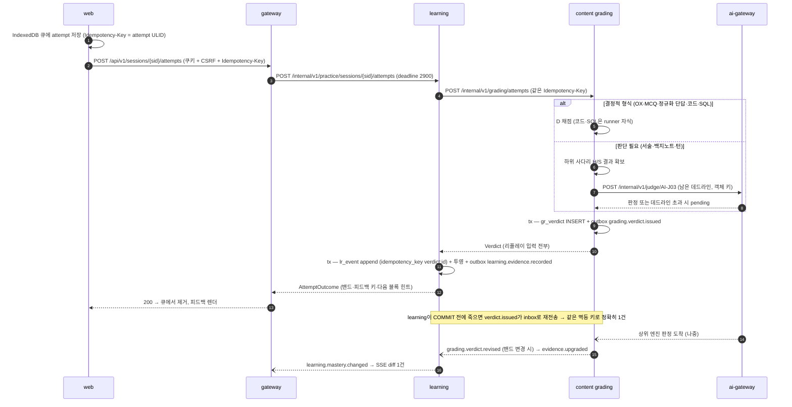

**(c) content 정지 중 제출 (D-9)**: learning의 grading 호출은 연결 300ms에 실패 → `503 LR-DEP-001` + `Retry-After: 1` → web은 attempt를 IndexedDB 큐에 유지하고 "채점 대기" 칩을 보이며 prefetch된 다음 문항을 계속 제시 → 같은 키로 1s·2s·4s…≤ 30s 재시도, `ops.health.changed`(content ready) 수신 시 즉시 재전송.

**(d) 증거 보정 코레오그래피 (FR-QST-011·015)**

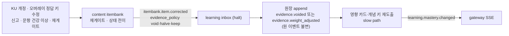

**(e) 대화 턴 (AQ-03)**: learning(DialogStateMachine)이 턴을 저장하고 content `POST /internal/v1/grading/turns:judge {dialog_state_summary, turn_text, item_ref}`를 부른다 → content가 AI-J17 판정(OFFLINE이면 S 분기) + 다음 move(결정적 상태기계) + 발화(OFFLINE·JUDGE_ONLY는 질문 은행, FULL·LLM_ONLY는 AI-G07 스트림 참조 `utterance_ref`)를 반환 → learning이 전이·재개 지점을 기록. 스트리밍 발화는 web `GET /api/v1/dialogs/{did}/turns/{tid}/utterance` → gateway가 content `GET /internal/v1/grading/utterances/{ref}`를 **바이트 그대로 중계** → content가 ai-gateway `GET /internal/v1/streams/{ref}`를 중계한다(gateway에 도메인 로직 0).

---

## 9. 데이터 소유권

### 9.1 `FATHOM_HOME` 레이아웃

기본 경로: macOS·Linux `~/.fathom`, **Windows `%LOCALAPPDATA%\Fathom`** [CR-01](로밍 프로필·OneDrive 리디렉션 WAL 위험, SP-4 §5.5-1·감사 구속), 재정의 `FATHOM_HOME`. 동기화 폴더(OneDrive·iCloud·Dropbox·Google Drive 휴리스틱)·네트워크 경로(UNC·SMB 마운트)·WSL 경로(`\\wsl$\…`, Windows에서 WSL 파일시스템)는 기동 시 경고 + doctor 항목이다(WAL·잠금 의미 보장 불가). 개발 모드(`pnpm dev`)는 `<repo>/.fathom-dev`(gitignore됨).

```
FATHOM_HOME/
├─ app/                               # 설치 번들(배포 설치에서만; pnpm dev는 저장소가 곧 app)
│  ├─ current.json                    # {"version":"1.0.0","previous":"0.9.3"} — 심볼릭 링크 대신 파일 포인터(Windows)
│  └─ <version>/                      # 최대 2세대(현재 + 직전) — 롤백용
├─ data/                              # 라이브 DB — 서비스별 소유(AP-01)
│  └─ content.db  learning.db  insight.db  ai.db  ai-cache.db  ops.db   (+ -wal, -shm)
├─ run/                               # 런타임 파일(백업 제외)
│  ├─ supervisor.lock                 # {pid, bootId, version, startedAt, profile}
│  ├─ registry.json                   # 서비스별 {pid, port, state, startedAt, restarts} — 토큰 없음
│  ├─ session.key                     # 32B 무작위, 0600(Windows: icacls 사용자 전용 ACL), 재기동 후에도 유지
│  └─ cli.token                       # 기동마다 회전, 0600
├─ logs/<svc>/YYYY-MM-DD.jsonl        # supervisor가 기록, 14일 ∧ 서비스당 ≤ 50MB(먼저 도달) [CR-14]
├─ backups/
│  ├─ snap/<epoch_id>/{manifest.json, content.db, learning.db, ai.db, ops.db}
│  ├─ incr/<device_id>/YYYY-MM-DD.jsonl
│  └─ secondary.json                  # 2차 대상 설정(경로·암호화 여부). passphrase는 저장하지 않음
├─ packs/<track>@<semver>.fpack       # 설치된 불변 팩 사본(sha256·merkle 검증본)
├─ policy/<name>@v<k>.yaml  policy.lock.json  sets/<policy_version>.json   # 설치된 정책(읽기 전용, 과거 버전·정책 세트 영구 보관 — 리플레이가 이벤트의 policy_version으로 해석)
├─ secrets/ai-keys.enc                # OS 키체인 불가 시에만(DEK/KEK, §12.4)
├─ cli-homes/codex/                   # 격리 CODEX_HOME(최소 config.toml, 동의 시 auth.json 0600 사본)
├─ inbox-queue/*.json                 # 앱이 꺼져 있을 때 `fathom capture` → content가 기동 시 흡수
├─ exports/                           # `fathom export` 기본 출력
└─ tmp/{runner,cli,import,packc,migrate}/   # 요청별 0700 디렉터리, 기동 시 잔존물 청소(RSK-RUN-06)
```

### 9.2 DB 파일 소유 표

| 파일 | 소유 프로세스(유일 writer) | 테이블 접두어 | `synchronous` | epoch 백업 | 보존 | 15년 규모 추정 |
|---|---|---|---|---|---|---|
| `content.db` | content | `ct_` `aq_` `ib_` `gr_` `rn_` + 공통 | NORMAL | **포함** | 발행분 영구, 미승인 초안 30일, 러너 로그 30일 | 150~400MB(문항 30만) |
| `learning.db` | learning | `lr_` + 공통 | **FULL**(원장, SP-3 §6.5) [CR-04] | **포함** | 원장·봉인 영구(append-only) | ≈ 350MB 원장(SP-3: 666B/이벤트) + 투영 |
| `insight.db` | learning | `iv_` | NORMAL | **제외**(복원 후 재구성) | 재구성 가능 | ≈ 50MB |
| `ai.db` | ai-gateway | `ai_` + 공통 | NORMAL | **포함** | judge_log·call_log append-only 영구, 골드셋 확정분 영구 | ≈ 200MB |
| `ai-cache.db` | ai-gateway | `ac_` | NORMAL | **제외**(재생성) | 판단 30일·생성 7일·상한 90일 [CR-15] | 수십 MB |
| `ops.db` | ops-api | `op_` + 공통 | NORMAL | **포함** | 텔레메트리 원시 400일·집계 영구, 헬스 샘플 30일 | ≈ 50MB |

- 서비스 간 데이터는 **HTTP 계약 또는 이벤트로만** 흐른다. 계약된 사본은 세 가지뿐이다: ① learning의 `lr_curriculum_ref`(catalog의 Published Language 사본, 이벤트로 갱신) ② itembank `ib_item.snapshot_json`(발행 시점 KU·오개념 스냅샷, 같은 서비스 안) ③ 원장 payload의 Verdict 필드(리플레이 입력). 셋 다 "캐시가 아니라 계약된 사본"이며 스키마는 contracts에 있다.
- ops-api는 **다른 서비스의 DB 파일을 열지 않는다**(NFR-MAINT-002). 스냅샷·무결성 검사는 소유 서비스가 admin API를 받아 **자기 단명 자식 job**으로, 복원·검증은 supervisor가 띄우는 단명 `--mode=restore|verify` 프로세스로 수행한다.

### 9.3 SQLite 규약 (SP-4 구속)

| 규약 | 값 |
|---|---|
| 연결 | **모든 연결은 `@fathom/shared-kernel/sqlite/sqlite`의 `openDb()` 팩토리로만** 연다(서비스 코드의 `new DatabaseSync` 직접 호출 = `check:boundaries` 규칙 `sqlite-direct`). 팩토리 = `new DatabaseSync(path, { readOnly, timeout: 5000, enableForeignKeyConstraints: true, enableDoubleQuotedStringLiterals: false })` — `node:sqlite`의 기본 `busy_timeout`은 0이고 모르는 옵션 키는 조용히 무시되므로 옵션 키 화이트리스트 검증. 읽기 전용 소비자는 `readOnly: true`(WAL 스냅샷 읽기는 writer를 막지 않으므로 검색용 읽기 복제본 없음) |
| PRAGMA | 생성·마이그레이션 시 1회 `journal_mode=WAL`(파일 영속). 매 연결 `synchronous=NORMAL`(learning.db만 `FULL`). **learning.db 원장 연결은 매번 `recursive_triggers=ON`**(SP-3 감사). 유휴 5분마다 `wal_checkpoint(PASSIVE)`, `journal_size_limit=67108864`(64MB — INT-1b에서 크기 측정 후 확정). `cache_size`·`temp_store`는 기본값 유지(측정 전 변경 금지) |
| 쓰기 | `tx(fn)` = `BEGIN IMMEDIATE`만. 지연 `BEGIN` 후 읽기→쓰기 승격 금지(`busy_timeout`을 우회해 BUSY·BUSY_SNAPSHOT 517 발생). 쓰기 tx ≤ 100ms, tx 안 `await`·외부 호출 금지(대기자는 정확히 `busy_timeout`에서 실패) |
| 파일 소유 | W1 파일당 소유 서비스 1개. 소유 서비스의 단명 자식 job과 보조 도구(seed·restore·doctor)도 그 파일에 `BEGIN IMMEDIATE` + 짧은 배치 tx로만 쓴다(W3 — 단일 writer는 규약 + 안전망이지 하드 락이 아님). 서비스 간 `ATTACH`·타 DB 경로 0(`check:db-paths`) |
| 스키마 | 전 테이블 `STRICT`. ID = ULID `TEXT CHECK(length(id)=26)`, 시각 = epoch ms `INTEGER`, 불리언 = `INTEGER CHECK(x IN (0,1))`, JSON 열 `CHECK(json_valid(..))`, 2^53 초과 정수는 `TEXT` |
| 바인딩 | 허용 타입 `number · string · bigint · Uint8Array · null`. `Date`(조용히 NULL)·`boolean`·`undefined` 바인딩은 어댑터가 예외 |
| 문장 | 준비 문장 캐시(재사용 3.5~6.7배), `prepare()`에 다문장 금지(첫 문장만 컴파일되는 함정). SQL 텍스트가 들어가는 입구는 `SqlitePort.prepare(sql)`·`exec(sql)` 둘뿐이고, 인자는 **정적 SQL**만 허용한다: 문자열 리터럴 · `${}` 없는 템플릿 · 리터럴 + 리터럴 · `${ident(x)}`·`${placeholders(n)}`·`${sqlInt(n)}` 보간 · `*.sql.ts`에서 import한 `UPPER_SNAKE` 상수(정의 자체도 같은 규칙으로 검사). 값은 항상 `?`/`:name` 바인딩. 예외는 `// sql-ok: <사유>`(사유 없으면 무효). 강제 = `check:sql`(tokens 1차) + `check:sql-typed`(tsgo 타입 기반 2차: 수신자가 `SqlitePort`·`DatabaseSync`인지 타입으로 판정 → `db['prepare']`·`.bind`·`.call` 회피 탐지, `RegExp#exec` 오탐 배제) |
| 오류 | `errcode & 0xff`로 정규화(`.code`는 항상 `ERR_SQLITE_ERROR`라 쓰지 않음): 5 = `busy`(재시도 대상), 6 = `locked`, 19 = `constraint`, 8 = `readonly`, 나머지 `other`. 확장 코드 517(BUSY_SNAPSHOT)은 **코드 결함 신호**(재시도 금지, 오류 로그 + 계약 테스트 실패) |
| 백업 | `VACUUM INTO ?`(임시 이름 → rename, 사본 `integrity_check`)를 **단명 자식 job**에서 실행. `backup()`은 라이브 쓰기 중 **완료 시간이 한정되지 않으므로** 금지, 백업 promise가 걸린 원본 `close()` 금지(SP-4 R-3) |
| 크래시 후 | 비정상 종료 후 재기동이면 ready 전 `PRAGMA quick_check`, ready 후 job `integrity` 전체 검사 → 실패 시 `degraded` + 배너 + doctor(SP-4 감사) |
| 경고 | 모든 Node 실행에 `--disable-warning=ExperimentalWarning`: fork·worker는 `execArgv` 상속, supervisor는 자식 env의 `NODE_OPTIONS`에도 병합(spawn은 `execArgv`를 상속하지 않음). 진입점은 `process.emitWarning`을 래핑한 뒤 `await import('node:sqlite')`(리터럴 동적 import, Windows 셔뱅 무시 대비). `--no-warnings`·`NODE_NO_WARNINGS`·`removeAllListeners('warning')`·`process.on('warning')`(억제 안 됨) 금지. E2E가 모든 서비스 stderr의 경고 0을 검사 |
| 수명 | `SqlitePort` 어댑터 뒤(NFR-PORT-009). doctor가 Node 22 EOL(2027-04-30)과 experimental `node:sqlite` API 변화를 경고 |

### 9.4 `ext` 열과 이름 훅 (AQ-10, DR-020)

- 모든 **엔티티** 테이블: `ext TEXT NOT NULL DEFAULT '{}' CHECK (json_valid(ext))` + `ext_v INTEGER NOT NULL DEFAULT 1`. `ext` 키는 `"<feature>.<field>"` 네임스페이스(예: `"lanpair.origin"`).
- DR-020 이름 훅은 **실제 열**이다: `lr_event.{event_id, device_id, device_seq, client_ts, idempotency_key, experiment_arm}`, `ai_judge_log.{probabilities, input_hash, model_version}`, `ib_item.{source_kind, stem_family, gate_status, defect_manifest}`, `lr_card_state.response_mode`, `ct_misconception.{meta_family, status}`, `ct_ku.{valid_as_of, deprecated_by, scope}`, `ct_concept.{volatility, required_for_level}`, `ct_track.offline_cap_level`, `ct_case.{variant_params, root_cause_pool, best_if, contested}`, `ct_overlay_event.base_version`, `ct_pack.channel`, `aq_inbox_item.source_kind`. 목록 정본 = `packages/contracts/src/db-hooks.ts`, `lint:hooks`가 마이그레이션 SQL과 대조(PG-2·IT-01 게이트).
- `ext` 키가 조회 조건이 되면 `ALTER TABLE … ADD COLUMN <k> … GENERATED ALWAYS AS (json_extract(ext, '$."<feature>.<field>"')) VIRTUAL` + 인덱스로 승격한다(가산 CR, 테이블 재작성 0). **STORED 생성 열은 최초 `CREATE TABLE`에서만** 허용(예: `lr_event.card_id`·`concept_id`, SP-3 측정 조건) — `ALTER`로는 추가할 수 없기 때문이다.

### 9.5 원장 자급성 요약 (상세: ADR-011)

- **단일 writer**: `lr_event`에 쓰는 코드는 `services/learning/src/infra/ledger/ledger-writer.ts` 하나.
- **쓰기 형태**: `INSERT OR IGNORE`만(REPLACE·UPSERT 정적 금지), 원장 연결마다 `recursive_triggers=ON`, UPDATE·DELETE 거부 트리거는 실수 방지용. 무결성 증명은 기기별 해시 체인 + **원장 밖 체인 헤드 앵커**(체크포인트·export 헤더·epoch 매니페스트)가 맡는다.
- **리플레이 입력 내장**(SP-3 §6.8 + SP-6 F0 + SP-3 감사): `card_id, concept_id, format, facet, response_mode, tier, rating, result, score, confidence, w_format, w_grader, gaming_factor, rapid, latency_ms, hints_used, item_id, item_beta, item_n_options, item_content_hash, gate_result_id, verdict_id, grader_engine, calibrated, pending, provisional, ai_mode, policy_version, fsrs_at, study_day, prev_hash`(+ fuzz 사용 시 `fuzz_seed` 필수 — v1은 fuzz off). 투영 파라미터(FSRS w·tier별 retention·short-term·fuzz·Elo K·숙달 임계)는 `policy_version`이 가리키는 **불변 파라미터 세트**에서만 고른다(현재 설정 금지). `ts-fsrs` 구현 버전은 `lr_projection_meta.fsrs_impl`로 투영 해시 옆에 기록한다.
- **정준 투영 해시**: 정렬된 키·고정 필드 순서·최단 왕복 숫자 표기·SHA-256. 바이트 동일성은 같은 플랫폼·같은 Node 버전 안에서만 요구하고, OS 간 비교는 V-live로 미룬다.
- **리플레이 = 라이브 검증**: 유휴 창(`ops.host_state.changed.idle_window_open`)에서 job `replay-verify`(단명 자식, 읽기 전용 연결)가 전체 리플레이(55만 건 ≈ 7.5~10s) → `projection_hash` 비교 → 불일치 시 배너 + doctor 항목(자동 수정 금지).

---

## 10. 콘텐츠·정책 팩 저장 전략 (상세: ADR-004)

### 10.1 원천 — content-as-code

```
content/                                   # 저장소 루트(T1 콘텐츠 레인 소유, 사람이 diff로 리뷰)
├─ packs/<track>/                          # 코어 19 + data. 팩 = 트랙 단위
│  ├─ pack.yaml                            # id, version(semver), channel: seed, track, schema_v, requires{policy, packc}
│  ├─ concepts/<concept_id>.md             # frontmatter(id·level·knowledge_type·tier·required_for_level·aliases(영문 ≥ 1)·prereqs·volatility·sources)
│  │                                       #   + 본문 헤딩 "## 이론" "## 코드" "## 핵심"(R-3STAGE)
│  ├─ kus/<concept_id>.yaml                # KU(statement, facet, scope, vol, valid_as_of, source_refs span)
│  ├─ misconceptions/<concept_id>.yaml     # meta_family 필수
│  ├─ item-models/*.yaml                   # T2 ItemModel(slots, constraints, stem_family)
│  ├─ items/*.yaml                         # 저작 문항(gate_status: authored → V7 레코드 후 seed_reviewed), options는 객체 키
│  ├─ cases/*.case.yaml                    # 상태기계 + variant_params·root_cause_pool·best_if·contested
│  ├─ artifacts/*.yaml  rubrics/*.yaml
│  └─ labs/<lab_id>/{task.md, starter.ts, tests.hidden.ts, complexity.yaml}   # 알고리즘 은행·보안 패치·카타
├─ blueprints/{cert-cka@<edition>.yaml, cert-jeongbo-pilgi@<edition>.yaml}      # 판본·출처 해시(AQ-13)
├─ sources/registry.yaml                   # 출처 등급 A/B/C/D/P, 캐시 원문 해시
├─ review/V7/<pack>/<batch>.yaml           # 독립 리뷰 레코드 = 저작 시드 S2 승인
└─ oracles/<track>/*.py                    # ml·llm 빌드타임 Python 오라클(uv) — 런타임 실행 0
```

### 10.2 팩 컴파일러 `tools/packc` → `.fpack`

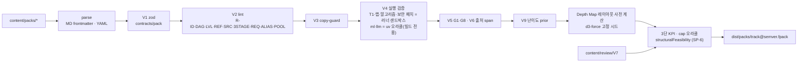

- `.fpack` = 무압축 tar: `manifest.json`(pack_id, version, channel, schema_v, packc_version, files[{path, sha256, bytes}], **merkle_root**, counts, required_for_level 요약, offline_cap_level) · `bundle.jsonl`(정규화 레코드, 정준 JSON 한 줄 1건) · `report.json`(V1~V10 결과, gate_status 근거, 3단 KPI, cap 오라클 blocker 코드) · `layout.json`(Depth Map 좌표).
- **lint 추가 규칙**(SP-4·SP-6 반영): R-ALIAS(한글 개념마다 영문 alias 또는 동의어 ≥ 1 — 남은 재현율 손실의 주원인이 어휘 공백), R-POOL(**레벨별 × AI 모드별** 승급 평가 풀 = 그 모드에서 허용된 엔진의 형식만 세어 ≥ 12문항 · 형식 ≥ 4, 미달이면 cap 하향 표시; 판정은 learning과 같은 순수 함수 `structuralFeasibility(policy, inventory, transition, mode, sp1)`를 `@fathom/contracts/pack/feasibility`에서 import — 팩 변경마다 CI 게이트), R-REQ(`required_for_level`은 Tier A/B만), R-3STAGE(469 전부 3단 헤딩). 규칙마다 음성 fixture(`tools/packc/fixtures/<rule>/`).
- content는 **컴파일본만** 설치한다(원천 YAML·MD 파싱 코드가 content에 없다). 런타임 packc(사용자 팩·`pack refresh`)는 content가 **자식 프로세스**로 호출하며 Python 오라클 단계는 비활성(사전 계산 정답이 없는 항목은 `deferred`로 컴파일).

### 10.3 설치·활성화 — 단일 수입 포트

카탈로그·문항 서빙 테이블을 바꾸는 경로는 셋뿐이다: ① `.fpack` 설치 ② **PackDelta**(가져오기 승인·T3/T4 게이트 통과·Tier 승격·재게이트 결과를 팩 문법의 op 묶음으로: `upsert_concept`·`upsert_ku`·`alias`·`deprecate`·`upsert_misconception`·`upsert_item_model`·`publish_items`·`set_gate_status`·`quarantine_family`·`upsert_case`·`upsert_blueprint`·`attach_source`, 각 op는 `base_version`) ③ 사용자 오버레이 패치.

1. `fathom seed` / `fathom pack upgrade` → gateway(`/api/v1/cli/packs`) → content `POST /internal/v1/catalog/packs:install`.
2. sha256·merkle 검증 → 단명 자식 job `pack-load`가 **비활성 버전 행**으로 배치(500행, `BEGIN IMMEDIATE`) 적재 → 오버레이 재적용(`base_version` 동일 필드 자동, 바뀐 필드 → `aq_staging_diff` 충돌 + `catalog.overlay.conflicted`) → **활성 포인터 전환 1 tx**(blue/green, FR-CUR-002의 원자성을 포인터 전환으로 보장 [CR-12]) → `catalog.pack.activated` + 변경 개념별 `catalog.concept.changed`. 실패 시 비활성 행 폐기(포인터 불변).
3. 사용자 수정은 `ct_overlay_event`(append-only: id, target_kind, target_id, field, base_version, new_value, reason, device_id, ts, revert_of)로만. 조회 = 팩 ⊕ 오버레이. export·병합 대상.

### 10.4 정책 팩 (AQ-11)

저장소 `policy/<name>@v<k>.yaml` + `policy/policy.lock.json`(`{"<name>@v<k>": {"sha256": "…", "owner": "<svc>"}}`) → 설치 시 `FATHOM_HOME/policy/`(읽기 전용, 과거 버전 영구 보관 — 리플레이가 과거 정책을 해석해야 하므로). 소비 서비스가 `shared-kernel/policy` 로더로 zod 검증 + 해시 대조. **해시가 바뀌었는데 버전이 같으면 기동 거부**(exit 78, FR-CUR-017). 계산 이벤트에는 `policy_version`(정책 세트 콘텐츠 주소 `ps_<sha256 16자>`)을 기록한다.

| 정책 | 소유 | 소비 | 초기값 출처 |
|---|---|---|---|
| `method_policy@v1` | learning | learning | Router 25칸(REQ·PED) |
| `composer_policy@v1` | learning | learning | 점수 함수·하드 제약·H_min = min(2.3, 0.8·log2(min(k, B))) |
| `mastery_rules@v1` | learning | learning(+ packc가 `structuralFeasibility` 입력으로 읽음) | FR-PRG-009/013/032/033 + **SP-6 F0 `elo.guess_correction: true` · F1 `promotion.empty_level: skip` · F3 `d4.floor_mode: min_with_possible` · F4 `elo.unqualified_ceiling: 0`(실효 θ = min(θ, θ_q))**, θ 수축 `theta_prior: -0.5`·`theta_shrink_n0: 10`·`theta_display_min_events: 30` [CR-22], `promotion.required_mastered`(n ≤ 3 전부, 그 외 min(n−1, ceil(0.85n))) [CR-20], `assessment{items 12, formats_min 4, selection: round_robin_by_format, engines: deterministic + calibrated_jev(sp1_pass), accuracy_min_correct {1:10, 2:10, 3:10, 4:11}, cbm_denominator: chosen_confidence_max, cbm_min {1:0.70, 2:0.70, 3:0.70, 4:0.75}, retry_days 14}` [CR-19], `sparse.depth_scope: track`·`d4.possible_scope: level_le_k` [CR-21], AI 모드 프로파일(`ai_profiles.JUDGE_ONLY.rubric_engine.sp1_fail: S_provisional` [CR-18]), w_grader 표(§11.4), `geq ε=1e-9` |
| `ldi_params@v1` | learning | learning | REQ §12.5 부록 A 초기값 — **미확정**(SP-3 감사), 시뮬레이터 민감도 분석(SIM-LDI) 후 `@v2` 교체 가능 |
| `gaming_params@v1` | learning | learning | 형식별 t_min(200응답 후 개인화), rapid → w 0·grade ≤ Hard, 힌트 감점 |
| `cbm_params@v1` | learning | learning | CBM 점수표 |
| `fsrs_params@v1` | learning | learning | **SP-3**: ts-fsrs 5.4.2 `default_w`, `enable_fuzz: false`, `enable_short_term: true`, `request_retention: 0.90`(tier별 재정의 가능), 예측: 30일 총량 범위만·일 단위 비표시, 띠 = 사용자 과거 예측 오차 분위수(`band.min_history_windows: 8`, 그 전 기본 ±15%), 거버너 비교값 = 하한 [CR-05] |
| `gate_thresholds@v1` | content | content | G0~G13 임계, 재게이트 보정(G3 → void, G5 → halve) |
| `search_params@v1` | content | content | SP-4 V2 가중(bm25 10·5·1), 질의 토큰 구두점·따옴표 제거 문자 집합, 짧은 토큰 기준 3자(`instr`), **V3 전환 문서 수 20,000**(감사: ~4만 건보다 충분히 낮게, 실행 간 지연 편차 최대 1.5배) [CR-24] |
| `ai_policy@v1` | ai-gateway | ai-gateway | 월 ₩30,000, 20일차 80% 강등·100% 유료 차단, 대량 임계(호출 > 50 ∨ ₩1,000 ∨ 창 쿼터 20%), 쿼터 창 5h·주간(보수 기본값), 배치 창(유휴 ≥ 10분 ∧ AC), Jev 15 rps·버스트 30·동시 ≤ 20, CLI 동시 2, 캐시 TTL |
| `firewall_rules@v1` | ai-gateway | ai-gateway(egress), content(ingress 마스킹) | 비밀 정규식(키·토큰·주민번호 형식·사설 IP), 데이터 등급 규칙 |
| `ops_policy@v1` | ops-api | ops-api | 증분 일 1·스냅샷 주 1·7세대, quiesce 2s·snapshot 30s, 로그 14일·50MB, Tripwire(유휴 RSS 400MB·콜드 10s), 디스크 경고 500MB |

### 10.5 릴리스 매니페스트와 과업·프롬프트 레지스트리

- `packages/contracts/manifests/modes.manifest.json`(FR-STD-033: mode_id, ur14_family, offline_path, e2e_ids, status included/deferred)과 `verification-class.json`(REQ §1.7 등급)은 **contracts 패키지 export**로 둔다(learning·web·E2E·si-docs가 import 경계 안에서 읽도록; 루트 파일 대신). `check:manifest`가 UR-14 6계열 각각 included ≥ 1, E2E 대상 = included 집합을 검사한다.
- 과업 레지스트리 `services/ai-gateway/assets/tasks.yaml`(AI-J01~J19, AI-G01~G13) · 범용 CLI 정의 `assets/cli-providers/*.yaml` · 프롬프트: LLM 과업(AI-G·LLM-judge) `assets/prompts/<taskId>/<semver>/{prompt.md, meta.yaml}`, **Jev 과업(AI-J) `assets/jev/prompts/<taskId>/<semver>/{prompt.md, meta.yaml}`**(경로에 `jev/prompts/`가 있어 `check:jev-index`가 `.md`까지 검사 — STD-01) + 두 트리를 함께 덮는 `assets/prompts.lock.json`(sha256). 기동 시 lock 불일치 과업은 **그 과업만 비활성** + doctor 항목(실패가 시끄럽다).

---

## 11. AI · Jev 배치와 강등 행렬 (상세: ADR-005, ADR-016)

### 11.1 ai-gateway 내부

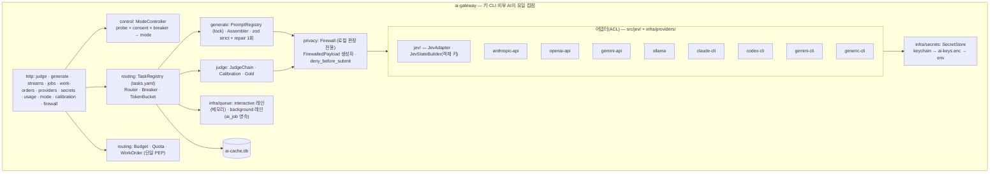

- **모드 산정**: 제공자 probe(설치·버전·로그인·필수 플래그·키 존재·Ollama 응답·Jev `models.list`) × 사용자 동의(`ai_consent`) × 서킷 상태. **첫 기동은 동의 0건이므로 항상 OFFLINE**(외부 호출 0). 감지된 CLI도 동의 전에는 배경 생성에 쓰지 않는다. 모드가 바뀌면 `ai.mode.changed`.
- **호출자 규칙**: content = judge·generate·jobs·work-orders, gateway = 설정·동의·비용·승인·secrets, ops-api = `doctor --live` probe. learning = 없음(v1). LLM SDK import와 CLI spawn 코드는 `services/ai-gateway/src/infra/providers/**`에만, Jev SDK(`@typesafe-ai/sdk`)와 Jev 요청 조립은 `services/ai-gateway/src/jev/**`에만 둔다(`check:deps` + `check:jev-index` 범위, STD-01).
- **제출 전 생성 금지(NG-G7, FR-AI-020·FR-STD-018)**: `@fathom/contracts/ai/ai-gateway-policy`의 `deny_before_submit: ["blank_note.*"]`를 ai-gateway privacy 계층이 런타임에 집행한다. `generate/*` 요청의 `context_ref = {kind: 'blank_note', phase: 'pre_submit'|'post_submit', id}`가 `pre_submit`이면 과업과 무관하게 403 `AI-POLICY-001`(CR-44). 정적 게이트(`ng-g7/*`)는 이 정책 파일의 존재·내용을 양성 단언하고 `blank-note/`(비 `post-submit/`) 코드의 AI 클라이언트 import를 막는 **보조** 장치다.
- **지연 레인**: interactive(데드라인 3s, 메모리 큐, 판단 위주) · conversational(발화 스트림) · background(`ai_job` 영속, 배치 창·쿼터·작업 주문 게이트). interactive가 항상 먼저(대기 ≤ 1작업).
- **작업 주문(단일 PEP)**: background 호출은 `work_order_id` 필수. v1 lite = 추정(호출·₩·창 쿼터%) + 임계 초과 시 승인 이벤트(`ai.work_order.approval_requested`) + 승인 플래그. 제공자 클래스별 예약·원자 차감(reservation)은 Should(스키마 훅 보유).
- **판정 원자료**: `ai_judge_log`(append-only: task_id, engine, model_version, input_hash, questions(객체 키), probabilities, confidence, calibrated, latency, cost, prompt_version). `model_version` 변화 → `ai.judge.drift_detected` → 배지 "보정 전"(w 0.7) + calibrate 작업 제안(D-14).
- **첫 AI 연결 자동 작업(D-14)**: 동의 직후 `ai_job`에 SP-1 캘리브레이션·SP-8 CLI 격리 canary·CLI 스모크를 생성하고 승인 대기로 둔다.

### 11.2 Jev 객체 키 강제 (UR-16)

1. `packages/contracts/src/ai/judge.ts`의 `JudgeState`는 **배열 타입을 허용하지 않는 zod 스키마**(`z.record(ObjKey, …)`), 키 패턴 `^[a-z][a-z0-9_]{1,31}$`(예: `kp_ttl`, `opt_b`, `mc_cache_02`, `candidates.k137`처럼 점 경로로 참조).
2. `JevStateBuilder.fromList(prefix, items)`만 배열 → 키 맵 변환을 한다. instructions의 `{{key}}` 참조가 실제 키인지 검증(없는 키 = 예외, 버그로 분류·폴백 금지).
3. `check:jev-index`(SP-7 tokens 엔진, P·R 1.0): 범위 = `services/*/src/jev/**`·`*.jev.ts`·`@typesafe-ai/sdk`를 import한 파일·`**/jev/prompts/**/*.md`. 규칙 `jev/index-literal`(`candidates[3]`·`.at(0)`), `jev/index-var`(경고), `jev/index-string`(`item 2`·`3번째`·`the second candidate`), `jev/index-interp`(`` `${i + 1}.` ``), `jev/index-field`(`index`·`best_index`·`selectedIndex`). 탈출구 `// jev-ok: <사유>`(사유 필수). 위치 구조분해·`shift()` 같은 회피는 정적 게이트로 못 막으므로 `JudgeState` zod 런타임 거부가 본체다.
4. 요청당 질문 ≤ 15(R5 §8.2), 대량은 항목별 분할 + 토큰 버킷 15 rps. `logLevel: debug` 금지(본문 비 redact).

### 11.3 강등 행렬 — 모드 × 서비스 (기능별 상세는 PLN-CNV-01 §8.2)

| 서비스 · 기능 | FULL (Jev + LLM) | JUDGE_ONLY (Jev) | LLM_ONLY (LLM) | OFFLINE (첫 기동) | ai-gateway 프로세스 다운 |
|---|---|---|---|---|---|
| ai-gateway 라우터 | 전 과업 | J 과업 + 템플릿 | G 과업 + LJ(비보정, 타 계열 우선) | 외부 호출 0, `unavailable` 즉답 | — (supervisor 재시작 ≤ 5s) |
| content · grading 사다리 | D → J(서술) → LJ(이의·게이트) | D → J, 피드백 템플릿 | D → LJ(w 0.6, 학습자 확인) | D → H → S, 판단 필요분 `pending`(보류 큐) | 호출자가 연결 300ms 서킷으로 **OFFLINE 간주**, D/H/S 로컬 계속 |
| content · 게이트(J04) | J(AI-J07~J12) + G4 독립 풀이 L(≠ 생성 계열) | J(G4는 메타모픽 대체) | LJ(≠ 생성 계열, 선택지 순서 2회 교차) | **보류**(`deferred`, 출제 0). 휴리스틱 통과 금지 | 보류 |
| content · 생성(J03) | T1/T2 + T3/T4 L(배치 창·쿼터·승인) | T1/T2 + active ItemModel 전개 | L + LJ 게이트(보수 임계) | T1/T2 + 시드만 | T1/T2 + 시드 |
| content · 가져오기(I02) | 추출 L → 근거 J14 · 분류 J13 · 주입 H+J16 · 모순 J15 | 규칙 추출 + J 검증 | L 추출 + LJ(`trust=llm_unverified`, 승인 전 출제 0) | 규칙 추출 → `trust=user`, T2 문항만 | OFFLINE과 같음 |
| content · 대화 발화 | J17 판정 + AI-G07 스트림 | J17 + 질문 은행 템플릿 | LJ 라벨 + L 발화 | 질문 은행 × KU + S 분기 + D4~D5 결정적 MCQ | OFFLINE과 같음 |
| learning · 숙달·승급 | `mastery_rules` FULL 프로파일, 확정 | JUDGE_ONLY 프로파일 | LLM_ONLY 프로파일 | 대체 증거(D4 MCQ·결정점 D·T2 매칭), 자기채점뿐이면 **잠정** | 변화 없음(AI 무관) |
| learning · 원장 | `ai_mode.observed` 기록 | 〃 | 〃 | 〃 | 〃 |
| web | 칩 `AI: 전체` | `AI: 판단만` | `AI: 생성만` | `AI: 오프라인` | `AI: 오프라인` + 격하 배지 |

**공통 규칙**(Baseline §5.6): 결정적 과업은 어떤 모드에서도 AI 0 · 판단 게이트는 휴리스틱으로 통과시키지 않는다 · interactive 데드라인 3s, 밴드가 바뀔 때만 갱신 · 비보정 판정은 FSRS에 확인 후, 숙달·LDI에는 w 감쇠 · 외부 페이로드는 로컬 Firewall 통과 · 제출 전 생성 호출 금지(FR-AI-020, ai-gateway 정책 403) · 대량 작업은 미리보기·승인, 구독 쿼터 준수.

### 11.4 증거 가중 (w_grader, Verdict 발급 시점 고정)

결정적 1.0 · Jev calibrated(conf ≥ 0.6) 0.9 · Jev 보정 전 0.7 · Jev conf < 0.6 → 0.4(확인 후 재계산) · LLM-judge 0.6 · 휴리스틱 0.4 · 자기 0.3 · 보류 0(AI 복귀 후 **새 이벤트**로 소급). `w = w_format × w_grader × gaming_factor`, 빠른 응답은 정오 무관 0. **숙달 형식 산입 = `geq(w_format, 0.7) ∧ geq(w_grader, 0.6)`**(곱이 아님, DEC-CNV-19).

---

## 12. 보안 아키텍처 (상세: ADR-007, ADR-009, ADR-016)

### 12.1 신뢰 경계

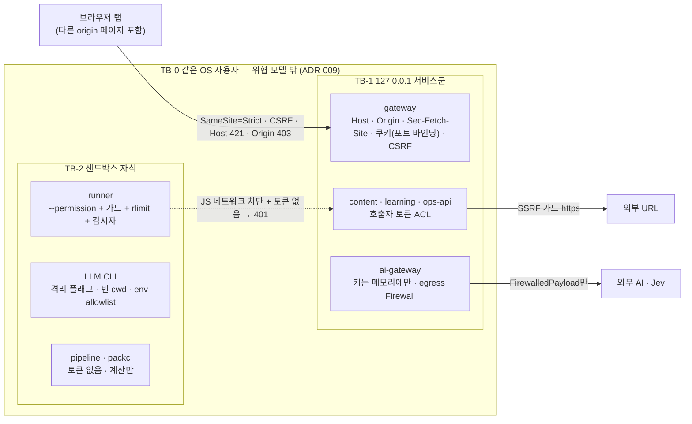

**범위 안 위협**: 브라우저 교차 출처·DNS rebinding, 러너 학습자 코드, 가져온 콘텐츠의 프롬프트 인젝션, LLM 출력, CLI 사용자 설정(hooks·MCP·CLAUDE.md) 주입, 백업·export 파일 유출, 동기화 폴더, 로그·`ps` 비밀 노출. **범위 밖**: 같은 OS 사용자 권한의 악성 프로세스(키체인·메모리 접근 가능), 커널·V8 0-day(RSK-RUN-01, 출처 정책·버전 고정·차단 스위트로 완화).

### 12.2 브라우저 세션 (AQ-04, NFR-SEC-002·019) [CR-06]

1. **부트스트랩**: `fathom up`/`fathom open` → CLI가 `POST /api/v1/cli/bootstrap-token`(Bearer `cli.token`) → gateway가 1회용 토큰(32B, 60s, 메모리) 발급 → CLI가 `http://127.0.0.1:<port>/#bt=<token>`을 연다. **fragment라서 서버 로그·Referer에 남지 않는다.**
2. **교환**: SPA 부팅 시 `location.hash`에서 `bt`를 읽고 즉시 `history.replaceState`로 제거 → `POST /api/v1/session/exchange {bt}` → gateway가 토큰 1회 소비 후 `Set-Cookie: fathom_sid=v1.<sid>.<port>.<iat>.<mac>; HttpOnly; SameSite=Strict; Path=/; Max-Age=34560000`(400일, 사용 시 하루 1회 갱신). `mac = HMAC-SHA256(session.key, "v1|sid|port|iat")`. Secure 속성은 http loopback이라 쓰지 않는다.
3. **포트 바인딩**: 쿠키는 포트로 격리되지 않으므로 gateway는 쿠키의 `<port>`를 자기 listen 포트와 대조한다(불일치 401). 폴백 포트로 origin이 바뀌면 `fathom open`으로 재교환 + PWA 재설치 안내 1회.
4. **CSRF**: `GET /api/v1/session/csrf`(쿠키 필요, CORS 헤더 없음, `Cache-Control: no-store`) → `{csrf: HMAC-SHA256(session.key, "csrf|"+sid)}`. 상태 변경(POST·PUT·PATCH·DELETE)은 쿠키 + `X-Fathom-CSRF` + `Origin ∈ {http://127.0.0.1:<port>, http://localhost:<port>}`(불일치 403) + `Host` 일치(불일치 421) + `Sec-Fetch-Site ∈ {same-origin, none}`.
5. `session.key`(32B)는 `run/session.key` 0600, 재기동 후 유지 → 북마크·다중 탭 재인증 0. `fathom doctor --rotate-session-key`로 전 세션 무효화.
6. **CLI**: `run/cli.token`(기동마다 회전, 0600, Windows icacls) → `Authorization: Bearer`, 권한 = `/api/v1/cli/*`만. rate limit 300 req/min/토큰(`@fastify/rate-limit`, NFR-SEC-017).

### 12.3 내부 인증·인가 (NFR-SEC-003)

- supervisor가 기동마다 **호출자 서비스별 256bit 토큰**(gateway·content·learning·ai-gateway·ops-api 각 1개)을 메모리에서 만들고, fork 직후 **IPC 첫 메시지(부트스트랩 봉투)**로만 전달한다(env·디스크·로그 0). 각 서비스는 ① 자기 호출자 토큰 ② "나를 호출해도 되는 서비스의 토큰" 맵만 받는다.
- 피호출자는 `Authorization: Bearer <token>` → 호출자 이름을 식별(상수 시간 비교)하고 라우트의 `allowedCallers`를 적용한다(401 미인증 · 403 ACL 위반).
- `listen()`은 `shared-kernel/service`가 `127.0.0.1`만 허용한다(`0.0.0.0`·LAN IP 설정 시 exit 78). 컨테이너 뷰(`FATHOM_DEPLOY=container`)만 예외(ADR-014).
- 러너·CLI·pipeline·packc 자식에는 어떤 토큰도 전달하지 않는다 — 가드를 뚫고 loopback에 닿아도 401(RSK-RUN-02의 마지막 방어선).

### 12.4 키·KEK 저장 (AQ-06, NFR-SEC-004)

| 순위 | 백엔드 | 쓰기·읽기(비밀은 항상 stdin, argv 0) |
|---|---|---|
| 1 | OS 키체인(제공자별 항목 `fathom/provider/<id>`) | macOS `security -i`(명령 자체를 stdin) · Linux `secret-tool store/lookup`(libsecret, stdin) · Windows DPAPI: `powershell -NoProfile -NonInteractive -Command -`에 스크립트 stdin, `ProtectedData.Protect(CurrentUser)` 결과를 `secrets/dpapi/<id>.bin` |
| 2 | 암호 파일 `secrets/ai-keys.enc` | 무작위 DEK(AES-256-GCM)로 키 묶음 암호화, DEK를 KEK로 래핑. KEK = (a) OS 바인딩 무작위 32B KEK(키체인·DPAPI 항목 `fathom/kek`) 또는 (b) passphrase → `scrypt(N=2^17, r=8, p=1, maxmem=256MiB)`(기동 후 설정 화면에서 잠금 해제, 메모리만). **KEK 평문을 같은 디스크에 두지 않는다** |
| 3 | env(`ANTHROPIC_API_KEY` 등) | 읽기 전용, 설정 화면 경고(부모 셸 누출) |

- 키는 ai-gateway 메모리에만 있다. 응답은 `{provider, source, last4, verifiedAt}`만. 로그 redact(`sk-ant-…`, `sk-…`, `AIza…`), DB·로그·export grep 0, `ps` 비밀 0 테스트.
- 백업 암호화 passphrase는 AI 키 KEK와 **별도**다(다른 기기 복원에 필요하므로 OS 바인딩 불가).

### 12.5 LLM CLI 격리 (AQ-05, NFR-SEC-005·020, FR-AI-024)

| 항목 | 규칙 |
|---|---|
| 실행 | `spawn(bin, args[], {shell:false, cwd: tmp/cli/<ulid>(빈 0700), env: allowlist, detached: POSIX true})`. 프롬프트는 **stdin**, 인자에 사용자 텍스트 0 |
| Claude Code | `claude -p --output-format json --json-schema <과업 스키마 JSON> --model <m> --tools "" --safe-mode --strict-mcp-config --mcp-config <빈 mcp.json 경로> --setting-sources <최소> --disable-slash-commands --no-session-persistence`. `--bare` 제외(키체인 구독 인증 충돌). 최종 조합은 IF-01 모의 CLI 계약 테스트(V-build) + canary hook(V-live, SP-8)로 고정 |
| Codex | `codex exec --json --sandbox read-only --ephemeral --output-schema <file> -` + **격리 `CODEX_HOME=$FATHOM_HOME/cli-homes/codex`**(Fathom이 쓴 최소 `config.toml`, MCP·hooks·프로필 없음; 구독 모드는 동의 시 `auth.json`만 0600 복사). AGENTS.md는 빈 cwd라 미로드 |
| Gemini CLI | `gemini -p "<고정 지시>" -o json --approval-mode plan`(본문 stdin), zod + repair 1회 |
| 범용 CLI | `assets/cli-providers/*.yaml`: `bin`, `args[]`(고정 슬롯 `{model}`만, 프롬프트 치환 슬롯 = 설정 검증 오류), `stdin: prompt`, `extract: json-pointer\|text`, `probe: [--version]`, `isolation{flags[], home}`, `trust: verified\|unverified`. **`trust: unverified`(canary 미통과)면 데이터 등급 C0만 송출** |
| env allowlist | `PATH, HOME(또는 격리 HOME), LANG, LC_ALL, TMPDIR` + Windows `SYSTEMROOT, APPDATA, LOCALAPPDATA, USERPROFILE` + 과금 모드별 인증 변수 1개(구독 `claude`는 `ANTHROPIC_API_KEY` 제거, FR-AI-022) |
| 종료 | 과업별 타임아웃(기본 120s) → POSIX `process.kill(-pid,'SIGKILL')`, Windows `taskkill /T /F /PID`(자식·손자 잔존 0) |
| Windows shim | npm `.cmd` shim 파서(npm 9·10·11 fixture) → `node <script>`로 실행. 실패 시 해당 제공자 비활성 + doctor(NFR-PORT-004) |
| 쿼터 | 구독 CLI 5시간 창·주간 상한, `ops.host_state.changed.interactive_cli`에 해당 CLI가 있으면 배치 레인 일시정지(FR-AI-025), 동시 CLI 자식 ≤ 2 |

### 12.6 러너 격리 (AQ-09, SP-2 + 감사 구속, 상세: ADR-007)

```js
// services/content/src/infra/runner/spawn-args.ts가 만드는 인자(SP-2 §3.3 + 감사 구속)
['--permission', `--allow-fs-read=${GUARD}`, `--allow-fs-read=${TMP}`,        // 쓰기 기본 거부(과제가 opt-in 시 --allow-fs-write=${TMP})
 '--disallow-code-generation-from-strings', '--max-old-space-size=128',
 '--disable-warning=ExperimentalWarning', '--no-addons',
 '--disable-wasm-trap-handler',                                              // RLIMIT_AS + 타입 스트리핑 공존(Linux)
 `--import=${pathToFileURL(GUARD).href}`, ENTRY]
// 절대 주지 않는 플래그: --allow-child-process · --allow-worker · --allow-addons · --allow-wasi
// Linux: prlimit --as=1610612736 --cpu=<ceil(timeout)+1> --fsize=8388608 --core=0 -- node … (RLIMIT_NPROC 금지)
// env: { FATHOM_MODE, FATHOM_DEADLINE_MS }만 — 가드가 읽고 즉시 삭제(학습자에게 빈 env). 부모 env·토큰·NODE_OPTIONS 상속 0
// detached: true (프로세스 그룹 → 그룹 SIGKILL), Windows 최소 부트스트랩 env는 V-live로 확정
```

- **요청당 전용 자식**(재사용 풀 금지; 예외 = 차단 스위트를 예비 경로로 통과한 1회용 prewarm 예비 1개), 세마포어 `min(3, max(1, os.availableParallelism() − 1))`, 초과 큐잉. 기본 타임아웃 JS/TS 3s · SQL 2s, RSS 256MB, 출력 64KB(stdout+stderr 합 `>=`에서 kill).
- **RSS 감시 25~50ms(전 OS)**: Linux `/proc/<pid>/status` VmRSS **25ms**(동기 읽기) · macOS `ps -o rss= -p` **50ms** · Windows **상주 PowerShell 헬퍼**(`assets/runner/win-rss-helper.ps1`, 러너 사용 중에만 상주) **≤ 50ms** [CR-02]. 감사 오버슈트 표본(Linux, 한도 256MB): 100ms 394MB · 50ms 355MB · 25ms 309MB — 상한이 아니므로 Linux는 `RLIMIT_AS` 1.5GB가 최종 상한이다.
- **OS별 활성화 게이트**: 해당 OS에서 차단 스위트(V-ci·V-live)와 감시 주기 ≤ 50ms가 확인되기 전에는 그 OS의 러너 과업 형식(코드·SQL 실행·복잡도)을 **비활성**하고 Docker 경로를 권고한다(사전 합의 폴백). 검증 플랫폼은 릴리스 매니페스트 `runner_verified_platforms`에 기록하고 `RunnerPort`가 기동 시 대조한다. 현재 검증 = Linux만.
- **가드**(필수): builtin default-deny 허용 목록(`assert, buffer, console, crypto, events, fs, fs/promises, path, perf_hooks, process, querystring, readline, stream*, string_decoder, timers*, url, util*, zlib, async_hooks, punycode, test, diagnostics_channel`; SQL 모드만 `sqlite` — 따라서 `vm·v8·os·module·wasi·tty·cluster·repl`과 네트워크·프로세스 모듈은 거부), `module.registerHooks`가 해석된 `node:` URL로 판정, `getBuiltinModule` 래핑, `fetch/WebSocket/EventSource/XMLHttpRequest` 스텁, `net.Socket.prototype.connect`·`Server.prototype.listen` 무력화, `process.kill` 자기 pid만, `binding/_linkedBinding/dlopen/execve/_debugProcess/setuid*/report.*` 차단, 모든 가드 속성 non-writable·non-configurable.
- **네트워크 격리는 JS 층뿐**(커널 아님): 127.0.0.1의 서비스 API는 내부 토큰을 반드시 요구한다(러너는 토큰 없음 → 401). Linux netns·Docker `--network none`은 선택 강화.
- **채점 = 부모 판정**(RES-14 결과 위조 대응, 감사 구속): 학습자 stdout은 채점에 쓰지 않는다. 숨은 테스트는 학습자 코드 이후 **별도 하네스 자식**이 입력만 받아 원시 반환값을 fd3로 보내고, 기대값 비교는 **부모**가 한다(기대값은 자식에 들어가지 않음). 복잡도 계측은 불투명 원소 + `ctx.compare`·`ctx.get` 주입. stderr의 러너 경로는 응답 전 치환(RSK-RUN-09).
- **TS**: 부모에서 `module.stripTypeScriptTypes` 후 `.mjs` 실행(erasable 구문만, 저작 lint). 자식의 `.mts` 직접 실행은 미검증이라 쓰지 않는다.
- **SQL**: `node:sqlite`에 authorizer가 없으므로 **토크나이저가 `ATTACH`·`VACUUM INTO`의 유일한 관문**이다. 부모·자식 이중 토크나이저 allowlist(문장 ≤ 20, ≤ 64KB, NUL·바인드 파라미터 거부), 읽기 전용 PRAGMA 7종(`table_info table_xinfo table_list index_list index_info index_xinfo foreign_key_list`) 허용 [CR-03], `:memory:` + `allowExtension:false` + `max_page_count=4096`, 행 1,000·셀 1KB 캡, 부모 2s 벽시계 kill, `hard_heap_limit` 불신. content 본 프로세스는 학습자 SQL을 실행하지 않는다.
- **출처 정책**: `sourceKind ∈ {learner, seed(V4 통과), t1}`만 실행, `t3·t4·imported·llm` → 403(FR-LAB-016).
- **회귀 게이트**: 차단 스위트(격리 공격 37 + 자원 격리 14 + SQL 16 + 기능 대조 7, RES-14는 부모 판정 설계 테스트로 대체)를 `services/content/test/security/runner-escape.spec.ts`로 이식 — 모든 공격 행에 **호스트 관측 대조군**, SQL 전 행 무토크나이저 대조군, TS 진입 행 추가. V-ci 병합 차단 게이트(D-12), Node 마이너 버전 고정, OS별 결과가 활성화 게이트 입력.

### 12.7 Privacy Firewall과 데이터 등급 (FR-AI-019, NFR-SEC-013, 상세: ADR-016)

| 등급 | 정의 | 외부 송출 |
|---|---|---|
| C0 | 시드 콘텐츠·공개 출처 기반 텍스트 | 허용(모든 동의 제공자, `trust: unverified` CLI 포함) |
| C1 | 학습자 산출물(답안·노트·대화) | 허용(검증된 제공자), 로그에 외부 처리자 표시 |
| C2 | 사용자가 가져온 자료(Inbox·import 원문) | 허용(과업 `dataClassMax`가 허락할 때만, 예: AI-G05) |
| C3 | 민감(비밀 패턴·사내 패턴·로컬 LLM 기밀 분류 양성) | **로컬(Ollama)만 또는 차단** |

- **egress 1지점**: 모든 외부 페이로드(Jev 포함)는 ai-gateway `privacy/firewall.inspect(blocks, route)`를 통과해 `FirewalledPayload`(브랜드 타입, 생성자는 `inspect`에만)가 된다. 제공자 어댑터의 `judge/generate`는 `FirewalledPayload`만 받는다 → 우회 경로가 타입 수준에서 막힌다. 판정은 **로컬 전용**(정규식·사용자 사내 패턴·선택 Ollama). 판정 목적 외부 호출 0.
- **ingress 1지점**: content acquisition이 Inbox·import 원문을 **저장 전에** `shared-kernel/redact` + `firewall_rules@v1` + 사용자 패턴(ai-gateway에서 조회)으로 마스킹한다(NFR-DATA-010).
- **증명(V-build)**: undici `MockAgent` + spawn 래퍼 계수 테스트로 "모든 외부 호출에 `ai_firewall_log` 판정 id가 있다"(우회 0), 비밀 50건 재현율 1.0.

### 12.8 인젝션·출력 안전·공급망

| 층 | 대책 |
|---|---|
| 입력 정제 | 제로폭·양방향 제어문자 제거, HTML 스크립트 제거, 링크 스킴 http/https(content acquisition) |
| 탐지 | 정규식 H + (FULL·JUDGE_ONLY) Jev `noul` AI-J16 → 의심 청크 `quarantined`, 사용자 확인 전 LLM 투입 0 |
| 경계 | 프롬프트 조립 순서 고정(시스템 → 규칙 → 스키마 → 신뢰 데이터 → `<source-<nonce>>` 비신뢰 데이터 → 지시 재확인), 논스 충돌 시 재생성 |
| 권한 | CLI 도구 전부 off, 빈 cwd → 주입이 성공해도 "이상한 텍스트"뿐 |
| 출력 | zod `.strict()`(스키마 밖 필드 거부), repair 1회 후 폐기, `cited_ku_ids ⊆ context`, react-markdown `skipHtml` + rehype-sanitize, **LLM 산출 코드 실행 금지**(출처 정책) |
| 판단 조작 | 루브릭 요청에 `injection` noul 상시 포함 |
| SSRF | https만, DNS 해석 후 10/8·172.16/12·192.168/16·127/8·::1·fc00::/7·169.254.169.254 거부, 리다이렉트 ≤ 3회 매회 재검사, 2MB·10s, text/html·markdown·plain만 |
| 금지 API | `eval`·`new Function`·`child_process.exec`·`shell:true`·`dangerouslySetInnerHTML`·`NODE_TLS_REJECT_UNAUTHORIZED`·`rejectUnauthorized:false`·`Buffer.allocUnsafe` 0(`check:security`, G1) |
| SQL | `prepare`·`exec` 인자는 정적 SQL만(리터럴·`ident()`·`placeholders()`·`sqlInt()`·`UPPER_SNAKE`), 값은 바인딩, 예외 `// sql-ok: <사유>`(§9.3, `check:sql` + `check:sql-typed`) |
| 공급망 | `pnpm-workspace.yaml`의 `onlyBuiltDependencies: []`(설치 스크립트 0), 네이티브 애드온 0(`binding.gyp` 0), `pnpm audit --prod --audit-level high` 0, lockfile 고정, 비밀 스캔 |

---

## 13. 관측성 (상세: ADR-015)

| 신호 | 설계 | 요구 |
|---|---|---|
| 로그 | 서비스는 stdout에 pino JSON만 쓴다. 필수 필드 `ts, level, svc, req_id, msg` + 선택 `event, dur_ms, err.code, trace_id, correlation_id`. supervisor가 줄 단위로 받아 `logs/<svc>/YYYY-MM-DD.jsonl`에 기록(일 회전, **14일 ∧ 서비스당 ≤ 50MB 중 먼저 도달**), 서비스별 메모리 링 5,000줄(라이브 tail). redact 규칙 공통(`shared-kernel/log`: 키 패턴·authorization·쿠키·사내 패턴), 학습자 원문 기본 제외(`log_content=false`) | NFR-AVL-007, FR-SET-016, [CR-14] |
| 추적 | gateway가 `x-request-id`(ULID)와 W3C `traceparent`를 만들고 전 홉·AI 호출·outbox envelope(`traceparent`, `correlation_id`, `causation_id`)에 전파. OTel SDK·Collector는 넣지 않되 필드명을 OTel semantic convention과 맞춘다(k8s 학습 배포에서 수집기 부착 실습 가능) | FR-SET-016 |
| 메트릭 | `shared-kernel/metrics`(의존성 없는 카운터·HDR 근사 히스토그램) → `GET /internal/v1/metrics`(Prometheus text). ops-api가 15s마다 수집 → `op_health_sample`(1분 롤업, 30일). 핵심: `http_request_duration_ms{route}`, `grading_duration_ms{engine}`, `first_item_latency_ms`, `outbox_pending{dest}`, `outbox_oldest_age_ms{dest}`, `inbox_dead_total`, `runner_queue_length`, `runner_peak_rss_mb`, `eventloop_delay_p99_ms`, `process_resident_memory_bytes`, `ai_calls_total{task,provider,outcome}`, `sqlite_busy_snapshot_total{db}`(517, 0이어야 함), `job_duration_ms{job}`·`job_failures_total{job}`, `runner_platform_enabled` | NFR-AVL-006·008 |
| 헬스 | `/healthz`(생존) · `/readyz`(DB·스키마·정책·peer). supervisor 2s 폴링 | NFR-AVL-006 |
| 헬스 보드 | ops-api `/internal/v1/health-board` → gateway `/api/v1/ops/health` + SSE `ops.health.changed`: 서비스 상태·재시작 수·AI 모드·백업 경과·**목적지별 outbox 적체(대기 수·가장 오래된 나이)**·`inbox_dead` 수·러너 큐·이벤트 루프 지연·RSS | FR-SET-001, NFR-AVL-005 |
| 이벤트 타임라인 | ops-api `/internal/v1/timeline?correlation_id=` = 각 서비스 `/internal/v1/admin/events?correlation_id=`(outbox·inbox 기록) + 로그 스캔 → attempt → verdict → ledger → mastery 체인 | FR-SET-016 |
| 로컬 SLO 배너 | 첫 문항 p95 ≤ 2s, 결정적 채점 p95 ≤ 300ms, outbox 적체 나이 < 10s, 재시작 < 5s, 이벤트 루프 지연 p99 < 50ms(계약 테스트로도 검사) → 위반 시 운영 배너 | NFR-PERF-*, TW-12 |
| Tripwire | TW-01~13(학습) + **자원 Tripwire**: 유휴 RSS 합계 ≤ 400MB, 콜드 기동 ≤ 10s(목표 3~5s), 15년 디스크 투영(learning ≈ 350MB + content ≤ 400MB + ai ≈ 200MB + 백업 7세대). 외부 전송 0 | NFR-AVL-008 |
| 디스크 | 여유 < 500MB → 경고 + 오래된 로그·`ai-cache.db`·`tmp/` 순으로 정리, 백업 세대 축소 제안 | FMEA F-11 |
| 강등 가시성 | 모든 강등·보류·적체·격하 경로(원장 무결성 경보·크래시 후 `integrity` 실패·러너 플랫폼 비활성·job 실패 포함)가 이벤트 → SSE → 칩/배너를 내는지 `tests/contract/degradation-visible.spec.ts`가 검사 | NFR-AVL-005 |

---

## 14. 배포 뷰 (상세: ADR-012, ADR-014)

### 14.1 실행 프로파일

| 프로파일 | 명령 | 포트(gateway / ops-api · content · learning · ai-gateway) | FATHOM_HOME | 실행 코드 |
|---|---|---|---|---|
| `prod` | `fathom up` · `fathom open` | **4747** / 4761 · 4762 · 4763 · 4764 | `~/.fathom`, `%LOCALAPPDATA%\Fathom` | `app/<ver>/…/dist/*.js` |
| `dev` | `pnpm dev` | **4847** / 4861 · 4862 · 4863 · 4864, Vite 127.0.0.1:5173(strictPort) | `<repo>/.fathom-dev` | `src/*.ts`(`--import tsx --conditions=source`), supervisor 파일 감시 재기동 |
| `test` | `testkit/spawn-stack` | 전부 0(OS 할당, registry 기반) | 임시 디렉터리 | 빌드 산출물 |

dev 포트를 +100으로 둔 이유: 이 사용자는 설치본으로 공부하면서 같은 PC에서 Fathom 자체를 개발할 수 있다. 같은 선호 포트를 쓰면 폴백이 origin을 바꿔 쿠키·PWA가 흔들린다.

### 14.2 뷰 A — 로컬 프로세스 (유일한 지원 런타임)

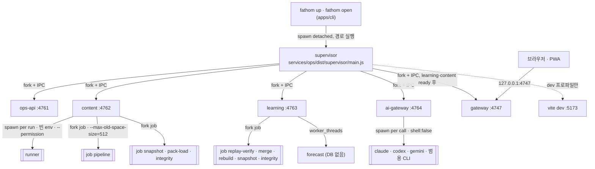

- **fork + IPC를 쓰는 이유**: ① `execArgv` 상속으로 `--disable-warning=ExperimentalWarning` 자동 전파(SP-4 #16; supervisor는 자식 env의 `NODE_OPTIONS`에도 같은 플래그를 병합해 서비스가 다시 spawn하는 경로도 덮는다) ② Windows에 우아한 SIGTERM이 없으므로 종료·설정 변경을 IPC 메시지로(SP-4 §5.5-6) ③ 부트스트랩 봉투(토큰·peer·포트)를 **env·디스크 없이** 전달(NFR-SEC-003) ④ IPC 끊김 = supervisor 사망 → 자식이 `db.close()` 후 스스로 종료(고아 0).
- supervisor는 DB·HTTP 서버를 갖지 않는다(목표 ≤ 400 LoC). 백업·doctor·텔레메트리 로직은 전부 ops-api에 있다.

**부트스트랩 봉투**(IPC 첫 메시지, 디스크·로그 기록 금지):

```ts
// packages/contracts/src/admin/ipc.ts — 형태 스케치(BootstrapEnvelope, 정본 = IF-01 §8.1)
export const BootstrapEnvelope = z.object({
  type: z.literal('bootstrap'), v: z.literal(1),
  svc: z.enum(['gateway', 'content', 'learning', 'ai-gateway', 'ops-api']),
  boot_id: Ulid, app_version: z.string(), contracts_hash: Sha256Hex,
  profile: z.enum(['prod', 'dev', 'test']),
  home: z.string(), web_root: z.string().nullable(),                  // gateway만: apps/web/dist 경로
  listen: z.object({ host: z.literal('127.0.0.1'), port: z.number().int().min(0).max(65535) }),
  self_token: Token,                                                  // 내가 다른 서비스를 부를 때 쓰는 호출자 토큰
  callers: z.record(ServiceName, Token),                              // 나를 불러도 되는 서비스의 토큰만
  peers: z.record(ServiceName, z.object({ url: z.string().url() })),
  flags: z.object({ safe_mode: z.boolean(), batch_enabled: z.boolean(), after_crash: z.boolean() }),   // after_crash → ready 후 job integrity
  log_level: z.enum(['debug', 'info', 'warn', 'error']),
}).strict();
```

**IPC 메시지**(`packages/contracts/src/admin/ipc.ts`): supervisor → 자식 `bootstrap` · `registry.updated{peers}` · `shutdown{grace_ms}` · `log.level{level}` / 자식 → supervisor `listening{port}` · `ready{contracts_hash, schema_versions, app_version}` · `fatal{exit_code, code}` / ops-api ↔ supervisor `svc.stop|start|restart{svc}` · `svc.run_mode{svc, mode: migrate|restore|verify, args}` → `svc.run_mode.result{exit_code, tail}` · `status.get` → `status{services}` · `logs.tail{svc, n}`.

**재시작·격하 정책**(NFR-AVL-003, FR-SET-002):

| 상황 | supervisor 동작 | 사용자에게 보이는 것 |
|---|---|---|
| 비정상 종료(exit ≠ 0, 75 포함) | 250ms → 1s → 2s 백오프 재시작(≤ 5s), 직전 포트 재사용 우선 | 헬스 보드 "재시작 중", gateway는 `503 Retry-After: 1` |
| 60s 안 3회 초과 크래시 | 재시작 중지, `degraded` | 운영 배너 + `fathom doctor` 안내 |
| exit 78(설정·버전·스키마 불일치) | 재시작하지 않음, `degraded` | doctor 항목(원인 코드) |
| ai-gateway 정지 | 재시작. 호출자는 연결 300ms 서킷으로 OFFLINE 간주 | 칩 `AI: 오프라인` |
| content 정지 | 재시작 ≤ 5s. learning은 `503 LR-DEP-001`, web은 attempt 큐 보관 + prefetch 문항 계속 | "채점 대기" 칩 → 자동 완료 |
| learning 정지 | 재시작 ≤ 5s. content의 `grading.verdict.issued` outbox가 재전송(누락 0), web 큐 재전송 | "기록 중" 표시 후 복귀 |
| gateway 정지 | 재시작 ≤ 5s. SSE 재연결 + `resync` | 상단 "재연결 중" 바 |
| ops-api 정지 | 재시작 ≤ 5s. 학습 경로는 ops-api를 호출하지 않음 | 헬스 보드 일시 공백 |
| supervisor 사망 | 자식이 IPC 끊김 감지 → 정상 종료 | SW 앱 셸 오프라인 페이지 "`fathom open`으로 켜기" |

**기동 순서**(NFR-PERF-008 콜드 ≤ 10s): CLI가 `run/supervisor.lock` 확인 → supervisor spawn(detached) → 토큰 생성(메모리)·동기화 폴더 경로 경고 검사 → ops-api·content·learning·ai-gateway 병렬 fork → 각 서비스: 스키마 버전 확인(불일치 = exit 78, 마이그레이션은 `--mode=migrate`에서만), `PRAGMA quick_check`(봉투 `flags.after_crash`면 ready 후 job `integrity` 전체 검사 추가, SP-4 감사), 정책 로드, relay 시작, `listening` → `ready` → supervisor가 **전원의 `contracts_hash` 동일성**을 확인(혼합 버전 기동 거부) → gateway fork → `registry.json` 기록 → CLI에 ready. ai-gateway는 첫 기동 시 항상 OFFLINE.

**종료**: `fathom down` → gateway `/api/v1/cli/shutdown`(cli.token) → ops-api → supervisor IPC. 역순(gateway → content·learning·ai-gateway → ops-api), 각 서비스는 `shutdown{grace_ms: 3000}`에 새 요청 거절 → 진행 중 tx 완료 → relay 1회 drain → `db.close()`. gateway가 죽어 있으면 CLI가 lock의 pid에 POSIX `SIGTERM` / Windows `taskkill /PID`(자식은 IPC 끊김으로 정상 종료).

**Safe Mode**(`fathom up --safe`, NFR-AVL-009): ai-gateway 미기동, content `batch_enabled=false`(파이프라인·워밍 생성 0), 유휴 리플레이 검증 중지. 학습·doctor·restore 가능.

### 14.3 개발 — `pnpm dev` (dev = 운영 경로)

- `pnpm dev` = `tsx apps/cli/src/main.ts up --profile=dev --foreground` → **같은 supervisor 코드**(`services/ops/src/supervisor/main.ts`)가 서비스를 `execArgv: ['--disable-warning=ExperimentalWarning', '--import', 'tsx', '--conditions=source']`로 fork한다.
- supervisor가 `services/<svc>/src/**`와 `packages/{contracts,shared-kernel}/src/**`를 감시(recursive `fs.watch`, 300ms debounce)하고 **정상 수명주기(IPC shutdown → fork)**로 영향 서비스만 재기동한다(`node --watch`는 IPC 채널을 깨므로 쓰지 않는다).
- Vite 개발 서버(127.0.0.1:5173, `strictPort`, HMR)를 관리 자식으로 띄우고, gateway가 `/api/**` 외 경로와 HMR WebSocket을 `@fastify/http-proxy`로 Vite에 넘긴다. **브라우저는 `http://127.0.0.1:4847` 하나만 본다** → 쿠키·CSRF·SSE가 운영과 같게 동작한다(B의 5173 origin 허용 방식 기각).
- 터미널에는 서비스별 색 접두어 통합 로그(파일 기록은 운영과 동일).

### 14.4 번들·설치·자동 기동

| 항목 | 설계 |
|---|---|
| 빌드 | `pnpm build` = `turbo run build`: 서비스·패키지 `tsc -p`(TS 7.0.2) → `dist/`, web `vite build`, `tools/packc` 빌드, 팩 `pnpm packs:build` → `dist/packs/*.fpack` |
| 번들 | `pnpm bundle [--with-node]` → 서비스·CLI·packc별 `pnpm deploy --prod` → `dist/bundle/fathom-<ver>-<platform>-<arch>.tar` + `bundle.manifest.json`(파일별 sha256) + 반입 승인 체크리스트(FR-SET-013·026). `--with-node`는 Node 22.22.2 런타임 동봉 |
| 설치 | `install.sh`·`install.ps1`(번들 동봉): `FATHOM_HOME/app/<ver>/`에 풀고 `app/current.json` 기록, 사용자 bin 디렉터리에 런처 `fathom`(POSIX sh) / `fathom.cmd`(Windows) 생성. 런처는 `current.json`의 버전 디렉터리의 `apps/cli/dist/main.js`를 `node --disable-warning=ExperimentalWarning`으로 실행 |
| 첫 실행 | `fathom up` → 시드 팩 설치(동봉 `.fpack`) → OFFLINE 첫 세션 ≤ 3분(D-2) |
| 자동 기동 | `fathom autostart on\|off\|status`(기본 off, FR-SET-024): macOS `~/Library/LaunchAgents/dev.fathom.agent.plist`(RunAtLoad) · Windows `schtasks /Create /SC ONLOGON /TN Fathom` · Linux `~/.config/systemd/user/fathom.service` + `systemctl --user enable`. 템플릿 `services/ops/assets/autostart/` |
| PWA | `manifest.webmanifest` + 수작업 서비스 워커(해시 자산 앱 셸만 cache-first, `/api/**` network-only, 업데이트는 다음 기동에 반영·`skipWaiting` 없음). origin = `127.0.0.1:4747` 고정 전제(AQ-16) |

### 14.5 뷰 B — docker compose (선택 · 학습 산출물)

- `deploy/docker/Dockerfile`: `node:22.22.2-bookworm-slim` 멀티스테이지, `pnpm deploy` 산출물, 비 root(uid 10001), `read_only: true`, `tmpfs: /tmp`. 단일 이미지 `fathom:<ver>`, 서비스마다 `command: ["node","--disable-warning=ExperimentalWarning","services/<svc>/dist/main.js"]`.
- `deploy/compose/compose.yaml`: supervisor 없음(`FATHOM_SUPERVISOR=external`, `restart: unless-stopped` + `healthcheck`), 토큰은 `fathom compose init`이 만든 `compose/.secrets/<svc>.tokens.json`을 compose `secrets:`로 마운트(컨테이너 예외, ADR-014), 내부 네트워크 `fathom-internal`(`internal: true`) + ai-gateway만 `fathom-egress` 추가, **gateway만 `ports: ["127.0.0.1:4747:4747"]`**, 서비스별 named volume(`content-data` …).
- 한계(정직 표시): OS 키체인·구독 CLI 불가 → API 제공자·`ai-keys.enc`(passphrase는 docker secret)만. 러너는 content 컨테이너 안에서 같은 가드 + 컨테이너 격리.

### 14.6 뷰 C — Kubernetes 매니페스트 (학습 산출물, 비지원 런타임)

```
deploy/k8s/
├─ base/
│  ├─ kustomization.yaml  namespace.yaml
│  ├─ gateway-deployment.yaml  gateway-service.yaml
│  ├─ content-statefulset.yaml  learning-statefulset.yaml  ai-gateway-statefulset.yaml  ops-api-statefulset.yaml
│  ├─ services-headless.yaml
│  ├─ networkpolicy-default-deny.yaml  networkpolicy-context-map.yaml   # §5.2 호출 + 이벤트 push 방향만 허용
│  ├─ configmap-policy.yaml  secret-internal-tokens.example.yaml
│  └─ cronjob-backup.yaml                                              # ops-api /internal/v1/backups:run
└─ overlays/kind/{kustomization.yaml, kind-cluster.yaml}
```

- writer 서비스 = **StatefulSet `replicas: 1` + PVC(RWO)**: SQLite 단일 writer 제약을 k8s 객체로 표현(학습 포인트: 왜 Deployment가 아니고 왜 스케일아웃이 안 되는가). gateway만 Deployment(무상태).
- 접근은 `kubectl -n fathom port-forward --address 127.0.0.1 svc/gateway 4747:4747`만(Ingress 없음, `examples/`에 "왜 기본으로 두지 않는가" 설명). probe = `/healthz`·`/readyz`, `terminationGracePeriodSeconds: 10` + `preStop` → `/internal/v1/admin/shutdown`. `PodSecurity: restricted`.
- V-ci에서 `kubeconform` 오프라인 스키마 검사, 선택 kind 스모크. k8s 트랙 Case·산출물 과제의 **실물 교재**로 재사용(예: "learning을 `replicas: 2`로 올리면 무엇이 깨지는가" 조건 반전 쌍).

---

## 15. 백업 · 복원 · 업그레이드 · 마이그레이션 · 롤백 (상세: ADR-013)

### 15.1 epoch 일관 스냅샷 (NFR-DATA-012, FR-SET-004)

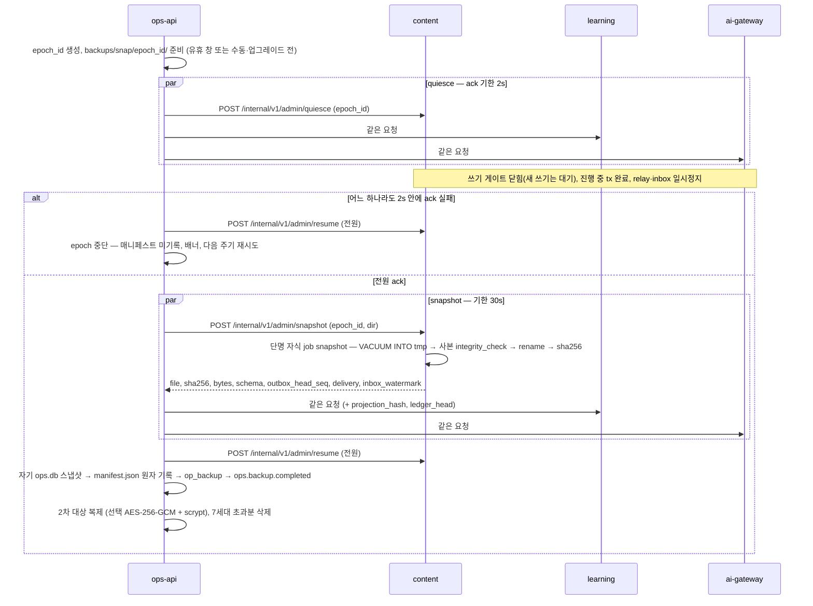

- **중단 규칙**: 한 서비스라도 quiesce ack(2s) 또는 snapshot(30s, `ops_policy`)에 실패하면 epoch 전체를 중단하고 전원 resume, 다음 주기에 재시도한다. **부분 매니페스트는 절대 기록하지 않는다.** 정기 스냅샷은 유휴 창에서만 시작한다(쓰기 게이트가 사용자 대기를 만들지 않게). 게이트가 3s를 넘기면 gateway는 interactive 쓰기에 `503 Retry-After: 1`을 준다(web attempt 큐가 흡수).
- 매니페스트의 seq·커서·워터마크·`ledger_head`·`projection_hash` 값은 **스냅샷 사본에서 읽는다**(권위 = 사본 내용).
- **스냅샷은 소유 서비스의 단명 자식 프로세스**(`node dist/main.js --mode=job --job=snapshot`, §5.4)가 만든다. `node:sqlite`의 원인 미규명 네이티브 크래시가 서빙 프로세스를 죽이지 않게 하기 위해서다(SP-4 감사 구속). `DatabaseSync.backup()`(기본 rate)은 라이브 쓰기가 있으면 **완료 시간이 한정되지 않으므로** 쓰지 않는다. `VACUUM INTO` → 사본 `integrity_check` → rename만 쓴다. 백업 promise가 걸린 원본 연결은 닫지 않는다.
- 제외: `insight.db`(재구성), `ai-cache.db`(재생성), `run/`, `logs/`, `tmp/`. `secrets/ai-keys.enc`는 기본 제외(사용자 선택 시 포함).

**epoch 매니페스트**(`packages/contracts/src/admin/epoch-manifest.ts`):

```json
{ "v": 1, "epoch_id": "01K…", "kind": "snapshot", "created_at": 1790000000000,
  "app_version": "1.0.0", "contracts_hash": "…", "device_id": "01K…",
  "policy_lock_sha256": "…", "prompts_lock_sha256": "…",
  "packs": [{ "pack_id": "k8s", "version": "1.0.0", "manifest_hash": "…" }],
  "services": {
    "content":    { "file": "content.db",  "sha256": "…", "bytes": 0, "schema": { "_infra": 1, "catalog": 1 },
                    "outbox_head_seq": 0, "delivery": { "learning": 0 }, "inbox_watermark": { "learning": 0, "ai-gateway": 0 } },
    "learning":   { "file": "learning.db", "sha256": "…", "bytes": 0, "schema": { "_infra": 1, "ledger": 1 },
                    "outbox_head_seq": 0, "delivery": { "content": 0 }, "inbox_watermark": { "content": 0 },
                    "projection_hash": "…", "fsrs_impl": "ts-fsrs@5.4.2",
                    "ledger_head": { "<device_id>": { "seq": 0, "hash": "…" } } },
    "ai-gateway": { "…": "…" }, "ops-api": { "…": "…" } },
  "excluded": ["insight.db", "ai-cache.db"] }
```

### 15.2 일 증분 · 2차 대상 · 복원

- **일 증분**(RPO ≤ 26h): ops-api가 learning `GET /internal/v1/ledger/export?since=<checkpoint>`(기기별 원장 JSONL 스트림) + content `GET /internal/v1/catalog/overlays/export?since=` + ai-gateway `GET /internal/v1/calibration/gold/export?since=`(사용자 확정 골드셋) → `backups/incr/<device_id>/<date>.jsonl`. 마이그레이션·`doctor --fix` 전 자동 스냅샷(100%).
- **2차 대상**: 외장·NAS·동기화 폴더(백업 파일만, 라이브 DB 금지), 복제 지연 ≤ 1h, 선택 암호화 AES-256-GCM + `scrypt(N=2^17, r=8, p=1)`(passphrase는 AI 키 KEK와 별도). 7일 미설정이면 배너 1회.
- **복원**(`fathom restore <epoch_id|--latest> [--rehearse]`, RTO ≤ 5분): ops-api → supervisor에 content·learning·ai-gateway 정지 요청 → 각 서비스 `--mode=restore --from <snapdir> --rewind-cursors <json>` 단명 프로세스가 **자기 파일만** 교체(sha256 확인, `-wal`·`-shm` 삭제, `integrity_check`) → 매니페스트 epoch 일치 검증(불일치 조합 거부) + learning 사본의 기기별 체인 헤드 = 매니페스트 `ledger_head`(앵커 대조) → 기동 → learning job `rebuild`(이벤트 버전 파라미터로 전체 리플레이) → `projection_hash` = 매니페스트 값 확인 → `insight.db` 재구성 → 이후 증분 JSONL을 병합 import(job `merge`, 헤더 앵커 검증)로 적용.
- **커서 되감기**(유실 0 증명): 생산자 P의 durable 목적지 D마다 `delivery[D] := min(manifest[P].delivery[D], manifest[D].inbox_watermark[P])` → 복원 후 relay가 워터마크 뒤부터 재전송, 소비자 dedupe가 중복을 흡수한다.
- **리허설**(`--rehearse`): 임시 FATHOM_HOME에 같은 절차 → 체크섬·행 수 비교 → `op_backup` 기록(R1 수동, R3 분기 자동).

### 15.3 스키마 마이그레이션 규칙

1. 전진 전용 SQL 파일 `migrations/<module>/NNNN_<desc>.sql`. 파일 sha256을 `schema_migrations`에 기록, 적용된 파일이 바뀌면 기동 거부.
2. 마이그레이션은 **서빙 프로세스 밖** 단명 `--mode=migrate`에서만 실행한다. 서빙 모드는 스키마 버전이 기대값과 다르면 exit 78.
3. 가산 변경(테이블·열·VIRTUAL 생성 열·인덱스·`ext` 키) = CR. 파괴 변경(열 삭제·의미 변경·경계 이동) = ADR + `frozen.lock` 재생성.
4. **원장은 다시 쓰지 않는다**: 이벤트 형태 변화는 `schema_version` 증가 + upcaster(순수 함수)로만. `ts-fsrs` 업그레이드는 "전체 재구성 + 해시 차이 보고" 마이그레이션(`fsrs_impl` 태그)으로 다룬다.

### 15.4 `fathom upgrade` — 업그레이드와 롤백

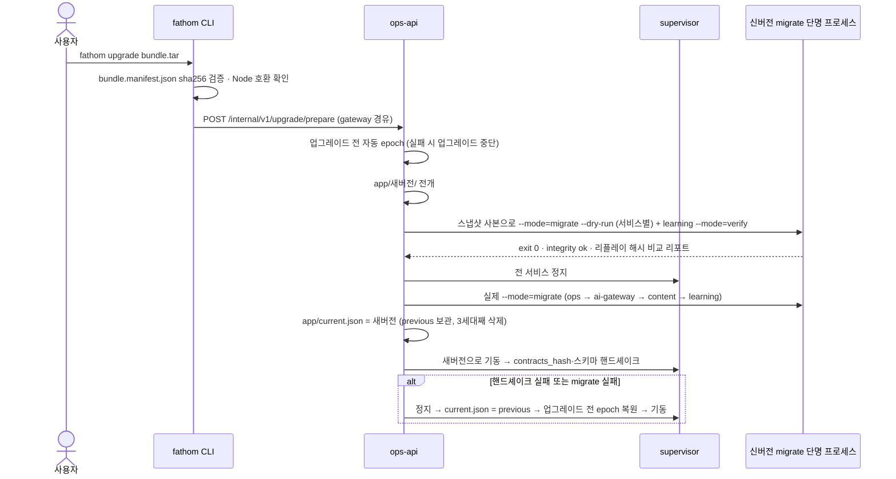

- **롤백**(`fathom upgrade --rollback`): 정지 → `current.json`을 직전 버전으로 → 업그레이드 전 epoch 복원(신 스키마는 구버전과 호환되지 않으므로) → 기동. 신버전에서 기록된 원장 이벤트는 증분 JSONL로 보존되어, `schema_version`이 구버전이 아는 범위면 병합 import로 흡수하고 더 높으면 `backups/incr/_held/`에 보류했다가 재업그레이드 때 흡수한다.
- **데이터 업그레이드**: 정책 새 버전은 `policy.switched` 전에 리플레이 비교 리포트(큐 구성·숙달 수·LDI 변화량, FR-SET-018) → 사용자 승인. 팩 새 버전은 §10.3 blue/green + 오버레이 재적용. 프롬프트 새 버전은 평가 하네스 회귀 통과 후 activation.
- **Node 런타임**: Node 22 EOL(2027-04-30) 전에 V-ci 매트릭스(22.x·24.x) 통과 후 번들 동봉 런타임을 24로 올리는 CR.

---

## 16. 모노레포 디렉터리 구조 (상세: ADR-008)

저장소 루트 = `/home/user/study_develop_ai`(pnpm 10.33 workspace + turbo 2.11). 패키지 이름 규칙(STD-01 동결, SP-7 감사 구속): `@fathom/app-<name>`(apps) · `@fathom/svc-<name>`(services) · `@fathom/<name>`(packages) — 경계 게이트의 tokens 엔진이 별칭을 **이름으로** 단위에 대응시키므로 이 세 형식 밖의 import 별칭은 금지다(`tsconfig` `paths` 자체 금지). tools 패키지 이름 `@fathom/tool-<name>`은 `@fathom/<pkg>` 형식이지만 **어떤 런타임 단위도 import할 수 없는** 대상으로 `tools/gates/config/boundaries.json`에 등록한다.

**코드 배치 규약(게이트가 경로·이름으로 범위를 잡는다 — STD-01 동결)**: Jev 코드 `services/*/src/jev/` 또는 `*.jev.ts`, Jev 프롬프트 `**/jev/prompts/**/*.md` · 라우팅 `routing/` 또는 `*.route.ts` · 제출 전 스키마 `pre-submit/` 또는 `*PreSubmit*`(제출 후 `post-submit/`과 별개 zod 객체) · 백지노트 `blank-note/`(제출 후 공개 코드 `blank-note/post-submit/`) · 정적 SQL `*.sql.ts`의 `UPPER_SNAKE` · 원색 리터럴 `packages/design-tokens/`만 · NG-G7 정책 `packages/contracts/src/ai/ai-gateway-policy.ts`(`deny_before_submit: ["blank_note.*"]`) · 비리터럴 동적 `import(x)`·`createRequire`·`require`는 `// boundary-ok: <사유>` 없이는 금지.

```
study_develop_ai/
├─ package.json                  # private, "packageManager": "pnpm@10.33.0", "engines": {"node": ">=22.15.0"}, 루트 스크립트(check:* · check:gates)
├─ pnpm-workspace.yaml           # packages: [apps/*, services/*, packages/*, tools/*]; onlyBuiltDependencies: []
├─ pnpm-lock.yaml
├─ .npmrc                        # engine-strict=true, strict-peer-dependencies=true, auto-install-peers=false, save-exact=true
├─ .node-version                 # 22.22.2
├─ turbo.json                    # build(^build) · typecheck · lint · test 파이프라인 (게이트는 turbo 밖 `pnpm check:gates`)
├─ biome.json                    # 포맷·린트 + noRestrictedImports + plugins: tools/biome-plugins/*.grit (에디터 피드백 전용)
├─ tsconfig.base.json            # strict, module/moduleResolution nodenext, target es2023, verbatimModuleSyntax,
│                                # erasableSyntaxOnly, isolatedModules, noUncheckedIndexedAccess, customConditions ["source"]
├─ tsconfig.json                 # 루트 프로젝트(noEmit, include apps/*/src · services/*/src · packages/*/src) — 에디터 + tsgo 게이트 엔진 입력.
│                                # compilerOptions.paths 금지(check:tsconfig-paths)
├─ apps/
│  ├─ web/                                        # @fathom/app-web — React SPA (ADR-006)
│  │  ├─ package.json  tsconfig.json  vite.config.ts  index.html
│  │  ├─ public/{manifest.webmanifest, sw.js, icons/}
│  │  ├─ vite/sw-precache-plugin.ts               # 빌드 시 해시 자산 목록 → sw.js precache
│  │  ├─ src/
│  │  │  ├─ main.tsx  router.tsx  routeTree.gen.ts   # routeTree.gen.ts = router-plugin 생성물
│  │  │  ├─ routing/                              # 18화면 + /_design (TanStack file routes; plugin routesDirectory = ./src/routing) — NG-G4 범위
│  │  │  ├─ features/{practice,curriculum,assessment-ui,insight,acquisition,ai-control,ops-console,settings}/{components,hooks,api}/
│  │  │  │                                        # practice/blank-note/(제출 전 — AI 클라이언트 import 금지) · practice/blank-note/post-submit/
│  │  │  ├─ lib/                                  # api-client.ts csrf.ts bootstrap.ts idempotency.ts attempt-queue.ts sse.ts
│  │  │  │                                        # invalidation-map.ts query-keys.ts ime.ts hotkeys.ts choseong.ts sw-register.ts
│  │  │  ├─ stores/                               # zustand: player.ts palette.ts hotkeys.ts
│  │  │  └─ styles/app.css                        # @import "@fathom/design-tokens/tokens.css" (원색 리터럴 0)
│  │  └─ test/{unit,component}/
│  └─ cli/                                        # @fathom/app-cli — fathom
│     ├─ package.json  tsconfig.json
│     ├─ bin/fathom.mjs                           # 진입 안전망: emitWarning 래핑 + import('../dist/main.js')
│     ├─ src/
│     │  ├─ main.ts
│     │  ├─ commands/{up,down,status,open,doctor,backup,restore,export,import,capture,seed,pack,autostart,upgrade}.ts
│     │  └─ lib/{gateway-client.ts, home.ts, supervisor-launch.ts, browser-open.ts, lockfile.ts, exit-codes.ts}
│     └─ test/unit/
├─ services/
│  ├─ gateway/                                    # @fathom/svc-gateway
│  │  ├─ package.json  tsconfig.json
│  │  ├─ src/
│  │  │  ├─ main.ts  app.ts  config.ts
│  │  │  ├─ http/{api,cli,session,stream,static,internal}/
│  │  │  ├─ application/{session,bff,stream,cli}/
│  │  │  ├─ domain/session/                       # 쿠키 서명·CSRF·Host/Origin/포트 규칙(순수)
│  │  │  └─ infra/{peers,static,dev-proxy,activity}/
│  │  └─ test/{unit,contract,integration,security}/
│  ├─ content/                                    # @fathom/svc-content
│  │  ├─ package.json  tsconfig.json
│  │  ├─ src/
│  │  │  ├─ main.ts  app.ts  config.ts
│  │  │  ├─ http/{catalog,acquisition,itembank,grading,runner,inbox,admin}/
│  │  │  ├─ application/{catalog,acquisition,itembank,grading,runner}/       # 각 register.ts · ports.ts · ingest/(catalog·itembank)
│  │  │  │                                        # Jev 입력 조립 = *.jev.ts, 백지노트 채점 = grading/blank-note/post-submit/
│  │  │  ├─ domain/{catalog,acquisition,itembank,grading,runner}/
│  │  │  ├─ infra/{db,search,packs,pipeline,runner,fetch,clients,events}/     # 정적 SQL = infra/db/*.sql.ts(UPPER_SNAKE)
│  │  │  └─ jobs/{snapshot.ts, pack-load.ts, integrity.ts, pipeline.ts}       # 단명 자식(--mode=job)
│  │  ├─ assets/runner/{guard.mjs, sql-entry.mjs, sql-tokenizer.mjs, harness-entry.mjs, win-rss-helper.ps1}
│  │  ├─ migrations/{catalog,acquisition,itembank,grading,runner}/NNNN_<desc>.sql   # _infra는 shared-kernel 제공
│  │  └─ test/{unit,contract,integration,security}/                        # security/runner-escape.spec.ts
│  ├─ learning/                                   # @fathom/svc-learning
│  │  ├─ package.json  tsconfig.json
│  │  ├─ src/
│  │  │  ├─ main.ts  app.ts  config.ts
│  │  │  ├─ http/{practice,learner,insight,ledger,settings,telemetry,inbox,admin}/
│  │  │  ├─ application/{practice,ledger,learner-model,insight,curriculum-ref}/
│  │  │  ├─ domain/
│  │  │  │  ├─ practice/{session,composer,routing,dialog,longtask,rhythm,blank-note}/   # routing/ = Stage2 Router(NG-G4 범위)
│  │  │  │  ├─ ledger/{event,chain,order,merge,upcasters}/
│  │  │  │  ├─ learner-model/{fsrs,elo,mastery,lifecycle,ldi,promotion,calibration,forecast}/
│  │  │  │  ├─ insight/views/
│  │  │  │  └─ curriculum-ref/
│  │  │  ├─ infra/{db,ledger,projection,insight-db,clients,events}/        # infra/ledger/ledger-writer.ts = 유일 writer
│  │  │  ├─ jobs/{snapshot.ts, integrity.ts, replay-verify.ts, merge.ts, rebuild.ts, fsrs-optimize.ts}   # 단명 자식
│  │  │  └─ workers/forecast.ts                   # worker_threads(DB 핸들 없음)
│  │  ├─ migrations/{ledger,learner-model,practice,curriculum-ref}/NNNN_<desc>.sql
│  │  ├─ migrations-insight/NNNN_<desc>.sql
│  │  ├─ sim/{learner.ts, app-sim.ts, ledger-gen.ts, promotion-sim.ts, ldi-sensitivity.ts, cli.ts}   # 개발 전용(SP-3·SP-6 이식), 번들 제외
│  │  └─ test/{unit,property,golden,contract,integration}/
│  ├─ ai-gateway/                                 # @fathom/svc-ai-gateway
│  │  ├─ package.json  tsconfig.json
│  │  ├─ src/
│  │  │  ├─ main.ts  app.ts  config.ts
│  │  │  ├─ http/{judge,generate,streams,jobs,work-orders,providers,secrets,usage,mode,calibration,firewall,inbox,admin}/
│  │  │  ├─ application/{control,routing,judge,generate,privacy}/
│  │  │  ├─ domain/{control,routing,judge,generate,privacy}/
│  │  │  ├─ jev/{client.ts, adapter.ts, state-builder.ts, questions.ts, keys.ts}   # Jev 전용(@typesafe-ai/sdk import는 여기만), 객체 키 참조만
│  │  │  ├─ infra/
│  │  │  │  ├─ providers/{anthropic-api,openai-api,gemini-api,ollama,claude-cli,codex-cli,gemini-cli,generic-cli}/
│  │  │  │  └─ {cli-kit,secrets,cache,queue,db,host,events}/
│  │  │  └─ jobs/{snapshot.ts, integrity.ts}
│  │  ├─ assets/{tasks.yaml, cli-providers/, codex-home/config.toml, empty-mcp.json, prompts.lock.json,
│  │  │          prompts/<taskId>/<semver>/{prompt.md, meta.yaml},          # LLM 과업(AI-G·LJ)
│  │  │          jev/prompts/<taskId>/<semver>/{prompt.md, meta.yaml}}      # Jev 과업(AI-J) — check:jev-index가 .md도 검사
│  │  ├─ migrations/{control,routing,judge,privacy}/NNNN_<desc>.sql
│  │  ├─ migrations-cache/NNNN_<desc>.sql         # ai-cache.db
│  │  └─ test/{unit,contract,integration,security}/
│  └─ ops/                                        # @fathom/svc-ops — 진입점 2개
│     ├─ package.json  tsconfig.json
│     ├─ src/
│     │  ├─ supervisor/{main.ts, process-table.ts, restart-policy.ts, ports.ts, tokens.ts, bootstrap.ts,
│     │  │              handshake.ts, log-sink.ts, dev-watch.ts, control-ipc.ts}      # DB·HTTP 없음
│     │  ├─ main.ts  app.ts  config.ts                                                # ops-api
│     │  ├─ http/{health,backups,doctor,upgrade,autostart,timeline,logs,telemetry,inbox,admin}/
│     │  ├─ application/{backup,health,doctor,host,upgrade,autostart,telemetry}/
│     │  ├─ domain/{backup,health,doctor,host,upgrade,autostart,telemetry}/
│     │  ├─ infra/{db,clients,host-probes,autostart-writers,crypto,supervisor-ipc,events}/
│     │  └─ jobs/{snapshot.ts, integrity.ts}
│     ├─ assets/autostart/{dev.fathom.agent.plist.tmpl, fathom.service.tmpl, fathom-task.xml.tmpl}
│     ├─ migrations/{backup,health,telemetry,upgrade}/NNNN_<desc>.sql
│     └─ test/{unit,contract,integration}/
├─ packages/
│  ├─ contracts/                                  # @fathom/contracts — zod만 의존
│  │  ├─ package.json                             # exports: "./*": {source: ./src/*.ts, types: ./dist/*.d.ts, default: ./dist/*.js}
│  │  ├─ manifests/{modes.manifest.json, verification-class.json}
│  │  ├─ .snapshots/*.json                        # z.toJSONSchema 스냅샷(contracts:gen 생성물, check:frozen 입력)
│  │  └─ src/
│  │     │  # 파일 목록의 정본 = IF-01의 `// file:` 머리(STD-01 §2.1, CR-54). 아래는 그 목록을 옮긴 것
│  │     ├─ common/{schema,ids,time,domain,practice,pagination,degraded,problem,route,ndjson}.ts
│  │     ├─ http/{gateway,content,learning,ai-gateway,ops}/v1/<group>.ts          # 그룹 파일 목록 = IF-01 §4~§8 `// file:` 머리
│  │     │                                        # 제출 전 응답 스키마 = http/<svc>/v1/pre-submit/*.ts, 공개 = post-submit/*.ts (별개 z.object, 파생 금지)
│  │     ├─ events/{envelope.ts, consumer-manifest.ts, inbox.ts, catalog/{catalog,acquisition,itembank,grading,learning,ai,ops}.ts,
│  │     │          __consumers__/{content,learning,gateway,ai-gateway,ops-api}.json, registry.gen.ts, routing.gen.ts}
│  │     ├─ ledger/{envelope.ts, types.ts, payloads/<type>.ts, versions.ts}
│  │     ├─ ai/{tasks.ts, judge.ts, judge-keys.ts, generate.ts, portable-schema.ts, data-class.ts, work-order.ts, stream.ts, errors.ts, ai-gateway-policy.ts}
│  │     ├─ pack/{manifest.ts, records.ts, delta.ts, feasibility.ts}   # records.ts = BundleRecord 18종(IF §13.1), feasibility.ts = structuralFeasibility() 순수 함수
│  │     ├─ policy/<name>.ts  policy/lock.ts                           # 12종(mastery_rules·method_policy·ai_policy는 IF §13.4 상세 zod)
│  │     ├─ admin/{ipc.ts, admin-routes.ts, epoch-manifest.ts, jobs.ts} # BootstrapEnvelope = admin/ipc.ts
│  │     ├─ manifests/{modes.ts, verification-class.ts}
│  │     └─ db-hooks.ts
│  ├─ shared-kernel/                              # @fathom/shared-kernel — Node 전용, 도메인 개념 금지
│  │  ├─ src/<module>/<module>.ts (+ 같은 폴더 내부 파일) — module ∈ {service,sqlite,eventing,jobs,http-client,idempotency,auth,log,metrics,ids,time,canonical,redact,errors,config,policy,proc}
│  │  │                                        # import = '@fathom/shared-kernel/<module>/<module>'(barrel 금지, §17.3, CR-53)
│  │  └─ infra-migrations/NNNN_<desc>.sql         # 공통 인프라 모듈 _infra(§8.3) — 모든 writer DB에 먼저 적용
│  ├─ design-tokens/                              # @fathom/design-tokens — 원색 리터럴이 허용되는 유일한 위치(design/raw-color)
│  │  └─ src/{tokens.css, tokens.ts, typography.css}   # OKLCH 색·간격·반경·모션 토큰, tokens.ts = 차트·Mermaid용 상수 export
│  ├─ ui/                                         # @fathom/ui — web 전용, 색은 var(--…)만
│  │  └─ src/{components/, badges/, motion.ts}
│  └─ testkit/                                    # @fathom/testkit — devDependency 전용
│     └─ src/{fakes/, cassettes/, clock.ts, prng.ts, spawn-stack.ts, chaos.ts, temp-home.ts, contract.ts, contract-arbitrary.ts,
│             vitest-preset.ts, setup/no-network.ts, preload/egress-recorder.mjs, egress-sampler.ts, platform.ts,
│             playwright/stack-fixture.ts, golden-ledgers/}
├─ tools/
│  ├─ gates/                                      # @fathom/tool-gates (ADR-010) — 의존성 0 Node 스크립트, 빌드 없이 node로 실행
│  │  ├─ check-boundaries.mjs  check-jev-index.mjs  check-sql-template.mjs  check-sql-typed.mjs  check-ng-g.mjs
│  │  ├─ check-deps.mjs  check-tsconfig-paths.mjs  check-db-paths.mjs  check-ledger-writer.mjs  check-content-ingest.mjs
│  │  ├─ check-typo-ko.mjs  check-security-scan.mjs  check-hooks.mjs  check-frozen.mjs  check-consumers.mjs
│  │  ├─ check-manifest.mjs  check-rtm.mjs  check-gate-selftest.mjs  check-graphify-edges.mjs(감사 경로, 비차단)
│  │  ├─ run-gates.mjs                            # check:gates 진입점(--warn-only: 첫 R0 통합 모드)
│  │  ├─ lib/{lex.mjs, common.mjs, tsgo.mjs, walk.mjs, report.mjs}       # lex.mjs = 공용 어휘 분석기(SP-7 이식)
│  │  ├─ config/{boundaries.json, deps.json, ng-g.json, sql.json}        # 단위별 허용 import 표·서드파티 허용표·어휘
│  │  ├─ test/*.test.mjs                          # node:test — lex 단위 테스트, 빈 root·tsgo 실패 음성 탐침
│  │  └─ fixtures/<check>/{clean,violations,evasions}/
│  ├─ biome-plugins/*.grit                        # Biome 2.5.14 GritQL(에디터 피드백) + __snapshots__/ 플러그인 스냅샷 테스트
│  ├─ packc/                                      # @fathom/tool-packc
│  │  ├─ src/{cli.ts, parse/, validate/, lint/rules/, copy-guard/, exec-verify/, oracle/, layout/, kpi/, emit/}
│  │  └─ fixtures/<rule>/
│  ├─ graph/src/{cli.ts, god-nodes.ts, snapshot.ts}                       # @fathom/tool-graph (graphify INT 스냅샷, 비차단)
│  ├─ fake-cli/src/{fake-claude.ts, fake-codex.ts, fake-gemini.ts, fake-generic.ts, recorder.ts}
│  └─ si-docs/src/{rtm.ts, utr.ts, pgm.ts, verification-class.ts}
├─ content/                                       # §10.1 content-as-code 원천
├─ policy/                                        # <name>@v1.yaml × 12 + policy.lock.json
├─ evals/{gold/<taskId>/*.jsonl, mutants/, cassettes/<provider>/<taskId>/,
│        sets/{search-120,normalize-200,ssrf-20,injection-30,secrets-50,deid-30}/}
├─ tests/                                         # 교차 서비스 스위트(워크스페이스 아님 — 루트 devDependencies로 실행, vitest projects: contract·integration·chaos·security)
│  ├─ vitest.config.ts  support/{run-offline.mjs, determinism.mjs}
│  ├─ contract/{degradation-visible,consumers,acl,presubmit-403}.spec.ts
│  ├─ security/                                  # SEC-SYS(교차 서비스 보안)
│  ├─ integration/{outbox-exactly-once,epoch-backup,merge,merge-corrections,upgrade,restore-rewind,chain-anchor}.spec.ts
│  ├─ e2e/{zero-ai,install-3min,bookmark-reentry,stderr-clean}.spec.ts  e2e/scn/  e2e/usability/
│  ├─ chaos/kill-each-service.spec.ts
│  └─ perf/{first-item,grading-p95,search-p95,runner-p95}.ts
├─ deploy/{docker/Dockerfile, compose/{compose.yaml, README.md}, k8s/{base/, overlays/kind/}}
├─ .github/workflows/{ci-build.yml, ci-matrix.yml, live-smoke.yml}
├─ docs/  spikes/  graphify-out/                  # graphify-out/{cache,memory}은 gitignore
└─ .fathom-dev/                                   # pnpm dev의 FATHOM_HOME (gitignore)
```

### 16.1 파일 소유 레인 (Task Brief 허용 경로)

| 레인 | 허용 경로(쓰기) | 비고 |
|---|---|---|
| L-PLAT | `packages/shared-kernel/**`, `tools/gates/**`, `tools/biome-plugins/**`, `tools/graph/**`, `tools/si-docs/**`, `.github/**`, 루트 설정 파일(`tsconfig*.json`·`biome.json`·`turbo.json`·`package.json`) | INT-1a 이후 변경은 T1 리뷰 + 전 서비스 계약 테스트. 게이트 규칙 완화·제거 = ADR |
| L-CONTRACTS | `packages/contracts/src/{common,admin,ledger,events/envelope.ts,manifests}/**`, `db-hooks.ts` | 동결 대상(`frozen.lock`). 변경 = CR/ADR |
| 공급자 레인 | `packages/contracts/src/http/<svc>/v1/**`, `events/catalog/<context>.ts` | 공급 서비스 레인이 소유, 소비자 매니페스트와 `check:consumers` 통과 필수 |
| 소비자 레인 | `packages/contracts/src/events/__consumers__/<svc>.json` | 소비 서비스 레인이 소유 |
| L-GW | `services/gateway/**` | |
| L-CT-CAT · L-CT-ACQ · L-CT-ITB · L-CT-GRD · L-CT-RUN | `services/content/src/{http,application,domain}/<bc>/**`, `services/content/migrations/<bc>/**`, (RUN) `services/content/assets/runner/**`·`infra/runner/**` | `services/content/src/{app.ts,main.ts,infra/{db,events,clients}}`는 L-CT-CAT이 소유(INT-1a 후 동결) |
| L-LR-PRA · L-LR-LED · L-LR-MOD · L-LR-INS | `services/learning/src/{http,application,domain}/<bc>/**`, 해당 `migrations/<bc>/**` | `infra/ledger/ledger-writer.ts`는 L-LR-LED 단독. `sim/`은 L-LR-MOD |
| L-AI(-CTL·-RTE·-JDG·-GEN·-PRV) | `services/ai-gateway/**`(하위 레인 = `src/{http,application,domain}/<control\|routing\|judge\|generate\|privacy>/**`), `tools/fake-cli/**`, `services/ai-gateway/eval/**` | 프롬프트 텍스트 변경은 T1. 공통 루트(`app.ts`·`main.ts`·`infra/{db,events}`)는 L-AI-CTL |
| L-PACKC | `tools/packc/**` | DCP-01 §9 표기. 팩 레코드 계약은 `pack/records.ts`(L-CT-CAT) import만 |
| L-OPS | `services/ops/**` | supervisor는 INT-1a 후 동결 |
| L-WEB-<feature> | `apps/web/src/features/<feature>/**`, 해당 `routing/*` | `apps/web/src/{lib,features/shell}/**`·`packages/ui/**`·`packages/design-tokens/**`는 L-WEB-SHELL |
| L-CLI | `apps/cli/**` | |
| L-CONTENT(T1) | `content/**`, `policy/**`, `evals/**` | 코드 레인과 별도 파이프라인(cu). 트랙 팩의 `pack.yaml`·`CHANGELOG.md`·`corrections.yaml`은 그 트랙의 `.A` 패키지 소유(DCP §9.2) |
| L-LR-LED(공통) · L-LR-MOD | learning 공통 루트(`app.ts`·`main.ts`·`infra/{db,events,clients}`) = L-LR-LED, `domain/curriculum-ref/**`·`migrations/curriculum-ref/**` = L-LR-MOD | WBS D-WBS-06 |
| L-OPS(배포) | `deploy/**` | WBS D-WBS-06 |
| L-TEST | `tests/**`, `packages/testkit/**` | |

- **핫스팟 제거 규칙**: 손으로 유지하는 barrel(`index.ts` 재수출) 금지 — contracts는 와일드카드 subpath export(`@fathom/contracts/events/envelope`)로 파일 단위 import, 레지스트리·라우팅은 생성물(`*.gen.ts`). 서비스 composition root는 BC별 `register.ts`만 나열. 마이그레이션은 모듈 디렉터리별.

---

## 17. 공유 패키지와 공개 API

### 17.1 규칙

| 패키지 | 런타임 의존 허용 | 금지 | 공개 표면 |
|---|---|---|---|
| `@fathom/contracts` | `zod`만 | 모든 내부 패키지, `node:*` | subpath export(파일 단위). 스키마·타입·라우트 정의·이벤트 이름·정책 스키마·매니페스트 |
| `@fathom/shared-kernel` | `@fathom/contracts`, `fastify`, `@fastify/*`(승인 목록), `pino`, `ulidx`, `node:*` | 도메인 개념(개념·카드·문항·숙달) 이름·로직 | 모듈 17개(아래). 가입 기준 = 도메인 중립 + 두 서비스 이상 사용 |
| `@fathom/design-tokens` | 없음 | 모든 내부 패키지 | `tokens.css`·`typography.css`·`tokens.ts`(색·간격·반경·모션 상수). **원색 리터럴이 허용되는 유일한 패키지** |
| `@fathom/ui` | `@fathom/design-tokens`, `react`, `radix-ui`, `cva`, `tailwind-merge`, `clsx`, `motion`, `lucide-react`, `cmdk`, `sonner`(Command·Toast, CR-55 — Command는 `filter` prop을 받고 web `lib/choseong.ts`를 import하지 않음) | 서비스·shared-kernel, 원색 리터럴 | 컴포넌트·배지 7종·상태 칩 |
| `@fathom/testkit` | 위 전부 + `undici`(MockAgent) | 런타임 번들 포함 금지(devDependency 전용) | fakes·cassette·spawn-stack·chaos |
| `services/*` | `@fathom/contracts`, `@fathom/shared-kernel`, 서비스별 승인 서드파티(`check:deps` 허용표) | 다른 `services/*`, `apps/*`, `packages/{ui,design-tokens,testkit}`(testkit은 test/ 한정 허용), `tools/*` | 없음(import 불가 패키지) |
| `apps/web` | `@fathom/contracts`, `@fathom/ui`, `@fathom/design-tokens`, 프런트 스택 | `services/*`, `shared-kernel` | — |
| `apps/cli` | `@fathom/contracts`, `@fathom/shared-kernel` | `services/*` import(단 supervisor는 **파일 경로 spawn**) | — |
| `tools/*` | `@fathom/contracts`, `@fathom/shared-kernel`, 도구 전용 서드파티(`tools/gates`는 **의존성 0**, tsgo 엔진만 루트 `typescript` 7.0.2 사용) | `services/*` import(서비스 기능은 프로세스로만 호출) | CLI |

- 서드파티 허용표(발췌, `tools/gates/config/deps.json` 정본): `@typesafe-ai/sdk` → **ai-gateway `src/jev/**`만**. `@anthropic-ai/sdk`·`openai`·`@google/genai` → **ai-gateway `src/infra/providers/**`만**. `ts-fsrs` → learning만. `es-hangul` → content·web. `@fastify/http-proxy` → gateway만. `d3-force` → tools/packc만. 도입 금지: typescript-eslint·dependency-cruiser·madge(TS 7 단독에서 미지원·거짓 통과 — SP-7), TS 5.9/6.x 병행 pin.
- 위 표는 `tools/gates/config/boundaries.json`(단위 → 허용 단위 목록)으로 기계 판정한다. 단위 = `apps/<n>`·`services/<n>`·`packages/<n>`·`tools/<n>`, 같은 단위 안의 BC 규칙(`bc-cross`, `grading-no-catalog`, domain 순수성)은 같은 파일의 `intra` 절.

### 17.2 `@fathom/contracts` 공개 API (subpath)

| subpath | 내용 |
|---|---|
| `common/*` | `Ulid`, `EpochMs`, `Sha256Hex`, `ServiceName`, `Problem`(RFC 9457 + code·error_id·request_id), `ErrorCode` 패턴, `defineRoute()` |
| `http/<svc>/v1/*` | 라우트 정의: `{ id, method, path, allowedCallers, idempotent, request{params,query,body}, response{<status>: schema}, deadlineMs?, freeze: 'D'\|'O' }` |
| `events/*` | `IntegrationEventEnvelope`, 타입별 payload 스키마, `ConsumerManifest` 스키마, `registry.gen`·`routing.gen` |
| `ledger/*` | 원장 envelope, 17개 타입의 payload 스키마(버전별), `CURRENT_SCHEMA_VERSION` 맵 |
| `ai/*` | `TaskId`(AI-J01~J19·AI-G01~G13), `JudgeRequest`(Noul·Choice·Score 대수, 객체 키), `GenerateRequest`·`PortableSchema`, `DataClass`(C0~C3), `WorkOrder`, `AI_GATEWAY_POLICY`(`ai-gateway-policy.ts`: `deny_before_submit: ["blank_note.*"]` — NG-G7 정적 양성 단언 대상 + ai-gateway 런타임 403의 정본) |
| `pack/*` | `.fpack` 매니페스트·레코드·`PackDelta` op·`OverlayPatch`, `structuralFeasibility(policy, inventory, transition, mode, sp1) → {feasible, blockers[]}`(`feasibility.ts`, I/O 없는 순수 함수 — learning PromotionEngine·packc R-POOL·팩 리포트가 같은 함수를 쓴다, SP-6 감사 구속) |
| `policy/*` | 정책 12종 zod 스키마, `PolicyLock` |
| `admin/*` | `BootstrapEnvelope`, IPC 메시지, admin 라우트(quiesce·snapshot·resume·shutdown·events·integrity), `EpochManifest`, `JobName`·job IPC 메시지(`{progress}`·`{result}`·`{error}`) |
| `manifests/*` | `ModesManifest`, `VerificationClass` 스키마 + JSON |
| `db-hooks` | DR-020 이름 훅 목록(`lint:hooks` 입력) |

라우트 정의 형태(스케치):

```ts
// packages/contracts/src/common/route.ts
export function defineRoute<const R extends {
  id: string;                                      // 'learning.practice.sessions.create'
  method: 'GET' | 'POST' | 'PUT' | 'PATCH' | 'DELETE';
  path: `/internal/v1/${string}` | `/api/v1/${string}`;
  allowedCallers: readonly (ServiceName | 'browser' | 'cli')[];
  idempotent: boolean;                             // true면 Idempotency-Key 필수
  request: { params?: z.ZodType; query?: z.ZodType; body?: z.ZodType };
  response: Record<number, z.ZodType>;
  deadlineMs?: number;
  freeze: 'D' | 'O';                               // 2단 동결 표시
}>(r: R): R { return r; }
```

### 17.3 `@fathom/shared-kernel` 공개 API (모듈별 핵심)

**import 형식(CR-53)**: 모듈마다 진입 파일 1개 `src/<module>/<module>.ts`, 소비자는 `@fathom/shared-kernel/<module>/<module>`로만 import한다(`exports: {"./*": {source: "./src/*.ts"}}`, barrel `index.ts` 금지 — STD-DIR-31). 예: `import { createService } from '@fathom/shared-kernel/service/service'`, `import { Result, AppError } from '@fathom/shared-kernel/errors/errors'`.

| 모듈(진입 파일) | 핵심 export (형태) |
|---|---|
| `service`(`service/service.ts`) | `createService(def: ServiceDefinition): Promise<RunningService>` — IPC 부트스트랩 수신, 127.0.0.1 listen 가드, request-id·traceparent, 호출자 토큰 인증 + 라우트 ACL, problem+json, 멱등 미들웨어, `/healthz`·`/readyz`·metrics·inbox·admin 라우트, quiesce 게이트, 종료 절차, `--mode` 분기 |
| `sqlite`(`sqlite/sqlite.ts`) | `openDb(path, {readOnly?, synchronous, recursiveTriggers?})` → `SqlitePort{prepare(sql: string): Stmt, exec(sql: string): void, tx<T>(fn: () => T): T, fn(name, impl), close()}`(SQL 입구는 `prepare`·`exec` 둘뿐, 인자는 정적 SQL — `check:sql`·`check:sql-typed`), SQL 조각 헬퍼 `ident(name)`(식별자 검증 후 `"…"` 인용)·`placeholders(n)`(`?, ?, …`)·`sqlInt(n)`(`Number.isSafeInteger` 검증), `vacuumInto(path)`(job 전용), `migrate(db, dirs, {dryRun})`, 오류 정규화(`errcode & 0xff`), 바인딩 타입 가드 |
| `jobs`(`jobs/jobs.ts`) | `jobs.run(name: JobName, args, {timeoutMs, extraExecArgv?}): Promise<JobResult>` — 자기 진입 파일을 `--mode=job --job=<name>`으로 fork(`process.execArgv` 상속), IPC 진행·결과, 서비스당 동시 1개 큐, 기한 초과 트리 kill, 부모 종료 시 자식 종료. `defineJob(name, handler)`(자식 쪽 진입) |
| `eventing`(`eventing/eventing.ts`) | `appendEvent(tx, {type, schema_version, correlation_id, causation_id?, payload})`, `startRelay(db, routing, peers)`, `inboxPlugin(manifest, handlers)`, `rewindCursors(db, map)` |
| `http-client`(`http-client/http-client.ts`) | `PeerClient.call(route, input, {idempotencyKey?, deadlineMs?})` — 계약 검증, deadline 차감, 재시도(멱등만), 서킷(연결 300ms) |
| `idempotency`(`idempotency/idempotency.ts`) | `idem_request` 저장소, 동일 키·다른 본문 422 |
| `auth`(`auth/auth.ts`) | 호출자 토큰 맵, 상수 시간 비교, `allowedCallers` 집행 |
| `log`(`log/log.ts`) | `createLogger(svc)`(pino, redact 규칙) |
| `metrics`(`metrics/metrics.ts`) | `counter`, `histogram`, `renderPrometheus()` |
| `ids`(`ids/ids.ts`) | `ulid()`(단조), `isUlid()` |
| `time`(`time/time.ts`) | `Clock` 포트, `monotonicClientTs(last)` = `max(now, last+1)` |
| `canonical`(`canonical/canonical.ts`) | `canonicalJson(value)`, `sha256Hex(bytes\|string)` |
| `redact`(`redact/redact.ts`) | 비밀·PII 패턴 엔진(순수 함수) — log·ai-gateway Firewall·content ingress 공용 |
| `errors`(`errors/errors.ts`) | `AppError(code, status, detail)`, 코드 형식 `<SVC>-<CAT>-<NNN>` |
| `config`(`config/config.ts`) | `resolveFathomHome()`, 부트스트랩 봉투 파싱, 프로파일 |
| `policy`(`policy/policy.ts`) | `loadPolicy(name, version)` — zod + `policy.lock.json` 해시 대조, 불일치 exit 78 |
| `proc`(`proc/proc.ts`) | `treeKill(pid)`(POSIX `-pid`, Windows `taskkill /T /F`), `resolveWindowsShim(cmdPath)`(npm 9·10·11), `safeSpawn(bin, args, {env, cwd, timeoutMs, stdin})` |

---

## 18. 기술 스택 확정표 (exact pin, CON-006)

> 원칙: `save-exact=true` + `pnpm-lock.yaml` 고정. 버전은 tech-stack-facts·스파이크에서 **호환을 실측한 값**을 우선한다(레지스트리 최신과 다르면 "최신" 열에 적고, 게이트 통과 후 CR로 올린다). `ts-fsrs` 변경은 리플레이 마이그레이션(§15.3)으로만, Node 마이너 변경은 러너 차단 스위트 재통과(RSK-RUN-10) 후에만.

| 영역 | 패키지 · 도구 | 고정 버전 | 사용 위치 | 근거 · 비고 |
|---|---|---|---|---|
| 런타임 | Node.js | **22.22.2**(최소 22.15.0, V-ci 22.x·24.x) | 전체 | SP-2·3·4·6·7 실측. `module.registerHooks` ≥ 22.15 [CR-09] |
| 패키지 | pnpm | 10.33.0 | 루트 | strict `node_modules`가 경계 1겹 |
| 빌드 | turbo | 2.11.5 | 루트 | 빌드·테스트·게이트 파이프라인 전용(실행 오케스트레이션은 supervisor) |
| 언어 | typescript | **7.0.2 정확 pin(`^` 금지)** | 전체 `tsc --noEmit`·빌드 + `check:boundaries --engine=both`·`check:sql-typed`의 tsgo 엔진(`typescript/unstable/sync`) | SP-7: 822파일 typecheck 357ms, `createProgram` 없음. 불안정 API라 업그레이드는 `check:gates` 통과가 조건. **TS 5.9/6.x 병행 pin 없음**(SP-7 감사 구속) — 필요해지면 별도 SP + `tools/` 워크스페이스 한정 별칭 쌍(`typescript: npm:@typescript/typescript6` + `typescript7: npm:typescript@7.0.2`) |
| 실행 | tsx | 4.23.15 | dev 실행·tools | `--import tsx --conditions=source` |
| 린트·포맷 | @biomejs/biome | **2.5.14 정확 pin**(최신 2.5.15) | 루트 | 린트·포맷 + GritQL 플러그인(`tools/biome-plugins/`, 에디터 피드백 전용). 업그레이드 시 플러그인 스냅샷 테스트 필수(SP-7 감사) |
| 타입 | @types/node | 22.20.4 | 전체 | Node 22 대응 |
| 서버 | fastify | 5.12.5 | services | `inject()` 계약 테스트 |
| 서버 | @fastify/rate-limit · @fastify/static · @fastify/cookie · @fastify/http-proxy | 11.2.0 · 10.1.5 · 11.1.2 · 11.6.3 | gateway | http-proxy는 dev Vite 프록시 전용. CORS 플러그인은 쓰지 않음(단일 origin) |
| 스키마 | zod | 4.6.5 | contracts·전체 | 계약 정본 |
| 로깅 | pino (+ pino-pretty) | 10.3.1 (13.1.3, dev만) | shared-kernel | stdout JSON |
| ID | ulidx | 2.4.1 | shared-kernel | 단조 ULID, 의존 1개(layerr) |
| SRS | ts-fsrs | **5.4.2**(exact) | learning만 | SP-3 결정성 검증 버전 |
| 한글 | es-hangul | 2.4.0 | content(초성 함수)·web(팔레트) | FR-UX-005 |
| AI | @typesafe-ai/sdk | 0.6.0 | ai-gateway만 | Jev, 의존성 0 |
| AI | @anthropic-ai/sdk | 0.129.0(최신 0.131.0) | ai-gateway만 | IR-001 실측 버전 |
| AI | openai | 7.25.0 | ai-gateway만 | IR-002, Ollama OpenAI 호환 |
| AI | @google/genai | 2.25.0 | ai-gateway만 | IR-003(Should) |
| UI | react · react-dom | 19.3.0 | web | SPA, SSR 없음 |
| 빌드 | vite · @vitejs/plugin-react | 8.3.1 · 6.1.1 | web | Rolldown |
| 라우팅 | @tanstack/react-router · @tanstack/router-plugin | 1.170.41 · 1.168.42 | web | file routes(`routesDirectory: ./src/routing` — STD-01 `routing/` 규약), `autoCodeSplitting` |
| 서버 상태 | @tanstack/react-query | 5.104.0 | web | SSE → 무효화 |
| 클라 상태 | zustand | 5.0.15 | web | 휘발 상태만 |
| 스타일 | tailwindcss · @tailwindcss/vite | 4.3.3 | web·ui | `@theme` OKLCH 토큰 |
| 프리미티브 | radix-ui | 1.6.7 | ui | 통합 패키지 |
| 유틸 | class-variance-authority · tailwind-merge · clsx | 0.7.1 · 3.7.0 · 2.1.1 | ui | shadcn 패턴 |
| 모션 | motion | 13.4.6 | ui·web | `prefers-reduced-motion` |
| 팔레트·토스트·아이콘 | cmdk · sonner · lucide-react | 1.1.1 · 2.0.8 · 1.49.0 | ui(Command·Toast)·web | CR-55 |
| 에디터 | @uiw/react-codemirror (+ @codemirror/lang-javascript · lang-sql · lang-yaml) | 4.25.12 (6.2.5 · 6.10.0 · 6.1.3) | web | **CodeMirror 6 확정, Monaco 기각**(ADR-006) |
| 렌더 | react-markdown · rehype-sanitize · shiki · mermaid | 10.1.0 · 6.0.0 · 4.4.3 · 12.0.0 | web | mermaid는 지연 청크·`securityLevel:'strict'` |
| 시각화 | @xyflow/react · recharts | 12.12.0 · 3.10.1 | web | xyflow는 개념 이웃 그래프(≤ 50 노드)만. Depth Map은 자체 SVG + packc 좌표 |
| 레이아웃 | d3-force | 3.0.0 | tools/packc만 | 빌드 시 좌표 사전 계산 |
| 폰트 | pretendard · @fontsource-variable/geist · @fontsource-variable/jetbrains-mono | 1.3.9 · 5.3.0 · 5.3.0 | web | self-host(NFR-PORT-006) |
| 오프라인 큐 | idb | 8.0.3 | web | IndexedDB attempt 큐 |
| 테스트 | vitest | 5.0.2(최신 5.0.3) | 전체 | tech-stack-facts 호환 실측 |
| 테스트 | @playwright/test · playwright-core · @axe-core/playwright | **1.56.1** · 1.56.1 · 4.13.0 | tests/e2e | V-build 컨테이너 `/opt/pw-browsers/chromium-1194`(Chromium 141)과 짝인 버전으로 고정, `PLAYWRIGHT_BROWSERS_PATH=/opt/pw-browsers`, `playwright install` 금지(CR-47 — 1.63은 revision 1243 요구로 E2E 불가) |
| 테스트 | happy-dom · @testing-library/react · fake-indexeddb | 20.14.5 · 16.3.3 · 6.2.5 | web 단위 | |
| 테스트 | undici | 8.11.2 | testkit(MockAgent) | Node ≥ 22.19 → 테스트 전용 |
| 성능 | autocannon | 8.0.0 | tests/perf | NFR-PERF-002 |
| 외부 도구 | graphify(PyPI `graphifyy`) · uv | 0.9.72 · 0.8.17 | 개발·CI만 | 제품 런타임 의존 0. graphify는 NFR-MAINT-001 `[A]` 감사 경로(INT 스냅샷, **비차단**, 부재 허용 NFR-PORT-007) |
| 외부 도구 | Claude Code CLI(관측) | 2.1.286 | 사용자 설치 | 플래그는 IF-01 canary로 고정 |
| 기각 | Monaco · hono · @fastify/cors · es-module-lexer · dependency-cruiser · typescript-eslint · madge · TS 5.9/6.x 병행 pin · vite-plugin-pwa · ESLint/Prettier · Electron/Tauri · NATS/Redis · OTel Collector | — | — | 사유는 해당 ADR(정적 도구는 ADR-010: TS 7 단독에서 미지원·거짓 통과) |

---

## 19. 품질 속성 시나리오 (QAS → NFR 매핑)

| QAS | 자극 | 환경 | 응답(아키텍처 장치) | 측정 · 등급 | NFR · DoD |
|---|---|---|---|---|---|
| QAS-01 | "15분 시작" | OFFLINE·FULL, REF-ENV | learning이 curriculum_ref로 로컬 조립 + `items:select` 1회 배치 | 첫 문항 p95 ≤ 2s · V-build | NFR-PERF-001, D-3 |
| QAS-02 | 결정적 형식 제출 | 정상 | 2홉(gateway→learning→content), 인라인 투영, `synchronous=FULL` append p99 11.7ms(SP-3 감사) | p95 ≤ 300ms · V-build | NFR-PERF-003 |
| QAS-03 | 서술형 제출, Jev 5s 지연 | FULL | 3s 데드라인 → 하위 사다리 즉답, 상위 결과는 밴드 변경 시만 `verdict.revised` | 3.0s ± 0.2s, diff ≤ 1 · V-build(모의) | NFR-PERF-004, FR-QST-019 |
| QAS-04 | 한글 2자·혼합 검색 | 1.2만 문서 | FTS5 V2 하이브리드(구두점·따옴표 제거, 짧은 토큰 `instr`), 2만 건 초과 시 V3 | p95 ≤ 100ms(실측 17~25ms) · V-build. 재현율@10 ≥ 0.8 **+ 2음절 부분집합 재현율·P@10**은 DCP-01 120질의(진부분집합 정답)로 측정 — SP-4 수치는 순환이라 근거로 쓰지 않음 [CR-24] | NFR-PERF-006, FR-CUR-011 |
| QAS-05 | 코드 실행 | 정상 과제 | 요청당 spawn, 부모 TS strip | p95 ≤ 1.5s(감사 재실행 JS 63ms · SQL 74ms · TS 155ms) · V-build | NFR-PERF-007 |
| QAS-06 | `fathom up` | 콜드 | 병렬 fork, 마이그레이션은 serve 밖 | ≤ 10s(목표 3~5s) · V-build | NFR-PERF-008 |
| QAS-07 | content·ai DB 삭제 후 리플레이 | 15년 합성 55만 건 | 리플레이 입력 내장(`study_day` 포함), 총순서, 이벤트 버전 파라미터, fuzz off | 해시 = 라이브, ≤ 120s(실측 7.5~9.9s) · V-build. 정정 경로(append(correction)·타 기기 정정 병합) 결정성 테스트 포함 | NFR-DATA-002·013, D-4 |
| QAS-08 | 채점 응답 후 learning COMMIT 전 kill | 정상 | `grading.verdict.issued` backstop + `verdict:<id>` 멱등 | 이벤트 정확히 1건 · V-build | NFR-DATA-013 |
| QAS-09 | 세션 중 서비스 1개 kill(5종 각각) | 세션 진행 | supervisor ≤ 5s 재시작, prefetch, IndexedDB 큐, 서킷 OFFLINE 간주 | 세션 완주, 격하 표시 ≤ 5s · V-build | NFR-AVL-002·003, D-9 |
| QAS-10 | 두 기기 export 병합 100회 무작위 순서 | 오프라인 기기 2대 | event_id 합집합 + 총순서 리플레이 + 체인 헤드 앵커 대조 | 상태 해시 동일, 꼬리 변조·절단 검출 · V-build | NFR-DATA-011, D-4 |
| QAS-11 | 쓰기 부하 중 epoch 백업 100회 | 정상 | quiesce 2s·중단 규칙·사본 기준 매니페스트·복원 시 커서 되감기 | 교차 참조 위반 0, 불일치 조합 복원 거부 · V-build | NFR-DATA-012, D-8 |
| QAS-12 | 신규 설치 첫 기동 | 네트워크 차단 | 동의 0 → OFFLINE, 외부 호출 0 | 외부 소켓 0 · V-build | FR-AI-003, NFR-AVL-001, D-1 |
| QAS-13 | 러너 탈출 시도(격리 37 + 자원 14 + SQL 16, 호스트 관측 대조군) | 학습자 코드 | 권한 모델 + 가드 + rlimit + 감시자(25~50ms) + 토크나이저 + 부모 판정 | 뚫림 0, 잔존 프로세스 0, 위조 프레임으로 판정 불변 · V-build(Linux), V-ci(3 OS — 미통과 OS는 러너 형식 비활성) | NFR-SEC-006, D-12 |
| QAS-14 | 다른 포트의 악성 페이지가 fetch | 브라우저 | SameSite=Strict, CSRF 같은 출처 GET, Host·Origin·Sec-Fetch-Site, 포트 바인딩 | 세션·CSRF 획득 0, 421/403 · V-build(Chromium), V-ci(3 엔진) | NFR-SEC-002·019 |
| QAS-15 | 키 저장·조회 | 정상 | stdin 전달, 메모리만, redact | DB·로그·export grep 0, `ps` 비밀 0 · V-build | NFR-SEC-004 |
| QAS-16 | 외부 AI 호출 | FULL | `FirewalledPayload` 강제, 로컬 판정 | 우회 호출 0, 비밀 50건 재현율 1.0 · V-build | NFR-SEC-013, FR-AI-019 |
| QAS-17 | LLM CLI 무응답 | 배치 생성 | 120s 타임아웃 → 트리 kill, 서킷 open | 잔존 프로세스 0 · V-build(POSIX), V-ci(Windows) | NFR-SEC-005 |
| QAS-18 | 새 LLM CLI 추가 | 설정 | 범용 CLI 설정 파일 | 코드 변경 0, probe + 구조화 과업 성공 · V-build(모의) | FR-AI-024, NFR-MAINT-008 |
| QAS-19 | 정책 파일 변경 | 기동 | 해시·버전 대조 | 버전 불변 + 해시 변경 → 기동 거부, 코드 상수 0 · V-build | FR-CUR-017, NFR-MAINT-007 |
| QAS-20 | 에이전트가 타 서비스 import 작성(규칙 밖 별칭 포함) | CI | `check:boundaries --engine=both`(tokens ∪ tsgo) + pnpm strict + `check:deps`, graphify는 INT 감사 | exit 1(위반)·엔진 고장·0파일은 exit 2, 음성 fixture·빈 root 탐침 자기 검증 · V-build | NFR-MAINT-001, ADR-010 |
| QAS-21 | ai-gateway 다운·쿼터 소진·보류 발생 | 정상 | 이벤트 → SSE → 칩·배너 | ≤ 60s 표시, "로그만" 경로 0 · V-build | NFR-AVL-005 |
| QAS-22 | 업그레이드 중 migrate 실패 | 정상 | 자동 epoch + dry-run + 핸드셰이크 + 2세대 롤백 | 롤백 후 리플레이 해시 = 업그레이드 전 · V-build | NFR-DATA-003, FR-SET-005 |
| QAS-23 | Windows 경로·종료·spawn·`node:sqlite` | Windows 11 | `%LOCALAPPDATA%\Fathom`, IPC 종료, shim 해석, taskkill, 필수 잠금·AV·MAX_PATH·`-shm` 검사 | 워크플로 통과 = "두 OS PASS"의 후속 게이트 · V-ci | NFR-PORT-001·004·005 |
| QAS-24 | 매니페스트 included 모드 OFFLINE 완주 | 네트워크 차단 | 매니페스트 기반 E2E | 완주 + 외부 0 · V-build | NFR-AVL-001, D-1 |

---

## 20. AQ-01 ~ AQ-17 결정표

| AQ | 질문 | 결정 | 근거 · 검증 | ADR |
|---|---|---|---|---|
| **AQ-01** | content·assessment 병합 | **병합**(content = catalog·acquisition·itembank·grading·runner BC 모듈). 테이블 접두어·마이그레이션 디렉터리·이벤트 이름이 BC 단위, 자급형 Item 스냅샷, 7번째 슬롯 예약, 분리 트리거 4개(§6.3). forge 신설 기각 | 2홉·원자성·≈60MB 절감. 배치 격리는 단명 자식으로 흡수. 3심사 중 2개 병합 + forge 기각 | ADR-001 |
| **AQ-02** | 상태 전파·outbox | **동기 REST + outbox push relay**(목적지별 커서·FIFO) + inbox(dedupe·watermark·dead). 구독은 소비자 매니페스트, 라우팅 표는 생성물. feed long-poll 기각(§8.2) | 크래시 주입 정확히 1회(IT), epoch 커서 되감기 | ADR-003 |
| **AQ-03** | 대화 상태기계 소유 | 세션·대화 상태·재개 = learning(`domain/practice/dialog`). 턴 판정·루브릭·다음 move·발화 = content.grading(→ ai-gateway). gateway는 스트림 바이트 중계만(C의 gateway→ai-gateway 기각) | 재개 테스트(kill → 턴 복원), OFFLINE 질문 은행 | ADR-001, ADR-005 |
| **AQ-04** | 브라우저 세션 | HttpOnly·SameSite=Strict 쿠키(포트 바인딩) + 1회용 부트스트랩 **fragment `#bt=`** + `X-Fathom-CSRF`(같은 출처 GET) + Host 421·Origin 403·Sec-Fetch-Site | 교차 출처 획득 불가 테스트, 재기동 후 북마크 입력 0 | ADR-009 |
| **AQ-05** | CLI 격리·`CODEX_HOME` | claude 격리 플래그 조합(`--bare` 제외), **격리 `CODEX_HOME`**, 범용 CLI `trust: unverified` → C0만 | 모의 CLI 계약(V-build), canary hook(V-live, SP-8), 실패 시 구독 배치 비활성 | ADR-005, ADR-016 |
| **AQ-06** | 키·KEK 저장 | 키체인 > `ai-keys.enc`(DEK/KEK 2층, scrypt N=2^17·r=8·p=1·maxmem 256MiB 또는 OS 바인딩 KEK) > env(경고). stdin 전달, KEK 평문 동일 디스크 금지, 백업 passphrase 분리. 위협 모델: 같은 OS 사용자 = 범위 밖 | grep 0·`ps` 0 테스트 | ADR-009 |
| **AQ-07** | FSRS 최적화 구현 | `FsrsOptimizerPort` 기본 `none`(v1 Should). 구현 시 **순수 TS**(learning 단명 자식 job `fsrs-optimize`, 읽기 전용 연결), 빌드타임 Python 오라클과 대조, WASM은 검증되면 교체. 런타임 Python(uv) 기각. 결과는 리플레이 비교 후 `policy.switched` 승인 | FR-PRG-029, DEF-31 정합 | ADR-011 |
| **AQ-08** | 선호 고정 포트 | gateway **4747**(폴백 4748~4756 → OS + 안내 1회). 내부 선호 고정 ops-api 4761 · content 4762 · learning 4763 · ai-gateway 4764(충돌 시 OS + registry). dev +100, test 0 | 포트 충돌 테스트 | ADR-012 |
| **AQ-09** | 러너 풀·RSS·prlimit·fs | 요청당 전용 자식(재사용 풀 금지, 스위트 통과 prewarm 예비 1개만 예외) + 세마포어 `min(3, cores−1)`. RSS **25~50ms 전 OS**(Linux 25 · macOS 50 · Windows 상주 헬퍼 ≤ 50). `prlimit` Linux만(NPROC 금지). fs 읽기 = 가드 + 요청 tmp, 빈 env. OS별 스위트 미통과 → 그 OS 러너 형식 비활성 + Docker 권고 | SP-2 §7 + 감사 구속, 차단 스위트 G2·V-ci | ADR-007 |
| **AQ-10** | `ext` 형식·훅 인덱스 | `ext TEXT NOT NULL DEFAULT '{}' CHECK(json_valid(ext))` + `ext_v INTEGER NOT NULL DEFAULT 1`. 이름 훅은 실제 열. 승격은 **VIRTUAL** 생성 열 + 인덱스(STORED는 최초 CREATE만) | `lint:hooks`(PG-2·IT-01) | ADR-002 |
| **AQ-11** | 정책 파일 위치·초기값 | 저장소 `policy/<name>@v<k>.yaml` + `policy.lock.json`, 소유 서비스가 로드·해시 검증, 이벤트에 `policy_version`. 초기값 = REQ 부록 A + SP-3 + **SP-6 F0·F1·F3·F4** + 감사 결정(θ 수축·CBM 2조건·필수 비율·범위 — CR-18~22, `ldi_params@v1`은 미확정). 리플레이는 이벤트의 `policy_version`이 가리키는 불변 세트로만 해석 | 해시 불일치 기동 거부 테스트, SIM-PROMO | ADR-004 |
| **AQ-12** | v1.1 신규 화면 흡수 | 18화면 유지: 트랙 범위 진입 → 지도 패널·팔레트 · 오버레이 편집 → 개념 페이지 드로어 + 큐레이션 탭 · 블루프린트 커버리지 → Depth Map 레이어 · 병합 마법사 → 운영 콘솔 다이얼로그 · 대량 승인 → SSE 전역 다이얼로그 | 사용성 과업 5종 | ADR-006 |
| **AQ-13** | 공식 출제기준 입수 | CNCF CKA = GitHub `cncf/curriculum` 파일 + 커밋 SHA·sha256(`blueprint.source_edition`). Q-Net = 사용자 제공 파일(`fathom import --blueprint`) 또는 수동 입력, 판본 필수, 기출 복제 금지 | DR-027 lint | ADR-004 |
| **AQ-14** | TS 7 정적 게이트 | 컴파일러 API 비의존. **1차 = 의존성 0 Node 토큰 스크립트** `tools/gates/check-*.mjs`(공용 `lib/lex.mjs` + 단위 테스트, exit 0/1/2, 0파일 = 2), `check:boundaries`는 CI 기본 `--engine=both`(tokens ∪ tsgo, fail-closed), SQL 2차 엔진 `check:sql-typed`(tsgo 타입 기반) + pnpm strict·`check:deps` + 음성 fixture 자기 검증. 보조 = Biome GritQL(에디터, `tools/biome-plugins/`), 감사 = graphify(비차단). `typescript` 7.0.2 정확 pin, **TS 5.9/6.x 병행 pin 없음**. 첫 R0 통합은 경고 모드 | SP-7 보고서 + 감사(PASS, 이식 필수 조건 4건) | ADR-010 |
| **AQ-15** | V-ci·V-live 범위 | `ci-build.yml`(ubuntu, V-build 전 게이트) · `ci-matrix.yml`({ubuntu, windows, macos} × Node {22.22.x, 24.x}: 단위·계약·러너 스위트·통합 + Chromium E2E, Firefox·WebKit은 ubuntu, Windows spawn·taskkill·shim·경로) · `live-smoke.yml`(수동: `fathom doctor --live` = 제공자 probe, Jev 3질문 타입, CLI canary hook, 구조화 출력 5건, SP-1 작업 생성, 키체인 3 OS) | REQ §1.7 | ADR-014 |
| **AQ-16** | PWA 범위·포트 폴백 | SW = 해시 자산 앱 셸만, `/api` 캐시 0, `skipWaiting` 없음. 폴백 포트 = 다른 origin → 재설치 배너 1회 | 재기동 후 북마크 입력 0 | ADR-006 |
| **AQ-17** | 복잡도 테스트 시간 예산 | 1순위 결정적 **연산 수 계측**(비교자·접근자 주입, n ∈ {2^10, 2^12, 2^14}) log-log 기울기. 불가 시 한 러너 안에서 n·2n·4n·8n 각 3회 `process.cpuUsage` 중앙값 기울기(최소 20ms, 미만이면 n 자동 확대). 합격 = 기울기 ≤ 목표 차수 + 0.35, O(n²) 거부 = ≥ 1.7 | 합성 O(n)/O(n²) 판별 테스트 | ADR-007 |

---

## 21. graft 채택 · 충돌 해소 기록

### 21.1 채택한 graft (심사 기록 → 이 문서 위치)

| graft (출처 → 기반 A) | 반영 위치 |
|---|---|
| [B] web IndexedDB attempt 큐(`apps/web/src/lib/attempt-queue.ts`) | §8.7(b)(c), §14.2 |
| [B] `inbox_dead` + 원장 경로 halt + 경보 | §8.3 |
| [B] 이벤트 타임라인(correlation·causation) | §13 |
| [B] 원장 `schema_version` + upcaster 체인 + 골든 원장 | §7.1, §15.3, ADR-011 |
| [B] epoch 중단 규칙(부분 매니페스트 금지) | §15.1 |
| [B] `curriculum_ref`(learning) + `catalog.*` 이벤트 + export 재구성 | §7, §8.5 #1·#2 |
| [B] 통합 envelope(event_id·schema_version·producer·producer_seq·correlation·causation·traceparent) | §8.4 |
| [B] 소비자 주도 이벤트 계약 `__consumers__/<svc>.json` + `check:frozen`/`check:consumers`(중앙 `subscriptions.ts` 대체) | §8.4, ADR-003 |
| [B] 서비스 내부 BC 폴더 + `domain/<bcA> ↛ domain/<bcB>` + `tools/graph` | §5.4, §16, ADR-010 |
| [B] 채점 멱등 키 `verdict:<verdict_id>` + Verdict 필드를 원장 필수 필드로 | §8.5 #5, ADR-011 |
| [B] 자급형 계측기(Item 스냅샷·content_hash) | §6.2 |
| [B] 증거 보정 코레오그래피(`evidence_policy`) | §8.7(d) |
| [B] 쿠키 세션 값 포트 바인딩 | §12.2 |
| [B] Insight 읽기 모델 분리·백업 제외 | §7, §9.2(`insight.db`) |
| [C] 배치 AI 단명 자식 격리 + 스테이징 테이블 + 출제 이중 방어 | §6.2 |
| [C] `ai-cache.db` 분리·백업 제외 | §9.2 |
| [C] `tests/contract/degradation-visible` | §13 |
| [C] 부트스트랩 토큰 URL fragment `#bt=` | §12.2 |
| [C] 자원 예산 Tripwire(유휴 RSS ≤ 400MB, 콜드 ≤ 10s) | §13 |
| [C] `tools/packc` + `.fpack`(sha256 + merkle) + 레이아웃 사전 계산 + 규칙별 음성 fixture | §10.2 |
| [C] 단일 수입 포트(.fpack·PackDelta·오버레이) | §10.3, §6.1 |
| [C] `FirewalledPayload` + 데이터 등급 C0~C3 + 범용 CLI unverified → C0 | §12.7, ADR-016 |
| [C] 프롬프트 레지스트리 + `prompts.lock.json` + `prompt_version` 계보·캐시 키 + E1 게이트 뮤턴트(`pnpm ai:eval:gates`) | §10.5, ADR-005 |
| [C] 작업 주문 = ai-gateway 단일 PEP(v1 lite = 승인 플래그) | §11.1 |
| [C] 확장 장치 trade-off ledger | 부록 A |
| [C] `modes.manifest.json`·`verification-class.json`(위치는 contracts export로 조정) | §10.5 |
| [신규] `fathom upgrade`(자동 epoch → 단명 migrate dry-run → 버전 핸드셰이크 → 2세대 롤백) | §15.4, ADR-013 |
| [신규] Windows RSS 상주 헬퍼 | §12.6 |
| [신규] 로그 크기 상한(서비스당 ≤ 50MB) + 디스크 부족 시 정리 순서 | §13 |
| [A 보강] 내부 포트 선호 고정(4761~4764) + registry | §5.1, §14.1 |
| [A 보강] content 마이그레이션 모듈별 디렉터리 + 소유 레인 | §6.2, §16.1 |
| [SP-6] `mastery_rules@v1` F0·F1·F3·F4 + θ_q + cap 평가 풀 | §7.1, §10.4 |
| [감사] SP-2·SP-3·SP-4·SP-6·SP-7 구속 결정 전부(항목별 위치는 부록 B) | 부록 B, §7.3, CR-18~27 |

### 21.2 충돌 해소

| # | 충돌 | 결정 | 이유 |
|---|---|---|---|
| X-01 | AQ-02 push relay(A·C, 2심사) vs feed long-poll(B, 1심사) | **push relay** + 소비자 매니페스트·생성 라우팅·커서 테이블·watermark | §8.2: feed의 장점은 매니페스트로 확보, 상시 연결 12개·폴링 루프는 회피 |
| X-02 | 스테이징 테이블 `as_staging_*`(local-op) vs `ct_staging_*`(agent-build) | **발행 대상을 소유한 모듈 접두어**: `aq_staging_diff`·`aq_staging_*`(가져오기), `ib_staging_item`(생성 문항) | 모듈 소유 = 마이그레이션 디렉터리 소유와 일치 |
| X-03 | gateway 폴백 4748~4756(A) vs 4748~4757(B·C) | 4748~4756 | 기반안·agent-build 심사 |
| X-04 | 내부 포트 4760~4764(C) vs 4761~4764(A) | 4761~4764, 4765 = 7번째 슬롯 예약 | 기반안·두 심사 |
| X-05 | `ext_schema_version`(A) vs `ext_v`(B·C) | `ext_v` | 두 제안·agent-build 심사, 짧은 이름 |
| X-06 | 도구 전용 TS 5.9(A·C) vs 6.x(B) | **둘 다 기각 — 병행 pin 없음**(SP-7 감사 구속). 게이트는 TS 7.0.2 단독으로 동작(tokens + tsgo `unstable/sync`) | SP-7 §5-7: 5.9/6.x는 typescript-eslint·dependency-cruiser·madge를 채택할 때만 필요하고 셋 다 채택하지 않음. 필요해지면 별도 SP + `tools/` 한정 별칭 쌍 |
| X-07 | AQ-17 임계 +0.35(A) vs +0.3(C) | +0.35, O(n²) 거부 ≥ 1.7 | 러너 p95 편차(동시 4 → 2배)에 강건, agent-build 심사 |
| X-08 | 정책 위치 `policy/`(A·C) vs `content/policy/`(B) | `policy/` | 팩과 분리(FR-CUR-017), 두 심사 |
| X-09 | 팩 원천 YAML(A) vs Markdown + YAML(C) | MD(개념 본문, R-3STAGE 헤딩) + YAML(구조) | packc graft, 사람 diff 리뷰 |
| X-10 | 정책 소유: 서비스별(A·B) vs 무소유(C) | 서비스별 소유 + 복수 소비 허용(`firewall_rules`는 ai-gateway 소유·content 소비) | 해시 불일치 기동 거부 책임을 한 곳에 |
| X-11 | 대화 발화: content(A·B) vs gateway→ai-gateway(C) | content.grading, gateway는 바이트 중계 | BFF에 도메인 0 |
| X-12 | FSRS 최적화 위치: learning worker(A) vs forge(C) vs uv-python(B) | learning 단명 자식 job `fsrs-optimize`, 순수 TS | 런타임 Python 0, 교차 서비스 원장 스트림 제거, DB를 여는 대량 작업은 프로세스 밖(SP-4 감사) |
| X-13 | RSS 주기 50ms(C) vs 25ms(A·B) | **25~50ms 전 OS**: Linux 25ms, macOS 50ms, Windows 상주 헬퍼 ≤ 50ms(미달 OS는 러너 형식 비활성) | SP-2 감사 오버슈트(100ms 394MB · 50ms 355MB · 25ms 309MB) |
| X-14 | 백업: ops가 forge.db 직접 스냅샷(C) | 각 서비스가 자기 DB만 | NFR-MAINT-002 |
| X-15 | 토큰 전달 env(B) vs IPC(A·C) | IPC 봉투 | NFR-SEC-003, `/proc/<pid>/environ` 노출 |
| X-16 | dev origin 5173(B) vs gateway 프록시 단일 origin(A·C) | 단일 origin | AP-12 |
| X-17 | Windows 경로 `%APPDATA%`(B) vs `%LOCALAPPDATA%`(A·C) | `%LOCALAPPDATA%\Fathom` [CR-01] | SP-4 §5.5-1 + 감사 구속 |
| X-18 | supervisor 위치 `apps/cli`(B) vs `services/ops`(A·C) | `services/ops/src/supervisor/` | ops 서비스 소유 일치 |
| X-19 | Depth Map 렌더 xyflow + d3-force(A) vs 자체 SVG + 사전 좌표(B·C) | 자체 SVG + packc 좌표, xyflow는 이웃 그래프만 | NFR-PERF-009(469 노드 ≤ 1s·50fps), 런타임 레이아웃 계산 0 |
| X-20 | 이벤트 이름 `assess.*`(A) · `assessment.*`(B) · `content.*`(C) | **BC 문맥** `catalog·acquisition·itembank·grading·…`, producer = 서비스 | 재분리 시 이름 불변(AP-14) |
| X-21 | 팩 활성화: 교차 서비스 blue/green 사가(B) vs 단일 서비스 tx(A) | 단일 서비스 안 blue/green(비활성 행 적재 → 포인터 전환 1 tx) | 병합으로 사가 불필요, F-10 이득 유지 |
| X-22 | 보류 채점 큐 소유: learning(C) vs content(A·B) | content.grading `gr_pending` | 채점자가 재채점 |
| X-23 | learning → ai-gateway 요약 호출(A) vs 호출 0(B) | v1 호출 0, 템플릿 폴백(FR-DSH-009 허용) | 원장 코어의 AI 무관·결정성, 가산 CR로 추가 가능 |
| X-24 | 정적 게이트 스캐너: 정규식·es-module-lexer(과제 가정) vs SP-7 tokens vs Biome GritQL 1차 | **tokens 1차**(의존성 0 `.mjs`, 공용 `lib/lex.mjs`) + 경계는 `both`(tokens ∪ tsgo), GritQL은 에디터 피드백 | SP-7: 정규식 P 0.71·es-module-lexer TSX 오탐(clean exit 1), GritQL 재현율 0.77~0.86·JSON/MD·양성 단언 불가, tokens P 1.0, both R 1.0 |
| X-25 | SP-6 미결: CBM 분모 C3 최대(현행) vs 선택 확신도 최대 | **선택 확신도 최대 + 정답 수 하한**(§7.3 (b)) | 전부 C2 정답 탈락 결함 제거, 과신 C3 오답은 계속 탈락, 보정 행동 보상 |
| X-26 | 원장 LDI 항 캐시(SP-3 보고서 §6.7) vs 표시 시 전체 재계산(감사) | **전체 재계산**, 항·스냅샷 테이블 없음 | `R_k(t)` 시각 의존 → 캐시 무효(감사), 9~14ms로 충분 |
| X-27 | 스냅샷·대량 작업 worker_threads(ARC 초안) vs 별도 프로세스(SP-4 감사) | **소유 서비스의 단명 자식 job** | 네이티브 크래시 격리(SP-4 R-3), W3 규칙으로 쓰기 안전 |

### 21.3 기각한 제안 요소

forge 서비스(C, 7슬롯 소진·+7.5u) · 통합 이벤트 38종과 교차 서비스 참조 사본 2벌(B) · feed long-poll(B) · uv-python 런타임 경로(B) · env 토큰 전달(B) · ops의 타 서비스 DB 직접 스냅샷(C) · `ext` 키의 STORED 생성 열 승격(C) · Linux RSS 50ms(C) · gateway의 AI 발화 호출(C) · 내부 포트 완전 동적 할당(A 원안) · Windows `tasklist` 100ms spawn 감시(A 원안) · 중앙 `subscriptions.ts`(A 원안) · 도구 전용 TS 5.9.3 폴백(A, SP-7 감사로 불필요) · `SqlText` 태그 브랜드(ARC 초안 — STD-01 SQL 규약·게이트와 불일치) · LDI 항 캐시(SP-3 보고서) · 대량 작업 worker_threads(ARC 초안).

---

## 22. 기획 기준선에 대한 CR 목록

> 모두 **가산·파라미터·문구 수준**이다(구조 역전 0, UR-05). PG-2에서 CR 로그로 등재하고 REQ-01 해당 행에 반영 표시한다.

| CR | 대상 | 변경 | 근거 |
|---|---|---|---|
| CR-01 | NFR-PORT-005 | Windows 기본 데이터 경로 `%APPDATA%\fathom` → **`%LOCALAPPDATA%\Fathom`**, 동기화 폴더·네트워크 경로·WSL 경로(`\\wsl$`)는 경고 | SP-4 §5.5-1 + 감사 구속 |
| CR-02 | FR-LAB-001 | "assessment 소유 풀" → **content.runner의 요청당 전용 자식(재사용 풀 없음**, 예외 = 차단 스위트를 통과한 1회용 prewarm 예비 1개). RSS 감시 100ms → **25~50ms 전 OS**(Linux 25ms · macOS 50ms · Windows 상주 헬퍼 ≤ 50ms). 해당 OS에서 감시 주기 ≤ 50ms 또는 차단 스위트(V-ci·V-live)를 충족하지 못하면 **그 OS에서 러너 과업 형식 비활성 + Docker 권고**, 릴리스 매니페스트에 러너 검증 플랫폼 목록 기록. fs 읽기 문구 "러너 번들 경로" → "가드 파일 + 요청별 tmp", 출력 캡 판정 `>= 64KB`, 숨은 테스트 결과는 학습자 stdout이 아닌 별도 채널(fd3) | SP-2 §4.3·§7.2 + 감사 구속 |
| CR-03 | FR-LAB-002 | "PRAGMA 전부 거부" → 읽기 전용 PRAGMA 7종 허용 | SP-2 §7.4 |
| CR-04 | NFR-DATA-* | `learning.db`만 `synchronous=FULL`, 나머지 NORMAL | SP-3 §6.5, SP-4 §4.4 |
| CR-05 | FR-PRG-018 · NFR-PERF-010 | 예측 표시 = 30일 총량 **범위만**(일 단위 비표시). 띠 폭은 사용자 자신의 과거 예측 오차로 보정(이력 < 8개 창이면 기본 ±15%), 거버너는 **예측 하한**을 예산과 비교. "SP-3 합성 로그 MAPE ≤ 15%"는 순환 검증(같은 망각곡선)이므로 [A] → 참고값, 실제 판정은 V-field. model vs observed 선택은 V-field까지 잠정 | SP-3 감사 구속 |
| CR-06 | NFR-SEC-019 · FR-SET-023 | 부트스트랩 `?t=` → URL fragment `#bt=`, 쿠키 값 포트 바인딩, `Sec-Fetch-Site` 검사 추가 | 심사 graft(C·B) |
| CR-07 | FR-SET-001 | 내부 포트 "자동 할당" → 선호 고정 4761~4764 + 동적 폴백 + registry, dev 프로파일 +100 | 심사 graft(A 보강) |
| CR-08 | IR-015 | 내부 API prefix `/internal/v1`(공개 `/api/v1`), 오류 형식 = RFC 9457 problem+json + `code`·`error_id`·`request_id`(정보 손실 없는 형식 변경) | R6 IF-01 규약, NFR-SEC-012 |
| CR-09 | NFR-PORT-002 · CON-005 | Node 최소 22.13 → **22.15**(`module.registerHooks`) | SP-2 §3.2 |
| CR-10 | FR-CUR-025 | cap 계산 항목에 "레벨별 결정적 평가 풀 ≥ 12·형식 ≥ 4" 추가, lint R-POOL | SP-6 §6.3, R-9 |
| CR-11 | FR-PRG-008·009·013 | `mastery_rules@v1` 초기값에 F0 추측 보정 Elo(문항 `n_options` 저장)·F1·F3·F4(θ_q) 반영, 문항 메타·원장 payload에 `item_n_options` 추가 | SP-6 §6.1 |
| CR-12 | FR-CUR-002 | "트랜잭션 하나로 적재" → 비활성 버전 행 적재 + 활성 포인터 전환 1 tx(관찰 원자성 동일, 이벤트 루프 차단 회피) | AP-11, SP-4 §4.8 적재 시간 |
| CR-13 | DR-007~009·014·019·022 소유 열 | assessment → content(itembank·grading), DR-022 정책 저장 content → 저장소 `policy/` + 소유 서비스 로드 | ADR-001, ADR-004 |
| CR-14 | NFR-AVL-007 | 로그 보관 14일 ∧ 서비스당 ≤ 50MB(먼저 도달) | 심사 graft(신규) |
| CR-15 | NFR-DATA-007 · DR-018 | `ai_cache` TTL 판단 30일·생성 7일·상한 90일, `ai-cache.db` 분리·백업 제외 | 심사 graft(C) |
| CR-16 | FR-SET-004 · NFR-DATA-012 | epoch 중단 규칙 + 복원 시 delivery 커서 되감기, `insight.db`·`ai-cache.db` 백업 제외 | 심사 graft(B), §15 |
| CR-17 | FR-SET-015 | CLI에 `fathom upgrade [--rollback]` 추가 | 심사 graft(신규) |
| CR-18 | FR-PRG-013 · FR-PRG-033 | JUDGE_ONLY × SP-1 실패의 서술형 루브릭 게이트 증거 = 자기채점 + 미보정 Jev 참고 → **잠정**, 보정 엔진 재채점 통과 시 확정(§7.3 (a)) | SP-6 감사 미결 (a) |
| CR-19 | FR-PRG-013 ② · FR-PRG-032 ④ | "CBM ≥ 70%/75%" → ① 정답 ≥ 10/12(L4→L5 11/12) ∧ ② `Σ CBM 점수 / Σ 선택 확신도 최대` ≥ 0.70(L4→L5 0.75). 평가 문항은 결정적 형식 + (SP-1 통과 시) 보정 Jev 형식만, 형식 ≥ 4, 확신도 필수(§7.3 (b)) | SP-6 감사 미결 (b) + 구속 |
| CR-20 | FR-PRG-013 ① · FR-PRG-032 ① | 필수 개념 Mastered 수 = `n ≤ 3 ? n : min(n − 1, ceil(0.85n))`(§7.3 (c)) | SP-6 감사 미결 (c) |
| CR-21 | FR-PRG-013 ①③ | 희소 레벨 "깊이 자산 증거 1건" = 트랙 범위, D4 가능 개념 = 레벨 ≤ k로 명시(§7.3 (d)) | SP-6 감사 미결 (d) |
| CR-22 | FR-PRG-008 · FR-PRG-009 · FR-PRG-017 · SCR | 개념 θ는 채점 이벤트 ≥ 30 전 UI 비노출, 숙달 P·LDI·적응 난이도에는 사전 수축 θ̃만 투입(`theta_shrink_n0`). SP-6 기준 (2)를 "이벤트 ≥ 30 이후 θ 상승 ≤ 0.02, 노출 필터 없는 전체 회귀"로 재기술. 제품 지도 cap = Brief 콘텐츠 전까지 오라클 cap | SP-6 감사 구속 |
| CR-23 | NFR-UX-008 | "NG-G1~G7 검사 7종 CI 통과" → 검증 분류 분리: G1·G4·G5·G6 = 정적 게이트 `[I]`, G3·G7 = 정적 보조 + 본체 계약 테스트(FR-QST-022 403)·런타임 거부(FR-STD-018) `[T]`, G2 "스키마에 타 사용자 개념 없음" = 리뷰 체크리스트 `[I]`. 정적 게이트는 실수 방지망이지 보안 경계가 아님을 명기 | SP-7 감사 구속 |
| CR-24 | FR-CUR-011 · NFR-PERF-006 | 3자 미만 질의 경로 `LIKE` → `instr()`(와일드카드 오동작), 질의 토큰 구두점·따옴표 제거, 2음절 부분집합 재현율은 **SP-4로 검증되지 않음** → DCP-01 120질의 평가에 "문자 그대로 일치 > 10건인 짧은 질의 + 문자 일치의 진부분집합 정답" 포함, 재현율과 P@10을 함께 측정 | SP-4 감사 구속 |
| CR-25 | FR-PRG-017 | "증분 LDI = 리플레이 LDI" → **표시 시점 전체 재계산**(시각 의존 항 캐시 금지): [T] 리플레이 투영으로 계산한 LDI = 라이브 표시 LDI(오차 < 1e-9), 표시 계산 p95 ≤ 50ms. `ldi_params@v1`은 미확정(시뮬레이터 민감도 분석 후속) | SP-3 감사 구속 |
| CR-26 | FR-PRG-001 · FR-PRG-009 · FR-PRG-027 | 원장 payload에 `study_day`(사용자 일 경계 04:00 기준, 생성 시 고정)·`fsrs_at` 추가. 숙달의 "서로 다른 날"은 `study_day`로 센다(UTC 날짜 금지, 리플레이는 TZ·설정을 다시 읽지 않음) | SP-3 감사 구속 |
| CR-27 | FR-PRG-003 · FR-SET-022 | 기기별 체인 헤드 `(device_id, device_seq, head_hash)`를 원장 밖(체크포인트 매니페스트·export 헤더·epoch 매니페스트)에 앵커. [T] 기기 마지막 이벤트 변조·꼬리 절단 → import·restore·doctor 검출. 원장 쓰기는 `INSERT OR IGNORE`만, 연결마다 `recursive_triggers=ON`, [T] `INSERT OR REPLACE` 시도 → 거부 | SP-3 감사 구속 |
| CR-28 | PLN-CNV-01 §4.7 · DEC-CNV-03 | "LDI 파라미터는 SP-3 시뮬레이션으로 확정" 주장 철회 → `ldi_params@v1` = REQ 부록 A 초기값(미확정), 민감도 분석은 SIM-LDI(learning `sim/ldi-sensitivity.ts`) 후속, 결과는 정책 버전 교체로 반영 | SP-3 감사 구속 |

**설계 단계 CR(PG-2 교차 문서 정합, 2026-10-01 — 상세 `10-design-review-log.md`, 동결 기록 `adr/ADR-000-architecture-freeze.md`)**. 기획 CR과 같은 규칙(가산·문구·파라미터, 구조 역전 0). CR-29·30 = DB-01, CR-31~34 = DCP-01 제안분.

| CR | 대상 | 변경 | 근거 |
|---|---|---|---|
| CR-29 | IF-EV-08 · FR-PRG-008 · FR-CUR-007 | `learning.evidence.recorded`에 `item_beta_after`(nullable)·`phase` **의무**, pretest도 발행 | DB-01 D-37, 요구 수용 기준 |
| CR-33 | IF-EV-07 · IF-LG-04 · `ib_correction` | `basis`에 `pack_upgrade`(이벤트·원장 payload·멱등 키·DDL CHECK 한 묶음) | DCP-01 |
| CR-35 | FR-CUR-004 · IF-01 `common/ids.ts` | 콘텐츠 ID 문법 = packc R-ID(DCP §5.2 = DB §3.3), Card만 `<c>:<facet>:r\|p`, `Volatility = stable\|evolving\|volatile`, Tag `[a-z0-9_.-]`, `GoldId`, `PackId` = 트랙\|`x.<slug>`\|`u.<ns>` | 3문서 문법 불일치(blocker) |
| CR-36 | FR-STD-033 · FR-QST-007 · `FormatId` | 형식 어휘 33종 단일화(`mcq_multi`·`order`·`parsons`·`log_read`·`config_review` 가산, DCP 저작명 개명·병합 0), `w_format` = `method_policy@v1.formats`만, packc R-FMT | 형식 집계·가중 정합 |
| CR-37 | learning practice DDL | `lr_session.template·ai_mode_at_start·paused`, `lr_block` = BlockState·kind·concept·est·boss·wildcard, `lr_attempt.awaiting_self_grade`, DialogKind, `turn_id` 3테이블 | R0/R1 계약 저장 불가(blocker) |
| CR-38 | content.db enum | gr_attempt·gr_pending·gr_appeal·ib_report·aq_import_job·aq_inbox_item·ct_artifact_task CHECK = IF enum | 화면 렌더 enum 정합 |
| CR-39 | ai.db | work_order(status·requested_by·purpose·tasks·cap·decided_by)·job·consent·gold·call_log(cost_basis·outcome)·billing·`gcli-<slug>`·calibration `prompt_version` | AI-01 D-AI-10·16·17 |
| CR-40 | learning·content 신규 표 | `lr_note_draft`·`lr_review_note`(백업 대상)·`ib_hint_open` | IF 라우트의 저장소 부재 |
| CR-41 | curriculum-ref | `lr_curriculum_ref` title·tags·`catalog_version`/`pack_version`, `lr_curriculum_{sync,inventory,case,path}`, export `since` = catalog 정수 | D-9 content 정지 중 동작 |
| CR-42 | (CR-29·33 묶음 적용) | INT-1a 전 동시 반영 | 동결 계약 일관성 |
| CR-43 | FR-AI-008 · `ai_policy` | breaker open 60s(×2, ≤ 600s) + 오류율 규칙, IF `AiPolicyV1` = AI-01 §12.5 키 1:1. 나머지 정책 상세 zod = T1 R3 저작 | 계약 테스트 vs 수용 기준 충돌 |
| CR-44 | ARC §11.1 · ADR-005 · ADR-016 | `AIG-POLICY-001` → `AI-POLICY-001` | ErrorCode 정규식 |
| CR-45 | FR-CUR-024 | IF-GW-052 blueprints 목록 · IF-GW-053 가져오기 · CLI IF-GW-195 `fathom blueprint import` | 화면·CLI 경로 부재 |
| CR-46 | `pack/records.ts` | BundleRecord 18종 code-exact zod(IF §13.1) | packc emit ↔ pack-load 병렬 WP 계약 |
| CR-47 | §18 · TST §3.1 | `@playwright/test`·`playwright-core` 1.56.1 고정(컨테이너 Chromium 1194) | E2E 실행 불가(blocker) |
| CR-48 | `op_tripwire_state` | state·action_strength·muted = IF TripwireView/Settings | 화면 정합 |
| CR-49 | FR-QST-004 | T4 S2 3요건 승인 경로 IF-CT-063·064, IF-GW-104·133, SCR-14 `tab=staging`, WP-04-13b | Must 요구 미실현 |
| CR-50 | FR-CUR-010(Should R2) | v1 이월(WBS §13.1 #24), SCR-03 FULL 버튼 제거 | 실현 경로 없음 |
| CR-51 | FR-CUR-026 | `PackKpi{three_stage{full,lite,skeleton}, offline_learnable}` = report.json `kpi` = TrackCatalog.tracks[].kpi | KPI 노출 경로 |
| CR-52 | FR-CUR-019 | 경로 = 카탈로그 콘텐츠(팩 `x.paths`, `ct_path`, export `path` 줄), composer_policy는 `path_weights`만 | 소유 경계 |
| CR-53 | §17.3 | shared-kernel import = `@fathom/shared-kernel/<module>/<module>` | barrel 금지 하 해석 가능 경로 |
| CR-54 | §16 · STD §2.1 | contracts 파일 목록 정본 = IF `// file:` 머리, Provider*·Volatility·Tag → `common/domain.ts`, BootstrapEnvelope = `admin/ipc.ts` | 빈 파일·누락 파일 방지 |
| CR-55 | §17.1 | `@fathom/ui` 허용 의존에 `cmdk`·`sonner` | DS-01 Command·Toast |
| CR-56 | WBS §2.4 · TST §11.2 | 테스트 번호 정본 = TST §11.2 대역(WBS는 Brief별 하위 범위만 배정) | 번호 체계 충돌 |

---

## 23. 리스크와 대응

| ID | 리스크 | 심각도 | 대응 | 감시 |
|---|---|---|---|---|
| RK-01 | 병합 content의 장애 반경(채점·카탈로그 동시 정지) | 중 | 5s 재시작, web attempt 큐, 블록 prefetch, curriculum_ref, 카오스 D-9에 content kill, 분리 트리거 4개 | chaos 테스트, 재시작 로그 |
| RK-02 | 동기 `node:sqlite` 긴 작업이 이벤트 루프 차단 | 중 | AP-11(DB를 여는 대량 작업 = 단명 자식 job, 순수 CPU = worker), 쓰기 tx ≤ 100ms, 계약 테스트 `eventloop_delay_p99 < 50ms` | 헬스 보드 |
| RK-03 | Windows·macOS 러너 감시·OS 상한 부재(RSK-RUN-05·12), 두 OS에서 차단 스위트 미실행(SP-2 감사) | 중 | 감시 25~50ms(Windows 상주 헬퍼 ≤ 50ms), `--max-old-space-size` + 과제 입력 상한, OS별 스위트(Job Object·`taskkill` 트리 kill, RSS 폴링, env 부트스트랩) **통과 전까지 해당 OS 러너 과업 형식 비활성 + Docker 권고**(사전 합의 폴백), 릴리스 매니페스트에 검증 플랫폼 기록 | V-ci, V-live |
| RK-04 | 러너가 JS 층 방어뿐(RSK-RUN-01·02), 네트워크 격리는 커널이 아닌 JS 층 | 중(낮은 확률) | 출처 정책, Node 마이너 고정 + 차단 스위트(호스트 관측 대조군 포함) V-ci 회귀 게이트, 127.0.0.1 서비스 API는 내부 토큰 필수(러너는 토큰 없음 → 401), Linux netns·Docker `--network none` 선택 강화 | SEC-INT |
| RK-05 | `node:sqlite` 원인 미규명 네이티브 크래시(SP-4 R-3) | 중 | 백업·대량 작업은 **별도 프로세스**(단명 자식 job, AP-11), `backup()` 미사용·백업 중 close 금지, 비정상 종료 후 재기동 시 `quick_check`(동기, ready 전) + `integrity_check`(job, ready 후) → 실패 시 degraded·배너, 22.x 최신 패치, doctor에 Node 22 EOL·experimental `node:sqlite` 경고 | F-16 로그 |
| RK-06 | 크로스 플랫폼 부동소수 차이로 기기 간 투영 해시 상이(SP-3 RSK-1) | 중 | 병합은 원장 합집합 후 **로컬 재계산**, 기기 해시는 로컬 무결성용, 교차 비교는 반올림 해시 | V-live |
| RK-07 | 정적 게이트의 실제 코드 오탐률 미측정·이름 휴리스틱 오탐(SP-7 R-1·R-2), 악의적 우회 가능(§4.6 회피 19건) | 중 | 첫 R0 통합은 **경고 모드**로 돌려 오탐 수집 → 회귀 fixture 추가 → 오류 승격. 사유 필수 탈출구(`// sql-ok:`·`// boundary-ok:`·`// jev-ok:`). 게이트는 안전망이고 본체 강제는 계약 테스트·런타임 거부·`--permission`·읽기 전용 연결 | INT-1a 보고서 |
| RK-08 | `typescript/unstable/sync` API 변화(CI 기본 엔진 `both`가 의존) | 중 | `typescript` 7.0.2 정확 pin(`^` 금지), tsgo 엔진 실패 = exit 2(fail-closed, 무경고 강등 금지), TS 업그레이드는 `check:gates` 통과가 조건, tokens 엔진은 독립 동작(`--engine=tokens`는 명시 플래그로만) | CI |
| RK-09 | 계약 파일 병렬 머지 충돌 | 중 | 파일 단위 subpath, barrel 금지, 생성 레지스트리, 소비자 매니페스트 분리, 레인 표 | INT 보고서 |
| RK-10 | 소비자 매니페스트·생성물 드리프트 | 낮음 | `check:consumers`(생성물 최신·reads 보존), `check:frozen` | G2 |
| RK-11 | 대형 DB `VACUUM INTO` 소요 미측정(SP-4 R-9) | 중 | 유휴 창 스냅샷, snapshot 30s 상한·중단 규칙, INT-3에서 350MB 측정 | INT-3 |
| RK-12 | outbox 적체(소비자 장기 다운) | 낮음 | 적체 나이 가시화, notify 60s 폐기, 원장 경로 halt 경보 | 헬스 보드 |
| RK-13 | supervisor 단일 장애점 | 낮음 | DB·HTTP 없음(≤ 400 LoC), IPC 끊김 시 자식 정상 종료, 자동 기동, 앱 셸 안내 | — |
| RK-14 | Node 22 EOL(2027-04-30) | 중 | V-ci 22·24 매트릭스, SqlitePort, doctor 경고, 런타임 상향 CR | doctor |
| RK-15 | 쿠키 포트 바인딩·PWA가 폴백 포트에서 깨짐 | 낮음 | 선호 포트 고정, `fathom open` 재교환, 재설치 배너 | — |
| RK-16 | 용량(graft + 감사 반영 순증 ≈ 11.3u, lite 적용 시 ≈ 7u, 그중 GC ≈ 3.2u)이 보장 코어 103u를 압박 | 중 | 부록 A lite·cut 순서, VC-1 재투영 | VC-1, RETRO |
| RK-17 | SP-1(Jev 한국어)·SP-8(CLI 격리) V-live 미측정 | 중 | 사전 확정 대응(w 0.7 유지, 격리 실패 CLI 구독 배치 비활성), D-14 자동 작업 | RETRO-02 |
| RK-18 | compose·k8s 뷰가 로컬 뷰와 드리프트 | 낮음 | 같은 이미지·같은 `createService()`, V-ci kubeconform, "비지원" 명시 | V-ci |
| RK-19 | `ldi_params@v1` 미확정(SP-3 감사: 민감도 분석 미수행) | 중 | LDI는 표시용·정책 파일 값이라 교체 = 정책 버전(구조 불변). 시뮬레이터 민감도 분석 SIM-LDI를 INT-2 전에 수행, 결과는 `ldi_params@v2` + 리플레이 비교 리포트 | VC-1 |
| RK-20 | CR-18~22(SP-6 미결 결정·θ 수축)가 도달률을 바꿀 수 있음 | 중 | `services/learning/sim`으로 SP-6 행렬 재계산(SIM-PROMO, INT-2 진입 조건), 실패 시 파라미터(`theta_shrink_n0`, `accuracy_min_correct`)만 조정 | VC-1 |
| RK-21 | Windows·macOS에서 `node:sqlite`(경로·필수 잠금·AV 잠금·`-shm`·MAX_PATH·셔뱅)와 러너가 확립되지 않음(SP-4·SP-2 감사) | 높음 | V-ci Windows·macOS 잡을 "두 OS PASS" 판정의 게이트로 둔다(후속 게이트), 실패 항목은 해당 OS 기능 비활성 + 고지, 데이터 경로 `%LOCALAPPDATA%\Fathom` | V-ci, V-live |
| RK-22 | 부하 예측 정확도가 순환 검증(SP-3 감사) | 중 | 범위 표시만, 사용자 이력 오차로 띠 보정, 거버너는 하한 비교, V-field 판정까지 model/observed 잠정 | V-field |
| RK-23 | 2음절 검색 재현율 미검증(SP-4 감사: 관련 집합 순환) | 중 | DCP-01 120질의에 진부분집합 정답·P@10 포함, 개념마다 영문 alias 필수(R-ALIAS), V3 전환 임계 2만 건 | DCP-01 |

---

## 24. ADR 목록 · 동결 기록

| ADR | 제목 | 상태 |
|---|---|---|
| [ADR-001](adr/ADR-001-service-decomposition.md) | 서비스 분해: 6개 서비스, content + assessment 병합, BC 모듈, 7번째 슬롯 예약 | Accepted |
| [ADR-002](adr/ADR-002-database-per-service-node-sqlite.md) | 서비스별 DB(`node:sqlite`), SQLite 규약, `ext`/`ext_v`, 모듈별 마이그레이션 | Accepted |
| [ADR-003](adr/ADR-003-communication-outbox-events.md) | 통신: 동기 REST + outbox push relay + inbox, envelope, 소비자 매니페스트, 이벤트 23종 | Accepted |
| [ADR-004](adr/ADR-004-content-and-policy-packs.md) | 콘텐츠·정책 팩: content-as-code, packc·`.fpack`, 단일 수입 포트, 오버레이, 정책 소유 | Accepted |
| [ADR-005](adr/ADR-005-ai-provider-jev-routing.md) | AI 제공자·Jev 라우팅: ai-gateway 단일 접점, 모드 사다리, 과업·프롬프트 레지스트리, 작업 주문, CLI 격리 | Accepted |
| [ADR-006](adr/ADR-006-frontend-stack.md) | 프런트엔드 스택: React 19.3 SPA, TanStack, Tailwind 4 토큰, CodeMirror 6, 자체 Depth Map, PWA 셸, attempt 큐 | Accepted |
| [ADR-007](adr/ADR-007-runner-isolation.md) | 러너 격리: SP-2 확정 플래그, 요청당 전용 자식, 25~50ms 감시자, SQL 토크나이저, 부모 판정 채점, OS별 활성화 게이트 | Accepted |
| [ADR-008](adr/ADR-008-monorepo-contracts-as-code.md) | 모노레포·contracts-as-code: pnpm + turbo, 패키지 규칙, 라우트 정의, 2단 동결, 소유 레인 | Accepted |
| [ADR-009](adr/ADR-009-session-and-secrets.md) | 세션과 비밀: 쿠키 + CSRF + fragment 부트스트랩, 내부 IPC 토큰, DEK/KEK, 위협 모델 | Accepted |
| [ADR-010](adr/ADR-010-static-gates-ts7.md) | TS 7 시대 정적 게이트: 의존성 0 토큰 스크립트 1차 + `both` 경계 엔진 + 코드 배치 규약, GritQL·graphify 보조, TS 병행 pin 없음 | Accepted |
| [ADR-011](adr/ADR-011-evidence-ledger-replay.md) | 증거 원장·리플레이: 단일 writer, `INSERT OR IGNORE`·체인 헤드 앵커, 원장 17종, Verdict, 이벤트 버전 파라미터, 병합, θ_q·θ 수축, 승급 규칙 | Accepted |
| [ADR-012](adr/ADR-012-supervisor-process-lifecycle.md) | supervisor·프로세스 수명주기: fork + IPC 봉투, 포트, 재시작, dev = 운영 경로 | Accepted |
| [ADR-013](adr/ADR-013-backup-upgrade-rollback.md) | 백업·복원·업그레이드·롤백: epoch 프로토콜, 커서 되감기, `fathom upgrade` | Accepted |
| [ADR-014](adr/ADR-014-deployment-views.md) | 배포 뷰: 로컬 프로세스만 지원, compose·k8s는 학습 산출물, V-ci 범위 | Accepted |
| [ADR-015](adr/ADR-015-observability.md) | 관측성: 로그·메트릭·추적·헬스 보드·이벤트 타임라인·자원 Tripwire | Accepted |
| [ADR-016](adr/ADR-016-privacy-firewall-data-classes.md) | Privacy Firewall과 데이터 등급: 로컬 판정, `FirewalledPayload`, C0~C3 | Accepted |

**동결 선언**: [ADR-000 Architecture Freeze Baseline v1.0](adr/ADR-000-architecture-freeze.md)(2026-10-01, PG-2 정합 개정 CR-29·33·35~56 반영 후). 이후 변경 = 새 ADR + 회고 승인.

**동결 기록(PG-2 입력)**: PG-2 점검표는 부록 B(스파이크 감사 반영 대장) 전 행 대조를 포함하고, `mastery_rules@v1`의 CR-18~22 값은 SIM-PROMO 통과 후 확정한다(구조 동결과 독립 — 정책 값). 동결 대상 = 이 문서 §5·§8·§9·§12.2~12.3·§12.6·§14.1~14.2·§16, ADR-001~016, `packages/contracts/src/{common,admin,ledger,events/envelope.ts,manifests}/**`, `db-hooks.ts`, 서비스 목록·포트·DB 소유 표. PG-2 통과 시 `docs/02-design/frozen.lock`(파일 목록 + sha256)을 생성하고 동결 선언 ADR-000을 발행한다. 이후 변경은 가산 = CR 로그, 파괴 = ADR + `frozen.lock` 재생성(NFR-MAINT-006, `check:frozen`).

---

## 부록 A. 확장 장치 trade-off ledger (graft의 용량 비용)

> 1u = Task Brief 1건(PLN-CNV-01 §7.2). "순증"은 기획 169u에 이미 계상된 기능을 세분화한 부분을 뺀 추정이다. cut 순서는 PR-017(Should 이월 → Must lite → 콘텐츠 하한)을 따르며, **불가침** 항목은 보장 코어(GC)에 속한다.

| 장치 | 순증 u | 가치(요구) | lite 사양 | cut |
|---|---|---|---|---|
| curriculum_ref 동기화 + export 재구성 | 1.0 | D-4·D-9를 prefetch에 의존하지 않고 보장 | 해시 불일치 시 전체 재구성만 | 불가침(GC) |
| 소비자 매니페스트 + 생성 라우팅 + `check:consumers` | 0.5 | 병렬 머지 핫스팟 제거, 소비자 주도 계약 | 생성물 최신 검사만 | 불가침(INT-1a) |
| 원장 upcaster 체인 + 골든 원장 | 0.5 | 15년 스키마 진화 | v1→v1 항등 체인 + fixture | 불가침(GC) |
| IndexedDB attempt 큐 | 0.5 | content·learning 재시작 중 응답 유실 0 | 큐 + 재전송만(오프라인 배지 단순화) | 불가침(GC, INT-3) |
| `inbox_dead` + 이벤트 타임라인 | 1.0 | 조용한 실패 금지, 운영 추적 | `inbox_dead` + 배너만, 타임라인은 CLI 조회 | Should 이월 가능(타임라인) |
| packc `.fpack`(A의 pack:build 대체) | 0.5 | 단일 수입 포트, 해시·merkle, 레이아웃 사전 계산 | 레이아웃 사전 계산 제외(런타임 격자 배치) | 불가침 |
| `FirewalledPayload` + 데이터 등급 | 0.5 | NFR-SEC-013 구조 보장 | — | 불가침(K06 lite 없음) |
| 프롬프트 레지스트리 lock + 계보 | 1.0 | 패밀리 일괄 격리·회귀 추적 | lock 검증 + 단일 active | Must lite |
| E1 게이트 뮤턴트 평가 | 1.0 | 키 없는 V-build 품질 증거 | 변이 연산자 4종 | Should |
| 배치 단명 자식 격리 + 서비스 job 프레임(`shared-kernel/jobs`) | 0.8 | 배치 OOM·GC·`node:sqlite` 네이티브 크래시가 서빙 경로를 침범하지 않음(SP-4 감사 구속) | — | 불가침 |
| `fathom upgrade` + 2세대 롤백 | 1.5 | 업그레이드 실패 복구 | 수동 업그레이드(epoch + dry-run), 자동 롤백 제외 | Must lite(INT-7) |
| Windows RSS 상주 헬퍼 | 0.5 | Windows 러너 감시 실현성(≤ 50ms) | 없음 — 헬퍼가 ≤ 50ms를 못 맞추면 Windows 러너 형식 비활성 + Docker 권고(사전 합의 폴백) | V-ci 단계 |
| `insight.db` 분리 | 0.5 | 백업 축소·복원 단순화 | learning.db 안 테이블(백업 포함) | Must lite |
| 자원 Tripwire | 0.5 | 1인 PC 자원 예산 감시 | 콜드 기동·유휴 RSS 2종만 | Should |
| 감사 구속 반영(체인 헤드 앵커 0.2 · 게이트 이식 필수 수정 4건 0.2 · 러너 호스트 관측 대조군·OS 활성화 게이트 0.3 · SIM-PROMO 0.2 · SIM-LDI 0.1) | 1.0 | SP-2·3·4·6·7 감사의 구속 결정 이행 | SIM-LDI는 V-field로 이월(초기값 유지) → 0.9 | 앵커·게이트 수정은 불가침(GC 0.2) |
| **합계(순증)** | **≈ 11.3u** — 그중 GC 편입 ≈ 3.2u(curriculum_ref 1 · attempt 큐 0.5 · upcaster 0.5 · 매니페스트 0.5 · packc 0.5 · 체인 앵커 0.2) | | lite 적용 시 ≈ 7u | VC-1에서 재투영 |

---

## 부록 B. 스파이크 감사(Audit) 반영 대장

> 출처: `docs/02-design/spikes/00-audit-summary.md`(독립 Opus 감사, 2026-09-30)와 각 보고서의 "감사(Audit) 결과" 절. 감사 수치·구속 결정은 보고서 본문보다 우선한다. 아래 표의 모든 행은 반영 완료이며, PG-2 동결 점검표가 이 표를 그대로 대조한다.

### B.1 SP-2 러너 격리 — 감사 PASS

| # | 구속 결정(요지) | 반영 위치 |
|---|---|---|
| 1 | 요청당 전용 자식, 재사용 풀 금지, prewarm 예비 1개는 스위트를 예비 경로로 통과한 뒤에만 | §12.6, ADR-007 §3, CR-02 |
| 2 | 자식 플래그(`--permission`, fs 읽기 = 가드 + 요청 tmp, 쓰기 기본 거부, 4개 allow 플래그 금지, 코드 생성 금지, 힙 128MB, `--no-addons`, `--disable-wasm-trap-handler`), **빈 env**, 분리 프로세스 그룹 + 그룹 SIGKILL | §12.6, ADR-007 §4 |
| 3 | preload 가드 필수(해석된 `node:` URL default-deny, JS 모드 `sqlite`·`vm·v8·os·module·wasi·tty·cluster·repl` 거부, 네트워크 스텁, 속성 잠금) | §12.6, ADR-007 §5 |
| 4 | 네트워크 격리는 JS 층뿐 → 127.0.0.1 서비스 API는 내부 토큰 필수, netns·Docker는 선택 강화 | §12.6, ADR-007 §6, RK-04 |
| 5 | SQL 토크나이저가 `ATTACH`·`VACUUM INTO`의 유일한 관문(완전 렉싱 + 부모·자식 이중), `:memory:`·`allowExtension:false`·`max_page_count`·1,000행·1KB 셀, `hard_heap_limit` 불신 | §12.6, ADR-007 §11 |
| 6 | RSS 감시 25~50ms(100ms는 394MB 오버슈트), Linux `RLIMIT_AS` 1.5GB·CPU·FSIZE, `RLIMIT_NPROC` 금지, 출력 캡 `>= 64KB` | §0, §12.6, ADR-007 §7, CR-02, X-13 |
| 7 | 학습자 stdout 불신(RES-14) — 숨은 테스트 결과는 별도 채널·프로세스 | §12.6(부모 판정), ADR-007 §9 |
| 8 | TS는 부모 strip → `.mjs`, 자식 `.mts` 직접 실행 미검증 | §12.6, ADR-007 §8 |
| 9 | 호스트 관측 대조군을 갖춘 차단 스위트 = V-ci 회귀 게이트, Node 마이너 pin | §12.6, ADR-007 §14, QAS-13 |
| 10 | Windows·macOS 미검증: OS별 트리 kill(Job Object·`taskkill`)·RSS 폴링·env 부트스트랩, 스위트 재통과 전 러너 형식 비활성 + Docker 권고 | §12.6, ADR-007 §7, CR-02, RK-03, RK-21 |
| — | 감사 정정 수치: 격리 37 + 자원 14 + 수용 위험 1(52/52는 과대), 오버슈트 394/355/309MB, p95 JS 63 · TS 155 · SQL 74ms | §1.4, ADR-007 맥락, QAS-05 |

### B.2 SP-3 리플레이·병합 — 감사 PARTIAL

| # | 구속 결정(요지) | 반영 위치 |
|---|---|---|
| 1 | 원장 envelope(ULID id, ASCII ULID `device_id` CHECK, `device_seq`, `client_ts` ms, payload + STORED `card_id`·`concept_id`), `UNIQUE(device_id, device_seq)`, 리플레이 = `ORDER BY client_ts, device_id, device_seq` | ADR-011 §1·§2, §7.1 |
| 2 | 기기별 단조 `client_ts`, 카드별 ts 비감소 적용, `FSRSValidationError`는 원장 무결성 경보 | §7.1, ADR-011 §2 |
| 3 | `INSERT OR IGNORE`만, REPLACE·`ON CONFLICT DO UPDATE` 정적 금지, 연결마다 `recursive_triggers=ON`, 트리거는 보안 경계 아님 | §7.1, §9.3, §9.5, ADR-011 §1, CR-27 |
| 4 | 체인 헤드 `(device_id, device_seq, head_hash)` 원장 밖 앵커(체크포인트·동기화 교환·epoch) | §7.1, §9.5, §15.1, ADR-011 §2, CR-27 |
| 5 | 순수 리듀서(시계·난수·설정·타 DB 금지), payload에 리플레이 입력 전부(+ `study_day`·`fsrs_at`, fuzz 시 `fuzz_seed`) | §9.5, ADR-011 §4·§5, CR-26 |
| 6 | ts-fsrs 5.4.2 정확 pin, `f.next`, 숫자 ms만, `enable_fuzz=false`, 분산은 큐 조립 시 비영속 jitter | §10.4, ADR-011 §5 |
| 7 | 투영 파라미터는 이벤트가 참조하는 불변 버전 세트, 업그레이드 = 전체 재구성 + 투영 해시 diff, `fsrs_impl` 기록 | §7.1, §9.5, §15.3, ADR-011 §5·§7 |
| 8 | 일 경계(`study_day`·`fsrs_at`)는 생성 시 고정, 리플레이는 TZ·설정 재계산 금지 | §7.1, CR-26, ADR-011 §2 |
| 9 | 정준 투영 해시(정렬 키·고정 순서·최단 왕복 숫자·SHA-256), 바이트 동일성은 같은 플랫폼·Node 안에서만 | §9.5, ADR-011 §5 |
| 10 | 증분 fast path 엄격 조건, 그 외 키 재도출, 정정 2-패스, 대량 병합 후 백그라운드 전체 리플레이 + 원자 교체 | §7.1, ADR-011 §5·§6 |
| 11 | LDI 표시 시 전체 재계산, 시각 의존 항 캐시 금지, LDI 스냅샷 테이블 불필요 | §7.2, ADR-011 §5, CR-25, X-26 |
| 12 | 예측 = 범위만, 띠는 사용자 이력 오차로 보정, 거버너는 하한 비교, model/observed는 V-field까지 잠정 | §7.2, §10.4, CR-05, RK-22 |
| 13 | `ldi_params@v1` 미확정 → SP-3 동결 주장에서 제외, 민감도 분석은 후속 | §7.2, §10.4, CR-28, RK-19 |
| 14 | INT-1 게이트에 정정 경로 결정성 테스트, 원장 DB WAL + `synchronous=FULL` | QAS-07, ADR-011 §8, §9.2 |
| — | 감사 정정 수치: FULL append p99 11.7ms, 리플레이 7.5s(재실행), UTC 일 경계 결함, fuzz 무작위 대조 비결정 | §1.4, QAS-02, CR-26 |

### B.3 SP-4 `node:sqlite` — 감사 PARTIAL

| # | 구속 결정(요지) | 반영 위치 |
|---|---|---|
| 1 | 서비스당 SQLite 파일 1개·소유 서비스 1개, 교차 접근·`ATTACH` 정적 금지 | AP-01, §9.2, ADR-002 |
| 2 | 모든 연결 = `openDb()` 팩토리(`timeout: 5000`, 옵션 키 화이트리스트), writer `synchronous=NORMAL`(원장 FULL), WAL은 생성·마이그레이션 시 1회 | §9.3, ADR-002 |
| 3 | 모든 쓰기 = `tx()`의 `BEGIN IMMEDIATE`, 지연 BEGIN 승격 금지, tx 안 await·외부 호출 금지 | §9.3, ADR-002 |
| 4 | 보조 도구(seed·restore·doctor)·job은 `BEGIN IMMEDIATE`로만 소유 파일에 쓰기(W3), 단일 writer는 규약 + 안전망 | §5.4 job 규약, §9.3, ADR-002 |
| 5 | 읽기 전용 소비자 `readOnly: true`, 읽기 복제본 불필요 | §9.3 |
| 6 | `errcode & 0xff` 분류(5 BUSY 재시도, 6 LOCKED), 517 = 코드 결함 신호 | §9.3, ADR-002 |
| 7 | 바인딩 타입 검사, STRICT·`CHECK(json_valid())`, 불리언 0/1·epoch ms·ULID TEXT | §9.3 |
| 8 | 한국어 검색 V2 하이브리드 + 질의 토큰 구두점·따옴표 제거, 짧은 토큰 `instr()` | §6.1, §10.4, CR-24 |
| 9 | V3 전환 임계는 ~4만 건보다 충분히 낮게 → 20,000 | §6.1, §10.4 |
| 10 | 2음절 재현율 미검증 → DCP-01 120질의(문자 일치 > 10건 짧은 질의, 진부분집합 정답, P@10 + 재현율) | QAS-04, CR-24, RK-23 |
| 11 | 한글 개념마다 영문 alias·동의어 lint | §10.2 R-ALIAS |
| 12 | 백업 = `VACUUM INTO` → rename → 사본 `integrity_check`, `backup()` 불신(완료 시간 무한), 백업 중 close 금지, **백업·대량 작업은 별도 프로세스** | AP-11, §5.4, §9.3, §15.1, X-27 |
| 13 | `--disable-warning=ExperimentalWarning` 전 실행, `NODE_OPTIONS` 병합, `emitWarning` 래핑 후 `node:sqlite` 동적 import, 금지 대안 4종, E2E stderr 검사 | §9.3, §14.2, ADR-012 |
| 14 | 크래시 후 자동 재시작 + `integrity_check`, Windows 대비 IPC 종료(`db.close()`), doctor에 Node 22 EOL·experimental 경고 | §9.3, §14.2, RK-05, ADR-012 |
| 15 | Windows·macOS 미확립(경로·필수 잠금·AV·`-shm`·MAX_PATH·셔뱅) → V-ci 후속 게이트, 데이터 경로 `%LOCALAPPDATA%\Fathom`, 동기화·네트워크·WSL 경로 경고 | §9.1, CR-01, QAS-23, RK-21 |

### B.4 SP-6 승급 도달성 — 감사 PARTIAL

| # | 구속 결정(요지) | 반영 위치 |
|---|---|---|
| 1 | F0 추측 보정 Elo(`c = 1/n_options`, 열린 형식 0), `n_options`는 문항 메타 | §7.1, ADR-011 §4·§5, CR-11 |
| 2 | F4 실효 θ = min(θ, θ_q), θ_q 규칙은 `policy_version` 아래 | §7.1, §10.4, ADR-011 §5 |
| 3 | 형식 산입 2조건 + 모든 임계 비교 `geq(ε)` | §11.4, §7.3 |
| 4 | F1·F3 채택, F2 기각 | §7.3, §10.4 |
| 5 | cap 오라클에 레벨별·모드별 평가 풀(≥ 12·형식 ≥ 4), `structuralFeasibility()` 순수 함수를 승급 화면·팩 리포트·R-POOL CI 게이트에 재사용 | §10.2, §17.2(`pack/feasibility`), CR-10 |
| 6 | Brief 콘텐츠 전까지 제품 지도는 오라클 cap(docker·cicd·cloud·ml·eng = L4) | §7.3, CR-22 |
| 7 | θ는 채점 이벤트 ≥ 30 전 UI·LDI·승급에 쓰지 않거나 사전 수축, 기준 (2) 재기술, 노출 필터 없는 회귀 | §7.1, §7.3, CR-22, RK-20 |
| 8 | `decidePromotion` → profile + `gates[]`, `reconcileProvisional`은 강등 없음, 철회 = `provisional_revoked` + `needs_reconfirmation` | §7.1, §8.6, ADR-011 §3 |
| 9 | 승급 평가 12문항 형식 라운드로빈, 결정적 + (SP-1 통과 시) 보정 Jev 형식만, 형식 ≥ 4, 임계값은 `mastery_rules` 인자 | §7.3, §10.4, CR-19 |
| 10 | 미결 4건 (a) JUDGE_ONLY × SP-1 실패 루브릭 엔진 (b) CBM (c) 85% 비율 (d) 깊이 증거·D4 범위 → **결정** | §7.3, CR-18~21, X-25 |

### B.5 SP-7 정적 게이트 — 감사 PASS

| # | 구속 결정(요지) | 반영 위치 |
|---|---|---|
| 1 | 1차 게이트 = 의존성 0 Node 토큰 스크립트(`tools/gates/`) + 공용 `lib/lex.mjs` 단위 테스트, Biome GritQL = 에디터 피드백, graphify = 감사 경로(비차단) | §0, §16, AQ-14, ADR-010 |
| 2 | `check:boundaries --engine=both` CI 기본, `typescript` 7.0.2 정확 pin, TS 업그레이드는 게이트 통과 조건 | §18, AQ-14, RK-08, ADR-010 |
| 3 | 이식 필수: 모든 게이트 엔진 예외 → exit 2 | AP-15, ADR-010 |
| 4 | 이식 필수: 0파일 스캔 → exit 2 + 기대 단위 디렉터리 단언 | AP-15, ADR-010 |
| 5 | 이식 필수: `check:gates`는 tsconfig 부재 시 both → tokens 무경고 강등 금지(명시 플래그만) | ADR-010 |
| 6 | TS 5.9/6.x 병행 pin 금지, typescript-eslint·dependency-cruiser·madge 미채택(필요 시 별도 SP + `tools/` 한정 별칭 쌍) | §17.1, §18, X-06, ADR-010 |
| 7 | SQL 게이트 = tokens 1차 + `check:sql-typed`(tsgo) 2차, `// sql-ok: <사유>` 사유 필수 | §9.3, ADR-002, ADR-010 |
| 8 | STD-01 코드 규약 동결(별칭 3형식, Jev 경로·프롬프트, SQL 형태, pre-/post-submit 분리, `blank-note/`, `ai-gateway-policy.ts`, `design-tokens`, `routing/`, 동적 import 금지 + `boundary-ok`) | §5.4, §16, §17.2, ADR-006, ADR-010 |
| 9 | 게이트는 안전망이지 보안 경계가 아님, NFR-UX-008 검증 분류 재편(G1·G4·G5·G6 정적, G3·G7 보조, G2 리뷰) | CR-23, RK-07, ADR-010 |
| 10 | Biome 2.5.14 정확 pin + 플러그인 스냅샷 테스트, 메시지 앞머리 규칙 ID, 제외 조건마다 개별 `not` 절 | §18, ADR-010 |
| 11 | V-live pending(Windows·macOS 경로·CRLF, pnpm 심볼릭 링크의 tsgo 해석, 실코드 오탐률) → 첫 R0 통합은 경고 모드 후 오류 승격 | RK-07, ADR-010 |
| — | 감사 정정 수치: tsgo SQL 규칙 기준 0.82/0.82, `lex.mjs` 189줄, 벽시계 39~72s | §1.4, ADR-010 맥락 |

---

*끝. ARC-01 v1.0 — 기반안 A + 심사 graft + 스파이크 실측 + 독립 감사 구속 결정의 합성본. 다음 단계: IF-01·DB-01이 §8·§9·§17을 정본 코드(`packages/contracts`)와 DDL로 상세화하고, SIM-PROMO 재검증 후 PG-2에서 동결한다.*

