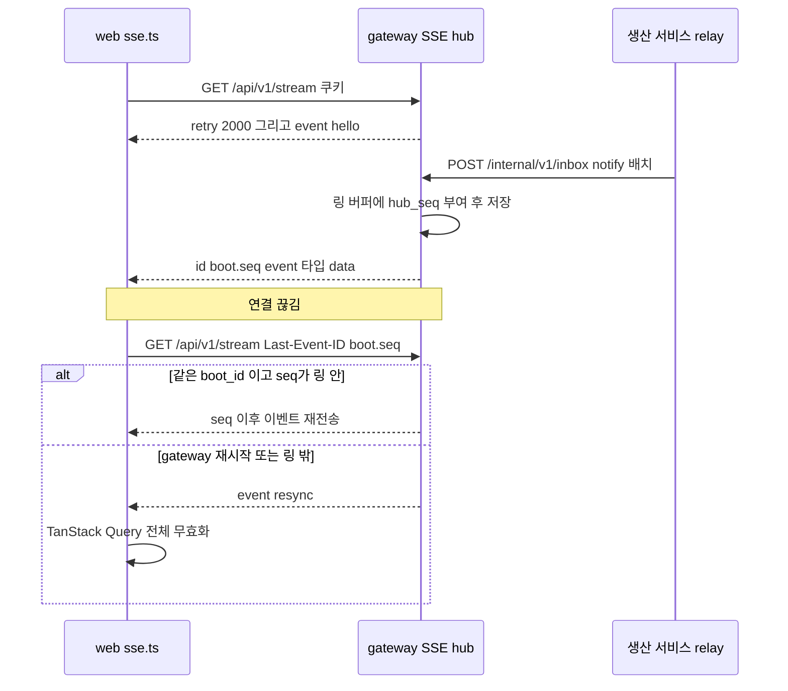
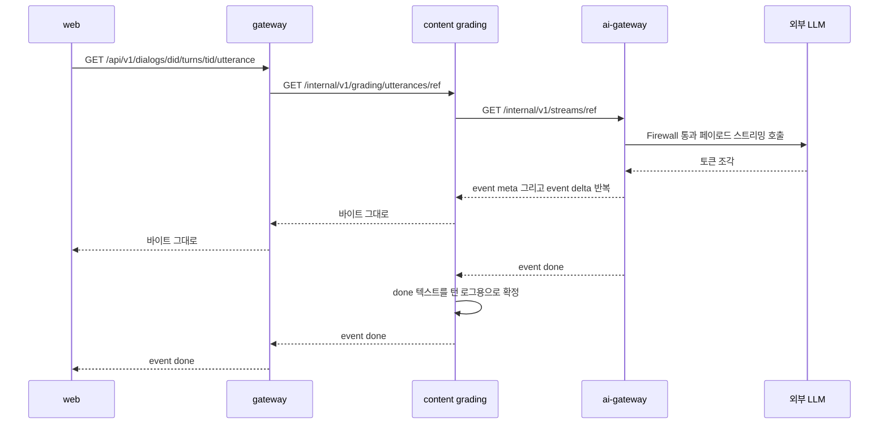
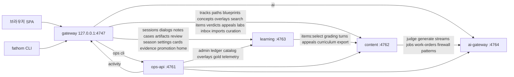
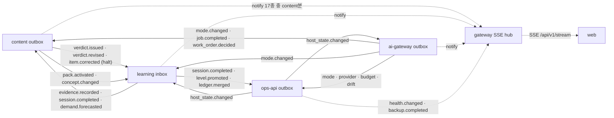

# IF-01. 인터페이스정의서 (Interface Specification) — Fathom · 깊이

> **문서 ID**: IF-01 · **버전**: v1.0 (PG-2 동결 후보) · **작성일**: 2026-10-01 · **작성 주체**: T1(상위 모델, 아키텍처)
> **구속 입력**: ARC-01 v1.0(§5·§8·§9·§11·§12·§14·§15·§17) · ADR-001~016 · Planning Baseline v1.0(PLN-REV-01 §4·§5.5~5.8) · REQ-01 v1.1(FR 236 · IR 018) · 스파이크 SP-2·SP-3·SP-4·SP-6·SP-7 + 독립 감사(2026-09-30) · `@typesafe-ai/sdk` 0.6.0 `.d.ts` 실측(2026-10-01, 이 문서 §12.2)
> **용도**: 이 문서는 `packages/contracts`(zod 4.6.5)로 **1:1 번역**된다. 표의 IF-ID 한 행 = `defineRoute()` 한 개, 코드 블록의 스키마 한 개 = 같은 이름의 zod export 한 개다. 하위 모델 코딩 에이전트는 이 문서의 이름·경로·필드·코드를 바꾸지 않고 옮긴다. 이 문서와 ARC-01/ADR이 충돌하면 ARC-01/ADR이 우선하며, 이 문서가 메운 공백은 §15 **설계 결정 메모**에 모두 적었다.
> **범위**: v1 = R0~R3 슬라이스. R2·R3 엔드포인트는 표의 `슬라이스` 열과 `freeze: 'O'`로 표시한다.

---

## 0. 요약 (TL;DR)

1. **표면 3개**: 브라우저·CLI용 공개 API `http://127.0.0.1:4747/api/v1/*`(gateway만) · 서비스 간 내부 API `http://127.0.0.1:<port>/internal/v1/*` · 프로세스 IPC(supervisor ↔ 서비스, 서비스 ↔ 단명 job). 공개 경로 → 내부 경로 대응은 §4의 각 표(`하위` 열)와 §4.11 **공개 라우트 표**가 정본이다.
2. **엔드포인트 수**: 공통 10(IF-COM) · gateway 공개 178(브라우저 161 + CLI 17) + 내부 1(IF-GW) · learning 75(IF-LR) · content 55(IF-CT) · ai-gateway 39(IF-AI) · ops-api 28(IF-OP) · IPC 메시지 22(IF-IPC). 통합 이벤트 23(IF-EV) · 원장 이벤트 17(IF-LG) · 외부 인터페이스 16(IF-EXT). 슬라이스별: R0·R1(동결 D) 위주의 학습·운영 코어, R2·R3(동결 O)는 AI 심화·가져오기·큐레이션·장기 과제·업그레이드.
3. **공통 규약**: 성공 = 스키마 객체 그대로(최상위 배열 금지, 목록은 `{items, next_cursor}`), 오류 = RFC 9457 `application/problem+json` + `code: "<SVC>-<CAT>-<NNN>"`·`error_id`·`request_id`. 모든 상태 변경 = `Idempotency-Key`(ULID) 필수. 헤더 `x-request-id`·`traceparent`·`x-fathom-deadline-ms` 전 홉 전파. 필드 이름은 `snake_case`, 시각은 epoch ms 정수, 학습일은 `YYYY-MM-DD`.
4. **스트림 3종**: 브라우저 알림 SSE `GET /api/v1/stream`(id = `<boot_id>.<hub_seq>`, `resync`) · AI 발화·피드백 SSE(ai-gateway → content → gateway **바이트 그대로 중계**, `meta`/`delta`/`done`/`error`) · NDJSON(원장·오버레이·골드셋 export/import).
5. **제출 전/후 분리**: 정답·해설·모범답안을 담는 스키마는 `*PostSubmit` 이름의 별개 `z.object`이고, 제출 전 스키마(`*PreSubmit`)에는 금지 필드(`answer_key`·`explanation`·`correct_*`·`is_correct`·`model_answer`·`exemplar_note`·`solution`)가 없다(NG-G3, FR-QST-022).
6. **AI 계약**: Jev 질문은 **레지스트리 고정 템플릿 + 객체 키 경로 변수**로만 만든다(호출자는 instructions 문자열을 보내지 않는다). `JudgeState`는 배열 불가 zod. 판정 결과 `unavailable`·`deferred`는 오류가 아니라 정상 응답(200)이다. 제출 전 생성은 403 `AI-POLICY-001`.

---

## 1. 범위 · 표기 · 번역 규칙

### 1.1 ID 체계

| 접두어 | 대상 | 예 | contracts 위치 |
|---|---|---|---|
| `IF-COM-nnn` | 모든 서비스 공통 엔드포인트(`createService()` 제공) | IF-COM-004 inbox | `admin/admin-routes.ts`, `events/inbox.ts` |
| `IF-GW-nnn` | gateway 공개 API(`/api/v1`) + 내부 1개 | IF-GW-020 응답 제출 | `http/gateway/v1/<group>.ts` |
| `IF-LR-nnn` | learning 내부 API | IF-LR-004 | `http/learning/v1/<group>.ts` |
| `IF-CT-nnn` | content 내부 API | IF-CT-040 | `http/content/v1/<group>.ts` |
| `IF-AI-nnn` | ai-gateway 내부 API | IF-AI-001 | `http/ai-gateway/v1/<group>.ts` |
| `IF-OP-nnn` | ops-api 내부 API | IF-OP-001 | `http/ops/v1/<group>.ts` |
| `IF-IPC-nnn` | supervisor·job IPC 메시지 | IF-IPC-001 bootstrap | `admin/ipc.ts`, `admin/jobs.ts` |
| `IF-EV-nn` | 통합 이벤트 23종 | IF-EV-05 `grading.verdict.issued` | `events/catalog/<context>.ts` |
| `IF-LG-nn` | 원장 이벤트 17종 | IF-LG-01 `attempt.graded` | `ledger/payloads/<type>.ts` |
| `IF-EXT-nn` | 외부 인터페이스(LLM API·CLI·Jev·OS) | IF-EXT-01 Jev | 서비스 내부 어댑터(계약 = 이 문서 + 계약 테스트) |

- **번호**: 서비스 안에서 그룹별 블록으로 띄엄띄엄 매긴다(예: learning practice 001~036, learner 040~051). 이 문서의 `~` 범위 표기(예: IF-OP-001~042)는 그 범위 안에 **정의된 ID만** 가리킨다.
- **route id**(`defineRoute({ id })`) = `<svc>.<group>.<action>`(예: `learning.practice.sessions.create`). IF-ID와 route id는 표의 같은 행에 함께 적는다. 계약 테스트 제목에 IF-ID를 넣는다(`[IF-LR-004]`).
- **표 열**: `메서드 경로` · `route id` · `호출자`(= `allowedCallers`) · `멱등`(✓ = `idempotent: true`, `Idempotency-Key` 필수) · `페이지`(✓ = 커서 페이지네이션) · `데드라인`(`deadlineMs`, 생략 = 기본 2000) · `슬라이스·동결`(R0~R3 · D/O) · `FR`(관련 요구) · 요청/응답 스키마 이름 · 오류 코드(공통 코드 §2.6.2는 생략).
- **동결**: `D` = R0/R1 경로, PG-2에서 상세 동결(필드 삭제·의미 변경 = ADR). `O` = R2/R3 경로, 개요 동결(가산 변경 = CR로 상세화 가능). ADR-008 §8.

### 1.2 contracts 번역 규칙 (하위 모델 에이전트용)

1. 이 문서의 TypeScript 블록은 **zod 4 코드 그대로**다. 블록 머리의 주석 `// file:`이 대상 파일이다. 같은 이름의 `export const X = z…` + `export type X = z.infer<typeof X>`를 함께 둔다(서비스 내부 포트 코드의 `<Name>T`는 `z.infer<typeof Name>` 별칭).
2. 모든 객체 스키마는 `.strict()`(요청·응답·이벤트 payload 공통, 알 수 없는 키 거부). 이 문서는 지면을 아끼려고 `.strict()`를 생략하고 `S({...})` 헬퍼로 적는다: `const S = <T extends z.ZodRawShape>(shape: T) => z.object(shape).strict();`(`common/schema.ts`). 선택 필드 `.optional()`은 적힌 곳에만 둔다(기본은 필수, 값이 없을 수 있으면 `.nullable()`).
3. 서비스 경계를 넘는 학습 어휘(`AttemptPhase`·`AttemptResponse`·`DialogKind`·`DialogMove`·`DialogEndReason`·`TurnJudgement`·`Utterance`·`ArtifactTemplateKind`·`PromotionGate`·`FeasibilityBlocker`·`WGraderTable`)는 `common/practice.ts`(L-CONTRACTS)가, `LedgerEventType`은 `ledger/envelope.ts`가 정본이다(L-CONTRACTS 파일은 서비스 레인 파일을 import하지 않는다). 그 밖의 스키마는 **라우트를 제공하는 서비스 레인**의 파일이 정본이고 소비 측은 import만 한다(예: `TrackCap`·`ItemDeliveryPreSubmit`·`Verdict` = content, `HomeAlert`·`MapLayer` = learning, `HealthBoard`·`Banner` = ops).
4. barrel 금지. 다른 그룹의 스키마는 파일 단위 subpath로 import한다(`import { Verdict } from '@fathom/contracts/events/catalog/grading'`). gateway 공개 라우트가 내부 스키마를 그대로 쓰는 경우 **스키마를 재정의하지 않고 import**한다(§4 표의 `하위` 열이 `= IF-…`인 행).
5. 제출 전 응답 스키마는 `http/<svc>/v1/pre-submit/*.ts`, 제출 후 공개 스키마는 `http/<svc>/v1/post-submit/*.ts`에 두고 서로 스프레드·`.extend`·`.merge`·`.pick`·`.omit`으로 파생하지 않는다(`check:ng-g` G3).
6. 경로 문자열의 `{name}`은 Fastify에서 `:name`으로, 경로 안 리터럴 콜론 동사(`items:select`, `packs:install`)는 Fastify 규칙대로 `::`로 이스케이프한다(`/internal/v1/itembank/items::select`). contracts의 `path`에는 이 문서 표기(`{name}`, 단일 `:`)를 그대로 저장하고, `shared-kernel/service`가 Fastify 경로로 변환한다(§15 D-02).

### 1.3 범위 밖

DDL(DB-01), 화면 상태(SCR-01), 정책 파일 값(policy/*.yaml — 스키마 골격만 §13.4), 프롬프트 본문(assets/prompts — 템플릿 키만 §11.6).

---

## 2. 공통 규약

### 2.1 베이스 URL · 전송

| 표면 | 베이스 | 바인딩 | 인증 | 콘텐츠 형식 |
|---|---|---|---|---|
| 브라우저 → gateway | `http://127.0.0.1:4747/api/v1` (dev 4847, 폴백 4748~4756) | 127.0.0.1 | 쿠키 `fathom_sid` + `X-Fathom-CSRF`(상태 변경) | JSON · SSE |
| CLI → gateway | `http://127.0.0.1:4747/api/v1/cli` | 127.0.0.1 | `Authorization: Bearer <run/cli.token>` | JSON |
| 정적 파일 | `http://127.0.0.1:4747/*`(`/api/**` 외, SPA fallback `index.html`) | 127.0.0.1 | 없음(앱 셸) | — |
| 서비스 간 | `http://127.0.0.1:<port>/internal/v1` — ops-api 4761 · content 4762 · learning 4763 · ai-gateway 4764 · gateway 4747(+ dev 100) · 실제 포트는 부트스트랩 봉투 `peers` / `registry.updated` | 127.0.0.1 | `Authorization: Bearer <caller token>`(64 hex) | JSON · NDJSON · SSE |
| 공통 운영 | `GET /healthz` · `GET /readyz` (prefix 없음) | 127.0.0.1 | 없음(정보 최소, §3) | JSON |

- HTTP/1.1 keep-alive, `Content-Type: application/json; charset=utf-8`(요청 본문이 있는 모든 JSON 요청 필수, 아니면 415 `<S>-VAL-904`). 압축 없음(loopback).
- 텍스트 필드는 서버가 수신 시 **NFC 정규화**한다(검색·노트·답안, SP-4). 제로폭·양방향 제어문자 제거는 acquisition ingress와 Firewall만 수행한다(학습자 답안은 원문 보존).

### 2.2 헤더

| 헤더 | 방향 | 규칙 |
|---|---|---|
| `x-request-id` | 요청·응답 전 홉 | ULID. gateway가 브라우저·CLI 요청마다 새로 만들고(클라이언트 값 무시), 내부 호출은 받은 값을 그대로 전파. 내부 서비스가 값 없이 받으면 새로 만들고 `warn` 로그. 응답에 같은 값 echo |
| `traceparent` | 요청 전 홉 · outbox envelope | W3C `00-<trace 32hex>-<span 16hex>-0[01]`. gateway가 루트 생성, 각 홉은 같은 trace id + 새 span id. outbox 기록 시 envelope에 복사 |
| `authorization` | 내부 · CLI | 내부: `Bearer <64 hex>`(호출자 서비스 토큰, 상수 시간 비교). CLI: `Bearer <43자 base64url>`(`run/cli.token`). 브라우저는 보내지 않는다 |
| `cookie` | 브라우저 → gateway | `fathom_sid=v1.<sid>.<port>.<iat>.<mac>`(ADR-009 §1) |
| `x-fathom-csrf` | 브라우저 상태 변경 | `GET /api/v1/session/csrf` 값. POST·PUT·PATCH·DELETE 필수 |
| `idempotency-key` | 상태 변경(멱등 ✓ 라우트) | ULID(26자). 없거나 형식 오류 → 400 `<S>-VAL-901`. gateway는 받은 값을 하위 호출에 **그대로** 전파(같은 키 = 같은 의도) |
| `x-fathom-deadline-ms` | 요청 전 홉 | 남은 예산 정수 ms(1~600000). §2.9 |
| `x-fathom-delivery-attempt` | relay → inbox | 정수 ≥ 1 |
| `x-fathom-client` | 브라우저·CLI → gateway | `web/<semver>` 또는 `cli/<semver>`. 서버 `app_version`과 다르면 409 `GW-CONFLICT-010`(web은 새로고침 안내, CLI는 재실행 안내) — 혼합 버전 방지(PWA는 `skipWaiting` 없음) |
| `last-event-id` | SSE 재연결 | §2.13·§2.14 |
| 응답 `idempotent-replayed` | 응답 | 저장된 응답 재생 시 `true` |
| 응답 `retry-after` | 응답 429·503 | 초 단위 정수(내부 1, 레이트 리밋은 남은 창) |
| 응답 `location` | 응답 201·202 | 생성·상태 리소스의 절대 경로(`/api/v1/...` 또는 `/internal/v1/...`) |
| 응답 `cache-control` | 응답 | `/api/**`·`/internal/**` 전부 `no-store`. 정적 해시 자산만 `public, max-age=31536000, immutable`, `index.html`·`sw.js`·`manifest.webmanifest`는 `no-cache` |

### 2.3 응답 형식

| 상황 | 상태 | 본문 |
|---|---|---|
| 조회 성공 | 200 | 라우트의 응답 스키마 객체(최상위 배열 금지) |
| 생성 성공 | 201 + `location` | 생성된 리소스 뷰 |
| 비동기 수락 | 202 + `location` | 상태 리소스 뷰(`Operation`·`JobView`·`ImportJobView` 등, 각 정의) |
| 본문 없는 성공 | 204 | 없음(멱등 저장 시 `{}`로 저장) |
| 목록 | 200 | `Page<T> = { items: T[], next_cursor: string \| null }` |
| 부분 성공(BFF 집계) | 200 | 뷰 스키마의 `degraded: DegradedPart[]`(빈 배열 = 완전) — 하위 서비스 하나가 실패해도 화면은 뜬다(D-9) |
| 오류 | 4xx·5xx | `Problem`(§2.5), `Content-Type: application/problem+json` |
| SSE | 200 | `text/event-stream; charset=utf-8`(§2.13·§2.14) |
| NDJSON | 200 | `application/x-ndjson`(§2.15) |

```ts
// file: packages/contracts/src/common/schema.ts
export const S = <T extends z.ZodRawShape>(shape: T) => z.object(shape).strict();

// file: packages/contracts/src/common/pagination.ts
export const Cursor = z.string().regex(/^[A-Za-z0-9_-]{1,512}$/);           // opaque base64url
export const PageQuery = S({ cursor: Cursor.optional(), limit: z.coerce.number().int().min(1).max(200).default(50) });
export const Page = <T extends z.ZodType>(item: T) => S({ items: z.array(item), next_cursor: Cursor.nullable() });

// file: packages/contracts/src/common/degraded.ts
export const DegradedPart = S({
  part: z.string().regex(/^[a-z][a-z0-9_.]{1,63}$/),                         // 'home.ai_chip', 'map.layout'
  dependency: z.enum(['gateway', 'content', 'learning', 'ai-gateway', 'ops-api']),
  code: z.string().regex(/^(GW|CT|LR|AI|OP|CLI)-(VAL|AUTH|ACL|NOTFOUND|CONFLICT|DEP|LIMIT|POLICY|INTERNAL)-\d{3}$/),
});
```

### 2.4 공통 스칼라 타입

```ts
// file: packages/contracts/src/common/ids.ts
export const Ulid = z.string().regex(/^[0-9A-HJKMNP-TV-Z]{26}$/);
export const Sha256Hex = z.string().regex(/^[0-9a-f]{64}$/);
export const SemVer = z.string().regex(/^\d+\.\d+\.\d+(-[0-9A-Za-z.-]+)?$/);
export const ObjKey = z.string().regex(/^[a-z][a-z0-9_]{1,31}$/);           // 선택지·빈칸·KP·Jev 키 — 배열 인덱스 대체(UR-16)
export const ObjPath = z.string().regex(/^[a-z][a-z0-9_]{1,31}(\.[a-z][a-z0-9_]{1,31}){0,3}$/); // 'key_points.kp01'
export const ServiceName = z.enum(['gateway', 'content', 'learning', 'ai-gateway', 'ops-api']);
export const CallerName = z.enum(['gateway', 'content', 'learning', 'ai-gateway', 'ops-api', 'browser', 'cli']);
export const DeviceId = Ulid;
export const PolicySetId = z.string().regex(/^ps_[0-9a-f]{16}$/);              // 정책 세트 콘텐츠 주소(ADR-004 §9)
export const PolicyRef = z.string().regex(/^[a-z][a-z0-9_]{2,40}@v\d{1,4}$/);   // 'mastery_rules@v1'

// 커리큘럼 ID — packc R-ID 문법(DCP-01 §5.2 = DB-01 §3.3 = 이 블록이 단일 정본, CR-35). 조각 문자열은 이 파일 안에서만 쓰는 상수다.
export const TrackId = z.enum(['alg', 'cs', 'net', 'lang', 'fe', 'be', 'db', 'linux', 'docker', 'k8s',
  'cicd', 'sre', 'cloud', 'sec', 'ml', 'llm', 'arch', 'eng', 'lead', 'data']);
const T = '(?:alg|cs|net|lang|fe|be|db|linux|docker|k8s|cicd|sre|cloud|sec|ml|llm|arch|eng|lead|data)';
const SLUG = '[a-z0-9]+(?:-[a-z0-9]+)*';
const C = `(?:u\\.[a-z0-9]+\\.${SLUG}|${T}\\.${SLUG})`;                     // 개념 ID 몸통: 시드 '<track>.<slug>'(점 1개) · 사용자 'u.<ns>.<slug>'(점 2개)
const re = (body: string) => new RegExp(`^(?:${body})$`);
export const ConceptId = z.string().max(64).regex(re(C));                                  // 'k8s.probes', 'u.acme.vpn-setup'
export const KuId = z.string().max(96).regex(re(`${C}\\.(?:k\\d{2}|uk[0-9a-z]{26})`));    // 'k8s.probes.k03' · 사용자 KU 'k8s.probes.uk<ulid 소문자 26>'
export const MisconceptionId = z.string().max(80).regex(re(`${C}\\.m\\d{2}`));            // 'k8s.probes.m01'
export const CaseId = z.string().max(96).regex(re(`${T}\\.case\\.${SLUG}`));              // 'k8s.case.liveness-restart-storm'(주 트랙 접두어)
export const ArtifactId = z.string().max(96).regex(re(`${T}\\.art\\.${SLUG}`));           // 'sre.art.postmortem-cascading-latency'
export const LabId = z.string().max(96).regex(re(`${T}\\.lab\\.${SLUG}`));                // 'docker.lab.dockerfile-faded'
export const SourceId = z.string().max(96).regex(re(`src\\.${SLUG}`));                    // 'src.docker-docs'
export const RubricId = z.string().max(96).regex(re(`rb\\.${SLUG}`));                     // 'rb.feynman-teach'
export const PathId = z.string().max(96).regex(re(`path\\.${SLUG}`));                     // 'path.backend-core'
export const BlueprintId = z.string().max(64).regex(re(`cert-${SLUG}@\\d{4}`));           // 'cert-cka@2026'
export const ItemModelId = z.string().max(120).regex(re(`${C}\\.(?:im\\d{2}|imx-${SLUG})`)); // 'docker.dockerfile.im01' · 템플릿 사본 'docker.dockerfile.imx-ku-cloze'
export const ItemId = z.string().max(140).regex(re(
  `${C}\\.i\\d{2,3}` +                                                                      // 저작 'docker.dockerfile.i05'
  `|${C}\\.(?:im\\d{2}|imx-${SLUG})\\.x[0-9a-f]{12}` +                                      // T2 인스턴스 '<model_id>.x<sha256 앞 12>'
  `|${T}\\.lab\\.${SLUG}` +                                                                 // 랩 기반 문항 = lab_id(DCP DN-38)
  `|[0-9A-HJKMNP-TV-Z]{26}`));                                                              // 런타임(T3·T4·가져오기·사용자 저작) ULID
export const PackId = z.string().max(48).regex(re(`${T}|x\\.${SLUG}|u\\.[a-z0-9]+`));     // 트랙 팩 'k8s' · 공용 'x.blueprints'·'x.paths' · 사용자 'u.local'
export const CardId = z.string().max(120).regex(re(`${C}:[a-z][a-z_]{0,31}:(?:r|p)`));    // '<concept_id>:<facet>:r|p'(r = recognition, p = production) — 원장 키 'card:<card_id>'
export const GoldId = z.union([Ulid, z.string().regex(/^gold\.AI-J\d{2}\.\d{3}$/)]);      // 시드 골드 'gold.AI-J03.017' · 런타임 ULID(DCP-01 §5.2, DB ai_gold_item)
// packc 추가 lint(R-ID): 시드 개념 slug ∈ {case, art, lab}는 금지(LabId·CaseId·ArtifactId와의 접두 충돌 방지)
export const ProviderId = z.string().regex(/^(jev|anthropic-api|openai-api|gemini-api|ollama|claude-cli|codex-cli|gemini-cli|gcli-[a-z0-9-]{2,24})$/);

// file: packages/contracts/src/common/time.ts
export const EpochMs = z.number().int().min(0).max(8_640_000_000_000_000);
export const StudyDay = z.string().regex(/^\d{4}-(0[1-9]|1[0-2])-(0[1-9]|[12]\d|3[01])$/);  // 사용자 일 경계(기본 04:00) 기준 로컬 날짜
export const IsoWeek = z.string().regex(/^\d{4}-W(0[1-9]|[1-4]\d|5[0-3])$/);               // '2026-W40'
export const DurationMs = z.number().int().min(0);

// file: packages/contracts/src/common/domain.ts  — 서비스 공통 도메인 스칼라(값 목록은 정책이 아니라 계약)
export const Level = z.number().int().min(1).max(5);
export const Tier = z.enum(['A', 'B', 'C']);
export const KnowledgeType = z.enum(['D', 'C', 'P', 'S']);                         // 서술·개념·절차·전략
export const Stakes = z.enum(['S0', 'S1', 'S2']);
export const AiMode = z.enum(['FULL', 'JUDGE_ONLY', 'LLM_ONLY', 'OFFLINE']);
export const ResponseMode = z.enum(['recognition', 'production']);
export const Facet = z.string().regex(/^[a-z][a-z_]{0,31}$/);                      // 'concept', 'code', 'ops', 'tradeoff'
export const ModeId = z.string().regex(/^M-(0[1-9]|1\d|2[01])$/);                  // M-01 ~ M-21 (modes.manifest.json)
export const SlotId = z.enum(['W', 'R', 'N', 'D', 'S', 'C']);                      // 워밍업·복습·신규·심화·도전·마무리 (FR-STD-002)
export const Energy = z.enum(['light', 'normal', 'deep']);
export const SessionMinutes = z.union([z.literal(5), z.literal(15), z.literal(25), z.literal(45), z.literal(90)]);
export const Confidence = z.union([z.literal(1), z.literal(2), z.literal(3)]);     // C1~C3 (FR-QST-024)
export const FsrsRating = z.union([z.literal(1), z.literal(2), z.literal(3), z.literal(4)]); // Again·Hard·Good·Easy
export const Lifecycle = z.enum(['CL-0', 'CL-1', 'CL-2', 'CL-3', 'CL-4', 'CL-5', 'CL-6', 'CL-7', 'CL-8', 'CL-X']);
export const MasteryStatus = z.enum(['unseen', 'learning', 'mastered']);
export const Sp1State = z.enum(['pass', 'fail', 'unknown']);
export const FormatId = z.enum([                                                   // 단일 형식 어휘(33종, CR-36) — packc 저작·Verdict.format·렌더러 레지스트리·method_policy@v1.formats 키가 모두 이 집합
  // SP-6 형식 카탈로그(결정적·판단 분류는 method_policy@v1)
  'embedded', 'ox', 'mcq', 'cloze', 'short', 'matching', 'code_task', 'blank_note', 'digging_d4_mcq',
  'error_find', 'confusable', 'fermi', 'cond_reversal', 'infra_lite', 'kata', 'audit', 'case_decision',
  // v1 추가 형식(§15 D-10)
  'code_predict', 'sql_task', 'essay', 'digging', 'feynman', 'pr_review', 'reverse_item', 'artifact',
  'case_postmortem', 'micro_judgment', 'ml_predict',
  // DCP-01 §6.5.1 저작 형식 중 w_format·본문이 다른 5종(CR-36, 병합 금지)
  'mcq_multi', 'order', 'parsons', 'log_read', 'config_review',
]);
export const Volatility = z.enum(['stable', 'evolving', 'volatile']);              // FR-CUR-013 · DCP · DB CHECK와 동일(CR-35)
export const Tag = z.string().regex(/^(qa|lc|ctx|stack|cert|mode):[a-z0-9_.-]{1,40}$/); // 'cert:cka', 'ctx:si', 'qa:performance'(R4 §3.3, CR-35)
export const ProviderKind = z.enum(['jev', 'llm_api', 'llm_cli', 'generic_cli', 'local_llm']);   // 원장 ai_mode.observed가 쓰므로 공통(CR-54)
export const ProviderStatus = z.enum(['ok', 'degraded', 'down', 'unconsented', 'disabled']);
export const GraderEngine = z.enum(['D', 'J', 'LJ', 'H', 'S', 'PENDING']);
export const JudgeBadge = z.enum([                                                   // FR-UX-007 (none = 결정적, 배지 없음)
  'none', 'ai', 'ai_uncalibrated', 'ai_confirm', 'ai_estimate_confirm', 'heuristic', 'self', 'pending']);
export const DataClass = z.enum(['C0', 'C1', 'C2', 'C3']);
export const Locale = z.literal('ko');
export const RuntimeProfile = z.enum(['prod', 'dev', 'test']);
export const ServiceState = z.enum(['starting', 'ready', 'restarting', 'degraded', 'stopped']);
```

- `Level` 입력 경로 파라미터는 문자열이므로 라우트 정의에서 `z.coerce.number().pipe(Level)`을 쓴다.
- 금액은 `krw`(정수, 원) 또는 `usd`(number). 비율은 0~1 `number`. 비교 임계는 서버가 `geq(ε = 1e-9)`로 판정한다(SP-6).

### 2.5 오류 모델 (RFC 9457 + Fathom 확장, CR-08)

```ts
// file: packages/contracts/src/common/problem.ts
export const ErrorCode = z.string().regex(/^(GW|CT|LR|AI|OP|CLI)-(VAL|AUTH|ACL|NOTFOUND|CONFLICT|DEP|LIMIT|POLICY|INTERNAL)-\d{3}$/);
export const FieldError = S({ path: z.string().max(200), message: z.string().max(300), rule: z.string().max(60) });
export const Problem = S({
  type: z.string().regex(/^urn:fathom:problem:[a-z]+-[a-z]+-\d{3}$/),   // 'urn:fathom:problem:lr-dep-001' (= code 소문자)
  title: z.string().max(120),                                           // 고정 문구(코드별, 한국어)
  status: z.number().int().min(400).max(599),
  detail: z.string().max(1000).optional(),                              // 사용자 표시 가능 문구. 스택·경로·SQL 0 (NFR-SEC-012)
  instance: z.string().max(300).optional(),                             // 요청 경로
  code: ErrorCode,
  error_id: Ulid,                                                       // 로그와 연결(로그에만 상세)
  request_id: Ulid,
  retryable: z.boolean(),
  retry_after_ms: z.number().int().min(0).optional(),
  errors: z.array(FieldError).max(50).optional(),                       // VAL 계열만
  dependency: ServiceName.optional(),                                   // DEP 계열: 실패한 하위 서비스
  acked_through_seq: z.number().int().min(0).optional(),                // inbox halt(§3.3)만
  active_session_id: Ulid.optional(),                                   // LR-CONFLICT-011만
  violations: z.array(z.record(z.string(), z.unknown())).max(100).optional(), // 검증 위반 목록(원장 import·팩 검증)
});
```

| CAT | HTTP | 재시도(`retryable`) | 의미 |
|---|---|---|---|
| VAL | 400 · 413 · 415 · 422 | false | 요청 형식·내용 오류 |
| AUTH | 401 · 421 | false | 인증 실패(쿠키·토큰·Host) |
| ACL | 403 | false | 호출자가 라우트 ACL 밖 |
| NOTFOUND | 404 | false | 리소스·라우트 없음 |
| CONFLICT | 409 · 422 | false(409 in-flight만 true) | 상태 충돌·멱등 위반 |
| DEP | 502 · 503 · 504 | true | 하위 서비스·외부 의존 실패, 정지·quiesce |
| LIMIT | 413 · 429 | true(429) / false(413) | 레이트·큐·크기 한도 |
| POLICY | 403 | false | 정책상 금지(NG-G7, 출처 정책, SSRF) |
| INTERNAL | 500 | false | 서버 결함(계약 위반 포함) |

- **클라이언트 재시도 규칙(web `api-client`·`attempt-queue`, CLI, `PeerClient`)**: `retryable: true`만 재시도한다. 503·네트워크 오류는 같은 `Idempotency-Key`로 1s → 2s → 4s … ≤ 30s, 429는 `retry-after`. web attempt 큐는 4xx(409 in-flight·429 제외)를 `failed_permanent`, 500은 3회 재시도 후 `failed_permanent`로 둔다(§15 D-05).

### 2.6 오류 코드 카탈로그

#### 2.6.1 번호 규칙

- `<SVC>-<CAT>-<NNN>`. **공통 코드**(모든 서비스가 `createService()`로 같은 의미로 냄)는 `9xx` 번호를 쓰고, 예외로 ADR-003이 고정한 `CONFLICT-001`·`CONFLICT-002`(멱등)를 쓴다. 서비스 고유 코드는 `001~899`(CONFLICT 고유 코드는 `010`부터). SVC는 응답을 **만든** 서비스다(gateway가 하위 오류를 그대로 전달할 때는 원 코드를 유지하고, gateway 자신이 판단한 오류만 `GW-*`).
- 제출 전 생성 거부 코드는 **`AI-POLICY-001`**이다(§8.1 SVC 집합 `AI`). ARC §11.1·ADR-005·ADR-016 문구는 CR-44(오류 코드 SVC 정본화)로 정정 완료(§15 D-01).

#### 2.6.2 공통 코드 (`<S>` = 응답 서비스의 SVC)

| 코드 | HTTP | 의미 |
|---|---|---|
| `<S>-VAL-900` | 400 | 요청 스키마 위반(zod) — `errors[]` |
| `<S>-VAL-901` | 400 | `Idempotency-Key` 없음·형식 오류 |
| `<S>-VAL-903` | 400 | 커서 무효·만료 |
| `<S>-VAL-904` | 415 | 지원하지 않는 `Content-Type` |
| `<S>-AUTH-900` | 401 | 내부 호출자 토큰 없음·무효 |
| `<S>-ACL-900` | 403 | 호출자가 `allowedCallers` 밖 |
| `<S>-NOTFOUND-900` | 404 | 정의되지 않은 라우트 |
| `<S>-CONFLICT-001` | 422 | 같은 `Idempotency-Key` + 다른 본문 해시 |
| `<S>-CONFLICT-002` | 409 | 같은 키의 요청이 처리 중(`retryable: true`, `retry_after_ms` 200) |
| `<S>-LIMIT-900` | 413 | 본문 크기 초과(§2.12) |
| `<S>-LIMIT-901` | 429 | 레이트 리밋 |
| `<S>-DEP-900` | 503 | 정지 중(`shutdown`) 또는 quiesce 쓰기 게이트 닫힘 3s 초과 — `retry-after: 1` |
| `<S>-DEP-901` | 503 | 준비 안 됨(`/readyz` false) |
| `<S>-DEP-902` | 504 | 데드라인 소진(`x-fathom-deadline-ms` ≤ 0 수신 또는 처리 중 소진) |
| `<S>-DEP-910` | 503 | inbox 원장 경로 정지(halt) — `acked_through_seq` 포함(§3.3) |
| `<S>-INTERNAL-900` | 500 | 처리되지 않은 예외 |
| `<S>-INTERNAL-901` | 500 | 응답이 계약 스키마를 위반(서버 결함, 응답 대신 이 오류) |

#### 2.6.3 서비스 고유 코드

| 코드 | HTTP | 의미 | 발생 IF |
|---|---|---|---|
| `GW-AUTH-001` | 401 | 쿠키의 `<port>` ≠ gateway listen 포트 | 쿠키 필요 전 라우트 |
| `GW-AUTH-002` | 403 | `X-Fathom-CSRF` 없음·불일치 | 상태 변경 전 라우트 |
| `GW-AUTH-003` | 401 | 세션 쿠키 없음·MAC 불일치·버전 불명 | 쿠키 필요 전 라우트 |
| `GW-AUTH-004` | 401 | 부트스트랩 토큰 무효·만료(60s)·재사용 | IF-GW-002 |
| `GW-AUTH-005` | 421 | `Host` ∉ {`127.0.0.1:<port>`, `localhost:<port>`} | 전 라우트(정적 포함) |
| `GW-AUTH-006` | 403 | `Origin` 불일치 또는 `Sec-Fetch-Site` ∉ {same-origin, none} | 상태 변경·교환 |
| `GW-AUTH-007` | 401 | CLI 토큰 무효 | `/api/v1/cli/*` |
| `GW-ACL-001` | 403 | 쿠키로 `/api/v1/cli/*` 호출 또는 CLI 토큰으로 브라우저 라우트 호출 | — |
| `GW-LIMIT-001` | 429 | 세션·CLI 토큰 300 req/min 초과 | 전 라우트 |
| `GW-LIMIT-002` | 429 | 세션당 SSE 연결 > 8 | IF-GW-005 |
| `GW-DEP-001` | 503 | 하위 서비스 연결 실패(`dependency` 포함, `retry-after: 1`) | 패스스루 라우트 |
| `GW-DEP-002` | 503 | 유지보수 모드(restore·upgrade 진행 중) | 전 `/api/v1`(ops·cli 일부 제외) |
| `GW-DEP-003` | 503 | quiesce로 interactive 쓰기 대기 > 3s(`retry-after: 1`) | 쓰기 라우트 |
| `GW-CONFLICT-010` | 409 | `x-fathom-client` 버전 ≠ 서버 `app_version` | 전 라우트 |
| `LR-DEP-001` | 503 | content 연결 실패(채점·문항 선택·턴·이의) — `retry-after: 1` | IF-LR-001·006·010·011·018·022·026·028·035·036 |
| `LR-NOTFOUND-001` | 404 | 세션 없음 | sessions/* |
| `LR-NOTFOUND-002` | 404 | 블록 없음 | blocks/* |
| `LR-NOTFOUND-003` | 404 | 대화 없음 | dialogs/* |
| `LR-NOTFOUND-004` | 404 | 개념이 curriculum_ref에 없음 | learner/*, dialogs |
| `LR-NOTFOUND-005` | 404 | 원장 이벤트 없음 | evidence/* |
| `LR-NOTFOUND-006` | 404 | 카드 없음 | cards/* |
| `LR-NOTFOUND-007` | 404 | 장기 과제(run) 없음 | case-runs, artifact-runs |
| `LR-NOTFOUND-008` | 404 | 체크포인트 없음 | ledger/* |
| `LR-NOTFOUND-009` | 404 | 원장 import·verify 작업 없음 | ledger/* |
| `LR-NOTFOUND-010` | 404 | 주간 리뷰·시즌·미리보기 없음 | insight/*, settings/policies |
| `LR-CONFLICT-010` | 409 | 세션이 active가 아님 | sessions/* 쓰기 |
| `LR-CONFLICT-011` | 409 | 이미 active 세션 있음(`active_session_id`) | IF-LR-001 |
| `LR-CONFLICT-012` | 409 | curriculum_ref 미초기화(팩 미설치) | IF-LR-001 |
| `LR-CONFLICT-013` | 409 | 블록 상태가 동작과 맞지 않음(완료·잠금) | blocks/* |
| `LR-CONFLICT-014` | 409 | 응답의 `item_id`가 블록에 없음 | IF-LR-010 |
| `LR-CONFLICT-015` | 409 | grade 확인 대기 상태 아님 | IF-LR-017 |
| `LR-CONFLICT-016` | 409 | 대화 종료됨 | dialogs/* |
| `LR-CONFLICT-017` | 409 | 승급 평가 자격 없음·재도전 대기(`retry_days`) | IF-LR-001(promotion_exam) |
| `LR-CONFLICT-018` | 409 | 원장 병합·리플레이 job 실행 중 | ledger/* |
| `LR-CONFLICT-019` | 409 | 정책 미리보기 만료·불일치 | IF-LR-066 |
| `LR-CONFLICT-020` | 422 | 원장 import 거부: 체인·앵커·스키마 버전 위반(`violations[]`) | IF-LR-081 |
| `LR-VAL-010` | 422 | 응답 `kind`가 블록 문항 형식과 맞지 않음 | IF-LR-010 |
| `LR-INTERNAL-001` | 500 | 원장 무결성 경보(`FSRSValidationError` 등, 배너 동반) | IF-LR-010 |
| `CT-LIMIT-001` | 429 | 러너 대기 큐 > 20 | IF-CT-050, 채점(code·sql) |
| `CT-LIMIT-002` | 413 | 가져오기 원문 > 2 MiB | IF-CT-030·035 |
| `CT-POLICY-001` | 403 | 러너 출처 정책 위반(`sourceKind` ∉ learner·seed·t1) | runner |
| `CT-POLICY-002` | 403 | 이 OS에서 러너 형식 비활성(`runner_verified_platforms` 밖) | 채점(code·sql) |
| `CT-POLICY-003` | 403 | SSRF 가드 거부(https 아님·사설 대역·리다이렉트 초과·형식) | IF-CT-030 |
| `CT-POLICY-004` | 403 | 출제 불가 상태(`gate_status` ∉ 출제 가능 집합) | 채점·힌트 |
| `CT-NOTFOUND-001` | 404 | 개념 없음 | catalog/* |
| `CT-NOTFOUND-002` | 404 | 문항(또는 `(item_id, item_content_hash)` 버전) 없음 | itembank·grading |
| `CT-NOTFOUND-003` | 404 | 팩·설치 작업 없음 | packs/* |
| `CT-NOTFOUND-004` | 404 | 트랙 없음 | tracks/* |
| `CT-NOTFOUND-005` | 404 | 가져오기 작업 없음 | acquisition/imports/* |
| `CT-NOTFOUND-006` | 404 | Inbox 항목 없음 | acquisition/inbox/* |
| `CT-NOTFOUND-007` | 404 | 신고 없음 | itembank/reports/* |
| `CT-NOTFOUND-008` | 404 | 오버레이 패치·충돌 없음 | catalog/overlays/*, conflicts/* |
| `CT-NOTFOUND-009` | 404 | Verdict 없음 | grading/verdicts/* |
| `CT-NOTFOUND-010` | 404 | 이의제기 없음 | grading/appeals/* |
| `CT-NOTFOUND-011` | 404 | 스트림 ref 없음·만료(120s) | grading/utterances·feedback |
| `CT-CONFLICT-010` | 409 | 자기채점 대기 상태 아님·이미 채점됨 | IF-CT-041 |
| `CT-CONFLICT-011` | 409 | 오버레이 `base_version` 낡음(재조회 후 재시도) | IF-CT-014 |
| `CT-CONFLICT-012` | 409 | 가져오기 작업 상태가 동작과 맞지 않음 | acquisition/* |
| `CT-CONFLICT-013` | 409 | 팩 설치 진행 중·하향 설치 거부 | IF-CT-001 |
| `CT-CONFLICT-014` | 409 | Verdict가 이미 대체됨·같은 Verdict 이의 진행 중 | IF-CT-043 |
| `CT-CONFLICT-015` | 409 | S2 3요건(교차 계열 판정·근거 span·큐레이터) 미충족 상태에서 승인 시도 또는 이미 결정됨 | IF-CT-064 (CR-49) |
| `CT-VAL-010` | 422 | 응답 `kind`가 문항 형식과 맞지 않음 | IF-CT-040 |
| `CT-VAL-011` | 422 | `.fpack` sha256·merkle·스키마 검증 실패(`violations[]`) | IF-CT-001 |
| `CT-DEP-002` | 503 | 서비스 job 슬롯 사용 중(`pack-load` 등) — `retry-after` | IF-CT-001 |
| `AI-POLICY-001` | 403 | 제출 전 생성 금지(`context_ref.kind='blank_note' ∧ phase='pre_submit'`, NG-G7) | IF-AI-002·010 |
| `AI-POLICY-002` | 403 | background 호출에 승인된 `work_order_id` 없음 | IF-AI-010, judge·generate(background) |
| `AI-VAL-010` | 422 | `JudgeState`에 배열·잘못된 키, 템플릿 변수가 없는 경로를 가리킴(버그 — 폴백 금지) | IF-AI-001 |
| `AI-VAL-011` | 422 | 질문 > 15 또는 0 | IF-AI-001 |
| `AI-VAL-012` | 422 | 생성 입력이 과업 입력 스키마 위반 | IF-AI-002 |
| `AI-VAL-013` | 422 | 키가 제공자 probe에서 거부됨(저장 안 함) | IF-AI-030 |
| `AI-NOTFOUND-001` | 404 | 과업 ID 없음 | judge·generate·jobs |
| `AI-NOTFOUND-002` | 404 | 제공자 없음 | providers·secrets |
| `AI-NOTFOUND-003` | 404 | job 없음 | jobs/* |
| `AI-NOTFOUND-004` | 404 | 작업 주문 없음 | work-orders/* |
| `AI-NOTFOUND-005` | 404 | 스트림 ref 없음·만료 | IF-AI-003 |
| `AI-NOTFOUND-006` | 404 | 골드 항목 없음 | calibration/* |
| `AI-NOTFOUND-007` | 404 | 해당 제공자 비밀 없음 | secrets/* |
| `AI-CONFLICT-010` | 409 | 작업 주문 이미 결정됨 | IF-AI-022 |
| `AI-CONFLICT-011` | 409 | job 취소 불가 상태 | IF-AI-013 |
| `AI-CONFLICT-012` | 409 | 비밀 저장소 잠김(passphrase 잠금 해제 필요) | secrets/* |
| `AI-DEP-001` | 502 | 제공자 오류(스트림 `error` 이벤트 전용) | streams |
| `AI-DEP-002` | 504 | 제공자 데드라인 초과(스트림 `error` 전용) | streams |
| `AI-DEP-003` | 503 | 서킷 open(스트림 `error` 전용) | streams |
| `OP-CONFLICT-010` | 409 | 상호 배타 작업 실행 중(backup·restore·upgrade·merge) | operations 생성 |
| `OP-CONFLICT-011` | 422 | epoch 매니페스트 무효·조합 불일치·앵커 불일치 | IF-OP-012 |
| `OP-VAL-010` | 422 | 경로 무효(탈출·없음·권한·동기화 폴더 안 라이브 대상) | export·import·upgrade·secondary |
| `OP-VAL-011` | 422 | 번들 sha256·Node 호환 불일치 | IF-OP-030 |
| `OP-NOTFOUND-001` | 404 | epoch 없음 | backups/* |
| `OP-NOTFOUND-002` | 404 | operation 없음 | operations/* |
| `OP-NOTFOUND-003` | 404 | 배너 없음 | banners/* |
| `OP-NOTFOUND-004` | 404 | 알 수 없는 서비스 이름 | services/* |
| `OP-DEP-001` | 503 | supervisor IPC 불가 | services·logs/tail·upgrade |
| `CLI-DEP-001` | — | (CLI 로컬) gateway·supervisor 미기동 | apps/cli |
| `CLI-AUTH-001` | — | (CLI 로컬) `run/cli.token` 읽기 실패 | apps/cli |
| `CLI-VAL-001` | — | (CLI 로컬) 사용법 오류 | apps/cli |

**CLI 종료 코드**(IR-014, `apps/cli/src/lib/exit-codes.ts`): `0` 성공 · `1` 작업 실패(Problem 수신) · `2` 사용법 오류(`CLI-VAL-*`) · `3` 앱 미기동(`CLI-DEP-001`, `fathom up` 안내) · `4` 인증 실패(`GW-AUTH-007`·`CLI-AUTH-001`) · `5` 충돌(`*-CONFLICT-*`, 다른 작업 진행 중) · `6` 검증 실패(`*-VAL-*`) · `7` 부분 성공(경고 동반, 예: doctor warn).

### 2.7 멱등성 (AP-04, ADR-003 §1)

1. `idempotent: true` 라우트는 `Idempotency-Key` 필수. 저장 키 = `(key, caller, route_id)`, 저장 값 = `(request_hash = sha256(canonicalJson(body)), status, response_json)`, 보관 7일(`idem_request`).
2. 처리 순서(`shared-kernel/idempotency`): 키 조회 → (a) 없음: in-flight 표시(메모리 맵) 후 처리 → 2xx·4xx 응답을 **저장** → (b) 있음 + 같은 해시: 저장 응답 재생(`idempotent-replayed: true`) → (c) 있음 + 다른 해시: 422 `CONFLICT-001` → (d) in-flight: 409 `CONFLICT-002`. **5xx는 저장하지 않는다**(재시도로 다시 처리).
3. **도메인 유일성과 겹으로**: 응답 제출은 `attempt_id = Idempotency-Key`(ULID)이고 content `gr_verdict.attempt_id`가 UNIQUE, learning 원장 키는 `verdict:<verdict_id>`(ADR-011). 대화 턴 `turn_id`, 신고 `report_id`, 이의 `appeal_id`, 패치 `patch_id`, 작업 주문 `work_order_id`, 가져오기 `job_id`처럼 **생성 리소스 ID를 본문에 담는 라우트는 그 ID = `Idempotency-Key`** 로 한다(검증: 다르면 400 `<S>-VAL-900`, `errors[0].rule = 'idem_key_mismatch'`).
4. gateway는 브라우저·CLI가 준 키를 **그대로** 하위 호출에 전파한다. 한 공개 요청이 하위 쓰기를 여러 번 하면 하위 키를 `<key>` 그대로 쓰고 route_id로 구분된다(저장 키에 route_id 포함).
5. 조회 POST(`items:select`, `firewall:preview`, `search`처럼 상태를 바꾸지 않는 POST)는 `idempotent: false`이며 키를 요구하지 않는다(표에 `—`).

### 2.8 페이지네이션

- 커서 방식만(오프셋 금지). 쿼리 `cursor`(불투명 base64url, ≤ 512자) + `limit`(1~200, 기본 50). 응답 `Page<T>`. `next_cursor: null` = 끝.
- 커서 내용 = base64url(canonical JSON `{v:1, k:<정렬 키 값>, id:<마지막 행 ID>, f:<필터 해시 8자>}`). 필터가 바뀐 커서 = 400 `<S>-VAL-903`. 정렬은 라우트마다 고정(표의 `정렬` 주석), 동률은 ID로 깬다.
- `total`은 제공하지 않는다(15년 데이터에서 COUNT 비용). 필요한 화면은 별도 요약 필드를 쓴다.

### 2.9 데드라인 · 타임아웃 · 재시도 · 서킷

| 항목 | 값 |
|---|---|
| 데드라인 헤더 | gateway가 라우트 `deadlineMs`로 `x-fathom-deadline-ms`를 설정. 수신 서비스: `deadline_at = recv_time + value`. 하위 호출 헤더 = `deadline_at − now − 10`(ms, 네트워크 여유). 하위 호출 전에 ≤ 0이면 호출하지 않고 폴백(채점 사다리 하위 결과)·또는 504 `<S>-DEP-902` |
| 기본 데드라인 | 내부 요청 2000ms. interactive 경로: 세션 시작 2000(learning 기준), 응답 제출 gateway→learning 2900 → learning→content 잔여 → content→ai-gateway 잔여(최대 3000, Jev interactive 3s) |
| 연결 타임아웃 | 300ms(`PeerClient`) → 실패 = 서킷 실패 1회 |
| 재시도(`PeerClient`) | GET 또는 멱등 ✓ 라우트만, 연결 실패·503·`CONFLICT-002`에 한해 최대 2회(100ms·300ms ± 20% 지터), 데드라인 안에서만 |
| 서킷 | 피어별: 연속 연결 실패 3회 → open 5s → half-open 1건. open 중 호출 = 즉시 `DEP` 실패. **content가 ai-gateway 서킷 open을 보면 OFFLINE으로 간주**(ARC §11.3) |
| 장기 작업 | 30s를 넘을 수 있는 작업(팩 설치, 원장 병합, 백업·복원·업그레이드, 가져오기, 배치 AI)은 202 + 상태 리소스(폴링 ≥ 1s 간격 또는 SSE 이벤트) |

### 2.10 버전 관리 · 호환성

1. **경로 버전**: `/api/v1`, `/internal/v1`. 파괴 변경(필드 삭제·개명·타입 축소·필수화·enum 값 삭제·의미 변경) = ADR + `/v2` 경로 병행. 가산 변경(새 엔드포인트, 새 선택 필드, enum 값 추가) = CR(ADR-008 §8, `check:frozen`).
2. **배포 단위 = 단일 번들**: 모든 서비스가 같은 `contracts_hash`로만 기동한다(supervisor 핸드셰이크, ADR-012). 따라서 서비스 간 HTTP는 버전 혼재가 없다. 혼재 가능 지점은 셋뿐이며 각각 처리한다: ① **web(PWA 캐시) ↔ gateway** → `x-fathom-client` 불일치 409 `GW-CONFLICT-010`(web은 `location.reload()`) ② **outbox에 남은 업그레이드 전 이벤트** → 소비자 매니페스트 `schema_versions` 목록으로 수용(구버전 payload 스키마 유지) ③ **원장 이벤트**(영구) → `schema_version` + upcaster(ADR-011 §8).
3. **엄격 파싱**: 요청·응답·이벤트 payload 모두 `.strict()`. 이벤트에 선택 필드를 추가하면 같은 `schema_version` 안에서 `.optional()`로 추가한다(구 이벤트는 필드 없음). 필드 의미 변경·삭제 = 새 `schema_version`.
4. **계약 스냅샷**: `pnpm contracts:gen` → `packages/contracts/.snapshots/*.json`(`z.toJSONSchema`) → `check:frozen` diff 분류.

### 2.11 인증 · ACL

| 호출자 | 자격 증명 | 검사 순서(gateway `domain/session`) | 허용 표면 |
|---|---|---|---|
| browser | 쿠키 + CSRF | ① Host(421 `GW-AUTH-005`) → ② 상태 변경·교환: Origin ∈ {`http://127.0.0.1:<port>`, `http://localhost:<port>`} + `Sec-Fetch-Site` ∈ {same-origin, none}(403 `GW-AUTH-006`) → ③ 쿠키 MAC(401 `GW-AUTH-003`) → ④ 쿠키 port(401 `GW-AUTH-001`) → ⑤ CSRF(상태 변경, 403 `GW-AUTH-002`) → ⑥ rate limit(429 `GW-LIMIT-001`) → ⑦ `x-fathom-client`(409 `GW-CONFLICT-010`) | `/api/v1/*` 중 `/api/v1/cli/*` 제외 |
| cli | `Bearer <cli.token>` | ① Host → ② 토큰(401 `GW-AUTH-007`) → ③ rate limit | `/api/v1/cli/*`만 |
| 내부 서비스 | `Bearer <caller token>` | 토큰 → 호출자 이름(401 `<S>-AUTH-900`) → `allowedCallers`(403 `<S>-ACL-900`) | `/internal/v1/*` |
| 자식(runner·CLI·pipeline·packc·job) | 없음 | 401 | 없음 |

- **예외 경로**: `POST /api/v1/session/exchange`는 쿠키 없이(③~⑤ 생략, ①② 적용), `GET /api/v1/session/csrf`·`GET /api/v1/stream`은 쿠키만(⑤ 생략). `/healthz`·`/readyz`는 인증 없음(본문에 비밀·경로 0).
- 서비스 간 호출 허용표(ARC §5.2)는 각 라우트의 `호출자` 열이 정본이다. 이 문서가 추가한 엣지는 §15 D-12에 모두 적었다.

### 2.12 크기 · 레이트 한도

| 대상 | 한도 | 초과 |
|---|---|---|
| 기본 요청 본문 | 256 KiB | 413 `<S>-LIMIT-900` |
| 응답 제출·러너(`code`·`sql`) | 256 KiB(코드 ≤ 64 KiB, 서술 ≤ 20,000자) | 413 |
| 가져오기·Inbox 원문 | 4 MiB 본문(원문 디코딩 후 ≤ 2 MiB) | 413 `CT-LIMIT-002` |
| NDJSON import | 줄당 ≤ 1 MiB, 전체 ≤ 8 GiB(스트리밍) | 413 + 작업 실패 |
| inbox 배치 | 이벤트 ≤ 100, 본문 ≤ 8 MiB | 413 |
| 브라우저 세션·CLI 토큰 | 300 req/min(`@fastify/rate-limit`, NFR-SEC-017). SSE 연결은 별도: 세션당 ≤ 8 | 429 `GW-LIMIT-001`/`-002` |
| 내부 | 레이트 리밋 없음(라우트별 동시성·큐 한도는 각 정의) | — |

### 2.13 SSE — 브라우저 알림 스트림 (`GET /api/v1/stream`, IF-GW-005)



- **연결**: 쿠키만 필요(CSRF 없음). 응답 헤더 `Content-Type: text/event-stream; charset=utf-8`, `Cache-Control: no-store`, `X-Accel-Buffering: no`. 첫 줄 `retry: 2000`.
- **이벤트 id** = `<boot_id>.<hub_seq>`(`boot_id` = gateway 부트스트랩 봉투의 ULID, `hub_seq` = gateway 메모리 단조 증가 정수). 링 버퍼 1,000건.
- **재연결**: `Last-Event-ID`의 `boot_id`가 현재와 같고 `hub_seq`가 링 안이면 그 이후를 재전송, 아니면 `event: resync`를 먼저 보낸다(IR-016 누락 0).
- **heartbeat**: 15s마다 주석 줄 `: hb <epoch_ms>`.
- **프레임 형식**:

```ts
// file: packages/contracts/src/http/gateway/v1/stream.ts
export const SseHello = S({ boot_id: Ulid, hub_seq: z.number().int().min(0), server_time: EpochMs, app_version: SemVer, ai_mode: AiMode });
export const SseResync = S({ reason: z.enum(['gateway_restarted', 'ring_overflow', 'unknown_last_event_id']) });
export const SseEventData = S({                       // event: <integration event type> 일 때의 data 줄(JSON 1줄)
  type: EventType, schema_version: z.number().int().min(1), event_id: Ulid,
  occurred_at: EpochMs, correlation_id: Ulid, producer: ServiceName,
  payload: z.record(z.string(), z.unknown()),        // = 통합 이벤트 payload 그대로(§9.6 투영 규칙)
});
// SSE 프레임:  id: <boot_id>.<hub_seq>\n event: <type | 'hello' | 'resync'>\n data: <JSON>\n\n
```

- `event` 이름 = 통합 이벤트 type(§9.5의 gateway 구독 17종) + 합성 `hello`·`resync`. web `lib/invalidation-map.ts`가 type → query key 무효화를 정의한다(§9.5).
- gateway inbox는 `notify` 목적지라 dedupe 테이블이 없다(무상태). 같은 `event_id`를 링에서 다시 보면 버린다(메모리 Set, 링과 같은 수명).

### 2.14 SSE — AI 스트리밍(발화·피드백) 바이트 중계



- **ref**: `stream_ref` = ULID. ai-gateway가 `POST /internal/v1/generate/{taskId}`(`stream: true`) 응답으로 발급하고 메모리에 **120s** 보관(전체 이벤트 버퍼 포함 — 재연결 시 처음부터 또는 `Last-Event-ID` 이후 재생). 만료 = 404 `AI-NOTFOUND-005`(content는 `CT-NOTFOUND-011`로 변환).
- **중계 규칙**: content와 gateway는 응답 바디를 **파싱하지 않고 바이트 그대로** 흘린다(gateway에 도메인 로직 0, ARC §8.7(e)). 예외: content는 같은 바이트를 tee해서 `done`의 `text_sha256`과 누적 텍스트를 대조한 뒤 턴 로그(`gr_utterance`)에 확정본을 남긴다.
- **이벤트**:

```ts
// file: packages/contracts/src/ai/stream.ts
export const StreamMeta  = S({ ref: Ulid, task_id: GenerateTaskId, prompt_version: SemVer, provider_kind: z.enum(['llm_api', 'llm_cli', 'local_llm']), started_at: EpochMs });
export const StreamDelta = S({ seq: z.number().int().min(1), text: z.string().max(4000) });
export const StreamDone  = S({ seq: z.number().int().min(1), finish: z.enum(['stop', 'length', 'filtered']), text_sha256: Sha256Hex, chars: z.number().int().min(0),
  output: z.record(z.string(), z.unknown()).nullable() });          // 구조화 출력(AI-G07 = {move, reveals_answer:false}), 없으면 null
export const StreamError = S({ seq: z.number().int().min(1), code: z.enum(['AI-DEP-001', 'AI-DEP-002', 'AI-DEP-003']), fallback_text_md: z.string().max(4000).nullable() });
// SSE 프레임:  id: <seq>\n event: meta|delta|done|error\n data: <JSON>\n\n   (meta의 id는 0)
```

- `error` 뒤에는 연결을 닫는다. content는 `fallback_text_md`가 null이면 질문 은행 발화로 채운 `error` 프레임을 **다시 만들지 않고**, 턴 응답(IF-CT-042)에 이미 실린 `utterance.fallback_text_md`를 web이 쓰도록 한다(중계 무변형 원칙).

### 2.15 NDJSON 스트림 (export · import)

- `Content-Type: application/x-ndjson; charset=utf-8`, 줄 = canonical JSON 1개 + `\n`(CRLF 수용). 첫 줄 `kind: 'header'`, 마지막 줄 `kind: 'end'`(누적 sha256 포함). `end`가 없으면 절단으로 간주해 거부(import) / 오류 처리(export 수신 측).
- 사용처: IF-LR-080(원장 export), IF-LR-081(원장 import), IF-CT-007(커리큘럼 export), IF-CT-017·018(오버레이 export·import), IF-AI-044·045(골드셋 export·import). 각 줄 스키마는 해당 절에 정의.

```ts
// file: packages/contracts/src/common/ndjson.ts
export const NdjsonEnd = S({ kind: z.literal('end'), count: z.number().int().min(0), sha256: Sha256Hex }); // sha256 = header~마지막 데이터 줄까지 바이트(\n 포함)의 해시
```

### 2.16 라우트 정의 형태

```ts
// file: packages/contracts/src/common/route.ts  (ARC-01 §17.2 확정형)
export type HttpMethod = 'GET' | 'POST' | 'PUT' | 'PATCH' | 'DELETE';
export interface RouteDef {
  id: string;                                    // '<svc>.<group>.<action>'
  ifId: `IF-${'COM' | 'GW' | 'LR' | 'CT' | 'AI' | 'OP'}-${number}`;
  method: HttpMethod;
  path: `/internal/v1/${string}` | `/api/v1/${string}` | '/healthz' | '/readyz';
  allowedCallers: readonly z.infer<typeof CallerName>[];
  idempotent: boolean;
  paginated: boolean;
  request: { params?: z.ZodType; query?: z.ZodType; body?: z.ZodType; bodyKind?: 'json' | 'ndjson' };
  response: Record<number, z.ZodType>;           // 성공 상태 → 스키마 (오류는 공통 Problem)
  responseKind?: 'json' | 'sse' | 'ndjson' | 'text';
  deadlineMs?: number;
  bodyLimitBytes?: number;
  freeze: 'D' | 'O';
  slice: 'R0' | 'R1' | 'R2' | 'R3';
  fr: readonly string[];
}
export function defineRoute<const R extends RouteDef>(r: R): R { return r; }
```

---

## 3. 서비스 공통 엔드포인트 (IF-COM, `@fathom/shared-kernel/service/service`의 `createService()`가 등록)

### 3.1 엔드포인트 표

| IF-ID | 메서드 경로 | route id | 호출자 | 적용 서비스 | 멱등 | 슬라이스·동결 | 요청 → 응답 |
|---|---|---|---|---|---|---|---|
| IF-COM-001 | `GET /healthz` | `common.health.live` | 무인증(supervisor·ops-api·k8s probe) | 전부 | — | R0·D | — → 200 `Healthz` |
| IF-COM-002 | `GET /readyz` | `common.health.ready` | 무인증 | 전부 | — | R0·D | — → 200/503 `Readyz` |
| IF-COM-003 | `GET /internal/v1/metrics` | `common.metrics.get` | ops-api | 전부 | — | R1·D | — → 200 `text/plain; version=0.0.4` |
| IF-COM-004 | `POST /internal/v1/inbox` | `common.inbox.deliver` | 소비자 매니페스트에 선언된 생산자(§9.3) | 이벤트 소비자 전부 | — (envelope `event_id`로 dedupe) | R0·D | `InboxDelivery` → 200 `InboxAck` / 503 `Problem(<S>-DEP-910)` |
| IF-COM-005 | `POST /internal/v1/admin/quiesce` | `common.admin.quiesce` | ops-api | content·learning·ai-gateway | ✓ | R1·D | `QuiesceRequest` → 200 `QuiesceAck` |
| IF-COM-006 | `POST /internal/v1/admin/snapshot` | `common.admin.snapshot` | ops-api | content·learning·ai-gateway | ✓ | R1·D, 데드라인 30000 | `SnapshotRequest` → 200 `SnapshotResult` |
| IF-COM-007 | `POST /internal/v1/admin/resume` | `common.admin.resume` | ops-api | content·learning·ai-gateway | ✓ | R1·D | `ResumeRequest` → 200 `ResumeAck` |
| IF-COM-008 | `POST /internal/v1/admin/shutdown` | `common.admin.shutdown` | ops-api(컨테이너 뷰 `preStop`) | 전부(ops-api 제외) | ✓ | R0·D | `ShutdownRequest` → 202 `ShutdownAck` |
| IF-COM-009 | `GET /internal/v1/admin/events` | `common.admin.events` | ops-api | content·learning·ai-gateway | — | R1·D | `?correlation_id=` → 200 `AdminEventsView` |
| IF-COM-010 | `POST /internal/v1/admin/integrity` | `common.admin.integrity` | ops-api | content·learning·ai-gateway | ✓ | R1·D, 데드라인 120000 | `IntegrityRequest` → 200 `IntegrityResult` |

- 로컬 프로세스 뷰에서 종료는 supervisor IPC `shutdown`(IF-IPC-004)이 정본이고, IF-COM-008은 ops-api의 `system:shutdown`(IF-OP-050) 경로와 컨테이너 뷰 전용이다. ops-api 자기 자신의 스냅샷·무결성은 HTTP가 아니라 같은 job 함수를 직접 호출한다.
- `/readyz`의 503은 예외적으로 `Problem`이 아니라 `Readyz` 본문을 쓴다(프로브 호환).

### 3.2 스키마

```ts
// file: packages/contracts/src/admin/admin-routes.ts
export const Healthz = S({ ok: z.literal(true), svc: ServiceName, version: SemVer, boot_id: Ulid, uptime_ms: DurationMs });
export const Readyz = S({
  ready: z.boolean(), svc: ServiceName,
  checks: S({ db: z.boolean(), schema: z.boolean(), policy: z.boolean(), peers: z.boolean(), integrity: z.enum(['ok', 'pending', 'failed']) }),
  reasons: z.array(z.string().max(200)).max(20),          // 코드형 문자열: 'schema_mismatch:learning.ledger', 'policy_lock_mismatch:fsrs_params@v1'
});

export const QuiesceRequest = S({ epoch_id: Ulid, ack_deadline_ms: z.number().int().min(100).max(10_000).default(2000) });
export const QuiesceAck = S({ epoch_id: Ulid, quiesced_at: EpochMs, in_flight_drained: z.literal(true) });
export const SnapshotRequest = S({ epoch_id: Ulid, dir: z.string().min(1).max(1024) });   // 절대 경로, FATHOM_HOME/backups/snap/<epoch_id> 아래만(아니면 VAL-900)
export const ModuleSchemaVersions = z.record(z.string().regex(/^[a-z_][a-z0-9_-]{1,40}$/), z.number().int().min(0)); // {'_infra':1,'catalog':3}
export const LedgerHead = z.record(DeviceId, S({ seq: z.number().int().min(1), hash: Sha256Hex }));
export const SnapshotResult = S({
  epoch_id: Ulid, svc: ServiceName,
  files: z.array(S({ file: z.enum(['content.db', 'learning.db', 'ai.db', 'ops.db']), sha256: Sha256Hex, bytes: z.number().int().min(0) })).min(1),
  schema: ModuleSchemaVersions,
  outbox_head_seq: z.number().int().min(0),
  delivery: z.record(ServiceName, z.number().int().min(0)),         // durable 목적지별 last_acked_seq (사본에서 읽음)
  inbox_watermark: z.record(ServiceName, z.number().int().min(0)),  // 생산자별 last_producer_seq (사본에서 읽음)
  // learning만:
  projection_hash: Sha256Hex.optional(), fsrs_impl: z.literal('ts-fsrs@5.4.2').optional(), ledger_head: LedgerHead.optional(),
  duration_ms: DurationMs,
});
export const ResumeRequest = S({ epoch_id: Ulid, outcome: z.enum(['completed', 'aborted']) });
export const ResumeAck = S({ epoch_id: Ulid, resumed_at: EpochMs });
export const ShutdownRequest = S({ grace_ms: z.number().int().min(0).max(10_000).default(3000) });
export const ShutdownAck = S({ accepted_at: EpochMs, grace_ms: z.number().int() });
export const AdminEventsQuery = S({ correlation_id: Ulid });
export const AdminEventsView = S({
  svc: ServiceName,
  outbox: z.array(S({ seq: z.number().int(), event_id: Ulid, type: EventType, occurred_at: EpochMs, causation_id: Ulid.nullable(),
    delivered: z.record(ServiceName, z.boolean()) })).max(500),
  inbox: z.array(S({ event_id: Ulid, producer: ServiceName, producer_seq: z.number().int(), type: EventType, received_at: EpochMs })).max(500),
  dead: z.array(S({ event_id: Ulid, producer: ServiceName, type: EventType, error_code: z.string(), failed_at: EpochMs,
    resolution: z.enum(['replayed', 'discarded']).nullable() })).max(100),
});
export const IntegrityRequest = S({ level: z.enum(['quick', 'full']) });
export const IntegrityResult = S({
  svc: ServiceName, level: z.enum(['quick', 'full']), ok: z.boolean(),
  files: z.array(S({ file: z.string(), check: z.union([z.literal('ok'), z.array(z.string().max(300)).max(100)]),
    foreign_key_violations: z.number().int().min(0) })),
  checked_at: EpochMs, duration_ms: DurationMs,
});

// file: packages/contracts/src/events/inbox.ts
export const InboxDelivery = S({ producer: ServiceName, events: z.array(IntegrationEventEnvelope).min(1).max(100) }); // producer_seq 오름차순
export const InboxAck = S({ acked_through_seq: z.number().int().min(0) });
```

### 3.3 inbox 처리 규칙 (IF-COM-004)

1. 요청 검증: 호출자 토큰의 서비스 = `producer`(불일치 403 `<S>-ACL-900`), envelope 각각 `IntegrationEventEnvelope` 통과, `producer_seq` 엄격 증가(아니면 400).
2. 이벤트마다 개별 `BEGIN IMMEDIATE` tx: `inbox_dedupe` 확인(있으면 건너뜀) → 소비자 매니페스트에 없는 type 또는 `schema_versions` 밖 = 건너뜀(ack, `warn`) → payload zod(type × schema_version) → 핸들러 → `inbox_dedupe` INSERT + `inbox_watermark` UPSERT → COMMIT.
3. 응답: 처리(건너뜀 포함)한 마지막 `producer_seq`를 `acked_through_seq`로 200. 핸들러 실패 시 `on_poison = 'dead_letter'`이고 `x-fathom-delivery-attempt ≥ 3`이면 `inbox_dead` 격리 + 계속, 3 미만이면 그 직전 seq까지 ack하고 200(생산자가 다음 시도에서 재전송). `on_poison = 'halt'`(원장 경로)이면 격리하지 않고 503 `<S>-DEP-910` + `acked_through_seq` = 직전 성공 seq(§2.6.2).
4. gateway(`notify`)는 tx·dedupe 없이 SSE 링에 넣고 즉시 ack한다.

---

## 4. gateway (IF-GW) — 공개 API `/api/v1` · CLI API `/api/v1/cli` · 내부 1개

### 4.1 공통

- **계약 파일**: `packages/contracts/src/http/gateway/v1/{session,stream,home,sessions,practice-items,concepts,map,evidence,dialogs,longtasks,review,inbox,imports,curation,ai,ops,settings,cli,internal}.ts`(그룹 = 표의 `파일` 열).
- **호출자**: 표에 따로 적지 않으면 `allowedCallers: ['browser']`, CLI 행은 `['cli']`.
- **하위 호출**: 표의 `하위` 열이 gateway가 부르는 내부 라우트다. 패스스루 행(`=`)은 경로·쿼리·본문을 하위 스키마로 **다시 검증**한 뒤 그대로 전달하고, 하위 응답을 그대로 돌려준다(하위 Problem도 원 코드 그대로). 집계 행(`⊕`)은 §4.12 규칙으로 BFF 뷰를 만든다.
- **데드라인**: 생략 = 2000ms. gateway가 하위로 보내는 `x-fathom-deadline-ms` = 라우트 데드라인 − gateway 경과.
- **유지보수 모드**(restore·upgrade 진행 중): `/api/v1/ops/*`·`/api/v1/cli/*`·`/api/v1/session/*`·`/api/v1/stream` 외는 503 `GW-DEP-002`.

### 4.2 세션·스트림 (`session.ts`·`stream.ts`)

| IF-ID | 메서드 경로 | route id | 하위 | 멱등 | 슬라이스·동결 | FR | 요청 → 응답 | 고유 오류 |
|---|---|---|---|---|---|---|---|---|
| IF-GW-001 | `POST /api/v1/cli/bootstrap-token` (호출자 cli) | `gateway.cli.bootstrap_token` | — | ✓ | R0·D | NFR-SEC-019, FR-SET-023 | `BootstrapTokenRequest` → 201 `BootstrapTokenResponse` | GW-AUTH-007 |
| IF-GW-002 | `POST /api/v1/session/exchange` | `gateway.session.exchange` | — | — (토큰 1회 소비가 멱등) | R0·D | NFR-SEC-019 | `ExchangeRequest` → 200 `ExchangeResponse` + `Set-Cookie` | GW-AUTH-004·005·006 |
| IF-GW-003 | `GET /api/v1/session/csrf` | `gateway.session.csrf` | — | — | R0·D | NFR-SEC-002 | — → 200 `CsrfResponse` | GW-AUTH-001·003 |
| IF-GW-004 | `POST /api/v1/session/logout` | `gateway.session.logout` | — | ✓ | R1·D | NFR-SEC-019 | — → 204 + 쿠키 삭제 | — |
| IF-GW-005 | `GET /api/v1/stream` | `gateway.stream.open` | (inbox로 수신) | — | R1·D | IR-016, FR-QST-019 | `Last-Event-ID`? → 200 SSE(§2.13) | GW-LIMIT-002 |
| IF-GW-006 | `GET /api/v1/session` | `gateway.session.status` | — | — | R0·D | FR-SET-023 | — → 200 `SessionStatus` | GW-AUTH-001·003 |

```ts
// file: packages/contracts/src/http/gateway/v1/session.ts
export const Base64Url32 = z.string().regex(/^[A-Za-z0-9_-]{43}$/);          // 32B base64url(패딩 없음)
export const BootstrapTokenRequest = S({ purpose: z.enum(['up', 'open']) });
export const BootstrapTokenResponse = S({ bootstrap_token: Base64Url32, expires_at: EpochMs, open_url: z.string().url() }); // 'http://127.0.0.1:<port>/#bt=<token>'
export const ExchangeRequest = S({ bt: Base64Url32 });
export const ExchangeResponse = S({ session_established: z.literal(true), port: z.number().int().min(1).max(65535), app_version: SemVer, profile: RuntimeProfile });
//   Set-Cookie: fathom_sid=v1.<sid>.<port>.<iat>.<mac>; HttpOnly; SameSite=Strict; Path=/; Max-Age=34560000
export const CsrfResponse = S({ csrf: Base64Url32 });
export const SessionStatus = S({
  authenticated: z.literal(true), port: z.number().int(), app_version: SemVer, boot_id: Ulid, profile: RuntimeProfile,
  safe_mode: z.boolean(), maintenance: z.enum(['none', 'restore', 'upgrade']),
});
```

### 4.3 홈·세션·문항 (`home.ts`·`sessions.ts`·`practice-items.ts`)

| IF-ID | 메서드 경로 | route id | 하위 | 멱등 | 데드라인 | 슬라이스·동결 | FR | 요청 → 응답 | 고유 오류 |
|---|---|---|---|---|---|---|---|---|---|
| IF-GW-010 | `GET /api/v1/home` | `gateway.home.get` | ⊕ IF-LR-055 + IF-AI-039 + IF-OP-001 | — | 1500 | R0·D | FR-DSH-001, FR-AI-002, FR-SET-017 | — → 200 `HomeView` | — |
| IF-GW-011 | `GET /api/v1/home/forecast` | `gateway.home.forecast` | = IF-LR-046 | — | | R1·D | FR-PRG-018 | — → 200 `ForecastView` | — |
| IF-GW-015 | `POST /api/v1/sessions` | `gateway.sessions.create` | = IF-LR-001 | ✓ | 2000 | R0·D | FR-STD-001~009·032, FR-PRG-012~014 | `StartSessionBody` → 201 `SessionView` | LR-CONFLICT-011·012·017, LR-DEP-001 |
| IF-GW-016 | `GET /api/v1/sessions/active` | `gateway.sessions.active` | = IF-LR-002 | — | | R1·D | FR-STD-031 | — → 200 `ActiveSessionView` | — |
| IF-GW-017 | `GET /api/v1/sessions/{session_id}` | `gateway.sessions.get` | = IF-LR-003 | — | | R0·D | FR-STD-031 | — → 200 `SessionView` | LR-NOTFOUND-001 |
| IF-GW-018 | `GET /api/v1/sessions/{session_id}/blocks/{block_id}` | `gateway.sessions.block` | = IF-LR-004 | — | | R0·D | FR-STD-010~013, FR-UX-016 | — → 200 `BlockViewPreSubmit` | LR-NOTFOUND-002 |
| IF-GW-019 | `GET /api/v1/sessions/{session_id}/blocks/{block_id}/alternatives` | `gateway.sessions.block_alternatives` | = IF-LR-005 | — | | R1·D | FR-STD-006 | — → 200 `BlockAlternatives` | LR-CONFLICT-013 |
| IF-GW-020 | `POST /api/v1/sessions/{session_id}/attempts` | `gateway.sessions.attempts.submit` | = IF-LR-010 | ✓ (= `attempt_id`) | 2900 | R0·D | FR-QST-017·019·022~026, FR-PRG-001·002, FR-LAB-004 | `SubmitAttemptBody` → 200 `AttemptOutcomePostSubmit` | LR-CONFLICT-010·014, LR-VAL-010, LR-DEP-001, LR-INTERNAL-001 |
| IF-GW-021 | `POST /api/v1/sessions/{session_id}/attempts/{attempt_id}/self-grade` | `gateway.sessions.attempts.self_grade` | = IF-LR-011 | ✓ | 2900 | R1·D | FR-QST-017·021 | `SelfGradeBody` → 200 `AttemptOutcomePostSubmit` | CT-CONFLICT-010 |
| IF-GW-022 | `POST /api/v1/sessions/{session_id}/blocks/{block_id}:swap` | `gateway.sessions.block_swap` | = IF-LR-006 | ✓ | | R1·D | FR-STD-006 | `SwapBlockBody` → 200 `BlockSummary` | LR-CONFLICT-013, LR-DEP-001 |
| IF-GW-023 | `POST /api/v1/sessions/{session_id}/blocks/{block_id}:skip` | `gateway.sessions.block_skip` | = IF-LR-007 | ✓ | | R1·D | FR-STD-006 | `SkipBlockBody` → 200 `BlockSummary` | LR-CONFLICT-013 |
| IF-GW-024 | `POST /api/v1/sessions/{session_id}/blocks/{block_id}:lock` | `gateway.sessions.block_lock` | = IF-LR-008 | ✓ | | R1·D | FR-STD-006 | `LockBlockBody` → 200 `BlockSummary` | LR-CONFLICT-013 |
| IF-GW-025 | `POST /api/v1/sessions/{session_id}/blocks/{block_id}:complete` | `gateway.sessions.block_complete` | = IF-LR-009 | ✓ | | R0·D | FR-STD-010, FR-CUR-005~008, FR-PRG-026 | `CompleteBlockBody` → 200 `BlockSummary` | LR-CONFLICT-013 |
| IF-GW-026 | `POST /api/v1/sessions/{session_id}:pause` | `gateway.sessions.pause` | = IF-LR-012 | ✓ | | R1·D | FR-STD-031 | — → 200 `SessionView` | LR-CONFLICT-010 |
| IF-GW-027 | `POST /api/v1/sessions/{session_id}:resume` | `gateway.sessions.resume` | = IF-LR-013 | ✓ | | R1·D | FR-STD-031 | — → 200 `SessionView` | LR-CONFLICT-010 |
| IF-GW-028 | `POST /api/v1/sessions/{session_id}:complete` | `gateway.sessions.complete` | = IF-LR-014 | ✓ | | R0·D | FR-DSH-008, FR-PRG-026 | `CompleteSessionBody` → 200 `SessionReport` | LR-CONFLICT-010 |
| IF-GW-029 | `POST /api/v1/sessions/{session_id}:abandon` | `gateway.sessions.abandon` | = IF-LR-015 | ✓ | | R1·D | FR-STD-031 | — → 200 `SessionView` | LR-CONFLICT-010 |
| IF-GW-030 | `GET /api/v1/sessions/{session_id}/report` | `gateway.sessions.report` | = IF-LR-016 | — | | R0·D | FR-DSH-008 | — → 200 `SessionReport` | LR-NOTFOUND-001 |
| IF-GW-031 | `POST /api/v1/sessions/{session_id}/self-assessments` | `gateway.sessions.self_assessments` | = IF-LR-019 | ✓ | | R2·O | FR-QST-021 | `SelfAssessmentBody` → 201 `SelfAssessmentAck` | — |
| IF-GW-032 | `GET /api/v1/items/{item_id}/hints/{step}` | `gateway.items.hint` | = IF-CT-056 | — | | R1·D | FR-LAB-005, FR-QST-026 | `?session_id&block_id` → 200 `HintViewPreSubmit` | CT-POLICY-004 |
| IF-GW-033 | `POST /api/v1/items/{item_id}/reports` | `gateway.items.report` | = IF-CT-057 | ✓ (= `report_id`) | | R1·D | FR-QST-016 | `CreateReportBody` → 201 `ReportView` | CT-NOTFOUND-002 |
| IF-GW-034 | `POST /api/v1/evidence/events/{ledger_event_id}:confirm-rating` | `gateway.evidence.confirm_rating` | = IF-LR-017 | ✓ | | R2·O | FR-QST-020 | `ConfirmRatingBody` → 200 `ConfirmRatingAck` | LR-CONFLICT-015 |
| IF-GW-035 | `GET /api/v1/verdicts/{verdict_id}` | `gateway.verdicts.get` | = IF-CT-045 | — | | R2·O | FR-AI-011, FR-UX-007 | — → 200 `JudgeCardPostSubmit` | CT-NOTFOUND-009 |
| IF-GW-036 | `POST /api/v1/verdicts/{verdict_id}/appeals` | `gateway.verdicts.appeal` | = IF-LR-018 (`verdict_id`는 경로 → 본문 병합) | ✓ (= `appeal_id`) | | R2·O | FR-AI-012 | `AppealBody` → 201 `AppealView` | CT-CONFLICT-014, LR-DEP-001 |
| IF-GW-037 | `GET /api/v1/appeals/{appeal_id}` | `gateway.appeals.get` | = IF-CT-044 | — | | R2·O | FR-AI-012 | — → 200 `AppealView` | CT-NOTFOUND-010 |
| IF-GW-038 | `POST /api/v1/labs/runs` | `gateway.labs.run` | = IF-CT-050(`source_kind` = `learner` 강제) | ✓ (= `run_id`) | 6000 | R1·D | FR-LAB-001~003·006·007·013·016 | `CreateRunBody` → 200 `RunResultView` | CT-LIMIT-001, CT-POLICY-001·002 |
| IF-GW-039 | `GET /api/v1/labs/platform` | `gateway.labs.platform` | = IF-CT-051 | — | | R1·D | FR-LAB-012, NFR-PORT-001 | — → 200 `RunnerPlatformView` | — |

```ts
// file: packages/contracts/src/http/gateway/v1/home.ts
// HomePrimaryAction·HomeAlert의 정본은 learning(`http/learning/v1/insight.ts`, IF-LR-055) — 여기서는 import만 한다.
export const HomeView = S({
  primary_action: HomePrimaryAction,
  alerts: z.array(HomeAlert).max(3),                                  // FR-DSH-001: 홈 요소 ≤ 5
  energy_default: Energy, minutes_default: SessionMinutes,
  today: S({ due_cards: z.number().int().min(0), new_budget: z.number().int().min(0), est_minutes: z.number().int().min(0) }),
  weekly_goal: S({ target_sessions: z.number().int().min(1).max(14), done_sessions: z.number().int().min(0),
    streak_weeks: z.number().int().min(0), rest_tokens: z.number().int().min(0) }),
  ai_chip: S({ mode: AiMode, label_ko: z.enum(['AI: 전체', 'AI: 판단만', 'AI: 생성만', 'AI: 오프라인']), degraded_badge: z.boolean() }),
  banners: z.array(Banner).max(5),                                    // Banner = IF-OP-001 스키마(§8.3)
  degraded: z.array(DegradedPart),
});
```

### 4.4 커리큘럼·지도·증거 (`concepts.ts`·`map.ts`·`evidence.ts`)

| IF-ID | 메서드 경로 | route id | 하위 | 멱등 | 페이지 | 슬라이스·동결 | FR | 요청 → 응답 | 고유 오류 |
|---|---|---|---|---|---|---|---|---|---|
| IF-GW-040 | `GET /api/v1/tracks` | `gateway.tracks.list` | ⊕ IF-CT-004 + IF-LR-043 | — | — | R0·D | FR-CUR-001·025, FR-PRG-013 | — → 200 `TrackListView` | — |
| IF-GW-041 | `GET /api/v1/tracks/{track}` | `gateway.tracks.get` | ⊕ IF-CT-005(전 레벨) + IF-LR-044 | — | — | R1·D | FR-CUR-001·025, FR-STD-032 | `?level` → 200 `TrackView` | CT-NOTFOUND-004 |
| IF-GW-042 | `GET /api/v1/paths` | `gateway.paths.list` | = IF-CT-010 | — | — | R1·D | FR-CUR-019 | — → 200 `PathListView` | — |
| IF-GW-043 | `GET /api/v1/concepts/{concept_id}` | `gateway.concepts.get` | ⊕ IF-CT-006 + IF-LR-040 | — | — | R0·D | FR-CUR-005~008·012·018, FR-PRG-010·011, FR-DSH-006 | — → 200 `ConceptPageView` | CT-NOTFOUND-001 |
| IF-GW-044 | `GET /api/v1/concepts/{concept_id}/neighbors` | `gateway.concepts.neighbors` | = IF-CT-008 | — | — | R1·D | FR-CUR-018 | `?depth` → 200 `NeighborGraph` | CT-NOTFOUND-001 |
| IF-GW-045 | `GET /api/v1/concepts/{concept_id}/sources` | `gateway.concepts.sources` | = IF-CT-009 | — | — | R1·D | FR-CUR-012·021 | — → 200 `SourceDrawer` | CT-NOTFOUND-001 |
| IF-GW-046 | `GET /api/v1/overlays` | `gateway.overlays.list` | = IF-CT-013 | — | ✓ | R2·O | FR-CUR-020 | `?target_kind&target_id` → 200 `Page<OverlayEventView>` | — |
| IF-GW-047 | `POST /api/v1/overlays` | `gateway.overlays.create` | = IF-CT-014 | ✓ (= `patch_id`) | — | R2·O | FR-CUR-020, FR-QST-016 | `OverlayPatchBody` → 201 `OverlayEventView` | CT-CONFLICT-011 |
| IF-GW-048 | `POST /api/v1/overlays/{patch_id}:revert` | `gateway.overlays.revert` | = IF-CT-015 | ✓ | — | R2·O | FR-CUR-020 | `RevertOverlayBody` → 201 `OverlayEventView` | CT-CONFLICT-011 |
| IF-GW-049 | `POST /api/v1/concepts/{concept_id}/outdated-reports` | `gateway.concepts.outdated_report` | = IF-CT-022 | ✓ | — | R3·O | FR-CUR-014 | `OutdatedReportBody` → 201 `OutdatedReportView` | — |
| IF-GW-050 | `GET /api/v1/search` | `gateway.search.query` | = IF-CT-012 | — | — | R1·D, 데드라인 1000 | FR-CUR-011, FR-UX-005 | `SearchQuery` → 200 `SearchResultView` | — |
| IF-GW-052 | `GET /api/v1/blueprints` | `gateway.blueprints.list` | = IF-CT-020 | — | — | R3·O | FR-CUR-024, FR-PRG-019 | — → 200 `BlueprintList` | — |
| IF-GW-053 | `POST /api/v1/blueprints:import` | `gateway.blueprints.import` | = IF-CT-021 | ✓ | — | R3·O | FR-CUR-024, AQ-13 | `ImportBlueprintBody` → 201 `BlueprintView` | CT-VAL-900 |
| IF-GW-051 | `GET /api/v1/promotion/{track}` | `gateway.promotion.get` | = IF-LR-045 | — | — | R1·D | FR-PRG-012·013·032·033, FR-CUR-025 | — → 200 `PromotionPreview` | LR-NOTFOUND-004 |
| IF-GW-055 | `GET /api/v1/map` | `gateway.map.get` | ⊕ IF-LR-056 + IF-CT-011 | — | — | R1·D, 데드라인 1500 | FR-DSH-003~006, FR-CUR-024 | `DepthMapQuery` → 200 `DepthMapView` | — |
| IF-GW-056 | `GET /api/v1/evidence/{concept_id}` | `gateway.evidence.get` | = IF-LR-041 | — | — | R1·D | FR-DSH-007, FR-PRG-009·010 | — → 200 `EvidencePanel` | LR-NOTFOUND-004 |
| IF-GW-057 | `GET /api/v1/evidence/{concept_id}/events` | `gateway.evidence.events` | = IF-LR-042 | — | ✓ | R1·D | FR-DSH-007, FR-PRG-001 | `PageQuery` → 200 `Page<LedgerEventSummary>` | LR-NOTFOUND-004 |

```ts
// file: packages/contracts/src/http/gateway/v1/concepts.ts
export const TrackListView = S({
  tracks: z.array(S({
    track: TrackId, title_ko: z.string(), title_en: z.string(),
    concept_counts: z.tuple([z.number().int(), z.number().int(), z.number().int(), z.number().int(), z.number().int()]), // L1~L5
    cap: TrackCap,                                         // = IF-CT-004
    learner: S({ level: Level.nullable(), provisional: z.boolean(), needs_reconfirmation: z.boolean(), mastered: z.number().int().min(0) }).nullable(),
  })).max(40),
  degraded: z.array(DegradedPart),
});
export const TrackView = S({
  track: TrackId, title_ko: z.string(), cap: TrackCap,
  levels: z.array(S({
    level: Level,
    concepts: z.array(S({ concept: ConceptSummary, learner: LearnerConceptMini.nullable() })),  // ConceptSummary = IF-CT-005, LearnerConceptMini = IF-LR-044
  })).length(5),
  learner: LearnerTrackView.nullable(),                    // = IF-LR-044
  degraded: z.array(DegradedPart),
});
export const ConceptPageView = S({
  content: ConceptPageContentPreSubmit,                    // = IF-CT-006 (임베디드 질문은 정답 없음)
  learner: LearnerConceptState.nullable(),                 // = IF-LR-040 (learning 정지 시 null + degraded)
  entry_stage: z.enum(['theory', 'pretest', 'problem', 'problem_definition']),   // = learner.entry_stage 복사(learning 정지 시 'theory')
  degraded: z.array(DegradedPart),
});

// file: packages/contracts/src/http/gateway/v1/map.ts
// MapLayer·DepthMapQuery의 정본은 learning(`http/learning/v1/insight.ts`, IF-LR-056) — 아래는 그 정의를 옮겨 적은 것(파일은 learning에 둔다).
//   export const MapLayer = z.enum(['mastery', 'retention', 'illusion', 'foundation_crack', 'revalidation', 'rusty', 'blueprint']);
//   export const DepthMapQuery = S({ track: z.union([TrackId, z.literal('all')]).default('all'),
//     layers: z.string().regex(/^[a-z_]+(,[a-z_]+)*$/).optional(),        // 쉼표 목록(MapLayer)
//     as_of: z.coerce.number().int().min(0).optional(),                   // 과거 오버레이(FR-DSH-005)
//     blueprint_id: BlueprintId.optional() });
export const DepthMapView = S({
  track: z.union([TrackId, z.literal('all')]), as_of: EpochMs.nullable(), layers: z.array(MapLayer),
  layout: S({ version: Sha256Hex, width: z.number(), height: z.number() }),
  cells: z.array(S({
    concept_id: ConceptId, track: TrackId, level: Level, x: z.number(), y: z.number(),   // 좌표 = IF-CT-011, 상태 = IF-LR-056
    lifecycle: Lifecycle, mastery: MasteryStatus, provisional: z.boolean(),
    retention: z.number().min(0).max(1).nullable(), rusty: z.boolean(), illusion: z.boolean(),
    foundation_crack: z.boolean(), needs_revalidation: z.boolean(), depth_ring: z.number().int().min(0).max(4), star: z.boolean(),
    blueprint_weight: z.number().min(0).nullable(),
  })).max(2000),
  edges: z.array(S({ from: ConceptId, to: ConceptId })).max(5000),
  degraded: z.array(DegradedPart),
});
```

### 4.5 대화·노트·장기 과제 (`dialogs.ts`·`longtasks.ts`)

| IF-ID | 메서드 경로 | route id | 하위 | 멱등 | 데드라인 | 슬라이스·동결 | FR | 요청 → 응답 | 고유 오류 |
|---|---|---|---|---|---|---|---|---|---|
| IF-GW-060 | `POST /api/v1/dialogs` | `gateway.dialogs.create` | = IF-LR-020 | ✓ (= `dialog_id`) | | R2·O | FR-STD-020·021, FR-STD-031 | `StartDialogBody` → 201 `DialogView` | LR-NOTFOUND-004 |
| IF-GW-061 | `GET /api/v1/dialogs/{dialog_id}` | `gateway.dialogs.get` | = IF-LR-021 | — | | R2·O | FR-STD-031 | — → 200 `DialogView` | LR-NOTFOUND-003 |
| IF-GW-062 | `POST /api/v1/dialogs/{dialog_id}/turns` | `gateway.dialogs.turn` | = IF-LR-022 | ✓ (= `turn_id`) | 3500 | R2·O | FR-STD-020·021, FR-AI-017 | `SubmitTurnBody` → 200 `TurnOutcome` | LR-CONFLICT-016, LR-DEP-001 |
| IF-GW-063 | `GET /api/v1/dialogs/{dialog_id}/turns/{turn_id}/utterance` | `gateway.dialogs.utterance` | = IF-CT-046(ref는 learning 턴 기록에서 조회 후 중계) | — | 스트림 60000 | R2·O | FR-STD-020, IR-016 | `Last-Event-ID`? → 200 SSE(§2.14) | CT-NOTFOUND-011 |
| IF-GW-064 | `POST /api/v1/dialogs/{dialog_id}:end` | `gateway.dialogs.end` | = IF-LR-023 | ✓ | | R2·O | FR-STD-020, FR-PRG-010 | `EndDialogBody` → 200 `DialogView` | LR-CONFLICT-016 |
| IF-GW-065 | `GET /api/v1/notes/{block_id}` | `gateway.notes.get` | = IF-LR-024 (+ 제출 후 ⊕ IF-CT-045) | — | | R0·D | FR-STD-018·019, FR-QST-026 | — → 200 `NoteView` | LR-NOTFOUND-002 |
| IF-GW-066 | `PUT /api/v1/notes/{block_id}/draft` | `gateway.notes.draft` | = IF-LR-025 | ✓ | | R1·D | FR-STD-031 | `NoteDraftBody` → 200 `NoteDraftAck` | LR-CONFLICT-013 |
| IF-GW-067 | `GET /api/v1/verdicts/{verdict_id}/feedback` | `gateway.verdicts.feedback_stream` | = IF-CT-047 | — | 스트림 60000 | R2·O | FR-STD-019, FR-QST-023 | `Last-Event-ID`? → 200 SSE(§2.14) | CT-NOTFOUND-011 |
| IF-GW-068 | `POST /api/v1/cases/runs` | `gateway.cases.start` | = IF-LR-026 | ✓ (= `run_id`) | | R3·O | FR-STD-025·034 | `StartCaseRunBody` → 201 `CaseRunView` | LR-DEP-001 |
| IF-GW-069 | `GET /api/v1/cases/runs/{run_id}` | `gateway.cases.get` | = IF-LR-027 | — | | R3·O | FR-STD-025·031 | — → 200 `CaseRunView` | LR-NOTFOUND-007 |
| IF-GW-070 | `GET /api/v1/cases` | `gateway.cases.list` | = IF-CT-024 | — | | R3·O | FR-STD-025, FR-CUR-016 | `?track&level` → 200 `CaseCatalogView` | — |
| IF-GW-083 | `POST /api/v1/cases/runs/{run_id}/evidence-requests` | `gateway.cases.evidence` | = IF-LR-034 | ✓ (= `request_id`) | | R3·O | FR-STD-025 | `CaseEvidenceRequestBody` → 200 `CaseRunView` | LR-CONFLICT-013 |
| IF-GW-084 | `POST /api/v1/cases/runs/{run_id}/attempts` | `gateway.cases.attempt` | = IF-LR-035 | ✓ (= `attempt_id`) | 2900 | R3·O | FR-STD-025·034, FR-PRG-013 | `LongTaskAttemptBody` → 200 `AttemptOutcomePostSubmit` | LR-CONFLICT-013·014, LR-DEP-001 |
| IF-GW-071 | `POST /api/v1/artifacts/runs` | `gateway.artifacts.start` | = IF-LR-028 | ✓ (= `run_id`) | | R3·O | FR-STD-026 | `StartArtifactRunBody` → 201 `ArtifactRunView` | LR-DEP-001 |
| IF-GW-072 | `GET /api/v1/artifacts/runs/{run_id}` | `gateway.artifacts.get` | = IF-LR-029 | — | | R3·O | FR-STD-026·031 | — → 200 `ArtifactRunView` | LR-NOTFOUND-007 |
| IF-GW-073 | `PUT /api/v1/artifacts/runs/{run_id}/draft` | `gateway.artifacts.draft` | = IF-LR-030 | ✓ | | R3·O | FR-STD-031 | `ArtifactDraftBody` → 200 `ArtifactRunView` | LR-CONFLICT-013 |
| IF-GW-074 | `POST /api/v1/artifacts/runs/{run_id}:rebut` | `gateway.artifacts.rebut` | = IF-LR-031 | ✓ (= `dialog_id`) | | R3·O | FR-STD-026 | `StartRebuttalBody` → 201 `DialogView` | LR-CONFLICT-013 |
| IF-GW-103 | `POST /api/v1/artifacts/runs/{run_id}:submit` | `gateway.artifacts.submit` | = IF-LR-036 | ✓ (= `attempt_id`) | 2900 | R3·O | FR-STD-026, FR-PRG-032 | `ArtifactSubmitBody` → 200 `AttemptOutcomePostSubmit` | LR-CONFLICT-013, LR-DEP-001 |

```ts
// file: packages/contracts/src/http/gateway/v1/dialogs.ts
// NoteView는 재정의하지 않는다(§1.2-4): 라우트 정의가 `import { NoteView } from '@fathom/contracts/http/learning/v1/notes'`를 직접 쓴다(IF-LR-024와 같은 객체 — TST C2 Object.is 단언).
// post 분기의 judge_card는 gateway가 IF-CT-045로 채운다.
```

### 4.6 리뷰·시즌·Inbox·가져오기·큐레이션 (`review.ts`·`inbox.ts`·`imports.ts`·`curation.ts`)

| IF-ID | 메서드 경로 | route id | 하위 | 멱등 | 페이지 | 슬라이스·동결 | FR | 요청 → 응답 | 고유 오류 |
|---|---|---|---|---|---|---|---|---|---|
| IF-GW-075 | `GET /api/v1/review/weekly` | `gateway.review.weekly` | = IF-LR-057 | — | — | R1·D | FR-DSH-009·011, FR-PRG-017 | `?week` → 200 `WeeklyReview` | LR-NOTFOUND-010 |
| IF-GW-076 | `POST /api/v1/review/weekly/{week}:complete` | `gateway.review.weekly_complete` | = IF-LR-058 | ✓ | — | R1·D | FR-DSH-009 | `CompleteWeeklyBody` → 200 `WeeklyReview` | LR-NOTFOUND-010 |
| IF-GW-077 | `GET /api/v1/review/calibration` | `gateway.review.calibration` | = IF-LR-047 | — | — | R1·D | FR-DSH-010, FR-PRG-023~025 | `?window_days` → 200 `CalibrationView` | — |
| IF-GW-078 | `GET /api/v1/season` | `gateway.season.get` | = IF-LR-059 | — | — | R3·O | FR-DSH-012 | — → 200 `SeasonView` | — |
| IF-GW-079 | `POST /api/v1/season` | `gateway.season.create` | = IF-LR-032 | ✓ (= `season_id`) | — | R3·O | FR-DSH-012 | `CreateSeasonBody` → 201 `SeasonView` | — |
| IF-GW-080 | `POST /api/v1/season/{season_id}:close` | `gateway.season.close` | = IF-LR-033 | ✓ | — | R3·O | FR-DSH-012 | `CloseSeasonBody` → 200 `SeasonView` | LR-NOTFOUND-010 |
| IF-GW-081 | `GET /api/v1/review/radar` | `gateway.review.radar` | = IF-LR-060 | — | — | R3·O | FR-DSH-013 | — → 200 `RadarView` | — |
| IF-GW-082 | `GET /api/v1/review/portfolio` | `gateway.review.portfolio` | = IF-LR-061 | — | — | R3·O | FR-DSH-014 | `?format` → 200 `PortfolioExport` | — |
| IF-GW-085 | `GET /api/v1/inbox` | `gateway.inbox.list` | = IF-CT-036 | — | ✓ | R2·O | FR-IMP-013·014 | `?state` + `PageQuery` → 200 `Page<InboxItemView>` | — |
| IF-GW-086 | `POST /api/v1/inbox` | `gateway.inbox.capture` | = IF-CT-035 | ✓ (= `inbox_id`) | — | R2·O | FR-IMP-013 | `CaptureInboxBody` → 201 `InboxItemView` | CT-LIMIT-002 |
| IF-GW-087 | `POST /api/v1/inbox/{inbox_id}:triage` | `gateway.inbox.triage` | = IF-CT-037 | ✓ | — | R2·O | FR-IMP-014 | `TriageInboxBody` → 200 `InboxItemView` | CT-NOTFOUND-006 |
| IF-GW-088 | `POST /api/v1/imports` | `gateway.imports.create` | = IF-CT-030 | ✓ (= `job_id`) | — | R2·O | FR-IMP-001·002·010 | `CreateImportBody` → 202 `ImportJobView` | CT-POLICY-003, CT-LIMIT-002 |
| IF-GW-089 | `GET /api/v1/imports` | `gateway.imports.list` | = IF-CT-031 | — | ✓ | R2·O | FR-IMP-003·012 | `?state` + `PageQuery` → 200 `Page<ImportJobView>` | — |
| IF-GW-090 | `GET /api/v1/imports/{job_id}` | `gateway.imports.get` | = IF-CT-032 | — | — | R2·O | FR-IMP-003 | — → 200 `ImportJobView` | CT-NOTFOUND-005 |
| IF-GW-091 | `GET /api/v1/imports/{job_id}/diff` | `gateway.imports.diff` | = IF-CT-033 | — | ✓ | R2·O | FR-IMP-009 | `PageQuery` → 200 `StagingDiffPage` | CT-CONFLICT-012 |
| IF-GW-092 | `POST /api/v1/imports/{job_id}:approve` | `gateway.imports.approve` | = IF-CT-034 | ✓ | — | R2·O | FR-IMP-009·011 | `ApproveImportBody` → 200 `ImportJobView` | CT-CONFLICT-012 |
| IF-GW-093 | `POST /api/v1/imports/{job_id}:reject` | `gateway.imports.reject` | = IF-CT-038 | ✓ | — | R2·O | FR-IMP-009 | `RejectImportBody` → 200 `ImportJobView` | CT-CONFLICT-012 |
| IF-GW-094 | `POST /api/v1/imports/{job_id}:resume` | `gateway.imports.resume` | = IF-CT-039 | ✓ | — | R2·O | FR-IMP-003 | — → 202 `ImportJobView` | CT-CONFLICT-012 |
| IF-GW-095 | `GET /api/v1/curation/reports` | `gateway.curation.reports` | = IF-CT-058 | — | ✓ | R1·D | FR-QST-016, FR-SET-011 | `?state` + `PageQuery` → 200 `Page<ReportView>` | — |
| IF-GW-096 | `POST /api/v1/curation/reports/{report_id}:resolve` | `gateway.curation.report_resolve` | = IF-CT-059 | ✓ | — | R2·O | FR-QST-016, FR-CUR-020 | `ResolveReportBody` → 200 `ReportView` | CT-NOTFOUND-007, CT-CONFLICT-011 |
| IF-GW-097 | `GET /api/v1/curation/item-health` | `gateway.curation.item_health` | = IF-CT-060 | — | ✓ | R2·O | FR-QST-014 | `?flag` + `PageQuery` → 200 `Page<ItemHealthView>` | — |
| IF-GW-098 | `GET /api/v1/curation/pending` | `gateway.curation.pending` | = IF-CT-048 | — | ✓ | R2·O | FR-QST-020 | `PageQuery` → 200 `Page<PendingGradeView>` | — |
| IF-GW-099 | `GET /api/v1/curation/conflicts` | `gateway.curation.conflicts` | = IF-CT-016 | — | ✓ | R2·O | FR-CUR-020 | `?state` + `PageQuery` → 200 `Page<ConflictView>` | — |
| IF-GW-100 | `POST /api/v1/curation/conflicts/{conflict_id}:resolve` | `gateway.curation.conflict_resolve` | = IF-CT-019 | ✓ | — | R2·O | FR-CUR-020 | `ResolveConflictBody` → 200 `ConflictView` | CT-NOTFOUND-008 |
| IF-GW-101 | `POST /api/v1/curation/items/{item_id}:quarantine` | `gateway.curation.item_quarantine` | = IF-CT-061 | ✓ | — | R2·O | FR-QST-011·015, FR-SET-011 | `QuarantineItemBody` → 200 `ItemGateView` | CT-NOTFOUND-002 |
| IF-GW-102 | `GET /api/v1/curation/warming` | `gateway.curation.warming` | = IF-CT-062 | — | — | R1·D | FR-QST-013 | — → 200 `WarmingView` | — |
| IF-GW-104 | `GET /api/v1/curation/staging` | `gateway.curation.staging` | = IF-CT-063 | — | ✓ | R2·O | FR-QST-004 | `StagingListQuery` → 200 `Page<StagingItemView>` | — |
| IF-GW-133 | `POST /api/v1/curation/staging/{staging_id}:approve` | `gateway.curation.staging_approve` | = IF-CT-064 | ✓ | — | R2·O | FR-QST-004 | `ApproveStagingBody` → 200 `StagingItemView` | CT-NOTFOUND-002, CT-CONFLICT-015 |

### 4.7 AI 제어면 (`ai.ts`)

| IF-ID | 메서드 경로 | route id | 하위 | 멱등 | 페이지 | 슬라이스·동결 | FR | 요청 → 응답 | 고유 오류 |
|---|---|---|---|---|---|---|---|---|---|
| IF-GW-105 | `GET /api/v1/ai/status` | `gateway.ai.status` | ⊕ IF-AI-039 + IF-AI-025 | — | — | R0·D | FR-AI-001·002 | — → 200 `AiStatusView` | — |
| IF-GW-106 | `POST /api/v1/ai/providers:probe` | `gateway.ai.probe` | = IF-AI-026 | ✓ | — | R2·O | FR-AI-001·015 | `ProbeBody` → 202 `ProbeRunView` | — |
| IF-GW-107 | `PUT /api/v1/ai/providers/{provider_id}/consent` | `gateway.ai.consent` | = IF-AI-027 | ✓ | — | R0·D | FR-AI-003, FR-SET-008 | `ConsentBody` → 200 `ProviderView` | AI-NOTFOUND-002 |
| IF-GW-108 | `PUT /api/v1/ai/providers/{provider_id}/config` | `gateway.ai.provider_config` | = IF-AI-028 | ✓ | — | R2·O | FR-AI-004·022, FR-SET-008 | `ProviderConfigBody` → 200 `ProviderView` | AI-NOTFOUND-002 |
| IF-GW-109 | `POST /api/v1/ai/providers/generic-cli` | `gateway.ai.generic_cli_add` | = IF-AI-029 | ✓ | — | R2·O | FR-AI-024, IR-018 | `GenericCliDefinition` → 201 `ProviderView` | AI-VAL-012 |
| IF-GW-110 | `DELETE /api/v1/ai/providers/generic-cli/{provider_id}` | `gateway.ai.generic_cli_remove` | = IF-AI-034 | ✓ | — | R2·O | FR-AI-024 | — → 204 | AI-NOTFOUND-002 |
| IF-GW-111 | `PUT /api/v1/ai/secrets/{provider_id}` | `gateway.ai.secret_put` | = IF-AI-030 | ✓ | — | R2·O | NFR-SEC-004, FR-SET-008 | `PutSecretBody` → 200 `SecretMeta` | AI-VAL-013, AI-CONFLICT-012 |
| IF-GW-112 | `GET /api/v1/ai/secrets` | `gateway.ai.secrets` | = IF-AI-031 | — | — | R2·O | NFR-SEC-004 | — → 200 `SecretList` | — |
| IF-GW-113 | `DELETE /api/v1/ai/secrets/{provider_id}` | `gateway.ai.secret_delete` | = IF-AI-032 | ✓ | — | R2·O | NFR-SEC-004 | — → 204 | AI-NOTFOUND-007 |
| IF-GW-114 | `POST /api/v1/ai/secrets:unlock` | `gateway.ai.secrets_unlock` | = IF-AI-033 | ✓ | — | R2·O | NFR-SEC-004 | `UnlockSecretsBody` → 200 `UnlockResult` | — |
| IF-GW-115 | `GET /api/v1/ai/usage` | `gateway.ai.usage` | = IF-AI-035 | — | — | R2·O | FR-AI-007·021·025 | `?period` → 200 `UsageSummary` | — |
| IF-GW-116 | `GET /api/v1/ai/calls` | `gateway.ai.calls` | = IF-AI-036 | — | ✓ | R2·O | FR-AI-021 | `CallLogQuery` → 200 `Page<CallLogEntry>` | — |
| IF-GW-117 | `GET /api/v1/ai/budget` | `gateway.ai.budget` | = IF-AI-037 | — | — | R2·O | FR-AI-007 | — → 200 `BudgetView` | — |
| IF-GW-118 | `PUT /api/v1/ai/budget` | `gateway.ai.budget_put` | = IF-AI-038 | ✓ | — | R2·O | FR-AI-007·025 | `PutBudgetBody` → 200 `BudgetView` | — |
| IF-GW-119 | `GET /api/v1/ai/preferences` | `gateway.ai.preferences` | = IF-AI-040 | — | — | R2·O | FR-AI-023 | — → 200 `AiPreferences` | — |
| IF-GW-120 | `PUT /api/v1/ai/preferences` | `gateway.ai.preferences_put` | = IF-AI-041 | ✓ | — | R2·O | FR-AI-023·022 | `AiPreferences` → 200 `AiPreferences` | — |
| IF-GW-121 | `GET /api/v1/ai/work-orders` | `gateway.ai.work_orders` | = IF-AI-021 | — | ✓ | R2·O | FR-AI-026 | `?state` + `PageQuery` → 200 `Page<WorkOrderView>` | — |
| IF-GW-122 | `POST /api/v1/ai/work-orders/{work_order_id}:decide` | `gateway.ai.work_order_decide` | = IF-AI-022 | ✓ | — | R2·O | FR-AI-026 | `DecideWorkOrderBody` → 200 `WorkOrderView` | AI-CONFLICT-010 |
| IF-GW-123 | `GET /api/v1/ai/jobs` | `gateway.ai.jobs` | = IF-AI-011 | — | ✓ | R2·O | FR-AI-010 | `?state&task_id` + `PageQuery` → 200 `Page<JobView>` | — |
| IF-GW-124 | `POST /api/v1/ai/jobs/{job_id}:cancel` | `gateway.ai.job_cancel` | = IF-AI-013 | ✓ | — | R2·O | FR-AI-010 | — → 200 `JobView` | AI-CONFLICT-011 |
| IF-GW-125 | `GET /api/v1/ai/calibration` | `gateway.ai.calibration` | = IF-AI-042 | — | — | R2·O | FR-AI-013·014 | — → 200 `CalibrationStatusList` | — |
| IF-GW-126 | `GET /api/v1/ai/calibration/confirm-cards` | `gateway.ai.confirm_cards` | = IF-AI-043 | — | — | R2·O | FR-AI-013·027 | `?limit` → 200 `ConfirmCardList` | — |
| IF-GW-127 | `POST /api/v1/ai/calibration/gold/{gold_id}:confirm`(`gold_id: GoldId`) | `gateway.ai.gold_confirm` | = IF-AI-046 | ✓ | — | R2·O | FR-AI-027 | `ConfirmGoldBody` → 200 `GoldItemView` | AI-NOTFOUND-006 |
| IF-GW-128 | `POST /api/v1/ai/calibration:run` | `gateway.ai.calibration_run` | = IF-AI-047 | ✓ | — | R2·O | FR-AI-014 | `RunCalibrationBody` → 202 `JobView` | AI-POLICY-002 |
| IF-GW-129 | `GET /api/v1/ai/firewall/patterns` | `gateway.ai.firewall_patterns` | = IF-AI-050 | — | — | R2·O | FR-AI-019 | — → 200 `FirewallPatterns` | — |
| IF-GW-130 | `PUT /api/v1/ai/firewall/patterns` | `gateway.ai.firewall_patterns_put` | = IF-AI-051 | ✓ | — | R2·O | FR-AI-019 | `PutFirewallPatternsBody` → 200 `FirewallPatterns` | — |
| IF-GW-131 | `GET /api/v1/ai/firewall/log` | `gateway.ai.firewall_log` | = IF-AI-052 | — | ✓ | R2·O | FR-AI-019·021 | `PageQuery` → 200 `Page<FirewallLogEntry>` | — |
| IF-GW-132 | `POST /api/v1/ai/firewall:preview` | `gateway.ai.firewall_preview` | = IF-AI-053 | — | — | R2·O | FR-AI-019, FR-IMP-010 | `FirewallPreviewBody` → 200 `FirewallPreviewResult` | — |

```ts
// file: packages/contracts/src/http/gateway/v1/ai.ts
export const AiStatusView = S({ mode: ModeView, providers: z.array(ProviderView), degraded: z.array(DegradedPart) }); // ai-gateway 정지 시 mode = OFFLINE 합성 + degraded
```

### 4.8 운영·설정·카드 (`ops.ts`·`settings.ts`)

| IF-ID | 메서드 경로 | route id | 하위 | 멱등 | 페이지 | 슬라이스·동결 | FR | 요청 → 응답 | 고유 오류 |
|---|---|---|---|---|---|---|---|---|---|
| IF-GW-135 | `GET /api/v1/ops/health` | `gateway.ops.health` | = IF-OP-001 | — | — | R0·D | FR-SET-001·002·017, NFR-AVL-005 | — → 200 `HealthBoard` | — |
| IF-GW-136 | `POST /api/v1/ops/banners/{banner_id}:dismiss` | `gateway.ops.banner_dismiss` | = IF-OP-002 | ✓ | — | R1·D | FR-SET-017 | — → 204 | OP-NOTFOUND-003 |
| IF-GW-137 | `GET /api/v1/ops/operations/{op_id}` | `gateway.ops.operation` | = IF-OP-003 | — | — | R1·D | FR-SET-004~006 | — → 200 `Operation` | OP-NOTFOUND-002 |
| IF-GW-138 | `GET /api/v1/ops/operations` | `gateway.ops.operations` | = IF-OP-004 | — | ✓ | R1·D | FR-SET-016 | `?kind&state` + `PageQuery` → 200 `Page<Operation>` | — |
| IF-GW-139 | `POST /api/v1/ops/backups` | `gateway.ops.backup_run` | = IF-OP-010 | ✓ | — | R1·D | FR-SET-004 | `RunBackupBody` → 202 `Operation` | OP-CONFLICT-010 |
| IF-GW-140 | `GET /api/v1/ops/backups` | `gateway.ops.backups` | = IF-OP-011 | — | ✓ | R1·D | FR-SET-004·005 | `PageQuery` → 200 `Page<BackupSummary>` | — |
| IF-GW-141 | `POST /api/v1/ops/restores` | `gateway.ops.restore` | = IF-OP-012 | ✓ | — | R1·D | FR-SET-005 | `RestoreBody` → 202 `Operation` | OP-CONFLICT-010·011, OP-NOTFOUND-001 |
| IF-GW-142 | `GET /api/v1/ops/backups/secondary` | `gateway.ops.secondary` | = IF-OP-014 | — | — | R1·D | FR-SET-004·025 | — → 200 `SecondaryTarget` | — |
| IF-GW-143 | `PUT /api/v1/ops/backups/secondary` | `gateway.ops.secondary_put` | = IF-OP-015 | ✓ | — | R1·D | FR-SET-004·025 | `PutSecondaryBody` → 200 `SecondaryTarget` | OP-VAL-010 |
| IF-GW-144 | `POST /api/v1/ops/backups/secondary:unlock` | `gateway.ops.secondary_unlock` | = IF-OP-016 | ✓ | — | R1·D | NFR-SEC-018 | `UnlockSecondaryBody` → 200 `SecondaryTarget` | — |
| IF-GW-145 | `POST /api/v1/ops/exports` | `gateway.ops.export` | = IF-OP-020 | ✓ | — | R1·D | FR-SET-006·022, FR-DSH-014 | `ExportBody` → 202 `Operation` | OP-VAL-010, OP-CONFLICT-010 |
| IF-GW-146 | `POST /api/v1/ops/imports` | `gateway.ops.import` | = IF-OP-021 | ✓ | — | R1·D | FR-SET-006·022 | `ImportBody` → 202 `Operation` | OP-VAL-010, OP-CONFLICT-010 |
| IF-GW-147 | `GET /api/v1/ops/doctor` | `gateway.ops.doctor` | = IF-OP-025 | — | — | R1·D | FR-SET-003 | — → 200 `DoctorReport` | — |
| IF-GW-148 | `POST /api/v1/ops/doctor:run` | `gateway.ops.doctor_run` | = IF-OP-026 | ✓ | — | R1·D | FR-SET-003 | `RunDoctorBody` → 202 `Operation` | OP-CONFLICT-010 |
| IF-GW-149 | `GET /api/v1/ops/timeline` | `gateway.ops.timeline` | = IF-OP-040 | — | — | R1·D | FR-SET-016 | `?correlation_id` → 200 `TimelineView` | — |
| IF-GW-150 | `GET /api/v1/ops/logs` | `gateway.ops.logs` | = IF-OP-041 | — | ✓ | R1·D | FR-SET-016 | `LogQuery` → 200 `Page<LogLine>` | — |
| IF-GW-151 | `GET /api/v1/ops/logs/tail` | `gateway.ops.logs_tail` | = IF-OP-042 | — | — | R1·D | FR-SET-016 | `?svc&n` → 200 `LogTail` | OP-DEP-001 |
| IF-GW-152 | `GET /api/v1/ops/tripwires` | `gateway.ops.tripwires` | = IF-OP-045 | — | — | R1·D | NFR-AVL-008, FR-SET-021 | — → 200 `TripwireView` | — |
| IF-GW-153 | `PUT /api/v1/ops/tripwires/settings` | `gateway.ops.tripwire_settings` | = IF-OP-047 | ✓ | — | R3·O | FR-SET-021 | `TripwireSettings` → 200 `TripwireSettings` | — |
| IF-GW-154 | `GET /api/v1/ops/autostart` | `gateway.ops.autostart` | = IF-OP-035 | — | — | R3·O | FR-SET-024 | — → 200 `AutostartView` | — |
| IF-GW-155 | `PUT /api/v1/ops/autostart` | `gateway.ops.autostart_put` | = IF-OP-036 | ✓ | — | R3·O | FR-SET-024 | `PutAutostartBody` → 200 `AutostartView` | — |
| IF-GW-156 | `POST /api/v1/ops/services/{svc}:restart` | `gateway.ops.service_restart` | = IF-OP-051 | ✓ | — | R3·O | FR-SET-002·003 | — → 202 `Operation` | OP-DEP-001 |
| IF-GW-157 | `GET /api/v1/ops/slo` | `gateway.ops.slo` | = IF-OP-046 | — | — | R1·D | NFR-PERF-*, TW-12 | — → 200 `SloView` | — |
| IF-GW-160 | `GET /api/v1/settings` | `gateway.settings.get` | = IF-LR-062 | — | — | R1·D | FR-SET-009·019·020, FR-PRG-022·027 | — → 200 `LearnerProfile` | — |
| IF-GW-161 | `PATCH /api/v1/settings` | `gateway.settings.patch` | = IF-LR-063 | ✓ | — | R1·D | FR-SET-009·010, FR-PRG-022·027 | `PatchProfileBody` → 200 `LearnerProfile` | — |
| IF-GW-162 | `GET /api/v1/settings/policies` | `gateway.settings.policies` | = IF-LR-064 | — | — | R1·D | FR-CUR-017, FR-SET-018 | — → 200 `PolicyStatusView` | — |
| IF-GW-163 | `POST /api/v1/settings/policies:preview` | `gateway.settings.policies_preview` | = IF-LR-065 | ✓ | 데드라인 60000 | R1·D | FR-SET-018, FR-PRG-028·029 | `PolicyPreviewBody` → 200 `PolicyPreview` | LR-CONFLICT-018 |
| IF-GW-164 | `POST /api/v1/settings/policies:switch` | `gateway.settings.policies_switch` | = IF-LR-066 | ✓ | — | R1·D | FR-SET-018 | `PolicySwitchBody` → 200 `PolicySwitchResult` | LR-CONFLICT-019 |
| IF-GW-165 | `POST /api/v1/settings/onboarding` | `gateway.settings.onboarding` | = IF-LR-067 | ✓ | — | R1·D | FR-SET-019, FR-PRG-014·025 | `OnboardingBody` → 200 `OnboardingResult` | — |
| IF-GW-166 | `PUT /api/v1/settings/pause` | `gateway.settings.pause_put` | = IF-LR-068 | ✓ | — | R1·D | FR-PRG-021 | `PutPauseBody` → 200 `RhythmView` | — |
| IF-GW-167 | `DELETE /api/v1/settings/pause` | `gateway.settings.pause_delete` | = IF-LR-069 | ✓ | — | R1·D | FR-PRG-020·021 | — → 200 `RhythmView` | — |
| IF-GW-168 | `PUT /api/v1/settings/dday` | `gateway.settings.dday_put` | = IF-LR-070 | ✓ | — | R3·O | FR-PRG-019, FR-CUR-024 | `PutDdayBody` → 200 `RhythmView` | — |
| IF-GW-169 | `DELETE /api/v1/settings/dday` | `gateway.settings.dday_delete` | = IF-LR-071 | ✓ | — | R3·O | FR-PRG-019 | — → 200 `RhythmView` | — |
| IF-GW-170 | `POST /api/v1/settings/declarations` | `gateway.settings.declarations` | = IF-LR-072 | ✓ (= `declaration_id`) | — | R3·O | FR-STD-027, FR-PRG-025, FR-DSH-012 | `SealDeclarationBody` → 201 `DeclarationAck` | — |
| IF-GW-171 | `GET /api/v1/cards` | `gateway.cards.list` | = IF-LR-048 | — | ✓ | R3·O | FR-PRG-030·031 | `CardListQuery` → 200 `Page<CardView>` | — |
| IF-GW-172 | `POST /api/v1/cards/{card_id}:suspend` | `gateway.cards.suspend` | = IF-LR-049 | ✓ | — | R3·O | FR-PRG-031 | `CardActionBody` → 200 `CardView` | LR-NOTFOUND-006 |
| IF-GW-173 | `POST /api/v1/cards/{card_id}:retire` | `gateway.cards.retire` | = IF-LR-050 | ✓ | — | R3·O | FR-PRG-031 | `CardActionBody` → 200 `CardView` | LR-NOTFOUND-006 |
| IF-GW-174 | `POST /api/v1/cards/{card_id}:resume` | `gateway.cards.resume` | = IF-LR-051 | ✓ | — | R3·O | FR-PRG-031 | `CardActionBody` → 200 `CardView` | LR-NOTFOUND-006 |

### 4.9 CLI API (`cli.ts`, 호출자 `cli`)

| IF-ID | 메서드 경로 | route id | 하위 | 멱등 | 슬라이스·동결 | FR | 요청 → 응답 | CLI 명령 |
|---|---|---|---|---|---|---|---|---|
| IF-GW-001 | `POST /api/v1/cli/bootstrap-token` | (§4.2) | — | ✓ | R0·D | NFR-SEC-019 | (§4.2) | `fathom up`·`open` |
| IF-GW-180 | `GET /api/v1/cli/status` | `gateway.cli.status` | ⊕ IF-OP-001 | — | R0·D | FR-SET-015 | — → 200 `CliStatus` | `fathom status` |
| IF-GW-181 | `POST /api/v1/cli/shutdown` | `gateway.cli.shutdown` | = IF-OP-050 | ✓ | R0·D | FR-SET-001·015 | `CliShutdownBody` → 202 `Operation` | `fathom down` |
| IF-GW-182 | `POST /api/v1/cli/doctor` | `gateway.cli.doctor` | = IF-OP-026 | ✓ | R1·D | FR-SET-003 | `RunDoctorBody` → 202 `Operation` | `fathom doctor [--fix] [--live]` |
| IF-GW-183 | `POST /api/v1/cli/session-key:rotate` | `gateway.cli.rotate_session_key` | — (gateway가 `run/session.key` 원자 교체) | ✓ | R1·D | NFR-SEC-019 | — → 200 `SessionKeyRotated` | `fathom doctor --rotate-session-key` |
| IF-GW-184 | `POST /api/v1/cli/backups` | `gateway.cli.backup` | = IF-OP-010 | ✓ | R1·D | FR-SET-004 | `RunBackupBody` → 202 `Operation` | `fathom backup` |
| IF-GW-185 | `POST /api/v1/cli/restores` | `gateway.cli.restore` | = IF-OP-012 | ✓ | R1·D | FR-SET-005 | `RestoreBody` → 202 `Operation` | `fathom restore <epoch\|--latest> [--rehearse]` |
| IF-GW-186 | `POST /api/v1/cli/exports` | `gateway.cli.export` | = IF-OP-020 | ✓ | R1·D | FR-SET-006·022 | `ExportBody` → 202 `Operation` | `fathom export [--since]` |
| IF-GW-187 | `POST /api/v1/cli/imports` | `gateway.cli.import` | = IF-OP-021 | ✓ | R1·D | FR-SET-006·022 | `ImportBody` → 202 `Operation` | `fathom import [--merge] <file>` |
| IF-GW-188 | `POST /api/v1/cli/capture` | `gateway.cli.capture` | = IF-CT-035 | ✓ (= `inbox_id`) | R2·O | FR-IMP-013 | `CaptureInboxBody` → 201 `InboxItemView` | `fathom capture` |
| IF-GW-189 | `GET /api/v1/cli/packs` | `gateway.cli.packs` | = IF-CT-003 | — | R1·D | FR-SET-014 | — → 200 `InstalledPackList` | `fathom pack list` |
| IF-GW-190 | `POST /api/v1/cli/packs` | `gateway.cli.packs_action` | install·upgrade·add → IF-CT-001 / refresh → IF-CT-023 | ✓ | R1·D(install·upgrade) · R3·O(add·refresh) | FR-SET-014, FR-CUR-022·023 | `CliPackBody` → 202 `PackInstallView` | `fathom seed` · `pack upgrade\|add\|refresh` |
| IF-GW-191 | `GET /api/v1/cli/packs/installs/{install_id}` | `gateway.cli.pack_install` | = IF-CT-002 | — | R1·D | FR-SET-014 | — → 200 `PackInstallView` | (폴링) |
| IF-GW-192 | `POST /api/v1/cli/autostart` | `gateway.cli.autostart` | on/off = IF-OP-036, status = IF-OP-035 | ✓ | R3·O | FR-SET-024 | `CliAutostartBody` → 200 `AutostartView` | `fathom autostart on\|off\|status` |
| IF-GW-193 | `POST /api/v1/cli/upgrade` | `gateway.cli.upgrade` | upgrade = IF-OP-030, rollback = IF-OP-031 | ✓ | R3·O | FR-SET-007, CR-17 | `CliUpgradeBody` → 202 `Operation` | `fathom upgrade <bundle> \| --rollback` |
| IF-GW-194 | `GET /api/v1/cli/operations/{op_id}` | `gateway.cli.operation` | = IF-OP-003 | — | R1·D | FR-SET-015 | — → 200 `Operation` | (폴링) |
| IF-GW-195 | `POST /api/v1/cli/blueprints` | `gateway.cli.blueprint_import` | = IF-CT-021 | ✓ | R3·O | FR-CUR-024, AQ-13 | `ImportBlueprintBody` → 201 `BlueprintView` | `fathom blueprint import <file> --id <blueprint_id> --edition <yyyy>` |

```ts
// file: packages/contracts/src/http/gateway/v1/cli.ts
export const CliStatus = S({ app_version: SemVer, profile: RuntimeProfile, url: z.string().url(), health: HealthBoard });
export const CliShutdownBody = S({ op_id: Ulid, grace_ms: z.number().int().min(0).max(10_000) });   // CLI 202 라우트의 op_id = Idempotency-Key
export const SessionKeyRotated = S({ rotated_at: EpochMs, sessions_invalidated: z.literal(true) });
export const CliPackBody = z.discriminatedUnion('action', [
  S({ action: z.literal('install'), install_id: Ulid, source: PackSource }),          // fathom seed (동봉 .fpack)
  S({ action: z.literal('upgrade'), install_id: Ulid, source: PackSource }),          // fathom pack upgrade <file>
  S({ action: z.literal('add'), install_id: Ulid, dir: z.string().min(1).max(1024) }),          // R3: 사용자 팩 원천 디렉터리 → packc 자식
  S({ action: z.literal('refresh'), install_id: Ulid, track: TrackId, work_order_id: Ulid.nullable() }), // R3
]);
export const CliAutostartBody = S({ action: z.enum(['on', 'off', 'status']) });
export const CliUpgradeBody = z.discriminatedUnion('action', [
  S({ action: z.literal('upgrade'), op_id: Ulid, bundle_path: z.string().min(1).max(1024) }),
  S({ action: z.literal('rollback'), op_id: Ulid }),
]);
```

- **업그레이드·복원 중 CLI 폴링**: 업그레이드 단계에서 gateway가 정지되므로 CLI는 `GET /api/v1/cli/operations/{op_id}`가 연결 실패하면 `FATHOM_HOME/run/operation-<op_id>.json`(ops-api가 단계마다 원자 기록하는 `Operation` JSON, 비밀 없음, 0600)을 1s 간격으로 읽는다(§15 D-16).

### 4.10 gateway 내부 API

| IF-ID | 메서드 경로 | route id | 호출자 | 멱등 | 슬라이스·동결 | 요청 → 응답 |
|---|---|---|---|---|---|---|
| IF-GW-199 | `GET /internal/v1/activity` | `gateway.internal.activity` | ops-api | — | R1·D | — → 200 `ActivityView` |

```ts
// file: packages/contracts/src/http/gateway/v1/internal.ts
export const ActivityView = S({ last_user_activity_at: EpochMs.nullable(), idle_ms: DurationMs, active_streams: z.number().int().min(0) });
// last_user_activity_at = 마지막 브라우저 상태 변경 요청 또는 SSE 외 GET 시각(heartbeat·SSE 유지는 활동 아님)
```

### 4.11 공개 라우트 표 (공개 경로 접두어 → 서비스)



| 공개 접두어 | 1차 하위 서비스 | 집계(⊕)·예외 |
|---|---|---|
| `/api/v1/session/*`, `/api/v1/stream`, `/api/v1/cli/bootstrap-token`, `/api/v1/cli/session-key:rotate` | gateway 자체 | — |
| `/api/v1/home` | learning | ⊕ ai-gateway(모드 칩) + ops-api(배너) |
| `/api/v1/sessions/**`, `/api/v1/dialogs/**`(utterance 제외), `/api/v1/notes/**`, `/api/v1/cases/runs/**`, `/api/v1/artifacts/**`, `/api/v1/review/**`, `/api/v1/season/**`, `/api/v1/settings/**`, `/api/v1/cards/**`, `/api/v1/evidence/**`, `/api/v1/promotion/**`, `/api/v1/home/forecast` | learning | notes 제출 후 ⊕ content(판정 카드) |
| `/api/v1/tracks/**`, `/api/v1/concepts/**` | content | ⊕ learning(학습자 상태) |
| `/api/v1/map` | learning | ⊕ content(레이아웃 좌표) |
| `/api/v1/paths`, `/api/v1/blueprints`(목록·`:import`), `/api/v1/overlays/**`, `/api/v1/search`, `/api/v1/items/**`, `/api/v1/verdicts/{id}`(GET·feedback), `/api/v1/appeals/**`, `/api/v1/labs/**`, `/api/v1/cases`(목록), `/api/v1/inbox/**`, `/api/v1/imports/**`, `/api/v1/curation/**`, `/api/v1/dialogs/{d}/turns/{t}/utterance` | content | `POST /api/v1/verdicts/{id}/appeals`는 learning 경유(증거 쓰기) |
| `/api/v1/ai/**` | ai-gateway | `status` ⊕ providers |
| `/api/v1/ops/**`, `/api/v1/cli/*`(위 예외 제외) | ops-api | `cli/packs*`·`cli/capture`·`cli/blueprints`는 content |

### 4.12 BFF 집계 규칙

1. 집계 라우트는 하위 호출을 **병렬**로 하고 각 호출에 라우트 데드라인을 준다. 1차 하위(표의 첫 번째)가 실패하면 그 오류를 그대로 반환하고, 보조 하위가 실패하면 해당 부분을 `null`/기본값으로 채우고 `degraded[]`에 `{part, dependency, code}`를 넣어 200을 준다.
2. ai-gateway 실패 시 `HomeView.ai_chip = {mode: 'OFFLINE', label_ko: 'AI: 오프라인', degraded_badge: true}`, `AiStatusView.mode`는 `{mode:'OFFLINE', reasons:['gateway_unreachable'] …}`로 합성(ARC §11.3 "ai-gateway 다운 = OFFLINE 간주").
3. gateway는 도메인 계산을 하지 않는다: 합치기·이름 바꾸지 않은 필드 복사·`degraded` 채우기만 한다(정렬·필터는 하위가 한다).

---

## 5. learning (IF-LR) — `http://127.0.0.1:4763/internal/v1` · 증거 단일 writer

- **계약 파일**: `packages/contracts/src/http/learning/v1/{sessions,attempts,dialogs,notes,longtasks,seasons,learner,insight,settings,ledger,telemetry}.ts` + 제출 전 `pre-submit/{block,note,case,artifact}.ts` + 제출 후 `post-submit/{attempt,note,case,artifact}.ts`.
- **호출자 기본** = `['gateway']`. ledger·telemetry 그룹은 `['ops-api']`.
- **원장 쓰기 대응**: 표의 `원장` 열은 그 라우트가 같은 tx에서 append하는 원장 이벤트(IF-LG)다. 모든 원장 append는 `infra/ledger/ledger-writer.ts`만 수행한다.
- **content 호출**: `content` 열은 learning이 동기 호출하는 content 라우트다(ACL: learning → content). 연결 실패 = 503 `LR-DEP-001`.

### 5.1 practice — 세션·응답

| IF-ID | 메서드 경로 | route id | 멱등 | 데드라인 | 슬라이스·동결 | FR | content | 원장 | 요청 → 응답 | 고유 오류 |
|---|---|---|---|---|---|---|---|---|---|---|
| IF-LR-001 | `POST /internal/v1/practice/sessions` | `learning.practice.sessions.create` | ✓ (= `session_id`) | 2000 | R0·D | FR-STD-001~009·032·033, FR-PRG-006·012·014·020, FR-QST-013 | IF-CT-055 (전체 블록 슬롯 1회) | `card.enrolled`(신규 카드) | `StartSessionBody` → 201 `SessionView` | LR-CONFLICT-011·012·017, LR-DEP-001 |
| IF-LR-002 | `GET /internal/v1/practice/sessions/active` | `learning.practice.sessions.active` | — | | R1·D | FR-STD-031 | — | — | — → 200 `ActiveSessionView` | — |
| IF-LR-003 | `GET /internal/v1/practice/sessions/{session_id}` | `learning.practice.sessions.get` | — | | R0·D | FR-STD-031 | — | — | — → 200 `SessionView` | LR-NOTFOUND-001 |
| IF-LR-004 | `GET /internal/v1/practice/sessions/{session_id}/blocks/{block_id}` | `learning.practice.blocks.get` | — | | R0·D | FR-STD-010~018, FR-UX-016 | — (prefetch 보관분) | — | — → 200 `BlockViewPreSubmit` | LR-NOTFOUND-001·002 |
| IF-LR-005 | `GET /internal/v1/practice/sessions/{session_id}/blocks/{block_id}/alternatives` | `learning.practice.blocks.alternatives` | — | | R1·D | FR-STD-006 | — | — | — → 200 `BlockAlternatives` | LR-CONFLICT-013 |
| IF-LR-006 | `POST /internal/v1/practice/sessions/{session_id}/blocks/{block_id}:swap` | `learning.practice.blocks.swap` | ✓ | | R1·D | FR-STD-006 | IF-CT-055 (대체 슬롯) | — | `SwapBlockBody` → 200 `BlockSummary` | LR-CONFLICT-013, LR-DEP-001 |
| IF-LR-007 | `POST /internal/v1/practice/sessions/{session_id}/blocks/{block_id}:skip` | `learning.practice.blocks.skip` | ✓ | | R1·D | FR-STD-006 | — | — | `SkipBlockBody` → 200 `BlockSummary` | LR-CONFLICT-013 |
| IF-LR-008 | `POST /internal/v1/practice/sessions/{session_id}/blocks/{block_id}:lock` | `learning.practice.blocks.lock` | ✓ | | R1·D | FR-STD-006 | — | — | `LockBlockBody` → 200 `BlockSummary` | LR-CONFLICT-013 |
| IF-LR-009 | `POST /internal/v1/practice/sessions/{session_id}/blocks/{block_id}:complete` | `learning.practice.blocks.complete` | ✓ | | R0·D | FR-STD-010, FR-CUR-005~008, FR-PRG-026 | — | `lesson.completed` · `self_assessment.recorded{jol}` | `CompleteBlockBody` → 200 `BlockSummary` | LR-CONFLICT-013 |
| IF-LR-010 | `POST /internal/v1/practice/sessions/{session_id}/attempts` | `learning.practice.attempts.submit` | ✓ (= `attempt_id`) | 2900 | R0·D | FR-QST-017~026, FR-PRG-001·002·004·005·007·008·009·011, FR-LAB-004·013, FR-STD-004·005 | IF-CT-040 | `attempt.graded` 또는 `pretest.answered`(+`card.enrolled`). 두 경우 모두 outbox `learning.evidence.recorded{phase, item_beta_after}`(pretest = β 추정 입력, CR-29) | `SubmitAttemptBody` → 200 `AttemptOutcomePostSubmit` | LR-CONFLICT-010·014, LR-VAL-010, LR-DEP-001, LR-INTERNAL-001 |
| IF-LR-011 | `POST /internal/v1/practice/sessions/{session_id}/attempts/{attempt_id}/self-grade` | `learning.practice.attempts.self_grade` | ✓ | 2900 | R1·D | FR-QST-017·021, FR-STD-019 | IF-CT-041 | `attempt.graded`(engine S 또는 PENDING) | `SelfGradeBody` → 200 `AttemptOutcomePostSubmit` | CT-CONFLICT-010, LR-DEP-001 |
| IF-LR-012 | `POST /internal/v1/practice/sessions/{session_id}:pause` | `learning.practice.sessions.pause` | ✓ | | R1·D | FR-STD-031 | — | — | — → 200 `SessionView` | LR-CONFLICT-010 |
| IF-LR-013 | `POST /internal/v1/practice/sessions/{session_id}:resume` | `learning.practice.sessions.resume` | ✓ | | R1·D | FR-STD-031 | — | — | — → 200 `SessionView` | LR-CONFLICT-010 |
| IF-LR-014 | `POST /internal/v1/practice/sessions/{session_id}:complete` | `learning.practice.sessions.complete` | ✓ | | R0·D | FR-DSH-008, FR-PRG-022·026 | — | — (outbox `learning.session.completed`) | `CompleteSessionBody` → 200 `SessionReport` | LR-CONFLICT-010 |
| IF-LR-015 | `POST /internal/v1/practice/sessions/{session_id}:abandon` | `learning.practice.sessions.abandon` | ✓ | | R1·D | FR-STD-031 | — | — | — → 200 `SessionView` | LR-CONFLICT-010 |
| IF-LR-016 | `GET /internal/v1/practice/sessions/{session_id}/report` | `learning.practice.sessions.report` | — | | R0·D | FR-DSH-008 | — | — | — → 200 `SessionReport` | LR-NOTFOUND-001 |
| IF-LR-017 | `POST /internal/v1/practice/evidence/{ledger_event_id}:confirm-rating` | `learning.practice.evidence.confirm_rating` | ✓ | | R2·O | FR-QST-020 | — | `self_assessment.recorded{regrade_rating_confirm}` | `ConfirmRatingBody` → 200 `ConfirmRatingAck` | LR-NOTFOUND-005, LR-CONFLICT-015 |
| IF-LR-018 | `POST /internal/v1/practice/appeals` | `learning.practice.appeals.create` | ✓ (= `appeal_id`) | | R2·O | FR-AI-012 | IF-CT-043 | — (인용 시 `grading.verdict.revised` → `evidence.regraded`) | `CreateAppealBody` → 201 `AppealView` | CT-CONFLICT-014, LR-DEP-001 |
| IF-LR-019 | `POST /internal/v1/practice/sessions/{session_id}/self-assessments` | `learning.practice.self_assessments.create` | ✓ (= `assessment_id`) | | R2·O | FR-QST-021 | — | `self_assessment.recorded{self_grade\|bias_probe}` | `SelfAssessmentBody` → 201 `SelfAssessmentAck` | LR-CONFLICT-010 |

**IF-LR-001 처리 계약**: ① active 세션이 있으면 409 `LR-CONFLICT-011` ② Stage 1(FSRS due·Keystone, `curriculum_ref`만) → Stage 2(Router·Composer, `method_policy`·`composer_policy`) → 블록 계획 ③ 문항이 필요한 모든 슬롯을 **IF-CT-055 1회**로 받아 `lr_block`에 보관(D-9: 이후 content 정지 중에도 제시) ④ 슬롯이 `empty`면 하드 제약 완화 후 재구성하고 `relaxations[]`에 사유 기록(FR-STD-032) ⑤ 응답의 `current_block_id`는 첫 블록. content 연결 실패 시 결정적 비문항 블록(레슨·JOL)만으로 세션을 만들 수 있으면 201(+ `relaxations`에 `content_unavailable`), 없으면 503 `LR-DEP-001`.

**IF-LR-010 처리 계약**(ARC §8.7(b)): ① 블록에 `item_id`·`item_content_hash`가 있는지 확인(409 `LR-CONFLICT-014`) ② `gaming_params`·`method_policy`로 `evidence_params`(w_format·rapid·gaming_factor) 계산 ③ IF-CT-040 호출(같은 `Idempotency-Key`, 남은 데드라인) ④ `status: 'graded'`면 같은 tx에서 `attempt.graded`(키 `verdict:<verdict_id>`) + 투영 + outbox `learning.evidence.recorded` ⑤ `awaiting_self_grade`면 원장 쓰기 없이 블록 `awaiting_grade`로 두고 그대로 반환(IF-LR-011이 완료) ⑥ 응답 `ledger_event_id`는 append된(또는 이미 있던) 이벤트 id.

```ts
// file: packages/contracts/src/http/learning/v1/sessions.ts
export const SessionScope = z.discriminatedUnion('kind', [
  S({ kind: z.literal('all') }),
  S({ kind: z.literal('path'), path_id: PathId }),
  S({ kind: z.literal('tracks'), tracks: z.array(TrackId).min(1).max(20) }),
  S({ kind: z.literal('concepts'), concept_ids: z.array(ConceptId).min(1).max(50) }),
]);
export const SessionTemplate = z.enum(['standard', 'placement', 'verify', 'promotion_exam', 'weak_drill', 'dday', 'return']);
export const StartSessionBody = z.discriminatedUnion('template', [
  S({ template: z.literal('standard'), session_id: Ulid, minutes: SessionMinutes, energy: Energy, scope: SessionScope }),     // R0(15분 고정)→R1
  S({ template: z.literal('placement'), session_id: Ulid, tracks: z.array(TrackId).min(1).max(20) }),                        // R1 FR-PRG-014 (트랙당 5~8문항 CAT)
  S({ template: z.literal('verify'), session_id: Ulid, concept_id: ConceptId }),                                             // R1 FR-PRG-012 (3~5문항, 보정 엔진만)
  S({ template: z.literal('promotion_exam'), session_id: Ulid, track: TrackId, from_level: z.number().int().min(1).max(4) }), // R3 FR-PRG-013 (12문항)
  S({ template: z.literal('weak_drill'), session_id: Ulid, minutes: SessionMinutes, scope: SessionScope }),                  // R3 FR-STD-030
  S({ template: z.literal('dday'), session_id: Ulid, minutes: SessionMinutes, energy: Energy }),                             // R3 FR-PRG-019
  S({ template: z.literal('return'), session_id: Ulid, minutes: SessionMinutes }),                                           // R1 FR-PRG-020(최소)
]);
export const BlockKind = z.enum(['lesson', 'items', 'blank_note', 'dialog', 'lab', 'case', 'artifact', 'jol', 'reflection', 'triage']);
export const BlockState = z.enum(['pending', 'active', 'awaiting_grade', 'done', 'skipped', 'swapped']);
export const ReasonChip = S({
  code: z.enum(['due', 'keystone', 'new', 'weekly_quota', 'wildcard', 'boss', 'warmup', 'closer', 'nba', 'scope', 'interleave',
    'dday', 'return', 'verify', 'promotion', 'placement', 'weak']),
  label_ko: z.string().max(40), value: z.string().max(40).nullable(),          // 'due · R 0.71' → {code:'due', label_ko:'복습 시점', value:'R 0.71'}
});
export const BlockSummary = S({
  block_id: Ulid, ord: z.number().int().min(0), slot: SlotId, mode_id: ModeId, kind: BlockKind,
  concept_id: ConceptId.nullable(), reason_chips: z.array(ReasonChip).max(4), locked: z.boolean(), state: BlockState,
  est_minutes: z.number().min(0), item_count: z.number().int().min(0), done_count: z.number().int().min(0),
  wildcard: z.string().max(60).nullable(), boss: z.boolean(),
});
export const SessionView = S({
  session_id: Ulid, template: SessionTemplate, state: z.enum(['active', 'paused', 'completed', 'abandoned']),
  scope: SessionScope.nullable(), minutes: SessionMinutes.nullable(), energy: Energy.nullable(),
  started_at: EpochMs, ended_at: EpochMs.nullable(), policy_version: PolicySetId, ai_mode_at_start: AiMode,
  relaxations: z.array(S({ rule: z.string().max(60), message_ko: z.string().max(200) })).max(10),
  blocks: z.array(BlockSummary).max(60), current_block_id: Ulid.nullable(),
  progress: S({ blocks_total: z.number().int(), blocks_done: z.number().int(), elapsed_ms: DurationMs }),
  pending_grades: z.number().int().min(0),
});
export const ActiveSessionView = S({ session: SessionView.nullable() });
export const BlockAlternatives = S({ block_id: Ulid, candidates: z.array(S({ candidate_id: Ulid, mode_id: ModeId, kind: BlockKind,
  concept_id: ConceptId.nullable(), reason_chips: z.array(ReasonChip).max(4), est_minutes: z.number().min(0) })).max(3) });
export const SwapBlockBody = S({ candidate_id: Ulid });
export const SkipBlockBody = S({ reason: z.enum(['too_hard', 'too_easy', 'not_now', 'irrelevant', 'other']).nullable() });
export const LockBlockBody = S({ locked: z.boolean() });
export const CompleteBlockBody = z.discriminatedUnion('kind', [
  S({ kind: z.literal('lesson'), stages_done: z.array(z.enum(['theory', 'code', 'core'])).min(1).max(3), duration_ms: DurationMs }),
  S({ kind: z.literal('jol'), predictions: z.record(ConceptId, z.number().min(0).max(1)) }),
  S({ kind: z.literal('reflection'), answers_ko: z.array(z.string().max(2000)).max(5) }),
  S({ kind: z.literal('triage'), decisions: z.record(Ulid, z.enum(['link', 'probe', 'import', 'discard', 'later'])) }),
  S({ kind: z.literal('generic') }),                                            // 남은 문항 없이 블록 종료
]);
export const CompleteSessionBody = S({ reason: z.enum(['finished', 'time_up', 'energy_limit']) });
export const SessionReport = S({
  session_id: Ulid, completed_at: EpochMs.nullable(), duration_ms: DurationMs,
  blocks_done: z.number().int(), blocks_total: z.number().int(),
  lines_ko: z.array(z.string().max(200)).min(1).max(3),                         // R0: 3줄 요약
  attempts: S({ total: z.number().int(), correct: z.number().int(), partial: z.number().int(), incorrect: z.number().int(), pending: z.number().int() }),
  mastery_changes: z.array(S({ concept_id: ConceptId, from: MasteryStatus, to: MasteryStatus, provisional: z.boolean() })).max(50),
  jol: z.array(S({ concept_id: ConceptId, predicted: z.number().min(0).max(1), actual: z.number().min(0).max(1).nullable() })).max(20),
  modes: z.array(ModeId), next_due: S({ tomorrow: z.number().int(), week: z.number().int() }),
});

// file: packages/contracts/src/http/learning/v1/pre-submit/block.ts   (금지 필드 0 — check:ng-g G3)
export const BlockViewPreSubmit = S({
  session_id: Ulid, block: BlockSummary,
  payload: z.discriminatedUnion('kind', [
    S({ kind: z.literal('lesson'), concept_id: ConceptId, entry_stage: z.enum(['theory', 'code', 'core', 'pretest', 'problem', 'problem_definition']), page_content_hash: Sha256Hex }),
    S({ kind: z.literal('items'), phase: AttemptPhase, items: z.array(ItemDeliveryPreSubmit).min(1).max(20), attempted_item_ids: z.array(ItemId).max(20) }),
    S({ kind: z.literal('blank_note'), concept_id: ConceptId, ladder_step: z.enum(['BN-1', 'BN-2', 'BN-3', 'BN-4', 'BN-5']), item: ItemDeliveryPreSubmit }),
    S({ kind: z.literal('dialog'), dialog_kind: DialogKind, concept_id: ConceptId, dialog_id: Ulid.nullable() }),
    S({ kind: z.literal('lab'), item: ItemDeliveryPreSubmit, runner_enabled: z.boolean() }),
    S({ kind: z.literal('case'), case_id: CaseId, run_id: Ulid.nullable() }),
    S({ kind: z.literal('artifact'), artifact_id: ArtifactId, run_id: Ulid.nullable() }),
    S({ kind: z.literal('jol'), concept_ids: z.array(ConceptId).min(1).max(20) }),
    S({ kind: z.literal('reflection'), prompts_ko: z.array(z.string().max(200)).min(1).max(5) }),
    S({ kind: z.literal('triage'), inbox_ids: z.array(Ulid).min(1).max(10) }),
  ]),
});

// file: packages/contracts/src/common/practice.ts   (교차 서비스 공유 어휘 — learning·content·gateway 공용, L-CONTRACTS 소유)
export const AttemptPhase = z.enum(['practice', 'pretest', 'embedded', 'verify', 'promotion_exam', 'placement', 'boss']);
export const DialogKind = z.enum(['dig', 'feynman', 'artifact_rebuttal']);
export const AttemptResponse = z.discriminatedUnion('kind', [
  S({ kind: z.literal('ox'), value: z.boolean() }),
  S({ kind: z.literal('choice'), option_keys: z.array(ObjKey).min(1).max(10) }),                        // mcq·confusable·digging_d4_mcq·embedded·micro_judgment·ml_predict
  S({ kind: z.literal('text'), text: z.string().max(2000) }),                                           // short·code_predict
  S({ kind: z.literal('cloze'), blanks: z.record(ObjKey, z.string().max(500)) }),
  S({ kind: z.literal('matching'), pairs: z.record(ObjKey, ObjKey) }),
  S({ kind: z.literal('code'), lang: z.enum(['js', 'ts']), code: z.string().max(65_536) }),             // code_task·kata
  S({ kind: z.literal('sql'), sql: z.string().max(65_536) }),                                           // sql_task
  S({ kind: z.literal('positions'), keys: z.array(ObjKey).max(20), notes: z.record(ObjKey, z.string().max(1000)) }), // error_find·audit
  S({ kind: z.literal('numeric'), value: z.number(), unit: z.string().max(40).nullable() }),            // fermi
  S({ kind: z.literal('essay'), text: z.string().max(20_000),                                           // blank_note·essay·feynman·artifact·case_postmortem
      uncertain_spans: z.array(S({ start: z.number().int().min(0), end: z.number().int().min(0) })).max(100) }),
  S({ kind: z.literal('cond_pair'), answers: S({ a: z.array(ObjKey).min(1).max(10), b: z.array(ObjKey).min(1).max(10) }), pivot_text: z.string().max(1000) }),
  S({ kind: z.literal('review'), comments: z.array(S({ line_key: ObjKey, severity: z.enum(['blocker', 'major', 'minor', 'nit']), text: z.string().max(2000) })).max(50) }),
  S({ kind: z.literal('authoring'), item: S({                                                          // reverse_item (학습자 저작)
      stem_md: z.string().max(4000), options: z.record(ObjKey, S({ text_md: z.string().max(1000), mc_id: MisconceptionId.nullable() })),
      chosen_keys: z.array(ObjKey).min(1).max(4), rationale_md: z.string().max(4000) }) }),
  S({ kind: z.literal('case_decision'), option_key: ObjKey, rationale: z.string().max(4000).nullable() }),
]);
// file: packages/contracts/src/http/learning/v1/attempts.ts
export const SubmitAttemptBody = S({
  attempt_id: Ulid, block_id: Ulid, item_id: ItemId, item_content_hash: Sha256Hex,
  response: AttemptResponse, confidence: Confidence.nullable(),
  presented_at: EpochMs, answered_at: EpochMs,                                   // 서버가 [session.started_at, now]로 클램프(ADR-011 §2)
  hints_used: z.number().int().min(0).max(4), timer_extended: z.boolean(),
});
export const SelfGradeBody = z.discriminatedUnion('decision', [
  S({ decision: z.literal('grade'), checks: z.record(ObjKey, z.number().int().min(0).max(4)), overall: FsrsRating.nullable() }),
  S({ decision: z.literal('skip') }),                                            // → PENDING Verdict(w 0), 보류 큐
]);
export const ConfirmRatingBody = S({ accept: z.boolean(), rating: FsrsRating });
export const ConfirmRatingAck = S({ ledger_event_id: Ulid, applied_rating: FsrsRating });
export const CreateAppealBody = S({ appeal_id: Ulid, verdict_id: Ulid, reason: AppealReason, text: z.string().max(2000).nullable() }); // AppealReason = IF-CT-043
export const AppealBody = S({ appeal_id: Ulid, reason: AppealReason, text: z.string().max(2000).nullable() });                      // 공개(IF-GW-036)
export const SelfAssessmentBody = S({
  assessment_id: Ulid, kind: z.enum(['self_grade', 'bias_probe']),
  target: S({ kind: z.enum(['item', 'attempt']), id: z.string().max(160) }), value: z.number().min(0).max(4),
});
export const SelfAssessmentAck = S({ ledger_event_id: Ulid });

// file: packages/contracts/src/http/learning/v1/post-submit/attempt.ts   (정답·해설 공개 — 제출 후 전용)
export const AttemptOutcomePostSubmit = z.discriminatedUnion('status', [
  S({
    status: z.literal('graded'),
    attempt_id: Ulid, verdict_id: Ulid, ledger_event_id: Ulid,
    result: z.enum(['correct', 'partial', 'incorrect', 'pending']), band: z.enum(['wrong', 'partial', 'right']), score: z.number().min(0).max(1),
    grader_engine: GraderEngine, calibrated: z.boolean(), pending: z.boolean(), provisional: z.boolean(), badge: JudgeBadge,
    feedback: FeedbackPostSubmit, reveal: AnswerRevealPostSubmit,                                     // = IF-CT-040
    cbm: S({ confidence: Confidence, score: z.number(), max_chosen: z.number() }).nullable(),
    rating: S({ recommended: FsrsRating, applied: FsrsRating, needs_confirmation: z.boolean() }).nullable(), // pretest·카드 없음 = null
    mastery: S({ concept_id: ConceptId, from: MasteryStatus, to: MasteryStatus, provisional: z.boolean() }).nullable(),
    continuation: CaseContinuationPreSubmit.nullable(),                                               // case_decision만(= IF-CT-040)
    next_block_id: Ulid.nullable(), upgrade_pending: z.boolean(),                                     // 3s 이후 상위 엔진 진행 중(FR-QST-019)
  }),
  S({
    status: z.literal('awaiting_self_grade'),
    attempt_id: Ulid, self_grade_form: SelfGradeFormPostSubmit, reveal: AnswerRevealPostSubmit,       // = IF-CT-040
    heuristic_preview: S({ units: z.record(ObjKey, S({ covered: z.boolean(), p: z.number().min(0).max(1).nullable() })) }).nullable(),
  }),
]);
```

### 5.2 practice — 대화·노트·장기 과제·시즌

| IF-ID | 메서드 경로 | route id | 멱등 | 데드라인 | 슬라이스·동결 | FR | content | 원장 | 요청 → 응답 | 고유 오류 |
|---|---|---|---|---|---|---|---|---|---|---|
| IF-LR-020 | `POST /internal/v1/practice/dialogs` | `learning.practice.dialogs.create` | ✓ (= `dialog_id`) | | R2·O | FR-STD-020·021, FR-STD-031 | — | — | `StartDialogBody` → 201 `DialogView` | LR-NOTFOUND-004 |
| IF-LR-021 | `GET /internal/v1/practice/dialogs/{dialog_id}` | `learning.practice.dialogs.get` | — | | R2·O | FR-STD-031 | — | — | — → 200 `DialogView` | LR-NOTFOUND-003 |
| IF-LR-022 | `POST /internal/v1/practice/dialogs/{dialog_id}/turns` | `learning.practice.dialogs.turn` | ✓ (= `turn_id`) | 3400 | R2·O | FR-STD-020·021·022, FR-AI-017 | IF-CT-042 | `attempt.graded`(턴 Verdict가 있을 때, format `digging`·`feynman`·`digging_d4_mcq`) | `SubmitTurnBody` → 200 `TurnOutcome` | LR-CONFLICT-016, LR-DEP-001 |
| IF-LR-023 | `POST /internal/v1/practice/dialogs/{dialog_id}:end` | `learning.practice.dialogs.end` | ✓ | | R2·O | FR-STD-020, FR-PRG-010 | — | — | `EndDialogBody` → 200 `DialogView` | LR-CONFLICT-016 |
| IF-LR-024 | `GET /internal/v1/practice/notes/{block_id}` | `learning.practice.notes.get` | — | | R0·D | FR-STD-018·019, FR-QST-026 | — | — | — → 200 `NoteView` | LR-NOTFOUND-002 |
| IF-LR-025 | `PUT /internal/v1/practice/notes/{block_id}/draft` | `learning.practice.notes.draft` | ✓ | | R1·D | FR-STD-031 | — | — | `NoteDraftBody` → 200 `NoteDraftAck` | LR-CONFLICT-013 |
| IF-LR-026 | `POST /internal/v1/practice/case-runs` | `learning.practice.case_runs.create` | ✓ (= `run_id`) | | R3·O | FR-STD-025·034 | IF-CT-055(slot `case`) | — | `StartCaseRunBody` → 201 `CaseRunView` | LR-DEP-001 |
| IF-LR-027 | `GET /internal/v1/practice/case-runs/{run_id}` | `learning.practice.case_runs.get` | — | | R3·O | FR-STD-025·031 | — | — | — → 200 `CaseRunView` | LR-NOTFOUND-007 |
| IF-LR-034 | `POST /internal/v1/practice/case-runs/{run_id}/evidence-requests` | `learning.practice.case_runs.evidence` | ✓ (= `request_id`) | | R3·O | FR-STD-025 | — | — | `CaseEvidenceRequestBody` → 200 `CaseRunView` | LR-CONFLICT-013 |
| IF-LR-035 | `POST /internal/v1/practice/case-runs/{run_id}/attempts` | `learning.practice.case_runs.attempt` | ✓ (= `attempt_id`) | 2900 | R3·O | FR-STD-025·034, FR-PRG-013 | IF-CT-040 | `attempt.graded`(case_decision·case_postmortem) | `LongTaskAttemptBody` → 200 `AttemptOutcomePostSubmit` | LR-CONFLICT-013·014, LR-DEP-001 |
| IF-LR-028 | `POST /internal/v1/practice/artifact-runs` | `learning.practice.artifact_runs.create` | ✓ (= `run_id`) | | R3·O | FR-STD-026 | IF-CT-055(slot `artifact`) | — | `StartArtifactRunBody` → 201 `ArtifactRunView` | LR-DEP-001 |
| IF-LR-029 | `GET /internal/v1/practice/artifact-runs/{run_id}` | `learning.practice.artifact_runs.get` | — | | R3·O | FR-STD-026·031 | — | — | — → 200 `ArtifactRunView` | LR-NOTFOUND-007 |
| IF-LR-030 | `PUT /internal/v1/practice/artifact-runs/{run_id}/draft` | `learning.practice.artifact_runs.draft` | ✓ | | R3·O | FR-STD-031 | — | — | `ArtifactDraftBody` → 200 `ArtifactRunView` | LR-CONFLICT-013 |
| IF-LR-036 | `POST /internal/v1/practice/artifact-runs/{run_id}:submit` | `learning.practice.artifact_runs.submit` | ✓ (= `attempt_id`) | 2900 | R3·O | FR-STD-026, FR-PRG-032 | IF-CT-040 | `attempt.graded`(format `artifact`) | `ArtifactSubmitBody` → 200 `AttemptOutcomePostSubmit` | LR-CONFLICT-013, LR-DEP-001 |
| IF-LR-031 | `POST /internal/v1/practice/artifact-runs/{run_id}:rebut` | `learning.practice.artifact_runs.rebut` | ✓ (= `dialog_id`) | | R3·O | FR-STD-026 | — | — | `StartRebuttalBody` → 201 `DialogView` | LR-CONFLICT-013 |
| IF-LR-032 | `POST /internal/v1/practice/seasons` | `learning.practice.seasons.create` | ✓ (= `season_id`) | | R3·O | FR-DSH-012 | — | `declaration.sealed{season_goal}` | `CreateSeasonBody` → 201 `SeasonView` | — |
| IF-LR-033 | `POST /internal/v1/practice/seasons/{season_id}:close` | `learning.practice.seasons.close` | ✓ | | R3·O | FR-DSH-012 | — | — (`lr_review_note` write `kind='season_retro'`, CR-40) | `CloseSeasonBody` → 200 `SeasonView` | LR-NOTFOUND-010 |

```ts
// file: packages/contracts/src/common/practice.ts   (계속)
export const DialogMove = z.enum([                                          // FR-STD-020 결정적 상태기계의 다음 수(R5 §9.2)
  'probe_why', 'probe_how', 'probe_what_if', 'probe_edge', 'probe_internal', 'target_missing_ku', 'counterexample',
  'hint_concept', 'hint_ku', 'hint_example', 'refocus', 'switch_to_explain', 'student_question', 'rebut', 'wrap_up']);
export const DialogEndReason = z.enum(['turn_limit', 'fail_limit', 'learner', 'completed']);
export const Utterance = z.discriminatedUnion('kind', [
  S({ kind: z.literal('static'), text_md: z.string().max(4000), source: z.enum(['question_bank', 'template', 'rebuttal_bank']) }), // OFFLINE·JUDGE_ONLY
  S({ kind: z.literal('stream'), stream_ref: Ulid, expires_at: EpochMs, fallback_text_md: z.string().max(4000) }),                 // FULL·LLM_ONLY (AI-G07)
]);
export const TurnJudgement = S({
  label: z.enum(['complete', 'partial', 'misconception', 'off_topic', 'dont_know']), mc_id: MisconceptionId.nullable(),
  asks_for_answer: z.boolean(), engine: GraderEngine, calibrated: z.boolean(), badge: JudgeBadge,
});
// file: packages/contracts/src/http/learning/v1/dialogs.ts
export const StartDialogBody = S({ dialog_id: Ulid, kind: z.enum(['dig', 'feynman']), concept_id: ConceptId,
  session_id: Ulid.nullable(), block_id: Ulid.nullable() });
export const SubmitTurnBody = S({
  turn_id: Ulid, text: z.string().min(1).max(4000), answered_at: EpochMs,
  d4_choice: S({ item_id: ItemId, item_content_hash: Sha256Hex, option_keys: z.array(ObjKey).min(1).max(4) }).nullable(), // OFFLINE D4·D5 결정적 MCQ 응답
});
export const TurnOutcome = S({
  turn_id: Ulid, judgement: TurnJudgement, move: DialogMove, depth: z.number().int().min(1).max(7),
  utterance: Utterance, d4_item: ItemDeliveryPreSubmit.nullable(), verdict_id: Ulid.nullable(),
  ended: z.boolean(), ended_reason: DialogEndReason.nullable(),
});
export const DialogView = S({
  dialog_id: Ulid, kind: DialogKind, concept_id: ConceptId, state: z.enum(['active', 'ended']),
  session_id: Ulid.nullable(), block_id: Ulid.nullable(), artifact_run_id: Ulid.nullable(),
  depth: z.number().int().min(1).max(7), depth_max_allowed: z.number().int().min(1).max(7),   // L1 학습자 = 3
  turn_count: z.number().int().min(0), turn_limit: z.literal(12), fail_streak: z.number().int().min(0),
  turns: z.array(S({
    turn_id: Ulid, role: z.enum(['learner', 'system']), created_at: EpochMs,
    text_md: z.string().max(4000).nullable(),                    // learner = 원문, system static = 문장, system stream = null(utterance로 재생)
    judgement: TurnJudgement.nullable(), move: DialogMove.nullable(), utterance: Utterance.nullable(), verdict_id: Ulid.nullable(),
  })).max(30),
  discovered: z.array(S({ concept_id: ConceptId.nullable(), label_ko: z.string().max(100) })).max(20),
  pending_d4_item: ItemDeliveryPreSubmit.nullable(), ended_reason: DialogEndReason.nullable(),
});
export const EndDialogBody = S({ reason: z.enum(['learner', 'completed']) });

// file: packages/contracts/src/http/learning/v1/pre-submit/note.ts
export const NotePreSubmit = S({
  phase: z.literal('pre_submit'), block_id: Ulid, session_id: Ulid, concept_id: ConceptId,
  ladder_step: z.enum(['BN-1', 'BN-2', 'BN-3', 'BN-4', 'BN-5']), prompt_md: z.string().max(4000), item: ItemDeliveryPreSubmit,
  draft: S({ text: z.string().max(20_000), updated_at: EpochMs,
    uncertain_spans: z.array(S({ start: z.number().int(), end: z.number().int() })).max(100) }).nullable(),
  timer: S({ limit_ms: z.number().int().nullable(), extensions: z.array(z.union([z.literal(1.5), z.literal(2)])) }),
});
// file: packages/contracts/src/http/learning/v1/post-submit/note.ts
export const NotePostSubmit = S({
  phase: z.literal('post_submit'), block_id: Ulid, session_id: Ulid, concept_id: ConceptId,
  ladder_step: z.enum(['BN-1', 'BN-2', 'BN-3', 'BN-4', 'BN-5']),
  submitted_text: z.string().max(20_000), submitted_at: EpochMs, attempt_id: Ulid, verdict_id: Ulid.nullable(),
  status: z.enum(['graded', 'awaiting_self_grade', 'pending']),
  diff: S({ units: z.record(ObjKey, S({                                     // idea unit 객체 키(FR-STD-019 3색 diff)
    status: z.enum(['recalled', 'missing', 'error']), ku_id: KuId.nullable(), p: z.number().min(0).max(1).nullable(), uncertain_marked: z.boolean() })) }).nullable(),
  model_note_md: z.string().max(20_000).nullable(),
  followups: S({ cards: z.array(CardId).max(20), ox_item_ids: z.array(ItemId).max(20), import_candidates_ko: z.array(z.string().max(100)).max(10),
    recall_scheduled: z.array(StudyDay).max(3) }),
  judge_card: JudgeCardPostSubmit.nullable(),                                // gateway가 IF-CT-045로 채움(learning 응답에서는 항상 null)
});
// file: packages/contracts/src/http/learning/v1/notes.ts
export const NoteView = z.discriminatedUnion('phase', [NotePreSubmit, NotePostSubmit]);
export const NoteDraftBody = S({ text: z.string().max(20_000), updated_at: EpochMs,
  uncertain_spans: z.array(S({ start: z.number().int().min(0), end: z.number().int().min(0) })).max(100) });
export const NoteDraftAck = S({ block_id: Ulid, saved_at: EpochMs });

// file: packages/contracts/src/http/learning/v1/longtasks.ts
export const StartCaseRunBody = S({ run_id: Ulid, case_id: CaseId, session_id: Ulid.nullable(), block_id: Ulid.nullable(),
  variant_seed: z.number().int().min(0).max(2_147_483_647).nullable() });           // null = 서버가 미노출 변형 선택(FR-STD-034)
export const CaseEvidenceRequestBody = S({ request_id: Ulid, evidence_key: ObjKey });
export const LongTaskAttemptBody = S({ attempt_id: Ulid, item_id: ItemId, item_content_hash: Sha256Hex, response: AttemptResponse,
  confidence: Confidence.nullable(), presented_at: EpochMs, answered_at: EpochMs });
export const CaseRunView = z.discriminatedUnion('phase', [CaseRunPreSubmit, CaseRunPostSubmit]);
export const StartArtifactRunBody = S({ run_id: Ulid, artifact_id: ArtifactId, session_id: Ulid.nullable(), block_id: Ulid.nullable() });
export const ArtifactDraftBody = S({ text: z.string().max(40_000), updated_at: EpochMs });
export const ArtifactSubmitBody = S({ attempt_id: Ulid, text: z.string().min(1).max(40_000), confidence: Confidence.nullable() });
export const StartRebuttalBody = S({ dialog_id: Ulid });
export const ArtifactRunView = z.discriminatedUnion('phase', [ArtifactRunPreSubmit, ArtifactRunPostSubmit]);

// file: packages/contracts/src/http/learning/v1/pre-submit/case.ts
export const CaseRunPreSubmit = S({
  phase: z.literal('pre_submit'), run_id: Ulid, case_id: CaseId, variant_id: z.string().max(64), state: z.literal('active'), started_at: EpochMs,
  alarm_md: z.string().max(8000),
  evidence: z.record(ObjKey, S({ label_ko: z.string().max(100), cost: z.number().int().min(0), revealed: z.boolean(), content_md: z.string().max(20_000).nullable() })),
  evidence_requests: z.array(S({ evidence_key: ObjKey, requested_at: EpochMs })).max(50),
  current_node: ItemDeliveryPreSubmit.nullable(),                              // 결정점(case_decision) 또는 포스트모템(case_postmortem)
  decisions: z.array(S({ node_key: ObjKey, option_key: ObjKey, verdict_id: Ulid })).max(30),
});
// file: packages/contracts/src/http/learning/v1/post-submit/case.ts
export const CaseRunPostSubmit = S({
  phase: z.literal('post_submit'), run_id: Ulid, case_id: CaseId, variant_id: z.string().max(64),
  state: z.enum(['graded', 'awaiting_self_grade']), started_at: EpochMs, finished_at: EpochMs,
  decisions: z.array(S({ node_key: ObjKey, option_key: ObjKey, verdict_id: Ulid, score: z.number().min(0).max(1), best_option_key: ObjKey })).max(30),
  score: S({ decision_score: z.number().min(0).max(1), rubric_score: z.number().min(0).max(4).nullable(), total: z.number().min(0).max(4).nullable(),
    mttr_sim_min: z.number().min(0).nullable(), evidence_efficiency: z.number().min(0).max(1).nullable(), offline_weighting: z.boolean() }),
  debrief_md: z.string().max(20_000),
});
// file: packages/contracts/src/common/practice.ts   (계속 — §1.2-3 공유 어휘 4종: ArtifactTemplateKind·PromotionGate·FeasibilityBlocker·WGraderTable)
export const ArtifactTemplateKind = z.enum(['adr', 'runbook', 'postmortem', 'design_review', 'standard_clause']);
export const PromotionGate = S({
  gate_id: z.string().regex(/^[A-Z][A-Z0-9_]{1,40}$/),                // 'REQUIRED_MASTERED', 'ASSESSMENT_ACCURACY', 'ASSESSMENT_CBM', 'D4_DEPTH', 'CASE_L4', 'MASTERY_P', 'FORMATS', 'STUDY_DAYS'
  label_ko: z.string().max(80), met: z.boolean(), value: z.number().nullable(), threshold: z.number().nullable(),
  evidence_event_ids: z.array(Ulid).max(50), shortfall_ko: z.string().max(300).nullable(),
});
export const FeasibilityBlocker = S({
  code: z.string().regex(/^(NO_ASSESSMENT_POOL|EMPTY_LEVEL|D4_POSSIBLE<REQUIRED|CASE_L4\+<2|MASTERY_FORMATS<3:[a-z0-9.-]{3,128})$/),   // 접미 = concept_id(CR-35 문법)
  detail_ko: z.string().max(300),
});
export const WGraderTable = S({                                      // mastery_rules@v1의 w_grader 표(ARC §11.4)
  D: z.number().min(0).max(1), J_calibrated: z.number().min(0).max(1), J_uncalibrated: z.number().min(0).max(1),
  J_low_confidence: z.number().min(0).max(1), LJ: z.number().min(0).max(1), H: z.number().min(0).max(1), S: z.number().min(0).max(1),
  PENDING: z.literal(0),
});
// file: packages/contracts/src/http/learning/v1/pre-submit/artifact.ts
export const ArtifactRunPreSubmit = S({
  phase: z.literal('pre_submit'), run_id: Ulid, artifact_id: ArtifactId, template_kind: ArtifactTemplateKind,
  template_md: z.string().max(20_000), item: ItemDeliveryPreSubmit, draft: S({ text: z.string().max(40_000), updated_at: EpochMs }).nullable(),
});
// file: packages/contracts/src/http/learning/v1/post-submit/artifact.ts
export const ArtifactRunPostSubmit = S({
  phase: z.literal('post_submit'), run_id: Ulid, artifact_id: ArtifactId, template_kind: ArtifactTemplateKind,
  state: z.enum(['graded', 'awaiting_self_grade', 'rebuttal']), submitted_text: z.string().max(40_000), attempt_id: Ulid, verdict_id: Ulid.nullable(),
  dimensions: z.record(ObjKey, S({ label_ko: z.string().max(60), score: z.number().min(0), max: z.number().min(1) })),
  rebuttal_dialog_ids: z.array(Ulid).max(3), exemplar_md: z.string().max(40_000).nullable(),
});

// file: packages/contracts/src/http/learning/v1/seasons.ts   (R3·Should)
export const CreateSeasonBody = S({ season_id: Ulid, starts_on: StudyDay, weeks: z.number().int().min(6).max(8),
  goals: z.array(S({ track: TrackId, target_level: Level })).min(1).max(6), premortem_ko: z.array(z.string().max(300)).max(5) });
export const CloseSeasonBody = S({ retro_md: z.string().max(8000) });
export const LdiSummary = S({ value: z.number(), delta: z.number().nullable(), params: PolicyRef, params_provisional: z.boolean(), computed_at: EpochMs });
export const SeasonView = S({
  season: S({ season_id: Ulid, starts_on: StudyDay, ends_on: StudyDay, weeks: z.number().int(), state: z.enum(['active', 'closed']),
    goals: z.array(S({ track: TrackId, target_level: Level, probability: z.number().min(0).max(1).nullable(), required_minutes_per_week: z.number().int().nullable() })),
    premortem_ko: z.array(z.string()), retro_md: z.string().nullable() }).nullable(),
  history: z.array(S({ season_id: Ulid, starts_on: StudyDay, ends_on: StudyDay, achieved_ratio: z.number().min(0).max(1) })).max(100),
  ldi: LdiSummary.nullable(),                                                // FR-DSH-011: LDI 숫자는 주간 리뷰·시즌 회고에서만
});
```

### 5.3 learner-model — 학습자 상태 조회·카드

| IF-ID | 메서드 경로 | route id | 멱등 | 페이지 | 슬라이스·동결 | FR | 원장 | 요청 → 응답 | 고유 오류 |
|---|---|---|---|---|---|---|---|---|---|
| IF-LR-040 | `GET /internal/v1/learner/concepts/{concept_id}` | `learning.learner.concepts.get` | — | — | R0·D | FR-PRG-008~011, FR-CUR-006, CR-22 | — | — → 200 `LearnerConceptState` | LR-NOTFOUND-004 |
| IF-LR-041 | `GET /internal/v1/learner/concepts/{concept_id}/evidence` | `learning.learner.concepts.evidence` | — | — | R1·D | FR-DSH-007, FR-PRG-009·010 | — | — → 200 `EvidencePanel` | LR-NOTFOUND-004 |
| IF-LR-042 | `GET /internal/v1/learner/concepts/{concept_id}/events` | `learning.learner.concepts.events` | — | ✓ (정렬 `client_ts, device_id, device_seq` 내림차순) | R1·D | FR-DSH-007, FR-PRG-001 | — | `PageQuery` → 200 `Page<LedgerEventSummary>` | LR-NOTFOUND-004 |
| IF-LR-043 | `GET /internal/v1/learner/tracks` | `learning.learner.tracks.list` | — | — | R0·D | FR-PRG-013, FR-CUR-025 | — | — → 200 `LearnerTrackList` | — |
| IF-LR-044 | `GET /internal/v1/learner/tracks/{track}` | `learning.learner.tracks.get` | — | — | R1·D | FR-PRG-013·032, FR-CUR-025 | — | — → 200 `LearnerTrackView` | — |
| IF-LR-045 | `GET /internal/v1/learner/tracks/{track}/promotion` | `learning.learner.tracks.promotion` | — | — | R1·D | FR-PRG-012·013·032·033, CR-18~21 | — | — → 200 `PromotionPreview` | LR-NOTFOUND-004 |
| IF-LR-046 | `GET /internal/v1/learner/forecast` | `learning.learner.forecast` | — | — | R1·D | FR-PRG-018, CR-05 | — | — → 200 `ForecastView` | — |
| IF-LR-047 | `GET /internal/v1/learner/calibration` | `learning.learner.calibration` | — | — | R1·D | FR-PRG-023~025, FR-DSH-010, FR-QST-021 | — | `?window_days` → 200 `CalibrationView` | — |
| IF-LR-048 | `GET /internal/v1/learner/cards` | `learning.learner.cards.list` | — | ✓ (정렬 `due_at` 오름차순) | R3·O | FR-PRG-030·031 | — | `CardListQuery` → 200 `Page<CardView>` | — |
| IF-LR-049 | `POST /internal/v1/learner/cards/{card_id}:suspend` | `learning.learner.cards.suspend` | ✓ | — | R3·O | FR-PRG-031 | `card.status_changed{suspended}` | `CardActionBody` → 200 `CardView` | LR-NOTFOUND-006 |
| IF-LR-050 | `POST /internal/v1/learner/cards/{card_id}:retire` | `learning.learner.cards.retire` | ✓ | — | R3·O | FR-PRG-031 | `card.status_changed{retired}` | `CardActionBody` → 200 `CardView` | LR-NOTFOUND-006 |
| IF-LR-051 | `POST /internal/v1/learner/cards/{card_id}:resume` | `learning.learner.cards.resume` | ✓ | — | R3·O | FR-PRG-031 | `card.status_changed{active}` | `CardActionBody` → 200 `CardView` | LR-NOTFOUND-006 |

```ts
// file: packages/contracts/src/http/learning/v1/learner.ts
export const MasteryView = S({ status: MasteryStatus, provisional: z.boolean(), needs_reconfirmation: z.boolean(),
  p: z.number().min(0).max(1).nullable(), formats_counted: z.array(FormatId), distinct_study_days: z.number().int().min(0) });
export const ThetaView = S({
  display: z.number().nullable(),            // n_graded < theta_display_min_events(30)이면 null — UI는 "증거 부족"(CR-22). 표시값 = 수축 θ̃
  n_graded: z.number().int().min(0), evidence_sufficient: z.boolean(), display_min_events: z.number().int().min(1),
});
export const CardView = S({
  card_id: CardId, concept_id: ConceptId, facet: Facet, response_mode: ResponseMode, tier: Tier,
  status: z.enum(['active', 'suspended', 'retired']), due_at: EpochMs.nullable(), retrievability: z.number().min(0).max(1).nullable(),
  stability_days: z.number().min(0).nullable(), reps: z.number().int().min(0), lapses: z.number().int().min(0), leech: z.boolean(),
});
export const LearnerConceptMini = S({ concept_id: ConceptId, lifecycle: Lifecycle, mastery: MasteryStatus, provisional: z.boolean(), rusty: z.boolean() });
export const LearnerConceptState = S({
  concept_id: ConceptId, lifecycle: Lifecycle, mastery: MasteryView, theta: ThetaView,
  competence: S({ mastered: z.boolean(), retained: z.boolean(), deepened: z.boolean(), transferred: z.boolean(), taught: z.boolean() }), // FR-PRG-010
  cards: z.array(CardView).max(20), track_level: Level.nullable(), rusty: z.boolean(),
  entry_stage: z.enum(['theory', 'pretest', 'problem', 'problem_definition']),   // FR-CUR-006: 트랙 레벨 L1~2 이론, L3 프리테스트, L4 문제, L5 문제 정의
  nba: S({ kind: z.enum(['learn', 'practice', 'verify', 'dig', 'case', 'review', 'revalidate']), label_ko: z.string().max(60) }).nullable(),
  last_activity_at: EpochMs.nullable(),
});
export const LedgerEventSummary = S({
  event_id: Ulid, type: LedgerEventType, device_id: DeviceId, client_ts: EpochMs, study_day: StudyDay.nullable(),
  item_id: ItemId.nullable(), format: FormatId.nullable(), result: z.enum(['correct', 'partial', 'incorrect', 'pending']).nullable(),
  w: z.number().min(0).max(1).nullable(), grader_engine: GraderEngine.nullable(), badge: JudgeBadge.nullable(),
  verdict_id: Ulid.nullable(), superseded_by: Ulid.nullable(), voided: z.boolean(),
});
export const PromotionPreview = S({
  track: TrackId, from_level: Level, to_level: Level,
  decision: z.enum(['promote', 'promote_provisional', 'not_ready', 'cap_reached']),
  gates: z.array(PromotionGate).max(20), blockers: z.array(FeasibilityBlocker).max(50),
  exam: S({ eligible: z.boolean(), retry_after: EpochMs.nullable(),
    last: S({ exam_id: Ulid, passed: z.boolean(), correct_count: z.number().int(), cbm_ratio: z.number(), at: EpochMs }).nullable() }),
  profile: S({ policy_version: PolicySetId, ai_mode: AiMode, sp1_state: Sp1State }),
  cap: TrackCap,                                                         // = IF-CT-004
});
export const LearnerTrackView = S({
  track: TrackId, level: Level.nullable(), provisional: z.boolean(), needs_reconfirmation: z.boolean(), promoted_at: EpochMs.nullable(),
  mastered_by_level: z.tuple([z.number().int(), z.number().int(), z.number().int(), z.number().int(), z.number().int()]),
  required_by_level: z.tuple([z.number().int(), z.number().int(), z.number().int(), z.number().int(), z.number().int()]),
  concepts: z.array(LearnerConceptMini).max(200),
  promotion: PromotionPreview.nullable(),
});
export const LearnerTrackList = S({ tracks: z.array(S({ track: TrackId, level: Level.nullable(), provisional: z.boolean(),
  needs_reconfirmation: z.boolean(), mastered: z.number().int().min(0) })).max(40) });
export const EvidencePanel = S({
  concept_id: ConceptId, mastery: MasteryView, theta: ThetaView,
  gates: z.array(PromotionGate).max(10),                                // P(θ̃) ≥ 0.80 · 산입 형식 ≥ 3 · 서로 다른 study_day ≥ 2
  formats: z.array(S({ format: FormatId, counted: z.boolean(), best_w_format: z.number(), best_w_grader: z.number(), event_ids: z.array(Ulid).max(20) })).max(30),
  study_days: z.array(StudyDay).max(400), recent: z.array(LedgerEventSummary).max(20),
  provisional_reasons_ko: z.array(z.string().max(200)).max(5),
});
export const ForecastView = S({
  window_days: z.literal(30), total_range: S({ low: z.number().int().min(0), high: z.number().int().min(0) }),   // 일 단위 값 비표시(CR-05)
  band_source: z.enum(['user_history', 'default_15pct']), history_windows: z.number().int().min(0),
  method: z.enum(['model', 'observed']), method_provisional: z.literal(true),
  governor: S({ daily_budget: z.number().int().min(0), lower_bound_exceeds_budget: z.boolean(), new_cards_throttled: z.boolean() }),
  computed_at: EpochMs,
});
export const CalibrationView = S({
  window_days: z.number().int().min(7).max(365),
  cbm: S({ ratio: z.number().nullable(), n: z.number().int() }), brier: z.number().nullable(), ece: z.number().nullable(), overconfidence: z.number().nullable(),
  bins: z.array(S({ confidence: Confidence, n: z.number().int(), accuracy: z.number().min(0).max(1).nullable() })).length(3),
  illusion_concepts: z.array(S({ concept_id: ConceptId, gap: z.number() })).max(50),
  declared_vs_proved: z.array(S({ track: TrackId, declared_level: Level.nullable(), proved_level: Level.nullable() })).max(20),
  self_bias: S({ coefficient: z.number().nullable(), n: z.number().int() }).nullable(),       // R2 (FR-QST-021)
});
export const CardListQuery = S({ cursor: Cursor.optional(), limit: z.coerce.number().int().min(1).max(200).default(50),
  state: z.enum(['active', 'suspended', 'retired', 'leech']).optional(), concept_id: ConceptId.optional() });
export const CardActionBody = S({ reason: z.enum(['user', 'leech', 'irrelevant']) });
```

### 5.4 insight — 읽기 모델

| IF-ID | 메서드 경로 | route id | 멱등 | 데드라인 | 슬라이스·동결 | FR | 요청 → 응답 | 고유 오류 |
|---|---|---|---|---|---|---|---|---|
| IF-LR-055 | `GET /internal/v1/insight/home` | `learning.insight.home` | — | 1200 | R0·D | FR-DSH-001, FR-PRG-006·020~022 | — → 200 `InsightHome` | — |
| IF-LR-056 | `GET /internal/v1/insight/depth-map` | `learning.insight.depth_map` | — | 1200 | R1·D | FR-DSH-003~006, FR-PRG-024 | `DepthMapQuery` → 200 `DepthMapCells` | — |
| IF-LR-057 | `GET /internal/v1/insight/weekly` | `learning.insight.weekly` | — | | R1·D | FR-DSH-009·011, FR-PRG-017, FR-STD-009, CR-25 | `?week` → 200 `WeeklyReview` | LR-NOTFOUND-010 |
| IF-LR-058 | `POST /internal/v1/insight/weekly/{week}:complete` | `learning.insight.weekly_complete` | ✓ | | R1·D | FR-DSH-009 · 원장 — / `lr_review_note` write `kind='weekly'`(insight.db 아님 — 재구성·복원에도 보존, CR-40) | `CompleteWeeklyBody` → 200 `WeeklyReview` | LR-NOTFOUND-010 |
| IF-LR-059 | `GET /internal/v1/insight/season` | `learning.insight.season` | — | | R3·O | FR-DSH-012 | — → 200 `SeasonView` | — |
| IF-LR-060 | `GET /internal/v1/insight/radar` | `learning.insight.radar` | — | | R3·O | FR-DSH-013 | — → 200 `RadarView` | — |
| IF-LR-061 | `GET /internal/v1/insight/portfolio` | `learning.insight.portfolio` | — | 10000 | R3·O | FR-DSH-014 | `?format=md\|json` → 200 `PortfolioExport` | — |

- LDI가 들어가는 응답(IF-LR-057·059)은 **요청 시점에 전체 재계산**한다(캐시·스냅샷 금지, CR-25). `params_provisional = true`(`ldi_params@v1` 미확정, CR-28).

```ts
// file: packages/contracts/src/http/learning/v1/insight.ts
export const HomePrimaryAction = S({ kind: z.enum(['start_session', 'resume_session', 'onboarding', 'return_mode', 'paused']),
  label_ko: z.string().max(60), suggested: S({ minutes: SessionMinutes, energy: Energy }).nullable(), session_id: Ulid.nullable() });
export const HomeAlert = S({
  code: z.enum(['due_overflow', 'return_mode', 'paused', 'promotion_ready', 'verify_suggested', 'weekly_review_due',
    'pending_grades', 'rating_confirm', 'policy_switch_available', 'onboarding']),
  severity: z.enum(['info', 'warn', 'critical']), message_ko: z.string().max(200),
  action: S({ label_ko: z.string().max(40), href: z.string().regex(/^\/[A-Za-z0-9/_$.?=&-]*$/) }).nullable(),
});
export const InsightHome = S({
  primary_action: HomePrimaryAction, alerts: z.array(HomeAlert).max(3),
  energy_default: Energy, minutes_default: SessionMinutes,
  today: S({ due_cards: z.number().int().min(0), new_budget: z.number().int().min(0), est_minutes: z.number().int().min(0) }),
  weekly_goal: S({ target_sessions: z.number().int().min(1).max(14), done_sessions: z.number().int().min(0),
    streak_weeks: z.number().int().min(0), rest_tokens: z.number().int().min(0) }),
});
export const MapLayer = z.enum(['mastery', 'retention', 'illusion', 'foundation_crack', 'revalidation', 'rusty', 'blueprint']);
export const DepthMapQuery = S({ track: z.union([TrackId, z.literal('all')]).default('all'),
  layers: z.string().regex(/^[a-z_]+(,[a-z_]+)*$/).optional(),            // 쉼표 목록(MapLayer)
  as_of: z.coerce.number().int().min(0).optional(),                       // 과거 오버레이(FR-DSH-005)
  blueprint_id: BlueprintId.optional() });
export const DepthMapCells = S({
  track: z.union([TrackId, z.literal('all')]), as_of: EpochMs.nullable(), layers: z.array(MapLayer),
  cells: z.array(S({ concept_id: ConceptId, track: TrackId, level: Level, lifecycle: Lifecycle, mastery: MasteryStatus, provisional: z.boolean(),
    retention: z.number().min(0).max(1).nullable(), rusty: z.boolean(), illusion: z.boolean(), foundation_crack: z.boolean(),
    needs_revalidation: z.boolean(), depth_ring: z.number().int().min(0).max(4), star: z.boolean(), blueprint_weight: z.number().min(0).nullable() })).max(2000),
  edges: z.array(S({ from: ConceptId, to: ConceptId })).max(5000),
});
export const WeeklyReview = S({
  week: IsoWeek, from: StudyDay, to: StudyDay, ldi: LdiSummary,
  weak_top5: z.array(S({ concept_id: ConceptId, title_ko: z.string(), reason_code: z.enum(['low_retention', 'illusion', 'misconception', 'foundation_crack', 'leech']),
    nba: S({ kind: z.enum(['learn', 'practice', 'verify', 'dig', 'case', 'review', 'revalidate']), label_ko: z.string() }) })).max(5),
  misconceptions: z.array(S({ mc_id: MisconceptionId, count: z.number().int(), meta_family: z.string().max(60).nullable() })).max(20),
  mode_mix: z.array(S({ mode_id: ModeId, blocks: z.number().int(), share: z.number().min(0).max(1) })).max(21),
  entropy: S({ h: z.number(), h_min: z.number() }),
  calibration: S({ cbm_ratio: z.number().nullable(), brier: z.number().nullable() }),
  forecast: ForecastView,
  summary_ko: z.string().max(2000),                                       // 템플릿 문장(v1 AI 0, X-23)
  completed: z.boolean(), completed_at: EpochMs.nullable(), reflection_md: z.string().nullable(),
});
export const CompleteWeeklyBody = S({ reflection_md: z.string().max(8000).nullable(), next_week_focus: z.array(ConceptId).max(5) });
export const RadarView = S({ at_risk: z.array(S({ concept_id: ConceptId, retention: z.number().min(0).max(1), due_at: EpochMs, reason_ko: z.string().max(100) })).max(50), computed_at: EpochMs });
export const PortfolioExport = S({ format: z.enum(['md', 'json']), content: z.string().max(5_000_000), generated_at: EpochMs, sha256: Sha256Hex });
```

### 5.5 settings — 프로필·정책·리듬

| IF-ID | 메서드 경로 | route id | 멱등 | 데드라인 | 슬라이스·동결 | FR | 원장 | 요청 → 응답 | 고유 오류 |
|---|---|---|---|---|---|---|---|---|---|
| IF-LR-062 | `GET /internal/v1/settings/profile` | `learning.settings.profile_get` | — | | R1·D | FR-SET-009·019·020, FR-PRG-022·027 | — | — → 200 `LearnerProfile` | — |
| IF-LR-063 | `PATCH /internal/v1/settings/profile` | `learning.settings.profile_patch` | ✓ | | R1·D | FR-SET-009·010, FR-PRG-022·027 | `profile.setting_changed`(리플레이 영향 키: `day_boundary_hour`) | `PatchProfileBody` → 200 `LearnerProfile` | — |
| IF-LR-064 | `GET /internal/v1/settings/policies` | `learning.settings.policies` | — | | R1·D | FR-CUR-017, FR-SET-018 | — | — → 200 `PolicyStatusView` | — |
| IF-LR-065 | `POST /internal/v1/settings/policies:preview` | `learning.settings.policies_preview` | ✓ (= `preview_id`) | 60000 | R1·D | FR-SET-018, FR-PRG-028·029 | — (job `rebuild` 섀도 리플레이) | `PolicyPreviewBody` → 200 `PolicyPreview` | LR-CONFLICT-018 |
| IF-LR-066 | `POST /internal/v1/settings/policies:switch` | `learning.settings.policies_switch` | ✓ | | R1·D | FR-SET-018 | `policy.switched` | `PolicySwitchBody` → 200 `PolicySwitchResult` | LR-CONFLICT-019 |
| IF-LR-067 | `POST /internal/v1/settings/onboarding` | `learning.settings.onboarding` | ✓ | | R1·D | FR-SET-019, FR-PRG-014·025 | `declaration.sealed{self_declaration}` | `OnboardingBody` → 200 `OnboardingResult` | — |
| IF-LR-068 | `PUT /internal/v1/settings/pause` | `learning.settings.pause_put` | ✓ | | R1·D | FR-PRG-021 | `profile.setting_changed{rhythm.pause}` | `PutPauseBody` → 200 `RhythmView` | — |
| IF-LR-069 | `DELETE /internal/v1/settings/pause` | `learning.settings.pause_delete` | ✓ | | R1·D | FR-PRG-020·021 | `profile.setting_changed{rhythm.pause}` | — → 200 `RhythmView` | — |
| IF-LR-070 | `PUT /internal/v1/settings/dday` | `learning.settings.dday_put` | ✓ | | R3·O | FR-PRG-019, FR-CUR-024 | `profile.setting_changed{rhythm.dday}` | `PutDdayBody` → 200 `RhythmView` | — |
| IF-LR-071 | `DELETE /internal/v1/settings/dday` | `learning.settings.dday_delete` | ✓ | | R3·O | FR-PRG-019 | `profile.setting_changed{rhythm.dday}` | — → 200 `RhythmView` | — |
| IF-LR-072 | `POST /internal/v1/settings/declarations` | `learning.settings.declarations` | ✓ (= `declaration_id`) | | R3·O | FR-STD-027, FR-PRG-025, FR-DSH-012 | `declaration.sealed` | `SealDeclarationBody` → 201 `DeclarationAck` | — |

```ts
// file: packages/contracts/src/http/learning/v1/settings.ts
export const LearnerProfile = S({
  device_id: DeviceId, timezone: z.string().max(64),                     // IANA, OS 값(읽기 전용)
  day_boundary_hour: z.number().int().min(0).max(23),                     // 기본 4 (FR-PRG-027)
  weekly_goal_sessions: z.number().int().min(1).max(14), rest_tokens_per_week: z.number().int().min(0).max(3),
  default_minutes: SessionMinutes.nullable(), default_energy: Energy.nullable(),
  wildcard_mode: z.enum(['enforce', 'suggest']), quota_mode: z.enum(['enforce', 'suggest']),
  log_content: z.boolean(), reduced_motion: z.enum(['system', 'on', 'off']), ui_density: z.enum(['auto', 'compact', 'comfortable']),
  notifications: S({ weekly_review: z.boolean(), return_nudge: z.boolean() }),
  career_years: z.number().min(0).max(40).nullable(), primary_track: TrackId.nullable(), path_id: PathId.nullable(), onboarded: z.boolean(),
});
export const PatchProfileBody = S({
  day_boundary_hour: z.number().int().min(0).max(23).optional(),
  weekly_goal_sessions: z.number().int().min(1).max(14).optional(), rest_tokens_per_week: z.number().int().min(0).max(3).optional(),
  default_minutes: SessionMinutes.nullable().optional(), default_energy: Energy.nullable().optional(),
  wildcard_mode: z.enum(['enforce', 'suggest']).optional(), quota_mode: z.enum(['enforce', 'suggest']).optional(),
  log_content: z.boolean().optional(), reduced_motion: z.enum(['system', 'on', 'off']).optional(),
  ui_density: z.enum(['auto', 'compact', 'comfortable']).optional(),
  notifications: S({ weekly_review: z.boolean(), return_nudge: z.boolean() }).optional(),
  career_years: z.number().min(0).max(40).nullable().optional(), primary_track: TrackId.nullable().optional(), path_id: PathId.nullable().optional(),
});
export const PersonalOverrides = S({                                       // FR-PRG-028 — 적용하면 새 policy_version(정책 세트에 포함)
  request_retention: S({ A: z.number().min(0.7).max(0.97).optional(), B: z.number().min(0.7).max(0.97).optional(), C: z.number().min(0.7).max(0.97).optional() }).optional(),
  daily_new_limit: z.number().int().min(0).max(100).optional(), daily_review_limit: z.number().int().min(0).max(1000).optional(),
});
export const PolicyStatusView = S({
  active_policy_version: PolicySetId,
  members: z.record(z.string(), S({ version: PolicyRef, sha256: Sha256Hex, owner: ServiceName })),
  available: z.array(S({ name: z.string(), versions: z.array(PolicyRef) })),
  overrides: PersonalOverrides.nullable(),
  provisional: z.array(PolicyRef),                                        // ['ldi_params@v1', 'mastery_rules@v1'] (CR-28, SIM-PROMO)
});
export const PolicyPreviewBody = S({ preview_id: Ulid, target: S({ members: z.record(z.string(), PolicyRef).optional(), overrides: PersonalOverrides.optional() }) });
export const PolicyPreview = S({
  preview_id: Ulid, current_policy_version: PolicySetId, target_policy_version: PolicySetId, expires_at: EpochMs,
  report: S({ events_replayed: z.number().int(), queue_size_delta: z.number().int(), mastered_delta: z.number().int(),
    ldi_delta: z.number().nullable(), changed_concepts: z.array(ConceptId).max(200), duration_ms: DurationMs }),
});
export const PolicySwitchBody = S({ preview_id: Ulid });
export const PolicySwitchResult = S({ policy_version: PolicySetId, ledger_event_id: Ulid, switched_at: EpochMs });
export const OnboardingBody = S({ career_years: z.number().min(0).max(40), weekly_minutes: z.number().int().min(15).max(1200),
  path_id: PathId.nullable(), declarations: z.array(S({ track: TrackId, declared_level: Level })).max(20) });
export const OnboardingResult = S({ placement_tracks: z.array(TrackId), next: z.literal('placement_session'), declaration_event_id: Ulid });
export const DdayScope = z.discriminatedUnion('kind', [
  S({ kind: z.literal('concepts'), concept_ids: z.array(ConceptId).min(1).max(500) }),
  S({ kind: z.literal('tag'), tag: z.string().regex(/^cert:[a-z0-9-]{2,40}$/) }),
  S({ kind: z.literal('blueprint'), blueprint_id: BlueprintId }),
]);
export const PutPauseBody = S({ mode: z.enum(['pause', 'crunch']), from: StudyDay, to: StudyDay, crunch_scope: z.enum(['mvd', 'core']).nullable() });
export const PutDdayBody = S({ target_date: StudyDay, scope: DdayScope });
export const RhythmView = S({
  pause: S({ mode: z.enum(['pause', 'crunch']), from: StudyDay, to: StudyDay, crunch_scope: z.enum(['mvd', 'core']).nullable() }).nullable(),
  dday: S({ target_date: StudyDay, scope: DdayScope }).nullable(),
  return_mode: S({ active: z.boolean(), since: StudyDay.nullable(), gap_days: z.number().int().min(0) }),
});
export const SealDeclarationBody = S({ declaration_id: Ulid, kind: z.enum(['time_capsule', 'season_goal', 'self_declaration']),
  payload: z.record(z.string(), z.unknown()), unseal_at: EpochMs.nullable() });
export const DeclarationAck = S({ declaration_id: Ulid, ledger_event_id: Ulid, content_hash: Sha256Hex });
```

### 5.6 ledger — export · 병합 · 체크포인트 · 검증 (호출자 `ops-api`)

| IF-ID | 메서드 경로 | route id | 멱등 | 데드라인 | 슬라이스·동결 | FR | 요청 → 응답 | 고유 오류 |
|---|---|---|---|---|---|---|---|---|
| IF-LR-080 | `GET /internal/v1/ledger/export` | `learning.ledger.export` | — | 스트림(무제한, 유휴 30s) | R1·D | FR-SET-004·006·022, FR-PRG-003, CR-27 | `LedgerExportQuery` → 200 NDJSON(`LedgerExportLine`) | LR-NOTFOUND-008 |
| IF-LR-081 | `POST /internal/v1/ledger/imports` | `learning.ledger.import` | ✓ (= `import_id`) | 본문 스트림 | R1·D | FR-SET-022, FR-PRG-003, NFR-DATA-011 | `?import_id&mode=merge` + NDJSON 본문 → 202 `LedgerImportView` | LR-CONFLICT-018·020 |
| IF-LR-082 | `GET /internal/v1/ledger/imports/{import_id}` | `learning.ledger.import_get` | — | | R1·D | FR-SET-022 | — → 200 `LedgerImportView` | LR-NOTFOUND-009 |
| IF-LR-083 | `POST /internal/v1/ledger/checkpoints` | `learning.ledger.checkpoint_create` | ✓ (= `checkpoint_id`) | | R1·D | FR-PRG-003, FR-SET-022 | `CreateCheckpointBody` → 201 `CheckpointView` | — |
| IF-LR-084 | `GET /internal/v1/ledger/checkpoints` | `learning.ledger.checkpoints` | — | | R1·D | FR-SET-022 | `PageQuery` → 200 `Page<CheckpointView>`(정렬 `created_at` 내림차순) | — |
| IF-LR-085 | `GET /internal/v1/ledger/heads` | `learning.ledger.heads` | — | | R1·D | FR-PRG-003, CR-27 | — → 200 `LedgerHeads` | — |
| IF-LR-086 | `POST /internal/v1/ledger/verify` | `learning.ledger.verify` | ✓ (= `verify_id`) | | R1·D | NFR-DATA-002·013, FR-SET-003, CR-27 | `VerifyLedgerBody` → 202 `VerifyLedgerView` | LR-CONFLICT-018 |
| IF-LR-087 | `GET /internal/v1/ledger/verify/{verify_id}` | `learning.ledger.verify_get` | — | | R1·D | FR-SET-003 | — → 200 `VerifyLedgerView` | LR-NOTFOUND-009 |
| IF-LR-090 | `GET /internal/v1/telemetry/learning-signals` | `learning.telemetry.signals` | — | 5000 | R1·D | NFR-AVL-008, FR-SET-021 | `?from&to` → 200 `LearningSignals` | — |

```ts
// file: packages/contracts/src/http/learning/v1/ledger.ts
export const LedgerExportQuery = S({ since: Ulid.optional(), device_id: DeviceId.optional() });     // since = checkpoint_id, 없으면 전체
export const LedgerExportHeader = S({
  kind: z.literal('header'), v: z.literal(1), exporting_device_id: DeviceId, generated_at: EpochMs, app_version: SemVer,
  since_checkpoint_id: Ulid.nullable(),
  devices: z.record(DeviceId, S({ seq: z.number().int().min(1), head_hash: Sha256Hex })),           // 체인 헤드 앵커(CR-27)
  schema_versions: z.record(LedgerEventType, z.number().int().min(1)),
});
export const LedgerExportPolicySet = S({                                    // 이벤트가 참조하는 정책 세트 원문(다른 기기 리플레이용, §15 D-14)
  kind: z.literal('policy_set'), policy_version: PolicySetId,
  members: z.record(z.string(), S({ version: PolicyRef, sha256: Sha256Hex })),
  documents: z.record(PolicyRef, S({ sha256: Sha256Hex, yaml: z.string().max(1_000_000) })),
});
export const LedgerExportEvent = S({ kind: z.literal('event'), event: LedgerEventEnvelope });       // = IF-LG §10.1
export const LedgerExportLine = z.discriminatedUnion('kind', [LedgerExportHeader, LedgerExportPolicySet, LedgerExportEvent, NdjsonEnd]);
// 줄 순서: header → policy_set* → event*(ORDER BY client_ts, device_id, device_seq) → end
export const LedgerImportQuery = S({ import_id: Ulid, mode: z.literal('merge') });
export const LedgerViolation = S({ device_id: DeviceId.nullable(), device_seq: z.number().int().nullable(),
  kind: z.enum(['chain_break', 'anchor_mismatch', 'tail_truncated', 'schema_version_unknown', 'policy_set_missing', 'end_line_missing', 'sha256_mismatch', 'event_invalid']),
  detail: z.string().max(300) });
export const LedgerImportView = S({
  import_id: Ulid, state: z.enum(['receiving', 'verifying', 'inserting', 'replaying', 'swapping', 'done', 'rejected', 'failed']),
  received_lines: z.number().int().min(0), inserted: z.number().int().min(0), skipped_duplicates: z.number().int().min(0),
  devices: z.record(DeviceId, S({ seq: z.number().int(), head_hash: Sha256Hex })), checkpoint_id: Ulid.nullable(),
  projection_hash: Sha256Hex.nullable(), violations: z.array(LedgerViolation).max(100),
  started_at: EpochMs, finished_at: EpochMs.nullable(),
});
export const CreateCheckpointBody = S({ checkpoint_id: Ulid, reason: z.enum(['export', 'merge', 'manual']) });
export const CheckpointView = S({ checkpoint_id: Ulid, devices: z.record(DeviceId, S({ seq: z.number().int(), head_hash: Sha256Hex })),
  root_hash: Sha256Hex, source_file_sha256: Sha256Hex.nullable(), created_at: EpochMs });
export const LedgerHeads = S({ local_device_id: DeviceId, event_count: z.number().int().min(0),
  devices: z.record(DeviceId, S({ seq: z.number().int(), head_hash: Sha256Hex, last_client_ts: EpochMs })) });
export const VerifyLedgerBody = S({ verify_id: Ulid, replay: z.boolean(),
  anchors: z.array(S({ source: z.enum(['epoch', 'checkpoint', 'export_header']), ref: z.string().max(200), heads: LedgerHead })).max(20) });
export const VerifyLedgerView = S({
  verify_id: Ulid, state: z.enum(['running', 'done', 'failed']), chain_ok: z.boolean().nullable(),
  anchors: z.array(S({ source: z.enum(['epoch', 'checkpoint', 'export_header']), ref: z.string(), ok: z.boolean(),
    mismatches: z.array(S({ device_id: DeviceId, expected_seq: z.number().int(), actual_seq: z.number().int().nullable() })).max(20) })),
  projection_hash_live: Sha256Hex.nullable(), projection_hash_replay: Sha256Hex.nullable(), match: z.boolean().nullable(),
  duration_ms: DurationMs.nullable(),
});
// file: packages/contracts/src/http/learning/v1/telemetry.ts
export const LearningSignals = S({
  from: EpochMs, to: EpochMs,
  tripwires: z.array(S({ id: z.string().regex(/^(TW-(0[1-9]|1[0-3])|GR-\d{2})$/), value: z.number().nullable(), threshold: z.number().nullable(),
    state: z.enum(['ok', 'warn', 'trip', 'insufficient_data']) })).max(40),
  sessions: S({ count: z.number().int(), median_minutes: z.number().nullable(), first_item_p95_ms: z.number().nullable() }),
});
```

- **IF-LR-081 처리**(ADR-011 §7): 본문 스트림을 `tmp/import/<import_id>.jsonl`로 받으면서 줄 단위 zod·누적 sha256 → `end` 줄 확인 → 202 반환 → 단명 job `merge`(헤더 앵커·기기별 체인 연속성 → `policy_set` 설치(없으면 `FATHOM_HOME/policy/sets/`에 기록, 해시 불일치 = `policy_set_missing` 위반) → `INSERT OR IGNORE` 5,000건 배치 → `lr_checkpoint` → 섀도 리플레이 → 캐치업 → 원자 교체) → 완료 시 outbox `learning.ledger.merged`. `schema_version`이 이 버전이 모르는 값이면 `rejected` + `schema_version_unknown`(ops-api가 파일을 `backups/incr/_held/`로 옮김, ADR-013 §6).

---

## 6. content (IF-CT) — `http://127.0.0.1:4762/internal/v1` · catalog · acquisition · itembank · grading · runner

- **계약 파일**: `packages/contracts/src/http/content/v1/{catalog,overlays,acquisition,itembank,grading,runner}.ts` + `pre-submit/{item,concept,hint,case}.ts` + `post-submit/{grading,judge-card}.ts`.
- **ai-gateway 호출**: `AI` 열(ACL: content → ai-gateway). 연결 실패·서킷 open = OFFLINE 간주로 사다리 하단(D/H/S) 또는 `deferred`로 내려가며, **채점 라우트는 ai-gateway 장애로 실패하지 않는다**(ARC §11.3).
- **outbox**: `이벤트` 열은 같은 tx에서 기록하는 통합 이벤트(IF-EV).

### 6.1 catalog

| IF-ID | 메서드 경로 | route id | 호출자 | 멱등 | 페이지 | 슬라이스·동결 | FR | 이벤트 | 요청 → 응답 | 고유 오류 |
|---|---|---|---|---|---|---|---|---|---|---|
| IF-CT-001 | `POST /internal/v1/catalog/packs:install` | `content.catalog.packs.install` | gateway | ✓ (= `install_id`) | — | R0·D | FR-CUR-002·004, FR-SET-014, CR-12 | `catalog.pack.activated`, `catalog.concept.changed`×n, `catalog.overlay.conflicted`×n | `InstallPackRequest` → 202 `PackInstallView` | CT-VAL-011, CT-CONFLICT-013, CT-DEP-002 |
| IF-CT-002 | `GET /internal/v1/catalog/packs/installs/{install_id}` | `content.catalog.packs.install_get` | gateway | — | — | R0·D | FR-SET-014 | — | — → 200 `PackInstallView` | CT-NOTFOUND-003 |
| IF-CT-003 | `GET /internal/v1/catalog/packs` | `content.catalog.packs.list` | gateway, ops-api | — | — | R0·D | FR-SET-014, FR-CUR-026 | — | — → 200 `InstalledPackList` | — |
| IF-CT-004 | `GET /internal/v1/catalog/tracks` | `content.catalog.tracks.list` | gateway | — | — | R0·D | FR-CUR-001·025 | — | — → 200 `TrackCatalog` | — |
| IF-CT-005 | `GET /internal/v1/catalog/tracks/{track}/concepts` | `content.catalog.tracks.concepts` | gateway | — | ✓ (정렬 `level, concept_id`) | R0·D | FR-CUR-001 | — | `TrackConceptsQuery` → 200 `Page<ConceptSummary>` | CT-NOTFOUND-004 |
| IF-CT-006 | `GET /internal/v1/catalog/concepts/{concept_id}` | `content.catalog.concepts.get` | gateway | — | — | R0·D | FR-CUR-004~008·012·021 | — | — → 200 `ConceptPageContentPreSubmit` | CT-NOTFOUND-001 |
| IF-CT-007 | `GET /internal/v1/catalog/curriculum/export` | `content.catalog.curriculum.export` | learning | — | — (NDJSON) | R0·D | FR-CUR-025, FR-PRG-013, D-4·D-9 | — | `CurriculumExportQuery` → 200 NDJSON `CurriculumExportLine` | — |
| IF-CT-008 | `GET /internal/v1/catalog/concepts/{concept_id}/neighbors` | `content.catalog.concepts.neighbors` | gateway | — | — | R1·D | FR-CUR-018 | — | `?depth=1\|2` → 200 `NeighborGraph` | CT-NOTFOUND-001 |
| IF-CT-009 | `GET /internal/v1/catalog/concepts/{concept_id}/sources` | `content.catalog.concepts.sources` | gateway | — | — | R1·D | FR-CUR-012·021 | — | — → 200 `SourceDrawer` | CT-NOTFOUND-001 |
| IF-CT-010 | `GET /internal/v1/catalog/paths` | `content.catalog.paths.list` | gateway | — | — | R1·D | FR-CUR-019 | — | — → 200 `PathListView` | — |
| IF-CT-011 | `GET /internal/v1/catalog/layout/{track}` | `content.catalog.layout.get` | gateway | — | — | R1·D | FR-DSH-003, X-19 | — | `{track: TrackId \| 'all'}` → 200 `LayoutView` | CT-NOTFOUND-004 |
| IF-CT-012 | `GET /internal/v1/catalog/search` | `content.catalog.search` | gateway | — | — | R1·D, 데드라인 1000 | FR-CUR-011, FR-UX-005, CR-24 | — | `SearchQuery` → 200 `SearchResultView` | — |
| IF-CT-013 | `GET /internal/v1/catalog/overlays` | `content.catalog.overlays.list` | gateway | — | ✓ (정렬 `ts` 내림차순) | R2·O | FR-CUR-020 | — | `OverlayListQuery` → 200 `Page<OverlayEventView>` | — |
| IF-CT-014 | `POST /internal/v1/catalog/overlays` | `content.catalog.overlays.create` | gateway | ✓ (= `patch_id`) | — | R2·O | FR-CUR-020, FR-QST-016 | (item 정답 키 패치) `itembank.item.corrected{basis:'overlay'}` | `OverlayPatchBody` → 201 `OverlayEventView` | CT-CONFLICT-011, CT-NOTFOUND-001·002 |
| IF-CT-015 | `POST /internal/v1/catalog/overlays/{patch_id}:revert` | `content.catalog.overlays.revert` | gateway | ✓ (= `revert_patch_id`) | — | R2·O | FR-CUR-020 | (정답 키면) `itembank.item.corrected` | `RevertOverlayBody` → 201 `OverlayEventView` | CT-NOTFOUND-008 |
| IF-CT-016 | `GET /internal/v1/catalog/conflicts` | `content.catalog.conflicts.list` | gateway | — | ✓ | R2·O | FR-CUR-020 | — | `?state` + `PageQuery` → 200 `Page<ConflictView>` | — |
| IF-CT-017 | `GET /internal/v1/catalog/overlays/export` | `content.catalog.overlays.export` | ops-api | — | — (NDJSON) | R1·D | FR-SET-004·006·022 | — | `?since` → 200 NDJSON `OverlayExportLine` | — |
| IF-CT-018 | `POST /internal/v1/catalog/overlays/import` | `content.catalog.overlays.import` | ops-api | ✓ (= `import_id`) | — | R1·D | FR-SET-006·022 | `catalog.overlay.conflicted`×n | `?import_id` + NDJSON → 200 `OverlayImportResult` | — |
| IF-CT-019 | `POST /internal/v1/catalog/conflicts/{conflict_id}:resolve` | `content.catalog.conflicts.resolve` | gateway | ✓ | — | R2·O | FR-CUR-020 | (정답 키면) `itembank.item.corrected` | `ResolveConflictBody` → 200 `ConflictView` | CT-NOTFOUND-008 |
| IF-CT-020 | `GET /internal/v1/catalog/blueprints` | `content.catalog.blueprints.list` | gateway(IF-GW-052), learning | — | — | R3·O | FR-CUR-024, FR-PRG-019 | — | — → 200 `BlueprintList` | — |
| IF-CT-021 | `POST /internal/v1/catalog/blueprints:import` | `content.catalog.blueprints.import` | gateway(IF-GW-053·195) | ✓ | — | R3·O | FR-CUR-024, AQ-13 | `catalog.concept.changed`(태그 갱신) | `ImportBlueprintBody` → 201 `BlueprintView` | `CT-VAL-900`(경로 무효·형식 오류) |
| IF-CT-022 | `POST /internal/v1/catalog/concepts/{concept_id}/outdated-reports` | `content.catalog.concepts.outdated` | gateway | ✓ (= `report_id`) | — | R3·O | FR-CUR-013·014 | `catalog.concept.changed{revised}`(CL-X 표시) | `OutdatedReportBody` → 201 `OutdatedReportView` | CT-NOTFOUND-001 |
| IF-CT-023 | `POST /internal/v1/catalog/packs:refresh` | `content.catalog.packs.refresh` | gateway | ✓ (= `install_id`) | — | R3·O | FR-CUR-023, FR-AI-026 | (승인 후) IF-CT-001과 같음 | `PackRefreshBody` → 202 `PackInstallView` | AI-POLICY-002(작업 주문 미승인) |
| IF-CT-024 | `GET /internal/v1/catalog/cases` | `content.catalog.cases.list` | gateway | — | — | R3·O | FR-STD-025, FR-CUR-016 | — | `?track&level` → 200 `CaseCatalogView` | — |

```ts
// file: packages/contracts/src/http/content/v1/catalog.ts
export const PackChannel = z.enum(['seed', 'local', 'user']);
export const PackSource = z.discriminatedUnion('kind', [
  S({ kind: z.literal('bundled'), track: TrackId.nullable() }),                        // 번들 동봉 dist/packs/*.fpack (null = 전부)
  S({ kind: z.literal('file'), path: z.string().min(1).max(1024) }),                   // .fpack 절대 경로
  S({ kind: z.literal('user_dir'), dir: z.string().min(1).max(1024) }),                // R3: 원천 디렉터리 → packc 자식 컴파일
]);
export const InstallPackRequest = S({ install_id: Ulid, source: PackSource, channel: PackChannel, allow_downgrade: z.boolean() });
export const PackInstallView = S({
  install_id: Ulid, state: z.enum(['verifying', 'compiling', 'loading', 'reapplying_overlays', 'activating', 'activated', 'failed', 'awaiting_work_order']),
  packs: z.array(S({ pack_id: PackId, track: TrackId, version: SemVer, previous_version: SemVer.nullable(), conflicts: z.number().int().min(0) })).max(25),
  problem: Problem.nullable(), started_at: EpochMs, finished_at: EpochMs.nullable(),
});
export const TrackCap = S({ declared: Level, offline: Level, oracle: Level, display: Level });
export const PackKpi = S({                                                         // FR-CUR-026, D-11 — packc report.json `kpi`와 같은 모양(CR-51)
  three_stage: S({ full: z.number().min(0).max(1), lite: z.number().min(0).max(1), skeleton: z.number().min(0).max(1) }),   // A·B·C 3단 충족 비율(트랙 개념 수 분모)
  offline_learnable: z.number().int().min(0) });                                   // AI 없이 3단 + 결정적 문항 ≥ 1인 개념 수   // display = Brief 전까지 oracle(SP-6 감사, CR-22)
export const InstalledPack = S({
  pack_id: PackId, track: TrackId, version: SemVer, channel: PackChannel, manifest_hash: Sha256Hex, merkle_root: Sha256Hex, activated_at: EpochMs,
  counts: S({ concepts: z.number().int(), kus: z.number().int(), misconceptions: z.number().int(), items: z.number().int(), cases: z.number().int() }),
  report: S({ kpi: PackKpi, tier_counts: S({ A: z.number().int(), B: z.number().int(), C: z.number().int() }),
    cap_blockers: z.array(FeasibilityBlocker).max(100) }),
});
export const InstalledPackList = S({ packs: z.array(InstalledPack).max(100) });
export const TrackCatalog = S({ tracks: z.array(S({
  track: TrackId, title_ko: z.string().max(60), title_en: z.string().max(60),
  concept_counts: z.tuple([z.number().int(), z.number().int(), z.number().int(), z.number().int(), z.number().int()]),
  cap: TrackCap, kpi: PackKpi, pack: S({ pack_id: PackId, version: SemVer, channel: PackChannel }) })).max(40) });
// Volatility·Tag = common/domain.ts(CR-35 — pack/records.ts·ledger와 공유)
export const ConceptSummary = S({
  concept_id: ConceptId, track: TrackId, level: Level, tier: Tier, knowledge_type: KnowledgeType,
  title_ko: z.string().max(120), title_en: z.string().max(120), summary_ko: z.string().max(300),
  aliases: z.array(z.string().max(80)).max(20), required_for_level: Level.nullable(), deprecated_by: ConceptId.nullable(),
  volatility: Volatility, tags: z.array(Tag).max(20),
});
export const TrackConceptsQuery = S({ level: z.coerce.number().int().min(1).max(5).optional(), cursor: Cursor.optional(),
  limit: z.coerce.number().int().min(1).max(200).default(200) });
export const KnowledgeUnitView = S({
  ku_id: KuId, statement_ko: z.string().max(1000), facet: Facet, scope: z.string().max(300).nullable(), volatility: Volatility,
  valid_as_of: StudyDay.nullable(), deprecated_by: KuId.nullable(),
  source_refs: z.array(S({ source_id: SourceId, locator: z.string().max(200).nullable(), span: S({ start: z.number().int(), end: z.number().int() }).nullable() })).max(10),
});
export const MisconceptionView = S({ mc_id: MisconceptionId, wrong_belief_ko: z.string().max(500), correction_ko: z.string().max(1000),
  meta_family: z.string().max(60), refutes: z.array(KuId).max(10), status: z.enum(['active', 'retired']) });
export const SourceRef = S({ source_id: SourceId, title: z.string().max(200), grade: z.enum(['A', 'B', 'C', 'D', 'P']),
  url: z.string().url().nullable(), edition: z.string().max(60).nullable(), license: z.string().max(60), retrieved_at: StudyDay.nullable() });
export const NeighborGraph = S({ center: ConceptId,
  nodes: z.array(S({ concept_id: ConceptId, title_ko: z.string(), track: TrackId, level: Level })).max(50),
  edges: z.array(S({ from: ConceptId, to: ConceptId, kind: z.enum(['prereq', 'related', 'contrast', 'part_of']) })).max(200) });
export const SourceDrawer = S({ concept_id: ConceptId, sources: z.array(SourceRef).max(30),
  ku_spans: z.array(S({ ku_id: KuId, source_id: SourceId, locator: z.string().max(200).nullable(), quote_ko: z.string().max(500).nullable() })).max(100),
  disagreements: z.array(S({ ku_id: KuId, note_md: z.string().max(2000) })).max(20) });                    // FR-CUR-021
export const PathListView = S({ paths: z.array(S({ path_id: PathId, title_ko: z.string(), description_ko: z.string().max(500),   // 원천 = ct_path(팩 x.paths·트랙 팩 paths/, CR-52)
  tracks: z.array(TrackId), concept_ids: z.array(ConceptId).max(300) })).max(50) });
export const LayoutView = S({ track: z.union([TrackId, z.literal('all')]), version: Sha256Hex, width: z.number(), height: z.number(),
  nodes: z.record(ConceptId, S({ x: z.number(), y: z.number() })), edges: z.array(S({ from: ConceptId, to: ConceptId })).max(5000) });
export const SearchQuery = S({ q: z.string().min(1).max(200),
  kinds: z.string().regex(/^(concept|ku|misconception|case|path)(,(concept|ku|misconception|case|path)){0,4}$/).optional(),   // = ct_search_doc.kind 집합(CR-52)
  track: TrackId.optional(), limit: z.coerce.number().int().min(1).max(50).default(10) });
export const SearchResultView = S({
  items: z.array(S({ kind: z.enum(['concept', 'ku', 'misconception', 'case', 'path']), id: z.string().max(160), concept_id: ConceptId.nullable(),
    title_ko: z.string(), snippet_ko: z.string().max(300), track: TrackId.nullable(), level: Level.nullable(), score: z.number() })).max(50),
  engine: z.enum(['v2', 'v3']), took_ms: DurationMs,                   // v3 = 문서 수 > search_params@v1.v3_switch_docs(20,000)
});
export const CurriculumExportQuery = S({ since: z.coerce.number().int().min(0).optional() });   // catalog version, 없으면 전체
export const CurriculumExportHeader = S({ kind: z.literal('header'), v: z.literal(1), version: z.number().int().min(0), full: z.boolean(),
  pack_set_hash: Sha256Hex, packs: z.array(S({ pack_id: PackId, track: TrackId, version: SemVer, manifest_hash: Sha256Hex })), generated_at: EpochMs });
export const CurriculumExportLine = z.discriminatedUnion('kind', [
  CurriculumExportHeader,
  S({ kind: z.literal('concept'), concept: ConceptRef }),                                         // = IF-EV-02 ConceptRef
  S({ kind: z.literal('case'), case: S({ case_id: CaseId, tracks: z.array(TrackId).min(1), level: Level, floor: z.boolean() }) }),
  S({ kind: z.literal('inventory'), track: TrackId, inventory: AssessmentInventory }),            // structuralFeasibility 입력(§13.3) → lr_curriculum_inventory
  S({ kind: z.literal('path'), path: S({ path_id: PathId, title_ko: z.string().max(120), tracks: z.array(TrackId).max(20),
    concept_ids: z.array(ConceptId).max(300) }) }),                                               // SessionScope{kind:'path'} 해석(content 정지 중, D-9, CR-52)
  NdjsonEnd,
]);
export const BlueprintView = S({ blueprint_id: BlueprintId, title_ko: z.string(), edition: z.string().max(40),
  source_edition: S({ kind: z.enum(['git', 'user_file', 'manual']), commit_sha: z.string().regex(/^[0-9a-f]{40}$/).nullable(), sha256: Sha256Hex }),
  domains: z.array(S({ key: ObjKey, title_ko: z.string(), weight: z.number().min(0).max(1), concept_ids: z.array(ConceptId).max(200) })).max(40) });
export const BlueprintList = S({ blueprints: z.array(BlueprintView).max(20) });
export const ImportBlueprintBody = S({ blueprint_id: BlueprintId, file_path: z.string().min(1).max(1024), edition: z.string().max(40) });
export const OutdatedReportBody = S({ report_id: Ulid, ku_ids: z.array(KuId).max(20), note_ko: z.string().max(1000) });
export const OutdatedReportView = S({ report_id: Ulid, concept_id: ConceptId, state: z.enum(['received', 'revalidating', 'resolved']), cl_x: z.boolean(), created_at: EpochMs });
export const PackRefreshBody = S({ install_id: Ulid, track: TrackId, work_order_id: Ulid.nullable() });
export const CaseCatalogView = S({ cases: z.array(S({ case_id: CaseId, title_ko: z.string(), tracks: z.array(TrackId), level: Level,
  variants: z.number().int().min(1), floor: z.boolean() })).max(200) });

// file: packages/contracts/src/http/content/v1/pre-submit/concept.ts
export const ConceptPageContentPreSubmit = S({
  concept: ConceptSummary, content_hash: Sha256Hex, version: S({ pack_id: PackId, pack_version: SemVer, overlay_rev: z.number().int().min(0) }),
  stages: S({                                                                       // FR-CUR-005 3단 불변식(이론 → 코드 → 핵심)
    theory: S({ body_md: z.string().max(40_000), placeholder: z.boolean(),
      diagrams: z.array(S({ kind: z.enum(['mermaid', 'svg']), src: z.string().max(20_000), alt_ko: z.string().max(300) })).max(10) }),
    code: S({ body_md: z.string().max(40_000), placeholder: z.boolean(),
      examples: z.array(S({ kind: z.enum(['worked', 'faded', 'task', 'case']), lang: z.string().max(20).nullable(), code: z.string().max(20_000).nullable(), body_md: z.string().max(8000) })).max(10) }),
    core: S({ body_md: z.string().max(20_000), when_not_to_use_md: z.string().max(4000).nullable(), placeholder: z.boolean() }),
  }),
  kus: z.array(KnowledgeUnitView).max(50), misconceptions: z.array(MisconceptionView).max(30),
  prereq_ids: z.array(ConceptId).max(30), successor_ids: z.array(ConceptId).max(60), related_case_ids: z.array(CaseId).max(20),
  sources: z.array(SourceRef).max(30),
  lenses: z.record(z.enum(['1', '2', '3', '4', '5']), S({ questions_md: z.array(z.string().max(500)).max(5) })),   // FR-CUR-006 레벨 렌즈
  embedded_items: z.array(ItemDeliveryPreSubmit).max(5),                            // FR-CUR-008 (정답 없음 — 응답은 IF-LR-010)
  freshness: S({ valid_as_of_min: StudyDay.nullable(), cl_x: z.boolean(), volatile_ku_count: z.number().int().min(0) }),
});

// file: packages/contracts/src/http/content/v1/overlays.ts
export const OverlayTargetKind = z.enum(['concept', 'ku', 'misconception', 'item', 'case', 'source']);
export const OVERLAY_FIELDS = {                                                     // 대상별 허용 필드(나머지 = VAL-900)
  concept: ['title_ko', 'summary_ko', 'aliases', 'tags', 'stages.theory.body_md', 'stages.code.body_md', 'stages.core.body_md'],
  ku: ['statement_ko', 'scope', 'valid_as_of'],
  misconception: ['wrong_belief_ko', 'correction_ko'],
  item: ['stem_md', 'options', 'answer', 'explanation_md', 'hints'],               // 'answer' 변경 = itembank.item.corrected{basis:'overlay'}
  case: ['alarm_md', 'debrief_md'],
  source: ['url', 'edition'],
} as const;
export const OverlayPatchBody = S({
  patch_id: Ulid, target_kind: OverlayTargetKind, target_id: z.string().max(160),
  field: z.string().regex(/^[a-z_]+(\.[a-z_]+){0,3}$/), base_version: Sha256Hex,   // 대상 레코드의 현재 content_hash(조회 시 받은 값)
  new_value: z.json(), reason_ko: z.string().min(1).max(500),
});
export const RevertOverlayBody = S({ revert_patch_id: Ulid, reason_ko: z.string().min(1).max(500) });
export const OverlayEventView = S({
  patch_id: Ulid, target_kind: OverlayTargetKind, target_id: z.string(), field: z.string(), base_version: Sha256Hex,
  new_value: z.json(), reason_ko: z.string(), device_id: DeviceId, ts: EpochMs, revert_of: Ulid.nullable(),
  state: z.enum(['applied', 'conflicted', 'reverted']), conflict_id: Ulid.nullable(),
});
export const OverlayListQuery = S({ target_kind: OverlayTargetKind.optional(), target_id: z.string().max(160).optional(),
  cursor: Cursor.optional(), limit: z.coerce.number().int().min(1).max(200).default(50) });
export const ConflictView = S({
  conflict_id: Ulid, patch_id: Ulid, target_kind: OverlayTargetKind, target_id: z.string(), field: z.string(),
  base_version: Sha256Hex, new_base_version: Sha256Hex, pack_value: z.json(), overlay_value: z.json(),
  state: z.enum(['open', 'resolved']), resolution: z.enum(['keep_overlay', 'take_pack', 'edit']).nullable(), created_at: EpochMs,
});
export const ResolveConflictBody = S({ resolution: z.enum(['keep_overlay', 'take_pack', 'edit']), value: z.json().nullable() });
export const OverlayExportLine = z.discriminatedUnion('kind', [
  S({ kind: z.literal('header'), v: z.literal(1), device_id: DeviceId, generated_at: EpochMs, since: EpochMs.nullable() }),
  S({ kind: z.literal('overlay'), event: S({ patch_id: Ulid, target_kind: OverlayTargetKind, target_id: z.string(), field: z.string(),
    base_version: Sha256Hex, new_value: z.json(), reason_ko: z.string(), device_id: DeviceId, ts: EpochMs, revert_of: Ulid.nullable() }) }),
  NdjsonEnd,
]);
export const OverlayImportResult = S({ import_id: Ulid, inserted: z.number().int(), skipped: z.number().int(), conflicts: z.number().int() });
```

### 6.2 acquisition (R2)

| IF-ID | 메서드 경로 | route id | 호출자 | 멱등 | 페이지 | 슬라이스·동결 | FR | AI | 이벤트 | 요청 → 응답 | 고유 오류 |
|---|---|---|---|---|---|---|---|---|---|---|---|
| IF-CT-030 | `POST /internal/v1/acquisition/imports` | `content.acquisition.imports.create` | gateway | ✓ (= `job_id`) | — | R2·O | FR-IMP-001~010 | IF-AI-020(작업 주문) → IF-AI-010(J13~J16·G05 배치) | `acquisition.import.staged`(I8 도달 시) | `CreateImportBody` → 202 `ImportJobView` | CT-POLICY-003, CT-LIMIT-002 |
| IF-CT-031 | `GET /internal/v1/acquisition/imports` | `content.acquisition.imports.list` | gateway | — | ✓ (정렬 `created_at` 내림차순) | R2·O | FR-IMP-003·012 | — | — | `?state` + `PageQuery` → 200 `Page<ImportJobView>` | — |
| IF-CT-032 | `GET /internal/v1/acquisition/imports/{job_id}` | `content.acquisition.imports.get` | gateway | — | — | R2·O | FR-IMP-003 | — | — | — → 200 `ImportJobView` | CT-NOTFOUND-005 |
| IF-CT-033 | `GET /internal/v1/acquisition/imports/{job_id}/diff` | `content.acquisition.imports.diff` | gateway | — | ✓ | R2·O | FR-IMP-009 | — | — | `PageQuery` → 200 `StagingDiffPage` | CT-CONFLICT-012 |
| IF-CT-034 | `POST /internal/v1/acquisition/imports/{job_id}:approve` | `content.acquisition.imports.approve` | gateway | ✓ | — | R2·O | FR-IMP-009·011 | — | (I9 발행) `catalog.concept.changed`×n | `ApproveImportBody` → 200 `ImportJobView` | CT-CONFLICT-012 |
| IF-CT-038 | `POST /internal/v1/acquisition/imports/{job_id}:reject` | `content.acquisition.imports.reject` | gateway | ✓ | — | R2·O | FR-IMP-009 | — | — | `RejectImportBody` → 200 `ImportJobView` | CT-CONFLICT-012 |
| IF-CT-039 | `POST /internal/v1/acquisition/imports/{job_id}:resume` | `content.acquisition.imports.resume` | gateway | ✓ | — | R2·O | FR-IMP-003 | (실패 단계부터) | — | — → 202 `ImportJobView` | CT-CONFLICT-012 |
| IF-CT-035 | `POST /internal/v1/acquisition/inbox` | `content.acquisition.inbox.capture` | gateway | ✓ (= `inbox_id`) | — | R2·O, 데드라인 500 | FR-IMP-013 | — (외부 전송 0) | — | `CaptureInboxBody` → 201 `InboxItemView` | CT-LIMIT-002 |
| IF-CT-036 | `GET /internal/v1/acquisition/inbox` | `content.acquisition.inbox.list` | gateway | — | ✓ | R2·O | FR-IMP-013·014 | — | — | `?state` + `PageQuery` → 200 `Page<InboxItemView>` | — |
| IF-CT-037 | `POST /internal/v1/acquisition/inbox/{inbox_id}:triage` | `content.acquisition.inbox.triage` | gateway | ✓ | — | R2·O | FR-IMP-014 | (FULL·JUDGE_ONLY) IF-AI-001 AI-J13 | — | `TriageInboxBody` → 200 `InboxItemView` | CT-NOTFOUND-006 |

- 가져오기 원문·Inbox 텍스트는 **저장 전에** ingress 마스킹(`shared-kernel/redact` + `firewall_rules@v1` + 사용자 패턴 IF-AI-050). ai-gateway가 꺼져 있으면 내장 규칙만 적용하고 `masking: 'partial'`(다음 기동 시 재스캔, ADR-016 §4).
- 앱이 꺼져 있을 때 `fathom capture`는 `FATHOM_HOME/inbox-queue/<inbox_id>.json`(= `CaptureInboxBody` JSON)을 쓰고, content가 기동 시 같은 처리로 흡수한다.

```ts
// file: packages/contracts/src/http/content/v1/acquisition.ts
export const ImportSource = z.discriminatedUnion('kind', [
  S({ kind: z.literal('url'), url: z.string().url().regex(/^https:\/\//) }),                         // SSRF 가드(§12.12, IF-EXT-11)
  S({ kind: z.literal('paste'), text: z.string().min(1).max(2_097_152), title: z.string().max(200).nullable() }),
  S({ kind: z.literal('file'), filename: z.string().max(255), media_type: z.enum(['text/markdown', 'text/plain', 'text/html']),
      content_base64: z.string().max(2_796_204) }),                                                   // 디코딩 ≤ 2 MiB
  S({ kind: z.literal('inbox'), inbox_id: Ulid }),
]);
export const CreateImportBody = S({ job_id: Ulid, source: ImportSource, target_track: TrackId.nullable(), local_only: z.boolean() }); // local_only = C3 강제(FR-IMP-010)
export const ImportStage = z.enum(['I1', 'I1.5', 'I2', 'I3', 'I4', 'I5', 'I6', 'I7', 'COPY_GUARD', 'I8', 'I9']);   // DB 저장 철자 'I1_5'(리포지토리 매퍼 1곳에서 변환), COPY_GUARD = DCP §4.4 V3(CR-38)
export const ImportJobView = S({
  job_id: Ulid, source_kind: z.enum(['url', 'paste', 'file', 'inbox', 'folder', 'blueprint', 'pack_refresh', 'case_foundry']), title: z.string().max(200).nullable(),
  state: z.enum(['queued', 'running', 'awaiting_work_order', 'awaiting_approval', 'published', 'rejected', 'failed', 'cancelled']),
  stage: ImportStage,
  stages: z.array(S({ stage: ImportStage, state: z.enum(['pending', 'running', 'done', 'failed', 'skipped']),
    engine: z.enum(['D', 'H', 'J', 'L', 'LJ']).nullable(), started_at: EpochMs.nullable(), finished_at: EpochMs.nullable(), error_code: z.string().max(40).nullable() })).max(11),
  trust: z.enum(['user', 'llm_unverified', 'verified']), masking: z.enum(['full', 'partial']), data_class: DataClass,
  work_order_id: Ulid.nullable(), quarantined_chunks: z.number().int().min(0),
  diff_summary: S({ concepts: z.number().int(), kus: z.number().int(), items: z.number().int(), conflicts: z.number().int() }).nullable(),
  created_at: EpochMs, updated_at: EpochMs,
});
export const StagingDiffEntry = S({
  entry_id: Ulid, op: z.enum(['add', 'modify', 'merge', 'conflict']),
  target_kind: z.enum(['concept', 'ku', 'misconception', 'item', 'case', 'relation']), target_id: z.string().max(160),
  before: z.json().nullable(), after: z.json(),
  evidence_spans: z.array(S({ chunk_id: Ulid, start: z.number().int(), end: z.number().int(), quote_ko: z.string().max(500) })).max(10),
  trust: z.enum(['user', 'llm_unverified', 'verified']), quarantined: z.boolean(),
  decision: z.enum(['pending', 'approved', 'rejected', 'edited']),
});
export const StagingDiffPage = S({ job_id: Ulid, items: z.array(StagingDiffEntry), next_cursor: Cursor.nullable() });
export const ApproveImportBody = S({ decisions: z.array(S({ entry_id: Ulid, decision: z.enum(['approve', 'reject', 'edit']),
  edited_value: z.json().nullable() })).min(1).max(500), publish: z.boolean() });               // publish = I9 PackDelta 발행까지
export const RejectImportBody = S({ reason_ko: z.string().max(500) });
export const CaptureInboxBody = S({ inbox_id: Ulid, text: z.string().min(1).max(8000), source_url: z.string().url().nullable(), captured_at: EpochMs });
export const InboxItemView = S({
  inbox_id: Ulid, text_masked: z.string().max(8000), masking: z.enum(['full', 'partial']), source_url: z.string().url().nullable(),
  state: z.enum(['new', 'triaged', 'linked', 'imported', 'discarded']),
  matches: z.array(S({ concept_id: ConceptId, score: z.number() })).max(10), linked_concept_id: ConceptId.nullable(),
  created_at: EpochMs, triaged_at: EpochMs.nullable(),
});
export const TriageInboxBody = z.discriminatedUnion('action', [
  S({ action: z.literal('link'), concept_id: ConceptId }),
  S({ action: z.literal('probe') }),                                         // 연결 개념 프로브 블록을 다음 세션 후보로
  S({ action: z.literal('import'), job_id: Ulid }),                          // = IF-CT-030 source {kind:'inbox'}
  S({ action: z.literal('discard') }),
]);
```

### 6.3 grading

| IF-ID | 메서드 경로 | route id | 호출자 | 멱등 | 데드라인 | 슬라이스·동결 | FR | AI | 이벤트 | 요청 → 응답 | 고유 오류 |
|---|---|---|---|---|---|---|---|---|---|---|---|
| IF-CT-040 | `POST /internal/v1/grading/attempts` | `content.grading.attempts.grade` | learning | ✓ (= `attempt_id`, `gr_verdict.attempt_id` UNIQUE) | 2900(잔여) | R0·D | FR-QST-017~026, FR-LAB-004·014·015·016, FR-STD-019·025 | IF-AI-001(J 과업, 잔여 ≤ 3000) · IF-AI-002(AI-G06 피드백 스트림, R2) | `grading.verdict.issued`(graded일 때) | `GradeAttemptRequest` → 200 `GradeAttemptResponse` | CT-VAL-010, CT-POLICY-002·004, CT-NOTFOUND-002, CT-LIMIT-001 |
| IF-CT-041 | `POST /internal/v1/grading/attempts/{attempt_id}/self-grade` | `content.grading.attempts.self_grade` | learning | ✓ | | R1·D | FR-QST-017·021 | — | `grading.verdict.issued`(engine S·PENDING) | `SelfGradeBody` → 200 `GradeAttemptResponse`(graded) | CT-CONFLICT-010 |
| IF-CT-042 | `POST /internal/v1/grading/turns:judge` | `content.grading.turns.judge` | learning | ✓ (= `turn_id`) | 3400(잔여) | R2·O | FR-STD-020·021·022·026, FR-AI-017 | IF-AI-001(AI-J17·J05) · IF-AI-002(AI-G07 stream) | `grading.verdict.issued`(턴 Verdict) | `JudgeTurnRequest` → 200 `JudgeTurnResponse` | CT-NOTFOUND-001 |
| IF-CT-043 | `POST /internal/v1/grading/appeals` | `content.grading.appeals.create` | learning | ✓ (= `appeal_id`) | | R2·O | FR-AI-012 | IF-AI-010(AI-J19 → 재판정) | (인용 시) `grading.verdict.revised{reason:'appeal'}` | `CreateAppealBody` → 201 `AppealView` | CT-CONFLICT-014, CT-NOTFOUND-009 |
| IF-CT-044 | `GET /internal/v1/grading/appeals/{appeal_id}` | `content.grading.appeals.get` | gateway, learning | — | | R2·O | FR-AI-012 | — | — | — → 200 `AppealView` | CT-NOTFOUND-010 |
| IF-CT-045 | `GET /internal/v1/grading/verdicts/{verdict_id}` | `content.grading.verdicts.get` | gateway, learning | — | | R1·D | FR-AI-011, FR-UX-007, FR-STD-019 | — | — | — → 200 `JudgeCardPostSubmit` | CT-NOTFOUND-009 |
| IF-CT-046 | `GET /internal/v1/grading/utterances/{ref}` | `content.grading.utterances.stream` | gateway | — | 스트림 60000 | R2·O | FR-STD-020, IR-016 | IF-AI-003(라이브 중계) | — | `Last-Event-ID`? → 200 SSE(§2.14) | CT-NOTFOUND-011 |
| IF-CT-047 | `GET /internal/v1/grading/verdicts/{verdict_id}/feedback` | `content.grading.feedback.stream` | gateway | — | 스트림 60000 | R2·O | FR-STD-019, FR-QST-023 | IF-AI-003 | — | `Last-Event-ID`? → 200 SSE(§2.14) | CT-NOTFOUND-011 |
| IF-CT-048 | `GET /internal/v1/grading/pending` | `content.grading.pending.list` | gateway | — | | R2·O | FR-QST-020 | — | — | `PageQuery` → 200 `Page<PendingGradeView>` | — |

**IF-CT-040 사다리 계약**(ADR-005 §3, ARC §11.3): ① `(item_id, item_content_hash)`로 문항 버전 조회(과거 버전 보관, 없으면 404) — `gate_status` ∉ 출제 가능 집합이면 403 `CT-POLICY-004` ② 형식 × `ai_mode` × `stakes` × `engine_constraints`로 체인 결정 ③ 결정적 형식은 D만(code·sql = 러너 자식, 부모 판정) ④ 판단 형식은 H/S 하위 결과를 먼저 확보 후 J/LJ 호출(남은 데드라인), 초과 시 하위 결과로 `graded` + `upgrade_pending: true`(백그라운드 계속 → 밴드 변경 시 `grading.verdict.revised{deadline_upgrade}`) ⑤ S가 필요한데 학습자 입력이 없으면 `awaiting_self_grade`(Verdict 미발급) ⑥ `gr_verdict` INSERT + outbox `grading.verdict.issued` 1 tx ⑦ Verdict의 `w_format`·`gaming_factor`·`rapid`는 요청 `evidence_params` 값을 그대로, `w_grader`는 `evidence_params.w_grader_table[엔진 등급]`, `recommended_grade`는 §6.3.1 규칙으로 채운다.

**6.3.1 `recommended_grade` 규칙**(계약 수준, 정책 아님): `incorrect` → 1 · `partial` → 2 · `correct` ∧ (`rapid` ∨ `hints_used ≥ 2` ∨ `confidence = 1`) → 2 · `correct` ∧ `confidence = 3` ∧ `hints_used = 0` → 4 · 그 밖 `correct` → 3 · `pending` → 3(임시값 — learning은 pending Verdict로 FSRS를 갱신하지 않는다). `response_mode = 'recognition'`이면 상한 3(FR-PRG-007). `rapid`면 상한 2(gaming_params, DEC-CNV-33).

```ts
// file: packages/contracts/src/http/content/v1/grading.ts
// WGraderTable(정본 common/practice.ts): mastery_rules@v1의 w_grader 표(ARC §11.4) — learning이 이벤트 정책 버전으로 해석해 전달
export const EvidenceParams = S({
  policy_version: PolicySetId, w_format: z.number().min(0).max(1),    // 보스 챌린지는 learning이 ×0.5 반영한 값(FR-STD-004)
  w_grader_table: WGraderTable, rapid: z.boolean(), gaming_factor: z.number().min(0).max(1),
});
export const GradeAttemptRequest = S({
  attempt_id: Ulid, session_id: Ulid, block_id: Ulid.nullable(), run_id: Ulid.nullable(),     // run_id = case·artifact 장기 과제
  item_id: ItemId, item_content_hash: Sha256Hex, phase: AttemptPhase,
  response: AttemptResponse, confidence: Confidence.nullable(), latency_ms: DurationMs, hints_used: z.number().int().min(0).max(4), answered_at: EpochMs,
  evidence_params: EvidenceParams,
  engine_constraints: S({ calibrated_only: z.boolean() }),            // verify·promotion_exam = true (결정적 + 보정 Jev만)
  ai_mode_observed: AiMode,                                           // learning이 마지막으로 본 모드(정보용; 사다리는 content의 현재 모드로 결정)
});
export const AppealReason = z.enum(['key_wrong', 'ambiguous', 'outdated', 'learner_right', 'other']);
export const AppealView = S({
  appeal_id: Ulid, verdict_id: Ulid, reason: AppealReason,
  state: z.enum(['received', 'classifying', 'regrading', 'upheld', 'rejected', 'user_decision_required']),
  classification: S({ label: z.enum(['key_wrong', 'ambiguous', 'outdated', 'learner_wrong']), engine: GraderEngine, confidence: z.number().min(0).max(1).nullable() }).nullable(),
  new_verdict_id: Ulid.nullable(), rejection_reason_ko: z.string().max(500).nullable(), created_at: EpochMs, decided_at: EpochMs.nullable(),
});
export const JudgeTurnRequest = S({
  dialog_id: Ulid, turn_id: Ulid, dialog_kind: DialogKind, concept_id: ConceptId, session_id: Ulid.nullable(), level: Level,
  depth: z.number().int().min(1).max(7), depth_max_allowed: z.number().int().min(1).max(7),
  state_summary: S({ moves: z.array(DialogMove).max(30), covered_ku_ids: z.array(KuId).max(50), flagged_mc_ids: z.array(MisconceptionId).max(30),
    fail_streak: z.number().int().min(0), asks_for_answer_count: z.number().int().min(0), turn_count: z.number().int().min(0) }),
  turn_text: z.string().min(1).max(4000),
  d4_choice: S({ item_id: ItemId, item_content_hash: Sha256Hex, option_keys: z.array(ObjKey).min(1).max(4) }).nullable(),
  artifact_ref: S({ run_id: Ulid, attempt_id: Ulid, verdict_id: Ulid.nullable() }).nullable(),     // artifact_rebuttal
  evidence_params: EvidenceParams, ai_mode_observed: AiMode,
});
export const JudgeTurnResponse = S({
  turn_id: Ulid, judgement: TurnJudgement,
  next_move: S({ move: DialogMove, target_ku_id: KuId.nullable(), target_mc_id: MisconceptionId.nullable(), depth: z.number().int().min(1).max(7) }),
  utterance: Utterance,                                                // static = 질문 은행·반론 은행, stream = AI-G07 ref(콘텐츠가 120s 뒤에도 영속본 재생)
  d4_item: ItemDeliveryPreSubmit.nullable(), verdict: Verdict.nullable(),
  end: S({ ended: z.boolean(), reason: DialogEndReason.nullable() }),  // 12턴·3회 실패·완료(FR-STD-020)
});
export const PendingGradeView = S({ verdict_id: Ulid, attempt_id: Ulid, item_id: ItemId, format: FormatId, queued_at: EpochMs,
  reason: z.enum(['offline', 'deadline', 'provider_down', 'self_grade_skipped', 'low_confidence', 'appeal']), attempts: z.number().int().min(0), next_try_at: EpochMs.nullable() });   // = gr_pending.reason(CR-38)

// file: packages/contracts/src/http/content/v1/pre-submit/case.ts
export const CaseContinuationPreSubmit = S({ next_node: ItemDeliveryPreSubmit.nullable(), finished: z.boolean(), revealed_evidence_keys: z.array(ObjKey).max(20) });
export const CaseRuntimePreSubmit = S({ case_id: CaseId, variant_id: z.string().max(64), alarm_md: z.string().max(8000),
  evidence: z.record(ObjKey, S({ label_ko: z.string().max(100), cost: z.number().int().min(0), content_md: z.string().max(20_000) })),
  first_node: ItemDeliveryPreSubmit, postmortem_item: ItemDeliveryPreSubmit });
export const ArtifactRuntimePreSubmit = S({ artifact_id: ArtifactId, template_kind: ArtifactTemplateKind, template_md: z.string().max(20_000), item: ItemDeliveryPreSubmit });

// file: packages/contracts/src/http/content/v1/post-submit/grading.ts   (제출 후 공개 — 정답·해설·모범답안)
export const CorrectAnswer = z.discriminatedUnion('kind', [
  S({ kind: z.literal('ox'), value: z.boolean() }),
  S({ kind: z.literal('choice'), option_keys: z.array(ObjKey).min(1).max(10) }),
  S({ kind: z.literal('text'), accepted: z.array(z.string().max(500)).min(1).max(20) }),
  S({ kind: z.literal('cloze'), blanks: z.record(ObjKey, z.array(z.string().max(500)).min(1).max(10)) }),
  S({ kind: z.literal('matching'), pairs: z.record(ObjKey, ObjKey) }),
  S({ kind: z.literal('numeric'), value: z.number(), tolerance_log10: z.number().min(0) }),
  S({ kind: z.literal('positions'), keys: z.array(ObjKey).max(20) }),
  S({ kind: z.literal('code'), reference_md: z.string().max(65_536).nullable(),
      hidden_tests: S({ passed: z.number().int(), failed: z.number().int(), cases: z.array(S({ case_key: ObjKey, ok: z.boolean() })).max(100) }),
      complexity: S({ slope: z.number(), method: z.enum(['ops', 'cpu']), target_order: z.number(), passed: z.boolean() }).nullable() }),
  S({ kind: z.literal('sql'), reference_sql: z.string().max(65_536).nullable(), result_match: z.boolean() }),
  S({ kind: z.literal('cond_pair'), answers: S({ a: z.array(ObjKey), b: z.array(ObjKey) }), pivot_ko: z.string().max(500) }),
  S({ kind: z.literal('rubric'), units: z.record(ObjKey, S({ label_ko: z.string().max(200), ku_id: KuId.nullable() })) }),
  S({ kind: z.literal('case_decision'), best_option_key: ObjKey, scores: z.record(ObjKey, z.number().min(0).max(1)) }),
  S({ kind: z.literal('none') }),
]);
export const AnswerRevealPostSubmit = S({
  answer: CorrectAnswer, explanation_md: z.string().max(8000).nullable(), model_answer_md: z.string().max(20_000).nullable(),
  cited_ku_ids: z.array(KuId).max(20), runner: RunResultView.nullable(),          // code·sql: 학습자 코드 실행 결과(stdout은 표시용, 채점 미사용)
});
export const FeedbackPostSubmit = S({
  summary_md: z.string().max(4000),
  per_unit: z.record(ObjKey, S({ status: z.enum(['correct', 'partial', 'missing', 'error']), note_md: z.string().max(1000).nullable(), ku_id: KuId.nullable() })),
  misconception: S({ mc_id: MisconceptionId, wrong_belief_ko: z.string(), correction_ko: z.string() }).nullable(),  // FR-QST-023
  source: z.enum(['template', 'ku_assembled', 'ai_generated']),
  stream_ref: Ulid.nullable(),                                                    // R2 AI-G06 → IF-CT-047
});
export const SelfGradeFormPostSubmit = S({ attempt_id: Ulid, overall_required: z.boolean(),
  rubric: z.record(ObjKey, S({ label_ko: z.string().max(200), kind: z.enum(['kp', 'dimension']), ku_id: KuId.nullable(),
    levels: z.array(z.string().max(100)).min(2).max(5) })) });
export const GradeAttemptResponse = z.discriminatedUnion('status', [
  S({ status: z.literal('graded'), verdict: Verdict, badge: JudgeBadge, feedback: FeedbackPostSubmit, reveal: AnswerRevealPostSubmit,
      upgrade_pending: z.boolean(), continuation: CaseContinuationPreSubmit.nullable() }),
  S({ status: z.literal('awaiting_self_grade'), attempt_id: Ulid, self_grade_form: SelfGradeFormPostSubmit, reveal: AnswerRevealPostSubmit,
      heuristic_preview: S({ units: z.record(ObjKey, S({ covered: z.boolean(), p: z.number().min(0).max(1).nullable() })) }).nullable() }),
]);

// file: packages/contracts/src/http/content/v1/post-submit/judge-card.ts   (FR-AI-011 판정 카드)
export const JudgeCardPostSubmit = S({
  verdict_id: Ulid, attempt_id: Ulid, item_id: ItemId, format: FormatId, engine: GraderEngine, badge: JudgeBadge, calibrated: z.boolean(),
  confidence: z.number().min(0).max(1).nullable(), model_version: z.string().max(80).nullable(), prompt_version: SemVer.nullable(), judge_log_ref: Ulid.nullable(),
  units: z.record(ObjKey, S({                                                    // 'units.u03: 누락 p=0.91' — 객체 키 판정
    label_ko: z.string().max(200), kind: z.enum(['kp', 'misconception', 'dimension', 'solo', 'injection', 'rationale']),
    outcome: z.enum(['covered', 'partial', 'missing', 'present', 'absent', 'scored']),
    p: z.number().min(0).max(1).nullable(), score: z.number().nullable(), ku_id: KuId.nullable(), mc_id: MisconceptionId.nullable() })),
  cited_ku_ids: z.array(KuId).max(20), supersedes: Ulid.nullable(), superseded_by: Ulid.nullable(),
  appeal: AppealView.nullable(), issued_at: EpochMs,
});
```

### 6.4 runner

| IF-ID | 메서드 경로 | route id | 호출자 | 멱등 | 데드라인 | 슬라이스·동결 | FR | 요청 → 응답 | 고유 오류 |
|---|---|---|---|---|---|---|---|---|---|
| IF-CT-050 | `POST /internal/v1/runner/runs` | `content.runner.runs.create` | gateway | ✓ (= `run_id`) | 6000 | R1·D | FR-LAB-001·002·003·006·007·013·016, NFR-SEC-006 | `CreateRunRequest` → 200 `RunResultView` | CT-LIMIT-001, CT-POLICY-001 |
| IF-CT-051 | `GET /internal/v1/runner/platform` | `content.runner.platform` | gateway, ops-api | — | | R1·D | FR-LAB-012, NFR-PORT-001, CR-02 | — → 200 `RunnerPlatformView` | — |

- 채점 경로의 실행(숨은 테스트·복잡도)은 HTTP를 거치지 않고 grading → `RunnerPort` 직접 호출이다. IF-CT-050은 학습자 "실행" 버튼(공개 테스트·stdout만)이며 `source_kind`는 gateway가 항상 `learner`로 넣는다. 이 OS가 `runner_verified_platforms` 밖이면 200 `status: 'platform_disabled'`(+ `docker_recommended`).
- HTTP 스키마는 `snake_case`, 내부 `RunnerPort`(ADR-007 §2)는 camelCase다. 대응: `run_id`↔(없음, 로그 키) · `source_kind`↔`sourceKind` · `exit_code`↔`exitCode` · `duration_ms`↔`durationMs` · `peak_rss_mb`↔`peakRssMB` · `output_truncated`↔`outputTruncated`.

```ts
// file: packages/contracts/src/http/content/v1/runner.ts
export const CreateRunBody = S({ run_id: Ulid, item_id: ItemId.nullable(), kind: z.enum(['code', 'sql']), lang: z.enum(['js', 'ts']).nullable(),
  code: z.string().min(1).max(65_536), mode: z.enum(['stdout', 'public_tests']) });                // 공개(IF-GW-038)
export const CreateRunRequest = S({ run_id: Ulid, item_id: ItemId.nullable(), kind: z.enum(['code', 'sql']), lang: z.enum(['js', 'ts']).nullable(),
  code: z.string().min(1).max(65_536), mode: z.enum(['stdout', 'public_tests']), source_kind: z.enum(['learner', 'seed', 't1']) });
export const RunStatus = z.union([z.enum(['ok', 'error', 'timeout', 'memory_limit', 'output_limit', 'rejected', 'platform_disabled']),
  z.string().regex(/^killed_[a-z_]{1,30}$/)]);
export const RunResultView = S({
  run_id: Ulid, status: RunStatus, stdout: z.string().max(65_536), stderr: z.string().max(65_536),   // stderr의 러너·tmp 경로 치환 후
  exit_code: z.number().int().nullable(), duration_ms: DurationMs, peak_rss_mb: z.number().min(0), output_truncated: z.boolean(),
  reason: z.string().max(300).nullable(),
  public_tests: S({ passed: z.number().int(), failed: z.number().int(),
    cases: z.array(S({ case_key: ObjKey, ok: z.boolean(), message_ko: z.string().max(500).nullable() })).max(50) }).nullable(),
  sql: S({ columns: z.array(z.string().max(128)).max(64), rows: z.array(z.array(z.union([z.string().max(1024), z.number(), z.null()]))).max(1000),
    truncated: z.boolean() }).nullable(),
});
export const RunnerPlatformView = S({
  enabled: z.boolean(), platform: S({ os: z.enum(['linux', 'darwin', 'win32']), arch: z.string().max(20), node: SemVer }),
  verified_platforms: z.array(S({ os: z.enum(['linux', 'darwin', 'win32']), arch: z.string().max(20), node: SemVer })).max(20),
  watchdog_period_ms: z.number().int().nullable(), reason: z.enum(['not_verified', 'watchdog_period_exceeded', 'helper_unavailable']).nullable(),
  docker_recommended: z.boolean(),
  queue: S({ running: z.number().int(), queued: z.number().int(), max_concurrency: z.number().int() }),
});
```

### 6.5 itembank

| IF-ID | 메서드 경로 | route id | 호출자 | 멱등 | 페이지 | 슬라이스·동결 | FR | 이벤트 | 요청 → 응답 | 고유 오류 |
|---|---|---|---|---|---|---|---|---|---|---|
| IF-CT-055 | `POST /internal/v1/itembank/items:select` | `content.itembank.items.select` | learning | — (조회) | — | R0·D, 데드라인 1500 | FR-STD-002~009·032, FR-QST-001·002·006·013, FR-LAB-012 | — | `SelectItemsRequest` → 200 `SelectItemsResponse` | — |
| IF-CT-056 | `GET /internal/v1/itembank/items/{item_id}/hints/{step}` | `content.itembank.items.hint` | gateway | — | — | R1·D | FR-LAB-005 | — (힌트 열람 기록 `ib_hint_open`) | `HintQuery` → 200 `HintViewPreSubmit` | CT-NOTFOUND-002, CT-POLICY-004 |
| IF-CT-057 | `POST /internal/v1/itembank/reports` | `content.itembank.reports.create` | gateway | ✓ (= `report_id`) | — | R1·D | FR-QST-016 | `itembank.item.corrected{quarantined, basis:'report', evidence_policy:'void'}` | `CreateReportRequest` → 201 `ReportView` | CT-NOTFOUND-002 |
| IF-CT-058 | `GET /internal/v1/itembank/reports` | `content.itembank.reports.list` | gateway | — | ✓ | R1·D | FR-QST-016, FR-SET-011 | — | `?state` + `PageQuery` → 200 `Page<ReportView>` | — |
| IF-CT-059 | `POST /internal/v1/itembank/reports/{report_id}:resolve` | `content.itembank.reports.resolve` | gateway | ✓ | — | R2·O | FR-QST-016, FR-CUR-020 | `itembank.item.corrected{key_fixed\|retired}` 또는 복귀 | `ResolveReportBody` → 200 `ReportView` | CT-NOTFOUND-007, CT-CONFLICT-011 |
| IF-CT-060 | `GET /internal/v1/itembank/health` | `content.itembank.health` | gateway | — | ✓ | R2·O | FR-QST-014 | — | `?flag` + `PageQuery` → 200 `Page<ItemHealthView>` | — |
| IF-CT-061 | `POST /internal/v1/itembank/items/{item_id}:quarantine` | `content.itembank.items.quarantine` | gateway | ✓ | — | R2·O | FR-QST-011·015 | `itembank.item.corrected{quarantined, basis:'health'}`×(패밀리) | `QuarantineItemBody` → 200 `ItemGateView` | CT-NOTFOUND-002 |
| IF-CT-062 | `GET /internal/v1/itembank/warming` | `content.itembank.warming` | gateway, ops-api | — | — | R1·D | FR-QST-013 | — | — → 200 `WarmingView` | — |
| IF-CT-063 | `GET /internal/v1/itembank/staging` | `content.itembank.staging.list` | gateway | — | ✓ (정렬 `updated_at` 내림차순) | R2·O | FR-QST-004 | — | `StagingListQuery` → 200 `Page<StagingItemView>` | — |
| IF-CT-064 | `POST /internal/v1/itembank/staging/{staging_id}:approve` | `content.itembank.staging.approve` | gateway | ✓ | — | R2·O | FR-QST-004 | (승인·3요건 충족 시) PackDelta `publish_items` → `ib_item` | `ApproveStagingBody` → 200 `StagingItemView` | CT-NOTFOUND-002, CT-CONFLICT-015(3요건 미충족 승인 시도) |

- **T4 S2 런타임 승인(FR-QST-004, CR-49)**: AI-G02 산출 `ib_staging_item(status='review')`은 ① 생성 계열과 다른 계열의 high tier 판정(AI-J07, `cross_judge_id`) ② AI-J14 근거 span ≥ 0.85(`span_check_id`, 근거 없는 S2 시나리오면 null 허용 안 함) ③ 큐레이터 승인(IF-CT-064) **3요건이 모두** 기록돼야 `gated_pass` → 발행된다. 하나라도 없으면 출제 0. 결과 `ib_item.s2_mode` 기록 100%(`cross_family`·`same_family`·`v7_review`).

- gateway의 공개 신고 라우트(IF-GW-033)는 경로의 `item_id`를 본문에 넣어 `CreateReportRequest`를 만든다.

```ts
// file: packages/contracts/src/http/content/v1/pre-submit/item.ts   (금지 필드 0 — answer_key·explanation·correct_*·is_correct·model_answer·exemplar_note·solution)
export const ItemBodyPreSubmit = z.discriminatedUnion('kind', [
  S({ kind: z.literal('ox') }),
  S({ kind: z.literal('choice'), options: z.record(ObjKey, S({ text_md: z.string().max(2000) })), order: z.array(ObjKey).min(2).max(10), multi: z.boolean() }),
  S({ kind: z.literal('text'), max_chars: z.number().int().min(1).max(2000), placeholder_ko: z.string().max(100).nullable() }),
  S({ kind: z.literal('cloze'), template_md: z.string().max(8000), blanks: z.record(ObjKey, S({ max_chars: z.number().int().min(1).max(500) })) }), // 템플릿 안 '{{blank:<key>}}'
  S({ kind: z.literal('matching'), left: z.record(ObjKey, z.string().max(500)), right: z.record(ObjKey, z.string().max(500)) }),
  S({ kind: z.literal('code'), lang: z.enum(['js', 'ts']), mode: z.enum(['write', 'predict_output', 'fix']), starter: z.string().max(65_536),
      public_tests_md: z.string().max(8000).nullable(), runnable: z.boolean() }),
  S({ kind: z.literal('sql'), schema_md: z.string().max(8000), starter: z.string().max(65_536), runnable: z.boolean() }),
  S({ kind: z.literal('positions'), lines: z.record(ObjKey, z.string().max(1000)), order: z.array(ObjKey).max(400), max_select: z.number().int().min(1).max(20) }),
  S({ kind: z.literal('numeric'), unit_hint: z.string().max(40).nullable() }),
  S({ kind: z.literal('essay'), min_chars: z.number().int().min(0), max_chars: z.number().int().max(40_000), kp_count: z.number().int().nullable(),
      rubric_dims: z.array(S({ key: ObjKey, label_ko: z.string().max(60) })).max(10) }),
  S({ kind: z.literal('cond_pair'), parts: S({ a: S({ stem_md: z.string().max(4000), options: z.record(ObjKey, S({ text_md: z.string().max(1000) })) }),
      b: S({ stem_md: z.string().max(4000), options: z.record(ObjKey, S({ text_md: z.string().max(1000) })) }) }), pivot_required: z.boolean() }),
  S({ kind: z.literal('review'), diff_md: z.string().max(65_536), lines: z.record(ObjKey, z.string().max(1000)), order: z.array(ObjKey).max(2000) }),
  S({ kind: z.literal('authoring'), target_ku_ids: z.array(KuId).min(1).max(5), item_format: z.enum(['mcq', 'ox', 'short']) }),
  S({ kind: z.literal('case_decision'), node_key: ObjKey, options: z.record(ObjKey, S({ text_md: z.string().max(2000) })), order: z.array(ObjKey).max(6),
      rationale: z.enum(['none', 'optional', 'required']) }),
]);
export const ItemDeliveryPreSubmit = S({
  item_id: ItemId, item_content_hash: Sha256Hex, format: FormatId, mode_id: ModeId,
  concept_id: ConceptId, ku_ids: z.array(KuId).max(20), facet: Facet, response_mode: ResponseMode, tier: Tier, level: Level, stakes: Stakes,
  n_options: z.number().int().min(0),                                             // 추측 보정 c = 1/n (0 = 열린 형식, SP-6 F0)
  stem_md: z.string().max(8000), body: ItemBodyPreSubmit,
  confidence_required: z.boolean(), time_limit_ms: z.number().int().min(1000).nullable(), hints_available: z.number().int().min(0).max(4),
  lineage: S({ source_kind: z.enum(['seed', 't1', 't2', 't3', 't4', 'imported', 'user']), trust: z.enum(['seed', 'verified', 'user', 'llm_unverified']) }),
});
export const SelectSlot = S({
  slot_id: Ulid, kind: z.enum(['items', 'blank_note', 'lab', 'case', 'artifact', 'd4_mcq', 'embedded', 'pretest']),
  concept_id: ConceptId.nullable(), level: Level, mode_id: ModeId, format_candidates: z.array(FormatId).min(1).max(10),
  count: z.number().int().min(1).max(20), target_beta: z.number().nullable(),                 // 적응 난이도(θ̃ 기반)
  response_mode: ResponseMode.nullable(), facet: Facet.nullable(),
  case_id: CaseId.nullable(), variant_seed: z.number().int().min(0).nullable(), artifact_id: ArtifactId.nullable(),
  engine_constraints: S({ calibrated_only: z.boolean(), deterministic_only: z.boolean() }),
});
export const SelectItemsRequest = S({
  session_id: Ulid, ai_mode_observed: AiMode, slots: z.array(SelectSlot).min(1).max(60),
  exclude_item_ids: z.array(ItemId).max(2000), exclude_stem_families: z.array(z.string().max(80)).max(500),
});
export const SelectItemsResponse = S({
  selected_at: EpochMs, ai_mode: AiMode, runner_enabled: z.boolean(),
  slots: z.array(S({
    slot_id: Ulid, status: z.enum(['ok', 'partial', 'empty']), format_used: FormatId.nullable(),
    items: z.array(ItemDeliveryPreSubmit).max(20),
    case_runtime: CaseRuntimePreSubmit.nullable(), artifact_runtime: ArtifactRuntimePreSubmit.nullable(),
    shortfall: z.enum(['no_pool', 'runner_platform_disabled', 'gate_deferred', 'excluded', 'calibrated_engine_unavailable']).nullable(),
  })),
});
// file: packages/contracts/src/http/content/v1/pre-submit/hint.ts
export const HintQuery = S({ session_id: Ulid, block_id: Ulid });
export const HintViewPreSubmit = S({ item_id: ItemId, step: z.number().int().min(1).max(4),
  kind: z.enum(['direction', 'concept_link', 'partial_code', 'walkthrough']),      // FR-LAB-005 4단
  body_md: z.string().max(8000), concept_link: ConceptId.nullable(), penalty_note_ko: z.string().max(200), steps_available: z.number().int().min(0).max(4) });
// file: packages/contracts/src/http/content/v1/itembank.ts
export const GateStatus = z.enum(['authored', 'seed_reviewed', 'draft', 'deferred', 'gated_pass', 'gated_fail', 'jev_verified',
  'flagged', 'demoted', 'quarantined', 'retired']);                                 // 출제 가능 = {seed_reviewed, jev_verified, gated_pass}
export const ReportReason = z.enum(['key_wrong', 'ambiguous', 'outdated', 'other']);
export const CreateReportBody = S({ report_id: Ulid, reason: ReportReason, text: z.string().max(2000).nullable(), attempt_id: Ulid.nullable(), session_id: Ulid.nullable() });
export const CreateReportRequest = S({ report_id: Ulid, item_id: ItemId, reason: ReportReason, text: z.string().max(2000).nullable(),
  attempt_id: Ulid.nullable(), session_id: Ulid.nullable() });
export const ReportView = S({
  report_id: Ulid, item_id: ItemId, reason: ReportReason, text: z.string().nullable(), state: z.enum(['received', 'classified', 'resolved']),
  classification: S({ label: z.enum(['key_wrong', 'ambiguous', 'outdated', 'learner_wrong']), engine: GraderEngine, confidence: z.number().nullable() }).nullable(),
  resolution: S({ kind: z.enum(['fixed_overlay', 'retired', 'kept']), reason_ko: z.string(), patch_id: Ulid.nullable() }).nullable(),
  excluded_from_queue: z.literal(true), evidence_voided: z.boolean(), created_at: EpochMs, resolved_at: EpochMs.nullable(),
});
export const ResolveReportBody = S({ resolution: z.enum(['fixed_overlay', 'retired', 'kept']), reason_ko: z.string().min(1).max(500), patch: OverlayPatchBody.nullable() });
export const ItemHealthView = S({ item_id: ItemId, concept_id: ConceptId, format: FormatId, gate_status: GateStatus,
  flags: z.array(z.enum(['too_easy', 'too_hard', 'distractor_dead', 'discrimination_low', 'key_suspect', 'latency_outlier'])),
  stats: S({ n: z.number().int(), p_correct: z.number().nullable(), mean_latency_ms: z.number().nullable(), option_freq: z.record(ObjKey, z.number()) }),
  updated_at: EpochMs });
export const QuarantineItemBody = S({ reason_ko: z.string().min(1).max(500), scope: z.enum(['item', 'family']), evidence_policy: z.enum(['void', 'halve', 'keep']) });
export const ItemGateView = S({ item_id: ItemId, gate_status: GateStatus, stem_family: z.string().max(80).nullable(), changed_at: EpochMs, affected_items: z.number().int().min(1) });
export const S2Approval = S({ cross_judge_id: Ulid.nullable(), span_check_id: Ulid.nullable(),          // = ib_gate_result.gate_result_id(AI-J07 교차 계열 · AI-J14)
  curator_decision: z.enum(['pending', 'approved', 'rejected']), s2_mode: z.enum(['cross_family', 'same_family', 'v7_review']).nullable() });
export const StagingItemView = S({ staging_id: Ulid, origin: z.enum(['t1', 't2', 't3', 't4', 'user_authored', 'model_sample', 'gap']), concept_id: ConceptId,
  format: FormatId, stakes: Stakes, status: z.enum(['draft', 'deferred', 'gated_pass', 'gated_fail', 'discarded', 'review']),
  preview_md: z.string().max(20_000), s2: S2Approval.nullable(), updated_at: EpochMs });
export const StagingListQuery = S({ status: z.enum(['review', 'deferred', 'gated_fail']).optional(), cursor: Cursor.optional(),
  limit: z.coerce.number().int().min(1).max(200).default(50) });
export const ApproveStagingBody = S({ decision: z.enum(['approve', 'reject']), reason_ko: z.string().max(500).nullable() });
export const WarmingView = S({ pools: z.array(S({ concept_id: ConceptId, format: FormatId, level: Level, have: z.number().int(), need: z.number().int() })).max(5000),
  last_forecast_at: EpochMs.nullable(), last_computed_at: EpochMs });
```

---

## 7. ai-gateway (IF-AI) — `http://127.0.0.1:4764/internal/v1` · 키·CLI·Jev·LLM의 유일 접점

- **계약 파일**: 판정·생성 계약 정본 = `packages/contracts/src/ai/{tasks,judge,generate,stream,portable-schema,data-class,work-order,ai-gateway-policy}.ts`(§11). 라우트 정의 = `packages/contracts/src/http/ai-gateway/v1/{judge,generate,streams,jobs,work-orders,providers,secrets,usage,mode,calibration,firewall}.ts`.
- **호출자**: content(judge·generate·streams·jobs·work-orders·firewall 패턴 읽기·mode), gateway(설정·동의·비용·승인·secrets·calibration·firewall 관리·jobs 조회), ops-api(providers probe·usage·mode·gold export/import). **learning은 v1에서 호출하지 않는다**(ACL에 없음 → 403).
- **정상 강등은 오류가 아니다**: judge·generate는 OFFLINE·동의 없음·서킷 open·예산 소진·데드라인 초과를 `200 {status: 'unavailable', reason}`으로 답한다(ADR-005 §8). 4xx/5xx는 요청 결함(VAL·NOTFOUND·POLICY)과 서버 결함만.
- **모든 외부 호출**은 `privacy/firewall.inspect()`를 통과한 `FirewalledPayload`로만 어댑터에 들어간다(§12.1, ADR-016).

### 7.1 판정·생성·스트림·배치·작업 주문

| IF-ID | 메서드 경로 | route id | 호출자 | 멱등 | 데드라인 | 슬라이스·동결 | FR | 요청 → 응답 | 고유 오류 |
|---|---|---|---|---|---|---|---|---|---|
| IF-AI-001 | `POST /internal/v1/judge/{task_id}` | `ai-gateway.judge.run` | content | ✓ (키 = `judge:<context_ref.id>:<task_id>:<n>` 권장) | 요청 `deadline_ms`(interactive ≤ 3000) | R1(훅·OFFLINE 즉답)·D → R2 | FR-AI-004·005·008·009·017·018, FR-QST-017·019, IR-008 | `JudgeRequest` → 200 `JudgeResult` | AI-VAL-010·011, AI-NOTFOUND-001, AI-POLICY-002 |
| IF-AI-002 | `POST /internal/v1/generate/{task_id}` | `ai-gateway.generate.run` | content | ✓ | 요청 `deadline_ms`(≤ 120000) | R2·O | FR-AI-004·006·020·023, FR-STD-020, IR-001~007·018 | `GenerateRequest` → 200 `GenerateResult` | AI-POLICY-001, AI-VAL-012, AI-NOTFOUND-001 |
| IF-AI-003 | `GET /internal/v1/streams/{ref}` | `ai-gateway.streams.get` | content | — | 스트림 120000 | R2·O | FR-STD-020, FR-QST-023, IR-016 | `Last-Event-ID`? → 200 SSE(§2.14) | AI-NOTFOUND-005 |
| IF-AI-010 | `POST /internal/v1/jobs` | `ai-gateway.jobs.create` | content | ✓ (= `job_id`) | | R2·O | FR-AI-010·026, FR-QST-003·004·008·011, FR-IMP-005 | `CreateJobBody` → 202 `JobView` | AI-POLICY-001·002, AI-VAL-010·011·012 |
| IF-AI-011 | `GET /internal/v1/jobs` | `ai-gateway.jobs.list` | gateway, content | — | | R2·O | FR-AI-010 | `JobListQuery` → 200 `Page<JobView>`(정렬 `created_at` 내림차순) | — |
| IF-AI-012 | `GET /internal/v1/jobs/{job_id}` | `ai-gateway.jobs.get` | gateway, content | — | | R2·O | FR-AI-010 | — → 200 `JobView` | AI-NOTFOUND-003 |
| IF-AI-013 | `POST /internal/v1/jobs/{job_id}:cancel` | `ai-gateway.jobs.cancel` | gateway, content | ✓ | | R2·O | FR-AI-010 | — → 200 `JobView` | AI-CONFLICT-011 |
| IF-AI-014 | `GET /internal/v1/jobs/{job_id}/result` | `ai-gateway.jobs.result` | content | — | | R2·O | FR-AI-010 | `PageQuery` → 200 `JobResultPage` | AI-NOTFOUND-003 |
| IF-AI-020 | `POST /internal/v1/work-orders` | `ai-gateway.work_orders.create` | content | ✓ (= `work_order_id`) | | R2·O | FR-AI-007·025·026 | `CreateWorkOrderBody` → 201 `WorkOrderView` | — |
| IF-AI-021 | `GET /internal/v1/work-orders` | `ai-gateway.work_orders.list` | gateway, content | — | | R2·O | FR-AI-026 | `?state` + `PageQuery` → 200 `Page<WorkOrderView>` | — |
| IF-AI-022 | `POST /internal/v1/work-orders/{work_order_id}:decide` | `ai-gateway.work_orders.decide` | gateway | ✓ | | R2·O | FR-AI-026 | `DecideWorkOrderBody` → 200 `WorkOrderView` | AI-CONFLICT-010, AI-NOTFOUND-004 |
| IF-AI-023 | `GET /internal/v1/work-orders/{work_order_id}` | `ai-gateway.work_orders.get` | gateway, content | — | | R2·O | FR-AI-026 | — → 200 `WorkOrderView` | AI-NOTFOUND-004 |

- **이벤트**: IF-AI-010의 job 완료 → `ai.job.completed`. IF-AI-020이 임계 초과면 `ai.work_order.approval_requested`, 결정(IF-AI-022·자동 승인·만료·소진) → `ai.work_order.decided`. judge·generate 응답의 `model_version`이 저장값과 다르면 `ai.judge.drift_detected`.
- **제출 전 생성 금지**: IF-AI-002·010에서 `context_ref.kind = 'blank_note' ∧ context_ref.phase = 'pre_submit'`이면 과업과 무관하게 403 `AI-POLICY-001`(`AI_GATEWAY_POLICY.deny_before_submit = ['blank_note.*']`, `tests/contract/presubmit-403.spec.ts`).

```ts
// file: packages/contracts/src/http/ai-gateway/v1/jobs.ts
export const JobItemKey = z.string().regex(/^[a-z0-9][a-z0-9_.:#!~-]{0,159}$/);           // 항목 식별(문항 ID 등) — 결과 매핑용, Jev에 전달 안 함
export const CreateJobBody = S({
  job_id: Ulid, kind: z.enum(['judge', 'generate']), task_id: TaskId, work_order_id: Ulid,
  priority: z.enum(['normal', 'low']), not_before: EpochMs.nullable(), dedupe_key: z.string().max(200).nullable(), context_ref: ContextRef,
  items: z.array(S({ item_key: JobItemKey, judge: JudgeJobPayload.nullable(), generate: GenerateJobPayload.nullable() })).min(1).max(500),
}).superRefine((v, ctx) => { /* kind='judge'면 모든 item.judge ≠ null ∧ generate = null, 반대도 같음 */ });
export const JobView = S({
  job_id: Ulid, kind: z.enum(['judge', 'generate']), task_id: TaskId, work_order_id: Ulid,
  state: z.enum(['queued', 'waiting_window', 'running', 'done', 'failed', 'cancelled', 'deferred']),
  items_total: z.number().int(), items_done: z.number().int(), items_failed: z.number().int(), attempts: z.number().int().min(0).max(3),
  created_at: EpochMs, started_at: EpochMs.nullable(), finished_at: EpochMs.nullable(), next_attempt_at: EpochMs.nullable(),
  outcome: z.enum(['ok', 'failed', 'cancelled', 'deferred']).nullable(), result_ref: Ulid.nullable(), prompt_version: SemVer.nullable(),
  last_error: AiErrorClass.nullable(),
});
export const JobListQuery = S({ state: z.enum(['queued', 'waiting_window', 'running', 'done', 'failed', 'cancelled', 'deferred']).optional(),
  task_id: TaskId.optional(), cursor: Cursor.optional(), limit: z.coerce.number().int().min(1).max(200).default(50) });
export const JobResultPage = S({ job_id: Ulid, task_id: TaskId, items: z.array(S({ item_key: JobItemKey, status: z.enum(['ok', 'failed', 'unavailable']),
  judge: JudgeResult.nullable(), generate: GenerateResult.nullable() })).max(200), next_cursor: Cursor.nullable() });

// file: packages/contracts/src/ai/work-order.ts
export const WorkOrderPurpose = z.enum(['import', 'generation', 'regate', 'tier_promotion', 'pack_refresh', 'calibration', 'canary',
  'warming', 'appeal_regrade', 'pending_regrade']);
export const WorkOrderEstimate = S({ calls: z.number().int().min(0), krw: z.number().int().min(0), quota_pct: z.number().min(0).max(100), duration_s: z.number().int().min(0) });
export const CreateWorkOrderBody = S({
  work_order_id: Ulid, purpose: WorkOrderPurpose, requested_by: z.enum(['content', 'user', 'system']), context_ref: ContextRef,
  tasks: z.array(S({ task_id: TaskId, calls: z.number().int().min(1).max(100_000),
    est_input_tokens: z.number().int().min(0).nullable(), est_output_tokens: z.number().int().min(0).nullable() })).min(1).max(20),
});
export const WorkOrderView = S({
  work_order_id: Ulid, purpose: WorkOrderPurpose, requested_by: z.enum(['content', 'user', 'system']),
  state: z.enum(['approval_required', 'approved', 'rejected', 'exhausted', 'expired', 'completed']),
  tasks: z.array(S({ task_id: TaskId, calls: z.number().int() })).max(20),                                          // GLB-WO 'AI-G05 ×80 · AI-J14 ×40'(CR-39)
  estimate: WorkOrderEstimate, threshold_exceeded: S({ calls: z.boolean(), krw: z.boolean(), quota: z.boolean() }),   // 임계(ai_policy@v1.bulk, 엄격 초과): calls > 50 ∨ krw > 1000 ∨ quota_pct > 20
  reservation: S({ calls: z.number().int(), krw: z.number().int(), expires_at: EpochMs }).nullable(),                 // v1 lite: 승인 플래그 + 추정(예약은 Should)
  usage: S({ calls: z.number().int(), krw: z.number().int() }),
  created_at: EpochMs, decided_at: EpochMs.nullable(), decided_by: z.enum(['auto', 'user']).nullable(),
});
export const DecideWorkOrderBody = S({ decision: z.enum(['approve', 'reject']),
  cap: S({ calls: z.number().int().min(0).nullable(), krw: z.number().int().min(0).nullable() }).nullable() });
```

### 7.2 제공자·비밀·사용량·모드·보정·방화벽

| IF-ID | 메서드 경로 | route id | 호출자 | 멱등 | 페이지 | 슬라이스·동결 | FR | 요청 → 응답 | 고유 오류 |
|---|---|---|---|---|---|---|---|---|---|
| IF-AI-025 | `GET /internal/v1/providers` | `ai-gateway.providers.list` | gateway, ops-api | — | — | R0·D | FR-AI-001·002 | — → 200 `ProviderList` | — |
| IF-AI-026 | `POST /internal/v1/providers:probe` | `ai-gateway.providers.probe` | gateway, ops-api | ✓ (= `probe_id`) | — | R0(최소)·D → R2 | FR-AI-001·015, AQ-15(`doctor --live`) | `ProbeBody` → 202 `ProbeRunView` | — |
| IF-AI-027 | `PUT /internal/v1/providers/{provider_id}/consent` | `ai-gateway.providers.consent` | gateway | ✓ | — | R0·D | FR-AI-003, D-14 | `ConsentBody` → 200 `ProviderView` | AI-NOTFOUND-002 |
| IF-AI-028 | `PUT /internal/v1/providers/{provider_id}/config` | `ai-gateway.providers.config` | gateway | ✓ | — | R2·O | FR-AI-004·022·023 | `ProviderConfigBody` → 200 `ProviderView` | AI-NOTFOUND-002 |
| IF-AI-029 | `POST /internal/v1/providers/generic-cli` | `ai-gateway.providers.generic_cli_add` | gateway | ✓ | — | R2·O | FR-AI-024, IR-018 | `GenericCliDefinition` → 201 `ProviderView`(`trust: 'unverified'`) | AI-VAL-012 |
| IF-AI-034 | `DELETE /internal/v1/providers/generic-cli/{provider_id}` | `ai-gateway.providers.generic_cli_remove` | gateway | ✓ | — | R2·O | FR-AI-024 | — → 204 | AI-NOTFOUND-002 |
| IF-AI-030 | `PUT /internal/v1/secrets/{provider_id}` | `ai-gateway.secrets.put` | gateway | ✓ | — | R2·O | NFR-SEC-004, FR-SET-008, FR-AI-022 | `PutSecretBody` → 200 `SecretMeta` | AI-VAL-013, AI-CONFLICT-012 |
| IF-AI-031 | `GET /internal/v1/secrets` | `ai-gateway.secrets.list` | gateway | — | — | R2·O | NFR-SEC-004 | — → 200 `SecretList` | — |
| IF-AI-032 | `DELETE /internal/v1/secrets/{provider_id}` | `ai-gateway.secrets.delete` | gateway | ✓ | — | R2·O | NFR-SEC-004 | — → 204 | AI-NOTFOUND-007 |
| IF-AI-033 | `POST /internal/v1/secrets:unlock` | `ai-gateway.secrets.unlock` | gateway | ✓ | — | R2·O | NFR-SEC-004 | `UnlockSecretsBody` → 200 `UnlockResult` | — |
| IF-AI-035 | `GET /internal/v1/usage` | `ai-gateway.usage.summary` | gateway, ops-api | — | — | R2·O | FR-AI-007·021·025 | `?period=day\|month` → 200 `UsageSummary` | — |
| IF-AI-036 | `GET /internal/v1/usage/calls` | `ai-gateway.usage.calls` | gateway | — | ✓ (정렬 `ts` 내림차순) | R2·O | FR-AI-021 | `CallLogQuery` → 200 `Page<CallLogEntry>` | — |
| IF-AI-037 | `GET /internal/v1/usage/budget` | `ai-gateway.usage.budget` | gateway | — | — | R2·O | FR-AI-007 | — → 200 `BudgetView` | — |
| IF-AI-038 | `PUT /internal/v1/usage/budget` | `ai-gateway.usage.budget_put` | gateway | ✓ | — | R2·O | FR-AI-007·025 | `PutBudgetBody` → 200 `BudgetView` | — |
| IF-AI-039 | `GET /internal/v1/mode` | `ai-gateway.mode.get` | gateway, content, ops-api | — | — | R0·D | FR-AI-002·003·017 | — → 200 `ModeView` | — |
| IF-AI-040 | `GET /internal/v1/mode/preferences` | `ai-gateway.mode.preferences` | gateway | — | — | R2·O | FR-AI-023·025 | — → 200 `AiPreferences` | — |
| IF-AI-041 | `PUT /internal/v1/mode/preferences` | `ai-gateway.mode.preferences_put` | gateway | ✓ | — | R2·O | FR-AI-023·025 | `AiPreferences` → 200 `AiPreferences` | — |
| IF-AI-042 | `GET /internal/v1/calibration` | `ai-gateway.calibration.status` | gateway | — | — | R2·O | FR-AI-013·014 | — → 200 `CalibrationStatusList` | — |
| IF-AI-043 | `GET /internal/v1/calibration/confirm-cards` | `ai-gateway.calibration.confirm_cards` | gateway | — | — | R2·O | FR-AI-013·027 | `?limit≤3` → 200 `ConfirmCardList` | — |
| IF-AI-044 | `GET /internal/v1/calibration/gold/export` | `ai-gateway.calibration.gold_export` | ops-api | — | — (NDJSON) | R2·O | FR-SET-004·006 | `?since` → 200 NDJSON `GoldExportLine` | — |
| IF-AI-045 | `POST /internal/v1/calibration/gold/import` | `ai-gateway.calibration.gold_import` | ops-api | ✓ (= `import_id`) | — | R2·O | FR-SET-006·022 | `?import_id` + NDJSON → 200 `GoldImportResult` | — |
| IF-AI-046 | `POST /internal/v1/calibration/gold/{gold_id}:confirm`(`gold_id: GoldId`) | `ai-gateway.calibration.gold_confirm` | gateway | ✓ | — | R2·O | FR-AI-027 | `ConfirmGoldBody` → 200 `GoldItemView` | AI-NOTFOUND-006 |
| IF-AI-047 | `POST /internal/v1/calibration:run` | `ai-gateway.calibration.run` | gateway | ✓ (= `job_id`) | — | R2·O | FR-AI-014, D-14 | `RunCalibrationBody` → 202 `JobView` | AI-POLICY-002 |
| IF-AI-050 | `GET /internal/v1/firewall/patterns` | `ai-gateway.firewall.patterns` | content, gateway | — | — | R1·D | FR-AI-019, NFR-DATA-010 | — → 200 `FirewallPatterns` | — |
| IF-AI-051 | `PUT /internal/v1/firewall/patterns` | `ai-gateway.firewall.patterns_put` | gateway | ✓ | — | R2·O | FR-AI-019 | `PutFirewallPatternsBody` → 200 `FirewallPatterns` | — |
| IF-AI-052 | `GET /internal/v1/firewall/log` | `ai-gateway.firewall.log` | gateway | — | ✓ | R2·O | FR-AI-019·021 | `PageQuery` → 200 `Page<FirewallLogEntry>` | — |
| IF-AI-053 | `POST /internal/v1/firewall:preview` | `ai-gateway.firewall.preview` | gateway | — (조회) | — | R2·O | FR-AI-019, FR-IMP-010 | `FirewallPreviewBody` → 200 `FirewallPreviewResult` | — |

- **이벤트**: IF-AI-026·027·028·030·032와 서킷 전이가 모드를 바꾸면 `ai.mode.changed`, 제공자 상태가 바뀌면 `ai.provider.status_changed`. 첫 동의(IF-AI-027) 직후 D-14 자동 작업(SP-1 캘리브레이션·SP-8 canary·CLI 스모크)을 `approval_required` 작업 주문으로 만든다.
- **비밀 처리**: IF-AI-030 본문 `secret`은 로그 redact, 응답·DB 저장 0, `verify: true`면 저장 전에 해당 제공자 무비용 probe(`models.list`)로 검증(실패 = 422 `AI-VAL-013`, 저장 안 함). 응답은 `{provider_id, source, last4, verified_at}`만(ADR-009 §4).

```ts
// file: packages/contracts/src/http/ai-gateway/v1/providers.ts
// ProviderKind·ProviderStatus = common/domain.ts(CR-54 — ledger/payloads가 서비스 레인 파일을 import하지 않도록)
export const ProviderFamily = z.enum(['anthropic', 'openai', 'google', 'typesafe', 'local', 'other']);
export const ProbeResult = S({
  installed: z.boolean(), version: z.string().max(60).nullable(), logged_in: z.boolean().nullable(), flags_ok: z.boolean().nullable(),
  missing_flags: z.array(z.string().max(60)).max(20), key_present: z.boolean().nullable(), models: z.array(z.string().max(80)).max(50),
  latency_ms: DurationMs.nullable(), checked_at: EpochMs, reason_code: z.string().max(60).nullable(),
});
export const ProviderView = S({
  provider_id: ProviderId, kind: ProviderKind, family: ProviderFamily, display_name: z.string().max(60), status: ProviderStatus,
  consent: S({ granted: z.boolean(), granted_at: EpochMs.nullable(), scopes: z.array(z.enum(['judge', 'generate', 'batch'])) }),
  probe: ProbeResult.nullable(), breaker: z.enum(['closed', 'open', 'half_open']),
  billing_mode: z.enum(['metered', 'subscription', 'free', 'local']), trust: z.enum(['verified', 'unverified']),   // API·Jev·Ollama = verified, CLI는 canary 통과 시 verified
  models_by_tier: S({ low: z.string().max(80).nullable(), mid: z.string().max(80).nullable(), high: z.string().max(80).nullable() }),
  capabilities: S({ structured_output: z.boolean(), json_schema_flag: z.boolean(), streaming: z.boolean(), multi_turn: z.boolean() }),
  external_processor: z.boolean(),                                       // 로컬(Ollama) = false
});
export const ProviderList = S({ providers: z.array(ProviderView).max(32) });
export const ProbeBody = S({ probe_id: Ulid, providers: z.array(ProviderId).max(16).nullable(), live: z.boolean() });   // live = doctor --live(소량 실호출, V-live)
export const ProbeRunView = S({ probe_id: Ulid, state: z.enum(['running', 'done']),
  results: z.array(S({ provider_id: ProviderId, status: ProviderStatus, probe: ProbeResult })).max(32) });
export const ConsentBody = S({ granted: z.boolean(), scopes: z.array(z.enum(['judge', 'generate', 'batch'])).max(3) });
export const ProviderConfigBody = S({
  enabled: z.boolean(), billing_mode: z.enum(['metered', 'subscription', 'free', 'local']),
  models_by_tier: S({ low: z.string().regex(/^[\w.\-:/]{1,80}$/).nullable(), mid: z.string().regex(/^[\w.\-:/]{1,80}$/).nullable(), high: z.string().regex(/^[\w.\-:/]{1,80}$/).nullable() }),
  base_url: z.string().url().nullable(),                                 // ollama: http://127.0.0.1:11434/v1 만 허용(loopback), jev: https만
  max_concurrency: z.number().int().min(1).max(20).nullable(), pinned_model: z.string().max(80).nullable(),   // jev: models.list에서 고른 고정 모델명
});
export const GenericCliDefinition = S({                                  // = assets/cli-providers/*.yaml 형식(FR-AI-024)
  id: z.string().regex(/^gcli-[a-z0-9-]{2,24}$/), display_name: z.string().max(60),
  bin: z.string().max(260).regex(/^[A-Za-z0-9_.\/\\:-]+$/),            // 셸 메타문자·공백 금지
  args: z.array(z.string().max(200)).max(32),                            // 치환 슬롯은 '{model}'만 — 그 밖의 '{...}' = 422 AI-VAL-012(프롬프트 슬롯 금지)
  stdin: z.literal('prompt'),
  extract: z.discriminatedUnion('kind', [S({ kind: z.literal('json_pointer'), pointer: z.string().regex(/^(\/[^/]*)*$/) }), S({ kind: z.literal('text') })]),
  probe: S({ args: z.array(z.string().max(60)).max(4), expect_regex: z.string().max(200).nullable() }),
  isolation: S({ flags: z.array(z.string().max(100)).max(16), home: z.enum(['empty_tmp', 'fathom_cli_home']) }),
  models: S({ low: z.string().max(80).nullable(), mid: z.string().max(80).nullable(), high: z.string().max(80).nullable() }),
  timeout_ms: z.number().int().min(1000).max(600_000), family: ProviderFamily, billing_mode: z.enum(['subscription', 'metered', 'free', 'local']),
});

// file: packages/contracts/src/http/ai-gateway/v1/secrets.ts
export const PutSecretBody = S({ secret: z.string().min(8).max(4096), store: z.enum(['auto', 'keychain', 'file']), verify: z.boolean() });
export const SecretMeta = S({ provider_id: ProviderId, source: z.enum(['keychain', 'file', 'env']), last4: z.string().length(4), verified_at: EpochMs.nullable() });
export const SecretList = S({ secrets: z.array(SecretMeta).max(16),
  store: S({ backend: z.enum(['keychain', 'file', 'env_only']), locked: z.boolean(), kek_kind: z.enum(['os', 'passphrase']).nullable() }) });
export const UnlockSecretsBody = S({ passphrase: z.string().min(12).max(1024) });                 // scrypt(N=2^17,r=8,p=1,maxmem=256MiB)
export const UnlockResult = S({ unlocked: z.boolean(), providers: z.array(ProviderId) });

// file: packages/contracts/src/http/ai-gateway/v1/usage.ts
export const CostBasis = z.enum(['reported', 'computed', 'subscription', 'free']);
export const UsageSummary = S({
  period: z.enum(['day', 'month']), period_start: StudyDay,
  money: S({ krw_spent: z.number().int(), krw_budget: z.number().int(), ratio: z.number().min(0),
    split: S({ metered_krw: z.number().int(), subscription_nominal_krw: z.number().int() }) }),          // 과금분·구독분 분리(FR-AI-007)
  quota: z.array(S({ provider_id: ProviderId, window: z.enum(['5h', 'week']), used_pct: z.number().min(0), resets_at: EpochMs.nullable() })).max(16),
  by_task: z.array(S({ task_id: TaskId, calls: z.number().int(), krw: z.number().int(), p95_ms: z.number().nullable(),
    fail_rate: z.number().min(0).max(1), fallback_rate: z.number().min(0).max(1) })).max(32),
  by_provider: z.array(S({ provider_id: ProviderId, calls: z.number().int(), krw: z.number().int() })).max(16),
  accepted_item_cost_krw: z.number().nullable(),
});
export const CallLogQuery = S({ task_id: TaskId.optional(), provider_id: ProviderId.optional(),
  outcome: z.enum(['ok', 'error', 'timeout', 'fallback', 'cache_hit']).optional(),
  cursor: Cursor.optional(), limit: z.coerce.number().int().min(1).max(200).default(50) });
export const CallLogEntry = S({                                                     // 방화벽 차단(block)은 호출 0 → ai_firewall_log·FirewallLogEntry에만(CR-39)
  call_id: Ulid, ts: EpochMs, task_id: TaskId.or(SystemTaskId), provider_id: ProviderId, model: z.string().max(80), family: ProviderFamily,
  transport: z.enum(['api', 'cli', 'jev', 'local']), input_tokens: z.number().int().nullable(), output_tokens: z.number().int().nullable(),
  cost: S({ basis: CostBasis, krw: z.number().min(0), usd: z.number().min(0).nullable() }), latency_ms: DurationMs,
  outcome: z.enum(['ok', 'error', 'timeout', 'fallback', 'cache_hit']), error_class: AiErrorClass.nullable(),
  cache_hit: z.boolean(), prompt_version: SemVer.nullable(), firewall_action: FirewallAction, firewall_decision_id: Ulid,
  data_class: DataClass, external_processor: z.boolean(),
  route_trace: z.array(S({ provider_id: ProviderId, decision: z.enum(['selected', 'skipped']), reason: z.string().max(60) })).max(16),
});
export const BudgetView = S({
  monthly_krw: z.number().int().min(0), warn_ratio: z.number(), hard_stop_ratio: z.number(), degrade_day: z.number().int().min(1).max(31), // 20일차 80% 강등
  per_call_usd_cap: z.number().min(0).nullable(),
  bulk_threshold: S({ calls: z.number().int(), krw: z.number().int(), quota_pct: z.number() }),
  subscription_windows: S({ five_hour_calls: z.number().int().nullable(), weekly_calls: z.number().int().nullable() }),
  batch_window: S({ idle_min: z.number().int(), require_ac: z.boolean() }),
});
export const PutBudgetBody = S({ monthly_krw: z.number().int().min(0).max(10_000_000), per_call_usd_cap: z.number().min(0).nullable(),
  bulk_threshold: S({ calls: z.number().int().min(1), krw: z.number().int().min(0), quota_pct: z.number().min(1).max(100) }).optional(),
  subscription_windows: S({ five_hour_calls: z.number().int().min(0).nullable(), weekly_calls: z.number().int().min(0).nullable() }).optional() });

// file: packages/contracts/src/http/ai-gateway/v1/mode.ts
export const ModeReason = z.enum(['first_boot', 'no_consent', 'consent_granted', 'consent_revoked', 'probe_ok', 'probe_failed', 'breaker_open',
  'breaker_closed', 'budget_exhausted', 'quota_exhausted', 'safe_mode', 'key_added', 'key_removed', 'gateway_unreachable']);   // gateway_unreachable = BFF 합성 전용
export const ModeView = S({ mode: AiMode, previous_mode: AiMode.nullable(), reasons: z.array(ModeReason).max(10),
  providers: z.array(S({ id: ProviderId, kind: ProviderKind, status: ProviderStatus })).max(32), changed_at: EpochMs, safe_mode: z.boolean() });
export const AiPreferences = S({
  local_only_families: z.array(z.enum(['generation', 'explanation', 'dialog', 'import', 'judge'])).max(5),   // FR-AI-023 로컬 강제
  pinned: S({ generation: ProviderId.nullable(), explanation: ProviderId.nullable(), dialog: ProviderId.nullable(), import: ProviderId.nullable() }),
  batch_enabled: z.boolean(), yield_to_interactive_cli: z.boolean(),                                         // FR-AI-025
});

// file: packages/contracts/src/http/ai-gateway/v1/calibration.ts
export const CalibrationStatus = S({
  task_id: JudgeTaskId, engine: z.enum(['J', 'LJ']), calibrated: z.boolean(), sp1_state: Sp1State,
  gold: S({ draft: z.number().int(), confirmed: z.number().int(), required: z.number().int() }),
  metrics: S({ idea_unit_accuracy: z.number().nullable(), precision_at_conf06: z.number().nullable(), rubric_kappa: z.number().nullable(),
    paraphrase: z.number().nullable(), verbosity_bias: z.number().nullable() }).nullable(),
  model_version: z.string().max(80).nullable(), drift: z.boolean(), last_run_at: EpochMs.nullable(),
});
export const CalibrationStatusList = S({ tasks: z.array(CalibrationStatus).max(19) });
export const ConfirmCard = S({ gold_id: GoldId, task_id: JudgeTaskId, question_key: ObjKey, prompt_ko: z.string().max(300),
  state_preview_md: z.string().max(4000), model_label: JudgeAnswer });
export const ConfirmCardList = S({ cards: z.array(ConfirmCard).max(3), remaining_today: z.number().int().min(0) });   // 하루 ≤ 3
export const ConfirmGoldBody = S({ decision: z.enum(['confirm', 'correct', 'skip']), corrected_label: JudgeAnswer.nullable() });
export const GoldItemView = S({ gold_id: GoldId, task_id: JudgeTaskId, state: z.enum(['model_labeled_draft', 'user_confirmed', 'user_corrected', 'skipped']), updated_at: EpochMs });
export const RunCalibrationBody = S({ job_id: Ulid, task_id: JudgeTaskId, work_order_id: Ulid });
export const GoldExportLine = z.discriminatedUnion('kind', [
  S({ kind: z.literal('header'), v: z.literal(1), generated_at: EpochMs, since: EpochMs.nullable() }),
  S({ kind: z.literal('gold'), item: S({ gold_id: GoldId, task_id: JudgeTaskId, template_version: SemVer, state: JudgeState, question_key: ObjKey,
    label: JudgeAnswer, label_state: z.enum(['user_confirmed', 'user_corrected']), confirmed_at: EpochMs }) }),
  NdjsonEnd,
]);
export const GoldImportResult = S({ import_id: Ulid, inserted: z.number().int(), skipped: z.number().int() });

// file: packages/contracts/src/http/ai-gateway/v1/firewall.ts
export const FirewallAction = z.enum(['pass', 'masked', 'force_local', 'block']);
export const UserPattern = S({ pattern_id: Ulid, kind: z.enum(['domain', 'employee_id', 'project_code', 'regex', 'literal']), value: z.string().min(2).max(500) });
export const FirewallPatterns = S({
  builtin_policy: PolicyRef, builtin_rule_ids: z.array(z.string().max(60)).max(200),
  user_patterns: z.array(UserPattern.extend({ created_at: EpochMs })).max(500),
  local_classifier: S({ enabled: z.boolean(), provider_id: z.literal('ollama').nullable() }),
});
export const PutFirewallPatternsBody = S({ user_patterns: z.array(UserPattern).max(500), local_classifier_enabled: z.boolean() });
export const FirewallLogEntry = S({ decision_id: Ulid, ts: EpochMs, task_id: TaskId.nullable(), provider_id: ProviderId.nullable(),
  data_class: DataClass, rule_hits: z.array(z.string().max(60)).max(50), action: FirewallAction });
export const FirewallPreviewBody = S({ blocks: z.array(ContextBlock).min(1).max(16), route: z.enum(['external', 'local_only']) });
export const FirewallPreviewResult = S({ action: FirewallAction, data_class: DataClass,
  masks: z.array(S({ block_key: ObjKey, start: z.number().int(), end: z.number().int(), token: z.string().regex(/^⟨SECRET_\d{1,4}⟩$/), rule_id: z.string().max(60) })).max(500),
  masked_blocks: z.array(S({ key: ObjKey, text: z.string() })).max(16) });
```

---

## 8. ops-api (IF-OP) — `http://127.0.0.1:4761/internal/v1` · 헬스·백업·복원·doctor·업그레이드

- **계약 파일**: `packages/contracts/src/http/ops/v1/{health,operations,backups,transfer,doctor,upgrade,autostart,timeline,logs,telemetry,system}.ts` + `packages/contracts/src/admin/epoch-manifest.ts`.
- **호출자 기본** = `['gateway']`(브라우저 운영 콘솔·CLI 경유). ops-api는 다른 서비스 DB를 열지 않는다 — 스냅샷·무결성·export는 IF-COM-005~010, IF-LR-080~087, IF-CT-017·018, IF-AI-044·045로만.
- **상호 배타 작업**: backup·restore·rehearsal·import·upgrade·rollback 중 하나가 `running`이면 다른 하나의 생성은 409 `OP-CONFLICT-010`.
- **장기 작업 = `Operation`**(202 + `location: /internal/v1/operations/{op_id}`). 각 단계마다 `FATHOM_HOME/run/operation-<op_id>.json`에도 원자 기록(CLI 폴백, §4.9 끝 문단, D-16).

| IF-ID | 메서드 경로 | route id | 멱등 | 페이지 | 슬라이스·동결 | FR | 하위 호출 | 이벤트 | 요청 → 응답 | 고유 오류 |
|---|---|---|---|---|---|---|---|---|---|---|
| IF-OP-001 | `GET /internal/v1/health-board` | `ops.health.board` | — | — | R0·D | FR-SET-001·002·017, NFR-AVL-005·006 | (수집 캐시) | — | — → 200 `HealthBoard` | — |
| IF-OP-002 | `POST /internal/v1/banners/{banner_id}:dismiss` | `ops.banners.dismiss` | ✓ | — | R1·D | FR-SET-017 | — | `ops.health.changed` | — → 204 | OP-NOTFOUND-003 |
| IF-OP-003 | `GET /internal/v1/operations/{op_id}` | `ops.operations.get` | — | — | R1·D | FR-SET-004~007·015 | — | — | — → 200 `Operation` | OP-NOTFOUND-002 |
| IF-OP-004 | `GET /internal/v1/operations` | `ops.operations.list` | — | ✓ (`started_at` 내림차순) | R1·D | FR-SET-016 | — | — | `OperationListQuery` → 200 `Page<Operation>` | — |
| IF-OP-010 | `POST /internal/v1/backups:run` | `ops.backups.run` | ✓ (= `op_id`) | — | R1·D | FR-SET-004, NFR-DATA-012 | IF-COM-005·006·007 ×3, IF-LR-080, IF-CT-017, IF-AI-044 | `ops.backup.completed` | `RunBackupBody` → 202 `Operation` | OP-CONFLICT-010 |
| IF-OP-011 | `GET /internal/v1/backups` | `ops.backups.list` | — | ✓ (`created_at` 내림차순) | R1·D | FR-SET-004·005 | — | — | `PageQuery` → 200 `Page<BackupSummary>` | — |
| IF-OP-012 | `POST /internal/v1/restores` | `ops.restores.create` | ✓ (= `op_id`) | — | R1(수동)·D → R3(리허설 자동) | FR-SET-005, NFR-DATA-012 | IPC `svc.stop`·`svc.run_mode{restore}` → IF-LR-081(증분) | `ops.backup.completed`(리허설 기록) | `RestoreBody` → 202 `Operation` | OP-CONFLICT-010·011, OP-NOTFOUND-001 |
| IF-OP-013 | `GET /internal/v1/backups/{epoch_id}` | `ops.backups.get` | — | — | R1·D | FR-SET-005 | — | — | — → 200 `BackupDetail` | OP-NOTFOUND-001 |
| IF-OP-014 | `GET /internal/v1/backups/secondary` | `ops.backups.secondary` | — | — | R1·D | FR-SET-004·025 | — | — | — → 200 `SecondaryTarget` | — |
| IF-OP-015 | `PUT /internal/v1/backups/secondary` | `ops.backups.secondary_put` | ✓ | — | R1·D | FR-SET-004·025, NFR-SEC-018 | — | — | `PutSecondaryBody` → 200 `SecondaryTarget` | OP-VAL-010 |
| IF-OP-016 | `POST /internal/v1/backups/secondary:unlock` | `ops.backups.secondary_unlock` | ✓ | — | R1·D | NFR-SEC-018 | — | — | `UnlockSecondaryBody` → 200 `SecondaryTarget` | — |
| IF-OP-020 | `POST /internal/v1/exports` | `ops.exports.create` | ✓ (= `op_id`) | — | R1·D(ledger)·R3(왕복 완성) | FR-SET-006·022, FR-DSH-014 | IF-LR-083·080, IF-CT-017, IF-AI-044, IF-LR-061 | — | `ExportBody` → 202 `Operation` | OP-VAL-010, OP-CONFLICT-010 |
| IF-OP-021 | `POST /internal/v1/imports` | `ops.imports.create` | ✓ (= `op_id`) | — | R1·D | FR-SET-006·022, FR-PRG-003 | IF-LR-081·082, IF-CT-018, IF-AI-045 | — | `ImportBody` → 202 `Operation` | OP-VAL-010, OP-CONFLICT-010 |
| IF-OP-025 | `GET /internal/v1/doctor` | `ops.doctor.last` | — | — | R1·D | FR-SET-003, NFR-PORT-007 | — | — | — → 200 `DoctorReport` | — |
| IF-OP-026 | `POST /internal/v1/doctor:run` | `ops.doctor.run` | ✓ (= `op_id`) | — | R1·D(진단)·R3(`--fix`·Safe Mode) | FR-SET-003, AQ-15 | IF-COM-010 ×3, IF-LR-085·086, IF-CT-051, IF-AI-026(`live`) | `ops.health.changed` | `RunDoctorBody` → 202 `Operation` | OP-CONFLICT-010 |
| IF-OP-030 | `POST /internal/v1/upgrade/prepare` | `ops.upgrade.prepare` | ✓ (= `op_id`) | — | R3·O | FR-SET-005·007, CR-17 | IF-OP-010(자동 epoch) · IPC `svc.run_mode{migrate·verify}`·`svc.stop/start` | `ops.backup.completed` | `UpgradeBody` → 202 `Operation` | OP-VAL-011, OP-CONFLICT-010 |
| IF-OP-031 | `POST /internal/v1/upgrade/rollback` | `ops.upgrade.rollback` | ✓ (= `op_id`) | — | R3·O | FR-SET-007 | IPC + 복원 | — | `RollbackBody` → 202 `Operation` | OP-CONFLICT-010 |
| IF-OP-032 | `GET /internal/v1/upgrade/status` | `ops.upgrade.status` | — | — | R3·O | FR-SET-007 | — | — | — → 200 `UpgradeStatus` | — |
| IF-OP-035 | `GET /internal/v1/autostart` | `ops.autostart.get` | — | — | R3·O | FR-SET-024 | — | — | — → 200 `AutostartView` | — |
| IF-OP-036 | `PUT /internal/v1/autostart` | `ops.autostart.put` | ✓ | — | R3·O | FR-SET-024 | (OS 명령, §12.14) | — | `PutAutostartBody` → 200 `AutostartView` | — |
| IF-OP-040 | `GET /internal/v1/timeline` | `ops.timeline.get` | — | — | R1·D | FR-SET-016 | IF-COM-009 ×3 + 로그 스캔 | — | `?correlation_id` → 200 `TimelineView` | — |
| IF-OP-041 | `GET /internal/v1/logs` | `ops.logs.search` | — | ✓ (`ts` 내림차순) | R1·D | FR-SET-016, NFR-AVL-007 | (`logs/*.jsonl` 읽기) | — | `LogQuery` → 200 `Page<LogLine>` | — |
| IF-OP-042 | `GET /internal/v1/logs/tail` | `ops.logs.tail` | — | — | R1·D | FR-SET-016 | IPC `logs.tail` | — | `LogTailQuery` → 200 `LogTail` | OP-DEP-001 |
| IF-OP-045 | `GET /internal/v1/telemetry/tripwires` | `ops.telemetry.tripwires` | — | — | R1·D | NFR-AVL-008, FR-SET-021 | IF-LR-090 | — | — → 200 `TripwireView` | — |
| IF-OP-046 | `GET /internal/v1/telemetry/slo` | `ops.telemetry.slo` | — | — | R1·D | NFR-PERF-*, TW-12 | (메트릭 수집분) | — | — → 200 `SloView` | — |
| IF-OP-047 | `PUT /internal/v1/telemetry/settings` | `ops.telemetry.settings` | ✓ | — | R3·O | FR-SET-021 | — | — | `TripwireSettings` → 200 `TripwireSettings` | — |
| IF-OP-050 | `POST /internal/v1/system:shutdown` | `ops.system.shutdown` | ✓ (= `op_id`) | — | R0·D | FR-SET-001·015 | IPC `shutdown.all` | — | `SystemShutdownBody` → 202 `Operation` | OP-DEP-001 |
| IF-OP-051 | `POST /internal/v1/services/{svc}:restart` | `ops.services.restart` | ✓ | — | R3·O | FR-SET-002·003 | IPC `svc.restart` | `ops.health.changed` | — → 202 `Operation` | OP-DEP-001, OP-NOTFOUND-004 |

- 주기 작업(ops-api 내부 스케줄, HTTP 아님): 15s 메트릭 수집(IF-COM-003), 일 증분(IF-OP-010 `incremental`), 주 스냅샷(유휴 창), 유휴 창 판정(IF-GW-199 + 전원·CLI 감지) → `ops.host_state.changed`, 2차 대상 복제(≤ 1h 지연). k8s 뷰의 `cronjob-backup.yaml`은 IF-OP-010을 호출한다.

```ts
// file: packages/contracts/src/http/ops/v1/health.ts
export const BannerCode = z.enum(['service_degraded', 'service_restarting', 'ai_offline', 'ai_budget_80', 'ai_budget_100', 'ai_quota', 'ai_drift',
  'backup_failed', 'backup_aborted', 'secondary_missing', 'secondary_locked', 'rpo_exceeded', 'outbox_lag', 'inbox_dead', 'ledger_halt',
  'ledger_integrity', 'projection_mismatch', 'integrity_check_failed', 'runner_platform_disabled', 'policy_lock_mismatch',
  'prompt_lock_mismatch', 'disk_low', 'data_path_risk', 'node_eol', 'job_failed', 'slo_violation', 'tripwire', 'maintenance']);
export const Banner = S({
  banner_id: Ulid, code: BannerCode, severity: z.enum(['info', 'warn', 'critical']), message_ko: z.string().max(300),
  since: EpochMs, dismissible: z.boolean(),
  action: S({ label_ko: z.string().max(40), href: z.string().max(200).nullable(), cli: z.string().max(120).nullable() }).nullable(),
});
export const HealthBoard = S({
  generated_at: EpochMs, overall: z.enum(['ok', 'degraded', 'down']), app_version: SemVer,
  services: z.array(S({ svc: z.union([ServiceName, z.literal('supervisor')]), state: ServiceState, pid: z.number().int().nullable(),
    port: z.number().int().nullable(), restarts_60s: z.number().int().min(0), started_at: EpochMs.nullable(), degraded_reason: z.string().max(120).nullable() })).max(8),
  ai: S({ mode: AiMode, providers: z.array(S({ id: ProviderId, status: ProviderStatus })).max(32) }),
  backup: S({ last_ok_at: EpochMs.nullable(), rpo_hours: z.number().nullable(), secondary_configured: z.boolean(),
    last_outcome: z.enum(['ok', 'aborted', 'failed']).nullable() }),
  outbox: z.array(S({ svc: ServiceName, dest: ServiceName, pending: z.number().int(), oldest_age_ms: DurationMs })).max(20),
  inbox: S({ dead_total: z.number().int(), halted: z.array(S({ svc: ServiceName, producer: ServiceName, since: EpochMs })).max(10) }),
  runner: S({ enabled: z.boolean(), queue_length: z.number().int(), platform_reason: z.string().max(60).nullable() }),
  eventloop_p99_ms: z.record(ServiceName, z.number()), rss_mb: z.record(z.string(), z.number()),
  disk: S({ free_mb: z.number(), warn: z.boolean() }),
  integrity: S({ ledger_alarm: z.boolean(), projection_match: z.boolean().nullable(), last_full_check_at: EpochMs.nullable() }),
  banners: z.array(Banner).max(20),
});

// file: packages/contracts/src/http/ops/v1/operations.ts
export const OperationKind = z.enum(['backup', 'restore', 'rehearsal', 'export', 'import', 'doctor', 'upgrade', 'rollback', 'shutdown', 'service_restart']);
export const OperationResult = z.discriminatedUnion('kind', [
  S({ kind: z.literal('backup'), epoch_id: Ulid, backup_kind: z.enum(['snapshot', 'incremental']), outcome: z.enum(['ok', 'aborted', 'failed']),
      reason: z.string().max(200).nullable(), bytes: z.number().int(), manifest_sha256: Sha256Hex.nullable() }),
  S({ kind: z.literal('restore'), epoch_id: Ulid, projection_match: z.boolean().nullable(), incrementals_applied: z.number().int(), rto_ms: DurationMs }),
  S({ kind: z.literal('rehearsal'), epoch_id: Ulid, checksums_ok: z.boolean(), row_counts_ok: z.boolean(), projection_match: z.boolean().nullable() }),
  S({ kind: z.literal('export'), checkpoint_id: Ulid, files: z.array(S({ path: z.string().max(1024), sha256: Sha256Hex, bytes: z.number().int() })).max(20) }),
  S({ kind: z.literal('import'), ledger: S({ import_id: Ulid, inserted: z.number().int(), skipped_duplicates: z.number().int(), violations: z.number().int() }),
      overlays: OverlayImportResult.nullable(), gold: GoldImportResult.nullable(), held_file: z.string().max(1024).nullable() }),
  S({ kind: z.literal('doctor'), report_id: Ulid, fail: z.number().int(), warn: z.number().int(), fixed: z.number().int() }),
  S({ kind: z.literal('upgrade'), from_version: SemVer, to_version: SemVer, pre_epoch_id: Ulid, rolled_back: z.boolean() }),
  S({ kind: z.literal('rollback'), to_version: SemVer, restored_epoch_id: Ulid, held_events: z.number().int() }),
  S({ kind: z.literal('shutdown') }),
  S({ kind: z.literal('service_restart'), svc: ServiceName, pid: z.number().int().nullable() }),
]);
export const Operation = S({
  op_id: Ulid, kind: OperationKind, state: z.enum(['queued', 'running', 'succeeded', 'failed', 'cancelled']),
  progress: S({ step: z.string().max(60), pct: z.number().min(0).max(100).nullable() }), correlation_id: Ulid,
  started_at: EpochMs, finished_at: EpochMs.nullable(), result: OperationResult.nullable(), problem: Problem.nullable(),
});
export const OperationListQuery = S({ kind: OperationKind.optional(), state: z.enum(['queued', 'running', 'succeeded', 'failed', 'cancelled']).optional(),
  cursor: Cursor.optional(), limit: z.coerce.number().int().min(1).max(200).default(50) });

// file: packages/contracts/src/http/ops/v1/backups.ts
export const RunBackupBody = S({ op_id: Ulid, kind: z.enum(['snapshot', 'incremental']),
  reason: z.enum(['manual', 'scheduled', 'pre_migration', 'pre_doctor_fix', 'pre_upgrade']) });
export const BackupSummary = S({ epoch_id: Ulid, kind: z.enum(['snapshot', 'incremental']), created_at: EpochMs, outcome: z.enum(['ok', 'aborted', 'failed']),
  size_bytes: z.number().int(), app_version: SemVer, manifest_sha256: Sha256Hex.nullable(),
  rehearsal: S({ at: EpochMs, ok: z.boolean() }).nullable(), secondary: S({ copied_at: EpochMs.nullable(), encrypted: z.boolean() }) });
export const BackupDetail = S({ summary: BackupSummary, manifest: EpochManifest.nullable() });
export const RestoreBody = S({ op_id: Ulid, epoch: z.discriminatedUnion('kind', [S({ kind: z.literal('id'), epoch_id: Ulid }), S({ kind: z.literal('latest') })]),
  rehearse: z.boolean(), apply_incrementals: z.boolean() });
export const SecondaryTarget = S({ path: z.string().max(1024).nullable(), encrypt: z.boolean(), locked: z.boolean(),
  last_copied_at: EpochMs.nullable(), lag_s: z.number().int().nullable(),
  warnings: z.array(z.enum(['inside_fathom_home', 'sync_folder', 'network_path', 'not_writable', 'missing'])).max(5) });
export const PutSecondaryBody = S({ path: z.string().min(1).max(1024).nullable(), encrypt: z.boolean(),
  passphrase: z.string().min(12).max(1024).nullable() });          // encrypt=true일 때만 — 저장하지 않음(메모리에서 키 유도, 재기동 후 잠김)
export const UnlockSecondaryBody = S({ passphrase: z.string().min(12).max(1024) });

// file: packages/contracts/src/http/ops/v1/transfer.ts
export const ExportBody = S({ op_id: Ulid, since: z.discriminatedUnion('kind', [S({ kind: z.literal('all') }), S({ kind: z.literal('checkpoint'), checkpoint_id: Ulid })]),
  out_dir: z.string().min(1).max(1024).nullable(),                 // null = FATHOM_HOME/exports, 경로 탈출 거부(NFR-SEC-014)
  include: z.array(z.enum(['ledger', 'overlays', 'settings', 'gold', 'markdown_notes'])).min(1).max(5) });
export const ImportBody = S({ op_id: Ulid, path: z.string().min(1).max(1024), mode: z.literal('merge') });

// file: packages/contracts/src/http/ops/v1/doctor.ts
export const DoctorItemId = z.enum(['node_version', 'node_eol', 'sqlite_experimental', 'data_path', 'disk', 'ports', 'integrity_quick',
  'integrity_full', 'ledger_chain', 'ledger_anchor', 'projection_hash', 'policy_lock', 'prompts_lock', 'runner_platform', 'prlimit',
  'docker', 'graphify', 'providers_live', 'keychain', 'backups', 'secondary', 'autostart', 'session_key']);
export const DoctorReport = S({ report_id: Ulid, generated_at: EpochMs, live: z.boolean(), fix: z.boolean(),
  items: z.array(S({ id: DoctorItemId, status: z.enum(['ok', 'warn', 'fail', 'skip']), summary_ko: z.string().max(200),
    detail_ko: z.string().max(2000).nullable(), fixable: z.boolean(), fix_applied: z.boolean() })).max(40) });
export const RunDoctorBody = S({ op_id: Ulid, fix: z.boolean(), live: z.boolean() });   // fix = 선행 스냅샷 100%(NFR-AVL-004)

// file: packages/contracts/src/http/ops/v1/upgrade.ts
export const UpgradeBody = S({ op_id: Ulid, bundle_path: z.string().min(1).max(1024) });
export const RollbackBody = S({ op_id: Ulid });
export const UpgradeStatus = S({ current_version: SemVer, previous_version: SemVer.nullable(), rollback_available: z.boolean(), last_op: Operation.nullable() });
// file: packages/contracts/src/http/ops/v1/autostart.ts
export const AutostartView = S({ enabled: z.boolean(), method: z.enum(['launchd', 'schtasks', 'systemd_user', 'unsupported']), path: z.string().max(1024).nullable() });
export const PutAutostartBody = S({ enabled: z.boolean() });
// file: packages/contracts/src/http/ops/v1/timeline.ts
export const TimelineView = S({ correlation_id: Ulid, entries: z.array(S({
  ts: EpochMs, svc: ServiceName, kind: z.enum(['outbox', 'inbox', 'inbox_dead', 'log']), type: EventType.nullable(),
  event_id: Ulid.nullable(), causation_id: Ulid.nullable(), summary: z.string().max(300),
  level: z.enum(['debug', 'info', 'warn', 'error', 'fatal']).nullable() })).max(1000) });
// file: packages/contracts/src/http/ops/v1/logs.ts
export const LogLevel = z.enum(['debug', 'info', 'warn', 'error', 'fatal']);
export const LogQuery = S({ svc: z.union([ServiceName, z.literal('supervisor')]).optional(), level: LogLevel.optional(), q: z.string().max(200).optional(),
  from: z.coerce.number().int().min(0).optional(), to: z.coerce.number().int().min(0).optional(), correlation_id: Ulid.optional(),
  cursor: Cursor.optional(), limit: z.coerce.number().int().min(1).max(500).default(100) });
export const LogLine = S({ ts: EpochMs, level: LogLevel, svc: z.string().max(40), msg: z.string().max(2000), req_id: Ulid.nullable(),
  event: z.string().max(80).nullable(), err_code: z.string().max(40).nullable(), correlation_id: Ulid.nullable(),
  trace_id: z.string().regex(/^[0-9a-f]{32}$/).nullable(), job: z.string().max(40).nullable(), raw: z.boolean() });   // raw = 비 JSON 줄 래핑
export const LogTailQuery = S({ svc: z.union([ServiceName, z.literal('supervisor')]), n: z.coerce.number().int().min(1).max(5000).default(200) });
export const LogTail = S({ svc: z.string(), lines: z.array(LogLine).max(5000) });
// file: packages/contracts/src/http/ops/v1/telemetry.ts
export const TripwireView = S({ computed_at: EpochMs,
  learning: z.array(S({ id: z.string().regex(/^(TW-(0[1-9]|1[0-3])|GR-\d{2})$/), value: z.number().nullable(), threshold: z.number().nullable(),
    state: z.enum(['ok', 'warn', 'trip', 'insufficient_data']) })).max(40),
  resource: S({ idle_rss_total_mb: z.number().nullable(), idle_rss_limit_mb: z.number(), cold_start_ms: z.number().nullable(),
    cold_start_limit_ms: z.number(), disk_projection_15y_mb: z.number().nullable() }) });
export const TripwireSettings = S({ action_strength: z.enum(['observe', 'suggest', 'auto_adjust']),
  muted: z.array(z.string().regex(/^(TW-(0[1-9]|1[0-3])|GR-\d{2})$/)).max(20) });
export const SloView = S({ computed_at: EpochMs, window: z.literal('1h'), slos: z.array(S({
  id: z.enum(['first_item_p95', 'grading_p95', 'outbox_oldest_age', 'restart_time', 'eventloop_p99']),
  target_ms: z.number(), value_ms: z.number().nullable(), ok: z.boolean().nullable() })).max(10) });
// file: packages/contracts/src/http/ops/v1/system.ts
export const SystemShutdownBody = S({ op_id: Ulid, grace_ms: z.number().int().min(0).max(10_000) });

// file: packages/contracts/src/admin/epoch-manifest.ts   (ADR-013 §1 — 상세 동결)
export const ServiceSnapshot = S({
  file: z.enum(['content.db', 'learning.db', 'ai.db', 'ops.db']), sha256: Sha256Hex, bytes: z.number().int().min(0),
  schema: ModuleSchemaVersions, outbox_head_seq: z.number().int().min(0),
  delivery: z.record(ServiceName, z.number().int().min(0)), inbox_watermark: z.record(ServiceName, z.number().int().min(0)),
  projection_hash: Sha256Hex.optional(), fsrs_impl: z.literal('ts-fsrs@5.4.2').optional(), ledger_head: LedgerHead.optional(),   // learning만
});
export const EpochManifest = S({
  v: z.literal(1), epoch_id: Ulid, kind: z.literal('snapshot'), created_at: EpochMs, app_version: SemVer, contracts_hash: Sha256Hex,
  device_id: DeviceId, policy_lock_sha256: Sha256Hex, prompts_lock_sha256: Sha256Hex,
  packs: z.array(S({ pack_id: PackId, version: SemVer, manifest_hash: Sha256Hex })).max(50),
  services: S({ content: ServiceSnapshot, learning: ServiceSnapshot, 'ai-gateway': ServiceSnapshot, 'ops-api': ServiceSnapshot }),
  excluded: z.array(z.enum(['insight.db', 'ai-cache.db', 'secrets/ai-keys.enc'])),
});
```

### 8.1 프로세스 IPC (IF-IPC) — supervisor ↔ 서비스, 서비스 ↔ 단명 job

모든 IPC 메시지는 `process.send(obj)`의 JSON 객체이며 공통 머리 `{ type, v: 1, id?, re? }`(`id` = 요청 ULID, `re` = 응답이 가리키는 요청 id)를 가진다. 디스크·로그 기록 금지(`bootstrap`은 특히 토큰 포함).

| IF-ID | type | 방향 | 응답 | 동결 | 정의 |
|---|---|---|---|---|---|
| IF-IPC-001 | `bootstrap` | supervisor → 서비스(첫 메시지) | `listening` | R0·D | `BootstrapEnvelope`(ARC §14.2) |
| IF-IPC-002 | `registry.updated` | supervisor → 서비스 | — | R0·D | `{peers}` |
| IF-IPC-003 | `shutdown` | supervisor → 서비스 | (종료) | R0·D | `{grace_ms}` |
| IF-IPC-004 | `log.level` | supervisor → 서비스 | — | R1·D | `{level}` |
| IF-IPC-005 | `listening` | 서비스 → supervisor | — | R0·D | `{port}` |
| IF-IPC-006 | `ready` | 서비스 → supervisor | — | R0·D | `{contracts_hash, schema_versions, app_version}` |
| IF-IPC-007 | `fatal` | 서비스 → supervisor | — | R0·D | `{exit_code, code}` |
| IF-IPC-008 | `svc.stop` | ops-api → supervisor | `svc.ack` | R1·D | `{svc}` |
| IF-IPC-009 | `svc.start` | ops-api → supervisor | `svc.ack` | R1·D | `{svc}` |
| IF-IPC-010 | `svc.restart` | ops-api → supervisor | `svc.ack` | R1·D | `{svc}` |
| IF-IPC-011 | `svc.run_mode` | ops-api → supervisor | `svc.run_mode.result` | R1·D | `{svc, mode, args}` |
| IF-IPC-012 | `svc.run_mode.result` | supervisor → ops-api | — | R1·D | `{exit_code, tail}` |
| IF-IPC-013 | `status.get` | ops-api → supervisor | `status` | R0·D | `{}` |
| IF-IPC-014 | `status` | supervisor → ops-api | — | R0·D | `{services}` |
| IF-IPC-015 | `logs.tail` | ops-api → supervisor | `logs.tail.result` | R1·D | `{svc, n}` |
| IF-IPC-016 | `logs.tail.result` | supervisor → ops-api | — | R1·D | `{svc, lines}` |
| IF-IPC-017 | `shutdown.all` | ops-api → supervisor | `svc.ack` | R0·D | `{grace_ms}` |
| IF-IPC-018 | `job.start` | 서비스 → job 자식(첫 메시지) | `job.progress`·`job.result`·`job.error` | R1·D | `{job, args}` |
| IF-IPC-019 | `job.progress` | job → 서비스 | — | R1·D | `{pct, step}` |
| IF-IPC-020 | `job.result` | job → 서비스 | (종료) | R1·D | `{result}` |
| IF-IPC-021 | `job.error` | job → 서비스 | (종료) | R1·D | `{code, message}` |
| IF-IPC-022 | `job.cancel` | 서비스 → job | `job.error{cancelled}` | R1·D | `{}` |

```ts
// file: packages/contracts/src/admin/ipc.ts
export const Token = z.string().regex(/^[0-9a-f]{64}$/);                      // 256bit 호출자 토큰
const H = { v: z.literal(1), id: Ulid.optional(), re: Ulid.optional() };
export const BootstrapEnvelope = S({ type: z.literal('bootstrap'), ...H,
  svc: ServiceName, boot_id: Ulid, app_version: SemVer, contracts_hash: Sha256Hex, profile: RuntimeProfile,
  home: z.string().max(1024), web_root: z.string().max(1024).nullable(),      // gateway만 apps/web/dist
  listen: S({ host: z.literal('127.0.0.1'), port: z.number().int().min(0).max(65535) }),
  self_token: Token, callers: z.record(ServiceName, Token),
  peers: z.record(ServiceName, S({ url: z.string().url() })),
  flags: S({ safe_mode: z.boolean(), batch_enabled: z.boolean(), after_crash: z.boolean() }),
  log_level: z.enum(['debug', 'info', 'warn', 'error']),
});
export const IpcSupervisorToService = z.discriminatedUnion('type', [
  BootstrapEnvelope,
  S({ type: z.literal('registry.updated'), ...H, peers: z.record(ServiceName, S({ url: z.string().url() })) }),
  S({ type: z.literal('shutdown'), ...H, grace_ms: z.number().int().min(0).max(10_000) }),
  S({ type: z.literal('log.level'), ...H, level: z.enum(['debug', 'info', 'warn', 'error']) }),
]);
export const IpcServiceToSupervisor = z.discriminatedUnion('type', [
  S({ type: z.literal('listening'), ...H, port: z.number().int().min(1).max(65535) }),
  S({ type: z.literal('ready'), ...H, contracts_hash: Sha256Hex, schema_versions: z.record(z.string(), ModuleSchemaVersions), app_version: SemVer }),
  S({ type: z.literal('fatal'), ...H, exit_code: z.union([z.literal(64), z.literal(70), z.literal(75), z.literal(78)]), code: z.string().max(60) }),
]);
export const SupervisedService = z.union([ServiceName, z.literal('vite')]);
export const RunModeArgs = z.discriminatedUnion('mode', [
  S({ mode: z.literal('migrate'), dry_run: z.boolean(), db_copy_dir: z.string().max(1024).nullable(), app_dir: z.string().max(1024).nullable() }),
  S({ mode: z.literal('restore'), from: z.string().max(1024), rewind_cursors: z.record(ServiceName, z.number().int().min(0)) }),
  S({ mode: z.literal('verify'), replay: z.boolean(), db_copy_dir: z.string().max(1024).nullable() }),
]);
export const IpcOpsToSupervisor = z.discriminatedUnion('type', [
  S({ type: z.literal('svc.stop'), ...H, svc: SupervisedService }),
  S({ type: z.literal('svc.start'), ...H, svc: SupervisedService }),
  S({ type: z.literal('svc.restart'), ...H, svc: SupervisedService }),
  S({ type: z.literal('svc.run_mode'), ...H, svc: ServiceName, args: RunModeArgs }),
  S({ type: z.literal('status.get'), ...H }),
  S({ type: z.literal('logs.tail'), ...H, svc: z.union([ServiceName, z.literal('supervisor')]), n: z.number().int().min(1).max(5000) }),
  S({ type: z.literal('shutdown.all'), ...H, grace_ms: z.number().int().min(0).max(10_000) }),
]);
export const IpcSupervisorToOps = z.discriminatedUnion('type', [
  S({ type: z.literal('svc.ack'), ...H, ok: z.boolean(), error: z.string().max(200).nullable() }),
  S({ type: z.literal('svc.run_mode.result'), ...H, exit_code: z.number().int(), tail: z.array(z.string().max(2000)).max(200) }),
  S({ type: z.literal('status'), ...H, services: z.array(S({ svc: z.union([SupervisedService, z.literal('supervisor')]), state: ServiceState,
    pid: z.number().int().nullable(), port: z.number().int().nullable(), restarts_60s: z.number().int(), started_at: EpochMs.nullable(),
    last_exit_code: z.number().int().nullable() })) }),
  S({ type: z.literal('logs.tail.result'), ...H, svc: z.string(), lines: z.array(z.string().max(8000)).max(5000) }),
]);

// file: packages/contracts/src/admin/jobs.ts   (shared-kernel `jobs.run()` ↔ 자식 `defineJob()`)
export const JobName = z.enum(['snapshot', 'integrity', 'pack-load', 'pipeline', 'replay-verify', 'merge', 'rebuild', 'fsrs-optimize']);
export const IpcJob = z.discriminatedUnion('type', [
  S({ type: z.literal('job.start'), ...H, job: JobName, args: z.record(z.string(), z.unknown()) }),
  S({ type: z.literal('job.progress'), ...H, pct: z.number().min(0).max(100).nullable(), step: z.string().max(60) }),
  S({ type: z.literal('job.result'), ...H, result: z.record(z.string(), z.unknown()) }),          // job별 스키마 = 호출 라우트의 결과(SnapshotResult 등)
  S({ type: z.literal('job.error'), ...H, code: z.string().max(60), message: z.string().max(500) }),
  S({ type: z.literal('job.cancel'), ...H }),
]);
```

---

## 9. 통합 이벤트 계약 (IF-EV) — transactional outbox push relay

### 9.1 envelope (R0 상세 동결, ADR-003 §3)

```ts
// file: packages/contracts/src/events/envelope.ts
export const EventType = z.string().regex(/^[a-z]+\.[a-z_]+\.[a-z_]+$/);          // <BC context>.<entity>.<past_tense>
export const IntegrationEventEnvelope = S({
  event_id: Ulid,                                       // 전역 유일, 소비자 dedupe 키
  type: EventType,
  schema_version: z.number().int().min(1),              // 타입별
  producer: ServiceName,                                // 배포 단위
  producer_seq: z.number().int().min(1),                // = outbox.seq (생산자 내 총순서)
  occurred_at: EpochMs,
  correlation_id: Ulid,                                 // 사용자 의도 단위(attempt_id·job_id·epoch_id·session_id …)
  causation_id: Ulid.nullable(),                        // 이 이벤트를 낳은 명령의 Idempotency-Key 또는 상위 event_id
  traceparent: z.string().regex(/^00-[0-9a-f]{32}-[0-9a-f]{16}-0[01]$/).nullable(),
  payload: z.record(z.string(), z.unknown()),           // 2차 검증 = EVENT_PAYLOADS[type][schema_version]
});
// registry.gen.ts(생성물): export const EVENT_PAYLOADS = { 'grading.verdict.issued': { 1: Verdict }, ... } as const;
// routing.gen.ts(생성물): export const ROUTING = { content: { learning: { mode: 'durable', types: [...] }, gateway: { mode: 'notify', types: [...] } }, ... } as const;
```

### 9.2 전달 의미론

| 항목 | 규칙 |
|---|---|
| 기록 | 상태 변경과 같은 `BEGIN IMMEDIATE` tx에서 `appendEvent(tx, {type, schema_version, correlation_id, causation_id, payload})` — 이벤트 1건 = outbox 행 1개 |
| 전달 | 생산자 relay가 목적지별 커서로 push(`POST /internal/v1/inbox`, IF-COM-004), 목적지별 in-flight 1·배치 ≤ 100·`seq` 오름차순(목적지별 FIFO). 커밋 직후 `setImmediate` + 500ms 폴링 안전망. 실패 0.5s → 30s 지수 백오프(재시작 후에도 이어짐) |
| 보장 | **durable** = at-least-once + 소비자 `inbox_dedupe`(event_id) = effectively-once, 생산자 내 순서 보장(목적지별 FIFO). 생산자 간 순서는 보장하지 않는다(소비자는 payload의 시각·버전으로 판단). **notify**(gateway) = at-most-once·최선 노력, 발생 60s 지난 이벤트는 건너뜀(재연결 `resync`가 보정) |
| 독 이벤트 | `on_poison: 'halt'`(원장 경로: learning의 `grading.verdict.issued`·`grading.verdict.revised`·`itembank.item.corrected`) = 그 지점에서 정지 + 503 `<S>-DEP-910` + 헬스 보드 "원장 경로 정지". `dead_letter` = 시도 ≥ 3 후 `inbox_dead` 격리 + ack + `ops.health.changed` 배너. `drop` = notify 전용 |
| 보존 | 모든 durable 목적지가 ack한 행 중 7일 경과분 삭제 |
| 백필 | 새 구독의 과거 이벤트는 relay로 재전송하지 않는다 → 생산자 스냅샷 API(IF-CT-007 등) |
| 백업 결합 | epoch 매니페스트의 `outbox_head_seq`·`delivery`·`inbox_watermark`(사본 기준), 복원 시 `delivery[D] := min(manifest[P].delivery[D], manifest[D].inbox_watermark[P])`(ADR-013) |

### 9.3 이벤트 카탈로그 (23종)



실선 = durable(재시도·커서·dedupe), 점선 = notify(60s 경과분 폐기).


| IF-ID | type | v | 생산 | 소비자(모드·poison) | 동결·슬라이스 | 정의 파일 |
|---|---|---|---|---|---|---|
| IF-EV-01 | `catalog.pack.activated` | 1 | content | learning(dur·DL), gateway(ntf) | D·R0 | `events/catalog/catalog.ts` |
| IF-EV-02 | `catalog.concept.changed` | 1 | content | learning(dur·DL) | D·R0 | `events/catalog/catalog.ts` |
| IF-EV-03 | `catalog.overlay.conflicted` | 1 | content | gateway(ntf) | O·R2 | `events/catalog/catalog.ts` |
| IF-EV-04 | `acquisition.import.staged` | 1 | content | gateway(ntf) | O·R2 | `events/catalog/acquisition.ts` |
| IF-EV-05 | `grading.verdict.issued` | 1 | content | learning(dur·**halt**) | D·R0 | `events/catalog/grading.ts` |
| IF-EV-06 | `grading.verdict.revised` | 1 | content | learning(dur·**halt**), gateway(ntf) | O·R2 | `events/catalog/grading.ts` |
| IF-EV-07 | `itembank.item.corrected` | 1 | content | learning(dur·**halt**), gateway(ntf) | D·R1 | `events/catalog/itembank.ts` |
| IF-EV-08 | `learning.evidence.recorded` | 1 | learning | content(dur·DL) | D·R0 | `events/catalog/learning.ts` |
| IF-EV-09 | `learning.session.completed` | 1 | learning | content(dur·DL), ops-api(dur·DL), gateway(ntf) | D·R0 | `events/catalog/learning.ts` |
| IF-EV-10 | `learning.demand.forecasted` | 1 | learning | content(dur·DL) | D·R1 | `events/catalog/learning.ts` |
| IF-EV-11 | `learning.mastery.changed` | 1 | learning | gateway(ntf) | D·R1 | `events/catalog/learning.ts` |
| IF-EV-12 | `learning.level.promoted` | 1 | learning | gateway(ntf), ops-api(dur·DL) | D·R1 | `events/catalog/learning.ts` |
| IF-EV-13 | `learning.ledger.merged` | 1 | learning | gateway(ntf), ops-api(dur·DL) | D·R1 | `events/catalog/learning.ts` |
| IF-EV-14 | `ai.mode.changed` | 1 | ai-gateway | content(dur·DL), learning(dur·DL), ops-api(dur·DL), gateway(ntf) | D·R0 | `events/catalog/ai.ts` |
| IF-EV-15 | `ai.provider.status_changed` | 1 | ai-gateway | ops-api(dur·DL), gateway(ntf) | O·R2 | `events/catalog/ai.ts` |
| IF-EV-16 | `ai.job.completed` | 1 | ai-gateway | content(dur·DL) | O·R2 | `events/catalog/ai.ts` |
| IF-EV-17 | `ai.work_order.approval_requested` | 1 | ai-gateway | gateway(ntf) | O·R2 | `events/catalog/ai.ts` |
| IF-EV-18 | `ai.work_order.decided` | 1 | ai-gateway | content(dur·DL), gateway(ntf) | O·R2 | `events/catalog/ai.ts` |
| IF-EV-19 | `ai.budget.threshold_reached` | 1 | ai-gateway | ops-api(dur·DL), gateway(ntf) | O·R2 | `events/catalog/ai.ts` |
| IF-EV-20 | `ai.judge.drift_detected` | 1 | ai-gateway | ops-api(dur·DL), gateway(ntf) | O·R2 | `events/catalog/ai.ts` |
| IF-EV-21 | `ops.health.changed` | 1 | ops-api | gateway(ntf) | D·R0 | `events/catalog/ops.ts` |
| IF-EV-22 | `ops.backup.completed` | 1 | ops-api | gateway(ntf) | D·R1 | `events/catalog/ops.ts` |
| IF-EV-23 | `ops.host_state.changed` | 1 | ops-api | ai-gateway(dur·DL), learning(dur·DL) | D·R1 | `events/catalog/ops.ts` |

`correlation_id` 규칙: grading = `attempt_id`(턴은 `turn_id`), itembank 보정 = `gate_result_id`, catalog = `install_id` 또는 `patch_id`, learning evidence·mastery = 원 `attempt_id`, session = `session_id`, ledger.merged = `import_id`, ai.job·work_order = `work_order_id`, ai.mode = 모드 산정 ULID, ops.backup = `epoch_id`, ops.health·host_state = 샘플 ULID.

### 9.4 payload 스키마

```ts
// file: packages/contracts/src/events/catalog/catalog.ts
export const ConceptRef = S({                                   // learning lr_curriculum_ref 한 행 = catalog Published Language (§15 D-13: title·tags 추가)
  concept_id: ConceptId, track: TrackId, level: Level, tier: Tier, knowledge_type: KnowledgeType,
  title_ko: z.string().max(120), title_en: z.string().max(120), summary_ko: z.string().max(300),
  prereq_ids: z.array(ConceptId).max(30), required_for_level: Level.nullable(), aliases: z.array(z.string().max(80)).max(20),
  deprecated_by: ConceptId.nullable(), volatility: Volatility, tags: z.array(Tag).max(20),
  version: z.number().int().min(0),                             // catalog 단조 버전(이 개념이 마지막으로 바뀐 버전)
  content_hash: Sha256Hex,
});
export const CatalogPackActivatedV1 = S({                       // IF-EV-01
  pack_id: PackId, track: TrackId, version: SemVer, channel: PackChannel, manifest_hash: Sha256Hex, merkle_root: Sha256Hex,
  previous_version: SemVer.nullable(), changed_concept_ids: z.array(ConceptId).max(2000), changed_ku_ids: z.array(KuId).max(20_000),
  offline_cap_level: Level, catalog_version: z.number().int().min(0), activated_at: EpochMs,
});
export const CatalogConceptChangedV1 = S({                      // IF-EV-02 (event-carried state transfer)
  change: z.enum(['published', 'revised', 'deprecated', 'tier_promoted']), concept: ConceptRef, pack_id: PackId, version: SemVer,
});
export const CatalogOverlayConflictedV1 = S({                   // IF-EV-03
  conflict_id: Ulid, patch_id: Ulid, target_kind: OverlayTargetKind, target_id: z.string().max(160), field: z.string().max(80),
  base_version: Sha256Hex, new_base_version: Sha256Hex,
});
// file: packages/contracts/src/events/catalog/acquisition.ts
export const AcquisitionImportStagedV1 = S({                    // IF-EV-04
  job_id: Ulid, source_kind: z.enum(['url', 'paste', 'file', 'inbox']),
  diff_summary: S({ concepts: z.number().int(), kus: z.number().int(), items: z.number().int() }), requires_approval: z.boolean(),
});
// file: packages/contracts/src/events/catalog/grading.ts
export const Verdict = S({                                      // IF-EV-05 payload = Verdict (ADR-011 §4 정본)
  verdict_id: Ulid, attempt_id: Ulid, session_id: Ulid, block_id: Ulid.nullable(),
  item_id: ItemId, item_content_hash: Sha256Hex, item_beta_snapshot: z.number(),
  item_n_options: z.number().int().min(0),                      // 0 = 열린 형식(추측 보정 c = 0), SP-6 F0
  gate_result_id: Ulid.nullable(), stakes: Stakes,
  concept_id: ConceptId, ku_ids: z.array(KuId).max(20), mc_ids: z.array(MisconceptionId).max(20),
  facet: Facet, format: FormatId, response_mode: ResponseMode, tier: Tier,
  result: z.enum(['correct', 'partial', 'incorrect', 'pending']), band: z.enum(['wrong', 'partial', 'right']),
  score: z.number().min(0).max(1), confidence: z.number().int().min(1).max(3).nullable(),
  latency_ms: z.number().int().min(0), rapid: z.boolean(), hints_used: z.number().int().min(0),
  grader_engine: GraderEngine, calibrated: z.boolean(), grader_confidence: z.number().min(0).max(1).nullable(),
  pending: z.boolean(), provisional: z.boolean(),
  w_format: z.number().min(0).max(1), w_grader: z.number().min(0).max(1), gaming_factor: z.number().min(0).max(1),
  recommended_grade: z.number().int().min(1).max(4),            // §6.3.1
  ai_mode: AiMode, content_policy_version: z.string().max(40),  // content 정책 세트 주소(ps_…) — ARC §8.5의 'policy_version'(§15 D-15)
  judge_log_ref: Ulid.nullable(), prompt_version: SemVer.nullable(), issued_at: EpochMs,   // SemVer = ai-gateway가 내는 값과 동일(golden fixture 정합)
});
export const GradingVerdictRevisedV1 = S({                      // IF-EV-06
  verdict: Verdict, supersedes_verdict_id: Ulid,
  reason: z.enum(['deadline_upgrade', 'pending_regrade', 'appeal']), band_changed: z.boolean(),
});
// file: packages/contracts/src/events/catalog/itembank.ts
export const ItembankItemCorrectedV1 = S({                      // IF-EV-07
  item_id: ItemId,
  correction: z.enum(['quarantined', 'demoted', 'key_fixed', 'retired']),
  evidence_policy: z.enum(['void', 'halve', 'keep']),
  basis: z.enum(['regate_g3', 'regate_g5', 'report', 'health', 'overlay', 'pack_upgrade']),   // pack_upgrade = 팩 개정으로 정답 키 변경(CR-33, IF-LG-04·멱등 키·ib_correction CHECK와 한 묶음)
  gate_result_id: Ulid,                                         // regate = 게이트 결과 id · report = report_id · overlay = patch_id · health = 판정 id (§15 D-17)
  effective_from: EpochMs,                                      // 이 시각 이후 출제·채점된 증거부터는 새 키 기준
});
// file: packages/contracts/src/events/catalog/learning.ts
export const LearningEvidenceRecordedV1 = S({                   // IF-EV-08
  ledger_event_id: Ulid, verdict_id: Ulid, item_id: ItemId, concept_id: ConceptId, format: FormatId,
  result: z.enum(['correct', 'partial', 'incorrect', 'pending']), latency_ms: z.number().int().min(0), rapid: z.boolean(),
  confidence: z.number().int().min(1).max(3).nullable(), selected_option_key: ObjKey.nullable(), ai_mode: AiMode, recorded_at: EpochMs,
  phase: AttemptPhase,                                          // 'pretest' 포함 — pretest.answered도 이 이벤트를 발행(CR-29)
  item_beta_after: z.number().nullable(),                       // learning 리듀서의 w 가중 Elo β 갱신값(w = 0이면 null → content β 불변). FR-PRG-008·FR-CUR-007, CR-29(PG-2 의무화)
});
export const LearningSessionCompletedV1 = S({                   // IF-EV-09
  session_id: Ulid, scope: SessionScope.nullable(), template: SessionTemplate, blocks_total: z.number().int(), blocks_done: z.number().int(),
  modes: z.array(ModeId).max(21), duration_ms: DurationMs, first_item_latency_ms: z.number().int().min(0).nullable(), completed_at: EpochMs,
});
export const LearningDemandForecastedV1 = S({                   // IF-EV-10 (FR-QST-013)
  window_days: z.literal(14),
  demand: z.array(S({ concept_id: ConceptId, facet: Facet, format: FormatId, level: Level, n: z.number().int().min(1) })).max(5000),
  computed_at: EpochMs,
});
export const LearningMasteryChangedV1 = S({ concept_id: ConceptId, from: MasteryStatus, to: MasteryStatus, provisional: z.boolean() }); // IF-EV-11
export const LearningLevelPromotedV1 = S({                      // IF-EV-12
  track: TrackId, from_level: Level.nullable(), to_level: Level, provisional: z.boolean(),
  profile: S({ policy_version: PolicySetId, ai_mode: AiMode }),
});
export const LearningLedgerMergedV1 = S({                       // IF-EV-13
  checkpoint_id: Ulid, root_hash: Sha256Hex, imported_events: z.number().int().min(0),
  devices: z.array(S({ device_id: DeviceId, seq: z.number().int().min(1), head_hash: Sha256Hex })).max(32),
});
// file: packages/contracts/src/events/catalog/ai.ts
export const AiModeChangedV1 = S({                              // IF-EV-14
  mode: AiMode, previous_mode: AiMode.nullable(), reasons: z.array(ModeReason).max(10),
  providers: z.array(S({ id: ProviderId, kind: ProviderKind, status: ProviderStatus })).max(32), changed_at: EpochMs,
});
export const AiProviderStatusChangedV1 = S({                    // IF-EV-15
  provider_id: ProviderId, status: ProviderStatus, breaker: z.enum(['closed', 'open', 'half_open']), reason_code: z.string().max(60).nullable(),
});
export const AiJobCompletedV1 = S({                             // IF-EV-16
  job_id: Ulid, task_id: TaskId, work_order_id: Ulid, outcome: z.enum(['ok', 'failed', 'cancelled', 'deferred']),
  result_ref: Ulid.nullable(), prompt_version: SemVer.nullable(),
});
export const AiWorkOrderApprovalRequestedV1 = S({              // IF-EV-17
  work_order_id: Ulid, purpose: WorkOrderPurpose, estimate: WorkOrderEstimate, requested_by: z.enum(['content', 'user', 'system']),
});
export const AiWorkOrderDecidedV1 = S({                         // IF-EV-18
  work_order_id: Ulid, decision: z.enum(['approved', 'rejected', 'exhausted', 'expired']),
  reservation: S({ calls: z.number().int(), krw: z.number().int(), expires_at: EpochMs }).nullable(),
});
export const AiBudgetThresholdReachedV1 = S({                   // IF-EV-19 (FR-AI-007)
  scope: z.enum(['money', 'quota']), provider_id: ProviderId.nullable(), ratio: z.union([z.literal(0.8), z.literal(1)]),
  period: z.string().regex(/^(\d{4}-\d{2}|\d{4}-\d{2}-\d{2}T\d{2}|\d{4}-W\d{2})$/),   // 월 'YYYY-MM' · 5h 창 시작 'YYYY-MM-DDTHH' · 주 'YYYY-Www'
});
export const AiJudgeDriftDetectedV1 = S({                       // IF-EV-20
  provider_id: ProviderId, task_id: JudgeTaskId, model_version_prev: z.string().max(80), model_version_new: z.string().max(80),
});
// file: packages/contracts/src/events/catalog/ops.ts
export const OpsHealthChangedV1 = S({                           // IF-EV-21
  services: z.array(S({ svc: z.union([ServiceName, z.literal('supervisor')]), state: ServiceState, restarts_60s: z.number().int() })).max(8),
  degraded: z.array(z.string().max(60)).max(20),
  outbox_lag: z.array(S({ svc: ServiceName, dest: ServiceName, oldest_age_ms: DurationMs })).max(20),
  banners: z.array(Banner).max(20),
});
export const OpsBackupCompletedV1 = S({                         // IF-EV-22
  epoch_id: Ulid, kind: z.enum(['snapshot', 'incremental', 'rehearsal']), outcome: z.enum(['ok', 'aborted', 'failed']),
  reason: z.string().max(200).nullable(), rpo_hours: z.number().min(0).nullable(),
});
export const OpsHostStateChangedV1 = S({                        // IF-EV-23
  idle_window_open: z.boolean(), idle_since: EpochMs.nullable(), power: z.enum(['ac', 'battery', 'unknown']),
  interactive_cli: z.array(ProviderId).max(8),                  // 사용자가 대화형으로 쓰는 중인 CLI(FR-AI-025)
  sampled_at: EpochMs,
});
```

### 9.5 소비자 구독 매니페스트 (초안 — `packages/contracts/src/events/__consumers__/<svc>.json`, 소비 서비스 레인 소유)

```ts
// file: packages/contracts/src/events/consumer-manifest.ts
export const ConsumerManifest = S({
  consumer: ServiceName,
  subscriptions: z.array(S({
    type: EventType, schema_versions: z.array(z.number().int().min(1)).min(1),
    mode: z.enum(['durable', 'notify']), on_poison: z.enum(['halt', 'dead_letter', 'drop']),   // drop = notify 전용
    reads: z.array(z.string().regex(/^(\*|[a-z_]+(\.[a-z_]+)*)$/)).min(1),                    // '*' = payload 전체(gateway SSE 중계)
  })).max(40),
});
```

| 소비자 | type | mode · poison | `reads` |
|---|---|---|---|
| learning | `catalog.pack.activated` | durable · dead_letter | `pack_id, track, version, manifest_hash, changed_concept_ids, offline_cap_level, catalog_version` |
| learning | `catalog.concept.changed` | durable · dead_letter | `change, concept, version` |
| learning | `grading.verdict.issued` | durable · **halt** | Verdict 전 필드 |
| learning | `grading.verdict.revised` | durable · **halt** | `verdict, supersedes_verdict_id, reason, band_changed` |
| learning | `itembank.item.corrected` | durable · **halt** | `item_id, correction, evidence_policy, basis, gate_result_id, effective_from` |
| learning | `ai.mode.changed` | durable · dead_letter | `mode, providers, changed_at` |
| learning | `ops.host_state.changed` | durable · dead_letter | `idle_window_open, power, sampled_at` |
| content | `learning.evidence.recorded` | durable · dead_letter | `ledger_event_id, verdict_id, item_id, format, result, latency_ms, rapid, confidence, selected_option_key, recorded_at, phase, item_beta_after` |
| content | `learning.session.completed` | durable · dead_letter | `session_id, modes, completed_at` |
| content | `learning.demand.forecasted` | durable · dead_letter | `window_days, demand, computed_at` |
| content | `ai.mode.changed` | durable · dead_letter | `mode, changed_at` |
| content | `ai.job.completed` | durable · dead_letter | `job_id, task_id, work_order_id, outcome, result_ref, prompt_version` |
| content | `ai.work_order.decided` | durable · dead_letter | `work_order_id, decision, reservation` |
| ops-api | `learning.session.completed` | durable · dead_letter | `session_id, duration_ms, first_item_latency_ms, completed_at` |
| ops-api | `learning.level.promoted` | durable · dead_letter | `track, to_level, provisional` |
| ops-api | `learning.ledger.merged` | durable · dead_letter | `checkpoint_id, imported_events` |
| ops-api | `ai.mode.changed` | durable · dead_letter | `mode, previous_mode, reasons, changed_at` |
| ops-api | `ai.provider.status_changed` | durable · dead_letter | `provider_id, status, breaker` |
| ops-api | `ai.budget.threshold_reached` | durable · dead_letter | `scope, provider_id, ratio, period` |
| ops-api | `ai.judge.drift_detected` | durable · dead_letter | `provider_id, task_id, model_version_new` |
| ai-gateway | `ops.host_state.changed` | durable · dead_letter | `idle_window_open, power, interactive_cli, sampled_at` |
| gateway | 17종: `catalog.pack.activated` · `catalog.overlay.conflicted` · `acquisition.import.staged` · `grading.verdict.revised` · `itembank.item.corrected` · `learning.session.completed` · `learning.mastery.changed` · `learning.level.promoted` · `learning.ledger.merged` · `ai.mode.changed` · `ai.provider.status_changed` · `ai.work_order.approval_requested` · `ai.work_order.decided` · `ai.budget.threshold_reached` · `ai.judge.drift_detected` · `ops.health.changed` · `ops.backup.completed` | notify · drop | `*` |

### 9.6 SSE 투영과 web 무효화 표 (`apps/web/src/lib/invalidation-map.ts`)

gateway는 payload를 **변형 없이** `SseEventData.payload`로 보낸다(§2.13). web은 아래 표대로 TanStack Query 키를 무효화하고, 표시가 필요한 이벤트는 토스트·배너·다이얼로그를 띄운다.

| type | 무효화 query key | UI 반응 |
|---|---|---|
| `catalog.pack.activated` | `['tracks']`, `['track', track]`, `['concept', *]`, `['map']` | 토스트 "팩 갱신" + 복귀 변경 요약 링크(FR-CUR-014) |
| `catalog.overlay.conflicted` | `['curation','conflicts']`, `['concept', target_id]` | 큐레이션 배지 |
| `acquisition.import.staged` | `['imports']`, `['import', job_id]` | 토스트 "승인 대기"(FR-IMP-009) |
| `grading.verdict.revised` | `['verdict', supersedes_verdict_id]`, `['verdict', verdict.verdict_id]`, `['session', verdict.session_id]`, `['evidence', verdict.concept_id]` | `band_changed`일 때만 작은 diff 애니메이션(FR-QST-019) |
| `itembank.item.corrected` | `['session', *]`, `['evidence', *]`, `['curation','reports']` | `report` 기반이면 신고 처리 결과 토스트 |
| `learning.session.completed` | `['home']`, `['review','weekly']` | — |
| `learning.mastery.changed` | `['concept', concept_id]`, `['map']`, `['evidence', concept_id]`, `['tracks']` | Depth Map 셀 갱신 |
| `learning.level.promoted` | `['tracks']`, `['track', track]`, `['promotion', track]`, `['home']` | 승급 카드 |
| `learning.ledger.merged` | 전체(`resync`와 같음) | 운영 콘솔 병합 결과 |
| `ai.mode.changed` | `['ai','status']`, `['home']` | 상태 칩 갱신 + 토스트(FR-AI-002) |
| `ai.provider.status_changed` | `['ai','status']` | 칩 상세 |
| `ai.work_order.approval_requested` | `['ai','work-orders']` | **전역 승인 다이얼로그**(AQ-12) |
| `ai.work_order.decided` | `['ai','work-orders']`, `['imports']` | 다이얼로그 닫기 |
| `ai.budget.threshold_reached` | `['ai','usage']`, `['ops','health']` | 80%·100% 배너 |
| `ai.judge.drift_detected` | `['ai','calibration']` | "보정 전" 배지 |
| `ops.health.changed` | `['ops','health']`, `['home']` | 배너 ≤ 5s, content·learning ready면 attempt 큐 즉시 플러시 |
| `ops.backup.completed` | `['ops','backups']`, `['ops','health']` | 실패·중단 배너 |
| `resync`(합성) | 전부 | "재연결됨" |

---

## 10. 원장 이벤트 계약 (IF-LG) — learning 내부 · 17종 · R0 상세 동결

원장 이벤트는 서비스 밖으로 나가지 않는다(통합 이벤트 아님). 단, export JSONL(IF-LR-080)과 병합(IF-LR-081)의 전송 형식이므로 contracts에 둔다(`packages/contracts/src/ledger/`).

### 10.1 envelope · 해시 · 멱등 키

```ts
// file: packages/contracts/src/ledger/envelope.ts
export const LedgerEventType = z.enum(['attempt.graded', 'evidence.upgraded', 'evidence.regraded', 'evidence.voided', 'evidence.weight_adjusted',
  'pretest.answered', 'lesson.completed', 'self_assessment.recorded', 'card.enrolled', 'card.status_changed', 'profile.setting_changed',
  'policy.switched', 'ai_mode.observed', 'declaration.sealed', 'promotion.exam_completed', 'level.promoted', 'level.provisional_resolved']);
export const LedgerEventEnvelope = S({
  event_id: Ulid,
  device_id: DeviceId,                                           // ASCII ULID(CHECK) — SQLite BINARY 정렬 = JS '<' 정렬
  device_seq: z.number().int().min(1),
  client_ts: EpochMs,                                            // 기기별 단조: max(now, last_client_ts + 1)
  type: LedgerEventType,
  schema_version: z.number().int().min(1),
  idempotency_key: z.string().min(3).max(200),                   // §10.1 표
  payload: z.record(z.string(), z.unknown()),                    // 2차 검증 = LEDGER_PAYLOADS[type][schema_version] (upcast 후)
  prev_hash: z.string().regex(/^[0-9a-f]{64}$/),                 // 같은 device 직전 hash, 첫 이벤트 = '0' × 64
  hash: Sha256Hex,                                               // sha256(canonicalJson({event_id, device_id, device_seq, client_ts, type, schema_version, idempotency_key, payload, prev_hash}))
  experiment_arm: z.string().max(40).nullable(),                 // DR-020 이름 훅
  recorded_at: EpochMs,                                          // 수신 시각(정보용, 리플레이 미사용)
});
// 리플레이 순서 = ORDER BY client_ts, device_id, device_seq (rowid·도착 순서·ULID 순서 금지)
// versions.ts: export const CURRENT_SCHEMA_VERSION = { 'attempt.graded': 1, ... } as const;  (17개 전부 1)
```

| IF-ID | type | `idempotency_key` 형식(정규식) | 발생 경로 |
|---|---|---|---|
| IF-LG-01 | `attempt.graded` | `^verdict:[0-9A-HJKMNP-TV-Z]{26}$` | IF-LR-010·011·022·035·036 동기 응답 또는 IF-EV-05 backstop |
| IF-LG-02 | `evidence.upgraded` | `^verdict:<ulid>$`(새 verdict) | IF-EV-06 `deadline_upgrade` |
| IF-LG-03 | `evidence.regraded` | `^verdict:<ulid>$`(새 verdict) | IF-EV-06 `pending_regrade`·`appeal` |
| IF-LG-04 | `evidence.voided` | `^corr:<item_id>:<basis>:<ulid>$` | IF-EV-07 `void` |
| IF-LG-05 | `evidence.weight_adjusted` | `^corr:<item_id>:<basis>:<ulid>$` 또는 `^recalc:ps_[0-9a-f]{16}:<ulid>$` | IF-EV-07 `halve` · 정책 재계산 |
| IF-LG-06 | `pretest.answered` | `^att:<ulid>$` | IF-LR-010(phase `pretest`) |
| IF-LG-07 | `lesson.completed` | `^cmd:<ulid>:(theory\|code\|core)$` | IF-LR-009 (단계마다 1건) |
| IF-LG-08 | `self_assessment.recorded` | `^cmd:<ulid>(:[a-z0-9_.-]{1,60})?$` | IF-LR-009(jol, 개념마다 `:<concept_id>`)·017·019 |
| IF-LG-09 | `card.enrolled` | `^card:<card_id>$` | 세션 조립·첫 채점 |
| IF-LG-10 | `card.status_changed` | `^cmd:<ulid>$` | IF-LR-049~051, leech 자동 |
| IF-LG-11 | `profile.setting_changed` | `^cmd:<ulid>:<key>$` | IF-LR-063·068~071 |
| IF-LG-12 | `policy.switched` | `^policy:ps_[0-9a-f]{16}$` | IF-LR-066 |
| IF-LG-13 | `ai_mode.observed` | `^aimode:<event_id ulid>$` | IF-EV-14 수신 |
| IF-LG-14 | `declaration.sealed` | `^cmd:<ulid>$` | IF-LR-032·067·072, 배치 진단 완료(anchor-0) |
| IF-LG-15 | `promotion.exam_completed` | `^exam:<ulid>$`(= session_id) | promotion_exam 세션 완료 |
| IF-LG-16 | `level.promoted` | `^promo:<track>:[1-5]$` | 승급 판정·배치 진단 |
| IF-LG-17 | `level.provisional_resolved` | `^promo-res:<track>:[1-5]:\d{1,4}$` | 보정 엔진 재채점 결과 |

### 10.2 payload 스키마 (v1)

```ts
// file: packages/contracts/src/ledger/payloads/*.ts   — 공통: 모든 payload는 study_day를 갖고, 투영 파라미터를 쓰는 타입은 policy_version을 갖는다(SP-3 감사)
const VerdictCarried = {                                         // Verdict 필드 평탄화(item_beta_snapshot → item_beta)
  verdict_id: Ulid, attempt_id: Ulid, session_id: Ulid, block_id: Ulid.nullable(),
  item_id: ItemId, item_content_hash: Sha256Hex, item_beta: z.number(), item_n_options: z.number().int().min(0),
  gate_result_id: Ulid.nullable(), stakes: Stakes, concept_id: ConceptId, ku_ids: z.array(KuId).max(20), mc_ids: z.array(MisconceptionId).max(20),
  facet: Facet, format: FormatId, response_mode: ResponseMode, tier: Tier,
  result: z.enum(['correct', 'partial', 'incorrect', 'pending']), band: z.enum(['wrong', 'partial', 'right']), score: z.number().min(0).max(1),
  confidence: z.number().int().min(1).max(3).nullable(), latency_ms: z.number().int().min(0), rapid: z.boolean(), hints_used: z.number().int().min(0),
  grader_engine: GraderEngine, calibrated: z.boolean(), grader_confidence: z.number().min(0).max(1).nullable(), pending: z.boolean(), provisional: z.boolean(),
  w_format: z.number().min(0).max(1), w_grader: z.number().min(0).max(1), gaming_factor: z.number().min(0).max(1), recommended_grade: z.number().int().min(1).max(4),
  ai_mode: AiMode, content_policy_version: z.string().max(40), judge_log_ref: Ulid.nullable(), prompt_version: SemVer.nullable(), issued_at: EpochMs,
};
export const AttemptGradedV1 = S({ ...VerdictCarried,           // IF-LG-01
  card_id: CardId, phase: AttemptPhase,
  rating: FsrsRating.nullable(),                                 // 확정 grade. pending(w 0)이면 null → FSRS 미적용
  cbm_score: z.number().nullable(),                              // FR-QST-024 원점수와 함께 저장
  fsrs_at: EpochMs, study_day: StudyDay, policy_version: PolicySetId,
});
export const EvidenceUpgradedV1 = S({ ...VerdictCarried,        // IF-LG-02 — 원 증거의 결과·w 대체(밴드 변경분만 UI)
  supersedes_event_id: Ulid, supersedes_verdict_id: Ulid, card_id: CardId,
  new_rating: FsrsRating.nullable(), rating_applied: z.literal(false),   // FSRS grade는 학습자 확인(IF-LR-017) 후에만
  study_day: StudyDay, policy_version: PolicySetId,              // study_day = 이 이벤트 생성일. "서로 다른 날" 집계는 원 이벤트의 study_day를 유지
});
export const EvidenceRegradedV1 = S({ ...VerdictCarried,        // IF-LG-03 — 숙달 즉시, FSRS는 확인 후(FR-QST-020)
  supersedes_event_id: Ulid, supersedes_verdict_id: Ulid, card_id: CardId, reason: z.enum(['pending_regrade', 'appeal']),
  new_rating: FsrsRating.nullable(), rating_applied: z.literal(false), study_day: StudyDay, policy_version: PolicySetId,
});
export const EvidenceVoidedV1 = S({                             // IF-LG-04
  item_id: ItemId, target_event_ids: z.array(Ulid).min(1).max(10_000),
  basis: z.enum(['regate_g3', 'regate_g5', 'report', 'health', 'overlay', 'pack_upgrade']), correction: z.enum(['quarantined', 'demoted', 'key_fixed', 'retired']),   // 멱등 키 'corr:<item_id>:<basis>:<gate_result_id>'도 같은 enum(CR-33)
  gate_result_id: Ulid, study_day: StudyDay, policy_version: PolicySetId,
});
export const EvidenceWeightAdjustedV1 = S({                     // IF-LG-05 — w 대체(원본 불변, FR-PRG-002)
  target_event_ids: z.array(Ulid).min(1).max(10_000),
  adjustment: z.discriminatedUnion('kind', [
    S({ kind: z.literal('factor'), factor: z.number().min(0).max(1) }),                          // halve = 0.5
    S({ kind: z.literal('set'), w_format: z.number().min(0).max(1).nullable(), w_grader: z.number().min(0).max(1).nullable(),
        gaming_factor: z.number().min(0).max(1).nullable() }),
  ]),
  cause: z.enum(['correction_halve', 'policy_recalc']), item_id: ItemId.nullable(), gate_result_id: Ulid.nullable(),
  study_day: StudyDay, policy_version: PolicySetId,
});
export const PretestAnsweredV1 = S({                            // IF-LG-06 — β 추정만(증거 0)
  attempt_id: Ulid, verdict_id: Ulid, item_id: ItemId, item_content_hash: Sha256Hex, concept_id: ConceptId,
  item_beta: z.number(), item_n_options: z.number().int().min(0), result: z.enum(['correct', 'partial', 'incorrect', 'pending']),
  latency_ms: z.number().int().min(0), study_day: StudyDay, policy_version: PolicySetId,
});
export const LessonCompletedV1 = S({                            // IF-LG-07
  concept_id: ConceptId, session_id: Ulid, block_id: Ulid, stage: z.enum(['theory', 'code', 'core']), duration_ms: DurationMs,
  study_day: StudyDay, policy_version: PolicySetId,
});
export const SelfAssessmentRecordedV1 = S({                     // IF-LG-08
  kind: z.enum(['self_grade', 'jol', 'regrade_rating_confirm', 'bias_probe']),
  target: S({ kind: z.enum(['concept', 'item', 'attempt', 'ledger_event', 'session']), id: z.string().max(160) }),
  value: z.discriminatedUnion('kind', [
    S({ kind: z.literal('grade'), grade: z.number().min(0).max(4) }),
    S({ kind: z.literal('probability'), p: z.number().min(0).max(1) }),                         // JOL
    S({ kind: z.literal('rating_confirm'), accepted: z.boolean(), rating: FsrsRating }),
  ]),
  session_id: Ulid.nullable(), study_day: StudyDay, policy_version: PolicySetId,
});
export const CardEnrolledV1 = S({ card_id: CardId, concept_id: ConceptId, facet: Facet, response_mode: ResponseMode, tier: Tier,   // IF-LG-09
  study_day: StudyDay, policy_version: PolicySetId });
export const CardStatusChangedV1 = S({ card_id: CardId, status: z.enum(['active', 'suspended', 'retired']),                       // IF-LG-10
  reason: z.enum(['user', 'leech', 'irrelevant', 'pack_deprecated']), study_day: StudyDay, policy_version: PolicySetId });
export const ProfileSettingChangedV1 = S({ key: z.string().regex(/^[a-z_]+(\.[a-z_]+)*$/), from: z.json(), to: z.json(), study_day: StudyDay }); // IF-LG-11 기록용
export const PolicySwitchedV1 = S({                             // IF-LG-12
  policy_version: PolicySetId, previous_policy_version: PolicySetId,
  members: z.record(z.string(), S({ version: PolicyRef, sha256: Sha256Hex })), overrides_sha256: Sha256Hex.nullable(),
  replay_report_ref: Ulid.nullable(), study_day: StudyDay,
});
export const AiModeObservedV1 = S({ mode: AiMode, providers: z.array(S({ id: ProviderId, kind: ProviderKind, status: ProviderStatus })).max(32), // IF-LG-13
  source_event_id: Ulid, observed_at: EpochMs, study_day: StudyDay });
export const DeclarationSealedV1 = S({                          // IF-LG-14
  declaration_id: Ulid, kind: z.enum(['time_capsule', 'anchor_0', 'season_goal', 'self_declaration']),
  content_hash: Sha256Hex, sealed_payload: z.record(z.string(), z.unknown()), unseal_at: EpochMs.nullable(), study_day: StudyDay,
});
export const PromotionExamCompletedV1 = S({                     // IF-LG-15
  exam_id: Ulid, track: TrackId, level: Level, item_ids: z.array(ItemId).length(12), formats: z.array(FormatId).min(4).max(12),
  correct_count: z.number().int().min(0).max(12), cbm_ratio: z.number(), passed: z.boolean(),
  profile: S({ policy_version: PolicySetId, ai_mode: AiMode, sp1_state: Sp1State }), study_day: StudyDay,
});
export const LevelPromotedV1 = S({                              // IF-LG-16 — 끈적한 사실(강등 없음, BR-14)
  track: TrackId, from: Level.nullable(), to: Level, provisional: z.boolean(), basis: z.enum(['promotion_exam', 'placement']),
  gates: z.array(PromotionGate).max(20), profile: S({ policy_version: PolicySetId, ai_mode: AiMode, sp1_state: Sp1State }), study_day: StudyDay,
});
export const LevelProvisionalResolvedV1 = S({                   // IF-LG-17 — 레벨은 내려가지 않는다
  track: TrackId, level: Level, outcome: z.enum(['confirmed', 'provisional_revoked']), needs_reconfirmation: z.boolean(),
  regrade_verdict_ids: z.array(Ulid).max(50), study_day: StudyDay,
}).refine((v) => v.outcome !== 'provisional_revoked' || v.needs_reconfirmation === true);
// file: packages/contracts/src/ledger/types.ts
// export const LEDGER_PAYLOADS = { 'attempt.graded': { 1: AttemptGradedV1 }, ..., 'level.provisional_resolved': { 1: LevelProvisionalResolvedV1 } } as const;
```

### 10.3 리듀서 입력 계약

- **리듀서가 읽는 필드**(ADR-011 §4, SP-3 §6.8 + F0 + 감사): `card_id, concept_id, format, facet, response_mode, tier, rating, result, w_format, w_grader, gaming_factor, rapid, item_beta, item_n_options, policy_version, fsrs_at, study_day` + envelope `client_ts`(+ 체인 검증 `prev_hash`). 그 밖 필드는 계보·UI·감사용이며 투영 결과에 영향을 주면 안 된다(골든 원장 해시로 검사).
- 투영 파라미터는 `policy_version`이 가리키는 `FATHOM_HOME/policy/sets/<policy_version>.json`의 불변 세트에서만 해석한다(현재 활성 정책 대체 금지). `policy_version`이 없는 타입(`profile.setting_changed`, `ai_mode.observed`, `declaration.sealed`, `promotion.exam_completed`·`level.*`의 profile 내 값 제외)은 투영 파라미터를 쓰지 않는다.
- `fuzz_seed`는 v1에 없다(`fsrs_params@v1.enable_fuzz = false`). fuzz를 켜는 정책 버전은 `attempt.graded` v2(`fuzz_seed` 필수, zod `superRefine`) + ADR이 필요하다.

---

## 11. AI 계약 (`packages/contracts/src/ai/*`)

### 11.1 과업 레지스트리 (`ai/tasks.ts` enum + `services/ai-gateway/assets/tasks.yaml`)

판단 과업(AI-J, 1순위 Jev → 폴백 LLM-judge). `templates` = Jev 질문 템플릿 키(`assets/jev/prompts/<task>/<semver>/meta.yaml`), `state` = 호출자가 채우는 최상위 키.

| task | 목적 | 호출 BC | lane | data_class_max | 계열 제약 | state 최상위 키 | templates(type) | 하위 폴백(content) |
|---|---|---|---|---|---|---|---|---|
| AI-J01 | OX 근거 서술 | grading | interactive | C1 | none | `statement, learner_rationale, misconceptions` | `targets_mc`(noul, var `mc`) · `injection`(noul) | H 키워드 → S |
| AI-J02 | 단답·빈칸 답 동치(D 불일치분만) | grading | interactive | C1 | none | `question, accepted, learner_answer` | `equiv`(noul) | D만(불일치 = 오답) |
| AI-J03 | 백지노트 KP 커버리지·오개념·SOLO | grading | interactive | C1 | none | `concept, learner_note, key_points, misconceptions` | `cov`(noul, var `kp`) · `mc`(noul, var `mc`) · `solo`(score 5) · `injection`(noul) | H trigram → S 체크리스트 |
| AI-J04 | 서술 분석적 루브릭 | grading | interactive · background(재채점) | C1 | none | `question, answer, key_points, misconceptions, dimensions` | `kp`(noul) · `mc`(noul) · `dim`(score 5, var `dim`) · `dim4`(score 4) · `dim3`(score 3) · `defect`(noul, var `kp`) · `injection` | S 루브릭 자기채점 |
| AI-J05 | Feynman 설명 품질 | grading | interactive | C1 | none | `concept, explanation, key_points, misconceptions` | `accuracy`·`simplicity`·`examples`·`gaps`(score 4) · `fixes_mc`(noul, var `mc`) · `injection` | S |
| AI-J06 | 오개념 진단 | grading | interactive | C1 | none | `question, answer, accepted, misconceptions` | `which_mc`(choice: mc 키 + `none`) · `error_cause`(choice) | D 선택지 매핑 |
| AI-J07 | 게이트 G2·G3·G5·G7 | itembank | background | C0 | different_from_generator | `item, kus, key` | `grounded` · `opt_correct`(var `opt`) · `ambiguous` · `leak`(noul) | 보류(`deferred`) |
| AI-J08 | 게이트 G6·G11 | itembank | background | C0 | different_from_generator | `item, distractors, explanation` | `distractor`(score 4, var `opt`) · `explanation`(score 4) | 보류 |
| AI-J09 | G9 Bloom | itembank | background | C0 | none | `item` | `bloom`(choice 6) | H 동사 어휘집 |
| AI-J10 | G10 난이도 prior | itembank | background | C0 | none | `item, features` | `difficulty`(score 5) | D 특징 |
| AI-J11 | G13 안전 | itembank | background | C0 | none | `item` | `attack_detail` · `pii` · `profanity`(noul) | H 금칙어 |
| AI-J12 | 중복·동형(0.70~0.90 구간 쌍) | itembank·acquisition | background | C2 | none | `pa, pb` | `same_knowledge` · `same_concept`(noul) | D 임계값 |
| AI-J13 | 섹션 분류 | acquisition | background · interactive(Inbox) | C2 | none | `chunk, sections` | `section`(choice: 섹션 키) | D BM25 1위 |
| AI-J14 | KU 근거 검증 | acquisition | background | C2 | different_from_generator | `statement, span` | `supported`(noul, p ≥ 0.85) | `trust=llm_unverified` |
| AI-J15 | KU 모순 | acquisition | background | C2 | none | `pa, pb` | `contradict`(noul) | 충돌 큐 "미판정" |
| AI-J16 | 주입 탐지 | acquisition | background | C2 | none | `chunk` | `injection`(noul) | H만 |
| AI-J17 | 소크라틱 턴 판정 | grading | interactive | C1 | none | `concept, question, learner_reply, key_points, misconceptions` | `label`(choice: `complete, partial, off_topic, dont_know` + mc 키) · `asks_answer`(noul) | S 분기 |
| AI-J18 | 역출제 품질 | grading | interactive | C1 | none | `authored_item, kus` | `grounded` · `opt_correct` · `ambiguous` · `distractor` · `centrality`(score 4) | S + D(G0·G1) |
| AI-J19 | 이의 1차 분류 | grading | background | C1 | none | `item, verdict_summary, appeal_text` | `appeal_label`(choice: `key_wrong, ambiguous, outdated, learner_wrong`) | 사용자 판단 우선 |

생성 과업(AI-G, LLM). `schema` = 출력 PortableSchema(§11.4), 모두 `requires_work_order` = background일 때 true.

| task | 목적 | 호출 BC | lane | tier | data_class_max | 계열 제약 | 입력(`input`) | 출력 schema | 폴백 |
|---|---|---|---|---|---|---|---|---|---|
| AI-G01 | T3 근거 문항 3~5개 | itembank | background | mid | C1 | none | `G01Input` | `ai/ItemBatch@1` | T2 템플릿 + 시드 |
| AI-G02 | T4 시나리오·루브릭 | itembank | background | high | C1 | none | `G02Input` | `ai/ScenarioItem@1` | 시드 시나리오 |
| AI-G03 | 코드 실습 스캐폴드·테스트 | itembank | background | mid | C0 | none | `G03Input` | `ai/CodeExercise@1` | T1 절차 생성기 |
| AI-G04 | 해설·오답 교정문 보강 | itembank | background | low | C0 | none | `G04Input` | `ai/Explanation@1` | KU·교정문 조립 |
| AI-G05 | 가져오기 구조화(I5) | acquisition | background | mid | C2 | none | `G05Input` | `ai/ImportDraft@1` | 규칙 추출 |
| AI-G06 | 채점 후 피드백 | grading | conversational(stream) | low | C1 | none | `G06Input` | `ai/Feedback@1` | KP 원문 + 교정 카드 템플릿 |
| AI-G07 | 소크라틱 발화 렌더 | grading | conversational(stream) | low | C1 | none | `G07Input` | `ai/Utterance@1` | 질문 은행 |
| AI-G08 | 레벨별 재설명 | catalog | conversational | mid | C0 | none | `G08Input` | `ai/Explanation@1` | 개념 본문 레벨 섹션 |
| AI-G09 | 동형 변형·패러프레이즈 | itembank | background | low | C0 | none | `G09Input` | `ai/ItemVariant@1` | T2 슬롯 재조합 |
| AI-G10 | JSON repair | (ai-gateway 내부 전용 — 외부 호출 시 404) | 내부 | low | 원 과업과 동일 | none | — | 원 schema | 폐기 |
| AI-G11 | 독립 풀이(G4) | itembank | background | mid | C0 | **different_from_generator** | `G11Input` | `ai/IndependentSolve@1` | J07 강화 임계 |
| AI-G12 | 모범답안·백지노트 예시 | itembank·grading | background | mid | C0 | none | `G12Input` | `ai/ModelAnswer@1` | 시드 모범답안 |
| AI-G13 | 루브릭 초안(J 게이트 후 사용) | itembank | background | high | C0 | none | `G13Input` | `ai/Rubric@1` | 시드 루브릭 |

### 11.2 공통 타입

```ts
// file: packages/contracts/src/ai/tasks.ts
export const JudgeTaskId = z.enum(['AI-J01', 'AI-J02', 'AI-J03', 'AI-J04', 'AI-J05', 'AI-J06', 'AI-J07', 'AI-J08', 'AI-J09', 'AI-J10',
  'AI-J11', 'AI-J12', 'AI-J13', 'AI-J14', 'AI-J15', 'AI-J16', 'AI-J17', 'AI-J18', 'AI-J19']);
export const GenerateTaskId = z.enum(['AI-G01', 'AI-G02', 'AI-G03', 'AI-G04', 'AI-G05', 'AI-G06', 'AI-G07', 'AI-G08', 'AI-G09',
  'AI-G10', 'AI-G11', 'AI-G12', 'AI-G13']);                                   // "정답 대필" 과업은 enum에 존재하지 않는다
export const TaskId = z.union([JudgeTaskId, GenerateTaskId]);
export const SystemTaskId = z.enum(['SYS-CANARY', 'SYS-SMOKE', 'SYS-FWCLS']);     // ai-gateway 내부 전용(HTTP 라우팅 불가) — ai_call_log.task_id·캐시 정책 키(D-AI-10)
export const TaskRegistryEntry = S({                                         // tasks.yaml 한 항목(ADR-005 §4)
  kind: z.enum(['judge', 'generate']), lane: z.enum(['interactive', 'conversational', 'background']),
  chain: z.array(z.enum(['jev', 'llm-judge', 'llm'])).min(1).max(3), question_types: z.array(z.enum(['noul', 'choice', 'score'])).max(3).optional(),
  max_questions_per_request: z.number().int().min(1).max(15).optional(), schema: z.string().regex(/^ai\/[A-Za-z]+@\d+$/).optional(),
  tier: z.enum(['low', 'mid', 'high']).optional(), prompt: S({ id: TaskId, channel: z.enum(['active', 'candidate']) }).optional(),
  prefer: z.array(ProviderId).max(10).optional(), deny: z.record(ProviderId, z.array(z.string().max(40))).optional(),
  data_class_max: DataClass, family_constraint: z.enum(['none', 'different_from_generator']), deadline_ms: z.number().int().min(100).max(600_000),
  requires_work_order: z.boolean(),
});

// file: packages/contracts/src/ai/data-class.ts
export const ContextRef = S({
  kind: z.enum(['attempt', 'dialog_turn', 'blank_note', 'item', 'import', 'pack', 'calibration', 'appeal', 'system']),
  phase: z.enum(['pre_submit', 'post_submit', 'n_a']), id: z.string().max(160),
});
export const ContextBlock = S({                                               // 모든 외부 송출 텍스트 단위(ADR-016 §1)
  key: ObjKey, text: z.string().max(200_000), data_class: DataClass, untrusted: z.boolean(), source_ref: z.string().max(200).nullable(),
});

// file: packages/contracts/src/ai/ai-gateway-policy.ts   (NG-G7 정본 — 정적 게이트 ng-g7/* 양성 단언 대상)
export const AI_GATEWAY_POLICY = { deny_before_submit: ['blank_note.*'] } as const;

// file: packages/contracts/src/ai/judge-keys.ts   (D-AI-14 — 순수 함수, I/O 0. content가 Jev state를 객체 키로 만들 때, ai-gateway JevStateBuilder가 재검증할 때 공용)
export declare function keyedFromList<T>(prefix: string, items: readonly T[], idOf: (item: T) => string):
  { map: Record<string, T>; keymap: Record<string, string> };   // prefix 'kp'·'mc'·'opt' → 키 '<prefix>01'…(ObjKey 정규식 충족), keymap = 키 → 원 ID

// file: packages/contracts/src/ai/errors.ts
export const AiErrorClass = z.enum(['AUTH_MISSING', 'AUTH_INVALID', 'RATE_LIMITED', 'TIMEOUT', 'NETWORK', 'PROVIDER_5XX', 'BAD_REQUEST',
  'MODEL_NOT_FOUND', 'OUTPUT_UNPARSEABLE', 'SCHEMA_VIOLATION', 'OUTPUT_OVERFLOW', 'BUDGET_EXCEEDED', 'CLI_NOT_FOUND',
  'CLI_CAPABILITY_MISSING', 'CANCELLED', 'CONTENT_REFUSED']);
```

### 11.3 판정 계약 (`ai/judge.ts`)

```ts
// file: packages/contracts/src/ai/judge.ts
export const JudgeStateValue: z.ZodType<JudgeStateValueT> = z.lazy(() => z.union([
  z.string().max(20_000), z.number(), z.boolean(), z.null(), z.record(ObjKey, JudgeStateValue),   // 배열 타입 없음(UR-16)
]));
export const JudgeState = z.record(ObjKey, JudgeStateValue).superRefine((s, ctx) => {
  /* 깊이 ≤ 4, canonicalJson 바이트 ≤ 65,536, 배열 값이 런타임에 섞이면 AI-VAL-010 */
});
export const QuestionInstance = S({
  template: ObjKey,                                                           // 레지스트리의 질문 템플릿 키 — 호출자는 instructions 문자열을 보내지 않는다
  vars: z.record(z.string().regex(/^[a-z][a-z0-9_]{0,31}$/), ObjPath),        // '{{kp}}' → 'key_points.kp01' (없는 경로 = 422 AI-VAL-010, 폴백 금지)
});
export const JudgeRequest = S({
  template_version: z.union([z.literal('active'), SemVer]),
  state: JudgeState,
  state_classes: z.record(ObjKey, DataClass),                                 // state 최상위 키마다 데이터 등급(빠지면 422)
  untrusted_keys: z.array(ObjKey).max(32),                                    // 학습자·가져온 텍스트 키
  questions: z.record(ObjKey, QuestionInstance),                              // 1 ~ 15개(AI-VAL-011)
  lane: z.enum(['interactive', 'background']), deadline_ms: z.number().int().min(100).max(10_000),
  context_ref: ContextRef, calibrated_only: z.boolean(), family_exclude: z.array(ProviderFamily).max(4), local_only: z.boolean(),
  work_order_id: Ulid.nullable(),                                             // background 필수(AI-POLICY-002)
});                                                                           // task_id는 경로 파라미터(JudgeTaskId)
export const JudgeAnswer = z.discriminatedUnion('type', [
  S({ type: z.literal('noul'), p_yes: z.number().min(0).max(1) }),
  S({ type: z.literal('choice'), choice: ObjKey, confidence: z.number().min(0).max(1), probabilities: z.record(ObjKey, z.number().min(0).max(1)) }),
  S({ type: z.literal('score'), score: z.number().min(0), confidence: z.number().min(0).max(1),
      probabilities: z.record(z.string().regex(/^\d{1,2}$/), z.number().min(0).max(1)), levels: z.number().int().min(2).max(10) }),
]);
export const JudgeUnavailableReason = z.enum(['offline', 'no_consented_provider', 'auth_invalid', 'breaker_open', 'deadline', 'firewall_blocked',
  'budget_exhausted', 'quota_exhausted', 'task_disabled', 'provider_error', 'bad_request', 'calibrated_engine_unavailable', 'busy']);
export const JudgeResult = z.discriminatedUnion('status', [
  S({ status: z.literal('ok'), engine: z.enum(['J', 'LJ']), calibrated: z.boolean(), confidence: z.number().min(0).max(1),
      answers: z.record(ObjKey, JudgeAnswer), model_version: z.string().max(80), provider_id: ProviderId, prompt_version: SemVer,
      judge_log_id: Ulid, firewall_decision_id: Ulid, cache_hit: z.boolean(), latency_ms: DurationMs }),
  S({ status: z.literal('unavailable'), reason: JudgeUnavailableReason, retry_after_ms: z.number().int().min(0).nullable() }),
  S({ status: z.literal('deferred'), reason: z.enum(['background_queued', 'batch_window_closed', 'work_order_pending']), job_id: Ulid.nullable() }),
]);
export const JudgeJobPayload = S({ state: JudgeState, state_classes: z.record(ObjKey, DataClass), untrusted_keys: z.array(ObjKey).max(32),
  questions: z.record(ObjKey, QuestionInstance), calibrated_only: z.boolean(), family_exclude: z.array(ProviderFamily).max(4), local_only: z.boolean() });
```

- **calibrated**: `engine = 'J'` ∧ 해당 `(task_id, provider_id, prompt_version)`(prompt_version = Jev 템플릿 버전)이 `ai_task_calibration`(DB-01 judge/0001, D-AI-16)에서 보정 통과 ∧ 응답 `model_version` = 보정 당시 모델. LJ는 항상 false. 대응 w_grader는 content가 §6.3 `WGraderTable`로 고른다(`J_low_confidence` = `confidence < 0.6`).
- **질문 분할**: 15개 초과가 필요한 호출자(예: KP 20개)는 같은 `state`로 요청을 나눠 보낸다(ai-gateway가 대신 나누지 않음 — 호출자가 `questions`를 15 이하로 맞춤, 대량은 IF-AI-010 배치).

### 11.4 생성 계약 (`ai/generate.ts`) · PortableSchema (`ai/portable-schema.ts`)

```ts
// file: packages/contracts/src/ai/generate.ts
export const GenerateRequest = S({
  lane: z.enum(['interactive', 'conversational']),                            // background는 IF-AI-010
  input: z.record(z.string(), z.unknown()),                                   // 2차 검증 = GENERATE_INPUTS[task_id] (AI-VAL-012)
  blocks: z.array(ContextBlock).max(64), context_ref: ContextRef,             // context_ref = blank_note·pre_submit → 403 AI-POLICY-001
  stream: z.boolean(), deadline_ms: z.number().int().min(100).max(120_000),
  family_exclude: z.array(ProviderFamily).max(4), local_only: z.boolean(),
});
export const GenerateUnavailableReason = z.enum(['offline', 'no_consented_provider', 'auth_invalid', 'breaker_open', 'deadline', 'firewall_blocked',
  'budget_exhausted', 'quota_exhausted', 'task_disabled', 'provider_error', 'schema_violation', 'content_refused', 'busy']);
export const GenerateResult = z.discriminatedUnion('status', [
  S({ status: z.literal('ok'), output: z.record(z.string(), z.unknown()), schema_id: z.string().regex(/^ai\/[A-Za-z]+@\d+$/),
      provider_id: ProviderId, model: z.string().max(80), prompt_version: SemVer, repaired: z.boolean(), cache_hit: z.boolean(),
      call_id: Ulid, firewall_decision_id: Ulid, cost: S({ basis: CostBasis, krw: z.number().min(0), usd: z.number().min(0).nullable() }), latency_ms: DurationMs }),
  S({ status: z.literal('streaming'), stream_ref: Ulid, expires_at: EpochMs, provider_id: ProviderId, prompt_version: SemVer, call_id: Ulid }),
  S({ status: z.literal('unavailable'), reason: GenerateUnavailableReason, retry_after_ms: z.number().int().min(0).nullable() }),
]);
export const GenerateJobPayload = S({ input: z.record(z.string(), z.unknown()), blocks: z.array(ContextBlock).max(64),
  family_exclude: z.array(ProviderFamily).max(4), local_only: z.boolean() });

// 과업별 입력(GENERATE_INPUTS)
export const G01Input = S({ blueprint: S({ format: z.enum(['mcq', 'ox', 'cloze', 'short']), level: Level, bloom: z.enum(['remember', 'understand', 'apply', 'analyze', 'evaluate', 'create']),
  count: z.number().int().min(1).max(5), target_ku_ids: z.array(KuId).min(1).max(10), forbidden: z.array(z.string().max(60)).max(10) }),
  recent_items_digest: z.array(z.string().max(200)).max(50) });
export const G02Input = S({ track: TrackId, level: Level, scenario_kind: z.enum(['incident', 'tradeoff', 'design']), target_ku_ids: z.array(KuId).max(20) });
export const G03Input = S({ lab_spec_md: z.string().max(8000), lang: z.enum(['js', 'ts']), complexity_target: z.string().max(20).nullable() });
export const G04Input = S({ item_id: ItemId, missing: z.array(z.enum(['explanation', 'per_option'])).min(1) });
export const G05Input = S({ chunk_keys: z.array(ObjKey).min(1).max(32), target_track: TrackId.nullable() });
export const G06Input = S({ verdict_id: Ulid, units: z.record(ObjKey, S({ status: z.enum(['correct', 'partial', 'missing', 'error']), ku_id: KuId.nullable() })) });
export const G07Input = S({ move: DialogMove, target_ku_id: KuId.nullable(), target_mc_id: MisconceptionId.nullable(),
  constraints: S({ max_sentences: z.literal(3), single_question: z.literal(true), no_answer: z.literal(true) }) });
export const G08Input = S({ concept_id: ConceptId, level: Level });
export const G09Input = S({ item_id: ItemId, count: z.number().int().min(1).max(5) });
export const G11Input = S({ item_id: ItemId });
export const G12Input = S({ target: z.discriminatedUnion('kind', [S({ kind: z.literal('item'), item_id: ItemId }), S({ kind: z.literal('concept'), concept_id: ConceptId })]),
  output_kind: z.enum(['model_answer', 'exemplar_note']) });
export const G13Input = S({ concept_id: ConceptId, artifact_kind: ArtifactTemplateKind.nullable() });

// file: packages/contracts/src/ai/portable-schema.ts — 출력 스키마(제공자 3사 strict 모드 공통 부분집합으로 변환 가능해야 함)
const Opt = S({ key: ObjKey, text_md: z.string().max(2000) });
export const ItemBatchV1 = S({ items: z.array(S({
  format: z.enum(['mcq', 'ox', 'cloze', 'short']), stem_md: z.string().max(4000),
  options: z.array(S({ key: ObjKey, text_md: z.string().max(2000), mc_id: MisconceptionId.nullable() })).max(6),
  answer_keys: z.array(ObjKey).max(4), accepted_answers: z.array(z.string().max(200)).max(10), explanation_md: z.string().max(4000),
  cited_ku_ids: z.array(KuId).min(1).max(10), bloom: z.enum(['remember', 'understand', 'apply', 'analyze', 'evaluate', 'create']),
  difficulty: z.number().int().min(1).max(5), assumptions: z.array(z.string().max(300)).max(5) })).min(1).max(5) });
export const RubricV1 = S({ dimensions: z.array(S({ key: ObjKey, label_ko: z.string().max(60), levels: z.array(z.string().max(200)).min(2).max(5), weight: z.number().min(0).max(1) })).min(1).max(8),
  key_points: z.array(S({ key: ObjKey, statement_ko: z.string().max(500), ku_id: KuId.nullable() })).max(20) });
export const ScenarioItemV1 = S({ title_ko: z.string().max(120), scenario_md: z.string().max(12_000), question_md: z.string().max(2000),
  options: z.array(Opt).max(5), rubric: RubricV1, cited_ku_ids: z.array(KuId).max(20), assumptions: z.array(z.string().max(300)).max(5) });
export const CodeExerciseV1 = S({ lang: z.enum(['js', 'ts']), title_ko: z.string().max(120), task_md: z.string().max(8000), starter: z.string().max(20_000),
  tests: z.array(S({ key: ObjKey, input_json: z.string().max(8000), expected_json: z.string().max(8000), hidden: z.boolean() })).min(1).max(30),
  reference_code: z.string().max(20_000), complexity_target: z.string().max(20).nullable() });     // 실행은 러너(출처 t3 → 403, V4 통과 후 seed)
export const ExplanationV1 = S({ level: Level.nullable(), body_md: z.string().max(8000), why_md: z.string().max(4000).nullable(),
  per_option: z.array(Opt).max(6), cited_ku_ids: z.array(KuId).max(20) });
export const ImportDraftV1 = S({
  concepts: z.array(S({ temp_key: ObjKey, title_ko: z.string().max(120), title_en: z.string().max(120), track_hint: TrackId.nullable(), level_hint: Level.nullable(),
    summary_ko: z.string().max(300), span: S({ chunk_key: ObjKey, start: z.number().int(), end: z.number().int() }) })).max(30),
  kus: z.array(S({ temp_key: ObjKey, concept_temp_key: ObjKey, statement_ko: z.string().max(1000), facet: Facet,
    span: S({ chunk_key: ObjKey, start: z.number().int(), end: z.number().int() }) })).max(200),
  misconceptions: z.array(S({ temp_key: ObjKey, concept_temp_key: ObjKey, wrong_belief_ko: z.string().max(500), correction_ko: z.string().max(1000),
    span: S({ chunk_key: ObjKey, start: z.number().int(), end: z.number().int() }) })).max(60),
  relations: z.array(S({ from: ObjKey, to: ObjKey, kind: z.enum(['prereq', 'related', 'contrast', 'part_of']) })).max(200),
});
export const FeedbackV1 = S({ summary_md: z.string().max(4000), per_point: z.array(S({ key: ObjKey, note_md: z.string().max(1000) })).max(20), cited_ku_ids: z.array(KuId).max(20) });
export const UtteranceV1 = S({ utterance_ko: z.string().max(600), move: DialogMove, reveals_answer: z.literal(false) });
export const ItemVariantV1 = S({ variants: z.array(S({ stem_md: z.string().max(4000), options: z.array(Opt).max(6), answer_keys: z.array(ObjKey).max(4) })).min(1).max(5) });
export const IndependentSolveV1 = S({ chosen_keys: z.array(ObjKey).max(4), answer_text: z.string().max(2000).nullable(), rationale_short: z.string().max(500), confidence: z.number().min(0).max(1) });
export const ModelAnswerV1 = S({ body_md: z.string().max(20_000), kp_coverage: z.array(S({ key: ObjKey, covered: z.boolean() })).max(30) });
export const LlmJudgeAnswersV1 = S({ answers: z.array(S({ question_key: ObjKey, type: z.enum(['noul', 'choice', 'score']),   // LJ 엔진 내부 스키마
  p_yes: z.number().min(0).max(1).nullable(), choice: ObjKey.nullable(), score: z.number().min(0).nullable(), confidence: z.number().min(0).max(1) })).min(1).max(15) });
export const PORTABLE_SCHEMAS = { 'ai/ItemBatch@1': ItemBatchV1, 'ai/ScenarioItem@1': ScenarioItemV1, 'ai/CodeExercise@1': CodeExerciseV1,
  'ai/Explanation@1': ExplanationV1, 'ai/ImportDraft@1': ImportDraftV1, 'ai/Feedback@1': FeedbackV1, 'ai/Utterance@1': UtteranceV1,
  'ai/ItemVariant@1': ItemVariantV1, 'ai/IndependentSolve@1': IndependentSolveV1, 'ai/ModelAnswer@1': ModelAnswerV1, 'ai/Rubric@1': RubricV1,
  'ai/LlmJudgeAnswers@1': LlmJudgeAnswersV1 } as const;
```

**PortableSchema 규칙**(`z.toJSONSchema` 결과를 `portable-schema.ts`의 `assertPortable()`이 검사 — contracts 단위 테스트): ① 모든 object `additionalProperties: false` + 모든 속성 `required`(선택 = `nullable`) ② 허용 키워드 = `type, properties, required, additionalProperties, items, maxItems, minItems, enum, const, maxLength, minimum, maximum, anyOf([T, null])만, description` ③ `pattern`·`format`·`$ref`·`oneOf`·`allOf`·record(동적 키) 금지(정규식·키 패턴은 응답 수신 후 zod `.strict()`로 2차 검증) ④ 깊이 ≤ 5 ⑤ 출력 배열은 `key` 필드를 가진 객체 배열로(LLM 출력이라 Jev 인덱스 함정과 무관, content가 기록 시 객체 키 맵으로 변환).

### 11.5 프롬프트 조립 · 캐시 · repair

- **조립 순서**(고정, ADR-005 §10): 시스템 → 규칙 → 스키마 → 신뢰 데이터(`untrusted: false` 블록) → `<source-<nonce>>` 비신뢰 데이터(`untrusted: true` 블록, nonce = 12 hex, 텍스트에 같은 nonce가 있으면 재생성) → 지시 재확인. 프롬프트 원문 = `assets/prompts/<task>/<semver>/prompt.md`(LLM)·`assets/jev/prompts/<task>/<semver>/prompt.md`(Jev, meta.yaml에 templates).
- **캐시 키**(`ai-cache.db`): `sha256(task_id, prompt_version, provider_id, model, canonicalJson({state|input, blocks(firewalled)}), schema_hash)`, TTL 판단 30일·생성 7일·상한 90일(CR-15). 캐시 적중도 `ai_call_log`(`cache_hit: true`)에 기록.
- **repair**: zod `.strict()` 실패 시 AI-G10(같은 스키마, low tier, 원문 + 오류 경로)로 1회, 실패하면 `unavailable{schema_violation}`.

---

## 12. 외부 인터페이스 (IF-EXT)

### 12.1 제공자 어댑터 포트 (ai-gateway 내부, `services/ai-gateway/src/domain/routing/ports.ts`)

```ts
// 서비스 내부 계약(contracts 아님) — 어댑터 9종이 구현. 외부 호출은 반드시 FirewalledPayload를 받는다(ADR-016)
declare const fw: unique symbol;
export type FirewalledPayload<T> = T & { readonly [fw]: true; readonly decision_id: string; readonly data_class: DataClass; readonly route: 'external' | 'local_only' };
export interface AssembledPrompt { system: string; user: string; json_schema: object | null; schema_name: string | null }
export interface JudgeCall { task_id: JudgeTaskId; state: JudgeStateT; questions: Record<string, ExpandedQuestion>; model: string }   // ExpandedQuestion = SDK Question(noul|choice|score)
export interface GenerateCall { task_id: GenerateTaskId; prompt: AssembledPrompt; model: string; tier: 'low' | 'mid' | 'high'; temperature: number; max_output_tokens: number }
export interface CallOpts { signal: AbortSignal; deadline_ms: number; lane: 'interactive' | 'conversational' | 'background' }
export interface AdapterUsage { input_tokens: number | null; output_tokens: number | null; cache_read_tokens: number | null; cost_usd: number | null; cost_basis: 'reported' | 'computed' | 'subscription' | 'free' }
export type AdapterError = { class: AiErrorClassT; retry_after_ms: number | null; provider_request_id: string | null; detail: string };
export interface ProviderAdapter {
  readonly id: ProviderIdT; readonly kind: ProviderKindT; readonly family: ProviderFamilyT; readonly external_processor: boolean;
  probe(opts: { signal: AbortSignal; live: boolean }): Promise<ProbeResultT>;
  capabilities(): { structured_output: boolean; json_schema_flag: boolean; streaming: boolean; multi_turn: boolean };
  judge?(call: FirewalledPayload<JudgeCall>, opts: CallOpts): Promise<{ answers: Record<string, JudgeAnswerT>; model_version: string; usage: AdapterUsage } | AdapterError>;
  generate?(call: FirewalledPayload<GenerateCall>, opts: CallOpts): Promise<{ text: string; parsed: unknown | null; model: string; finish: 'stop' | 'length' | 'filtered'; usage: AdapterUsage } | AdapterError>;
  stream?(call: FirewalledPayload<GenerateCall>, opts: CallOpts): AsyncIterable<{ delta: string } | { done: true; finish: 'stop' | 'length' | 'filtered'; usage: AdapterUsage } | AdapterError>;
}
```

| AiErrorClass | 재시도 | 서킷 카운트 | 사용자 알림 | judge/generate 결과 |
|---|---|---|---|---|
| `AUTH_MISSING` · `AUTH_INVALID` | 아니오 | 아니오(제공자 `status: down`) | 예(키 설정 안내) | `unavailable{auth_invalid}` |
| `RATE_LIMITED` | `retry_after_ms` 뒤 1회(데드라인 안), 토큰 버킷 50% 감축(AIMD) | 아니오 | 아니오 | 다음 후보 또는 `unavailable{busy}` |
| `TIMEOUT` · `NETWORK` · `PROVIDER_5XX` | interactive 0회·background 3회(지수) | 예(60s 창 5회 연속 또는 1분 창 호출 ≥ 4 ∧ 오류율 > 50% → open 60s(반복 시 2배, ≤ 600s) → half-open 1건, FR-AI-008) | 아니오 | 다음 후보 또는 `unavailable{provider_error\|deadline}` |
| `BAD_REQUEST` · `MODEL_NOT_FOUND` | 아니오(같은 버그 반복) | 아니오 | 예(doctor 항목) | `unavailable{bad_request}` |
| `OUTPUT_UNPARSEABLE` · `SCHEMA_VIOLATION` | AI-G10 repair 1회 | 아니오 | 아니오 | `unavailable{schema_violation}` |
| `OUTPUT_OVERFLOW` | 아니오 | 아니오 | 아니오 | `unavailable{provider_error}` |
| `BUDGET_EXCEEDED` | 아니오 | 아니오 | 예(배너) | `unavailable{budget_exhausted}` |
| `CLI_NOT_FOUND` · `CLI_CAPABILITY_MISSING` | 아니오 | 아니오(제공자 비활성) | 예(canary·doctor) | 다음 후보 |
| `CANCELLED` | 아니오 | 아니오 | 아니오 | `unavailable{deadline}` |
| `CONTENT_REFUSED` | 아니오 | 아니오 | 아니오 | `unavailable{content_refused}` |

### 12.2 IF-EXT-01 Jev — `@typesafe-ai/sdk` 0.6.0 (`services/ai-gateway/src/jev/**`만, IR-008)

| 항목 | 계약(SDK `.d.ts` 실측) |
|---|---|
| 클라이언트 | `new TypeSafeClient({ apiKey /* SecretStore */, baseURL /* 기본 https://api.typesafe.ai, 설정 재정의는 https만 */, defaultModel: pinned_model ?? 'jev-latest', logLevel: 'warn' /* 'debug' 금지: 본문 비 redact */, timeout, retry, fetch: firewallCountedFetch })` |
| 호출 | `client.systemOne({ state, questions, model }, { signal, timeout: lane = interactive ? min(3000, 잔여) : 10000, retry: { maxRetries: interactive ? 1 : 2 } })` → `POST /v1/systemone` |
| 요청 매핑 | `state` ← `JudgeRequest.state`(배열 없는 JSON 객체 = SDK `EntryType` 부분집합). `questions[key]` ← 레지스트리 템플릿 확장: `{{var}}`를 `` `key_points.kp01` ``처럼 백틱 경로로 치환한 `instructions` 문자열 + 템플릿 `criteria` → SDK 헬퍼 `noul(instructions, {true?, false?})` · `choice(instructions, {label: desc \| null})`(label = ObjKey) · `score(instructions, [desc0, desc1, …])`(서열 루브릭 — 배열이지만 SDK 설계상 인덱스 = 점수, 예외) |
| 응답 매핑 | `SystemOneResult{ model, answers, usage{input_tokens, output_tokens} }` → `answers[k]`: `{type:'noul', noul}` → `{type:'noul', p_yes: noul}` · `{type:'choice', choice, confidence, probabilities}` → 그대로 · `{type:'score', score, confidence, legend, probabilities}` → `{type:'score', score, confidence, probabilities, levels: criteria.length}`(legend는 버림). `model` → `model_version`(저장값과 다르면 `ai.judge.drift_detected`) |
| 비용 | `usage.input_tokens × 0.042 / 1e6` USD(출력 무료) → `ai_policy@v1.fx_krw_per_usd`로 원화, `cost_basis: 'computed'` |
| 오류 매핑 | `AuthenticationError`(401)·`PermissionDeniedError`(403) → `AUTH_INVALID` · `RateLimitError`(429, `retryAfterMs`) → `RATE_LIMITED` · `APITimeoutError` → `TIMEOUT` · `APIConnectionError` → `NETWORK` · `InternalServerError`(5xx) → `PROVIDER_5XX` · `BadRequestError`(400)·`UnprocessableEntityError`(422) → `BAD_REQUEST` · `NotFoundError`(404) → `MODEL_NOT_FOUND` · `APIUserAbortError` → `CANCELLED`. `APIError.requestId`(`x-typesafe-request-id`)를 `provider_request_id`로 로그 |
| probe | `client.models.list()` → `ModelCard{name, description, release_date}[]` — 키 존재 + 고정 모델명 목록 포함 여부 |
| 레이트 | 토큰 버킷 15 rps·버스트 30·동시 ≤ 20(`ai_policy@v1`, 서버 1,200 req/min) |
| 고지 | 전송 로그 `external_processor: true`, 설정 화면 "Jev 서버 7일 동일요청 캐시" |
| 금지 | 배열 인덱스·서수 참조(`check:jev-index`), `logLevel: 'debug'`, `dangerouslyAllowBrowser` |

### 12.3 IF-EXT-02 Anthropic Messages API — `@anthropic-ai/sdk` 0.129.0 (IR-001)

| 항목 | 계약 |
|---|---|
| 요청 | `client.messages.create({ model, max_tokens: max_output_tokens, temperature, system: [{ type: 'text', text: prompt.system, cache_control: { type: 'ephemeral' } }], messages: [{ role: 'user', content: [{ type: 'text', text: prompt.user }] }], output_config: { format: { type: 'json_schema', schema: prompt.json_schema } }, stream })` — 스트림은 `client.messages.stream(...)` |
| 응답 | `content[]`의 `text` 블록 연결 → JSON 파싱(또는 `parse()`의 `parsed_output`). `usage{input_tokens, output_tokens, cache_read_input_tokens, cache_creation_input_tokens}`. `stop_reason`: `end_turn`→`stop`, `max_tokens`→`length`, `refusal`→`CONTENT_REFUSED` |
| 스트림 | `content_block_delta`(`delta.type = 'text_delta'`) → `{delta}` · `message_stop` → `done` |
| 오류 | 401·403 → `AUTH_INVALID` · 429 → `RATE_LIMITED`(`retry-after`) · 500·529 → `PROVIDER_5XX` · `APIConnectionTimeoutError` → `TIMEOUT` · `APIConnectionError` → `NETWORK` · 400·422 → `BAD_REQUEST` · 404 → `MODEL_NOT_FOUND` |
| probe | `client.models.list({ limit: 20 })`(무비용) |
| 타임아웃 | interactive 3s·재시도 1 / conversational 60s / background 120s |

### 12.4 IF-EXT-03 OpenAI Responses API — `openai` 7.25.0 (IR-002)

| 항목 | 계약 |
|---|---|
| 요청 | `client.responses.create({ model, instructions: prompt.system, input: [{ role: 'user', content: [{ type: 'input_text', text: prompt.user }] }], text: { format: { type: 'json_schema', name: prompt.schema_name, schema: prompt.json_schema, strict: true } }, max_output_tokens, temperature, stream })` |
| 응답 | `output_text` → JSON. `usage{input_tokens, output_tokens, input_tokens_details.cached_tokens}`. `status: 'incomplete' ∧ incomplete_details.reason = 'max_output_tokens'` → `length`, 출력의 `refusal` 콘텐츠 → `CONTENT_REFUSED` |
| 스트림 | `response.output_text.delta` → `{delta}` · `response.completed` → `done` · `response.failed`·`error` → 오류 |
| 오류 | SDK `APIError.status` 기준 §12.3과 같은 매핑 |
| probe | `client.models.list()` |

### 12.5 IF-EXT-04 Gemini API — `@google/genai` 2.25.0 (IR-003, Should)

| 항목 | 계약 |
|---|---|
| 요청 | `ai.models.generateContent({ model, contents: [{ role: 'user', parts: [{ text: prompt.user }] }], config: { systemInstruction: prompt.system, responseMimeType: 'application/json', responseJsonSchema: prompt.json_schema, temperature, maxOutputTokens } })` · 스트림 `generateContentStream` |
| 응답 | `response.text` → JSON(zod + repair). `usageMetadata{promptTokenCount, candidatesTokenCount, cachedContentTokenCount}`. `finishReason`: `STOP`→`stop`, `MAX_TOKENS`→`length`, `SAFETY`·`RECITATION`→`CONTENT_REFUSED` |
| 오류 | `ApiError.status` 401·403 → `AUTH_INVALID`, 429 → `RATE_LIMITED`, 5xx → `PROVIDER_5XX`, 400 → `BAD_REQUEST`, 404 → `MODEL_NOT_FOUND` |
| probe | `ai.models.list()` |

### 12.6 IF-EXT-05 Ollama — OpenAI 호환 `http://127.0.0.1:11434/v1` (IR-004, C3 유일 경로)

| 항목 | 계약 |
|---|---|
| 요청 | `new OpenAI({ baseURL: 'http://127.0.0.1:11434/v1', apiKey: 'ollama' })` → `client.chat.completions.create({ model, messages: [{ role: 'system', content: prompt.system }, { role: 'user', content: prompt.user }], response_format: { type: 'json_schema', json_schema: { name: prompt.schema_name, schema: prompt.json_schema, strict: true } }, temperature, max_tokens, stream })` |
| 응답 | `choices[0].message.content` → JSON. `usage{prompt_tokens, completion_tokens}`, `cost_basis: 'free'`. 스트림 `choices[0].delta.content` |
| probe | `GET http://127.0.0.1:11434/api/version` + `GET /api/tags` → `models[].name`(fetch, 3s) |
| 규칙 | baseURL은 loopback만(`127.0.0.1`·`localhost`, 아니면 설정 거부). `external_processor: false`, Firewall `force_local` 결과의 유일한 목적지. 사용자 기밀 분류(선택)도 이 어댑터(로컬) |

### 12.7 IF-EXT-06 Claude Code CLI — `claude` 2.1.286 관측 (IR-005, NFR-SEC-020)

| 항목 | 계약 |
|---|---|
| spawn | `safeSpawn(bin, argv, { shell: false, cwd: FATHOM_HOME/tmp/cli/<ulid>/ (빈 0700), env, detached: POSIX true, windowsHide: true, stdin: prompt.system + '\n\n' + prompt.user })`. Windows는 npm `.cmd` shim을 `resolveWindowsShim()`으로 `node <script>`로 변환 |
| argv(정확) | `['-p', '--output-format', 'json', '--json-schema', JSON.stringify(prompt.json_schema), '--model', model, '--tools', '', '--safe-mode', '--strict-mcp-config', '--mcp-config', <abs>/services/ai-gateway/assets/empty-mcp.json, '--setting-sources', 'project', '--disable-slash-commands', '--no-session-persistence']` — `--bare` 제외(구독 인증 충돌). `model`은 `/^[\w.\-:/]{1,80}$/` 검증. 사용자·가져온 텍스트는 argv에 0(stdin만). `empty-mcp.json` = `{"mcpServers":{}}` |
| env | `PATH, HOME, LANG, LC_ALL, TMPDIR` (+ Windows `SYSTEMROOT, APPDATA, LOCALAPPDATA, USERPROFILE`) + 과금 모드 `metered`일 때만 `ANTHROPIC_API_KEY`. 구독 모드는 `ANTHROPIC_API_KEY` 제거(FR-AI-022) |
| 출력 | stdout 단일 JSON `{type:'result', subtype, is_error, result, structured_output?, session_id, total_cost_usd, usage{input_tokens, output_tokens, …}, duration_ms, num_turns}` → `parsed = structured_output ?? JSON.parse(result)`. `is_error: true` → `PROVIDER_5XX`(subtype를 `detail`). 비용: 구독 = `cost_basis: 'subscription'`(명목값 별도 집계), metered = `reported` |
| 한도 | 타임아웃 과업별(기본 120s) → POSIX `process.kill(-pid, 'SIGKILL')` / Windows `taskkill /T /F /PID`. stdout 누적 8 MiB 초과 = kill + `OUTPUT_OVERFLOW`. stderr 마지막 64 KiB 링(redact 후 로그). 동시 CLI 자식 ≤ 2 |
| probe | `claude --version`(버전) · `claude --help` 파싱으로 위 플래그 전부 존재 확인(없으면 `CLI_CAPABILITY_MISSING`, 해당 제공자 비활성). 로그인 상태는 canary(V-live) |
| 검증 | V-build: `tools/fake-cli/src/fake-claude.ts`가 argv·env·stdin·cwd를 기록하고 고정 JSON을 돌려줌 → 계약 테스트가 위 argv·env를 정확히 단언. V-live: canary hook(SP-8) |

### 12.8 IF-EXT-07 Codex CLI — `@openai/codex` 0.159.2 (IR-006, AQ-05)

| 항목 | 계약 |
|---|---|
| argv(정확) | `['exec', '--json', '--sandbox', 'read-only', '--ephemeral', '--skip-git-repo-check', '--output-schema', <cwd>/schema.json, '-o', <cwd>/last.json, '-m', model, '-']`(`-` = stdin 프롬프트) |
| env | 공통 allowlist + **`CODEX_HOME=FATHOM_HOME/cli-homes/codex`**(Fathom이 쓴 최소 `config.toml`, MCP·hooks·profiles 없음, 구독 모드는 동의 시 `auth.json`만 0600 복사). AGENTS.md는 빈 cwd라 미로드 |
| 출력 | stdout JSONL: `thread.started` → `item.completed{item.type:'agent_message', text}` → `turn.completed{usage{input_tokens, cached_input_tokens, output_tokens}}` / `turn.failed` / `error`. 최종 결과 = `-o` 파일(`last.json`)의 텍스트 → JSON. 줄 분할 `/\r?\n/`, 불완전한 마지막 줄 보류. exit 0이어도 `turn.failed`·`error`면 오류 |
| 비용 | 구독 = 0(`subscription`), 키 과금 = usage × `pricing`(`computed`) |
| probe | `codex --version` · `codex exec --help` 파싱 |
| 검증 | `tools/fake-cli/src/fake-codex.ts`(POSIX V-build, Windows shim V-ci) |

### 12.9 IF-EXT-08 Gemini CLI — `@google/gemini-cli` 0.62.0 (IR-007, Should)

| 항목 | 계약 |
|---|---|
| argv(정확) | `['-p', GEMINI_FIXED_INSTRUCTION, '-o', 'json', '--approval-mode', 'plan', '-m', model]`, `GEMINI_FIXED_INSTRUCTION = 'Follow the instructions given on stdin. Output exactly one JSON object that matches the JSON Schema included there. No code fences.'`(고정 상수, 사용자 텍스트 0) |
| stdin | `prompt.system + '\n\n' + 'JSON Schema:\n' + JSON.stringify(prompt.json_schema) + '\n\n' + prompt.user`(스키마 플래그 없음) |
| 출력 | stdout `{session_id, response, stats, error?, warnings?}` → `response`에서 첫 균형 `{…}` 추출 → zod + repair 1회. `error` 있으면 `PROVIDER_5XX` |
| 검증 | `tools/fake-cli/src/fake-gemini.ts` |

### 12.10 IF-EXT-09 범용 CLI — `assets/cli-providers/*.yaml` (IR-018, FR-AI-024)

- 정의 = `GenericCliDefinition`(§7.2). 실행: `[bin, ...args.map(a => a.replaceAll('{model}', model))]`, stdin = `prompt.system + '\n\n' + prompt.user`(+ 스키마 JSON 텍스트), env = 공통 allowlist(+ `isolation.home = fathom_cli_home`이면 `HOME=FATHOM_HOME/cli-homes/<id>`), `isolation.flags`는 args 뒤에 덧붙임.
- 추출: `json_pointer`면 stdout 전체를 JSON 파싱 후 포인터 값(문자열이면 다시 JSON 파싱), `text`면 첫 균형 `{…}`. zod + repair 1회.
- 신뢰: 등록 직후 `trust: 'unverified'` → **C0 블록만** 송출(라우팅 필터). canary 통과 기록이 생기면 `verified`(수동 토글 불가, ADR-016 §6).
- 예: `llm`(`bin: llm`, `args: ['-m', '{model}']`), `ollama run`(`bin: ollama`, `args: ['run', '{model}']`).

### 12.11 IF-EXT-10 OS 키체인 (IR-010, ADR-009 §4) — `execFile`, 비밀은 항상 stdin

| OS | 저장 | 조회 | 삭제 |
|---|---|---|---|
| macOS | `security -i` stdin: `add-generic-password -U -a fathom -s fathom.provider.<id> -w <secret>\n` | `security -i` stdin: `find-generic-password -a fathom -s fathom.provider.<id> -w\n` → stdout | `delete-generic-password -a fathom -s fathom.provider.<id>` |
| Linux | `secret-tool store --label="Fathom <id>" service fathom account <id>`(비밀 stdin) | `secret-tool lookup service fathom account <id>` | `secret-tool clear service fathom account <id>` |
| Windows | `powershell -NoProfile -NonInteractive -Command -` stdin 스크립트: `[Security.Cryptography.ProtectedData]::Protect(<stdin bytes>, $null, 'CurrentUser')` → `FATHOM_HOME/secrets/dpapi/<id>.bin` | 같은 방식 `Unprotect` → stdout | 파일 삭제 |

- KEK 항목 이름 `fathom.kek`(OS 바인딩 32B). 키체인을 쓸 수 없으면 `secrets/ai-keys.enc`(DEK/KEK 2층, ADR-009 §4 형식). 테스트: 프로세스 인자(`ps`)에 비밀 0.

### 12.12 IF-EXT-11 외부 URL 수집 — content `SafeFetch` (IR-012, NFR-SEC-007)

| 항목 | 계약 |
|---|---|
| 요청 | `GET`만, `https:`만, `User-Agent: Fathom/<app_version> (+local study app)`, `Accept: text/html, text/markdown, text/plain`, 리다이렉트 ≤ 3회(매회 재검사) |
| 가드 | DNS 해석 후 10/8·172.16/12·192.168/16·127/8·::1·fc00::/7·169.254.0.0/16(169.254.169.254 포함)·0.0.0.0/8 거부(연결 IP 고정, TOCTOU 방지), 응답 ≤ 2 MiB(초과 즉시 중단)·총 10s, `Content-Type` ∈ {text/html, text/markdown, text/plain} |
| robots | 설정 `respect_robots: true`(기본)면 `/robots.txt`의 `User-agent: *` Disallow 존중 |
| 실패 | 403 `CT-POLICY-003`(가드) · `CT-LIMIT-002`(크기) · 가져오기 작업 `failed`(타임아웃·HTTP 오류, `error_code` 기록) |

### 12.13 IF-EXT-12 Docker CLI (IR-009, R3·Should)

- 감지: `execFile('docker', ['version', '--format', '{{json .}}'])` → 미설치(`ENOENT`) · 데몬 미기동(exit ≠ 0 + `Cannot connect`) · 권한 없음(`permission denied`) 3상태 + 버전. doctor 항목 `docker`.
- 인프라 lite 선택 검증: `execFile('docker', ['build', '--check', '-f', <tmp>/Dockerfile, <tmp>])`(동의 후, 120s, 결과는 정적 규칙 판정의 보조). 러너 비활성 OS의 "Docker 경로 권장" 안내는 이 감지 결과를 쓴다.

### 12.14 IF-EXT-13 graphify · IF-EXT-14 자동 기동 · IF-EXT-15 브라우저 열기 · IF-EXT-16 시스템 시계

| ID | 대상 | 계약 |
|---|---|---|
| IF-EXT-13 | graphify(IR-013) | 제품 런타임 의존 0. doctor가 `execFile('graphify', ['--version'])`로 감지만(없으면 `skip`). `CodeGraphPort { detect(): Promise<{installed: boolean; version: string \| null}> }`(v1.x I06 훅, ops-api `infra/host-probes`) |
| IF-EXT-14 | 자동 기동(FR-SET-024) | macOS: `~/Library/LaunchAgents/dev.fathom.agent.plist`(템플릿 `services/ops/assets/autostart/dev.fathom.agent.plist.tmpl`, `RunAtLoad`, `ProgramArguments = [<launcher>, 'up']`) + `launchctl bootstrap gui/<uid> <plist>` · Windows: `schtasks /Create /SC ONLOGON /TN Fathom /TR "\"<launcher>\" up" /F`(삭제 `/Delete /TN Fathom /F`) · Linux: `~/.config/systemd/user/fathom.service`(템플릿 `fathom.service.tmpl`, `ExecStart=<launcher> up --foreground`) + `systemctl --user enable fathom.service`. 모두 `execFile`, 셸 0 |
| IF-EXT-15 | 브라우저 열기(apps/cli) | macOS `execFile('open', [url])` · Linux `execFile('xdg-open', [url])` · Windows `execFile('rundll32', ['url.dll,FileProtocolHandler', url])`(`cmd /c start` 금지 — 셸). url = `BootstrapTokenResponse.open_url`(fragment `#bt=`) |
| IF-EXT-16 | 시스템 시계(IR-017) | `Clock` 포트(`shared-kernel/time`): `now(): EpochMs`(벽시계) + `monotonic(): bigint`(`process.hrtime.bigint`). 원장 `client_ts = max(now, last + 1)`, 응답 `answered_at`은 `[session.started_at, now]`로 클램프, 시간대 변경은 이미 기록된 `study_day`를 바꾸지 않는다(ADR-011 §2). 테스트 = `testkit/clock.ts` 가짜 시계(역행·TZ 변경) |

---

## 13. 팩 · 정책 계약 요약 (`packages/contracts/src/{pack,policy}/*`)

### 13.1 `.fpack` 매니페스트와 PackDelta

```ts
// file: packages/contracts/src/pack/manifest.ts   (ADR-004 §3 — 상세 동결)
export const FpackManifest = S({
  pack_id: PackId, track: TrackId, version: SemVer, channel: PackChannel, schema_v: z.number().int().min(1), packc_version: SemVer,
  files: z.array(S({ path: z.enum(['bundle.jsonl', 'report.json', 'layout.json']), sha256: Sha256Hex, bytes: z.number().int().min(0) })).length(3),
  merkle_root: Sha256Hex,                                                      // = sha256(정렬된 bundle 레코드 해시들의 이진 merkle)
  counts: S({ concepts: z.number().int(), kus: z.number().int(), misconceptions: z.number().int(), items: z.number().int(), cases: z.number().int() }),
  required_for_level: z.record(z.enum(['1', '2', '3', '4', '5']), z.number().int().min(0)),
  offline_cap_level: Level, created_at: EpochMs,
});
// file: packages/contracts/src/pack/delta.ts   (단일 수입 포트 ②)
const Base = { base_version: Sha256Hex.nullable() };                         // null = 신규 생성
export const PackDeltaOp = z.discriminatedUnion('op', [
  S({ op: z.literal('upsert_concept'), ...Base, record: ConceptRecord }),
  S({ op: z.literal('upsert_ku'), ...Base, record: KuRecord }),
  S({ op: z.literal('alias'), ...Base, concept_id: ConceptId, alias: z.string().max(80) }),
  S({ op: z.literal('deprecate'), ...Base, target_kind: z.enum(['concept', 'ku', 'misconception', 'item']), target_id: z.string().max(160), deprecated_by: z.string().max(160).nullable() }),
  S({ op: z.literal('upsert_misconception'), ...Base, record: MisconceptionRecord }),
  S({ op: z.literal('upsert_item_model'), ...Base, record: ItemModelRecord }),
  S({ op: z.literal('publish_items'), ...Base, records: z.array(ItemRecord).min(1).max(500) }),
  S({ op: z.literal('set_gate_status'), ...Base, item_id: ItemId, gate_status: GateStatus, gate_result_id: Ulid }),
  S({ op: z.literal('quarantine_family'), ...Base, stem_family: z.string().max(80), prompt_version: SemVer.nullable(), evidence_policy: z.enum(['void', 'halve', 'keep']) }),
  S({ op: z.literal('upsert_case'), ...Base, record: CaseRecord }),
  S({ op: z.literal('upsert_blueprint'), ...Base, record: BlueprintRecord }),
  S({ op: z.literal('attach_source'), ...Base, target_kind: z.enum(['concept', 'ku']), target_id: z.string().max(160), source: SourceRecord }),
]);
export const PackDelta = S({ delta_id: Ulid, pack_id: PackId, channel: z.enum(['local', 'user']),
  source: S({ kind: z.enum(['import', 't3', 't4', 'tier_promotion', 'regate', 'pack_refresh']), ref: Ulid }),
  ops: z.array(PackDeltaOp).min(1).max(5000) });
```

```ts
// file: packages/contracts/src/pack/records.ts   (CR-46 — 상세 동결. `.fpack` bundle.jsonl 한 줄 = BundleRecord 1개. packc `emit/`과 content `infra/packs`가 같은 파일을 import)
// 번역 규칙(코드 = 이 블록, DB = DB-01 §5.5, 원천 = DCP-01 §5.3):
//  ① 필드 이름 = DB 열 이름. 단 DB `<f>_json` 열 ↔ 레코드 필드 `<f>`(타입 있는 객체·배열), DB INTEGER 0/1 ↔ boolean.
//  ② DB `kind` 열 ↔ 필드 `<record>_kind`(edge_kind·case_kind·artifact_kind·lab_kind), ct_source.kind ↔ `source_type` — 줄의 `kind`는 레코드 판별자.
//  ③ install_id·ext_v·적재 시각 열(created_at·status_at·gate_status_at)은 레코드에 없다(pack-load가 채움). `ext` 키 = 'pack.<field>'(DCP DN-13).
//  ④ content_hash = sha256(canonicalJson(레코드 − content_hash)). 예외: GateResultRecord.content_hash = 검사 대상 리비전(ib_gate_result 열 의미 그대로).
const Ext = z.record(z.string().regex(/^pack\.[a-z_]+$/), z.json());
const Md = (max: number) => z.string().max(max);
const H = { content_hash: Sha256Hex };
export const PackSourceRef = S({ source_id: SourceId, locator: z.string().min(1).max(300), section: z.string().min(1).max(200),
  usage: z.enum(['link_only', 'paraphrase', 'short_quote', 'code_adapted']), retrieved_at: StudyDay,
  product_version: z.string().max(40).nullable(), quote: z.string().max(200).nullable() });               // DCP §6.0 SourceRef(선택 키는 null로 정규화)
export const TrackRecord = S({ kind: z.literal('track'), track_id: TrackId, name_ko: z.string().max(30), name_en: z.string().max(40),
  track_group: z.enum(['foundation', 'app', 'infra', 'security', 'ai', 'design_lead']), sort_order: z.number().int().min(1).max(99),
  offline_cap_level: z.number().int().min(0).max(5), oracle_cap_level: z.number().int().min(0).max(5), summary_ko: z.string().max(300), ext: Ext, ...H });
export const ConceptRecord = S({ kind: z.literal('concept'), concept_id: ConceptId, track_id: TrackId, level: Level, knowledge_type: KnowledgeType, tier: Tier,
  title_ko: z.string().max(60), title_en: z.string().max(80), summary_ko: z.string().max(160), aliases: z.array(z.string().max(60)).max(12),
  tags: z.array(Tag).max(16), volatility: Volatility, required_for_level: Level.nullable(), deprecated_by: ConceptId.nullable(),
  theory_md: Md(40_000), code_md: Md(40_000), core_md: Md(20_000),
  diagrams: z.record(ObjKey, S({ mermaid: z.string().max(20_000), alt: z.string().min(5).max(120), summary: z.string().min(40).max(400) })),
  sources: z.array(PackSourceRef).max(12), ext: Ext, ...H });
export const EdgeRecord = S({ kind: z.literal('edge'), from_concept_id: ConceptId, to_concept_id: ConceptId,
  edge_kind: z.enum(['prereq', 'sibling', 'extends']), weight: z.number() });                            // prereq: from = 선수
export const AliasRecord = S({ kind: z.literal('alias'), entity_kind: z.enum(['concept', 'ku', 'misconception', 'item']),
  alias_id: z.string().max(140), target_id: z.string().max(140) });
export const KuRecord = S({ kind: z.literal('ku'), ku_id: KuId, concept_id: ConceptId, statement: z.string().min(10).max(200), facet: Facet,
  scope: z.string().max(80), vol: Volatility, valid_as_of: StudyDay.nullable(), deprecated_by: KuId.nullable(), source_refs: z.array(PackSourceRef).min(1).max(10),
  trust: z.enum(['authored', 'verified', 'user', 'llm_unverified']), origin: z.string().regex(/^(authored|import:[0-9A-HJKMNP-TV-Z]{26}|tier_promotion:[0-9A-HJKMNP-TV-Z]{26})$/),
  status: z.enum(['published', 'needs_review', 'deprecated']), ext: Ext, ...H });
export const MisconceptionRecord = S({ kind: z.literal('misconception'), mc_id: MisconceptionId, concept_id: ConceptId,
  statement: z.string().min(10).max(200), correction: z.string().min(10).max(240), meta_family: z.string().regex(/^mf_[a-z_]{3,30}$/),
  related_ku_ids: z.array(KuId).min(1).max(10), status: z.enum(['active', 'deprecated']), ext: Ext, ...H });
export const SourceRecord = S({ kind: z.literal('source'), source_id: SourceId, source_type: z.enum(['web', 'doc', 'book', 'rfc', 'paper', 'repo', 'user']),
  title: z.string().max(200), url: z.string().url().nullable(), ref_text: z.string().max(300).nullable(),
  license_grade: z.enum(['A', 'B', 'C', 'D', 'P']), fetched_at: EpochMs.nullable(), ext: Ext, ...H });   // ext["pack.license"] = 라이선스 상세
export const RubricRecord = S({ kind: z.literal('rubric'), rubric_id: RubricId,
  dims: S({ dims: z.record(ObjKey, S({ name: z.string().max(60), weight: z.number().min(0).max(1),
    levels: z.record(z.string().regex(/^l[0-5]$/), z.string().max(300)) })) }), ext: Ext, ...H });
export const CaseRecord = S({ kind: z.literal('case'), case_id: CaseId, track_id: TrackId, level: z.number().int().min(3).max(5),
  case_kind: z.enum(['incident', 'design', 'review', 'migration', 'tradeoff']), title_ko: z.string().max(120),
  spec: z.record(z.string(), z.json()),                                                                   // concepts·related_tracks·situation_md·constraints·evidence·decision_points(best_if 제외)·replay
  variant_params: z.record(ObjKey, z.json()), root_cause_pool: z.record(ObjKey, z.json()),
  best_if: z.record(ObjKey, S({ rules: z.record(ObjKey, z.json()), default_best: ObjKey })), contested: z.boolean(),
  rubric_id: RubricId, debrief_md: Md(20_000), inspired_by: z.string().max(300).nullable(), primary_sources: z.array(PackSourceRef).max(12), ext: Ext, ...H });
export const ArtifactRecord = S({ kind: z.literal('artifact'), artifact_id: ArtifactId, track_id: TrackId, level: z.number().int().min(2).max(5),
  artifact_kind: ArtifactTemplateKind, title_ko: z.string().max(120), template_md: Md(20_000), rubric_id: RubricId,
  rebuttal_bank: z.record(ObjKey, z.json()), model_answer_md: Md(40_000), primary_sources: z.array(PackSourceRef).max(12), ext: Ext, ...H });
export const LabRecord = S({ kind: z.literal('lab'), lab_id: LabId, track_id: TrackId, level: Level,
  lab_kind: z.enum(['code', 'kata', 'algorithm', 'security_patch', 'infra', 'sql', 'predict']),
  language: z.enum(['js', 'ts', 'sql', 'yaml', 'dockerfile', 'python_view']), task_md: Md(40_000), starter_code: Md(65_536),
  public_tests: Md(65_536), hidden_tests: Md(262_144), complexity: z.json().nullable(), oracle_log_sha256: Sha256Hex.nullable(), ext: Ext, ...H });
export const BlueprintRecord = S({ kind: z.literal('blueprint'), blueprint_id: BlueprintId, exam: z.string().max(120), edition: z.string().max(40),
  source_url: z.string().max(1024), source_edition: z.string().max(80), title_ko: z.string().max(120), ext: Ext, ...H });
export const BlueprintItemRecord = S({ kind: z.literal('blueprint_item'), blueprint_id: BlueprintId, section_key: z.string().regex(/^s\d{1,2}(_\d{1,2})?$/),
  parent_key: z.string().regex(/^s\d{1,2}(_\d{1,2})?$/).nullable(), title_ko: z.string().max(200), weight: z.number().min(0).max(1) });
export const BlueprintMapRecord = S({ kind: z.literal('blueprint_map'), blueprint_id: BlueprintId, section_key: z.string().regex(/^s\d{1,2}(_\d{1,2})?$/),
  concept_id: ConceptId, weight: z.number().min(0) });
export const PathRecord = S({ kind: z.literal('path'), path_id: PathId, title_ko: z.string().max(120), description_ko: z.string().max(500),
  tracks: z.array(TrackId).max(20), concept_ids: z.array(ConceptId).min(1).max(300), ...H });                    // → ct_path(CR-52)
export const ItemModelRecord = S({ kind: z.literal('item_model'), model_id: ItemModelId.or(Ulid), origin: z.enum(['pack', 'runtime']), concept_id: ConceptId,
  format: FormatId, ku_ids: z.array(KuId).max(20), slots: z.record(ObjKey, z.json()), constraints: z.json(), metamorphic: z.json(),
  stem_family: z.string().regex(/^sf_[a-z0-9_]{2,28}$/), status: z.enum(['draft', 'active', 'retired']), author: z.enum(['seed', 'llm', 'user']),
  prompt_version: SemVer.nullable(), sample_gate: z.json(), ext: Ext, ...H });
export const ItemRecord = S({ kind: z.literal('item'), item_id: ItemId, origin: z.enum(['pack', 'runtime']), model_id: ItemModelId.or(Ulid).nullable(),
  family_id: z.string().max(120), concept_id: ConceptId, ku_ids: z.array(KuId).max(20), mc_ids: z.array(MisconceptionId).max(20),
  facet: Facet, format: FormatId, response_mode: ResponseMode, level: Level,
  bloom: z.enum(['remember', 'understand', 'apply', 'analyze', 'evaluate', 'create']), stakes: Stakes, tier: Tier,
  n_options: z.number().int().min(0), beta_prior: z.number(), stem: z.json(), options: z.record(ObjKey, z.json()), answer_key: z.json(),
  explanation_md: Md(20_000), distractor_mc: z.record(ObjKey, MisconceptionId), lab_id: LabId.nullable(),
  source_kind: z.enum(['seed', 't1', 't2', 't3', 't4', 'gap', 'user_error', 'past_self', 'user_authored', 'repo', 'imported']),
  stem_family: z.string().regex(/^sf_[a-z0-9_]{2,28}$/), gate_status: GateStatus, defect_manifest: z.json().nullable(),
  s2_mode: z.enum(['cross_family', 'same_family', 'v7_review']).nullable(), lineage: z.json(), snapshot: z.json(), ext: Ext, ...H });
export const GateResultRecord = S({ kind: z.literal('gate_result'), gate_result_id: Ulid, subject_kind: z.enum(['item', 'item_model']),
  subject_id: z.string().max(140), content_hash: Sha256Hex, gate: z.string().regex(/^(G\d{1,2}|V7|S2_APPROVAL|META)$/),
  engine: z.enum(['D', 'J', 'LJ', 'H', 'S', 'USER', 'ORACLE']), provider_id: ProviderId.nullable(), run_context: z.literal('seed_build'),
  pass: z.boolean(), score: z.number().nullable(), probabilities: z.record(ObjKey, z.number()).nullable(), detail: z.json() });
export const BundleRecord = z.discriminatedUnion('kind', [TrackRecord, ConceptRecord, EdgeRecord, AliasRecord, KuRecord, MisconceptionRecord,
  SourceRecord, RubricRecord, CaseRecord, ArtifactRecord, LabRecord, BlueprintRecord, BlueprintItemRecord, BlueprintMapRecord, PathRecord,
  ItemModelRecord, ItemRecord, GateResultRecord]);                                                        // 18종 = DB-01 §14.1 표 + path
```

### 13.2 오버레이 레코드

`ct_overlay_event` = §6.1 `OverlayExportLine.overlay.event` 형식(append-only: `patch_id, target_kind, target_id, field, base_version, new_value, reason_ko, device_id, ts, revert_of`). export·병합 대상(IF-CT-017·018).

### 13.3 구조적 도달 가능성 (`pack/feasibility.ts`, learning·packc 공용 순수 함수)

```ts
// file: packages/contracts/src/pack/feasibility.ts   (SP-6 감사 구속 — I/O·시계·난수 없음)
export const AssessmentInventory = S({                                       // 트랙 1개분 — IF-CT-007 'inventory' 줄
  track: TrackId,
  concepts: z.array(S({ concept_id: ConceptId, level: Level, tier: Tier, required_for_level: Level.nullable(), d4_possible: z.boolean(),
    formats_by_mode: z.record(AiMode, z.array(FormatId)) })).max(300),
  assessment_pool: z.record(z.enum(['1', '2', '3', '4', '5']), z.record(AiMode, S({ items: z.number().int().min(0), formats: z.array(FormatId) }))),
  cases: z.array(S({ case_id: CaseId, level: Level, tracks: z.array(TrackId) })).max(60),
});
export type FeasibilityTransition = { track: z.infer<typeof TrackId>; from: 1 | 2 | 3 | 4; to: 2 | 3 | 4 | 5 };
export declare function structuralFeasibility(
  policy: z.infer<typeof MasteryRulesV1>, inventory: z.infer<typeof AssessmentInventory>,
  transition: FeasibilityTransition, mode: z.infer<typeof AiMode>, sp1: z.infer<typeof Sp1State>,
): { feasible: boolean; blockers: z.infer<typeof FeasibilityBlocker>[] };
```

### 13.4 정책 팩

```ts
// file: packages/contracts/src/policy/lock.ts
export const PolicyLock = z.record(PolicyRef, S({ sha256: Sha256Hex, owner: ServiceName }));      // policy/policy.lock.json
export const PolicySetFile = S({ policy_version: PolicySetId,                                       // FATHOM_HOME/policy/sets/<policy_version>.json
  members: z.record(z.string(), S({ version: PolicyRef, sha256: Sha256Hex })), overrides_sha256: Sha256Hex.nullable(), created_at: EpochMs });
// policy_version = 'ps_' + sha256(canonicalJson({members, overrides_sha256})).slice(0, 16)
// file: packages/contracts/src/policy/mastery_rules.ts   (값은 policy/mastery_rules@v1.yaml — SIM-PROMO 후 확정, CR-18~22)
export const MasteryRulesV1 = S({
  version: z.literal('mastery_rules@v1'),
  epsilon: z.number(),                                                         // geq ε = 1e-9
  elo: S({ alpha: z.number(), b: z.number(), guess_correction: z.boolean(), unqualified_ceiling: z.number(),
    theta_q: S({ w_format_min: z.number(), w_grader_min: z.number() }) }),
  theta_shrink: S({ theta_prior: z.number(), theta_shrink_n0: z.number(), theta_display_min_events: z.number().int() }),
  mastery: S({ p_min: z.number(), formats_min: z.number().int(), distinct_days_min: z.number().int(),
    format_counts: S({ w_format_min: z.number(), w_grader_min: z.number() }) }),
  w_grader: WGraderTable,
  promotion: S({ empty_level: z.enum(['skip', 'block']), required_mastered: S({ all_if_n_le: z.number().int(), ratio: z.number(), allow_misses: z.number().int() }) }),
  sparse: S({ depth_scope: z.enum(['track', 'level']) }),
  d4: S({ floor_mode: z.enum(['min_with_possible', 'fixed']), possible_scope: z.enum(['level_le_k', 'all']) }),
  assessment: S({ items: z.number().int(), formats_min: z.number().int(), selection: z.literal('round_robin_by_format'),
    engines: z.array(z.enum(['deterministic', 'calibrated_jev_if_sp1_pass'])),
    accuracy_min_correct: z.record(z.enum(['1', '2', '3', '4']), z.number().int()), cbm_denominator: z.literal('chosen_confidence_max'),
    cbm_min: z.record(z.enum(['1', '2', '3', '4']), z.number()), retry_days: z.number().int() }),
  ai_profiles: z.record(AiMode, S({ rubric_engine: S({ sp1_pass: z.enum(['J', 'LJ', 'S_provisional']), sp1_fail: z.enum(['J', 'LJ', 'S_provisional']) }),
    provisional_if_self_only: z.boolean() })),
});
// file: packages/contracts/src/policy/method_policy.ts   (formats 절만 상세 — 나머지 키는 표 행, T1 R3 저작 WP-00-05)
export const FormatPolicy = S({ w_format: z.number().min(0).max(1), grade_class: z.enum(['D', 'J', 'S', 'H']),   // OFFLINE 기본 채점 엔진 등급
  response_mode: ResponseMode, n_options: S({ min: z.number().int().min(0), max: z.number().int().min(0) }),
  credit_eligible: z.boolean(), runner: z.boolean(), tiers: z.array(Tier).min(1) });                        // DCP-01 §6.5.1 표의 열
export const MethodFormats = z.record(FormatId, FormatPolicy).refine((m) => FormatId.options.every((f) => f in m), 'formats must cover every FormatId');
// file: packages/contracts/src/policy/ai_policy.ts   (AI-01 §12.5 YAML과 키 1:1 — 상세 동결 후보, CR-43)
const Rpm = S({ rpm: z.number().int().min(1), concurrency: z.number().int().min(1) });
const QuotaWin = S({ five_hour_calls: z.number().int().min(0).nullable(), five_hour_tokens: z.number().int().min(0).nullable(), weekly_calls: z.number().int().min(0).nullable() });
export const AiPolicyV1 = S({
  version: z.literal('ai_policy@v1'),
  budget: S({ monthly_krw: z.number().int().min(0), degrade_day: z.number().int().min(1).max(31), warn: z.number(), stop: z.number(), per_call_usd_cap: z.number().min(0).nullable() }),
  jev: S({ rps: z.number().int(), burst: z.number().int(), concurrency: z.number().int(), monthly_krw_cap: z.number().int().min(0),
    timeout_ms: S({ interactive: z.number().int(), background: z.number().int() }) }),
  bulk: S({ calls: z.number().int(), krw: z.number().int(), quota_pct: z.number() }),                   // 판정 = 엄격 초과(>)
  quota_windows: z.record(z.string().regex(/^(claude-cli|codex-cli|gemini-cli|gcli-\*)$/), QuotaWin),
  batch_window: S({ idle_min: z.number().int(), require_ac: z.boolean() }),
  yield_interactive_cli: S({ enabled: z.boolean(), resume_after_min: z.number().int() }),
  cli_concurrency: z.number().int().min(1), cli_per_minute: z.number().int().min(1),
  rate_limits: z.record(ProviderId, Rpm), aimd: S({ decrease: z.number(), recover_per_min: z.number() }),
  breaker: S({ window_s: z.number().int(), failures: z.number().int(), error_rate: z.number(), min_calls: z.number().int(), open_s: z.number().int(), open_max_s: z.number().int() }),
  mode: S({ upgrade_hold_s: z.number().int() }),
  cache_ttl_days: S({ judge: z.number().int(), generate: z.number().int(), max: z.number().int(), per_task: z.record(z.union([TaskId, SystemTaskId]), z.number().int().min(0)) }),
  fx_krw_per_usd: z.number().positive(),
  pricing: S({ as_of: StudyDay.nullable(), models: z.array(S({ provider: ProviderId, match: z.string().max(80), in: z.number(), out: z.number(), cache_read: z.number() })),
    unknown_model: S({ in: z.number(), out: z.number(), cache_read: z.number() }) }),
  cli_env: S({ pass_proxy: z.boolean() }),
  deadlines_ms: S({ interactive_max: z.number().int(), conversational_max: z.number().int(), background_max: z.number().int() }),
  work_order: S({ approval_ttl_days: z.number().int(), approved_ttl_days: z.number().int() }),
  confirm_cards: S({ per_day_max: z.number().int() }),
  calibration: S({ gold_confirmed_min: z.number().int(), gold_confirmed_min_with_cross_review: z.number().int(), recalibrate_suggest_at: z.number().int() }),
});
```

- 표에서 zod가 위 블록으로 주어지지 않은 정책(`composer_policy`·`ldi_params`·`gaming_params`·`cbm_params`·`fsrs_params`·`gate_thresholds`·`search_params`·`firewall_rules`·`ops_policy`, `method_policy`의 formats 외 키)은 PG-2 시점 **최상위 키만 동결**이며, 상세 zod는 소유 레인의 T1이 R3로 저작한다(WBS WP-00-05~08의 정책 부분 = T2s→T1, 전사 아님 — CR-43). 값의 출처 = ARC §10.4·REQ 부록 A·AI-01 §8.20·§10.3·§12.5·DCP §6.5.1.

| 정책(`policy/<name>@v1.yaml`) | zod 파일 | 소유 | 최상위 키(값 = ARC §10.4 · REQ 부록 A) |
|---|---|---|---|
| `method_policy` | `policy/method_policy.ts` | learning | `router_25`(지식유형 × 레벨 → 형식 후보·Bloom 분포), `taboo`, `level_mix`, `formats`(**키 = FormatId 33종 전부, 누락·추가 = exit 78**, 값 = 아래 `FormatPolicy`) — `w_format`의 유일한 저장 위치(DCP §6.5.1 값, CR-36) |
| `composer_policy` | `policy/composer_policy.ts` | learning | `score_weights`, `hard_constraints`, `entropy{h_min_formula}`, `boss`, `peak_end`, `wildcard` |
| `mastery_rules` | 위 | learning | 위 |
| `ldi_params` | `policy/ldi_params.ts` | learning | REQ §12.5 부록 A 키(미확정, `provisional: true` 필드 포함) |
| `gaming_params` | `policy/gaming_params.ts` | learning | `t_min_ms_by_format`, `personalize_after`, `rapid{w: 0, grade_cap: 2}`, `hint_penalty` |
| `cbm_params` | `policy/cbm_params.ts` | learning | `score{correct:[1,2,3], wrong:[0,-2,-6]}` |
| `fsrs_params` | `policy/fsrs_params.ts` | learning | `impl: 'ts-fsrs@5.4.2'`, `w`, `enable_fuzz: false`, `enable_short_term: true`, `request_retention{A,B,C}`, `forecast{window_days: 30, band{min_history_windows: 8, default_pct: 0.15}, governor: 'lower_bound'}` |
| `gate_thresholds` | `policy/gate_thresholds.ts` | content | `G0`~`G13`, `regate{G3: 'void', G5: 'halve'}`, `judge_bands`(과업별 확률 → 밴드 임계·`bps.w`·`teaching.w`·`partial_credit`, AI-01 §8.20, D-AI-15) |
| `search_params` | `policy/search_params.ts` | content | `bm25{title: 10, alias: 5, body: 1}`, `strip_chars`, `short_token_len: 3`, `v3_switch_docs: 20000` |
| `ai_policy` | `policy/ai_policy.ts` | ai-gateway | 아래 `AiPolicyV1` zod가 정본(AI-01 §12.5 YAML과 키 1:1, CR-43). `breaker{window_s: 60, failures: 5, error_rate: 0.5, min_calls: 4, open_s: 60, open_max_s: 600}` |
| `firewall_rules` | `policy/firewall_rules.ts` | ai-gateway(+ content 소비) | `rules[{id, pattern, class, action}]`, `data_class_defaults` |
| `ops_policy` | `policy/ops_policy.ts` | ops-api | `backup{incremental_per_day: 1, snapshot_per_week: 1, generations: 7, quiesce_ms: 2000, snapshot_ms: 30000}`, `logs{days: 14, max_mb_per_svc: 50}`, `tripwire{idle_rss_mb: 400, cold_start_ms: 10000}`, `disk_warn_mb: 500` |

---

## 14. 요구 추적 (FR → IF)

| 요구 | IF |
|---|---|
| FR-CUR-001~004·017·025·026 | IF-CT-001~007, IF-GW-040·041·189~191, IF-EV-01·02 |
| FR-CUR-005~008·011·012·018·019·021 | IF-CT-006·008~012, IF-GW-043~045·050·042 |
| FR-CUR-009·015 | API 없음 — DCP-01 §8 · packc(빌드 타임) |
| FR-CUR-010 | **이월**(D-36, CR-50) |
| FR-CUR-016 | IF-CT-024·040, §13.1 `CaseRecord` |
| FR-CUR-024 | IF-CT-020·021, IF-GW-052·053·055·168·195 |
| FR-CUR-026 | IF-CT-003·004 `PackKpi`, IF-GW-040·189 |
| FR-CUR-013·014·020·022~024 | IF-CT-013~024, IF-GW-046~049·096·099·100 |
| FR-STD-001~009·032·033 | IF-LR-001~009, IF-CT-055, IF-GW-015~025 |
| FR-STD-010~019·031 | IF-LR-004·009·010·011·024·025, IF-GW-018·020·021·025·065·066 |
| FR-STD-020~022·026·027 | IF-LR-020~023·028~031·036·072, IF-CT-042·046, IF-AI-002·003, IF-GW-060~064·071~074·103 |
| FR-STD-023~025·034·035 | IF-LR-026·027·034·035, IF-CT-024·040, IF-GW-068~070·083·084 |
| FR-QST-001~016 | IF-CT-055~064·030·034, IF-AI-010·020, IF-EV-07·10·16, IF-GW-033·095~102·104·133 (FR-QST-004 S2 승인 = IF-CT-063·064) |
| FR-QST-017~026 | IF-CT-040·041·045·047·048, IF-LR-010·011·017, IF-AI-001, IF-EV-05·06, IF-LG-01~03, IF-GW-020·021·032·034·035·067 |
| FR-PRG-001~005·027 | IF-LR-010·080~087, IF-LG-01~17, IF-EXT-16 |
| FR-PRG-006~012·017·023~026·028 | IF-LR-040~047·055~058·062~066, IF-GW-043·051·055~057·075~077·160~164 |
| FR-PRG-013·014·019~022·029~033 | IF-LR-001(placement·promotion_exam)·045·048~051·067~071, IF-LG-15~17, IF-GW-051·165~174 |
| FR-PRG-018 | IF-LR-046, IF-GW-011, IF-EV-10 |
| FR-STD-028·029, FR-PRG-015·016 | IF-LR-001·004·005(composer 내부), IF-EV-08 |
| FR-PRG-008 · FR-CUR-007(β 갱신) | IF-EV-08 `item_beta_after`(CR-29) → content `ib_item_stat` |
| FR-AI-001~003·008·017 | IF-AI-025~027·039, IF-EV-14·15, IF-GW-105~107 |
| FR-AI-004~007·009·010·021·022·025·026 | IF-AI-001·002·010~023·035~038, IF-EV-16~19, IF-GW-115~124, IF-EXT-01~09 |
| FR-AI-011~016·018·027 | IF-AI-042~047, IF-CT-043~045, IF-LR-018, IF-EV-20, IF-GW-035~037·125~128 |
| FR-AI-019·020·023·024 | IF-AI-002(403)·029·040·041·050~053, IF-GW-109·119·120·129~132, §12.1 |
| FR-IMP-001~014 | IF-CT-030~039, IF-AI-010·020, IF-EV-04, IF-GW-085~094·188, IF-EXT-11 |
| FR-LAB-001~017 | IF-CT-040·050·051·056, IF-GW-032·038·039, IF-EXT-12 |
| FR-DSH-001~016 | IF-LR-047·055~061, IF-GW-010·055~057·075~082 |
| FR-SET-001~007·012·013·015·016·022·023·025 | IF-GW-001~006·135~151·180~194, IF-OP-001~042·050, IF-IPC-001~022, IF-COM-001~010 |
| FR-SET-008~011·014·017~021·024·026 | IF-GW-107·108·111~114·136·152~155·160~170, IF-OP-002·035·036·045~047 |
| FR-UX-* | (화면 계약은 SCR-01) — IF-GW 전 라우트, §2.13 SSE, §9.6 무효화 표 |
| NFR-SEC-001~003·012·017·019 | §2.2·§2.5·§2.11·§2.12, IF-GW-001~006, IF-IPC-001 |
| NFR-SEC-004·005·008·009·013·020 | IF-AI-030~033·050~053, §11.5, §12.1~12.10 |
| NFR-SEC-006·007·014·018 | IF-CT-050, IF-EXT-11, IF-OP-015·016·020·021 |
| NFR-DATA-011~013 | §2.7, §9.2, IF-COM-004~007, IF-LR-080~087, IF-OP-010·012 |
| IR-001~018 | IF-EXT-01~16, §2(IR-015·016), IF-GW-180~194(IR-014) |

---

## 15. 설계 결정 메모 (Design notes)

ARC-01·ADR이 정하지 않았거나 서로 어긋난 부분에서 이 문서가 내린 **가장 작은 결정**이다. 모두 가산 변경이며 구조(서비스·DB 소유·통신 방식)를 바꾸지 않는다. PG-2 점검표에 이 목록을 그대로 대조한다.

| # | 공백·충돌 | 결정 | 근거 |
|---|---|---|---|
| D-01 | ADR-005·ADR-016·ARC §11.1의 `AIG-POLICY-001` vs ARC §8.1 SVC 집합(`GW CT LR AI OP CLI`) | **`AI-POLICY-001`**로 정본화(같은 의미). `tests/contract/presubmit-403.spec.ts`는 이 코드를 단언. **적용 완료**(CR-44, 3개 원문 정정) | 오류 코드 정규식 하나로 유지(`ErrorCode`) |
| D-02 | 경로의 콜론 동사(`items:select`)와 Fastify `:param` 충돌 | contracts는 문서 표기 저장, `createService()`가 리터럴 `:`를 `::`로 이스케이프 | 계약 문자열과 런타임 경로 분리 |
| D-03 | 공통 오류 코드 번호대 | 공통 = `9xx` + ADR-003 고정 `CONFLICT-001·002`, 서비스 고유 = `001~899`(CONFLICT 고유는 `010~`) | ADR-009의 `GW-AUTH-001~004`와 충돌 회피 |
| D-04 | 성공 응답 envelope 여부 | 감싸지 않음(스키마 객체 그대로), 목록 `{items, next_cursor}`, BFF 부분 실패 `degraded[]` | RFC 9457 오류와 짝, IR-015 v1.0 형식은 CR-08로 대체됨 |
| D-05 | web attempt 큐의 500 처리 | 3회 재시도 후 `failed_permanent` | 원장 무결성 경보(LR-INTERNAL-001)가 무한 재시도로 쌓이지 않게 |
| D-06 | SSE `Last-Event-ID`와 gateway 재시작 | id = `<boot_id>.<hub_seq>`, boot 불일치·링 밖이면 `resync` | 무상태 gateway에서 IR-016 누락 0 |
| D-07 | AI 스트림 ref의 수명(120s)과 대화 재개 | content가 `done` 확정본을 `gr_utterance`에 7일 영속, IF-CT-046이 만료 뒤에도 영속본을 같은 SSE 형식으로 재생 | FR-STD-031 재개 + gateway 바이트 중계 원칙 유지 |
| D-08 | S(자기채점) 엔진의 Verdict 발급 시점 | 1차 응답 `awaiting_self_grade`(Verdict 미발급) → IF-LR-011/IF-CT-041로 발급, `skip`이면 PENDING Verdict(w 0) | Verdict는 content 단독 발급(ADR-005 §3) + 단일 Verdict 원칙. **ACL 엣지 추가 없음**(`grading/attempts/*` 하위 경로) |
| D-09 | Verdict의 `w_format`·`gaming_factor`·`w_grader` 계산 주체(정책 소유 = learning, 발급 = content) | learning이 이벤트 정책 버전으로 해석한 `evidence_params`(w_format·rapid·gaming_factor·`w_grader_table`)를 IF-CT-040에 넘기고 content는 엔진 등급으로 표에서 고른다. 보스 ×0.5는 learning이 `w_format`에 반영 | 정책 단일 소유 + Verdict 자급(리플레이 입력 내장) 동시 충족 |
| D-10 | SP-6 형식 카탈로그에 없는 v1 형식 | `FormatId`에 `code_predict, sql_task, essay, digging, feynman, pr_review, reverse_item, artifact, case_postmortem, micro_judgment, ml_predict` 추가, CR-36으로 `mcq_multi, order, parsons, log_read, config_review` 추가(33종 = 단일 어휘, DCP 저작 이름은 이 집합으로 개명·병합 없음). w_format 값은 `method_policy@v1.formats.<FormatId>.w_format`(유일 위치), packc lint R-FMT가 FormatId 밖 형식을 거부 | FR-STD·FR-LAB 모드 전부를 계약으로 표현 |
| D-11 | ID 형식 | **CR-35로 개정**: packc R-ID 문법(DCP-01 §5.2 = DB-01 §3.3)을 정본으로 채택 — Concept `<track>.<slug>`·`u.<ns>.<slug>`, KU `<concept>.kNN`(사용자 `.uk<ulid>`), 오개념 `<concept>.mNN`, Item `<concept>.iNN` · T2 `<model_id>.x<12hex>` · 랩 기반 `<lab_id>` · ULID, Case·Artifact·Lab `<track>.(case\|art\|lab).<slug>`, Blueprint `cert-<slug>@<yyyy>`, Pack `<track>\|x.<slug>\|u.<ns>`, Gold `gold.AI-Jnn.nnn`\|ULID. Card만 이 문서 형식 `<concept>:<facet>:r\|p` 유지. R4 §1 D-1의 `#ku`·`!mc` 표기는 대체(R4는 연구 문서, 정본 아님) | 이미 작성된 DDL·DCP 견본·packc 스키마와 일치(편집 최소), CT-SYS 골든 픽스처가 DCP 견본 ID를 이 정규식에 통과시킨다 |
| D-12 | ARC §5.2 ACL 표에 없는 엣지 | 쓰기 엣지 추가 **없음**. 가산된 **조회 전용** 엣지만: learning → content `catalog/blueprints`(R3 D-day 범위) · ops-api → content `catalog/packs`·`runner/platform`·`itembank/warming`(doctor·헬스 보드) · ops-api → ai-gateway `providers`·`mode`·`usage`(헬스 보드·Tripwire) · gateway → learning `practice/dialogs/{id}`(발화 ref 조회 후 중계). learning → content 쓰기는 `items:select`·`grading/*`(attempts·self-grade·turns·appeals)·`curriculum/export` 그대로 | ARC §7.2 "content 호출 4종" 유지, 운영 조회는 각 라우트 `allowedCallers`에 명시(정본) |
| D-13 | `ConceptRef`(lr_curriculum_ref) 열 | ARC 목록 + `title_ko`·`title_en`·`tags` 가산. `version` = catalog 정수 버전(DB `catalog_version`), 팩 SemVer는 DB `pack_version`(이벤트·export header에서) | content 정지 중 learning 뷰(주간 리뷰 약점 제목)·D-day `cert:` 태그 범위를 learning 단독으로(D-9) — **DB-01 반영 완료**(CR-41) |
| D-14 | 다른 기기에서 병합한 이벤트의 `policy_version` 해석 | 원장 export에 `policy_set` 줄(정책 세트 원문 YAML) 포함, import가 `FATHOM_HOME/policy/sets/`에 설치(해시 불일치 = 거부) | "이벤트가 참조하는 불변 세트로만 리플레이"(SP-3 감사)를 다기기에서 성립시킴 |
| D-15 | ARC §8.5 #5의 `policy_version` vs ADR-011 Verdict `content_policy_version` | ADR-011 이름(`content_policy_version`) 채택. learning 정책 주소는 `attempt.graded.policy_version` | 평탄화 시 이름 충돌 방지 |
| D-16 | 업그레이드 중 gateway 정지로 CLI 폴링 불가 | ops-api가 `run/operation-<op_id>.json`을 단계마다 원자 기록, CLI 폴백 읽기 | 런타임 파일(백업 제외), 비밀 없음 |
| D-17 | `itembank.item.corrected.gate_result_id`가 신고·오버레이·건강 판정에는 없음 | basis별 출처 ID로 항상 채움(report_id·patch_id·판정 id) → 원장 멱등 키 `corr:<item>:<basis>:<id>`가 항상 유일 | ADR-011 키 형식 유지 |
| D-18 | 사례(Case)·산출물 장기 과제의 채점 경로 | 결정점·포스트모템·산출물 = 일반 문항(`case_decision`·`case_postmortem`·`artifact`)으로 IF-CT-040 채점, 사례 런타임은 IF-CT-055 슬롯(`case`)으로 받음, 반박 = 대화(`artifact_rebuttal`) | 새 서비스 간 라우트 없이 기존 4종 엣지로 R3 구현 |
| D-19 | 힌트 본문 제공자와 `hints_used` 신뢰 | content가 힌트를 제공하고 `ib_hint_open(session_id, item_id, step)`(DB-01 itembank/0001, 30일, CR-40)에 기록, 채점 시 `max(클라이언트 값, 서버 기록)` | 게이밍 계수의 근거 강화(단일 사용자라도 계측 일관) |
| D-20 | 사용자 개인 정책 오버라이드(FR-PRG-028)의 리플레이 의미 | 오버라이드도 정책 세트에 포함(`overrides_sha256`) → 새 `policy_version` + `policy.switched`(미리보기 후) | 리플레이 = 라이브 유지(현재 설정 금지) |
| D-21 | 승급 판정에 필요한 평가 풀 인벤토리를 learning이 어떻게 얻나 | IF-CT-007 커리큘럼 export에 트랙별 `inventory` 줄(`AssessmentInventory`) 추가. learning은 `catalog.*` 수신·기동 시 `since`로 재조회 | 새 ACL 엣지 없이 `structuralFeasibility` 입력 확보 |
| D-22 | θ 표시값 | `n_graded ≥ 30`일 때 **수축 θ̃**를 표시(판정에 쓰는 값과 같게), 미만이면 null + "증거 부족" | CR-22 "UI 비노출 + 사전 수축" 일관 |
| D-23 | Claude CLI `--setting-sources <최소>`의 값 | `project`(cwd가 빈 임시 디렉터리라 실효 설정 0) — V-live canary가 다르면 CR로 교체. `--system-prompt`는 쓰지 않고 전부 stdin | ADR-005 §14 "IF-01이 고정" |
| D-24 | Codex 플래그 보강 | ARC 조합 + `--skip-git-repo-check`(빈 cwd는 git 아님) + `-o <file>`(최종 메시지 파일이 가장 안정적, R5 §4.2) | 실측 플래그(R5 §2) |
| D-25 | 이벤트 가산 필드 | `catalog.pack.activated.catalog_version`, `ops.backup.completed.kind`에 `rehearsal` | 커리큘럼 재조회 기준·리허설 기록(R3) |
| D-26 | `ops.backup.completed` 외 운영 알림의 이벤트화 | 신규 이벤트 없이 `ops.health.changed.banners`로 표현(배너 코드 `BannerCode` 열거) | 이벤트 23종 동결 유지 |
| D-27 | 공개 라우트 그룹 | ARC 목록에 `tracks, paths, items, verdicts, appeals, labs, notes, overlays, promotion, cards`를 가산(모두 기존 하위 서비스 라우트로 대응) | 화면 18종의 데이터 요구를 빠짐없이 덮음 |
| D-28 | 가져오기 파일 업로드 형식 | multipart 없이 JSON `content_base64`(≤ 2 MiB 디코딩, 본문 한도 4 MiB) | 의존성 추가 0(`@fastify/multipart` 미사용), 로컬 단일 사용자 |
| D-29 | `/readyz` 503 본문 | `Problem` 대신 `Readyz` 본문 | 프로브 호환(k8s·supervisor) |
| D-30 | 원장 import 시 모르는 `schema_version` | `rejected` + `schema_version_unknown` 위반, ops-api가 파일을 `backups/incr/_held/`로 이동 | ADR-013 §6 롤백 보류 경로를 계약으로 |
| D-31 | SSE 연결 직후 상태 동기화 | 합성 이벤트 `hello`(`boot_id`·`hub_seq`·`ai_mode`) 추가(ARC의 17종 + `resync` 외 1종) | 재연결 판정의 기준 `boot_id`를 클라이언트에 알림 |
| D-32 | 백지노트·산출물 초안의 서버 저장 | learning practice가 초안을 저장(IF-LR-025·030, 원장 아님 — `lr_note_draft`(백지노트) · `lr_long_task` + `lr_artifact_version`(산출물), DB-01 practice/0001, CR-40) | FR-STD-031 재시작 후 재개 |
| D-34 | PG-2 교차 문서 정합(2026-10-01, `10-design-review-log.md`) | 아래 CR을 이 문서에 반영: CR-35 ID 문법 · CR-36 FormatId 33종 · CR-38 content enum(PendingGradeView·ImportStage COPY_GUARD·ImportJobView.source_kind) · CR-39 WorkOrderView.tasks·CallLogEntry(SystemTaskId, `blocked` 제거)·GoldId · CR-29 `item_beta_after`+`phase` 의무 · CR-33 `pack_upgrade` 3곳 · CR-43 ai_policy zod·breaker 60s · CR-45 blueprints 라우트(IF-GW-052·053·195) · CR-46 `pack/records.ts` · CR-49 T4 S2 승인(IF-CT-063·064, IF-GW-104·133) · CR-51 `PackKpi` · CR-52 경로 = 카탈로그(`ct_path`, export `path` 줄) · CR-54 Provider*/Volatility/Tag → `common/domain.ts`, practice 어휘 4종 `common/practice.ts` 헤더 정정 | DB-01·DCP-01·SCR-01·AI-01과 키 1:1 |
| D-35 | REQ FR-SET-018의 이벤트 이름 `policy_changed` | 계약 이름은 IF-LG `policy.switched`(같은 의미) | 원장 17종 이름 동결 |
| D-36 | FR-CUR-010(Tier C → Tier B 온디맨드 승격, Should R2) | **v1 이월**(WBS §13.1 #24, CR-50). API·AI 과업 없음, SCR-03의 FULL 버튼 제거 | 과업 enum 동결 + 범위 관리 |
| D-33 | PWA 캐시가 남긴 구버전 web과 신버전 gateway의 혼재 | 요청 헤더 `x-fathom-client`, 불일치 409 `GW-CONFLICT-010` → web 새로고침 | `skipWaiting` 없는 SW(AQ-16)에서 계약 불일치 방지 |

*끝. IF-01 v1.0 — 다음 단계: `packages/contracts`(L-CONTRACTS·공급자 레인)가 이 문서를 zod 코드로 옮기고, `pnpm contracts:gen`·`check:frozen`·`check:consumers`로 스냅샷을 만든 뒤 PG-2에서 ARC-01·ADR과 함께 동결한다.*
