# DB-01. 데이터베이스설계서 (Database Design) — Fathom · 깊이

> **문서 ID**: DB-01 · **버전**: v1.0 (PG-2 동결 후보) · **작성일**: 2026-10-01 · **작성 주체**: T1(상위 모델, 아키텍처)
> **구속 입력(binding)**: ARC-01 v1.0 §5·§7·§8.3·§9·§10·§15·부록 B, ADR-002(DB 규약) · ADR-003(outbox·inbox) · ADR-004(팩·정책) · ADR-011(원장) · ADR-013(백업·업그레이드) · ADR-016(Firewall) · ADR-005·006·007·009·012·015, 스파이크 감사 결과(SP-3 PARTIAL·SP-4 PARTIAL·SP-6 PARTIAL·SP-2 PASS·SP-7 PASS — 감사 수치·구속 결정이 보고서 본문보다 우선), REQ-01 v1.1 §7 DR-001~028 · NFR-DATA-001~013.
> **Trace**: DR-001~028, DR-020(이름 훅·`ext`), NFR-DATA-001·002·003·005·006·007·008·010·011·012·013, FR-PRG-001~003, FR-CUR-002·004·011·020, FR-QST-007~016, FR-SET-004~006·022, AQ-10, CR-01·04·12·15·16·22·24~28.
> **정본 관계**: 이 문서의 **DDL(§4~§10의 SQL 블록)이 정본**이다. 각 테이블정의서는 같은 DDL을 `node:sqlite`(Node 22.22.2, SQLite 3.51.2)에 실제로 적용한 뒤 `PRAGMA table_xinfo / index_list / foreign_key_list`와 DDL 행 주석에서 **기계 생성**했다(§17.1). 둘이 어긋나 보이면 DDL이 이긴다. 구현 시 SQL 파일은 블록 위에 적힌 경로에 **바이트 그대로** 둔다.
> **표기**: `[결정]` 이 문서의 결정 · `D-nn` 설계 결정 메모(§18) · `[CR-nn]` 기준선 변경 요청(ARC-01 §22) · `CR-29~30(제안)` 이 문서가 새로 제안하는 가산 CR.

---

## 0. 요약 (TL;DR)

1. **DB 파일 6개 = 소유 서비스 4개**(gateway·supervisor는 DB 없음): `content.db`(content, 테이블 51 + 공통 7) · `learning.db`(learning, 24 + 공통 7, **`synchronous=FULL`**) · `insight.db`(learning, 9, 재구성·백업 제외) · `ai.db`(ai-gateway, 22 + 공통 7) · `ai-cache.db`(ai-gateway, 1, 재생성·백업 제외) · `ops.db`(ops-api, 15 + 공통 7). 파일마다 `PRAGMA application_id`로 종류를 박아 복원 시 파일 뒤바뀜을 거부한다(D-02).
2. **공통 규약**: 전 테이블 `STRICT`, ID = ULID `TEXT(26)`(콘텐츠는 불변 slug, FTS만 INTEGER), 시각 = epoch ms `INTEGER`(UTC), 학습일 = `TEXT 'YYYY-MM-DD'`(04:00 경계, 생성 시 고정), 불리언 `INTEGER CHECK IN (0,1)`, JSON 열 `CHECK(json_valid())`, 엔티티(E) 테이블은 `ext TEXT NOT NULL DEFAULT '{}'` + `ext_v`, DR-020 이름 훅은 실제 열. 닫힌(동결) enum만 `CHECK`, 열린 enum(format·facet·task_id…)은 zod(D-10).
3. **공통 인프라 `_infra`**: `schema_migrations` · `outbox` · `outbox_delivery` · `inbox_dedupe` · `inbox_watermark` · `inbox_dead` · `idem_request` — ARC-01 §8.3 DDL을 그대로 쓰고 운영 인덱스 5개만 가산. 파생 DB(insight·ai-cache)는 `schema_migrations`만(D-01).
4. **content.db**: 팩 계층은 **설치 범위(`install_id`) 행 + 활성 포인터 `ct_pack_active`**로 blue/green(포인터 전환 1 tx, CR-12). 문항은 **내용 주소 `(item_id, content_hash)` 행 + 설치 멤버십**이라 같은 내용의 게이트 상태가 팩 업그레이드를 넘어 유지된다(D-04). 서빙 테이블 쓰기 경로는 `.fpack`·PackDelta·오버레이 셋뿐. 검색 = `ct_search_doc` + FTS5 `trigram` 2종 + `unicode61 prefix` 1종(V3 대기), 3자 미만은 `instr()`(LIKE 금지), 2만 건 초과 시 V3.
5. **learning.db**: `lr_event`는 ADR-011 DDL 그대로, 쓰기는 `INSERT OR IGNORE` 한 문장, **모든 learning.db 연결 `recursive_triggers=ON`**. 검증 중 발견: `INSERT OR IGNORE`는 CHECK·NOT NULL 위반도 **조용히 건너뛴다** → 쓰기 후 중복 확인 프로토콜 필수(§6.3, D-14). 투영 = `state_json`(정준 JSON) + STORED 생성 열, `WITHOUT ROWID`, 병합·재구축은 `__shadow` 테이블 → 1 tx `DROP`+`RENAME`+인덱스 재생성(실측 통과). LDI 테이블 없음.
6. **마이그레이션**: 모듈별 전진 전용 `NNNN_<desc>.sql`, 파일 1개 = `BEGIN IMMEDIATE` 1 tx, sha256 기록, 단명 `--mode=migrate`에서만, serve는 `(module, version, sha256)` 집합 불일치 시 exit 78. 파괴 변경 = ADR + 12단계 재작성 레시피.
7. **백업·이관**: epoch 스냅샷 = 소유 서비스 단명 job의 `VACUUM INTO` → 사본 `integrity_check`·`application_id` → 사본에서 커서·워터마크·앵커 SQL로 읽기. export = 기기별 원장 JSONL(헤더 앵커 + footer) + 테이블별 정준 JSONL(+ 체크섬) + Markdown. 시드 = `.fpack` → job `pack-load`(500행 배치) → 포인터 전환.
8. **검증**: 이 문서의 DDL은 6개 DB 모두 `integrity_check ok`·`foreign_key_check` 0·전 테이블 STRICT·동작·SQL 검사 **90건 통과**(§17.1), PG-2 정합 개정(CR-35~52) 후 재검증 **71건 통과**(§17.1a).

---

## 1. 범위 · 구속 입력 · 표기

### 1.1 범위

| 포함 | 제외(다른 문서) |
|---|---|
| 서비스별 SQLite 파일의 ERD, 테이블정의서, 전체 DDL(테이블·인덱스·트리거·FTS5·뷰), 연결·PRAGMA 규약, ID·시각·보존 정책, 마이그레이션 전략, epoch 백업·복원의 DB 수준 절차, export/import 파일 형식, 팩·정책 시드 적재, DR-020 훅 대조표 | 원장 payload 17종·통합 이벤트 23종의 필드 스키마(IF-01 = `packages/contracts` 정본), 화면(SCR-01), 콘텐츠 제작(DCP-01), 코딩 규칙 세부(STD-01) |

### 1.2 이 문서가 그대로 따르는 아키텍처 결정 (재개봉 금지)

| # | 결정 | 출처 |
|---|---|---|
| B-01 | 파일당 소유 서비스 1개, 서비스 간 `ATTACH`·타 DB 경로 0, ops-api는 다른 DB를 열지 않음 | ARC §9.2, ADR-002 §1, AP-01 |
| B-02 | 모든 연결 = `@fathom/shared-kernel/sqlite/sqlite`의 `openDb()`(`timeout: 5000`, FK on, DQS off, 옵션 키 화이트리스트) | ARC §9.3, ADR-002 §2 |
| B-03 | 쓰기 = `BEGIN IMMEDIATE`만, 서빙 프로세스 tx ≤ 100ms, tx 안 `await` 금지 | SP-4 감사 W2 |
| B-04 | `learning.db`만 `synchronous=FULL`, 나머지 NORMAL, WAL | CR-04, SP-3 §6.5 |
| B-05 | 대량 작업(스냅샷·팩 적재·병합·재구축·리플레이 검증·무결성·FSRS 최적화) = 소유 서비스의 **단명 자식 job** | AP-11, SP-4 감사 |
| B-06 | 백업 = `VACUUM INTO`(`backup()` 금지), 사본 기준 매니페스트, 부분 매니페스트 금지 | ADR-013, SP-4 감사 |
| B-07 | 원장: `INSERT OR IGNORE`만, `recursive_triggers=ON`, 체인 헤드 외부 앵커 3곳, 총순서 `(client_ts, device_id, device_seq)`, 리플레이 입력 내장 + `study_day`·`fsrs_at` | ADR-011, CR-26·27 |
| B-08 | LDI는 표시 시 전체 재계산, LDI 항·스냅샷 테이블 없음 | CR-25, X-26 |
| B-09 | 검색 = SP-4 V2(trigram + 공백 제거 + 조사 제거 + IDF OR), 3자 미만 `instr()`, LIKE 금지, NFC, V3 전환 20,000 | CR-24, ADR-002 §11 |
| B-10 | 팩 활성화 = 비활성 행 적재 + 포인터 전환 1 tx, 서빙 테이블 쓰기 경로 3개 | CR-12, ADR-004 §4~5 |
| B-11 | 테이블 접두어 = 모듈 소유, 교차 모듈 FK 금지, 마이그레이션 디렉터리 = 모듈 | ARC §6.2, §7.2 |
| B-12 | `ext TEXT NOT NULL DEFAULT '{}' CHECK(json_valid(ext))` + `ext_v`, 승격 = VIRTUAL 생성 열(STORED는 최초 CREATE만) | AQ-10, ADR-002 §7 |
| B-13 | Windows 기본 데이터 경로 `%LOCALAPPDATA%\Fathom`, 동기화·네트워크·WSL 경로 경고, Windows·macOS 미확립(V-ci 후속 게이트) | CR-01, RK-21 |

### 1.3 용어

| 용어 | 뜻 |
|---|---|
| 설치(install) | `.fpack` 1개(또는 사용자 팩 버전 1개)를 content.db에 적재한 단위. `ct_pack` 1행, ULID `install_id` |
| 활성 포인터 | `ct_pack_active(pack_id → install_id)`. 조회는 항상 포인터를 거친다 |
| 내용 주소 행 | 키가 `(논리 ID, content_hash)`인 행. 같은 내용이면 설치가 바뀌어도 같은 행 |
| 투영(projection) | 원장 + 이벤트가 참조하는 정책 세트로 재구성 가능한 상태 테이블 |
| 정준 JSON | `@fathom/shared-kernel/canonical/canonical`의 `canonicalJson()`: 키 정렬, 최단 왕복 숫자, 공백 없음, UTF-8 NFC |
| 분류 E/L/P/Q/R/M | 테이블 분류(§3.6): Entity · Log(append-only) · Projection(파생) · Queue(작업 상태) · Relation · Meta |

---

## 2. DB 파일 인벤토리

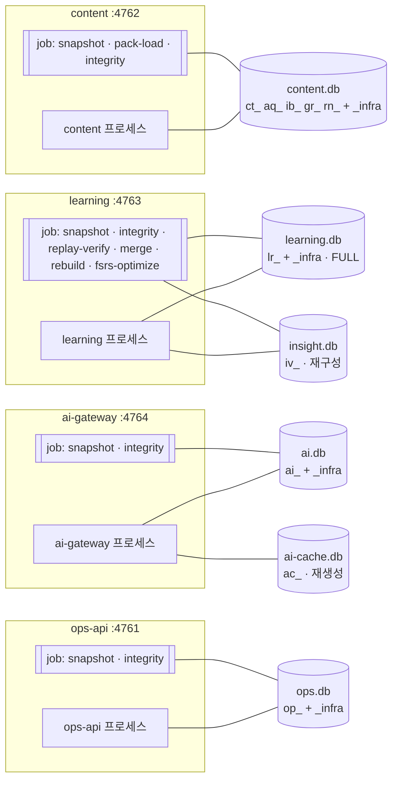

| 파일 | 소유(유일 writer) | 모듈(마이그레이션 디렉터리, 적용 순서) | 접두어 | `application_id` | `synchronous` | epoch 백업 | 테이블 수 | 15년 규모 |
|---|---|---|---|---|---|---|---|---|
| `data/content.db` | content | `_infra`(full) → `catalog` → `acquisition` → `itembank` → `grading` → `runner` (`services/content/migrations/<module>/`) | `ct_` `aq_` `ib_` `gr_` `rn_` | `0x46544354` ('FTCT') | NORMAL | 포함 | 51 + 7, 뷰 7, FTS5 3 | 150~400MB |
| `data/learning.db` | learning | `_infra`(full) → `ledger` → `learner-model` → `practice` → `curriculum-ref` (`services/learning/migrations/<module>/`) | `lr_` | `0x46544C52` ('FTLR') | **FULL** | 포함 | 24 + 7 | ≈ 350MB 원장 + 투영 |
| `data/insight.db` | learning | `_infra`(meta) → `insight` (`services/learning/migrations-insight/`) | `iv_` | `0x46544956` ('FTIV') | NORMAL | **제외**(재구성) | 9 + 1 | ≈ 50MB |
| `data/ai.db` | ai-gateway | `_infra`(full) → `control` → `routing` → `judge` → `privacy` (`services/ai-gateway/migrations/<module>/`) | `ai_` | `0x46544149` ('FTAI') | NORMAL | 포함 | 22 + 7 | ≈ 200MB |
| `data/ai-cache.db` | ai-gateway | `_infra`(meta) → `cache` (`services/ai-gateway/migrations-cache/`) | `ac_` | `0x46544143` ('FTAC') | NORMAL | **제외**(재생성) | 1 + 1 | 수십 MB |
| `data/ops.db` | ops-api | `_infra`(full) → `backup` → `health` → `telemetry` → `upgrade` (`services/ops/migrations/<module>/`) | `op_` | `0x46544F50` ('FTOP') | NORMAL | 포함 | 15 + 7 | ≈ 50MB |

- `FATHOM_HOME` 기본값: macOS·Linux `~/.fathom`, Windows `%LOCALAPPDATA%\Fathom`(CR-01), dev `<repo>/.fathom-dev`. 파일 경로는 `config.resolveFathomHome()` + 위 상대 경로만 쓴다(서비스 코드에 다른 서비스 DB 파일명 문자열 0 — `check:db-paths`).
- gateway(무상태)·supervisor(IPC만)는 DB가 없다. 포트 레지스트리는 파일 `run/registry.json`(DR-021, DB 아님).
- web은 브라우저 IndexedDB `fathom-attempts`만 가진다(부록 A).

---

## 3. 공통 설계 규약

### 3.1 연결 프로파일과 PRAGMA (SP-4 구속)

`openDb(path, opts)`의 결과 `SqlitePort`만 쓴다. 생성자 옵션은 고정이다: `new DatabaseSync(path, { readOnly, timeout: 5000, enableForeignKeyConstraints: true, enableDoubleQuotedStringLiterals: false })`(모르는 키 = 예외). 확장 로드는 쓰지 않는다(`allowExtension` 미지정 = false).

| PRAGMA · 옵션 | 언제 설정 | content | learning | insight | ai | ai-cache | ops | 근거 |
|---|---|---|---|---|---|---|---|---|
| `journal_mode=WAL` | migrate 시 1회(파일 영속) | ● | ● | ● | ● | ● | ● | ADR-002 §2 |
| `application_id=<표 §2>` | migrate 시 1회(헤더 영속), 열 때마다 대조 | ● | ● | ● | ● | ● | ● | D-02 |
| `synchronous` | 매 연결 | NORMAL | **FULL** | NORMAL | NORMAL | NORMAL | NORMAL | CR-04 |
| `foreign_keys=ON` | 매 연결(`enableForeignKeyConstraints`) | ● | ● | ● | ● | ● | ● | B-02 |
| `busy_timeout=5000` | 매 연결(`timeout: 5000`) | ● | ● | ● | ● | ● | ● | SP-4 C4 |
| `recursive_triggers=ON` | 매 연결 | — | **● (읽기 전용·job 포함 전부)** | — | — | — | — | ADR-011 §1, D-15 |
| `journal_size_limit=67108864` | 매 쓰기 연결 | ● | ● | ● | ● | ● | ● | ARC §9.3(INT-1b 측정 후 확정) |
| `wal_autocheckpoint` | 기본값(1000쪽) 유지 | | | | | | | — |
| `wal_checkpoint(PASSIVE)` | 서빙 프로세스, 유휴 5분마다 | ● | ● | ● | ● | ● | ● | ARC §9.3 |
| `optimize` | 정상 종료 직전(relay drain 후 `close()` 전) + migrate 끝 | ● | ● | ● | ● | ● | ● | D-30 |
| `cache_size`·`temp_store`·`mmap_size`·`trusted_schema` | **변경 금지**(측정 전) | | | | | | | ARC §9.3 |
| `quick_check` | 비정상 종료 후 재기동 시 ready 전(동기) | ● | ● | ● | ● | ● | ● | SP-4 감사 |
| `integrity_check` + `foreign_key_check` | job `integrity`: 크래시 후 ready 후 · 주 1회 · doctor | ● | ● | — | ● | — | ● | NFR-DATA-008 |

**연결 종류**(프로세스당):

| 연결 | 모드 | 사용처 |
|---|---|---|
| 서빙 rw | `readOnly: false` | 서빙 프로세스당 소유 파일마다 1개(동기 API라 1개로 충분). learning = `learning.db` + `insight.db`, ai-gateway = `ai.db` + `ai-cache.db` |
| job rw | `readOnly: false`, `BEGIN IMMEDIATE` 짧은 배치 | `pack-load`(500행/tx), `merge`(5,000건/tx), `rebuild`, `integrity`는 읽기만 |
| job ro | `readOnly: true` | `snapshot`(`VACUUM INTO`는 읽기 전용 연결에서 동작), `replay-verify`, `fsrs-optimize` |
| migrate/restore/verify | `readOnly: false` | supervisor가 띄우는 단명 `--mode=migrate\|restore\|verify` |

### 3.2 스키마·명명 규약

| 항목 | 규칙 |
|---|---|
| 테이블 | `STRICT` 필수(검증: `pragma_table_list.strict = 1`, FTS5 가상 테이블 제외). 이름 = `<접두어>_<snake 단수 명사>`(`ct_concept`, `lr_event`). 공통 인프라만 접두어 없음 |
| 열 이름 | snake_case. 접미사 의미 고정: `_id`(ID) · `_at`(서버 측 시각 epoch ms) · `ts`·`client_ts`·`last_ts`(기기 발생 시각 epoch ms) · `_day`(학습일 TEXT) · `_ms`(지속시간) · `_md`(Markdown) · `_json`(JSON TEXT) · `_sha256`·`_hash`(hex 64) · `_count`·`n_*`(개수) |
| JSON 열 | 새 열은 `_json` 접미사 + `CHECK (json_valid(col))`. **예외(동결 이름)**: DR-020 이름 훅(`variant_params`, `root_cause_pool`, `best_if`, `probabilities`, `defect_manifest`), ADR가 정한 이름(`payload`, `envelope`, `ext`, `questions`, `devices_json`, `prereq_ids`, `aliases`), `new_value`·`value`. 저장값은 항상 정준 JSON(D-19) |
| 타입 | `TEXT`(문자열·ULID·JSON) · `INTEGER`(정수·epoch ms·불리언 0/1) · `REAL`(점수·확률·좌표). `BLOB`·`ANY` 미사용. 2^53 초과 정수는 TEXT |
| 불리언 | `INTEGER NOT NULL [DEFAULT 0] CHECK (x IN (0,1))`. 바인딩은 `0`/`1`(boolean 바인딩 = 어댑터 예외) |
| enum | **닫힌 enum만 `CHECK (x IN (…))`**: 아키텍처·DR에서 동결된 값(gate_status, source_kind, ai_mode, response_mode, stakes, tier, 상태기계 상태 …). **열린 enum은 TEXT + zod**: format(FormatId), facet, task_id, mode_id, provider kind 확장 등. SQLite는 CHECK 변경에 테이블 재작성이 필요하므로 열린 enum에 CHECK를 걸면 값 추가가 파괴 변경이 된다(D-10) |
| PK | 엔티티 = ULID 단일 PK. 설치 범위 테이블 = `(install_id, <논리 ID>)`. 내용 주소 = `(논리 ID, content_hash)`. FTS 원본만 `INTEGER PRIMARY KEY`(외부 콘텐츠 rowid 요구, D-32). `outbox.seq`만 `AUTOINCREMENT`(재사용 금지 순번) |
| FK | **같은 모듈 안에서만** 선언(교차 모듈·교차 DB는 TEXT 논리 참조). 설치 범위 테이블 → `ct_pack(install_id) ON DELETE CASCADE`(실패 설치 정리). 나머지는 `NO ACTION` |
| 인덱스 이름 | 일반 `ix_<table>_<용도>`, 유일 `ux_<table>_<용도>`, 부분 인덱스는 `WHERE` 명시. 자동 인덱스(UNIQUE·PK)는 이름 없음 |
| 트리거 이름 | 불변 `<table>_no_update`·`<table>_no_delete`·`<table>_frozen`, FTS 동기화 `<table>_ai/_ad/_au` |
| 뷰 | content의 활성 설치 조회 뷰 `*_active` 7개만(읽기 전용). **투영 테이블(lr_*_state 등)에는 뷰·트리거 금지**(shadow 교체가 `DROP`+`RENAME`이므로, D-11) |
| 생성 열 | 인덱스용 파생 값은 STORED 생성 열(최초 CREATE에서만). `ext` 키 승격은 `ALTER TABLE … ADD COLUMN … GENERATED ALWAYS AS (json_extract(ext,'$."<feature>.<field>"')) VIRTUAL` + 인덱스(가산 CR) |
| `WITHOUT ROWID` | 짧은 복합 PK의 파생·카운터 테이블(투영, 통계, key-value). 설명 표의 "저장 형태" 열 참조 |

### 3.3 ID 전략

| 종류 | 형식 | DB 제약 | 생성 위치 | 예 |
|---|---|---|---|---|
| 런타임 엔티티 ID | ULID(Crockford base32 대문자 26자, `ulidx` 단조 팩토리) | `CHECK (length(x) = 26)` | `@fathom/shared-kernel/ids/ids` `ulid()` — 브라우저는 attempt·session용 ULID를 자체 생성(같은 알파벳) | `01JB3K…` |
| 총순서 참여 ID | ULID + ASCII 강제 | `CHECK (length(x) = 26 AND x NOT GLOB '*[^0-9A-HJKMNP-TV-Z]*')` — SQLite BINARY 정렬 = JS `<` | `lr_event.device_id`, `lr_device.device_id` | 소문자 ULID 거부(실측) |
| 콘텐츠 ID(불변 slug) | `<track>.<slug>` 계열, 소문자 `[a-z0-9.-]` | 길이 CHECK, 형식은 packc R-ID + zod | 저작(content-as-code), 사용자 = `u.<ns>.<slug>` | `db.mvcc`, `db.mvcc.k03`, `db.mvcc.m02`, `db.mvcc.i07`, `db.mvcc.im01.x0a1b2c3d4e5f`(T2), `k8s.case.oomkill`, `k8s.lab.probe-config`, `sre.art.postmortem-cascading-latency`, `cert-cka@2026` — 정규식 정본 = IF-01 §2.4 `common/ids.ts`(CR-35, DCP-01 §5.2와 동일) |
| 런타임 문항 ID | ULID(스테이징 ID를 발행 시 재사용) | 논리 ID(`item_id`) | itembank IngestPort | `01JB…` |
| 카드 ID | `<concept_id>:<facet>:<r\|p>` 결정적 합성(IF-01 `CardId`, r = recognition · p = production, CR-35) | TEXT | learning 리듀서(`card.enrolled`) | `db.mvcc:definition:p` |
| 팩·설치 | `pack_id` = IF-01 `PackId`: 트랙 ID(`k8s`) · `x.<slug>`(`x.blueprints`, `x.paths`) · `u.<ns>`(`u.local`) (CR-35) / `install_id` ULID | `ux_ct_pack_version(pack_id, version) WHERE state <> 'failed'` | content | |
| 해시 | sha256 소문자 hex 64 | `CHECK (length(x) = 64)` | `@fathom/shared-kernel/canonical/canonical` `sha256Hex()` | `content_hash`, `manifest_hash`, `input_hash` |
| 정책 세트 주소 | `ps_` + sha256(정준 활성 정책 맵) 앞 16자 | TEXT | `shared-kernel/policy` | `ps_3f9a…`(19자) |
| 멱등 키(원장) | ADR-011 §3 형식: `verdict:<verdict_id>` · `corr:<item_id>:<basis>:<gate_result_id>` · `recalc:<policy_version>:<event_id>` · `att:<attempt_id>` · `cmd:<command_id>` · `card:<card_id>` · `policy:<policy_version>` · `aimode:<event_id>` · `exam:<exam_id>` · `promo:<track>:<to_level>` · `promo-res:<track>:<level>:<n>` | `lr_event.idempotency_key UNIQUE` | ledger-writer | |
| 멱등 키(HTTP) | 브라우저 ULID → 전 홉 전파 | `idem_request PK(key, caller, route_id)` | web `lib/idempotency.ts` | |
| 순번 | `outbox.seq`(AUTOINCREMENT), `lr_event.device_seq`(기기별 1부터), `ct_search_doc.doc_id`(INTEGER) | — | DB/ledger-writer | |

- ULID의 시간 성분은 **정렬 근거로 쓰지 않는다**(원장 리플레이·병합은 총순서 키, 오버레이 합성은 `(ts, device_id, overlay_id)`).
- 콘텐츠 ID는 한 번 발행하면 바뀌지 않는다(FR-CUR-004). 개명은 `ct_id_alias`, 폐기는 `deprecated_by`. learning은 별칭을 `lr_concept_id_alias`(append-only)로 받아 투영 키를 정본 ID로 해석한다(D-12).

### 3.4 시각·날짜 정책

| 규칙 | 내용 |
|---|---|
| 저장 형식 | 모든 시각 = **epoch ms `INTEGER`(UTC)**. ARC-01 §9.3·ADR-002 §6 결정(NFR-DATA-006의 "UTC ISO-8601(ms)"과 정보 동치 — D-23). 표시만 로컬 시간대 |
| 시계 원천 | `@fathom/shared-kernel/time/time`의 `Clock` 포트(테스트는 `@fathom/testkit/clock`). 서비스 코드의 `Date.now()` 직접 호출 금지(STD-01), `Date` 객체 바인딩은 어댑터 예외(`node:sqlite`가 조용히 NULL로 바꿈 — SP-4) |
| 서버 시각 `_at` | 이 DB에 기록·처리한 시각. 정보·보존·정렬 보조용. 리플레이에 쓰지 않는다 |
| 기기 시각 `client_ts` | ledger-writer가 `max(now, last_client_ts(device) + 1)`로 단조화한 append 시각(ADR-011 §2) |
| `fsrs_at` | `clamp(answered_at, session.started_at, now)` 후 `max(·, card.last_fsrs_at + 1)` — payload 내장 |
| 학습일 `study_day` | `TEXT 'YYYY-MM-DD'`, 사용자 일 경계(기본 04:00, 생성 시점 `lr_setting.day_boundary`)로 **생성 시 1회 계산해 payload·행에 고정**. 리플레이·집계는 TZ·설정을 다시 읽지 않는다(CR-26). 03:59 = 전날 |
| 날짜 열 | `valid_as_of`, `*_day`, `period_key`('YYYY-MM' 또는 'YYYY-MM-DD')는 TEXT + 길이/GLOB CHECK |
| 지속시간 | `_ms` INTEGER(≥ 0), 일 수 `_days` INTEGER |
| 시계 역행 | 단조화로 흡수 + `profile.setting_changed`가 아닌 경고 로그·doctor 항목(FR-PRG-027) |

### 3.5 `ext` · `ext_v`와 DR-020 이름 훅

- 분류 **E(엔티티) 테이블은 전부** `ext TEXT NOT NULL DEFAULT '{}' CHECK (json_valid(ext))` + `ext_v INTEGER NOT NULL DEFAULT 1`을 가진다(빌드 검증: E인데 ext 없음 = 실패). L·Q·P 중 export·병합 대상이거나 ADR이 정한 테이블(`lr_event`, `ct_overlay_event`, `lr_curriculum_ref`, `lr_projection_meta`, 스테이징)도 가진다.
- `ext` 키 = `"<feature>.<field>"`. `ext_v`는 그 행 `ext`의 키 집합 버전(contracts `ExtSchemas[<table>][ext_v]`).
- `lint:hooks`(`tools/gates/check-hooks.mjs`)는 `packages/contracts/src/db-hooks.ts`의 목록을 마이그레이션 SQL과 대조한다. 아래 표가 그 목록의 정본 초안이다.

**이름 훅(실제 열, R0 상세 동결)**

| DR-020 훅 | 테이블.열 | 정의 파일 |
|---|---|---|
| event.event_id · device_id · device_seq · client_ts · idempotency_key · experiment_arm | `lr_event.{event_id, device_id, device_seq, client_ts, idempotency_key, experiment_arm}` | `services/learning/migrations/ledger/0001_ledger_core.sql` |
| judge_log.probabilities · input_hash · model_version | `ai_judge_log.{probabilities, input_hash, model_version}` | `services/ai-gateway/migrations/judge/0001_judge_core.sql` |
| item.source_kind · stem_family · gate_status · defect_manifest | `ib_item.{source_kind, stem_family, gate_status, defect_manifest}` | `services/content/migrations/itembank/0001_itembank_core.sql` |
| card.response_mode | `lr_card_state.response_mode` | `services/learning/migrations/learner-model/0001_projections.sql` |
| misconception.meta_family · status | `ct_misconception.{meta_family, status}` | `services/content/migrations/catalog/0001_catalog_core.sql` |
| ku.valid_as_of · deprecated_by · scope | `ct_ku.{valid_as_of, deprecated_by, scope}` | 〃 |
| concept.volatility · required_for_level | `ct_concept.{volatility, required_for_level}` | 〃 |
| track.offline_cap_level | `ct_track.offline_cap_level` | 〃 |
| case.variant_params · root_cause_pool · best_if · contested | `ct_case.{variant_params, root_cause_pool, best_if, contested}` | 〃 |
| overlay.base_version | `ct_overlay_event.base_version` | 〃 |
| pack.channel | `ct_pack.channel` | 〃 |
| inbox.source_kind | `aq_inbox_item.source_kind` | `services/content/migrations/acquisition/0001_acquisition_core.sql` |

**`ext` 훅(규약만 동결, 키 추가 = CR)**

| DR-020 ext 훅 | 테이블.`ext` 키 | 보류 기능 |
|---|---|---|
| case.world_id · episode_seq · expert_path | `ct_case.ext`·`lr_long_task.ext`: `"case.world_id"`, `"case.episode_seq"`, `"case.expert_path"` | DEF-09·24 |
| concept.epa_refs | `ct_concept.ext`: `"epa.refs"` | DEF-18 |
| anchor_set_id · attempt.anchor_run_id | `ib_item.ext`: `"anchor.set_id"` · `gr_attempt.ext`·`lr_event.ext`: `"anchor.run_id"` | DEF-19 |
| item.mutants · panel_distribution | `ib_item.ext`: `"mutant.list"`, `"sct.panel_distribution"` | DEF-08·13 |
| stimulus_id · ladder | `ct_concept.ext`: `"stimulus.id"`, `"stimulus.ladder"` | DEF-16 |
| graph_ref | `ct_concept.ext`: `"graph.ref"` | DEF-01 |
| pack.signature · direction | `ct_pack.ext`: `"pack.signature"`, `"pack.direction"` | DEF-21·23·29 |

### 3.6 테이블 분류

| 분류 | 뜻 | 쓰기 규칙 | 보존 |
|---|---|---|---|
| **E** Entity | 수명 긴 업무 엔티티 | 소유 모듈의 application 계층만 | 대체로 영구 |
| **L** Log | append-only 사실 기록 | INSERT만(대부분 `no_update`·`no_delete` 트리거) | 트리거가 있는 L은 **영구**. `rn_run`·`op_*`·텔레메트리 L은 기간 보존 |
| **P** Projection | 파생·읽기 모델 | 원천에서 언제든 재구성 | 원천 따라감 |
| **Q** Queue/State | 작업·처리 상태 | 상태 전이 UPDATE | 완료 후 기간 보존 |
| **R** Relation | 매핑·멤버십 | 부모와 함께 | 부모 따라감 |
| **M** Meta | 포인터·싱글턴·설정 | UPSERT | 영구 |

| DB | 테이블 | 분류 | ext | 저장 형태 | 요지 |
|---|---|---|---|---|---|
| content.db | `ct_pack` | E | ext·ext_v |  | 설치된 팩 버전(설치 1건 = 행 1개) |
| content.db | `ct_pack_active` | M | — |  | 팩별 활성 포인터 |
| content.db | `ct_track` | E | ext·ext_v |  | 트랙(팩 1개 = 트랙 1개) |
| content.db | `ct_concept` | E | ext·ext_v |  | 개념(지도 노드) |
| content.db | `ct_concept_edge` | R | — |  | 개념 간선(선수·형제·확장) |
| content.db | `ct_id_alias` | R | — |  | 안정 ID 별칭(ID 개명·폐기 후 과거 참조 해석, FR-CUR-004) |
| content.db | `ct_ku` | E | ext·ext_v |  | KU(원자 지식 단위) |
| content.db | `ct_misconception` | E | ext·ext_v |  | 오개념 |
| content.db | `ct_source` | E | ext·ext_v |  | 출처 레지스트리 |
| content.db | `ct_rubric` | E | ext·ext_v |  | 루브릭(차원별 4단계) |
| content.db | `ct_case` | E | ext·ext_v |  | Case(파라미터화 판단 과제 상태기계) |
| content.db | `ct_artifact_task` | E | ext·ext_v |  | 산출물 과제(ADR·런북·포스트모템·설계 리뷰·표준 조항) + 반론 은행 |
| content.db | `ct_lab` | E | ext·ext_v |  | 실습 과제(코드·카타·알고리즘·보안 패치·인프라·SQL) |
| content.db | `ct_blueprint` | E | ext·ext_v |  | 자격증 블루프린트(공식 출제기준만 출처) |
| content.db | `ct_blueprint_item` | R | — |  | 블루프린트 세부 항목(과목·도메인 트리, 가중치) |
| content.db | `ct_blueprint_map` | R | — |  | 블루프린트 항목 → 개념 매핑(가중 커버리지 계산) |
| content.db | `ct_path` | E | — |  | 학습 경로(카탈로그 콘텐츠, CR-52) |
| content.db | `ct_layout` | P | — |  | Depth Map 사전 계산 좌표(packc layout |
| content.db | `ct_pack_delta` | E | ext·ext_v |  | 적용된 PackDelta(단일 수입 포트 ②) |
| content.db | `ct_record_history` | L | — |  | PackDelta가 활성 설치 행을 덮어쓰기 전의 레코드 보존(append-only) |
| content.db | `ct_overlay_event` | L | ext·ext_v |  | 사용자 오버레이 패치 이벤트(append-only, 되돌리기 = 역패치) |
| content.db | `ct_overlay_head` | P | — | WITHOUT ROWID | 오버레이 합성 결과(필드별 현재 유효 패치) |
| content.db | `ct_search_doc` | P | — |  | 검색 문서(개념·KU·오개념·Case) |
| content.db | `aq_import_job` | E | ext·ext_v |  | 가져오기 작업(입력 1건 = 작업 1건) |
| content.db | `aq_import_chunk` | Q | — |  | I1 정규화·I2 청크 결과(마스킹 후 원문) |
| content.db | `aq_staging_item` | Q | ext·ext_v |  | 스테이징 항목(추출 결과·승인 대기) |
| content.db | `aq_staging_diff` | Q | ext·ext_v |  | 스테이징 diff·충돌 큐(가져오기 diff, 오버레이 재적용 충돌, refresh diff, 모순 탐지) |
| content.db | `aq_inbox_item` | E | ext·ext_v |  | Encounter Inbox(업무 중 캡처) |
| content.db | `aq_candidate` | E | ext·ext_v |  | 가져오기 후보 큐(디깅 발견·백지노트 확장·Inbox 미매칭·Tier C 유도) |
| content.db | `ib_active_install` | M | — |  | itembank 측 활성 설치 사본(catalog 활성 포인터 전환 tx 안에서 IngestPort가 함께  |
| content.db | `ib_install_member` | R | — |  | 설치 ↔ 팩 출신 문항·ItemModel 멤버십(설치별 사본, 트랙당 수백 행) |
| content.db | `ib_item_model` | E | ext·ext_v |  | ItemModel(선언적 문항 템플릿, T2) |
| content.db | `ib_item` | E | ext·ext_v |  | 문항 인스턴스(정답·해설 포함 — 제출 전 응답 금지 필드) |
| content.db | `ib_staging_item` | Q | ext·ext_v |  | 생성 문항 스테이징(draft → deferred → gated_pass/gated_fail) |
| content.db | `ib_gate_result` | L | — |  | 게이트 결과(문항·스테이징·ItemModel별, append-only) |
| content.db | `ib_gate_transition` | L | — |  | gate_status 전이 이력(append-only) |
| content.db | `ib_lineage_edge` | L | — |  | 계보 간선 KU → ItemModel → 인스턴스 → 게이트 → 노출(append-only) |
| content.db | `ib_family` | E | ext·ext_v |  | 격리·동결 단위(ItemModel·생성 배치·프롬프트 버전 패밀리) |
| content.db | `ib_item_stat` | P | — | WITHOUT ROWID | 문항 통계(β 추정·노출·로테이션) |
| content.db | `ib_option_pick` | P | — | WITHOUT ROWID | 선택지별 선택 수(선택률 0% 오답지 탐지) |
| content.db | `ib_stem_rotation` | P | — | WITHOUT ROWID | 문형 로테이션(개념 × stem_family 마지막 노출) |
| content.db | `ib_item_health` | P | — | WITHOUT ROWID | 문항 건강 플래그(drift·선택률 0%·응답시간 z·신고율·문형 암기) |
| content.db | `ib_hint_open` | L | — | WITHOUT ROWID | 힌트 열람 기록(hints_used 서버 근거, 30일, CR-40) |
| content.db | `ib_report` | E | ext·ext_v |  | 문항 신고(R 키) |
| content.db | `ib_correction` | L | — |  | 증거 보정 발행 기록(itembank |
| content.db | `ib_warming_demand` | P | — | WITHOUT ROWID | 워밍 풀 수요(learning |
| content.db | `gr_attempt` | E | ext·ext_v |  | 제출 응답(학습자 답안 원문, C1) |
| content.db | `gr_verdict` | L | — |  | 판정(Verdict) — 리플레이 입력 운반체(ADR-011 §4) |
| content.db | `gr_pending` | Q | — |  | 보류 채점 큐(AI 판단 부재·데드라인 초과·저신뢰·이의) |
| content.db | `gr_appeal` | Q | — |  | 이의제기 |
| content.db | `gr_turn_judgment` | L | — |  | 대화 턴 판정(디깅·Feynman·Case·반박) |
| content.db | `gr_utterance` | Q | — |  | 발화(질문 은행 렌더 또는 AI-G07 스트림 최종본) |
| content.db | `rn_run` | L | — |  | 러너 실행 기록(실행 1회 = 1행, 30일 보존) |
| learning.db | `lr_event` | L | ext·ext_v |  | 증거 원장(append-only, 기기별 해시 체인) |
| learning.db | `lr_device` | E | ext·ext_v |  | 기기 레지스트리 |
| learning.db | `lr_checkpoint` | L | — |  | 체크포인트 매니페스트(append-only) = 체인 헤드 외부 앵커 ① |
| learning.db | `lr_card_state` | P | — | WITHOUT ROWID | FSRS 카드 투영(개념 × facet × response_mode) |
| learning.db | `lr_concept_state` | P | — | WITHOUT ROWID | 개념 투영: Elo θ/θ_q·수축 θ̃ 입력·숙달·4중 역량 |
| learning.db | `lr_lifecycle` | P | — | WITHOUT ROWID | Concept Lifecycle CL-0~CL-8·CL-X(강등 없음, rusty 표시) |
| learning.db | `lr_track_level` | P | — | WITHOUT ROWID | 트랙 레벨(끈적한 사실: level |
| learning.db | `lr_mc_state` | P | — | WITHOUT ROWID | 오개념 소거 원장 투영(active → suppressed → extinguished) |
| learning.db | `lr_setting` | P | — | WITHOUT ROWID | 현재 설정(profile |
| learning.db | `lr_projection_meta` | M | ext·ext_v |  | 투영 메타 |
| learning.db | `lr_forecast_log` | L | — |  | 부하 예측 로그(예측 대비 실측 → 띠 폭 보정, 창 ≥ 8개 전에는 ±15%) |
| learning.db | `lr_session` | E | ext·ext_v |  | 세션 |
| learning.db | `lr_block` | Q | — |  | 세션 블록(슬롯 W/R/N/D/S/C) |
| learning.db | `lr_attempt` | Q | — |  | 응답 처리 상태(attempt 단위) |
| learning.db | `lr_dialog_state` | E | ext·ext_v |  | 대화 상태(디깅·Feynman·Case 토론·산출물 반박) |
| learning.db | `lr_dialog_turn` | L | — |  | 대화 턴 로그(append-only) |
| learning.db | `lr_long_task` | E | ext·ext_v |  | 장기 과제(Case run·산출물·카타 시리즈) 진행 상태 |
| learning.db | `lr_artifact_version` | L | — |  | 산출물 초안·버전 |
| learning.db | `lr_note_draft` | Q | — |  | 백지노트 초안(블록당 1행, CR-40) |
| learning.db | `lr_review_note` | E | — | WITHOUT ROWID | 주간 리뷰·시즌 회고 사용자 서술(백업·export 대상, CR-40) |
| learning.db | `lr_profile_mode` | E | ext·ext_v |  | 리듬 프로파일(일시정지·크런치·복귀·D-day) |
| learning.db | `lr_schedule_hint` | Q | — |  | 예약 힌트(재회상 1d·1w·1m, 고확신 오답 24h 재출제, 재도전 +2d·+14d, 타임캡슐 재질문) |
| learning.db | `lr_queue_overflow` | Q | — | WITHOUT ROWID | 일일 상한 초과 카드의 분산 배치(Keystone 절단분, 다음 3일 로드밸런싱) |
| learning.db | `lr_curriculum_ref` | P | ext·ext_v |  | ConceptRef 사본(세션 조립·승급 판정이 content 없이 동작) |
| learning.db | `lr_curriculum_sync` | M | — |  | 사본 동기화 헤더 1행(catalog_version·pack_set_hash, CR-41) |
| learning.db | `lr_curriculum_inventory` | P | — |  | 트랙별 AssessmentInventory 사본(CR-41) |
| learning.db | `lr_curriculum_case` | P | — |  | Case 사본(CR-41) |
| learning.db | `lr_curriculum_path` | P | — |  | 학습 경로 사본(CR-52) |
| learning.db | `lr_curriculum_meta` | M | — |  | 팩별 사본 메타(해시 대조 → 불일치 시 curriculum/export로 전체 재구성) |
| learning.db | `lr_concept_id_alias` | L | — |  | 개념 ID 별칭(단조 증가·append-only) |
| insight.db | `iv_meta` | M | — | WITHOUT ROWID | 투영 커서·버전 메타(key-value) |
| insight.db | `iv_home` | P | — |  | Home Cockpit 뷰(오늘의 기본 행동·경보 슬롯 입력, 1행) |
| insight.db | `iv_depth_cell` | P | — | WITHOUT ROWID | Depth Map 셀(개념 노드 상태·레이어) |
| insight.db | `iv_track_summary` | P | — | WITHOUT ROWID | 트랙 요약(레벨·cap·진행 바) |
| insight.db | `iv_calibration` | P | — | WITHOUT ROWID | 보정 지표 창(Brier·ECE·과신, 응답 ≥ 30일 때만 수치 표시) |
| insight.db | `iv_confusion` | P | — | WITHOUT ROWID | 개인 혼동 행렬(X 문항에 Y 답 선택 빈도 → 헷갈림 쌍) |
| insight.db | `iv_weekly_report` | P | — | WITHOUT ROWID | 발행된 주간 리뷰 리포트(발행 시점 값의 기록, 계산 캐시 아님) |
| insight.db | `iv_season` | P | — | WITHOUT ROWID | 시즌 플래너·회고 뷰(선언은 원장 declaration |
| insight.db | `iv_radar` | P | — | WITHOUT ROWID | Retention Radar 신호 뷰(TW-01~13 학습 신호) |
| ai.db | `ai_provider` | E | ext·ext_v |  | 제공자 등록(API·CLI·Ollama·Jev·범용 CLI) |
| ai.db | `ai_consent` | L | — |  | 동의 기록(append-only, 최신 행이 유효) |
| ai.db | `ai_probe` | P | — |  | 최신 probe·canary 결과(제공자별 1행) |
| ai.db | `ai_mode_state` | M | — |  | 현재 AI 모드(1행) |
| ai.db | `ai_mode_history` | L | — |  | 모드 변경 이력(append-only) |
| ai.db | `ai_model_seen` | P | — | WITHOUT ROWID | 관측된 모델 버전(드리프트 탐지 → ai |
| ai.db | `ai_setting` | M | — | WITHOUT ROWID | AI 사용자 설정(예산 재정의·과업별 선호 제공자·로컬 강제·캐시 고지 확인) |
| ai.db | `ai_work_order` | E | ext·ext_v |  | 작업 주문(대량 AI 작업 미리보기·승인) |
| ai.db | `ai_reservation` | Q | — |  | 제공자 클래스별 예약·원자 차감(Should — v1은 스키마 훅만, 행 0) |
| ai.db | `ai_job` | Q | — |  | background 레인 작업(앱 재시작 후 재개, 재시도 3회, 멱등 키) |
| ai.db | `ai_job_result` | Q | — |  | 작업 결과(ai |
| ai.db | `ai_call_log` | L | — |  | 외부 호출 로그(호출 1건 = 1행, append-only, 영구) |
| ai.db | `ai_usage_counter` | P | — | WITHOUT ROWID | 기간별 사용량 카운터(예산 판정 O(1)) |
| ai.db | `ai_quota_window` | P | — | WITHOUT ROWID | 구독 CLI 쿼터 창(5시간·주간) |
| ai.db | `ai_budget_alert` | L | — | WITHOUT ROWID | 예산 임계 발행 기록(80%·100% 이벤트 중복 방지) |
| ai.db | `ai_judge_log` | L | — |  | 판정 로그(Jev·LLM-judge 원자료, append-only, 영구) |
| ai.db | `ai_gold_item` | E | ext·ext_v |  | 개인 골드셋(model_labeled_draft 출하 → 사용자 확정, 인용된 이의) |
| ai.db | `ai_calibration_run` | L | — |  | 캘리브레이션 실행 기록(append-only) |
| ai.db | `ai_task_calibration` | P | — | WITHOUT ROWID | 과업별 현재 보정 상태(w_grader 0 |
| ai.db | `ai_firewall_log` | L | — |  | Firewall 판정 로그(append-only, 영구) |
| ai.db | `ai_firewall_pattern` | E | ext·ext_v |  | 사용자 사내 패턴(도메인·사번·프로젝트 코드) |
| ai.db | `ai_firewall_exception` | Q | — |  | 과업 단위 일회 허용(과잉 마스킹 예외, 사용 시 로그) |
| ai-cache.db | `ac_entry` | P | — |  | AI 결과 캐시 |
| ops.db | `op_backup` | E | ext·ext_v |  | 백업 실행(스냅샷 epoch·증분·리허설) |
| ops.db | `op_backup_file` | R | — |  | 백업 파일 목록(서비스 응답의 file·sha256·bytes) |
| ops.db | `op_epoch_manifest` | L | — |  | epoch 매니페스트 사본(manifest |
| ops.db | `op_incremental` | L | — |  | 일 증분 파일(기기별 원장 JSONL + 오버레이 + 골드셋 확정) |
| ops.db | `op_held_increment` | Q | — |  | 업그레이드 롤백 시 보류한 상위 schema_version 증분(backups/incr/_held/) |
| ops.db | `op_health_sample` | P | — | WITHOUT ROWID | 메트릭 1분 롤업(15s 수집 → 1분) |
| ops.db | `op_banner` | Q | — |  | 운영 배너(홈 경보 슬롯 1개 = 우선순위 최상위) |
| ops.db | `op_service_event` | L | — |  | 서비스 상태 전이 이력(재시작·degraded·ready) |
| ops.db | `op_doctor_run` | L | — |  | doctor 실행 기록(점검 항목별 결과, --fix 선행 백업 ID) |
| ops.db | `op_telemetry_raw` | L | — |  | 텔레메트리 원시 신호(이벤트 수신·learning 텔레메트리 API 수집) |
| ops.db | `op_telemetry_daily` | P | — | WITHOUT ROWID | 일 집계(영구) |
| ops.db | `op_tripwire_state` | M | — |  | Tripwire 상태(TW-01~13·자원 Tripwire) |
| ops.db | `op_host_state` | M | — |  | 최신 호스트 상태(ops |
| ops.db | `op_upgrade` | E | ext·ext_v |  | 업그레이드·롤백 실행(fathom upgrade [--rollback]) |
| ops.db | `op_autostart` | M | — |  | 자동 기동 설정 상태(기본 off) |

### 3.7 쓰기 규칙과 불변성

| 규칙 | 내용 |
|---|---|
| tx | `SqlitePort.tx(fn)` = `BEGIN IMMEDIATE … COMMIT`. 지연 `BEGIN` 금지. 서빙 프로세스 쓰기 tx ≤ 100ms, job 배치 tx는 500행(팩)·5,000건(원장 병합)·500행(정리) |
| UPSERT | `INSERT … ON CONFLICT(…) DO UPDATE`는 P·Q·M 테이블과 `inbox_watermark`에 허용. **`lr_event`에는 금지**(`check:ledger-writer`), L 테이블에는 불필요(트리거가 거부) |
| `INSERT OR IGNORE` 함정 | SQLite의 `OR IGNORE`는 UNIQUE뿐 아니라 **CHECK·NOT NULL 위반 행도 오류 없이 건너뛴다**(실측, §17). 따라서 `changes = 0`을 "중복"으로 해석하기 전에 **반드시 기존 행 존재를 조회로 확인**한다(§6.3 프로토콜). 적용 대상: 원장 append·병합, `ib_item`·`ai_gold_item` 시드 적재, 오버레이 병합 import |
| append-only 트리거 | `RAISE(ABORT, '<table> is append-only')`. 실수 방지 장치이지 보안 경계가 아니다(같은 파일을 여는 코드는 트리거를 지울 수 있음) — 원장은 체인 + 외부 앵커가 증명(ADR-011) |
| 상태 불변 트리거 | `lr_session_frozen`(종료 후 불변, DR-013), `lr_artifact_version_frozen`(제출본 불변, DR-014) |
| 정적 SQL | `prepare(sql)`·`exec(sql)` 인자는 정적 SQL만(`*.sql.ts`의 `UPPER_SNAKE` 상수). 예외 2곳만 `// sql-ok:` 사유 주석: 마이그레이션 실행기(`sha256 검증된 번들 파일`), shadow DDL 파생(`sqlite_schema에서 읽은 소유 투영 DDL`) |
| 오류 매핑 | `errcode & 0xff`: 5 `busy`(유일 재시도) · 6 `locked` · 19 `constraint` → `*-CONFLICT-*` 또는 `*-VAL-*` · 8 `readonly`. 517(BUSY_SNAPSHOT) = 코드 결함 |
| 정적 검사 | `check:db-paths`(타 DB 경로·ATTACH 0), `check:ledger-writer`(lr_event 쓰기 위치·형태), `check:content-ingest`(서빙 테이블 쓰기 위치 = `application/{catalog,itembank}/ingest/*`), `check:sql`·`check:sql-typed`, `lint:hooks` |

**append-only·불변 트리거 전체 목록**

| DB | 트리거 대상 |
|---|---|
| content.db | `ct_record_history` · `ct_overlay_event` · `ib_gate_result` · `ib_gate_transition` · `ib_lineage_edge` · `ib_correction` · `gr_verdict` · `gr_turn_judgment` (각 `no_update`+`no_delete`) |
| learning.db | `lr_event` · `lr_checkpoint` · `lr_dialog_turn` · `lr_concept_id_alias` (각 `no_update`+`no_delete`), `lr_session`(`frozen` + `no_delete`), `lr_artifact_version`(제출본 `frozen` + `no_delete`) |
| ai.db | `ai_consent` · `ai_mode_history` · `ai_call_log` · `ai_judge_log` · `ai_calibration_run` · `ai_firewall_log` (각 `no_update`+`no_delete`) |
| ops.db | `op_epoch_manifest`(`no_update`+`no_delete`) |

---

## 4. 공통 인프라 스키마 `_infra` (shared-kernel `eventing` 소유)

정본 위치: `packages/shared-kernel/infra-migrations/`(export `@fathom/shared-kernel/infra-migrations/*`). 서비스는 복사하지 않고 실행기가 항상 먼저 적용한다. 프로파일 `full` = 0001~0003(content·learning·ai·ops), `meta` = 0001만(insight·ai-cache, D-01).

### 4.1 ERD

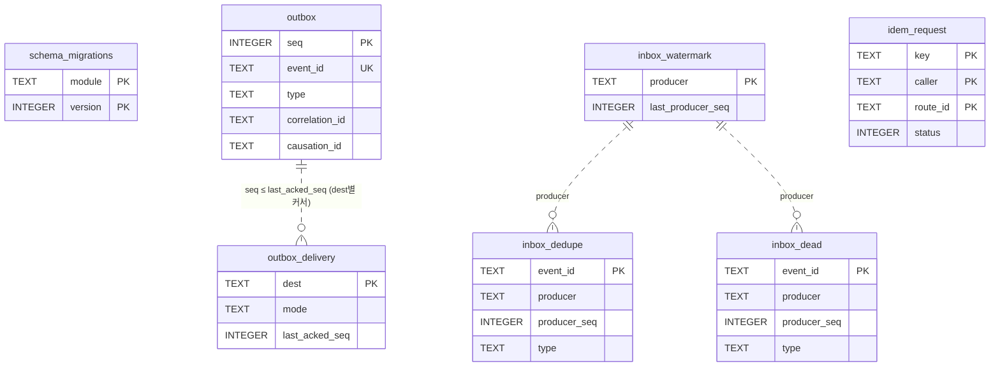

### 4.2 운영 SQL(정적 상수, `packages/shared-kernel/src/eventing/*.sql.ts`)

```sql
-- APPEND_OUTBOX: 생산자 상태 변경과 같은 tx
INSERT INTO outbox(event_id, type, schema_version, occurred_at, correlation_id, causation_id, traceparent, payload)
VALUES (:event_id, :type, :schema_version, :occurred_at, :correlation_id, :causation_id, :traceparent, :payload);

-- ENSURE_DELIVERY: relay 시작 시 routing.gen.ts의 목적지마다
INSERT INTO outbox_delivery(dest, mode, updated_at) VALUES (:dest, :mode, :now)
ON CONFLICT(dest) DO UPDATE SET mode = excluded.mode, updated_at = excluded.updated_at;

-- RELAY_BATCH: 목적지별 in-flight 1, 배치 ≤ 100 (type 목록은 생성된 상수 :types_json)
SELECT seq, event_id, type, schema_version, occurred_at, correlation_id, causation_id, traceparent, payload
FROM outbox
WHERE seq > :last_acked_seq AND type IN (SELECT value FROM json_each(:types_json))
ORDER BY seq LIMIT 100;

-- RELAY_ACK: 200 {acked_through_seq}
UPDATE outbox_delivery SET last_acked_seq = max(last_acked_seq, :acked_through_seq), attempts = 0,
  next_attempt_at = 0, last_error_code = NULL, updated_at = :now WHERE dest = :dest;

-- RELAY_FAIL: 0.5s → 30s 지수 백오프
UPDATE outbox_delivery SET attempts = attempts + 1, next_attempt_at = :next_attempt_at,
  last_error_code = :code, updated_at = :now WHERE dest = :dest;

-- INBOX_SEEN: 이벤트마다 개별 BEGIN IMMEDIATE tx (핸들러 쓰기와 함께) — 있으면 핸들러 생략·ack
SELECT 1 FROM inbox_dedupe WHERE event_id = :event_id;
-- INBOX_RECORD
INSERT INTO inbox_dedupe(event_id, producer, producer_seq, type, received_at) VALUES (:event_id, :producer, :producer_seq, :type, :now);
-- INBOX_WATERMARK
INSERT INTO inbox_watermark(producer, last_producer_seq, updated_at) VALUES (:producer, :producer_seq, :now)
ON CONFLICT(producer) DO UPDATE SET last_producer_seq = max(last_producer_seq, excluded.last_producer_seq), updated_at = excluded.updated_at;

-- OUTBOX_HEAD: epoch 매니페스트 outbox_head_seq (정리 후에도 정확 — 실측)
SELECT coalesce((SELECT seq FROM sqlite_sequence WHERE name = 'outbox'), 0) AS head;

-- REWIND_DELIVERY: 복원 시 커서 되감기 (restore 모드 전용)
UPDATE outbox_delivery SET last_acked_seq = :rewind_seq, attempts = 0, next_attempt_at = 0,
  last_error_code = NULL, updated_at = :now WHERE dest = :dest AND mode = 'durable';
```

- `acked_through_seq` 전진은 `max()`로만(역행 0). 소비자 dedupe·watermark는 같은 tx라 "처리했지만 기록 안 됨"이 없다.
- `notify` 목적지(gateway)는 `occurred_at < now − 60s`인 행을 보내지 않고 커서만 전진한다.

### 4.3 테이블정의서

#### `schema_migrations`

마이그레이션 적용 기록. (module, version)당 1행. 적용된 파일의 sha256이 번들 파일과 다르면 serve 모드 기동 거부(exit 78)  
<sub>STRICT · 정의 파일 `packages/shared-kernel/infra-migrations/0001_schema_migrations.sql`</sub>

| 컬럼 | 타입 | NULL | 기본값 | 키 | 인덱스 | 설명 |
|---|---|---|---|---|---|---|
| `module` | TEXT | N |  | PK(1) |  | '_infra' \| 'catalog' \| 'ledger' \| ... (마이그레이션 디렉터리 이름) |
| `version` | INTEGER | N |  | PK(2) |  | 파일 번호 NNNN(1부터, 모듈 안에서 연속) |
| `name` | TEXT | N |  |  |  | 파일명의 <desc> 부분(예: 'catalog_core') |
| `sha256` | TEXT | N |  |  |  | 파일 바이트 sha256(소문자 hex 64) |
| `applied_at` | INTEGER | N |  |  |  | 적용 시각(epoch ms, UTC) |

#### `outbox`

transactional outbox. 생산 서비스의 상태 변경과 같은 BEGIN IMMEDIATE tx에서 INSERT. 이벤트 1건 = 행 1개(목적지별 복제 없음)  
<sub>STRICT · 정의 파일 `packages/shared-kernel/infra-migrations/0002_eventing.sql`</sub>

| 컬럼 | 타입 | NULL | 기본값 | 키 | 인덱스 | 설명 |
|---|---|---|---|---|---|---|
| `seq` | INTEGER | N |  | PK AUTOINCREMENT |  | = envelope.producer_seq (생산자 내 총순서, 재사용 금지 → AUTOINCREMENT) |
| `event_id` | TEXT | N |  | UQ |  | ULID, 소비자 dedupe 키 |
| `type` | TEXT | N |  |  |  | '<context>.<entity>.<past_tense>' 예: 'grading.verdict.issued' |
| `schema_version` | INTEGER | N |  |  |  | type별 payload 스키마 버전 |
| `occurred_at` | INTEGER | N |  |  |  | epoch ms |
| `correlation_id` | TEXT | N |  |  | ix_outbox_correlation | 사용자 의도 단위 ULID(attempt_id, job_id, epoch_id …) |
| `causation_id` | TEXT | Y |  |  |  | 이 이벤트를 낳은 명령·이벤트 ULID |
| `traceparent` | TEXT | Y |  |  |  | W3C traceparent |
| `payload` | TEXT | N |  |  |  | type × schema_version zod 스키마로 검증된 정준 JSON |

#### `outbox_delivery`

목적지별 push 커서(목적지별 FIFO). epoch 매니페스트 delivery 값의 원천, 복원 시 되감기 대상  
<sub>STRICT · 정의 파일 `packages/shared-kernel/infra-migrations/0002_eventing.sql`</sub>

| 컬럼 | 타입 | NULL | 기본값 | 키 | 인덱스 | 설명 |
|---|---|---|---|---|---|---|
| `dest` | TEXT | N |  | PK |  | 'learning'\|'content'\|'gateway'\|'ai-gateway'\|'ops-api' |
| `mode` | TEXT | N |  |  |  | 소비자 매니페스트의 mode |
| `last_acked_seq` | INTEGER | N | 0 |  |  | 소비자가 ack한 최대 outbox.seq(구독하지 않는 타입 구간 포함) |
| `attempts` | INTEGER | N | 0 |  |  | 연속 실패 횟수(성공 시 0) |
| `next_attempt_at` | INTEGER | N | 0 |  |  | 다음 전송 가능 시각(epoch ms, 0.5s→30s 지수 백오프) |
| `last_error_code` | TEXT | Y |  |  |  | 마지막 실패 코드(예: 'DEP-CONNECT', 'HTTP-503') |
| `updated_at` | INTEGER | N |  |  |  | epoch ms |

#### `inbox_dedupe`

소비자 dedupe. 이벤트마다 개별 tx에서 핸들러 반영과 함께 INSERT  
<sub>STRICT · 정의 파일 `packages/shared-kernel/infra-migrations/0002_eventing.sql`</sub>

| 컬럼 | 타입 | NULL | 기본값 | 키 | 인덱스 | 설명 |
|---|---|---|---|---|---|---|
| `event_id` | TEXT | N |  | PK |  | envelope.event_id |
| `producer` | TEXT | N |  |  | ix_inbox_dedupe_producer | envelope.producer(서비스 이름) |
| `producer_seq` | INTEGER | N |  |  | ix_inbox_dedupe_producer | envelope.producer_seq |
| `type` | TEXT | N |  |  |  | envelope.type |
| `received_at` | INTEGER | N |  |  | ix_inbox_dedupe_received | 처리 완료 시각(epoch ms) |

#### `inbox_watermark`

생산자별 처리 완료 최대 producer_seq. epoch 매니페스트 inbox_watermark의 원천  
<sub>STRICT · 정의 파일 `packages/shared-kernel/infra-migrations/0002_eventing.sql`</sub>

| 컬럼 | 타입 | NULL | 기본값 | 키 | 인덱스 | 설명 |
|---|---|---|---|---|---|---|
| `producer` | TEXT | N |  | PK |  | 생산 서비스 이름 |
| `last_producer_seq` | INTEGER | N |  |  |  | 처리 완료한 최대 producer_seq |
| `updated_at` | INTEGER | N |  |  |  | epoch ms |

#### `inbox_dead`

비원장 경로(on_poison=dead_letter)의 독 이벤트 격리. 원장 경로(halt)는 여기에 넣지 않고 503으로 정지  
<sub>STRICT · 정의 파일 `packages/shared-kernel/infra-migrations/0002_eventing.sql`</sub>

| 컬럼 | 타입 | NULL | 기본값 | 키 | 인덱스 | 설명 |
|---|---|---|---|---|---|---|
| `event_id` | TEXT | N |  | PK |  | envelope.event_id |
| `producer` | TEXT | N |  |  |  | 생산 서비스 이름 |
| `producer_seq` | INTEGER | N |  |  |  | envelope.producer_seq |
| `type` | TEXT | N |  |  |  | envelope.type |
| `envelope` | TEXT | N |  |  |  | 수신한 envelope 원문(정준 JSON) |
| `error_code` | TEXT | N |  |  |  | 'VAL-SCHEMA' \| 'HANDLER-<code>' … |
| `error_detail` | TEXT | N |  |  |  | 오류 요약(스택·경로·SQL 금지) |
| `attempts` | INTEGER | N |  |  |  | 격리 시점 전달 시도 수(≥ 3) |
| `failed_at` | INTEGER | N |  |  | ix_inbox_dead_open(부분) | 격리 시각(epoch ms) |
| `resolved_at` | INTEGER | Y |  |  |  | 운영자 처리 시각 |
| `resolution` | TEXT | Y |  |  |  | 처리 방식 |

#### `idem_request`

HTTP 멱등 저장소. 저장 키 = (key, caller, route_id), 보관 7일, 같은 키·다른 본문 해시 → 422 *-CONFLICT-001  
<sub>STRICT · 정의 파일 `packages/shared-kernel/infra-migrations/0003_idempotency.sql`</sub>

| 컬럼 | 타입 | NULL | 기본값 | 키 | 인덱스 | 설명 |
|---|---|---|---|---|---|---|
| `key` | TEXT | N |  | PK(1) |  | Idempotency-Key 헤더 값(브라우저 ULID 또는 'verdict:<id>' 등) |
| `caller` | TEXT | N |  | PK(2) |  | 호출자 이름('gateway'\|'learning'\|'content'\|'ops-api'\|'browser'\|'cli') |
| `route_id` | TEXT | N |  | PK(3) |  | contracts defineRoute().id |
| `request_hash` | TEXT | N |  |  |  | sha256(canonical JSON body) |
| `status` | INTEGER | N |  |  |  | 저장된 HTTP 상태 코드 |
| `response_json` | TEXT | N |  |  |  | 저장된 응답 본문 |
| `created_at` | INTEGER | N |  |  | ix_idem_request_created | epoch ms |

### 4.4 DDL

`packages/shared-kernel/infra-migrations/0001_schema_migrations.sql`

```sql
-- @fathom:module=_infra version=1 kind=additive profile=meta,full
-- packages/shared-kernel/infra-migrations/0001_schema_migrations.sql
-- 모든 DB 파일(6개)에 가장 먼저 적용된다. insight.db·ai-cache.db(profile=meta)는 이 파일만 적용한다.

-- @table 마이그레이션 적용 기록. (module, version)당 1행. 적용된 파일의 sha256이 번들 파일과 다르면 serve 모드 기동 거부(exit 78)
CREATE TABLE schema_migrations(
  module     TEXT    NOT NULL,                         -- '_infra' | 'catalog' | 'ledger' | ... (마이그레이션 디렉터리 이름)
  version    INTEGER NOT NULL,                         -- 파일 번호 NNNN(1부터, 모듈 안에서 연속)
  name       TEXT    NOT NULL,                         -- 파일명의 <desc> 부분(예: 'catalog_core')
  sha256     TEXT    NOT NULL,                         -- 파일 바이트 sha256(소문자 hex 64)
  applied_at INTEGER NOT NULL,                         -- 적용 시각(epoch ms, UTC)
  PRIMARY KEY (module, version)
) STRICT;
```

`packages/shared-kernel/infra-migrations/0002_eventing.sql`

```sql
-- @fathom:module=_infra version=2 kind=additive profile=full
-- packages/shared-kernel/infra-migrations/0002_eventing.sql
-- ARC-01 §8.3 공통 인프라 DDL(정본 그대로) + 운영 인덱스(가산). content.db·learning.db·ai.db·ops.db에 적용.

-- @table transactional outbox. 생산 서비스의 상태 변경과 같은 BEGIN IMMEDIATE tx에서 INSERT. 이벤트 1건 = 행 1개(목적지별 복제 없음)
CREATE TABLE outbox(
  seq            INTEGER PRIMARY KEY AUTOINCREMENT,   -- = envelope.producer_seq (생산자 내 총순서, 재사용 금지 → AUTOINCREMENT)
  event_id       TEXT    NOT NULL UNIQUE,             -- ULID, 소비자 dedupe 키
  type           TEXT    NOT NULL,                    -- '<context>.<entity>.<past_tense>' 예: 'grading.verdict.issued'
  schema_version INTEGER NOT NULL,                    -- type별 payload 스키마 버전
  occurred_at    INTEGER NOT NULL,                    -- epoch ms
  correlation_id TEXT    NOT NULL,                    -- 사용자 의도 단위 ULID(attempt_id, job_id, epoch_id …)
  causation_id   TEXT,                                -- 이 이벤트를 낳은 명령·이벤트 ULID
  traceparent    TEXT,                                -- W3C traceparent
  payload        TEXT    NOT NULL CHECK (json_valid(payload)) -- type × schema_version zod 스키마로 검증된 정준 JSON
) STRICT;

-- @table 목적지별 push 커서(목적지별 FIFO). epoch 매니페스트 delivery 값의 원천, 복원 시 되감기 대상
CREATE TABLE outbox_delivery(
  dest            TEXT    PRIMARY KEY,                -- 'learning'|'content'|'gateway'|'ai-gateway'|'ops-api'
  mode            TEXT    NOT NULL CHECK (mode IN ('durable','notify')), -- 소비자 매니페스트의 mode
  last_acked_seq  INTEGER NOT NULL DEFAULT 0,         -- 소비자가 ack한 최대 outbox.seq(구독하지 않는 타입 구간 포함)
  attempts        INTEGER NOT NULL DEFAULT 0,         -- 연속 실패 횟수(성공 시 0)
  next_attempt_at INTEGER NOT NULL DEFAULT 0,         -- 다음 전송 가능 시각(epoch ms, 0.5s→30s 지수 백오프)
  last_error_code TEXT,                               -- 마지막 실패 코드(예: 'DEP-CONNECT', 'HTTP-503')
  updated_at      INTEGER NOT NULL                    -- epoch ms
) STRICT;

-- @table 소비자 dedupe. 이벤트마다 개별 tx에서 핸들러 반영과 함께 INSERT
CREATE TABLE inbox_dedupe(
  event_id     TEXT    PRIMARY KEY,                   -- envelope.event_id
  producer     TEXT    NOT NULL,                      -- envelope.producer(서비스 이름)
  producer_seq INTEGER NOT NULL,                      -- envelope.producer_seq
  type         TEXT    NOT NULL,                      -- envelope.type
  received_at  INTEGER NOT NULL                       -- 처리 완료 시각(epoch ms)
) STRICT;

-- @table 생산자별 처리 완료 최대 producer_seq. epoch 매니페스트 inbox_watermark의 원천
CREATE TABLE inbox_watermark(
  producer          TEXT    PRIMARY KEY,              -- 생산 서비스 이름
  last_producer_seq INTEGER NOT NULL,                 -- 처리 완료한 최대 producer_seq
  updated_at        INTEGER NOT NULL                  -- epoch ms
) STRICT;

-- @table 비원장 경로(on_poison=dead_letter)의 독 이벤트 격리. 원장 경로(halt)는 여기에 넣지 않고 503으로 정지
CREATE TABLE inbox_dead(
  event_id     TEXT    PRIMARY KEY,                   -- envelope.event_id
  producer     TEXT    NOT NULL,                      -- 생산 서비스 이름
  producer_seq INTEGER NOT NULL,                      -- envelope.producer_seq
  type         TEXT    NOT NULL,                      -- envelope.type
  envelope     TEXT    NOT NULL CHECK (json_valid(envelope)), -- 수신한 envelope 원문(정준 JSON)
  error_code   TEXT    NOT NULL,                      -- 'VAL-SCHEMA' | 'HANDLER-<code>' …
  error_detail TEXT    NOT NULL,                      -- 오류 요약(스택·경로·SQL 금지)
  attempts     INTEGER NOT NULL,                      -- 격리 시점 전달 시도 수(≥ 3)
  failed_at    INTEGER NOT NULL,                      -- 격리 시각(epoch ms)
  resolved_at  INTEGER,                               -- 운영자 처리 시각
  resolution   TEXT CHECK (resolution IN ('replayed','discarded')) -- 처리 방식
) STRICT;

-- 가산 인덱스(ARC §8.3 DDL에 추가): 이벤트 타임라인·보존 정리용
CREATE INDEX ix_outbox_correlation      ON outbox(correlation_id);
CREATE INDEX ix_inbox_dedupe_producer   ON inbox_dedupe(producer, producer_seq);
CREATE INDEX ix_inbox_dedupe_received   ON inbox_dedupe(received_at);
CREATE INDEX ix_inbox_dead_open         ON inbox_dead(failed_at) WHERE resolved_at IS NULL;
```

`packages/shared-kernel/infra-migrations/0003_idempotency.sql`

```sql
-- @fathom:module=_infra version=3 kind=additive profile=full
-- packages/shared-kernel/infra-migrations/0003_idempotency.sql

-- @table HTTP 멱등 저장소. 저장 키 = (key, caller, route_id), 보관 7일, 같은 키·다른 본문 해시 → 422 *-CONFLICT-001
CREATE TABLE idem_request(
  key           TEXT    NOT NULL,                      -- Idempotency-Key 헤더 값(브라우저 ULID 또는 'verdict:<id>' 등)
  caller        TEXT    NOT NULL,                      -- 호출자 이름('gateway'|'learning'|'content'|'ops-api'|'browser'|'cli')
  route_id      TEXT    NOT NULL,                      -- contracts defineRoute().id
  request_hash  TEXT    NOT NULL,                      -- sha256(canonical JSON body)
  status        INTEGER NOT NULL,                      -- 저장된 HTTP 상태 코드
  response_json TEXT    NOT NULL CHECK (json_valid(response_json)), -- 저장된 응답 본문
  created_at    INTEGER NOT NULL,                      -- epoch ms
  PRIMARY KEY (key, caller, route_id)
) STRICT;

CREATE INDEX ix_idem_request_created ON idem_request(created_at);
```


---

## 5. content.db (content: catalog · acquisition · itembank · grading · runner)

### 5.1 개요

| 모듈 | 테이블 | 쓰기 소유 코드(`services/content/src/`) | 레인 |
|---|---|---|---|
| catalog `ct_` | 21 + `ct_search_doc`, 뷰 7, FTS5 3 | 서빙 테이블: `application/catalog/ingest/*`만(`check:content-ingest`). 오버레이: `application/catalog/overlay/*`. 적재: `jobs/pack-load.ts` | L-CT-CAT |
| acquisition `aq_` | 6 | `application/acquisition/*` | L-CT-ACQ |
| itembank `ib_` | 16 | 서빙 테이블(`ib_item`·`ib_item_model`·`ib_install_member`·`ib_active_install`): `application/itembank/ingest/*`만. 통계·건강·신고: `application/itembank/*` | L-CT-ITB |
| grading `gr_` | 6 | `application/grading/*`(Verdict = `issue-verdict.ts`) | L-CT-GRD |
| runner `rn_` | 1 | `infra/runner/*` | L-CT-RUN |

- **단일 수입 포트**: 카탈로그·문항 서빙 테이블(`ct_*` 설치 범위 테이블, `ib_item`, `ib_item_model`, 멤버십)은 ① job `pack-load`(.fpack) ② PackDelta 적용(`application/{catalog,itembank}/ingest/apply-delta.ts`) ③ 오버레이 반영(`ct_overlay_head`·`ct_search_doc`·`ib_item.overlay_json` 갱신)으로만 바뀐다. 가져오기·생성 파이프라인은 `aq_staging_*`·`ib_staging_item`에만 쓴다.
- **자급형 계측기**: grading은 `ct_*`를 읽지 않는다(`grading-no-catalog`). 채점에 필요한 KU·오개념 문장은 `ib_item.snapshot_json`, 유효 정답 키 수정은 `ib_item.overlay_json`.
- **교차 모듈 SQL JOIN 금지**: itembank가 활성 설치를 알아야 할 때는 `ib_active_install` 사본을 쓴다(catalog 포인터 전환 tx 안에서 itembank IngestPort가 함께 갱신, D-04).

### 5.2 ERD

**(a) catalog — 설치 범위 팩 계층 · PackDelta · 오버레이 · 검색**

```mermaid
erDiagram
  ct_pack {
    TEXT install_id PK
    TEXT pack_id
    TEXT version
    TEXT channel
    TEXT track_id
    TEXT state
  }
  ct_pack_active {
    TEXT pack_id PK
    TEXT install_id FK, UK
    TEXT previous_install_id FK
  }
  ct_track {
    TEXT install_id PK, FK
    TEXT track_id PK
    TEXT content_hash
  }
  ct_concept {
    TEXT install_id PK, FK
    TEXT concept_id PK
    TEXT track_id
    INTEGER level
    TEXT tier
    TEXT content_hash
  }
  ct_concept_edge {
    TEXT install_id PK, FK
    TEXT from_concept_id PK
    TEXT to_concept_id PK
    TEXT kind PK
  }
  ct_id_alias {
    TEXT install_id PK, FK
    TEXT entity_kind PK
    TEXT alias_id PK
    TEXT target_id
  }
  ct_ku {
    TEXT install_id PK, FK
    TEXT ku_id PK
    TEXT concept_id
    TEXT scope
    TEXT origin
    TEXT status
    TEXT content_hash
  }
  ct_misconception {
    TEXT install_id PK, FK
    TEXT mc_id PK
    TEXT concept_id
    TEXT status
    TEXT content_hash
  }
  ct_source {
    TEXT install_id PK, FK
    TEXT source_id PK
    TEXT kind
    TEXT content_hash
  }
  ct_rubric {
    TEXT install_id PK, FK
    TEXT rubric_id PK
    TEXT content_hash
  }
  ct_case {
    TEXT install_id PK, FK
    TEXT case_id PK
    TEXT track_id
    INTEGER level
    TEXT kind
    TEXT rubric_id
    TEXT content_hash
  }
  ct_artifact_task {
    TEXT install_id PK, FK
    TEXT artifact_id PK
    TEXT track_id
    INTEGER level
    TEXT kind
    TEXT rubric_id
    TEXT content_hash
  }
  ct_lab {
    TEXT install_id PK, FK
    TEXT lab_id PK
    TEXT track_id
    INTEGER level
    TEXT kind
    TEXT content_hash
  }
  ct_blueprint {
    TEXT install_id PK, FK
    TEXT blueprint_id PK
    TEXT content_hash
  }
  ct_blueprint_item {
    TEXT install_id PK, FK
    TEXT blueprint_id PK
    TEXT section_key PK
  }
  ct_blueprint_map {
    TEXT install_id PK, FK
    TEXT blueprint_id PK
    TEXT section_key PK
    TEXT concept_id PK
  }
  ct_layout {
    TEXT install_id PK, FK
    TEXT concept_id PK
  }
  ct_search_doc {
    INTEGER doc_id PK
    TEXT install_id FK
    TEXT kind
    TEXT ref_id
    TEXT concept_id
    TEXT track_id
  }
  ct_pack_delta {
    TEXT delta_id PK
    TEXT base_install_id FK
    TEXT applied_install_id FK
    TEXT pack_id
    TEXT origin
    TEXT source_ref
    TEXT status
  }
  ct_record_history {
    TEXT history_id PK
    TEXT install_id
    TEXT record_id
    TEXT content_hash
    TEXT delta_id
  }
  ct_overlay_event {
    TEXT overlay_id PK
    TEXT target_id
    TEXT device_id
  }
  ct_overlay_head {
    TEXT target_kind PK
    TEXT target_id PK
    TEXT field PK
    TEXT overlay_id
    TEXT status
  }
  ct_pack ||--o{ ct_pack_active : "previous_install_id"
  ct_pack ||--o| ct_pack_active : "install_id"
  ct_pack ||--o{ ct_track : "install_id"
  ct_pack ||--o{ ct_concept : "install_id"
  ct_pack ||--o{ ct_concept_edge : "install_id"
  ct_pack ||--o{ ct_id_alias : "install_id"
  ct_pack ||--o{ ct_ku : "install_id"
  ct_pack ||--o{ ct_misconception : "install_id"
  ct_pack ||--o{ ct_source : "install_id"
  ct_pack ||--o{ ct_rubric : "install_id"
  ct_pack ||--o{ ct_case : "install_id"
  ct_pack ||--o{ ct_artifact_task : "install_id"
  ct_pack ||--o{ ct_lab : "install_id"
  ct_pack ||--o{ ct_blueprint : "install_id"
  ct_pack ||--o{ ct_blueprint_item : "install_id"
  ct_pack ||--o{ ct_blueprint_map : "install_id"
  ct_pack ||--o{ ct_layout : "install_id"
  ct_pack ||--o{ ct_search_doc : "install_id"
  ct_pack ||--o{ ct_pack_delta : "applied_install_id"
  ct_pack ||--o{ ct_pack_delta : "base_install_id"
  ct_track ||..o{ ct_concept : "track_id"
  ct_concept ||..o{ ct_ku : "concept_id"
  ct_concept ||..o{ ct_misconception : "concept_id"
  ct_concept ||..o{ ct_concept_edge : "from/to_concept_id"
  ct_concept ||..o| ct_layout : "concept_id"
  ct_concept ||..o{ ct_search_doc : "concept_id"
  ct_source ||..o{ ct_ku : "source_refs_json"
  ct_rubric ||..o{ ct_case : "rubric_id"
  ct_rubric ||..o{ ct_artifact_task : "rubric_id"
  ct_blueprint ||..o{ ct_blueprint_item : "blueprint_id"
  ct_blueprint_item ||..o{ ct_blueprint_map : "section_key"
  ct_concept ||..o{ ct_blueprint_map : "concept_id"
  ct_overlay_event }o..|| ct_overlay_head : "합성(fold)"
  ct_pack_delta ||..o{ ct_record_history : "delta_id"
```

**(b) acquisition + itembank**

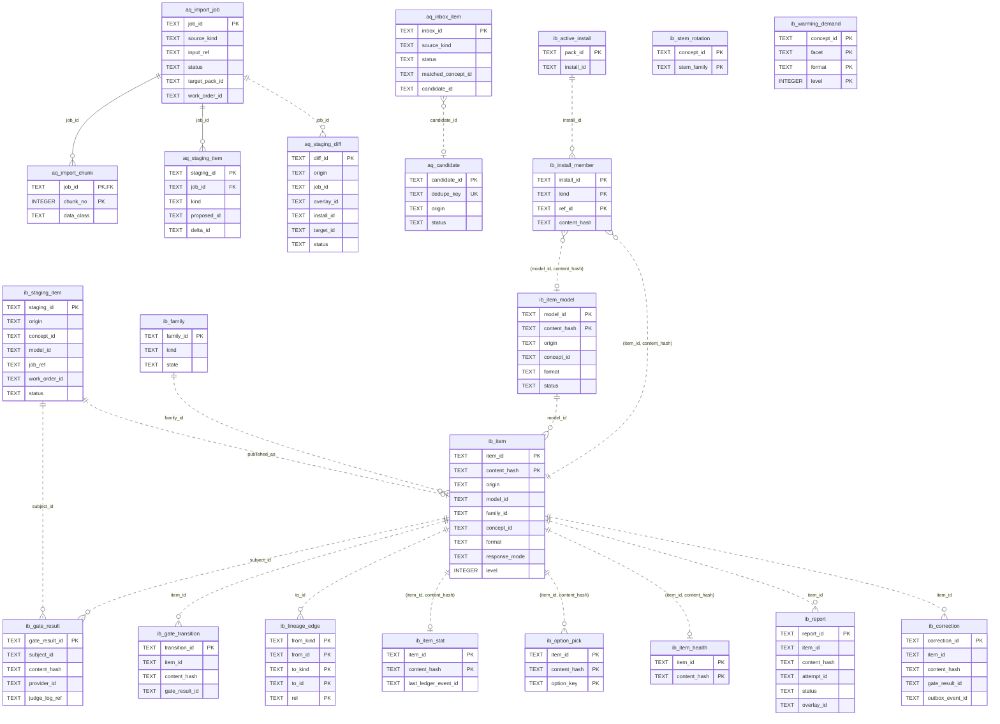

**(c) grading + runner**

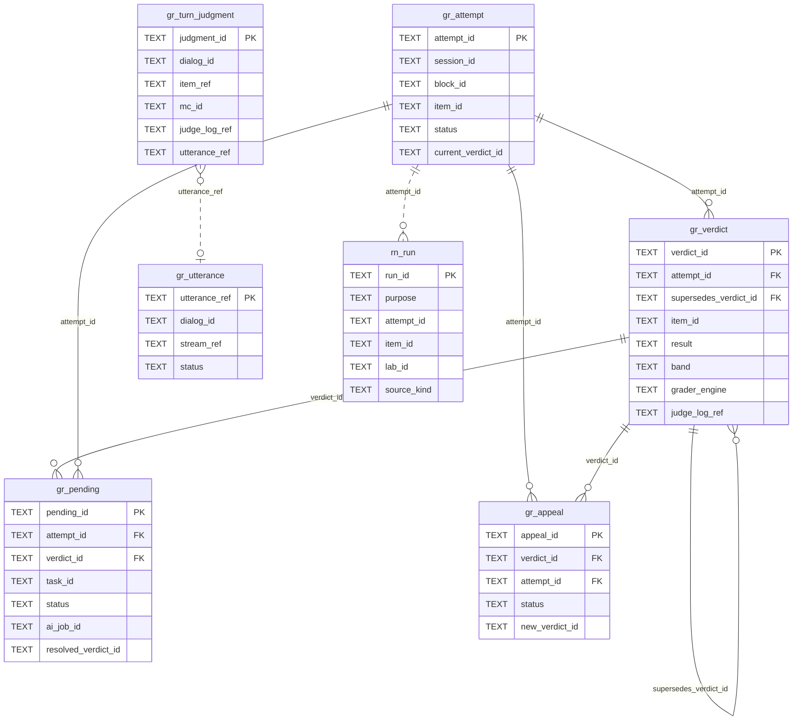

### 5.3 핵심 설계

#### 5.3.1 설치 범위 행과 blue/green (CR-12)

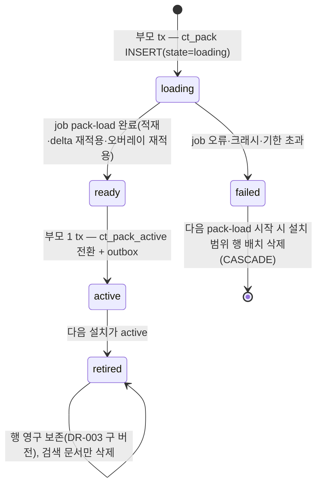

- 팩 출신 카탈로그 행은 PK 앞자리에 `install_id`를 가진다(`ct_track`·`ct_concept`·`ct_concept_edge`·`ct_id_alias`·`ct_ku`·`ct_misconception`·`ct_source`·`ct_rubric`·`ct_case`·`ct_artifact_task`·`ct_lab`·`ct_blueprint*`·`ct_layout`·`ct_search_doc`).
- 조회 표준 경로는 뷰 `ct_*_active`(= `JOIN ct_pack_active USING install_id`). 같은 논리 ID가 여러 설치에 있어도 활성 설치는 팩마다 1개라 조회 결과는 유일하다(팩 간 ID 중복은 packc R-ID가 막는다).
- **은퇴 설치는 삭제하지 않는다**: KU 개정 이력(DR-003 "구 버전 보존")이 은퇴 설치 행으로 남는다. 15년 × 트랙 20 × 버전 수십 × 수백 행 = 수 MB.
- 사용자·로컬 팩: 가져오기 결과는 팩 `u.local`(channel `user`, 버전 `0.0.0-user`의 빈 설치에서 시작)의 활성 설치에 PackDelta로 쌓인다. 블루프린트 시드는 팩 `x.blueprints`(channel `seed`, track 없음, D-26).

#### 5.3.2 PackDelta 적용과 재적용 (단일 수입 포트 ②)

1. 승인(가져오기 I9·게이트 통과·Tier 승격·재게이트 결과·신고 처리)마다 application이 PackDelta(`@fathom/contracts/pack/delta`, op마다 `base_version`)를 만들고 **한 tx**에서: `ct_pack_delta` INSERT(status `applied`) → 카탈로그 op는 대상 팩 **활성 설치 행**에 반영(덮어쓰기 전 원 행을 `ct_record_history`에 보존) → 문항 op(`publish_items`·`set_gate_status`·`quarantine_family`)는 `ib_*`에 반영 → 영향받은 `ct_search_doc` 갱신 → outbox(`catalog.concept.changed`, `itembank.item.corrected` 등).
2. **멱등**: `delta_id`가 이미 있으면 아무것도 하지 않는다.
3. **팩 업그레이드 시 재적용**: job `pack-load`가 새 설치에 bundle을 적재한 뒤, 그 팩의 `ct_pack_delta`(status `applied`)를 `ORDER BY applied_at, delta_id`로 다시 적용한다. op의 `base_version`(대상 필드의 `<pack version>@<sha256(정준 기준값) 앞 16자>`)과 새 설치의 해당 필드 해시가 다르면 그 op만 건너뛰고 `aq_staging_diff(origin='refresh')`로 올린다. 문항 op는 재적용하지 않는다(내용 주소 행이 이미 유지됨).

#### 5.3.3 문항 = 내용 주소 행 + 설치 멤버십 (D-04)

- `ib_item` PK = `(item_id, content_hash)`. 팩 출신(`origin='pack'`)은 `ib_install_member(install_id, 'item', item_id, content_hash)`로 설치에 속하고, 가시성 = 멤버십 ⋈ `ib_active_install`. 런타임 출신(`origin='runtime'`, T3/T4·사용자·가져오기 T2)은 항상 가시.
- 팩 업그레이드에서 **내용이 같은 문항은 같은 행**이므로 `gate_status`(`jev_verified`·`flagged`·`quarantined` …)·통계·신고 이력이 그대로 이어진다. 내용이 바뀐 문항은 새 `content_hash` 행이 생기고 번들의 상태(`seed_reviewed` 또는 `authored`)로 시작한다.
- Verdict의 `item_id` + `item_content_hash`는 정확히 한 행을 가리킨다(채점·재채점 재현).
- **출제 가능 = 이중 방어**: 선택 쿼리는 `gate_status IN ('seed_reviewed','jev_verified','gated_pass')` + 가시성 + 패밀리 `active` + 30일 미노출을 모두 건다. 부분 인덱스 `ix_ib_item_servable`이 쓰인다(실측 `EXPLAIN QUERY PLAN`).

```sql
-- SELECT_SERVABLE_ITEMS (services/content/src/infra/db/itembank-select.sql.ts)
SELECT i.item_id, i.content_hash, i.format, i.stem_family, i.level, i.n_options, s.last_exposed_at
FROM ib_item i
LEFT JOIN ib_item_stat s ON s.item_id = i.item_id AND s.content_hash = i.content_hash
WHERE i.concept_id = :concept_id AND i.facet = :facet AND i.response_mode = :response_mode
  AND i.gate_status IN ('seed_reviewed','jev_verified','gated_pass')
  AND (i.origin = 'runtime' OR EXISTS (
        SELECT 1 FROM ib_install_member m JOIN ib_active_install a ON a.install_id = m.install_id
        WHERE m.kind = 'item' AND m.ref_id = i.item_id AND m.content_hash = i.content_hash))
  AND NOT EXISTS (SELECT 1 FROM ib_family f WHERE f.family_id = i.family_id AND f.state <> 'active')
  AND (s.last_exposed_at IS NULL OR s.last_exposed_at < :now_minus_30d)
ORDER BY s.last_exposed_at IS NOT NULL, s.last_exposed_at
LIMIT 200;
```

- 러너 형식(코드·SQL·복잡도)은 `RunnerPort`가 현재 플랫폼을 `runner_verified_platforms`에서 찾지 못하면 application이 결과에서 제외한다(`platform_disabled`, ADR-007 §7) — DB 조건이 아니다.
- `ItemDelivery`(정답·해설 제외)는 `answer_key_json`·`explanation_md`·`distractor_mc_json`·`snapshot_json`·`defect_manifest`·`ct_lab.hidden_tests`를 **절대 SELECT 목록에 넣지 않는** 별도 상수(`ITEM_DELIVERY_COLUMNS`)로만 읽는다(FR-QST-022, 계약 테스트 `pre-submit`).

#### 5.3.4 β 추정의 소유 (D-37, CR-29 — PG-2 의무화)

- `Verdict.item_beta_snapshot` = 발급 시점 `ib_item_stat.beta_est`(행이 없으면 `ib_item.beta_prior`). 리듀서는 payload의 이 값만 읽는다(ADR-011 §4).
- β 갱신은 θ를 아는 learning 리듀서가 결정적으로 계산한 `item_beta_after`를 `learning.evidence.recorded` payload의 **필수 nullable 필드**로 실어 보내고(CR-29, PG-2 의무화 — FR-PRG-008·FR-CUR-007), content가 `ib_item_stat.beta_est`에 반영한다. `w = 0` 이벤트는 `item_beta_after = null`(β 불변). `pretest.answered`도 `learning.evidence.recorded{phase:'pretest'}`를 발행하므로 사전 질문 응답이 β 추정에 들어간다(IF-01 §9.4, IF-LR-010).

#### 5.3.5 오버레이 (FR-CUR-020, DR-026)

- 원천 = `ct_overlay_event`(append-only, export·병합 대상, 병합 import는 `overlay_id` 기준 `INSERT OR IGNORE` + 존재 확인). 되돌리기 = `revert_of`를 가진 새 이벤트.
- 합성 순서 = `(ts, device_id, overlay_id)` 오름차순, 필드별 마지막 유효 이벤트가 `ct_overlay_head`(파생, 언제든 재구성)에 남는다. `base_version` 형식 = `<pack version>@<sha256(정준 기준 필드값) 앞 16자>`, 재적용 비교는 해시 부분만(D-06).
- 반영 대상별 저장 위치: 개념·KU·오개념·Case·출처 필드 → 조회 시 `ct_*_active ⊕ ct_overlay_head`, 검색 필드(title·aliases·statement)는 `ct_search_doc`에도 반영 / 문항 필드(정답 키·해설·오답지) → `ib_item.overlay_json`(ItemReader가 합성, 같은 tx에 `itembank.item.corrected{basis:'overlay'}`).

#### 5.3.6 한국어 검색 (SP-4 V2 + 짧은 질의 폴백, CR-24)

| 단계 | 조건 | 사용 객체 | 비고 |
|---|---|---|---|
| Q0 정규화 | 항상 | — | `NFC → lower`, `search_params@v1`의 구두점·따옴표 문자 집합 제거, 공백 분리. 길이는 코드포인트 수 |
| Q1 AND | 토큰 ≥ 3자 | `ct_fts_tri MATCH '"t1" AND "t2"'`(내부 `"`는 `""`) + `bm25(ct_fts_tri, 10.0, 5.0, 1.0)` LIMIT 300 | 3자 미만 토큰은 결과 `ntext`에 대해 앱에서 `includes` 필터 |
| Q1' 짧은 토큰만 | 모든 토큰 < 3자 | 문서 수 ≤ 20,000: `instr(d.ntext, :tok) > 0` 스캔 · 초과: `ct_fts_uni MATCH '"tok"*'`(V3) | **LIKE 금지**(`%`·`_` 전체 일치) |
| Q2 조사 제거 | Q1 결과 < 10 | 조사 접미 제거(남는 길이 ≥ 3) 후 Q1 | |
| Q3 공백 제거 | 결과 < 10 | `ct_fts_cmp MATCH`(≥ 3자) 또는 `instr(d.compact, …)` | '이벤트루프' ↔ '이벤트 루프' |
| Q4 IDF OR | 결과 < 10 | 토큰별 df(`count(*)` MATCH 또는 instr) → `log(1 + N/df)` 가중 합 | 희귀 토큰 우선 |
| Q5 초성 | 질의가 전부 한글 자모(ㄱ~ㅎ) | `instr(d.initials, :q)` | `initials`는 적재 시 앱이 es-hangul로 계산(D-07) |
| Q6 동순위 | 항상 | 앱: 제목 일치 > 제목 접두 > 단어 시작 > 제목 부분 > 별칭 > 본문 | |

```sql
-- SEARCH_TRI (services/content/src/infra/search/search.sql.ts)
SELECT d.doc_id, d.kind, d.ref_id, d.concept_id, d.title, d.alias, d.ntext, bm25(ct_fts_tri, 10.0, 5.0, 1.0) AS rank
FROM ct_fts_tri JOIN ct_search_doc d ON d.doc_id = ct_fts_tri.rowid
JOIN ct_pack_active a ON a.install_id = d.install_id
WHERE ct_fts_tri MATCH :match ORDER BY rank LIMIT 300;

-- SEARCH_SHORT_INSTR (문서 수 ≤ search_params@v1.v3_switch_docs)
SELECT d.doc_id, d.kind, d.ref_id, d.concept_id, d.title, d.alias, d.ntext
FROM ct_search_doc d JOIN ct_pack_active a ON a.install_id = d.install_id
WHERE instr(d.ntext, :tok) > 0 LIMIT 2000;

-- SEARCH_SHORT_V3 (문서 수 > 20,000)
SELECT d.doc_id, d.kind, d.ref_id, d.concept_id, d.title, d.alias, d.ntext
FROM ct_fts_uni JOIN ct_search_doc d ON d.doc_id = ct_fts_uni.rowid
JOIN ct_pack_active a ON a.install_id = d.install_id
WHERE ct_fts_uni MATCH :prefix_match LIMIT 2000;

-- SEARCH_COMPACT
SELECT d.doc_id, d.ref_id, d.concept_id FROM ct_fts_cmp JOIN ct_search_doc d ON d.doc_id = ct_fts_cmp.rowid
JOIN ct_pack_active a ON a.install_id = d.install_id WHERE ct_fts_cmp MATCH :match LIMIT 300;

-- SEARCH_INITIALS
SELECT d.doc_id, d.ref_id, d.concept_id, d.title FROM ct_search_doc d JOIN ct_pack_active a ON a.install_id = d.install_id
WHERE instr(d.initials, :q) > 0 LIMIT 200;

-- SEARCH_DOC_COUNT (프로세스 메모리 캐시, catalog.pack.activated·delta 적용 시 갱신)
SELECT count(*) AS n FROM ct_search_doc d JOIN ct_pack_active a ON a.install_id = d.install_id;
```

- 세 FTS5 색인은 처음부터 함께 유지한다(V3 전환 = 정책 값 비교일 뿐, 색인 재구축 0, D-07). 동기화는 `ct_search_doc_ai/ad/au` 트리거(외부 콘텐츠 표준 레시피, `ON DELETE CASCADE`에서도 동작 — 실측).
- 은퇴 설치의 문서는 포인터 전환 **후** 500행 배치로 삭제한다(전환 tx를 짧게 유지, 질의는 활성 JOIN이라 그 사이에도 정확).
- Inbox 매칭(FR-IMP-014)·오프라인 trigram 힌트(FR-STD-019)는 같은 SQL 상수를 재사용한다.

#### 5.3.7 grading 기록

- Verdict 발급 tx: `gr_attempt` INSERT(또는 status 갱신) → `gr_verdict` INSERT(`verdict_json` = 이벤트 payload와 **같은 정준 JSON**) → `gr_attempt.current_verdict_id` 갱신 → outbox `grading.verdict.issued`. 상향·재채점·이의 = 새 `gr_verdict`(`supersedes_verdict_id`) + `grading.verdict.revised`.
- 학습자 답안 원문은 `gr_attempt.response_json`(C1, 로컬 전용)에만 있다. 원장에는 답안 원문이 없다(리플레이에 불필요) — content.db 손실 시 답안 열람만 잃고 증거는 잃지 않는다(D-24).
- `gr_pending`(보류 큐, X-22)·`gr_appeal`은 Q 테이블. `gr_turn_judgment`·`gr_utterance`는 대화 판정·발화 기록(상태·재개는 learning).

### 5.4 테이블정의서

#### `ct_pack`

설치된 팩 버전(설치 1건 = 행 1개). blue/green의 단위. state 전이: loading → ready → active → retired \| loading → failed. DR-006, DR-020(pack.channel)  
<sub>STRICT · 정의 파일 `services/content/migrations/catalog/0001_catalog_core.sql`</sub>

| 컬럼 | 타입 | NULL | 기본값 | 키 | 인덱스 | 설명 |
|---|---|---|---|---|---|---|
| `install_id` | TEXT | N |  | PK |  | 설치 ULID |
| `pack_id` | TEXT | N |  | UQ(pack_id,version) | ix_ct_pack_state, ux_ct_pack_version(부분) | 'k8s' · 'x.blueprints' · 'u.local' |
| `version` | TEXT | N |  | UQ(pack_id,version) | ux_ct_pack_version(부분) | semver(예: '1.2.0', '1.2.0-local.3') |
| `channel` | TEXT | N |  |  |  | DR-020 이름 훅. seed=동봉, local=pack refresh, user=사용자 팩·가져오기 |
| `track_id` | TEXT | Y |  |  |  | 팩의 트랙(블루프린트 팩·사용자 팩은 NULL) |
| `schema_v` | INTEGER | N |  |  |  | .fpack 스키마 버전(@fathom/contracts/pack/manifest) |
| `packc_version` | TEXT | N |  |  |  | 컴파일한 packc 버전 |
| `manifest_hash` | TEXT | N |  |  |  | sha256(manifest.json) |
| `merkle_root` | TEXT | N |  |  |  | files[].sha256의 merkle root |
| `source_sha256` | TEXT | Y |  |  |  | .fpack 파일 sha256(런타임 생성 사용자 팩은 NULL) |
| `manifest_json` | TEXT | N |  |  |  | manifest.json 원문(정준 JSON) |
| `report_json` | TEXT | N | '{}' |  |  | report.json(V1~V10, KPI, cap blocker) |
| `offline_cap_level` | INTEGER | Y |  |  |  | 팩 매니페스트의 OFFLINE 상한(트랙 팩만) |
| `state` | TEXT | N |  |  | ix_ct_pack_state | 설치 상태 |
| `state_reason` | TEXT | Y |  |  |  | failed·retired 사유 코드 |
| `created_at` | INTEGER | N |  |  |  | 설치 시작(epoch ms) |
| `ready_at` | INTEGER | Y |  |  |  | pack-load job 완료 |
| `activated_at` | INTEGER | Y |  |  |  | 활성 포인터 전환 |
| `retired_at` | INTEGER | Y |  |  |  | 다음 버전 활성으로 은퇴 |
| `ext` | TEXT | N | '{}' |  |  | 확장(DR-020 ext: pack.signature, pack.direction) |
| `ext_v` | INTEGER | N | 1 |  |  | ext 스키마 버전 |

#### `ct_pack_active`

팩별 활성 포인터. blue/green 전환 = 이 행 UPDATE 1회(1 tx). 조회는 항상 이 포인터를 통해 설치 범위 행을 읽는다  
<sub>STRICT · 정의 파일 `services/content/migrations/catalog/0001_catalog_core.sql`</sub>

| 컬럼 | 타입 | NULL | 기본값 | 키 | 인덱스 | 설명 |
|---|---|---|---|---|---|---|
| `pack_id` | TEXT | N |  | PK |  | ct_pack.pack_id |
| `install_id` | TEXT | N |  | FK→ct_pack.install_id, UQ |  | 현재 활성 설치 |
| `previous_install_id` | TEXT | Y |  | FK→ct_pack.install_id |  | 직전 활성 설치(롤백·변경 요약용) |
| `switched_at` | INTEGER | N |  |  |  | 전환 시각(epoch ms) |

#### `ct_track`

트랙(팩 1개 = 트랙 1개). DR-020(track.offline_cap_level)  
<sub>STRICT · 정의 파일 `services/content/migrations/catalog/0001_catalog_core.sql`</sub>

| 컬럼 | 타입 | NULL | 기본값 | 키 | 인덱스 | 설명 |
|---|---|---|---|---|---|---|
| `install_id` | TEXT | N |  | PK(1), FK→ct_pack.install_id CASCADE |  | 설치 범위 |
| `track_id` | TEXT | N |  | PK(2) |  | 'k8s' · 'db' · 'data' … |
| `name_ko` | TEXT | N |  |  |  | 표시 이름(한국어) |
| `name_en` | TEXT | N |  |  |  | 표시 이름(영문) |
| `track_group` | TEXT | N |  |  |  | 트랙군(6종, 하한 판정용) |
| `sort_order` | INTEGER | N | 0 |  |  | 지도 표시 순서 |
| `offline_cap_level` | INTEGER | N |  |  |  | DR-020 이름 훅. 깊이 자산 인벤토리로 packc가 계산 |
| `oracle_cap_level` | INTEGER | N |  |  |  | structuralFeasibility() 오라클 cap(제품 지도 표시값, SP-6 감사) |
| `summary_ko` | TEXT | N | '' |  |  | 트랙 소개 |
| `content_hash` | TEXT | N |  |  |  | 정준 레코드 sha256 |
| `ext` | TEXT | N | '{}' |  |  | 확장 |
| `ext_v` | INTEGER | N | 1 |  |  | ext 스키마 버전 |

#### `ct_concept`

개념(지도 노드). 3단 본문(이론·코드·핵심) 포함. DR-001, DR-020(concept.volatility·required_for_level), NG-G6(영상 본문 열 없음)  
<sub>STRICT · 정의 파일 `services/content/migrations/catalog/0001_catalog_core.sql`</sub>

| 컬럼 | 타입 | NULL | 기본값 | 키 | 인덱스 | 설명 |
|---|---|---|---|---|---|---|
| `install_id` | TEXT | N |  | PK(1), FK→ct_pack.install_id CASCADE | ix_ct_concept_track | 설치 범위 |
| `concept_id` | TEXT | N |  | PK(2) | ix_ct_concept_id | '<track>.<slug>' · 'u.<ns>.<slug>'(불변) |
| `track_id` | TEXT | N |  |  | ix_ct_concept_track | 소속 트랙 |
| `level` | INTEGER | N |  |  | ix_ct_concept_track | L1~L5 |
| `knowledge_type` | TEXT | N |  |  |  | 선언·개념·절차·전략 |
| `tier` | TEXT | N |  |  |  | 콘텐츠 티어 |
| `title_ko` | TEXT | N |  |  |  | 개념명(한국어) |
| `title_en` | TEXT | N | '' |  |  | 개념명(영문) |
| `summary_ko` | TEXT | N |  |  |  | 한 줄 요약 |
| `aliases_json` | TEXT | N | '[]' |  |  | 동의어·영문 정식명·약어(R-ALIAS: 한글 개념은 영문 ≥ 1) |
| `tags_json` | TEXT | N | '[]' |  |  | 'ctx:si' · 'cert:<id>' … |
| `volatility` | TEXT | N |  |  |  | DR-020 이름 훅 |
| `required_for_level` | INTEGER | Y |  |  |  | DR-020 이름 훅. Lk 승급 필수(Tier A/B만) |
| `deprecated_by` | TEXT | Y |  |  |  | 후속 concept_id(폐기 시) |
| `theory_md` | TEXT | N |  |  |  | 3단 ① 이론(Markdown) |
| `code_md` | TEXT | N |  |  |  | 3단 ② 코드/사례(Tier C는 자리표시자) |
| `core_md` | TEXT | N |  |  |  | 3단 ③ 핵심 |
| `diagrams_json` | TEXT | N | '[]' |  |  | Mermaid 원문 + 텍스트 대체(alt·요약) 목록 |
| `sources_json` | TEXT | N | '[]' |  |  | 본문 출처 span 참조(source_id, span) |
| `content_hash` | TEXT | N |  |  |  | 정준 레코드 sha256(변경 감지·base_version) |
| `ext` | TEXT | N | '{}' |  |  | 확장(DR-020 ext: concept.epa_refs, stimulus.ladder) |
| `ext_v` | INTEGER | N | 1 |  |  | ext 스키마 버전 |

#### `ct_concept_edge`

개념 간선(선수·형제·확장). DR-002. R-DAG는 packc가 검사  
<sub>STRICT · 정의 파일 `services/content/migrations/catalog/0001_catalog_core.sql`</sub>

| 컬럼 | 타입 | NULL | 기본값 | 키 | 인덱스 | 설명 |
|---|---|---|---|---|---|---|
| `install_id` | TEXT | N |  | PK(1), FK→ct_pack.install_id CASCADE | ix_ct_concept_edge_to | 설치 범위 |
| `from_concept_id` | TEXT | N |  | PK(2) |  | 출발 개념(prereq: 선수 개념) |
| `to_concept_id` | TEXT | N |  | PK(3) | ix_ct_concept_edge_to | 도착 개념(prereq: 후속 개념) |
| `kind` | TEXT | N |  | PK(4) | ix_ct_concept_edge_to | 간선 종류 |
| `weight` | REAL | N | 1.0 |  |  | 가중치 |

#### `ct_id_alias`

안정 ID 별칭(ID 개명·폐기 후 과거 참조 해석, FR-CUR-004). 검색 동의어는 ct_concept.aliases_json  
<sub>STRICT · 정의 파일 `services/content/migrations/catalog/0001_catalog_core.sql`</sub>

| 컬럼 | 타입 | NULL | 기본값 | 키 | 인덱스 | 설명 |
|---|---|---|---|---|---|---|
| `install_id` | TEXT | N |  | PK(1), FK→ct_pack.install_id CASCADE |  | 설치 범위 |
| `entity_kind` | TEXT | N |  | PK(2) |  | 대상 종류 |
| `alias_id` | TEXT | N |  | PK(3) |  | 옛 ID |
| `target_id` | TEXT | N |  |  |  | 새 ID |

#### `ct_ku`

KU(원자 지식 단위). 개정 = 새 설치 행(구 행은 은퇴 설치에 보존) 또는 ct_record_history. DR-003, DR-020(ku.valid_as_of·deprecated_by·scope)  
<sub>STRICT · 정의 파일 `services/content/migrations/catalog/0001_catalog_core.sql`</sub>

| 컬럼 | 타입 | NULL | 기본값 | 키 | 인덱스 | 설명 |
|---|---|---|---|---|---|---|
| `install_id` | TEXT | N |  | PK(1), FK→ct_pack.install_id CASCADE | ix_ct_ku_concept | 설치 범위 |
| `ku_id` | TEXT | N |  | PK(2) | ix_ct_ku_id | '<concept_id>.k<nn>' · 사용자 ULID 기반(불변) |
| `concept_id` | TEXT | N |  |  | ix_ct_ku_concept | 소속 개념 |
| `statement` | TEXT | N |  |  |  | 한 문장 진술 |
| `facet` | TEXT | N |  |  |  | 'definition'\|'mechanism'\|'code'\|'tradeoff'\|'contrast' …(contracts FacetId) |
| `scope` | TEXT | N | '' |  |  | DR-020 이름 훅. 적용 범위(버전·환경 등) |
| `vol` | TEXT | N |  |  |  | 신선도 등급(vol:*) |
| `valid_as_of` | TEXT | Y |  |  |  | DR-020 이름 훅. 'YYYY-MM-DD' |
| `deprecated_by` | TEXT | Y |  |  |  | DR-020 이름 훅. 후속 ku_id |
| `source_refs_json` | TEXT | N | '[]' |  |  | 근거 출처 span 목록(V6) |
| `trust` | TEXT | N |  |  |  | 신뢰 등급(llm_unverified는 승인 전 출제 0) |
| `origin` | TEXT | N |  |  |  | 'authored' \| 'import:<job_id>' \| 'tier_promotion:<delta_id>' |
| `status` | TEXT | N |  |  |  | outdated 신고 시 needs_review |
| `content_hash` | TEXT | N |  |  |  | 정준 레코드 sha256 |
| `ext` | TEXT | N | '{}' |  |  | 확장 |
| `ext_v` | INTEGER | N | 1 |  |  | ext 스키마 버전 |

#### `ct_misconception`

오개념. 오답지·거짓 OX의 원천. DR-004, DR-020(misconception.meta_family·status)  
<sub>STRICT · 정의 파일 `services/content/migrations/catalog/0001_catalog_core.sql`</sub>

| 컬럼 | 타입 | NULL | 기본값 | 키 | 인덱스 | 설명 |
|---|---|---|---|---|---|---|
| `install_id` | TEXT | N |  | PK(1), FK→ct_pack.install_id CASCADE | ix_ct_misconception_concept | 설치 범위 |
| `mc_id` | TEXT | N |  | PK(2) |  | '<concept_id>.m<nn>'(불변) |
| `concept_id` | TEXT | N |  |  | ix_ct_misconception_concept | 소속 개념 |
| `statement` | TEXT | N |  |  |  | 잘못된 믿음(거짓 진술) |
| `correction` | TEXT | N |  |  |  | 교정 문장 |
| `meta_family` | TEXT | N |  |  |  | DR-020 이름 훅. 약 12개 계열 |
| `related_ku_ids_json` | TEXT | N | '[]' |  |  | 관련 KU |
| `status` | TEXT | N |  |  |  | DR-020 이름 훅(콘텐츠 상태. 학습자 소거 상태는 learning lr_mc_state) |
| `content_hash` | TEXT | N |  |  |  | 정준 레코드 sha256 |
| `ext` | TEXT | N | '{}' |  |  | 확장 |
| `ext_v` | INTEGER | N | 1 |  |  | ext 스키마 버전 |

#### `ct_source`

출처 레지스트리. DR-005(fetch 훅은 ext)  
<sub>STRICT · 정의 파일 `services/content/migrations/catalog/0001_catalog_core.sql`</sub>

| 컬럼 | 타입 | NULL | 기본값 | 키 | 인덱스 | 설명 |
|---|---|---|---|---|---|---|
| `install_id` | TEXT | N |  | PK(1), FK→ct_pack.install_id CASCADE |  | 설치 범위 |
| `source_id` | TEXT | N |  | PK(2) |  | 'src.<slug>' · 사용자 ULID |
| `kind` | TEXT | N |  |  |  | 출처 종류 |
| `title` | TEXT | N |  |  |  | 제목 |
| `url` | TEXT | Y |  |  |  | URL(https) |
| `ref_text` | TEXT | Y |  |  |  | 서지 정보(책·RFC 번호 등) |
| `license_grade` | TEXT | N |  |  |  | 라이선스 등급(D = 발행 차단) |
| `fetched_at` | INTEGER | Y |  |  |  | 원문 수집 시각 |
| `content_hash` | TEXT | Y |  |  |  | 캐시 원문 sha256 |
| `ext` | TEXT | N | '{}' |  |  | 확장(DR-020 ext: fetch) |
| `ext_v` | INTEGER | N | 1 |  |  | ext 스키마 버전 |

#### `ct_rubric`

루브릭(차원별 4단계). Case·산출물·Feynman 채점 기준(객체 키)  
<sub>STRICT · 정의 파일 `services/content/migrations/catalog/0001_catalog_core.sql`</sub>

| 컬럼 | 타입 | NULL | 기본값 | 키 | 인덱스 | 설명 |
|---|---|---|---|---|---|---|
| `install_id` | TEXT | N |  | PK(1), FK→ct_pack.install_id CASCADE |  | 설치 범위 |
| `rubric_id` | TEXT | N |  | PK(2) |  | 'rb.<slug>' |
| `dims_json` | TEXT | N |  |  |  | {dims: {d_diag: {name, levels: {l1..l4}}}} — 객체 키만(배열 금지) |
| `content_hash` | TEXT | N |  |  |  | 정준 레코드 sha256 |
| `ext` | TEXT | N | '{}' |  |  | 확장 |
| `ext_v` | INTEGER | N | 1 |  |  | ext 스키마 버전 |

#### `ct_case`

Case(파라미터화 판단 과제 상태기계). FR-CUR-016, DR-020(case.variant_params·root_cause_pool·best_if·contested)  
<sub>STRICT · 정의 파일 `services/content/migrations/catalog/0001_catalog_core.sql`</sub>

| 컬럼 | 타입 | NULL | 기본값 | 키 | 인덱스 | 설명 |
|---|---|---|---|---|---|---|
| `install_id` | TEXT | N |  | PK(1), FK→ct_pack.install_id CASCADE | ix_ct_case_track | 설치 범위 |
| `case_id` | TEXT | N |  | PK(2) |  | '<track>.case.<slug>' |
| `track_id` | TEXT | N |  |  | ix_ct_case_track | 주 트랙 |
| `level` | INTEGER | N |  |  | ix_ct_case_track | L3~L5 |
| `kind` | TEXT | N |  |  |  | Case 유형 |
| `title_ko` | TEXT | N |  |  |  | 제목 |
| `spec_json` | TEXT | N |  |  |  | 상태기계: 증거 노드·공개 조건·요청 비용·결정점(options 객체 키) |
| `variant_params` | TEXT | N |  |  |  | DR-020 이름 훅. 파라미터 공간 |
| `root_cause_pool` | TEXT | N |  |  |  | DR-020 이름 훅. 근본 원인 풀(≥ 2) |
| `best_if` | TEXT | N |  |  |  | DR-020 이름 훅. 결정점별 조건 → 선택지 |
| `contested` | INTEGER | N | 0 |  |  | DR-020 이름 훅. 전문가 이견(복수 best) |
| `rubric_id` | TEXT | N |  |  |  | ct_rubric.rubric_id |
| `debrief_md` | TEXT | N |  |  |  | 전문가 디브리프 |
| `inspired_by` | TEXT | Y |  |  |  | 공개 포스트모템 등 출처 요약 |
| `primary_sources_json` | TEXT | N | '[]' |  |  | L4+ 1차 출처 span |
| `content_hash` | TEXT | N |  |  |  | 정준 레코드 sha256 |
| `ext` | TEXT | N | '{}' |  |  | 확장(DR-020 ext: case.world_id·episode_seq·expert_path) |
| `ext_v` | INTEGER | N | 1 |  |  | ext 스키마 버전 |

#### `ct_artifact_task`

산출물 과제(ADR·런북·포스트모템·설계 리뷰·표준 조항) + 반론 은행. FR-STD-026  
<sub>STRICT · 정의 파일 `services/content/migrations/catalog/0001_catalog_core.sql`</sub>

| 컬럼 | 타입 | NULL | 기본값 | 키 | 인덱스 | 설명 |
|---|---|---|---|---|---|---|
| `install_id` | TEXT | N |  | PK(1), FK→ct_pack.install_id CASCADE |  | 설치 범위 |
| `artifact_id` | TEXT | N |  | PK(2) |  | '<track>.art.<slug>' |
| `track_id` | TEXT | N |  |  |  | 주 트랙 |
| `level` | INTEGER | N |  |  |  | 대상 레벨 |
| `kind` | TEXT | N |  |  |  | 산출물 종류(= IF-01 ArtifactTemplateKind, CR-38) |
| `title_ko` | TEXT | N |  |  |  | 제목 |
| `template_md` | TEXT | N |  |  |  | 작성 템플릿 |
| `rubric_id` | TEXT | N |  |  |  | ct_rubric.rubric_id |
| `rebuttal_bank_json` | TEXT | N | '{}' |  |  | 반론 은행(객체 키) |
| `model_answer_md` | TEXT | N | '' |  |  | 모범 답(제출 후 공개) |
| `primary_sources_json` | TEXT | N | '[]' |  |  | 1차 출처 span |
| `content_hash` | TEXT | N |  |  |  | 정준 레코드 sha256 |
| `ext` | TEXT | N | '{}' |  |  | 확장 |
| `ext_v` | INTEGER | N | 1 |  |  | ext 스키마 버전 |

#### `ct_lab`

실습 과제(코드·카타·알고리즘·보안 패치·인프라·SQL). 숨은 테스트는 클라이언트에 내려가지 않음. FR-LAB-*  
<sub>STRICT · 정의 파일 `services/content/migrations/catalog/0001_catalog_core.sql`</sub>

| 컬럼 | 타입 | NULL | 기본값 | 키 | 인덱스 | 설명 |
|---|---|---|---|---|---|---|
| `install_id` | TEXT | N |  | PK(1), FK→ct_pack.install_id CASCADE |  | 설치 범위 |
| `lab_id` | TEXT | N |  | PK(2) |  | '<track>.lab.<slug>' |
| `track_id` | TEXT | N |  |  |  | 주 트랙 |
| `level` | INTEGER | N |  |  |  | 대상 레벨 |
| `kind` | TEXT | N |  |  |  | 과제 종류 |
| `language` | TEXT | N |  |  |  | python_view = ml·llm 예측형(실행 0, FR-LAB-017) |
| `task_md` | TEXT | N |  |  |  | 과제 설명 |
| `starter_code` | TEXT | N | '' |  |  | 시작 코드 |
| `public_tests` | TEXT | N | '' |  |  | 공개 테스트 코드 |
| `hidden_tests` | TEXT | N | '' |  |  | 숨은 테스트 코드(응답 금지 필드) |
| `complexity_json` | TEXT | Y |  |  |  | 복잡도 테스트 정의(AQ-17: n 집합·목표 차수) |
| `oracle_log_sha256` | TEXT | Y |  |  |  | 빌드타임 오라클 실행 로그 해시(ml·llm) |
| `content_hash` | TEXT | N |  |  |  | 정준 레코드 sha256 |
| `ext` | TEXT | N | '{}' |  |  | 확장 |
| `ext_v` | INTEGER | N | 1 |  |  | ext 스키마 버전 |

#### `ct_blueprint`

자격증 블루프린트(공식 출제기준만 출처). DR-027, AQ-13  
<sub>STRICT · 정의 파일 `services/content/migrations/catalog/0001_catalog_core.sql`</sub>

| 컬럼 | 타입 | NULL | 기본값 | 키 | 인덱스 | 설명 |
|---|---|---|---|---|---|---|
| `install_id` | TEXT | N |  | PK(1), FK→ct_pack.install_id CASCADE |  | 설치 범위(시드 = 팩 'x.blueprints', 사용자 = 'u.local') |
| `blueprint_id` | TEXT | N |  | PK(2) |  | 'cert-cka@2026' · 'cert-jeongbo-pilgi@2026' |
| `exam` | TEXT | N |  |  |  | 시험 이름 |
| `edition` | TEXT | N |  |  |  | 판본(연도 필수) |
| `source_url` | TEXT | N |  |  |  | 공식 출제기준 URL 또는 'user-file:<sha256>' |
| `source_edition` | TEXT | N |  |  |  | 커밋 SHA·파일 sha256(AQ-13) |
| `title_ko` | TEXT | N |  |  |  | 표시 이름 |
| `content_hash` | TEXT | N |  |  |  | 정준 레코드 sha256 |
| `ext` | TEXT | N | '{}' |  |  | 확장 |
| `ext_v` | INTEGER | N | 1 |  |  | ext 스키마 버전 |

#### `ct_blueprint_item`

블루프린트 세부 항목(과목·도메인 트리, 가중치)  
<sub>STRICT · 정의 파일 `services/content/migrations/catalog/0001_catalog_core.sql`</sub>

| 컬럼 | 타입 | NULL | 기본값 | 키 | 인덱스 | 설명 |
|---|---|---|---|---|---|---|
| `install_id` | TEXT | N |  | PK(1), FK→ct_pack.install_id CASCADE |  | 설치 범위 |
| `blueprint_id` | TEXT | N |  | PK(2) |  | 소속 블루프린트 |
| `section_key` | TEXT | N |  | PK(3) |  | 항목 객체 키('s1', 's1_3') |
| `parent_key` | TEXT | Y |  |  |  | 상위 항목 키 |
| `title_ko` | TEXT | N |  |  |  | 항목 이름 |
| `weight` | REAL | N | 0 |  |  | 공식 가중치(0~1) |

#### `ct_blueprint_map`

블루프린트 항목 → 개념 매핑(가중 커버리지 계산)  
<sub>STRICT · 정의 파일 `services/content/migrations/catalog/0001_catalog_core.sql`</sub>

| 컬럼 | 타입 | NULL | 기본값 | 키 | 인덱스 | 설명 |
|---|---|---|---|---|---|---|
| `install_id` | TEXT | N |  | PK(1), FK→ct_pack.install_id CASCADE |  | 설치 범위 |
| `blueprint_id` | TEXT | N |  | PK(2) |  | 소속 블루프린트 |
| `section_key` | TEXT | N |  | PK(3) |  | 항목 키 |
| `concept_id` | TEXT | N |  | PK(4) |  | 매핑 개념 |
| `weight` | REAL | N | 1.0 |  |  | 항목 내 가중 |

#### `ct_path`

학습 경로(경로 = 카탈로그 콘텐츠, 팩 x.paths 또는 트랙 팩 paths/). SessionScope{kind:'path'}·IF-CT-010 원천. FR-CUR-019, CR-52  
<sub>STRICT · 정의 파일 `services/content/migrations/catalog/0001_catalog_core.sql`</sub>

| 컬럼 | 타입 | NULL | 기본값 | 키 | 인덱스 | 설명 |
|---|---|---|---|---|---|---|
| `install_id` | TEXT | N |  | PK(1), FK→ct_pack.install_id CASCADE |  | 설치 범위 |
| `path_id` | TEXT | N |  | PK(2) |  | 'path.<slug>'(IF-01 PathId) |
| `title_ko` | TEXT | N |  |  |  | 경로 이름 |
| `description_ko` | TEXT | N | '' |  |  | 설명(≤ 500자) |
| `tracks_json` | TEXT | N | '[]' |  |  | 관련 트랙 목록 |
| `concept_ids_json` | TEXT | N | '[]' |  |  | 순서 있는 개념 ID 목록(≤ 300) |
| `content_hash` | TEXT | N |  |  |  | 정준 레코드 sha256 |

#### `ct_layout`

Depth Map 사전 계산 좌표(packc layout.json, d3-force 고정 시드)  
<sub>STRICT · 정의 파일 `services/content/migrations/catalog/0001_catalog_core.sql`</sub>

| 컬럼 | 타입 | NULL | 기본값 | 키 | 인덱스 | 설명 |
|---|---|---|---|---|---|---|
| `install_id` | TEXT | N |  | PK(1), FK→ct_pack.install_id CASCADE |  | 설치 범위 |
| `concept_id` | TEXT | N |  | PK(2) |  | 노드 |
| `x` | REAL | N |  |  |  | 좌표 x |
| `y` | REAL | N |  |  |  | 좌표 y |
| `layer` | INTEGER | N | 0 |  |  | 레벨 층 |

#### `ct_pack_delta`

적용된 PackDelta(단일 수입 포트 ②). 팩 업그레이드 시 새 설치 위에 applied_at 순으로 재적용. delta_id 멱등  
<sub>STRICT · 정의 파일 `services/content/migrations/catalog/0001_catalog_core.sql`</sub>

| 컬럼 | 타입 | NULL | 기본값 | 키 | 인덱스 | 설명 |
|---|---|---|---|---|---|---|
| `delta_id` | TEXT | N |  | PK |  | PackDelta ULID(멱등 키) |
| `pack_id` | TEXT | N |  |  | ix_ct_pack_delta_pack | 대상 팩 |
| `origin` | TEXT | N |  |  |  | 발생 경로 |
| `source_ref` | TEXT | Y |  |  |  | import job_id · ai job_id · report_id |
| `ops_json` | TEXT | N |  |  |  | op 목록(@fathom/contracts/pack/delta), op마다 base_version |
| `base_install_id` | TEXT | N |  | FK→ct_pack.install_id |  | 작성 기준 설치 |
| `applied_install_id` | TEXT | Y |  | FK→ct_pack.install_id |  | 마지막으로 적용된 설치 |
| `status` | TEXT | N |  |  |  | 적용 결과 |
| `created_at` | INTEGER | N |  |  |  | 접수 시각 |
| `applied_at` | INTEGER | Y |  |  | ix_ct_pack_delta_pack | 최초 적용 시각(재적용 순서 키) |
| `ext` | TEXT | N | '{}' |  |  | 확장 |
| `ext_v` | INTEGER | N | 1 |  |  | ext 스키마 버전 |

#### `ct_record_history`

PackDelta가 활성 설치 행을 덮어쓰기 전의 레코드 보존(append-only). DR-003 "구 버전 보존"  
<sub>STRICT · 정의 파일 `services/content/migrations/catalog/0001_catalog_core.sql`</sub>

| 컬럼 | 타입 | NULL | 기본값 | 키 | 인덱스 | 설명 |
|---|---|---|---|---|---|---|
| `history_id` | TEXT | N |  | PK |  | ULID |
| `install_id` | TEXT | N |  |  |  | 원 레코드 설치 |
| `record_kind` | TEXT | N |  |  | ix_ct_record_history_record | 'concept'\|'ku'\|'misconception'\|'case'\|'source'\|'blueprint'… |
| `record_id` | TEXT | N |  |  | ix_ct_record_history_record | 원 레코드 ID |
| `content_hash` | TEXT | N |  |  |  | 원 레코드 해시 |
| `record_json` | TEXT | N |  |  |  | 원 레코드 정준 JSON |
| `delta_id` | TEXT | N |  |  |  | 덮어쓴 PackDelta |
| `created_at` | INTEGER | N |  |  |  | 보존 시각 |

#### `ct_overlay_event`

사용자 오버레이 패치 이벤트(append-only, 되돌리기 = 역패치). 조회 = 팩 ⊕ 오버레이. export·병합 대상. DR-026, DR-020(overlay.base_version)  
<sub>STRICT · 정의 파일 `services/content/migrations/catalog/0001_catalog_core.sql`</sub>

| 컬럼 | 타입 | NULL | 기본값 | 키 | 인덱스 | 설명 |
|---|---|---|---|---|---|---|
| `overlay_id` | TEXT | N |  | PK |  | ULID(병합 import 멱등 키) |
| `target_kind` | TEXT | N |  |  | ix_ct_overlay_event_target | 대상 종류 |
| `target_id` | TEXT | N |  |  | ix_ct_overlay_event_target | 대상 ID(설치 무관 논리 ID) |
| `field` | TEXT | N |  |  | ix_ct_overlay_event_target | 대상 필드('statement','answer_key','explanation_md','options.opt_b',  'status' …) |
| `base_version` | TEXT | N |  |  |  | DR-020 이름 훅. '<pack version>@<sha256(정준 기준 필드값) 앞 16자>' |
| `new_value` | TEXT | N |  |  |  | 새 값(JSON) |
| `reason` | TEXT | N |  |  |  | 사유(신고 처리·사용자 수정 …) |
| `device_id` | TEXT | N |  |  | ix_ct_overlay_event_target | 작성 기기(ULID) |
| `ts` | INTEGER | N |  |  | ix_ct_overlay_event_target | 작성 기기 시각(epoch ms) — 합성 순서 (ts, device_id, overlay_id) |
| `revert_of` | TEXT | Y |  |  |  | 되돌리는 overlay_id(역패치) |
| `recorded_at` | INTEGER | N |  |  | ix_ct_overlay_event_recorded | 이 DB 기록 시각(export since 기준) |
| `ext` | TEXT | N | '{}' |  |  | 확장 |
| `ext_v` | INTEGER | N | 1 |  |  | ext 스키마 버전 |

#### `ct_overlay_head`

오버레이 합성 결과(필드별 현재 유효 패치). ct_overlay_event에서 언제든 재구성(파생)  
<sub>STRICT, WITHOUT ROWID · 정의 파일 `services/content/migrations/catalog/0001_catalog_core.sql`</sub>

| 컬럼 | 타입 | NULL | 기본값 | 키 | 인덱스 | 설명 |
|---|---|---|---|---|---|---|
| `target_kind` | TEXT | N |  | PK(1) |  | 대상 종류 |
| `target_id` | TEXT | N |  | PK(2) |  | 대상 ID |
| `field` | TEXT | N |  | PK(3) |  | 대상 필드 |
| `overlay_id` | TEXT | N |  |  |  | 현재 유효 overlay_id |
| `value` | TEXT | N |  |  |  | 유효 값 |
| `base_version` | TEXT | N |  |  |  | 유효 패치의 base_version |
| `status` | TEXT | N |  |  |  | 재적용 결과(conflicted면 aq_staging_diff 존재) |
| `updated_at` | INTEGER | N |  |  |  | 갱신 시각 |

#### `ct_search_doc`

검색 문서(개념·KU·오개념·Case·경로). FTS5 external content의 원본. 값은 NFC 정규화, ntext·compact는 NFC + 소문자. FR-CUR-011, FR-IMP-014  
<sub>STRICT · 정의 파일 `services/content/migrations/catalog/0002_catalog_search.sql`</sub>

| 컬럼 | 타입 | NULL | 기본값 | 키 | 인덱스 | 설명 |
|---|---|---|---|---|---|---|
| `doc_id` | INTEGER | N |  | PK |  | FTS rowid(정수 필수). 재사용 금지는 요구하지 않음 |
| `install_id` | TEXT | N |  | FK→ct_pack.install_id CASCADE, UQ(install_id,kind,ref_id) |  | 설치 범위 |
| `kind` | TEXT | N |  | UQ(install_id,kind,ref_id) |  | 문서 종류(IF-01 SearchQuery.kinds와 동일 집합, CR-52) |
| `ref_id` | TEXT | N |  | UQ(install_id,kind,ref_id) |  | 원 레코드 ID(concept_id·ku_id·mc_id·case_id·path_id) |
| `concept_id` | TEXT | N |  |  | ix_ct_search_doc_concept | 결과를 개념으로 묶는 키 |
| `track_id` | TEXT | N |  |  |  | 트랙 필터 |
| `title` | TEXT | N |  |  |  | 제목(오버레이 반영값, NFC) |
| `alias` | TEXT | N | '' |  |  | 동의어·영문명·약어 공백 연결(NFC) |
| `body` | TEXT | N | '' |  |  | 요약·진술(NFC) |
| `ntext` | TEXT | N |  |  |  | lower(NFC(title\|\|'\n'\|\|alias\|\|'\n'\|\|body)) — 3자 미만 토큰 instr() 스캔용 |
| `compact` | TEXT | N |  |  |  | ntext에서 공백 제거 — 띄어쓰기 차이 흡수 |
| `initials` | TEXT | N | '' |  |  | 한글 초성열(es-hangul, 적재 시 앱이 계산) — 초성 질의 instr() 스캔용 |

#### `aq_import_job`

가져오기 작업(입력 1건 = 작업 1건). 단계 상태기계 I1 → I1_5 → I2 … I9, 실패 단계부터 재개. FR-IMP-001·003  
<sub>STRICT · 정의 파일 `services/content/migrations/acquisition/0001_acquisition_core.sql`</sub>

| 컬럼 | 타입 | NULL | 기본값 | 키 | 인덱스 | 설명 |
|---|---|---|---|---|---|---|
| `job_id` | TEXT | N |  | PK |  | ULID(= correlation_id) |
| `source_kind` | TEXT | N |  |  |  | 입력 종류(= IF-01 ImportJobView.source_kind, CR-38) |
| `input_ref` | TEXT | N |  |  |  | 마스킹된 표시용 참조(URL·파일명). 비밀 0 |
| `input_sha256` | TEXT | N |  |  |  | 정규화(I1) 전 원 입력 sha256 |
| `input_bytes` | INTEGER | N |  |  |  | 입력 크기(≤ 2MB, FR-IMP-001) |
| `sensitive` | INTEGER | N | 0 |  |  | 민감 자료 표시(FR-IMP-010) |
| `local_only` | INTEGER | N | 0 |  |  | 로컬 LLM 강제(FR-AI-023) |
| `masking` | TEXT | N |  |  |  | partial = ai-gateway 다운으로 내장 규칙만 적용(재스캔 대상) |
| `stage` | TEXT | N |  |  |  | 현재(또는 실패) 단계. 저장 철자 'I1_5' ↔ wire 'I1.5'(IF-01 ImportStage, 리포지토리 매퍼가 변환), 'COPY_GUARD' = wire 동일(CR-38) |
| `status` | TEXT | N |  |  | ix_aq_import_job_status | 작업 상태(= IF-01 ImportJobView.state, CR-38) |
| `stage_state_json` | TEXT | N | '{}' |  |  | 단계별 산출 요약·재개 지점 |
| `trust` | TEXT | N |  |  |  | 결과 기본 신뢰 등급 |
| `target_pack_id` | TEXT | N | 'u.local' |  |  | 발행 대상 팩 |
| `work_order_id` | TEXT | Y |  |  |  | ai-gateway 작업 주문 |
| `error_code` | TEXT | Y |  |  |  | 실패 코드 |
| `created_at` | INTEGER | N |  |  |  | 생성 시각 |
| `updated_at` | INTEGER | N |  |  | ix_aq_import_job_status | 갱신 시각 |
| `completed_at` | INTEGER | Y |  |  |  | 완료(발행 또는 취소) 시각 |
| `ext` | TEXT | N | '{}' |  |  | 확장 |
| `ext_v` | INTEGER | N | 1 |  |  | ext 스키마 버전 |

#### `aq_import_chunk`

I1 정규화·I2 청크 결과(마스킹 후 원문). 주입 의심 청크는 quarantined. 데이터 등급 C2/C3  
<sub>STRICT · 정의 파일 `services/content/migrations/acquisition/0001_acquisition_core.sql`</sub>

| 컬럼 | 타입 | NULL | 기본값 | 키 | 인덱스 | 설명 |
|---|---|---|---|---|---|---|
| `job_id` | TEXT | N |  | PK(1), FK→aq_import_job.job_id CASCADE |  | 소속 작업 |
| `chunk_no` | INTEGER | N |  | PK(2) |  | 청크 순번 |
| `heading_path` | TEXT | N | '' |  |  | 헤딩 경로('MVCC > 스냅샷') |
| `text_masked` | TEXT | N |  |  |  | 마스킹된 본문(비밀 0, NFR-DATA-010) |
| `data_class` | TEXT | N |  |  |  | 데이터 등급 |
| `injection_flags_json` | TEXT | N | '[]' |  |  | 주입 탐지 규칙 ID(H·AI-J16) |
| `quarantined` | INTEGER | N | 0 |  |  | 주입 의심 격리 |
| `user_confirmed` | INTEGER | N | 0 |  |  | 격리 해제 사용자 확인 |

#### `aq_staging_item`

스테이징 항목(추출 결과·승인 대기). 승인 시 PackDelta로만 서빙 테이블 반영. 미승인 30일 후 삭제. FR-IMP-009  
<sub>STRICT · 정의 파일 `services/content/migrations/acquisition/0001_acquisition_core.sql`</sub>

| 컬럼 | 타입 | NULL | 기본값 | 키 | 인덱스 | 설명 |
|---|---|---|---|---|---|---|
| `staging_id` | TEXT | N |  | PK |  | ULID |
| `job_id` | TEXT | N |  | FK→aq_import_job.job_id CASCADE | ix_aq_staging_item_job | 소속 작업 |
| `kind` | TEXT | N |  |  |  | 항목 종류 |
| `proposed_id` | TEXT | N |  |  |  | 제안 ID('u.local.<slug>' 등) |
| `payload_json` | TEXT | N |  |  |  | 팩 레코드 문법의 제안 레코드 |
| `trust` | TEXT | N |  |  |  | 신뢰 등급 |
| `evidence_json` | TEXT | N | '[]' |  |  | 원문 span·근거 검증(AI-J14 p) 결과 |
| `merge_json` | TEXT | N | '{}' |  |  | 중복·동형 후보(유사도, FR-IMP-008) |
| `decision` | TEXT | N | 'pending' |  | ix_aq_staging_item_job | 승인 결정 |
| `decided_at` | INTEGER | Y |  |  |  | 결정 시각 |
| `delta_id` | TEXT | Y |  |  |  | 발행한 PackDelta |
| `created_at` | INTEGER | N |  |  |  | 생성 시각 |
| `expires_at` | INTEGER | N |  |  | ix_aq_staging_item_expires(부분) | created_at + 30일(pending만 만료 삭제) |
| `ext` | TEXT | N | '{}' |  |  | 확장 |
| `ext_v` | INTEGER | N | 1 |  |  | ext 스키마 버전 |

#### `aq_staging_diff`

스테이징 diff·충돌 큐(가져오기 diff, 오버레이 재적용 충돌, refresh diff, 모순 탐지). 항목별 승인·거절  
<sub>STRICT · 정의 파일 `services/content/migrations/acquisition/0001_acquisition_core.sql`</sub>

| 컬럼 | 타입 | NULL | 기본값 | 키 | 인덱스 | 설명 |
|---|---|---|---|---|---|---|
| `diff_id` | TEXT | N |  | PK |  | ULID |
| `origin` | TEXT | N |  |  |  | 발생 경로 |
| `job_id` | TEXT | Y |  |  |  | 관련 가져오기 작업 |
| `overlay_id` | TEXT | Y |  |  |  | 충돌한 overlay_id |
| `install_id` | TEXT | Y |  |  |  | 충돌을 낸 새 설치 |
| `target_kind` | TEXT | N |  |  |  | 대상 종류 |
| `target_id` | TEXT | N |  |  |  | 대상 ID |
| `field` | TEXT | Y |  |  |  | 대상 필드(레코드 단위 diff면 NULL) |
| `base_version` | TEXT | Y |  |  |  | 패치 작성 기준 |
| `new_base_version` | TEXT | Y |  |  |  | 새 팩의 기준 |
| `current_value_json` | TEXT | Y |  |  |  | 현재(새 팩) 값 |
| `proposed_value_json` | TEXT | Y |  |  |  | 제안(오버레이·가져오기) 값 |
| `status` | TEXT | N | 'open' |  | ix_aq_staging_diff_open | 처리 상태 |
| `created_at` | INTEGER | N |  |  | ix_aq_staging_diff_open | 생성 시각 |
| `resolved_at` | INTEGER | Y |  |  |  | 처리 시각 |
| `ext` | TEXT | N | '{}' |  |  | 확장 |
| `ext_v` | INTEGER | N | 1 |  |  | ext 스키마 버전 |

#### `aq_inbox_item`

Encounter Inbox(업무 중 캡처). 저장 전 마스킹, 외부 전송 0. FR-IMP-013·014, DR-020(inbox.source_kind)  
<sub>STRICT · 정의 파일 `services/content/migrations/acquisition/0001_acquisition_core.sql`</sub>

| 컬럼 | 타입 | NULL | 기본값 | 키 | 인덱스 | 설명 |
|---|---|---|---|---|---|---|
| `inbox_id` | TEXT | N |  | PK |  | ULID(inbox-queue 파일명과 같음 → 흡수 멱등) |
| `source_kind` | TEXT | N |  |  |  | DR-020 이름 훅(repo·ai_log·jit은 v1.x 예약) |
| `text_masked` | TEXT | N |  |  |  | 마스킹된 본문 |
| `masking` | TEXT | N |  |  |  | partial이면 rescan 대상 |
| `captured_at` | INTEGER | N |  |  |  | 캡처 시각(CLI·브라우저 시계) |
| `received_at` | INTEGER | N |  |  | ix_aq_inbox_item_status | content 기록 시각 |
| `status` | TEXT | N | 'new' |  | ix_aq_inbox_item_status | 트리아지 상태(= IF-01 InboxItemView.state). 내부 세부 단계 matched·probing은 ext."inbox.sub_state"(CR-38) |
| `match_candidates_json` | TEXT | N | '[]' |  |  | FTS 상위 10(concept_id, score) |
| `matched_concept_id` | TEXT | Y |  |  |  | 확정 개념 |
| `candidate_id` | TEXT | Y |  |  |  | 후보 큐로 보낸 경우 |
| `triaged_at` | INTEGER | Y |  |  |  | 트리아지 시각 |
| `ext` | TEXT | N | '{}' |  |  | 확장 |
| `ext_v` | INTEGER | N | 1 |  |  | ext 스키마 버전 |

#### `aq_candidate`

가져오기 후보 큐(디깅 발견·백지노트 확장·Inbox 미매칭·Tier C 유도). dedupe_key로 병합. FR-IMP-012  
<sub>STRICT · 정의 파일 `services/content/migrations/acquisition/0001_acquisition_core.sql`</sub>

| 컬럼 | 타입 | NULL | 기본값 | 키 | 인덱스 | 설명 |
|---|---|---|---|---|---|---|
| `candidate_id` | TEXT | N |  | PK |  | ULID |
| `origin` | TEXT | N |  |  |  | 발생 경로 |
| `label` | TEXT | N |  |  |  | 후보 이름 |
| `dedupe_key` | TEXT | N |  | UQ |  | lower(NFC(label)) 정규화 키 |
| `context_json` | TEXT | N | '{}' |  |  | 발생 맥락(개념·세션 참조) |
| `occurrences` | INTEGER | N | 1 |  |  | 중복 병합 횟수 |
| `status` | TEXT | N | 'open' |  | ix_aq_candidate_status | 트리아지 결과 |
| `created_at` | INTEGER | N |  |  |  | 생성 시각 |
| `updated_at` | INTEGER | N |  |  | ix_aq_candidate_status | 갱신 시각 |
| `ext` | TEXT | N | '{}' |  |  | 확장 |
| `ext_v` | INTEGER | N | 1 |  |  | ext 스키마 버전 |

#### `ib_active_install`

itembank 측 활성 설치 사본(catalog 활성 포인터 전환 tx 안에서 IngestPort가 함께 갱신). 교차 모듈 SQL JOIN 회피용  
<sub>STRICT · 정의 파일 `services/content/migrations/itembank/0001_itembank_core.sql`</sub>

| 컬럼 | 타입 | NULL | 기본값 | 키 | 인덱스 | 설명 |
|---|---|---|---|---|---|---|
| `pack_id` | TEXT | N |  | PK |  | 팩 ID |
| `install_id` | TEXT | N |  |  |  | 활성 설치(= ct_pack_active.install_id) |
| `switched_at` | INTEGER | N |  |  |  | 전환 시각 |

#### `ib_install_member`

설치 ↔ 팩 출신 문항·ItemModel 멤버십(설치별 사본, 트랙당 수백 행). 런타임 출신 행은 멤버십 없이 항상 가시  
<sub>STRICT · 정의 파일 `services/content/migrations/itembank/0001_itembank_core.sql`</sub>

| 컬럼 | 타입 | NULL | 기본값 | 키 | 인덱스 | 설명 |
|---|---|---|---|---|---|---|
| `install_id` | TEXT | N |  | PK(1) |  | 설치 |
| `kind` | TEXT | N |  | PK(2) | ix_ib_install_member_ref | 멤버 종류 |
| `ref_id` | TEXT | N |  | PK(3) | ix_ib_install_member_ref | item_id 또는 model_id |
| `content_hash` | TEXT | N |  |  | ix_ib_install_member_ref | 해당 설치가 가리키는 리비전 |

#### `ib_item_model`

ItemModel(선언적 문항 템플릿, T2). status 전이 draft → active → retired만. DR-007, FR-QST-002·005  
<sub>STRICT · 정의 파일 `services/content/migrations/itembank/0001_itembank_core.sql`</sub>

| 컬럼 | 타입 | NULL | 기본값 | 키 | 인덱스 | 설명 |
|---|---|---|---|---|---|---|
| `model_id` | TEXT | N |  | PK(1) |  | '<concept_id>.im<nn>' · LLM 저작 ULID |
| `content_hash` | TEXT | N |  | PK(2) |  | 정준 레코드 sha256(리비전 키) |
| `origin` | TEXT | N |  |  |  | 팩 출신 \| 런타임 저작 |
| `concept_id` | TEXT | N |  |  | ix_ib_item_model_concept | 대상 개념 |
| `format` | TEXT | N |  |  |  | contracts FormatId |
| `ku_ids_json` | TEXT | N | '[]' |  |  | 근거 KU |
| `slots_json` | TEXT | N |  |  |  | 슬롯 정의(객체 키) |
| `constraints_json` | TEXT | N |  |  |  | 제약 |
| `metamorphic_json` | TEXT | N | '{}' |  |  | preserve·flip 선언(FR-QST-010) |
| `stem_family` | TEXT | N |  |  |  | 문형 계열(로테이션 단위) |
| `status` | TEXT | N |  |  | ix_ib_item_model_concept | 상태 |
| `author` | TEXT | N |  |  |  | 저작 주체 |
| `prompt_version` | TEXT | Y |  |  |  | LLM 저작 시 프롬프트 버전(계보) |
| `sample_gate_json` | TEXT | N | '{}' |  |  | 표본 8개 게이트 결과 요약 |
| `created_at` | INTEGER | N |  |  |  | 생성 시각 |
| `status_at` | INTEGER | N |  |  |  | 상태 변경 시각 |
| `ext` | TEXT | N | '{}' |  |  | 확장 |
| `ext_v` | INTEGER | N | 1 |  |  | ext 스키마 버전 |

#### `ib_item`

문항 인스턴스(정답·해설 포함 — 제출 전 응답 금지 필드). 자급형 계측기: snapshot_json에 KU·오개념 스냅샷. DR-008, DR-020(item.source_kind·stem_family·gate_status·defect_manifest)  
<sub>STRICT · 정의 파일 `services/content/migrations/itembank/0001_itembank_core.sql`</sub>

| 컬럼 | 타입 | NULL | 기본값 | 키 | 인덱스 | 설명 |
|---|---|---|---|---|---|---|
| `item_id` | TEXT | N |  | PK(1) |  | 시드 '<concept_id>.i<nn>' · 런타임 ULID(불변 논리 ID) |
| `content_hash` | TEXT | N |  | PK(2) |  | 정준 문항 sha256(= Verdict.item_content_hash) |
| `origin` | TEXT | N |  |  |  | 팩 출신(멤버십 가시성) \| 런타임(항상 가시) |
| `model_id` | TEXT | Y |  |  | ix_ib_item_model | 전개 원 ItemModel |
| `family_id` | TEXT | N |  |  | ix_ib_item_family | 격리 단위(ItemModel·생성 배치·프롬프트 버전) |
| `concept_id` | TEXT | N |  |  | ix_ib_item_servable(부분), ix_ib_item_select | 대상 개념 |
| `ku_ids_json` | TEXT | N | '[]' |  |  | 근거 KU(cited_ku_ids) |
| `mc_ids_json` | TEXT | N | '[]' |  |  | 연결 오개념 |
| `facet` | TEXT | N |  |  | ix_ib_item_select | 카드 facet |
| `format` | TEXT | N |  |  | ix_ib_item_servable(부분), ix_ib_item_select | contracts FormatId('ox','mcq','cloze','short','order','match','code','sql','digging_mcq' …) |
| `response_mode` | TEXT | N |  |  | ix_ib_item_select | 인출 방식 |
| `level` | INTEGER | N |  |  | ix_ib_item_servable(부분) | 대상 레벨 |
| `bloom` | TEXT | N |  |  |  | Bloom 단계 |
| `stakes` | TEXT | N |  |  |  | 위험 등급 |
| `tier` | TEXT | N |  |  |  | 개념 티어(발행 시점) |
| `n_options` | INTEGER | N | 0 |  |  | 선택지 수(0 = 열린 형식, SP-6 F0 추측 보정 c = 1/n) |
| `beta_prior` | REAL | N | 0 |  |  | 난이도 prior(V9) |
| `stem_json` | TEXT | N |  |  |  | 문두(렌더 블록) |
| `options_json` | TEXT | N | '{}' |  |  | 선택지(객체 키 'opt_a'… — 배열 금지) |
| `answer_key_json` | TEXT | N |  |  |  | 정답 키(제출 전 응답 금지) |
| `explanation_md` | TEXT | N | '' |  |  | 해설(응답 후 공개) |
| `distractor_mc_json` | TEXT | N | '{}' |  |  | 오답지 키 → mc_id |
| `lab_id` | TEXT | Y |  |  |  | 실행 형식의 ct_lab.lab_id |
| `source_kind` | TEXT | N |  |  |  | DR-020 이름 훅(러너 출처 정책 입력) |
| `stem_family` | TEXT | N |  |  |  | DR-020 이름 훅. 문형 계열(30일 로테이션) |
| `gate_status` | TEXT | N |  |  | ix_ib_item_gate | DR-020 이름 훅. FR-QST-011 상태기계 |
| `gate_status_at` | INTEGER | N |  |  | ix_ib_item_gate | gate_status 변경 시각 |
| `defect_manifest` | TEXT | Y |  |  |  | DR-020 이름 훅. 주입 결함 정답 키(M-16·보안 패치) |
| `s2_mode` | TEXT | Y |  |  |  | S2 승인 방식(FR-QST-004) |
| `lineage_json` | TEXT | N | '{}' |  |  | 계보(prompt_version·ai job·import job·generator seed) |
| `snapshot_json` | TEXT | N |  |  |  | 발행 시점 KU·오개념 스냅샷(채점 전용, catalog 무조회) |
| `overlay_json` | TEXT | N | '{}' |  |  | 오버레이 유효 패치(필드 → 값). ItemReader가 합성 |
| `created_at` | INTEGER | N |  |  |  | 행 생성 시각 |
| `ext` | TEXT | N | '{}' |  |  | 확장(DR-020 ext: item.mutants, item.panel_distribution) |
| `ext_v` | INTEGER | N | 1 |  |  | ext 스키마 버전 |

#### `ib_staging_item`

생성 문항 스테이징(draft → deferred → gated_pass/gated_fail). gated_pass만 PackDelta publish_items로 ib_item에 발행  
<sub>STRICT · 정의 파일 `services/content/migrations/itembank/0001_itembank_core.sql`</sub>

| 컬럼 | 타입 | NULL | 기본값 | 키 | 인덱스 | 설명 |
|---|---|---|---|---|---|---|
| `staging_id` | TEXT | N |  | PK |  | ULID(발행 시 runtime item_id로 재사용) |
| `origin` | TEXT | N |  |  |  | 생성 경로 |
| `concept_id` | TEXT | N |  |  |  | 대상 개념 |
| `model_id` | TEXT | Y |  |  |  | ItemModel(전개·표본) |
| `job_ref` | TEXT | Y |  |  |  | ai-gateway job_id 또는 import job_id |
| `work_order_id` | TEXT | Y |  |  |  | 작업 주문 |
| `payload_json` | TEXT | N |  |  |  | 문항 후보 전체(ib_item 문법) |
| `cited_ku_ids_json` | TEXT | N | '[]' |  |  | 근거 KU(누락 = 저장 거부) |
| `status` | TEXT | N |  |  | ix_ib_staging_item_status | 게이트 진행 상태 |
| `s2_mode` | TEXT | Y |  |  |  | S2 승인 방식 |
| `created_at` | INTEGER | N |  |  |  | 생성 시각 |
| `updated_at` | INTEGER | N |  |  | ix_ib_staging_item_status | 갱신 시각 |
| `expires_at` | INTEGER | Y |  |  |  | gated_fail·discarded 정리 시각(+30일). deferred는 NULL(보존) |
| `ext` | TEXT | N | '{}' |  |  | 확장 |
| `ext_v` | INTEGER | N | 1 |  |  | ext 스키마 버전 |

#### `ib_gate_result`

게이트 결과(문항·스테이징·ItemModel별, append-only). DR-009, FR-QST-008  
<sub>STRICT · 정의 파일 `services/content/migrations/itembank/0001_itembank_core.sql`</sub>

| 컬럼 | 타입 | NULL | 기본값 | 키 | 인덱스 | 설명 |
|---|---|---|---|---|---|---|
| `gate_result_id` | TEXT | N |  | PK |  | ULID(Verdict.gate_result_id) |
| `subject_kind` | TEXT | N |  |  | ix_ib_gate_result_subject | 검사 대상 종류 |
| `subject_id` | TEXT | N |  |  | ix_ib_gate_result_subject | item_id · staging_id · model_id |
| `content_hash` | TEXT | Y |  |  |  | 대상 리비전(staging은 NULL) |
| `gate` | TEXT | N |  |  | ix_ib_gate_result_subject | 'G0'~'G13' · 'V7' · 'S2_APPROVAL' · 'META' |
| `engine` | TEXT | N |  |  |  | 판정 엔진 |
| `provider_id` | TEXT | Y |  |  |  | J·LJ 제공자 |
| `run_context` | TEXT | N |  |  |  | 실행 맥락 |
| `pass` | INTEGER | N |  |  |  | 통과 여부 |
| `score` | REAL | Y |  |  |  | 지표값(예: G3 키 확률) |
| `probabilities_json` | TEXT | Y |  |  |  | 객체 키 확률 분포 |
| `judge_log_ref` | TEXT | Y |  |  |  | ai_judge_log.judge_log_id(ai.db, 논리 참조) |
| `detail_json` | TEXT | N | '{}' |  |  | 상세(규칙 ID·실행 결과) |
| `created_at` | INTEGER | N |  |  |  | 판정 시각 |

#### `ib_gate_transition`

gate_status 전이 이력(append-only). GateStateMachine의 감사 기록  
<sub>STRICT · 정의 파일 `services/content/migrations/itembank/0001_itembank_core.sql`</sub>

| 컬럼 | 타입 | NULL | 기본값 | 키 | 인덱스 | 설명 |
|---|---|---|---|---|---|---|
| `transition_id` | TEXT | N |  | PK |  | ULID |
| `item_id` | TEXT | N |  |  | ix_ib_gate_transition_item | 문항 |
| `content_hash` | TEXT | N |  |  |  | 리비전 |
| `from_status` | TEXT | N |  |  |  | 이전 상태 |
| `to_status` | TEXT | N |  |  |  | 새 상태 |
| `basis` | TEXT | N |  |  |  | 'v7'\|'regate_g3'\|'regate_g5'\|'report'\|'health'\|'overlay'\|'family'\|'pack_load' |
| `gate_result_id` | TEXT | Y |  |  |  | 근거 게이트 결과 |
| `created_at` | INTEGER | N |  |  | ix_ib_gate_transition_item | 전이 시각 |

#### `ib_lineage_edge`

계보 간선 KU → ItemModel → 인스턴스 → 게이트 → 노출(append-only). FR-QST-015  
<sub>STRICT · 정의 파일 `services/content/migrations/itembank/0001_itembank_core.sql`</sub>

| 컬럼 | 타입 | NULL | 기본값 | 키 | 인덱스 | 설명 |
|---|---|---|---|---|---|---|
| `from_kind` | TEXT | N |  | PK(1) |  | 출발 종류 |
| `from_id` | TEXT | N |  | PK(2) |  | 출발 ID |
| `to_kind` | TEXT | N |  | PK(3) | ix_ib_lineage_edge_to | 도착 종류 |
| `to_id` | TEXT | N |  | PK(4) | ix_ib_lineage_edge_to | 도착 ID |
| `rel` | TEXT | N |  | PK(5) |  | 'derived_from'\|'expanded_to'\|'gated_by'\|'generated_by'\|'published_as' |
| `created_at` | INTEGER | N |  |  |  | 기록 시각 |

#### `ib_family`

격리·동결 단위(ItemModel·생성 배치·프롬프트 버전 패밀리). FR-QST-014·015, GR-05  
<sub>STRICT · 정의 파일 `services/content/migrations/itembank/0001_itembank_core.sql`</sub>

| 컬럼 | 타입 | NULL | 기본값 | 키 | 인덱스 | 설명 |
|---|---|---|---|---|---|---|
| `family_id` | TEXT | N |  | PK |  | 'im:<model_id>' \| 'batch:<job_id>' \| 'prompt:<task>@<ver>' \| 'pack:<pack_id>' |
| `kind` | TEXT | N |  |  |  | 패밀리 종류 |
| `state` | TEXT | N | 'active' |  |  | 출제 상태 |
| `reason` | TEXT | Y |  |  |  | 상태 사유 |
| `error_budget_json` | TEXT | N | '{}' |  |  | 7일 신고율·에러 버짓 |
| `updated_at` | INTEGER | N |  |  |  | 갱신 시각 |
| `ext` | TEXT | N | '{}' |  |  | 확장 |
| `ext_v` | INTEGER | N | 1 |  |  | ext 스키마 버전 |

#### `ib_item_stat`

문항 통계(β 추정·노출·로테이션). learning.evidence.recorded로 갱신(파생)  
<sub>STRICT, WITHOUT ROWID · 정의 파일 `services/content/migrations/itembank/0001_itembank_core.sql`</sub>

| 컬럼 | 타입 | NULL | 기본값 | 키 | 인덱스 | 설명 |
|---|---|---|---|---|---|---|
| `item_id` | TEXT | N |  | PK(1) |  | 문항 |
| `content_hash` | TEXT | N |  | PK(2) |  | 리비전 |
| `beta_est` | REAL | N |  |  |  | 현재 β 추정(Verdict.item_beta_snapshot 원천) |
| `n_responses` | INTEGER | N | 0 |  |  | 응답 수 |
| `n_correct` | INTEGER | N | 0 |  |  | 정답 수 |
| `n_rapid` | INTEGER | N | 0 |  |  | rapid 응답 수 |
| `latency_json` | TEXT | N | '{}' |  |  | 응답시간 요약(평균·분산, z 이상치) |
| `last_exposed_at` | INTEGER | Y |  |  | ix_ib_item_stat_exposed | 마지막 노출(30일 재노출 금지) |
| `last_ledger_event_id` | TEXT | Y |  |  |  | 마지막 반영 원장 이벤트 |
| `updated_at` | INTEGER | N |  |  |  | 갱신 시각 |

#### `ib_option_pick`

선택지별 선택 수(선택률 0% 오답지 탐지)  
<sub>STRICT, WITHOUT ROWID · 정의 파일 `services/content/migrations/itembank/0001_itembank_core.sql`</sub>

| 컬럼 | 타입 | NULL | 기본값 | 키 | 인덱스 | 설명 |
|---|---|---|---|---|---|---|
| `item_id` | TEXT | N |  | PK(1) |  | 문항 |
| `content_hash` | TEXT | N |  | PK(2) |  | 리비전 |
| `option_key` | TEXT | N |  | PK(3) |  | 선택지 객체 키 |
| `picks` | INTEGER | N | 0 |  |  | 선택 수 |

#### `ib_stem_rotation`

문형 로테이션(개념 × stem_family 마지막 노출). FR-QST-006  
<sub>STRICT, WITHOUT ROWID · 정의 파일 `services/content/migrations/itembank/0001_itembank_core.sql`</sub>

| 컬럼 | 타입 | NULL | 기본값 | 키 | 인덱스 | 설명 |
|---|---|---|---|---|---|---|
| `concept_id` | TEXT | N |  | PK(1) |  | 개념 |
| `stem_family` | TEXT | N |  | PK(2) |  | 문형 계열 |
| `last_exposed_at` | INTEGER | N |  |  |  | 마지막 노출 |
| `exposures` | INTEGER | N | 1 |  |  | 노출 수 |

#### `ib_item_health`

문항 건강 플래그(drift·선택률 0%·응답시간 z·신고율·문형 암기). FR-QST-014  
<sub>STRICT, WITHOUT ROWID · 정의 파일 `services/content/migrations/itembank/0001_itembank_core.sql`</sub>

| 컬럼 | 타입 | NULL | 기본값 | 키 | 인덱스 | 설명 |
|---|---|---|---|---|---|---|
| `item_id` | TEXT | N |  | PK(1) |  | 문항 |
| `content_hash` | TEXT | N |  | PK(2) |  | 리비전 |
| `flags_json` | TEXT | N | '[]' |  |  | 활성 플래그 목록 |
| `metrics_json` | TEXT | N | '{}' |  |  | 계산 지표 |
| `checked_at` | INTEGER | N |  |  |  | 계산 시각 |

#### `ib_hint_open`

힌트 열람 기록(서버 측 hints_used = max(클라이언트 값, 이 표의 step 수), IF-CT-056·IF-01 D-19). 30일 보존. FR-LAB-005, FR-QST-025, CR-40  
<sub>STRICT · WITHOUT ROWID · 정의 파일 `services/content/migrations/itembank/0001_itembank_core.sql`</sub>

| 컬럼 | 타입 | NULL | 기본값 | 키 | 인덱스 | 설명 |
|---|---|---|---|---|---|---|
| `session_id` | TEXT | N |  | PK(1) |  | learning 세션(논리 참조) |
| `block_id` | TEXT | Y |  |  |  | learning 블록 |
| `item_id` | TEXT | N |  | PK(2) |  | 문항 |
| `step` | INTEGER | N |  | PK(3) |  | 힌트 단계(h1~h4) |
| `opened_at` | INTEGER | N |  |  | ix_ib_hint_open_opened | 열람 시각 |

#### `ib_report`

문항 신고(R 키). 신고 즉시 본인 큐 제외 + 증거 무효화 보정. FR-QST-016  
<sub>STRICT · 정의 파일 `services/content/migrations/itembank/0001_itembank_core.sql`</sub>

| 컬럼 | 타입 | NULL | 기본값 | 키 | 인덱스 | 설명 |
|---|---|---|---|---|---|---|
| `report_id` | TEXT | N |  | PK |  | ULID |
| `item_id` | TEXT | N |  |  | ix_ib_report_item | 문항 |
| `content_hash` | TEXT | N |  |  |  | 리비전 |
| `attempt_id` | TEXT | Y |  |  |  | 신고한 응답 |
| `reason` | TEXT | N |  |  |  | 사유(= IF-01 ReportReason, CR-38) |
| `note` | TEXT | N | '' |  |  | 사용자 메모(C1) |
| `classification_json` | TEXT | Y |  |  |  | AI-J19 분류 결과 |
| `status` | TEXT | N | 'received' |  | ix_ib_report_status | 처리 상태(= IF-01 ReportView.state) |
| `resolution` | TEXT | Y |  |  |  | 처리 결과(resolved일 때, = ReportView.resolution.kind, CR-38) |
| `resolution_note` | TEXT | Y |  |  |  | 처리 사유(사용자 표시) |
| `overlay_id` | TEXT | Y |  |  |  | 수정에 쓴 오버레이 |
| `created_at` | INTEGER | N |  |  | ix_ib_report_status | 신고 시각 |
| `resolved_at` | INTEGER | Y |  |  |  | 처리 시각 |
| `ext` | TEXT | N | '{}' |  |  | 확장 |
| `ext_v` | INTEGER | N | 1 |  |  | ext 스키마 버전 |

#### `ib_correction`

증거 보정 발행 기록(itembank.item.corrected의 원천, append-only). FR-QST-011·015  
<sub>STRICT · 정의 파일 `services/content/migrations/itembank/0001_itembank_core.sql`</sub>

| 컬럼 | 타입 | NULL | 기본값 | 키 | 인덱스 | 설명 |
|---|---|---|---|---|---|---|
| `correction_id` | TEXT | N |  | PK |  | ULID |
| `item_id` | TEXT | N |  |  | ix_ib_correction_item | 문항 |
| `content_hash` | TEXT | N |  |  |  | 리비전 |
| `correction` | TEXT | N |  |  |  | 보정 종류 |
| `evidence_policy` | TEXT | N |  |  |  | 증거 정책 |
| `basis` | TEXT | N |  |  |  | 근거(pack_upgrade = 팩 개정으로 정답 키 변경, CR-33·CR-42) |
| `gate_result_id` | TEXT | Y |  |  |  | 근거 게이트 결과 |
| `effective_from` | INTEGER | N |  |  |  | 적용 시작 시각 |
| `outbox_event_id` | TEXT | N |  |  |  | 발행한 outbox.event_id |
| `created_at` | INTEGER | N |  |  |  | 기록 시각 |

#### `ib_warming_demand`

워밍 풀 수요(learning.demand.forecasted 최신 스냅샷, 14일). FR-QST-013  
<sub>STRICT, WITHOUT ROWID · 정의 파일 `services/content/migrations/itembank/0001_itembank_core.sql`</sub>

| 컬럼 | 타입 | NULL | 기본값 | 키 | 인덱스 | 설명 |
|---|---|---|---|---|---|---|
| `concept_id` | TEXT | N |  | PK(1) |  | 개념 |
| `facet` | TEXT | N |  | PK(2) |  | facet |
| `format` | TEXT | N |  | PK(3) |  | 형식 |
| `level` | INTEGER | N |  | PK(4) |  | 레벨 |
| `n` | INTEGER | N |  |  |  | 14일 수요 |
| `computed_at` | INTEGER | N |  |  |  | 예측 시각(이벤트 payload) |

#### `gr_attempt`

제출 응답(학습자 답안 원문, C1). 같은 Idempotency-Key(= attempt_id) 재요청은 idem_request로 흡수. FR-QST-022  
<sub>STRICT · 정의 파일 `services/content/migrations/grading/0001_grading_core.sql`</sub>

| 컬럼 | 타입 | NULL | 기본값 | 키 | 인덱스 | 설명 |
|---|---|---|---|---|---|---|
| `attempt_id` | TEXT | N |  | PK |  | 브라우저 생성 ULID(= Idempotency-Key) |
| `session_id` | TEXT | N |  |  | ix_gr_attempt_session | learning 세션(논리 참조) |
| `block_id` | TEXT | Y |  |  |  | learning 블록 |
| `item_id` | TEXT | N |  |  | ix_gr_attempt_item | 문항 |
| `item_content_hash` | TEXT | N |  |  |  | 채점한 리비전 |
| `response_json` | TEXT | N |  |  |  | 답안(선택 키·텍스트·코드). 로컬 전용 |
| `confidence` | INTEGER | Y |  |  |  | CBM C1~C3 |
| `latency_ms` | INTEGER | N |  |  |  | 응답 시간 |
| `hints_used` | INTEGER | N | 0 |  |  | 힌트 단계 수 |
| `reference_mode` | INTEGER | N | 0 |  |  | 참조 모드(증거 제외) |
| `client_answered_at` | INTEGER | N |  |  |  | 클라이언트 응답 시각(learning이 fsrs_at 클램프에 사용) |
| `received_at` | INTEGER | N |  |  | ix_gr_attempt_item | content 수신 시각 |
| `status` | TEXT | N |  |  |  | 현재 상태(awaiting_self_grade = IF-CT-040 ⑤, Verdict 미발급 · IF-CT-041 CT-CONFLICT-010 판정 근거, CR-38) |
| `current_verdict_id` | TEXT | Y |  |  |  | 최신 Verdict(supersedes 체인 끝) |
| `ext` | TEXT | N | '{}' |  |  | 확장(DR-020 ext: attempt.anchor_run_id) |
| `ext_v` | INTEGER | N | 1 |  |  | ext 스키마 버전 |

#### `gr_verdict`

판정(Verdict) — 리플레이 입력 운반체(ADR-011 §4). append-only, verdict_json = 이벤트 payload와 같은 정준 JSON  
<sub>STRICT · 정의 파일 `services/content/migrations/grading/0001_grading_core.sql`</sub>

| 컬럼 | 타입 | NULL | 기본값 | 키 | 인덱스 | 설명 |
|---|---|---|---|---|---|---|
| `verdict_id` | TEXT | N |  | PK |  | ULID(원장 멱등 키 'verdict:<verdict_id>') |
| `attempt_id` | TEXT | N |  | FK→gr_attempt.attempt_id | ix_gr_verdict_attempt | 응답 |
| `supersedes_verdict_id` | TEXT | Y |  | FK→gr_verdict.verdict_id | ix_gr_verdict_supersedes(부분) | 대체한 판정(상향·재채점·이의) |
| `revision_reason` | TEXT | Y |  |  |  | 대체 사유 |
| `item_id` | TEXT | N |  |  |  | 문항 |
| `item_content_hash` | TEXT | N |  |  |  | 리비전 |
| `result` | TEXT | N |  |  |  | 결과 |
| `band` | TEXT | N |  |  |  | 점수 밴드(UI diff 기준) |
| `score` | REAL | N |  |  |  | 점수 |
| `grader_engine` | TEXT | N |  |  |  | 채점 엔진 |
| `calibrated` | INTEGER | N |  |  |  | 보정 여부 |
| `pending` | INTEGER | N |  |  |  | 보류 |
| `provisional` | INTEGER | N |  |  |  | 잠정 |
| `w_format` | REAL | N |  |  |  | 형식 가중(발급 시 고정) |
| `w_grader` | REAL | N |  |  |  | 엔진 가중(발급 시 고정) |
| `gaming_factor` | REAL | N |  |  |  | 게이밍 계수 |
| `ai_mode` | TEXT | N |  |  |  | 발급 시 AI 모드 |
| `content_policy_version` | TEXT | N |  |  |  | content 정책 세트 주소 'ps_<16hex>' |
| `judge_log_ref` | TEXT | Y |  |  |  | ai_judge_log.judge_log_id(논리 참조) |
| `prompt_version` | TEXT | Y |  |  |  | LJ·L 프롬프트 버전 |
| `verdict_json` | TEXT | N |  |  |  | Verdict 전체(정준 JSON, contracts Verdict.strict()) |
| `issued_at` | INTEGER | N |  |  | ix_gr_verdict_attempt | 발급 시각 |

#### `gr_pending`

보류 채점 큐(AI 판단 부재·데드라인 초과·저신뢰·이의). AI 복귀 후 재채점 → grading.verdict.revised. FR-QST-020, X-22  
<sub>STRICT · 정의 파일 `services/content/migrations/grading/0001_grading_core.sql`</sub>

| 컬럼 | 타입 | NULL | 기본값 | 키 | 인덱스 | 설명 |
|---|---|---|---|---|---|---|
| `pending_id` | TEXT | N |  | PK |  | ULID |
| `attempt_id` | TEXT | N |  | FK→gr_attempt.attempt_id |  | 응답 |
| `verdict_id` | TEXT | N |  | FK→gr_verdict.verdict_id |  | 보류 시점 판정(하위 사다리 결과) |
| `task_id` | TEXT | N |  |  |  | 재채점 과업(AI-J03 등) |
| `reason` | TEXT | N |  |  |  | 보류 사유(= IF-01 PendingGradeView.reason, CR-38) |
| `status` | TEXT | N | 'queued' |  | ix_gr_pending_open(부분) | 처리 상태 |
| `attempts` | INTEGER | N | 0 |  |  | 재시도 수 |
| `next_attempt_at` | INTEGER | N | 0 |  | ix_gr_pending_open(부분) | 다음 시도 시각 |
| `ai_job_id` | TEXT | Y |  |  |  | ai-gateway background job |
| `resolved_verdict_id` | TEXT | Y |  |  |  | 재채점 결과 판정 |
| `created_at` | INTEGER | N |  |  |  | 생성 시각 |
| `updated_at` | INTEGER | N |  |  |  | 갱신 시각 |
| `resolved_at` | INTEGER | Y |  |  |  | 해결 시각 |

#### `gr_appeal`

이의제기. 원 판정 보존, 결과는 새 Verdict(supersedes). FR-AI-012  
<sub>STRICT · 정의 파일 `services/content/migrations/grading/0001_grading_core.sql`</sub>

| 컬럼 | 타입 | NULL | 기본값 | 키 | 인덱스 | 설명 |
|---|---|---|---|---|---|---|
| `appeal_id` | TEXT | N |  | PK |  | ULID |
| `verdict_id` | TEXT | N |  | FK→gr_verdict.verdict_id |  | 이의 대상 판정 |
| `attempt_id` | TEXT | N |  | FK→gr_attempt.attempt_id |  | 응답 |
| `reason` | TEXT | N |  |  |  | 이의 사유 분류(= IF-01 AppealReason, CR-38) |
| `reason_text` | TEXT | N | '' |  |  | 이의 사유 서술(C1) |
| `classification_json` | TEXT | Y |  |  |  | AI-J19 1차 분류(= AppealView.classification) |
| `status` | TEXT | N | 'received' |  | ix_gr_appeal_status | 처리 상태(= AppealView.state) |
| `new_verdict_id` | TEXT | Y |  |  |  | 인용 시 새 판정 |
| `decision_note` | TEXT | Y |  |  |  | 기각 사유(표시) |
| `created_at` | INTEGER | N |  |  | ix_gr_appeal_status | 제기 시각 |
| `decided_at` | INTEGER | Y |  |  |  | 결정 시각 |

#### `gr_turn_judgment`

대화 턴 판정(디깅·Feynman·Case·반박). 상태·재개는 learning 소유, 판정·다음 move만 기록(append-only). AQ-03  
<sub>STRICT · 정의 파일 `services/content/migrations/grading/0001_grading_core.sql`</sub>

| 컬럼 | 타입 | NULL | 기본값 | 키 | 인덱스 | 설명 |
|---|---|---|---|---|---|---|
| `judgment_id` | TEXT | N |  | PK |  | ULID |
| `turn_id` | TEXT | N |  | UQ |  | SubmitTurnBody.turn_id(= Idempotency-Key, IF-CT-042 멱등, CR-37) |
| `dialog_id` | TEXT | N |  | UQ(dialog_id,turn_no) |  | learning 대화 |
| `turn_no` | INTEGER | N |  | UQ(dialog_id,turn_no) |  | 턴 번호 |
| `item_ref` | TEXT | N |  |  |  | 개념·Case·과제 참조 |
| `label` | TEXT | N |  |  |  | 'complete'\|'partial'\|'misconception'\|'off_topic'\|'dont_know'\|루브릭 라벨 |
| `mc_id` | TEXT | Y |  |  |  | 오개념 라벨일 때 |
| `next_move` | TEXT | N |  |  |  | 결정적 상태기계의 다음 move(D1~D7 …) |
| `engine` | TEXT | N |  |  |  | 판정 엔진 |
| `calibrated` | INTEGER | N |  |  |  | 보정 여부 |
| `confidence` | REAL | Y |  |  |  | 판정 confidence |
| `judge_log_ref` | TEXT | Y |  |  |  | ai_judge_log 참조 |
| `utterance_ref` | TEXT | Y |  |  |  | gr_utterance 참조 |
| `input_hash` | TEXT | N |  |  |  | sha256(정준 입력) — 재요청 동일성 |
| `created_at` | INTEGER | N |  |  |  | 판정 시각 |

#### `gr_utterance`

발화(질문 은행 렌더 또는 AI-G07 스트림 최종본). gateway·content는 스트림 바이트 중계만  
<sub>STRICT · 정의 파일 `services/content/migrations/grading/0001_grading_core.sql`</sub>

| 컬럼 | 타입 | NULL | 기본값 | 키 | 인덱스 | 설명 |
|---|---|---|---|---|---|---|
| `utterance_ref` | TEXT | N |  | PK |  | ULID |
| `turn_id` | TEXT | N |  | UQ | ix_gr_utterance_turn | 턴 ID(IF-GW-063 /turns/{turn_id}/utterance 라우팅 키, CR-37) |
| `dialog_id` | TEXT | N |  |  | ix_gr_utterance_dialog | 대화 |
| `turn_no` | INTEGER | N |  |  | ix_gr_utterance_dialog | 턴 번호 |
| `source` | TEXT | N |  |  |  | 발화 원천 |
| `stream_ref` | TEXT | Y |  |  |  | ai-gateway streams/{ref} |
| `text` | TEXT | Y |  |  |  | 최종 텍스트(스트림 완료 전 NULL) |
| `status` | TEXT | N |  |  |  | 상태 |
| `created_at` | INTEGER | N |  |  |  | 생성 시각 |
| `completed_at` | INTEGER | Y |  |  |  | 완료 시각 |

#### `rn_run`

러너 실행 기록(실행 1회 = 1행, 30일 보존). 코드 원문은 저장하지 않음(답안은 gr_attempt). FR-LAB-013, ADR-007  
<sub>STRICT · 정의 파일 `services/content/migrations/runner/0001_runner_core.sql`</sub>

| 컬럼 | 타입 | NULL | 기본값 | 키 | 인덱스 | 설명 |
|---|---|---|---|---|---|---|
| `run_id` | TEXT | N |  | PK |  | ULID |
| `purpose` | TEXT | N |  |  |  | 실행 목적 |
| `attempt_id` | TEXT | Y |  |  | ix_rn_run_attempt(부분) | 채점 실행의 응답 |
| `item_id` | TEXT | Y |  |  |  | 문항 |
| `lab_id` | TEXT | Y |  |  |  | 과제 |
| `source_kind` | TEXT | N |  |  |  | 출처 정책 통과 출처(그 외 403, 행 미기록) |
| `language` | TEXT | N |  |  |  | 실행 언어 |
| `code_sha256` | TEXT | N |  |  |  | 실행 코드 sha256 |
| `exit_reason` | TEXT | N |  |  |  | 종료 사유 |
| `tests_passed` | INTEGER | Y |  |  |  | 통과 테스트 수(부모 판정) |
| `tests_total` | INTEGER | Y |  |  |  | 전체 테스트 수 |
| `duration_ms` | INTEGER | N |  |  |  | 벽시계 소요 |
| `peak_rss_mb` | INTEGER | Y |  |  |  | 감시자 관측 최대 RSS |
| `complexity_json` | TEXT | Y |  |  |  | 복잡도 계측(기울기·n 집합) |
| `stdout_head` | TEXT | N | '' |  |  | stdout 요약(≤ 2KB, 경로 치환 후) |
| `stderr_head` | TEXT | N | '' |  |  | stderr 요약(≤ 2KB) |
| `platform` | TEXT | N |  |  |  | '<os>-<arch>-node<ver>' |
| `created_at` | INTEGER | N |  |  | ix_rn_run_created | 실행 시각 |

### 5.5 DDL

`services/content/migrations/catalog/0001_catalog_core.sql`

```sql
-- @fathom:module=catalog version=1 kind=additive
-- services/content/migrations/catalog/0001_catalog_core.sql
-- 팩 계층(설치 범위, blue/green) + 활성 포인터 + PackDelta 기록 + 오버레이. 교차 모듈 FK 0.

-- @table 설치된 팩 버전(설치 1건 = 행 1개). blue/green의 단위. state 전이: loading → ready → active → retired | loading → failed. DR-006, DR-020(pack.channel)
CREATE TABLE ct_pack(
  install_id        TEXT    NOT NULL PRIMARY KEY CHECK (length(install_id) = 26), -- 설치 ULID
  pack_id           TEXT    NOT NULL CHECK (length(pack_id) BETWEEN 1 AND 64),     -- 'k8s' · 'x.blueprints' · 'u.local'
  version           TEXT    NOT NULL CHECK (length(version) BETWEEN 5 AND 64),     -- semver(예: '1.2.0', '1.2.0-local.3')
  channel           TEXT    NOT NULL CHECK (channel IN ('seed','local','user')),   -- DR-020 이름 훅. seed=동봉, local=pack refresh, user=사용자 팩·가져오기
  track_id          TEXT,                                                          -- 팩의 트랙(블루프린트 팩·사용자 팩은 NULL)
  schema_v          INTEGER NOT NULL CHECK (schema_v >= 1),                        -- .fpack 스키마 버전(@fathom/contracts/pack/manifest)
  packc_version     TEXT    NOT NULL,                                              -- 컴파일한 packc 버전
  manifest_hash     TEXT    NOT NULL CHECK (length(manifest_hash) = 64),           -- sha256(manifest.json)
  merkle_root       TEXT    NOT NULL CHECK (length(merkle_root) = 64),             -- files[].sha256의 merkle root
  source_sha256     TEXT    CHECK (source_sha256 IS NULL OR length(source_sha256) = 64), -- .fpack 파일 sha256(런타임 생성 사용자 팩은 NULL)
  manifest_json     TEXT    NOT NULL CHECK (json_valid(manifest_json)),            -- manifest.json 원문(정준 JSON)
  report_json       TEXT    NOT NULL DEFAULT '{}' CHECK (json_valid(report_json)),  -- report.json(V1~V10, KPI, cap blocker)
  offline_cap_level INTEGER CHECK (offline_cap_level BETWEEN 0 AND 5),             -- 팩 매니페스트의 OFFLINE 상한(트랙 팩만)
  state             TEXT    NOT NULL CHECK (state IN ('loading','ready','active','retired','failed')), -- 설치 상태
  state_reason      TEXT,                                                          -- failed·retired 사유 코드
  created_at        INTEGER NOT NULL,                                              -- 설치 시작(epoch ms)
  ready_at          INTEGER,                                                       -- pack-load job 완료
  activated_at      INTEGER,                                                       -- 활성 포인터 전환
  retired_at        INTEGER,                                                       -- 다음 버전 활성으로 은퇴
  ext               TEXT    NOT NULL DEFAULT '{}' CHECK (json_valid(ext)),         -- 확장(DR-020 ext: pack.signature, pack.direction)
  ext_v             INTEGER NOT NULL DEFAULT 1                                     -- ext 스키마 버전
) STRICT;
CREATE UNIQUE INDEX ux_ct_pack_version ON ct_pack(pack_id, version) WHERE state <> 'failed';
CREATE INDEX ix_ct_pack_state ON ct_pack(pack_id, state);

-- @table 팩별 활성 포인터. blue/green 전환 = 이 행 UPDATE 1회(1 tx). 조회는 항상 이 포인터를 통해 설치 범위 행을 읽는다
CREATE TABLE ct_pack_active(
  pack_id             TEXT    NOT NULL PRIMARY KEY,                                -- ct_pack.pack_id
  install_id          TEXT    NOT NULL UNIQUE REFERENCES ct_pack(install_id),      -- 현재 활성 설치
  previous_install_id TEXT    REFERENCES ct_pack(install_id),                      -- 직전 활성 설치(롤백·변경 요약용)
  switched_at         INTEGER NOT NULL                                             -- 전환 시각(epoch ms)
) STRICT;

-- @table 트랙(팩 1개 = 트랙 1개). DR-020(track.offline_cap_level)
CREATE TABLE ct_track(
  install_id        TEXT    NOT NULL REFERENCES ct_pack(install_id) ON DELETE CASCADE, -- 설치 범위
  track_id          TEXT    NOT NULL,                                              -- 'k8s' · 'db' · 'data' …
  name_ko           TEXT    NOT NULL,                                              -- 표시 이름(한국어)
  name_en           TEXT    NOT NULL,                                              -- 표시 이름(영문)
  track_group       TEXT    NOT NULL,                                              -- 트랙군(6종, 하한 판정용)
  sort_order        INTEGER NOT NULL DEFAULT 0,                                    -- 지도 표시 순서
  offline_cap_level INTEGER NOT NULL CHECK (offline_cap_level BETWEEN 0 AND 5),    -- DR-020 이름 훅. 깊이 자산 인벤토리로 packc가 계산
  oracle_cap_level  INTEGER NOT NULL CHECK (oracle_cap_level BETWEEN 0 AND 5),     -- structuralFeasibility() 오라클 cap(제품 지도 표시값, SP-6 감사)
  summary_ko        TEXT    NOT NULL DEFAULT '',                                   -- 트랙 소개
  content_hash      TEXT    NOT NULL CHECK (length(content_hash) = 64),            -- 정준 레코드 sha256
  ext               TEXT    NOT NULL DEFAULT '{}' CHECK (json_valid(ext)),         -- 확장
  ext_v             INTEGER NOT NULL DEFAULT 1,                                    -- ext 스키마 버전
  PRIMARY KEY (install_id, track_id)
) STRICT;

-- @table 개념(지도 노드). 3단 본문(이론·코드·핵심) 포함. DR-001, DR-020(concept.volatility·required_for_level), NG-G6(영상 본문 열 없음)
CREATE TABLE ct_concept(
  install_id         TEXT    NOT NULL REFERENCES ct_pack(install_id) ON DELETE CASCADE, -- 설치 범위
  concept_id         TEXT    NOT NULL CHECK (length(concept_id) BETWEEN 3 AND 128), -- '<track>.<slug>' · 'u.<ns>.<slug>'(불변)
  track_id           TEXT    NOT NULL,                                             -- 소속 트랙
  level              INTEGER NOT NULL CHECK (level BETWEEN 1 AND 5),               -- L1~L5
  knowledge_type     TEXT    NOT NULL CHECK (knowledge_type IN ('D','C','P','S')), -- 선언·개념·절차·전략
  tier               TEXT    NOT NULL CHECK (tier IN ('A','B','C')),               -- 콘텐츠 티어
  title_ko           TEXT    NOT NULL,                                             -- 개념명(한국어)
  title_en           TEXT    NOT NULL DEFAULT '',                                  -- 개념명(영문)
  summary_ko         TEXT    NOT NULL,                                             -- 한 줄 요약
  aliases_json       TEXT    NOT NULL DEFAULT '[]' CHECK (json_valid(aliases_json)), -- 동의어·영문 정식명·약어(R-ALIAS: 한글 개념은 영문 ≥ 1)
  tags_json          TEXT    NOT NULL DEFAULT '[]' CHECK (json_valid(tags_json)),  -- 'ctx:si' · 'cert:<id>' …
  volatility         TEXT    NOT NULL CHECK (volatility IN ('stable','evolving','volatile')), -- DR-020 이름 훅
  required_for_level INTEGER CHECK (required_for_level BETWEEN 1 AND 5),           -- DR-020 이름 훅. Lk 승급 필수(Tier A/B만)
  deprecated_by      TEXT,                                                         -- 후속 concept_id(폐기 시)
  theory_md          TEXT    NOT NULL,                                             -- 3단 ① 이론(Markdown)
  code_md            TEXT    NOT NULL,                                             -- 3단 ② 코드/사례(Tier C는 자리표시자)
  core_md            TEXT    NOT NULL,                                             -- 3단 ③ 핵심
  diagrams_json      TEXT    NOT NULL DEFAULT '[]' CHECK (json_valid(diagrams_json)), -- Mermaid 원문 + 텍스트 대체(alt·요약) 목록
  sources_json       TEXT    NOT NULL DEFAULT '[]' CHECK (json_valid(sources_json)), -- 본문 출처 span 참조(source_id, span)
  content_hash       TEXT    NOT NULL CHECK (length(content_hash) = 64),           -- 정준 레코드 sha256(변경 감지·base_version)
  ext                TEXT    NOT NULL DEFAULT '{}' CHECK (json_valid(ext)),        -- 확장(DR-020 ext: concept.epa_refs, stimulus.ladder)
  ext_v              INTEGER NOT NULL DEFAULT 1,                                   -- ext 스키마 버전
  PRIMARY KEY (install_id, concept_id),
  CHECK (required_for_level IS NULL OR tier IN ('A','B'))
) STRICT;
CREATE INDEX ix_ct_concept_id    ON ct_concept(concept_id);
CREATE INDEX ix_ct_concept_track ON ct_concept(install_id, track_id, level);

-- @table 개념 간선(선수·형제·확장). DR-002. R-DAG는 packc가 검사
CREATE TABLE ct_concept_edge(
  install_id      TEXT    NOT NULL REFERENCES ct_pack(install_id) ON DELETE CASCADE, -- 설치 범위
  from_concept_id TEXT    NOT NULL,                                                -- 출발 개념(prereq: 선수 개념)
  to_concept_id   TEXT    NOT NULL,                                                -- 도착 개념(prereq: 후속 개념)
  kind            TEXT    NOT NULL CHECK (kind IN ('prereq','sibling','extends')), -- 간선 종류
  weight          REAL    NOT NULL DEFAULT 1.0,                                    -- 가중치
  PRIMARY KEY (install_id, from_concept_id, to_concept_id, kind)
) STRICT;
CREATE INDEX ix_ct_concept_edge_to ON ct_concept_edge(install_id, to_concept_id, kind);

-- @table 안정 ID 별칭(ID 개명·폐기 후 과거 참조 해석, FR-CUR-004). 검색 동의어는 ct_concept.aliases_json
CREATE TABLE ct_id_alias(
  install_id  TEXT NOT NULL REFERENCES ct_pack(install_id) ON DELETE CASCADE,      -- 설치 범위
  entity_kind TEXT NOT NULL CHECK (entity_kind IN ('concept','ku','misconception','item')), -- 대상 종류
  alias_id    TEXT NOT NULL,                                                       -- 옛 ID
  target_id   TEXT NOT NULL,                                                       -- 새 ID
  PRIMARY KEY (install_id, entity_kind, alias_id)
) STRICT;

-- @table KU(원자 지식 단위). 개정 = 새 설치 행(구 행은 은퇴 설치에 보존) 또는 ct_record_history. DR-003, DR-020(ku.valid_as_of·deprecated_by·scope)
CREATE TABLE ct_ku(
  install_id       TEXT    NOT NULL REFERENCES ct_pack(install_id) ON DELETE CASCADE, -- 설치 범위
  ku_id            TEXT    NOT NULL CHECK (length(ku_id) BETWEEN 3 AND 160),      -- '<concept_id>.k<nn>' · 사용자 ULID 기반(불변)
  concept_id       TEXT    NOT NULL,                                               -- 소속 개념
  statement        TEXT    NOT NULL,                                               -- 한 문장 진술
  facet            TEXT    NOT NULL,                                               -- 'definition'|'mechanism'|'code'|'tradeoff'|'contrast' …(contracts FacetId)
  scope            TEXT    NOT NULL DEFAULT '',                                    -- DR-020 이름 훅. 적용 범위(버전·환경 등)
  vol              TEXT    NOT NULL CHECK (vol IN ('stable','evolving','volatile')), -- 신선도 등급(vol:*)
  valid_as_of      TEXT    CHECK (valid_as_of IS NULL OR (length(valid_as_of) = 10 AND valid_as_of GLOB '[0-9][0-9][0-9][0-9]-[0-9][0-9]-[0-9][0-9]')), -- DR-020 이름 훅. 'YYYY-MM-DD'
  deprecated_by    TEXT,                                                           -- DR-020 이름 훅. 후속 ku_id
  source_refs_json TEXT    NOT NULL DEFAULT '[]' CHECK (json_valid(source_refs_json)), -- 근거 출처 span 목록(V6)
  trust            TEXT    NOT NULL CHECK (trust IN ('authored','verified','user','llm_unverified')), -- 신뢰 등급(llm_unverified는 승인 전 출제 0)
  origin           TEXT    NOT NULL,                                               -- 'authored' | 'import:<job_id>' | 'tier_promotion:<delta_id>'
  status           TEXT    NOT NULL CHECK (status IN ('published','needs_review','deprecated')), -- outdated 신고 시 needs_review
  content_hash     TEXT    NOT NULL CHECK (length(content_hash) = 64),             -- 정준 레코드 sha256
  ext              TEXT    NOT NULL DEFAULT '{}' CHECK (json_valid(ext)),          -- 확장
  ext_v            INTEGER NOT NULL DEFAULT 1,                                     -- ext 스키마 버전
  PRIMARY KEY (install_id, ku_id)
) STRICT;
CREATE INDEX ix_ct_ku_concept ON ct_ku(install_id, concept_id);
CREATE INDEX ix_ct_ku_id      ON ct_ku(ku_id);

-- @table 오개념. 오답지·거짓 OX의 원천. DR-004, DR-020(misconception.meta_family·status)
CREATE TABLE ct_misconception(
  install_id          TEXT    NOT NULL REFERENCES ct_pack(install_id) ON DELETE CASCADE, -- 설치 범위
  mc_id               TEXT    NOT NULL CHECK (length(mc_id) BETWEEN 3 AND 160),    -- '<concept_id>.m<nn>'(불변)
  concept_id          TEXT    NOT NULL,                                            -- 소속 개념
  statement           TEXT    NOT NULL,                                            -- 잘못된 믿음(거짓 진술)
  correction          TEXT    NOT NULL,                                            -- 교정 문장
  meta_family         TEXT    NOT NULL,                                            -- DR-020 이름 훅. 약 12개 계열
  related_ku_ids_json TEXT    NOT NULL DEFAULT '[]' CHECK (json_valid(related_ku_ids_json)), -- 관련 KU
  status              TEXT    NOT NULL CHECK (status IN ('active','deprecated')),  -- DR-020 이름 훅(콘텐츠 상태. 학습자 소거 상태는 learning lr_mc_state)
  content_hash        TEXT    NOT NULL CHECK (length(content_hash) = 64),          -- 정준 레코드 sha256
  ext                 TEXT    NOT NULL DEFAULT '{}' CHECK (json_valid(ext)),       -- 확장
  ext_v               INTEGER NOT NULL DEFAULT 1,                                  -- ext 스키마 버전
  PRIMARY KEY (install_id, mc_id)
) STRICT;
CREATE INDEX ix_ct_misconception_concept ON ct_misconception(install_id, concept_id);

-- @table 출처 레지스트리. DR-005(fetch 훅은 ext)
CREATE TABLE ct_source(
  install_id    TEXT    NOT NULL REFERENCES ct_pack(install_id) ON DELETE CASCADE, -- 설치 범위
  source_id     TEXT    NOT NULL,                                                  -- 'src.<slug>' · 사용자 ULID
  kind          TEXT    NOT NULL CHECK (kind IN ('web','doc','book','rfc','paper','repo','user')), -- 출처 종류
  title         TEXT    NOT NULL,                                                  -- 제목
  url           TEXT,                                                              -- URL(https)
  ref_text      TEXT,                                                              -- 서지 정보(책·RFC 번호 등)
  license_grade TEXT    NOT NULL CHECK (license_grade IN ('A','B','C','D','P')),   -- 라이선스 등급(D = 발행 차단)
  fetched_at    INTEGER,                                                           -- 원문 수집 시각
  content_hash  TEXT    CHECK (content_hash IS NULL OR length(content_hash) = 64), -- 캐시 원문 sha256
  ext           TEXT    NOT NULL DEFAULT '{}' CHECK (json_valid(ext)),             -- 확장(DR-020 ext: fetch)
  ext_v         INTEGER NOT NULL DEFAULT 1,                                        -- ext 스키마 버전
  PRIMARY KEY (install_id, source_id)
) STRICT;

-- @table 루브릭(차원별 4단계). Case·산출물·Feynman 채점 기준(객체 키)
CREATE TABLE ct_rubric(
  install_id   TEXT    NOT NULL REFERENCES ct_pack(install_id) ON DELETE CASCADE,  -- 설치 범위
  rubric_id    TEXT    NOT NULL,                                                   -- 'rb.<slug>'
  dims_json    TEXT    NOT NULL CHECK (json_valid(dims_json)),                     -- {dims: {d_diag: {name, levels: {l1..l4}}}} — 객체 키만(배열 금지)
  content_hash TEXT    NOT NULL CHECK (length(content_hash) = 64),                 -- 정준 레코드 sha256
  ext          TEXT    NOT NULL DEFAULT '{}' CHECK (json_valid(ext)),              -- 확장
  ext_v        INTEGER NOT NULL DEFAULT 1,                                         -- ext 스키마 버전
  PRIMARY KEY (install_id, rubric_id)
) STRICT;

-- @table Case(파라미터화 판단 과제 상태기계). FR-CUR-016, DR-020(case.variant_params·root_cause_pool·best_if·contested)
CREATE TABLE ct_case(
  install_id      TEXT    NOT NULL REFERENCES ct_pack(install_id) ON DELETE CASCADE, -- 설치 범위
  case_id         TEXT    NOT NULL,                                                -- '<track>.case.<slug>'
  track_id        TEXT    NOT NULL,                                                -- 주 트랙
  level           INTEGER NOT NULL CHECK (level BETWEEN 3 AND 5),                  -- L3~L5
  kind            TEXT    NOT NULL CHECK (kind IN ('incident','design','review','migration','tradeoff')), -- Case 유형
  title_ko        TEXT    NOT NULL,                                                -- 제목
  spec_json       TEXT    NOT NULL CHECK (json_valid(spec_json)),                  -- 상태기계: 증거 노드·공개 조건·요청 비용·결정점(options 객체 키)
  variant_params  TEXT    NOT NULL CHECK (json_valid(variant_params)),             -- DR-020 이름 훅. 파라미터 공간
  root_cause_pool TEXT    NOT NULL CHECK (json_valid(root_cause_pool)),            -- DR-020 이름 훅. 근본 원인 풀(≥ 2)
  best_if         TEXT    NOT NULL CHECK (json_valid(best_if)),                    -- DR-020 이름 훅. 결정점별 조건 → 선택지
  contested       INTEGER NOT NULL DEFAULT 0 CHECK (contested IN (0,1)),           -- DR-020 이름 훅. 전문가 이견(복수 best)
  rubric_id       TEXT    NOT NULL,                                                -- ct_rubric.rubric_id
  debrief_md      TEXT    NOT NULL,                                                -- 전문가 디브리프
  inspired_by     TEXT,                                                            -- 공개 포스트모템 등 출처 요약
  primary_sources_json TEXT NOT NULL DEFAULT '[]' CHECK (json_valid(primary_sources_json)), -- L4+ 1차 출처 span
  content_hash    TEXT    NOT NULL CHECK (length(content_hash) = 64),              -- 정준 레코드 sha256
  ext             TEXT    NOT NULL DEFAULT '{}' CHECK (json_valid(ext)),           -- 확장(DR-020 ext: case.world_id·episode_seq·expert_path)
  ext_v           INTEGER NOT NULL DEFAULT 1,                                      -- ext 스키마 버전
  PRIMARY KEY (install_id, case_id)
) STRICT;
CREATE INDEX ix_ct_case_track ON ct_case(install_id, track_id, level);

-- @table 산출물 과제(ADR·런북·포스트모템·설계 리뷰·표준 조항) + 반론 은행. FR-STD-026
CREATE TABLE ct_artifact_task(
  install_id          TEXT    NOT NULL REFERENCES ct_pack(install_id) ON DELETE CASCADE, -- 설치 범위
  artifact_id         TEXT    NOT NULL,                                            -- '<track>.art.<slug>'
  track_id            TEXT    NOT NULL,                                            -- 주 트랙
  level               INTEGER NOT NULL CHECK (level BETWEEN 2 AND 5),              -- 대상 레벨
  kind                TEXT    NOT NULL CHECK (kind IN ('adr','runbook','postmortem','design_review','standard_clause')), -- 산출물 종류(= IF-01 ArtifactTemplateKind, CR-38)
  title_ko            TEXT    NOT NULL,                                            -- 제목
  template_md         TEXT    NOT NULL,                                            -- 작성 템플릿
  rubric_id           TEXT    NOT NULL,                                            -- ct_rubric.rubric_id
  rebuttal_bank_json  TEXT    NOT NULL DEFAULT '{}' CHECK (json_valid(rebuttal_bank_json)), -- 반론 은행(객체 키)
  model_answer_md     TEXT    NOT NULL DEFAULT '',                                 -- 모범 답(제출 후 공개)
  primary_sources_json TEXT   NOT NULL DEFAULT '[]' CHECK (json_valid(primary_sources_json)), -- 1차 출처 span
  content_hash        TEXT    NOT NULL CHECK (length(content_hash) = 64),          -- 정준 레코드 sha256
  ext                 TEXT    NOT NULL DEFAULT '{}' CHECK (json_valid(ext)),       -- 확장
  ext_v               INTEGER NOT NULL DEFAULT 1,                                  -- ext 스키마 버전
  PRIMARY KEY (install_id, artifact_id)
) STRICT;

-- @table 실습 과제(코드·카타·알고리즘·보안 패치·인프라·SQL). 숨은 테스트는 클라이언트에 내려가지 않음. FR-LAB-*
CREATE TABLE ct_lab(
  install_id        TEXT    NOT NULL REFERENCES ct_pack(install_id) ON DELETE CASCADE, -- 설치 범위
  lab_id            TEXT    NOT NULL,                                              -- '<track>.lab.<slug>'
  track_id          TEXT    NOT NULL,                                              -- 주 트랙
  level             INTEGER NOT NULL CHECK (level BETWEEN 1 AND 5),                -- 대상 레벨
  kind              TEXT    NOT NULL CHECK (kind IN ('code','kata','algorithm','security_patch','infra','sql','predict')), -- 과제 종류
  language          TEXT    NOT NULL CHECK (language IN ('js','ts','sql','yaml','dockerfile','python_view')), -- python_view = ml·llm 예측형(실행 0, FR-LAB-017)
  task_md           TEXT    NOT NULL,                                              -- 과제 설명
  starter_code      TEXT    NOT NULL DEFAULT '',                                   -- 시작 코드
  public_tests      TEXT    NOT NULL DEFAULT '',                                   -- 공개 테스트 코드
  hidden_tests      TEXT    NOT NULL DEFAULT '',                                   -- 숨은 테스트 코드(응답 금지 필드)
  complexity_json   TEXT    CHECK (complexity_json IS NULL OR json_valid(complexity_json)), -- 복잡도 테스트 정의(AQ-17: n 집합·목표 차수)
  oracle_log_sha256 TEXT    CHECK (oracle_log_sha256 IS NULL OR length(oracle_log_sha256) = 64), -- 빌드타임 오라클 실행 로그 해시(ml·llm)
  content_hash      TEXT    NOT NULL CHECK (length(content_hash) = 64),            -- 정준 레코드 sha256
  ext               TEXT    NOT NULL DEFAULT '{}' CHECK (json_valid(ext)),         -- 확장
  ext_v             INTEGER NOT NULL DEFAULT 1,                                    -- ext 스키마 버전
  PRIMARY KEY (install_id, lab_id)
) STRICT;

-- @table 자격증 블루프린트(공식 출제기준만 출처). DR-027, AQ-13
CREATE TABLE ct_blueprint(
  install_id     TEXT    NOT NULL REFERENCES ct_pack(install_id) ON DELETE CASCADE, -- 설치 범위(시드 = 팩 'x.blueprints', 사용자 = 'u.local')
  blueprint_id   TEXT    NOT NULL,                                                 -- 'cert-cka@2026' · 'cert-jeongbo-pilgi@2026'
  exam           TEXT    NOT NULL,                                                 -- 시험 이름
  edition        TEXT    NOT NULL,                                                 -- 판본(연도 필수)
  source_url     TEXT    NOT NULL,                                                 -- 공식 출제기준 URL 또는 'user-file:<sha256>'
  source_edition TEXT    NOT NULL,                                                 -- 커밋 SHA·파일 sha256(AQ-13)
  title_ko       TEXT    NOT NULL,                                                 -- 표시 이름
  content_hash   TEXT    NOT NULL CHECK (length(content_hash) = 64),               -- 정준 레코드 sha256
  ext            TEXT    NOT NULL DEFAULT '{}' CHECK (json_valid(ext)),            -- 확장
  ext_v          INTEGER NOT NULL DEFAULT 1,                                       -- ext 스키마 버전
  PRIMARY KEY (install_id, blueprint_id)
) STRICT;

-- @table 블루프린트 세부 항목(과목·도메인 트리, 가중치)
CREATE TABLE ct_blueprint_item(
  install_id   TEXT NOT NULL REFERENCES ct_pack(install_id) ON DELETE CASCADE,     -- 설치 범위
  blueprint_id TEXT NOT NULL,                                                      -- 소속 블루프린트
  section_key  TEXT NOT NULL,                                                      -- 항목 객체 키('s1', 's1_3')
  parent_key   TEXT,                                                               -- 상위 항목 키
  title_ko     TEXT NOT NULL,                                                      -- 항목 이름
  weight       REAL NOT NULL DEFAULT 0,                                            -- 공식 가중치(0~1)
  PRIMARY KEY (install_id, blueprint_id, section_key)
) STRICT;

-- @table 블루프린트 항목 → 개념 매핑(가중 커버리지 계산)
CREATE TABLE ct_blueprint_map(
  install_id   TEXT NOT NULL REFERENCES ct_pack(install_id) ON DELETE CASCADE,     -- 설치 범위
  blueprint_id TEXT NOT NULL,                                                      -- 소속 블루프린트
  section_key  TEXT NOT NULL,                                                      -- 항목 키
  concept_id   TEXT NOT NULL,                                                      -- 매핑 개념
  weight       REAL NOT NULL DEFAULT 1.0,                                          -- 항목 내 가중
  PRIMARY KEY (install_id, blueprint_id, section_key, concept_id)
) STRICT;

-- @table 학습 경로(경로 = 카탈로그 콘텐츠, 팩 x.paths 또는 트랙 팩 paths/). SessionScope{kind:'path'}·IF-CT-010 원천. FR-CUR-019, CR-52
CREATE TABLE ct_path(
  install_id       TEXT    NOT NULL REFERENCES ct_pack(install_id) ON DELETE CASCADE, -- 설치 범위
  path_id          TEXT    NOT NULL CHECK (length(path_id) BETWEEN 6 AND 128),     -- 'path.<slug>'(IF-01 PathId)
  title_ko         TEXT    NOT NULL,                                               -- 경로 이름
  description_ko   TEXT    NOT NULL DEFAULT '',                                    -- 설명(≤ 500자)
  tracks_json      TEXT    NOT NULL DEFAULT '[]' CHECK (json_valid(tracks_json)),  -- 관련 트랙 목록
  concept_ids_json TEXT    NOT NULL DEFAULT '[]' CHECK (json_valid(concept_ids_json)), -- 순서 있는 개념 ID 목록(≤ 300)
  content_hash     TEXT    NOT NULL CHECK (length(content_hash) = 64),             -- 정준 레코드 sha256
  PRIMARY KEY (install_id, path_id)
) STRICT;

-- @table Depth Map 사전 계산 좌표(packc layout.json, d3-force 고정 시드)
CREATE TABLE ct_layout(
  install_id TEXT    NOT NULL REFERENCES ct_pack(install_id) ON DELETE CASCADE,    -- 설치 범위
  concept_id TEXT    NOT NULL,                                                     -- 노드
  x          REAL    NOT NULL,                                                     -- 좌표 x
  y          REAL    NOT NULL,                                                     -- 좌표 y
  layer      INTEGER NOT NULL DEFAULT 0,                                           -- 레벨 층
  PRIMARY KEY (install_id, concept_id)
) STRICT;

-- @table 적용된 PackDelta(단일 수입 포트 ②). 팩 업그레이드 시 새 설치 위에 applied_at 순으로 재적용. delta_id 멱등
CREATE TABLE ct_pack_delta(
  delta_id           TEXT    NOT NULL PRIMARY KEY CHECK (length(delta_id) = 26),  -- PackDelta ULID(멱등 키)
  pack_id            TEXT    NOT NULL,                                             -- 대상 팩
  origin             TEXT    NOT NULL CHECK (origin IN ('import','gate','regate','tier_promotion','refresh','blueprint_import','case_foundry','report')), -- 발생 경로
  source_ref         TEXT,                                                         -- import job_id · ai job_id · report_id
  ops_json           TEXT    NOT NULL CHECK (json_valid(ops_json)),                -- op 목록(@fathom/contracts/pack/delta), op마다 base_version
  base_install_id    TEXT    NOT NULL REFERENCES ct_pack(install_id),              -- 작성 기준 설치
  applied_install_id TEXT    REFERENCES ct_pack(install_id),                       -- 마지막으로 적용된 설치
  status             TEXT    NOT NULL CHECK (status IN ('applied','conflicted','rejected')), -- 적용 결과
  created_at         INTEGER NOT NULL,                                             -- 접수 시각
  applied_at         INTEGER,                                                      -- 최초 적용 시각(재적용 순서 키)
  ext                TEXT    NOT NULL DEFAULT '{}' CHECK (json_valid(ext)),        -- 확장
  ext_v              INTEGER NOT NULL DEFAULT 1                                    -- ext 스키마 버전
) STRICT;
CREATE INDEX ix_ct_pack_delta_pack ON ct_pack_delta(pack_id, applied_at);

-- @table PackDelta가 활성 설치 행을 덮어쓰기 전의 레코드 보존(append-only). DR-003 "구 버전 보존"
CREATE TABLE ct_record_history(
  history_id   TEXT    NOT NULL PRIMARY KEY CHECK (length(history_id) = 26),       -- ULID
  install_id   TEXT    NOT NULL,                                                   -- 원 레코드 설치
  record_kind  TEXT    NOT NULL,                                                   -- 'concept'|'ku'|'misconception'|'case'|'source'|'blueprint'…
  record_id    TEXT    NOT NULL,                                                   -- 원 레코드 ID
  content_hash TEXT    NOT NULL CHECK (length(content_hash) = 64),                 -- 원 레코드 해시
  record_json  TEXT    NOT NULL CHECK (json_valid(record_json)),                   -- 원 레코드 정준 JSON
  delta_id     TEXT    NOT NULL,                                                   -- 덮어쓴 PackDelta
  created_at   INTEGER NOT NULL                                                    -- 보존 시각
) STRICT;
CREATE INDEX ix_ct_record_history_record ON ct_record_history(record_kind, record_id);
CREATE TRIGGER ct_record_history_no_update BEFORE UPDATE ON ct_record_history BEGIN SELECT RAISE(ABORT, 'ct_record_history is append-only'); END;
CREATE TRIGGER ct_record_history_no_delete BEFORE DELETE ON ct_record_history BEGIN SELECT RAISE(ABORT, 'ct_record_history is append-only'); END;

-- @table 사용자 오버레이 패치 이벤트(append-only, 되돌리기 = 역패치). 조회 = 팩 ⊕ 오버레이. export·병합 대상. DR-026, DR-020(overlay.base_version)
CREATE TABLE ct_overlay_event(
  overlay_id    TEXT    NOT NULL PRIMARY KEY CHECK (length(overlay_id) = 26),       -- ULID(병합 import 멱등 키)
  target_kind   TEXT    NOT NULL CHECK (target_kind IN ('concept','ku','misconception','item','case','source')), -- 대상 종류
  target_id     TEXT    NOT NULL,                                                  -- 대상 ID(설치 무관 논리 ID)
  field         TEXT    NOT NULL,                                                  -- 대상 필드('statement','answer_key','explanation_md','options.opt_b',  'status' …)
  base_version  TEXT    NOT NULL,                                                  -- DR-020 이름 훅. '<pack version>@<sha256(정준 기준 필드값) 앞 16자>'
  new_value     TEXT    NOT NULL CHECK (json_valid(new_value)),                    -- 새 값(JSON)
  reason        TEXT    NOT NULL,                                                  -- 사유(신고 처리·사용자 수정 …)
  device_id     TEXT    NOT NULL CHECK (length(device_id) = 26),                   -- 작성 기기(ULID)
  ts            INTEGER NOT NULL,                                                  -- 작성 기기 시각(epoch ms) — 합성 순서 (ts, device_id, overlay_id)
  revert_of     TEXT    CHECK (revert_of IS NULL OR length(revert_of) = 26),       -- 되돌리는 overlay_id(역패치)
  recorded_at   INTEGER NOT NULL,                                                  -- 이 DB 기록 시각(export since 기준)
  ext           TEXT    NOT NULL DEFAULT '{}' CHECK (json_valid(ext)),             -- 확장
  ext_v         INTEGER NOT NULL DEFAULT 1                                         -- ext 스키마 버전
) STRICT;
CREATE INDEX ix_ct_overlay_event_target   ON ct_overlay_event(target_kind, target_id, field, ts, device_id);
CREATE INDEX ix_ct_overlay_event_recorded ON ct_overlay_event(recorded_at);
CREATE TRIGGER ct_overlay_event_no_update BEFORE UPDATE ON ct_overlay_event BEGIN SELECT RAISE(ABORT, 'ct_overlay_event is append-only'); END;
CREATE TRIGGER ct_overlay_event_no_delete BEFORE DELETE ON ct_overlay_event BEGIN SELECT RAISE(ABORT, 'ct_overlay_event is append-only'); END;

-- @table 오버레이 합성 결과(필드별 현재 유효 패치). ct_overlay_event에서 언제든 재구성(파생)
CREATE TABLE ct_overlay_head(
  target_kind  TEXT    NOT NULL,                                                   -- 대상 종류
  target_id    TEXT    NOT NULL,                                                   -- 대상 ID
  field        TEXT    NOT NULL,                                                   -- 대상 필드
  overlay_id   TEXT    NOT NULL,                                                   -- 현재 유효 overlay_id
  value        TEXT    NOT NULL CHECK (json_valid(value)),                         -- 유효 값
  base_version TEXT    NOT NULL,                                                   -- 유효 패치의 base_version
  status       TEXT    NOT NULL CHECK (status IN ('applied','conflicted','reverted')), -- 재적용 결과(conflicted면 aq_staging_diff 존재)
  updated_at   INTEGER NOT NULL,                                                   -- 갱신 시각
  PRIMARY KEY (target_kind, target_id, field)
) STRICT, WITHOUT ROWID;

-- 활성 설치 뷰(조회 표준 경로). 뷰는 읽기 전용이며 쓰기는 application/catalog/ingest/만
CREATE VIEW ct_track_active   AS SELECT t.* FROM ct_track t   JOIN ct_pack_active a ON a.install_id = t.install_id;
CREATE VIEW ct_concept_active AS SELECT c.* FROM ct_concept c JOIN ct_pack_active a ON a.install_id = c.install_id;
CREATE VIEW ct_concept_edge_active AS SELECT e.* FROM ct_concept_edge e JOIN ct_pack_active a ON a.install_id = e.install_id;
CREATE VIEW ct_ku_active      AS SELECT k.* FROM ct_ku k      JOIN ct_pack_active a ON a.install_id = k.install_id;
CREATE VIEW ct_misconception_active AS SELECT m.* FROM ct_misconception m JOIN ct_pack_active a ON a.install_id = m.install_id;
CREATE VIEW ct_case_active    AS SELECT c.* FROM ct_case c    JOIN ct_pack_active a ON a.install_id = c.install_id;
CREATE VIEW ct_lab_active     AS SELECT l.* FROM ct_lab l     JOIN ct_pack_active a ON a.install_id = l.install_id;
```

`services/content/migrations/catalog/0002_catalog_search.sql`

```sql
-- @fathom:module=catalog version=2 kind=additive
-- services/content/migrations/catalog/0002_catalog_search.sql
-- SP-4 V2 하이브리드 검색(+ V3 전환 대비 unicode61 prefix 색인). 외부 콘텐츠 FTS5 3종 + 동기화 트리거 3종.
-- 색인 문서는 활성·적재 중 설치에만 존재한다(은퇴 설치 문서는 전환 후 배치 삭제). 질의는 ct_pack_active와 JOIN.

-- @table 검색 문서(개념·KU·오개념·Case·경로). FTS5 external content의 원본. 값은 NFC 정규화, ntext·compact는 NFC + 소문자. FR-CUR-011, FR-IMP-014
CREATE TABLE ct_search_doc(
  doc_id     INTEGER PRIMARY KEY,                                                  -- FTS rowid(정수 필수). 재사용 금지는 요구하지 않음
  install_id TEXT    NOT NULL REFERENCES ct_pack(install_id) ON DELETE CASCADE,    -- 설치 범위
  kind       TEXT    NOT NULL CHECK (kind IN ('concept','ku','misconception','case','path')), -- 문서 종류(IF-01 SearchQuery.kinds와 동일 집합, CR-52)
  ref_id     TEXT    NOT NULL,                                                     -- 원 레코드 ID(concept_id·ku_id·mc_id·case_id·path_id)
  concept_id TEXT    NOT NULL,                                                     -- 결과를 개념으로 묶는 키
  track_id   TEXT    NOT NULL,                                                     -- 트랙 필터
  title      TEXT    NOT NULL,                                                     -- 제목(오버레이 반영값, NFC)
  alias      TEXT    NOT NULL DEFAULT '',                                          -- 동의어·영문명·약어 공백 연결(NFC)
  body       TEXT    NOT NULL DEFAULT '',                                          -- 요약·진술(NFC)
  ntext      TEXT    NOT NULL,                                                     -- lower(NFC(title||'\n'||alias||'\n'||body)) — 3자 미만 토큰 instr() 스캔용
  compact    TEXT    NOT NULL,                                                     -- ntext에서 공백 제거 — 띄어쓰기 차이 흡수
  initials   TEXT    NOT NULL DEFAULT '',                                          -- 한글 초성열(es-hangul, 적재 시 앱이 계산) — 초성 질의 instr() 스캔용
  UNIQUE (install_id, kind, ref_id)
) STRICT;
CREATE INDEX ix_ct_search_doc_concept ON ct_search_doc(concept_id);

-- trigram: 3자 이상 부분 일치(V2 AND 단계). bm25 가중 = (title 10, alias 5, body 1)
CREATE VIRTUAL TABLE ct_fts_tri USING fts5(title, alias, body, content='ct_search_doc', content_rowid='doc_id', tokenize='trigram');
-- trigram(공백 제거 열): '이벤트루프' ↔ '이벤트 루프'
CREATE VIRTUAL TABLE ct_fts_cmp USING fts5(compact, content='ct_search_doc', content_rowid='doc_id', tokenize='trigram');
-- unicode61 + prefix: 문서 수 > search_params@v1.v3_switch_docs(20,000)일 때만 짧은 토큰 경로로 사용(V3). 색인은 처음부터 유지(스위치 = 정책 값)
CREATE VIRTUAL TABLE ct_fts_uni USING fts5(title, alias, body, content='ct_search_doc', content_rowid='doc_id', tokenize='unicode61 remove_diacritics 2', prefix='2 3');

-- 외부 콘텐츠 동기화(FTS5 표준 레시피: 'delete' 명령 후 재삽입)
CREATE TRIGGER ct_search_doc_ai AFTER INSERT ON ct_search_doc BEGIN
  INSERT INTO ct_fts_tri(rowid, title, alias, body) VALUES (new.doc_id, new.title, new.alias, new.body);
  INSERT INTO ct_fts_cmp(rowid, compact) VALUES (new.doc_id, new.compact);
  INSERT INTO ct_fts_uni(rowid, title, alias, body) VALUES (new.doc_id, new.title, new.alias, new.body);
END;
CREATE TRIGGER ct_search_doc_ad AFTER DELETE ON ct_search_doc BEGIN
  INSERT INTO ct_fts_tri(ct_fts_tri, rowid, title, alias, body) VALUES ('delete', old.doc_id, old.title, old.alias, old.body);
  INSERT INTO ct_fts_cmp(ct_fts_cmp, rowid, compact) VALUES ('delete', old.doc_id, old.compact);
  INSERT INTO ct_fts_uni(ct_fts_uni, rowid, title, alias, body) VALUES ('delete', old.doc_id, old.title, old.alias, old.body);
END;
CREATE TRIGGER ct_search_doc_au AFTER UPDATE ON ct_search_doc BEGIN
  INSERT INTO ct_fts_tri(ct_fts_tri, rowid, title, alias, body) VALUES ('delete', old.doc_id, old.title, old.alias, old.body);
  INSERT INTO ct_fts_cmp(ct_fts_cmp, rowid, compact) VALUES ('delete', old.doc_id, old.compact);
  INSERT INTO ct_fts_uni(ct_fts_uni, rowid, title, alias, body) VALUES ('delete', old.doc_id, old.title, old.alias, old.body);
  INSERT INTO ct_fts_tri(rowid, title, alias, body) VALUES (new.doc_id, new.title, new.alias, new.body);
  INSERT INTO ct_fts_cmp(rowid, compact) VALUES (new.doc_id, new.compact);
  INSERT INTO ct_fts_uni(rowid, title, alias, body) VALUES (new.doc_id, new.title, new.alias, new.body);
END;
```

`services/content/migrations/acquisition/0001_acquisition_core.sql`

```sql
-- @fathom:module=acquisition version=1 kind=additive
-- services/content/migrations/acquisition/0001_acquisition_core.sql
-- 가져오기 파이프라인 I1~I9, 스테이징(승인 전 = 출제 0), Inbox, 후보 큐. 원문은 저장 전에 ingress 마스킹(ADR-016 §4). DR-019

-- @table 가져오기 작업(입력 1건 = 작업 1건). 단계 상태기계 I1 → I1_5 → I2 … I9, 실패 단계부터 재개. FR-IMP-001·003
CREATE TABLE aq_import_job(
  job_id         TEXT    NOT NULL PRIMARY KEY CHECK (length(job_id) = 26),         -- ULID(= correlation_id)
  source_kind    TEXT    NOT NULL CHECK (source_kind IN ('url','paste','file','inbox','folder','blueprint','pack_refresh','case_foundry')), -- 입력 종류(= IF-01 ImportJobView.source_kind, CR-38)
  input_ref      TEXT    NOT NULL,                                                 -- 마스킹된 표시용 참조(URL·파일명). 비밀 0
  input_sha256   TEXT    NOT NULL CHECK (length(input_sha256) = 64),               -- 정규화(I1) 전 원 입력 sha256
  input_bytes    INTEGER NOT NULL CHECK (input_bytes BETWEEN 0 AND 2097152),       -- 입력 크기(≤ 2MB, FR-IMP-001)
  sensitive      INTEGER NOT NULL DEFAULT 0 CHECK (sensitive IN (0,1)),            -- 민감 자료 표시(FR-IMP-010)
  local_only     INTEGER NOT NULL DEFAULT 0 CHECK (local_only IN (0,1)),           -- 로컬 LLM 강제(FR-AI-023)
  masking        TEXT    NOT NULL CHECK (masking IN ('full','partial')),           -- partial = ai-gateway 다운으로 내장 규칙만 적용(재스캔 대상)
  stage          TEXT    NOT NULL CHECK (stage IN ('I1','I1_5','I2','I3','I4','I5','I6','I7','COPY_GUARD','I8','I9')), -- 현재(또는 실패) 단계. 저장 철자 'I1_5' ↔ wire 'I1.5'(IF-01 ImportStage, 리포지토리 매퍼가 변환), 'COPY_GUARD' = wire 동일(CR-38)
  status         TEXT    NOT NULL CHECK (status IN ('queued','running','awaiting_work_order','awaiting_approval','published','rejected','failed','cancelled')), -- 작업 상태(= IF-01 ImportJobView.state, CR-38)
  stage_state_json TEXT  NOT NULL DEFAULT '{}' CHECK (json_valid(stage_state_json)), -- 단계별 산출 요약·재개 지점
  trust          TEXT    NOT NULL CHECK (trust IN ('user','llm_unverified','verified')), -- 결과 기본 신뢰 등급
  target_pack_id TEXT    NOT NULL DEFAULT 'u.local',                               -- 발행 대상 팩
  work_order_id  TEXT    CHECK (work_order_id IS NULL OR length(work_order_id) = 26), -- ai-gateway 작업 주문
  error_code     TEXT,                                                             -- 실패 코드
  created_at     INTEGER NOT NULL,                                                 -- 생성 시각
  updated_at     INTEGER NOT NULL,                                                 -- 갱신 시각
  completed_at   INTEGER,                                                          -- 완료(발행 또는 취소) 시각
  ext            TEXT    NOT NULL DEFAULT '{}' CHECK (json_valid(ext)),            -- 확장
  ext_v          INTEGER NOT NULL DEFAULT 1                                        -- ext 스키마 버전
) STRICT;
CREATE INDEX ix_aq_import_job_status ON aq_import_job(status, updated_at);

-- @table I1 정규화·I2 청크 결과(마스킹 후 원문). 주입 의심 청크는 quarantined. 데이터 등급 C2/C3
CREATE TABLE aq_import_chunk(
  job_id              TEXT    NOT NULL REFERENCES aq_import_job(job_id) ON DELETE CASCADE, -- 소속 작업
  chunk_no            INTEGER NOT NULL CHECK (chunk_no >= 1),                       -- 청크 순번
  heading_path        TEXT    NOT NULL DEFAULT '',                                  -- 헤딩 경로('MVCC > 스냅샷')
  text_masked         TEXT    NOT NULL,                                             -- 마스킹된 본문(비밀 0, NFR-DATA-010)
  data_class          TEXT    NOT NULL CHECK (data_class IN ('C2','C3')),           -- 데이터 등급
  injection_flags_json TEXT   NOT NULL DEFAULT '[]' CHECK (json_valid(injection_flags_json)), -- 주입 탐지 규칙 ID(H·AI-J16)
  quarantined         INTEGER NOT NULL DEFAULT 0 CHECK (quarantined IN (0,1)),      -- 주입 의심 격리
  user_confirmed      INTEGER NOT NULL DEFAULT 0 CHECK (user_confirmed IN (0,1)),   -- 격리 해제 사용자 확인
  PRIMARY KEY (job_id, chunk_no)
) STRICT;

-- @table 스테이징 항목(추출 결과·승인 대기). 승인 시 PackDelta로만 서빙 테이블 반영. 미승인 30일 후 삭제. FR-IMP-009
CREATE TABLE aq_staging_item(
  staging_id    TEXT    NOT NULL PRIMARY KEY CHECK (length(staging_id) = 26),      -- ULID
  job_id        TEXT    NOT NULL REFERENCES aq_import_job(job_id) ON DELETE CASCADE, -- 소속 작업
  kind          TEXT    NOT NULL CHECK (kind IN ('concept','ku','misconception','relation','case','source','blueprint')), -- 항목 종류
  proposed_id   TEXT    NOT NULL,                                                  -- 제안 ID('u.local.<slug>' 등)
  payload_json  TEXT    NOT NULL CHECK (json_valid(payload_json)),                 -- 팩 레코드 문법의 제안 레코드
  trust         TEXT    NOT NULL CHECK (trust IN ('user','llm_unverified','verified')), -- 신뢰 등급
  evidence_json TEXT    NOT NULL DEFAULT '[]' CHECK (json_valid(evidence_json)),   -- 원문 span·근거 검증(AI-J14 p) 결과
  merge_json    TEXT    NOT NULL DEFAULT '{}' CHECK (json_valid(merge_json)),      -- 중복·동형 후보(유사도, FR-IMP-008)
  decision      TEXT    NOT NULL DEFAULT 'pending' CHECK (decision IN ('pending','approved','rejected','edited')), -- 승인 결정
  decided_at    INTEGER,                                                           -- 결정 시각
  delta_id      TEXT    CHECK (delta_id IS NULL OR length(delta_id) = 26),         -- 발행한 PackDelta
  created_at    INTEGER NOT NULL,                                                  -- 생성 시각
  expires_at    INTEGER NOT NULL,                                                  -- created_at + 30일(pending만 만료 삭제)
  ext           TEXT    NOT NULL DEFAULT '{}' CHECK (json_valid(ext)),             -- 확장
  ext_v         INTEGER NOT NULL DEFAULT 1                                         -- ext 스키마 버전
) STRICT;
CREATE INDEX ix_aq_staging_item_job     ON aq_staging_item(job_id, decision);
CREATE INDEX ix_aq_staging_item_expires ON aq_staging_item(expires_at) WHERE decision = 'pending';

-- @table 스테이징 diff·충돌 큐(가져오기 diff, 오버레이 재적용 충돌, refresh diff, 모순 탐지). 항목별 승인·거절
CREATE TABLE aq_staging_diff(
  diff_id             TEXT    NOT NULL PRIMARY KEY CHECK (length(diff_id) = 26),   -- ULID
  origin              TEXT    NOT NULL CHECK (origin IN ('import','overlay_conflict','refresh','contradiction','merge_candidate')), -- 발생 경로
  job_id              TEXT,                                                        -- 관련 가져오기 작업
  overlay_id          TEXT,                                                        -- 충돌한 overlay_id
  install_id          TEXT,                                                        -- 충돌을 낸 새 설치
  target_kind         TEXT    NOT NULL,                                            -- 대상 종류
  target_id           TEXT    NOT NULL,                                            -- 대상 ID
  field               TEXT,                                                        -- 대상 필드(레코드 단위 diff면 NULL)
  base_version        TEXT,                                                        -- 패치 작성 기준
  new_base_version    TEXT,                                                        -- 새 팩의 기준
  current_value_json  TEXT    CHECK (current_value_json IS NULL OR json_valid(current_value_json)),   -- 현재(새 팩) 값
  proposed_value_json TEXT    CHECK (proposed_value_json IS NULL OR json_valid(proposed_value_json)), -- 제안(오버레이·가져오기) 값
  status              TEXT    NOT NULL DEFAULT 'open' CHECK (status IN ('open','accepted','rejected','superseded')), -- 처리 상태
  created_at          INTEGER NOT NULL,                                            -- 생성 시각
  resolved_at         INTEGER,                                                     -- 처리 시각
  ext                 TEXT    NOT NULL DEFAULT '{}' CHECK (json_valid(ext)),       -- 확장
  ext_v               INTEGER NOT NULL DEFAULT 1                                   -- ext 스키마 버전
) STRICT;
CREATE INDEX ix_aq_staging_diff_open ON aq_staging_diff(status, created_at);

-- @table Encounter Inbox(업무 중 캡처). 저장 전 마스킹, 외부 전송 0. FR-IMP-013·014, DR-020(inbox.source_kind)
CREATE TABLE aq_inbox_item(
  inbox_id               TEXT    NOT NULL PRIMARY KEY CHECK (length(inbox_id) = 26), -- ULID(inbox-queue 파일명과 같음 → 흡수 멱등)
  source_kind            TEXT    NOT NULL CHECK (source_kind IN ('capture','palette','cli_queue','repo','ai_log','jit')), -- DR-020 이름 훅(repo·ai_log·jit은 v1.x 예약)
  text_masked            TEXT    NOT NULL,                                          -- 마스킹된 본문
  masking                TEXT    NOT NULL CHECK (masking IN ('full','partial')),    -- partial이면 rescan 대상
  captured_at            INTEGER NOT NULL,                                          -- 캡처 시각(CLI·브라우저 시계)
  received_at            INTEGER NOT NULL,                                          -- content 기록 시각
  status                 TEXT    NOT NULL DEFAULT 'new' CHECK (status IN ('new','triaged','linked','imported','discarded')), -- 트리아지 상태(= IF-01 InboxItemView.state). 내부 세부 단계 matched·probing은 ext."inbox.sub_state"(CR-38)
  match_candidates_json  TEXT    NOT NULL DEFAULT '[]' CHECK (json_valid(match_candidates_json)), -- FTS 상위 10(concept_id, score)
  matched_concept_id     TEXT,                                                      -- 확정 개념
  candidate_id           TEXT,                                                      -- 후보 큐로 보낸 경우
  triaged_at             INTEGER,                                                   -- 트리아지 시각
  ext                    TEXT    NOT NULL DEFAULT '{}' CHECK (json_valid(ext)),     -- 확장
  ext_v                  INTEGER NOT NULL DEFAULT 1                                 -- ext 스키마 버전
) STRICT;
CREATE INDEX ix_aq_inbox_item_status ON aq_inbox_item(status, received_at);

-- @table 가져오기 후보 큐(디깅 발견·백지노트 확장·Inbox 미매칭·Tier C 유도). dedupe_key로 병합. FR-IMP-012
CREATE TABLE aq_candidate(
  candidate_id  TEXT    NOT NULL PRIMARY KEY CHECK (length(candidate_id) = 26),    -- ULID
  origin        TEXT    NOT NULL CHECK (origin IN ('digging','blank_note','inbox_unmatched','tier_c','critique')), -- 발생 경로
  label         TEXT    NOT NULL,                                                  -- 후보 이름
  dedupe_key    TEXT    NOT NULL UNIQUE,                                           -- lower(NFC(label)) 정규화 키
  context_json  TEXT    NOT NULL DEFAULT '{}' CHECK (json_valid(context_json)),    -- 발생 맥락(개념·세션 참조)
  occurrences   INTEGER NOT NULL DEFAULT 1,                                        -- 중복 병합 횟수
  status        TEXT    NOT NULL DEFAULT 'open' CHECK (status IN ('open','imported','deferred','ignored')), -- 트리아지 결과
  created_at    INTEGER NOT NULL,                                                  -- 생성 시각
  updated_at    INTEGER NOT NULL,                                                  -- 갱신 시각
  ext           TEXT    NOT NULL DEFAULT '{}' CHECK (json_valid(ext)),             -- 확장
  ext_v         INTEGER NOT NULL DEFAULT 1                                         -- ext 스키마 버전
) STRICT;
CREATE INDEX ix_aq_candidate_status ON aq_candidate(status, updated_at);
```

`services/content/migrations/itembank/0001_itembank_core.sql`

```sql
-- @fathom:module=itembank version=1 kind=additive
-- services/content/migrations/itembank/0001_itembank_core.sql
-- 문항·ItemModel은 내용 주소(item_id, content_hash) 행. 팩 출신 행의 가시성 = ib_install_member ⋈ ib_active_install.
-- 출제 가능 = gate_status IN ('seed_reviewed','jev_verified','gated_pass') (이중 방어, FR-QST-011). DR-007~009, DR-020

-- @table itembank 측 활성 설치 사본(catalog 활성 포인터 전환 tx 안에서 IngestPort가 함께 갱신). 교차 모듈 SQL JOIN 회피용
CREATE TABLE ib_active_install(
  pack_id     TEXT    NOT NULL PRIMARY KEY,                                        -- 팩 ID
  install_id  TEXT    NOT NULL CHECK (length(install_id) = 26),                    -- 활성 설치(= ct_pack_active.install_id)
  switched_at INTEGER NOT NULL                                                     -- 전환 시각
) STRICT;

-- @table 설치 ↔ 팩 출신 문항·ItemModel 멤버십(설치별 사본, 트랙당 수백 행). 런타임 출신 행은 멤버십 없이 항상 가시
CREATE TABLE ib_install_member(
  install_id   TEXT NOT NULL CHECK (length(install_id) = 26),                      -- 설치
  kind         TEXT NOT NULL CHECK (kind IN ('item','item_model')),                -- 멤버 종류
  ref_id       TEXT NOT NULL,                                                      -- item_id 또는 model_id
  content_hash TEXT NOT NULL CHECK (length(content_hash) = 64),                    -- 해당 설치가 가리키는 리비전
  PRIMARY KEY (install_id, kind, ref_id)
) STRICT;
CREATE INDEX ix_ib_install_member_ref ON ib_install_member(kind, ref_id, content_hash);

-- @table ItemModel(선언적 문항 템플릿, T2). status 전이 draft → active → retired만. DR-007, FR-QST-002·005
CREATE TABLE ib_item_model(
  model_id          TEXT    NOT NULL,                                              -- '<concept_id>.im<nn>' · LLM 저작 ULID
  content_hash      TEXT    NOT NULL CHECK (length(content_hash) = 64),            -- 정준 레코드 sha256(리비전 키)
  origin            TEXT    NOT NULL CHECK (origin IN ('pack','runtime')),         -- 팩 출신 | 런타임 저작
  concept_id        TEXT    NOT NULL,                                              -- 대상 개념
  format            TEXT    NOT NULL,                                              -- contracts FormatId
  ku_ids_json       TEXT    NOT NULL DEFAULT '[]' CHECK (json_valid(ku_ids_json)), -- 근거 KU
  slots_json        TEXT    NOT NULL CHECK (json_valid(slots_json)),               -- 슬롯 정의(객체 키)
  constraints_json  TEXT    NOT NULL CHECK (json_valid(constraints_json)),         -- 제약
  metamorphic_json  TEXT    NOT NULL DEFAULT '{}' CHECK (json_valid(metamorphic_json)), -- preserve·flip 선언(FR-QST-010)
  stem_family       TEXT    NOT NULL,                                              -- 문형 계열(로테이션 단위)
  status            TEXT    NOT NULL CHECK (status IN ('draft','active','retired')), -- 상태
  author            TEXT    NOT NULL CHECK (author IN ('seed','llm','user')),      -- 저작 주체
  prompt_version    TEXT,                                                          -- LLM 저작 시 프롬프트 버전(계보)
  sample_gate_json  TEXT    NOT NULL DEFAULT '{}' CHECK (json_valid(sample_gate_json)), -- 표본 8개 게이트 결과 요약
  created_at        INTEGER NOT NULL,                                              -- 생성 시각
  status_at         INTEGER NOT NULL,                                              -- 상태 변경 시각
  ext               TEXT    NOT NULL DEFAULT '{}' CHECK (json_valid(ext)),         -- 확장
  ext_v             INTEGER NOT NULL DEFAULT 1,                                    -- ext 스키마 버전
  PRIMARY KEY (model_id, content_hash)
) STRICT;
CREATE INDEX ix_ib_item_model_concept ON ib_item_model(concept_id, status);

-- @table 문항 인스턴스(정답·해설 포함 — 제출 전 응답 금지 필드). 자급형 계측기: snapshot_json에 KU·오개념 스냅샷. DR-008, DR-020(item.source_kind·stem_family·gate_status·defect_manifest)
CREATE TABLE ib_item(
  item_id           TEXT    NOT NULL,                                              -- 시드 '<concept_id>.i<nn>' · 런타임 ULID(불변 논리 ID)
  content_hash      TEXT    NOT NULL CHECK (length(content_hash) = 64),            -- 정준 문항 sha256(= Verdict.item_content_hash)
  origin            TEXT    NOT NULL CHECK (origin IN ('pack','runtime')),         -- 팩 출신(멤버십 가시성) | 런타임(항상 가시)
  model_id          TEXT,                                                          -- 전개 원 ItemModel
  family_id         TEXT    NOT NULL,                                              -- 격리 단위(ItemModel·생성 배치·프롬프트 버전)
  concept_id        TEXT    NOT NULL,                                              -- 대상 개념
  ku_ids_json       TEXT    NOT NULL DEFAULT '[]' CHECK (json_valid(ku_ids_json)), -- 근거 KU(cited_ku_ids)
  mc_ids_json       TEXT    NOT NULL DEFAULT '[]' CHECK (json_valid(mc_ids_json)), -- 연결 오개념
  facet             TEXT    NOT NULL,                                              -- 카드 facet
  format            TEXT    NOT NULL,                                              -- contracts FormatId 33종('ox','mcq','mcq_multi','cloze','short','order','matching','parsons','code_predict','error_find','config_review','log_read','code_task','sql_task','infra_lite','cond_reversal','digging_d4_mcq','audit' …, IF-01 §2.4, CR-36)
  response_mode     TEXT    NOT NULL CHECK (response_mode IN ('recognition','production')), -- 인출 방식
  level             INTEGER NOT NULL CHECK (level BETWEEN 1 AND 5),                -- 대상 레벨
  bloom             TEXT    NOT NULL,                                              -- Bloom 단계
  stakes            TEXT    NOT NULL CHECK (stakes IN ('S0','S1','S2')),           -- 위험 등급
  tier              TEXT    NOT NULL CHECK (tier IN ('A','B','C')),                -- 개념 티어(발행 시점)
  n_options         INTEGER NOT NULL DEFAULT 0 CHECK (n_options >= 0),             -- 선택지 수(0 = 열린 형식, SP-6 F0 추측 보정 c = 1/n)
  beta_prior        REAL    NOT NULL DEFAULT 0,                                    -- 난이도 prior(V9)
  stem_json         TEXT    NOT NULL CHECK (json_valid(stem_json)),                -- 문두(렌더 블록)
  options_json      TEXT    NOT NULL DEFAULT '{}' CHECK (json_valid(options_json)), -- 선택지(객체 키 'opt_a'… — 배열 금지)
  answer_key_json   TEXT    NOT NULL CHECK (json_valid(answer_key_json)),          -- 정답 키(제출 전 응답 금지)
  explanation_md    TEXT    NOT NULL DEFAULT '',                                   -- 해설(응답 후 공개)
  distractor_mc_json TEXT   NOT NULL DEFAULT '{}' CHECK (json_valid(distractor_mc_json)), -- 오답지 키 → mc_id
  lab_id            TEXT,                                                          -- 실행 형식의 ct_lab.lab_id
  source_kind       TEXT    NOT NULL CHECK (source_kind IN ('seed','t1','t2','t3','t4','gap','user_error','past_self','user_authored','repo','imported')), -- DR-020 이름 훅(러너 출처 정책 입력)
  stem_family       TEXT    NOT NULL,                                              -- DR-020 이름 훅. 문형 계열(30일 로테이션)
  gate_status       TEXT    NOT NULL CHECK (gate_status IN ('authored','seed_reviewed','jev_verified','flagged','demoted','quarantined','retired','draft','deferred','gated_pass','gated_fail')), -- DR-020 이름 훅. FR-QST-011 상태기계
  gate_status_at    INTEGER NOT NULL,                                              -- gate_status 변경 시각
  defect_manifest   TEXT    CHECK (defect_manifest IS NULL OR json_valid(defect_manifest)), -- DR-020 이름 훅. 주입 결함 정답 키(M-16·보안 패치)
  s2_mode           TEXT    CHECK (s2_mode IS NULL OR s2_mode IN ('cross_family','same_family','v7_review')), -- S2 승인 방식(FR-QST-004)
  lineage_json      TEXT    NOT NULL DEFAULT '{}' CHECK (json_valid(lineage_json)), -- 계보(prompt_version·ai job·import job·generator seed)
  snapshot_json     TEXT    NOT NULL CHECK (json_valid(snapshot_json)),            -- 발행 시점 KU·오개념 스냅샷(채점 전용, catalog 무조회)
  overlay_json      TEXT    NOT NULL DEFAULT '{}' CHECK (json_valid(overlay_json)), -- 오버레이 유효 패치(필드 → 값). ItemReader가 합성
  created_at        INTEGER NOT NULL,                                              -- 행 생성 시각
  ext               TEXT    NOT NULL DEFAULT '{}' CHECK (json_valid(ext)),         -- 확장(DR-020 ext: item.mutants, item.panel_distribution)
  ext_v             INTEGER NOT NULL DEFAULT 1,                                    -- ext 스키마 버전
  PRIMARY KEY (item_id, content_hash)
) STRICT;
CREATE INDEX ix_ib_item_select   ON ib_item(concept_id, facet, response_mode, format);
CREATE INDEX ix_ib_item_servable ON ib_item(concept_id, format, level) WHERE gate_status IN ('seed_reviewed','jev_verified','gated_pass');
CREATE INDEX ix_ib_item_family   ON ib_item(family_id);
CREATE INDEX ix_ib_item_model    ON ib_item(model_id);
CREATE INDEX ix_ib_item_gate     ON ib_item(gate_status, gate_status_at);

-- @table 생성 문항 스테이징(draft → deferred → gated_pass/gated_fail). gated_pass만 PackDelta publish_items로 ib_item에 발행
CREATE TABLE ib_staging_item(
  staging_id     TEXT    NOT NULL PRIMARY KEY CHECK (length(staging_id) = 26),     -- ULID(발행 시 runtime item_id로 재사용)
  origin         TEXT    NOT NULL CHECK (origin IN ('t1','t2','t3','t4','user_authored','model_sample','gap')), -- 생성 경로
  concept_id     TEXT    NOT NULL,                                                 -- 대상 개념
  model_id       TEXT,                                                             -- ItemModel(전개·표본)
  job_ref        TEXT,                                                             -- ai-gateway job_id 또는 import job_id
  work_order_id  TEXT,                                                             -- 작업 주문
  payload_json   TEXT    NOT NULL CHECK (json_valid(payload_json)),                -- 문항 후보 전체(ib_item 문법)
  cited_ku_ids_json TEXT NOT NULL DEFAULT '[]' CHECK (json_valid(cited_ku_ids_json)), -- 근거 KU(누락 = 저장 거부)
  status         TEXT    NOT NULL CHECK (status IN ('draft','deferred','gated_pass','gated_fail','discarded','review')), -- 게이트 진행 상태
  s2_mode        TEXT    CHECK (s2_mode IS NULL OR s2_mode IN ('cross_family','same_family')), -- S2 승인 방식
  created_at     INTEGER NOT NULL,                                                 -- 생성 시각
  updated_at     INTEGER NOT NULL,                                                 -- 갱신 시각
  expires_at     INTEGER,                                                          -- gated_fail·discarded 정리 시각(+30일). deferred는 NULL(보존)
  ext            TEXT    NOT NULL DEFAULT '{}' CHECK (json_valid(ext)),            -- 확장
  ext_v          INTEGER NOT NULL DEFAULT 1                                        -- ext 스키마 버전
) STRICT;
CREATE INDEX ix_ib_staging_item_status ON ib_staging_item(status, updated_at);

-- @table 게이트 결과(문항·스테이징·ItemModel별, append-only). DR-009, FR-QST-008
CREATE TABLE ib_gate_result(
  gate_result_id    TEXT    NOT NULL PRIMARY KEY CHECK (length(gate_result_id) = 26), -- ULID(Verdict.gate_result_id)
  subject_kind      TEXT    NOT NULL CHECK (subject_kind IN ('item','staging','item_model')), -- 검사 대상 종류
  subject_id        TEXT    NOT NULL,                                              -- item_id · staging_id · model_id
  content_hash      TEXT    CHECK (content_hash IS NULL OR length(content_hash) = 64), -- 대상 리비전(staging은 NULL)
  gate              TEXT    NOT NULL,                                              -- 'G0'~'G13' · 'V7' · 'S2_APPROVAL' · 'META'
  engine            TEXT    NOT NULL CHECK (engine IN ('D','J','LJ','H','S','USER','ORACLE')), -- 판정 엔진
  provider_id       TEXT,                                                          -- J·LJ 제공자
  run_context       TEXT    NOT NULL CHECK (run_context IN ('seed_build','generate','regate','import','appeal','health')), -- 실행 맥락
  pass              INTEGER NOT NULL CHECK (pass IN (0,1)),                         -- 통과 여부
  score             REAL,                                                          -- 지표값(예: G3 키 확률)
  probabilities_json TEXT   CHECK (probabilities_json IS NULL OR json_valid(probabilities_json)), -- 객체 키 확률 분포
  judge_log_ref     TEXT,                                                          -- ai_judge_log.judge_log_id(ai.db, 논리 참조)
  detail_json       TEXT    NOT NULL DEFAULT '{}' CHECK (json_valid(detail_json)), -- 상세(규칙 ID·실행 결과)
  created_at        INTEGER NOT NULL                                               -- 판정 시각
) STRICT;
CREATE INDEX ix_ib_gate_result_subject ON ib_gate_result(subject_kind, subject_id, gate);
CREATE TRIGGER ib_gate_result_no_update BEFORE UPDATE ON ib_gate_result BEGIN SELECT RAISE(ABORT, 'ib_gate_result is append-only'); END;
CREATE TRIGGER ib_gate_result_no_delete BEFORE DELETE ON ib_gate_result BEGIN SELECT RAISE(ABORT, 'ib_gate_result is append-only'); END;

-- @table gate_status 전이 이력(append-only). GateStateMachine의 감사 기록
CREATE TABLE ib_gate_transition(
  transition_id  TEXT    NOT NULL PRIMARY KEY CHECK (length(transition_id) = 26),  -- ULID
  item_id        TEXT    NOT NULL,                                                 -- 문항
  content_hash   TEXT    NOT NULL CHECK (length(content_hash) = 64),               -- 리비전
  from_status    TEXT    NOT NULL,                                                 -- 이전 상태
  to_status      TEXT    NOT NULL,                                                 -- 새 상태
  basis          TEXT    NOT NULL,                                                 -- 'v7'|'regate_g3'|'regate_g5'|'report'|'health'|'overlay'|'family'|'pack_load'
  gate_result_id TEXT,                                                             -- 근거 게이트 결과
  created_at     INTEGER NOT NULL                                                  -- 전이 시각
) STRICT;
CREATE INDEX ix_ib_gate_transition_item ON ib_gate_transition(item_id, created_at);
CREATE TRIGGER ib_gate_transition_no_update BEFORE UPDATE ON ib_gate_transition BEGIN SELECT RAISE(ABORT, 'ib_gate_transition is append-only'); END;
CREATE TRIGGER ib_gate_transition_no_delete BEFORE DELETE ON ib_gate_transition BEGIN SELECT RAISE(ABORT, 'ib_gate_transition is append-only'); END;

-- @table 계보 간선 KU → ItemModel → 인스턴스 → 게이트 → 노출(append-only). FR-QST-015
CREATE TABLE ib_lineage_edge(
  from_kind  TEXT    NOT NULL CHECK (from_kind IN ('ku','item_model','item','gate_result','import_job','ai_job','prompt','staging')), -- 출발 종류
  from_id    TEXT    NOT NULL,                                                     -- 출발 ID
  to_kind    TEXT    NOT NULL CHECK (to_kind IN ('item_model','item','gate_result','staging')), -- 도착 종류
  to_id      TEXT    NOT NULL,                                                     -- 도착 ID
  rel        TEXT    NOT NULL,                                                     -- 'derived_from'|'expanded_to'|'gated_by'|'generated_by'|'published_as'
  created_at INTEGER NOT NULL,                                                     -- 기록 시각
  PRIMARY KEY (from_kind, from_id, to_kind, to_id, rel)
) STRICT;
CREATE INDEX ix_ib_lineage_edge_to ON ib_lineage_edge(to_kind, to_id);
CREATE TRIGGER ib_lineage_edge_no_update BEFORE UPDATE ON ib_lineage_edge BEGIN SELECT RAISE(ABORT, 'ib_lineage_edge is append-only'); END;
CREATE TRIGGER ib_lineage_edge_no_delete BEFORE DELETE ON ib_lineage_edge BEGIN SELECT RAISE(ABORT, 'ib_lineage_edge is append-only'); END;

-- @table 격리·동결 단위(ItemModel·생성 배치·프롬프트 버전 패밀리). FR-QST-014·015, GR-05
CREATE TABLE ib_family(
  family_id   TEXT    NOT NULL PRIMARY KEY,                                        -- 'im:<model_id>' | 'batch:<job_id>' | 'prompt:<task>@<ver>' | 'pack:<pack_id>'
  kind        TEXT    NOT NULL CHECK (kind IN ('item_model','batch','prompt_version','seed_pack')), -- 패밀리 종류
  state       TEXT    NOT NULL DEFAULT 'active' CHECK (state IN ('active','frozen','quarantined','retired')), -- 출제 상태
  reason      TEXT,                                                                -- 상태 사유
  error_budget_json TEXT NOT NULL DEFAULT '{}' CHECK (json_valid(error_budget_json)), -- 7일 신고율·에러 버짓
  updated_at  INTEGER NOT NULL,                                                    -- 갱신 시각
  ext         TEXT    NOT NULL DEFAULT '{}' CHECK (json_valid(ext)),               -- 확장
  ext_v       INTEGER NOT NULL DEFAULT 1                                           -- ext 스키마 버전
) STRICT;

-- @table 문항 통계(β 추정·노출·로테이션). learning.evidence.recorded로 갱신(파생)
CREATE TABLE ib_item_stat(
  item_id         TEXT    NOT NULL,                                                -- 문항
  content_hash    TEXT    NOT NULL CHECK (length(content_hash) = 64),              -- 리비전
  beta_est        REAL    NOT NULL,                                                -- 현재 β 추정(Verdict.item_beta_snapshot 원천)
  n_responses     INTEGER NOT NULL DEFAULT 0,                                      -- 응답 수
  n_correct       INTEGER NOT NULL DEFAULT 0,                                      -- 정답 수
  n_rapid         INTEGER NOT NULL DEFAULT 0,                                      -- rapid 응답 수
  latency_json    TEXT    NOT NULL DEFAULT '{}' CHECK (json_valid(latency_json)),  -- 응답시간 요약(평균·분산, z 이상치)
  last_exposed_at INTEGER,                                                         -- 마지막 노출(30일 재노출 금지)
  last_ledger_event_id TEXT,                                                       -- 마지막 반영 원장 이벤트
  updated_at      INTEGER NOT NULL,                                                -- 갱신 시각
  PRIMARY KEY (item_id, content_hash)
) STRICT, WITHOUT ROWID;
CREATE INDEX ix_ib_item_stat_exposed ON ib_item_stat(last_exposed_at);

-- @table 선택지별 선택 수(선택률 0% 오답지 탐지)
CREATE TABLE ib_option_pick(
  item_id      TEXT    NOT NULL,                                                   -- 문항
  content_hash TEXT    NOT NULL CHECK (length(content_hash) = 64),                 -- 리비전
  option_key   TEXT    NOT NULL,                                                   -- 선택지 객체 키
  picks        INTEGER NOT NULL DEFAULT 0,                                         -- 선택 수
  PRIMARY KEY (item_id, content_hash, option_key)
) STRICT, WITHOUT ROWID;

-- @table 문형 로테이션(개념 × stem_family 마지막 노출). FR-QST-006
CREATE TABLE ib_stem_rotation(
  concept_id      TEXT    NOT NULL,                                                -- 개념
  stem_family     TEXT    NOT NULL,                                                -- 문형 계열
  last_exposed_at INTEGER NOT NULL,                                                -- 마지막 노출
  exposures       INTEGER NOT NULL DEFAULT 1,                                      -- 노출 수
  PRIMARY KEY (concept_id, stem_family)
) STRICT, WITHOUT ROWID;

-- @table 문항 건강 플래그(drift·선택률 0%·응답시간 z·신고율·문형 암기). FR-QST-014
CREATE TABLE ib_item_health(
  item_id      TEXT    NOT NULL,                                                   -- 문항
  content_hash TEXT    NOT NULL CHECK (length(content_hash) = 64),                 -- 리비전
  flags_json   TEXT    NOT NULL DEFAULT '[]' CHECK (json_valid(flags_json)),       -- 활성 플래그 목록
  metrics_json TEXT    NOT NULL DEFAULT '{}' CHECK (json_valid(metrics_json)),     -- 계산 지표
  checked_at   INTEGER NOT NULL,                                                   -- 계산 시각
  PRIMARY KEY (item_id, content_hash)
) STRICT, WITHOUT ROWID;

-- @table 힌트 열람 기록(서버 측 hints_used = max(클라이언트 값, 이 표의 step 수), IF-CT-056·IF-01 D-19). 30일 보존. FR-LAB-005, FR-QST-025, CR-40
CREATE TABLE ib_hint_open(
  session_id TEXT    NOT NULL CHECK (length(session_id) = 26),                       -- learning 세션(논리 참조)
  block_id   TEXT    CHECK (block_id IS NULL OR length(block_id) = 26),              -- learning 블록
  item_id    TEXT    NOT NULL,                                                       -- 문항
  step       INTEGER NOT NULL CHECK (step BETWEEN 1 AND 4),                          -- 힌트 단계(h1~h4)
  opened_at  INTEGER NOT NULL,                                                       -- 열람 시각
  PRIMARY KEY (session_id, item_id, step)
) STRICT, WITHOUT ROWID;
CREATE INDEX ix_ib_hint_open_opened ON ib_hint_open(opened_at);

-- @table 문항 신고(R 키). 신고 즉시 본인 큐 제외 + 증거 무효화 보정. FR-QST-016
CREATE TABLE ib_report(
  report_id           TEXT    NOT NULL PRIMARY KEY CHECK (length(report_id) = 26), -- ULID
  item_id             TEXT    NOT NULL,                                            -- 문항
  content_hash        TEXT    NOT NULL CHECK (length(content_hash) = 64),          -- 리비전
  attempt_id          TEXT,                                                        -- 신고한 응답
  reason              TEXT    NOT NULL CHECK (reason IN ('key_wrong','ambiguous','outdated','other')), -- 사유(= IF-01 ReportReason, CR-38)
  note                TEXT    NOT NULL DEFAULT '',                                 -- 사용자 메모(C1)
  classification_json TEXT    CHECK (classification_json IS NULL OR json_valid(classification_json)), -- AI-J19 분류 결과
  status              TEXT    NOT NULL DEFAULT 'received' CHECK (status IN ('received','classified','resolved')), -- 처리 상태(= IF-01 ReportView.state)
  resolution          TEXT    CHECK (resolution IS NULL OR resolution IN ('fixed_overlay','retired','kept')), -- 처리 결과(resolved일 때, = ReportView.resolution.kind, CR-38)
  resolution_note     TEXT,                                                        -- 처리 사유(사용자 표시)
  overlay_id          TEXT,                                                        -- 수정에 쓴 오버레이
  created_at          INTEGER NOT NULL,                                            -- 신고 시각
  resolved_at         INTEGER,                                                     -- 처리 시각
  ext                 TEXT    NOT NULL DEFAULT '{}' CHECK (json_valid(ext)),       -- 확장
  ext_v               INTEGER NOT NULL DEFAULT 1                                   -- ext 스키마 버전
) STRICT;
CREATE INDEX ix_ib_report_status ON ib_report(status, created_at);
CREATE INDEX ix_ib_report_item   ON ib_report(item_id);

-- @table 증거 보정 발행 기록(itembank.item.corrected의 원천, append-only). FR-QST-011·015
CREATE TABLE ib_correction(
  correction_id   TEXT    NOT NULL PRIMARY KEY CHECK (length(correction_id) = 26), -- ULID
  item_id         TEXT    NOT NULL,                                                -- 문항
  content_hash    TEXT    NOT NULL CHECK (length(content_hash) = 64),              -- 리비전
  correction      TEXT    NOT NULL CHECK (correction IN ('quarantined','demoted','key_fixed','retired')), -- 보정 종류
  evidence_policy TEXT    NOT NULL CHECK (evidence_policy IN ('void','halve','keep')), -- 증거 정책
  basis           TEXT    NOT NULL CHECK (basis IN ('regate_g3','regate_g5','report','health','overlay','pack_upgrade')), -- 근거(pack_upgrade = 팩 개정으로 정답 키 변경, CR-33·CR-42)
  gate_result_id  TEXT,                                                            -- 근거 게이트 결과
  effective_from  INTEGER NOT NULL,                                                -- 적용 시작 시각
  outbox_event_id TEXT    NOT NULL,                                                -- 발행한 outbox.event_id
  created_at      INTEGER NOT NULL                                                 -- 기록 시각
) STRICT;
CREATE INDEX ix_ib_correction_item ON ib_correction(item_id);
CREATE TRIGGER ib_correction_no_update BEFORE UPDATE ON ib_correction BEGIN SELECT RAISE(ABORT, 'ib_correction is append-only'); END;
CREATE TRIGGER ib_correction_no_delete BEFORE DELETE ON ib_correction BEGIN SELECT RAISE(ABORT, 'ib_correction is append-only'); END;

-- @table 워밍 풀 수요(learning.demand.forecasted 최신 스냅샷, 14일). FR-QST-013
CREATE TABLE ib_warming_demand(
  concept_id  TEXT    NOT NULL,                                                    -- 개념
  facet       TEXT    NOT NULL,                                                    -- facet
  format      TEXT    NOT NULL,                                                    -- 형식
  level       INTEGER NOT NULL CHECK (level BETWEEN 1 AND 5),                      -- 레벨
  n           INTEGER NOT NULL CHECK (n >= 0),                                     -- 14일 수요
  computed_at INTEGER NOT NULL,                                                    -- 예측 시각(이벤트 payload)
  PRIMARY KEY (concept_id, facet, format, level)
) STRICT, WITHOUT ROWID;
```

`services/content/migrations/grading/0001_grading_core.sql`

```sql
-- @fathom:module=grading version=1 kind=additive
-- services/content/migrations/grading/0001_grading_core.sql
-- 채점 사다리 결과. Verdict는 append-only(상향·재채점 = supersedes 체인). grading은 ct_* 테이블을 읽지 않는다(grading-no-catalog).

-- @table 제출 응답(학습자 답안 원문, C1). 같은 Idempotency-Key(= attempt_id) 재요청은 idem_request로 흡수. FR-QST-022
CREATE TABLE gr_attempt(
  attempt_id         TEXT    NOT NULL PRIMARY KEY CHECK (length(attempt_id) = 26), -- 브라우저 생성 ULID(= Idempotency-Key)
  session_id         TEXT    NOT NULL CHECK (length(session_id) = 26),             -- learning 세션(논리 참조)
  block_id           TEXT    CHECK (block_id IS NULL OR length(block_id) = 26),    -- learning 블록
  item_id            TEXT    NOT NULL,                                             -- 문항
  item_content_hash  TEXT    NOT NULL CHECK (length(item_content_hash) = 64),      -- 채점한 리비전
  response_json      TEXT    NOT NULL CHECK (json_valid(response_json)),           -- 답안(선택 키·텍스트·코드). 로컬 전용
  confidence         INTEGER CHECK (confidence IS NULL OR confidence BETWEEN 1 AND 3), -- CBM C1~C3
  latency_ms         INTEGER NOT NULL CHECK (latency_ms >= 0),                     -- 응답 시간
  hints_used         INTEGER NOT NULL DEFAULT 0 CHECK (hints_used >= 0),           -- 힌트 단계 수
  reference_mode     INTEGER NOT NULL DEFAULT 0 CHECK (reference_mode IN (0,1)),   -- 참조 모드(증거 제외)
  client_answered_at INTEGER NOT NULL,                                             -- 클라이언트 응답 시각(learning이 fsrs_at 클램프에 사용)
  received_at        INTEGER NOT NULL,                                             -- content 수신 시각
  status             TEXT    NOT NULL CHECK (status IN ('awaiting_self_grade','graded','pending')), -- 현재 상태(awaiting_self_grade = IF-CT-040 ⑤, Verdict 미발급 · IF-CT-041 CT-CONFLICT-010 판정 근거, CR-38)
  current_verdict_id TEXT    CHECK (current_verdict_id IS NULL OR length(current_verdict_id) = 26), -- 최신 Verdict(supersedes 체인 끝)
  ext                TEXT    NOT NULL DEFAULT '{}' CHECK (json_valid(ext)),        -- 확장(DR-020 ext: attempt.anchor_run_id)
  ext_v              INTEGER NOT NULL DEFAULT 1                                    -- ext 스키마 버전
) STRICT;
CREATE INDEX ix_gr_attempt_session ON gr_attempt(session_id);
CREATE INDEX ix_gr_attempt_item    ON gr_attempt(item_id, received_at);

-- @table 판정(Verdict) — 리플레이 입력 운반체(ADR-011 §4). append-only, verdict_json = 이벤트 payload와 같은 정준 JSON
CREATE TABLE gr_verdict(
  verdict_id            TEXT    NOT NULL PRIMARY KEY CHECK (length(verdict_id) = 26), -- ULID(원장 멱등 키 'verdict:<verdict_id>')
  attempt_id            TEXT    NOT NULL REFERENCES gr_attempt(attempt_id),       -- 응답
  supersedes_verdict_id TEXT    REFERENCES gr_verdict(verdict_id),                -- 대체한 판정(상향·재채점·이의)
  revision_reason       TEXT    CHECK (revision_reason IS NULL OR revision_reason IN ('deadline_upgrade','pending_regrade','appeal')), -- 대체 사유
  item_id               TEXT    NOT NULL,                                          -- 문항
  item_content_hash     TEXT    NOT NULL CHECK (length(item_content_hash) = 64),   -- 리비전
  result                TEXT    NOT NULL CHECK (result IN ('correct','partial','incorrect','pending')), -- 결과
  band                  TEXT    NOT NULL CHECK (band IN ('wrong','partial','right')), -- 점수 밴드(UI diff 기준)
  score                 REAL    NOT NULL CHECK (score BETWEEN 0 AND 1),            -- 점수
  grader_engine         TEXT    NOT NULL CHECK (grader_engine IN ('D','J','LJ','H','S','PENDING')), -- 채점 엔진
  calibrated            INTEGER NOT NULL CHECK (calibrated IN (0,1)),              -- 보정 여부
  pending               INTEGER NOT NULL CHECK (pending IN (0,1)),                 -- 보류
  provisional           INTEGER NOT NULL CHECK (provisional IN (0,1)),             -- 잠정
  w_format              REAL    NOT NULL CHECK (w_format BETWEEN 0 AND 1),         -- 형식 가중(발급 시 고정)
  w_grader              REAL    NOT NULL CHECK (w_grader BETWEEN 0 AND 1),         -- 엔진 가중(발급 시 고정)
  gaming_factor         REAL    NOT NULL CHECK (gaming_factor BETWEEN 0 AND 1),    -- 게이밍 계수
  ai_mode               TEXT    NOT NULL CHECK (ai_mode IN ('FULL','JUDGE_ONLY','LLM_ONLY','OFFLINE')), -- 발급 시 AI 모드
  content_policy_version TEXT   NOT NULL,                                          -- content 정책 세트 주소 'ps_<16hex>'
  judge_log_ref         TEXT,                                                      -- ai_judge_log.judge_log_id(논리 참조)
  prompt_version        TEXT,                                                      -- LJ·L 프롬프트 버전
  verdict_json          TEXT    NOT NULL CHECK (json_valid(verdict_json)),         -- Verdict 전체(정준 JSON, contracts Verdict.strict())
  issued_at             INTEGER NOT NULL                                           -- 발급 시각
) STRICT;
CREATE INDEX ix_gr_verdict_attempt    ON gr_verdict(attempt_id, issued_at);
CREATE INDEX ix_gr_verdict_supersedes ON gr_verdict(supersedes_verdict_id) WHERE supersedes_verdict_id IS NOT NULL;
CREATE TRIGGER gr_verdict_no_update BEFORE UPDATE ON gr_verdict BEGIN SELECT RAISE(ABORT, 'gr_verdict is append-only'); END;
CREATE TRIGGER gr_verdict_no_delete BEFORE DELETE ON gr_verdict BEGIN SELECT RAISE(ABORT, 'gr_verdict is append-only'); END;

-- @table 보류 채점 큐(AI 판단 부재·데드라인 초과·저신뢰·이의). AI 복귀 후 재채점 → grading.verdict.revised. FR-QST-020, X-22
CREATE TABLE gr_pending(
  pending_id          TEXT    NOT NULL PRIMARY KEY CHECK (length(pending_id) = 26), -- ULID
  attempt_id          TEXT    NOT NULL REFERENCES gr_attempt(attempt_id),          -- 응답
  verdict_id          TEXT    NOT NULL REFERENCES gr_verdict(verdict_id),          -- 보류 시점 판정(하위 사다리 결과)
  task_id             TEXT    NOT NULL,                                            -- 재채점 과업(AI-J03 등)
  reason              TEXT    NOT NULL CHECK (reason IN ('offline','deadline','provider_down','self_grade_skipped','low_confidence','appeal')), -- 보류 사유(= IF-01 PendingGradeView.reason, CR-38)
  status              TEXT    NOT NULL DEFAULT 'queued' CHECK (status IN ('queued','in_progress','resolved','cancelled')), -- 처리 상태
  attempts            INTEGER NOT NULL DEFAULT 0,                                  -- 재시도 수
  next_attempt_at     INTEGER NOT NULL DEFAULT 0,                                  -- 다음 시도 시각
  ai_job_id           TEXT,                                                        -- ai-gateway background job
  resolved_verdict_id TEXT,                                                        -- 재채점 결과 판정
  created_at          INTEGER NOT NULL,                                            -- 생성 시각
  updated_at          INTEGER NOT NULL,                                            -- 갱신 시각
  resolved_at         INTEGER                                                      -- 해결 시각
) STRICT;
CREATE INDEX ix_gr_pending_open ON gr_pending(status, next_attempt_at) WHERE status IN ('queued','in_progress');

-- @table 이의제기. 원 판정 보존, 결과는 새 Verdict(supersedes). FR-AI-012
CREATE TABLE gr_appeal(
  appeal_id      TEXT    NOT NULL PRIMARY KEY CHECK (length(appeal_id) = 26),      -- ULID
  verdict_id     TEXT    NOT NULL REFERENCES gr_verdict(verdict_id),               -- 이의 대상 판정
  attempt_id     TEXT    NOT NULL REFERENCES gr_attempt(attempt_id),               -- 응답
  reason         TEXT    NOT NULL CHECK (reason IN ('key_wrong','ambiguous','outdated','learner_right','other')), -- 이의 사유 분류(= IF-01 AppealReason, CR-38)
  reason_text    TEXT    NOT NULL DEFAULT '',                                      -- 이의 사유 서술(C1)
  classification_json TEXT CHECK (classification_json IS NULL OR json_valid(classification_json)), -- AI-J19 1차 분류(= AppealView.classification)
  status         TEXT    NOT NULL DEFAULT 'received' CHECK (status IN ('received','classifying','regrading','upheld','rejected','user_decision_required')), -- 처리 상태(= AppealView.state)
  new_verdict_id TEXT,                                                             -- 인용 시 새 판정
  decision_note  TEXT,                                                             -- 기각 사유(표시)
  created_at     INTEGER NOT NULL,                                                 -- 제기 시각
  decided_at     INTEGER                                                           -- 결정 시각
) STRICT;
CREATE INDEX ix_gr_appeal_status ON gr_appeal(status, created_at);

-- @table 대화 턴 판정(디깅·Feynman·Case·반박). 상태·재개는 learning 소유, 판정·다음 move만 기록(append-only). AQ-03
CREATE TABLE gr_turn_judgment(
  judgment_id   TEXT    NOT NULL PRIMARY KEY CHECK (length(judgment_id) = 26),     -- ULID
  turn_id       TEXT    NOT NULL UNIQUE CHECK (length(turn_id) = 26),              -- SubmitTurnBody.turn_id(= Idempotency-Key, IF-CT-042 멱등, CR-37)
  dialog_id     TEXT    NOT NULL CHECK (length(dialog_id) = 26),                   -- learning 대화
  turn_no       INTEGER NOT NULL CHECK (turn_no >= 1),                             -- 턴 번호
  item_ref      TEXT    NOT NULL,                                                  -- 개념·Case·과제 참조
  label         TEXT    NOT NULL,                                                  -- 'complete'|'partial'|'misconception'|'off_topic'|'dont_know'|루브릭 라벨
  mc_id         TEXT,                                                              -- 오개념 라벨일 때
  next_move     TEXT    NOT NULL,                                                  -- 결정적 상태기계의 다음 move(D1~D7 …)
  engine        TEXT    NOT NULL CHECK (engine IN ('D','J','LJ','H','S')),         -- 판정 엔진
  calibrated    INTEGER NOT NULL CHECK (calibrated IN (0,1)),                      -- 보정 여부
  confidence    REAL,                                                              -- 판정 confidence
  judge_log_ref TEXT,                                                              -- ai_judge_log 참조
  utterance_ref TEXT,                                                              -- gr_utterance 참조
  input_hash    TEXT    NOT NULL CHECK (length(input_hash) = 64),                  -- sha256(정준 입력) — 재요청 동일성
  created_at    INTEGER NOT NULL,                                                  -- 판정 시각
  UNIQUE (dialog_id, turn_no)
) STRICT;
CREATE TRIGGER gr_turn_judgment_no_update BEFORE UPDATE ON gr_turn_judgment BEGIN SELECT RAISE(ABORT, 'gr_turn_judgment is append-only'); END;
CREATE TRIGGER gr_turn_judgment_no_delete BEFORE DELETE ON gr_turn_judgment BEGIN SELECT RAISE(ABORT, 'gr_turn_judgment is append-only'); END;

-- @table 발화(질문 은행 렌더 또는 AI-G07 스트림 최종본). gateway·content는 스트림 바이트 중계만
CREATE TABLE gr_utterance(
  utterance_ref TEXT    NOT NULL PRIMARY KEY CHECK (length(utterance_ref) = 26),   -- ULID
  turn_id       TEXT    NOT NULL UNIQUE CHECK (length(turn_id) = 26),              -- 턴 ID(IF-GW-063 /turns/{turn_id}/utterance 라우팅 키, CR-37)
  dialog_id     TEXT    NOT NULL CHECK (length(dialog_id) = 26),                   -- 대화
  turn_no       INTEGER NOT NULL CHECK (turn_no >= 1),                             -- 턴 번호
  source        TEXT    NOT NULL CHECK (source IN ('question_bank','template','ai_stream')), -- 발화 원천
  stream_ref    TEXT,                                                              -- ai-gateway streams/{ref}
  text          TEXT,                                                              -- 최종 텍스트(스트림 완료 전 NULL)
  status        TEXT    NOT NULL CHECK (status IN ('streaming','complete','failed')), -- 상태
  created_at    INTEGER NOT NULL,                                                  -- 생성 시각
  completed_at  INTEGER                                                            -- 완료 시각
) STRICT;
CREATE INDEX ix_gr_utterance_dialog ON gr_utterance(dialog_id, turn_no);
CREATE INDEX ix_gr_utterance_turn ON gr_utterance(turn_id);
```

`services/content/migrations/runner/0001_runner_core.sql`

```sql
-- @fathom:module=runner version=1 kind=additive
-- services/content/migrations/runner/0001_runner_core.sql

-- @table 러너 실행 기록(실행 1회 = 1행, 30일 보존). 코드 원문은 저장하지 않음(답안은 gr_attempt). FR-LAB-013, ADR-007
CREATE TABLE rn_run(
  run_id       TEXT    NOT NULL PRIMARY KEY CHECK (length(run_id) = 26),           -- ULID
  purpose      TEXT    NOT NULL CHECK (purpose IN ('grade','try_run','t1_answer','complexity')), -- 실행 목적
  attempt_id   TEXT,                                                               -- 채점 실행의 응답
  item_id      TEXT,                                                               -- 문항
  lab_id       TEXT,                                                               -- 과제
  source_kind  TEXT    NOT NULL CHECK (source_kind IN ('learner','seed','t1')),    -- 출처 정책 통과 출처(그 외 403, 행 미기록)
  language     TEXT    NOT NULL CHECK (language IN ('js','ts','sql')),             -- 실행 언어
  code_sha256  TEXT    NOT NULL CHECK (length(code_sha256) = 64),                  -- 실행 코드 sha256
  exit_reason  TEXT    NOT NULL CHECK (exit_reason IN ('ok','test_fail','timeout','rss','output','crash','denied','tokenizer_reject','platform_disabled')), -- 종료 사유
  tests_passed INTEGER CHECK (tests_passed IS NULL OR tests_passed >= 0),          -- 통과 테스트 수(부모 판정)
  tests_total  INTEGER CHECK (tests_total IS NULL OR tests_total >= 0),            -- 전체 테스트 수
  duration_ms  INTEGER NOT NULL CHECK (duration_ms >= 0),                          -- 벽시계 소요
  peak_rss_mb  INTEGER,                                                            -- 감시자 관측 최대 RSS
  complexity_json TEXT  CHECK (complexity_json IS NULL OR json_valid(complexity_json)), -- 복잡도 계측(기울기·n 집합)
  stdout_head  TEXT    NOT NULL DEFAULT '' CHECK (length(CAST(stdout_head AS BLOB)) <= 2048), -- stdout 요약(≤ 2KB, 경로 치환 후)
  stderr_head  TEXT    NOT NULL DEFAULT '' CHECK (length(CAST(stderr_head AS BLOB)) <= 2048), -- stderr 요약(≤ 2KB)
  platform     TEXT    NOT NULL,                                                   -- '<os>-<arch>-node<ver>'
  created_at   INTEGER NOT NULL                                                    -- 실행 시각
) STRICT;
CREATE INDEX ix_rn_run_created ON rn_run(created_at);
CREATE INDEX ix_rn_run_attempt ON rn_run(attempt_id) WHERE attempt_id IS NOT NULL;
```

---

## 6. learning.db (learning: ledger · learner-model · practice · curriculum-ref)

### 6.1 개요

| 모듈 | 테이블 | 쓰기 소유 코드(`services/learning/src/`) | 레인 |
|---|---|---|---|
| ledger | `lr_event` · `lr_device` · `lr_checkpoint` | `lr_event` = **`infra/ledger/ledger-writer.ts` 한 파일**(`check:ledger-writer`, 병합 job도 이 모듈 호출). 나머지 `application/ledger/*` | L-LR-LED |
| learner-model | 투영 6 + `lr_projection_meta` · `lr_forecast_log` | 인라인 투영 = ledger-writer와 같은 tx(`infra/projection/*`), shadow 교체 = job `merge`·`rebuild` | L-LR-MOD |
| practice | 10 | `application/practice/*` | L-LR-PRA |
| curriculum-ref | 3 | `application/curriculum-ref/sync.ts`(inbox 핸들러·export 재구성) | L-LR-MOD |

### 6.2 ERD

**(a) 원장 · 투영 · curriculum-ref**

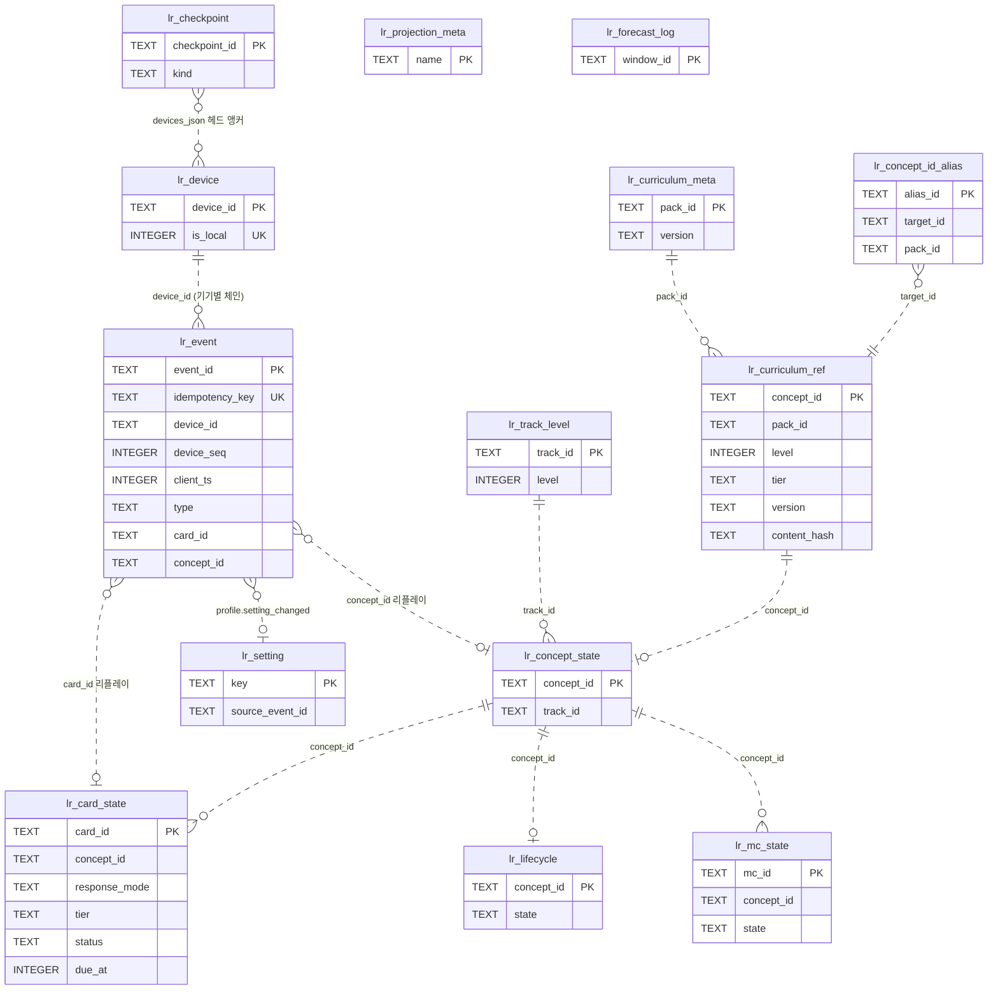

**(b) practice(기기 로컬 상태)**

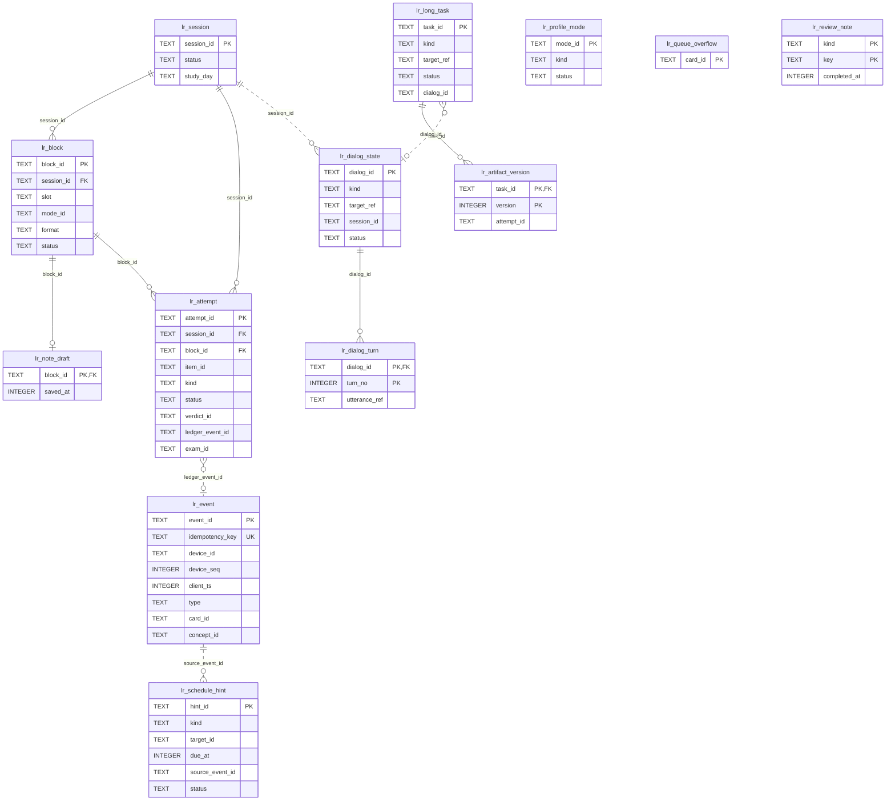

### 6.3 원장 append 계약 (ADR-011 §1~2, CR-26·27)

```sql
-- LEDGER_INSERT (services/learning/src/infra/ledger/ledger.sql.ts) — lr_event에 쓰는 유일한 문장
INSERT OR IGNORE INTO lr_event(event_id, device_id, device_seq, client_ts, type, schema_version, idempotency_key, payload, prev_hash, hash, experiment_arm, recorded_at, ext, ext_v)
VALUES (:event_id, :device_id, :device_seq, :client_ts, :type, :schema_version, :idempotency_key, :payload, :prev_hash, :hash, :experiment_arm, :recorded_at, :ext, :ext_v);

-- LEDGER_DEVICE_HEAD (UNIQUE(device_id, device_seq) 자동 인덱스 사용)
SELECT device_seq, hash, client_ts FROM lr_event WHERE device_id = :device_id ORDER BY device_seq DESC LIMIT 1;

-- LEDGER_FIND_CONFLICT (changes = 0일 때만)
SELECT event_id, device_id, device_seq, idempotency_key, hash FROM lr_event
WHERE event_id = :event_id OR idempotency_key = :idempotency_key OR (device_id = :device_id AND device_seq = :device_seq);

-- LEDGER_HEADS (체크포인트·export 헤더·epoch ledger_head 앵커)
SELECT e.device_id, e.device_seq AS seq, e.hash AS head_hash FROM lr_event e
WHERE e.device_seq = (SELECT max(device_seq) FROM lr_event x WHERE x.device_id = e.device_id);

-- LEDGER_REPLAY (리플레이·검증 — 유일하게 허용된 순서)
SELECT event_id, device_id, device_seq, client_ts, type, schema_version, idempotency_key, payload, prev_hash, hash
FROM lr_event ORDER BY client_ts, device_id, device_seq;
```

**append 프로토콜**(한 `BEGIN IMMEDIATE` tx, ≤ 100ms; FULL append p99 11.7ms — SP-3 감사):

1. payload zod 검증(type × schema_version) → 정준 JSON 직렬화(`study_day`·`fsrs_at`·`policy_version` 포함).
2. 로컬 기기 헤드 조회(`LEDGER_DEVICE_HEAD`) → `device_seq = head + 1`, `client_ts = max(now, head.client_ts + 1)`, `prev_hash = head.hash`(첫 이벤트 `'0' × 64`), `hash = sha256(canonical({event_id, device_id, device_seq, client_ts, type, schema_version, idempotency_key, payload, prev_hash}))`.
3. `LEDGER_INSERT` 실행.
4. `changes = 1` → 인라인 투영 갱신(fast path: 카드 `last_ts < client_ts` ∧ 개념 `last_ts < client_ts` 엄격, 아니면 `ix_lr_event_card`·`ix_lr_event_concept`로 키 재도출) → outbox(`learning.evidence.recorded` 등) → COMMIT.
5. **`changes = 0` → `LEDGER_FIND_CONFLICT`**(D-14, 실측 근거: `OR IGNORE`는 CHECK 위반도 조용히 건너뜀):
   - 같은 `idempotency_key` 행이 있으면 = **정상 중복**(backstop·재시도) → 기존 `event_id` 반환, 투영·outbox 없이 COMMIT.
   - 같은 `(device_id, device_seq)`인데 키가 다르면 = 동시 append 경합 또는 체인 분기 → ROLLBACK 후 1회 재시도(헤드 재조회), 두 번째도 같으면 원장 무결성 경보(`LR-INTERNAL-0xx`, degraded 배너).
   - 아무 행도 없으면 = CHECK·NOT NULL 위반이 묵살된 것 → ROLLBACK + `LR-INTERNAL-0xx`(zod 결함 신호, 계약 테스트 실패).
6. 연결은 열 때마다 `PRAGMA recursive_triggers=ON`(REPLACE 시도 = 트리거 거부 — 실측, OFF면 덮어씀 — 실측 대조군).

**병합 import**(job `merge`, ADR-011 §7)는 같은 문장을 5,000건 배치로 쓰되, 배치 전에 헤더 앵커·기기별 체인 연속성을 검증하고 배치 후 `inserted + duplicates(존재 확인) = 배치 크기`를 단언한다(불일치 = import 전체 거부).

### 6.4 투영·정준 해시·shadow 교체

- 투영 테이블 = `lr_card_state` · `lr_concept_state` · `lr_lifecycle` · `lr_mc_state` · `lr_track_level` · `lr_setting`. 정본 상태는 `state_json`(정준 JSON), 인덱스 필요한 값만 STORED 생성 열(`due_at`, `lapses`, `n_graded`, `mastered`, `state`, `level`).
- 리듀서 입력 = upcast된 payload + `client_ts` + **이벤트 `policy_version`이 가리키는 불변 파라미터 세트**(`FATHOM_HOME/policy/sets/<ps>.json`)뿐. 투영 테이블을 읽는 것은 이전 상태 조회뿐이고, `lr_setting`·`lr_curriculum_ref`의 **현재** 값을 리듀서 입력으로 쓰지 않는다(예외: append-only 단조 별칭 맵 `lr_concept_id_alias`, D-12).
- **정준 투영 해시**(`lr_projection_meta.projection_hash`): 테이블 순서 고정 `[lr_card_state, lr_concept_state, lr_lifecycle, lr_mc_state, lr_track_level, lr_setting]`, 각 테이블 행을 PK BINARY 오름차순으로, 행 = 생성 열을 뺀 열의 정준 JSON 객체(`state_json`은 파싱해 값으로 포함), `sha256("<table>\n" + rows.join("\n") + "\n" …)`. `lr_forecast_log`는 리플레이 투영이 아니므로 제외.
- **shadow 교체**(job `merge`·`rebuild`, ADR-011 §7):
  1. 각 투영 T: `DROP TABLE IF EXISTS T__shadow` → `sqlite_schema.sql`에서 T의 DDL을 읽어 이름 토큰만 `T__shadow`로 바꿔 생성(인덱스는 만들지 않음, D-11). 인덱스 DDL 목록을 보관.
  2. `LEDGER_REPLAY` 순서로 전체 리플레이 → shadow에 5,000건마다 커밋(55만 건 ≈ 7.5~10s).
  3. 캐치업: job 시작 시 기록한 `max(lr_event.rowid)` 이후 도착분을 라이브와 같은 증분 경로로 shadow에 적용(rowid = 도착 순서, 리플레이 순서가 아님 — 캐치업 커서 용도로만).
  4. **최종 1 tx**(`BEGIN IMMEDIATE`): 남은 캐치업 → 각 T: `DROP TABLE T; ALTER TABLE T__shadow RENAME TO T;` + 보관한 인덱스 DDL 재실행 → `lr_projection_meta` 갱신 → (merge) `lr_checkpoint` INSERT → outbox `learning.ledger.merged` → COMMIT. (실측: `WITHOUT ROWID`·STORED 생성 열 테이블에서 정상, 인덱스 이름 보존.)
- **LDI 저장 없음**(CR-25): 표시 시 카드 1.4만 장 전체 재계산(9~14ms). 과거 시점 LDI(ΔLDI·과거 오버레이)는 리플레이 컷오프로 계산한다. 정책 전환 대비 훅은 `lr_projection_meta.ext`뿐.
- **θ 수축**(CR-22): `lr_concept_state.state_json`은 `theta`·`theta_q`·`n_graded`를 저장하고 θ̃는 읽을 때 `mastery_rules`(이벤트 정책 버전) 파라미터로 계산한다. UI는 `n_graded < 30`이면 θ 숫자 대신 "증거 부족".

### 6.5 practice 상태

- `lr_session`·`lr_block`: 세션 시작 tx에서 블록 전체와 `items_json`(prefetch `ItemDelivery`)을 기록 → content 정지 중에도 제시 지속(D-9). 종료 세션은 트리거로 불변(DR-013).
- `lr_attempt`: attempt 처리 상태(동기 채점 → 원장 기록 → outbox). 재기동 시 `status IN ('submitted','pending')`를 재개, 원장 중복은 `verdict:<id>` 키가 흡수.
- `lr_dialog_state`(가변) + `lr_dialog_turn`(append-only, 학습자 입력 원문). 시스템 발화 본문은 content `gr_utterance`(참조 `utterance_ref`).
- `lr_long_task` + `lr_artifact_version`(제출본 불변). `lr_schedule_hint`·`lr_queue_overflow`·`lr_profile_mode`는 Composer 입력(FSRS 상태는 바꾸지 않음).
- practice 테이블은 **기기 로컬**이다: 다기기 병합은 원장(+ content 오버레이·ai 골드셋)만 합친다(FR-SET-022). 다른 기기의 세션 이력은 원장 이벤트(세션 ID 포함)로 보인다.

### 6.6 curriculum-ref

- `catalog.concept.changed`(ConceptRef 전체 스냅샷) → `lr_curriculum_ref` UPSERT(`catalog_version` = ConceptRef.version, `pack_version` = 이벤트 version), `catalog.pack.activated` → `lr_curriculum_meta` 대조 → `manifest_hash` 불일치·누락이면 `GET /internal/v1/catalog/curriculum/export?since=<lr_curriculum_sync.catalog_version>`(정수 catalog 버전, 팩 필터 없음)으로 **증분** 재구성, 헤더 `full = true`이거나 sync 행이 없으면 `since` 없이 **전체** 재구성(1 tx: `concept` → `lr_curriculum_ref`, `inventory` → `lr_curriculum_inventory`, `case` → `lr_curriculum_case`, `path` → `lr_curriculum_path`, `header` → `lr_curriculum_sync`·`lr_curriculum_meta`). (CR-41)
- ID 별칭(`ct_id_alias`)은 ConceptRef `deprecated_by`·별칭 목록으로 전달되어 `lr_concept_id_alias`에 **추가만** 된다(D-12).

### 6.7 테이블정의서

#### `lr_event`

증거 원장(append-only, 기기별 해시 체인). 리플레이 = ORDER BY client_ts, device_id, device_seq만. DR-010, DR-020(event.*), NFR-DATA-001·013  
<sub>STRICT · 정의 파일 `services/learning/migrations/ledger/0001_ledger_core.sql`</sub>

| 컬럼 | 타입 | NULL | 기본값 | 키 | 인덱스 | 설명 |
|---|---|---|---|---|---|---|
| `event_id` | TEXT | N |  | PK |  | ULID, 멱등 수입 키(DR-020 이름 훅) |
| `device_id` | TEXT | N |  | UQ(device_id,device_seq) | ix_lr_event_concept, ix_lr_event_card, ix_lr_event_order | 기기 ULID(ASCII 대문자 → BINARY = JS 비교, DR-020) |
| `device_seq` | INTEGER | N |  | UQ(device_id,device_seq) | ix_lr_event_concept, ix_lr_event_card, ix_lr_event_order | 기기별 단조 순번(DR-020) |
| `client_ts` | INTEGER | N |  |  | ix_lr_event_concept, ix_lr_event_card, ix_lr_event_order | epoch ms, 기기별 단조: max(now, last_client_ts + 1) (DR-020) |
| `type` | TEXT | N |  |  | ix_lr_event_corr(부분) | 원장 이벤트 17종(contracts/ledger/types) |
| `schema_version` | INTEGER | N |  |  |  | 타입별 payload 버전, upcaster 입력 |
| `idempotency_key` | TEXT | N |  | UQ |  | 'verdict:<id>'·'corr:…'·'cmd:<id>'… (DR-020) |
| `payload` | TEXT | N |  |  |  | 정준 JSON(리플레이 입력 내장: card_id·concept_id·…·policy_version·fsrs_at·study_day) |
| `prev_hash` | TEXT | N |  |  |  | 같은 device 직전 이벤트 hash(첫 이벤트 '0' × 64) |
| `hash` | TEXT | N |  |  |  | sha256(canonical({event_id, device_id, device_seq, client_ts, type, schema_version, idempotency_key, payload, prev_hash})) |
| `experiment_arm` | TEXT | Y |  |  |  | DR-020 이름 훅(v2 N-of-1 실험, v1 항상 NULL) |
| `recorded_at` | INTEGER | N |  |  |  | 수신 시각(정보용, 리플레이 미사용) |
| `ext` | TEXT | N | '{}' |  |  | 확장(해시 대상 아님) |
| `ext_v` | INTEGER | N | 1 |  |  | ext 스키마 버전 |
| `card_id` | TEXT GEN STORED | Y |  |  | ix_lr_event_card | payload.card_id(카드 키 재도출 인덱스) |
| `concept_id` | TEXT GEN STORED | Y |  |  | ix_lr_event_concept | payload.concept_id(개념 키 재도출 인덱스) |

#### `lr_device`

기기 레지스트리. is_local = 1인 행은 정확히 1개(이 설치). DR-025  
<sub>STRICT · 정의 파일 `services/learning/migrations/ledger/0001_ledger_core.sql`</sub>

| 컬럼 | 타입 | NULL | 기본값 | 키 | 인덱스 | 설명 |
|---|---|---|---|---|---|---|
| `device_id` | TEXT | N |  | PK |  | 기기 ULID |
| `is_local` | INTEGER | N | 0 | UQ | ux_lr_device_local(부분) | 이 설치의 기기 여부 |
| `display_name` | TEXT | N | '' |  |  | 표시 이름(사용자 지정) |
| `platform` | TEXT | N | '' |  |  | 'win32-x64' 등(정보용) |
| `created_at` | INTEGER | N |  |  |  | 최초 등록(로컬 = 설치 시각, 원격 = 첫 병합 시각) |
| `ext` | TEXT | N | '{}' |  |  | 확장 |
| `ext_v` | INTEGER | N | 1 |  |  | ext 스키마 버전 |

#### `lr_checkpoint`

체크포인트 매니페스트(append-only) = 체인 헤드 외부 앵커 ①. root_hash = sha256(정준 devices_json). FR-PRG-003, DR-025, CR-27  
<sub>STRICT · 정의 파일 `services/learning/migrations/ledger/0001_ledger_core.sql`</sub>

| 컬럼 | 타입 | NULL | 기본값 | 키 | 인덱스 | 설명 |
|---|---|---|---|---|---|---|
| `checkpoint_id` | TEXT | N |  | PK |  | ULID(export --since 인자) |
| `kind` | TEXT | N |  |  |  | 생성 사유 |
| `devices_json` | TEXT | N |  |  |  | {device_id: {seq, head_hash}} 기기별 체인 헤드 |
| `root_hash` | TEXT | N |  |  |  | sha256(canonical(devices_json)) |
| `source_file_sha256` | TEXT | Y |  |  |  | 병합 입력 파일 sha256 |
| `projection_hash` | TEXT | Y |  |  |  | 병합 후 투영 해시 |
| `created_at` | INTEGER | N |  |  |  | 생성 시각 |

#### `lr_card_state`

FSRS 카드 투영(개념 × facet × response_mode). DR-011, DR-020(card.response_mode)  
<sub>STRICT · WITHOUT ROWID · 정의 파일 `services/learning/migrations/learner-model/0001_projections.sql`</sub>

| 컬럼 | 타입 | NULL | 기본값 | 키 | 인덱스 | 설명 |
|---|---|---|---|---|---|---|
| `card_id` | TEXT | N |  | PK |  | '<concept_id>:<facet>:r\|p'(결정적, IF-01 CardId, CR-35) |
| `concept_id` | TEXT | N |  |  | ix_lr_card_state_concept | 개념(별칭 해석 후 정본 ID) |
| `facet` | TEXT | N |  |  |  | facet |
| `response_mode` | TEXT | N |  |  |  | DR-020 이름 훅 |
| `tier` | TEXT | N |  |  |  | 보존율 계층 결정 입력(card.enrolled payload) |
| `status` | TEXT | N |  |  | ix_lr_card_state_due | card.status_changed 투영 |
| `last_ts` | INTEGER | N |  |  |  | 마지막 적용 이벤트 client_ts(fast path 엄격 비교) |
| `state_json` | TEXT | N |  |  |  | {due, stability, difficulty, elapsed_days, scheduled_days, learning_steps, reps, lapses, state, last_review, last_fsrs_at, leech} |
| `due_at` | INTEGER | Y | STORED 생성 |  | ix_lr_card_state_due | 다음 due(epoch ms) |
| `lapses` | INTEGER | Y | STORED 생성 |  |  | leech 판정(FR-PRG-030) |

#### `lr_concept_state`

개념 투영: Elo θ/θ_q·수축 θ̃ 입력·숙달·4중 역량. DR-012  
<sub>STRICT, WITHOUT ROWID · 정의 파일 `services/learning/migrations/learner-model/0001_projections.sql`</sub>

| 컬럼 | 타입 | NULL | 기본값 | 키 | 인덱스 | 설명 |
|---|---|---|---|---|---|---|
| `concept_id` | TEXT | N |  | PK |  | 개념 |
| `track_id` | TEXT | N |  |  | ix_lr_concept_state_track | 트랙(curriculum_ref, 첫 적용 시 고정 → 이벤트 payload) |
| `last_ts` | INTEGER | N |  |  |  | 마지막 적용 이벤트 client_ts |
| `state_json` | TEXT | N |  |  |  | {theta, theta_q, n, n_graded, credited_formats{}, study_days[], mastery{p, mastered, provisional}, competency{retained, deepened, transferred, taught}, d_max, solo_max, case_best, teach_best, conf{…}} |
| `n_graded` | INTEGER GEN STORED | Y |  |  |  | 채점 이벤트 수(θ 표시 임계 30) |
| `mastered` | INTEGER GEN STORED | Y |  |  | ix_lr_concept_state_track | 0/1 |

#### `lr_lifecycle`

Concept Lifecycle CL-0~CL-8·CL-X(강등 없음, rusty 표시). FR-PRG-011  
<sub>STRICT, WITHOUT ROWID · 정의 파일 `services/learning/migrations/learner-model/0001_projections.sql`</sub>

| 컬럼 | 타입 | NULL | 기본값 | 키 | 인덱스 | 설명 |
|---|---|---|---|---|---|---|
| `concept_id` | TEXT | N |  | PK |  | 개념 |
| `last_ts` | INTEGER | N |  |  |  | 마지막 적용 이벤트 client_ts |
| `state_json` | TEXT | N |  |  |  | {state, entered_ts, rusty, nba[], history_tail[]} |
| `state` | TEXT GEN STORED | Y |  |  | ix_lr_lifecycle_state | 'CL-0'…'CL-8' \| 'CL-X' |

#### `lr_track_level`

트랙 레벨(끈적한 사실: level.promoted 이후 강등 없음). provisional·needs_reconfirmation 배지  
<sub>STRICT, WITHOUT ROWID · 정의 파일 `services/learning/migrations/learner-model/0001_projections.sql`</sub>

| 컬럼 | 타입 | NULL | 기본값 | 키 | 인덱스 | 설명 |
|---|---|---|---|---|---|---|
| `track_id` | TEXT | N |  | PK |  | 트랙 |
| `last_ts` | INTEGER | N |  |  |  | 마지막 적용 이벤트 client_ts |
| `state_json` | TEXT | N |  |  |  | {level, provisional, needs_reconfirmation, promoted_event_id, profile{policy_version, ai_mode, sp1_state}, last_exam{…}, retry_after_day} |
| `level` | INTEGER GEN STORED | Y |  |  |  | 현재 레벨 0~5 |

#### `lr_mc_state`

오개념 소거 원장 투영(active → suppressed → extinguished). FR-PRG-016  
<sub>STRICT, WITHOUT ROWID · 정의 파일 `services/learning/migrations/learner-model/0001_projections.sql`</sub>

| 컬럼 | 타입 | NULL | 기본값 | 키 | 인덱스 | 설명 |
|---|---|---|---|---|---|---|
| `mc_id` | TEXT | N |  | PK |  | 오개념 |
| `concept_id` | TEXT | N |  |  | ix_lr_mc_state_concept | 개념 |
| `last_ts` | INTEGER | N |  |  |  | 마지막 적용 이벤트 client_ts |
| `state_json` | TEXT | N |  |  |  | {state, rejections, format_groups[], last_seen_ts, retry_due_ts} |
| `state` | TEXT GEN STORED | Y |  |  | ix_lr_mc_state_concept | 'active'\|'suppressed'\|'extinguished' |

#### `lr_setting`

현재 설정(profile.setting_changed 투영 — (client_ts, device_id) 최신 우선). 리플레이는 이 표를 읽지 않음(이벤트 내장 값만). DR-024  
<sub>STRICT, WITHOUT ROWID · 정의 파일 `services/learning/migrations/learner-model/0001_projections.sql`</sub>

| 컬럼 | 타입 | NULL | 기본값 | 키 | 인덱스 | 설명 |
|---|---|---|---|---|---|---|
| `key` | TEXT | N |  | PK |  | 'day_boundary'\|'retention.core'\|'daily_cap.reviews'\|'weekly_goal_days'\|…(contracts SettingKey) |
| `value_json` | TEXT | N |  |  |  | 현재 값 |
| `last_ts` | INTEGER | N |  |  |  | 반영 이벤트 client_ts |
| `source_event_id` | TEXT | N |  |  |  | 반영 원장 event_id |

#### `lr_projection_meta`

투영 메타. projection_hash = 정준 투영 해시(§8.3), fsrs_impl 기록. 체크포인트·epoch 매니페스트 원천  
<sub>STRICT · 정의 파일 `services/learning/migrations/learner-model/0001_projections.sql`</sub>

| 컬럼 | 타입 | NULL | 기본값 | 키 | 인덱스 | 설명 |
|---|---|---|---|---|---|---|
| `name` | TEXT | N |  | PK |  | 투영 이름(v1: 'live' 1행) |
| `projection_hash` | TEXT | N |  |  |  | 정준 투영 해시 |
| `fsrs_impl` | TEXT | N |  |  |  | 'ts-fsrs@5.4.2' |
| `policy_version` | TEXT | N |  |  |  | 마지막 policy.switched의 정책 세트 주소 |
| `event_count` | INTEGER | N |  |  |  | 반영 이벤트 수 |
| `last_order_json` | TEXT | N |  |  |  | 마지막 총순서 키 [client_ts, device_id, device_seq] |
| `computed_at` | INTEGER | N |  |  |  | 계산 시각 |
| `ext` | TEXT | N | '{}' |  |  | 확장(LDI 정책 전환 대비 훅, SP-3 감사) |
| `ext_v` | INTEGER | N | 1 |  |  | ext 스키마 버전 |

#### `lr_forecast_log`

부하 예측 로그(예측 대비 실측 → 띠 폭 보정, 창 ≥ 8개 전에는 ±15%). 리플레이 투영 아님(해시 제외). FR-PRG-018, CR-05  
<sub>STRICT · 정의 파일 `services/learning/migrations/learner-model/0001_projections.sql`</sub>

| 컬럼 | 타입 | NULL | 기본값 | 키 | 인덱스 | 설명 |
|---|---|---|---|---|---|---|
| `window_id` | TEXT | N |  | PK |  | ULID |
| `made_at` | INTEGER | N |  |  | ix_lr_forecast_log_open(부분) | 예측 시각 |
| `made_study_day` | TEXT | N |  |  |  | 예측 시작 학습일 |
| `horizon_days` | INTEGER | N |  |  |  | 예측 지평(기본 30) |
| `model` | TEXT | N |  |  |  | 예측 모델(V-field까지 잠정) |
| `predicted_low` | REAL | N |  |  |  | 띠 하한(거버너 비교값) |
| `predicted_total` | REAL | N |  |  |  | 점 예측(분 또는 리뷰 수) |
| `predicted_high` | REAL | N |  |  |  | 띠 상한 |
| `unit` | TEXT | N |  |  |  | 단위 |
| `actual_total` | REAL | Y |  |  |  | 지평 종료 후 실측(NULL = 미종료) |
| `closed_at` | INTEGER | Y |  |  |  | 실측 확정 시각 |
| `policy_version` | TEXT | N |  |  |  | 예측 시 정책 세트 |

#### `lr_session`

세션. 종료(completed·abandoned) 후 불변(트리거). DR-013, FR-STD-001·031·032  
<sub>STRICT · 정의 파일 `services/learning/migrations/practice/0001_practice_core.sql`</sub>

| 컬럼 | 타입 | NULL | 기본값 | 키 | 인덱스 | 설명 |
|---|---|---|---|---|---|---|
| `session_id` | TEXT | N |  | PK |  | ULID(= Idempotency-Key) |
| `template` | TEXT | N |  |  |  | IF-01 SessionTemplate(CR-37) |
| `scope_json` | TEXT | N |  |  |  | {kind: all\|path\|tracks\|concepts, ids[]}(템플릿에 범위가 없으면 {kind:'all'}) |
| `template_min` | INTEGER | Y |  |  |  | 시간 템플릿(placement·verify·promotion_exam = NULL) |
| `energy` | TEXT | Y |  |  |  | 에너지(standard·dday만) |
| `ai_mode_at_start` | TEXT | N |  |  |  | 시작 시 AI 모드(SessionView.ai_mode_at_start) |
| `jol_pred` | REAL | Y |  |  |  | 세션 전 예측 정답률(선택) |
| `status` | TEXT | N |  |  | ix_lr_session_active(부분) | 상태(paused = IF-LR-012·013, 종료 후 불변 트리거는 completed·abandoned만) |
| `study_day` | TEXT | N |  |  |  | 시작 학습일(04:00 경계, 생성 시 고정) |
| `policy_version` | TEXT | N |  |  |  | 조립 시 정책 세트 |
| `composer_json` | TEXT | N | '{}' |  |  | 조립 근거(Stage1·Stage2 점수 요약) |
| `relaxations_json` | TEXT | N | '[]' |  |  | 하드 제약 완화 사유(1회 표시) |
| `blocks_total` | INTEGER | N | 0 |  |  | 블록 수 |
| `blocks_done` | INTEGER | N | 0 |  |  | 완료 블록 수 |
| `first_item_latency_ms` | INTEGER | Y |  |  |  | 첫 문항 지연(NFR-PERF-001) |
| `started_at` | INTEGER | N |  |  | ix_lr_session_started | 시작 시각 |
| `ended_at` | INTEGER | Y |  |  |  | 종료 시각 |
| `ext` | TEXT | N | '{}' |  |  | 확장 |
| `ext_v` | INTEGER | N | 1 |  |  | ext 스키마 버전 |

#### `lr_block`

세션 블록(슬롯 W/R/N/D/S/C). items_json = items:select 1회 prefetch 결과(ItemDelivery, 정답·해설 없음) — content 정지 중 제시 지속(D-9)  
<sub>STRICT · 정의 파일 `services/learning/migrations/practice/0001_practice_core.sql`</sub>

| 컬럼 | 타입 | NULL | 기본값 | 키 | 인덱스 | 설명 |
|---|---|---|---|---|---|---|
| `block_id` | TEXT | N |  | PK |  | ULID |
| `session_id` | TEXT | N |  | FK→lr_session.session_id, UQ(session_id,ord) |  | 세션 |
| `ord` | INTEGER | N |  | UQ(session_id,ord) |  | 순서(0부터, IF BlockSummary.ord) |
| `slot` | TEXT | N |  |  |  | 슬롯 |
| `kind` | TEXT | N |  |  |  | IF-01 BlockKind(CR-37) |
| `mode_id` | TEXT | N |  |  |  | 'M-03' 등(modes.manifest) |
| `concept_id` | TEXT | Y |  |  |  | 대상 개념(BlockSummary.concept_id) |
| `format` | TEXT | Y |  |  |  | 형식(문항 블록, IF-01 FormatId) |
| `est_minutes` | REAL | N | 0 |  |  | 예상 소요 분(BlockSummary.est_minutes) |
| `boss` | INTEGER | N | 0 |  |  | 보스 챌린지(FR-STD-004) |
| `wildcard` | TEXT | Y |  |  |  | 와일드카드 종류(composer_policy.wildcard 키, 없으면 NULL) |
| `reason_codes_json` | TEXT | N |  |  |  | "왜 지금?" 사유 칩(≥ 1) |
| `locked` | INTEGER | N | 0 |  |  | 잠금(재구성 시 유지) |
| `status` | TEXT | N |  |  |  | IF-01 BlockState(awaiting_grade = IF-LR-010 ⑤, CR-37) |
| `swapped_by` | TEXT | Y |  |  |  | 교체 블록(status = swapped) |
| `items_json` | TEXT | N | '[]' |  |  | prefetch ItemDelivery 목록 |
| `cursor` | INTEGER | N | 0 |  |  | 블록 내 진행 위치(재개) |
| `started_at` | INTEGER | Y |  |  |  | 시작 시각 |
| `done_at` | INTEGER | Y |  |  |  | 완료 시각 |

#### `lr_attempt`

응답 처리 상태(attempt 단위). 원장 기록 여부·Verdict 연결. 재시작 후 재개·중복 0(FR-STD-031)  
<sub>STRICT · 정의 파일 `services/learning/migrations/practice/0001_practice_core.sql`</sub>

| 컬럼 | 타입 | NULL | 기본값 | 키 | 인덱스 | 설명 |
|---|---|---|---|---|---|---|
| `attempt_id` | TEXT | N |  | PK |  | 브라우저 ULID(= Idempotency-Key) |
| `session_id` | TEXT | N |  | FK→lr_session.session_id | ix_lr_attempt_session | 세션 |
| `block_id` | TEXT | Y |  | FK→lr_block.block_id |  | 블록 |
| `item_id` | TEXT | N |  |  |  | 문항 |
| `kind` | TEXT | N |  |  |  | 원장 매핑 종류 |
| `status` | TEXT | N |  |  | ix_lr_attempt_open(부분) | 처리 상태(awaiting_self_grade = 자기채점 대기, CR-37) |
| `verdict_id` | TEXT | Y |  |  |  | 최신 Verdict |
| `ledger_event_id` | TEXT | Y |  |  |  | 기록된 원장 이벤트 |
| `exam_id` | TEXT | Y |  |  |  | 승급 평가 소속 |
| `submitted_at` | INTEGER | N |  |  |  | 제출 시각 |
| `updated_at` | INTEGER | N |  |  |  | 갱신 시각 |

#### `lr_dialog_state`

대화 상태(디깅·Feynman·Case 토론·산출물 반박). 상태기계 정의는 팩, 판정·발화는 content. AQ-03  
<sub>STRICT · 정의 파일 `services/learning/migrations/practice/0001_practice_core.sql`</sub>

| 컬럼 | 타입 | NULL | 기본값 | 키 | 인덱스 | 설명 |
|---|---|---|---|---|---|---|
| `dialog_id` | TEXT | N |  | PK |  | ULID |
| `kind` | TEXT | N |  |  |  | 대화 종류(= IF-01 DialogKind, CR-37. Case 토론은 lr_long_task + dig) |
| `target_ref` | TEXT | N |  |  |  | concept_id · case_id · artifact_id |
| `session_id` | TEXT | Y |  |  |  | 시작 세션 |
| `state_json` | TEXT | N |  |  |  | 상태기계 위치(move, 깊이 게이지, 실패 수) |
| `turn_count` | INTEGER | N | 0 |  |  | 턴 수(상한 12) |
| `depth_max` | INTEGER | N | 0 |  |  | 도달 D 단계 |
| `status` | TEXT | N |  |  | ix_lr_dialog_state_active | 상태 |
| `created_at` | INTEGER | N |  |  |  | 시작 시각 |
| `updated_at` | INTEGER | N |  |  | ix_lr_dialog_state_active | 갱신 시각 |
| `ext` | TEXT | N | '{}' |  |  | 확장 |
| `ext_v` | INTEGER | N | 1 |  |  | ext 스키마 버전 |

#### `lr_dialog_turn`

대화 턴 로그(append-only). 학습자 발화 원문(C1) + 판정·발화 참조  
<sub>STRICT · 정의 파일 `services/learning/migrations/practice/0001_practice_core.sql`</sub>

| 컬럼 | 타입 | NULL | 기본값 | 키 | 인덱스 | 설명 |
|---|---|---|---|---|---|---|
| `dialog_id` | TEXT | N |  | PK(1), FK→lr_dialog_state.dialog_id |  | 대화 |
| `turn_no` | INTEGER | N |  | PK(2) |  | 턴 번호 |
| `turn_id` | TEXT | N |  | UQ |  | SubmitTurnBody.turn_id(= Idempotency-Key, CR-37) |
| `learner_text` | TEXT | N |  |  |  | 학습자 입력 |
| `judgment_json` | TEXT | N |  |  |  | content TurnJudge 응답(label·next_move·engine) |
| `utterance_ref` | TEXT | Y |  |  |  | gr_utterance 참조(시스템 발화) |
| `created_at` | INTEGER | N |  |  |  | 기록 시각 |

#### `lr_long_task`

장기 과제(Case run·산출물·카타 시리즈) 진행 상태. 저장·재개. DR-014, FR-STD-025·034  
<sub>STRICT · 정의 파일 `services/learning/migrations/practice/0001_practice_core.sql`</sub>

| 컬럼 | 타입 | NULL | 기본값 | 키 | 인덱스 | 설명 |
|---|---|---|---|---|---|---|
| `task_id` | TEXT | N |  | PK |  | ULID |
| `kind` | TEXT | N |  |  | ix_lr_long_task_target | 과제 종류 |
| `target_ref` | TEXT | N |  |  | ix_lr_long_task_target | case_id · artifact_id |
| `variant_json` | TEXT | N | '{}' |  |  | 인스턴스화 변형(variant_params·root_cause 선택) |
| `recall_mode` | INTEGER | N | 0 |  |  | 변형 소진 회상 모드(w × 0.5) |
| `state_json` | TEXT | N |  |  |  | 공개 노드·결정·요청 비용 로그 |
| `status` | TEXT | N |  |  |  | 상태 |
| `dialog_id` | TEXT | Y |  |  |  | 연결 대화(반박·토론) |
| `created_at` | INTEGER | N |  |  |  | 시작 시각 |
| `updated_at` | INTEGER | N |  |  |  | 갱신 시각 |
| `ext` | TEXT | N | '{}' |  |  | 확장(DR-020 ext: case.world_id·episode_seq) |
| `ext_v` | INTEGER | N | 1 |  |  | ext 스키마 버전 |

#### `lr_artifact_version`

산출물 초안·버전. submitted = 1인 행은 불변(트리거). DR-014  
<sub>STRICT · 정의 파일 `services/learning/migrations/practice/0001_practice_core.sql`</sub>

| 컬럼 | 타입 | NULL | 기본값 | 키 | 인덱스 | 설명 |
|---|---|---|---|---|---|---|
| `task_id` | TEXT | N |  | PK(1), FK→lr_long_task.task_id |  | 장기 과제 |
| `version` | INTEGER | N |  | PK(2) |  | 버전 |
| `content_md` | TEXT | N |  |  |  | 본문(C1) |
| `submitted` | INTEGER | N | 0 |  |  | 제출본 여부 |
| `attempt_id` | TEXT | Y |  |  |  | 채점 응답(제출본) |
| `created_at` | INTEGER | N |  |  |  | 저장 시각 |

#### `lr_note_draft`

백지노트 초안(블록당 1행, 원장 아님 — 재시작 후 재개). IF-LR-025·IF-GW-066, IF-01 D-32, FR-STD-031, CR-40  
<sub>STRICT · 정의 파일 `services/learning/migrations/practice/0001_practice_core.sql`</sub>

| 컬럼 | 타입 | NULL | 기본값 | 키 | 인덱스 | 설명 |
|---|---|---|---|---|---|---|
| `block_id` | TEXT | N |  | PK, FK→lr_block.block_id |  | 블록 |
| `text` | TEXT | N |  |  |  | 초안 본문(C1, NFC) |
| `uncertain_spans_json` | TEXT | N | '[]' |  |  | 불확실 표시 구간 |
| `client_updated_at` | INTEGER | N |  |  |  | 클라이언트 편집 시각(늦은 쓰기 거부 기준) |
| `saved_at` | INTEGER | N |  |  |  | 서버 저장 시각 |

#### `lr_review_note`

주간 리뷰·시즌 회고 사용자 서술(백업·export 대상 — insight.db는 재구성 가능이므로 사용자 원문을 두지 않음). IF-LR-058·033, CR-40  
<sub>STRICT · WITHOUT ROWID · 정의 파일 `services/learning/migrations/practice/0001_practice_core.sql`</sub>

| 컬럼 | 타입 | NULL | 기본값 | 키 | 인덱스 | 설명 |
|---|---|---|---|---|---|---|
| `kind` | TEXT | N |  | PK(1) |  | 종류 |
| `key` | TEXT | N |  | PK(2) |  | weekly = 주 시작 학습일 'YYYY-MM-DD' · season_retro = season_id |
| `body_md` | TEXT | Y |  |  |  | reflection_md · retro_md(C1) |
| `focus_json` | TEXT | N | '[]' |  |  | next_week_focus(개념 ID 목록) |
| `completed_at` | INTEGER | N |  |  |  | 완료 시각 |

#### `lr_profile_mode`

리듬 프로파일(일시정지·크런치·복귀·D-day). 큐 조립 입력(FSRS 상태는 바꾸지 않음). FR-PRG-019~021  
<sub>STRICT · 정의 파일 `services/learning/migrations/practice/0001_practice_core.sql`</sub>

| 컬럼 | 타입 | NULL | 기본값 | 키 | 인덱스 | 설명 |
|---|---|---|---|---|---|---|
| `mode_id` | TEXT | N |  | PK |  | ULID |
| `kind` | TEXT | N |  |  |  | 프로파일 종류 |
| `start_day` | TEXT | N |  |  |  | 시작 학습일 |
| `end_day` | TEXT | Y |  |  |  | 종료 학습일(dday = 목표일) |
| `params_json` | TEXT | N | '{}' |  |  | 범위(개념·블루프린트)·보존율 조정 등 |
| `status` | TEXT | N |  |  | ix_lr_profile_mode_active(부분) | 상태 |
| `created_at` | INTEGER | N |  |  |  | 생성 시각 |
| `ended_at` | INTEGER | Y |  |  |  | 종료 시각 |
| `ext` | TEXT | N | '{}' |  |  | 확장 |
| `ext_v` | INTEGER | N | 1 |  |  | ext 스키마 버전 |

#### `lr_schedule_hint`

예약 힌트(재회상 1d·1w·1m, 고확신 오답 24h 재출제, 재도전 +2d·+14d, 타임캡슐 재질문). Composer 입력  
<sub>STRICT · 정의 파일 `services/learning/migrations/practice/0001_practice_core.sql`</sub>

| 컬럼 | 타입 | NULL | 기본값 | 키 | 인덱스 | 설명 |
|---|---|---|---|---|---|---|
| `hint_id` | TEXT | N |  | PK |  | ULID |
| `kind` | TEXT | N |  |  |  | 힌트 종류 |
| `target_kind` | TEXT | N |  |  |  | 대상 종류 |
| `target_id` | TEXT | N |  |  |  | 대상 ID |
| `due_at` | INTEGER | N |  |  | ix_lr_schedule_hint_due | 예정 시각 |
| `source_event_id` | TEXT | Y |  |  |  | 원인 원장 이벤트 |
| `status` | TEXT | N | 'pending' |  | ix_lr_schedule_hint_due | 상태 |
| `created_at` | INTEGER | N |  |  |  | 생성 시각 |
| `consumed_at` | INTEGER | Y |  |  |  | 소비 시각 |

#### `lr_queue_overflow`

일일 상한 초과 카드의 분산 배치(Keystone 절단분, 다음 3일 로드밸런싱). FR-PRG-006  
<sub>STRICT, WITHOUT ROWID · 정의 파일 `services/learning/migrations/practice/0001_practice_core.sql`</sub>

| 컬럼 | 타입 | NULL | 기본값 | 키 | 인덱스 | 설명 |
|---|---|---|---|---|---|---|
| `card_id` | TEXT | N |  | PK |  | 카드 |
| `target_study_day` | TEXT | N |  |  | ix_lr_queue_overflow_day | 배치 학습일 |
| `created_at` | INTEGER | N |  |  |  | 생성 시각 |

#### `lr_curriculum_ref`

ConceptRef 사본(세션 조립·승급 판정이 content 없이 동작). ARC §7.1 필드 그대로  
<sub>STRICT · 정의 파일 `services/learning/migrations/curriculum-ref/0001_curriculum_ref.sql`</sub>

| 컬럼 | 타입 | NULL | 기본값 | 키 | 인덱스 | 설명 |
|---|---|---|---|---|---|---|
| `concept_id` | TEXT | N |  | PK |  | 개념(정본 ID) |
| `pack_id` | TEXT | N |  |  |  | 출처 팩(이벤트 pack_id 또는 concept_id에서 도출: 'u.<ns>.*' → 'u.<ns>', 그 밖 → 첫 마디 = 트랙 팩) |
| `track` | TEXT | N |  |  | ix_lr_curriculum_ref_track | 트랙 |
| `level` | INTEGER | N |  |  | ix_lr_curriculum_ref_track | 레벨 |
| `tier` | TEXT | N |  |  |  | 티어 |
| `knowledge_type` | TEXT | N |  |  |  | 지식유형 |
| `title_ko` | TEXT | N |  |  |  | 개념명(ConceptRef.title_ko, IF D-13) |
| `title_en` | TEXT | N |  |  |  | 영문명(ConceptRef.title_en) |
| `tags` | TEXT | N | '[]' |  |  | 태그(ConceptRef.tags — D-day cert: 범위) |
| `prereq_ids` | TEXT | N | '[]' |  |  | 선수 개념 ID 목록 |
| `required_for_level` | INTEGER | Y |  |  |  | 승급 필수 레벨 |
| `aliases` | TEXT | N | '[]' |  |  | 동의어(표시·팔레트) |
| `deprecated_by` | TEXT | Y |  |  |  | 후속 개념 |
| `summary_ko` | TEXT | N |  |  |  | 한 줄 요약 |
| `volatility` | TEXT | N |  |  |  | 신선도 |
| `pack_version` | TEXT | N |  |  |  | 팩 SemVer(이벤트 version · export header packs[]) |
| `catalog_version` | INTEGER | N |  |  |  | ConceptRef.version(catalog 단조 버전, CR-41) |
| `content_hash` | TEXT | N |  |  |  | catalog 레코드 해시(오버레이 반영 후) |
| `ext` | TEXT | N | '{}' |  |  | 확장 |
| `ext_v` | INTEGER | N | 1 |  |  | ext 스키마 버전 |

#### `lr_curriculum_sync`

사본 동기화 헤더(1행). 마지막으로 반영한 CurriculumExportHeader.version·pack_set_hash — 증분 export since 기준(CR-41)  
<sub>STRICT · 정의 파일 `services/learning/migrations/curriculum-ref/0001_curriculum_ref.sql`</sub>

| 컬럼 | 타입 | NULL | 기본값 | 키 | 인덱스 | 설명 |
|---|---|---|---|---|---|---|
| `id` | INTEGER | N |  | PK |  | 단일 행 |
| `catalog_version` | INTEGER | N |  |  |  | 반영한 catalog 버전(IF-CT-007 ?since=) |
| `pack_set_hash` | TEXT | N |  |  |  | 반영한 활성 팩 집합 해시 |
| `synced_at` | INTEGER | N |  |  |  | 동기화 시각 |

#### `lr_curriculum_inventory`

트랙별 평가 인벤토리 사본(IF-CT-007 'inventory' 줄 = AssessmentInventory). content 정지 중 structuralFeasibility 입력(D-21, FR-PRG-013·032, CR-41)  
<sub>STRICT · 정의 파일 `services/learning/migrations/curriculum-ref/0001_curriculum_ref.sql`</sub>

| 컬럼 | 타입 | NULL | 기본값 | 키 | 인덱스 | 설명 |
|---|---|---|---|---|---|---|
| `track` | TEXT | N |  | PK |  | 트랙 |
| `inventory_json` | TEXT | N |  |  |  | AssessmentInventory 정준 JSON |
| `catalog_version` | INTEGER | N |  |  |  | 반영 catalog 버전 |
| `synced_at` | INTEGER | N |  |  |  | 동기화 시각 |

#### `lr_curriculum_case`

Case 사본(IF-CT-007 'case' 줄). 승급 T3 Case 게이트·세션 조립이 content 없이 동작(CR-41)  
<sub>STRICT · 정의 파일 `services/learning/migrations/curriculum-ref/0001_curriculum_ref.sql`</sub>

| 컬럼 | 타입 | NULL | 기본값 | 키 | 인덱스 | 설명 |
|---|---|---|---|---|---|---|
| `case_id` | TEXT | N |  | PK |  | Case ID |
| `tracks_json` | TEXT | N | '[]' |  |  | 관련 트랙 |
| `level` | INTEGER | N |  |  |  | 레벨 |
| `floor` | INTEGER | N | 0 |  |  | 하한 Case 여부 |

#### `lr_curriculum_path`

학습 경로 사본(IF-CT-007 'path' 줄). SessionScope{kind:'path'}를 content 정지 중에도 해석(D-9, CR-52)  
<sub>STRICT · 정의 파일 `services/learning/migrations/curriculum-ref/0001_curriculum_ref.sql`</sub>

| 컬럼 | 타입 | NULL | 기본값 | 키 | 인덱스 | 설명 |
|---|---|---|---|---|---|---|
| `path_id` | TEXT | N |  | PK |  | 'path.<slug>' |
| `title_ko` | TEXT | N |  |  |  | 경로 이름 |
| `tracks_json` | TEXT | N | '[]' |  |  | 관련 트랙 |
| `concept_ids_json` | TEXT | N | '[]' |  |  | 순서 있는 개념 목록 |
| `catalog_version` | INTEGER | N |  |  |  | 반영 catalog 버전 |

#### `lr_curriculum_meta`

팩별 사본 메타(해시 대조 → 불일치 시 curriculum/export로 전체 재구성)  
<sub>STRICT · 정의 파일 `services/learning/migrations/curriculum-ref/0001_curriculum_ref.sql`</sub>

| 컬럼 | 타입 | NULL | 기본값 | 키 | 인덱스 | 설명 |
|---|---|---|---|---|---|---|
| `pack_id` | TEXT | N |  | PK |  | 팩 |
| `version` | TEXT | N |  |  |  | 반영 버전 |
| `manifest_hash` | TEXT | N |  |  |  | 반영 매니페스트 해시 |
| `synced_at` | INTEGER | N |  |  |  | 동기화 시각 |

#### `lr_concept_id_alias`

개념 ID 별칭(단조 증가·append-only). 투영이 card_id·concept_id를 정본 ID로 해석하는 유일한 입력(설계 결정 D-12)  
<sub>STRICT · 정의 파일 `services/learning/migrations/curriculum-ref/0001_curriculum_ref.sql`</sub>

| 컬럼 | 타입 | NULL | 기본값 | 키 | 인덱스 | 설명 |
|---|---|---|---|---|---|---|
| `alias_id` | TEXT | N |  | PK |  | 옛 concept_id |
| `target_id` | TEXT | N |  |  |  | 새 concept_id |
| `pack_id` | TEXT | N |  |  |  | 발행 팩 |
| `added_at` | INTEGER | N |  |  |  | 수신 시각 |

### 6.8 DDL

`services/learning/migrations/ledger/0001_ledger_core.sql`

```sql
-- @fathom:module=ledger version=1 kind=additive
-- services/learning/migrations/ledger/0001_ledger_core.sql
-- 증거 원장(ADR-011 §1 정본 DDL). 쓰기 = services/learning/src/infra/ledger/ledger-writer.ts의 INSERT OR IGNORE 하나뿐.
-- 모든 learning.db 연결은 PRAGMA recursive_triggers=ON(REPLACE의 암묵 DELETE도 아래 트리거가 거부). 트리거는 실수 방지 장치이지 보안 경계가 아니다.

-- @table 증거 원장(append-only, 기기별 해시 체인). 리플레이 = ORDER BY client_ts, device_id, device_seq만. DR-010, DR-020(event.*), NFR-DATA-001·013
CREATE TABLE lr_event(
  event_id        TEXT    PRIMARY KEY CHECK (length(event_id) = 26),          -- ULID, 멱등 수입 키(DR-020 이름 훅)
  device_id       TEXT    NOT NULL CHECK (length(device_id) = 26 AND device_id NOT GLOB '*[^0-9A-HJKMNP-TV-Z]*'), -- 기기 ULID(ASCII 대문자 → BINARY = JS 비교, DR-020)
  device_seq      INTEGER NOT NULL CHECK (device_seq >= 1),                   -- 기기별 단조 순번(DR-020)
  client_ts       INTEGER NOT NULL,                                           -- epoch ms, 기기별 단조: max(now, last_client_ts + 1) (DR-020)
  type            TEXT    NOT NULL,                                           -- 원장 이벤트 17종(contracts/ledger/types)
  schema_version  INTEGER NOT NULL,                                           -- 타입별 payload 버전, upcaster 입력
  idempotency_key TEXT    NOT NULL UNIQUE,                                    -- 'verdict:<id>'·'corr:…'·'cmd:<id>'… (DR-020)
  payload         TEXT    NOT NULL CHECK (json_valid(payload)),               -- 정준 JSON(리플레이 입력 내장: card_id·concept_id·…·policy_version·fsrs_at·study_day)
  prev_hash       TEXT    NOT NULL,                                           -- 같은 device 직전 이벤트 hash(첫 이벤트 '0' × 64)
  hash            TEXT    NOT NULL,                                           -- sha256(canonical({event_id, device_id, device_seq, client_ts, type, schema_version, idempotency_key, payload, prev_hash}))
  experiment_arm  TEXT,                                                       -- DR-020 이름 훅(v2 N-of-1 실험, v1 항상 NULL)
  recorded_at     INTEGER NOT NULL,                                           -- 수신 시각(정보용, 리플레이 미사용)
  ext             TEXT    NOT NULL DEFAULT '{}' CHECK (json_valid(ext)),      -- 확장(해시 대상 아님)
  ext_v           INTEGER NOT NULL DEFAULT 1,                                 -- ext 스키마 버전
  card_id    TEXT GENERATED ALWAYS AS (json_extract(payload, '$.card_id'))    STORED, -- payload.card_id(카드 키 재도출 인덱스)
  concept_id TEXT GENERATED ALWAYS AS (json_extract(payload, '$.concept_id')) STORED, -- payload.concept_id(개념 키 재도출 인덱스)
  UNIQUE (device_id, device_seq)
) STRICT;
CREATE INDEX ix_lr_event_order   ON lr_event(client_ts, device_id, device_seq);
CREATE INDEX ix_lr_event_card    ON lr_event(card_id, client_ts, device_id, device_seq);
CREATE INDEX ix_lr_event_concept ON lr_event(concept_id, client_ts, device_id, device_seq);
CREATE INDEX ix_lr_event_corr    ON lr_event(type) WHERE type IN ('evidence.voided', 'evidence.weight_adjusted');
CREATE TRIGGER lr_event_no_update BEFORE UPDATE ON lr_event BEGIN SELECT RAISE(ABORT, 'ledger is append-only'); END;
CREATE TRIGGER lr_event_no_delete BEFORE DELETE ON lr_event BEGIN SELECT RAISE(ABORT, 'ledger is append-only'); END;

-- @table 기기 레지스트리. is_local = 1인 행은 정확히 1개(이 설치). DR-025
CREATE TABLE lr_device(
  device_id    TEXT    NOT NULL PRIMARY KEY CHECK (length(device_id) = 26 AND device_id NOT GLOB '*[^0-9A-HJKMNP-TV-Z]*'), -- 기기 ULID
  is_local     INTEGER NOT NULL DEFAULT 0 CHECK (is_local IN (0,1)),          -- 이 설치의 기기 여부
  display_name TEXT    NOT NULL DEFAULT '',                                   -- 표시 이름(사용자 지정)
  platform     TEXT    NOT NULL DEFAULT '',                                   -- 'win32-x64' 등(정보용)
  created_at   INTEGER NOT NULL,                                              -- 최초 등록(로컬 = 설치 시각, 원격 = 첫 병합 시각)
  ext          TEXT    NOT NULL DEFAULT '{}' CHECK (json_valid(ext)),         -- 확장
  ext_v        INTEGER NOT NULL DEFAULT 1                                     -- ext 스키마 버전
) STRICT;
CREATE UNIQUE INDEX ux_lr_device_local ON lr_device(is_local) WHERE is_local = 1;

-- @table 체크포인트 매니페스트(append-only) = 체인 헤드 외부 앵커 ①. root_hash = sha256(정준 devices_json). FR-PRG-003, DR-025, CR-27
CREATE TABLE lr_checkpoint(
  checkpoint_id      TEXT    NOT NULL PRIMARY KEY CHECK (length(checkpoint_id) = 26), -- ULID(export --since 인자)
  kind               TEXT    NOT NULL CHECK (kind IN ('export','merge','epoch','local')), -- 생성 사유
  devices_json       TEXT    NOT NULL CHECK (json_valid(devices_json)),       -- {device_id: {seq, head_hash}} 기기별 체인 헤드
  root_hash          TEXT    NOT NULL CHECK (length(root_hash) = 64),         -- sha256(canonical(devices_json))
  source_file_sha256 TEXT    CHECK (source_file_sha256 IS NULL OR length(source_file_sha256) = 64), -- 병합 입력 파일 sha256
  projection_hash    TEXT    CHECK (projection_hash IS NULL OR length(projection_hash) = 64), -- 병합 후 투영 해시
  created_at         INTEGER NOT NULL                                         -- 생성 시각
) STRICT;
CREATE TRIGGER lr_checkpoint_no_update BEFORE UPDATE ON lr_checkpoint BEGIN SELECT RAISE(ABORT, 'lr_checkpoint is append-only'); END;
CREATE TRIGGER lr_checkpoint_no_delete BEFORE DELETE ON lr_checkpoint BEGIN SELECT RAISE(ABORT, 'lr_checkpoint is append-only'); END;
```

`services/learning/migrations/learner-model/0001_projections.sql`

```sql
-- @fathom:module=learner-model version=1 kind=additive
-- services/learning/migrations/learner-model/0001_projections.sql
-- 인라인 투영(원장 append와 같은 tx). 전부 원장 + 이벤트가 참조하는 정책 세트로 재구성 가능(파생).
-- 정본 상태 = state_json(정준 JSON: 정렬 키·최단 왕복 숫자). 인덱스용 열은 state_json의 STORED 생성 열.
-- merge·rebuild job은 같은 DDL로 <name>__shadow를 만들어 전체 리플레이 후 1 tx로 교체한다(§8.4). 이 테이블에는 뷰·트리거를 두지 않는다.
-- LDI 전용 항·스냅샷 테이블은 두지 않는다(표시 시 전체 재계산, SP-3 감사).

-- @table FSRS 카드 투영(개념 × facet × response_mode). DR-011, DR-020(card.response_mode)
CREATE TABLE lr_card_state(
  card_id       TEXT    NOT NULL PRIMARY KEY,                                 -- '<concept_id>:<facet>:r|p'(결정적, IF-01 CardId, CR-35)
  concept_id    TEXT    NOT NULL,                                             -- 개념(별칭 해석 후 정본 ID)
  facet         TEXT    NOT NULL,                                             -- facet
  response_mode TEXT    NOT NULL CHECK (response_mode IN ('recognition','production')), -- DR-020 이름 훅
  tier          TEXT    NOT NULL CHECK (tier IN ('A','B','C')),               -- 보존율 계층 결정 입력(card.enrolled payload)
  status        TEXT    NOT NULL CHECK (status IN ('active','suspended','retired')), -- card.status_changed 투영
  last_ts       INTEGER NOT NULL,                                             -- 마지막 적용 이벤트 client_ts(fast path 엄격 비교)
  state_json    TEXT    NOT NULL CHECK (json_valid(state_json)),              -- {due, stability, difficulty, elapsed_days, scheduled_days, learning_steps, reps, lapses, state, last_review, last_fsrs_at, leech}
  due_at        INTEGER GENERATED ALWAYS AS (json_extract(state_json, '$.due')) STORED, -- 다음 due(epoch ms)
  lapses        INTEGER GENERATED ALWAYS AS (json_extract(state_json, '$.lapses')) STORED -- leech 판정(FR-PRG-030)
) STRICT, WITHOUT ROWID;
CREATE INDEX ix_lr_card_state_due     ON lr_card_state(status, due_at);
CREATE INDEX ix_lr_card_state_concept ON lr_card_state(concept_id);

-- @table 개념 투영: Elo θ/θ_q·수축 θ̃ 입력·숙달·4중 역량. DR-012
CREATE TABLE lr_concept_state(
  concept_id  TEXT    NOT NULL PRIMARY KEY,                                   -- 개념
  track_id    TEXT    NOT NULL,                                               -- 트랙(curriculum_ref, 첫 적용 시 고정 → 이벤트 payload)
  last_ts     INTEGER NOT NULL,                                               -- 마지막 적용 이벤트 client_ts
  state_json  TEXT    NOT NULL CHECK (json_valid(state_json)),                -- {theta, theta_q, n, n_graded, credited_formats{}, study_days[], mastery{p, mastered, provisional}, competency{retained, deepened, transferred, taught}, d_max, solo_max, case_best, teach_best, conf{…}}
  n_graded    INTEGER GENERATED ALWAYS AS (json_extract(state_json, '$.n_graded')) STORED,        -- 채점 이벤트 수(θ 표시 임계 30)
  mastered    INTEGER GENERATED ALWAYS AS (json_extract(state_json, '$.mastery.mastered')) STORED -- 0/1
) STRICT, WITHOUT ROWID;
CREATE INDEX ix_lr_concept_state_track ON lr_concept_state(track_id, mastered);

-- @table Concept Lifecycle CL-0~CL-8·CL-X(강등 없음, rusty 표시). FR-PRG-011
CREATE TABLE lr_lifecycle(
  concept_id TEXT    NOT NULL PRIMARY KEY,                                    -- 개념
  last_ts    INTEGER NOT NULL,                                                -- 마지막 적용 이벤트 client_ts
  state_json TEXT    NOT NULL CHECK (json_valid(state_json)),                 -- {state, entered_ts, rusty, nba[], history_tail[]}
  state      TEXT    GENERATED ALWAYS AS (json_extract(state_json, '$.state')) STORED -- 'CL-0'…'CL-8' | 'CL-X'
) STRICT, WITHOUT ROWID;
CREATE INDEX ix_lr_lifecycle_state ON lr_lifecycle(state);

-- @table 트랙 레벨(끈적한 사실: level.promoted 이후 강등 없음). provisional·needs_reconfirmation 배지
CREATE TABLE lr_track_level(
  track_id   TEXT    NOT NULL PRIMARY KEY,                                    -- 트랙
  last_ts    INTEGER NOT NULL,                                                -- 마지막 적용 이벤트 client_ts
  state_json TEXT    NOT NULL CHECK (json_valid(state_json)),                 -- {level, provisional, needs_reconfirmation, promoted_event_id, profile{policy_version, ai_mode, sp1_state}, last_exam{…}, retry_after_day}
  level      INTEGER GENERATED ALWAYS AS (json_extract(state_json, '$.level')) STORED -- 현재 레벨 0~5
) STRICT, WITHOUT ROWID;

-- @table 오개념 소거 원장 투영(active → suppressed → extinguished). FR-PRG-016
CREATE TABLE lr_mc_state(
  mc_id      TEXT    NOT NULL PRIMARY KEY,                                    -- 오개념
  concept_id TEXT    NOT NULL,                                                -- 개념
  last_ts    INTEGER NOT NULL,                                                -- 마지막 적용 이벤트 client_ts
  state_json TEXT    NOT NULL CHECK (json_valid(state_json)),                 -- {state, rejections, format_groups[], last_seen_ts, retry_due_ts}
  state      TEXT    GENERATED ALWAYS AS (json_extract(state_json, '$.state')) STORED -- 'active'|'suppressed'|'extinguished'
) STRICT, WITHOUT ROWID;
CREATE INDEX ix_lr_mc_state_concept ON lr_mc_state(concept_id, state);

-- @table 현재 설정(profile.setting_changed 투영 — (client_ts, device_id) 최신 우선). 리플레이는 이 표를 읽지 않음(이벤트 내장 값만). DR-024
CREATE TABLE lr_setting(
  key             TEXT    NOT NULL PRIMARY KEY,                               -- 'day_boundary'|'retention.core'|'daily_cap.reviews'|'weekly_goal_days'|…(contracts SettingKey)
  value_json      TEXT    NOT NULL CHECK (json_valid(value_json)),            -- 현재 값
  last_ts         INTEGER NOT NULL,                                           -- 반영 이벤트 client_ts
  source_event_id TEXT    NOT NULL                                            -- 반영 원장 event_id
) STRICT, WITHOUT ROWID;

-- @table 투영 메타. projection_hash = 정준 투영 해시(§8.3), fsrs_impl 기록. 체크포인트·epoch 매니페스트 원천
CREATE TABLE lr_projection_meta(
  name            TEXT    NOT NULL PRIMARY KEY CHECK (name IN ('live')),      -- 투영 이름(v1: 'live' 1행)
  projection_hash TEXT    NOT NULL CHECK (length(projection_hash) = 64),      -- 정준 투영 해시
  fsrs_impl       TEXT    NOT NULL,                                           -- 'ts-fsrs@5.4.2'
  policy_version  TEXT    NOT NULL,                                           -- 마지막 policy.switched의 정책 세트 주소
  event_count     INTEGER NOT NULL,                                           -- 반영 이벤트 수
  last_order_json TEXT    NOT NULL CHECK (json_valid(last_order_json)),       -- 마지막 총순서 키 [client_ts, device_id, device_seq]
  computed_at     INTEGER NOT NULL,                                           -- 계산 시각
  ext             TEXT    NOT NULL DEFAULT '{}' CHECK (json_valid(ext)),      -- 확장(LDI 정책 전환 대비 훅, SP-3 감사)
  ext_v           INTEGER NOT NULL DEFAULT 1                                  -- ext 스키마 버전
) STRICT;

-- @table 부하 예측 로그(예측 대비 실측 → 띠 폭 보정, 창 ≥ 8개 전에는 ±15%). 리플레이 투영 아님(해시 제외). FR-PRG-018, CR-05
CREATE TABLE lr_forecast_log(
  window_id       TEXT    NOT NULL PRIMARY KEY CHECK (length(window_id) = 26), -- ULID
  made_at         INTEGER NOT NULL,                                           -- 예측 시각
  made_study_day  TEXT    NOT NULL CHECK (length(made_study_day) = 10),       -- 예측 시작 학습일
  horizon_days    INTEGER NOT NULL CHECK (horizon_days BETWEEN 1 AND 60),     -- 예측 지평(기본 30)
  model           TEXT    NOT NULL CHECK (model IN ('fsrs','observed')),      -- 예측 모델(V-field까지 잠정)
  predicted_low   REAL    NOT NULL,                                           -- 띠 하한(거버너 비교값)
  predicted_total REAL    NOT NULL,                                           -- 점 예측(분 또는 리뷰 수)
  predicted_high  REAL    NOT NULL,                                           -- 띠 상한
  unit            TEXT    NOT NULL CHECK (unit IN ('minutes','reviews')),     -- 단위
  actual_total    REAL,                                                       -- 지평 종료 후 실측(NULL = 미종료)
  closed_at       INTEGER,                                                    -- 실측 확정 시각
  policy_version  TEXT    NOT NULL                                            -- 예측 시 정책 세트
) STRICT;
CREATE INDEX ix_lr_forecast_log_open ON lr_forecast_log(made_at) WHERE actual_total IS NULL;
```

`services/learning/migrations/practice/0001_practice_core.sql`

```sql
-- @fathom:module=practice version=1 kind=additive
-- services/learning/migrations/practice/0001_practice_core.sql
-- 세션·블록(prefetch 보관)·응답 처리·대화·장기 과제·리듬. 기기 로컬 상태(병합 대상 아님 — 증거는 원장에만).

-- @table 세션. 종료(completed·abandoned) 후 불변(트리거). DR-013, FR-STD-001·031·032
CREATE TABLE lr_session(
  session_id       TEXT    NOT NULL PRIMARY KEY CHECK (length(session_id) = 26), -- ULID(= Idempotency-Key)
  template         TEXT    NOT NULL CHECK (template IN ('standard','placement','verify','promotion_exam','weak_drill','dday','return')), -- IF-01 SessionTemplate(CR-37)
  scope_json       TEXT    NOT NULL CHECK (json_valid(scope_json)),            -- {kind: all|path|tracks|concepts, ids[]}(템플릿에 범위가 없으면 {kind:'all'})
  template_min     INTEGER CHECK (template_min IS NULL OR template_min IN (5,15,25,45,90)), -- 시간 템플릿(placement·verify·promotion_exam = NULL)
  energy           TEXT    CHECK (energy IS NULL OR energy IN ('light','normal','deep')), -- 에너지(standard·dday만)
  ai_mode_at_start TEXT    NOT NULL CHECK (ai_mode_at_start IN ('FULL','JUDGE_ONLY','LLM_ONLY','OFFLINE')), -- 시작 시 AI 모드(SessionView.ai_mode_at_start)
  jol_pred         REAL    CHECK (jol_pred IS NULL OR jol_pred BETWEEN 0 AND 1), -- 세션 전 예측 정답률(선택)
  status           TEXT    NOT NULL CHECK (status IN ('active','paused','completed','abandoned')), -- 상태(paused = IF-LR-012·013, 종료 후 불변 트리거는 completed·abandoned만)
  study_day        TEXT    NOT NULL CHECK (length(study_day) = 10),            -- 시작 학습일(04:00 경계, 생성 시 고정)
  policy_version   TEXT    NOT NULL,                                           -- 조립 시 정책 세트
  composer_json    TEXT    NOT NULL DEFAULT '{}' CHECK (json_valid(composer_json)), -- 조립 근거(Stage1·Stage2 점수 요약)
  relaxations_json TEXT    NOT NULL DEFAULT '[]' CHECK (json_valid(relaxations_json)), -- 하드 제약 완화 사유(1회 표시)
  blocks_total     INTEGER NOT NULL DEFAULT 0,                                 -- 블록 수
  blocks_done      INTEGER NOT NULL DEFAULT 0,                                 -- 완료 블록 수
  first_item_latency_ms INTEGER,                                               -- 첫 문항 지연(NFR-PERF-001)
  started_at       INTEGER NOT NULL,                                           -- 시작 시각
  ended_at         INTEGER,                                                    -- 종료 시각
  ext              TEXT    NOT NULL DEFAULT '{}' CHECK (json_valid(ext)),      -- 확장
  ext_v            INTEGER NOT NULL DEFAULT 1                                  -- ext 스키마 버전
) STRICT;
CREATE INDEX ix_lr_session_started ON lr_session(started_at);
CREATE INDEX ix_lr_session_active  ON lr_session(status) WHERE status = 'active';
CREATE TRIGGER lr_session_frozen BEFORE UPDATE ON lr_session WHEN old.status IN ('completed','abandoned') BEGIN SELECT RAISE(ABORT, 'ended session is immutable'); END;
CREATE TRIGGER lr_session_no_delete BEFORE DELETE ON lr_session BEGIN SELECT RAISE(ABORT, 'lr_session rows are permanent'); END;

-- @table 세션 블록(슬롯 W/R/N/D/S/C). items_json = items:select 1회 prefetch 결과(ItemDelivery, 정답·해설 없음) — content 정지 중 제시 지속(D-9)
CREATE TABLE lr_block(
  block_id          TEXT    NOT NULL PRIMARY KEY CHECK (length(block_id) = 26), -- ULID
  session_id        TEXT    NOT NULL REFERENCES lr_session(session_id),        -- 세션
  ord               INTEGER NOT NULL CHECK (ord >= 0),                         -- 순서(0부터, IF BlockSummary.ord)
  slot              TEXT    NOT NULL CHECK (slot IN ('W','R','N','D','S','C')), -- 슬롯
  kind              TEXT    NOT NULL CHECK (kind IN ('lesson','items','blank_note','dialog','lab','case','artifact','jol','reflection','triage')), -- IF-01 BlockKind(CR-37)
  mode_id           TEXT    NOT NULL,                                          -- 'M-03' 등(modes.manifest)
  concept_id        TEXT,                                                      -- 대상 개념(BlockSummary.concept_id)
  format            TEXT,                                                      -- 형식(문항 블록, IF-01 FormatId)
  est_minutes       REAL    NOT NULL DEFAULT 0,                                -- 예상 소요 분(BlockSummary.est_minutes)
  boss              INTEGER NOT NULL DEFAULT 0 CHECK (boss IN (0,1)),          -- 보스 챌린지(FR-STD-004)
  wildcard          TEXT,                                                      -- 와일드카드 종류(composer_policy.wildcard 키, 없으면 NULL)
  reason_codes_json TEXT    NOT NULL CHECK (json_valid(reason_codes_json)),    -- "왜 지금?" 사유 칩(≥ 1)
  locked            INTEGER NOT NULL DEFAULT 0 CHECK (locked IN (0,1)),        -- 잠금(재구성 시 유지)
  status            TEXT    NOT NULL CHECK (status IN ('pending','active','awaiting_grade','done','skipped','swapped')), -- IF-01 BlockState(awaiting_grade = IF-LR-010 ⑤, CR-37)
  swapped_by        TEXT,                                                      -- 교체 블록(status = swapped)
  items_json        TEXT    NOT NULL DEFAULT '[]' CHECK (json_valid(items_json)), -- prefetch ItemDelivery 목록
  cursor            INTEGER NOT NULL DEFAULT 0,                                -- 블록 내 진행 위치(재개)
  started_at        INTEGER,                                                   -- 시작 시각
  done_at           INTEGER,                                                   -- 완료 시각
  UNIQUE (session_id, ord)
) STRICT;

-- @table 응답 처리 상태(attempt 단위). 원장 기록 여부·Verdict 연결. 재시작 후 재개·중복 0(FR-STD-031)
CREATE TABLE lr_attempt(
  attempt_id      TEXT    NOT NULL PRIMARY KEY CHECK (length(attempt_id) = 26), -- 브라우저 ULID(= Idempotency-Key)
  session_id      TEXT    NOT NULL REFERENCES lr_session(session_id),          -- 세션
  block_id        TEXT    REFERENCES lr_block(block_id),                       -- 블록
  item_id         TEXT    NOT NULL,                                            -- 문항
  kind            TEXT    NOT NULL CHECK (kind IN ('graded','pretest','embedded','self_assessment','exam')), -- 원장 매핑 종류
  status          TEXT    NOT NULL CHECK (status IN ('submitted','awaiting_self_grade','graded','pending','failed')), -- 처리 상태(awaiting_self_grade = 자기채점 대기, CR-37)
  verdict_id      TEXT,                                                        -- 최신 Verdict
  ledger_event_id TEXT,                                                        -- 기록된 원장 이벤트
  exam_id         TEXT,                                                        -- 승급 평가 소속
  submitted_at    INTEGER NOT NULL,                                            -- 제출 시각
  updated_at      INTEGER NOT NULL                                             -- 갱신 시각
) STRICT;
CREATE INDEX ix_lr_attempt_session ON lr_attempt(session_id);
CREATE INDEX ix_lr_attempt_open    ON lr_attempt(status) WHERE status IN ('submitted','awaiting_self_grade','pending');

-- @table 대화 상태(디깅·Feynman·Case 토론·산출물 반박). 상태기계 정의는 팩, 판정·발화는 content. AQ-03
CREATE TABLE lr_dialog_state(
  dialog_id   TEXT    NOT NULL PRIMARY KEY CHECK (length(dialog_id) = 26),     -- ULID
  kind        TEXT    NOT NULL CHECK (kind IN ('dig','feynman','artifact_rebuttal')), -- 대화 종류(= IF-01 DialogKind, CR-37. Case 토론은 lr_long_task + dig)
  target_ref  TEXT    NOT NULL,                                                -- concept_id · case_id · artifact_id
  session_id  TEXT,                                                            -- 시작 세션
  state_json  TEXT    NOT NULL CHECK (json_valid(state_json)),                 -- 상태기계 위치(move, 깊이 게이지, 실패 수)
  turn_count  INTEGER NOT NULL DEFAULT 0 CHECK (turn_count BETWEEN 0 AND 12),  -- 턴 수(상한 12)
  depth_max   INTEGER NOT NULL DEFAULT 0 CHECK (depth_max BETWEEN 0 AND 7),    -- 도달 D 단계
  status      TEXT    NOT NULL CHECK (status IN ('active','completed','abandoned')), -- 상태
  created_at  INTEGER NOT NULL,                                                -- 시작 시각
  updated_at  INTEGER NOT NULL,                                                -- 갱신 시각
  ext         TEXT    NOT NULL DEFAULT '{}' CHECK (json_valid(ext)),           -- 확장
  ext_v       INTEGER NOT NULL DEFAULT 1                                       -- ext 스키마 버전
) STRICT;
CREATE INDEX ix_lr_dialog_state_active ON lr_dialog_state(status, updated_at);

-- @table 대화 턴 로그(append-only). 학습자 발화 원문(C1) + 판정·발화 참조
CREATE TABLE lr_dialog_turn(
  dialog_id     TEXT    NOT NULL REFERENCES lr_dialog_state(dialog_id),        -- 대화
  turn_no       INTEGER NOT NULL CHECK (turn_no BETWEEN 1 AND 12),             -- 턴 번호
  turn_id       TEXT    NOT NULL UNIQUE CHECK (length(turn_id) = 26),          -- SubmitTurnBody.turn_id(= Idempotency-Key, CR-37)
  learner_text  TEXT    NOT NULL,                                              -- 학습자 입력
  judgment_json TEXT    NOT NULL CHECK (json_valid(judgment_json)),            -- content TurnJudge 응답(label·next_move·engine)
  utterance_ref TEXT,                                                          -- gr_utterance 참조(시스템 발화)
  created_at    INTEGER NOT NULL,                                              -- 기록 시각
  PRIMARY KEY (dialog_id, turn_no)
) STRICT;
CREATE TRIGGER lr_dialog_turn_no_update BEFORE UPDATE ON lr_dialog_turn BEGIN SELECT RAISE(ABORT, 'lr_dialog_turn is append-only'); END;
CREATE TRIGGER lr_dialog_turn_no_delete BEFORE DELETE ON lr_dialog_turn BEGIN SELECT RAISE(ABORT, 'lr_dialog_turn is append-only'); END;

-- @table 장기 과제(Case run·산출물·카타 시리즈) 진행 상태. 저장·재개. DR-014, FR-STD-025·034
CREATE TABLE lr_long_task(
  task_id      TEXT    NOT NULL PRIMARY KEY CHECK (length(task_id) = 26),      -- ULID
  kind         TEXT    NOT NULL CHECK (kind IN ('case','artifact')),           -- 과제 종류
  target_ref   TEXT    NOT NULL,                                               -- case_id · artifact_id
  variant_json TEXT    NOT NULL DEFAULT '{}' CHECK (json_valid(variant_json)), -- 인스턴스화 변형(variant_params·root_cause 선택)
  recall_mode  INTEGER NOT NULL DEFAULT 0 CHECK (recall_mode IN (0,1)),        -- 변형 소진 회상 모드(w × 0.5)
  state_json   TEXT    NOT NULL CHECK (json_valid(state_json)),                -- 공개 노드·결정·요청 비용 로그
  status       TEXT    NOT NULL CHECK (status IN ('active','submitted','graded','abandoned')), -- 상태
  dialog_id    TEXT,                                                           -- 연결 대화(반박·토론)
  created_at   INTEGER NOT NULL,                                               -- 시작 시각
  updated_at   INTEGER NOT NULL,                                               -- 갱신 시각
  ext          TEXT    NOT NULL DEFAULT '{}' CHECK (json_valid(ext)),          -- 확장(DR-020 ext: case.world_id·episode_seq)
  ext_v        INTEGER NOT NULL DEFAULT 1                                      -- ext 스키마 버전
) STRICT;
CREATE INDEX ix_lr_long_task_target ON lr_long_task(kind, target_ref);

-- @table 산출물 초안·버전. submitted = 1인 행은 불변(트리거). DR-014
CREATE TABLE lr_artifact_version(
  task_id     TEXT    NOT NULL REFERENCES lr_long_task(task_id),               -- 장기 과제
  version     INTEGER NOT NULL CHECK (version >= 1),                           -- 버전
  content_md  TEXT    NOT NULL,                                                -- 본문(C1)
  submitted   INTEGER NOT NULL DEFAULT 0 CHECK (submitted IN (0,1)),           -- 제출본 여부
  attempt_id  TEXT,                                                            -- 채점 응답(제출본)
  created_at  INTEGER NOT NULL,                                                -- 저장 시각
  PRIMARY KEY (task_id, version)
) STRICT;
CREATE TRIGGER lr_artifact_version_frozen BEFORE UPDATE ON lr_artifact_version WHEN old.submitted = 1 BEGIN SELECT RAISE(ABORT, 'submitted artifact is immutable'); END;
CREATE TRIGGER lr_artifact_version_no_delete BEFORE DELETE ON lr_artifact_version WHEN old.submitted = 1 BEGIN SELECT RAISE(ABORT, 'submitted artifact is immutable'); END;

-- @table 백지노트 초안(블록당 1행, 원장 아님 — 재시작 후 재개). IF-LR-025·IF-GW-066, IF-01 D-32, FR-STD-031, CR-40
CREATE TABLE lr_note_draft(
  block_id          TEXT    NOT NULL PRIMARY KEY REFERENCES lr_block(block_id), -- 블록
  text              TEXT    NOT NULL,                                          -- 초안 본문(C1, NFC)
  uncertain_spans_json TEXT NOT NULL DEFAULT '[]' CHECK (json_valid(uncertain_spans_json)), -- 불확실 표시 구간
  client_updated_at INTEGER NOT NULL,                                          -- 클라이언트 편집 시각(늦은 쓰기 거부 기준)
  saved_at          INTEGER NOT NULL                                           -- 서버 저장 시각
) STRICT;

-- @table 주간 리뷰·시즌 회고 사용자 서술(백업·export 대상 — insight.db는 재구성 가능이므로 사용자 원문을 두지 않음). IF-LR-058·033, CR-40
CREATE TABLE lr_review_note(
  kind         TEXT    NOT NULL CHECK (kind IN ('weekly','season_retro')),    -- 종류
  key          TEXT    NOT NULL,                                               -- weekly = 주 시작 학습일 'YYYY-MM-DD' · season_retro = season_id
  body_md      TEXT,                                                           -- reflection_md · retro_md(C1)
  focus_json   TEXT    NOT NULL DEFAULT '[]' CHECK (json_valid(focus_json)),   -- next_week_focus(개념 ID 목록)
  completed_at INTEGER NOT NULL,                                               -- 완료 시각
  PRIMARY KEY (kind, key)
) STRICT, WITHOUT ROWID;

-- @table 리듬 프로파일(일시정지·크런치·복귀·D-day). 큐 조립 입력(FSRS 상태는 바꾸지 않음). FR-PRG-019~021
CREATE TABLE lr_profile_mode(
  mode_id     TEXT    NOT NULL PRIMARY KEY CHECK (length(mode_id) = 26),       -- ULID
  kind        TEXT    NOT NULL CHECK (kind IN ('pause','crunch','return','dday')), -- 프로파일 종류
  start_day   TEXT    NOT NULL CHECK (length(start_day) = 10),                 -- 시작 학습일
  end_day     TEXT    CHECK (end_day IS NULL OR length(end_day) = 10),         -- 종료 학습일(dday = 목표일)
  params_json TEXT    NOT NULL DEFAULT '{}' CHECK (json_valid(params_json)),   -- 범위(개념·블루프린트)·보존율 조정 등
  status      TEXT    NOT NULL CHECK (status IN ('active','ended','cancelled')), -- 상태
  created_at  INTEGER NOT NULL,                                                -- 생성 시각
  ended_at    INTEGER,                                                         -- 종료 시각
  ext         TEXT    NOT NULL DEFAULT '{}' CHECK (json_valid(ext)),           -- 확장
  ext_v       INTEGER NOT NULL DEFAULT 1                                       -- ext 스키마 버전
) STRICT;
CREATE INDEX ix_lr_profile_mode_active ON lr_profile_mode(status) WHERE status = 'active';

-- @table 예약 힌트(재회상 1d·1w·1m, 고확신 오답 24h 재출제, 재도전 +2d·+14d, 타임캡슐 재질문). Composer 입력
CREATE TABLE lr_schedule_hint(
  hint_id         TEXT    NOT NULL PRIMARY KEY CHECK (length(hint_id) = 26),   -- ULID
  kind            TEXT    NOT NULL CHECK (kind IN ('recall','mc_retry','verify_retry','promotion_retry','timecapsule','inbox_triage')), -- 힌트 종류
  target_kind     TEXT    NOT NULL CHECK (target_kind IN ('concept','card','mc','track','declaration','inbox')), -- 대상 종류
  target_id       TEXT    NOT NULL,                                            -- 대상 ID
  due_at          INTEGER NOT NULL,                                            -- 예정 시각
  source_event_id TEXT,                                                        -- 원인 원장 이벤트
  status          TEXT    NOT NULL DEFAULT 'pending' CHECK (status IN ('pending','consumed','cancelled')), -- 상태
  created_at      INTEGER NOT NULL,                                            -- 생성 시각
  consumed_at     INTEGER                                                      -- 소비 시각
) STRICT;
CREATE INDEX ix_lr_schedule_hint_due ON lr_schedule_hint(status, due_at);

-- @table 일일 상한 초과 카드의 분산 배치(Keystone 절단분, 다음 3일 로드밸런싱). FR-PRG-006
CREATE TABLE lr_queue_overflow(
  card_id          TEXT    NOT NULL PRIMARY KEY,                               -- 카드
  target_study_day TEXT    NOT NULL CHECK (length(target_study_day) = 10),     -- 배치 학습일
  created_at       INTEGER NOT NULL                                            -- 생성 시각
) STRICT, WITHOUT ROWID;
CREATE INDEX ix_lr_queue_overflow_day ON lr_queue_overflow(target_study_day);
```

`services/learning/migrations/curriculum-ref/0001_curriculum_ref.sql`

```sql
-- @fathom:module=curriculum-ref version=1 kind=additive
-- services/learning/migrations/curriculum-ref/0001_curriculum_ref.sql
-- catalog Published Language(ConceptRef)의 계약된 사본. catalog.* 이벤트로 갱신, manifest_hash 불일치 시 export로 재구성.

-- @table ConceptRef 사본(세션 조립·승급 판정이 content 없이 동작). ARC §7.1 필드 그대로
CREATE TABLE lr_curriculum_ref(
  concept_id         TEXT    NOT NULL PRIMARY KEY,                             -- 개념(정본 ID)
  pack_id            TEXT    NOT NULL,                                         -- 출처 팩(이벤트 pack_id 또는 concept_id에서 도출: 'u.<ns>.*' → 'u.<ns>', 그 밖 → 첫 마디 = 트랙 팩)
  track              TEXT    NOT NULL,                                         -- 트랙
  level              INTEGER NOT NULL CHECK (level BETWEEN 1 AND 5),           -- 레벨
  tier               TEXT    NOT NULL CHECK (tier IN ('A','B','C')),           -- 티어
  knowledge_type     TEXT    NOT NULL CHECK (knowledge_type IN ('D','C','P','S')), -- 지식유형
  title_ko           TEXT    NOT NULL,                                         -- 개념명(ConceptRef.title_ko, IF D-13)
  title_en           TEXT    NOT NULL,                                         -- 영문명(ConceptRef.title_en)
  tags               TEXT    NOT NULL DEFAULT '[]' CHECK (json_valid(tags)),   -- 태그(ConceptRef.tags — D-day cert: 범위)
  prereq_ids         TEXT    NOT NULL DEFAULT '[]' CHECK (json_valid(prereq_ids)), -- 선수 개념 ID 목록
  required_for_level INTEGER CHECK (required_for_level BETWEEN 1 AND 5),       -- 승급 필수 레벨
  aliases            TEXT    NOT NULL DEFAULT '[]' CHECK (json_valid(aliases)), -- 동의어(표시·팔레트)
  deprecated_by      TEXT,                                                     -- 후속 개념
  summary_ko         TEXT    NOT NULL,                                         -- 한 줄 요약
  volatility         TEXT    NOT NULL CHECK (volatility IN ('stable','evolving','volatile')), -- 신선도
  pack_version       TEXT    NOT NULL,                                         -- 팩 SemVer(이벤트 version · export header packs[])
  catalog_version    INTEGER NOT NULL CHECK (catalog_version >= 0),            -- ConceptRef.version(catalog 단조 버전, CR-41)
  content_hash       TEXT    NOT NULL CHECK (length(content_hash) = 64),       -- catalog 레코드 해시(오버레이 반영 후)
  ext                TEXT    NOT NULL DEFAULT '{}' CHECK (json_valid(ext)),    -- 확장
  ext_v              INTEGER NOT NULL DEFAULT 1                                -- ext 스키마 버전
) STRICT;
CREATE INDEX ix_lr_curriculum_ref_track ON lr_curriculum_ref(track, level);

-- @table 사본 동기화 헤더(1행). 마지막으로 반영한 CurriculumExportHeader.version·pack_set_hash — 증분 export since 기준(CR-41)
CREATE TABLE lr_curriculum_sync(
  id              INTEGER NOT NULL PRIMARY KEY CHECK (id = 1),                 -- 단일 행
  catalog_version INTEGER NOT NULL CHECK (catalog_version >= 0),               -- 반영한 catalog 버전(IF-CT-007 ?since=)
  pack_set_hash   TEXT    NOT NULL CHECK (length(pack_set_hash) = 64),         -- 반영한 활성 팩 집합 해시
  synced_at       INTEGER NOT NULL                                             -- 동기화 시각
) STRICT;

-- @table 트랙별 평가 인벤토리 사본(IF-CT-007 'inventory' 줄 = AssessmentInventory). content 정지 중 structuralFeasibility 입력(D-21, FR-PRG-013·032, CR-41)
CREATE TABLE lr_curriculum_inventory(
  track           TEXT    NOT NULL PRIMARY KEY,                                -- 트랙
  inventory_json  TEXT    NOT NULL CHECK (json_valid(inventory_json)),         -- AssessmentInventory 정준 JSON
  catalog_version INTEGER NOT NULL CHECK (catalog_version >= 0),               -- 반영 catalog 버전
  synced_at       INTEGER NOT NULL                                             -- 동기화 시각
) STRICT;

-- @table Case 사본(IF-CT-007 'case' 줄). 승급 T3 Case 게이트·세션 조립이 content 없이 동작(CR-41)
CREATE TABLE lr_curriculum_case(
  case_id    TEXT    NOT NULL PRIMARY KEY,                                     -- Case ID
  tracks_json TEXT   NOT NULL DEFAULT '[]' CHECK (json_valid(tracks_json)),    -- 관련 트랙
  level      INTEGER NOT NULL CHECK (level BETWEEN 1 AND 5),                   -- 레벨
  floor      INTEGER NOT NULL DEFAULT 0 CHECK (floor IN (0,1))                 -- 하한 Case 여부
) STRICT;

-- @table 학습 경로 사본(IF-CT-007 'path' 줄). SessionScope{kind:'path'}를 content 정지 중에도 해석(D-9, CR-52)
CREATE TABLE lr_curriculum_path(
  path_id          TEXT    NOT NULL PRIMARY KEY,                               -- 'path.<slug>'
  title_ko         TEXT    NOT NULL,                                           -- 경로 이름
  tracks_json      TEXT    NOT NULL DEFAULT '[]' CHECK (json_valid(tracks_json)), -- 관련 트랙
  concept_ids_json TEXT    NOT NULL DEFAULT '[]' CHECK (json_valid(concept_ids_json)), -- 순서 있는 개념 목록
  catalog_version  INTEGER NOT NULL CHECK (catalog_version >= 0)               -- 반영 catalog 버전
) STRICT;

-- @table 팩별 사본 메타(해시 대조 → 불일치 시 curriculum/export로 전체 재구성)
CREATE TABLE lr_curriculum_meta(
  pack_id       TEXT    NOT NULL PRIMARY KEY,                                  -- 팩
  version       TEXT    NOT NULL,                                              -- 반영 버전
  manifest_hash TEXT    NOT NULL CHECK (length(manifest_hash) = 64),           -- 반영 매니페스트 해시
  synced_at     INTEGER NOT NULL                                               -- 동기화 시각
) STRICT;

-- @table 개념 ID 별칭(단조 증가·append-only). 투영이 card_id·concept_id를 정본 ID로 해석하는 유일한 입력(설계 결정 D-12)
CREATE TABLE lr_concept_id_alias(
  alias_id  TEXT    NOT NULL PRIMARY KEY,                                      -- 옛 concept_id
  target_id TEXT    NOT NULL,                                                  -- 새 concept_id
  pack_id   TEXT    NOT NULL,                                                  -- 발행 팩
  added_at  INTEGER NOT NULL                                                   -- 수신 시각
) STRICT;
CREATE TRIGGER lr_concept_id_alias_no_update BEFORE UPDATE ON lr_concept_id_alias BEGIN SELECT RAISE(ABORT, 'alias map is append-only'); END;
CREATE TRIGGER lr_concept_id_alias_no_delete BEFORE DELETE ON lr_concept_id_alias BEGIN SELECT RAISE(ABORT, 'alias map is append-only'); END;
```

---

## 7. insight.db (learning 읽기 모델 · 재구성 가능 · 백업 제외)

- 원천 = `learning.db`(원장·투영·curriculum_ref). 같은 learning 프로세스가 두 파일을 각각 연다(ATTACH 금지 — B-01). ViewProjector가 비동기로 갱신하고 커서는 `iv_meta['last_event_rowid']`(도착 순서, D-17).
- 재구성: 파일 삭제 → `--mode=migrate`(insight 모듈) → job `rebuild{target:'insight'}`. 복원·병합 후에는 항상 재구성한다.
- `iv_weekly_report`는 **발행된 리포트 기록**(발행 시점 값·정책 버전)이지 LDI 캐시가 아니다. 다른 화면은 LDI를 표시 시 재계산한다(CR-25, CR-30 제안 — DR-016 문구 정렬).
- Brier·ECE는 응답 ≥ 30일 때만 값을 채우고 그 미만은 NULL("표본 부족", FR-PRG-023).

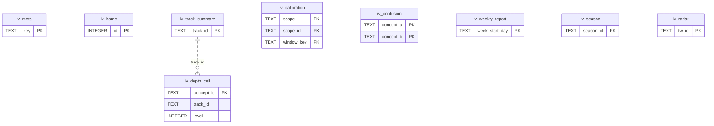

### 7.1 테이블정의서

#### `iv_meta`

투영 커서·버전 메타(key-value). last_event_rowid = 마지막으로 반영한 lr_event.rowid(도착 순서 커서 — 리플레이 순서 아님)  
<sub>STRICT, WITHOUT ROWID · 정의 파일 `services/learning/migrations-insight/0001_insight_views.sql`</sub>

| 컬럼 | 타입 | NULL | 기본값 | 키 | 인덱스 | 설명 |
|---|---|---|---|---|---|---|
| `key` | TEXT | N |  | PK |  | 'last_event_rowid'\|'source_projection_hash'\|'built_at'\|'view_version' |
| `value_json` | TEXT | N |  |  |  | 값 |
| `updated_at` | INTEGER | N |  |  |  | 갱신 시각 |

#### `iv_home`

Home Cockpit 뷰(오늘의 기본 행동·경보 슬롯 입력, 1행)  
<sub>STRICT · 정의 파일 `services/learning/migrations-insight/0001_insight_views.sql`</sub>

| 컬럼 | 타입 | NULL | 기본값 | 키 | 인덱스 | 설명 |
|---|---|---|---|---|---|---|
| `id` | INTEGER | N |  | PK |  | 단일 행 |
| `view_json` | TEXT | N |  |  |  | {primary_action, minutes_suggested, alerts[], weekly_goal{…}} |
| `updated_at` | INTEGER | N |  |  |  | 갱신 시각 |

#### `iv_depth_cell`

Depth Map 셀(개념 노드 상태·레이어). FR-DSH-003·004  
<sub>STRICT, WITHOUT ROWID · 정의 파일 `services/learning/migrations-insight/0001_insight_views.sql`</sub>

| 컬럼 | 타입 | NULL | 기본값 | 키 | 인덱스 | 설명 |
|---|---|---|---|---|---|---|
| `concept_id` | TEXT | N |  | PK |  | 개념 |
| `track_id` | TEXT | N |  |  | ix_iv_depth_cell_track | 트랙 |
| `level` | INTEGER | N |  |  | ix_iv_depth_cell_track | 레벨 층 |
| `cell_json` | TEXT | N |  |  |  | {lifecycle, mastered, retained_ratio, deepened, transferred, taught, provisional, layers{illusion, crack, stale, rusty}} |
| `updated_at` | INTEGER | N |  |  |  | 갱신 시각 |

#### `iv_track_summary`

트랙 요약(레벨·cap·진행 바)  
<sub>STRICT, WITHOUT ROWID · 정의 파일 `services/learning/migrations-insight/0001_insight_views.sql`</sub>

| 컬럼 | 타입 | NULL | 기본값 | 키 | 인덱스 | 설명 |
|---|---|---|---|---|---|---|
| `track_id` | TEXT | N |  | PK |  | 트랙 |
| `summary_json` | TEXT | N |  |  |  | {level, provisional, cap, required{n, mastered}, next_gate{…}} |
| `updated_at` | INTEGER | N |  |  |  | 갱신 시각 |

#### `iv_calibration`

보정 지표 창(Brier·ECE·과신, 응답 ≥ 30일 때만 수치 표시). FR-PRG-023·024  
<sub>STRICT, WITHOUT ROWID · 정의 파일 `services/learning/migrations-insight/0001_insight_views.sql`</sub>

| 컬럼 | 타입 | NULL | 기본값 | 키 | 인덱스 | 설명 |
|---|---|---|---|---|---|---|
| `scope` | TEXT | N |  | PK(1) |  | 범위 |
| `scope_id` | TEXT | N |  | PK(2) |  | 범위 ID('*'\|track_id\|concept_id) |
| `window_key` | TEXT | N |  | PK(3) |  | 이동 창 |
| `n` | INTEGER | N |  |  |  | 확신도 응답 수 |
| `brier` | REAL | Y |  |  |  | Brier(n < 30이면 NULL) |
| `ece` | REAL | Y |  |  |  | ECE 10 bins(n < 30이면 NULL) |
| `overconfidence` | REAL | Y |  |  |  | 평균 확신 − 정답률 |
| `updated_at` | INTEGER | N |  |  |  | 갱신 시각 |

#### `iv_confusion`

개인 혼동 행렬(X 문항에 Y 답 선택 빈도 → 헷갈림 쌍). FR-STD-015  
<sub>STRICT, WITHOUT ROWID · 정의 파일 `services/learning/migrations-insight/0001_insight_views.sql`</sub>

| 컬럼 | 타입 | NULL | 기본값 | 키 | 인덱스 | 설명 |
|---|---|---|---|---|---|---|
| `concept_a` | TEXT | N |  | PK(1) |  | 출제 개념 |
| `concept_b` | TEXT | N |  | PK(2) |  | 혼동 개념 |
| `count` | INTEGER | N |  |  |  | 빈도 |
| `last_ts` | INTEGER | N |  |  |  | 마지막 발생 |

#### `iv_weekly_report`

발행된 주간 리뷰 리포트(발행 시점 값의 기록, 계산 캐시 아님). FR-DSH-009  
<sub>STRICT, WITHOUT ROWID · 정의 파일 `services/learning/migrations-insight/0001_insight_views.sql`</sub>

| 컬럼 | 타입 | NULL | 기본값 | 키 | 인덱스 | 설명 |
|---|---|---|---|---|---|---|
| `week_start_day` | TEXT | N |  | PK |  | 주 시작 학습일 |
| `report_json` | TEXT | N |  |  |  | ΔLDI·약점 Top 5·모드 편중·WVD·편향 …(발행 시 계산값) |
| `policy_version` | TEXT | N |  |  |  | 계산 정책 세트 |
| `computed_at` | INTEGER | N |  |  |  | 계산 시각 |

#### `iv_season`

시즌 플래너·회고 뷰(선언은 원장 declaration.sealed). FR-DSH-012  
<sub>STRICT · WITHOUT ROWID · 정의 파일 `services/learning/migrations-insight/0001_insight_views.sql`</sub>

| 컬럼 | 타입 | NULL | 기본값 | 키 | 인덱스 | 설명 |
|---|---|---|---|---|---|---|
| `season_id` | TEXT | N |  | PK |  | 시즌(= CreateSeasonBody.season_id = declaration_id) |
| `view_json` | TEXT | N |  |  |  | 목표·확률·주간 체크·거시 Brier |
| `updated_at` | INTEGER | N |  |  |  | 갱신 시각 |

#### `iv_radar`

Retention Radar 신호 뷰(TW-01~13 학습 신호). FR-DSH-013  
<sub>STRICT, WITHOUT ROWID · 정의 파일 `services/learning/migrations-insight/0001_insight_views.sql`</sub>

| 컬럼 | 타입 | NULL | 기본값 | 키 | 인덱스 | 설명 |
|---|---|---|---|---|---|---|
| `tw_id` | TEXT | N |  | PK |  | 'TW-01'…'TW-13' |
| `view_json` | TEXT | N |  |  |  | 값·개인 기준선·상태·제안 |
| `updated_at` | INTEGER | N |  |  |  | 갱신 시각 |

### 7.2 DDL

`services/learning/migrations-insight/0001_insight_views.sql`

```sql
-- @fathom:module=insight version=1 kind=additive
-- services/learning/migrations-insight/0001_insight_views.sql
-- insight.db = 재구성 가능한 읽기 모델(백업 제외). 원천 = learning.db 원장·투영·curriculum_ref. 언제든 DROP 후 job rebuild로 재생성.
-- LDI 수치는 여기에 캐시하지 않는다(표시 시 전체 재계산). 주간 리포트는 "발행된 리포트" 기록이며 계산 입력이 아니다.

-- @table 투영 커서·버전 메타(key-value). last_event_rowid = 마지막으로 반영한 lr_event.rowid(도착 순서 커서 — 리플레이 순서 아님)
CREATE TABLE iv_meta(
  key        TEXT    NOT NULL PRIMARY KEY,                                     -- 'last_event_rowid'|'source_projection_hash'|'built_at'|'view_version'
  value_json TEXT    NOT NULL CHECK (json_valid(value_json)),                  -- 값
  updated_at INTEGER NOT NULL                                                  -- 갱신 시각
) STRICT, WITHOUT ROWID;

-- @table Home Cockpit 뷰(오늘의 기본 행동·경보 슬롯 입력, 1행)
CREATE TABLE iv_home(
  id         INTEGER NOT NULL PRIMARY KEY CHECK (id = 1),                      -- 단일 행
  view_json  TEXT    NOT NULL CHECK (json_valid(view_json)),                   -- {primary_action, minutes_suggested, alerts[], weekly_goal{…}}
  updated_at INTEGER NOT NULL                                                  -- 갱신 시각
) STRICT;

-- @table Depth Map 셀(개념 노드 상태·레이어). FR-DSH-003·004
CREATE TABLE iv_depth_cell(
  concept_id TEXT    NOT NULL PRIMARY KEY,                                     -- 개념
  track_id   TEXT    NOT NULL,                                                 -- 트랙
  level      INTEGER NOT NULL CHECK (level BETWEEN 1 AND 5),                   -- 레벨 층
  cell_json  TEXT    NOT NULL CHECK (json_valid(cell_json)),                   -- {lifecycle, mastered, retained_ratio, deepened, transferred, taught, provisional, layers{illusion, crack, stale, rusty}}
  updated_at INTEGER NOT NULL                                                  -- 갱신 시각
) STRICT, WITHOUT ROWID;
CREATE INDEX ix_iv_depth_cell_track ON iv_depth_cell(track_id, level);

-- @table 트랙 요약(레벨·cap·진행 바)
CREATE TABLE iv_track_summary(
  track_id     TEXT    NOT NULL PRIMARY KEY,                                   -- 트랙
  summary_json TEXT    NOT NULL CHECK (json_valid(summary_json)),              -- {level, provisional, cap, required{n, mastered}, next_gate{…}}
  updated_at   INTEGER NOT NULL                                                -- 갱신 시각
) STRICT, WITHOUT ROWID;

-- @table 보정 지표 창(Brier·ECE·과신, 응답 ≥ 30일 때만 수치 표시). FR-PRG-023·024
CREATE TABLE iv_calibration(
  scope        TEXT    NOT NULL CHECK (scope IN ('all','track','concept')),    -- 범위
  scope_id     TEXT    NOT NULL,                                               -- 범위 ID('*'|track_id|concept_id)
  window_key   TEXT    NOT NULL CHECK (window_key IN ('7d','28d','all')),      -- 이동 창
  n            INTEGER NOT NULL,                                               -- 확신도 응답 수
  brier        REAL,                                                           -- Brier(n < 30이면 NULL)
  ece          REAL,                                                           -- ECE 10 bins(n < 30이면 NULL)
  overconfidence REAL,                                                         -- 평균 확신 − 정답률
  updated_at   INTEGER NOT NULL,                                               -- 갱신 시각
  PRIMARY KEY (scope, scope_id, window_key)
) STRICT, WITHOUT ROWID;

-- @table 개인 혼동 행렬(X 문항에 Y 답 선택 빈도 → 헷갈림 쌍). FR-STD-015
CREATE TABLE iv_confusion(
  concept_a  TEXT    NOT NULL,                                                 -- 출제 개념
  concept_b  TEXT    NOT NULL,                                                 -- 혼동 개념
  count      INTEGER NOT NULL,                                                 -- 빈도
  last_ts    INTEGER NOT NULL,                                                 -- 마지막 발생
  PRIMARY KEY (concept_a, concept_b)
) STRICT, WITHOUT ROWID;

-- @table 발행된 주간 리뷰 리포트(발행 시점 값의 기록, 계산 캐시 아님). FR-DSH-009
CREATE TABLE iv_weekly_report(
  week_start_day TEXT    NOT NULL PRIMARY KEY CHECK (length(week_start_day) = 10), -- 주 시작 학습일
  report_json    TEXT    NOT NULL CHECK (json_valid(report_json)),             -- ΔLDI·약점 Top 5·모드 편중·WVD·편향 …(발행 시 계산값)
  policy_version TEXT    NOT NULL,                                             -- 계산 정책 세트
  computed_at    INTEGER NOT NULL                                              -- 계산 시각
) STRICT, WITHOUT ROWID;

-- @table 시즌 플래너·회고 뷰(선언은 원장 declaration.sealed). FR-DSH-012
CREATE TABLE iv_season(
  season_id  TEXT    NOT NULL PRIMARY KEY,                                     -- 시즌(= CreateSeasonBody.season_id = declaration_id)
  view_json  TEXT    NOT NULL CHECK (json_valid(view_json)),                   -- 목표·확률·주간 체크·거시 Brier
  updated_at INTEGER NOT NULL                                                  -- 갱신 시각
) STRICT, WITHOUT ROWID;

-- @table Retention Radar 신호 뷰(TW-01~13 학습 신호). FR-DSH-013
CREATE TABLE iv_radar(
  tw_id      TEXT    NOT NULL PRIMARY KEY,                                     -- 'TW-01'…'TW-13'
  view_json  TEXT    NOT NULL CHECK (json_valid(view_json)),                   -- 값·개인 기준선·상태·제안
  updated_at INTEGER NOT NULL                                                  -- 갱신 시각
) STRICT, WITHOUT ROWID;
```

---

## 8. ai.db (ai-gateway: control · routing · judge · privacy)

- **키 문자열 0**: `ai.db`에는 API 키·토큰·키 일부(last4)도 없다(`secret_source`는 저장 위치 종류일 뿐). 응답의 `last4`는 메모리의 키에서 계산한다(D-21, DR-018 수용기준 grep 0).
- 외부 호출 1건 = `ai_firewall_log` 1행(+ `ai_call_log` 1행, `firewall_decision_id` 필수) → "모든 외부 호출에 판정 id" 증명(ADR-016 §8). Firewall 로그에는 매칭 원문이 없다(규칙 ID·개수만).
- 예산 판정은 `ai_usage_counter`(같은 tx 증가)로 O(1), 원장은 `ai_call_log`(append-only 영구). 금액은 **밀리원 INTEGER**(`cost_krw_milli`, D-22).
- background 레인만 영속(`ai_job`), interactive·conversational은 메모리. `ai_job.input_json`은 호출 직전 Firewall을 통과하며 저장본은 로컬 전용 원본이다(종료 후 90일 삭제, D-25).
- 모드: `ai_mode_state`(1행, 첫 기동 = `OFFLINE`) + `ai_mode_history`(append-only, `ai.mode.changed`와 같은 tx). 동의 = `ai_consent` append-only(최신 행 유효, 첫 기동 0행).

```sql
-- CURRENT_CONSENT (control)
SELECT c.provider_id, c.scope, c.granted, c.data_class_max FROM ai_consent c
WHERE c.decided_at = (SELECT max(decided_at) FROM ai_consent x WHERE x.provider_id = c.provider_id AND x.scope = c.scope);

-- USAGE_ADD (routing, ai_call_log INSERT와 같은 tx)
INSERT INTO ai_usage_counter(period_key, provider_id, billing, calls, tokens_in, tokens_out, cost_krw_milli, updated_at)
VALUES (:period_key, :provider_id, :billing, 1, :tokens_in, :tokens_out, :cost_krw_milli, :now)
ON CONFLICT(period_key, provider_id, billing) DO UPDATE SET calls = calls + 1, tokens_in = tokens_in + excluded.tokens_in,
  tokens_out = tokens_out + excluded.tokens_out, cost_krw_milli = cost_krw_milli + excluded.cost_krw_milli, updated_at = excluded.updated_at;

-- NEXT_BACKGROUND_JOB (routing)
SELECT job_id, task_id, work_order_id, input_json FROM ai_job
WHERE status = 'queued' AND next_attempt_at <= :now ORDER BY priority, next_attempt_at LIMIT 1;
```

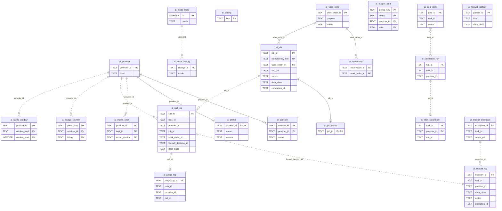

### 8.1 테이블정의서

#### `ai_provider`

제공자 등록(API·CLI·Ollama·Jev·범용 CLI). 비밀 값·키 일부(last4)도 저장하지 않음. FR-AI-001·022·024, FR-SET-008  
<sub>STRICT · 정의 파일 `services/ai-gateway/migrations/control/0001_control_core.sql`</sub>

| 컬럼 | 타입 | NULL | 기본값 | 키 | 인덱스 | 설명 |
|---|---|---|---|---|---|---|
| `provider_id` | TEXT | N |  | PK |  | IF-01 ProviderId(범용 CLI = 'gcli-<slug>', CR-39) |
| `kind` | TEXT | N |  |  |  | 어댑터 종류 |
| `display_name` | TEXT | N |  |  |  | 표시 이름 |
| `billing` | TEXT | N |  |  |  | 과금 모드(= IF-01 billing_mode, 저장 매핑 없음, FR-AI-022, CR-39) |
| `trust` | TEXT | N |  |  |  | canary 통과 여부(unverified → C0만, 수동 토글 불가) |
| `enabled` | INTEGER | N | 1 |  |  | 사용자 활성화 |
| `secret_source` | TEXT | N |  |  |  | 키 저장 위치(값 아님) |
| `config_json` | TEXT | N | '{}' |  |  | 어댑터 설정(범용 CLI: bin·args 템플릿·extract·probe·isolation) — 비밀 금지 |
| `created_at` | INTEGER | N |  |  |  | 등록 시각 |
| `updated_at` | INTEGER | N |  |  |  | 갱신 시각 |
| `ext` | TEXT | N | '{}' |  |  | 확장 |
| `ext_v` | INTEGER | N | 1 |  |  | ext 스키마 버전 |

#### `ai_consent`

동의 기록(append-only, 최신 행이 유효). 첫 기동 = 0행 = OFFLINE. FR-AI-003  
<sub>STRICT · 정의 파일 `services/ai-gateway/migrations/control/0001_control_core.sql`</sub>

| 컬럼 | 타입 | NULL | 기본값 | 키 | 인덱스 | 설명 |
|---|---|---|---|---|---|---|
| `consent_id` | TEXT | N |  | PK |  | ULID |
| `provider_id` | TEXT | N |  | FK→ai_provider.provider_id | ix_ai_consent_provider | 제공자 |
| `scope` | TEXT | N |  |  |  | 동의 범위(= ConsentBody.scopes 1개당 1행, CR-39) |
| `granted` | INTEGER | N |  |  |  | 1 = 동의, 0 = 철회 |
| `data_class_max` | TEXT | N |  |  |  | 송출 허용 최대 등급(C3는 외부 불가) |
| `decided_at` | INTEGER | N |  |  | ix_ai_consent_provider | 결정 시각 |

#### `ai_probe`

최신 probe·canary 결과(제공자별 1행). FR-AI-001·015  
<sub>STRICT · 정의 파일 `services/ai-gateway/migrations/control/0001_control_core.sql`</sub>

| 컬럼 | 타입 | NULL | 기본값 | 키 | 인덱스 | 설명 |
|---|---|---|---|---|---|---|
| `provider_id` | TEXT | N |  | PK, FK→ai_provider.provider_id |  | 제공자 |
| `status` | TEXT | N |  |  |  | 상태(ai.provider.status_changed와 동일 enum) |
| `version` | TEXT | Y |  |  |  | CLI·SDK 버전 문자열 |
| `flags_ok` | INTEGER | N | 0 |  |  | 필수 격리 플래그 확인 |
| `canary_ok` | INTEGER | Y |  |  |  | 오늘 canary 결과 |
| `reason_code` | TEXT | Y |  |  |  | 사유 코드 |
| `probed_at` | INTEGER | N |  |  |  | probe 시각 |
| `canary_day` | TEXT | Y |  |  |  | canary 실행 학습일(매일 첫 기동) |

#### `ai_mode_state`

현재 AI 모드(1행). 첫 기동 = OFFLINE. FR-AI-002  
<sub>STRICT · 정의 파일 `services/ai-gateway/migrations/control/0001_control_core.sql`</sub>

| 컬럼 | 타입 | NULL | 기본값 | 키 | 인덱스 | 설명 |
|---|---|---|---|---|---|---|
| `id` | INTEGER | N |  | PK |  | 단일 행 |
| `mode` | TEXT | N |  |  |  | 현재 모드 |
| `reasons_json` | TEXT | N | '[]' |  |  | 산정 사유 |
| `changed_at` | INTEGER | N |  |  |  | 마지막 변경 |

#### `ai_mode_history`

모드 변경 이력(append-only). ai.mode.changed와 같은 tx  
<sub>STRICT · 정의 파일 `services/ai-gateway/migrations/control/0001_control_core.sql`</sub>

| 컬럼 | 타입 | NULL | 기본값 | 키 | 인덱스 | 설명 |
|---|---|---|---|---|---|---|
| `change_id` | TEXT | N |  | PK |  | ULID(= outbox correlation) |
| `mode` | TEXT | N |  |  |  | 새 모드 |
| `previous_mode` | TEXT | N |  |  |  | 이전 모드 |
| `reasons_json` | TEXT | N |  |  |  | 사유 |
| `changed_at` | INTEGER | N |  |  |  | 변경 시각 |

#### `ai_model_seen`

관측된 모델 버전(드리프트 탐지 → ai.judge.drift_detected). D-14  
<sub>STRICT, WITHOUT ROWID · 정의 파일 `services/ai-gateway/migrations/control/0001_control_core.sql`</sub>

| 컬럼 | 타입 | NULL | 기본값 | 키 | 인덱스 | 설명 |
|---|---|---|---|---|---|---|
| `provider_id` | TEXT | N |  | PK(1) |  | 제공자 |
| `task_id` | TEXT | N |  | PK(2) |  | 과업 |
| `model_version` | TEXT | N |  | PK(3) |  | 응답 model_version |
| `first_seen_at` | INTEGER | N |  |  |  | 최초 관측 |
| `last_seen_at` | INTEGER | N |  |  |  | 최근 관측 |

#### `ai_setting`

AI 사용자 설정(예산 재정의·과업별 선호 제공자·로컬 강제·캐시 고지 확인). 정책 기본값은 ai_policy@v1 파일  
<sub>STRICT, WITHOUT ROWID · 정의 파일 `services/ai-gateway/migrations/control/0001_control_core.sql`</sub>

| 컬럼 | 타입 | NULL | 기본값 | 키 | 인덱스 | 설명 |
|---|---|---|---|---|---|---|
| `key` | TEXT | N |  | PK |  | 'budget.monthly_krw'\|'task.<id>.prefer'\|'task.<id>.local_only'\|… |
| `value_json` | TEXT | N |  |  |  | 값 |
| `updated_at` | INTEGER | N |  |  |  | 갱신 시각 |

#### `ai_work_order`

작업 주문(대량 AI 작업 미리보기·승인). v1 lite = 추정 + 승인 플래그. FR-AI-026  
<sub>STRICT · 정의 파일 `services/ai-gateway/migrations/routing/0001_routing_core.sql`</sub>

| 컬럼 | 타입 | NULL | 기본값 | 키 | 인덱스 | 설명 |
|---|---|---|---|---|---|---|
| `work_order_id` | TEXT | N |  | PK |  | ULID |
| `purpose` | TEXT | N |  |  |  | IF-01 WorkOrderPurpose(CR-39) |
| `requested_by` | TEXT | N |  |  |  | 요청 주체(= CreateWorkOrderBody.requested_by) |
| `caller_svc` | TEXT | N |  |  |  | 호출 서비스(토큰 주체) |
| `tasks_json` | TEXT | N |  |  |  | CreateWorkOrderBody.tasks = WorkOrderView.tasks[{task_id, calls}] |
| `context_ref_json` | TEXT | N |  |  |  | ContextRef |
| `estimate_json` | TEXT | N |  |  |  | {calls, krw, quota_pct, duration_s} |
| `requires_approval` | INTEGER | N |  |  |  | 임계 초과(호출 > 50 ∨ ₩ > 1,000 ∨ 창 쿼터 > 20%, 경계값은 미초과) |
| `status` | TEXT | N |  |  | ix_ai_work_order_status | 상태(= WorkOrderView.state) |
| `cap_json` | TEXT | Y |  |  |  | DecideWorkOrderBody.cap |
| `decided_by` | TEXT | Y |  |  |  | 결정 주체 |
| `reservation_json` | TEXT | N | '{}' |  |  | 예약(Should 훅: calls·krw·expires_at) |
| `consumed_json` | TEXT | N | '{}' |  |  | 소비 실적 |
| `created_at` | INTEGER | N |  |  | ix_ai_work_order_status | 생성 시각 |
| `decided_at` | INTEGER | Y |  |  |  | 결정 시각 |
| `expires_at` | INTEGER | Y |  |  |  | 승인 만료 |
| `ext` | TEXT | N | '{}' |  |  | 확장 |
| `ext_v` | INTEGER | N | 1 |  |  | ext 스키마 버전 |

#### `ai_reservation`

제공자 클래스별 예약·원자 차감(Should — v1은 스키마 훅만, 행 0). ADR-005 §12  
<sub>STRICT · 정의 파일 `services/ai-gateway/migrations/routing/0001_routing_core.sql`</sub>

| 컬럼 | 타입 | NULL | 기본값 | 키 | 인덱스 | 설명 |
|---|---|---|---|---|---|---|
| `reservation_id` | TEXT | N |  | PK |  | ULID |
| `work_order_id` | TEXT | N |  | FK→ai_work_order.work_order_id |  | 작업 주문 |
| `provider_class` | TEXT | N |  |  |  | 'api'\|'subscription:<provider_id>'\|'local' |
| `calls_reserved` | INTEGER | N | 0 |  |  | 예약 호출 수 |
| `krw_milli_reserved` | INTEGER | N | 0 |  |  | 예약 금액(밀리원) |
| `calls_used` | INTEGER | N | 0 |  |  | 사용 호출 수 |
| `krw_milli_used` | INTEGER | N | 0 |  |  | 사용 금액(밀리원) |
| `expires_at` | INTEGER | N |  |  |  | 만료 |

#### `ai_job`

background 레인 작업(앱 재시작 후 재개, 재시도 3회, 멱등 키). FR-AI-010  
<sub>STRICT · 정의 파일 `services/ai-gateway/migrations/routing/0001_routing_core.sql`</sub>

| 컬럼 | 타입 | NULL | 기본값 | 키 | 인덱스 | 설명 |
|---|---|---|---|---|---|---|
| `job_id` | TEXT | N |  | PK |  | ULID |
| `task_id` | TEXT | N |  |  |  | 'AI-G01'…(contracts TaskId) |
| `idempotency_key` | TEXT | N |  | UQ |  | 호출자 키(중복 생성 0) |
| `caller` | TEXT | N |  |  |  | 요청 서비스 |
| `work_order_id` | TEXT | Y |  | FK→ai_work_order.work_order_id |  | 작업 주문(background 필수) |
| `priority` | INTEGER | N | 100 |  | ix_ai_job_runnable(부분) | 낮을수록 먼저 |
| `status` | TEXT | N |  |  | ix_ai_job_runnable(부분) | 상태(= IF-01 JobView.state. 작업 주문 미승인은 JudgeResult.deferred{work_order_pending}로 표현, 상태 아님, CR-39) |
| `attempts` | INTEGER | N | 0 |  |  | 시도 수 |
| `next_attempt_at` | INTEGER | N | 0 |  | ix_ai_job_runnable(부분) | 다음 시도(지수 백오프) |
| `input_json` | TEXT | N |  |  |  | 과업 입력(호출 직전 Firewall 통과 — 저장본은 비검사 원본, 로컬 전용) |
| `data_class` | TEXT | N |  |  |  | 입력 등급 |
| `correlation_id` | TEXT | N |  |  |  | 요청 correlation |
| `prompt_version` | TEXT | Y |  |  |  | 실행 프롬프트 버전 |
| `error_code` | TEXT | Y |  |  |  | 실패 코드 |
| `created_at` | INTEGER | N |  |  |  | 생성 시각 |
| `started_at` | INTEGER | Y |  |  |  | 시작 시각 |
| `finished_at` | INTEGER | Y |  |  | ix_ai_job_finished(부분) | 종료 시각 |

#### `ai_job_result`

작업 결과(ai.job.completed.result_ref로 회수). 회수 후 30일 보존  
<sub>STRICT · 정의 파일 `services/ai-gateway/migrations/routing/0001_routing_core.sql`</sub>

| 컬럼 | 타입 | NULL | 기본값 | 키 | 인덱스 | 설명 |
|---|---|---|---|---|---|---|
| `job_id` | TEXT | N |  | PK, FK→ai_job.job_id CASCADE |  | 작업 |
| `outcome` | TEXT | N |  |  |  | 결과(이벤트 enum) |
| `result_json` | TEXT | N |  |  |  | zod strict 통과 결과 |
| `created_at` | INTEGER | N |  |  |  | 생성 시각 |
| `collected_at` | INTEGER | Y |  |  |  | 호출자 회수 시각 |

#### `ai_call_log`

외부 호출 로그(호출 1건 = 1행, append-only, 영구). 비밀 원문 0. FR-AI-021  
<sub>STRICT · 정의 파일 `services/ai-gateway/migrations/routing/0001_routing_core.sql`</sub>

| 컬럼 | 타입 | NULL | 기본값 | 키 | 인덱스 | 설명 |
|---|---|---|---|---|---|---|
| `call_id` | TEXT | N |  | PK |  | ULID |
| `task_id` | TEXT | N |  |  |  | 과업(TaskId ∪ SystemTaskId 'SYS-CANARY'·'SYS-SMOKE'·'SYS-FWCLS', D-AI-10) |
| `provider_id` | TEXT | N |  |  | ix_ai_call_log_provider | 제공자 |
| `model` | TEXT | Y |  |  |  | 요청 모델 |
| `lane` | TEXT | N |  |  |  | 레인 |
| `job_id` | TEXT | Y |  |  |  | background 작업 |
| `work_order_id` | TEXT | Y |  |  |  | 작업 주문 |
| `prompt_version` | TEXT | Y |  |  |  | 프롬프트 버전(계보·캐시 키) |
| `route_trace_json` | TEXT | N | '[]' |  |  | 후보 탈락 사유 추적 |
| `firewall_decision_id` | TEXT | N |  |  |  | ai_firewall_log.decision_id(우회 0 증명) |
| `firewall_action` | TEXT | N |  |  |  | 적용 조치(block은 호출 0) |
| `data_class` | TEXT | N |  |  |  | 송출 등급 |
| `tokens_in` | INTEGER | Y |  |  |  | 입력 토큰 |
| `tokens_out` | INTEGER | Y |  |  |  | 출력 토큰 |
| `cost_krw_milli` | INTEGER | N | 0 |  |  | 비용(밀리원, 구독·로컬 = 0) |
| `cost_basis` | TEXT | N |  |  |  | 과금 근거(= IF-01 CostBasis, 캐시는 cache_hit 열, CR-39) |
| `cache_hit` | INTEGER | N |  |  |  | 캐시 적중 |
| `latency_ms` | INTEGER | N |  |  |  | 지연 |
| `outcome` | TEXT | N |  |  |  | 결과(= IF-01 CallLogEntry.outcome. 방화벽 차단은 호출 0 → ai_firewall_log에만, 스키마 실패·repair·서킷은 error_code, CR-39) |
| `error_code` | TEXT | Y |  |  |  | 오류 코드 |
| `created_at` | INTEGER | N |  |  | ix_ai_call_log_provider, ix_ai_call_log_created | 호출 시각 |

#### `ai_usage_counter`

기간별 사용량 카운터(예산 판정 O(1)). ai_call_log와 같은 tx에서 증가. FR-AI-007  
<sub>STRICT · WITHOUT ROWID · 정의 파일 `services/ai-gateway/migrations/routing/0001_routing_core.sql`</sub>

| 컬럼 | 타입 | NULL | 기본값 | 키 | 인덱스 | 설명 |
|---|---|---|---|---|---|---|
| `period_key` | TEXT | N |  | PK(1) |  | 'YYYY-MM'(월) \| 'YYYY-MM-DD'(일) |
| `provider_id` | TEXT | N |  | PK(2) |  | 제공자('*' = 합계) |
| `billing` | TEXT | N |  | PK(3) |  | 과금 분리 표시(= billing_mode) |
| `calls` | INTEGER | N | 0 |  |  | 호출 수 |
| `tokens_in` | INTEGER | N | 0 |  |  | 입력 토큰 |
| `tokens_out` | INTEGER | N | 0 |  |  | 출력 토큰 |
| `cost_krw_milli` | INTEGER | N | 0 |  |  | 비용(밀리원) |
| `updated_at` | INTEGER | N |  |  |  | 갱신 시각 |

#### `ai_quota_window`

구독 CLI 쿼터 창(5시간·주간). FR-AI-025  
<sub>STRICT, WITHOUT ROWID · 정의 파일 `services/ai-gateway/migrations/routing/0001_routing_core.sql`</sub>

| 컬럼 | 타입 | NULL | 기본값 | 키 | 인덱스 | 설명 |
|---|---|---|---|---|---|---|
| `provider_id` | TEXT | N |  | PK(1) |  | 구독 제공자 |
| `window_kind` | TEXT | N |  | PK(2) |  | 창 종류 |
| `window_start` | INTEGER | N |  | PK(3) |  | 창 시작(epoch ms) |
| `calls` | INTEGER | N | 0 |  |  | 호출 수 |
| `est_tokens` | INTEGER | N | 0 |  |  | 추정 토큰 |

#### `ai_budget_alert`

예산 임계 발행 기록(80%·100% 이벤트 중복 방지). ai.budget.threshold_reached  
<sub>STRICT, WITHOUT ROWID · 정의 파일 `services/ai-gateway/migrations/routing/0001_routing_core.sql`</sub>

| 컬럼 | 타입 | NULL | 기본값 | 키 | 인덱스 | 설명 |
|---|---|---|---|---|---|---|
| `period_key` | TEXT | N |  | PK(1) |  | 기간 |
| `scope` | TEXT | N |  | PK(2) |  | 범위 |
| `provider_id` | TEXT | N |  | PK(3) |  | 제공자('*' = 합계) |
| `ratio` | REAL | N |  | PK(4) |  | 임계 |
| `raised_at` | INTEGER | N |  |  |  | 발행 시각 |

#### `ai_judge_log`

판정 로그(Jev·LLM-judge 원자료, append-only, 영구). 항목은 객체 키로만. K05 증류·K03 재보정 대비  
<sub>STRICT · 정의 파일 `services/ai-gateway/migrations/judge/0001_judge_core.sql`</sub>

| 컬럼 | 타입 | NULL | 기본값 | 키 | 인덱스 | 설명 |
|---|---|---|---|---|---|---|
| `judge_log_id` | TEXT | N |  | PK |  | ULID(Verdict.judge_log_ref) |
| `task_id` | TEXT | N |  |  | ix_ai_judge_log_task | 'AI-J03'… |
| `engine` | TEXT | N |  |  |  | 판정 엔진 |
| `provider_id` | TEXT | N |  |  |  | 제공자 |
| `model_version` | TEXT | N |  |  |  | DR-020 이름 훅. 응답 model_version |
| `input_hash` | TEXT | N |  |  | ix_ai_judge_log_input | DR-020 이름 훅. sha256(task, prompt_version, 정준 입력) |
| `questions` | TEXT | N |  |  |  | 질문(객체 키 맵, 배열 금지) |
| `probabilities` | TEXT | N |  |  |  | DR-020 이름 훅. 객체 키 → 확률 분포 |
| `confidence` | REAL | Y |  |  |  | 판정 confidence |
| `calibrated` | INTEGER | N |  |  |  | 판정 시점 보정 여부 |
| `latency_ms` | INTEGER | N |  |  |  | 지연 |
| `cost_krw_milli` | INTEGER | N | 0 |  |  | 비용(밀리원) |
| `prompt_version` | TEXT | N |  |  |  | 프롬프트 버전 |
| `call_id` | TEXT | Y |  |  |  | ai_call_log.call_id(캐시 적중이면 원 호출) |
| `created_at` | INTEGER | N |  |  | ix_ai_judge_log_task | 판정 시각 |

#### `ai_gold_item`

개인 골드셋(model_labeled_draft 출하 → 사용자 확정, 인용된 이의). FR-AI-013·027  
<sub>STRICT · 정의 파일 `services/ai-gateway/migrations/judge/0001_judge_core.sql`</sub>

| 컬럼 | 타입 | NULL | 기본값 | 키 | 인덱스 | 설명 |
|---|---|---|---|---|---|---|
| `gold_id` | TEXT | N |  | PK |  | IF-01 GoldId: 시드 'gold.AI-J03.017' · 런타임 ULID |
| `task_id` | TEXT | N |  |  | ix_ai_gold_item_task | 과업 |
| `source` | TEXT | N |  |  |  | 출처 |
| `input_json` | TEXT | N |  |  |  | 판정 입력(합성·익명 위주) |
| `label_json` | TEXT | N |  |  |  | 라벨(객체 키) |
| `status` | TEXT | N |  |  | ix_ai_gold_item_task | 확정 상태(= GoldItemView.state, 확정·교정 ≥ 20 → calibrated 후보, CR-39) |
| `cross_reviewed` | INTEGER | N | 0 |  |  | 타 계열 교차 리뷰 |
| `created_at` | INTEGER | N |  |  |  | 생성 시각 |
| `decided_at` | INTEGER | Y |  |  | ix_ai_gold_item_decided(부분) | 사용자 확정 시각(export since 기준) |
| `ext` | TEXT | N | '{}' |  |  | 확장 |
| `ext_v` | INTEGER | N | 1 |  |  | ext 스키마 버전 |

#### `ai_calibration_run`

캘리브레이션 실행 기록(append-only). SP-1 지표. FR-AI-014  
<sub>STRICT · 정의 파일 `services/ai-gateway/migrations/judge/0001_judge_core.sql`</sub>

| 컬럼 | 타입 | NULL | 기본값 | 키 | 인덱스 | 설명 |
|---|---|---|---|---|---|---|
| `run_id` | TEXT | N |  | PK |  | ULID |
| `task_id` | TEXT | N |  |  |  | 과업 |
| `provider_id` | TEXT | N |  |  |  | 제공자 |
| `model_version` | TEXT | N |  |  |  | 평가 모델 버전 |
| `prompt_version` | TEXT | N | '1.0.0' |  |  | 템플릿(프롬프트) 버전(D-AI-16, CR-39) |
| `gold_count` | INTEGER | N |  |  |  | 사용 골드 수 |
| `metrics_json` | TEXT | N |  |  |  | idea unit 정확도·정밀도·κ·패러프레이즈·장황함 편향 |
| `passed` | INTEGER | N |  |  |  | SP-1 통과 |
| `created_at` | INTEGER | N |  |  |  | 실행 시각 |

#### `ai_task_calibration`

과업별 현재 보정 상태(w_grader 0.9/0.7 결정). 드리프트 시 calibrated = 0  
<sub>STRICT · WITHOUT ROWID · 정의 파일 `services/ai-gateway/migrations/judge/0001_judge_core.sql`</sub>

| 컬럼 | 타입 | NULL | 기본값 | 키 | 인덱스 | 설명 |
|---|---|---|---|---|---|---|
| `task_id` | TEXT | N |  | PK(1) |  | 과업 |
| `provider_id` | TEXT | N |  | PK(2) |  | 제공자 |
| `prompt_version` | TEXT | N | '1.0.0' | PK(3) |  | 템플릿(프롬프트) 버전(D-AI-16, CR-39) |
| `model_version` | TEXT | N |  |  |  | 보정 시 모델 버전 |
| `calibrated` | INTEGER | N |  |  |  | 현재 보정 여부 |
| `run_id` | TEXT | Y |  |  |  | 근거 실행 |
| `updated_at` | INTEGER | N |  |  |  | 갱신 시각 |

#### `ai_firewall_log`

Firewall 판정 로그(append-only, 영구). 외부 호출마다 decision_id 존재(우회 0 증명). FR-AI-019  
<sub>STRICT · 정의 파일 `services/ai-gateway/migrations/privacy/0001_privacy_core.sql`</sub>

| 컬럼 | 타입 | NULL | 기본값 | 키 | 인덱스 | 설명 |
|---|---|---|---|---|---|---|
| `decision_id` | TEXT | N |  | PK |  | ULID(FirewalledPayload.decision_id) |
| `task_id` | TEXT | N |  |  |  | 과업 |
| `provider_id` | TEXT | N |  |  |  | 라우팅 후보 제공자 |
| `route` | TEXT | N |  |  |  | 경로 |
| `data_class` | TEXT | N |  |  |  | 판정 등급 |
| `action` | TEXT | N |  |  |  | 조치 |
| `rule_hits_json` | TEXT | N | '[]' |  |  | 적중 규칙 ID 목록(원문 금지) |
| `mask_count` | INTEGER | N | 0 |  |  | 마스킹 토큰 수 |
| `exception_id` | TEXT | Y |  |  |  | 일회 허용 사용 시 |
| `created_at` | INTEGER | N |  |  | ix_ai_firewall_log_created | 판정 시각 |

#### `ai_firewall_pattern`

사용자 사내 패턴(도메인·사번·프로젝트 코드). content ingress가 GET /firewall/patterns로 읽음  
<sub>STRICT · 정의 파일 `services/ai-gateway/migrations/privacy/0001_privacy_core.sql`</sub>

| 컬럼 | 타입 | NULL | 기본값 | 키 | 인덱스 | 설명 |
|---|---|---|---|---|---|---|
| `pattern_id` | TEXT | N |  | PK |  | ULID |
| `kind` | TEXT | N |  |  |  | 패턴 종류 |
| `pattern` | TEXT | N |  |  |  | 패턴(정규식은 RE2 호환 부분집합 검증) |
| `data_class` | TEXT | N | 'C3' |  |  | 적중 시 등급 |
| `enabled` | INTEGER | N | 1 |  |  | 활성 |
| `created_at` | INTEGER | N |  |  |  | 생성 시각 |
| `updated_at` | INTEGER | N |  |  |  | 갱신 시각 |
| `ext` | TEXT | N | '{}' |  |  | 확장 |
| `ext_v` | INTEGER | N | 1 |  |  | ext 스키마 버전 |

#### `ai_firewall_exception`

과업 단위 일회 허용(과잉 마스킹 예외, 사용 시 로그). ADR-016 결과  
<sub>STRICT · 정의 파일 `services/ai-gateway/migrations/privacy/0001_privacy_core.sql`</sub>

| 컬럼 | 타입 | NULL | 기본값 | 키 | 인덱스 | 설명 |
|---|---|---|---|---|---|---|
| `exception_id` | TEXT | N |  | PK |  | ULID |
| `task_id` | TEXT | N |  |  |  | 과업 |
| `scope_ref` | TEXT | N |  |  |  | 대상(요청 input_hash) |
| `rule_ids_json` | TEXT | N |  |  |  | 예외 규칙 ID(C3 규칙은 불가) |
| `granted_at` | INTEGER | N |  |  |  | 허용 시각 |
| `expires_at` | INTEGER | N |  |  |  | 만료(기본 +10분) |
| `consumed_at` | INTEGER | Y |  |  |  | 사용 시각(1회) |

### 8.2 DDL

`services/ai-gateway/migrations/control/0001_control_core.sql`

```sql
-- @fathom:module=control version=1 kind=additive
-- services/ai-gateway/migrations/control/0001_control_core.sql
-- 제공자·동의·probe·모드. ai.db에는 키 문자열 0(키는 OS 키체인·secrets/ai-keys.enc·env, 메모리만). DR-018

-- @table 제공자 등록(API·CLI·Ollama·Jev·범용 CLI). 비밀 값·키 일부(last4)도 저장하지 않음. FR-AI-001·022·024, FR-SET-008
CREATE TABLE ai_provider(
  provider_id   TEXT    NOT NULL PRIMARY KEY CHECK (provider_id GLOB 'gcli-*' OR provider_id IN ('jev','anthropic-api','openai-api','gemini-api','ollama','claude-cli','codex-cli','gemini-cli')), -- IF-01 ProviderId(범용 CLI = 'gcli-<slug>', CR-39)
  kind          TEXT    NOT NULL CHECK (kind IN ('jev','anthropic_api','openai_api','gemini_api','ollama','claude_cli','codex_cli','gemini_cli','generic_cli')), -- 어댑터 종류
  display_name  TEXT    NOT NULL,                                              -- 표시 이름
  billing       TEXT    NOT NULL CHECK (billing IN ('metered','subscription','free','local')), -- 과금 모드(= IF-01 billing_mode, 저장 매핑 없음, FR-AI-022, CR-39)
  trust         TEXT    NOT NULL CHECK (trust IN ('verified','unverified')),   -- canary 통과 여부(unverified → C0만, 수동 토글 불가)
  enabled       INTEGER NOT NULL DEFAULT 1 CHECK (enabled IN (0,1)),           -- 사용자 활성화
  secret_source TEXT    NOT NULL CHECK (secret_source IN ('none','keychain','enc_file','env')), -- 키 저장 위치(값 아님)
  config_json   TEXT    NOT NULL DEFAULT '{}' CHECK (json_valid(config_json)), -- 어댑터 설정(범용 CLI: bin·args 템플릿·extract·probe·isolation) — 비밀 금지
  created_at    INTEGER NOT NULL,                                              -- 등록 시각
  updated_at    INTEGER NOT NULL,                                              -- 갱신 시각
  ext           TEXT    NOT NULL DEFAULT '{}' CHECK (json_valid(ext)),         -- 확장
  ext_v         INTEGER NOT NULL DEFAULT 1                                     -- ext 스키마 버전
) STRICT;

-- @table 동의 기록(append-only, 최신 행이 유효). 첫 기동 = 0행 = OFFLINE. FR-AI-003
CREATE TABLE ai_consent(
  consent_id     TEXT    NOT NULL PRIMARY KEY CHECK (length(consent_id) = 26), -- ULID
  provider_id    TEXT    NOT NULL REFERENCES ai_provider(provider_id),         -- 제공자
  scope          TEXT    NOT NULL CHECK (scope IN ('judge','generate','batch')), -- 동의 범위(= ConsentBody.scopes 1개당 1행, CR-39)
  granted        INTEGER NOT NULL CHECK (granted IN (0,1)),                    -- 1 = 동의, 0 = 철회
  data_class_max TEXT    NOT NULL CHECK (data_class_max IN ('C0','C1','C2')),  -- 송출 허용 최대 등급(C3는 외부 불가)
  decided_at     INTEGER NOT NULL                                              -- 결정 시각
) STRICT;
CREATE INDEX ix_ai_consent_provider ON ai_consent(provider_id, decided_at);
CREATE TRIGGER ai_consent_no_update BEFORE UPDATE ON ai_consent BEGIN SELECT RAISE(ABORT, 'ai_consent is append-only'); END;
CREATE TRIGGER ai_consent_no_delete BEFORE DELETE ON ai_consent BEGIN SELECT RAISE(ABORT, 'ai_consent is append-only'); END;

-- @table 최신 probe·canary 결과(제공자별 1행). FR-AI-001·015
CREATE TABLE ai_probe(
  provider_id   TEXT    NOT NULL PRIMARY KEY REFERENCES ai_provider(provider_id), -- 제공자
  status        TEXT    NOT NULL CHECK (status IN ('ok','degraded','down','unconsented','disabled')), -- 상태(ai.provider.status_changed와 동일 enum)
  version       TEXT,                                                          -- CLI·SDK 버전 문자열
  flags_ok      INTEGER NOT NULL DEFAULT 0 CHECK (flags_ok IN (0,1)),          -- 필수 격리 플래그 확인
  canary_ok     INTEGER CHECK (canary_ok IS NULL OR canary_ok IN (0,1)),       -- 오늘 canary 결과
  reason_code   TEXT,                                                          -- 사유 코드
  probed_at     INTEGER NOT NULL,                                              -- probe 시각
  canary_day    TEXT                                                           -- canary 실행 학습일(매일 첫 기동)
) STRICT;

-- @table 현재 AI 모드(1행). 첫 기동 = OFFLINE. FR-AI-002
CREATE TABLE ai_mode_state(
  id            INTEGER NOT NULL PRIMARY KEY CHECK (id = 1),                   -- 단일 행
  mode          TEXT    NOT NULL CHECK (mode IN ('FULL','JUDGE_ONLY','LLM_ONLY','OFFLINE')), -- 현재 모드
  reasons_json  TEXT    NOT NULL DEFAULT '[]' CHECK (json_valid(reasons_json)), -- 산정 사유
  changed_at    INTEGER NOT NULL                                               -- 마지막 변경
) STRICT;

-- @table 모드 변경 이력(append-only). ai.mode.changed와 같은 tx
CREATE TABLE ai_mode_history(
  change_id     TEXT    NOT NULL PRIMARY KEY CHECK (length(change_id) = 26),   -- ULID(= outbox correlation)
  mode          TEXT    NOT NULL CHECK (mode IN ('FULL','JUDGE_ONLY','LLM_ONLY','OFFLINE')), -- 새 모드
  previous_mode TEXT    NOT NULL CHECK (previous_mode IN ('FULL','JUDGE_ONLY','LLM_ONLY','OFFLINE')), -- 이전 모드
  reasons_json  TEXT    NOT NULL CHECK (json_valid(reasons_json)),             -- 사유
  changed_at    INTEGER NOT NULL                                               -- 변경 시각
) STRICT;
CREATE TRIGGER ai_mode_history_no_update BEFORE UPDATE ON ai_mode_history BEGIN SELECT RAISE(ABORT, 'ai_mode_history is append-only'); END;
CREATE TRIGGER ai_mode_history_no_delete BEFORE DELETE ON ai_mode_history BEGIN SELECT RAISE(ABORT, 'ai_mode_history is append-only'); END;

-- @table 관측된 모델 버전(드리프트 탐지 → ai.judge.drift_detected). D-14
CREATE TABLE ai_model_seen(
  provider_id   TEXT    NOT NULL,                                              -- 제공자
  task_id       TEXT    NOT NULL,                                              -- 과업
  model_version TEXT    NOT NULL,                                              -- 응답 model_version
  first_seen_at INTEGER NOT NULL,                                              -- 최초 관측
  last_seen_at  INTEGER NOT NULL,                                              -- 최근 관측
  PRIMARY KEY (provider_id, task_id, model_version)
) STRICT, WITHOUT ROWID;

-- @table AI 사용자 설정(예산 재정의·과업별 선호 제공자·로컬 강제·캐시 고지 확인). 정책 기본값은 ai_policy@v1 파일
CREATE TABLE ai_setting(
  key        TEXT    NOT NULL PRIMARY KEY,                                     -- 'budget.monthly_krw'|'task.<id>.prefer'|'task.<id>.local_only'|…
  value_json TEXT    NOT NULL CHECK (json_valid(value_json)),                  -- 값
  updated_at INTEGER NOT NULL                                                  -- 갱신 시각
) STRICT, WITHOUT ROWID;
```

`services/ai-gateway/migrations/routing/0001_routing_core.sql`

```sql
-- @fathom:module=routing version=1 kind=additive
-- services/ai-gateway/migrations/routing/0001_routing_core.sql
-- background 레인 영속 큐·작업 주문(단일 PEP)·예산·쿼터·호출 로그. interactive 레인은 메모리 큐(영속 0).

-- @table 작업 주문(대량 AI 작업 미리보기·승인). v1 lite = 추정 + 승인 플래그. FR-AI-026
CREATE TABLE ai_work_order(
  work_order_id TEXT    NOT NULL PRIMARY KEY CHECK (length(work_order_id) = 26), -- ULID
  purpose       TEXT    NOT NULL CHECK (purpose IN ('import','generation','regate','tier_promotion','pack_refresh','calibration','canary','warming','appeal_regrade','pending_regrade')), -- IF-01 WorkOrderPurpose(CR-39)
  requested_by  TEXT    NOT NULL CHECK (requested_by IN ('content','user','system')), -- 요청 주체(= CreateWorkOrderBody.requested_by)
  caller_svc    TEXT    NOT NULL CHECK (caller_svc IN ('content','gateway','ops-api','ai-gateway')), -- 호출 서비스(토큰 주체)
  tasks_json    TEXT    NOT NULL CHECK (json_valid(tasks_json)),               -- CreateWorkOrderBody.tasks = WorkOrderView.tasks[{task_id, calls}]
  context_ref_json TEXT NOT NULL CHECK (json_valid(context_ref_json)),         -- ContextRef
  estimate_json TEXT    NOT NULL CHECK (json_valid(estimate_json)),            -- {calls, krw, quota_pct, duration_s}
  requires_approval INTEGER NOT NULL CHECK (requires_approval IN (0,1)),       -- 임계 초과(호출 > 50 ∨ ₩ > 1,000 ∨ 창 쿼터 > 20%, 경계값은 미초과)
  status        TEXT    NOT NULL CHECK (status IN ('approval_required','approved','rejected','exhausted','expired','completed')), -- 상태(= WorkOrderView.state)
  cap_json      TEXT    CHECK (cap_json IS NULL OR json_valid(cap_json)),      -- DecideWorkOrderBody.cap
  decided_by    TEXT    CHECK (decided_by IS NULL OR decided_by IN ('auto','user')), -- 결정 주체
  reservation_json TEXT NOT NULL DEFAULT '{}' CHECK (json_valid(reservation_json)), -- 예약(Should 훅: calls·krw·expires_at)
  consumed_json TEXT    NOT NULL DEFAULT '{}' CHECK (json_valid(consumed_json)), -- 소비 실적
  created_at    INTEGER NOT NULL,                                              -- 생성 시각
  decided_at    INTEGER,                                                       -- 결정 시각
  expires_at    INTEGER,                                                       -- 승인 만료
  ext           TEXT    NOT NULL DEFAULT '{}' CHECK (json_valid(ext)),         -- 확장
  ext_v         INTEGER NOT NULL DEFAULT 1                                     -- ext 스키마 버전
) STRICT;
CREATE INDEX ix_ai_work_order_status ON ai_work_order(status, created_at);

-- @table 제공자 클래스별 예약·원자 차감(Should — v1은 스키마 훅만, 행 0). ADR-005 §12
CREATE TABLE ai_reservation(
  reservation_id TEXT    NOT NULL PRIMARY KEY CHECK (length(reservation_id) = 26), -- ULID
  work_order_id  TEXT    NOT NULL REFERENCES ai_work_order(work_order_id),     -- 작업 주문
  provider_class TEXT    NOT NULL,                                             -- 'api'|'subscription:<provider_id>'|'local'
  calls_reserved INTEGER NOT NULL DEFAULT 0,                                   -- 예약 호출 수
  krw_milli_reserved INTEGER NOT NULL DEFAULT 0,                               -- 예약 금액(밀리원)
  calls_used     INTEGER NOT NULL DEFAULT 0,                                   -- 사용 호출 수
  krw_milli_used INTEGER NOT NULL DEFAULT 0,                                   -- 사용 금액(밀리원)
  expires_at     INTEGER NOT NULL                                              -- 만료
) STRICT;

-- @table background 레인 작업(앱 재시작 후 재개, 재시도 3회, 멱등 키). FR-AI-010
CREATE TABLE ai_job(
  job_id          TEXT    NOT NULL PRIMARY KEY CHECK (length(job_id) = 26),    -- ULID
  task_id         TEXT    NOT NULL,                                            -- 'AI-G01'…(contracts TaskId)
  idempotency_key TEXT    NOT NULL UNIQUE,                                     -- 호출자 키(중복 생성 0)
  caller          TEXT    NOT NULL CHECK (caller IN ('content','gateway','ops-api','ai-gateway')), -- 요청 서비스
  work_order_id   TEXT    REFERENCES ai_work_order(work_order_id),             -- 작업 주문(background 필수)
  priority        INTEGER NOT NULL DEFAULT 100,                                -- 낮을수록 먼저
  status          TEXT    NOT NULL CHECK (status IN ('queued','waiting_window','running','done','failed','cancelled','deferred')), -- 상태(= IF-01 JobView.state. 작업 주문 미승인은 JudgeResult.deferred{work_order_pending}로 표현, 상태 아님, CR-39)
  attempts        INTEGER NOT NULL DEFAULT 0 CHECK (attempts BETWEEN 0 AND 3), -- 시도 수
  next_attempt_at INTEGER NOT NULL DEFAULT 0,                                  -- 다음 시도(지수 백오프)
  input_json      TEXT    NOT NULL CHECK (json_valid(input_json)),             -- 과업 입력(호출 직전 Firewall 통과 — 저장본은 비검사 원본, 로컬 전용)
  data_class      TEXT    NOT NULL CHECK (data_class IN ('C0','C1','C2','C3')), -- 입력 등급
  correlation_id  TEXT    NOT NULL,                                            -- 요청 correlation
  prompt_version  TEXT,                                                        -- 실행 프롬프트 버전
  error_code      TEXT,                                                        -- 실패 코드
  created_at      INTEGER NOT NULL,                                            -- 생성 시각
  started_at      INTEGER,                                                     -- 시작 시각
  finished_at     INTEGER                                                      -- 종료 시각
) STRICT;
CREATE INDEX ix_ai_job_runnable ON ai_job(status, priority, next_attempt_at) WHERE status IN ('queued','waiting_window');
CREATE INDEX ix_ai_job_finished ON ai_job(finished_at) WHERE finished_at IS NOT NULL;

-- @table 작업 결과(ai.job.completed.result_ref로 회수). 회수 후 30일 보존
CREATE TABLE ai_job_result(
  job_id       TEXT    NOT NULL PRIMARY KEY REFERENCES ai_job(job_id) ON DELETE CASCADE, -- 작업
  outcome      TEXT    NOT NULL CHECK (outcome IN ('ok','failed','cancelled','deferred')), -- 결과(이벤트 enum)
  result_json  TEXT    NOT NULL CHECK (json_valid(result_json)),               -- zod strict 통과 결과
  created_at   INTEGER NOT NULL,                                               -- 생성 시각
  collected_at INTEGER                                                         -- 호출자 회수 시각
) STRICT;

-- @table 외부 호출 로그(호출 1건 = 1행, append-only, 영구). 비밀 원문 0. FR-AI-021
CREATE TABLE ai_call_log(
  call_id         TEXT    NOT NULL PRIMARY KEY CHECK (length(call_id) = 26),   -- ULID
  task_id         TEXT    NOT NULL,                                            -- 과업(TaskId ∪ SystemTaskId 'SYS-CANARY'·'SYS-SMOKE'·'SYS-FWCLS', D-AI-10)
  provider_id     TEXT    NOT NULL,                                            -- 제공자
  model           TEXT,                                                        -- 요청 모델
  lane            TEXT    NOT NULL CHECK (lane IN ('interactive','conversational','background')), -- 레인
  job_id          TEXT,                                                        -- background 작업
  work_order_id   TEXT,                                                        -- 작업 주문
  prompt_version  TEXT,                                                        -- 프롬프트 버전(계보·캐시 키)
  route_trace_json TEXT   NOT NULL DEFAULT '[]' CHECK (json_valid(route_trace_json)), -- 후보 탈락 사유 추적
  firewall_decision_id TEXT NOT NULL,                                          -- ai_firewall_log.decision_id(우회 0 증명)
  firewall_action TEXT    NOT NULL CHECK (firewall_action IN ('pass','masked','force_local')), -- 적용 조치(block은 호출 0)
  data_class      TEXT    NOT NULL CHECK (data_class IN ('C0','C1','C2','C3')), -- 송출 등급
  tokens_in       INTEGER,                                                     -- 입력 토큰
  tokens_out      INTEGER,                                                     -- 출력 토큰
  cost_krw_milli  INTEGER NOT NULL DEFAULT 0,                                  -- 비용(밀리원, 구독·로컬 = 0)
  cost_basis      TEXT    NOT NULL CHECK (cost_basis IN ('reported','computed','subscription','free')), -- 과금 근거(= IF-01 CostBasis, 캐시는 cache_hit 열, CR-39)
  cache_hit       INTEGER NOT NULL CHECK (cache_hit IN (0,1)),                 -- 캐시 적중
  latency_ms      INTEGER NOT NULL,                                            -- 지연
  outcome         TEXT    NOT NULL CHECK (outcome IN ('ok','error','timeout','fallback','cache_hit')), -- 결과(= IF-01 CallLogEntry.outcome. 방화벽 차단은 호출 0 → ai_firewall_log에만, 스키마 실패·repair·서킷은 error_code, CR-39)
  error_code      TEXT,                                                        -- 오류 코드
  created_at      INTEGER NOT NULL                                             -- 호출 시각
) STRICT;
CREATE INDEX ix_ai_call_log_created  ON ai_call_log(created_at);
CREATE INDEX ix_ai_call_log_provider ON ai_call_log(provider_id, created_at);
CREATE TRIGGER ai_call_log_no_update BEFORE UPDATE ON ai_call_log BEGIN SELECT RAISE(ABORT, 'ai_call_log is append-only'); END;
CREATE TRIGGER ai_call_log_no_delete BEFORE DELETE ON ai_call_log BEGIN SELECT RAISE(ABORT, 'ai_call_log is append-only'); END;

-- @table 기간별 사용량 카운터(예산 판정 O(1)). ai_call_log와 같은 tx에서 증가. FR-AI-007
CREATE TABLE ai_usage_counter(
  period_key     TEXT    NOT NULL,                                             -- 'YYYY-MM'(월) | 'YYYY-MM-DD'(일)
  provider_id    TEXT    NOT NULL,                                             -- 제공자('*' = 합계)
  billing        TEXT    NOT NULL CHECK (billing IN ('metered','subscription','free','local')), -- 과금 분리 표시(= billing_mode)
  calls          INTEGER NOT NULL DEFAULT 0,                                   -- 호출 수
  tokens_in      INTEGER NOT NULL DEFAULT 0,                                   -- 입력 토큰
  tokens_out     INTEGER NOT NULL DEFAULT 0,                                   -- 출력 토큰
  cost_krw_milli INTEGER NOT NULL DEFAULT 0,                                   -- 비용(밀리원)
  updated_at     INTEGER NOT NULL,                                             -- 갱신 시각
  PRIMARY KEY (period_key, provider_id, billing)
) STRICT, WITHOUT ROWID;

-- @table 구독 CLI 쿼터 창(5시간·주간). FR-AI-025
CREATE TABLE ai_quota_window(
  provider_id  TEXT    NOT NULL,                                               -- 구독 제공자
  window_kind  TEXT    NOT NULL CHECK (window_kind IN ('5h','week')),          -- 창 종류
  window_start INTEGER NOT NULL,                                               -- 창 시작(epoch ms)
  calls        INTEGER NOT NULL DEFAULT 0,                                     -- 호출 수
  est_tokens   INTEGER NOT NULL DEFAULT 0,                                     -- 추정 토큰
  PRIMARY KEY (provider_id, window_kind, window_start)
) STRICT, WITHOUT ROWID;

-- @table 예산 임계 발행 기록(80%·100% 이벤트 중복 방지). ai.budget.threshold_reached
CREATE TABLE ai_budget_alert(
  period_key  TEXT    NOT NULL,                                                -- 기간
  scope       TEXT    NOT NULL CHECK (scope IN ('money','quota')),             -- 범위
  provider_id TEXT    NOT NULL,                                                -- 제공자('*' = 합계)
  ratio       REAL    NOT NULL CHECK (ratio IN (0.8, 1.0)),                    -- 임계
  raised_at   INTEGER NOT NULL,                                                -- 발행 시각
  PRIMARY KEY (period_key, scope, provider_id, ratio)
) STRICT, WITHOUT ROWID;
```

`services/ai-gateway/migrations/judge/0001_judge_core.sql`

```sql
-- @fathom:module=judge version=1 kind=additive
-- services/ai-gateway/migrations/judge/0001_judge_core.sql
-- 판정 원자료(append-only, NFR-DATA-005)·골드셋·캘리브레이션. DR-017, DR-020(judge_log.probabilities·input_hash·model_version)

-- @table 판정 로그(Jev·LLM-judge 원자료, append-only, 영구). 항목은 객체 키로만. K05 증류·K03 재보정 대비
CREATE TABLE ai_judge_log(
  judge_log_id   TEXT    NOT NULL PRIMARY KEY CHECK (length(judge_log_id) = 26), -- ULID(Verdict.judge_log_ref)
  task_id        TEXT    NOT NULL,                                             -- 'AI-J03'…
  engine         TEXT    NOT NULL CHECK (engine IN ('J','LJ')),                -- 판정 엔진
  provider_id    TEXT    NOT NULL,                                             -- 제공자
  model_version  TEXT    NOT NULL,                                             -- DR-020 이름 훅. 응답 model_version
  input_hash     TEXT    NOT NULL CHECK (length(input_hash) = 64),             -- DR-020 이름 훅. sha256(task, prompt_version, 정준 입력)
  questions      TEXT    NOT NULL CHECK (json_valid(questions)),               -- 질문(객체 키 맵, 배열 금지)
  probabilities  TEXT    NOT NULL CHECK (json_valid(probabilities)),           -- DR-020 이름 훅. 객체 키 → 확률 분포
  confidence     REAL,                                                         -- 판정 confidence
  calibrated     INTEGER NOT NULL CHECK (calibrated IN (0,1)),                 -- 판정 시점 보정 여부
  latency_ms     INTEGER NOT NULL,                                             -- 지연
  cost_krw_milli INTEGER NOT NULL DEFAULT 0,                                   -- 비용(밀리원)
  prompt_version TEXT    NOT NULL,                                             -- 프롬프트 버전
  call_id        TEXT,                                                         -- ai_call_log.call_id(캐시 적중이면 원 호출)
  created_at     INTEGER NOT NULL                                              -- 판정 시각
) STRICT;
CREATE INDEX ix_ai_judge_log_task  ON ai_judge_log(task_id, created_at);
CREATE INDEX ix_ai_judge_log_input ON ai_judge_log(input_hash);
CREATE TRIGGER ai_judge_log_no_update BEFORE UPDATE ON ai_judge_log BEGIN SELECT RAISE(ABORT, 'ai_judge_log is append-only'); END;
CREATE TRIGGER ai_judge_log_no_delete BEFORE DELETE ON ai_judge_log BEGIN SELECT RAISE(ABORT, 'ai_judge_log is append-only'); END;

-- @table 개인 골드셋(model_labeled_draft 출하 → 사용자 확정, 인용된 이의). FR-AI-013·027
CREATE TABLE ai_gold_item(
  gold_id       TEXT    NOT NULL PRIMARY KEY,                                  -- IF-01 GoldId: 시드 'gold.AI-J03.017' · 런타임 ULID
  task_id       TEXT    NOT NULL,                                              -- 과업
  source        TEXT    NOT NULL CHECK (source IN ('model_labeled_draft','appeal','confirm_card','user')), -- 출처
  input_json    TEXT    NOT NULL CHECK (json_valid(input_json)),               -- 판정 입력(합성·익명 위주)
  label_json    TEXT    NOT NULL CHECK (json_valid(label_json)),               -- 라벨(객체 키)
  status        TEXT    NOT NULL CHECK (status IN ('model_labeled_draft','user_confirmed','user_corrected','skipped')), -- 확정 상태(= GoldItemView.state, 확정·교정 ≥ 20 → calibrated 후보, CR-39)
  cross_reviewed INTEGER NOT NULL DEFAULT 0 CHECK (cross_reviewed IN (0,1)),   -- 타 계열 교차 리뷰
  created_at    INTEGER NOT NULL,                                              -- 생성 시각
  decided_at    INTEGER,                                                       -- 사용자 확정 시각(export since 기준)
  ext           TEXT    NOT NULL DEFAULT '{}' CHECK (json_valid(ext)),         -- 확장
  ext_v         INTEGER NOT NULL DEFAULT 1                                     -- ext 스키마 버전
) STRICT;
CREATE INDEX ix_ai_gold_item_task    ON ai_gold_item(task_id, status);
CREATE INDEX ix_ai_gold_item_decided ON ai_gold_item(decided_at) WHERE decided_at IS NOT NULL;

-- @table 캘리브레이션 실행 기록(append-only). SP-1 지표. FR-AI-014
CREATE TABLE ai_calibration_run(
  run_id        TEXT    NOT NULL PRIMARY KEY CHECK (length(run_id) = 26),      -- ULID
  task_id       TEXT    NOT NULL,                                              -- 과업
  provider_id   TEXT    NOT NULL,                                              -- 제공자
  model_version TEXT    NOT NULL,                                              -- 평가 모델 버전
  prompt_version TEXT   NOT NULL DEFAULT '1.0.0',                              -- 템플릿(프롬프트) 버전(D-AI-16, CR-39)
  gold_count    INTEGER NOT NULL,                                              -- 사용 골드 수
  metrics_json  TEXT    NOT NULL CHECK (json_valid(metrics_json)),             -- idea unit 정확도·정밀도·κ·패러프레이즈·장황함 편향
  passed        INTEGER NOT NULL CHECK (passed IN (0,1)),                      -- SP-1 통과
  created_at    INTEGER NOT NULL                                               -- 실행 시각
) STRICT;
CREATE TRIGGER ai_calibration_run_no_update BEFORE UPDATE ON ai_calibration_run BEGIN SELECT RAISE(ABORT, 'ai_calibration_run is append-only'); END;
CREATE TRIGGER ai_calibration_run_no_delete BEFORE DELETE ON ai_calibration_run BEGIN SELECT RAISE(ABORT, 'ai_calibration_run is append-only'); END;

-- @table 과업별 현재 보정 상태(w_grader 0.9/0.7 결정). 드리프트 시 calibrated = 0
CREATE TABLE ai_task_calibration(
  task_id       TEXT    NOT NULL,                                              -- 과업
  provider_id   TEXT    NOT NULL,                                              -- 제공자
  prompt_version TEXT   NOT NULL DEFAULT '1.0.0',                              -- 템플릿(프롬프트) 버전(D-AI-16, CR-39)
  model_version TEXT    NOT NULL,                                              -- 보정 시 모델 버전
  calibrated    INTEGER NOT NULL CHECK (calibrated IN (0,1)),                  -- 현재 보정 여부
  run_id        TEXT,                                                          -- 근거 실행
  updated_at    INTEGER NOT NULL,                                              -- 갱신 시각
  PRIMARY KEY (task_id, provider_id, prompt_version)
) STRICT, WITHOUT ROWID;
```

`services/ai-gateway/migrations/privacy/0001_privacy_core.sql`

```sql
-- @fathom:module=privacy version=1 kind=additive
-- services/ai-gateway/migrations/privacy/0001_privacy_core.sql
-- Privacy Firewall(로컬 판정 전용). 판정 로그에 매칭 원문 0(규칙 ID·개수만). ADR-016

-- @table Firewall 판정 로그(append-only, 영구). 외부 호출마다 decision_id 존재(우회 0 증명). FR-AI-019
CREATE TABLE ai_firewall_log(
  decision_id  TEXT    NOT NULL PRIMARY KEY CHECK (length(decision_id) = 26),  -- ULID(FirewalledPayload.decision_id)
  task_id      TEXT    NOT NULL,                                               -- 과업
  provider_id  TEXT    NOT NULL,                                               -- 라우팅 후보 제공자
  route        TEXT    NOT NULL CHECK (route IN ('external','local_only')),    -- 경로
  data_class   TEXT    NOT NULL CHECK (data_class IN ('C0','C1','C2','C3')),   -- 판정 등급
  action       TEXT    NOT NULL CHECK (action IN ('pass','masked','force_local','block')), -- 조치
  rule_hits_json TEXT  NOT NULL DEFAULT '[]' CHECK (json_valid(rule_hits_json)), -- 적중 규칙 ID 목록(원문 금지)
  mask_count   INTEGER NOT NULL DEFAULT 0,                                     -- 마스킹 토큰 수
  exception_id TEXT,                                                           -- 일회 허용 사용 시
  created_at   INTEGER NOT NULL                                                -- 판정 시각
) STRICT;
CREATE INDEX ix_ai_firewall_log_created ON ai_firewall_log(created_at);
CREATE TRIGGER ai_firewall_log_no_update BEFORE UPDATE ON ai_firewall_log BEGIN SELECT RAISE(ABORT, 'ai_firewall_log is append-only'); END;
CREATE TRIGGER ai_firewall_log_no_delete BEFORE DELETE ON ai_firewall_log BEGIN SELECT RAISE(ABORT, 'ai_firewall_log is append-only'); END;

-- @table 사용자 사내 패턴(도메인·사번·프로젝트 코드). content ingress가 GET /firewall/patterns로 읽음
CREATE TABLE ai_firewall_pattern(
  pattern_id TEXT    NOT NULL PRIMARY KEY CHECK (length(pattern_id) = 26),     -- ULID
  kind       TEXT    NOT NULL CHECK (kind IN ('domain','employee_id','project_code','regex','literal')), -- 패턴 종류
  pattern    TEXT    NOT NULL,                                                 -- 패턴(정규식은 RE2 호환 부분집합 검증)
  data_class TEXT    NOT NULL DEFAULT 'C3' CHECK (data_class IN ('C2','C3')),  -- 적중 시 등급
  enabled    INTEGER NOT NULL DEFAULT 1 CHECK (enabled IN (0,1)),              -- 활성
  created_at INTEGER NOT NULL,                                                 -- 생성 시각
  updated_at INTEGER NOT NULL,                                                 -- 갱신 시각
  ext        TEXT    NOT NULL DEFAULT '{}' CHECK (json_valid(ext)),            -- 확장
  ext_v      INTEGER NOT NULL DEFAULT 1                                        -- ext 스키마 버전
) STRICT;

-- @table 과업 단위 일회 허용(과잉 마스킹 예외, 사용 시 로그). ADR-016 결과
CREATE TABLE ai_firewall_exception(
  exception_id TEXT    NOT NULL PRIMARY KEY CHECK (length(exception_id) = 26), -- ULID
  task_id      TEXT    NOT NULL,                                               -- 과업
  scope_ref    TEXT    NOT NULL,                                               -- 대상(요청 input_hash)
  rule_ids_json TEXT   NOT NULL CHECK (json_valid(rule_ids_json)),             -- 예외 규칙 ID(C3 규칙은 불가)
  granted_at   INTEGER NOT NULL,                                               -- 허용 시각
  expires_at   INTEGER NOT NULL,                                               -- 만료(기본 +10분)
  consumed_at  INTEGER                                                         -- 사용 시각(1회)
) STRICT;
```

---

## 9. ai-cache.db (ai-gateway · 재생성 · 백업 제외)

- 키 = `sha256(task_id, prompt_version, provider_id, model, 정준 입력, schema_hash)`(ADR-005 §5). TTL: judge 30일 · generate 7일 · 상한 90일(CR-15) → `expires_at`.
- 만료 행은 유휴 정리로 삭제(§15). 디스크 부족(< 500MB)이면 `DELETE FROM ac_entry` 배치 전체 삭제(파일은 열린 채 유지, VACUUM 안 함 — 빈 쪽은 재사용).
- 파일이 손상·삭제돼도 정확성에 영향 0(재생성). 복원 시 파일을 지우고 migrate로 다시 만든다.

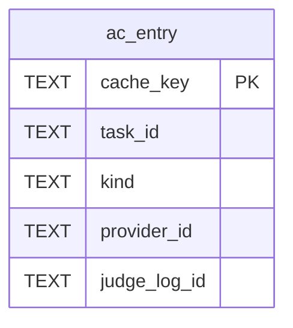

### 9.1 테이블정의서

#### `ac_entry`

AI 결과 캐시. 키 = sha256(task, prompt_version, provider, model, 정준 입력, schema_hash). FR-AI-009  
<sub>STRICT · 정의 파일 `services/ai-gateway/migrations-cache/0001_cache.sql`</sub>

| 컬럼 | 타입 | NULL | 기본값 | 키 | 인덱스 | 설명 |
|---|---|---|---|---|---|---|
| `cache_key` | TEXT | N |  | PK |  | sha256 hex |
| `task_id` | TEXT | N |  |  |  | 과업 |
| `kind` | TEXT | N |  |  |  | 종류(TTL 30일 \| 7일) |
| `prompt_version` | TEXT | N |  |  |  | 프롬프트 버전 |
| `provider_id` | TEXT | N |  |  |  | 제공자 |
| `model` | TEXT | N |  |  |  | 모델 |
| `schema_hash` | TEXT | N |  |  |  | 출력 스키마 해시 |
| `value_json` | TEXT | N |  |  |  | 결과(zod strict 통과본) |
| `judge_log_id` | TEXT | Y |  |  |  | 원 판정 로그(judge 캐시) |
| `created_at` | INTEGER | N |  |  |  | 생성 시각 |
| `expires_at` | INTEGER | N |  |  | ix_ac_entry_expires | min(created_at + TTL, created_at + 90일) |
| `hit_count` | INTEGER | N | 0 |  |  | 적중 수 |
| `last_hit_at` | INTEGER | Y |  |  |  | 마지막 적중 |

### 9.2 DDL

`services/ai-gateway/migrations-cache/0001_cache.sql`

```sql
-- @fathom:module=cache version=1 kind=additive
-- services/ai-gateway/migrations-cache/0001_cache.sql
-- ai-cache.db = 재생성 가능(백업 제외). TTL 판단 30일·생성 7일·상한 90일(CR-15). 파일 삭제 = 전체 무효화(안전).

-- @table AI 결과 캐시. 키 = sha256(task, prompt_version, provider, model, 정준 입력, schema_hash). FR-AI-009
CREATE TABLE ac_entry(
  cache_key      TEXT    NOT NULL PRIMARY KEY CHECK (length(cache_key) = 64), -- sha256 hex
  task_id        TEXT    NOT NULL,                                            -- 과업
  kind           TEXT    NOT NULL CHECK (kind IN ('judge','generate')),       -- 종류(TTL 30일 | 7일)
  prompt_version TEXT    NOT NULL,                                            -- 프롬프트 버전
  provider_id    TEXT    NOT NULL,                                            -- 제공자
  model          TEXT    NOT NULL,                                            -- 모델
  schema_hash    TEXT    NOT NULL,                                            -- 출력 스키마 해시
  value_json     TEXT    NOT NULL CHECK (json_valid(value_json)),             -- 결과(zod strict 통과본)
  judge_log_id   TEXT,                                                        -- 원 판정 로그(judge 캐시)
  created_at     INTEGER NOT NULL,                                            -- 생성 시각
  expires_at     INTEGER NOT NULL,                                            -- min(created_at + TTL, created_at + 90일)
  hit_count      INTEGER NOT NULL DEFAULT 0,                                  -- 적중 수
  last_hit_at    INTEGER                                                      -- 마지막 적중
) STRICT;
CREATE INDEX ix_ac_entry_expires ON ac_entry(expires_at);
```

---

## 10. ops.db (ops-api: backup · health · telemetry · upgrade)

- ops-api는 **다른 서비스 DB를 열지 않는다**. `op_backup_file`·`op_epoch_manifest`의 값은 각 서비스 `admin/snapshot` 응답(서비스 job이 사본에서 읽은 값)이다.
- `op_backup`·`op_epoch_manifest`는 영구 이력이다. 7세대 초과로 스냅샷 디렉터리를 지우면 행은 남기고 `pruned_at`만 기록한다.
- `op_health_sample`은 15s 수집 → 1분 롤업(30일), Tripwire·로컬 SLO 입력. `op_banner`는 `dedupe_key`당 열린 배너 1개(부분 유일 인덱스).
- `op_telemetry_raw`는 통합 이벤트 수신분을 `source_event_id`로 멱등 기록(400일), `op_telemetry_daily`는 영구 집계.

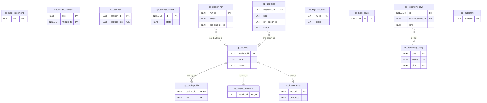

### 10.1 테이블정의서

#### `op_backup`

백업 실행(스냅샷 epoch·증분·리허설). 부분 매니페스트 금지 → aborted면 op_epoch_manifest 행 없음. FR-SET-004·005  
<sub>STRICT · 정의 파일 `services/ops/migrations/backup/0001_backup_core.sql`</sub>

| 컬럼 | 타입 | NULL | 기본값 | 키 | 인덱스 | 설명 |
|---|---|---|---|---|---|---|
| `backup_id` | TEXT | N |  | PK |  | ULID(스냅샷은 = epoch_id) |
| `kind` | TEXT | N |  |  | ix_op_backup_kind | 종류 |
| `trigger_kind` | TEXT | N |  |  |  | 시작 원인 |
| `status` | TEXT | N |  |  |  | 결과(ops.backup.completed.outcome) |
| `reason` | TEXT | Y |  |  |  | 중단·실패 사유('quiesce_timeout:learning' 등) |
| `dir` | TEXT | N |  |  |  | FATHOM_HOME 상대 경로('backups/snap/<epoch_id>') |
| `bytes` | INTEGER | Y |  |  |  | 총 크기 |
| `encrypted` | INTEGER | N | 0 |  |  | 2차 사본 암호화 여부 |
| `secondary_status` | TEXT | Y |  |  |  | 2차 대상 복제 상태 |
| `secondary_at` | INTEGER | Y |  |  |  | 2차 복제 완료 시각 |
| `rehearsal_json` | TEXT | Y |  |  |  | 리허설 결과(체크섬·행 수·투영 해시 비교) |
| `rpo_hours` | REAL | Y |  |  |  | 완료 시점 RPO |
| `started_at` | INTEGER | N |  |  | ix_op_backup_kind | 시작 시각 |
| `finished_at` | INTEGER | Y |  |  |  | 종료 시각 |
| `pruned_at` | INTEGER | Y |  |  |  | 세대 정리(7세대 초과)로 파일 삭제된 시각(행은 영구) |
| `ext` | TEXT | N | '{}' |  |  | 확장 |
| `ext_v` | INTEGER | N | 1 |  |  | ext 스키마 버전 |

#### `op_backup_file`

백업 파일 목록(서비스 응답의 file·sha256·bytes)  
<sub>STRICT · 정의 파일 `services/ops/migrations/backup/0001_backup_core.sql`</sub>

| 컬럼 | 타입 | NULL | 기본값 | 키 | 인덱스 | 설명 |
|---|---|---|---|---|---|---|
| `backup_id` | TEXT | N |  | PK(1), FK→op_backup.backup_id CASCADE |  | 백업 |
| `svc` | TEXT | N |  |  |  | 소유 서비스 |
| `file` | TEXT | N |  | PK(2) |  | 파일명('content.db' · '<date>.jsonl') |
| `sha256` | TEXT | N |  |  |  | 파일 sha256 |
| `bytes` | INTEGER | N |  |  |  | 크기 |

#### `op_epoch_manifest`

epoch 매니페스트 사본(manifest.json 원자 기록 후 INSERT, append-only). @fathom/contracts/admin/epoch-manifest  
<sub>STRICT · 정의 파일 `services/ops/migrations/backup/0001_backup_core.sql`</sub>

| 컬럼 | 타입 | NULL | 기본값 | 키 | 인덱스 | 설명 |
|---|---|---|---|---|---|---|
| `epoch_id` | TEXT | N |  | PK, FK→op_backup.backup_id |  | epoch ULID |
| `manifest_json` | TEXT | N |  |  |  | 매니페스트 전체(정준 JSON) |
| `manifest_sha256` | TEXT | N |  |  |  | manifest.json sha256 |
| `created_at` | INTEGER | N |  |  |  | 기록 시각 |

#### `op_incremental`

일 증분 파일(기기별 원장 JSONL + 오버레이 + 골드셋 확정). RPO ≤ 26h  
<sub>STRICT · 정의 파일 `services/ops/migrations/backup/0001_backup_core.sql`</sub>

| 컬럼 | 타입 | NULL | 기본값 | 키 | 인덱스 | 설명 |
|---|---|---|---|---|---|---|
| `incr_id` | TEXT | N |  | PK |  | ULID(= op_backup.backup_id) |
| `device_id` | TEXT | N |  | UQ(device_id,day) |  | 기기 |
| `day` | TEXT | N |  | UQ(device_id,day) |  | 파일 날짜(YYYY-MM-DD) |
| `file` | TEXT | N |  |  |  | 'backups/incr/<device_id>/<day>.jsonl' |
| `sha256` | TEXT | N |  |  |  | 파일 sha256 |
| `since_checkpoint` | TEXT | Y |  |  |  | 기준 체크포인트 |
| `to_checkpoint` | TEXT | N |  |  |  | 생성 체크포인트(다음 since) |
| `created_at` | INTEGER | N |  |  |  | 생성 시각 |
| `pruned_at` | INTEGER | Y |  |  |  | 가장 오래된 보관 스냅샷 이전분 파일 삭제 시각 |

#### `op_held_increment`

업그레이드 롤백 시 보류한 상위 schema_version 증분(backups/incr/_held/). 재업그레이드 때 흡수  
<sub>STRICT · 정의 파일 `services/ops/migrations/backup/0001_backup_core.sql`</sub>

| 컬럼 | 타입 | NULL | 기본값 | 키 | 인덱스 | 설명 |
|---|---|---|---|---|---|---|
| `file` | TEXT | N |  | PK |  | 'backups/incr/_held/<…>.jsonl' |
| `sha256` | TEXT | N |  |  |  | 파일 sha256 |
| `max_schema_json` | TEXT | N |  |  |  | 타입별 최대 schema_version |
| `held_at` | INTEGER | N |  |  |  | 보류 시각 |
| `absorbed_at` | INTEGER | Y |  |  |  | 흡수 시각 |

#### `op_health_sample`

메트릭 1분 롤업(15s 수집 → 1분). 30일 보존. SLO·Tripwire 입력  
<sub>STRICT, WITHOUT ROWID · 정의 파일 `services/ops/migrations/health/0001_health_core.sql`</sub>

| 컬럼 | 타입 | NULL | 기본값 | 키 | 인덱스 | 설명 |
|---|---|---|---|---|---|---|
| `svc` | TEXT | N |  | PK(1) |  | 서비스 |
| `minute_ts` | INTEGER | N |  | PK(2) | ix_op_health_sample_minute | 분 시작(epoch ms, 60000 배수) |
| `metrics_json` | TEXT | N |  |  |  | {rss_mb, eventloop_p99_ms, outbox{dest:{pending, oldest_age_ms}}, http_p95{route}, …} |

#### `op_banner`

운영 배너(홈 경보 슬롯 1개 = 우선순위 최상위). FR-SET-017, NFR-AVL-005  
<sub>STRICT · 정의 파일 `services/ops/migrations/health/0001_health_core.sql`</sub>

| 컬럼 | 타입 | NULL | 기본값 | 키 | 인덱스 | 설명 |
|---|---|---|---|---|---|---|
| `banner_id` | TEXT | N |  | PK |  | ULID |
| `dedupe_key` | TEXT | N |  | UQ | ux_op_banner_open(부분) | 'backup_stale'\|'integrity_fail:<svc>'\|'ledger_halt'\|'runner_platform_disabled'… |
| `severity` | TEXT | N |  |  |  | 심각도 |
| `priority` | INTEGER | N |  |  |  | 낮을수록 우선 |
| `title_key` | TEXT | N |  |  |  | i18n 카피 키(비난 없는 카피) |
| `detail_json` | TEXT | N | '{}' |  |  | 상세·조치 링크 |
| `raised_at` | INTEGER | N |  |  |  | 발생 시각 |
| `cleared_at` | INTEGER | Y |  |  |  | 해소 시각 |

#### `op_service_event`

서비스 상태 전이 이력(재시작·degraded·ready). 30일 보존  
<sub>STRICT · 정의 파일 `services/ops/migrations/health/0001_health_core.sql`</sub>

| 컬럼 | 타입 | NULL | 기본값 | 키 | 인덱스 | 설명 |
|---|---|---|---|---|---|---|
| `id` | INTEGER | N |  | PK |  | rowid |
| `svc` | TEXT | N |  |  |  | 서비스 |
| `state` | TEXT | N |  |  |  | 새 상태 |
| `exit_code` | INTEGER | Y |  |  |  | 종료 코드(75·78 등) |
| `detail` | TEXT | Y |  |  |  | 사유 코드 |
| `at` | INTEGER | N |  |  | ix_op_service_event_at | 시각 |

#### `op_doctor_run`

doctor 실행 기록(점검 항목별 결과, --fix 선행 백업 ID). FR-SET-003  
<sub>STRICT · 정의 파일 `services/ops/migrations/health/0001_health_core.sql`</sub>

| 컬럼 | 타입 | NULL | 기본값 | 키 | 인덱스 | 설명 |
|---|---|---|---|---|---|---|
| `run_id` | TEXT | N |  | PK |  | ULID |
| `mode` | TEXT | N |  |  |  | 실행 모드 |
| `results_json` | TEXT | N |  |  |  | 항목별 {id, status, code, hint} |
| `pre_backup_id` | TEXT | Y |  |  |  | --fix 선행 스냅샷 |
| `created_at` | INTEGER | N |  |  |  | 실행 시각 |

#### `op_telemetry_raw`

텔레메트리 원시 신호(이벤트 수신·learning 텔레메트리 API 수집). 400일 보존  
<sub>STRICT · 정의 파일 `services/ops/migrations/telemetry/0001_telemetry_core.sql`</sub>

| 컬럼 | 타입 | NULL | 기본값 | 키 | 인덱스 | 설명 |
|---|---|---|---|---|---|---|
| `id` | INTEGER | N |  | PK |  | rowid |
| `kind` | TEXT | N |  |  |  | 'session.completed'\|'level.promoted'\|'ledger.merged'\|'ai.mode'\|'resource'… |
| `ts` | INTEGER | N |  |  | ix_op_telemetry_raw_ts | 발생 시각 |
| `source_event_id` | TEXT | Y |  | UQ | ux_op_telemetry_raw_src(부분) | 원천 통합 이벤트 event_id(멱등) |
| `payload_json` | TEXT | N |  |  |  | 신호 값 |

#### `op_telemetry_daily`

일 집계(영구). RETRO 기준선·Radar 개인 기준선(28일 평균)  
<sub>STRICT, WITHOUT ROWID · 정의 파일 `services/ops/migrations/telemetry/0001_telemetry_core.sql`</sub>

| 컬럼 | 타입 | NULL | 기본값 | 키 | 인덱스 | 설명 |
|---|---|---|---|---|---|---|
| `day` | TEXT | N |  | PK(1) |  | 학습일(YYYY-MM-DD) |
| `metric` | TEXT | N |  | PK(2) |  | 'sessions'\|'minutes'\|'first_item_p95_ms'\|'idle_rss_mb'\|… |
| `dim` | TEXT | N | '*' | PK(3) |  | 차원('*'\|트랙\|서비스) |
| `value` | REAL | N |  |  |  | 값 |

#### `op_tripwire_state`

Tripwire 상태(TW-01~13·자원 Tripwire)  
<sub>STRICT · 정의 파일 `services/ops/migrations/telemetry/0001_telemetry_core.sql`</sub>

| 컬럼 | 타입 | NULL | 기본값 | 키 | 인덱스 | 설명 |
|---|---|---|---|---|---|---|
| `tw_id` | TEXT | N |  | PK |  | 'TW-01'…'TW-13'\|'RES-RSS'\|'RES-COLD'\|'RES-DISK' |
| `state` | TEXT | N |  |  |  | 상태(= IF-01 TripwireView.state, CR-48) |
| `value` | REAL | Y |  |  |  | 현재 값 |
| `baseline` | REAL | Y |  |  |  | 개인 기준선 |
| `action_strength` | TEXT | N | 'suggest' |  |  | 조치 강도(= TripwireSettings.action_strength, FR-SET-021) |
| `muted` | INTEGER | N | 0 |  |  | 음소거(= TripwireSettings.muted 포함 여부) |
| `updated_at` | INTEGER | N |  |  |  | 갱신 시각 |

#### `op_host_state`

최신 호스트 상태(ops.host_state.changed 원천, 1행)  
<sub>STRICT · 정의 파일 `services/ops/migrations/telemetry/0001_telemetry_core.sql`</sub>

| 컬럼 | 타입 | NULL | 기본값 | 키 | 인덱스 | 설명 |
|---|---|---|---|---|---|---|
| `id` | INTEGER | N |  | PK |  | 단일 행 |
| `idle_window_open` | INTEGER | N |  |  |  | 배치 창 열림 |
| `idle_since` | INTEGER | Y |  |  |  | 입력 유휴 시작 |
| `power` | TEXT | N |  |  |  | 전원 |
| `interactive_cli_json` | TEXT | N | '[]' |  |  | 사용자 대화형 CLI 감지 목록 |
| `disk_free_mb` | INTEGER | Y |  |  |  | FATHOM_HOME 디스크 여유 |
| `data_path_risk` | TEXT | Y |  |  |  | 데이터 경로 경고 |
| `sampled_at` | INTEGER | N |  |  |  | 샘플 시각 |

#### `op_upgrade`

업그레이드·롤백 실행(fathom upgrade [--rollback]). 이력 영구. ADR-013 §6  
<sub>STRICT · 정의 파일 `services/ops/migrations/upgrade/0001_upgrade_core.sql`</sub>

| 컬럼 | 타입 | NULL | 기본값 | 키 | 인덱스 | 설명 |
|---|---|---|---|---|---|---|
| `upgrade_id` | TEXT | N |  | PK |  | ULID |
| `kind` | TEXT | N |  |  |  | 종류 |
| `from_version` | TEXT | N |  |  |  | 이전 앱 버전 |
| `to_version` | TEXT | N |  |  |  | 대상 앱 버전 |
| `bundle_sha256` | TEXT | Y |  |  |  | bundle.manifest.json sha256 |
| `pre_epoch_id` | TEXT | Y |  |  |  | 업그레이드 전 자동 epoch |
| `status` | TEXT | N |  |  |  | 진행 상태 |
| `steps_json` | TEXT | N | '[]' |  |  | 단계별 결과(서비스별 migrate exit·verify 해시 리포트) |
| `error_code` | TEXT | Y |  |  |  | 실패 코드 |
| `started_at` | INTEGER | N |  |  |  | 시작 시각 |
| `finished_at` | INTEGER | Y |  |  |  | 종료 시각 |
| `ext` | TEXT | N | '{}' |  |  | 확장 |
| `ext_v` | INTEGER | N | 1 |  |  | ext 스키마 버전 |

#### `op_autostart`

자동 기동 설정 상태(기본 off). FR-SET-024  
<sub>STRICT · 정의 파일 `services/ops/migrations/upgrade/0001_upgrade_core.sql`</sub>

| 컬럼 | 타입 | NULL | 기본값 | 키 | 인덱스 | 설명 |
|---|---|---|---|---|---|---|
| `platform` | TEXT | N |  | PK |  | OS |
| `enabled` | INTEGER | N |  |  |  | 활성 |
| `file_path` | TEXT | Y |  |  |  | 생성한 plist·작업·unit 경로 |
| `updated_at` | INTEGER | N |  |  |  | 갱신 시각 |

### 10.2 DDL

`services/ops/migrations/backup/0001_backup_core.sql`

```sql
-- @fathom:module=backup version=1 kind=additive
-- services/ops/migrations/backup/0001_backup_core.sql
-- epoch 백업·증분·복원 리허설 기록. ops-api는 다른 서비스 DB 파일을 열지 않는다(매니페스트 값은 각 서비스 snapshot 응답). DR-021, ADR-013

-- @table 백업 실행(스냅샷 epoch·증분·리허설). 부분 매니페스트 금지 → aborted면 op_epoch_manifest 행 없음. FR-SET-004·005
CREATE TABLE op_backup(
  backup_id       TEXT    NOT NULL PRIMARY KEY CHECK (length(backup_id) = 26), -- ULID(스냅샷은 = epoch_id)
  kind            TEXT    NOT NULL CHECK (kind IN ('snapshot','incremental','rehearsal')), -- 종류
  trigger_kind    TEXT    NOT NULL CHECK (trigger_kind IN ('schedule','manual','pre_migrate','pre_fix','pre_upgrade','rehearse')), -- 시작 원인
  status          TEXT    NOT NULL CHECK (status IN ('running','ok','aborted','failed')), -- 결과(ops.backup.completed.outcome)
  reason          TEXT,                                                        -- 중단·실패 사유('quiesce_timeout:learning' 등)
  dir             TEXT    NOT NULL,                                            -- FATHOM_HOME 상대 경로('backups/snap/<epoch_id>')
  bytes           INTEGER,                                                     -- 총 크기
  encrypted       INTEGER NOT NULL DEFAULT 0 CHECK (encrypted IN (0,1)),       -- 2차 사본 암호화 여부
  secondary_status TEXT   CHECK (secondary_status IS NULL OR secondary_status IN ('pending','copied','failed','disabled')), -- 2차 대상 복제 상태
  secondary_at    INTEGER,                                                     -- 2차 복제 완료 시각
  rehearsal_json  TEXT    CHECK (rehearsal_json IS NULL OR json_valid(rehearsal_json)), -- 리허설 결과(체크섬·행 수·투영 해시 비교)
  rpo_hours       REAL,                                                        -- 완료 시점 RPO
  started_at      INTEGER NOT NULL,                                            -- 시작 시각
  finished_at     INTEGER,                                                     -- 종료 시각
  pruned_at       INTEGER,                                                     -- 세대 정리(7세대 초과)로 파일 삭제된 시각(행은 영구)
  ext             TEXT    NOT NULL DEFAULT '{}' CHECK (json_valid(ext)),       -- 확장
  ext_v           INTEGER NOT NULL DEFAULT 1                                   -- ext 스키마 버전
) STRICT;
CREATE INDEX ix_op_backup_kind ON op_backup(kind, started_at);

-- @table 백업 파일 목록(서비스 응답의 file·sha256·bytes)
CREATE TABLE op_backup_file(
  backup_id TEXT    NOT NULL REFERENCES op_backup(backup_id) ON DELETE CASCADE, -- 백업
  svc       TEXT    NOT NULL CHECK (svc IN ('content','learning','ai-gateway','ops-api')), -- 소유 서비스
  file      TEXT    NOT NULL,                                                  -- 파일명('content.db' · '<date>.jsonl')
  sha256    TEXT    NOT NULL CHECK (length(sha256) = 64),                      -- 파일 sha256
  bytes     INTEGER NOT NULL,                                                  -- 크기
  PRIMARY KEY (backup_id, file)
) STRICT;

-- @table epoch 매니페스트 사본(manifest.json 원자 기록 후 INSERT, append-only). @fathom/contracts/admin/epoch-manifest
CREATE TABLE op_epoch_manifest(
  epoch_id        TEXT    NOT NULL PRIMARY KEY REFERENCES op_backup(backup_id), -- epoch ULID
  manifest_json   TEXT    NOT NULL CHECK (json_valid(manifest_json)),          -- 매니페스트 전체(정준 JSON)
  manifest_sha256 TEXT    NOT NULL CHECK (length(manifest_sha256) = 64),       -- manifest.json sha256
  created_at      INTEGER NOT NULL                                             -- 기록 시각
) STRICT;
CREATE TRIGGER op_epoch_manifest_no_update BEFORE UPDATE ON op_epoch_manifest BEGIN SELECT RAISE(ABORT, 'op_epoch_manifest is append-only'); END;
CREATE TRIGGER op_epoch_manifest_no_delete BEFORE DELETE ON op_epoch_manifest BEGIN SELECT RAISE(ABORT, 'op_epoch_manifest is append-only'); END;

-- @table 일 증분 파일(기기별 원장 JSONL + 오버레이 + 골드셋 확정). RPO ≤ 26h
CREATE TABLE op_incremental(
  incr_id          TEXT    NOT NULL PRIMARY KEY CHECK (length(incr_id) = 26),  -- ULID(= op_backup.backup_id)
  device_id        TEXT    NOT NULL CHECK (length(device_id) = 26),            -- 기기
  day              TEXT    NOT NULL CHECK (length(day) = 10),                  -- 파일 날짜(YYYY-MM-DD)
  file             TEXT    NOT NULL,                                           -- 'backups/incr/<device_id>/<day>.jsonl'
  sha256           TEXT    NOT NULL CHECK (length(sha256) = 64),               -- 파일 sha256
  since_checkpoint TEXT,                                                       -- 기준 체크포인트
  to_checkpoint    TEXT    NOT NULL,                                           -- 생성 체크포인트(다음 since)
  created_at       INTEGER NOT NULL,                                           -- 생성 시각
  pruned_at        INTEGER,                                                    -- 가장 오래된 보관 스냅샷 이전분 파일 삭제 시각
  UNIQUE (device_id, day)
) STRICT;

-- @table 업그레이드 롤백 시 보류한 상위 schema_version 증분(backups/incr/_held/). 재업그레이드 때 흡수
CREATE TABLE op_held_increment(
  file        TEXT    NOT NULL PRIMARY KEY,                                    -- 'backups/incr/_held/<…>.jsonl'
  sha256      TEXT    NOT NULL CHECK (length(sha256) = 64),                    -- 파일 sha256
  max_schema_json TEXT NOT NULL CHECK (json_valid(max_schema_json)),           -- 타입별 최대 schema_version
  held_at     INTEGER NOT NULL,                                                -- 보류 시각
  absorbed_at INTEGER                                                          -- 흡수 시각
) STRICT;
```

`services/ops/migrations/health/0001_health_core.sql`

```sql
-- @fathom:module=health version=1 kind=additive
-- services/ops/migrations/health/0001_health_core.sql
-- 헬스 샘플(1분 롤업 30일)·배너·서비스 상태 이력·doctor 실행. ADR-015

-- @table 메트릭 1분 롤업(15s 수집 → 1분). 30일 보존. SLO·Tripwire 입력
CREATE TABLE op_health_sample(
  svc          TEXT    NOT NULL CHECK (svc IN ('gateway','content','learning','ai-gateway','ops-api','supervisor')), -- 서비스
  minute_ts    INTEGER NOT NULL,                                               -- 분 시작(epoch ms, 60000 배수)
  metrics_json TEXT    NOT NULL CHECK (json_valid(metrics_json)),              -- {rss_mb, eventloop_p99_ms, outbox{dest:{pending, oldest_age_ms}}, http_p95{route}, …}
  PRIMARY KEY (svc, minute_ts)
) STRICT, WITHOUT ROWID;
CREATE INDEX ix_op_health_sample_minute ON op_health_sample(minute_ts);

-- @table 운영 배너(홈 경보 슬롯 1개 = 우선순위 최상위). FR-SET-017, NFR-AVL-005
CREATE TABLE op_banner(
  banner_id   TEXT    NOT NULL PRIMARY KEY CHECK (length(banner_id) = 26),     -- ULID
  dedupe_key  TEXT    NOT NULL,                                                -- 'backup_stale'|'integrity_fail:<svc>'|'ledger_halt'|'runner_platform_disabled'…
  severity    TEXT    NOT NULL CHECK (severity IN ('info','warn','critical')), -- 심각도
  priority    INTEGER NOT NULL,                                                -- 낮을수록 우선
  title_key   TEXT    NOT NULL,                                                -- i18n 카피 키(비난 없는 카피)
  detail_json TEXT    NOT NULL DEFAULT '{}' CHECK (json_valid(detail_json)),   -- 상세·조치 링크
  raised_at   INTEGER NOT NULL,                                                -- 발생 시각
  cleared_at  INTEGER                                                          -- 해소 시각
) STRICT;
CREATE UNIQUE INDEX ux_op_banner_open ON op_banner(dedupe_key) WHERE cleared_at IS NULL;

-- @table 서비스 상태 전이 이력(재시작·degraded·ready). 30일 보존
CREATE TABLE op_service_event(
  id         INTEGER PRIMARY KEY,                                              -- rowid
  svc        TEXT    NOT NULL,                                                 -- 서비스
  state      TEXT    NOT NULL CHECK (state IN ('starting','ready','restarting','degraded','stopped','crashed')), -- 새 상태
  exit_code  INTEGER,                                                          -- 종료 코드(75·78 등)
  detail     TEXT,                                                             -- 사유 코드
  at         INTEGER NOT NULL                                                  -- 시각
) STRICT;
CREATE INDEX ix_op_service_event_at ON op_service_event(at);

-- @table doctor 실행 기록(점검 항목별 결과, --fix 선행 백업 ID). FR-SET-003
CREATE TABLE op_doctor_run(
  run_id        TEXT    NOT NULL PRIMARY KEY CHECK (length(run_id) = 26),      -- ULID
  mode          TEXT    NOT NULL CHECK (mode IN ('check','fix','live','safe')), -- 실행 모드
  results_json  TEXT    NOT NULL CHECK (json_valid(results_json)),             -- 항목별 {id, status, code, hint}
  pre_backup_id TEXT,                                                          -- --fix 선행 스냅샷
  created_at    INTEGER NOT NULL                                               -- 실행 시각
) STRICT;
```

`services/ops/migrations/telemetry/0001_telemetry_core.sql`

```sql
-- @fathom:module=telemetry version=1 kind=additive
-- services/ops/migrations/telemetry/0001_telemetry_core.sql
-- 로컬 텔레메트리(외부 전송 0). 원시 400일·일 집계 영구(NFR-DATA-007). Tripwire TW-01~13 + 자원 Tripwire

-- @table 텔레메트리 원시 신호(이벤트 수신·learning 텔레메트리 API 수집). 400일 보존
CREATE TABLE op_telemetry_raw(
  id          INTEGER PRIMARY KEY,                                             -- rowid
  kind        TEXT    NOT NULL,                                                -- 'session.completed'|'level.promoted'|'ledger.merged'|'ai.mode'|'resource'…
  ts          INTEGER NOT NULL,                                                -- 발생 시각
  source_event_id TEXT,                                                        -- 원천 통합 이벤트 event_id(멱등)
  payload_json TEXT   NOT NULL CHECK (json_valid(payload_json))                -- 신호 값
) STRICT;
CREATE INDEX ix_op_telemetry_raw_ts ON op_telemetry_raw(ts);
CREATE UNIQUE INDEX ux_op_telemetry_raw_src ON op_telemetry_raw(source_event_id) WHERE source_event_id IS NOT NULL;

-- @table 일 집계(영구). RETRO 기준선·Radar 개인 기준선(28일 평균)
CREATE TABLE op_telemetry_daily(
  day     TEXT    NOT NULL CHECK (length(day) = 10),                           -- 학습일(YYYY-MM-DD)
  metric  TEXT    NOT NULL,                                                    -- 'sessions'|'minutes'|'first_item_p95_ms'|'idle_rss_mb'|…
  dim     TEXT    NOT NULL DEFAULT '*',                                        -- 차원('*'|트랙|서비스)
  value   REAL    NOT NULL,                                                    -- 값
  PRIMARY KEY (day, metric, dim)
) STRICT, WITHOUT ROWID;

-- @table Tripwire 상태(TW-01~13·자원 Tripwire)
CREATE TABLE op_tripwire_state(
  tw_id       TEXT    NOT NULL PRIMARY KEY,                                    -- 'TW-01'…'TW-13'|'RES-RSS'|'RES-COLD'|'RES-DISK'
  state       TEXT    NOT NULL CHECK (state IN ('ok','warn','trip','insufficient_data')), -- 상태(= IF-01 TripwireView.state, CR-48)
  value       REAL,                                                            -- 현재 값
  baseline    REAL,                                                            -- 개인 기준선
  action_strength TEXT NOT NULL DEFAULT 'suggest' CHECK (action_strength IN ('observe','suggest','auto_adjust')), -- 조치 강도(= TripwireSettings.action_strength, FR-SET-021)
  muted       INTEGER NOT NULL DEFAULT 0 CHECK (muted IN (0,1)),               -- 음소거(= TripwireSettings.muted 포함 여부)
  updated_at  INTEGER NOT NULL                                                 -- 갱신 시각
) STRICT;

-- @table 최신 호스트 상태(ops.host_state.changed 원천, 1행)
CREATE TABLE op_host_state(
  id                INTEGER NOT NULL PRIMARY KEY CHECK (id = 1),               -- 단일 행
  idle_window_open  INTEGER NOT NULL CHECK (idle_window_open IN (0,1)),        -- 배치 창 열림
  idle_since        INTEGER,                                                   -- 입력 유휴 시작
  power             TEXT    NOT NULL CHECK (power IN ('ac','battery','unknown')), -- 전원
  interactive_cli_json TEXT NOT NULL DEFAULT '[]' CHECK (json_valid(interactive_cli_json)), -- 사용자 대화형 CLI 감지 목록
  disk_free_mb      INTEGER,                                                   -- FATHOM_HOME 디스크 여유
  data_path_risk    TEXT    CHECK (data_path_risk IS NULL OR data_path_risk IN ('sync_folder','network','wsl')), -- 데이터 경로 경고
  sampled_at        INTEGER NOT NULL                                           -- 샘플 시각
) STRICT;
```

`services/ops/migrations/upgrade/0001_upgrade_core.sql`

```sql
-- @fathom:module=upgrade version=1 kind=additive
-- services/ops/migrations/upgrade/0001_upgrade_core.sql

-- @table 업그레이드·롤백 실행(fathom upgrade [--rollback]). 이력 영구. ADR-013 §6
CREATE TABLE op_upgrade(
  upgrade_id     TEXT    NOT NULL PRIMARY KEY CHECK (length(upgrade_id) = 26), -- ULID
  kind           TEXT    NOT NULL CHECK (kind IN ('upgrade','rollback')),      -- 종류
  from_version   TEXT    NOT NULL,                                             -- 이전 앱 버전
  to_version     TEXT    NOT NULL,                                             -- 대상 앱 버전
  bundle_sha256  TEXT    CHECK (bundle_sha256 IS NULL OR length(bundle_sha256) = 64), -- bundle.manifest.json sha256
  pre_epoch_id   TEXT,                                                         -- 업그레이드 전 자동 epoch
  status         TEXT    NOT NULL CHECK (status IN ('preparing','dry_run_ok','migrating','handshake','completed','rolled_back','failed')), -- 진행 상태
  steps_json     TEXT    NOT NULL DEFAULT '[]' CHECK (json_valid(steps_json)), -- 단계별 결과(서비스별 migrate exit·verify 해시 리포트)
  error_code     TEXT,                                                         -- 실패 코드
  started_at     INTEGER NOT NULL,                                             -- 시작 시각
  finished_at    INTEGER,                                                      -- 종료 시각
  ext            TEXT    NOT NULL DEFAULT '{}' CHECK (json_valid(ext)),        -- 확장
  ext_v          INTEGER NOT NULL DEFAULT 1                                    -- ext 스키마 버전
) STRICT;

-- @table 자동 기동 설정 상태(기본 off). FR-SET-024
CREATE TABLE op_autostart(
  platform   TEXT    NOT NULL PRIMARY KEY CHECK (platform IN ('darwin','win32','linux')), -- OS
  enabled    INTEGER NOT NULL CHECK (enabled IN (0,1)),                        -- 활성
  file_path  TEXT,                                                             -- 생성한 plist·작업·unit 경로
  updated_at INTEGER NOT NULL                                                  -- 갱신 시각
) STRICT;
```


---

## 11. 마이그레이션 전략 (ADR-002 §8, ADR-013 §5)

### 11.1 파일 규약

| 항목 | 규칙 |
|---|---|
| 위치 | `packages/shared-kernel/infra-migrations/NNNN_<desc>.sql`(모듈 `_infra`), `services/<svc>/migrations/<module>/NNNN_<desc>.sql`, `services/learning/migrations-insight/NNNN_<desc>.sql`(모듈 `insight`), `services/ai-gateway/migrations-cache/NNNN_<desc>.sql`(모듈 `cache`) |
| 이름 | `NNNN` = 4자리, 모듈 안에서 0001부터 **빈틈 없이 연속**. `<desc>` = snake_case |
| 1행 헤더 | `-- @fathom:module=<module> version=<N> kind=additive\|destructive [adr=ADR-nnn] [fk=off] [profile=meta,full]`. 실행기는 헤더의 module·version이 경로·파일명과 같은지 검사 |
| 금지 토큰 | 파일 본문에 `BEGIN`·`COMMIT`·`ROLLBACK`·`PRAGMA`·`ATTACH`·`DETACH`·`VACUUM`·`load_extension` 0(실행기가 tx·PRAGMA를 소유). 실행기의 렉서 사전 검사 + 단위 테스트 |
| 불변 | 한 번 배포된 파일은 고치지 않는다. 적용된 파일의 sha256이 번들과 다르면 기동 거부 |
| 소유 | 모듈 디렉터리 = 레인 소유(ARC §16.1). `_infra` = L-PLAT |
| 번들 | `pnpm build`가 마이그레이션 디렉터리를 `dist/` 옆에 복사하고 `bundle.manifest.json`에 sha256 기록 |

### 11.2 실행기 (`@fathom/shared-kernel/sqlite/sqlite` `migrate(db, dirs, {dryRun, profile, applicationId})`)

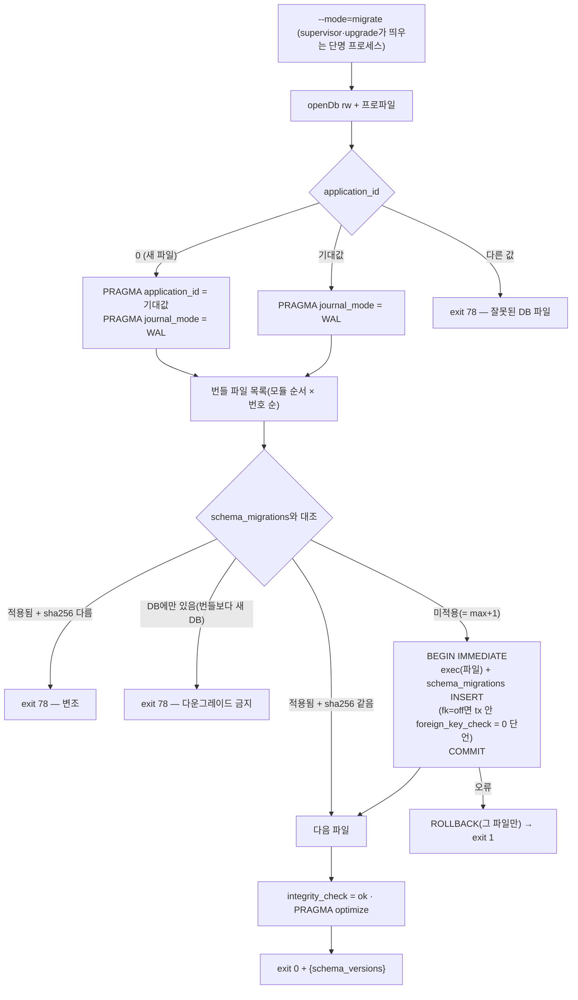

- `fk=off` 파일: `PRAGMA foreign_keys=OFF`(tx 밖) → `BEGIN IMMEDIATE` → 본문 → `PRAGMA foreign_key_check` 결과 0 단언(아니면 ROLLBACK) → COMMIT → `PRAGMA foreign_keys=ON`.
- 실패 시 앞서 커밋된 파일은 남는다(DB는 중간 버전). serve는 버전 불일치로 exit 78 → 업그레이드 절차가 업그레이드 전 epoch로 롤백한다(ADR-013 §6). 그래서 **마이그레이션 직전 스냅샷 100%**(NFR-AVL-004)가 전제다.
- `--dry-run`: 업그레이드 전 epoch 사본을 `tmp/migrate/<svc>/`에 복사해 같은 절차 실행 → 리포트(적용 파일·소요·integrity·learning `--mode=verify` 리플레이 해시 비교) → 원본 무변경.
- 서비스별 처리 파일: content = `content.db`, learning = `learning.db` + `insight.db`, ai-gateway = `ai.db` + `ai-cache.db`, ops-api = `ops.db`. 업그레이드 순서 = ops → ai-gateway → content → learning(ADR-013 §6).
- 파생 DB(`insight.db`, `ai-cache.db`) 파일이 없으면 migrate가 새로 만든다(D-31).

### 11.3 serve 모드 스키마 확인

- 기동 시(ready 전) `SELECT module, version, sha256 FROM schema_migrations`를 번들의 `(module, version, sha256)` 집합과 비교한다: **같음** → 진행 · DB가 뒤처짐 → exit 78(`needs migrate`) · DB에 모르는 행 → exit 78(다운그레이드) · sha256 다름 → exit 78. supervisor는 78이면 재시작하지 않고 doctor 항목을 띄운다.
- `ready` IPC의 `schema_versions = {<module>: max(version)}`(파일별) → supervisor 핸드셰이크·epoch 매니페스트 `schema`.

### 11.4 가산 vs 파괴

| 변경 | 분류 | 방법 |
|---|---|---|
| 새 테이블·인덱스·뷰·트리거 | 가산(CR) | 새 파일 |
| 새 NULL 허용 열·DEFAULT 열·VIRTUAL 생성 열(`ext` 승격) | 가산(CR) | `ALTER TABLE … ADD COLUMN` |
| STORED 생성 열 추가 | **불가**(SQLite) | 최초 CREATE에서만 — 필요하면 파괴 변경 |
| 열린 enum 값 추가 | 가산(코드만) | zod 스키마(DB CHECK 없음, D-10) |
| 닫힌 enum(CHECK) 값 추가·열 삭제·타입·의미 변경·PK 변경 | **파괴**(ADR + `frozen.lock` 재생성) | 12단계 재작성: `fk=off` 헤더 → `CREATE TABLE <t>__new(…)` → `INSERT INTO <t>__new SELECT …` → `DROP TABLE <t>` → `ALTER TABLE <t>__new RENAME TO <t>` → 인덱스·트리거·뷰 재생성 → `foreign_key_check` |
| 투영 테이블 구조 변경 | 가산(파생) | 새 파일에서 DROP + CREATE 후 job `rebuild`(투영 해시 diff 리포트) |
| `lr_event` | **행 재작성 금지** | 허용 = NULL 열·VIRTUAL 생성 열·인덱스 추가. 이벤트 의미 변화 = `schema_version` + upcaster(ADR-011 §8). `ts-fsrs` 변경 = `fsrs_impl` 태그 + 전체 재구성 마이그레이션 |
| 교차 모듈 테이블 이동(7번째 슬롯 분리) | ADR | 테이블 접두어·모듈 디렉터리 단위로 새 DB 파일로 이관 스크립트(교차 FK 0이라 테이블 이동만) |

### 11.5 마이그레이션 테스트

- `services/<svc>/test/integration/migrations.spec.ts`: 빈 파일 → 전체 적용 → `integrity_check`·`foreign_key_check`·STRICT·`application_id` 단언(§17 스크립트 이식) / 직전 릴리스 골든 DB fixture(`test/fixtures/db/<ver>/*.db`) → 업그레이드 → 같은 단언 + 행 수 보존 / sha256 변조 → exit 78 / 번호 빈틈 → 실패.
- `lint:hooks`: `db-hooks.ts`의 이름 훅이 마이그레이션 SQL에 열로 존재(PG-2·IT-01 게이트).
- 투영 shadow: `sqlite_schema` 기반 shadow DDL로 교체 후 인덱스 이름·개수가 같음(실측 테스트 이식).

---

## 12. epoch 백업 · 복원 (DB 수준 절차, ADR-013)

### 12.1 스냅샷 job (`services/<svc>/src/jobs/snapshot.ts`, `--mode=job --job=snapshot`)

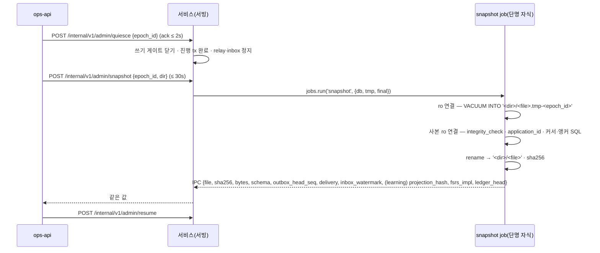

**사본에서 읽는 값**(권위 = 사본 내용, ARC §15.1):

| 매니페스트 필드 | SQL(사본 연결) |
|---|---|
| `schema` | `SELECT module, max(version) AS v FROM schema_migrations GROUP BY module` |
| `outbox_head_seq` | `OUTBOX_HEAD`(§4.2) |
| `delivery` | `SELECT dest, last_acked_seq FROM outbox_delivery WHERE mode = 'durable'` |
| `inbox_watermark` | `SELECT producer, last_producer_seq FROM inbox_watermark` |
| `projection_hash`, `fsrs_impl`(learning) | `SELECT projection_hash, fsrs_impl FROM lr_projection_meta WHERE name = 'live'` |
| `ledger_head`(learning, 앵커 ③) | `LEDGER_HEADS`(§6.3) |
| 파일 종류 확인 | `PRAGMA application_id` = §2 값 |

- `insight.db`·`ai-cache.db`는 스냅샷하지 않는다(매니페스트 `excluded`). `secrets/ai-keys.enc`는 기본 제외.
- ops-api는 자기 `ops.db`를 같은 job으로 스냅샷한 뒤 `manifest.json`을 임시 이름 → rename으로 쓰고, 한 tx에 `op_backup(status='ok')` 갱신 + `op_backup_file` + `op_epoch_manifest` INSERT + outbox `ops.backup.completed`. 중단(quiesce 2s·snapshot 30s 초과·job 실패)이면 `op_backup(status='aborted', reason)`만 남고 매니페스트·`op_epoch_manifest` 행은 없다(부분 매니페스트 금지).
- 2차 대상 복제(선택 AES-256-GCM + scrypt, `<file>.fenc`)는 `op_backup.secondary_status`로 추적. 7세대 초과분은 디렉터리 삭제 + `op_backup.pruned_at`.

### 12.2 일 증분

ops-api가 learning `ledger/export?since=<checkpoint>`(§13.1 형식) + content `catalog/overlays/export?since=` + ai-gateway `calibration/gold/export?since=`를 받아 `backups/incr/<device_id>/<YYYY-MM-DD>.jsonl`에 섹션 순서(ledger → overlay → gold)로 쓰고 `op_incremental`(`to_checkpoint` = 다음 since) + `op_backup(kind='incremental')`을 기록한다. learning은 export마다 `lr_checkpoint(kind='export')`를 남긴다(앵커 ①).

### 12.3 복원 (`--mode=restore`, 소유 서비스별 단명 프로세스)

1. ops-api: 매니페스트·파일 sha256 검증, 같은 epoch 조합만 허용(NFR-DATA-012), 커서 되감기 계산 `delivery[D] := min(manifest[P].delivery[D], manifest[D].inbox_watermark[P])`.
2. supervisor `svc.stop` → `svc.run_mode{svc, mode:'restore', args:{from, rewind_cursors}}`.
3. restore 프로세스(자기 파일만): 사본 `application_id`·`integrity_check` 확인 → 라이브 파일 닫힘 확인 → `-wal`·`-shm` 삭제 → 사본을 `<file>.restore-tmp`로 복사 → rename → rw 열기 → `REWIND_DELIVERY`(§4.2)를 목적지마다 → `integrity_check`. learning은 추가로 `LEDGER_HEADS` = 매니페스트 `ledger_head`(앵커 대조, 불일치 = 거부)를 확인하고 `insight.db`를 삭제 후 migrate, ai-gateway는 `ai-cache.db`를 삭제 후 migrate.
4. 기동 → learning job `rebuild`(이벤트 정책 버전 파라미터로 전체 리플레이) → `projection_hash` = 매니페스트(같은 플랫폼·Node일 때; 다르면 로컬 재계산이 정본, 차이만 보고) → `insight.db` 재구성 → 이후 날짜 증분을 job `merge`로 적용(헤더 앵커 검증, 멱등).
5. 리허설(`--rehearse`): 임시 `FATHOM_HOME`에 같은 절차, 체크섬·테이블별 행 수·투영 해시 비교 → `op_backup(kind='rehearsal').rehearsal_json`.

---

## 13. export / import 형식

### 13.1 원장 JSONL (`fathom.ledger.v1`) — 증분·병합·전량 공용

```jsonc
{"kind":"header","format":"fathom.ledger.v1","app_version":"1.0.0","created_at":1790000000000,
 "source_device_id":"01J…","since_checkpoint_id":null,"checkpoint_id":"01J…",
 "devices":{"01JABC…":{"seq":5231,"head_hash":"9f…"}},"root_hash":"4c…"}
{"kind":"event","event_id":"01J…","device_id":"01JABC…","device_seq":1,"client_ts":1789990000000,"type":"card.enrolled",
 "schema_version":1,"idempotency_key":"card:db.mvcc:definition:p","payload":"{\"card_id\":…}",
 "prev_hash":"0000…","hash":"ab…","experiment_arm":null,"ext":"{}"}
{"kind":"footer","events":5231,"lines_sha256":"…"}
```

- 순서 = `device_id`, `device_seq` 오름차순(체인 검증 순서). `payload`·`ext`는 **저장된 정준 JSON 문자열 그대로**(재직렬화 0 → 해시·체크섬 동일, D-19). 생성 열·`recorded_at`은 내보내지 않는다.
- 헤더 `devices` = 앵커 ②. `since_checkpoint_id`가 있으면 기기별 `device_seq > 체크포인트 seq`만. footer는 스트림 절단 조기 탐지용(D-20; 꼬리 변조·절단의 정식 탐지는 앵커).
- 줄당 ≤ 1MB, 전체 상한 8GB(기본), 스트리밍 파서, 55만 건 왕복 메모리 피크 ≤ 512MB(FR-SET-006).
- import(`--merge`): 헤더 → 기기별 체인 연속성(`prev_hash` = 직전 `hash`, 첫 이벤트는 로컬 헤드 또는 `'0'×64`) → 헤더 앵커 대조 → job `merge`(§6.3). 위반 시 `(device_id, device_seq)`를 보고하고 **전체 거부**(FR-PRG-003).

### 13.2 오버레이·골드셋 JSONL

```jsonc
{"kind":"header","format":"fathom.overlay.v1","since":1789000000000,"created_at":1790000000000}
{"kind":"overlay","overlay_id":"01J…","target_kind":"ku","target_id":"db.mvcc.k03","field":"statement",
 "base_version":"1.0.0@3fa9c0d1e2b4a5f6","new_value":"\"…\"","reason":"report:01J…","device_id":"01J…","ts":1789999999000,"revert_of":null,"ext":"{}"}
{"kind":"header","format":"fathom.gold.v1","since":1789000000000}
{"kind":"gold","gold_id":"gold.AI-J03.017","task_id":"AI-J03","source":"confirm_card","input_json":"{…}","label_json":"{…}","status":"confirmed","decided_at":1789999000000}
```

- import: 오버레이는 `overlay_id` 기준 `INSERT OR IGNORE` + 존재 확인 → `ct_overlay_head` 재합성. 골드셋은 `gold_id` 기준, 같은 ID면 `decided_at`이 늦은 쪽 유지.

### 13.3 전량 export (`fathom export`, D-8 왕복)

```
exports/fathom-export-<YYYYMMDD-HHmmss>/
├─ manifest.json            # {format:"fathom.export.v1", app_version, contracts_hash, created_at, device_id,
│                           #  schema:{<svc>:{<module>:<ver>}}, files:[{path, sha256, rows, table_checksum}]}
├─ learning/ledger.jsonl    # §13.1 (since = null)
├─ learning/<table>.jsonl   # E·L·Q 테이블 전부(투영 P 제외 — import 후 rebuild)
├─ content/overlays.jsonl   # §13.2
├─ content/<table>.jsonl    # ct_pack_delta, ct_pack(channel user·local 행), aq_*, ib_item(origin='runtime'), ib_item_model(runtime),
│                           # ib_gate_result, ib_gate_transition, ib_lineage_edge, ib_family, ib_report, ib_correction,
│                           # gr_attempt, gr_verdict, gr_appeal, gr_turn_judgment, gr_utterance
├─ ai/<table>.jsonl         # ai_provider(비밀 없음), ai_consent, ai_setting, ai_firewall_pattern, ai_gold_item,
│                           # ai_judge_log, ai_calibration_run (+ --with-logs: ai_call_log, ai_firewall_log)
├─ packs/refs.json          # 시드 팩 {pack_id, version, manifest_hash} — 시드는 동봉 .fpack으로 재설치
└─ notes/<concept_id>.md    # [[wikilink]] 개념 노트(활성 카탈로그 ⊕ 오버레이 + 증거 요약)
```

- 테이블 행 = 생성 열을 뺀 **선언 순서 열의 JSON 객체 1줄**, JSON 열은 저장 문자열 그대로. `table_checksum = sha256(PK 오름차순 행 줄 + "\n" …)`.
- 사용자 팩 `u.local`의 카탈로그 행은 내보내지 않는다: `ct_pack_delta`를 빈 설치에 재적용하면 재구성된다(D-19).
- 전량 import(빈 설치): supervisor가 서비스마다 `--mode=restore --from-export <dir>`를 띄워 `BEGIN IMMEDIATE` 500행 배치로 적재 → 행 수·`table_checksum` 대조(불일치 = 실패) → 시드 팩 재설치 → `u.local` delta 재적용 → learning job `rebuild`.

---

## 14. 시드 적재 (콘텐츠 팩 · 정책 팩 · 초기 행)

### 14.1 `.fpack` → content.db 매핑

`.fpack` = 무압축 tar(`manifest.json` · `bundle.jsonl` · `report.json` · `layout.json`, ADR-004 §3). `bundle.jsonl`의 줄 = `{"kind": "<record kind>", …정준 레코드…, "content_hash": "<sha256>"}`.

| record kind | 대상 테이블 | 키 | 비고 |
|---|---|---|---|
| (manifest.json) | `ct_pack` | `install_id`(새 ULID) | `manifest_json`, `merkle_root`, `offline_cap_level`, `report_json` = report.json |
| `track` | `ct_track` | `(install_id, track_id)` | `oracle_cap_level` = report의 cap 오라클 |
| `concept` | `ct_concept` + `ct_search_doc(kind='concept')` | `(install_id, concept_id)` | `ntext`·`compact`·`initials`는 job이 계산(NFC·lower·es-hangul) |
| `edge` | `ct_concept_edge` | `(install_id, from, to, kind)` | |
| `alias` | `ct_id_alias` | `(install_id, entity_kind, alias_id)` | |
| `ku` | `ct_ku` + `ct_search_doc(kind='ku')` | `(install_id, ku_id)` | `trust='authored'`, `origin='authored'` |
| `misconception` | `ct_misconception` + `ct_search_doc(kind='misconception')` | `(install_id, mc_id)` | |
| `source` | `ct_source` | `(install_id, source_id)` | |
| `rubric` · `case` · `artifact` · `lab` | `ct_rubric` · `ct_case`(+ `ct_search_doc(kind='case')`) · `ct_artifact_task` · `ct_lab` | `(install_id, id)` | |
| `blueprint` · `blueprint_item` · `blueprint_map` | `ct_blueprint*` | `(install_id, …)` | 팩 `x.blueprints` |
| `item_model` | `ib_item_model` `INSERT OR IGNORE` + `ib_install_member(kind='item_model')` | `(model_id, content_hash)` | `origin='pack'` |
| `item` | `ib_item` `INSERT OR IGNORE` + `ib_install_member(kind='item')` + `ib_family` upsert + `ib_lineage_edge` | `(item_id, content_hash)` | 새 행의 `gate_status` = 레코드 값(`seed_reviewed`: V7 레코드 있음, 없으면 `authored`), `ib_gate_transition(basis='pack_load')` |
| `gate_result` | `ib_gate_result(run_context='seed_build')` | `gate_result_id` | V7·G0·G1·G8·G12 결과 |
| (layout.json) | `ct_layout` | `(install_id, concept_id)` | |

### 14.2 job `pack-load` 단계

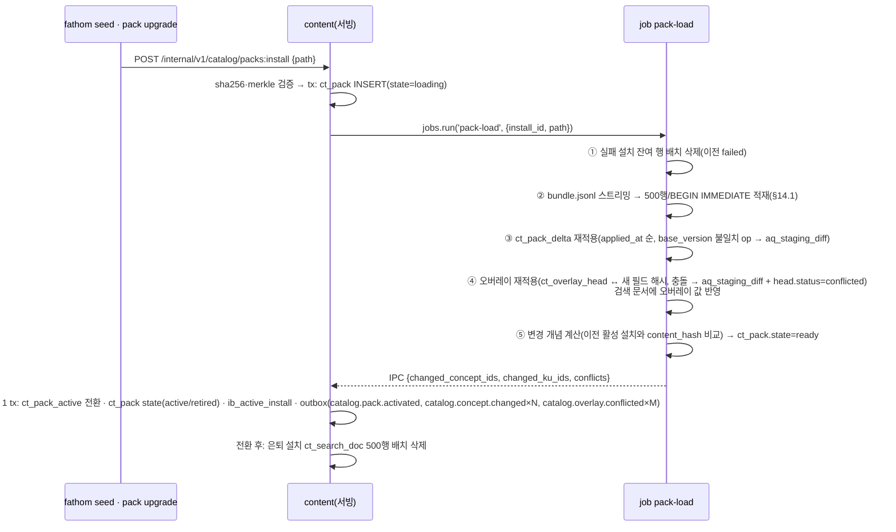

- 실패(job 오류·크래시·기한): 부모가 `ct_pack.state='failed'` 기록, 포인터 불변(사용자 영향 0). 잔여 행은 다음 `pack-load`의 ①이 지운다(서빙 프로세스에서 대량 삭제 금지 — AP-11).
- **첫 기동**: content serve가 `ct_pack_active`가 비어 있으면 번들 `packs/*.fpack`(FATHOM_HOME에 복사된 동봉 팩)을 순서대로 설치 대기열에 넣는다 → OFFLINE 첫 세션 ≤ 3분(D-2). `x.blueprints`도 같은 경로. 사용자 팩 `u.local`은 첫 PackDelta 때 빈 설치로 만든다.

### 14.3 정책 팩과 서비스별 초기 행

| 대상 | 시드 방법 | 멱등 |
|---|---|---|
| 정책 `policy/<name>@v<k>.yaml` | DB에 넣지 않는다. 설치 시 `FATHOM_HOME/policy/`(읽기 전용, 과거 버전 영구) + `policy.lock.json` + `sets/<policy_version>.json`. 소유 서비스가 `loadPolicy()`로 zod + 해시 검증(불일치 exit 78) | 파일 |
| learning 첫 기동 | ① `lr_device`에 `is_local=1` 행이 없으면 ULID 생성·INSERT ② 원장에 `policy.switched`가 없으면 현재 정책 세트로 `policy.switched` append(키 `policy:<ps>`) ③ `lr_projection_meta('live')` 초기 행 | 부분 유일 인덱스 · 원장 키 · PK |
| learning 정책 교체 | FR-SET-018 비교 리포트 → 승인 → `policy.switched`(이후 이벤트가 새 `policy_version` 참조) | 원장 키 |
| ai-gateway 첫 기동 | `ai_mode_state(1,'OFFLINE')`, 번들 `evals/gold/<taskId>/*.jsonl` → `ai_gold_item(source='model_labeled_draft', status='model_labeled_draft')` `INSERT OR IGNORE` + 존재 확인, 내장 제공자 행(`ai_provider`, `enabled=1`, 동의 0) | PK |
| ops-api 첫 기동 | `op_tripwire_state` TW-01~13·RES-* 행 `INSERT OR IGNORE`, `op_host_state(1)` | PK |
| outbox_delivery | 각 서비스 relay 시작 시 `ENSURE_DELIVERY`(routing.gen.ts 목적지) | PK |

---

## 15. 보존 · 정리

- **실행 방식**(D-16): 서비스별 `infra/db/retention.ts`(규칙 상수 `retention.sql.ts`)가 유휴 10분 주기(+ 기동 5분 후)로 돈다. 한 배치 = `BEGIN IMMEDIATE` + `DELETE FROM <t> WHERE rowid IN (SELECT rowid FROM <t> WHERE <조건> LIMIT 500)`(WITHOUT ROWID는 PK 서브쿼리), 배치 사이 `setImmediate` 양보, 주기당 최대 20배치. 정리는 서빙 프로세스의 짧은 tx이며 대량 job이 아니다.
- **append-only 트리거가 있는 테이블은 전부 영구**라 정리 대상과 겹치지 않는다(설계상 충돌 0).

| DB | 테이블 | 보존 규칙 | 근거 |
|---|---|---|---|
| 공통 | `outbox` | `seq ≤ min(durable last_acked_seq)` ∧ `occurred_at < now − 7d`(durable 목적지가 없으면 7d) | ARC §8.3 |
| 공통 | `inbox_dedupe` | `received_at < now − 30d` ∧ `producer_seq ≤ inbox_watermark` | D-16 |
| 공통 | `inbox_dead` | `resolved_at < now − 90d`(미해결은 영구) | |
| 공통 | `idem_request` | `created_at < now − 7d` | ADR-003 §1 |
| 공통 | `schema_migrations` | 영구 | |
| content | `ct_pack` | `failed` 행 90d 후 삭제(설치 범위 행은 다음 pack-load가 즉시 정리), `retired`·`active` 영구 | DR-003·006 |
| content | `ct_*` 설치 범위 · `ct_pack_delta` · `ct_record_history` · `ct_overlay_event` | 영구 | DR-003·026 |
| content | `ct_search_doc` | 은퇴 설치분 전환 직후 삭제 | |
| content | `aq_import_job` | 영구(메타, ≤ 20k) | DR-019 |
| content | `aq_import_chunk` | 작업 종료(completed·failed·cancelled) + 30d | DR-019 |
| content | `aq_staging_item` | `pending` ∧ `expires_at < now`(30d), 결정된 행은 `decided_at + 30d` | FR-IMP-009, ARC §9.2 "미승인 초안 30일" |
| content | `aq_staging_diff` | 처리됨 + 90d(미처리 영구) | |
| content | `aq_inbox_item` | `ignored` + 30d, 나머지 영구 | |
| content | `aq_candidate` | `ignored` + 90d | |
| content | `ib_item` · `ib_item_model` · `ib_gate_*` · `ib_lineage_edge` · `ib_report` · `ib_correction` · `ib_family` | 영구 | DR-008·009 |
| content | `ib_staging_item` | `gated_fail`·`discarded`: `expires_at`(+30d) · 발행된 `gated_pass`: +30d · `deferred`·`review`: 영구(재게이트 대기) | FR-QST-011 |
| content | `gr_attempt` · `gr_verdict` · `gr_appeal` · `gr_turn_judgment` · `gr_utterance` | 영구(답안·산출물·판정 = 영구, NFR-DATA-007) | |
| content | `gr_pending` | 해결·취소 + 90d | |
| content | `rn_run` | 30d | ARC §9.2 "러너 로그 30일" |
| learning | `lr_event` · `lr_checkpoint` · `lr_device` · `lr_dialog_turn` · `lr_artifact_version` · `lr_concept_id_alias` · `lr_session` · `lr_block` · `lr_attempt` · `lr_dialog_state` · `lr_long_task` · `lr_profile_mode` · `lr_forecast_log` · `lr_review_note` · `lr_note_draft`(제출·세션 종료 후 30일) | 영구 | NFR-DATA-001·007 |
| learning | `lr_schedule_hint` | 소비·취소 + 90d | |
| learning | `lr_queue_overflow` | `target_study_day < 오늘 − 7d` | |
| learning | 투영 · `lr_curriculum_*` | 파생(재구성) | |
| insight | 전부 | 재구성 가능. `iv_weekly_report`는 재구성 전까지 유지 | |
| ai | `ai_call_log` · `ai_judge_log` · `ai_firewall_log` · `ai_consent` · `ai_mode_history` · `ai_calibration_run` · `ai_gold_item` · `ai_budget_alert` · `ai_usage_counter` | 영구 | ARC §9.2, NFR-DATA-005 |
| ai | `ai_job` | `finished_at < now − 90d`(결과 CASCADE) | D-25 |
| ai | `ai_job_result` | `collected_at < now − 30d` | |
| ai | `ai_quota_window` | 창 종료 + 30d | |
| ai | `ai_firewall_exception` | `expires_at + 30d` | |
| ai-cache | `ac_entry` | `expires_at < now`(판단 30d·생성 7d·상한 90d), 디스크 < 500MB면 전체 | CR-15 |
| ops | `op_health_sample` · `op_service_event` | 30d | ARC §9.2 |
| ops | `op_telemetry_raw` | 400d | NFR-DATA-007 |
| ops | `op_telemetry_daily` · `op_backup` · `op_backup_file` · `op_epoch_manifest` · `op_incremental` · `op_upgrade` | 영구(행). 백업 파일 자체는 7세대 → `pruned_at` | ADR-013 |
| ops | `op_banner` | 해소 + 90d | |
| ops | `op_doctor_run` | 400d | |
| ops | `op_held_increment` | 흡수 + 90d | |
| 파일 | `logs/` 14d ∧ 서비스당 ≤ 50MB, `tmp/` 기동 시 청소, 백업 7세대 | supervisor·ops-api | CR-14 |

---

## 16. 용량 추정 (15년, 1인)

| DB | 지배 테이블 | 행 수 추정 | 행 크기 | 합계 |
|---|---|---|---|---|
| learning.db | `lr_event` | ≈ 55만(SP-3 합성) | ≈ 666B + 인덱스 4개 | ≈ 350MB(+ 투영 카드 ≤ 3만 · 개념 ≤ 1만 · 세션 ≈ 5,000 · 대화 턴) |
| content.db | `ib_item`(+ `snapshot_json`) · `ib_gate_result` | 문항 ≤ 30만 · 게이트 결과 ≤ 200만 | ≈ 1KB · ≈ 120B | 150~400MB(+ 검색 색인 1.2만 문서당 ≈ 10MB, 2만 초과 시 V3) |
| ai.db | `ai_call_log` · `ai_judge_log` | ≤ 50만 · ≤ 20만 | ≈ 300B · ≈ 600B | ≈ 200MB |
| ops.db | `op_telemetry_raw`(400d) · `op_health_sample`(30d) | ≈ 10만 · ≈ 26만 | ≈ 200B | ≈ 50MB |
| insight.db · ai-cache.db | — | — | — | ≈ 50MB · 수십 MB(재생성) |

자원 Tripwire(ARC §13)가 15년 디스크 투영을 감시한다. `VACUUM INTO` 대형 DB 소요(350MB)는 INT-3에서 측정해 snapshot 기한 30s를 조정한다(RK-11).

---

## 17. 검증

### 17.1 이 문서 DDL의 실측 검증 (Node 22.22.2 · SQLite 3.51.2, 2026-10-01)

DDL 블록 전체를 6개 DB 파일에 실행기와 같은 방식(파일당 `BEGIN IMMEDIATE`, `schema_migrations` 기록)으로 적용하고 아래를 확인했다. 테이블정의서·ERD는 이 실행 결과에서 생성했고, ERD는 mermaid 12.0.0 파서로 전부 통과했다.

| # | 검사 (실행 로그 그대로) | 결과 |
|---|---|---|
| 1 | content.db integrity_check ok | ok |
| 2 | content.db foreign_key_check empty | ok |
| 3 | content.db application_id = 0x46544354 | ok |
| 4 | content.db journal_mode wal | ok |
| 5 | content.db every table STRICT () | ok |
| 6 | learning.db integrity_check ok | ok |
| 7 | learning.db foreign_key_check empty | ok |
| 8 | learning.db application_id = 0x46544c52 | ok |
| 9 | learning.db journal_mode wal | ok |
| 10 | learning.db every table STRICT () | ok |
| 11 | insight.db integrity_check ok | ok |
| 12 | insight.db foreign_key_check empty | ok |
| 13 | insight.db application_id = 0x46544956 | ok |
| 14 | insight.db journal_mode wal | ok |
| 15 | insight.db every table STRICT () | ok |
| 16 | ai.db integrity_check ok | ok |
| 17 | ai.db foreign_key_check empty | ok |
| 18 | ai.db application_id = 0x46544149 | ok |
| 19 | ai.db journal_mode wal | ok |
| 20 | ai.db every table STRICT () | ok |
| 21 | ai-cache.db integrity_check ok | ok |
| 22 | ai-cache.db foreign_key_check empty | ok |
| 23 | ai-cache.db application_id = 0x46544143 | ok |
| 24 | ai-cache.db journal_mode wal | ok |
| 25 | ai-cache.db every table STRICT () | ok |
| 26 | ops.db integrity_check ok | ok |
| 27 | ops.db foreign_key_check empty | ok |
| 28 | ops.db application_id = 0x46544f50 | ok |
| 29 | ops.db journal_mode wal | ok |
| 30 | ops.db every table STRICT () | ok |
| 31 | lr_event INSERT OR IGNORE inserts | ok |
| 32 | lr_event duplicate idempotency_key ignored (exactly-once) | ok |
| 33 | lr_event STORED generated card_id | ok |
| 34 | lr_event UPDATE rejected [ledger is append-only] | ok |
| 35 | lr_event DELETE rejected [ledger is append-only] | ok |
| 36 | lr_event INSERT OR REPLACE rejected with recursive_triggers=ON [ledger is append-only] | ok |
| 37 | lr_event lowercase device_id rejected by CHECK (plain INSERT) [CHECK constraint failed: length(device_id) = 26 AND device_id NOT GLOB '*[^0-9A-HJKMNP-TV-Z]*'] | ok |
| 38 | PITFALL: INSERT OR IGNORE silently skips a CHECK violation (changes=0) -> writer must verify duplicate | ok |
| 39 | counter-example: recursive_triggers=OFF lets REPLACE overwrite (hence ON is mandatory) | ok |
| 40 | lr_session immutable after completion [ended session is immutable] | ok |
| 41 | lr_card_state generated due_at/lapses | ok |
| 42 | shadow swap (DROP + RENAME + recreate indexes) in 1 tx | ok |
| 43 | shadow swap keeps canonical index names | ok |
| 44 | R-REQ: required_for_level on Tier C rejected [CHECK constraint failed: required_for_level IS NULL OR tier IN ('A','B')] | ok |
| 45 | inactive install invisible through ct_concept_active | ok |
| 46 | pointer switch makes install visible | ok |
| 47 | trigram MATCH (≥3 chars) via active join | ok |
| 48 | trigram 2-char returns 0 rows (needs instr path) | ok |
| 49 | short-token instr() path | ok |
| 50 | compact trigram (whitespace-insensitive) | ok |
| 51 | V3 unicode61 prefix index | ok |
| 52 | FTS AU trigger keeps index in sync | ok |
| 53 | loading-install doc indexed | ok |
| 54 | ON DELETE CASCADE fires FTS delete trigger | ok |
| 55 | ux_ct_pack_version ok | ok |
| 56 | overlay new_value must be JSON [CHECK constraint failed: json_valid(new_value)] | ok |
| 57 | outbox_head_seq = sqlite_sequence even after pruning | ok |
| 58 | VACUUM INTO copy integrity_check ok | ok |
| 59 | VACUUM INTO copy keeps application_id | ok |
| 60 | VACUUM INTO copy keeps FTS index | ok |
| 61 | VACUUM INTO from a readOnly connection (snapshot job) works | ok |
| 62 | item selection uses index: SEARCH ib_item USING INDEX ix_ib_item_servable (concept_id=? AND format=?) | ok |
| 63 | rn_run stdout_head > 2KB rejected [CHECK constraint failed: length(CAST(stdout_head AS BLOB)) <= 2048] | ok |
| 64 | ai_mode_state single row [CHECK constraint failed: id = 1] | ok |
| 65 | ai_budget_alert ratio ∈ {0.8,1.0} [CHECK constraint failed: ratio IN (0.8, 1.0)] | ok |
| 66 | SQL APPEND_OUTBOX prepares against content.db | ok |
| 67 | SQL ENSURE_DELIVERY prepares against content.db | ok |
| 68 | SQL RELAY_BATCH prepares against content.db | ok |
| 69 | SQL RELAY_ACK prepares against content.db | ok |
| 70 | SQL RELAY_FAIL prepares against content.db | ok |
| 71 | SQL INBOX_SEEN prepares against content.db | ok |
| 72 | SQL INBOX_RECORD prepares against content.db | ok |
| 73 | SQL INBOX_WATERMARK prepares against content.db | ok |
| 74 | SQL OUTBOX_HEAD prepares against content.db | ok |
| 75 | SQL REWIND_DELIVERY prepares against content.db | ok |
| 76 | SQL SELECT_SERVABLE_ITEMS prepares against content.db | ok |
| 77 | SQL SEARCH_TRI prepares against content.db | ok |
| 78 | SQL SEARCH_SHORT_INSTR prepares against content.db | ok |
| 79 | SQL SEARCH_SHORT_V3 prepares against content.db | ok |
| 80 | SQL SEARCH_COMPACT prepares against content.db | ok |
| 81 | SQL SEARCH_INITIALS prepares against content.db | ok |
| 82 | SQL SEARCH_DOC_COUNT prepares against content.db | ok |
| 83 | SQL LEDGER_INSERT prepares against learning.db | ok |
| 84 | SQL LEDGER_DEVICE_HEAD prepares against learning.db | ok |
| 85 | SQL LEDGER_FIND_CONFLICT prepares against learning.db | ok |
| 86 | SQL LEDGER_HEADS prepares against learning.db | ok |
| 87 | SQL LEDGER_REPLAY prepares against learning.db | ok |
| 88 | SQL CURRENT_CONSENT prepares against ai.db | ok |
| 89 | SQL USAGE_ADD prepares against ai.db | ok |
| 90 | SQL NEXT_BACKGROUND_JOB prepares against ai.db | ok |

### 17.1a PG-2 정합 개정 후 재검증 (2026-10-01, Node 22.22.2 `node:sqlite`, DR-LOG `10-design-review-log.md`)

개정 DDL(§5.5·§6.8·§7.2·§8.2·§10.2) 전체를 메모리 DB 6개에 다시 적용하고 구조 검사 + 정적 SQL prepare + 개정분 동작 검사를 실행했다. 개정된·신설된 테이블의 테이블정의서(§5.4·§6.7·§8.1·§10.1)는 이 실행의 `PRAGMA table_xinfo`·`foreign_key_list`·`index_list`에서 재생성했다. §17.1의 90건 중 개정과 무관한 동작 검사(원장·shadow·FTS·VACUUM INTO)는 개정 대상 테이블을 건드리지 않으므로 결과가 유지된다.

| # | 검사 | 결과 |
|---|---|---|
| 1 | content integrity_check ok | ok |
| 2 | content foreign_key_check empty | ok |
| 3 | content every table STRICT () | ok |
| 4 | learning integrity_check ok | ok |
| 5 | learning foreign_key_check empty | ok |
| 6 | learning every table STRICT () | ok |
| 7 | insight integrity_check ok | ok |
| 8 | insight foreign_key_check empty | ok |
| 9 | insight every table STRICT () | ok |
| 10 | ai integrity_check ok | ok |
| 11 | ai foreign_key_check empty | ok |
| 12 | ai every table STRICT () | ok |
| 13 | ai-cache integrity_check ok | ok |
| 14 | ai-cache foreign_key_check empty | ok |
| 15 | ai-cache every table STRICT () | ok |
| 16 | ops integrity_check ok | ok |
| 17 | ops foreign_key_check empty | ok |
| 18 | ops every table STRICT () | ok |
| 19 | SQL APPEND_OUTBOX prepares against content.db | ok |
| 20 | SQL ENSURE_DELIVERY prepares against content.db | ok |
| 21 | SQL RELAY_BATCH prepares against content.db | ok |
| 22 | SQL RELAY_ACK prepares against content.db | ok |
| 23 | SQL RELAY_FAIL prepares against content.db | ok |
| 24 | SQL INBOX_SEEN prepares against content.db | ok |
| 25 | SQL INBOX_RECORD prepares against content.db | ok |
| 26 | SQL INBOX_WATERMARK prepares against content.db | ok |
| 27 | SQL OUTBOX_HEAD prepares against content.db | ok |
| 28 | SQL REWIND_DELIVERY prepares against content.db | ok |
| 29 | SQL SELECT_SERVABLE_ITEMS prepares against content.db | ok |
| 30 | SQL SEARCH_TRI prepares against content.db | ok |
| 31 | SQL SEARCH_SHORT_INSTR prepares against content.db | ok |
| 32 | SQL SEARCH_SHORT_V prepares against content.db | ok |
| 33 | SQL SEARCH_COMPACT prepares against content.db | ok |
| 34 | SQL SEARCH_INITIALS prepares against content.db | ok |
| 35 | SQL SEARCH_DOC_COUNT prepares against content.db | ok |
| 36 | SQL LEDGER_INSERT prepares against learning.db | ok |
| 37 | SQL LEDGER_DEVICE_HEAD prepares against learning.db | ok |
| 38 | SQL LEDGER_FIND_CONFLICT prepares against learning.db | ok |
| 39 | SQL LEDGER_HEADS prepares against learning.db | ok |
| 40 | SQL LEDGER_REPLAY prepares against learning.db | ok |
| 41 | SQL CURRENT_CONSENT prepares against ai.db | ok |
| 42 | SQL USAGE_ADD prepares against ai.db | ok |
| 43 | SQL NEXT_BACKGROUND_JOB prepares against ai.db | ok |
| 44 | lr_session placement with NULL template_min/energy accepted | ok |
| 45 | lr_session template CHECK rejects unknown | ok |
| 46 | lr_session paused allowed | ok |
| 47 | lr_block ord 0 + awaiting_grade accepted | ok |
| 48 | lr_block legacy status planned rejected | ok |
| 49 | lr_note_draft FK lr_block ok | ok |
| 50 | lr_note_draft FK violation rejected | ok |
| 51 | lr_review_note insert | ok |
| 52 | lr_dialog_turn duplicate turn_id rejected | ok |
| 53 | lr_dialog_state legacy kind digging rejected | ok |
| 54 | lr_curriculum_ref title/tags/catalog_version accepted | ok |
| 55 | lr_curriculum_sync single row | ok |
| 56 | lr_curriculum_sync second row rejected | ok |
| 57 | ct_path insert | ok |
| 58 | ct_search_doc kind path accepted | ok |
| 59 | ib_hint_open insert | ok |
| 60 | ib_hint_open step 5 rejected | ok |
| 61 | ib_report legacy reason wrong_key rejected | ok |
| 62 | ib_report default state received | ok |
| 63 | aq_import_job source_kind inbox accepted | ok |
| 64 | gr_attempt awaiting_self_grade accepted | ok |
| 65 | ai_provider gcli-<slug> accepted | ok |
| 66 | ai_provider generic:<slug> rejected | ok |
| 67 | ai_provider billing free accepted | ok |
| 68 | ai_work_order approval_required accepted | ok |
| 69 | ai_work_order purpose sp1_calibration rejected | ok |
| 70 | ai_task_calibration PK includes prompt_version | ok |
| 71 | op_tripwire_state IF enums accepted | ok |

### 17.2 구현 테스트로 이식할 항목

| 테스트 파일 | 내용 |
|---|---|
| `packages/shared-kernel/test/sqlite/migrate.spec.ts` | 금지 토큰·헤더·번호 빈틈·sha256 변조·application_id 불일치·`fk=off` 경로 |
| `services/*/test/integration/migrations.spec.ts` | §17.1 스키마 단언(STRICT·integrity·FK·application_id·DR-020 훅) |
| `services/learning/test/integration/ledger-writer.spec.ts` | IGNORE 멱등, REPLACE 거부(recursive_triggers ON) + OFF 대조군, **CHECK 위반 묵살 탐지(D-14)**, 동시 append 경합 재시도 |
| `services/learning/test/integration/projection-swap.spec.ts` | shadow 생성·교체·인덱스 이름 보존·투영 해시 불변 |
| `services/content/test/integration/pack-install.spec.ts` | 비활성 설치 비가시 → 전환 1 tx 가시, 실패 설치 CASCADE·FTS 정리, 내용 같은 문항의 gate_status 유지, delta·오버레이 재적용 충돌 |
| `services/content/test/integration/search.spec.ts` | trigram·instr·compact·V3 prefix·초성·FTS 트리거 동기화, LIKE 미사용(`check:sql` 패턴), DCP-01 120질의(재현율·P@10) |
| `tests/integration/{epoch-backup,restore-rewind,merge,chain-anchor}.spec.ts` | 사본 기준 매니페스트 SQL, 커서 되감기, 앵커 대조, export ↔ import 체크섬 |

---

## 18. 설계 결정 메모 (Design notes)

> 아키텍처 문서가 정하지 않은 틈을 메운 최소 결정이다. `(제안 CR)` 표시는 기준선 문구 변경이 필요한 가산 CR로 PG-2 CR 로그에 올린다.

| # | 틈 | 결정 | 이유 · 영향 |
|---|---|---|---|
| D-01 | ARC §8.3은 `_infra`를 "모든 writer DB"에 적용한다고만 함. 파생 DB(insight·ai-cache)는 outbox·inbox가 없음 | `_infra`를 0001 `schema_migrations` · 0002 eventing · 0003 idempotency로 나누고 프로파일 `full`(0001~0003)·`meta`(0001)로 적용 | 파생 DB에 쓰지 않는 표를 만들지 않음. ARC DDL 본문은 바이트 그대로 유지(주석·인덱스만 가산) |
| D-02 | 복원·업그레이드에서 파일이 뒤바뀌면 탐지 수단이 없음 | 파일별 `PRAGMA application_id`(§2) 설정·대조, 불일치 exit 78 | 헤더 4바이트, 비용 0. `VACUUM INTO` 사본에도 보존(실측) |
| D-03 | "비활성 버전 행"의 구체 모델 | 카탈로그 행 PK에 `install_id`, 활성 포인터 `ct_pack_active`, 조회 뷰 `*_active`, 은퇴 설치 영구 보존(KU 이력), 실패 설치는 CASCADE 정리 | DR-003 "구 버전 보존"을 별도 이력 표 없이 충족 |
| D-04 | 팩 업그레이드 때 문항 게이트 상태(재게이트 결과)를 어떻게 이어 가나 · itembank가 catalog 포인터를 SQL로 JOIN하면 BC 경계 위반 | 문항·ItemModel = 내용 주소 `(id, content_hash)` 행 + `ib_install_member`, 활성 설치 사본 `ib_active_install`을 전환 tx에서 itembank IngestPort가 갱신 | 같은 내용 = 같은 상태, 교차 모듈 JOIN 0 |
| D-05 | PackDelta는 팩 업그레이드 후 어떻게 유지되나 | `ct_pack_delta`에 영구 기록, 활성 설치에 즉시 적용(원 행은 `ct_record_history`), 업그레이드 시 job이 `applied_at` 순 재적용(문항 op 제외) | 오버레이와 같은 재적용 모델, 사용자 팩 `u.local`은 delta 재생만으로 재구성 |
| D-06 | `base_version`의 형식 | `<pack version>@<sha256(정준 기준 필드값) 앞 16자>`, 재적용 비교는 해시 부분만. 합성 결과 `ct_overlay_head`(파생), 문항 대상은 `ib_item.overlay_json`에 반영 | 팩 버전이 바뀌어도 필드 값이 같으면 자동 재적용(ADR-004 §5) · grading이 catalog를 읽지 않음 |
| D-07 | V3 전환 시 색인을 언제 만드나 · `hangul_initials`를 DDL에서 쓰면 모든 연결(job·restore·integrity)에 UDF 등록이 필요 | `ct_fts_uni`를 처음부터 유지(전환 = 정책 값 비교), 초성열 `initials`는 적재 시 앱이 계산. `hangul_initials` UDF는 질의 편의로만 등록하고 DDL·트리거·생성 열에 쓰지 않음 | 전환에 재색인 0. 1.2만 문서당 +3.6MB(SP-4) |
| D-08 | 검색 문서의 설치 범위 | `ct_search_doc.install_id` + 질의 시 활성 JOIN, 은퇴분은 전환 후 배치 삭제 | 전환 tx를 짧게 유지 |
| D-09 | JSON 열 이름 규칙 부재 | 새 열 `_json` 접미사, 동결 이름은 예외(§3.2) | 하위 모델 에이전트의 열 이름 추측 오류 감소 |
| D-10 | enum을 CHECK로 막을지 | 동결된 닫힌 enum만 CHECK, 열린 enum은 zod | SQLite CHECK 변경 = 테이블 재작성(파괴 변경) |
| D-11 | 투영 테이블 표현 · shadow DDL의 출처 | `state_json` 정준 JSON + STORED 생성 열, `WITHOUT ROWID`, 뷰·트리거 금지, shadow DDL은 `sqlite_schema`에서 파생(코드 상수 중복 0) | ADR-011 "정준 필드 순서 JSON"을 그대로 저장. DROP+RENAME+인덱스 재생성 실측 통과 |
| D-12 | FR-CUR-004 "과거 이벤트는 alias로 해석"을 리플레이 순수성과 어떻게 양립하나 | `lr_concept_id_alias`(append-only, 단조 증가)를 리듀서의 유일한 비원장 입력으로 허용. 별칭 도착 시 영향 카드·개념은 slow path 재도출 | 별칭 집합이 같으면 리플레이 = 라이브. 매핑은 바뀌지 않고 늘기만 함 |
| D-13 | 현재 설정의 저장 | `lr_setting` = `profile.setting_changed`의 투영(`(client_ts, device_id)` 최신 우선 = FR-SET-022 규칙) | 병합 후에도 결정적. 리듀서는 이벤트 내장 값만 사용 |
| D-14 | **검증 중 발견**: `INSERT OR IGNORE`는 CHECK·NOT NULL 위반 행도 오류 없이 건너뜀(`changes = 0`) | `changes = 0`이면 반드시 `LEDGER_FIND_CONFLICT`로 정상 중복·체인 경합·묵살된 위반을 구분(§6.3). 시드·병합 import도 같은 존재 확인 | "중복으로 착각한 증거 유실"을 차단. 테스트 항목 추가(§17.2) |
| D-15 | `recursive_triggers=ON`을 "원장 연결"에만 거는지 | learning.db의 **모든** 연결(서빙·job·읽기 전용)에 설정 | 연결 종류 판별 실수 제거. 다른 트리거는 RAISE뿐이라 부작용 0 |
| D-16 | 보존 정리를 job으로 할지 | 서빙 프로세스의 500행 배치 짧은 tx(job 이름 추가 없음). append-only(트리거) 테이블은 전부 영구로 설계 | ARC job 목록 불변, 트리거와 정리의 충돌 0 |
| D-17 | insight 비동기 투영의 커서 | `lr_event.rowid`(도착 순서)를 `iv_meta`에 저장. 병합·복원 후에는 전체 재구성 | rowid 금지는 리플레이 순서에 대한 것(ADR-011)이며 도착 커서 용도는 허용 |
| D-18 | DR-016 "일별 LDI·지표 스냅샷"과 SP-3 감사 "LDI 스냅샷 테이블 불필요" 충돌 | LDI 저장 0, 과거 시점 LDI는 리플레이 컷오프 계산, 주간 리뷰는 `iv_weekly_report`(발행 기록), 지표 일 집계는 `op_telemetry_daily`. **(제안 CR-30)** DR-016 문구를 "LDI는 표시·리포트 시 재계산(저장 안 함), 운영 지표만 일 집계"로 정렬 | CR-25와 같은 방향 |
| D-19 | 전량 export의 형식·체크섬 · 사용자 팩 이관 | 테이블별 JSONL, JSON 열은 저장된 정준 문자열 그대로, `table_checksum`, `u.local`은 delta 재생으로 재구성, 전량 import = `--mode=restore --from-export` | D-8 "행 수·체크섬 동일"을 재직렬화 오차 없이 충족, 새 job 이름 불필요 |
| D-20 | 원장 export 절단의 조기 탐지 | footer 줄 `{events, lines_sha256}` 추가 | 정식 증명은 헤더 앵커(ADR-011), footer는 스트림 오류 조기 보고 |
| D-21 | 키 응답의 `last4`를 어디서 얻나 | DB에 저장하지 않고 메모리 키에서 계산 | DR-018 "DB에 키 문자열 0" 보수 해석 |
| D-22 | 원화 비용의 소수점 | `cost_krw_milli INTEGER`(1/1000원) | REAL 누적 오차 제거 |
| D-23 | NFR-DATA-006 "UTC ISO-8601(ms)" vs ARC "epoch ms INTEGER" | ARC를 따른다(epoch ms). 표시·Markdown export만 ISO | 정보 동치, 정렬·범위 질의 효율 |
| D-24 | 학습자 답안 원문 위치 | content `gr_attempt.response_json`(+ learning 대화 턴·산출물). 원장에는 없음 | 원장 자급성(D-4)에 답안 불필요. content.db는 epoch 백업 포함 |
| D-25 | background 작업 입력의 보존 | `ai_job.input_json`은 로컬 원본, 호출 직전 Firewall, 종료 + 90일 삭제 | 재시도·재개에 필요, 장기 보관 불필요 |
| D-26 | 블루프린트·사용자 콘텐츠가 속할 팩 | 시드 블루프린트 = 팩 `x.blueprints`, 사용자 가져오기·블루프린트 import·Case 파운드리 = 팩 `u.local` | 모든 카탈로그 행이 같은 설치 모델을 따름 |
| D-27 | 러너 실행 기록의 코드 원문 | `rn_run`에는 `code_sha256`만, 원문은 `gr_attempt` | FR-LAB-013 "원문은 로컬에만" + 30일 정리와 독립 |
| D-28 | 7세대 초과 백업의 기록 | 행 영구 + `pruned_at` | 이력·RPO 계산 유지 |
| D-29 | DR-013·014 불변의 강제 수단 | `lr_session_frozen`·`lr_artifact_version_frozen` 트리거 | 실수 방지(보안 경계 아님) |
| D-30 | `PRAGMA optimize` | 정상 종료 직전·migrate 끝에 실행 | 측정 금지 대상(`cache_size` 등)과 무관한 통계 갱신 |
| D-31 | 파생 DB 파일이 없을 때 | migrate가 생성, restore는 삭제 후 migrate | serve는 생성하지 않음(스키마 생성 = migrate 전용 원칙 유지) |
| D-32 | ULID 규칙의 예외 | FTS 외부 콘텐츠 원본 `ct_search_doc.doc_id`, `op_*` 로그 rowid, `outbox.seq` | FTS5 `content_rowid`는 정수여야 함 |
| D-33 | `lr_projection_meta` 키 | `name` PK('live') + `last_order_json` 가산(ADR-011 필드 유지) | 단일 행 갱신·캐치업 기준 |
| D-34 | `lr_checkpoint`·`lr_curriculum_ref` 필드 | `lr_checkpoint` = ADR 필드 + `kind`·`projection_hash` 가산, `lr_curriculum_ref` = ARC §7.1 필드 + `pack_id`·`ext`·`ext_v` 가산 | export·merge·epoch 앵커 구분, 팩 단위 재구성 |
| D-35 | Verdict 저장 | 핵심 열 + `verdict_json`(이벤트 payload와 같은 정준 JSON) 중복 저장, append-only | 이벤트 재발행·감사·재채점 대조 |
| D-36 | 스트림 발화의 최종본 | `gr_utterance.text`에 저장, learning은 `utterance_ref`만 | 대화 재개·열람 |
| D-38 | PG-2 교차 문서 정합(2026-10-01) | IF-01 enum·필드를 화면·계약의 정본으로 보고 DDL CHECK·열을 맞춤: 콘텐츠 ID 문법 = packc R-ID(CR-35, CardId만 IF 형식), FormatId 33종(CR-36), practice 열·상태(CR-37), content enum(CR-38), ai.db enum·열(CR-39), 신규 표 `lr_note_draft`·`lr_review_note`·`ib_hint_open`·`ct_path`·`lr_curriculum_{sync,inventory,case,path}`(CR-40·41·52), `op_tripwire_state`(CR-48). 모두 0001 마이그레이션에 직접 반영(INT-1a 이전 출하 0, 0002 불필요) | 전송 값 = 저장 값(매핑은 `ImportStage` 'I1.5' ↔ 'I1_5' 1건만) |
| D-37 | 문항 β 추정의 소유(ADR-011은 `pretest.answered` "β 추정만", Verdict는 content 스냅샷) | content `ib_item_stat.beta_est`가 Verdict 스냅샷 원천. learning 리듀서가 결정적으로 계산한 `item_beta_after`를 **CR-29(PG-2 의무화)** `learning.evidence.recorded` 필수 nullable 필드로 보내 갱신, pretest도 `phase:'pretest'`로 발행 | 리듀서는 payload `item_beta`만 읽으므로 리플레이 결정성 불변. 가산 필드(ADR-003 "선택 필드 추가 = CR") |

---

## 부록 A. 브라우저 저장소 (web, 참고 — ADR-006 정본)

IndexedDB `fathom-attempts` v1 · store `attempts`(keyPath `idempotency_key` = attempt ULID; 필드 `session_id, block_id, item_id, payload, answered_at, created_at, tries, state: pending|sending|failed_permanent, last_error_code`). 큐에 먼저 쓰고 전송, 2xx면 삭제, 503·네트워크 오류는 같은 키로 1s → 2s → 4s … ≤ 30s 재시도, 4xx(409·429 제외)는 `failed_permanent`, 7일 보관(서버 `idem_request` 보관 기간과 일치). 서버 DB와 스키마를 공유하지 않는다.

## 부록 B. DR → 테이블 추적표

| DR | 엔티티 | 테이블(DB) | 수용기준 대응 |
|---|---|---|---|
| DR-001 | 개념 | `ct_concept`(content) + `lr_curriculum_ref`(learning 사본) | 필드 + `ext`, 영상 본문 열 없음 |
| DR-002 | 개념 간선 | `ct_concept_edge` | kind CHECK 3종 |
| DR-003 | KU | `ct_ku` + 은퇴 설치 행 + `ct_record_history` | 개정 = 새 설치 행·구 행 보존 |
| DR-004 | 오개념 | `ct_misconception` | `meta_family NOT NULL` |
| DR-005 | 출처 | `ct_source` | `license_grade` CHECK, D 발행 차단은 packc·IngestPort |
| DR-006 | 팩 매니페스트 | `ct_pack` | `manifest_hash`·`merkle_root`, 불일치 적재 거부 |
| DR-007 | ItemModel | `ib_item_model` | status CHECK(draft·active·retired) |
| DR-008 | 문항 | `ib_item` | 객체 키 옵션, `gate_status`·`stem_family` NOT NULL |
| DR-009 | 게이트 결과·계보 | `ib_gate_result` · `ib_gate_transition` · `ib_lineage_edge` | append-only 트리거 |
| DR-010 | Learning Event | `lr_event` | ADR-011 DDL, 체인 |
| DR-011 | 카드 | `lr_card_state` | 삭제 후 리플레이 = 원 상태(투영) |
| DR-012 | 학습자 모델 | `lr_concept_state` · `lr_mc_state` · `lr_lifecycle` · `lr_track_level` + 원장 `declaration.sealed` | 봉인 = 원장(불변) |
| DR-013 | 세션·블록 | `lr_session` · `lr_block` · `lr_attempt` | 종료 세션 불변 트리거 |
| DR-014 | 장기 과제 | `lr_long_task` · `lr_artifact_version` · `lr_dialog_state` · `lr_dialog_turn` + `gr_turn_judgment` | 제출본 불변 트리거 |
| DR-015 | 봉인 데이터 | 원장 `declaration.sealed`(payload `sealed_payload`) | append-only |
| DR-016 | LDI·지표 스냅샷 | (LDI 저장 없음) `iv_weekly_report` · `op_telemetry_daily` | D-18, CR-30(제안) |
| DR-017 | 판정 로그 | `ai_judge_log` | 원자료 필드 NOT NULL, append-only |
| DR-018 | AI 운영 | `ai_provider` · `ai_job` · `ac_entry` · `ai_call_log` · `ai_usage_counter` · `ai_gold_item` · `ai_firewall_log` | 키 문자열 0, 캐시 90일 |
| DR-019 | 가져오기·Inbox | `aq_*` | 미발행 30일 정리, 마스킹 원문만 |
| DR-020 | 훅 | §3.5 표 | `lint:hooks` |
| DR-021 | 운영 메타 | `op_backup` · `op_epoch_manifest` · `schema_migrations` · `op_health_sample` (+ 파일 `run/registry.json`) | 해시·epoch 필드 |
| DR-022 | 정책 버전 | 파일 `FATHOM_HOME/policy/**` + 원장 `policy.switched` · 이벤트 `policy_version`(CR-13) | 해시 불일치 기동 거부 |
| DR-024 | 사용자 설정 | `lr_setting`(+ 원장 `profile.setting_changed`) · `ai_setting` · `ai_firewall_pattern` | 이전·이후 값 = 원장 payload `from`·`to` |
| DR-025 | 기기·체크포인트 | `lr_device` · `lr_checkpoint` | 체인·앵커 검증 |
| DR-026 | 오버레이 | `ct_overlay_event` · `ct_overlay_head` | 재적용 테스트 |
| DR-027 | 블루프린트 | `ct_blueprint` · `ct_blueprint_item` · `ct_blueprint_map` | `source_url`·`source_edition` |
| DR-028 | 릴리스 매니페스트 | 파일(`packages/contracts/manifests/*`) + `ct_pack.report_json`(KPI) | 스키마 검증 |

*끝. DB-01 v1.0 — ARC-01 v1.0·ADR-001~016·스파이크 감사 구속 결정에 정합. 다음 단계: IF-01이 원장·이벤트 payload를 코드로 고정하고, 이 문서의 SQL 블록을 경로 그대로 마이그레이션 파일로 옮긴 뒤 §17.2 테스트를 INT-1a에 둔다.*
