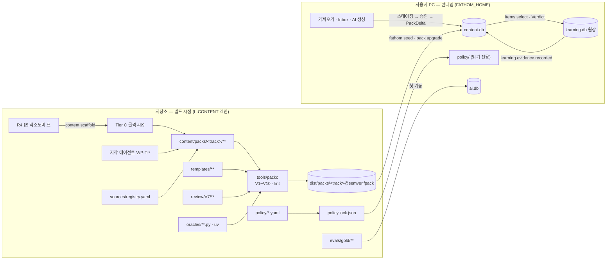
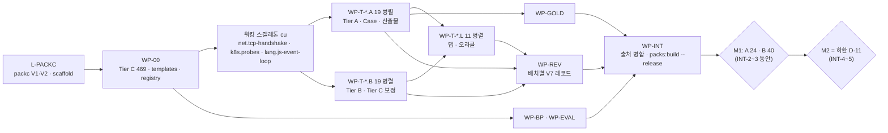
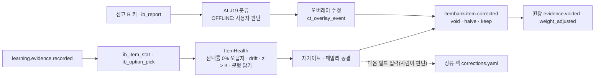
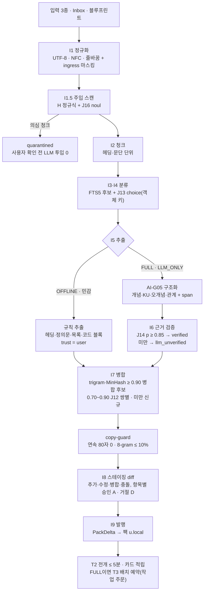
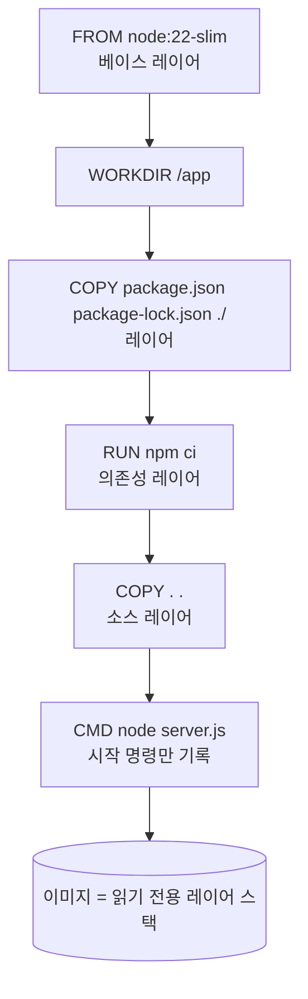
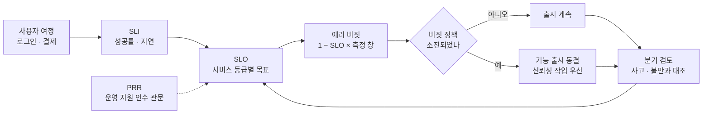

# DCP-01. 데이터수집계획서 (Data Collection Plan) · 콘텐츠 스키마 — Fathom · 깊이

> **문서 ID**: DCP-01 · **버전**: v1.0 (PG-2 동결 후보) · **작성일**: 2026-10-01 · **작성 주체**: T1(상위 모델, 설계)
> **구속 입력(binding)**: ARC-01 v1.0(§6·§7.3·§9·§10·§11.4·§12.6·§12.7·§16·부록 B) · ADR-004(팩·정책) · ADR-005(과업·골드셋) · ADR-007(러너·하네스) · ADR-011(원장) · ADR-015(관측성) · ADR-016(데이터 등급) · DB-01 v1.0(content.db DDL §5, 시드 적재 §14, D-01~D-37) · Planning Baseline v1.0(PLN-REV-01 §4·§5.4~§5.8) · REQ-01 v1.1(FR-CUR·FR-QST·FR-IMP·FR-LAB·FR-DSH-013, DR-001~028) · PLN-CNV-01 v1.1 §6·§9 · SP-6 감사(콘텐츠 Brief 7건, R-POOL) · SP-4 감사(R-ALIAS, 검색 평가셋) · R1·R2·R4.
> **Trace**: UR-01·02·07·10·11·12·13·14·15·16, **DR-023(이 문서가 정본)**, DR-001~009·019·026·027, FR-CUR-001~026, FR-QST-001~026, FR-IMP-001~014, FR-LAB-001~017, FR-AI-014·027, FR-DSH-013, NFR-MAINT-013, NFR-DATA-*, NFR-AVL-008, AQ-13, AQ-17, CR-10·11·19~24.
> **정본 관계**: 이 문서는 **콘텐츠 원천 파일의 저작 문법**(폴더·파일·스키마·검증 규칙)과 **시드 수량·작업 패키지**의 정본이다. 번들 레코드와 DB 열은 DB-01 DDL과 `@fathom/contracts/pack/*`(IF-01)가 정본이며, §5.3 매핑표가 둘을 잇는다. 충돌 시 우선순위는 **DB-01 DDL > ARC-01·ADR > 이 문서**다. 이 문서가 메운 틈은 §15 설계 결정 메모(DN-nn)에 모았다.
> **표기**: `[결정]` 이 문서의 결정 · `DN-nn` 설계 결정 메모 · `CR-31~CR-34(제안)` 이 문서가 새로 제안하는 가산 CR(ARC-01 CR-01~28, DB-01 CR-29·30 다음 번호) · `M1/M2/M3` 콘텐츠 마일스톤(§8.4) · `cu` 콘텐츠 Brief 단위(PLN-CNV-01 §9.6).

---

## 0. 요약 (TL;DR)

1. **수집 대상은 20개 데이터군이다**(§2): 트랙 · 개념 3단 본문 · KU · 오개념 · 출처 · 저작 문항(저작 형식 25종) · ItemModel(T1 바인딩·T2 템플릿) · 랩(코드·카타·알고리즘·보안 패치·인프라·SQL·Python 예측) · Case · 산출물 과제·반론 은행 · 루브릭 · 블루프린트 · Depth Map 레이아웃 · 정책 12종 · 골드셋 · 평가셋 · V7 리뷰 레코드 · 학습자 데이터 · 사용자 가져오기 · AI 생성물.
2. **출처는 8종(S1~S8)이다**(§3). 시드 본문·KU·문항은 전부 **에이전트 자체 저술**이다. 공식 문서는 URL·섹션 앵커로 **인용만** 하며 원문 문장을 옮기지 않는다(1개념당 짧은 인용 ≤ 2문장, C·D 등급 인용 0). 가져온 자료는 로컬 전용(C2)이고 copy-guard(연속 80자 0 · 문자 8-gram ≤ 10%)를 통과해야 발행된다. AI 생성물은 반드시 스테이징 → 게이트 → 승인 → PackDelta 경로로만 들어온다.
3. **폴더는 ARC-01 §10.1을 그대로 쓴다**(팩 = 트랙): `content/packs/<track>/{pack.yaml, CHANGELOG.md, corrections.yaml, concepts/<concept_id>.md, kus/<concept_id>.yaml, misconceptions/<concept_id>.yaml, items/<concept_id>.yaml, item-models/<concept_id>.yaml, cases/<slug>.case.yaml, artifacts/<slug>.yaml, rubrics/<slug>.yaml, labs/<slug>/…}` + `content/{templates, blueprints, sources, review/V7, oracles}` + 루트 `policy/`·`evals/`(§5).
4. **파일 형식 24종의 zod 형태 스케치를 둔다**(§6). 저작 스키마는 packc 레인(`tools/packc/src/parse/schema/*.ts`), 번들 레코드는 `@fathom/contracts/pack/records.ts`(IF-01)다. Jev가 읽는 구조(선택지·idea unit·루브릭 차원·결정점·결함)는 전부 **객체 키**(`^[a-z][a-z0-9_]{1,31}$`)다.
5. **검증 = V1~V10 + lint 38개 규칙**(§7). 자동 검증은 V1~V6·V9와 V7 바인딩 검사·V10 휴리스틱이고, V7(독립 리뷰)·V7b(표본 감사)는 상위 모델 리뷰어가 별도 컨텍스트에서 레코드로 남긴다. 저자는 언제나 `gate_status: authored`로 쓰고, **V7 승인 레코드의 `approved_hashes`가 정준 레코드 해시와 일치할 때만** packc가 `seed_reviewed`로 컴파일한다. 종료 코드는 게이트 규약과 같다(0 통과 · 1 위반 · 2 엔진 고장·스캔 0파일).
6. **이번 빌드가 실제로 만드는 양 = 하한(D-11, 20cu)**이다(§8): Tier A **41**(L1 11·L2 9·L3 12·L4 8·L5 1) · Tier B **60**(SP-6 Brief 7건 포함) · Tier C **368** · KU 628 · 오개념 243 · 핵심 저작 문항 792(+ 디깅·Feynman·임베디드 등 부속 369) · Case 12 · 산출물 6 · 랩 82 · 블루프린트 2 · 골드셋 60+50 · 평가셋 450건. M1(R1) = Tier C 469 + A 24 + B 40 → M2(R2) = 하한 → M3 = 목표(팩 증분 + AI 확장).
7. **하한 기준 예상 cap**: L5 = db·sre·sec, L4 = cs·net·linux·be·docker·k8s·cicd·cloud·ml·llm·eng·lead, L3 = alg·lang·fe·arch — **전 코어 트랙 ≥ L3**(D-11). 실제 값은 packc `structuralFeasibility()` 결과(`report.json`)가 정본이다.
8. **작업 패키지**(§9): WP-00(기반·Tier C 변환) → 트랙별 WP-T-`<track>`.{A·B·L} 49개 하위 패키지 병렬 → WP-REV(독립 리뷰, 별도 컨텍스트) → WP-INT(통합·D-11). 교차 WP는 WP-BP·WP-POL·WP-GOLD·WP-EVAL. **모든 WP의 쓰기 경로는 서로 겹치지 않는다**(공유 파일은 요청 파일 → 통합자 병합).
9. **버전 관리**(§10): 팩마다 SemVer, ID 불변(개명 = `id_aliases`, 폐기 = `deprecated_by`), 정답 키 수정 = `corrections.yaml` → `itembank.item.corrected`. 신선도는 `volatility`별 `review_by`(stable 3년 · evolving 180일 · volatile 90일).
10. **학습자 데이터는 로컬에만 있다**(§11): 원장 17종·답안·대화·통계·확정 라벨·텔레메트리를 소유 서비스 DB에 저장하고, 외부로 나가는 것은 동의한 제공자에게 Firewall을 통과한 C1 페이로드뿐이다. TW-01~13 로컬 계산식(ADR-015 후속)을 §11.4에 정의한다.
11. **개념 가져오기**(§12): 입력 3종 → I1~I9 → 스테이징 diff 승인 → PackDelta(팩 `u.local`) → 5분 안 T2 전개·카드 적립. OFFLINE은 규칙 추출(`trust=user`), FULL은 LLM 추출 + Jev 근거 검증(p ≥ 0.85 미만 = `llm_unverified`, 승인 전 출제 0).
12. **견본**(§13): Tier A L1 `docker.dockerfile`과 Tier A L5 `sre.reliability-strategy`의 개념·KU·오개념·문항 파일 전체와 랩 1개. 둘 다 하한 목록에 들어 있는 **실제 시드 정본 초안**이다.

---

## 1. 범위 · 구속 결정 · 용어

### 1.1 범위

| 포함 | 제외(다른 문서) |
|---|---|
| 시스템이 필요한 데이터 전체의 인벤토리, 데이터별 출처·수집 방법, 라이선스·저작권 정책, 콘텐츠 팩 폴더·파일 형식·스키마, 검증 규칙과 시드 품질 게이트, v1 시드 수량(목표·하한·이번 빌드 마일스톤), 콘텐츠 작업 패키지와 폴더 소유, 버전 관리·업데이트 절차, 학습자 데이터 수집(로컬)과 적응·분석 용도, 개념 가져오기 흐름, 골드셋·평가셋 제작 형식 | DB DDL(DB-01), 번들 레코드·라우트·이벤트 payload의 코드 정본(IF-01 = `packages/contracts`), packc·T1 생성기·채점 엔진 구현(코드 레인), 화면(SCR-01), 테스트 스위트 구성(TST-01) |

### 1.2 이 문서가 그대로 따르는 결정 (재개봉 금지)

| # | 결정 | 출처 |
|---|---|---|
| B-01 | 원천 = 저장소 `content/`(content-as-code), 팩 = **트랙 단위**, packc가 `.fpack`(manifest·bundle.jsonl·report.json·layout.json)으로 컴파일, content는 **컴파일본만** 설치 | ARC-01 §10.1~10.2, ADR-004 §1~3 |
| B-02 | 서빙 테이블 쓰기 경로는 `.fpack` · PackDelta · 오버레이 셋뿐 | ARC-01 §10.3, ADR-004 §4 |
| B-03 | 저작 시드 `authored` → V7 레코드 → `seed_reviewed`(모든 AI 모드 출제), 생성 문항 `draft → deferred → gated_pass`, 출제 가능 = `{seed_reviewed, jev_verified, gated_pass}` | FR-QST-009·011, ARC-01 §6.1 |
| B-04 | ID: 개념 `<track>.<slug>`, KU `<concept_id>.k<nn>`, 오개념 `<concept_id>.m<nn>`, 문항 `<concept_id>.i<nn>`, ItemModel `<concept_id>.im<nn>`, Case `<track>.case.<slug>`, 산출물 `<track>.art.<slug>`, 랩 `<track>.lab.<slug>`, 루브릭 `rb.<slug>`, 출처 `src.<slug>`, 사용자 `u.<ns>.<slug>`. **발행 후 불변** | DB-01 §5.4, ADR-004 §1, FR-CUR-004 |
| B-05 | Jev는 객체 키로만 참조. 선택지 `opt_a…`, 루브릭 차원 `d_*`·수준 `l1..l4` | UR-16, ARC-01 §11.2, DB-01 `ct_rubric` |
| B-06 | 숙달 형식 산입 = `w_format ≥ 0.7 ∧ w_grader ≥ 0.6`, 필수 개념 = Tier A/B(`required_for_level`은 A/B만), 승급 평가 풀 = 레벨별 × AI 모드별 ≥ 12문항·형식 ≥ 4(R-POOL, `structuralFeasibility()`) | DEC-CNV-19·20, ARC-01 §7.3·§10.2, SP-6 감사 |
| B-07 | 첫 기동은 OFFLINE → **시드만으로 전 모드가 OFFLINE에서 성립**해야 한다(D-1) | Baseline §5.6, D-1 |
| B-08 | 러너 출처 정책 `sourceKind ∈ {learner, seed(V4 통과), t1}`, LLM·가져온 코드 실행 0, 숨은 테스트 판정은 부모 | ADR-007 §9·§12 |
| B-09 | 런타임 Python 0, ml·llm 코드 실행 문항은 **빌드타임 uv 오라클** | DEC-CNV-24, C-10 |
| B-10 | 데이터 등급 C0(시드)·C1(학습자 산출물)·C2(가져온 자료)·C3(민감), 외부 송출은 ai-gateway Firewall 1지점 | ADR-016 |
| B-11 | 검색: 개념마다 영문 alias ≥ 1(R-ALIAS), 2만 문서 초과 시 V3, 평가셋 120질의에 2음절·진부분집합 정답 | SP-4 감사, CR-24 |
| B-12 | 정책 = `policy/<name>@v<k>.yaml` + `policy.lock.json`, 소유 서비스가 로드·해시 검증, 리플레이는 이벤트의 `policy_version`이 가리키는 불변 세트만 사용 | ARC-01 §10.4, ADR-004 §9 |
| B-13 | 제품 지도는 Brief 콘텐츠가 들어오기 전까지 오라클 cap을 표시 | SP-6 감사, ADR-004 §11 |

### 1.3 용어

| 용어 | 정의 |
|---|---|
| 개념(Concept) | 학습·숙달·그래프의 최소 단위. 3단(이론 → 코드/사례 → 핵심) 본문을 갖는 `concepts/<concept_id>.md` 1개 |
| KU (Knowledge Unit) | 참·거짓을 판정할 수 있는 단일 명제 + 적용 범위. 출제·채점·근거의 단위 |
| 오개념(MC) | 사람들이 실제로 틀리는 믿음 + 교정 문장 + `meta_family`. 오답지·거짓 OX·피드백의 원천 |
| 저작 시드 | 에이전트가 저작해 저장소에 커밋한 콘텐츠(`origin: authored`, `source_kind: seed`) |
| T1 / T2 / T3 / T4 | 절차 생성기(실행 오라클) / 선언적 템플릿 전개 / 근거 기반 LLM 문항 / LLM 시나리오·루브릭(FR-QST-001~004) |
| Tier A / B / C | 완전 시드 / 코어 시드 / 지도 시드(3단 골격). 티어별 최소 사양은 §7.4 |
| 깊이 자산 | Tier A · Case · 산출물 과제 · 조건 반전 쌍 ≥ 3(CNV §9.3) |
| 번들 레코드 | `.fpack`의 `bundle.jsonl` 한 줄. `{kind, …정준 레코드…, content_hash}` |
| V7 레코드 | `content/review/V7/<pack>/<batch>.yaml`. 저작 시드의 S2 승인 = 독립 리뷰 기록 |
| WP | 콘텐츠 작업 패키지. 쓰기 허용 경로가 명시된 하나의 에이전트 작업 단위(§9) |
| M1 / M2 / M3 | R1 콘텐츠 최소(INT-2~3) / 하한 = D-11(INT-4~5) / 목표(팩 증분·AI 확장) |

---

## 2. 데이터 인벤토리 — 시스템이 필요한 데이터

### 2.1 데이터군 일람

| # | 데이터군 | 원천(§5) | 번들 kind → DB(DB-01) | 쓰는 기능·모드 | 출처(§3) | 하한 / 목표 |
|---|---|---|---|---|---|---|
| D01 | 트랙(20) | `packs/<track>/pack.yaml` | `track` → `ct_track` | 지도·cap·트랙 한정 세션 | S1 | 20 / 20 |
| D02 | 개념 3단 본문·간선·별칭 | `concepts/<concept_id>.md` | `concept`·`edge`·`alias` → `ct_concept`·`ct_concept_edge`·`ct_id_alias`·`ct_search_doc` → learning `lr_curriculum_ref`(export) | M-01·M-02, 지도, 검색, 승급(필수 개념) | S1·S3 | 469(A 41·B 60·C 368) / 469(A 72·B 120·C 277) |
| D03 | KU | `kus/<concept_id>.yaml` | `ku` → `ct_ku`·`ct_search_doc` | 채점 근거·T2 전개·백지노트 idea unit | S1(+S2 근거) | 628 / 1,176 |
| D04 | 오개념 | `misconceptions/<concept_id>.yaml` | `misconception` → `ct_misconception` | 오답지·거짓 OX·피드백·소거 원장(FR-PRG-016) | S1 | 243 / 456 |
| D05 | 출처 | `sources/registry.yaml` | `source` → `ct_source`(참조하는 팩마다) | 출처 서랍(FR-CUR-012), V6 | S2 | 40(기준선 하한 35) / 50 |
| D06 | 저작 문항 | `items/<concept_id>.yaml` | `item`(+`gate_result`) → `ib_item`·`ib_family`·`ib_lineage_edge`·`ib_gate_result` | M-02~M-18, M-21, 승급 평가 | S1·S4 | 핵심 792 + 부속 369 / 핵심 1,464 + 부속 |
| D07 | ItemModel | `item-models/<concept_id>.yaml` + `templates/t2/*`·`templates/dig/*` | `item_model` → `ib_item_model` (+ T2 인스턴스 `item`) | T1 무한 인스턴스, T2 오프라인 전개, OFFLINE 디깅 질문 은행 | S1·S3 | T1 8종·T2 ≈ 1,900 / T1 12종·T2 ≈ 3,400 |
| D08 | 랩 | `labs/<slug>/…` | `lab` → `ct_lab` | M-10·M-11·M-12, 알고리즘 은행, 보안 패치, Python 예측 | S1·S4 | 82 / ≈ 150 |
| D09 | Case | `cases/<slug>.case.yaml` | `case` → `ct_case`·`ct_search_doc` | M-19, L3→L4·L4→L5 게이트 | S1 | 12 / 30 |
| D10 | 산출물 과제·반론 은행 | `artifacts/<slug>.yaml` | `artifact` → `ct_artifact_task` | M-20(L5 증거 Must), 반박 | S1 | 6·반론 20 / 12·반론 30 |
| D11 | 루브릭 | `rubrics/<slug>.yaml` + `templates/rubrics/*` | `rubric` → `ct_rubric` | Case·산출물·Feynman·백지노트 SOLO·서술 | S1 | 필요분 전부 |
| D12 | 자격증 블루프린트 | `content/blueprints/*` | `blueprint*` → `ct_blueprint*`(팩 `x.blueprints`) | A05 D-day 커버리지(FR-CUR-024) | S2(공식 출제기준) | 2 / 3 |
| D13 | Depth Map 레이아웃 | packc 계산(d3-force 고정 시드) | `layout.json` → `ct_layout` | Depth Map | 계산 | 469 / 469 |
| D14 | 정책 12종 | `policy/<name>@v<k>.yaml` | `FATHOM_HOME/policy/`(DB 아님) | 소유 서비스 전부 | S1(+스파이크 실측값) | 12 / 12 |
| D15 | Jev 골드셋 | `evals/gold/<taskId>/<batch>.jsonl` | ai-gateway 첫 기동 → `ai_gold_item(model_labeled_draft)` | SP-1 캘리브레이션, 판정 확인 카드 | S1 → S8 | 60 + 변형 50 / 60 + 100 |
| D16 | 평가셋 6종 | `evals/sets/<set>/cases.jsonl` | 테스트 자산(번들 제외) | NFR·FR 수용기준(V-build) | S1 | 450 / 450 |
| D17 | V7 리뷰 레코드 | `content/review/V7/<pack>/<batch>.yaml` | `gate_result(run_context=seed_build, engine=USER)` | S2 승인 근거·출처 서랍의 게이트 결과 | S1(독립 리뷰어) | 저작 시드 100% 범위 |
| D18 | 학습자 데이터 | 런타임(§11) | `learning.db`·`content.db`(gr_·ib_ 통계)·`ai.db`·`ops.db` | 적응·분석·품질·보정·운영 | S7·S8 | — |
| D19 | 사용자 가져오기 | 런타임(§12) | `aq_*` → PackDelta → 팩 `u.local` | FR-IMP, Inbox, 파운드리 | S5 | — |
| D20 | AI 생성물 | 런타임 | `ib_staging_item`·`aq_staging_*` → PackDelta | T3·T4, Tier C 승격, ItemModel 저작, pack refresh | S6 | — |

### 2.2 흐름 개요



- 저장소 쪽 데이터는 모두 **사람이 diff로 읽는 텍스트**(Markdown + YAML + 소량의 TS·SQL·Python)이며, 런타임은 컴파일된 `.fpack`만 읽는다(B-01).
- 런타임 쪽 데이터(D18~D20)는 저장소로 돌아오지 않는다. 사용자가 만든 콘텐츠는 팩 `u.local`의 PackDelta로만 남고 `fathom export`로 사용자 자신이 가져간다(§11.7).

---

## 3. 데이터 출처와 수집 방식

### 3.1 출처 8종

| 출처 | 정의 | 수집 방식 | 신뢰 표시(`trust`/`origin`) | 사용 가능 데이터 |
|---|---|---|---|---|
| **S1 에이전트 저작 시드** | 상위·하위 모델 에이전트가 이 문서 규칙대로 쓴 원본 | WP Task Brief(§9.4) → 저장소 커밋 → packc 검증 → V7 리뷰 | KU `trust: authored`, `origin: authored`, 문항 `source_kind: seed` | D01~D04·D06~D11·D14~D16 |
| **S2 공식 문서 인용** | 공식 문서·RFC·표준·논문을 근거로 **가리키는** 것(원문 복제 아님) | 출처 레지스트리 등록 → `SourceRef`(locator·section·usage) 부착. A 등급 중 GitHub 저장소가 있는 문서만 `.source-cache/`에 sparse clone(copy-guard 대조용, 커밋 안 함) | 레코드의 `source_refs` / `sources` | D02·D03·D04·D05·D09·D10·D12 |
| **S3 스크립트 변환** | R4 §5 표(469행)를 Tier C 골격으로 기계 변환 | `pnpm content:scaffold --from docs/00-research/R4-curriculum-taxonomy.md`(LLM 불필요, 결정적) | `tier: C`, 본문 템플릿 | D02(Tier C), 간선, 태그 |
| **S4 빌드타임 오라클** | 정답을 사람이 쓰지 않고 실행으로 계산 | JS·TS·SQL = packc V4가 러너와 같은 샌드박스에서 `solution.*`·코드 실행(`sourceKind: seed`). ml·llm = `content/oracles/<track>/<slug>.py`를 `uv run`으로 실행해 `expected.json` 확정 | `oracle_log_sha256` | D06(`predict`·`code`·`sql`), D08 |
| **S5 사용자 가져오기** | 사용자가 붙여 넣은 텍스트·로컬 Markdown·URL, Inbox 캡처, 블루프린트 파일 | 런타임 acquisition I1~I9(§12), 저장 전 ingress 마스킹 | KU `trust: user / llm_unverified / verified`, 데이터 등급 C2(민감 표시 C3) | D19 |
| **S6 AI 생성(게이트 통과분)** | T3·T4 문항, Tier C 즉시 승격, ItemModel 저작 루프, pack refresh, Case 파운드리 lite | ai-gateway 과업(AI-G01·G02·G05·G09·G12·G13) → 스테이징 → 게이트 G0~G13(+ S2 승인 3요소) → PackDelta | `source_kind: t3 / t4`, `s2_mode` | D20 |
| **S7 학습자 생성 데이터** | 응답·확신도·시간·답안·대화·산출물·설정 | learning 원장·content grading 기록(§11) | 데이터 등급 C1 | D18 |
| **S8 사용자 확정 라벨** | 판정 확인 카드, 이의제기·신고 결과, 스테이징 승인 결정 | 앱 UI(하루 ≤ 3장 확인 카드, FR-AI-027) | 골드 `status: confirmed`, `ib_report`·`gr_appeal` | D15(보정), D06(품질) |

### 3.2 데이터군 × 출처 매트릭스

● = 주 출처, ○ = 보조, — = 사용 안 함.

| 데이터군 | S1 | S2 | S3 | S4 | S5 | S6 | S7 | S8 |
|---|---|---|---|---|---|---|---|---|
| 트랙 메타 | ● | — | ○ | — | — | — | — | — |
| 개념 Tier A·B 본문 | ● | ○ | ○(골격) | — | ○(u.local) | ○(승격 제안·승인) | — | — |
| 개념 Tier C 골격 | ○(보정) | ○ | ● | — | — | ○(on-demand) | — | — |
| KU · 오개념 | ● | ○(근거) | — | — | ● (u.local) | ●(게이트 통과) | ○(오답 빈도 → prevalence) | ○ |
| 저작 문항 | ● | — | — | ○(정답 계산) | — | — | — | ○(신고 → 오버레이) |
| T2 인스턴스 | ○(템플릿) | — | — | — | ○ | ○ | — | — |
| T1 인스턴스 | ○(바인딩) | — | — | ●(실행 오라클) | — | — | — | — |
| T3·T4 문항 | — | ○(근거 span) | — | — | — | ● | — | ●(S2 승인) |
| 랩 | ● | ○ | — | ● | — | — | — | — |
| Case · 산출물 | ● | ●(L4+ 1차 출처) | — | — | ○(파운드리) | ○(T4) | — | ●(파운드리 승인) |
| 블루프린트 | ○(매핑) | ●(공식 출제기준) | — | — | ●(Q-Net 파일) | — | — | ○(판본 확인) |
| 골드셋 | ●(draft) | — | — | — | — | — | ○ | ●(확정) |
| 평가셋 | ● | — | — | ○ | — | — | — | — |
| 학습자 데이터 | — | — | — | — | — | — | ● | ● |

### 3.3 출처 레지스트리 운영

1. **정본** = `content/sources/registry.yaml`(스키마 §6.14). WP-00이 40개(기준선 하한 35 + 트랙 기본 출처 보강)를 미리 등록하고(§8.6), 이후에는 **WP-INT만** 이 파일을 쓴다.
2. 트랙 WP가 새 출처가 필요하면 자기 파일 `content/sources/requests/<wp_id>.yaml`에 같은 스키마로 요청하고, 레코드에서는 아직 등록되지 않은 `source_id`를 바로 참조해도 된다(로컬 `pnpm content:check`는 요청 파일까지 합쳐서 해석). WP-INT가 동기화 시점(트랙 WP 배치 종료마다)에 라이선스 증거를 확인해 레지스트리에 병합하고 요청 파일의 항목을 `merged: true`로 바꾼다.
3. **원문 캐시**: `pnpm content:fetch-sources`가 `fetch.method: git_sparse`인 A 등급 출처만 `content/.source-cache/<source_id>/`로 받는다(gitignore, 빌드 컨테이너는 GitHub 허용). 캐시가 있으면 V3 copy-guard가 저작 시드를 대조하고, 없으면 `report.json`에 `copy_guard.coverage`로 정직하게 남긴다(DN-25).
4. **L4+ 1차 출처**: 레지스트리의 `primary: true` 출처(RFC·논문·공식 SRE 문헌·공개 포스트모템 원문·공식 문서)만 L4 이상 개념·Case·산출물의 `primary_sources`가 될 수 있다(V6).
5. 레지스트리 항목은 **팩에 복사돼 컴파일**된다. `ct_source`는 설치 범위 테이블이므로, packc는 그 팩이 참조하는 출처만 번들에 넣는다(DN-19).

---

## 4. 라이선스 · 저작권 정책

> 법률 자문이 아니다. 아래 등급과 라이선스 판정은 R4 §7(2026-09-30 실측 ✔ / 지식 △)을 따른다. △ 항목은 WP-00이 레지스트리 등록 시 원문 LICENSE를 확인하고 `license.evidence`에 근거를 적는다.

### 4.1 출처 등급

| 등급 | 조건 | 허용 | 금지 | 대표 |
|---|---|---|---|---|
| **A 허용형** | CC BY 4.0, Apache-2.0, MIT, BSD, PostgreSQL, 0BSD, CC0 | 링크, 의역, 짧은 인용, 출처 표기 후 코드 차용(`code_adapted`), 로컬 캐시 | 출처 표기 누락 | Kubernetes·React·TypeScript·OpenTelemetry·Docker·Prometheus·PostgreSQL·Node.js 문서, CNCF Glossary, MS Learn, Hugging Face 문서, MDN 코드 예제(CC0), Python 문서 코드(0BSD) |
| **B 동일조건** | CC BY-SA | 링크, 짧은 인용, **사실 추출 의역** | 원문 기반 개작 텍스트를 시드 본문에 혼입(SA 전파), 번역 저장 | MDN 산문, OWASP Top 10·Cheat Sheet·ASVS |
| **C 비상업·변경금지** | CC BY-NC-ND 등 | 링크, **아이디어 수준 요지 의역** | 인용, 발췌 저장, 번역 | Google SRE Book·Workbook(△), Pro Git(△), 논문 다수(arXiv 비독점), MITRE CWE·ATT&CK(약관, ID는 사실로 태그 사용) |
| **D 권리유보** | All rights reserved, 개인 이용 한정 | **링크만**(시드에서는 개념 `sources`의 `link_only`만) | 구조·목차·순서·문구 복제, 발췌·요지 저장 | roadmap.sh(✔), 상용 도서, 벤더 교육 자료, Anthropic·OpenAI 문서(△), SWEBOK(△, KA 명칭 매핑만) |
| **P 공공·표준** | IETF RFC, NIST, 법령, 공공누리 | 섹션 앵커 링크, 규범 문장의 짧은 인용, 사실 추출 | 공공누리 유형 확인 없는 대량 전재 | RFC 9110·9293·8446·1035·6749·7519, NIST SP 800-63B, 개인정보보호법(저작권법 제7조), KISA·행안부 가이드 |

### 4.2 데이터 유형별 규칙 (`R-LIC-*`, lint·리뷰 체크리스트에서 집행)

| 규칙 | 대상 | 규칙 |
|---|---|---|
| R-LIC-1 | 이론·핵심 본문, KU, 오개념, 해설 | **자체 문장만**. 사실·개념·아이디어는 보호 대상이 아니지만 표현은 보호되므로 원문의 문장 구조·예시·순서를 따라 쓰지 않는다. 근거는 `source_refs`로 가리킨다 |
| R-LIC-2 | 인용 | `usage: short_quote` + `quote` 필드에만, 1문장·≤ 200자, 개념당 ≤ 2개, 따옴표·출처·라이선스를 함께 렌더. **C·D 등급은 인용 0**. 원문 그대로여야 의미가 있는 규범 문장(RFC MUST 문장, 법 조문)에만 쓴다 |
| R-LIC-3 | 코드 예제·랩 | 자체 작성이 기본. A 등급 코드(MDN CC0, Python 0BSD, MIT·Apache 문서 코드)를 차용하면 첫 줄 주석 `// adapted from <source_id> (<SPDX>)` + `usage: code_adapted`. B·C·D 코드 차용 금지 |
| R-LIC-4 | 도식 | Mermaid로 **자체 재작성**만. 원 그림·스크린샷·이미지 파일 0(콘텐츠 팩에 이미지·영상 타입 없음, NG-G6) |
| R-LIC-5 | Case·산출물 | 로그·메트릭·매니페스트는 **합성**(자체 생성). 실제 포스트모템은 `inspired_by`(`usage: link_only`) + 재구성만. 실존 회사명·인명·내부 시스템명 0 |
| R-LIC-6 | 블루프린트 | 공식 출제기준의 과목·항목명(사실)과 판본만 저장. 기출문제·해설·유료 교재 구조 복제 금지. 출제기준 원문 파일은 저장소에 넣지 않고 sha256만 기록 |
| R-LIC-7 | LLM이 쓴 텍스트(시드 저작 포함) | 프롬프트에 "원문 문장 재현 금지·1문장 초과 인용 금지"를 고정하고, 캐시가 있는 출처는 V3로 대조한다 |
| R-LIC-8 | 사용자 가져오기 | 로컬 전용(C2). 개인 백업 export에는 포함(사용자 자신의 데이터), **공유용 팩 export(v1.x)**에서는 출처 등급 C·D·unknown 원문·발췌를 제외한다(`ct_source.license_grade` 보존, DN-30). 가져온 원문을 근거로 만든 T3 문항에는 원문 인용 0, 출처 링크만 |
| R-LIC-9 | 커리큘럼 좌표 | roadmap.sh·CS2023·SWEBOK는 커버리지 점검용 좌표로만. 노드 구성·순서·문구를 택소노미에 옮기지 않는다 |
| R-LIC-10 | 개인정보·비밀 | 시드에 실명·실제 사내 정보 0. 예시 도메인 `example.com`·`example.org`, 예시 IP는 문서용 대역(RFC 5737 `192.0.2.0/24`·`198.51.100.0/24`·`203.0.113.0/24`, RFC 3849 `2001:db8::/32`), 키·토큰은 명백한 가짜(`EXAMPLE`·`xxxx` 포함) — `R-SAFE` |

### 4.3 출처 표기 형식

- 모든 근거는 `SourceRef = {source_id, locator, section, usage, retrieved_at, product_version?, quote?}`(§6.0)로 남긴다. **span = `locator`(URL 경로 + `#anchor`, RFC는 `RFC 9110 §9.2.2`) + `section`(원문 섹션 제목)**이며 원문 텍스트는 저장하지 않는다(`short_quote`의 `quote` 1문장만 예외).
- 화면의 "참고 자료" 블록과 출처 서랍은 레지스트리의 `attribution_template`(예: `출처: Kubernetes Documentation (CC BY 4.0), {section}, {url}`)으로 렌더한다. CC BY 계열은 "의역·재구성함" 표시를 함께 붙인다.

### 4.4 copy-guard (V3)

| 대상 | 대조 원문 | 기준 | 실패 시 |
|---|---|---|---|
| 가져온 콘텐츠(I2~I9 산출물) | 가져온 원문(마스킹 후) | NFC·공백 정규화 후 **연속 80자 동일 0**, 문자 8-gram 중첩률 ≤ 10%(`short_quote` 구간 제외) | 해당 레코드 스테이징 거부(재생성 ≤ 2회, 이후 `review`) |
| 저작 시드 | `.source-cache/`에 있는 A 등급 원문 | 같은 기준. 코드 블록은 토큰 정규화 후 연속 12토큰 동일 금지(3줄 이하 관용 표현·명령어 1줄은 제외) | V3 error → 빌드 실패 |
| 블루프린트 | 사용자가 제공한 출제기준 파일 | 항목명 외 문장 연속 80자 0 | 거부 |

---

## 5. 콘텐츠 팩 폴더 레이아웃 (정확한 경로)

### 5.1 저장소 트리

ARC-01 §10.1의 트리를 그대로 쓰고, 굵게 표시한 항목만 이 문서가 가산한다(DN-02). 경로는 저장소 루트(`/home/user/study_develop_ai`) 기준이다.

```
content/                                      # L-CONTENT 레인. 원천만 둔다(컴파일 산출물은 dist/packs/)
├─ README.md                                  # 저작 규칙 요약 + 이 문서 링크 (WP-00)
├─ .schemas/                                  # **packc가 생성하는 JSON Schema(편집기 검증용). 생성물 — 수기 편집 금지, CI가 최신 여부 검사**
├─ .source-cache/                             # **A 등급 원문 캐시(gitignore). content:fetch-sources 산출물**
├─ packs/
│  ├─ <track>/                                # 20개: alg cs net lang fe be db linux docker k8s cicd sre cloud sec ml llm arch eng lead data
│  │  ├─ pack.yaml                            # 팩·트랙 메타(§6.1)
│  │  ├─ **CHANGELOG.md**                     # 버전별 변경 요약(§10.3)
│  │  ├─ **corrections.yaml**                 # 발행 문항 정답 키 수정 선언(§10.2, 없으면 파일 생략)
│  │  ├─ concepts/<concept_id>.md             # 개념 1개 = 파일 1개. 469개 전부(§6.2)
│  │  ├─ kus/<concept_id>.yaml                # Tier A·B만(§6.3)
│  │  ├─ misconceptions/<concept_id>.yaml     # Tier A·B만(§6.4)
│  │  ├─ items/<concept_id>.yaml              # 그 개념의 저작 문항 전부(§6.5)
│  │  ├─ item-models/<concept_id>.yaml        # 개념 전용 T1 바인딩·T2 템플릿(선택, §6.6)
│  │  ├─ cases/<case_slug>.case.yaml          # case_id = <track>.case.<case_slug>(§6.7)
│  │  ├─ artifacts/<art_slug>.yaml            # artifact_id = <track>.art.<art_slug>(§6.8)
│  │  ├─ rubrics/<rb_slug>.yaml               # rubric_id = rb.<rb_slug>(§6.9)
│  │  └─ labs/<lab_slug>/                     # lab_id = <track>.lab.<lab_slug>(§6.10)
│  │     ├─ task.md                           # 과제 설명 + frontmatter
│  │     ├─ starter.<ext>                     # ext ∈ ts js sql yaml dockerfile (python_view는 snippet.py)
│  │     ├─ **solution.<ext>**                # 빌드 전용 참조 답(V4). 번들 제외
│  │     ├─ tests.hidden.ts                   # 숨은 테스트 데이터(JSON 리터럴, §6.10.3)
│  │     ├─ **tests.public.ts**               # 선택. 공개 테스트(같은 형식)
│  │     ├─ complexity.yaml                   # kind=algorithm만
│  │     ├─ **fixture.sql**                   # kind=sql만(스키마·데이터)
│  │     ├─ **naive.ts**                      # kind=algorithm 선택: 복잡도 테스트가 거부해야 하는 느린 답(판별력 역검증)
│  │     ├─ **snippet.py**                    # kind=predict, language=python_view: 학습자에게 보이는 코드(실행 0)
│  │     └─ **expected.json**                 # kind=predict(python_view): 오라클 출력 확정본
├─ **templates/**                             # 팩 공용 빌드 입력. packc가 참조하는 팩마다 사본을 컴파일(DN-19)
│  ├─ t2/{ku-cloze,ku-true-ox,mc-false-ox,mc-distractor,ku-match}.yaml   # 범용 T2 템플릿 5종(§6.11)
│  ├─ dig/generic-0{1..8}.yaml               # 범용 디깅 질문 은행 8종(D1~D7)
│  └─ rubrics/<rb_slug>.yaml                  # 공용 루브릭(rb.solo-5, rb.explain-generic, rb.feynman-teach, rb.case-generic, rb.artifact-generic, rb.fermi-assumptions)
├─ blueprints/
│  ├─ **pack.yaml**                           # pack_id x.blueprints(§6.12)
│  ├─ cert-cka@<edition>.yaml
│  └─ cert-jeongbo-pilgi@<edition>.yaml       # (+ 목표: cert-jeongbo-silgi@<edition>.yaml)
├─ sources/
│  ├─ registry.yaml                           # 출처 레지스트리 정본(§6.14) — WP-00 → 이후 WP-INT만 쓴다
│  └─ **requests/<wp_id>.yaml**               # WP별 신규 출처 요청(§6.14.2)
├─ review/V7/<pack_id>/<batch_id>.yaml        # 독립 리뷰 레코드 = 저작 시드 S2 승인(§6.15) — WP-REV만 쓴다
└─ oracles/<track>/<lab_slug>.py              # ml·llm 빌드타임 Python 오라클(uv, PEP 723 인라인 의존성). 런타임 실행 0
policy/                                       # <name>@v<k>.yaml × 12 + policy.lock.json(§6.16)
evals/
├─ gold/<taskId>/<batch>.jsonl                # Jev 골드셋 model_labeled_draft(§6.17.1)
└─ sets/{search-120,normalize-200,ssrf-20,injection-30,secrets-50,deid-30}/{README.md,cases.jsonl}   # 평가셋(§6.17.2)
```

- **팩 = 트랙**이다(ARC-01 §10.1, DN-01). 한 팩 안에 여러 트랙을 두는 구조(`packs/<pack>/tracks/<track>/`)는 쓰지 않는다. 비트랙 팩은 `x.blueprints`(블루프린트) 하나이고, 사용자 팩 `u.local`은 저장소에 없다(런타임 PackDelta로만 존재).
- **파일 이름 = ID**(R-FILE): `concepts/docker.dockerfile.md`의 frontmatter `id`는 `docker.dockerfile`이어야 한다. 디렉터리 `packs/<track>/`의 모든 레코드는 같은 트랙 접두어를 갖는다(R-NS).
- 개념 하나에 속한 데이터(본문·KU·오개념·문항·ItemModel)는 **같은 파일 이름 5개**로 흩어 둔다. 그래서 한 에이전트에게 "개념 X"를 맡기면 쓰기 경로가 정확히 5개 파일로 정해진다(§9.5).

### 5.2 ID · 키 규칙

> **정본 선언(CR-35)**: 아래 문법이 콘텐츠 ID의 단일 정본이며 IF-01 §2.4 `common/ids.ts`·DB-01 §3.3이 같은 정규식을 쓴다. 카드 ID만 IF-01 형식 `<concept_id>:<facet>:r|p`. CT-SYS 골든 픽스처가 §13 견본의 모든 ID를 IF zod에 통과시킨다.

| 대상 | 형식(정규식) | 예 | 비고 |
|---|---|---|---|
| track_id | `^(alg\|cs\|net\|lang\|fe\|be\|db\|linux\|docker\|k8s\|cicd\|sre\|cloud\|sec\|ml\|llm\|arch\|eng\|lead\|data)$` | `docker` | 닫힌 집합(DB `ct_track`) |
| pack_id | track_id · `x.<slug>`(`x.blueprints`·`x.paths`) · `u.<ns>` | `docker`, `x.paths`, `u.local` | IF-01 `PackId`(CR-35) |
| concept_id | `^[a-z0-9]+\.[a-z0-9]+(?:-[a-z0-9]+)*$`, ≤ 64자, 첫 마디 = track_id. 사용자 `^u\.[a-z0-9]+\.[a-z0-9]+(?:-[a-z0-9]+)*$` | `docker.dockerfile` | R4 §1 + DB-01. 점은 정확히 1개(사용자는 2개) |
| ku_id | `<concept_id>.k\d{2}`. 사용자 가져오기가 시드 개념에 붙이는 KU는 `<concept_id>.uk<ulid 소문자 26자>` | `docker.dockerfile.k03` | 파일 안에서는 로컬 키 `k03`(DN-37) |
| mc_id | `<concept_id>.m\d{2}` | `docker.dockerfile.m01` | 로컬 키 `m01` |
| item_id | 저작 `<concept_id>.i\d{2,3}` · 랩 기반 = `<lab_id>` · T2 인스턴스 `<model_id>.x[0-9a-f]{12}` · 런타임 ULID | `docker.dockerfile.i05`, `docker.lab.dockerfile-faded` | 로컬 키 `i05`. T2 접미 = sha256(model_id + 정준 슬롯 바인딩) 앞 12자(DN-14), 랩 기반은 DN-38 |
| model_id | 개념 전용 `<concept_id>.im\d{2}` · 템플릿 사본 `<concept_id>.imx-<template_slug>` | `docker.dockerfile.imx-ku-cloze` | |
| case_id | `^<track>\.case\.[a-z0-9]+(?:-[a-z0-9]+)*$` | `k8s.case.liveness-restart-storm` | 주 트랙 접두어(DN-03) |
| artifact_id · lab_id | `<track>.art.<slug>` · `<track>.lab.<slug>` | `sre.art.postmortem-cascading-latency` | |
| rubric_id · source_id | `rb.<slug>` · `src.<slug>` | `rb.feynman-teach`, `src.docker-docs` | |
| blueprint_id | `^cert-[a-z0-9]+(?:-[a-z0-9]+)*@\d{4}$` | `cert-cka@2026` | |
| batch_id(V7) | `^v7\.<pack_id>\.\d{3}$` | `v7.docker.001` | |
| gold_id | `^gold\.AI-J\d{2}\.\d{3}$` | `gold.AI-J03.017` | DB-01 §13.2 |
| **객체 키**(Jev·선택지·구조) | `^[a-z][a-z0-9_]{1,31}$` | `opt_b`, `iu_layers`, `d_diag` | ARC-01 §11.2 |
| 객체 키 접두어 | 선택지 `opt_a…opt_h` · 빈칸 `b1…b9` · idea unit `iu_*` · 핵심 포인트 `kp_*` · 루브릭 차원 `d_*`·수준 `l1..l4` · 결정점 `dp_*` · Case 선택지 `o_*` · 근본 원인 `rc_*` · 변형 파라미터 `vp_*` · 증거 노드 `ev_*` · best_if 규칙 `bi_*` · 결함 `df_*` · 테스트 케이스 `tc_*` · 매칭 `l_*`/`r_*` · 순서 단계 `s_*` · Parsons 줄 `ln_*` · 반론 `rbt_*` · 학생 믿음 `sb_*` · 체크리스트 `ck_*` · 목표 `ob_*` · 대조쌍 `cp_*` · 도식 `dg_*` · 블루프린트 항목 `s<n>[_<n>]` · 조건 `cond_a`/`cond_b` · 힌트 `h1..h4` | | R-KEYS |
| stem_family | `^sf_[a-z0-9_]{2,28}$` | `sf_phase_contrast` | 개념 안 로테이션 단위 |
| 태그 | `^(qa\|lc\|ctx\|stack\|cert\|mode):[a-z0-9_.-]+$` | `ctx:si`, `cert:cka` | R4 §3.3. `vol:`는 `volatility` 필드로 대체 |

### 5.3 원천 → 번들 레코드 → DB 매핑

번들 레코드 kind와 대상 테이블은 DB-01 §14.1을 따른다. 아래는 원천 필드가 어디로 가는지의 정본 매핑이다(DB 열이 없는 원천 필드는 `ext`의 `"pack.<field>"` 키, DN-13).

| 원천 | 필드 | 번들 kind.필드 | DB 열 |
|---|---|---|---|
| pack.yaml | `track.{id,name_ko,name_en,track_group,sort_order,summary_ko}` | `track.*` | `ct_track.*` |
| pack.yaml | (packc 계산) | `track.offline_cap_level`·`oracle_cap_level` | `ct_track.offline_cap_level`·`oracle_cap_level` |
| concept .md | `id, track, level, tier, title.ko/en, summary_ko, aliases, tags, volatility, required_for_level, deprecated_by` | `concept.*` | `ct_concept.{concept_id, track_id, level, tier, title_ko, title_en, summary_ko, aliases_json, tags_json, volatility, required_for_level, deprecated_by}` |
| concept .md | `knowledge_type.primary` | `concept.knowledge_type` | `ct_concept.knowledge_type` |
| concept .md | 본문 `## 이론` / `## 코드` / `## 핵심` | `concept.theory_md/code_md/core_md` | 같은 이름 열 |
| concept .md | `diagrams` + 본문 mermaid 블록 | `concept.diagrams` = `{dg_*: {mermaid, alt, summary}}` | `ct_concept.diagrams_json` |
| concept .md | `sources` | `concept.sources` | `ct_concept.sources_json` |
| concept .md | `prereqs` / `siblings` / `extends` | `edge{from,to,kind}`(prereq: from = 선수) | `ct_concept_edge` |
| concept .md | `id_aliases` | `alias{entity_kind:'concept', alias_id, target_id}` | `ct_id_alias` |
| concept .md | `knowledge_type.secondary, stage2_kind, learning.*, review.*` | `concept.ext["pack.*"]` | `ct_concept.ext` |
| kus | `statement, facet, scope, vol, valid_as_of, deprecated_by, source_refs` | `ku.*`(`trust='authored'`, `origin='authored'`, `status='published'`) | `ct_ku.*` |
| kus | `type, level_min, bloom_affordance, cloze_keys, accept` | `ku.ext["pack.*"]` | `ct_ku.ext` |
| misconceptions | `wrong_belief → statement, correction, meta_family, refutes → related_ku_ids` | `misconception.*`(`status='active'`) | `ct_misconception.*` |
| misconceptions | `kind, prevalence, source_refs` | `misconception.ext["pack.*"]` | `ct_misconception.ext` |
| items | `format, facet, response_mode, level, bloom, stakes, stem_family, explanation_md` | `item.*` | `ib_item.*` |
| items | 형식별 문두·선택지·정답·오답지 | `item.stem/options/answer_key/distractor_mc` | `ib_item.stem_json, options_json, answer_key_json, distractor_mc_json` |
| items | `ku_refs, mc_refs` | `item.ku_ids, mc_ids`(전체 ID로 해석) + `snapshot`(KU·MC 진술 사본) | `ib_item.ku_ids_json, mc_ids_json, snapshot_json` |
| items | (packc 계산) | `n_options`, `beta_prior`(V9), `content_hash`, `gate_status`(V7), `family_id = seed:<pack_id>@<major>`, `source_kind`('seed'·'t1'·'t2'), `origin='pack'`, `tier`(개념 티어) | 같은 이름 열 |
| items | `defect_manifest`(config_review·audit·pr_review) | `item.defect_manifest` | `ib_item.defect_manifest` |
| items | `roles, tags, hints` | `item.ext["pack.roles"/"pack.tags"/"pack.hints"]` | `ib_item.ext` |
| item-models · templates | `kind, format, slots, template, constraints, metamorphic, stem_family` | `item_model.*`(`origin='pack'`, `author='seed'`, `status='active'`) | `ib_item_model.*` |
| cases | `variant_params, root_cause_pool, contested, rubric, debrief_md, primary_sources` | `case.*` | `ct_case.{variant_params, root_cause_pool, contested, rubric_id, debrief_md, primary_sources_json}` |
| cases | `decision_points[*].best_if` + `default_best` | `case.best_if = {dp_*: {rules: {bi_*}, default_best}}` | `ct_case.best_if` |
| cases | `concepts, related_tracks, situation_md, constraints, evidence, decision_points(best_if 제외), replay` | `case.spec` | `ct_case.spec_json` |
| cases | `inspired_by` | `case.inspired_by`(출처 요약 1줄 텍스트) | `ct_case.inspired_by` |
| artifacts | `kind, level, title_ko, template_md, rubric, rebuttal_bank, model_answer_md, primary_sources` | `artifact.*` | `ct_artifact_task.*` |
| artifacts | `context_md, concepts, tags` | `artifact.ext["pack.*"]` | `ct_artifact_task.ext` |
| rubrics | `dims` | `rubric.dims = {dims: {d_*: {name, weight, levels: {l1..l4}}}}` | `ct_rubric.dims_json` |
| labs | task.md 본문 · starter · tests.public · tests.hidden · complexity | `lab.task_md, starter_code, public_tests, hidden_tests(정준 JSON), complexity` | `ct_lab.{task_md, starter_code, public_tests, hidden_tests, complexity_json}` |
| labs | (V4 오라클) | `lab.oracle_log_sha256` | `ct_lab.oracle_log_sha256` |
| labs | `entry, limits, harness, stage, hints, fixture.sql` | `lab.ext["pack.*"]` | `ct_lab.ext` |
| registry | 팩이 참조하는 출처만 | `source.*` | `ct_source.*`(라이선스 상세는 `ext["pack.license"]`) |
| review/V7 | 레코드별 승인 | `gate_result{gate:'V7', engine:'USER', run_context:'seed_build'}` | `ib_gate_result` |

---

## 6. 파일 형식과 스키마

> 아래 스키마는 **형태 스케치**(zod 4.6 문법)이며 정본 코드는 `tools/packc/src/parse/schema/<file-kind>.ts`다(packc 레인, DN-09·DN-32). packc는 같은 스키마를 `z.toJSONSchema()`로 `content/.schemas/<file-kind>.schema.json`에 내보내고(`pnpm content:schemas`), YAML 파일 첫 줄의 `# yaml-language-server: $schema=../../../.schemas/<file-kind>.schema.json`로 편집기 검증을 켠다. 모든 객체는 `.strict()`(모르는 키 = V1 error)다.
> **YAML 규약**: UTF-8 · NFC · LF · 들여쓰기 2칸 · 앵커/별칭(`&`·`*`)·태그(`!!`) 금지 · 숫자처럼 보이는 문자열은 따옴표(`"1.20"`) · 레벨은 정수 `1..5`(문자열 `"L2"` 금지) · 날짜는 따옴표 문자열 `"YYYY-MM-DD"`.

### 6.0 공통 타입

```ts
// tools/packc/src/parse/schema/common.ts — 형태 스케치
import { z } from 'zod';
export const TrackId = z.enum(['alg','cs','net','lang','fe','be','db','linux','docker','k8s','cicd','sre','cloud','sec','ml','llm','arch','eng','lead','data']);
export const TrackGroup = z.enum(['foundation','app','infra','security','ai','design_lead']); // 기초·앱·인프라·보안·AI·설계/리더십
export const Level = z.int().min(1).max(5);
export const ConceptId = z.string().max(64).regex(/^[a-z0-9]+\.[a-z0-9]+(?:-[a-z0-9]+)*$/);
export const ObjKey = z.string().regex(/^[a-z][a-z0-9_]{1,31}$/);
export const SourceId = z.string().regex(/^src\.[a-z0-9]+(?:-[a-z0-9]+)*$/);
export const RubricId = z.string().regex(/^rb\.[a-z0-9]+(?:-[a-z0-9]+)*$/);
export const LabId = z.string().regex(/^[a-z0-9]+\.lab\.[a-z0-9]+(?:-[a-z0-9]+)*$/);
export const CaseId = z.string().regex(/^[a-z0-9]+\.case\.[a-z0-9]+(?:-[a-z0-9]+)*$/);
export const IsoDate = z.string().regex(/^\d{4}-\d{2}-\d{2}$/);
export const SemVer = z.string().regex(/^\d+\.\d+\.\d+(?:-[0-9a-z.]+)?$/);
export const StemFamily = z.string().regex(/^sf_[a-z0-9_]{2,28}$/);
export const Tag = z.string().regex(/^(qa|lc|ctx|stack|cert|mode):[a-z0-9_.-]+$/);
export const KeyMap = <T extends z.ZodType>(v: T, min = 1, max = 32) =>
  z.record(ObjKey, v).refine((m) => { const n = Object.keys(m).length; return n >= min && n <= max; });
export const Tier = z.enum(['A','B','C']);
export const KnowledgeType = z.enum(['D','C','P','S']);          // 선언·개념·절차·전략(DB CHECK)
export const Volatility = z.enum(['stable','evolving','volatile']);
export const Bloom = z.enum(['remember','understand','apply','analyze','evaluate','create']);
export const FacetId = z.enum(['definition','mechanism','code','tradeoff','contrast','operation']); // 카드 facet(DN-11)
export const ResponseMode = z.enum(['recognition','production']);
export const Usage = z.enum(['link_only','paraphrase','short_quote','code_adapted']);

/** 마크다운 문자열: NFC, 원시 HTML·이미지·H1·H2 금지, 링크 스킴 https: · concept:, 펜스 언어 허용 목록(§6.2.2) */
export const Md = (min: number, max: number) => z.string().min(min).max(max);

export const SourceRef = z.object({
  source_id: SourceId,
  locator: z.string().min(1).max(300),        // URL 경로 + #anchor, RFC는 "RFC 9110 §9.2.2"
  section: z.string().min(1).max(200),        // 원문 섹션 제목(표기 그대로)
  usage: Usage,
  retrieved_at: IsoDate,
  product_version: z.string().max(40).optional(),
  quote: z.string().max(200).optional(),      // usage = short_quote일 때만, 1문장
}).strict().refine((r) => (r.usage === 'short_quote') === (r.quote !== undefined), 'quote ⇔ short_quote');

/** 같은 개념의 로컬 키('k03') 또는 다른 개념의 전체 ID('docker.image-layer.k02') */
export const KuRef = z.string().regex(/^(?:k\d{2}|[a-z0-9]+\.[a-z0-9]+(?:-[a-z0-9]+)*\.k\d{2})$/);
export const McRef = z.string().regex(/^(?:m\d{2}|[a-z0-9]+\.[a-z0-9]+(?:-[a-z0-9]+)*\.m\d{2})$/);
```

### 6.1 `packs/<track>/pack.yaml`

```ts
export const PackYaml = z.object({
  schema_v: z.literal(1),
  id: TrackId,                                   // = 디렉터리 이름
  version: SemVer,                               // §10.1
  channel: z.literal('seed'),
  track: z.object({
    id: TrackId,                                 // = id
    name_ko: z.string().min(1).max(30), name_en: z.string().min(1).max(40),
    track_group: TrackGroup,                     // data는 'app'(DN-08)
    sort_order: z.int().min(1).max(99),
    summary_ko: z.string().min(10).max(300),
  }).strict(),
  requires: z.object({
    packc: z.string(),                           // semver 범위, 예 ">=1.0.0 <2.0.0"
    policy: z.record(z.enum(['mastery_rules','gate_thresholds']), z.string().regex(/^v\d+$/)),
  }).strict(),
  content_license: z.literal('repo'),            // 자체 저술 본문은 저장소 LICENSE를 따른다
}).strict();
```

```yaml
# content/packs/docker/pack.yaml
# yaml-language-server: $schema=../../.schemas/pack.schema.json
schema_v: 1
id: docker
version: "1.0.0"
channel: seed
track: { id: docker, name_ko: "컨테이너", name_en: "Containers (Docker/OCI)", track_group: infra, sort_order: 9,
         summary_ko: "이미지·레이어·빌드·실행·네트워크·보안까지, 컨테이너로 애플리케이션을 포장하고 운영하는 방법" }
requires: { packc: ">=1.0.0 <2.0.0", policy: { mastery_rules: v1, gate_thresholds: v1 } }
content_license: repo
```

`track_group` 배정: foundation = alg·cs·net·lang·linux, app = fe·be·db(+data), infra = docker·k8s·cicd·sre·cloud, security = sec, ai = ml·llm, design_lead = arch·eng·lead. `sort_order`는 R4 §3.2 표 순서(alg 1 … lead 19, data 20).

### 6.2 `packs/<track>/concepts/<concept_id>.md`

파일 = `---` YAML frontmatter `---` + Markdown 본문. 정확한 견본은 §13.

#### 6.2.1 frontmatter

```ts
export const ConceptFrontmatter = z.object({
  schema_v: z.literal(1),
  id: ConceptId,                                 // = 파일 이름
  track: TrackId,                                // = id 첫 마디
  level: Level,                                  // 진입 레벨
  tier: Tier,
  knowledge_type: z.object({ primary: KnowledgeType, secondary: z.array(KnowledgeType).max(2).default([]) }).strict(),
  stage2_kind: z.enum(['code','case']),          // 2단의 모양: P → code 필수, S → case 권장(R-LAYER)
  title: z.object({ ko: z.string().min(1).max(60), en: z.string().min(1).max(80) }).strict(),
  summary_ko: z.string().min(10).max(160),       // 한 줄 요약(지도·검색 본문·Tier C 이론)
  aliases: z.array(z.string().min(1).max(60)).max(12),  // 한글 개념이면 영문 ≥ 1(R-ALIAS)
  tags: z.array(Tag).max(16).default([]),
  volatility: Volatility,
  required_for_level: Level.nullable(),          // Tier A/B = level(기본), Tier C = null 강제(R-REQ)
  prereqs: z.array(ConceptId).max(8).default([]),
  siblings: z.record(ConceptId, z.object({ axis: z.string().min(2).max(60) }).strict()).default({}),
  extends: z.array(ConceptId).max(4).default([]),   // 이 개념이 심화·확장하는 기반 개념(edge from = 기반, to = 이 개념, kind = extends)
  deprecated_by: ConceptId.nullable().default(null),
  id_aliases: z.array(ConceptId).default([]),    // 옛 ID(개명 이력) → ct_id_alias
  sources: z.array(SourceRef).max(12),           // 참고 자료 블록(Tier A ≥ 2, B ≥ 1, C ≥ 1)
  diagrams: z.record(ObjKey, z.object({ alt: z.string().min(5).max(120), summary: z.string().min(40).max(400) }).strict()).default({}),
  learning: z.object({                           // Tier A 필수 · Tier B 선택 · Tier C 금지
    objectives: KeyMap(z.object({ bloom: Bloom, text: z.string().min(10).max(140) }).strict(), 3, 6),
    depth_facets: z.record(z.enum(['l2','l3','l4','l5']), z.string().min(10).max(200)).default({}),
    pre_questions: z.array(z.string().min(10).max(140)).length(2),
    contrast_pairs: z.record(ObjKey, z.object({ a: z.string(), b: z.string(), axis: z.string().max(80) }).strict()).default({}),
    mnemonic: z.string().max(80).optional(),
    estimated_minutes: z.object({ theory: z.int().min(1).max(60), code: z.int().min(0).max(90), core: z.int().min(1).max(30) }).strict(),
  }).strict().optional(),
  review: z.object({
    verified_against: z.string().max(60).optional(),   // "Docker Engine 29", "Kubernetes 1.34"
    valid_as_of: IsoDate,
    review_by: IsoDate,                          // stable +1095일 · evolving +180일 · volatile +90일(R-VOL)
  }).strict(),
}).strict();
```

#### 6.2.2 본문 규칙 (R-3STAGE · R-MD)

- **H2는 정확히 3개, 이 순서**: `## 이론` → `## 코드` → `## 핵심`. H1 금지(제목은 frontmatter), 다른 H2 금지. `stage2_kind: case`여도 헤딩은 `## 코드`이고 화면이 "사례"로 표시한다(헤딩 문자열을 lint가 고정 비교하기 위해).
- **지시문**(한 줄 단독, packc가 검증하고 web 렌더러가 해석, DN-35):

  | 지시문 | 위치 | 의미 |
  |---|---|---|
  | `::embed[<item_id>]` | 이론 | 임베디드 질문(FR-CUR-008, 형식 `embedded`) |
  | `::lab[<lab_id>]` | 코드 | 단계 과제 카드(faded·task) |
  | `::case[<case_id>]` | 코드 | 관련 Case 카드 |
  | `::ku-list` | 핵심 | KU·오개념 목록을 레코드에서 렌더(본문에 중복 기재 금지) |
  | `::needs-enrichment` | 코드 | Tier C 자리표시자 + 가져오기·AI 보강 CTA(FR-CUR-005) |

- **도식**: ```` ```mermaid dg_<key> ```` 펜스(정보 문자열 두 번째 토큰 = `diagrams`의 키). 키가 없거나 `alt`·`summary`가 없으면 R-ALT error.
- **펜스 언어 허용 목록**: `ts js sql yaml dockerfile bash json http text python mermaid diff toml ini hcl promql`. 원시 HTML·이미지(``)·각주·표 안 코드 블록 금지. 링크 스킴은 `https:`와 개념 링크 `concept:<concept_id>`만.
- **한국어 표기**: 용어 첫 등장 시 `멱등성(idempotency)` 형식, 한글 이탤릭(`*한글*`) 금지, 문장 끝 마침표, 번역체 패턴 금지(§7.5).
- **티어별 최소 사양**(문자 수 = NFC 코드포인트, 펜스·지시문·마크다운 기호 제외):

  | 단 | Tier A | Tier B | Tier C |
  |---|---|---|---|
  | `## 이론` | 800~1,200자, `### 왜 필요한가`·`### 메커니즘` H3, mermaid ≥ 1, `::embed` ≥ 1 | 1문장 이상 ≤ 400자 | `summary_ko`와 같은 1문단(scaffold 생성) |
  | `## 코드` | `stage2_kind: code` → `### Worked example`(펜스 ≥ 1, 서브골 주석 `① …`) + P 유형이면 `### 단계 과제`(`::lab` 2개 또는 faded·task 문항 2개) / `case` → `### 사례`(≥ 3문장) + 선택 펜스 | 펜스 1개 ≤ 15줄 **또는** `### 사례` ≥ 3문장 | `::needs-enrichment` 한 줄 |
  | `## 핵심` | `### 언제 쓰지 않나`(≥ 2항목) + `### 대조`(contrast_pairs가 있으면) + `::ku-list` | `::ku-list`(+ 선택 1문단) | 템플릿 질문 3개(아래) |

  Tier C `## 핵심` 템플릿(문자열 고정, scaffold가 생성):
  ```markdown
  - 무엇인가: {title.ko}는 무엇이고 어떤 문제를 푸는가?
  - 왜 필요한가: {title.ko}가 없으면 무엇이 어려워지는가?
  - 언제 쓰지 않나: {title.ko}를 쓰지 않는 편이 나은 상황은?
  ```

### 6.3 `packs/<track>/kus/<concept_id>.yaml`

```ts
export const KuType = z.enum(['definition','property','mechanism','procedure_step','constraint','comparison',
  'syntax','config_fact','failure_mode','tradeoff','heuristic','example']);       // R2 §2.2
export const KuFile = z.object({
  schema_v: z.literal(1),
  concept_id: ConceptId,                         // = 파일 이름
  kus: z.record(z.string().regex(/^k\d{2}$/), z.object({
    type: KuType,
    facet: FacetId,                              // 기본 매핑(DN-11)과 다르면 R-FACET 경고
    statement: z.string().min(10).max(200),      // 한 문장·판정 가능·자체 문장
    scope: z.string().max(80).default(''),       // 버전·환경 조건 "Kubernetes ≥ 1.29"
    vol: Volatility,
    valid_as_of: IsoDate,
    level_min: Level,
    bloom_affordance: z.array(Bloom).min(1).max(3),
    cloze_keys: z.array(z.string().min(1).max(30)).max(4).default([]),   // statement의 부분 문자열(R-CLOZE)
    accept: z.record(z.string(), z.array(z.string().min(1).max(40)).max(8)).default({}), // cloze_key → 동의어
    source_refs: z.array(SourceRef).min(1),      // V6: 시드 KU 100%
    deprecated_by: z.string().regex(/^k\d{2}$/).nullable().default(null),
  }).strict()).refine((m) => Object.keys(m).length >= 1),
}).strict();
```

수량: Tier A 6~15개(평균 8), Tier B 3~8개(평균 5), Tier C 0개(R-TIERSPEC). KU를 고칠 때는 같은 키의 `statement`를 바꾸고(새 `content_hash` → 은퇴 설치에 구 버전 보존, DB-01 D-03), 의미가 바뀌면 새 키를 만들고 옛 키에 `deprecated_by`를 단다.

### 6.4 `packs/<track>/misconceptions/<concept_id>.yaml`

```ts
export const McKind = z.enum(['sibling_confusion','overgeneralization','causal_reversal','version_drift','boundary',
  'mechanism_confusion','quantifier','analogy_overreach','security_false_sense']);  // R2 §2.4
export const MetaFamily = z.enum([                                                // 닫힌 12종(DN-12)
  'mf_phase_confusion',      // 시점 혼동(빌드·배포·실행, 컴파일·런타임)
  'mf_state_vs_event',       // 상태 vs 이벤트(1회 관문 vs 지속 관계)
  'mf_mean_vs_tail',         // 평균 vs 꼬리
  'mf_sync_async_boundary',  // 동기/비동기 경계
  'mf_copy_vs_share',        // 복사 vs 공유·참조
  'mf_scope_overreach',      // 적용 범위 과대일반화
  'mf_causal_reversal',      // 인과 방향 착각
  'mf_version_drift',        // 과거 버전의 사실
  'mf_layer_responsibility', // 계층·책임 경계 혼동
  'mf_guarantee_overtrust',  // 보장 과신(안전·정확·영속·100%)
  'mf_cost_blindness',       // 비용·자원 간과
  'mf_boundary_case',        // 경계·극한 조건
]);
export const McFile = z.object({
  schema_v: z.literal(1),
  concept_id: ConceptId,
  mcs: z.record(z.string().regex(/^m\d{2}$/), z.object({
    kind: McKind, meta_family: MetaFamily,
    wrong_belief: z.string().min(10).max(200),   // → ct_misconception.statement
    correction: z.string().min(10).max(240),
    refutes: z.array(z.string().regex(/^k\d{2}$/)).min(1),   // → related_ku_ids_json
    prevalence: z.enum(['high','mid','low']),
    source_refs: z.array(SourceRef).default([]),
  }).strict()),
}).strict();
```

수량: Tier A 2~6개(평균 3), Tier B 1~4개(평균 2). 모든 MC는 같은 개념의 KU를 최소 1개 반박한다(R-REF).

### 6.5 `packs/<track>/items/<concept_id>.yaml`

#### 6.5.1 저작 형식 카탈로그 (FormatId 저작 집합 25종 — 이름 = IF-01 `FormatId`, CR-36)

**형식 이름은 IF-01 §2.4 `FormatId`(33종) 그대로 쓴다**(CR-36: 저작 이름을 개명, 병합 없음 — packc 매핑표 불필요). packc lint **R-FMT**(error)가 `FormatId` 밖의 `format`을 거부하고, UT-PACKC-007이 "모든 저작 형식 ∈ FormatId"를 단언한다. `w_format`은 `method_policy@v1.formats.<FormatId>.w_format`의 **초기값**이다(유일한 저장 위치, 정본 = 정책 파일, 소유 learning, IF-01 §13.4 `FormatPolicy`, CNV §6.1 모드 열에서 도출, DN-10). `method_policy@v1.formats`의 키 집합 = FormatId 33종 정확히(누락·추가 = exit 78). "산입"은 형식 산입 2조건 중 `w_format ≥ 0.7`을 만족하는지, "OFFLINE"은 AI 없이 결정적 채점(w_grader 1.0)이 되는지다.

| format | 쓰는 모드 | 기본 response_mode | OFFLINE 채점 | w_format | 산입 | n_options | 러너 | 허용 티어 |
|---|---|---|---|---|---|---|---|---|
| `ox` | M-03, M-02 | recognition | D | 0.5 | ✗ | 2 | — | A·B |
| `mcq` | M-04, M-07 | recognition | D | 0.7 | ✓ | 3~5 | — | A·B |
| `mcq_multi` | M-04 | recognition | D(부분점수) | 0.8 | ✓ | 4~6 | — | A |
| `cloze` | M-04 | production | D(정규화) → 불일치 시 J 동치(FULL) | 0.8 | ✓ | 0 | — | A·B |
| `short` | M-04 | production | D(정규화·수치 허용오차) | 0.8 | ✓ | 0 | — | A·B |
| `order` | M-04 | recognition | D(Kendall τ 부분점수) | 0.8 | ✓ | 0 | — | A |
| `matching` | M-04 | recognition | D | 0.7 | ✓ | 0 | — | A·B |
| `code_predict` | M-05 | production | D(실행 오라클·정규화 비교) | 1.0 | ✓ | 0 | V4 | A·B |
| `error_find` | M-06 | recognition | D(줄 범위) | 0.9 | ✓ | 0 | — | A |
| `parsons` | M-10 | production | D(순서·들여쓰기) | 0.7 | ✓ | 0 | — | A |
| `code_task` | M-10, M-11 | production | D(숨은 테스트·부모 판정) | 1.0 | ✓ | 0 | ✓ | A·B·C(랩만) |
| `sql_task` | M-10 | production | D(결과 집합 비교) | 1.0 | ✓ | 0 | ✓ | A·B·C(랩만) |
| `infra_lite` | M-12 | production | D(정적 규칙 엔진) | 0.9 | ✓ | 0 | — | A·B·C(랩만) |
| `config_review` | M-06 | recognition | D(결함 줄 범위 커버리지) | 0.9 | ✓ | 0 | — | A·B |
| `log_read` | M-06 | recognition | D | 0.9 | ✓ | 3~5 | — | A |
| `cond_reversal` | M-09 | recognition | D(셀·쌍 일관성) | 1.0 | ✓ | 2~4 | — | A·B |
| `fermi` | M-08 | production | D(로그 허용오차) | 1.0 | ✓ | 0 | — | A·B |
| `blank_note` | M-13 | production | H(trigram 힌트)·S → J(FULL) | 0.9 | (FULL에서만) | 0 | — | A |
| `essay` | M-21 타임캡슐, 서술 | production | S → J/LJ | 0.8 | (FULL에서만) | 0 | — | A·B |
| `digging` | M-14 | production | S(질문 은행 분기) → J17 | 0.8 | (FULL에서만) | 0 | — | A·B(템플릿) |
| `digging_d4_mcq` | M-14 OFFLINE D4·D5 | recognition | D | 0.8 | ✓ | 3~5 | — | A |
| `feynman` | M-15 | production | S(스크립트 학생 + 체크리스트) → J | 0.9 | (FULL에서만) | 0 | — | A |
| `audit` | M-16 | recognition | D(주입 결함 위치) + 설명 S/J | 1.0 | ✓ | 0 | — | A·B |
| `pr_review` | M-17 | recognition | D(라인 범위 매칭) + 코멘트 J | 1.0 | ✓ | 0 | — | A·B |
| `embedded` | M-01 | recognition | D | 0.5 | ✗ | 2~4 | — | A |

런타임 전용 형식(저작하지 않음, `FormatId`에 포함됨): `case_decision`(Case 결정점, D) · `case_postmortem`(Case 루브릭, 구 `case_rubric`) · `artifact`(산출물, 구 `artifact_rubric`) · `reverse_item`(M-18 역출제) · `digging`·`feynman`·`micro_judgment`·`ml_predict`·`confusable`·`kata`(모드 전용) — FormatId 33종 = 저작 25 + 런타임·모드 8, DN-10.

#### 6.5.2 파일 스키마

```ts
const ItemCommon = {
  facet: FacetId,
  response_mode: ResponseMode,                   // 표의 기본값과 다르면 R-RMODE 경고
  level: Level,                                  // ≥ 개념 level(레벨 렌즈 문항은 상위 레벨 가능)
  bloom: Bloom,
  stakes: z.enum(['S1','S2']).default('S2'),     // 저작 시드 = S2(V7 = S2 승인), S1 = 연습 보조(DN-34)
  ku_refs: z.array(KuRef).min(1).max(16),
  mc_refs: z.array(McRef).max(6).default([]),
  stem_family: StemFamily,
  roles: z.array(z.enum(['pretest','placement','timecapsule'])).default([]),
  tags: z.array(Tag).default([]),
  gate_status: z.literal('authored'),            // 저자는 항상 authored(R-GATE). seed_reviewed는 packc가 V7로 결정
  explanation_md: Md(20, 800),                   // 응답 후 공개
  hints: z.object({ h1: Md(5,300), h2: Md(5,300), h3: Md(5,400), h4: Md(5,800) }).strict().optional(), // 방향→개념→부분→해설(FR-LAB-005)
};
const Opt = z.string().regex(/^opt_[a-h]$/);
const Code = z.object({ lang: z.enum(['ts','js','sql','yaml','dockerfile','bash','python','json','http','text','diff']), src: z.string().min(1).max(4000) }).strict();
const Normalize = z.object({ nfkc: z.boolean().default(true), case: z.enum(['sensitive','insensitive']).default('insensitive'),
  space: z.enum(['collapse','remove']).default('collapse'), strip_josa: z.boolean().default(true) }).strict();

export const Item = z.discriminatedUnion('format', [
  z.object({ format: z.literal('ox'), ...ItemCommon, stem: Md(10, 300), answer: z.boolean(),
    false_mc: McRef.optional(), correction_md: Md(10, 300) }).strict()
    .refine((i) => i.answer || i.false_mc !== undefined, 'answer=false면 false_mc 필수'),
  z.object({ format: z.literal('mcq'), ...ItemCommon, stem: Md(10, 600), code: Code.optional(),
    options: z.record(Opt, Md(1, 200)), answer: Opt,
    distractor_mc: z.record(Opt, McRef).default({}),   // 오답지 → MC(Tier A 개념 단위 ≥ 90%, R-MCLINK)
    option_rationale: z.record(Opt, Md(5, 300)).default({}) }).strict(),
  z.object({ format: z.literal('mcq_multi'), ...ItemCommon, stem: Md(10, 600),
    options: z.record(Opt, Md(1, 200)), answer: z.record(Opt, z.literal(true)) }).strict(),
  z.object({ format: z.literal('cloze'), ...ItemCommon, stem: Md(10, 600),            // {{b1}} 자리표시자
    blanks: z.record(z.string().regex(/^b[1-9]$/), z.object({ accept: z.array(z.string().min(1).max(60)).min(1).max(8),
      normalize: Normalize.default({}) }).strict()) }).strict(),
  z.object({ format: z.literal('short'), ...ItemCommon, stem: Md(10, 600),
    accept: z.array(z.string().min(1).max(80)).max(12).default([]), accept_regex: z.string().max(200).optional(),
    numeric: z.object({ value: z.number(), tol_abs: z.number().min(0).optional(), tol_rel: z.number().min(0).max(0.5).optional(),
      unit: z.string().max(10).optional() }).strict().optional(), normalize: Normalize.default({}) }).strict(),
  z.object({ format: z.literal('order'), ...ItemCommon, stem: Md(10, 400),
    steps: z.record(z.string().regex(/^s_[a-z0-9]{1,8}$/), Md(2, 200)), answer: z.array(z.string()).min(3).max(8) }).strict(),
  z.object({ format: z.literal('matching'), ...ItemCommon, stem: Md(10, 300),
    left: z.record(z.string().regex(/^l_[a-z0-9]{1,8}$/), Md(1, 120)), right: z.record(z.string().regex(/^r_[a-z0-9]{1,8}$/), Md(1, 160)),
    answer: z.record(z.string(), z.string()) }).strict(),        // |right| ≥ |left| + 1(미끼 1개, 소거법 차단)
  z.object({ format: z.literal('code_predict'), ...ItemCommon, stem: Md(10, 400),
    code: Code.extend({ lang: z.enum(['js','ts','sql']) }),       // runner 언어만(python_view 예측은 랩에서 생성)
    answer: z.union([z.literal('auto'), z.object({ stdout: z.string().max(2000) }).strict()]) }).strict(), // auto = V4가 계산해 채움
  z.object({ format: z.literal('error_find'), ...ItemCommon, stem: Md(10, 400), code: Code,
    answer: z.object({ from: z.int().min(1), to: z.int().min(1) }).strict(), bug_mc: McRef.optional() }).strict(),
  z.object({ format: z.literal('parsons'), ...ItemCommon, stem: Md(10, 400), lang: Code.shape.lang,
    lines: z.record(z.string().regex(/^ln_[a-z0-9]{1,8}$/), z.string().max(200)), answer: z.array(z.string()).min(3).max(15),
    distractors: z.array(z.string()).max(3).default([]), indent: z.boolean().default(false) }).strict(),
  z.object({ format: z.literal('config_review'), ...ItemCommon, stem: Md(10, 400),
    artifact: Code.extend({ lang: z.enum(['yaml','dockerfile','json','ini','toml','hcl']) }),
    defect_manifest: z.record(z.string().regex(/^df_[a-z0-9_]{1,20}$/), z.object({ from: z.int().min(1), to: z.int().min(1),
      rule: z.string().max(60), severity: z.enum(['high','mid','low']), mc_ref: McRef.optional(), note: Md(5, 200) }).strict()) }).strict(),
  z.object({ format: z.literal('log_read'), ...ItemCommon, stem: Md(10, 400), log: Code,
    options: z.record(Opt, Md(1, 200)), answer: Opt, distractor_mc: z.record(Opt, McRef).default({}) }).strict(),
  z.object({ format: z.literal('cond_reversal'), ...ItemCommon, scenario: Md(20, 600),
    conditions: z.object({ cond_a: Md(10, 300), cond_b: Md(10, 300) }).strict(),
    options: z.record(Opt, Md(1, 200)), answer: z.object({ cond_a: Opt, cond_b: Opt }).strict(),  // 서로 달라야 함(flip, FR-QST-010)
    pivot_md: Md(10, 300) }).strict(),
  z.object({ format: z.literal('fermi'), ...ItemCommon, stem: Md(20, 600),
    answer: z.object({ value: z.number().positive(), unit: z.string().max(12), log10_tol: z.number().min(0.1).max(1).default(0.5) }).strict(),
    assumptions_rubric: RubricId.optional() }).strict(),
  z.object({ format: z.literal('blank_note'), ...ItemCommon, prompt: Md(10, 400),
    idea_units: z.record(z.string().regex(/^iu_[a-z0-9_]{1,20}$/), z.object({ text: z.string().max(160), ku_ref: KuRef,
      weight: z.number().min(0.5).max(2).default(1), keywords: z.array(z.string().max(30)).min(1).max(8) }).strict()),
    solo_rubric: RubricId.default('rb.solo-5'), model_note_md: Md(50, 2000) }).strict(),   // 모범 노트 = 제출 후 공개
  z.object({ format: z.literal('essay'), ...ItemCommon, prompt: Md(10, 600),
    key_points: z.record(z.string().regex(/^kp_[a-z0-9_]{1,20}$/), z.object({ text: z.string().max(160), ku_ref: KuRef }).strict()),
    rubric: RubricId, model_answer_md: Md(50, 2000) }).strict(),
  z.object({ format: z.literal('digging'), ...ItemCommon, depth: z.enum(['d1','d2','d3','d4','d5','d6','d7']),
    question: Md(10, 300),
    expects: z.record(z.string().regex(/^kp_[a-z0-9_]{1,20}$/), z.object({ text: z.string().max(160), ku_ref: KuRef }).strict()),
    followups: z.record(ObjKey, z.object({ when: z.enum(['partial','misconception','dont_know','off_topic']),
      mc_ref: McRef.optional(), question: Md(10, 300) }).strict()).default({}) }).strict(),
  z.object({ format: z.literal('digging_d4_mcq'), ...ItemCommon, depth: z.enum(['d4','d5']), stem: Md(10, 600),
    options: z.record(Opt, Md(1, 240)), answer: Opt, distractor_mc: z.record(Opt, McRef).default({}) }).strict(),
  z.object({ format: z.literal('feynman'), ...ItemCommon, student_persona: Md(10, 300),
    student_beliefs: z.record(z.string().regex(/^sb_[a-z0-9_]{1,20}$/), z.object({ mc_ref: McRef, opening_line: Md(10, 200) }).strict()),
    checklist: z.record(z.string().regex(/^ck_[a-z0-9_]{1,20}$/), z.object({ text: z.string().max(160), ku_ref: KuRef }).strict()),
    rubric: RubricId.default('rb.feynman-teach') }).strict(),
  z.object({ format: z.literal('audit'), ...ItemCommon, prompt: Md(10, 300), artifact_md: Md(100, 3000),
    defect_manifest: z.record(z.string().regex(/^df_[a-z0-9_]{1,20}$/), z.object({ quote: z.string().max(200),   // artifact_md 안의 정확한 부분 문자열
      kind: z.enum(['factual','omission','unsafe','outdated','overclaim']), mc_ref: McRef.optional(), correction: Md(5, 300) }).strict()) }).strict(),
  z.object({ format: z.literal('pr_review'), ...ItemCommon, prompt: Md(10, 300), diff: Code.extend({ lang: z.literal('diff') }),
    defect_manifest: z.record(z.string().regex(/^df_[a-z0-9_]{1,20}$/), z.object({ file: z.string().max(120),
      from: z.int().min(1), to: z.int().min(1), kind: z.enum(['security_weakness','std_violation','perf_resource']),
      cwe: z.string().regex(/^CWE-\d{1,4}$/).optional(), std_clause: z.string().max(60).optional(), note: Md(5, 300) }).strict()) }).strict(),
  z.object({ format: z.literal('embedded'), ...ItemCommon, shape: z.enum(['ox','mcq']), stem: Md(10, 300),
    answer: z.union([z.boolean(), Opt]), options: z.record(Opt, Md(1, 160)).optional(), false_mc: McRef.optional() }).strict(),
]);

export const ItemFile = z.object({
  schema_v: z.literal(1),
  concept_id: ConceptId,
  items: z.record(z.string().regex(/^i\d{2,3}$/), Item),
}).strict();
```

- **랩 기반 문항은 저작하지 않는다**: `code_task`·`sql_task`·`infra_lite` 형식과 python_view `code_predict`는 packc가 랩 `task.md`에서 문항 레코드를 만든다(`item_id = lab_id`, `ib_item.lab_id = lab_id`, 문두 = 과제 본문, DN-38). 그래서 랩의 모든 파일과 그 문항은 랩 WP(`.L`) 하나가 소유한다.
- **결함 매니페스트 줄 번호**는 `artifact.src`·`code.src`·`diff.src`의 1부터 센 줄이다. `audit`의 `quote`는 `artifact_md`에 정확히 한 번 나타나야 한다(R-DEFECT).
- **정답 비공개**: `answer*`·`blanks.*.accept`·`explanation_md`·`option_rationale`·`model_*`·`defect_manifest`·`correction_md`·`hints.h4`는 번들에서 `ITEM_DELIVERY_COLUMNS` 밖 열(`answer_key_json`·`explanation_md`·`defect_manifest`·`ext`)로만 간다(DB-01 §5.3.3, FR-QST-022).

#### 6.5.3 개념당 문항 할당 (R-TIERSPEC)

| 슬롯 | Tier A(개념당) | Tier B(개념당) |
|---|---|---|
| OX | 4(`false_mc` ≥ 2) | 2 |
| MCQ | 3(오답지 MC 연결 ≥ 90%) | 1 |
| 빈칸·단답 | 2(cloze ≥ 1) | cloze 1 |
| 코드·설정·판단형 | 2 — C·P: `code_predict`·`error_find`·`parsons`·`config_review` / S: `cond_reversal`·`log_read`·`config_review`·`fermi` (랩 기반 문항은 이 슬롯과 별개) | — |
| 매칭 또는 단답 | (선택) | 1(`matching` 우선 — OFFLINE 산입 형식 3개 확보) |
| 백지노트 | 1(`idea_units` 6~15) | — (KU 목록 기준, 템플릿) |
| **핵심 저작 소계** | **12** | **5** |
| 임베디드 | 1(`embedded`) | — |
| 디깅 체인 | 5(연속 깊이 5개, d4·d5 포함: L1~L3 = d1~d5, L4 = d2~d6, L5 = d3~d7, DN-33) | — (범용 질문 은행 8) |
| D4·D5 결정적 MCQ | 2(`digging_d4_mcq`) | — |
| Feynman 학생 스크립트 | 1(`student_beliefs` 2개) | — |
| **부속 소계** | **9** | **0** |
| 역할 태그 | `pretest` 2개(recognition 문항), `placement` 0~2, 트랙당 1개 문항에 `timecapsule`(`essay`) | `placement` 0~2 |

- `stem_family`는 개념 안에서 **≥ 3계열**(템플릿 사본 포함, R-STEM). 한 계열 안에서 같은 KU를 근거로 하는 저작 문항은 ≤ 3개다.
- OFFLINE 숙달 가능성: Tier A·B 필수 개념은 OFFLINE 산입 형식(✓ 그리고 OFFLINE = D) **≥ 3종**을 가져야 한다(R-FMT-OFFLINE = `structuralFeasibility()`의 `MASTERY_FORMATS<3`과 같은 판정). Tier B는 `mcq` + `cloze` + `match`로 3종을 채운다.

### 6.6 `packs/<track>/item-models/<concept_id>.yaml` (T1 바인딩 · T2 템플릿)

```ts
export const T1GeneratorId = z.enum([                     // 12종(FR-QST-001), 구현 = content itembank 레인(DN-15)
  't1.js_output','t1.event_loop_order','t1.sql_result','t1.regex_match','t1.cidr','t1.http_status',
  't1.big_o','t1.cron','t1.bitwise','t1.docker_layer_cache','t1.k8s_yaml_defect','t1.fermi']);
const ParamSpec = z.discriminatedUnion('type', [
  z.object({ type: z.literal('int'), min: z.int(), max: z.int(), step: z.int().min(1).default(1) }).strict(),
  z.object({ type: z.literal('enum'), values: z.record(ObjKey, z.string().max(80)) }).strict(),
]);
export const ItemModel = z.discriminatedUnion('kind', [
  z.object({ kind: z.literal('t1'), generator: T1GeneratorId, format: z.enum(['code_predict','short','mcq','order','fermi','config_review']),
    facet: FacetId, response_mode: ResponseMode, level: Level, bloom: Bloom, stem_family: StemFamily,
    params: z.record(ObjKey, ParamSpec).default({}), ku_refs: z.array(KuRef).min(1) }).strict(),
  z.object({ kind: z.literal('t2'), format: z.enum(['ox','mcq','cloze','short','matching']), facet: FacetId,
    response_mode: ResponseMode, stem_family: StemFamily,
    source: z.object({ from: z.enum(['ku','mc','ku_set']), ku_types: z.array(KuType).optional(),
      ku_refs: z.array(KuRef).optional() }).strict(),
    template: z.object({ stem: z.string().max(600), options: z.record(Opt, z.string()).optional(),
      answer: z.string().max(200) }).strict(),           // {{ku.statement}} {{ku.cloze}} {{mc.wrong_belief}} {{concept.title_ko}} 치환
    constraints: z.object({ dedupe_jaccard: z.number().default(0.85), max_instances: z.int().min(1).max(40).default(12) }).strict(),
    metamorphic: z.object({ preserve: z.array(z.enum(['paraphrase','option_order'])).default(['option_order']),
      flip: z.array(z.enum(['negate_condition','swap_sibling'])).default([]) }).strict(),
    stakes_max: z.literal('S1') }).strict(),
]);
export const ItemModelFile = z.object({ schema_v: z.literal(1), concept_id: ConceptId,
  models: z.record(z.string().regex(/^im\d{2}$/), ItemModel) }).strict();
```

- 범용 T2 템플릿 5종(`content/templates/t2/*.yaml`, 같은 `kind: t2` 스키마 + `applies_to: {tiers: [A, B], ku_types?}`)은 packc가 **Tier A·B 개념마다** `<concept_id>.imx-<template>` 모델로 사본을 만들고 전개한다. 문형 계열은 `sf_t2_cloze`·`sf_t2_true_ox`·`sf_t2_false_ox`·`sf_t2_mcq`·`sf_t2_match`.
- **T2 전개는 빌드 시점**에 packc가 순수 함수 `@fathom/contracts/pack/t2-expand`로 수행해 인스턴스를 번들 `item` 레코드(`source_kind: t2`, `stakes: S1`)로 넣는다. 같은 함수를 itembank가 런타임 가져오기 KU 전개에 쓴다 → 빌드·런타임 결과가 바이트 동일(CR-32 제안, DN-14). 전개 후 G0·G1·G8(trigram Jaccard ≥ 0.85 폐기) 위반 0, V7b 5% 표본 감사.
- 범용 디깅 질문 은행 8종(`content/templates/dig/generic-0{1..8}.yaml`)은 `kind: dig`(`{depth, question_template, expects_from: ku_types[]}`)로 쓰고 Tier B 개념마다 `digging` 인스턴스로 전개한다(OFFLINE "질문 은행 × KU").

### 6.7 `packs/<track>/cases/<case_slug>.case.yaml`

```ts
const Cond = z.union([z.object({ eq: z.union([z.string(), z.number()]) }).strict(),
  z.object({ gte: z.number() }).strict(), z.object({ lte: z.number() }).strict()]);
export const CaseFile = z.object({
  schema_v: z.literal(1),
  id: CaseId,                                         // = '<track>.case.' + 파일 slug
  track: TrackId, related_tracks: z.array(TrackId).max(4).default([]),
  level: z.int().min(3).max(5),
  kind: z.enum(['incident','design','review','migration','tradeoff']),
  title_ko: z.string().max(60), summary_ko: z.string().max(200),
  concepts: z.array(ConceptId).min(1).max(8),
  variant_params: z.record(z.string().regex(/^vp_[a-z0-9_]{1,20}$/), ParamSpec),
  root_cause_pool: z.record(z.string().regex(/^rc_[a-z0-9_]{1,20}$/), z.object({ label_ko: z.string().max(80),
    mechanism_md: Md(20, 600), signals: z.record(z.string().regex(/^ev_[a-z0-9_]{1,20}$/), Md(5, 300)),
    weight: z.number().positive().default(1) }).strict()),          // 하한 ≥ 2 · 목표 ≥ 3(R-CASE)
  situation_md: Md(100, 2000),                         // {{vp.*}} {{rc.*}} 치환
  constraints: z.record(ObjKey, Md(5, 200)),
  evidence: z.record(z.string().regex(/^ev_[a-z0-9_]{1,20}$/), z.object({ label_ko: z.string().max(60),
    kind: z.enum(['log','metric_csv','manifest','timeline','chat','doc']),
    reveal: z.discriminatedUnion('on', [z.object({ on: z.literal('start') }).strict(),
      z.object({ on: z.literal('request'), cost_min: z.int().min(1).max(30) }).strict(),
      z.object({ on: z.literal('after'), dp: z.string().regex(/^dp_[a-z0-9_]{1,20}$/) }).strict()]),
    body_template: z.string().max(6000) }).strict()),  // 합성 로그·CSV·매니페스트(R-LIC-5)
  decision_points: z.record(z.string().regex(/^dp_[a-z0-9_]{1,20}$/), z.object({ order: z.int().min(1).max(5),
    question_md: Md(10, 400), options: z.record(z.string().regex(/^o_[a-z0-9_]{1,12}$/), Md(2, 240)),
    best_if: z.record(z.string().regex(/^bi_\d{1,2}$/), z.object({
      when: z.object({ rc: z.array(z.string()).optional(), vp: z.record(z.string(), Cond).optional() }).strict(),
      best: z.array(z.string()).min(1) }).strict()).default({}),   // bi_ 번호 오름차순 첫 일치(결정적)
    default_best: z.array(z.string()).min(1),
    rationale_md: Md(20, 800), requires_evidence: z.array(z.string()).default([]) }).strict()),  // 결정점 3~5개
  contested: z.boolean().default(false), contested_note_md: Md(20, 800).optional(),   // contested면 필수
  rubric: RubricId,
  debrief_md: Md(200, 4000),                           // L4+는 primary_sources를 본문에서 인용 표기
  inspired_by: z.array(SourceRef).default([]),         // usage = link_only만
  primary_sources: z.array(SourceRef).default([]),     // L4+ ≥ 1(V6)
  replay: z.object({ recall_mode_factor: z.literal(0.5) }).strict(),   // 변형 소진 시 회상 모드 ×0.5(PX-03)
}).strict();
```

R-CASE 검사: ① 근본 원인 ≥ 2(하한)·≥ 3(목표) ② 모든 `rc` × `vp` 격자점(정수는 min·max·중앙, enum은 전부)에서 모든 결정점 도달 ③ 각 결정점의 best가 정의되고 `contested = false`면 best가 1개 ④ `requires_evidence`가 그 결정점 이전에 공개 가능 ⑤ `signals`가 가리키는 `ev_*` 존재 ⑥ L4+ `primary_sources` ≥ 1.

### 6.8 `packs/<track>/artifacts/<art_slug>.yaml`

```ts
export const ArtifactFile = z.object({
  schema_v: z.literal(1),
  id: z.string().regex(/^[a-z0-9]+\.art\.[a-z0-9]+(?:-[a-z0-9]+)*$/),
  track: TrackId, level: z.int().min(2).max(5),
  kind: z.enum(['adr','runbook','postmortem','design_review','standard_clause']),   // DB CHECK = IF-01 ArtifactTemplateKind(CR-38)
  title_ko: z.string().max(60), concepts: z.array(ConceptId).min(1).max(6), tags: z.array(Tag).default([]),
  context_md: Md(100, 2000),                           // 상황·제약(합성)
  template_md: Md(50, 2000),                           // 작성 틀(헤딩 골격)
  rubric: RubricId,
  rebuttal_bank: z.record(z.string().regex(/^rbt_[a-z0-9_]{1,20}$/), z.object({
    quality_attribute: z.enum(['performance','reliability','security','maintainability','usability','compatibility',
      'portability','scalability','cost','operability']),
    claim_md: Md(10, 400), strong_response_md: Md(10, 600) }).strict()).default({}),   // ADR·design_review·postmortem ≥ 3
  model_answer_md: Md(200, 6000),                      // 제출 후 공개
  primary_sources: z.array(SourceRef).default([]),     // L4+ ≥ 1
}).strict();
```

### 6.9 `packs/<track>/rubrics/<rb_slug>.yaml` · `templates/rubrics/<rb_slug>.yaml`

```ts
export const RubricFile = z.object({
  schema_v: z.literal(1),
  id: RubricId, title_ko: z.string().max(60),
  applies_to: z.array(z.enum(['case','artifact','essay','feynman','blank_note','fermi_assumptions'])).min(1),
  dims: z.record(z.string().regex(/^d_[a-z0-9_]{1,20}$/), z.object({ name_ko: z.string().max(40),
    weight: z.number().min(0.5).max(2).default(1),
    levels: z.object({ l1: Md(10, 300), l2: Md(10, 300), l3: Md(10, 300), l4: Md(10, 300) }).strict() }).strict()),  // 차원 3~6, 수준 = 점수 1~4
  pass_mean: z.number().min(1).max(4).default(2.5),
}).strict();
```

공용 루브릭 6종(`templates/rubrics/`): `rb.solo-5`(SOLO 5단 중 prestructural = 0점(무응답·무관), `l1..l4` = unistructural·multistructural·relational·extended abstract) · `rb.explain-generic` · `rb.feynman-teach`(정확성·단순화·예시·빈틈) · `rb.case-generic`(진단·완화·예방·소통) · `rb.artifact-generic`(문제 정의·대안·결정 근거·결과·검증) · `rb.fermi-assumptions`. 팩은 이 ID를 그대로 참조하고 packc가 사본을 넣는다(DN-19). 팩 전용 루브릭 ID는 공용 ID와 겹치면 R-ID error.

### 6.10 `packs/<track>/labs/<lab_slug>/`

#### 6.10.1 종류별 파일 집합 (R-LAB)

| kind | language | 필수 파일 | 선택 | harness | 형식(문항) |
|---|---|---|---|---|---|
| `code` | ts·js | task.md, starter.ts\|js, solution.ts\|js, tests.hidden.ts | tests.public.ts | `hidden_tests`(call) | `code` |
| `kata` | ts·js·sql·yaml·dockerfile | 위와 같음(언어별 확장자) | tests.public.ts | `hidden_tests`·`sql_result`·`infra_rules` | `code`·`sql`·`infra` |
| `algorithm` | ts | task.md, starter.ts, solution.ts, tests.hidden.ts, complexity.yaml | naive.ts, tests.public.ts | `hidden_tests` + `complexity` | `code` |
| `security_patch` | ts | task.md, starter.ts(취약), solution.ts(패치), tests.hidden.ts(`exploit` 모드) | tests.public.ts | `hidden_tests`(exploit) | `code` |
| `infra` | yaml·dockerfile | task.md, starter.yaml\|dockerfile, solution.yaml\|dockerfile, tests.hidden.ts(`infra_rules`) | — | `infra_rules`(정적 규칙 엔진, 러너 미사용) | `infra` |
| `sql` | sql | task.md, starter.sql, solution.sql, fixture.sql, tests.hidden.ts(`sql`) | — | `sql_result` | `sql` |
| `predict` | python_view | task.md, snippet.py, expected.json + `content/oracles/<track>/<lab_slug>.py` | — | `oracle_output` | `code_predict` |

TS 파일은 **erasable 구문만**(enum·namespace·parameter property·`declare`·데코레이터 금지 — 부모 strip 후 `.mjs` 실행, ADR-007 §8, R-TS). 외부 패키지 import 0(가드 허용 builtin만), 코드 ≤ 64KB.

#### 6.10.2 `task.md` frontmatter

```ts
export const LabTask = z.object({
  schema_v: z.literal(1),
  id: LabId, track: TrackId, concept_id: ConceptId, level: Level,
  kind: z.enum(['code','kata','algorithm','security_patch','infra','sql','predict']),     // DB CHECK
  language: z.enum(['js','ts','sql','yaml','dockerfile','python_view']),                   // DB CHECK
  title_ko: z.string().max(60),
  stage: z.enum(['faded','task','spec','vague_spec']).optional(),   // M-10 단계(Scaffold Fader)
  entry: z.object({ export_name: z.string().regex(/^[A-Za-z_$][\w$]{0,40}$/) }).strict().optional(),  // js·ts 필수
  limits: z.object({ timeout_ms: z.int().min(100).max(3000).default(3000), rss_mb: z.int().max(256).default(256),
    writable_tmp: z.literal(false).default(false) }).strict().default({}),                 // sql은 timeout ≤ 2000
  hints: z.object({ h1: Md(5,300), h2: Md(5,300), h3: Md(5,600), h4: Md(5,1200) }).strict(),
  stem_family: StemFamily, bloom: Bloom, facet: FacetId,          // → 생성 문항 레코드(format = kind·language에서 결정)
  ku_refs: z.array(z.string().regex(/^[a-z0-9]+\.[a-z0-9]+(?:-[a-z0-9]+)*\.k\d{2}$/)).default([]),  // 전체 KU ID. Tier C 대상 개념이면 빈 배열 허용
}).strict();
// 본문(Markdown, ≤ 1,500자): 요구사항 · 입출력 예 1개 · 제약. 정답 코드 금지.
// 생성 문항: format(IF-01 FormatId) = {code·algorithm·security_patch: 'code_task'(language sql이면 'sql_task', yaml·dockerfile이면 'infra_lite'), kata: 'kata', infra: 'infra_lite', sql: 'sql_task', predict: 'code_predict'},
//            response_mode = production, stakes = S2, level = 랩 level, gate_status = V7 레코드로 결정.
```

#### 6.10.3 `tests.hidden.ts` · `tests.public.ts` — **데이터 전용 TS**

숨은 테스트는 부모가 기대값을 비교한다(ADR-007 §9: 하네스 자식은 입력만 받고 원시 반환값을 fd3로 보낸다). 그래서 이 파일은 실행하지 않는 **데이터**다. 형식은 정확히 한 줄 패턴 `export default <JSON 객체> satisfies HiddenTests;`이며, packc는 `export default `와 ` satisfies HiddenTests;` 사이 텍스트를 `JSON.parse`한다(식·함수·주석·후행 쉼표 금지, DN-16).

```ts
export type Json = null | boolean | number | string | Json[] | { [k: string]: Json };
export type HiddenTests =
  | { schema_v: 1; mode: 'call'; entry: string;                        // code·kata·algorithm
      compare: 'deep_equal' | 'set_equal' | { float_tol: number };
      cases: Record<string /* tc_* */, { args: Json[]; expect: Json; timeout_ms?: number }> }
  | { schema_v: 1; mode: 'exploit'; entry: string; compare: 'deep_equal';   // security_patch
      cases: Record<string, { kind: 'functional' | 'exploit'; args: Json[]; expect: Json; timeout_ms?: number }> }
  | { schema_v: 1; mode: 'sql'; compare: 'rows_exact' | 'rows_unordered';   // sql (fixture.sql 적재 후 학습자 질의)
      cases: Record<string, { setup_sql?: string; expect_columns: string[]; expect_rows: Json[][] }> }
  | { schema_v: 1; mode: 'infra_rules';                                    // infra (정적 규칙 엔진)
      cases: Record<string, { rule: string /* 규칙 ID, 예 dockerfile.non_root_user */; expect: 'pass' | 'fail' }> };
```

- V4 판정(packc): `solution.*`는 모든 케이스 통과, `starter.*`는 ≥ 1 실패(빈 과제는 예외), `security_patch`는 `starter`가 `exploit` 케이스 ≥ 1 실패 **그리고** `functional` 전부 통과(익스플로잇 테스트 역검증), `algorithm`의 `naive.ts`가 있으면 복잡도 테스트가 그것을 거부해야 한다(판별력). 케이스 수: `call`·`exploit`·`sql` 모드 숨은 ≥ 6(경계값 ≥ 2), `infra_rules` ≥ 3, 공개 ≤ 3.
- 인프라 규칙 ID 초기 목록(구현 = content grading 레인, FR-LAB-010): `dockerfile.pinned_base_tag` · `dockerfile.non_root_user` · `dockerfile.cache_order` · `dockerfile.multistage` · `dockerfile.exec_form_cmd` · `dockerfile.no_secret_in_env` · `dockerfile.dockerignore_present` · `k8s.probes_present` · `k8s.resources_set` · `k8s.no_latest_tag` · `k8s.run_as_non_root` · `k8s.hpa_requests_present` · `gha.permissions_minimal` · `gha.pinned_actions` · `gha.cache_used` · `gha.no_secret_echo`. 새 규칙 ID = grading 레인 가산 + 이 목록 갱신.

#### 6.10.4 `complexity.yaml` (kind = algorithm)

```ts
export const ComplexityYaml = z.object({
  schema_v: z.literal(1),
  method: z.enum(['ops','cpu']),                 // ops = 불투명 원소 연산 수(1순위), cpu = cpuUsage 중앙값(2순위) — ADR-007 §10
  entry: z.string(),
  sizes: z.array(z.int().min(16)).min(3).max(4).default([1024, 4096, 16384]),   // 2^10 · 2^12 · 2^14
  target_order: z.number().min(0).max(3),        // 기울기 목표: O(n) 1.0, O(n log n) 1.0(+로그 보정은 여유 0.35에 흡수), O(log n) 0.0
  max_slope: z.number(),                         // = target_order + 0.35
  reject_slope: z.number().default(1.7),         // O(n²) 거부
  input_gen: z.object({ kind: z.enum(['random_int_array','sorted_int_array','random_string','random_graph']),
    seed: z.int(), params: z.record(ObjKey, z.number()).default({}) }).strict(),
}).strict();
```

#### 6.10.5 `expected.json` (kind = predict, python_view)

`{"schema_v": 1, "stdout": "<오라클 stdout 정규화본>", "oracle": {"file": "content/oracles/ml/<slug>.py", "python": "3.11", "deps": {"numpy": "2.2.6"}, "sha256_stdout": "<64 hex>"}}`. packc V4는 `uv`가 있으면 오라클을 다시 실행해 일치를 확인하고, 없으면 해시만 확인한 뒤 `report.json`에 `oracle: cached`로 남긴다. 런타임 packc는 오라클을 실행하지 않는다(DN-17).

### 6.11 `content/templates/**`

- `t2/<template>.yaml` = §6.6 `kind: t2` 객체 + `id: <template_slug>` + `applies_to: {tiers: ['A','B'], ku_types?: KuType[]}`.
- `dig/generic-0n.yaml` = `{schema_v: 1, id: 'generic-0n', kind: 'dig', depth: 'd1'..'d7', question_template: string, expects_from: KuType[], followups: {...}}`.
- `rubrics/<rb_slug>.yaml` = §6.9.

### 6.12 `content/blueprints/*`

```ts
export const BlueprintPackYaml = z.object({ schema_v: z.literal(1), id: z.literal('x.blueprints'), version: SemVer,
  channel: z.literal('seed'), track: z.null(), content_license: z.literal('repo') }).strict();
export const BlueprintFile = z.object({
  schema_v: z.literal(1),
  id: z.string().regex(/^cert-[a-z0-9]+(?:-[a-z0-9]+)*@\d{4}$/),    // = 파일 이름
  exam: z.string().max(60), edition: z.string().max(20), title_ko: z.string().max(60),
  source: z.object({
    url: z.string().url().startsWith('https://').or(z.string().regex(/^user-file:[0-9a-f]{64}$/)),
    edition_ref: z.string().max(80),               // GitHub 커밋 SHA 또는 파일 sha256(AQ-13)
    retrieved_at: IsoDate,
    verification: z.enum(['verified','user_confirm_required']),   // Q-Net은 사용자 확인 전까지 커버리지 % 비표시(DN-21)
  }).strict(),
  sections: z.record(z.string().regex(/^s\d{1,2}(?:_\d{1,2})?$/), z.object({ title_ko: z.string().max(80),
    title_orig: z.string().max(120).optional(), parent: z.string().nullable(), weight: z.number().min(0).max(1) }).strict()),
  map: z.record(z.string(), z.record(ConceptId, z.number().min(0).max(1))),   // 항목 → 개념 가중
}).strict();
```

### 6.13 `packs/<track>/corrections.yaml`

```ts
export const CorrectionsFile = z.object({ schema_v: z.literal(1), pack_id: TrackId,
  corrections: z.record(z.string() /* item_id */, z.object({
    since_version: SemVer, correction: z.enum(['key_fixed','retired']),
    evidence_policy: z.enum(['void','halve','keep']), reason_md: Md(10, 400) }).strict()) }).strict();
```

content `pack-load`가 이 선언을 읽어 `itembank.item.corrected{correction, evidence_policy, basis: 'pack_upgrade'}`를 낸다(basis 값 가산 = CR-33 제안, DN-20).

### 6.14 `content/sources/registry.yaml` · `requests/<wp_id>.yaml`

#### 6.14.1 레지스트리

```ts
export const SourceEntry = z.object({
  kind: z.enum(['web','doc','book','rfc','paper','repo','user']),       // DB CHECK
  title: z.string().max(120), publisher: z.string().max(80),
  base_url: z.string().startsWith('https://').optional(), repo: z.string().regex(/^github\.com\/[\w.-]+\/[\w.-]+$/).optional(),
  ref_text: z.string().max(200).optional(),                              // 서지(책·RFC 번호)
  license: z.object({ spdx: z.string().max(40), grade: z.enum(['A','B','C','D','P']), verified_at: IsoDate,
    evidence: z.string().max(200) }).strict(),
  code_license: z.object({ spdx: z.string().max(40), grade: z.enum(['A','B','C','D','P']) }).strict().optional(),
  attribution_template: z.string().max(200),
  allowed_usage: z.array(Usage).min(1),                                  // 등급과 모순이면 R-LIC error
  primary: z.boolean().default(false),                                   // L4+ 1차 출처 자격
  fetch: z.object({ method: z.enum(['git_sparse','none']), path_glob: z.string().optional(), ref: z.string().optional() }).strict(),
  versioned_by: z.enum(['product_version','edition','none']).default('none'),
}).strict();
export const SourceRegistry = z.object({ schema_v: z.literal(1), sources: z.record(SourceId, SourceEntry) }).strict();
```

#### 6.14.2 요청 파일

`{schema_v: 1, wp: 'WP-T-k8s.A', requests: {<source_id>: SourceEntry + {reason: string, merged: boolean}}}`. WP-INT가 병합하면 `merged: true`.

### 6.15 `content/review/V7/<pack_id>/<batch_id>.yaml`

```ts
export const V7Record = z.object({
  schema_v: z.literal(1),
  batch_id: z.string().regex(/^v7\.[a-z0-9.]+\.\d{3}$/), pack_id: z.string(), created_at: IsoDate,
  scope: z.object({ record_ids: z.array(z.string()).min(1) }).strict(),   // concept·ku·mc·item·case·artifact·lab·blueprint ID
  policy: z.enum(['tier_a_20pct','tier_b_5pct','t2_5pct','full']),       // Case·블루프린트·배치 진단·보안 패치 = full
  author: z.object({ wp: z.string(), model_id: z.string(), context_id: z.string() }).strict(),
  reviewer: z.object({ wp: z.literal('WP-REV'), model_id: z.string(), context_id: z.string(),
    prompt_id: z.string().regex(/^review\.v7\.[a-z_]+@\d+\.\d+\.\d+$/), tier: z.literal('upper') }).strict(),
  sampling: z.object({ seed: z.int(), sampled_ids: z.array(z.string()).min(1) }).strict(),
  checklist_version: z.literal('v7-checklist@1'),
  findings: z.record(z.string().regex(/^f_\d{2,3}$/), z.object({ record_id: z.string(),
    severity: z.enum(['blocker','major','minor']),
    category: z.enum(['fact','key','ambiguity','leak','level_fit','korean','license','format','safety','pedagogy']),
    note: z.string().max(400), resolution: z.enum(['fixed','wont_fix','deferred']) }).strict()).default({}),
  defect_rate: z.number().min(0).max(1),                 // (표본 중 blocker+major 레코드 수) / 표본 수
  decision: z.enum(['approve','rework']),
  approved_hashes: z.record(z.string(), z.string().regex(/^[0-9a-f]{64}$/)),   // scope 전부의 정준 레코드 sha256
}).strict();
```

**R-V7(바인딩 검사, 자동)**: `decision = approve` ∧ `defect_rate ≤ 0.05` ∧ `reviewer.context_id ≠ author.context_id` ∧ 미해결 blocker 0 ∧ 레코드의 현재 정준 해시 = `approved_hashes[id]` → 그 레코드(와 개념에 딸린 문항)는 `seed_reviewed`. 하나라도 어긋나면 `authored`(출제 0)로 컴파일하고 `report.json`의 `v7.stale[]`에 올린다. 같은 레코드가 여러 배치에 있으면 가장 최근 `created_at` 배치가 이긴다. `defect_rate > 0.05`면 `decision`은 `rework`여야 하고 해당 배치 전체가 재리뷰 대상이다(CNV §9.6 V7).

### 6.16 `policy/<name>@v<k>.yaml` · `policy.lock.json`

```yaml
# policy/mastery_rules@v1.yaml — 머리 4필드 고정, 본문 스키마 = @fathom/contracts/policy/mastery_rules
schema_v: 1
name: mastery_rules
version: v1
owner: learning
body:
  # ARC-01 §7.3·§10.4, ADR-004 §9 값을 그대로 옮긴다(형식 산입 2조건, F0·F1·F3·F4, θ 수축, CR-18~22, w_format 표 = §6.5.1 제안값)
```

- 12종: `method_policy` · `composer_policy`(+ `path_weights` 절, DN-22 — 경로 정의 자체는 팩 `x.paths`) · `mastery_rules` · `ldi_params` · `gaming_params` · `cbm_params` · `fsrs_params` · `gate_thresholds` · `search_params` · `ai_policy` · `firewall_rules` · `ops_policy`. 소유·초기값은 ARC-01 §10.4 표가 정본이다. `mastery_rules@v1`(SIM-PROMO)과 `ldi_params@v1`(SIM-LDI)은 **미확정**이며 첫 릴리스 전에는 같은 버전 안에서 고칠 수 있고(설치된 사용자 0), 첫 번들 릴리스 이후에는 새 버전 파일로만 바꾼다(DN-31).
- `policy.lock.json` = `{"<name>@v<k>": {"sha256": "<정준 YAML→JSON sha256>", "owner": "<svc>"}}`, `pnpm policy:lock`이 생성(수기 편집 금지).

### 6.17 `evals/**`

#### 6.17.1 골드셋 `evals/gold/<taskId>/<batch>.jsonl`

```ts
export const GoldSeed = z.object({
  gold_id: z.string().regex(/^gold\.AI-J\d{2}\.\d{3}$/),
  task_id: z.enum(['AI-J02','AI-J03','AI-J04','AI-J05','AI-J07','AI-J14','AI-J17']),
  source: z.literal('model_labeled_draft'),
  lang: z.literal('ko'),
  input: z.record(ObjKey, z.unknown()),            // JudgeState 모양(객체 키만, 배열 금지 — ARC-01 §11.2)
  label: z.record(ObjKey, z.unknown()),            // 질문 키별 기대 판정(noul: boolean, choice: 키, score: 0..n)
  variant_of: z.string().nullable(),               // 변형이면 원 gold_id
  variant_kind: z.enum(['paraphrase','verbose','typo','reorder']).nullable(),
  concept_id: ConceptId.optional(),
  rationale_md: z.string().max(600),
  labeled_by: z.object({ model_id: z.string(), context_id: z.string() }).strict(),
}).strict();
```

배정(하한 60 + 변형 50): AI-J02 답 동치 10 · AI-J03 백지노트 KP 커버리지 15 · AI-J04 서술 루브릭 10 · AI-J05 Feynman 5 · AI-J07 게이트 G2·G3·G5·G7 10 · AI-J14 KU 근거 5 · AI-J17 디깅 턴 5. 변형 50 = paraphrase 25(J03·J04) · verbose 15(장황함 편향 < 0.3 측정) · typo 10(J02). 목표는 변형 100. ai-gateway 첫 기동 시 `ai_gold_item(source='model_labeled_draft', status='model_labeled_draft')`(DB-01 CR-39)로 적재되고 사용자 확정 ≥ 20/과업(또는 확정 10 + 타 계열 리뷰)일 때만 그 과업이 `calibrated`가 된다(FR-AI-027).

#### 6.17.2 평가셋 `evals/sets/<set>/cases.jsonl`

| 세트 | 건수 | 레코드 형식(한 줄 JSON) | 쓰는 수용기준 |
|---|---|---|---|
| `search-120` | 120(한·영·약어 혼합 100 + 2음절 20) | `{id:'q001', query, lang:'ko'\|'en'\|'mixed', kind:'exact'\|'alias'\|'abbr'\|'short2'\|'initials'\|'spacing'\|'josa', relevant:[concept_id\|ku_id], literal_match_min?: int}` — `short2` 20건 중 ≥ 10건은 문자 그대로 일치 문서가 10건을 넘는 질의이고 `relevant`는 **그 일치 집합의 진부분집합** | FR-CUR-011, 재현율@10 ≥ 0.8 **그리고** P@10 함께 보고(CR-24) |
| `normalize-200` | 200 | `{id, format:'cloze'\|'short', accept:[…], numeric?, response, expect:'correct'\|'incorrect', rule:'nfkc'\|'space'\|'case'\|'josa'\|'synonym'\|'numeric'\|'regex'\|'unit'}` | FR-QST-018 정확도 ≥ 0.98 |
| `ssrf-20` | 20 | `{id, url, dns_fixture:{host:[ip]}, redirects:[url], expect:'block'\|'allow', reason}` | FR-IMP-002 차단 100% |
| `injection-30` | 30 | `{id, doc_text, expect_flag:boolean, kind:'direct'\|'indirect'\|'obfuscated'\|'benign_lookalike'}` | FR-IMP-006 재현율 H+J ≥ 0.9, H ≥ 0.6 |
| `secrets-50` | 50 | `{id, text_parts:[string], class:'aws_key'\|'gh_token'\|'anthropic_key'\|'openai_key'\|'jwt'\|'private_key'\|'rrn'\|'internal_host'\|…, expect:'mask'\|'block'}` — **완성된 비밀 문자열을 저장소에 두지 않고** 테스트가 `text_parts.join('')`으로 조립(비밀 스캐너 허용 경로 `evals/sets/secrets-50/`, DN-26) | ADR-016 재현율 1.0 |
| `deid-30` | 30 | `{id, text, expect_masks:[{kind:'rrn'\|'phone'\|'email'\|'private_ip'\|'employee_id'\|'name', start, end}]}` | NFR-DATA-010 |

---

### 6.18 `content/packs/x.paths/paths/<path_id>.yaml` (학습 경로, CR-52)

```ts
// tools/packc/src/parse/schema/path.ts — 형태 스케치(번들 레코드 = IF-01 §13.1 PathRecord)
export const PathFile = z.object({
  schema_v: z.literal(1),
  path_id: z.string().regex(/^path\.[a-z0-9]+(?:-[a-z0-9]+)*$/),   // = 파일 이름, IF-01 PathId
  title_ko: z.string().min(2).max(60),
  description_ko: z.string().min(10).max(500),
  tracks: z.array(TrackId).min(1).max(20),
  concept_ids: z.array(ConceptId).min(3).max(300),             // 학습 순서. R-PATH: 모두 존재(활성 팩 집합) · 중복 0 · prereq 역순 0(warn)
}).strict();
```

- 팩 `x.paths`는 `x.blueprints`처럼 트랙 없는 공용 팩이다(`pack.yaml`의 `id: x.paths`, `track` 절 없음). 경로별 세션 가중(트랙 우선순위·목표 레벨·보존 계층)은 learning 소유 `composer_policy@v1.path_weights.<path_id>`에 둔다.
- v1 시드 경로는 R4 §2의 대표 로드맵 4개(`path.backend-core`·`path.infra-sre`·`path.data-ml`·`path.cert-cka`) — WP-T-paths(상위 모델, IT-04).

## 7. 검증 규칙과 시드 품질 게이트

### 7.1 packc 검증 파이프라인

```mermaid
flowchart LR
  P0["parse<br/>MD frontmatter · YAML · tests JSON"] --> V1["V1 zod 스키마<br/>24개 파일 종류"]
  V1 --> V2["V2 lint<br/>R-* 38개"]
  V2 --> V3["V3 copy-guard<br/>캐시된 A 등급 원문 대조"]
  V3 --> V4["V4 실행 검증<br/>러너 샌드박스 · uv 오라클"]
  V4 --> T2X["T2 전개<br/>contracts/pack/t2-expand"]
  T2X --> V5["V5 결정적 게이트<br/>G0 · G1 · G8 · G12"]
  V5 --> V6["V6 출처<br/>KU 100% · L4+ 1차 span"]
  V6 --> V9["V9 난이도 prior"]
  V9 --> V7C["V7 바인딩 검사<br/>approved_hashes"]
  V7C --> FEAS["cap 오라클 · R-POOL<br/>structuralFeasibility"]
  FEAS --> KPI["3단 KPI · 하한 판정"]
  KPI --> OUT[("manifest · bundle.jsonl<br/>report.json · layout.json")]
```



- 명령: `pnpm content:check [--pack <id>] [--only V1,V2]`(번들 없이 검증만, 저작 에이전트가 커밋 전에 실행) · `pnpm packs:build`(전체 컴파일, `dist/packs/<id>@<version>.fpack`) · `pnpm packs:build --release`(하한·cap·V7 커버리지까지 error로 승격, 번들 직전 CI). 종료 코드는 정적 게이트와 같다: **0 통과 · 1 위반 · 2 엔진 고장**(스키마 로더 예외, 기대 디렉터리 `content/packs/*` 부재, 스캔 파일 0개, 러너·uv 기동 실패를 "통과"로 바꾸지 않음 — AP-15).
- 규칙마다 반드시 실패해야 하는 음성 fixture를 `tools/packc/fixtures/<rule>/`에 둔다(ADR-004 §2). packc 자체 테스트가 모든 규칙의 fixture가 해당 규칙으로 실패하는지 단언한다.

### 7.2 V1 ~ V10

| # | 검증 | 방법 | 통과 기준 | 자동 | 실패 처리 |
|---|---|---|---|---|---|
| V1 | 스키마 | §6 zod(`.strict()`) | 100% | ✓ | error, 파일·경로·키 표시 |
| V2 | lint | §7.3 규칙 | error 0 | ✓ | error / warn은 리포트 |
| V3 | copy-guard | §4.4 | 가져온 콘텐츠 위반 0, 캐시 대조 위반 0 | ✓ | error |
| V4 | 실행 검증 | 러너와 같은 플래그·가드의 샌드박스(`sourceKind: seed`)에서 solution·starter·naive 실행, `code_predict`의 `answer: auto` 계산, `t1.*` 인스턴스 표본 100개 정답 = 실행 결과, ml·llm 오라클 재실행 | 100% 재현(D-5) | ✓ | error |
| V5 | 결정적 게이트 | G0 컴파일 레코드 스키마 · G1 형식 규칙(선택지 길이비 ≤ 1.5, "모두/정답 없음" 금지, 이중부정, 문두의 정답 어휘 반복, 개념 안 OX 절대어 비중 ≤ 30%) · G8 중복(문두+정답 trigram Jaccard ≥ 0.85 폐기, 0.70~0.85 변형 태그) · G12 정적·실행(코드 블록 구문 파싱, 인프라 규칙 엔진 실행) | 위반 0 | ✓ | 저작 문항 = error, T2 인스턴스 = 폐기 후 집계 |
| V6 | 출처 | 시드 KU `source_refs` ≥ 1, L4+ Tier A·B 개념의 `sources`와 Case·산출물의 `primary_sources`에 레지스트리 `primary: true` 출처 ≥ 1, `usage`가 등급 허용 범위 안 | 100% | ✓ | error |
| V7 | 독립 리뷰 | WP-REV(상위 모델, 다른 컨텍스트·다른 프롬프트)가 §7.5 체크리스트로 표본·전수 리뷰 → V7 레코드. packc는 R-V7 바인딩만 자동 검사 | Tier A 무작위 20% + Case·블루프린트·배치 진단·보안 패치·산출물 100%, 표본 결함률 ≤ 5%(초과 시 배치 전수 재검토) | 리뷰 = 상위 모델, 바인딩 = ✓ | 바인딩 불일치 = 그 레코드 `authored`(출제 0) |
| V7b | 표본 감사 | Tier B·T2 인스턴스 5% 무작위(`policy: tier_b_5pct`·`t2_5pct`) | 결함률 ≤ 5% | 상위 모델 | 초과 시 배치 전수 |
| V8 | Jev 게이트 G2·G3·G5·G7 | 키가 있을 때만(빌드 환경 키 없음) | 저작 객관식 전부 | 선택 | 빌드에서는 `skipped`로 기록. 첫 AI 연결 시 재게이트는 flag/demote만(FR-QST-011) |
| V9 | 난이도 prior | `gate_thresholds@v1.beta_prior`의 결정적 특징식(레벨·Bloom·형식·KU 수·코드 줄 수·선택지 수) → `beta_prior` | 산출 100%, 범위 [−3, 3] | ✓ | error(계산 불가) |
| V10 | 한국어 품질 | 자동 휴리스틱(번역체·띄어쓰기·영문 병기 형식·한글 이탤릭) warn + V7 체크리스트 `korean` 항목 | warn은 리포트, V7 `korean` blocker 0 | 일부 | V7 finding |

### 7.3 lint 규칙 카탈로그 (V2, 41개 — CR-35·36·52로 R-FMT·R-ID-SLUG·R-PATH 가산)

| 규칙 | 내용 | 심각도 | 출처 |
|---|---|---|---|
| R-ID | ID 형식(§5.2)·전역 유일(팩 간 포함)·발행 후 삭제 금지(이전 릴리스 manifest와 비교해 사라진 ID = error, `deprecated_by`로만 폐기) | error | FR-CUR-003·004 |
| R-NS | 팩 디렉터리·트랙 접두어·파일 경로 일치 | error | ADR-004 |
| R-FILE | 파일 이름 = 레코드 ID, 개념당 5개 파일 이름 일치, 고아 파일(개념 없는 kus·items) 0 | error | DN-02 |
| R-DAG | 선수 간선 비순환(팩 간 포함) | error | FR-CUR-003 |
| R-LVL | `level(prereq) ≤ level(concept) + 1` error, `level(prereq) > level(concept)`는 warn | error/warn | FR-CUR-003, R4 §2.3 |
| R-REF | 모든 참조 존재(간선·KU·MC·랩·Case·루브릭·출처·지시문 대상) | error | FR-CUR-003 |
| R-SRC | 개념 `sources` ≥ 1(Tier A ≥ 2), 시드 KU `source_refs` ≥ 1 | error | FR-CUR-012 |
| R-3STAGE | §6.2.2 티어별 최소 사양(469개 전부) | error | FR-CUR-005 |
| R-REQ | `required_for_level`은 Tier A/B만, 값 = `level` | error | DEC-CNV-20 |
| R-ALIAS | 한글 제목 개념마다 영문 alias 또는 동의어 ≥ 1 | error | SP-4 감사 |
| R-POOL | 트랙 × 레벨 × AI 모드별 승급 평가 풀 ≥ 12문항·형식 ≥ 4(`structuralFeasibility()`), 미달이면 cap 하향 표시 | error(--release) / warn | SP-6 감사, CR-10 |
| R-FMT-OFFLINE | 필수 개념마다 OFFLINE 산입 형식 ≥ 3(`MASTERY_FORMATS<3`) | error | DEC-CNV-19, SP-6 |
| R-TIERSPEC | KU·MC·문항 수량과 슬롯(§6.3·§6.4·§6.5.3), Tier C에는 KU·MC·저작 문항 0(랩 기반 문항만 허용, DN-27) | error | CNV §9.2·§9.4 |
| R-MCLINK | Tier A 개념의 저작 MCQ 오답지 중 MC 연결 ≥ 90% | error | FR-QST-007 |
| R-STEM | 개념당 `stem_family` ≥ 3계열(템플릿 사본 포함) | error | FR-QST-006 |
| R-EMBED | Tier A 이론에 `::embed` ≥ 1이고 대상이 `embedded` 형식 | error | FR-CUR-008 |
| R-DIG | Tier A 디깅 5개 = 연속 깊이, d4·d5 포함, `digging_d4_mcq` d4·d5 각 1 | error | CNV §9.4, DN-33 |
| R-FMT | `format` ∈ IF-01 `FormatId`(33종), 런타임 전용 형식(`case_decision`·`case_postmortem`·`artifact`·`reverse_item`) 저작 금지 | error | CR-36 |
| R-ID-SLUG | 시드 개념 slug ∈ {`case`,`art`,`lab`} 금지(Case·Artifact·Lab ID 접두 충돌), 모든 ID가 IF-01 `common/ids.ts` 정규식 통과 | error | CR-35 |
| R-PATH | 경로의 `concept_ids` 전부 존재·중복 0, prereq 역순 = warn | error·warn | CR-52 |
| R-ALT | mermaid 블록마다 `diagrams.<key>.alt·summary` | error | FR-CUR-005, NFR-UX-014 |
| R-MD | H1·추가 H2·원시 HTML·이미지·허용 밖 펜스 언어·링크 스킴 금지, 지시문 문법 | error | §6.2.2 |
| R-KEYS | 구조 맵 키가 객체 키 패턴·접두어(§5.2), Jev가 읽는 구조에 배열 위치 의존 0 | error | UR-16 |
| R-CLOZE | `cloze_keys`가 `statement`의 부분 문자열, 빈칸 `{{bN}}`과 `blanks` 키 1:1 | error | FR-QST-002 |
| R-DEFECT | 결함 매니페스트 줄 범위가 원문 안, `audit.quote`가 정확히 1회 등장, 결함 2~5개(M-16) | error | FR-STD(M-16·M-17) |
| R-GATE | 원천의 `gate_status` = `authored`만 | error | FR-QST-011 |
| R-LAB | 랩 kind별 필수 파일(§6.10.1), `tests.*.ts` 한 줄 패턴, 케이스 수(§6.10.3), `task.md`의 `concept_id`·`ku_refs` 존재 | error | FR-LAB-004 |
| R-TS | 랩 TS는 erasable 구문만, 외부 import 0, ≤ 64KB | error | ADR-007 §8 |
| R-CASE | §6.7 검사 6항(근본 원인 수·도달·best 결정성·증거 순서·signals·L4+ 출처) | error | FR-CUR-016 |
| R-L4SRC | L4+ Tier A·B 개념·Case(L4+)·산출물(L4+)의 1차 출처 span(Tier C 골격은 제외) | error | FR-CUR-021, V6 |
| R-LIC | 출처 등급 × `usage` 호환(C·D `short_quote` 금지, D는 개념 `sources`의 `link_only`만, 코드 차용 주석), 인용 ≤ 1문장·200자·개념당 2 | error | §4.2 |
| R-SAFE | 실제처럼 보이는 비밀·실 IP·실 도메인·실명 0(예시 대역·`example.*`만), 공격 페이로드 과다 상세 0(G13 결정적 근사) | error | R-LIC-10, G13 |
| R-VOL | `review_by` = `valid_as_of` + volatility 기간 이하, volatile 개념의 KU `scope` 비어 있으면 error, 빌드일 > `review_by`면 warn(--release에서 volatile은 error) | warn/error | FR-CUR-013 |
| R-ENTRY | 트랙마다 트랙 내 선수 없는 진입 개념 ≥ 1 | warn | R4 §9 |
| R-LAYER | `knowledge_type.primary = P` → `stage2_kind: code`, `S` → `case` 권장 | warn | R4 §4.3 |
| R-DIST | 트랙 레벨 분포가 R4 §2.5 밴드에서 ±15%p 이탈 | info | R4 §9 |
| R-DEPTH | 선수 체인 깊이 ≤ 12 | warn | R4 §9 |
| R-ORPHAN | 선수·후행 모두 없는 개념(허용 목록 4개 제외) | warn | R4 §5.22 |
| R-RMODE | 문항 `response_mode`가 형식 기본값과 다름 | warn | FR-PRG-007 |
| R-FACET | KU `facet`이 `type` 기본 매핑과 다름 | warn | DN-11 |
| R-FLOOR | (--release) 하한(§8.2~8.4) 수량, 트랙별 OFFLINE 학습 가능(A+B) ≥ 4, 코어 트랙 cap ≥ L3, 저작 시드의 V7 커버리지 100% | error | FR-CUR-009, D-11 |

V7 바인딩 검사(R-V7)는 V2가 아니라 V7 단계의 자동 검사다(§6.15).

### 7.4 저자 자기 점검표 (커밋 전, `pnpm content:check` 통과 + 아래 확인)

| # | 점검 | Tier A | Tier B | Tier C |
|---|---|---|---|---|
| A1 | 이론이 "왜 필요한가 → 메커니즘" 순서이고 정의를 외우게 하지 않고 이해하게 한다 | ✓ | ✓(요약) | — |
| A2 | 도식이 본문 설명과 같은 사실을 다른 방식(구조)으로 보여 준다(이중 부호화), alt·summary가 도식 없이도 이해된다 | ✓ | — | — |
| A3 | 코드는 실행 가능하거나(runner 언어) 명백히 보기용(bash·kubectl)이며, 서브골 주석이 학습 단계를 드러낸다 | ✓ | ✓ | — |
| A4 | KU마다 한 문장 한 명제, 버전·환경 조건은 `scope`에, 원문 문장을 옮기지 않았다 | ✓ | ✓ | — |
| A5 | 오개념은 실제로 흔한 착각이며(prevalence 근거 = 출처 또는 경험적 관찰), 교정 문장이 왜 틀렸는지를 말한다 | ✓ | ✓ | — |
| A6 | 오답지는 그 오개념을 가진 사람이 고를 만하다(G6 사전 점검), 정답이 가장 길거나 유일하게 구체적이지 않다(G7) | ✓ | ✓ | — |
| A7 | OX 거짓 진술이 사소한 부정("~아니다")이 아니라 오개념에서 나왔다 | ✓ | ✓ | — |
| A8 | 해설이 정답 이유 + 대표 오답 이유 + 근거 KU를 담는다 | ✓ | ✓ | — |
| A9 | 문항 레벨·Bloom이 개념 레벨 렌즈와 맞다(L1 recall·이해, L5 판단·평가) | ✓ | ✓ | — |
| A10 | 모든 사실 진술에 출처가 있고, 인용은 1문장 이내·등급 허용 범위다 | ✓ | ✓ | ✓ |
| A11 | 한국어: 첫 등장 용어 영문 병기, 번역체 없음, 존댓말 금지(평서문 "~다"), 문항 문두는 질문형 또는 진술형 하나로 통일 | ✓ | ✓ | ✓ |
| A12 | 예시 데이터는 합성·문서용 대역·`example.com`만 | ✓ | ✓ | ✓ |

### 7.5 리뷰어 체크리스트 (`v7-checklist@1`, WP-REV)

| 범주 | 확인 | 판정 |
|---|---|---|
| fact | 진술·정답·해설이 사실과 맞다(공식 문서·RFC 기준, `scope` 조건 안에서) | 틀리면 blocker |
| key | 정답이 유일하다(MCQ·OX·결정점), 다른 정답이 합리적으로 주장 가능하면 `contested`·조건 명시 | blocker |
| ambiguity | 문두만으로 무엇을 묻는지 명확하다(G5 근사) | major |
| leak | 문두·선택지가 정답을 흘리지 않는다(G7), 이론의 임베디드 질문이 바로 앞 문장을 베끼지 않는다 | major |
| level_fit | 개념 레벨과 문항 난이도·Bloom이 맞다, L4+는 판단·트레이드오프를 요구한다 | major |
| pedagogy | 3단 순서·서브골·대조쌍이 학습에 도움이 된다, 디깅 체인이 깊이를 실제로 올린다(D1 → D5) | minor~major |
| korean | 번역체("~에 대하여 ~를 가지다", "~되어지다", 과도한 "것이다"), 띄어쓰기, 용어 병기, 어색한 오답 문장 | minor(문항 의미를 바꾸면 major) |
| license | 원문 재현·과도 인용·코드 차용 표기 누락, D 등급 내용 사용 | blocker |
| format | 스키마 통과했지만 의도와 다른 형식 사용(예: 결정적으로 채점되지 않는 cloze 정답) | major |
| safety | 실제 공격에 바로 쓸 수 있는 페이로드 과다 상세, 실명·실 사내 정보 | blocker |

리뷰어는 저자와 **다른 컨텍스트·다른 프롬프트**에서 실행하고(`reviewer.context_id ≠ author.context_id`), 오케스트레이터 메타데이터의 실제 모델 ID를 기록한다(BC-16). 빌드 환경에는 Claude 계열만 있으므로 "교차 모델"을 요구하지 않는다(CNV §9.6 V7).

### 7.6 `report.json` 과 D-11 판정

`report.json`(`.fpack` 안, `ct_pack.report_json`) 필드:

| 필드 | 내용 |
|---|---|
| `validators` | V1~V10 각 `{status: 'pass'\|'fail'\|'skipped', counts, errors[], warnings[]}` |
| `counts` | 티어별·레벨별 개념, KU, MC, 형식별 저작 문항, T2 인스턴스(폐기 수 포함), T1 바인딩, 랩 kind별, Case 레벨별, 산출물 kind별 |
| `kpi` | IF-01 `PackKpi` 그대로: `{three_stage: {full, lite, skeleton}(트랙 개념 수 분모의 A·B·C 3단 충족 비율), offline_learnable(AI 없이 3단 + 결정적 산입 문항 ≥ 1인 개념 수)}`(FR-CUR-026, D-11, CR-51). 같은 값이 `TrackCatalog.tracks[].kpi`로 노출(UT-PACKC-006 "KPI = 팩 통계 오라클") |
| `cap` | `{offline_cap_level, oracle_cap_level, per_mode: {FULL, JUDGE_ONLY, LLM_ONLY, OFFLINE}, blockers: {L1..L4: [code]}}` — `structuralFeasibility()` blocker 코드 그대로 |
| `floor` | 하한·목표 대비 달성(항목별 `{floor, target, actual, ok}`) |
| `gate_status` | `authored`·`seed_reviewed` 수, `v7.stale[]`(해시 불일치 레코드) |
| `copy_guard.coverage` | 캐시로 대조한 출처 비율, 대조 못 한 출처 목록 |
| `oracle` | 오라클별 `live`·`cached` |

**D-11**(Product DoD): 20개 팩 + `x.blueprints`를 `--release`로 빌드해 exit 0, `floor.*.ok = true` 전부, 실측 cap 표를 `docs/` 산출물(INT 보고서)에 게시한다. 목표 미달은 경보일 뿐 차단 조건이 아니다(FR-CUR-009).

---

## 8. v1 시드 볼륨

### 8.1 트랙 × 레벨 분포 · 티어 목표/하한

R4 §5.22의 개념 수(469)는 고정이다. Tier A 목표는 PLN-CNV-01 §9.3 표에서 net만 DN-05로 조정했다(L3 1 → L4 1).

| 트랙 | R4 개념 L1/L2/L3/L4/L5 = 계 | Tier A 목표(레벨) | Tier A 하한 | Tier B 하한 | Tier B 목표 | Tier C 하한 | OFFLINE 학습 가능(A+B) 하한 |
|---|---|---|---|---|---|---|---|
| alg | 8/8/7/4/2 = 29 | 3 (L1·L2·L3) | 2 | 2 | 4 | 25 | 4 |
| cs | 4/6/6/5/2 = 23 | 3 (L1·L2·L3) | 2 | 2 | 4 | 19 | 4 |
| net | 5/7/8/4/2 = 26 | 3 (L1·L2·**L4**) | 2 | 2 | 4 | 22 | 4 |
| lang | 4/6/8/3/2 = 23 | 3 (L1·L2·L3) | 2 | 2 | 4 | 19 | 4 |
| fe | 5/8/9/3/2 = 27 | 3 (L1·L2·L3) | 2 | 3 | 8 | 22 | 5 |
| be | 4/7/9/5/1 = 26 | 4 (L1·L2·L3·L4) | 3 | 4 | 9 | 19 | 7 |
| db | 2/8/7/6/3 = 26 | 5 (L1~L5) | 2 | 4 | 9 | 20 | 6 |
| linux | 5/8/7/1/1 = 22 | 3 (L1·L2·L3) | 2 | 2 | 4 | 18 | 4 |
| docker | 5/8/4/2/1 = 20 | 3 (L1·L2·L3) | 2 | 4 | 8 | 14 | 6 |
| k8s | 7/7/7/5/2 = 28 | 4 (L1~L4) | 2 | 4 | 9 | 22 | 6 |
| cicd | 2/6/8/4/1 = 21 | 3 (L1·L2·L3) | 2 | 5 | 8 | 14 | 7 |
| sre | 1/4/8/5/2 = 20 | 6 (L1·L2·L3·L4×2·L5) | 3 | 2 | 5 | 15 | 5 |
| cloud | 4/5/7/4/1 = 21 | 3 (L1·L2·L3) | 2 | 3 | 5 | 16 | 5 |
| sec | 4/5/9/7/2 = 27 | 6 (L1·L2·L3·L4×2·L5) | 2 | 3 | 6 | 22 | 5 |
| ml | 3/6/7/6/1 = 23 | 3 (L1·L2·L3) | 2 | 4 | 8 | 17 | 6 |
| llm | 3/7/10/5/2 = 27 | 5 (L1~L5) | 3 | 4 | 9 | 20 | 7 |
| arch | 0/2/7/11/6 = 26 | 5 (L2·L3·L4×2·L5) | 2 | 2 | 4 | 22 | 4 |
| eng | 5/12/5/1/1 = 24 | 3 (L1·L2·L3) | 2 | 4 | 8 | 18 | 6 |
| lead | 3/3/5/5/4 = 20 | 4 (L1·L4×2·L5) | 2 | 4 | 4 | 14 | 6 |
| data | 0/1/5/4/0 = 10 | 0 | 0 | 0 | 0 | 10 | —(확장, DN-08) |
| **계** | **74/124/143/90/38 = 469** | **72** (L1 18·L2 18·L3 17·L4 13·L5 6) | **41** | **60** | **120** | **368** | 코어 19트랙 전부 ≥ 4 |

### 8.2 하한 Tier A 41개 (이번 빌드 생성 목록)

`★` = M1(R1)에 먼저 만드는 24개. 워킹 스켈레톤 3개(`net.tcp-handshake`·`k8s.probes`·`lang.js-event-loop`)는 첫 cu다(CNV §9.6). 하한 조건 확인: 트랙당 ≥ 2 ✓ · 경로 트랙(llm·be·fe·db·docker·k8s·cicd·ml) L3 ≥ 1 ✓ · 트랙군 6개 각 L4/L5 ≥ 1 ✓(기초 `net.latency-tail`, 앱 `be.saga-outbox`·`db.btree-internals`, 인프라 `sre.dr`·`sre.reliability-strategy`, 보안 `sec.incident-response`, AI `llm.llmops`, 설계·리더십 `arch.caching-architecture`·`lead.tech-decision`).

| 트랙 | L1 | L2 | L3 | L4 | L5 |
|---|---|---|---|---|---|
| alg | `alg.complexity` | `alg.dp` | | | |
| cs | `cs.process-thread` ★ | `cs.concurrency-basics` | | | |
| net | | `net.tcp-handshake` ★ | | `net.latency-tail` | |
| lang | | `lang.js-event-loop` ★ | `lang.async-models` | | |
| linux | `linux.permissions` | | `linux.cgroups-namespaces` | | |
| fe | `fe.js-dom` ★ | | `fe.web-vitals` ★ | | |
| be | `be.rest-design` ★ | | `be.idempotency` ★ | `be.saga-outbox` ★ | |
| db | | | `db.isolation-levels` ★ | `db.btree-internals` ★ | |
| docker | `docker.dockerfile` ★ | | `docker.image-security` ★ | | |
| k8s | | `k8s.probes` ★ | `k8s.autoscaling` ★ | | |
| cicd | `cicd.pipeline-basics` ★ | | `cicd.deploy-strategies` ★ | | |
| sre | | | `sre.slo` ★ | `sre.dr` | `sre.reliability-strategy` |
| cloud | `cloud.models` | `cloud.iam` | | | |
| sec | | `sec.injection` ★ | | `sec.incident-response` | |
| ml | `ml.ml-basics` ★ | | `ml.transformer` ★ | | |
| llm | | `llm.rag-basics` ★ | `llm.evaluation` ★ | `llm.llmops` ★ | |
| arch | | | `arch.cap-pacelc` | `arch.caching-architecture` | |
| eng | `eng.git-basics` | `eng.si-deliverables` ★ | | | |
| lead | `lead.communication` | | | `lead.tech-decision` | |
| **계 41** | **11** | **9** | **12** | **8** | **1** |

### 8.3 하한 Tier B 60개 (SP-6 Brief 7건 포함)

`◆` = SP-6 Brief(ADR-004 §11: docker·cicd·cloud·ml·eng L4 각 1, lead L2·L3 — lead는 권장대로 각 2). `★` = M1 40개.

| 트랙 | Tier B 하한 목록 |
|---|---|
| alg | `alg.hash-table`(L1), `alg.bfs-dfs`(L2) |
| cs | `cs.deadlock`(L3), `cs.io-models`(L3) |
| net | `net.dns`(L1), `net.load-balancing`(L3) |
| lang | `lang.types`(L1), `lang.error-handling`(L1) |
| linux | `linux.shell-scripting`(L2), `linux.systemd`(L2) |
| fe | `fe.component-model`(L2) ★, `fe.react-rendering`(L2) ★, `fe.state-management`(L2) ★ |
| be | `be.authn`(L2) ★, `be.caching`(L2) ★, `be.layering`(L2) ★, `be.transactions-app`(L3) ★ |
| db | `db.sql-basics`(L1) ★, `db.index`(L2) ★, `db.transactions`(L2) ★, `db.connection-pool`(L2) ★ |
| docker | `docker.image-layer`(L1) ★, `docker.build-cache`(L2) ★, `docker.multistage-build`(L2) ★, `docker.oci-runtime`(L4) ◆★ |
| k8s | `k8s.pod`(L1) ★, `k8s.deployment`(L1) ★, `k8s.resources`(L2) ★, `k8s.troubleshooting`(L2) ★ |
| cicd | `cicd.test-automation`(L2) ★, `cicd.container-build-push`(L2) ★, `cicd.cd-concept`(L2) ★, `cicd.secrets-in-ci`(L3) ★, `cicd.progressive-delivery`(L4) ◆★ |
| sre | `sre.monitoring-basics`(L1) ★, `sre.golden-signals`(L2) |
| cloud | `cloud.vpc`(L2), `cloud.load-balancer-cdn`(L3), `cloud.multi-account`(L4) ◆ |
| sec | `sec.authn-authz`(L1) ★, `sec.xss`(L2), `sec.access-control`(L3) |
| ml | `ml.eval-metrics`(L2) ★, `ml.overfitting`(L2) ★, `ml.neural-networks`(L3) ★, `ml.mlops-pipeline`(L4) ◆★ |
| llm | `llm.llm-basics`(L1) ★, `llm.prompting`(L1) ★, `llm.structured-output`(L2) ★, `llm.tool-use`(L2) ★ |
| arch | `arch.design-principles`(L2), `arch.system-design-basics`(L2) |
| eng | `eng.unit-testing`(L1) ★, `eng.requirements`(L2) ★, `eng.tech-debt`(L3), `eng.property-mutation`(L4) ◆ |
| lead | `lead.retrospective`(L2) ◆★, `lead.ownership`(L2) ◆★, `lead.design-doc`(L3) ◆★, `lead.mentoring`(L3) ◆★ |

M1 Tier B ★ 합계 = fe 3 + be 4 + db 4 + docker 4 + k8s 4 + cicd 5 + sre 1 + sec 1 + ml 4 + llm 4 + eng 2 + lead 4 = **40**.

### 8.4 자산 수량 — 목표 · 하한 · 마일스톤

M1 = R1(INT-2~3 동안 병행) · M2 = R2 = **하한 = 이번 빌드의 완료 조건(D-11)** · M3 = 목표(팩 minor 증분, 이번 빌드 범위 밖).

| 자산 | 목표 | 하한(M2) | M1 | 산정 · 비고 |
|---|---|---|---|---|
| 개념 Tier A / B / C | 72 / 120 / 277 | **41 / 60 / 368** | 24 / 40 / 405 | §8.2·8.3 |
| KU | 1,176 | **628** | 392 | A × 8 + B × 5 |
| 오개념 | 456 | **243** | 152 | A × 3 + B × 2, 전부 `meta_family` |
| 핵심 저작 문항 | 1,464 | **792** | 488 | A × 12 + B × 5 |
| 부속 저작 문항(임베디드·디깅·D4/D5 MCQ·Feynman) | 72 × 9 = 648 | **369** | 216 | A × 9 |
| 범용 디깅 질문 은행 | 8 | **8** | 8 | `templates/dig` |
| T2 템플릿 · 인스턴스 | 5종 · ≈ 3,400 | **5종 · ≈ 1,900** | 5종 · ≈ 1,200 | 개념당 문형 ≥ 3계열, G8 후 |
| T1 생성기 바인딩 | 12종 | **8종**(`event_loop_order`·`js_output`·`sql_result`·`regex_match`·`cidr`·`http_status`·`docker_layer_cache`·`fermi`) | 3종(`event_loop_order`·`js_output`·`http_status`) | 생성기 코드 = itembank 레인 |
| 페르미 템플릿(T1 fermi 바인딩) | 12 | **6**(arch 2·sre 2·cloud 2) | 0 | QPS·스토리지·대역폭·지연 예산·비용 |
| 조건 반전 쌍(`cond_reversal`) | 30 | **15**(arch 3·be 2·db 2·sre 2·llm 2·docker 1·k8s 1·cicd 1·cloud 1) | 6 | |
| 코드 과제 단계(worked·faded·task) | ≈ 84 | **42**(14개념 × 3) | 24 | runner 언어는 랩 20개, bash·git은 문항 8개 |
| 코드 회상 카타 | 24 | **12**(JS/TS 7 · SQL 3 · Dockerfile/YAML 2) | 6 | §8.6 |
| 알고리즘 구현 은행 | 40 | **24**(L1 6 · L2 7 · L3 7 · L4 4) | 8 | 숨은·복잡도 테스트 |
| 보안 패치 과제 | 8 | **6** | 2 | §8.6 |
| ml·llm Python 예측(오라클) | 24 | **12**(ml 6 · llm 6) | 4 | |
| 인프라 lite 과제 | 12 | **8**(Dockerfile 3 · K8s 3 · Actions 2) | 4 | |
| AI 답안 감사 시드(`audit`) | 16 | **8** | 2 | 결함 2~5 |
| PR 리뷰 시드(`pr_review`) | 12 | **6**(보안약점 3 · 표준 위반 2 · 성능 1) | 2 | |
| `ctx:si` 문항 | 40 | **20** | 12 | eng.si-deliverables 12 + eng.requirements 5 + sec.injection 3 |
| Case | 30 | **12**(L3 6 · L4 4 · L5 2) | 4(#1·#2·#3·#5) | §8.6 |
| 산출물 과제 | 12 | **6**(ADR 2 · 표준 조항 2 · 포스트모템 1 · 런북 1) | 2(표준 조항 2) | |
| 반론 은행 | 30 | **20**(품질 속성 10 × 2) | 0 | 산출물 `rebuttal_bank` 합계 |
| 백지노트 기준 · Feynman 스크립트 | 72 · 72 | **41 · 41** | 24 · 24 | Tier A당 1 |
| 디깅 체인 · D4/D5 MCQ | 360 · 144 | **205 · 82** | 120 · 48 | Tier A × 5 · × 2 |
| 타임캡슐 영구 질문 | 19 | **19** | 19 | 트랙당 1 `essay` + `timecapsule` |
| 배치 진단 세트(`placement`) | 152 | **114** | 60 | 트랙당 6(하한), 레벨 ≥ 3개에 분산 |
| 골드셋 | 60 + 변형 100 | **60 + 50** | 30 | §6.17.1 |
| 블루프린트 | 3 | **2**(CKA · 정보처리기사 필기) | 1(CKA) | |
| 평가셋 | 450 | **450** | 200(search·normalize) | §6.17.2 |
| 출처 레지스트리 | ≈ 50 | **35**(이번 빌드 40) | 25 | §8.6, 트랙 기본 출처 포함 |
| 정책 파일 | 12 | **12** | 12 | INT-1b(서비스 기동 전제) |

### 8.5 하한 기준 예상 cap (OFFLINE, `structuralFeasibility()` 수기 추정)

판정식은 SP-6 이식 코드다: 전이 Lk → Lk+1은 레벨 k의 필수(A/B) 개념 풀 ≥ 12·형식 ≥ 4, 필수 개념의 산입 형식 ≥ 3, k = 3이면 트랙에 연결된 L3+ Case ≥ 1, k = 4면 L4+ Case ≥ 2 + (L5 Case 또는 산출물) 등을 요구한다. 빈 레벨은 skip(F1).

| cap | 트랙 | 한계 원인(다음 레벨로 못 가는 이유) |
|---|---|---|
| **L5** | db · sre · sec | — (db: Case #9·#19, sre: #9·#12·#19, sec: #13·#16) |
| **L4** | cs · net · linux · be · docker · k8s · cicd · cloud · ml · llm · eng · lead | L4+ Case < 2(be·docker·cicd·cloud·ml·llm·eng·lead·net·cs·linux) 또는 L4 필수 개념 0(k8s·linux) |
| **L3** | alg · lang · fe · arch | 하한 Case 12개 중 연결 Case 없음(CNV §9.3 목표 Case #10·#27·#28이 M3) |

→ **코어 19트랙 전부 cap ≥ L3**(D-11 보장 조건 충족). 목표(M3) 수량에서는 CNV §9.3 cap 표(L5 13 · L4 6)로 올라간다. 제품 지도는 언제나 `report.json`의 실측 `oracle_cap_level`을 표시한다(B-13).

### 8.6 하한 부속 자산 목록 (슬러그 확정)

**Case 12**(CNV §9.5 ● → `<주 트랙>.case.<slug>`, DN-03):

| # | case_id | 레벨 · 종류 | 관련 트랙 | 소유 WP |
|---|---|---|---|---|
| 1 | `k8s.case.liveness-restart-storm` | L3 incident | k8s · sre · db | WP-T-k8s.A |
| 2 | `be.case.db-connection-pool-exhaustion` | L3 incident | be · db · sre | WP-T-be.A |
| 3 | `docker.case.image-bloat-cache-miss` | L3 review | docker · cicd | WP-T-docker.A |
| 5 | `llm.case.rag-hallucination-eval` | L3 design | llm · ml | WP-T-llm.A |
| 6 | `net.case.dns-timeout-chain` | L3 incident | net · k8s | WP-T-net.A |
| 7 | `sec.case.idor-api` | L3 review | sec · be | WP-T-sec.A |
| 9 | `db.case.mvcc-vacuum-bloat` | L4 incident | db · sre | WP-T-db.A |
| 12 | `k8s.case.rollout-pdb-availability` | L4 design | k8s · sre · cicd | WP-T-k8s.A |
| 13 | `cloud.case.iam-overprivilege` | L4 incident | cloud · sec | WP-T-cloud.A |
| 29 | `linux.case.oom-cgroup-throttle` | L4 incident | linux · cs · docker · k8s | WP-T-linux.A |
| 16 | `eng.case.si-logging-standard-clause` | L5 design | eng · lead · sec | WP-T-eng.A |
| 19 | `db.case.zero-downtime-schema-migration` | L5 migration | db · be · sre | WP-T-db.A |

**산출물 6**: `arch.art.adr-cache-strategy`(adr, L4) · `lead.art.adr-build-vs-buy`(adr, L4) · `eng.art.std-clause-logging`(standard_clause, L2) · `eng.art.std-clause-classword-naming`(standard_clause, L2) · `sre.art.postmortem-cascading-latency`(postmortem, L4) · `k8s.art.runbook-crashloop`(runbook, L3). 반론 20개는 ADR 2·포스트모템 1에 품질 속성별로 배분한다.

**알고리즘 은행 24**(`alg.lab.<slug>`, 대상 개념):

| 레벨 | 문제(대상 개념) |
|---|---|
| L1 (6) | `two-sum`(hash-table) · `valid-parentheses`(stack-queue) · `lower-bound`(binary-search) · `merge-sorted`(sorting) · `reverse-list`(linked-list) · `prefix-sum-range`(array-list) |
| L2 (7) | `max-sum-window`(two-pointer-window) · `longest-unique-substring`(two-pointer-window) · `grid-shortest-bfs`(bfs-dfs) · `top-k-frequent`(heap-pq) · `coin-change`(dp) · `lis-nlogn`(dp) · `subsets-backtrack`(backtracking) |
| L3 (7) | `dijkstra`(shortest-path) · `union-find-components`(mst-union-find) · `course-schedule-topo`(topo-sort) · `kmp-search`(string-algo) · `trie-autocomplete`(string-algo) · `fenwick-range-sum`(segment-fenwick) · `edit-distance`(dp) |
| L4 (4) | `max-flow-edmonds-karp`(network-flow) · `bloom-filter-fpr`(probabilistic-ds) · `hyperloglog-estimate`(probabilistic-ds) · `k-way-merge`(heap-pq) |

정렬·탐색·윈도우 계열 9개(`merge-sorted`·`lower-bound`·`max-sum-window`·`longest-unique-substring`·`top-k-frequent`·`lis-nlogn`·`kmp-search`·`fenwick-range-sum`·`k-way-merge`)는 `complexity.yaml`(method `ops`)과 `naive.ts`를 갖는다. Tier C 개념에 붙는 랩 문항은 DN-27로 허용한다.

**보안 패치 6**(`sec.lab.<slug>`, 하한 → 목표 +2 `prototype-pollution-merge`·`redos-email-validate`): `sqli-login`(sec.injection) · `path-traversal-download`(sec.injection) · `xss-comment-render`(sec.xss) · `idor-order-api`(sec.access-control) · `ssrf-image-fetch`(sec.ssrf-deser) · `jwt-alg-none`(sec.session-token).

**카타 12**: `alg.lab.kata-lru-cache`(hash-table) · `alg.lab.kata-binary-search`(binary-search) · `lang.lab.kata-promise-pool`(async-models) · `lang.lab.kata-event-emitter`(js-event-loop) · `fe.lab.kata-debounce`(js-dom) · `be.lab.kata-retry-backoff-jitter`(idempotency) · `be.lab.kata-idempotency-store`(idempotency) · `db.lab.kata-window-rank`(sql-basics) · `db.lab.kata-running-total`(sql-basics) · `db.lab.kata-dedupe-latest`(sql-basics) · `docker.lab.kata-node-multistage`(multistage-build) · `k8s.lab.kata-deployment-probes`(probes).

**인프라 lite 8**: `docker.lab.infra-nonroot`(dockerfile) · `docker.lab.infra-cache-order`(build-cache) · `docker.lab.infra-multistage-slim`(multistage-build) · `k8s.lab.infra-probes-resources`(probes) · `k8s.lab.infra-latest-and-limits`(resources) · `k8s.lab.infra-hpa-requests`(autoscaling) · `cicd.lab.infra-actions-permissions`(pipeline-basics) · `cicd.lab.infra-actions-cache-matrix`(test-automation).

**Python 예측 12**: ml — `train-test-leak`(ml-basics) · `standardize-before-split`(ml-basics) · `precision-recall-threshold`(eval-metrics) · `poly-degree-val-loss`(overfitting) · `softmax-logits`(neural-networks) · `attention-shape`(transformer) / llm — `chunk-overlap-count`(rag-basics) · `cosine-topk`(rag-basics) · `bpe-toy-tokens`(llm-basics) · `json-repair-check`(structured-output) · `pass-at-k`(evaluation) · `tool-call-dispatch`(tool-use). 표준 라이브러리 우선, 필요 시 `numpy`만(PEP 723 고정 버전).

**코드 과제 단계 14개념**: 랩(`<concept-slug>-faded`·`<concept-slug>-task`) — `alg.dp` · `lang.js-event-loop` · `fe.js-dom` · `fe.web-vitals` · `docker.dockerfile` · `docker.image-security` · `k8s.autoscaling` · `cicd.pipeline-basics` · `sec.injection` · `llm.rag-basics`(10개념 × 2 = 20랩, docker·k8s·cicd는 `kind: infra`) / 문항(faded = `cloze`·`parsons`, task = `order`·`short`) — `linux.permissions` · `linux.cgroups-namespaces` · `eng.git-basics` · `alg.complexity`(4개념 × 2 = 8문항).

**출처 레지스트리 40**(기준선 하한 35 + 트랙 기본 출처 보강 5, WP-00 등록, `△` = 등록 시 LICENSE 재확인):

| 등급 | source_id |
|---|---|
| A (19) | `src.k8s-docs` · `src.docker-docs` · `src.react-docs` · `src.ts-handbook` · `src.node-docs` · `src.python-docs` · `src.postgres-docs` · `src.otel-docs` · `src.prometheus-docs` · `src.cncf-glossary` · `src.ms-learn-azure` · `src.hf-transformers-docs` · `src.github-actions-docs`(github/docs, CC BY 4.0△) · `src.pytorch-docs`△ · `src.go-docs`△ · `src.the-algorithms` · `src.javascript-algorithms` · `src.system-design-primer`△ · `src.cncf-curriculum`△ |
| B (6) | `src.mdn`(코드 CC0 = A) · `src.owasp-top10` · `src.owasp-cheatsheets` · `src.owasp-asvs` · `src.linux-man-pages`△ · `src.git-docs`(git/git Documentation, GPL-2.0△) |
| C (4) | `src.google-sre-book`△ · `src.google-sre-workbook`△ · `src.cwe`△ · `src.attention-paper` |
| D (3) | `src.roadmap-sh`(커버리지 점검 링크만) · `src.ostep`(링크만) · `src.dora-research`(링크만) |
| P (8) | `src.rfc-9110` · `src.rfc-9293` · `src.rfc-8446` · `src.rfc-1035` · `src.rfc-6749` · `src.rfc-7519` · `src.nist-800-63b` · `src.law-pipa` |

**트랙 기본 출처**(scaffold가 Tier C 골격 `sources`에 `link_only`로 1개씩 넣는 값, 저작 WP가 개념별로 구체화): alg `src.the-algorithms` · cs `src.ostep` · net `src.rfc-9293` · lang `src.node-docs` · fe `src.mdn` · be `src.rfc-9110` · db `src.postgres-docs` · linux `src.linux-man-pages` · docker `src.docker-docs` · k8s `src.k8s-docs` · cicd `src.github-actions-docs` · sre `src.google-sre-book` · cloud `src.ms-learn-azure` · sec `src.owasp-top10` · ml `src.pytorch-docs` · llm `src.hf-transformers-docs` · arch `src.system-design-primer` · eng `src.git-docs` · lead `src.dora-research` · data `src.postgres-docs`. 목표 50은 `src.kisa-guides`·`src.mois-sw-weakness`(행안부 SW 보안약점 가이드)·`src.qnet-criteria`(사용자 파일)·공개 포스트모템 링크(`primary`) 등으로 늘린다.

### 8.7 AI가 나중에 늘리는 것 (이번 빌드 범위 밖)

| 자산 | 확장 경로 | 필요한 모드 | 게이트 · 승인 | 결과 위치 |
|---|---|---|---|---|
| Tier C → Tier B 본문·KU·오개념 | FR-CUR-010 on-demand(AI-G05 계열 + J14 근거) | FULL·LLM_ONLY | G0~G3, `trust=llm_unverified`는 승인 전 출제 0 | PackDelta `upsert_concept`·`upsert_ku` → `u.local` |
| Tier A 수준 보강(3회 이상 학습 개념) | 제안 → 비용·쿼터 미리보기 → 승인(FR-AI-026) → 배치 창 | FULL | 작업 주문 + 스테이징 diff 승인 | PackDelta |
| T3 근거 문항 | AI-G01(배치 3~5문항) + G4 독립 풀이(AI-G11, 다른 계열) | FULL(LLM_ONLY는 보수 임계) | G0~G13, `deferred` 출제 0 | `ib_staging_item` → `publish_items` |
| T4 시나리오·루브릭 | AI-G02·G13 + 런타임 S2(타 계열 교차 판정 + J14 + 사용자 승인) | FULL | S2 3요소 | `publish_items`·`upsert_case` |
| 새 ItemModel | ItemModel 저작 루프(FR-QST-005, 표본 8개 전부 게이트 통과) | FULL·LLM_ONLY | 표본 게이트 | `upsert_item_model` |
| 개인 Case | Case 파운드리 lite(FR-CUR-022, 사내 메모 → 로컬 LLM) | Ollama 권장(C3) | 사용자 승인 | `upsert_case` |
| 트랙 갱신 | `fathom pack refresh <track>`(사용자 CLI 구독 로컬 파이프라인, FR-CUR-023) | FULL | 작업 주문 + diff 승인 | 채널 `local` 팩 |
| 골드셋 확정 | 판정 확인 카드(하루 ≤ 3) | Jev 연결 | 사용자 확정 | `ai_gold_item` |
| 상류 팩 증분(M3 목표) | 다음 빌드의 저작 WP(이 문서 §9 규칙 그대로) | — | V1~V10 | 팩 minor 버전 |

---

## 9. 콘텐츠 작업 패키지 (병렬 에이전트 저작)

### 9.1 원칙

1. **쓰기 경로는 WP끼리 겹치지 않는다.** 개념 단위 소유: 개념 X를 맡은 WP만 `concepts/X.md`·`kus/X.yaml`·`misconceptions/X.yaml`·`items/X.yaml`·`item-models/X.yaml` 5개 파일을 쓴다. 다른 개념의 KU·MC는 **읽기 전용 참조**(`ku_refs`에 전체 ID)만 한다.
2. **공유 파일은 요청 → 통합자 병합**이다. `sources/registry.yaml`(WP-INT), `templates/**`(WP-00), `review/V7/**`(WP-REV), `pack.yaml`·`CHANGELOG.md`·`corrections.yaml`(그 트랙의 `.A` WP).
3. **모델 티어**(UR-06, CNV §9.6): Tier A·Case·산출물·보안 패치·AI 감사·PR 리뷰·골드셋·블루프린트·정책·리뷰 = **상위 모델**. Tier B·Tier C 보정·카타·알고리즘 은행·인프라 lite·Python 예측·평가셋 = **하위 모델**.
4. **독립 리뷰**: WP-REV는 저작 WP와 다른 세션·컨텍스트에서 실행하고, 자기가 쓴 레코드를 리뷰하지 않는다(`reviewer.context_id ≠ author.context_id`, R-V7).
5. **완료 = `pnpm content:check --pack <track>` exit 0 + 자기 점검표(§7.4) + 해당 범위 V7 레코드 승인**. 콘텐츠 일정 미달은 코드 INT를 막지 않는다(경보만, Product DoD D-11만 하한을 차단).

### 9.2 WP 목록과 소유 경로

| WP | 모델 | 쓰기 허용 경로 | 산출물(하한) | cu | 선행 |
|---|---|---|---|---|---|
| **WP-00** 기반 | 하위 + 스크립트 | `content/README.md` · `content/templates/**` · `content/sources/registry.yaml`(초기 35) · `content/packs/*/pack.yaml`(초기) · `content/packs/*/concepts/*.md`(**Tier C 골격 469개 최초 생성**, 이후 소유권은 트랙 WP로 이관) · `content/packs/data/**` 전부 | scaffold 결과(469 골격·간선 518·태그, Tier C마다 트랙 기본 출처 `link_only` 1개), 범용 T2 템플릿 5·디깅 8·공용 루브릭 6, 레지스트리 40, 20개 `pack.yaml` | 1.0 | packc V1·V2(L-PACKC) |
| **WP-T-`<t>`.A** (19개) | 상위 | `content/packs/<t>/{concepts,kus,misconceptions,items,item-models}/<cid>.*` (cid ∈ §8.2의 그 트랙 Tier A) · `content/packs/<t>/{cases,artifacts,rubrics}/**` · `content/packs/<t>/{pack.yaml,CHANGELOG.md,corrections.yaml}` · `content/sources/requests/WP-T-<t>.A.yaml` | 그 트랙 Tier A 전부(개념당 파일 5개·문항 21), 주 트랙 Case·산출물, `ai_audit`·`pr_review`·`flip_pair`·`fermi` 배정분, 타임캡슐 1 | §9.3 | WP-00 |
| **WP-T-`<t>`.B** (19개) | 하위 | `content/packs/<t>/{concepts,kus,misconceptions,items,item-models}/<cid>.*` (cid ∈ §8.3의 그 트랙 Tier B **및 그 트랙 Tier C 전부**) · `content/sources/requests/WP-T-<t>.B.yaml` | 그 트랙 Tier B(개념당 파일 4~5개·문항 5), Tier C 골격 보정(alias·간선·요약), `placement` 태그 6 | §9.3 | WP-00 |
| **WP-T-`<t>`.L** (11개: alg·lang·fe·be·db·docker·k8s·cicd·sec·ml·llm) | 하위(sec = 상위) | `content/packs/<t>/labs/**` · `content/oracles/<t>/**` · `content/sources/requests/WP-T-<t>.L.yaml` | §8.6의 그 트랙 랩 전부 | §9.3 | WP-00, 대상 개념의 `.A`·`.B` 첫 커밋 |
| **WP-BP** 블루프린트 | 상위 | `content/blueprints/**` | `pack.yaml`(x.blueprints), `cert-cka@2026.yaml`(cncf/curriculum 커밋 SHA), `cert-jeongbo-pilgi@2026.yaml`(`verification: user_confirm_required`) | 1.0 | WP-00, Tier A·B 목록 확정 |
| **WP-POL** 정책 | 상위 | `policy/**` | 정책 12종 + `policy.lock.json`(ARC-01 §10.4 값, §6.5.1 `w_format` 표, `composer_policy.path_weights`) · 경로 원천 `content/packs/x.paths/**`는 WP-T-paths(상위) | (INT-1b 코드 일정) | IF-01 `contracts/policy/*` |
| **WP-GOLD** 골드셋 | 상위 | `evals/gold/**` | §6.17.1 배정 60 + 변형 50, 배치 진단 분포 검토 기록(`evals/gold/PLACEMENT-REVIEW.md`) | 1.0 | 대상 개념 Tier A 첫 커밋 |
| **WP-EVAL** 평가셋 | 하위 | `evals/sets/**` | 6개 세트 450건 | 1.0 | WP-00(검색 정답 ID 확정 후 search-120) |
| **WP-REV** 독립 리뷰 | 상위(별도 컨텍스트) | `content/review/V7/**` | 배치마다 V7 레코드(§6.15) | 각 WP cu에 포함(≈ 20%) | 리뷰 대상 배치 커밋 |
| **WP-INT** 통합 | 상위 | `content/sources/registry.yaml`(WP-00 이후) · `content/sources/requests/**`의 `merged` 필드 | 출처 병합, `pnpm packs:build --release`, D-11 리포트·cap 표 게시 | — | 각 배치 |

`<t>` ∈ {alg, cs, net, lang, fe, be, db, linux, docker, k8s, cicd, sre, cloud, sec, ml, llm, arch, eng, lead}. 트랙 하위 WP는 19 × 2 + 11 = **49개**다.

### 9.3 트랙 WP별 하한 산출물

| 트랙 | `.A` Tier A | `.A` Case · 산출물 · 부속 | `.B` Tier B (+C 보정) | `.L` 랩 | KU / MC | 문항(핵심 + 부속) | cu |
|---|---|---|---|---|---|---|---|
| alg | 2 | — · — · — | 2 (+25) | 알고리즘 24 · 카타 2 · 단계 2 | 26 / 10 | 34 + 18 | 1.5 |
| cs | 2 | — | 2 (+19) | — | 26 / 10 | 34 + 18 | 0.4 |
| net | 2 | #6 | 2 (+22) | — | 26 / 10 | 34 + 18 | 0.6 |
| lang | 2 | — | 2 (+19) | 카타 2 · 단계 2 | 26 / 10 | 34 + 18 | 0.5 |
| linux | 2 | #29 | 2 (+18) | — (단계는 문항 4) | 26 / 10 | 34 + 18 | 0.6 |
| fe | 2 | AI 감사 1 | 3 (+22) | 카타 1 · 단계 4 | 31 / 12 | 39 + 18 | 0.5 |
| be | 3 | #2 · AI 감사 2 · PR 1 · 반전 쌍 2 | 4 (+19) | 카타 2 | 44 / 17 | 56 + 27 | 1.0 |
| db | 2 | #9 · #19 · AI 감사 1 · 반전 쌍 2 | 4 (+20) | 카타 3 | 36 / 14 | 44 + 18 | 1.0 |
| docker | 2 | #3 · 반전 쌍 1 | 4 (+14) | 카타 1 · 인프라 3 · 단계 4 | 36 / 14 | 44 + 18 | 0.8 |
| k8s | 2 | #1 · #12 · 런북 · AI 감사 1 · 반전 쌍 1 | 4 (+22) | 카타 1 · 인프라 3 · 단계 2 | 36 / 14 | 44 + 18 | 1.1 |
| cicd | 2 | 반전 쌍 1 | 5 (+14) | 인프라 2 · 단계 2 | 41 / 16 | 49 + 18 | 0.6 |
| sre | 3 | 포스트모템 · 페르미 2 · 반전 쌍 2 | 2 (+15) | — | 34 / 13 | 46 + 27 | 0.8 |
| cloud | 2 | #13 · 페르미 2 · 반전 쌍 1 | 3 (+16) | — | 31 / 12 | 39 + 18 | 0.7 |
| sec | 2 | #7 · AI 감사 2 · PR 3 · `ctx:si` 3 | 3 (+22) | 보안 패치 6 · 단계 2 | 31 / 12 | 39 + 18 | 1.8 |
| ml | 2 | — | 4 (+17) | Python 예측 6 | 36 / 14 | 44 + 18 | 0.6 |
| llm | 3 | #5 · AI 감사 1 · 반전 쌍 2 | 4 (+20) | Python 예측 6 · 단계 2 | 44 / 17 | 56 + 27 | 1.0 |
| arch | 2 | ADR · 페르미 2 · 반전 쌍 3 | 2 (+22) | — | 26 / 10 | 34 + 18 | 0.6 |
| eng | 2 | #16 · 표준 조항 2 · PR 2 · `ctx:si` 17 | 4 (+18) | — (단계는 문항 2) | 36 / 14 | 44 + 18 | 1.0 |
| lead | 2 | ADR | 4 (+14) | — | 36 / 14 | 44 + 18 | 0.6 |
| **계** | **41** | Case 12 · 산출물 6 | **60** (+368) | **82** | **628 / 243** | **792 + 369** | **≈ 15.7** |

트랙 WP 합계 ≈ 15.7cu + WP-00 1.0 + WP-BP 1.0 + WP-GOLD 1.0 + WP-EVAL 1.0 ≈ **19.7 → 하한 20cu**(CNV §9.6 하한과 같다). cu는 VC-1에서 SP-5 파일럿 실측으로 재투영한다.

### 9.4 순서와 병렬성



- 배치 크기: Tier A는 개념 3~6개(= 0.5~1cu), Tier B는 10~20개, 랩은 6~12개. 배치가 끝날 때마다 WP-REV 리뷰 → WP-INT 통합(`--release` 없이 `packs:build`)을 돈다.
- M1 우선순위는 §8.2·§8.3의 ★ 목록이며, 경로 트랙(llm·be·fe·db·docker·k8s·cicd·ml) → 나머지 순서다.

### 9.5 Task Brief 템플릿 (오케스트레이터 → 콘텐츠 에이전트)

```yaml
# 콘텐츠 Task Brief — 하나의 WP 배치
wp: WP-T-docker.A
batch: docker-A-01
model_tier: upper
allowed_write_paths:                 # 이 밖의 경로 쓰기 = 작업 실패
  - content/packs/docker/concepts/docker.dockerfile.md
  - content/packs/docker/kus/docker.dockerfile.yaml
  - content/packs/docker/misconceptions/docker.dockerfile.yaml
  - content/packs/docker/items/docker.dockerfile.yaml
  - content/packs/docker/item-models/docker.dockerfile.yaml
  - content/packs/docker/cases/image-bloat-cache-miss.case.yaml
  - content/sources/requests/WP-T-docker.A.yaml
read_only_refs: [docs/02-design/04-data-collection-plan.md, docs/00-research/R4-curriculum-taxonomy.md, content/sources/registry.yaml, content/templates/**]
deliverables:
  concepts: { docker.dockerfile: { tier: A, level: 1 } }
  cases: [docker.case.image-bloat-cache-miss]
quotas: §6.5.3 Tier A 슬롯 · §8.6 Case #3
done_when:
  - "pnpm content:check --pack docker  → exit 0"
  - "§7.4 자기 점검표 A1~A12 결과를 배치 보고서에 표로 첨부"
  - "모델 ID·context_id를 보고서에 기록(WP-REV 독립성 검증용)"
forbidden: [원문 문장 복사, 1문장 초과 인용, gate_status 직접 변경, 다른 개념 파일 수정, 이미지 파일]
```

---

## 10. 버전 관리 · 업데이트 절차

### 10.1 팩 버전 (SemVer)

| 변경 | 버전 | 예 | 런타임 효과 |
|---|---|---|---|
| MAJOR | `schema_v`(원천·번들 문법) 비호환 변경만. **ID 삭제·의미 재정의는 어떤 버전에서도 금지** | 2.0.0 | packc·content 동시 업그레이드 필요 |
| MINOR | 개념·KU·MC·문항·랩·Case 추가, 티어 승격(C → B → A), 폐기(`deprecated_by`), 정답 키 수정(`corrections.yaml`) | 1.3.0 | `catalog.concept.changed{change: published\|revised\|deprecated\|tier_promoted}`, 새 내용 주소 문항 행 |
| PATCH | 오탈자·해설·별칭·태그·출처 locator 수정(정답·KU 의미 불변) | 1.3.1 | 변경 레코드 새 `content_hash`, 문항 게이트 상태는 내용이 같으면 유지(DB-01 D-04) |

- 이번 빌드의 버전: M1 = `0.9.0`, **M2(하한) = `1.0.0`**, M3 이후 `1.x.0`. `x.blueprints`도 같은 규칙.
- 프리릴리스 `-local.N`·`-user.N`은 런타임 채널(`local`·`user`) 전용이다.

### 10.2 변경 종류별 처리

| 변경 | 저자가 하는 일 | packc·런타임 효과 | 학습자 데이터 |
|---|---|---|---|
| 개념 개명 | 새 ID 파일 생성 + `id_aliases: [옛 ID]`, 옛 파일 삭제 | `ct_id_alias` → learning `lr_concept_id_alias`(DB-01 D-12) | 카드·숙달이 새 ID로 이어짐(FR-CUR-004) |
| 개념 폐기 | `deprecated_by: <후속 ID>` 추가(파일 유지) | `catalog.concept.changed{deprecated}` | 기존 증거 보존, 신규 도입 중지 |
| 티어 승격 | 같은 파일의 `tier`를 올리고 사양을 채움 | `tier_promoted`, `required_for_level` 생김 → cap 재계산 | 기존 카드 유지 |
| KU 문장 수정(의미 동일) | `statement` 편집, `valid_as_of` 갱신 | 새 해시, 은퇴 설치에 구 버전 보존 | 영향 없음 |
| KU 의미 변경 | 새 키 + 옛 키 `deprecated_by`, 문항 `ku_refs` 갱신 | 관련 문항 새 해시 행 → 재게이트 대상 | Lifecycle CL-X(FR-CUR-013) |
| 문항 표현 수정 | 편집 | 새 `content_hash` 행(`authored`) → **V7 재승인 필요**(approved_hashes 불일치) | 이전 행 증거 유지 |
| 문항 정답 키 수정 | 편집 + `corrections.yaml`에 `{correction: key_fixed, evidence_policy: void}` | pack-load가 `itembank.item.corrected{basis: 'pack_upgrade'}`(CR-33 제안) | `evidence.voided` → 리플레이 재도출 |
| 문항 은퇴 | 문항 삭제 금지 → `corrections.yaml` `{correction: retired, evidence_policy: keep}` | 번들 멤버십 제외 → 출제 0 | 증거 유지 |

### 10.3 릴리스 흐름

```mermaid
flowchart LR
  E["저자 WP 편집"] --> C["content:check exit 0"]
  C --> R["WP-REV V7 레코드<br/>approved_hashes 갱신"]
  R --> L["CHANGELOG.md 항목<br/>pack.yaml version 올림"]
  L --> B["packs:build --release<br/>R-ID: 이전 manifest 대비 ID 삭제 0"]
  B --> BN["bundle · .fpack 동봉"]
  BN --> U["사용자: fathom pack upgrade"]
  U --> G["pack-load job<br/>blue/green · delta·오버레이 재적용"]
  G --> S["복귀 변경 요약 FR-CUR-014<br/>catalog.pack.activated"]
  S --> RG["AI 연결 시 재게이트<br/>flag/demote만"]
```



`CHANGELOG.md` 형식(팩마다): `## <version> — <YYYY-MM-DD>` 아래 `### 추가`·`### 변경`·`### 폐기`·`### 정정` 4절, 항목마다 레코드 ID와 V7 `batch_id`.

### 10.4 신선도 (volatility)

| volatility | 예 | `review_by` 기본 | 재검증 트리거 |
|---|---|---|---|
| stable | TCP, B-Tree, 정규화, 알고리즘 | `valid_as_of` + 1,095일 | 표준 개정(RFC obsoletes) |
| evolving | K8s API, React, Docker, PostgreSQL, SRE 관행 | + 180일 | 출처 저장소 변경(`content:fetch-sources` diff) |
| volatile | LLM 모델·API·가격, 클라우드 요금 | + 90일 | 수동 + 생성 시점 경고 |

빌드일이 `review_by`를 넘으면 R-VOL warn(--release에서 volatile은 error). 런타임에서는 KU `valid_as_of` 180일 초과 volatile → CL-X(FR-CUR-013), TW-10이 비율을 감시한다(§11.4).

### 10.5 정책 · 골드셋 · 평가셋 버전

- 정책: 첫 릴리스 전에는 같은 버전 파일을 고쳐도 되지만(설치된 사용자 0), 이후에는 `policy/<name>@v<k+1>.yaml` 새 파일 + `policy.lock.json` 재생성만 허용한다. learning이 비교 리포트(FR-SET-018) 후 `policy.switched`를 원장에 남긴다(DN-31).
- 골드셋: 배치 파일은 릴리스 후 불변, 새 배치 = 새 파일, `gold_id`는 영구. 평가셋은 테스트 자산이라 수정 시 PR 리뷰 + 기대 결과 재측정.

---

## 11. 학습자 데이터 수집 (로컬 전용)

### 11.1 원칙

1. **로컬 전용**: 모든 학습자 데이터는 `FATHOM_HOME`의 소유 서비스 DB에만 있다. 텔레메트리 업로드·분석 SDK·원격 오류 보고 0(NFR-AVL-008). web은 미전송 attempt 큐(IndexedDB, 7일)만 갖는다.
2. **외부 송출은 하나의 경우뿐**: 사용자가 동의한 AI 제공자에게, ai-gateway Privacy Firewall을 통과한 C1(답안·백지노트·대화·산출물) 페이로드를 채점·피드백 과업으로 보낼 때(ADR-016). C3는 Ollama만. 로그는 학습자 원문을 기본 제외한다(`log_content=false`).
3. **최소 수집**: 적응·분석·품질·보정·운영 중 하나의 용도가 정의된 필드만 저장한다(아래 표의 "용도"가 빈 필드는 없다).
4. **소유자는 학습자**: `fathom export`가 전량(원장 JSONL·테이블 JSONL·오버레이·골드)을 내보낸다(DB-01 §13). 원장은 append-only라 부분 삭제가 없고, 전체 삭제는 export 후 `FATHOM_HOME` 삭제로 안내한다(doctor·설정 화면, DN-29).

### 11.2 수집 항목 인벤토리

| 데이터 | 저장 위치(DB-01) | 생성 | 등급 | 용도 | 보존 |
|---|---|---|---|---|---|
| 원장 이벤트 17종(attempt.graded 등) | `learning.db lr_event` | learning LedgerWriter | C1(답안 원문 없음) | 적응 전부·분석·리플레이 | 영구(append-only) |
| 리플레이 입력(Verdict 필드·`study_day`·`policy_version`·`item_n_options`·`rapid`·`latency_ms`·`confidence`·`hints_used`) | `lr_event.payload` | content Verdict → learning | C1 | FSRS·Elo·숙달·게이밍·CBM | 영구 |
| 답안 원문·코드 | `content.db gr_attempt.response_json` | content grading | C1 | 피드백·이의·과거의 나(M-21)·보류 재채점 | 영구 |
| 판정 | `gr_verdict`(+ `ai.db ai_judge_log` 원자료) | content · ai-gateway | C1 | 근거 서랍·재채점·캘리브레이션 | 영구 |
| 세션·블록·JOL | `lr_session`·`lr_block`·`self_assessment.recorded` | learning practice | C1 | 세션 조립·Radar·습관 루프 | 영구 |
| 대화 턴·장기 과제·산출물 버전 | `lr_dialog_turn`·`lr_long_task`·`lr_artifact_version` | learning | C1 | 디깅·Case·산출물 재개, 반박 | 영구 |
| 봉인(타임캡슐·anchor-0·시즌 목표) | `declaration.sealed` | learning | C1 | M-21, 시즌 회고 | 영구 |
| 설정·프로필(경력 연차·경로·시간 예산·사내 패턴) | `lr_setting`(← `profile.setting_changed`) · `ai_firewall_pattern` | learning · ai-gateway | C1 / C3(패턴) | 스케줄·경로·Firewall | 영구 |
| 문항 통계(노출·정답률·선택지 선택·응답시간·문형 노출) | `ib_item_stat`·`ib_option_pick`·`ib_stem_rotation`·`ib_item_health` | content(`learning.evidence.recorded` 수신) | C0 집계 | 문항 건강·로테이션·β | 영구(집계) |
| 신고·이의 | `ib_report`·`gr_appeal` | 학습자 | C1 | 품질 루프·TW-04·TW-08 | 영구 |
| 예측 로그 | `lr_forecast_log` | learning | 파생 | 부하 예측 띠 보정(사용자 과거 오차) | 영구 |
| 확정 라벨 | `ai_gold_item(status=confirmed)` | 판정 확인 카드 | C1 | Jev 캘리브레이션 | 영구 |
| 가져오기·Inbox 원문(마스킹 후) | `aq_import_job`·`aq_import_chunk`·`aq_inbox_item` | 사용자 | C2 / C3 | 개념 가져오기 | 청크 30일, 메타 영구 |
| AI 호출·비용·Firewall 판정 | `ai_call_log`·`ai_firewall_log`·`ai_usage_counter` | ai-gateway | 메타(원문 0) | 예산·감사·전송 로그 | 영구 |
| 운영 텔레메트리 | `ops.db op_telemetry_raw`(400일)·`op_telemetry_daily`(영구) | ops-api | 집계 | Tripwire·SLO·RETRO 기준선 | §DB-01 15 |
| 기기·체크포인트 | `lr_device`·`lr_checkpoint` | learning | 메타 | 다기기 병합·앵커 | 영구 |
| 미전송 attempt | IndexedDB `fathom-attempts` | web | C1 | 오프라인 재전송 | 7일 |
| 실험 팔 | `lr_event.experiment_arm` | (v1 항상 null) | — | 이름 훅만(DR-020) | — |

### 11.3 적응(adaptivity) 사용처

| 구성 요소 | 읽는 입력 | 결과 | 파라미터(정책) |
|---|---|---|---|
| FSRS 카드 스케줄 | `rating`·`fsrs_at`·`card_id`(개념 × facet × response_mode) | due·안정도·난이도·lapse(leech ≥ 8 → 진단 제안) | `fsrs_params@v1` |
| Elo θ / θ_q · 실효 θ · 수축 θ̃ | `result`·`w_format`·`w_grader`·`gaming_factor`·`item_beta`·`item_n_options` | 개념 숙달 P, 적응 난이도 | `mastery_rules@v1`(F0·F4, `theta_shrink_n0`·`theta_display_min_events = 30`) |
| 숙달·Lifecycle | 산입 형식 수·`study_day` 수·P(θ̃) | Mastered·녹슴·CL-X | `mastery_rules@v1` |
| 승급 | 필수 개념 숙달·평가 12문항(CBM)·D4·Case·L5 게이트 | `level.promoted`(잠정 포함) | `mastery_rules@v1` |
| 세션 Router·Composer | due·숙달·레벨·모드 매니페스트·최근 모드 엔트로피 | 블록 구성 | `method_policy@v1`·`composer_policy@v1`(`path_weights`) + `ct_path` 사본(IF-CT-007 `path` 줄) |
| 게이밍 계수 | 응답시간·문항 글자 수·힌트 | `rapid`·w 0, t_min 개인화(200응답 후) | `gaming_params@v1` |
| CBM·보정 | 확신도·정오 | Brier·과신 지수 | `cbm_params@v1` |
| 자기채점 편향 | 같은 답안의 자기·AI 점수 쌍(≥ 10) | 편향 계수(FR-QST-021) | — |
| 부하 예측·거버너 | 카드 상태 + `lr_forecast_log` 오차 분포 | 30일 범위·신규 도입 스로틀 | `fsrs_params@v1.band` |
| 문항 선택·로테이션 | `ib_item_stat`·`ib_stem_rotation`·30일 미노출 | 변형·문형 로테이션 | `gate_thresholds@v1` |
| 문항 β | 노출·정답률(learning이 계산한 `item_beta_after`, CR-29 제안) | `ib_item_stat.beta_est` | — |
| LDI | 카드·숙달·Lifecycle(표시 시 전체 재계산) | 주간 리뷰·시즌 수치 | `ldi_params@v1`(미확정) |

### 11.4 로컬 텔레메트리와 Tripwire 정의 (ADR-015 후속)

ops-api가 통합 이벤트(`learning.session.completed`·`learning.level.promoted`·`ai.budget.threshold_reached`·`ops.backup.completed` …)와 각 서비스의 `GET /internal/v1/telemetry/daily?day=<study_day>`(ACL: ops-api → content·learning·ai-gateway)를 모아 `op_telemetry_raw` → `op_telemetry_daily`를 만든다. 일 집계 필드 제안(IF-01이 코드로 확정, DN-29):

- **learning**: `sessions`, `sessions_early_exit`, `minutes`, `review_load_forecast{lo,hi}`, `budget_minutes`, `graded`, `rapid`, `mode_counts{mode_id: n}`, `available_modes`, `l12_card_share_in_l4_tracks`, `promotion_evidence_delta{track: n}`, `brier_4w`, `first_item_latency_p95_ms`.
- **content**: `reports{family_id: {reports, exposures}}`, `appeals{task_id: {total, upheld}}`, `gate_pass_rate_7d`, `volatile_ku_stale_ratio`.
- **ai-gateway**: `cost_krw_month`, `budget_krw`, `quota_ratio{provider}`.
- **ops-api**: `last_backup_age_h`, `last_restore_rehearsal{at, ok}`.

| TW | 신호 | 계산식(로컬) | 주기 | 임계 | 연결 GR |
|---|---|---|---|---|---|
| TW-01 | 세션 빈도 급감 | 최근 7일 `sessions` 합 ÷ 직전 28일 주 평균 | 일 1회 | < 0.5 | GR-02 |
| TW-02 | 모드 쏠림 | 7일 `mode_counts` 최대 비중, 엔트로피 H vs H_min = min(2.3, 0.8·log2(min(k, B))) | 주 1회 | 비중 > 60% 또는 H < H_min | GR-03 |
| TW-03 | 빠른 응답 | 세션 `rapid ÷ graded` | 세션 중 | > 15%(주간 > 5%) | GR-04 |
| TW-04 | 문항 신고 | 패밀리 7일 `reports ÷ exposures` | 일 1회 | > 2% | GR-05 |
| TW-05 | 부하 초과 | `review_load_forecast.lo ÷ budget_minutes` | 일 1회 | > 1.2가 7일 연속 | GR-01 |
| TW-06 | AI 비용 | 월 20일 시점 `cost_krw_month ÷ budget_krw` | 일 1회 | > 80% | GR-08 |
| TW-07 | 게이트 통과율 | `gate_pass_rate_7d` 직전 7일 대비 변화 | 배치 후 | −15%p 이상 | 운영 신호 |
| TW-08 | 이의 인용 | 과업별 `upheld ÷ total`(7일) | 주 1회 | > 10% | GR-06 |
| TW-09 | 백업 | `last_backup_age_h`, 리허설 결과 | 기동 시 | > 192h(8일) / 실패 | GR-11 |
| TW-10 | 신선도 | `volatile_ku_stale_ratio`(volatile KU 중 `valid_as_of` 180일 초과) | 주 1회 | > 20% | GR-12 |
| TW-11 | 전문가 정체 | 주력 트랙 `promotion_evidence_delta` 8주 합 | 주 1회 | = 0 | GR-13 |
| TW-12 | 첫 문항 지연 | `first_item_latency_p95_ms` | 세션 | > 2,000 | GR-10 |
| TW-13 | 상위 트랙 하위 카드 | `l12_card_share_in_l4_tracks` | 주 1회 | > 40% | GR-13 |

8주가 지나면 각 신호를 개인 기준선(자기 28일 평균)과도 비교한다(FR-DSH-013). 기본 자동 조치는 부하 스로틀뿐이다(DEC-CNV-16).

### 11.5 콘텐츠 품질 피드백 루프



로컬 품질 신호는 저장소로 자동 전송되지 않는다. 다음 빌드에서 상류 팩을 고치려면 개발자가 자기 앱의 export·리포트를 보고 `corrections.yaml`·문항을 직접 수정한다(공유용 피드백 export는 v1.x 후보).

### 11.6 AI 보정 데이터

- 출하 골드셋(`model_labeled_draft`)은 사용자의 판정 확인 카드(하루 ≤ 3, 학습 흐름 밖)로만 `confirmed`가 된다. 과업별 확정 ≥ 20(또는 확정 10 + 타 계열 리뷰)과 SP-1 지표(idea unit 정확도 ≥ 0.85, conf ≥ 0.6 정밀도 ≥ 0.90, 루브릭 κ ≥ 0.6, 패러프레이즈 ≥ 0.9, 장황함 편향 < 0.3)를 넘어야 그 과업이 `calibrated`(w 0.9)다(ADR-005 §9).
- 이의제기 결과·자기채점 대 AI 점수 쌍은 골드 후보로 제안될 뿐 자동 편입되지 않는다(사용자 확인 필수).

### 11.7 보존 · 내보내기 · 외부 송출

- 보존 기간은 DB-01 §15가 정본이다. 이 문서는 용도만 정한다.
- `fathom export`(개인 백업·다기기 병합)는 가져온 C2 자료를 포함한다(사용자 자신의 데이터). 공유용 팩 export(v1.x)는 출처 등급 C·D·unknown 원문을 제외해야 한다(R-LIC-8).
- 외부 송출은 §11.1-2 한 경로뿐이며 전송 로그(`ai_call_log`·`ai_firewall_log`)에 외부 처리자로 표시된다. Jev는 "7일 동일요청 캐시"를 설정 화면에 고지한다.

---

## 12. 개념 가져오기 흐름 (FR-IMP)

### 12.1 입력과 작업 단위

| 입력 | 진입 | 제약 | 작업 |
|---|---|---|---|
| 텍스트 붙여넣기 | 화면 · `fathom capture` | ≤ 2MB | `aq_import_job(source_kind=paste)` |
| 로컬 Markdown 파일·폴더 | 화면(파일 선택) | 파일당 ≤ 2MB, `.md`·`.txt` | `source_kind=file\|folder` |
| URL | 화면 | https만, DNS 후 사설 대역 거부, 리다이렉트 ≤ 3 매회 재검사, 2MB·10s, text/html·markdown·plain | `source_kind=url` |
| Inbox 캡처 | `fathom capture "…"`(stdin)·명령 팔레트 | 저장 전 마스킹, 외부 전송 0 | `aq_inbox_item` → 매칭·트리아지 |
| 블루프린트 파일 | `fathom import --blueprint <file>` | 판본 연도 필수 | `source_kind=blueprint` → 팩 `u.local` |

### 12.2 파이프라인 I1 ~ I9



| 단계 | FULL | JUDGE_ONLY | LLM_ONLY | OFFLINE | 민감 표시(C3) |
|---|---|---|---|---|---|
| I1.5 주입 | H + J16 | H + J16 | H | H(재현율 ≥ 0.6) | H |
| I3·I4 분류 | FTS5 + J13 | FTS5 + J13 | FTS5 + LJ | FTS5 순위 + 수동 | FTS5 + 수동 |
| I5 추출 | AI-G05(L) | 규칙 + J 검증 | AI-G05(L) | 규칙 | 규칙 또는 Ollama만 |
| I6 근거 | J14 | J14 | LJ(`llm_unverified`) | — (`trust=user`) | — |
| I7 병합 0.70~0.90 | J12 | J12 | LJ | 사용자 판단 | 사용자 판단 |
| 생성 문항 | T2 + T3(승인 후) | T2 | T2 + T3(보수 임계) | T2만 | T2만 |

### 12.3 출력 = 스테이징 레코드 문법

- `aq_staging_item.payload_json`은 **§6의 저작 스키마를 번들 레코드로 정규화한 것과 같은 문법**이다(kind `concept`·`ku`·`misconception`·`relation`·`case`·`source`·`blueprint`). 그래서 가져온 내용과 시드가 같은 화면·같은 채점 코드를 탄다.
- ID: 새 개념 `u.local.<slug>`(slug = 영문 제목 kebab-case, 충돌 시 `-2`…), 기존 시드 개념에 붙는 KU `<concept_id>.uk<ulid>`(DN-37), 런타임 문항 ULID.
- 등급·신뢰: 원문 청크 C2(민감 표시 C3), KU `trust ∈ {user, llm_unverified, verified}`, `origin = import:<job_id>`. 출처는 `ct_source{kind: 'user' 또는 url 도메인, license_grade}` — 도메인이 레지스트리의 `base_url`과 같으면 그 등급, 모르면 **D(unknown) 취급**(인용 0·원문은 로컬 전용). 등급 D 출처를 근거로 한 KU도 사용자 개인 학습에는 쓰지만 공유 export에서 빠진다.
- 3단 규칙(FR-IMP-011): 가져온 개념도 `## 이론`·`## 코드`·`## 핵심`을 갖고, 비어 있는 단은 `::needs-enrichment`("보강 필요" 배지)로 채운다.

### 12.4 승인 → 학습 편입

1. I8에서 사용자가 항목별 승인(`decision = approved|edited`) → application이 PackDelta(`upsert_concept`·`upsert_ku`·`upsert_misconception`·`alias`·`attach_source`, op마다 `base_version`)를 만들어 **한 tx**에 적용(DB-01 §5.3.2) → `catalog.concept.changed` → learning `curriculum_ref` 갱신.
2. 발행 KU는 같은 T2 전개 함수(`@fathom/contracts/pack/t2-expand`)로 5분 안에 KU당 ≥ 2문항(`source_kind: t2`, `stakes: S0`, `gate_status: gated_pass` — S0 T2는 G0·G1·G8만, FR-QST-009)을 만들고 카드를 적립한다.
3. `llm_unverified` KU와 그 문항은 사용자 승인 전 출제 0(FR-IMP-009). 승인된 KU라도 AI가 생기면 J14 재검증을 큐에 넣는다.

### 12.5 관련 흐름

| 흐름 | 요구 | 데이터 경로 |
|---|---|---|
| Tier C 즉시 승격 | FR-CUR-010(Should) | Tier C 개념 열기 → AI 연결 시 AI-G05 계열 생성 → G0~G3 → 스테이징(자동 승인 없음) → PackDelta `upsert_concept{tier:'B'}`·`upsert_ku` → 팩 `u.local`. OFFLINE은 "가져오기로 채우기" CTA |
| pack refresh | FR-CUR-023(Should) | `fathom pack refresh <track>` → 작업 주문(비용·쿼터 미리보기) → 사용자 CLI 구독 로컬 파이프라인 → runtime packc 자식(오라클 비활성, 정답 없는 항목은 `deferred`) → 스테이징 diff → 채널 `local` 팩 |
| Case 파운드리 lite | FR-CUR-022 | 사내 메모(C3 기본) → Ollama 또는 규칙 템플릿 → `upsert_case` 스테이징 → 승인 |
| 블루프린트 import | FR-CUR-024, AQ-13 | Q-Net 출제기준 파일 → `fathom import --blueprint` → 항목·가중치 파싱 → 개념 매핑 제안(FTS5 + J13) → 승인 → `upsert_blueprint`(팩 `u.local`, 시드 `x.blueprints`의 같은 시험을 대체 표시) |
| Inbox 트리아지 | FR-IMP-013·014 | 캡처 → 마스킹 저장 → FTS5 상위 10 + J `choice`(OFFLINE 수동) → 확정 시 3문항 프로브 → 큐 편입 / 미매칭 → 가져오기 후보 |

---

## 13. 견본 (FULL) — Tier A L1 `docker.dockerfile` · Tier A L5 `sre.reliability-strategy`

> 두 견본은 §8.2 하한 목록의 실제 시드 초안이며 §6 스키마와 §7 규칙을 모두 만족하도록 썼다. 저작 WP는 이 파일을 시작점으로 쓰되, 커밋 전에 V3(캐시 대조)·V4(실행)를 다시 돌린다. 견본 안의 YAML은 그대로 파일에 옮기면 된다(바깥 `~~~~` 펜스만 뺀다).

### 13.1 L1 — `content/packs/docker/concepts/docker.dockerfile.md`

~~~~markdown
---
schema_v: 1
id: docker.dockerfile
track: docker
level: 1
tier: A
knowledge_type: { primary: P, secondary: [C] }
stage2_kind: code
title: { ko: "Dockerfile 작성", en: "Writing a Dockerfile" }
summary_ko: "Dockerfile은 베이스 이미지 위에 명령을 위에서 아래로 쌓아 이미지를 만드는 빌드 레시피이며, 파일을 바꾸는 명령 하나가 레이어 하나가 된다."
aliases: ["Dockerfile", "도커파일", "docker build file", "이미지 빌드 파일"]
tags: ["qa:maintainability", "qa:security", "lc:build", "stack:node", "mode:lab-docker"]
volatility: evolving
required_for_level: 1
prereqs: [docker.image-layer]
siblings:
  docker.run-lifecycle: { axis: "빌드 시점(이미지) vs 실행 시점(컨테이너)" }
extends: []
deprecated_by: null
id_aliases: []
sources:
  - { source_id: src.docker-docs, locator: "/reference/dockerfile/", section: "Dockerfile reference", usage: paraphrase, retrieved_at: "2026-10-01" }
  - { source_id: src.docker-docs, locator: "/build/building/best-practices/", section: "Building best practices", usage: paraphrase, retrieved_at: "2026-10-01" }
  - { source_id: src.docker-docs, locator: "/build/concepts/context/", section: "Build context", usage: paraphrase, retrieved_at: "2026-10-01" }
diagrams:
  dg_build_flow:
    alt: "Dockerfile 명령이 위에서 아래로 실행되며 레이어가 쌓이는 흐름"
    summary: "FROM이 베이스 레이어를 고르고 WORKDIR·COPY·RUN이 차례로 새 레이어를 만든다. CMD는 파일을 바꾸지 않고 시작 명령만 기록한다. 완성된 이미지는 읽기 전용 레이어의 스택이다."
learning:
  objectives:
    ob_1: { bloom: understand, text: "FROM·WORKDIR·COPY·RUN·CMD가 빌드 시점과 실행 시점 중 언제 효과를 내는지 설명한다" }
    ob_2: { bloom: apply, text: "Node.js 서버를 실행하는 최소 Dockerfile을 작성해 빌드한다" }
    ob_3: { bloom: analyze, text: "RUN과 CMD를 혼동해 생긴 빌드·실행 오류를 찾아 고친다" }
  depth_facets:
    l2: "명령 순서가 빌드 캐시 적중률에 미치는 영향을 설계에 반영한다(→ docker.build-cache)"
    l3: "비루트 USER·고정 태그·.dockerignore로 이미지 공급망 위험을 줄인다(→ docker.image-security)"
  pre_questions:
    - "`RUN npm start`와 `CMD [\"npm\", \"start\"]`는 각각 언제 실행될까?"
    - "Dockerfile에서 COPY 한 줄을 바꾸면 이미지의 어느 부분이 다시 만들어질까?"
  contrast_pairs:
    cp_run_cmd: { a: "RUN", b: "CMD", axis: "빌드할 때 한 번 실행 vs 컨테이너가 시작될 때 실행" }
    cp_copy_mount: { a: "COPY", b: "바인드 마운트", axis: "빌드 시점에 이미지 안으로 복사 vs 실행 시점에 호스트 폴더 연결" }
  mnemonic: "RUN은 굽는다(빌드), CMD는 켠다(실행)"
  estimated_minutes: { theory: 10, code: 20, core: 6 }
review: { verified_against: "Docker Engine 29 · BuildKit", valid_as_of: "2026-10-01", review_by: "2027-03-30" }
---

## 이론

### 왜 필요한가

이미지를 손으로 만들면 무엇을 어떤 순서로 설치했는지가 사람의 기억에만 남는다. Dockerfile은 그 과정을 텍스트 파일 한 장으로 고정해, 누가 언제 빌드해도 같은 절차를 밟게 하는 빌드 레시피(build recipe)다. 파일이 저장소에 코드처럼 남으므로 리뷰·이력 추적·자동 빌드가 가능해진다.

### 메커니즘

`docker build`는 Dockerfile을 위에서 아래로 한 줄씩 실행한다. 첫 명령 `FROM`이 베이스 이미지를 고르고, 그 위에 `RUN`·`COPY`·`ADD`가 실행 결과를 레이어(layer)로 하나씩 쌓는다. `CMD`·`ENV`·`EXPOSE` 같은 명령은 파일을 바꾸지 않고 이미지 설정(메타데이터)만 기록한다. 완성된 이미지는 읽기 전용 레이어의 스택이고, 컨테이너는 그 위에 얇은 쓰기 층을 얹어 실행된다.



가장 흔한 혼동은 시점이다. `RUN npm ci`는 빌드할 때 한 번 실행되고 그 결과(설치된 패키지)가 레이어에 굳는다. 반면 `CMD ["node", "server.js"]`는 빌드 때 실행되지 않고, 컨테이너가 시작될 때 실행할 기본 명령으로만 저장된다. CMD를 여러 번 쓰면 마지막 하나만 남는다. CMD를 `["node", "server.js"]`처럼 exec 형식으로 쓰면 셸을 거치지 않으므로 `docker stop`이 보내는 종료 신호를 앱이 직접 받는다.

::embed[docker.dockerfile.i13]

`COPY`의 원본 경로는 빌드 컨텍스트(build context, 보통 `docker build .`의 `.`)를 기준으로 한다. 컨텍스트 밖 파일은 가져올 수 없고, `.dockerignore`에 적은 경로는 아예 컨텍스트에서 빠진다. 명령 순서는 빌드 캐시에도 영향을 준다. 앞쪽 레이어가 바뀌면 그 뒤 레이어는 모두 다시 만들어지므로, 자주 바뀌는 소스 코드 복사는 의존성 설치 뒤에 둔다. 베이스 이미지는 `latest` 대신 버전 태그로 고정해야 같은 파일이 언제나 같은 결과를 낸다.

## 코드

### Worked example

Node 22 서버를 실행하는 최소 Dockerfile이다. 주석의 번호가 작성 순서(서브골)다.

```dockerfile
# ① 베이스 이미지를 고른다 — 버전 태그로 고정(latest 금지)
FROM node:22-slim
# ② 작업 디렉터리를 정한다 — 이후 상대 경로의 기준
WORKDIR /app
# ③ 의존성 정의만 먼저 복사한다 — 소스가 바뀌어도 다음 레이어 캐시가 유지된다
COPY package.json package-lock.json ./
# ④ 빌드 시점에 한 번 실행한다 — 설치 결과가 레이어로 남는다
RUN npm ci --omit=dev
# ⑤ 소스를 복사한다 — 가장 자주 바뀌므로 뒤에 둔다
COPY . .
# ⑥ 실행 시점 기본 명령 — exec 형식이라 종료 신호를 node가 직접 받는다
CMD ["node", "server.js"]
```

빌드 컨텍스트에서 빼야 할 경로는 같은 폴더의 `.dockerignore`에 적는다.

```text
node_modules
.git
*.log
```

### 단계 과제

::lab[docker.lab.dockerfile-faded]

::lab[docker.lab.dockerfile-task]

## 핵심

### 언제 쓰지 않나

- 공식 이미지를 그대로 쓰고 설정만 바꾸면 될 때는 새 Dockerfile 대신 환경 변수·마운트로 해결한다.
- 토큰·비밀번호를 `ENV`나 `COPY`로 넣지 않는다. 레이어에 영구히 남아 이미지를 받은 누구나 꺼낼 수 있다(→ [이미지 보안](concept:docker.image-security)).
- 개발 중 파일을 저장할 때마다 다시 빌드하지 않는다. 그 단계에서는 바인드 마운트가 맞다(→ [개발 환경](concept:docker.dev-environment)).

### 대조

| | RUN | CMD |
|---|---|---|
| 실행 시점 | 빌드할 때 한 번 | 컨테이너가 시작될 때마다 |
| 결과 | 파일 변경이 레이어로 남음 | 시작 명령만 메타데이터로 기록 |
| 여러 번 쓰면 | 각각 실행되어 레이어가 쌓임 | 마지막 하나만 유효 |

::ku-list
~~~~

### 13.2 L1 — `kus/docker.dockerfile.yaml` · `misconceptions/docker.dockerfile.yaml`

~~~~yaml
# content/packs/docker/kus/docker.dockerfile.yaml
# yaml-language-server: $schema=../../../.schemas/kus.schema.json
schema_v: 1
concept_id: docker.dockerfile
kus:
  k01:
    type: definition
    facet: definition
    statement: "Dockerfile은 이미지를 만드는 명령을 위에서 아래 순서로 적은 텍스트 파일이며, docker build가 이 순서대로 실행한다."
    scope: ""
    vol: stable
    valid_as_of: "2026-10-01"
    level_min: 1
    bloom_affordance: [remember, understand]
    cloze_keys: ["위에서 아래"]
    accept: { "위에서 아래": ["위부터 아래", "위에서부터 아래로", "top-down"] }
    source_refs:
      - { source_id: src.docker-docs, locator: "/reference/dockerfile/", section: "Dockerfile reference", usage: paraphrase, retrieved_at: "2026-10-01" }
  k02:
    type: mechanism
    facet: mechanism
    statement: "파일시스템 레이어를 만드는 명령은 RUN·COPY·ADD이고, CMD·ENV·EXPOSE는 파일을 바꾸지 않고 이미지 설정만 기록한다."
    scope: "BuildKit 기준"
    vol: evolving
    valid_as_of: "2026-10-01"
    level_min: 1
    bloom_affordance: [understand, analyze]
    cloze_keys: ["레이어", "이미지 설정"]
    accept: { "레이어": ["layer", "이미지 레이어"], "이미지 설정": ["메타데이터", "metadata", "설정"] }
    source_refs:
      - { source_id: src.docker-docs, locator: "/build/building/best-practices/", section: "Building best practices", usage: paraphrase, retrieved_at: "2026-10-01" }
  k03:
    type: comparison
    facet: contrast
    statement: "RUN은 이미지를 빌드하는 동안 한 번 실행되고, CMD는 컨테이너가 시작될 때 실행할 기본 명령을 지정한다."
    scope: ""
    vol: stable
    valid_as_of: "2026-10-01"
    level_min: 1
    bloom_affordance: [understand]
    cloze_keys: ["빌드하는 동안", "시작될 때"]
    accept: { "빌드하는 동안": ["빌드할 때", "빌드 시점에", "빌드 중"], "시작될 때": ["시작할 때", "실행될 때", "실행 시점에"] }
    source_refs:
      - { source_id: src.docker-docs, locator: "/reference/dockerfile/#cmd", section: "CMD", usage: paraphrase, retrieved_at: "2026-10-01" }
  k04:
    type: syntax
    facet: code
    statement: "FROM은 빌드 단계의 첫 명령(앞의 ARG 제외)으로, 이후 명령이 쌓일 베이스 이미지를 지정한다."
    scope: ""
    vol: stable
    valid_as_of: "2026-10-01"
    level_min: 1
    bloom_affordance: [remember]
    cloze_keys: ["베이스 이미지"]
    accept: { "베이스 이미지": ["base image", "기반 이미지", "부모 이미지"] }
    source_refs:
      - { source_id: src.docker-docs, locator: "/reference/dockerfile/#from", section: "FROM", usage: paraphrase, retrieved_at: "2026-10-01" }
  k05:
    type: config_fact
    facet: code
    statement: "CMD를 exec 형식(예: [\"node\", \"server.js\"])으로 쓰면 셸을 거치지 않아 종료 신호를 앱 프로세스가 직접 받고, 셸 형식은 /bin/sh -c가 먼저 실행되어 신호가 앱에 전달되지 않을 수 있다."
    scope: "Linux 컨테이너"
    vol: stable
    valid_as_of: "2026-10-01"
    level_min: 1
    bloom_affordance: [understand, apply]
    cloze_keys: ["exec 형식"]
    accept: { "exec 형식": ["exec form", "exec폼", "JSON 배열 형식"] }
    source_refs:
      - { source_id: src.docker-docs, locator: "/reference/dockerfile/#shell-and-exec-form", section: "Shell and exec form", usage: paraphrase, retrieved_at: "2026-10-01" }
  k06:
    type: property
    facet: definition
    statement: "한 Dockerfile에 CMD가 여러 개 있으면 마지막 CMD만 효력이 있다."
    scope: ""
    vol: stable
    valid_as_of: "2026-10-01"
    level_min: 1
    bloom_affordance: [remember]
    cloze_keys: ["마지막"]
    accept: { "마지막": ["맨 마지막", "가장 아래", "last"] }
    source_refs:
      - { source_id: src.docker-docs, locator: "/reference/dockerfile/#cmd", section: "CMD", usage: paraphrase, retrieved_at: "2026-10-01" }
  k07:
    type: constraint
    facet: code
    statement: "COPY의 원본 경로는 빌드 컨텍스트 기준이며, 컨텍스트 밖의 파일(예: ../shared/a.json)은 복사할 수 없다."
    scope: ""
    vol: stable
    valid_as_of: "2026-10-01"
    level_min: 1
    bloom_affordance: [understand, apply]
    cloze_keys: ["빌드 컨텍스트"]
    accept: { "빌드 컨텍스트": ["build context", "컨텍스트", "빌드 문맥"] }
    source_refs:
      - { source_id: src.docker-docs, locator: "/build/concepts/context/", section: "Build context", usage: paraphrase, retrieved_at: "2026-10-01" }
  k08:
    type: heuristic
    facet: tradeoff
    statement: "자주 바뀌는 소스 COPY를 의존성 설치 RUN 뒤에 두면, 소스만 바뀐 빌드에서 의존성 레이어의 캐시를 다시 쓸 수 있다."
    scope: ""
    vol: stable
    valid_as_of: "2026-10-01"
    level_min: 1
    bloom_affordance: [apply, analyze]
    cloze_keys: ["캐시"]
    accept: { "캐시": ["빌드 캐시", "cache", "레이어 캐시"] }
    source_refs:
      - { source_id: src.docker-docs, locator: "/build/building/best-practices/#leverage-build-cache", section: "Leverage build cache", usage: paraphrase, retrieved_at: "2026-10-01" }
  k09:
    type: config_fact
    facet: code
    statement: "빌드 컨텍스트 루트의 .dockerignore에 적은 경로는 컨텍스트에서 빠져 빌드로 전송되지 않고 COPY 대상도 되지 않는다."
    scope: ""
    vol: stable
    valid_as_of: "2026-10-01"
    level_min: 1
    bloom_affordance: [remember, apply]
    cloze_keys: [".dockerignore"]
    accept: { ".dockerignore": ["dockerignore", ".dockerignore 파일"] }
    source_refs:
      - { source_id: src.docker-docs, locator: "/build/concepts/context/#dockerignore-files", section: ".dockerignore files", usage: paraphrase, retrieved_at: "2026-10-01" }
  k10:
    type: heuristic
    facet: operation
    statement: "베이스 이미지를 latest 대신 버전 태그(또는 다이제스트)로 고정해야 같은 Dockerfile이 시간이 지나도 같은 베이스에서 빌드된다."
    scope: ""
    vol: evolving
    valid_as_of: "2026-10-01"
    level_min: 1
    bloom_affordance: [apply, evaluate]
    cloze_keys: ["버전 태그"]
    accept: { "버전 태그": ["태그", "고정 태그", "다이제스트", "digest"] }
    source_refs:
      - { source_id: src.docker-docs, locator: "/build/building/best-practices/#choose-the-right-base-image", section: "Choose the right base image", usage: paraphrase, retrieved_at: "2026-10-01" }
~~~~

~~~~yaml
# content/packs/docker/misconceptions/docker.dockerfile.yaml
# yaml-language-server: $schema=../../../.schemas/misconceptions.schema.json
schema_v: 1
concept_id: docker.dockerfile
mcs:
  m01:
    kind: sibling_confusion
    meta_family: mf_phase_confusion
    wrong_belief: "RUN에 적은 명령(예: RUN npm start)은 컨테이너를 시작할 때마다 실행된다."
    correction: "RUN은 빌드 중 한 번만 실행되고 결과가 레이어로 굳는다. 시작할 때 실행할 명령은 CMD로 지정한다."
    refutes: [k03]
    prevalence: high
  m02:
    kind: mechanism_confusion
    meta_family: mf_cost_blindness
    wrong_belief: "Dockerfile의 명령 순서는 빌드 시간에 영향을 주지 않는다. 같은 명령이면 어떤 순서로 써도 같다."
    correction: "앞 레이어가 바뀌면 그 뒤 레이어를 모두 다시 만든다. 자주 바뀌는 COPY를 앞에 두면 소스만 고쳐도 의존성 설치가 매번 다시 돈다."
    refutes: [k08, k01]
    prevalence: high
  m03:
    kind: mechanism_confusion
    meta_family: mf_layer_responsibility
    wrong_belief: "CMD는 셸 형식(CMD npm start)으로 써도 exec 형식과 신호 처리가 같다."
    correction: "셸 형식은 /bin/sh -c가 먼저 실행되어 종료 신호가 앱에 전달되지 않을 수 있다. 신호를 앱이 직접 받게 하려면 exec 형식을 쓴다."
    refutes: [k05]
    prevalence: mid
  m04:
    kind: boundary
    meta_family: mf_boundary_case
    wrong_belief: "COPY ../shared/config.json ./처럼 빌드 컨텍스트 바깥의 파일도 상대 경로로 복사할 수 있다."
    correction: "COPY는 빌드 컨텍스트 안의 파일만 볼 수 있다. 필요한 파일을 컨텍스트 안으로 옮기거나 컨텍스트 루트를 바꾼다."
    refutes: [k07]
    prevalence: mid
  m05:
    kind: sibling_confusion
    meta_family: mf_copy_vs_share
    wrong_belief: "COPY는 컨테이너가 시작될 때 호스트 폴더의 최신 파일을 가져온다(바인드 마운트처럼 동작한다)."
    correction: "COPY는 빌드 시점에 파일을 이미지 안으로 복사한다. 실행 중 호스트 파일과 연결하려면 바인드 마운트를 쓴다."
    refutes: [k03, k07]
    prevalence: mid
~~~~

### 13.3 L1 — `items/docker.dockerfile.yaml`

핵심 12(i01~i12) + 부속 9(i13~i21) + 타임캡슐 1(i22). 랩 기반 문항(`docker.lab.dockerfile-faded`·`-task`)은 packc가 랩에서 만든다(§6.5.2).

~~~~yaml
# content/packs/docker/items/docker.dockerfile.yaml
# yaml-language-server: $schema=../../../.schemas/items.schema.json
schema_v: 1
concept_id: docker.dockerfile
items:
  # ── 핵심 12 ──────────────────────────────────────────────
  i01:
    format: ox
    facet: mechanism
    response_mode: recognition
    level: 1
    bloom: understand
    ku_refs: [k02, k03]
    stem_family: sf_phase_contrast
    roles: [pretest]
    gate_status: authored
    stem: "`RUN npm ci`는 이미지를 빌드할 때 실행되고, 설치된 패키지는 이미지 레이어에 저장된다."
    answer: true
    correction_md: "맞다. RUN은 빌드 중 한 번 실행되고 결과가 레이어로 굳는다. 컨테이너를 시작할 때마다 다시 실행되지 않는다."
    explanation_md: "RUN의 효과는 빌드 시점에 생기고 결과가 레이어에 남는다. 그래서 같은 이미지로 띄운 컨테이너는 모두 같은 패키지를 가진 채 바로 시작한다."
  i02:
    format: ox
    facet: contrast
    response_mode: recognition
    level: 1
    bloom: understand
    ku_refs: [k03]
    mc_refs: [m01]
    stem_family: sf_phase_contrast
    gate_status: authored
    stem: "Dockerfile에 `RUN npm start`라고 쓰면 컨테이너를 시작할 때마다 서버가 실행된다."
    answer: false
    false_mc: m01
    correction_md: "틀렸다. RUN은 빌드 중에만 실행된다. 시작할 때 실행할 명령은 `CMD [\"npm\", \"start\"]`처럼 CMD로 지정한다."
    explanation_md: "빌드 시점(RUN)과 실행 시점(CMD)을 섞은 전형적인 착각이다. RUN에 서버 실행 명령을 넣으면 빌드가 서버를 띄운 채 끝나지 않는다."
  i03:
    format: ox
    facet: definition
    response_mode: recognition
    level: 1
    bloom: remember
    ku_refs: [k06]
    stem_family: sf_rule_facts
    gate_status: authored
    stem: "Dockerfile에 CMD가 두 줄 있으면 마지막 CMD만 적용된다."
    answer: true
    correction_md: "맞다. CMD는 하나만 유효하며 마지막 것이 앞의 것을 덮는다."
    explanation_md: "CMD는 '시작 명령' 설정값 하나를 기록할 뿐이라 여러 번 쓰면 마지막 값만 남는다. 여러 명령을 차례로 실행하려면 스크립트 하나로 묶어 CMD에 넣는다."
  i04:
    format: ox
    facet: code
    response_mode: recognition
    level: 1
    bloom: understand
    ku_refs: [k07]
    mc_refs: [m04]
    stem_family: sf_build_context
    gate_status: authored
    stem: "`COPY ../shared/config.json ./`처럼 빌드 컨텍스트 바깥의 파일도 상대 경로로 복사할 수 있다."
    answer: false
    false_mc: m04
    correction_md: "틀렸다. COPY는 빌드 컨텍스트 안의 파일만 볼 수 있다."
    explanation_md: "docker build는 컨텍스트(보통 `.`)만 빌더에 보낸다. 바깥 파일이 필요하면 컨텍스트 안으로 옮기거나 컨텍스트 루트를 상위 폴더로 바꾼다."
  i05:
    format: mcq
    facet: contrast
    response_mode: recognition
    level: 1
    bloom: understand
    ku_refs: [k03]
    mc_refs: [m01, m05]
    stem_family: sf_phase_contrast
    roles: [pretest, placement]
    gate_status: authored
    stem: "다음 중 이미지 빌드 시점이 아니라 **컨테이너가 시작될 때** 효과를 내는 명령은?"
    options:
      opt_a: "`RUN npm ci`"
      opt_b: "`COPY . .`"
      opt_c: "`CMD [\"node\", \"server.js\"]`"
      opt_d: "`FROM node:22-slim`"
    answer: opt_c
    distractor_mc: { opt_a: m01, opt_b: m05, opt_d: m01 }
    option_rationale:
      opt_a: "빌드 중 한 번 실행되고 결과가 레이어로 남는다."
      opt_b: "빌드 시점에 파일을 이미지 안으로 복사한다. 실행 중 호스트 파일과 연결되지 않는다."
      opt_c: "시작할 때 실행할 기본 명령을 기록한다."
      opt_d: "빌드가 쌓일 베이스 이미지를 고른다."
    explanation_md: "CMD만 실행 시점의 동작을 정한다. 나머지 셋은 모두 빌드 시점에 이미지 내용을 만든다."
  i06:
    format: mcq
    facet: tradeoff
    response_mode: recognition
    level: 1
    bloom: apply
    ku_refs: [k08, k02]
    mc_refs: [m02]
    stem_family: sf_layer_cache
    roles: [placement]
    gate_status: authored
    stem: "아래 Dockerfile은 소스 파일 한 줄만 고쳐도 `npm ci`가 매번 다시 실행된다. 가장 알맞은 수정은?"
    code:
      lang: dockerfile
      src: |
        FROM node:22-slim
        WORKDIR /app
        COPY . .
        RUN npm ci
        CMD ["node", "server.js"]
    options:
      opt_a: "`COPY package.json package-lock.json ./` → `RUN npm ci` → `COPY . .` 순서로 바꾼다"
      opt_b: "`RUN npm ci`를 `RUN npm install`로 바꾼다"
      opt_c: "`COPY . .`를 `ADD . .`로 바꾼다"
      opt_d: "항상 `docker build --no-cache`로 빌드한다"
    answer: opt_a
    distractor_mc: { opt_b: m02, opt_c: m02, opt_d: m02 }
    option_rationale:
      opt_a: "의존성 정의만 먼저 복사하면 소스가 바뀌어도 npm ci 레이어 캐시를 다시 쓴다."
      opt_b: "설치 명령을 바꿔도 앞의 COPY가 바뀌면 캐시는 여전히 깨진다."
      opt_c: "ADD도 같은 위치에서 같은 파일을 복사하므로 캐시 무효화는 그대로다."
      opt_d: "캐시를 끄면 모든 레이어를 매번 다시 만들어 더 느려진다."
    explanation_md: "캐시는 앞에서부터 확인되고, 바뀐 레이어부터 뒤는 전부 다시 만든다. 자주 바뀌는 소스 복사를 의존성 설치 뒤로 미루는 것이 핵심이다."
  i07:
    format: mcq
    facet: code
    response_mode: recognition
    level: 1
    bloom: understand
    ku_refs: [k05]
    mc_refs: [m03, m01]
    stem_family: sf_cmd_form
    gate_status: authored
    stem: "`CMD [\"node\", \"server.js\"]`처럼 CMD를 exec 형식으로 쓰는 주된 이유는?"
    options:
      opt_a: "셸을 거치지 않아 `docker stop`이 보내는 종료 신호를 node 프로세스가 직접 받는다"
      opt_b: "셸 형식과 동작이 같고 표기 취향의 차이일 뿐이다"
      opt_c: "exec 형식은 명령을 빌드 때 미리 실행해 두어 시작이 빨라진다"
      opt_d: "exec 형식이어야 `$PORT` 같은 환경 변수가 문자열 안에서 자동으로 치환된다"
    answer: opt_a
    distractor_mc: { opt_b: m03, opt_c: m01, opt_d: m03 }
    option_rationale:
      opt_b: "셸 형식은 /bin/sh -c가 먼저 실행되어 신호 전달이 달라질 수 있다."
      opt_c: "CMD는 어떤 형식이든 빌드 때 실행되지 않는다."
      opt_d: "변수 치환은 셸이 하는 일이라, 오히려 exec 형식에서는 일어나지 않는다."
    explanation_md: "exec 형식은 앱을 바로 실행하므로 종료 신호를 앱이 받아 정상 종료(연결 정리 등)를 할 수 있다. 셸 형식은 셸이 신호를 가로챌 수 있다."
  i08:
    format: cloze
    facet: mechanism
    response_mode: production
    level: 1
    bloom: remember
    ku_refs: [k01, k02]
    stem_family: sf_cloze_mechanism
    gate_status: authored
    stem: "`docker build`는 Dockerfile의 명령을 {{b1}}에서 아래로 차례로 실행하고, 파일을 바꾸는 RUN·COPY·ADD는 각각 새 {{b2}}를 만든다."
    blanks:
      b1: { accept: ["위", "맨 위", "위쪽", "처음"] }
      b2: { accept: ["레이어", "layer", "이미지 레이어"] }
    explanation_md: "명령은 위에서 아래로 실행되고, 파일시스템을 바꾸는 명령만 레이어를 남긴다. CMD·ENV는 설정만 기록한다."
  i09:
    format: short
    facet: code
    response_mode: production
    level: 1
    bloom: remember
    ku_refs: [k09]
    stem_family: sf_build_context
    gate_status: authored
    stem: "빌드 컨텍스트에서 `node_modules`·`.git`처럼 빌드로 보내지 않을 경로를 적는 파일의 이름은?"
    accept: [".dockerignore", "dockerignore"]
    normalize: { case: insensitive, space: remove }
    explanation_md: "`.dockerignore`에 적은 경로는 컨텍스트에서 빠진다. 빌드가 빨라지고, 로컬 비밀 파일이 실수로 이미지에 들어가는 일도 막는다."
  i10:
    format: error_find
    facet: operation
    response_mode: recognition
    level: 1
    bloom: analyze
    ku_refs: [k03]
    mc_refs: [m01]
    stem_family: sf_debug_dockerfile
    gate_status: authored
    stem: "아래 Dockerfile로 `docker build`를 실행하면 빌드가 끝나지 않는다. 원인이 된 줄을 고르세요."
    code:
      lang: dockerfile
      src: |
        FROM node:22-slim
        WORKDIR /app
        COPY package.json package-lock.json ./
        RUN npm ci
        COPY . .
        RUN npm start
    answer: { from: 6, to: 6 }
    bug_mc: m01
    hints:
      h1: "어느 줄이 빌드 중에 실행되는지 표시해 보세요."
      h2: "서버를 띄우는 명령이 빌드 중에 실행되면 그 명령은 언제 끝날까요?"
      h3: "마지막 줄의 명령 종류를 바꿔야 합니다."
      h4: "6번째 줄 `RUN npm start`가 빌드 중에 서버를 띄워 빌드가 끝나지 않는다. `CMD [\"npm\", \"start\"]`로 바꾼다."
    explanation_md: "RUN은 빌드 중에 실행되므로 서버 프로세스가 끝나지 않으면 빌드도 끝나지 않는다. 시작 명령은 CMD로 기록해야 한다."
  i11:
    format: config_review
    facet: operation
    response_mode: recognition
    level: 1
    bloom: evaluate
    ku_refs: [k10, k08, k05]
    mc_refs: [m02, m03]
    stem_family: sf_debug_dockerfile
    roles: [placement]
    gate_status: authored
    stem: "아래 Dockerfile에서 고쳐야 할 줄을 모두 고르세요(결함 3곳)."
    artifact:
      lang: dockerfile
      src: |
        FROM node:latest
        WORKDIR /app
        COPY . .
        RUN npm ci --omit=dev
        EXPOSE 3000
        CMD npm start
    defect_manifest:
      df_tag: { from: 1, to: 1, rule: dockerfile.pinned_base_tag, severity: mid, note: "latest는 빌드할 때마다 다른 베이스를 가져와 재현성이 깨진다. node:22-slim처럼 고정한다." }
      df_order: { from: 3, to: 4, rule: dockerfile.cache_order, severity: mid, mc_ref: m02, note: "소스 전체 COPY가 의존성 설치보다 앞에 있어 소스만 고쳐도 npm ci가 다시 돈다." }
      df_cmd: { from: 6, to: 6, rule: dockerfile.exec_form_cmd, severity: mid, mc_ref: m03, note: "셸 형식이라 종료 신호가 node에 전달되지 않을 수 있다. CMD [\"npm\", \"start\"]로 바꾼다." }
    explanation_md: "세 결함은 각각 재현성(태그), 빌드 속도(캐시 순서), 정상 종료(신호)를 해친다. EXPOSE는 문서화용 설정이라 결함이 아니다."
  i12:
    format: blank_note
    facet: mechanism
    response_mode: production
    level: 1
    bloom: understand
    ku_refs: [k01, k02, k03, k04, k05, k06, k07, k08, k09, k10]
    stem_family: sf_recall_free
    gate_status: authored
    prompt: "Dockerfile을 처음 보는 동료에게 설명한다고 생각하고, 기억나는 대로 적어 보세요. 명령의 실행 시점, 레이어, 캐시, CMD 형식, 빌드 컨텍스트를 다루면 좋습니다."
    idea_units:
      iu_order: { text: "명령은 위에서 아래 순서로 실행된다", ku_ref: k01, weight: 1, keywords: ["위에서 아래", "순서"] }
      iu_layers: { text: "RUN·COPY·ADD는 레이어를 만들고 CMD·ENV는 설정만 기록한다", ku_ref: k02, weight: 1.5, keywords: ["레이어", "layer", "메타데이터"] }
      iu_phase: { text: "RUN은 빌드 때, CMD는 컨테이너 시작 때 실행된다", ku_ref: k03, weight: 2, keywords: ["빌드", "시작", "RUN", "CMD"] }
      iu_from: { text: "FROM이 베이스 이미지를 고른다", ku_ref: k04, weight: 0.5, keywords: ["FROM", "베이스"] }
      iu_exec: { text: "exec 형식 CMD는 신호를 앱이 직접 받는다", ku_ref: k05, weight: 1, keywords: ["exec", "신호", "SIGTERM"] }
      iu_last_cmd: { text: "CMD는 마지막 것만 유효하다", ku_ref: k06, weight: 0.5, keywords: ["마지막", "CMD"] }
      iu_context: { text: "COPY는 빌드 컨텍스트 안의 파일만 복사한다", ku_ref: k07, weight: 1, keywords: ["컨텍스트", "context"] }
      iu_cache_order: { text: "자주 바뀌는 COPY를 뒤에 두어 캐시를 살린다", ku_ref: k08, weight: 1.5, keywords: ["캐시", "순서", "cache"] }
      iu_ignore: { text: ".dockerignore로 불필요한 파일을 컨텍스트에서 뺀다", ku_ref: k09, weight: 0.5, keywords: [".dockerignore", "dockerignore"] }
      iu_pin: { text: "베이스 태그를 고정한다", ku_ref: k10, weight: 0.5, keywords: ["latest", "태그", "고정"] }
    solo_rubric: rb.solo-5
    model_note_md: |
      Dockerfile은 이미지를 만드는 명령을 위에서 아래로 적은 레시피다. FROM이 베이스를 고르고, RUN·COPY·ADD가
      실행 결과를 레이어로 쌓는다. RUN은 빌드 때 한 번, CMD는 컨테이너가 시작될 때 실행되며 CMD는 마지막 것만
      남는다. CMD는 exec 형식으로 써야 종료 신호를 앱이 직접 받는다. COPY는 빌드 컨텍스트 안의 파일만 볼 수 있고,
      .dockerignore로 불필요한 파일을 뺀다. 앞 레이어가 바뀌면 뒤가 다시 만들어지므로 자주 바뀌는 소스 COPY는
      의존성 설치 뒤에 둔다. 베이스 태그는 latest 대신 버전으로 고정한다.
    explanation_md: "핵심 관계는 '시점(빌드 vs 실행)'과 '순서(레이어·캐시)' 두 축이다. 모범 노트는 제출 후에만 공개된다."
  # ── 부속 9 ───────────────────────────────────────────────
  i13:
    format: embedded
    facet: contrast
    response_mode: recognition
    level: 1
    bloom: understand
    ku_refs: [k03]
    mc_refs: [m01]
    stem_family: sf_embedded_check
    gate_status: authored
    shape: ox
    stem: "`CMD`에 적은 명령은 이미지를 빌드하는 동안 실행된다."
    answer: false
    false_mc: m01
    explanation_md: "CMD는 빌드 때 실행되지 않고, 컨테이너가 시작될 때 실행할 명령으로만 기록된다."
  i14:
    format: digging
    facet: definition
    response_mode: production
    level: 1
    bloom: remember
    ku_refs: [k01]
    stem_family: sf_dig_chain
    gate_status: authored
    depth: d1
    question: "Dockerfile이 무엇이고, `docker build`는 그것을 어떻게 쓰나요? 두 문장으로 말해 보세요."
    expects:
      kp_recipe: { text: "이미지를 만드는 명령을 순서대로 적은 텍스트 파일(레시피)", ku_ref: k01 }
    followups:
      fu_partial: { when: partial, question: "그 명령들은 어떤 순서로 실행되나요?" }
      fu_dk: { when: dont_know, question: "이미지를 손으로 만든다면 어떤 단계를 거칠지부터 떠올려 볼까요?" }
    explanation_md: "D1은 정의를 자기 말로 꺼내는 단계다. '순서대로 실행되는 빌드 레시피'가 나오면 충분하다."
  i15:
    format: digging
    facet: mechanism
    response_mode: production
    level: 1
    bloom: understand
    ku_refs: [k02]
    stem_family: sf_dig_chain
    gate_status: authored
    depth: d2
    question: "`RUN npm ci` 한 줄이 실행되고 나면 이미지 안에 무엇이 남나요?"
    expects:
      kp_layer: { text: "설치 결과가 새 레이어로 이미지에 저장된다", ku_ref: k02 }
    followups:
      fu_mc: { when: misconception, mc_ref: m01, question: "그 명령이 컨테이너를 켤 때마다 다시 실행된다면 시작 시간은 어떻게 될까요?" }
    explanation_md: "D2는 작동 원리다. 실행 결과가 레이어로 '굳는다'는 점이 핵심이다."
  i16:
    format: digging
    facet: contrast
    response_mode: production
    level: 1
    bloom: analyze
    ku_refs: [k03, k02]
    stem_family: sf_dig_chain
    gate_status: authored
    depth: d3
    question: "왜 RUN과 CMD를 따로 둘까요? 둘을 하나로 합치면 어떤 문제가 생길까요?"
    expects:
      kp_phase: { text: "빌드 때 한 번 할 일과 시작할 때마다 할 일을 나눠야 한다", ku_ref: k03 }
      kp_reuse: { text: "빌드 결과를 레이어로 굳혀 여러 컨테이너가 재사용한다", ku_ref: k02 }
    followups:
      fu_partial: { when: partial, question: "패키지 설치를 컨테이너가 켜질 때마다 한다면 무엇이 달라질까요?" }
    explanation_md: "D3는 설계 이유다. 시점 분리가 재현성과 시작 속도를 함께 준다는 점까지 가면 좋다."
  i17:
    format: digging
    facet: tradeoff
    response_mode: production
    level: 2
    bloom: evaluate
    ku_refs: [k08, k07]
    stem_family: sf_dig_chain
    gate_status: authored
    depth: d4
    question: "의존성 설치를 소스 COPY보다 앞에 두면 무엇을 얻고, 그 대가는 무엇인가요?"
    expects:
      kp_cache: { text: "소스만 바뀐 빌드에서 의존성 레이어 캐시를 다시 쓴다", ku_ref: k08 }
      kp_cost: { text: "의존성 정의 파일을 따로 먼저 복사하는 줄이 늘어난다", ku_ref: k07 }
    followups:
      fu_mc: { when: misconception, mc_ref: m02, question: "순서를 바꿔도 결과 이미지가 같다면, 빌드 시간은 왜 달라질까요?" }
    explanation_md: "D4는 트레이드오프다. 얻는 것(캐시)과 잃는 것(복사 단계 하나, 사소함)을 함께 말해야 한다."
  i18:
    format: digging
    facet: operation
    response_mode: production
    level: 2
    bloom: evaluate
    ku_refs: [k05]
    stem_family: sf_dig_chain
    gate_status: authored
    depth: d5
    question: "CMD를 셸 형식(`CMD node server.js`)으로 쓰면 어떤 상황에서 문제가 드러나나요? 왜 그런가요?"
    expects:
      kp_signal: { text: "docker stop의 종료 신호가 셸에 가로막혀 앱이 정상 종료하지 못하고 강제 종료될 수 있다", ku_ref: k05 }
    followups:
      fu_partial: { when: partial, question: "컨테이너를 멈출 때 Docker는 앱에 무엇을 보내나요?" }
    explanation_md: "D5는 경계·실패 조건이다. 평소엔 잘 돌다가 '종료할 때' 문제가 드러난다는 점을 짚으면 된다."
  i19:
    format: digging_d4_mcq
    facet: tradeoff
    response_mode: recognition
    level: 2
    bloom: evaluate
    ku_refs: [k08]
    mc_refs: [m02]
    stem_family: sf_dig_offline
    gate_status: authored
    depth: d4
    stem: "의존성 설치(`RUN npm ci`)를 소스 복사(`COPY . .`)보다 앞에 두는 구성의 대가로 가장 알맞은 것은?"
    options:
      opt_a: "의존성 정의 파일을 먼저 한 번 더 COPY하는 줄이 늘어난다 — 캐시 이득에 비해 비용은 작다"
      opt_b: "레이어가 하나 늘어 이미지 크기가 두 배가 된다"
      opt_c: "소스가 바뀔 때마다 의존성 설치가 오히려 매번 다시 실행된다"
      opt_d: "빌드 캐시를 아예 쓸 수 없게 된다"
    answer: opt_a
    distractor_mc: { opt_b: m02, opt_c: m02, opt_d: m02 }
    explanation_md: "추가 COPY 한 줄은 작은 비용이다. 레이어 수가 늘어도 내용이 같으면 크기는 거의 변하지 않고, 캐시는 오히려 더 잘 맞는다."
  i20:
    format: digging_d4_mcq
    facet: operation
    response_mode: recognition
    level: 2
    bloom: evaluate
    ku_refs: [k05]
    mc_refs: [m03, m01]
    stem_family: sf_dig_offline
    gate_status: authored
    depth: d5
    stem: "`CMD node server.js`(셸 형식)에서 문제가 실제로 드러나는 상황으로 가장 알맞은 것은?"
    options:
      opt_a: "`docker stop` 때 종료 신호가 node에 전달되지 않아, 유예 시간(기본 10초) 뒤 강제 종료된다"
      opt_b: "이미지 빌드가 실패한다"
      opt_c: "컨테이너가 아예 시작되지 않는다"
      opt_d: "환경 변수를 전혀 읽지 못한다"
    answer: opt_a
    distractor_mc: { opt_b: m01, opt_c: m03, opt_d: m03 }
    explanation_md: "셸 형식도 평소에는 정상 실행된다. 문제는 종료할 때 신호가 앱까지 가지 않아 정리 작업 없이 강제 종료되는 것이다."
  i21:
    format: feynman
    facet: contrast
    response_mode: production
    level: 1
    bloom: create
    ku_refs: [k02, k03, k05, k07]
    mc_refs: [m01, m05]
    stem_family: sf_teach
    gate_status: authored
    student_persona: "Docker를 처음 써 보는 신입 개발자 민준. 로컬에서 `node server.js`로만 서버를 띄워 봤다."
    student_beliefs:
      sb_run: { mc_ref: m01, opening_line: "RUN에 서버 실행 명령을 넣으면 컨테이너를 켤 때 실행되는 거죠?" }
      sb_copy: { mc_ref: m05, opening_line: "COPY는 컨테이너가 켜질 때 제 노트북 폴더를 가져오는 거 아니에요?" }
    checklist:
      ck_phase: { text: "RUN(빌드 때)과 CMD(시작 때)의 시점 차이를 설명했다", ku_ref: k03 }
      ck_layer: { text: "빌드 결과가 레이어로 굳는다는 것을 설명했다", ku_ref: k02 }
      ck_context: { text: "COPY는 빌드 시점에 컨텍스트 안의 파일만 복사한다고 설명했다", ku_ref: k07 }
      ck_exec: { text: "exec 형식 CMD가 필요한 이유를 설명했다", ku_ref: k05 }
    rubric: rb.feynman-teach
    explanation_md: "학생의 두 착각(시점 혼동, 복사와 마운트 혼동)을 직접 교정해야 높은 점수를 받는다."
  # ── 트랙 타임캡슐(docker 트랙 1개) ────────────────────────
  i22:
    format: essay
    facet: tradeoff
    response_mode: production
    level: 1
    bloom: evaluate
    ku_refs: [k08, k10, k05, k09]
    stem_family: sf_recall_free
    roles: [timecapsule]
    gate_status: authored
    prompt: "지금 생각하는 '좋은 Dockerfile'의 조건 세 가지를 이유와 함께 적어 보세요. 1년 뒤 같은 질문에 다시 답하고 비교합니다."
    key_points:
      kp_order: { text: "캐시를 살리는 명령 순서", ku_ref: k08 }
      kp_pin: { text: "고정된 베이스 태그", ku_ref: k10 }
      kp_exec: { text: "exec 형식 CMD", ku_ref: k05 }
      kp_ignore: { text: ".dockerignore로 컨텍스트 최소화", ku_ref: k09 }
    rubric: rb.explain-generic
    model_answer_md: "① 자주 바뀌는 소스 COPY를 의존성 설치 뒤에 둔다(빌드 캐시). ② 베이스 이미지를 버전 태그로 고정한다(재현성). ③ CMD를 exec 형식으로 써서 종료 신호를 앱이 받게 한다(정상 종료). 덧붙여 .dockerignore로 불필요한 파일을 뺀다."
    explanation_md: "타임캡슐은 채점보다 비교가 목적이다. 1년 뒤 답에 비루트 사용자·멀티스테이지·공급망 같은 L2~L3 관점이 생겼는지 본다."
~~~~

### 13.4 L1 — 랩 `content/packs/docker/labs/dockerfile-faded/`

`dockerfile-task`(빈 파일에서 같은 요구를 작성)는 같은 구조라 생략한다.

~~~~markdown
<!-- task.md -->
---
schema_v: 1
id: docker.lab.dockerfile-faded
track: docker
concept_id: docker.dockerfile
level: 1
kind: infra
language: dockerfile
title_ko: "빈칸을 채워 Node 서버 Dockerfile 완성하기"
stage: faded
limits: { timeout_ms: 3000, rss_mb: 256, writable_tmp: false }
hints:
  h1: "어떤 명령이 빌드 때 실행되고 어떤 명령이 시작할 때 실행되는지부터 나눠 보세요."
  h2: "의존성 정의 파일과 소스를 한 번에 복사하면 캐시가 어떻게 될지 생각해 보세요. [개념 다시 보기](concept:docker.dockerfile)"
  h3: "두 번째 빈칸은 `COPY package.json package-lock.json ./` 형태입니다."
  h4: "정답: `FROM node:22-slim` / `COPY package.json package-lock.json ./` / `CMD [\"node\", \"server.js\"]`"
stem_family: sf_lab_faded
bloom: apply
facet: code
ku_refs: [docker.dockerfile.k03, docker.dockerfile.k05, docker.dockerfile.k08, docker.dockerfile.k10]
---
`server.js`를 실행하는 Node 22 서버용 Dockerfile의 빈칸 3곳(`# TODO`)을 채우세요.

- 베이스 이미지는 버전 태그로 고정한다.
- 소스만 바뀐 빌드에서 `npm ci`를 다시 실행하지 않게 한다.
- `docker stop`의 종료 신호를 node 프로세스가 직접 받게 한다.
~~~~

~~~~dockerfile
# starter.dockerfile
# TODO ① 베이스 이미지(버전 고정)
WORKDIR /app
# TODO ② 의존성 정의 파일만 먼저 복사
RUN npm ci --omit=dev
COPY . .
# TODO ③ 실행 시점 기본 명령(exec 형식)
~~~~

~~~~dockerfile
# solution.dockerfile (빌드 전용, 번들 제외)
FROM node:22-slim
WORKDIR /app
COPY package.json package-lock.json ./
RUN npm ci --omit=dev
COPY . .
CMD ["node", "server.js"]
~~~~

~~~~ts
// tests.hidden.ts — 데이터 전용(한 줄 패턴, packc가 JSON.parse)
export default {"schema_v":1,"mode":"infra_rules","cases":{"tc_pin":{"rule":"dockerfile.pinned_base_tag","expect":"pass"},"tc_order":{"rule":"dockerfile.cache_order","expect":"pass"},"tc_exec":{"rule":"dockerfile.exec_form_cmd","expect":"pass"}}} satisfies HiddenTests;
~~~~

V4: `solution`은 3개 규칙 전부 pass, `starter`는 `FROM`이 없어 `tc_pin`·`tc_exec` 실패(≥ 1 실패 조건 충족). packc가 이 랩에서 문항 `docker.lab.dockerfile-faded`(`format: infra_lite`, `stakes: S2`)를 만든다.

### 13.5 L5 — `content/packs/sre/concepts/sre.reliability-strategy.md`

~~~~markdown
---
schema_v: 1
id: sre.reliability-strategy
track: sre
level: 5
tier: A
knowledge_type: { primary: S, secondary: [C] }
stage2_kind: case
title: { ko: "조직 신뢰성 전략 (SLO 거버넌스 · PRR)", en: "Organizational Reliability Strategy (SLO Governance, PRR)" }
summary_ko: "서비스 등급별 SLO·에러 버짓 정책·출시 준비 검토(PRR)를 하나의 의사결정 규칙으로 엮어, 신뢰성에 쓰는 비용을 사업 영향에 맞춰 배분하는 일"
aliases: ["reliability strategy", "SLO governance", "error budget policy", "PRR", "production readiness review", "신뢰성 거버넌스", "에러 버짓 정책"]
tags: ["qa:reliability", "qa:cost", "lc:operate", "ctx:enterprise", "mode:design"]
volatility: evolving
required_for_level: 5
prereqs: [sre.slo]
siblings:
  sre.slo: { axis: "서비스 하나의 SLO 운영 vs 조직 전체의 목표·정책 설계" }
  lead.tech-strategy: { axis: "신뢰성 목표 배분 vs 기술 투자 로드맵" }
extends: [sre.slo]
deprecated_by: null
id_aliases: []
sources:
  - { source_id: src.google-sre-book, locator: "/sre-book/embracing-risk/", section: "Embracing Risk", usage: paraphrase, retrieved_at: "2026-10-01" }
  - { source_id: src.google-sre-book, locator: "/sre-book/service-level-objectives/", section: "Service Level Objectives", usage: paraphrase, retrieved_at: "2026-10-01" }
  - { source_id: src.google-sre-book, locator: "/sre-book/evolving-sre-engagement-model/", section: "The Evolving SRE Engagement Model", usage: paraphrase, retrieved_at: "2026-10-01" }
  - { source_id: src.google-sre-workbook, locator: "/workbook/implementing-slos/", section: "Implementing SLOs", usage: paraphrase, retrieved_at: "2026-10-01" }
  - { source_id: src.google-sre-workbook, locator: "/workbook/error-budget-policy/", section: "Example Error Budget Policy", usage: link_only, retrieved_at: "2026-10-01" }
diagrams:
  dg_governance_loop:
    alt: "사용자 여정에서 SLI·SLO·에러 버짓·정책·분기 검토로 이어지는 신뢰성 거버넌스 순환"
    summary: "사용자 여정에서 SLI를 정하고 서비스 등급별 SLO를 둔다. SLO의 나머지가 에러 버짓이고, 정책이 버짓 상태에 따라 출시 계속 또는 기능 동결을 정한다. 분기 검토가 사고·불만과 대조해 SLO를 조정하며, PRR은 운영 지원 인수의 관문으로 SLO에 연결된다."
learning:
  objectives:
    ob_1: { bloom: evaluate, text: "서비스 등급별 SLO 목표가 사업 영향과 운영 비용에 비례하는지 평가한다" }
    ob_2: { bloom: create, text: "버짓 소진 시 조치·예외 승인·검토 주기를 담은 에러 버짓 정책을 작성한다" }
    ob_3: { bloom: evaluate, text: "PRR 기준과 운영 책임 반환 조건을 설계하고 그 비용을 설명한다" }
    ob_4: { bloom: analyze, text: "SLO는 있는데 출시 결정에 쓰이지 않는 조직의 실패 원인을 진단한다" }
  depth_facets: {}
  pre_questions:
    - "결제 API의 SLO를 99.99%로 올리자는 제안이 오면 무엇을 먼저 물어야 할까?"
    - "에러 버짓을 다 쓴 팀이 다음 주에 큰 기능을 출시해야 한다면 누가 무엇을 근거로 결정해야 할까?"
  contrast_pairs:
    cp_slo_sla: { a: "SLO", b: "SLA", axis: "내부 의사결정 목표 vs 외부 계약·보상" }
    cp_freeze: { a: "기능 출시 동결", b: "모든 변경 동결", axis: "신뢰성 수정은 허용 vs 수정까지 막음" }
  mnemonic: "버짓은 써도 되는 예산, 정책은 다 썼을 때의 약속"
  estimated_minutes: { theory: 15, code: 25, core: 8 }
review: { verified_against: "Google SRE Book · SRE Workbook", valid_as_of: "2026-10-01", review_by: "2027-03-30" }
---

## 이론

### 왜 필요한가

서비스가 수십 개로 늘면 '얼마나 안정적이어야 하는가'를 팀마다 감으로 정하게 되고, 출시를 서두르는 쪽과 장애를 막으려는 쪽의 논쟁이 사고 때마다 반복된다. 조직 신뢰성 전략은 이 질문을 합의된 숫자와 규칙으로 바꿔, 신뢰성에 쓰는 비용을 사업 영향에 맞춰 배분하는 일이다.

### 메커니즘

출발점은 사용자 여정이다. 로그인·결제처럼 사용자가 체감하는 성공률과 지연을 SLI로 정의하고, 서비스 등급(tier)에 따라 SLO 목표를 다르게 둔다. 목표가 99.9%라면 나머지 0.1%가 에러 버짓(error budget)이다. 30일 창이면 약 43분의 장애를 '써도 된다'는 뜻이고, 이 예산이 출시 속도와 신뢰성 작업 사이의 교환 수단이 된다. 목표를 한 단계 올릴 때마다 허용 장애가 10분의 1로 줄어 비용이 급격히 늘므로, 사용자가 차이를 느끼지 못하는 수준 이상으로는 올리지 않는다.



버짓이 의미를 가지려면 에러 버짓 정책이 있어야 한다. 소진되면 누가 무엇을 멈추는지(예: 기능 출시 동결, 신뢰성 수정은 허용), 예외는 누가 승인하는지, 정책 자체는 언제 다시 보는지를 미리 적고 제품·개발·운영 책임자가 함께 서명한다. 숫자보다 이 사전 합의가 핵심이다. 장애가 난 뒤에 협상하면 버짓은 늘 '이번만 예외'가 된다.

::embed[sre.reliability-strategy.i13]

PRR(Production Readiness Review)은 서비스가 SRE의 운영 지원을 받기 전에 관측성·용량·장애 대응·롤백 준비를 점검하는 관문이고, 통과 전에는 개발 팀이 온콜을 맡는다. 통과는 끝이 아니라 관계의 시작이다. SLO를 계속 어기거나 운영 부담이 한도를 넘으면 운영 책임을 개발 팀에 되돌린다. 마지막으로 전략은 주기적으로 검증한다. 분기마다 SLO를 사고 기록·사용자 불만과 대조하되, 실적에 맞춰 목표를 슬쩍 낮추는 것은 조정이 아니라 정책 무력화다.

## 코드

### 사례

핀테크 B사의 결제 API(등급 1)는 30일 SLO 99.95%를 쓴다. 이번 분기 두 창 연속으로 버짓을 다 썼지만 마케팅 일정에 맞춘 기능 출시는 그대로 진행됐다. 분기 검토에서는 "목표가 비현실적"이라는 이유로 SLO가 99.9%로 낮아졌고, 같은 기간 결제 실패 문의는 두 배로 늘었다. 이 조직에는 SLO와 대시보드가 있지만, 버짓이 출시 결정을 바꾼 적은 한 번도 없다.

### 정책 골격 (예시, 합성)

```yaml
# 에러 버짓 정책 — 서비스 등급 1
error_budget_policy:
  service: payments-api
  tier: 1
  slo: { sli: "결제 승인 요청 성공률", target: "99.95%", window: "30d rolling" }
  when_budget_exhausted:
    freeze: feature_launches          # 신뢰성 수정·보안 패치는 허용
    reliability_work: top_priority
  exceptions: { approver: "VP Engineering", record: decision_log }
  review: { cadence: quarterly, inputs: [incident_reports, user_complaints] }
  signed_by: [product_lead, engineering_lead, sre_lead]
```

### 생각해 볼 결정

- B사에서 정책이 작동하지 않은 원인 두 가지를 고르고, 위 골격의 어느 항목이 그것을 막는지 짚어 보자.
- SLO를 99.9%로 낮춘 결정이 정당한 조정이 되려면 어떤 근거와 절차가 있어야 했는가?

## 핵심

### 언제 쓰지 않나

- 서비스가 몇 개뿐이고 한 팀이 모두 운영한다면 등급·PRR·서명 절차는 과하다. SLO 1~2개와 간단한 버짓 규칙으로 시작한다.
- 사용자 영향을 측정할 수 없는 상태(SLI 미정의)에서 정책부터 만들지 않는다. 측정이 먼저다.
- 계약으로 정한 SLA를 내부 SLO로 그대로 복사하지 않는다. 내부 목표가 더 엄격해야 계약 위반 전에 대응할 여유가 생긴다.

### 대조

| | SLO | SLA |
|---|---|---|
| 대상 | 내부 팀의 의사결정 | 외부 고객과의 계약 |
| 위반 시 | 버짓 정책 발동(출시 동결 등) | 보상·위약 |
| 수준 | SLA보다 엄격하게 | SLO보다 느슨하게 |

::ku-list
~~~~

### 13.6 L5 — `kus/sre.reliability-strategy.yaml` · `misconceptions/sre.reliability-strategy.yaml`

~~~~yaml
# content/packs/sre/kus/sre.reliability-strategy.yaml
# yaml-language-server: $schema=../../../.schemas/kus.schema.json
schema_v: 1
concept_id: sre.reliability-strategy
kus:
  k01:
    type: definition
    facet: definition
    statement: "에러 버짓은 SLO가 허용하는 실패 비율(1 − SLO)을 측정 창에 곱한 양으로, 그 기간에 써도 되는 비신뢰도다."
    scope: ""
    vol: stable
    valid_as_of: "2026-10-01"
    level_min: 3
    bloom_affordance: [understand, apply]
    cloze_keys: ["에러 버짓"]
    accept: { "에러 버짓": ["error budget", "오류 예산", "에러버짓"] }
    source_refs:
      - { source_id: src.google-sre-book, locator: "/sre-book/embracing-risk/", section: "Embracing Risk", usage: paraphrase, retrieved_at: "2026-10-01" }
  k02:
    type: mechanism
    facet: mechanism
    statement: "에러 버짓 정책은 버짓 상태(여유·소진 임박·소진)에 따라 기능 출시 속도와 신뢰성 작업의 우선순위를 바꾸는 사전 합의 규칙이다."
    scope: ""
    vol: evolving
    valid_as_of: "2026-10-01"
    level_min: 4
    bloom_affordance: [understand, evaluate]
    cloze_keys: ["사전 합의"]
    accept: { "사전 합의": ["사전 합의 규칙", "미리 합의", "사전 서명"] }
    source_refs:
      - { source_id: src.google-sre-workbook, locator: "/workbook/implementing-slos/", section: "Implementing SLOs", usage: paraphrase, retrieved_at: "2026-10-01" }
  k03:
    type: tradeoff
    facet: tradeoff
    statement: "SLO 목표를 한 단계(예: 99.9% → 99.99%) 올리면 허용 장애 시간이 10분의 1로 줄어 운영·설계 비용이 급격히 늘므로, 목표는 사용자가 차이를 느끼는 수준까지만 올린다."
    scope: ""
    vol: stable
    valid_as_of: "2026-10-01"
    level_min: 4
    bloom_affordance: [evaluate]
    cloze_keys: ["10분의 1"]
    accept: { "10분의 1": ["1/10", "십분의 일", "10배 줄"] }
    source_refs:
      - { source_id: src.google-sre-book, locator: "/sre-book/embracing-risk/", section: "Embracing Risk", usage: paraphrase, retrieved_at: "2026-10-01" }
  k04:
    type: heuristic
    facet: tradeoff
    statement: "SLI는 노드 CPU 같은 인프라 지표가 아니라 사용자 여정(로그인·결제 등)의 성공률·지연으로 정의할 때 의사결정에 쓸모가 있다."
    scope: ""
    vol: stable
    valid_as_of: "2026-10-01"
    level_min: 3
    bloom_affordance: [analyze, evaluate]
    cloze_keys: ["사용자 여정"]
    accept: { "사용자 여정": ["user journey", "사용자 경험 경로", "핵심 사용자 여정", "CUJ"] }
    source_refs:
      - { source_id: src.google-sre-workbook, locator: "/workbook/implementing-slos/", section: "Implementing SLOs", usage: paraphrase, retrieved_at: "2026-10-01" }
  k05:
    type: procedure_step
    facet: operation
    statement: "PRR은 서비스가 SRE의 운영 지원을 받기 전에 관측성·용량·장애 대응·롤백 준비를 점검하는 절차이며, 통과 전에는 개발 팀이 온콜을 맡는다."
    scope: ""
    vol: evolving
    valid_as_of: "2026-10-01"
    level_min: 4
    bloom_affordance: [understand, apply]
    cloze_keys: ["PRR", "개발 팀"]
    accept: { "PRR": ["출시 준비 검토", "production readiness review", "프로덕션 준비 검토"], "개발 팀": ["개발", "개발자", "제품 개발 팀"] }
    source_refs:
      - { source_id: src.google-sre-book, locator: "/sre-book/evolving-sre-engagement-model/", section: "The Evolving SRE Engagement Model", usage: paraphrase, retrieved_at: "2026-10-01" }
  k06:
    type: comparison
    facet: contrast
    statement: "서비스 등급(tier)은 사업 영향에 따라 SLO 목표·온콜 범위·변경 통제 강도를 차등화하는 분류다."
    scope: ""
    vol: evolving
    valid_as_of: "2026-10-01"
    level_min: 4
    bloom_affordance: [analyze, evaluate]
    cloze_keys: ["서비스 등급"]
    accept: { "서비스 등급": ["tier", "등급", "서비스 티어"] }
    source_refs:
      - { source_id: src.google-sre-workbook, locator: "/workbook/implementing-slos/", section: "Implementing SLOs", usage: paraphrase, retrieved_at: "2026-10-01" }
  k07:
    type: failure_mode
    facet: operation
    statement: "버짓이 소진됐을 때의 조치가 정책에 명시되지 않거나 집행되지 않으면, SLO는 대시보드 숫자에 그치고 출시 결정에 영향을 주지 못한다."
    scope: ""
    vol: stable
    valid_as_of: "2026-10-01"
    level_min: 4
    bloom_affordance: [analyze]
    cloze_keys: ["집행"]
    accept: { "집행": ["실행", "적용", "발동"] }
    source_refs:
      - { source_id: src.google-sre-workbook, locator: "/workbook/implementing-slos/", section: "Implementing SLOs", usage: paraphrase, retrieved_at: "2026-10-01" }
  k08:
    type: heuristic
    facet: operation
    statement: "SLO와 버짓 정책은 분기 같은 정해진 주기에 사고 기록·사용자 불만과 대조해 조정하며, 실적에 맞춘 사후 하향은 조정이 아니다."
    scope: ""
    vol: stable
    valid_as_of: "2026-10-01"
    level_min: 4
    bloom_affordance: [evaluate]
    cloze_keys: ["정해진 주기"]
    accept: { "정해진 주기": ["정기", "주기적", "분기마다"] }
    source_refs:
      - { source_id: src.google-sre-workbook, locator: "/workbook/implementing-slos/", section: "Implementing SLOs", usage: paraphrase, retrieved_at: "2026-10-01" }
  k09:
    type: constraint
    facet: operation
    statement: "SRE가 지원하는 서비스가 SLO를 지속적으로 어기거나 운영 부담이 합의 한도를 넘으면, 운영 책임을 개발 팀에 되돌릴(hand-back) 수 있다."
    scope: ""
    vol: evolving
    valid_as_of: "2026-10-01"
    level_min: 4
    bloom_affordance: [understand, evaluate]
    cloze_keys: ["되돌릴"]
    accept: { "되돌릴": ["반환할", "넘겨줄", "hand-back", "돌려줄"] }
    source_refs:
      - { source_id: src.google-sre-book, locator: "/sre-book/evolving-sre-engagement-model/", section: "The Evolving SRE Engagement Model", usage: paraphrase, retrieved_at: "2026-10-01" }
  k10:
    type: comparison
    facet: contrast
    statement: "SLA는 위반 시 보상·계약 결과가 붙는 외부 약속이며, 내부 SLO는 SLA보다 엄격하게 잡아 계약 위반 전에 대응할 여유를 둔다."
    scope: ""
    vol: stable
    valid_as_of: "2026-10-01"
    level_min: 3
    bloom_affordance: [understand]
    cloze_keys: ["엄격하게"]
    accept: { "엄격하게": ["더 높게", "더 엄격히", "타이트하게"] }
    source_refs:
      - { source_id: src.google-sre-book, locator: "/sre-book/service-level-objectives/", section: "Service Level Objectives", usage: paraphrase, retrieved_at: "2026-10-01" }
~~~~

~~~~yaml
# content/packs/sre/misconceptions/sre.reliability-strategy.yaml
# yaml-language-server: $schema=../../../.schemas/misconceptions.schema.json
schema_v: 1
concept_id: sre.reliability-strategy
mcs:
  m01:
    kind: overgeneralization
    meta_family: mf_guarantee_overtrust
    wrong_belief: "핵심 서비스일수록 SLO는 100%에 가깝게, 이상적으로는 100%로 잡아야 한다."
    correction: "100%는 달성할 수 없고 모든 변경을 멈추게 만든다. 사용자가 차이를 느끼지 못하는 수준에서 멈추고 남는 여유를 변화에 쓴다."
    refutes: [k03, k01]
    prevalence: high
  m02:
    kind: causal_reversal
    meta_family: mf_causal_reversal
    wrong_belief: "SLO를 못 맞추면 실적에 맞춰 목표를 낮추면 된다."
    correction: "목표는 사용자 요구에서 출발하고, 조정은 정해진 검토 절차와 근거로만 한다. 결과에 맞춘 사후 하향은 정책을 무력화한다."
    refutes: [k08, k07]
    prevalence: high
  m03:
    kind: sibling_confusion
    meta_family: mf_layer_responsibility
    wrong_belief: "노드 CPU·메모리 사용률 같은 인프라 지표가 좋은 SLI다."
    correction: "인프라 지표는 원인 진단용이다. SLI는 사용자가 겪는 성공률·지연으로 정의한다."
    refutes: [k04]
    prevalence: mid
  m04:
    kind: mechanism_confusion
    meta_family: mf_state_vs_event
    wrong_belief: "PRR은 출시 직전 한 번 통과하면 끝나는 관문이다."
    correction: "PRR은 운영 지원 인수의 조건이며, SLO 지속 위반이나 큰 구조 변경 시 재검토와 운영 책임 반환으로 이어지는 지속 관계다."
    refutes: [k05, k09]
    prevalence: mid
  m05:
    kind: overgeneralization
    meta_family: mf_cost_blindness
    wrong_belief: "신뢰성 문제는 인프라를 늘리면 해결되므로 버짓 정책보다 증설이 먼저다."
    correction: "장애 다수는 변경과 운영 절차에서 생긴다. 증설은 비용만 늘리고, 출시 속도를 조절하는 정책 없이는 같은 사고가 반복된다."
    refutes: [k02, k07]
    prevalence: mid
  m06:
    kind: sibling_confusion
    meta_family: mf_layer_responsibility
    wrong_belief: "SLO와 SLA는 같은 것이므로 계약한 SLA 숫자를 그대로 내부 SLO로 쓰면 된다."
    correction: "SLA는 외부 계약이고 SLO는 내부 의사결정 목표다. SLO를 더 엄격하게 잡아야 계약 위반 전에 대응할 수 있다."
    refutes: [k10]
    prevalence: mid
~~~~

### 13.7 L5 — `items/sre.reliability-strategy.yaml`

핵심 12(i01~i12) + 부속 9(i13~i21). L5이므로 디깅 체인은 d3~d7이다(DN-33).

~~~~yaml
# content/packs/sre/items/sre.reliability-strategy.yaml
# yaml-language-server: $schema=../../../.schemas/items.schema.json
schema_v: 1
concept_id: sre.reliability-strategy
items:
  # ── 핵심 12 ──────────────────────────────────────────────
  i01:
    format: ox
    facet: contrast
    response_mode: recognition
    level: 5
    bloom: understand
    ku_refs: [k10]
    stem_family: sf_slo_sla
    roles: [pretest]
    gate_status: authored
    stem: "외부 고객과 계약한 SLA는 보통 내부 SLO보다 느슨하게 잡아, 계약 위반 전에 대응할 여유를 남긴다."
    answer: true
    correction_md: "맞다. 내부 SLO가 더 엄격해야 SLO 위반을 신호로 삼아 SLA 위반 전에 조치할 수 있다."
    explanation_md: "SLO는 내부 경보선, SLA는 계약선이다. 둘을 같은 숫자로 두면 경보가 울리는 순간 이미 계약을 어긴 상태가 된다."
  i02:
    format: ox
    facet: tradeoff
    response_mode: recognition
    level: 5
    bloom: evaluate
    ku_refs: [k03]
    mc_refs: [m01]
    stem_family: sf_target_choice
    gate_status: authored
    stem: "핵심 서비스라면 SLO를 100%로 잡는 것이 가장 안전한 전략이다."
    answer: false
    false_mc: m01
    correction_md: "틀렸다. 100%는 달성할 수 없고 모든 변경을 멈추게 만든다. 사용자가 체감하는 수준에서 목표를 멈춘다."
    explanation_md: "목표를 한 단계 올릴 때마다 허용 장애가 10분의 1로 줄고 비용은 급격히 는다. 남는 여유(버짓)는 기능 출시와 실험에 쓰는 자원이다."
  i03:
    format: ox
    facet: mechanism
    response_mode: recognition
    level: 5
    bloom: understand
    ku_refs: [k02, k07]
    stem_family: sf_policy_core
    gate_status: authored
    stem: "에러 버짓 정책의 핵심은 버짓이 소진됐을 때 누가 무엇을 멈추는지를 사고가 나기 전에 합의해 두는 것이다."
    answer: true
    correction_md: "맞다. 사전 합의가 없으면 소진 시점마다 '이번만 예외' 협상이 되어 정책이 작동하지 않는다."
    explanation_md: "정책의 힘은 숫자가 아니라 미리 서명된 약속에서 나온다. 그래서 제품·개발·운영 책임자가 함께 서명한다."
  i04:
    format: ox
    facet: operation
    response_mode: recognition
    level: 5
    bloom: understand
    ku_refs: [k09, k05]
    mc_refs: [m04]
    stem_family: sf_prr_relation
    gate_status: authored
    stem: "PRR을 한 번 통과한 서비스는 이후 SLO를 계속 어겨도 SRE가 운영을 계속 맡는다."
    answer: false
    false_mc: m04
    correction_md: "틀렸다. SLO를 지속적으로 어기거나 운영 부담이 한도를 넘으면 운영 책임을 개발 팀에 되돌릴 수 있다."
    explanation_md: "PRR은 일회성 관문이 아니라 지원 관계의 조건이다. 운영 책임 반환(hand-back)이 있어야 개발 팀이 신뢰성 작업을 미루지 않는다."
  i05:
    format: mcq
    facet: operation
    response_mode: recognition
    level: 5
    bloom: evaluate
    ku_refs: [k02, k07]
    mc_refs: [m02, m05]
    stem_family: sf_policy_core
    roles: [pretest, placement]
    gate_status: authored
    stem: "결제 API의 30일 SLO는 99.95%이고, 이번 창의 실측 가용성은 99.90%다. 팀은 사전에 서명한 에러 버짓 정책을 갖고 있다. 다음 조치로 가장 알맞은 것은?"
    options:
      opt_a: "정책의 소진 조항대로 기능 출시를 멈추고 신뢰성 개선 작업을 우선한다"
      opt_b: "목표가 너무 높았던 것이므로 SLO를 즉시 99.9%로 낮춰 버짓을 회복한다"
      opt_c: "다음 창의 버짓을 미리 당겨 써서 예정된 출시를 진행한다"
      opt_d: "서버를 두 배로 늘리면 문제는 사라지므로 출시는 그대로 진행한다"
    answer: opt_a
    distractor_mc: { opt_b: m02, opt_c: m02, opt_d: m05 }
    option_rationale:
      opt_a: "버짓 소진은 정책이 미리 정한 조치를 집행하라는 신호다."
      opt_b: "실적에 맞춘 사후 하향은 정책 무력화다. 조정은 정기 검토 절차로 한다."
      opt_c: "버짓을 당겨 쓰는 것은 목표를 실적에 맞춰 바꾸는 것과 같다."
      opt_d: "증설은 변경 기인 장애를 막지 못하고 비용만 늘린다."
    explanation_md: "0.05%의 버짓을 0.10%로 두 배 썼다. 서명된 정책이 있다면 판단할 것은 '집행'뿐이며, 목표 조정은 분기 검토에서 근거를 갖고 따로 한다."
  i06:
    format: mcq
    facet: tradeoff
    response_mode: recognition
    level: 5
    bloom: evaluate
    ku_refs: [k04]
    mc_refs: [m03, m01, m06]
    stem_family: sf_sli_choice
    gate_status: authored
    stem: "조직에 SLO를 처음 도입할 때 SLI를 고르는 가장 좋은 출발점은?"
    options:
      opt_a: "사용자 여정(로그인·결제)별로 사용자가 체감하는 성공률·지연 1~3개"
      opt_b: "노드별 CPU·메모리 사용률"
      opt_c: "수집할 수 있는 모든 메트릭에 각각 SLO를 건다"
      opt_d: "외부 SLA 숫자를 그대로 내부 SLO로 쓴다"
    answer: opt_a
    distractor_mc: { opt_b: m03, opt_c: m01, opt_d: m06 }
    option_rationale:
      opt_b: "인프라 지표는 원인 진단용이라 사용자 영향과 직접 대응하지 않는다."
      opt_c: "SLO가 많으면 어느 것도 결정에 쓰이지 않는다."
      opt_d: "SLA와 같은 숫자면 대응 여유가 없다."
    explanation_md: "SLI가 사용자 경험과 맞아야 버짓 소진이 '사용자가 실제로 아팠다'는 뜻이 되고, 그래야 출시를 멈추는 결정에 정당성이 생긴다."
  i07:
    format: mcq
    facet: contrast
    response_mode: recognition
    level: 5
    bloom: evaluate
    ku_refs: [k06, k03]
    mc_refs: [m05, m01, m06]
    stem_family: sf_tier_flip
    gate_status: authored
    stem: "서비스 등급(tier)에 따라 SLO 목표·온콜 범위를 다르게 두는 가장 큰 이유는?"
    options:
      opt_a: "신뢰성에 드는 비용(출시 속도·인력·인프라)을 사업 영향에 비례해 쓰기 위해"
      opt_b: "모든 서비스에 같은 높은 목표를 주면 모니터링 도구가 감당하지 못해서"
      opt_c: "등급이 높은 서비스는 100%를 목표로 해야 하므로"
      opt_d: "SLA가 있는 서비스에만 SLO가 필요하므로"
    answer: opt_a
    distractor_mc: { opt_b: m05, opt_c: m01, opt_d: m06 }
    explanation_md: "등급은 '어디에 신뢰성 비용을 쓸지'를 정하는 장치다. 사내 리포트와 결제 API에 같은 목표를 주면 한쪽은 과잉 투자, 다른 쪽은 과소 투자가 된다."
  i08:
    format: cloze
    facet: operation
    response_mode: production
    level: 5
    bloom: remember
    ku_refs: [k05]
    stem_family: sf_prr_relation
    gate_status: authored
    stem: "서비스가 SRE의 운영 지원을 받기 전에 신뢰성 준비를 점검하는 절차를 {{b1}}라고 하며, 이를 통과하기 전에는 {{b2}} 팀이 온콜을 맡는다."
    blanks:
      b1: { accept: ["PRR", "출시 준비 검토", "production readiness review", "프로덕션 준비 검토"] }
      b2: { accept: ["개발", "개발자", "제품 개발", "dev"] }
    explanation_md: "PRR 전에는 서비스를 만든 팀이 직접 운영한다. 운영 지원은 준비가 확인된 서비스에만 제공된다."
  i09:
    format: short
    facet: definition
    response_mode: production
    level: 5
    bloom: apply
    ku_refs: [k01]
    stem_family: sf_budget_arith
    gate_status: authored
    stem: "30일 창(30 × 24 × 60분)에서 SLO가 99.9%라면 에러 버짓은 몇 분인가? 소수 첫째 자리까지 쓰세요."
    numeric: { value: 43.2, tol_abs: 0.1, unit: "분" }
    explanation_md: "30 × 24 × 60 = 43,200분, 그 0.1%는 43.2분이다. 같은 계산을 99.99%에 적용하면 4.3분으로 줄어든다."
  i10:
    format: cond_reversal
    facet: tradeoff
    response_mode: recognition
    level: 5
    bloom: evaluate
    ku_refs: [k03, k06]
    stem_family: sf_tier_flip
    gate_status: authored
    scenario: "같은 회사의 두 서비스에 신뢰성 목표와 운영 수준을 정하려 한다. 각 조건에 더 알맞은 선택지를 고르세요."
    conditions:
      cond_a: "내부 분석가가 다음 날 아침에 보는 일일 리포트 생성 서비스. 몇 시간 늦어도 사업 손실이 거의 없다."
      cond_b: "외부 고객의 결제를 처리하는 API. 몇 분의 장애가 매출 손실과 규제 보고로 이어진다."
    options:
      opt_a: "SLO 99.0% 수준, 업무 시간 대응, 버짓 소진 시 다음 스프린트 우선순위 조정"
      opt_b: "SLO 99.95% 수준, 24시간 온콜, 버짓 소진 시 기능 출시 동결"
    answer: { cond_a: opt_a, cond_b: opt_b }
    pivot_md: "오류의 사업 비용이 목표 수준과 운영 비용을 정한다. 조건이 바뀌면 같은 회사 안에서도 정답이 바뀐다."
    explanation_md: "두 서비스에 같은 목표를 주는 것이 가장 흔한 실수다. 리포트 서비스에 24시간 온콜을 붙이면 인력을 낭비하고, 결제에 업무 시간 대응만 두면 사업을 위험에 빠뜨린다."
  i11:
    format: config_review
    facet: operation
    response_mode: recognition
    level: 5
    bloom: evaluate
    ku_refs: [k02, k07, k08]
    mc_refs: [m02, m05]
    stem_family: sf_policy_review
    roles: [placement]
    gate_status: authored
    stem: "아래 에러 버짓 정책 초안에서 정책을 무력하게 만드는 줄을 모두 고르세요(결함 4곳)."
    artifact:
      lang: yaml
      src: |
        error_budget_policy:
          service: payments-api
          slo: "99.95%"
          window: ""
          when_budget_exhausted:
            freeze: all_changes
          exceptions:
            approver: ""
          review:
            cadence: never
          signed_by: [sre_lead]
    defect_manifest:
      df_window: { from: 4, to: 4, rule: ebp.window_defined, severity: high, note: "측정 창이 없으면 버짓을 계산할 수 없다." }
      df_freeze: { from: 6, to: 6, rule: ebp.freeze_scope, severity: mid, mc_ref: m05, note: "모든 변경을 막으면 신뢰성 수정까지 막혀 회복이 늦어진다. 기능 출시만 동결한다." }
      df_approver: { from: 8, to: 8, rule: ebp.exception_owner, severity: mid, note: "예외 승인자가 없으면 소진 때마다 즉흥 협상이 된다." }
      df_review: { from: 10, to: 11, rule: ebp.review_and_signoff, severity: mid, mc_ref: m02, note: "검토 주기가 없고 SRE만 서명해 제품·개발 측 합의가 없다." }
    explanation_md: "작동하는 정책에는 측정 창, 범위가 맞는 동결 조항, 예외 승인자, 정기 검토, 다자 서명이 모두 있어야 한다."
  i12:
    format: blank_note
    facet: mechanism
    response_mode: production
    level: 5
    bloom: create
    ku_refs: [k01, k02, k03, k04, k05, k06, k07, k08, k09, k10]
    stem_family: sf_recall_free
    gate_status: authored
    prompt: "에러 버짓 정책을 처음 만드는 팀장에게 설명한다고 생각하고, 조직 신뢰성 전략의 요소와 그 관계를 기억나는 대로 적어 보세요."
    idea_units:
      iu_journey: { text: "SLI는 사용자 여정의 성공률·지연으로 정한다", ku_ref: k04, weight: 1.5, keywords: ["사용자 여정", "SLI", "성공률"] }
      iu_tier: { text: "서비스 등급별로 목표·온콜을 차등화한다", ku_ref: k06, weight: 1, keywords: ["등급", "tier"] }
      iu_budget: { text: "에러 버짓 = (1 − SLO) × 측정 창", ku_ref: k01, weight: 1, keywords: ["버짓", "budget", "1 −"] }
      iu_not100: { text: "100%를 목표로 하지 않는다(비용이 급증)", ku_ref: k03, weight: 1.5, keywords: ["100%", "비용"] }
      iu_policy: { text: "정책이 버짓 상태에 따라 출시·신뢰성 작업 우선순위를 바꾼다", ku_ref: k02, weight: 2, keywords: ["정책", "동결", "우선순위"] }
      iu_presign: { text: "소진 시 조치를 사전에 합의·집행해야 한다", ku_ref: k07, weight: 2, keywords: ["사전", "합의", "집행", "서명"] }
      iu_prr: { text: "PRR로 운영 지원 인수를 점검한다", ku_ref: k05, weight: 1, keywords: ["PRR", "준비 검토"] }
      iu_handback: { text: "지속 위반 시 운영 책임을 되돌린다", ku_ref: k09, weight: 1, keywords: ["반환", "hand-back", "되돌"] }
      iu_review: { text: "정기 검토로 조정하고 사후 하향은 하지 않는다", ku_ref: k08, weight: 1, keywords: ["분기", "검토", "하향"] }
      iu_sla: { text: "SLO는 SLA보다 엄격하게 잡는다", ku_ref: k10, weight: 0.5, keywords: ["SLA", "엄격"] }
    solo_rubric: rb.solo-5
    model_note_md: |
      신뢰성 목표는 사용자 여정에서 출발한다. 로그인·결제의 성공률·지연을 SLI로 정하고, 서비스 등급에 따라
      SLO를 다르게 둔다. 100%는 목표가 아니며, 목표를 한 단계 올릴 때마다 비용이 급격히 는다. (1 − SLO) × 창이
      에러 버짓이고, 정책은 버짓이 소진되면 기능 출시를 동결하고 신뢰성 작업을 우선하도록 미리 합의·서명해 둔다.
      PRR은 SRE 지원 인수의 관문이며, SLO를 계속 어기면 운영 책임을 개발 팀에 되돌린다. SLO와 정책은 분기마다
      사고·불만과 대조해 조정하되 실적에 맞춘 사후 하향은 하지 않는다. 내부 SLO는 SLA보다 엄격하게 잡는다.
    explanation_md: "관계의 축은 '측정(SLI·SLO) → 예산(버짓) → 약속(정책) → 검증(검토·PRR)'이다. L5에서는 각 요소가 왜 서로를 필요로 하는지까지 써야 relational 이상이 된다."
  # ── 부속 9 ───────────────────────────────────────────────
  i13:
    format: embedded
    facet: mechanism
    response_mode: recognition
    level: 5
    bloom: understand
    ku_refs: [k07]
    stem_family: sf_embedded_check
    gate_status: authored
    shape: mcq
    stem: "에러 버짓 정책이 실제로 작동하게 만드는 가장 중요한 요소는?"
    options:
      opt_a: "버짓이 소진됐을 때의 조치를 사고 전에 합의하고 서명해 두는 것"
      opt_b: "버짓을 넘지 않도록 SLO를 낮게 잡아 두는 것"
      opt_c: "장애 원인 분석을 최대한 빨리 끝내는 것"
    answer: opt_a
    explanation_md: "사후 협상이 아닌 사전 합의가 정책을 움직인다. SLO를 낮게 잡는 것은 문제를 숨길 뿐이다."
  i14:
    format: digging
    facet: tradeoff
    response_mode: production
    level: 5
    bloom: analyze
    ku_refs: [k03, k01]
    stem_family: sf_dig_chain
    gate_status: authored
    depth: d3
    question: "왜 SLO를 100%로 잡지 않고 일부러 실패 여유를 남길까요?"
    expects:
      kp_cost: { text: "목표를 올릴수록 비용이 급격히 늘고 100%는 달성 불가", ku_ref: k03 }
      kp_budget: { text: "남는 여유를 출시·실험에 쓸 예산으로 본다", ku_ref: k01 }
    followups:
      fu_mc: { when: misconception, mc_ref: m01, question: "99.99%와 100%를 사용자가 구분할 수 있을까요? 구분하지 못한다면 그 차이를 만드는 비용은 누가 내나요?" }
    explanation_md: "D3는 설계 이유다. 실패 여유가 '낭비'가 아니라 변화의 연료라는 관점까지 가야 한다."
  i15:
    format: digging
    facet: tradeoff
    response_mode: production
    level: 5
    bloom: evaluate
    ku_refs: [k02, k07]
    stem_family: sf_dig_chain
    gate_status: authored
    depth: d4
    question: "버짓 소진 시 '기능 출시 동결'을 강하게 걸면 무엇을 얻고 무엇을 잃나요? 어떻게 하면 잃는 것을 줄일 수 있나요?"
    expects:
      kp_focus: { text: "신뢰성 작업에 자원이 모이고 결정이 예측 가능해진다", ku_ref: k02 }
      kp_cost_speed: { text: "출시 지연·사업 압박이 생기며, 예외 승인 절차로 완화한다", ku_ref: k07 }
    followups:
      fu_partial: { when: partial, question: "마케팅 일정이 걸린 출시라면 누가 어떤 기록을 남기고 예외를 승인해야 할까요?" }
    explanation_md: "D4는 트레이드오프다. 동결의 비용을 인정하고 예외 경로를 설계할 수 있어야 한다."
  i16:
    format: digging
    facet: operation
    response_mode: production
    level: 5
    bloom: evaluate
    ku_refs: [k07, k08]
    mc_refs: [m02]
    stem_family: sf_dig_chain
    gate_status: authored
    depth: d5
    question: "에러 버짓 정책이 문서로만 있고 출시 결정에 쓰이지 않는 조직에서는 어떤 일이 반복되나요? 어떤 신호로 알아챌 수 있나요?"
    expects:
      kp_theater: { text: "소진돼도 출시가 줄지 않아 SLO가 숫자로만 남는다", ku_ref: k07 }
      kp_lower: { text: "검토 때마다 목표가 실적에 맞춰 낮아진다", ku_ref: k08 }
    followups:
      fu_mc: { when: misconception, mc_ref: m02, question: "목표를 낮춘 뒤 사용자 불만은 어떻게 변했을까요? 그 변화가 무엇을 말해 주나요?" }
    explanation_md: "D5는 실패 조건이다. '정책 연극'의 신호(출시 횟수 불변, 반복 하향)를 구체적으로 대야 한다."
  i17:
    format: digging
    facet: operation
    response_mode: production
    level: 5
    bloom: evaluate
    ku_refs: [k05, k09]
    stem_family: sf_dig_chain
    gate_status: authored
    depth: d6
    question: "PRR과 운영 책임 반환(hand-back)은 에러 버짓 정책과 어떻게 맞물리나요?"
    expects:
      kp_prr: { text: "PRR이 지원 인수 전 준비를 보장한다", ku_ref: k05 }
      kp_handback: { text: "지속 위반 시 반환이 개발 팀에 신뢰성 유인을 준다", ku_ref: k09 }
    followups:
      fu_partial: { when: partial, question: "운영 책임을 돌려받은 개발 팀은 무엇을 먼저 하게 될까요?" }
    explanation_md: "D6는 다른 개념과의 연결이다. 정책(출시 조절)·PRR(진입)·반환(퇴출)이 같은 유인 구조라는 점을 보면 된다."
  i18:
    format: digging
    facet: mechanism
    response_mode: production
    level: 5
    bloom: create
    ku_refs: [k02, k04]
    stem_family: sf_dig_chain
    gate_status: authored
    depth: d7
    question: "'목표를 정하고, 여유를 예산으로 쓰고, 소진 시 약속을 집행한다'는 원리를 보안이나 비용 같은 다른 품질 속성에 적용한다면 무엇이 같고 무엇이 달라지나요?"
    expects:
      kp_general: { text: "사전 합의된 예산·집행 규칙이라는 구조는 같다", ku_ref: k02 }
      kp_measure: { text: "사용자 영향과 맞는 측정 지표를 새로 정의해야 한다", ku_ref: k04 }
    explanation_md: "D7은 일반화다. 구조를 옮기되, 그 품질 속성에서 '사용자가 실제로 겪는 것'을 측정하는 문제가 다시 생긴다는 점을 짚으면 된다."
  i19:
    format: digging_d4_mcq
    facet: tradeoff
    response_mode: recognition
    level: 5
    bloom: evaluate
    ku_refs: [k02]
    mc_refs: [m05, m02, m06]
    stem_family: sf_dig_offline
    gate_status: authored
    depth: d4
    stem: "버짓 소진 시 '모든 변경 동결'이 아니라 '기능 출시 동결(신뢰성 수정·보안 패치는 허용)'으로 정책을 쓰는 이유로 가장 알맞은 것은?"
    options:
      opt_a: "신뢰성을 되살리는 수정까지 막으면 버짓 회복이 늦어지고 위험이 오히려 커지기 때문"
      opt_b: "기능 출시는 신뢰성에 영향을 주지 않기 때문"
      opt_c: "동결은 형식일 뿐 실제로 집행할 필요가 없기 때문"
      opt_d: "SLA 위반만 막으면 되기 때문"
    answer: opt_a
    distractor_mc: { opt_b: m05, opt_c: m02, opt_d: m06 }
    explanation_md: "동결의 목적은 위험한 변화를 줄이고 회복 작업에 집중하는 것이다. 회복 작업까지 막으면 목적과 반대가 된다."
  i20:
    format: digging_d4_mcq
    facet: operation
    response_mode: recognition
    level: 5
    bloom: evaluate
    ku_refs: [k07, k08]
    mc_refs: [m01, m03, m05]
    stem_family: sf_dig_offline
    gate_status: authored
    depth: d5
    stem: "다음 중 '에러 버짓 정책이 작동하지 않는다'는 가장 강한 신호는?"
    options:
      opt_a: "버짓을 두 창 연속 소진했는데 출시 횟수가 줄지 않았고, 분기 검토에서 SLO가 실적에 맞춰 낮아졌다"
      opt_b: "이번 창에 버짓의 30%를 썼다"
      opt_c: "SLO 대시보드 수가 서비스 수보다 적다"
      opt_d: "인프라 비용이 지난 분기보다 늘었다"
    answer: opt_a
    distractor_mc: { opt_b: m01, opt_c: m03, opt_d: m05 }
    explanation_md: "버짓을 쓰는 것 자체는 정상이다. 소진이 행동을 바꾸지 못하고 목표가 결과를 따라 내려가는 것이 정책 실패의 표지다."
  i21:
    format: feynman
    facet: tradeoff
    response_mode: production
    level: 5
    bloom: create
    ku_refs: [k01, k03, k06, k07, k08]
    mc_refs: [m01, m02]
    stem_family: sf_teach
    gate_status: authored
    student_persona: "SRE를 처음 도입하는 스타트업 CTO 지현. 모든 핵심 서비스를 99.99%로 맞추고 싶어 한다."
    student_beliefs:
      sb_100: { mc_ref: m01, opening_line: "결제는 핵심이니까 무조건 100%에 가깝게 가야죠. 일부러 여유를 남기는 게 이해가 안 돼요." }
      sb_lower: { mc_ref: m02, opening_line: "목표를 못 맞추면 그때 숫자를 현실에 맞게 조정하면 되지 않나요?" }
    checklist:
      ck_cost: { text: "목표 상향의 비용 곡선을 설명했다", ku_ref: k03 }
      ck_budget: { text: "에러 버짓을 출시 예산으로 설명했다", ku_ref: k01 }
      ck_tier: { text: "서비스 등급별 차등을 제안했다", ku_ref: k06 }
      ck_policy: { text: "소진 시 조치의 사전 합의를 강조했다", ku_ref: k07 }
      ck_review: { text: "조정은 정기 검토로만 한다고 교정했다", ku_ref: k08 }
    rubric: rb.feynman-teach
    explanation_md: "두 착각(100% 지향, 결과에 맞춘 하향)을 숫자 예시와 등급 차등으로 교정하면 높은 점수를 받는다."
~~~~

검증 메모(견본 자체): 두 개념 모두 R-TIERSPEC(KU 10 · MC 5~6 · 핵심 12 · 부속 9), R-MCLINK(저작 MCQ·디깅 MCQ 오답지 MC 연결 100%), R-STEM(docker 12계열 · sre 13계열), R-DIG(docker d1~d5 · sre d3~d7, d4·d5 MCQ 각 1), R-EMBED, R-ALT, R-L4SRC(sre L5 = `src.google-sre-book`·`src.google-sre-workbook` `primary: true`), R-LIC(C 등급은 `paraphrase`·`link_only`만)을 만족하도록 썼다. `i11`(두 개념)의 결함 줄 번호는 `src` 블록의 실제 줄 번호다.

---

## 14. 추적성 (요구 → 이 문서)

| 요구 | 내용 | 이 문서 |
|---|---|---|
| UR-02 | 아키텍처 뒤 데이터 수집 계획 마련 | 전체 |
| UR-10 | 이론 → 코드 → 핵심 | §6.2.2(R-3STAGE), §13 |
| UR-11·12 | 초급 ~ 전문가, 15년 사용 | §8.1~8.5(L4·L5 자산·cap), §8.7, §10.4 |
| UR-13 | 양질의 문제 생성·개념 가져오기 | §6.5·§6.6·§7, §12 |
| UR-14 | 다양한 학습 방식 | §6.5.1 형식 25종, §6.5.3 슬롯 |
| UR-16 | Jev 객체 키 | §5.2 객체 키, §6.0 `KeyMap`, R-KEYS |
| DR-023 | 목표·하한·제작 묶음·검증 게이트 표 | §7.2, §8.4, §9.2~9.3 |
| DR-001~005 | 개념·간선·KU·오개념·출처 | §5.3, §6.2~6.4, §6.14 |
| DR-007~009 | ItemModel·문항·게이트 결과 | §6.5~6.6, §6.15 |
| DR-019·026·027 | 가져오기·오버레이·블루프린트 | §12, §10.2, §6.12 |
| FR-CUR-003·004·005·009·012·013·016·021·024·025·026 | lint·ID·3단·시드 적재·출처·신선도·Case·1차 출처·블루프린트·cap·KPI | §7.3, §5.2, §6.2.2, §8, §6.14, §10.4, §6.7, R-L4SRC, §6.12, §8.5, §7.6 |
| FR-CUR-011 | 한국어 검색(alias·평가셋) | R-ALIAS, §6.17.2 `search-120` |
| FR-QST-001~011·018·022·025 | T1·T2·게이트·정규화·정답 비공개·게이밍 | §6.5~6.6, §7.2, §6.17.2, §6.5.2 |
| FR-IMP-001~014 | 가져오기 | §12 |
| FR-LAB-001~017 | 랩·러너·오라클 | §6.10, §8.6 |
| FR-AI-014·027, NFR-MAINT-013 | 골드셋·독립 감사 | §6.17.1, §7.2 V7·V7b, §11.6 |
| FR-DSH-013, ADR-015 후속 | 로컬 텔레메트리·TW 계산 | §11.4 |
| NFR-AVL-008, ADR-016 | 로컬 전용·데이터 등급 | §11.1~11.2, §11.7 |
| AQ-13 | 공식 출제기준 입수 경로 | §6.12, DN-21 |
| AQ-17 | 복잡도 테스트 | §6.10.4 |
| SP-6 감사(Brief 7·R-POOL) | 필수 Tier B·평가 풀 | §8.3, R-POOL, §8.5 |
| SP-4 감사(alias·2음절 평가) | | R-ALIAS, §6.17.2 |

---

## 15. 설계 결정 메모 (Design notes)

> 아키텍처 문서가 정하지 않은 틈을 메운 최소 결정이다. `(제안 CR)`은 기준선·계약 문구에 가산 변경이 필요해 PG-2 CR 로그에 올릴 항목이다.

| # | 틈 | 결정 | 이유 · 영향 |
|---|---|---|---|
| DN-01 | 과업 예시는 `content/packs/<pack>/tracks/<track>/…`, ARC-01 §10.1은 `content/packs/<track>/…` | **ARC-01을 따른다(팩 = 트랙)**. 비트랙 팩은 `x.blueprints`, 사용자 팩 `u.local`은 런타임 전용 | ARC·ADR-004·DB-01(`ct_pack.track_id`, 설치 범위 PK)이 팩 = 트랙을 전제한다 |
| DN-02 | ARC-01 §10.1 트리에 없는 파일이 필요함 | 가산: `CHANGELOG.md`, `corrections.yaml`, 랩의 `solution.*`·`tests.public.ts`·`fixture.sql`·`naive.ts`·`snippet.py`·`expected.json`, `content/templates/**`, `content/blueprints/pack.yaml`, `content/sources/requests/**`, `content/.schemas/`(생성물), `content/.source-cache/`(gitignore) | 기존 경로·이름은 하나도 바꾸지 않는다. 모두 packc 입력이며 content 런타임은 계속 컴파일본만 읽는다 |
| DN-03 | R4는 `#ku01`·`!mc01`·`case.<slug>`, DB-01은 `.k01`·`.m01`·`<track>.case.<slug>` | DB-01 형식을 따른다. CNV §9.5 Case ID는 첫 관련 트랙을 주 트랙으로 삼아 `<주 트랙>.case.<slug>`로 옮기고 slug 앞의 중복 트랙명은 뗀다(예: `case.docker-image-bloat-cache-miss` → `docker.case.image-bloat-cache-miss`) | DB DDL이 정본(우선순위). 발행 전이라 ID 개명 비용 0 |
| DN-04 | R4 ID `docker.multistage`와 FR-CUR-011 수용기준의 `docker.multistage-build` | `docker.multistage-build`를 쓴다 | 수용기준 문자열을 그대로 만족. 발행 전 결정이라 alias 불필요 |
| DN-05 | FR-CUR-009 하한은 "트랙군 6개 각각 L4/L5 Tier A ≥ 1"인데 CNV §9.3 목표 표에는 기초 트랙군(alg·cs·net·lang·linux)의 L4/L5 Tier A가 0 | net 목표 Tier A를 L1·L2·**L4**(`net.latency-tail`)로 바꾼다. 목표 레벨 합은 L1 18·L2 18·**L3 17·L4 13**·L5 6(총 72 불변) — **CR-31(제안)** | 하한이 목표의 부분집합이 되도록 하는 최소 변경. net cap 목표(L4)는 그대로 |
| DN-06 | 하한 Tier A "≥ 40"의 구체 목록 미정 | 41개(§8.2). 하한 조건 3종을 모두 만족하고, L5 증거 경로를 E2E로 보이기 위해 `sre.reliability-strategy`(L5) 1개를 더함 | 콘텐츠 +1/6cu, 이번 빌드 안 |
| DN-07 | SP-6 Brief 7건(필수 Tier B)을 하한에 넣을지 | 하한 Tier B 60에 포함(docker·cicd·cloud·ml·eng L4 각 1, lead L2·L3 각 2) | 하한 Case 수에서는 cap을 바꾸지 않지만 목표 Case가 들어오는 순간 cap L5가 열리도록 미리 둔다. 오라클 cap 표시는 계속 report 실측값 |
| DN-08 | `data`(확장) 트랙의 하한·`track_group` | Tier C 10개만, 트랙별 하한 규칙(A+B ≥ 4, cap ≥ L3)에서 제외, `track_group: app`. 파일은 WP-00 소유 | CNV §9.2 "data 확장 10(Tier C)"·R4 "v2 확장" |
| DN-09 | 원천(저작) 스키마의 코드 위치 | `tools/packc/src/parse/schema/<file-kind>.ts`(packc 레인). 번들 레코드·PackDelta 문법은 `@fathom/contracts/pack/records.ts`·`delta.ts`(IF-01) | content 런타임은 원천을 파싱하지 않으므로(B-01) 원천 스키마가 contracts에 있을 이유가 없다. 스테이징은 번들 문법을 쓴다(§12.3) |
| DN-10 | contracts `FormatId`의 값 목록 미정 | **CR-36으로 개정**: IF-01 `FormatId` 33종이 단일 어휘이고 §6.5.1 저작 이름을 그 이름으로 개명(병합 없음, `mcq_multi`·`order`·`parsons`·`log_read`·`config_review`는 IF에 가산). 런타임 `case_rubric`→`case_postmortem`, `artifact_rubric`→`artifact`. `w_format` 초기값은 §6.5.1 표를 **`method_policy@v1.formats.<FormatId>.w_format`**에 넣는다(소유 learning, SIM-PROMO 입력, `mastery_rules`에는 w_format 키 없음) | FormatId는 열린 enum(DB-01 D-10)이라 가산 = CR 수준 |
| DN-11 | FacetId 값 목록 미정, R2 KU 유형 12종과 카드 facet의 관계 | FacetId 6종 `definition·mechanism·code·tradeoff·contrast·operation`. KU `type`(12종)은 `ext["pack.ku_type"]`. 기본 매핑: definition·property → definition / mechanism·procedure_step·constraint → mechanism / syntax·config_fact·example → code / comparison → contrast / tradeoff·heuristic → tradeoff / failure_mode → operation | 카드 수(개념 × facet × response_mode)를 과도하게 늘리지 않으면서 DB-01 예시값과 일치 |
| DN-12 | `meta_family` "약 12종"의 값 미정 | 닫힌 12종 `mf_*`(§6.4) | FR-DSH-016 계열 리포트가 트랙을 가로질러 묶을 수 있도록 고정 어휘. 추가 = packc minor + CR |
| DN-13 | DB 열이 없는 원천 필드 | `ext`의 `"pack.<field>"` 키(objectives, depth_facets, pre_questions, contrast_pairs, mnemonic, estimated_minutes, stage2_kind, knowledge_type 보조, review, KU type·level_min·cloze_keys·accept, MC kind·prevalence, 문항 roles·tags·hints, 산출물 context·concepts, 출처 라이선스 상세, 랩 entry·limits·harness·stage·hints). Case의 concepts·evidence 등은 `spec_json` | DB-01 §9.4 `ext` 규약(키 = `<feature>.<field>`). 조회 조건이 되면 생성 열로 승격(가산 CR) |
| DN-14 | T2 전개를 빌드에서 할지 런타임에서 할지 · 두 구현의 차이 | packc가 빌드 시점에 전개해 번들에 넣고(R-POOL·V5·V7b가 실제 인스턴스를 봄), 같은 순수 함수를 `@fathom/contracts/pack/t2-expand.ts`에 두어 itembank가 가져오기 KU 전개에 재사용 — **CR-32(제안)** | 선례: `contracts/pack/feasibility.ts`(learning·packc 공용 순수 함수). I/O 없음·zod만 의존. 인스턴스 ID = `<model_id>.x<sha256 12자>`라 빌드·런타임 결과가 같은 ID |
| DN-15 | T1 생성기 ID·파라미터 계약 | `@fathom/contracts/pack/t1-generators.ts`에 12개 ID enum + 파라미터 스키마, 구현은 content itembank 레인(`services/content/src/domain/itembank/t1/<gen>.ts`) | 팩은 ID와 파라미터만 선언. 정답은 실행 오라클(D-5) |
| DN-16 | `tests.hidden.ts`(ARC-01 §10.1 이름)와 ADR-007 §9(부모가 기대값 비교, 자식은 입력만) | 파일 이름은 유지하되 내용은 **데이터 전용 한 줄 패턴**(`export default <JSON> satisfies HiddenTests;`), packc가 실행 없이 `JSON.parse` | 파싱 시 코드 실행 0, 기대값이 자식에 들어가지 않음. 인프라 규칙 ID 목록(§6.10.3)은 grading 레인이 구현 |
| DN-17 | 빌드 컨테이너·CI에 uv가 없을 수 있음 | `expected.json`을 커밋하고, uv가 있으면 V4가 재실행해 일치 확인, 없으면 해시만 확인 후 `oracle: cached` 보고. 런타임 packc는 오라클 0 | C-10(런타임 Python 0) 유지, 빌드 재현성 확보 |
| DN-18 | V7 승인이 어떤 버전의 레코드에 대한 것인지 | V7 레코드의 `approved_hashes`(scope 전 레코드의 정준 해시)와 현재 해시가 같아야 `seed_reviewed`. Tier B·T2는 배치 5% 표본 승인이 배치 전체를 승인 | "V7 레코드 있는 시드만 OFFLINE 출제"(FR-QST-009)를 승인 후 수정으로 우회할 수 없게 함 |
| DN-19 | 출처·공용 루브릭·템플릿은 전역인데 `ct_*`는 설치 범위 | packc가 참조하는 팩마다 사본을 번들에 넣는다(같은 ID·같은 해시) | DB-01 D-03 설치 범위 모델 유지, 팩 단독 설치 가능 |
| DN-20 | 발행 시드 문항의 정답 키를 팩 업그레이드로 고칠 때 증거 보정 경로 없음 | `corrections.yaml` 선언 → pack-load가 `itembank.item.corrected{basis: 'pack_upgrade'}` 발행 — **CR-33(제안)**: 이벤트 #7 `basis` enum 값 가산 | 기존 보정 코레오그래피(ARC-01 §8.7 d) 재사용, 원장 불변 |
| DN-21 | 빌드 환경에서 Q-Net(정보처리기사 출제기준)에 접근할 수 없음(AQ-13) | 시드 `cert-jeongbo-pilgi@2026`은 공개된 과목 구조로 골격만 만들고 `verification: user_confirm_required` — 사용자가 `fathom import --blueprint`로 공식 파일을 넣기 전까지 D-day 커버리지 %를 표시하지 않는다. CKA는 GitHub `cncf/curriculum` 커밋 SHA로 `verified` | "공식 출제기준만"(FR-CUR-024)을 지키면서 하한 2를 채운다. 판본 착오 위험은 UI 고지로 처리 |
| DN-22 | 학습 경로(`path.*`, FR-CUR-019) 저장 위치 없음 | **CR-52로 개정**: 경로 = **카탈로그 콘텐츠**. 원천 `content/packs/x.paths/paths/<path_id>.yaml`(§6.18 `PathFile`) → 번들 `path` 레코드(IF-01 `PathRecord`) → content `ct_path` → IF-CT-010·IF-CT-007 `path` 줄 → learning이 `SessionScope{kind:'path'}`를 content 없이 해석. `composer_policy@v1`에는 `path_weights{<path_id>: {track_priority, target_level, retention_tier}}`(경로별 가중)만 남긴다 | content가 learning 소유 정책을 읽지 않음(소유 경계), IF-CT-010 원천 확보. 정책 12종 유지 |
| DN-23 | 힌트 사다리(FR-LAB-005) 저장 위치 없음 | 문항 `ext["pack.hints"]`·랩 `ext["pack.hints"]`, 제출 전에는 요청한 단계까지만 내려준다(IF-01 라우트) | ITEM_DELIVERY_COLUMNS 원칙(정답·해설 비공개) 유지 |
| DN-24 | 임베디드 질문(FR-CUR-008 `format=embedded`)과 프리테스트(FR-CUR-007)의 표현 | 임베디드 = 별도 형식 `embedded`, 프리테스트·배치 진단·타임캡슐 = 기존 문항의 `roles` | 원장 이벤트 형식 값이 수용기준과 일치, 문항 중복 저작 최소화 |
| DN-25 | 저작 시드 copy-guard의 원문 확보 | A 등급 중 GitHub 저장소가 있는 출처만 `.source-cache/`에 sparse clone(gitignore), 대조 범위를 `report.json`에 공개 | CNV §9.6 V3 "원문 확보한 Source에 대해서만 대조" 구체화. 프록시가 문서 도메인을 막는 환경 대응 |
| DN-26 | 비밀 평가셋 50건이 저장소 비밀 스캔에 걸림 | 비밀을 `text_parts`로 쪼개 저장하고 테스트가 조립, 스캐너 허용 경로 `evals/sets/secrets-50/` | 저장소에 완성 비밀 문자열 0 |
| DN-27 | 알고리즘 은행·카타가 Tier C 개념을 대상으로 함(Tier C = 저작 문항 0) | Tier C 개념에는 **랩 기반 문항만** 허용. 그 문항은 필수 개념 판정·숙달 계산에 영향 없음(Tier C는 `required_for_level` 불가) | 알고리즘 은행 24개를 Tier A·B 4개에 몰지 않아도 된다 |
| DN-28 | 콘텐츠용 루트 스크립트 부재 | 가산: `content:scaffold`·`content:check`·`content:fetch-sources`·`content:schemas`·`policy:lock`, `packs:build --release` 플래그 | ADR-008 §10 스크립트 목록 가산(코드 레인 L-PACKC·L-PLAT) |
| DN-29 | 텔레메트리 일 집계 필드·학습자 데이터 전체 삭제 절차 미정 | §11.4 필드 목록을 IF-01 `GET /internal/v1/telemetry/daily` 응답 스키마로 제안. 전체 삭제 = export 후 `FATHOM_HOME` 삭제 안내(새 CLI 명령 없음) | ADR-015 후속 "로컬 텔레메트리 이벤트 정의"를 이 문서에서 채움 |
| DN-30 | 가져온 C·D·unknown 원문의 export 제외 규칙(R4 §7.5)과 D-8 export ↔ import 왕복 | 개인 백업 export는 전부 포함(사용자 자신의 데이터), 제외 규칙은 공유용 팩 export(v1.x)에만 적용 | D-8 왕복 완전성과 라이선스 격리를 동시에 만족 |
| DN-31 | 미확정 정책(`mastery_rules@v1`, `ldi_params@v1`)의 같은 버전 수정이 "해시 변경 + 버전 불변 = exit 78"과 충돌 | 첫 번들 릴리스 전(설치 사용자 0)에는 같은 버전 수정 허용, 이후는 새 버전만 | 개발 중 SIM-PROMO·SIM-LDI 결과 반영 경로 확보, 릴리스 후 불변성 유지 |
| DN-32 | ARC-01 §16.1 레인 표에 `tools/packc` 레인이 없음 | **L-PACKC** 신설 제안: 허용 경로 `tools/packc/**`(스키마·lint·copy-guard·V4 샌드박스·T2 전개 호출·layout·KPI), T1 생성기는 L-CT-ITB | 콘텐츠(L-CONTENT)와 코드 레인 분리 원칙 유지 |
| DN-33 | Tier A 디깅 체인 "5 질문"의 깊이 범위(M-14는 D1~D7) | 연속 5단계, d4·d5 포함: L1~L3 = d1~d5, L4 = d2~d6, L5 = d3~d7 | 상위 레벨에서 D1 정의 질문으로 시간을 쓰지 않게 하면서 OFFLINE D4·D5 MCQ 대응 유지 |
| DN-34 | 저작 시드·T2 인스턴스의 stakes | 저작 시드 = S2(V7 = S2 승인), 빌드 T2 인스턴스 = S1(V7b 표본 감사, 승급 평가 풀에 포함 가능), 런타임 가져오기 T2 = S0 | FR-QST-009 위험 비례 스택과 SP-6 풀 산정(T2 포함)을 모두 만족 |
| DN-35 | 본문 지시문·개념 링크의 렌더 계약 | `::embed[…]`·`::lab[…]`·`::case[…]`·`::ku-list`·`::needs-enrichment`·`concept:` 링크 스킴. packc가 대상 존재를 검증하고 web 마크다운 렌더러가 해석(SCR-01·IF-01 반영 필요) | 원시 HTML 금지(skipHtml) 환경에서 구조 요소를 넣는 최소 문법 |
| DN-36 | 블루프린트 팩의 매니페스트 원천 | `content/blueprints/pack.yaml`(id `x.blueprints`, `track: null`) | DB-01 D-26 팩 `x.blueprints` 구체화 |
| DN-37 | 사용자 가져오기 KU가 시드 개념에 붙을 때의 ID | `<concept_id>.uk<ulid 소문자 26자>` | 시드 KU 번호(`.k<nn>`) 공간과 충돌 0, DB `ku_id` 길이(≤ 160) 안 |
| DN-38 | 랩 문항 레코드를 누가 쓰나(개념 파일 소유 WP vs 랩 WP 충돌) | 랩 기반 문항은 저작하지 않고 packc가 `task.md`에서 생성, `item_id = lab_id` | 한 랩의 모든 산출물을 `.L` WP 하나가 소유 → 병렬 쓰기 충돌 0 |
| DN-39 | cap 표가 하한에서 얼마인지 문서화 요구(D-11) | §8.5는 수기 추정이며 정본은 packc `report.json`. INT 보고서가 실측 cap 표를 게시 | SP-6 감사 "오라클 cap 표시" 구속 유지 |
| DN-40 | 가져온 출처의 라이선스 등급을 모를 때 | 레지스트리 `base_url` 도메인 일치 시 그 등급, 아니면 `license_grade = 'D'`로 저장(인용 0·로컬 전용), 화면에 "개인용 자료" 배지 | `ct_source.license_grade` CHECK에 unknown이 없으므로 가장 보수적인 값 사용 — **CR-34(제안)**: R4 §7.5 "unknown" 표기를 D 취급으로 문구 정렬 |

*끝. DCP-01은 PG-2 동결 대상이다. 변경은 가산(CR) / 파괴(ADR) 규칙을 따르며, 하한 수량을 바꾸면 §8과 PLN-CNV-01 §9.4를 함께 갱신한다.*
