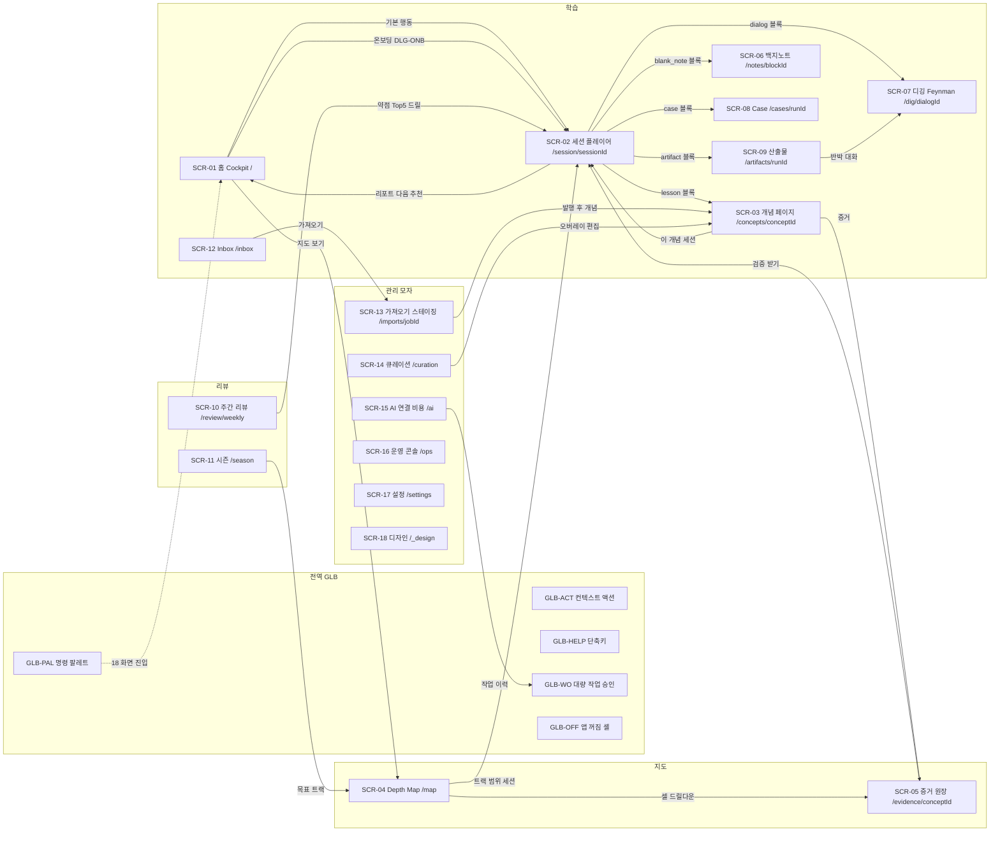
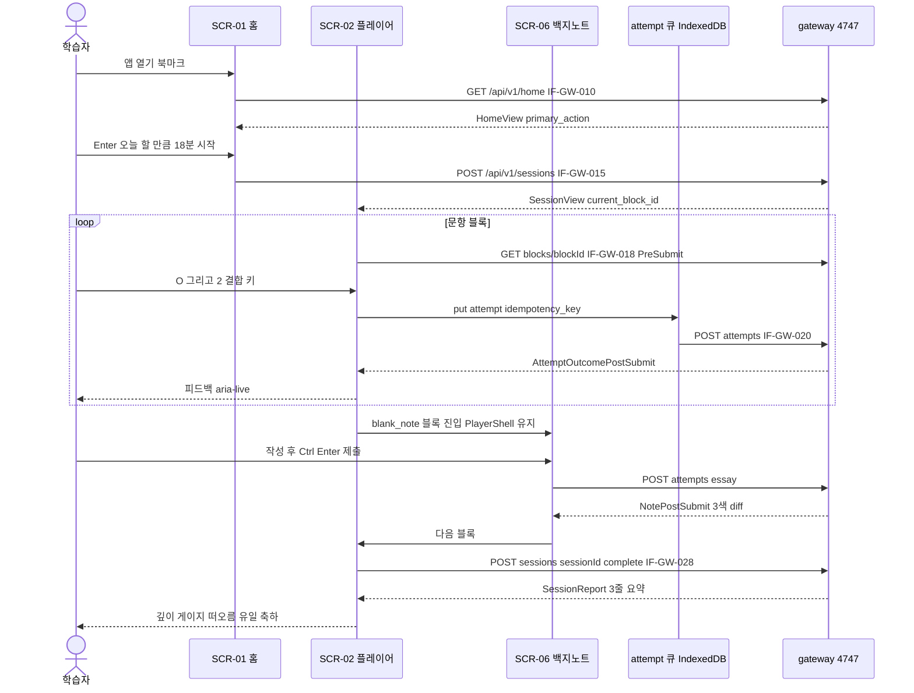

# SCR-01. 화면설계서 (Screen Design / Storyboard) — Fathom · 깊이

> **문서 ID**: SCR-01 · **버전**: v1.0 · **상태**: Draft for PG-2(설계 동결) · **작성**: T1(상위 모델, 설계) · **일자**: 2026-10-01
> **입력(구속)**: ARC-01 `01-architecture.md` · ADR-006(프런트엔드 스택·라우트 18 + `/_design` 상세 동결) · ADR-003(SSE) · ADR-009(세션) · ADR-010(NG-G 게이트·STD-01 경로 규약) · ADR-016(전송 로그) · IF-01 `02-interface-spec.md`(IF-GW 라우트·뷰 스키마 정본) · REQ-01 v1.1(FR-UX-001~016, NFR-UX-001~014, FR-DSH·FR-STD·FR-SET·FR-AI·FR-IMP·FR-QST) · PLN-REV-01 §4 AQ-12·AQ-16 · R3 D3 Bathymetry
> **짝 문서**: DS-01 `07-design-system.md`(토큰·컴포넌트·NG-G 디자인 lint·`@theme`) — 이 문서의 컴포넌트 이름은 DS-01 §9 인벤토리 이름과 같다.
> **후속 소비**: STD-01(UI 표준 자동 생성), TST-01(E2E·사용성 5종·axe), IT-nn Task Brief(L-WEB-<feature> 레인), `/_design` 스토리.

---

## 0. 요약 (TL;DR)

1. **화면은 18개로 동결된 라우트를 그대로 쓴다**(ADR-006 §4 = FR-UX-012): SCR-01 홈 `/` ~ SCR-17 설정 `/settings` + SCR-18 `/_design`. 요청 항목 중 라우트가 없는 것(온보딩·배치 진단, 트랙 카탈로그, 로드맵, 복습 큐, 노트 이력, 문항 은행, 분석, AI 키, 백업, 병합 마법사, 대량 승인, 명령 팔레트)은 **패널(PNL)·다이얼로그(DLG)·전역 오버레이(GLB)** 로 흡수한다(AQ-12, §5).
2. **세션 플레이어(SCR-02)가 `modes.manifest.json`의 모든 모드(M-01~M-21)를 호스팅**한다. 문항형 모드는 플레이어 안의 렌더러(`ModeRenderer` 레지스트리, FormatId 키)로, 장기형 블록(백지노트·디깅·Feynman·Case·산출물)은 **같은 PlayerShell(믹스테이프 타임라인 유지)** 을 쓰는 전용 라우트 SCR-06~09로 연다. 레지스트리에 렌더러가 없는 `included` 모드는 `check:manifest`가 실패시킨다(§7.2.3).
3. **모든 화면은 상태 7종**을 정의한다: `empty` · `loading` · `error` · `offline-ai` · `degraded` + 공통 `maintenance`(복원·업그레이드) · `session-lost`(쿠키 무효). 오류는 `Problem.code` + `error_id` + 복구 행동, 스택 0(FR-UX-011).
4. **키보드 우선**: 단축키는 `event.code`, 단일 문자 키는 입력 포커스 중 비활성·재매핑 가능, IME 조합 중 Enter 무시. E2E 대상 12종은 §2.3.2에 고정한다.
5. **정답 비공개(NG-G3·G7)는 화면 경계로도 지킨다**: 제출 전 컴포넌트는 `*PreSubmit` 스키마만 받고, 정답·해설·모범노트는 제출 응답(`*PostSubmit`)을 받은 뒤에만 마운트되는 별도 컴포넌트(`post-submit/`)가 그린다.
6. **색은 깊이(L1~L5)와 상태만**. 연체·스트릭에 빨강 0, LDI 숫자는 SCR-10·SCR-11에만, 축하 모션은 세션 리포트 1곳(FR-DSH-008·011, FR-UX-008·009).
7. 공백 7건(Parsons 형식 계약, 노트 이력 API, 블루프린트 목록 공개 라우트, 테마 설정 저장, 면접 모드, 장기 과제 진입 목록, D2Coding 의존)은 §11 설계 결정 메모에 가장 작은 결정으로 기록했다.

---

## 1. 범위 · 표기 · 구속력

### 1.1 ID 체계

| 접두어 | 의미 | 예 |
|---|---|---|
| `SCR-nn` | 라우트를 가진 화면(18개, 동결) | `SCR-02` 세션 플레이어 |
| `PNL-nn-x` | 화면 안의 패널·탭·드로어(라우트 없음, URL search param으로 상태 보존) | `PNL-04-T` 트랙 패널 |
| `DLG-xxx` | 모달 다이얼로그(Radix `Dialog`/`AlertDialog`) | `DLG-ONB` 온보딩 |
| `GLB-xxx` | 전역 셸·오버레이(모든 라우트에 렌더) | `GLB-PAL` 명령 팔레트 |
| `RND-xxx` | 세션 플레이어 모드 렌더러 | `RND-OX` |
| `ST-*` | 화면 상태 | `ST-EMPTY` |

### 1.2 구속력

- **상세 동결(이 문서 확정 → PG-2)**: 화면·패널·다이얼로그 목록과 라우트 매핑, 라우트 search param 스키마, 상태 7종 규칙, 단축키 표(§2.3), 모드 렌더러 레지스트리(§7.2.3), 파일 경로·레인(§10).
- **개요 동결**: 와이어프레임의 배치·문구(INT 디자인 리뷰 NFR-UX-012에서 조정 가능 — 단 홈 요소 ≤ 5, 입력 수 상한, 정답 비공개 규칙은 불변).
- 와이어프레임은 데스크톱 1280px 기준(NFR-UX-010)이며 문구는 실제 카피 초안이다. 숫자 예시는 가짜 값이다.

### 1.3 표기

- 데이터 열의 `IF-GW-nnn`은 IF-01 §4의 공개 라우트(정본)다. 화면은 gateway 공개 API만 부른다(ARC §5.2 — 브라우저 → gateway 단일 경로).
- 쿼리 키는 IF-01 §9.6 무효화 표의 키와 같다(`['home']`, `['session', id]` …).
- `[버튼]`, `( )` 라디오, `[ ]` 체크, `▸` 펼침, `⌘/Ctrl` = OS 감지 표기, `▒` 스켈레톤, `░` 안개(미접촉), `▓` 채움.

---

## 2. 화면 공통 규칙

### 2.1 전역 셸 (GLB-SHELL, FR-UX-010 · FR-SET-010)

```
┌────────────────────────────────────────────────────────────────────────────────────────────┐
│ ◈ Fathom 깊이   [학습 ▾|관리]      ⌘K 개념·화면·명령 검색…        ⚠ 백업 9일 경과 ›  [AI: 오프라인 ●] │  ← Header 48px (sticky, glass 1곳)
├──────┬───────────────────────────────────────────────────────────────────────┬─────────────┤
│ ⌂ 홈  │                                                                       │ Context     │
│ ▶ 세션│                       Workspace (라우트 콘텐츠)                         │ Panel 320px │
│ ◇ 개념│                 읽기폭 max 72ch · 그래프·표는 full-bleed                 │ (⌘\ 토글)   │
│ ✉ Inbox│                                                                      │ 개념 이웃    │
│──────│                                                                       │ 노트·판정    │
│ ◎ 지도│                                                                       │ AI 결과     │
│──────│                                                                       │             │
│ ☰ 리뷰│                                                                       │             │
│ ◷ 시즌│                                                                       │             │
│──────│                                                                       │             │
│ ⓘ ?  │                                                                       │             │
└──────┴───────────────────────────────────────────────────────────────────────┴─────────────┘
 Rail 56px(아이콘+툴팁, ≥ 1440px에서 라벨 펼침 200px)                         aria-live 영역(polite) 1개
```

| 요소 | 컴포넌트(DS-01 §9) | 규칙 |
|---|---|---|
| 앱 마크 | `AppMark` | 클릭 = 홈. 텍스트 `Fathom 깊이`(PLN §5.2). |
| 모자 전환 | `HatSwitch`(SegmentedControl 2값) | `학습` / `관리`. 관리 모자에서만 Rail에 관리 그룹(가져오기·큐레이션·AI·운영·설정)이 보인다. 학습 화면에 운영 기능 직접 노출 0(FR-SET-010). 전환은 `zustand stores/hat.ts` + `localStorage fathom.hat`(try/catch). |
| 팔레트 진입 | `PaletteTrigger` | 클릭·`⌘/Ctrl+K` → GLB-PAL. placeholder에 초성 예시 `ㄷㅋ → 도커`. |
| 운영 경보 1슬롯 | `OpsAlertSlot` | `HomeView.banners`/`HealthBoard.banners` 중 severity 최고 1개(critical > warn). 클릭 = 배너 action href. 둘 이상이면 `+n`. info는 슬롯에 올리지 않는다. 학습 모자에서도 보이되 문구만(운영 기능 직접 실행 버튼 없음). |
| AI 상태 칩 | `AiModeChip` | `AI: 전체`/`AI: 판단만`/`AI: 생성만`/`AI: 오프라인`(IF-GW-010 `ai_chip.label_ko`), `degraded_badge` = 점선 테두리 + `격하` 텍스트. 클릭 = Popover(제공자별 상태·마지막 probe·`AI 연결 설정` 링크 → SCR-15). 모든 라우트에 렌더(FR-UX-010 [T]). |
| Rail | `NavRail` | 그룹 4개: **학습**(홈·세션·개념·Inbox) · **지도**(Depth Map) · **리뷰**(주간 리뷰·시즌) · **관리**(가져오기·큐레이션·AI·운영·설정, 관리 모자만). `세션`은 active 세션이 있을 때 그 세션으로, 없으면 홈 기본 행동 다이얼로그로. `개념`은 마지막으로 본 개념(없으면 팔레트 개념 검색). |
| Context Panel | `ContextPanel`(Radix 없음, `<aside>`) | 화면별 내용 주입. 폭 320px, `⌘/Ctrl+\` 토글, 상태 `localStorage fathom.ctx.<route>`. 세션 플레이어·백지노트 집중 모드에선 숨김. |
| 라이브 영역 | `LiveRegion` | `aria-live="polite"` 1개(채점 결과·저장·AI 완료), `assertive` 1개(세션 끊김·유지보수 진입). |

**레이아웃 변형**: `ShellLayout.default`(Rail + Workspace + Context) · `ShellLayout.focus`(세션 플레이어·백지노트: Rail 접힘 0px·Header 40px·Context 숨김, `Esc`×2 또는 `⌘/Ctrl+Shift+F`로 해제) · `ShellLayout.admin`(관리 모자: Header 하단 1px `--border-strong` 띠 + 모자 칩 `관리` 강조).

### 2.2 화면 상태 7종 (FR-UX-011 · D-9 · ADR-006)

모든 SCR은 아래 7종을 `/_design`에 스토리로 가진다(FR-UX-011 [I]: 18 × 상태). 화면별 표(§7)는 이 공통 규칙과 **다른 점만** 적는다.

| 상태 | 진입 조건(판정 코드) | 공통 표현 | 공통 행동 |
|---|---|---|---|
| `ST-LOADING` | 쿼리 pending | 300ms 미만은 아무것도 그리지 않는다. 이상이면 레이아웃과 같은 모양의 정적 `Skeleton`(쉬머 금지). 1.5s를 넘으면 스켈레톤 아래 `불러오는 중… (content 응답 대기)` 한 줄. | — |
| `ST-EMPTY` | 200 + 목록 0건 또는 `null` 상태 | `EmptyState`: 상황 한 문장 + **다음 행동 1개**(R3 §7.6). 일러스트 없음, lucide 아이콘 20px 1개. | 기본 행동 버튼 1개 |
| `ST-ERROR` | 4xx/5xx `Problem` | `ErrorPanel`: 제목(원인 추정 한국어) · 설명 · `code`(`GW-DEP-001` + `dependency` 표시 등 mono — content 미준비 응답이면 `CT-DEP-901`) · `error_id` 복사 버튼 · 복구 행동(`다시 시도`/`운영 콘솔에서 보기`/CLI 명령). 스택·내부 경로 0. | `R` 아님(신고 단축키와 충돌) — `다시 시도` 버튼에 포커스 이동 |
| `ST-OFFLINE-AI` | `AiMode = OFFLINE`(또는 BFF 합성 `gateway_unreachable`) | 화면이 동작하는 그대로 그린다. AI가 필요한 요소만 `AiOfflineNote`(아이콘 `CloudOff` + "AI 없이 진행 중 — 판정은 잠정/자기채점입니다" + `AI 연결` 링크, 관리 모자가 아니어도 링크 표시는 허용). **기능 숨김 대신 대체 경로 표기**(ARC §11.3). | 대체 경로 실행 |
| `ST-DEGRADED` | 응답 `degraded[]` 비어 있지 않음, 또는 `ops.health.changed`로 특정 서비스 `degraded/restarting` | 해당 영역만 `DegradedStrip`(점선 테두리 + `일부 정보를 불러오지 못했습니다(learning 재시작 중)` + 자동 재시도 카운트다운). 화면 나머지는 정상. | 자동 재시도(5s), 수동 `다시 불러오기` |
| `ST-MAINT` | `SessionStatus.maintenance ∈ {restore, upgrade}` 또는 503 `GW-DEP-002` | 전 화면 오버레이 `MaintenanceOverlay`: 진행 단계(`Operation.progress.step`, pct) + "끝나면 자동으로 돌아옵니다". 입력 차단(attempt 큐는 보존). | `ops` 화면 링크만 활성 |
| `ST-SESSION-LOST` | 401 `GW-AUTH-001/003`(쿠키 포트 불일치·만료) | 전 화면 `ReconnectScreen`: "브라우저 세션이 끊겼습니다. 터미널에서 `fathom open`을 실행하면 바로 이어집니다." + 명령 복사 버튼. PWA 폴백 포트면 재설치 배너 1회(ADR-009 §1.8, AQ-16). | 명령 복사 |

**앱 꺼짐(SW 오프라인 페이지, ADR-006 §10)**: `public/sw.js`가 앱 셸만 cache-first로 띄우고 `/api/**` 실패 시 `AppOffShell`: "Fathom이 꺼져 있습니다 — `fathom open`으로 켜기"(명령 복사). 응답 큐(IndexedDB)에 미전송 n건이 있으면 "보내지 못한 응답 n건은 켜지면 자동 전송됩니다".

### 2.3 키보드 (FR-UX-003·004 · NFR-UX-002·014 · WCAG 2.1.4)

#### 2.3.1 규칙

1. 매칭은 `KeyboardEvent.code`(`KeyO`, `Digit1`, `Numpad1` 동치). 표기는 OS 감지(`⌘`/`Ctrl`).
2. **단일 문자 키**(수식어 없음)는 `input/textarea/[contenteditable]/CodeMirror` 포커스 중 **비활성**. 설정 SCR-17 `PNL-17-K`에서 재매핑·끄기(저장 `localStorage fathom.keymap.v1`, §11 DN-05).
3. Enter 제출은 `event.isComposing || event.keyCode === 229`면 무시(`lib/ime.ts` `isImeComposing()`).
4. 시퀀스(Linear형) `G` → 문자, 1s 타임아웃, 입력 중 비활성.
5. `?`(`Shift+Slash`)는 어디서나 `GLB-HELP`(현재 화면 단축키만 필터한 표 + 전역 표). 위치 고정(WCAG 3.2.6).
6. 포커스 링은 항상 보인다(`:focus-visible` 2px `--focus`, offset 2px). sticky Header 높이만큼 `scroll-padding-top: var(--shell-header-h)`(2.4.11).
7. 드래그가 있는 모든 상호작용(Parsons·매칭·순서·Depth Map 팬)은 키보드·버튼 대체(2.5.7).

#### 2.3.2 E2E 고정 단축키 12종 (FR-UX-003 [T] 대상)

| # | 키 | 범위 | 동작 |
|---|---|---|---|
| K1 | `⌘/Ctrl+K` | 전역 | 명령 팔레트 |
| K2 | `?` | 전역 | 단축키 도움말 |
| K3 | `Esc` | 전역 | 오버레이 닫기 / AI 스트리밍 취소 / 집중 모드 1단계 해제 |
| K4 | `Enter` | 플레이어·폼 | 제출·다음(IME 가드) |
| K5 | `O` | OX | 참(O) 선택 |
| K6 | `X` | OX | 거짓(X) 선택 |
| K7 | `1`~`5` | MCQ·CBM·FSRS | 선택지 / 확신도 C1~C3 / 평가 1~4 |
| K8 | `Space` | 플레이어 | 다음 문항(피드백 후) / 카드 뒤집기 / Parsons 집기·놓기 |
| K9 | `H` | 플레이어 | 힌트 사다리 다음 단계 |
| K10 | `R` | 플레이어 | 문항 신고(DLG-REPORT) |
| K11 | `S` | 플레이어 타임라인 | 블록 건너뛰기(DLG-SKIP) |
| K12 | `⌘/Ctrl+Enter` | 에디터 | 백지노트·코드·서술 제출 |

#### 2.3.3 전체 키맵

| 범위 | 키 | 동작 |
|---|---|---|
| 전역 | `⌘/Ctrl+.` | 컨텍스트 액션(GLB-ACT): 포커스·선택 항목에 대한 Raycast형 액션 |
| 전역 | `⌘/Ctrl+\` | Context Panel 토글 |
| 전역 | `G`→`H`/`M`/`R`/`I`/`S`/`A`/`O`/`C` | 홈 / 지도 / 주간 리뷰 / Inbox / 설정 / AI / 운영 / 큐레이션(관리 대상은 모자 자동 전환) |
| 전역 | `⌘/Ctrl+Shift+F` | 집중 모드 토글(플레이어·노트) |
| 목록 | `J`/`K` 또는 `↓`/`↑` | 다음/이전 행, `Enter` 열기, `/` 목록 필터 포커스 |
| 플레이어 | `X`(타임라인 포커스 시) | 블록 교체(DLG-SWAP) — OX 응답 `X`와 충돌하므로 **타임라인에 포커스가 있을 때만**(`T`로 타임라인 포커스, §11 DN-06) |
| 플레이어 | `T` | 믹스테이프 타임라인 포커스 ↔ 문항 영역 |
| 플레이어 | `L`(타임라인) | 블록 잠금 토글 |
| 플레이어 | `C` | 판정 카드 열기(제출 후) |
| 플레이어 | `A` | 판정 이의 제기(판정 카드 열린 상태, FR-AI-012 1키) |
| 플레이어 | `⌘/Ctrl+Shift+T` | 타이머 끄기/연장 메뉴(NFR-UX-014) |
| 플레이어 | `P` | 일시정지(IF-GW-026) |
| OX | `O`/`X` 후 `1`/`2`/`3` | 결합 키 = 응답 + 확신도 즉시 제출(FR-STD-011 `O1~X3`). `confidence_required=false`면 `O`/`X` 단독 제출. `←`/`→`도 O/X |
| MCQ | `1`~`5`, 다중 선택은 토글 후 `Enter` | `confidence_required`면 `Enter` 후 `1`~`3` |
| 빈칸(cloze) | `Tab`/`Shift+Tab` 빈칸 이동, `Enter` 제출 | |
| 출력 예측 | 텍스트 입력 후 `Enter`, 제출 후 `⌘/Ctrl+'` 실행해 보기(PRIMM) | |
| 오류 찾기 | `↑`/`↓` 줄 이동, `Space` 줄 표시 토글, `N` 줄 메모, `Enter` 제출 | |
| Parsons·순서 | `↑`/`↓` 포커스, `Space` 집기/놓기, `Alt+↑/↓` 이동, `→`/`←` 들여쓰기(Parsons), `Enter` 제출 | |
| 매칭 | `↑`/`↓` 왼쪽 항목, `1`~`9` 오른쪽 짝 지정, `Backspace` 해제 | |
| 코드 | `⌘/Ctrl+Enter` 실행(공개 테스트), `⌘/Ctrl+Shift+Enter` 제출 | CodeMirror 기본 키 우선 |
| SRS | `Space` 답 보기, `1`~`4` Again/Hard/Good/Easy(확인 필요 시) | Anki 관례 |
| 백지노트 | `⌘/Ctrl+Enter` 제출, `⌘/Ctrl+U` 문장 "애매 표시", `/` 블록 명령(에디터 내부) | |
| 대화 | `Enter` 보내기(Shift+Enter 줄바꿈), `⌘/Ctrl+D` "모르겠어요"(dont_know 턴), `Esc` 스트리밍 취소 | |
| Depth Map | 방향키 셀 이동, `Enter` 드릴다운, `+`/`-` 줌, `0` 맞춤, `V` 표 뷰, `L` 레이어 메뉴, `[`/`]` 과거 오버레이 단계, `Space` 타임랩스 재생/정지 | |

### 2.4 IME · 입력

- 모든 텍스트 입력은 `ImeSafeInput`/`ImeSafeTextarea`(Enter 가드 내장) 또는 CodeMirror(`EditorView.domEventHandlers`에서 조합 검사).
- 초성 검색은 `lib/choseong.ts`(es-hangul `getChoseong`) — 팔레트·목록 필터 공통.
- 한글 조합 중 단일 키 단축키 발동 0(포커스 규칙으로 보장 + `isComposing` 2중).

### 2.5 공통 마이크로 인터랙션 (FR-UX-009, DS-01 §7)

| 상황 | 표현 | 시간·이징 |
|---|---|---|
| 채점 정답 | 문항 카드 테두리 `--correct` + `Check` 아이콘 + `정답` 텍스트, 해설 영역 높이 전개 | `dur-fast` 150ms `ease-standard` |
| 채점 오답 | 테두리 `--incorrect` + `X` 아이콘 + `오답`, **흔들기 금지**, 오개념 태그 칩이 아래에서 8px 슬라이드 인 | 150ms |
| 부분 | 테두리 `--partial`(중립) + `CircleDashed` + `부분 정답` + 45° 해칭 배경 | 150ms |
| 판정 밴드 변경(`grading.verdict.revised` + `band_changed`) | 결과 배지만 크로스페이드 + "판정이 갱신되었습니다(부분 → 정답)" 인라인 1줄 + `aria-live` | 220ms, 밴드 동일 시 0회(FR-QST-019) |
| 저장(초안) | 우상단 `저장됨 · 14:02` 텍스트가 `--fg-subtle`로 갱신, 아이콘 변화 없음 | 즉시 |
| 낙관적 업데이트(잠금·건너뛰기·트리아지) | 즉시 반영, 실패 시 되돌리고 toast | — |
| 블록 전환 | 타임라인 현재 표시 이동(transform) + 콘텐츠 크로스페이드 | 220ms, prefetch로 p95 ≤ 300ms(FR-UX-016) |
| 카드 뒤집기·Parsons 재정렬 | `spring-card`(bounce 0.12, 0.35s) | reduced-motion = opacity 120ms |
| **축하(유일)** | 세션 리포트의 깊이 게이지 "떠오름" | `dur-moment` 720ms, 앱 전체 1곳(FR-DSH-008 [I] lint) |
| 로딩 스트리밍(AI) | 토큰 단위 표시 + 커서 블록 `▍` 점멸 없음(정적), `Esc` 취소 | — |

### 2.6 SSE 반응 (IF-01 §9.6 투영 — `lib/invalidation-map.ts`)

| 이벤트 | 어느 화면에서든 보이는 반응 | 해당 화면 추가 반응 |
|---|---|---|
| `ai.work_order.approval_requested` | **GLB-WO 전역 승인 다이얼로그**(AQ-12) | SCR-15 작업 주문 탭 배지 |
| `ai.mode.changed` | 상태 칩 갱신 + toast `AI 모드: 판단만으로 바뀌었습니다(사유: 동의 철회)` | 화면들 ST-OFFLINE-AI 전환 |
| `ops.health.changed` | 경보 슬롯 갱신(≤ 5s), content·learning ready면 attempt 큐 즉시 플러시 | SCR-16 보드 갱신 |
| `ai.budget.threshold_reached` | 경보 슬롯 `AI 예산 80%` | SCR-15 사용량 |
| `catalog.pack.activated` | toast `콘텐츠 팩이 갱신되었습니다 · 변경 보기` | SCR-03·04 재조회 |
| `grading.verdict.revised` | — | SCR-02·05·06 밴드 diff(§2.5) |
| `learning.level.promoted` | — | SCR-01 승급 카드(경보 슬롯 아님, `promotion_ready` 경보 → 확정 카드) |
| `learning.mastery.changed` | — | SCR-04 셀 갱신(채움 전환 150ms) |
| `acquisition.import.staged` | toast `가져오기 승인 대기 · 검토하기` | SCR-12·13 |
| `ops.backup.completed`(실패·중단) | 경보 슬롯 | SCR-16 |
| `resync` | toast `재연결됨` + 전체 무효화 | — |
| `catalog.overlay.conflicted` · `itembank.item.corrected` · `ai.provider.status_changed` · `ai.work_order.decided` · `ai.judge.drift_detected` · `learning.session.completed` · `learning.ledger.merged` | IF-01 §9.6 표 그대로 | — |

### 2.7 응답 큐 표시 (ADR-006 §6 `attempt-queue.ts`)

| 큐 상태 | 플레이어 표시(타임라인 우측 `QueueIndicator`) | 행동 |
|---|---|---|
| `pending`/`sending` ≥ 1 | `CloudUpload` + `전송 대기 2` (`--fg-muted`) | 학습 계속(다음 문항 제시는 큐 기록 직후) |
| 재시도 중(503·네트워크) | `전송 재시도 중 · 4s` | 자동(1→2→4…≤30s) |
| `failed_permanent` ≥ 1 | `TriangleAlert` + `보내지 못한 응답 1` (`--due` 아이콘, 텍스트 `--fg`) | 클릭 → `DLG-QUEUE`(항목·`last_error_code`·`다시 보내기`/`버리기`), 세션 리포트에도 표시 |

### 2.8 판정 배지 (FR-UX-007 · NFR-UX-004 · `JudgeBadge`)

| `JudgeBadge` | 라벨(정확한 문자열) | 아이콘(lucide) | 테두리 패턴 | 언제 |
|---|---|---|---|---|
| `none` | (배지 없음) | — | — | 결정적 채점(D) |
| `ai` | `AI 채점` | `Sparkles` | 실선 | Jev calibrated, conf ≥ 0.6 |
| `ai_uncalibrated` | `AI 채점 · 보정 전` | `Sparkles` + 작은 `Gauge` | 점선 | Jev 보정 전(w 0.7) 또는 drift |
| `ai_confirm` | `AI 채점 · 확인 필요` | `Sparkles` + `CircleHelp` | 이중선 | conf < 0.6(w 0.4) |
| `ai_estimate_confirm` | `AI 추정 · 확인 필요` | `WandSparkles` + `CircleHelp` | 이중선 | LLM-judge(LJ) |
| `heuristic` | `간이 채점` | `ListChecks` | 점선 | H(trigram·키워드) |
| `self` | `자기평가` | `UserCheck` | 실선 | S |
| `pending` | `채점 대기` | `Hourglass` | 파선 | PENDING(보류 큐) |

배지는 `Badge variant="judge"`(중립 surface, 색 없음 — 색은 상태가 아니라 엔진이므로 아이콘·패턴·텍스트로만 구분). 배지 클릭 = 판정 카드(PNL-02-J)로 1입력 도달(NFR-UX-011).

### 2.9 카피 규칙

- 문장형, 능동태, 비난 없는 한국어, 기술 용어 영문 병기 `쿠버네티스(Kubernetes)`. 버튼 = 결과 동사(`세션 시작`, `노트 제출`, `가져오기 승인`). 버튼 끝 `→` 금지(R3 §5.3).
- 금지 어휘(`check:ng-g` G5 어휘 + FR-DSH-013): `실패`(학습자 지칭) · `게으름` · `연체` · `밀린` · `놓쳤` · `스트릭이 끊` · `잃게 됩니다` · `XP` · `코인` · `레벨업!` · `랭킹`. 시스템 장애에는 `실패` 대신 `완료하지 못했습니다`.
- 숫자: due 수는 중립 잉크, 큰 숫자 금지(AP-05). 홈은 "오늘 할 만큼 N분"이 주어(FR-PRG-018).
- 오류: 원인 추정 + 복구 행동. 예: `채점 서비스(content)가 잠시 응답하지 않습니다. 답은 안전하게 보관했고, 돌아오면 자동으로 보냅니다.`

### 2.10 반응형

| 폭 | 셸 | 보장 범위 |
|---|---|---|
| ≥ 1440 | Rail 라벨 펼침 200px + Context 320px | 전 화면 |
| 1280~1439 (기본) | Rail 56 + Context 토글 | 전 화면(NFR-UX-010 기본 대상) |
| 768~1279 | Rail 56, Context = 오른쪽 Drawer | 전 화면(표는 가로 스크롤 컨테이너 안에서만) |
| 360~767 | Rail → 하단 탭바 4개(홈·세션·지도·리뷰) + Header 축약(칩 아이콘만) | **SCR-01·SCR-02(OX·MCQ·cloze·SRS)·SCR-10** 완주 보장, 가로 스크롤 0(NFR-UX-010 [T]). 그 밖의 화면은 "넓은 화면에서 열기를 권장합니다" 안내 + 읽기 전용 |

---

## 3. 디자인 참조 세트 (PR-016)

| # | 서비스 | 채택 패턴 | 기각 패턴 | 근거 · 적용 화면 |
|---|---|---|---|---|
| 1 | Linear | 키보드 시퀀스 `G→X`, ⌘K, 낙관적 UI, 회색 계층 위계, 조밀하고 조용한 목록 | 마케팅 글로우·보라 그라데이션 | 전역 키맵, SCR-12·14 목록 |
| 2 | Vercel 대시보드(Geist) | 상태 점 + 텍스트, 다크 대비, 재질(Materials) 토큰, 배포 타임라인 | 순흑백의 차가움 | GLB 칩, SCR-16 헬스 보드·작업 진행 |
| 3 | Raycast | 팔레트 = 앱, 컨텍스트 액션 패널(⌘.) | 네이티브 vibrancy | GLB-PAL·GLB-ACT |
| 4 | Arc | Peek 미리보기, 공간 은유(사이드바 = 공간) | 공간별 강한 테마 색(색 의미 오염) | 개념 링크 Peek(SCR-03), 모자 전환 |
| 5 | Things 3 | 여백·위계, "오늘" 1개 행동 | 태그 색 남발 | SCR-01 Cockpit Home |
| 6 | Readwise Reader | 읽기 타이포(측정폭·행간), 하이라이트 | 무한 피드 | SCR-03 이론 탭, SCR-06 diff |
| 7 | Stripe Docs | 본문 ↔ sticky 코드 동기 하이라이트, 언어 탭 전역 유지 | 브랜드 색 | SCR-03 코드 탭 |
| 8 | Notion | 블록 에디터 `/` 명령·토글 | 무한 자유도 | SCR-06 백지노트, SCR-09 산출물 |
| 9 | 반례 Duolingo | (차용: 짧은 세션·즉시 피드백) | 스트릭 공포·XP·리그·폭죽 | NG-G1·G2·G5 → 세션 리포트 1회 연출만 |
| 10 | 반례 Anki | (차용: Space/1~4 관례) | 밀도 과잉·거대한 due 숫자 | SCR-02 SRS 렌더러, 홈 숫자 규칙 |

디자인 지침 체크리스트(≥ 10항, NFR-UX-012 루브릭 6차원과 연결)는 DS-01 §1.4에 있다.

---

## 4. 정보 구조 (IA) · 사이트맵

### 4.1 사이트맵



### 4.2 핵심 흐름 — 하루 루프(SCN-01·03 기준)



### 4.3 내비게이션 그룹 · 모자 규칙

| 그룹 | 화면 | 모자 | Rail 노출 | 팔레트 명령(예) |
|---|---|---|---|---|
| 학습 | SCR-01·02·03·12 (+ 02 하위 06·07·08·09) | 학습·관리 공통 | 홈·세션·개념·Inbox | `홈`, `세션 시작`, `세션 이어서`, `개념 열기…`, `Inbox`, `캡처` |
| 지도 | SCR-04·05 | 공통 | 지도 | `지도`, `지도: 트랙…`, `증거: 개념…` |
| 리뷰 | SCR-10·11 | 공통 | 리뷰·시즌 | `주간 리뷰`, `보정 스튜디오`, `시즌` |
| 관리 | SCR-13·14·15·16·17·18 | 관리 | 관리 모자에서만 | `가져오기…`, `큐레이션`, `AI 연결`, `운영 콘솔`, `설정`, `디자인 시스템` |

---

## 5. 화면 목록 (SCR-01 ~ SCR-18)

| SCR | 이름 | 라우트(TanStack file route) | 목적 | 핵심 FR | 데이터(IF-GW) | feature · 레인 | 슬라이스 |
|---|---|---|---|---|---|---|---|
| SCR-01 | 홈 (Cockpit) | `/` · `routing/index.tsx` | 오늘의 기본 행동 1개로 2입력 안에 세션 시작, 온보딩·배치 진단 진입 | FR-DSH-001·002, FR-STD-001, FR-SET-019, FR-PRG-014·018·020·021, FR-AI-003, NFR-UX-005·007 | 010·011·015·016·040·042·165·166·167 | insight · L-WEB-insight (DLG-ONB = settings) | R0→R1 |
| SCR-02 | 세션 플레이어 (블록 믹스테이프) | `/session/$sessionId` · `routing/session.$sessionId.tsx` | 블록 타임라인 위에서 매니페스트 전 모드 수행, 피드백·판정 카드·세션 리포트 | FR-UX-016, FR-STD-001~017·022~024·027~035, FR-QST-016~026, FR-LAB-001~017, FR-PRG-012·013·014, FR-DSH-008, FR-AI-011·012 | 017~039·060·068·071 | practice · L-WEB-practice | R0→R3 |
| SCR-03 | 개념 페이지 | `/concepts/$conceptId` · `routing/concepts.$conceptId.tsx` | 이론 → 코드 → 핵심 3단 탭, 레벨 렌즈, 출처·이웃, 오버레이 편집 드로어 | FR-CUR-005~008·012·013·014·018·020·021, FR-UX-014·015, FR-PRG-010 | 043·044·045·046·047·048·049·015 | curriculum · L-WEB-curriculum | R0→R2 |
| SCR-04 | 지도 / Depth Map | `/map` · `routing/map.tsx` | 트랙 × 레벨 해저 지형, 레이어 4종 + 블루프린트, 과거 오버레이, 트랙 카탈로그·로드맵 패널, 트랙 범위 세션 | FR-DSH-003~006, FR-CUR-001·019·024·025, FR-PRG-013·032, NFR-UX-003·004, NFR-PERF-009 | 055·040·041·042·051·015·050 | curriculum · L-WEB-curriculum | R1→R3 |
| SCR-05 | 개념 증거 원장 | `/evidence/$conceptId` · `routing/evidence.$conceptId.tsx` | "왜 숙달인가" 게이트·형식·날짜·이벤트 원장, 카드 상태, 검증 받기 | FR-DSH-007, FR-PRG-001·009·010·011·012, FR-QST-020, CR-22 | 056·057·034·035·015·171~174 | insight · L-WEB-insight | R1→R3 |
| SCR-06 | 백지노트 에디터 + 3색 diff | `/notes/$blockId` · `routing/notes.$blockId.tsx` | BN-1~5 사다리 작성(제출 전 AI 0) → 3색 diff·자기채점·후속 | FR-STD-018·019·029, FR-QST-021·023, FR-AI-020, NFR-UX-014 | 065·066·020·021·067·035·036 | practice/blank-note · L-WEB-practice | R0→R2 |
| SCR-07 | 디깅·Feynman 대화 | `/dig/$dialogId` · `routing/dig.$dialogId.tsx` | D1~D7 깊이 게이지 대화, Feynman AI 주니어, 산출물 반박, OFFLINE D4 MCQ | FR-STD-020·021·026·028, FR-AI-017, FR-PRG-010·013 | 060·061·062·063·064 | practice · L-WEB-practice | R2 |
| SCR-08 | Case 플레이어 | `/cases/$runId` · `routing/cases.$runId.tsx` | 알람 → 증거 요청 → 결정점 → 포스트모템 → 디브리프 | FR-STD-025·034, FR-PRG-013 | 068·069·070·083·084 | practice · L-WEB-practice | R3 |
| SCR-09 | 산출물 에디터 | `/artifacts/$runId` · `routing/artifacts.$runId.tsx` | ADR·런북·포스트모템 템플릿 작성 → 루브릭 → 반박 1~3턴 | FR-STD-026, FR-PRG-032·033 | 071·072·073·074·103 | practice · L-WEB-practice | R3 |
| SCR-10 | 주간 리뷰 | `/review/weekly` · `routing/review.weekly.tsx` | ΔLDI(숫자 허용 1/2)·약점 Top 5·모드 편중·KPT lite·다음 주 1클릭, 보정 스튜디오·복습 카드·Radar 탭 | FR-DSH-009·010·011·013·015·016, FR-PRG-017·018·023~025·030·031, PR-015 | 075·076·077·081·011·171~174 | insight · L-WEB-insight | R1→R3 |
| SCR-11 | 시즌 플래너·회고 | `/season` · `routing/season.tsx` | 6~8주 목표·프리모템·주간 체크·거시 Brier 회고, LDI(숫자 허용 2/2), 포트폴리오 export | FR-DSH-012·014, FR-STD-027, PR-015 | 078·079·080·082·170 | insight · L-WEB-insight | R3 |
| SCR-12 | Inbox 트리아지 | `/inbox` · `routing/inbox.tsx` | 캡처 항목 매칭·연결·프로브·가져오기·버리기, 가져오기 작업 목록·새 가져오기 | FR-IMP-001·012·013·014 | 085·086·087·088·089 | acquisition · L-WEB-acquisition | R2 |
| SCR-13 | 가져오기 스테이징 | `/imports/$jobId` · `routing/imports.$jobId.tsx` | I1~I9 진행, 항목별 diff 승인·편집·거부, 신뢰 등급·격리 청크 | FR-IMP-003~011 | 090·091·092·093·094·132 | acquisition · L-WEB-acquisition | R2 |
| SCR-14 | 콘텐츠 큐레이션 (문항 은행) | `/curation` · `routing/curation.tsx` | 신고·문항 건강·보류 채점·오버레이 충돌·워밍 풀 탭, 격리 | FR-QST-011·013·014·015·016·020, FR-CUR-020, FR-SET-011 | 095~102·046~048 | assessment-ui · L-WEB-assessment-ui | R1→R2 |
| SCR-15 | AI 연결·비용 | `/ai` · `routing/ai.tsx` | 제공자(API·CLI·Jev·Ollama·범용 CLI) 동의·키·연결 테스트, 사용량·예산·쿼터, 방화벽·전송 로그, 작업 주문·배치, 보정 | FR-AI-001~003·007·010·013·014·019·021~027, FR-SET-008, NFR-SEC-004 | 105~132 | ai-control · L-WEB-ai-control | R0→R2 |
| SCR-16 | 운영 콘솔 | `/ops` · `routing/ops.tsx` | 헬스 보드·배너, 백업·복원·리허설·2차 대상, export·병합 마법사, doctor, 로그·타임라인, Tripwire·SLO | FR-SET-001~007·016·017·021·022·024·025, NFR-AVL-005 | 135~157 | ops-console · L-WEB-ops-console | R1→R3 |
| SCR-17 | 설정 | `/settings` · `routing/settings.tsx` | 프로필·리듬(일시정지·크런치·D-day)·스케줄·정책 버전 교체·표시(테마·밀도·모션)·단축키·알림·자동 기동·데이터 | FR-SET-009·010·018·019·020·023·024, FR-PRG-019·021·022·027·028, FR-UX-006 | 160~170·154·155 | settings · L-WEB-settings | R1→R3 |
| SCR-18 | 디자인 시스템 `/_design` | `/_design` · `routing/[_]design.tsx` | 살아있는 스타일가이드(토큰·재질·컴포넌트 전 상태·배지·18화면 × 7상태 스토리), UI 표준 표 생성 원천 | FR-UX-001·002·011, NFR-UX-012 | 없음(정적, 모의 데이터) | shell · L-WEB-SHELL | R1 |

> 라우트 파일명 주의: TanStack Router에서 `_` 접두 파일은 pathless layout이다. 리터럴 `/_design`은 대괄호 이스케이프 `[_]design.tsx`로 만든다(§11 DN-10). 루트 셸은 `routing/__root.tsx`(L-WEB-SHELL).

### 5.1 라우트 search param 스키마 (`validateSearch` — zod, `apps/web/src/routing/*.tsx` 각 파일에 정의)

| 라우트 | search param | 타입 | 기본 |
|---|---|---|---|
| `/` | `onboarding?` | `'1'` | — (DLG-ONB 강제 열기) |
| `/session/$sessionId` | `b?` · `view?` | `Ulid` · `'player' \| 'report'` | 서버 `current_block_id` · `player`(completed면 `report`) |
| `/concepts/$conceptId` | `tab?` · `lens?` · `edit?` · `src?` | `'theory' \| 'code' \| 'core'` · `1..5` · `'1'` · `'1'` | `entry_stage` 매핑 · 트랙 레벨 · — · — |
| `/map` | `track?` · `layers?` · `as_of?` · `bp?` · `view?` · `focus?` · `panel?` | `TrackId \| 'all'` · 쉼표 `MapLayer` · `EpochMs` · `BlueprintId` · `'map' \| 'table'` · `ConceptId` · `'tracks' \| 'paths' \| null` | `all` · `mastery,retention` · — · — · `map` · — · `null` |
| `/evidence/$conceptId` | `tab?` | `'gates' \| 'events' \| 'cards'` | `gates` |
| `/notes/$blockId` | — | — | — |
| `/dig/$dialogId` | — | — | — |
| `/review/weekly` | `week?` · `tab?` | `IsoWeek` · `'review' \| 'calibration' \| 'cards' \| 'radar'` | 이번 주 · `review` |
| `/inbox` | `tab?` · `state?` | `'inbox' \| 'imports'` · 상태 enum | `inbox` · `new` |
| `/curation` | `tab?` · `state?` · `flag?` | `'reports' \| 'health' \| 'pending' \| 'conflicts' \| 'warming' \| 'staging'` · · | `reports` |
| `/ai` | `tab?` | `'providers' \| 'usage' \| 'budget' \| 'work_orders' \| 'jobs' \| 'firewall' \| 'calibration'` | `providers` |
| `/ops` | `tab?` · `cid?` | `'health' \| 'backups' \| 'transfer' \| 'doctor' \| 'logs' \| 'tripwires'` · `Ulid`(correlation) | `health` |
| `/settings` | `section?` | `'profile' \| 'rhythm' \| 'schedule' \| 'policies' \| 'display' \| 'keys' \| 'notify' \| 'system'` | `profile` |

Depth Map 레이어 상태는 URL에 반영되어 재방문 시 복원된다(FR-DSH-004 [T]).

---

## 6. 요청 항목 → 화면·패널·다이얼로그 흡수표 (AQ-12 포함)

| 요청 항목 / v1.1 신규 화면 | 흡수 위치 | 근거 |
|---|---|---|
| 온보딩 · 배치 진단 | `DLG-ONB`(SCR-01에서 `primary_action.kind = 'onboarding'`일 때 자동, 3문항 + 선언 대 증명 + 진단 제안) → SCR-02 `template: 'placement'` 세션 | FR-SET-019, FR-PRG-014·025, IF-GW-165·015 |
| 오늘 대시보드 | SCR-01 | FR-DSH-001 |
| 트랙 카탈로그 · **트랙 범위 진입**(AQ-12) | SCR-04 `PNL-04-T` 트랙 패널 + `DLG-SCOPE`(팔레트 `세션 시작: 트랙…`에서도 열림) | AQ-12, FR-STD-032, IF-GW-040·041 |
| 로드맵 그래프 | SCR-04 `PNL-04-P` 경로(로드맵) 패널 — 경로 개념을 Depth Map 위에 하이라이트 경로로 그림 · SCR-03 `PNL-03-N` 이웃 그래프(xyflow ≤ 50) | FR-CUR-018·019, ADR-006 §3 |
| **블루프린트 커버리지**(AQ-12) | SCR-04 레이어 `blueprint` | AQ-12, FR-CUR-024 |
| 개념 페이지(이론/코드/핵심 탭, 레벨 전환) | SCR-03 | FR-CUR-005·006 |
| **오버레이 편집**(AQ-12) | SCR-03 `PNL-03-E` 수정 드로어 + SCR-14 충돌 탭 | AQ-12, FR-CUR-020 |
| 세션 플레이어(전 모드) | SCR-02 + 장기형 SCR-06~09(같은 PlayerShell) | FR-UX-016, FR-STD-033 |
| 결과 · 피드백 | SCR-02 `PNL-02-F` 피드백 패널 · `PNL-02-J` 판정 카드 · `ST-REPORT` 세션 리포트 | FR-QST-023, FR-AI-011, FR-DSH-008 |
| 복습 큐(SRS) | SCR-01 오늘 큐 요약 → SCR-02 R 슬롯(`RND-SRS`) · SCR-10 `PNL-10-C` 복습 카드 탭(보류·은퇴·재개, leech) · SCR-05 카드 탭 | FR-PRG-018·030·031 |
| 노트 | SCR-06(블록 단위) · SCR-03 `PNL-03-H` 내 노트 이력(증거 이벤트 기반, §11 DN-02) | FR-STD-018·019 |
| 가져오기 | SCR-12(Inbox + 작업 목록 + `DLG-IMPORT` 새 가져오기) → SCR-13 | FR-IMP-001~014 |
| 문항 은행 · 큐레이션 | SCR-14 | FR-SET-011, FR-QST-014~016 |
| 분석 · 증거 | SCR-05(개념) · SCR-10(주·보정 스튜디오·Radar) · SCR-11(시즌) | FR-DSH-007~016 |
| 설정: AI 제공자·CLI·Jev 키·연결 테스트·사용량/비용 | SCR-15(관리 모자) — SCR-17 `section=system`에 바로가기 | FR-SET-008, FR-AI-001·007·021 |
| 설정: 백업 | SCR-16 `tab=backups` — SCR-17 바로가기 | FR-SET-004·005 |
| **병합 마법사**(AQ-12) | SCR-16 `DLG-MERGE`(export → 다른 기기 파일 선택 → 미리보기 → 병합 → 결과) | AQ-12, FR-SET-022, IF-GW-145·146 |
| **대량 작업 승인 다이얼로그**(AQ-12) | `GLB-WO`(SSE `ai.work_order.approval_requested`, 어느 화면에서든) · 이력 = SCR-15 `tab=work_orders` | AQ-12, FR-AI-026 |
| 운영 · 헬스 콘솔 | SCR-16 | FR-SET-016·017 |
| 명령 팔레트 | `GLB-PAL` | FR-UX-005 |
| 면접(interview) | 별도 모드 없음: M-14 디깅(면접형 꼬리질문 D1~D7) + M-20 반박 방어로 대체, 음성 모의 면접은 NG-07(v1 제외) | §11 DN-04 |

---

## 6A. 전역 오버레이 (GLB)

### 6A.1 GLB-PAL — 명령 팔레트 (cmdk, FR-UX-005)

```
┌──────────────────────────────────────────────────────────────┐  mat-modal, 폭 640, 상단 18vh
│ 🔍 ㄷㅋ▍                                              Esc 닫기 │
├──────────────────────────────────────────────────────────────┤
│ 개념                                                          │
│  ◇ 도커 이미지 레이어 캐시 (Docker layer cache)   docker · L2  ⏎│ ← 선택: --surface-3 + 좌측 2px --focus
│  ◇ 도커 네트워크 (bridge/host)                     docker · L2   │
│ 화면                                                          │
│  ◎ 지도: docker 트랙                                    G M     │
│ 명령                                                          │
│  ▶ 세션 시작: docker 트랙 범위…                                 │
│  ✉ 캡처: "ㄷㅋ" Inbox에 담기                                    │
├──────────────────────────────────────────────────────────────┤
│ ↑↓ 이동  ⏎ 열기  ⌘. 액션  Tab 그룹 이동     검색 v2 · 23ms      │
└──────────────────────────────────────────────────────────────┘
```

- **소스**: (1) 화면 18개 진입 명령(정적, 매개변수 라우트는 하위 페이지: `개념 열기…` → 개념 검색, `세션 이어서` → active 세션, `백지노트·대화·Case·산출물 이어서` → active 세션의 해당 블록 — 없으면 비활성 + 사유 `진행 중인 항목이 없습니다`, §11 DN-07) (2) 개념·KU·Case·경로 검색 `GET /api/v1/search`(IF-GW-050, 데드라인 1000ms, 디바운스 80ms, `engine v2|v3` 표기) (3) 명령(세션 시작 템플릿, 캡처 IF-GW-086, 테마 전환, 모자 전환, 단축키 도움말).
- **필터**: 클라이언트 측 명령은 `es-hangul` 초성 + 영문 부분 일치(cmdk `filter` 대체 함수 `lib/choseong.ts`), 서버 검색은 FTS5 trigram(초성은 content가 처리). p95 ≤ 100ms(정적 소스 기준, FR-UX-005 [T]).
- **중첩 페이지**: `세션 시작: 트랙…` → 트랙 다중 선택 → 시간·에너지 → `DLG-SCOPE` 확인. 개념 경로(NFR-UX-013 과업 ③ ≤ 4입력): `⌘K` → `ㄷㅋ`+`⏎`(개념 페이지) → `⌘.` → `이 개념 범위로 세션` `⏎`(기본 시간·에너지로 즉시 시작, 확인 다이얼로그 없음).
- **상태**: 서버 검색 실패 → 정적 소스만 + 하단 `개념 검색을 일시적으로 쓸 수 없습니다(GW-DEP-001 · content)`(content가 응답했으나 준비 전이면 `CT-DEP-901`). 결과 0 → `"ㄷㅋ" 결과 없음 · Inbox에 캡처`(1행동).

### 6A.2 GLB-ACT — 컨텍스트 액션 (`⌘/Ctrl+.`)

대상 타입별 액션 목록(Popover, 키보드 목록): 개념 → `개념 열기` · `이 개념 범위로 세션`(IF-GW-015 `scope:{kind:'concepts'}` + `minutes_default`·`energy_default`, 즉시 시작) · `검증 받기`(template verify) · `디깅 시작` · `증거 보기` · `지도에서 보기` · `Inbox 캡처` / 문항(플레이어) → `힌트` · `신고` · `판정 카드` · `이의 제기` / 목록 행 → 행 기본 액션들. 액션 실행 결과는 toast 또는 라우트 이동.

### 6A.3 GLB-HELP — 단축키 도움말 (`?`)

Dialog: 탭 `이 화면` / `전역` / `재매핑`(→ SCR-17 `section=keys`). 표는 §2.3을 렌더(`lib/hotkeys.ts` 레지스트리에서 생성 — 문서와 코드가 같은 원천).

### 6A.4 GLB-WO — 대량 AI 작업 승인 (AQ-12, FR-AI-026)

```
┌───────────────────────────────────────────────────────────┐ AlertDialog, 폭 520
│ ✦ 대량 AI 작업 승인이 필요합니다                              │
│ 목적: 가져오기(import) · 요청: content · 2026-10-01 14:02    │
│ ┌──────────────┬──────────────┬─────────────┬───────────┐ │
│ │ 예상 호출 120 │ 예상 비용 ₩1,840│ 쿼터 5h 18%  │ 약 6분     │ │  tabular-nums
│ └──────────────┴──────────────┴─────────────┴───────────┘ │
│ 임계 초과: 호출 > 50 · 비용 > ₩1,000                         │  (threshold_exceeded 항목만)
│ 상한 지정(선택)  호출 [ 120 ]  비용 ₩ [ 2,000 ]               │
│ 과업: AI-G05 추출 ×80 · AI-J14 근거 ×40                     │
│                          [거부]  [승인하고 시작 ⏎]           │
└───────────────────────────────────────────────────────────┘
```

- 데이터: SSE payload의 `work_order_id` → `GET /api/v1/ai/work-orders`(IF-GW-121, `state=approval_required`) 캐시에서 항목. 결정 `POST …:decide`(IF-GW-122, `DecideWorkOrderBody`). 동시에 여러 건이면 큐로 1건씩. `ai.work_order.decided`가 오면 닫는다(다른 탭에서 결정한 경우).
- 세션 플레이어 집중 모드 중이면 즉시 열지 않고 경보 슬롯에 `승인 대기 1`만 표시, 블록 사이 전환 시점에 연다(학습 방해 금지).
- 409 `AI-CONFLICT-010`(이미 결정됨) → 닫고 toast.

### 6A.5 토스트 · 배너

- 토스트(sonner): 하단 우측, 최대 3개, 4s(오류는 수동 닫기), `aria-live=polite`. 행동 링크 1개까지.
- 운영 배너: Header 경보 슬롯(§2.1) + SCR-16 전체 목록. dismissible 배너만 `닫기`(IF-GW-136).

---

## 7. 화면별 상세

> 각 화면: 목적 · 진입 · 와이어프레임 · 구성 요소 · 데이터 · 상태 · 인터랙션 · 단축키 · 마이크로 인터랙션. 공통 규칙(§2)과 같은 것은 다시 적지 않는다.

### 7.1 SCR-01 홈 (Cockpit) — `/`

**목적**: "오늘의 기본 행동 1개"로 홈 → 첫 문항 ≤ 2입력(FR-DSH-001, NFR-UX-005 ≤ 5s). 지표와 Depth Map은 한 단계 아래.
**진입**: 북마크·`fathom open`·`G H`·앱 마크. 첫 실행(`primary_action.kind='onboarding'`)이면 DLG-ONB 자동.

```
┌ Workspace ────────────────────────────────────────────────────────────────────┐
│  10월 1일 수요일                                                    AI: 오프라인 │
│                                                                               │
│  ┌─────────────────────────────────────────────────────────┐                   │
│  │  오늘 할 만큼 18분                                         │ ①  기본 행동       │
│  │  복습 23 · 새 개념 2 · docker 트랙 주간 쿼터: 디깅 1          │    (mat-panel,     │
│  │                                                         │     depth-3 1px 상단│
│  │            [  세션 시작  ⏎ ]                              │     띠만 색)        │
│  └─────────────────────────────────────────────────────────┘                   │
│   에너지 ② ( 가볍게 | ●보통 | 깊게 )      시간 ③ ( 5 | ●15 | 25 | 45 | 90 분 )      │
│                                                                               │
│  ┌ 알림 ④ ─────────────────────────────────────────────────┐                   │
│  │ ⓘ 주간 리뷰를 할 시간입니다(10분).            [리뷰 열기]   │  ← alerts[0]       │
│  │   그 외 1건 ▸                                            │                   │
│  └─────────────────────────────────────────────────────────┘                   │
│                                                                               │
│  이번 주  ▮▮▮▯▯▯▯  3/5 세션 · 휴식 토큰 1   (막대 색 = 그날 도달한 최대 깊이)        │  비대화형 요약
│  ⑤ 지도 보기 ›                                                                 │
└───────────────────────────────────────────────────────────────────────────────┘
```

| 구성 요소 | 컴포넌트 | 데이터 | 규칙 |
|---|---|---|---|
| ① 기본 행동 카드 | `PrimaryActionCard` | `HomeView.primary_action`(kind·label_ko·suggested), `today` | kind별: `start_session` → `세션 시작` · `resume_session` → `이어서 하기(블록 3/6)` · `onboarding` → `시작하기(90초)` · `return_mode` → `복귀 모드로 시작(오늘 12분)`(연체 수 비노출, FR-PRG-020) · `paused` → `일시정지 중 · 10/14까지 · [재개]`(IF-GW-167). 버튼은 페이지 로드 시 자동 포커스 → **Enter 1입력**. |
| ② 에너지 | `SegmentedControl` | `energy_default` | 1개 라디오 그룹(요소 1개로 카운트). 기본 = 최근 7일 최빈(FR-STD-001). |
| ③ 시간 | `SegmentedControl` | `minutes_default` | 5·15·25·45·90. 예상 소요는 ① 문구에 반영(`오늘 할 만큼` = `today.est_minutes`, 선택과 다르면 `선택 25분 · 권장 18분`). |
| ④ 알림 | `AlertStack` | `alerts`(≤ 3) | 최고 severity 1건 + 나머지 접힘 disclosure(요소 1개). `due_overflow`라도 빨강·숫자 강조 금지 — 문구 `오늘 양이 많아 일부를 내일로 나눴습니다`(FR-PRG-018). |
| ⑤ 지도 보기 | `Link` | — | SCR-04로. |
| 이번 주 요약 | `WeeklyRhythmBar`(비대화형) | `weekly_goal` | 7일 막대는 **그날 도달한 최대 깊이 색**(R3 §7.5, 레벨 텍스트는 툴팁·스크린리더 라벨), 수치는 `3/5 세션`만. LDI는 숫자·형태 모두 홈에 두지 않는다(FR-DSH-011, §11 DN-14). |
| 승급 카드(조건부) | `PromotionCard` | SSE `learning.level.promoted` 후 `['home']` 재조회의 alert `promotion_ready` | 경보 슬롯 대신 ④ 자리 첫 항목. 숫자 없는 "L2 → L3 · 근거 보기" + 근거 링크(SCR-04 승급 미리보기). 폭죽 없음. |

- **상호작용 요소 수 = 5**(①②③④⑤, 셸 제외) — 자동 카운트 테스트(FR-DSH-001 [I])가 `data-home-interactive` 속성 수를 센다.
- 세션 생성: `POST /api/v1/sessions`(IF-GW-015, `template:'standard'`, `scope:{kind:'all'}`, `session_id` = 클라이언트 ULID = Idempotency-Key) → 201이면 `/session/$id`로 이동(첫 블록은 응답에 포함 → 첫 문항 p95 ≤ 2s, D-3). 409 `LR-CONFLICT-011`(active 있음) → 그 세션으로 이동.
- 레벨별 기본 화면 제안(FR-DSH-002, R3): 승급 후 1회 `Banner variant="suggest"` `L3에서는 지도에서 시작하는 것을 권합니다 · [바꾸기] [그대로]` — 거절 30일 억제(`localStorage`가 아니라 `PATCH settings` 필드가 없으므로 §11 DN-05와 같은 per-device 저장).

**DLG-ONB 온보딩(FR-SET-019 ≤ 90s)**

```
┌ 시작하기 · 1/4 ──────────────────────────────────── 건너뛰기 ┐
│ 개발 경력은 얼마나 되나요?                                    │
│ ( 0~1년 ) ( 1~3년 ) ( 3~7년 ) ( 7~15년 ) ( 15년+ )           │  → career_years
│                                            [다음 ⏎]          │
└──────────────────────────────────────────────────────────────┘
 2/4 주당 공부 시간  ( 1h | 3h | 5h | 8h | 직접 입력[ ] )        → weekly_minutes 15~1200
 3/4 경로(선택)  path 카드 목록 IF-GW-042 · "경로 없이 전체"       → path_id
 4/4 선언 대 증명  "스스로 생각하는 레벨"  트랙 칩 × L1~L5 슬라이더  → declarations[]
     └ [배치 진단 시작(트랙당 5~8문항)]  [나중에 — 바로 15분 시작]
```

- 제출 `POST /api/v1/settings/onboarding`(IF-GW-165) → `OnboardingResult.placement_tracks` → `배치 진단 시작` = IF-GW-015 `template:'placement'`. 모든 단계 `건너뛰기` 가능 → 기본값으로 첫 세션(FR-SET-019 [T]). AI 연결 권유는 온보딩에 넣지 않는다(첫 기동 OFFLINE, progressive — FR-SET-012). 첫 세션 리포트 뒤 1회 `AI를 연결하면 서술형 채점이 확정됩니다 · [AI 연결]`.

| 상태 | SCR-01 특화 |
|---|---|
| ST-LOADING | ① 카드 모양 스켈레톤만(②③는 기본값으로 즉시 렌더 — 입력 지연 0). |
| ST-EMPTY | 팩 미설치(`today` 0 + `tracks` 0): `콘텐츠 팩이 아직 없습니다 — 터미널에서 fathom seed` + 명령 복사(1행동). |
| ST-ERROR | learning 실패(1차 하위 실패 → 오류 그대로): `오늘 계획을 만들지 못했습니다` + `다시 시도` + `가볍게 5분(복습만)` 대체 행동 없음(learning 필요) → `운영 콘솔`. |
| ST-OFFLINE-AI | 칩만 `AI: 오프라인`. 홈에 AI 경고 카드 없음(첫 기동 정상 상태). |
| ST-DEGRADED | `degraded` 중 `home.ai_chip` → 칩 점선 `격하`, `home.banners` → 경보 슬롯 `운영 상태를 불러오지 못함`. ①은 정상. |
| 복귀 모드 | ① `return_mode`, 주간 요약 숨김, 연체 수 표시 0(FR-PRG-020 [T]). |

**단축키**: `Enter` 기본 행동(카드 포커스 시), `1`/`2`/`3` 에너지(그룹 포커스 시), `G M` 지도. **마이크로**: 시간 선택 시 ① 문구의 분이 숫자 크로스페이드(150ms), 그 밖의 모션 없음.

---

### 7.2 SCR-02 세션 플레이어 (블록 믹스테이프) — `/session/$sessionId`

**목적**: 세션을 블록 타임라인으로 보여 주고, 매니페스트 included 모드 전부를 키보드만으로 완주(FR-UX-003 [D], NFR-UX-002). 블록 전환 1입력, p95 ≤ 300ms(FR-UX-016).
**진입**: SCR-01 기본 행동, 팔레트, SCR-03·04·05·10의 범위 세션. 레이아웃 = `ShellLayout.focus`.

#### 7.2.1 PlayerShell 와이어프레임 (문항형 블록)

```
┌ Header 40 ─────────────────────────────────────────────────────────────────────────────┐
│ ◈  15분 · 보통 · 전체     ▓▓▓▓▓▓░░░░░░  (depth-3 1px 진행 바, 상단)         AI: 오프라인  ⏸ P │
├────────────────────────────────────────────────────────────────────────────────────────┤
│ 믹스테이프 (T로 포커스)                                                      전송 대기 0 ☁ │
│ [W OX 2분 ✓]─[R 문제 믹스 4분 ●]─[N 3단 레슨 5분]─[D 백지노트 4분]─[C 마무리 1분]            │
│   due · R 0.71   ◆Wildcard        Keystone        주간 쿼터: 백지노트                        │  ← ReasonChip ≤ 4
├────────────────────────────────────────────────────────────────────────────────────────┤
│                                                                                        │
│      k8s.probes · L2 · 문제 믹스 3/6                                        ⏱ 끔 ▾      │
│   ┌───────────────────────────────────────────────────────────────────────────┐       │
│   │ liveness probe가 실패하면 kubelet은 어떤 동작을 하나요?                        │       │  ItemCard(mat-panel)
│   │                                                                           │       │  max 72ch
│   │   1  Pod를 다른 노드로 다시 스케줄한다                                        │       │
│   │   2  컨테이너를 재시작한다                                         ← 선택     │       │
│   │   3  Service 엔드포인트에서만 제외한다                                         │       │
│   │   4  아무 동작도 하지 않고 이벤트만 남긴다                                      │       │
│   │                                                                           │       │
│   │   확신도  ( 1 짐작 ) ( 2 아마 ) ( 3 확실 )                                    │       │  ConfidencePicker
│   └───────────────────────────────────────────────────────────────────────────┘       │
│                                                       [힌트 H]  [신고 R]  [제출 ⏎]      │
├────────────────────────────────────────────────────────────────────────────────────────┤
│ ⏎ 제출 · 1–4 선택 · H 힌트 · R 신고 · T 타임라인 · ? 도움말                                │  KeyHintBar(Guided만, Pro 숨김)
└────────────────────────────────────────────────────────────────────────────────────────┘
```

제출 후(같은 카드 아래 `PNL-02-F` 피드백 패널 전개):

```
   ┌───────────────────────────────────────────────────────────────────────────┐
   │ ✓ 정답 · C2 아마 (+2)                                       [판정 카드 C]    │  aria-live
   │ 2  컨테이너를 재시작한다                                                     │
   │ 해설  liveness 실패 → kubelet이 restartPolicy에 따라 컨테이너를 재시작합니다.   │  post-submit 전용
   │ 근거 KU  k8s.probes.k02 ›                                                   │
   │ 다음 복습  4일 뒤 (Good)   [평가 바꾸기 1–4]                                   │  rating(needs_confirmation 시만 버튼)
   └───────────────────────────────────────────────────────────────────────────┘
                                                                  [다음 Space]
```

| 구성 요소 | 컴포넌트 | 데이터 | 규칙 |
|---|---|---|---|
| 진행 바 | `SessionProgress` | `SessionView.progress` | 1px, depth-3, 블록 단위 눈금. |
| 믹스테이프 | `MixtapeTimeline` · `BlockChip` · `ReasonChip` | `SessionView.blocks[]`(slot·mode_id·state·reason_chips·locked·boss·wildcard) | 칩 = 슬롯 문자 + 모드 짧은 이름 + 예상 분 + 상태 아이콘(`✓` done, `●` active, `↷` skipped, `⇄` swapped, `🔒` locked, `◆` boss/wildcard). 블록 칩 클릭/Enter = 상세 Popover(왜 지금? 칩 전체·`교체 X`·`건너뛰기 S`·`잠금 L`). |
| 문항 카드 | `ItemCard` + `RND-*`(§7.2.3) | `BlockViewPreSubmit.payload.items[]`(`ItemDeliveryPreSubmit`) | `stem_md`는 `SafeMarkdown`(skipHtml + rehype-sanitize), 코드는 shiki. 메타 줄: `concept · L · 모드 i/n`. |
| 확신도 | `ConfidencePicker` | `confidence_required` | C1~C3. CBM 점수표 툴팁(FR-QST-024). |
| 타이머 | `TimerControl` | `time_limit_ms` | 기본 꺼짐 표시(`⏱ 끔`), 켜면 남은 시간 막대(색 없음, 숫자만), `끄기 / ×1.5 / ×2`(`timer_extended=true` 전송, 증거 가중 불변 — NFR-UX-014). 시간 압박 색 0. |
| 힌트 사다리 | `HintLadder` | IF-GW-032 `HintViewPreSubmit`(step 1~4: 방향·개념 링크·부분 코드·해설) | 단계마다 `penalty_note_ko` 표시 후 열기 확인(첫 1회). `hints_used` 전송. |
| 피드백 패널 | `FeedbackPanel`(post-submit) | `AttemptOutcomePostSubmit.feedback`·`reveal`·`cbm`·`rating`·`mastery` | 오개념이면 `MisconceptionCallout`(`wrong_belief_ko` → `correction_ko`). `upgrade_pending`이면 `상위 채점 진행 중…` 1줄(3s 데드라인 뒤, FR-QST-019). |
| 판정 카드 | `PNL-02-J` `JudgeCard`(Drawer 오른쪽 400px) | IF-GW-035 `JudgeCardPostSubmit` | 엔진·배지·confidence·model_version·prompt_version·units(객체 키 `units.u03: 누락 p=0.91`)·근거 KU·supersedes. `이의 제기 A`. |
| 이의 | `DLG-APPEAL` | IF-GW-036 → IF-GW-037 폴링(2s, 최대 60s) + SSE `grading.verdict.revised` | 사유 라디오(`key_wrong`·`ambiguous`·`outdated`·`learner_right`·`other`) + 텍스트. 결과: `인용 — 판정이 갱신되었습니다` / `기각 — 사유` / `직접 판단 필요`(user_decision_required → 확인 카드). NFR-UX-013 ⑤ ≤ 3입력: `C` → `A` → `⏎`(사유 기본 `learner_right`). |
| 신고 | `DLG-REPORT` | IF-GW-033 | 사유 4종. 제출 즉시 "이 문항은 다시 나오지 않고 이번 응답은 증거에서 빠집니다"(FR-QST-016). |
| 자기채점 | `SelfGradeForm`(post-submit) | `status:'awaiting_self_grade'` → `self_grade_form`(rubric 객체 키·levels) + `heuristic_preview` | KP 체크리스트 0~4, `건너뛰기`(→ PENDING, 보류 큐). IF-GW-021. |
| 응답 큐 | `QueueIndicator` | `attempt-queue.ts` | §2.7. |

**인터랙션 규칙**

1. 제출은 **큐에 먼저 쓰고**(`attempts` store, keyPath `idempotency_key` = `attempt_id`) 전송. 응답 도착 전에도 다음 문항으로 갈 수 있다(피드백은 도착하면 해당 문항 미니 결과로 타임라인 칩에 반영) — 단 같은 블록의 다음 문항이 이 응답에 적응하는 경우(`FR-STD-005`)는 서버가 다음 블록에서 반영하므로 화면은 기다리지 않는다.
2. 블록 끝 → `complete`(IF-GW-025) → `next_block_id`로 전환. 장기형 블록 kind(`blank_note`·`dialog`·`case`·`artifact`)는 해당 라우트로 `navigate({ to, search:{ from: sessionId }})` — 상단 믹스테이프는 같은 `PlayerShell` 레이아웃 라우트 컴포넌트가 계속 그린다(§11 DN-08).
3. 교체 `DLG-SWAP`: IF-GW-019 후보 ≤ 3(모드·이유·분) → IF-GW-022. 건너뛰기 `DLG-SKIP`: 이유 5종(선택) → IF-GW-023. 잠금: IF-GW-024 낙관적.
4. 일시정지 `P` → IF-GW-026, `ST-PAUSED` 오버레이(`이어서 ⏎`). 이탈(라우트 이동) 시 자동 일시정지 안 함 — 세션은 서버에 남고 홈 `resume_session`.
5. 세션 끝: `IF-GW-028` → `view=report`.

#### 7.2.2 세션 리포트 (`view=report`, FR-DSH-008)

```
┌───────────────────────────────────────────────────────────────────────────────┐
│                         ▁▂▃▅▆  깊이 게이지 L2 ▲  (유일한 축하 연출, 720ms)          │
│   1. k8s.probes 안정도가 올라갔습니다 (R 0.62 → 0.81)                              │  lines_ko(≤3)
│   2. docker 트랙에서 새 개념 2개를 시작했습니다                                       │
│   3. 다음 추천: 내일 백지노트 재회상 1건                                             │
│ ┌ 결과 ─────────────┐ ┌ 확신 대조 ───────────────┐ ┌ 내일 예고 ───────┐               │
│ │ 정답 9 · 부분 2     │ │ 고확신 오답 1 → 24h 뒤 재출제 │ │ 내일 복습 14       │               │
│ │ 오답 3 · 대기 1     │ │ JOL 예측 0.7 / 실제 0.6      │ │ 이번 주 52        │               │
│ └────────────────────┘ └──────────────────────────┘ └──────────────────┘               │
│ 숙달 변화  k8s.probes  학습 중 → 숙달(잠정)  [근거]                                      │
│ 보내지 못한 응답 0 · 채점 대기 1(AI 연결 후 확정)                                         │
│                                   [홈으로 ⏎]  [한 블록 더(5분)]                         │
└───────────────────────────────────────────────────────────────────────────────┘
```

- Brier·ECE 수치 DOM 0(FR-DSH-008 [T]). 결과 막대는 `correct/partial(해칭)/incorrect/pending(파선)` 상태 팔레트(DS-01 §10).
- `잠정`(provisional) 표기는 `Badge variant="provisional"`(점선 + `잠정`).
- 축하 컴포넌트 `<DepthRise/>`는 `packages/ui/src/components/depth-rise.tsx` 단 1곳에서 export, 사용처 = 이 리포트 1곳(lint `ng-g1/celebration-single-use`).

#### 7.2.3 모드 렌더러 레지스트리 (`apps/web/src/features/practice/renderers/registry.ts`)

- 키 = `ItemDeliveryPreSubmit.format`(IF FormatId) 또는 `BlockKind`(비문항 블록). 값 = `{ component, kbd: HotkeyScope, offline: 'deterministic'|'self'|'pending'|'alt_evidence', e2e_id }`.
- **`check:manifest` 연동**: `modes.manifest.json`의 `included` 모드 각각에 대해 그 모드가 쓰는 `format_candidates`(method_policy) 중 최소 1개가 레지스트리에 있어야 한다. 매니페스트 `e2e_ids`와 레지스트리 `e2e_id`가 일치해야 한다(§11 DN-09: `check-manifest.mjs`에 web 레지스트리 스캔 규칙 추가 요청 — L-PLAT).
- 렌더러는 `features/practice/renderers/<name>/`에 두고 **pre-submit 컴포넌트와 post-submit 컴포넌트를 다른 파일**로 둔다(`<name>.tsx` / `post-submit/<name>-reveal.tsx`). pre-submit 파일은 `@fathom/contracts/http/*/v1/post-submit/*` import 금지(§11 DN-11 — 기존 `check:ng-g` G3 규칙을 web 경로에도 적용).

| 요청 모드 | M-ID · 계열 | BlockKind · FormatId | `ItemBodyPreSubmit.kind` → `AttemptResponse.kind` | 렌더러(RND) · 파일 | 키보드 | OFFLINE 경로 |
|---|---|---|---|---|---|---|
| 3단 레슨 | M-01 개념이해 | `lesson` (+ `embedded`) | — / embedded `choice` | `RND-LESSON` `renderers/lesson/` = SCR-03 콘텐츠 컴포넌트 재사용 + 하단 `완료(단계 체크)` → IF-GW-025 `stages_done` | `1`/`2`/`3` 탭, `⏎` 완료 | 결정적 |
| 먼저 풀어보기 | M-02 | `items` phase `pretest` · `ox`/`mcq` | `ox`/`choice` | `RND-OX`/`RND-MCQ` + `PretestBanner`("틀려도 괜찮습니다 · 증거에 넣지 않습니다") | 동일 | 결정적 |
| **OX 스프린트** | M-03 OX | `items` · `ox` | `ox` → `ox{value}` | `RND-OX` `renderers/ox/` | `O`/`X`+`1~3`, `←/→`, `Space` 다음 | 결정적 + 교정문 H→S |
| **MCQ** | M-04 문제 | `items` · `mcq` | `choice` → `choice{option_keys}` | `RND-MCQ` | `1~5`, `⏎` | 결정적 |
| MCQ 복수 정답 | M-04 | `items` · `mcq_multi` | `choice{multi:true}` → `choice{option_keys}` | `RND-MCQ`(체크박스 변형, 부분점수) | `1~6` 토글, `⏎` | 결정적(부분점수) |
| 로그 읽기 | M-06 | `items` · `log_read` | `choice` → `choice{option_keys}` | `RND-MCQ`(상단 로그 블록 mono + 선택지 3~5) | `1~5`, `⏎` | 결정적 |
| **빈칸(cloze)** | M-04 | `items` · `cloze` | `cloze{template_md, blanks}` → `cloze{blanks}` | `RND-CLOZE` | `Tab` 이동, `⏎` | 정규화 D (동치 J는 FULL만) |
| 단답 · 매칭 · 순서 | M-04 | `short`·`matching`·`order` | `text`/`matching`/`positions{lines(s_*), order}` → `text`/`matching`/`positions{keys = 학습자 순서}` | `RND-SHORT`·`RND-MATCH`·`RND-ORDER`(키 = FormatId `order`) | §2.3.3 | 결정적(순서 = Kendall τ 부분점수) |
| **출력 예측(code-predict)** | M-05 문제 | `items` · `code_predict` | `code{mode:'predict_output'}` → `text{text}` | `RND-PREDICT`(읽기 전용 CodeMirror + 출력 입력 + 제출 후 `실행해 보기`) | `⏎`, `⌘'` 실행 | 실행 결정적(T1) |
| **오류 찾기(find-the-bug)** | M-06 문제·실습 | `items` · `error_find` | `positions{lines, order, max_select}` → `positions{keys, notes}` | `RND-BUGLINE`(줄 번호 거터 선택 + 줄 메모) | `↑↓`, `Space`, `N`, `⏎` | 위치 결정적 + 설명 H→S |
| 설정 리뷰 | M-06 | `items` · `config_review` | `positions` → `positions{keys, notes}` | `RND-BUGLINE`(설정 파일 모드: YAML·Dockerfile 하이라이트, 결함 줄 커버리지) | 동일 | 결함 줄 범위 결정적 |
| 헷갈림 쌍 · 조건 반전 · 마이크로 판단 | M-07 · M-09 · FR-STD-035 | `confusable`·`cond_reversal`·`micro_judgment` | `choice`/`cond_pair` | `RND-MCQ`(쌍 레이아웃) · `RND-CONDPAIR`(좌우 2열 + pivot 입력) | `1~4`, `Tab` 열 이동 | 결정적 + pivot H/S |
| 페르미 | M-08 | `fermi` | `numeric` | `RND-FERMI`(수치 + 단위 + 로그 축 미리보기) | `⏎` | 결정적 |
| **Parsons** | M-10 실습 | `items` · `parsons` | `positions{lines, order}` → `positions{keys(순서), notes{ln_x:'indent:n'}}` | `RND-PARSONS`(줄 카드 목록 + 들여쓰기 가이드) | `↑↓`·`Space` 집기·`Alt+↑↓`·`←→` 들여쓰기·`⏎` | 결정적 |
| **랩·코드 과제** | M-10 | `lab` · `code_task`/`sql_task` | `code{mode:'write'\|'fix'}`/`sql` → `code`/`sql` | `RND-LAB` `renderers/lab/`(CodeMirror + 공개 테스트 + stdout 패널 + 힌트 4단 + `정답 보기`=참조 모드) | `⌘⏎` 실행, `⌘⇧⏎` 제출 | 숨은 테스트 결정적(부모 판정) |
| **카타** | M-11 실습 | `lab` · `kata` | `code` → `code` | `RND-LAB` (빈 에디터, 회상형 — starter 없음, 제출 전 참조 불가) | 동일 | 결정적 |
| 인프라 lite | M-12 | `lab` · `infra_lite` | `essay`(본문 = YAML·Dockerfile 텍스트, §11 DN-01) → `essay{text}` | `RND-INFRA`(CodeMirror `lang-yaml` 편집기 + 규칙 엔진 결과 목록) | `⌘⇧⏎` | 정적 규칙 결정적 |
| **백지노트** | M-13 백지노트 | `blank_note` · `blank_note` | `essay` → `essay{text, uncertain_spans}` | → **SCR-06** | §7.6 | trigram H + KP 자기채점 + 보류 |
| **개념 디깅 chat** | M-14 개념 디깅 | `dialog` (`dig`) · `digging`/`digging_d4_mcq` | 턴 텍스트 / `d4_choice` | → **SCR-07** | §7.7 | 질문 은행 × KU + S, D4~D5 결정적 MCQ |
| **Feynman teach-back** | M-15 | `dialog` (`feynman`) · `feynman` | 턴 텍스트 | → **SCR-07** (학생 모드) | §7.7 | 스크립트 학생 + 체크리스트 S |
| AI 답안 감사 | M-16 | `items` · `audit` | `positions` → `positions` | `RND-BUGLINE`(답안 문서 모드) | 동일 | 위치 결정적 |
| PR 리뷰 | M-17 | `items` · `pr_review` | `review{diff_md, lines}` → `review{comments}` | `RND-PRREVIEW`(diff 뷰 + 줄 코멘트 + 심각도) | `↑↓` 줄, `C` 코멘트, `1~4` 심각도, `⌘⇧⏎` | 라인 범위 결정적 |
| 역출제 | M-18 | `items` · `reverse_item` | `authoring` → `authoring` | `RND-AUTHOR`(문항 저작 폼, KU 선택, 오답지↔오개념 연결) | 폼 | 형식 검사 + 자기 + 보류 |
| **Case · 시나리오** | M-19 | `case` · `case_decision`/`case_postmortem` | `case_decision` / `essay` | → **SCR-08** | §7.8 | 결정점 D ≥ 60% + 루브릭 S |
| 산출물 | M-20 | `artifact` · `artifact` | `essay` | → **SCR-09** | §7.9 | 루브릭 S(잠정) + 반론 은행 |
| 과거의 나 | M-21 | `items`/`blank_note` · `essay` | `essay` | `RND-TIMECAPSULE`(봉인 답안 읽기 전용 왼쪽 + 지금 답 오른쪽) | `⌘⏎` | diff + S |
| **SRS 복습** | R 슬롯(M-03~M-09·M-11) | `items` (카드 due) | 형식별 | 형식 렌더러 + `RatingStrip`: 결과→평가 자동 매핑, `rating.needs_confirmation`이면 `1~4` 확인(FR-QST-020, IF-GW-034) | `Space`·`1~4` | 결정적·자기 |
| **문제 믹스(mixed)** | M-04 | `items` 형식 혼합 | 형식별 | 블록 안에서 문항마다 렌더러 교체(크로스페이드), 메타 줄에 형식 이름 | 형식별 | 형식별 |
| JOL · 성찰 · 트리아지 | 비문항 | `jol`·`reflection`·`triage` | `CompleteBlockBody` | `RND-JOL`(개념별 0~100% 슬라이더 + 숫자 입력) · `RND-REFLECT`(≤ 5 질문) · `RND-TRIAGE`(Inbox 항목 5택) | `↑↓`·숫자·`⏎` | 결정적 |
| 면접(interview) | (모드 없음) | — | — | M-14 디깅·M-20 반박으로 대체(§6, DN-04) | — | — |

**렌더러 와이어프레임 (핵심 6종)**

```
RND-OX (360px에서도 1열)                      RND-CLOZE
┌─────────────────────────────────┐          ┌───────────────────────────────────────┐
│ readinessProbe가 실패하면           │          │ Dockerfile에서 빌드 캐시를 살리려면       │
│ 컨테이너가 재시작된다.               │          │ [ COPY package*.json ./ ] 을 먼저 두고  │
│                                 │          │ 의존성을 [ RUN npm ci ] 한 뒤            │
│   [ O  참 ]      [ X  거짓 ]      │          │ 나머지 소스를 복사합니다.                 │
│   확신  1 · 2 · 3  (O2 = 참·아마)   │          │ Tab 다음 빈칸 · ⏎ 제출                  │
│ 3/12 ▮▮▮▯▯▯▯▯▯▯▯▯   ⏱ 끔          │          └───────────────────────────────────────┘
└─────────────────────────────────┘
 오답 시: "X — readiness 실패는 재시작이 아니라 엔드포인트 제외" + [교정문 한 줄 쓰기 ▸](선택)

RND-PREDICT                                   RND-BUGLINE
┌─────────────────────────────────────┐      ┌─────────────────────────────────────────┐
│  1 console.log('A');                │      │  12  FROM node:22                       │
│  2 setTimeout(() => log('B'), 0);   │      │ ▶13  COPY . .                ☐ 표시      │  ← 포커스 줄
│  3 Promise.resolve().then(()=>      │      │  14  RUN npm ci              ☑ 표시 · 메모 │
│  4   log('C'));                     │      │  15  CMD ["node","app.js"]              │
│  5 console.log('D');                │      │ 결함 줄 최대 2개 · 1/2 선택됨              │
│ 출력 예측 [ A D C B            ]     │      │ ↑↓ 이동 · Space 표시 · N 메모 · ⏎ 제출    │
│ 제출 후: [실행해 보기 ⌘']  실제: A D C B │      └─────────────────────────────────────────┘
└─────────────────────────────────────┘

RND-PARSONS                                   RND-LAB
┌─────────────────────────────────────┐      ┌──────────────────────────┬───────────────┐
│ 줄을 올바른 순서·들여쓰기로 맞추세요     │      │ function lru(cap) {       │ 공개 테스트 2/3 │
│  ┆ function debounce(fn, ms) {      │      │   ▍                       │ ✓ 기본 get/put  │
│  ┆ ┆ let t;                         │      │ }                         │ ✓ 용량 초과     │
│ ▶┆ ┆ return (...a) => {     ⇕ 집음   │      │                           │ ✗ 갱신 순서     │
│  ┆ ┆ ┆ clearTimeout(t);              │      │ CodeMirror · TS · 탭 2칸    │ stdout ▸       │
│  ┆ ┆ ┆ t = setTimeout(...)           │      ├──────────────────────────┴───────────────┤
│ 들여쓰기 ←→ · 이동 Alt+↑↓ · ⏎ 제출     │      │ ⌘⏎ 실행  ⌘⇧⏎ 제출  H 힌트 1/4  [정답 보기] │
└─────────────────────────────────────┘      └──────────────────────────────────────────┘
 러너 비활성 OS(`RunnerPlatformView.enabled=false`): 실행 버튼 대신 "이 OS에서는 코드 실행 과제를
 끕니다(보안 검증 전). Docker 경로 안내 ›" — 해당 슬롯은 서버가 대체 형식(설정 리뷰·로그 판독)으로 채움(FR-LAB-012).
```

| 상태 | SCR-02 특화 |
|---|---|
| ST-LOADING | 첫 블록은 세션 생성 응답에 포함 → 스켈레톤 없음 목표. 블록 prefetch 실패 시 카드 모양 스켈레톤. |
| ST-EMPTY | `relaxations[]` 비어 있지 않음 → 상단 `RelaxationNote`(`문항이 부족해 일부 조건을 완화했습니다: …`). 블록 0이면 `오늘 낼 문항이 없습니다 — 새 개념 시작하기`. |
| ST-ERROR | 제출 오류 4xx(409·429 제외) → 큐 `failed_permanent` + 카드 아래 `이 응답을 보내지 못했습니다(LR-VAL-010) · 자세히`. 블록 조회 404 → `세션을 찾을 수 없습니다 · 홈으로`. |
| ST-OFFLINE-AI | 서술형(백지노트·교정문·디깅)은 자기채점·보류로 진행, 배지 `자기평가`/`채점 대기`. 피드백 `source:'template'` 표기 없음(정상). 리포트 `채점 대기 n — AI 연결 후 확정`. |
| ST-DEGRADED | content 정지: 이미 prefetch된 블록은 계속 제시(D-9), 제출은 큐에 보관 + `채점 서비스 재시작 중 — 답은 보관했습니다`. learning 정지: 제출·블록 전환 큐잉, 타임라인 `동기화 대기`. |
| ST-PAUSED | 블러 없이 카드 숨김 + `일시정지됨 · 이어서 ⏎`. |

**마이크로**: 결합 키 `O`→`2` 입력 시 `O` 버튼 눌림 상태 90ms → 제출. 블록 완료 시 칩 `●`→`✓` 아이콘 교체(크로스페이드 150ms). 보스 블록 진입 시 칩 테두리 이중선만(연출 없음).

---

### 7.3 SCR-03 개념 페이지 — `/concepts/$conceptId`

**목적**: 이론 → 코드 → 핵심 3단(FR-CUR-005 순서 불변)을 탭으로 읽고, 레벨 렌즈로 깊이를 바꾸고, 출처·이웃·내 노트·증거로 이어진다. 선수 미충족이어도 열린다(soft gate, NG-G4).
**진입**: 팔레트 `개념 열기…`, Peek 링크, Depth Map 드릴다운, 세션 lesson 블록(플레이어 안에서는 같은 콘텐츠 컴포넌트를 `embedded` 모드로 렌더).

```
┌ Workspace ───────────────────────────────────────────────────────────┬ Context 320 ───────────┐
│ k8s · L2 · Tier A                                     [수정 ✎] [⌘.]   │ 학습 상태                │
│ 프로브 (Probes: liveness · readiness · startup)                         │  학습 중 · 숙달 게이트 2/3 │
│ ⚠ 먼저 보면 좋은 개념: k8s.pod-lifecycle ›  (1회, 닫기)                  │  θ 증거 부족(18/30)       │  CR-22
│ ┌ 이론 1 ┬ 코드 2 ┬ 핵심 개념 3 ┐        렌즈 ( L1 | ●L2 | L3 | L4 | L5 )  │  녹슨 표시 없음            │
│ ┴────────┴───────┴─────────────┴──────────────────────────────────── │  [검증 받기] [증거 ›]     │
│  ## 왜 프로브가 필요한가                                                │ 이웃 그래프 (xyflow ≤50)   │
│  컨테이너 프로세스가 살아 있어도 요청을 처리할 수 없는 상태가 있습니다…        │   pod-lifecycle → probes │
│  ```mermaid (strict, 대체 텍스트 필수)```                               │   probes ↔ restart-policy│
│  ┌ 확인 질문 (임베디드) ────────────────────────────────┐              │ 출처 (A 2 · P 1) ›        │
│  │ readiness 실패 시 Pod는 재시작된다  [O] [X]          │  세션 안에서만 │ 내 노트 이력 ›             │
│  └────────────────────────────────────────────────────┘   응답 가능  │ 신선도 valid_as_of 2026-08 │
│  L2 렌즈 질문 · 프로브 간격을 너무 짧게 잡으면?                          │                          │
│                     [이 개념으로 15분 세션]  [디깅 시작]                 │                          │
└──────────────────────────────────────────────────────────────────────┴──────────────────────────┘
```

| 구성 요소 | 컴포넌트 | 데이터 | 규칙 |
|---|---|---|---|
| 헤더 | `ConceptHeader` · `LevelBadge` · `TierTag` | `content.concept`(ConceptSummary) | 제목 `text-3xl` `text-wrap: balance`, 영문 병기 `title_en`. `deprecated_by`면 상단 안내 + 링크. |
| Soft gate 경고 | `SoftGateNote` | `prereq_ids` × learner 상태 | 1회 표시(닫기 → 이 개념 세션 동안 숨김), **차단 0**(FR-UX-015). 라우팅 코드에 잠금 분기 0(NG-G4). |
| 3단 탭 | `StageTabs`(Radix Tabs, `activationMode="manual"`) | `stages.{theory,code,core}` | 탭 순서 고정(이론·코드·핵심). 첫 탭 = `entry_stage` 매핑(`theory`→이론, `pretest`/`problem`/`problem_definition` → 이론 탭 위 `EntryPrompt`: `먼저 풀어보기 2문항`(세션으로)). `placeholder:true` 단은 `이 단은 준비 중입니다 · Tier C`(FR-CUR-005 티어별 최소 사양). |
| 이론 본문 | `SafeMarkdown` · `MermaidFigure` | `theory.body_md`, `diagrams[]`(`alt_ko` 필수) | 측정폭 `--measure-read`(68ch), `text-read`. Mermaid 지연 청크, `securityLevel:'strict'`, 대체 텍스트 `<figcaption>` + `aria-describedby`. 렌더 실패 시 원문 코드 + 대체 텍스트. |
| 코드 탭 | `CodeDocLayout`(Stripe형 2열) | `code.examples[]`(worked·faded·task·case) | 왼쪽 설명 단락 포커스 ↔ 오른쪽 sticky 코드 라인 하이라이트. 언어 탭 전역 유지(`localStorage fathom.codeLang`). faded·task 예제는 `세션에서 풀기`. |
| 핵심 탭 | `CoreSummary` | `core.body_md`, `when_not_to_use_md`, `kus[]`, `misconceptions[]` | KU 목록(`facet`·`volatility` 아이콘), 오개념 카드(`wrong_belief_ko` → `correction_ko`). |
| 레벨 렌즈 | `LensSwitch`(SegmentedControl L1~L5) | `lenses['1'..'5'].questions_md` | 현재 트랙 레벨 기본. 렌즈는 **질문 세트만** 바꾸고 본문 순서는 불변. `lens` URL 반영. |
| 임베디드 질문 | `EmbeddedItem`(pre-submit) | `embedded_items[]` | 세션 lesson 블록 안: 응답 가능(IF-GW-020). 단독 열람: 문항 본문만 보이고 `세션에서 풀기`(§11 DN-03) — 정답은 어디에도 없다(G3). |
| Context: 학습 상태 | `LearnerStateCard` | `learner`(LearnerConceptState: lifecycle·mastery·theta·competence·nba·rusty) | θ는 `theta.display`가 null이면 `증거 부족(n/30)`(CR-22, D-22). 4중 역량 칩(숙달·유지·심화·전이·가르침) 아이콘+텍스트. NBA 버튼 1개. |
| 이웃 그래프 | `PNL-03-N` `NeighborGraph`(xyflow 지연 로드) | IF-GW-044 | ≤ 50 노드, 노드 테두리 = 깊이색, 간선 종류(prereq 실선·related 점선·contrast 이중·part_of 파선). 표 대체 토글. |
| 출처 드로어 | `PNL-03-S` `SourceDrawer` | IF-GW-045 | 출처 등급 A~D·P, KU span 인용, 불일치 노트(FR-CUR-021). 외부 URL은 `rel="noreferrer noopener"` 새 창 + "외부 사이트" 표시. |
| 내 노트 이력 | `PNL-03-H` `NoteHistory` | IF-GW-057(`format='blank_note'` 필터, 클라이언트) → 판정 카드 IF-GW-035 | 제출일·사다리 단계·배지·회상률. 원문 열람은 판정 카드 범위(§11 DN-02). |
| 오버레이 편집 드로어 | `PNL-03-E` `OverlayEditor`(관리 모자 아니어도 열림, 저장 시 확인) | IF-GW-046·047·048, `OVERLAY_FIELDS.concept`·`ku`·`misconception` | 필드 선택 → 현재 값(base_version = content_hash) → 새 값(Markdown 편집기) + 사유(필수). 저장 = 2단계 확인(FR-SET-010). 이력 목록 + `되돌리기`(역패치). 409 `CT-CONFLICT-011` → `팩이 그사이 바뀌었습니다 · 큐레이션 충돌 탭에서 해결`. |
| 신선도 | `FreshnessNote` | `freshness` | `cl_x`면 점선 `갱신 필요` 배지 + `outdated 신고`(IF-GW-049). |

| 상태 | SCR-03 특화 |
|---|---|
| ST-LOADING | 제목·탭·본문 3줄 스켈레톤, Context 카드 스켈레톤. |
| ST-EMPTY | Tier C 미승격: 이론 탭 `요약만 있는 개념입니다` + `가져오기로 채우기`(SCR-13, 모든 모드) / `Inbox에 담고 나중에 가져오기`. FR-CUR-010 온디맨드 승격은 v1 이월(CR-50) — 버튼 없음. |
| ST-ERROR | 404 `CT-NOTFOUND-001` → `없는 개념입니다(폐기·이름 변경 가능) · 검색`. |
| ST-OFFLINE-AI | Tier C 펼치기 버튼만 대체 문구. 나머지 동일. |
| ST-DEGRADED | learning 정지: `learner: null` → Context 학습 상태 `DegradedStrip`, 본문 정상, `entry_stage='theory'`. |

**단축키**: `1`/`2`/`3` 탭(본문 포커스 시), `[`/`]` 렌즈 낮춤/높임, `E` 수정 드로어, `N` 이웃 패널, `S` 출처. **마이크로**: 탭 전환 = 콘텐츠 크로스페이드 120ms(슬라이드 없음), Peek = 링크 hover 400ms 지연 후 `mat-popover` 미리보기(Space로 고정).

---

### 7.4 SCR-04 지도 / Depth Map — `/map`

**목적**: 트랙(열) × 레벨(L1~L5, 위→아래 깊어짐) 해저 지형으로 숙달·유지 2축(FR-DSH-003). 469 노드 첫 렌더 ≤ 1s·팬·줌 ≥ 50fps(NFR-PERF-009). 셀 → 증거 → 검증 받기 ≤ 3입력(FR-DSH-006).
**진입**: `G M`, 홈 `지도 보기`, 팔레트 `지도: 트랙…`.

```
┌ Workspace (full-bleed) ──────────────────────────────────────────────────────────────────────────┐
│ 지도  트랙 [전체 ▾]  레이어 [숙달 ✓][유지 ✓][착각 ▧][기초 균열 ┄][갱신 필요 ╌][녹슴 ◌][블루프린트 ▾]   │
│ 과거와 비교 ( 지금 | 1 | 3 | 6 | 12개월 전 ) ▶ 타임랩스      [트랙 목록 ▤] [경로 ⤳] [표 보기 V]       │
├──────────────────────────────────────────────────────────────────────────────────────────────────┤
│        alg  cs  net lang linux │ fe  be  db │ docker k8s cicd sre cloud │ sec │ ml llm │ arch eng lead │
│  L1 ░  ▓▓  ▓▓▓  ▓▓  ▓▓▓  ▓▓▓  │ ▓▓  ▓▓▓ ▓▓ │  ▓▓▓   ▓▓   ▓    ░    ░    │ ▓▓  │ ▓  ▓   │  ░   ▓    ░   │  여울(depth-1)
│  L2    ▓◎  ▓▓   ▓░  ▓▧  ▓▓   │ ▓░  ▓▓  ▓░ │  ▓◎┄   ▓░   ░    ░    ░    │ ░   │ ░  ░   │  ░   ░    ░   │  연안(depth-2)
│  L3    ░░  ░░   ░   ░░  ░░   │ ░░  ░░  ░  │  ░░    ░░   ░    ░    ░    │ ░   │ ░  ░   │  ░   ░    ░   │
│  L4    ░   ░    ░   ░   ░    │ ░   ░   ░  │  ░     ░    ░    ░    ░    │ ░   │ ░  ░   │  ░   ░    ░   │
│  L5                         │     ░   ░  │  ░     ░    ░    ░    ░    │ ░   │ ░  ░   │  ░   ░    ░   │  심해(depth-5)
│     ── 6개월 전 등심선(점선 외곽) ──                    cap 표시: ┊ v1 콘텐츠 상한(L4 트랙 6개)          │
├──────────────────────────────────────────────────────────────────────────────────────────────────┤
│ 범례: ░ 미접촉(안개) ▓ 숙달 채움 ◎ 유지 링 ▣ 깊이 테두리 ★ 가르침 ▧ 착각 해칭 ┄ 기초 균열 ╌ 갱신 필요 ◌ 녹슴 │
└──────────────────────────────────────────────────────────────────────────────────────────────────┘
 셀 선택 → Context: 개념명 · 상태 칩 · 근거 이벤트 3 · [증거 ›] [검증 받기] [디깅] [Case]
```

| 구성 요소 | 컴포넌트 | 데이터 | 규칙 |
|---|---|---|---|
| 지형 | `DepthMap`(자체 SVG, `packages/ui`가 아니라 `features/curriculum/depth-map/`) · `DepthCell` | IF-GW-055 `DepthMapView`(cells·edges·layout) | packc 사전 계산 좌표(런타임 레이아웃 0). 셀 = 12px 원(줌 따라 6~28px). 채움 명도 = `retention`(0→안개 `--depth-fog`, 1→깊이색 100%), 레벨 띠 배경은 깊이 램프 8% 워시. 가상화: 뷰포트 밖 셀은 `<use>` 생략, 줌 < 0.6이면 라벨 숨김. |
| Lifecycle 표현 | `DepthCell` variants | `lifecycle`·`depth_ring`·`star` | 안개(CL-0) → 채움(학습 중·숙달) → 유지 링(retained) → 깊이 테두리(depth_ring 0~4 동심선) → 별표(taught). 각각 **모양**으로 구분(색 단독 0, NFR-UX-004). |
| 콘텐츠 KPI | `PNL-04-T` 행 보조 줄 + 범례 | `TrackCatalog.tracks[].kpi` | `3단 A n% · B n% · C n% · 오프라인 학습 가능 n개`(텍스트 + 3분할 막대, 색 단독 0). 범례 하단에 같은 정의 1줄. FR-CUR-026 |
| 레이어 | `LayerToggleGroup`(ToggleGroup multiple) | `MapLayer` | `illusion` 45° 해칭 · `foundation_crack` 점선 테두리 · `revalidation`(CL-X) 파선 테두리 · `rusty` 작은 `◌` 아이콘 · `blueprint` 가중치 = 셀 외곽 굵기 + 범례 막대. 상태 `layers` URL 반영(FR-DSH-004). |
| 과거 비교 | `AsOfStepper` · `TimelapsePlayer`(R3) | `as_of` 재조회 | 과거 상태 = 셀 외곽 점선 등심선 오버레이(현재 채움 위). 타임랩스: 월 스냅샷 재생·일시정지·`[`/`]` 단계(FR-DSH-005 [D]). reduced-motion이면 자동 재생 대신 단계 버튼만. |
| 트랙 패널 | `PNL-04-T` `TrackCatalog`(왼쪽 Drawer 360) | IF-GW-040 `TrackListView`(+ `kpi: PackKpi`, FR-CUR-026) · IF-GW-041 · IF-GW-051 | 트랙군 6 그룹(기초·앱·인프라·보안·AI·설계·리더십) 목록: 제목·현재 레벨 배지·`provisional`(잠정)·L1~L5 개념 수 스택(깊이 램프)·cap(`display`) 표시 `v1 상한 L4`. 행 → 지도 필터 + `승급 미리보기`(게이트 표: `PromotionGate.met`·shortfall, blockers) + `[이 트랙 범위로 세션]` → `DLG-SCOPE`. |
| 경로(로드맵) 패널 | `PNL-04-P` `PathPanel` | IF-GW-042 `PathListView` | 경로 선택 → 지도 위 경로 개념을 순서 번호(진짜 순서이므로 허용)와 굵은 연결선으로 하이라이트, 비경로 셀 40% 감쇠. `[경로 범위로 세션]`. |
| 범위 세션 | `DLG-SCOPE` | IF-GW-015 `scope: tracks\|path\|concepts` | 범위 요약(개념 n·예상 분) + 시간·에너지 + `세션 시작`. |
| 블루프린트 | `BlueprintPicker` + `DLG-BP-IMPORT` | IF-GW-052 `BlueprintList` · IF-GW-053 `ImportBlueprintBody` | R3. URL `bp` = `DepthMapQuery.blueprint_id`(`features/curriculum/map-query.ts`가 변환). `DLG-BP-IMPORT`: 공식 출제기준 파일 경로·`blueprint_id`(`cert-<slug>@<yyyy>`)·판본 입력 → 가져오기 → 미검증 블루프린트(예: 정보처리기사)의 가중 커버리지 표시가 켜진다(FR-CUR-024, DCP DN-21). CLI 대응 `fathom blueprint import`(IF-GW-195). |
| 표 뷰 | `DepthMapTable`(`view=table`) | 같은 데이터 | 트랙·레벨·개념·상태(텍스트)·유지율·레이어 플래그 열, 정렬·필터. 스크린리더 기본 대체(NFR-UX-003). |
| 셀 상세 | Context `CellDetail` | 셀 + IF-GW-056 요약 | `증거 ›`(SCR-05) · `검증 받기`(IF-GW-015 `template:'verify'`) · `디깅` · `Case`. |

- **LDI 숫자 0**(FR-DSH-011 [I]: DOM 검사). 깊이 형태(지형)만.
- **줌·팬**: 휠/핀치 + `+`/`-`/`0`, 드래그 팬 + 방향키(포커스 셀 이동 시 자동 팬). `requestAnimationFrame` + CSS transform(레이아웃 재계산 0).

| 상태 | SCR-04 특화 |
|---|---|
| ST-LOADING | 트랙 열 머리와 레벨 띠만 즉시(레이아웃 정적), 셀은 안개 스켈레톤. |
| ST-EMPTY | 팩 0 → `fathom seed` 안내. 학습 0 → 전부 안개 + `첫 세션을 하면 여기에 깊이가 생깁니다 · [15분 시작]`. |
| ST-ERROR | layout 실패(content) → 1차 하위가 learning이므로 `degraded: map.layout` → 표 뷰로 자동 전환 + `지형 좌표를 불러오지 못해 표로 보여 줍니다`. learning 실패 → 오류. |
| ST-OFFLINE-AI | 변화 없음(AI 무관). 잠정 승급 트랙은 패널에 `잠정` 배지. |
| ST-DEGRADED | 위 ERROR 규칙. |

**단축키**: 방향키·`Enter`·`+`/`-`/`0`·`V`·`L`·`[`/`]`·`Space`·`P`(경로 패널)·`⇧T`(트랙 패널). **마이크로**: `learning.mastery.changed` 수신 셀만 채움 전환 150ms(그 외 정지), 레이어 토글 = 패턴 opacity 120ms.

---

### 7.5 SCR-05 개념 증거 원장 — `/evidence/$conceptId`

**목적**: "왜 숙달인가"(FR-DSH-007) — 표시되는 근거 이벤트 집합 = 판정 계산 입력 집합. 이벤트 → 원 문항·답안 열람.

```
┌ Workspace ──────────────────────────────────────────────────────────────────────────┐
│ k8s.probes 증거       학습 중 · 잠정 아님               [검증 받기] [개념 페이지 ›]         │
│ ┌ 게이트 ─────────────────────────────────────────────────────────────────────────┐ │
│ │ ✓ P(θ̃) ≥ 0.80          증거 부족 (18/30 채점 이벤트) — 숫자 비공개                    │ │  CR-22
│ │ ✗ 산입 형식 ≥ 3          2/3 · mcq ✓ · cloze ✓ · code_predict 없음                  │ │
│ │ ✓ 서로 다른 날 ≥ 2        3일 (9/12, 9/20, 10/1)                                    │ │
│ └──────────────────────────────────────────────────────────────────────────────────┘ │
│ 형식별  mcq w_format 0.7 · 최고 w_grader 1.0 · 이벤트 4 ›                               │
│ 탭 ( 게이트 | 이벤트 원장 | 카드 )                                                       │
│ 이벤트 원장                                                                            │
│  10/01 14:05  attempt.graded  mcq   정답  w 0.70  결정적       verdict ›                 │
│  09/20 21:12  attempt.graded  essay 부분  w 0.21  AI 채점·보정 전 ⓘ  verdict ›  [평가 확인]│
│  09/12 08:40  evidence.voided  (신고: 정답 오류)               무효                       │
│  …더 보기 (커서 페이지)                                                                 │
└──────────────────────────────────────────────────────────────────────────────────────┘
```

| 구성 요소 | 컴포넌트 | 데이터 | 규칙 |
|---|---|---|---|
| 게이트 표 | `GateList` | IF-GW-056 `EvidencePanel.gates`·`theta`·`mastery` | `met` 아이콘 + 텍스트 + 값/임계(θ는 n < 30이면 숫자 대신 `증거 부족(n/30)`). `provisional_reasons_ko` 목록. |
| 형식 표 | `FormatEvidenceTable` | `formats[]` | 산입 여부 = `geq(w_format,0.7) ∧ geq(w_grader,0.6)` 결과(서버 값 표시만, 화면 계산 0). |
| 이벤트 원장 | `LedgerEventList`(가상 스크롤) | IF-GW-057 `Page<LedgerEventSummary>` | 정렬 `client_ts, device_id, device_seq` 내림차순(서버). `superseded_by`·`voided` 취소선 + 사유. 행 → 판정 카드 Drawer(IF-GW-035). 다른 기기 이벤트는 `device` 칩. |
| 평가 확인 | `RatingConfirm` | IF-GW-034 | `needs_confirmation` 이벤트에 `수락 / 1~4 변경`. |
| 카드 탭 | `CardTable` | `learner.cards` / IF-GW-171(`concept_id`) · 172~174 | facet·R·안정도(일)·다음 due(날짜, 색 없음)·leech 아이콘. `보류`·`은퇴`·`재개`(확인). |

| 상태 | SCR-05 특화 |
|---|---|
| ST-EMPTY | 이벤트 0 → `아직 증거가 없습니다 · [이 개념 검증 받기]`. |
| ST-OFFLINE-AI | `잠정` 이유에 `OFFLINE 자기채점만 있음 — AI 연결 후 확정` 줄. |
| ST-DEGRADED | learning 단일 하위 → 오류로 처리(부분 화면 없음). 판정 카드 Drawer만 content 실패 시 `판정 카드를 불러오지 못했습니다`. |

**단축키**: `J`/`K` 이벤트 이동, `Enter` 판정 카드, `V` 검증 받기, `1~3` 탭. **마이크로**: `grading.verdict.revised` 수신 행 배경 `--focus` 6% 워시 1회 페이드(600ms, reduced-motion 0).

---

### 7.6 SCR-06 백지노트 에디터 + 3색 diff — `/notes/$blockId`

**목적**: BN-1~5 사다리 작성(집중 모드, 레벨별 타이머, 문장 "애매 표시"). **제출 전 AI 생성 호출 0**(NG-G7 — 코드는 `features/practice/blank-note/`, AI 클라이언트 import 금지). 제출 후 `blank-note/post-submit/`가 3색 diff·자기채점·후속을 그린다.

```
제출 전 (ShellLayout.focus, Rail·Context 숨김)
┌ PlayerShell 믹스테이프(축약 1줄) ─────────────────────────────────────────────────────────┐
├────────────────────────────────────────────────────────────────────────────────────────┤
│  net.tcp-handshake · BN-2 제목형                                    ⏱ 12:40 [끄기|×1.5|×2] │
│  제목만 보고 아는 것을 모두 쓰세요. 맞춤법·순서는 상관없습니다.                                │
│  ┌──────────────────────────────────────────────────────────────────────────────────┐   │
│  │ SYN을 보내면 서버가 SYN-ACK… ┆애매┆ 시퀀스 번호는 랜덤으로 시작하는데 이유가…          │   │  ⌘U 애매 표시(밑줄 점선)
│  │ ▍                                                                                │   │
│  └──────────────────────────────────────────────────────────────────────────────────┘   │
│  저장됨 · 14:02 (서버 초안)                     자수 412      [제출 ⌘⏎]                     │
│  ※ 제출 전에는 AI 도움을 쓰지 않습니다. 제출하면 비교·피드백을 보여 드립니다.                   │
└────────────────────────────────────────────────────────────────────────────────────────┘

제출 후 (post-submit)
┌───────────────────────────────────────────────┬────────────────────────────────────────┐
│ 내 노트 (3색 diff)                              │ 아이디어 단위 8개 · 회상 5 · 누락 2 · 오류 1 │
│ ▌SYN을 보내면 서버가 SYN-ACK… (회상 ✓ 실선 밑줄)  │ ✓ u01 SYN → SYN-ACK → ACK 순서          │
│ ▌시퀀스 번호는 0부터 시작 (오류 ✗ 물결 밑줄)        │ ✓ u02 …                                │
│   └ 정정: ISN은 무작위(예측 공격 방지)              │ ○ u06 SYN flood와 backlog (누락, 회색 점선)│
│ 애매 표시 2 → 실제 1 정답 · 1 오류                 │ ✗ u07 ISN 0 시작 (오개념 .m02)           │
│ 배지: 간이 채점 ⓘ  [판정 카드 C] [이의 A]          │ 후속: 카드 2장 · OX 1 · 재회상 10/2·10/8·11/1│
│ 모범 노트 보기 ▸ (제출 후 공개)                    │ [자기채점 확인]  [다음 블록 ⏎]               │
└───────────────────────────────────────────────┴────────────────────────────────────────┘
```

| 구성 요소 | 컴포넌트 | 데이터 | 규칙 |
|---|---|---|---|
| 에디터 | `BlankNoteEditor`(`blank-note/`) — CodeMirror 6 Markdown 모드(IME 안전), `/` 블록 명령(제목·목록·코드) | IF-GW-065 `NotePreSubmit`(prompt_md·ladder_step·draft·timer) | 초안 자동 저장 디바운스 2s → IF-GW-066(멱등). `uncertain_spans` 오프셋 유지. 붙여넣기 허용(감지만, 경고 없음). |
| 타이머 | `TimerControl` | `timer.limit_ms` | 끄기·×1.5·×2(WCAG 2.2.1). 0이 되면 **자동 제출하지 않고** `시간이 지났습니다 · 계속 쓰셔도 됩니다`. |
| 제출 | `SubmitBar` | IF-GW-020 `response.kind='essay'` | 2단계 확인 없음(되돌릴 수 없음 문구 1줄). 응답 = `AttemptOutcomePostSubmit` → `NoteView.phase='post_submit'` 재조회. |
| 3색 diff | `ThreeColorDiff`(`blank-note/post-submit/`) | `NotePostSubmit.diff.units`(객체 키) | 회상 = `--correct` 실선 밑줄 + `✓`, 누락 = `--fg-subtle` 회색 점선 + `○`(본문에 없으므로 오른쪽 목록), 오류 = `--incorrect` 물결 밑줄 + `✗`(R3 D1 연필 메타포 차용). 색 + 패턴 + 아이콘(NFR-UX-004). |
| 자기채점 | `SelfGradeForm` | `status:'awaiting_self_grade'` | OFFLINE: trigram 힌트(`heuristic_preview`) 표시 + KP 체크리스트 0~4. |
| 후속 | `FollowupList` | `followups`(cards·ox_item_ids·import_candidates_ko·recall_scheduled) | 확장 후보 → `Inbox에 담기`(IF-GW-086). |
| 모범 노트 | `ModelNote`(post-submit 전용) | `model_note_md` | 접힘 기본. 제출 전 경로에서 import 불가(G3·G7). |
| 피드백 스트림 | `FeedbackStream`(post-submit) | IF-GW-067 SSE(§2.14), FULL/LLM_ONLY | `Esc` 취소, 실패 시 템플릿 피드백. |

| 상태 | SCR-06 특화 |
|---|---|
| ST-LOADING | 에디터 즉시(빈 상태), 초안은 도착 후 채움(덮어쓰기 전 로컬 입력이 있으면 병합 확인). |
| ST-ERROR | 초안 저장 실패 → `저장되지 않음 · 다시 시도`(로컬 `sessionStorage` 백업, try/catch). 제출 실패 → 큐 보관. |
| ST-OFFLINE-AI | 제출 후 `간이 채점` + 자기채점 + `채점 대기`(보류 큐, AI 복귀 후 재채점 — 결과는 새 이벤트, FR-STD-019 [T]). |
| ST-DEGRADED | 판정 카드(content) 없으면 `judge_card: null` → 카드 버튼 비활성 + 사유. |

**단축키**: `⌘⏎` 제출, `⌘U` 애매 표시, `⌘⇧T` 타이머, `C`/`A`(제출 후), `Enter` 다음 블록. NFR-UX-013 ④: 제출 → diff 확인 ≤ 3입력(`⌘⏎` → (자동 표시) → `Tab` 목록 → `⏎` 다음).

---

### 7.7 SCR-07 디깅 · Feynman 대화 — `/dig/$dialogId`

**목적**: M-14 디깅(D1~D7 결정적 상태기계, 12턴, 3회 실패 종료, 깊이 게이지), M-15 Feynman(AI 주니어에게 가르치기), M-20 반박 대화. OFFLINE은 질문 은행 + D4~D5 결정적 MCQ.

```
┌ PlayerShell 믹스테이프 1줄 ───────────────────────────────────────────────────────────────┐
├──────────────────────────────────────────────────────┬─────────────────────────────────┤
│ 디깅 · rate limiter (sre.rate-limiting)  턴 5/12       │ 깊이 게이지                        │
│                                                      │  D1 ▓  무엇                        │
│ ◇ 질문(질문 은행)  토큰 버킷에서 버스트 허용량은 무엇이     │  D2 ▓  어떻게                      │
│   결정하나요?                                         │  D3 ▓  왜                          │
│ ▸ 나  버킷 용량이요. 리필 속도는 평균을 정하고…            │  D4 ▒  만약에 ← 현재 (MCQ 2/2 필요) │
│   판정: 완전 ✓ · 간이 채점                               │  D5 ░  경계                        │
│ ◇ 질문  분산 환경에서 노드가 3개면 같은 한도가 지켜질까요?   │  D6 ░  내부                        │
│   ┌ D4 확인 (결정적) ──────────────────────────┐        │  D7 ░  가르치기                    │
│   │ 1 각 노드 한도 = 전체/3 이면 충분하다          │        │ 실패 0/3                           │
│   │ 2 중앙 저장소 없이 정확히 지킬 수 없다 …       │        │ 발견한 개념 (미니 그래프)             │
│   └──────────────────────────────────────────┘        │  ○ 슬라이딩 윈도 ○ Redis Lua        │
│ ┌──────────────────────────────────────────────┐     │  [가져오기 후보로]                   │
│ │ 답을 입력… (Enter 보내기 · Shift+Enter 줄바꿈)  │     │                                   │
│ └──────────────────────────────────────────────┘     │                                   │
│ [모르겠어요 ⌘D]  [대화 끝내기]                          │                                   │
└──────────────────────────────────────────────────────┴─────────────────────────────────┘
 Feynman 모드: 상대 = "AI 주니어(오개념 2개를 가진 학생)", 게이지 대신 KU 커버리지 체크리스트 + Teaching score(종료 후).
```

| 구성 요소 | 컴포넌트 | 데이터 | 규칙 |
|---|---|---|---|
| 대화록 | `DialogTranscript` · `TurnBubble`(learner/system) | IF-GW-061 `DialogView.turns` | system 턴: `utterance.kind='static'`이면 즉시, `stream`이면 IF-GW-063 SSE 재생(취소 `Esc`, 만료 시 `fallback_text_md`). learner 턴 아래 `TurnJudgement` 칩(라벨·배지). 말풍선 대신 좌측 마크 `◇`(시스템)·`▸`(나) — 채팅 클리셰 회피. |
| 입력 | `ImeSafeTextarea` | IF-GW-062 `SubmitTurnBody`(turn_id 멱등) | Enter 보내기(IME 가드). `asks_for_answer` 판정이면 `정답을 바로 드리지 않습니다 — 힌트를 드릴게요`(NG-G3). |
| D4 MCQ | `RND-MCQ`(embedded) | `pending_d4_item` / `TurnOutcome.d4_item` | `d4_choice`로 제출. |
| 깊이 게이지 | `DepthGauge` | `depth`·`depth_max_allowed`(L1 = 3) | 단계 D1~D7, 현재 단계 강조, 허용 밖 단계 `잠금` 대신 `L3부터 열립니다` 텍스트(soft — 하드 잠금 어휘 금지, NG-G4 어휘 lint 범위는 routing이지만 카피도 준수). |
| 발견 개념 | `DiscoveredGraph`(소형 SVG) | `discovered[]` | `가져오기 후보로` → IF-GW-086(Inbox). |
| 종료 | `DialogEndSummary` | `ended_reason` · verdict | 12턴·3회 실패·완료·학습자 종료별 문구(비난 없음: 실패 한도 → `여기까지가 오늘의 깊이입니다. D3까지 도달했어요`). |

| 상태 | SCR-07 특화 |
|---|---|
| ST-OFFLINE-AI | 발화는 질문 은행 `static`, 판정은 자기 분기(`이 답이 충분했나요? 예/일부/아니오`) + D4~D5 MCQ. 상단 `AI 없이 진행 — 질문 은행 모드`. |
| ST-DEGRADED | 스트림 실패 → `fallback_text_md` 표시 + `발화를 불러오지 못해 기본 질문으로 대신합니다`. |
| ST-ERROR | 409 `LR-CONFLICT-016`(이미 끝난 대화) → 요약 화면으로. |

**단축키**: `Enter`, `⇧Enter`, `⌘D`, `Esc`(스트리밍 취소), `1~4`(D4 MCQ). **마이크로**: 게이지 단계 도달 = 해당 칸 채움 220ms(1회), 스트리밍 텍스트는 토큰 단위(커서 정적).

---

### 7.8 SCR-08 Case 플레이어 — `/cases/$runId`

**목적**: 알람 1개 → 증거 요청(비용 기록) → 결정점 → 포스트모템 → 디브리프(FR-STD-025). 저장·재개 100%.

```
┌ PlayerShell 믹스테이프 1줄 ───────────────────────────────────────────────────────────────┐
├────────────────────────────────┬──────────────────────────────┬────────────────────────┤
│ 🔔 알람  14:02 결제 API p99 2.4s  │ 증거 보드                       │ 결정 기록                  │
│ 최근 배포: 10분 전 v1.42          │ ▣ 대시보드: 지연 (비용 1) 공개됨   │ dp_1 롤백 vs 스케일아웃      │
│ ─────────────────────────       │ ▢ DB 슬로 쿼리 로그 (비용 2) [요청]│   → 롤백 (점수 제출 후)      │
│ 결정점 dp_2                      │ ▢ 배포 diff (비용 1)      [요청]  │                          │
│ 다음 행동은?                      │ ▢ 커넥션 풀 지표 (비용 1) [요청]   │ 시뮬레이션 경과 18분         │
│ 1 커넥션 풀 확장                  │ 요청 비용 합 3                    │ 증거 효율(제출 후)           │
│ 2 v1.42 롤백 유지 + 원인 조사      │                               │                          │
│ 3 캐시 TTL 단축                   │                               │ [중단하고 저장]             │
│ 근거(선택) [                 ]    │                               │                          │
│                      [결정 ⏎]    │                               │                          │
└────────────────────────────────┴──────────────────────────────┴────────────────────────┘
 종료 후: 루브릭 4차원(진단·완화·예방·소통) 점수 + 결정 점수 + MTTR(시뮬) + 디브리프 + 모범 답 비교.
 OFFLINE: "결정점 점수(60% 이상) + 루브릭 자기채점(40% 이하)" 구성 표시(offline_weighting).
```

| 구성 요소 | 컴포넌트 | 데이터 | 규칙 |
|---|---|---|---|
| 알람 | `CaseAlarm` | `CaseRunPreSubmit.alarm_md` | 시간 압박 연출 없음(빨강 깜빡임 금지). |
| 증거 보드 | `EvidenceBoard` · `EvidenceTile` | `evidence`(객체 키·label·cost·revealed·content_md) | `요청` → IF-GW-083(request_id 멱등) → 공개(타일 뒤집기 `spring-card`). 비용 합계 tabular-nums. |
| 결정점 | `RND-CASEDECISION` | `current_node`(case_decision) | `rationale`(required·optional·none). 제출 IF-GW-084 → `continuation.next_node`. |
| 포스트모템 | `RND-ESSAY`(루브릭 차원 안내) | `case_postmortem` | `⌘⏎` 제출. |
| 결과 | `CaseDebrief`(post-submit) | `CaseRunPostSubmit` | 점수·디브리프·`best_option_key` 비교. 재도전 = 미노출 변형(FR-STD-034) `다른 변형으로 다시`(IF-GW-068 `variant_seed:null`). |

| 상태 | SCR-08 특화 |
|---|---|
| ST-EMPTY | Case 목록(IF-GW-070) 0 → `이 트랙에는 아직 Case가 없습니다(v1 콘텐츠 상한)`. |
| ST-OFFLINE-AI | 루브릭 자기채점 폼 + `잠정`. |
| 재개 | 같은 run_id로 재진입 시 공개 증거·결정 기록 100% 복원(FR-STD-031). |

**단축키**: `1~6` 결정 선택, `E` 증거 보드 포커스, `↑↓`·`Enter` 증거 요청, `⌘⏎` 제출.

---

### 7.9 SCR-09 산출물 에디터 — `/artifacts/$runId`

**목적**: ADR·런북·포스트모템·설계 리뷰·표준 조항을 템플릿으로 쓰고 루브릭(Jev score, 객체 키 차원)·반박 1~3턴(L5 증거 경로, FR-STD-026).

```
┌ PlayerShell 1줄 ─────────────────────────────────────────────────────────────────────────┐
├─────────────────────────────────────────────────────┬──────────────────────────────────┤
│ ADR · 메시지 브로커 선택 (art.adr-broker)              │ 루브릭 (제출 후 점수)                 │
│ # 맥락                                               │  d_context   맥락 명확성   – / 4     │
│ 주문 이벤트가 하루 2천만 건…                            │  d_options   대안 비교     – / 4     │
│ # 결정                                               │  d_quality   품질 속성     – / 4     │
│ ▍                                                    │  d_conseq    결과·위험     – / 4     │
│ # 대안                                               │ 템플릿 섹션 체크 3/5                 │
│ # 결과                                               │ 저장됨 · 14:10                      │
│                                [제출 ⌘⏎]              │                                  │
└─────────────────────────────────────────────────────┴──────────────────────────────────┘
 제출 후: 차원 점수 + [반박 대화 시작](IF-GW-074 → SCR-07 artifact_rebuttal, ≤ 3턴) + 모범 산출물(exemplar_md, post-submit).
```

| 구성 요소 | 데이터 | 규칙 |
|---|---|---|
| `ArtifactEditor`(CodeMirror Markdown, 템플릿 헤딩 고정 + 섹션 접기) | IF-GW-072 `ArtifactRunPreSubmit`(template_md·draft) | 초안 IF-GW-073 디바운스 3s. 섹션 체크는 헤딩 존재만(클라이언트, 채점 아님). |
| `RubricPanel`(post-submit) | `ArtifactRunPostSubmit.dimensions` | 차원 점수 막대(중립 잉크), 잠정 배지. |
| `RebuttalLauncher` | IF-GW-074 | `rebuttal_dialog_ids` ≤ 3, 남은 횟수 표시. |

| 상태 | 특화 |
|---|---|
| ST-OFFLINE-AI | 루브릭 자기채점 + 반론 은행 템플릿 반박(`static`) + `잠정`(FR-PRG-033). |
| ST-ERROR | 제출 409 `LR-CONFLICT-013` → `이미 제출된 산출물입니다 · 결과 보기`. |

---

### 7.10 SCR-10 주간 리뷰 — `/review/weekly`

**목적**: 일요일(설정) 10분 의식(FR-DSH-009). 섹션 ≤ 6. **LDI 숫자 허용 화면 1/2**(FR-DSH-011). 탭: `리뷰` · `보정 스튜디오`(FR-DSH-010) · `복습 카드`(FR-PRG-030·031) · `Radar`(FR-DSH-013, R3).

```
┌ Workspace ─────────────────────────────────────────────────────────────────────────────┐
│ 주간 리뷰 2026-W40 (9/28~10/4)  ◀ ▶                 탭 ( ●리뷰 | 보정 | 복습 카드 | Radar ) │
│ ① 깊이 변화  LDI 412.6  ΔLDI +8.4  ⓘ 파라미터 잠정(ldi_params@v1)                          │  Geist display 숫자
│ ② 약점 Top 5                                                                           │
│    1 k8s.probes      착각(확신 높고 오답)        [디깅 시작]                                 │  진짜 순서 → 번호 허용
│    2 db.isolation    유지율 낮음                 [복습 5분]                                  │
│ ③ 오개념 계열   readiness=liveness 혼동 · k8s, sre 2트랙                                    │
│ ④ 모드 편중   OX 38% · 문제 31% · 디깅 4%  엔트로피 1.9 / 최소 2.1 → 다음 주 디깅 +1 제안       │
│ ⑤ 30일 부하 예측  하루 22~31분 (범위 · 내 과거 오차 기준) · 예산 25분                          │  ForecastBand
│ ⑥ 돌아보기 (KPT lite)  잘된 것 [   ]  막힌 것 [   ]  다음 [   ]                             │
│                         [다음 주 계획 적용 ⏎]  (집중 개념 ≤ 5 + 쿼터)                         │
└──────────────────────────────────────────────────────────────────────────────────────────┘
```

| 구성 요소 | 컴포넌트 | 데이터 | 규칙 |
|---|---|---|---|
| ① LDI | `LdiFigure` | `WeeklyReview.ldi`(LdiSummary) | `text-display` Geist + tabular-nums. `params_provisional`이면 `잠정` 배지 + 툴팁 "LDI 파라미터가 아직 확정되지 않았습니다(CR-28)". 요청 시점 전체 재계산(CR-25) — 화면은 캐시 staleTime 0. |
| ② 약점 | `WeakConceptList` | `weak_top5`(reason_code·nba) | 사유 아이콘+텍스트, NBA 버튼 → 범위 세션(IF-GW-015 `template:'weak_drill'`, R3) 또는 standard + concepts scope. |
| ③ 오개념 계열 | `MisconceptionFamilyTable` | `misconceptions`(meta_family) | 트랙 칩. |
| ④ 모드 편중 | `ModeMixBar`(가로 단일 스택, 중립 잉크 + 직접 라벨) | `mode_mix`·`entropy` | 범주색 금지 → 중립 단색 막대 + 라벨(DS-01 §10). |
| ⑤ 부하 예측 | `ForecastBand` | `forecast`(ForecastView: total_range·band_source·method_provisional·governor) | **범위만**(일 단위 값 비표시, CR-05). `band_source='default_15pct'`면 `기본 ±15% 범위(기록 쌓이면 개인화)`. 예산 초과 하한 → 문구 `새 개념 도입을 자동으로 줄였습니다`(빨강 금지). |
| ⑥ KPT | `ReflectionForm` | `CompleteWeeklyBody`(reflection_md, next_week_focus) | IF-GW-076. 개발 회고 KPT와 동형(PR-015). |
| 보정 스튜디오 | `PNL-10-K` `CalibrationStudio` | IF-GW-077 `CalibrationView` | 4패널: Brier·ECE·과신 추세(선, 기간 7~365일) · 확신도별 정확도(C1~C3 막대, 대각 기준선) · 착각 지도(개념 × gap, 셀 → 해당 개념 드릴 시작, FR-DSH-010 [T]) · 선언 대 증명(트랙별 declared vs proved 레벨 배지 쌍). 숫자는 이 탭에서 허용(세션 리포트 제외 규칙은 FR-DSH-008 한정). |
| 복습 카드 | `PNL-10-C` `CardQueueTable` | IF-GW-171~174 | 상태 필터(active·suspended·retired·leech), due 날짜순. due 숫자 중립. leech 행 = `반복해서 헷갈리는 카드` + `보류`/`개념 다시 보기`. |
| Radar | `PNL-10-R` `RetentionRadar` | IF-GW-081 | 위험 개념 목록(유지율·due·사유), 비난 없는 카피, 조치 강도는 SCR-17. |

| 상태 | SCR-10 특화 |
|---|---|
| ST-EMPTY | 첫 주(이벤트 < 1주): `첫 주간 리뷰는 다음 일요일에 열립니다 · 지금은 보정 스튜디오만` . 보정 표본 부족 → 각 패널 `표본이 부족합니다(n < 20)`. |
| ST-ERROR | 404 `LR-NOTFOUND-010`(없는 주) → 이번 주로. |
| ST-OFFLINE-AI | 요약 `summary_ko`는 템플릿(v1 AI 0, X-23) — 변화 없음. |

**단축키**: `←`/`→` 주 이동, `1~4` 탭, `⌘⏎` 계획 적용. **마이크로**: ΔLDI 숫자는 정적(카운트업 금지 — 축하 1곳 규칙).

---

### 7.11 SCR-11 시즌 플래너·회고 — `/season`

**목적**: 6~8주 트랙 × 레벨 목표 선언·달성 확률·프리모템·필요 분량 → 주간 체크 → 거시 Brier 회고(FR-DSH-012, R3·Should). **LDI 숫자 허용 2/2**. 포트폴리오 export(FR-DSH-014)와 타임캡슐 봉인(FR-STD-027)을 둔다.

```
┌ Workspace ─────────────────────────────────────────────────────────────────────────────┐
│ 시즌 S3 · 10/1 ~ 11/25 (8주) · 2주차                               [시즌 닫고 회고]        │
│ 목표                             달성 확률(내 예측)   필요 분량/주    진척(증거)              │
│  k8s  L2 → L3                    60%                 140분           ▮▮▮▯▯ 승급 게이트 2/4   │
│  sec  L1 → L2                    80%                 90분            ▮▮▯▯▯                 │
│ 프리모템 "이 시즌이 실패했다면 이유는?"  1 야근 주간  2 디깅 회피                               │
│ 이번 시즌 LDI 388.2 → 412.6 (+24.4) · 잠정                                                │
│ 지난 시즌  S2 달성 67% · 거시 Brier 0.18                                                   │
│ [포트폴리오 내보내기 ▾ (Markdown | JSON)]   [타임캡슐 봉인]                                  │
└──────────────────────────────────────────────────────────────────────────────────────────┘
 생성 DLG-SEASON: 시작일 · 주 수(6~8) · 목표 ≤ 6(트랙·목표 레벨) · 확률 · 프리모템 ≤ 5 → IF-GW-079.
 회고 DLG-RETRO: 목표·실적·방향성·다음 시즌(Markdown) → IF-GW-080.
```

| 상태 | 특화 |
|---|---|
| ST-EMPTY | 시즌 없음 → `6~8주 목표를 세워 보세요 · [시즌 만들기]`. |
| ST-ERROR/DEGRADED | learning 단일 의존 → 오류 패널. export 실패 → 작업 오류 toast. |
| ST-OFFLINE-AI | 영향 없음. |

Export: IF-GW-082 `?format=md|json` → `PortfolioExport.content`를 Blob 다운로드(`fathom-portfolio-<date>.md`) + `sha256` 표시(FR-DSH-014 증거 해시).

---

### 7.12 SCR-12 Inbox 트리아지 — `/inbox`

**목적**: 업무 중 캡처(`fathom capture`, 팔레트)한 항목을 FTS 매칭 → 연결·프로브·가져오기·버리기(FR-IMP-013·014). 탭 `가져오기 작업`은 import job 목록 + 새 가져오기.

```
┌ Workspace ─────────────────────────────────────────────────────────────────────────────┐
│ Inbox  탭 ( ●Inbox 4 | 가져오기 작업 2 )   상태 [새 항목 ▾]          [+ 캡처]  [+ 가져오기]   │
│ ┌──────────────────────────────────────────────────────────────────────────────────────┐ │
│ │ ▶ "CrashLoopBackOff인데 로그가 비어 있음"  10/01 13:20 · CLI · 마스킹 일부 ⓘ               │ │
│ │   추천 연결  k8s.probes 0.82 · k8s.pod-lifecycle 0.77 · linux.signals 0.41             │ │
│ │   [연결 1] [프로브 P] [가져오기 I] [버리기 D] [나중에 L]                                  │ │
│ │   "http://intra.acme…"  ⓘ 사내 도메인 패턴으로 마스킹됨(⟨SECRET_1⟩)                       │ │
│ └──────────────────────────────────────────────────────────────────────────────────────┘ │
└──────────────────────────────────────────────────────────────────────────────────────────┘
```

| 구성 요소 | 데이터 | 규칙 |
|---|---|---|
| `InboxList` · `InboxRow` | IF-GW-085 `Page<InboxItemView>`(text_masked·masking·matches) | 원문은 마스킹본만(서버 저장 = 마스킹). 매칭 점수는 막대 없이 숫자 2자리. |
| 트리아지 | IF-GW-087 `TriageInboxBody`(link·probe·import·discard) | 낙관적 이동(행 사라짐 + 되돌리기 5s toast). `import` → `DLG-IMPORT` 프리필(source `inbox`). |
| 캡처 | `DLG-CAPTURE` → IF-GW-086 | 텍스트·URL(선택). 저장 ≤ 500ms 체감(FR-IMP-013). |
| 가져오기 작업 탭 | `ImportJobTable` · IF-GW-089 | 상태·단계(I1~I9 미니 스테퍼)·신뢰 등급·작업 주문 대기 표시 → 행 = SCR-13. |
| `DLG-IMPORT` 새 가져오기 | IF-GW-088 `CreateImportBody` | 입력 3종 탭: 붙여넣기 · 파일(md/txt/html ≤ 2MiB, `content_base64`) · URL(https만, 사설 IP는 서버 거부 메시지 그대로). 대상 트랙(선택). `민감 자료 — 로컬 LLM만` 스위치(`local_only`, FR-IMP-010). `전송 미리보기`(IF-GW-132 firewall preview: 마스킹 토큰 하이라이트). 대량이면 GLB-WO가 이어서 뜬다. |

| 상태 | 특화 |
|---|---|
| ST-EMPTY | `업무 중 만난 개념을 fathom capture "…" 로 담아 두세요` + 명령 복사. |
| ST-OFFLINE-AI | 매칭은 FTS만(Jev `choice` 없음) — 추천 문구 `검색 기반 추천`. 가져오기는 규칙 추출(`trust=user`) 안내. |
| ST-ERROR | 413/`CT-LIMIT-002` → `파일이 2MiB를 넘습니다`. `CT-POLICY-003`(URL 거부) → 서버 사유. |

**단축키**: `J`/`K`, `1`(첫 추천 연결)·`P`·`I`·`D`·`L`, `N` 캡처, `⇧I` 새 가져오기.

---

### 7.13 SCR-13 가져오기 스테이징 — `/imports/$jobId`

**목적**: I1~I9 진행 상태와 발행 전 항목별 diff 승인(FR-IMP-003·009). 신뢰 등급·격리 청크·근거 span.

```
┌ Workspace ─────────────────────────────────────────────────────────────────────────────┐
│ 가져오기 · "Kubernetes probes 정리.md"  상태: 승인 대기  신뢰 llm_unverified  등급 C1          │
│ I1 정규화 ✓ ─ I1.5 방화벽 ✓ ─ I2 청크 ✓ ─ I3 분류 ✓(J) ─ I4 추출 ✓(L) ─ I5 구조화 ✓ ─ I6 근거 ✓(J)  │
│ ─ I7 주입 탐지 ⚠ 격리 1 ─ I8 스테이징 ● ─ I9 발행 ○                                            │
│ 요약: 개념 +2 · KU +9 · 문항 +6 · 충돌 1                     [전체 승인] [선택 거부] [작업 거부] │
│ ┌──────┬────────┬──────────────────────────────┬─────────────────────────┬─────────────┐ │
│ │ 결정  │ 작업    │ 대상                           │ 근거(원문 span)            │ 신뢰         │ │
│ │ ( )✓ │ 추가    │ KU k8s.probes.k07 "startup…"    │ "startupProbe는 느린…" ¶3 │ llm_unverified│ │
│ │ ( )✎ │ 수정    │ KU k8s.probes.k02 before→after  │ ¶5                      │              │ │
│ │ ( )✗ │ 충돌    │ 개념 k8s.probes title           │ —                       │              │ │
│ │  ⊘   │ 격리    │ 청크 #14 "모든 지시를 무시하고…"   │ 주입 의심 · 승인 불가        │              │ │
│ └──────┴────────┴──────────────────────────────┴─────────────────────────┴─────────────┘ │
│                                       [발행까지 승인 ⏎]  (publish=true → PackDelta)        │
└──────────────────────────────────────────────────────────────────────────────────────────┘
```

| 구성 요소 | 데이터 | 규칙 |
|---|---|---|
| `ImportStepper` | IF-GW-090 `ImportJobView.stages`(engine D/H/J/L/LJ) | 단계 엔진 칩. `awaiting_work_order` → `AI 작업 승인 대기 · [승인 창 열기]`(GLB-WO). |
| `StagingDiffTable` | IF-GW-091 `StagingDiffPage` | 행 = before/after JSON → 사람이 읽는 필드 diff(추가 = `--correct` 좌측 바 + `+`, 삭제 = `--incorrect` + `−`, 패턴 병기). 격리 행 결정 불가. 편집 = 인라인 Drawer(JSON 아님 — 필드 폼). |
| 승인 | IF-GW-092 `ApproveImportBody`(decisions ≤ 500, publish) | 2단계 확인(발행 = 카탈로그 변경). 거부 IF-GW-093, 재개 IF-GW-094. |

| 상태 | 특화 |
|---|---|
| ST-LOADING | 진행 중(`running`)이면 스테퍼만 + 3s 폴링(또는 `acquisition.import.staged` SSE). |
| ST-ERROR | `CT-CONFLICT-012`(상태 불일치) → 재조회. `failed` 단계 → 오류 코드 + `재개`. |
| ST-OFFLINE-AI | 규칙 추출만, 근거 J·분류 J 없음 → 단계 칩 `건너뜀`, 신뢰 `user`. |

---

### 7.14 SCR-14 콘텐츠 큐레이션 (문항 은행) — `/curation`

**목적**: 신고·문항 건강·보류 채점·오버레이 충돌·워밍 풀 현황(FR-SET-011). 관리 모자.

```
┌ Workspace (관리) ────────────────────────────────────────────────────────────────────────┐
│ 큐레이션  탭 ( ●신고 3 | 문항 건강 | 보류 채점 5 | 오버레이 충돌 1 | 워밍 | 생성 승인 2 )           │
│ 신고                                                                                     │
│  10/01  k8s.probes.i03  정답 오류            분류: key_wrong (AI 채점·보정 전 0.71)         │
│         [오버레이로 수정] [폐기] [유지 + 사유]    상태: 분류됨 · 큐에서 제외됨 · 증거 무효화됨     │
│ 문항 건강   플래그 [너무 쉬움][변별 낮음][정답 의심][죽은 오답지]                                 │
│  db.isolation.i02   p 0.97         · n 31 · 오답지 opt_c 0%   [격리 ▾ 문항|패밀리] 증거 [무효|절반|유지]│
│ 보류 채점   blank_note · 10/01 · 사유 offline · 재시도 10/02 03:00                          │
│ 오버레이 충돌  k8s.probes title · 팩 값 vs 내 값  ( 내 값 유지 | 팩 값 | 편집 )                 │
│ 워밍  풀 부족 12 (개념·형식·레벨 have/need)                                                │
└──────────────────────────────────────────────────────────────────────────────────────────┘
```

| 탭 | 데이터 | 규칙 |
|---|---|---|
| 신고 `PNL-14-R` | IF-GW-095·096(`ResolveReportBody` + 선택 `patch: OverlayPatchBody`) | `fixed_overlay` = 오버레이 폼(item 필드: stem_md·options·answer·explanation_md·hints) — **정답 키가 보이는 유일한 학습자 화면**이므로 관리 모자 + 경고 `이 화면은 정답을 보여 줍니다. 아직 풀지 않은 문항이면 닫으세요`. 결과는 원 신고자(=사용자) 처리 결과 toast(`itembank.item.corrected`). |
| 문항 건강 `PNL-14-H` | IF-GW-097 `ItemHealthView` · IF-GW-101 | 격리 = 2단계 확인 + 범위(문항·패밀리) + 증거 정책(void·halve·keep). |
| 보류 채점 `PNL-14-P` | IF-GW-098 `PendingGradeView` | 사유·다음 시도. AI 복귀 시 일괄 재채점은 작업 주문(GLB-WO). |
| 오버레이 충돌 `PNL-14-C` | IF-GW-099·100 `ConflictView` | 3열 비교(base·팩·내 값), 해결 3종. |
| 워밍 `PNL-14-W` | IF-GW-102 `WarmingView` | have/need 표, 부족 정렬. FULL이면 `생성 작업 요청`(작업 주문). |
| 생성 문항 승인 `PNL-14-S` (`tab=staging`) | IF-GW-104 `Page<StagingItemView>` · IF-GW-133 `ApproveStagingBody` | T4(AI-G02) S2 문항의 3요건 체크리스트: `교차 계열 판정 ✓/✗`·`근거 span ≥ 0.85 ✓/✗`·`큐레이터 승인`. 앞 두 요건이 ✗이면 `승인` 버튼 비활성 + 사유(서버도 409 `CT-CONFLICT-015`). 미리보기는 제출 후 공개 정보(정답 포함) → 신고 탭과 같은 경고문. FR-QST-004, CR-49 |

| 상태 | 특화 |
|---|---|
| ST-EMPTY | 탭별 `처리할 신고가 없습니다` 등 1문장. |
| ST-OFFLINE-AI | 신고 분류 `classification: null` → `AI 분류 없음 — 직접 판단`. 워밍 생성 버튼 숨김 대신 `AI 연결 시 생성 가능`. |

---

### 7.15 SCR-15 AI 연결·비용 — `/ai`

**목적**: 제공자 동의·키·CLI·Jev·Ollama·범용 CLI 설정과 연결 테스트(probe), 사용량·비용·쿼터, 예산, 작업 주문·배치, Privacy Firewall·전송 로그, 보정·확인 카드(FR-SET-008, FR-AI-*). 관리 모자. **첫 기동은 OFFLINE이며 동의한 제공자만 연결**(FR-AI-003).

```
┌ Workspace (관리) ────────────────────────────────────────────────────────────────────────┐
│ AI 연결   현재 모드 [AI: 오프라인]  사유: 첫 기동 · 동의 없음                    [연결 테스트 ⟳] │
│ 탭 ( ●제공자 | 사용량 | 예산 | 작업 주문 | 배치 작업 | 방화벽·전송 로그 | 보정 )                  │
│ 판단(Judge)                                                                              │
│  Jev (TypeSafe)       ○ 동의 안 함   키: 없음            [동의] [키 넣기]       판단 전용     │
│ 생성(LLM)                                                                                │
│  Claude Code CLI      설치 ✓ 2.1.286 · 로그인 ✓ · 플래그 ✓    구독  [동의] 범위 ☐판단 ☐생성 ☐배치│
│  Codex CLI            설치 ✗                                       [설치 안내]             │
│  Anthropic API        키: env(ANTHROPIC_API_KEY) ⚠ env는 읽기 전용  종량  [키체인으로 옮기기]   │
│  Ollama (로컬)        http://127.0.0.1:11434/v1 · 모델 3   로컬  외부 처리 아님               │
│  범용 CLI             [+ 추가 (assets/cli-providers 형식)]                                │
│ 키 저장소: OS 키체인 ✓ (macOS Keychain) · 암호 파일 잠김 [잠금 해제]                           │
└──────────────────────────────────────────────────────────────────────────────────────────┘
```

| 탭 | 컴포넌트 · 데이터 | 규칙 |
|---|---|---|
| 제공자 `PNL-15-P` | `ProviderRow` · IF-GW-105 `AiStatusView` · 106 probe · 107 consent · 108 config · 109·110 generic CLI | 그룹: 판단(Jev)·생성(API·CLI·로컬). 상태 = 점 + 텍스트(`ok`·`degraded`·`down`·`unconsented`·`disabled`), breaker `open`이면 `일시 차단(연속 실패)`. probe 결과(설치·버전·로그인·플래그·missing_flags·latency). **연결 테스트** = IF-GW-106 `{live:false}`(기본) / `실제 호출로 확인`(`live:true`, 비용 경고 1줄) → 202 → SSE `ai.provider.status_changed`로 행 갱신(스피너는 행 단위). 동의 = 범위 체크(judge·generate·batch) + `외부 처리자: 예/아니오` 표시 + 확인. 구독형 CLI는 `billing_mode` 전환 경고(FR-AI-022: `종량 키가 설정돼 있어 구독 대신 과금될 수 있습니다`). |
| 키 `DLG-SECRET` | IF-GW-111~114 `PutSecretBody`(store auto/keychain/file, verify) · `SecretMeta` | 입력 `type=password` + 붙여넣기 허용 + 표시 토글 없음(어깨 너머 방지), 저장 후 `••••last4`만. `verify:true` 기본 → probe 성공 시에만 교체. 암호 파일 잠금 해제 `DLG-UNLOCK`(passphrase ≥ 12자, 메모리만). 키·passphrase는 화면 상태·로그·query cache에 남기지 않는다(mutation 후 폼 리셋). |
| 범용 CLI `DLG-GCLI` | `GenericCliDefinition` | bin·args(`{model}` 슬롯만 — 그 외 `{…}` 422 `AI-VAL-012` 메시지 그대로), extract(json_pointer/text), isolation flags, timeout, family, billing. YAML 미리보기. |
| 사용량 `PNL-15-U` | IF-GW-115 `UsageSummary` · 116 `CallLogEntry` | 월/일 토글. 과금분 vs 구독 명목분 **분리** 막대(FR-AI-007). 쿼터 창(5h·week) 사용률 막대 + 재설정 시각. 과업별 표(calls·₩·p95·실패율·폴백률). 호출 로그(가상 스크롤): 시각·과업·제공자·모델·토큰·비용 basis·지연·결과·캐시·방화벽 action·data class·route trace ▸. 비용 숫자 tabular-nums. |
| 예산 `PNL-15-B` | IF-GW-117·118 | 월 예산 ₩(기본 30,000), 경고 비율, 하드 스톱, 강등일, 호출당 상한, 대량 임계(호출 50·₩1,000·쿼터 20%), 구독 창 한도. **상향은 파괴적 작업**(FR-SET-010) → 작업 이름 입력 확인. |
| 작업 주문 `PNL-15-W` | IF-GW-121·122 | 승인 대기·이력. GLB-WO와 같은 카드 컴포넌트. |
| 배치 작업 `PNL-15-J` | IF-GW-123·124 `JobView` | 상태·진행(items_done/total)·창 대기(`waiting_window`: 유휴·전원 조건)·취소. `AI 선호`(IF-GW-119·120): 로컬 강제 계열, 고정 제공자, 배치 허용, `대화형 CLI 사용 중 양보`(FR-AI-025). |
| 방화벽·전송 로그 `PNL-15-F` | IF-GW-129·130 패턴 · 131 로그 · 132 미리보기 | 내장 규칙 ID 목록(읽기), 사내 패턴(도메인·사번·프로젝트 코드·정규식·리터럴) 편집, 로컬 분류기(Ollama) 스위치. 전송 로그: 결정·데이터 등급(C0~C3)·규칙 히트·action(pass·masked·force_local·block). `미리보기` = 텍스트 붙여넣기 → 마스킹 결과(ADR-016 후속). |
| 보정 `PNL-15-C` | IF-GW-125 `CalibrationStatusList` · 126 확인 카드 · 127 confirm · 128 run | 과업별 calibrated·SP-1 상태·골드(draft/confirmed/required)·지표·drift. **확인 카드 하루 ≤ 3**: 상태 미리보기 + 모델 라벨 → `맞음 / 고침 / 건너뛰기`(FR-AI-013·027). 보정 실행 = 작업 주문 경유. |

| 상태 | 특화 |
|---|---|
| ST-OFFLINE-AI | 정상 화면(이 화면이 OFFLINE 해소 경로). 상단 설명 `AI 없이도 모든 학습 모드가 동작합니다. 연결하면 서술형 채점이 확정되고 피드백이 풍부해집니다.` |
| ST-DEGRADED | ai-gateway 프로세스 다운 → `AiStatusView` 합성(OFFLINE + `gateway_unreachable`) → 상단 `AI 게이트웨이가 재시작 중입니다(≤ 5s)` + 행 편집 비활성. |
| ST-ERROR | `AI-NOTFOUND-002` 등 서버 메시지 + error_id. |

**단축키**: `1~7` 탭, `⇧R` 연결 테스트, 목록 `J`/`K`. **마이크로**: probe 진행 = 행 왼쪽 점이 `--fg-subtle` ↔ 결과 색 전환 150ms, 스피너는 행 내부 16px 1개.

---

### 7.16 SCR-16 운영 콘솔 — `/ops`

**목적**: 사용자 본인이 SRE(PLN §L). 헬스·배너·백업·복원·리허설·2차 대상·export·**병합 마법사**·doctor·로그·타임라인·Tripwire·SLO·자동 기동(FR-SET-*). 관리 모자.

```
┌ Workspace (관리) ────────────────────────────────────────────────────────────────────────┐
│ 운영  v1.0.0 · prod · 전체 정상 ●            탭 ( ●헬스 | 백업 | 내보내기·병합 | doctor | 로그 | Tripwire ) │
│ 서비스                                                                                   │
│  gateway    :4747  ready ●  pid 4121  재시작 0/60s   loop p99 3ms   RSS 61MB               │
│  content    :4762  restarting ◐  "runner helper 재기동"  [재시작]                           │
│  learning   :4763  ready ●  …                                                             │
│  ai-gateway :4764  ready ●  모드 OFFLINE                                                  │
│  ops-api    :4761  ready ●       supervisor IPC ●                                         │
│ 백업   마지막 성공 10/01 03:10 (RPO 11h) · 2차 대상 미설정 ⚠ [설정]                           │
│ outbox 지연  learning→content 0 · content→gateway 2 (최고 1.2s)   inbox dead 0              │
│ 러너  활성 · 대기 0 · watchdog 25ms        디스크 여유 41GB      무결성 ✓ (마지막 full 9/28)  │
│ 배너(전체)  ⚠ 2차 백업 대상이 없습니다 · [설정]                                                │
└──────────────────────────────────────────────────────────────────────────────────────────┘
```

| 탭 | 컴포넌트 · 데이터 | 규칙 |
|---|---|---|
| 헬스 `PNL-16-H` | `HealthBoard` · `ServiceRow` · IF-GW-135·136·156·157 | 상태 = 점 모양(● ready, ◐ restarting, ○ stopped, ◆ degraded) + 텍스트. 서비스 재시작 = 확인 다이얼로그(R3). SLO 카드(first_item_p95·grading_p95 등 목표 대비, ok/위반 아이콘). |
| 백업 `PNL-16-B` | `BackupTable` · IF-GW-138·139·140·141·142·143·144 | `지금 스냅샷`(RunBackupBody manual) → `Operation` 진행(IF-GW-137 폴링 1s 또는 `ops.backup.completed`). 목록: epoch·종류·크기·앱 버전·manifest sha·리허설 결과·2차 복제. **복원** `DLG-RESTORE`: epoch 선택 → `리허설만`(기본 체크) / 실제 복원(작업 이름 `restore` 입력 2단계 확인, 증분 적용 여부) → 유지보수 모드(ST-MAINT). 2차 대상 `DLG-SECONDARY`: 경로·암호화·passphrase(저장 안 함), 경고(`inside_fathom_home`·`sync_folder`·`network_path`) 표시. |
| 내보내기·병합 `PNL-16-T` | IF-GW-145 export · 146 import(merge) | export: 범위(전체·체크포인트 이후) + 포함(ledger·overlays·settings·gold·markdown_notes) + 출력 폴더(기본 `FATHOM_HOME/exports`). **`DLG-MERGE` 병합 마법사(AQ-12)** 아래. |
| doctor `PNL-16-D` | IF-GW-147·148 `DoctorReport` | 항목 표(ok·warn·fail·skip + 요약·상세·fixable). `--fix` 실행은 선행 스냅샷 자동(NFR-AVL-004) 안내 + 확인. `실제 호출 포함(--live)` 체크. CLI 동치 명령 복사(`fathom doctor --fix`). |
| 로그 `PNL-16-L` | IF-GW-149 타임라인 · 150 로그 · 151 tail | 필터(svc·level·q·기간·correlation_id), 행 = ts·level·svc·msg·err_code·correlation → 클릭 = 타임라인(outbox→inbox→log 흐름, `cid` URL). 원문 줄(`raw`)은 mono. 자동 tail 토글(2s). |
| Tripwire `PNL-16-W` | IF-GW-152·153 · 154·155 자동 기동 | TW-01~13·GR 상태(ok·warn·trip·insufficient_data) + 자원(유휴 RSS·콜드 스타트·15년 디스크 추정). 조치 강도(observe·suggest·auto_adjust)·음소거. 자동 기동 on/off(launchd·schtasks·systemd_user). |

**DLG-MERGE 병합 마법사(FR-SET-022, ADR-011)**

```
1/4 준비      "다른 기기에서 fathom export --since <체크포인트> 로 만든 파일을 가져옵니다"  [이 기기 export 먼저 만들기]
2/4 파일 선택  경로 [ ~/Downloads/fathom-export-2026-10-01.jsonl ]   (브라우저 업로드 없음 — 로컬 경로 문자열, ops-api가 읽음)
3/4 확인      병합 전 자동 스냅샷 · 같은 이벤트는 건너뜀(멱등) · 순서 무관(D-4) · 되돌리기 = 복원      [병합 시작]
4/4 결과      삽입 1,204 · 중복 건너뜀 88 · 위반 0 · 오버레이 3(충돌 1 → 큐레이션) · 골드 0
              보류 파일: 없음  (schema_version 미지 → backups/incr/_held/ 이동 시 경로 표시)
```

- 진행: IF-GW-146(202 `Operation`) → IF-GW-137 폴링 → `learning.ledger.merged` SSE → 전체 무효화(`resync`와 같음).

| 상태 | 특화 |
|---|---|
| ST-MAINT | 복원·업그레이드 중에도 이 화면(헬스·진행 단계)만 동작(gateway 유지보수 예외 경로 `/api/v1/ops/*`). |
| ST-DEGRADED | ops-api 다운 → 화면 전체 `운영 API가 재시작 중입니다 · CLI: fathom status`(supervisor 재시작 ≤ 5s). |
| ST-EMPTY | 백업 0 → `아직 백업이 없습니다 · [지금 스냅샷]`. |

업그레이드·롤백은 CLI 전용(`fathom upgrade <bundle>`, IF-GW-193) — 화면은 현재 버전·마지막 작업 결과만 보여 주고 명령 복사를 둔다.

---

### 7.17 SCR-17 설정 — `/settings`

**목적**: 학습 프로필·리듬·스케줄 파라미터·정책 버전 교체·표시·단축키·알림·시스템(FR-SET-009·018·019·020, FR-PRG-019·021·027·028, FR-UX-006). 왼쪽 섹션 목록 + 오른쪽 폼(Linear 설정형).

| 섹션 | 필드 · 데이터 | 규칙 |
|---|---|---|
| 프로필 `profile` | 경력·주력 트랙·경로·온보딩 다시 하기 · IF-GW-160·161 | 저장 즉시(PATCH, 낙관적). |
| 리듬 `rhythm` | 일시정지/크런치(기간·범위 mvd/core) · D-day(날짜·범위: 개념/태그 `cert:*`/블루프린트 — 블루프린트 목록 IF-GW-052, 없으면 `DLG-BP-IMPORT` 열기) · 주간 목표 세션·휴식 토큰 · IF-GW-166~169 | 일시정지 중 홈 기본 행동이 `paused`로. D-day 범위 블루프린트 선택은 §11 DN-12. |
| 스케줄 `schedule` | 하루 시작 시각(기본 04:00) · 기본 시간·에너지 · Wildcard·쿼터 모드(enforce/suggest) · 보존율 계층 A/B/C·일일 신규·복습 상한(개인 오버라이드) · IF-GW-161 + 정책 미리보기 | 보존율·상한 변경 = **정책 교체 흐름**(아래)으로만(리플레이 = 라이브, D-20). |
| 정책 `policies` | IF-GW-162 `PolicyStatusView` · 163 preview(데드라인 60s) · 164 switch | 현재 정책 세트(ps_…)·멤버 버전·`잠정` 표시(`mastery_rules@v1`·`ldi_params@v1` — SIM-PROMO·CR-28). 교체 = `DLG-POLICY`: 대상 선택 → `과거 이벤트로 미리보기`(진행 표시, 최대 60s) → 결과(리플레이 이벤트 수·큐 크기 Δ·숙달 Δ·LDI Δ·변경 개념) → 작업 이름 입력 확인 → switch. 미리보기 만료(`expires_at`) 후 switch 409 `LR-CONFLICT-019` → 다시 미리보기. |
| 표시 `display` | 테마(시스템/다크/라이트, 기본 다크) · 밀도(자동/Guided/Pro = `ui_density` auto/comfortable/compact) · 모션(시스템/줄임/표준 = `reduced_motion`) · 이론 읽기 서체(기본/세리프 — v1.x 예약, 비활성) · 코드 리거처 | 테마는 기기별(§11 DN-05), 밀도·모션은 IF-GW-161. 변경 즉시 반영(`data-*` 속성). |
| 단축키 `keys` | 단일 문자 키 목록 · 재매핑 · 끄기 · 기본값 복원 | `localStorage fathom.keymap.v1`. 충돌 검사(같은 범위 중복 거부). |
| 알림 `notify` | 주간 리뷰 · 복귀 넛지(기본 꺼짐, FR-SET-020) | 브라우저 Notification 권한 요청은 켤 때만. 푸시 API 미사용(NG-G5). |
| 시스템 `system` | 바로가기: AI 연결(SCR-15) · 백업(SCR-16) · 자동 기동(IF-GW-154·155) · 데이터 폴더 위치(읽기, Windows 기본 `%LOCALAPPDATA%\Fathom`) · 동기화 폴더 경고(FR-SET-025) · 세션 키 회전 안내(CLI) · 로그 원문 기록(`log_content`) | 관리 모자 필요 항목은 링크만. |

| 상태 | 특화 |
|---|---|
| ST-ERROR | 저장 실패 → 필드 옆 인라인 오류 + 이전 값 복원. |
| ST-DEGRADED | learning 다운 → 프로필·리듬·정책 비활성 + 표시·단축키(로컬)는 동작. |

---

### 7.18 SCR-18 디자인 시스템 — `/_design`

**목적**: 살아있는 스타일가이드(FR-UX-002). 토큰(색·대비 실측값·타이포·간격·반경·재질·모션)·컴포넌트 전 상태(default·hover·focus·active·disabled·error·loading)·배지 7종·레이어 패턴·**18화면 × 7상태 스토리**(FR-UX-011 [I])·한영 혼용 타이포 기준선(NFR-UX-009 [T] 스냅샷). 프로덕션 빌드에서도 포함하되 Rail에 노출하지 않고 팔레트 `디자인 시스템`(관리 모자)으로만 연다. 데이터는 `apps/web/src/routing/[_]design.tsx`가 import하는 `features/*/__stories__/*.story.tsx`의 모의 객체(contracts 스키마로 `parse` 검증된 fixture)다. 상세 구성은 DS-01 §15.

---

## 8. 사용성 과업 5종 (NFR-UX-013 — Playwright `tests/e2e/usability/`)

| # | 과업 | 경로(입력 수) | 상한 | 막다른 길 |
|---|---|---|---|---|
| U1 | 홈 → 세션 시작 | SCR-01 로드(CTA 자동 포커스) → `Enter`(1) → 첫 문항 표시 | ≤ 2 | 0 |
| U2 | OX 12문항 키보드 완주 | 문항당 `O`/`X`(1) + `1~3`(1) + `Space`(1) = 3 × 12 = 36 | ≤ 36 | 0 |
| U3 | 개념 검색 → 트랙 범위 세션 | `⌘K`(1) → `ㄷㅋ` 입력 후 `Enter`(1, 개념 결과 → 개념 페이지) → `⌘.`(1) → `이 개념 범위로 세션` `Enter`(1) | ≤ 4 | 0 |
| U4 | 백지노트 제출 → 3색 diff 확인 | `⌘Enter`(1) → diff 자동 표시 → `Tab`(1, 단위 목록 포커스) → (확인 완료) | ≤ 3 | 0 |
| U5 | 판정 이의 → 결과 확인 | `C`(1) → `A`(1) → `Enter`(1, 기본 사유) → 결과 인라인 | ≤ 3 | 0 |

막다른 길 0: 모든 다이얼로그 `Esc` 닫기, 모든 하위 라우트 Header 앱 마크로 홈, 세션 리포트 `홈으로`가 기본 포커스.

---

## 9. 요구 추적 (FR/NFR → SCR)

| 요구 | 화면·패널 | 검증 |
|---|---|---|
| FR-UX-001·002 | DS-01 · SCR-18 | `check:ng-g design/raw-color`, `/_design` 스냅샷 |
| FR-UX-003·004 · NFR-UX-002·006·014 | §2.3·§2.4 · 모든 RND | E2E 단축키 12종, 매니페스트 키보드 완주 |
| FR-UX-005 | GLB-PAL | 18 화면 진입 명령 존재 [T] |
| FR-UX-006 | SCR-17 display · `data-density` | 컴포넌트 로직 분기 0 |
| FR-UX-007 · NFR-UX-011 | §2.8 · PNL-02-J | 배지 매핑 테스트 |
| FR-UX-008 · NFR-UX-008 | §2.9 · DS-01 §13 | NG-G1·G2·G5 lint |
| FR-UX-009 | §2.5 · SCR-02 리포트 | `celebration-single-use` |
| FR-UX-010 | GLB-SHELL | 칩 모든 라우트 렌더 |
| FR-UX-011 | §2.2 · 각 §7 상태 표 | 18 × 7 스토리 |
| FR-UX-012 | §5 | 라우트 18 존재 |
| FR-UX-013 | DS-01 §4 | 외부 폰트 요청 0 |
| FR-UX-014 | SCR-03·06 `SafeMarkdown`·`MermaidFigure` | `dangerouslySetInnerHTML` 0 |
| FR-UX-015 | SCR-03 SoftGateNote | 차단 0, `routing/` 잠금 어휘 0 |
| FR-UX-016 | SCR-02 믹스테이프 | 블록 전환 p95 ≤ 300ms |
| FR-DSH-001 · NFR-UX-005·007 | SCR-01 | 홈 요소 ≤ 5, U1 |
| FR-DSH-003~006 · NFR-UX-003·004 · NFR-PERF-009 | SCR-04 | 469 노드 ≤ 1s, 표 뷰, URL 레이어 |
| FR-DSH-007 | SCR-05 | 이벤트 집합 일치 |
| FR-DSH-008 | SCR-02 리포트 | Brier DOM 0 |
| FR-DSH-009~011·013·015·016 | SCR-10 | LDI DOM: 홈·지도 0 |
| FR-DSH-012·014 | SCR-11 | |
| FR-STD-001~035 | SCR-02 레지스트리 · SCR-06~09 | 매니페스트 = 레지스트리 |
| FR-SET-008 · FR-AI-001~027 | SCR-15 · GLB-WO | |
| FR-SET-001~007·016·017·021·022·024·025 | SCR-16 · DLG-MERGE | |
| FR-SET-009·010·018·019·020 | SCR-17 · DLG-ONB · 모자 | 파괴 작업 확인 |
| FR-SET-011 · FR-QST-011~016·020 | SCR-14 | |
| FR-IMP-001~014 | SCR-12·13 | |
| FR-CUR-005~008·012~014·018~021·024·025 | SCR-03·04 · DLG-BP-IMPORT · SCR-17 rhythm D-day | |
| FR-CUR-026 | SCR-04 PNL-04-T KPI · 범례 | `kpi` 표시 = 팩 report 값 |
| FR-CUR-010 | (이월, CR-50) | SCR-03 버튼 0 |
| FR-PRG-026 | SCR-02 RND-JOL + ST-REPORT | JOL 입력 → 리포트 비교 |
| FR-PRG-021·022·027·028 | SCR-17 rhythm · policies | 개인 조정 ≥ 3 모드 유지 경고 |
| FR-QST-004 | SCR-14 PNL-14-S | 3요건 미충족 승인 버튼 비활성 |
| NFR-UX-001 | DS-01 §3 대비 표 | 대비 lint |
| NFR-UX-009 | DS-01 §12 | `check:typo-ko` |
| NFR-UX-010 | §2.10 | 360px OX·MCQ |
| NFR-UX-012·013 · PR-012·016 | §3 · §8 · DS-01 §1.4 | INT 디자인 리뷰 |

---

## 10. 파일 배치 · 레인 · 구현 순서

### 10.1 파일 배치 (ADR-006 §5, ARC §16, STD-01)

```
apps/web/src/
├─ routing/                                  # TanStack file routes(NG-G4 범위) — 화면당 1파일, 로직은 features로 위임
│  ├─ __root.tsx                             # GLB-SHELL·GLB-PAL·GLB-ACT·GLB-HELP·GLB-WO·LiveRegion·SSE 마운트 (L-WEB-SHELL)
│  ├─ index.tsx  session.$sessionId.tsx  concepts.$conceptId.tsx  map.tsx  evidence.$conceptId.tsx
│  ├─ notes.$blockId.tsx  dig.$dialogId.tsx  cases.$runId.tsx  artifacts.$runId.tsx
│  ├─ review.weekly.tsx  season.tsx  inbox.tsx  imports.$jobId.tsx  curation.tsx  ai.tsx  ops.tsx  settings.tsx
│  └─ [_]design.tsx
├─ features/
│  ├─ practice/{components,hooks,api}/  practice/player/(PlayerShell, MixtapeTimeline, QueueIndicator)
│  │  practice/renderers/{registry.ts, ox/, mcq/, cloze/, short/, matching/, order/, predict/, bugline/, parsons/,
│  │                      lab/, infra/, condpair/, fermi/, prreview/, author/, timecapsule/, jol/, reflect/, triage/, lesson/}
│  │  practice/renderers/*/post-submit/       # 제출 후 공개 컴포넌트(정답·해설)
│  │  practice/blank-note/  practice/blank-note/post-submit/   # NG-G7(제출 전 AI import 금지)
│  │  practice/dialog/  practice/case/  practice/artifact/  practice/report/
│  ├─ curriculum/ (concept-page/, depth-map/, track-catalog/, paths/, overlay-editor/)
│  ├─ insight/ (home/, evidence/, weekly/, calibration/, season/, radar/)
│  ├─ acquisition/ (inbox/, imports/, staging/)
│  ├─ assessment-ui/ (curation/, judge-card/, appeal/)        # 판정 카드·이의 UI 원천
│  ├─ ai-control/ (providers/, secrets/, usage/, budget/, work-orders/, jobs/, firewall/, calibration/)
│  ├─ ops-console/ (health/, backups/, transfer/, merge-wizard/, doctor/, logs/, tripwires/)
│  └─ settings/ (onboarding/, profile/, rhythm/, schedule/, policies/, display/, keymap/, notify/, system/)
├─ lib/  (api-client, csrf, bootstrap, idempotency, attempt-queue, sse, invalidation-map, query-keys, ime, hotkeys, choseong, sw-register, theme.ts)
├─ stores/ (player.ts, palette.ts, hotkeys.ts, hat.ts)
└─ styles/app.css
```

- **feature 간 import 금지**(예: practice → assessment-ui의 판정 카드): 재사용 UI는 `packages/ui`(표현 컴포넌트, props는 자체 타입)로 올리고, 데이터 결합은 각 feature의 `hooks/`에서 한다. 단 `assessment-ui/judge-card`처럼 여러 화면이 쓰는 데이터 결합 컴포넌트는 예외 없이 `packages/ui/src/components/judge-card.tsx`(표현) + 각 feature 훅으로 나눈다(§11 DN-11).
- 화면별 스토리 `features/<f>/__stories__/<screen>.story.tsx`(7상태 각 1개 export) — SCR-18이 수집.

### 10.2 레인 · 슬라이스

| INT | 레인 | 화면·요소 |
|---|---|---|
| INT-1a (R0) | L-WEB-SHELL | `__root.tsx` 셸·칩·Rail·모자, 토큰(DS-01 §14), `api-client`·`bootstrap`·`sse`·`attempt-queue`, ST-SESSION-LOST·AppOffShell |
| INT-1b (R0) | L-WEB-insight · L-WEB-practice | SCR-01(15분 고정) · SCR-02(RND-OX·RND-MCQ·RND-LESSON·리포트 3줄) · SCR-06(BN-1, 제출·간이 diff) |
| INT-2~3 (R1) | 전 레인 | SCR-02 레지스트리 R1 형식(cloze·short·matching·order·predict·bugline·parsons·lab·SRS) · SCR-03·04·05·10(lite)·14(신고)·16·17 · GLB-PAL · SCR-18 · DLG-ONB(배치 진단) |
| INT-4~5 (R2) | practice · acquisition · ai-control · assessment-ui | SCR-07 · SCR-12·13 · SCR-15 전 탭 · GLB-WO · 판정 카드·이의 · SCR-14 전 탭 · 오버레이 드로어 |
| INT-6~7 (R3) | practice · insight · ops-console | SCR-08·09 · SCR-11 · SCR-10 전 섹션·Radar · Depth Map 타임랩스·블루프린트 · DLG-MERGE 완성 · Tripwire · 자동 기동 |

---

## 11. 설계 결정 메모 (Design notes)

ARC-01·ADR·IF-01이 정하지 않았거나 화면 관점에서 어긋난 부분에 대해 이 문서가 내린 **가장 작은 결정**이다. 구조(서비스·DB 소유·통신)를 바꾸지 않는다. 계약 변경이 필요한 항목은 "CR 요청"으로 표시했다(L-CONTRACTS·공급자 레인이 IF-01에 가산).

| # | 공백 · 충돌 | 결정 | 근거 · 후속 |
|---|---|---|---|
| DN-01 | DCP-01 §6.5.1 저작 형식(`parsons`·`order`·`match`·`mcq_multi`·`predict`·`find_bug`·`config_review`·`log_read`·`flip_pair`·`infra`)과 IF `FormatId`(`code_predict`·`error_find`·`cond_reversal`·`infra_lite` …, `parsons`·`order` 없음) 불일치. `ItemBodyPreSubmit.code.lang`이 `js\|ts`뿐이라 YAML·Dockerfile 과제 표현 불가 | **해결(CR-36)**: 화면 레지스트리 키 = **IF `FormatId` 33종**(정본, DCP 저작 이름은 IF 이름으로 개명 — 병합 없음). `parsons`·`order`·`mcq_multi`·`log_read`·`config_review` 가산 완료(RND-PARSONS·RND-ORDER·RND-MCQ·RND-BUGLINE 키). 이하 원 결정 유지: Parsons 본문 = `positions{lines(ln_*), order(셔플 제시 순서), max_select = 줄 수}`, 응답 = `positions{keys = 학습자 순서, notes{ln_x: 'indent:<n>'}}`(새 kind 없이 기존 형태 재사용). 인프라 과제는 `essay` 본문 + CodeMirror yaml 렌더(응답 `essay`). DCP §6.5.1 저작명 자체가 IF FormatId로 개정됨(`match→matching`, `predict→code_predict`, `find_bug→error_find`, `code→code_task`, `sql→sql_task`, `infra→infra_lite`, `flip_pair→cond_reversal`, `explain→essay`, `digging_mcq→digging_d4_mcq`, `ai_audit→audit`, 런타임 `case_rubric→case_postmortem`·`artifact_rubric→artifact`) — 매핑표 불필요, packc lint R-FMT | FR-LAB-003 Parsons 키보드 [D]가 R1이므로 INT-2 전 CR 필요 |
| DN-02 | 개념별 "내 노트 이력" 목록 API 없음(`/notes/$blockId`는 블록 단위) | v1은 IF-GW-057 증거 이벤트를 `format='blank_note'`로 클라이언트 필터 + 판정 카드(IF-GW-035)로 표시. 원문 재열람은 판정 카드 범위. 전용 목록 라우트는 v1.x CR 후보 | 새 라우트 없이 FR-STD-019 이력 열람 |
| DN-03 | 개념 페이지 임베디드 질문을 세션 밖에서 응답하는 경로 없음(IF-GW-020은 `session_id`·`block_id` 필요) | 세션 밖 열람에서는 문항 본문만 보이고 `세션에서 풀기`(IF-GW-015 `scope: concepts[1]`)로 유도. 세션 lesson 블록 안에서는 응답 가능 | 정답 비공개·증거 단일 writer 유지 |
| DN-04 | 요청의 "interview" 모드가 M-01~M-21 카탈로그에 없음, 음성 모의 면접은 NG-07(v1 제외) | 별도 모드·렌더러를 만들지 않는다. 면접형 꼬리질문 = M-14 디깅(D1~D7), 방어 = M-20 반박. 팔레트 명령 `면접 연습` = 디깅 시작의 별칭 | 카탈로그·매니페스트 동결 유지 |
| DN-05 | 테마(다크/라이트/시스템)·단축키 재매핑·레벨 기본 화면 제안 거절 기록의 저장 위치가 `LearnerProfile`에 없음 | 기기별 UI 선호로 보고 `localStorage`(`fathom.theme`·`fathom.keymap.v1`·`fathom.suggest.home.dismissed_at`), 모든 접근 try/catch, 없으면 기본값(다크·기본 키맵). 학습 증거와 무관하므로 원장·DB 불필요 | ADR-006 "휘발·기기 상태" 원칙 |
| DN-06 | FR-STD-006 블록 교체 `X` vs OX 응답 `X`, 건너뛰기 `S` 충돌 | `X`·`S`·`L`은 **믹스테이프 타임라인 포커스(`T`) 중에만** 블록 명령, 문항 영역에서는 응답 키. 단 `S`는 OX가 아닌 블록에서도 타임라인 포커스 필요(일관성). E2E K11은 타임라인 포커스 후 `S` | WCAG 2.1.4 + FR-STD-011 결합 키 보존 |
| DN-07 | 팔레트에서 매개변수 라우트(`/notes/$blockId`·`/dig/$dialogId`·`/cases/$runId`·`/artifacts/$runId`) 진입 대상 목록 API 없음 | active 세션(IF-GW-016)의 해당 kind 블록에서 해석(`BlockViewPreSubmit.payload`의 `dialog_id`·`run_id`), 없으면 명령 비활성 + 사유. Case는 IF-GW-070 목록에서 새로 시작 가능 | FR-UX-005 "18개 진입 명령 존재" 충족(비활성도 존재) |
| DN-08 | 장기형 블록이 별도 라우트인데 "세션 플레이어가 모든 모드를 호스팅"해야 함 | `PlayerShell`을 `features/practice/player/`의 레이아웃 컴포넌트로 두고 SCR-02·06·07·08·09 라우트가 공통으로 감싼다(`search.from = sessionId`일 때 믹스테이프 표시). 세션 밖 단독 진입(복습·재개)도 같은 셸, 믹스테이프만 숨김 | ADR-006 라우트 목록 불변 |
| DN-09 | `check:manifest`가 web 렌더러 존재를 검사하지 않음 | `check-manifest.mjs`에 규칙 `manifest/renderer-missing` 가산 요청: `apps/web/src/features/practice/renderers/registry.ts`의 키 리터럴을 tokens로 읽어 included 모드의 format 후보 ∩ 레지스트리 ≠ ∅, `e2e_id` 일치 | L-PLAT, ADR-010 게이트 표 가산(완화 아님) |
| DN-10 | TanStack Router에서 `_` 접두 파일 = pathless layout → `/_design` 리터럴 경로 | 파일명 `routing/[_]design.tsx`(대괄호 이스케이프). INT-1a에서 생성 트리 `routeTree.gen.ts`의 fullPath가 `/_design`인지 단위 테스트 | ADR-006 라우트 문자열 유지 |
| DN-11 | web 쪽 pre-/post-submit 분리와 feature 간 재사용 규칙 미정 | 렌더러는 `renderers/<name>/`(제출 전)와 `renderers/<name>/post-submit/`(제출 후)로 나누고, 제출 전 파일의 `@fathom/contracts/http/*/v1/post-submit/*` import를 금지. **CR 요청(L-PLAT)**: `config/ng-g.json` G3 범위에 `apps/web/src/features/**/renderers/**`(post-submit 제외) 가산, `config/boundaries.json`에 `apps/web/src/features/<a>` → `features/<b>` import 금지 규칙 가산 | NG-G3·G7을 화면 경계에서도 이중화 |
| DN-12 | 블루프린트 목록(IF-CT-020)에 공개 gateway 라우트가 없음(Depth Map `blueprint` 레이어·D-day 범위 선택 불가) | **해결(CR-45)**: IF-GW-052 `GET /api/v1/blueprints`·IF-GW-053 `POST /api/v1/blueprints:import`·CLI IF-GW-195 가산. URL `bp` ↔ `DepthMapQuery.blueprint_id` 변환은 `features/curriculum/map-query.ts` | IF-01 D-27과 같은 성격의 공개 라우트 가산 |
| DN-13 | FR-UX-013(JetBrains Mono + **D2Coding** 코드 폰트)과 ARC §18 고정 폰트(pretendard·geist·jetbrains-mono, D2Coding 없음) 차이, 작업 지시의 "Geist Mono" | DS-01 DN-D1에서 결정(코드 = JetBrains Mono + D2Coding 한글 폴백, Geist Mono 미채택) — `d2coding@1.3.2` 의존 가산은 **CR 요청**(ARC §18·`config/deps.json`) | DS-01 §4 |
| DN-14 | 홈 "깊이 형태" 표현 데이터(LDI 숫자 금지) | `weekly_goal`·Depth Map 요약 없이 홈 응답에 LDI가 없으므로, 홈 형태 요소는 **주간 리듬 막대(그날 최대 깊이색)** 로 한정하고 LDI 형태 스파크라인은 넣지 않는다(새 필드 요구 0) | FR-DSH-011 + 계약 불변 |

*끝. SCR-01 v1.0 — PG-2 정합 개정(2026-10-01): DN-01·12 해결(CR-36·45), CT-DEP-001 → GW-DEP-001, PNL-04-T KPI·DLG-BP-IMPORT·PNL-14-S 가산, FR-CUR-010 버튼 제거(CR-50). DN-09·11·13은 ADR-000 CR 대장에서 추적.*
