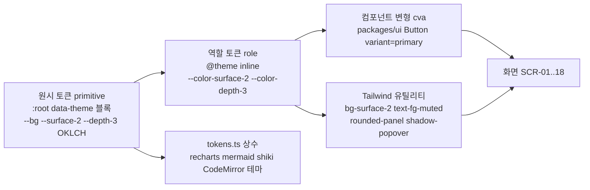

# DS-01. 디자인시스템 정의서 (Design System / UI 표준) — Fathom · 깊이

> **문서 ID**: DS-01 · **버전**: v1.0 · **상태**: Draft for PG-2 · **작성**: T1(상위 모델, 설계) · **일자**: 2026-10-01
> **입력(구속)**: R3 §5~§7(D3 Bathymetry 추천안) · ADR-006 §1·§9·§12(스택·토큰 위치·품질 게이트) · ADR-010(`check:ng-g`·`check:typo-ko`·`design/raw-color`, STD-01 경로) · ARC-01 §16·§17·§18(`@fathom/design-tokens`·`@fathom/ui`, 고정 버전) · REQ-01 FR-UX-001~016, NFR-UX-001~014, PR-012·016 · PLN-CNV-01 §3.3(NG-G1~G7)
> **짝 문서**: SCR-01 `06-screen-design.md`(화면·상태·키맵). 컴포넌트 이름은 두 문서가 같다.
> **정본 위치(코드)**: `packages/design-tokens/src/{tokens.css, typography.css, tokens.ts}` — 원색 리터럴이 허용되는 **유일한** 위치(`design/raw-color`). `packages/ui/src/{components/, badges/, motion.ts}` — 색은 `var(--…)`·토큰 상수만.

---

## 0. 요약 (TL;DR)

1. **방향 = D3 Bathymetry(수심도)**: 학습의 깊이 = 수심. 쿨 슬레이트 다크 우선(+ 동급 품질 라이트 "Chart Paper"). **색은 깊이(L1~L5)와 상태(정답·오답·due·포커스)만** 인코딩한다. 대담함은 Depth Map 한 곳에만 쓰고 나머지는 명도·굵기·간격으로 위계를 만든다.
2. **토큰 3층**: 원시 OKLCH 값(`:root[data-theme]` CSS 변수) → 역할 토큰(`--color-*`, Tailwind `@theme inline`) → 컴포넌트 변형(cva). Tailwind 기본 팔레트는 `--color-*: initial`로 **제거**해 `bg-blue-500`가 존재하지 않게 한다.
3. **대비 실측(§3.4)**: 다크 본문 15.88:1, 보조 8.76:1, 캡션 6.06:1, 입력 경계 3.68:1(vs surface-1) · 라이트 본문 16.17:1, 보조 7.10:1, 캡션 5.26:1, 입력 경계 3.35:1. R3 원안 대비 4개 값을 올렸다(`--fg-subtle`·`--border-input`(다크), `--fg-subtle`·`--correct`(라이트)) — 팝오버(surface-3)·카드(surface-2) 위 캡션이 4.5:1을 넘지 못했기 때문.
4. **타이포**: Pretendard Variable(UI·본문) · Geist Variable(라틴 숫자 디스플레이) · JetBrains Mono Variable + D2Coding(코드, 한글 폴백). 본문 15px(Guided 16px), 이론 17px/1.7, `word-break: keep-all` + `overflow-wrap: anywhere`, 한글 이탤릭 금지, 숫자 `tabular-nums`. 작업 지시의 Geist Mono는 ARC §18 고정 목록에 없어 채택하지 않는다(§16 DN-D1).
5. **모션**: 90/150/220ms(+ exit 160) 상태 전환만, 상한 250ms. 예외는 세션 리포트 "떠오름" 720ms 1곳. `prefers-reduced-motion` = transform 0, opacity ≤ 120ms.
6. **데이터 시각화**: 새 범주색을 만들지 않는다. 순서형 = 깊이 램프(텍스트 라벨 필수), 크기 = 단일 색상 순차 램프 `--viz-seq-1..5`(검증 PASS), 극성 = due(따뜻)↔해양(차가움) 발산 쌍(PASS), 상태 = 정답·부분·오답·대기(아이콘·해칭 필수). dataviz 검증기 결과를 §10.3에 기록했다.
7. **게이트**: NG-G 디자인 lint 17규칙(§13)을 `check:ng-g`·`check:typo-ko`·토큰 대비 테스트·axe로 강제한다. 완전한 Tailwind v4 `@theme` 블록은 §14에 있다.

---

## 1. 디자인 방향 — D3 Bathymetry (수심도)

### 1.1 이름 · 무드 · 근거

| 항목 | 내용 |
|---|---|
| 이름 | **Bathymetry · 수심도** (라이트 테마 별칭 **Chart Paper · 해도 용지**) |
| 컨셉 | 학습의 깊이 = 수심. 초급은 밝은 여울(청록), 전문가는 심해(남보라). 복습 due는 "수면으로 떠오른" 개념(앰버). 해도의 등심선처럼 **데이터가 곧 장식**이다. |
| 무드 | 차분함 · 정밀함 · 탐사. 조용한 회색 계층 위에 의미 있는 색만 떠 있다. |
| 시그니처 1개 | **Depth Map**(SCR-04): 트랙(열) × 레벨(L1 위 → L5 아래) 지형, 과거 등심선 오버레이. 앱 전체에서 채도가 가장 높은 화면은 이곳뿐이다. |
| 유일한 연출 | 세션 리포트의 깊이 게이지 "떠오름"(FR-DSH-008). |

**채택 근거**(R3 §6.1 가중 평가 D3 445/500 vs D1·D2 295):

1. 색의 의미가 제품의 핵심 축과 같다 — 초급 → 15년차 여정(UR-11·12)이 곧 깊이이며, 레벨 배지·Depth Map·진행 바·주간 리듬 막대·세션 리포트가 같은 램프를 공유한다. 사용자는 색을 한 번만 배운다.
2. 다크 우선이지만 "근흑 + 형광 단일 액센트" 클리셰가 아니다: 청회 슬레이트(C ≈ 0.02) + 5단 깊이 램프 + 상태색 3종의 **기능적 다색**.
3. 밀도와 차분함의 양립: 위계는 명도 4단(`bg → surface-1/2/3`) × 텍스트 3단(`fg / muted / subtle`)으로, 채도는 데이터에만.
4. 장시간 야간 학습(직장인 주니어의 실사용 시간대) 피로가 낮다(순흑 대비 할레이션 적음).
5. 구현 경제성: Tailwind v4 `@theme` + shadcn 변수 매핑에 그대로 얹히고 추가 폰트는 D2Coding 1종.

D1(Graph Paper)의 "빨간 연필 첨삭"은 백지노트 3색 diff에서만 부분 차용한다(누락 = 회색 점선, 오류 = 물결 밑줄).

### 1.2 원칙 (Design principles)

| # | 원칙 | 구현 규칙 |
|---|---|---|
| P1 | 색 = 깊이·상태만 | 역할 토큰 외 색 0, 범주색 0, 장식 그라데이션 0(깊이 램프 정보 인코딩만) |
| P2 | 위계 = 명도·굵기·간격 | 카드 그림자 대신 surface 단계, 제목 굵기 600~700 |
| P3 | 키보드가 1급 | 모든 컴포넌트 `:focus-visible` 링, 키 힌트 `Kbd` |
| P4 | 증거가 보인다 | 판정 배지·근거 링크가 결과 옆 1입력 거리 |
| P5 | 비난·불안 없음 | 연체 빨강 0, 손실 문구 0, 보상 연출 1곳 |
| P6 | 한국어가 기본 | keep-all, 측정폭, 영문 병기 규칙 |
| P7 | 모션은 결과만 | 사용자 행동의 결과(채점·저장·재정렬)에만, 진입 연출 0 |
| P8 | 로컬·오프라인 | 폰트·아이콘·스크립트 self-host, 런타임 외부 요청 0 |

### 1.3 비(非)제네릭 체크 (R3 §5.3 — 기본값으로 쓰지 않는다)

흰 배경 + 보라 그라데이션 히어로 · 크림 + 세리프 + 테라코타 · 근흑 + 형광 그린 · 동일 반경·동일 그림자 카드 격자 · 모든 제목 위 ALL-CAPS eyebrow · `A · B · C` 메타 남발 · 버튼 끝 `→` · 작은 데이터 라벨 모노스페이스 · 의미 없는 `01/02/03` · 섹션 fade-slide-up · 카드 hover 리프트 · 헤드라인 한 단어 색 강조.

### 1.4 디자인 지침 체크리스트 (PR-016 ≥ 10항 → NFR-UX-012 루브릭)

| # | 체크 | 루브릭 차원 |
|---|---|---|
| C1 | 화면마다 1차 행동이 1개이고 가장 강한 대비(반전 버튼)를 가진다 | 시각 위계 |
| C2 | 제목·본문·보조의 크기 차이가 스케일 2단계 이상 | 타이포그래피 |
| C3 | 여백 리듬이 4px 배수 스케일만 쓴다(임의값 0) | 일관성 |
| C4 | 다크·라이트 모두 본문 ≥ 4.5:1, UI 경계 ≥ 3:1 | 색 의미 |
| C5 | 색이 깊이·상태 외 의미로 쓰이지 않았다 | 색 의미 |
| C6 | 같은 데이터 밀도 화면은 같은 행 높이(밀도 토큰)를 쓴다 | 정보 밀도 |
| C7 | 모션이 상태 전환에만 있고 ≤ 250ms, reduced-motion에서 0 | 모션 |
| C8 | 반경이 재질 위계(4·6·10·12·16)를 따른다 — 단일 반경 통일 금지 | 일관성 |
| C9 | 한글 줄바꿈이 어절 단위이고 측정폭 ≤ 72ch | 타이포그래피 |
| C10 | 숫자 열이 `tabular-nums`로 정렬된다 | 정보 밀도 |
| C11 | 빈·로딩·오류 상태가 다음 행동 1개를 가진다 | 시각 위계 |
| C12 | 아이콘이 lucide 1종, 16/20px, stroke 1.5 | 일관성 |
| C13 | 상태가 색 + 아이콘/패턴/텍스트로 이중 인코딩된다 | 색 의미 |

루브릭(NFR-UX-012): 6차원 × 1~5점, 평균 ≥ 4.0·차원 < 3 없음. 체크 위반 1건 = 해당 차원 최대 3점.

---

## 2. 토큰 구조

### 2.1 계층



| 계층 | 위치 | 이름 규칙 | 누가 쓰나 |
|---|---|---|---|
| 원시 | `tokens.css` `:root,[data-theme="dark"]` / `[data-theme="light"]` / `[data-contrast="more"]` | `--<역할>`(예 `--surface-2`, `--depth-3`, `--viz-seq-4`) | `@theme inline`, `tokens.ts`만 |
| 역할 | `tokens.css` `@theme inline { --color-<역할>: var(--<역할>) }` | Tailwind 네임스페이스(`--color-*`, `--radius-*`, `--shadow-*`, `--text-*`, `--font-*`, `--ease-*`, `--animate-*`, `--breakpoint-*`) | 유틸리티 클래스 |
| 정적 | `tokens.css` `@theme { … }`(테마 무관 값) | 위와 같음 | 유틸리티 |
| 상수 | `tokens.ts` | `TOKENS.color.dark.depth[3]` 등(문자열 = CSS 변수 참조 `var(--depth-3)` + 차트용 계산 hex) | recharts·mermaid `themeVariables`·shiki·CodeMirror |

### 2.2 테마 · 모드 속성 (`<html>`)

| 속성 | 값 | 출처 | 효과 |
|---|---|---|---|
| `data-theme` | `dark`(기본) · `light` | `lib/theme.ts`: 설정 `system`이면 `matchMedia('(prefers-color-scheme: light)')` 결과로 해석해 **실제 값만** 쓴다 | 원시 색 블록 전환 |
| `data-density` | `comfortable`(Guided) · `compact`(Pro) | `LearnerProfile.ui_density`(auto = 주력 트랙 레벨 L1~L2 comfortable, L3 comfortable, L4+ compact) | 행 높이·패딩·본문 크기 토큰 |
| `data-motion` | `full` · `reduce` | `LearnerProfile.reduced_motion`(system = 미디어 쿼리) | 모션 토큰 0 |
| `data-contrast` | `standard` · `more` | 미디어 `prefers-contrast: more` 또는 설정 | 보조 텍스트·경계 한 단계 상향(AAA 7:1 지향) |
| `data-transparency` | `full` · `reduce` | `prefers-reduced-transparency` | 글래스 2곳 불투명 대체 |

- FOUC 방지: `apps/web/index.html` `<head>`의 **외부** 동기 스크립트 `public/theme-init.js`(≤ 1KB, `localStorage fathom.theme`·미디어 쿼리 → `data-*` 설정, try/catch). 인라인 스크립트는 쓰지 않는다(향후 CSP `script-src 'self'` 호환, §16 DN-D4). SW 앱 셸 precache 대상.
- Tailwind `dark:` 변형: `@custom-variant dark (&:where([data-theme="dark"], [data-theme="dark"] *));` — 단 컴포넌트는 역할 토큰이 테마를 따라 바뀌므로 `dark:`를 거의 쓰지 않는다(쓰면 리뷰 사유 필요).

---

## 3. 색 (OKLCH)

> 모든 값은 sRGB gamut 안이다. 대비는 WCAG 2.x 상대휘도 공식으로 **실측**했다(스크래치 스크립트: OKLCH → OKLab → linear sRGB → 상대휘도, 2026-10-01). hex는 참고용 sRGB 근사이며 정본은 OKLCH다. `bg`·`s1`·`s2`·`s3` = `--bg`·`--surface-1/2/3` 대비.

### 3.1 다크 (기본) — Bathymetry

| 토큰 | OKLCH | hex | bg | s1 | s2 | s3 | 용도 · 허용 |
|---|---|---|---|---|---|---|---|
| `--bg` | `oklch(0.20 0.02 245)` | #0e171f | — | 1.06 | 1.17 | 1.33 | 앱 캔버스 |
| `--surface-1` | `oklch(0.225 0.022 245)` | #131d25 | 1.06 | — | | | Rail·패널·Context·모달 |
| `--surface-2` | `oklch(0.26 0.024 245)` | #1a252f | 1.17 | 1.10 | — | | 카드·입력 배경·코드 블록 |
| `--surface-3` | `oklch(0.30 0.026 245)` | #232f3a | 1.33 | 1.26 | 1.14 | — | 팝오버·메뉴·선택 행·hover 고정 |
| `--border` | `oklch(0.33 0.024 245)` | #2b3741 | 1.48 | 1.40 | 1.27 | 1.12 | 구분선(장식 — 정보 전달 금지) |
| `--border-strong` | `oklch(0.42 0.028 245)` | #414f5c | 2.15 | 2.03 | 1.84 | 1.61 | 선택 카드 윤곽·모달 테두리 |
| `--border-input` | `oklch(0.56 0.028 245)` | #677784 | 3.90 | **3.68** | **3.35** | 2.93 | 입력·체크·세그먼트 경계(1.4.11 ≥ 3:1 — s3 위 금지) · R3 0.52에서 상향 |
| `--fg` | `oklch(0.955 0.008 230)` | #ebf1f4 | **15.88** | 15.00 | 13.62 | 11.94 | 본문·제목 |
| `--fg-muted` | `oklch(0.77 0.018 235)` | #aab6be | **8.76** | 8.27 | 7.51 | 6.58 | 보조 텍스트 |
| `--fg-subtle` | `oklch(0.67 0.02 240)` | #8b97a1 | **6.06** | 5.73 | 5.20 | **4.56** | 캡션·placeholder·축 라벨 · R3 0.64에서 상향(s3 4.06 → 4.56) |
| `--depth-1` 여울 | `oklch(0.88 0.09 185)` | #8febdf | 13.05 | 12.32 | 11.19 | 9.81 | L1 |
| `--depth-2` 연안 | `oklch(0.81 0.11 200)` | #59d6dd | 10.43 | 9.85 | 8.95 | 7.85 | L2 |
| `--depth-3` 대륙붕 | `oklch(0.74 0.125 222)` | #32bce3 | 8.11 | 7.66 | 6.95 | 6.10 | L3 · 진행 바 |
| `--depth-4` 대륙사면 | `oklch(0.68 0.14 250)` | #4c9deb | 6.30 | 5.95 | 5.40 | 4.74 | L4 |
| `--depth-5` 심해 | `oklch(0.63 0.15 280)` | #797ce1 | 4.97 | 4.69 | 4.26 | 3.74 | L5 (텍스트로는 bg·s1 위만) |
| `--depth-fog` | `oklch(0.34 0.022 245)` | #2f3943 | 1.54 | 1.46 | 1.32 | 1.16 | 미접촉 셀 채움(외곽선 `--border-input` 필수) |
| `--on-depth` | `= --bg` | | — | | | | 깊이색 채움 위 텍스트: L1 13.05 … L5 4.97(전 단계 ≥ 4.5) |
| `--focus` | `oklch(0.82 0.12 205)` | #4ddae9 | 10.80 | 10.20 | 9.26 | 8.12 | 포커스 링 전용 |
| `--due` 떠오름 | `oklch(0.82 0.14 75)` | #f9b64f | 10.17 | 9.60 | 8.72 | 7.65 | 복습 due·주의·warn 배너 아이콘 |
| `--due-ink` | `= --due` | | | | | | due 텍스트(다크는 같은 값) |
| `--correct` | `oklch(0.78 0.15 155)` | #59d38c | 9.59 | 9.06 | 8.22 | 7.21 | 정답·회상 |
| `--incorrect` | `oklch(0.72 0.16 25)` | #f97770 | 6.80 | 6.42 | 5.83 | 5.11 | 오답·오류 |
| `--partial` | `= --fg-muted` | #aab6be | 8.76 | | | | 부분 정답(중립 + 45° 해칭 + `CircleDashed`) |
| `--danger` | `= --incorrect` | | | | | | 파괴적 작업·critical 배너(due·스트릭에 사용 금지, NG-G5) |
| `--on-danger` | `= --bg` | | 6.80 (on incorrect) | | | | 위험 버튼 텍스트 |
| `--primary` | `= --fg` | | | | | | 1차 버튼 = **반전 중립**(fg 채움 + bg 텍스트 15.88) — 색 의미 오염 0 |
| `--on-primary` | `= --bg` | | 15.88 | | | | |

### 3.2 라이트 — Chart Paper

| 토큰 | OKLCH | hex | bg | s1 | s2 | s3 | 용도 · 허용 |
|---|---|---|---|---|---|---|---|
| `--bg` | `oklch(0.985 0.004 230)` | #f7fbfc | — | 1.04 | 1.07 | 1.16 | 캔버스 |
| `--surface-1` | `oklch(1 0 0)` | #ffffff | 1.04 | — | | | 패널·팝오버(라이트는 그림자로 엘리베이션) |
| `--surface-2` | `oklch(0.962 0.007 230)` | #eef3f6 | 1.07 | 1.12 | — | | 카드·입력 배경·코드 블록 |
| `--surface-3` | `oklch(0.935 0.009 232)` | #e4ebef | 1.16 | 1.21 | 1.08 | — | 선택 행·hover 고정 |
| `--border` | `oklch(0.90 0.01 235)` | #d8dfe4 | 1.29 | 1.35 | 1.21 | 1.11 | 구분선 |
| `--border-strong` | `oklch(0.80 0.014 235)` | #b6bfc6 | 1.79 | 1.86 | 1.67 | 1.54 | 선택 윤곽 |
| `--border-input` | `oklch(0.64 0.016 235)` | #838e95 | 3.21 | **3.35** | **3.01** | 2.77 | 입력 경계(s3 위 금지) |
| `--fg` | `oklch(0.23 0.03 250)` | #121e2b | **16.17** | 16.87 | 15.13 | 13.96 | 본문 |
| `--fg-muted` | `oklch(0.45 0.03 245)` | #485765 | **7.10** | 7.41 | 6.64 | 6.13 | 보조 |
| `--fg-subtle` | `oklch(0.52 0.025 245)` | #5d6b77 | **5.26** | 5.49 | 4.92 | **4.54** | 캡션 · R3 0.54에서 하향(s3 4.17 → 4.54) |
| `--depth-1` | `oklch(0.55 0.09 185)` | #1b8278 | 4.44 | 4.63 | 4.15 | 3.83 | L1 — **텍스트 금지**(채움·선만), 배지는 흰 텍스트 4.63 |
| `--depth-2` | `oklch(0.53 0.08 200)` | #227a7e | 4.87 | 5.08 | 4.56 | 4.21 | L2 |
| `--depth-3` | `oklch(0.50 0.095 232)` | #156c90 | 5.63 | 5.87 | 5.27 | 4.86 | L3 |
| `--depth-4` | `oklch(0.46 0.14 258)` | #1e55a4 | 6.94 | 7.24 | 6.49 | 5.99 | L4 |
| `--depth-5` | `oklch(0.43 0.16 284)` | #4a3ba2 | 8.28 | 8.64 | 7.75 | 7.15 | L5 |
| `--depth-fog` | `oklch(0.88 0.012 235)` | #d0d9de | 1.37 | 1.43 | 1.28 | 1.19 | 미접촉 셀(외곽선 필수) |
| `--on-depth` | `oklch(1 0 0)` | #ffffff | | | | | 배지 텍스트: 4.63 · 5.08 · 5.87 · 7.24 · 8.64 |
| `--focus` | `oklch(0.51 0.095 232)` | #1a6f93 | 5.39 | 5.63 | 5.05 | 4.66 | 포커스 링 |
| `--due` | `oklch(0.58 0.12 65)` | #aa691b | 4.23 | 4.42 | 3.96 | 3.66 | due 아이콘·채움 — **텍스트 금지** |
| `--due-ink` | `oklch(0.50 0.11 62)` | #8f520d | 5.94 | 6.20 | 5.56 | 5.13 | due 텍스트(라이트 전용 추가 토큰) |
| `--correct` | `oklch(0.51 0.12 155)` | #127946 | 5.20 | 5.42 | 4.86 | 4.49 | 정답 · R3 0.53에서 하향(s2 4.47 → 4.86) |
| `--incorrect` | `oklch(0.54 0.18 25)` | #c13234 | 5.32 | 5.55 | 4.98 | 4.59 | 오답 |
| `--partial` | `= --fg-muted` | #485765 | 7.10 | | | | |
| `--danger` / `--on-danger` | `= --incorrect` / `oklch(1 0 0)` | | 5.55 (흰 on 위험) | | | | |
| `--primary` / `--on-primary` | `= --fg` / `oklch(1 0 0)` | | 16.87 | | | | 반전 중립 버튼 |

**라이트 깊이 램프 예외(문서화)**: 라이트에서 "밝음 = 얕음"을 지키면 L1 대비가 무너진다 → 라이트는 **색상 회전(185° → 284°)** 으로 깊이를 인코딩하고 명도는 대비 확보용으로 역전한다(L1이 가장 밝지 않을 수 있음). 그래서 깊이 표시는 언제나 `L1`~`L5` 텍스트를 병기한다(1.4.1).

### 3.3 고대비 `data-contrast="more"` (선택, AAA 지향)

| 토큰 | 다크 | 대비(bg / s3) | 라이트 | 대비(bg / s3) |
|---|---|---|---|---|
| `--fg-muted` | `oklch(0.85 0.014 235)` | 11.47 / 8.62 | `oklch(0.36 0.03 245)` | 10.37 / 8.95 |
| `--fg-subtle` | `oklch(0.76 0.018 240)` | 8.45 / 6.35 | `oklch(0.42 0.028 245)` | 8.08 / 6.97 |
| `--border-input` | `oklch(0.64 0.026 245)` | 5.40 / 4.06 | `oklch(0.52 0.02 235)` | 5.25 / 4.54 |
| `--border-strong` | `oklch(0.52 0.028 245)` | 3.30 / 2.48 | `oklch(0.66 0.016 235)` | 2.97 / 2.57 |

### 3.4 대비 규칙 요약 (NFR-UX-001 · D-10)

| 쌍 | 최소 | 다크 실측 최저 | 라이트 실측 최저 |
|---|---|---|---|
| 본문 `--fg` / 모든 surface | 4.5 | 11.94 (s3) | 13.96 (s3) |
| 보조 `--fg-muted` / 모든 surface | 4.5 | 6.58 | 6.13 |
| 캡션 `--fg-subtle` / 모든 surface | 4.5 | 4.56 | 4.54 |
| 입력 경계 `--border-input` / 인접 배경(bg·s1·s2) | 3.0 | 3.35 | 3.01 |
| 포커스 링 `--focus` / 인접 배경 | 3.0 | 8.12 | 4.66 |
| 상태 텍스트 `--correct`·`--incorrect`·`--due-ink` / s2 | 4.5 | 5.83 | 4.86 |
| 깊이 배지 `--on-depth` / `--depth-n` | 4.5 | 4.97 | 4.63 |
| 1차 버튼 `--on-primary` / `--primary` | 4.5 | 15.88 | 16.87 |
| 위험 버튼 `--on-danger` / `--danger` | 4.5 | 6.80 | 5.55 |

허용하지 않는 조합(lint 대상 `design/contrast-pair`): 라이트 `--depth-1`·`--due` 텍스트, 다크 `--depth-5` 텍스트 on s2·s3, `--border-input` on s3, `--fg-subtle`보다 옅은 텍스트.

### 3.5 파생 상태 (color-mix, tokens.css 안에서만)

| 토큰 | 정의 | 용도 |
|---|---|---|
| `--state-hover` | `color-mix(in oklch, var(--fg) 6%, transparent)` | hover 오버레이(배경 위 덧칠) |
| `--state-press` | `color-mix(in oklch, var(--fg) 10%, transparent)` | active |
| `--state-selected` | `var(--surface-3)` | 선택 행·탭 |
| `--correct-wash` | `color-mix(in oklch, var(--correct) 12%, var(--surface-2))` | 정답 카드 배경 |
| `--incorrect-wash` | `color-mix(in oklch, var(--incorrect) 12%, var(--surface-2))` | 오답 카드 배경 |
| `--due-wash` | `color-mix(in oklch, var(--due) 12%, var(--surface-2))` | due 칩 배경(텍스트는 `--fg`) |
| `--focus-wash` | `color-mix(in oklch, var(--focus) 8%, transparent)` | 갱신된 행 1회 하이라이트 |
| `--depth-n-wash` | `color-mix(in oklch, var(--depth-n) 8%, var(--bg))` | Depth Map 레벨 띠 배경 |
| `--scrim` | 다크 `oklch(0.12 0.02 245 / 0.62)` · 라이트 `oklch(0.23 0.03 250 / 0.32)` | 모달 배경 |
| `--selection` | `color-mix(in oklch, var(--focus) 28%, transparent)` | `::selection` |

### 3.6 코드 문법 색 (예외 범주 — shiki·CodeMirror 테마 전용)

문법 강조는 "색 = 깊이·상태" 원칙의 **문서화된 예외**다. 채도를 낮추고(C ≤ 0.15) `--syn-*` 토큰은 `tokens.ts`의 `fathomShikiTheme`·`fathomCodeMirrorTheme`에서만 참조한다(`design/syntax-scope` lint).

| 토큰 | 다크 OKLCH (vs s2) | 라이트 OKLCH (vs s2) | 대상 |
|---|---|---|---|
| `--syn-keyword` | `oklch(0.78 0.10 280)` 7.61 | `oklch(0.45 0.15 285)` 7.06 | 키워드 |
| `--syn-string` | `oklch(0.82 0.09 160)` 9.21 | `oklch(0.47 0.10 155)` 5.83 | 문자열 |
| `--syn-number` | `oklch(0.83 0.10 75)` 9.08 | `oklch(0.50 0.12 55)` 5.61 | 숫자·상수 |
| `--syn-function` | `oklch(0.84 0.09 215)` 9.75 | `oklch(0.45 0.10 240)` 6.59 | 함수 |
| `--syn-type` | `oklch(0.80 0.08 190)` 8.58 | `oklch(0.48 0.08 195)` 5.63 | 타입·클래스 |
| `--syn-comment` | `oklch(0.67 0.02 240)` 5.20 | `oklch(0.54 0.02 245)` 4.52 | 주석(**이탤릭 금지**) |
| `--syn-punct` | `= --fg-muted` | `= --fg-muted` | 구두점 |
| `--syn-variable` | `= --fg` | `= --fg` | 식별자 |
| `--syn-diff-add` / `--syn-diff-del` | `--correct-wash` / `--incorrect-wash` + `+`/`−` 거터 | 같음 | PR 리뷰·스테이징 diff |

---

## 4. 타이포그래피

### 4.1 서체 (self-host, 런타임 외부 요청 0 — FR-UX-013 · NFR-PORT-006)

| 역할 | 패밀리 | 패키지(ARC §18 고정) | 로딩 | 규칙 |
|---|---|---|---|---|
| UI·본문(한글 + 라틴) | **Pretendard Variable** | `pretendard@1.3.9` — `dist/web/variable/pretendardvariable-dynamic-subset.css` | dynamic-subset(유니코드 범위 분할 woff2), `font-display: swap` | 기본 `--font-sans`. 라틴이 Inter 계열이라 한영 혼용 베이스라인 이질감 최소. 숫자 `font-feature-settings: "tnum"`는 `.num`·표에서. |
| 디스플레이(라틴 숫자·지표) | **Geist Variable** | `@fontsource-variable/geist@5.3.0` | `swap`, `unicode-range: U+0020-007E`(라틴만 — 한글은 Pretendard 폴백) | `--font-display`. 세션 리포트 깊이 게이지 수치, 주간 리뷰 LDI, Depth Map 축 레이블에만. 본문·제목에 쓰지 않는다. |
| 코드 | **JetBrains Mono Variable** + **D2Coding**(한글 폴백) | `@fontsource-variable/jetbrains-mono@5.3.0` + `d2coding@1.3.2`(**CR 요청**, §16 DN-D1) | `font-display: optional`(레이아웃 시프트 방지) | `--font-mono`. 코드 속 한글 주석이 2칸 폭 정렬. 리거처 기본 OFF(`font-variant-ligatures: none`), 설정에서 ON. 오류 ID·해시·CLI 명령·`Kbd`에도 사용. |
| (예약) 이론 읽기 세리프 | MaruBuri + Source Serif 4 | — | v1 미포함 | R3 D2 차용 옵션, v1.x(설정 항목은 비활성 표시만). |

- 폰트 파일은 Vite가 해시 자산으로 번들하고 SW 앱 셸이 precache한다. `<link rel="preload">`는 Pretendard 기본 subset 1개만.
- 금지: Google Fonts·CDN, 시스템 폰트 단독(한글 품질 편차), 한글 가짜 이탤릭.

### 4.2 타입 스케일 (rem, 루트 16px · Guided는 본문만 +1px)

| 토큰 | size / line-height | 굵기 | 자간 | 용도 |
|---|---|---|---|---|
| `text-2xs` | 11px(0.6875rem) / 16px | 500 | +0.01em | 배지·축 레이블(최소치, 대문자 변환 금지) |
| `text-xs` | 12.5px(0.78125rem) / 18px | 450 | 0 | 캡션·메타·타임스탬프 |
| `text-sm` | 13.5px(0.84375rem) / 20px | 450 | 0 | 보조 UI·표·칩 |
| `text-base` | 15px(0.9375rem) / 24px (1.6) | 400 | 0 | 기본 UI 본문(Guided 16px / 26px = 1.625) |
| `text-read` | 17px(1.0625rem) / 1.7 | 400 | −0.005em | 이론 본문·백지노트 diff·산출물(Guided 18px) |
| `text-lg` | 18px(1.125rem) / 26px | 600 | −0.01em | 카드 제목·문항 stem |
| `text-xl` | 22px(1.375rem) / 1.3 | 650 | −0.01em | 섹션 제목 |
| `text-2xl` | 27px(1.6875rem) / 1.3 | 700 | −0.01em | 페이지 제목 |
| `text-3xl` | 34px(2.125rem) / 1.3 | 700 | −0.01em | 개념 타이틀 |
| `text-display` | 44px(2.75rem) / 1.1 | 600 | −0.02em | Geist 숫자 1개(리포트 게이지·LDI) |

- R3 원안 대비 변경: 제목 자간 −0.015~−0.03em → **−0.01em**(NFR-UX-009 "Pretendard 자간 −0.01em~0"), 제목 행간 1.18~1.44 → **1.3**(NFR-UX-009 "제목 1.3"), `text-read` 30px(1.76) → **1.7**(본문 1.6~1.7). Geist 디스플레이는 숫자 전용이라 예외.
- 본문 최소 15px(Guided 16px) — `text-sm` 이하를 본문 문단에 쓰면 `typo-ko/body-min` lint.

### 4.3 한국어 조판 규칙 (NFR-UX-009 Must · R0) → §12에 lint와 함께 상세

---

## 5. 간격 · 레이아웃 · 밀도

### 5.1 간격 스케일 (4px 베이스, Tailwind `--spacing: 0.25rem`)

허용 단계(임의값 금지): `0.5`(2px) · `1`(4) · `1.5`(6) · `2`(8) · `3`(12) · `4`(16) · `5`(20) · `6`(24) · `8`(32) · `10`(40) · `14`(56) · `18`(72). 그 외 `p-7`·`gap-[13px]` 등은 `typo-ko/px-literal`·`design/spacing-scale` lint.

| 용도 | 값 |
|---|---|
| 인라인 아이콘 ↔ 텍스트 | 6px |
| 컨트롤 내부 패딩(x) | 12px(compact 10px) |
| 카드(mat-panel) 패딩 | 20px(compact 16px) |
| 섹션 간 | 32px |
| 페이지 상단 여백 | 40px(compact 24px) |
| 플레이어 문항 카드 ↔ 액션 바 | 24px |

### 5.2 레이아웃 토큰

| 토큰 | 값 | 비고 |
|---|---|---|
| `--shell-header-h` | 48px (focus 40px) | `scroll-padding-top` 기준 |
| `--shell-rail-w` | 56px (≥ 1440 펼침 200px) | |
| `--shell-context-w` | 320px | |
| `--measure-read` | 68ch (≈ 한글 38~42자) | 이론·노트 본문 |
| `--measure-ui` | 72ch | 문항 카드·폼 |
| `--content-max` | 1200px | 표·대시보드 외 페이지 최대폭 |
| breakpoints | `sm` 360 · `md` 768 · `lg` 1280 · `xl` 1440 | SCR-01 §2.10 |

### 5.3 밀도 (`data-density`, FR-UX-006 — 컴포넌트 로직 분기 0, 토큰만)

| 토큰 | comfortable (Guided, L1~L3 기본) | compact (Pro, L4+ 기본) |
|---|---|---|
| `--row-h` | 36px | 28px |
| `--control-h` | 36px | 30px |
| `--control-px` | 12px | 10px |
| `--panel-p` | 20px | 16px |
| `--text-body` | 16px / 26px | 15px / 24px |
| `--kbd-hints` | `1`(표시) | `0`(숨김 — `KeyHintBar` `display` 토큰) |
| `--celebration-level` | `standard` | `minimal`(리포트 게이지 상승 거리 50%) |

히트 영역 최소 24×24px(WCAG 2.5.8)은 compact에서도 유지한다(시각 28px 행 + 투명 패딩).

---

## 6. 반경 · 재질(Materials) · 그림자 · 엘리베이션

### 6.1 재질 토큰 (Vercel Geist "Materials" 차용 — 반경·배경·테두리·그림자 묶음)

| 재질 | 반경 | 배경 | 테두리 | 그림자 다크 | 그림자 라이트 | 사용처 |
|---|---|---|---|---|---|---|
| `mat-inline` | 4px `--radius-inline` | surface-2 | `--border` | 없음 | 없음 | 칩·인라인 코드·`Kbd` |
| `mat-pill` | 999px `--radius-pill` | 깊이색 채움 | 없음 | 없음 | 없음 | **레벨 배지 전용** |
| `mat-control` | 6px `--radius-control` | surface-2 | `--border-input` | 없음 | 없음 | 입력·버튼·세그먼트·체크 |
| `mat-panel` | 10px `--radius-panel` | surface-1 | `--border` | 없음(명도로 엘리베이션) | `0 1px 2px oklch(0.23 0.03 250 / .06)` | 카드·패널·문항 카드 |
| `mat-popover` | 12px `--radius-popover` | 다크 surface-3 · 라이트 surface-1 | `--border-strong` | `0 8px 24px oklch(0 0 0 / .35)` | `0 8px 24px oklch(0.23 0.03 250 / .12)` | 메뉴·팝오버·툴팁·Peek |
| `mat-modal` | 16px `--radius-modal` | surface-1 | `--border-strong` | `0 24px 64px oklch(0 0 0 / .5)` | `0 24px 64px oklch(0.23 0.03 250 / .18)` | 다이얼로그·팔레트(+ backdrop blur 12px, 2곳 한정) |
| `mat-drawer` | 0(붙는 변) / 12px(열린 변) | surface-1 | `--border-strong` | `--shadow-popover` | 같음 | Drawer(판정 카드·오버레이 편집) |

- 반경은 **위계에 비례**한다 — 한 반경 통일(SaaS 카드 킷) 금지(R3). shadcn `--radius` 파생식 대신 재질 토큰을 직접 매핑한다.
- 글래스(backdrop blur)는 **Header(sticky)·명령 팔레트 오버레이 2곳**만(`design/glass-allowlist`). `data-transparency="reduce"`면 불투명 `surface-1`.

### 6.2 z-index

| 토큰 | 값 | 대상 |
|---|---|---|
| `--z-base` | 0 | 문서 흐름 |
| `--z-sticky` | 10 | Header·표 헤더·믹스테이프 |
| `--z-rail` | 20 | Rail·하단 탭바 |
| `--z-drawer` | 30 | Context Drawer·판정 카드 |
| `--z-popover` | 40 | 메뉴·툴팁·Peek |
| `--z-modal` | 50 | Dialog·AlertDialog·GLB-WO |
| `--z-palette` | 60 | GLB-PAL |
| `--z-toast` | 70 | sonner |
| `--z-overlay-system` | 80 | ST-MAINT·ST-SESSION-LOST |

---

## 7. 모션

### 7.1 토큰

| 토큰 | 값 | 이징 | 용도 |
|---|---|---|---|
| `--dur-instant` | 90ms | `--ease-standard` = `cubic-bezier(0.2, 0, 0, 1)` | hover·press 상태색 |
| `--dur-fast` | 150ms | standard | 툴팁·메뉴·토글·채점 테두리 |
| `--dur-base` | 220ms | standard (진입) | 패널·다이얼로그·Peek·블록 전환 |
| `--dur-exit` | 160ms | `--ease-exit` = `cubic-bezier(0.4, 0, 1, 1)` | 닫힘 |
| `--dur-moment` | 720ms | `--ease-emphasized` = `cubic-bezier(0.3, 0, 0, 1)` | **세션 리포트 깊이 게이지 "떠오름" 1곳** |
| `spring-card` | Motion `{ type: 'spring', bounce: 0.12, duration: 0.35 }` | — | 카드 뒤집기·Parsons 재정렬·증거 타일 공개 (`packages/ui/src/motion.ts` export `springCard`) |
| `--dur-reduced` | 120ms | linear | reduced-motion 시 opacity 크로스페이드 상한 |

### 7.2 규칙 (FR-UX-009)

1. 모션은 **사용자 행동의 결과**(채점·뒤집기·저장·재정렬·공개)와 **공간 이해**(패널 열림 방향)에만. 페이지 진입 연출·스크롤 트리거 등장·카드 hover 리프트·자동 재생 0.
2. 상한 250ms(`--dur-moment` 예외 1곳). `duration-[…]` 임의값 금지(`design/motion-duration`).
3. 오답에 흔들기(shake) 금지 — 조롱 느낌·전정기관 부담. 오개념 태그가 8px 슬라이드 인.
4. 로딩: 300ms 미만은 표시하지 않는다. 이상이면 정적 스켈레톤(쉬머·펄스 금지). AI 스트리밍은 토큰 단위 + `Esc` 취소.
5. 숫자 카운트업 금지(축하 1곳 규칙). 바뀐 숫자는 크로스페이드 150ms.
6. **reduced-motion**: `MotionConfig reducedMotion="user"` 전역 + `[data-motion="reduce"]`에서 모든 `--dur-*` = 0ms, transform 기반 전환 제거, opacity만 ≤ 120ms. 깊이 게이지는 최종 상태로 즉시 표시. Depth Map 타임랩스 자동 재생 비활성(단계 버튼만). 검증: FR-UX-009 [T] "reduce → 전환 0ms".
7. 축하 모션 컴포넌트 `DepthRise`는 `packages/ui/src/components/depth-rise.tsx`에서만 export, import 지점 1곳(`apps/web/src/features/practice/report/`) — `ng-g1/celebration-single-use`.

---

## 8. 아이콘 (lucide-react 1.49.0)

- 1종 통일, stroke 1.5, 크기 **16px(인라인·버튼) / 20px(빈 상태·헤더)** 두 가지만(`IconSize = 16 | 20`). `currentColor` 상속 — 아이콘에 직접 색 지정 금지(상태 아이콘은 부모 `text-correct` 등).
- 장식 아이콘 `aria-hidden="true"`, 의미 아이콘은 인접 텍스트가 있거나 `aria-label`.

| 의미 | 아이콘 | 의미 | 아이콘 |
|---|---|---|---|
| 홈 | `House` | 세션 | `Play` |
| 개념 | `Diamond` | Inbox | `Inbox` |
| 지도 | `Map` | 증거 | `ScrollText` |
| 주간 리뷰 | `CalendarCheck` | 시즌 | `Flag` |
| 가져오기 | `Import` | 큐레이션 | `ListChecks` |
| AI 연결 | `Cpu` | 운영 | `Activity` |
| 설정 | `Settings` | 디자인 | `Palette` |
| 정답 | `Check` | 오답 | `X` |
| 부분 | `CircleDashed` | 대기 | `Hourglass` |
| due 떠오름 | `ArrowUpFromLine` | 녹슴 | `CircleDotDashed` |
| 착각 | `Blend` | 기초 균열 | `Unlink` |
| 갱신 필요 | `RefreshCcwDot` | 블루프린트 | `ClipboardList` |
| 판정 AI | `Sparkles` | LLM 추정 | `WandSparkles` |
| 간이 채점 | `ListChecks` | 자기평가 | `UserCheck` |
| 확인 필요 | `CircleHelp` | 보정 전 | `Gauge` |
| AI 오프라인 | `CloudOff` | 격하 | `CircleAlert` |
| 전송 대기 | `CloudUpload` | 경고 | `TriangleAlert` |
| 힌트 | `Lightbulb` | 신고 | `FlagTriangleRight` |
| 잠금(블록 유지) | `Pin` | 교체 | `Shuffle` |
| 건너뛰기 | `SkipForward` | 일시정지 | `Pause` |
| 보스·Wildcard | `Diamond`(채움) | 키보드 | `Keyboard` |

블록 "잠금"은 `Lock`이 아니라 `Pin`이다 — 선수 개념 하드 잠금 어휘(NG-G4)와 시각적으로도 구분한다.

---

## 9. 컴포넌트 인벤토리 (Radix + shadcn 패턴)

### 9.1 구현 규칙

- **3층**: `radix-ui@1.6.7` 프리미티브(접근성·포커스 관리) → `packages/ui/src/components/*`(shadcn 복사형, cva 변형 + 역할 토큰) → `apps/web/src/features/*/components`(도메인 결합: contracts 타입·쿼리 훅). `packages/ui`는 `@fathom/contracts`를 import하지 않는다(ARC §17.1 — props는 자체 타입). feature 간 import 금지(SCR-01 DN-11).
- 변형은 `cva`(`class-variance-authority@0.7.1`) + `cn()` = `twMerge(clsx(...))`(`packages/ui/src/lib/cn.ts`). 변형 이름은 아래 표 그대로(STD-01 UI 표준 자동 생성의 키).
- 모든 상호작용 컴포넌트: `:focus-visible` 링(`outline: 2px solid var(--focus); outline-offset: 2px`), disabled = `opacity: .5` + `cursor: not-allowed` + `aria-disabled`, 히트 영역 ≥ 24px.
- 파일 = `packages/ui/src/components/<kebab>.tsx` 1컴포넌트 1파일, 스토리 = `packages/ui/src/components/__stories__/<kebab>.story.tsx`(SCR-18 수집). 배지는 `packages/ui/src/badges/`.

### 9.2 기반 컴포넌트 (`packages/ui/src/components/`)

| 컴포넌트 | 프리미티브 | 변형(variant · size · 상태) | 비고 |
|---|---|---|---|
| `Button` | `<button>` / Radix `Slot`(`asChild`) | variant: `primary`(반전 중립) · `secondary`(surface-2 + border-input) · `ghost` · `danger`(파괴 작업만) · `link` / size: `sm`(28) · `md`(36·compact 30) · `lg`(44, 홈 CTA) / state: `loading`(스피너 16 + 라벨 유지) | `kbd` prop → 오른쪽 `Kbd` 힌트. 텍스트 끝 `→` 금지. |
| `IconButton` | `<button>` | variant: `ghost` · `secondary` / size: `sm` 28 · `md` 32 | `aria-label` 필수(타입 강제). |
| `Kbd` | `<kbd>` | size: `sm` · `md` | mat-inline, `--font-mono` `text-2xs`, OS별 `⌘`/`Ctrl` 치환. |
| `Input` · `ImeSafeInput` | `<input>` | size: `sm` · `md` / state: `invalid`(`aria-invalid` + `--incorrect` 테두리 + 메시지) | IME Enter 가드 내장(`ImeSafe*`). |
| `Textarea` · `ImeSafeTextarea` | `<textarea>` | `autoResize` | |
| `Select` | Radix `Select` | size: `sm` · `md` | 네이티브 대신 Radix(키보드·타입어헤드). |
| `Checkbox` · `RadioGroup` · `Switch` | Radix | size: `md` | 경계 `--border-input`, 체크 = `--fg` 채움(색 의미 없음). |
| `SegmentedControl` | Radix `ToggleGroup type="single"` | size: `sm` · `md` · `lg` | 에너지·시간·렌즈·모자. 화살표 이동. |
| `ToggleGroup` | Radix `ToggleGroup type="multiple"` | `pattern` prop(레이어 토글: 패턴 견본 표시) | Depth Map 레이어. |
| `Tabs` | Radix `Tabs` | variant: `underline`(페이지 탭) · `pill`(패널 내) / `activationMode="manual"` | 숫자 키 `1~n` 이동(옵션). |
| `Dialog` · `AlertDialog` | Radix | size: `sm` 400 · `md` 520 · `lg` 720 | mat-modal, `--scrim`, 포커스 트랩·`Esc`. 파괴적 확인 = `ConfirmByName`(작업 이름 입력). |
| `Drawer` | Radix `Dialog`(side) | side: `right` 400 · `left` 360 | 판정 카드·트랙 패널·오버레이 편집. |
| `Popover` · `HoverCard` | Radix | — | mat-popover. `Peek`은 HoverCard(지연 400ms) + `Space` 고정. |
| `Tooltip` | Radix `Tooltip` | — | 지연 500ms, 키보드 포커스에도 표시. 정보 전달 단독 수단 금지. |
| `DropdownMenu` · `ContextMenu` | Radix | — | `⌘.` 컨텍스트 액션은 cmdk 기반 별도(`ActionPanel`). |
| `Command` | `cmdk@1.1.1` | variant: `palette` · `inline` | 초성 필터는 **prop `filter`로 주입**(호출 측 web이 `lib/choseong.ts`를 넘김 — `@fathom/ui`는 web lib를 import하지 않는다). `cmdk`·`sonner`는 ARC §17.1 `@fathom/ui` 허용 의존(CR-55)·`deps.json`에 등재. |
| `Toast` | `sonner@2.0.8` `<Toaster>` | type: `info` · `success` · `warn` · `error` | 위치 bottom-right, 최대 3, `richColors` 끔(토큰 사용). |
| `Banner` | `<div role="status">` | severity: `info` · `warn` · `critical` / variant: `inline` · `slot`(헤더 경보) · `suggest` | 아이콘 + 텍스트 + 행동 1개. critical만 `--danger` 아이콘, 배경은 surface(빨간 띠 금지). |
| `Card` · `Panel` | `<section>` | material: `panel` · `popover` / variant: `default` · `selected` · `correct` · `incorrect` · `partial` | 상태 변형은 테두리 + wash + 아이콘 동시. |
| `Table` · `DataTable` | `<table>` | density 토큰, `sticky` 헤더, `numeric` 열(`tabular-nums` 우측 정렬) | 가상 스크롤(`@tanstack/react-virtual`는 미채택 — 자체 `useWindowedRows`, §16 DN-D6). |
| `Skeleton` | `<div aria-hidden>` | shape: `line` · `block` · `circle` | 정적 surface-3, 쉬머 0, 300ms 지연 표시. |
| `EmptyState` | — | `icon` · `title` · `action` 1개 | |
| `ErrorPanel` | `role="alert"` | `problem`(code·error_id·title) · `actions` | `error_id` 복사 버튼, 스택 0. |
| `DegradedStrip` | `role="status"` | `dependency` · `retryIn` | 점선 테두리 + `CircleAlert`. |
| `AiOfflineNote` | — | `compact` · `block` | `CloudOff` + 문구 + 링크. |
| `Progress` | `role="progressbar"` | variant: `bar`(1px·4px) · `steps` | 색 = `--depth-3`(세션) 또는 `--fg-muted`(작업). |
| `Meter` | `role="meter"` | variant: `usage`(예산·쿼터) | 80%↑ `--due` 아이콘(막대 색 아님), 100% 텍스트 `한도 도달`. |
| `Stepper` | `<ol>` | variant: `pipeline`(I1~I9) · `wizard`(DLG-ONB·DLG-MERGE) | 진짜 순서라 번호 허용. |
| `SafeMarkdown` | react-markdown 10 + rehype-sanitize 6, `skipHtml` | variant: `read`(측정폭·text-read) · `ui` | 링크 `javascript:` 무력화, 외부 링크 표시. 지시문 `::embed[]`·`::lab[]`·`::case[]`·`::ku-list`·`concept:` 스킴 렌더(DCP DN-35). |
| `CodeBlock` | shiki 4(JS 정규식 엔진, 언어 지연 로드) | `lineNumbers` · `highlightLines` · `diff` | `fathomShikiTheme`(tokens.ts). |
| `CodeEditor` | `@uiw/react-codemirror@4.25.12` | lang: `js` · `ts` · `sql` · `yaml` · `markdown` / `readOnly` | `fathomCodeMirrorTheme`, IME 가드, 탭 2칸, 리거처 OFF. |
| `MermaidFigure` | mermaid 12(지연 청크, `securityLevel:'strict'`) | — | `alt` 필수 prop(타입), `themeVariables` = tokens.ts. 실패 → 원문 + 대체 텍스트. |
| `LiveRegion` | `aria-live` | `polite` · `assertive` | 셸에 1개씩. |

### 9.3 배지 · 칩 (`packages/ui/src/badges/`)

| 컴포넌트 | 변형 | 시각 |
|---|---|---|
| `LevelBadge` | `level: 1..5` · size `sm`·`md` · `provisional` | mat-pill, `--depth-n` 채움 + `--on-depth` 텍스트 `L3`(텍스트 항상). provisional = 점선 외곽 + `잠정` 툴팁. |
| `JudgeBadge` | `badge: JudgeBadge`(8값, SCR-01 §2.8) | 중립 surface-2 + 아이콘 + 라벨 + 테두리 패턴(실선·점선·이중·파선). 색 없음. |
| `AiModeChip` | `mode: FULL\|JUDGE_ONLY\|LLM_ONLY\|OFFLINE` · `degraded` | 점(●) + 라벨. FULL `--correct` 점 · JUDGE_ONLY/LLM_ONLY `--due` 점 · OFFLINE `--fg-subtle` 점(오프라인은 정상 상태이므로 경고색 아님) · degraded = 점선 테두리 + `격하`. |
| `StatusDot` | `state: ready\|restarting\|degraded\|stopped\|ok\|warn\|fail\|skip` | 모양 + 색 + 텍스트(● ◐ ◆ ○). |
| `ReasonChip` | `code: ReasonChip.code` | mat-inline, 아이콘 + `label_ko` + `value`(tabular). |
| `StateTag` | `correct\|partial\|incorrect\|pending\|provisional\|voided` | 아이콘 + 텍스트, 해칭(partial)·취소선(voided). |
| `TierTag` · `TrustTag` · `DataClassTag` | A/B/C · seed/verified/user/llm_unverified · C0~C3 | 중립, 텍스트만(C3 = 굵게). |

### 9.4 학습 도메인 컴포넌트 (`apps/web/src/features/*/components` 또는 렌더러)

| 컴포넌트 | 위치 | 변형 · 상태 | 핵심 규칙 |
|---|---|---|---|
| `PlayerShell` | practice/player | `withMixtape` · `focus` | SCR-02 §7.2, DN-08 |
| `MixtapeTimeline` · `BlockChip` | practice/player | chip state: `pending`·`active`·`awaiting_grade`·`done`·`skipped`·`swapped` + `locked`·`boss`·`wildcard` | 상태 = 아이콘(색 아님) |
| `QueueIndicator` | practice/player | `idle`·`pending`·`retrying`·`failed` | §2.7 |
| `ItemCard` | practice/renderers | `pre`·`graded:{correct,partial,incorrect,pending}` | 상태 테두리 + wash + 아이콘 |
| `ConfidencePicker` | practice/renderers | C1~C3 | 키 `1~3` |
| `OxButtons` | renderers/ox | `idle`·`chosen`·`locked` | 360px 1열 |
| `OptionList` | renderers/mcq | `single`·`multi` | 키 `1~5`, 선택 = `--fg` 2px 좌측 바 |
| `ClozeField` | renderers/cloze | — | 인라인 입력, `Tab` |
| `BugLineGutter` | renderers/bugline | `selectable`·`selected`·`revealed(post)` | 줄 번호 + 체크, 정답 줄은 post-submit에서만 |
| `ParsonsList` | renderers/parsons | `idle`·`grabbed`·`indent:n` | 드래그 + 키보드 대체(2.5.7), 들여쓰기 가이드 점선 |
| `HintLadder` | practice/components | step 0~4 | 단계별 감점 문구 |
| `FeedbackPanel` · `MisconceptionCallout` | renderers/*/post-submit | `template`·`ku_assembled`·`ai_generated` | post-submit 전용 |
| `RatingStrip` | practice/components | `auto`·`confirm` | Again/Hard/Good/Easy `1~4` |
| `SelfGradeForm` | practice/components (post-submit) | rubric `kp`·`dimension` | 0~4 레벨 |
| `JudgeCard` | `packages/ui`(표현) + assessment-ui 훅 | `calibrated`·`uncalibrated`·`superseded` | units 객체 키 표기 |
| `BlankNoteEditor` · `ThreeColorDiff` | practice/blank-note · /post-submit | diff unit `recalled`·`missing`·`error` + `uncertain_marked` | 실선·점선·물결 밑줄 |
| `DialogTranscript` · `TurnBubble` · `DepthGauge` | practice/dialog | role `learner`·`system` / gauge D1~D7 + `max_allowed` | 채팅 말풍선 클리셰 회피(좌측 마크) |
| `EvidenceBoard` · `EvidenceTile` | practice/case | `hidden`·`revealed` | 공개 = spring-card |
| `ArtifactEditor` · `RubricPanel` | practice/artifact | — | |
| `SessionReport` · `DepthRise` | practice/report · ui | `DepthRise` 1곳 | 유일한 축하 |
| `PrimaryActionCard` | insight/home | kind 5종 | 홈 CTA `lg` |
| `WeeklyRhythmBar` | insight/home | — | 막대 색 = 그날 최대 깊이 |
| `DepthMap` · `DepthCell` · `DepthMapTable` | curriculum/depth-map | cell: lifecycle × layer 패턴 | §10.5 |
| `NeighborGraph` | curriculum/concept-page | — | xyflow 지연, 표 대체 |
| `StageTabs` · `LensSwitch` · `SoftGateNote` · `OverlayEditor` | curriculum/concept-page | — | |
| `TrackCatalog` · `PathPanel` | curriculum | — | |
| `GateList` · `LedgerEventList` · `CardTable` | insight/evidence | — | |
| `ForecastBand` · `CalibrationStudio` · `ModeMixBar` · `LdiFigure` | insight/weekly | — | §10 차트 규칙 |
| `InboxRow` · `StagingDiffTable` · `ImportStepper` | acquisition | — | |
| `ProviderRow` · `UsageMeter` · `WorkOrderCard` · `CallLogTable` · `FirewallPreview` | ai-control | — | |
| `HealthBoard` · `ServiceRow` · `OperationProgress` · `BackupTable` · `MergeWizard` · `DoctorTable` · `LogViewer` | ops-console | — | |

---

## 10. 데이터 시각화

### 10.1 원칙 (R3 §7.5 + dataviz 방법)

1. **새 범주색 팔레트를 만들지 않는다.** 트랙·모드·제공자처럼 이름만 다른 범주(nominal)는 **같은 중립 1색**(`--viz-ink`) 막대 + 직접 라벨, 또는 작은 다중 차트로 그린다. 19개 트랙에 19색을 주지 않는다(아이콘·라벨로 구분).
2. 색의 일은 4종뿐이다: **순서(레벨)** = 깊이 램프 · **크기** = 단일 색상 순차 램프 · **극성** = 발산 쌍 · **상태** = 정답·부분·오답·대기.
3. 축은 하나(이중 y축 금지). 2계열 이하만 한 차트에, 그 이상은 작은 다중.
4. 텍스트(값·라벨·범례)는 텍스트 토큰(`--fg`·`--fg-muted`·`--fg-subtle`), 계열 색을 글자에 쓰지 않는다.
5. 모든 차트는 표 보기(`Table` 토글)와 `aria-describedby` 요약 1문장을 가진다(NFR-UX-003). hover/포커스 툴팁 기본.
6. 그리드선 `--border`, 축 레이블 `text-2xs` `--fg-subtle`, 숫자 `tabular-nums`. 마크: 선 2px, 막대 끝 4px 라운드, 막대 간 2px surface 간격, 점 ≥ 8px.

### 10.2 시각화 토큰

| 역할 | 토큰 | 다크 | 라이트 | 쓰는 곳 |
|---|---|---|---|---|
| 순서(레벨) | `--depth-1..5` | §3.1 | §3.2 | 레벨 분포·트랙 L1~L5 스택·주간 리듬 막대. **텍스트 라벨 `L1~L5` 필수**(§10.3 결과) |
| 크기(순차, 낮음 → 높음) | `--viz-seq-1..5` | `oklch(0.42 0.10 240)` #00537e · `0.52 0.12 238` #0071a5 · `0.62 0.13 236` #1091c9 · `0.72 0.12 234` #4ab0e4 · `0.82 0.10 232` #7dd0fa (다크는 클수록 밝다) | `oklch(0.76 0.075 232)` #7fbad9 · `0.66 0.10 234` #4c9cc6 · `0.56 0.12 236` #027eb1 · `0.46 0.12 238` #005f92 · `0.36 0.10 240` #00426c (라이트는 클수록 어둡다) | 유지율 히트맵·착각 지도 gap 크기·사용량 막대(단일 계열) |
| 극성(발산) | `--viz-div-neg` · `--viz-div-mid` · `--viz-div-pos` | `oklch(0.66 0.13 70)` #c48225 · `oklch(0.45 0.015 245)` · `oklch(0.62 0.12 236)` #2890c4 | `oklch(0.58 0.12 65)` #aa691b · `oklch(0.86 0.008 240)` · `oklch(0.50 0.11 236)` #006b99 | 보정(과신 ↔ 과소신), 선언 대 증명 차이, ΔLDI 기여(±) |
| 상태 | `--correct` · `--partial`(+45° 해칭) · `--incorrect` · `--viz-pending`(= `--border-strong` 파선) | §3.1 | §3.2 | 세션 결과 스택·형식별 정오 |
| 중립 단일 계열 | `--viz-ink` = `--fg-muted` · 보조 계열 `--viz-ink-2` = `--fg-subtle` 파선 | | | 모드 편중·과업별 호출·제공자별 비용 |
| 강조 1점 | `--due` | | | "오늘"·"예산선" 마커 |
| 해칭 텍스처 | `--viz-hatch` = `repeating-linear-gradient(45deg, currentColor 0 1px, transparent 1px 6px)` | | | partial·착각 레이어·CVD/인쇄 대체 |

### 10.3 검증 기록 (dataviz `validate_palette.js`, 2026-10-01)

| 대상 | 모드·표면 | 결과 | 조치 |
|---|---|---|---|
| `--viz-seq-1..5` | 다크 / surface-1 #131d25, `--ordinal` | **PASS**(단조·ΔL ≥ 0.06·단일 색상 9°·밝은 끝 2.06:1) | — |
| `--viz-seq-1..5` | 라이트 / #ffffff, `--ordinal` | **PASS**(색상 13°·밝은 끝 2.12:1) — 1차안(L 0.88) 1.42:1 FAIL → L 0.76으로 재단계 | — |
| 발산 극 2색 | 다크 / s1 | **PASS**(L 밴드·채도·CVD ΔE 21.2·정상 시각 25.1·대비 ≥ 3) | — |
| 발산 극 2색 | 라이트 / #fff | **PASS**(CVD 18.8·정상 24.2) | — |
| 깊이 램프 `--depth-1..5` | 다크·라이트, `--ordinal` | **FAIL**(단일 색상 아님 95°·99°, 다크 d4↔d5 ΔL 0.05, 라이트 ΔL 0.02~0.04) | **의도된 정체성 램프**로 분류: 차트에서 색만으로 순서를 읽게 하지 않는다 → `L1~L5` 직접 라벨·범례 필수, 크기 데이터에는 쓰지 않는다(`--viz-seq` 사용) |
| 상태 3색(정답·중립·오답) | 다크 | 채도 floor FAIL(중립은 의도), 오답↔중립 CVD WARN 6.6 | partial 해칭 + 아이콘 + 라벨 필수(보조 인코딩), 막대 사이 2px 간격 |
| due + 오답 동시 표시 | 다크 | CVD 5.4(deutan) FAIL | **같은 차트에 due와 오답을 인접 배치 금지**(규칙 `viz/due-incorrect-adjacent`) |

### 10.4 화면별 차트 형태

| 화면 | 데이터 | 형태 | 색 |
|---|---|---|---|
| SCR-01 | 주 7일 | 7칸 막대(높이 = 세션 수, 색 = 그날 최대 깊이) | 깊이 램프 + 툴팁 `L2` |
| SCR-02 리포트 | 결과 분포 | 가로 100% 스택 1개 + 직접 라벨 | 상태 |
| SCR-04 | 지형 | 자체 SVG 셀(§10.5) | 깊이 + 패턴 |
| SCR-05 | 형식별 증거 | 점 그래프(형식 × w) | 중립 + 산입 여부 아이콘 |
| SCR-10 ① | ΔLDI | 숫자 1개(차트 아님) | — |
| SCR-10 ④ | 모드 편중 | 가로 단일 스택(중립) + 직접 라벨 + H_min 기준선 | `--viz-ink` |
| SCR-10 ⑤ | 30일 부하 범위 | 범위 밴드(하한~상한 면) + 예산 수평선(`--due` 파선), 일별 값 없음 | `--viz-seq-3` 20% 면 |
| SCR-10 보정 | 확신도별 정확도 | 3막대 + 대각 기준선 / Brier 추세 선 1개 | 중립 / 발산(과신·과소신) |
| SCR-10 착각 지도 | 개념 × gap | 히트맵 | `--viz-seq` |
| SCR-15 사용량 | 과금 vs 구독 명목 | 2계열 스택(실선·해칭) | `--viz-ink` + 해칭 |
| SCR-15 쿼터 | 창별 사용률 | `Meter` | 중립(80%↑ 아이콘) |
| SCR-16 SLO | 목표 대비 | 불릿 차트 | 중립 + ok/위반 아이콘 |

recharts 3.10은 `tokens.ts`의 `vizTheme(mode)`(계산 hex — SVG `fill`은 CSS 변수도 받지만 내보내기·스냅샷 일관성을 위해 상수)로만 색을 받는다. 축·그리드·툴팁 컴포넌트는 `packages/ui/src/components/chart/*`에 래핑.

### 10.5 Depth Map 셀 인코딩 (FR-DSH-003·004 · NFR-UX-004)

| 상태 | 채움 | 외곽 | 추가 마크 |
|---|---|---|---|
| 미접촉 CL-0 | `--depth-fog` | 1px `--border-input` | — |
| 학습 중 | `--depth-n` × retention(30~100% 불투명) | 없음 | — |
| 숙달 | `--depth-n` 100% | 없음 | — |
| 유지(retained) | 숙달 + | 2px 링(`--depth-n`, 2px 간격) | — |
| 깊이 테두리 `depth_ring` 1~4 | | 동심선 n개 | — |
| 가르침(taught) | | | ★ 6px(`--fg`) |
| 잠정 | | 점선 링 | — |
| 레이어 착각 | | | 45° 해칭 오버레이 |
| 레이어 기초 균열 | | 점선 외곽 | `Unlink` 미니(줌 ≥ 1.5) |
| 레이어 갱신 필요(CL-X) | | 파선 외곽 | |
| 레이어 녹슴 | | | 우상단 `◌` 4px |
| 레이어 블루프린트 | | 외곽 굵기 1~3px ∝ weight | 범례 막대 |
| 과거 오버레이 | | 등심선(점선, `--fg-subtle`) | |

---

## 11. 접근성 (WCAG 2.2 AA)

| SC | 요구 | Fathom 대응 | 검증 |
|---|---|---|---|
| 1.1.1 | 비텍스트 대체 | Mermaid `alt` 필수 prop, 차트 요약 문장, 아이콘 `aria-label` | 타입 + axe |
| 1.3.1 | 구조 | 랜드마크(`header`·`nav`·`main`·`aside`), 제목 계층, 표 `th scope` | axe |
| 1.4.1 | 색 단독 금지 | 레벨 = 텍스트, 상태 = 아이콘·패턴, 레이어 = 패턴, 배지 = 아이콘·테두리 | NFR-UX-004 체크 |
| 1.4.3 · 1.4.11 | 대비 | §3.4 표(실측) | 토큰 대비 테스트 |
| 1.4.4 · 1.4.10 | 확대·재배치 | rem 기반, 360px 재배치(OX·MCQ·리뷰) | Playwright 360px |
| 1.4.12 | 텍스트 간격 | 행간·자간 사용자 덮어쓰기 시 잘림 0(고정 높이 텍스트 상자 금지) | 스냅샷 |
| 1.4.13 | 호버 콘텐츠 | Peek·툴팁 `Esc` 닫기, 포인터 이동 유지 | 수동 |
| 2.1.1 · 2.1.2 | 키보드·트랩 없음 | 매니페스트 모드 키보드 완주, Radix 포커스 트랩은 `Esc` 해제 | E2E |
| 2.1.4 | 단일 문자 단축키 | 입력 중 비활성 + 재매핑·끄기 | E2E |
| 2.2.1 | 시간 조절 | 타이머 기본 끔, 끄기·×1.5·×2 | E2E |
| 2.3.3(AAA 목표) | 상호작용 모션 | reduced-motion 전역 0ms | E2E |
| 2.4.3 · 2.4.7 | 포커스 순서·가시성 | DOM 순서 = 시각 순서, `:focus-visible` 2px | axe + 수동 |
| 2.4.11 | 포커스 가림 없음 | `scroll-padding-top` = header 높이, 하단 키 힌트 바 높이만큼 `scroll-padding-bottom` | E2E |
| 2.5.7 | 드래그 대체 | Parsons·매칭·순서·지도 팬 키보드/버튼 | E2E |
| 2.5.8 | 타깃 ≥ 24px | compact 포함 | 컴포넌트 테스트 |
| 3.1.1 · 3.1.2 | 언어 | `<html lang="ko">`, 영문 블록 `lang="en"`(코드 제외) | axe |
| 3.2.6 | 일관된 도움말 | `?` 위치·내용 고정 | 수동 |
| 3.3.1 · 3.3.3 | 오류 식별·제안 | `ErrorPanel` 원인 + 복구, 필드 오류 `aria-describedby` | 컴포넌트 |
| 3.3.7 | 중복 입력 방지 | 세션 설정·마지막 선택 기억 | 수동 |
| 3.3.8 | 접근 가능한 인증 | 비밀번호·인지 테스트 없음(쿠키 부트스트랩), passphrase 붙여넣기 허용 | 수동 |
| 4.1.2 | 이름·역할·값 | Radix 프리미티브, 커스텀 위젯 ARIA 패턴(listbox·grid) | axe |
| 4.1.3 | 상태 메시지 | 채점·저장·AI 완료 `aria-live=polite` | E2E |

게이트: Playwright + `@axe-core/playwright@4.13.0` serious·critical 0(18 화면 × 다크·라이트), Depth Map 표 뷰 존재, 키보드 완주 E2E(매니페스트 기반).

---

## 12. 한국어 조판 규칙 (NFR-UX-009 Must · R0)

| # | 규칙 | CSS · 구현 | lint |
|---|---|---|---|
| K1 | 어절 단위 줄바꿈 | `body { word-break: keep-all; overflow-wrap: anywhere; }`(typography.css), 코드·URL은 `overflow-wrap: anywhere` 유지 + `word-break: normal` 예외 클래스 `.break-code` | `typo-ko/keep-all`(전역 선언 존재 + `break-all`·`word-break: normal` 사용은 `.break-code`만) |
| K2 | 측정폭 | 본문 `max-inline-size: var(--measure-read)`(68ch ≈ 한글 38~42자) | `typo-ko/measure`(SafeMarkdown `read` 변형만 본문 렌더) |
| K3 | 제목·본문 줄 맞춤 | 제목 `text-wrap: balance`, 본문 `text-wrap: pretty` | typography.css |
| K4 | 행간 | 본문 1.6~1.7, 제목 1.3 | 토큰 고정 |
| K5 | 자간 | Pretendard −0.01em ~ 0 | 토큰 고정, `tracking-[…]` 금지 |
| K6 | 이탤릭 금지 | 강조 = 굵기 600 또는 `--fg` 대비 상승. `em { font-style: normal; font-weight: 600 }`, 코드 주석도 정체 | `typo-ko/no-italic`(`italic` 클래스·`font-style: italic`·`<i>` 0) |
| K7 | 숫자 정렬 | 수치 표시 = `.num { font-variant-numeric: tabular-nums; }`, 표 숫자 열 자동 | `typo-ko/tabular-nums`(`data-numeric` 요소·`numeric` 열에 `num` 없음 = 오류) |
| K8 | 영문 병기 | `쿠버네티스(Kubernetes)`: 괄호 앞 공백 없음, 용어 첫 등장만 병기 | 카피 리뷰 |
| K9 | 문장 부호 | 한국어 문장엔 전각 따옴표 대신 `"…"`·`'…'`(반각) 통일, 말줄임 `…` 1글자 | 카피 리뷰 |
| K10 | 대문자 변환 금지 | `text-transform: uppercase` 금지(영문 라벨 포함 — eyebrow 클리셰 회피) | `design/no-uppercase` |
| K11 | 최소 크기 | 본문 ≥ 15px(Guided 16), 캡션 ≥ 12.5px, 배지 ≥ 11px | `typo-ko/body-min` |
| K12 | 한영 혼용 기준선 | `/_design` 기준선 스냅샷(한글·영문·숫자·코드 혼합 문단 4종) | NFR-UX-009 [T] 스냅샷 비교 |
| K13 | IME | 조합 중 Enter 무시, 단축키 비활성 | SCR-01 §2.4 |

---

## 13. NG-G 디자인 lint 규칙

> 엔진: `tools/gates/check-ng-g.mjs`(tokens + CSS·JSON 스캐너) · `check-typo-ko.mjs` · `packages/design-tokens/test/contrast.test.ts`(vitest, §16 DN-D3) · Playwright axe. 규칙 ID 형식 `<family>/<rule>`(ADR-010 §5), 진단 JSON `{file, line, rule, message, severity}`. 어휘 목록은 `tools/gates/config/ng-g.json`. 탈출구 `// biome-ignore lint/plugin: <사유>`는 사유 필수, `design/*`·`ng-g*` 탈출은 T1 리뷰.

| 규칙 ID | 게이트 | 범위 | 위반 조건 | NG-G · 요구 |
|---|---|---|---|---|
| `design/raw-color` | check:ng-g | `packages/design-tokens/` 밖 전 소스(TS·TSX·CSS·JSON) | hex·`rgb()`·`hsl()`·`oklch()`·`oklab()`·`hwb()` 리터럴 | FR-UX-001 |
| `design/tailwind-palette` | check:ng-g | `apps/web/**`·`packages/ui/**` TSX 문자열 | `(bg\|text\|border\|ring\|fill\|stroke)-(slate\|gray\|zinc\|red\|orange\|amber\|yellow\|lime\|green\|emerald\|teal\|cyan\|sky\|blue\|indigo\|violet\|purple\|fuchsia\|pink\|rose)-\d{2,3}` 또는 `-\[#` 임의 색 | FR-UX-001(이중 — `@theme`에서 기본 팔레트 제거) |
| `design/contrast-pair` | contrast.test.ts | `tokens.ts` 대비 쌍 표 | §3.4 최소 미달 또는 금지 조합 사용 | NFR-UX-001 |
| `design/glass-allowlist` | check:ng-g | TSX·CSS | `backdrop-blur`·`backdrop-filter`가 `AppHeader`·`CommandPalette`·`Dialog` overlay 밖 | R3 §5.2 |
| `design/motion-duration` | check:ng-g | TSX·CSS | `duration-[…]`·`transition: … <n>ms` 리터럴, 250ms 초과 토큰 사용(`--dur-moment`는 `depth-rise.tsx`만) | FR-UX-009 |
| `design/no-uppercase` | check:typo-ko | TSX·CSS | `uppercase` 클래스·`text-transform: uppercase` | R3 §5.3 |
| `design/syntax-scope` | check:ng-g | TS·TSX | `--syn-*`·`TOKENS.syntax`를 shiki·CodeMirror 테마 파일 밖에서 참조 | §3.6 |
| `ng-g1/reward-vocab` | check:ng-g | TSX 문자열·i18n JSON | `XP`·`코인`·`보석`·`레벨업!`·`폭죽`·`confetti`·`streak bonus`·`업적 달성` | NG-G1 |
| `ng-g1/celebration-single-use` | check:ng-g | `apps/web/**` | `DepthRise` import 지점 ≠ 1(`features/practice/report/`) 또는 `canvas-confetti` 류 의존 | NG-G1, FR-DSH-008 |
| `ng-g2/social-vocab` | check:ng-g | TSX·JSON | `리더보드`·`랭킹`·`leaderboard`·`상위 n%`·`친구` | NG-G2 |
| `ng-g3/pre-submit-fields` | check:ng-g | `packages/contracts/**/pre-submit/**`·`*PreSubmit*` | 금지 필드(ADR-006 §7) 또는 post-submit 파생 | NG-G3 |
| `ng-g3/web-renderer-reveal` | check:ng-g(**가산 요청**, SCR-01 DN-11) | `apps/web/src/features/**/renderers/**`(post-submit 제외) | `@fathom/contracts/http/*/v1/post-submit/*` import | NG-G3 |
| `ng-g4/hard-lock` | check:ng-g | `routing/**`·`*.route.ts` | 잠금 어휘(`locked`·`잠금`·`unlock`·`prereqRequired`) + 선수 조건 `redirect`/`throw notFound` | NG-G4, FR-UX-015 |
| `ng-g5/due-danger` | check:ng-g | TSX | `data-metric="due\|streak\|backlog"` 요소 또는 `Due*`·`Queue*`·`Streak*` 컴포넌트 안에서 `incorrect`·`danger` 토큰 클래스 | NG-G5, FR-UX-008 |
| `ng-g5/push-api` | check:ng-g | web 전체 | `PushManager`·`pushManager.subscribe`·`showNotification`(SW) · `Notification.requestPermission`이 `features/settings/notify/` 밖 | NG-G5 |
| `ng-g5/loss-copy` | check:ng-g | TSX 문자열·JSON | `연체`·`밀린`·`스트릭이 끊`·`잃게 됩니다`·`놓쳤`·`게으름`·`실패했습니다`(학습자 주어) | NG-G5, FR-DSH-013 |
| `ng-g6/video` | check:ng-g | TSX·Markdown 렌더러·팩 스키마 | `<video`·`<iframe`·`youtube`·`vimeo` | NG-G6 |
| `ng-g7/blank-note-ai` | check:ng-g | `features/practice/blank-note/**`(post-submit 제외) | AI 클라이언트·생성 라우트 import, + `ai-gateway-policy.ts` `deny_before_submit` 양성 단언 | NG-G7 |
| `typo-ko/keep-all` · `/no-italic` · `/tabular-nums` · `/px-literal` · `/body-min` · `/measure` | check:typo-ko | CSS·TSX | §12 | NFR-UX-009 |
| `viz/due-incorrect-adjacent` | 컴포넌트 테스트 | `packages/ui/src/components/chart/*` | 같은 차트 계열 배열에 `due`와 `incorrect` 인접 | §10.3 |
| `a11y/axe-serious` | Playwright | 18 화면 × 2 테마 | serious·critical ≥ 1 | NFR-UX-002 |

G1·G4·G5·G6 = 정적 게이트로 완결, G3·G7 = 정적은 보조(본체 = 계약 테스트 403·ai-gateway 런타임 거부), G2 "스키마에 타 사용자 개념 없음" = 리뷰 체크리스트(ADR-010 §9 [CR-23]).

---

## 14. Tailwind v4 토큰 블록 (정본 사양 — `packages/design-tokens/src/tokens.css`)

> **검증**: 아래 블록 + §14.1을 `tailwindcss@4.3.3`·`@tailwindcss/cli@4.3.3`로 컴파일해 확인했다(2026-10-01, 스크래치) — `bg-surface-2`·`text-read`(행간·자간 포함)·`shadow-popover`·`rounded-panel`·`compact:`·`dark:`·`z-(--z-modal)` 생성, `bg-blue-500` **미생성**(기본 팔레트 제거 확인).
> 이 블록이 `tokens.css`의 **완전한 내용**이다(구현 시 그대로 옮기고, 값 변경은 이 문서와 `tokens.ts`·대비 테스트를 함께 바꾼다). 소비 측 `apps/web/src/styles/app.css`는 원색 리터럴 없이 다음 4줄만 가진다:
> `@import "tailwindcss";` · `@import "@fathom/design-tokens/tokens.css";` · `@import "@fathom/design-tokens/typography.css";` · `@source "../../../../packages/ui/src";`

```css
/* @fathom/design-tokens — tokens.css · DS-01 §14 · 원색 리터럴이 허용되는 유일한 파일군(design/raw-color) */

/* ── 0. 변형 ───────────────────────────────────────────────────────────── */
@custom-variant dark (&:where([data-theme="dark"], [data-theme="dark"] *));
@custom-variant light (&:where([data-theme="light"], [data-theme="light"] *));
@custom-variant compact (&:where([data-density="compact"], [data-density="compact"] *));
@custom-variant motion-reduce-app (&:where([data-motion="reduce"], [data-motion="reduce"] *));

/* ── 1. 원시 색 — 다크(기본, Bathymetry) ─────────────────────────────── */
:root,
[data-theme="dark"] {
  color-scheme: dark;
  --bg: oklch(0.20 0.02 245);
  --surface-1: oklch(0.225 0.022 245);
  --surface-2: oklch(0.26 0.024 245);
  --surface-3: oklch(0.30 0.026 245);
  --border: oklch(0.33 0.024 245);
  --border-strong: oklch(0.42 0.028 245);
  --border-input: oklch(0.56 0.028 245);
  --fg: oklch(0.955 0.008 230);
  --fg-muted: oklch(0.77 0.018 235);
  --fg-subtle: oklch(0.67 0.02 240);

  --depth-1: oklch(0.88 0.09 185);
  --depth-2: oklch(0.81 0.11 200);
  --depth-3: oklch(0.74 0.125 222);
  --depth-4: oklch(0.68 0.14 250);
  --depth-5: oklch(0.63 0.15 280);
  --depth-fog: oklch(0.34 0.022 245);
  --on-depth: var(--bg);

  --focus: oklch(0.82 0.12 205);
  --due: oklch(0.82 0.14 75);
  --due-ink: var(--due);
  --correct: oklch(0.78 0.15 155);
  --incorrect: oklch(0.72 0.16 25);
  --partial: var(--fg-muted);
  --danger: var(--incorrect);
  --on-danger: var(--bg);
  --primary: var(--fg);
  --on-primary: var(--bg);

  --syn-keyword: oklch(0.78 0.10 280);
  --syn-string: oklch(0.82 0.09 160);
  --syn-number: oklch(0.83 0.10 75);
  --syn-function: oklch(0.84 0.09 215);
  --syn-type: oklch(0.80 0.08 190);
  --syn-comment: oklch(0.67 0.02 240);

  --viz-seq-1: oklch(0.42 0.10 240);
  --viz-seq-2: oklch(0.52 0.12 238);
  --viz-seq-3: oklch(0.62 0.13 236);
  --viz-seq-4: oklch(0.72 0.12 234);
  --viz-seq-5: oklch(0.82 0.10 232);
  --viz-div-neg: oklch(0.66 0.13 70);
  --viz-div-mid: oklch(0.45 0.015 245);
  --viz-div-pos: oklch(0.62 0.12 236);

  --scrim: oklch(0.12 0.02 245 / 0.62);
  --elev-panel: 0 0 transparent;   /* 다크는 명도로 엘리베이션 — box-shadow 목록에서 유효한 빈 그림자 */
  --elev-popover: 0 8px 24px oklch(0 0 0 / 0.35);
  --elev-modal: 0 24px 64px oklch(0 0 0 / 0.5);
}

/* ── 2. 원시 색 — 라이트(Chart Paper) ──────────────────────────────────── */
[data-theme="light"] {
  color-scheme: light;
  --bg: oklch(0.985 0.004 230);
  --surface-1: oklch(1 0 0);
  --surface-2: oklch(0.962 0.007 230);
  --surface-3: oklch(0.935 0.009 232);
  --border: oklch(0.90 0.01 235);
  --border-strong: oklch(0.80 0.014 235);
  --border-input: oklch(0.64 0.016 235);
  --fg: oklch(0.23 0.03 250);
  --fg-muted: oklch(0.45 0.03 245);
  --fg-subtle: oklch(0.52 0.025 245);

  --depth-1: oklch(0.55 0.09 185);
  --depth-2: oklch(0.53 0.08 200);
  --depth-3: oklch(0.50 0.095 232);
  --depth-4: oklch(0.46 0.14 258);
  --depth-5: oklch(0.43 0.16 284);
  --depth-fog: oklch(0.88 0.012 235);
  --on-depth: oklch(1 0 0);

  --focus: oklch(0.51 0.095 232);
  --due: oklch(0.58 0.12 65);
  --due-ink: oklch(0.50 0.11 62);
  --correct: oklch(0.51 0.12 155);
  --incorrect: oklch(0.54 0.18 25);
  --partial: var(--fg-muted);
  --danger: var(--incorrect);
  --on-danger: oklch(1 0 0);
  --primary: var(--fg);
  --on-primary: oklch(1 0 0);

  --syn-keyword: oklch(0.45 0.15 285);
  --syn-string: oklch(0.47 0.10 155);
  --syn-number: oklch(0.50 0.12 55);
  --syn-function: oklch(0.45 0.10 240);
  --syn-type: oklch(0.48 0.08 195);
  --syn-comment: oklch(0.54 0.02 245);

  --viz-seq-1: oklch(0.76 0.075 232);
  --viz-seq-2: oklch(0.66 0.10 234);
  --viz-seq-3: oklch(0.56 0.12 236);
  --viz-seq-4: oklch(0.46 0.12 238);
  --viz-seq-5: oklch(0.36 0.10 240);
  --viz-div-neg: oklch(0.58 0.12 65);
  --viz-div-mid: oklch(0.86 0.008 240);
  --viz-div-pos: oklch(0.50 0.11 236);

  --scrim: oklch(0.23 0.03 250 / 0.32);
  --elev-panel: 0 1px 2px oklch(0.23 0.03 250 / 0.06);
  --elev-popover: 0 8px 24px oklch(0.23 0.03 250 / 0.12);
  --elev-modal: 0 24px 64px oklch(0.23 0.03 250 / 0.18);
}

/* ── 3. 고대비(선택) ──────────────────────────────────────────────────── */
[data-contrast="more"] {
  --fg-muted: oklch(0.85 0.014 235);
  --fg-subtle: oklch(0.76 0.018 240);
  --border-input: oklch(0.64 0.026 245);
  --border-strong: oklch(0.52 0.028 245);
}
[data-theme="light"][data-contrast="more"] {
  --fg-muted: oklch(0.36 0.03 245);
  --fg-subtle: oklch(0.42 0.028 245);
  --border-input: oklch(0.52 0.02 235);
  --border-strong: oklch(0.66 0.016 235);
}

/* ── 4. 파생 상태(테마 공통 식) ───────────────────────────────────────── */
:root {
  --state-hover: color-mix(in oklch, var(--fg) 6%, transparent);
  --state-press: color-mix(in oklch, var(--fg) 10%, transparent);
  --state-selected: var(--surface-3);
  --correct-wash: color-mix(in oklch, var(--correct) 12%, var(--surface-2));
  --incorrect-wash: color-mix(in oklch, var(--incorrect) 12%, var(--surface-2));
  --due-wash: color-mix(in oklch, var(--due) 12%, var(--surface-2));
  --focus-wash: color-mix(in oklch, var(--focus) 8%, transparent);
  --selection: color-mix(in oklch, var(--focus) 28%, transparent);
  --depth-1-wash: color-mix(in oklch, var(--depth-1) 8%, var(--bg));
  --depth-2-wash: color-mix(in oklch, var(--depth-2) 8%, var(--bg));
  --depth-3-wash: color-mix(in oklch, var(--depth-3) 8%, var(--bg));
  --depth-4-wash: color-mix(in oklch, var(--depth-4) 8%, var(--bg));
  --depth-5-wash: color-mix(in oklch, var(--depth-5) 8%, var(--bg));
  --viz-ink: var(--fg-muted);
  --viz-ink-2: var(--fg-subtle);
  --viz-pending: var(--border-strong);
  --viz-hatch: repeating-linear-gradient(45deg, currentColor 0 1px, transparent 1px 6px);
}

/* ── 5. 레이아웃 · z · 밀도 · 모션(원시) ──────────────────────────────── */
:root {
  --shell-header-h: 48px;
  --shell-header-h-focus: 40px;
  --shell-rail-w: 56px;
  --shell-rail-w-wide: 200px;
  --shell-context-w: 320px;
  --measure-read: 68ch;
  --measure-ui: 72ch;
  --content-max: 1200px;

  --z-base: 0;
  --z-sticky: 10;
  --z-rail: 20;
  --z-drawer: 30;
  --z-popover: 40;
  --z-modal: 50;
  --z-palette: 60;
  --z-toast: 70;
  --z-overlay-system: 80;

  --dur-instant: 90ms;
  --dur-fast: 150ms;
  --dur-base: 220ms;
  --dur-exit: 160ms;
  --dur-moment: 720ms;
  --dur-reduced: 120ms;
}
:root,
[data-density="comfortable"] {
  --row-h: 36px;
  --control-h: 36px;
  --control-px: 12px;
  --panel-p: 20px;
  --body-size: 1rem;          /* 16px Guided */
  --body-lh: 1.625rem;        /* 26px */
  --read-size: 1.125rem;      /* 18px */
  --kbd-hints: block;
}
[data-density="compact"] {
  --row-h: 28px;
  --control-h: 30px;
  --control-px: 10px;
  --panel-p: 16px;
  --body-size: 0.9375rem;     /* 15px */
  --body-lh: 1.5rem;          /* 24px */
  --read-size: 1.0625rem;     /* 17px */
  --kbd-hints: none;
}
[data-motion="reduce"] {
  --dur-instant: 0ms;
  --dur-fast: 0ms;
  --dur-base: 0ms;
  --dur-exit: 0ms;
  --dur-moment: 0ms;
}
@media (prefers-reduced-motion: reduce) {
  :root:not([data-motion="full"]) {
    --dur-instant: 0ms;
    --dur-fast: 0ms;
    --dur-base: 0ms;
    --dur-exit: 0ms;
    --dur-moment: 0ms;
  }
}

/* ── 6. Tailwind 테마(정적) — 기본 팔레트·폰트·그림자 제거 후 재정의 ───── */
@theme {
  --color-*: initial;
  --font-*: initial;
  --text-*: initial;
  --radius-*: initial;
  --shadow-*: initial;
  --inset-shadow-*: initial;
  --drop-shadow-*: initial;
  --blur-*: initial;
  --ease-*: initial;
  --animate-*: initial;
  --breakpoint-*: initial;

  --spacing: 0.25rem;

  --breakpoint-sm: 22.5rem;   /* 360 */
  --breakpoint-md: 48rem;     /* 768 */
  --breakpoint-lg: 80rem;     /* 1280 */
  --breakpoint-xl: 90rem;     /* 1440 */

  --font-sans: "Pretendard Variable", Pretendard, system-ui, -apple-system, "Apple SD Gothic Neo", "Malgun Gothic", sans-serif;
  --font-display: "Geist Variable", "Pretendard Variable", Pretendard, system-ui, sans-serif;
  --font-mono: "JetBrains Mono Variable", "D2Coding", "Pretendard Variable", ui-monospace, monospace;

  --font-weight-regular: 400;
  --font-weight-book: 450;
  --font-weight-medium: 500;
  --font-weight-semibold: 600;
  --font-weight-strong: 650;
  --font-weight-bold: 700;

  --text-2xs: 0.6875rem;
  --text-2xs--line-height: 1rem;
  --text-2xs--letter-spacing: 0.01em;
  --text-2xs--font-weight: 500;
  --text-xs: 0.78125rem;
  --text-xs--line-height: 1.125rem;
  --text-xs--font-weight: 450;
  --text-sm: 0.84375rem;
  --text-sm--line-height: 1.25rem;
  --text-sm--font-weight: 450;
  --text-base: 0.9375rem;
  --text-base--line-height: 1.5rem;
  --text-base--font-weight: 400;
  --text-read: 1.0625rem;
  --text-read--line-height: 1.7;
  --text-read--letter-spacing: -0.005em;
  --text-lg: 1.125rem;
  --text-lg--line-height: 1.625rem;
  --text-lg--letter-spacing: -0.01em;
  --text-lg--font-weight: 600;
  --text-xl: 1.375rem;
  --text-xl--line-height: 1.3;
  --text-xl--letter-spacing: -0.01em;
  --text-xl--font-weight: 650;
  --text-2xl: 1.6875rem;
  --text-2xl--line-height: 1.3;
  --text-2xl--letter-spacing: -0.01em;
  --text-2xl--font-weight: 700;
  --text-3xl: 2.125rem;
  --text-3xl--line-height: 1.3;
  --text-3xl--letter-spacing: -0.01em;
  --text-3xl--font-weight: 700;
  --text-display: 2.75rem;
  --text-display--line-height: 1.1;
  --text-display--letter-spacing: -0.02em;
  --text-display--font-weight: 600;

  --radius-inline: 4px;
  --radius-control: 6px;
  --radius-panel: 10px;
  --radius-popover: 12px;
  --radius-modal: 16px;
  --radius-pill: 999px;

  --blur-glass: 12px;

  --ease-standard: cubic-bezier(0.2, 0, 0, 1);
  --ease-exit: cubic-bezier(0.4, 0, 1, 1);
  --ease-emphasized: cubic-bezier(0.3, 0, 0, 1);

  --animate-fade-in: fade-in var(--dur-fast) var(--ease-standard) both;
  --animate-fade-out: fade-out var(--dur-exit) var(--ease-exit) both;
  --animate-tag-in: tag-in var(--dur-fast) var(--ease-standard) both;
  --animate-panel-in: panel-in var(--dur-base) var(--ease-standard) both;

  @keyframes fade-in { from { opacity: 0; } to { opacity: 1; } }
  @keyframes fade-out { from { opacity: 1; } to { opacity: 0; } }
  @keyframes tag-in { from { opacity: 0; transform: translateY(8px); } to { opacity: 1; transform: none; } }
  @keyframes panel-in { from { opacity: 0; transform: translateX(12px); } to { opacity: 1; transform: none; } }
}

/* ── 7. Tailwind 테마(역할 → 원시 변수 참조, 테마·밀도 전환을 따른다) ─── */
@theme inline {
  --color-bg: var(--bg);
  --color-surface-1: var(--surface-1);
  --color-surface-2: var(--surface-2);
  --color-surface-3: var(--surface-3);
  --color-border: var(--border);
  --color-border-strong: var(--border-strong);
  --color-border-input: var(--border-input);
  --color-fg: var(--fg);
  --color-fg-muted: var(--fg-muted);
  --color-fg-subtle: var(--fg-subtle);

  --color-depth-1: var(--depth-1);
  --color-depth-2: var(--depth-2);
  --color-depth-3: var(--depth-3);
  --color-depth-4: var(--depth-4);
  --color-depth-5: var(--depth-5);
  --color-depth-fog: var(--depth-fog);
  --color-depth-1-wash: var(--depth-1-wash);
  --color-depth-2-wash: var(--depth-2-wash);
  --color-depth-3-wash: var(--depth-3-wash);
  --color-depth-4-wash: var(--depth-4-wash);
  --color-depth-5-wash: var(--depth-5-wash);
  --color-on-depth: var(--on-depth);

  --color-focus: var(--focus);
  --color-focus-wash: var(--focus-wash);
  --color-due: var(--due);
  --color-due-ink: var(--due-ink);
  --color-due-wash: var(--due-wash);
  --color-correct: var(--correct);
  --color-correct-wash: var(--correct-wash);
  --color-incorrect: var(--incorrect);
  --color-incorrect-wash: var(--incorrect-wash);
  --color-partial: var(--partial);
  --color-danger: var(--danger);
  --color-on-danger: var(--on-danger);
  --color-primary: var(--primary);
  --color-on-primary: var(--on-primary);

  --color-state-hover: var(--state-hover);
  --color-state-press: var(--state-press);
  --color-state-selected: var(--state-selected);
  --color-scrim: var(--scrim);

  --color-syn-keyword: var(--syn-keyword);
  --color-syn-string: var(--syn-string);
  --color-syn-number: var(--syn-number);
  --color-syn-function: var(--syn-function);
  --color-syn-type: var(--syn-type);
  --color-syn-comment: var(--syn-comment);

  --color-viz-seq-1: var(--viz-seq-1);
  --color-viz-seq-2: var(--viz-seq-2);
  --color-viz-seq-3: var(--viz-seq-3);
  --color-viz-seq-4: var(--viz-seq-4);
  --color-viz-seq-5: var(--viz-seq-5);
  --color-viz-div-neg: var(--viz-div-neg);
  --color-viz-div-mid: var(--viz-div-mid);
  --color-viz-div-pos: var(--viz-div-pos);
  --color-viz-ink: var(--viz-ink);
  --color-viz-ink-2: var(--viz-ink-2);
  --color-viz-pending: var(--viz-pending);

  --shadow-panel: var(--elev-panel);
  --shadow-popover: var(--elev-popover);
  --shadow-modal: var(--elev-modal);

  --text-body: var(--body-size);
  --text-body--line-height: var(--body-lh);
  --text-read-adaptive: var(--read-size);
  --text-read-adaptive--line-height: 1.7;
}
```

### 14.1 `typography.css` (기반 레이어 사양)

```css
/* @fathom/design-tokens — typography.css · DS-01 §12 */
@layer base {
  html { font-family: var(--font-sans); background: var(--bg); color: var(--fg);
         -webkit-text-size-adjust: 100%; text-rendering: optimizeLegibility;
         scroll-padding-top: calc(var(--shell-header-h) + 8px); scroll-padding-bottom: 48px; }
  body { font-size: var(--body-size); line-height: var(--body-lh); letter-spacing: 0;
         word-break: keep-all; overflow-wrap: anywhere; text-wrap: pretty; }
  h1, h2, h3, h4 { text-wrap: balance; letter-spacing: -0.01em; line-height: 1.3; }
  em, i, cite, dfn { font-style: normal; font-weight: 600; }
  code, kbd, pre, samp { font-family: var(--font-mono); font-variant-ligatures: none; }
  .break-code, pre, code { word-break: normal; overflow-wrap: anywhere; }
  .num, td[data-numeric], [data-numeric] { font-variant-numeric: tabular-nums; }
  .prose-read { font-size: var(--read-size); line-height: 1.7; max-inline-size: var(--measure-read); }
  ::selection { background: var(--selection); }
  :focus-visible { outline: 2px solid var(--focus); outline-offset: 2px; }
  [data-transparency="reduce"] .glass { backdrop-filter: none; background: var(--surface-1); }
}
```

### 14.2 `tokens.ts` (형 스케치 — 차트·Mermaid·shiki·CodeMirror용 상수)

```ts
// file: packages/design-tokens/src/tokens.ts  (원색 리터럴 허용 — design/raw-color 예외 경로)
export type ThemeMode = 'dark' | 'light';
export type Level = 1 | 2 | 3 | 4 | 5;
export interface ContrastPair { fg: string; bg: string; min: 3 | 4.5; role: string }   // contrast.test.ts 입력(§3.4)
export interface FathomTokens {
  color: Record<ThemeMode, {
    bg: string; surface: [string, string, string]; border: { base: string; strong: string; input: string };
    fg: { base: string; muted: string; subtle: string };
    depth: Record<Level, string>; depthFog: string; onDepth: string;
    focus: string; due: string; dueInk: string; correct: string; incorrect: string;
    viz: { seq: [string, string, string, string, string]; div: { neg: string; mid: string; pos: string }; ink: string; ink2: string };
    syntax: { keyword: string; string: string; number: string; function: string; type: string; comment: string };
  }>;                                              // 값 = OKLCH 문자열(§14와 동일) + 같은 키의 hex 근사(hex 필드는 export 스냅샷용)
  radius: { inline: 4; control: 6; panel: 10; popover: 12; modal: 16; pill: 999 };
  dur: { instant: 90; fast: 150; base: 220; exit: 160; moment: 720; reduced: 120 };
  space: readonly [2, 4, 6, 8, 12, 16, 20, 24, 32, 40, 56, 72];
}
export declare const TOKENS: FathomTokens;
export declare const CONTRAST_PAIRS: readonly ContrastPair[];
export declare function vizTheme(mode: ThemeMode): { seq: string[]; div: [string, string, string]; status: { correct: string; partial: string; incorrect: string; pending: string }; grid: string; axis: string };
export declare function mermaidThemeVariables(mode: ThemeMode): Record<string, string>;   // primaryColor = surface-2, lineColor = border-strong, textColor = fg …
export declare const fathomShikiTheme: Record<ThemeMode, { name: string; type: ThemeMode; colors: Record<string, string>; tokenColors: unknown[] }>;
export declare const fathomCodeMirrorTheme: Record<ThemeMode, unknown>;                 // @codemirror/view EditorView.theme 입력
```

---

## 15. `/_design` 살아있는 스타일가이드 (SCR-18 · FR-UX-002)

| 섹션 | 내용 | 원천 |
|---|---|---|
| 토큰 · 색 | 다크·라이트 나란히, OKLCH·hex·대비(bg·s1·s2·s3) 실측 표시 — 값은 `TOKENS` + 런타임 `getComputedStyle` 비교(불일치 시 `CircleAlert` 경고 행) | tokens.ts |
| 토큰 · 타이포 | 스케일 10단, 한영 혼용 기준선 문단 4종(K12), keep-all 비교 | typography.css |
| 재질 · 반경 · 그림자 · z | 6재질 견본 | tokens.css |
| 모션 | 토큰별 재생 버튼(reduced-motion 시 비활성 안내) | motion.ts |
| 아이콘 | §8 의미 표 | lucide |
| 컴포넌트 | §9 전 컴포넌트 × 변형 × 상태(default·hover·focus·active·disabled·invalid·loading) | `packages/ui/src/components/__stories__` |
| 배지 | 판정 배지 8값 · 레벨 5 · AI 칩 4 + 격하 · 상태 태그 | badges |
| 패턴 | Depth Map 셀 인코딩 표(§10.5) 실물 | depth-map |
| 화면 상태 | 18 화면 × 7 상태 스토리(FR-UX-011 [I]) | `features/*/__stories__` |
| UI 표준 표 생성 | `pnpm --filter @fathom/design-tokens gen:ui-standard` → `docs/03-standards/ui-standard.gen.md`(토큰 이름·값·hex·대비 표, STD-01 부록). 토큰 변경 → 생성 표 diff(CI 스냅샷, FR-UX-002 [T]) | tokens.ts |

기준선 스냅샷: INT-1a에서 Playwright 스크린샷(다크·라이트) 생성, 이후 INT마다 NFR-UX-012 리뷰 입력.

---

## 16. 설계 결정 메모 (Design notes)

| # | 공백 · 충돌 | 결정 | 근거 · 후속 |
|---|---|---|---|
| DN-D1 | 작업 지시는 "Pretendard Variable, Geist, **Geist Mono**", FR-UX-013은 "JetBrains Mono + **D2Coding**(코드), Geist(숫자·영문 디스플레이)", ARC §18 고정은 `pretendard`·`@fontsource-variable/geist`·`@fontsource-variable/jetbrains-mono`(D2Coding 없음) | **ARC §18 + FR-UX-013 우선**: 코드 = JetBrains Mono Variable, 한글 폴백 = D2Coding, Geist = 숫자 디스플레이. Geist Mono는 채택하지 않는다(고정 목록 밖 + R3 "작은 라벨 모노 남용" 안티패턴). **CR 요청**: `d2coding@1.3.2`(OFL)를 web 의존과 `tools/gates/config/deps.json` 허용표에 가산(ARC §18 폰트 행). CR 전까지 `--font-mono`의 D2Coding은 미설치 시 Pretendard로 폴백(시각 정렬만 약화) | 결정 문서 구속 순서(ARC > 작업 지시 문구) |
| DN-D2 | R3 원안 토큰 중 대비 미달 4건(다크 `--fg-subtle` on s3 4.06, 다크 `--border-input` on s2 2.83, 라이트 `--fg-subtle` on s3 4.17, 라이트 `--correct` on s2 4.47) | 값 조정(§3.1·§3.2 "상향/하향" 표기). 깊이 램프·상태색 색상(hue)은 R3 그대로 | NFR-UX-001 실측 |
| DN-D3 | 대비 lint를 실행할 게이트가 ADR-010 표에 없음(`check:ng-g`는 원색 위치만 검사) | 토큰 패키지 단위 테스트 `packages/design-tokens/test/contrast.test.ts`(vitest, 의존 0 — OKLCH→상대휘도 30줄 함수)로 `CONTRAST_PAIRS` 전수 검사, `pnpm test`에 포함(L-WEB-SHELL). 새 게이트 스크립트는 만들지 않는다 | D-10 "대비 lint" 충족, ADR-010 게이트 목록 불변 |
| DN-D4 | FOUC 방지 테마 스크립트 — 인라인 스크립트는 CSP 미정(ARC에 CSP 없음) 상태에서 향후 충돌 위험 | 외부 동기 스크립트 `apps/web/public/theme-init.js`(≤ 1KB) + SW precache. 인라인 0 | 미래 CSP `script-src 'self'` 호환 |
| DN-D5 | 테마 선호 저장 위치(LearnerProfile에 필드 없음) | `localStorage fathom.theme`(기기별), try/catch, 기본 `dark`(R3 "첫 실행 다크"), `system` 선택 시 미디어 쿼리 추종 | SCR-01 DN-05 |
| DN-D6 | 긴 목록(원장·호출 로그·로그) 가상 스크롤 라이브러리가 ARC §18에 없음 | 신규 의존을 넣지 않고 `packages/ui/src/hooks/use-windowed-rows.ts`(고정 행 높이 = `--row-h` 기반 창 계산, 40줄) 자체 구현 | `check:deps` 허용표 불변 |
| DN-D7 | 상태 "부분 정답"·"대기"에 R3 팔레트 색이 없음 | 새 색상(hue)을 만들지 않고 `--partial = --fg-muted` + 45° 해칭 + `CircleDashed`, 대기 = `--border-strong` 파선 + `Hourglass` | "색 = 깊이·상태" 원칙과 토큰 수 최소 |
| DN-D8 | 1차 버튼 색(R3는 액센트 미정의) | 반전 중립(`--primary = --fg`) — 깊이색을 CTA에 쓰면 "L3 의미" 오염 | P1 원칙 |
| DN-D9 | lucide 1.x에서 구 별칭(HelpCircle·AlertTriangle·Wand2 등) 제거 가능성 | 현행 이름만 사용: `CircleHelp`·`TriangleAlert`·`WandSparkles`·`House`(§8, SCR-01 §2.8과 동일). 업그레이드 시 사용 아이콘 이름 목록 스냅샷 테스트 | 하위 모델 구현 오류 예방 |
| DN-D10 | dataviz 검증에서 깊이 램프가 순서형 단일 색상 기준 FAIL | 정체성 램프로 분류하고 **텍스트 라벨 필수 + 크기 데이터 사용 금지** 규칙으로 보완, 크기용 `--viz-seq` 별도 정의(PASS) | §10.3 |

*끝. DS-01 v1.0 — PG-2에서 SCR-01과 함께 대조, DN-D1 CR 반영 후 동결. 토큰 값 변경은 이 문서 §3·§14 + `tokens.ts` + `contrast.test.ts`를 한 PR에서 바꾼다.*
