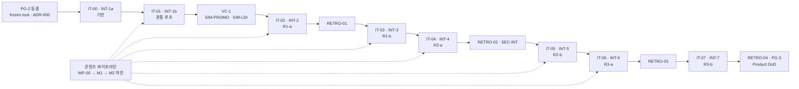
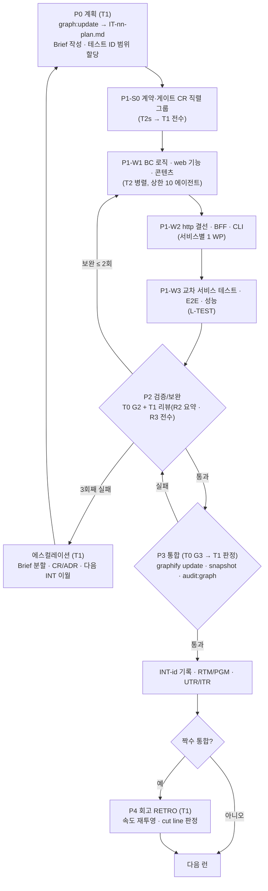
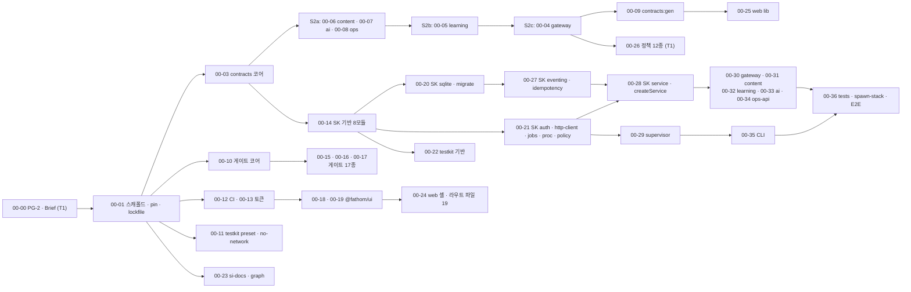
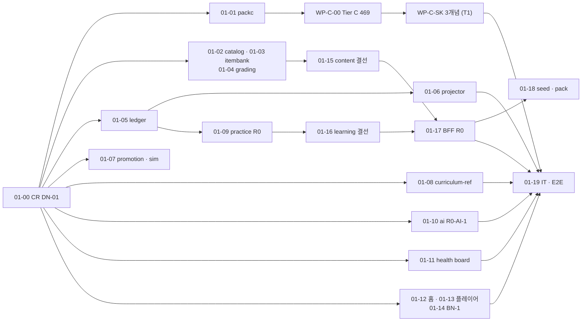

# WBS-01. 개발계획서 · WBS · 반복 계획 + 프로그램목록(PGM-01) — Fathom · 깊이

> **문서 ID**: WBS-01(개발계획서·WBS) + PGM-01(프로그램목록, §17) · **버전**: v1.0 · **작성일**: 2026-10-01 · **작성 주체**: T1(상위 모델, 아키텍처·계획)
> **구속 입력(재개봉 금지)**: ARC-01 v1.0 · ADR-001~016 · IF-01 · DB-01 · DCP-01 · AI-01 · SCR-01 · DS-01 · STD-01 · Planning Baseline v1.0(PLN-REV-01 §4·§5.5~5.8) · PLN-CNV-01 v1.1 §7·§9 · USM-01 v1.1 §3·§4 · 스파이크 감사(SP-2 PASS · SP-3/4/6 PARTIAL · SP-7 PASS, `spikes/00-audit-summary.md`)
> **Trace**: UR-03(개발→검증→통합·회고) · UR-06(상위/하위 모델) · UR-07(SI 산출물) · UR-08(서비스 분리) · UR-09(graphify) · UR-18(한 번에 완성) · PR-004~009·017·018 · NFR-MAINT-001~013
> **후속 소비**: 오케스트레이터 워크플로 스크립트(반복별 런), `docs/40-impl/plans/IT-<nn>-plan.md`(T1이 이 문서에서 파생), Task Brief `docs/40-impl/briefs/IT-<nn>/T-<nn>-<mm>.md`, INT 기록 `docs/40-impl/int/INT-<id>.md`, RETRO, `tools/si-docs`(PGM·RTM 생성)
> **표기**: `WP-<ii>-<nn>` 작업 패키지(소유·일정 단위) · `T-<ii>-<mm>` Task Brief(실행 단위, 1 Brief = 1 PGM 원칙·최대 2) · `u` 코드 용량(Task Brief 1건 = T2 구현 + 단위 테스트 + T0 게이트 + 보완 ≤ 2회) · `cu` 콘텐츠 Brief 1건 · `R1/R2/R3` 위험도(STD-01 §17.2) · `[결정]` 이 문서의 결정(§18 설계 결정 메모에 근거).

---

## 0. 요약 (TL;DR)

1. **반복 8개 = 워크플로 런 8회**. Iteration 0(`IT-00` → 통합 기록 **INT-1a**) = 기반: 저장소 스캐폴드, `packages/contracts` 전체(IF-01 코드 블록 전사), `shared-kernel` 17개 모듈(service-kit `createService()`·sqlite/migrate kit 포함), 정적 게이트 20종, 서비스 6개 골격 + DB-01 DDL 전량(`0001_*.sql` 23개), supervisor, gateway 셸(쿠키·CSRF·SSE), web 셸 + 디자인 시스템(토큰·`@fathom/ui`), testkit, CLI 최소, CI. 이어서 **INT-1(=INT-1b, IT-01) 관통 루프 → INT-2 ~ INT-7**(R1 → R2 → R3)이며, 반복마다 **P0 계획 → P1 개발(S0 계약 직렬 → W1 → W2 → W3 웨이브) → P2 검증/보완(≤ 2회) → P3 통합**을 거친다. 회고는 **통합 2회마다**: VC-1(INT-1b 뒤) · RETRO-01(INT-2) · RETRO-02(INT-4) · RETRO-03(INT-6) · RETRO-04(INT-7, PG-3 Product DoD).
2. **병렬 안전 = 파일 소유 독점**. 한 반복 안에서 한 파일을 쓰는 WP는 정확히 1개다. 병합 핫스팟(루트 `package.json`·lockfile, `app.ts`의 `register<Bc>()` 목록, BC `register.ts`, web 라우트 파일 19개(`__root.tsx` + SCR-01~17 화면 17개 + `[_]design.tsx`)·`routeTree.gen.ts`, 렌더러 레지스트리 키, `invalidation-map.ts`, 소비자 매니페스트)은 **IT-00에서 전부 미리 만든다**. 계약 변경은 반복의 첫 직렬 그룹 S0에서만, 서비스의 `http/**` 결선은 반복마다 **서비스별 결선 WP 1개**(W2)가 독점한다(§2.2).
3. **모델 배분**: T1(Opus 계열) = 계획·Brief·테스트 ID 할당·R3 전수 리뷰·CR/ADR 판정·통합 판정·회고·아키텍처 점검(graphify 교차 엣지·god-node)·프롬프트 원문·Tier A/Case/정책 콘텐츠·V7 독립 리뷰. T2s(Sonnet 계열·Codex) = R2·R3 코드. T2h(Haiku 계열) = R1 코드·전사·fixture·Tier B/C·랩·평가셋. T0 = `tsc`·`biome`·`vitest`·`playwright`·`tools/gates`·`graphify`·`tools/si-docs`.
4. **용량**: 코드 **≈ 174.5u**(IT-00 22.8 · IT-01 16.2 · IT-02 23.3 · IT-03 28.2 · IT-04 26.6 · IT-05 20.6 · IT-06 18.6 · IT-07 18.2) + 콘텐츠 **하한 ≈ 20cu**. 기준선 169u 대비 103.3%(VC-1 cut 임계 115% = 194u 이내). 기반을 IT-00에 앞당긴 만큼 R1~R3 WP는 기준선보다 가볍다(§3 대조표).
5. **진입 조건 3개**: IT-00 = PG-2 동결(`frozen.lock`·ADR-000, 없으면 WP-00-00이 수행) · IT-02 = **SIM-PROMO 통과**(`mastery_rules@v1` CR-18~22 확정)와 **SIM-LDI 수행**(`ldi_params@v1` 유지 또는 `@v2` 결정) — 둘 다 IT-01 산출 시뮬레이터로 VC-1에서 실행 · IT-04 = INT-3 통과(R1 종료 = UR-14 6계열 OFFLINE 동작).
6. **게이트 도입**: INT-1a는 `run-gates --warn-only`(위반 수집, **exit 2는 실패**) → INT-1b부터 병합 차단. `check:boundaries --engine=both`, `typescript` 7.0.2 정확 pin, 0파일 스캔 = exit 2, Biome GritQL은 에디터 전용, graphify는 감사(비차단).
7. **콘텐츠는 별도 파이프라인**(DCP-01 §9): WP-00(Tier C 469 골격) → 워킹 스켈레톤 3개념 → M1(Tier A 24·B 40, INT-2~3) → **M2 = 하한(Tier A 41·B 60·Case 12·…, INT-4~5)** → INT-7 릴리스 빌드·D-11 리포트. 트랙 WP 49개(`WP-T-<t>.A/.B/.L`)는 개념 단위 파일 독점으로 병렬 저작. 콘텐츠 미달은 코드 INT를 막지 않고 Product DoD D-11만 막는다.
8. **cut line**: ① Should 이월(배포 뷰 → 자동 기동·PWA → pack refresh → … → E3 Feynman, 23 + 2건, 최대 ≈ 15.1u) ② Must lite(H01 → A02 → … → L01, 23건, 최대 ≈ 9.8u) ③ 콘텐츠: 목표(M3)는 이미 범위 밖, 하한(M2)은 불가침 → cu를 코드보다 먼저 재배분. 불가침 = GC·UR-14 6계열·R0 스키마·이벤트 타입(§13).
9. **프로그램목록(§17)**: `PGM-<UNIT>-nnn` 약 400행(UNIT = STD-01 §3.11 코드), 각 행에 경로·설명·FR·IF·SCR·WP.
10. Windows·macOS는 **미확립**: V-build(Linux 컨테이너 + Chromium)가 모든 INT 판정 기준이고, `ci-matrix.yml`(V-ci)은 IT-00에 골격 → INT-3·4·7에 확장, 러너 형식은 `runner_verified_platforms = ["linux"]`가 바뀌기 전까지 다른 OS에서 비활성 + Docker 권고.

---

## 1. 범위 · 용어 · 반복 매핑

### 1.1 범위

이 문서는 ARC-01이 고정한 구조를 **실행 순서와 소유권**으로 바꾼다. 다루는 것: 반복(Iteration)별 작업 패키지(WP), WP의 쓰기 소유 경로(Task Brief `allowed_paths`의 상한), WP 간 선후 관계, 모델 배분, 반복별 통합 체크리스트·종료 조건, graphify 갱신 시점, 트랙별 시드 콘텐츠 WP, cut line, 프로그램목록. 다루지 않는 것: 코드 그 자체, 테이블별 DDL(DB-01), 라우트 필드(IF-01), 화면 상세(SCR-01), 코딩 규칙(STD-01).

### 1.2 용어

| 용어 | 정의 |
|---|---|
| WP (작업 패키지) | 한 반복 안에서 **쓰기 소유 경로가 다른 WP와 겹치지 않는** 작업 묶음. 0.2~2.5u. T1이 WP를 1~3개의 Task Brief로 쪼갠다(1 Brief = 1 PGM, 최대 2). Brief의 `allowed_paths` ⊆ WP 소유 경로 ⊆ 레인 경로(ARC §16.1). |
| 레인 | ARC §16.1의 파일 소유 레인(L-PLAT, L-CONTRACTS, L-GW, L-CT-*, L-LR-*, L-AI(-CTL/RTE/JDG/GEN/PRV), L-OPS, L-WEB-*, L-CLI, L-CONTENT, L-TEST) + 이 문서가 보충한 L-PACKC·L-WEB-SHELL의 `features/shell/`(§18 D-WBS-06). |
| 웨이브 | 한 반복 P1 안의 직렬 단계. **S0**(계약·게이트 CR 직렬 그룹, STD-DIR-41) → **W1**(BC 도메인·유스케이스·인프라, web 기능, 콘텐츠) → **W2**(서비스별 `http/**` 결선 + gateway BFF + CLI) → **W3**(교차 서비스 테스트·E2E·성능). 같은 웨이브의 WP는 병렬. W1a/W1b처럼 하위 순서를 둘 수 있다. |
| 모델 티어 | **T1** 상위(Opus 계열) · **T2s** 하위 상급(Sonnet 계열 또는 Codex CLI, R2·R3 코드) · **T2h** 하위 경량(Haiku 계열, R1 코드·전사·fixture) · **T0** 결정적 도구. 표기 `T2s→T1` = 수행 → 리뷰. 실제 모델 ID는 오케스트레이터가 기록(STD-AGT-02). |
| 워크플로 런(WR) | 오케스트레이터 스크립트 1회 실행 = 반복 1개. 단계(P0~P4)마다 체크포인트를 남겨 실패 지점부터 재개한다(§2.2). |
| GC | 보장 코어(PLN-CNV-01 §7.2). 이 계획에서 GC = IT-00~IT-03 전부 + IT-04의 Must WP + E02·I02·F04·G04·F06의 lite 사양(§3.1). |

### 1.3 반복 ↔ 통합 ↔ 런 매핑 `[결정]`

USM-01 §4.1은 IT-01 안에서 INT-1a·INT-1b 두 번 부분 통합한다. 워크플로 런 경계를 통합 경계와 맞추기 위해 IT-01을 **IT-00(Iteration 0, INT-1a)** 과 **IT-01(INT-1b)** 로 나눈다. 통합 기록 ID·Git 태그는 ARC·STD 그대로 `INT-1a`·`INT-1b`·`INT-2`…를 쓴다. 회고 주기 계산에서 INT-1a·1b는 USM 규칙대로 1회로 센다(§18 D-WBS-01).

| 런 | 반복(Brief·브랜치 접두) | 통합 기록 · 태그 | 슬라이스 · 기준선 | 목표(Outcome) | 반복 종료 후 |
|---|---|---|---|---|---|
| WR-0 | **IT-00** Iteration 0 (`T-00-mm`, `it00/…`) | INT-1a · `int-1a` | R0 기반(기준선 INT-1a 7u + 앞당긴 기반) | 계약·커널·게이트·골격·DDL·셸이 동작하고, `fathom up`으로 6개 상주 프로세스가 OFFLINE으로 뜬다 | — |
| WR-1 | **IT-01** (`T-01-mm`) | INT-1b · `int-1b` | R0 관통 루프(기준선 9u) | 인출 → 채점 → 원장 → FSRS/Elo → 리포트 1회 완주, 리플레이 = 라이브, 시뮬레이터 동작 | **VC-1** + SIM-PROMO · SIM-LDI |
| WR-2 | **IT-02** | INT-2 · `int-2` | R1-a 오프라인 코어 + 습관(26u) | 다양한 오프라인 세션, 트랙 범위, 습관 루프 lite, 검색, 3단 개념 페이지 | **RETRO-01** |
| WR-3 | **IT-03** | INT-3 · `int-3` | R1-b 증거·지도·실습·데이터 보호(27u) | 숙달·보정·LDI·Depth Map, 격리 러너, 백지노트, 백업·복원·다기기, 매일 진입 | — |
| WR-4 | **IT-04** | INT-4 · `int-4` | R2-a AI 제어면·채점 신뢰(25u) | Firewall·Jev·LLM·CLI 격리·예산·쿼터·작업 주문, 채점 사다리 완성, 게이트·생성 | **RETRO-02** + SEC-INT |
| WR-5 | **IT-05** | INT-5 · `int-5` | R2-b AI 심화·가져오기·사용자 콘텐츠(25u) | 디깅·Feynman·감사·역출제·가져오기·Inbox·오버레이·문항 건강 | (콘텐츠 하한 M2 목표 시점) |
| WR-6 | **IT-06** | INT-6 · `int-6` | R3-a 전문가 판단(26u) | Case·산출물·PR 리뷰·조건 반전·승급 L1→L5·인프라 lite·보안 패치 | **RETRO-03** |
| WR-7 | **IT-07** | INT-7 · `int-7` | R3-b 장기·운영·완성(24u) | D-day·시즌·Radar·포트폴리오·신선도·doctor·업그레이드·번들·PWA | **RETRO-04** + PG-3(Product DoD D-1~D-14) |

---

## 2. 실행 모델 — AI 코딩 에이전트 워크플로 런

### 2.1 한 런의 단계

| 단계 | 수행 | 입력 | 산출(경로) | 체크포인트(재개 지점) |
|---|---|---|---|---|
| P0 계획 | T1 | 이 문서 해당 절, `pnpm graph:update` 결과, 직전 INT 기록·이월 목록 | `docs/40-impl/plans/IT-<nn>-plan.md`(WP → Brief 표, 테스트 ID 범위, 웨이브), `docs/40-impl/briefs/IT-<nn>/T-<nn>-<mm>.md` | plan 파일 존재 + Brief 전부 존재 |
| P1-S0 | T2s → T1 | CR 목록(이 문서 각 반복 S0 행) | `docs/02-design/cr/CR-<nn>-*.md`(T1), 계약·게이트 변경, `pnpm contracts:gen` 생성물 | S0 WP 완료 보고 `done` + `check:frozen` 0 |
| P1-W1~W3 | T2s·T2h(콘텐츠 T1) | Brief, 컨텍스트 팩(≤ 2k 토큰) | 코드·테스트·완료 보고 JSON(STD-AGT §17.5) | WP별 완료 보고 JSON |
| P2 검증/보완 | T0 → T1 | 완료 보고, G2 명령 결과 | 리뷰 기록(WP별), 보완 Brief(같은 ID에 `-r1`·`-r2`) | WP별 G2 통과 표시 |
| P3 통합 | T0 → T1 | 전 WP G2 통과 | `docs/40-impl/int/INT-<id>.md`, `docs/40-impl/graph/INT-<id>/`, `docs/40-impl/reports/{UTR,ITR,SEC,PRF}-<id>.md` | INT 기록 판정 `pass` |
| P4 회고 | T1 | INT 기록 2개, RTM 차분, 게이트 통계, graphify 스냅샷 2개 | `docs/40-impl/retro/RETRO-<nn>.md`, cut 판정 | RETRO 파일 존재 |

- **동시 실행 상한** `[결정]`: P1 한 웨이브에서 T2 에이전트 동시 10개(콘텐츠 에이전트 별도 6개). 웨이브의 WP가 상한을 넘으면 오케스트레이터가 선행 관계가 없는 WP부터 순서대로 투입한다.
- **작업 트리**: 병렬 WP는 같은 작업 트리의 서로소 경로 또는 WP별 worktree에서 일한다. 어느 쪽이든 병합은 P2 통과 WP 단위(Task당 squash 1커밋, STD-GIT-05)이며, 파일 소유가 서로소이므로 텍스트 충돌이 없어야 한다. 충돌이 나면 그 자체가 소유 규칙 위반이며 `check:scope`로 원인 WP를 찾는다.
- **보완 루프**(STD-AGT §17.6): G2 실패 → 같은 수행 에이전트가 보완(≤ 2회) → 3회째 실패 → T1 에스컬레이션. 이월된 WP는 다음 반복 S0 직후 W1 첫 순서로 다시 넣는다. GC WP는 이월 2회 이상이면 cut line 2단계 lite 사양으로 강등할지 T1이 판정한다.

### 2.2 병렬성 규칙 — 파일 소유

| 규칙 | 내용 | 강제 |
|---|---|---|
| PR-1 독점 | 한 반복 안에서 한 파일(또는 디렉터리 glob)에 쓰는 WP는 1개. WP 표의 "쓰기 소유 경로"가 그 독점 범위다. 다른 반복에서는 소유가 이전될 수 있다(순차). | `check:scope`, P0 T1 교차 검사(§2.7 C-02) |
| PR-2 계약 직렬 | `packages/contracts/**` 변경은 S0 WP만. W1~W3 WP는 계약을 import만 한다(STD-DIR-41). | `check:frozen`, Brief `forbidden` |
| PR-3 결선 독점 `[결정]` | 서비스의 `src/http/**`(전 BC)과 라우트 계약 테스트 `test/contract/http/**`(하네스 `routes.spec.ts` + `fixtures/`)·IF-COM 계약 `test/contract/common/**`(6nn)은 그 반복의 **서비스 결선 WP(W2) 하나**가 소유한다. 이벤트 계약 `test/contract/events/<type>.spec.ts`(5nn)는 그 생산자·핸들러를 구현하는 BC W1 WP, `services/ops/test/contract/ipc/**`(7nn)는 supervisor WP가 소유한다(TST §6.2·§6.3). W1 WP는 `application/<bc>/<use-case>.ts`의 공개 함수(계약 타입 시그니처)까지만 만들고, 결선 WP가 라우트 플러그인 `http/<bc>/<group>.ts`에 연결한다. 그 반복에 서비스 WP가 1개뿐이면 그 WP가 `http/**`도 소유한다. gateway는 반복마다 BFF WP 1개. | `check:scope` |
| PR-4 사전 생성 `[결정]` | 병합 핫스팟은 IT-00에서 최종 모양으로 만든다: 루트·단위 `package.json`(ARC §18 정확 pin 전부)과 `pnpm-lock.yaml` · 서비스 `app.ts`(모든 BC의 `register<Bc>()` 나열, INT-1a 후 동결) · BC별 `register.ts`·`ports.ts`·`errors.ts` 골격 · web `routing/*.tsx` 19개(`__root.tsx` + SCR-01~17 화면 17개 + `[_]design.tsx`, 스텁) · `routeTree.gen.ts` · `renderers/registry.ts`(SCR-01 §7.2.3 키 전부, 미구현 = `NotYetRenderer`) · `lib/invalidation-map.ts`(IF-01 §9.6 17종) · `events/__consumers__/*.json` 5개. 이후 반복은 이 파일들의 **목록을 바꾸지 않고** 자기 파일만 채운다. | 리뷰(T1), `check:frozen`(app.ts 동결) |
| PR-5 공유 인프라 디렉터리 `[결정]` | `services/<svc>/src/infra/db/`의 리포지토리·정적 SQL 파일은 **테이블 접두어로 소유를 표시**한다: content `ct-*`·`aq-*`·`ib-*`·`gr-*`·`rn-*`, learning `ledger-*`·`learner-model-*`·`practice-*`·`curriculum-ref-*`·`insight-*`, ai `ai-*`/`ac-*`, ops `op-*`(예: `infra/db/gr-verdict.repo.ts` + `gr-verdict.sql.ts`). 디렉터리 공통 파일(`infra/db/open.ts`)은 서비스 대표 레인. | `check:scope` |
| PR-6 의존성 | 새 서드파티 의존 추가 = L-PLAT S0 WP(`config/deps.json` + `package.json` + lockfile) + CR. W1~W3 WP는 의존성을 추가하지 않는다(STD-AGT-15). | `check:deps` |
| PR-7 생성물 | `*.gen.ts`·`.snapshots/`·`routeTree.gen.ts`·`graphify-out/`는 생성 명령의 소유자만 갱신: contracts 생성물 = S0 마지막 WP, `routeTree.gen.ts` = L-WEB-SHELL(라우트 파일 목록 불변이면 재생성 diff 0), `graphify-out/` = P3의 T0. | CI 최신 검사, `check:scope` |
| PR-8 콘텐츠 | 개념 X의 파일 5종은 X를 맡은 콘텐츠 WP만(DCP §9.1). 공유 파일(`sources/registry.yaml`·`templates/**`·`review/V7/**`)은 요청 → 통합자 병합. 트랙 팩의 `pack.yaml`·`CHANGELOG.md`·`corrections.yaml`은 그 트랙의 `.A` 패키지 소유(DCP §9.2, ARC §16.1). | `pnpm content:check`, WP-INT |

### 2.3 모델 배분

| 활동 | 티어 | 비고 |
|---|---|---|
| 반복 계획·Task Brief·테스트 ID 범위 할당·컨텍스트 팩 선정 | **T1** | P0. Brief 작성 규칙 STD-AGT §17.3 ①~⑨ |
| 계약(`packages/contracts/**`)·`shared-kernel`·마이그레이션·러너·원장(`ledger-writer.ts`·리듀서·upcaster)·채점 사다리·보안(spawn·fetch·키·쿠키·CSRF·Firewall) 구현 | **T2s** → T1 전수 | R3 |
| 서비스 내부 새 라우트·테이블·상태 관리·inbox 핸들러·BFF·web 데이터 결합 | **T2s** → T1 요약 | R2 |
| UI 표현 컴포넌트·문구·순수 도메인 함수 추가·테스트 추가·IF/DDL 코드 블록 **전사**·fixture | **T2h** → T0 | R1(전사는 R3 대상이어도 수행 T2h 허용, 리뷰는 T1 전수) |
| CR/ADR 판정, 동결 파일 변경 판정, 게이트 오탐 판정, 에스컬레이션 해결 | **T1** | |
| 아키텍처 점검: `audit:graph` 교차 서비스 엣지, god-node 이탈, 레이어 위반 표본, STD 부록 A 표본 리뷰 | **T1**(T0 수집) | P3, 회고 |
| AI 프롬프트 원문(AI-J01~J19 Jev·AI-G01~G13·LJ partial) | **T1** | L-CONTENT(T1), `prompts.lock.json` |
| 정책 12종 값, Tier A·Case·산출물·보안 패치·AI 감사·PR 시드·골드셋·블루프린트 콘텐츠 | **T1** | DCP §9.1 ③ |
| Tier B·Tier C 보정·카타·알고리즘 은행·인프라 lite·Python 예측·평가셋 | **T2h**(sec 랩 = T1) | DCP §9.1 ③ |
| V7 독립 리뷰(WP-REV) | **T1′**(작성자와 다른 컨텍스트) | `reviewer.context_id ≠ author.context_id` |
| SIM-PROMO·SIM-LDI 해석, VC-1·RETRO 재투영·cut 판정 | **T1** | |
| 통합 G3 판정·INT 기록 | **T1**(T0 실행) | |
| 게이트·결과서·그래프 지표·RTM/UTR/ITR 생성 | **T0** | |

### 2.4 테스트 ID · PGM ID 할당 규칙 `[결정]`

- **번호 대역의 정본 = TST-01 §11.2**(CR-56, 반복별 블록 방식 폐기): 대역은 단위·BC·기능 기준(예: `UT-LR-300~399` practice, `CT-<UNIT>-001~199` = IF 번호 거울, 5nn = IF-EV, 6nn = IF-COM, 7nn = IPC, 8nn = 원장, `E2E-001~079` = SCN, 100~119 플랫폼). T1은 P0에서 각 Brief에 **해당 대역 안의 미사용 하위 범위**를 배정해 `IT-<nn>-plan.md`에 기록한다. 거울 번호(CT 001~199·5nn·6nn·7nn·8nn·E2E SCN·M-nn)는 배정 없이 IF·SCN·모드 번호를 그대로 쓴다. si-docs는 ① 대역 안 ② Brief 범위 안 ③ 저장소 전체 중복 0을 검사한다(G1).
- **PGM ID** = `PGM-<UNIT>-nnn`(UNIT = STD-01 §3.11 코드). content·learning·ai-gateway는 BC별 번호대를 둔다(§17.1). 1 Brief = 1 PGM(최대 2), 완료 보고 `rtmUpdates[].pgm`에 기록.

### 2.5 graphify 갱신 시점

| 시점 | 명령(T0) | 소비자 | 비고 |
|---|---|---|---|
| IT-00 W2 완료 직후(서비스 골격이 처음 생긴 때) | `graphify extract . --code-only` → `graphify-out/` 최초 커밋 | IT-00 P2 리뷰 | 기준 그래프(STD-GRF §18.2) |
| 모든 반복 P0 | `pnpm graph:update` | T1 Brief 컨텍스트 팩(`graphify query … --budget 1500`) | |
| 각 반복 S0 병합 직후 | `pnpm graph:update` | W1 에이전트의 `query/explain/affected` | 계약이 바뀐 상태로 `affected`를 계산하기 위해 |
| W1 → W2 경계 | `pnpm graph:update` | 결선 WP의 `affected` | W1이 추가한 유스케이스가 그래프에 있어야 결선 범위가 맞다 |
| P3 통합 | `graphify update .`(파일 삭제·대규모 리팩터 뒤 `--force`, 사유를 INT 기록에) → `pnpm graph:snapshot --int <id>` → `pnpm audit:graph` | T1 통합 판정(교차 서비스 엣지 0, `cross_service_edge_count`) | 비차단이지만 엣지 > 0이면 T1이 원인 WP를 보완 대상으로 지정 |
| 회고(VC-1·RETRO-01~04) | `graphify god-nodes --top 10 --json` + 직전 스냅샷과 `metrics.json` 비교, 선택 `graphify export callflow-html` | T1 이탈 분석 | god-node가 `shared-kernel`·`app.ts` 밖으로 생기면 회고 안건 |

T2는 `update`·`extract`를 실행하지 않는다(STD-GRF-10). graphify가 없는 환경은 `skipped`로 기록하고 진행한다(NFR-PORT-007).

### 2.6 공통 DoD — 단계 게이트

| 게이트 | 명령(전부 exit 0) | 판정 |
|---|---|---|
| G1 개발(Task) | `pnpm --filter <pkg> typecheck` · `pnpm --filter <pkg> test` · `pnpm lint` · `node tools/gates/run-gates.mjs --stage=g1` · `node tools/gates/check-scope.mjs --task <T-nn-mm>` | T2 자기 점검 + T0 |
| G2 검증(WP) | `pnpm typecheck` · `pnpm test` · `pnpm test:contract` · `node tools/gates/run-gates.mjs --stage=g2` · domain 커버리지 ≥ 80%(감소 ≤ 2%p) | T0 → T1 리뷰 |
| G3 통합(INT) | §2.7 공통 체크리스트 + 반복별 종료 조건 | T0 → T1 판정 |

### 2.7 INT 공통 통합 체크리스트 (모든 INT의 G3에 포함)

| # | 항목 | 명령·근거 |
|---|---|---|
| C-01 | 반복의 모든 Task 완료 보고가 `done`(이월은 사유·다음 반복 배정과 함께 INT 기록에) | STD-AGT-17 |
| C-02 | WP 간 쓰기 경로 교집합 0, `graphify-out/`·`spikes/`·생성물 수기 변경 0 | `check:scope`(Task별), P0 T1 교차 검사 |
| C-03 | 설치·빌드·타입: `pnpm i --frozen-lockfile --ignore-scripts` · `pnpm build` · `pnpm typecheck` · `pnpm lint` | ADR-008 |
| C-04 | 정적 게이트 `node tools/gates/run-gates.mjs --stage=g3` exit 0(INT-1a만 `--warn-only`, **exit 2는 항상 실패**) · `check:gate-selftest` · `pnpm --filter @fathom/tool-gates test`(= `node --test "test/*.test.mjs"` — 디렉터리 인자는 Node 22.22.2에서 실패, 실측) | ADR-010, AP-15 |
| C-05 | `pnpm test` · `test:contract` · `test:integration` · `test:security` · `test:e2e`(반복 범위) · 같은 커밋 2회 실행 결과 동일 | STD-TST-03 |
| C-06 | domain 라인 커버리지 ≥ 80%, 직전 INT 대비 감소 ≤ 2%p | STD-TST-09 |
| C-07 | `pnpm audit --prod --audit-level high` 0, 설치 스크립트 0(`onlyBuiltDependencies: []`), 네이티브 애드온 0 | ARC §12.8 |
| C-08 | `pnpm contracts:gen` 후 diff 0, `check:frozen` · `check:consumers` 0, 동결 파일 변경 커밋에 `CR:`/`ADR:` 트레일러 | ADR-008 §8 |
| C-09 | `tests/e2e/stderr-clean.spec.ts`: 모든 서비스 stderr에 ExperimentalWarning·경고 0 | ARC §9.3 |
| C-10 | `graphify update .` → `pnpm graph:snapshot --int <id>` → `pnpm audit:graph`: 교차 서비스 파일 엣지 0(비차단, >0이면 T1 판정) | §2.5 |
| C-11 | RTM·PGM 갱신(`tools/si-docs`), `check:rtm`(INT-3부터 차단), UTR·ITR 생성 `docs/40-impl/reports/` | R6 §4.10 |
| C-12 | 반복 화면의 디자인 루브릭 평균 ≥ 4.0(차원 < 3 없음), `/_design` 스크린샷 기준선 갱신 | NFR-UX-012, DS-01 |
| C-13 | OFFLINE 기본: 신규 설치 첫 기동 외부 소켓 0(`tests/e2e/zero-ai.spec.ts` 해당 범위) | QAS-12 |
| C-14 | 오케스트레이터 메타데이터의 실제 모델 ID와 완료 보고 `model_id` 대조, R3 Task 리뷰어 = T1 | STD-AGT-01·02 |
| C-15 | STD-01 부록 A 표본 리뷰(T1, 반복당 Task 20% 또는 최소 5건) | NFR-MAINT-010 |
| C-16 | (경보, 비차단) 콘텐츠 진척 = §12 반복별 마일스톤 대비 | DCP §9.1 ⑤ |
| C-17 | INT 기록 `docs/40-impl/int/INT-<id>.md`: 판정·게이트 통계(1회 통과율·보완 라운드)·이월·u 실측·graphify 지표 | R6 §7 |

---
## 3. 용량 계획 · 기준선 대조

### 3.1 반복별 u (기준선 대비)

| 반복 | 기준선(PLN-CNV-01 §7.2) | 이 계획 | 차이의 원인 |
|---|---|---|---|
| IT-00 (INT-1a) | 7.0 | **22.8** | 기준선 1a(contracts·envelope·outbox 2 · L02 최소 2 · 게이트 6종 1 · SP-7·graphify 1 · SI 생성기 1)에 더해 ① shared-kernel 17모듈 전부(ARC §17.3) ② 게이트 20종(ADR-010, 감사 이식 4건) ③ DB-01 DDL 전량 전사(23개 `0001_*.sql` — 기준선은 기능별 INT에 분산) ④ M01 디자인 시스템(1b 2u) ⑤ gateway 세션 셸(INT-3 "진입 마찰" 1u 중 쿠키·CSRF) ⑥ 서비스 `snapshot`·`integrity` job 골격(INT-3 L01-lite 일부) ⑦ 부록 A graft(소비자 매니페스트 0.5 · job 프레임 0.8)를 앞당김 |
| IT-01 (INT-1b) | 9.0 | **16.2** | 기준선 1b(G01 2 · J01 3 · M01 2 · C01 1 · 시뮬레이터 1)에서 M01을 IT-00으로 보내고, curriculum_ref 동기화(부록 A 1.0)·PromotionEngine 이식·SIM-PROMO 실행 가능 시뮬레이터(INT-2 진입 조건)·체인 헤드 앵커(감사 0.2)를 추가 |
| IT-02 | 26 | **23.3** | 시뮬레이터 일부·FSRS 골격이 IT-01로 이동 |
| IT-03 | 27 | **28.2** | 러너 차단 스위트 호스트 관측 대조군·OS 활성화 게이트(감사 0.3), host 상태 수집(배치 창·유휴 리플레이 입력) 추가 |
| IT-04 | 25 | **26.6** | 프롬프트 원문 T1 작업을 1u로 명시 계상 |
| IT-05 | 25 | **20.6** | 기반·결선 패턴 덕에 BC 단위가 가벼움 |
| IT-06 | 26 | **18.6** | 〃 (Case 상태기계 스키마는 R0 동결·DDL 완료) |
| IT-07 | 24 | **18.2** | 〃 (supervisor·백업 프로토콜 기반 재사용) |
| **합계** | **169** | **≈ 174.5** | +3.3%. VC-1 cut 임계(115% = 194u)까지 여유 ≈ 20u |

- **GC(보장 코어) 이 계획 기준** ≈ IT-00~IT-03 90.5u + IT-04 Must 25.6u(J07 하네스 1.0u 제외) + E02·I02·F04·G04·F06 lite ≈ 7.6u = **≈ 124u(계획의 71%)**. 기준선 문장 "속도 61%에서도 GC 완성"은 이 계획에서는 "속도 71%"로 바뀐다 — 기반 비용을 정직하게 계상한 결과이며(RK-16), VC-1에서 실측 속도로 재투영한다.
- **콘텐츠**: 하한 20cu(DCP §9.3 ≈ 19.7cu), 목표 34cu는 이번 빌드 범위 밖(M3, 팩 minor 증분). 반복별 cu는 §12.

### 3.2 VC-1·회고에서의 재투영 규칙

`잔여 u ÷ 실측 속도(직전 2 INT의 완료 u/런)`가 남은 런 수 × 런당 계획 u의 **115%** 를 넘으면 §13의 1단계를 즉시 적용하고, 2단계 후보를 표시한다. 콘텐츠는 `잔여 하한 cu ÷ 실측 cu 속도`로 따로 재투영하며, 하한 미달 위험이면 cu를 코드보다 먼저 재배분한다(PLN-CNV-01 §7.3 3단계).

---

## 4. Iteration 0 — IT-00 → INT-1a (기반)

### 4.1 목표 · 진입 조건

- **목표(Outcome)**: 하위 모델 에이전트가 이후 반복에서 "자기 파일만 채우면" 되는 상태를 만든다. ① 계약이 코드다(IF-01 전 코드 블록 → `packages/contracts`, `contracts:gen` 생성물) ② 서비스 골격 1개(`createService()`)로 6개 상주 프로세스가 뜬다 ③ DB-01 DDL이 전부 마이그레이션 파일이다(`lint:hooks` 통과) ④ 정적 게이트 20종이 자기 실패를 증명한다(`check:gate-selftest`) ⑤ web 셸·디자인 토큰·`@fathom/ui` 기반 컴포넌트가 `/_design`에 보인다 ⑥ 핫스팟 파일이 최종 목록으로 존재한다(§2.2 PR-4).
- **진입 조건**: PG-2 통과(`docs/02-design/frozen.lock`·[ADR-000](adr/ADR-000-architecture-freeze.md)). CR 원천 전부를 CR 대장(ADR-000 §4)에 번호로 받는다: DB-01 CR-29·30 · DCP-01 CR-31~34 · AI-01 ★ 메모(D-AI-09·10·14·15·16·17·26) · IF-01 D-13·19·21·32·34 DB 델타 · SCR-01 DN-01·09·11·12·13 · DS-01 DN-D1 · STD-01 §19 CR 후보 · TST D-TST-08·12 · PG-2 정합 개정 CR-35~56(`10-design-review-log.md`). **IF-01·DB-01 개정이 병합되고 `frozen.lock`이 재생성된 뒤에만** WP-00-03~08·WP-00-31~34가 시작한다(전사 대상이 낡지 않도록). 저장소에 `services/*` 코드 0(PR-004).
- **기준선 스토리**: ST-A10-01(최소) · ST-X-01 · ST-X-06 · ST-X-09(계약) · ST-X-10 · ST-X-12(토큰) · ST-X-07(디자인 기준선) + 앞당긴 기반.

### 4.2 작업 패키지

| WP | 웨이브 | 레인 | 수행→리뷰 | R | 쓰기 소유 경로 (allowed_paths 상한) | 산출 · PGM · Trace | 선행 | u |
|---|---|---|---|---|---|---|---|---|
| WP-00-00 | S-pre | T1 | T1→T1′ | — | `docs/02-design/{frozen.lock, adr/ADR-000-*.md, cr/**}`, `docs/40-impl/plans/IT-00-plan.md`, `docs/40-impl/briefs/IT-00/**`, `CLAUDE.md`, `AGENTS.md` | PG-2 동결 판정·CR 번호, IT-00 Brief 작성(TST §11.2 대역 안 하위 범위 배정), 에이전트 지침(STD-AGT §17.7). **PG-2 점검표**(Planning §5.7 #1~6 → 증거): #1 SP 감사 5건 반영 + ADR-010 Accepted(ARC 부록 B) · #2 DB-01 DR-020 훅 표 → E0-5 `check-hooks` 재검증 · #3 ADR-003·011 · #4 IF-01 D/O 열 · #5 ARC §20 AQ 표 · #6 `packages/contracts/manifests/{modes.manifest.json, verification-class.json}` **초안**(21 모드: mode_id·ur14_family·offline_path·e2e_ids = E2E-3nn + SCN·status) + RTM-01(`docs/02-design/09-rtm.md`, V-class 열 = REQ §1.7)이 `frozen.lock` 이전에 존재. 결과 = ADR-000 §5 표 | — | 0 (T1) |
| WP-00-01 | S0 | L-PLAT | T2s→T1 | R3 | `package.json`, `pnpm-workspace.yaml`, `pnpm-lock.yaml`, `.npmrc`, `.node-version`, `turbo.json`, `biome.json`, `tools/biome-plugins/**`, `tsconfig.base.json`, `tsconfig.json`, `.gitignore`, `.gitattributes`, `.graphifyignore`, 17개 단위의 `{package.json, tsconfig.json, tsconfig.build.json, vitest.config.ts, README.md}`(apps/{web,cli} · services/{gateway,content,learning,ai-gateway,ops} · packages/{contracts,shared-kernel,design-tokens,ui,testkit} · tools/{gates,packc,graph,fake-cli,si-docs}) | 워크스페이스·루트 스크립트 전부(ADR-008 §10, STD §13.2·§14.2), **ARC §18 정확 pin 전부(`@playwright/test`·`playwright-core` 1.56.1, CR-47) + `yaml` 2.9.1 · `@vitest/coverage-v8` 5.0.2(STD CR 후보)**, 루트 devDependencies(`@fathom/testkit`·`@fathom/contracts` = `workspace:*`, vitest, @playwright/test, @axe-core/playwright, autocannon — `tests/`는 워크스페이스 아님), 루트 스크립트 TST §3.5 전부(`test:coverage`·`test:determinism`·`test:offline`·`si:reports`, `test:security` = turbo + tests security 프로젝트, `bundle` 스텁 = INT-7 전까지 `echo skipped`), `tools/si-docs/data/fr-iteration.json` 시드(TST §18.1), lockfile 단일 소유, Biome GritQL 플러그인 이식(에디터 피드백 전용, `__snapshots__`). PGM-SYS-101·PGM-GATE-023 · NFR-MAINT-005, NFR-PORT-002·003 | 00-00 | 1.4 |
| WP-00-03 | S1 | L-CONTRACTS | T2h→T1 | R3 | `packages/contracts/src/{common,admin,ledger,manifests}/**`, `packages/contracts/src/events/{envelope,consumer-manifest,inbox}.ts`, `packages/contracts/src/{db-hooks.ts, policy/lock.ts, policy/mastery_rules.ts}`, `packages/contracts/manifests/{modes.manifest.json, verification-class.json}`, `packages/contracts/test/unit/{common,admin,ledger,events-core}/**` | IF-01 전사 범위(CR-54): §2 전부(`common/{schema,ids,time,domain,pagination,degraded,problem,route,ndjson}.ts`) · §3.2 · §5.1의 `common/practice.ts` 블록 전부(§5.2 `(계속)` 블록 포함 — `ArtifactTemplateKind`·`PromotionGate`·`FeasibilityBlocker`·`WGraderTable`) · §8 `admin/{epoch-manifest,ipc,jobs,admin-routes}.ts` · §9.1 envelope · §9.5 `events/consumer-manifest.ts` · §10 원장 17종 payload v1 · §13.4 `policy/{lock,mastery_rules}.ts`, DR-020 훅 목록, 매니페스트 초안(21 모드). §11.2(`ai/*`)는 WP-00-07. PGM-CON-001·002·003·009·018 | 00-01 | 0.9 |
| WP-00-04 | S2 | L-GW | T2h→T1 | R3 | `packages/contracts/src/http/gateway/v1/**`, `packages/contracts/src/events/__consumers__/gateway.json` | IF-GW-001~199 라우트 정의·오류 코드 레지스트리(D-STD-04), 소비 17종 `notify`. PGM-CON-010 | 00-05, 00-06, 00-07, 00-08 | 0.3 |
| WP-00-05 | S2 | L-LR-LED | T2h→T1 | R3 | `packages/contracts/src/http/learning/v1/**`(pre-submit·post-submit 포함), `packages/contracts/src/events/catalog/learning.ts`, `packages/contracts/src/events/__consumers__/learning.json`, `packages/contracts/src/policy/{method_policy,composer_policy,ldi_params,gaming_params,cbm_params,fsrs_params}.ts` | IF-LR-001~090, IF-EV-08~13. 정책: `method_policy.formats`(`FormatPolicy`)는 IF §13.4 전사, 나머지 키 상세 zod는 **T2s→T1 R3 저작**(전사 아님, CR-43 — 키 = IF §13.4 표·ARC §10.4). PGM-CON-005·011·017(part) | 00-03, 00-06 | 0.6 |
| WP-00-06 | S2 | L-CT-CAT | T2h→T1 | R3 | `packages/contracts/src/http/content/v1/**`, `packages/contracts/src/events/catalog/{catalog,acquisition,itembank,grading}.ts`, `packages/contracts/src/events/__consumers__/content.json`, `packages/contracts/src/pack/**`, `packages/contracts/src/policy/{gate_thresholds,search_params}.ts` | IF-CT-001~064, IF-EV-01~07, `pack/{manifest,records,delta,feasibility}.ts`(`records.ts` = BundleRecord 18종 IF §13.1 전사, CR-46)·`structuralFeasibility()`(SP-6 이식, 순수). 정책 2종 상세 zod = T1 R3 저작(`gate_thresholds.judge_bands` 포함). PGM-CON-004·012·016·017(part) | 00-03 | 0.6 |
| WP-00-07 | S2 | L-AI | T2h→T1 | R3 | `packages/contracts/src/ai/**`, `packages/contracts/src/http/ai-gateway/v1/**`, `packages/contracts/src/events/catalog/ai.ts`, `packages/contracts/src/events/__consumers__/ai-gateway.json`, `packages/contracts/src/policy/{ai_policy,firewall_rules}.ts` | IF-01 §11 전부(§11.2 `ai/{tasks,data-class,ai-gateway-policy,errors}.ts` + `SystemTaskId`, `ai/judge-keys.ts`, §2.14 `ai/stream.ts`, §7.1 `ai/work-order.ts`, 과업 enum AI-J01~J19·G01~G13, `JudgeState` 객체 키, `PortableSchema`), IF-AI-001~053, IF-EV-14~20, `policy/ai_policy.ts` = IF §13.4 `AiPolicyV1` 전사(`firewall_rules` 상세 zod = T1 R3 저작). PGM-CON-006(part)·013·015 | 00-03 | 0.6 |
| WP-00-08 | S2 | L-OPS | T2h→T1 | R3 | `packages/contracts/src/http/ops/v1/**`, `packages/contracts/src/events/catalog/ops.ts`, `packages/contracts/src/events/__consumers__/ops-api.json`, `packages/contracts/src/policy/ops_policy.ts` | IF-OP-001~051, IF-EV-21~23. PGM-CON-006(part)·014 | 00-03 | 0.3 |
| WP-00-09 | S3 | L-CONTRACTS | T2s→T1 | R3 | `packages/contracts/scripts/gen.ts`, `packages/contracts/src/events/{registry.gen.ts, routing.gen.ts}`, `packages/contracts/.snapshots/**`, `packages/contracts/test/unit/gen/**` | `pnpm contracts:gen`(라우팅 표·타입 레지스트리·`z.toJSONSchema` 스냅샷, §18 D-WBS-07). PGM-CON-007·008 | 00-04~08 | 0.4 |
| WP-00-10 | WA | L-PLAT | T2s→T1 | R3 | `tools/gates/lib/**`, `tools/gates/{check-boundaries.mjs, run-gates.mjs, check-gate-selftest.mjs}`, `tools/gates/config/boundaries.json`, `tools/gates/fixtures/check-boundaries/**`, `tools/gates/test/{lex,boundaries,run-gates,selftest}.test.mjs` | SP-7 `lib/lex.mjs`·`common`·`tsgo`·`check-boundaries` 복사 이식(`// ported-from:`) + **감사 이식 필수 4건**(엔진 예외 → 2, 0파일 → 2 + 기대 단위 디렉터리 단언, tsconfig 부재 무경고 강등 금지, `--allow-tokens-only` 명시). `--engine=both`, `--warn-only`, `--stage`. PGM-GATE-001~004 | 00-01 | 1.0 |
| WP-00-12 | WA | L-PLAT | T2h→T1 | R2 | `.github/workflows/{ci-build.yml, ci-matrix.yml, live-smoke.yml}` | ci-build = V-build 전 게이트(네트워크 차단 잡 포함), ci-matrix = {ubuntu, windows, macos} × Node {22.22.x, 24.x} 골격(INT-3·4·7 확장), live-smoke = 수동 골격. PGM-SYS-102 · ADR-014, AQ-15 | 00-01 | 0.2 |
| WP-00-13 | WA | L-WEB-SHELL | T2h→T1 | R1 | `packages/design-tokens/**` | `tokens.css`(OKLCH 다크·라이트·고대비, 재질, 모션, 간격, 밀도), `typography.css`, `tokens.ts`(차트·Mermaid·shiki·CodeMirror 테마 상수), `test/contrast.test.ts`(DN-D3). PGM-TOK-001 · FR-UX-001, NFR-UX-001·009 | 00-01 | 0.4 |
| WP-00-14 | WB | L-PLAT | T2s→T1 | R3 | `packages/shared-kernel/src/{errors,ids,time,canonical,redact,config,log,metrics}/**`, `packages/shared-kernel/test/unit/{errors,ids,time,canonical,redact,config,log,metrics}/**` | `Result`·`AppError`(순수, D-STD-02), 단조 ULID, `Clock`·`monotonicClientTs`, `canonicalJson`·`sha256Hex`, redact 엔진, `resolveFathomHome`(`%LOCALAPPDATA%\Fathom`)·`resolveInside`·`writeFileAtomic`·`readAllowedEnv`, pino 로거(D-STD-12), 메트릭. PGM-SK-001~006 | 00-03 | 1.0 |
| WP-00-15 | WB | L-PLAT | T2h→T1 | R2 | `tools/gates/{check-deps.mjs, check-tsconfig-paths.mjs, check-security-scan.mjs, check-scope.mjs}`, `tools/gates/config/deps.json`, `tools/gates/fixtures/{check-deps,check-tsconfig-paths,check-security-scan,check-scope}/**`, `tools/gates/test/{deps,tsconfig-paths,security-scan,scope}.test.mjs` | G1 게이트 4종(서드파티 허용표 = ARC §17.1, 도입 금지 목록, 금지 API). PGM-GATE-005~008 | 00-10 | 0.4 |
| WP-00-16 | WB | L-PLAT | T2s→T1 | R3 | `tools/gates/{check-sql-template.mjs, check-sql-typed.mjs, check-db-paths.mjs, check-ledger-writer.mjs, check-content-ingest.mjs, check-jev-index.mjs}`, `tools/gates/config/sql.json`, `tools/gates/fixtures/{check-sql-template,check-sql-typed,check-db-paths,check-ledger-writer,check-content-ingest,check-jev-index}/**`, `tools/gates/test/{sql-template,sql-typed,db-paths,ledger-writer,content-ingest,jev-index}.test.mjs` | SP-7 `check-sql-template`·`check-sql-typed`·`check-jev-index` 이식 + 신규 3종(REPLACE·UPSERT 정적 금지, 서빙 테이블 쓰기 위치). PGM-GATE-009~014 | 00-10 | 0.6 |
| WP-00-17 | WB | L-PLAT | T2s→T1 | R2 | `tools/gates/{check-ng-g.mjs, check-typo-ko.mjs, check-hooks.mjs, check-frozen.mjs, check-consumers.mjs, check-manifest.mjs, check-rtm.mjs, check-graphify-edges.mjs}`, `tools/gates/config/ng-g.json`, `tools/gates/fixtures/{check-ng-g,check-typo-ko,check-hooks,check-frozen,check-consumers,check-manifest,check-rtm,check-graphify-edges}/**`, `tools/gates/test/{ng-g,typo-ko,hooks,frozen,consumers,manifest,rtm,graphify-edges}.test.mjs` | SP-7 `check-ng-g`·`check-graphify-edges` 이식 + `lint:hooks`·`check:frozen`(스냅샷 diff + 트레일러)·`check:consumers`(`reads` 보존)·`check:manifest`(`--schedule`·`--int` 옵션, §18 D-WBS-09)·`check:rtm`. PGM-GATE-015~022 | 00-10 | 0.8 |
| WP-00-18 | WB | L-WEB-SHELL | T2h→T0 | R1 | `packages/ui/src/components/{button,icon-button,kbd,input,ime-safe-input,textarea,ime-safe-textarea,select,checkbox,radio-group,switch,segmented-control,toggle-group,tabs}.tsx`, `packages/ui/test/component/controls/**` | DS-01 §9.2 입력·컨트롤(IME Enter 가드 내장). PGM-UI-001 · FR-UX-003·004 | 00-13 | 0.5 |
| WP-00-19 | WB | L-WEB-SHELL | T2h→T0 | R1 | `packages/ui/src/components/{dialog,alert-dialog,confirm-by-name,drawer,popover,hover-card,tooltip,dropdown-menu,context-menu,command,toast,banner,card,panel,table,data-table,skeleton,empty-state,error-panel,degraded-strip,ai-offline-note,progress,meter,stepper,live-region}.tsx`, `packages/ui/src/badges/**`, `packages/ui/src/hooks/use-windowed-rows.ts`, `packages/ui/src/motion.ts`, `packages/ui/test/component/{overlay,feedback,badges}/**` | DS-01 §9.2·§9.3(배지 7종, 상태 = 아이콘 + 텍스트, 색 단독 금지). PGM-UI-002·003·004 · FR-UX-007·009·011 | 00-13 | 0.6 |
| WP-00-20 | WC | L-PLAT | T2s→T1 | R3 | `packages/shared-kernel/src/sqlite/**`, `packages/shared-kernel/infra-migrations/{0001_schema_migrations,0002_eventing,0003_idempotency}.sql`, `packages/shared-kernel/test/{unit,integration}/sqlite/**` | `openDb()`(옵션 키 화이트리스트, `timeout: 5000`, WAL 1회, `synchronous`, `recursive_triggers`), `SqlitePort`(`prepare`·`exec`·`tx` = `BEGIN IMMEDIATE`), `ident`·`placeholders`·`sqlInt`, 바인딩 가드(`Date`·boolean·undefined 예외), `errcode & 0xff`, `vacuumInto`, **migrate 실행기**(헤더 검사·금지 토큰·sha256·`--dry-run`·`application_id`, DB-01 §11). SP-4 writer·reader 패턴 이식. PGM-SK-007·008 | 00-14 | 1.0 |
| WP-00-21 | WC | L-PLAT | T2s→T1 | R3 | `packages/shared-kernel/src/{auth,http-client,jobs,proc,policy}/**`, `packages/shared-kernel/test/{unit,integration}/{auth,http-client,jobs,proc,policy}/**` | 호출자 토큰 상수 시간 비교·ACL, `PeerClient`(deadline 차감·연결 300ms 서킷·멱등 재시도), `jobs.run`/`defineJob`(fork `--mode=job`, execArgv 상속, 서비스당 1개 큐, 트리 kill), `safeSpawn`·`treeKill`·`resolveWindowsShim`(npm 9·10·11 fixture), `loadPolicy`(zod + lock 해시, 불일치 exit 78) + `parseYamlStrict`. PGM-SK-012·013·015·016·017 | 00-14 | 0.8 |
| WP-00-11 | WA | L-TEST | T2h→T1 | R2 | `packages/testkit/src/{vitest-preset.ts, setup/no-network.ts, clock.ts, prng.ts}`, `packages/testkit/test/unit/{preset,clock,prng}/**` | WP-00-01이 쓰는 모든 `vitest.config.ts`가 import하는 preset·무네트워크 setup·고정 시계·PRNG(WA/WB 패키지의 G1 test 단계가 돌 수 있도록 앞당김). PGM-TK-001 | 00-01 | 0.2 |
| WP-00-22 | WC | L-TEST | T2h→T1 | R2 | `packages/testkit/src/{ids.ts, temp-home.ts, contract.ts, contract-arbitrary.ts, fakes/peers/**, preload/egress-recorder.mjs, egress-sampler.ts, platform.ts, playwright/stack-fixture.ts}`, `packages/testkit/test/**` | ULID 팩토리, egress 기록기 preload(L-js 차단 모드, TST §4.3)·샘플러·플랫폼 판별·Playwright 스택 fixture·계약 arbitrary, 임시 `FATHOM_HOME`, `inject()` 계약 헬퍼. PGM-TK-001~003·008 | 00-11, 00-14 | 0.4 |
| WP-00-23 | WC | L-PLAT | T2h→T1 | R1 | `tools/si-docs/**`, `tools/graph/**` | `tools/si-docs`(테스트 제목 파서 → RTM·UTR·ITR, PGM 표 동기화, verification-class, ID 범위 중복 검사), `tools/graph`(`graph:snapshot` → `docs/40-impl/graph/INT-<id>/metrics.json`, god-nodes). PGM-SID-001~004, PGM-GRAPH-001 | 00-01 | 0.5 |
| WP-00-24 | WC | L-WEB-SHELL | T2s→T1 | R2 | `apps/web/{vite.config.ts, index.html, public/{manifest.webmanifest, theme-init.js, icons/**}}`, `apps/web/src/{main.tsx, router.tsx, routeTree.gen.ts}`, `apps/web/src/routing/**`(`__root.tsx` + SCR-01~17 스텁 17개 + `[_]design.tsx` = 19 파일, 라우트 18), `apps/web/src/stores/**`, `apps/web/src/styles/app.css`, `apps/web/src/features/practice/renderers/registry.ts`, `apps/web/src/features/shell/chrome/**`, `apps/web/test/unit/routing/**` | GLB-SHELL(Rail·모자·AI 칩·상태 칩·배너 슬롯), 라우트 파일 19개 최종 목록(라우트 18 = 17 화면 + `/_design`)(`/_design` fullPath 단위 테스트, DN-10), 렌더러 레지스트리 키 전부(미구현 = `NotYetRenderer`, §2.2 PR-4), Vite 127.0.0.1:5173 strictPort. PGM-WEB-001·002·040 · FR-UX-010·012, SCR-18 | 00-13, 00-18, 00-19 | 0.8 |
| WP-00-25 | WC | L-WEB-SHELL | T2s→T1 | R3 | `apps/web/src/lib/**`, `apps/web/test/unit/lib/**` | `api-client`(contracts 타입, problem+json), `csrf`, `bootstrap`(`#bt=` 읽고 즉시 제거 → exchange), `idempotency`(ULID), `attempt-queue`(IndexedDB `fathom-attempts`), `sse`(Last-Event-ID·`resync`), `invalidation-map`(17종), `query-keys`, `ime`, `hotkeys`, `choseong`, `theme`, `svg-mount`, `markdown`(SafeMarkdown), `code-block`·`code-editor`·`mermaid-figure`(§18 D-WBS-08), `sw-register`(스텁). PGM-WEB-003~006 · FR-UX-004·014, FR-SET-023, IF-GW-002·003·005 | 00-09 | 0.8 |
| WP-00-26 | WC | L-CONTENT(T1) | T1→T1′ | R3 | `policy/*@v1.yaml`(12종), `policy/policy.lock.json`, `tools/packc/src/policy/lock-cli.ts`, `tools/packc/test/unit/policy/**` | ARC §10.4 초기값(SP-3·SP-6 F0·F1·F3·F4·CR-18~22·θ 수축, `ldi_params@v1` = REQ 부록 A, 미확정 표시), `pnpm policy:lock`. PGM-PACKC-010 · FR-CUR-017, AQ-11 | 00-05~08 | 0.4 |
| WP-00-27 | WD | L-PLAT | T2s→T1 | R3 | `packages/shared-kernel/src/{eventing,idempotency}/**`(`eventing/*.sql.ts` 포함), `packages/shared-kernel/test/{unit,integration}/{eventing,idempotency}/**` | `appendEvent(tx, …)`, relay(목적지별 커서·in-flight 1·500ms 안전망·지수 백오프·notify 60s 폐기·정리 7일), `inboxPlugin`(개별 `BEGIN IMMEDIATE`·dedupe·watermark·`dead_letter`/`halt`), `rewindCursors`, `idem_request`(같은 키·다른 본문 422). PGM-SK-009·010·011 · NFR-DATA-013, AQ-02 | 00-20 | 1.0 |
| WP-00-28 | WE | L-PLAT | T2s→T1 | R3 | `packages/shared-kernel/src/service/**`, `packages/shared-kernel/test/{unit,integration}/service/**` | `createService(def)`: IPC 부트스트랩 수신(디스크·env 0), `127.0.0.1` 가드(exit 78), `--mode=serve\|migrate\|restore\|verify\|job` 분기, request-id·traceparent, 토큰 인증 + `allowedCallers`, problem+json, 멱등 미들웨어, `/healthz`·`/readyz`·metrics·inbox·admin(quiesce·snapshot·resume·shutdown·events·integrity), quiesce 쓰기 게이트, 크래시 후 `quick_check` + ready 후 job `integrity`, `emitWarning` 래핑 후 `node:sqlite` 동적 import. PGM-SK-014 · IF-COM-001~010 | 00-21, 00-27 | 1.0 |
| WP-00-29 | WC′ | L-OPS | T2s→T1 | R3 | `services/ops/src/supervisor/**`, `services/ops/test/{unit,integration}/supervisor/**` | ADR-012: 토큰 생성(메모리)·부트스트랩 봉투·fork + IPC·포트 레지스트리(`run/registry.json`, 4747→4748~4756 폴백)·`contracts_hash` 핸드셰이크·재시작 정책(250ms→1s→2s, 60s 3회 → degraded, exit 78 무재시작)·로그 싱크(14일 ∧ 50MB)·dev 파일 감시 재기동·Vite 관리 자식·`NODE_OPTIONS` 병합·IPC 끊김 시 자식 종료. INT-1a 후 동결. PGM-SUP-001~006 · FR-SET-001·002, NFR-AVL-003, IF-IPC-001~017 | 00-21, 00-03 | 1.2 |
| WP-00-30 | WF | L-GW | T2s→T1 | R3 | `services/gateway/**` | 셸: `main.ts`·`app.ts`·`config.ts`, `http/{session,stream,static,cli,internal}/**`, `application/{session,stream,cli}/**`, `domain/session/**`(쿠키 서명 `v1.<sid>.<port>.<iat>.<mac>`·CSRF HMAC·Host 421·Origin 403·Sec-Fetch-Site·포트 바인딩), `infra/{peers,static,dev-proxy,activity}/**`, SSE hub(링 1,000·15s heartbeat·`resync`), rate limit, CSP(D-STD-24), `http/api/**`·`application/bff/**`는 그룹 스텁. IF-GW-001~006·180·181·199. PGM-GW-001~006 · NFR-SEC-001·002·019, FR-SET-023(부분) | 00-28 | 1.0 |
| WP-00-31 | WF | L-CT-CAT | T2h→T1 | R3 | `services/content/src/{main.ts, app.ts, config.ts}`, `services/content/src/application/{catalog,acquisition,itembank,grading,runner}/{register.ts, ports.ts, errors.ts}`, `services/content/src/infra/{db/open.ts, events/**, clients/ai-gateway.client.ts}`, `services/content/src/jobs/{snapshot.ts, integrity.ts}`, `services/content/migrations/**`, `services/content/test/integration/migrations/**` | 골격 + **DB-01 §5.5 DDL 전사**: `{catalog,acquisition,itembank,grading,runner}/0001_*.sql`, `catalog/0002_catalog_search.sql`. `RunnerPort`·`CatalogReader`·`ItemReader` 인터페이스(ports.ts). PGM-CT-200~203 · DR-020, ADR-002 | 00-28 | 0.8 |
| WP-00-32 | WF | L-LR-LED | T2h→T1 | R3 | `services/learning/src/{main.ts, app.ts, config.ts}`, `services/learning/src/application/{practice,ledger,learner-model,insight,curriculum-ref}/{register.ts, ports.ts, errors.ts}`, `services/learning/src/infra/{db/open.ts, insight-db/open.ts, events/**, clients/content.client.ts}`, `services/learning/src/jobs/{snapshot.ts, integrity.ts}`, `services/learning/{migrations,migrations-insight}/**`, `services/learning/test/integration/migrations/**` | 골격 + DB-01 §6.8·§7.2 DDL 전사(`ledger`·`learner-model`·`practice`·`curriculum-ref` 0001, `migrations-insight/0001`), 원장 연결 `synchronous=FULL` + `recursive_triggers=ON`. PGM-LR-170~173 | 00-28 | 0.8 |
| WP-00-33 | WF | L-AI | T2h→T1 | R3 | `services/ai-gateway/src/{main.ts, app.ts, config.ts}`, `services/ai-gateway/src/application/{control,routing,judge,generate,privacy}/{register.ts, ports.ts, errors.ts}`, `services/ai-gateway/src/infra/{db/open.ts, events/**}`, `services/ai-gateway/src/jobs/**`, `services/ai-gateway/{migrations,migrations-cache}/**`, `services/ai-gateway/assets/{tasks.yaml, model-defaults.yaml, empty-mcp.json, codex-home/config.toml, prompts.lock.json}` | 골격 + DB-01 §8.2·§9.2 DDL 전사, `tasks.yaml` 전문(AI-01 §6.2), 빈 `prompts.lock.json`. 첫 기동 = 동의 0 → OFFLINE. PGM-AI-140~143 | 00-28 | 0.5 |
| WP-00-34 | WF | L-OPS | T2h→T1 | R3 | `services/ops/src/{main.ts, app.ts, config.ts}`, `services/ops/src/application/{backup,health,doctor,host,upgrade,autostart,telemetry}/{register.ts, ports.ts, errors.ts}`, `services/ops/src/infra/{db/open.ts, events/**, clients/**, supervisor-ipc/**}`, `services/ops/src/jobs/**`, `services/ops/migrations/**`, `services/ops/test/integration/migrations/**` | 골격 + DB-01 §10.2 DDL 전사, supervisor IPC 클라이언트(`status.get`·`svc.*`). PGM-OP-001~003 | 00-28 | 0.6 |
| WP-00-35 | WF | L-CLI | T2s→T1 | R2 | `apps/cli/**` | `bin/fathom.mjs`(emitWarning 래핑), `src/main.ts`, `commands/{up,down,status,open}.ts`, `lib/{home,supervisor-launch,lockfile,browser-open,gateway-client,exit-codes}.ts`(supervisor는 **파일 경로 spawn**, detached). PGM-CLI-001~003 · FR-SET-015(up·down·status·open) | 00-21, 00-29 | 0.5 |
| WP-00-36 | WG | L-TEST | T2s→T1 | R2 | `packages/testkit/src/{spawn-stack.ts, chaos.ts}`, `tests/{tsconfig.json, vitest.config.ts, playwright.config.ts}`, `tests/support/{run-offline.mjs, determinism.mjs}`, `tests/security/**`(골격), `tests/e2e/{boot-shell.spec.ts, stderr-clean.spec.ts}`, `tests/contract/acl.spec.ts`, `tests/e2e/mode-schedule.json` | 6프로세스 기동·셸 렌더·쿠키 교환 E2E(E2E-107), `tests/vitest.config.ts` projects = contract·integration·chaos·security, offline 진입 탐침(L-js/L-hard, TST §4.3)·결정성 러너, ACL 행렬(§5.2) 계약, stderr 경고 0, 모드 일정표(§18 D-WBS-09). PGM-TK-005·006, PGM-SYS-001 · NFR-PERF-008, NFR-SEC-003 | 00-29~35 | 0.5 |
| **합계** | | | | | | | | **22.8** |

- WC′ = WC와 같은 시점에 시작 가능(supervisor는 `createService()`에 의존하지 않고 `proc`·IPC 계약만 쓴다).
- T1 리뷰 부하: R3 WP 23개 — P2에서 T1 리뷰어 2개 컨텍스트를 병렬로 둔다(계약·커널 묶음 / 서비스·보안 묶음).

### 4.3 의존 그래프

### 4.4 INT-1a 통합 체크리스트 · 종료 조건

공통 C-01~C-17(§2.7, C-04는 `--warn-only`) + 아래.

| # | 종료 조건 | 측정 | Trace |
|---|---|---|---|
| E0-1 | `fathom up`·`pnpm dev`가 같은 supervisor로 6개 상주 프로세스를 띄우고 전원 `ready`, `contracts_hash` 동일, 콜드 ≤ 10s | `tests/e2e/boot-shell.spec.ts`(E2E-107, 플랫폼 대역) | NFR-PERF-008, AP-12 |
| E0-2 | 첫 기동 ai-gateway `mode = OFFLINE`, 외부 소켓 0 | 〃 + undici MockAgent 계수 | FR-AI-003, QAS-12 |
| E0-3 | `fathom open` → `#bt=` → 쿠키 + CSRF 교환, 다른 포트 Origin 403·Host 421·포트 불일치 401 | `services/gateway/test/security/**` | NFR-SEC-002·019 |
| E0-4 | 각 서비스 `--mode=migrate`(빈 HOME)·`--dry-run`, serve 모드 스키마 불일치 exit 78, 적용 파일 sha256 변경 시 기동 거부 | `services/*/test/integration/migrations/**` | ADR-002 §8, DB-01 §11.5 |
| E0-5 | `lint:hooks` 0(DR-020 이름 훅 + `ext`·`ext_v`가 DDL·`db-hooks.ts`에 존재) | `node tools/gates/check-hooks.mjs` | PG-2·IT-01 게이트, DR-020 |
| E0-6 | `run-gates --stage=g3 --warn-only` exit 0(위반 목록은 INT 기록 + `fixtures/<check>/clean` 회귀 케이스 후보), `check:gate-selftest` 0, 빈 root·tsconfig 부재·tsgo 실패 탐침 exit 2 | `node --test "tools/gates/test/*.test.mjs"` | ADR-010 §10, SP-7 감사 |
| E0-7 | supervisor 강제 종료 → 자식 전부 정상 종료(고아 0), 서비스 1개 kill → ≤ 5s 재시작 | `services/ops/test/integration/supervisor/**` | NFR-AVL-003, RK-13 |
| E0-8 | `/_design`이 토큰(다크·라이트·고대비)·`@fathom/ui` 기반 컴포넌트를 렌더, 대비 테스트 통과, Playwright 기준 스크린샷 생성 | `packages/design-tokens/test/contrast.test.ts`, E2E | FR-UX-001·002, DS-01 §15 |
| E0-9 | 정책 12종 로드·해시 검증, 해시 변경 + 같은 버전 = 기동 거부(exit 78) | `packages/shared-kernel/test/integration/policy/**` | FR-CUR-017, QAS-19 |
| E0-10 | graphify 기준 그래프 + `docs/40-impl/graph/INT-1a/` + `audit:graph` 교차 엣지 0 | §2.5 | PR-008, UR-09 |
| E0-11 | `modes.manifest.json`·`verification-class.json` 존재, RTM에 검증 등급 열 | `tools/si-docs` | FR-STD-033, DR-028 |

---
## 5. INT-1 — IT-01 → INT-1b (워킹 스켈레톤 관통 루프)

### 5.1 목표 · 진입 조건

- **목표**: 모든 서비스 경계를 계약 기반 호출로 한 번씩 관통하고, OFFLINE에서 **인출 → 결정적 채점 → 원장 append → FSRS·Elo 투영 → 세션 리포트**를 완주한다(USM §3.3). 원장만으로 리플레이한 상태 = 라이브. SIM-PROMO·SIM-LDI를 돌릴 수 있는 시뮬레이터를 만든다.
- **진입**: INT-1a pass. 게이트는 이 반복부터 **병합 차단**(`--warn-only` 해제, INT-1a 오탐은 `fixtures/<check>/clean`에 회귀 케이스로 반영 완료).
- **기준선 스토리**: ST-A1-01 · ST-A2-01 · ST-A3-01·07 · ST-A4-01~04 · ST-A5-01·02 · ST-A7-01·02 · ST-A8-01(최소) · ST-A9-01 · ST-A10-02~05 · ST-X-02 · ST-X-08(골격).

### 5.2 작업 패키지

| WP | 웨이브 | 레인 | 수행→리뷰 | R | 쓰기 소유 경로 | 산출 · PGM · Trace | 선행 | u |
|---|---|---|---|---|---|---|---|---|
| WP-01-00 | S0 | L-CONTRACTS | T2h→T1 | R3 | `packages/contracts/.snapshots/**`, `events/*.gen.ts`, `packages/contracts/src/http/content/v1/pre-submit/item.ts`(가산분) | **흡수(CR-36)**: `FormatId` 33종(`parsons`·`order`·`mcq_multi`·`log_read`·`config_review` 포함)은 IT-00 전사(`common/domain.ts`, WP-00-03)에 이미 포함 — 이 WP는 INT-1a 이후 남은 가산 CR이 있을 때만 `contracts:gen` 재생성(없으면 0) | INT-1a | 0.1 |
| WP-01-01 | W1 | L-PACKC | T2s→T1 | R2 | `tools/packc/src/{cli.ts, parse/**, validate/**, lint/rules/**, emit/**, scaffold/**, schemas/**, format-map.ts}`, `tools/packc/fixtures/**`, `tools/packc/test/**` | `pnpm content:check`·`packs:build`·`content:scaffold`(R4 §5 → Tier C 469)·`content:schemas`, V1 zod, V2 lint(R-ID·R-DAG·R-LVL·R-REF·R-SRC·R-3STAGE·R-REQ·R-ALIAS·R-POOL = `structuralFeasibility()` import), `.fpack`(manifest·merkle·bundle·report), 저작명 → `FormatId` 매핑(DN-01), 규칙별 음성 fixture, 종료 코드 0/1/2(D-STD-13). PGM-PACKC-001~005·011·012 · FR-CUR-002·003·009, ADR-004 | INT-1a | 1.5 |
| WP-01-02 | W1 | L-CT-CAT | T2s→T1 | R3 | `services/content/src/{application,domain}/catalog/**`, `services/content/src/infra/packs/**`, `services/content/src/infra/db/ct-*.ts`, `services/content/src/jobs/pack-load.ts`, `services/content/test/{unit,integration}/catalog/**` | PackInstaller(sha256·merkle → job `pack-load` 500행 배치 → 오버레이 재적용 자리 → 포인터 전환 1 tx), CatalogQuery(트랙·개념), CurriculumExport, `catalog.pack.activated`·`catalog.concept.changed` outbox, `application/catalog/ingest/**`. PGM-CT-001~004 · FR-CUR-001·002·004·009, FR-SET-014, CR-12 | INT-1a | 1.2 |
| WP-01-03 | W1 | L-CT-ITB | T2s→T1 | R2 | `services/content/src/{application,domain}/itembank/**`, `services/content/src/infra/db/ib-*.ts`, `services/content/test/unit/itembank/**` | `selectItems`(블록 슬롯 배치, `ItemDelivery` 정답·해설 제외, 출제 가능 `gate_status` 3종 필터), T2 OX·MCQ 전개, T1 `event_loop_order`·`http_status`(실행 대조는 D-5 테스트에서 실제 `node`로), `application/itembank/ingest/**`. PGM-CT-080~082 · FR-QST-001·002·007·022 | INT-1a | 1.0 |
| WP-01-04 | W1 | L-CT-GRD | T2s→T1 | R3 | `services/content/src/{application,domain}/grading/**`, `services/content/src/infra/db/gr-*.ts`, `services/content/test/unit/grading/**` | GradingLadder D 경로(OX·MCQ·정규화 단답 기초), CBM 점수(FR-QST-024), 자기채점 S(BN-1), `issueVerdict`(`gr_verdict` + `grading.verdict.issued` 한 tx, Verdict 리플레이 입력 전부·`item_n_options`), Verdict 조회. PGM-CT-130~133 · FR-QST-017(D)·021·022·024 | INT-1a | 1.2 |
| WP-01-05 | W1 | L-LR-LED | T2s→T1 | R3 | `services/learning/src/infra/ledger/**`(`ledger-writer.ts` 유일), `services/learning/src/{application,domain}/ledger/**`, `services/learning/src/infra/db/ledger-*.ts`, `services/learning/test/{unit,golden}/ledger/**`, `packages/testkit/src/golden-ledgers/**`(L-TEST 경로를 IT-01에 위임, WP-04-17 cassette 선례 — ARC §16·STD-TST-06·TST §3.2와 일치) | `INSERT OR IGNORE`만, `client_ts = max(now, last+1)`, `device_seq`, `study_day`(04:00 경계 생성 시 고정)·`fsrs_at`, 기기별 해시 체인, 체크포인트 매니페스트 앵커, 총순서 `ORDER BY client_ts, device_id, device_seq`, upcaster 항등 체인 v1, inbox `grading-verdict-issued`(halt, 멱등 키 `verdict:<id>`), `FSRSValidationError` → 무결성 경보. SP-3 ledger.ts 이식. PGM-LR-060~064 · FR-PRG-001~003·027, NFR-DATA-013, CR-26·27 | INT-1a | 1.5 |
| WP-01-06 | W1 | L-LR-MOD | T2s→T1 | R3 | `services/learning/src/domain/learner-model/{fsrs,elo,mastery}/**`, `services/learning/src/infra/projection/**`, `services/learning/src/jobs/{replay-verify.ts, rebuild.ts}`, `services/learning/src/infra/db/learner-model-*.ts`, `services/learning/test/{unit,property}/learner-model/**` | 순수 리듀서 `apply(state, event, params)`(파라미터 = 이벤트 `policy_version`의 불변 세트), ts-fsrs 5.4.2 `f.next`·fuzz off, 추측 보정 Elo + θ_q + 실효 min(θ, θ_q) + 사전 수축 θ̃(n < 30 비노출), 최소 숙달, 정준 투영 해시, `fsrs_impl` 기록, job `replay-verify`(읽기 전용)·`rebuild`(원자 교체), 속성 테스트 리플레이 = 라이브·TZ 3종. SP-3 projection.ts 이식. PGM-LR-090~094 · FR-PRG-004·005(최소)·007·008, NFR-DATA-002, CR-22 | 01-05(타입만) | 1.5 |
| WP-01-07 | W1 | L-LR-MOD | T2s→T1 | R3 | `services/learning/src/domain/learner-model/promotion/**`, `services/learning/sim/**`, `services/learning/test/unit/promotion/**` | SP-6 `promotion.ts`·`policy.ts`·`inventory.ts`·`sim.ts` 이식(`decidePromotion`·`reconcileProvisional` 강등 없음, CR-18~21 파라미터 인자), `sim/{learner,ledger-gen,promotion-sim,ldi-sensitivity,cli}.ts`(`pnpm sim promo`·`pnpm sim ldi`, 같은 시드 → 같은 로그). PGM-LR-110·111, PGM-LR-180~182 · NFR-MAINT-012, RK-19·20 | INT-1a | 1.0 |
| WP-01-08 | W1 | L-LR-MOD | T2s→T1 | R2 | `services/learning/src/{application,domain}/curriculum-ref/**`, `services/learning/src/infra/db/curriculum-ref-*.ts`, `services/learning/test/unit/curriculum-ref/**` | RefStore·RefSync(`catalog.pack.activated`·`catalog.concept.changed` inbox 핸들러, `manifest_hash` 불일치 → `curriculum/export` 재구성). PGM-LR-160·161 · 부록 A curriculum_ref(GC) | INT-1a | 0.6 |
| WP-01-09 | W1 | L-LR-PRA | T2s→T1 | R2 | `services/learning/src/application/practice/{start-session,get-session,get-block,submit-attempt,self-grade,complete-block,complete-session,get-report}.ts`, `services/learning/src/domain/practice/session/**`, `services/learning/src/infra/db/practice-*.ts`, `services/learning/test/unit/practice/**` | 고정 템플릿 W→R→C 세션, `items:select` 1회 prefetch(`lr_block`), AttemptProcess(같은 Idempotency-Key로 grading 호출 → 원장 append), 레슨 완료 → `card.enrolled`, 세션 리포트 3줄, `learning.evidence.recorded`·`learning.session.completed`. PGM-LR-001~004 · FR-STD-001(고정)·010·011, FR-DSH-008, D-9(prefetch) | 01-05 | 1.2 |
| WP-01-10 | W1 | L-AI | T2s→T1 | R2 | `services/ai-gateway/src/{domain,application}/control/{mode-calculator,recompute-mode}.ts`, `services/ai-gateway/src/domain/routing/task-registry.ts`, `services/ai-gateway/src/domain/generate/prompt-registry.ts`, `services/ai-gateway/src/http/**`, `services/ai-gateway/test/{unit,contract}/**` | R0-AI-1: 레지스트리·lock 로더(불일치 과업만 비활성 + doctor), `computeMode`(동의 0 → OFFLINE), judge·generate `unavailable{offline}` 즉답, providers·mode 조회. ai-gateway는 이 반복에 다른 WP가 없으므로 `http/**`도 소유. PGM-AI-001·020·070 · IF-AI-001·002·025·039, FR-AI-002·003 | INT-1a | 0.6 |
| WP-01-11 | W1 | L-OPS | T2h→T1 | R2 | `services/ops/src/{http,application,domain}/health/**`, `services/ops/test/{unit,contract}/health/**` | 헬스 보드(15s metrics 수집, supervisor `status`, AI 모드, outbox 적체), 배너, `ops.health.changed`. PGM-OP-010·011 · IF-OP-001·002, FR-SET-001·017(최소) | INT-1a | 0.4 |
| WP-01-12 | W1 | L-WEB-insight | T2h→T1 | R1 | `apps/web/src/routing/index.tsx`, `apps/web/src/features/insight/{home,hooks,api}/**`, `apps/web/test/component/insight/home/**` | SCR-01 R0: `15분 시작` 1 CTA(`PrimaryActionCard`), AI 칩, 빈 상태. PGM-WEB-010 · FR-DSH-001(셸), SCR-01 | INT-1a | 0.4 |
| WP-01-13 | W1 | L-WEB-practice | T2s→T1 | R2 | `apps/web/src/routing/session.$sessionId.tsx`, `apps/web/src/features/practice/{player,report,components,hooks,api}/**`, `apps/web/src/features/practice/renderers/{ox,mcq,lesson}/**`, `apps/web/test/component/practice/{player,ox,mcq,lesson}/**` | `PlayerShell`·`MixtapeTimeline`·`QueueIndicator`(attempt 큐 표시)·`ItemCard`·`ConfidencePicker`·`RatingStrip`, RND-OX·MCQ·LESSON(pre/post-submit 파일 분리), 리포트 3줄 + `DepthRise`. PGM-WEB-011·012 · FR-UX-016, FR-STD-010·011, SCR-02 | INT-1a | 1.2 |
| WP-01-14 | W1 | L-WEB-practice | T2h→T1 | R2 | `apps/web/src/routing/notes.$blockId.tsx`, `apps/web/src/features/practice/blank-note/**`(post-submit 포함), `apps/web/test/component/practice/blank-note/**` | SCR-06 BN-1(제출 전 AI import 0) + 제출 후 간이 diff + 자기채점. PGM-WEB-013 · FR-STD-018(BN-1), FR-AI-020, NG-G7 | INT-1a | 0.5 |
| WP-01-15 | W2 | L-CT-CAT(결선) | T2s→T1 | R2 | `services/content/src/http/**`, `services/content/test/contract/http/**` | catalog·itembank·grading 라우트 결선(IF-CT-001~007·040·041·045·055), 계약 테스트 CT-CT. PGM-CT-204 | 01-02~04 | 0.4 |
| WP-01-16 | W2 | L-LR-LED(결선) | T2s→T1 | R2 | `services/learning/src/http/**`, `services/learning/test/contract/http/**` | practice 라우트 결선(IF-LR-001·003·004·009·010·011·014·016), CT-LR. PGM-LR-174 | 01-05, 01-09 | 0.3 |
| WP-01-17 | W2 | L-GW | T2s→T1 | R2 | `services/gateway/src/{http/api,application/bff}/{home,sessions,concepts,ai,ops}.ts`, `services/gateway/src/{http,application}/cli/packs.ts`, `services/gateway/test/contract/http/**` | BFF R0(IF-GW-010·015·017·018·020·021·025·028·030·043·105·135·189~191), deadline 전파, Idempotency-Key 전파. PGM-GW-010~013 | 01-15, 01-16 | 0.6 |
| WP-01-18 | W2 | L-CLI | T2h→T1 | R1 | `apps/cli/src/commands/{seed,pack}.ts`, `apps/cli/test/unit/{seed,pack}/**` | `fathom seed`(동봉 `.fpack` 설치)·`fathom pack install`. PGM-CLI-004 · FR-SET-014·015 | 01-17 | 0.3 |
| WP-01-19 | W3 | L-TEST | T2s→T1 | R2 | `tests/integration/{outbox-exactly-once,ledger-only-replay}.spec.ts`, `tests/e2e/{zero-ai,walking-skeleton}.spec.ts`, `tests/e2e/mode-schedule.json`, `tests/perf/{first-item,run-all}.ts`, `packages/testkit/src/fakes/**`(추가분) | 크래시 주입 `verdict.issued` 정확히 1건(QAS-08), content·ai DB 삭제 후 리플레이 = 라이브(D-4 R0), OFFLINE 세션 완주 + 외부 0(E2E-021·101), 첫 문항 ≤ 2s(`tests/perf/first-item.ts` = E1-2·PRF-001·003). PGM-SYS-002~004 · NFR-DATA-013, NFR-PERF-001 | W2 전부 | 0.6 |
| **합계** | | | | | | | | **16.2** |

**콘텐츠(병행, §12)**: WP-C-00(WP-00 기반: Tier C 469 골격·템플릿·레지스트리 40·`pack.yaml` 20, T2h + 스크립트, 1.0cu, 선행 WP-01-01의 `content:scaffold`) → WP-C-SK(워킹 스켈레톤 3개념 `net.tcp-handshake`·`k8s.probes`·`lang.js-event-loop`, T1, 0.5cu, 각 트랙 `.A` WP의 첫 배치) → WP-REV 배치 1.

### 5.3 의존 그래프

### 5.4 INT-1b 통합 체크리스트 · 종료 조건

공통 C-01~C-17(게이트 **차단 모드**) + USM §3.4 14개 조건의 V-build 판정:

| # | 종료 조건 | 측정 |
|---|---|---|
| E1-1 | OFFLINE 세션 1회 완주, 외부 호출 0 | `tests/e2e/walking-skeleton.spec.ts`(E2E-021 = SCN-01 OFFLINE) · `zero-ai.spec.ts`(E2E-101, R0 범위) |
| E1-2 | 세션 시작 → 첫 문항 ≤ 2s(p95, 컨테이너) | `tests/perf/first-item.ts`(초판) |
| E1-3 | 원장만 리플레이한 FSRS 카드·Elo θ = 라이브 상태(content.db·ai.db 삭제 후), 정정 경로 결정성 포함 | `tests/integration/ledger-only-replay.spec.ts`, `services/learning/test/property/**` |
| E1-4 | T1 출력 예측 정답 = 실제 실행 결과 100%(`event_loop_order`) | `services/content/test/unit/itembank/t1-*.spec.ts`(실제 `node` 자식으로 대조) |
| E1-5 | 모든 서비스 경계에 계약 기반 호출 ≥ 1, `check:boundaries --engine=both` 0 | CT-SYS·`audit:graph` |
| E1-6 | NG-G1~G7 lint, 127.0.0.1 바인딩·Host 검증 통과 | `check:ng-g`, SEC-GW |
| E1-7 | `verdict.issued` 크래시 주입 정확히 1건, outbox 재전송 정확히 1회 | `tests/integration/outbox-exactly-once.spec.ts` |
| E1-8 | 시뮬레이터: 같은 시드 → 같은 로그, `pnpm sim promo`·`pnpm sim ldi` 실행 가능 | `services/learning/test/unit/sim/**` |
| E1-9 | `lint:hooks` 0, FR-CUR-016 Case 스키마(파라미터화 필드) 동결 확인 | `check-hooks.mjs`, `check:frozen` |
| E1-10 | Jev 스파이크(SP-1)는 V-live — 키 없음 → 사전 확정 대응(w 0.7, 숙달 산입 유지)을 INT 기록에 명시 | INT-1b 기록 |
| E1-11 | `journal_size_limit` 실측(SP-4 §9.3 "INT-1b 측정 후 확정") → 값 확정 또는 CR | INT 기록 |
| E1-12 | 콘텐츠 경보: Tier C 469 골격 + 스켈레톤 3개념 팩 빌드, `catalog.pack.activated` → `curriculum_ref` 반영 | `pnpm packs:build`, IT |

### 5.5 VC-1 (INT-1b 직후, T1) — SIM-PROMO · SIM-LDI 게이트

| 단계 | 내용 | 산출 · 판정 |
|---|---|---|
| ① 속도 | INT-1a·1b 실측 u/런, Task 1회 통과율, 보완 라운드 수, 콘텐츠 cu 실측(SP-5 파일럿 = WP-C-SK) | `docs/40-impl/retro/VC-1.md` |
| ② 재투영 | §3.2 규칙. 115% 초과 → §13 1단계 즉시 적용, 2단계 후보 표시 | cut 결정표 |
| ③ **SIM-PROMO** | `pnpm sim promo`: SP-6 행렬(19트랙 × 4전이 × 4모드 × SP-1 2) 재계산 — 이상적 학습자 도달, 무작위 Mastered 0, 기준 (2) "이벤트 ≥ 30 이후 θ 상승 ≤ 0.02"(노출 필터 없이 전체 개념) | **pass → `mastery_rules@v1` CR-18~22 값 확정**(이후 변경은 `@v2`). fail → `theta_shrink_n0`·`accuracy_min_correct`만 조정 후 재실행(구조 변경 0, RK-20). **INT-2 진입 조건** |
| ④ **SIM-LDI** | `pnpm sim ldi`: `ldi_params@v1` 민감도 분석(RK-19) | 유지 또는 `policy/ldi_params@v2.yaml` + 리플레이 비교 리포트(WP-02-00에서 반영, `policy.switched`는 사용자 승인 경로) |
| ⑤ graphify | god-nodes top 10, INT-1a 대비 `metrics.json` 차분 | 이탈 안건 |
| ⑥ 디자인 기준선 | 셸·토큰 화면 루브릭 기준선(NFR-UX-012) | 점수 기록 |

---
## 6. INT-2 — IT-02 (R1-a 오프라인 코어 루프 + 습관)

### 6.1 목표 · 진입 조건

- **목표**: 매일 쓰는 세션이 AI 없이 다양하게 돌고(2단 스케줄러·Router·Composer), 트랙만 골라 공부하며, 주간 목표·MVD·일시정지·복귀 최소가 처음부터 있다. 3단 개념 페이지·한국어 검색·문제 믹스·판독 형식이 동작한다.
- **진입**: INT-1b pass · **SIM-PROMO pass**(`mastery_rules@v1` 확정) · SIM-LDI 수행 · VC-1 cut 판정 반영.
- **기준선**: A01 + response_mode 3 · A03 4 · A04 2 · B01 4 · C02 2 · C03 2 · J05 2 · L04 + 매니페스트 1 · 트랙 범위 1 · A05-lite 2 · A02-lite 1 · 시뮬레이터 완성 2(일부 IT-01 선행).

### 6.2 작업 패키지

| WP | 웨이브 | 레인 | 수행→리뷰 | R | 쓰기 소유 경로 | 산출 · PGM · Trace | 선행 | u |
|---|---|---|---|---|---|---|---|---|
| WP-02-00 | S0 | L-PLAT(+L-CONTRACTS) | T2s→T1 | R3 | `tools/gates/{check-manifest,check-ng-g,check-security-scan,check-sql-template,check-boundaries}.mjs`, `tools/gates/config/**`, 해당 `fixtures/**`·`test/**`, (필요 시) `policy/ldi_params@v2.yaml`·`policy/policy.lock.json`(T1 값) | **CR 묶음**: SCR DN-09(`manifest/renderer-missing`), DN-11(G3 범위 web 렌더러 + `web-feature-cross`), STD D-STD-16(금지 API·SQL·intra 규칙 가산, 음성 fixture 동반), INT-1b 이월 계약 가산분. SIM-LDI 결과 반영. PGM-GATE-002·007·009·015·020 갱신 | INT-1b, VC-1 | 0.6 |
| WP-02-01 | W1a | L-LR-MOD | T2s→T1 | R3 | `services/learning/src/domain/learner-model/fsrs/**`, `services/learning/src/application/learner-model/{get-concept-state,list-tracks,get-track,list-cards}.ts`, `services/learning/test/unit/learner-model/fsrs/**` | 카드 = 개념 × facet × `response_mode`, 보존율 계층(core .92·std .90·breadth .85·archive .80, `fsrs_params@v1`), grade 반영 규칙, 일일 상한. PGM-LR-095·096 · FR-PRG-004~007 | 01-06 | 1.5 |
| WP-02-02 | W1a | L-LR-PRA | T2s→T1 | R2 | `services/learning/src/domain/practice/composer/stage1/**`, `services/learning/test/unit/practice/stage1/**` | Stage 1: FSRS due · Keystone `(1−R)×tier×(1+α·ln(1+하류 수))` · 기초 균열 · 일일 상한 · 로드밸런싱(curriculum_ref만 사용). PGM-LR-010 · FR-PRG-006, FR-STD-002 | 01-08 | 1.0 |
| WP-02-04 | W1a | L-LR-PRA | T2s→T1 | R2 | `services/learning/src/domain/practice/routing/**`(`*.route.ts` 포함), `services/learning/test/unit/practice/routing/**` | Method Router 25칸(`method_policy@v1`), 레벨별 모드 믹스, 하드 잠금 분기 0(NG-G4 범위), **개인 조정**(`practice/routing/overrides.ts`: 트랙별 더 쉽게/어렵게 = P 목표 ±0.05, 모드 선호·제외, 최소 3 모드 유지 — `PersonalOverrides`, IF-LR-065, UT-LR-311·312). PGM-LR-012 · FR-STD-007·008, FR-UX-015, FR-PRG-028 | INT-1b | 1.2 |
| WP-02-05 | W1a | L-LR-PRA | T2s→T1 | R2 | `services/learning/src/domain/practice/{rhythm,session/scope.ts}`, `services/learning/src/application/practice/{get-profile,update-profile,set-pause,clear-pause,list-policies}.ts`, `services/learning/test/unit/practice/{rhythm,scope}/**` | 세션 범위(전체·경로·트랙·개념 집합, FR-STD-032) 순수 함수, 주간 목표 스트릭·휴식 토큰·MVD·일시정지·복귀 최소(연체 비노출). PGM-LR-013·014 · FR-STD-032, FR-PRG-020(최소)·021·022 | INT-1b | 1.0 |
| WP-02-06 | W1a | L-LR-MOD | T2s→T1 | R2 | `services/learning/src/domain/learner-model/forecast/**`, `services/learning/src/workers/forecast.ts`, `services/learning/src/application/learner-model/get-forecast.ts`, `services/learning/test/unit/learner-model/forecast/**` | 30일 총량 **범위만**(기본 ±15%, 이력 ≥ 8창이면 사용자 오차 분위수), 거버너 lite(상한 스로틀, 하한 비교). worker = DB 핸들 0. PGM-LR-100·101 · FR-PRG-018(lite), CR-05 | 01-06 | 1.0 |
| WP-02-08 | W1a | L-CT-ITB | T2s→T1 | R2 | `services/content/src/domain/itembank/{expand,rotation}/**`, `services/content/src/application/itembank/select-items.ts`, `services/content/test/unit/itembank/{expand,rotation}/**` | T2 전개 MCQ·cloze·short·order·matching(KU·오개념·매칭 템플릿), variant·`stem_family` 30일 로테이션, 패밀리 격리. PGM-CT-083·084 · FR-QST-002·006·007 | INT-1b | 1.5 |
| WP-02-09 | W1a | L-CT-ITB | T2h→T1 | R2 | `services/content/src/domain/itembank/warming/**`, `services/content/src/application/itembank/{warm-pool,get-warming}.ts`, `services/content/src/application/itembank/inbox/{learning-session-completed,learning-demand-forecasted}.ts`, `services/content/test/unit/itembank/warming/**` | 워밍 풀 고정 안전 재고 `min(20, 1.5×14일 수요)`(lite: 수요 예측 미사용 시 고정값), 유휴 창 생성 자리. PGM-CT-085 · FR-QST-013(lite) | INT-1b | 1.0 |
| WP-02-10 | W1a | L-CT-ITB | T2s→T1 | R2 | `services/content/src/domain/itembank/t1/**`, `services/content/test/unit/itembank/t1/**` | T1 순수 생성기 `regex_match`·`cidr`·`docker_layer_cache`·`fermi`·`big_o`·`cron`·`bit` + find-the-bug 변이 위치. 실행이 필요한 `js_output`·`sql_result`는 IT-03(러너). PGM-CT-086 · FR-QST-001, FR-STD-013·014 | 01-03 | 1.0 |
| WP-02-11 | W1a | L-CT-GRD | T2s→T1 | R3 | `services/content/src/domain/grading/{normalize,feedback,engines/deterministic}/**`, `services/content/test/unit/grading/{normalize,feedback,deterministic}/**` | 단답·빈칸 결정적 정규화(NFC·공백·대소문자·동의어 표), 오개념 근거 피드백, `code_predict`·`error_find`·`order`·`matching` 결정적 채점기. `evals/sets/normalize-200` 사용. PGM-CT-134·135 · FR-QST-018·023 | INT-1b | 1.5 |
| WP-02-12 | W1a | L-CT-CAT | T2s→T1 | R2 | `services/content/src/application/catalog/{get-concept,get-neighbors,get-sources,list-paths,get-layout,list-tracks,list-track-concepts}.ts`, `services/content/src/domain/catalog/{concept,graph}/**`, `services/content/test/unit/catalog/concept/**` | 3단(이론·코드·핵심)·레벨 진입점·프리테스트·임베디드 질문 조회, 출처 서랍, 이웃(≤ 50), 경로, Depth Map 좌표(`layout.json`). PGM-CT-005~007 · FR-CUR-005~008·012·018·019 | INT-1b | 1.0 |
| WP-02-13 | W1a | L-CT-CAT | T2s→T1 | R2 | `services/content/src/infra/search/**`, `services/content/src/application/catalog/search.ts`, `services/content/test/{unit,integration}/search/**` | SP-4 V2 하이브리드 이식(trigram AND → 조사 제거 → 공백 제거 → IDF OR, 구두점·따옴표 제거, 3자 미만 `instr()`, LIKE 금지, `hangul_initials`), `search_params@v1.v3_switch_docs = 20000` 초과 시 V3 경로. PGM-CT-008 · FR-CUR-011, NFR-PERF-006, CR-24 | INT-1b | 1.0 |
| WP-02-14 | W1a | L-PACKC | T2s→T1 | R2 | `tools/packc/src/{copy-guard,kpi,layout}/**`, `tools/packc/src/validate/{v5-g1-g8,v6-sources,v9-prior}.ts`, `tools/packc/fixtures/{copy-guard,kpi,layout}/**`, `tools/packc/test/**`(해당분) | V3 copy-guard(연속 80자·8-gram ≤ 10%), V5 G1·G8, V6 출처 span, V9 난이도 prior, d3-force 고정 시드 레이아웃, 3단 KPI·cap 오라클 blocker. PGM-PACKC-006·008·009 · FR-CUR-025·026, NFR-PERF-009(사전 계산) | 01-01 | 1.5 |
| WP-02-03 | W1b | L-LR-PRA | T2s→T1 | R2 | `services/learning/src/domain/practice/composer/stage2/**`, `services/learning/src/application/practice/{start-session,swap-block,skip-block,lock-block,list-alternatives}.ts`, `services/learning/test/unit/practice/stage2/**` | Stage 2 Composer: 슬롯 문법 W/R/N/D/S/C, 시간 템플릿 × 에너지, 점수 함수 + 하드 제약, 엔트로피 가드 `H_min = min(2.3, 0.8·log2(min(k, B)))`, reason codes("왜 지금?"), 교체·건너뛰기·잠금. `start-session`에 Stage1·Router·scope 통합. PGM-LR-011·005 · FR-STD-002~006·009·032 | 02-02, 02-04, 02-05 | 2.0 |
| WP-02-07 | W1b | L-LR-MOD | T2s→T1 | R2 | `services/learning/sim/app-sim.ts`, `services/learning/test/unit/sim/app-sim.spec.ts` | 앱 시뮬레이터: 1,000 시드 세션 하드 제약 위반 0·트랙 범위 블록 100% 검사기. PGM-LR-183 · NFR-MAINT-012 | 02-03 | 1.0 |
| WP-02-15 | W1 | L-WEB-curriculum | T2s→T1 | R2 | `apps/web/src/routing/concepts.$conceptId.tsx`, `apps/web/src/features/curriculum/{concept-page,hooks,api}/**`, `apps/web/test/component/curriculum/concept-page/**` | SCR-03: `StageTabs`·`LensSwitch`·출처 드로어·`NeighborGraph`(xyflow 지연, 표 대체)·`SoftGateNote`. PGM-WEB-020 · FR-CUR-005~008·012·018, SCR-03 | INT-1b | 1.0 |
| WP-02-16 | W1 | L-WEB-practice | T2s→T1 | R2 | `apps/web/src/features/practice/renderers/{cloze,short,matching,order,predict,bugline}/**`, `apps/web/test/component/practice/renderers-r1/**` | RND-CLOZE·SHORT·MATCH·ORDER·PREDICT·BUGLINE(pre/post-submit 분리, 키보드 §2.3). PGM-WEB-014 · FR-STD-012~014, SCR-02 | INT-1b | 1.2 |
| WP-02-17 | W1 | L-WEB-practice | T2s→T1 | R2 | `apps/web/src/features/practice/player/**`, `apps/web/src/features/practice/components/{start-dialog,reason-chip-row,block-controls}.tsx`, `apps/web/test/component/practice/player-controls/**` | 세션 시작(시간·에너지·범위), "왜 지금?" 칩, 교체 `X`·건너뛰기 `S`·잠금 `L`(타임라인 포커스, DN-06). PGM-WEB-015 · FR-STD-001·006·032, SCR-01·02 | 01-13 | 0.8 |
| WP-02-18 | W1 | L-WEB-settings | T2h→T1 | R1 | `apps/web/src/routing/settings.tsx`, `apps/web/src/features/settings/{rhythm,profile,hooks,api}/**`, `apps/web/test/component/settings/rhythm/**` | SCR-17 lite: 주간 목표·일시정지·복귀. PGM-WEB-030 · FR-PRG-021·022, SCR-17 | INT-1b | 0.5 |
| WP-02-19 | W2 | L-LR-LED(결선) | T2s→T1 | R2 | `services/learning/src/http/**`, `services/learning/test/contract/http/**` | IF-LR-002·005~008·012·013·015·040·043·044·046·048·062~065·068·069 결선 + CT-LR. PGM-LR-174 갱신 | W1 learning 전부 | 0.6 |
| WP-02-20 | W2 | L-CT-CAT(결선) | T2s→T1 | R2 | `services/content/src/http/**`, `services/content/test/contract/http/**` | IF-CT-004~012·062 결선 + CT-CT. PGM-CT-204 갱신 | W1 content 전부 | 0.4 |
| WP-02-21 | W2 | L-GW | T2s→T1 | R2 | `services/gateway/src/{http/api,application/bff}/{home,sessions,concepts,settings}.ts`, `services/gateway/test/contract/http/**` | IF-GW-011·016·019·022~024·026·027·029·040~045·050·160·161·166·167. PGM-GW-010·011·012·016 갱신 | 02-19, 02-20 | 0.6 |
| WP-02-22 | W3 | L-TEST | T2s→T1 | R2 | `tests/e2e/{zero-ai,habit-loop-lite}.spec.ts`, `tests/e2e/mode-schedule.json`, `tests/perf/{first-item,search-p95,run-all}.ts`, `tests/integration/composer-1000.spec.ts` | 매니페스트 R1-a 대상 모드 OFFLINE E2E, 습관 루프 lite E2E, 첫 문항·검색 p95, 1,000 시드 세션. PGM-SYS-005·006 · NFR-AVL-001, NFR-PERF-001·006 | W2 | 0.6 |
| **합계** | | | | | | | | **23.3** |

**콘텐츠(병행)**: M1 1차 — 경로 트랙 8개(llm·be·fe·db·docker·k8s·cicd·ml)의 `.A`(★ Tier A)·`.B`(★ Tier B) + WP-EVAL(검색 120·정규화 200 우선) + WP-BP(CKA) + WP-REV. §12.

### 6.3 INT-2 통합 체크리스트 · 종료 조건

공통 C-01~C-17 + USM §4.2 IT-02 DoD:

| # | 종료 조건 | 측정 |
|---|---|---|
| E2-1 | 매니페스트의 R1-a 대상 모드(M-01·M-02·M-03·M-04·M-05·M-06) OFFLINE E2E 통과, 외부 0 | `zero-ai.spec.ts` + `mode-schedule.json`(INT-2) · `check:manifest --int INT-2` |
| E2-2 | 1,000 시드 세션 하드 제약 위반 0, 트랙 범위 블록 100% | `composer-1000.spec.ts`, `app-sim` |
| E2-3 | 습관 루프 lite E2E(주간 목표·MVD·일시정지·복귀 최소), 연체 수치 danger 색 0(NG-G5) | `habit-loop-lite.spec.ts`, `check:ng-g` |
| E2-4 | 첫 문항 p95 ≤ 2s · 검색 p95 ≤ 100ms(1.2만 문서) · 결정적 채점 p95 ≤ 300ms | `tests/perf/*` |
| E2-5 | R-3STAGE 469 위반 0, 3단 KPI 게시(`report.json`) | `pnpm packs:build` |
| E2-6 | 검색 평가셋(search-120, 2음절 20 포함) 재현율@10 ≥ 0.8 + 2음절 부분집합 재현율·P@10 기록 | `services/content/test/integration/search/**`(CR-24) |
| E2-7 | (경보) 콘텐츠 M1 진척: Tier C 전량 + A ≥ 24 + B ≥ 40의 50% 이상 | §12 |

**RETRO-01**(INT-2 뒤, T1): §14.

---

## 7. INT-3 — IT-03 (R1-b 증거·지도·실습·데이터 보호)

### 7.1 목표 · 진입 조건

- **목표**: 숙달·보정·깊이가 증거로 보이고(G02·G03·G05·G08·H01-lite), 격리된 러너로 실습하며(D01, SP-2 감사 구속 전부), 백지노트가 오프라인으로 돌고(E01), 백업·복원·다기기·매일 진입이 된다(L01-lite·병합·진입 마찰). **R1 종료 = UR-14 6계열 전부 OFFLINE 동작.**
- **진입**: INT-2 pass · RETRO-01 cut 판정 반영.
- **기준선**: D01 + 격리·출처 5 · E01 오프라인 + 훅 4 · G02 2 · G03 2 · G05 2 · G08 2 · H01-lite 2 · M02 1 · M03 1 · L01-lite 3 · 다기기 병합 1 · 진입 마찰 1 · H02-lite 1.

### 7.2 작업 패키지

| WP | 웨이브 | 레인 | 수행→리뷰 | R | 쓰기 소유 경로 | 산출 · PGM · Trace | 선행 | u |
|---|---|---|---|---|---|---|---|---|
| WP-03-00 | S0 | L-CONTRACTS·공급자 | T2h→T1 | R3 | INT-2 이월 계약 가산분(해당 파일만), `.snapshots/**`, `*.gen.ts` | 가산 CR만(예: 러너 플랫폼 응답·랩 결과 필드). 없으면 생략 | INT-2 | 0.3 |
| WP-03-01 | W1a | L-CT-RUN | T2s→T1 | R3 | `services/content/src/infra/runner/**`, `services/content/assets/runner/{guard.mjs, sql-entry.mjs, sql-tokenizer.mjs, harness-entry.mjs, win-rss-helper.ps1}`, `services/content/src/{application,domain}/runner/**`, `services/content/src/infra/db/rn-*.ts`, `services/content/test/unit/runner/**`, `docs/40-impl/reports/RSK-RUN.md`(잔여 위험 문서, T1 리뷰 — D-12) | SP-2 이식: 요청당 전용 자식(재사용 풀 0), `spawn-args.ts` 플래그(§12.6), Linux `prlimit`(NPROC 금지), 빈 env, 프로세스 그룹 SIGKILL, 세마포어 `min(3, cores−1)`, RSS 감시 Linux 25ms·macOS 50ms·Windows 상주 헬퍼 ≤ 50ms, 출력 캡 `>= 64KB`, TS 부모 strip → `.mjs`, SQL 부모·자식 이중 토크나이저(읽기 PRAGMA 7종, `:memory:`, 1,000행·1KB), **부모 판정**(하네스 자식 → fd3 원시값), 출처 정책(`learner·seed·t1`), `runner_verified_platforms` 대조(Linux만 활성). PGM-CT-180~184 · FR-LAB-001·002·016, ADR-007, CR-02·03 | INT-2 | 2.5 |
| WP-03-03 | W1a | L-CT-GRD | T2s→T1 | R3 | `services/content/src/domain/grading/engines/execution/**`, `services/content/src/application/grading/grade-lab.ts`, `services/content/test/unit/grading/execution/**` | 랩·코드·SQL 채점(`RunnerPort` 경유, 숨은 테스트 기대값은 부모에만), 힌트 사용량 → grade, 참조 모드(증거 불포함), 러너 결과 기록. 러너는 fake로 병렬 개발. PGM-CT-136 · FR-LAB-003~007·013 | INT-2 | 1.0 |
| WP-03-04 | W1a | L-CT-ITB | T2s→T1 | R2 | `services/content/src/domain/itembank/t1/{js-output,sql-result}.ts`, `services/content/src/application/itembank/get-hint.ts`, `services/content/test/unit/itembank/t1-exec/**` | `js_output`·`sql_result` T1(`sourceKind: t1`로 러너 실행), 힌트 사다리 4단(IF-CT-056). PGM-CT-087·088 · FR-QST-001, FR-LAB-005 | INT-2 | 0.8 |
| WP-03-05 | W1a | L-CT-GRD | T2s→T1 | R3 | `services/content/src/domain/grading/blank-note/**`(post-submit 포함), `services/content/src/application/grading/blank-note/**`, `services/content/src/application/grading/judge-input.jev.ts`, `services/content/test/unit/grading/blank-note/**` | 백지노트 OFFLINE 채점(trigram H + KP 자기채점 + 보류), idea unit 객체 키, 3색 diff(회상·누락·오류) + 애매 표시, AI-J03 입력 조립(`*.jev.ts`, IT-04에 활성). PGM-CT-137·138 · FR-STD-019(오프라인), FR-QST-021 | INT-2 | 1.2 |
| WP-03-06 | W1a | L-LR-PRA | T2s→T1 | R2 | `services/learning/src/domain/practice/blank-note/**`, `services/learning/src/application/practice/{get-note,save-note-draft,resume-session}.ts`, `services/learning/test/unit/practice/blank-note/**` | BN-1~3 사다리, 초안 저장, 세션·장기 과제 재개(FR-STD-031), 재회상 일정(1일·1주·1개월). PGM-LR-015·016 · FR-STD-018·031 | INT-2 | 0.8 |
| WP-03-07 | W1a | L-LR-MOD | T2s→T1 | R2 | `services/learning/src/domain/learner-model/calibration/**`, `services/learning/src/application/learner-model/get-calibration.ts`, `services/learning/test/unit/learner-model/calibration/**` | CBM·Brier·ECE·과신 지수, 착각 지도(시도 ≥ 8 ∧ 격차 ≥ +0.15), 선언 vs 증명, JOL. PGM-LR-097 · FR-PRG-023~026 | INT-2 | 1.0 |
| WP-03-08 | W1a | L-LR-MOD | T2s→T1 | R3 | `services/learning/src/domain/learner-model/{mastery,lifecycle}/**`, `services/learning/src/application/learner-model/{get-evidence,list-events}.ts`, `services/learning/test/unit/learner-model/{mastery,lifecycle}/**` | Mastered = P ≥ 0.80 ∧ 형식 ≥ 3(`geq(w_format,0.7) ∧ geq(w_grader,0.6)`) ∧ 서로 다른 `study_day` ≥ 2, 4중 역량, Lifecycle CL-0~8 + CL-X, 검증 받기, θ 표시 규칙(n < 30 비노출). PGM-LR-098·099 · FR-PRG-009~012, CR-22·26 | INT-2 | 1.5 |
| WP-03-09 | W1a | L-LR-MOD | T2s→T1 | R2 | `services/learning/src/domain/learner-model/ldi/**`, `services/learning/test/{unit,property}/learner-model/ldi/**` | LDI 표시 시점 전체 재계산(캐시·스냅샷 테이블 0), 리플레이 LDI = 라이브(오차 < 1e-9), 표시 p95 ≤ 50ms. PGM-LR-102 · FR-PRG-017, CR-25 | INT-2 | 1.0 |
| WP-03-10 | W1a | L-LR-PRA | T2s→T1 | R2 | `services/learning/src/domain/practice/session/placement.ts`, `services/learning/src/application/practice/{complete-onboarding,run-placement}.ts`, `services/learning/test/unit/practice/placement/**` | 배치 진단 CAT(트랙당 5~8문항 Elo 적응, 선수 DAG 전파), anchor-0 봉인(`declaration.sealed`), 온보딩. PGM-LR-017 · FR-PRG-014, FR-SET-019 | INT-2 | 1.0 |
| WP-03-11 | W1a | L-LR-INS | T2s→T1 | R2 | `services/learning/src/{domain/insight,application/insight}/**`, `services/learning/src/infra/insight-db/**`(open.ts 제외), `services/learning/test/unit/insight/**` | ViewProjector(비동기, 재구성 가능): Home Cockpit·Depth Map 셀·주간 리뷰 lite·증거 패널 뷰. PGM-LR-140~142 · FR-DSH-001·003·007·009(lite)·011 | INT-2 | 1.5 |
| WP-03-12 | W1a | L-LR-LED | T2s→T1 | R3 | `services/learning/src/domain/ledger/merge/**`, `services/learning/src/application/ledger/{export,import-merge,create-checkpoint,list-checkpoints,get-heads,verify}.ts`, `services/learning/src/jobs/merge.ts`, `services/learning/test/{unit,integration}/ledger/merge/**` | `export --since`(기기별 JSONL, 헤더 앵커), `import --merge`(job `merge`: 5,000건 배치 `INSERT OR IGNORE` → 체인·앵커 검증 → 섀도 전체 리플레이 → 캐치업 → 원자 교체), 체크포인트·헤드·검증. PGM-LR-065~067 · FR-SET-022, NFR-DATA-011, CR-27 | INT-2 | 1.5 |
| WP-03-13 | W1a | L-OPS | T2s→T1 | R3 | `services/ops/src/{domain,application}/backup/{epoch,incremental,secondary}/**`, `services/ops/src/infra/crypto/**`, `services/ops/src/infra/db/op-backup*.ts`, `services/ops/test/{unit,integration}/backup/epoch/**` | epoch 프로토콜(quiesce 2s → 서비스별 단명 job `snapshot` → 사본 기준 매니페스트, 중단 규칙·부분 매니페스트 0), 일 증분(원장·오버레이·골드셋 export), 2차 대상(AES-256-GCM + scrypt, passphrase 분리). PGM-OP-020~022 · FR-SET-004, NFR-DATA-012, CR-16 | INT-2 | 1.5 |
| WP-03-14 | W1a | L-OPS | T2s→T1 | R3 | `services/ops/src/{domain,application}/backup/{restore,rehearse,transfer}/**`, `services/ops/test/{unit,integration}/backup/restore/**` | 복원(supervisor `svc.run_mode restore` → 서비스별 자기 파일 교체 → epoch 일치·체인 헤드 앵커 대조 → `rebuild` → `projection_hash` 확인), 커서 되감기 `min(delivery, watermark)`, 수동 리허설, export·import 조율. PGM-OP-023·024 · FR-SET-005(수동)·006(export), QAS-11 | 03-13(타입) | 1.0 |
| WP-03-15 | W1a | L-OPS | T2s→T1 | R2 | `services/ops/src/{domain,application}/host/**`, `services/ops/src/infra/host-probes/**`, `services/ops/test/unit/host/**` | 유휴 창·전원·대화형 CLI 감지·동기화 폴더·디스크 → `ops.host_state.changed`(learning 유휴 리플레이 검증·AI 배치 창 입력). PGM-OP-030 · FR-SET-025, FR-AI-010·025(입력) | INT-2 | 0.6 |
| WP-03-02 | W1b | L-CT-RUN | T2s→T1 | R3 | `services/content/test/security/**`, `services/content/test/fixtures/runner-attacks/**` | 차단 스위트 이식 `runner-escape.spec.ts`: 격리 공격 37 + 자원 14 + SQL 16 + 기능 대조 7, **모든 공격 행 호스트 관측 대조군**, SQL 무토크나이저 대조군, TS 진입 행, RES-14는 부모 판정 설계 테스트로 대체. 비 Linux OS는 "러너 형식 비활성" 단언. PGM-CT-185 · D-12, NFR-SEC-006, STD-TST-13 | 03-01 | 1.0 |
| WP-03-16 | W1 | L-WEB-practice | T2s→T1 | R2 | `apps/web/src/features/practice/renderers/{lab,parsons}/**`, `apps/web/test/component/practice/{lab,parsons}/**` | RND-LAB(CodeMirror·공개 테스트·stdout·힌트 4단·참조 모드), RND-PARSONS(키보드 대체 2.5.7). 플랫폼 비활성 시 "Docker 권고" 안내. PGM-WEB-016 · FR-LAB-003·005·006, IF-GW-038·039 | INT-2 | 1.0 |
| WP-03-17 | W1 | L-WEB-practice | T2h→T1 | R2 | `apps/web/src/routing/notes.$blockId.tsx`, `apps/web/src/features/practice/blank-note/**` | SCR-06 BN-1~3 + `ThreeColorDiff`(실선·점선·물결) + 애매 표시. PGM-WEB-013 갱신 · FR-STD-018·019 | 01-14 | 0.6 |
| WP-03-18 | W1 | L-WEB-curriculum | T2s→T1 | R2 | `apps/web/src/routing/map.tsx`, `apps/web/src/features/curriculum/{depth-map,track-catalog,paths}/**`, `apps/web/test/component/curriculum/depth-map/**` | SCR-04 lite: 자체 SVG Depth Map(packc 좌표, 469 노드 ≤ 1s·50fps) + 레이어 2종(착각·균열) + 표 뷰 + 트랙 카탈로그·경로·트랙 범위 세션. PGM-WEB-021 · FR-DSH-003·004(2종)·006, NFR-PERF-009 | INT-2 | 1.2 |
| WP-03-19 | W1 | L-WEB-insight | T2s→T1 | R2 | `apps/web/src/routing/{index,evidence.$conceptId,review.weekly}.tsx`, `apps/web/src/features/insight/{home,evidence,weekly,calibration}/**` | SCR-01 Cockpit 완성(요소 ≤ 5, `WeeklyRhythmBar`), SCR-05 증거 원장(`GateList`·`LedgerEventList`·`CardTable`), SCR-10 lite + 보정 스튜디오. PGM-WEB-010 갱신·022·023 · FR-DSH-001·007·009(lite)·010, M02 | INT-2 | 1.2 |
| WP-03-20 | W1 | L-WEB-SHELL | T2s→T1 | R2 | `apps/web/src/routing/{__root.tsx, [_]design.tsx}`, `apps/web/src/features/shell/{palette,help,actions}/**`, `apps/web/test/component/shell/**` | GLB-PAL(cmdk + 초성, 18 진입 명령), GLB-ACT, GLB-HELP, 키보드 우선·IME 가드 전역, `/_design` 완성(18화면 × 7상태 스토리 수집, UI 표준 표 원천), axe. PGM-WEB-041·042 · FR-UX-002·003·005·011·012, M03 | INT-2 | 0.8 |
| WP-03-21 | W1 | L-WEB-ops-console | T2s→T1 | R2 | `apps/web/src/routing/ops.tsx`, `apps/web/src/features/ops-console/{health,backups,transfer,merge-wizard}/**` | SCR-16 lite: 헬스 보드·배너, 백업·복원(수동 리허설), export·병합 마법사 lite. PGM-WEB-031 · FR-SET-004~006·022, SCR-16 | INT-2 | 0.8 |
| WP-03-22 | W1 | L-WEB-settings | T2s→T1 | R2 | `apps/web/src/features/settings/{onboarding,schedule,policies,display,keymap}/**` | DLG-ONB(배치 진단 진입), 스케줄 파라미터, 정책 버전 보기·교체 미리보기, 표시(테마·밀도·모션), 단축키. PGM-WEB-032 · FR-SET-009·010·018·019 | INT-2 | 0.8 |
| WP-03-23 | W2 | L-CT-CAT(결선) | T2s→T1 | R2 | `services/content/src/http/**`, `services/content/test/contract/http/**` | IF-CT-050·051·056 결선. | W1 content | 0.3 |
| WP-03-24 | W2 | L-LR-LED(결선) | T2s→T1 | R2 | `services/learning/src/http/**`, `services/learning/test/contract/http/**` | IF-LR-017·019·024·025·040~042·045·047·055~057·067·080~087 결선. | W1 learning | 0.6 |
| WP-03-25 | W2 | L-OPS(결선) | T2s→T1 | R2 | `services/ops/src/http/**`, `services/ops/test/contract/http/**` | IF-OP-003·004·010~016·020·021 결선. | W1 ops | 0.4 |
| WP-03-26 | W2 | L-GW | T2s→T1 | R3 | `services/gateway/src/{http/api,application/bff}/{map,evidence,practice-items,review,ops,settings,sessions}.ts`, `services/gateway/src/{domain/session,application/session}/**`, `services/gateway/test/{contract/http,security}/**` | IF-GW-031~034·038·039·055~057·065~067·075·077·135~146·165, 진입 마찰(쿠키 400일·하루 1회 갱신, 폴백 포트 → 재교환 안내 1회, 북마크 재진입 입력 0). PGM-GW-001 갱신·014·015 · FR-SET-023 | 03-23~25 | 0.8 |
| WP-03-27 | W2 | L-CLI | T2h→T1 | R2 | `apps/cli/src/commands/{open,backup,restore,export,import}.ts`, `apps/cli/test/unit/**`(해당분) | `fathom open`(재교환)·`backup`·`restore [--rehearse]`·`export [--since]`·`import [--merge]`. PGM-CLI-005 · FR-SET-015 | 03-26 | 0.5 |
| WP-03-28 | W3 | L-TEST | T2s→T1 | R2 | `tests/integration/{epoch-backup,restore-rewind,merge,merge-corrections,chain-anchor}.spec.ts`, `tests/e2e/{bookmark-reentry,zero-ai}.spec.ts`, `tests/e2e/usability/{task-1,task-2}.spec.ts`, `tests/perf/{grading-p95,runner-p95}.ts` | 쓰기 부하 중 epoch 100회, 병합 100회 무작위 순서·꼬리 변조·절단 검출, 북마크 재진입, UR-14 6계열 OFFLINE, 사용성 ①②, axe serious 0. PGM-SYS-007~009 · D-4·D-8·D-12 | W2 | 1.0 |
| **합계** | | | | | | | | **28.2** |

**콘텐츠(병행)**: M1 2차(cs·sre·sec·eng·lead ★ + M1 랩 8개: 러너 활성과 맞춰 `.L` 시작), WP-REV·WP-INT 배치 통합. §12.

### 7.3 INT-3 통합 체크리스트 · 종료 조건

공통 C-01~C-17(`check:rtm` 이 INT부터 차단) + USM §4.2 IT-03 DoD:

| # | 종료 조건 | 측정 |
|---|---|---|
| E3-1 | SP-2 차단 목록 전부 실패(Linux) + 잔여 위험 문서(RSK-RUN), 잔존 프로세스 0, 위조 프레임으로 판정 불변 | `pnpm test:security`(SEC-CT), D-12 |
| E3-2 | LDI·원장 리플레이 일치(오차 < 1e-9), 표시 p95 ≤ 50ms | property·perf |
| E3-3 | Depth Map 469 노드 ≤ 1s · 50fps | E2E 계측 |
| E3-4 | **UR-14 6계열 전부 OFFLINE 동작**(R1 종료 조건) | `zero-ai.spec.ts` + `check:manifest --int INT-3` |
| E3-5 | axe serious 0 | E2E |
| E3-6 | 증분·epoch 스냅샷·2차 대상·복원·수동 리허설, 불일치 조합 복원 거부, 커서 되감기 유실 0 | `epoch-backup`·`restore-rewind` |
| E3-7 | 다기기 병합 멱등·순서 무관, 체인 헤드 앵커로 꼬리 변조·절단 검출 | `merge`·`chain-anchor` |
| E3-8 | 재기동 후 북마크 진입 입력 0 | `bookmark-reentry.spec.ts` |
| E3-9 | 사용성 과업 ①② 통과 | `tests/e2e/usability/**` |
| E3-10 | 무작위 찍기 θ 상승 ≤ 0.02(이벤트 ≥ 30 이후, 노출 필터 없음) | sim 회귀 |
| E3-11 | 대형 `VACUUM INTO` 실측(learning.db 350MB 합성) → snapshot 30s 상한 판정(RK-11) | INT 기록 |
| E3-12 | V-ci `ci-matrix.yml`에 러너 스위트·`node:sqlite` 경로·종료 잡 추가(결과는 비차단, `runner_verified_platforms` 입력) | 워크플로 존재 |

---
## 8. INT-4 — IT-04 (R2-a AI 제어면·채점 신뢰)

### 8.1 목표 · 진입 조건

- **목표**: AI를 안전하게 연결한다(동의·probe·4모드·Firewall `FirewalledPayload`·키 저장·CLI 격리·예산·쿼터·배치 창·작업 주문 단일 PEP·canary). 판정은 투명하고(판정 카드·이의) 채점 사다리가 완성되며(D→J→LJ→H→S, 3s 낙관적, 보류 재채점), 생성 T3·게이트 G0~G13·`gate_status`가 동작한다. AI 경로는 전부 **모의 제공자·cassette로 V-build 검증**한다(키 없음).
- **진입**: INT-3 pass(R1 종료 = UR-14 6계열 OFFLINE). AI-01 R0-AI-1 완료(IT-01).
- **기준선**: K01 + 범용 CLI·CLI 격리·쿼터·배치 창·대량 승인 6 · K02 2 · K03 2 · K04 + 골드셋 확정 2 · K06 1 · K07 1 · J03 4 · J04 + gate_status 4 · J07 2 · 원장 자급 리플레이·outbox 검증 1.

### 8.2 작업 패키지

ai-gateway 내부 파일 배치는 AI-01 §2.2 고정표를 그대로 소유 경계로 쓴다(하위 레인 L-AI-CTL·RTE·JDG·GEN·PRV).

| WP | 웨이브 | 레인 | 수행→리뷰 | R | 쓰기 소유 경로 | 산출 · PGM · Trace | 선행 | u |
|---|---|---|---|---|---|---|---|---|
| WP-04-00 | S0 | L-CONTRACTS·공급자 | T2h→T1 | R3 | INT-3 이월 계약 가산분(판정 카드 계약 = `packages/contracts/src/http/content/v1/post-submit/judge-card.ts`만, 표현 컴포넌트는 WP-04-20) | 가산 CR(판정 카드·이의 필드 보강 시). 없으면 생략 | INT-3 | 0.3 |
| WP-04-01 | W1 | L-AI-PRV | T2s→T1 | R3 | `services/ai-gateway/src/{domain,application}/privacy/**`, `services/ai-gateway/src/infra/db/ai-firewall*.ts`, `services/ai-gateway/test/{unit,security}/privacy/**` | 로컬 판정 파이프라인(AI-01 §10.2), `inspect()` = 유일한 `FirewalledPayload` 생성자, C0~C3 등급, `deny_before_submit` 런타임 403 `AI-POLICY-001`, `firewall-bypass.spec`(MockAgent + spawn 래퍼 계수, 우회 0), secrets-50 재현율 1.0. PGM-AI-090~092 · FR-AI-019·020·023, NFR-SEC-013, K06 | INT-3 | 1.2 |
| WP-04-02 | W1 | L-AI-JDG | T2s→T1 | R3 | `services/ai-gateway/src/jev/**`, `services/ai-gateway/src/domain/judge/{judge-chain,question-expander}.ts`, `services/ai-gateway/src/application/judge/run-judge.ts`, `services/ai-gateway/src/infra/db/ai-judge-log*.ts`, `services/ai-gateway/test/{unit,contract}/jev/**` | `JevAdapter`(`@typesafe-ai/sdk` 0.6.0 import는 `jev/**`만), `JevStateBuilder.fromList`(객체 키, `{{key}}` 검증), 질문 ≤ 15, 15 rps 토큰 버킷, fake Jev 계약 테스트, `check:jev-index` 0. PGM-AI-100~102·050 · IF-EXT-01, UR-16, R1-AI-2 | INT-3 | 1.5 |
| WP-04-03 | W1 | L-AI-RTE | T2s→T1 | R2 | `services/ai-gateway/src/infra/cache/**`, `services/ai-gateway/src/domain/routing/cost.ts`, `services/ai-gateway/src/infra/db/{ac-*,ai-call*,ai-usage*}.ts`, `services/ai-gateway/test/unit/{cache,cost}/**` | `ai-cache.db` 캐시(판단 30일·생성 7일·상한 90일, 키 = 입력 해시 + `prompt_version`), single-flight, 호출 로그·사용량 카운터. PGM-AI-144·021 · FR-AI-009·021, CR-15, R1-AI-3 | INT-3 | 0.8 |
| WP-04-04 | W1 | L-AI-RTE | T2s→T1 | R3 | `services/ai-gateway/src/infra/providers/{anthropic-api,openai-api,gemini-api,ollama}/**`, `services/ai-gateway/test/contract/providers-api/**` | API 3종 + Ollama 어댑터(`map-request/response/error`, `FirewalledPayload`만 수신), cassette 재생. PGM-AI-110~113 · IF-EXT-02~05, FR-AI-022, R2-AI-1 | 04-01(타입) | 1.2 |
| WP-04-05 | W1 | L-AI-GEN | T2s→T1 | R3 | `services/ai-gateway/src/{domain,application}/generate/**`(01-10의 `prompt-registry.ts` 이어받음), `services/ai-gateway/test/unit/generate/**` | PromptRegistry(lock), Assembler(시스템 → 규칙 → 스키마 → 신뢰 → `<source-<nonce>>` 비신뢰 → 재확인), zod `.strict()` + repair 1회(AI-G10), postcheck(`cited_ku_ids ⊆ context`), 스트림(AI-G06·G07). PGM-AI-071~074 · FR-AI-006, R2-AI-1 | INT-3 | 1.2 |
| WP-04-06 | W1 | L-AI-RTE | T2s→T1 | R3 | `services/ai-gateway/src/infra/cli-kit/**`, `services/ai-gateway/src/infra/providers/{claude-cli,codex-cli,gemini-cli,generic-cli}/**`, `services/ai-gateway/assets/cli-providers/**`, `tools/fake-cli/**`, `services/ai-gateway/test/{contract,security}/cli/**` | `runCli`(shell:false·빈 cwd 0700·env allowlist·stdin 프롬프트·트리 kill·120s), claude 격리 플래그(`--bare` 제외)·격리 `CODEX_HOME`·gemini·범용 CLI(`trust: unverified` → C0만), Windows shim, SP-8 canary hook 코드(V-live 실행), 모의 CLI 계약 V-build 7종. PGM-AI-114~118, PGM-FCLI-001 · IF-EXT-06~09, FR-AI-024, NFR-SEC-005·020, AQ-05, R2-AI-2 | INT-3 | 1.5 |
| WP-04-07 | W1 | L-AI-RTE | T2s→T1 | R3 | `services/ai-gateway/src/domain/routing/{router,candidate-filter,deny-rules,breaker,token-bucket,budget,quota,work-order,model-select,lanes}.ts`, `services/ai-gateway/src/application/routing/**`, `services/ai-gateway/src/infra/{queue,host}/**`, `services/ai-gateway/src/infra/db/ai-{job,work-order,budget,quota}*.ts`, `services/ai-gateway/src/application/routing/inbox/ops-host-state-changed.ts`, `services/ai-gateway/test/unit/routing/**` | 과업 라우팅·서킷(60s 5회 → 120s open)·토큰 버킷·레인(interactive·conversational·background), 예산(월 ₩30,000·80%/100%)·구독 쿼터 창·배치 창(유휴 ≥ 10분 ∧ AC)·CLI 양보, 작업 주문 lite(추정 → 임계 초과 시 승인 이벤트). PGM-AI-022~027 · FR-AI-004·007·008·010·025·026, R2-AI-3 | 04-03 | 1.5 |
| WP-04-08 | W1 | L-AI-CTL | T2s→T1 | R3 | `services/ai-gateway/src/{domain,application}/control/**`(01-10 파일 이어받음), `services/ai-gateway/src/infra/secrets/**`, `services/ai-gateway/src/infra/db/ai-{provider,consent,secret-meta}*.ts`, `services/ai-gateway/test/{unit,security}/{control,secrets}/**` | probe·동의·모드 재계산(`ai.mode.changed`)·매일 첫 기동 canary(K07)·첫 연결 자동 작업(SP-1·SP-8·스모크 → 승인 대기, D-14), SecretStore(키체인 → `ai-keys.enc` DEK/KEK scrypt → env, stdin, argv 0, `ps`·로그·DB grep 0). PGM-AI-002~006·145 · FR-AI-001~003·015·022, NFR-SEC-004, IF-EXT-10, AQ-06 | INT-3 | 1.5 |
| WP-04-09 | W1 | L-AI-JDG | T2s→T1 | R2 | `services/ai-gateway/src/domain/judge/{lj-engine,lj-mapping,calibration,metrics,drift,gold}.ts`, `services/ai-gateway/src/application/judge/{run-calibration,confirm-cards}.ts`, `services/ai-gateway/src/infra/db/ai-{gold,calibration}*.ts`, `services/ai-gateway/test/unit/judge/**` | LLM-as-judge(타 계열 우선, w 0.6), 캘리브레이션·SP-1 지표, 판정 확인 카드(하루 ≤ 3), 드리프트(`model_version` 변화 → `ai.judge.drift_detected`), 골드셋 사용자 확정. PGM-AI-051~054 · FR-AI-013·014·018·027, K04 | 04-02 | 1.0 |
| WP-04-10 | W1 | L-CONTENT(T1) | T1→T1′ | R3 | `services/ai-gateway/assets/{prompts,jev/prompts}/**/*.md`, `services/ai-gateway/assets/prompts.lock.json` | 프롬프트 원문 AI-J01~J19(Jev, 객체 키·인덱스 표현 0)·AI-G01~G13·LJ partial·시스템 과업, `meta.yaml` 텍스트 필드, lock 재생성. `pnpm ai:lint-prompts`·`check:jev-index` 0. PGM-AI-075 · AI-01 §8·§9 | INT-3 | 1.0 |
| WP-04-11 | W1 | L-CT-GRD | T2s→T1 | R3 | `services/content/src/domain/grading/ladder/**`, `services/content/src/application/grading/{grade-attempt,regrade-pending,list-pending}.ts`, `services/content/src/application/grading/inbox/ai-mode-changed.ts`, `services/content/src/infra/clients/ai-gateway.client.ts`, `services/content/test/unit/grading/ladder/**` | 채점 사다리 완성(형식·ai_mode·stakes → 엔진 체인, J·LJ = `AiClient`), interactive 3s 데드라인 → 하위 결과 즉답 + 백그라운드 계속 → 밴드 변경 시만 `grading.verdict.revised`, 보류 큐 `gr_pending` → AI 복귀 시 재채점, w_grader 표(§11.4), ai-gateway 다운 = 연결 300ms 서킷 OFFLINE 간주. PGM-CT-139~141 · FR-QST-017·019·020, FR-AI-017, K02, QAS-03 | INT-3 | 1.5 |
| WP-04-12 | W1 | L-CT-GRD | T2s→T1 | R2 | `services/content/src/domain/grading/appeal/**`, `services/content/src/application/grading/{create-appeal,get-appeal,get-judge-card,stream-feedback}.ts`, `services/content/test/unit/grading/appeal/**` | 판정 카드(엔진·calibrated 배지·객체 키 항목 판정·confidence), 이의 1키 → 다른 엔진 재판정 또는 사용자 확정(AI-J19 1차 분류), 원 판정 보존, 피드백 스트림 중계(IF-CT-047). + 과업별 이의 인용률(GR-06 ≤ 10%) 집계·경보(UT-CT-311). PGM-CT-142·143 · FR-AI-011·012, NFR-AVL-010, K03 | INT-3 | 0.9 |
| WP-04-13 | W1 | L-CT-ITB | T2s→T1 | R3 | `services/content/src/domain/itembank/generate/**`, `services/content/src/application/itembank/{request-generation,collect-job-results,publish-items}.ts`, `services/content/src/application/itembank/inbox/{ai-job-completed,ai-work-order-decided}.ts`, `services/content/test/unit/itembank/generate/**` | T3 근거 문항 배치(AI-G01, 작업 주문 경유), `ib_staging_item` → 게이트 통과분만 `publish_items`(IngestPort), ItemModel 레지스트리(표본 8개 게이트 통과 모델만 active), LLM 산출 코드 실행 금지(출처 정책). PGM-CT-089·090 · FR-QST-003·005, J03, D-6 | INT-3 | 1.5 |
| WP-04-13b | W1 | L-CT-ITB | T2s→T1 | R3 | `services/content/src/{domain,application}/itembank/s2-approval/**`, `services/content/test/unit/itembank/s2-approval/**` | T4(AI-G02) S2 런타임 승인: 교차 계열 high tier 판정(AI-J07, `different_from_generator`) · AI-J14 근거 span ≥ 0.85 · 큐레이터 승인(IF-CT-063·064) 3요건 → `gated_pass`, `s2_mode` 기록 100%, 미충족 승인 409 `CT-CONFLICT-015`(UT-CT-209). 화면 = SCR-14 `tab=staging`(WP-05 web 큐레이션 WP가 PNL-14-S 추가). PGM-CT-095 · FR-QST-004, CR-49 | WP-04-13 | 0.8 |
| WP-04-14 | W1 | L-CT-ITB | T2s→T1 | R3 | `services/content/src/domain/itembank/gate/**`, `services/content/src/application/itembank/{run-gates,regate}.ts`, `services/content/src/application/itembank/gate-input.jev.ts`, `services/content/test/unit/itembank/gate/**` | G0~G13(비용 오름차순 조기 종료, stakes S0~S2), `gate_status` 상태기계 전체, Jev 부재 시 `deferred`(휴리스틱 통과 0, 출제 0), 재게이트 → `itembank.item.corrected`(G3 → void, G5 → halve). PGM-CT-091·092 · FR-QST-008~012, J04, D-6 | INT-3 | 1.5 |
| WP-04-15 | W1 | L-LR-LED | T2s→T1 | R3 | `services/learning/src/application/ledger/inbox/{grading-verdict-revised,itembank-item-corrected}.ts`, `services/learning/src/domain/ledger/event/corrections/**`, `services/learning/test/unit/ledger/corrections/**` | 증거 보정 코레오그래피: `evidence.upgraded`·`evidence.regraded`·`evidence.voided`·`evidence.weight_adjusted` append(원 이벤트 불변, 멱등 키 `corr:…`·`recalc:…`), halt 경로. PGM-LR-068 · FR-QST-015·020, ARC §8.7(d) | INT-3 | 1.0 |
| WP-04-16 | W1 | L-LR-MOD | T2s→T1 | R3 | `services/learning/src/infra/projection/**`, `services/learning/src/domain/learner-model/invalidation/**`, `services/learning/test/property/learner-model/corrections/**` | 2-패스 무효 집합 + slow path 키 재도출, 정정 후 리플레이 = 라이브. PGM-LR-103 · NFR-DATA-002 | 04-15(타입) | 0.8 |
| WP-04-17 | W1 | L-AI | T2s→T1 | R2 | `services/ai-gateway/eval/**`, `packages/testkit/src/cassettes/**`(L-TEST 위임 범위), `evals/{cassettes,mutants}/**`(구조만, 내용은 L-CONTENT) | 평가 하네스 `pnpm ai:eval --replay`·`ai:record`·`ai:eval:gates`(E1 뮤턴트 4연산자), CI 네트워크 0. **Should(J07)** — cut 1단계 후보. PGM-AI-055 · FR-AI-016 | 04-05, 04-02 | 1.0 |
| WP-04-18 | W1 | L-WEB-ai-control | T2s→T1 | R3 | `apps/web/src/routing/ai.tsx`, `apps/web/src/features/ai-control/**`, `apps/web/test/component/ai-control/**` | SCR-15 전 탭: 제공자(API·CLI·Jev·Ollama·범용 CLI 추가) 동의·키 입력(응답은 `last4`만)·연결 테스트, 사용량·예산·쿼터 `Meter`, 방화벽 패턴·전송 로그·미리보기, 작업 주문·배치, 보정·확인 카드. PGM-WEB-033 · FR-AI-001~003·007·010·013·019·021~027, FR-SET-008, SCR-15 | INT-3 | 1.5 |
| WP-04-19 | W1 | L-WEB-SHELL | T2h→T1 | R2 | `apps/web/src/features/shell/{work-order,chrome}/**`, `apps/web/src/routing/__root.tsx` | GLB-WO 전역 대량 작업 승인(SSE `ai.work_order.approval_requested`), `AiModeChip` 실시간·격하 배지, 강등 배너. PGM-WEB-043 · FR-AI-026, AP-10 | INT-3 | 0.4 |
| WP-04-20 | W1 | L-WEB-assessment-ui | T2s→T1 | R2 | `apps/web/src/routing/curation.tsx`, `apps/web/src/features/assessment-ui/{judge-card,appeal,curation}/**`, `packages/ui/src/components/judge-card.tsx` | `JudgeCard`(표현 = ui, 데이터 = 훅), 이의 다이얼로그, SCR-14 보류 채점·신고 탭. PGM-WEB-034, PGM-UI-005 · FR-AI-011·012, FR-QST-020, SCR-14 | INT-3 | 0.8 |
| WP-04-21 | W2 | L-AI-CTL(결선) | T2s→T1 | R2 | `services/ai-gateway/src/http/**`, `services/ai-gateway/test/contract/http/**` | IF-AI-001~053 전부 결선 + CT-AI. PGM-AI-007 | W1 ai | 0.8 |
| WP-04-22 | W2 | L-CT-CAT(결선) | T2s→T1 | R2 | `services/content/src/http/**`, `services/content/test/contract/http/**` | IF-CT-040~048 갱신 결선. | W1 content | 0.3 |
| WP-04-23 | W2 | L-LR-LED(결선) | T2h→T1 | R2 | `services/learning/src/http/**`, `services/learning/test/contract/http/**` | IF-LR-017·018 결선. | W1 learning | 0.2 |
| WP-04-24 | W2 | L-GW | T2s→T1 | R3 | `services/gateway/src/{http/api,application/bff}/{ai,practice-items,curation}.ts`, `services/gateway/test/{contract/http,security}/**` | IF-GW-034~037·067·095·098·105~132(키 입력 경로는 본문 로그 0). PGM-GW-017·018 | 04-21~23 | 0.6 |
| WP-04-25 | W3 | L-TEST | T2s→T1 | R2 | `tests/e2e/ai-mode-matrix.spec.ts`, `tests/integration/{ledger-only-replay,ai-degradation}.spec.ts`, `tests/contract/{degradation-visible,presubmit-403,consumers}.spec.ts`, `tests/e2e/scn/scn-13.spec.ts`, `packages/testkit/src/fakes/ai/**` | 모의 제공자로 기능 × 모드 매트릭스, content·ai DB 삭제 후 리플레이 = 라이브(정정 포함), 강등 가시성, 제출 전 403, 계보 검사(게이트 없는 AI 문항 0·`deferred` 출제 0). PGM-SYS-010~012 · D-6·D-14, QAS-16·17·21 | W2 | 1.2 |
| **합계** | | | | | | | | **26.6** |

**콘텐츠(병행)**: M2 1차 — 나머지 트랙 `.A`·`.B`(alg·cs·net·lang·linux·cloud·arch + 경로 트랙 비★ 잔여), WP-GOLD(골드셋 60 + 변형 50, `model_labeled_draft`), Case 하한 12 중 #9·#12·#13·#29·#16·#19 저작. §12.

### 8.3 INT-4 통합 체크리스트 · 종료 조건

공통 C-01~C-17 + USM §4.2 IT-04 DoD + **SEC-INT**(짝수 통합 보안 진단, `docs/40-impl/reports/SEC-INT-4.md`):

| # | 종료 조건 | 측정 |
|---|---|---|
| E4-1 | 모의 제공자로 기능 × 모드(FULL·JUDGE_ONLY·LLM_ONLY·OFFLINE·ai-gateway 다운) 매트릭스 E2E | `ai-mode-matrix.spec.ts`(synthetic cassette) |
| E4-2 | Firewall 비밀 재현율 1.0, 모든 외부 호출에 `ai_firewall_log` 판정 id(우회 0), 판정 목적 외부 호출 0 | `firewall-bypass.spec` |
| E4-3 | 게이트 없이 출제된 AI 문항 0, `deferred` 출제 0 | 계보 검사(D-6) |
| E4-4 | CLI 4원칙(POSIX) — shell:false·빈 cwd·env allowlist·트리 kill 잔존 0; Windows는 V-ci | SEC-AI, `ci-matrix.yml` |
| E4-5 | 범용 CLI 설정 파일만으로 등록·probe·구조화 과업 성공(코드 변경 0) | QAS-18 |
| E4-6 | 모의 canary hook 격리 통과, 실패 CLI 구독 배치 비활성 | 계약 테스트 |
| E4-7 | 대량 작업 승인 게이트·쿼터 일시정지·배치 창 동작 | IT |
| E4-8 | AI 설정 화면 SCN-13(FR-SET-008) E2E | `scn-13.spec.ts` |
| E4-9 | 첫 AI 연결 시 SP-1·SP-8·CLI 스모크 작업 자동 생성·승인 대기(D-14) | IT |
| E4-10 | 키 저장·조회: DB·로그·export grep 0, `ps` 비밀 0 | SEC-AI(QAS-15) |
| E4-11 | `check:jev-index` 0, 프롬프트 lock 불일치 과업만 비활성 + doctor 항목 | 게이트, IT |

**RETRO-02**(INT-4 뒤, T1): §14.

---

## 9. INT-5 — IT-05 (R2-b AI 심화·가져오기·사용자 콘텐츠)

### 9.1 목표 · 진입 조건

- **목표**: 디깅 D1~D7·Feynman·AI 답안 감사·역출제·모름 진단·적응형 후속·헷갈림 쌍이 품질 있게 돌고(OFFLINE 대체 경로 포함), 가져오기 I1~I9·Inbox·오버레이·문항 건강으로 사용자가 콘텐츠를 고친다. 알고리즘 은행 복잡도 채점과 ml/llm 예측형(빌드타임 오라클)이 들어온다.
- **진입**: INT-4 pass · RETRO-02 cut 판정 반영.
- **기준선**: J06 + 오버레이 3 · E02 + D4 MCQ 4 · E03 2 · F01 2 · F03 1 · G06 2 · I01 2 · I02 4 · C08 1 · C04 1 · 알고리즘 은행 러너 1 · ml/llm 예측형 1 · L4+ 출처 lint 1.

### 9.2 작업 패키지

| WP | 웨이브 | 레인 | 수행→리뷰 | R | 쓰기 소유 경로 | 산출 · PGM · Trace | 선행 | u |
|---|---|---|---|---|---|---|---|---|
| WP-05-00 | S0 | L-CONTRACTS·공급자 | T2h→T1 | R3 | 가산분 해당 파일, `.snapshots/**`, `*.gen.ts` | 가산 CR(O 동결 R2 경로 상세화: 대화 턴·가져오기 diff 필드). | INT-4 | 0.3 |
| WP-05-01 | W1 | L-CT-ITB | T2s→T1 | R2 | `services/content/src/domain/itembank/{health,lineage}/**`, `services/content/src/application/itembank/{create-report,list-reports,resolve-report,get-health,quarantine-item}.ts`, `services/content/src/application/itembank/inbox/learning-evidence-recorded.ts`, `services/content/test/unit/itembank/{health,lineage}/**` | 문항 건강(정답률 drift·선택률 0% 오답·응답시간 이상·신고율), 계보 KU → ItemModel → 인스턴스 → 게이트 → 노출, 패밀리 격리, 신고 처리 결과 표시, Content Health SLO(패밀리 7일 신고율 > 2% 자동 동결 · 전체 > 5% 배너, `ib_family.error_budget_json`, UT-CT-210), `learning.evidence.recorded{item_beta_after}` → `ib_item_stat` β 갱신(CR-29, UT-CT-211). PGM-CT-093·094 · FR-QST-014~016, NFR-AVL-010, FR-PRG-008, J06 | INT-4 | 1.4 |
| WP-05-02 | W1 | L-CT-CAT | T2s→T1 | R2 | `services/content/src/domain/catalog/overlay/**`, `services/content/src/application/catalog/{create-overlay,revert-overlay,list-overlays,list-conflicts,resolve-conflict,export-overlays,import-overlays}.ts`, `services/content/test/unit/catalog/overlay/**` | `ct_overlay_event` append-only, 조회 = 팩 ⊕ 오버레이, 되돌리기 = 역패치, 팩 재설치 시 재적용·충돌 → `catalog.overlay.conflicted`, export·병합. PGM-CT-009·010 · FR-CUR-020, FR-SET-011 | INT-4 | 1.0 |
| WP-05-03 | W1 | L-LR-PRA | T2s→T1 | R2 | `services/learning/src/domain/practice/dialog/**`, `services/learning/src/application/practice/{create-dialog,submit-turn,end-dialog,get-dialog}.ts`, `services/learning/test/unit/practice/dialog/**` | DialogStateMachine(디깅 D1~D7·12턴 상한·3실패 종료·깊이 게이지, Feynman 학생 모드), `lr_dialog_state` 턴 로그 append-only, kill → 턴 복원 재개. PGM-LR-018·019 · FR-STD-020·021, AQ-03 | INT-4 | 1.5 |
| WP-05-04 | W1 | L-CT-GRD | T2s→T1 | R3 | `services/content/src/domain/grading/turn/**`, `services/content/src/application/grading/{judge-turn,stream-utterance}.ts`, `services/content/src/application/grading/turn-input.jev.ts`, `services/content/test/unit/grading/turn/**` | TurnJudge(AI-J17, OFFLINE = S 분기), 다음 move(팩 정의 결정적 상태기계), 발화(OFFLINE·JUDGE_ONLY = 질문 은행 × KU, FULL·LLM_ONLY = AI-G07 `utterance_ref` 바이트 중계), OFFLINE D4·D5 MCQ, Feynman Teaching score(AI-J05) + 오프라인 학생 스크립트. PGM-CT-144·145 · FR-STD-020·021, FR-AI-017 | INT-4 | 1.5 |
| WP-05-05 | W1 | L-CT-GRD | T2s→T1 | R2 | `services/content/src/domain/grading/engines/{audit,author,pair}/**`, `services/content/test/unit/grading/{audit,author,pair}/**` | AI 답안 감사(결함 위치 + mc ID 결정적, 설명 J04/noul), 역출제 품질(AI-J18, 통과 시 `author=user` 편입 제안), 헷갈림 쌍 채점. PGM-CT-146 · FR-STD-015·022·024 | INT-4 | 1.0 |
| WP-05-06 | W1 | L-LR-PRA | T2s→T1 | R2 | `services/learning/src/domain/practice/composer/{followup,pairs}/**`, `services/learning/test/unit/practice/{followup,pairs}/**` | 적응형 후속(깊이 당김 10문항당 ≤ 3·갭 → 문항 즉시 루프 T2 1~3개), 개인 혼동 행렬로 쌍 채굴. PGM-LR-020 · FR-STD-015·028·029 | INT-4 | 1.0 |
| WP-05-07 | W1 | L-LR-PRA | T2s→T1 | R2 | `services/learning/src/domain/practice/composer/diagnosis/**`, `services/learning/test/unit/practice/diagnosis/**` | 모름 진단(선수 이분 탐색 ≤ 4문항·방문 집합), 프런티어 탐침(주 1회, w 0.3). PGM-LR-021 · FR-PRG-015, G06 | INT-4 | 1.0 |
| WP-05-08 | W1 | L-CT-ACQ | T2s→T1 | R3 | `services/content/src/domain/acquisition/{pipeline,staging,extract,merge}/**`, `services/content/src/application/acquisition/{pipeline/**,create-import,list-imports,get-import,get-diff,approve-import,reject-import,resume-import}.ts`, `services/content/src/application/acquisition/classify-input.jev.ts`, `services/content/src/infra/{pipeline/**, db/aq-{import,staging,chunk}*.ts}`, `services/content/src/jobs/pipeline.ts`, `services/content/test/unit/acquisition/pipeline/**` | I1~I9(정규화 → 주입 스캔 → 청크 → 분류 → 추출(OFFLINE 규칙·AI L) → 근거 J14 → 병합(MinHash) → copy-guard → 스테이징 diff 승인 → PackDelta), 실패 단계부터 재개, job `pipeline`(DB 열지 않음, 512MB), `trust=llm_unverified` 승인 전 출제 0. PGM-CT-050~053 · FR-IMP-001·003~011, I02 | INT-4 | 2.0 |
| WP-05-09 | W1 | L-CT-ACQ | T2s→T1 | R3 | `services/content/src/infra/fetch/**`, `services/content/src/domain/acquisition/{masking,injection}/**`, `services/content/test/{unit,security}/acquisition/{fetch,masking,injection}/**` | SafeFetch(https만, DNS 해석 후 사설·메타데이터 대역 거부, 리다이렉트 ≤ 3 재검사, 2MB·10s, MIME 3종), ingress 마스킹(`shared-kernel/redact` + `firewall_rules@v1` + 사용자 패턴), 주입 탐지 H(+J16). PGM-CT-054·055 · FR-IMP-002·006·010, IF-EXT-11, NFR-SEC-007, NFR-DATA-010 | INT-4 | 1.0 |
| WP-05-10 | W1 | L-CT-ACQ | T2s→T1 | R2 | `services/content/src/application/acquisition/encounter/**`, `services/content/src/domain/acquisition/encounter/**`, `services/content/src/infra/db/aq-inbox*.ts`, `services/content/test/unit/acquisition/encounter/**` | Encounter Inbox: 캡처(마스킹 후 저장) → FTS5 상위 10 → Jev `choice` 확정(OFFLINE = 사용자 선택) → 3문항 프로브 → 큐 편입, `inbox-queue/*.json` 기동 시 흡수. **Should(I01)**. PGM-CT-056 · FR-IMP-012~014 | INT-4 | 0.8 |
| WP-05-11 | W1 | L-CT-RUN | T2s→T1 | R3 | `services/content/src/domain/runner/complexity/**`, `services/content/assets/runner/complexity-harness.mjs`, `services/content/src/application/runner/measure-complexity.ts`, `services/content/test/unit/runner/complexity/**` | AQ-17: 연산 수 계측(불투명 원소 + `ctx.compare`·`ctx.get`, n ∈ {2^10, 2^12, 2^14}) log-log 기울기, 대안 `cpuUsage` 중앙값, 합격 ≤ 목표 + 0.35, O(n²) 거부 ≥ 1.7, `naive.ts` 대조. PGM-CT-186 · FR-LAB-014 | INT-4 | 1.0 |
| WP-05-12 | W1 | L-PACKC | T2s→T1 | R2 | `tools/packc/src/{exec-verify,oracle}/**`, `tools/packc/src/lint/rules/r-src-primary.ts`, `tools/packc/fixtures/{exec-verify,oracle,r-src-primary}/**` | V4 실행 검증(T1·랩·알고리즘·보안 패치 = 러너 샌드박스), ml·llm uv 오라클(빌드 전용, 런타임 0), L4+ 1차 출처 span lint. PGM-PACKC-007 · FR-LAB-017, FR-CUR-021, C-10 | 03-01 | 1.0 |
| WP-05-13 | W1 | L-WEB-practice | T2s→T1 | R2 | `apps/web/src/routing/dig.$dialogId.tsx`, `apps/web/src/features/practice/dialog/**`, `apps/web/src/features/practice/renderers/{author,bugline}/**`, `apps/web/test/component/practice/{dialog,author}/**` | SCR-07(`DialogTranscript`·`TurnBubble`·`DepthGauge`, 발화 스트림 SSE, OFFLINE D4 MCQ), RND-AUTHOR, RND-BUGLINE 답안 문서 모드(F01). PGM-WEB-017·018 · FR-STD-020~022·024, SCR-07 | INT-4 | 1.5 |
| WP-05-14 | W1 | L-WEB-acquisition | T2s→T1 | R2 | `apps/web/src/routing/{inbox,imports.$jobId}.tsx`, `apps/web/src/features/acquisition/**`, `apps/web/test/component/acquisition/**` | SCR-12 Inbox 트리아지, SCR-13 스테이징(`ImportStepper`·`StagingDiffTable`·신뢰 등급·격리 청크). PGM-WEB-035·036 · FR-IMP-001~014, SCR-12·13 | INT-4 | 1.2 |
| WP-05-15 | W1 | L-WEB-curriculum | T2h→T1 | R2 | `apps/web/src/features/curriculum/overlay-editor/**` | 오버레이 편집 드로어(SCR-03). PGM-WEB-024 · FR-CUR-020 | INT-4 | 0.5 |
| WP-05-16 | W1 | L-WEB-assessment-ui | T2h→T1 | R2 | `apps/web/src/features/assessment-ui/curation/**`, `apps/web/src/routing/curation.tsx` | SCR-14 전 탭(신고·문항 건강·보류·오버레이 충돌·워밍 풀), 격리. PGM-WEB-034 갱신 · FR-QST-013~016, FR-SET-011 | 04-20 | 0.5 |
| WP-05-17 | W2 | L-CT-CAT(결선) | T2s→T1 | R2 | `services/content/src/http/**`, `services/content/test/contract/http/**` | IF-CT-013~019·030~039·042·046·057~061 결선. | W1 content | 0.5 |
| WP-05-18 | W2 | L-LR-LED(결선) | T2h→T1 | R2 | `services/learning/src/http/**`, `services/learning/test/contract/http/**` | IF-LR-020~023 결선. | W1 learning | 0.3 |
| WP-05-19 | W2 | L-GW | T2s→T1 | R3 | `services/gateway/src/{http/api,application/bff}/{dialogs,inbox,imports,concepts,curation}.ts`, `services/gateway/test/contract/http/**` | IF-GW-046~049·060~064(발화 **바이트 그대로 중계**, 도메인 로직 0)·085~102. PGM-GW-019·020 | 05-17, 05-18 | 0.6 |
| WP-05-20 | W2 | L-CLI | T2h→T1 | R1 | `apps/cli/src/commands/capture.ts` | `fathom capture "…"`(stdin, 앱 꺼짐 시 `inbox-queue/`). **Should(I01)**. PGM-CLI-006 · FR-IMP-013 | 05-19 | 0.2 |
| WP-05-21 | W3 | L-TEST | T2s→T1 | R2 | `tests/e2e/scn/{scn-04,scn-05,scn-14}.spec.ts`, `tests/e2e/usability/{task-4,task-5}.spec.ts`, `tests/integration/{overlay-reapply,dialog-resume}.spec.ts`, `tests/contract/ssrf-injection.spec.ts` | SSRF-20·주입-30 평가셋, SCN-04·05·14, 디깅 OFFLINE D1~D5, 사다리 4단, 오버레이 재적용·충돌 diff, 알고리즘 복잡도 판별, 사용성 ④⑤. PGM-SYS-013·014 | W2 | 1.0 |
| **합계** | | | | | | | | **20.6** |

**콘텐츠(병행)**: M2 완료 — 모든 `.L` 랩(알고리즘 24·보안 패치 6·카타 12·인프라 8·Python 예측 12·코드 단계 42), Case 나머지, 산출물 6·반론 20, WP-INT `packs:build --release` 시험 실행 + D-11 예비 판정. §12.

### 9.3 INT-5 통합 체크리스트 · 종료 조건

공통 C-01~C-17 + USM §4.2 IT-05 DoD:

| # | 종료 조건 | 측정 |
|---|---|---|
| E5-1 | SSRF-20·주입(H)-30 평가셋 통과 | `ssrf-injection.spec.ts` |
| E5-2 | SCN-04·05·14 E2E | `tests/e2e/scn/**` |
| E5-3 | 디깅 OFFLINE D1~D5(D4 MCQ) 완주, kill 후 재개 | `dialog-resume.spec.ts` |
| E5-4 | 채점 사다리 4단(D→J→LJ→S) 경로별 결과 | IT(모의) |
| E5-5 | 오버레이 재적용·충돌 diff | `overlay-reapply.spec.ts` |
| E5-6 | 알고리즘 은행 합성 O(n)/O(n²) 판별 | `services/content/test/unit/runner/complexity/**` |
| E5-7 | 사용성 과업 ④⑤ | `tests/e2e/usability/**` |
| E5-8 | (경보) 콘텐츠 **하한 충족 목표 시점** — `packs:build --release` 예비 실행 결과 | §12, DCP §8.4 |

---
## 10. INT-6 — IT-06 (R3-a 전문가 판단)

### 10.1 목표 · 진입 조건

- **목표**: P3~P5가 지루하지 않다 — Case(단계 공개·결정점 `best_if`·루브릭·디브리프·**변형 재도전**), 산출물 + 반박(F06 Must), PR 리뷰·`ctx:si`, 조건 반전 쌍·페르미·마이크로 판단, 승급 L1→L5(모드별 프로파일·잠정·`reconcileProvisional` 강등 0), 오개념 소거, 약점 드릴·Scaffold Fader, 카타·인프라 lite·보안 패치, UI 밀도.
- **진입**: INT-5 pass. 콘텐츠: Case 하한 12·산출물 6이 팩에 있어야 E6-1·E6-2를 판정할 수 있다(없으면 경보 + 합성 fixture로 기능 판정, D-11은 INT-7).
- **기준선**: F04 + 변형 5 · F02 2 · F06 2 · C06 2 · C05 1 · C09 1 · G04 + L5 + 잠정 3 · G07 2 · B02 2 · D02 1 · D03 2 · 보안 패치 1 · M04 1 · 마이크로 포맷 1.

### 10.2 작업 패키지

| WP | 웨이브 | 레인 | 수행→리뷰 | R | 쓰기 소유 경로 | 산출 · PGM · Trace | 선행 | u |
|---|---|---|---|---|---|---|---|---|
| WP-06-00 | S0 | L-CONTRACTS·공급자 | T2h→T1 | R3 | 가산분 해당 파일, `.snapshots/**`, `*.gen.ts` | R3 O 동결 경로(Case·산출물·승급 화면 필드) 상세화 CR. | INT-5 | 0.3 |
| WP-06-01 | W1 | L-LR-PRA | T2s→T1 | R2 | `services/learning/src/domain/practice/longtask/{store,case}/**`, `services/learning/src/application/practice/{create-case-run,get-case-run,request-evidence,submit-case-attempt}.ts`, `services/learning/src/infra/db/practice-longtask*.ts`, `services/learning/test/unit/practice/case/**` | LongTaskStore(Case run 상태·증거 요청 로그·저장·재개), 변형 인스턴스 기록(미노출 변형, 소진 시 회상 모드 ×0.5). PGM-LR-022·023 · FR-STD-025·031·034 | INT-5 | 1.2 |
| WP-06-02 | W1 | L-CT-GRD | T2s→T1 | R3 | `services/content/src/domain/grading/case/**`, `services/content/src/application/grading/{grade-case-step,instantiate-variant}.ts`, `services/content/test/unit/grading/case/**` | 팩 정의 Case 상태기계(증거 노드·공개 조건·요청 비용), 결정점 `best_if` 조건부 정답(D ≥ 60%), 차원별 루브릭(J04·LJ·S 잠정), 전문가 디브리프, `variant_params`·`root_cause_pool` 변형, 재채점 분산 ±0.5. PGM-CT-147·148 · FR-STD-025·034, FR-CUR-016, F04 | INT-5 | 2.0 |
| WP-06-03 | W1 | L-CT-CAT | T2h→T1 | R2 | `services/content/src/application/catalog/list-cases.ts`, `services/content/test/unit/catalog/cases/**` | Case 라이브러리 목록(IF-CT-024). PGM-CT-011 | INT-5 | 0.3 |
| WP-06-04 | W1 | L-LR-PRA | T2s→T1 | R2 | `services/learning/src/domain/practice/longtask/artifact/**`, `services/learning/src/application/practice/{create-artifact-run,get-artifact-run,save-artifact-draft,submit-artifact,rebut-artifact}.ts`, `services/learning/test/unit/practice/artifact/**` | 산출물 run(ADR·런북·포스트모템·설계 리뷰·표준 조항 템플릿), 반박 1~3턴 상태. PGM-LR-024 · FR-STD-026, F06 | 06-01(store) | 1.0 |
| WP-06-05 | W1 | L-CT-GRD | T2s→T1 | R2 | `services/content/src/domain/grading/artifact/**`, `services/content/src/application/grading/{grade-artifact,judge-rebuttal}.ts`, `services/content/test/unit/grading/artifact/**` | 차원별 루브릭(Jev `score`·객체 키 기준, OFFLINE = S 잠정), 반론 은행 기반 반박(LLM은 문장만). PGM-CT-149 · FR-STD-026, FR-PRG-032·033 | INT-5 | 1.0 |
| WP-06-06 | W1 | L-CT-GRD | T2s→T1 | R2 | `services/content/src/domain/grading/engines/{prreview,condpair,fermi,micro}/**`, `services/content/test/unit/grading/{prreview,condpair,fermi,micro}/**` | PR 리뷰 코멘트 ↔ 결함 쌍별 매칭(심각도 가중 재현율·정밀도)·`ctx:si`, 조건 반전 쌍(두 답 + 쌍 일관성 + pivot H/S), 페르미 `max(0, 1 − \|log10(답/정답)\| / log10(허용배수))`·단위 오류 태그, 마이크로 판단 포맷(Should). PGM-CT-150 · FR-STD-016·017·023·035, FR-CUR-015 | INT-5 | 1.5 |
| WP-06-07 | W1 | L-CT-RUN | T2s→T1 | R3 | `services/content/src/domain/grading/engines/{kata,infra-lite,vuln-patch}/**`, `services/content/src/infra/runner/docker-check.ts`, `services/content/test/{unit,security}/grading/{kata,infra-lite,vuln-patch}/**` | 카타(빈 에디터·숨은 테스트·`facet=code`), 인프라 lite 정적 규칙(`parseYamlStrict` + 규칙 엔진, Dockerfile·K8s 8규칙 lite), 보안 패치 익스플로잇 테스트(패치 전 성공·후 실패), Docker 감지 시 `docker build --check` 선택. PGM-CT-151·152·187 · FR-LAB-009~012·015, IF-EXT-12 | INT-5 | 1.5 |
| WP-06-08 | W1 | L-LR-MOD | T2s→T1 | R3 | `services/learning/src/domain/learner-model/promotion/**`, `services/learning/src/application/learner-model/{get-promotion,start-promotion-exam,complete-promotion-exam,reconcile-provisional}.ts`, `services/learning/test/unit/learner-model/promotion/**` | 승급 평가 12문항(형식 라운드로빈·형식 ≥ 4·결정적 + 보정 Jev만·확신도 필수), `decidePromotion`(모드별 프로파일·`gates[]`·결정 카드), CBM 2조건(CR-19)·필수 비율(CR-20)·희소 레벨(CR-21)·JUDGE_ONLY × SP-1 실패 잠정(CR-18), L4→L5, `level.promoted`·`level.provisional_resolved`(철회 = `needs_reconfirmation`, 강등 0), cap = 오라클 cap. PGM-LR-112~114 · FR-PRG-013·032·033, G04 | INT-5 | 1.5 |
| WP-06-09 | W1 | L-LR-MOD | T2s→T1 | R2 | `services/learning/src/domain/learner-model/misconception/**`, `services/learning/test/unit/learner-model/misconception/**` | 오개념 소거 원장(active → suppressed → extinguished, 형식군 ≥ 3·거부 ≥ 2, 재발 시 24h 재출제), `meta_family` 교차 트랙 표. **Should(G07)**. PGM-LR-104 · FR-PRG-016, FR-DSH-016 | INT-5 | 0.8 |
| WP-06-10 | W1 | L-LR-PRA | T2s→T1 | R2 | `services/learning/src/domain/practice/composer/{drill,fader}/**`, `services/learning/test/unit/practice/{drill,fader}/**` | 약점 드릴(오류 원인 5분류 → 5~10문항 + 전후 비교, Should C09), Scaffold Fader(P ≥ 0.8 전진·연속 2실패 후퇴, Should B02). PGM-LR-025 · FR-STD-030, FR-LAB-008 | INT-5 | 1.0 |
| WP-06-11 | W1 | L-WEB-practice | T2s→T1 | R2 | `apps/web/src/routing/cases.$runId.tsx`, `apps/web/src/features/practice/case/**`, `apps/web/test/component/practice/case/**` | SCR-08: 알람 → `EvidenceBoard` 증거 요청 → 결정점 → 포스트모템 → 디브리프, 저장·재개. PGM-WEB-019 · SCR-08 | INT-5 | 1.2 |
| WP-06-12 | W1 | L-WEB-practice | T2s→T1 | R2 | `apps/web/src/routing/artifacts.$runId.tsx`, `apps/web/src/features/practice/artifact/**`, `apps/web/test/component/practice/artifact/**` | SCR-09: `ArtifactEditor`(템플릿)·`RubricPanel`·반박 1~3턴. PGM-WEB-025 · SCR-09 | INT-5 | 0.8 |
| WP-06-13 | W1 | L-WEB-practice | T2s→T1 | R2 | `apps/web/src/features/practice/renderers/{prreview,condpair,fermi,infra}/**`, `apps/web/test/component/practice/renderers-r3/**` | RND-PRREVIEW·CONDPAIR(마이크로 판단 포함)·FERMI·INFRA, 카타 = RND-LAB 회상형 옵션. PGM-WEB-026 · FR-STD-016·017·023·035, FR-LAB-009·010 | INT-5 | 1.0 |
| WP-06-14 | W1 | L-WEB-curriculum + L-WEB-insight | T2s→T1 | R2 | `apps/web/src/features/curriculum/depth-map/promotion/**`, `apps/web/src/features/insight/evidence/promotion/**` | 승급 패널(결정 카드·게이트·부족 조건 = `structuralFeasibility()` blocker·cap 표·`LevelBadge provisional`), 증거 화면 승급 게이트. PGM-WEB-027 · FR-PRG-013·032·033, FR-CUR-025, SCR-04·05 | INT-5 | 0.8 |
| WP-06-15 | W1 | L-WEB-settings + L-WEB-SHELL | T2h→T1 | R1 | `apps/web/src/features/settings/display/**`, `apps/web/src/features/shell/chrome/density.ts` | 적응형 UI 밀도 Guided → Pro(토큰·`data-density`만, **Should M04**), 레벨별 기본 화면 제안(FR-DSH-002, 거절 기록 `localStorage`). PGM-WEB-037 · FR-UX-006, FR-DSH-002 | INT-5 | 0.5 |
| WP-06-16 | W2 | L-LR-LED(결선) | T2s→T1 | R2 | `services/learning/src/http/**`, `services/learning/test/contract/http/**` | IF-LR-026~031·034~036·045 결선. | W1 learning | 0.4 |
| WP-06-17 | W2 | L-CT-CAT(결선) | T2h→T1 | R2 | `services/content/src/http/**`, `services/content/test/contract/http/**` | IF-CT-024 + grading 확장 결선. | W1 content | 0.3 |
| WP-06-18 | W2 | L-GW | T2s→T1 | R2 | `services/gateway/src/{http/api,application/bff}/{longtasks,map}.ts`, `services/gateway/test/contract/http/**` | IF-GW-051·068~074·083·084·103. PGM-GW-021 | 06-16, 06-17 | 0.5 |
| WP-06-19 | W3 | L-TEST | T2s→T1 | R2 | `tests/e2e/scn/{scn-07,scn-09,scn-10,scn-11}.spec.ts`, `tests/e2e/usability/task-3.spec.ts`, `tests/integration/{case-variants,promotion-matrix}.spec.ts` | Case 전 변형 도달 가능성·재채점 분산 ±0.5, SCN-07(FULL 확정·OFFLINE 잠정)·09·10·11, 인프라 lite 규칙 오라클, **SP-6 승급 도달성 전 조합 CI 회귀**(`pnpm sim promo` + R-POOL), 보안 패치 익스플로잇, 사용성 ③. PGM-SYS-015·016 · UR-11 | W2 | 1.0 |
| **합계** | | | | | | | | **18.6** |

**콘텐츠(병행)**: 하한 미달분 마감(Case·산출물·랩), WP-REV 잔여 배치, WP-INT 출처 병합. §12.

### 10.3 INT-6 통합 체크리스트 · 종료 조건

| # | 종료 조건 | 측정 |
|---|---|---|
| E6-1 | Case 도달 가능성(전 변형)·재채점 분산 ±0.5 | `case-variants.spec.ts` |
| E6-2 | SCN-07(FULL = 확정, OFFLINE = 잠정)·09·10·11 E2E | `tests/e2e/scn/**` |
| E6-3 | 인프라 lite 규칙 오라클 일치 | `services/content/test/unit/grading/infra-lite/**` |
| E6-4 | **SP-6 승급 도달 가능성 전 조합**(19트랙 × 4전이 × 4모드 × SP-1 2) + 트랙 cap 표(`structuralFeasibility()` = 팩 리포트 = 화면) | `promotion-matrix.spec.ts`, `report.json` |
| E6-5 | 보안 패치 익스플로잇 테스트(패치 전 성공·후 실패) | SEC-CT |
| E6-6 | 사용성 과업 ③ | `tests/e2e/usability/task-3.spec.ts` |
| E6-7 | `reconcileProvisional` 강등 0(철회 = 배지만) | `services/learning/test/unit/learner-model/promotion/**` |

**RETRO-03**(INT-6 뒤, T1): §14.

---

## 11. INT-7 — IT-07 (R3-b 장기·운영·완성 → Product DoD)

### 11.1 목표 · 진입 조건

- **목표**: 15년 데이터와 장기 리듬이 완성되고(D-day·복귀·부하 거버너 완성·FSRS 개인화·leech·suspend/retire·시즌·과거의 나·Radar·포트폴리오·신선도), 1인 운영이 된다(doctor·Safe Mode·업그레이드·롤백·자동 리허설·자동 기동·PWA·3분 설치·포터블 번들). **Product DoD D-1~D-14(V-build) 판정.**
- **진입**: INT-6 pass · RETRO-03 cut 판정 반영. 콘텐츠 하한(M2) 충족 또는 WP-INT 마감 계획.
- **기준선**: A02 1 · A05 D-day + 블루프린트 2 · H02 1 · H03 2 · H04 2 · H05 2 · H06 1 · J08 1 · L01 완성 2 · L03 2 · L05 + 런타임 2 · leech·suspend/retire 1 · FSRS 최적화 1 · 파운드리 1 · pack refresh 1 · 자동 기동·PWA 1 · H01 타임랩스 1.

### 11.2 작업 패키지

| WP | 웨이브 | 레인 | 수행→리뷰 | R | 쓰기 소유 경로 | 산출 · PGM · Trace | 선행 | u |
|---|---|---|---|---|---|---|---|---|
| WP-07-00 | S0 | L-CONTRACTS·공급자 | T2h→T1 | R3 | `packages/contracts/src/http/gateway/v1/{concepts,map}.ts`(블루프린트 라우트), 가산분, `.snapshots/**`, `*.gen.ts` | CR-45: IF-GW-052 `GET /api/v1/blueprints` · IF-GW-053 `POST /api/v1/blueprints:import` · CLI IF-GW-195 `POST /api/v1/cli/blueprints` 라우트 정의(IT-00에 이미 전사된 경우 0), 기타 가산. | INT-6 | 0.3 |
| WP-07-01 | W1 | L-LR-MOD | T2s→T1 | R3 | `services/learning/src/domain/learner-model/{forecast,fsrs/leech.ts}`, `services/learning/src/jobs/fsrs-optimize.ts`, `services/learning/src/application/learner-model/{suspend-card,retire-card,resume-card,run-fsrs-optimize}.ts`, `services/learning/test/unit/learner-model/{forecast-full,leech,optimize}/**` | 부하 거버너 완성(신규 도입 자동 조절·archive 제안), 띠 = `lr_forecast_log` 사용자 오차 분위수, FSRS 개인화(`FsrsOptimizerPort` 순수 TS, job `fsrs-optimize` 읽기 전용, 결과는 리플레이 비교 후 `policy.switched` 승인 — **Should**), leech 탐지, suspend·retire. PGM-LR-105~107 · FR-PRG-018·029~031, AQ-07 | INT-6 | 1.5 |
| WP-07-02 | W1 | L-LR-PRA | T2s→T1 | R2 | `services/learning/src/domain/practice/rhythm/**`, `services/learning/src/application/practice/{set-dday,clear-dday,set-crunch}.ts`, `services/learning/test/unit/practice/rhythm-full/**` | D-day(cram-aware·종료 후 분산 복귀·블루프린트 범위), 복귀 프로파일 완성(core 우선·4~6주 분산·재배치), 크런치. PGM-LR-014 갱신·026 · FR-PRG-019~021, FR-CUR-024 | INT-6 | 1.0 |
| WP-07-03 | W1 | L-CT-CAT | T2s→T1 | R2 | `services/content/src/application/catalog/{list-blueprints,import-blueprint,report-outdated,refresh-pack,foundry-case}.ts`, `services/content/src/domain/catalog/{freshness,blueprint}/**`, `services/content/test/unit/catalog/{freshness,blueprint,refresh}/**` | 블루프린트(판본·출처 해시, Q-Net = 사용자 파일), 신선도 lite(outdated 신고·CL-X·수동 재검증·복귀 변경 요약), 블루프린트 가져오기 경로 3종(웹 DLG-BP-IMPORT·CLI `fathom blueprint import`·D-day 범위 — E2E-108), `pack refresh`(packc 자식, 작업 주문 + diff 승인, **Should**), 개인 Case 파운드리 lite(로컬 LLM 권장, **Should**). PGM-CT-012~014 · FR-CUR-013·014·022~024, AQ-13 | INT-6 | 1.5 |
| WP-07-04 | W1 | L-LR-INS | T2s→T1 | R2 | `services/learning/src/{domain/insight,application/insight}/**`, `services/learning/test/unit/insight/**` | 주간 리뷰 완성(ΔLDI·약점 Top 5·오개념 계열·모드 편중·KPT lite·다음 주 1클릭), 시즌 뷰(**Should H03**), Radar(TW-01~13·개인 기준선, **Should H05**), 포트폴리오 export(MD/HTML + 증거 해시, **Should H06**), 학습 ROI. PGM-LR-143~146 · FR-DSH-009·012~016 | INT-6 | 1.5 |
| WP-07-05 | W1 | L-LR-PRA | T2h→T1 | R2 | `services/learning/src/application/practice/{create-season,close-season,seal-declaration,get-timecapsule}.ts`, `services/learning/src/domain/practice/season/**`, `services/learning/test/unit/practice/season/**` | 시즌 생성·종료(거시 Brier), 타임캡슐 봉인·재질문(6·12·36개월), 과거의 나(M-21, **Should H04**). PGM-LR-027 · FR-STD-027, FR-DSH-012 | INT-6 | 0.6 |
| WP-07-06 | W1 | L-OPS | T2s→T1 | R3 | `services/ops/src/{domain,application}/upgrade/**`, `services/ops/src/application/backup/schedule-rehearsal.ts`, `services/ops/src/infra/db/op-upgrade*.ts`, `services/ops/test/{unit,integration}/upgrade/**` | `fathom upgrade`(번들 sha256 → 자동 epoch → 단명 migrate `--dry-run` + learning `--mode=verify` → 정지 → migrate(ops → ai → content → learning) → `current.json` → 핸드셰이크, 실패 시 2세대 롤백 + epoch 복원), `--rollback`, `backups/incr/_held/`, 분기 자동 리허설. PGM-OP-040~042 · FR-SET-005(자동)·007, NFR-DATA-003, ADR-013, CR-17 | INT-6 | 1.5 |
| WP-07-07 | W1 | L-OPS | T2s→T1 | R2 | `services/ops/src/{domain,application}/{doctor,telemetry,autostart}/**`, `services/ops/src/infra/autostart-writers/**`, `services/ops/assets/autostart/**`, `services/ops/test/unit/{doctor,telemetry,autostart}/**` | doctor(Node·`integrity_check`·마이그레이션·백업 경과·포트·헬스·AI probe·Docker·graphify 감지·디스크·Node 22 EOL·동기화 폴더) + Safe Mode(`--fix` 제외 lite 가능), Tripwire·로컬 SLO·텔레메트리, 이벤트 타임라인·로그 검색, 자동 기동 3 OS 템플릿(**Should**). PGM-OP-050~054 · FR-SET-003·016·017·020·021·024, NFR-AVL-008·009 | INT-6 | 1.5 |
| WP-07-08 | W1 | L-OPS | T2s→T1 | R2 | `deploy/bundle/**` | `pnpm bundle [--with-node]`(`pnpm deploy --prod` → `fathom-<ver>-<platform>-<arch>.tar` + `bundle.manifest.json` sha256), `install.sh`·`install.ps1`(런처 `fathom`/`fathom.cmd`, `current.json`), E3 반입 승인 체크리스트(§18 D-WBS-13). PGM-OP-060·061 · FR-SET-012·013·026, L05 | INT-6 | 1.0 |
| WP-07-09 | W1 | L-OPS | T2h→T1 | R1 | `deploy/{docker,compose,k8s}/**` | 배포 뷰 B·C(학습 산출물, 비지원 런타임): Dockerfile·compose(`127.0.0.1:4747`만)·k8s base(StatefulSet replicas 1·NetworkPolicy·kind overlay), V-ci `kubeconform`. **Should — cut 1단계 첫 후보**. PGM-OP-062 · ADR-014 | INT-6 | 0.8 |
| WP-07-10 | W1 | L-WEB-insight | T2s→T1 | R2 | `apps/web/src/routing/{review.weekly,season}.tsx`, `apps/web/src/features/insight/{weekly,season,radar,portfolio}/**` | SCR-10 전 섹션(`ForecastBand`·`ModeMixBar`·`LdiFigure` 숫자 허용 1/2)·Radar 탭, SCR-11(숫자 허용 2/2)·포트폴리오 export. PGM-WEB-022 갱신·028 · FR-DSH-009~016, SCR-10·11 | INT-6 | 1.2 |
| WP-07-11 | W1 | L-WEB-curriculum | T2s→T1 | R2 | `apps/web/src/features/curriculum/depth-map/{timelapse,overlay,blueprint}/**` | Depth Map 과거 오버레이·연간 타임랩스·블루프린트 레이어·D-day 범위 선택. PGM-WEB-021 갱신 · FR-DSH-005, FR-CUR-024 | INT-6 | 0.6 |
| WP-07-12 | W1 | L-WEB-ops-console | T2s→T1 | R2 | `apps/web/src/routing/ops.tsx`, `apps/web/src/features/ops-console/{doctor,logs,tripwires,merge-wizard,upgrade}/**` | SCR-16 완성: doctor 표·로그 뷰어·타임라인·Tripwire·자동 기동·업그레이드·DLG-MERGE 완성. PGM-WEB-031 갱신 · FR-SET-003·016·021·024 | INT-6 | 0.8 |
| WP-07-13 | W1 | L-WEB-SHELL | T2s→T1 | R2 | `apps/web/public/sw.js`, `apps/web/vite/sw-precache-plugin.ts`, `apps/web/src/lib/sw-register.ts` | PWA(해시 자산 앱 셸만 cache-first, `/api/**` network-only, `skipWaiting` 없음, 오프라인 페이지 "`fathom open`으로 켜기"). **Should**. PGM-WEB-038 · FR-SET-023, AQ-16 | INT-6 | 0.4 |
| WP-07-14 | W1 | L-WEB-settings | T2h→T1 | R1 | `apps/web/src/features/settings/{notify,system,rhythm}/**` | 알림·자동 기동·D-day·크런치·데이터 설정. PGM-WEB-030 갱신 · FR-SET-020·024, FR-PRG-019 | INT-6 | 0.4 |
| WP-07-15 | W2 | 서비스 결선 3종 | T2s→T1 | R2 | `services/learning/src/http/**` + `services/learning/test/contract/http/**` (L-LR-LED) · `services/content/src/http/**` + `test/contract/http/**` (L-CT-CAT) · `services/ops/src/http/**` + `test/contract/http/**` (L-OPS) | IF-LR-032·033·048~051·058~061·070~072 · IF-CT-020~023 · IF-OP-025·026·030~036·040~047·050·051. 3개 WP(07-15a·b·c)로 실행 | W1 | 1.0 |
| WP-07-16 | W2 | L-GW | T2s→T1 | R2 | `services/gateway/src/{http/api,application/bff}/{review,settings,ops,concepts,map}.ts`, `services/gateway/src/{http,application}/cli/**`, `services/gateway/test/contract/http/**` | IF-GW-076·078~082·147~157·162~164·168~174·182~194 + 블루프린트. PGM-GW-022·023 | 07-15 | 0.6 |
| WP-07-17 | W2 | L-CLI | T2h→T1 | R2 | `apps/cli/src/commands/{doctor,upgrade,autostart,pack}.ts`, `apps/cli/test/unit/**`(해당분) | `doctor [--fix]`·`upgrade [--rollback]`·`autostart on\|off\|status`·`pack refresh <track>`, CLI 표면 FR-SET-015 완성. PGM-CLI-007 | 07-16 | 0.5 |
| WP-07-18 | W3 | L-TEST | T2s→T1 | R2 | `tests/chaos/kill-each-service.spec.ts`, `tests/e2e/{install-3min,zero-ai}.spec.ts`, `tests/e2e/scn/**`(SCN-01~14 잔여), `tests/integration/{upgrade,export-import-roundtrip}.spec.ts`, `tests/perf/**`, `.github/workflows/ci-matrix.yml`(L-PLAT 위임 범위) | Product DoD 스위트: D-1(매니페스트 included 전부 OFFLINE)·D-2 설치 → 첫 세션 ≤ 3분·D-3·D-8 왕복·D-9 카오스(서비스 5종 각각 kill)·SCN-01~14·업그레이드·롤백 해시, V-ci 매트릭스 완성(3 OS × Node 22·24, Firefox·WebKit ubuntu). PGM-SYS-017~020 | W2 | 1.5 |
| **합계** | | | | | | | | **18.2** |

**콘텐츠(병행)**: WP-INT `pnpm packs:build --release`(하한·cap·V7 커버리지 error 승격), D-11 리포트·cap 표 게시, CHANGELOG. §12.

### 11.3 INT-7 통합 체크리스트 · 종료 조건 = Product DoD (PG-3)

공통 C-01~C-17 + `check:manifest`(전체, `--int` 없이)·`check:rtm`(FR·NFR ↔ 테스트 고아 0, PR-018 IT 배정 미배정 0·중복 0) + 아래.

| # | Product DoD (V-build) | 측정 |
|---|---|---|
| D-1 | UR-14 6계열 + 매니페스트 included 모드 전부 OFFLINE E2E, 외부 0 · windows·macos 워크플로 존재(V-ci) | `zero-ai.spec.ts`, `ci-matrix.yml` |
| D-2 | 설치 → 첫 세션 완료 ≤ 3분(AI 설정 없이) | `install-3min.spec.ts` |
| D-3 | 첫 문항 p95 ≤ 2s | `tests/perf/first-item.ts` |
| D-4 | 원장만 리플레이 = 라이브, 병합 순서 무관 | `ledger-only-replay`, `merge` |
| D-5 | T1 정답 = 실행 결과 100% | content 단위 |
| D-6 | 게이트 없는 AI 문항 0, `deferred` 출제 0 | 계보 검사 |
| D-7 | SCN-01~14(v1 범위) E2E | `tests/e2e/scn/**` |
| D-8 | export → 빈 DB import 왕복 동일 + epoch 복원 | `export-import-roundtrip`, `restore-rewind` |
| D-9 | 서비스 1개 강제 종료 시 학습 계속 | `kill-each-service.spec.ts` |
| D-10 | NG-G1~G7·WCAG 2.2 AA 대비·한국어 타이포 lint | `check:ng-g`·`check:typo-ko`·contrast |
| D-11 | 콘텐츠 **하한** + 3단 KPI + cap 표 게시 | `packs:build --release` `report.json` |
| D-12 | 러너 차단 목록 전부 실패 + RSK-RUN | SEC-CT |
| D-13 | 디자인 리뷰 평균 ≥ 4.0(차원 < 3 없음) + 사용성 5종 | INT-7 보고서 |
| D-14 | V-live 작업(SP-1·SP-8·CLI 스모크) 첫 AI 연결 때 자동 생성·승인 대기 | IT |

**RETRO-04**(INT-7 뒤, T1): Product DoD 판정, UR 커버리지 재판정(USM §6 "부분·조건부" 갱신), V-ci 결과(Windows·macOS "두 OS PASS" 후속 게이트), V-live 작업 목록 인계, v1.x 백로그 진입 트리거 점검.

---
## 12. 시드 콘텐츠 작업 패키지 (트랙별 병렬)

콘텐츠는 코드와 **별도 파이프라인**이다(DEC-SIX-5, DCP-01 §9). WP 정의·소유 경로·하한 산출물은 DCP-01 §9.2·§9.3이 정본이고, 이 절은 그 WP들을 **반복(런)에 배치**한다. 콘텐츠 에이전트는 각 런의 P1에서 코드 웨이브와 동시에(동시 상한 6) 돌고, 배치마다 `pnpm content:check --pack <track>` → WP-REV(V7, T1′) → WP-INT(`packs:build`) 순으로 닫는다. 콘텐츠 미달은 코드 INT를 막지 않는다(C-16 경보) — Product DoD D-11만 하한을 막는다.

### 12.1 공용 WP

| WP | 모델 | 쓰기 소유 경로 | 산출 | cu | 반복 | 선행 |
|---|---|---|---|---|---|---|
| WP-POL | T1 | `policy/**` | 정책 12종 + lock(= WP-00-26) | (코드 일정) | IT-00 · 값 확정 VC-1(SIM-PROMO) | 계약 `policy/*` |
| WP-C-00(= DCP WP-00) | T2h + 스크립트 | `content/README.md`, `content/templates/**`, `content/sources/registry.yaml`(초기 40), `content/packs/*/pack.yaml`(초기 20), `content/packs/*/concepts/*.md`(Tier C 골격 469 최초 생성 — 이후 소유는 트랙 WP로 이관), `content/packs/data/**` | `pnpm content:scaffold` 결과(골격 469·간선 518·태그, 트랙 기본 출처 `link_only`), T2 범용 템플릿 5·디깅 8·공용 루브릭 6 | 1.0 | IT-01 | WP-01-01 |
| WP-C-SK | T1 | `net.tcp-handshake`·`k8s.probes`·`lang.js-event-loop` 개념 파일 5종씩(각 트랙 `.A`의 첫 배치) | 워킹 스켈레톤 3개념(SP-5 파일럿 = cu 실측) | 0.5 | IT-01 | WP-C-00 |
| WP-BP | T1 | `content/blueprints/**` | `cert-cka@2026.yaml`(cncf/curriculum 커밋 SHA) → IT-02 · `cert-jeongbo-pilgi@2026.yaml`(`verification: user_confirm_required`) → IT-04 | 1.0 | IT-02 · IT-04 | Tier A·B 목록 |
| WP-EVAL | T2h | `evals/sets/**` | search-120(2음절 20)·normalize-200 → IT-02 · secrets-50·deid-30 → IT-03(IT-04 Firewall 입력) · ssrf-20·injection-30 → IT-04(IT-05 입력) | 1.0 | IT-02~IT-04 | WP-C-00 |
| WP-GOLD | T1 | `evals/gold/**` | 골드셋 60 + 변형 50(`model_labeled_draft`), `PLACEMENT-REVIEW.md` | 1.0 | IT-04 | 대상 Tier A 첫 커밋 |
| WP-REV | **T1′**(별도 컨텍스트) | `content/review/V7/**` | 배치별 V7 레코드(Tier A 20%·Case·배치 진단·블루프린트 100%, 결함률 > 5%면 전수) | 각 WP cu의 ≈ 20% | 매 반복 | 리뷰 대상 배치 |
| WP-INT | T1 | `content/sources/registry.yaml`(WP-C-00 이후), `content/sources/requests/**`의 `merged` | 출처 병합·`packs:build`, IT-07 `--release`(하한·cap·V7 커버리지 error) + D-11 리포트·cap 표 | — | 매 반복 · IT-07 릴리스 | 각 배치 |

### 12.2 트랙 WP 배치 (`WP-T-<t>.A` = T1 · `.B` = T2h · `.L` = T2h, sec = T1)

괄호 = DCP-01 §8.2·§8.3 개념 ID, ★ = M1. `.A`는 그 트랙 Tier A의 파일 5종 + 주 트랙 Case·산출물·부속(AI 감사·PR·반전 쌍·페르미·타임캡슐 1), `.B`는 Tier B 파일 + 그 트랙 Tier C 보정 + 배치 진단 6, `.L`은 랩·오라클.

| 트랙 | `.A` 반복 · 산출 | `.B` 반복 · 산출 | `.L` 반복 · 산출 | cu |
|---|---|---|---|---|
| alg | IT-03: `alg.complexity`·`alg.dp` | IT-03: `alg.hash-table`·`alg.bfs-dfs` (+C 25) | IT-03(.A·.B 첫 커밋 뒤): 알고리즘 M1 8 · 카타 2 / IT-05: 알고리즘 잔여 16 · 코드 단계 2 | 1.5 |
| cs | IT-03: `cs.process-thread`★ / IT-04: `cs.concurrency-basics` | IT-04: `cs.deadlock`·`cs.io-models` (+C 19) | — | 0.4 |
| net | IT-01: `net.tcp-handshake`★(스켈레톤) / IT-04: `net.latency-tail` · Case #6 | IT-04: `net.dns`·`net.load-balancing` (+C 22) | — | 0.6 |
| lang | IT-01: `lang.js-event-loop`★(스켈레톤) / IT-04: `lang.async-models` | IT-04: `lang.types`·`lang.error-handling` (+C 19) | IT-05: 카타 2 · 단계 2 | 0.5 |
| linux | IT-04: `linux.permissions`·`linux.cgroups-namespaces` · Case #29 | IT-04: `linux.shell-scripting`·`linux.systemd` (+C 18) | — (단계는 문항 4) | 0.6 |
| fe | IT-02: `fe.js-dom`★·`fe.web-vitals`★ · AI 감사 1 | IT-02: `fe.component-model`★·`fe.react-rendering`★·`fe.state-management`★ (+C 22) | IT-03: 카타 1 · 단계 4 | 0.5 |
| be | IT-02: `be.rest-design`★·`be.idempotency`★·`be.saga-outbox`★ · Case #2 · AI 감사 2 · PR 1 · 반전 쌍 2 | IT-02: `be.authn`★·`be.caching`★·`be.layering`★·`be.transactions-app`★ (+C 19) | IT-03: 카타 2 | 1.0 |
| db | IT-02: `db.isolation-levels`★·`db.btree-internals`★ / IT-04: Case #9·#19 · AI 감사 1 · 반전 쌍 2 | IT-02: `db.sql-basics`★·`db.index`★·`db.transactions`★·`db.connection-pool`★ (+C 20) | IT-03: 카타 3 | 1.0 |
| docker | IT-02: `docker.dockerfile`★·`docker.image-security`★ · Case #3 · 반전 쌍 1 | IT-02: `docker.image-layer`★·`docker.build-cache`★·`docker.multistage-build`★·`docker.oci-runtime`◆★ (+C 14) | IT-03: 카타 1 · 인프라 3 · 단계 4 | 0.8 |
| k8s | IT-01: `k8s.probes`★(스켈레톤) / IT-02: `k8s.autoscaling`★ · Case #1 / IT-04: Case #12 · 런북 · AI 감사 1 · 반전 쌍 1 | IT-02: `k8s.pod`★·`k8s.deployment`★·`k8s.resources`★·`k8s.troubleshooting`★ (+C 22) | IT-03: 카타 1 · 인프라 3 · 단계 2 | 1.1 |
| cicd | IT-02: `cicd.pipeline-basics`★·`cicd.deploy-strategies`★ · 반전 쌍 1 | IT-02: `cicd.test-automation`★·`cicd.container-build-push`★·`cicd.cd-concept`★·`cicd.secrets-in-ci`★·`cicd.progressive-delivery`◆★ (+C 14) | IT-03: 인프라 2 · 단계 2 | 0.6 |
| sre | IT-03: `sre.slo`★ / IT-04: `sre.dr`·`sre.reliability-strategy` · 포스트모템 · 페르미 2 · 반전 쌍 2 | IT-03: `sre.monitoring-basics`★ / IT-04: `sre.golden-signals` (+C 15) | — | 0.8 |
| cloud | IT-04: `cloud.models`·`cloud.iam` · Case #13 · 페르미 2 · 반전 쌍 1 | IT-04: `cloud.vpc`·`cloud.load-balancer-cdn`·`cloud.multi-account`◆ (+C 16) | — | 0.7 |
| sec | IT-03: `sec.injection`★ · `ctx:si` 3 / IT-04: `sec.incident-response` · Case #7 · AI 감사 2 · PR 3 | IT-03: `sec.authn-authz`★ / IT-04: `sec.xss`·`sec.access-control` (+C 22) | **T1** IT-03: 보안 패치 2 / IT-05: 보안 패치 4 · 단계 2 | 1.8 |
| ml | IT-02: `ml.ml-basics`★·`ml.transformer`★ | IT-02: `ml.eval-metrics`★·`ml.overfitting`★·`ml.neural-networks`★·`ml.mlops-pipeline`◆★ (+C 17) | IT-03: Python 예측 2 / IT-05: 4 | 0.6 |
| llm | IT-02: `llm.rag-basics`★·`llm.evaluation`★·`llm.llmops`★ · Case #5 · AI 감사 1 · 반전 쌍 2 | IT-02: `llm.llm-basics`★·`llm.prompting`★·`llm.structured-output`★·`llm.tool-use`★ (+C 20) | IT-03: Python 예측 2 / IT-05: 4 · 단계 2 | 1.0 |
| arch | IT-04: `arch.cap-pacelc`·`arch.caching-architecture` · ADR · 페르미 2 · 반전 쌍 3 | IT-04: `arch.design-principles`·`arch.system-design-basics` (+C 22) | — | 0.6 |
| eng | IT-03: `eng.si-deliverables`★ · 표준 조항 2 · `ctx:si` 12 / IT-04: `eng.git-basics` · Case #16 · PR 2 · `ctx:si` 5 | IT-03: `eng.unit-testing`★·`eng.requirements`★ / IT-04: `eng.tech-debt`·`eng.property-mutation`◆ (+C 18) | — (단계는 문항 2) | 1.0 |
| lead | IT-04: `lead.communication`·`lead.tech-decision` · ADR | IT-03: `lead.retrospective`◆★·`lead.ownership`◆★·`lead.design-doc`◆★·`lead.mentoring`◆★ (+C 14) | — | 0.6 |

### 12.3 반복별 콘텐츠 마일스톤 (C-16 경보 기준)

| 반복 | 누적 목표 | cu(반복) | 비고 |
|---|---|---|---|
| IT-01 | Tier C 469 골격, Tier A 3(스켈레톤), 레지스트리 40, 템플릿, 정책 12 | 1.5 | SP-5 파일럿 → VC-1 cu 재투영 |
| IT-02 | Tier A 20(경로 트랙 ★ 17 + 3) · Tier B 32 · Case 4(#1·#2·#3·#5) · 블루프린트 CKA · 평가셋 search·normalize | 6.0 | 경로 트랙 우선(DCP §9.4) |
| IT-03 | **M1 = Tier A 24 · Tier B 40** · M1 랩(알고리즘 8·카타 6·단계 24·인프라 4·보안 패치 2·Python 4) · 표준 조항 2 · `ctx:si` 12 · 평가셋 secrets·deid | 3.1 | 러너(WP-03-01) 활성과 동기 |
| IT-04 | Tier A 41 · Tier B 60 · Case 12 · 골드셋 60 + 50 · 블루프린트 2 · 평가셋 ssrf·injection | 6.6 | M2 개념·Case 하한 |
| IT-05 | **M2 = 하한 전부**(랩 82 · 산출물 6 · 반론 20 · 반전 쌍 15 · 페르미 6 · AI 감사 8 · PR 6 · `ctx:si` 20 · 타임캡슐 19 · 배치 진단 114 · T1 바인딩 8) | 3.0 | `packs:build --release` 예비 실행 |
| IT-06 | 미달분 마감, V7 잔여 | (잔여) | |
| IT-07 | 릴리스 빌드 · D-11 리포트 · cap 표(하한 기준 L5 3 · L4 12 · L3 4, 전 트랙 ≥ L3) | — | M3(목표 34cu)는 범위 밖 |
| **합계** | | **≈ 20.2** | 하한 20cu |

---

## 13. Cut line — Should 이월 → Must lite → 콘텐츠 하한

- **판정 시점**: VC-1(INT-1b 뒤), RETRO-01(INT-2), RETRO-02(INT-4), RETRO-03(INT-6). §3.2 규칙으로 잔여 투영이 115%를 넘으면 1단계부터 순서대로 적용한다. 1~3단계 어느 것도 아키텍처·스키마·이벤트 타입을 바꾸지 않는다(R0 동결). **불가침**: GC, UR-14 6계열, R0 스키마·이벤트 타입, 감사 구속 장치(체인 앵커·게이트 이식 필수 4건·러너 호스트 관측 대조군).
- 이월된 모드는 `modes.manifest.json`에서 `deferred`가 된다 — 매니페스트는 L-CONTRACTS 동결 파일이므로 해당 반복 S0의 CR로 바꾼다.

### 13.1 1단계 — Should 이월 (순서 = 먼저 자른다)

| # | 이월 대상 | 영향 WP(부분) | 반복 | 절감 u | 매니페스트 |
|---|---|---|---|---|---|
| 0a | 배포 뷰 B·C(compose·k8s, 학습 산출물) | WP-07-09 | IT-07 | 0.8 | — |
| 0b | E1 게이트 뮤턴트 평가 · 이벤트 타임라인 화면(CLI 조회로 대체) · 자원 Tripwire 2종 외 | WP-04-17 일부 · WP-07-07 일부 · WP-07-12 일부 | IT-04 · IT-07 | 0.8 | — |
| 1 | 자동 기동 · PWA | WP-07-07(autostart) · WP-07-13 · WP-07-17 일부 | IT-07 | 0.9 | — |
| 2 | pack refresh | WP-07-03 일부 · WP-07-17 일부 | IT-07 | 0.4 | — |
| 3 | 파운드리 lite | WP-07-03 일부 | IT-07 | 0.3 | — |
| 4 | FSRS 최적화 | WP-07-01 일부(job `fsrs-optimize`) | IT-07 | 0.4 | — |
| 5 | 마이크로 판단 포맷 | WP-06-06 일부 · WP-06-13 일부 | IT-06 | 0.4 | — |
| 6 | H03 시즌 | WP-07-04 일부 · WP-07-05 일부 · WP-07-10 일부 | IT-07 | 1.0 | — |
| 7 | B02 Scaffold Fader | WP-06-10 일부 | IT-06 | 0.5 | — |
| 8 | H06 포트폴리오 | WP-07-04 일부 · WP-07-10 일부 | IT-07 | 0.3 | — |
| 9 | G07 오개념 소거 | WP-06-09 | IT-06 | 0.8 | — |
| 10 | I01 Inbox | WP-05-10 · WP-05-20 · WP-05-14 일부 | IT-05 | 1.4 | — |
| 11 | C09 약점 드릴 | WP-06-10 일부 | IT-06 | 0.5 | 수식어 ◆약점 드릴 비활성 |
| 12 | H04 과거의 나 | WP-07-05 일부 | IT-07 | 0.3 | M-21 `deferred` |
| 13 | H05 Radar | WP-07-04 일부 · WP-07-10 일부 | IT-07 | 0.5 | — |
| 14 | J07 생성 회귀 하네스 | WP-04-17 | IT-04 | 1.0 | — |
| 15 | M04 UI 밀도 | WP-06-15 일부 | IT-06 | 0.3 | — |
| 16 | C05 페르미 | WP-06-06 일부 · WP-06-13 일부 | IT-06 | 0.4 | M-08 `deferred` |
| 17 | F01 AI 답안 감사 | WP-05-05 일부 · WP-05-13 일부 | IT-05 | 0.5 | M-16 `deferred` |
| 18 | F03 역출제 | WP-05-05 일부 · WP-05-13 일부 | IT-05 | 0.4 | M-18 `deferred` |
| 19 | G06 모름 진단 | WP-05-07 | IT-05 | 1.0 | — |
| 20 | C04 헷갈림 쌍 | WP-05-05 일부 · WP-05-06 일부 | IT-05 | 0.5 | M-07 `deferred` |
| 21 | D02 카타 | WP-06-07 일부 | IT-06 | 0.4 | M-11 `deferred` |
| 22 | C08 적응형 후속 | WP-05-06 일부 | IT-05 | 0.5 | 수식어 ◆깊이 당김 비활성 |
| 23 | E03 Feynman(⚑ — 마지막) | WP-05-03 일부 · WP-05-04 일부 · WP-05-13 일부 | IT-05 | 0.8 | M-15 `deferred` |
| 24 | **B03 Tier C 온디맨드 승격(FR-CUR-010, Should R2) — v1 이월 확정(CR-50, 컷 순서와 무관하게 선적용)** | (WP 없음 — AI 과업·IF 라우트 미정의, SCR-03 버튼 제거) | — | 0 | — |
| | **1단계 최대 절감** | | | **≈ 15.1u** | UR-14 6계열 각 included ≥ 1 유지(`check:manifest`) |

### 13.2 2단계 — Must lite 전환 (순서 = 먼저 lite로)

| # | 기능 | lite 사양(수용 기준 하한, PLN-CNV-01 §7.3) | 영향 WP | 절감 u(추정) |
|---|---|---|---|---|
| 1 | H01 Depth Map | 지도 + 레이어 2종(착각·균열) + 표 뷰, 타임랩스·과거 오버레이 제외 | WP-07-11 | 0.6 |
| 2 | A02 부하 거버너 | 일일 상한 스로틀 + 범위 표시(이미 IT-02 lite), 완성분 제외 | WP-07-01 일부 | 0.5 |
| 3 | L05 설치 | 3분 설치, 포터블 번들은 수동 스크립트(`--with-node` 제외) | WP-07-08 일부 | 0.4 |
| 4 | L03 doctor | 점검 + Safe Mode, `--fix` 제외 | WP-07-07 일부 | 0.4 |
| 5 | H02 리뷰 | 세션 리포트 + 주간 수치 템플릿 + 다음 주 계획 | WP-07-04·07-10 일부 | 0.4 |
| 6 | C06 조건 반전 쌍 | 시드 15쌍, pivot 선택형만 | WP-06-06 일부 | 0.3 |
| 7 | D03 인프라 lite | Dockerfile·K8s 규칙 8개, Actions·`docker build --check` 제외 | WP-06-07 일부 | 0.4 |
| 8 | F02 PR 리뷰 | 시드 PR 6, `ctx:si` 20 | WP-06-06 일부 | 0.2 |
| 9 | J06 문항 건강 | 신고·격리·처리 결과·오버레이 수정, 자동 drift 탐지 제외 | WP-05-01 일부 | 0.4 |
| 10 | J05 워밍 | 고정 안전 재고(이미 lite) | — | 0 |
| 11 | K07 Canary | 버전·플래그 점검만 | WP-04-08 일부 | 0.3 |
| 12 | A03 Composer | 슬롯 문법 + 하드 제약 + reason codes + 트랙 범위, 형태학적 거리·난이도 파도·보스 제외 | (IT-02 완료 시 소급 불가 → 해당 없음, 미완료 시 WP-02-03) | 0.8 |
| 13 | J03 생성 | T1 8종 + T2 + T3, T4·ItemModel 저작 루프 제외 | WP-04-13 일부 | 0.5 |
| 14 | J04 게이트 | G0·G1·G8·G12 + Jev G2·G3·G7 + `gate_status` + 보류 큐, 메타모픽·G4 제외 | WP-04-14 일부 | 0.5 |
| 15 | K03 판정 투명성 | 판정 카드 + 이의(재판정·사용자 확정), 재보정 제안 제외 | WP-04-12 일부 | 0.2 |
| 16 | K04 캘리브레이션 | 골드셋 실행·배지·사용자 확정, 메타모픽 변형 제외 | WP-04-09 일부 | 0.3 |
| 17 | B01 3단 페이지 | 3단 + 레벨 진입점, 레벨 렌즈 제외 | WP-02-12·02-15 일부 | 0.4 |
| 18 | E02 디깅 | D1~D5 상태기계 + OFFLINE D4 MCQ, 미니 그래프 제외 | WP-05-03·05-04 일부 | 0.5 |
| 19 | I02 가져오기 | 붙여넣기·MD + 규칙 추출 + 스테이징 승인 + copy-guard, URL 수집·AI 추출 제외 | WP-05-08·05-09 일부 | 0.8 |
| 20 | F04 Case | 단계 공개·결정점·루브릭·저장·변형 ≥ 1, MTTR·증거 효율 제외 | WP-06-01·06-02 일부 | 0.6 |
| 21 | G04 승급 | 규칙 전체(L1→L5, 잠정) + 평가, 기본 화면 제안 제외 | WP-06-08·06-15 일부 | 0.3 |
| 22 | F06 산출물 | ADR·표준 조항 템플릿 + 루브릭 + 반박 1턴 | WP-06-04·06-05·06-12 일부 | 0.4 |
| 23 | L01 데이터 계약 | 증분 + 스냅샷 + 2차 대상 + 왕복 + 수동 리허설, 분기 자동 리허설·자동 롤백 제외(`fathom upgrade` = epoch + dry-run 수동) | WP-07-06 일부 | 0.6 |
| | **2단계 최대 절감** | | | **≈ 9.8u** |

`G01·G03·G05·G08·K02·K06·L02·L04·M01~M03·J01`은 lite 없음(기반·보안·UR 불변식).

### 13.3 3단계 — 콘텐츠: 목표 → 하한

- 목표(M3 = 34cu, CNV §9.4 목표 열)는 **이미 이번 빌드 범위 밖**이다(DCP §8.4). 하한(M2)은 Product DoD D-11 차단 조건이므로 **더 내려갈 수 없다** → 하한이 위험하면 cu를 코드보다 먼저 재배분한다.
- 하한 위험 시 적용 순서: ① 하한 외 산출(목표 +2 보안 패치 `prototype-pollution-merge`·`redos-email-validate`, Tier B 목표분, 출처 50)을 즉시 중단 ② `.B` 저작을 개념 20개/cu 배치로 키우고 표본 감사 5%만 유지(DCP §9.6 V7b) ③ 코드 1단계 이월로 남는 T2h 에이전트를 `.B`·`.L` 하위 모델 WP로 전환 ④ Case는 하한 12(L3 6·L4 4·L5 2)만, `root_cause_pool` ≥ 2(하한)로 ⑤ cap 표는 실측 그대로 게시(전 트랙 ≥ L3 보장 조건만 지킴, B-13). Tier A 41·Case 12 이하로는 내리지 않는다.

---

## 14. 회고 · 체크포인트 (통합 2회마다)

| 회고 | 시점 | 입력(T0 수집) | 확인 항목 | 산출 |
|---|---|---|---|---|
| **VC-1** | INT-1b 뒤 | INT-1a·1b 기록, u 실측, 게이트 통계(경고 모드 오탐 목록), SP-5 cu 실측, graphify 스냅샷 2개 | §5.5 ①~⑥ — **SIM-PROMO·SIM-LDI** 결과, 잔여 재투영 | `docs/40-impl/retro/VC-1.md`, `mastery_rules@v1` 확정, cut 결정 |
| **RETRO-01** | INT-2 뒤 | INT-1b·2 기록, RTM 차분, PGM 진척, 커버리지 추세, god-nodes | R1 진척·속도, 습관 루프 lite 실사용 로그(RA-3 주 4일), CBM 입력 마찰(RA-6), 3단 KPI, 콘텐츠 M1 진척, 디자인 점수 추세, `[추정]` 수치 실측(첫 문항·채점·검색 p95) | `RETRO-01.md`, cut 판정, 콘텐츠 cu 재배분 |
| **RETRO-02** | INT-4 뒤 | INT-3·4 기록, SEC-INT-4, AI 비용·쿼터 실측(모의), 게이트 통과율 | SP-1(V-live 가능 시)·배지 분포, 게이트 통과율·`deferred` 비율, 비용·쿼터, UR-15·16 방향성, Kano 재분류(Q-6), Windows·macOS V-ci 결과(러너·`node:sqlite`) | `RETRO-02.md`, cut 판정, `runner_verified_platforms` 갱신 CR 여부 |
| **RETRO-03** | INT-6 뒤 | INT-5·6 기록, SP-6 전 조합 결과, Case 변형 안정성 | 전문가 기능 체감(PM-09), 트랙 cap 표, 15년 데이터 계약 준비도, UR-11·12 방향성(부분·조건부 재평가) | `RETRO-03.md`, Should 이월·Must lite 최종 판정 |
| **RETRO-04** | INT-7 뒤 | INT-7 기록, Product DoD 결과, V-ci 매트릭스 | D-1~D-14, UR 커버리지 최종, V-ci "두 OS PASS" 후속 게이트 상태, V-live 작업 인계, v1.x 진입 트리거 | `RETRO-04.md`, PG-3 판정, v1.x 백로그 갱신 |

- **모든 회고 공통**: graphify `god-nodes --top 10` + `metrics.json` 비교(교차 서비스 엣지·`nodes_by_unit` 증가율), 1회 통과율 < 60%인 레인은 Brief 템플릿·컨텍스트 팩을 고친다(T1), 이월 2회 이상 GC WP는 lite 강등 여부 판정, `graphify reflect` 교훈을 RETRO 문서로 옮긴다(STD-GRF-11).

---

## 15. 리스크 ↔ 계획 반영

| RK | 리스크(ARC §23) | 이 계획의 대응 위치 |
|---|---|---|
| RK-03·RK-21 | Windows·macOS 러너·`node:sqlite` 미확립 | WP-03-01 플랫폼 게이트(`runner_verified_platforms = ["linux"]`), WP-00-12·03 E3-12·WP-07-18 V-ci 매트릭스, RETRO-02·04 판정. V-build 판정은 Linux만 |
| RK-05 | `node:sqlite` 네이티브 크래시 | IT-00 서비스 골격의 job `snapshot`·`integrity`(단명 자식), WP-00-28 크래시 후 `quick_check`, WP-03-13 epoch 프로토콜 |
| RK-07 | 게이트 오탐 | INT-1a `--warn-only` → INT-1b 차단, 오탐은 `fixtures/<check>/clean` 회귀 케이스(E0-6), 규칙 추가 = S0 CR(WP-02-00) |
| RK-08 | `typescript/unstable/sync` 변화 | WP-00-01 7.0.2 정확 pin, tsgo 실패 = exit 2(E0-6) |
| RK-09·RK-10 | 계약 병렬 머지·매니페스트 드리프트 | §2.2 PR-2·PR-4·PR-7, S0 직렬 그룹, C-08 |
| RK-11 | 대형 `VACUUM INTO` 미측정 | E3-11 실측 |
| RK-16 | 용량 압박 | §3 정직 계상(≈ 174.5u), §13 cut, VC-1·RETRO 재투영 |
| RK-17 | SP-1·SP-8 V-live 미측정 | E1-10 사전 확정 대응 기록, WP-04-08 D-14 자동 작업, RETRO-02 |
| RK-19 | `ldi_params@v1` 미확정 | VC-1 SIM-LDI(§5.5 ④), 결과 → `ldi_params@v2`(WP-02-00) |
| RK-20 | CR-18~22 도달률 영향 | VC-1 SIM-PROMO = INT-2 진입 조건, WP-06-19 전 조합 CI 회귀 |
| RK-22 | 예측 정확도 순환 검증 | WP-02-06 범위 표시·±15%, WP-07-01 사용자 오차 보정, V-field |
| RK-23 | 2음절 검색 재현율 미검증 | E2-6(search-120 진부분집합 정답·P@10), R-ALIAS(WP-01-01) |
| RK-01 | 병합 content 장애 반경 | WP-01-09 prefetch, WP-00-25 attempt 큐, WP-07-18 카오스(D-9) |
| RK-13 | supervisor 단일 장애점 | WP-00-29(≤ 400 LoC, DB·HTTP 0), E0-7 |

---

## 16. 검증 등급 경로 — V-build · V-ci · V-live

| 등급 | 이 계획에서의 위치 | 판정 영향 |
|---|---|---|
| **V-build**(Linux 컨테이너 + Chromium, AI 키 없음) | 모든 INT의 G3·Product DoD. AI는 모의 제공자·cassette·`tools/fake-cli` | **차단** |
| **V-ci**(`ci-matrix.yml`: ubuntu·windows·macos × Node 22.22.x·24.x, Firefox·WebKit = ubuntu) | WP-00-12 골격 → INT-3(러너·`node:sqlite`·taskkill·shim·경로 잡) → INT-4(CLI shim·키체인 모의) → WP-07-18 완성 | 비차단. 결과는 `runner_verified_platforms`·OS별 기능 비활성 CR 입력. "두 OS PASS"는 v1 이후 후속 게이트 |
| **V-live**(`live-smoke.yml` 수동: `fathom doctor --live`, Jev 3질문 타입, CLI canary hook, 구조화 출력 5건, SP-1 작업 생성, 키체인 3 OS) | WP-04-08 D-14 작업이 첫 AI 연결 때 생성, 결과는 사용자 환경 | 비차단(RETRO-02·04 참고) |

---
## 17. 프로그램목록 (PGM-01)

### 17.1 규칙

- **ID** `PGM-<UNIT>-nnn`(UNIT = STD-01 §3.11: `CON SK GATE TOK UI TK SID GRAPH FCLI PACKC SUP GW CT LR AI OP WEB CLI SYS`). 번호대: content = catalog 001~049 · acquisition 050~079 · itembank 080~129 · grading 130~179 · runner 180~199 · 서비스 공통 200~ / learning = practice 001~059 · ledger 060~089 · learner-model 090~139 · insight 140~159 · curriculum-ref 160~169 · 서비스 공통 170~179 · sim 180~189 / ai-gateway = control 001~019 · routing 020~049 · judge 050~069 · generate 070~089 · privacy 090~099 · jev 100~109 · providers·cli 110~139 · 서비스 공통·infra 140~ / web = 화면·기능 001~039 · shell 040~049 / SYS = 교차 테스트 001~099 · 저장소 설정 101~.
- **유형**: `LIB`(라이브러리·도메인) · `API`(라우트 결선·BFF) · `UC`(유스케이스) · `JOB`(단명 자식) · `WRK`(worker) · `MIG`(마이그레이션) · `UI`(화면·컴포넌트) · `CLI` · `TOOL` · `GATE` · `CFG`(설정·자산) · `SIM` · `TEST`.
- **갱신**: T2가 완료 보고 `rtmUpdates[].pgm`으로 상태를 기록하고 `tools/si-docs`(PGM-SID-003)가 이 표의 경로·상태를 코드와 대조한다(누락 = graphify 노드 대조). 경로의 `<bc>`·`*`는 WP 소유 경로와 같다. IF·SCR 열의 `—`는 해당 없음.

### 17.2 packages · tools · 저장소

| PGM-ID | 유형 | 단위 | 모듈 · 파일 경로 | 설명 | 관련 FR·NFR | IF | SCR | WP |
|---|---|---|---|---|---|---|---|---|
| PGM-SYS-101 | CFG | repo | `package.json`, `pnpm-workspace.yaml`, `pnpm-lock.yaml`, `.npmrc`, `turbo.json`, `biome.json`, `tsconfig*.json`, `.gitattributes`, `.graphifyignore` | 워크스페이스·루트 스크립트·정확 pin·lockfile | NFR-MAINT-005, NFR-PORT-002·003, CON-006 | — | — | WP-00-01 |
| PGM-SYS-102 | CFG | repo | `.github/workflows/{ci-build,ci-matrix,live-smoke}.yml` | V-build·V-ci·V-live 워크플로 | AQ-15, NFR-PORT-001 | — | — | WP-00-12·07-18 |
| PGM-CON-001 | LIB | contracts | `packages/contracts/src/common/**` | ID 스칼라·시간·Problem(RFC 9457)·ErrorCode·`defineRoute()`·페이지네이션·`FormatId`·degraded·NDJSON | IR-015, NFR-SEC-012 | IF-01 §2 | — | WP-00-03·01-00 |
| PGM-CON-002 | LIB | contracts | `packages/contracts/src/admin/**` | `BootstrapEnvelope`·IPC 메시지·admin 라우트·`EpochManifest`·job IPC | NFR-SEC-003, NFR-DATA-012 | IF-IPC-001~022, IF-COM-005~010 | — | WP-00-03 |
| PGM-CON-003 | LIB | contracts | `packages/contracts/src/events/{envelope,consumer-manifest,inbox}.ts` | 통합 이벤트 envelope(R0 상세 동결)·`ConsumerManifest`·inbox 요청 | NFR-DATA-013 | IF-COM-004, IF-EV §9.1 | — | WP-00-03 |
| PGM-CON-004 | LIB | contracts | `packages/contracts/src/events/catalog/{catalog,acquisition,itembank,grading}.ts` | content 생산 이벤트 7종 payload | FR-CUR-002, FR-QST-011·015 | IF-EV-01~07 | — | WP-00-06 |
| PGM-CON-005 | LIB | contracts | `packages/contracts/src/events/catalog/learning.ts` | learning 생산 이벤트 6종 | FR-QST-013·014, FR-PRG-013 | IF-EV-08~13 | — | WP-00-05 |
| PGM-CON-006 | LIB | contracts | `packages/contracts/src/events/catalog/{ai,ops}.ts` | ai 7종·ops 3종 | FR-AI-002·007·026, FR-SET-001·004 | IF-EV-14~23 | — | WP-00-07·08 |
| PGM-CON-007 | LIB | contracts | `packages/contracts/src/events/{registry,routing}.gen.ts` | 타입 레지스트리·라우팅 표(생성물) | NFR-MAINT-003 | IF-EV §9.5 | — | WP-00-09 |
| PGM-CON-008 | TOOL | contracts | `packages/contracts/scripts/gen.ts`, `packages/contracts/.snapshots/**` | `pnpm contracts:gen`(`z.toJSONSchema` 스냅샷) | NFR-MAINT-006 | IF-01 §2.10 | — | WP-00-09 |
| PGM-CON-009 | LIB | contracts | `packages/contracts/src/ledger/**` | 원장 envelope·17종 payload v1·`CURRENT_SCHEMA_VERSION`·멱등 키 형식 | FR-PRG-001~003·027, NFR-DATA-001·013 | IF-LG-01~17 | — | WP-00-03 |
| PGM-CON-010 | LIB | contracts | `packages/contracts/src/http/gateway/v1/**` | 공개·CLI·내부 라우트 정의 + gateway 오류 코드 | IR-015, FR-SET-015 | IF-GW-001~199 | 전 화면 | WP-00-04·07-00 |
| PGM-CON-011 | LIB | contracts | `packages/contracts/src/http/learning/v1/**`(pre-/post-submit) | learning 내부 라우트 + 제출 전/후 분리 스키마 | FR-STD-*, FR-PRG-*, FR-QST-022·026 | IF-LR-001~090 | — | WP-00-05 |
| PGM-CON-012 | LIB | contracts | `packages/contracts/src/http/content/v1/**`(pre-/post-submit) | content 내부 라우트(catalog·acquisition·itembank·grading·runner·overlays) | FR-CUR-*, FR-QST-*, FR-IMP-*, FR-LAB-* | IF-CT-001~062 | — | WP-00-06·01-00 |
| PGM-CON-013 | LIB | contracts | `packages/contracts/src/http/ai-gateway/v1/**` | ai-gateway 내부 라우트 | FR-AI-* | IF-AI-001~053 | — | WP-00-07 |
| PGM-CON-014 | LIB | contracts | `packages/contracts/src/http/ops/v1/**` | ops-api 내부 라우트 | FR-SET-001~007·016·017·024 | IF-OP-001~051 | — | WP-00-08 |
| PGM-CON-015 | LIB | contracts | `packages/contracts/src/ai/**` | 과업 enum·`JudgeState`(객체 키)·`GenerateRequest`·`PortableSchema`·`DataClass`·`WorkOrder`·`AI_GATEWAY_POLICY` | FR-AI-004~006·019·020, UR-16 | IF-01 §11 | — | WP-00-07 |
| PGM-CON-016 | LIB | contracts | `packages/contracts/src/pack/**` | `.fpack` 매니페스트·레코드·`PackDelta`·`OverlayPatch`·`structuralFeasibility()` | FR-CUR-002·016·020·025, CR-10 | — | — | WP-00-06 |
| PGM-CON-017 | LIB | contracts | `packages/contracts/src/policy/**` | 정책 12종 zod + `PolicyLock` | FR-CUR-017, AQ-11 | — | — | WP-00-03·05~08 |
| PGM-CON-018 | LIB | contracts | `packages/contracts/src/{manifests/**, db-hooks.ts}`, `packages/contracts/manifests/*.json` | `ModesManifest`·`VerificationClass`·DR-020 훅 목록 | FR-STD-033, DR-020·028 | — | — | WP-00-03 |
| PGM-CON-019 | CFG | contracts | `packages/contracts/src/events/__consumers__/*.json` | 소비자 주도 구독 선언 5개(mode·on_poison·reads) | NFR-MAINT-003, AQ-02 | IF-EV §9.5 | — | WP-00-04~08 |
| PGM-SK-001 | LIB | shared-kernel | `packages/shared-kernel/src/errors/**` | `Result`·`AppError`·`assertNever`(순수) | NFR-MAINT-002 | IF-01 §2.5 | — | WP-00-14 |
| PGM-SK-002 | LIB | shared-kernel | `packages/shared-kernel/src/{ids,time}/**` | 단조 ULID, `Clock`, `monotonicClientTs` | FR-PRG-027, IR-017 | IF-EXT-16 | — | WP-00-14 |
| PGM-SK-003 | LIB | shared-kernel | `packages/shared-kernel/src/canonical/**` | `canonicalJson`·`sha256Hex`(정준 해시) | NFR-DATA-002 | — | — | WP-00-14 |
| PGM-SK-004 | LIB | shared-kernel | `packages/shared-kernel/src/redact/**` | 비밀·PII 패턴 엔진(순수, log·Firewall·ingress 공용) | NFR-SEC-004·013, NFR-DATA-010 | — | — | WP-00-14 |
| PGM-SK-005 | LIB | shared-kernel | `packages/shared-kernel/src/config/**` | `resolveFathomHome`(`%LOCALAPPDATA%\Fathom`)·`resolveInside`·`writeFileAtomic`·`readAllowedEnv`·프로파일 | NFR-PORT-005, CR-01 | — | — | WP-00-14 |
| PGM-SK-006 | LIB | shared-kernel | `packages/shared-kernel/src/{log,metrics}/**` | pino 로거(redact·필드 고정)·카운터·히스토그램·Prometheus text | NFR-AVL-006·007 | IF-COM-003 | — | WP-00-14 |
| PGM-SK-007 | LIB | shared-kernel | `packages/shared-kernel/src/sqlite/**` | `openDb`·`SqlitePort`·`tx`(BEGIN IMMEDIATE)·SQL 조각 헬퍼·바인딩 가드·오류 정규화·`vacuumInto` | NFR-DATA-*, NFR-PORT-009, ADR-002 | — | — | WP-00-20 |
| PGM-SK-008 | MIG | shared-kernel | `packages/shared-kernel/src/sqlite/migrate*.ts`, `packages/shared-kernel/infra-migrations/0001~0003_*.sql` | 마이그레이션 실행기 + `_infra`(outbox·delivery·inbox·idem·schema_migrations) | FR-SET-007, NFR-DATA-003 | — | — | WP-00-20 |
| PGM-SK-009 | LIB | shared-kernel | `packages/shared-kernel/src/eventing/{outbox,relay}*.ts` | `appendEvent`·목적지별 커서 push relay | NFR-DATA-013, NFR-AVL-011 | IF-COM-004 | — | WP-00-27 |
| PGM-SK-010 | LIB | shared-kernel | `packages/shared-kernel/src/eventing/{inbox,rewind}*.ts`, `eventing/*.sql.ts` | inbox dedupe·watermark·dead-letter/halt, `rewindCursors` | NFR-DATA-012·013 | IF-COM-004 | — | WP-00-27 |
| PGM-SK-011 | LIB | shared-kernel | `packages/shared-kernel/src/idempotency/**` | `idem_request`(키·호출자·라우트, 7일, 422) | NFR-AVL-011 | IF-01 §2.7 | — | WP-00-27 |
| PGM-SK-012 | LIB | shared-kernel | `packages/shared-kernel/src/auth/**` | 호출자 토큰·상수 시간 비교·`allowedCallers` | NFR-SEC-003 | IF-01 §2.11 | — | WP-00-21 |
| PGM-SK-013 | LIB | shared-kernel | `packages/shared-kernel/src/http-client/**` | `PeerClient`(계약 검증·deadline·서킷 300ms·멱등 재시도) | NFR-AVL-002, FR-SET-002 | IF-01 §2.9 | — | WP-00-21 |
| PGM-SK-014 | LIB | shared-kernel | `packages/shared-kernel/src/service/**` | `createService()` 서비스 골격 | NFR-MAINT-001, NFR-SEC-001·003 | IF-COM-001~010 | — | WP-00-28 |
| PGM-SK-015 | LIB | shared-kernel | `packages/shared-kernel/src/jobs/**` | `jobs.run`·`defineJob`(단명 자식 fork) | NFR-AVL-004, AP-11 | IF-IPC-018~022 | — | WP-00-21 |
| PGM-SK-016 | LIB | shared-kernel | `packages/shared-kernel/src/policy/**` | `loadPolicy`(zod + lock 해시, exit 78)·`parseYamlStrict` | FR-CUR-017, NFR-MAINT-007 | — | — | WP-00-21 |
| PGM-SK-017 | LIB | shared-kernel | `packages/shared-kernel/src/proc/**` | `safeSpawn`·`treeKill`·`resolveWindowsShim` | NFR-SEC-005, NFR-PORT-004 | — | — | WP-00-21 |
| PGM-GATE-001 | GATE | tools/gates | `tools/gates/lib/{lex,common,tsgo,walk,report}.mjs` | 공용 어휘 분석기·tsgo 엔진·보고(종료 코드 0/1/2) | NFR-MAINT-001, AP-15 | — | — | WP-00-10 |
| PGM-GATE-002 | GATE | tools/gates | `tools/gates/check-boundaries.mjs`, `config/boundaries.json` | 단위 간·BC·domain 순수성·`sqlite-direct`·동적 import(`--engine=both`) | NFR-MAINT-001~003, QAS-20 | — | — | WP-00-10·02-00 |
| PGM-GATE-003 | GATE | tools/gates | `tools/gates/run-gates.mjs` | `check:gates`(`--stage`·`--warn-only`·`--allow-tokens-only`·`--json`) | PR-005 | — | — | WP-00-10 |
| PGM-GATE-004 | GATE | tools/gates | `tools/gates/check-gate-selftest.mjs`, `fixtures/**` | 음성 fixture 자기 검증(빈 root·tsconfig 부재 exit 2) | AP-15 | — | — | WP-00-10 |
| PGM-GATE-005 | GATE | tools/gates | `tools/gates/check-deps.mjs`, `config/deps.json` | 서드파티 허용표·도입 금지 | NFR-MAINT-001, AP-07·08 | — | — | WP-00-15 |
| PGM-GATE-006 | GATE | tools/gates | `tools/gates/check-tsconfig-paths.mjs` | `paths` 금지·이름 3형식 | STD-NAM-01~05 | — | — | WP-00-15 |
| PGM-GATE-007 | GATE | tools/gates | `tools/gates/check-security-scan.mjs` | 금지 API(eval·shell:true·innerHTML…) | NFR-SEC-010·011, G1 | — | — | WP-00-15·02-00 |
| PGM-GATE-008 | GATE | tools/gates | `tools/gates/check-scope.mjs` | Task `allowed_paths` 대조·생성물·`graphify-out/` | PR-006, UR-06 | — | — | WP-00-15 |
| PGM-GATE-009 | GATE | tools/gates | `tools/gates/check-sql-template.mjs`, `config/sql.json` | 정적 SQL 규약(tokens) | NFR-SEC-016 | — | — | WP-00-16·02-00 |
| PGM-GATE-010 | GATE | tools/gates | `tools/gates/check-sql-typed.mjs` | 수신자 타입 기반 SQL(tsgo) | NFR-SEC-016 | — | — | WP-00-16 |
| PGM-GATE-011 | GATE | tools/gates | `tools/gates/check-db-paths.mjs` | 타 서비스 DB 경로·`ATTACH` 0 | NFR-MAINT-002, AP-01 | — | — | WP-00-16 |
| PGM-GATE-012 | GATE | tools/gates | `tools/gates/check-ledger-writer.mjs` | `lr_event` 쓰기 위치·`INSERT OR IGNORE`만 | NFR-DATA-013, CR-27 | — | — | WP-00-16 |
| PGM-GATE-013 | GATE | tools/gates | `tools/gates/check-content-ingest.mjs` | 서빙 테이블 쓰기 위치 | FR-CUR-002·020 | — | — | WP-00-16 |
| PGM-GATE-014 | GATE | tools/gates | `tools/gates/check-jev-index.mjs` | Jev 인덱스 참조 금지 5규칙 | UR-16, FR-AI-005 | IF-EXT-01 | — | WP-00-16 |
| PGM-GATE-015 | GATE | tools/gates | `tools/gates/check-ng-g.mjs`, `config/ng-g.json` | NG-G1~G7·`design/raw-color` | FR-UX-008, NFR-UX-008, CR-23 | — | — | WP-00-17·02-00 |
| PGM-GATE-016 | GATE | tools/gates | `tools/gates/check-typo-ko.mjs` | 한국어 타이포 lint | NFR-UX-009 | — | — | WP-00-17 |
| PGM-GATE-017 | GATE | tools/gates | `tools/gates/check-hooks.mjs` | `lint:hooks` DR-020·`ext`·`ext_v` | DR-020 | — | — | WP-00-17 |
| PGM-GATE-018 | GATE | tools/gates | `tools/gates/check-frozen.mjs` | 2단 동결·트레일러 | NFR-MAINT-006 | — | — | WP-00-17 |
| PGM-GATE-019 | GATE | tools/gates | `tools/gates/check-consumers.mjs` | `reads` 보존·생성물 최신 | NFR-MAINT-003 | IF-EV §9.5 | — | WP-00-17 |
| PGM-GATE-020 | GATE | tools/gates | `tools/gates/check-manifest.mjs` | UR-14 6계열·E2E = included·`--schedule`·`--int`·렌더러 존재 | FR-STD-033, UR-14 | — | SCR-02 | WP-00-17·02-00 |
| PGM-GATE-021 | GATE | tools/gates | `tools/gates/check-rtm.mjs` | FR·NFR ↔ 테스트 고아 0 | PR-018, NFR-MAINT-011 | — | — | WP-00-17 |
| PGM-GATE-022 | GATE | tools/gates | `tools/gates/check-graphify-edges.mjs` | `audit:graph` 교차 서비스 엣지(비차단) | NFR-MAINT-001[A], UR-09 | IF-EXT-13 | — | WP-00-17 |
| PGM-GATE-023 | CFG | biome-plugins | `tools/biome-plugins/*.grit`, `__snapshots__/**` | GritQL 에디터 피드백 | NFR-MAINT-001 | — | — | WP-00-01 |
| PGM-TOK-001 | LIB | design-tokens | `packages/design-tokens/src/{tokens.css,typography.css,tokens.ts}`, `test/contrast.test.ts` | OKLCH 토큰·타이포·모션·밀도·차트/에디터 테마 상수·대비 검사 | FR-UX-001·009·013, NFR-UX-001·009 | — | SCR-18 | WP-00-13 |
| PGM-UI-001 | UI | ui | `packages/ui/src/components/{button…tabs}.tsx` | 입력·컨트롤(IME 가드) | FR-UX-003·004 | — | 전 화면 | WP-00-18 |
| PGM-UI-002 | UI | ui | `packages/ui/src/components/{dialog…toast}.tsx` | 오버레이·팔레트·토스트 | FR-UX-005·010 | — | 전 화면 | WP-00-19 |
| PGM-UI-003 | UI | ui | `packages/ui/src/components/{banner…live-region}.tsx` | 상태·피드백(DegradedStrip·AiOfflineNote·Meter·Stepper) | FR-UX-011, NFR-AVL-005 | — | 전 화면 | WP-00-19 |
| PGM-UI-004 | UI | ui | `packages/ui/src/{badges/**, hooks/use-windowed-rows.ts, motion.ts}`, `components/{table,data-table}.tsx` | 배지 7종·창 목록·모션 | FR-UX-007·009 | — | 전 화면 | WP-00-19 |
| PGM-UI-005 | UI | ui | `packages/ui/src/components/judge-card.tsx` | 판정 카드 표현 컴포넌트 | FR-AI-011, FR-UX-007 | IF-GW-035 | SCR-02·05·14 | WP-04-20 |
| PGM-TK-001 | LIB | testkit | `packages/testkit/src/{vitest-preset.ts, setup/no-network.ts}` | vitest 프로젝트·무네트워크 setup | NFR-MAINT-009 | — | — | WP-00-22 |
| PGM-TK-002 | LIB | testkit | `packages/testkit/src/{clock,prng,ids,temp-home}.ts` | 결정적 시계·난수·ID·임시 HOME | NFR-MAINT-009 | — | — | WP-00-22 |
| PGM-TK-003 | LIB | testkit | `packages/testkit/src/fakes/peers/**` | 피어 서비스 fake | NFR-MAINT-011 | — | — | WP-00-22 |
| PGM-TK-004 | LIB | testkit | `packages/testkit/src/cassettes/**` | AI cassette 재생(마스킹) | FR-AI-016 | — | — | WP-04-17 |
| PGM-TK-005 | LIB | testkit | `packages/testkit/src/spawn-stack.ts` | 전체 스택 기동(profile test, 포트 0) | NFR-MAINT-011 | IF-IPC | — | WP-00-36 |
| PGM-TK-006 | LIB | testkit | `packages/testkit/src/chaos.ts` | 서비스 kill·지연 주입 | NFR-AVL-002 | — | — | WP-00-36 |
| PGM-TK-007 | LIB | testkit | `packages/testkit/src/fakes/ai/**` | 모의 제공자(Jev·LLM·CLI 응답) | FR-AI-017 | IF-EXT-01~09 | — | WP-04-25 |
| PGM-TK-008 | LIB | testkit | `packages/testkit/src/contract.ts` | Fastify `inject()` 계약 헬퍼 | IR-015 | 전 IF | — | WP-00-22 |
| PGM-SID-001 | TOOL | si-docs | `tools/si-docs/src/rtm.ts` | 테스트 제목 파서 → RTM(검증 등급 열) | UR-07, PR-018 | — | — | WP-00-23 |
| PGM-SID-002 | TOOL | si-docs | `tools/si-docs/src/utr.ts` | UTR·ITR 결과서 생성 | UR-07 | — | — | WP-00-23 |
| PGM-SID-003 | TOOL | si-docs | `tools/si-docs/src/pgm.ts` | PGM-01 표 ↔ 코드 경로 동기화·ID 범위 중복 검사 | UR-07, STD-NAM-96 | — | — | WP-00-23 |
| PGM-SID-004 | TOOL | si-docs | `tools/si-docs/src/verification-class.ts` | V-build·V-ci·V-live 등급 집계 | DR-028 | — | — | WP-00-23 |
| PGM-GRAPH-001 | TOOL | graph | `tools/graph/src/{cli,god-nodes,snapshot}.ts` | `graph:snapshot` → `metrics.json`, god-nodes | UR-09, PR-008 | IF-EXT-13 | — | WP-00-23 |
| PGM-FCLI-001 | TOOL | fake-cli | `tools/fake-cli/src/{fake-claude,fake-codex,fake-gemini,fake-generic,recorder}.ts` | 모의 CLI(격리 플래그 계약·canary hook 재현) | FR-AI-024, NFR-SEC-005 | IF-EXT-06~09 | — | WP-04-06 |
| PGM-PACKC-001 | TOOL | packc | `tools/packc/src/{cli.ts, parse/**}` | `content:check`·`packs:build` 진입, MD frontmatter·YAML 파싱 | FR-CUR-002 | — | — | WP-01-01 |
| PGM-PACKC-002 | TOOL | packc | `tools/packc/src/validate/v1-*.ts` | V1 zod(`contracts/pack`) | FR-CUR-003 | — | — | WP-01-01 |
| PGM-PACKC-003 | TOOL | packc | `tools/packc/src/lint/rules/**` | V2 lint 38규칙(R-ID·DAG·LVL·REF·SRC·3STAGE·REQ·ALIAS·POOL…) | FR-CUR-003·005·025, CR-10 | — | — | WP-01-01·05-12 |
| PGM-PACKC-004 | TOOL | packc | `tools/packc/src/emit/**` | `.fpack`(manifest·merkle·bundle·report·layout) | FR-CUR-002·009 | — | — | WP-01-01 |
| PGM-PACKC-005 | TOOL | packc | `tools/packc/src/scaffold/**` | `content:scaffold`(R4 §5 → Tier C 469) | FR-CUR-001·009 | — | — | WP-01-01 |
| PGM-PACKC-006 | TOOL | packc | `tools/packc/src/copy-guard/**` | V3 copy-guard | FR-IMP-007, FR-CUR-012 | — | — | WP-02-14 |
| PGM-PACKC-007 | TOOL | packc | `tools/packc/src/{exec-verify,oracle}/**` | V4 실행 검증(러너 샌드박스)·uv 오라클(빌드 전용) | FR-QST-001, FR-LAB-014·015·017 | — | — | WP-05-12 |
| PGM-PACKC-008 | TOOL | packc | `tools/packc/src/{validate/v5-g1-g8,validate/v6-sources,validate/v9-prior,kpi}/**` | V5·V6·V9·3단 KPI(`PackKpi`: three_stage full·lite·skeleton + offline_learnable, UT-PACKC-006)·cap 오라클 | FR-CUR-021·025·026 | IF-CT-003·004 | SCR-04 | WP-02-14 |
| PGM-PACKC-009 | TOOL | packc | `tools/packc/src/layout/**` | Depth Map 좌표 사전 계산(d3-force 고정 시드) | NFR-PERF-009 | IF-CT-011 | SCR-04 | WP-02-14 |
| PGM-PACKC-010 | TOOL | packc | `tools/packc/src/policy/lock-cli.ts` | `pnpm policy:lock` | FR-CUR-017 | — | — | WP-00-26 |
| PGM-PACKC-011 | TOOL | packc | `tools/packc/src/schemas/**` | `content:schemas`(yaml-language-server JSON Schema) | FR-CUR-003 | — | — | WP-01-01 |
| PGM-PACKC-012 | TOOL | packc | `tools/packc/src/lint/rules/r-fmt.ts` | R-FMT: 저작 `format` ∈ IF `FormatId`(CR-36 — 저작명 = FormatId, 매핑표 폐기) · UT-PACKC-007 | FR-QST-007, FR-STD-033 | — | SCR-02 | WP-01-01 |

### 17.3 ops — supervisor · ops-api

| PGM-ID | 유형 | 단위 | 모듈 · 파일 경로 | 설명 | 관련 FR·NFR | IF | SCR | WP |
|---|---|---|---|---|---|---|---|---|
| PGM-SUP-001 | LIB | supervisor | `services/ops/src/supervisor/{main,process-table}.ts` | 기동 순서·프로세스 표·`supervisor.lock` | FR-SET-001, NFR-PERF-008 | IF-IPC-001~007 | — | WP-00-29 |
| PGM-SUP-002 | LIB | supervisor | `services/ops/src/supervisor/restart-policy.ts` | 백오프 재시작·degraded·exit 78 | FR-SET-002, NFR-AVL-003 | — | SCR-16 | WP-00-29 |
| PGM-SUP-003 | LIB | supervisor | `services/ops/src/supervisor/ports.ts` | 선호 포트·폴백·`registry.json` | AQ-08, CR-07 | IF-IPC-002 | — | WP-00-29 |
| PGM-SUP-004 | LIB | supervisor | `services/ops/src/supervisor/{tokens,bootstrap}.ts` | 호출자 토큰(메모리)·부트스트랩 봉투(IPC만) | NFR-SEC-003 | IF-IPC-001 | — | WP-00-29 |
| PGM-SUP-005 | LIB | supervisor | `services/ops/src/supervisor/{handshake,control-ipc}.ts` | `contracts_hash` 핸드셰이크·ops-api 제어 IPC | FR-SET-007 | IF-IPC-008~017 | — | WP-00-29 |
| PGM-SUP-006 | LIB | supervisor | `services/ops/src/supervisor/{log-sink,dev-watch}.ts` | 로그 파일(14일 ∧ 50MB)·dev 감시 재기동·Vite 자식 | NFR-AVL-007, CR-14, AP-12 | — | — | WP-00-29 |
| PGM-OP-001 | LIB | ops-api | `services/ops/src/{main,app,config}.ts`, `application/*/register.ts` | ops-api 골격 | FR-SET-001 | IF-COM-* | — | WP-00-34 |
| PGM-OP-002 | LIB | ops-api | `services/ops/src/infra/supervisor-ipc/**` | supervisor IPC 클라이언트 | FR-SET-002 | IF-IPC-008~017 | — | WP-00-34 |
| PGM-OP-003 | JOB·MIG | ops-api | `services/ops/src/jobs/{snapshot,integrity}.ts`, `services/ops/migrations/**` | 단명 job·`ops.db` DDL | NFR-DATA-012 | IF-COM-006·010 | — | WP-00-34 |
| PGM-OP-004 | API | ops-api | `services/ops/src/http/**` | ops-api 라우트 결선 | FR-SET-* | IF-OP-001~051 | SCR-16 | WP-01-11·03-25·07-15 |
| PGM-OP-010 | UC | ops-api | `services/ops/src/{application,domain}/health/board*` | 헬스 보드(서비스·AI 모드·outbox 적체·러너 큐) | FR-SET-001, NFR-AVL-005·006 | IF-OP-001 | SCR-16 | WP-01-11 |
| PGM-OP-011 | UC | ops-api | `services/ops/src/{application,domain}/health/banners*` | 배너·`ops.health.changed` | FR-SET-017 | IF-OP-002, IF-EV-21 | GLB | WP-01-11 |
| PGM-OP-020 | UC | ops-api | `services/ops/src/{application,domain}/backup/epoch/**` | epoch 스냅샷 오케스트레이션·매니페스트·중단 규칙 | FR-SET-004, NFR-DATA-012 | IF-OP-010·011·013, IF-COM-005~007 | SCR-16 | WP-03-13 |
| PGM-OP-021 | UC | ops-api | `services/ops/src/{application,domain}/backup/incremental/**` | 일 증분(원장·오버레이·골드셋 export) | FR-SET-004 | IF-LR-080, IF-CT-017, IF-AI-044 | — | WP-03-13 |
| PGM-OP-022 | UC | ops-api | `services/ops/src/{application,domain}/backup/secondary/**`, `infra/crypto/**` | 2차 대상·AES-256-GCM + scrypt | FR-SET-004, NFR-SEC-015 | IF-OP-014~016 | SCR-16 | WP-03-13 |
| PGM-OP-023 | UC | ops-api | `services/ops/src/{application,domain}/backup/restore/**` | 복원·커서 되감기·앵커 대조 | FR-SET-005, CR-16 | IF-OP-012, IF-IPC-011 | SCR-16 | WP-03-14 |
| PGM-OP-024 | UC | ops-api | `services/ops/src/{application,domain}/backup/{rehearse,transfer}/**` | 리허설·export/import 조율 | FR-SET-005·006·022 | IF-OP-020·021 | SCR-16 | WP-03-14 |
| PGM-OP-030 | UC | ops-api | `services/ops/src/{application,domain}/host/**`, `infra/host-probes/**` | 유휴 창·전원·대화형 CLI·동기화 폴더·디스크 → `ops.host_state.changed` | FR-SET-025, FR-AI-010·025 | IF-EV-23 | — | WP-03-15 |
| PGM-OP-040 | UC | ops-api | `services/ops/src/{application,domain}/upgrade/prepare*` | 업그레이드 준비(자동 epoch·dry-run·핸드셰이크) | FR-SET-007, CR-17 | IF-OP-030·032 | SCR-16 | WP-07-06 |
| PGM-OP-041 | UC | ops-api | `services/ops/src/{application,domain}/upgrade/rollback*` | 2세대 롤백·`_held` 증분 | NFR-DATA-003 | IF-OP-031 | SCR-16 | WP-07-06 |
| PGM-OP-042 | UC | ops-api | `services/ops/src/application/backup/schedule-rehearsal.ts` | 분기 자동 리허설 | FR-SET-005 | IF-OP-012 | — | WP-07-06 |
| PGM-OP-050 | UC | ops-api | `services/ops/src/{application,domain}/doctor/**` | doctor 점검 항목 전체 | FR-SET-003, L03 | IF-OP-025·026 | SCR-16 | WP-07-07 |
| PGM-OP-051 | UC | ops-api | `services/ops/src/application/doctor/safe-mode*` | Safe Mode 조율 | NFR-AVL-009 | IF-OP-026 | SCR-16 | WP-07-07 |
| PGM-OP-052 | UC | ops-api | `services/ops/src/{application,domain}/telemetry/**` | Tripwire·로컬 SLO·텔레메트리 | FR-SET-021, NFR-AVL-008 | IF-OP-045~047 | SCR-16 | WP-07-07 |
| PGM-OP-053 | UC | ops-api | `services/ops/src/application/telemetry/{timeline,logs}*` | 이벤트 타임라인·로그 검색 | FR-SET-016 | IF-OP-040~042, IF-COM-009 | SCR-16 | WP-07-07 |
| PGM-OP-054 | UC | ops-api | `services/ops/src/{application,domain}/autostart/**`, `infra/autostart-writers/**`, `assets/autostart/**` | 자동 기동 3 OS | FR-SET-024 | IF-OP-035·036, IF-EXT-14 | SCR-16·17 | WP-07-07 |
| PGM-OP-060 | TOOL | deploy | `deploy/bundle/bundle.mjs` | `pnpm bundle [--with-node]` | FR-SET-013, L05 | — | — | WP-07-08 |
| PGM-OP-061 | TOOL | deploy | `deploy/bundle/{install.sh, install.ps1, approval-checklist.md}` | 설치·런처·E3 반입 체크리스트 | FR-SET-012·026 | — | — | WP-07-08 |
| PGM-OP-062 | CFG | deploy | `deploy/{docker,compose,k8s}/**` | 배포 뷰 B·C(학습 산출물) | ADR-014 | — | — | WP-07-09 |

### 17.4 gateway · cli

| PGM-ID | 유형 | 단위 | 모듈 · 파일 경로 | 설명 | 관련 FR·NFR | IF | SCR | WP |
|---|---|---|---|---|---|---|---|---|
| PGM-GW-001 | API | gateway | `services/gateway/src/{http,application}/session/**`, `domain/session/**` | 부트스트랩 토큰·교환·쿠키(포트 바인딩)·CSRF·로그아웃·세션 상태 | NFR-SEC-002·019, FR-SET-023, CR-06 | IF-GW-001~004·006 | GLB | WP-00-30·03-26 |
| PGM-GW-002 | API | gateway | `services/gateway/src/{http,application}/stream/**` | SSE hub(링 1,000·heartbeat·`resync`) | IR-016, NFR-AVL-005 | IF-GW-005 | 전 화면 | WP-00-30 |
| PGM-GW-003 | API | gateway | `services/gateway/src/{http/static, infra/static, infra/dev-proxy}/**` | 정적 파일·dev Vite 프록시·CSP | AP-12, NFR-PORT-006 | — | — | WP-00-30 |
| PGM-GW-004 | API | gateway | `services/gateway/src/{http,application}/cli/{status,shutdown}*` | CLI 셸 API | FR-SET-015 | IF-GW-180·181 | — | WP-00-30 |
| PGM-GW-005 | API | gateway | `services/gateway/src/{http/internal, infra/activity}/**` | 사용자 활동 시각 | FR-AI-010 | IF-GW-199 | — | WP-00-30 |
| PGM-GW-006 | LIB | gateway | `services/gateway/src/domain/session/guards*` | Host 421·Origin 403·Sec-Fetch-Site·rate limit | NFR-SEC-001·002·017·019 | IF-01 §2.11·§2.12 | — | WP-00-30 |
| PGM-GW-010 | API | gateway | `services/gateway/src/{http/api,application/bff}/home.ts` | 홈 집계·예측 | FR-DSH-001, FR-PRG-018 | IF-GW-010·011 | SCR-01 | WP-01-17·02-21 |
| PGM-GW-011 | API | gateway | `services/gateway/src/{http/api,application/bff}/sessions.ts` | 세션·블록·응답·자기채점·리포트 | FR-STD-001~006·031, FR-QST-021 | IF-GW-015~030 | SCR-02 | WP-01-17·02-21 |
| PGM-GW-012 | API | gateway | `services/gateway/src/{http/api,application/bff}/concepts.ts` | 트랙·경로·개념·이웃·출처·검색·오버레이 | FR-CUR-001~012·018~020 | IF-GW-040~050 | SCR-03 | WP-01-17·02-21·05-19 |
| PGM-GW-013 | API | gateway | `services/gateway/src/{http,application}/cli/packs.ts`, `bff/{ai,ops}.ts`(R0) | 팩 설치 CLI·AI 상태·헬스 패스스루 | FR-SET-014, FR-AI-002 | IF-GW-105·135·189~191 | SCR-15·16 | WP-01-17 |
| PGM-GW-014 | API | gateway | `services/gateway/src/{http/api,application/bff}/{map,evidence,practice-items}.ts` | 지도·증거·힌트·신고·평가 확인·랩·노트 | FR-DSH-003~007, FR-LAB-005, FR-QST-016 | IF-GW-031~039·055~057·065~067 | SCR-04·05·06 | WP-03-26 |
| PGM-GW-015 | API | gateway | `services/gateway/src/{http/api,application/bff}/{review,ops,settings}.ts`(R1) | 주간 lite·보정·백업·복원·export/import·온보딩 | FR-DSH-009·010, FR-SET-004~006·019 | IF-GW-075·077·135~146·165 | SCR-10·16·17 | WP-03-26 |
| PGM-GW-016 | API | gateway | `services/gateway/src/{http/api,application/bff}/settings.ts` | 프로필·정책 보기·일시정지 | FR-PRG-021·022, FR-SET-009·018 | IF-GW-160~167 | SCR-17 | WP-02-21 |
| PGM-GW-017 | API | gateway | `services/gateway/src/{http/api,application/bff}/ai.ts` | AI 제어면 전체(키는 본문 로그 0) | FR-AI-001~027, FR-SET-008 | IF-GW-105~132 | SCR-15, GLB-WO | WP-04-24 |
| PGM-GW-018 | API | gateway | `services/gateway/src/{http/api,application/bff}/{practice-items,curation}.ts`(R2) | 판정 카드·이의·큐레이션 | FR-AI-011·012, FR-QST-013~016·020 | IF-GW-034~037·095~102 | SCR-05·14 | WP-04-24·05-19 |
| PGM-GW-019 | API | gateway | `services/gateway/src/{http/api,application/bff}/dialogs.ts` | 대화·발화 **바이트 중계** | FR-STD-020·021, AQ-03 | IF-GW-060~064 | SCR-07 | WP-05-19 |
| PGM-GW-020 | API | gateway | `services/gateway/src/{http/api,application/bff}/{inbox,imports}.ts` | Inbox·가져오기 | FR-IMP-001~014 | IF-GW-085~094 | SCR-12·13 | WP-05-19 |
| PGM-GW-021 | API | gateway | `services/gateway/src/{http/api,application/bff}/{longtasks,map}.ts`(R3) | Case·산출물·승급 | FR-STD-025·026·034, FR-PRG-013·032 | IF-GW-051·068~074·083·084·103 | SCR-04·08·09 | WP-06-18 |
| PGM-GW-022 | API | gateway | `services/gateway/src/{http/api,application/bff}/{review,settings,concepts,map}.ts`(R3) | 시즌·Radar·포트폴리오·D-day·선언·카드·블루프린트 | FR-DSH-012~014, FR-PRG-019·031, FR-CUR-024 | IF-GW-076·078~082·162~164·168~174 | SCR-10·11·17 | WP-07-16 |
| PGM-GW-023 | API | gateway | `services/gateway/src/{http/api,application/bff}/ops.ts`, `{http,application}/cli/**`(R3) | doctor·로그·타임라인·Tripwire·자동 기동·업그레이드·CLI 전체 | FR-SET-003·015·016·021·024 | IF-GW-147~157·182~194 | SCR-16 | WP-07-16 |
| PGM-CLI-001 | CLI | cli | `apps/cli/{bin/fathom.mjs, src/main.ts}` | 진입 안전망·명령 분기 | FR-SET-015 | — | — | WP-00-35 |
| PGM-CLI-002 | CLI | cli | `apps/cli/src/commands/{up,down,status}.ts` | 기동·종료·상태 | FR-SET-001·015 | IF-GW-180·181 | — | WP-00-35 |
| PGM-CLI-003 | CLI | cli | `apps/cli/src/{commands/open.ts, lib/**}` | 브라우저 열기·supervisor 경로 spawn·lockfile | FR-SET-023 | IF-GW-001, IF-EXT-15 | — | WP-00-35 |
| PGM-CLI-004 | CLI | cli | `apps/cli/src/commands/{seed,pack}.ts` | 시드·팩 설치 | FR-SET-014 | IF-GW-189~191 | — | WP-01-18 |
| PGM-CLI-005 | CLI | cli | `apps/cli/src/commands/{backup,restore,export,import}.ts` | 데이터 계약 명령 | FR-SET-004~006·022 | IF-GW-184~187 | — | WP-03-27 |
| PGM-CLI-006 | CLI | cli | `apps/cli/src/commands/capture.ts` | 캡처(stdin, 오프라인 큐) | FR-IMP-013 | IF-GW-188 | — | WP-05-20 |
| PGM-CLI-007 | CLI | cli | `apps/cli/src/commands/{doctor,upgrade,autostart}.ts`, `pack.ts`(refresh) | doctor·업그레이드·자동 기동·pack refresh | FR-SET-003·007·024, FR-CUR-023 | IF-GW-182·183·192·193 | — | WP-07-17 |

### 17.5 content (catalog · acquisition · itembank · grading · runner)

| PGM-ID | 유형 | 단위 | 모듈 · 파일 경로 | 설명 | 관련 FR·NFR | IF | SCR | WP |
|---|---|---|---|---|---|---|---|---|
| PGM-CT-001 | UC | content/catalog | `services/content/src/application/catalog/install-pack.ts`, `infra/packs/**` | `.fpack` 검증·blue/green 설치 | FR-CUR-002·004, FR-SET-014, CR-12 | IF-CT-001~003 | — | WP-01-02 |
| PGM-CT-002 | JOB | content/catalog | `services/content/src/jobs/pack-load.ts` | 비활성 행 배치 적재 | FR-CUR-002, AP-11 | IF-IPC-018~021 | — | WP-01-02 |
| PGM-CT-003 | UC | content/catalog | `services/content/src/application/catalog/{catalog-query,ingest/**}` | 팩 ⊕ 오버레이 조회·서빙 테이블 수입 | FR-CUR-001·009 | IF-CT-004·005 | SCR-04 | WP-01-02 |
| PGM-CT-004 | UC | content/catalog | `services/content/src/application/catalog/export-curriculum.ts` | ConceptRef 스트림 | FR-CUR-001, 부록 A | IF-CT-007, IF-EV-01·02 | — | WP-01-02 |
| PGM-CT-005 | UC | content/catalog | `services/content/src/application/catalog/get-concept.ts`, `domain/catalog/concept/**` | 3단·진입점·프리테스트·임베디드 | FR-CUR-005~008 | IF-CT-006 | SCR-03 | WP-02-12 |
| PGM-CT-006 | UC | content/catalog | `services/content/src/application/catalog/{get-neighbors,get-sources,list-paths,list-tracks,list-track-concepts}.ts`, `domain/catalog/graph/**` | 이웃·출처·경로·트랙 | FR-CUR-012·018·019 | IF-CT-004·005·008~010 | SCR-03·04 | WP-02-12 |
| PGM-CT-007 | UC | content/catalog | `services/content/src/application/catalog/get-layout.ts` | Depth Map 좌표 | NFR-PERF-009 | IF-CT-011 | SCR-04 | WP-02-12 |
| PGM-CT-008 | LIB | content/catalog | `services/content/src/{infra/search/**, application/catalog/search.ts}` | FTS5 V2 하이브리드·V3 전환 | FR-CUR-011, NFR-PERF-006, CR-24 | IF-CT-012 | GLB-PAL | WP-02-13 |
| PGM-CT-009 | UC | content/catalog | `services/content/src/application/catalog/{create-overlay,revert-overlay,list-overlays}.ts`, `domain/catalog/overlay/**` | 사용자 오버레이 | FR-CUR-020 | IF-CT-013~015 | SCR-03 | WP-05-02 |
| PGM-CT-010 | UC | content/catalog | `services/content/src/application/catalog/{list-conflicts,resolve-conflict,export-overlays,import-overlays}.ts` | 충돌·오버레이 export/import | FR-CUR-020, FR-SET-022 | IF-CT-016~019, IF-EV-03 | SCR-14 | WP-05-02 |
| PGM-CT-011 | UC | content/catalog | `services/content/src/application/catalog/list-cases.ts` | Case 라이브러리 | FR-STD-025 | IF-CT-024 | SCR-08 | WP-06-03 |
| PGM-CT-012 | UC | content/catalog | `services/content/src/application/catalog/{list-blueprints,import-blueprint}.ts`, `domain/catalog/blueprint/**` | 자격증 블루프린트 | FR-CUR-024, AQ-13 | IF-CT-020·021 | SCR-04 | WP-07-03 |
| PGM-CT-013 | UC | content/catalog | `services/content/src/application/catalog/report-outdated.ts`, `domain/catalog/freshness/**` | 신선도 lite·CL-X·복귀 요약 | FR-CUR-013·014 | IF-CT-022 | SCR-03 | WP-07-03 |
| PGM-CT-014 | UC | content/catalog | `services/content/src/application/catalog/{refresh-pack,foundry-case}.ts` | pack refresh·Case 파운드리 lite(Should) | FR-CUR-022·023 | IF-CT-023 | — | WP-07-03 |
| PGM-CT-050 | UC | content/acquisition | `services/content/src/application/acquisition/pipeline/**`, `domain/acquisition/{pipeline,extract,merge}/**` | 가져오기 I1~I9 | FR-IMP-001·003~005·008 | IF-CT-030~032·039 | SCR-13 | WP-05-08 |
| PGM-CT-051 | UC | content/acquisition | `services/content/src/application/acquisition/{get-diff,approve-import,reject-import}.ts`, `domain/acquisition/staging/**` | 스테이징 diff·승인·신뢰 등급 | FR-IMP-009·011 | IF-CT-033·034·038, IF-EV-04 | SCR-13 | WP-05-08 |
| PGM-CT-052 | UC | content/acquisition | `services/content/src/application/acquisition/classify-input.jev.ts` | 분류·근거 judge 입력(객체 키) | FR-IMP-005, UR-16 | IF-AI-001 | — | WP-05-08 |
| PGM-CT-053 | JOB | content/acquisition | `services/content/src/{jobs/pipeline.ts, infra/pipeline/**}` | 배치 계산 단명 자식(DB 0, 512MB) | AP-11, FR-IMP-008 | IF-IPC-018~021 | — | WP-05-08 |
| PGM-CT-054 | LIB | content/acquisition | `services/content/src/infra/fetch/**` | SafeFetch SSRF 가드 | FR-IMP-002, NFR-SEC-007 | IF-EXT-11 | — | WP-05-09 |
| PGM-CT-055 | LIB | content/acquisition | `services/content/src/domain/acquisition/{masking,injection}/**` | ingress 마스킹·주입 탐지 | FR-IMP-006·010, NFR-DATA-010 | IF-AI-050 | — | WP-05-09 |
| PGM-CT-056 | UC | content/acquisition | `services/content/src/{application,domain}/acquisition/encounter/**` | Encounter Inbox(Should) | FR-IMP-012~014 | IF-CT-035~037 | SCR-12 | WP-05-10 |
| PGM-CT-080 | UC | content/itembank | `services/content/src/application/itembank/select-items.ts` | 블록 슬롯 배치 선택·`ItemDelivery` | FR-QST-022, NFR-PERF-001 | IF-CT-055 | SCR-02 | WP-01-03·02-08 |
| PGM-CT-081 | LIB | content/itembank | `services/content/src/domain/itembank/expand/{ox,mcq}*` | T2 OX·MCQ 전개 | FR-QST-002 | — | — | WP-01-03 |
| PGM-CT-082 | LIB | content/itembank | `services/content/src/domain/itembank/t1/{event-loop-order,http-status}.ts` | T1 기초 생성기 | FR-QST-001, D-5 | — | — | WP-01-03 |
| PGM-CT-083 | LIB | content/itembank | `services/content/src/domain/itembank/expand/**` | T2 전개 cloze·short·order·matching | FR-QST-002·007 | — | — | WP-02-08 |
| PGM-CT-084 | LIB | content/itembank | `services/content/src/domain/itembank/rotation/**` | variant·문형 30일 로테이션·패밀리 격리 | FR-QST-006 | — | — | WP-02-08 |
| PGM-CT-085 | UC | content/itembank | `services/content/src/{domain/itembank/warming/**, application/itembank/{warm-pool,get-warming}.ts}` | 워밍 풀 | FR-QST-013 | IF-CT-062, IF-EV-09·10 | SCR-14 | WP-02-09 |
| PGM-CT-086 | LIB | content/itembank | `services/content/src/domain/itembank/t1/*.ts`(순수 7종) | T1 regex·cidr·docker 캐시·fermi·Big-O·cron·bit + 변이 위치 | FR-QST-001, FR-STD-013·014 | — | — | WP-02-10 |
| PGM-CT-087 | LIB | content/itembank | `services/content/src/domain/itembank/t1/{js-output,sql-result}.ts` | 러너 실행 T1 | FR-QST-001, FR-LAB-016 | IF-CT-050 | — | WP-03-04 |
| PGM-CT-088 | UC | content/itembank | `services/content/src/application/itembank/get-hint.ts` | 힌트 사다리 | FR-LAB-005 | IF-CT-056 | SCR-02 | WP-03-04 |
| PGM-CT-089 | UC | content/itembank | `services/content/src/{domain/itembank/generate/**, application/itembank/request-generation.ts}` | T3 생성 배치(작업 주문) | FR-QST-003, J03 | IF-AI-010·020, IF-EV-16·18 | — | WP-04-13 |
| PGM-CT-090 | UC | content/itembank | `services/content/src/application/itembank/{collect-job-results,publish-items}.ts` | 스테이징 → 게이트 통과분 발행·ItemModel active | FR-QST-005, D-6 | — | — | WP-04-13 |
| PGM-CT-091 | LIB | content/itembank | `services/content/src/domain/itembank/gate/**`, `application/itembank/gate-input.jev.ts` | 게이트 G0~G13·위험 비례 | FR-QST-008~010·012 | IF-AI-001 | — | WP-04-14 |
| PGM-CT-092 | UC | content/itembank | `services/content/src/application/itembank/{run-gates,regate}.ts` | `gate_status` 상태기계·`deferred`·재게이트 | FR-QST-011, D-6 | IF-EV-07 | SCR-14 | WP-04-14 |
| PGM-CT-093 | UC | content/itembank | `services/content/src/{domain/itembank/health/**, application/itembank/get-health.ts}` | 문항 건강·drift | FR-QST-014 | IF-CT-060, IF-EV-08 | SCR-14 | WP-05-01 |
| PGM-CT-094 | UC | content/itembank | `services/content/src/application/itembank/{create-report,list-reports,resolve-report,quarantine-item}.ts`, `domain/itembank/lineage/**` | 신고·계보·패밀리 격리 | FR-QST-015·016 | IF-CT-057~059·061 | SCR-02·14 | WP-05-01 |
| PGM-CT-095 | UC | content/itembank | `services/content/src/{domain,application}/itembank/s2-approval/**` | T4 S2 3요건 승인·`s2_mode` 기록(IF-CT-063·064) | FR-QST-004 | IF-CT-063·064 | SCR-14 | WP-04-13b |
| PGM-CT-130 | LIB | content/grading | `services/content/src/domain/grading/ladder/**`(D 경로) | 채점 사다리 D | FR-QST-017 | IF-CT-040 | SCR-02 | WP-01-04 |
| PGM-CT-131 | LIB | content/grading | `services/content/src/domain/grading/{normalize/basic,cbm}*` | 기초 정규화·CBM 점수 | FR-QST-018·024 | — | — | WP-01-04 |
| PGM-CT-132 | UC | content/grading | `services/content/src/application/grading/self-grade.ts` | 자기채점 S | FR-QST-021 | IF-CT-041 | SCR-06 | WP-01-04 |
| PGM-CT-133 | UC | content/grading | `services/content/src/application/grading/{issue-verdict,get-verdict}.ts` | Verdict 발급 + outbox, 조회 | FR-QST-022, NFR-DATA-013 | IF-CT-045, IF-EV-05 | — | WP-01-04 |
| PGM-CT-134 | LIB | content/grading | `services/content/src/domain/grading/normalize/**` | 정답 동치 정규화 전체 | FR-QST-018 | — | — | WP-02-11 |
| PGM-CT-135 | LIB | content/grading | `services/content/src/domain/grading/{feedback,engines/deterministic}/**` | 오개념 피드백·결정적 채점기 | FR-QST-023, FR-STD-013·014 | — | SCR-02 | WP-02-11 |
| PGM-CT-136 | UC | content/grading | `services/content/src/{domain/grading/engines/execution/**, application/grading/grade-lab.ts}` | 랩·코드·SQL 채점(부모 판정) | FR-LAB-003~007·013 | IF-CT-050 | SCR-02 | WP-03-03 |
| PGM-CT-137 | LIB | content/grading | `services/content/src/domain/grading/blank-note/**` | 백지노트 H/S 채점 | FR-STD-019 | — | SCR-06 | WP-03-05 |
| PGM-CT-138 | UC | content/grading | `services/content/src/application/grading/{blank-note/**, judge-input.jev.ts}` | 3색 diff·AI-J03 입력 | FR-STD-019, FR-AI-020 | IF-AI-001 | SCR-06 | WP-03-05 |
| PGM-CT-139 | UC | content/grading | `services/content/src/application/grading/grade-attempt.ts` | 사다리 J·LJ·AiClient | FR-QST-017, FR-AI-017·018 | IF-AI-001 | SCR-02 | WP-04-11 |
| PGM-CT-140 | LIB | content/grading | `services/content/src/domain/grading/ladder/deadline*` | 3s 낙관적·`verdict.revised` | FR-QST-019, QAS-03 | IF-EV-06 | SCR-02 | WP-04-11 |
| PGM-CT-141 | UC | content/grading | `services/content/src/application/grading/{regrade-pending,list-pending,inbox/ai-mode-changed}.ts` | 보류 재채점 | FR-QST-020 | IF-CT-048, IF-EV-14 | SCR-14 | WP-04-11 |
| PGM-CT-142 | UC | content/grading | `services/content/src/application/grading/{get-judge-card,stream-feedback}.ts` | 판정 카드·피드백 스트림 | FR-AI-011 | IF-CT-045·047 | SCR-02·05 | WP-04-12 |
| PGM-CT-143 | UC | content/grading | `services/content/src/{application/grading/{create-appeal,get-appeal}.ts, domain/grading/appeal/**}` | 이의제기 | FR-AI-012 | IF-CT-043·044 | SCR-02 | WP-04-12 |
| PGM-CT-144 | UC | content/grading | `services/content/src/{domain/grading/turn/**, application/grading/{judge-turn,turn-input.jev}.ts}` | 턴 판정·다음 move | FR-STD-020·021 | IF-CT-042 | SCR-07 | WP-05-04 |
| PGM-CT-145 | UC | content/grading | `services/content/src/application/grading/stream-utterance.ts` | 발화 렌더·질문 은행·D4 MCQ·Feynman | FR-STD-020·021, FR-AI-017 | IF-CT-046, IF-AI-003 | SCR-07 | WP-05-04 |
| PGM-CT-146 | LIB | content/grading | `services/content/src/domain/grading/engines/{audit,author,pair}/**` | 감사·역출제·헷갈림 쌍 채점 | FR-STD-015·022·024 | — | SCR-02 | WP-05-05 |
| PGM-CT-147 | LIB | content/grading | `services/content/src/domain/grading/case/**` | Case 상태기계·결정점·루브릭·디브리프 | FR-STD-025, FR-CUR-016 | — | SCR-08 | WP-06-02 |
| PGM-CT-148 | UC | content/grading | `services/content/src/application/grading/{grade-case-step,instantiate-variant}.ts` | Case 단계 채점·변형 인스턴스화 | FR-STD-034 | IF-CT-040 | SCR-08 | WP-06-02 |
| PGM-CT-149 | UC | content/grading | `services/content/src/{domain/grading/artifact/**, application/grading/{grade-artifact,judge-rebuttal}.ts}` | 산출물 루브릭·반박 | FR-STD-026, FR-PRG-032 | IF-CT-040·042 | SCR-09 | WP-06-05 |
| PGM-CT-150 | LIB | content/grading | `services/content/src/domain/grading/engines/{prreview,condpair,fermi,micro}/**` | PR 리뷰·조건 반전·페르미·마이크로 판단 | FR-STD-016·017·023·035, FR-CUR-015 | — | SCR-02 | WP-06-06 |
| PGM-CT-151 | LIB | content/grading | `services/content/src/domain/grading/engines/kata/**` | 코드 회상 카타 | FR-LAB-009 | IF-CT-050 | SCR-02 | WP-06-07 |
| PGM-CT-152 | LIB | content/grading | `services/content/src/domain/grading/engines/infra-lite/**` | 인프라 lite 정적 규칙 | FR-LAB-010·012 | — | SCR-02 | WP-06-07 |
| PGM-CT-180 | LIB | content/runner | `services/content/src/infra/runner/{process-runner,spawn-args,semaphore}.ts` | 요청당 전용 자식·플래그·세마포어 | FR-LAB-001, ADR-007 | IF-CT-050 | — | WP-03-01 |
| PGM-CT-181 | LIB | content/runner | `services/content/src/infra/runner/watchdog*`, `assets/runner/win-rss-helper.ps1` | RSS 감시 25~50ms(OS별) | FR-LAB-001, CR-02 | — | — | WP-03-01 |
| PGM-CT-182 | CFG | content/runner | `services/content/assets/runner/{guard.mjs, harness-entry.mjs}` | preload 가드·하네스 자식(fd3 원시값) | NFR-SEC-006, RES-14 | — | — | WP-03-01 |
| PGM-CT-183 | CFG | content/runner | `services/content/assets/runner/{sql-entry.mjs, sql-tokenizer.mjs}` | SQL 이중 토크나이저 | FR-LAB-002, CR-03 | — | — | WP-03-01 |
| PGM-CT-184 | UC | content/runner | `services/content/src/{application,domain}/runner/**` | 출처 정책·플랫폼 게이트·`RunnerPort` | FR-LAB-016, RK-03 | IF-CT-050·051 | SCR-02 | WP-03-01 |
| PGM-CT-185 | TEST | content/runner | `services/content/test/security/runner-escape.spec.ts` | 차단 스위트(호스트 관측 대조군) | D-12, NFR-SEC-006 | — | — | WP-03-02 |
| PGM-CT-186 | LIB | content/runner | `services/content/src/{domain/runner/complexity/**, application/runner/measure-complexity.ts}`, `assets/runner/complexity-harness.mjs` | 복잡도 계측(AQ-17) | FR-LAB-014 | IF-CT-050 | SCR-02 | WP-05-11 |
| PGM-CT-187 | LIB | content/runner | `services/content/src/domain/grading/engines/vuln-patch/**`, `infra/runner/docker-check.ts` | 보안 패치 익스플로잇·Docker 선택 검증 | FR-LAB-011·015 | IF-EXT-12 | SCR-02 | WP-06-07 |
| PGM-CT-200 | LIB | content | `services/content/src/{main,app,config}.ts`, `application/*/register.ts` | content 골격(app.ts 동결) | NFR-MAINT-001 | IF-COM-* | — | WP-00-31 |
| PGM-CT-201 | MIG | content | `services/content/migrations/**` | content.db DDL(5모듈 + search) | DR-001~019 계열, DR-020 | — | — | WP-00-31 |
| PGM-CT-202 | JOB | content | `services/content/src/jobs/{snapshot,integrity}.ts` | 스냅샷·무결성 단명 job | NFR-DATA-012, RK-05 | IF-COM-006·010 | — | WP-00-31 |
| PGM-CT-203 | LIB | content | `services/content/src/infra/{db/open.ts, events/**, clients/**}` | DB 열기·outbox/inbox 결선·피어 클라이언트 | NFR-DATA-013 | IF-COM-004 | — | WP-00-31 |
| PGM-CT-204 | API | content | `services/content/src/http/**` | content 라우트 결선(반복별) | IR-015 | IF-CT-001~062 | — | WP-01-15 외 |

### 17.6 learning (practice · ledger · learner-model · insight · curriculum-ref · sim)

| PGM-ID | 유형 | 단위 | 모듈 · 파일 경로 | 설명 | 관련 FR·NFR | IF | SCR | WP |
|---|---|---|---|---|---|---|---|---|
| PGM-LR-001 | UC | learning/practice | `services/learning/src/application/practice/{start-session,get-session}.ts`, `domain/practice/session/**` | 세션 시작·prefetch | FR-STD-001, NFR-PERF-001 | IF-LR-001·003 | SCR-01·02 | WP-01-09·02-03 |
| PGM-LR-002 | UC | learning/practice | `services/learning/src/application/practice/{submit-attempt,self-grade}.ts` | AttemptProcess·멱등 | FR-QST-017·021, NFR-DATA-013 | IF-LR-010·011, IF-CT-040·041 | SCR-02 | WP-01-09 |
| PGM-LR-003 | UC | learning/practice | `services/learning/src/application/practice/{get-block,complete-block}.ts` | 블록 조회·완료(레슨 → 카드) | FR-STD-010, FR-PRG-004 | IF-LR-004·009 | SCR-02 | WP-01-09 |
| PGM-LR-004 | UC | learning/practice | `services/learning/src/application/practice/{complete-session,get-report}.ts` | 세션 종료·리포트 3줄 | FR-DSH-008 | IF-LR-014·016, IF-EV-09 | SCR-02 | WP-01-09 |
| PGM-LR-005 | UC | learning/practice | `services/learning/src/application/practice/{swap-block,skip-block,lock-block,list-alternatives}.ts` | 교체·건너뛰기·잠금·대안 | FR-STD-006 | IF-LR-005~008 | SCR-02 | WP-02-03 |
| PGM-LR-010 | LIB | learning/practice | `services/learning/src/domain/practice/composer/stage1/**` | due·Keystone·일일 상한 | FR-PRG-006 | — | SCR-01 | WP-02-02 |
| PGM-LR-011 | LIB | learning/practice | `services/learning/src/domain/practice/composer/stage2/**` | Composer 슬롯 문법·엔트로피 가드 | FR-STD-002~005·009 | — | SCR-02 | WP-02-03 |
| PGM-LR-012 | LIB | learning/practice | `services/learning/src/domain/practice/routing/**` | Method Router(NG-G4 범위) + 개인 조정 overrides | FR-STD-007·008, FR-UX-015, FR-PRG-028 | IF-LR-065 | SCR-17 | WP-02-04 |
| PGM-LR-013 | LIB | learning/practice | `services/learning/src/domain/practice/session/scope.ts` | 세션 범위 | FR-STD-032 | IF-LR-001 | SCR-04 | WP-02-05 |
| PGM-LR-014 | UC | learning/practice | `services/learning/src/{domain/practice/rhythm/**, application/practice/{get-profile,update-profile,set-pause,clear-pause,list-policies}.ts}` | 리듬 lite·프로필·정책 보기 | FR-PRG-020~022, FR-SET-009·018 | IF-LR-062~069 | SCR-17 | WP-02-05·07-02 |
| PGM-LR-015 | UC | learning/practice | `services/learning/src/{domain/practice/blank-note/**, application/practice/{get-note,save-note-draft}.ts}` | 백지노트 사다리·초안 | FR-STD-018 | IF-LR-024·025 | SCR-06 | WP-03-06 |
| PGM-LR-016 | UC | learning/practice | `services/learning/src/application/practice/resume-session.ts` | 세션·장기 과제 재개 | FR-STD-031 | IF-LR-013 | SCR-02 | WP-03-06 |
| PGM-LR-017 | UC | learning/practice | `services/learning/src/{domain/practice/session/placement.ts, application/practice/{complete-onboarding,run-placement}.ts}` | 배치 진단 CAT·anchor-0·온보딩 | FR-PRG-014, FR-SET-019 | IF-LR-067 | SCR-01·17 | WP-03-10 |
| PGM-LR-018 | UC | learning/practice | `services/learning/src/application/practice/{create-dialog,submit-turn,end-dialog,get-dialog}.ts` | 대화 세션 | FR-STD-020, AQ-03 | IF-LR-020~023, IF-CT-042 | SCR-07 | WP-05-03 |
| PGM-LR-019 | LIB | learning/practice | `services/learning/src/domain/practice/dialog/**` | 디깅 D1~D7·Feynman 상태기계 | FR-STD-020·021 | — | SCR-07 | WP-05-03 |
| PGM-LR-020 | LIB | learning/practice | `services/learning/src/domain/practice/composer/{followup,pairs}/**` | 적응형 후속·쌍 채굴 | FR-STD-015·028·029 | — | SCR-02 | WP-05-06 |
| PGM-LR-021 | LIB | learning/practice | `services/learning/src/domain/practice/composer/diagnosis/**` | 모름 진단·프런티어(Should) | FR-PRG-015 | — | SCR-02 | WP-05-07 |
| PGM-LR-022 | UC | learning/practice | `services/learning/src/application/practice/{create-case-run,get-case-run}.ts`, `domain/practice/longtask/{store,case}/**` | Case run 저장·재개·변형 기록 | FR-STD-025·031·034 | IF-LR-026·027 | SCR-08 | WP-06-01 |
| PGM-LR-023 | UC | learning/practice | `services/learning/src/application/practice/{request-evidence,submit-case-attempt}.ts` | 증거 요청·결정점 제출 | FR-STD-025 | IF-LR-034·035 | SCR-08 | WP-06-01 |
| PGM-LR-024 | UC | learning/practice | `services/learning/src/application/practice/{create-artifact-run,get-artifact-run,save-artifact-draft,submit-artifact,rebut-artifact}.ts`, `domain/practice/longtask/artifact/**` | 산출물 run·반박 | FR-STD-026 | IF-LR-028~031·036 | SCR-09 | WP-06-04 |
| PGM-LR-025 | LIB | learning/practice | `services/learning/src/domain/practice/composer/{drill,fader}/**` | 약점 드릴·Scaffold Fader(Should) | FR-STD-030, FR-LAB-008 | — | SCR-02 | WP-06-10 |
| PGM-LR-026 | UC | learning/practice | `services/learning/src/application/practice/{set-dday,clear-dday,set-crunch}.ts` | D-day·크런치 | FR-PRG-019·021 | IF-LR-070·071 | SCR-17 | WP-07-02 |
| PGM-LR-027 | UC | learning/practice | `services/learning/src/application/practice/{create-season,close-season,seal-declaration,get-timecapsule}.ts`, `domain/practice/season/**` | 시즌·타임캡슐·과거의 나(Should) | FR-DSH-012, FR-STD-027 | IF-LR-032·033·072 | SCR-11 | WP-07-05 |
| PGM-LR-060 | LIB | learning/ledger | `services/learning/src/infra/ledger/ledger-writer.ts` | **원장 유일 writer**(`INSERT OR IGNORE`) | FR-PRG-001·002, NFR-DATA-013 | IF-LG-01~17 | — | WP-01-05 |
| PGM-LR-061 | LIB | learning/ledger | `services/learning/src/domain/ledger/chain/**` | 기기별 해시 체인·체인 헤드 앵커 | FR-PRG-003, CR-27 | — | — | WP-01-05 |
| PGM-LR-062 | LIB | learning/ledger | `services/learning/src/domain/ledger/order/**` | 총순서·카드별 ts 비감소 | NFR-DATA-002 | — | — | WP-01-05 |
| PGM-LR-063 | LIB | learning/ledger | `services/learning/src/domain/ledger/upcasters/**` | upcaster 체인(v1 항등) | NFR-DATA-001 | — | — | WP-01-05 |
| PGM-LR-064 | UC | learning/ledger | `services/learning/src/application/ledger/inbox/grading-verdict-issued.ts` | Verdict backstop(halt, `verdict:<id>`) | NFR-DATA-013, QAS-08 | IF-EV-05 | — | WP-01-05 |
| PGM-LR-065 | UC | learning/ledger | `services/learning/src/application/ledger/export.ts` | 기기별 JSONL export(헤더 앵커) | FR-SET-006·022 | IF-LR-080 | SCR-16 | WP-03-12 |
| PGM-LR-066 | JOB | learning/ledger | `services/learning/src/{jobs/merge.ts, application/ledger/import-merge.ts, domain/ledger/merge/**}` | 병합 import(섀도 리플레이·원자 교체) | FR-SET-022, NFR-DATA-011 | IF-LR-081·082, IF-EV-13 | SCR-16 | WP-03-12 |
| PGM-LR-067 | UC | learning/ledger | `services/learning/src/application/ledger/{create-checkpoint,list-checkpoints,get-heads,verify}.ts` | 체크포인트·헤드·검증 | FR-PRG-003 | IF-LR-083~087 | SCR-16 | WP-03-12 |
| PGM-LR-068 | UC | learning/ledger | `services/learning/src/application/ledger/inbox/{grading-verdict-revised,itembank-item-corrected}.ts`, `domain/ledger/event/corrections/**` | 증거 보정 코레오그래피 | FR-QST-015·020 | IF-EV-06·07 | SCR-05 | WP-04-15 |
| PGM-LR-090 | LIB | learning/learner-model | `services/learning/src/infra/projection/**` | 투영 적용·정준 투영 해시 | NFR-DATA-002 | — | — | WP-01-06·04-16 |
| PGM-LR-091 | LIB | learning/learner-model | `services/learning/src/domain/learner-model/fsrs/core*` | ts-fsrs 5.4.2 리듀서 | FR-PRG-005·007 | — | — | WP-01-06 |
| PGM-LR-092 | LIB | learning/learner-model | `services/learning/src/domain/learner-model/elo/**` | 추측 보정 Elo·θ_q·θ 수축 | FR-PRG-008, CR-11·22 | — | SCR-05 | WP-01-06 |
| PGM-LR-093 | JOB | learning/learner-model | `services/learning/src/jobs/replay-verify.ts` | 유휴 창 리플레이 = 라이브 검증 | NFR-DATA-002, D-4 | IF-LR-086 | SCR-16 | WP-01-06 |
| PGM-LR-094 | JOB | learning/learner-model | `services/learning/src/jobs/rebuild.ts` | 전체 재구성·원자 교체 | NFR-DATA-003 | IF-IPC-018~021 | — | WP-01-06 |
| PGM-LR-095 | LIB | learning/learner-model | `services/learning/src/domain/learner-model/fsrs/**` | 카드·보존율 계층·response_mode | FR-PRG-004~007 | — | — | WP-02-01 |
| PGM-LR-096 | UC | learning/learner-model | `services/learning/src/application/learner-model/{get-concept-state,list-tracks,get-track,list-cards}.ts` | 학습자 상태 조회 | FR-DSH-006·007 | IF-LR-040·043·044·048 | SCR-04·05 | WP-02-01 |
| PGM-LR-097 | LIB | learning/learner-model | `services/learning/src/{domain/learner-model/calibration/**, application/learner-model/get-calibration.ts}` | 보정 지표·착각 지도 | FR-PRG-023~026 | IF-LR-047 | SCR-10 | WP-03-07 |
| PGM-LR-098 | LIB | learning/learner-model | `services/learning/src/domain/learner-model/mastery/**` | 숙달 2조건·검증 받기 | FR-PRG-009·010·012 | — | SCR-05 | WP-03-08 |
| PGM-LR-099 | LIB | learning/learner-model | `services/learning/src/domain/learner-model/lifecycle/**`, `application/learner-model/{get-evidence,list-events}.ts` | Lifecycle CL-0~8·CL-X·증거 조회 | FR-PRG-011, FR-DSH-007 | IF-LR-041·042 | SCR-05 | WP-03-08 |
| PGM-LR-100 | WRK | learning/learner-model | `services/learning/src/workers/forecast.ts` | 30일 부하 예측(DB 0) | FR-PRG-018, CR-05 | — | SCR-01 | WP-02-06 |
| PGM-LR-101 | UC | learning/learner-model | `services/learning/src/{domain/learner-model/forecast/**, application/learner-model/get-forecast.ts}` | 거버너 lite·범위 표시 | FR-PRG-018 | IF-LR-046 | SCR-01·10 | WP-02-06 |
| PGM-LR-102 | LIB | learning/learner-model | `services/learning/src/domain/learner-model/ldi/**` | LDI 표시 시점 전체 재계산 | FR-PRG-017, CR-25 | — | SCR-10·11 | WP-03-09 |
| PGM-LR-103 | LIB | learning/learner-model | `services/learning/src/domain/learner-model/invalidation/**` | 정정 2-패스·slow path | NFR-DATA-002 | — | — | WP-04-16 |
| PGM-LR-104 | LIB | learning/learner-model | `services/learning/src/domain/learner-model/misconception/**` | 오개념 소거 원장(Should) | FR-PRG-016, FR-DSH-016 | — | SCR-10 | WP-06-09 |
| PGM-LR-105 | LIB | learning/learner-model | `services/learning/src/domain/learner-model/forecast/**`(완성) | 거버너 완성·사용자 오차 띠 | FR-PRG-018, RK-22 | IF-LR-046 | SCR-10 | WP-07-01 |
| PGM-LR-106 | JOB | learning/learner-model | `services/learning/src/{jobs/fsrs-optimize.ts, application/learner-model/run-fsrs-optimize.ts}` | FSRS 개인화(Should) | FR-PRG-029, AQ-07 | — | SCR-17 | WP-07-01 |
| PGM-LR-107 | UC | learning/learner-model | `services/learning/src/{domain/learner-model/fsrs/leech.ts, application/learner-model/{suspend-card,retire-card,resume-card}.ts}` | leech·suspend·retire | FR-PRG-030·031 | IF-LR-049~051 | SCR-05·10 | WP-07-01 |
| PGM-LR-110 | LIB | learning/learner-model | `services/learning/src/domain/learner-model/promotion/decide*` | `decidePromotion`(SP-6 이식) | FR-PRG-013·032·033 | — | SCR-04 | WP-01-07·06-08 |
| PGM-LR-111 | LIB | learning/learner-model | `services/learning/src/domain/learner-model/promotion/reconcile*` | `reconcileProvisional`(강등 0) | FR-PRG-033, BR-14 | — | SCR-04 | WP-01-07 |
| PGM-LR-112 | UC | learning/learner-model | `services/learning/src/application/learner-model/{start-promotion-exam,complete-promotion-exam}.ts` | 승급 평가 12문항 | FR-PRG-013, CR-19 | — | SCR-02·04 | WP-06-08 |
| PGM-LR-113 | UC | learning/learner-model | `services/learning/src/application/learner-model/get-promotion.ts` | 결정 카드·부족 조건·cap | FR-PRG-013·032, FR-CUR-025 | IF-LR-045 | SCR-04·05 | WP-06-08 |
| PGM-LR-114 | UC | learning/learner-model | `services/learning/src/application/learner-model/reconcile-provisional.ts` | 잠정 확정·철회 이벤트 | FR-PRG-033, CR-18 | IF-EV-12 | SCR-04 | WP-06-08 |
| PGM-LR-140 | LIB | learning/insight | `services/learning/src/domain/insight/views/projector*` | ViewProjector(비동기, 재구성) | FR-DSH-001 | — | — | WP-03-11 |
| PGM-LR-141 | UC | learning/insight | `services/learning/src/application/insight/{get-home,get-depth-map}.ts` | 홈·Depth Map 뷰 | FR-DSH-001·003·011 | IF-LR-055·056 | SCR-01·04 | WP-03-11 |
| PGM-LR-142 | UC | learning/insight | `services/learning/src/application/insight/get-weekly.ts`(lite) | 주간 lite·증거 패널 | FR-DSH-007·009 | IF-LR-057 | SCR-10 | WP-03-11 |
| PGM-LR-143 | UC | learning/insight | `services/learning/src/application/insight/{get-weekly,complete-weekly}.ts`(완성) | 주간 리뷰 의식 | FR-DSH-009·015·016 | IF-LR-057·058 | SCR-10 | WP-07-04 |
| PGM-LR-144 | UC | learning/insight | `services/learning/src/application/insight/get-season.ts` | 시즌 뷰(Should) | FR-DSH-012 | IF-LR-059 | SCR-11 | WP-07-04 |
| PGM-LR-145 | UC | learning/insight | `services/learning/src/application/insight/get-radar.ts` | Retention Radar(Should) | FR-DSH-013 | IF-LR-060 | SCR-10 | WP-07-04 |
| PGM-LR-146 | UC | learning/insight | `services/learning/src/application/insight/get-portfolio.ts` | 포트폴리오 export(Should) | FR-DSH-014 | IF-LR-061 | SCR-11 | WP-07-04 |
| PGM-LR-160 | LIB | learning/curriculum-ref | `services/learning/src/domain/curriculum-ref/**` | RefStore(ConceptRef 사본) | FR-CUR-001, 부록 A | — | — | WP-01-08 |
| PGM-LR-161 | UC | learning/curriculum-ref | `services/learning/src/application/curriculum-ref/{sync.ts, inbox/**}` | RefSync·export 재구성 | NFR-AVL-002 | IF-CT-007, IF-EV-01·02 | — | WP-01-08 |
| PGM-LR-170 | LIB | learning | `services/learning/src/{main,app,config}.ts`, `application/*/register.ts` | learning 골격(app.ts 동결) | NFR-MAINT-001 | IF-COM-* | — | WP-00-32 |
| PGM-LR-171 | MIG | learning | `services/learning/migrations/**` | learning.db DDL(원장 FULL) | DR-001~028 계열, CR-04 | — | — | WP-00-32 |
| PGM-LR-172 | MIG | learning | `services/learning/{migrations-insight/**, src/infra/insight-db/open.ts}` | insight.db DDL(백업 제외) | NFR-DATA-012 | — | — | WP-00-32 |
| PGM-LR-173 | JOB | learning | `services/learning/src/jobs/{snapshot,integrity}.ts` | 스냅샷·무결성 job | NFR-DATA-012, RK-05 | IF-COM-006·010 | — | WP-00-32 |
| PGM-LR-174 | API | learning | `services/learning/src/http/**` | learning 라우트 결선(반복별) | IR-015 | IF-LR-001~090 | — | WP-01-16 외 |
| PGM-LR-180 | SIM | learning/sim | `services/learning/sim/learner.ts` | 합성 학습자(SP-3·SP-6 이식) | NFR-MAINT-012 | — | — | WP-01-07 |
| PGM-LR-181 | SIM | learning/sim | `services/learning/sim/ledger-gen.ts` | 15년 합성 원장 생성 | NFR-DATA-002, QAS-07 | — | — | WP-01-07 |
| PGM-LR-182 | SIM | learning/sim | `services/learning/sim/{promotion-sim,ldi-sensitivity,cli}.ts` | SIM-PROMO·SIM-LDI(`pnpm sim promo\|ldi`) | RK-19·20, CR-18~22·28 | — | — | WP-01-07 |
| PGM-LR-183 | SIM | learning/sim | `services/learning/sim/app-sim.ts` | 1,000 시드 세션 하드 제약 검사 | FR-STD-002·009 | — | — | WP-02-07 |

### 17.7 ai-gateway

| PGM-ID | 유형 | 단위 | 모듈 · 파일 경로 | 설명 | 관련 FR·NFR | IF | SCR | WP |
|---|---|---|---|---|---|---|---|---|
| PGM-AI-001 | LIB | ai/control | `services/ai-gateway/src/domain/control/mode-calculator.ts` | 모드 산정(첫 기동 OFFLINE) | FR-AI-002·003 | IF-AI-039 | SCR-15, GLB | WP-01-10 |
| PGM-AI-002 | UC | ai/control | `services/ai-gateway/src/application/control/run-probe.ts`, `domain/control/probe-plan.ts` | 제공자 probe | FR-AI-001 | IF-AI-025·026 | SCR-15 | WP-04-08 |
| PGM-AI-003 | LIB | ai/control | `services/ai-gateway/src/domain/control/consent.ts` | 동의(외부 처리자·7일 캐시 고지) | FR-AI-003, NFR-SEC-009 | IF-AI-027 | SCR-15 | WP-04-08 |
| PGM-AI-004 | UC | ai/control | `services/ai-gateway/src/application/control/recompute-mode.ts` | 모드 재계산·`ai.mode.changed` | FR-AI-002·008 | IF-EV-14·15 | GLB | WP-01-10·04-08 |
| PGM-AI-005 | UC | ai/control | `services/ai-gateway/src/{application/control/daily-canary.ts, domain/control/canary-plan.ts}` | Provider canary(K07) | FR-AI-015 | IF-AI-026 | SCR-15 | WP-04-08 |
| PGM-AI-006 | UC | ai/control | `services/ai-gateway/src/application/control/first-connect-jobs.ts` | 첫 AI 연결 자동 작업(D-14) | FR-AI-014·015 | IF-AI-010 | SCR-15 | WP-04-08 |
| PGM-AI-007 | API | ai | `services/ai-gateway/src/http/**` | ai-gateway 라우트 결선 | IR-015 | IF-AI-001~053 | — | WP-01-10·04-21 |
| PGM-AI-020 | LIB | ai/routing | `services/ai-gateway/src/domain/routing/task-registry.ts` | 과업 레지스트리(`tasks.yaml`) | FR-AI-004 | IF-01 §11.1 | — | WP-01-10 |
| PGM-AI-021 | LIB | ai/routing | `services/ai-gateway/src/domain/routing/cost.ts` | 비용 추정 | FR-AI-007 | IF-AI-035~037 | SCR-15 | WP-04-03 |
| PGM-AI-022 | LIB | ai/routing | `services/ai-gateway/src/domain/routing/{router,candidate-filter,deny-rules,model-select}.ts` | 라우팅·계열 제약·tier → 모델 | FR-AI-004·018 | IF-AI-001·002 | — | WP-04-07 |
| PGM-AI-023 | LIB | ai/routing | `services/ai-gateway/src/domain/routing/{breaker,token-bucket}.ts` | 서킷·토큰 버킷(Jev 15 rps) | FR-AI-008 | — | GLB | WP-04-07 |
| PGM-AI-024 | UC | ai/routing | `services/ai-gateway/src/{domain/routing/lanes.ts, application/routing/{call-provider,background-worker}.ts, infra/queue/**}` | 레인·background 영속 큐 | FR-AI-010 | IF-AI-010~014, IF-EV-16 | SCR-15 | WP-04-07 |
| PGM-AI-025 | LIB | ai/routing | `services/ai-gateway/src/domain/routing/{budget,quota}.ts` | 월 예산·구독 쿼터 창 | FR-AI-007·025 | IF-AI-035~038, IF-EV-19 | SCR-15 | WP-04-07 |
| PGM-AI-026 | UC | ai/routing | `services/ai-gateway/src/{domain/routing/work-order.ts, application/routing/work-orders.ts}` | 작업 주문 단일 PEP(lite) | FR-AI-026 | IF-AI-020~023, IF-EV-17·18 | GLB-WO | WP-04-07 |
| PGM-AI-027 | UC | ai/routing | `services/ai-gateway/src/{infra/host/batch-window.ts, application/routing/inbox/ops-host-state-changed.ts}` | 배치 창·CLI 양보 | FR-AI-010·025 | IF-EV-23 | — | WP-04-07 |
| PGM-AI-050 | UC | ai/judge | `services/ai-gateway/src/{domain/judge/{judge-chain,question-expander}.ts, application/judge/run-judge.ts}` | 판정 체인·질문 전개 | FR-AI-004·005, UR-16 | IF-AI-001 | — | WP-04-02 |
| PGM-AI-051 | LIB | ai/judge | `services/ai-gateway/src/domain/judge/{lj-engine,lj-mapping}.ts` | LLM-as-judge | FR-AI-018 | IF-AI-001 | — | WP-04-09 |
| PGM-AI-052 | UC | ai/judge | `services/ai-gateway/src/{domain/judge/{calibration,metrics}.ts, application/judge/run-calibration.ts}` | 캘리브레이션·SP-1 지표 | FR-AI-014 | IF-AI-042·047 | SCR-15 | WP-04-09 |
| PGM-AI-053 | UC | ai/judge | `services/ai-gateway/src/{domain/judge/gold.ts, application/judge/confirm-cards.ts}` | 판정 확인 카드·골드셋 확정 | FR-AI-013·027 | IF-AI-043~046 | SCR-15 | WP-04-09 |
| PGM-AI-054 | LIB | ai/judge | `services/ai-gateway/src/domain/judge/drift.ts` | 드리프트 감지 | FR-AI-015, D-14 | IF-EV-20 | GLB | WP-04-09 |
| PGM-AI-055 | TOOL | ai/eval | `services/ai-gateway/eval/**` | 평가 하네스(Should J07) | FR-AI-016 | — | — | WP-04-17 |
| PGM-AI-070 | LIB | ai/generate | `services/ai-gateway/src/domain/generate/prompt-registry.ts` | 프롬프트 레지스트리·lock | FR-AI-006, NFR-MAINT-008 | — | — | WP-01-10·04-05 |
| PGM-AI-071 | LIB | ai/generate | `services/ai-gateway/src/domain/generate/{assembler,nonce,prompt-md}.ts` | 조립 순서 고정·논스 | NFR-SEC-008 | — | — | WP-04-05 |
| PGM-AI-072 | LIB | ai/generate | `services/ai-gateway/src/domain/generate/{output-pipeline,repair}.ts` | zod strict·repair 1회 | FR-AI-006 | IF-AI-002 | — | WP-04-05 |
| PGM-AI-073 | LIB | ai/generate | `services/ai-gateway/src/domain/generate/postcheck.ts` | 사후 검증 사전 | FR-AI-006·020 | — | — | WP-04-05 |
| PGM-AI-074 | UC | ai/generate | `services/ai-gateway/src/application/generate/{run-generate,run-stream}.ts` | 생성·스트림(G06·G07) | FR-STD-020, FR-AI-017 | IF-AI-002·003 | SCR-07 | WP-04-05 |
| PGM-AI-075 | CFG | ai/generate | `services/ai-gateway/assets/{prompts,jev/prompts}/**`, `assets/prompts.lock.json` | 프롬프트 원문(T1)·lock | FR-AI-004·006 | — | — | WP-04-10 |
| PGM-AI-090 | LIB | ai/privacy | `services/ai-gateway/src/domain/privacy/firewall.ts` | `inspect()`·`FirewalledPayload` 유일 생성자 | FR-AI-019, NFR-SEC-013 | IF-AI-050~053 | SCR-15 | WP-04-01 |
| PGM-AI-091 | LIB | ai/privacy | `services/ai-gateway/src/domain/privacy/{rules,masks,classify-blocks,exceptions}.ts`, `application/privacy/**` | 데이터 등급·마스킹·로컬 분류 | FR-AI-019·023 | IF-AI-050·052·053 | SCR-15 | WP-04-01 |
| PGM-AI-092 | LIB | ai/privacy | `services/ai-gateway/src/domain/privacy/presubmit-guard.ts` | 제출 전 생성 403(NG-G7) | FR-AI-020, FR-STD-018 | IF-AI-002 | SCR-06 | WP-04-01 |
| PGM-AI-100 | LIB | ai/jev | `services/ai-gateway/src/jev/{client,adapter}.ts` | `JevAdapter`(`@typesafe-ai/sdk` 유일 import) | IR-008, UR-16 | IF-EXT-01 | — | WP-04-02 |
| PGM-AI-101 | LIB | ai/jev | `services/ai-gateway/src/jev/{state-builder,keys}.ts` | 객체 키 state 빌더 | UR-16 | IF-EXT-01 | — | WP-04-02 |
| PGM-AI-102 | LIB | ai/jev | `services/ai-gateway/src/jev/questions.ts` | Noul·Choice·Score 변환 | FR-AI-005 | IF-EXT-01 | — | WP-04-02 |
| PGM-AI-110 | LIB | ai/providers | `services/ai-gateway/src/infra/providers/anthropic-api/**` | Anthropic Messages 어댑터 | IR-001 | IF-EXT-02 | — | WP-04-04 |
| PGM-AI-111 | LIB | ai/providers | `services/ai-gateway/src/infra/providers/openai-api/**` | OpenAI Responses 어댑터 | IR-002 | IF-EXT-03 | — | WP-04-04 |
| PGM-AI-112 | LIB | ai/providers | `services/ai-gateway/src/infra/providers/gemini-api/**` | Gemini 어댑터(Should) | IR-003 | IF-EXT-04 | — | WP-04-04 |
| PGM-AI-113 | LIB | ai/providers | `services/ai-gateway/src/infra/providers/ollama/**` | Ollama(C3 유일 경로) | IR-004, FR-AI-023 | IF-EXT-05 | — | WP-04-04 |
| PGM-AI-114 | LIB | ai/cli | `services/ai-gateway/src/infra/cli-kit/**` | `runCli`(격리 실행·트리 kill·shim) | NFR-SEC-005·020 | — | — | WP-04-06 |
| PGM-AI-115 | LIB | ai/cli | `services/ai-gateway/src/infra/providers/claude-cli/**` | Claude Code CLI 어댑터 | IR-005, FR-AI-022 | IF-EXT-06 | — | WP-04-06 |
| PGM-AI-116 | LIB | ai/cli | `services/ai-gateway/src/infra/providers/codex-cli/**`, `assets/codex-home/config.toml` | Codex CLI(격리 `CODEX_HOME`) | IR-006, AQ-05 | IF-EXT-07 | — | WP-04-06 |
| PGM-AI-117 | LIB | ai/cli | `services/ai-gateway/src/infra/providers/gemini-cli/**` | Gemini CLI(Should) | IR-007 | IF-EXT-08 | — | WP-04-06 |
| PGM-AI-118 | LIB | ai/cli | `services/ai-gateway/src/infra/providers/generic-cli/**`, `assets/cli-providers/**` | 범용 CLI·canary hook | FR-AI-024, IR-018 | IF-EXT-09, IF-AI-029·034 | SCR-15 | WP-04-06 |
| PGM-AI-140 | LIB | ai | `services/ai-gateway/src/{main,app,config}.ts`, `application/*/register.ts` | ai-gateway 골격 | NFR-MAINT-001 | IF-COM-* | — | WP-00-33 |
| PGM-AI-141 | MIG | ai | `services/ai-gateway/migrations/**` | ai.db DDL(키 문자열 0) | DR-018, NFR-SEC-004 | — | — | WP-00-33 |
| PGM-AI-142 | MIG | ai | `services/ai-gateway/migrations-cache/**` | ai-cache.db DDL | CR-15 | — | — | WP-00-33 |
| PGM-AI-143 | CFG | ai | `services/ai-gateway/assets/{tasks.yaml, model-defaults.yaml, empty-mcp.json}` | 과업 레지스트리 전문·모델 기본값 | FR-AI-004 | IF-01 §11.1 | — | WP-00-33 |
| PGM-AI-144 | LIB | ai | `services/ai-gateway/src/infra/cache/**` | AI 캐시·single-flight | FR-AI-009 | — | — | WP-04-03 |
| PGM-AI-145 | LIB | ai | `services/ai-gateway/src/infra/secrets/**` | SecretStore(키체인·DPAPI·secret-tool·enc 파일) | NFR-SEC-004, AQ-06 | IF-AI-030~033, IF-EXT-10 | SCR-15 | WP-04-08 |

### 17.8 web (apps/web)

| PGM-ID | 유형 | 단위 | 모듈 · 파일 경로 | 설명 | 관련 FR·NFR | IF | SCR | WP |
|---|---|---|---|---|---|---|---|---|
| PGM-WEB-001 | UI | web/shell | `apps/web/src/{main.tsx, router.tsx}`, `routing/__root.tsx`, `features/shell/chrome/**` | 앱 셸·GLB-SHELL(Rail·모자·칩·배너) | FR-UX-010, FR-SET-010 | IF-GW-005·006 | GLB-SHELL | WP-00-24 |
| PGM-WEB-002 | UI | web/shell | `apps/web/src/routing/**`(스텁 20), `routeTree.gen.ts`, `features/practice/renderers/registry.ts` | 라우트 최종 목록·렌더러 레지스트리 키 | FR-UX-012·016, FR-STD-033 | — | 전 화면 | WP-00-24 |
| PGM-WEB-003 | LIB | web/lib | `apps/web/src/lib/{api-client,csrf,bootstrap,idempotency}.ts` | 계약 클라이언트·부트스트랩 교환·CSRF·멱등 키 | NFR-SEC-002·019, FR-SET-023 | IF-GW-002·003 | 전 화면 | WP-00-25 |
| PGM-WEB-004 | LIB | web/lib | `apps/web/src/lib/{attempt-queue,sse,invalidation-map,query-keys}.ts` | IndexedDB attempt 큐·SSE·무효화 표 | NFR-AVL-002, IR-016, D-9 | IF-GW-005·020 | SCR-02 | WP-00-25 |
| PGM-WEB-005 | LIB | web/lib | `apps/web/src/lib/{ime,hotkeys,choseong,theme}.ts` | IME 가드·단축키·초성·테마 | FR-UX-003~006 | — | 전 화면 | WP-00-25 |
| PGM-WEB-006 | LIB | web/lib | `apps/web/src/lib/{markdown.tsx, svg-mount.ts, code-block.tsx, code-editor.tsx, mermaid-figure.tsx}` | 안전한 리치 콘텐츠 렌더 | FR-UX-014 | — | SCR-02·03·06 | WP-00-25 |
| PGM-WEB-010 | UI | web/insight | `apps/web/src/routing/index.tsx`, `features/insight/home/**` | SCR-01 홈 Cockpit | FR-DSH-001, FR-STD-001 | IF-GW-010·011·015·016 | SCR-01 | WP-01-12·03-19 |
| PGM-WEB-011 | UI | web/practice | `apps/web/src/routing/session.$sessionId.tsx`, `features/practice/player/**` | PlayerShell·MixtapeTimeline·QueueIndicator | FR-UX-016, FR-STD-031 | IF-GW-017~030 | SCR-02 | WP-01-13 |
| PGM-WEB-012 | UI | web/practice | `apps/web/src/features/practice/{renderers/{ox,mcq,lesson},report,components}/**` | RND-OX·MCQ·LESSON·리포트·평가 | FR-STD-010·011, FR-DSH-008 | IF-GW-020·025·030 | SCR-02 | WP-01-13 |
| PGM-WEB-013 | UI | web/practice | `apps/web/src/routing/notes.$blockId.tsx`, `features/practice/blank-note/**` | SCR-06 백지노트 + 3색 diff | FR-STD-018·019, FR-AI-020 | IF-GW-065~067 | SCR-06 | WP-01-14·03-17 |
| PGM-WEB-014 | UI | web/practice | `apps/web/src/features/practice/renderers/{cloze,short,matching,order,predict,bugline}/**` | R1 렌더러 6종 | FR-STD-012~014 | IF-GW-020 | SCR-02 | WP-02-16 |
| PGM-WEB-015 | UI | web/practice | `apps/web/src/features/practice/components/{start-dialog,reason-chip-row,block-controls}.tsx` | 세션 시작·"왜 지금?"·블록 제어 | FR-STD-001·006·032 | IF-GW-015·019·022~024 | SCR-01·02 | WP-02-17 |
| PGM-WEB-016 | UI | web/practice | `apps/web/src/features/practice/renderers/{lab,parsons}/**` | RND-LAB·PARSONS | FR-LAB-003~007 | IF-GW-032·038·039 | SCR-02 | WP-03-16 |
| PGM-WEB-017 | UI | web/practice | `apps/web/src/routing/dig.$dialogId.tsx`, `features/practice/dialog/**` | SCR-07 디깅·Feynman | FR-STD-020·021 | IF-GW-060~064 | SCR-07 | WP-05-13 |
| PGM-WEB-018 | UI | web/practice | `apps/web/src/features/practice/renderers/{author,bugline}/**`(문서 모드) | RND-AUTHOR·감사 모드 | FR-STD-022·024 | IF-GW-020 | SCR-02 | WP-05-13 |
| PGM-WEB-019 | UI | web/practice | `apps/web/src/routing/cases.$runId.tsx`, `features/practice/case/**` | SCR-08 Case 플레이어 | FR-STD-025·034 | IF-GW-068~070·083·084 | SCR-08 | WP-06-11 |
| PGM-WEB-020 | UI | web/curriculum | `apps/web/src/routing/concepts.$conceptId.tsx`, `features/curriculum/concept-page/**` | SCR-03 개념 페이지 | FR-CUR-005~008·012·018 | IF-GW-043~045 | SCR-03 | WP-02-15 |
| PGM-WEB-021 | UI | web/curriculum | `apps/web/src/routing/map.tsx`, `features/curriculum/{depth-map,track-catalog,paths}/**` | SCR-04 Depth Map(자체 SVG) | FR-DSH-003~006, NFR-PERF-009 | IF-GW-040~042·055 | SCR-04 | WP-03-18·07-11 |
| PGM-WEB-022 | UI | web/insight | `apps/web/src/routing/review.weekly.tsx`, `features/insight/{weekly,calibration,radar}/**` | SCR-10 주간 리뷰·보정 스튜디오 | FR-DSH-009·010·013, FR-PRG-023~025 | IF-GW-075~077·081 | SCR-10 | WP-03-19·07-10 |
| PGM-WEB-023 | UI | web/insight | `apps/web/src/routing/evidence.$conceptId.tsx`, `features/insight/evidence/**` | SCR-05 증거 원장 | FR-DSH-007, FR-PRG-009~012 | IF-GW-056·057·171~174 | SCR-05 | WP-03-19 |
| PGM-WEB-024 | UI | web/curriculum | `apps/web/src/features/curriculum/overlay-editor/**` | 오버레이 편집 드로어 | FR-CUR-020 | IF-GW-046~048 | SCR-03 | WP-05-15 |
| PGM-WEB-025 | UI | web/practice | `apps/web/src/routing/artifacts.$runId.tsx`, `features/practice/artifact/**` | SCR-09 산출물 에디터 | FR-STD-026 | IF-GW-071~074·103 | SCR-09 | WP-06-12 |
| PGM-WEB-026 | UI | web/practice | `apps/web/src/features/practice/renderers/{prreview,condpair,fermi,infra}/**` | R3 렌더러 4종 | FR-STD-016·017·023·035, FR-LAB-010 | IF-GW-020 | SCR-02 | WP-06-13 |
| PGM-WEB-027 | UI | web/curriculum·insight | `apps/web/src/features/{curriculum/depth-map/promotion, insight/evidence/promotion}/**` | 승급 패널·게이트·cap | FR-PRG-013·032·033, FR-CUR-025 | IF-GW-051 | SCR-04·05 | WP-06-14 |
| PGM-WEB-028 | UI | web/insight | `apps/web/src/routing/season.tsx`, `features/insight/{season,portfolio}/**` | SCR-11 시즌·포트폴리오(Should) | FR-DSH-012·014 | IF-GW-078~080·082 | SCR-11 | WP-07-10 |
| PGM-WEB-030 | UI | web/settings | `apps/web/src/routing/settings.tsx`, `features/settings/{rhythm,profile,notify,system}/**` | SCR-17 설정 | FR-SET-009·020·024, FR-PRG-019·021·022 | IF-GW-160~170 | SCR-17 | WP-02-18·07-14 |
| PGM-WEB-031 | UI | web/ops-console | `apps/web/src/routing/ops.tsx`, `features/ops-console/**` | SCR-16 운영 콘솔 | FR-SET-001~007·016·021·022·024 | IF-GW-135~157 | SCR-16 | WP-03-21·07-12 |
| PGM-WEB-032 | UI | web/settings | `apps/web/src/features/settings/{onboarding,schedule,policies,display,keymap}/**` | DLG-ONB·스케줄·정책 교체·표시·단축키 | FR-SET-010·018·019, FR-UX-006 | IF-GW-162~165 | SCR-17, DLG-ONB | WP-03-22 |
| PGM-WEB-033 | UI | web/ai-control | `apps/web/src/routing/ai.tsx`, `features/ai-control/**` | SCR-15 AI 연결·비용 | FR-AI-001~027, FR-SET-008 | IF-GW-105~132 | SCR-15 | WP-04-18 |
| PGM-WEB-034 | UI | web/assessment-ui | `apps/web/src/routing/curation.tsx`, `features/assessment-ui/**` | 판정 카드 훅·이의·SCR-14 큐레이션 | FR-AI-011·012, FR-QST-013~016·020, FR-SET-011 | IF-GW-035~037·095~102 | SCR-14 | WP-04-20·05-16 |
| PGM-WEB-035 | UI | web/acquisition | `apps/web/src/routing/inbox.tsx`, `features/acquisition/inbox/**` | SCR-12 Inbox 트리아지(Should) | FR-IMP-012~014 | IF-GW-085~087 | SCR-12 | WP-05-14 |
| PGM-WEB-036 | UI | web/acquisition | `apps/web/src/routing/imports.$jobId.tsx`, `features/acquisition/{imports,staging}/**` | SCR-13 가져오기 스테이징 | FR-IMP-001~011 | IF-GW-088~094·132 | SCR-13 | WP-05-14 |
| PGM-WEB-037 | UI | web/settings·shell | `apps/web/src/features/{settings/display, shell/chrome/density.ts}` | 적응형 UI 밀도(Should)·기본 화면 제안 | FR-UX-006, FR-DSH-002 | IF-GW-161 | SCR-17 | WP-06-15 |
| PGM-WEB-038 | UI | web/shell | `apps/web/{public/sw.js, vite/sw-precache-plugin.ts, src/lib/sw-register.ts}` | PWA 앱 셸(Should) | FR-SET-023, AQ-16 | — | GLB | WP-07-13 |
| PGM-WEB-040 | UI | web/shell | `apps/web/src/routing/[_]design.tsx`, `features/*/__stories__/**` 수집 | SCR-18 `/_design` | FR-UX-002, NFR-UX-012 | — | SCR-18 | WP-00-24·03-20 |
| PGM-WEB-041 | UI | web/shell | `apps/web/src/features/shell/palette/**` | GLB-PAL 초성 명령 팔레트 | FR-UX-005 | IF-GW-050 | GLB-PAL | WP-03-20 |
| PGM-WEB-042 | UI | web/shell | `apps/web/src/features/shell/{help,actions}/**` | GLB-HELP·GLB-ACT·접근성 | FR-UX-003, NFR-UX-002 | — | GLB-HELP·ACT | WP-03-20 |
| PGM-WEB-043 | UI | web/shell | `apps/web/src/features/shell/work-order/**` | GLB-WO 대량 작업 승인·AI 칩 실시간 | FR-AI-026, NFR-AVL-005 | IF-GW-121·122 | GLB-WO | WP-04-19 |

### 17.9 교차 서비스 테스트 (tests/)

| PGM-ID | 유형 | 단위 | 모듈 · 파일 경로 | 설명 | 관련 FR·NFR | IF | SCR | WP |
|---|---|---|---|---|---|---|---|---|
| PGM-SYS-001 | TEST | tests | `tests/e2e/{boot-shell,stderr-clean}.spec.ts`, `tests/contract/acl.spec.ts`, `tests/{tsconfig.json,vitest.config.ts,playwright.config.ts}` | 기동·셸·ACL·경고 0 | NFR-PERF-008, NFR-SEC-003 | IF-COM-*, IF-GW-002 | GLB | WP-00-36 |
| PGM-SYS-002 | TEST | tests | `tests/integration/outbox-exactly-once.spec.ts` | 크래시 주입 정확히 1회 | NFR-DATA-013, QAS-08 | IF-EV-05 | — | WP-01-19 |
| PGM-SYS-003 | TEST | tests | `tests/integration/ledger-only-replay.spec.ts` | 원장만 리플레이 = 라이브 | NFR-DATA-002·013, D-4 | — | — | WP-01-19·04-25 |
| PGM-SYS-004 | TEST | tests | `tests/e2e/{walking-skeleton,zero-ai}.spec.ts`, `tests/e2e/mode-schedule.json` | 관통 루프·Zero-AI | FR-AI-003, NFR-AVL-001, D-1 | IF-GW-015~030 | SCR-01·02 | WP-01-19 외 |
| PGM-SYS-005 | TEST | tests | `tests/e2e/habit-loop-lite.spec.ts`, `tests/integration/composer-1000.spec.ts` | 습관 루프·Composer 1,000 | FR-PRG-020~022, FR-STD-002 | — | SCR-01·17 | WP-02-22 |
| PGM-SYS-006 | TEST | tests | `tests/perf/{first-item,search-p95,grading-p95,runner-p95,run-all}.ts` | 성능 예산 | NFR-PERF-001·003·006·007 | — | — | WP-02-22·03-28·07-18 |
| PGM-SYS-007 | TEST | tests | `tests/integration/{epoch-backup,restore-rewind}.spec.ts` | epoch 백업·복원 되감기 | NFR-DATA-012, D-8 | IF-OP-010·012 | — | WP-03-28 |
| PGM-SYS-008 | TEST | tests | `tests/integration/{merge,merge-corrections,chain-anchor}.spec.ts` | 병합 결정성·체인 앵커 | NFR-DATA-011, CR-27 | IF-LR-080~087 | — | WP-03-28 |
| PGM-SYS-009 | TEST | tests | `tests/e2e/{bookmark-reentry}.spec.ts`, `tests/e2e/usability/{task-1,task-2}.spec.ts` | 매일 진입·사용성 ①② | FR-SET-023, NFR-UX-013 | IF-GW-002 | SCR-01·02 | WP-03-28 |
| PGM-SYS-010 | TEST | tests | `tests/e2e/ai-mode-matrix.spec.ts`, `tests/e2e/scn/scn-13.spec.ts` | 기능 × AI 모드 매트릭스(모의)·SCN-13 | FR-AI-017, FR-SET-008 | IF-AI-*, IF-GW-105~132 | SCR-15 | WP-04-25 |
| PGM-SYS-011 | TEST | tests | `tests/contract/{degradation-visible,presubmit-403,consumers}.spec.ts` | 강등 가시성·제출 전 403·소비자 계약 | NFR-AVL-005, FR-QST-022, FR-AI-020 | IF-EV-*, IF-AI-002 | GLB | WP-04-25 |
| PGM-SYS-012 | TEST | tests | `tests/integration/ai-degradation.spec.ts` | ai-gateway 다운 OFFLINE 간주·보류 소급 | FR-QST-020, NFR-AVL-002 | IF-CT-040 | — | WP-04-25 |
| PGM-SYS-013 | TEST | tests | `tests/e2e/scn/{scn-04,scn-05,scn-14}.spec.ts`, `tests/e2e/usability/{task-4,task-5}.spec.ts` | 디깅·가져오기·신고 시나리오·사용성 ④⑤ | FR-STD-020, FR-IMP-*, FR-QST-016 | IF-GW-060~094 | SCR-07·12·13·14 | WP-05-21 |
| PGM-SYS-014 | TEST | tests | `tests/integration/{overlay-reapply,dialog-resume}.spec.ts`, `tests/contract/ssrf-injection.spec.ts` | 오버레이 재적용·대화 재개·SSRF·주입 | FR-CUR-020, FR-IMP-002·006 | IF-CT-013~019·042 | — | WP-05-21 |
| PGM-SYS-015 | TEST | tests | `tests/integration/{case-variants,promotion-matrix}.spec.ts` | Case 변형·SP-6 전 조합 회귀 | FR-STD-034, FR-PRG-013·032, UR-11 | — | SCR-04·08 | WP-06-19 |
| PGM-SYS-016 | TEST | tests | `tests/e2e/scn/{scn-07,scn-09,scn-10,scn-11}.spec.ts`, `tests/e2e/usability/task-3.spec.ts` | 승급·산출물·인시던트·Feynman 시나리오 | FR-PRG-033, FR-STD-025·026 | IF-GW-051·068~074 | SCR-04·08·09 | WP-06-19 |
| PGM-SYS-017 | TEST | tests | `tests/chaos/kill-each-service.spec.ts` | 서비스 5종 각각 kill 중 세션 완주 | NFR-AVL-002·003, D-9 | IF-IPC-010 | SCR-02 | WP-07-18 |
| PGM-SYS-018 | TEST | tests | `tests/e2e/install-3min.spec.ts` | 설치 → 첫 세션 ≤ 3분 | FR-SET-012, D-2 | — | SCR-01 | WP-07-18 |
| PGM-SYS-019 | TEST | tests | `tests/e2e/scn/**`(SCN-01~14 잔여) | 페르소나 시나리오(v1 범위) | D-7 | — | 전 화면 | WP-07-18 |
| PGM-SYS-020 | TEST | tests | `tests/integration/{upgrade,export-import-roundtrip}.spec.ts` | 업그레이드·롤백 해시·왕복 | FR-SET-006·007, NFR-DATA-003, D-8 | IF-OP-020·021·030·031 | SCR-16 | WP-07-18 |

---
## 18. 설계 결정 메모 (Design notes)

상위 문서(ARC-01·ADR·IF-01·DB-01·DCP-01·AI-01·SCR-01·DS-01·STD-01·USM-01)가 정하지 않았거나 서로 어긋난 지점에 대해 이 문서가 내린 **가장 작은 결정**이다. 구조(서비스·DB 소유·통신·계약)는 바꾸지 않는다. "CR 후보"는 해당 반복 S0에서 CR 번호를 받는다.

| ID | 문제 | 결정 | 이유 |
|---|---|---|---|
| D-WBS-01 | USM-01 §4.1은 IT-01 안에서 INT-1a·1b 두 번 부분 통합, 작업 지시는 "Iteration 0 + INT-1..n", STD-01은 반복 ID `IT-nn`·태그 `int-1a` | Iteration 0 = **IT-00**(Brief `T-00-mm`, 브랜치 `it00/…`, 통합 기록 **INT-1a**), INT-1 = **IT-01**(INT-1b). 이후 IT-nn ↔ INT-n. 회고 주기 계산에서 INT-1a·1b는 1회(USM 규칙) → VC-1(INT-1b) · RETRO-01(INT-2) · RETRO-02(INT-4) · RETRO-03(INT-6) · RETRO-04(INT-7). PLN-CNV-01 §7.2 표의 "INT-2·3(→ RETRO-01)"은 릴리스 묶음 표기로 읽고, 같은 절 본문·USM §4.3·STD "짝수 INT 후 RETRO"를 따른다 | 런 경계 = 통합 경계, 기존 ID·태그 무변경, "통합 2회마다 회고" 충족 |
| D-WBS-02 | 기준선 R0 16u는 shared-kernel 17모듈·게이트 20종·DDL 전량·디자인 시스템·셸을 다 담지 못함 | IT-00 22.8u + IT-01 16.2u로 정직 계상하고, 해당 기능 예산(M01·L02·진입 마찰·L01-lite 일부·부록 A graft)을 후속 반복에서 차감 → 총 ≈ 174.5u(+3.3%) | RK-16, VC-1 재투영의 기준값을 현실에 맞춤 |
| D-WBS-03 | BC 레인 표(ARC §16.1)대로면 같은 반복에서 여러 WP가 `http/<bc>/<group>.ts`(contracts 그룹 단위 1파일)를 동시에 고친다 | 반복마다 **서비스 결선 WP(W2) 1개가 `src/http/**`·`test/contract/http/**` 전체를 독점**(외부 어댑터 계약 테스트 `test/contract/<area>/**`는 W1 WP 소유)(PR-3). W1 WP는 `application/<bc>/<use-case>.ts` 공개 함수까지. 그 반복에 서비스 WP가 1개뿐이면 그 WP가 `http/**`도 소유(예: IT-01 ai-gateway·ops-api) | 라우트 플러그인 파일 핫스팟 제거, STD-NAM(`http/<bc>/<group>.ts`) 유지 |
| D-WBS-04 | `infra/db/`가 서비스 대표 레인 소유인데 BC별 리포지토리가 그 안에 생김 | 파일명 접두어 = 테이블 접두어(`gr-verdict.repo.ts`·`ledger-*`·`ai-*`·`op-*`)로 소유 표시, `infra/db/open.ts`만 대표 레인(PR-5) | 결정적·기계 검사 가능(`check:scope` glob) |
| D-WBS-05 | 핫스팟(lockfile·`app.ts`·`register.ts`·라우트 파일·`routeTree.gen.ts`·렌더러 레지스트리·`invalidation-map`·소비자 매니페스트)의 병렬 수정 | IT-00에서 최종 목록으로 사전 생성(PR-4). 의존성 추가는 S0의 L-PLAT CR WP만(PR-6) | ADR-008 "핫스팟 제거 규칙"의 구현, `app.ts` INT-1a 동결과 일치 |
| D-WBS-06 | ARC §16.1에 lane이 없는 경로: learning 공통 루트, `curriculum-ref`, `tools/packc`, `tools/si-docs`·`tools/graph`, `tools/fake-cli`, `deploy/**`, `.github/**`, web 셸 컴포넌트, `services/ai-gateway/eval/**` | learning 공통 루트 = **L-LR-LED**(content의 L-CT-CAT과 같은 방식), `curriculum-ref` = **L-LR-MOD**, `tools/packc` = **L-PACKC**(DCP-01 표기), `tools/{si-docs,graph}`·`.github/**` = L-PLAT, `tools/fake-cli`·`eval/**` = L-AI(AI-01 §1.3·D-AI-21), `deploy/**` = L-OPS, web 셸 = **`apps/web/src/features/shell/**` = L-WEB-SHELL**(SCR-01 SCR-18 행의 `shell · L-WEB-SHELL`) | 모든 경로에 소유자가 있어야 `check:scope`가 의미를 가짐 |
| D-WBS-07 | `pnpm contracts:gen`·`pnpm policy:lock` 스크립트 위치 미정 | `packages/contracts/scripts/gen.ts`(L-CONTRACTS, tsx devDependency, `src/` 밖이라 zod-only 런타임 의존 규칙 불변), `tools/packc/src/policy/lock-cli.ts`(정준 YAML→JSON sha256 = packc와 같은 정준화 코드) | 생성물 소유자 = 생성 명령 소유자(PR-7) |
| D-WBS-08 | DS-01 §9.2는 `SafeMarkdown`·`CodeBlock`·`CodeEditor`·`MermaidFigure`를 `packages/ui`에 두지만 ARC §17.1의 ui 허용 의존에 react-markdown·shiki·codemirror·mermaid가 없음(STD D-STD-23도 markdown 래퍼를 web에 둠) | 네 컴포넌트를 `apps/web/src/lib/{markdown.tsx, code-block.tsx, code-editor.tsx, mermaid-figure.tsx}`(+ `svg-mount.ts`)에 둔다. props·변형은 DS-01 그대로 | ARC 의존 규칙(`check:deps`)이 상위 구속 |
| D-WBS-09 | `check:manifest`는 "E2E = included 집합"을 요구하지만 모드는 INT-2~7에 걸쳐 생긴다(중간 INT에서 항상 실패) | 게이트를 IT-00에서 처음 쓰므로 **`--schedule tests/e2e/mode-schedule.json --int <id>`** 옵션을 넣어 해당 INT까지 예정된 모드만 검사하고, INT-7·PG-3은 옵션 없이 전체 검사. `mode-schedule.json`(모드 → 첫 E2E 의무 INT)은 L-TEST 소유, 값 = 이 문서 §6~§11 | 매니페스트(동결 파일)를 INT마다 바꾸지 않음, 게이트 완화 아님(최종 검사는 그대로) |
| D-WBS-10 | `mastery_rules@v1`은 SIM-PROMO 전 "미확정", 정책 해시 규칙은 "같은 버전·다른 해시 = 기동 거부" | 첫 릴리스(PG-3) 전까지 `@v1` 값 조정은 VC-1(SIM-PROMO)에서만 허용하고 `policy:lock` 재생성 + `.fathom-dev` 재생성(개발 HOME 초기화)을 동반. VC-1 통과 후 변경 = `@v2`. `ldi_params`는 ARC대로 처음부터 `@v2` 경로만 | ARC §7.3 "확정 전 재확인"과 FR-CUR-017을 동시에 만족 |
| D-WBS-11 | 병렬 Task 테스트 ID 충돌(STD-NAM-96은 T1 할당만 규정) | **개정(CR-56)**: TST §11.2 대역이 정본, T1이 Brief별 하위 범위 배정, 거울 번호는 배정 불필요(§2.4). 반복별 `ii×120` 블록은 폐기(TST 기능 번호·INT-1b 게이트 IT-001/IT-022와 충돌) | 번호 체계 1개 |
| D-WBS-12 | PGM ID 번호 규칙 미정(R6 `PGM-<SVC>-nnn`만) | STD UNIT 코드 + BC별 번호대(§17.1), 저장소 설정·CI는 `PGM-SYS-101~` | si-docs가 BC 경계로 진척 집계 가능 |
| D-WBS-13 | `pnpm bundle`·`install.sh/ps1` 위치가 ARC 트리에 없음(`tools/` 목록은 고정) | `deploy/bundle/{bundle.mjs, install.sh, install.ps1, approval-checklist.md}`(L-OPS) | `deploy/`는 이미 트리에 있고 배포 관련, tools 목록 불변 |
| D-WBS-14 | Encounter Inbox 코드를 `application/acquisition/inbox/`에 두면 STD의 이벤트 핸들러 디렉터리 `application/<bc>/inbox/<event>.ts`와 충돌 | `application/acquisition/encounter/**`·`domain/acquisition/encounter/**` | 예약 디렉터리 의미 보존 |
| D-WBS-15 | 정정 slow path·오개념 소거·모름 진단의 하위 도메인 디렉터리가 ARC 목록에 없음 | `domain/learner-model/{invalidation,misconception}/`, `domain/practice/composer/{followup,pairs,diagnosis,drill,fader}/` — 기존 BC 안의 하위 디렉터리(새 BC 아님, STD-DIR-01 금지 이름 아님) | BC 경계·`bc-cross` 규칙 불변 |
| D-WBS-16 | 프롬프트 원문(T1 작업)이 u에 없음 | WP-04-10을 1.0u로 계상(L-CONTENT(T1), 코드 레인 아님) | 용량 정직성, R2 AI 품질의 핵심 작업 |
| D-WBS-17 | PG-2(동결)가 아직 수행되지 않았을 수 있음 | IT-00 첫 WP-00-00(T1)이 PG-2 판정·`frozen.lock`·ADR-000·CR 번호 부여를 수행(이미 됐으면 확인만) | "services 코드는 pg-2 뒤에만"(PR-004) 보장 |
| D-WBS-18 | 러너가 INT-3에 오는데 grading·itembank가 그 전에 러너 인터페이스를 써야 함 | IT-00 content 골격(WP-00-31)이 `application/runner/ports.ts`에 `RunnerPort` 인터페이스(ARC §6.1)를 확정 → IT-03 W1에서 grading(WP-03-03)은 fake로 병렬 개발, T1 실행 생성기는 IT-03, IT-01·02의 T1은 실행 불필요한 생성기만 | 웨이브 직렬화 최소화 |
| D-WBS-19 | Windows·macOS 미확립인데 V-ci를 언제 채우나 | `ci-matrix.yml` 골격(IT-00) → INT-3(러너·`node:sqlite`·종료·경로) → INT-4(CLI shim) → INT-7 완성. 결과는 비차단, `runner_verified_platforms` 변경 = CR(RETRO-02·04 판정) | ARC "두 OS PASS = 후속 게이트", V-build만 차단 |
| D-WBS-20 | 워크플로 런 실패 시 재개 단위 | 단계별 체크포인트 = 파일 존재·완료 보고 JSON·INT 기록 판정(§2.1 표). 오케스트레이터는 체크포인트가 있는 WP를 재실행하지 않는다 | 새 상태 저장소 없이 기존 산출물로 재개 |
| D-WBS-21 | 콘텐츠 하한(DCP 20cu)과 PLN-CNV "콘텐츠 목표 → 하한" cut 단계의 관계 | 이번 빌드 목표 = 하한(M2). 3단계는 "하한 위험 시 cu 재배분 규칙"으로 정의(§13.3), 하한 미만으로는 내리지 않음 | DCP §8.4 "하한 = 이번 빌드 완료 조건"과 정합 |
| D-WBS-22 | 서비스 결선 WP의 레인 표기 | 결선 WP는 서비스 대표 레인으로 표기(content = L-CT-CAT, learning = L-LR-LED, ai = L-AI-CTL, ops = L-OPS), 수행 에이전트는 BC 레인 Brief의 결선 대상 목록을 받는다 | ARC "공통 결선은 대표 레인" 규칙의 확장 |

---

*끝. WBS-01 v1.0 + PGM-01 v1.0 — ARC-01·ADR-001~016·IF-01·DB-01·DCP-01·AI-01·SCR-01·DS-01·STD-01의 구조를 바꾸지 않고 실행 순서·파일 소유·모델 배분으로 옮긴 개발계획서. 다음 단계: WP-00-00(T1)이 이 문서 §4에서 `docs/40-impl/plans/IT-00-plan.md`와 Task Brief를 파생하고 WR-0을 시작한다. 이 문서의 변경은 회고(VC-1·RETRO)에서 T1이 판정해 판 번호를 올린다.*
