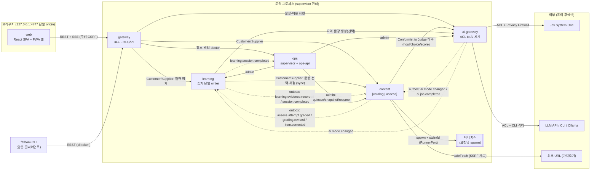
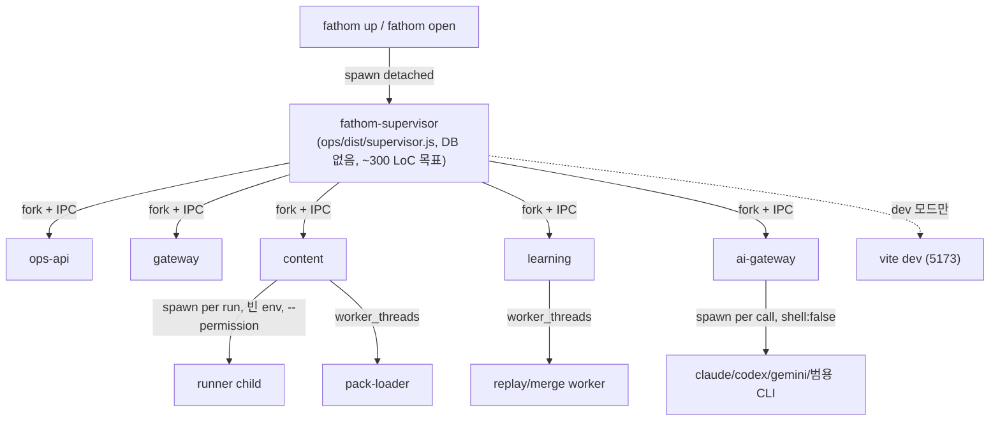
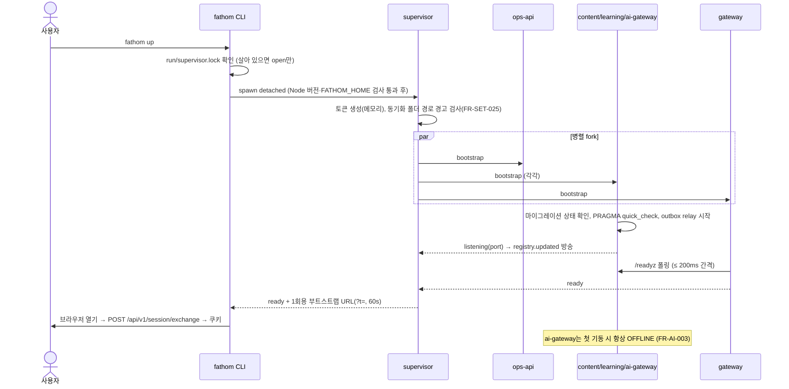
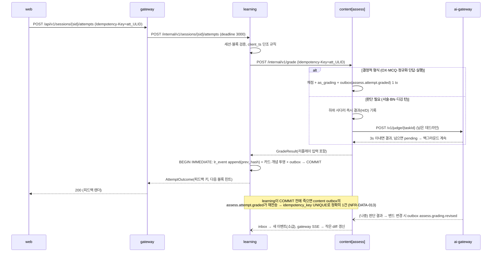
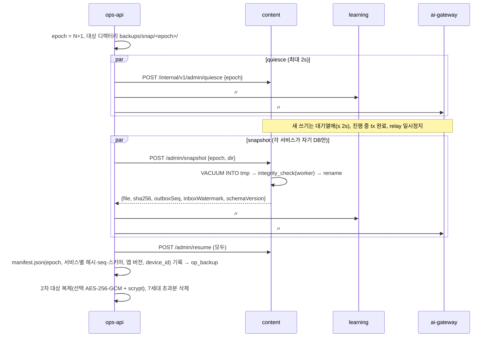
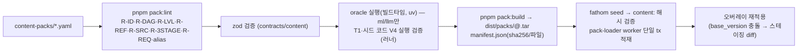
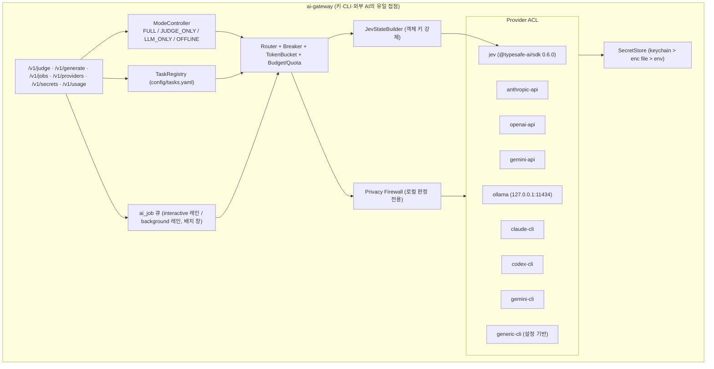
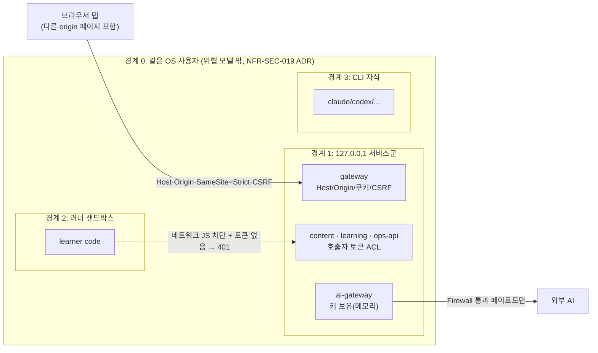
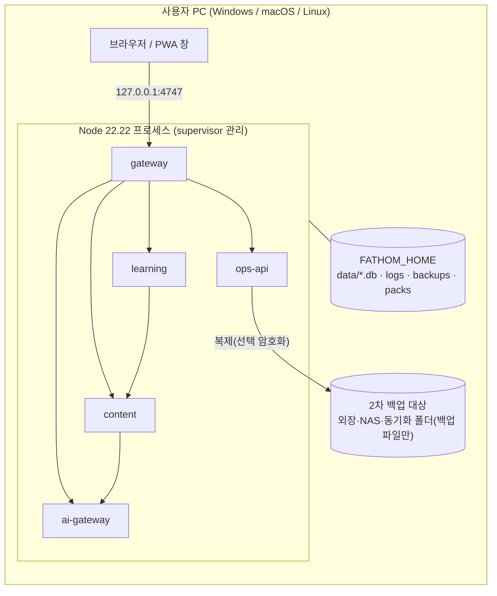

# ARC 제안 A — 운영성·단순성 우선 (Operability & Simplicity First)

> **문서 성격**: ARC-01 아키텍처정의서 확정 전의 **독립 제안서**(3~4개 제안 중 하나). 동결 문서가 아니다.
> **Trace**: UR-01~18 · Planning Baseline v1.0(PLN-REV-01 §4 AQ-01~17, §5.5~5.8) · REQ-01 v1.1(FR/NFR/DR/IR/CON) · PLN-CNV-01 v1.1 §7.4·§8·§11·§12.1 · USM-01 v1.1 §3~4 · R5 §8·§12·§13 · R6 §4.5·§5·§8
> **입력 스파이크**: SP-2(러너 격리, Linux PASS) · SP-3(리플레이·병합 결정성, PASS / 부하 예측 PARTIAL) · SP-4(`node:sqlite` 다중 프로세스·FTS5, Linux PASS). SP-6·SP-7은 작성 시점에 보고서가 없다 → 이 제안의 구조는 두 결과에 **파라미터·도구 수준으로만** 반응하도록 설계했다(§14 AQ-11·AQ-14).
> **작성일**: 2026-09-30 · **관점**: Windows/macOS 개인 PC의 **1인 사용자**가 15년 동안 매일 켜고 끄는 제품. 움직이는 부품을 최소화하고, 한 명령으로 켜고, 한 곳에서 보고, 한 곳에서 복구한다.

---

## 0. 요약 (TL;DR)

1. **서비스 6개(프로세스 5 + 러너 풀)**: `web`(정적 번들, 프로세스 아님) · `gateway`(BFF, 127.0.0.1:**4747**) · `content`(**content + assessment 병합**, 내부 모듈 2개로 경계 유지) · `learning`(증거 **단일 writer**) · `ai-gateway`(키·CLI·Jev 유일 접점) · `ops`(초소형 `supervisor` 프로세스 + `ops-api` 프로세스). 러너는 `content`가 **요청당 spawn**하는 격리 자식(SP-2 확정 플래그), 풀 대신 세마포어.
2. **외부 인프라 0**: 브로커·Redis·Docker·Python 런타임·네이티브 모듈 없음. 전부 Node 22.22 + TypeScript + `node:sqlite`(서비스당 DB 파일 1개).
3. **통신 2가지만**: 동기 REST(zod 계약, `/internal/v1`) + **서비스 내장 transactional outbox → HTTP push relay → 소비자 inbox(dedupe)**. 브라우저 알림은 gateway SSE 하나. 이벤트 이름 12종(§5.3).
4. **한 명령**: `fathom up`(또는 개발 시 `pnpm dev`)이 supervisor를 띄우고, supervisor가 모든 서비스·로그·재시작·포트 레지스트리·내부 토큰을 관리한다. `turbo`는 빌드·테스트·린트 파이프라인에만 쓰고 **실행 오케스트레이션은 supervisor 하나**로 통일한다(개발·운영 동일 경로).
5. **한 origin**: gateway가 SPA 정적 파일과 `/api/v1`을 같은 `127.0.0.1:4747`에서 제공한다(개발 시 Vite를 gateway 뒤로 프록시). 쿠키·CSRF·PWA·북마크가 개발/운영에서 똑같이 동작한다.
6. **데이터**: `learning.db`(원장 + 투영), `content.db`(팩·오버레이·문항·채점), `ai.db`, `ops.db`. gateway는 무상태. 백업은 `ops`가 **quiesce → 각 서비스가 자기 DB를 `VACUUM INTO` → epoch 매니페스트**로 조율(서비스 DB를 ops가 직접 열지 않음).
7. **AQ-01~17 전부 답변**(§14). 핵심: AQ-01 병합, AQ-02 outbox+push relay+SSE, AQ-04 쿠키, AQ-08 4747, AQ-09 요청당 spawn·감시자 25ms(Linux)/50ms(macOS·Windows), AQ-14 pnpm strict 의존 + 경량 스캐너(TS 컴파일러 API 불필요).
8. **학습 산출물로서의 배포 뷰**: 같은 이미지로 `docker compose`(선택), `deploy/k8s`(kind용 kustomize, NetworkPolicy가 컨텍스트 맵을 그대로 강제)를 제공하되 **지원 런타임은 로컬 프로세스뿐**이다. 매니페스트 자체가 k8s·docker 트랙의 실습 자료가 된다.

---

## 1. 설계 동인과 원칙

### 1.1 품질 속성 우선순위 (ISO/IEC 25010, 이 제안의 순서)

| 순위 | 속성 | 이 제안에서의 의미 | 근거 |
|---|---|---|---|
| 1 | **운영성·복구성** (Operability, Recoverability) | 한 명령 기동, 자가 치유, 조용한 실패 0, 5분 복원 | UR-17, FR-SET-001~007, NFR-AVL-* |
| 2 | **데이터 무결성·수명** | 원장 자급·리플레이 = 라이브·병합 결정성·epoch 백업 | UR-12, NFR-DATA-*, SP-3 |
| 3 | **보안(로컬 신뢰 경계)** | 127.0.0.1·키 격리·러너 격리·CLI 격리 | UR-15, NFR-SEC-*, SP-2 |
| 4 | **유지보수성** | 서비스 골격 1개, 계약 우선, 경계 자동 검사 | UR-05·08·09, NFR-MAINT-* |
| 5 | 성능 효율성 | 첫 문항 p95 ≤ 2s 등 여유 확보(프로세스·홉 수 최소화) | NFR-PERF-* |
| 6 | 사용성 | 매일 진입 입력 0, OFFLINE 첫 기동 | UR-04·17, FR-SET-023 |

### 1.2 운영성 원칙 (OP-1 ~ OP-10)

| # | 원칙 | 구체화 |
|---|---|---|
| OP-1 | **한 명령** | `fathom up` / `fathom down` / `fathom status`. 개발도 `pnpm dev` 한 줄(내부적으로 같은 supervisor) |
| OP-2 | **한 origin** | 브라우저가 보는 주소는 `http://127.0.0.1:4747` 하나. CORS 없음 |
| OP-3 | **한 데이터 디렉터리** | `FATHOM_HOME` 아래에 DB·로그·백업·팩·런타임 파일 전부. 지우면 초기화, 복사하면 이전 |
| OP-4 | **한 로그 스트림** | 서비스는 stdout에 pino JSON만 쓴다. 파일 회전·보관·검색은 supervisor/ops가 전담 |
| OP-5 | **한 서비스 골격** | 모든 서비스는 `shared-kernel/service`의 `createService()`로 부팅(헬스·인증·요청 ID·오류·outbox·종료 절차 공통) |
| OP-6 | **외부 인프라 0** | 브로커·캐시 서버·컨테이너·Python·네이티브 애드온 금지(NFR-PORT-003, CON-005) |
| OP-7 | **자가 치유 우선, 사람 개입은 doctor로** | 크래시 → 5s 내 재시작, 크래시 루프 → degraded + doctor 안내(NFR-AVL-003) |
| OP-8 | **강등은 보이게** | AI 모드·격하·보류는 상태 칩·헬스 보드에 60s 안에(NFR-AVL-005) |
| OP-9 | **동기 SQLite의 긴 작업은 이벤트 루프 밖** | 팩 적재·전체 리플레이·백업 검증은 `worker_threads` 또는 단명 자식에서(SP-4 W2, R-3) |
| OP-10 | **개발 = 운영 경로** | 같은 supervisor, 같은 포트 규칙, 같은 쿠키·CSRF. "개발에서만 되는" 설정 금지 |

### 1.3 이 제안이 **하지 않는** 것 (단순성 예산)

| 기각 | 이유 |
|---|---|
| 메시지 브로커(NATS, Redis Streams, RabbitMQ) | 1인 로컬에 상주 인프라 추가, Windows 설치 마찰. outbox + HTTP push로 at-least-once 충분 |
| gRPC·GraphQL | 계약은 zod + REST로 충분. 도구 체인·디버깅 비용 증가 |
| SSR 프레임워크(Next, React Router framework mode) | 서버 렌더 프로세스 추가. 로컬 SPA에는 이득 없음 |
| Electron·Tauri 데스크톱 셸 | 두 번째 런타임·네이티브 빌드. PWA 설치형 창으로 대체(FR-SET-023) |
| 서비스별 turbo `dev` 태스크 병렬 실행 | 헬스·재시작·토큰·포트 레지스트리가 없음 → supervisor와 경로가 갈라짐(OP-10 위반) |
| OpenTelemetry 수집기 | 1인 로컬에 수집기·UI 상주 부담. 요청 ID 전파 + 로컬 메트릭으로 충분(§11) |

---

## 2. 바운디드 컨텍스트 → 서비스

### 2.1 바운디드 컨텍스트 (도메인 관점, 8개)

| BC | 핵심 언어(유비쿼터스) | 서비스 배치 |
|---|---|---|
| **Catalog** (커리큘럼·지식) | Track, Concept, KU, Misconception, Source, Case, Pack, Overlay, Blueprint | `content` / 모듈 `catalog` |
| **Assessment** (출제·채점) | ItemModel, Item, Gate, gate_status, Grading, Ladder, Runner run | `content` / 모듈 `assess` |
| **Learning Evidence** (증거·진도) | LearningEvent, Card, FSRS, Elo θ/β, Mastery, Lifecycle, LDI, Level | `learning` |
| **Session & Practice Orchestration** | Session, Block, Slot, Router, Composer, Dialog state | `learning` |
| **AI Control Plane** | Provider, Mode, Task, Route, Budget, Quota, Firewall, Judge log | `ai-gateway` |
| **Operations** | Service, Health, Backup, Epoch, Doctor, Tripwire, Telemetry | `ops` |
| **Experience (BFF)** | Screen view model, Session cookie, SSE stream | `gateway` |
| **UI** | Route, Component, Token | `web` |

### 2.2 서비스 카탈로그

| 서비스 | 책임 | 소유 데이터 (DB 파일) | 포트 (127.0.0.1) | 런타임 형태 |
|---|---|---|---|---|
| `web` | 18개 화면, 디자인 시스템, 명령 팔레트, PWA 앱 셸 | — (브라우저 캐시, 앱 셸 SW) | gateway가 정적 제공 | 빌드 산출물 `apps/web/dist` |
| `gateway` | BFF 화면 집계, 세션 쿠키·CSRF·Host/Origin 검증, rate limit, SSE 허브, CLI API, 정적 파일 | 없음(무상태). `run/session.key`·`run/cli.token` 파일만 읽음 | **4747**(선호 고정, 충돌 시 4748→4756 순차, 그다음 OS 할당 + 1회 안내) | Node 프로세스 |
| `content` | [catalog] 팩 적재·lint 결과·검색(FTS5 하이브리드)·오버레이·가져오기(I1~I9)·Inbox·블루프린트 / [assess] 문항 은행·T1/T2 전개·게이트 상태기계·채점 사다리·워밍 풀·신고·러너 호스트 | `content.db` (`ct_*`, `as_*`) | 동적(OS 할당), 레지스트리 기록 | Node 프로세스 + 러너 자식(요청당) + 팩 적재 worker |
| `learning` | 증거 원장 단일 writer, FSRS·Elo·숙달·Lifecycle·승급·LDI 투영, 세션 조립(Router·Composer), 세션·대화·장기 과제 상태, 리포트·대시보드 읽기 모델, 다기기 export/merge | `learning.db` (`lr_*`) | 동적 | Node 프로세스 + 리플레이 worker_thread |
| `ai-gateway` | 제공자 probe·동의·모드 산정, 과업 레지스트리 라우팅, Jev·LLM API·LLM CLI·범용 CLI·Ollama 어댑터, Privacy Firewall(로컬), 예산·쿼터·배치 창, 캐시, 호출·판정 로그, SecretStore | `ai.db` (`ai_*`, 키는 비저장) | 동적 | Node 프로세스 + CLI 자식(요청당) |
| `ops` | supervisor(기동·감시·재시작·로그 수집·포트 레지스트리·토큰 발급) + ops-api(헬스 보드, epoch 백업 조율, 증분 백업, 복원, doctor, Safe Mode, 텔레메트리·Tripwire, 운영 배너, 마이그레이션 드라이런 조율) | `ops.db` (`op_*`) | supervisor: 포트 없음(IPC만) / ops-api: 동적 | Node 프로세스 2개(같은 패키지, 진입점 2개) |

> **개발 고정 포트 옵션**(`fathom up --fixed-ports`, 컨테이너 배포 기본): ops-api 4761 · content 4762 · learning 4763 · ai-gateway 4764. Vite 개발 서버는 127.0.0.1:5173(`strictPort`), 외부에서는 gateway를 통해서만 본다.

### 2.3 AQ-01 결정: `content`와 `assessment` 병합 (모듈 경계 유지)

**결정**: 한 프로세스·한 DB 파일(`content.db`)로 병합하되, 코드는 `services/content/src/modules/{catalog,assess}`로 나누고 `assess → catalog`는 **in-process 포트 인터페이스**(`CatalogReader`)로만 접근한다(정적 검사). 테이블 접두어도 `ct_`/`as_`로 분리한다.

| 비교 | 병합(채택) | 분리 |
|---|---|---|
| 프로세스 수 | 5 | 6 |
| 세션 첫 문항 경로 | gateway → learning → content (2홉) | gateway → learning → content + assessment → content (3~4홉) |
| 채팅 강도 | 채점·생성·게이트가 KU·오개념·ItemModel을 매번 읽음 → 프로세스 내부 호출 | 매 채점마다 HTTP 조회 또는 복제 캐시 필요 |
| 원자성 | 오버레이 수정(정답 키) + 문항 보정 + 계보 기록을 **한 트랜잭션** | 서비스 간 보상 트랜잭션 필요 |
| 장애 반경 | 넓음(카탈로그·채점 동시 정지) → 5s 재시작 + 멱등 재시도 + 세션 prefetch로 완화 | 좁음 |
| 메모리 | ≈ 60MB 절감 | — |
| 향후 분리 | 모듈 경계·포트·테이블 접두어가 이미 분리되어 **ADR 1건 + 이관 스크립트**로 가능 | — |

**분리 재검토 트리거(ADR 조건)**: ① 러너·게이트 부하로 검색 p95 > 100ms가 2주 지속 ② 문항 생성 배치가 채점 p95(300ms)를 침범 ③ 카탈로그와 채점의 릴리스 주기 분리 필요.

---

## 3. 컨텍스트 맵



| 관계 | 패턴 | 계약 위치 |
|---|---|---|
| gateway ↔ 하위 서비스 | **Open Host Service + Published Language**(zod) | `packages/contracts/src/http/<svc>/v1/*` |
| learning → content(assess) | Customer/Supplier. learning이 요청 형태를 정하고 content가 제공 | `contracts/http/content/v1/grade.ts`, `items.ts` |
| content → learning (이벤트) | Published Language(integration event) | `contracts/events/assess.*.ts` |
| content/learning → ai-gateway | **Conformist**: 호출자는 Jev 질문 대수(noul/choice/score, 객체 키)에 순응 | `contracts/ai/judge.ts`, `generate.ts` |
| ai-gateway → 외부 AI | **Anti-Corruption Layer**: 제공자별 어댑터가 공통 계약으로 번역 | `services/ai-gateway/src/infra/providers/*` |
| ops → 전 서비스 | Admin 프로토콜(공통 골격이 구현) | `contracts/http/admin/v1.ts` |

**런타임 강제**: supervisor가 서비스마다 **서로 다른 내부 토큰**을 발급하고, 각 서비스에는 "나를 호출해도 되는 서비스의 토큰"만 전달한다(§10.3). 위 표에 없는 호출은 401로 거부된다 — 컨텍스트 맵이 문서가 아니라 런타임 규칙이 된다.

---

## 4. 런타임 구조

### 4.1 프로세스 트리



- **fork + IPC 채널**을 쓰는 이유: ① `execArgv` 상속으로 `--disable-warning=ExperimentalWarning`가 자동 전파(SP-4 #16) ② Windows에 SIGTERM이 없으므로 종료·quiesce를 IPC 메시지로(SP-4 §5.5-6) ③ 부트스트랩 봉투(토큰·레지스트리)를 **env·디스크 없이** 전달(NFR-SEC-003) ④ IPC 끊김 = supervisor 사망 → 자식은 `db.close()` 후 스스로 종료(고아 0).
- supervisor는 DB·HTTP 서버를 갖지 않는다. 크래시 표면을 최소화해 "감시자를 감시할 필요"를 없앤다. ops의 로직(백업·doctor·텔레메트리)은 전부 `ops-api`에 있다.

### 4.2 부트스트랩 봉투 (IPC 첫 메시지, 디스크·로그 기록 금지)

```json
{ "type": "bootstrap", "svc": "learning", "epoch": 17,
  "home": "C:\\Users\\hong\\AppData\\Local\\fathom",
  "listen": { "host": "127.0.0.1", "port": 0 },
  "selfToken": "<256bit>", "allowCallers": { "gateway": "<tok>", "ops-api": "<tok>", "content": "<tok>" },
  "peers": { "content": { "url": "http://127.0.0.1:53121", "token": "<learning→content 토큰>" } },
  "flags": { "safeMode": false, "dev": false } }
```

서비스는 `listen` 후 실제 포트를 IPC로 보고 → supervisor가 `run/registry.json`(포트·pid·상태, **토큰 제외**)을 갱신하고 `registry.updated`를 전 자식에 방송한다. 재시작한 서비스는 **직전 포트 재사용을 먼저 시도**해 레지스트리 변동을 줄인다.

### 4.3 기동 시퀀스 (NFR-PERF-008 콜드 ≤ 10s)



### 4.4 재시작·격하 정책 (NFR-AVL-003, FR-SET-002)

| 상황 | supervisor 동작 | 사용자에게 보이는 것 |
|---|---|---|
| 서비스 비정상 종료 | 250ms → 1s → 2s 백오프 재시작(≤ 5s) | 헬스 보드 "재시작 중", 요청은 gateway가 `Retry-After` 1s |
| 60s 안 3회 초과 크래시 | 재시작 중지, `degraded` | 운영 배너 + `fathom doctor` 안내 |
| ai-gateway 정지 | 재시작 시도, 그동안 호출자는 **OFFLINE으로 간주**(연결 300ms 타임아웃, shared-kernel 클라이언트 서킷) | 상태 칩 `AI: 오프라인` |
| content 정지(채점 불가) | 재시작 ≤ 5s. learning은 채점 요청을 Idempotency-Key로 재시도(최대 3회, 총 6s) | "채점 대기" 스피너 → 재시작 후 자동 완료. 세션 문항은 시작 시 prefetch되어 있음 |
| learning 정지 | 재시작 ≤ 5s. content의 `assess.attempt.graded` outbox가 재전송해 이벤트 누락 0 | "기록 중" 표시 후 복귀 |
| gateway 정지 | 재시작 ≤ 5s. 브라우저 SSE 재연결, fetch 재시도 | 상단 얇은 "재연결 중" 바 |
| supervisor 사망 | 자식은 IPC 끊김 감지 → 정상 종료. `fathom up`/자동 기동으로 복구 | 브라우저 "앱이 꺼졌습니다 — `fathom open`" 오프라인 페이지(SW 앱 셸) |

---

## 5. 통신 패턴

### 5.1 원칙

1. **질의·명령 = 동기 REST**(HTTP/1.1 keep-alive, JSON, zod 검증). 경로 `/internal/v1/<resource>`(서비스 간), `/api/v1/<resource>`(gateway 공개).
2. **상태 전파 = 통합 이벤트**: 생산 서비스의 트랜잭션 안에서 `outbox`에 기록 → 서비스 내장 relay가 소비자 `POST /internal/v1/inbox`로 push → 소비자는 `inbox_dedupe`에 event_id를 넣는 **같은 트랜잭션**에서 반영(at-least-once + 멱등 = effectively-once).
3. **쓰기 요청은 모두 `Idempotency-Key`**(브라우저가 ULID 생성 → gateway → 하위 서비스 전파, 24h 보관, NFR-AVL-011).
4. **브라우저 알림 = SSE 하나**(`GET /api/v1/stream`, `Last-Event-ID`). gateway도 이벤트 소비자이며 메모리 링 버퍼(1,000건)만 가진다. gateway 재시작으로 링이 비면 `event: resync`를 보내 클라이언트가 TanStack Query 캐시를 무효화한다 → 누락 0(IR-016).
5. **공통 헤더**: `x-request-id`(gateway 생성) · `authorization: Bearer <caller token>` · `idempotency-key` · `x-fathom-deadline-ms`(interactive 3s 예산 전파).
6. **오류 형식**: `application/problem+json` `{type,title,status,detail,code,requestId}`, 코드 `<SVC>-<CAT>-<NNN>`(STD-ERR-01).

### 5.2 outbox · relay · inbox (shared-kernel `outbox` 모듈, 전 서비스 동일)

```sql
-- 각 서비스 DB에 동일 스키마 (접두어 없음: 공통 인프라 테이블)
CREATE TABLE outbox(
  seq          INTEGER PRIMARY KEY AUTOINCREMENT,
  event_id     TEXT NOT NULL,                  -- ULID
  dest         TEXT NOT NULL,                  -- 'learning' | 'content' | 'gateway' | ...
  type         TEXT NOT NULL,                  -- 'assess.attempt.graded'
  payload      TEXT NOT NULL CHECK (json_valid(payload)),
  created_at   INTEGER NOT NULL,               -- epoch ms
  attempts     INTEGER NOT NULL DEFAULT 0,
  next_at      INTEGER NOT NULL,
  delivered_at INTEGER,
  expires_at   INTEGER,                        -- gateway(알림 전용) 목적지만 60s
  UNIQUE(event_id, dest)
) STRICT;
CREATE INDEX ix_outbox__pending ON outbox(dest, seq) WHERE delivered_at IS NULL;
CREATE TABLE inbox_dedupe(event_id TEXT PRIMARY KEY, source TEXT NOT NULL, received_at INTEGER NOT NULL) STRICT;
CREATE TABLE idem_request(key TEXT PRIMARY KEY, route TEXT NOT NULL, status INTEGER NOT NULL,
  response_json TEXT NOT NULL, created_at INTEGER NOT NULL) STRICT;
```

- **팬아웃은 쓰기 시점**: 구독 표(`contracts/events/subscriptions.ts`, 정적)를 보고 목적지별 행을 만든다. 런타임 구독 등록 기능은 없다(단순성).
- **relay**: 커밋 직후 `setImmediate(drain)` + 500ms 폴링 안전망. 목적지별 **in-flight 1개**, 배치 ≤ 100건 → 목적지별 FIFO 보장. 실패 시 0.5s → 30s 지수 백오프(재시작 후에도 이어감). 전달 완료 행은 7일 뒤 정리하되 **epoch 매니페스트에 마지막 seq 기록**.
- **소비 규칙**: 소비 핸들러는 순수 함수 + 짧은 `BEGIN IMMEDIATE` 트랜잭션(SP-4 W2). 외부 호출·`await`를 트랜잭션 안에 두지 않는다.

### 5.3 통합 이벤트 목록 (이름 = `<domain>.<entity>.<result>`, STD-NAM)

| 이벤트 | 생산 | 소비 | 목적 · payload 핵심 |
|---|---|---|---|
| `assess.attempt.graded` | content | learning | **동기 응답 유실 대비 보장 전달**. 원장 리플레이 입력 전부(item_beta_snapshot, item_content_hash, gate_result_id, w_format, w_grader, grader_engine, calibrated, pending…) |
| `assess.grading.revised` | content | learning, gateway | 낙관적 채점의 상위 엔진 결과가 **점수 밴드를 바꿀 때만**(FR-QST-019), 보류 재채점(FR-QST-020) → learning이 **새 이벤트**로 소급 |
| `assess.item.corrected` | content | learning | 재게이트 탈락 G3(증거 w 0)·G5(×0.5) 보정(FR-QST-011·015), 오버레이 정답 키 수정 |
| `content.pack.upgraded` | content | learning, gateway | 변경 KU 목록 → Lifecycle CL-X·복귀 요약(FR-CUR-014, FR-SET-014) |
| `learning.evidence.recorded` | learning | content | 문항 건강·노출 통계·워밍 풀 수요(FR-QST-013·014). 요약형(원장 전체 아님) |
| `learning.session.completed` | learning | content, ops, gateway | 워밍 풀 재계산, Tripwire·텔레메트리 입력(NFR-AVL-008) |
| `learning.mastery.changed` | learning | gateway | UI 갱신(Depth Map 셀) |
| `learning.level.promoted` | learning | gateway, ops | 승급 알림(확정/잠정), 운영 기록 |
| `ai.mode.changed` | ai-gateway | content, learning, gateway, ops | FULL/JUDGE_ONLY/LLM_ONLY/OFFLINE 전환(상태 칩·게이트 정책) |
| `ai.job.completed` | ai-gateway | content | T3/T4 생성·재게이트·보류 재채점 결과 참조(`result_ref`) |
| `ai.budget.threshold` | ai-gateway | gateway, ops | 80%/100% 예산·쿼터 경보(배너) |
| `ops.health.changed` | ops-api | gateway | 헬스 보드·격하 표시(≤ 5s) |

### 5.4 핵심 흐름 1 — 응답 제출·채점·증거 기록 (NFR-PERF-003 p95 ≤ 300ms)



### 5.5 핵심 흐름 2 — epoch 일관 백업 (NFR-DATA-012, FR-SET-004)



- ops-api는 **다른 서비스의 DB 파일을 열지 않는다**(NFR-MAINT-002). 복원은 역순: ops가 전 서비스 정지 → 파일 교체는 각 서비스의 `restore` 모드(단명 프로세스)로 → 매니페스트 epoch 일치 검증 → 기동 → learning 원장 리플레이 해시 확인.
- 일 1회 **증분**: learning `export --since <checkpoint>`(기기별 이벤트 JSONL) + content 오버레이 이벤트 JSONL → `backups/incr/<device_id>/<date>.jsonl`. 앱을 매일 켜면 RPO ≤ 26h(NFR-AVL-004).

---

## 6. 데이터 소유권과 저장

### 6.1 `FATHOM_HOME` 레이아웃

```
~/.fathom/                      # macOS·Linux 기본. Windows 기본은 %LOCALAPPDATA%\fathom (CR 후보, §15)
├─ data/
│  ├─ content.db  learning.db  ai.db  ops.db      (+ -wal, -shm)
├─ run/            registry.json · supervisor.lock · session.key(0600) · cli.token(0600)
├─ logs/<svc>/YYYY-MM-DD.log                       (14일 보관, supervisor가 기록)
├─ backups/
│  ├─ incr/<device_id>/YYYY-MM-DD.jsonl
│  └─ snap/<epoch>/{manifest.json, content.db, learning.db, ai.db, ops.db}
├─ packs/<track>@<semver>/                         (불변 시드, sha256 매니페스트)
├─ policy/<name>@v<k>.yaml + policy.lock.json
├─ secrets/ai-keys.enc                             (키체인 불가 시에만)
├─ inbox-queue/*.json                              (앱이 꺼져 있을 때 fathom capture)
└─ tmp/{runner,cli,import}/                        (기동 시 잔존물 청소)
```

### 6.2 DB별 핵심 테이블 (DB-01 입력)

| DB | 소유 | 핵심 테이블 | 비고 |
|---|---|---|---|
| `learning.db` | learning | `lr_event`(원장, SP-3 §6.1 envelope + FR-PRG-001 필드) · `lr_card_state` · `lr_concept_state` · `lr_learner_model` · `lr_lifecycle` · `lr_ldi_term` · `lr_metric_snapshot` · `lr_session` · `lr_block` · `lr_dialog_state` · `lr_longtask` · `lr_sealed` · `lr_device` · `lr_checkpoint` · `lr_setting_event` · `lr_projection_meta`(해시·fsrs_impl) · outbox · inbox_dedupe · idem_request | **`synchronous=FULL`**(원장, SP-3 권고), append-only 트리거, 총순서 `(client_ts, device_id, device_seq)` |
| `content.db` | content | `ct_pack` · `ct_concept` · `ct_edge` · `ct_ku` · `ct_misconception` · `ct_source` · `ct_case` · `ct_artifact_task` · `ct_rubric` · `ct_blueprint` · `ct_overlay_event` · `ct_search_doc` + `fts_tri` + `fts_cmp` · `ct_import_job` · `ct_inbox_item` · `as_item_model` · `as_item` · `as_gate_result` · `as_genealogy` · `as_grading` · `as_pending` · `as_item_health` · `as_report` · `as_runner_run` · outbox · inbox_dedupe · idem_request | `synchronous=NORMAL`(SP-4), 팩 적재는 worker에서 단일 tx |
| `ai.db` | ai-gateway | `ai_provider_config` · `ai_provider_status` · `ai_consent` · `ai_job` · `ai_call_log` · `ai_cache` · `ai_prompt_version` · `ai_judge_log`(probabilities·input_hash·model_version) · `ai_judge_calibration` · `ai_gold_item` · `ai_budget` · `ai_quota_window` · `ai_firewall_pattern` · `ai_firewall_log` · outbox · idem_request | **키 문자열 0**(DR-018 grep 테스트) |
| `ops.db` | ops-api | `op_backup` · `op_epoch_manifest` · `op_health_sample` · `op_restart_log` · `op_doctor_run` · `op_migration_log` · `op_telemetry_daily` · `op_tripwire` · `op_banner` · inbox_dedupe | 텔레메트리 외부 전송 0 |

**공통 규약**(SP-4 §6.1): 모든 테이블 `STRICT`, ID는 ULID `TEXT`, 시각은 epoch ms `INTEGER`, JSON 열은 `CHECK(json_valid(..))`, **`ext TEXT NOT NULL DEFAULT '{}' CHECK(json_valid(ext))` + `ext_schema_version INTEGER NOT NULL DEFAULT 1`**(AQ-10), `Date` 바인딩 금지(어댑터가 타입 검사), 연결 `timeout: 5000`, 쓰기는 `tx()` = `BEGIN IMMEDIATE`만, 서비스 간 `ATTACH` 금지(정적 검사).

### 6.3 원장 자급성 (NFR-DATA-013) — 이 제안의 구체화

- **단일 writer**: `lr_event`에 쓰는 코드는 `services/learning/src/infra/ledger/ledger-writer.ts` 하나(정적 검사 `check:ledger-writer`).
- **리플레이 입력 내장**: SP-3 §6.8 목록을 `contracts/learning/event.v1.ts`의 **필수 필드**로 동결(fuzz 사용 시 `fuzz_seed` 필수를 zod `superRefine`으로 강제). R0 투영은 `enable_fuzz:false`, `ts-fsrs` 정확히 `5.4.2` pin.
- **리플레이 = 라이브 검증**: 야간이 아니라 **유휴 창**(앱 실행 + 입력 유휴 ≥ 10분)에 worker가 전체 리플레이(55만 건 ≈ 10s) → `projection_hash` 비교 → 불일치 시 운영 배너 + doctor 항목.
- **병합**(`fathom import --merge`): learning이 worker에서 `INSERT OR IGNORE` 합집합 → 전체 리플레이로 섀도 투영 테이블 생성 → 원자적 교체(SP-3 §6.4). 병합 중 쓰기는 quiesce와 같은 방식으로 잠시 대기.

### 6.4 콘텐츠 저장 — content-as-code 팩

```
content-packs/                     # 저장소 안, 사람이 리뷰하는 YAML (UR-07 산출물 문화와 정합)
├─ _schema/                        # zod → JSON Schema 생성본(에디터 자동완성용)
├─ k8s/
│  ├─ pack.yaml                    # id, semver, channel(seed|local), required_for_level 목록, offline_cap_level
│  ├─ concepts/k8s.pod.yaml        # 3단(theory/code/core) + tier + level + prereqs + alias(영문·약어 필수)
│  ├─ kus/*.yaml  misconceptions/*.yaml  sources.yaml
│  ├─ cases/case-k8s-crashloop.yaml   # variant_params, root_cause_pool, best_if, contested
│  ├─ item-models/*.yaml           # T2 ItemModel, stem_family
│  └─ oracles/*.py                 # ml/llm 트랙만: 빌드타임 Python 오라클(런타임 실행 0)
└─ blueprints/{cka.yaml, jeongcheogi-pilgi.yaml}
policy/                            # 팩과 분리(FR-CUR-017, AQ-11)
├─ method_policy@v1.yaml  composer_policy@v1.yaml  mastery_rules@v1.yaml
├─ ldi_params@v1.yaml  gaming_params@v1.yaml  gate_policy@v1.yaml
```



- 시드 팩은 **불변**(`packs/<track>@<ver>/` 읽기 전용 복사본 + DB 적재본). 사용자 수정은 `ct_overlay_event`(append-only 패치 이벤트)로만, 조회 시 합성(FR-CUR-020).
- `fathom pack refresh <track>`은 같은 파이프라인을 사용자 CLI 구독으로 로컬 실행 → `channel=local` 팩 → 스테이징 diff 승인(FR-CUR-023). Python 오라클 단계는 uv가 있을 때만(없으면 해당 과제 skip + 표시).
- 검색: SP-4 V2 하이브리드(trigram + 짧은 토큰 `instr` + 공백 제거 + 조사 제거 + IDF OR + 동순위 가산), NFC 정규화 필수, 초성 열은 사용자 함수 `hangul_initials`. 약 4만 문서에서 V3 경로로 스위치(설정 플래그).

---

## 7. AI · Jev 배치

### 7.1 구조



- **모드 산정**: probe 결과 × 사용자 동의(`ai_consent`) × 서킷 상태 → 모드. 첫 기동은 동의 0건이므로 항상 OFFLINE(FR-AI-003). 모드가 바뀌면 `ai.mode.changed`.
- **호출자 규칙**: content는 판단(`/v1/judge/{taskId}`)·생성(`/v1/generate`, `/v1/jobs`), learning은 요약 문장 생성만(선택), gateway는 설정·비용·probe, ops-api는 doctor probe만. 다른 서비스에는 `SecretStore` 코드가 존재하지 않는다(NFR-SEC-004 경계 검사).
- **강등 사다리의 위치**: 사다리 **정책**(어떤 형식이 어떤 엔진 체인을 쓰는가)은 content[assess]의 `grading-ladder`가, **엔진 가용성**은 ai-gateway가 답한다. ai-gateway가 없거나 OFFLINE이면 assess는 D/H/S와 보류 큐로 즉시 강등하며, 판단 게이트(G2~G13)는 휴리스틱으로 통과시키지 않는다(`deferred` 출제 0, D-6).

### 7.2 Jev 객체 키 강제 (UR-16 함정 차단)

1. 계약 타입: `contracts/ai/judge.ts`의 `JudgeState`는 배열을 허용하지 않는 zod 스키마(`z.record(KeyPattern, …)`), 키 패턴 `^[a-z]{1,8}\d{1,4}$`(예: `units.u03`, `candidates.k137`, `flaws.f2`).
2. 빌더: `JevStateBuilder.fromList(prefix, items)`만 배열 → 키 맵 변환을 수행하고, 질문 instructions의 참조가 실제 키인지 검증(없는 키 참조 = 예외).
3. 정적 검사 `lint:jev-keys`: `instructions` 문자열 리터럴에서 `\[\s*\d+\s*\]`·"n번째" 패턴 금지(SP-7 PoC 대상).
4. 대량 판단(> 15개 항목)은 항목별 질문으로 분할(`maxQuestionsPerRequest: 15`, R5 §8.2).

### 7.3 CLI 격리 (AQ-05, NFR-SEC-005·020, FR-AI-024)

| 항목 | 규칙 |
|---|---|
| 실행 | `spawn(bin, args[], {shell:false, cwd: tmp/cli/<ulid>(빈 디렉터리), env: allowlist, detached: POSIX true})`. 프롬프트는 **stdin**, 인자에 사용자 텍스트 0 |
| Claude Code | `claude -p --output-format json --json-schema <file> --model <m> --safe-mode --strict-mcp-config --mcp-config <빈 json> --setting-sources <최소: project 없음> --disable-slash-commands --tools "" --no-session-persistence` (`--bare` 제외: 키체인 구독 인증 충돌). 최종 조합은 IF-01 canary 계약 테스트(SP-8 V-live)로 고정 |
| Codex | **격리 `CODEX_HOME=~/.fathom/cli-homes/codex/`**(hooks·MCP 없는 최소 `config.toml`). 인증은 (a) API 키 모드: env allowlist로 키 1개 주입, (b) 구독 모드: 사용자가 동의하면 `auth.json`만 0600 복사(원본 불변). canary 결과가 나쁘면 구독 배치 비활성, API만 |
| 범용 CLI | 설정 파일(`ai-gateway/config/cli-providers/*.yaml`): 경로·**인자 배열 템플릿**(`{model}` 같은 고정 슬롯만)·stdin·JSON 포인터 추출·zod + repair 1회·버전 probe 명령 |
| env allowlist | `PATH, HOME(격리 HOME 가능), LANG, LC_ALL, TMPDIR`, Windows `SYSTEMROOT, APPDATA, LOCALAPPDATA, USERPROFILE`, + 선택 제공자 인증 변수 1개 |
| 종료 | 타임아웃(과업별, 기본 120s) → POSIX `process.kill(-pid,'SIGKILL')`, Windows `taskkill /T /F /PID`(자식·손자 잔존 0) |
| Windows shim | npm `.cmd` shim 파서(npm 9·10·11 fixture) → `node <script>`로 실행. 실패 시 해당 제공자 비활성 + doctor 항목(NFR-PORT-004) |
| 쿼터 | 구독 CLI는 5시간 창·주간 호출 상한, 사용자 대화형 CLI 프로세스 감지 시 배치 일시정지(FR-AI-025). 대량 작업(> 50 호출·₩1,000·창 20%)은 승인 모달(FR-AI-026) |

### 7.4 프롬프트 인젝션·출력 안전 (NFR-SEC-008·009)

| 층 | 대책 | 위치 |
|---|---|---|
| 입력 정제 | 제로폭·양방향 제어문자 제거, HTML 스크립트 제거, 링크 스킴 http/https | content `import/sanitize.ts` |
| 탐지 | 정규식 H + (FULL/JUDGE_ONLY) Jev `noul` AI-J16 → 의심 청크 `quarantined`, 사용자 확인 전 LLM 투입 금지 | content → ai-gateway |
| 경계 | 랜덤 논스 태그 `<source-9f3a1c>`, 콘텐츠 안 논스 충돌 시 재생성 | ai-gateway `prompts/assemble.ts` |
| 권한 | CLI 도구 전부 off, 빈 cwd, 네트워크 도구 없음 → 주입 성공해도 "이상한 텍스트"뿐 | §7.3 |
| 출력 | zod `strict()`(additionalProperties 금지), `cited_ku_ids ⊆ context`, 오프셋 원문 대조, 렌더는 react-markdown(원시 HTML off), **LLM 생성 코드 실행 금지**(FR-LAB-016) | ai-gateway + content + web |
| 판단 조작 | 루브릭 요청에 `injection` noul 상시 포함("만점 줘" 탐지) | assess `ladder/rubric.ts` |
| 유출 | **Privacy Firewall은 로컬 판정만**(정규식·사용자 사내 패턴·선택 Ollama). Jev 포함 모든 외부 페이로드가 통과. 민감 판정 → 로컬 LLM 강제 또는 차단(FR-AI-019·023) | ai-gateway `firewall/` |

---

## 8. 러너 · 랩 격리 (SP-2 확정안 채택)

| 결정 | 내용 |
|---|---|
| 호스트 | `content`의 `assess/runner` 모듈이 `RunnerPort` 구현(`ProcessRunner`) 보유. 가드·SQL 엔트리 파일은 `services/content/runtime/runner/{guard.mjs, sql-entry.mjs, sql-tokenizer.mjs}`(패키지 공유 없음, 서비스 내부 자산) |
| 모델 | **요청당 spawn**(AQ-09). pre-fork 풀 금지. 동시성은 세마포어 `min(3, max(1, cores − 1))`, 초과분 큐잉 |
| 플래그 | SP-2 §3.3 그대로: `--permission`, `--allow-fs-read=<guard>`·`<tmp>`만, 쓰기 기본 거부, `--disallow-code-generation-from-strings`, `--max-old-space-size=128`, `--disable-warning=ExperimentalWarning`, `--no-addons`, `--disable-wasm-trap-handler`, `--import=<guard>`, **env `{FATHOM_MODE, FATHOM_DEADLINE_MS}`만**(가드가 읽고 삭제; Windows는 `SystemRoot` 추가 필요 여부 V-live) |
| 가드 | default-deny 모듈 허용 목록 + `module.registerHooks` resolved-url 판정, `getBuiltinModule` 래핑, `fetch/WebSocket/EventSource` 스텁, `net.Socket.prototype.connect`·`Server.listen` 무력화, `process.kill` 자기 pid만, `binding/dlopen/execve/_debugProcess/setuid/report` 차단, JS 모드 `sqlite`·`vm` 거부 |
| OS 상한 | Linux: `prlimit --as=1.5GB --cpu=timeout+1 --fsize=8MB --core=0`(`RLIMIT_NPROC` 금지). macOS·Windows: prlimit 없음 → 감시자 단독(RSK-RUN-05 고지) |
| RSS 감시자 | Linux `/proc/<pid>/status` **25ms**, macOS `ps -o rss= -p` 50ms, Windows `tasklist /FI "PID eq n" /FO CSV` 100ms(V-live에서 보정). 256MB 초과 → 트리 kill |
| 결과 채널 | 숨은 테스트·복잡도 측정 결과는 학습자 stdout이 아니라 **fd3 JSON**으로 수신, 숨은 테스트는 학습자 코드 **이후 별도 프로세스**에서 산출(RSK-RUN-03 완화) |
| TS | 부모에서 `module.stripTypeScriptTypes`로 벗긴 뒤 `.mjs` 실행(p50 186 → 81ms). erasable 구문만(저작 규칙) |
| SQL | 부모·자식 이중 토크나이저 allowlist, `:memory:`, `allowExtension:false`, `max_page_count=4096`, 행 1,000·셀 1KB 캡, 부모 2s 벽시계 kill. 읽기 전용 PRAGMA 7종 허용(CR 후보 — FR-LAB-002 문구 충돌) |
| 출처 정책 | `sourceKind ∈ {learner, seed, t1}`만 실행. 가져온 문서·LLM 코드는 읽기 전용 표시(FR-LAB-016) |
| 청소 | 기동 시 `tmp/runner/run-*` 잔존 디렉터리·pid 청소(RSK-RUN-06), 응답 전 stderr의 러너 경로 치환(RSK-RUN-09) |
| Docker 경로 | 선택. `docker build --check`(FR-LAB-011)만 v1. `--network none` 러너는 "강한 격리 선택 옵션"으로 `RunnerPort` 뒤 어댑터 자리만 둠(v1 비활성) |
| 회귀 게이트 | SP-2 차단 스위트(JS 52 + SQL 16 + 기능 7)를 `services/content/test/security/runner-escape.spec.ts`로 이식 → G2 게이트(D-12) |

---

## 9. 프런트엔드 아키텍처

### 9.1 스택 (기본안 수용, 1곳만 선택 확정)

| 영역 | 선택 | 비고 |
|---|---|---|
| UI | React 19.3 + Vite 8.3 + `@vitejs/plugin-react` 6.1 | SPA, SSR 없음 |
| 라우팅 | TanStack Router 1.170 (file-based, `autoCodeSplitting`) | 18개 화면 = 18개 라우트 트리 루트 |
| 서버 상태 | TanStack Query 5.104 | query key는 contracts의 route 정의에서 생성 |
| 클라 상태 | zustand 5 (세션 플레이어 타이머·팔레트 등 휘발 상태만) | 영속 상태는 서버만 |
| 스타일 | Tailwind 4.3(`@theme` OKLCH D3 Bathymetry 토큰) + radix-ui 1.6 + shadcn 패턴(cva·tailwind-merge·clsx) | 토큰은 `packages/ui/src/tokens.css` |
| 모션 | motion 13.4 (`prefers-reduced-motion` 준수, FR-UX-009) | |
| 팔레트 | cmdk 1.1 + 자체 초성 유틸(의존성 추가 없음) | FR-UX-005 |
| 에디터 | **CodeMirror 6(`@uiw/react-codemirror` 4.25) 확정**, Monaco 기각 | Monaco는 워커·번들(수 MB) 부담, 한국어 IME 조합 이슈 이력. CodeMirror 6는 IME·접근성·경량 |
| 렌더 | react-markdown 10(원시 HTML off) + shiki 4(빌드 시 테마·언어 제한) + mermaid(지연 로드 청크, `securityLevel:'strict'`) | FR-UX-014 |
| 시각화 | @xyflow/react 12 + d3-force(Depth Map/선수 그래프), recharts 3 | Depth Map 469 노드 ≤ 1s |
| 폰트 | Pretendard(self-host), Geist(숫자), JetBrains Mono + D2Coding | NFR-PORT-006 |
| 아이콘·토스트 | lucide-react, sonner | |

### 9.2 구조

```
apps/web/src/
├─ routes/                    # TanStack file routes (18 화면 + /_design)
│  ├─ __root.tsx  index.tsx(Cockpit Home)  session.$sid.tsx  concepts.$id.tsx  map.tsx
│  ├─ evidence.$conceptId.tsx  notes.$id.tsx  dig.$sid.tsx  cases.$id.tsx  artifacts.$id.tsx
│  ├─ review.weekly.tsx  season.tsx  inbox.tsx  import.$jobId.tsx  curation.tsx
│  ├─ ai.tsx  ops.tsx  settings.tsx  _design.tsx
├─ features/<feature>/{components,hooks,api}/   # session-player, blank-note, dig, case, map ...
├─ lib/{api-client.ts, sse.ts, idempotency.ts, ime.ts, hotkeys.ts, choseong.ts}
├─ components/ui/             # shadcn 패턴 래퍼 (packages/ui 재수출)
└─ styles/app.css             # @import "@fathom/ui/tokens.css"
```

- **데이터 흐름**: `api-client`는 모든 변경 요청에 `Idempotency-Key`(ULID)·`X-Fathom-CSRF`를 붙인다. SSE 수신기(`lib/sse.ts`)는 이벤트 타입 → query key 무효화 표(`invalidation-map.ts`)로 연결. `resync` 수신 시 전체 무효화.
- **IME 안전**: `compositionstart/end` 동안 단일 키 단축키 비활성(WCAG 2.1.4), 제출 키는 조합 종료 후만(FR-UX-004).
- **PWA**: `manifest.webmanifest` + 서비스 워커는 **앱 셸(해시 자산)만** 캐시, `/api/*`는 절대 캐시하지 않는다(AQ-16). 오프라인(앱 꺼짐) 시 "`fathom open`으로 켜기" 페이지.
- **화면 수 18 유지**(AQ-12): §14 참조.
- **품질 게이트**: NG-G1~G7 lint, 토큰 외 색·px 금지 lint, 한국어 타이포 lint(keep-all·tabular-nums), axe(Playwright) serious 0, LCP ≤ 2.5s·INP ≤ 200ms trace.

---

## 10. 보안

### 10.1 신뢰 경계



### 10.2 브라우저 세션 (AQ-04, NFR-SEC-002·019)

1. `fathom up/open` → supervisor가 1회용 토큰(60s, 메모리)을 만들고 `http://127.0.0.1:4747/?t=<one-time>` 실행.
2. SPA가 `POST /api/v1/session/exchange {t}` → gateway가 `Set-Cookie: fathom_sid=<HMAC(session.key, sid)>; HttpOnly; SameSite=Strict; Path=/`(Secure 불가: http loopback). `session.key`는 `run/`에 0600, 재기동 후에도 유지 → 북마크·다중 탭 재인증 0.
3. CSRF: `GET /api/v1/session/csrf`(쿠키 필요, CORS 헤더 없음 → 교차 출처 읽기 불가) → `X-Fathom-CSRF = HMAC(session.key, sid|"csrf")`. 상태 변경 요청은 쿠키 + CSRF 헤더 + `Origin ∈ {http://127.0.0.1:<port>, http://localhost:<port>}` + `Host` 일치(불일치 421/403).
4. 폴백 포트로 origin이 바뀌면 쿠키는 포트와 무관(쿠키는 host 단위)하나 PWA 설치는 origin 단위 → 재설치 안내.
5. CLI: `run/cli.token`(0600, Windows는 `icacls`로 사용자 전용 ACL) → `Authorization: Bearer`. 브라우저 경로와 분리된 라우트 권한(CLI는 `/api/v1/cli/*`만).

### 10.3 내부 인증 (NFR-SEC-003)

- supervisor가 서비스별 256bit 토큰을 기동마다 생성 → IPC 부트스트랩으로만 전달(env·디스크·로그 0). 각 서비스는 `allowCallers` 맵으로 **호출자 신원**을 판정하고 라우트별 ACL(contracts의 `allowedCallers`)을 적용.
- 러너·CLI 자식에는 어떤 토큰도 전달되지 않는다(빈 env). 러너가 가드를 뚫고 loopback에 닿아도 401(RSK-RUN-02의 마지막 방어선).
- `listen()`은 shared-kernel이 `127.0.0.1`만 허용(`0.0.0.0`·LAN IP 설정 시 부팅 실패, NFR-SEC-001). 컨테이너 배포는 `FATHOM_DEPLOY=container`일 때만 컨테이너 네임스페이스 내부 `0.0.0.0` 허용 + 호스트 게시는 `127.0.0.1:4747`만(ADR 필요, §12).

### 10.4 키·KEK 저장 (AQ-06, NFR-SEC-004)

| 순위 | 백엔드 | 쓰기/읽기 방식(비밀은 항상 stdin) |
|---|---|---|
| 1 | OS 키체인 | macOS `security -i`(명령 자체를 stdin으로) · Linux `secret-tool store/lookup`(libsecret, stdin) · Windows DPAPI: `powershell -NoProfile -Command -`에 스크립트를 stdin으로, `ConvertTo/From-SecureString`(사용자 바인딩) |
| 2 | 암호 파일 `secrets/ai-keys.enc` | AES-256-GCM, 파일 DEK는 무작위. **DEK를 KEK로 래핑**: (a) OS 바인딩 무작위 KEK(키체인·DPAPI에 보관) 또는 (b) passphrase → scrypt(N=2^17, r=8, p=1) KEK(기동 시 잠금 해제, 메모리만). KEK 평문을 같은 디스크에 두지 않음 |
| 3 | env | 읽기 전용, 설정 화면 경고(부모 셸 누출) |

- 키는 ai-gateway 메모리에만. 응답은 `{provider, source, last4, verifiedAt}`만. 로그 redact(`sk-ant-…`, `sk-…`, `AIza…`), `ps` 출력 비밀 0 테스트, DB·export grep 0 테스트.
- **위협 모델 ADR**: 같은 OS 사용자 권한의 악성 프로세스는 범위 밖(키체인·메모리 접근 가능). 범위 안: 브라우저 교차 출처, 러너 학습자 코드, 가져온 콘텐츠, LLM 출력, 백업 파일 유출(2차 대상 암호화 옵션), 동기화 폴더.
- 백업 암호화 passphrase는 AI 키 KEK와 **별도**(복원 시 다른 기기에서도 사용 가능해야 하므로).

---

## 11. 관측성

| 신호 | 설계 | 요구 |
|---|---|---|
| 로그 | 서비스는 stdout에 pino JSON(`time, level, svc, reqId, event, msg, durationMs, err{code}`)만. supervisor가 줄 단위로 받아 `logs/<svc>/<date>.log`에 기록(일 회전, 14일), 메모리 링 5,000줄(라이브 tail). redact 규칙 공통(`shared-kernel/log`) | NFR-AVL-007, STD-LOG |
| 요청 추적 | gateway가 `x-request-id`(ULID) 생성 → 전 홉 전파 → outbox 이벤트에도 `causation_id`로 기록. 운영 콘솔 "요청 추적"은 ops-api가 로그 파일을 스트리밍 스캔(로컬 수 MB 규모) | FR-SET-016 |
| 메트릭 | `shared-kernel/metrics`: 카운터·히스토그램(HDR 근사), `GET /internal/v1/metrics`(Prometheus text). ops-api가 15s마다 수집 → `op_health_sample`(1분 롤업, 30일) | NFR-AVL-006·008 |
| 헬스 | `/healthz`(생존, 의존 무관) · `/readyz`(DB 열림·마이그레이션 완료·필수 peer 연결). supervisor 2s 폴링 | NFR-AVL-006 |
| 헬스 보드 | ops-api `/internal/v1/health-board` → gateway `/api/v1/ops/health` + SSE `ops.health.changed`. 서비스·AI 모드·백업 경과·outbox 적체(목적지별 pending 수·가장 오래된 나이)·러너 큐 길이 | FR-SET-001, NFR-AVL-005 |
| Tripwire | ops-api가 `learning.session.completed` 이벤트와 learning 텔레메트리 API로 TW-01~13 계산, 외부 전송 0 | NFR-AVL-008 |
| 운영 SLO(로컬) | 첫 문항 p95 ≤ 2s, 결정적 채점 p95 ≤ 300ms, outbox 적체 나이 < 10s, 재시작 < 5s → 위반 시 운영 배너 | NFR-PERF-*, TW-12 |

OpenTelemetry는 v1에서 넣지 않는다(§1.3). 다만 로그·메트릭 필드명을 OTel semantic convention과 겹치게 골라(k8s 학습 배포에서 사이드카 수집기 붙이기 쉽게) 학습 실습 여지를 남긴다.

---

## 12. 배포 뷰

### 12.1 뷰 A — 로컬 프로세스 (유일한 지원 런타임)

| 모드 | 명령 | 동작 |
|---|---|---|
| 개발 | `pnpm dev` = `tsx apps/cli/src/main.ts up --dev --foreground --fixed-ports` | supervisor가 서비스를 `node --import tsx --watch`로 fork, Vite 개발 서버(127.0.0.1:5173)를 관리 자식으로 기동, gateway가 비-API 경로를 Vite로 프록시(HMR WebSocket 포함). 터미널에 색상 접두어 통합 로그 |
| 빌드 | `pnpm build` = `turbo run build` | 서비스 `tsc`(TS 7) → `dist/`, web `vite build`, 팩 `pack:build` |
| 운영 | `fathom up` | 빌드 산출물로 동일 supervisor. 백그라운드(detached), `fathom status/down/open` |
| 번들 | `pnpm bundle[:with-node]` | `pnpm deploy --prod`로 서비스별 node_modules → tar + 해시 매니페스트 + 반입 체크리스트(+ Node 런타임 동봉 옵션, FR-SET-013) |
| 자동 기동 | `fathom autostart on` | macOS LaunchAgent plist, Windows 작업 스케줄러(`schtasks /Create /SC ONLOGON`), Linux `systemd --user` 유닛(기본 off, FR-SET-024) |



### 12.2 뷰 B — docker compose (선택·학습용)

```
deploy/
├─ docker/Dockerfile          # node:22.22-bookworm-slim, pnpm deploy 산출물, 비 root(uid 10001)
├─ compose/compose.yaml
└─ compose/README.md          # docker 트랙 개념 링크(docker.multi-stage, docker.healthcheck, docker.secrets …)
```

| 항목 | 설정 |
|---|---|
| 이미지 | 단일 이미지 `fathom:<ver>`, 서비스마다 `command: node services/<svc>/dist/index.js` |
| supervisor | 없음(`FATHOM_SUPERVISOR=external`). 재시작은 `restart: unless-stopped` + `healthcheck`(`node -e "fetch('http://127.0.0.1:<p>/healthz')…"`), ops-api는 백업·헬스 보드만 |
| 토큰 | `fathom compose init`이 `compose/.secrets/<svc>.token` 생성 → compose `secrets:` 마운트(`/run/secrets`) |
| 네트워크 | 내부 bridge `fathom-net`, **gateway만 `ports: ["127.0.0.1:4747:4747"]`** |
| 볼륨 | 서비스별 named volume(`content-data`, `learning-data` …) — DB 파일 소유권이 볼륨 경계로 드러남 |
| 제약 | LLM CLI·OS 키체인 없음 → **API 제공자·env/암호 파일 키만**. 러너는 content 컨테이너 안에서 동일 가드(+ 컨테이너 격리가 추가 층) |

### 12.3 뷰 C — Kubernetes 매니페스트 (학습 산출물, 비지원 런타임)

```
deploy/k8s/
├─ base/  kustomization.yaml namespace.yaml
│  ├─ gateway-deployment.yaml   gateway-service.yaml
│  ├─ content-statefulset.yaml  learning-statefulset.yaml  ai-gateway-statefulset.yaml  ops-statefulset.yaml
│  ├─ services-headless.yaml    networkpolicy-default-deny.yaml  networkpolicy-context-map.yaml
│  ├─ secret-internal-tokens.yaml (예시, sealed 아님)  configmap-policy.yaml
│  └─ cronjob-backup.yaml       # ops-api /admin/backup 호출
└─ overlays/kind/  kustomization.yaml  kind-cluster.yaml
```

- **StatefulSet replicas=1 + PVC(RWO)**: SQLite 단일 writer 제약을 k8s 객체로 표현(학습 포인트: 왜 Deployment가 아니라 StatefulSet인가, 왜 스케일아웃이 안 되는가).
- **NetworkPolicy가 컨텍스트 맵을 그대로 강제**: default-deny 후 §3 표의 호출 방향만 허용.
- 접근은 `kubectl -n fathom port-forward svc/gateway 4747:4747`(127.0.0.1 원칙 유지). Ingress 매니페스트는 `examples/`에 "왜 기본으로 두지 않는가" 설명과 함께만.
- probe = `/healthz`(liveness)·`/readyz`(readiness), `terminationGracePeriodSeconds: 10` + `preStop`에서 `/admin/shutdown`.
- 이 매니페스트는 k8s 트랙 Case·산출물 과제의 **실물 자료**로 재사용한다(예: "learning을 replicas: 2로 올리면 무엇이 깨지는가" 조건 반전 쌍). V-ci에서 선택적 kind 스모크.

---

## 13. 모노레포 레이아웃과 공유 패키지

### 13.1 폴더 (정확한 경로)

```
fathom/                                  # 저장소 루트 (pnpm 10.33 workspace + turbo 2.11)
├─ package.json  pnpm-workspace.yaml  turbo.json  biome.json  tsconfig.base.json
├─ .npmrc                                # strict-peer-dependencies, link-workspace-packages=false
├─ apps/
│  ├─ web/                               # React SPA (§9.2)
│  └─ cli/                               # `fathom` bin: src/main.ts, commands/{up,down,status,open,doctor,backup,restore,export,import,capture,seed,pack,autostart}.ts
├─ services/
│  ├─ gateway/    src/{index.ts, app.ts, config.ts, routes/{api,cli,session,sse,static}/, application/, domain/, infra/}  test/
│  ├─ content/    src/{index.ts, app.ts, config.ts, routes/, modules/{catalog,assess}/{application,domain,infra}/, infra/db/}
│  │              runtime/runner/{guard.mjs, sql-entry.mjs, sql-tokenizer.mjs}   migrations/0001_init.sql …  test/{unit,integration,security}/
│  ├─ learning/   src/{…, domain/{ledger,fsrs,elo,mastery,lifecycle,ldi,router,composer,dialog,promotion}/, infra/{ledger,projection,replay-worker}/}  migrations/
│  ├─ ai-gateway/ src/{…, domain/{mode,routing,budget,firewall}/, infra/{providers/*,jev,cli,secrets,queue,cache}/}  config/{tasks.yaml, cli-providers/*.yaml}  prompts/<taskId>/<semver>.md  migrations/
│  └─ ops/        src/{supervisor.ts, server.ts, app.ts, domain/{backup,epoch,doctor,tripwire,autostart}/, infra/}  migrations/
├─ packages/
│  ├─ contracts/      src/{http/<svc>/v1/*.ts, events/*.ts, events/subscriptions.ts, learning/event.v1.ts, ai/{judge,generate}.ts, content/pack.ts, admin/v1.ts, errors.ts}
│  ├─ shared-kernel/  src/{service/(createService, lifecycle, admin routes), sqlite/(SqlitePort, tx, migrate), outbox/, http-client/(peer client, deadline, breaker), log/, metrics/, ids/(ulid), config/(zod env), errors/, time/(client_ts rule)}
│  ├─ ui/             src/{tokens.css, components/*, motion.ts}          # web 전용
│  └─ testkit/        src/{fakes/(FakeLlmProvider, FakeJudgeProvider, FakeCli), cassettes/, spawn-stack.ts, chaos.ts}  # devDependency 전용
├─ content-packs/  policy/                # §6.4
├─ tools/
│  ├─ check-boundaries.ts  lint-hooks.ts  lint-jev-keys.ts  lint-ng-g.ts  lint-typo-ko.ts  check-frozen.ts  check-ledger-writer.ts
│  ├─ pack/{lint.ts, build.ts, oracle-runner.ts}
│  ├─ simulator/          # 합성 학습자(SP-3 코드 이식, NFR-MAINT-012)
│  └─ si-docs/            # RTM·UT 결과서 자동 생성
├─ tests/{contract,integration,e2e,chaos,perf}/
├─ deploy/{docker,compose,k8s}/
├─ .github/workflows/{ci-build.yml, ci-matrix.yml, live-smoke.yml}
└─ docs/
```

### 13.2 의존 규칙 (check:boundaries — AQ-14의 핵심)

| 소비자 | 런타임 의존 허용 | 금지 |
|---|---|---|
| `services/*` | `@fathom/contracts`, `@fathom/shared-kernel`, 승인된 서드파티 | 다른 `services/*`, `apps/*`, `packages/ui` |
| `apps/web` | `@fathom/contracts`, `@fathom/ui` | `services/*`, `shared-kernel`(Node 전용) |
| `apps/cli` | `@fathom/contracts`, `@fathom/shared-kernel` | `services/*`(단, `up`은 **파일 경로로** `services/ops/dist/supervisor.js`를 spawn — import 아님) |
| `packages/contracts` | `zod`만 | 모든 내부 패키지 |
| `packages/shared-kernel` | `contracts`, `pino`, `fastify`, `node:*` | 도메인 개념(개념·카드·문항) |
| 테스트 | + `@fathom/testkit` | — |
| 서비스 내부 | `routes → application → domain ← infra`, domain은 `node:*`·fastify·sqlite import 금지 | `assess/*` → `catalog/infra/*` 직접 import(포트만) |

**검사 구현(단순한 두 겹)**: ① pnpm strict `node_modules` — `package.json`에 선언하지 않은 패키지는 import 자체가 실패, `tools/check-boundaries.ts`가 각 `package.json` 의존 ⊆ 허용 표인지 검사 ② 정규식 import 스캐너가 `../` 경로의 패키지 탈출·도메인 계층 위반·`node:sqlite` 직접 import(SqlitePort 밖)를 검출. graphify 교차 서비스 엣지 0은 INT 스냅샷의 2차 확인.

### 13.3 공유 패키지가 "공유하지 않는 것"

- **도메인 로직 공유 금지**: FSRS·Elo·채점 규칙은 소유 서비스 안에만. 계약(스키마·타입·이벤트 이름)과 기술 골격(HTTP·SQLite·outbox·로그)만 공유한다.
- `shared-kernel`의 변경은 전 서비스 재테스트(turbo `dependsOn: ["^build"]`)를 유발하므로, API 표면을 작게 유지(공개 export ≤ 40개 목표, 리뷰 체크).

### 13.4 스택 버전 고정 (CON-006, exact pin)

Node 22.22.x(최소 22.15: `module.registerHooks`) · pnpm 10.33 · turbo 2.11.5 · TypeScript 7.0.2(앱) · Fastify 5.12.5(+ @fastify/rate-limit 11.2, @fastify/http-proxy 11.6 — dev Vite 프록시 전용, @fastify/static) · zod 4.6.5 · pino 10.3.1 · ts-fsrs **5.4.2** · @typesafe-ai/sdk 0.6.0 · @anthropic-ai/sdk 0.129.0 · openai 7.25.0 · vitest 5.0.2 · @playwright/test 1.63.0 · @biomejs/biome 2.5.14 · tsx 4.23.15 · 프런트 §9.1.

---

## 14. AQ-01 ~ AQ-17 답변

| AQ | 질문 (요지) | 이 제안의 답 | 근거·검증 |
|---|---|---|---|
| **AQ-01** | content·assessment 병합? | **병합**. 1 프로세스·`content.db` 1개, 모듈 `catalog`/`assess` + in-process `CatalogReader` 포트 + 테이블 접두어 분리. 러너는 요청당 자식. 분리 재검토 트리거 3개(§2.3) | 홉·프로세스·원자성 이득. SP-4: 파일 분리 필요성은 "서비스당 1파일"로 충분 |
| **AQ-02** | 상태 전파·outbox 구현 | 질의·명령 = 동기 REST. 전파 = **서비스 내장 transactional outbox → HTTP push relay(목적지별 FIFO, 백오프) → 소비자 inbox_dedupe**, 정적 구독 표, 쓰기는 전부 Idempotency-Key(24h). 브라우저는 gateway SSE + Last-Event-ID + `resync` | NFR-DATA-013 크래시 테스트 = §5.4. 브로커 0 |
| **AQ-03** | 디깅·Feynman·Case 상태기계 소유 | **턴 판정·루브릭·발화 렌더(질문 은행/LLM)** = content[assess](무상태, 입력으로 상태 요약을 받음). **결정적 상태기계 전이·세션 상태·재개** = learning(`domain/dialog`, `lr_dialog_state`). 증거 기록은 learning | 단일 writer 유지, OFFLINE에서 같은 상태기계 재사용(R5 §9.2) |
| **AQ-04** | 쿠키 vs sessionStorage | **HttpOnly·SameSite=Strict 쿠키**(`session.key` 0600, 재기동 유지) + 1회용 부트스트랩 교환 + `X-Fathom-CSRF`(같은 출처 GET으로만 획득) + Host·Origin 검증. ADR-SEC-01 | §10.2, NFR-SEC-019 |
| **AQ-05** | CLI 격리 플래그·`CODEX_HOME` | Claude: §7.3 플래그 조합(`--bare` 제외). Codex: **격리 `CODEX_HOME`** + API 키 모드 기본, 구독은 동의 시 `auth.json`만 복사. 모의 CLI 계약 테스트(V-build) + 첫 V-live canary 자동 작업(D-14). canary 실패 CLI = 구독 배치 비활성 | NFR-SEC-020, SP-8 사전 확정 대응 |
| **AQ-06** | 키·KEK 저장 | 키체인(stdin 전달) > 암호 파일(DEK를 OS 바인딩 KEK 또는 scrypt passphrase KEK로 래핑) > env(경고). KEK 평문 동일 디스크 금지. 위협 모델 ADR(같은 OS 사용자 = 범위 밖) | §10.4 |
| **AQ-07** | FSRS 최적화 구현 | `FsrsOptimizerPort` 뒤에 ① fsrs-rs **WASM 빌드**(pin 가능 패키지가 IT-07 전 확인되면) ② 실패 시 **순수 TS 포트**(경사하강, 1u 예산) ③ 둘 다 불가 시 Should 이월. **Python 경로는 채택하지 않는다**(v1 런타임 Python 0 원칙, 운영 부품 증가). 결과는 리플레이 비교 후 승인(FR-PRG-029) | 네이티브·Python 금지 원칙과 정합 |
| **AQ-08** | 선호 고정 포트 | **4747** 확정. 충돌 시 4748→4756 순차 → OS 할당, 안내 1회. 내부 서비스는 OS 할당(개발·컨테이너는 4761~4764 고정) | FR-SET-001 |
| **AQ-09** | 러너 풀·RSS 감시·prlimit·fs allowlist | **요청당 spawn**, 세마포어 `min(3, cores−1)`. 감시자 Linux `/proc` 25ms, macOS `ps` 50ms, Windows `tasklist` 100ms(V-live 보정). `prlimit`은 Linux만(doctor가 가용성 표시). fs 읽기 allowlist = **가드 파일 + 요청별 tmp**만, 쓰기 기본 거부 | SP-2 §7.1·7.2 |
| **AQ-10** | `ext` 형식·이름 훅 인덱스 | 모든 엔티티 `ext TEXT NOT NULL DEFAULT '{}' CHECK(json_valid(ext))` + `ext_schema_version INTEGER`. 이름 훅은 **실제 열**(DR-020 목록). ext 안 필드가 조회 조건이 되면 `GENERATED ALWAYS AS (json_extract(ext,'$.x')) VIRTUAL` 열 + 인덱스로 승격(가산 CR) | SP-4 §4.10 JSON 표현식 인덱스 동작 확인 |
| **AQ-11** | 정책 파일 위치·초기값 | 저장소 `policy/<name>@v<k>.yaml`(팩과 분리) → 설치 시 `FATHOM_HOME/policy/` + `policy.lock.json`(sha256). 해시 변경 + 버전 불변 → 기동 거부(DR-022). 소유: learning(method·composer·mastery·ldi·gaming), content(gate_policy). 초기값: REQ 부록 A + SP-3(fuzz off, retention .90, 예측 ±15% 띠, 일 단위 비표시) + SP-6(보고서 도착 시 `mastery_rules@v1` AI 모드 프로파일·트랙 cap만 갱신) | FR-CUR-017, FR-SET-018 |
| **AQ-12** | 신규 화면 흡수 | 18화면 유지: 트랙 범위 진입 → 지도 패널 + 홈 세션 시작 다이얼로그 / 오버레이 편집 → 콘텐츠 큐레이션 탭 + 개념 페이지 "수정" 드로어 / 블루프린트 커버리지 → 지도 레이어 토글 / 병합 마법사 → 운영 콘솔 다이얼로그 / 대량 작업 승인 → 전역 모달(AI 연결·비용 화면에서 이력) | SCR-01 입력 |
| **AQ-13** | 공식 출제기준 입수 | CNCF: GitHub `cncf/curriculum` 저장소 파일 + **커밋 SHA·파일 해시**를 `ct_blueprint.source_edition`에 기록(프록시 허용 도메인). Q-Net: 사용자 제공 파일 가져오기(`fathom import --blueprint <file>`) 또는 수동 입력, 판본 연도 필수 | DR-027, CON-008 |
| **AQ-14** | TS 7 정적 게이트 | **TS 컴파일러 API에 의존하지 않는 설계**: pnpm strict + `package.json` 의존 검사 + 정규식 import 스캐너(경계), 문자열 리터럴 스캐너(Jev 인덱스·SQL 템플릿), Biome 2.5 GritQL(NG-G·금지 API). SP-7이 실패해도 영향은 "GritQL 규칙 일부를 스캐너로 대체"뿐. 최후 수단으로 도구 전용 TS 5.9 devDependency pin | SP-7 사전 확정 대응 |
| **AQ-15** | V-ci 범위·V-live 스모크 | `ci-build.yml`(ubuntu, V-build 전 게이트) · `ci-matrix.yml`(windows-latest·macos-14·ubuntu × Node 22.x·24.x × 단위·통합·Chromium E2E, Firefox·WebKit 스모크 5건, Windows spawn·`taskkill`·shim, 러너 차단 스위트 OS별) · `live-smoke.yml`(수동). V-live 스모크 = `fathom doctor --live`: 제공자 probe, Jev 3질문 타입 1건씩, CLI canary hook, 구조화 출력 5건, SP-1 캘리브레이션 작업 생성 | REQ §1.7 |
| **AQ-16** | PWA 범위·포트 폴백 | 서비스 워커는 해시 자산 앱 셸만, `/api` 캐시 0, 업데이트는 `skipWaiting` 없이 다음 기동 반영. 폴백 포트 = 다른 origin → 설치형 창 재설치 안내(배너 1회). 선호 포트 유지가 전제 | FR-SET-023 |
| **AQ-17** | 복잡도 테스트 시간 예산 | 한 러너 호출 **안에서** n, 2n, 4n, 8n을 각 3회 실행(자식 spawn 잡음 제거), `process.cpuUsage()` CPU 시간 중앙값으로 log-log 기울기 추정. 합격: 기울기 ≤ 목표 차수 + 0.35(O(n log n) → ≤ 1.35, O(n²) 거부 기준 ≥ 1.7), 최소 측정 시간 20ms 미만이면 n 자동 확대. 정렬·탐색 문제는 **연산 횟수 계측 훅**(비교 함수 카운터)을 1차 결정적 판정으로 우선 | 러너 p95 편차(SP-2: 동시 4개 시 2배)에 강건 |

---

## 15. FR 그룹 → 서비스 매핑

| FR 그룹 | 주 서비스(모듈) | 협력 | 핵심 설계 요소 |
|---|---|---|---|
| **FR-CUR** 커리큘럼·콘텐츠 | content[catalog] | web(개념 페이지·지도), ai-gateway(pack refresh) | content-as-code 팩, pack-loader worker, 오버레이 이벤트, FTS5 하이브리드, 정책 파일 분리 |
| **FR-STD** 모드·세션 | learning(Router·Composer·세션·대화 상태) | content[assess](문항 선택·채점·턴 판정), web(세션 플레이어) | 세션 시작 시 블록 문항 prefetch, 모드 매니페스트(`modes.manifest.json`)를 learning·web·E2E가 공유 읽기 |
| **FR-QST** 문항·게이트·채점 | content[assess] | ai-gateway(Jev 게이트·T3/T4 생성·독립 풀이), learning(증거) | gate_status 상태기계, 채점 사다리, 낙관적 채점 3s, 보류 큐 → `assess.grading.revised` |
| **FR-PRG** 진도·SRS·증거 | learning | content(보정 이벤트) | 원장 단일 writer, 순수 리듀서 투영, 리플레이 worker, 기기별 체인·체크포인트 |
| **FR-AI** AI 제어면 | ai-gateway | content, learning, gateway(설정 화면) | 모드 컨트롤러, 과업 레지스트리, Firewall, SecretStore, 쿼터·배치 창·대량 승인 |
| **FR-IMP** 가져오기·Inbox | content[catalog.import] | ai-gateway(추출·검증·주입 탐지), gateway·cli(capture 입구) | safeFetch, 스테이징 diff, `inbox-queue/` 파일 큐(앱 꺼짐) |
| **FR-LAB** 실습·러너 | content[assess.runner] | learning(증거), ops(doctor: prlimit·Docker 감지) | 요청당 spawn 러너, SQL 토크나이저, fd3 결과 채널, 빌드타임 Python 오라클 |
| **FR-DSH** 대시보드·리포트 | learning(읽기 모델) | gateway(화면 집계), web | LDI 항 캐시, 스냅샷 = 리플레이 재계산, 포트폴리오 export |
| **FR-SET** 설정·운영 | ops(supervisor·ops-api) | gateway(CLI API·세션), apps/cli, 각 서비스 admin 라우트 | 한 명령 기동, epoch 백업, 복원 리허설, doctor·Safe Mode, 다기기 병합 조율, 자동 기동 |
| **FR-UX** 공통 UX | web | packages/ui | 토큰·팔레트·IME·모션·배지 7종·`/_design` |

**NFR 요점 매핑**: NFR-PERF → 홉 최소화·prefetch·worker 분리 / NFR-AVL → supervisor·outbox·격하 표 / NFR-SEC → §10 / NFR-MAINT → 골격 1개·경계 검사·계약 우선 / NFR-PORT → Node 전용·네이티브 0·Windows spawn 규칙 / NFR-DATA → §6.3 / DR-020 → `lint:hooks`가 `migrations/*.sql`과 `contracts`를 파싱.

---

## 16. 테스트 전략

| 층 | 도구 | 범위 | 게이트 |
|---|---|---|---|
| 단위 | vitest 5 | 도메인 순수 함수(FSRS 리듀서·Elo·Composer 제약·게이트 상태기계·토크나이저·shim 파서) | G1 |
| 계약 | vitest + Fastify `inject()` | contracts의 **모든 라우트**에 요청/응답 스키마·오류 형식·ACL(호출자 토큰) 검사, 이벤트 payload 스키마 | G2 (IR-015 100%) |
| 통합 | `testkit/spawn-stack.ts` | 임시 `FATHOM_HOME`으로 **실제 supervisor**를 띄워 서비스 간 흐름(outbox 재전송, quiesce 백업, 병합) | G2 |
| 원장 | 시뮬레이터 | 리플레이 = 라이브(content·assessment DB 삭제 후), 병합 순서 무관, TZ 3종, 무작위 찍기 θ ≤ 0.02 | G2 (D-4) |
| 보안 | 러너 차단 스위트 · SSRF 20 · 주입 30 · 비밀 50 · Host/Origin/CSRF · 키 grep · `ps` 비밀 | SP-2 이식 + 평가셋(FE-12) | G2 (D-12) |
| AI | FakeLlm/FakeJudge/FakeCli + synthetic cassette | 기능 × AI 모드 4 매트릭스, 모의 CLI의 플래그·env allowlist 수신, 데드라인 강등 | G2 (형상 적합성만) |
| E2E | Playwright(Chromium, 네트워크 차단) | `modes.manifest.json` included 모드 전부 OFFLINE 완주 + 외부 소켓 0, SCN-01~14, 설치 → 첫 세션 ≤ 3분, 재기동 후 북마크 진입 | G3 (D-1·2·7) |
| 카오스 | `testkit/chaos.ts` | 세션 중 ai-gateway·content·learning·gateway·ops-api 각각 kill → 세션 완주, 격하 표시 ≤ 5s | G3 (D-9) |
| 성능 | autocannon, Playwright trace | NFR-PERF-001~009 컨테이너 측정 | G3 |
| 시각·접근성 | axe, 스크린샷 루브릭 | INT별 디자인 리뷰 | INT DoD |

테스트 ID `UT|IT|CT|E2E-<SVC>-nnn`으로 RTM 자동 추출(tools/si-docs).

---

## 17. 장애 모드 분석 (FMEA 요약)

| # | 장애 | 탐지 | 영향 | 대응(자동) | 잔여 |
|---|---|---|---|---|---|
| F-01 | content 크래시(채점 중) | IPC exit, `/healthz` | 채점 ≤ 5s 지연 | 재시작 + learning 멱등 재시도(동일 attempt 키) | 5s 이상이면 "채점 대기" 큐 표시 |
| F-02 | learning 크래시(COMMIT 전) | 〃 | 이벤트 미기록 | content outbox `assess.attempt.graded` 재전송 → 정확히 1건 | 없음 |
| F-03 | ai-gateway 다운/키 만료 | 연결 실패, probe | AI 판단 불가 | 호출자 OFFLINE 간주, 보류 큐, 모드 칩 | 서술형 잠정 판정 |
| F-04 | gateway 크래시 | 〃 | UI 요청 실패 | 재시작, SSE 재연결 + `resync` | 없음 |
| F-05 | supervisor 사망 | 자식 IPC 끊김 | 전체 정지 | 자식 정상 종료(DB close), 오프라인 앱 셸 페이지 | 사용자가 `fathom open` |
| F-06 | 크래시 루프 | 60s 3회 | 해당 기능 정지 | degraded + 배너 + doctor | 사람 개입 |
| F-07 | 포트 4747 점유 | bind EADDRINUSE | origin 변경 | 순차 폴백 + 1회 안내 | PWA 재설치 |
| F-08 | DB 손상 | 기동 `quick_check`, doctor `integrity_check` | 서비스 기동 불가 | Safe Mode 기동, 최신 epoch 복원 안내(`fathom restore --latest`) | 마지막 증분 이후 유실 ≤ 26h |
| F-09 | `FATHOM_HOME`이 동기화 폴더 | 경로 휴리스틱 12종 | WAL 손상 위험 | 기동 경고 + 이전 안내 | 사용자 결정 |
| F-10 | 절전·시계 역행 | 단조 시계 차 | 스케줄 중복·역순 | client_ts 단조 규칙, catch-up 1회(NFR-AVL-012) | — |
| F-11 | 디스크 부족 | `statfs` 주기 검사 | 쓰기 실패 | 쓰기 전 여유 < 500MB 경고, 백업 세대 축소 제안 | — |
| F-12 | CLI 무응답·손자 프로세스 | 타임아웃 | 쿼터·자원 | 트리 kill, 서킷 open 120s | Windows = V-ci |
| F-13 | 러너 탈출 시도 | 가드·권한·감시자 | 호스트 영향 | 차단·kill, 로그 | RSK-RUN-01·02(같은 사용자·JS 층 방어) |
| F-14 | outbox 적체 | 헬스 보드 적체 나이 | 소급 반영 지연 | 백오프 재전송, 10s 초과 배너 | — |
| F-15 | 백업 중 쓰기 폭주 | quiesce 2s 초과 | 백업 지연 | quiesce 재시도(최대 3회), `VACUUM INTO`(기본 `backup()` 미사용, SP-4) | — |
| F-16 | `node:sqlite` 네이티브 크래시(SP-4 R-3) | 비정상 종료 코드 | 서비스 재시작 | 백업·검증은 별도 worker, 재시작 후 `quick_check` | 원인 미규명 → 22.x 최신 패치 확인 |
| F-17 | 팩 업그레이드 오버레이 충돌 | base_version 비교 | 사용자 수정 보류 | 스테이징 diff | 사용자 판단 |
| F-18 | Node EOL·experimental API 변화 | doctor 날짜·버전 검사 | 장기 운용 위험 | 경고, SqlitePort 어댑터, LTS 매트릭스 | 2027-04-30 이전 Node 24 검증 필요 |

---

## 18. 위험과 CR 후보

### 18.1 위험

| ID | 위험 | 심각도 | 완화 |
|---|---|---|---|
| RA-A1 | 병합 서비스(content)의 장애 반경이 채점까지 포함 | 중 | 5s 재시작·멱등 재시도·prefetch, 카오스 테스트 D-9에 content kill 포함, 분리 트리거 ADR |
| RA-A2 | 동기 `node:sqlite`로 긴 작업이 이벤트 루프를 막음 | 중 | OP-9: worker/단명 자식, 쓰기 tx ≤ 100ms 규칙, 계약 테스트에 이벤트 루프 지연 측정(`monitorEventLoopDelay` p99 < 50ms) |
| RA-A3 | Windows에서 러너 RSS 감시가 느리고 OS 상한이 없음 | 중 | 감시 주기 V-live 보정, `--max-old-space-size` + 과제당 입력 크기 상한, 고지(RSK-RUN-05·12) |
| RA-A4 | supervisor 단일 장애점 | 낮음 | 로직 최소화(DB·HTTP 없음), 자동 기동, 앱 셸 오프라인 안내 |
| RA-A5 | 내부 포트 동적 할당으로 디버깅 어려움 | 낮음 | `fathom status`가 포트·pid 표, 개발은 `--fixed-ports` |
| RA-A6 | outbox push가 소비자 다운 시 적체 | 낮음 | 적체 가시화, 알림 전용 목적지(gateway) 60s 만료 |
| RA-A7 | 크로스 플랫폼 부동소수 차이로 기기 간 투영 해시 상이(SP-3 RSK-1) | 중 | 병합은 원장 합집합 후 **로컬 재계산**(해시는 기기 로컬 무결성용), 크로스 비교는 반올림 해시 |
| RA-A8 | compose/k8s 뷰가 로컬 뷰와 드리프트 | 낮음 | 같은 이미지·같은 `createService()`, V-ci 선택 스모크, "비지원" 명시 |
| RA-A9 | TS 7 도구 생태계 미성숙 | 낮음 | AQ-14: 컴파일러 API 비의존 게이트 |
| RA-A10 | 러너가 JS 층 방어뿐(커널 격리 아님) | 중(낮은 확률) | 출처 정책, Node 마이너 고정 + 차단 스위트 CI, 선택 `unshare -Urn`(Linux) |

### 18.2 기획 기준선 대비 CR 후보 (가산·조정)

| CR | 내용 | 근거 |
|---|---|---|
| CR-A1 | Windows 기본 데이터 경로 `%APPDATA%\fathom` → **`%LOCALAPPDATA%\fathom`**(NFR-PORT-005 문구) | SP-4 §5.5-1: 로밍 프로필·OneDrive 리디렉션 WAL 위험 |
| CR-A2 | 러너 RSS 감시 주기 100ms → Linux 25ms / 기타 50~100ms(FR-LAB-001) | SP-2 §4.3 오버슈트 381MB |
| CR-A3 | FR-LAB-002 "PRAGMA 전부 거부" → 읽기 전용 PRAGMA 7종 허용 | SP-2 §7.4 |
| CR-A4 | `learning.db`만 `synchronous=FULL`, 나머지 NORMAL | SP-3 §6.5 vs SP-4 §4.4 |
| CR-A5 | FR-LAB-001 fs 읽기 문구 "러너 번들 경로" → "가드 파일 + 요청별 tmp" | SP-2 §7.2-1 |
| CR-A6 | FR-PRG-018 예측 표시 = 30일 총량 범위(±15%, 불규칙 시 확대), 일 단위 비표시 | SP-3 PARTIAL 사전 확정 대응 |

---

## 19. Product DoD와의 연결 (V-build)

| DoD | 이 아키텍처에서 보장하는 곳 |
|---|---|
| D-1 Zero-AI E2E | 첫 기동 OFFLINE, ai-gateway 모드 컨트롤러, E2E가 매니페스트를 읽음, 네트워크 차단 CI |
| D-2 설치 → 첫 세션 ≤ 3분 | `pnpm i --frozen-lockfile && pnpm build && fathom up`(네이티브 빌드 0), 팩 사전 빌드 동봉 |
| D-3 첫 문항 p95 ≤ 2s | 2홉 경로, 워밍 풀 재고, 세션 prefetch |
| D-4 원장 리플레이·병합 | §6.3, SP-3 코드 이식 |
| D-5 T1 = 실행 | 팩 빌드 V4가 러너로 실행 검증 |
| D-6 게이트 없는 AI 문항 0 | gate_status 상태기계가 content 안에서 출제 쿼리 조건(`gate_status IN ('seed_reviewed','jev_verified','gated_pass')`) |
| D-8 왕복·epoch 복원 | §5.5 |
| D-9 서비스 1개 종료 | §4.4 격하 표 + 카오스 테스트 |
| D-12 러너 차단 | §8 회귀 스위트 |
| D-14 V-live 작업 자동 생성 | ai-gateway가 첫 동의 시 `ai_job`(SP-1·SP-8·CLI 스모크) 생성 → 승인 대기 |

---

*끝. 이 문서는 제안 A(운영성·단순성 우선)이며, 다른 제안과의 비교·통합은 ARC-01 작성 단계에서 한다. 채택 시 §14 결정은 ADR-001~ADR-017로, §18.2는 CR 로그로 옮긴다.*
