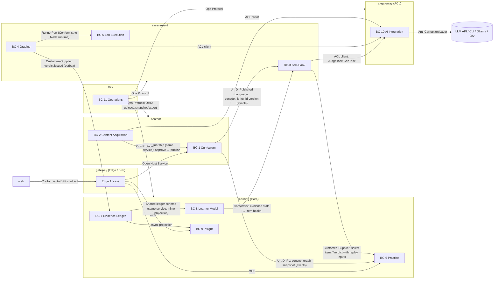
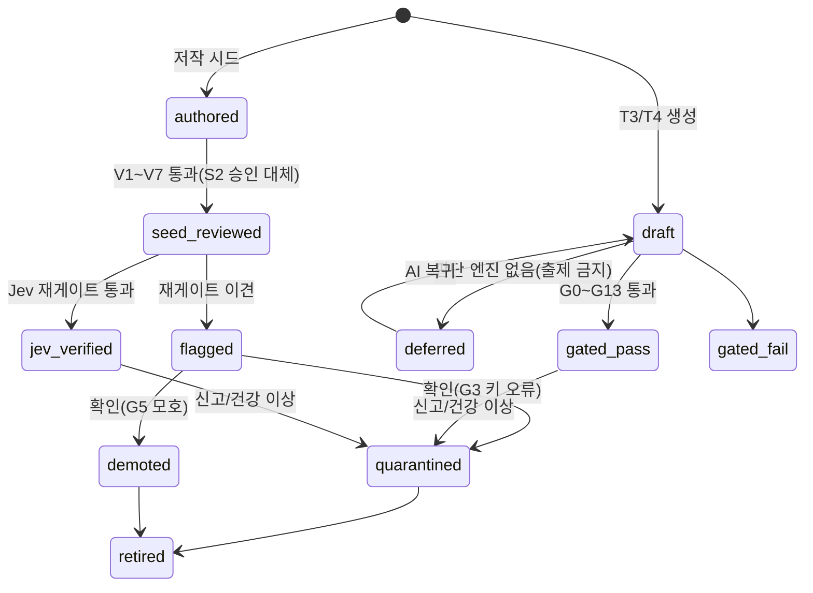
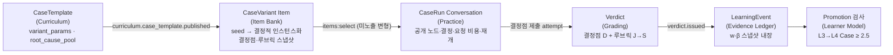
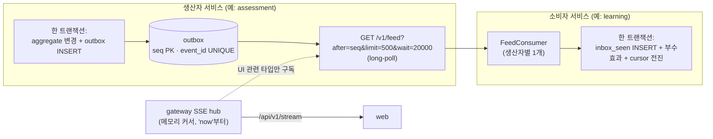
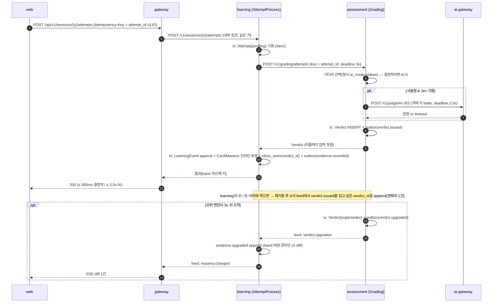
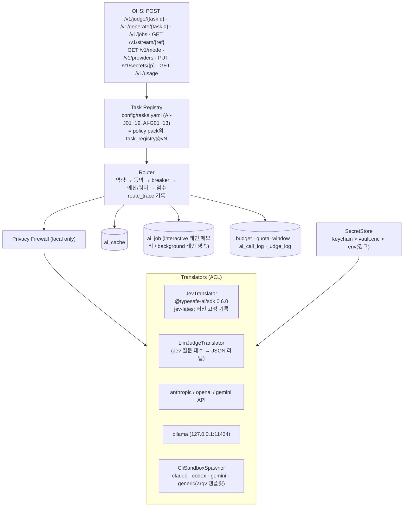
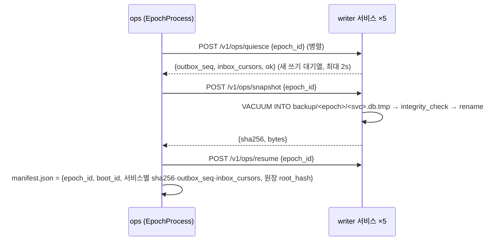
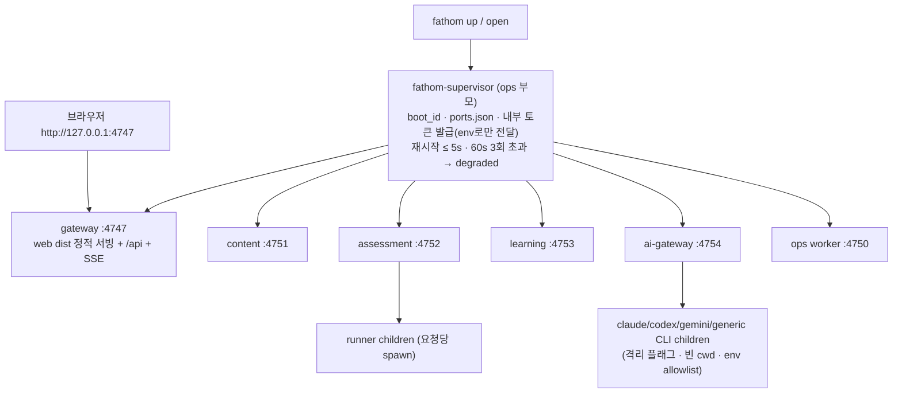

# ARC-PROP-B. 아키텍처 제안 B — Domain-First (DDD · 이벤트 1급 · 로컬 경량)

> **Trace**: UR-01~18 · Planning Baseline v1.0(`01-planning/07-planning-review.md` §4 AQ-01~17, §5.5~5.8) · REQ-01 v1.1(FR 236 · NFR 93 · DR 28 · IR 18 · CON 15) · PLN-CNV-01 v1.1(§5 증거 루프, §8 강등 사다리, §12.1 역량 경계, DEC-CNV-01~36) · USM-01 v1.1(INT-1a~INT-7) · R5(AI 통합) · R6(SI 산출물) · 스파이크 SP-2(러너 격리 PASS) · SP-3(리플레이 결정성 PASS, 예측 PARTIAL) · SP-4(`node:sqlite` PASS)
> **상태**: 독립 제안(Proposal B). ARC-01 확정 전 비교 입력. 동결 대상 아님.
> **관점**: 도메인 주도 설계(DDD)를 먼저 세운다 — 하위 도메인 → Bounded Context(BC) → Context Map → Aggregate → Domain Event → 그 다음에야 서비스·프로세스·포트를 정한다. "서비스 = BC들의 배포 단위"이며, BC 경계가 서비스 경계보다 우선한다.
> **제약 준수**: 서비스 7개(web · gateway · content · assessment · learning · ai-gateway · ops), 서비스 간 코드 import 0(공유는 `packages/contracts` + `packages/shared-kernel`만), transactional outbox + Idempotency-Key, 이벤트에 리플레이 입력 내장, epoch 일관 백업, 127.0.0.1 전용, 첫 기동 OFFLINE, AI 사다리 FULL/JUDGE_ONLY/LLM_ONLY/OFFLINE, Jev는 객체 키로만 참조, 러너는 별도 자식 프로세스, v1 런타임 Python 없음. 무거운 인프라(Kafka·Redis·Postgres·OTel Collector) 없음 — SQLite 파일 + HTTP만.

---

## 0. 요약 (TL;DR)

1. **하위 도메인 3층**: Core = *Evidence & Learner Model*(증거 원장·숙달·승급·LDI), *Assessment*(문항 계측기·채점 사다리), *Practice*(세션 조립·장기 대화) / Supporting = Curriculum, Content Acquisition, Lab Execution, Insight / Generic = AI Integration, Operations, Edge Access.
2. **BC 11개 → 서비스 7개**. `learning`은 Practice·Evidence Ledger·Learner Model·Insight 4개 BC를 호스팅하는 **핵심 도메인 서비스**(증거 단일 writer), `assessment`는 Item Bank·Grading·Lab Execution, `content`는 Curriculum·Content Acquisition, `ai-gateway`는 AI 제공자에 대한 **Anti-Corruption Layer**, `ops`는 Operations + supervisor, `gateway`는 Edge(BFF), `web`은 UI.
3. **AQ-01 답: 병합하지 않는다.** Curriculum(지식의 진리)과 Assessment(측정 도구)는 언어·불변식·변경 주기·장애 프로파일이 다르고, **교차 BC 원자적 불변식이 0개**다. 대신 홉 비용을 두 장치로 없앤다: ① **자급형 계측기(self-contained instrument)** — 발행된 Item은 채점에 필요한 KU·오개념 스냅샷을 내장해 채점 경로가 content를 호출하지 않는다 ② **이벤트 전달 상태 이전(event-carried state transfer)** — assessment·learning은 curriculum 이벤트로 필요한 참조 데이터 사본을 유지한다. 결과: content가 죽어도 세션·채점이 계속된다(D-9 강화).
4. **이벤트는 1급 시민**: 통합 이벤트 38종 카탈로그(`<context>.<aggregate>.<과거형>`), 원장 이벤트 16종. 전달은 **outbox-as-feed**(생산자 outbox 테이블을 `GET /v1/feed?after=seq` long-poll로 공개) + 소비자 **inbox 커서·중복 제거**. 브로커 없음. 대화형 채점은 **오케스트레이션**(learning의 Attempt Process Manager가 동기 호출 + outbox 폴백), 교차 컨텍스트 전파는 **코레오그래피**(KU 개정 → 재게이트 → 증거 보정).
5. **증거 원장만 event sourcing**(SP-3 스키마 그대로), 나머지 aggregate는 상태 저장 + outbox. Learner Model은 **인라인 투영**(같은 트랜잭션, read-your-writes), Insight(대시보드·Depth Map·주간 리뷰·보정·ROI)는 **비동기 CQRS 투영**(`insight.db`, 재구성 가능, 백업 제외).
6. **AI ACL**: 도메인은 과업 ID(AI-J01~J19 / AI-G01~G13)와 객체 키 기반 타입만 안다. 제공자 개념(모델명·CLI 플래그·토큰·Jev SDK)은 ai-gateway 안에서만 존재. **결정적·휴리스틱·자기채점 엔진은 사다리 소유자인 assessment에 둔다** — ai-gateway가 죽어도 사다리 하단이 살아 있다.
7. **주요 AQ 결정**: AQ-02 outbox-as-feed + SSE · AQ-03 대화 상태 = learning(Practice), 턴 판정·발화 = assessment · AQ-04 HttpOnly 쿠키 · AQ-06 envelope 암호화(KEK는 OS 키체인/DPAPI/secret-tool, 폴백 passphrase-scrypt) · AQ-08 gateway 4747 · AQ-09 요청당 spawn + 세마포어 + 25ms RSS 감시(SP-2) · AQ-10 `ext TEXT` + `ext_v` · AQ-11 `content/policy/` 정책 팩(BC별 소유).

---

## 1. 전략적 설계 (Strategic Design)

### 1.1 하위 도메인 분류

| 하위 도메인 | 유형 | 왜 이 분류인가 | 투자 수준 |
|---|---|---|---|
| Evidence & Learner Model (증거·숙달·승급·LDI) | **Core** | 제품 정체성 "깊이는 증거로 남는다". 15년 리플레이·다기기 병합·결정성이 경쟁 우위 | 최고(event sourcing, 속성 기반 테스트, 시뮬레이터) |
| Assessment (문항 계측기·게이트·채점 사다리) | **Core** | UR-13·16. 측정 품질이 증거 품질을 결정 | 높음(게이트 상태기계, 메타모픽 QA) |
| Practice (세션 문법·Method Router·장기 대화) | **Core** | UR-14 "질리지 않게", 2단 스케줄러 | 높음(정책 외부화, 시뮬레이터) |
| Curriculum (개념 지도·KU·오개념·팩·오버레이) | Supporting | 콘텐츠는 가치지만 모델은 표준적(카탈로그 + 버전) | 중(content-as-code, lint) |
| Content Acquisition (가져오기·Inbox) | Supporting | 파이프라인 I1~I9, 보안 경계 | 중 |
| Lab Execution (러너) | Supporting | 격리 기술 문제(SP-2) | 중(보안 회귀 스위트) |
| Insight (대시보드·리포트·분석) | Supporting | 읽기 전용 파생 | 중(CQRS) |
| AI Integration (제공자·라우팅·예산·Firewall) | Generic | 시장의 LLM/Jev를 **번역**하는 일 | 중(ACL, cassette) |
| Operations (기동·백업·복원·doctor·Tripwire) | Generic | 운영 공통 | 중 |
| Edge Access (세션·CSRF·BFF) | Generic | 보안 경계 | 낮음~중 |

### 1.2 Bounded Context 11개와 유비쿼터스 언어

| # | BC | 핵심 용어 (이 BC 안에서만 이 의미) | 같은 단어의 다른 BC 의미 |
|---|---|---|---|
| BC-1 | **Curriculum** | Concept, KU(Knowledge Unit), Misconception, Source, Pack, Tier, `required_for_level`, Overlay, Blueprint, CaseTemplate, Freshness(CL-X) | "Concept"는 Learner Model에선 숙달 대상 키일 뿐 |
| BC-2 | **Content Acquisition** | ImportJob(I1~I9), Chunk, StagingDiff, Quarantine, InboxItem, Trust grade | "승인"은 여기서 staging → Curriculum 발행 |
| BC-3 | **Item Bank** | ItemModel(T2), Item(계측기 인스턴스), Stakes S0~S2, Gate G0~G13, `gate_status`, Family, `stem_family`, ItemHealth, β | "Item"은 Practice에선 블록에 꽂는 콘텐츠 슬롯 |
| BC-4 | **Grading** | Attempt(제출물), Verdict(판정), Ladder(D→J→LJ→H→S), Band(오답/부분/정답), `w_format`, `w_grader`, Pending, Appeal | "Verdict"는 Ledger에선 증거의 원인(cause) |
| BC-5 | **Lab Execution** | RunRequest, RunResult, SourceKind(learner/seed/t1), Harness, HiddenTest | — |
| BC-6 | **Practice** | Session, Block, Slot(W/R/N/D/S/C), Template, Energy, Mixtape, Conversation(Dig/Feynman/Case/Artifact run), Modifier(◆) | "Session"은 Edge에선 브라우저 로그인 세션 → **Edge에서는 `AuthSession`으로 명명 분리** |
| BC-7 | **Evidence Ledger** | LearningEvent, DeviceStream, `device_seq`, `prev_hash`, Checkpoint, Correction | — |
| BC-8 | **Learner Model** | Card(개념×facet×response_mode), FSRS state, θ(Elo), Mastery, Lifecycle CL-0~8, Promotion, LDI term, Provisional | — |
| BC-9 | **Insight** | View(Home Cockpit, Depth Map, Weekly Review, Retention Radar, Calibration Studio, ROI, Portfolio) | 원천 사실을 소유하지 않음 |
| BC-10 | **AI Integration** | Task(AI-J/AI-G), Provider, Engine(J/L/LJ), Mode(FULL…OFFLINE), Route trace, Budget, Quota, Firewall verdict, Consent | "Judge"는 여기선 호출 가능한 엔진, Grading에선 사다리 한 단 |
| BC-11 | **Operations** (+ Edge) | Supervisor, Epoch, Quiesce, Snapshot, Doctor, Tripwire, Port registry / (Edge) AuthSession, Bootstrap token, CSRF | — |

### 1.3 BC → 서비스 배치

| 서비스 | 호스팅 BC | 책임 (한 문장) | 소유 데이터(파일) | 기본 포트(127.0.0.1) |
|---|---|---|---|---|
| **web** | (UI) | 모든 화면·상호작용. 도메인 규칙 없음 | 브라우저 IndexedDB(미전송 attempt 큐만) | dev 5173 (prod은 gateway가 정적 서빙) |
| **gateway** | Edge Access | 부트스트랩→쿠키, Host/Origin/CSRF, rate limit, BFF 조합, SSE 팬아웃, CLI 토큰 | 없음(`~/.fathom/run/session.key` 0600 파일만) | **4747** (선호 고정, 충돌 시 4748~4757 폴백 + 안내) |
| **content** | Curriculum, Content Acquisition | 개념 지도·KU·오개념·출처·팩·오버레이·블루프린트·검색·가져오기·Inbox | `content.db` | 4751 |
| **assessment** | Item Bank, Grading, Lab Execution | 문항 발행·게이트·건강, 채점 사다리, 러너 풀(자식 프로세스) | `assessment.db` + 러너 임시 디렉터리 | 4752 |
| **learning** | Practice, Evidence Ledger, Learner Model, Insight | 세션 조립·장기 대화 상태, **증거 단일 writer**, FSRS·Elo·숙달·승급·LDI, 대시보드 투영 | `learning.db`(원장+인라인 투영+세션), `insight.db`(재구성 가능) | 4753 |
| **ai-gateway** | AI Integration (ACL) | 제공자 probe·동의·라우팅·예산·쿼터·캐시·배치 큐·Firewall·키 보관 | `ai.db` + `~/.fathom/secrets/vault.enc` | 4754 |
| **ops** | Operations | supervisor(프로세스·포트·토큰·재시작), epoch 백업·복원·export/import 조율, doctor, Tripwire, 텔레메트리 | `ops.db` | 4750 (control API) |

- 내부 포트는 **선호값 + 동적 폴백**이며 실제 값은 `~/.fathom/run/ports.json`(0600, `boot_id`·pid 포함)에 기록한다(FR-SET-001). 브라우저가 아는 포트는 4747 하나다.
- `ops`는 한 서비스 안에 프로세스 2개: **`fathom-supervisor`**(부모, 도메인 없음, DB 없음 — 프로세스 테이블·재시작 정책·토큰 발급만) + **`ops` 워커**(자식, 백업·doctor·Tripwire, `ops.db`). 그래서 "ops kill → 학습 계속"(NFR-AVL-002)이 성립한다: `ops` 워커가 죽어도 supervisor가 5s 안에 재기동하고, 학습 경로는 ops를 호출하지 않는다.

---

## 2. Context Map

### 2.1 지도



### 2.2 관계 표

| 상류(U) → 하류(D) | 패턴 | 계약(Published Language) | 하류 방어 |
|---|---|---|---|
| Curriculum → Item Bank | **OHS + PL**, Customer–Supplier | `curriculum.*` 이벤트(concept·ku·misconception 버전), `GET /v1/concepts/{id}?version=` | Item은 KU **스냅샷·해시**를 내장(자급형 계측기). KU 개정은 재게이트 트리거일 뿐 기존 Item을 바꾸지 않음 |
| Curriculum → Practice/Learner Model | OHS + PL | `concept_id`(안정 ID·alias·deprecated_by), 트랙·레벨·선수 간선·tier·`required_for_level` | learning은 `curriculum_ref` 사본 테이블 유지(이벤트로 갱신) → Keystone·희소 레벨 규칙 계산이 content 없이 가능 |
| Item Bank → Practice | Customer–Supplier(learning = 고객) | `POST /v1/items:select` → `ItemDelivery`(정답·해설 제외, FR-QST-022) | learning은 문항 내용을 저장하지 않고 `item_id`·`item_content_hash`만 원장에 기록 |
| Grading → Evidence Ledger | Customer–Supplier + **Idempotent Receiver** | `Verdict`(리플레이 입력 전부 포함, §4.4) | learning `inbox_seen`으로 중복 제거, 원장은 verdict를 **해석하지 않고 복사**(w 계산은 assessment 책임, 저장 시점 고정 FR-PRG-002) |
| Evidence Ledger → Learner Model | 같은 서비스, **공유 스키마**(Shared Kernel 성격, 서비스 내부) | 순수 리듀서 `apply(state, event)` | 결정성 계약(SP-3): 시계·난수·설정·타 DB 조회 금지 |
| Evidence Ledger → Insight | Conformist(비동기 투영) | 원장 이벤트 + `learning.*` 통합 이벤트 | 언제든 전체 재구성(10~12s/55만 건, SP-3) |
| Learner Model → Item Bank | Conformist(assessment가 learning 이벤트를 소비) | `learning.evidence.recorded`(item_id·result·latency·rapid·confidence만) | Item 건강 통계(FR-QST-014)는 assessment 소유 |
| Item Bank/Grading/Acquisition → AI Integration | **ACL 뒤의 OHS** | `JudgeTask`/`GenTask` 계약(`packages/contracts/ai`): 과업 ID + 객체 키 입력 + 타입 출력 + `engine`·`calibrated`·`confidence` | 호출자는 `unavailable`·`deferred`를 정상 결과로 처리(사다리 하강) |
| AI Integration → 외부 제공자 | **Anti-Corruption Layer** | 제공자별 Translator(Anthropic·OpenAI·Gemini·Ollama·claude/codex/gemini CLI·범용 CLI·Jev SDK) | Firewall·스키마 검증·repair·circuit breaker·route_trace |
| Operations → 모든 writer | **Ops Protocol**(OHS, 관리 전용) | `/v1/ops/{quiesce,snapshot,resume,export,import,integrity}` | 각 서비스가 자기 파일만 스냅샷(W1 준수) |
| Edge → content/learning/assessment/ai-gateway/ops | OHS(BFF가 조합) | 서비스별 `/v1/*` | gateway는 상태 없음(도메인 규칙 0) |
| web → gateway | Conformist | `/api/v1/*` + SSE `/api/v1/stream` | — |

### 2.3 "Separate Ways"로 둔 것

- Curriculum ↔ Operations: 팩 설치는 ops가 **조율만** 한다(§4.6 PackActivation). ops는 콘텐츠 모델을 모른다.
- Insight ↔ AI Integration: AI 비용·쿼터 대시보드는 ai-gateway 자신의 읽기 모델(`ai.db`)이다. Insight는 AI 데이터를 복제하지 않는다.

---

## 3. 전술적 설계 (Aggregates)

> 규칙: **aggregate = 트랜잭션 일관성 경계**. 한 트랜잭션은 한 aggregate만 바꾼다. 다른 aggregate·BC는 도메인 이벤트로 **결과적 일관성**. 예외는 같은 BC 안의 "원장 append + 인라인 투영"(SP-3 증분 경로)으로, 투영은 aggregate가 아니라 파생 상태이므로 허용한다.

### 3.1 BC별 aggregate와 불변식

| BC | Aggregate Root | 주요 불변식 | 저장 방식 |
|---|---|---|---|
| Curriculum | `Pack`(설치 단위) | 매니페스트 sha256 일치, R-DAG(선수 순환 0), R-3STAGE(469 전부), R-REQ(필수 = Tier A/B), ID 삭제 금지(alias만) — **팩 전체 원자적 적재**(FR-CUR-002) | 상태 + 버전 행 |
| Curriculum | `Concept` | 안정 ID, `deprecated_by` 체인 비순환, alias 유일 | 상태 |
| Curriculum | `KnowledgeUnit` | published ⇒ `source_refs` ≥ 1(span), 개정 = 새 버전 행, `valid_as_of` | 버전 행(불변) |
| Curriculum | `Misconception` | `meta_family` 필수 | 버전 행 |
| Curriculum | `OverlayPatch` | append-only, `base_version` 기록, 되돌리기 = 역패치 | **이벤트형(append-only)** |
| Curriculum | `Blueprint` | 출처 URL·판본 필수, 기출 복제 금지 | 상태 |
| Curriculum | `CaseTemplate` / `ArtifactTask` / `Rubric` | `variant_params`·`root_cause_pool`·`best_if`·`contested` 스키마(FR-CUR-016), L4+ 1차 출처 span | 버전 행 |
| Acquisition | `ImportJob` (Process Manager) | 단계 전이 I1→I9 단방향, 격리 청크는 사용자 확인 전 LLM 투입 0, 라이선스 D 발행 차단 | 상태 + 단계 로그 |
| Acquisition | `InboxItem` | 저장 전 비밀 마스킹(NFR-DATA-010) | 상태 |
| Item Bank | `ItemModel` | draft→active→retired 전이만(DR-007) | 상태 |
| Item Bank | `Item` (계측기) | 발행 후 **내용 불변**(`content_hash`), `gate_status` 상태기계(§3.2), options는 객체 키, stakes ≥ S1이면 게이트 스택 완비 | 상태(내용 불변 + 상태 필드만 전이) |
| Item Bank | `GateRun` | append-only 결과, 비용 오름차순 | 이벤트형 |
| Item Bank | `ItemFamilyHealth` | 7일 신고율 > 2% ⇒ 패밀리 동결(GR-05) | 상태(통계) |
| Grading | `Verdict` | append-only, 원본 불변, 상향·재채점은 `supersedes` 체인, w는 발급 시점 고정 | **이벤트형** |
| Grading | `PendingGrade` | AI 복귀 시 1회만 처리(멱등) | 큐 상태 |
| Grading | `Appeal` | 다른 엔진 재판정(Jev↔LJ) | 상태 |
| Lab | `RunJob` | `sourceKind ∈ {learner, seed, t1}`만 실행(FR-LAB-016), 동시 실행 ≤ 세마포어 | 휘발(결과는 Verdict에 흡수) |
| Practice | `Session` | 슬롯 문법·하드 제약(같은 모드 연속 ≤ 2, 세션당 ≥ 3종), 종료 후 불변, 범위(트랙·경로·개념 집합) 밖 블록 0 | 상태 |
| Practice | `Conversation`(Dig/Feynman/CaseRun/ArtifactRun) | 턴 순서 단조, 제출본 불변, 재개 = 마지막 커밋 턴부터 | 상태 + 턴 로그(append-only) |
| Practice | `SeasonPlan` / `WeeklyGoal` | 봉인 레코드 UPDATE 금지 | 상태 + 봉인 |
| Evidence Ledger | `DeviceStream` | `device_seq` 단조, `prev_hash` 체인, `client_ts = max(now, last+1)`(SP-3 §6.1) | **Event Sourced** |
| Evidence Ledger | `Checkpoint` | 병합마다 기기별 (seq, hash) + 전역 루트 해시 | 불변 행 |
| Learner Model | (투영) `Card`·`ConceptMastery`·`TrackLevel`·`LdiTerm` | 리플레이 = 라이브(해시 동일), fuzz off, ts-fsrs 5.4.2 고정 | 인라인 투영 |
| Insight | (읽기 모델) View 테이블들 | 원천 없음, 재구성 가능 | 비동기 투영 |
| AI Integration | `ProviderConnection` | 첫 기동 `consent=false`, 동의 전 배경 사용 0(DEC-CNV-18) | 상태 |
| AI Integration | `AiJob` | 대량(호출 > 50·₩1,000·쿼터 20%) ⇒ 승인 이벤트 선행 | 큐 상태 |
| AI Integration | `Budget`/`QuotaWindow` | 100% 시 metered 차단 | 상태 |
| Operations | `Epoch` | 모든 writer의 `(file hash, outbox_seq, inbox cursors)` 동일 epoch | 불변 매니페스트 |

### 3.2 Item `gate_status` 상태기계 (FR-QST-011)



- 출제 가능 집합 = `{seed_reviewed, jev_verified, gated_pass}` (T1/T2 결정적 인스턴스는 생성 즉시 `gated_pass`, G0·G1·G8·G12만). 이 전이는 전부 `assessment.item.*` 이벤트를 낸다 → learning이 **증거 보정**(G3 → `evidence.voided`, G5 → `evidence.weight_adjusted ×0.5`)을 원장에 새 이벤트로 기록한다(원 이벤트 불변).

### 3.3 Case의 생애 — 한 개념이 네 BC를 지나는 방식



---

## 4. Domain Events — 1급 설계

### 4.1 이벤트 3종의 구분

| 종류 | 범위 | 스키마 위치 | 수명 | 예 |
|---|---|---|---|---|
| **도메인 이벤트** | 한 서비스 프로세스 안(모듈 간) | 서비스 내부 `src/domain/**/events.ts` | 휘발 | `SessionBlockCompleted`(Practice → Learner Model NBA 갱신) |
| **원장 이벤트**(Ledger Event) | Evidence Ledger의 사실 기록 | `packages/contracts/ledger`(Published Language, R0 상세 동결) | **영구**(15년, append-only) | `attempt.graded`, `evidence.voided` |
| **통합 이벤트**(Integration Event) | 서비스 간 | `packages/contracts/events` | outbox 90일 보존 | `assessment.verdict.issued` |

### 4.2 통합 이벤트 envelope (상세 동결 후보)

```ts
// packages/contracts/events/envelope.ts (설계 스케치 — 코드 아님)
IntegrationEvent = {
  event_id: ULID;            // 전역 유일, 소비자 중복 제거 키
  type: `${context}.${aggregate}.${pastTense}`;
  schema_version: number;    // 타입별, 가산 변경만(NFR-MAINT-006)
  producer: 'content'|'assessment'|'learning'|'ai-gateway'|'ops';
  producer_seq: number;      // outbox seq — 생산자 내 총순서, epoch 매니페스트에 기록
  occurred_at: number;       // epoch ms (UTC)
  correlation_id: ULID;      // 사용자 의도 단위(예: attempt_id)
  causation_id: ULID | null; // 이 이벤트를 낳은 이벤트/명령
  traceparent?: string;      // W3C trace context
  payload: object;           // type별 zod 스키마
}
```

원장 이벤트 envelope는 SP-3 §6.1 스키마(`id`·`device_id`·`device_seq`·`client_ts`·`type`·`payload`, 총순서 `(client_ts, device_id, device_seq)`)와 FR-PRG-001 필드를 그대로 채택한다.

### 4.3 통합 이벤트 카탈로그 (38종)

| 이벤트 | 생산 | 소비 | 핵심 payload | 목적 |
|---|---|---|---|---|
| `curriculum.pack.installed` | content | ops, assessment | pack_id, version, manifest_hash | 팩 활성화 사가 단계 |
| `curriculum.pack.activated` | content | assessment, learning, gateway | pack_id, version, concept_delta | 참조 사본 갱신, UI 캐시 무효화 |
| `curriculum.concept.published` | content | assessment, learning | concept_id, track, level, tier, prereqs, required_for_level | `curriculum_ref` 사본 |
| `curriculum.concept.revised` | content | assessment, learning | concept_id, changed_fields, version | 〃 |
| `curriculum.concept.deprecated` | content | assessment, learning | concept_id, deprecated_by | alias 이관(FR-CUR-004) |
| `curriculum.ku.revised` | content | assessment | ku_id, concept_id, version, base_version | 의존 Item 재게이트 |
| `curriculum.ku.deprecated` | content | assessment | ku_id, reason | 의존 Item 격리 검토 |
| `curriculum.misconception.revised` | content | assessment | mc_id, version | 오답지·교정문 재게이트 |
| `curriculum.overlay.applied` | content | assessment, learning | patch_id, target_kind, target_id, field | 사용자 수정 반영(FR-CUR-020) |
| `curriculum.overlay.conflicted` | content | gateway(UI) | patch_id, base_version, new_base | 스테이징 diff |
| `curriculum.tier.promoted` | content | assessment, learning | concept_id, from_tier, to_tier | Tier C 승격(FR-CUR-010) |
| `curriculum.case_template.published` | content | assessment | template_id, version | Case 변형 인스턴스화 |
| `acquisition.import.staged` | content | gateway(UI) | job_id, diff_summary | 사용자 승인 대기 |
| `acquisition.import.approved` | content | assessment, learning | job_id, concept_ids, ku_ids | 가져온 개념 편입(FR-IMP-011) |
| `acquisition.inbox.triaged` | content | learning | inbox_id, concept_id, action | 세션 후보(Inbox 슬롯) |
| `assessment.item.published` | assessment | learning | item_id, concept_id, facet, format, response_mode, stakes, content_hash, beta | 가용 재고(learning이 선택 힌트로 사용) |
| `assessment.item.quarantined` | assessment | learning | item_id, reason(report/health/regate), evidence_policy(void/halve/keep) | 증거 보정 |
| `assessment.item.retired` | assessment | learning | item_id | 큐에서 제외 |
| `assessment.item.beta_recalibrated` | assessment | learning | item_id, beta, basis_n | 이후 스냅샷에만 반영(과거 불변) |
| `assessment.verdict.issued` | assessment | learning | Verdict 전체(§4.4) | **증거 원인** |
| `assessment.verdict.upgraded` | assessment | learning, gateway | verdict_id, supersedes, band_changed | 3s 데드라인 뒤 상위 엔진(FR-QST-019) |
| `assessment.verdict.regraded` | assessment | learning, gateway | verdict_id, supersedes, from_pending | 보류 재채점(FR-QST-020) |
| `assessment.appeal.resolved` | assessment | learning, gateway | appeal_id, verdict_id, outcome | 이의제기(FR-AI-012) |
| `learning.evidence.recorded` | learning | assessment, ops | event_id, item_id, concept_id, result, latency_ms, rapid, confidence | 문항 건강·Tripwire |
| `learning.mastery.changed` | learning | gateway | concept_id, from, to, provisional | UI 갱신 |
| `learning.level.promoted` | learning | gateway, ops | track, from, to, provisional | 승급 알림·Tripwire |
| `learning.card.suspended` / `.retired` | learning | assessment | card_key | 워밍 수요 제외 |
| `learning.demand.forecasted` | learning | assessment | window_days, demand[{concept_id, facet, format, level, n}] | 워밍 풀(FR-QST-013) |
| `learning.session.completed` | learning | ops | session_id, blocks, duration, modes | Tripwire·텔레메트리 |
| `learning.ledger.merged` | learning | ops, gateway | checkpoint_id, root_hash, imported_n | 병합 결과 |
| `ai.mode.changed` | ai-gateway | assessment, content, learning, gateway | mode, reasons[], providers[] | 사다리·숙달 프로파일·상태 칩 |
| `ai.provider.status_changed` | ai-gateway | gateway | provider_id, status, breaker | 상태 칩 |
| `ai.job.completed` | ai-gateway | 요청 서비스(requester 필드 일치만) | job_id, task_id, result_ref, outcome | 배치 결과 회수 |
| `ai.budget.threshold_reached` / `ai.judge.model_drift` | ai-gateway | gateway, ops | ratio / model_version | 운영 배너 |
| `ops.epoch.completed` / `ops.service.degraded` | ops | gateway | epoch_id / service, reason | 운영 배너·헬스 보드 |

### 4.4 Verdict = 리플레이 입력의 운반체

원장 자급성(NFR-DATA-013)의 핵심은 **Verdict가 learning이 필요로 하는 모든 것을 들고 온다**는 점이다. learning은 content·assessment를 조회하지 않고 원장을 쓴다.

| 필드 | 의미 | 원장 payload로 복사 |
|---|---|---|
| `verdict_id`, `attempt_id` | 멱등 키(learning `idempotency_key = verdict:<verdict_id>`) | ✓ |
| `item_id`, `item_content_hash`, `item_beta_snapshot`, `gate_result_id`, `stakes` | 계측기 식별·난이도 스냅샷 | ✓ |
| `concept_id`, `ku_ids`, `mc_ids`, `facet`, `format`, `response_mode`, `tier` | 카드 키·오개념 | ✓ |
| `result`, `band`, `score`, `confidence`(CBM), `latency_ms`, `rapid`, `hints_used` | 응답 사실 | ✓ |
| `grader_engine`, `calibrated`, `grader_confidence`, `pending`, `provisional` | 판정 출처 | ✓ |
| `w_format`, `w_grader`, `gaming_factor` | 증거 가중(발급 시점 고정) | ✓ |
| `policy_version`(gate_thresholds·cbm_params), `ai_mode` | 정책 추적 | ✓ |
| `recommended_grade`(형식 정규화 후, FR-PRG-007) | FSRS 입력 | ✓ (learning이 학습자 확인 grade로 확정) |

learning이 추가하는 필드: `device_id`, `device_seq`, `client_ts`, `fsrs_at`(일 경계 반영 논리 시각, SP-3 §6.2), `prev_hash`, `card_id`, `mastery_rules` 버전.

### 4.5 원장 이벤트 타입 (Evidence Ledger, 16종)

`attempt.graded` · `evidence.regraded` · `evidence.upgraded` · `evidence.voided`(correction, 2-패스 무효 집합) · `evidence.weight_adjusted` · `pretest.answered`(β 전용, 증거 0) · `lesson.completed` · `self_assessment.recorded` · `card.enrolled` · `card.suspended` · `card.retired` · `profile.setting_changed`(일 경계·보존율 계층 등 리플레이 영향 설정) · `policy.switched`(mastery_rules·ldi_params·FSRS 파라미터 승인) · `declaration.sealed`(선언 vs 증명, 봉인) · `promotion.exam_completed` · `ai_mode.observed`(모드 전환 시점 기록, 잠정 판정 근거).

- **업캐스터(upcaster) 체인**: 15년 동안 저장된 이벤트는 절대 다시 쓰지 않는다. `schema_version`별 업캐스터가 리플레이 시 최신 형태로 올린다. 업캐스터는 순수 함수이며 골든 원장 fixture로 회귀 테스트한다.

### 4.6 코레오그래피 vs 오케스트레이션 — 결정 규칙

| 기준 | 오케스트레이션(Process Manager/Saga) | 코레오그래피(이벤트 반응) |
|---|---|---|
| 사용자가 결과를 기다림(interactive) | ✓ | |
| 단계 순서·보상이 도메인 규칙 | ✓ | |
| 반응자가 여럿이고 서로 모름 | | ✓ |
| 생산자가 소비자를 알면 안 됨(상류 BC) | | ✓ |

| 흐름 | 방식 | 소유자 | 단계 |
|---|---|---|---|
| **Attempt 채점 → 증거 기록** | 오케스트레이션 + outbox 폴백 | learning `AttemptProcess` | §5.1 |
| Conversation 턴(디깅·Feynman·Case·산출물 반박) | 오케스트레이션 | learning `ConversationProcess` | 턴 저장 → assessment `turns:judge`(J17 + G07 발화 + 질문 은행 폴백) → 결과 저장 |
| 승급 평가(12문항·형식 ≥ 4) | 오케스트레이션 | learning `PromotionExam` | 문항 선택 → 채점 → 판정 → `promotion.exam_completed` |
| 가져오기 I1~I9 | 오케스트레이션(Saga) | content `ImportJob` | I1 수집(SSRF 가드) → I1.5 주입 스캔(H+J16) → … → I9 스테이징 → 승인 |
| **팩 활성화 + 오버레이 재적용** | 오케스트레이션(Saga) | ops `PackActivation` | content 설치(비활성) → assessment 설치(비활성) → 둘 다 OK면 content activate → 이벤트 → assessment activate. 실패 시 비활성 버전 폐기(**blue/green 팩**, 보상 = 포인터 미전환) |
| epoch 백업 / 복원 / 병합 import | 오케스트레이션 | ops | §7.4 |
| KU 개정 → 재게이트 → 증거 보정 | **코레오그래피** | — | `curriculum.ku.revised` → assessment 재게이트 → `assessment.item.quarantined(evidence_policy)` → learning `evidence.voided` |
| 문항 건강 | 코레오그래피 | — | `learning.evidence.recorded` → assessment 통계 → 이상 시 `item.quarantined` |
| 워밍 풀 | 코레오그래피 | — | `learning.demand.forecasted` → assessment 결손 계산 → ai-gateway `AiJob`(배치 창) → `ai.job.completed` → 게이트 → `item.published` |
| AI 모드 전파 | 코레오그래피 | — | `ai.mode.changed` → 각 BC가 자기 정책 적용 |

### 4.7 전달 메커니즘 — outbox-as-feed (AQ-02)



- **pull이 push보다 나은 이유(로컬 맥락)**: ① 생산자가 소비자 목록·재시도 정책을 몰라도 된다(상류 BC 독립) ② 소비자 장애·재기동 후 커서부터 이어 읽으면 끝(재전송 큐 불필요) ③ 생산자 내 총순서가 자연스럽다 ④ epoch 백업에 `outbox_seq`와 `inbox cursor`를 함께 기록하면 복원 후 "유실 0·중복 0"이 증명된다.
- 테이블(모든 writer 서비스 공통, `shared-kernel/eventing`): `outbox(seq INTEGER PRIMARY KEY, event_id TEXT UNIQUE, type, schema_version, occurred_at, correlation_id, causation_id, payload TEXT CHECK(json_valid(payload))) STRICT`, `inbox_cursor(producer PRIMARY KEY, last_seq)`, `inbox_seen(event_id PRIMARY KEY, processed_at)`(30일 후 정리, 커서가 1차 방어).
- **지연**: long-poll이라 생산 → 소비 p95 < 50ms(로컬). 대화형 경로는 이 지연에 의존하지 않는다(동기 호출이 1차, feed는 폴백).
- **보존**: outbox 90일. 소비자가 보존 범위를 벗어나면 `resync`(생산자의 스냅샷 쿼리 API로 사본 재구성) — 참조 사본 테이블만 해당, 원장은 feed가 아니라 자기 자신이 원천이므로 해당 없음.
- **독 이벤트(poison)**: 처리 3회 실패 시 `inbox_dead(event_id, error)`로 격리하고 커서 전진 + `ops.service.degraded` 배너(조용한 실패 금지, NFR-AVL-005). 원장 쓰기 경로의 독 이벤트는 격리하지 않고 **정지 + 경보**(증거 유실 금지).
- **명령(동기)**: 모든 상태 변경 HTTP는 `Idempotency-Key` 필수, 서비스별 `idem(key PK, request_hash, status, response, created_at)` 7일 보존. 같은 키·다른 본문 → 422.

---

## 5. 런타임 뷰 (핵심 시나리오)

### 5.1 Attempt 채점 → 증거 (오케스트레이션 + outbox 폴백 + 늦은 상향)



- **정확히 1건**(NFR-DATA-013 수용기준): 동기 경로와 feed 경로가 같은 멱등 키(`verdict:<verdict_id>`)로 수렴하고, learning의 `inbox_seen`/원장 `UNIQUE(idempotency_key)`가 둘 중 늦은 쪽을 무시한다.
- **assessment 장애 시**(learning 생존): 결정적 형식도 채점 불가 → web에 "채점 서비스 재시작 중" 격하 표시, attempt는 web IndexedDB 큐에 같은 키로 보관 후 재시도(재기동 ≤ 5s). 문항 제시는 learning이 prefetch해 둔 블록으로 계속.
- **learning 장애 시**: 코어 정지. supervisor ≤ 5s 재시작, web은 attempt를 큐에 보관(오프라인 응답 재수입 계약과 같은 envelope — DEC-CNV-27을 앱 내부에 재사용).

### 5.2 세션 시작 → 첫 문항(NFR-PERF-001 p95 ≤ 2s)

1. web → gateway → learning `POST /v1/sessions`(energy, minutes, scope).
2. learning(Practice)이 **로컬 데이터만으로** 조립: Stage 1(FSRS due·Keystone — `curriculum_ref` 선수 그래프 사용) → Stage 2(Method Router 25칸·변주 예산·형태 거리·엔트로피 가드, `composer_policy@v1`).
3. learning → assessment `POST /v1/items:select` 1회(블록 전체 배치, 미노출 변형·문형 로테이션·패밀리 격리는 assessment 규칙).
4. 첫 블록 반환. content 호출 0회(개념 요약은 `curriculum_ref`에 있음).

### 5.3 AI 모드 전파와 첫 기동 OFFLINE

- ai-gateway 기동 시 모든 `ProviderConnection.consent=false` → `mode=OFFLINE` 발행. probe는 돌되(가용성 표시) 결과는 **동의 전 라우팅 후보에서 제외**.
- 사용자가 설정 화면에서 동의 → `ai.provider.consented`(내부 도메인 이벤트) → 모드 재계산 → `ai.mode.changed`.
- 소비자 반응: assessment는 사다리 정책(`deferred` 출제 금지 포함), content는 Tier C 승격 CTA 전환, learning은 `mastery_rules@v1` AI 모드 프로파일·잠정 판정(FR-PRG-033)과 원장 `ai_mode.observed` 기록.
- **ai-gateway가 죽은 경우**는 이벤트를 기다리지 않는다: assessment의 `AiClient`가 circuit breaker(연속 5회·1분 50%)로 즉시 하강한다(D-9). 사다리 하단(D·H·S)은 assessment 안에 있으므로 영향 없음.

---

## 6. AI / Jev 배치 — Anti-Corruption Layer

### 6.1 경계 규칙

| 규칙 | 내용 |
|---|---|
| R-AI-1 | 도메인은 과업 ID + 타입만 안다: `JudgeTask<AI-Jxx>`(noul/choice/score 질문 대수) · `GenTask<AI-Gxx>`(zod Portable Schema). 모델명·토큰·CLI 플래그는 ai-gateway 밖으로 나가지 않는다(응답에는 `engine`, `family`, `calibrated`, `confidence`, `route_id`만) |
| R-AI-2 | **사다리 소유 = Grading(assessment)**. 결정적(D)·휴리스틱(H)·자기채점(S) 엔진은 assessment 코드다. ai-gateway는 J·LJ·L 엔진만 제공한다. (R5 §12 스케치의 `judge/heuristics`를 assessment로 옮김 — ai-gateway 장애에서 H가 살아야 하므로) |
| R-AI-3 | **Jev 객체 키 전용**: contracts 타입이 키 접두 `k_` 문자열 키 레코드(Record)만 허용하고 배열 필드 타입은 금지, 질문 문자열 lint(`/\[\d+\]/` 금지, `state.<field>.<key>` 형식만), ai-gateway `JevTranslator`가 런타임에서 재검사해 위반 시 `BAD_REQUEST`(버그로 분류). 대량 항목은 항목별 질문으로 분할(maxQuestionsPerRequest 15) |
| R-AI-4 | **Privacy Firewall = ai-gateway의 아웃바운드 도메인 서비스**. 모든 외부 페이로드(Jev 포함) 100% 통과, 판정은 로컬만(정규식·사내 패턴·선택적 Ollama). 패턴 라이브러리는 `shared-kernel/privacy`(순수 함수)로 두어 content의 Inbox 마스킹도 같은 규칙을 쓴다 |
| R-AI-5 | 생성물은 **콘텐츠로 영속화**(Item Bank)되지 캐시로 남지 않는다. 판정 캐시는 `ai_cache` 30일(NFR-DATA-007은 90일 상한) |
| R-AI-6 | LLM 산출 코드는 러너에서 실행 금지(FR-LAB-016). `source_kind ∈ {t3, t4, imported}` → 403 |

### 6.2 ai-gateway 내부 구조



- **지연 등급**: interactive(데드라인 3s, Jev·휴리스틱만), conversational(스트리밍 발화 AI-G07), background(배치 창 = 앱 실행 + 입력 유휴 ≥ 10분 + AC 전원, FR-AI-010).
- **판정 원자료 보존**: `judge_log`(append-only, probabilities·input_hash·model_version·prompt_version) — Grading의 Verdict는 `judge_log_id`를 참조(NFR-DATA-005, K05 증류 대비).
- **구독 쿼터 양보**(FR-AI-025): CLI 호출은 세마포어 2 + 분당 20, 사용자 대화형 CLI 활동 감지(프로세스 목록의 `claude`/`codex` 대화형 세션) 시 background 레인 일시정지.
- **범용 CLI**(FR-AI-024): `providers.d/*.yaml`(실행 파일·argv 템플릿·JSON 포인터·probe 명령) → 설정 검증에서 프롬프트 치환 슬롯 금지.

---

## 7. 데이터 소유권 · 저장

### 7.1 파일 배치 (`~/.fathom`, Windows `%APPDATA%\fathom`, `FATHOM_HOME`)

```
~/.fathom/
  db/        content.db  assessment.db  learning.db  insight.db  ai.db  ops.db
  packs/     <track>@<ver>.fpack (설치된 불변 팩) · policy@<ver>.fpack
  backup/    <epoch_id>/{*.db, manifest.json}   daily/<device_id>/<date>.jsonl
  export/    inbox/(마스킹 원문 임시)   logs/<svc>/<date>.jsonl
  run/       ports.json  session.key(0600)  cli.token(0600)  boot_id  runner/(run-XXXX, 0700)
  secrets/   vault.enc  kek.wrapped(OS 바인딩 시 없음)
```

### 7.2 서비스별 핵심 테이블

| 서비스 · 파일 | 테이블(요지) | 비고 |
|---|---|---|
| content · `content.db` | `pack`, `pack_file`, `concept`, `concept_edge`, `concept_alias`, `ku`(버전 행), `misconception`, `source`, `case_template`, `artifact_task`, `rubric`, `blueprint*`, `overlay_patch`(append-only), `import_job`, `staging_diff`, `candidate_queue`, `inbox_item`, `search_doc` + `fts_tri`·`fts_cmp`(SP-4 V2) | 검색 = SP-4 하이브리드 6단계 |
| assessment · `assessment.db` | `item_model`, `item`, `item_snapshot`(KU·mc 스냅샷), `gate_run`(append-only), `lineage_edge`, `item_family_health`, `report`, `verdict`(append-only), `pending_grade`, `appeal`, `overlay_patch`(Item 대상), `curriculum_ref`(사본) | 채점은 content 무호출 |
| learning · `learning.db` | `events`(SP-3 스키마, 트리거로 append-only), `checkpoint`, `device`, `card_state`·`concept_state`·`track_level`·`ldi_term`(인라인 투영, `WITHOUT ROWID`), `session`, `block`, `conversation`, `conversation_turn`, `season`, `sealed`, `curriculum_ref` | 원장 `synchronous=FULL`(SP-3 권고), 나머지 NORMAL |
| learning · `insight.db` | `v_home`, `v_depth_cell`, `v_weekly`, `v_radar`, `v_calibration`, `v_mode_roi`, `v_misc_family`, `projector_cursor` | **백업 제외**, 복원 후 재구성 |
| ai-gateway · `ai.db` | `provider_config`, `provider_status`, `consent`, `ai_job`, `ai_cache`, `ai_call_log`, `judge_log`(append-only), `budget`, `quota_window`, `gold_item`, `calibration`, `firewall_log` | 키 문자열 0(DR-018) |
| ops · `ops.db` | `epoch`, `backup_generation`, `migration_history`, `health_snapshot`, `telemetry_raw`(400일)·`telemetry_agg`, `tripwire` | |

- **모든 쓰기 서비스 공통 테이블**: `outbox`, `inbox_cursor`, `inbox_seen`, `inbox_dead`, `idem`, `policy_version`, `schema_migrations`.
- **AQ-10 `ext`**: 모든 엔티티 테이블에 `ext TEXT NOT NULL DEFAULT '{}' CHECK (json_valid(ext))` + `ext_v INTEGER NOT NULL DEFAULT 1`. 이름 훅(DR-020)은 실제 열. `ext` 키는 `"<feature>.<field>"` 네임스페이스(예: `lanpair.origin`), 승격 시 실제 열 + 백필 마이그레이션(가산 CR).
- SQLite 규칙은 SP-4 W1~W5 채택: 파일당 writer 1 프로세스, `BEGIN IMMEDIATE`, 트랜잭션 안 `await` 금지, `STRICT`, 서비스 간 `ATTACH` 금지(정적 검사), 백업은 `VACUUM INTO`.

### 7.3 참조 사본(`curriculum_ref`) — 이벤트 전달 상태 이전

| 사본 보유 | 담는 것 | 갱신 | 쓰임 |
|---|---|---|---|
| learning | concept_id, track, level, tier, knowledge_type, prereq 간선, `required_for_level`, alias·deprecated_by, 요약 1줄 | `curriculum.concept.*`, `pack.activated` | Keystone, 희소 레벨 규칙, 트랙 cap, 세션 블록 표시 |
| assessment | concept·KU·mc의 (id, version, content_hash) | `curriculum.ku.*`, `misconception.*` | 재게이트 대상 계산, 생성 컨텍스트 조립 시 content 조회 최소화 |

사본은 **캐시가 아니라 계약된 사본**이다: 스키마는 contracts의 PL, 불일치 감지는 `pack.activated.manifest_hash` 비교, 재구성은 `GET /v1/curriculum/export?since=`.

### 7.4 epoch 일관 백업 (NFR-DATA-012)



- quiesce 2s 안에 한 서비스라도 응답 없으면 epoch **중단**(resume 전송, 다음 주기 재시도, 배너). 복원 시 manifest의 모든 파일 해시·epoch 일치 검증 후에만 교체(불일치 조합 거부).
- 일 증분: ops가 learning `GET /v1/ops/export?since=<checkpoint>`(원장·오버레이 JSONL 스트림) + content/assessment 오버레이 → `backup/daily/<device>/<date>.jsonl` → 2차 대상 복제(선택 AES-256-GCM + scrypt).
- 다기기 병합: `fathom import --merge f` → ops → learning `POST /v1/ops/import`(스트리밍, `INSERT OR IGNORE`) → learning이 백그라운드 전체 리플레이(≈ 10~12s/55만) 후 투영 테이블 원자 교체 → `learning.ledger.merged`. 오버레이는 content/assessment로, 설정 충돌은 ts 최신·동률 device_id 사전순(FR-SET-022).

---

## 8. 콘텐츠 저장 — content-as-code 팩

### 8.1 저장소 구조와 빌드

```
content/
  packs/<track>/               # 19 코어 + data
    pack.yaml                  # pack_id, version, tracks, requires
    concepts/<concept_id>.yaml # 3단(theory/code_or_case/core), tier, required_for_level, aliases
    ku/<concept_id>.yaml       # KU 목록 + source span
    misconceptions/<concept_id>.yaml
    items/                     # 저작 시드 문항 + T2 ItemModel (Item Bank 소유분)
      models/*.yaml  seed/*.yaml
    cases/*.yaml  artifacts/*.yaml  rubrics/*.yaml
    labs/                      # 알고리즘 은행·보안 패치·카타: spec + starter + hidden tests (JS/TS)
  sources/registry.yaml        # ≈ 35 출처, license_grade
  blueprints/{engineer-info-processing,cka}.yaml
  policy/                      # AQ-11 — 콘텐츠 팩과 분리된 정책 팩
    method_policy@v1.yaml composer_policy@v1.yaml mastery_rules@v1.yaml
    ldi_params@v1.yaml gaming_params@v1.yaml cbm_params@v1.yaml
    gate_thresholds@v1.yaml task_registry@v1.yaml
  oracles/                     # 빌드타임 Python 오라클(ml/llm 예측형) — uv run, 결과를 팩에 동결
  goldset/                     # model_labeled_draft (앱에서 사용자 확정)
```

- `pnpm content:build` = zod 스키마 → lint(R-DAG, R-3STAGE 469, R-REQ, R-ALIAS "한글 개념은 영문 alias ≥ 1"(SP-4 R-6), copy-guard, Jev 객체 키, 도식 텍스트 대체) → 빌드타임 오라클 실행(`uv run content/oracles/*.py`, 결과 JSON 동결 — 런타임 Python 0) → `dist/packs/<track>@<ver>.fpack`(JSON 번들 + `manifest.json` 파일별 sha256).
- **팩은 BC 단위로 분할 소비**: 한 `.fpack` 안에 `curriculum/`과 `itembank/` 섹션이 있고, content는 `curriculum/`만, assessment는 `itembank/`만 적재한다(서비스 간 import 없이 같은 파일을 각자 계약 스키마로 읽음). 적재 순서·원자성은 ops `PackActivation` 사가(§4.6).
- **불변 시드 + 오버레이**(DEC-CNV-35): 설치된 팩은 불변. 사용자 수정은 대상 소유 BC의 `overlay_patch`(KU 문장 → content, 정답 키·해설·오답지 → assessment). 조회 = 팩 ⊕ 오버레이. 업그레이드 시 `base_version` 같은 필드는 자동 재적용, 바뀐 필드는 `curriculum.overlay.conflicted`로 스테이징 diff. `OverlayPatch` 타입·재적용 알고리즘은 `shared-kernel/overlay`(도메인 중립 알고리즘이라 공유 커널 자격).
- 정책 팩 버전은 **소유 BC가 로드**: method/composer/mastery/ldi/gaming → learning, gate_thresholds/cbm → assessment, task_registry → ai-gateway. 해시가 바뀌었는데 버전이 같으면 기동 거부(FR-CUR-017). 활성 버전은 이벤트의 `policy_version`에 기록.

---

## 9. 러너 · 랩 격리 (Lab Execution BC)

SP-2 결과를 그대로 아키텍처로 채택한다.

| 항목 | 결정 |
|---|---|
| 위치 | assessment 서비스의 `LabExecution` 모듈 = **부모**, 학습자 코드는 **요청당 spawn 자식**(`services/assessment/runner/guard.mjs`, `sql-entry.mjs`) |
| 풀 구조(AQ-09) | pre-fork 재사용 없음. **세마포어**(동시 ≤ min(3, 코어 − 1)) + 큐. 필요 시 "1회용 사전 기동 스페어"만(차단 스위트 재통과 조건) |
| 플래그 | `--permission --allow-fs-read=<guard> --allow-fs-read=<tmp> --disallow-code-generation-from-strings --max-old-space-size=128 --no-addons --disable-wasm-trap-handler --import=<guard>`, env `{}`(가드 설정 2개는 읽고 삭제) |
| 가드 | `module.registerHooks` default-deny 허용 목록(해석 url 기준), `getBuiltinModule` 래핑, fetch/WebSocket 스텁, `net.Socket.connect`·`Server.listen` 무력화, `process.kill` 자기 pid만, 속성 잠금 |
| 자원 | Linux `prlimit --as=1.5G --cpu=t+1 --fsize=8M --core=0`, RSS 감시 **25ms**(macOS 50ms `ps`, Windows 100ms PowerShell — V-live), 64KB 출력 캡(`>=`), 트리 kill(`-pid`/Windows `taskkill /T /F`) |
| TS | 부모에서 `module.stripTypeScriptTypes` 후 `.mjs` 실행(p50 186 → 81ms), erasable 구문만(저작 lint) |
| SQL | 부모+자식 이중 토크나이저 allowlist(읽기 전용 PRAGMA 7종 허용 권고 채택), `:memory:`, `allowExtension:false`, `max_page_count=4096`, 1000행·셀 1KB 캡 |
| 채점 신호 분리 | 숨은 테스트 결과는 **fd3 전용 채널** + 학습자 코드 이후 별도 하네스 프로세스(RSK-RUN-03) |
| 선택 하드닝 | Linux `unshare -Urn`(netns) 옵션, Docker `--network none`(FR-LAB-011 동의 후) |
| 기동 청소 | assessment 기동 시 `run/runner/run-*` 잔존 디렉터리·프로세스 청소(pid 파일) |
| 보안 회귀 | SP-2 차단 스위트(JS 52 + SQL 16 + 기능 7)를 `pnpm test:runner-sec`로 **V-build 게이트** 승격(D-12) |
| AQ-17 복잡도 | 시간 대신 **연산 계수 우선**(하네스가 비교·접근 횟수 계측 가능한 과제), 불가 시 같은 자식 안에서 n·2n·4n·8n 각 3회 `performance.now` 중앙값 → log-log 기울기(O(n) ≤ 1.3, O(n log n) ≤ 1.45, O(n²) 판정 ≥ 1.7), 프로세스 생성 시간 제외 |

---

## 10. 프런트엔드 아키텍처

기본 스택을 채택한다: **React 19.3 + Vite 8.3(Rolldown) + TanStack Router 1.170 + TanStack Query 5.104 + Tailwind v4.3(@theme, OKLCH) + Radix(통합 `radix-ui` 1.6) + shadcn 패턴 + Motion 13 + zustand 5 + cmdk + sonner + lucide**. 도전(대체)은 두 곳뿐이다.

| 도전 | 결정 | 이유 |
|---|---|---|
| Monaco vs CodeMirror | **CodeMirror 6(`@uiw/react-codemirror`)** 기본, Monaco 미채택 | 번들 크기(LCP ≤ 2.5s), 한국어 IME 조합 안정성(NFR-UX-006), 카타·SQL·YAML 모두 충분. Monaco 기능(IntelliSense)은 NG-03(대필 금지)과도 충돌 |
| Depth Map 렌더 | xyflow가 아니라 **자체 SVG 격자**(트랙 × 레벨 × 개념 셀 469) | NFR-PERF-009 첫 렌더 ≤ 1s·50fps. xyflow + d3-force는 "개념 관계 그래프" 화면에만 lazy |

### 10.1 구조 — BC 정렬 feature slicing

```
apps/web/src/
  routes/                        # TanStack Router file-based (18 화면)
    index.tsx  session.$sessionId.tsx  concepts.$conceptId.tsx  map.tsx
    evidence.$conceptId.tsx  notes.$blockId.tsx  dig.$conversationId.tsx
    case.$runId.tsx  artifact.$runId.tsx  review.weekly.tsx  season.tsx
    inbox.tsx  import.$jobId.tsx  curation.tsx  ai.tsx  ops.tsx  settings.tsx  _design.tsx
  features/
    practice/        # 세션 플레이어, 블록 믹스테이프, 대화(디깅·Feynman·Case·산출물)
    curriculum/      # 개념 페이지(3단·레벨 렌즈), 지도, 검색
    assessment-ui/   # 문항 렌더러(형식별), 판정 카드·배지 7종, 이의제기
    insight/         # 홈 Cockpit, Depth Map, 주간 리뷰, 보정 스튜디오, Radar
    acquisition/     # 가져오기 스테이징, Inbox
    ai-control/      # 연결·동의·비용·쿼터·대량 작업 승인
    ops-console/     # 헬스 보드, doctor, 백업·병합 마법사
  lib/
    api/             # contracts 기반 fetch 클라이언트 (Idempotency-Key·CSRF 헤더 자동)
    query-keys.ts    # ['practice','session',id] 등 BC 접두 키 팩토리
    events.ts        # SSE 이벤트 → queryKey 무효화 맵 (예: learning.mastery.changed → ['insight',...])
    attempt-queue.ts # IndexedDB 미전송 attempt 큐 (같은 키 재시도)
    hangul.ts        # 초성 검색(팔레트)
  stores/            # zustand: 플레이어 휘발 상태(타이머·키맵·포커스)
  styles/            # tokens.css (D3 Bathymetry @theme), typography(keep-all 등 NFR-UX-009)
```

- **서버 상태 = TanStack Query 단독**, 클라 상태는 플레이어 휘발 상태만 zustand. 이벤트 드리븐 UI: gateway SSE(`/api/v1/stream`)가 통합 이벤트 부분집합을 밀어 주면 `events.ts`가 쿼리 무효화·낙관적 diff(판정 밴드 변경 시만)를 수행.
- **판정 상향 UX**(FR-QST-019): 제출 응답(하위 사다리 결과)으로 즉시 렌더 → `assessment.verdict.upgraded` SSE가 오면 밴드가 바뀐 경우에만 작은 diff 애니메이션(Motion, `prefers-reduced-motion` 존중).
- `packages/ui`: shadcn 패턴 컴포넌트 + 토큰(web 전용 패키지, 서비스는 import 불가). 폰트 self-host(pretendard·geist fontsource), shiki는 JS 정규식 엔진 + 언어 lazy.
- react-markdown은 `skipHtml`, 링크 `rel=noopener`, 코드 블록 실행 없음(NFR-SEC-009).
- PWA(AQ-16): 수작업 서비스 워커, **앱 셸 정적 자산만 cache-first**, `/api/**` network-only, SW scope `/`. origin = `http://127.0.0.1:4747` 고정 전제, 폴백 포트면 "설치형 창 재설치" 안내.

---

## 11. 모노레포 레이아웃 (정확한 폴더)

```
/ (repo root: study_develop_ai)
├─ apps/
│  ├─ web/                      # React SPA
│  └─ cli/                      # `fathom` CLI + fathom-supervisor(ops 서비스의 부모 프로세스 엔트리)
│     └─ src/{commands/, supervisor/{process-table.ts,restart-policy.ts,ports.ts,tokens.ts}, main.ts}
├─ services/
│  ├─ gateway/
│  ├─ content/
│  ├─ assessment/
│  │  └─ runner/                # guard.mjs, sql-entry.mjs, harness.mjs (자식 전용, 부모 외 import 금지)
│  ├─ learning/
│  ├─ ai-gateway/
│  │  └─ config/{providers.d/, prompts/}
│  └─ ops/
│     (각 서비스 공통 골격)
│     ├─ src/
│     │  ├─ domain/<bc>/        # aggregates, value objects, domain events, policies — 순수(node:* import 금지)
│     │  ├─ application/        # commands, queries, process managers(sagas), feed consumers
│     │  ├─ adapters/
│     │  │  ├─ http/            # Fastify routes (/v1/*, /healthz, /readyz, /metrics, /v1/feed, /v1/ops/*)
│     │  │  ├─ persistence/     # SqlitePort 구현, repositories
│     │  │  ├─ clients/         # 타 서비스 HTTP 클라이언트(contracts 타입만)
│     │  │  └─ acl/             # (ai-gateway: translators) (content: FetchPort/SSRF) (assessment: RunnerPort)
│     │  └─ main.ts
│     ├─ migrations/NNNN_<desc>.sql
│     └─ test/{unit,integration,contract}/
├─ packages/
│  ├─ contracts/                # zod: http/<svc>/*, events/*, ledger/*, ai/*, pack/*, policy/*, errors.ts
│  ├─ shared-kernel/            # ulid, clock, result/errors, logger(pino+redact), sqlite(SqlitePort·tx·migrate),
│  │                            # eventing(outbox·feed·inbox·consumer), idempotency, internal-auth,
│  │                            # canonical-json+hash, overlay, privacy(patterns)
│  ├─ ui/                       # web 전용: tokens + shadcn 패턴 컴포넌트
│  └─ test-kit/                 # devDependency 전용: FakeJudge/FakeLlm, cassette player, fixed clock, golden ledgers
├─ content/                     # §8 (content-as-code)
├─ tools/
│  ├─ simulator/                # 합성 학습자 + 15년 로그(NFR-MAINT-012), learning의 `./domain` subpath만 import
│  ├─ replay/                   # 원장 파일 → 투영 해시 CLI
│  ├─ gates/                    # check:boundaries, check:frozen, lint:hooks, lint:jev-keys, lint:ng-g, lint:sql
│  ├─ si-docs/                  # RTM·테스트 ID 추출 → SI 산출물 생성
│  └─ graph/                    # graphify 래퍼, 서비스 경계 엣지 검사
├─ deploy/
│  ├─ docker/                   # <svc>.Dockerfile (학습 산출물)
│  ├─ compose/compose.yaml
│  └─ k8s/{base/, overlays/kind/}
├─ spikes/  docs/  .github/workflows/ (V-ci)
├─ biome.json  turbo.json  pnpm-workspace.yaml  tsconfig.base.json  frozen.lock
```

- **의존 규칙(check:boundaries)**: `services/* → {packages/contracts, packages/shared-kernel}`만(런타임). `services/*/test → packages/test-kit` 허용. `apps/web → {contracts, ui}`. `tools/* → services/*/src/domain`(subpath export) 허용 — 도구는 서비스가 아니다. 서비스 내부: `domain → (없음)`, `application → domain`, `adapters → application·domain`, `domain/<bcA> ↛ domain/<bcB>`(같은 서비스 안 BC 간도 application 포트 경유). 검사 구현 = import 지정자 정규식 스캔 + graphify 엣지 교차 확인(TS 7 컴파일러 API 비의존, AQ-14).
- **shared-kernel 가입 기준**: 도메인 중립 + 두 서비스 이상 사용 + 변경 시 전 서비스 계약 테스트. 도메인 개념(숙달·게이트·FSRS)은 절대 넣지 않는다(god package 방지).

---

## 12. 배포 뷰

### 12.1 로컬 기본 — `fathom up` / `pnpm dev`



- 기동 순서: ops 워커 → content·assessment·ai-gateway·learning(병렬) → gateway(`/readyz` 조건: learning ready). 종료: gateway → 서비스(SIGTERM, outbox 정리 대기 2s) → ops.
- `pnpm dev`: `tsx apps/cli/src/main.ts up --dev` → 각 서비스 `tsx watch`, web은 Vite dev(5173)가 `/api` → 4747 프록시(같은 origin 쿠키 유지 위해 브라우저는 5173만 사용, gateway는 dev에서 Origin 5173 허용).
- 모든 Node 프로세스: `NODE_OPTIONS=--disable-warning=ExperimentalWarning`(SP-4 §6.6, spawn 시 병합 전달).
- 빌드 산출물: 서비스별 단일 번들(Rolldown/Vite library mode 또는 tsdown) → `fathom` 포터블 tar(FR-SET-013), Node 22 LTS 동봉 옵션.

### 12.2 docker compose (학습 산출물, 선택)

- `deploy/compose/compose.yaml`: 서비스 6개 컨테이너 + 볼륨(서비스별 DB), 네트워크 2개 — `internal`(`internal: true`, 외부 egress 없음) 전부 연결, `egress`는 **ai-gateway만** 연결 → 네트워크 수준 egress 통제 실습(러너가 들어 있는 assessment 컨테이너는 인터넷 도달 불가 — RSK-RUN-02의 커널 수준 보완).
- gateway만 `127.0.0.1:4747:4747` 공개. supervisor 역할은 `restart: unless-stopped` + healthcheck로 대체, epoch 백업은 ops 컨테이너가 같은 Ops Protocol로 수행.
- 한계(정직 표시): 구독 CLI·OS 키체인은 컨테이너에서 불가 → compose 모드는 API 키(docker secret) 제공자만. Dockerfile: `node:22-slim` 멀티스테이지, 비루트 UID, `read_only: true`, `tmpfs: /tmp`(러너).

### 12.3 Kubernetes 매니페스트 (학습 산출물, 운영 비대상)

- `deploy/k8s/base/`: `Namespace fathom`, 서비스별 **StatefulSet(replicas 1)** + PVC(SQLite 단일 writer — Deployment 다중 복제 금지를 매니페스트 주석으로 교육), `Service`(ClusterIP), gateway 접근은 `kubectl port-forward --address 127.0.0.1`만(Ingress 없음 — NG-09), `NetworkPolicy` default-deny + 허용 그래프(gateway→전부, learning→assessment, assessment/content→ai-gateway, ops→전부, ai-gateway→egress), `ConfigMap`(정책 팩), `Secret`(API 키 예시 `.example`), liveness `/healthz`·readiness `/readyz`, `CronJob`(ops epoch 백업 트리거), `PodSecurity restricted`.
- `overlays/kind/`: kind 클러스터용 패치. V-ci에서 `kubeconform` 스키마 검사만(V-build 비게이트). UR-01 k8s 트랙의 **실습 교재**로 재사용(Case·인프라 lite 과제의 소재).

---

## 13. 보안

| 영역 | 설계 |
|---|---|
| 바인딩 | 전 서비스 `127.0.0.1`, 부팅 시 바인딩 주소 자가 검사(0.0.0.0이면 기동 거부) |
| Edge(AQ-04) | `fathom up/open` → 1회용 부트스트랩 URL(`?t=`, 60s, 1회) → web이 POST 교환 → **HttpOnly · SameSite=Strict · Path=/** 쿠키 `fathom_sid`(`session.key`로 HMAC 서명, `boot` 무관 유지). 상태 변경은 Host allowlist(421) + Origin 검사 + `X-Fathom-CSRF`(같은 출처 fetch로만 획득). **주의**: 쿠키는 포트로 격리되지 않으므로 세션 값에 `port` 바인딩 + 서버가 요청 포트와 대조(`__Host-` 접두사 + Secure가 127.0.0.1 http에서 동작하는지는 `[검증 필요]` — V-ci 3엔진 테스트) |
| 내부 인증 | supervisor가 부팅마다 서비스별 256-bit 토큰 발급 → **spawn env로만** 전달(디스크 0). 호출 헤더 `X-Fathom-Svc: <caller>:<token>`, 피호출자는 `contracts/acl.ts`의 호출 허용 표(예: `/v1/grading/*` ← learning만, `/v1/ops/*` ← ops만)로 검사. 러너 자식은 토큰을 받지 않음 |
| CLI 토큰 | `~/.fathom/run/cli.token`(0600) → gateway `/api/v1/cli/*` |
| 키·KEK(AQ-06) | **Envelope 암호화**: 제공자 키들을 DEK(AES-256-GCM)로 `secrets/vault.enc`에 저장, DEK는 KEK로 래핑. KEK 원천 우선순위: ① OS 바인딩 무작위 KEK(macOS Keychain `security -i`로 stdin 명령, Windows DPAPI PowerShell stdin, Linux `secret-tool store` stdin) ② 사용자 passphrase → scrypt(N=2^15, r=8, p=1) ③ env 직접(경고 배지). KEK 평문은 같은 디스크에 두지 않는다. 키는 ai-gateway 메모리에만, 응답은 `{provider, source, last4, verifiedAt}`. 위협 모델: 디스크·백업·동기화 폴더 유출, 타 OS 사용자 방어 / **같은 OS 사용자 악성 프로세스는 범위 밖**(ADR 명시) |
| CLI 격리(AQ-05) | 4원칙: `shell:false` + argv 배열 + stdin 프롬프트 · 빈 임시 cwd · env allowlist(PATH, HOME, LANG, LC_ALL, TMPDIR, Windows 필수 4종, 선택 제공자 키 1개) · 타임아웃 트리 kill. claude: `-p --output-format json [--json-schema] --tools "" --safe-mode --strict-mcp-config --mcp-config <빈 json> --setting-sources <최소> --disable-slash-commands --no-session-persistence`(`--bare` 제외 — 구독 인증 충돌). codex: `exec --json --sandbox read-only --ephemeral -` + **격리 `CODEX_HOME=~/.fathom/run/codex-home`**(인증 파일만 0600 복사, 사용자 설정·MCP 미포함). gemini: `-p <고정 지시> -o json --approval-mode plan`. 모의 canary hook 계약 테스트(V-build), 실제 canary(V-live). 격리 실패 CLI는 구독 배치 비활성 |
| 프롬프트 인젝션 | ① 데이터 구획: 외부 텍스트·학습자 답안은 `<source>`/Jev `state` 필드로만, 지시 무시 규정 ② 가져온 청크 H+J16 스캔 → 격리, 사용자 확인 전 LLM 투입 0 ③ 출력은 zod strict 스키마로만(자유 텍스트 필드는 렌더 전용) ④ 도구 전부 off ⑤ LLM 산출이 SQL·셸·러너로 흐르는 경로 0(정적 검사) ⑥ 생성 문항은 게이트 통과 전 출제 0 ⑦ 발화 `reveals_answer:false` 검증(J17 noul) |
| 러너 | §9 |
| SSRF | content `FetchPort`: https만, DNS 해석 후 사설·루프백·링크로컬 거부, 리다이렉트 재검사, 크기·시간 상한(FR-IMP-002) |
| 정적 금지 API | eval·new Function·`child_process.exec`·`shell:true`·`dangerouslySetInnerHTML`·TLS 무시·`Buffer.allocUnsafe` 스캔(NFR-SEC-011), SQL은 prepared 바인딩만 |
| 오류 비노출 | 응답은 `{error_code, error_id}`만, 스택·경로·SQL은 로그(러너 stderr 경로 치환) |

---

## 14. 관측성

| 신호 | 설계 |
|---|---|
| 로그 | pino JSON → `~/.fathom/logs/<svc>/<date>.jsonl`, 14일 보존, redact(키 패턴·authorization), 학습자 원문 기본 제외(`LOG_CONTENT=false`) |
| 추적 | W3C `traceparent`를 gateway가 생성 → 내부 HTTP·AI 호출 헤더로 전파 → outbox 이벤트 envelope에 `correlation_id`(=attempt_id 등 사용자 의도)·`causation_id` 기록. OTel SDK·Collector는 도입하지 않음(무거운 인프라 배제), 형식만 호환 |
| 지표 | 서비스별 `/metrics`(Prometheus 텍스트, 의존성 없는 카운터·히스토그램) → ops 워커가 1분마다 수집해 `telemetry_raw`(400일)·집계(영구) → Tripwire TW-01~13·GR 계산 |
| 헬스 | `/healthz`(생존) · `/readyz`(의존 준비 — learning은 DB만, assessment는 DB만(ai-gateway는 선택 의존), gateway는 learning ready) |
| 이벤트 흐름 가시화 | 운영 콘솔 "이벤트 타임라인": `correlation_id`로 attempt → verdict → ledger → mastery 체인 조회, feed 지연(생산 seq − 소비 커서) 게이지, `inbox_dead` 목록 |
| AI | `ai_call_log.route_trace`("왜 이 모델인가"), 과업별 p50/p95·폴백률·repair율, 비용(과금/구독 분리) |
| 원장 무결성 | 주 1회 + doctor: `integrity_check`·`foreign_key_check`·기기별 체인 검증·**투영 해시 = 전체 리플레이 해시**(SP-3, 10s) |

---

## 15. 테스트 전략

| 층 | 대상 | 도구 · 방식 | 등급 |
|---|---|---|---|
| 도메인 단위 | aggregate 불변식, 리듀서, 정책(Router·Composer·mastery) | vitest 5, 고정 시계·시드, `UT-<SVC>-nnn` | V-build |
| 속성 기반 | 원장 병합 교환·멱등, 리플레이 = 라이브, 업캐스터 왕복, 오버레이 재적용 | vitest + 자체 생성기(PRNG sfc32) | V-build |
| 골든 원장 | 투영 해시 고정(SP-3 방식), ts-fsrs 업그레이드 회귀 | `tools/replay` | V-build |
| 계약 | HTTP 스키마, **소비자 주도 이벤트 계약**(각 소비자가 `contracts/events/__consumers__/<svc>.json`에 읽는 필드 선언 → 생산자 변경 시 검사), 가산 변경 판정(`check:frozen`) | zod + 스크립트 | V-build |
| 통합 | 서비스 쌍 실제 프로세스, outbox → feed → inbox 정확히 1회(크래시 주입) | Fastify inject + 실프로세스 | V-build |
| 시뮬레이션 | 모드 엔트로피·하드 제약 1,000 세션, SP-6 도달 가능성, 무작위 찍기 θ ≤ 0.02 | `tools/simulator` | V-build |
| 보안 | 러너 차단 스위트, Host/CSRF/쿠키 교차 출처, 키 grep(DB·로그·export·`ps`), SSRF·주입 평가셋 | 전용 스위트 | V-build |
| AI | Fake 제공자 8종, synthetic cassette(형상 적합성만), 기능 × 모드 매트릭스, circuit breaker | test-kit | V-build(형상) / V-live(행동) |
| 카오스 | ai-gateway·ops·content kill → 세션 완주, learning kill → 재기동 후 중복 0 | supervisor 훅 | V-build |
| E2E | Playwright Chromium, **네트워크 차단 Zero-AI Floor**(매니페스트 모드 전부), 키보드·IME·axe, 사용성 과업 5종, 스크린샷(다크/라이트) | @playwright/test 1.63 | V-build / Firefox·WebKit V-ci |
| 성능 | 첫 문항 p95 ≤ 2s, 비AI API p95 ≤ 150ms, 결정적 채점 p95 ≤ 300ms, Depth Map ≤ 1s | autocannon·Playwright trace | V-build(컨테이너 값) |

---

## 16. 실패 모드 (FMEA 요지)

| # | 실패 | 탐지 | 영향 | 대응(설계에 내장) |
|---|---|---|---|---|
| F-01 | ai-gateway 다운 | breaker·타임아웃 | 서술형 J 불가 | assessment 사다리 하강(H·S·보류), 상태 칩 OFFLINE, 재기동 후 `pending_grade` 재처리 |
| F-02 | content 다운 | readyz | 개념 페이지·검색·가져오기 불가 | 세션·채점 계속(`curriculum_ref` + 자급형 Item), 격하 화면 |
| F-03 | assessment 다운 | readyz | 채점 불가 | web attempt 큐 보관, 재기동 ≤ 5s, 이미 받은 블록 제시 계속 |
| F-04 | learning 다운 | readyz | 코어 정지 | 재기동 ≤ 5s, attempt 큐 재전송(같은 키), 크래시 루프 시 degraded + doctor |
| F-05 | verdict 후 append 전 크래시 | — | 증거 유실 위험 | assessment outbox → feed → 같은 멱등 키로 정확히 1건 |
| F-06 | 독 이벤트 | 3회 실패 | 사본 지연 | `inbox_dead` 격리 + 배너. 원장 경로는 정지 + 경보 |
| F-07 | 원장 체인 불일치(import 변조) | 체인 검증 | 병합 오염 | import 원자적 거부, 위치(device, seq) 보고 |
| F-08 | ts-fsrs 음수 경과일 예외 | 리플레이 예외 | 투영 불일치 | 총순서 보장(slow path 키 재도출), 예외 = 무결성 경보(삼키지 않음) |
| F-09 | epoch quiesce 타임아웃 | 2s | 백업 누락 | epoch 중단·재시도·배너, RPO 26h 감시 |
| F-10 | 팩 활성화 부분 실패 | 사가 단계 실패 | 팩 불일치 | blue/green 팩: 포인터 미전환, 비활성 버전 폐기 |
| F-11 | 러너 탈출 시도·폭주 | 감시자·가드 | 호스트 위험 | §9, 잔존 청소, 차단 스위트 CI |
| F-12 | CLI 설정 격리 실패(canary) | canary 테스트 | 사용자 hook 실행 | 해당 CLI 구독 배치 비활성, API 경로만 |
| F-13 | 예산·쿼터 소진 | budget | metered 차단 | 구독 CLI/Ollama/OFFLINE 강등, 대량 작업 승인 |
| F-14 | 라이브 DB가 동기화 폴더 | doctor 경로 검사 | 손상 위험 | 경고·이동 안내(FR-SET-025) |
| F-15 | `node:sqlite` 네이티브 크래시(SP-4 R-3) | exit signal | 서비스 재기동 | 재기동 후 `integrity_check`, 백업·대량 작업은 별도 프로세스 |
| F-16 | 절전·시계 역행 | 단조 규칙 | 순서 오류 | `client_ts = max(now, last+1)`, 기동 catch-up |
| F-17 | 포트 4747 충돌 | bind 실패 | 북마크 무효 | 4748~ 폴백 + 1회 안내, PWA 재설치 안내 |

---

## 17. FR 그룹 → BC · 서비스 매핑

| FR 그룹 | 1차 BC(서비스) | 협력 BC | 핵심 aggregate / 투영 | 핵심 이벤트 | 첫 슬라이스 |
|---|---|---|---|---|---|
| FR-CUR (커리큘럼·콘텐츠 26) | Curriculum(content) | Item Bank(시드 문항), Learner Model(`curriculum_ref`), Operations(팩 사가) | Pack, Concept, KU, OverlayPatch, Blueprint, CaseTemplate | `curriculum.*` | R0 |
| FR-STD (모드·세션 35) | Practice(learning) | Item Bank(선택), Grading(판정·턴), Lab | Session, Block, Conversation | `learning.session.*`, `assessment.verdict.*` | R0 |
| FR-QST (문제·출제·채점 26) | Item Bank + Grading(assessment) | AI Integration, Curriculum | Item, ItemModel, GateRun, Verdict, PendingGrade, Appeal | `assessment.item.*`, `assessment.verdict.*` | R0(D)→R2 |
| FR-PRG (진도·SRS·증거 33) | Evidence Ledger + Learner Model(learning) | Grading(Verdict), Curriculum(사본) | DeviceStream, Checkpoint, Card·Mastery·TrackLevel·LDI 투영 | 원장 16종, `learning.mastery/level.*` | R0 |
| FR-AI (AI 제어면 27) | AI Integration(ai-gateway) | Grading(사다리 소유), 모든 AI 소비자 | ProviderConnection, AiJob, Budget, QuotaWindow | `ai.*` | R0(모드)→R2 |
| FR-IMP (가져오기·Inbox 14) | Content Acquisition(content) | AI Integration, Curriculum | ImportJob(사가), InboxItem | `acquisition.*` | R2 |
| FR-LAB (실습·러너 17) | Lab Execution(assessment) | Grading, Curriculum(labs 팩) | RunJob | (Verdict에 흡수) | R1 |
| FR-DSH (대시보드·리포트 16) | Insight(learning, `insight.db`) | Learner Model, Curriculum 사본 | View 투영 7종 | 소비만 | R0(셸)→R3 |
| FR-SET (설정·운영 26) | Operations(ops) + Edge(gateway) + CLI | 전 서비스 Ops Protocol | Epoch, BackupGeneration, AuthSession | `ops.*` | R0 |
| FR-UX (공통 UX 16) | web | gateway(SSE) | — | SSE 소비 | R0 |

---

## 18. 아키텍처 질문 답변 (AQ-01 ~ AQ-17)

| AQ | 결정 | 근거(도메인 관점) | 검증·되돌리기 |
|---|---|---|---|
| **AQ-01** content+assessment 병합 | **병합 안 함.** 두 BC를 별도 서비스로 유지하고 ① 자급형 계측기(Item이 KU·mc 스냅샷 내장) ② `curriculum_ref` 사본으로 홉 제거 | 교차 BC **원자적 불변식 0**(모든 연결은 참조·재게이트로 결과적 일관 허용), 언어 상이(Concept/KU/Source vs Item/Gate/Verdict), 변경 주기 상이(팩·오버레이 vs 생성·건강), 장애 프로파일 상이(검색·외부 수집 vs 러너·AI 채점). 분리 덕에 content 장애 시에도 학습 지속. 오버레이는 대상 소유 BC별로 분할되어 병합 근거가 사라짐 | VC-1에서 plumbing 비용 > 2u/INT면 ADR로 "배포 병합"(같은 프로세스에 두 BC 모듈, DB 파일 2개 유지) — BC·계약은 불변이라 코드 이동만 |
| AQ-02 상태 전파·outbox | **outbox-as-feed**(`GET /v1/feed` long-poll) + 소비자 inbox 커서·`inbox_seen` + 대화형은 동기 오케스트레이션 우선, feed 폴백. UI는 gateway SSE | 상류 BC가 소비자를 모르게(OHS), 커서 = epoch에 기록 가능 | 통합 테스트: 크래시 주입 정확히 1회 |
| AQ-03 대화 상태기계 소유 | **Conversation aggregate = Practice(learning)**: 턴 로그·재개·세션 연계. **턴 판정 + 다음 move + 발화 = Grading(assessment)** `POST /v1/turns:judge`(J17 + G07, 폴백 질문 은행 × KU) | 상태는 학습 과정(Practice)의 것, 판정은 측정(Grading)의 것. learning은 ai-gateway를 직접 호출하지 않는다(AI 소비자 = assessment·content만) | 재개 테스트(kill → 턴 복원) |
| AQ-04 브라우저 세션 | **HttpOnly·SameSite=Strict 쿠키** + Host/Origin/CSRF 헤더, 포트 바인딩 세션 값 | 매일 진입 마찰(PX-07). 같은 OS 사용자 프로세스는 위협 모델 밖 | 교차 출처 획득 불가 테스트, 3엔진 V-ci |
| AQ-05 CLI 격리 | §13 플래그 조합 + codex 격리 `CODEX_HOME` | 사용자 hooks·MCP·CLAUDE.md 주입 차단 | 모의 canary(V-build) + 실제 canary(V-live), 실패 시 CLI 배치 비활성 |
| AQ-06 키·KEK | Envelope(DEK+KEK), KEK = OS 키체인/DPAPI/secret-tool > passphrase-scrypt > env(경고), stdin 전달 | 키 접근은 ai-gateway 단일(ACL) | `ps`·DB·로그·export grep 0 |
| AQ-07 FSRS 최적화 | `FsrsOptimizerPort`: `none`(기본 파라미터, v1 기본) · `wasm`(가용 확인 시, IT-07) · `uv-python`(선택, 사용자 도구로 실행 — 학습자 코드 러너 아님, DEF-31과 무관). 결과는 `policy.switched` 제안 → 리플레이 비교 후 사용자 승인 | 파라미터는 정책(원장 이벤트로 버전), 계산 방식은 어댑터 | 리플레이 비교 리포트 |
| AQ-08 포트 | gateway **4747**(폴백 4748~4757), 내부 선호 4750~4754(동적 폴백, `ports.json`) | 브라우저가 아는 포트 1개 | 충돌 테스트 |
| AQ-09 러너 풀 | 요청당 spawn + 세마포어 min(3, 코어−1), RSS 25ms(Linux `/proc`)/50ms(macOS)/100ms(Windows), `prlimit`은 가용 시만(없으면 감시자 단독), fs 읽기 = 가드 파일 + 요청 tmp | SP-2 실측(p95 74~288ms, 격리 약화 없는 쪽) | 차단 스위트 CI, Windows·macOS V-live |
| AQ-10 `ext` | `ext TEXT NOT NULL DEFAULT '{}' CHECK(json_valid(ext))` + `ext_v INTEGER`, 이름 훅은 실제 열, 키 네임스페이스 | 가산 변경을 CR로 흡수 | `lint:hooks` PG-2 |
| AQ-11 정책 파일 | `content/policy/<name>@v<N>.yaml` 별도 정책 팩, **소유 BC가 로드**(§8.1), 초기값 = REQ 부록 A + SP-3(fuzz off, retention 0.90) + SP-6 결과 | 정책은 BC 규칙의 매개변수 → 소유 BC가 버전 관리 | 해시·버전 불일치 기동 거부 |
| AQ-12 v1.1 신규 화면 | 18화면 유지, 패널·다이얼로그로 흡수: 트랙 범위 진입 → 지도 패널, 오버레이 편집 → 큐레이션·개념 페이지 드로어, 블루프린트 커버리지 → 시즌 플래너 탭, 병합 마법사 → 운영 콘솔, 대량 승인 → AI 연결 다이얼로그 | BC별 feature 폴더에 귀속 | 사용성 과업 5종 |
| AQ-13 출제기준 입수 | CNCF CKA = GitHub `cncf/curriculum`(빌드 시 판본·커밋 해시 기록), Q-Net 정보처리기사 = 사용자 제공 파일/수동 입력, `blueprint.source_url`·`edition` 필수 | Curriculum의 Source 규칙 재사용 | DR-027 lint |
| AQ-14 TS 7 정적 게이트 | AST 비의존 우선: import 지정자 스캔 + graphify 엣지(경계), Biome GritQL(Jev 인덱스·금지 API·NG-G), 정규식(SQL 템플릿). SP-7 실패 시 도구 전용 TS 6.x devDependency pin | 게이트가 컴파일러 세대에 묶이지 않게 | SP-7 PoC |
| AQ-15 V-ci·V-live | V-ci: {ubuntu, windows, macos} × Node {22, 24 LTS}, 브라우저 {chromium, firefox, webkit}은 ubuntu, 나머지 OS는 chromium. V-live 스모크: `fathom doctor --live`(probe 전 제공자, Jev 골드셋 20, CLI canary, 러너 차단 스위트, SQLite 동시성) | 검증 등급 규칙(DEC-CNV-31) | 워크플로 파일 존재 [I] |
| AQ-16 PWA | 앱 셸만 cache-first, `/api` network-only, origin 4747 고정 전제, 폴백 시 재설치 안내 | 오프라인 학습은 로컬 서버가 담당(SW에 도메인 없음) | 재기동 후 북마크 입력 0 |
| AQ-17 복잡도 판정 | 연산 계수 우선, 불가 시 자식 내부 타이밍 log-log 기울기(§9) | 러너 p95 편차(프로세스 생성)를 측정에서 제외 | 합성 O(n)/O(n²) 판별 테스트 |

---

## 19. 이 제안의 트레이드오프와 위험

| ID | 위험 | 가능성·영향 | 완화 |
|---|---|---|---|
| R-B01 | `learning`이 BC 4개를 가진 큰 서비스(god service화) | 중·중 | 서비스 내부 BC 간 import 금지(application 포트 경유), Insight는 별도 DB·재구성 가능, graphify god-nodes 감시. 필요 시 Insight를 별도 프로세스로 분리(서비스 수 ≤ 7 유지 위해 같은 서비스의 2번째 프로세스) |
| R-B02 | 참조 사본(`curriculum_ref`) 불일치 | 낮음·중 | `pack.activated.manifest_hash` 대조, resync API, doctor 검사 |
| R-B03 | 이벤트 카탈로그 비대화·스키마 드리프트 | 중·중 | 소비자 주도 계약, 가산만 CR, 파괴 = ADR, `check:frozen` |
| R-B04 | outbox feed long-poll 연결 수(소비자 × 생산자 ≈ 12개) | 낮음·낮음 | 로컬 keep-alive, 생산자당 소비자 1개 |
| R-B05 | 자급형 Item 스냅샷 → KU 수정이 기존 Item에 즉시 반영 안 됨 | 설계 의도 | 재게이트 코레오그래피 + 오버레이로 정답 키 즉시 수정 경로 |
| R-B06 | 분리 유지로 AQ-01 plumbing 비용(≈ +1~2u) | 중·낮음 | shared-kernel eventing 라이브러리 1회 구현(INT-1a), VC-1 재평가 |
| R-B07 | 오케스트레이션 + 폴백 이중 경로의 테스트 부담 | 중·중 | 멱등 키 단일화로 두 경로를 한 수렴점에서 검증 |
| R-B08 | 쿠키 포트 비격리·`__Host-` 동작 미확인 | 중·낮음 | 포트 바인딩 세션 값, V-ci 3엔진 |
| R-B09 | Windows 러너·SQLite 미검증(SP-2 RSK-RUN-12, SP-4 R-1) | 중·중 | 어댑터 분기, V-live 스모크, 실패 시 해당 형식 비활성 |
| R-B10 | SP-6(승급 도달)·SP-7(TS7 게이트) 미보고 상태에서 작성 | — | 결과는 정책 파일·도구 pin만 바꾸도록 설계(구조 불변) |

---

## 20. 이 제안이 다른 관점 대비 주는 것 (비교 입력)

1. **AQ-01을 도메인 근거로 결정**하고, 분리의 비용(홉)을 자급형 계측기·참조 사본으로 제거해 오히려 **부분 장애 내성을 강화**했다(content 장애에서도 학습 지속).
2. **사다리 소유권을 assessment로 명확히** 해서 ai-gateway를 순수 ACL로 만들었다(H·S 엔진 위치 정정).
3. **통합 이벤트 38 + 원장 16**과 코레오그래피/오케스트레이션 결정 규칙을 명시해 IF-01이 바로 계약을 쓸 수 있다.
4. CQRS는 **Insight에만** 적용(비동기, 재구성 가능)하고 Learner Model은 인라인 투영으로 read-your-writes를 지켜 과잉 설계를 피했다.
5. 무거운 인프라 없이 SQLite outbox + HTTP long-poll만으로 정확히 1회·epoch 일관성을 증명 가능한 형태로 만들었다.

*끝. 이 문서는 제안(Proposal B)이며 ARC-01 확정 시 선택·병합의 입력으로 쓴다.*
