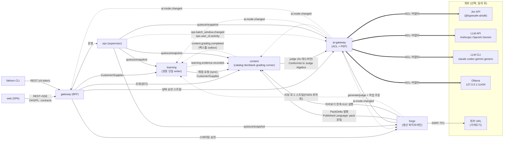
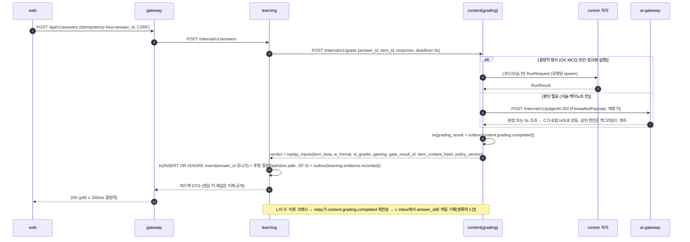
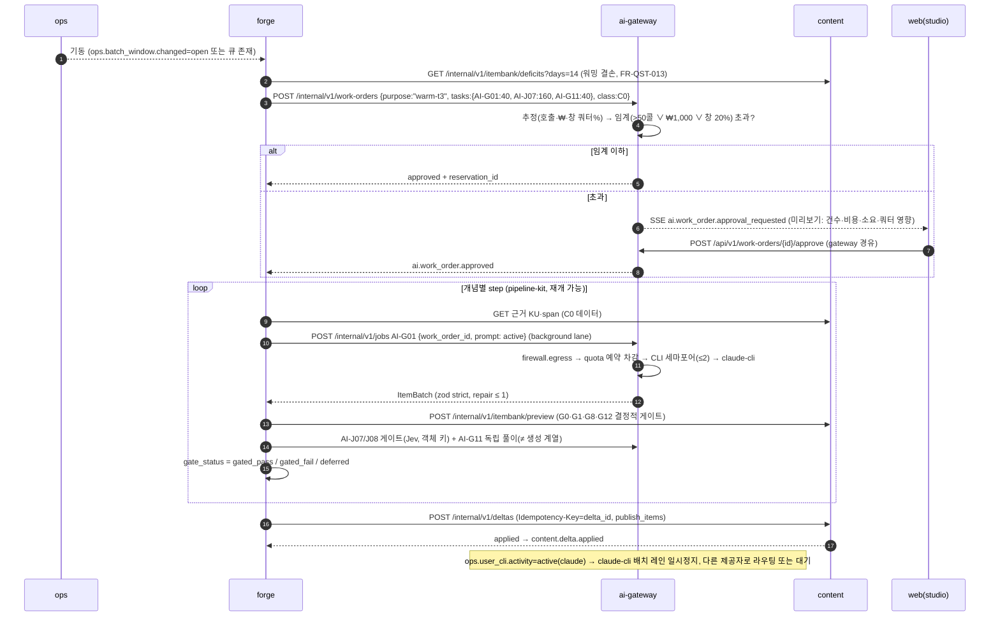
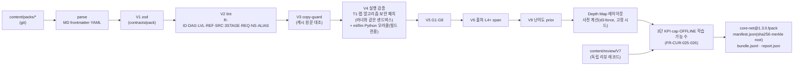
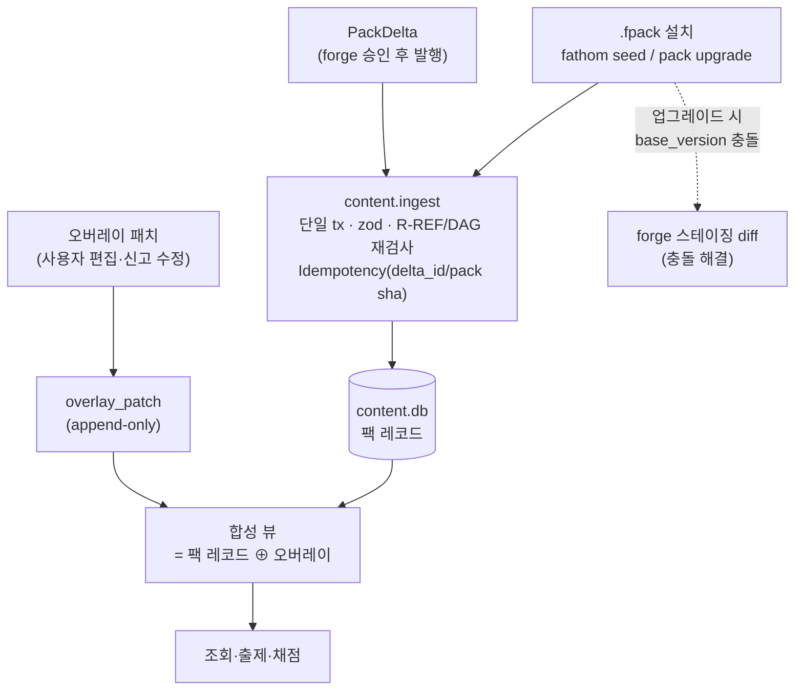
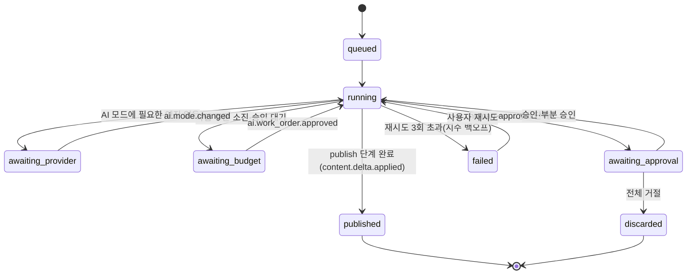
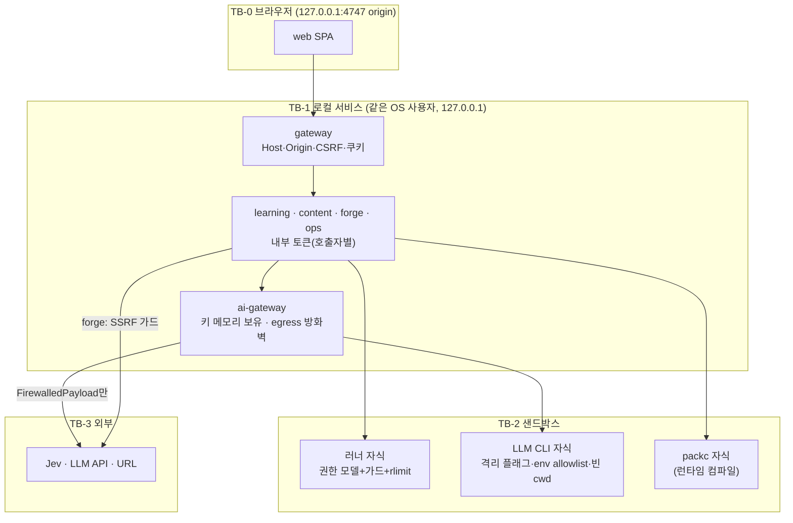
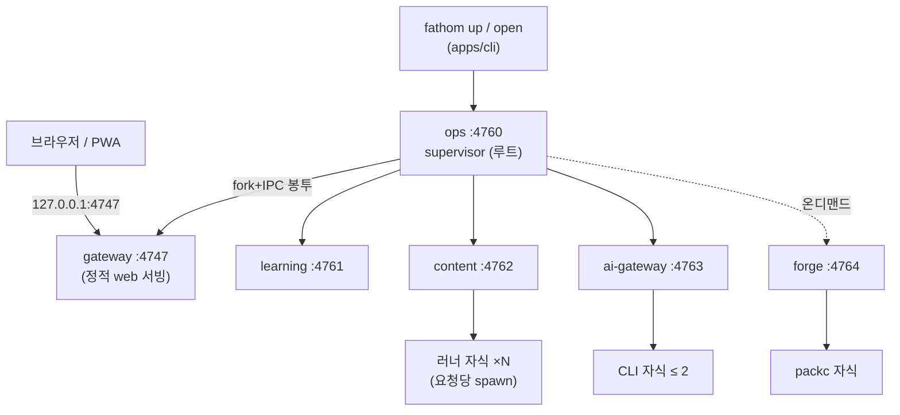

# ARC 제안 C — AI·콘텐츠 파이프라인 확장성 우선 (AI & Content-Pipeline Extensibility First)

> **문서 ID**: ARC-PROP-C · **버전**: v0.1 (제안, 비교 검토용) · **작성일**: 2026-09-30 · **작성 주체**: T1 상위 모델(아키텍처 제안)
> **입력(Trace)**: BRIEF(UR-01~18) · tech-stack-facts · PLN-REV-01(Planning Baseline v1.0 §4 AQ-01~17, §5.5~5.8) · REQ-01 v1.1 · PLN-CNV-01 v1.1(§8 사다리, §9.6 V1~V10, §11 SP, §12.1 ARC 동결 조건) · UC-01 · USM-01(IT-01~07) · R5(AI 통합) · 스파이크 SP-2(러너 격리, PASS/Linux) · SP-3(리플레이 결정성, PASS·예측 PARTIAL) · SP-4(`node:sqlite`, PASS·Windows pending)
> **미입수 스파이크**: SP-6(승급 도달성), SP-7(TS 7 정적 게이트) 보고서는 작성 시점에 없다. 해당 AQ는 **사전 확정 대응**을 기본값으로 답한다.
> **표기**: `[추정]` = 실측 없는 추정치, `[결정]` = 이 제안의 결정, `[CR]` = 기획 기준선에 가산 변경 요청, `[ADR]` = 파괴적 결정이라 ADR 필요.

---

## 0. 요약 (TL;DR)

1. **관점**: Fathom의 15년 수명에서 가장 자주 바뀌는 것은 코드가 아니라 **AI 제공자·CLI 플래그·프롬프트·콘텐츠**다(R5 §14.1: CLI 주간 릴리스, `jev-latest` 교체, 팩 증분, 사용자 pack refresh). 그래서 "바뀌는 것"을 **포트 뒤의 어댑터(코드) + 선언 파일(데이터)**로 밀어내고, 코어(원장·스케줄러·채점 사다리)는 이것들이 바뀌어도 수정하지 않는 구조를 목표로 한다. 단, 확장 장치마다 **운영 비용(u·프로세스·RSS·인지 부하)**을 매기고 비용 대비 가치가 낮은 것(동적 JS 플러그인, 벡터 DB, 외부 워크플로 엔진, 메시지 브로커)은 명시적으로 거절한다(§3.3).
2. **서비스 7개(= 상한)**: `web` · `gateway` · `learning` · `content`(= 기획의 content + assessment **병합**, AQ-01) · `ai-gateway` · **`forge`**(신설: 콘텐츠·문항 **생산 파이프라인**, 온디맨드 기동) · `ops`(supervisor). 병합으로 확보한 슬롯을 **읽기 경로(serve)와 쓰기 경로(produce)의 분리**에 쓴다. content는 게시된 카탈로그를 서비스하고 채점하며, forge는 가져오기·생성·게이트·pack refresh·재게이트·캘리브레이션을 **내구성 있는 파이프라인**으로 돌린다.
3. **단일 수입 포트(Single Ingestion Port)**: 카탈로그(content.db)를 바꾸는 방법은 셋뿐이다. ① 컴파일된 팩 설치(`.fpack`) ② forge가 승인 후 발행하는 **PackDelta**(팩과 같은 문법의 변경 묶음) ③ 사용자 오버레이 패치. 그래서 "승인 전 출제 0"(FR-IMP-009, FR-CUR-023, D-6)이 **구조적으로** 보장된다. 미승인 초안은 물리적으로 forge.db에만 있다.
4. **Content-as-code**: 시드 커리큘럼은 `content/packs/<pack>/` 아래 **Markdown(frontmatter) + YAML** 파일로 git 버전 관리한다. `tools/packc`(팩 컴파일러, 제품에 동봉)가 zod·lint(R-ID/DAG/LVL/REF/SRC/3STAGE/REQ)·copy-guard·실행 검증(V4)·Depth Map 레이아웃 사전 계산을 거쳐 해시 매니페스트가 붙은 `.fpack`을 만든다. 사용자도 자기 팩 폴더를 git으로 관리하고 `fathom pack add <dir>`로 올린다(스테이징 diff를 거침).
5. **AI 확장성 = "설정으로 열고, 코드는 닫는다"**: 어댑터 **종류**(anthropic-api·openai-api·gemini-api·ollama-http·claude-cli·codex-cli·gemini-cli·**generic-cli**·jev)는 코드로 고정하고, 어댑터 **인스턴스**·과업 라우팅·프롬프트 버전·방화벽 규칙·쿼터는 선언 파일로 연다. 임의 LLM CLI는 generic-cli 설정만으로 붙는다(FR-AI-024). 서드파티 JS 플러그인 로딩은 하지 않는다.
6. **생성 작업 = 2단 큐 + 작업 주문(Work Order)**: forge의 `pipeline_run`(도메인 단계: 추출→검증→게이트→스테이징)과 ai-gateway의 `ai_job`(호출 단위: 레인·토큰 버킷·CLI 세마포어·쿼터 창)을 분리한다. 대량 작업은 ai-gateway에 **작업 주문**을 넣어 비용·쿼터를 **예약(reservation)**하고, 임계 초과면 사용자 승인 후에만 예약이 활성화된다(FR-AI-025·026). 예산·쿼터의 **정책 집행 지점(PEP)은 ai-gateway 하나**다.
7. **프롬프트 레지스트리 + 평가 하네스**: 프롬프트는 `ai/prompts/<task>/<semver>/`에 파일로 두고 해시 잠금(`registry.lock.json`)한다. 호출 로그·캐시 키·문항 계보에 `prompt_version`이 들어가 **"이 프롬프트 버전이 만든 문항 패밀리 일괄 격리"**가 가능하다. 승격은 `evals/`(골드셋·게이트 뮤턴트·cassette) 회귀 없음이 조건이다(FR-AI-016). V-build는 형상·결정적 게이트만, 모델 행동은 V-live로 정직하게 나눈다.
8. **Privacy Firewall 2지점**: forge **수입(ingress)** 시 비밀 마스킹·주입 탐지·민감도 분류, ai-gateway **송출(egress)** 시 모든 외부 페이로드(Jev 포함) 검사. 어댑터는 `FirewalledPayload` 브랜드 타입만 받으므로 우회 경로가 타입 수준에서 막힌다(NFR-SEC-013). 판정은 로컬 전용(DEC-CNV-28).
9. **운영 비용**: 상주 Node 프로세스 5개(gateway·learning·content·ai-gateway·ops) + forge 온디맨드(작업 없으면 10분 뒤 종료) + 러너 자식. 유휴 RSS ≈ 300~380MB `[추정]`. 확장 장치 순증 ≈ **+7u**(forge 골격 3·pipeline-kit 1·작업 주문 1·프롬프트 레지스트리 1·게이트 뮤턴트 평가 1). 평가 하네스 본체는 기존 Should(FR-AI-016) 안에서 소화한다. 보장 코어(GC 103u)에는 forge 골격 2u만 들어간다(§13).

---

## 1. 설계 동인과 원칙

### 1.1 품질 속성 우선순위 (이 제안의 순서)

| 순위 | 속성 (ISO 25010) | 이 제안에서의 뜻 | 근거 |
|---|---|---|---|
| 1 | 변경 용이성(Modifiability) — AI·콘텐츠 축 | 제공자·CLI·프롬프트·팩·정책이 바뀌어도 도메인 코드 수정 0 | UR-12(15년), UR-15(기타 CLI), NFR-MAINT-007·008, FR-AI-024 |
| 2 | 신뢰성(데이터) | 원장 자급·단일 writer·결정적 리플레이 | NFR-DATA-001·002·013, SP-3 |
| 3 | 보안(기밀성) | 외부로 나가는 모든 바이트가 로컬 방화벽을 통과, 키는 한 프로세스 | NFR-SEC-004·013·020, DEC-CNV-28 |
| 4 | 가용성(Zero-AI) | AI·forge·ops가 죽어도 학습 지속 | NFR-AVL-001·002, D-1·D-9 |
| 5 | 운영성 | 1인 운영, 온디맨드 기동, 조용한 실패 금지 | NFR-AVL-003·005, FR-SET-001 |
| 6 | 성능 | 첫 문항 p95 ≤ 2s, 결정적 채점 ≤ 300ms | NFR-PERF-001·003 |

### 1.2 확장성 원칙 (EX-1 ~ EX-10)

| ID | 원칙 | 구체화 |
|---|---|---|
| EX-1 | **바뀌는 것은 데이터로** | 과업 레지스트리·제공자 인스턴스·프롬프트·게이트 임계·방화벽 규칙·정책·팩은 버전 파일. 코드 상수 0(NFR-MAINT-007) |
| EX-2 | **어댑터 종류는 닫고 인스턴스는 연다** | 새 CLI는 generic-cli 설정으로, 새 API 계열만 코드(어댑터 1파일 + cassette) |
| EX-3 | **단일 수입 포트** | 카탈로그 변경 = 팩 설치 · PackDelta · 오버레이. 그 밖의 쓰기 API 없음 |
| EX-4 | **계보 우선** | 모든 AI 산출물에 `(task, prompt_version, provider, model, family, work_order_id, pipeline_run_id)`를 붙인다 → 패밀리 격리·회귀 추적 |
| EX-5 | **생산과 서비스 분리** | 배치 AI 작업의 크래시·메모리·쿼터 소진이 대화형 경로에 닿지 않는다(forge 프로세스 분리) |
| EX-6 | **정책 집행 단일 지점** | 비용·쿼터·동의·방화벽·과업 정책(FR-AI-020)은 ai-gateway에서만 집행 |
| EX-7 | **승인은 1급 단계** | 사람 승인은 파이프라인의 `human-approval` 단계로 모델링(파킹·재개 가능) |
| EX-8 | **평가 없는 승격 금지** | 프롬프트·모델 매핑·게이트 임계 변경은 평가 하네스 회귀 검사를 통과해야 활성화 |
| EX-9 | **정직한 검증 등급** | 형상은 V-build, 모델 행동은 V-live. synthetic cassette로 품질을 주장하지 않는다(REQ §1.7 규칙 3) |
| EX-10 | **확장 비용 가시화** | 확장 장치마다 u·런타임 비용·lite 사양·cut 순서를 사전에 적는다(§13) |

### 1.3 이 제안이 **하지 않는** 것 (확장성 과잉 방지)

| 거절한 장치 | 이유 (운영 비용) | 대체 |
|---|---|---|
| 동적 JS 플러그인(제공자·모드를 npm 패키지로 로드) | 공급망·권한 경계 붕괴, 로컬 키 프로세스에 임의 코드 | generic-cli 설정, 어댑터는 모노레포 코드 |
| 벡터 DB·임베딩 검색 | SP-4에서 trigram 하이브리드 재현율 0.962, p95 25ms. 임베딩은 외부 호출·모델 의존 | FTS5 trigram + 별칭 lint. `EmbeddingPort`는 이름 훅만 |
| 외부 워크플로 엔진(Temporal·BullMQ·Redis) | 추가 런타임·데몬, 로컬 설치 3분(D-2) 위반 | `shared-kernel/pipeline-kit`(SQLite 기반 단계 기계, ≈ 400 LOC `[추정]`) |
| 메시지 브로커(NATS·Kafka) | 상주 프로세스 +1, 백업 epoch 범위 밖 상태 | outbox → HTTP push → inbox(모든 상태가 SQLite 안) |
| LangChain·에이전트 프레임워크 | 추상화 누수, 도구 호출 = 주입 표면 | 자체 Portable Schema Profile(R5 §3.3), 도구 전부 off |
| 서비스별 DB 서버(Postgres) | 로컬 설치 부담 | `node:sqlite` 파일 per 서비스(SP-4 PASS) |

---

## 2. 바운디드 컨텍스트 → 서비스

### 2.1 바운디드 컨텍스트 (12개)

| # | 컨텍스트 | 핵심 개념(유비쿼터스 언어) | 호스트 서비스 |
|---|---|---|---|
| BC-1 | Experience (BFF) | 세션 쿠키, 화면 조합, SSE, CLI API | gateway (+ web) |
| BC-2 | Evidence Ledger | Learning Event, device chain, checkpoint, replay | learning |
| BC-3 | Learner Model & Progress | card(concept×facet×response_mode), θ/β, Mastered, Lifecycle, LDI, 승급 | learning |
| BC-4 | Session & Scheduling | Session Composer, Method Router, 오늘 큐, 대화 세션 상태(디깅·Feynman·Case) | learning |
| BC-5 | Curriculum Catalog | Concept, KU, Misconception, Source, Case, Blueprint, Overlay, Pack install, 검색 | content |
| BC-6 | Item Bank | ItemModel, Item(인스턴스), gate_status, family, lineage, item health | content |
| BC-7 | Grading | 채점 사다리, 정규화, CBM 점수, 턴 판정 조율, 휴리스틱·자기 판정 | content |
| BC-8 | Lab Runner | RunRequest, 샌드박스 자식, 출처 정책 | content(자식 프로세스 풀) |
| BC-9 | Content Pipeline (Forge) | pipeline_run, step, staging draft, diff, decision, PackDelta, import job(I1~I9) | forge |
| BC-10 | AI Control Plane | provider/adapter, task registry, route, prompt version, work order, reservation, quota window, breaker, judge_log, gold item, calibration | ai-gateway |
| BC-11 | Privacy | data class(C0~C3), firewall rule, mask, egress/ingress 판정 | ai-gateway(egress) + forge(ingress) — 규칙 엔진은 `shared-kernel/redact` |
| BC-12 | Operations | 프로세스 트리, 포트 레지스트리, epoch 백업, doctor, telemetry·Tripwire, 배치 창 | ops |

### 2.2 서비스 카탈로그

| 서비스 | 책임 | 소유 데이터 (파일) | 포트 (127.0.0.1) | 상주 |
|---|---|---|---|---|
| **web** | SPA(React 19). 18화면 + `/_design`. 제출 전 정답 키 비수신 | 없음(브라우저 localStorage는 UI 편의만) | 정적 번들은 gateway가 서빙. 개발 시 Vite 5173(gateway가 프록시) | — |
| **gateway** | BFF·세션(부트스트랩→쿠키)·Host/Origin/CSRF·rate limit·SSE 허브·CLI API·정적 서빙·`capture` 수신 | 없음(세션 키 `run/session.key` 0600) | **4747**(선호 고정, 폴백 4748~4757 + 안내) | 예 |
| **learning** | 증거 원장 단일 writer, 투영(FSRS·Elo·숙달·Lifecycle·LDI), 스케줄러·세션·대화 상태, 승급, 리포트, 다기기 병합, 보류 재채점 요청 | `db/learning.db` | 4761 | 예 |
| **content** | 카탈로그 서비스(개념·KU·검색·오버레이·팩 설치), 문항 은행(ItemModel·인스턴스·T1/T2 결정적 전개·계보·건강), 채점 사다리, 러너 풀 | `db/content.db` | 4762 | 예 |
| **ai-gateway** | 유일한 키·CLI·Jev 접근. 어댑터·라우터·과업/프롬프트 레지스트리·방화벽(egress)·예산·쿼터·작업 주문·캐시·판정 로그·골드셋·AI 모드 산출 | `db/ai.db`, `db/ai-cache.db`(백업 제외) | 4763 | 예 |
| **forge** | 생산 파이프라인: 가져오기 I1~I9, T3/T4·ItemModel 저작, 게이트 G0~G13 조율, 재게이트, Tier 승격, pack refresh·사용자 팩 추가, 캘리브레이션(SP-1 V-live 작업), FSRS 최적화, Case 파운드리, 스테이징·승인, PackDelta 발행 | `db/forge.db` | 4764 | **온디맨드**(큐에 작업·승인 대기가 있거나 배치 창일 때 ops가 기동, 유휴 10분 후 종료) |
| **ops** | supervisor(`fathom up`), 부트스트랩 봉투·내부 토큰 발급, 헬스 보드, epoch 백업·복원·export/import 조율, doctor·Safe Mode, 마이그레이션, 텔레메트리·Tripwire, 배치 창·사용자 CLI 활동 감지, 자동 기동 | `db/ops.db` | 4760(제어 API, 내부 전용) | 예(루트 프로세스) |

> 내부 포트(4760~4764)는 **선호값**이다. 점유 시 ops가 임의 포트를 골라 부트스트랩 봉투로 전달하므로 외부에 고정될 필요가 없다. 외부(브라우저·CLI)에 보이는 것은 gateway 4747뿐이다.

### 2.3 AQ-01 결정: content + assessment 병합, 그리고 forge 신설 `[결정][ADR]`

| 대안 | 서비스 수 | 장점 | 단점 | 판정 |
|---|---|---|---|---|
| A0 기획 그대로(content ∥ assessment) | 7 | 경계 명확 | 가져오기·생성·게이트·pack refresh가 **모두** KU(content)와 Item(assessment)을 동시에 쓰는 교차 서비스 사가 → outbox 4~5종 추가, 첫 문항 경로 1홉 증가 | 기각 |
| A1 병합만(content = catalog + assessment) | 6 | 홉·outbox 감소 | 배치 AI 파이프라인(수 시간, 메모리 큰 장문 추출)이 대화형 채점 프로세스에 동거 → 크래시·GC 정지가 세션에 전파, 스테이징 초안이 카탈로그 DB에 섞임 | 부분 채택 |
| **A2 병합 + forge 분리** | **7** | 서비스(serve) ↔ 생산(produce) 분리. 미승인 초안 물리 격리. forge 온디맨드로 상주 비용 0에 근접. 새 파이프라인 종류 추가가 forge 안에서 끝남 | 프로세스 +1(온디맨드), 계약 +1(PackDelta), 게이트 실행이 forge→content(미리보기)·forge→ai-gateway 2홉 | **채택** |

- 병합 후에도 content 내부는 `curriculum / itembank / grading / runner / ingest` 모듈 경계를 유지하고 `check:boundaries`가 모듈 간 import를 `ports.ts` 경유로만 허용한다. 재분리가 필요하면 ADR로 grading+runner를 떼어낼 수 있다.
- 러너는 어느 경우든 **content가 소유하는 요청당 spawn 자식 프로세스**(SP-2 §7.1)다.
- 증거 단일 writer = learning 불변. content(grading)는 판정과 리플레이 입력을 **반환**하고, 백스톱 outbox 이벤트(`content.grading.completed`)만 쓴다(§4.3).

---

## 3. 컨텍스트 맵



| 관계 | 패턴 | 설명 |
|---|---|---|
| web ↔ gateway | Open Host Service + Published Language | `packages/contracts`의 zod 스키마가 유일한 언어. 정답 키 없는 `ItemForDelivery` 타입 |
| learning → content | Customer/Supplier | learning이 채점 계약의 고객. content는 판정 + 리플레이 입력(item β 스냅샷·w·gate_result_id·item_content_hash)을 공급 |
| content/forge → ai-gateway | Conformist(판단 대수) + ACL | 호출자는 **Jev 질문 대수**(`noul/choice/score`, 객체 키)를 따른다. ai-gateway는 제공자 차이를 흡수하는 반부패 계층 |
| forge → content | Published Language(팩 문법) | PackDelta는 `.fpack`과 같은 레코드 스키마 + op 코드. content는 팩 문법 외의 쓰기를 받지 않는다 |
| ops → 전 서비스 | 내부 제어(Kernel) | 부트스트랩·quiesce·snapshot·shutdown 제어 API |
| learning ↔ content(이벤트) | 비동기 Partnership | 문항 건강 계산용 노출·응답 통계, 백스톱 채점 이벤트 |

---

## 4. 통신 패턴

### 4.1 원칙

1. **동기(HTTP/JSON, `/api/v1` 외부 · `/internal/v1` 내부)**: 사용자 대기가 있는 경로(조회·채점·세션 조립). 타임아웃 = 호출자 데드라인 − 소모분. 모든 쓰기 POST에 `Idempotency-Key` 필수(없으면 400).
2. **비동기(transactional outbox → relay → HTTP push → inbox)**: 상태 전파·백스톱·파이프라인 트리거. 각 writer DB에 `outbox`(seq, event_id ULID, type, payload, created_at, delivered_at), 구독자 DB에 `inbox`(event_id PK, received_at). relay는 `shared-kernel/outbox`가 250ms 폴링 + 쓰기 직후 즉시 kick, 지수 백오프(최대 60s), 구독자별 커서.
3. **브라우저 푸시**: gateway가 내부 이벤트를 구독해 SSE(`/api/v1/stream`, `Last-Event-ID` 재연결, IR-016)로 팬아웃.
4. **이름 규칙**: `<context>.<entity>.<past_verb>`(STD-NAM), 스키마는 `contracts/events/*.ts`, `schema_version` 필드 필수.
5. **읽기 일관성**: 쓰기 직후 화면은 동기 응답 값으로 그린다(read-your-writes). 이벤트는 캐시 무효화 용도.

### 4.2 통합 이벤트 목록

| 이벤트 | 생산자 → 소비자 | 용도 |
|---|---|---|
| `learning.evidence.recorded` | learning → content, gateway | 문항 건강(노출·정답·선택지·rt), 화면 갱신 |
| `learning.session.completed` | learning → gateway, ops | 리포트·텔레메트리 |
| `learning.regrade.requested` | learning → content | 보류 판정 재채점 배치(AI 복귀 시) |
| `learning.fsrs_params.proposed` / `.applied` | learning ↔ forge | FSRS 최적화 제안·승인 |
| `content.grading.completed` | content → learning | **백스톱**: learning 기록 전 크래시 시 재전송(NFR-DATA-013 수용기준) |
| `content.delta.applied` | content → forge, gateway, learning | 발행 완료, 카드 적립 대상 개념 목록 |
| `content.pack.installed` | content → learning, forge | 팩 업그레이드 → 오버레이 재적용 결과, 변경 KU 요약 |
| `content.overlay.applied` | content → forge | 오버레이 수정 → 패밀리 재게이트 트리거(FR-QST-016) |
| `content.item.flagged` / `.quarantined` | content → forge, learning | 건강 이상 → 재게이트·교체 / 증거 보정 이벤트 |
| `forge.run.state_changed` | forge → gateway | 파이프라인 타임라인(FR-IMP-003) |
| `forge.approval.requested` | forge → gateway | 스테이징 diff 승인 대기 |
| `ai.mode.changed` | ai-gateway → 전체 | FULL/JUDGE_ONLY/LLM_ONLY/OFFLINE 전환(FR-AI-002) |
| `ai.provider.status_changed` | ai-gateway → gateway, forge | 상태 칩, 파이프라인 재개 |
| `ai.work_order.approval_requested` / `.approved` / `.exhausted` | ai-gateway → gateway, forge, content | 대량 작업 승인(FR-AI-026) |
| `ai.budget.threshold` / `ai.quota.window_exhausted` | ai-gateway → gateway, forge | 80%·100% 강등, 쿼터 일시정지 |
| `ai.judge.model_drift` | ai-gateway → gateway, forge | 재보정 작업 제안 |
| `ops.batch_window.changed` | ops → ai-gateway, forge | 배치 창 = 앱 실행 ∧ 입력 유휴 ≥ 10분 ∧ AC 전원 |
| `ops.user_cli.activity` | ops → ai-gateway | 사용자 대화형 CLI 감지 → 해당 제공자 배치 일시정지(FR-AI-025) |
| `ops.backup.epoch_committed` | ops → gateway | 배너·RPO 표시 |

### 4.3 핵심 흐름 1 — 응답 제출 · 채점 · 증거 기록



- 채점 사다리의 **오케스트레이션은 content**, AI 엔진 체인(`jev → llm-judge`)은 ai-gateway, **휴리스틱·자기 판정은 content 로컬 코드**다. 그래서 ai-gateway를 kill해도 채점은 H/S로 계속된다(D-9).
- 3s 초과 후 도착한 상위 판정은 `content.grading.completed`(revision=2)로 learning에 가고, 점수 밴드가 바뀔 때만 새 이벤트 + SSE diff(FR-QST-019).

### 4.4 핵심 흐름 2 — 생성 파이프라인 · 작업 주문 · 쿼터 (T3 배치 예)



- S0 문항(워밍 T3)은 게이트 통과 시 **자동 발행**(사람 승인 불요). S2(T4·Case) · 가져오기 · pack refresh는 `human-approval` 단계에서 파킹된다(FR-QST-004 런타임 S2, FR-IMP-009, FR-CUR-023).

### 4.5 핵심 흐름 3 — epoch 일관 백업 (NFR-DATA-012)

1. ops `POST /internal/v1/quiesce {epoch_id, max_ms:2000}` → learning·content·ai-gateway·forge·ops 자신: 새 쓰기 tx 대기열화, 진행 중 tx 완료, `last_outbox_seq` 보고.
2. 각 서비스가 전용 연결로 `VACUUM INTO '<backup>/<epoch>/<svc>.db.tmp'` → rename(SP-4 §6.5: 라이브 쓰기 중 74~188ms, `backup()` API 미사용).
3. `resume` → ops가 `epoch.json`(epoch_id, 서비스별 sha256·schema_version·last_outbox_seq·inbox 커서, 설치 팩 버전, `policy/manifest.json` 해시, `ai/prompts/registry.lock.json` 해시) 기록 → `ops.backup.epoch_committed`.
4. `ai-cache.db`는 제외(재생성 가능). forge 비상주 시 forge.db는 파일 잠금이 없으므로 ops가 읽기 전용 연결로 스냅샷.
5. 복원: epoch 매니페스트 해시 불일치 조합 거부, outbox 커서 정합성 확인 후 relay 재개.

---

## 5. 데이터 소유권과 저장

### 5.1 `FATHOM_HOME` 레이아웃

기본 경로: macOS/Linux `~/.fathom`, Windows `%LOCALAPPDATA%\Fathom`(SP-4 §5.5 권고. 브리프의 `%APPDATA%`는 로밍 폴더라 WAL 위험 → `[CR]`), 재정의 `FATHOM_HOME`.

```
$FATHOM_HOME/
├─ db/        learning.db · content.db · ai.db · ai-cache.db · forge.db · ops.db   (전부 WAL, STRICT)
├─ packs/     seed/*.fpack (제품 동봉 복사본) · local/*.fpack (pack refresh) · user/*.fpack (사용자 팩 컴파일본)
├─ policy/    method_policy@v1.yaml … manifest.json (설치된 정책 번들, 읽기 전용)
├─ ai/        overrides/ (사용자 고정 프롬프트·제공자 인스턴스 providers.yaml·generic-cli 정의)
├─ run/       session.key(0600) · cli.token(0600) · pids/ · runner/(요청별 tmp, 0700) · cli-home/codex/ · bootstrap(메모리 전용, 파일 없음)
├─ secrets.enc   (키체인 불가 시에만, AES-256-GCM)
├─ backup/    <epoch_id>/{*.db, epoch.json} · incr/<date>.jsonl.gz
├─ export/  inbox/(앱 종료 중 capture 파일 큐)  logs/<svc>-YYYY-MM-DD.jsonl
```

### 5.2 DB별 핵심 테이블 (DB-01 입력)

| DB | 테이블 | 비고 |
|---|---|---|
| learning.db | `events`(SP-3 §6.1 스키마 그대로 + `idempotency_key UNIQUE`, `ext`), `card_state`, `concept_state`, `learner_theta`, `lifecycle`, `ldi_term`, `session`, `session_block`, `dialog_session`, `dialog_turn`, `pending_grade`, `sealed_record`, `device`, `checkpoint`, `fsrs_params`, `settings_event`, `outbox`, `inbox` | append-only 트리거(NFR-DATA-001). 투영은 전체 리플레이 후 원자 교체(SP-3 §6.4) |
| content.db | `concept`, `concept_edge`, `ku`(버전 행), `misconception`, `source`, `case_def`, `blueprint*`, `pack_install`, `overlay_patch`(append-only, DR-026), `delta_applied`, `item_model`, `item`, `gate_result`, `lineage_edge`, `item_family`, `item_health`, `grading_result`, `docs`+`fts_tri`+`fts_cmp`(SP-4 §6.3), `outbox`, `inbox` | 조회 = 팩 레코드 + 오버레이 합성 뷰 |
| forge.db | `pipeline_run`, `pipeline_step`, `artifact`(sha256 주소 JSON), `import_job`, `staging_item`, `staging_decision`, `delta_outbox`, `pack_source`(등록된 사용자 팩 폴더), `eval_run`(런타임 캘리브레이션 결과 요약) | 초안·원문 청크는 여기만. 발행 후 90일 보관 `[추정]` |
| ai.db | `provider_instance`, `provider_status`, `consent`, `task_route_override`, `prompt_activation`, `work_order`, `reservation`, `quota_window`, `budget_ledger`, `ai_job`, `ai_call_log`(route_trace·prompt_version·firewall_action), `judge_log`(확률 분포·input_hash·model_version, DR-017), `gold_item`(status: model_labeled_draft/user_confirmed), `calibration`, `firewall_log`, `outbox` | 키 비저장 |
| ai-cache.db | `ai_cache`(sha256(task, prompt_version, provider, model, canonical input, schema_hash)) | 판단 30일·피드백 7일, 백업 제외 |
| ops.db | `service_state`, `port_registry`, `backup_epoch`, `migration_history`, `health_snapshot`, `telemetry_raw`/`telemetry_agg`, `tripwire`, `batch_window_log` | |

### 5.3 원장 자급성 — 이벤트에 내장하는 리플레이 입력

SP-3 §6.8 확정 목록을 그대로 채택: `card_id, concept_id, format, facet, response_mode, tier, rating, result, w_format, w_grader, gaming_factor, rapid, item_beta, policy_version, fuzz_seed(사용 시), prev_hash, fsrs_at` + 이 제안의 계보 참조(리플레이에는 쓰지 않음): `gate_result_id, item_content_hash, judge_ref, prompt_version`. content.db·ai.db를 지워도 리플레이 = 라이브(D-4).

### 5.4 `ext` 컬럼과 이름 훅 (AQ-10)

- 모든 엔티티 테이블: `ext TEXT NOT NULL DEFAULT '{}' CHECK (json_valid(ext))` + `ext_v INTEGER NOT NULL DEFAULT 1`.
- DR-020 이름 훅(event_id·device_id·device_seq·client_ts·idempotency_key·experiment_arm, judge_log.probabilities·input_hash 등)은 **실제 컬럼**. 질의가 필요한 `ext` 키는 `GENERATED ALWAYS AS (json_extract(ext,'$.k')) STORED` + 색인으로 승격(가산 변경).
- `lint:hooks`(PG-2 게이트)는 `contracts/db-hooks.ts` 목록과 마이그레이션 SQL을 대조.

---

## 6. 콘텐츠 저장 — Content-as-Code 팩

### 6.1 저장소 구조 (git 버전 관리)

```
content/
├─ packs/
│  ├─ core-net/                     # 팩 = 트랙 단위(19 코어 + data)
│  │  ├─ pack.yaml                  # id, version(semver), channel: seed, track, schema_v, requires: {policy, packc}
│  │  ├─ concepts/net.tcp-handshake.md   # frontmatter(id·level·kt·tier·required_for_level·aliases·prereq·vol·sources) + ## 이론 / ## 코드 / ## 핵심
│  │  ├─ kus/net.tcp-handshake.yaml      # KU 목록(statement, facet, scope, vol, valid_as_of, source_refs span)
│  │  ├─ misconceptions/*.yaml
│  │  ├─ item-models/*.yaml              # T2 ItemModel(슬롯·제약·stem_family)
│  │  ├─ items/*.yaml                    # 저작 문항(gate_status: authored → V7 후 seed_reviewed)
│  │  ├─ cases/*.case.yaml               # 상태기계 + variant_params·root_cause_pool·best_if·contested
│  │  ├─ labs/<id>/{task.md, starter.ts, tests.hidden.ts, complexity.yaml}
│  │  └─ CHANGELOG.md
│  └─ …
├─ blueprints/cert-cka@2026.yaml · cert-jeongbo-pilgi@2026.yaml   # 판본·출처 해시(AQ-13)
├─ sources/registry.yaml            # A/B/C/D/P 등급, 캐시 원문 해시
└─ review/V7/<pack>/<batch>.yaml    # 독립 리뷰 레코드(= 저작 시드 S2 승인)
policy/  method_policy@v1.yaml · composer_policy@v1.yaml · mastery_rules@v1.yaml · ldi_params@v1.yaml · cbm_params@v1.yaml · gaming_params@v1.yaml · gate_thresholds@v1.yaml · firewall@v1.yaml · manifest.json
```

- **왜 Markdown + YAML**: 개념 본문은 사람이 diff로 리뷰하는 글이고(PR 리뷰 = V7 절차), 구조 필드는 zod로 검증한다. 3단 순서는 헤딩 lint(R-3STAGE)로 강제.
- **ID 규칙**: 시드 `<track>.<slug>`, 사용자 팩 `u.<ns>.<slug>`(R-NS lint로 충돌 방지), ID 불변·`alias`·`deprecated_by`(FR-CUR-004).

### 6.2 팩 컴파일러 `tools/packc` (제품 동봉 CLI)



- `.fpack` = tar(무압축) 안에 `manifest.json`·`bundle.jsonl`(정규화 레코드, 정준 JSON)·`report.json`(V1~V10 결과, gate_status 근거). content는 **컴파일본만** 설치한다(원천 YAML 파싱 코드가 content에 없다 → 공격 표면·중복 제거).
- 빌드 타임(CI·개발): `pnpm packs:build` → `dist/packs/`. 런타임(사용자 팩·pack refresh): forge가 `packc`를 **자식 프로세스로** 호출(서비스 간 코드 import 금지를 프로세스 경계로 준수). 런타임 packc는 V4의 Python 단계를 **비활성**하며(v1 런타임 Python 제외), Python 오라클이 필요한 항목은 사전 계산 정답이 없으면 `deferred`로 컴파일한다.
- V7(독립 리뷰)·V8(Jev 게이트)·V10(한국어)은 컴파일러 밖 절차이며, 결과 레코드(`content/review/V7`)를 packc가 읽어 `seed_reviewed`를 부여한다(FR-QST-009·011).

### 6.3 카탈로그 변경의 세 경로 (단일 수입 포트)



- **PackDelta op**: `upsert_concept` · `upsert_ku`(새 버전 행) · `alias` · `deprecate` · `upsert_misconception` · `upsert_item_model` · `publish_items`(+ gate_result·lineage 동봉) · `set_gate_status` · `quarantine_family` · `upsert_case` · `upsert_blueprint` · `attach_source`. 각 op는 `base_version`을 가져 동시 변경을 충돌로 탐지한다.
- **오버레이**(FR-CUR-020): 대상 ID·필드·base_version·새 값·사유·device_id. 팩 업그레이드 시 자동 재적용, base_version 변경 필드는 forge 스테이징 충돌 diff로 올린다. 다기기 export 대상(원장과 함께).
- **신뢰 등급**: `trust ∈ {seed, verified, user, llm_unverified}`는 레코드 필드. `llm_unverified`·미승인은 delta로 오지 않으므로 출제 경로 진입 불가(구조 보장) + 출제 쿼리 조건(이중 방어).

### 6.4 사용자 콘텐츠 as code

- `fathom pack init <dir>` → 스캐폴드(pack.yaml·예시 개념) — 사용자는 **자기 git 저장소**로 팩을 관리(학습 효과: git·YAML·CI 실습).
- `fathom pack add <dir>` → forge `pack-install` 파이프라인: packc 컴파일 → 스테이징 diff → 승인 → PackDelta(channel=user). `fathom pack watch <dir>`(Should)는 파일 변경 시 재컴파일·diff만 갱신.
- `fathom pack refresh <track>`(FR-CUR-023) → forge `pack-refresh` 파이프라인: 작업 주문(비용·쿼터 미리보기) → 로컬 가능 V1~V10 → `channel=local` 새 버전 → 스테이징 → 승인.

---

## 7. AI · Jev 배치 (ai-gateway)

### 7.1 내부 구조

```
services/ai-gateway/src/
├─ adapters/        anthropic-api · openai-api · gemini-api · ollama-http · claude-cli · codex-cli · gemini-cli · generic-cli · jev
│  └─ cli-kit/      안전 spawn(shell:false·argv 배열·stdin·env allowlist·빈 tmp cwd·트리 kill·Windows shim 해석·출력 캡)
├─ judge/           judge-chain(jev → llm-judge), question-algebra 검증(객체 키), calibration, gold
├─ registry/        tasks.yaml 로더(AI-J01~J19, AI-G01~G13), prompts 로더 + registry.lock 검증, activation
├─ router/          후보 필터(가용·동의·breaker·역량·계열 제약·방화벽 등급·예산) → 점수 → route_trace
├─ firewall/        egress 검사(shared-kernel/redact 엔진 + firewall@v1 규칙 + 사용자 사내 패턴 + 선택 Ollama 분류)
├─ budget/          money ledger · quota windows(5h·주간) · work orders · reservations · 배치 창 게이트
├─ queue/           ai_job 레인(interactive=메모리, background=영속) · 토큰 버킷(Jev 15 rps·버스트 30) · CLI 세마포어(2)
├─ cache/           ai-cache.db · single-flight
├─ mode/            probe(2단계: 로컬 → 동의 후 네트워크) · canary · AI 모드 산출
├─ secrets/         SecretStore(keychain > enc file > env)
└─ http/            /internal/v1/{judge,generate,jobs,work-orders,providers,prompts,usage} · /healthz · /readyz
```

### 7.2 포트 (packages/contracts의 인터페이스, 구현은 ai-gateway 내부)

| 포트 | 계약 요지 | 구현(어댑터) |
|---|---|---|
| `LlmProvider` | `probe()`, `capabilities()`, `generate<T>(GenerateRequest<T>)` — `schema: PortableSchema`, `contextBlocks[]`(각 블록 `dataClass`·`untrusted`), `deadlineMs`, `workOrderId?` | 7종 + generic-cli |
| `JudgeProvider` | `judge(JudgeRequest)` — `state.items: Record<ObjKey, …>`, `questions: Record<QKey, Noul|Choice|Score>`; 배열 금지, 질문 문자열 `/\[\d+\]/` 금지(zod refine + lint) | jev, llm-judge(LlmProvider 합성) |
| `SecretStore` | `get(provider)`, `put(provider, secret via stdin)`, `describe()` → `{source, last4, verifiedAt}` | keychain(macOS `security -i`, Linux `secret-tool`, Windows DPAPI), enc-file, env |
| `FirewallPort` | `inspect(blocks, route) → FirewalledPayload | Block | ForceLocal` | 로컬 규칙 엔진 |
| `RunnerPort`(content) | SP-2 §7.3 그대로 | 요청당 spawn 샌드박스 |
| `CodeGraphPort`(ops) | v1 = graphify 존재 감지만(IR-013) | doctor |
| `SqlitePort`(shared-kernel) | SP-4 §6.4 표면 | node:sqlite |

- **FirewalledPayload 브랜드 타입**: 어댑터의 `generate/judge`는 `FirewalledPayload`만 받는다. 이 타입의 생성자는 `firewall.inspect`에만 있다. 추가로 런타임 단언 + 네트워크 계층 테스트(undici `MockAgent`·spawn 래퍼 계수)로 "방화벽 우회 외부 호출 0"(NFR-SEC-013)을 V-build로 증명한다.

### 7.3 과업 레지스트리 · 프롬프트 레지스트리

```yaml
# ai/registry/tasks.yaml (발췌)
AI-G01:
  kind: generate
  latency: background
  tier: mid
  schema: contracts/ai/ItemBatch@1          # zod 정본
  prompt: { id: AI-G01, channel: active }   # activation 테이블이 버전 결정
  prefer: [claude-cli, anthropic-api, openai-api, gemini-api, ollama-http]
  deny: { ollama-http: [stakes:S2] }
  dataClassMax: C1                          # C2 이상 입력 금지(가져온 원문은 AI-G05만)
  requiresWorkOrder: true
AI-J07:
  kind: judge
  latency: background
  chain: [jev, llm-judge]                   # H/S는 호출자(content/forge) 로컬
  familyConstraint: differentFrom(generator)
  maxQuestionsPerRequest: 12                # 대량은 항목별 분할(브리프 함정)
```

```
ai/prompts/AI-G01/
├─ 1.2.0/ prompt.md   meta.yaml(status: active|candidate|retired, schema, tier, temperature, eval_baseline: evals/runs/AI-G01@1.2.0.json)
├─ 1.3.0/ prompt.md   meta.yaml(status: candidate)
ai/prompts/registry.lock.json   # {task: {version: sha256}} — 빌드 시 생성, 기동 시 검증(불일치면 해당 과업 비활성 + doctor)
```

- 프롬프트 조립 순서 고정(시스템 → 규칙 → 스키마 → 신뢰 데이터 → `<source>` 비신뢰 데이터 → 지시 재확인): 제공자 프롬프트 캐시 적중과 주입 방어를 동시에 만족(R5 §11.1·§9.3).
- **승격 규칙(EX-8)**: `candidate → active`는 `pnpm ai:eval --task AI-G01 --candidate 1.3.0`의 결과가 baseline 대비 게이트 통과율 −5%p 이내·골드 일치율 비열화·스키마 적합률 비열화일 때만(FR-AI-016). 사용자 기기에서는 설정 화면의 "프롬프트 고정(pin)"만 허용하고, 로컬 편집 프롬프트(`ai/overrides/prompts`)는 `channel=user`로 계보에 남긴다.
- **라우팅 품질 점수 `w_q`**: 과업×제공자×프롬프트 버전의 채택률·신고율·이의 인용률(스코어카드, §7.6)을 라우터 점수에 반영(R5 §8.3 6단계).

### 7.4 작업 주문(Work Order) · 예약 · 쿼터

| 개념 | 정의 | 규칙 |
|---|---|---|
| Work Order | 목적·과업 믹스·추정(호출·₩·창 쿼터%)·데이터 등급·요청 서비스 | background 호출은 반드시 `work_order_id` 참조. 임계 이하 자동 승인, 초과 시 `approval_requested`(FR-AI-026) |
| Reservation | 승인된 주문의 제공자 클래스별 예약량(calls·₩·tokens), 만료 24h | 호출마다 원자 차감. 소진 → `ai.work_order.exhausted` → forge 파이프라인 `awaiting_budget` 파킹 |
| Money budget | 월 ₩30,000 기본, 일·과업·호출 상한 | 20일차 80% → 생성 라우팅 CLI·T2 강등, 100% → metered 차단(FR-AI-007) |
| Quota window | 구독 CLI별 5시간 창 호출·추정 토큰 상한, 주간 상한(보수 기본값) | 창 20% 초과 예상 작업 = 승인 대상. 사용자 CLI 활동 시 배치 레인 정지(FR-AI-025) |
| Batch window | ops 신호 | 창 밖에서 background 레인은 interactive 여유분만 사용(동시 1) |

- interactive 판단(3s)은 작업 주문 없이 예산만 차감한다(사용자 행동당 소량).
- 비용 화면은 과금(API)과 구독 사용분(CLI)을 분리(FR-AI-007 v1.1).

### 7.5 Jev 배치 규칙 (UR-16)

1. Jev SDK(`@typesafe-ai/sdk@0.6.0`)는 **ai-gateway `adapters/jev`에서만** import(경계 검사).
2. 판단 대상은 `state.items.k137` 객체 키만. `JudgeRequest` zod가 배열을 거부하고, STD lint가 질문 문자열의 `[숫자]`를 거부(FR-AI-005).
3. 학습자 답안·외부 텍스트는 `state`의 데이터 필드에만. 질문(instructions)은 레지스트리의 고정 문자열 + 객체 키 치환만.
4. 대량(> 12문항)은 항목별 요청으로 분할, 토큰 버킷 15 rps(1,200/min 하한 여유), 동시 ≤ 20(NFR-PERF-012), `retryAfterMs` 존중, `logLevel ≤ warn`.
5. 결과의 `probabilities·confidence·model_version·input_hash`를 `judge_log`에 원자료로 보존(NFR-DATA-005). `jev-latest`의 `model_version` 변화 감지 → `ai.judge.model_drift` → forge `calibrate` 파이프라인 제안.
6. Jev도 외부 처리자다: egress 방화벽 통과 필수, 설정 화면에 7일 서버 캐시 고지(DEC-CNV-28).

### 7.6 문항 품질 평가 하네스 (Evaluation Harness)

| 층 | 무엇을 | 데이터 | 실행 | 검증 등급 |
|---|---|---|---|---|
| E1 결정적 게이트 뮤턴트 | G0·G1·G8·G12·copy-guard·메타모픽(G10 preserve/flip)이 결함을 잡는가 | `evals/items/mutants/`: 시드 문항에 결정적 변이 연산자(키 교체, 제2 정답 삽입, 줄기에 정답 누설, 근거 KU 제거, 선택지 중복, 실행 결과 변조) 적용 | `pnpm ai:eval:gates` | **V-build**(재현율 = 결함 유형별 100% 목표) |
| E2 생성 회귀 | 프롬프트 × 모델 × CLI 버전별 스키마 적합·게이트 통과율·비용 | `evals/cassettes/<task>/<prompt_ver>/<hash>.json`(녹화) | `pnpm ai:eval --replay`(네트워크 0) | V-build = 형상·회귀 계산기 / 품질 수치 = 녹화 시점 V-live 값 |
| E3 판단 캘리브레이션 | Jev·LLM-judge 정확도·정밀도·κ·메타모픽 불변성 | `evals/gold/<task>/*.jsonl`(model_labeled_draft) + 변형 100 | 사용자 기기 forge `calibrate`(첫 AI 연결 시 자동 작업, D-14) | **V-live**(SP-1) |
| E4 현장 문항 심리측정 | 문항 건강(정답률 drift, r_pb ≥ 0.2, 오답지 선택률 ≥ 5%, 신고율, 문형 암기 신호) | learning 이벤트 → content `item_health` | 상시 | V-field(계측 코드 존재만 V-build) |
| E5 프롬프트 스코어카드 | 프롬프트 버전별 채택 1건당 비용, 게이트 통과율, 신고/1,000노출, 이의 인용률 | ai_call_log ⋈ lineage ⋈ item_health | 주간 집계(ops) | V-field |

- 골드셋은 `model_labeled_draft`로 출하하고 앱의 판정 확인 카드(하루 ≤ 3)로 사용자 확정 ≥ 20/과업이어야 `calibrated`(FR-AI-013·027). 확정 레코드는 ai.db `gold_item`에 저장되고 export 대상이다.
- E1은 이 제안이 새로 제안하는 **키 없는 환경에서도 참인 품질 증거**다(+1u, §13).

### 7.7 AI 강등 사다리의 구조적 구현 (§5.6)

| 모드 | 산출(ai-gateway `mode/`) | content(grading) | forge | learning |
|---|---|---|---|---|
| FULL | Jev ok ∧ LLM ≥ 1 동의·가용 | D → Jev → (LJ는 이의·게이트만) | 전 파이프라인 | 규칙 프로파일 FULL |
| JUDGE_ONLY | Jev만 | D → Jev, 피드백 템플릿 | 게이트·재게이트만, 생성 단계 `awaiting_provider` | JUDGE_ONLY |
| LLM_ONLY | LLM만 | D → LJ(w 0.6, 타 계열 우선) | 생성 + LJ 게이트(보수 임계) | LLM_ONLY |
| OFFLINE | 없음(첫 기동 기본) | D → H → S, 판단 필요분 `pending` | 규칙 추출·packc·결정적 단계만, AI 단계 파킹 | 대체 증거·잠정 판정 |

모드 전환은 이벤트로 전파되며 각 서비스는 자기 동작만 바꾼다(중앙 분기 없음). `deferred` 문항 출제 금지는 content 출제 쿼리 조건(`gate_status IN ('seed_reviewed','jev_verified','gated_pass')`)으로 강제.

---

## 8. forge — 생산 파이프라인 설계

### 8.1 pipeline-kit (shared-kernel, 도메인 무관)

- 모델: `pipeline_run(id, kind, kind_version, input_ref, status, work_order_id, requested_by, created_at)`, `pipeline_step(run_id, name, attempt, status, output_ref, error_code, started_at, ended_at)`, `artifact(sha256 PK, json)`.
- 단계 타입: `deterministic` · `ai-judge` · `ai-generate` · `human-approval` · `publish` · `wait-budget`. 각 단계는 **멱등**이며 입력은 이전 단계 artifact 해시뿐 → 실패 단계부터 재개(FR-IMP-003 "I5 실패 후 I1~I4 재실행 0").
- 상태기계:



### 8.2 파이프라인 종류 (v1)

| kind | 단계 | 트리거 | 요구 |
|---|---|---|---|
| `import` | I1 정규화(+ingress 방화벽 마스킹) → I1.5 주입 스캔(H + AI-J16) → I2 청크 → I3/I4 분류(D + AI-J13) → I5 추출(AI-G05 또는 규칙 추출) → I6 근거 검증(AI-J14 p ≥ 0.85) → I7 병합(D + AI-J12·J15) → copy-guard → I8 스테이징 diff(**승인**) → I9 PackDelta 발행 → T2 전개 요청 | 사용자 입력(텍스트·MD·URL) | FR-IMP-001~011 |
| `generate-t3` | 결손 조회 → 작업 주문 → AI-G01 → 결정적 게이트(content preview) → AI-J07/J08/J09/J10/J11 → AI-G11(≠계열) → 메타모픽 → 자동 발행(S0) | 워밍 결손·배치 창 | FR-QST-003·008·012·013 |
| `author-itemmodel` | AI-G13/G01 저작 → 표본 8 전개(content preview) → 8/8 게이트 → `active` 발행 | 문형 암기 신호·신규 개념 | FR-QST-005·014 |
| `scenario-t4` | AI-G02 → 게이트 → **런타임 S2**(타 계열 high tier 교차 판정 + AI-J14 출처 + **사용자 승인**) | 사용자 요청 | FR-QST-004 |
| `regate` | 대상 집합(seed_reviewed 전량 / 패밀리 / 오버레이 대상) → Jev G2·G3·G5·G7 → `jev_verified` 또는 `flagged` → 확인 시 `demoted/quarantined` delta | 첫 AI 연결(작업 주문 필수), 오버레이, 건강 이상 | FR-QST-011·014·015·016 |
| `tier-promote` | Tier C 개념 → AI-G08/G04 → 게이트 → 캐시 발행(Tier B 수준) | 개념 열람(60s), 3회 학습 Tier A는 **제안** | FR-CUR-010 |
| `pack-install` / `pack-refresh` | packc 자식 호출 → 스테이징 diff(오버레이 충돌 포함) → 승인 → delta | `fathom pack add/refresh`, 팩 업그레이드 충돌 | FR-CUR-020·023, FR-SET-014 |
| `calibrate` | 골드셋·변형 → Jev/LJ 판정 → 지표 → `calibration` 기록 → 배지 | 첫 AI 연결 자동 작업(D-14), model_drift | FR-AI-013·014·027, SP-1 |
| `foundry` | 로컬 비식별화 → Ollama 골격(없으면 빈 템플릿) → 사용자 확정 → 개인 Case delta | 사용자 붙여넣기 | FR-CUR-022(외부 호출 0: 작업 주문 `class=C3`, 라우팅 local-only) |
| `fsrs-optimize` | learning 리뷰 로그 스트림 → 최적화(worker_thread) → 리플레이 비교 리포트 → learning에 제안 | 리뷰 ≥ 1,000·분기 | FR-PRG-029(AQ-07) |

### 8.3 스테이징과 승인

- 스테이징 항목 = `(op, target_id, base_version, new_record, evidence{gate_results, source spans, trust}, diff)`. web 큐레이션 화면에서 항목별 승인(A)·거절(D)·편집(E)(FR-IMP-009). 편집은 새 artifact로 기록.
- 부분 승인 → 승인분만 delta. 거절분은 사유와 함께 30일 보관(재학습 데이터).
- 스테이징은 **기기 로컬**(다기기 병합 대상 아님). 발행된 결과(content 레코드·오버레이)만 export된다.

---

## 9. 러너 · 랩 격리 (SP-2 확정안 채택)

| 항목 | 결정 |
|---|---|
| 소유 | content `runner/` 모듈. 러너 자식만 학습자 코드·SQL을 실행. content 본 프로세스는 학습자 SQL 절대 실행 안 함 |
| 구조 | **요청당 spawn**(SP-2 §7.1, JS p95 74~83ms, TS 부모 strip 후 ≈ 152ms, SQL ≤ 123ms). pre-fork 재사용 금지. 1회용 스페어는 차단 스위트 재통과 후에만 옵션 |
| 동시성 | 세마포어 `min(3, max(1, cores − 1))`, 초과 큐잉(RSK-RUN-07) |
| 플래그 | `--permission`, `--allow-fs-read=<guard>`,`<tmp>`, 쓰기 기본 거부, `--disallow-code-generation-from-strings`, `--max-old-space-size=128`, `--no-addons`, `--disable-wasm-trap-handler`(Linux), `--import=<guard>` |
| 가드 | default-deny 모듈 허용 목록(`registerHooks` resolve url 기준), `getBuiltinModule` 래핑, fetch/WebSocket 스텁, `net.Socket.connect` 무력화, `process.kill` 자기 pid만, JS 모드 `sqlite`·`vm`·`os` 차단 |
| 자원 | Linux `prlimit --as=1.5G --cpu=t+1 --fsize=8M --core=0`, RSS 감시 **50ms**(`/proc/<pid>/status`), 256MB 트리 kill, 출력 `>= 64KB` kill, 벽시계 3s(SQL 2s) |
| OS별 | macOS: `ps -o rss= -p` 50ms 폴링 + 프로세스 그룹 kill. Windows: PowerShell `Get-Process` WorkingSet 폴링 + `taskkill /T /F`(V-ci). `prlimit` 없음 → 감시자 단독(RSK-RUN-05 고지) |
| 선택 하드닝 | Linux `unshare -Urn`(netns, 가능 시 자동), Docker `--network none`(FR-LAB-011, 사용자 동의) |
| 출처 정책 | `source_kind ∈ {learner, seed(V4 통과), t1}`만 실행. `t3·t4·imported·llm` → 403(FR-LAB-016). 계약 테스트로 강제 |
| 채점 분리 | 숨은 테스트 결과는 학습자 코드 **이후 별도 자식**에서 산출, 결과 채널 fd3(RSK-RUN-03) |
| 정리 | 기동 시 `run/runner/run-*` 잔존 디렉터리·pid 청소(RSK-RUN-06), stderr 경로 치환(RSK-RUN-09) |
| 회귀 | SP-2 차단 스위트(JS 52 + SQL 16)를 `tests/security/runner` V-build 게이트로 승격(D-12) |
| 복잡도 테스트(AQ-17) | §15 AQ-17 참조 |

---

## 10. 프런트엔드 아키텍처

### 10.1 스택 — 기본안 수용

React 19.3 · Vite 8.3(Rolldown) · TanStack Router 1.170(파일 기반 라우트, 자동 코드 분할) · TanStack Query 5.104 · Tailwind v4.3(`@theme` OKLCH 토큰 = D3 Bathymetry) · Radix(`radix-ui` 1.6) + shadcn 패턴(cva·tailwind-merge·clsx) · Motion 13 · cmdk(초성 팔레트) · zustand(UI 로컬 상태만) · sonner · lucide-react · shiki(JS 정규식 엔진, 지연 로드) · react-markdown + rehype-sanitize(FR-UX-014) · recharts · Pretendard + Geist self-host.

**선택 확정 2곳**: ① 코드 에디터 = **CodeMirror 6(@uiw/react-codemirror)**. Monaco는 워커·번들(수 MB)·IME 이슈 대비 이득이 없다. ② Depth Map = **SVG/Canvas 자체 렌더 + packc 사전 계산 좌표**(469 노드 첫 렌더 ≤ 1s, NFR-PERF-009). `@xyflow/react`는 개념 이웃 그래프(≤ 50 노드)에만. **도전(challenge) 없음** — 기본안이 요구를 모두 충족한다.

### 10.2 구조

```
apps/web/src/
├─ routes/                 # TanStack Router 파일 라우트 (18화면 + /_design)
├─ features/
│  ├─ session/ concept/ map/ notes/ dig/ case/ artifact/ review/ season/ inbox/
│  ├─ studio/              # 큐레이션: 신고·문항 건강 · 스테이징 diff · 작업 주문 승인 · 프롬프트·평가 스코어카드
│  ├─ ai/                  # AI 연결·비용·쿼터·동의·방화벽 패턴
│  └─ ops/ settings/
├─ shared/ui/              # shadcn 패턴 컴포넌트, 판정 배지 7종, 상태 칩
├─ shared/api/             # contracts(zod)에서 파생한 타입 안전 fetch 클라이언트 + CSRF 헤더
├─ shared/stream/          # SSE → Query 캐시 무효화/패치 (Last-Event-ID)
└─ styles/tokens.css       # @theme 토큰, 한국어 타이포(keep-all 등, NFR-UX-009)
```

- **보안 규칙**: 서버 상태는 Query만(정답 키는 제출 응답에서만 수신, 캐시 키 분리), `dangerouslySetInnerHTML` 금지(NFR-SEC-011), LLM 산출 Markdown은 sanitize 후 렌더, 코드 블록 실행 버튼 없음(출처 정책).
- **AQ-12**: 신규 화면 5종을 기존 화면의 패널·다이얼로그로 흡수 — 트랙 범위 진입 → 지도·팔레트 다이얼로그 / 오버레이 편집 → 개념 페이지 패널 / 블루프린트 커버리지 → Depth Map 레이어 / 병합 마법사 → 운영 콘솔 / 대량 작업 승인 → **전역 다이얼로그**(SSE `ai.work_order.approval_requested`가 어느 화면에서든 띄움) + 큐레이션 탭. 화면 수 18 유지.

---

## 11. 보안

### 11.1 신뢰 경계



### 11.2 로컬 세션 인증 (AQ-04) `[ADR]`

- `fathom up/open` → gateway가 1회용 토큰(60s) 발급 → `http://127.0.0.1:4747/#bt=<token>`(fragment라 서버 로그·Referer 미기록) → SPA가 `POST /api/v1/session/exchange` → `Set-Cookie: fathom_sid=…; HttpOnly; SameSite=Strict; Path=/`.
- 세션 서명 키 `run/session.key`(0600, NFR-SEC-019) — 재기동 후 북마크 유지. CSRF: `GET /api/v1/session/csrf`(같은 출처 fetch로만) → `X-Fathom-CSRF` 헤더를 모든 상태 변경에 요구 + Host(`127.0.0.1:4747`·`localhost:4747`) 불일치 421 + Origin 불일치 403.
- CLI: `run/cli.token`(0600) Bearer, 권한 범위 = CLI 표면(FR-SET-015)만.

### 11.3 내부 인증·인가

- ops가 기동마다 **호출자별 토큰**(gateway→*, learning→content, content→ai-gateway, forge→{content, ai-gateway, learning(read)}, ops→*)을 생성하고 각 자식에 **IPC 첫 메시지(부트스트랩 봉투)**로 전달(환경변수·디스크·로그 기록 0, NFR-SEC-003).
- 수신 측은 `x-fathom-caller` + 토큰으로 호출자를 식별하고 `contracts/acl.ts`의 **서비스 ACL 표**로 엔드포인트별 허용을 검사(예: `/internal/v1/deltas`는 forge만, `/internal/v1/grade`는 learning만, `/internal/v1/work-orders/*/approve`는 gateway만).

### 11.4 키 · KEK 저장 (AQ-06) `[ADR]`

| 순위 | 저장 | 절차 | 위협 모델 |
|---|---|---|---|
| 1 | OS 키체인(제공자별 항목) | macOS `security -i`(명령을 stdin), Linux `secret-tool store`(stdin), Windows DPAPI(PowerShell, stdin) — execFile, argv에 비밀 0 | 같은 사용자 권한 악성 프로세스는 범위 밖(로컬 단일 사용자) |
| 2 | `secrets.enc` | 무작위 DEK(AES-256-GCM)로 키 묶음 암호화, DEK는 KEK로 wrap. **KEK = scrypt(passphrase, N=2^17)** 또는 **키체인/DPAPI에 둔 무작위 KEK**. KEK 평문 동일 디스크 금지 | 디스크 도난·백업 유출 대응(백업에 secrets.enc 포함 여부는 사용자 선택, 기본 제외) |
| 3 | env | 읽기 전용, 설정 화면 경고 | 셸 env 누출 |

- 키를 읽는 프로세스 = ai-gateway 하나. forge·content는 키의 존재조차 모른다(`describe()`만). CLI 자식에는 과금 모드별로 필요한 인증 변수 1개만(구독 모드 `claude` → `ANTHROPIC_API_KEY` 제거, FR-AI-022).
- 키 회전: 새 키 probe 성공 시에만 원자 교체. 테스트: DB·로그·export·`ps` 출력 grep 0.

### 11.5 CLI 격리 (AQ-05) `[결정, V-live 확인]`

| CLI | 고정 인자 (argv 배열, 사용자 텍스트 치환 금지) | 격리 |
|---|---|---|
| claude | `-p --output-format json --json-schema <schema> --model <m> --tools "" --safe-mode --strict-mcp-config --mcp-config {"mcpServers":{}} --setting-sources "" --disable-slash-commands --no-session-persistence` (프롬프트 stdin) | 빈 tmp cwd(0700), env allowlist, `--bare` 제외(구독 인증 충돌). `--setting-sources ""` 불가 판정 시 `project`(빈 cwd라 무효과) |
| codex | `exec --json --sandbox read-only --ephemeral --output-schema <file> -` | **격리 `CODEX_HOME=$FATHOM_HOME/run/cli-home/codex`**: Fathom 작성 최소 `config.toml`(MCP·hooks·프로필 없음) + 사용자가 동의한 경우 `auth.json` 1회 복사(갱신은 doctor). AGENTS.md는 빈 cwd라 미로드 |
| gemini | `-p <고정 지시> -o json --approval-mode plan` (본문 stdin) | 빈 cwd, env allowlist. 스키마 미지원 → zod + repair 1회, 역할을 짧은 JSON(G11)으로 한정 |
| generic-cli | 설정: `bin`, `args[]`(고정 슬롯 `{model}`만), `stdin: prompt`, `extract: json-pointer|text`, `probe: [--version]`, `isolation: {flags[], home: isolated|user}`, `trust: verified|unverified` | `trust: unverified`(canary 미검증)이면 **데이터 등급 C0만** 허용(시드 콘텐츠 기반 과업) — 학습자 답안·가져온 자료 송출 금지 |

- 계약 테스트: `tools/fake-cli/`의 모의 바이너리가 수신 argv·env·cwd·stdin을 기록 → V-build. 실제 canary hook 미실행 확인은 `fathom doctor --live`(V-live, SP-8).
- 매일 첫 기동 canary(FR-AI-015): `--version` 변화 → 플래그 재검사, 실패 시 라우트 비활성 + 칩 경보.

### 11.6 프롬프트 인젝션 · 출력 안전

1. **데이터 등급 태그**: 모든 `contextBlock`에 `dataClass ∈ {C0 시드, C1 학습자 산출, C2 가져온 사용자 자료, C3 민감}` + `untrusted`. 과업 레지스트리 `dataClassMax`와 어댑터 `trust`로 라우팅 필터. C3 → local-only(Ollama) 또는 차단(FR-AI-023, FR-IMP-010).
2. 비신뢰 텍스트는 `<source id=…>` 구획·Jev `state` 필드에만. 지시는 고정 템플릿.
3. 출력은 zod strict(스키마 밖 필드 거부), repair 1회 후 폐기(FR-AI-006). 도구 전부 off.
4. LLM 산출 코드는 러너에 절대 불가(출처 정책) + 금지 API 스캔(eval·Function·vm 경로 0).
5. 가져오기 ingress: 주입 휴리스틱(R5 §9.3 정규식) + AI-J16 → 의심 청크 격리·사용자 확인.
6. 생성 정책(FR-AI-020): 제출 전 컨텍스트의 AI-G06·G12 → ai-gateway 정책 403. "정답 대필" 과업은 레지스트리에 존재 불가(스키마 enum).

### 11.7 공급망

pnpm `onlyBuiltDependencies: []`(설치 스크립트 0), 네이티브 애드온 금지(NFR-PORT-003), `pnpm audit --prod --audit-level high` 0, lockfile 무결성, 비밀 스캔 pre-commit, Jev SDK 의존성 0 확인.

---

## 12. 관측성

| 신호 | 구현 | 저장 |
|---|---|---|
| 로그 | pino JSON(`svc, req_id, traceparent, level, msg, ts`), `shared-kernel/redact`(키 패턴·사내 패턴), 학습자 원문 기본 제외 | `logs/<svc>-YYYY-MM-DD.jsonl`, 일 회전 14일(NFR-AVL-007) |
| 추적(lite) | W3C `traceparent` 전파(gateway 생성), 서비스별 span 로그 1줄(이름·지연·결과). OTLP 내보내기 없음(외부 전송 0) | 로그에 포함 |
| 메트릭 | 서비스별 `/internal/metrics`(Prometheus text, 학습용), ops가 60s 수집 → `telemetry_agg` | ops.db |
| AI | `ai_call_log`(route_trace·prompt_version·cost_basis·firewall_action·cache_hit), 과업별 p50/p95·폴백률·repair율, 쿼터 사용 | ai.db |
| 파이프라인 | `pipeline_step` 타임라인 → 큐레이션 화면·SSE | forge.db |
| 콘텐츠 품질 SLO | 패밀리 7일 신고율 ≤ 2%(자동 동결), 전체 ≤ 5%, 이의 인용률 ≤ 10%(NFR-AVL-010) | content.db `item_health` |
| 헬스 | `/healthz`·`/readyz`(의존 준비: DB open·마이그레이션·레지스트리 lock 검증) → ops 헬스 보드, 상태 칩 | ops.db |
| Tripwire | TW-01~13, GR-01~13 로컬 계산 | ops.db |

조용한 실패 금지(NFR-AVL-005): 강등·드리프트·보류·쿼터 정지·forge 파킹은 전부 이벤트 → SSE → 칩/배너. "로그만 있고 UI 없음" 경로는 코드 리뷰 체크 + `tests/contract/degradation-visible`.

---

## 13. 운영 비용 대비 확장성 (Trade-off Ledger)

### 13.1 런타임 비용 `[추정]`

| 항목 | 값 | 비고 |
|---|---|---|
| 상주 Node 프로세스 | 5(ops·gateway·learning·content·ai-gateway) | forge 온디맨드 |
| 유휴 RSS | 각 55~75MB → ≈ 300~380MB | forge 가동 시 +60~120MB(장문 추출) |
| 콜드 기동 | 병렬 기동 ≈ 3~5s(서비스당 DB open + 마이그레이션 확인 + 레지스트리 lock 검증) | NFR-PERF-008 ≤ 10s |
| 디스크(15년) | learning ≈ 350MB(SP-3), content ≈ 150~400MB(문항 30만), ai ≈ 200MB, forge 순환 | |
| 첫 문항 경로 | gateway → learning(큐) → content(문항) 2홉, 루프백 홉 ≈ 1~3ms | p95 ≤ 2s 여유 큼 |

### 13.2 확장 장치별 비용·가치·cut

| 장치 | 추가 u | 가치 (요구) | lite 사양 | cut 순서 |
|---|---|---|---|---|
| forge 서비스 골격 + 온디맨드 기동 | 2 (GC 포함) | EX-3·EX-5, D-6 구조 보장 | 순차 실행(동시 1), 재개만 | 불가침 |
| pipeline-kit | 1 | 재개 가능 파이프라인(FR-IMP-003), 승인 파킹 | 선형 단계만(분기 없음) | 불가침 |
| PackDelta 계약 + content.ingest | 0(FR-CUR-002 로더 재사용) | 단일 수입 포트 | — | — |
| 작업 주문·예약 | 1 | FR-AI-025·026 집행 단일 지점 | 예약 없이 승인 플래그만 | Must lite |
| 프롬프트 레지스트리(lock·activation) | 1 | 계보·회귀 추적·패밀리 격리 | lock 검증 + 단일 active(후보 없음) | Must lite |
| generic-cli 어댑터 | 0(FR-AI-024 기존 계상) | UR-15 "기타 CLI" | — | 불가침(Must) |
| E1 게이트 뮤턴트 평가 | 1 | 키 없는 환경의 품질 증거 | 변이 연산자 4종 | Should |
| E2 생성 회귀 하네스 | 0(FR-AI-016 Should 3u 내) | 프롬프트 승격 게이트 | cassette 재생 + 통과율만 | Should 이월 가능 |
| 프롬프트 스코어카드(E5)·라우터 `w_q` | 1 | 품질 기반 라우팅 | 채택률만 | Should 이월(v1.x) |
| `fathom pack init/add/watch` | 0.5 | 사용자 content-as-code | add만 | watch 이월 |
| **합계** | **≈ 7.5u** (GC 편입 2u) | | | |

### 13.3 비교: forge 없이(A1) 갔을 때

| 기준 | A1(content 내부 워커) | A2(forge) |
|---|---|---|
| 상주 프로세스 | 5 | 5(+온디맨드 1) |
| 대화형 경로 격리 | 워커 스레드 크래시·GC 정지가 채점 p95에 영향 | 프로세스 격리 |
| 미승인 초안 격리 | 같은 DB, 쿼리 조건에 의존 | 물리 격리 |
| Safe Mode(NFR-AVL-009) | 워커 비활성 플래그 | forge 미기동 |
| 계약 수 | −1 | +1(PackDelta) |
| 결론 | 운영비 약간 적음 | 확장·안전 이득이 u 2~3 대비 큼 → **A2** |

---

## 14. 모노레포 레이아웃과 공유 패키지

### 14.1 폴더 (정확한 경로)

```
fathom/                                  # pnpm 10.33 workspace + turbo 2.11
├─ apps/
│  ├─ web/                               # React SPA
│  └─ cli/                               # `fathom` (up/down/status/open/doctor/backup/restore/export/import/capture/seed/pack/autostart/eval)
├─ services/
│  ├─ gateway/  learning/  content/  ai-gateway/  forge/  ops/
│  │   └─ (각) src/{http,domain,app,infra}/ · migrations/*.sql · test/ · package.json
├─ packages/
│  ├─ contracts/                         # zod: http(api·internal), events, ledger envelope, pack & delta schema, ai task I/O, judge algebra, acl, db-hooks
│  └─ shared-kernel/                     # ulid·clock·canonical-json·hash·sqlite-port·tx·outbox/inbox·idempotency·internal-http·logger·errors·config·pipeline-kit·redact
├─ content/                              # §6.1 (팩 원천·블루프린트·출처·V7 리뷰)
├─ policy/                               # 정책 버전 파일 + manifest.json
├─ ai/
│  ├─ registry/{tasks.yaml, providers.defaults.yaml}
│  └─ prompts/<task>/<semver>/{prompt.md, meta.yaml} · registry.lock.json
├─ evals/
│  ├─ gold/<task>/*.jsonl  items/mutants/  cassettes/<task>/<prompt_ver>/  runs/
│  └─ sets/{search-120, normalize-200, ssrf-20, injection-30, secrets-50, deid-30}/
├─ tools/
│  ├─ packc/  evalh/  sim/(합성 학습자·15년 로그)  fake-cli/  sidoc/(SI 산출물 생성)
│  └─ checks/{boundaries, jev-index-lint, sql-template-scan, ng-g-lint, hooks-lint, rtm, verification-class}
├─ tests/{e2e(Playwright), security/runner, chaos, contract}
├─ deploy/{compose/, k8s/base/, k8s/overlays/lab/, autostart/}
├─ docs/  spikes/
├─ modes.manifest.json  verification-class.json
└─ biome.json  turbo.json  pnpm-workspace.yaml  tsconfig.base.json
```

### 14.2 의존 규칙 (`check:boundaries`)

| 소스 | import 허용 |
|---|---|
| `services/*` | `packages/contracts`, `packages/shared-kernel`, 외부 npm. **다른 services 금지** |
| `services/ai-gateway` | + `@typesafe-ai/sdk`, `@anthropic-ai/sdk`, `openai`(**이 서비스만**) |
| `apps/web` | `packages/contracts`(타입·zod)만 |
| `apps/cli` | `contracts`, `shared-kernel` |
| `tools/*` | `contracts`, `shared-kernel`. 서비스 코드는 **프로세스로만** 호출 |
| `packages/shared-kernel` | 도메인 개념 금지(Concept·Item 등 이름 lint) |

구현(AQ-14, SP-7 미입수): ① `package.json` 의존 그래프 검사 + ② import 지정자 정규식 스캔(경로 별칭 포함) + ③ Biome GritQL 규칙(금지 API·Jev 인덱스). TS 컴파일러 API가 필요하면 **도구 전용 `typescript@5.9` devDependency pin**(앱 컴파일은 TS 7).

### 14.3 공유 패키지가 공유하지 **않는** 것

도메인 로직(채점·스케줄·게이트 판정), DB 스키마 구현, 제공자 SDK, 팩 컴파일 로직(packc 소유), 프롬프트 텍스트(ai/ 데이터).

---

## 15. 배포 뷰

### 15.1 뷰 A — 로컬 프로세스 (유일한 지원 런타임)



- **개발(`pnpm dev`)**: turbo가 `packages/*` watch 빌드 → `tsx services/ops/src/main.ts --dev`가 서비스를 `tsx watch`로 기동 + Vite 5173 기동, gateway가 `/`를 Vite로 프록시(@fastify/http-proxy)해 **origin을 4747로 통일**(쿠키·CSRF 동일 동작). 모든 자식 spawn에 `NODE_OPTIONS=--disable-warning=ExperimentalWarning` 병합(SP-4 §6.6).
- **운영(`fathom up`)**: 서비스별 번들(`dist/main.js`) + `apps/web/dist`. 재시작 ≤ 5s, 60s 내 3회 초과 시 `degraded` + 중지(NFR-AVL-003). Safe Mode = ai-gateway·forge 미기동, 배치 0(NFR-AVL-009).
- 기동 순서: ops → (병렬) learning·content·ai-gateway → gateway(readyz 의존: learning·content) → forge(조건부).

### 15.2 뷰 B — docker compose (선택 · 학습용)

`deploy/compose/docker-compose.yml`: 서비스당 이미지(`node:22-slim`, 멀티스테이지, non-root uid 10001), 볼륨 `fathom-data:/data`(`FATHOM_HOME=/data`), 내부 네트워크 `fathom-internal`(internal: true), **gateway만 `127.0.0.1:4747:4747` 게시**, ai-gateway만 egress 네트워크 추가. 차이점(문서화): OS 키체인 불가 → `secrets.enc` + passphrase(`docker secret`), **CLI 어댑터 비활성**(컨테이너에 사용자 CLI·구독 인증 없음 → API·Ollama(`host.docker.internal:11434`)·Jev만), 러너는 content 컨테이너 안에서 동일 가드 + 컨테이너 자체 격리. ops는 supervisor 대신 compose `restart: unless-stopped`와 헬스체크에 위임하고 backup epoch 조율 API만 수행.

### 15.3 뷰 C — Kubernetes 매니페스트 (학습 산출물, 비지원 런타임)

`deploy/k8s/base`(Kustomize): Namespace `fathom`, 서비스별 **StatefulSet replicas 1 + PVC**(SQLite 단일 writer → 수평 확장 불가를 명시적으로 학습), `strategy`상 동시 2파드 금지, ClusterIP Service, `/healthz`·`/readyz` 프로브, **NetworkPolicy default-deny** + gateway→내부, 내부→ai-gateway, ai-gateway egress 443만, forge egress 443(URL 가져오기), Secret(API 키) + 문서에 "키체인·KEK와의 차이", 백업 CronJob → ops epoch API 호출, 노출은 `kubectl port-forward svc/gateway 4747`만(Ingress는 overlays/lab에 주석 처리 예시). 검증: V-ci에서 `kubeconform` 오프라인 스키마 검사. k8s·compose 모두 CLI 제공자 비지원을 README에 고지.

---

## 16. 테스트 전략

| 층 | 대상 | 도구·방식 | 등급 |
|---|---|---|---|
| 단위 | 서비스 domain(≥ 80% 라인, NFR-MAINT-004), 정규화 200건, 토크나이저 | Vitest 5, 고정 시계·시드 | V-build |
| 계약 | 모든 HTTP·이벤트·PackDelta·ACL | contracts zod + 소비자 테스트, Fastify `inject()` | V-build |
| 리플레이 | 원장만 리플레이 = 라이브, 병합 순서 무관 100회, content/ai DB 삭제 후 리플레이 | `tools/sim` 합성 로그(SP-3 하니스 이식) | V-build |
| 멱등·백스톱 | learning 기록 전 크래시 → 정확히 1건, Idempotency-Key 재시도 | 카오스 훅(kill -9 지점 주입) | V-build |
| AI 형상 | 어댑터 8종 cassette(synthetic 표시), fake-cli argv/env/cwd 기록, repair 1회, breaker, 쿼터·작업 주문 게이트 | `tools/fake-cli`, undici MockAgent | V-build |
| 방화벽 | 비밀 50 재현율 1.0, 비식별화 30, 우회 외부 호출 0(네트워크 계층 계수) | evals/sets | V-build |
| 게이트 품질(E1) | 결정적 게이트 뮤턴트 재현율 | `pnpm ai:eval:gates` | V-build |
| 러너 보안 | SP-2 차단 스위트 52+16, RSK-RUN 회귀 | tests/security/runner | V-build(Linux) · V-ci(3 OS) |
| 팩 | packc lint 규칙별 음성 픽스처, `.fpack` 해시 불일치 거부, 오버레이 재적용·충돌 | Vitest | V-build |
| E2E | Zero-AI 매니페스트 모드 전부(네트워크 차단), SCN-01~14, 키보드·A11Y, 스테이징 승인·대량 작업 승인 | Playwright Chromium | V-build · Firefox/WebKit V-ci |
| 카오스 | ai-gateway·ops·forge kill → 세션 완주(D-9), content·learning kill → 격하 화면 + 재시작 | tests/chaos | V-build |
| 성능 | 첫 문항 p95 2s, 결정적 채점 300ms, 검색 100ms, 러너 1.5s, 15년 규모 | autocannon·Playwright trace | V-build |
| 라이브 | `fathom doctor --live`: probe·canary·CLI 격리 canary hook·SP-1 캘리브레이션·키체인 | 자동 작업 생성(D-14) | V-live |

테스트 ID `UT-<SVC>-nnn`·`IT-nnn`·`E2E-nnn`가 요구 ID를 참조(NFR-MAINT-011), `tools/checks/rtm`이 RTM-01·`verification-class.json` 대조.

---

## 17. 실패 모드

| # | 실패 | 탐지 | 영향 | 대응 |
|---|---|---|---|---|
| FM-01 | ai-gateway 다운 | readyz, 호출 타임아웃 | 판단 과업 불가 | content가 H/S 강등·pending, 칩 "오프라인", 세션 계속(D-9) |
| FM-02 | forge 크래시(장문 추출 OOM) | ops 감시 | 생산만 정지 | 재기동 시 실패 단계부터 재개, 3회 초과 `failed` 표시, 대화형 경로 무영향 |
| FM-03 | content 다운 | readyz | 출제·채점 불가 | gateway 격하 화면 + 자동 재시작 ≤ 5s, learning 큐는 유지 |
| FM-04 | learning 다운 | readyz | 기록 불가 | 격하 화면, content outbox가 채점 결과 보존 → 복구 후 재전송 |
| FM-05 | CLI 버전 드리프트(플래그 제거) | 일일 canary·probe | 해당 라우트 불가 | 라우트 비활성 + 칩 경보, 다음 후보 라우팅(FR-AI-015) |
| FM-06 | 구독 쿼터 소진·사용자 CLI 사용 중 | 쿼터 창·ops 감지 | 배치 정지 | 파이프라인 `awaiting_budget`, 다른 제공자 또는 대기 |
| FM-07 | 프롬프트 새 버전 품질 회귀 | E2 회귀·E5 신고율 급등 | 저품질 문항 | active 롤백(activation 이벤트), 해당 prompt_version 패밀리 일괄 격리 |
| FM-08 | `jev-latest` 모델 교체 | model_version 변화 | 임계 드리프트 | `ai.judge.model_drift` → 배지 "보정 전"으로 강등(w 0.7) + calibrate 제안 |
| FM-09 | 비용 폭주(무한 재시도·루프) | 예약 차감·예산 | ₩ 초과 | 예약 소진 시 자동 정지, 100% metered 차단, 재시도 상한 3 |
| FM-10 | 오염된 가져오기(주입·저작권) | I1.5·copy-guard | 오염 KU | 격리·스테이징 거부, llm_unverified 출제 불가(구조 보장) |
| FM-11 | 팩 업그레이드 오버레이 충돌 | base_version 비교 | 사용자 수정 유실 위험 | 충돌 스테이징 diff, 미해결 시 오버레이 우선 유지 |
| FM-12 | PackDelta 부분 적용 | 단일 tx | — | 원자적 실패, delta_id 멱등 재시도 |
| FM-13 | outbox 적체(구독자 장기 다운) | seq lag 메트릭 | 지연 | 백오프, 헬스 보드 경보, epoch 백업에 커서 포함 |
| FM-14 | `node:sqlite` 네이티브 크래시(SP-4 R-3) | 종료 코드·SIGSEGV | 서비스 재시작 | supervisor 재시작 + `integrity_check`, 백업은 VACUUM INTO(backup() close 경합 회피) |
| FM-15 | 러너 탈출 시도·RSS 폭주 | 가드·감시자 | 호스트 영향 | kill, `rejected`/`memory_limit` 분류, 차단 스위트 CI |
| FM-16 | 시계 역행·TZ 변경 | IR-017 | 순서 | 기기별 `client_ts` 단조 규칙(SP-3 §6.1) |
| FM-17 | 디스크 가득 | 쓰기 오류 | 기록 실패 | 읽기 전용 격하 + 배너, forge 산출물·ai-cache 우선 정리 |
| FM-18 | registry.lock / policy manifest 해시 불일치 | 기동 검증 | 과업·정책 불일치 | 해당 과업 비활성 / 정책 버전 미상향 시 기동 거부(FR-CUR-017) + doctor |

---

## 18. 아키텍처 질문 답변 (AQ-01 ~ AQ-17)

| AQ | 질문 | 이 제안의 결정 | 근거 · 검증 |
|---|---|---|---|
| AQ-01 | content + assessment 병합? | **병합**(`content` = catalog·itembank·grading·runner 모듈) + 확보한 슬롯으로 **`forge`(생산 파이프라인, 온디맨드)** 신설. 서비스 7개 유지. 러너 = content 소유 요청당 spawn 자식, 증거 writer = learning | §2.3, §13.3 `[ADR]` |
| AQ-02 | 상태 전파·outbox | 사용자 대기 경로 = 동기 HTTP(read-your-writes), 전파 = writer DB별 `outbox` → relay(250ms + kick) → 구독자 `/internal/v1/inbox`(event_id 멱등). 모든 쓰기 POST `Idempotency-Key` 필수. 채점은 **동기 호출 + outbox 백스톱**. 브라우저는 gateway SSE | §4, NFR-DATA-013 수용기준 |
| AQ-03 | 대화 상태기계 소유 | 세션 상태·재개·턴 기록 = **learning**(`dialog_session/turn`), 턴 판정(AI-J17)·루브릭·다음 move 결정(팩의 결정적 상태기계 정의) = **content.grading**, 발화 렌더(AI-G07) = gateway가 ai-gateway 스트림 호출(FULL일 때만, OFFLINE은 질문 은행 템플릿) | FR-STD-020·021·025 |
| AQ-04 | 브라우저 세션 | **HttpOnly·SameSite=Strict 쿠키** + 1회용 부트스트랩(URL fragment) + `X-Fathom-CSRF` + Host 421/Origin 403, 세션 키 `run/session.key` 0600 | §11.2 `[ADR]` |
| AQ-05 | CLI 격리 조합, CODEX_HOME | claude: `--tools "" --safe-mode --strict-mcp-config --mcp-config {} --setting-sources "" --disable-slash-commands --no-session-persistence`, `--bare` 제외. codex: **격리 CODEX_HOME 채택**(최소 config + 동의 시 auth.json 복사). generic-cli: 미검증 격리는 C0 데이터만 | §11.5, V-build 모의 · V-live canary(SP-8) |
| AQ-06 | 키·KEK | 키체인 > `secrets.enc`(DEK/KEK 2층, KEK = scrypt passphrase 또는 키체인/DPAPI 무작위 KEK) > env(경고). stdin 전달, ai-gateway 단독 보유 | §11.4 `[ADR]` |
| AQ-07 | FSRS 최적화 구현 | forge `fsrs-optimize` 파이프라인에서 **순수 TS 포트**(worker_thread, 자동 미분 없이 해석적 그래디언트) 기본, WASM 빌드가 검증되면 교체. 런타임 Python 사용 안 함(v1 제약). Python(uv)은 **빌드 타임 오라클**로 결과 대조 테스트에만 | FR-PRG-029(Should), IT-07 전 확정 |
| AQ-08 | 선호 고정 포트 | gateway **4747**(폴백 4748~4757 순차 + 안내·PWA 재설치 고지), 내부 4760~4764(선호, 가변) | §2.2 |
| AQ-09 | 러너 풀·RSS·prlimit·fs allowlist | 요청당 spawn + 세마포어 `min(3, cores−1)`, RSS 50ms(Linux `/proc`, macOS `ps`, Windows `Get-Process`), `prlimit`은 Linux만(AS 1.5G·CPU·FSIZE·core 0, NPROC 금지), fs read = 가드 파일 + 요청별 tmp만 | SP-2 §7, §9 |
| AQ-10 | `ext` 형식·훅 인덱스 | `ext TEXT NOT NULL DEFAULT '{}' CHECK(json_valid(ext))` + `ext_v INTEGER`, 이름 훅은 실컬럼, 질의 키는 STORED 생성열 + 색인으로 승격 | §5.4 |
| AQ-11 | 정책 파일 위치·초기값 | 저장소 `policy/<name>@v<N>.yaml` + `manifest.json`(sha256) → 설치 시 `$FATHOM_HOME/policy/` 읽기 전용. **런타임 소유 서비스 없음**: 각 소비자(learning: mastery·ldi·composer·method·gaming·cbm / content: gate_thresholds / ai-gateway: firewall·tasks)가 직접 로드·해시 검증, 이벤트에 `policy_version`. 초기값 = REQ 부록 A + SP-3 결과(fuzz off), SP-6 결과는 도착 시 `mastery_rules@v1` 파라미터로만 반영 | FR-CUR-017, FR-SET-018 |
| AQ-12 | 신규 화면 흡수 | 5종 모두 기존 화면 패널·다이얼로그로 흡수, 대량 작업 승인은 전역 다이얼로그. 18화면 유지 | §10.2 |
| AQ-13 | 공식 출제기준 입수 | CNCF CKA: GitHub `cncf/curriculum` PDF(허용 도메인) → 수동 구조화 YAML, 판본·파일 sha256 기록. Q-Net: 사용자 제공 파일 또는 수동 입력(프록시 차단), `edition` 필수. 기출 복제 금지(copy-guard) | `content/blueprints/`, DR-027 |
| AQ-14 | TS 7 정적 게이트 | (SP-7 미입수 → 사전 확정 대응 병행) 의존 그래프 + import 정규식 + Biome GritQL. 컴파일러 API 필요 검사만 도구 전용 `typescript@5.9` pin | §14.2 |
| AQ-15 | V-ci 범위·V-live 목록 | V-ci: {ubuntu, windows, macos} × Node {22 LTS, 24 LTS} 단위·계약·러너 스위트, E2E는 ubuntu에서 Chromium·Firefox·WebKit + windows/macos Chromium. V-live: 제공자 probe·canary, CLI 격리 canary hook, SP-1 캘리브레이션, 키체인 3 OS, `llm`/`ollama run` generic-cli 스모크 | TST-01 |
| AQ-16 | PWA 범위 | 서비스 워커 = 앱 셸(정적 번들)만 캐시, API·SSE 미캐시. origin = `127.0.0.1:4747` 고정 전제, 폴백 포트 사용 시 "설치형 앱 재설치" 배너 | FR-SET-023 |
| AQ-17 | 복잡도 테스트 강건성 | **1순위: 결정적 연산 수 계측** — 과제 하네스가 비교자·접근자 주입(예: `compare`, `get`)으로 연산 수를 세고 n ∈ {2^10, 2^12, 2^14}에서 log-log 기울기 판정(허용 = 기대 차수 + 0.3). 계측 불가 과제만 **2순위: 시간 기울기** — 각 n 중앙값 5회(러너 안 `process.cpuUsage`), 기울기 임계 + 절대 상한 2배 여유 | FR-LAB-014, 러너 p95 편차 흡수 |

---

## 19. FR 그룹 → 서비스 매핑

| FR 그룹 | 주 서비스 (모듈) | 보조 | 이 제안의 요점 |
|---|---|---|---|
| FR-CUR (curriculum) | content(curriculum·ingest) | forge(pack-install/refresh, tier-promote), tools/packc | content-as-code 팩, 단일 수입 포트, 오버레이, 3단 KPI·cap은 packc 산출 |
| FR-STD (modes·session) | learning(session·composer·router·dialog state) | content(grading·itembank), gateway(스트림) | 모드 매니페스트는 learning·web이 읽음, 대화 턴 판정은 content |
| FR-QST (items·gates·grading) | content(itembank·grading) | forge(T3/T4·ItemModel·gates·regate), ai-gateway | 생성·게이트는 forge 파이프라인, 게시·출제·채점은 content |
| FR-PRG (evidence·SRS·mastery) | learning | forge(fsrs-optimize) | 원장 단일 writer, 리플레이 입력 내장 |
| FR-AI (control plane) | ai-gateway | forge(calibrate), ops(배치 창·CLI 활동) | 어댑터·레지스트리·프롬프트·작업 주문·방화벽·모드 |
| FR-IMP (import·inbox) | forge(import 파이프라인·스테이징) | content(FTS 매칭·후보 큐 조회), gateway(capture 입구) | ingress 방화벽, 승인 후 delta |
| FR-LAB (runner·labs) | content(runner·grading) | tools/packc(V4 빌드 타임) | SP-2 확정안, 출처 정책 |
| FR-DSH (dashboards) | learning(리포트 투영) | web, ops(텔레메트리) | 포트폴리오 export는 learning + content 스냅샷 |
| FR-SET (ops·settings) | ops | gateway(세션·CLI API), ai-gateway(FR-SET-008) | epoch 백업, doctor, 자동 기동, 다기기 병합 조율 |
| FR-UX (UX) | web | gateway | 기본 스택, CodeMirror·사전 계산 Depth Map |

---

## 20. 위험

| ID | 위험 | 가능성·영향 | 완화 | 감시 |
|---|---|---|---|---|
| RK-C01 | forge 도입으로 서비스·계약 복잡도 증가(1인 개발 인지 부하) | 중·중 | pipeline-kit 공용화, forge 골격 2u를 IT-01a에, 파이프라인은 IT-04~07에 점진 추가 | VC-1 속도 |
| RK-C02 | 2단 큐(pipeline_run ↔ ai_job) 상태 불일치 | 중·중 | ai_job 결과를 artifact 해시로만 참조, 단계 멱등, 작업 주문 id로 상호 추적 | 헬스 보드 lag |
| RK-C03 | 프롬프트 레지스트리 규율 붕괴(급한 수정이 lock 우회) | 중·중 | lock 불일치 = 과업 비활성(실패가 시끄럽다), 사용자 편집은 `channel=user` 계보 | FM-18 |
| RK-C04 | 빌드 환경에 키 없음 → 평가 하네스가 형상만 검증 | 높음·중 | E1(결정적 뮤턴트)로 V-build 품질 증거 확보, 모델 품질은 V-live 자동 작업으로 정직 표기 | D-14 |
| RK-C05 | CLI 플래그·인증 방식 변화(주간 릴리스) | 높음·중 | 역량 탐지·canary·라우트 격하, generic-cli로 우회 등록 | FR-AI-015 |
| RK-C06 | 팩(원천) ↔ DB(설치본) 이중 진실 | 중·중 | content는 컴파일본만 신뢰, 팩 sha256·merkle root를 pack_install·epoch에 기록 | 무결성 점검 |
| RK-C07 | 콘텐츠 제작 속도(CLI 쿼터 병목) | 높음·높음 | 작업 주문 미리보기로 쿼터 계획, 하한 20cu, packc로 저작 루프 단축 | VC-1, RETRO-01 |
| RK-C08 | 온디맨드 forge 기동 지연이 Tier C 즉시 승격(60s) 체감에 영향 | 낮음·낮음 | 기동 ≈ 1s `[추정]`, 개념 페이지 진입 시 선기동 힌트 | TW |
| RK-C09 | generic-cli `trust: unverified` 오남용(사용자가 강제 verified) | 중·높음 | verified는 canary 통과 기록 필요(수동 토글 불가), C0 제한 기본 | firewall_log |
| RK-C10 | 러너가 OS 수준 격리 아님(RSK-RUN-01·02) | 낮음·높음 | 출처 정책 + 가드 + netns 옵션 + Docker 선택 | RSK-RUN, SEC-INT |
| RK-C11 | Windows·macOS 미검증(SP-2·SP-4 V-live pending) | 중·중 | 플랫폼 분기 어댑터(RunnerPort·SqlitePort), V-ci 매트릭스 | R1 착수 전 재실행 |

---

## 21. ADR 후보 목록 (이 제안이 요구하는 결정)

| ADR | 제목 |
|---|---|
| ADR-C-01 | content + assessment 병합, forge 신설(온디맨드) |
| ADR-C-02 | 단일 수입 포트(.fpack · PackDelta · 오버레이) |
| ADR-C-03 | Content-as-code 팩 형식(MD frontmatter + YAML) · `.fpack` 컴파일본 · packc 프로세스 경계 |
| ADR-C-04 | 채점 = 동기 호출 + outbox 백스톱, 휴리스틱·자기 판정은 content 로컬 |
| ADR-C-05 | 어댑터 종류 코드 고정 · 인스턴스 설정 개방 · 동적 플러그인 금지 |
| ADR-C-06 | 프롬프트 레지스트리(lock·activation·계보) · 평가 없는 승격 금지 |
| ADR-C-07 | 작업 주문·예약·쿼터 창 = ai-gateway 단일 PEP |
| ADR-C-08 | 데이터 등급 C0~C3 · FirewalledPayload 브랜드 타입 · 2지점 방화벽 |
| ADR-C-09 | 세션 쿠키 + 부트스트랩 fragment + CSRF 헤더 |
| ADR-C-10 | 키 저장 DEK/KEK 2층 |
| ADR-C-11 | codex 격리 CODEX_HOME, claude 격리 플래그 조합 |
| ADR-C-12 | 정책 파일 무소유 배포(소비자 직접 로드·해시 검증) |
| ADR-C-13 | FSRS 최적화 순수 TS/WASM, 런타임 Python 제외 |
| ADR-C-14 | Windows 기본 데이터 경로 `%LOCALAPPDATA%\Fathom` `[CR]` |

*끝. 이 문서는 비교 검토용 제안이며, ARC-01 확정 전 제안 A·B와의 교차 평가를 거친다.*
