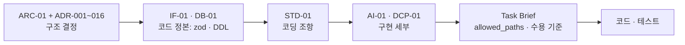
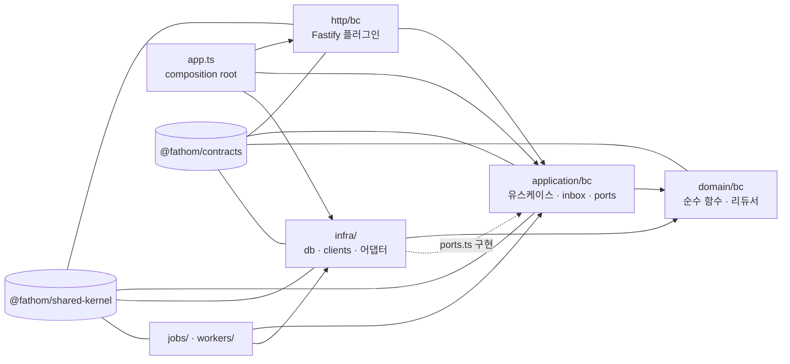
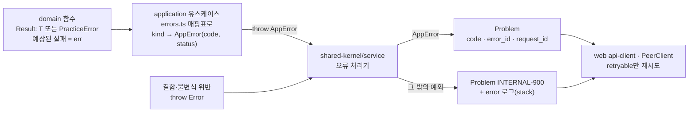
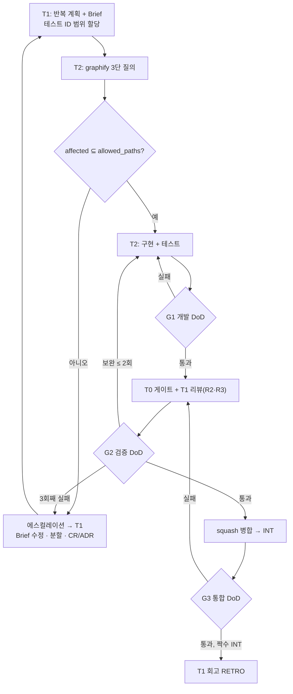
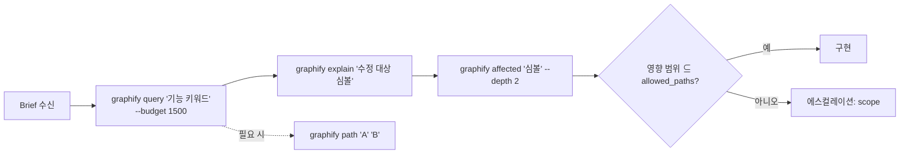

# STD-01. 개발표준정의서 (Development Standards) — Fathom · 깊이

> **문서 ID**: STD-01 · **버전**: v1.0 (PG-2 동결 후보) · **작성일**: 2026-10-01 · **작성 주체**: T1(상위 모델, 아키텍처·표준)
> **구속 입력(binding)**: ARC-01 v1.0(§2 AP-01~15 · §5.4 · §8 · §9.3 · §12 · §13 · §16 · §17 · §18 · 부록 B) · ADR-001~016(특히 ADR-002 SQLite 규약 · ADR-003 통신 · ADR-006 프런트 · ADR-008 모노레포 · ADR-009 세션·비밀 · ADR-010 정적 게이트 · ADR-012 프로세스 · ADR-015 관측성 · ADR-016 Firewall) · IF-01 v1.0 §1~§2(오류 코드 카탈로그 · 헤더 · 페이지네이션 · 멱등) · DB-01 v1.0 §3 · §11 · AI-01 v1.0 · SP-7 보고서 + 감사(PASS, 이식 필수 조건 4건) · R6 §5~§9(STD 초안 · 행안부 보안약점 적용표 · 모델 배분 · graphify 운용) · REQ-01 v1.1 NFR-MAINT-001~013 · NFR-SEC-001~020 · PR-004~010
> **구속 순서**: ARC-01·ADR > IF-01·DB-01(코드 정본: zod·DDL) > **STD-01** > AI-01·DCP-01의 구현 세부 > Task Brief. 이 문서는 위 문서가 정한 규칙을 **코딩 조항**으로 옮기고, 위 문서가 정하지 않은 코딩 세부만 새로 정한다. 새로 정한 것과 문서 간 불일치는 전부 §19 **설계 결정 메모**에 적었다.
> **Trace**: UR-05·06·07·08·09·15·16·17, NFR-MAINT-001~011, NFR-SEC-001~020, NFR-UX-001·008·009, NFR-PORT-001~009, PR-004~010·013·018, CON-010·014
> **후속 소비**: Task Brief(조항 ID 인용), TST-01(테스트 ID·수준), PGM-01, INT-nn 점검표(부록 A), `CLAUDE.md`·`AGENTS.md`(에이전트 지침)

---

## 0. 요약 (TL;DR)

1. **조항 ID** `STD-<영역>-<nn>`을 Task Brief에서 그대로 인용한다. `[M]` = 필수(위반 = 게이트 실패 또는 리뷰 반려), `[S]` = 권장(위반 사유를 PR 설명에 적는다). 각 조항의 **강제** 열이 어느 게이트·테스트·리뷰가 잡는지 적는다.
2. **디렉터리**: ARC-01 §16 트리가 정본이다. 서비스 내부는 `http → application → domain ← infra` + `jobs/`·`workers/`, BC 폴더(`<bc>/`)로 나눈다. **코드 배치 규약**(Jev·SQL·pre/post-submit·blank-note·routing·design-tokens)은 게이트가 경로로 범위를 잡으므로 동결이다(§2.4).
3. **명명**: 패키지 별칭은 `@fathom/app-*`·`@fathom/svc-*`·`@fathom/<pkg>` 3형식만. 파일 kebab-case, TS 식별자 camelCase/PascalCase, **와이어·DB 필드는 snake_case 그대로**(TS에서 다시 camelCase로 바꾸지 않는다). 이벤트 `<context>.<entity>.<past_tense>`, 오류 `<SVC>-<CAT>-<NNN>`, 테스트 `UT-<UNIT>-nnn`.
4. **TypeScript**: TS 7.0.2 정확 pin, `strict` + `erasableSyntaxOnly`(enum·namespace·매개변수 속성 금지) + `noUncheckedIndexedAccess`. `any` 0, `!` 0, `as`는 허용 목록만. 예상 가능한 실패 = `Result<T, DomainError>`, 경계 = `AppError(code, status, detail)`, 결함 = throw.
5. **비동기·SQLite**: floating promise 0, `db.tx(fn)` 안 `await` 0(동기 함수만), 모든 I/O에 데드라인. 연결은 `openDb()`만, 쓰기는 `BEGIN IMMEDIATE`만, SQL 텍스트는 정적 SQL만, `Date`·`boolean` 바인딩 0, 대량 작업은 단명 자식 job.
6. **API**: REST 명사 복수 + 콜론 동사(`items:select`), 성공 응답은 감싸지 않음, 목록 `{items, next_cursor}`, 오류 RFC 9457 `Problem`, 모든 경계에서 zod `.strict()` 검증, 상태 변경 = `Idempotency-Key`(ULID) 필수.
7. **로그**: 서비스는 stdout에 pino JSON 한 줄만 쓴다. 필수 `ts, level, svc, req_id, msg`. 비밀·학습자 원문·프롬프트·LLM 출력은 로그 0. `console.*` 0.
8. **설정**: 서비스 설정의 정본은 IPC **부트스트랩 봉투**다. 환경변수는 §8.3 허용 표에 있는 것뿐이고, 제품 코드에서 `process.env`는 `@fathom/shared-kernel/config/config`(+ 러너 가드)만 읽는다. 도메인 임계값은 코드 상수가 아니라 정책 파일이다.
9. **보안**: 행안부 보안약점 중 해당 항목을 §9 표로 매핑했다 — 정적 SQL, `resolveInside()`, `safeSpawn(shell:false)` + stdin, `react-markdown skipHtml + rehype-sanitize`, Host·Origin·CSRF, SafeFetch(SSRF), 비밀은 키체인·stdin.
10. **게이트**: `node tools/gates/run-gates.mjs`(= `pnpm check:gates`), 종료 코드 0 통과 · 1 위반 · 2 엔진 고장(0파일 스캔 포함). INT-1a는 `--warn-only`, INT-1b부터 병합 차단. **에이전트**: T1 = 계획·리뷰·회고, T2 = 코드, T0 = 게이트. 코드 수정 전 graphify 3단 질의, 동결 파일 변경은 커밋 트레일러 `CR:`/`ADR:` 없이 불가.

---

## 1. 목적 · 범위 · 적용 규칙 (STD-GEN)

### 1.1 목적

Fathom의 코드는 하위 모델 AI 코딩 에이전트(T2)가 **병렬로** 작성한다(UR-06, ARC C-11). 에이전트마다 판단이 갈리는 지점을 없애려면 "어디에·어떤 이름으로·어떤 형태로" 쓰는지가 코드 수준으로 정해져 있어야 한다. 이 문서는 그 규칙을 정하고, 각 규칙을 어떤 기계 장치(정적 게이트·계약 테스트·런타임 거부)가 강제하는지 연결한다. SI 산출물로서 개발표준정의서(R6 §3.1 STD-01, PR-007)이며 PG-2에서 `frozen.lock`에 들어간다.

### 1.2 적용 범위

| 대상 | 적용 절 | 비고 |
|---|---|---|
| `apps/web` | 전 절(§12 프런트엔드 포함) | |
| `apps/cli` | §2~§11, §13~§15 | 사용자 출력은 §7.6 |
| `services/*` | 전 절(§12 제외) | supervisor는 DB·HTTP 없음(§4.6, §10 제외) |
| `packages/*` | 전 절 | `contracts`는 zod만 의존, `design-tokens`는 의존 0 |
| `tools/*` | §2·§3·§4(언어 규칙)·§13·§14·§15 | `tools/gates`는 의존성 0 `.mjs`(§14) |
| `content/`·`policy/`·`evals/` | §3.12·§15·§16 | 저작 규칙 정본은 DCP-01 |
| `tests/`·`deploy/`·`.github/` | §13·§15 | |
| `docs/` | §16 | |
| `spikes/` | **적용 제외**(읽기 전용 참고 PoC) | 이식 시 §17.4 규칙 |

### 1.3 구속 순서와 충돌 처리



| 조항 | 규칙 | 강제 |
|---|---|---|
| STD-GEN-01 [M] | 상위 문서와 이 문서가 다르면 상위 문서를 따르고, 이 문서의 해당 조항은 PG-2 전 정정 대상으로 §19에 기록한다. | RV |
| STD-GEN-02 [M] | 이 문서에 없는 판단이 필요하면 코드를 쓰기 전에 에스컬레이션한다(§17.6). "비슷한 규칙을 유추"하지 않는다. | RV, 완료 보고 `escalations[]` |
| STD-GEN-03 [M] | STD-01 조항 변경: 조항 **추가**·완화가 아닌 구체화 = CR, 조항 **삭제·완화**·게이트 규칙 제거 = ADR + `frozen.lock` 재생성(ADR-010 동결 영향). | `check:frozen` |
| STD-GEN-04 [M] | 탈출구(`// sql-ok:`·`// boundary-ok:`·`// jev-ok:`·`// biome-ignore lint/plugin:`)는 **사유 필수**다. 사유 없는 탈출구는 무효이며 R3 리뷰에서 하나씩 승인한다. | 게이트(사유 검사), RV |
| STD-GEN-05 [M] | 정적 게이트는 **실수 방지망이지 보안 경계가 아니다**. 게이트를 피하는 형태(위치 구조분해·`db['prepare']`·비리터럴 동적 import 등)로 쓰는 것은 그 자체로 반려 사유다. 본체 강제는 계약 테스트·런타임 거부·브랜드 타입이다(ADR-010 §9, CR-23). | RV, `evasions/` 기록 |

### 1.4 표기

- **강제 열 약어**: `G1`·`G2`·`G3` = 단계 게이트(§14.3) · `CT` = 계약 테스트 · `IT` = 통합 테스트 · `RT` = 런타임 거부 · `RV` = 리뷰 체크리스트(부록 A) · `biome` = `biome ci` 규칙 · 게이트 스크립트 이름(`check:sql` 등).
- **레인**: ARC-01 §16.1 파일 소유 레인(L-PLAT, L-CONTRACTS, L-GW, L-CT-*, L-LR-*, L-AI, L-OPS, L-WEB-*, L-CLI, L-CONTENT, L-TEST).
- **티어**: T1 상위 모델 · T2 하위 모델 · T0 결정적 도구(R6 §8.1, PR-006).
- **검증 등급**: V-build(컨테이너 CI) · V-ci(3 OS 매트릭스) · V-live(키·CLI) · V-field(실사용)(REQ §1.7).

---

## 2. 디렉터리 구조 표준 (STD-DIR)

### 2.1 저장소 최상위 (ARC-01 §16 정본과 동일, `(+STD)` = 이 문서가 더한 파일)

> **예외(CR-54)**: `packages/contracts/src/**`의 파일 단위 목록은 IF-01 코드 블록의 `// file:` 머리가 정본이다(ARC §16·ADR-008 §5는 그 목록을 옮긴 것). IF-01에 머리가 없는 contracts 파일은 만들지 않는다(예외: `manifests/*`, `db-hooks.ts`, 생성물 `*.gen.ts`).

```
study_develop_ai/
├─ package.json  pnpm-workspace.yaml  pnpm-lock.yaml  .npmrc  .node-version
├─ turbo.json  biome.json  tsconfig.base.json  tsconfig.json
├─ .gitignore  .gitattributes(+STD)  .graphifyignore(+STD)  CLAUDE.md(+STD)  AGENTS.md(+STD)
├─ apps/
│  ├─ web/                    # @fathom/app-web   — React SPA (§12)
│  └─ cli/                    # @fathom/app-cli   — fathom
├─ services/
│  ├─ gateway/                # @fathom/svc-gateway     :4747
│  ├─ content/                # @fathom/svc-content     :4762  catalog · acquisition · itembank · grading · runner
│  ├─ learning/               # @fathom/svc-learning    :4763  practice · ledger · learner-model · insight · curriculum-ref
│  ├─ ai-gateway/             # @fathom/svc-ai-gateway  :4764  control · routing · judge · generate · privacy
│  └─ ops/                    # @fathom/svc-ops         supervisor(포트 없음) + ops-api :4761
├─ packages/
│  ├─ contracts/              # @fathom/contracts      — zod만 의존
│  ├─ shared-kernel/          # @fathom/shared-kernel  — Node 전용, 도메인 개념 금지, 모듈 17개
│  ├─ design-tokens/          # @fathom/design-tokens  — 원색 리터럴의 유일한 위치
│  ├─ ui/                     # @fathom/ui             — web 전용 컴포넌트
│  └─ testkit/                # @fathom/testkit        — devDependency 전용
├─ tools/
│  ├─ gates/                  # @fathom/tool-gates     — 의존성 0 .mjs (§14)
│  ├─ biome-plugins/          # *.grit (에디터 피드백)
│  ├─ packc/                  # @fathom/tool-packc
│  ├─ graph/                  # @fathom/tool-graph     — graphify INT 스냅샷(비차단, §18)
│  ├─ fake-cli/               # @fathom/tool-fake-cli
│  └─ si-docs/                # @fathom/tool-si-docs   — RTM·UTR·PGM 생성
├─ content/  policy/  evals/  tests/  deploy/  .github/workflows/
├─ docs/  spikes/  graphify-out/
└─ .fathom-dev/               # pnpm dev의 FATHOM_HOME (gitignore)
```

- 하위 트리 전체(파일 단위)는 **ARC-01 §16의 코드 블록이 정본**이다. 이 문서는 그 트리를 바꾸지 않고, 아래 표의 파일만 더한다(§19 D-STD-05·06·07·20).

| 추가 파일 (+STD) | 소유 레인 | 이유 |
|---|---|---|
| `.gitattributes` = `* text=auto eol=lf` + `*.png *.woff2 *.fpack binary` | L-PLAT | 게이트 줄 번호(`\n` 기준)·마이그레이션·정책 sha256이 Windows 체크아웃에서도 같아야 한다(SP-7 R-8) |
| `.graphifyignore` | L-PLAT | §18.5 |
| `CLAUDE.md` · `AGENTS.md`(같은 본문) | T1 | 에이전트 지침(R6 §8.2 장치 6, §17.7) |
| `<패키지>/tsconfig.build.json` | 각 레인 | 빌드는 `src/`만, `tsconfig.json`은 `src`+`test` 타입 검사(§4.1) |
| `<패키지>/vitest.config.ts` · `packages/testkit/src/vitest-preset.ts` | 각 레인 · L-TEST | `resolve.conditions: ['source']`(ADR-008 §4)와 무네트워크 setup 공용화(§13.4) |
| `tests/{tsconfig.json, vitest.config.ts, playwright.config.ts}` | L-TEST | 교차 서비스 스위트 실행 설정(§13.2) |
| `tools/gates/check-scope.mjs` | L-PLAT | Task Brief `allowed_paths` 대조(§14.2, CR 후보) |
| `docs/03-standards/`, `docs/40-impl/{plans,briefs,int,retro,graph,reports}/` | T1 | §16.2 |

### 2.2 서비스 내부 구조 (모든 서비스 동일, ARC-01 §5.4)

```
services/<svc>/
├─ package.json  tsconfig.json  tsconfig.build.json  vitest.config.ts
├─ src/
│  ├─ main.ts                    # --mode=serve|migrate|restore|verify|job 분기 → createService() / runJob()
│  ├─ app.ts                     # composition root: register<Bc>(app, deps) 나열만 (INT-1a 후 동결)
│  ├─ config.ts                  # BootstrapEnvelope 파싱 + 서비스 설정 zod 검증 + 기술 상수
│  ├─ http/<bc>/<group>.ts       # Fastify 라우트 플러그인. 라우트 정의는 @fathom/contracts/http/<svc>/v1/<group> import
│  ├─ application/<bc>/
│  │  ├─ register.ts             # export function register<Bc>(app, deps): void
│  │  ├─ ports.ts                # 교차 BC 인터페이스 + 이 BC가 요구하는 어댑터 포트
│  │  ├─ errors.ts               # DomainError.kind → ErrorCode 매핑 표 (§6.3)
│  │  ├─ <use-case>.ts           # 명령·질의 1개 = 파일 1개 (예: grade-attempt.ts, start-session.ts)
│  │  └─ inbox/<event-type>.ts   # 통합 이벤트 핸들러 1종 = 파일 1개 (예: catalog-concept-changed.ts)
│  ├─ domain/<bc>/<subdomain>/   # 순수: aggregate·값 객체·정책·리듀서. node:*·fastify·node:sqlite import 금지
│  ├─ infra/
│  │  ├─ db/<aggregate>.repo.ts  # 리포지토리(SqlitePort 사용)
│  │  ├─ db/<aggregate>.sql.ts   # 정적 SQL 상수(UPPER_SNAKE export)
│  │  ├─ clients/<peer>.client.ts# PeerClient 래퍼(라우트 정의 기반)
│  │  ├─ events/                 # outbox·relay·inbox 결선(shared-kernel/eventing 호출)
│  │  └─ <bc 전용 어댑터>/        # runner/, search/, packs/, providers/, secrets/ …
│  ├─ jobs/<name>.ts             # 단명 자식 job 진입점(defineJob), --mode=job --job=<name>
│  └─ workers/<name>.ts          # worker_threads 진입점(DB 핸들 금지) — 현재 learning forecast.ts만
├─ assets/                       # 런타임 자산(빌드가 dist 옆에 복사): runner/*.mjs, tasks.yaml, prompts/ …
├─ migrations/<module>/NNNN_<desc>.sql
└─ test/{unit,property,golden,contract,integration,security}/   # 서비스별로 필요한 것만
```

| 조항 | 규칙 | 강제 |
|---|---|---|
| STD-DIR-01 [M] | 새 디렉터리는 위 골격의 이름만 쓴다. `src/` 바로 아래에 `utils/`·`common/`·`helpers/`·`lib/`(web 제외)·`services/`·`models/`를 만들지 않는다. 공용 코드는 BC 안의 `domain/<bc>/shared/` 또는 `@fathom/shared-kernel`(가입 기준 = 도메인 중립 + 두 서비스 이상)로. | RV, graphify god-nodes |
| STD-DIR-02 [M] | 한 BC의 코드는 `http/<bc>`·`application/<bc>`·`domain/<bc>`·`migrations/<bc>` 네 곳에만 둔다(BC 이름 = ARC-01 §5.1 모듈 이름). 서비스 공통 결선(`app.ts`·`main.ts`·`config.ts`·`infra/{db,events,clients}`)은 서비스 대표 레인 소유(content = L-CT-CAT). | `check:scope`, 레인 표 |
| STD-DIR-03 [M] | `app.ts`는 `register<Bc>()`를 나열만 한다. 라우트·핸들러·구독을 `app.ts`에 직접 쓰지 않는다(병렬 머지 핫스팟 제거). | RV |
| STD-DIR-04 [M] | 유스케이스 파일 1개 = 공개 함수 1개(`export async function gradeAttempt(deps, input)` 또는 `export function`). 한 파일에 명령 여러 개를 모으지 않는다. | RV |
| STD-DIR-05 [M] | 손으로 유지하는 barrel(`index.ts` 재수출) 금지. 패키지 공개 표면은 와일드카드 subpath export(`"./*"`)로 파일 단위 import한다(ADR-008 §4). | biome `noBarrelFile`·`noReExportAll` |
| STD-DIR-06 [M] | 런타임에 읽는 비코드 자산은 `services/<svc>/assets/`에 두고 경로는 `config.ts`의 `ASSETS_DIR`(빌드본 = `dist/../assets`)로만 해석한다. `src/` 안에 YAML·Markdown 자산을 두지 않는다. | RV |
| STD-DIR-07 [M] | `spikes/**`를 import·참조하지 않는다. 스파이크 코드는 **복사 이식**하고 첫 줄에 출처 주석 `// ported-from: spikes/<sp>/<path> (audit-fixed: <요지>)`을 단다. | `check:boundaries`(spikes는 단위 밖 → 오류), RV |

### 2.3 레이어 의존 규칙



| 레이어 | import 허용 | import 금지 |
|---|---|---|
| `domain/<bc>` | 같은 BC의 `domain/<bc>/**`, `domain/<bc>/shared`, `@fathom/contracts/*`(타입·순수 함수), `@fathom/shared-kernel/errors/errors`(순수 모듈, §19 D-STD-02), 서비스 승인 순수 서드파티(`ts-fsrs`=learning, `es-hangul`=content) | `node:*`, `fastify`, `node:sqlite`, `infra/`, `application/`, `http/`, 다른 BC의 `domain/` |
| `application/<bc>` | 같은 BC `domain`, 자기 `ports.ts`, 다른 BC의 `application/<bcB>/ports.ts`(타입만), `@fathom/contracts/*`, `@fathom/shared-kernel/*` | 다른 BC의 유스케이스·domain, `infra/` 구체 클래스(포트로만) |
| `http/<bc>` | 같은 BC `application`, `@fathom/contracts/http/**`, `@fathom/shared-kernel/service/service` | `domain/`·`infra/` 직접 |
| `infra/` | `domain` 타입, `application/*/ports.ts`, `@fathom/shared-kernel/*`, 승인 서드파티 | `http/` |
| `jobs/`·`workers/` | `application`, `infra`, `@fathom/shared-kernel/jobs/jobs` | `http/`; `workers/`는 DB 핸들(`sqlite`) 금지 |

- 강제: `check:boundaries` 규칙 `bc-cross`·`grading-no-catalog`·domain 순수성·`sqlite-direct`(G1), 단위 간 허용표 `tools/gates/config/boundaries.json`.

### 2.4 코드 배치 규약 (SP-7 감사 구속 — 게이트가 경로·이름으로 범위를 잡는다, 동결)

| 조항 | 대상 | 위치·이름 (이 밖에 두면 검사에서 빠지므로 금지) | 강제 |
|---|---|---|---|
| STD-DIR-10 [M] | Jev 요청 조립 | `services/ai-gateway/src/jev/**`(SDK import는 여기만) · 타 서비스 judge 입력 조립 = `*.jev.ts`(예: `application/grading/judge-input.jev.ts`) | `check:jev-index`, `check:deps` |
| STD-DIR-11 [M] | Jev 프롬프트 | `services/ai-gateway/assets/jev/prompts/<AI-Jnn>/<semver>/{prompt.md, meta.yaml}` | `check:jev-index`(`.md` 포함) |
| STD-DIR-12 [M] | LLM 프롬프트 | `services/ai-gateway/assets/prompts/<taskId>/<semver>/{prompt.md, meta.yaml}` + `assets/prompts.lock.json` | 기동 시 lock 대조(RT) |
| STD-DIR-13 [M] | 학습 라우팅 코드 | `routing/` 디렉터리 또는 `*.route.ts`(web `apps/web/src/routing/`, learning `domain/practice/routing/`). **`*.route.ts` 접미사는 NG-G4 범위 전용 예약** — HTTP 라우트 파일에 쓰지 않는다(§3.2) | `check:ng-g`(G4) |
| STD-DIR-14 [M] | 제출 전/후 스키마 | `packages/contracts/src/http/<svc>/v1/pre-submit/*.ts`(이름 `*PreSubmit`) · `post-submit/*.ts`(이름 `*PostSubmit`), **별개 `z.object`**(스프레드·`.extend`·`.merge`·`.pick`·`.omit` 파생 금지) | `check:ng-g`(G3), CT 403 |
| STD-DIR-15 [M] | 백지노트 | `**/blank-note/`(제출 전 — AI 클라이언트·생성 호출 import 금지) · `**/blank-note/post-submit/`(제출 후 비교·피드백) | `check:ng-g`(G7), RT 403 `AI-POLICY-001` |
| STD-DIR-16 [M] | NG-G7 정책 정본 | `packages/contracts/src/ai/ai-gateway-policy.ts` = `AI_GATEWAY_POLICY = { deny_before_submit: ['blank_note.*'] } as const` | `check:ng-g` 양성 단언 |
| STD-DIR-17 [M] | 정적 SQL | `infra/db/<name>.sql.ts`의 `export const UPPER_SNAKE = '…'`(공통 인프라 SQL = `packages/shared-kernel/src/eventing/*.sql.ts`) | `check:sql`·`check:sql-typed` |
| STD-DIR-18 [M] | 원색 리터럴 | `packages/design-tokens/src/**`만(hex·`rgb()`·`hsl()`·`oklch()`·`oklab()`·`hwb()`) | `check:ng-g`(`design/raw-color`) |
| STD-DIR-19 [M] | 원장 쓰기 | `services/learning/src/infra/ledger/ledger-writer.ts` 한 파일 | `check:ledger-writer` |
| STD-DIR-20 [M] | 서빙 테이블 쓰기 | `services/content/src/application/{catalog,itembank}/ingest/**` | `check:content-ingest` |
| STD-DIR-21 [M] | 단명 자식 job · worker | `src/jobs/<name>.ts`(job 이름 = 파일 이름) · `src/workers/<name>.ts` | RV |
| STD-DIR-22 [M] | AI SDK·CLI spawn | LLM SDK = `services/ai-gateway/src/infra/providers/**` · CLI spawn = `infra/cli-kit/**` · 키 저장 = `infra/secrets/**` | `check:deps`, `check:boundaries` |
| STD-DIR-23 [M] | 동적 모듈 로드 | 비리터럴 `import(x)`·`createRequire`·`require` 금지(필요 시 `// boundary-ok: <사유>`) | `check:boundaries`(오류) |

### 2.5 `apps/web` 구조 (ADR-006 §5)

```
apps/web/
├─ package.json  tsconfig.json  tsconfig.build.json  vite.config.ts  vitest.config.ts  index.html
├─ public/{manifest.webmanifest, sw.js, icons/}
├─ vite/sw-precache-plugin.ts
├─ src/
│  ├─ main.tsx  router.tsx  routeTree.gen.ts       # routeTree.gen.ts = router-plugin 생성물(수기 편집 금지)
│  ├─ routing/                                     # TanStack file routes (routesDirectory = ./src/routing)
│  ├─ features/<feature>/{components,hooks,api}/   # feature ∈ practice · curriculum · assessment-ui · insight · acquisition · ai-control · ops-console · settings
│  │     practice/blank-note/  ·  practice/blank-note/post-submit/
│  ├─ lib/                                         # api-client · csrf · bootstrap · idempotency · attempt-queue · sse · invalidation-map · query-keys · ime · hotkeys · choseong · sw-register (+STD: svg-mount · markdown)
│  ├─ stores/                                      # zustand: player · palette · hotkeys
│  └─ styles/app.css                               # @import "@fathom/design-tokens/tokens.css"
└─ test/{unit,component}/
```

### 2.6 공유 패키지 구조 규칙

| 조항 | 규칙 | 강제 |
|---|---|---|
| STD-DIR-30 [M] | `packages/contracts/src/` 하위 디렉터리는 ADR-008 §5의 `common · http/<svc>/v1 · events · ledger · ai · pack · policy · admin · manifests` + `db-hooks.ts`뿐. 새 최상위 디렉터리 = CR. | `check:frozen`, RV |
| STD-DIR-31 [M] | `packages/shared-kernel/src/`의 모듈은 ARC-01 §17.3의 17개(`service, sqlite, eventing, jobs, http-client, idempotency, auth, log, metrics, ids, time, canonical, redact, errors, config, policy, proc`)뿐. 모듈 = 디렉터리 1개 + 진입 파일 `src/<module>/<module>.ts`(공개 export 전부), 외부 import는 **`@fathom/shared-kernel/<module>/<module>`** 하나뿐(CR-53, ARC §17.3). 모듈 내부 파일은 진입 파일이 re-export하지 않으면 외부 비공개. 모듈 추가 = CR(가입 기준 충족 증거 첨부). | RV, `check:frozen` |
| STD-DIR-32 [M] | `packages/shared-kernel/src/{errors,redact}/**`는 **순수 모듈**이다 — `node:*`·서드파티 import 0(domain이 import하므로). | `check:boundaries`(intra `sk-pure`, CR 후보) |
| STD-DIR-33 [M] | `packages/ui/src/components/<name>.tsx` 1파일 1컴포넌트, `@fathom/ui/components/<name>`으로 import. 색은 `var(--…)`·토큰 상수만. | `design/raw-color`, RV |
| STD-DIR-34 [M] | `packages/testkit`은 어떤 런타임 패키지의 `dependencies`에도 들어가지 않는다(`devDependencies`만). 서비스의 `src/`는 testkit을 import하지 않는다(`test/`만). | `check:deps`, `check:boundaries` |

### 2.7 생성물 · 비커밋 디렉터리

| 경로 | 생성 명령 | Git | 수기 편집 |
|---|---|---|---|
| `packages/contracts/src/events/{registry.gen.ts, routing.gen.ts}` | `pnpm contracts:gen` | **커밋**(CI가 최신 여부 검사) | 금지 |
| `packages/contracts/.snapshots/*.json` | `pnpm contracts:gen` | **커밋**(`check:frozen` 입력) | 금지 |
| `apps/web/src/routeTree.gen.ts` | `@tanstack/router-plugin`(vite dev/build) | **커밋** | 금지 |
| `dist/`, `coverage/`, `.turbo/`, `playwright-report/`, `test-results/` | 빌드·테스트 | ignore | — |
| `.fathom-dev/` | `pnpm dev` | ignore | — |
| `graphify-out/{graph.json, GRAPH_REPORT.md, graph.html}` | `graphify update .` | 커밋 — **INT(G3) 단계에서 T0만** 갱신, Task 브랜치는 포함 금지(§18.5) | 금지 |
| `graphify-out/{cache,memory,reflections}/` | graphify | ignore | — |
| `docs/40-impl/graph/INT-<id>/{GRAPH_REPORT.md, metrics.json}` | `pnpm graph:snapshot --int <id>` | 커밋 | 금지 |
| `dist/packs/*.fpack` | `pnpm packs:build` | ignore(릴리스 번들에만) | — |

### 2.8 파일 소유 레인

| 조항 | 규칙 | 강제 |
|---|---|---|
| STD-DIR-40 [M] | Task Brief의 `allowed_paths`는 해당 레인 경로(ARC-01 §16.1)의 부분집합이다. 레인 밖 파일이 필요하면 구현을 멈추고 `scope` 에스컬레이션. | `check:scope`, G1 |
| STD-DIR-41 [M] | `packages/contracts`를 바꾸는 Task는 반복의 **첫 번째 직렬 그룹**으로만 실행한다(병렬 Task는 그 결과를 import만). | IT 계획, RV |
| STD-DIR-42 [M] | 공급자 레인은 `contracts/http/<svc>/v1/**`·`events/catalog/<context>.ts`를, 소비자 레인은 `events/__consumers__/<svc>.json`만 고친다. | `check:consumers`, `check:scope` |

---

## 3. 명명 규칙 (STD-NAM)

### 3.1 패키지 · 워크스페이스 (ADR-008 §2, SP-7 감사 구속)

| 조항 | 대상 | 규칙 | 예 | 강제 |
|---|---|---|---|---|
| STD-NAM-01 [M] | apps | `@fathom/app-<web\|cli>` | `@fathom/app-web` | `check:tsconfig-paths` |
| STD-NAM-02 [M] | services | `@fathom/svc-<gateway\|content\|learning\|ai-gateway\|ops>` | `@fathom/svc-learning` | 〃 |
| STD-NAM-03 [M] | packages | `@fathom/<contracts\|shared-kernel\|design-tokens\|ui\|testkit>` | `@fathom/contracts` | 〃 |
| STD-NAM-04 [M] | tools | `@fathom/tool-<gates\|packc\|graph\|fake-cli\|si-docs>` (런타임 단위가 import 불가로 `boundaries.json`에 등록) | `@fathom/tool-packc` | 〃 |
| STD-NAM-05 [M] | import 별칭 | 위 4형식 + 상대 경로뿐. `tsconfig` `compilerOptions.paths` 금지, `#imports`(package.json imports 필드) 금지 | — | `check:tsconfig-paths`, `check:boundaries` |
| STD-NAM-06 [M] | 내부 의존 버전 | `"workspace:*"` | — | `check:deps` |

### 3.2 파일 · 디렉터리

| 조항 | 대상 | 규칙 | 예 |
|---|---|---|---|
| STD-NAM-10 [M] | 디렉터리 | kebab-case 소문자. BC 이름은 ARC-01 §5.1 그대로(`learner-model`, `curriculum-ref`) | `domain/learner-model/elo/` |
| STD-NAM-11 [M] | TS 파일 | kebab-case + 필요 시 역할 접미사. 파일 이름 = 주 export의 kebab 형태 | `grade-attempt.ts` → `gradeAttempt` |
| STD-NAM-12 [M] | React 컴포넌트 파일 | kebab-case `.tsx`(컴포넌트 식별자는 PascalCase) | `depth-map-cell.tsx` → `DepthMapCell` |
| STD-NAM-13 [M] | TanStack 라우트 파일 | router-plugin 파일 규약 그대로: `__root.tsx`, `index.tsx`, `session.$sessionId.tsx` 형식(점 = 경로 구분, `$` = 파라미터). `/_design`은 §19 D-STD-15 | `concepts.$conceptId.tsx` |
| STD-NAM-14 [M] | 예약 접미사 | 아래 표의 의미로만 쓴다 | |

| 접미사·이름 | 의미 (다른 용도 금지) | 검사 범위가 되는 게이트 |
|---|---|---|
| `*.sql.ts` | 정적 SQL 상수(`UPPER_SNAKE`)만 export | `check:sql`, `check:sql-typed` |
| `*.jev.ts` | Jev judge 입력(객체 키 맵) 조립 | `check:jev-index` |
| `*.route.ts` | **학습 라우팅**(Router·세션 진입) 코드 — NG-G4 | `check:ng-g` |
| `*PreSubmit*` · `*PostSubmit*` | 제출 전/후 스키마 | `check:ng-g`(G3) |
| `*.repo.ts` | SQLite 리포지토리 | — |
| `*.client.ts` | 피어 서비스 HTTP 클라이언트(`PeerClient` 래퍼) | — |
| `*.gen.ts` | 생성물(수기 편집 금지) | CI 최신 검사 |
| `*.spec.ts` · `*.spec.tsx` | vitest·playwright 테스트(모든 TS 테스트) | — |
| `*.test.mjs` | `node:test` 테스트(`tools/gates/test/`만) | — |
| `register.ts` · `ports.ts` · `errors.ts` | BC 등록·포트·오류 매핑(§2.2) | — |
| `*.mjs` | 빌드 없이 node로 실행하는 JS: `tools/gates/**`, `services/content/assets/runner/**`, `apps/cli/bin/fathom.mjs` | — |

### 3.3 TypeScript 식별자

| 조항 | 대상 | 규칙 | 예 |
|---|---|---|---|
| STD-NAM-20 [M] | 타입·인터페이스·클래스·React 컴포넌트·zod 스키마 상수 | PascalCase. 인터페이스에 `I` 접두사 금지 | `SessionComposer`, `Verdict` |
| STD-NAM-21 [M] | 함수·변수·매개변수·메서드 | camelCase, 함수는 동사로 시작 | `composeSession`, `isDue` |
| STD-NAM-22 [M] | 모듈 수준 상수(불변 원시값·정적 SQL·고정 표) | UPPER_SNAKE | `MAX_BATCH_EVENTS = 100`, `INSERT_LR_EVENT` |
| STD-NAM-23 [M] | 불리언(TS 지역 변수·함수) | `is`·`has`·`can`·`should` 접두사 | `isProvisional` |
| STD-NAM-24 [M] | 유스케이스 함수 | 명령 = `<동사><명사>`(`gradeAttempt`, `startSession`, `installPack`), 질의 = `get<명사>`/`list<명사들>`/`find<명사>`(없으면 null) | |
| STD-NAM-25 [M] | 리포지토리 메서드 | `findById`·`findMany<By…>`·`insert`·`insertOrIgnore`·`update<필드>`·`delete`·`exists` | `insertOrIgnore(event)` |
| STD-NAM-26 [M] | 포트 인터페이스 | `<역할>Port`(`RunnerPort`, `SqlitePort`, `FsrsOptimizerPort`, `CodeGraphPort`) 또는 ARC·REQ가 정한 이름(`CatalogReader`, `ItemReader`, `JudgeProvider`, `LlmProvider`, `SecretStore`) | |
| STD-NAM-27 [M] | 도메인 오류 kind | `'<bc>/<reason_snake>'` 문자열 리터럴 | `'practice/session_not_active'` |
| STD-NAM-28 [M] | 팩토리 | 비동기 생성 = `create<X>()`, 동기 생성 = `make<X>()`; `new`는 값 객체·`AppError`·어댑터 클래스만 | `createService()` |
| STD-NAM-29 [M] | 약어 | 두 글자 약어도 단어로 취급(`Id`, `Url`, `Json`, `Sql`, `Ai`) — 단, 외부 표준·계약 이름은 원문 유지(`ULID`→`Ulid` 스키마, `LDI`→`ldi`, `FSRS`→`fsrs`) | `verdictId`, `toSqlLiteral` |

- **와이어 필드 규칙(STD-NAM-30 [M])**: 계약(zod)·DB 열·이벤트 payload·로그 필드의 이름은 **snake_case**이고, TS 코드는 그 객체를 **이름 그대로** 다룬다(`verdict.verdict_id`, `row.client_ts`). 경계에서 camelCase로 다시 매핑하는 DTO 계층을 만들지 않는다 — 리플레이 입력·해시 정준화가 필드 이름에 의존하기 때문이다(§19 D-STD-03). 지역 변수로 꺼낼 때만 camelCase(`const verdictId = verdict.verdict_id`).

### 3.4 zod 스키마 · 계약 이름 (IF-01 §1.2 번역 규칙)

| 조항 | 규칙 | 예 |
|---|---|---|
| STD-NAM-40 [M] | 스키마 상수와 추론 타입은 **같은 이름**(`Schema` 접미사 금지): `export const X = S({...}); export type X = z.infer<typeof X>;` | `Verdict` |
| STD-NAM-41 [M] | 요청 = `<Action><Resource>Body`·`<Resource>ListQuery`·`<Resource>Params`, 응답 = `<Resource>View`·`<Resource>Page`(= `Page(<Resource>View)`)·작업 = `Operation`·`JobView` | `CreateSessionBody`, `SessionView` |
| STD-NAM-42 [M] | 이벤트 payload 스키마 = 이벤트 엔티티 + 동사 PascalCase + `Payload`, 원장 payload = `<Type>V<n>` | `GradingVerdictIssuedPayload`, `AttemptGradedV1` |
| STD-NAM-43 [M] | 라우트 정의 상수 = camelCase 동사구, route id = `<svcdir>.<group>.<action>` — `<svcdir>`는 contracts `http/` 아래 디렉터리 이름(`gateway`·`content`·`learning`·`ai-gateway`·`ops`), 공통 엔드포인트는 `common` | `createSession` / `'learning.practice.sessions.create'` |
| STD-NAM-44 [M] | IF-ID(`IF-LR-004`)는 라우트 정의의 `ifId`와 계약 테스트 제목에만 쓴다(코드 식별자에 쓰지 않음) | |

### 3.5 DB (DB-01 §3.2와 동일 — 정본은 DB-01)

| 조항 | 대상 | 규칙 | 예 |
|---|---|---|---|
| STD-NAM-50 [M] | 테이블 접두어(모듈 소유) | content `ct_`(catalog) · `aq_`(acquisition) · `ib_`(itembank) · `gr_`(grading) · `rn_`(runner) / learning `lr_` / insight `iv_` / ai `ai_` / ai-cache `ac_` / ops `op_`. 공통 인프라(`outbox`, `outbox_delivery`, `inbox_dedupe`, `inbox_watermark`, `inbox_dead`, `idem_request`, `schema_migrations`)만 접두어 없음 | `gr_verdict` |
| STD-NAM-51 [M] | 테이블 | `<접두어>_<snake 단수 명사>`, `STRICT` | `lr_event`, `ct_concept` |
| STD-NAM-52 [M] | 열 접미사(의미 고정) | `_id` ID · `_at` 서버 시각 epoch ms · `ts`/`client_ts`/`last_ts` 기기 발생 시각 · `_day` 학습일 TEXT · `_ms` 지속시간 · `_days` 일 수 · `_md` Markdown · `_json` JSON TEXT · `_sha256`/`_hash` hex 64 · `_count`/`n_*` 개수 · 불리언은 접두사 없이 형용사·과거분사(`pending`, `calibrated`) 또는 `is_*`(DB-01 표의 기존 이름 유지) | `issued_at`, `latency_ms` |
| STD-NAM-53 [M] | 인덱스 · 트리거 · 뷰 | `ix_<table>_<용도>` · `ux_<table>_<용도>` · `<table>_no_update`/`_no_delete`/`_frozen` · FTS `<table>_ai/_ad/_au` · 뷰 `<table>_active` | `ix_lr_event_order` |
| STD-NAM-54 [M] | 마이그레이션 파일 | `NNNN_<snake_desc>.sql`(모듈 안 0001부터 빈틈 없이) | `0001_ledger_core.sql` |
| STD-NAM-55 [M] | `ext` 키 | `"<feature>.<field>"` | `"lanpair.origin"` |
| STD-NAM-56 [M] | 정적 SQL 상수 | `<VERB>_<TABLE 접두어 없이 대문자>[_<BY_조건>]` | `SELECT_CARD_STATE_BY_CONCEPT`, `INSERT_OR_IGNORE_EVENT` |

### 3.6 API (IF-01 §1·§2 정본)

| 조항 | 대상 | 규칙 | 예 |
|---|---|---|---|
| STD-NAM-60 [M] | 경로 접두어 | 공개 `/api/v1/…`(gateway만), CLI `/api/v1/cli/…`, 내부 `/internal/v1/<bc\|resource>/…`, 운영 `/healthz`·`/readyz` | |
| STD-NAM-61 [M] | 경로 세그먼트 | 명사 복수 kebab-case, 중첩 ≤ 2단계 | `/api/v1/sessions/{session_id}/blocks/{block_id}` |
| STD-NAM-62 [M] | 경로 파라미터 | `{snake_case}`(계약 표기), 런타임 변환은 `createService()`가 한다 | `{concept_id}` |
| STD-NAM-63 [M] | 비 CRUD 동작 | 콜론 동사 `:<verb>`(소문자, 단어 1개 또는 kebab) | `POST /internal/v1/itembank/items:select`, `POST /internal/v1/jobs/{job_id}:cancel` |
| STD-NAM-64 [M] | 쿼리·JSON 필드 | snake_case | `?cursor=&limit=`, `next_cursor` |
| STD-NAM-65 [M] | enum 값 | snake_case 소문자. 예외 = 계약이 고정한 대문자 코드(`FULL`·`JUDGE_ONLY`·`OFFLINE`, `S0`, `CL-0`, `A`/`B`/`C`, `D`/`J`/`LJ`/`H`/`S`) | `'awaiting_self_grade'` |
| STD-NAM-66 [M] | 커스텀 헤더 | `x-fathom-<kebab>` 소문자 | `x-fathom-deadline-ms` |

### 3.7 이벤트 · IPC · job

| 조항 | 대상 | 규칙 | 예 |
|---|---|---|---|
| STD-NAM-70 [M] | 통합 이벤트 type | `<context>.<entity>.<past_tense>`, 정규식 `^[a-z]+\.[a-z_]+\.[a-z_]+$`, context = **BC 문맥**(`catalog`·`acquisition`·`itembank`·`grading`·`learning`·`ai`·`ops`) — `producer`(배포 단위)와 다를 수 있다 | `grading.verdict.issued` |
| STD-NAM-71 [M] | 원장 이벤트 type | `<entity>.<past_tense>` 2단(ADR-011 §3의 17종) | `attempt.graded`, `level.provisional_resolved` |
| STD-NAM-72 [M] | 이벤트 payload 파일 | 통합 `contracts/src/events/catalog/<context>.ts`, 원장 `contracts/src/ledger/payloads/<type>.ts`(점 → kebab: `attempt-graded.ts`) | |
| STD-NAM-73 [M] | 소비자 매니페스트 | `contracts/src/events/__consumers__/<ServiceName>.json` | `ops-api.json` |
| STD-NAM-74 [M] | inbox 핸들러 파일 | `application/<bc>/inbox/<type의 점을 하이픈으로>.ts` | `inbox/grading-verdict-issued.ts` |
| STD-NAM-75 [M] | 원장 멱등 키 | ADR-011 §3 형식만: `verdict:<verdict_id>` · `corr:<item_id>:<basis>:<gate_result_id>` · `recalc:<policy_version>:<event_id>` · `att:<attempt_id>` · `cmd:<command_id>` · `card:<card_id>` · `policy:<policy_version>` · `aimode:<event_id>` · `exam:<exam_id>` · `promo:<track>:<to_level>` · `promo-res:<track>:<level>:<n>` | |
| STD-NAM-76 [M] | IPC 메시지 type | `<noun>[.<verb>]` 소문자 점 표기(ADR-012 §4 목록만) | `svc.run_mode`, `registry.updated` |
| STD-NAM-77 [M] | job 이름 | kebab-case, ARC-01 §4 목록만: `snapshot`·`pack-load`·`integrity`·`pipeline`·`replay-verify`·`merge`·`rebuild`·`fsrs-optimize` | `--job=replay-verify` |
| STD-NAM-78 [M] | SSE 이벤트 이름 | 통합 이벤트 type 그대로 + 합성 `hello`·`resync`, AI 스트림 `meta`·`delta`·`done`·`error` | |

### 3.8 로그 · 메트릭

| 조항 | 대상 | 규칙 | 예 |
|---|---|---|---|
| STD-NAM-80 [M] | 로그 `event` | `<area>.<object>.<verb_past\|state>` 소문자, 단어는 snake. area = BC 또는 인프라 모듈(`http`·`relay`·`inbox`·`job`·`sqlite`·`runner`·`ipc`) | `relay.delivery.failed`, `runner.run.killed`, `ledger.event.appended` |
| STD-NAM-81 [M] | 메트릭 이름 | `<area>_<what>_<unit\|total>` snake_case, 카운터 `_total`, 지속시간 `_ms`, 바이트 `_bytes`. 레이블 키 snake_case, 레이블 값은 유한 집합(ID·경로 원문 금지 — route id 사용) | `grading_duration_ms{engine}`, `outbox_pending{dest}` |

### 3.9 환경변수

| 조항 | 규칙 | 예 |
|---|---|---|
| STD-NAM-85 [M] | Fathom 고유 변수 = `FATHOM_<KEY>` UPPER_SNAKE. 외부 SDK·OS 표준 이름은 원문 유지. 새 변수는 §8.3 표 갱신 + CR 없이는 추가하지 않는다 | `FATHOM_HOME`, `TYPESAFE_API_KEY` |

### 3.10 오류 코드 (IF-01 §2.6 정본)

| 조항 | 규칙 |
|---|---|
| STD-NAM-90 [M] | `<SVC>-<CAT>-<NNN>`, 정규식 `^(GW\|CT\|LR\|AI\|OP\|CLI)-(VAL\|AUTH\|ACL\|NOTFOUND\|CONFLICT\|DEP\|LIMIT\|POLICY\|INTERNAL)-\d{3}$`. SVC = 응답을 **만든** 서비스(gateway가 하위 오류를 전달할 때는 원 코드 유지) |
| STD-NAM-91 [M] | 번호대: 공통(`createService()`가 같은 의미로 냄) = `9xx` + ADR-003 고정 `CONFLICT-001`(같은 키·다른 본문)·`CONFLICT-002`(처리 중). 서비스 고유 = `001~899`, CONFLICT 고유는 `010`부터. ai-gateway는 `AI-`(구 `AIG-POLICY-001` 표기는 CR-44로 ARC·ADR에서 `AI-POLICY-001`로 정정 완료) |
| STD-NAM-92 [M] | Problem `type` = `urn:fathom:problem:<code 소문자>`(예: `urn:fathom:problem:lr-dep-001`) |

### 3.11 테스트 ID (ADR-008 §12, NFR-MAINT-011)

| 조항 | 종류 | 형식 | 위치 |
|---|---|---|---|
| STD-NAM-95 [M] | 단위(property·golden·component 포함) | `UT-<UNIT>-nnn` | `<pkg>/test/{unit,property,golden,component}/` |
| | 계약 | `CT-<UNIT>-nnn` | `<pkg>/test/contract/`, 교차 서비스 = `CT-SYS-nnn`(`tests/contract/`) |
| | 통합 | `IT-nnn`(3자리, 저장소 전체 일련) | `services/<svc>/test/integration/`, `tests/integration/` |
| | E2E | `E2E-nnn` | `tests/e2e/` |
| | 보안 | `SEC-<UNIT>-nnn` | `<pkg>/test/security/` |
| | 카오스 · 성능 | `CHA-nnn` · `PRF-nnn` | `tests/chaos/` · `tests/perf/` |

- `<UNIT>` 코드: `GW` gateway · `CT` content · `LR` learning · `AI` ai-gateway · `OP` ops-api · `SUP` supervisor · `WEB` web · `CLI` cli · `CON` contracts · `SK` shared-kernel · `TOK` design-tokens · `UI` ui · `TK` testkit · `GATE` tools/gates · `PACKC` packc · `GRAPH` tools/graph · `FCLI` fake-cli · `SID` si-docs · `SYS` 교차 서비스(`tests/`).
- 반복(iteration) ID `IT-nn`(2자리)와 통합 테스트 ID `IT-nnn`(3자리)은 자릿수로 구별한다. 계약 테스트 `CT-CT-nnn`(content)는 둘째 마디가 항상 UNIT 코드이므로 오류 코드(`CT-LIMIT-001`, 둘째 마디 = CAT)와 겹치지 않는다(§19 D-STD-11).
- **번호 할당(STD-NAM-96 [M])**: 번호 대역의 정본은 **TST-01 §11.2**(단위·BC별 대역, CT 001~199 = IF 번호 미러, 5nn = IF-EV, 6nn = IF-COM, 7nn = IPC, 8nn = 원장, E2E 001~079 = SCN)다(CR-56). T1은 Task Brief마다 그 대역 **안의 하위 범위**를 할당하고(예: `UT-LR-120~139`), 미러 번호는 할당 없이 IF ID를 따른다. 대역·Brief 범위 밖 번호, 중복 = G1 실패(`tools/si-docs`).

### 3.12 정책 · 과업 · 프롬프트 · 콘텐츠 ID

| 조항 | 대상 | 규칙 (정규식 정본 = IF-01 §2.4 `common/ids.ts`) | 예 |
|---|---|---|---|
| STD-NAM-100 [M] | 정책 파일 | `policy/<snake_name>@v<k>.yaml`, 참조 `PolicyRef` = `<name>@v<k>`, 정책 세트 = `ps_<sha256 16자>` | `mastery_rules@v1` |
| STD-NAM-101 [M] | AI 과업 ID | `AI-J01`~`AI-J19`(judge) · `AI-G01`~`AI-G13`(generate) — `@fathom/contracts/ai/tasks` enum 밖 금지 | `AI-J03` |
| STD-NAM-102 [M] | 프롬프트 버전 | SemVer 디렉터리 `<taskId>/<semver>/` | `AI-G01/1.2.0/` |
| STD-NAM-103 [M] | 콘텐츠 ID | 불변 slug, 문법 = IF-01 `common/ids.ts`(packc R-ID = DCP §5.2 = DB §3.3, CR-35), 사용자 콘텐츠 `u.<ns>.<slug>`. 한 번 발행하면 바꾸지 않는다(개명 = alias) | `k8s.probes`, `k8s.probes.k03`(KU), `k8s.probes.m01`(오개념), `k8s.probes.i05`(문항), `k8s.case.oomkill`, `cert-cka@2026`, 카드 `k8s.probes:definition:p` |
| STD-NAM-104 [M] | 팩 파일 | `content/packs/<track>/`, 산출 `dist/packs/<track>@<semver>.fpack` | `k8s@1.0.0.fpack` |
| STD-NAM-105 [M] | 런타임 ID | ULID 대문자 26자(`@fathom/shared-kernel/ids/ids` `ulid()`), 브라우저는 같은 알파벳으로 자체 생성 | `01JB3K…` |

---

## 4. TypeScript 코딩 표준 (STD-TS)

### 4.1 컴파일러 설정

```jsonc
// tsconfig.base.json (ADR-008 §3 — 이 값에서 끄거나 바꾸지 않는다)
{
  "compilerOptions": {
    "strict": true,
    "module": "nodenext", "moduleResolution": "nodenext", "target": "es2023",
    "verbatimModuleSyntax": true, "erasableSyntaxOnly": true, "isolatedModules": true,
    "noUncheckedIndexedAccess": true, "noImplicitOverride": true,
    "customConditions": ["source"], "types": [],
    "skipLibCheck": true, "declaration": true, "sourceMap": true
  }
}
```

```jsonc
// <패키지>/tsconfig.json — 에디터 + 패키지 typecheck(src + test), 방출 없음
{ "extends": "../../tsconfig.base.json",
  "compilerOptions": { "noEmit": true, "types": ["node"] },          // web: ["vite/client"], jsx: "react-jsx"
  "include": ["src", "test"] }
// <패키지>/tsconfig.build.json — 빌드(src만)
{ "extends": "./tsconfig.json",
  "compilerOptions": { "noEmit": false, "rootDir": "src", "outDir": "dist" },
  "include": ["src"] }
```

| 조항 | 규칙 | 강제 |
|---|---|---|
| STD-TS-01 [M] | `typescript`는 루트 devDependency **7.0.2 정확 pin** 하나뿐(`^`·`~` 금지). 패키지별 `typescript` 의존, TS 5.9/6.x 병행 pin, typescript-eslint·dependency-cruiser·madge 도입 금지(ADR-010 §7). | `check:deps`(금지 목록) |
| STD-TS-02 [M] | 루트 `tsconfig.json`(noEmit, `apps/*/src`·`services/*/src`·`packages/*/src`)은 게이트 tsgo 엔진 입력이다. 삭제·`include` 축소 금지(없으면 게이트 exit 2). | `check:gates` |
| STD-TS-03 [M] | `compilerOptions.paths`·`baseUrl` 금지. | `check:tsconfig-paths` |
| STD-TS-04 [M] | ESM 전용(`"type": "module"`). 상대 import는 **`.js` 확장자**를 쓴다(`nodenext` 규칙, 원천은 `.ts`): `import { tx } from './tx.js'`. 패키지 import는 확장자 없는 subpath(`@fathom/contracts/events/envelope`). | `tsc` |
| STD-TS-05 [M] | 타입만 쓰는 import는 `import type`(`verbatimModuleSyntax`). Node 내장은 `node:` 접두사. | `tsc`, biome `useImportType`·`useNodejsImportProtocol` |

### 4.2 언어 사용 규칙

| 조항 | 규칙 | 강제 |
|---|---|---|
| STD-TS-10 [M] | `any` 금지(명시·암시 모두). 모르는 값은 `unknown` + zod 파싱 또는 타입 가드로 좁힌다. 서드파티 타입 구멍은 어댑터 파일 한 곳에서 `unknown`으로 받아 좁힌다. | biome `noExplicitAny`·`noImplicitAnyLet`·`noEvolvingTypes`, `tsc` strict |
| STD-TS-11 [M] | non-null 단언 `!` 금지. `noUncheckedIndexedAccess`로 생긴 `T \| undefined`는 검사 후 사용하거나 `assertDefined(x, 'reason')`(`@fathom/shared-kernel/errors/errors`)로 결함 처리. | biome `noNonNullAssertion` |
| STD-TS-12 [M] | 타입 단언 `as`는 ① `as const` ② 브랜드 타입 생성자 내부(`FirewalledPayload` — `privacy/firewall` 모듈 한 곳) ③ 테스트 fixture에서만. 그 밖은 `satisfies` 또는 zod 파싱. `as unknown as T` 금지. | RV, grep 점검(부록 A) |
| STD-TS-13 [M] | `erasableSyntaxOnly` 준수: `enum`·`namespace`·매개변수 속성(`constructor(private x)`)·`import x = require()` 금지. enum은 `as const` 객체 + 리터럴 유니온 또는 zod `z.enum`. | `tsc`, biome `noEnum` |
| STD-TS-14 [M] | `default export` 금지(예외: `vite.config.ts`·`vitest.config.ts`·`playwright.config.ts`처럼 도구가 요구하는 설정 파일). | biome `noDefaultExport`(overrides) |
| STD-TS-15 [M] | 모듈 최상위에서 부작용(I/O·타이머·전역 상태 변경·`process.on`) 금지. 진입점(`main.ts`, `bin/*.mjs`, `jobs/*.ts`, `workers/*.ts`)만 예외. | RV |
| STD-TS-16 [M] | 요청 간 공유되는 가변 모듈 전역 상태 금지(행안부 "잘못된 세션에 의한 정보노출"). 상태는 composition root가 만든 객체를 인자로 주입한다. 캐시는 명시적 클래스·`Map` + 상한·TTL. | RV |
| STD-TS-17 [M] | 판별 유니온의 `switch`는 모든 경우를 처리하고 `default: return assertNever(x)`로 닫는다. | biome `useExhaustiveSwitchCases`, `tsc` |
| STD-TS-18 [M] | 공개 export 함수(패키지 subpath 표면, `application/*` 유스케이스, 포트)는 **반환 타입을 명시**한다. | RV(contracts·shared-kernel은 `tsc` `declaration` 검토) |
| STD-TS-19 [M] | 불변 우선: 매개변수·반환 컬렉션은 `readonly T[]`/`ReadonlyMap`. 매개변수 재할당 금지. 내부 배열을 그대로 반환하지 않는다(복사 또는 readonly 뷰). | biome `noParameterAssign`, RV |
| STD-TS-20 [M] | 시각: 서비스·패키지 코드에서 `Date.now()`·`new Date()` 직접 호출 금지 — `Clock` 포트(`@fathom/shared-kernel/time/time`)의 `now(): number`(epoch ms)를 주입받는다. 저장·전송은 epoch ms 정수, `Date` 객체는 표시 계층(web)에서만. 학습일은 `study_day` 문자열(생성 시 1회 계산). | RV, 리듀서 순수성 테스트 |
| STD-TS-21 [M] | 난수: 도메인은 `rng: () => number` 포트를 주입받는다(테스트 = `@fathom/testkit/prng` 시드). 토큰·키·ID는 `node:crypto`(`randomBytes`·`randomUUID`) 또는 `ulid()`만. `Math.random`은 비보안 지터·UI 셔플에서만. | RV, `check:security`(CR 후보 규칙) |
| STD-TS-22 [M] | 문자열: 사용자 텍스트는 수신 시 `normalize('NFC')`(IF-01 §2.1). 비교·검색 키는 NFC + 소문자. 한글 처리는 `es-hangul`(content·web)만. | CT |
| STD-TS-23 [M] | 숫자: 정수 ID·카운터는 `Number.isSafeInteger` 범위. 2^53 초과는 `string`(DB TEXT). 임계 비교는 `geq(a, b, 1e-9)`(정책 비교, SP-6)·부동소수 동등 비교 금지. 정준 해시용 숫자는 `canonicalJson`(최단 왕복 표기). | RV, 속성 테스트 |
| STD-TS-24 [M] | `JSON.parse` 결과는 즉시 zod로 파싱한다(신뢰 데이터 포함). 해시·서명 대상 JSON은 `canonicalJson()`(`@fathom/shared-kernel/canonical/canonical`)으로만 직렬화한다. | RV |
| STD-TS-25 [S] | 함수 ≤ 60줄, 파일 ≤ 400줄, 매개변수 ≤ 4개(넘으면 객체 인자). 넘으면 PR 설명에 사유. | RV |
| STD-TS-26 [M] | 순환 import 금지. | biome `noImportCycles` |
| STD-TS-27 [M] | 클래스는 ① `AppError` ② 어댑터(포트 구현) ③ 상태를 가진 인프라 객체(relay, 서킷)에만. 데이터는 `type` + 순수 함수. 상속은 `Error` 계열 외 금지. | RV |
| STD-TS-28 [M] | 주석 처리된 코드·`debugger`·`console.*` 금지. `TODO`는 `TODO(T-nn-mm): <내용>` 형식만. | biome `noConsole`·`noDebugger`, RV |

### 4.3 타입드 에러와 `Result`

```ts
// packages/shared-kernel/src/errors/result.ts — 형태 스케치(순수 모듈, node:* import 0)
export type Result<T, E> = { readonly ok: true; readonly value: T } | { readonly ok: false; readonly error: E };
export const ok = <T>(value: T): Result<T, never> => ({ ok: true, value });
export const err = <E>(error: E): Result<never, E> => ({ ok: false, error });
export function assertNever(x: never): never { throw new Error(`unreachable: ${JSON.stringify(x)}`); }
export function assertDefined<T>(x: T | undefined | null, reason: string): T { if (x == null) throw new Error(`invariant: ${reason}`); return x; }

// packages/shared-kernel/src/errors/app-error.ts — ARC-01 §17.3 `AppError(code, status, detail)`
export class AppError extends Error {
  override readonly name = 'AppError';
  readonly code: ErrorCode;            // `${Svc}-${Cat}-${number}` — 레지스트리에 있는 코드만(CT-SYS 검사)
  readonly status: number;             // 레지스트리의 status와 같아야 함
  readonly detail: string | undefined; // 사용자 표시 가능 문구(스택·경로·SQL 0)
  readonly extra: ProblemExtras | undefined;   // errors[] · dependency · retry_after_ms · acked_through_seq …
  constructor(code: ErrorCode, status: number, detail?: string, opts?: { cause?: unknown; extra?: ProblemExtras }) {
    super(code, { cause: opts?.cause });
    this.code = code; this.status = status; this.detail = detail; this.extra = opts?.extra;
  }
}

// services/learning/src/domain/practice/session/errors.ts — BC 도메인 오류(판별 유니온)
export type PracticeError =
  | { kind: 'practice/session_not_active'; session_id: string }
  | { kind: 'practice/active_session_exists'; active_session_id: string }
  | { kind: 'practice/item_not_in_block'; item_id: string };
```



| 조항 | 규칙 | 강제 |
|---|---|---|
| STD-TS-30 [M] | **예상 가능한 업무 실패**(자격 없음·상태 불일치·없음)는 domain에서 `Result`의 `err({kind, …})`로 돌려준다. domain은 `AppError`·HTTP 상태를 모른다. | RV, `check:boundaries`(domain 순수성) |
| STD-TS-31 [M] | application은 `application/<bc>/errors.ts`의 **완전 매핑 표**(`Record<PracticeError['kind'], {code, status}>`, `satisfies`로 누락 컴파일 오류)로 `AppError`를 만든다. | `tsc` |
| STD-TS-32 [M] | **결함·불변식 위반**(일어나면 안 되는 상태, 계약 위반, `assertDefined` 실패)은 `throw new Error('invariant: …')` — `INTERNAL-900`이 된다. 결함을 `Result`로 감싸 정상 흐름처럼 다루지 않는다. | RV |
| STD-TS-33 [M] | `Problem` JSON은 `@fathom/shared-kernel/service/service`의 오류 처리기만 만든다. 라우트·유스케이스에서 `reply.code(4xx).send({...})`로 오류 본문을 직접 쓰지 않는다. | RV, CT(전 라우트 오류 형태) |
| STD-TS-34 [M] | `catch (e)`의 `e`는 `unknown`(strict 기본). 빈 `catch` 금지. 잡은 뒤 다시 던질 때 `{ cause: e }`로 원인을 보존한다. 잡아서 성공 응답으로 바꾸는 것은 계약이 정한 폴백(채점 사다리 하위 엔진, `deferred`, `degraded[]`)일 때만. | biome `noUselessCatch`, RV |
| STD-TS-35 [M] | 외부 계약이 정상 결과로 정한 상태(`JudgeResult.status: 'unavailable' \| 'deferred'`, `RunStatus`)는 오류가 아니라 값으로 다룬다(IF-01 §0-6). | CT |

### 4.4 비동기 규칙 (STD-ASY)

| 조항 | 규칙 | 강제 |
|---|---|---|
| STD-ASY-01 [M] | floating promise 금지. 의도적으로 기다리지 않는 작업은 `void task().catch((e) => log.error({event: '<area>.<object>.failed', err: e}, '…'))` 형태 + 위 줄 주석 `// detached: <사유>`. | biome `noFloatingPromises`·`noMisusedPromises`(nursery, error) |
| STD-ASY-02 [M] | `SqlitePort.tx(fn)`의 `fn`은 **동기 함수**다. tx 안에서 `await`·외부 HTTP·파일 I/O·타이머 금지(대기자는 정확히 `busy_timeout`에서 실패, SP-4 W2). `tx`는 `fn`이 thenable을 반환하면 롤백 후 결함으로 던진다. | `tx` 런타임 검사, CT |
| STD-ASY-03 [M] | 모든 외부·피어 호출에 데드라인을 건다: 피어 = `PeerClient`(연결 300ms, `x-fathom-deadline-ms` 차감), 외부 HTTP = `AbortSignal.timeout(ms)`/`AbortSignal.any([...])`, 자식 프로세스 = `safeSpawn({timeoutMs})`. 무기한 대기 0. | RV, CT |
| STD-ASY-04 [M] | 재시도는 멱등(GET 또는 `idempotent: true`) 호출에만, 횟수·총 시간 상한 + 지수 백오프 + 지터(IF-01 §2.9). 무한 루프·무한 폴링 금지(행안부 "종료되지 않는 반복문"). | RV |
| STD-ASY-05 [M] | 독립 호출은 `Promise.all`, 부분 실패가 허용되는 BFF 집계는 `Promise.allSettled` → 실패분을 `degraded[]`로 표시(IF-01 §2.3). | CT |
| STD-ASY-06 [M] | 서빙 프로세스의 동기 작업은 한 틱 ≤ 50ms(`eventloop_delay_p99_ms < 50` SLO). DB를 여는 대량 작업 = 단명 자식 job(`jobs.run`), DB 없는 순수 CPU = `workers/`(AP-11). | 계약 테스트(이벤트 루프 지연), RV |
| STD-ASY-07 [M] | 타이머: `node:timers/promises`의 `setTimeout(ms, v, {signal})`. 서비스의 `setInterval`·장기 `setTimeout`은 `.unref()`하고 `shutdown` 때 해제. | RV |
| STD-ASY-08 [M] | 스트림은 `node:stream/promises`의 `pipeline()`으로만 연결한다(`.pipe()` 단독 금지 — 오류 전파·배압). 크기 상한을 둔다(IF-01 §2.12). | RV |
| STD-ASY-09 [M] | `process.on('unhandledRejection'\|'uncaughtException')`은 `createService()`·CLI 진입점만 설치한다(fatal 로그 + exit 70). 서비스 코드가 추가 설치·`process.on('warning')`·`removeAllListeners('warning')`하지 않는다(SP-4). | RV, E2E stderr 검사 |
| STD-ASY-10 [M] | 비동기 생성자 금지 → `create<X>()` 팩토리. `EventEmitter`·스트림·자식 프로세스는 `'error'` 리스너를 반드시 단다. | RV |
| STD-ASY-11 [M] | `async` 함수 안에 `await`가 없으면 `async`를 떼고 값을 반환한다. 반환 타입은 `Promise<T>` 명시(STD-TS-18). | biome `useAwait` |
| STD-ASY-12 [M] | 종료(`shutdown{grace_ms}`): 새 요청 503(`<S>-DEP-900`) → 진행 중 tx 완료 → relay 1회 drain → `db.close()` 순서는 `createService()`가 소유한다. 서비스 코드는 `onShutdown(fn)` 훅으로만 정리 작업을 등록한다. | IT(카오스) |

### 4.5 `node:sqlite` 사용 규칙 (STD-SQL, SP-4 감사 구속 · ADR-002 · DB-01 §3)

| 조항 | 규칙 | 강제 |
|---|---|---|
| STD-SQL-01 [M] | `node:sqlite` import는 `@fathom/shared-kernel/sqlite/sqlite`만. 서비스 코드의 `new DatabaseSync` 금지 — `openDb(path, {readOnly?, synchronous, recursiveTriggers?})` → `SqlitePort`. | `check:boundaries` `sqlite-direct` |
| STD-SQL-02 [M] | 진입점은 `process.emitWarning` 래핑 후 `await import('node:sqlite')`(리터럴 동적 import). 모든 Node 실행은 `--disable-warning=ExperimentalWarning`. `--no-warnings`·`NODE_NO_WARNINGS` 금지. | E2E `stderr-clean` |
| STD-SQL-03 [M] | 생성자 옵션은 팩토리가 고정한다: `{ readOnly, timeout: 5000, enableForeignKeyConstraints: true, enableDoubleQuotedStringLiterals: false }`, 모르는 키 = 예외. `allowExtension` 미지정. | UT-SK |
| STD-SQL-04 [M] | PRAGMA는 팩토리·마이그레이션 실행기만 실행한다(`journal_mode=WAL`은 migrate 시 1회, `synchronous`는 매 연결 — `learning.db`만 `FULL`, 원장 연결 `recursive_triggers=ON`). 서비스 코드의 `PRAGMA` 문 금지. `cache_size`·`temp_store`·`mmap_size` 변경 금지. | RV(+ `check:sql` 규칙 CR 후보, §19 D-STD-16) |
| STD-SQL-05 [M] | 쓰기는 `db.tx(fn)` = `BEGIN IMMEDIATE … COMMIT`만. `BEGIN`(지연)·`BEGIN DEFERRED`·수동 `COMMIT`·중첩 tx 금지. 서빙 프로세스 쓰기 tx ≤ 100ms. | `tx` 구현 단일화, `sqlite_tx_duration_ms`, RV(+ 지연 BEGIN 어휘 CR 후보) |
| STD-SQL-06 [M] | SQL 텍스트 입구는 `prepare(sql)`·`exec(sql)` 둘뿐이고 인자는 **정적 SQL**: 문자열 리터럴 · `${}` 없는 템플릿 · 리터럴 + 리터럴 · `${ident(x)}`·`${placeholders(n)}`·`${sqlInt(n)}` 보간 · `*.sql.ts`의 `UPPER_SNAKE` 상수. 값은 항상 `?`/`:name` 바인딩. 예외 `// sql-ok: <사유>`(DB-01 §3.7의 2곳: 마이그레이션 실행기·shadow DDL 파생). | `check:sql` + `check:sql-typed` |
| STD-SQL-07 [M] | `prepare()`에 다문장 금지(첫 문장만 컴파일). 준비 문장은 리포지토리 생성 시 1회 만들어 재사용(캐시 3.5~6.7배). | RV |
| STD-SQL-08 [M] | 바인딩 타입은 `number \| string \| bigint \| Uint8Array \| null`만. `Date`(조용히 NULL)·`boolean`·`undefined`는 어댑터가 예외 → 불리언은 `x ? 1 : 0`, 시각은 epoch ms. | UT-SK(어댑터 가드) |
| STD-SQL-09 [M] | 오류는 `.code`(항상 `ERR_SQLITE_ERROR`)가 아니라 `errcode & 0xff`로 분류: 5 `busy` · 6 `locked` · 19 `constraint` · 8 `readonly` · 그 외 `other`. 확장 코드 517(BUSY_SNAPSHOT) = **코드 결함 신호**(재시도 금지, error 로그 + `sqlite_busy_snapshot_total`). 매핑은 §6.4. | UT-SK, CT |
| STD-SQL-10 [M] | `INSERT OR IGNORE`의 `changes = 0`을 "중복"으로 해석하기 전에 기존 행 존재를 조회로 확인한다(OR IGNORE는 CHECK·NOT NULL 위반도 건너뜀, DB-01 §3.7). | UT(각 리포지토리) |
| STD-SQL-11 [M] | `lr_event` 쓰기 = `INSERT OR IGNORE`만(`INSERT OR REPLACE`·`REPLACE INTO`·`ON CONFLICT … DO UPDATE`·`DROP TRIGGER` 금지), `ledger-writer.ts`에서만. UPSERT는 P·Q·M 테이블과 `inbox_watermark`에만. | `check:ledger-writer` |
| STD-SQL-12 [M] | 백업은 job 안 `vacuumInto(path)`만(임시 이름 → rename → 사본 `integrity_check`). `DatabaseSync.backup()` 금지, 백업 중 원본 `close()` 금지. | `check:security`(`backup(` 어휘, CR 후보), RV |
| STD-SQL-13 [M] | 다른 서비스의 DB 파일 경로 문자열·`ATTACH`·`DETACH` 0. 읽기 전용 소비자는 `readOnly: true` 연결. | `check:db-paths` |
| STD-SQL-14 [M] | 행 → 도메인 타입 변환은 리포지토리의 명시적 매퍼 함수(`toCardState(row)`)에서 한다. JSON 열은 읽을 때 zod로 파싱, 불리언 열은 `=== 1`. `setReadBigInts` 사용 금지(큰 정수는 TEXT). | RV |
| STD-SQL-15 [M] | 검색 MATCH 질의는 `content/src/infra/search/fts-query.ts`의 빌더만 만든다: 토큰의 구두점·따옴표 제거 → 3자 이상 `"…"`(내부 `"` → `""`) → 3자 미만은 `instr()` 경로, **`LIKE` 금지**(CR-24). | UT-CT, `check:sql`(LIKE 어휘, CR 후보) |

### 4.6 Node 런타임 API 규칙

| 조항 | 규칙 | 강제 |
|---|---|---|
| STD-TS-40 [M] | `node:child_process` import 허용 파일: `packages/shared-kernel/src/{proc,jobs}/**`, `services/content/src/infra/runner/**`, `services/ops/src/supervisor/**`, `apps/cli/src/lib/supervisor-launch.ts`. 그 밖(ai-gateway CLI 어댑터·키체인·autostart writer·host probe 포함)은 `safeSpawn()`(`@fathom/shared-kernel/proc/proc`)만 쓴다. | biome `noRestrictedImports`(overrides), `check:boundaries`(CR 후보 규칙 `builtin-restricted`) |
| STD-TS-41 [M] | `node:worker_threads`는 `services/learning/src/workers/**`와 그 기동 코드만. worker는 DB 핸들·`node:sqlite`를 쓰지 않는다. | 〃 |
| STD-TS-42 [M] | 파일 경로는 `@fathom/shared-kernel/config/config`의 `homePath(kind, …segments)`(FATHOM_HOME 하위)·`resolveInside(baseDir, untrusted)`로만 만든다. 문자열 연결로 경로를 만들지 않는다(`path.join` 직접 사용은 `config` 모듈 안에서만). | RV, UT-SK(탈출 케이스) |
| STD-TS-43 [M] | 요청 처리 경로에서 동기 fs(`*Sync`) 금지(기동 시 1회 읽기·`node:sqlite`의 본질적 동기 API는 예외). 파일 쓰기는 `writeFileAtomic()`(tmp + `fsync` + rename), 비밀·토큰 파일은 POSIX 0600 / Windows `icacls` 사용자 전용. | RV |
| STD-TS-44 [M] | 서버는 `createService()`의 `listen()`만 쓴다(127.0.0.1 가드, 위반 exit 78). `http.createServer`·`net.createServer` 직접 사용 금지(supervisor 제외 — supervisor는 서버가 없다). | RV |
| STD-TS-45 [M] | 외부 HTTP 호출은 ① ai-gateway 제공자 어댑터(SDK·고정 base URL) ② content `infra/fetch/safe-fetch.ts`(SSRF 가드) ③ testkit에서만. 그 밖의 `fetch`·`undici` 호출은 피어 서비스용 `PeerClient`뿐. | RV, IT(MockAgent 계수) |

### 4.7 Biome 설정 (`biome.json`, 2.5.14 정확 pin — 형태 스케치)

```jsonc
{
  "$schema": "./node_modules/@biomejs/biome/configuration_schema.json",
  "files": { "includes": ["**", "!**/dist/**", "!**/*.gen.ts", "!spikes/**", "!tools/gates/fixtures/**",
                          "!tools/packc/fixtures/**", "!graphify-out/**", "!.fathom-dev/**", "!docs/**"] },
  "formatter": { "indentStyle": "space", "indentWidth": 2, "lineWidth": 120, "lineEnding": "lf" },
  "javascript": { "formatter": { "quoteStyle": "single", "semicolons": "always", "trailingCommas": "all" } },
  "linter": { "rules": { "recommended": true,
    "suspicious": { "noExplicitAny": "error", "noConsole": "error", "noImportCycles": "error", "noEvolvingTypes": "error", "useAwait": "error" },
    "style": { "noNonNullAssertion": "error", "noDefaultExport": "error", "noEnum": "error", "noParameterAssign": "error",
               "useImportType": "error", "useNodejsImportProtocol": "error", "noCommonJs": "error", "useBlockStatements": "error",
               "noProcessEnv": "error" },
    "performance": { "noBarrelFile": "error", "noReExportAll": "error" },
    "security": { "noDangerouslySetInnerHtml": "error", "noGlobalEval": "error" },
    "nursery": { "noFloatingPromises": "error", "noMisusedPromises": "error", "useExhaustiveSwitchCases": "error" },
    "correctness": { "noUnusedImports": "error", "noUnusedVariables": "error" } } },
  "overrides": [
    { "includes": ["**/vite.config.ts", "**/vitest.config.ts", "**/playwright.config.ts"], "linter": { "rules": { "style": { "noDefaultExport": "off" } } } },
    { "includes": ["packages/shared-kernel/src/config/**", "tools/**", "**/test/**", "tests/**", "services/content/assets/runner/**"],
      "linter": { "rules": { "style": { "noProcessEnv": "off" } } } },
    { "includes": ["tools/**", "apps/cli/src/lib/output.ts"], "linter": { "rules": { "suspicious": { "noConsole": "off" } } } }
  ],
  "plugins": [ /* tools/biome-plugins/*.grit — { "path": "...", "includes": [...] } (에디터 피드백 전용, ADR-010 §1) */ ]
}
```

- `biome ci` 경고 0이 G1 조건(NFR-MAINT-005)이므로 모든 규칙은 `error` 또는 `off`로만 둔다(`warn` 금지 — 경고가 쌓여도 통과하는 상태를 만들지 않는다).
- `useNamingConvention`은 끈다(와이어 snake_case 필드, STD-NAM-30). 명명은 리뷰 체크리스트로 본다.

---

## 5. API 설계 표준 (STD-API — IF-01 §2가 정본, 이 절은 구현 규칙)

### 5.1 자원 · 메서드 · 경로

| 조항 | 규칙 | 강제 |
|---|---|---|
| STD-API-01 [M] | 모든 라우트는 `packages/contracts/src/http/<svcdir>/v1/<group>.ts`의 `defineRoute({ id, ifId, method, path, allowedCallers, idempotent, paginated, request, response, deadlineMs?, bodyLimitBytes?, freeze, slice, fr })`(IF-01 §2.16)로 먼저 정의하고, 서버(`createService`)·클라이언트(`PeerClient`, web `api-client`)·계약 테스트가 **같은 정의**를 import한다. 정의 없는 Fastify 라우트 등록 금지. | CT(IR-015 100%), RV |
| STD-API-02 [M] | 메서드 의미: `GET` 안전·부작용 0 · `POST` 생성·명령·콜론 동사 · `PUT` 전체 교체(설정·비밀) · `PATCH` 부분 갱신(본문에 있는 선택 필드만 바꿈) · `DELETE` 제거(반복 호출 = 같은 결과). 상태를 바꾸지 않는 큰 질의는 `POST …:<verb>` + `idempotent: false`(예: `items:select`, `firewall:preview`). | CT |
| STD-API-03 [M] | 브라우저·CLI는 gateway `/api/v1/*`만 부른다. 서비스 간은 `/internal/v1/*` + 호출자 토큰 + 라우트 `allowedCallers`(ARC-01 §5.2 ACL). 새 호출 엣지 = CR(IF-01 D-12 갱신). | CT `tests/contract/acl.spec.ts` |
| STD-API-04 [M] | gateway(BFF)에는 도메인 로직 0: 집계·투영 변환·바이트 중계만. 하위 서비스 오류는 **원 코드 그대로** 전달하고, gateway 자신이 판단한 오류만 `GW-*`. | RV, CT |
| STD-API-05 [M] | 경로 버전은 `/v1`. 파괴 변경(필드 삭제·개명·타입 축소·필수화·enum 값 삭제·의미 변경) = ADR + `/v2` 병행. 가산 변경(새 엔드포인트·선택 필드·enum 값) = CR. | `check:frozen` |

### 5.2 상태 코드 · 응답 형식

| 상황 | 상태 | 본문 | 비고 |
|---|---|---|---|
| 조회 성공 | 200 | 응답 스키마 객체 그대로(**envelope 없음**, 최상위 배열 금지) | |
| 생성 | 201 + `location` | 생성된 리소스 뷰 | |
| 비동기 수락(> 30s 가능 작업) | 202 + `location` | `Operation`·`JobView`·`ImportJobView` | 폴링 ≥ 1s 또는 SSE |
| 본문 없는 성공 | 204 | 없음 | 멱등 저장은 `{}` |
| 목록 | 200 | `Page<T> = { items: T[], next_cursor: string \| null }` | `total` 없음 |
| BFF 부분 실패 | 200 | 뷰의 `degraded: DegradedPart[]` | 화면은 뜬다(D-9) |
| 오류 | 4xx·5xx | `application/problem+json` `Problem`(§6) | |
| 스트림 | 200 | SSE `text/event-stream` · `application/x-ndjson` | IF-01 §2.13~2.15 |

| 조항 | 규칙 | 강제 |
|---|---|---|
| STD-API-10 [M] | 필드: snake_case, 시각 = epoch ms 정수(`*_at`), 학습일 = `YYYY-MM-DD`, ID = ULID 대문자 또는 콘텐츠 slug, 금액 `krw` 정수, 비율 0~1. 기본은 **필수**, 값이 없을 수 있으면 `.nullable()`, `.optional()`은 IF-01이 적은 곳만. | CT(스키마 스냅샷) |
| STD-API-11 [M] | 모든 객체 스키마는 `.strict()`(`S({...})` 헬퍼, IF-01 `common/schema.ts`). 알 수 없는 키 = 400. | CT |
| STD-API-12 [M] | 응답 헤더: `/api/**`·`/internal/**`는 `cache-control: no-store`, `x-request-id` echo. 해시 정적 자산만 `public, max-age=31536000, immutable`. | CT |

### 5.3 경계 검증 (zod at edges)

| 조항 | 경계 (전부 zod `.parse`/`.safeParse` — 실패 처리 포함) | 실패 시 |
|---|---|---|
| STD-API-20 [M] | HTTP 요청 `params`·`query`·`body`(`createService`가 라우트 정의로 자동) | 400 `<S>-VAL-900` + `errors[]` |
| STD-API-21 [M] | HTTP 응답(서버가 보내기 전, **prod 포함**) | 500 `<S>-INTERNAL-901`(응답 대신) + error 로그 |
| STD-API-22 [M] | 피어 응답(`PeerClient`)·web `api-client` 수신 응답 | 호출자 `INTERNAL-901` 또는 web 오류 화면(계약 불일치 = 결함) |
| STD-API-23 [M] | inbox 이벤트 envelope + payload(type × schema_version) | 독 이벤트 처리(§11.4) |
| STD-API-24 [M] | IPC 메시지(bootstrap·job IPC), NDJSON 줄, SSE 프레임(web) | 결함 → fatal(IPC) / import 거부(NDJSON) / 무시 + 경고(SSE) |
| STD-API-25 [M] | 파일 로드: 정책 YAML, `.fpack` 매니페스트·레코드, `tasks.yaml`, `cli-providers/*.yaml`, 프롬프트 `meta.yaml`, `registry.json`, epoch 매니페스트 | exit 78 또는 해당 과업·팩만 비활성(+ doctor) |
| STD-API-26 [M] | LLM·Jev·CLI 출력(`.strict()` + repair 1회 후 폐기, ADR-005 §5), IndexedDB 레코드, URL search params(TanStack `validateSearch`), CLI 인자, 환경변수 | 정상 폴백(`unavailable`) / 레코드 폐기 / 사용법 오류 |
| STD-API-27 [M] | 경계 **안쪽**(application·domain)은 다시 검증하지 않는다 — 타입을 믿는다. 같은 데이터에 zod를 두 번 돌리지 않는다. | RV |

### 5.4 멱등 · 데드라인 · 페이지네이션 · 한도

| 조항 | 규칙 | 강제 |
|---|---|---|
| STD-API-30 [M] | `idempotent: true` 라우트는 `Idempotency-Key`(ULID) 필수(없음 → 400 `<S>-VAL-901`). 저장 키 `(key, caller, route_id)`, 보관 7일, 같은 키·다른 본문 → 422 `<S>-CONFLICT-001`, 처리 중 → 409 `<S>-CONFLICT-002`, 5xx는 저장하지 않음. 처리는 `@fathom/shared-kernel/idempotency/idempotency`가 한다(라우트 코드가 직접 구현하지 않음). | CT |
| STD-API-31 [M] | 생성 리소스 ID를 본문에 담는 라우트는 그 ID = `Idempotency-Key`(다르면 400 `rule: 'idem_key_mismatch'`). web은 키를 `lib/idempotency.ts`로 만들고, gateway는 받은 키를 하위 호출에 **그대로** 전파한다. | CT |
| STD-API-32 [M] | 데드라인: 수신 시 `deadline_at = recv + x-fathom-deadline-ms`, 하위 호출 헤더 = `deadline_at − now − 10`, ≤ 0이면 호출하지 않고 폴백 또는 504 `<S>-DEP-902`. | CT, IT |
| STD-API-33 [M] | 페이지네이션은 커서만(오프셋 금지): `cursor`(불투명 base64url ≤ 512) + `limit`(1~200, 기본 50), 정렬 고정·동률은 ID로. 필터가 바뀐 커서 = 400 `<S>-VAL-903`. | CT |
| STD-API-34 [M] | 본문 한도(기본 256 KiB, 라우트별 `bodyLimitBytes`)·`Content-Type: application/json` 필수(아니면 415 `<S>-VAL-904`)·rate limit(브라우저 세션·CLI 토큰 300 req/min)은 IF-01 §2.12대로 `createService()`·gateway가 집행한다. | CT |
| STD-API-35 [M] | 텍스트 필드는 서버 수신 시 NFC 정규화. 제로폭·양방향 제어문자 제거는 acquisition ingress·Firewall만(학습자 답안은 원문 보존). | CT |

---

## 6. 예외 · 에러코드 표준 (STD-ERR)

### 6.1 오류 분류 체계 (CAT) — 전체 표

| CAT | HTTP | `retryable` | 로그 레벨 | 의미 · 대표 원인 | 대표 코드(IF-01 §2.6) | 던지는 곳 |
|---|---|---|---|---|---|---|
| `VAL` | 400 · 413 · 415 · 422 | false | `info`(클라이언트 오류) | 요청 형식·내용 오류: zod 위반, 키 형식, 커서, Content-Type, 형식 불일치 | `<S>-VAL-900·901·903·904`, `LR-VAL-010`, `CT-VAL-010·011`, `AI-VAL-010~013`, `OP-VAL-010·011` | `createService`(자동), application 매핑 |
| `AUTH` | 401 · 421 | false | `warn` | 인증 실패: 내부 토큰, 쿠키 MAC·포트, 부트스트랩 토큰, CLI 토큰, Host | `<S>-AUTH-900`, `GW-AUTH-001~007`, `CLI-AUTH-001` | `shared-kernel/auth`, gateway `domain/session` |
| `ACL` | 403 | false | `warn` | 인증됐지만 라우트 `allowedCallers` 밖, 쿠키로 CLI 라우트 호출 | `<S>-ACL-900`, `GW-ACL-001` | `shared-kernel/auth` |
| `NOTFOUND` | 404 | false | `info` | 리소스·라우트 없음, 스트림 ref 만료 | `<S>-NOTFOUND-900`, `LR-NOTFOUND-001~010`, `CT-NOTFOUND-001~011`, `AI-NOTFOUND-001~007`, `OP-NOTFOUND-001~004` | application 매핑 |
| `CONFLICT` | 409 · 422 | false(409 in-flight만 true) | `info` | 상태 충돌·멱등 위반·버전 낡음·상호 배타 작업 | `<S>-CONFLICT-001·002`, `GW-CONFLICT-010`, `LR-CONFLICT-010~020`, `CT-CONFLICT-010~014`, `AI-CONFLICT-010~012`, `OP-CONFLICT-010·011` | idempotency, application 매핑 |
| `DEP` | 502 · 503 · 504 | true | `warn`(자동 복구) / `error`(halt) | 하위 서비스·외부 의존 실패, 정지·quiesce·준비 안 됨·데드라인 소진·inbox 원장 경로 정지 | `<S>-DEP-900·901·902·910`, `GW-DEP-001~003`, `LR-DEP-001`, `CT-DEP-002`, `AI-DEP-001~003`, `OP-DEP-001`, `CLI-DEP-001` | `PeerClient`, `createService`, inbox |
| `LIMIT` | 413 · 429 | true(429) / false(413) | `info` | 레이트·큐·크기 한도 | `<S>-LIMIT-900·901`, `GW-LIMIT-001·002`, `CT-LIMIT-001·002` | rate-limit, 러너 큐, body limit |
| `POLICY` | 403 | false | `warn` | 정책상 금지: 제출 전 생성(NG-G7), 러너 출처·플랫폼, SSRF, 출제 불가 상태, 작업 주문 없음 | `AI-POLICY-001·002`, `CT-POLICY-001~004` | 런타임 거부(RT) |
| `INTERNAL` | 500 | false | `error`(stack 포함) | 서버 결함: 처리되지 않은 예외, 응답 계약 위반, 원장 무결성 경보 | `<S>-INTERNAL-900·901`, `LR-INTERNAL-001` | 오류 처리기(자동) |

### 6.2 코드 레지스트리 (정본 위치)

| 조항 | 규칙 | 강제 |
|---|---|---|
| STD-ERR-01 [M] | 공통 코드(`9xx` + `CONFLICT-001·002`)는 `packages/contracts/src/common/errors.ts`, 서비스 고유 코드는 공급자 레인의 `packages/contracts/src/http/<svcdir>/v1/errors.ts`에 `export const LR_ERRORS = { 'LR-DEP-001': { status: 503, title: '채점 서비스에 연결할 수 없음', retryable: true }, … } as const satisfies ErrorRegistry;` 형태로 선언한다. CLI 로컬 코드(`CLI-*`)와 종료 코드는 `apps/cli/src/lib/exit-codes.ts`. | CT `CT-SYS`(레지스트리 ↔ IF-01 §2.6 표 ↔ 코드 사용처 대조) |
| STD-ERR-02 [M] | 코드에 쓰는 오류 코드는 레지스트리에 있는 문자열 리터럴만(`new AppError('LR-DEP-001', 503, …)`). 동적으로 조립한 코드 금지. `status`는 레지스트리 값과 같아야 한다. | CT `CT-SYS`, RV |
| STD-ERR-03 [M] | `title`은 코드별 **고정 한국어 문구**(레지스트리), `detail`은 사용자 표시 가능 문구(선택). 둘 다 스택·절대경로·SQL·키·학습자 원문을 담지 않는다(NFR-SEC-012). 상세는 로그에만 두고 `error_id`로 잇는다. | CT(오류 응답 grep), RV |
| STD-ERR-04 [M] | 새 코드 = 공급자 레인이 레지스트리 + IF-01 §2.6.3 표에 함께 추가(가산 CR). 코드 의미 변경·삭제 = ADR. 번호 재사용 금지. | `check:frozen` |

### 6.3 처리 규칙

| 조항 | 규칙 | 강제 |
|---|---|---|
| STD-ERR-10 [M] | 흐름은 §4.3 그림 하나다: domain `Result.err` → application `errors.ts` 매핑 → `AppError` throw → `createService` 오류 처리기 → `Problem`. 그 밖의 예외는 전부 `INTERNAL-900`. | RV |
| STD-ERR-11 [M] | 오류 처리기는 `error_id`(ULID)를 만들고, `error` 레벨 로그(`err.code`, `err.type`, `err.stack`, `error_id`, `req_id`)를 남긴 뒤 `Problem{code, error_id, request_id, retryable, retry_after_ms?, …}`를 보낸다. 4xx는 `stack`을 로그에 남기지 않는다. | CT |
| STD-ERR-12 [M] | 피어 호출 실패 매핑(`PeerClient`): 연결 실패·서킷 open → 호출 서비스의 `*-DEP-*`(learning→content = `LR-DEP-001`, gateway→하위 = `GW-DEP-001` + `dependency`), 피어가 준 `Problem`은 원 코드 유지(gateway) 또는 호출 서비스 의미로 재매핑(내부 서비스 — application 매핑 표에 명시). | CT |
| STD-ERR-13 [M] | `retryable: true`만 재시도한다(web `api-client`·`attempt-queue`, CLI, `PeerClient`). web 큐: 503·네트워크 = 같은 키로 1s → 2s → 4s … ≤ 30s, 429 = `retry-after`, 4xx(409 in-flight·429 제외) = `failed_permanent`, 500 = 3회 후 `failed_permanent`(IF-01 D-05). | UT-WEB, E2E |
| STD-ERR-14 [M] | `ts-fsrs`의 `FSRSValidationError`, 체인·앵커 불일치, `projection_hash` 불일치는 삼키지 않고 **원장 무결성 경보**(`LR-INTERNAL-001` + `degraded` 배너 + doctor)로 올린다(ADR-011 §2). | IT, `degradation-visible` |
| STD-ERR-15 [M] | 강등·보류·적체·격하 경로는 "로그만 있고 UI 없음" 0 — 이벤트 → SSE → 칩/배너를 함께 낸다(AP-10). 새 강등 경로를 만들면 `tests/contract/degradation-visible.spec.ts`에 행을 추가한다. | CT |

### 6.4 `node:sqlite` 오류 → 오류 코드 매핑

| `errcode & 0xff` | 의미 | 처리 | 응답 |
|---|---|---|---|
| 5 `busy` | `busy_timeout` 5,000ms 안에 잠금 획득 실패 | 서빙 경로에서는 재시도하지 않는다(설계상 발생하면 결함). job은 배치 단위 1회 재시도 | `<S>-INTERNAL-900` + `sqlite_busy_total{db}` + error 로그 |
| 6 `locked` | 같은 연결 안 잠금 충돌 | 결함 | `<S>-INTERNAL-900` |
| 19 `constraint` | UNIQUE·CHECK·FK·NOT NULL 위반 | 리포지토리가 업무 의미가 있는 위반(예: 중복 생성)을 `DomainError`로 바꾼다. 나머지는 결함 | 매핑된 `*-CONFLICT-*`·`*-VAL-*` 또는 `INTERNAL-900` |
| 8 `readonly` | 읽기 전용 연결에 쓰기·파일 권한 | 결함 + doctor 항목 | `<S>-INTERNAL-900` |
| 확장 517 `BUSY_SNAPSHOT` | 지연 BEGIN 승격 | **재시도 금지**(코드 결함 신호) | `<S>-INTERNAL-900` + `sqlite_busy_snapshot_total{db}`(0이어야 함) |
| 그 외 | `other` | 결함 | `<S>-INTERNAL-900` |

### 6.5 프로세스 · 도구 종료 코드

| 대상 | 코드 | 의미 | 정본 |
|---|---|---|---|
| 서비스·supervisor 자식(`--mode=serve\|migrate\|restore\|verify\|job`) | `0` | 요청된 종료(재시작 안 함) | ADR-012 §7 |
| | `64` | 사용법 오류(잘못된 `--mode`·인자) | 〃 |
| | `70` | 내부 오류(처리되지 않은 예외 → 재시작) | 〃 |
| | `75` | 일시 실패(즉시 재시작) | 〃 |
| | `78` | 설정·버전·스키마·정책 해시 불일치·127.0.0.1 위반·prod에 테스트 변수(재시작 안 함, `degraded`) | 〃 |
| `fathom` CLI | `0` 성공 · `1` 작업 실패(Problem 수신) · `2` 사용법 · `3` 앱 미기동 · `4` 인증 실패 · `5` 충돌 · `6` 검증 실패 · `7` 부분 성공 | | IF-01 §2.6.3 |
| 정적 게이트 `tools/gates/check-*.mjs`·`run-gates.mjs` | `0` 통과 · `1` 위반 · `2` 엔진 고장(예외·스캔 0파일·기대 디렉터리 부재·tsconfig 부재·설정 파일 부재/스키마 위반·tsgo 초기화 실패) | | ADR-010 §2 |
| `tools/packc` | `0` 컴파일 성공 · `1` lint·검증 위반(V1~V10) · `2` 엔진 고장(입력 없음 포함) | | §19 D-STD-13 |

- STD-ERR-20 [M]: `process.exit(n)`은 진입점(`main.ts`·`bin/*.mjs`·`run-gates.mjs`)과 `createService()`만 호출한다. 라이브러리·유스케이스는 던지기만 한다.

---

## 7. 로깅 표준 (STD-LOG — ADR-015 정본)

### 7.1 출력 경로

| 조항 | 규칙 | 강제 |
|---|---|---|
| STD-LOG-01 [M] | 서비스·job·supervisor는 **stdout에 pino JSON 한 줄**만 쓴다. 로그 파일은 supervisor만 쓴다(`logs/<svc>/YYYY-MM-DD.jsonl`, 일 회전, 14일 ∧ 서비스당 ≤ 50MB 먼저 도달 시 삭제, 메모리 링 5,000줄). 서비스가 파일·원격으로 로그를 보내지 않는다. | IT, RV |
| STD-LOG-02 [M] | 로거는 `createLogger(svc)`(`@fathom/shared-kernel/log/log`)로만 만든다. 요청 안에서는 `createService`가 주는 요청 로거(`req.log`, `req_id`·`trace_id` 바인딩)를 쓴다. `console.*` 금지(CLI 사용자 출력은 §7.6). | biome `noConsole` |
| STD-LOG-03 [M] | job 자식은 같은 로거에 `job: '<name>'` 필드를 더해 stdout으로 쓰고, 부모가 자기 stdout으로 중계한다(ADR-012 §4). JSON이 아닌 줄(네이티브 크래시 출력)은 supervisor가 `{level:'fatal', svc, raw}`로 감싼다. | IT |

### 7.2 필드

| 필드 | 필수 | 타입 · 형식 | 설명 |
|---|---|---|---|
| `ts` | ✓ | epoch ms 정수 | `Clock.now()` |
| `level` | ✓ | `'fatal'\|'error'\|'warn'\|'info'\|'debug'` 문자열 | pino 숫자 레벨 대신 라벨(§19 D-STD-12) |
| `svc` | ✓ | `ServiceName` \| `'supervisor'` \| `'cli'` | `base` 바인딩 |
| `req_id` | ✓(요청 밖 = `null`) | ULID | `x-request-id` |
| `msg` | ✓ | 고정 문구(영어 소문자 구 또는 한국어), **사용자 입력 보간 금지** | 두 번째 인자로만 |
| `event` | 권장 | `<area>.<object>.<verb_past\|state>`(STD-NAM-80) | 검색·집계 키 |
| `dur_ms` | 선택 | 정수 | 지속시간 |
| `err` | 오류 시 | `{ code, type, message, stack?, error_id? }` | `stack`은 `error`·`fatal`만 |
| `trace_id` · `span_id` | 선택 | hex 32 · 16 | `traceparent`에서 |
| `correlation_id` · `causation_id` | 선택 | ULID | 이벤트·job 흐름 |
| `job` | job 자식 | job 이름 | |
| `pid` · `boot_id` | 자동 | 정수 · ULID | `base` 바인딩 |
| `http.route` · `http.status` · `outcome` | span 줄 | route id · 정수 · `'ok'\|'error'` | OTel semantic convention 호환 이름 |

```ts
// packages/shared-kernel/src/log/create-logger.ts — 형태 스케치
pino({
  level: envelope.log_level,                              // 'debug' | 'info' | 'warn' | 'error' (기본 info)
  base: { svc, pid: process.pid, boot_id: envelope.boot_id },
  messageKey: 'msg',
  timestamp: () => `,"ts":${clock.now()}`,
  formatters: { level: (label) => ({ level: label }), log: (obj) => redactValues(obj) },   // redact 엔진(값 패턴)
  redact: { paths: REDACT_PATHS, censor: '[REDACTED]' },                                   // 경로 기반
  serializers: { err: serializeErr },                                                       // code·type·message·stack
});
```

### 7.3 레벨 기준

| 레벨 | 쓰는 경우 | 예 |
|---|---|---|
| `fatal` | 프로세스가 계속할 수 없음 → 직후 종료 | IPC 끊김, DB 열기 실패, 정책 해시 불일치(exit 78), 처리되지 않은 예외 |
| `error` | 결함·사용자 영향이 있는 실패, 사람이 조치 | `INTERNAL-*`, 517, 원장 무결성 경보, `inbox_dead` 격리, 원장 경로 halt, job 실패 |
| `warn` | 자동 복구되었거나 강등된 상태 | 재시도, 서킷 open, `DEP` 503 응답, quiesce 기한 초과, `x-request-id` 누락, tx > 100ms, 러너 플랫폼 비활성 |
| `info` | 상태 변화와 요청 요약 | 서비스 ready, 모드 변경, job 시작·완료, 마이그레이션 적용, 백업 완료, 요청당 `span` 1줄 |
| `debug` | 개발 진단(prod 기본 꺼짐) | 라우팅 판단 근거, 캐시 적중 |

| 조항 | 규칙 | 강제 |
|---|---|---|
| STD-LOG-10 [M] | 요청 1건당 `info` ≤ 2줄(`event: 'span'` 요약 + 선택 1줄). 반복문 안 로그 금지(집계 후 1줄). | RV |
| STD-LOG-11 [M] | 같은 오류를 계층마다 다시 로그하지 않는다 — 오류 처리기 1곳에서만 `error`로 남긴다(유스케이스는 `cause`를 붙여 던지기만). | RV |
| STD-LOG-12 [M] | `debug`에서도 비밀·원문 규칙(§7.4)은 같다. Jev SDK `logLevel`은 `warn` 이하로 고정(ADR-005 §7). | UT-AI |

### 7.4 redaction · 원문 금지

| 조항 | 규칙 | 강제 |
|---|---|---|
| STD-LOG-20 [M] | 경로 redaction(`REDACT_PATHS`): `req.headers.authorization` · `req.headers.cookie` · `req.headers["x-fathom-csrf"]` · `res.headers["set-cookie"]` · `*.apiKey` · `*.api_key` · `*.secret` · `*.token` · `*.self_token` · `callers` · `*.password` · `*.passphrase` · `*.bt` · `*.csrf` · `*.dek` · `*.kek`. | UT-SK |
| STD-LOG-21 [M] | 값 redaction: 모든 문자열 값에 `@fathom/shared-kernel/redact/redact`의 패턴(`sk-ant-[\w-]+` · `sk-[\w-]{20,}` · `AIza[\w-]{35}` · PEM 헤더 · `firewall_rules@v1` 비밀 패턴, ai-gateway는 + 사용자 사내 패턴)을 적용한다. | UT-SK, IT(DB·로그 grep 0) |
| STD-LOG-22 [M] | **원문 로그 금지**: 학습자 답안·노트·대화 턴, 가져온 문서 원문, 프롬프트 본문, LLM·Jev 응답 본문, 요청·응답 본문 전체. 대신 `len`·`text_sha8`(sha256 앞 8자)·ID만. `log_content` 설정(기본 false)이 true여도 `debug` 레벨 + redaction 적용분만 허용. | RV, IT(grep) |
| STD-LOG-23 [M] | 로그 메시지·필드 값으로 사용자 입력을 포맷 문자열에 넣지 않는다(`log.info({q_len}, 'search executed')` ○ / `` log.info(`search ${q}`) `` ×). | RV |

### 7.5 추적 · 메트릭 연계

- STD-LOG-30 [M]: gateway가 `x-request-id`(ULID)·`traceparent`를 만들고 모든 내부 HTTP·AI 호출·outbox envelope에 전파한다(서비스 코드는 `PeerClient`·`appendEvent`가 자동 전파하므로 직접 다루지 않는다).
- STD-LOG-31 [M]: 메트릭은 `@fathom/shared-kernel/metrics/metrics`의 `counter`·`histogram`만, 이름은 STD-NAM-81, 필수 지표는 ADR-015 §3 목록(가산 허용). 레이블에 ID·원문 금지.

### 7.6 CLI 사용자 출력

- STD-LOG-40 [M]: `apps/cli`의 사람용 출력은 `apps/cli/src/lib/output.ts`(stdout 표·문장, `--json`이면 JSON 1개)만 쓴다. 오류는 stderr에 `code`·`title`·`error_id`만 표시하고 종료 코드(§6.5)를 돌려준다. 비밀(`cli.token`·부트스트랩 토큰)은 출력하지 않는다(부트스트랩 URL은 브라우저로 열기만).

---

## 8. 설정 · 환경변수 표준 (STD-CFG)

### 8.1 설정 원천과 우선순위

| 순위 | 원천 | 담는 것 | 읽는 곳 |
|---|---|---|---|
| 1 | **부트스트랩 봉투**(IPC 첫 메시지, `@fathom/contracts/admin/ipc`의 `BootstrapEnvelope`) | `svc`·`boot_id`·`app_version`·`contracts_hash`·`profile`·`home`·`web_root`·`listen`·`self_token`·`callers`·`peers`·`flags{safe_mode, batch_enabled, after_crash}`·`log_level` | 각 서비스 `config.ts`(zod 파싱 → `ServiceConfig`) |
| 2 | **정책 파일**(`FATHOM_HOME/policy/<name>@v<k>.yaml` + `policy.lock.json`) | 도메인 임계·파라미터(스케줄·Router·숙달·LDI·CBM·게이트·검색·AI 예산·Firewall 규칙·운영 주기) | `loadPolicy(name, version)`(`@fathom/shared-kernel/policy/policy`) |
| 3 | **사용자 설정**(소유 DB: `lr_setting`·`ai_setting` 등) | 사용자가 화면에서 바꾸는 값(일 경계, 예산 재정의, `log_content` …) | 소유 서비스 API로만 |
| 4 | **코드 상수**(`config.ts` 또는 모듈 `UPPER_SNAKE`) | 기술 상수(배치 크기·버퍼·타임아웃처럼 ARC·IF가 고정한 값) | 해당 모듈 |
| — | 환경변수 | §8.3 표의 것만 | `@fathom/shared-kernel/config/config` |

| 조항 | 규칙 | 강제 |
|---|---|---|
| STD-CFG-01 [M] | 서비스는 설정을 env·파일에서 스스로 찾지 않는다 — 봉투가 정본이다. `config.ts`는 봉투를 zod로 파싱하고 실패하면 `fatal` + exit 78. | UT, IT |
| STD-CFG-02 [M] | **도메인 임계값·가중치·주기를 코드 상수로 두지 않는다**(NFR-MAINT-007, AP-13). 값은 정책 파일, 코드는 정책 스키마(`@fathom/contracts/policy/<name>`)로 받는다. 정책의 같은 버전에 다른 해시 = 기동 거부(exit 78). | RV(정적 검색 체크리스트), CT |
| STD-CFG-03 [M] | 기술 상수는 ARC·ADR·IF 근거 주석과 함께 둔다: `export const OUTBOX_BATCH_MAX = 100; // ARC-01 §8.3`. | RV |
| STD-CFG-04 [M] | 계산 이벤트(원장·Verdict)는 사용한 정책 세트 `policy_version`(`ps_<sha256 16>`)을 기록하고, 리플레이는 **현재 설정이 아니라** 이벤트가 가리키는 불변 세트를 쓴다(ADR-011 §5). | 속성 테스트 |
| STD-CFG-05 [M] | 프로파일(`prod`·`dev`·`test`)별 분기는 `shared-kernel/config`의 `profile` 값으로만 한다. "dev에서만 되는" 동작 금지(AP-12) — 예외는 ARC-01 §14.1 표의 포트·`FATHOM_HOME`·실행 코드 경로와 테스트 훅(`FATHOM_AI_CASSETTE_DIR`, test만)뿐. | RV |

### 8.2 FATHOM_HOME

- STD-CFG-10 [M]: `resolveFathomHome()` = `FATHOM_HOME` 환경변수 → 없으면 macOS·Linux `~/.fathom`, Windows `%LOCALAPPDATA%\Fathom`(CR-01). `pnpm dev`는 `<repo>/.fathom-dev`. 서비스는 봉투의 `home`만 쓴다.
- STD-CFG-11 [M]: FATHOM_HOME 하위 경로는 `homePath('data'|'run'|'logs'|'backups'|'packs'|'policy'|'secrets'|'cli-homes'|'inbox-queue'|'exports'|'tmp', …)`로만 만든다(ARC-01 §9.1 레이아웃). 동기화 폴더·네트워크 경로·WSL 경로는 기동 시 경고(doctor 항목).

### 8.3 허용 환경변수 (이 표 밖 = 읽기 금지)

| 변수 | 읽는 곳(유일) | 용도 · 규칙 |
|---|---|---|
| `FATHOM_HOME` | `shared-kernel/config`(CLI·supervisor·도구) | 데이터 루트 재정의. 서비스는 봉투 `home` 사용 |
| `FATHOM_DEPLOY` | `shared-kernel/config` | `container`일 때만 컨테이너 예외(ADR-014). 다른 값 = exit 78 |
| `FATHOM_SUPERVISOR` | `shared-kernel/config` | `external`(compose 뷰)일 때 봉투 대신 compose secret 파일에서 토큰 로드 |
| `FATHOM_AI_CASSETTE_DIR` | ai-gateway(`config`) | `profile = test`에서만 읽음. prod·dev에서 설정돼 있으면 exit 78(AI-01 D-AI-20) |
| `FATHOM_MODE` · `FATHOM_DEADLINE_MS` | 러너 자식의 `guard.mjs`만 | 가드가 읽은 즉시 삭제(학습자 코드는 빈 env) |
| `ANTHROPIC_API_KEY` · `OPENAI_API_KEY` · `GEMINI_API_KEY` · `TYPESAFE_API_KEY` | ai-gateway `infra/secrets`(`readAllowedEnv()` 경유) | SecretStore 3순위(읽기 전용, 설정 화면 경고). 다른 서비스·자식 env로 전달 금지(구독 `claude` 자식에서는 제거) |
| `TYPESAFE_BASE_URL` | ai-gateway `src/jev/client.ts`(`readAllowedEnv()`) | 기본 `https://api.typesafe.ai`. `https:`만 허용(profile `test`는 `http://127.0.0.1`) |
| `NODE_OPTIONS` | supervisor가 **쓰기만**(`--disable-warning=ExperimentalWarning` 병합) | 서비스 코드는 읽지도 바꾸지도 않는다. 러너 자식에는 전달하지 않는다 |
| `HTTPS_PROXY` · `HTTP_PROXY` · `NO_PROXY` · `NODE_EXTRA_CA_CERTS` | ai-gateway `infra/cli-kit` | 설정 `cli_env.pass_proxy = true`일 때만 CLI 자식 env에 전달(AI-01 D-AI-08) |
| 시스템: `HOME` · `USERPROFILE` · `LOCALAPPDATA` · `APPDATA` · `PATH` · `LANG` · `LC_ALL` · `TMPDIR` · `TZ` · `SYSTEMROOT` | `shared-kernel/config`·`proc`(env allowlist 구성) | 경로 해석·자식 env allowlist(ADR-012 §2, ARC-01 §12.5)에만 |
| `CI` | `tests/**`·`*/test/**`·`.github/workflows` | 테스트 러너 동작(재시도·리포터)만. 제품 코드 분기 금지 |

| 조항 | 규칙 | 강제 |
|---|---|---|
| STD-CFG-20 [M] | `process.env` 접근은 `packages/shared-kernel/src/config/**`(`readAllowedEnv(name)` — 위 표 밖 이름 = 예외)·러너 `guard.mjs`·`tools/**`·테스트에서만. | biome `noProcessEnv`(overrides) |
| STD-CFG-21 [M] | 비밀·토큰을 env로 자식에게 넘기지 않는다(내부 토큰 = IPC 봉투, 키 = stdin). 자식 env는 allowlist로 새로 만든다(부모 env 통째 전달 금지). | IT(`/proc/<pid>/environ` 검사), `safeSpawn` |
| STD-CFG-22 [M] | `.env` 파일을 쓰지 않는다(로더 없음). `.env*`는 gitignore(실수 방지). | RV |

---

## 9. 보안코딩 표준 (STD-SEC — 행정안전부 「소프트웨어 보안약점 진단가이드」(2021) 적용)

> 위협 모델은 ADR-009 §5: 같은 OS 사용자 권한의 악성 프로세스·커널/V8 0-day는 범위 밖, 브라우저 교차 출처·DNS rebinding·러너 학습자 코드·가져온 콘텐츠의 프롬프트 인젝션·LLM 출력·CLI 사용자 설정 주입·백업/export 유출·로그·`ps` 비밀 노출은 범위 안. 아래 표는 보안약점 49개 중 이 시스템에 공격면이 있는 항목만 조항으로 옮긴 것이다(나머지는 R6 §6.2 근거 기록).

### 9.1 입력데이터 검증 및 표현

| 조항 | 보안약점 | 규칙 | 강제 |
|---|---|---|---|
| STD-SEC-01 [M] | 입력값 검증 전반 · 보안기능 결정에 사용되는 부적절한 입력값 | 모든 경계 입력은 zod `.strict()`(§5.3) + 크기 한도(IF-01 §2.12). **정답 여부·점수·숙달·승급·가중치는 클라이언트 값으로 정하지 않는다** — 서버(content grading·learning)가 재계산한다. 제출 전 응답에 정답·해설 필드 0(STD-DIR-14). | CT, `check:ng-g` G3 |
| STD-SEC-02 [M] | **SQL 삽입** | 정적 SQL + 바인딩만(STD-SQL-06). 식별자 보간은 `ident()`(`/^[A-Za-z_][A-Za-z0-9_]*$/` 검증 + `"…"`), 목록은 `placeholders(n)`(1~999), 정수는 `sqlInt(n)`. FTS5 `MATCH` 질의는 `fts-query.ts` 빌더만(구두점·따옴표 제거, `"…"` 인용·`""` 이중화, 짧은 토큰 `instr()`, `LIKE` 금지). 러너의 학습자 SQL은 부모·자식 이중 토크나이저 allowlist(ATTACH·VACUUM INTO 거부, 읽기 전용 PRAGMA 7종만)로만(ADR-007 §11). | `check:sql` · `check:sql-typed`, SEC-CT(SQL 16) |
| STD-SEC-03 [M] | **경로 조작 및 자원 삽입** | 외부에서 온 경로(export·import·백업 2차 대상·업그레이드 번들·팩·tar 항목 이름)는 `resolveInside(baseDir, p)`로만 해석한다: NUL·절대 경로·드라이브 문자·UNC(`\\`)·`..` 정규화 후 탈출·Windows 장치 이름(`CON`·`NUL`·`COM1`…)·대체 데이터 스트림(`:`) 거부, 존재하는 경로는 `fs.realpath` 후 재검사(심볼릭 링크 탈출), win32는 대소문자 무시 비교. tar 전개(`.fpack`·번들)는 심볼릭·하드 링크 항목 거부 + 항목·총량 크기 상한. 오류 = 422 `OP-VAL-010`·`CT-VAL-011`. | UT-SK(탈출 케이스 표), SEC |
| STD-SEC-04 [M] | **운영체제 명령어 삽입** | 자식 프로세스는 `safeSpawn(bin, args[], {env, cwd, timeoutMs, stdin})`(또는 러너 `spawn-args.ts`·supervisor `fork`)만: `shell: false` 고정, `bin`은 probe로 확인한 **절대 경로 + allowlist**, argv에 사용자 텍스트·프롬프트·비밀 0(전부 **stdin**), env = allowlist로 새로 구성, cwd = 요청별 빈 0700 디렉터리(`tmp/{runner,cli}/<ulid>`), 타임아웃 → `treeKill`(POSIX `-pid` / Windows `taskkill /T /F /PID`). Windows npm `.cmd` shim은 `resolveWindowsShim()` → `node <script>`로 실행하고 `shell: true` 우회 금지(CVE-2024-27980). 범용 CLI 설정의 인자 템플릿에 프롬프트 치환 슬롯이 있으면 설정 검증 오류. `child_process.exec`·`execSync`·`spawn(…, {shell: true})` 금지. | `check:security`, CT(`tools/fake-cli`가 argv·env·stdin·cwd 단언), IT(잔존 프로세스 0) |
| STD-SEC-05 [M] | **크로스사이트 스크립트(XSS)** | React 자동 이스케이프만 쓴다. Markdown(개념 본문·해설·LLM 산출)은 `apps/web/src/lib/markdown.tsx`(react-markdown 10 `skipHtml` + `rehype-sanitize` 6 기본 스키마) 한 래퍼로만 렌더한다 — `rehype-raw` 금지, 링크 스킴 `http`·`https`만(그 외 텍스트로), 외부 링크 `rel="noopener noreferrer"`, 이미지는 앱 출처(상대 경로)만. 코드 강조는 shiki `codeToTokens` → React `<span>`(HTML 문자열 삽입 0). Mermaid는 `securityLevel: 'strict'` 렌더 결과 SVG를 `lib/svg-mount.ts`(`DOMParser('image/svg+xml')` → `script`·`foreignObject`·`on*` 속성 제거 → `replaceChildren`)로만 붙인다. `dangerouslySetInnerHTML`·`innerHTML`·`outerHTML`·`insertAdjacentHTML`·`document.write` 금지. CSP: `default-src 'self'; script-src 'self'; object-src 'none'; base-uri 'none'; frame-ancestors 'none'`(gateway 정적 응답 헤더). | `check:security`, biome `noDangerouslySetInnerHtml`, E2E(XSS 페이로드) |
| STD-SEC-06 [M] | **크로스사이트 요청 위조(CSRF)** · DNS rebinding | gateway 검사 순서 고정(ADR-009 §1-5): Host 421 → Origin·`Sec-Fetch-Site` 403 → 쿠키 MAC·포트 401 → `X-Fathom-CSRF` 403 → rate limit. `GET`·`HEAD`에 부작용 금지. CORS 플러그인 미사용(단일 origin). web `api-client`가 모든 상태 변경에 CSRF 헤더를 붙인다. | CT, E2E(교차 출처 페이지) |
| STD-SEC-07 [M] | **서버사이드 요청 위조(SSRF)** · DNS lookup에 의존한 보안결정 | 외부 URL 가져오기는 `infra/fetch/safe-fetch.ts`만: `https:`만, **DNS 해석 후 IP로 판정**(10/8·172.16/12·192.168/16·127/8·169.254/16·::1·fc00::/7·169.254.169.254 거부) + 해석 IP 고정 연결(rebinding 방지), 리다이렉트 ≤ 3회 매회 재검사, 2MB·10s, `text/html`·`text/markdown`·`text/plain`만. 거부 = 403 `CT-POLICY-003`. | UT-CT(`evals/sets/ssrf-20`) |
| STD-SEC-08 [M] | 위험한 형식 파일 업로드 · 신뢰할 수 없는 데이터의 역직렬화 | import·팩·번들은 확장자 + 형식 검증 + sha256·merkle + 크기 상한. `JSON.parse` 직후 zod `.strict()`, `__proto__`·`constructor`·`prototype` 키 거부(`canonical` 파서 reviver). YAML은 `yaml` 2.9.1(§19 D-STD-09)을 `{ schema: 'core', uniqueKeys: true, maxAliasCount: 0, merge: false }`로만 파싱(별칭 폭탄·임의 태그 0) 후 zod. `node-serialize`류·`v8.deserialize`·`eval` 기반 파서 금지. | UT, `check:security` |
| STD-SEC-09 [M] | 정수형 오버플로우 · 메모리 버퍼 | 수치 입력은 zod `.int().min().max()`, 내부 산술은 `Number.isSafeInteger` 확인. `Buffer.allocUnsafe`·`new Buffer()` 금지, 스트림·본문 크기 상한. | `check:security`, CT |
| STD-SEC-10 [M] | HTTP 응답분할 · 포맷 스트링 | 사용자 입력을 응답 헤더에 넣지 않는다(`Content-Disposition` 파일명은 RFC 5987 인코딩). 로그 포맷 규칙 STD-LOG-23. | RV |

### 9.2 보안기능

| 조항 | 보안약점 | 규칙 | 강제 |
|---|---|---|---|
| STD-SEC-20 [M] | 적절한 인증 없는 중요기능 · 부적절한 인가 | 모든 내부 라우트는 호출자 토큰(256bit, 상수 시간 비교) + `allowedCallers`. 러너·CLI·pipeline·packc·job 자식에는 토큰 0(401). 파괴적 기능(restore·키 회전·전체 export·`doctor --fix`)은 확인 단계 + 작업 전 자동 epoch. | CT `acl.spec.ts` |
| STD-SEC-21 [M] | 중요한 자원에 대한 잘못된 권한 | `run/session.key`·`run/cli.token`·`secrets/**`·`cli-homes/codex/auth.json`은 POSIX 0600(디렉터리 0700), Windows `icacls <file> /inheritance:r /grant:r "%USERNAME%:F"`. 생성 시 권한을 먼저 정한 뒤 내용을 쓴다(`open(path, 'wx', 0o600)`). | IT, doctor |
| STD-SEC-22 [M] | **하드코드된 중요정보** · 암호화되지 않은 중요정보 · 주석 속 시스템 정보 | 키·토큰·passphrase를 코드·주석·fixture·cassette·DB·로그·export·argv·자식 env에 두지 않는다. 키는 ai-gateway 메모리에만, 저장은 OS 키체인(stdin) > `secrets/ai-keys.enc`(DEK/KEK) > env(경고). 응답은 `{provider, source, last4, verifiedAt}`만. 비밀 테스트셋(`evals/sets/secrets-50/**`)의 가짜 비밀은 런타임에 조립하거나 그 디렉터리에만 둔다. | `check:security`(키 패턴 스캔, CR 후보), IT(grep 0·`ps` 0) |
| STD-SEC-23 [M] | 취약한 암호 알고리즘 · 충분하지 않은 키 길이 · 솔트 없는 해시 | 대칭 = AES-256-GCM(IV 12B 무작위, tag 검증), KDF = `scrypt(N=2^17, r=8, p=1, keylen=32, maxmem=256 MiB)`(`maxmem` 지정 필수), MAC = HMAC-SHA256, 해시 = SHA-256. MD5·SHA-1·`createCipher`(IV 없음)·ECB 금지. 비교는 `crypto.timingSafeEqual`. | `check:security`(CR 후보 어휘), UT |
| STD-SEC-24 [M] | 적절하지 않은 난수 | 토큰·세션 ID·DEK·IV·논스 = `crypto.randomBytes`, ID = `ulid()`. `Math.random` 보안 용도 금지(STD-TS-21). | RV |
| STD-SEC-25 [M] | 부적절한 인증서 유효성 검증 | `NODE_TLS_REJECT_UNAUTHORIZED`·`rejectUnauthorized: false` 금지. 사내 프록시 CA는 `NODE_EXTRA_CA_CERTS`(§8.3)로만. | `check:security` |
| STD-SEC-26 [M] | 쿠키를 통한 정보노출 | `fathom_sid`는 HttpOnly·SameSite=Strict·Path=/·포트 바인딩 MAC(ADR-009). 브라우저 `localStorage`·`sessionStorage`에 토큰·CSRF·비밀 저장 금지(CSRF 값은 메모리). | RV, E2E |
| STD-SEC-27 [M] | 무결성 검사 없는 코드 다운로드 | `pnpm i --frozen-lockfile`, `onlyBuiltDependencies: []`(설치 스크립트 0), 네이티브 애드온 0, `pnpm audit --prod --audit-level high` 0, `.fpack`·번들·정책·프롬프트는 sha256(+ merkle·lock) 검증 후에만 사용, `curl … \| sh` 안내 금지. | CI, RT(lock 불일치 = 비활성·exit 78) |
| STD-SEC-28 [M] | 반복된 인증시도 제한 부재 | `@fastify/rate-limit` 300 req/min/세션·CLI 토큰, 부트스트랩 토큰 1회 소비·60s TTL. | CT |

### 9.3 시간 및 상태 · 에러처리 · 코드오류 · 캡슐화 · API 오용

| 조항 | 보안약점 | 규칙 | 강제 |
|---|---|---|---|
| STD-SEC-30 [M] | 경쟁조건: 검사시점과 사용시점(TOCTOU) | `existsSync` 후 쓰기 금지 → `open(path, 'wx')`·`writeFileAtomic()`. 상태 전이는 `BEGIN IMMEDIATE` tx 안에서 조건부 UPDATE(`WHERE state = ?`) + `changes` 확인. 중복 실행은 `Idempotency-Key`·멱등 키. | RV |
| STD-SEC-31 [M] | 종료되지 않는 반복문·재귀 | 개념 선수관계·오버레이·리다이렉트·재시도 루프는 방문 집합 + 최대 깊이·횟수(DAG 검사는 packc R-DAG). 폴링은 상한·백오프. | UT |
| STD-SEC-32 [M] | 오류 메시지 정보노출 · 부적절한 예외 처리 · 오류상황 대응 부재 | §6(STD-ERR-03·10·11), 빈 catch·삼키기 금지(STD-TS-34), floating promise 0(STD-ASY-01). | biome, CT |
| STD-SEC-33 [M] | 부적절한 자원 해제 · 해제된 자원 사용 | DB는 종료 절차에서 `close()`(백업 promise 진행 중 close 금지), 자식 프로세스는 타임아웃·부모 종료 시 트리 kill, 스트림은 `pipeline()`, 종료 중 새 요청 503. | IT(잔존 0) |
| STD-SEC-34 [M] | 잘못된 세션에 의한 정보노출 · 제거되지 않은 디버그 코드 | 요청 간 가변 전역 상태 금지(STD-TS-16). `console.*`·`debugger`·디버그 라우트 금지(디버그 화면 `/_design`은 정적 스타일가이드만). | biome |
| STD-SEC-35 [M] | 취약한 API 사용 | 금지 API(`check:security`): `eval` · `new Function` · `child_process.exec`·`execSync` · `shell: true` · `dangerouslySetInnerHTML` · `NODE_TLS_REJECT_UNAUTHORIZED` · `rejectUnauthorized: false` · `Buffer.allocUnsafe`. 추가(CR 후보): `innerHTML`·`outerHTML`·`insertAdjacentHTML`·`document.write` · `new Buffer(` · `url.parse(` · `crypto.createCipher(` · `DatabaseSync.prototype.backup`/`.backup(` · 키 패턴 리터럴. `vm` 모듈은 샌드박스로 쓰지 않는다(러너 = 별도 프로세스). | `check:security` |

### 9.4 LLM 특화 (OWASP LLM Top 10 2025 대응, ADR-005·016)

| 조항 | 위험 | 규칙 | 강제 |
|---|---|---|---|
| STD-SEC-40 [M] | 프롬프트 인젝션(간접) | 프롬프트 조립 순서 고정(시스템 → 규칙 → 스키마 → 신뢰 데이터 → `<source-<nonce>>` 비신뢰 데이터 → 지시 재확인). 가져온 텍스트·학습자 답안은 `untrusted: true` 블록으로만. 주입 의심 청크는 `quarantined`. | CT, `evals/sets/injection-30` |
| STD-SEC-41 [M] | 부적절한 출력 처리 | LLM·Jev 출력은 zod `.strict()` + repair 1회 후 폐기, `cited_ku_ids ⊆ context`, Markdown은 STD-SEC-05 래퍼로만, **LLM 산출 코드는 실행 금지**(러너 출처 정책 `sourceKind ∈ {learner, seed, t1}`, 위반 403 `CT-POLICY-001`). | CT, RT |
| STD-SEC-42 [M] | 과도한 권한 | LLM CLI는 도구 off·빈 cwd·격리 HOME·env allowlist(ARC-01 §12.5 플래그). | CT(`fake-cli`), V-live canary |
| STD-SEC-43 [M] | 민감정보 유출 | 외부 페이로드는 ai-gateway `privacy/firewall.inspect()`가 만든 `FirewalledPayload`만 어댑터에 들어간다(브랜드 생성자는 그 모듈 한 곳, `as` 금지). 데이터 등급 C3 = Ollama만 또는 차단, `trust: unverified` CLI = C0만. 판정 목적 외부 호출 0. | `tsc`(브랜드), IT(MockAgent 계수: 모든 외부 호출에 `decision_id`) |
| STD-SEC-44 [M] | 무제한 소비 | background 호출은 승인된 `work_order_id` 필수(없으면 403 `AI-POLICY-002`), 예산·쿼터·토큰 버킷(Jev 15 rps). | CT |

---

## 10. DB · 마이그레이션 표준 (STD-DB — DB-01이 정본, 이 절은 코딩 규칙)

### 10.1 스키마 작성

| 조항 | 규칙 | 강제 |
|---|---|---|
| STD-DB-01 [M] | 모든 테이블 `STRICT`(FTS5 가상 테이블 제외). ID = ULID `TEXT CHECK (length(id) = 26)`(총순서 참여 ID는 `NOT GLOB '*[^0-9A-HJKMNP-TV-Z]*'` 추가), 시각 = epoch ms `INTEGER`, 불리언 = `INTEGER NOT NULL CHECK (x IN (0,1))`, JSON = `TEXT CHECK (json_valid(x))`(+ `_json` 접미사, DB-01 §3.2 예외 이름 제외), 2^53 초과 정수 = `TEXT`. `BLOB`·`ANY` 미사용. | `lint:hooks`, 마이그레이션 테스트(STRICT 단언) |
| STD-DB-02 [M] | 엔티티(E) 테이블은 `ext TEXT NOT NULL DEFAULT '{}' CHECK (json_valid(ext))` + `ext_v INTEGER NOT NULL DEFAULT 1`. DR-020 이름 훅은 **실제 열**(목록 정본 `packages/contracts/src/db-hooks.ts`). | `lint:hooks` |
| STD-DB-03 [M] | CHECK enum은 **닫힌 enum**(아키텍처·DR이 동결한 값)에만. 열린 enum(format·facet·task_id·mode_id…)은 TEXT + zod(값 추가가 테이블 재작성이 되지 않게, DB-01 D-10). | RV |
| STD-DB-04 [M] | FK는 **같은 모듈 안에서만**. 교차 모듈·교차 DB 참조는 TEXT 논리 참조(7번째 슬롯 분리 시 테이블 이동만으로 끝나게). | RV |
| STD-DB-05 [M] | append-only(L) 테이블은 `<table>_no_update`·`<table>_no_delete` 트리거(`RAISE(ABORT, '<table> is append-only')`). 트리거는 실수 방지 장치이지 보안 경계가 아니다. 투영(P) 테이블에는 뷰·트리거 금지(shadow 교체). | 마이그레이션 테스트 |
| STD-DB-06 [M] | STORED 생성 열은 최초 `CREATE TABLE`에서만. `ext` 키 승격은 `ALTER TABLE … ADD COLUMN <k> … GENERATED ALWAYS AS (json_extract(ext, '$."<feature>.<field>"')) VIRTUAL` + 인덱스(가산 CR). | RV |

### 10.2 마이그레이션 파일

| 조항 | 규칙 | 강제 |
|---|---|---|
| STD-DB-10 [M] | 위치: `packages/shared-kernel/infra-migrations/NNNN_<desc>.sql`(모듈 `_infra`, 항상 먼저) · `services/<svc>/migrations/<module>/NNNN_<desc>.sql` · `services/learning/migrations-insight/` · `services/ai-gateway/migrations-cache/`. 모듈 디렉터리 = 레인 소유. | `check:scope` |
| STD-DB-11 [M] | 1행 헤더 `-- @fathom:module=<module> version=<N> kind=additive\|destructive [adr=ADR-nnn] [fk=off] [profile=meta,full]`(경로·파일명과 일치). 본문에 `BEGIN`·`COMMIT`·`ROLLBACK`·`PRAGMA`·`ATTACH`·`DETACH`·`VACUUM`·`load_extension` 0(실행기가 tx·PRAGMA 소유). | 실행기 사전 검사, UT-SK |
| STD-DB-12 [M] | 전진 전용. **배포된 파일은 고치지 않는다**(sha256이 `schema_migrations`와 다르면 기동 거부 exit 78). 번호는 모듈 안 0001부터 빈틈 없이. | IT `migrations.spec.ts` |
| STD-DB-13 [M] | 가산(새 테이블·인덱스·NULL/DEFAULT 열·VIRTUAL 생성 열·`ext` 키) = CR. 파괴(닫힌 enum 값 추가·열 삭제·타입·의미·PK 변경) = ADR + `frozen.lock` 재생성 + 12단계 재작성(`fk=off` 헤더). `lr_event`는 **행 재작성 금지** — 의미 변화는 `schema_version` + upcaster. | `check:frozen`, RV |
| STD-DB-14 [M] | 마이그레이션은 단명 `--mode=migrate`에서만 실행한다. 서빙 모드는 스키마 버전이 번들과 다르면 exit 78. 마이그레이션 직전 epoch 스냅샷 100%. | IT |
| STD-DB-15 [M] | 마이그레이션마다 테스트: 빈 DB → 전체 적용 → `integrity_check`·`foreign_key_check`·STRICT·`application_id` 단언 / 직전 릴리스 골든 DB(`test/fixtures/db/<ver>/*.db`) → 업그레이드 → 같은 단언 + 행 수 보존 / sha256 변조 → exit 78. | IT(DB-01 §11.5) |

### 10.3 리포지토리 · 쿼리

| 조항 | 규칙 | 강제 |
|---|---|---|
| STD-DB-20 [M] | 테이블 접근은 `infra/db/<aggregate>.repo.ts`만. SQL 상수는 같은 이름의 `<aggregate>.sql.ts`. 유스케이스·도메인에 SQL 문자열 0. | `check:sql`, RV |
| STD-DB-21 [M] | 리포지토리는 자기 모듈 접두어 테이블만 쓴다(`ct_` 리포지토리가 `ib_` 테이블 쓰기 금지). 서빙 테이블 쓰기 = ingest 경로(STD-DIR-20), 원장 = ledger-writer(STD-DIR-19). grading은 catalog 테이블을 읽지 않는다(`grading-no-catalog`). | `check:content-ingest`, `check:ledger-writer`, `check:boundaries` |
| STD-DB-22 [M] | 목록 쿼리는 커서 페이지(정렬 키 + ID), `LIMIT` 필수(상한 200). `SELECT *` 금지(열 목록 명시 — 열 추가가 매퍼를 깨지 않게). | RV |
| STD-DB-23 [M] | 같은 요청의 여러 쓰기(상태 변경 + outbox)는 **한 `tx`**. 서빙 tx ≤ 100ms, job 배치 tx = 500행(팩)·5,000건(병합)·500행(정리). | `sqlite_tx_duration_ms`, IT |
| STD-DB-24 [M] | 보존·정리(DB-01 §15)는 job 또는 유휴 정리 루틴에서 배치 DELETE(append-only 테이블 제외). | RV |

---

## 11. 이벤트 · outbox 표준 (STD-EVT — ADR-003·IF-01 §9 정본)

### 11.1 정의

| 조항 | 규칙 | 강제 |
|---|---|---|
| STD-EVT-01 [M] | 통합 이벤트는 ARC-01 §8.5의 23종뿐. 새 이벤트 = CR(카탈로그·IF-01·소비자 매니페스트 갱신). 이름 STD-NAM-70. | `check:frozen` |
| STD-EVT-02 [M] | payload 스키마는 생산 BC 문맥 파일 `packages/contracts/src/events/catalog/<context>.ts`에 `(type, schema_version)`별로 둔다. envelope는 `events/envelope.ts`(L-CONTRACTS, 동결)만. | `check:consumers` |
| STD-EVT-03 [M] | payload는 **소비자가 생산자에게 되묻지 않고 처리할 수 있게** 필요한 값을 담는다(event-carried state transfer). 원장으로 이어지는 이벤트(`grading.verdict.issued`·`revised`·`itembank.item.corrected`)는 **리플레이 입력 전부**를 내장한다(ADR-011 §4) — 나중에 content 없이 리플레이할 수 있어야 한다. | CT, 리플레이 = 라이브 속성 테스트 |
| STD-EVT-04 [M] | 진화: 같은 `schema_version` 안에서는 `.optional()` 필드 **추가**만. 필드 삭제·개명·의미 변경 = 새 `schema_version` + ADR, 생산자는 구버전 스키마를 소비자 매니페스트 `schema_versions`가 남아 있는 동안 유지. | `check:consumers`, `check:frozen` |
| STD-EVT-05 [M] | 구독은 소비자가 `events/__consumers__/<svc>.json`에 선언한다(`type`·`schema_versions`·`mode: durable\|notify`·`on_poison: halt\|dead_letter`·`reads[]`). `reads`에 실제로 읽는 필드를 전부 적는다. 라우팅 표·레지스트리는 `pnpm contracts:gen` 생성물(수기 편집 금지). | `check:consumers` |

### 11.2 생산 (outbox)

| 조항 | 규칙 | 강제 |
|---|---|---|
| STD-EVT-10 [M] | 이벤트 기록은 상태 변경과 **같은 `BEGIN IMMEDIATE` tx** 안에서 `appendEvent(tx, {type, schema_version, correlation_id, causation_id?, payload})`(`@fathom/shared-kernel/eventing/eventing`)로만. tx 밖에서 이벤트를 "보내는" 코드 금지, relay·HTTP를 직접 부르지 않는다. | IT `outbox-exactly-once`, RV(+ outbox INSERT 위치 규칙 CR 후보, D-STD-16) |
| STD-EVT-11 [M] | `correlation_id` = 사용자 의도 단위(attempt_id·job_id·epoch_id·session_id), `causation_id` = 이 이벤트를 낳은 명령·이벤트 ID. 요청 처리 중이면 `traceparent`는 eventing이 자동 복사. | CT |
| STD-EVT-12 [M] | 이벤트 1건 = outbox 행 1개(목적지별 복제 없음). 생산자는 소비자를 모른다(routing.gen이 결정). | RV |

### 11.3 소비 (inbox)

| 조항 | 규칙 | 강제 |
|---|---|---|
| STD-EVT-20 [M] | 핸들러는 `application/<bc>/inbox/<type>.ts`에 `(event, tx, deps) => void` **동기 함수**로 쓴다(dedupe·검증·watermark·COMMIT은 `inboxPlugin`이 소유). 핸들러 안 `await`·외부 호출 금지 — 외부 작업이 필요하면 tx 안에서 job·작업 행을 기록하고 tx 밖에서 처리. | 런타임 검사(thenable 거부), RV |
| STD-EVT-21 [M] | 핸들러는 **멱등**이다(at-least-once + dedupe = effectively-once). 같은 이벤트가 두 번 와도 결과가 같게, 원장 경로는 멱등 키(`verdict:<id>` 등)로 수렴. | IT(크래시 주입) |
| STD-EVT-22 [M] | 독 이벤트: `dead_letter` 구독은 시도 ≥ 3이면 `inbox_dead` 격리 + ack + `ops.health.changed` 배너, **`halt`(원장 경로)는 격리하지 않고** 503 `<S>-DEP-910` + `acked_through_seq` → 생산자 백오프 재시도 + "원장 경로 정지" 경보. | IT, `degradation-visible` |
| STD-EVT-23 [M] | 새 구독의 과거 이벤트는 relay로 백필하지 않는다 — 생산자의 스냅샷·export API로 재구성한다(예: `GET /internal/v1/catalog/curriculum/export?since=`). | RV |
| STD-EVT-24 [M] | gateway는 `notify` 목적지(dedupe 테이블 없음, 60s 지난 이벤트 폐기)이고 SSE로 팬아웃만 한다. web의 SSE type → query key 무효화는 `apps/web/src/lib/invalidation-map.ts` 한 곳(이벤트 추가 시 함께 갱신). | CT, UT-WEB |

### 11.4 원장 이벤트 (learning 내부)

| 조항 | 규칙 | 강제 |
|---|---|---|
| STD-EVT-30 [M] | 원장 이벤트 17종(ADR-011 §3)은 통합 이벤트가 아니다 — 서비스 밖으로 나가지 않는다. payload 정본 `packages/contracts/src/ledger/payloads/<type>.ts`, 현재 버전 맵 `ledger/versions.ts`. | `check:frozen` |
| STD-EVT-31 [M] | 리듀서 `apply(state, event, params) → state`는 순수 함수다: 시계·난수·현재 설정·타 DB 조회 0, 입력 = (upcast된) payload + `client_ts` + 이벤트 `policy_version`이 가리키는 불변 파라미터 세트. 리플레이 순서 = `ORDER BY client_ts, device_id, device_seq`만(`rowid`·도착 순서·ULID 순서 금지). | 속성 테스트, 골든 원장 |
| STD-EVT-32 [M] | 저장된 원장 이벤트는 다시 쓰지 않는다. 형태 변화 = `schema_version` + 순수 upcaster `domain/ledger/upcasters/<type>/v<n>-to-v<n+1>.ts` + 골든 fixture 회귀. 정정은 새 이벤트(`evidence.voided`·`weight_adjusted`)로만. | `check:ledger-writer`, UT-LR |
| STD-EVT-33 [M] | 투영 코딩 금지 패턴(SP-3·SP-6 감사 구속, 정본 ADR-011 §5): LDI의 시각 의존 항 캐시·LDI 스냅샷 테이블(표시 시점 전체 재계산), fuzz 사용(`enable_fuzz: false`), `f.repeat`(→ `f.next`), 카드 상태의 `Date` 저장(number ms만), 채점 이벤트 30건 미만 개념의 θ를 수축 없이 숙달 P·LDI·적응 난이도에 투입, 부하 예측의 일 단위 값 노출. 임계·파라미터(`theta_shrink_n0`·`v3_switch_docs` 등)는 정책 파일 값으로만 읽는다. | 골든 원장, 속성 테스트, RV |

---

## 12. 프론트엔드 표준 (STD-WEB — ADR-006 정본)

### 12.1 구조 · 의존

| 조항 | 규칙 | 강제 |
|---|---|---|
| STD-WEB-01 [M] | `apps/web`는 `@fathom/contracts`·`@fathom/ui`·`@fathom/design-tokens`와 승인된 프런트 스택(ARC-01 §18)만 import한다. `services/*`·`@fathom/shared-kernel`·`node:*` 금지. | `check:boundaries`, `check:deps` |
| STD-WEB-02 [M] | `routing/` 파일은 라우트 선언·`validateSearch`(zod)·로더·feature 컴포넌트 조립만 한다. 데이터 호출·상태 로직은 `features/<feature>/{hooks,api}`에. 라우트 목록은 ADR-006 §4의 18개 + `/_design`(추가 = CR). | RV, `check:ng-g` G4(잠금 어휘·선수 리디렉트 금지) |
| STD-WEB-03 [M] | feature 간 직접 import 금지(`features/a` → `features/b`). 둘 이상이 쓰는 것은 `lib/`(L-WEB-SHELL) 또는 `@fathom/ui`로 올린다. | RV(+ `check:boundaries` intra 규칙 CR 후보) |
| STD-WEB-04 [M] | 백지노트 제출 전 코드(`features/practice/blank-note/`, `post-submit/` 제외)는 AI·생성 API 클라이언트를 import하지 않는다. 정답·해설은 제출 응답(`*PostSubmit`)에서만 받고 별도 query key로 캐시한다. | `check:ng-g` G3·G7, CT 403 |

### 12.2 상태 · 데이터

| 조항 | 규칙 | 강제 |
|---|---|---|
| STD-WEB-10 [M] | **서버 상태 = TanStack Query만.** query key는 `lib/query-keys.ts` 팩토리(`qk.session(id)`)로만 만든다(문자열 리터럴 키 금지). 실시간 갱신은 SSE → `lib/invalidation-map.ts` → `invalidateQueries`, `resync` → 전체 무효화. | RV, UT-WEB |
| STD-WEB-11 [M] | **휘발 UI 상태 = zustand**(`stores/player.ts`·`palette.ts`·`hotkeys.ts`) — 서버 데이터를 zustand에 복사하지 않는다. URL로 공유할 상태는 라우터 search params(zod 검증). | RV |
| STD-WEB-12 [M] | 서버 호출은 `lib/api-client.ts`만(contracts 라우트 정의로 타입 안전 호출, 응답 zod 검증, 멱등 라우트 `Idempotency-Key` 자동, 상태 변경 `X-Fathom-CSRF`, `x-fathom-client: web/<semver>`, `Problem` 파싱). 컴포넌트·훅의 직접 `fetch`·`EventSource`·`XMLHttpRequest` 금지(SSE는 `lib/sse.ts`). | RV, `check:security`(CR 후보) |
| STD-WEB-13 [M] | 응답 제출은 **IndexedDB 큐에 먼저 쓰고**(`lib/attempt-queue.ts`, DB `fathom-attempts` v1, store `attempts`, keyPath `idempotency_key`) 전송한다. 재시도 규칙 STD-ERR-13, 7일 보관. | E2E(content kill 중 제출) |
| STD-WEB-14 [M] | 브라우저 영속 저장소는 IndexedDB `fathom-attempts`와 SW 앱 셸 캐시뿐. `localStorage`·`sessionStorage`·쿠키 직접 쓰기 금지(사용자 UI 설정은 settings API로 서버에 저장). 부트스트랩 `#bt`는 읽자마자 `history.replaceState`로 제거. | RV, E2E |
| STD-WEB-15 [M] | 모든 데이터 화면은 상태 5종을 구현한다: `loading`(스켈레톤) · `empty` · `error`(`Problem.title` + `error_id` 복사) · `success` · **`degraded`**(BFF `degraded[]` 부분에 "일부 정보 지연" 칩). | 컴포넌트 테스트, 스크린샷 루브릭 |
| STD-WEB-16 [M] | 정직성 표시: 개념 θ는 채점 이벤트 30건 미만이면 숫자 대신 "증거 부족"(CR-22), 판정 배지(`JudgeBadge`)·잠정(`provisional`)·보류(`pending`)·AI 모드 칩을 숨기지 않는다. | CT, E2E |

### 12.3 스타일 · 토큰

| 조항 | 규칙 | 강제 |
|---|---|---|
| STD-WEB-20 [M] | 색은 `packages/design-tokens`의 토큰(`var(--…)`, Tailwind `@theme` 유틸리티, `tokens.ts` 상수 — 차트·Mermaid `themeVariables`·shiki 테마)만. 원색 리터럴(hex·`rgb()`·`hsl()`·`oklch()`·`oklab()`·`hwb()`)은 design-tokens 밖 0. | `check:ng-g` `design/raw-color` |
| STD-WEB-21 [M] | 간격·크기·반경·모션도 토큰만. 토큰 밖 `px` 리터럴·Tailwind 임의 값(`w-[13px]`) 금지(예외: Depth Map 좌표처럼 데이터에서 온 기하값 — 인라인 `style`의 숫자 변수). | `check:typo-ko`(토큰 외 px) |
| STD-WEB-22 [M] | 색은 깊이(L1~L5)와 상태만 인코딩한다. 연체·스트릭·손실 프레이밍에 빨강 금지, 푸시 알림 API·손실 문구·영상 금지(NG-G5·G6). | `check:ng-g` |
| STD-WEB-23 [M] | 한국어 타이포(NFR-UX-009): 본문 `word-break: keep-all` + `overflow-wrap: anywhere`, 제목 `text-wrap: balance`·본문 `pretty`, 행간 1.6~1.7, 한글 이탤릭 금지, 숫자 `tabular-nums`, 본문 측정폭 토큰. | `check:typo-ko` |
| STD-WEB-24 [M] | 컴포넌트 원천은 `packages/ui`(radix-ui + cva + tailwind-merge + clsx, shadcn 패턴). 변형은 `cva` variants로, 클래스 합성은 `cn()`(tailwind-merge) 한 함수로. | RV |

### 12.4 접근성 · 입력 (WCAG 2.2 AA)

| 조항 | 규칙 | 강제 |
|---|---|---|
| STD-WEB-30 [M] | 모든 기능은 키보드로 가능하고 포커스가 보인다(토큰 포커스 링). 단축키는 `event.code` 기반, 단일 문자 단축키는 입력 포커스 중 비활성 + 재매핑 가능(2.1.4), `?`로 도움말. | E2E, axe |
| STD-WEB-31 [M] | IME: `event.isComposing` 또는 `keyCode === 229`이면 Enter 제출을 무시한다(`lib/ime.ts`). 한국어 입력 E2E 포함. | E2E |
| STD-WEB-32 [M] | 시간 제한 UI(타이머)는 끄기·연장(×1.5·×2) 가능(2.2.1). 채점 결과는 `aria-live="polite"`. 아이콘 버튼은 접근 가능한 이름. | E2E, axe |
| STD-WEB-33 [M] | 모션은 `prefers-reduced-motion`(motion `useReducedMotion`)을 따른다. Mermaid·차트·Depth Map은 텍스트·표 대안을 제공한다(표 뷰 토글). | axe, 컴포넌트 테스트 |
| STD-WEB-34 [M] | axe(Playwright) serious·critical 0, 360px 폭에서 OX·MCQ 완주. | E2E |

### 12.5 성능 · 오프라인

| 조항 | 규칙 | 강제 |
|---|---|---|
| STD-WEB-40 [M] | 예산: LCP ≤ 2.5s, INP ≤ 200ms, Depth Map 469 노드 첫 렌더 ≤ 1s·팬/줌 ≥ 50fps. 라우트 단위 code splitting(`autoCodeSplitting`), mermaid·shiki 언어·`@xyflow/react`·CodeMirror 언어는 지연 청크. Depth Map은 자체 SVG + packc 좌표(런타임 d3-force 0). | Playwright trace, PRF |
| STD-WEB-41 [M] | 런타임 외부 리소스 0: 폰트 self-host, 외부 CDN·이미지·스크립트 0(NFR-PORT-006). | E2E(네트워크 차단) |
| STD-WEB-42 [M] | 서비스 워커는 수작업 `public/sw.js`: 해시 자산 앱 셸만 cache-first, `/api/**`·SSE network-only, `skipWaiting` 없음. `x-fathom-client` 불일치 409 `GW-CONFLICT-010`이면 `location.reload()` 안내. | E2E |

---

## 13. 테스트 표준 (STD-TST)

### 13.1 수준 · 위치 · 러너

| 수준 | 위치 | 러너 | ID | 네트워크 | 대상 |
|---|---|---|---|---|---|
| 단위 | `<pkg>/test/unit/**/*.spec.ts` | vitest 5.0.2 | `UT-<UNIT>-nnn` | 0 | domain·application(포트 fake)·shared-kernel·lib |
| 속성 | `services/learning/test/property/` | vitest | `UT-LR-nnn` | 0 | 리플레이 = 라이브, 병합 순서 무관, TZ 3종, `study_day` 경계 |
| 골든 | `services/learning/test/golden/`, `packages/testkit/src/golden-ledgers/` | vitest | `UT-LR-nnn` | 0 | 투영 해시 불변(리듀서·upcaster·ts-fsrs) |
| 컴포넌트 | `apps/web/test/component/` | vitest + happy-dom + @testing-library/react + fake-indexeddb | `UT-WEB-nnn` | 0 | 상태 5종·접근성 속성·큐 |
| 계약(서비스) | `<pkg>/test/contract/` | vitest + Fastify `inject()` | `CT-<UNIT>-nnn` | 0(소켓 없음) | **모든 라우트**(IR-015 100%)·오류 형태·ACL |
| 계약(교차) | `tests/contract/` | vitest | `CT-SYS-nnn` | 127.0.0.1만 | 소비자 매니페스트·degradation-visible·acl·presubmit-403·오류 코드 레지스트리 |
| 통합 | `services/<svc>/test/integration/`, `tests/integration/` | vitest + `testkit/spawn-stack` | `IT-nnn` | 127.0.0.1만 | outbox 정확히 1회·epoch 백업·병합·업그레이드·복원 되감기·체인 앵커·마이그레이션 |
| 보안 | `<pkg>/test/security/` | vitest | `SEC-<UNIT>-nnn` | 127.0.0.1만 | 러너 차단 스위트(호스트 관측 대조군)·CLI 격리·SSRF·쿠키 |
| E2E | `tests/e2e/`(+ `scn/`·`usability/`) | @playwright/test 1.63 + Chromium | `E2E-nnn` | 127.0.0.1만 | zero-ai·install-3min·bookmark-reentry·stderr-clean·SCN |
| 카오스 | `tests/chaos/` | vitest + supervisor 훅 | `CHA-nnn` | 127.0.0.1만 | 서비스별 kill 중 세션 완주 |
| 성능 | `tests/perf/*.ts` | tsx + autocannon | `PRF-nnn` | 127.0.0.1만 | 첫 문항·채점·검색·러너 p95 |
| 게이트 | `tools/gates/test/*.test.mjs` | `node --test` | `UT-GATE-nnn` | 0 | lex 단위·빈 root·tsconfig 없음·tsgo 실패 탐침 |

### 13.2 실행 명령

| 스크립트 | 명령 | 범위 |
|---|---|---|
| (패키지) `test` | `vitest run --project unit` | 단위·속성·골든·컴포넌트·서비스 계약 |
| (패키지) `test:integration` | `vitest run --project integration` | 서비스 통합 |
| (패키지) `test:security` | `vitest run --project security` | 보안 스위트 |
| (루트) `test` | `turbo run test` | 전 패키지 |
| (루트) `test:contract` | `vitest run --config tests/vitest.config.ts --project contract` | 교차 계약 |
| (루트) `test:integration` | `turbo run test:integration && vitest run --config tests/vitest.config.ts --project integration` | 통합 전체 |
| (루트) `test:security` | `turbo run test:security && vitest run --config tests/vitest.config.ts --project security` | 보안 전체(SEC-SYS = `tests/security/**`) |
| (루트) `test:e2e` | `playwright test --config tests/playwright.config.ts` | E2E |
| (루트) `test:chaos` | `vitest run --config tests/vitest.config.ts --project chaos` | 카오스 |
| (루트) `test:perf` | `tsx tests/perf/run-all.ts` | 성능 |
| (tools/gates) `test` | `node --test "test/*.test.mjs"` | 게이트 자체(디렉터리 인자 `test/`는 Node 22.22.2에서 모듈 경로로 해석돼 MODULE_NOT_FOUND — 실측. glob은 Node가 직접 전개하므로 Windows cmd에서도 동작) |
| (루트) `test:coverage` · `test:determinism` · `test:offline` · `si:reports` | TST-01 §3.5 정의 그대로(WP-00-01이 루트 package.json에 등록) | 커버리지·결정성·오프라인·SI 보고 |

### 13.3 작성 규칙

| 조항 | 규칙 | 강제 |
|---|---|---|
| STD-TST-01 [M] | 테스트 제목 = `'<테스트 ID> <행동 서술> [<요구 ID>…]'` — `it('UT-LR-012 같은 verdict 재수신은 원장 삽입 0건 [FR-PRG-001][NFR-DATA-013]', …)`, 계약 테스트는 IF-ID 포함 `[IF-LR-010]`. `describe`는 대상 모듈 이름. `tools/si-docs`가 이 형식을 파싱해 RTM·UTR을 만든다. | `check:rtm`, si-docs 중복 검사 |
| STD-TST-02 [M] | `it` 하나 = 행동 하나. 본문은 **AAA**(Arrange → Act → Assert) 순서, 세 구역을 빈 줄로 나누고 `// Arrange`·`// Act`·`// Assert` 주석을 단다(짧은 1~3줄 테스트는 생략 가능). | RV |
| STD-TST-03 [M] | 결정성: 시계 = `@fathom/testkit/clock`(고정·수동 진행), 난수 = `@fathom/testkit/prng`(시드는 테스트 안 상수), ID = 고정 ULID 팩토리, 시간대 의존 테스트는 TZ를 명시해 자식 프로세스로 돌린다. `Date.now()`·`Math.random()`·실제 `setTimeout` 대기(sleep) 금지 — 가짜 타이머 또는 이벤트 대기. 같은 커밋 2회 실행 결과 동일(NFR-MAINT-009). | CI 2회 비교, RV |
| STD-TST-04 [M] | **외부 네트워크 0**: `testkit/vitest-preset`의 setup이 undici `MockAgent` + `disableNetConnect()`를 전역 dispatcher로 걸고 `127.0.0.1`만 허용한다. AI·Jev·CLI는 `testkit/cassettes`(녹화 응답, `FATHOM_AI_CASSETTE_DIR`은 profile test만)·`tools/fake-cli`로만. DNS는 SSRF 테스트의 스텁 resolver로만. CI도 외부 네트워크 차단 상태에서 전부 통과해야 한다. | CI(네트워크 차단 잡) |
| STD-TST-05 [M] | 파일시스템: 테스트는 `@fathom/testkit/temp-home`의 임시 `FATHOM_HOME`만 쓴다(저장소·사용자 홈 쓰기 0). DB는 테스트마다 새 파일 또는 `:memory:`(SQLite 규약 테스트는 실제 파일 + WAL). | RV |
| STD-TST-06 [M] | fixture: 합성 데이터만(실제 키·개인 정보·사내 데이터 0). 위치 = `<pkg>/test/fixtures/<area>/`, 공용 = `packages/testkit/src/{fakes,cassettes,golden-ledgers}/`, 평가셋 = `evals/sets/*`. cassette는 키·헤더 마스킹 후 저장. 골든 DB(`test/fixtures/db/<ver>/*.db`)는 커밋한다(§15.5 `.gitignore` 예외). | `check:security`(키 패턴), RV |
| STD-TST-07 [M] | 포트(인터페이스) 뒤의 의존은 `testkit/fakes`의 fake로 바꾼다. 모듈 모킹(`vi.mock`)은 서드파티 SDK 경계(ai-gateway 어댑터 테스트)에서만. 테스트 대상 모듈의 내부 함수 모킹 금지. | RV |
| STD-TST-08 [M] | 스냅샷 테스트는 ① UI(`/_design` 기준선·스크린샷 루브릭) ② 계약 JSON Schema(`.snapshots/`) ③ Biome 플러그인 스냅샷 ④ CLI argv 단언에서만. 업무 로직 결과를 스냅샷으로 검증하지 않는다(값을 명시 단언). | RV |
| STD-TST-09 [M] | 커버리지: 서비스 **domain 라인 커버리지 ≥ 80%**, 통합(INT)마다 감소 ≤ 2%p(NFR-MAINT-004). 측정 = `vitest run --coverage`(`@vitest/coverage-v8` 5.0.2, `coverage.include: ['src/domain/**']`, `thresholds.lines: 80`). shared-kernel ≥ 80% [S]. | G2 |
| STD-TST-10 [M] | 새·변경 domain·application 로직에는 단위 테스트가 있어야 하고(G1), 새 라우트에는 계약 테스트가 있어야 한다(G2). 버그 수정은 재현 테스트를 먼저 추가한다. | G1·G2 |
| STD-TST-11 [M] | 모든 정적 게이트 규칙은 `tools/gates/fixtures/<check>/{clean,violations,evasions}`를 갖고, packc lint 규칙은 `tools/packc/fixtures/<rule>/` 음성 fixture를 갖는다(반드시 실패하는 입력). | `check:gate-selftest` |
| STD-TST-12 [M] | 테스트 ID 번호는 Brief가 할당한 범위만 쓴다(STD-NAM-96). 삭제된 테스트의 ID는 재사용하지 않는다. | si-docs |
| STD-TST-13 [M] | 보안·러너 스위트의 모든 공격 행은 **호스트 관측 대조군**(자식이 찍은 마커가 아니라 호스트 측 효과 관측)을 가진다(SP-2 감사). Linux 외 OS 결과는 `runner_verified_platforms` 입력이며, 미통과 OS는 러너 형식 비활성을 단언한다. | SEC, V-ci |

### 13.4 공용 설정

```ts
// packages/testkit/src/vitest-preset.ts — 형태 스케치
export const fathomVitestPreset = {
  resolve: { conditions: ['source'] },                         // contracts·shared-kernel 원천 직접 해석(ADR-008 §4)
  test: {
    setupFiles: ['@fathom/testkit/setup/no-network'],          // MockAgent + disableNetConnect, 127.0.0.1만 허용
    restoreMocks: true, testTimeout: 10_000,
    coverage: { provider: 'v8', include: ['src/domain/**'], thresholds: { lines: 80 } },
    projects: [                                                // 패키지 스크립트가 --project로 고른다(§13.2)
      { extends: true, test: { name: 'unit', include: ['test/{unit,property,golden,component,contract}/**/*.spec.{ts,tsx}'] } },
      { extends: true, test: { name: 'integration', include: ['test/integration/**/*.spec.ts'], testTimeout: 60_000 } },
      { extends: true, test: { name: 'security', include: ['test/security/**/*.spec.ts'], testTimeout: 60_000 } },
    ],
  },
} as const;
// <패키지>/vitest.config.ts:  export default defineConfig(mergeConfig(fathomVitestPreset, { /* 패키지별 */ }));
// tests/vitest.config.ts: projects = contract · integration · chaos · security (include = tests/<name>/**/*.spec.ts)
// tests/는 워크스페이스가 아니다: 루트 devDependencies = @fathom/testkit·@fathom/contracts(workspace:*), vitest, @playwright/test(1.56.1), @axe-core/playwright, autocannon
```

---

## 14. 정적 게이트 (STD-GATE — ADR-010 + SP-7 감사 구속)

### 14.1 원칙

| 조항 | 규칙 | 강제 |
|---|---|---|
| STD-GATE-01 [M] | 1차(병합 차단) 게이트 = **의존성 0 Node 스크립트** `tools/gates/check-*.mjs`(빌드 없이 `node`로 실행, 공용 어휘 분석기 `lib/lex.mjs` + `lib/{common,tsgo,walk,report}.mjs`). TS 컴파일러 API에 의존하지 않는다. tsgo 엔진(`typescript/unstable/sync`)만 루트 `typescript` 7.0.2를 쓴다. | — |
| STD-GATE-02 [M] | **종료 코드 계약**: `0` 통과 · `1` 위반 · `2` 엔진 고장. 다음은 전부 exit 2: 엔진 예외(최상위 `try/catch`), **스캔 파일 0개**, 기대 단위 디렉터리(`services/*` ≥ 1, `packages/contracts`) 부재, tsgo 초기화 실패, 설정 파일(`tools/gates/config/*.json`) 부재·스키마 위반, `run-gates`의 `tsconfig.json` 부재(강등은 `--allow-tokens-only` 명시 때만). | `check:gate-selftest`, `node --test` 음성 탐침 |
| STD-GATE-03 [M] | 공통 플래그 `--root <dir>`(기본 cwd) · `--json` · `--quiet`. 진단 JSON = `{file, line, rule, message, severity}`, 규칙 ID = `<family>/<rule>`(`boundary/cross-service-import`, `jev/index-literal`, `sql/template-interp`, `ng-g5/push-api`, `design/raw-color` …). GritQL 진단 메시지는 규칙 ID로 시작한다. | selftest |
| STD-GATE-04 [M] | 게이트 스캔 범위에서 `tools/gates/fixtures/**`·`tools/packc/fixtures/**`·`spikes/**`·`**/dist/**`·`node_modules`를 제외한다(fixture는 일부러 위반을 담는다). | selftest |
| STD-GATE-05 [M] | 규칙 **추가** = CR(음성 fixture 동반), 규칙 **제거·완화·엔진 변경** = ADR. 게이트를 끄는 환경변수·플래그를 CI에 추가하지 않는다. | `check:frozen` |
| STD-GATE-06 [M] | 도입 금지 도구: typescript-eslint · dependency-cruiser(TS 7 단독에서 "modules=0 violations=0" 거짓 통과) · madge · es-module-lexer(TSX 오탐) · TS 5.9/6.x 병행 pin · ESLint/Prettier. 필요해지면 별도 SP를 거쳐 `tools/` 워크스페이스에만 `typescript: npm:@typescript/typescript6` + `typescript7: npm:typescript@7.0.2` 별칭 쌍(ADR-010 §7). | `check:deps` |
| STD-GATE-07 [M] | Biome 2.5.14 정확 pin. GritQL 플러그인은 **에디터 피드백**(정본 판정은 1차 스크립트). 제외 조건은 조건마다 개별 `not` 절, CSS 플러그인은 `engine biome(1.0)` + `language css;`. Biome 업그레이드 시 `tools/biome-plugins/__snapshots__/` 스냅샷 테스트. | `biome ci`, 스냅샷 |
| STD-GATE-08 [M] | graphify 감사(`audit:graph`)는 **비차단**이다. 도구가 없으면 건너뛰고 "skipped"를 기록한다(NFR-PORT-007). | — |

### 14.2 게이트 명령 (정확한 명령 — 루트 `package.json` scripts)

| 스크립트 | 명령 | 엔진 | 검사 | 단계 |
|---|---|---|---|---|
| `typecheck` | `tsc -p tsconfig.json` | TS 7.0.2 | 루트 프로젝트 타입(noEmit) | G1 |
| `lint` | `biome ci` | Biome + GritQL | 포맷·린트 경고 0 | G1 |
| `check:boundaries` | `node tools/gates/check-boundaries.mjs --engine=both` | tokens ∪ tsgo | 단위 간 import(`config/boundaries.json`)·`bc-cross`·`grading-no-catalog`·domain 순수성·`sqlite-direct`·비리터럴 동적 import·`createRequire`·`require`·타 서비스 DB 경로 | G1 |
| `check:deps` | `node tools/gates/check-deps.mjs` | JSON | `package.json` 의존 ⊆ `config/deps.json`(SDK 위치·도입 금지 목록) | G1 |
| `check:tsconfig-paths` | `node tools/gates/check-tsconfig-paths.mjs` | JSON | `paths` 금지, 워크스페이스 이름 3형식(+ tool) | G1 |
| `check:security` | `node tools/gates/check-security-scan.mjs` | tokens | 금지 API(§9.3 STD-SEC-35) | G1 |
| `check:gate-selftest` | `node tools/gates/check-gate-selftest.mjs` | 전 게이트 × fixture | violations exit 1 · clean exit 0 · 빈 root exit 2 | G1 |
| `check:scope` | `node tools/gates/check-scope.mjs --task <T-nn-mm>` | git diff × Brief | 변경 파일 ⊆ `allowed_paths`, `graphify-out/`·생성물 수기 변경 0 (CR 후보) | G1 |
| `check:sql` | `node tools/gates/check-sql-template.mjs` | tokens | 정적 SQL 규약(STD-SQL-06) | G2 |
| `check:sql-typed` | `node tools/gates/check-sql-typed.mjs` | tsgo | 수신자 타입 기반 SQL(`db['prepare']`·`.bind`·`.call` 회피 탐지) | G2 |
| `check:db-paths` | `node tools/gates/check-db-paths.mjs` | tokens | 타 서비스 DB 파일명·`ATTACH` | G2 |
| `check:ledger-writer` | `node tools/gates/check-ledger-writer.mjs` | tokens | `lr_event` 쓰기 위치·`INSERT OR IGNORE`만 | G2 |
| `check:content-ingest` | `node tools/gates/check-content-ingest.mjs` | tokens | 서빙 테이블 쓰기 위치 | G2 |
| `check:jev-index` | `node tools/gates/check-jev-index.mjs` | tokens | `jev/index-{literal,var,string,interp,field}` | G2 |
| `check:ng-g` | `node tools/gates/check-ng-g.mjs` | tokens + CSS·JSON·정책 | NG-G1~G7·`design/raw-color` | G2 |
| `check:typo-ko` | `node tools/gates/check-typo-ko.mjs` | tokens(CSS·TSX) | keep-all·한글 이탤릭·tabular-nums·토큰 외 px | G2 |
| `lint:hooks` | `node tools/gates/check-hooks.mjs` | SQL 어휘 + `db-hooks.ts` | DR-020 이름 훅·`ext`·`ext_v` | G2·PG-2·IT-01 |
| `check:frozen` | `node tools/gates/check-frozen.mjs` | 스냅샷 diff + 커밋 트레일러 | 2단 동결(ADR-008 §8) | G2 |
| `check:consumers` | `node tools/gates/check-consumers.mjs` | 매니페스트 × 생산자 스키마 | `reads` 보존·생성물 최신 | G2 |
| `check:manifest` | `node tools/gates/check-manifest.mjs` | JSON | UR-14 6계열 included ≥ 1, E2E = included | G3·PG-3 |
| `check:rtm` | `node tools/gates/check-rtm.mjs` | si-docs | FR·NFR ↔ 테스트 고아 0 | G3·PG-3 |
| `audit:graph` | `node tools/gates/check-graphify-edges.mjs --root . --extract` | graphify | 교차 서비스 파일 엣지 0(감사, 비차단) | INT |
| `check:gates` | `node tools/gates/run-gates.mjs` | 위 전부 | 단계별 일괄 실행 | G1~G3 |

- `audit:graph`의 `--extract`는 스크립트가 `graphify extract . --code-only --no-cluster --force --out <os.tmpdir()>/fathom-graph-<ulid>`를 `execFile`로 돌린 뒤 `<out>/graphify-out/graph.json`을 검사하는 단축이다. 수동 동치 명령(ADR-010 §1): `graphify extract . --code-only --no-cluster --force --out "$TMP"` → `node tools/gates/check-graphify-edges.mjs --root . --graph "$TMP/graphify-out/graph.json"`.
- `run-gates.mjs` 옵션: `--stage=g1|g2|g3`(누적, 기본 `g2`) · `--warn-only`(INT-1a 첫 R0 통합만: 위반을 보고하되 exit 0, **엔진 고장 exit 2는 그대로**) · `--allow-tokens-only`(tsconfig 없는 로컬 진단용 — CI 금지) · `--json`. 집계 = 어느 하나라도 2면 2, 아니면 1이 있으면 1, 아니면 0.
- package scripts는 크로스 플랫폼이어야 한다: 셸 변수(`$TMP`)·`rm -rf`·파이프 금지, 복잡한 동작은 `.mjs`로(Windows `cmd`에서도 실행).

### 14.3 단계 게이트에서의 실행

| 단계 | 누가 | 명령(전부 exit 0) |
|---|---|---|
| **G1 개발 DoD**(Task 완료) | T2 자기 점검 + T0 | `pnpm --filter <pkg> typecheck` · `pnpm --filter <pkg> test` · `pnpm lint` · `node tools/gates/run-gates.mjs --stage=g1` · `node tools/gates/check-scope.mjs --task <T-nn-mm>` |
| **G2 검증 DoD**(리뷰 전) | T0 → T1 리뷰 | `pnpm typecheck` · `pnpm test` · `pnpm test:contract` · `node tools/gates/run-gates.mjs --stage=g2` · 커버리지(STD-TST-09) |
| **G3 통합 DoD**(INT) | T0 → T1 판정 | `pnpm build` · `pnpm test:integration` · `pnpm test:security` · `pnpm test:e2e` · `node tools/gates/run-gates.mjs --stage=g3` · `pnpm audit:graph` · `pnpm graph:snapshot --int <INT-id>` · `pnpm audit --prod --audit-level high` |

- 도입 단계(ADR-010 §10): **INT-1a = `--warn-only`**(실제 코드 오탐 수집 → `fixtures/<check>/clean`에 회귀 케이스 추가), **INT-1b부터 병합 차단**. 성능 예산: G1 합계 ≤ 10s(822파일 기준 tokens 게이트 각 ≤ 250ms, `both` ≤ 1s, Biome ≤ 2s), G2 ≤ 15s.

---

## 15. Git 표준 (STD-GIT)

### 15.1 커밋 메시지 (Conventional Commits)

```
<type>(<scope>)[!]: <subject>

<body — 무엇을·왜(어떻게는 코드가 말한다), 72자 줄바꿈>

Refs: FR-PRG-001, IF-LR-010, UT-LR-120..124
Task: T-03-04
CR: CR-029            ← 동결 파일을 바꿀 때만(가산)
ADR: ADR-017          ← 동결 파일을 바꿀 때만(파괴)
```

| 조항 | 규칙 | 강제 |
|---|---|---|
| STD-GIT-01 [M] | `type` ∈ `feat` · `fix` · `refactor` · `perf` · `test` · `docs` · `build` · `ci` · `chore` · `revert`. | RV(INT 기록 시 `git log` 점검) |
| STD-GIT-02 [M] | `scope` = 단위 이름(`gateway`·`content`·`learning`·`ai-gateway`·`ops`·`supervisor`·`web`·`cli`·`contracts`·`shared-kernel`·`design-tokens`·`ui`·`testkit`·`gates`·`biome-plugins`·`packc`·`graph`·`fake-cli`·`si-docs`·`packs`·`policy`·`evals`·`tests`·`deploy`·`repo`) + 선택 `/<bc>`(`feat(learning/ledger): …`). | RV |
| STD-GIT-03 [M] | `subject`: 한국어 또는 영어 명령형, ≤ 72자, 끝 마침표 없음. 기술 용어는 영문 그대로. | RV |
| STD-GIT-04 [M] | 트레일러: `Refs:`(요구·IF·테스트 ID) · `Task:`(Task ID) 필수. 동결 파일(`docs/02-design/frozen.lock` 목록) 변경은 `CR:` 또는 `ADR:` 필수 — 없으면 `check:frozen` 실패. `!`(파괴 변경)는 `ADR:` 트레일러와만. | `check:frozen` |
| STD-GIT-05 [M] | 1 커밋 = 1 논리 변경. main에는 **Task당 squash 커밋 1개**로 들어간다(트레일러 보존). 생성물(`*.gen.ts`·`.snapshots/`·`routeTree.gen.ts`)은 원천 변경과 **같은 커밋**에 최신 상태로. | CI(생성물 최신 검사) |
| STD-GIT-06 [M] | 커밋 금지: `dist/`·`coverage/`·`.turbo/`·`.fathom-dev/`·`*.db`(골든 fixture 예외)·`.env*`·키·`graphify-out/` 변경(INT 커밋 예외, §18.5)·`spikes/**` 변경(동결 PoC). | `check:scope`, `.gitignore` |

### 15.2 브랜치 · 태그 · 병합

| 조항 | 규칙 | 예 |
|---|---|---|
| STD-GIT-10 [M] | Task 브랜치 = `it<nn>/<task-id>-<kebab-slug>`(반복 2자리) | `it03/T-03-04-jev-grading` |
| STD-GIT-11 [M] | 통합 = `main`. Task 브랜치는 G2 통과 후 squash 병합, 병합 전 `main` rebase. force-push는 자기 Task 브랜치에만. | |
| STD-GIT-12 [M] | 통합 태그 = `int-<INT id 소문자>` | `int-1a`, `int-1b`, `int-2` |
| STD-GIT-13 [M] | 동결 선언 = 태그 `pg-2` + `docs/02-design/frozen.lock` + ADR-000. 이후 `services/*` 코드는 이 태그 뒤에만 존재한다(PR-004). | |
| STD-GIT-14 [S] | git hook은 강제하지 않는다(`graphify hook install`은 로컬 선택). 게이트는 CI와 G1 명령이 정본. | |

### 15.3 `.gitignore` (현재 파일 + 추가분)

```gitignore
node_modules/
dist/
build/
coverage/
.turbo/
*.log
.env
.env.*
!.env.example
*.db
*.db-wal
*.db-shm
*.sqlite
!**/test/fixtures/db/**/*.db
.DS_Store
playwright-report/
test-results/
graphify-out/cache/
graphify-out/memory/
graphify-out/reflections/
.fathom-dev/
```

- 추가분은 `!**/test/fixtures/db/**/*.db`(DB-01 §11.5 골든 DB)와 `graphify-out/reflections/` 두 줄이다(§19 D-STD-17).

---

## 16. 문서화 표준 (STD-DOC)

### 16.1 문서 ID · 위치

| 문서 | ID | 위치 |
|---|---|---|
| 프로젝트 브리프 · 기술 사실 | — | `docs/00-brief/{project-brief.md, tech-stack-facts.md}` |
| 리서치 R1~R6 | R1~R6 | `docs/00-research/R<n>-<slug>.md` |
| 기획(액터·수렴·요구·UC·스토리 맵·리뷰) | PLN-ACT-01 · PLN-CNV-01 · REQ-01 · UC-01 · USM-01 · PLN-REV-01 | `docs/01-planning/0<n>-<slug>.md` |
| 설계 | ARC-01 · IF-01 · DB-01 · DCP-01 · AI-01 · (SCR-01 · TST-01 · PGM-01 후속) | `docs/02-design/0<n>-<slug>.md` |
| ADR · 제안 · 스파이크 | ADR-nnn · 제안 A/B/C · SP-n | `docs/02-design/{adr,proposals,spikes}/` |
| CR(동결 후 변경 요청) | CR-nn(ARC-01 §22에서 이어 번호) | `docs/02-design/cr/CR-<nn>-<slug>.md`(1 CR = 1 파일) |
| 동결 기록 | `frozen.lock`, ADR-000 | `docs/02-design/frozen.lock` |
| 표준 | **STD-01** | `docs/03-standards/01-dev-standards.md` |
| 반복 계획 · Task Brief | IT-nn-plan · T-nn-mm | `docs/40-impl/plans/IT-<nn>-plan.md` · `docs/40-impl/briefs/IT-<nn>/T-<nn>-<mm>.md` |
| 통합 기록 · 회고 | INT-<id> · RETRO-nn | `docs/40-impl/int/INT-<id>.md` · `docs/40-impl/retro/RETRO-<nn>.md` |
| graphify 스냅샷 | — | `docs/40-impl/graph/INT-<id>/{GRAPH_REPORT.md, metrics.json}` |
| 결과서(UTR·ITR·SEC·PRF) | UTR-<id> … | `docs/40-impl/reports/<KIND>-<INT id>.md`(`tools/si-docs` 생성) |

### 16.2 작성 규칙

| 조항 | 규칙 | 강제 |
|---|---|---|
| STD-DOC-01 [M] | 머리 인용 블록: `문서 ID · 버전 · 작성일 · 작성 주체(티어)` + `구속 입력` + `Trace` + (있으면) `후속 소비`. 설계 문서는 마지막 절에 **설계 결정 메모**(ID·문제·결정·이유)를 둔다. | RV |
| STD-DOC-02 [M] | 한국어로 쓰고 기술 용어·식별자·명령은 영문 그대로(`code` 서식). 수치·경로·이름은 구체적으로(“적절히”·“등” 같은 모호어 금지 — Task Brief도 같음). | RV |
| STD-DOC-03 [M] | 다이어그램은 Mermaid로만(이미지 파일 금지). mermaid **12.0.0** 파서로 오류 0이어야 한다. 특수문자(`()[]{}:;#<>&`)가 든 라벨은 큰따옴표로 감싸고, 줄바꿈은 `<br/>`. | 작성자(T1) 검사 |
| STD-DOC-04 [M] | ADR 형식(R6 §4.6): `# ADR-nnn. <제목>` · 상태(Proposed·Accepted·Superseded by)·일자·결정자·Trace·관련 / 맥락 / 결정 / 대안(≥ 2, 장단점) / 결과(긍정·부정·후속) / 동결 영향. 파일 `adr/ADR-<nnn>-<kebab-title>.md`. | RV |
| STD-DOC-05 [M] | 코드 주석: `@fathom/contracts`·`@fathom/shared-kernel`의 export에는 TSDoc(`/** … */`, 목적·단위·불변식)을 단다. 근거는 문서 ID로 인용(`// ARC-01 §9.3`, `// FR-PRG-027`, `// SP-4 감사`). 주석은 한국어 허용, 식별자는 영어. | RV |
| STD-DOC-06 [S] | 패키지마다 `README.md`: 목적 · 소유 레인 · 공개 subpath 목록 · 실행·테스트 명령 · 관련 문서 ID(10~40줄). | RV |
| STD-DOC-07 [M] | 생성 문서(UTR·ITR·RTM 표·`/_design` 토큰 표)는 손으로 고치지 않는다 — 원천(테스트 제목·토큰)을 고치고 다시 생성한다. | `check:rtm` |

---

## 17. AI 에이전트 작업 표준 (STD-AGT)

### 17.1 모델 배분 (UR-06, PR-006, R6 §8.1)

| 티어 | 모델 | 맡는 일 | 하지 않는 일 |
|---|---|---|---|
| **T1 상위** | Opus 계열(오케스트레이터가 실제 모델 ID 기록) | 기획·설계·ADR·CR 판정·동결 판정·반복 계획·**Task Brief 작성**·테스트 ID 범위 할당·R2/R3 리뷰·통합(G3) 판정·**회고**·에스컬레이션 해결·프롬프트 원문 변경 | 대량 코드 작성 |
| **T2 하위** | Sonnet/Haiku 계열 또는 Codex CLI | Brief 범위 안의 코드·단위·계약 테스트·fixture·리팩터·RTM/PGM 행 갱신 | 동결 파일 수정, Brief 밖 의존성 추가, 서비스 경계·계약·요구 해석 변경, 게이트 완화 |
| **T0 결정적** | 도구(`tsc`·`biome`·`vitest`·`playwright`·`tools/gates`·`graphify`·`tools/si-docs`) | 모든 게이트·결과서·그래프 지표 | — |
| (제품 내) Jev | `jev-latest` | 제품 기능의 판단 + 회고 UR 충족도 보조 신호(선택) | 텍스트 생성, 개발 판정 |

| 조항 | 규칙 | 강제 |
|---|---|---|
| STD-AGT-01 [M] | **작성자 ≠ 리뷰어**(다른 에이전트 인스턴스). R3 Task의 리뷰어는 반드시 T1. | INT 보고서 |
| STD-AGT-02 [M] | Task Brief와 완료 보고 JSON에 `tier`와 `model_id`를 적고, INT 보고서는 오케스트레이터·세션 메타데이터의 **실제 모델 ID**와 대조한다(자기 보고만으로 판정하지 않음, PR-006). | INT 스크립트 |

### 17.2 위험도 (R6 §7.3을 Fathom 경로로 구체화)

| 등급 | 조건(하나라도 해당하면 상위 등급) | 리뷰 |
|---|---|---|
| R1 | UI 스타일·문구, 테스트 추가, 서비스 내부 순수 함수(domain) 추가 | T0 게이트만 |
| R2 | 서비스 내부 새 라우트·테이블(자기 소유 모듈, 비동결), 상태 관리 로직, inbox 핸들러 | T1 요약 리뷰 |
| R3 | `packages/contracts/**` · `packages/shared-kernel/**` · 마이그레이션 · 서비스 간 호출·구독 추가 · 보안 관련(spawn·fetch·파일 경로·키·쿠키·CSRF·Firewall) · 러너(`infra/runner/**`·`assets/runner/**`) · `ledger-writer.ts`·리듀서·upcaster · 채점 사다리·AI 프롬프트·판단 로직 · 탈출구 주석 추가 · 동결 파일 | T1 전수 리뷰 + §9 체크 |

### 17.3 Task Brief 템플릿 (T1 작성 → T2 수행, `docs/40-impl/briefs/IT-<nn>/T-<nn>-<mm>.md`)

```markdown
# Task Brief T-03-04 — <한 줄 제목>
Trace: FR-…, IF-…, UC-…, ST-…, PGM-… | 위험도: R1|R2|R3 | 수행: T2 (model_id: <기록>) | 리뷰: T1|T0 | 레인: L-…

## 1. 목표 (한 문장)
## 2. 범위
allowed_paths:            # 파일 단위 권장, 디렉터리 glob은 신규 파일 생성 시만
  - services/learning/src/application/practice/submit-attempt.ts
  - services/learning/test/unit/practice/submit-attempt.spec.ts
forbidden: packages/contracts/** · **/migrations/** · docs/02-design/** · graphify-out/** · spikes/**
의존성 추가: 불가 | <패키지@정확 버전> (L-PLAT가 deps.json 갱신)
테스트 ID 범위: UT-LR-120~129, CT-LR-040~044
## 3. 컨텍스트 팩 (≤ 2k 토큰)
- 표준 조항: STD-ASY-02, STD-SQL-05·06, STD-ERR-12, STD-LOG-22
- 계약(읽기 전용): @fathom/contracts/http/learning/v1/practice → submitAttempt, AttemptOutcome
- 테이블: DB-01 §6 lr_attempt, lr_event(쓰기는 ledger-writer 경유)
- graphify: query/explain/affected 결과 요약(오케스트레이터가 첨부)
- 참고 구현 1개: services/learning/src/application/practice/start-session.ts
## 4. 동작 규약 (입력·출력·오류 코드·데드라인·멱등)
## 5. 수용 기준 (전부 테스트 ID로)
- UT-LR-120 …  [FR-…]
## 6. 완료 명령 (전부 exit 0)
pnpm --filter @fathom/svc-learning typecheck
pnpm --filter @fathom/svc-learning test
pnpm lint
node tools/gates/run-gates.mjs --stage=g1
node tools/gates/check-scope.mjs --task T-03-04
## 7. 에스컬레이션 조건 (하나라도 해당하면 코드 작성을 멈추고 보고)
- allowed_paths 밖 수정 필요 · 계약·스키마·마이그레이션 변경 필요 · 새 의존성 필요
- graphify affected가 allowed_paths를 넘음 · 수용 기준 간 모순 · 요구 해석이 둘 이상
- 같은 게이트가 같은 원인으로 2회 연속 실패 · 이 Brief가 인용하지 않은 STD 조항과 충돌
## 8. 완료 보고 → §17.5 JSON
```

- **Brief 작성 규칙(T1)**: ① 목표 1문장 ② `allowed_paths` 최소 ③ 수용 기준 = 테스트 ID(할당 범위 안) ④ 컨텍스트 팩 ≤ 2k 토큰(graphify `--budget 1500`) ⑤ 참고 구현 1개 ⑥ 모호어 금지 ⑦ 1 Brief = 1 PGM(최대 2) ⑧ 계약 변경 Task는 반복의 첫 직렬 그룹 ⑨ 인용 STD 조항을 ID로.

### 17.4 에이전트 행동 규칙

| 조항 | 규칙 | 강제 |
|---|---|---|
| STD-AGT-10 [M] | 읽기 순서: `CLAUDE.md`/`AGENTS.md` → Task Brief → Brief가 인용한 STD 조항·IF/DB 절·참고 구현. 저장소 전체를 훑어 **재설계하지 않는다**. | RV |
| STD-AGT-11 [M] | **코드를 고치기 전에 graphify 3단 질의**(§18.3)를 하고 결과 요약을 완료 보고 `graphify[]`에 남긴다. `affected`가 `allowed_paths`를 넘으면 구현하지 않고 `scope` 에스컬레이션. graphify가 없으면 `rg`로 심볼 사용처를 찾고 `graphify: "unavailable"`로 기록한다. | 완료 보고 검사 |
| STD-AGT-12 [M] | **동결 계약을 ADR·CR 없이 바꾸지 않는다**: `frozen.lock` 파일·`packages/contracts/src/{common,admin,ledger,events/envelope.ts,manifests}/**`·`db-hooks.ts`·ADR·ARC·이 문서. 바꿔야 하면 `contract_change` 에스컬레이션 → T1이 CR/ADR 판정 → 별도 Task. | `check:frozen` |
| STD-AGT-13 [M] | `allowed_paths` 밖 파일을 만들거나 고치지 않는다(포맷터가 건드린 무관 파일도 되돌린다). 생성물은 생성 명령으로만 갱신한다. | `check:scope` |
| STD-AGT-14 [M] | 게이트를 끄거나 피하지 않는다: 규칙 비활성·`biome-ignore`·탈출구 주석을 새로 넣으려면 사유를 적고 R3 리뷰 승인을 받는다. 테스트를 지우거나 단언을 약하게 해서 통과시키지 않는다. | RV, `check:gate-selftest` |
| STD-AGT-15 [M] | Brief에 없는 의존성·스크립트·환경변수·포트·파일 형식을 추가하지 않는다. | `check:deps`, RV |
| STD-AGT-16 [M] | 스파이크 코드는 복사 이식만(STD-DIR-07) — 감사가 지적한 결함(SP-7 이식 필수 4건 등)을 함께 고친다. | RV |
| STD-AGT-17 [M] | 완료 보고는 정직하게: 실행한 명령과 종료 코드 그대로, 못 한 것은 `partial`·`blocked`, Brief와 다르게 한 것은 `deviations[]`. | INT 검토 |

### 17.5 완료 보고 JSON (T2 → 오케스트레이터)

```json
{
  "taskId": "T-03-04",
  "tier": "T2",
  "model_id": "<오케스트레이터가 기록한 실제 모델 ID>",
  "status": "done | blocked | partial",
  "changedFiles": ["services/learning/src/application/practice/submit-attempt.ts"],
  "testsAdded": ["UT-LR-120", "UT-LR-121"],
  "commands": [{ "cmd": "pnpm --filter @fathom/svc-learning test", "exit": 0 }],
  "graphify": [{ "q": "query 'attempt submit' --budget 1500", "summary": "…" },
               { "q": "affected 'submitAttempt' --depth 2", "within_scope": true }],
  "deviations": [],
  "escalations": [{ "type": "contract_change | scope | dependency | ambiguity | repeated_failure", "detail": "…" }],
  "rtmUpdates": [{ "req": "FR-PRG-001", "pgm": "PGM-LR-010", "tests": ["UT-LR-120..121"] }],
  "notes": "≤ 5줄"
}
```

### 17.6 에스컬레이션 · 보완 루프



### 17.7 `CLAUDE.md` · `AGENTS.md` 본문 (T1 소유, 두 파일 동일 본문)

1. 프로젝트 한 줄 요약 + 서비스·포트 표(ARC-01 §5.1).
2. 읽기 순서(STD-AGT-10)와 "Brief 밖 수정 금지·동결 파일 목록·에스컬레이션 조건".
3. 게이트 명령(§14.3 G1)과 종료 코드 계약.
4. graphify 3단 질의 절차(§18.3).
5. `graphify claude install`·`graphify codex install`이 추가하는 섹션은 T1이 검토해 이 절차와 충돌하지 않게 둔다(자동 섹션이 "전체 재추출"을 지시하면 삭제).

---

## 18. graphify 운영 표준 (STD-GRF — UR-09, PR-008, ADR-008 §13, ADR-010 §1)

### 18.1 원칙

| 조항 | 규칙 |
|---|---|
| STD-GRF-01 [M] | graphify(PyPI `graphifyy` 0.9.72, CLI `graphify`)는 **개발·CI 도구**다. 제품 런타임 의존 0, 없으면 건너뛴다(NFR-PORT-007). 설치 `uv tool install graphifyy==0.9.72`. |
| STD-GRF-02 [M] | **결정적 그래프만**: 추출은 항상 `--code-only`(tree-sitter AST, LLM·API 키 0, 코드가 외부로 나가지 않음). `extract`의 semantic LLM 경로·`label`·`cluster-only --backend`·`add <url>`은 쓰지 않는다. |
| STD-GRF-03 [M] | 그래프는 저장소 루트 하나(`graphify-out/graph.json`). 노드 > 5,000이면 단위별 그래프 + `graphify merge-graphs`로 전환(CR). |
| STD-GRF-04 [M] | graphify는 **감사 경로**다: 병합 차단 정본은 `check:boundaries`이고, graphify 결과(교차 서비스 엣지·god-nodes)는 리뷰·회고 입력이다(NFR-MAINT-001 `[A]`). |

### 18.2 명령 · 시점

| 시점 | 명령 | 실행 주체 | 산출 |
|---|---|---|---|
| 기준 그래프(IT-00 W2 완료 직후 = T0, WBS §2.5) | `graphify extract . --code-only` | T0 | `graphify-out/{graph.json, GRAPH_REPORT.md, graph.html}` |
| 반복 시작(IT 계획 전) | `pnpm graph:update` = `graphify update .` | T0 → T1 | Brief 컨텍스트 팩 |
| Task 착수 직전 | 재생성 없음, 질의만(§18.3) | T2 | 완료 보고 `graphify[]` |
| 통합(G3) | `graphify update .`(파일 삭제·대규모 리팩터 뒤에는 `--force` 또는 `GRAPHIFY_FORCE=1`, 사유를 INT 기록에) → `pnpm graph:snapshot --int <INT-id>` → `pnpm audit:graph` | T0 | `docs/40-impl/graph/INT-<id>/` + 교차 엣지 보고 |
| 회고(짝수 INT) | `graphify god-nodes --top 10 --json` · 선택 `graphify export callflow-html --output docs/40-impl/graph/INT-<id>/callflow.html` | T0 → T1 | 이탈 분석 입력 |
| 로컬 최신성(선택) | `graphify hook install`(post-commit·post-checkout 자동 갱신) · `graphify watch .` | 개발자 | — |
| 도구 확인(PR-008·PR-014) | `graphify --help`로 `affected`·`god-nodes` 존재 확인(0.9.72 확인됨). 사라지면 `path`/`query` + 역의존 스크립트(`tools/graph`)로 대체 | T1 | INT 기록 |

- `graphify update`는 재빌드 결과 노드 수가 줄면 덮어쓰기를 거부한다 — 그때만 `--force`를 쓴다.

### 18.3 에이전트 3단 질의 (코드 수정 전 필수)



| 조항 | 규칙 |
|---|---|
| STD-GRF-10 [M] | 질의는 기존 `graphify-out/graph.json`을 읽기만 한다(T2는 `update`·`extract`를 돌리지 않는다 — 병렬 Task 간 그래프 차이를 없애기 위해). |
| STD-GRF-11 [S] | 유용했던 질의는 `graphify save-result --question "…" --answer "…" --type query --outcome useful\|dead_end\|corrected`로 남기고, 회고 때 `graphify reflect`(→ `graphify-out/reflections/LESSONS.md`, 커밋하지 않음)의 교훈을 RETRO 문서로 옮긴다. |

### 18.4 INT 스냅샷 `metrics.json` 형식 (`tools/graph` 생성)

```json
{ "int_id": "INT-1a", "created_at": 1790000000000, "graphify_version": "0.9.72", "commit": "<sha>",
  "nodes": 0, "edges": 0, "communities": 0,
  "nodes_by_unit": { "services/learning": 0, "packages/contracts": 0 },
  "god_nodes_top10": [{ "label": "…", "degree": 0, "source_file": "…" }],
  "cross_service_edges": [{ "from": "services/a/src/x.ts", "to": "services/b/src/y.ts", "relation": "imports_from" }],
  "cross_service_edge_count": 0,
  "audit_graph": { "exit": 0, "skipped": false } }
```

### 18.5 산출물 · Git

| 경로 | 내용 | Git |
|---|---|---|
| `graphify-out/{graph.json, GRAPH_REPORT.md, graph.html}` | 루트 최신 그래프 | 커밋 — **G3에서 T0만** 갱신(유일한 예외: IT-00 W2 직후 기준 그래프 최초 커밋, T0). Task 브랜치에 변경이 있으면 `check:scope` 실패 |
| `graphify-out/{cache,memory,reflections}/` | 캐시·질의 기억·교훈 | ignore |
| `docs/40-impl/graph/INT-<id>/{GRAPH_REPORT.md, metrics.json}` | 통합 시점 스냅샷 | 커밋 |
| `.graphifyignore` | 추출 제외 | 커밋 |

```gitignore
# .graphifyignore
node_modules/
dist/
build/
coverage/
.turbo/
.fathom-dev/
graphify-out/
docs/
spikes/
content/
evals/
deploy/
tests/
**/test/**
**/fixtures/**
**/*.spec.ts
**/*.spec.tsx
**/*.gen.ts
```

- 테스트·fixture를 빼는 이유: god-nodes가 테스트 헬퍼로 오염되지 않게, 그리고 `tools/gates/fixtures`의 **의도적 위반 코드**가 교차 서비스 엣지로 잡히지 않게 하기 위해서다. 테스트 흐름 분석이 필요하면 `--out`을 따로 줘서 별도 그래프를 만든다.

---

## 19. 설계 결정 메모 (Design notes)

> 상위 문서(ARC-01·ADR·IF-01·DB-01)가 정하지 않았거나 서로 어긋난 지점에 대해 이 문서가 내린 **가장 작은 결정**이다. "CR 후보"는 PG-2에서 CR 번호를 받는다(DB-01이 CR-29~30을 제안 중이므로 여기서는 번호를 붙이지 않는다).

| ID | 문제 | 결정 | 이유 |
|---|---|---|---|
| D-STD-01 | 표준 조항을 Task Brief가 짧게 인용할 방법이 없음 | 조항 ID `STD-<영역>-<nn>` + `[M]`/`[S]` + 강제 열. R6 초안의 `STD-GEN-01` 형식을 확장 | 하위 모델 에이전트가 컨텍스트 팩 ≤ 2k 토큰 안에서 규칙을 정확히 받게 |
| D-STD-02 | domain은 `node:*`·서드파티를 못 쓰는데 `Result`·`assertNever`를 어디서 가져오나(shared-kernel은 "Node 전용") | `Result`·`ok`·`err`·`assertNever`·`assertDefined`·`AppError`를 **기존 모듈** `@fathom/shared-kernel/errors/errors`에 두고, `errors`·`redact` 모듈을 **순수 모듈**(import 0)로 지정, domain은 `errors`만 import 허용. 강제 규칙 `sk-pure`는 CR 후보 | 모듈 17개(ARC §17.3)를 늘리지 않고 domain 순수성 유지 |
| D-STD-03 | TS 식별자 camelCase 관례 vs 계약·DB·이벤트의 snake_case | 와이어 객체는 **snake_case 이름 그대로** 다루고 camelCase DTO 매핑 계층을 두지 않음. Biome `useNamingConvention` off | 리플레이 입력·정준 해시·`reads` 계약이 필드 이름에 의존. 매핑 계층은 병렬 에이전트마다 다르게 구현될 위험 |
| D-STD-04 | IF-01은 오류 코드 표를 정했지만 코드상 레지스트리 위치가 없음 | 공통 = `contracts/src/common/errors.ts`, 서비스 고유 = `contracts/src/http/<svcdir>/v1/errors.ts`(공급자 레인), CLI = `apps/cli/src/lib/exit-codes.ts`. 레지스트리 ↔ IF-01 표 ↔ 사용처는 `CT-SYS` 계약 테스트로 대조 | `common/`은 L-CONTRACTS 동결이라 서비스 코드 추가가 핫스팟이 됨 → 공급자 레인 파일로 분산 |
| D-STD-05 | 루트 `tsconfig.json`은 `*/src`만 포함(게이트 입력) → 테스트 코드가 타입 검사되지 않음 | 패키지마다 `tsconfig.json`(src + test, noEmit) + `tsconfig.build.json`(src, emit). 루트는 그대로 | ADR-008 루트 정의를 바꾸지 않고 테스트 타입 검사 확보 |
| D-STD-06 | vitest가 `source` 조건·무네트워크 setup을 패키지마다 반복 설정, 단위·통합·보안 분리 실행 수단 없음 | `packages/testkit/src/vitest-preset.ts`(vitest `projects`: unit·integration·security) + 패키지별 3줄 `vitest.config.ts`, 교차 스위트는 `tests/{tsconfig.json, vitest.config.ts(projects: contract·integration·chaos), playwright.config.ts}` | ADR-008 §4 "vitest `resolve.conditions`"의 구현 위치 |
| D-STD-07 | Windows 체크아웃 CRLF가 게이트 줄 번호·마이그레이션·정책 sha256을 바꿈(SP-7 R-8) | `.gitattributes` `* text=auto eol=lf` + 바이너리 지정 | sha256 기반 기동 거부(exit 78)가 OS에 따라 오탐하지 않게 |
| D-STD-08 | `nodenext`에서 상대 import 확장자 표기 | `.js` 확장자(원천 `.ts`). `allowImportingTsExtensions`·`rewriteRelativeImportExtensions`는 켜지 않음 | ADR-008 tsconfig 값을 바꾸지 않는 유일한 방법, tsx·vitest·tsc 모두 해석 |
| D-STD-09 | 정책·`tasks.yaml`·`cli-providers/*.yaml`·`meta.yaml`·팩 원천이 YAML인데 파서가 스택표에 없음 | **`yaml` 2.9.1**(의존성 0) 정확 pin을 `@fathom/shared-kernel`(policy 로더 + `parseYamlStrict()`)과 `tools/packc`에 허용, 옵션 `{schema:'core', uniqueKeys:true, maxAliasCount:0, merge:false}` 후 zod. **CR 후보**(ARC §17.1 shared-kernel 허용 의존·§18 스택표 가산) | 별칭 폭탄·임의 태그 차단, 런타임 YAML 파싱이 ARC §10.4에 이미 전제됨 |
| D-STD-10 | NFR-MAINT-004 커버리지 측정 도구가 스택표에 없음 | **`@vitest/coverage-v8` 5.0.2**(vitest와 같은 버전) 루트 devDependency. **CR 후보** | 커버리지 게이트(G2)의 실행 수단 |
| D-STD-11 | 테스트 ID: `UT-<SVC>`의 SVC 범위 미정, 반복 `IT-nn`과 통합 테스트 `IT-nnn` 충돌, 계약 `CT-`와 content 오류 코드 `CT-` 시각적 충돌, 병렬 Task 번호 충돌 | UNIT 코드 19개(§3.11), `IT-nnn`은 3자리·반복은 2자리, 테스트 ID 둘째 마디는 UNIT(오류 코드 둘째 마디는 CAT), 번호는 Brief별 범위 할당. 보안 `SEC-`·카오스 `CHA-`·성능 `PRF-` 추가 | ADR-008 §12 형식을 유지하면서 si-docs 파싱·병렬 작업을 결정적으로 |
| D-STD-12 | ADR-015 로그 필드 `ts`·`level`과 pino 기본값(`time`, 숫자 level) 불일치 | `timestamp: () => ',"ts":<epoch ms>'`, `formatters.level` → 라벨 문자열, `base: {svc, pid, boot_id}` | 필드 이름 동결(ADR-015)을 그대로 만족, 사람이 읽는 tail에서도 레벨이 보임 |
| D-STD-13 | `tools/packc`의 종료 코드 미정 | 게이트와 같은 `0/1/2`(2 = 엔진 고장·입력 0개) | CI 집계 규칙을 하나로(vacuous pass 금지 원칙 확장) |
| D-STD-14 | Task 단위 범위 검사·단계별 게이트 실행·graphify 감사의 크로스 플랫폼 실행 수단 없음 | `tools/gates/check-scope.mjs`(신규 게이트) · `run-gates.mjs --stage=g1\|g2\|g3` · `check-graphify-edges.mjs --extract`(내부에서 `graphify extract` 실행, 없으면 skipped) · 루트 스크립트 `graph:snapshot`. **CR 후보** | R6 §8.2 장치 1(범위 화이트리스트)의 구현, `$TMP` 셸 변수 없는 Windows 호환 |
| D-STD-15 | TanStack file routes에서 `_` 접두 파일은 pathless layout → `/_design` 경로가 만들어지지 않음 | 파일 `routing/[_]design.tsx`(대괄호 이스케이프). INT-1a에서 router-plugin 1.168.42로 확인하고, 안 되면 `router.tsx`에서 `/_design` 하나만 코드 기반 라우트로 등록 | ADR-006 라우트 목록(`/_design`)을 바꾸지 않음 |
| D-STD-16 | 금지 API·SQL·경계 규칙 중 이 문서가 요구하지만 ADR-010 게이트 목록에 없는 항목 | **CR 후보로 묶음**: `check:security`에 `innerHTML`·`outerHTML`·`insertAdjacentHTML`·`document.write`·`new Buffer(`·`url.parse(`·`crypto.createCipher(`·`createHash('md5'\|'sha1')`·`DatabaseSync` `.backup(`·키 패턴 리터럴(예외 `evals/sets/secrets-50/**`)·`services/*/src/domain/**`의 `Math.random`·web `lib/` 밖 `fetch(`/`EventSource(` / `check:sql`에 서비스 코드 `PRAGMA`·지연 `BEGIN`·content 검색의 `LIKE`·`eventing` 밖 outbox INSERT / `check:boundaries` intra에 `sk-pure`·`builtin-restricted`(`node:child_process`·`node:worker_threads` 허용 파일 목록)·`web-feature-cross`. 각 규칙은 음성 fixture 동반. 승인 전까지 해당 조항의 강제는 RV | 규칙 추가 = CR(ADR-010 동결 영향). 조항 자체는 지금 유효 |
| D-STD-17 | 현재 `.gitignore`의 `*.db`가 DB-01 §11.5 골든 DB fixture를 막음, `graphify reflect` 산출 경로 미지정 | `!**/test/fixtures/db/**/*.db`, `graphify-out/reflections/` 두 줄 추가 | 마이그레이션 업그레이드 테스트 입력 보존, 교훈은 RETRO 문서로만 커밋 |
| D-STD-18 | ARC §16은 `graphify-out/{cache,memory}`만 ignore(= `graph.json` 추적) — 병렬 Task가 그래프를 갱신하면 충돌 | 추적은 유지하되 **G3에서 T0만** `graph.json` 등을 갱신·커밋, T2는 질의만(`update`·`extract` 금지), Task 브랜치에 `graphify-out/` 변경 = `check:scope` 실패 | ARC 트리 주석을 바꾸지 않고 머지 충돌 0 |
| D-STD-19 | 경로·원자 쓰기·env 허용 목록 헬퍼의 소속 모듈 미정 | 기존 `@fathom/shared-kernel/config/config`에 `resolveFathomHome`·`homePath`·`resolveInside`·`writeFileAtomic`·`readAllowedEnv`를 둔다 | 모듈 수 불변, FATHOM_HOME 관련 로직 한 곳 |
| D-STD-20 | 반복 계획·Brief·INT·RETRO·결과서 위치 미정(ADR-008은 `docs/40-impl/graph/`만 지정), CR 파일 위치·동결 시점 표지 미정 | `docs/40-impl/{plans,briefs/IT-nn,int,retro,graph,reports}/`, CR은 `docs/02-design/cr/CR-<nn>-<slug>.md`(1 CR = 1 파일, ARC §22 번호를 잇는다), 동결 시점 = Git 태그 `pg-2`(PR-004 "동결 커밋보다 앞선 services 코드 0" 판정 기준) | 병렬 작성 시 단일 로그 파일 핫스팟 제거 |
| D-STD-21 | 테스트 파일 접미사: R6 초안 `*.test.ts` vs ARC·DB-01·AI-01의 `*.spec.ts` | TS 테스트는 전부 `*.spec.ts(x)`, `node:test`는 `tools/gates/test/*.test.mjs`(ADR-010)만 | 정본 문서들이 이미 `.spec.ts` 사용 |
| D-STD-22 | Fastify 라우트 플러그인 파일 이름, `*.route.ts`가 NG-G4 범위 접미사와 겹칠 위험 | `http/<bc>/<group>.ts`(contracts `http/<svc>/v1/<group>.ts`와 같은 그룹 이름), `*.route.ts`는 학습 라우팅 전용 예약 | HTTP 파일이 NG-G4 잠금 어휘 검사에 걸리는 오탐 방지 |
| D-STD-23 | `dangerouslySetInnerHTML` 금지(ADR-010)와 shiki(`codeToHtml`)·mermaid(SVG 문자열) 렌더 충돌 | shiki는 `codeToTokens` → React `<span>`(테마 = `@fathom/design-tokens/tokens`의 `SHIKI_THEME`), mermaid SVG는 `apps/web/src/lib/svg-mount.ts`(DOMParser + 위험 요소 제거 + `replaceChildren`), Markdown 래퍼는 `apps/web/src/lib/markdown.tsx`(`@fathom/ui`는 react-markdown 의존이 허용되지 않으므로 web에 둠) | 새 의존성 0으로 금지 API 0 유지 |
| D-STD-24 | CSP가 어느 문서에도 없음 | gateway 정적·API 응답에 `default-src 'self'; script-src 'self'; style-src 'self' 'unsafe-inline'; img-src 'self' data:; font-src 'self'; connect-src 'self'; object-src 'none'; base-uri 'none'; frame-ancestors 'none'; form-action 'self'`. dev 프로파일만 Vite HMR을 위해 `script-src`에 `'unsafe-inline'`·`connect-src`에 `ws://127.0.0.1:4847`을 더한다(AP-12의 유일한 dev 차이, 포트·HOME 차이와 같은 프로파일 표에 기록). **CR 후보**(L-GW) | XSS 심층 방어, 런타임 외부 리소스 0(NFR-PORT-006)을 브라우저가 강제 |
| D-STD-25 | IF-01·DB-01·DCP-01의 콘텐츠 ID 문법 불일치(KU `k8s.probes#ku03` vs `db.mvcc.k03`, Card `<c>:<facet>:r\|p` vs `<c>#<facet>#<mode>` 등) | **CR-35로 개정**: 문법 정본 = packc R-ID(DCP §5.2·DB §3.3이 이미 쓰는 형식)이고 IF-01 `common/ids.ts`가 같은 정규식으로 재작성됨 — 에이전트는 IF-01 정규식만 따른다. 카드 ID만 IF 형식 `<concept_id>:<facet>:r\|p`(DB 주석 정정). R4 §1 D-1 표기는 대체 | 와이어·원장·DDL·저작 원천이 한 문법이어야 함 |
| D-STD-26 | 서비스 고유 비즈니스 오류와 SQLite `BUSY` 등 인프라 오류의 응답 코드 미정 | §6.4 표: BUSY·LOCKED·READONLY·517·기타 = `<S>-INTERNAL-900`(+ 메트릭), CONSTRAINT는 리포지토리가 업무 의미가 있을 때만 `CONFLICT`/`VAL`로 매핑. 새 공통 코드는 만들지 않음 | 파일 분리 + 짧은 tx 설계에서 BUSY는 결함 신호(SP-4) — 재시도 가능 오류로 숨기지 않음 |
| D-STD-27 | 루트 테스트 스크립트(`test:contract`·`test:integration`·`test:e2e`·`test:chaos`·`test:perf`)의 실제 명령 미정, `tests/perf/*.ts` 실행 진입점 없음 | §13.2 표의 명령, `tests/perf/run-all.ts` 추가 | ADR-008 §10 스크립트 이름을 그대로 구현 |
| D-STD-28 | 에이전트 지침 파일 위치 | 루트 `CLAUDE.md`·`AGENTS.md`(같은 본문, T1 소유). graphify 자동 섹션은 T1 검토 후 유지 | R6 §8.2 장치 6, Claude Code·Codex 모두 지원 |

---

## 부록 A. STD 점검 체크리스트 (INT마다 T1이 표본 리뷰 — NFR-MAINT-010)

| # | 점검 | 조항 | 방법 |
|---|---|---|---|
| A-01 | 새 디렉터리가 §2.2 골격 이름만 쓰는가, `utils/`·`helpers/` 없는가 | STD-DIR-01 | `git diff --stat` + 트리 확인 |
| A-02 | `app.ts`가 `register<Bc>()` 나열만 하는가 | STD-DIR-03 | diff |
| A-03 | 게이트 범위 경로 규약(Jev·SQL·pre/post-submit·blank-note·routing·tokens)을 지켰는가 | STD-DIR-10~23 | `check:gates` + 파일 위치 |
| A-04 | 와이어 필드를 camelCase로 다시 매핑한 DTO 계층이 없는가 | STD-NAM-30 | grep `toCamel`·수동 매핑 |
| A-05 | `as`·`!`·`any`·`as unknown as` 사용처가 허용 목록 안인가 | STD-TS-10~12 | grep `\bas\b`, biome |
| A-06 | 도메인 임계값이 코드 상수로 박혀 있지 않은가 | STD-CFG-02 | grep 숫자 리터럴(`0.8`·`0.85`·`30`) in `domain/` |
| A-07 | 예상 실패가 `Result`, 결함이 throw, 매핑 표가 완전한가 | STD-TS-30~32 | `application/<bc>/errors.ts` |
| A-08 | 새 오류 코드가 레지스트리 + IF-01 표에 함께 있는가 | STD-ERR-01·04 | `CT-SYS` |
| A-09 | tx 안 `await`·외부 호출이 없는가, 쓰기가 `db.tx`인가 | STD-ASY-02, STD-SQL-05 | grep `tx(` 블록 |
| A-10 | 정적 SQL만, 탈출구 주석에 사유가 있는가 | STD-SQL-06, STD-GEN-04 | `check:sql`, grep `sql-ok:` |
| A-11 | 상태 변경 + outbox가 한 tx인가, 핸들러가 동기·멱등인가 | STD-EVT-10·20·21 | 코드 + IT |
| A-12 | 로그에 원문·비밀·포맷 문자열 보간이 없는가 | STD-LOG-20~23 | grep `log.` 호출 |
| A-13 | `process.env` 접근이 허용 파일에만 있는가 | STD-CFG-20 | biome `noProcessEnv` |
| A-14 | spawn이 `safeSpawn`/허용 파일만, argv에 사용자 텍스트가 없는가 | STD-SEC-04, STD-TS-40 | grep `child_process` |
| A-15 | 외부 경로가 `resolveInside`를 거치는가 | STD-SEC-03 | grep `path.join` 사용처 |
| A-16 | Markdown·SVG 렌더가 래퍼만 쓰는가 | STD-SEC-05 | grep `react-markdown`·`innerHTML` |
| A-17 | 서버 상태가 Query에만, 영속 저장소가 IndexedDB 큐뿐인가 | STD-WEB-10·14 | grep `localStorage`·`zustand` 스토어 |
| A-18 | 원색·토큰 외 px가 없는가, 상태 5종을 구현했는가 | STD-WEB-15·20·21 | `check:ng-g`, `check:typo-ko`, 컴포넌트 테스트 |
| A-19 | 테스트 제목 형식·ID 범위·AAA·무네트워크·고정 시계를 지켰는가 | STD-TST-01~05·12 | si-docs, grep `Date.now`·`Math.random` in test |
| A-20 | domain 커버리지 ≥ 80%, 감소 ≤ 2%p인가 | STD-TST-09 | 커버리지 리포트 |
| A-21 | 커밋 형식·트레일러(`Refs`·`Task`·동결 파일이면 `CR`/`ADR`)가 맞는가 | STD-GIT-01~05 | `git log` |
| A-22 | 완료 보고에 `tier`·`model_id`·graphify 질의·실행 명령 종료 코드가 있는가 | STD-AGT-02·11·17 | 완료 보고 JSON |
| A-23 | `graphify-out/`·`spikes/`·생성물을 Task 브랜치가 건드리지 않았는가 | STD-GIT-06, STD-GRF-10 | `check:scope` |

---

*끝. STD-01 v1.0 — ARC-01·ADR-001~016·IF-01·DB-01·SP-7 감사를 코딩 조항으로 옮긴 개발표준정의서. PG-2에서 §19의 CR 후보에 번호를 부여하고 `frozen.lock`에 포함한다.*
