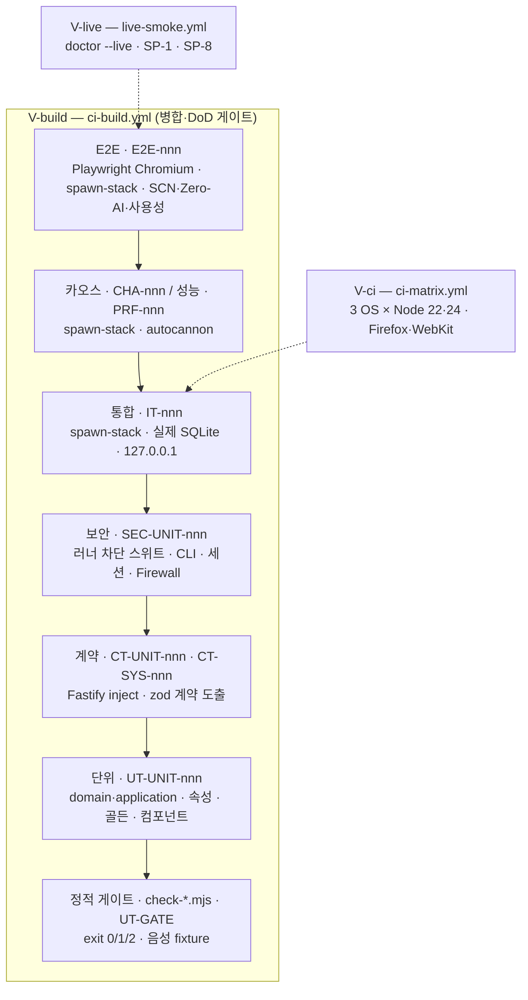
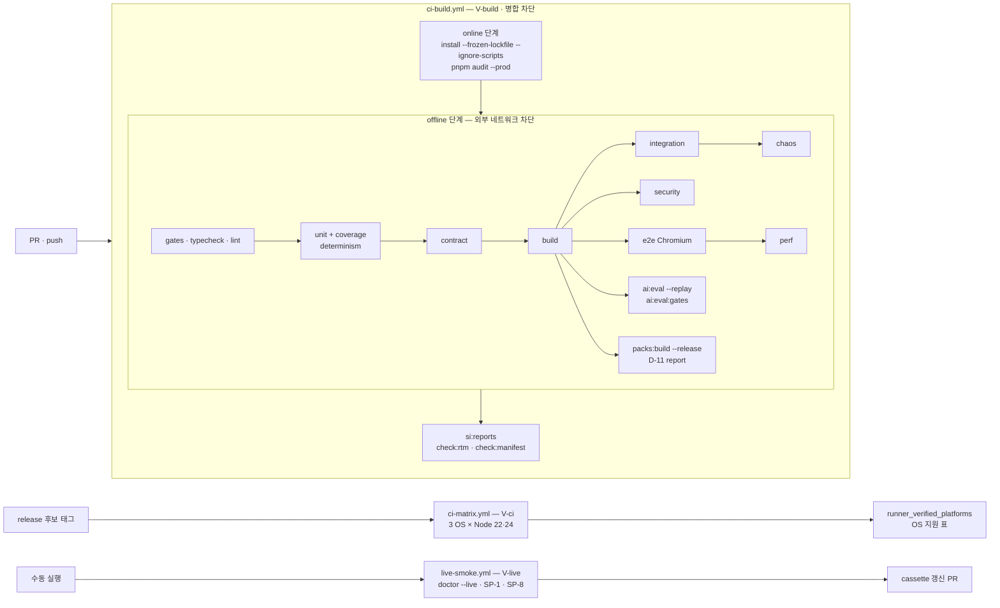
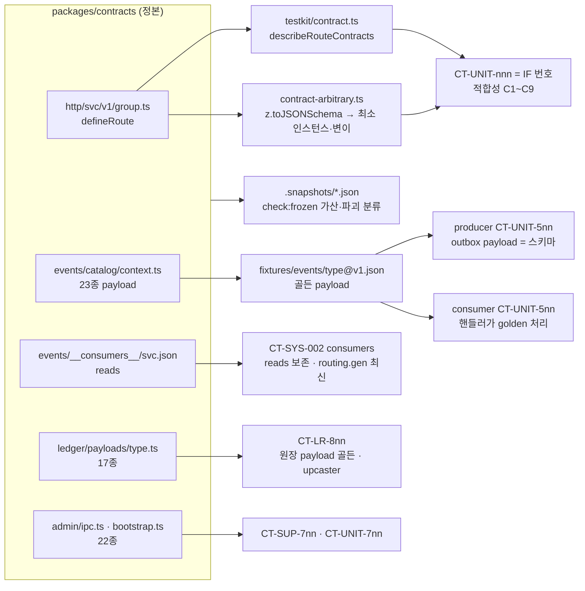
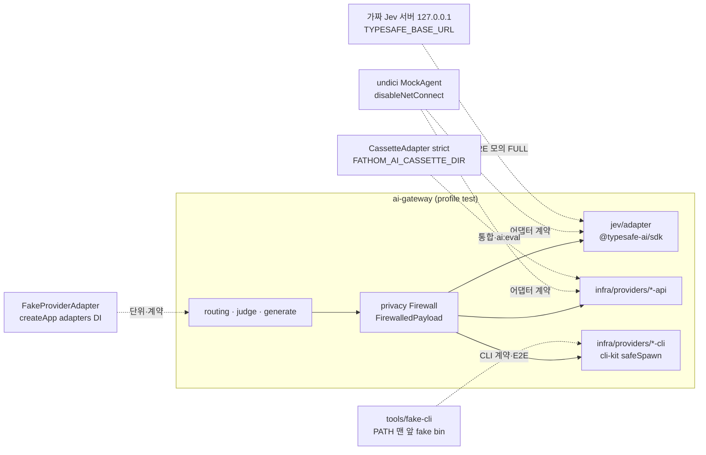
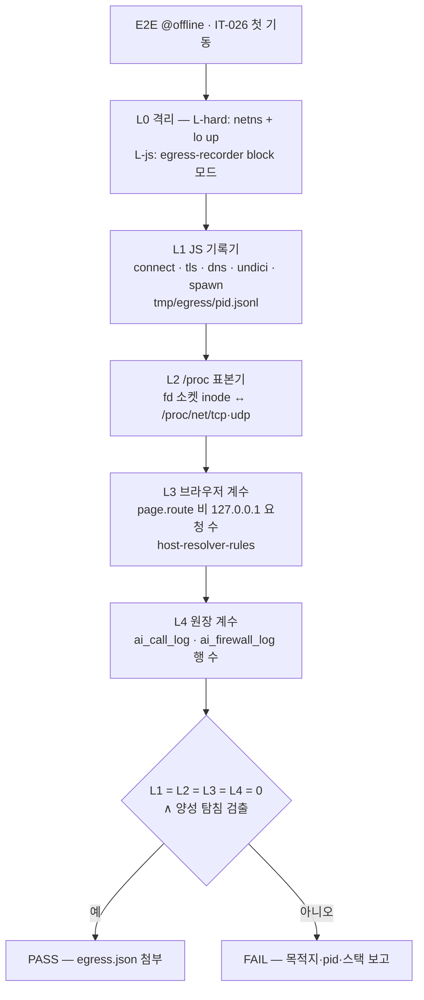
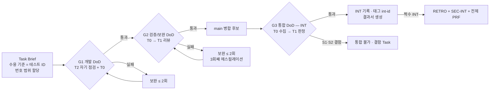
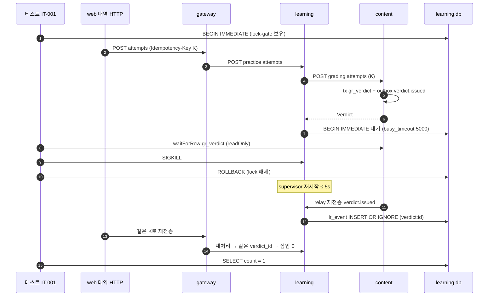

# TST-01. 테스트계획서 (Test Plan) — Fathom · 깊이

> **문서 ID**: TST-01 · **버전**: v1.0 (PG-2 동결 후보) · **작성일**: 2026-10-01 · **작성 주체**: T1(상위 모델, 아키텍처·검증)
> **구속 입력(binding)**: ARC-01 v1.0(§1.4 · §2 AP-01~15 · §8 · §9 · §12 · §13 · §14 · §15 · §16 · §19 QAS-01~24 · §22 CR-01~28 · 부록 B) · ADR-001~016(특히 ADR-003 · 005 · 007 · 008 · 009 · 010 · 011 · 013 · 014 · 016) · STD-01 v1.0 §3.11 · §13 · §14 · §16 · IF-01 v1.0 · DB-01 v1.0 §11.5 · §17 · AI-01 v1.0 §3.6 · §4.6 · §15 · §17 · DCP-01 v1.0 §6.17 · §7.6 · SCR-01 §8 · DS-01 §1.4 · 스파이크 SP-2 · SP-3 · SP-4 · SP-6 · SP-7 + 감사(`spikes/00-audit-summary.md`, 감사 수치가 본문보다 우선) · Planning Baseline v1.0(PLN-REV-01 §4 AQ-15·17, §5.5~5.8) · REQ-01 v1.1 §1.7(검증 등급) · NFR-MAINT-004·009·011 · PLN-CNV-01 §7.7 · §7.9 · UC-01 §7(SCN → E2E 표) · USM-01 §4.2(INT DoD)
> **구속 순서**: ARC-01·ADR > IF-01·DB-01 > STD-01 > **TST-01** > AI-01·DCP-01 구현 세부 > Task Brief. 이 문서는 상위 문서가 정한 테스트 수준·ID·명령을 **그대로** 쓰고, 정하지 않은 테스트 세부만 새로 정한다. 새로 정한 것과 문서 간 불일치는 §21 **설계 결정 메모**에 모았다.
> **Trace**: UR-03 · 05 · 06 · 07 · 14 · 15 · 16 · 17 · 18, D-1~D-14, NFR-MAINT-004 · 009 · 011, NFR-AVL-001 · 002 · 005, NFR-SEC-001~020, NFR-PERF-001~012, PR-005 · 013 · 018, AQ-15 · AQ-17
> **후속 소비**: Task Brief(수용 기준 = 테스트 ID, 번호 범위 할당), `packages/testkit`·`tests/**`(L-TEST 레인), `.github/workflows/{ci-build,ci-matrix,live-smoke}.yml`, `tools/si-docs`(UTR·ITR·PRF·SEC·DoD 결과서 생성), INT-nn 통합 기록, RTM-01

---

## 0. 요약 (TL;DR)

1. **수준 10개, ID 7종**: 단위(속성·골든·컴포넌트 포함) `UT-<UNIT>-nnn` · 계약 `CT-<UNIT>-nnn`/`CT-SYS-nnn` · 통합 `IT-nnn` · E2E `E2E-nnn` · 보안 `SEC-<UNIT>-nnn` · 카오스 `CHA-nnn` · 성능 `PRF-nnn`(STD-01 §3.11 그대로). 테스트 제목 = `'<ID> <행동> [<요구 ID>…]'`, `tools/si-docs`가 이를 파싱해 RTM·결과서를 만든다.
2. **도구**: vitest 5.0.2(+ `@vitest/coverage-v8` 5.0.2) · Fastify `inject()`(소켓 없는 계약 테스트) · `@playwright/test` 1.63 + **Chromium `/opt/pw-browsers`**(V-build의 유일한 브라우저) · `@axe-core/playwright` 4.13 · happy-dom · Testing Library · fake-indexeddb · undici `MockAgent` · autocannon 8.0.0 · `node --test`(게이트 자체). 공용 장치는 `@fathom/testkit`(fakes·cassettes·clock·prng·spawn-stack·chaos·temp-home·contract·golden-ledgers)에 둔다.
3. **검증 등급**: **V-build**(빌드 컨테이너 Linux + Chromium, AI 키 없음) = 병합·DoD 게이트 · **V-ci**(`ci-matrix.yml` 3 OS × Node 22/24, 비차단·릴리스 게이트, `runner_verified_platforms`·OS 지원 표 산출) · **V-live**(`live-smoke.yml`·`fathom doctor --live`, 실제 키·CLI) · V-field(텔레메트리, 계측 존재만).
4. **외부 네트워크 0**: V-build 전 수준에서 외부 호출 0이다. AI는 **4종 대역**(FakeProviderAdapter · CassetteAdapter · 가짜 Jev 서버 `127.0.0.1` · `tools/fake-cli`)으로만 돈다. OFFLINE 스위트는 **4층 관측**(JS egress 기록기 · `/proc` 소켓 표본기 · 브라우저 요청 계수 · `ai_call_log`/`ai_firewall_log` 행 수)이 전부 0일 때만 통과한다.
5. **계약 테스트 = zod 계약에서 기계적으로 도출**: `packages/contracts`의 모든 `defineRoute`(공개 173 + 내부 196 + 공통 10)를 `testkit/contract.ts` 하네스가 열거해 등록·검증·ACL·멱등·problem+json·데드라인을 단언한다(IR-015 100%). 라우트 적합성 ID는 IF 번호를 그대로 비춘다(`IF-LR-010` → `CT-LR-010`). 이벤트 23종·원장 17종·IPC 22종도 같은 방식.
6. **단계 게이트**: G1 개발(Task) → G2 검증/보완(리뷰 전) → G3 통합(INT) — 명령은 STD-01 §14.3, 테스트 종료 기준은 §9. INT-1a만 정적 게이트 `--warn-only`, 그 뒤 전부 병합 차단. 스위트는 INT별로 **점진 차단**(§9.3)되며 INT-7에서 Product DoD D-1~D-14 전부.
7. **커버리지**: 서비스 `src/domain/**` 라인 ≥ 80%·INT마다 감소 ≤ 2%p(필수), 라우트 계약 100%·이벤트 23/23·원장 17/17·IPC 22/22(필수), Must FR·NFR 테스트 고아 0(`check:rtm`), UR-14 6계열 + 매니페스트 included 모드 E2E 100%.
8. **시나리오**: SCN-01~14를 v1 범위(PLN-CNV-01 §7.9)로 정의해 E2E-001~014(주 모드) + 모드 변형(+20 OFFLINE · +40 JUDGE_ONLY · +60 LLM_ONLY)으로 자동화. 교차 서비스 통합 시나리오는 IT-001~040.
9. **보안**: SP-2 차단 스위트 이식(격리 37 + 자원 14 + SQL 16 + 기능 7, RES-14는 부모 판정 설계 테스트로 대체, 모든 행 호스트 관측 대조군) · CLI 주입·격리 7종 · 세션·CSRF · Firewall·SSRF·주입 평가셋 · 비밀 스캔(소스·산출물·`ps`) · `pnpm audit --prod --audit-level high` 0.
10. **결과서**: UTR·ITR·PRF·SEC·DOD를 `tools/si-docs`가 `.reports/<INT>/*.json`에서 `docs/40-impl/reports/<KIND>-<INT>.md`로 생성(손 편집 금지, STD-DOC-07). 템플릿은 §20.

---

## 1. 목적 · 범위 · 용어

### 1.1 목적

- Planning Baseline v1.0의 Product DoD(D-1~D-14)와 REQ-01 수용기준을 **어떤 테스트가, 어느 수준·등급·단계에서, 어떤 데이터로** 판정하는지 고정한다.
- 하위 모델 코딩 에이전트가 Task Brief의 수용 기준(테스트 ID)만 보고 **같은 모양의 테스트**를 병렬로 쓸 수 있게 위치·ID·하네스·fixture 규칙을 코드 수준으로 정한다(UR-06, C-11).
- AQ-15(V-ci·V-live 스위트 범위)와 AQ-17(복잡도 테스트 시간 예산)의 테스트 측 확정을 이 문서가 맡는다(ADR-014 §후속).

### 1.2 범위

| 포함 | 제외(다른 문서) |
|---|---|
| 테스트 수준·도구·환경·명령, 검증 등급별 워크플로 스위트, 서비스·패키지별 범위, 계약 테스트 도출 규칙, fixture·결정성 정책, AI 테스트 대역, 품질 게이트·커버리지, ID 체계·초기 핵심 케이스, 통합 시나리오(ITS 병합), 성능·보안·카오스 점검, DoD 검증 방법, 결과서 템플릿 | 코딩 규칙 자체(STD-01), 계약 필드(IF-01·`packages/contracts`), DDL(DB-01), 평가셋 원문 제작(DCP-01·AI-01 §15), 화면 상태 정의(SCR-01), 실제 키가 필요한 판정 품질 측정(SP-1·SP-8 = V-live) |

> R6 §3.1의 통합테스트시나리오(ITS-01)는 이 문서 §12로 **병합**한다(1 산출물 = 1 파일 원칙의 예외를 늘리지 않기 위해 — §21 D-TST-01).

### 1.3 용어

| 용어 | 뜻 |
|---|---|
| V-build / V-ci / V-live / V-field | REQ-01 §1.7 검증 등급. V-build만 이번 빌드의 게이트 |
| spawn-stack | `@fathom/testkit/spawn-stack`. 빌드 산출물(`dist/`)로 **실제 supervisor**를 `--profile=test`(포트 0·임시 `FATHOM_HOME`)로 띄우고 `{baseURL, cliToken, registry, kill(svc), stop()}`를 돌려준다 |
| fake / cassette | `testkit/fakes`(포트 뒤 결정적 가짜) / `testkit/cassettes`(녹화·수기 응답 재생). 제품 번들에 포함 금지(AI-01 §3.6) |
| 가짜 Jev 서버 | `testkit/fakes/jev-server.ts`. `127.0.0.1:<port>`에서 Jev SDK HTTP 형상을 흉내 내고 시나리오 스크립트로 응답한다. ai-gateway는 profile `test`에서만 허용되는 `TYPESAFE_BASE_URL=http://127.0.0.1:<port>`로 붙는다(STD-01 §8.3) |
| fake CLI | `tools/fake-cli/src/fake-{claude,codex,gemini,generic}.ts`. 테스트가 `PATH` 앞에 둔 bin 디렉터리의 실행 파일이 argv·env 키·cwd·stdin sha256을 JSON으로 기록하고 스크립트 응답을 돌려준다 |
| 모의 FULL | V-build에서 FULL 모드를 만드는 구성: 가짜 Jev 서버 + fake CLI(`claude`) 동의. 실제 모델 행동은 주장하지 않는다(`synthetic`, 형상 적합성만 — REQ §1.7 규칙 3) |
| 호스트 관측 대조군 | 공격 행마다 보호 층을 끈 대조 실행에서 **호스트 측 효과**(파일 생성·포트 수신·프로세스 존재)가 실제로 관측됨을 확인하는 짝 테스트(SP-2 감사) |
| lock-gate 결함 주입 | 테스트가 대상 DB에 `BEGIN IMMEDIATE`를 잡아 서비스의 커밋 직전 지점에서 대기시키고, 그 사이 SIGKILL하는 제품 코드 무개입 결함 주입법(§12.3) |

---

## 2. 테스트 전략

### 2.1 원칙

| ID | 원칙 | 근거 · 강제 |
|---|---|---|
| TP-01 | **결정적 코어는 단위·속성 테스트로 증명한다**: FSRS·Elo·숙달·승급·LDI·리플레이·병합은 순수 리듀서·순수 함수이므로 시계·난수·I/O 없이 수천 시드로 돈다 | AP-09, ADR-011, STD-TST-03 |
| TP-02 | **계약은 손으로 다시 쓰지 않는다**: 계약 테스트는 contracts의 정의를 열거해 생성하고, 손으로 쓰는 것은 라우트별 행동 사례뿐이다 | AP-02, ADR-008 §6 |
| TP-03 | **교차 서비스 사실은 실제 프로세스로 증명한다**: outbox·inbox·epoch·병합·복원·재시작은 spawn-stack(실제 supervisor·fork·IPC·SQLite 파일)으로만 판정한다. 모킹한 relay로 "정확히 1회"를 주장하지 않는다 | NFR-DATA-013, QAS-08·11 |
| TP-04 | **외부 네트워크 0 · 실제 키 0**: V-build의 모든 테스트는 외부 소켓 없이 돈다. 실제 모델 품질은 V-live로만 주장한다 | NFR-MAINT-009, CON-015, REQ §1.7 |
| TP-05 | **게이트·스위트는 스스로 실패를 증명한다**: 정적 게이트는 음성 fixture, 보안 공격 행은 호스트 관측 대조군, SQL 행은 무토크나이저 대조군, 네트워크 0 단언은 "기록기가 실제로 잡는다"는 양성 탐침을 갖는다 | AP-15, SP-2·SP-7 감사 |
| TP-06 | **블랙박스 경계**: `tests/**`는 서비스 `src`를 import하지 않는다(contracts·shared-kernel·testkit만). 서비스 테스트(`services/<svc>/test/**`)는 자기 `src`와 testkit만 import한다 | AP-01·C-02, §21 D-TST-04 |
| TP-07 | **강등은 보여야 통과한다**: 강등·보류·적체·격하 경로는 이벤트 → SSE → 칩/배너까지 단언한다(로그만 남는 경로 = 실패) | AP-10, NFR-AVL-005 |
| TP-08 | **실패하는 테스트를 먼저**: 버그 수정은 재현 테스트를 먼저 추가한다. DoD·보안·원장 테스트는 격리(quarantine) 대상이 아니다 | STD-TST-10, §9.5 |
| TP-09 | **측정은 컨테이너에서, 임계는 REQ 그대로**: 성능 임계는 완화하지 않는다. REF-ENV 노트북 값은 V-field 참고치 | REQ §1.7 규칙 5 |
| TP-10 | **등급은 데이터로**: 요구 → 등급은 `packages/contracts/manifests/verification-class.json`이 정본이고 테스트는 그 등급의 스위트에만 둔다 | DR-028 |

### 2.2 테스트 수준



| 수준 | ID | 위치 | 러너 | 네트워크 | 대상 | 소유 레인 | 첫 차단 단계 |
|---|---|---|---|---|---|---|---|
| 정적 게이트 | (게이트 규칙 ID) · `UT-GATE-nnn` | `tools/gates/{check-*.mjs, test/*.test.mjs, fixtures/}` | `node` · `node --test` | 0 | 경계·SQL·Jev·NG-G·원장 writer·DB 경로·동결·소비자 | L-PLAT | G1 |
| 단위 | `UT-<UNIT>-nnn` | `<pkg>/test/unit/**/*.spec.ts` | vitest 5.0.2 | 0 | domain·application(포트 fake)·shared-kernel·web lib | 해당 레인 | G1 |
| 속성·골든 | `UT-LR-nnn` | `services/learning/test/{property,golden}/` | vitest | 0 | 리플레이 = 라이브·병합 교환·TZ·투영 해시 불변 | L-LR-LED·MOD | G1 |
| 컴포넌트 | `UT-WEB-nnn` · `UT-UI-nnn` | `apps/web/test/component/`, `packages/ui/test/component/` | vitest + happy-dom + Testing Library + fake-indexeddb | 0 | 상태 5종·접근성 속성·attempt 큐 | L-WEB-* | G1 |
| 계약(서비스) | `CT-<UNIT>-nnn` | `<pkg>/test/contract/` | vitest + Fastify `inject()` | 0(소켓 없음) | 모든 라우트·오류 형태·ACL·이벤트 payload·원장 payload·IPC | 공급 레인 | G2 |
| 계약(교차) | `CT-SYS-nnn` | `tests/contract/` | vitest | 127.0.0.1만 | 소비자 매니페스트·ACL 전 행렬·강등 가시성·presubmit 403·오류 코드 레지스트리 | L-TEST | G2 |
| 통합 | `IT-nnn` | `services/<svc>/test/integration/`, `tests/integration/` | vitest + spawn-stack | 127.0.0.1만 | outbox·epoch·병합·복원·업그레이드·마이그레이션·팩 설치·검색 | 해당 레인 / L-TEST | G3 |
| 보안 | `SEC-<UNIT>-nnn` | `<pkg>/test/security/`, `tests/security/` | vitest | 127.0.0.1만 | 러너 차단 스위트·CLI 격리·세션·Firewall·SSRF·비밀 스캔 | 해당 레인 / L-TEST | G3(러너 스위트는 G2부터, §9.3) |
| E2E | `E2E-nnn` | `tests/e2e/{*.spec.ts, scn/, usability/, modes/, ai-matrix/, a11y/}` | `@playwright/test` 1.63 + Chromium | 127.0.0.1만 | Zero-AI·설치 3분·북마크 재진입·stderr·SCN·사용성·매니페스트 모드 | L-TEST + L-WEB | G3 |
| 카오스 | `CHA-nnn` | `tests/chaos/` | vitest + spawn-stack + `testkit/chaos` | 127.0.0.1만 | 서비스·supervisor·job kill 중 세션 완주 | L-TEST | G3 |
| 성능 | `PRF-nnn` | `tests/perf/*.ts`(+ `run-all.ts`) | tsx + autocannon + Playwright trace | 127.0.0.1만 | NFR-PERF-001~012 + 자원 Tripwire | L-TEST | G3 |

### 2.3 위험 기반 배분 (품질 속성 → 수준)

| 품질 속성(ARC §1.2 순위) | 주 수준 | 보조 수준 | 핵심 위험 · 근거 |
|---|---|---|---|
| 1 데이터 무결성·수명 | 속성·골든 단위(리플레이·병합·해시) · 통합(outbox·epoch·복원·병합) | 카오스(커밋 전 kill) · 보안(체인 앵커 변조) | SP-3 감사: REPLACE 덮어쓰기·꼬리 변조 미탐·UTC 일 경계 |
| 2 가용성·운영성 | 카오스 · E2E(Zero-AI·격하 표시) | 계약(강등 가시성) · 통합(재시작·quiesce) | 서비스 1개 장애에도 학습 지속(D-9), 조용한 실패 0 |
| 3 보안·프라이버시 | 보안(러너·CLI·세션·Firewall) | 계약(ACL·presubmit 403) · 정적 게이트 | JS 층 격리(RSK-RUN-01·02), CLI 사용자 설정 주입, 키 유출 |
| 4 사용성 | E2E(사용성 5종·키보드·IME) · 컴포넌트 | axe · 디자인 루브릭 [I] | D-13, NFR-UX-012·013 |
| 5 성능 | 성능 | 통합(이벤트 루프 지연 메트릭) | 첫 문항 2s·채점 300ms·검색 100ms |
| 6 유지보수성 | 정적 게이트 · 계약(동결 스냅샷) | `check:rtm` · 커버리지 | 병렬 에이전트의 경계 위반, 계약 드리프트 |
| 7 이식성 | V-ci 매트릭스 | V-build의 OS 독립 단위(shim 파서·경로) | Windows·macOS 미확립(RK-21) |

### 2.4 무엇을 테스트하지 않는가 (명시)

- 실제 LLM·Jev의 판정 정확도·한국어 품질·스키마 적합률(SP-1·SP-5·SP-8) — V-live. V-build cassette는 형상만.
- 3 OS 중 Windows·macOS의 동작 — V-ci(비차단). 미통과 OS는 기능 비활성으로 **정직하게** 출하한다(러너 형식 비활성, ADR-007 §7).
- Firefox·WebKit — V-ci ubuntu 스모크.
- 라이브 kind 랩(DEF-12)·런타임 Python(DEF-31)·폰 채널(DEF-32) — v1 범위 밖.
- 부하 예측 실사용 정확도(MAPE) — V-field(CR-05). V-build는 시뮬레이터 합성 로그 MAPE를 **참고값**으로만 보고한다.

---

## 3. 도구 · 환경

### 3.1 도구 (exact pin, ARC §18 · STD-01 §13)

| 도구 | 버전 | 용도 | 비고 |
|---|---|---|---|
| vitest | 5.0.2 | 단위·계약·통합·보안·카오스 러너 | `projects`: unit · integration · security(패키지), contract · integration · chaos · security(`tests/`, SEC-SYS) |
| @vitest/coverage-v8 | 5.0.2 | domain 라인 커버리지 | ARC §18 미등재 → **CR 후보**(STD-01 D-STD-10) |
| fastify `inject()` | 5.12.5 | 소켓 없는 라우트 계약 테스트 | `createService()`가 만든 인스턴스에 직접 주입 |
| @playwright/test · playwright-core | **1.56.1** | E2E·사용성·성능(trace) | V-build = Chromium만, `PLAYWRIGHT_BROWSERS_PATH=/opt/pw-browsers`(컨테이너 `chromium-1194`·`chromium_headless_shell-1194` = 1.56.x 짝, 실측), `playwright install` 금지(오프라인). 1.63.0은 revision 1243을 요구해 실행 불가 → CR-47로 고정 |
| @axe-core/playwright | 4.13.0 | 접근성 | serious·critical 0 |
| happy-dom · @testing-library/react · fake-indexeddb | 20.14.5 · 16.3.3 · 6.2.5 | web 컴포넌트·attempt 큐 | |
| undici `MockAgent` | 8.11.2 | 전역 무네트워크 dispatcher, SDK HTTP 가로채기 | testkit 전용 |
| autocannon | 8.0.0 | 비AI API 처리량·지연 | NFR-PERF-002 |
| node:test | Node 22.22.2 내장 | `tools/gates/test/*.test.mjs` | 게이트는 의존성 0 |
| tsx | 4.23.15 | `tests/perf/run-all.ts`, si-docs·sim CLI | |
| graphify | 0.9.72 | `audit:graph`(비차단 감사) | 부재 시 skipped(NFR-PORT-007) |

### 3.2 `@fathom/testkit` 모듈 (L-TEST 소유, devDependency 전용)

| 파일(`packages/testkit/src/`) | 제공 | 사용 수준 |
|---|---|---|
| `vitest-preset.ts` · `setup/no-network.ts` | STD-01 §13.4 preset. undici `MockAgent` + `disableNetConnect()`, `enableNetConnect(/^(127\.0\.0\.1\|localhost)(:\d+)?$/)` | 전 vitest |
| `clock.ts` · `prng.ts` · `ids.ts` | 고정·수동 진행 `Clock`, 시드 PRNG(mulberry32), 고정 ULID 팩토리 | 단위·계약 |
| `temp-home.ts` | 임시 `FATHOM_HOME`(0700), 종료 시 삭제, 잔존물 검사 | 전 수준 |
| `spawn-stack.ts` | 실제 supervisor `--profile=test` 기동, registry 대기, `kill(svc, signal)`, `restart`, `stop`, fixture 팩 설치 | 통합·보안·E2E·카오스·성능 |
| `chaos.ts` | `killService`, `lockGate(dbPath)`(BEGIN IMMEDIATE 보유·해제), `waitForRow(dbPath, sql)`(readOnly 연결) | 통합·카오스 |
| `contract.ts` · `contract-arbitrary.ts` | 라우트 적합성 하네스(§6.2), zod 4 → JSON Schema → 최소 유효 인스턴스·변이(필수 필드 삭제·미지 키·타입 위반) 생성기 | 계약 |
| `fakes/` | `ai/fake-adapter.ts`(FakeProviderAdapter), `jev-server.ts`, `peers.ts`(PeerClient fake), `secret-store.ts`, `host-probes.ts`, `fetch-transport.ts`(SafeFetch 스텁 DNS·응답) | 단위·계약·통합·E2E |
| `cassettes/` | `cassette-adapter.ts`(strict 재생), `fingerprint.ts`(AI-01 §15.5 + E2E 정규화 모드, §21 D-TST-06) | 계약·통합·E2E |
| `golden-ledgers/` | 골든 원장 JSONL + 기대 투영 해시(ts-fsrs 5.4.2, `fsrs_impl`) | 골든·통합 |
| `fixtures/` | `events/<type>@v<n>.json`(통합 이벤트 골든 payload 23종), `ledger/<type>@v<n>.json`(원장 17종), `packs/mini/`(mini 팩 원천) | 계약·통합 |
| `preload/egress-recorder.mjs` | 서비스 프로세스용 `--import` 기록기: `net.Socket.prototype.connect`·`tls.connect`·`dns.lookup`·`dns/promises`·undici dispatcher·`child_process.spawn/execFile/fork`(비 node 바이너리)를 감싸 **비 loopback 목적지**를 `FATHOM_HOME/tmp/egress/<pid>.jsonl`에 기록, `block` 모드에서는 기록 후 `ECONNREFUSED`로 거부 | E2E·통합(Zero-AI) |
| `egress-sampler.ts` | Linux: 스택 하위 전 pid의 `/proc/<pid>/fd` 소켓 inode ↔ `/proc/net/{tcp,tcp6,udp,udp6}` 대조, 50ms 표본, 비 loopback 원격 주소 기록 | E2E·통합 |
| `platform.ts` | `onlyOn('linux'\|'darwin'\|'win32')`, `runnerPlatformVerified()` | 보안·통합 |
| `playwright/stack-fixture.ts` | Playwright fixture: 파일별 spawn-stack + 부트스트랩 교환(`cli.token` → `POST /api/v1/cli/bootstrap-token` → `/#bt=`) + 요청 계수기 | E2E |
| `gen/pack-gen.ts` | 합성 대형 팩 원천 생성(검색 1.2만·2만·4만 문서, 문항 30만) — packc로 컴파일 | 성능 |

### 3.3 V-build 실행 환경 (빌드 컨테이너 실측, REQ §1.7)

| 항목 | 값 | 테스트 영향 |
|---|---|---|
| OS · 권한 | Linux, uid 0 | 러너 스위트는 uid 0 결과임을 결과서에 표기(SP-2 §5-14: 비 root는 V-live) |
| Node | 22.22.2(`.node-version`) | Node 마이너 변경 = 러너 스위트 재통과(RSK-RUN-10) |
| 브라우저 | `/opt/pw-browsers/{chromium-1194, chromium_headless_shell-1194, ffmpeg-1011}` | Chromium 프로젝트만 |
| AI 키 | `TYPESAFE_API_KEY`·`ANTHROPIC_API_KEY`·`OPENAI_API_KEY` 미설정 | 모의 FULL만 |
| LLM CLI | 실제 `claude` 2.1.285가 `PATH`에 있음 | **테스트는 실제 CLI를 절대 호출하지 않는다**: fake bin 디렉터리를 `PATH` 맨 앞에 두고, CLI 어댑터 테스트는 `which` 결과가 fake bin 아래인지 먼저 단언(SEC-AI-008) |
| 네트워크 격리 수단 | `unshare` 있음, `ip`(iproute2) **없음** → 새 netns에서 loopback을 올릴 수 없음(실측: `ENETUNREACH`) | 격리 수준 = `L-js`(기록기 block 모드) + 표본기. GitHub ubuntu 러너는 `L-hard`(netns + `ip link set lo up`) — §8.3, §21 D-TST-07 |
| 기타 | graphify 0.9.72, `node:sqlite` SQLite 3.51.2(FTS5·trigram), authorizer 없음 | |

### 3.4 Playwright 구성 (`tests/playwright.config.ts`)

| 설정 | 값 | 이유 |
|---|---|---|
| `projects` | `chromium`(V-build) · `firefox`·`webkit`(ci-matrix ubuntu 전용, `process.env.CI_MATRIX_ENGINES=1`일 때만 정의) | NFR-PORT-008 V-ci |
| `workers` | `Math.max(1, Math.min(4, os.availableParallelism() - 1))` | 파일마다 독립 스택(포트 0) |
| `retries` | **0**(CI 포함) | 비결정 = 결함(§9.5) |
| `timeout` · `expect.timeout` | 120s · 10s(설치 3분 E2E-102만 240s) | |
| `use` | `baseURL` = 스택 fixture, `trace: 'retain-on-failure'`, `video: 'off'`, `locale: 'ko-KR'`, `timezoneId: 'Asia/Seoul'`, `colorScheme` 프로젝트별(dark 기본, a11y는 dark·light 둘 다) | |
| `launchOptions.args` | `--host-resolver-rules=MAP * ~NOTFOUND , EXCLUDE 127.0.0.1 , EXCLUDE localhost` · `--disable-background-networking` · `--disable-component-update` · `--no-pings` | 브라우저 쪽 외부 해석 차단(§8.3 L3) |
| reporter | `list` + `json`(`.reports/<INT>/e2e.json`) | si-docs 입력 |
| 태그 | `@offline` · `@full-mock` · `@judge-only` · `@llm-only` · `@scn` · `@usability` · `@a11y` · `@dod-<n>` | `--grep`으로 워크플로 단계 선택 |

### 3.5 실행 명령 (STD-01 §13.2 + 이 문서 추가)

| 스크립트 | 명령 | 비고 |
|---|---|---|
| (패키지) `test` · `test:integration` · `test:security` | STD-01 §13.2 | |
| (루트) `test` · `test:contract` · `test:integration` · `test:security` · `test:e2e` · `test:chaos` · `test:perf` | STD-01 §13.2 | |
| (루트) `test:coverage` | `turbo run test -- --coverage` | G2 |
| (루트) `test:determinism` | `node tests/support/determinism.mjs` — `vitest run --project unit --sequence.shuffle --sequence.seed=1`과 `seed=2`의 (테스트 ID, 결과) 집합 비교, 다르면 exit 1 | NFR-MAINT-009 |
| (루트) `test:offline` | `node tests/support/run-offline.mjs -- pnpm test:e2e --grep @offline` | §8.3 |
| (루트) `si:reports` | `tsx tools/si-docs/src/cli.ts reports --int <INT-id>` | §20, **CR 후보**(루트 스크립트 가산) |
| (루트) `sim` | `tsx services/learning/sim/cli.ts <promo\|ldi\|ledger-gen>` | ADR-008 §10 |

---

## 4. 검증 등급과 CI 워크플로 (AQ-15 확정)

### 4.1 등급 정의와 판정

| 등급 | 실행 | 이번 빌드 게이트 | 결과가 쓰이는 곳 |
|---|---|---|---|
| **V-build** | `ci-build.yml`(ubuntu) + 빌드 컨테이너 동일 명령 | **예**(G1~G3, Product DoD) | INT 판정, DoD 판정서 |
| **V-ci** | `ci-matrix.yml`({ubuntu, windows, macos} × Node {22.22.x, 24.x}) | 아니오(워크플로 파일 존재만 [I]) — **릴리스 게이트** | `runner_verified_platforms`, OS 지원 표, "두 OS PASS" 표기 근거 |
| **V-live** | `live-smoke.yml`(수동) · 사용자 기기 `fathom doctor --live` | 아니오(작업 생성만 [T], D-14) | SP-1 캘리브레이션, SP-8 canary, cassette 갱신 PR |
| V-field | 실사용 로컬 텔레메트리 | 아니오(계측 존재만 [T]) | RETRO, CR-05 model/observed 선택 |

### 4.2 워크플로 구조



### 4.3 `ci-build.yml` (V-build) — 잡 · 스위트 · 차단

| 잡 | 단계 | 명령 | 차단 | 산출물(`.reports/<INT>/`) |
|---|---|---|---|---|
| `setup` | online | `pnpm i --frozen-lockfile --ignore-scripts` → `pnpm audit --prod --audit-level high` | 예(audit 실패·레지스트리 불통 = 실패, fail-closed) | `audit.json` |
| `gates` | offline | `pnpm check:gates`(`--stage=g3`; INT-1a 브랜치만 `--warn-only`) · `pnpm typecheck` · `pnpm lint` | 예 | `gates.json` |
| `unit` | offline | `pnpm test:coverage` → `pnpm test:determinism` | 예 | `ut.json`, `coverage/` |
| `contract` | offline | `pnpm test:contract` + 패키지 `contract` 디렉터리(unit 프로젝트에 포함) | 예 | `ct.json` |
| `build` | offline | `pnpm build`(INT-1a~6) · `pnpm build && pnpm bundle`(INT-7·PG-3 — `bundle`은 WP-07-08이 만든다. 그 전에는 WP-00-01의 스텁 스크립트가 `echo skipped` exit 0) | 예 | `bundle.manifest.json`(INT-7부터) |
| `integration` | offline | `pnpm test:integration` | 예 | `it.json` |
| `security` | offline | `pnpm test:security` | 예 | `sec.json` |
| `e2e` | offline(격리) | `pnpm test:offline`(= `@offline` 전부, `L-hard` 가능하면 netns) → `pnpm test:e2e --grep-invert @offline` | 예 | `e2e.json`, `egress.json`, trace |
| `chaos` | offline | `pnpm test:chaos` | 예 | `cha.json` |
| `perf` | offline | `pnpm test:perf`(빠른 세트 매 INT, 전체 세트 짝수 INT·INT-7 — §13) | 예(임계 위반) | `prf.json` |
| `ai-eval` | offline | `pnpm ai:lint-prompts` · `pnpm ai:eval --replay` · `pnpm ai:eval:gates` | 예(lint·gates), 리포트(replay 지표) | `ai-eval.json` |
| `packs` | offline | INT-1b~6: `pnpm packs:build`(차단 = exit ≠ 0만, 하한 미달은 리포트) · INT-7·PG-3: `pnpm packs:build --release`(차단 = exit ≠ 0 ∨ `floor.*.ok = false`, D-11) | 예(위 조건) | `packs.json` |
| `reports` | offline | `pnpm si:reports --int <INT>` → `node tools/gates/check-rtm.mjs` · `check-manifest.mjs` | 예(G3·PG-3) | `docs/40-impl/reports/*.md` |

- **offline 단계 진입 조건**: `tests/support/run-offline.mjs`가 먼저 음성 탐침(`https://registry.npmjs.org` 연결 시도)을 실행한다. **L-hard**(netns)에서는 맨 탐침이 실패해야 하고 성공하면 exit 2. **L-js**(V-build 컨테이너 — 호스트가 레지스트리에 닿는 것이 실측됨, `ip` 부재)에서는 맨 탐침 대신 `--import @fathom/testkit/preload/egress-recorder.mjs`(block 모드)로 띄운 자식이 같은 연결을 시도해 **ECONNREFUSED**를 받고 `tmp/egress/<pid>.jsonl`에 차단 행이 기록돼야 진행한다(아니면 exit 2). `egress.json`에 `isolation: 'L-js' \| 'L-hard'`·`host_reachable: true\|false`를 기록한다(D-TST-07).
- `pnpm audit`는 advisory DB가 필요하므로 online 단계에 둔다. 응답 없음·타임아웃은 통과가 아니라 실패다(§21 D-TST-08).

### 4.4 `ci-matrix.yml` (V-ci) — 릴리스 게이트

| 축 | 값 |
|---|---|
| OS | `ubuntu-24.04` · `windows-2025` · `macos-15` |
| Node | `22.22.x` · `24.x` |
| 스위트(전 셀) | `pnpm check:gates`(경로 구분자·CRLF·pnpm 심볼릭 링크 tsgo 해석) · `pnpm test` · `pnpm test:contract` · `pnpm test:security`(러너 차단 스위트 + 호스트 관측 대조군) · `pnpm test:integration` · Chromium E2E `@offline` |
| ubuntu 전용 | Firefox·WebKit 스모크(`CI_MATRIX_ENGINES=1`, `@smoke` 태그 + 쿠키 3 엔진 SEC-GW-010), `kubeconform` 오프라인 스키마 검사(`deploy/k8s`), 선택 kind 스모크 |
| windows 전용 | `spawn`·`taskkill /T /F`·Job Object 트리 kill, npm `.cmd` shim(npm 9·10·11) 실제 실행, `%LOCALAPPDATA%\Fathom`·한글·공백 경로·MAX_PATH, `-shm`·필수 잠금·AV 잠금, `win-rss-helper.ps1` 실측 주기 ≤ 50ms, DPAPI stdin, `icacls` 사용자 전용 ACL |
| macos 전용 | `ps -o rss=` 50ms 감시 실측, `security -i` stdin, LaunchAgent plist |
| 산출물 | `runner_verified_platforms.json` = 러너 스위트 전 행 통과 ∧ 감시 주기 실측 ≤ 50ms인 `{os, arch, node}` 목록(ADR-007 §7) · `os-support.md` = 항목별 PASS/FAIL 표(`node:sqlite` 경로·잠금·종료·shim·키체인) — 템플릿 §20.6 |
| 판정 | 병합 비차단. 릴리스 매니페스트에 목록을 넣고, 목록 밖 OS는 러너 과업 형식 비활성 + Docker 권고(사전 합의 폴백) |

### 4.5 `live-smoke.yml` (V-live, 수동 · 저장소 비밀 사용)

| 항목 | 명령 · 내용 | 결과 처리 |
|---|---|---|
| 제공자 probe | `fathom doctor --live`(제공자 probe + `SYS-SMOKE`) | doctor 리포트 |
| Jev 3질문 타입 | `noul`·`choice`·`score` 각 1건 | 형상·지연 기록 |
| CLI canary | SP-8 C1~C7(AI-01 §4.6) | 실패 시 `trust = unverified` 기대 확인 |
| 구조화 출력 | 과업 5건 | SP-5 적합률 |
| SP-1 | 캘리브레이션 작업 생성 → 승인 → `ai:eval` 지표 | `ai_calibration_run` |
| 녹화 | `pnpm ai:record --task <id> --provider <id>` | 바뀐 cassette는 PR(T1 리뷰) |
| 키체인 3 OS | 저장·조회·삭제(stdin, `ps` 0) | OS 지원 표 갱신 |

### 4.6 등급을 코드에 반영하는 방법

- 요구 → 등급: `packages/contracts/manifests/verification-class.json`(정본). `check:rtm`이 V-build 요구의 테스트가 `ci-build.yml` 스위트에 있는지 확인한다.
- 플랫폼 의존 테스트: `testkit/platform.ts`의 `onlyOn('win32')` 등으로 감싼다. 건너뛴 사유는 결과서에 `skipped(platform)`로 집계되며 **V-build에서 skip된 V-build 요구는 실패로 센다**.
- V-live는 저장소 테스트 스위트에 두지 않는다. V-build에서는 "V-live 작업이 **생성**되는가"만 테스트한다(D-14).

---

## 5. 서비스 · 패키지별 테스트 범위

> 표의 "핵심 단언"은 그 단위의 Brief 수용 기준 초안이다. 케이스 ID 초안은 §11.

| 단위(UNIT) | 단위 테스트 | 계약 테스트 | 통합 · 보안 · 기타 | 핵심 fixture |
|---|---|---|---|---|
| **gateway**(GW) | `domain/session`: 쿠키 서명·포트 바인딩·CSRF HMAC·Host/Origin/Sec-Fetch-Site 규칙, SSE 링 1,000·`resync`·heartbeat, rate limit, BFF 집계(하위 오류 → problem 매핑) | 공개 173 + 내부 1 라우트 적합성, `/api/v1/cli/*` 권한, SSE 프레임 형식(`id = <boot_id>.<hub_seq>`) | IT-1xx(정적·dev 프록시 단일 origin·SSE 재연결), SEC-GW(교차 출처·DNS rebinding·부트스트랩 1회성·쿠키 3 엔진 V-ci) | `fakes/peers.ts`, 고정 `session.key` |
| **content · catalog**(CT) | 팩 검증(sha256·merkle), 오버레이 합성·역패치·재적용 충돌, 검색 질의 정규화(NFC·소문자·구두점·따옴표 제거·인용·`instr` 경로·V3 전환) | `catalog/*` 라우트, `catalog.*` 이벤트 producer payload | IT-2xx(blue/green 설치·FTS 동기화·`search-120`), PRF-007 | `fixtures/packs/mini`, `search-120` |
| **content · acquisition** | I1~I9 단계 순수 로직, ingress 마스킹, copy-guard, 주입 휴리스틱 H, 규칙 추출, 재개 | `acquisition/*`, `acquisition.import.staged` | IT(파이프라인 job 단명 자식·DB 미개방), SEC-CT-25x(SSRF-20·주입-30) | `ssrf-20`, `injection-30`, `fakes/fetch-transport.ts` |
| **content · itembank** | T1 생성기 12종(오라클 = 러너 실행), T2 전개 결정성, `gate_status` 상태기계 전수, 선택(로테이션·패밀리 격리), 워밍 결손, 문항 건강, 신고 | `itembank/*`(`items:select` 응답 = `ItemDeliveryPreSubmit`, 금지 필드 0), `itembank.item.corrected` | IT(PackDelta 수입 단일 포트), D-5·D-6 | E1 뮤턴트, mini 팩 |
| **content · grading** | 사다리 엔진 체인 표(형식 × 모드 × stakes), 3s 데드라인, 밴드 변경 시만 revised, 정규화(`normalize-200`), w_grader 표, 보류·재채점(supersedes), 턴 판정·OFFLINE 질문 은행, 복잡도 판정(AQ-17), `*.jev.ts` 객체 키 | `grading/*`, `grading.verdict.issued`(리플레이 입력 전부)·`revised` | IT-018(데드라인 후 상향), IT-029(발화 바이트 중계) | `normalize-200`, cassette J01~J04·J17 |
| **content · runner** | spawn 인자(금지 플래그 4종 부재)·prlimit 인자·출력 캡 `>=`·상태 매핑·stderr 경로 치환·감시 주기 선택·플랫폼 게이트·출처 정책·세마포어·TS strip | `runner/runs`, `runner/platform` | **SEC-CT-001~236 러너 차단 스위트**(§14.2), PRF-008 | SP-2 페이로드 이식(`test/security/payloads/`) |
| **learning · ledger**(LR) | `client_ts` 단조·`device_seq`·`study_day` 04:00·해시 체인·총순서·체인 검증·앵커 대조·upcaster·`FSRSValidationError` 경보·CHECK 묵살 탐지 | `ledger/*`(NDJSON export/import), 원장 17종 payload(CT-LR-8nn) | IT-3xx(`ledger-writer`·`projection-swap`·마이그레이션), IT-009~013, SEC-LR(꼬리 변조·REPLACE 거부) | 골든 원장, sim `ledger-gen` |
| **learning · learner-model** | FSRS(ts-fsrs 5.4.2·fuzz off)·Elo 추측 보정·θ_q·실효 θ·θ 수축·숙달 2조건·`geq ε`·Lifecycle·게이밍·CBM·leech·suspend·승급(CR-18~21)·LDI 전체 재계산·예측 범위·보정 지표 | `learner/*` | 속성(리플레이 = 라이브·교환·TZ·찍기 θ ≤ 0.02), 골든(투영 해시), PRF-005·006 | `policy/*@v1.yaml`, 골든 원장 |
| **learning · practice** | Stage1·Stage2 Composer 하드 제약(1,000 시드)·엔트로피·세션 범위·매니페스트 모드·하드 잠금 금지·prefetch·대화 상태기계·리듬·복귀·백지노트 제출 전 AI 경로 0 | `practice/*`(attempts 멱등·데드라인 전파) | IT-019(content 정지 중 제출), IT-028(대화 재개), CHA | `composer_policy@v1`, `method_policy@v1` |
| **learning · insight · curriculum-ref** | 뷰 재구성 = 증분, LDI 숫자 노출 규칙, ref 갱신·`manifest_hash` 대조 | `insight/*`, `catalog.*` consumer | IT-015·016 | `events/catalog.*@v1.json` |
| **learning · sim** | 같은 시드 같은 로그, 55만 생성 ≤ 60s | — | SIM-PROMO·SIM-LDI(§16) | 정책 파일 |
| **ai-gateway**(AI) | 모드 산정(제공자 조합 16종·히스테리시스)·첫 기동 OFFLINE·레지스트리·라우터(F1~F11)·예산·쿼터·작업 주문·서킷·토큰 버킷·캐시·LJ 제한·Jev state builder·질문 확장·드리프트·calibrated 규칙·조립·출력 파이프라인·deny_before_submit·Firewall 등급·SecretStore·범용 CLI 템플릿·shim 파서·env allowlist | judge·generate·streams·jobs·work-orders·providers·secrets·usage·mode·calibration·firewall 라우트, `ai.*` 7종 producer | SEC-AI(CLI 격리 7종·Firewall 우회 계수·비밀 50·비식별 30·주입 30·키 grep 0·`ps` 0), IT-026·027, `ai:eval` | FakeProviderAdapter, cassette, fake-cli, 가짜 Jev 서버 |
| **ops · supervisor**(SUP) | 재시작 백오프·크래시 루프·exit 78·토큰 생성·봉투·핸드셰이크(`contracts_hash`)·포트 폴백·`NODE_OPTIONS` 병합·로그 sink 회전·dev 감시 debounce | IPC 22종(CT-SUP-7nn) | CHA-006(supervisor 사망 → 자식 정상 종료), IT-022·023·031 | — |
| **ops · ops-api**(OP) | epoch 상태기계·중단 규칙·매니페스트 사본 기준·커서 되감기 계산·세대 정리·2차 대상 암호화·RPO·헬스 보드·Tripwire·SLO 배너·doctor 항목·업그레이드 상태기계·host 유휴 창·autostart 템플릿 | `ops/*` 라우트, `ops.*` 3종 producer | IT-005~008·014, SEC-OP(백업 암호화·export 변조 거부) | 골든 DB(`test/fixtures/db/<ver>/`) |
| **web**(WEB) · **ui**(UI) | `lib/`(api-client·csrf·bootstrap·idempotency·attempt-queue·sse·invalidation-map·ime·hotkeys·choseong), 컴포넌트 상태 5종·배지 7종·SafeMarkdown·reduced-motion·타이머 | (클라이언트는 contracts 정의로 호출 — 타입) | E2E 전체, E2E-5xx(axe·키보드·360px·폰트 요청 0) | fake-indexeddb |
| **cli**(CLI) | 종료 코드표·lockfile·`capture` 오프라인 큐 파일·경로 인자 `resolveInside` | `/api/v1/cli/*` 소비 측(형상) | IT-6xx(`fathom up/down/status/open/seed/backup/restore/export/import/upgrade`), SEC-CLI(argv 주입) | temp-home |
| **contracts**(CON) | envelope·이벤트 타입 정규식·`JudgeState` 키 패턴·PreSubmit 금지 필드·`structuralFeasibility` 순수성·봉투·`db-hooks`·매니페스트 | `.snapshots/*.json` 최신(생성물), `check:frozen` 분류 | — | — |
| **shared-kernel**(SK) | `openDb` 옵션 화이트리스트·`tx` = BEGIN IMMEDIATE·바인딩 가드·오류 정규화·migrate·idem·listen 가드·auth·problem·redact·canonical·policy 로더·relay·inbox·jobs·treeKill·resolveInside·monotonicClientTs | IF-COM 10종 공통(CT-<svc>-6nn이 서비스마다 실행) | IT(실제 WAL·BUSY 교대·517 = 0) | 실제 파일 DB |
| **design-tokens**(TOK) | OKLCH → 상대휘도 대비 실측(다크·라이트·more), 금지 조합 | — | `check:ng-g design/raw-color` | `tokens.ts` |
| **tools/gates**(GATE) | `lex.mjs` 어휘 단위, 빈 root·없는 root·tsconfig 없음·tsgo 실패·설정 부재 → exit 2 | — | `check:gate-selftest`(clean 0·violations 1·빈 root 2) | `fixtures/<check>/{clean,violations,evasions}` |
| **tools/packc**(PACKC) | lint 38규칙 음성 fixture, R-POOL = `structuralFeasibility`, merkle 결정성, 종료 0/1/2, 런타임 packc Python 단계 비활성 → `deferred` | `.fpack` 매니페스트 zod | `packs:build --release`(D-11) | `tools/packc/fixtures/<rule>/` |
| **tools/si-docs**(SID) · **fake-cli**(FCLI) · **graph**(GRAPH) | 제목 파싱·ID 중복·범위 밖 검사·결과서 생성 / 기록 형식 / 스냅샷 지표 | — | — | — |

---

## 6. 계약 테스트 — zod 계약에서 도출

### 6.1 도출 구조



### 6.2 라우트 적합성 하네스 (`testkit/contract.ts`)

각 서비스의 `test/contract/http/routes.spec.ts`는 아래 한 줄로 **그 서비스가 공급하는 모든 라우트**를 검사한다.

```ts
// services/learning/test/contract/http/routes.spec.ts — 형태 스케치(정본은 testkit 코드)
import { describeRouteContracts } from '@fathom/testkit/contract';
import * as practice from '@fathom/contracts/http/learning/v1/practice';
// … 그룹 파일을 전부 import(목록은 CT-SYS-011이 contracts 디렉터리와 대조)
describeRouteContracts({
  unit: 'LR',                                        // → 테스트 ID 'CT-LR-<IF nnn>'
  build: (deps) => createLearningApp({ ...deps, profile: 'test' }),   // inject() 대상(소켓 없음)
  groups: [practice /* , learner, insight, ledger, settings, telemetry */],
  fixtures: new URL('./fixtures/', import.meta.url), // test/contract/http/fixtures/<route id>.json = 유효 요청 1건 + 기대 상태
  callerTokens: 'testkit',                           // 서비스별 고정 토큰 맵(테스트 전용)
});
```

| # | 단언(라우트마다, 한 `it` = "라우트 R이 자기 계약을 지킨다") | 근거 |
|---|---|---|
| C1 | contracts에 정의된 라우트가 Fastify에 등록돼 있고(메서드·경로 일치), 등록됐지만 contracts에 없는 라우트는 0(**양방향** 표 비교) | IR-015 100%, AP-02 |
| C2 | fixture 유효 요청 → `response[status]` 스키마(`.strict()`)로 응답 본문 검증 통과 | ADR-008 §6 |
| C3 | 변이 요청(필수 필드 삭제·미지 키·타입 위반) → 400 `<SVC>-VAL-nnn` problem+json | STD-API, NFR-SEC-012 |
| C4 | 토큰 없음 → 401, `allowedCallers` 밖 호출자 토큰 → 403, 허용 호출자 → 2xx(호출자 집합 전수) | ARC §5.2, NFR-SEC-003 |
| C5 | `idempotent: true`면 `Idempotency-Key` 없음 → 400, 같은 키·다른 본문 → 422, 같은 키·같은 본문 → 저장 응답 재생(본문·상태 동일, 부수효과 1회) | AP-04, NFR-AVL-011 |
| C6 | 오류 응답 = RFC 9457 `application/problem+json` + `type urn:fathom:problem:<code 소문자>` · `code` 정규식 · `error_id` · `request_id`, 본문에 스택·절대경로·SQL 0 | CR-08, NFR-SEC-012 |
| C7 | `x-fathom-deadline-ms`가 0 이하이면 즉시 504 계열 problem, 하위 호출 헤더는 경과만큼 차감(PeerClient fake 기록) | ARC §8.1-5 |
| C8 | 목록 응답 = `{items, next_cursor}`, 최상위 배열 0 | IF-01 §2.3 |
| C9 | 응답 스키마가 `pre-submit/`이면 금지 필드(`answer_key`·`explanation`·`correct_*`·`is_correct`·`model_answer`·`exemplar_note`·`solution`)가 JSON Schema 어디에도 없음 | NG-G3, FR-QST-022 |

- 라우트별 **행동** 사례(특정 오류 코드·상태 전이·데드라인 수치)는 같은 디렉터리의 손 작성 파일에 `CT-<UNIT>-2nn~4nn` 번호로 둔다(§11.2).
- gateway 공개 라우트 중 하위 스키마를 그대로 쓰는 행(`하위 = IF-…`)은 C2에서 **같은 zod 객체**임을 `Object.is`로 단언한다(재정의 0, IF-01 §1.2-4).

### 6.3 이벤트 계약 (생산자 · 소비자 · 매니페스트)

| 대상 | 테스트 | 단언 |
|---|---|---|
| 생산자 | `CT-<producer UNIT>-5nn`(nn = IF-EV 번호) | 실제 쓰기 경로를 실행해 같은 tx의 `outbox` 행을 읽고 envelope(`IntegrationEventEnvelope.strict()`)·payload(type × schema_version 스키마) 검증, `producer_seq = outbox.seq`, `correlation_id`·`traceparent` 전파 |
| 소비자 | `CT-<consumer UNIT>-5nn` | `testkit/fixtures/events/<type>@v1.json` 골든 payload를 `POST /internal/v1/inbox`에 넣어 핸들러 반영 1회, 같은 event_id 재전송 → 반영 0, 독 이벤트 → `on_poison`대로(`halt` = 503 + `acked_through_seq` 정지, `dead_letter` = 3회 후 `inbox_dead` + 배너) |
| 골든 payload 공유 | 생산자 테스트가 만든 payload의 키 집합 ⊇ 골든 payload 키 집합, 소비자 매니페스트 `reads` ⊆ 골든 키 | 생산자와 소비자가 **같은 파일**로 대조 → 한쪽만 바뀌면 실패 |
| 매니페스트 | `CT-SYS-002`(+ `check:consumers`) | `reads` 필드가 생산자 스키마에 같은 타입으로 존재, `routing.gen.ts`·`registry.gen.ts` 최신, 소비자 없는 이벤트 0, 23종 전부 생산자·소비자 테스트 존재 |
| 파일 소유(WBS PR-3, CR-56) | — | `<svc>/test/contract/http/**`(라우트 하네스·행동 사례) = 서비스 wiring WP · `<svc>/test/contract/events/<type>.spec.ts` = 그 생산자·핸들러를 구현하는 BC W1 WP · `<svc>/test/contract/common/**`(IF-COM 6nn) = wiring WP · `services/ops/test/contract/ipc/**`(7nn) = supervisor WP |
| SSE 투영 | `CT-SYS-007` | gateway가 소비하는 17종 + `resync` 전부가 `apps/web/src/lib/invalidation-map.ts`에 키를 가짐 |

### 6.4 원장 · IPC · 외부 인터페이스

- **원장 17종**(`CT-LR-801~817` = IF-LG-01~17): payload 스키마(버전별) 골든 fixture 검증, 리플레이 입력 필드 전부 존재(ARC §9.5 목록), `CURRENT_SCHEMA_VERSION` 맵 일치, upcaster v1→v1 항등.
- **IPC 22종**(`CT-SUP-701~722` = IF-IPC-001~022): `BootstrapEnvelope.strict()`(listen host 리터럴 `127.0.0.1`), `ready{contracts_hash, schema_versions, app_version}`, job IPC `{progress}`·`{result}`·`{error}`. 서비스 쪽 수신은 `CT-<UNIT>-7nn`.
- **IF-COM 10종**(`CT-<UNIT>-601~610`): `/healthz` 200(의존 무관), `/readyz` 503 조건 4종(DB·스키마·정책·peer), metrics Prometheus text 필수 시계열, inbox 배치 ≤ 100, admin quiesce·snapshot·resume·shutdown·events·integrity.
- **IF-EXT 16종**: 실제 외부와 대조하지 않는다. SDK `.d.ts`·CLI `--help`에서 유도한 cassette·fake로 **형상**(요청 스키마·응답 파싱·오류 분류)만 검증하고 `synthetic: true`로 집계한다(REQ §1.7 규칙 3). CLI는 AI-01 §4.6 V-build 7종(§14.3).

### 6.5 스냅샷 · 동결

- `pnpm contracts:gen` 생성물(`.snapshots/*.json`, `*.gen.ts`)은 `CT-SYS-006`이 재생성 diff 0을 단언한다(수기 편집 금지).
- `check:frozen`이 스냅샷 diff를 가산(CR 트레일러로 통과)·파괴(ADR 필요)로 분류한다. 계약 테스트는 **동결 판정을 대신하지 않는다** — 파괴 변경이 테스트를 통과해도 `check:frozen`이 막는다.

---

## 7. 테스트 데이터 · fixture 정책

### 7.1 원칙

| ID | 규칙 | 강제 |
|---|---|---|
| FX-01 | **합성 데이터만**: 실제 키·개인 정보·사내 데이터 0. 학습자 답안·문서는 합성 한국어 | STD-TST-06, `check:security` 키 패턴 |
| FX-02 | **위치 고정**: 패키지 전용 `<pkg>/test/fixtures/<area>/`, 공용 `packages/testkit/src/{fakes,cassettes,golden-ledgers,fixtures}/`, 평가셋 `evals/sets/*`, 게이트 `tools/gates/fixtures/<check>/`, packc `tools/packc/fixtures/<rule>/` | RV |
| FX-03 | **비밀처럼 보이는 문자열은 조각으로**: `secrets-50`은 `text_parts`를 테스트가 `join('')`으로 조립(완성 비밀 문자열을 저장소에 두지 않음, DCP-01 §6.17.2). 센티널 키는 `sk-ant-TESTSENTINEL-` + 고정 접미사를 런타임 조립 | `check:security` 예외 경로 = `evals/sets/secrets-50/**`만 |
| FX-04 | **fixture는 생성 또는 커밋 중 하나**: 결정적으로 생성 가능한 대형 데이터(합성 팩·55만 원장)는 커밋하지 않고 시드로 생성한다. 생성 불가·이력 보존 대상(골든 DB·골든 원장·cassette·골든 payload)만 커밋 | `.gitignore` 예외 `!**/test/fixtures/db/**/*.db`(STD-01 D-STD-17) |
| FX-05 | **골든 갱신은 의도적으로만**: 골든 원장·골든 DB·골든 payload·투영 해시는 `--update-golden` 플래그 없이는 바뀌지 않고, 바꾼 커밋은 사유 트레일러(`Golden: <사유>`)를 단다. `ts-fsrs`·Node 변경으로 투영 해시가 바뀌면 리플레이 마이그레이션 CR(ARC §15.3) | RV + `check:frozen`(골든 경로를 동결 목록에 포함 — CR 후보) |
| FX-06 | **cassette 마스킹**: 녹화 응답은 키·`authorization`·쿠키·학습자 원문 redact 후 저장, 수기 오류 경로 cassette는 `synthetic: true` | AI-01 §15.5 |
| FX-07 | **팩 fixture는 packc로 컴파일**: 테스트가 `.fpack`을 손으로 만들지 않는다(content는 컴파일본만 설치 — ARC §10.2) | RV |
| FX-08 | **DB는 테스트마다 새 파일**: SQLite 규약 테스트는 실제 파일 + WAL, 그 외 `:memory:` 허용. 테스트가 서비스 DB를 열 때는 `readOnly: true`만(lock-gate 결함 주입 제외) | STD-TST-05, §12.3 |

### 7.2 fixture 카탈로그

| fixture | 위치 | 생성 · 갱신 | 쓰는 곳 |
|---|---|---|---|
| mini 팩 원천(3트랙 alg·k8s·net × 각 6개념, 형식 전부, Case 2·랩 2·T1 바인딩 12종) | `packages/testkit/src/fixtures/packs/mini/` → `pnpm --filter @fathom/testkit build:fixtures`가 packc로 `.fpack` 생성 | T1 리뷰 커밋 | 단위·계약·통합·E2E 기본 |
| 시드 팩 릴리스본(20팩 + blueprints, 하한) | `dist/packs/*.fpack`(`packs:build --release`) | 콘텐츠 레인 | E2E-102(설치 3분)·D-11·SCN 실제 콘텐츠 |
| 버전 쌍 팩 `k8s@1.0.0` / `k8s@1.1.0`(KU span 변경·개념 deprecate·문항 키 수정) | `packages/testkit/src/fixtures/packs/drift/` | 커밋 | IT-015·017, SCN-12 |
| 합성 대형 팩(1.2만·2만·4만 문서, 문항 30만) | `testkit/gen/pack-gen.ts --docs <n> --seed 7` | 실행 시 생성(캐시 `.cache/fixtures/`) | PRF-007·011 |
| 골든 원장(기기 2대·정정 포함·17종 전부, 약 3,300 이벤트) + 기대 투영 해시 | `packages/testkit/src/golden-ledgers/{basic,two-device,corrections}/` | `--update-golden`만 | 골든·IT-009~013 |
| 15년 합성 원장(55만 이벤트) | `pnpm sim ledger-gen --seed 42 --events 550000` | 실행 시 생성 | PRF-006·011, IT-013 |
| 시나리오 원장(SCN-07 k8s L3 88% · SCN-08 240일 공백) | `pnpm sim ledger-gen --profile scn-07\|scn-08 --anchor-ms <스택 서버 시각>` | 실행 시 생성 | E2E-007·027·008 |
| 골든 DB(직전 릴리스 스키마) | `services/<svc>/test/fixtures/db/<ver>/*.db` | 릴리스마다 1회 커밋 | 마이그레이션 IT(DB-01 §11.5) |
| 통합 이벤트 골든 payload 23종 · 원장 payload 17종 | `packages/testkit/src/fixtures/{events,ledger}/` | 계약 변경 CR과 함께 | 계약 |
| cassette(과업별 정상 8 + 수기 오류 2, E2E 시나리오별) | `evals/cassettes/<provider>/<taskId>/`, `evals/cassettes/_e2e/<scn>/` | `ai:record`(V-live) · 수기(synthetic) | 계약·통합·E2E·`ai:eval` |
| 가짜 Jev 시나리오 스크립트 | `packages/testkit/src/fakes/jev-scripts/<scn>.json` | 수기(synthetic) | 통합·E2E 모의 FULL |
| fake CLI 스크립트 | 테스트가 fake bin 디렉터리 옆에 `script.json` 생성 | 실행 시 | SEC-AI·E2E |
| 평가셋 `search-120`·`normalize-200`·`ssrf-20`·`injection-30`·`secrets-50`·`deid-30` | `evals/sets/<set>/cases.jsonl`(DCP-01 §6.17.2) | 콘텐츠 레인(T1) | 단위·보안·성능 |
| 골드셋·변형·E1 뮤턴트 | `evals/gold/<taskId>/*.jsonl`, `evals/mutants/*.jsonl` | 콘텐츠 레인 | `ai:eval`·`ai:eval:gates`·D-6 |
| 러너 공격 페이로드(SP-2 이식 + TS 진입 행) | `services/content/test/security/payloads/{fs,pr,net,mod,env,res,sql,ts}/` | L-CT-RUN | SEC-CT |
| 게이트 fixture | `tools/gates/fixtures/<check>/{clean,violations,evasions}/` | L-PLAT | `check:gate-selftest` |

### 7.3 결정성

| 대상 | 규칙 |
|---|---|
| 시계 | 단위·계약: `testkit/clock`(수동 진행). 통합: 서비스 실제 시계 + 단언은 상대 시간만. E2E: 실제 시계, 시나리오 원장은 스택 서버 시각(`GET /api/v1/cli/status` 응답의 HTTP `Date` 헤더 — 계약 변경 없음)을 **한 번** 읽어 `--anchor-ms`로 생성 |
| 난수 · ID | `testkit/prng`(시드는 테스트 안 상수), 고정 ULID 팩토리. 제품의 큐 조립 jitter는 비영속이므로 단언하지 않는다 |
| 시간대 | TZ 의존 테스트는 `Asia/Seoul`·`UTC`·`America/Los_Angeles` 3종을 **자식 프로세스**(`TZ=` env)로 실행(UT-LR-503) |
| 타이머 | 실제 `setTimeout` 대기 금지 — 가짜 타이머 또는 이벤트 대기(`waitForRow`, SSE 수신, registry 상태) |
| 동시성 | 경합 테스트는 반복 횟수와 시드를 고정(예: 동시 append 200회 × 시드 3) |
| 2회 실행 | `test:determinism`이 unit 프로젝트를 셔플 시드 2개로 돌려 결과 집합 동일을 단언(NFR-MAINT-009) |

---

## 8. AI 테스트 — 모의 제공자 · 녹화 fixture · 외부 호출 0

### 8.1 테스트 대역과 주입 지점



| 대역 | 위치 | 수준 | 주입 방법 | 판정 범위 |
|---|---|---|---|---|
| `FakeProviderAdapter` | `testkit/fakes/ai/fake-adapter.ts` | 단위·계약 | `createApp({ adapters })`(profile `test`에서만 허용되는 DI 인자) | 라우팅·사다리·강등·예산 로직 |
| undici `MockAgent` | `testkit/setup/no-network.ts` | 어댑터 계약 | 전역 dispatcher, 호스트별 intercept | SDK 요청 형상·응답 파싱·오류 분류(429·5xx·잘림) |
| 가짜 Jev 서버 | `testkit/fakes/jev-server.ts` | 통합·E2E | `TYPESAFE_BASE_URL=http://127.0.0.1:<port>`(profile test만, STD-01 §8.3) | **실제 Jev 어댑터 코드 경로**. 서버는 요청 state에 배열이 있거나 instructions에 존재하지 않는 키 참조가 있으면 400을 돌려 테스트를 실패시킨다(UR-16 이중 확인) |
| `CassetteAdapter` | `testkit/cassettes/cassette-adapter.ts` | 통합·`ai:eval` | `FATHOM_AI_CASSETTE_DIR`(profile test만, prod·dev면 exit 78) | API 제공자(Anthropic·OpenAI·Gemini) 생성·LJ 재생. 누락 fingerprint = 실패 |
| fake CLI | `tools/fake-cli/src/*` | CLI 계약·보안·E2E | `PATH` 앞 fake bin, 스크립트는 bin 옆 `script.json` | argv·env 키·cwd·stdin 기록, 타임아웃·손자 프로세스·9 MiB 출력·잘린 JSON |

- **모의 FULL 구성**(통합·E2E): 가짜 Jev 서버 + fake `claude`(구독 로그인 상태 스크립트) + 사용자 동의(설정 화면 또는 `PUT /api/v1/ai/providers/{id}/consent`). 모의 JUDGE_ONLY = 가짜 Jev만, 모의 LLM_ONLY = fake `claude`만, OFFLINE = 동의 0.
- 모든 모의 응답은 `synthetic`이며 결과서에서 "형상 적합성만"으로 따로 센다.

### 8.2 V-build 네트워크 0 규칙

1. vitest 전 프로젝트: `setup/no-network.ts`가 `MockAgent.disableNetConnect()` + loopback만 허용. 허용 밖 요청은 즉시 예외(테스트 실패).
2. spawn-stack 기동 스택: supervisor 프로세스 env에 `NODE_OPTIONS=--import=<testkit>/preload/egress-recorder.mjs`를 넣고 supervisor가 자식 `NODE_OPTIONS`에 병합하는 기존 규칙(ARC §9.3)으로 모든 서비스·job 자식에 기록기가 실린다. 제품 코드는 `NODE_OPTIONS`를 읽지 않는다(STD-01 §8.3). 러너·CLI 자식은 env를 새로 만들므로 기록기가 실리지 않지만, 그 **spawn 자체**가 부모의 기록기에 잡힌다.
3. DNS: SSRF 테스트만 `fakes/fetch-transport.ts`의 스텁 resolver를 쓴다. 그 밖의 DNS 조회는 기록 대상이다.

### 8.3 OFFLINE 스위트 — 외부 호출 0 단언 (D-1, QAS-12·24)



| 층 | 무엇을 | 0이어야 하는 값 | 양성 탐침(공허 통과 방지) |
|---|---|---|---|
| L0 격리 | `L-hard`(GitHub ubuntu: `unshare --net` + `ip link set lo up`) 또는 `L-js`(빌드 컨테이너: 기록기 block 모드) | — | `run-offline.mjs` 음성 탐침(`registry.npmjs.org` 연결 실패 확인) |
| L1 JS 기록기 | 서비스·job 프로세스의 비 loopback `connect`·`tls.connect`·`dns.lookup`·undici·비 node `spawn` | 기록 0건 | 제품 코드에 탐침을 두지 않는다 — 기록기 단위 테스트 `UT-TK-010`이 같은 preload를 실은 테스트 자식에서 `net.connect('203.0.113.1')`·`dns.lookup('example.com')`이 기록됨을 확인(같은 G3 실행에서 선행) |
| L2 `/proc` 표본기 | 스택 하위 전 pid(러너·CLI 자식 포함)의 소켓 | 비 loopback 원격 주소 0 | `UT-TK-011`: 표본기가 외부 주소로 connect 시도하는 자식(차단 환경에서 SYN_SENT 상태)을 잡음 |
| L3 브라우저 | Playwright context 요청 중 호스트가 `127.0.0.1`·`localhost`가 아닌 것(폰트·아이콘·분석 포함) | 0 | 테스트 페이지에서 `fetch('https://example.com')` → 계수 1 확인(`E2E-100` 자기 검사) |
| L4 원장 | `ai.db`의 `ai_call_log`·`ai_firewall_log`(readOnly 조회) | 0행(OFFLINE 구간) | 모의 FULL 전환 후 같은 조회가 > 0임을 SCN-06(E2E-006) 후반부에서 확인 |

- `egress.json`(결과서 첨부): 층별 건수, 격리 수준(`L-hard`/`L-js`), 표본 수, 탐침 결과. **L-js 결과도 D-1 판정에 유효**하다(D-1의 기준은 "외부 소켓 연결 0"의 관측). L-hard 미가용은 결과서에 표기한다(§21 D-TST-07).

### 8.4 기능 × 모드 매트릭스 (FR-AI-017, ARC §11.3)

| E2E | 모드 | 구성 | 단언(기능별 기대 = ARC §11.3 열) |
|---|---|---|---|
| E2E-401 | FULL | 가짜 Jev + fake claude | 서술 = J(w 0.7 "보정 전"), 게이트 J07~J12, 대화 J17 + 발화 스트림(AI-G07 cassette), 칩 `AI: 전체` |
| E2E-402 | JUDGE_ONLY | 가짜 Jev | 피드백 템플릿, 대화 질문 은행, 생성 = T1/T2 + active ItemModel, 칩 `AI: 판단만` |
| E2E-403 | LLM_ONLY | fake claude | 판단 = LJ(w 0.6, 비보정 배지, 학습자 확인), 게이트 LJ(생성 계열 ≠), 가져오기 `trust=llm_unverified` 출제 0, 칩 `AI: 생성만` |
| E2E-404 | OFFLINE | 동의 0 | D → H → S, 판단 필요분 `pending`, 게이트 `deferred` 출제 0, 칩 `AI: 오프라인`, 외부 0(§8.3) |
| E2E-405 | ai-gateway 다운 | FULL 중 ai-gateway SIGKILL | 호출자 300ms 서킷 → OFFLINE 간주, D/H/S 계속, 칩 `AI: 오프라인` + 격하 배지 ≤ 5s, 재시작 후 복귀 |

- 공통 단언: 결정적 형식 채점에서 ai-gateway 호출 0(가짜 Jev 요청 로그 0) — AP-09. interactive 데드라인 3s(가짜 Jev 지연 5s 스크립트) → 하위 사다리 결과 ≤ 3.2s(NFR-PERF-004).

### 8.5 평가 하네스 (V-build 부분)

| 명령 | 차단 | 판정 |
|---|---|---|
| `pnpm ai:lint-prompts` | 예 | `prompts.lock.json` 해시 일치, 구획·치환 변수, Jev 템플릿 `vars` 참조, `check:jev-index`(`.md` 포함) 0 |
| `pnpm ai:eval --replay` | 리포트(지표는 synthetic) · cassette 누락은 **실패** | AI-01 §15.3 지표 계산 성공, 과업 32종 전부 리포트 행 존재 |
| `pnpm ai:eval:gates` | 예 | E1 뮤턴트 6유형(`key_swap`·`second_correct`·`stem_leak`·`ku_removed`·`dup_option`·`exec_tamper`)을 결정적 게이트(G0·G1·G8·G12·copy-guard·메타모픽)가 **유형별 100%** 차단(D-6 근거) |

### 8.6 V-build에서 주장하지 않는 것 → V-live 목록

SP-1(Jev 한국어 idea unit 정확도 ≥ 0.85·κ ≥ 0.6 등) · SP-5(CLI 스키마 적합 ≥ 95%) · SP-8 canary C1~C7 · FR-AI-005 판정 변화 ≤ 0.5 · FR-IMP-006 H + J 재현율 ≥ 0.9 · NFR-SEC-008 실제 모델 산출 변화 · 키체인 3 OS · 실제 CLI·키 probe. V-build는 이들 각각에 대해 **작업 생성·리포트 계산기·배지 규칙**만 테스트한다(D-14).

---

## 9. 품질 게이트 — 개발 → 검증/보완 → 통합

### 9.1 흐름



### 9.2 단계별 테스트 종료 기준 (STD-01 §14.3 명령 + 테스트 기준)

| 단계 | 명령(전부 exit 0) | 테스트 종료 기준 |
|---|---|---|
| **G1 개발**(Task) | `pnpm --filter <pkg> typecheck` · `pnpm --filter <pkg> test` · `pnpm lint` · `node tools/gates/run-gates.mjs --stage=g1` · `node tools/gates/check-scope.mjs --task <T-nn-mm>` | ① Brief의 수용 기준 테스트 ID가 **전부 존재하고 통과** ② 새·변경 domain·application 로직마다 UT 존재(STD-TST-10) ③ 테스트 ID가 Brief 할당 범위 안(si-docs 검사) ④ 네트워크·`Date.now()`·`Math.random()`·sleep 0(STD-TST-03·04) ⑤ 버그 수정이면 재현 테스트 선행 |
| **G2 검증/보완**(리뷰 전) | `pnpm typecheck` · `pnpm test` · `pnpm test:contract` · `node tools/gates/run-gates.mjs --stage=g2` · `pnpm test:coverage` · (러너·CLI·Firewall 변경 시) `pnpm --filter <pkg> test:security` | ① 워크스페이스 전체 단위·계약 통과 ② 새 라우트 = 적합성 C1~C9 통과 + 행동 사례 ≥ 1 ③ domain 라인 ≥ 80%, 직전 INT 대비 감소 ≤ 2%p ④ 이벤트·원장 계약 변경 시 골든 payload·소비자 테스트 갱신 ⑤ R3 위험 변경(ARC·STD-01 §17.2)은 보안 스위트 해당 부분 통과 |
| **G3 통합**(INT) | `pnpm build` · `pnpm test:integration` · `pnpm test:security` · `pnpm test:e2e` · `pnpm test:chaos` · `pnpm test:perf` · `node tools/gates/run-gates.mjs --stage=g3` · `pnpm audit:graph` · `pnpm graph:snapshot --int <INT-id>` · `pnpm audit --prod --audit-level high` · `pnpm si:reports --int <INT-id>` | ① 해당 INT까지 활성화된 스위트(§9.3) 100% 통과 ② E2E 재시도 0으로 통과 ③ S1·S2 미해결 0 ④ `check:rtm`: 이번 INT까지 배정된 Must FR·NFR의 테스트 고아 0 ⑤ `check:manifest`: included 모드 = E2E 집합 ⑥ 결과서 UTR·ITR(+ 짝수 INT는 PRF·SEC) 생성 ⑦ 결정성 2회 비교 통과 |

### 9.3 INT별 스위트 활성화 (점진 차단, USM-01 §4.2 DoD 대응)

| INT | 새로 **차단**이 되는 스위트 · 테스트 | USM DoD 대응 |
|---|---|---|
| **INT-1a** | 정적 게이트 `--warn-only`(엔진 고장 exit 2는 차단), `UT-GATE` 전부·`check:gate-selftest`, testkit 무네트워크 preset, 계약 하네스 C1~C9(R0 라우트), `lint:hooks`, `CT-SYS-002`·`006`·`009` | 계약·게이트·툴체인 확정 |
| **INT-1b** | 정적 게이트 **병합 차단**, domain 커버리지 ≥ 80%, IT-001(outbox 정확히 1회)·IT-002·IT-022~024, UT-LR 원장 전부(REPLACE 거부·CHECK 묵살·앵커)·UT-LR-500~503(리플레이·교환·**정정 경로 결정성**·TZ — SP-3 감사 INT-1 게이트), 골든 원장, PRF-001·003, E2E-021(SCN-01 OFFLINE 최소 경로)·E2E-104(stderr 경고 0) | 경계 관통·루프 완주 |
| **INT-2** | SIM-PROMO(진입 조건, §16), E2E-3xx 중 R1 대상 모드 `@offline`, UT-LR-301(1,000 시드 하드 제약 0)·303(트랙 범위 100%), 습관 루프 lite E2E(E2E-008 일부 단계), PRF-001, `packs:build` R-3STAGE 469 위반 0 | ①~⑥ |
| **INT-3** | **SEC-CT 러너 차단 스위트 전부**, UT-LR-250(LDI 표시 = 리플레이)·504(찍기 θ ≤ 0.02), PRF-010(Depth Map 469 ≤ 1s), **E2E-101 UR-14 6계열 OFFLINE**, E2E-501(axe serious 0), IT-005~013(백업·복원·병합·앵커·왕복), E2E-103(북마크 재진입), E2E-201·202(사용성 U1·U2) | ①~⑩ |
| **INT-4** | E2E-401~405(모드 매트릭스), SEC-AI 전부(Firewall 재현율 1.0·판정 목적 외부 0·CLI 4원칙 POSIX), IT-036(D-6 계보), IT-026·027(첫 연결 작업·작업 주문), E2E-013·033·053·073(SCN-13), 범용 CLI 설정만으로 등록(IT-040) | ①~⑨ |
| **INT-5** | SEC-CT-25x(SSRF-20·주입 H), E2E-004·024·005·025·014(SCN-04·05·14), 디깅 OFFLINE D1~D5, 채점 사다리 4단(UT-CT-300), IT-015(오버레이 재적용·충돌), UT-CT-310·SEC-CT(복잡도), E2E-204·205(U4·U5) | ①~⑧ |
| **INT-6** | SIM-PROMO 재실행(전 조합), E2E-007·027·009·010·030·011(SCN-07·09·10·11), 인프라 lite 규칙 오라클, 보안 패치 익스플로잇 테스트, E2E-203(U3), Case 도달 가능성·재채점 분산 ±0.5 | ①~⑥ |
| **INT-7** | **Product DoD D-1~D-14 전부**(§17), CHA 전부, E2E-102(설치 3분), SCN 전부, IT-012(export ↔ import 왕복), PRF 전체 세트, V-ci·V-live 워크플로 파일 존재 [I] | ①~⑦ |

- 아직 구현되지 않은 기능의 테스트는 저장소에 넣지 않는다(`test.skip` 금지). `check:rtm`은 `tools/si-docs/data/fr-iteration.json`(USM-01 §4.2의 FR·NFR → INT 배정표를 기계 판독형으로 옮긴 파일)으로 **현재 INT까지 배정된 요구만** 고아를 센다(§21 D-TST-10).

### 9.4 수준별 진입 · 종료 기준

| 수준 | 진입 | 종료 |
|---|---|---|
| 단위 | 대상 모듈의 포트 인터페이스 확정 | 수용 기준 ID 통과, 커버리지 기준, 결정성 |
| 계약 | contracts 라우트·이벤트 정의 존재(`freeze` 표시) | 적합성 100%, 행동 사례 통과, 스냅샷 최신 |
| 통합 | 관련 서비스 빌드 성공, spawn-stack 기동 스모크(`/readyz` 200 전원) | ITS 대상 시나리오 100% |
| 보안 | 대상 경로 구현 + 대조군 fixture 존재 | 공격 행 뚫림 0 ∧ 대조군 전부 관측 |
| E2E | 통합 통과, 웹 빌드, 시드·mini 팩 빌드 | 재시도 0 통과, 외부 0(해당 태그) |
| 카오스·성능 | E2E 스모크 통과 | 세션 완주·임계 충족 |

### 9.5 결함 관리 · 비결정 테스트

| 심각도 | 정의 | 통합 처리 |
|---|---|---|
| **S1** | 데이터 손상·증거 유실·원장 무결성 위반·보안 경계 돌파·외부 유출 | 차단, 즉시 Task |
| **S2** | 주요 기능 오동작, DoD·SCN 테스트 실패, 조용한 실패(강등 미표시) | 차단 |
| **S3** | 우회 가능한 오동작, **비결정(flaky) 테스트** | 비차단, 다음 INT까지 해결 |
| **S4** | 외관·문구 | 비차단 |

- 재시도 0: vitest·Playwright 모두 CI 재시도 없음. 한 번이라도 다르게 나온 테스트는 S3 결함으로 등록한다.
- 격리(quarantine)는 `test.fixme('<ID> … [DEF-<결함 ID>]')`로 **1 INT 동안만** 허용하며, DoD·보안·원장·계약·Zero-AI 테스트는 격리할 수 없다(격리 = 그 INT 실패). 격리 목록은 ITR에 표로 나온다.

---

## 10. 커버리지 목표

| 대상 | 지표 | 목표 | 등급 | 측정 |
|---|---|---|---|---|
| 서비스 `src/domain/**` | 라인 | **≥ 80%**, INT마다 감소 ≤ 2%p | [M] NFR-MAINT-004 | `@vitest/coverage-v8`, `thresholds.lines: 80` |
| learning `src/domain/{ledger,learner-model}/**` | 라인 · 분기 | ≥ 90% · ≥ 85% | [S] | 같은 리포트의 경로 필터 |
| shared-kernel `src/**` | 라인 | ≥ 80% | [S] STD-TST-09 | |
| web `src/lib/**` | 라인 | ≥ 80% | [S] | |
| `tools/gates/lib/lex.mjs` | 라인 | ≥ 90% | [S] | `node --test --experimental-test-coverage` |
| 라우트 계약 | 공급 라우트 중 적합성 테스트가 있는 비율 | **100%**(공개 173 + 내부 196 + IF-COM 10 × 5 서비스) | [M] IR-015 | `CT-SYS-011`(contracts 열거 vs 테스트 결과) |
| 통합 이벤트 | 생산자 · 소비자 계약 | **23/23 · 소비 행 전부** | [M] | `CT-SYS-002` |
| 원장 이벤트 | payload 골든 | **17/17** | [M] | `CT-LR-8nn` |
| IPC 메시지 | 계약 | **22/22** | [M] | `CT-SUP-7nn` |
| AI 과업 | 과업 ID별 fake·cassette 사례 ≥ 1 | **32/32**(AI-J01~J19 · AI-G01~G13) | [M] | `ai:eval --replay` 리포트 |
| 오류 코드 | 레지스트리 코드별 그 코드를 내는 테스트 ≥ 1 | ≥ 95%(나머지 사유 기재) | [S] | `CT-SYS-005` |
| 요구 추적 | Must FR·NFR 중 테스트 매핑 없는 것 | **0**(현재 INT 배정분) | [M] NFR-MAINT-011 | `check:rtm` |
| 요구 추적 | Should FR | ≥ 90% | [S] | `check:rtm` |
| 학습 모드 | UR-14 6계열 + 매니페스트 included 모드 OFFLINE E2E | **100%** | [M] D-1 | `check:manifest` |
| 정적 게이트 | 규칙마다 violations + clean fixture | **100%** | [M] AP-15 | `check:gate-selftest` |
| packc lint | 38규칙 음성 fixture | **100%** | [M] | packc 단위 |
| 화면 | 18화면 axe · 상태 7종 스토리 | 100% axe · 스토리 [S] | [M]/[S] | E2E-501, `/_design` |
| 러너 차단 스위트 | 공격 행 중 호스트 관측 대조군 보유 | **100%** | [M] SP-2 감사 | SEC-CT 메타 테스트 `SEC-CT-299` |

---

## 11. 테스트케이스 ID 체계와 초기 핵심 케이스

### 11.1 ID 형식 (STD-01 §3.11 재확인)

| 종류 | 형식 | 정규식(si-docs) | 위치 |
|---|---|---|---|
| 단위 | `UT-<UNIT>-nnn` | `^UT-(GW\|CT\|LR\|AI\|OP\|SUP\|WEB\|CLI\|CON\|SK\|TOK\|UI\|TK\|GATE\|PACKC\|GRAPH\|FCLI\|SID)-\d{3}$` | `<pkg>/test/{unit,property,golden,component}/` |
| 계약 | `CT-<UNIT>-nnn` · `CT-SYS-nnn` | `^CT-(…\|SYS)-\d{3}$` | `<pkg>/test/contract/`, `tests/contract/` |
| 통합 | `IT-nnn`(3자리 전역 일련) | `^IT-\d{3}$` | `services/<svc>/test/integration/`, `tests/integration/` |
| E2E | `E2E-nnn` | `^E2E-\d{3}$` | `tests/e2e/` |
| 보안 | `SEC-<UNIT>-nnn` | `^SEC-(…\|SYS)-\d{3}$` | `<pkg>/test/security/`, `tests/security/` |
| 카오스 · 성능 | `CHA-nnn` · `PRF-nnn` | `^(CHA\|PRF)-\d{3}$` | `tests/chaos/` · `tests/perf/` |

- 제목 형식: `it('UT-LR-012 같은 verdict 재수신은 원장 삽입 0건 [FR-PRG-001][NFR-DATA-013]', …)` — 요구 ID는 1개 이상 필수, 계약은 IF-ID 포함(`[IF-LR-010]`).
- 반복 ID `IT-0n`(2자리, 예: IT-03 반복)과 통합 테스트 `IT-nnn`(3자리)은 자릿수로 구별한다(STD-01 D-STD-11).
- 삭제된 ID는 재사용하지 않는다(STD-TST-12).

### 11.2 번호 대역 (Brief 할당의 상위 틀)

| 접두 | 대역 | 용도 |
|---|---|---|
| `UT-GW` | 001~049 session·cookie·CSRF·Host · 050~099 SSE·BFF · 100~149 CLI API·rate limit · 150~199 정적·dev 프록시 | |
| `UT-CT` | 001~099 catalog · 100~199 acquisition · 200~299 itembank · 300~399 grading · 400~499 runner | content BC별 |
| `UT-LR` | 001~099 ledger · 100~199 learner-model · 200~249 promotion · 250~299 LDI·예측·보정 · 300~399 practice · 400~449 insight · 450~499 curriculum-ref · 500~599 속성 · 600~649 골든 · 650~699 sim | |
| `UT-AI` | 001~099 control · 100~199 routing·예산·작업 주문 · 200~299 judge·Jev · 300~399 generate · 400~499 privacy · 500~549 secrets · 550~599 cli-kit | |
| `UT-OP` · `UT-SUP` | OP 001~099 backup·restore · 100~199 health·SLO·Tripwire · 200~299 doctor · 300~349 upgrade · 350~399 host·autostart / SUP 001~099 | |
| `UT-WEB` · `UT-UI` | WEB 001~199 `lib/` · 200~499 features·컴포넌트 / UI 001~ | |
| 그 밖 UNIT | 001~ 일련 | |
| `CT-<UNIT>` | **001~199 = 라우트 적합성(IF 번호 거울, 하네스 자동 생성)** · 200~499 라우트 행동 사례 · 500~523 통합 이벤트(IF-EV 번호) · 600~610 IF-COM · 700~722 IPC(IF-IPC) · 800~817 원장(IF-LG, LR만) · 900~999 기타 | 거울 번호는 할당 불필요 |
| `CT-SYS` | 001~099 | 교차 계약 |
| `IT` | 001~099 교차(`tests/integration`) · 100~199 gateway · 200~299 content · 300~399 learning · 400~499 ai-gateway · 500~599 ops·supervisor · 600~649 cli · 650~699 tools | |
| `E2E` | **001~079 SCN**(주 모드 0nn, OFFLINE +20, JUDGE_ONLY +40, LLM_ONLY +60) · 100~119 플랫폼(Zero-AI·설치·재진입·stderr·PWA·포트) · 200~209 사용성 U1~U5 · 300~329 매니페스트 모드(M-01~M-21 = 301~321) · 400~419 AI 모드 매트릭스 · 500~529 접근성·디자인·렌더 | SCN 번호 = UC-01 §7 표의 E2E-001~014 |
| `SEC-CT` | 001~037 격리 공격(SP-2 FS·PR·NET·MOD·ENV) · 101~114 자원 격리(PR-08·RES-01~13) · 151~166 SQL(SQL-01~16) · 171~177 기능 대조 · 201~206 TS 진입 · 211~236 러너 설계 · 251~279 acquisition(SSRF·주입·경로) · 299 메타 | |
| `SEC-AI` · `SEC-GW` · `SEC-LR` · `SEC-OP` · `SEC-CLI` · `SEC-SYS` | 001~ 일련 | |
| `CHA` · `PRF` | 001~ 일련 | |

### 11.3 초기 핵심 단위 케이스 (UT)

> "요구"는 테스트 제목에 넣을 요구 ID다. 등급은 별도 표기가 없으면 V-build.

**gateway**

| ID | 행동 | 요구 |
|---|---|---|
| UT-GW-001 | 쿠키 `v1.<sid>.<port>.<iat>.<mac>`의 mac 변조 → 401 | NFR-SEC-019, FR-SET-023 |
| UT-GW-002 | 쿠키 `<port>` ≠ listen 포트 → 401 | NFR-SEC-019 |
| UT-GW-003 | 부트스트랩 토큰은 1회 소비·60s 만료, 재사용 → 401 | NFR-SEC-019 |
| UT-GW-004 | `Host` 불일치 421, `Origin` 불일치 403, `Sec-Fetch-Site: cross-site` 403 | NFR-SEC-002 |
| UT-GW-005 | CSRF = HMAC-SHA256(session.key, "csrf\|"+sid), 상수 시간 비교 | NFR-SEC-002 |
| UT-GW-006 | 쿠키 사용 시 하루 1회 갱신, Max-Age 34,560,000 | FR-SET-023 |
| UT-GW-050 | SSE 링 1,000 초과 시 가장 오래된 것 폐기, `Last-Event-ID`가 범위 밖이면 `resync` | NFR-AVL-005, IR-016 |
| UT-GW-051 | `boot_id`가 바뀐 `Last-Event-ID` → `resync` | IR-016 |
| UT-GW-100 | 300 req/min/토큰 초과 → 429 | NFR-SEC-017 |
| UT-GW-101 | `cli.token`은 `/api/v1/cli/*` 밖 라우트에서 403 | FR-SET-015, NFR-SEC-019 |

**content**

| ID | 행동 | 요구 |
|---|---|---|
| UT-CT-001 | `.fpack` sha256·merkle 불일치 → 설치 거부, 활성 포인터 불변 | FR-CUR-002, FR-SET-014 |
| UT-CT-002 | 오버레이 재적용: `base_version` 같은 필드 자동, 바뀐 필드 → 충돌 diff | FR-CUR-020 |
| UT-CT-003 | 오버레이 되돌리기 = 역패치 append(원 이벤트 불변) | FR-CUR-020 |
| UT-CT-010 | 질의 정규화: NFC + 소문자 + 구두점·따옴표 제거(`(쿠버네티스`·`"캐시"` → 결과 > 0) | FR-CUR-011 |
| UT-CT-011 | 3자 미만 토큰은 `instr()` 경로, `%`·`_`는 문자 그대로(전체 일치 0) | FR-CUR-011 |
| UT-CT-012 | 3자 이상 토큰 `"…"` 인용 + 내부 `"` 이중화, FTS 연산자 입력 무해 | FR-CUR-011, NFR-SEC-010 |
| UT-CT-013 | 문서 수 > `search_params@v1.v3_switch_docs`(20,000) → 짧은 토큰 V3 경로 | FR-CUR-011, NFR-PERF-006 |
| UT-CT-014 | 초성 질의 `ㄷㅋ` → `hangul_initials` 매칭 | FR-UX-005 |
| UT-CT-100 | ingress 마스킹: 저장 전 `firewall_rules@v1` + 사용자 패턴 적용 | NFR-DATA-010 |
| UT-CT-101 | 입력 정제: 제로폭·양방향 제어문자·`<script>` 제거, 링크 스킴 http/https | NFR-SEC-008 |
| UT-CT-102 | copy-guard: class D 최장 복제 ≤ 80자 ∧ 8-gram ≤ 10% | FR-IMP-007 |
| UT-CT-103 | 주입 휴리스틱 H 단독 `injection-30` 재현율 ≥ 0.6 | FR-IMP-006 |
| UT-CT-104 | OFFLINE 규칙 추출 → `trust = user`, T2 문항만 | FR-IMP-004 |
| UT-CT-105 | 파이프라인 실패 단계부터 재개 | FR-IMP-003 |
| UT-CT-200 | T1 생성기 12종 × 시드 50: 오라클 정답 = 러너 실행 결과(100%) | FR-QST-001, D-5 |
| UT-CT-201 | T2 ItemModel 같은 시드 → 같은 인스턴스 | FR-QST-002 |
| UT-CT-202 | `gate_status` 전이표 전수, 출제 가능 = {seed_reviewed, jev_verified, gated_pass} | FR-QST-011 |
| UT-CT-203 | OFFLINE 게이트 요청 → `deferred`, 휴리스틱 통과 0 | FR-QST-011, FR-AI-017 |
| UT-CT-204 | 선택: 미노출 변형 우선·문형 30일 로테이션·패밀리 격리 | FR-QST-006 |
| UT-CT-205 | `ItemDelivery`에 정답·해설 필드 0 | FR-QST-022 |
| UT-CT-206 | `learning.demand.forecasted` → 워밍 결손 계산 | FR-QST-013 |
| UT-CT-207 | 문항 건강 이상 → 재게이트 요청 | FR-QST-014 |
| UT-CT-208 | 신고 → 같은 세션에서 즉시 제외 + `itembank.item.corrected` | FR-QST-016 |
| UT-CT-209 | T4 S2 승인: 교차 계열 판정·근거 span(≥ 0.85)·큐레이터 3요건 중 **하나라도 없으면 출제 0**, 승인 시 `ib_item.s2_mode` 기록 100%(3요건 미충족 승인 = 409 `CT-CONFLICT-015`) | FR-QST-004 |
| UT-CT-210 | 패밀리 7일 신고율 > 2% → 자동 동결(`ib_family.state = frozen`), 전체 > 5% → 배너 | NFR-AVL-010 |
| UT-CT-211 | `learning.evidence.recorded{item_beta_after}` 소비: w > 0 이벤트 → `ib_item_stat.beta_est` 갱신, `item_beta_after = null`(w = 0) → 불변, `phase = 'pretest'`도 반영 | FR-PRG-008, FR-CUR-007 |
| UT-CT-300 | 사다리 엔진 체인 표: 형식 × {FULL, JUDGE_ONLY, LLM_ONLY, OFFLINE} × stakes 전수 | FR-QST-017, FR-AI-017 |
| UT-CT-301 | interactive 3s 초과 → 하위 결과 즉답 + 백그라운드 계속 | FR-QST-019, NFR-PERF-004 |
| UT-CT-302 | 상위 판정은 밴드가 바뀔 때만 `grading.verdict.revised` | FR-QST-019 |
| UT-CT-303 | 정규화 `normalize-200` 정확도 ≥ 0.98 | FR-QST-018 |
| UT-CT-304 | w_grader 표(결정적 1.0 · Jev calibrated 0.9 · 보정 전 0.7 · conf < 0.6 0.4 · LJ 0.6 · H 0.4 · S 0.3 · 보류 0) 발급 시 고정 | FR-PRG-002 |
| UT-CT-305 | 보류 재채점 = 새 Verdict(`supersedes`) | FR-QST-020 |
| UT-CT-306 | 제출 전 응답에 정답 노출 0, 정답은 서버에만 | FR-QST-022 |
| UT-CT-307 | 턴 판정 결과 → 다음 move는 팩 정의 결정적 상태기계 | FR-STD-020 |
| UT-CT-308 | OFFLINE 턴: 질문 은행 × KU + S 분기 + D4~D5 결정적 MCQ | FR-STD-020, FR-AI-017 |
| UT-CT-309 | `*.jev.ts` 조립 결과 state는 객체 키 맵만(배열 0) | FR-AI-005 |
| UT-CT-310 | 복잡도: 연산 수 log-log 기울기 O(n) 통과, O(n²) 기울기 ≥ 1.7 거부, 목표 + 0.35 경계 | FR-LAB-014 |
| UT-CT-311 | 과업별 이의 인용률(GR-06) > 10% → 해당 task_id 경보·보정 재실행 제안 | NFR-AVL-010 |
| UT-CT-400 | spawn 인자: 필수 플래그 존재, `--allow-child-process`·`--allow-worker`·`--allow-addons`·`--allow-wasi` 부재 | FR-LAB-001, NFR-SEC-006 |
| UT-CT-401 | prlimit 인자 `--as=1610612736 --cpu=<ceil(t)+1> --fsize=8388608 --core=0`, NPROC 0 | FR-LAB-001 |
| UT-CT-402 | SQL 토크나이저 허용 11 · 거부 34 + 읽기 전용 PRAGMA 7종 허용 | FR-LAB-002 |
| UT-CT-403 | 출력 캡 판정 `stdout+stderr >= 65536` 경계 | FR-LAB-001 |
| UT-CT-404 | stderr의 러너·tmp 절대경로 치환 | NFR-SEC-012 |
| UT-CT-405 | `SIGABRT` + heap OOM → `memory_limit` 분류 | FR-LAB-013 |
| UT-CT-406 | 부모 판정: 기대값 비교는 부모, fd3 프레임 run_id·순서·개수 불일치 → `error` | FR-LAB-004 |
| UT-CT-407 | 감시 주기 선택 Linux 25 · macOS 50 · Windows 헬퍼 ≤ 50ms | FR-LAB-001 |
| UT-CT-408 | 현재 플랫폼이 `runner_verified_platforms` 밖 → `platform_disabled`, 문항 선택 제외 | FR-LAB-001, FR-LAB-012 |
| UT-CT-409 | `sourceKind ∈ {t3, t4, imported, llm}` → `rejected` 403 | FR-LAB-016 |
| UT-CT-410 | 세마포어 `min(3, max(1, cores − 1))`, 대기 > 20 → 429 `CT-LIMIT-001` | FR-LAB-001, NFR-PERF-007 |
| UT-CT-411 | TS는 부모 `stripTypeScriptTypes` → `.mjs`, non-erasable 구문 → 오류 | FR-LAB-001 |

**learning**

| ID | 행동 | 요구 |
|---|---|---|
| UT-LR-001 | `client_ts = max(now, last + 1)` 단조(시계 역행 포함) | FR-PRG-027, NFR-AVL-012 |
| UT-LR-002 | `device_seq` 증가, `(device_id, device_seq)` 중복 → 무시 + 충돌 확인 | FR-PRG-003 |
| UT-LR-003 | `study_day`는 사용자 04:00 경계로 생성 시 고정 | FR-PRG-027, FR-PRG-009 |
| UT-LR-004 | `prev_hash`·`hash` = 정준 JSON SHA-256 체인 | FR-PRG-003 |
| UT-LR-005 | 리플레이 순서 = `client_ts, device_id, device_seq`(rowid·도착 순서 무관) | NFR-DATA-011 |
| UT-LR-006 | 중간 이벤트 변조 → 체인 검증 실패 | FR-PRG-003 |
| UT-LR-007 | 마지막 이벤트 변조·꼬리 절단 → 앵커(체크포인트·export 헤더·epoch) 대조 실패 | FR-PRG-003, FR-SET-022 |
| UT-LR-008 | upcaster v1→v1 항등 + 골든 원장 투영 해시 불변 | NFR-DATA-003 |
| UT-LR-009 | `FSRSValidationError`는 삼키지 않고 원장 무결성 경보 이벤트 | NFR-AVL-005 |
| UT-LR-010 | 원장 payload에 리플레이 입력 필드(ARC §9.5) 전부 존재 | NFR-DATA-013, FR-PRG-001 |
| UT-LR-011 | `INSERT OR IGNORE`의 CHECK 위반 묵살(changes = 0) → 중복 여부 재확인 후 오류 | NFR-DATA-001 |
| UT-LR-012 | 같은 verdict 재수신은 원장 삽입 0건(`verdict:<verdict_id>`) | FR-PRG-001, NFR-DATA-013 |
| UT-LR-100 | FSRS = ts-fsrs 5.4.2 `f.next`, `enable_fuzz: false`, 숫자 ms 입력 | FR-PRG-005 |
| UT-LR-101 | 투영 파라미터는 이벤트 `policy_version` 세트에서만(현재 설정 변경 무영향) | FR-CUR-017, NFR-DATA-002 |
| UT-LR-102 | grade 반영: recognition ≤ Good, 힌트 감점, rapid → ≤ Hard | FR-PRG-007, FR-QST-025 |
| UT-LR-103 | 카드 키 = (concept, facet, response_mode) | FR-PRG-004 |
| UT-LR-104 | Elo `P = c + (1 − c)·σ(θ − β)`, c = 1/`item_n_options`, 열린 형식 c = 0 | FR-PRG-008 |
| UT-LR-105 | K = α/(1 + b·n), α 0.8, b 0.05(정책 값) | FR-PRG-008 |
| UT-LR-106 | θ_q는 `geq(w_format, 0.7) ∧ geq(w_grader, 0.6)`만, 실효 θ = min(θ, θ_q) | FR-PRG-008, FR-PRG-009 |
| UT-LR-107 | n < 30이면 θ UI 비노출, 숙달·LDI·적응에는 θ̃ = θ0 + (θ_eff − θ0)·n/(n + n0) | FR-PRG-008, FR-PRG-017 |
| UT-LR-108 | 숙달 = P ≥ 0.80 ∧ 형식 ≥ 3 ∧ 서로 다른 `study_day` ≥ 2 | FR-PRG-009 |
| UT-LR-109 | 임계 비교 `geq(ε = 1e-9)` 경계값 | FR-PRG-009 |
| UT-LR-110 | Lifecycle 상태기계 전이 전수 | FR-PRG-011 |
| UT-LR-111 | 형식별 t_min보다 빠른 응답은 정오 무관 w = 0 | FR-QST-025 |
| UT-LR-112 | CBM 점수표 +1/+2/+3 · 0/−2/−6 | FR-QST-024 |
| UT-LR-113 | lapse ≥ 8 → leech 진단 제안 | FR-PRG-030 |
| UT-LR-114 | suspend·retire는 이벤트로만, 원장 불변 | FR-PRG-031 |
| UT-LR-115 | 가중 Elo β 갱신: w > 0 → `item_beta_after` = 결정적 계산값, w = 0(pending·rapid) → `null`, 리플레이 2회 동일 | FR-PRG-008, FR-CUR-007 |
| UT-LR-200 | 필요 Mastered 수 = `n ≤ 3 ? n : min(n − 1, ceil(0.85n))`(n = 1~12 표) | FR-PRG-013 |
| UT-LR-201 | CBM 2조건: 전부 C2 정답 통과 · C3 오답 2 → 0.5 탈락 · 정답 9/12 탈락 · L4→L5 11/12 ∧ 0.75 | FR-PRG-013, FR-PRG-032 |
| UT-LR-202 | L2→L3 D4 개념 ≥ min(5, 가능)·최소 2, 가능 = 레벨 ≤ k, 깊이 증거 = 트랙 범위 | FR-PRG-013 |
| UT-LR-203 | L3→L4 Case ≥ 2.5/4 | FR-PRG-013 |
| UT-LR-204 | L4→L5: L4 필수 Mastered∧Retained + Case 2 ≥ 3.0 + (Taught ≥ 2 ∨ 산출물 2 ≥ 3.0 + 반박) + CBM | FR-PRG-032 |
| UT-LR-205 | JUDGE_ONLY × SP-1 실패 루브릭 → `S_provisional` | FR-PRG-033 |
| UT-LR-206 | `reconcileProvisional`은 강등 0, 철회 = `provisional_revoked` + `needs_reconfirmation` | FR-PRG-033 |
| UT-LR-207 | `empty_level: skip`(F1)·`d4.floor_mode: min_with_possible`(F3) | FR-PRG-013 |
| UT-LR-208 | 승급 평가 12문항 형식 라운드로빈, 결정적 + (SP-1 통과 시) 보정 Jev만, LJ·S 0 | FR-PRG-013, FR-PRG-012 |
| UT-LR-209 | 결정 카드 `{decision, profile{policy_version, ai_mode, sp1_state}, gates[]}` | FR-PRG-013, FR-DSH-007 |
| UT-LR-250 | 표시 LDI(전체 재계산) = 리플레이 투영 LDI(오차 < 1e-9) | FR-PRG-017 |
| UT-LR-251 | LDI = Σ w·d(L)·R(t)·E·F, d = 1/2/3/5/8(`ldi_params@v1`) | FR-PRG-017 |
| UT-LR-252 | 예측 = 30일 총량 범위만, 띠 = 사용자 오차 분위수(창 ≥ 8), 미만 ±15% | FR-PRG-018 |
| UT-LR-253 | 거버너: 예측 하한 > 예산일 때만 신규 도입 감소 | FR-PRG-018 |
| UT-LR-254 | Brier·ECE는 이동 창 응답 ≥ 30일 때만 수치 | FR-PRG-023 |
| UT-LR-300 | Stage 1 FSRS due + Keystone 우선 | FR-PRG-006 |
| UT-LR-301 | Composer 1,000 시드 하드 제약 위반 0 | FR-STD-002 |
| UT-LR-302 | H_min = min(2.3, 0.8·log2(min(k, B))) | FR-STD-009 |
| UT-LR-303 | 트랙 범위 세션 블록 100% 범위 안, 범위 밖 due 손실 0 | FR-STD-032 |
| UT-LR-304 | 매니페스트 included 모드만 조립 | FR-STD-033 |
| UT-LR-305 | `routing/`에 하드 잠금 0(soft gate만) | FR-UX-015, NFR-UX-008 |
| UT-LR-306 | 세션 시작 시 전체 블록 슬롯 `items:select` 1회 | FR-STD-001, NFR-PERF-001 |
| UT-LR-307 | 대화 상태·재개 지점 기록, 턴 로그 append-only | FR-STD-031 |
| UT-LR-308 | 주간 목표 스트릭·휴식 토큰·MVD | FR-PRG-022 |
| UT-LR-309 | 복귀 프로파일: 연체 수치 비노출, 하루 상한 40 | FR-PRG-020 |
| UT-LR-310 | 백지노트 제출 전 경로에서 AI 클라이언트 호출 0 | FR-STD-018 |
| UT-LR-311 | 개인 조정 '더 어렵게' → Router P 목표 −0.05(ΔP), '더 쉽게' → +0.05 | FR-PRG-028 |
| UT-LR-312 | 모드 선호·제외로 남는 모드 < 3 → 경고 + 최소 3종 유지(제외 일부 무시, 사유 표시) | FR-PRG-028 |
| UT-LR-400 | insight 뷰 재구성 결과 = 증분 투영 결과 | FR-DSH-001 |
| UT-LR-401 | 홈·지도 뷰 응답에 LDI 수치 필드 0 | FR-DSH-011 |
| UT-LR-450 | `catalog.concept.changed` → ref 갱신, `manifest_hash` 불일치 → export 재구성 요청 | FR-CUR-001 |
| UT-LR-500 | (속성) 무작위 이벤트열 1,000 시드: 리플레이 = 라이브 | NFR-DATA-002 |
| UT-LR-501 | (속성) 두 기기 병합 순서 무관(교환·결합) | NFR-DATA-011 |
| UT-LR-502 | (속성) 정정 경로 결정성: append(correction) + 타 기기 정정 포함 병합 | NFR-DATA-011 |
| UT-LR-503 | (속성) TZ 3종 자식 프로세스에서 `study_day` 동일 | FR-PRG-027 |
| UT-LR-504 | (속성) 무작위 찍기 에이전트 θ 상승 ≤ 0.02(개념당 이벤트 ≥ 30 이후, 노출 필터 없음) | FR-QST-025, FR-PRG-008 |
| UT-LR-600 | (골든) 골든 원장 3종 투영 해시 = 기대값, `fsrs_impl = ts-fsrs@5.4.2` | NFR-DATA-003 |
| UT-LR-601 | (골든) 정준 투영 해시: 정렬 키·고정 순서·최단 왕복 숫자 | NFR-DATA-002 |
| UT-LR-650 | sim 같은 시드 → 같은 로그 | NFR-MAINT-012 |
| UT-LR-651 | sim 55만 이벤트 생성 ≤ 60s(컨테이너) | NFR-MAINT-012 |

**ai-gateway**

| ID | 행동 | 요구 |
|---|---|---|
| UT-AI-001 | 동의 0 → 모드 OFFLINE, 어댑터 호출 0 | FR-AI-003 |
| UT-AI-002 | 제공자 조합 16종 → 모드, 히스테리시스 | FR-AI-002 |
| UT-AI-003 | 감지된 CLI라도 동의 전 배경 생성 0 | FR-AI-003 |
| UT-AI-004 | 첫 동의 직후 SP-1 캘리브레이션·SP-8 canary·CLI 스모크 작업 3건 생성, 상태 = 승인 대기 | FR-AI-015, D-14 |
| UT-AI-100 | `tasks.yaml` 32항목 parse, `ai/tasks` enum 일치 | FR-AI-004 |
| UT-AI-101 | 라우터 탈락 사유 F1~F11 각각 `route_trace` | FR-AI-004 |
| UT-AI-102 | 예산 20일차 80% 강등, 100% 유료 차단, Jev 별도 상한 | FR-AI-007 |
| UT-AI-103 | 구독 쿼터 5h 창·주간 | FR-AI-025 |
| UT-AI-104 | 작업 주문 임계(호출 > 50 ∨ ₩1,000 ∨ 창 쿼터 20%) → `approval_requested` | FR-AI-026 |
| UT-AI-105 | 서킷: 5연속 실패·오류율 → open, 60s half-open | FR-AI-008 |
| UT-AI-106 | Jev 토큰 버킷 동시 ≤ 20 · ≤ 1,200/min, CLI 자식 ≤ 2 | NFR-PERF-012 |
| UT-AI-107 | 캐시: 같은 요청 2회 → 외부 1회, 동시 5 → 1(single-flight) | FR-AI-009 |
| UT-AI-108 | 대화형 CLI 감지 → background 레인 일시정지 | FR-AI-025 |
| UT-AI-109 | FULL에서 LJ 엔진 사용 0 | FR-AI-018 |
| UT-AI-200 | `JudgeState`의 배열 값 → zod 거부 | FR-AI-005 |
| UT-AI-201 | `JevStateBuilder.fromList` → 객체 키, `{{key}}` 미존재 → 예외(폴백 0) | FR-AI-005 |
| UT-AI-202 | 요청당 질문 ≤ 15, 초과 분할 | FR-AI-005 |
| UT-AI-203 | `model_version` 변화 → `ai.judge.drift_detected` + calibrated false(w 0.7) | FR-AI-015 |
| UT-AI-204 | calibrated = passed ∧ (확정 ≥ 20 ∨ (확정 ≥ 10 ∧ 교차 리뷰)) | FR-AI-027, FR-AI-014 |
| UT-AI-205 | LJ 위치 교차 2회, 근거 텍스트 필드 0 | FR-AI-018 |
| UT-AI-300 | 프롬프트 조립 순서 고정 + `<source-<nonce>>` 구획, nonce 충돌 시 재생성 | NFR-SEC-008 |
| UT-AI-301 | 출력: zod `.strict()` + repair 1회 후 폐기, 위반 cassette 20건 → 저장 0 | FR-AI-006, NFR-SEC-009 |
| UT-AI-302 | `context_ref.phase = pre_submit`(blank_note) generate → 403 `AI-POLICY-001` | FR-AI-020, FR-STD-018 |
| UT-AI-303 | `cited_ku_ids ⊆ context` 사후 검사 | NFR-SEC-009 |
| UT-AI-304 | PortableSchema ≤ 8 KiB | FR-AI-006 |
| UT-AI-400 | 등급 판정 C0~C3, C3 → Ollama 또는 차단 | FR-AI-019, FR-AI-023 |
| UT-AI-401 | `trust: unverified` CLI → C0만 송출 | FR-AI-024, NFR-SEC-020 |
| UT-AI-402 | 어댑터 `judge/generate`는 `FirewalledPayload` 외 타입 거부(타입 수준 `@ts-expect-error` 단언 + 런타임 브랜드 검사) | NFR-SEC-013 |
| UT-AI-500 | SecretStore 순위 keychain > `ai-keys.enc` > env(경고 플래그) | NFR-SEC-004 |
| UT-AI-501 | DEK(AES-256-GCM)·KEK 래핑, scrypt N = 2^17·r 8·p 1·maxmem 256MiB | NFR-SEC-004 |
| UT-AI-502 | 비밀 조회 응답 = `{provider, source, last4, verifiedAt}`만 | NFR-SEC-004 |
| UT-AI-550 | 범용 CLI yaml `{prompt}` 슬롯 → 422, `{model}`만 치환 | FR-AI-024 |
| UT-AI-551 | npm `.cmd` shim 파서 npm 9·10·11 fixture → `node <script>` | NFR-PORT-004 |
| UT-AI-552 | env allowlist = 과금 모드 2 × OS 2 행렬, 구독 claude는 `ANTHROPIC_API_KEY` 제거 | NFR-SEC-020, FR-AI-022 |

**ops · supervisor · web · cli · 패키지 · 도구**

| ID | 행동 | 요구 |
|---|---|---|
| UT-OP-001 | quiesce ack 2s 실패 → 전원 resume, 매니페스트 미기록, 다음 주기 재시도 | FR-SET-004, NFR-DATA-012 |
| UT-OP-002 | 매니페스트 seq·커서·워터마크·`ledger_head`·`projection_hash` = 사본 값 | NFR-DATA-012 |
| UT-OP-003 | 되감기 `delivery[D] := min(manifest[P].delivery[D], manifest[D].inbox_watermark[P])` | FR-SET-005 |
| UT-OP-004 | 스냅샷 7세대 초과분 삭제 | FR-SET-004 |
| UT-OP-005 | 2차 대상 AES-256-GCM + scrypt, passphrase 미저장, AI 키 KEK와 별개 | FR-SET-004, NFR-SEC-004 |
| UT-OP-006 | RPO 계산(증분 ≤ 26h, 스냅샷 ≤ 8일) → 배너 | NFR-AVL-004 |
| UT-OP-100 | 헬스 보드: 목적지별 outbox 적체 수·가장 오래된 나이·`inbox_dead` 수 | FR-SET-001, NFR-AVL-005 |
| UT-OP-101 | Tripwire 유휴 RSS 합 > 400MB·콜드 > 10s → 기록 | NFR-AVL-008 |
| UT-OP-102 | 로컬 SLO 위반(첫 문항·채점·적체 나이·재시작·루프 지연) → 운영 배너 | FR-SET-017 |
| UT-OP-200 | doctor: 동기화 폴더·UNC·`\\wsl$` 경로 경고 | FR-SET-025, NFR-PORT-005 |
| UT-OP-201 | doctor: Node 22 EOL(2027-04-30)·experimental `node:sqlite` 경고 | NFR-PORT-009 |
| UT-OP-300 | 업그레이드: 핸드셰이크·migrate 실패 → 롤백 경로 | FR-SET-007 |
| UT-OP-301 | `current.json` 2세대 보관, 3세대째 삭제 | FR-SET-007 |
| UT-OP-350 | 유휴 ≥ 10분 ∧ AC → `idle_window_open = true` | FR-AI-010 |
| UT-OP-351 | autostart 템플릿 3 OS 생성·삭제(파일 내용 단언) | FR-SET-024 |
| UT-SUP-001 | 재시작 250ms → 1s → 2s, 60s 안 3회 초과 → `degraded` | NFR-AVL-003 |
| UT-SUP-002 | exit 78 → 재시작 안 함 + doctor 원인 코드 | FR-SET-002 |
| UT-SUP-003 | 호출자 토큰 256bit 서비스별, 봉투 외(env·디스크·로그) 출현 0 | NFR-SEC-003 |
| UT-SUP-004 | 서비스 `contracts_hash` 불일치 → 기동 거부 | NFR-MAINT-006 |
| UT-SUP-005 | 자식 `NODE_OPTIONS`에 `--disable-warning=ExperimentalWarning` 병합(기존 값 보존) | NFR-PORT-002 |
| UT-SUP-006 | 4747 점유 → 4748~4756 순차 → OS 할당 + 안내 1회 | FR-SET-001 |
| UT-SUP-007 | 로그 회전 14일 ∧ 서비스당 ≤ 50MB(먼저 도달) | NFR-AVL-007 |
| UT-WEB-001 | attempt는 제출 전 IndexedDB 저장, 200 → 제거, 503 → 유지 + 1·2·4…≤ 30s 재시도 | NFR-AVL-002, NFR-AVL-011 |
| UT-WEB-002 | 재전송은 같은 `Idempotency-Key`(attempt ULID) | NFR-AVL-011 |
| UT-WEB-003 | `#bt=` 읽고 즉시 `replaceState` 제거 후 `session/exchange` | NFR-SEC-019 |
| UT-WEB-004 | 상태 변경 요청에만 `X-Fathom-CSRF` | NFR-SEC-002 |
| UT-WEB-005 | invalidation-map 17종 + `resync` = 전체 무효화 | IR-016 |
| UT-WEB-006 | IME 조합 중 단일 키 단축키 비활성 | FR-UX-004, NFR-UX-014 |
| UT-WEB-007 | 초성 팔레트 매칭(`es-hangul`) | FR-UX-005 |
| UT-WEB-200 | 판정 배지 7종 매핑 | FR-UX-007 |
| UT-WEB-201 | 빈·로딩·오류 상태가 다음 행동 1개를 가짐 | FR-UX-011 |
| UT-WEB-202 | SafeMarkdown `skipHtml` + rehype-sanitize, mermaid `securityLevel: 'strict'`, `svg-mount` 위험 요소 제거 | FR-UX-014, NFR-SEC-009 |
| UT-WEB-203 | `prefers-reduced-motion`에서 모션 0 | FR-UX-009 |
| UT-WEB-204 | 타이머 끄기·연장 | NFR-UX-014 |
| UT-CLI-001 | 종료 코드표(`exit-codes.ts`) 전수 | FR-SET-015 |
| UT-CLI-002 | `supervisor.lock` 살아 있음 → 재기동 없이 `open`만 | FR-SET-001 |
| UT-CLI-003 | 앱 꺼짐 상태 `capture` → `inbox-queue/*.json` 기록 | FR-IMP-013 |
| UT-CON-001 | envelope `.strict()`, 타입 정규식 `^[a-z]+\.[a-z_]+\.[a-z_]+$` | NFR-MAINT-003 |
| UT-CON-002 | `ObjKey` `^[a-z][a-z0-9_]{1,31}$` | FR-AI-005 |
| UT-CON-003 | `pre-submit/` 스키마 JSON Schema에 금지 필드 0, post-submit와 파생 관계 0 | FR-QST-022, NFR-UX-008 |
| UT-CON-004 | `structuralFeasibility` 같은 입력 = 같은 출력, 평가 풀 11 → blocker | FR-CUR-025 |
| UT-CON-005 | `db-hooks.ts` 목록 = DR-020 이름 훅 | DR-020 |
| UT-CON-006 | `modes.manifest.json` UR-14 6계열 각 included ≥ 1 | FR-STD-033 |
| UT-SK-001 | `openDb` 모르는 옵션 키 → 예외, `timeout: 5000` | NFR-PORT-009 |
| UT-SK-002 | `tx(fn)` = `BEGIN IMMEDIATE`, fn이 Promise 반환 → 예외 | NFR-DATA-013 |
| UT-SK-003 | `Date`·`boolean`·`undefined` 바인딩 → 예외 | NFR-DATA-006 |
| UT-SK-004 | `errcode & 0xff` 분류, 517 재시도 0 + 메트릭 | NFR-AVL-011 |
| UT-SK-005 | migrate: 적용 파일 sha256 변조 → exit 78, 번호 빈틈 → 실패 | FR-SET-007 |
| UT-SK-006 | idem: 같은 키·다른 본문 422, 같은 본문 저장 응답 | NFR-AVL-011 |
| UT-SK-007 | `listen` 127.0.0.1 외 → exit 78(컨테이너 예외 외) | NFR-SEC-001 |
| UT-SK-008 | 토큰 상수 시간 비교, 401/403 구분 | NFR-SEC-003 |
| UT-SK-009 | problem+json에 스택·절대경로·SQL 0, `error_id` | NFR-SEC-012 |
| UT-SK-010 | redact `sk-ant-…`·`sk-…`·`AIza…`·authorization·cookie·사내 패턴 | NFR-AVL-007, NFR-SEC-004 |
| UT-SK-011 | `canonicalJson` 정렬·최단 왕복 숫자 | NFR-DATA-002 |
| UT-SK-012 | 정책 해시 변경 + 같은 버전 → exit 78 | FR-CUR-017 |
| UT-SK-013 | relay: 미구독 타입 구간 ack 전진, 백오프 0.5s → 30s, 재시작 후 이어짐 | NFR-AVL-011 |
| UT-SK-014 | inbox `halt` = 503 정지, `dead_letter` = 3회 후 격리 + 배너 이벤트 | NFR-AVL-005 |
| UT-SK-015 | `jobs.run` 서비스당 동시 1, 기한 초과 트리 kill, 부모 종료 → 자식 종료 | NFR-AVL-002 |
| UT-SK-016 | `treeKill` POSIX `-pid`, Windows `taskkill /T /F`(인자 단언) | NFR-SEC-005 |
| UT-SK-017 | `resolveInside`: `../`·심볼릭 링크 탈출 거부 | NFR-SEC-014 |
| UT-TOK-001 | 토큰 대비: 본문 ≥ 4.5:1, UI 경계 ≥ 3:1(다크·라이트·more), 금지 조합 0 | NFR-UX-001 |
| UT-TK-010 | egress 기록기가 `net.connect('203.0.113.1')`·`dns.lookup` 기록(양성 탐침) | NFR-AVL-001 |
| UT-TK-011 | `/proc` 표본기가 외부 connect 시도 자식을 잡음(Linux) | NFR-AVL-001 |
| UT-GATE-001 | `lex.mjs`: 주석·문자열·템플릿·정규식 리터럴·TSX 텍스트 토큰화 | NFR-MAINT-001 |
| UT-GATE-002 | 빈 root·없는 root → exit 2(전 게이트) | NFR-MAINT-001 |
| UT-GATE-003 | `run-gates` tsconfig 없음 → exit 2(`--allow-tokens-only`만 강등) | NFR-MAINT-001 |
| UT-GATE-004 | tsgo 초기화 실패 → exit 2, 설정 JSON 부재 → exit 2 | NFR-MAINT-001 |
| UT-GATE-005 | `// sql-ok:` 사유 없음 → 탈출구 무효 | NFR-SEC-010 |
| UT-PACKC-001 | R-3STAGE 469 개념 검사, 위반 fixture exit 1 | FR-CUR-005 |
| UT-PACKC-002 | R-POOL = `structuralFeasibility`(레벨 × 모드 평가 풀 ≥ 12·형식 ≥ 4) | FR-CUR-025 |
| UT-PACKC-003 | 같은 원천 → 같은 merkle root | FR-CUR-002 |
| UT-PACKC-004 | 종료 0/1/2(입력 0개 = 2) | NFR-MAINT-005 |
| UT-PACKC-005 | 런타임 packc는 Python 오라클 단계 비활성 → 사전 계산 정답 없으면 `deferred` | FR-LAB-017 |
| UT-PACKC-006 | `report.json.kpi`(three_stage full·lite·skeleton, offline_learnable) = 팩 통계 오라클(독립 계산)과 일치 | FR-CUR-026, D-11 |
| UT-PACKC-007 | R-FMT: 모든 저작 `format` ∈ IF-01 `FormatId`(33종), 밖 형식 = V2 error · `method_policy@v1.formats` 키 집합 = FormatId | FR-STD-033, FR-QST-007 |
| UT-PACKC-008 | R-ID: DCP §13 견본·시드 전 ID가 IF-01 `common/ids.ts` 정규식 통과, `volatility: evolving` 허용 | FR-CUR-004, FR-CUR-013 |
| UT-SID-001 | 테스트 제목 파싱 → RTM 행, 요구 ID 0개 → 실패 | NFR-MAINT-011 |
| UT-SID-002 | ID 중복·Brief 범위 밖 → 실패 | NFR-MAINT-011 |

### 11.4 초기 핵심 계약 케이스 (CT)

| ID | 대상 | 단언 | 요구 · IF |
|---|---|---|---|
| CT-GW-002 · 003 · 005 · 020 | `session/exchange` · `session/csrf` · `stream` · `sessions/{id}/attempts` | 적합성 C1~C9 | IF-GW-002·003·005·020 |
| CT-GW-201 | `POST /api/v1/sessions/{id}/attempts` | `Idempotency-Key` 없음 400, 쿠키 없음 401, CSRF 없음 403 | NFR-SEC-002, AP-04 |
| CT-GW-202 | `GET /api/v1/session/csrf` | 쿠키 필요, CORS 헤더 0, `Cache-Control: no-store` | NFR-SEC-019 |
| CT-LR-001 · 010 · 080 · 081 | sessions create · attempts · ledger export · imports | 적합성 | IF-LR-001·010·080·081 |
| CT-LR-201 | attempts | 하위 grading 호출에 deadline 2900·같은 `Idempotency-Key` 전파 | NFR-PERF-003, NFR-AVL-011 |
| CT-LR-202 | attempts | content 연결 실패 → 503 `LR-DEP-001` + `Retry-After: 1` | NFR-AVL-002 |
| CT-LR-203 | ledger export | NDJSON 헤더에 기기별 체인 헤드 앵커 | FR-SET-022 |
| CT-CT-001 · 040 · 042 · 050 · 055 | packs:install · grading/attempts · turns:judge · runner/runs · items:select | 적합성 | IF-CT-001·040·042·050·055 |
| CT-CT-201 | items:select | 응답 = `ItemDeliveryPreSubmit`, 금지 필드 0, servable gate_status만 | FR-QST-022, FR-QST-011 |
| CT-CT-202 | runner/runs | `sourceKind: 'llm'` → 403 `rejected` | FR-LAB-016 |
| CT-CT-203 | grading/attempts | 같은 키 재요청 → 같은 Verdict(`verdict_id` 동일) | NFR-DATA-013 |
| CT-AI-001 · 002 · 003 · 020 · 027 · 030 | judge · generate · streams · work-orders · consent · secrets | 적합성 | IF-AI-001·002·003·020·027·030 |
| CT-AI-201 | generate | blank_note `pre_submit` → 403 `AI-POLICY-001` | FR-AI-020 |
| CT-AI-202 | judge | OFFLINE에서 200 `unavailable{offline}`(오류 아님) | FR-AI-017 |
| CT-AI-203 | secrets | 응답·로그에 키 문자열 0 | NFR-SEC-004 |
| CT-OP-010 · 012 · 030 | backups:run · restores · upgrade/prepare | 적합성 | IF-OP-010·012·030 |
| CT-CT-505 · CT-LR-505 | `grading.verdict.issued` 생산·소비 | payload ⊇ 리플레이 입력, 소비자 `halt` | IF-EV-05, NFR-DATA-013 |
| CT-CT-507 · CT-LR-507 | `itembank.item.corrected` | `evidence_policy` → `evidence.voided`/`weight_adjusted` | IF-EV-07, FR-QST-015 |
| CT-AI-514 · CT-LR-514 · CT-CT-514 | `ai.mode.changed` | 소비자별 반영(사다리 정책·`ai_mode.observed`) | IF-EV-14, FR-AI-002 |
| CT-OP-521 · CT-GW-521 | `ops.health.changed` | SSE 투영 | IF-EV-21, NFR-AVL-005 |
| CT-LR-801 ~ 817 | 원장 17종 | payload 골든·리플레이 입력·버전 맵 | IF-LG-01~17 |
| CT-SUP-701 · 705 | bootstrap · ready | 봉투 strict, `contracts_hash` | IF-IPC-001·005 |
| CT-SYS-001 | degradation-visible | 강등 경로 전부 → 이벤트 → SSE → 칩·배너 ≤ 60s | NFR-AVL-005 |
| CT-SYS-002 | consumers | 매니페스트 `reads` 보존·생성물 최신·23종 소비 | NFR-MAINT-003 |
| CT-SYS-003 | acl | 호출자 × 라우트 전 행렬 401/403/2xx(contracts에서 생성) | NFR-SEC-003 |
| CT-SYS-004 | presubmit-403 | AI-G06·G12 × blank_note pre_submit → 403 | FR-AI-020, FR-STD-018 |
| CT-SYS-005 | 오류 코드 레지스트리 | 레지스트리 = IF-01 §2.6 표 = 사용처 | NFR-SEC-012 |
| CT-SYS-006 | 생성물 최신 | `contracts:gen` 재실행 diff 0 | NFR-MAINT-006 |
| CT-SYS-007 | SSE 무효화 | 17종 + `resync` 키 존재 | IR-016 |
| CT-SYS-008 | 매니페스트 ↔ E2E | included 모드의 `e2e_ids` = E2E-3xx 존재 | FR-STD-033 |
| CT-SYS-009 | 봉투 필드 | 서비스 5종이 같은 `BootstrapEnvelope`로 기동 | NFR-SEC-003 |
| CT-SYS-010 | verification-class | 요구 ID 전부 등급 보유 | DR-028 |
| CT-SYS-011 | 라우트 커버리지 | contracts 열거 라우트 = 적합성 결과 집합 | IR-015 |
| CT-SYS-012 | 콘텐츠 ID 골든 | DCP 견본 ID(`docker.dockerfile.k03`·`.m01`·`.i05`·`.imx-…x<12hex>`·`k8s.case.*`·`cert-cka@2026`·카드 `db.mvcc:definition:p`)를 ConceptRef·Verdict·CatalogPackActivated·원장 payload zod에 통과 | FR-CUR-004(CR-35) |
| CT-SYS-013 | `pack/records.ts` 왕복 | packc emit 레코드 18종 → `BundleRecord` 파싱 → DB 행 매핑 규칙(①~④) 왕복 동일 | CR-46 |

### 11.5 초기 핵심 통합 케이스 (IT) — 상세는 §12.1

IT-001~040(교차) · IT-101(정적·CSP 헤더) · IT-102(dev 프록시 단일 origin) · IT-201(`pack-install.spec.ts` blue/green·CASCADE·FTS) · IT-202(`search.spec.ts` + `search-120` 재현율@10 ≥ 0.8·P@10 보고·2음절 진부분집합) · IT-203~205(content 마이그레이션·파이프라인 job 단명 자식(DB 미개방·`--max-old-space-size=512`)·워밍) · IT-206(복잡도 판정 AQ-17: 합성 O(n)·O(n log n)·O(n²) 참조 구현 × 연산 수 계측·`cpuUsage` 2방식이 실제 하네스 자식에서 기울기 기준대로 판별, 동시 실행 4개에서도 판정 불변) · IT-301(`ledger-writer.spec.ts` IGNORE·REPLACE 거부 + OFF 대조군·CHECK 묵살·동시 append) · IT-302(`projection-swap.spec.ts`) · IT-303(learning 마이그레이션) · IT-401(ai-gateway 마이그레이션·`ai_job` 영속 재시작) · IT-402(cassette 재생 생성 → 게이트 → PackDelta) · IT-501(ops 마이그레이션·backup job) · IT-502(autostart 파일 3 OS 생성·삭제) · IT-601(`fathom up/status/down`) · IT-602(`fathom seed`·`pack upgrade`) · IT-603(`fathom backup/restore --rehearse`) · IT-604(`fathom export --since`/`import --merge`) · IT-651(`packs:build --release` 리포트 판정).

### 11.6 E2E 목록

| E2E | 이름 · 파일(`tests/e2e/`) | 태그 | 요구 |
|---|---|---|---|
| E2E-001~073 | SCN 시나리오(§12.2) · `scn/scn-<nn>-<slug>.spec.ts` | `@scn` + 모드 | D-7 |
| E2E-100 | 계수기 자기 검사(브라우저 외부 요청 양성 탐침) · `zero-ai.spec.ts` | `@offline` | NFR-AVL-001 |
| E2E-101 | Zero-AI: UR-14 6계열 + 매니페스트 included 모드 OFFLINE 완주, 4층 외부 0 · `zero-ai.spec.ts` | `@offline @dod-1` | D-1, NFR-AVL-001, FR-AI-003 |
| E2E-102 | 설치 → 첫 세션 ≤ 3분(번들 `install.sh` → `fathom up` → 시드 → 세션 완료) · `install-3min.spec.ts` | `@offline @dod-2` | D-2, FR-SET-012 |
| E2E-103 | 재기동 후 북마크 진입 입력 0 · `bookmark-reentry.spec.ts` | `@offline` | FR-SET-023, NFR-SEC-019 |
| E2E-104 | 모든 서비스 stderr 경고 0(ExperimentalWarning 포함) · `stderr-clean.spec.ts` | `@offline` | NFR-PORT-002, ARC §9.3 |
| E2E-105 | supervisor 사망 → SW 앱 셸 오프라인 페이지 "`fathom open`으로 켜기" · `pwa-shell.spec.ts` | `@offline` | FR-SET-023, AQ-16 |
| E2E-106 | 4747 점유 → 폴백 포트 → 재교환 + PWA 재설치 배너 1회 · `port-fallback.spec.ts` | `@offline` | FR-SET-001, AQ-16 |
| E2E-107 | 부트 셸: `fathom up`·`pnpm dev`가 같은 supervisor로 6 프로세스 ready, `contracts_hash` 동일, 콜드 ≤ 10s · `boot-shell.spec.ts`(WBS E0-1, 구 E2E-001 표기 대체) | `@offline` | NFR-PERF-008, AP-12 |
| E2E-021 | 워킹 스켈레톤 = SCN-01 OFFLINE 첫 판(R0 범위) · `walking-skeleton.spec.ts`(INT-1b E1-1) | `@scn @offline` | D-1, FR-AI-003 |
| E2E-108 | 블루프린트 가져오기 → Depth Map `blueprint` 레이어 가중 표시 + D-day 범위 선택(`fathom blueprint import` 경로 포함) · `blueprint-import.spec.ts` | `@offline` | FR-CUR-024 |
| E2E-201~205 | 사용성 U1~U5(SCR-01 §8: 입력 상한·막다른 길 0) · `usability/u<n>.spec.ts` | `@usability @dod-13` | NFR-UX-013, D-13 |
| E2E-301~321 | 매니페스트 모드 M-01~M-21 OFFLINE 완주(deferred 모드는 생성 안 함, `check:manifest`가 대조) · `modes/m-<nn>.spec.ts` | `@offline` | FR-STD-033, D-1 |
| E2E-401~405 | AI 모드 매트릭스(§8.4) · `ai-matrix/*.spec.ts` | `@full-mock` 등 | FR-AI-017 |
| E2E-501 | 18화면 × 다크·라이트 axe serious·critical 0 · `a11y/axe.spec.ts` | `@a11y @dod-10` | NFR-UX-001~003, D-10 |
| E2E-502 | 디자인 루브릭 입력 스크린샷(18화면 × 2테마) 산출 · `a11y/screens.spec.ts` | `@dod-13` | NFR-UX-012 |
| E2E-503 | 단축키 12종·매니페스트 모드 키보드 완주 | `@a11y` | FR-UX-003, NFR-UX-002 |
| E2E-504 | 360px 폭 OX·MCQ 동작 | `@a11y` | NFR-UX-010 |
| E2E-505 | 외부 폰트·아이콘 요청 0(self-host) | `@offline` | FR-UX-013, NFR-PORT-006 |

---

## 12. 통합테스트시나리오 (ITS — R6 ITS-01 병합)

### 12.1 교차 서비스 통합 시나리오 (`tests/integration/`)

| IT | 시나리오 | 사전조건 | 절차 | 기대결과 | 요구 · QAS | 자동화 위치 |
|---|---|---|---|---|---|---|
| IT-001 | 채점 응답 후 learning COMMIT 전 kill → 정확히 1건 | mini 팩, OFFLINE | §12.3 lock-gate | `lr_event`(idempotency `verdict:<id>`) 정확히 1건, outbox 재전송 흡수 | NFR-DATA-013, QAS-08 | `outbox-exactly-once.spec.ts` |
| IT-002 | 원장 경로 독 이벤트 → `halt`, 비원장 → dead-letter | 스택 | 잘못된 payload 주입(생산자 테스트 전용 경로 없이 `POST /inbox`를 생산자 토큰으로) | learning 503 정지 + 헬스 "원장 경로 정지" 경보, content `inbox_dead` 1 + 배너 | NFR-AVL-005 | `inbox-poison.spec.ts` |
| IT-003 | relay 백오프·재시작 이어짐 | 소비자 정지 | learning 정지 중 verdict 10건 → 재기동 | 적체 나이 표시 → 재기동 후 10건 순서대로 1회씩 | NFR-AVL-011 | `relay-backoff.spec.ts` |
| IT-004 | notify 60s 경과분 폐기 + `resync` | gateway 정지 | 61s 지난 이벤트 + gateway 재기동 | 폐기, SSE `resync` 1회, web 전체 무효화 | IR-016 | `notify-resync.spec.ts` |
| IT-005 | 쓰기 부하 중 epoch 백업 100회 | 부하 생성기(attempt 10/s) | 100회 스냅샷 | 교차 참조 위반 0, 부분 매니페스트 0, 사본 `integrity_check` ok | NFR-DATA-012, QAS-11 | `epoch-backup.spec.ts` |
| IT-006 | quiesce ack 2s 실패 → epoch 중단 | content.db lock-gate로 quiesce 지연 | 스냅샷 요청 | 전원 resume, 매니페스트 0, 배너, 다음 주기 재시도 | FR-SET-004 | `epoch-backup.spec.ts` |
| IT-007 | 복원 + 커서 되감기 | epoch E + 이후 이벤트 | `fathom restore E` | `projection_hash` = 매니페스트, 재전송 dedupe로 중복 0, `insight.db` 재구성 | FR-SET-005, CR-16 | `restore-rewind.spec.ts` |
| IT-008 | 불일치 epoch 조합 복원 거부 | 서로 다른 epoch 파일 섞기 | restore | exit ≠ 0, 라이브 불변 | NFR-DATA-012 | `restore-rewind.spec.ts` |
| IT-009 | 두 기기 병합 100회 무작위 순서 | 골든 `two-device` | export A·B → 빈 홈에 순열 import | 상태 해시 전부 동일 | NFR-DATA-011, QAS-10, D-4 | `merge.spec.ts` |
| IT-010 | 타 기기 정정 포함 병합 | 골든 `corrections` | 병합 | 정정 반영 결정적, 원 이벤트 불변 | NFR-DATA-011 | `merge-corrections.spec.ts` |
| IT-011 | 체인 앵커: 꼬리 변조·절단 | export 파일 | 마지막 줄 변조 / 마지막 3줄 삭제 → import·restore·doctor | 3경로 모두 검출·거부 | FR-PRG-003, CR-27 | `chain-anchor.spec.ts` |
| IT-012 | export → 빈 DB import 왕복 | 1년 합성 원장 | export → 새 홈 import | 원장 체크섬·투영 해시 동일 | D-8, NFR-DATA-004 | `export-roundtrip.spec.ts` |
| IT-013 | content·ai DB 삭제 후 리플레이 = 라이브 | 55만 원장 | 두 DB 삭제 → job `rebuild` | FSRS·Elo·Lifecycle·LDI 해시 = 라이브, ≤ 120s | D-4, QAS-07 | `replay-ledger-only.spec.ts` |
| IT-014 | 업그레이드 migrate 실패 → 롤백 | 테스트 번들 v0.9.0-fixture → v1.0.0(실패 주입 마이그레이션) | `fathom upgrade` | 자동 epoch → 실패 → `current.json` 복귀 → 해시 = 업그레이드 전 | NFR-DATA-003, FR-SET-007, QAS-22 | `upgrade.spec.ts` |
| IT-015 | 팩 업그레이드 blue/green + 오버레이 재적용·충돌 | drift 팩 v1.0 + 오버레이 2건 | v1.1 설치 | 비활성 적재 → 포인터 1 tx, 같은 base 자동·바뀐 필드 충돌 diff, `catalog.pack.activated`·`concept.changed` → `lr_curriculum_ref` 갱신 | FR-CUR-002·020, CR-12 | `pack-upgrade.spec.ts` |
| IT-016 | curriculum_ref 해시 불일치 → export 재구성 | ref 테이블 행 손상 | learning 재기동 | `curriculum/export`로 재구성, `manifest_hash` 일치 | FR-CUR-001 | `curriculum-ref.spec.ts` |
| IT-017 | 증거 보정 코레오그래피 | drift v1.1에 `key_fixed` | 재게이트 G3 실패 | `evidence.voided`(G3)·`weight_adjusted ×0.5`(G5), 원 이벤트 불변, `mastery.changed` SSE | FR-QST-011·015 | `correction-choreography.spec.ts` |
| IT-018 | 3s 이후 상위 엔진 도착 | 모의 FULL, 가짜 Jev 지연 5s | 서술 제출 | 즉답(H/S) ≤ 3.2s → 밴드 변경 시 `verdict.revised` → `evidence.upgraded`, SSE diff ≤ 1 | FR-QST-019, NFR-PERF-004, QAS-03 | `deadline-upgrade.spec.ts` |
| IT-019 | content 정지 중 제출 | 세션 진행 | content SIGKILL → 제출 | 503 `LR-DEP-001` → 재시도 → 재기동 후 정확히 1건, prefetch 다음 문항 제시 | D-9, ARC §8.7(c) | `content-down-submit.spec.ts` |
| IT-020 | ai-gateway 정지 → OFFLINE 간주 | 모의 FULL | ai-gateway SIGKILL | 연결 300ms 서킷, D/H/S 계속, 칩 격하 | NFR-AVL-002 | `aigw-down.spec.ts` |
| IT-021 | 대량 작업 중 CLI 양보 | fake claude 대화형 표식(`ops.host_state.changed.interactive_cli`) | 배치 진행 중 이벤트 | background 레인 정지 → 해제 후 재개 | FR-AI-025 | `cli-yield.spec.ts` |
| IT-022 | 혼합 버전 기동 거부 | 서비스 1개 `contracts_hash` 다른 빌드 | `fathom up` | supervisor 거부, doctor 항목 | NFR-MAINT-006 | `handshake.spec.ts` |
| IT-023 | 스키마 버전 불일치 → exit 78 | 마이그레이션 미적용 DB | 기동 | 재시작 안 함, `degraded` + doctor | FR-SET-002 | `handshake.spec.ts` |
| IT-024 | 정책 해시 변경 + 같은 버전 | `policy/*.yaml` 1바이트 변경 | 기동 | exit 78, 코드 상수 0 | FR-CUR-017, QAS-19 | `policy-lock.spec.ts` |
| IT-025 | 크래시 후 무결성 | SIGKILL 직후 | 재기동 | ready 전 `quick_check`, ready 후 job `integrity`, 손상 주입 시 `degraded` 배너 | NFR-DATA-008, RK-05 | `after-crash.spec.ts` |
| IT-026 | 첫 기동 OFFLINE → 동의 → D-14 작업 | 빈 홈 | 기동(외부 0 단언) → 모의 동의 | 작업 3건 승인 대기, 동의 전 외부 0 | FR-AI-003·015, D-14, QAS-12 | `first-boot.spec.ts` |
| IT-027 | 작업 주문 승인 흐름 | 모의 FULL | 호출 > 50 배치 요청 | `approval_requested` SSE → decide → 예약 → 파이프라인 재개 / 거절 → 파킹 | FR-AI-026 | `work-order.spec.ts` |
| IT-028 | 대화 재개 | 디깅 D3 진행 | learning SIGKILL → 재기동 | 턴 복원, 다음 move 동일 | FR-STD-031, AQ-03 | `dialog-resume.spec.ts` |
| IT-029 | 발화 스트림 바이트 중계 | 모의 FULL(AI-G07 cassette) | 발화 요청 | ai-gateway·content·gateway 3홉 SSE 바이트 동일(sha256) | AQ-03, ARC §8.7(e) | `utterance-relay.spec.ts` |
| IT-030 | 유휴 창 리플레이 검증 | 스택 | `ops.host_state.changed{idle_window_open}` → job `replay-verify` | 해시 일치 기록, 투영 행 손상 주입 시 배너 + doctor(자동 수정 0) | NFR-DATA-002 | `replay-verify.spec.ts` |
| IT-031 | 쿠키 포트 바인딩 · 폴백 | 4747 점유 | 기동 → 이전 쿠키로 접근 | 401 → `fathom open` 재교환 성공 | NFR-SEC-019, FR-SET-001 | `port-cookie.spec.ts` |
| IT-032 | dev = 운영 경로 | `pnpm dev` 상당(`--profile=dev`, Vite 관리 자식) | 브라우저 경로 `/api` + HMR | 단일 origin 4847, 쿠키·CSRF·SSE 동작 | AP-12 | `dev-profile.spec.ts` |
| IT-033 | Safe Mode | `fathom up --safe` | 세션 | ai-gateway 미기동·배치 0·유휴 리플레이 중지, 학습·doctor·restore 가능 | NFR-AVL-009 | `safe-mode.spec.ts` |
| IT-034 | 콜드·웜 기동 | 빌드 산출물 | `fathom up` 10회 | 콜드 ≤ 10s · 웜 ≤ 5s(PRF-009와 공유 측정) | NFR-PERF-008 | `startup.spec.ts` |
| IT-035 | 디스크 여유 < 500MB | 작은 tmpfs 홈 | 기동 | 경고 + 로그·`ai-cache.db`·`tmp/` 정리 순서 | FMEA F-11 | `disk-low.spec.ts` |
| IT-036 | 계보: 게이트 없는 AI 문항·deferred 출제 0 | E2E-401~404 실행 후 홈들 | content.db·learning.db readOnly 조회 | 제시된 item 중 gate_status ∉ servable 0, AI 생성(t3·t4·llm·imported) 중 게이트 통과 기록 없는 것 0 | D-6, FR-QST-009 | `lineage.spec.ts` |
| IT-037 | 신고 → 재게이트 → 대체 생성 | 모의 FULL | MCQ 신고 | 세션 제외·`evidence.voided`·격리·패밀리 재검사 작업·대체 문항 게이트 통과 | FR-QST-016, SCN-14 | `report-regen.spec.ts` |
| IT-038 | 로그 정책 | 스택 + 센티널 비밀 | 제출·키 저장·오류 유발 | `logs/<svc>/*.jsonl`에 센티널·학습자 원문 0, 회전 규칙 | NFR-AVL-007, NFR-SEC-004 | `log-policy.spec.ts` |
| IT-039 | 이벤트 타임라인 | attempt 1건 | `GET /api/v1/ops/timeline?correlation_id=<attempt_id>`(IF-GW-149 = IF-OP-040) | attempt → verdict → ledger → mastery 체인 | FR-SET-016 | `timeline.spec.ts` |
| IT-040 | 범용 CLI 설정만으로 등록 | fake generic CLI yaml | 설정 등록 → probe → 구조화 과업 | 코드 변경 0으로 성공 | FR-AI-024, QAS-18 | `generic-cli.spec.ts` |

### 12.2 페르소나 시나리오 SCN-01~14 (v1 범위, E2E)

> **v1 범위**는 PLN-CNV-01 §7.9 판정을 따른다. "FULL"은 V-build에서 **모의 FULL**(§8.1)이며 모델 행동은 주장하지 않는다. 시나리오마다 공통 단언: 첫 화면·첫 문항 표시, 모든 조작 키보드 가능, 강등 칩이 모드와 일치, 원장 이벤트가 행동 수와 일치(멱등 중복 0), 테스트 종료 시 `/readyz` 전원 200·잔존 프로세스 0.

| SCN · E2E | v1 범위 | 모드 | 사전조건(fixture) | 절차(요지) | 기대결과(단언) | 요구 · UC | 활성 INT |
|---|---|---|---|---|---|---|---|
| **SCN-01** 출근 전 OX 스프린트 · E2E-001 / E2E-021 | 노트북·데스크톱만(폰 = DEF-32) | 모의 FULL / OFFLINE | 시드 k8s, 북마크 쿠키 | 북마크 진입 → `⌘K` "오늘"(IME 조합 상태) → OX 스프린트 → `O` + 확신도 3 오답 → 오개념 태그·근거 1문장 → `E` OX 교정(FULL: 가짜 Jev J01 noul 0.93 / OFFLINE: 휴리스틱·자기) → 12문항 → 요약 | 첫 문항 ≤ 2s, 오답 피드백에 `mc` 태그, 고확신 오답 2건의 카드 due ≤ 24h, 0.6s 응답 1건 rapid → w 0 안내, 세션 리포트 "고확신 오답 N건" 표시·Brier 수치 DOM 0(PX-16), 원장 `attempt.graded` 12건 | FR-STD-011, FR-QST-023~025, FR-PRG-023, NFR-PERF-001 · UC-36→02→04→05 | 1b(021) · 4(001) |
| **SCN-02** k8s 티켓 · E2E-002 / E2E-022 | 정적 매니페스트 채점 + 로그 판독 + k8s Case #1·#12(라이브 kind = DEF-12) | 모의 FULL / OFFLINE | 시드 k8s, Docker 없음 | 지도 → k8s 트랙 범위 세션 → 인프라 lite(YAML 리뷰, 규칙 오라클) → 로그 판독 → 힌트 1단계 → Case 결정점 → (FULL) 서술 3문장 J04 | 결정적 매니페스트 채점, `hints_used` → grade ≤ Good, 형식 다양성 +1 증거, Docker·kind spawn 0(기록기), 실습 대체 경로 안내(FR-LAB-012) | FR-LAB-010·012, FR-STD-025·032 · UC-33→03→08→09 | 6 |
| **SCN-03** 백지노트 TCP · E2E-003 / E2E-023 / E2E-043 | 완전 | 모의 FULL / OFFLINE / JUDGE_ONLY | 시드 net, `net.tcp-handshake` due | 집중 모드(타이머 10분, 끄기·연장 가능) → MD + mermaid 작성 → 애매함 표시 → `⌘Enter` 제출 | 제출 전 AI 호출 0(가짜 Jev·fake CLI 로그 0, presubmit 403 경로 없음), FULL·JUDGE_ONLY: 가짜 Jev 요청 state = 객체 키만, BPS·3색 diff, 누락 core unit 카드 생성, 오개념 → OX 연결 / OFFLINE: 체크리스트 자기채점 + "자기채점(보정 전)" 배지, w_grader 0.3 | FR-STD-018·019, FR-AI-005·020, NFR-UX-014 · UC-06→05→26 | 3(023) · 4 |
| **SCN-04** 면접 디깅 Rate Limiter · E2E-004 / E2E-024 | 완전 | 모의 FULL / OFFLINE | D-day 프로파일 설정, 시드 arch | D-day 메인 → 디깅 D1~D5(FULL: J17 `choice` 스크립트 + AI-G07 발화 cassette / OFFLINE: 질문 은행 × KU + 이해·막힘 자기판정 + D4~D5 결정적 MCQ) → D5 3회 실패 → 종료 | 다음 move = 결정적 상태기계(LLM은 문장만), 12턴 상한, "모르겠다" 벌점 0, 도달 깊이 D4 원장 기록, 미등재 개념 → 가져오기 후보 큐, 해설·카드 2장 | FR-STD-020, FR-PRG-019, FR-IMP-012 · UC-20→07→25 | 5 |
| **SCN-05** 외부 글 가져오기 MVCC · E2E-005 / E2E-025 | 완전(입력 = 붙여넣기·`.md` 파일; URL 경로는 SEC-CT-251~270이 담당, §21 D-TST-09) | 모의 FULL / OFFLINE | 시드 db, 문서 2건(class A 공식 문서 발췌 합성 · class D 블로그 합성 + 숨은 주입 문장) | 가져오기 창 → I1~I9 진행(SSE) → 주입 청크 격리(FULL: J16 0.97 / OFFLINE: H) → 스테이징 diff(추가·병합·충돌·보류) → KU 1개 수정 → 일괄 승인 → PackDelta → (FULL) T2 + T3 cassette AI-G01 → 게이트 → 다음 세션 | 모든 KU에 source span·trust, class D 원문 복제 0(copy-guard), 주입 지시 미이행(자동 verified 0), 승인 전 출제 0, 출제 문항 gate_status ∈ servable, OFFLINE: `trust=user`·T2만 | FR-IMP-001~012, FR-QST-003·008 · UC-12→11→04 | 5 |
| **SCN-06** AI 키 없이 오프라인 · E2E-006 | 완전 | OFFLINE → 모의 FULL | 빈 홈 + 시드 | OFFLINE 구간: 오늘 큐·문제(시드·T1 실제 실행·T2)·백지노트 자기채점·디깅 질문 은행·서술 3건 → `pending` → 동의(모의 FULL) → 재채점 | OFFLINE 구간 4층 외부 0, 칩 `AI: 오프라인`, 모든 UR-14 계열 사용 가능, 전환 후 `evidence.regraded` 3건(새 이벤트, 원 이벤트 불변), 자기채점 편향 리포트, 전환 후 외부 요청마다 `ai_firewall_log` 판정 id 1:1 | FR-AI-002·003, FR-QST-020·021, NFR-AVL-001 · UC-02→04/06/07/08→05 | 4 |
| **SCN-07** k8s L3 → L4 · E2E-007 / E2E-027 | 조건부: FULL 확정 / OFFLINE 잠정(SIM-PROMO 통과 전제) | 모의 FULL / OFFLINE | sim `scn-07` 원장(L3 필수 88% Mastered, 이벤트 ≥ 30) | "승급 평가 준비됨" → 12문항(형식 라운드로빈 ≥ 4, 확신도 필수) + Case 1(멀티테넌트 OOM) → 판정 | FULL: 가짜 Jev 루브릭 2.75/4 + CBM 2조건 통과 → `level.promoted{provisional: false}`, 결정 카드에 gates·profile, 모드 믹스 전환 **제안**(강제 0), archive 이동은 확인 후 / OFFLINE: 루브릭 자기채점 → `provisional: true` 배지, 강등 0, 이후 모의 FULL 재채점 통과 → `level.provisional_resolved{confirmed}` | FR-PRG-012·013·033, FR-STD-008, FR-DSH-002 · UC-30→24→09→13 | 6 |
| **SCN-08** 8개월 복귀 · E2E-008 | 완전 | OFFLINE | sim `scn-08` 원장(마지막 이벤트 −240일, 연체 ≈ 2,300) + 팩 버전 차이 | 앱 열기 → 복귀 화면 → 재배치 진단 10문항 → 세션 | "다시 오셨네요 · 12분" 류 문구, 연체 수치 DOM 0, 하루 상한 40, 나머지 6주 로드밸런싱(범위 표시만), 공백기 volatile 변경 요약, 휴식 토큰 +2·주간 목표 3일 완화 | FR-PRG-020·022, FR-CUR-014 · UC-19→01→02 | 2(일부) · 7 |
| **SCN-09** 표준 조항 쓰기 · E2E-009 | 완전 | 모의 FULL | 시드 eng `ctx:si` | L2 문항(클래스워드 매칭·요구 ID OX) → 산출물 과제(로깅 표준 조항, SCR-09) → 루브릭(가짜 Jev noul + score) → 소크라틱 반박 1턴 | 나선형 재방문(같은 개념 L2·L5 facet), 루브릭 차원 객체 키, 반박 턴 기록, 증거 원장 | FR-CUR-015, FR-STD-023·026 · UC-22→32 | 6 |
| **SCN-10** 인시던트 드릴 · E2E-010 / E2E-030 | 완전 | 모의 FULL / OFFLINE | 시드 sre Case `case.sre-connection-pool-exhaustion` | 알람만 공개 → 증거 요청(배포 이력·커넥션 메트릭 단계적 공개) → 12턴 내 가설 3·트레이드오프 → 포스트모템 | 단계적 공개 순서·턴 로그, 시뮬 MTTR 기록, FULL: 루브릭 + 결정 점수 / OFFLINE: 결정점 ≥ 60% + 자기 루브릭 ≤ 40% 구성 표시 + 잠정 | FR-STD-025·034, FR-PRG-033 · UC-09 | 6 |
| **SCN-11** Feynman + ADR · E2E-011 | 완전 | 모의 FULL | 시드 arch | AI 학생(오개념 2개, 발화 cassette) 설명 → J05 Teaching score → ADR(맥락·결정·대안 ≥ 2·결과) → 루브릭 ≥ 3/4 | Teaching score 기록, ADR 루브릭, 포트폴리오 export 대상 표시 | FR-STD-021·026, FR-DSH-014 · UC-31→32 | 6 |
| **SCN-12** 버전 드리프트·신선도 · E2E-012 | 부분: J08 lite(수동 재검증·CL-X·복귀 요약), 자동 감시 = v1.x | 모의 FULL | drift 팩 `k8s@1.0.0` 학습 이력 | `fathom pack upgrade` → `k8s@1.1.0`(KU span 변경) → "재검증 필요" 표시 → 큐레이션 콘솔에서 KU 분리(`valid_as_of`)·신규 KU·`deprecated_by` 승인 | 영향 KU·문항 식별, 모순 KU 출제 중단(FULL: J15 0.91 cassette), ID 불변·이력 보존, Freshness 지표 하락 → 재학습 후 회복 | FR-CUR-013·014, FR-SET-011 · UC-18→28 | 7 |
| **SCN-13** 로컬 운영자 · E2E-013 / E2E-033 / E2E-053 / E2E-073 | 완전 | 모의 FULL / OFFLINE / JUDGE_ONLY / LLM_ONLY | 빈 홈, fake `claude`(구독 로그인)·fake `codex`, gemini 없음, Ollama 없음, env `ANTHROPIC_API_KEY` 센티널 | 첫 기동(외부 0) → AI probe → 구독 모드 env 제거 안내 → Jev 키 입력(`ai-keys.enc` + passphrase — 컨테이너에 secret-service 없음) → 예산 설정 → 라우팅 요약 → 칩 → D-14 작업 승인 대기 → 예산 80%·100% 모의 → 백업 → 복원 리허설 1-click → export | 키 평문 DB·로그·export·`ps` 0, 구독 CLI 자식 env에 `ANTHROPIC_API_KEY` 0, 80% 배너·100% 유료 차단 + 강등(학습 계속), 리허설 체크섬 일치, 모드별 칩(전체·오프라인·판단만·생성만) | FR-SET-004·005·008, FR-AI-001·007·021·022, NFR-SEC-004 · UC-29→15→16→34 | 4 |
| **SCN-14** 불량 문항 신고 → 재생성 · E2E-014 | 완전 | 모의 FULL | 시드 MCQ에 정답 2개 결함 주입(E1 `second_correct`) | 세션 중 `R` → "정답이 2개 가능" → 계속 → 주간 리포트 | 문항 즉시 세션 제외, attempt 증거 제외(`evidence.voided`), 가짜 Jev 유일 정답 noul 0.31 → 격리·폐기, 같은 패밀리 재검사 작업, 대체 문항 게이트 통과 후 출제, 주간 리포트 "신고 N건 · 모두 처리" | FR-QST-014~016, FR-CUR-020 · UC-04→17→11→26 | 5 |

- UC-01 §7의 `E2E-007a/b` 표기는 이 표의 **E2E-007(FULL 확정) · E2E-027(OFFLINE 잠정)**이다(§21 D-TST-05).
- SCN-09·11·12·14는 UC-01이 FULL만 지정했으므로 OFFLINE 변형을 두지 않는다. 해당 모드의 OFFLINE 동작은 E2E-3xx(M-13·M-15·M-19·M-20)가 덮는다.

### 12.3 결함 주입 기법 — lock-gate (제품 코드 무개입)



- 같은 기법을 IT-006(quiesce 지연), CHA-008(스냅샷 job 중 kill)에 쓴다. 테스트의 쓰기 연결은 lock 보유용 `BEGIN IMMEDIATE`·`ROLLBACK`만 실행하고 데이터를 바꾸지 않는다(W1 위반 아님 — 테스트 장치, §21 D-TST-11).

### 12.4 카오스 (CHA, `tests/chaos/kill-each-service.spec.ts` 외)

| CHA | 주입 | 기대 | 요구 |
|---|---|---|---|
| CHA-001 | 세션 중 content SIGKILL | ≤ 5s 재시작, "채점 대기" 칩 → 자동 완료, prefetch 문항 계속, 세션 완주, 증거 누락·중복 0 | D-9, NFR-AVL-002·003 |
| CHA-002 | 세션 중 learning SIGKILL | "기록 중" → 복귀, verdict outbox 재전송·web 큐 재전송으로 정확히 1건 | D-9 |
| CHA-003 | 세션 중 ai-gateway SIGKILL(모의 FULL) | 칩 `AI: 오프라인` + 격하 배지 ≤ 5s, 학습 계속 | D-9, NFR-AVL-002 |
| CHA-004 | 세션 중 gateway SIGKILL | 상단 "재연결 중" → SSE 재연결 + `resync`, attempt 큐 재전송 | D-9 |
| CHA-005 | 세션 중 ops-api SIGKILL | 학습 경로 영향 0, 헬스 보드 일시 공백 | D-9 |
| CHA-006 | supervisor SIGKILL | 자식이 IPC 끊김 감지 → `db.close()` 후 종료, 고아 0, SW 오프라인 페이지 | NFR-AVL-003, RK-13 |
| CHA-007 | content 60s 안 4회 크래시 | 재시작 중지, `degraded` + 배너 + doctor 안내 | NFR-AVL-003 |
| CHA-008 | 스냅샷 job 실행 중 job SIGKILL | epoch 중단·전원 resume, 서빙 프로세스 무영향, 매니페스트 0 | RK-05, NFR-DATA-012 |
| CHA-009 | merge job 중 SIGKILL | 원자 교체 전이면 투영 불변, 재실행 결과 = 1회 실행 결과 | NFR-DATA-011 |

---

## 13. 성능 점검 (PRF, `tests/perf/`)

**측정 규칙**: 빌드 산출물 + spawn-stack(prod 동등 `dist/`, profile test는 포트·홈만 다름), 워밍업 후 표본 수집, p95 = 정렬 정확값. 각 PRF는 3회 반복해 **p95 중앙값으로 판정**하고, 한 회라도 임계의 1.5배를 넘으면 실패(SP-4 감사: 실행 간 편차 최대 1.5배). 결과서에 `nproc`·CPU 모델·Node 버전·격리 수준을 기록한다. 임계는 REQ 그대로(TP-09).

| PRF | 대상 | 조건 · 데이터 | 임계 | 참고 실측 | 요구 · DoD | 세트 |
|---|---|---|---|---|---|---|
| PRF-001 | 세션 시작 → 첫 문항 렌더 | Playwright 성능 마크 `fathom:first-item`, 세션 50회(워밍업 5), OFFLINE · 모의 FULL 각각, 시드 팩 | p95 ≤ 2s | — | NFR-PERF-001, D-3, QAS-01 | 빠른 |
| PRF-002 | 비AI 조회 API | autocannon 30s·동시 10: `GET /api/v1/home`·`/concepts/{id}`·`/search?q=` | p95 ≤ 150ms | — | NFR-PERF-002 | 전체 |
| PRF-003 | 결정적 채점 응답 | OX·MCQ·단답 제출 300회(제출 → 피드백 표시) | p95 ≤ 300ms | 원장 FULL append p99 11.7ms | NFR-PERF-003, QAS-02 | 빠른 |
| PRF-004 | interactive 데드라인 | 가짜 Jev 지연 5s, 서술 제출 50회 | 표시 ≤ 3.0s(+0.2s), 차단 0 | — | NFR-PERF-004, QAS-03 | 전체 |
| PRF-005 | 증분 반영 · LDI 표시 | 이벤트 1건 반영 후 숙달·Lifecycle 갱신 / 카드 1.4만 장 LDI 전체 재계산 | 증분 ≤ 1s / LDI 표시 p95 ≤ 50ms | LDI 9~14ms | NFR-PERF-005, CR-25 | 전체 |
| PRF-006 | 전체 리플레이 | 55만 이벤트(`sim ledger-gen`), job `rebuild` | ≤ 120s | 7.5~9.9s | NFR-PERF-005, QAS-07 | 전체 |
| PRF-007 | 검색 | V2 하이브리드 1.2만 문서 · 2만 경계(V3 전환 직후) · 4만 | p95 ≤ 100ms(세 규모 모두) | 1.2만 p95 17~25ms | NFR-PERF-006, QAS-04 | 빠른(1.2만) · 전체 |
| PRF-008 | 러너 정상 실행 | JS·TS(부모 strip)·SQL 전형 과제 각 50회 + 동시 4 | p95 ≤ 1.5s | JS 63 · SQL 74 · TS 155ms | NFR-PERF-007, QAS-05 | 빠른 |
| PRF-009 | 기동 | `fathom up` → 홈 표시, 콜드(캐시 비움) 10회 · 웜 10회 | 콜드 ≤ 10s · 웜 ≤ 5s | — | NFR-PERF-008, QAS-06 | 빠른 |
| PRF-010 | 프런트엔드 | 로컬 LCP·INP(Playwright trace), Depth Map 469 노드 첫 렌더·팬·줌 | LCP ≤ 2.5s · INP ≤ 200ms · 첫 렌더 ≤ 1s · ≥ 50fps | — | NFR-PERF-009 | 전체 |
| PRF-011 | 15년 규모 | 55만 이벤트 + 문항 인스턴스 30만 + 판정 로그 20만 적재 상태에서 PRF-001~003 재측정 | PRF-001~003 임계 유지 | — | NFR-PERF-011 | 전체 |
| PRF-012 | AI 처리량 상한 | 가짜 Jev 요청 1,500/min 시도, CLI 과업 5개 동시 | Jev 동시 ≤ 20·≤ 1,200/min, CLI 자식 ≤ 2 | — | NFR-PERF-012 | 전체 |
| PRF-013 | 유휴 자원 | 기동 60s 후 상주 6프로세스 RSS 합 | ≤ 400MB | — | NFR-AVL-008(Tripwire) | 빠른 |
| PRF-014 | 이벤트 루프 지연 | PRF-002 부하 중 `eventloop_delay_p99_ms`(서비스별) | < 50ms | — | RK-02, ARC §13 SLO | 전체 |
| PRF-015 | outbox 적체 | attempt 20/s 5분 | `outbox_oldest_age_ms` < 10s | — | ARC §13 SLO | 전체 |
| PRF-016 | 스트리밍 import 메모리 | 55만 이벤트 export 파일 `import --merge` | 성공, 메모리 피크 ≤ 512MB | — | NFR-SEC-014 | 전체 |
| PRF-017 | 스냅샷 소요 | learning.db 350MB(15년 투영) `VACUUM INTO` job | 측정 보고, snapshot 30s 예산 대비 판정 | 미측정(RK-11) | RK-11, NFR-DATA-012 | 전체(INT-3 첫 측정) |
| PRF-018 | 복원 RTO | 1년분 데이터 epoch 복원 | ≤ 5분 | — | NFR-AVL-004 | 전체 |
| PRF-019 | 블록 전환 | 믹스테이프 블록 전환 100회 | p95 ≤ 300ms | — | FR-UX-016 | 전체 |

- **빠른 세트**(매 INT G3): PRF-001·003·007(1.2만)·008·009·013. **전체 세트**: 짝수 INT(INT-2·4·6)와 INT-7. 결과서 PRF-<INT>는 전체 세트가 돈 INT에서만 생성하고, 빠른 세트 결과는 ITR에 요약한다.
- 부하 예측 MAPE(NFR-PERF-010)는 PRF가 아니라 §16 분석([A], 참고값)이다.

---

## 14. 보안 점검 (SEC)

### 14.1 자동 점검 (매 G3, `ci-build.yml`)

| 점검 | 명령 · 범위 | 통과 기준 | 요구 |
|---|---|---|---|
| 의존성 감사 | `pnpm audit --prod --audit-level high`(online 단계) | high·critical 0, 레지스트리 불통 = 실패 | NFR-SEC-016 |
| 설치 스크립트 · 네이티브 | `onlyBuiltDependencies: []` 단언, `pnpm i --ignore-scripts`로 전체 동작, 저장소·`node_modules`의 `binding.gyp`·`.node` 0(`SEC-SYS-001`) | 0 | NFR-PORT-003, AP-07 |
| 금지 API | `pnpm check:security` | 0 | NFR-SEC-011 |
| 비밀 스캔(소스) | `check:security`의 키 패턴 리터럴 규칙(`sk-ant-`·`sk-`·`AIza`·`ghp_`·`AKIA`·PEM 헤더·JWT), 예외 = `evals/sets/secrets-50/**` — STD-01 D-STD-16 **CR 후보**. 승인 전에는 `SEC-SYS-002`가 같은 스캔을 테스트로 수행 | 0 | NFR-SEC-016 |
| 비밀 스캔(산출물) | `SEC-SYS-003`: E2E·IT 종료 후 각 `FATHOM_HOME`의 `data/*.db`(전 테이블 텍스트 덤프)·`logs/**`·`exports/**`·`backups/**`·`run/**`(토큰 파일 제외 규칙 확인)·번들 tar에서 센티널 키·센티널 학습자 원문 grep | 0 | NFR-SEC-004, QAS-15 |
| 비밀 스캔(`ps`) | `SEC-AI-020`: 키 저장·CLI 실행 중 10ms 간격 `/proc/*/cmdline`·`/proc/*/environ`(자식) 스캔 | 센티널 0, 내부 토큰 0 | NFR-SEC-004, STD-CFG-21 |
| SQL 정적 규약 | `check:sql` + `check:sql-typed` | 0 | NFR-SEC-010 |
| SQL 주입 페이로드 | `SEC-SYS-004`: 검색·필터 입력 10종(`' OR 1=1--`, `"; DROP`, FTS 연산자, NUL, 매우 긴 입력 …) | 무해(오류 형식 정상, 데이터 불변) | NFR-SEC-010 |

### 14.2 러너 차단 스위트 (SP-2 이식, `services/content/test/security/runner-escape.spec.ts`)

| 대역 | SP-2 원 ID → SEC ID | 행 수 | 각 행의 단언 | 대조군 |
|---|---|---|---|---|
| 격리 공격 | FS-01~12 → SEC-CT-001~012 · PR-01~07 → 013~019 · NET-01~10 → 020~029 · MOD-01~07 → 030~036 · ENV-01 → 037 | **37** | `full` 층 뚫림 0: 밖 파일 생성·카나리 유출 0, 호스트 리스너 접속 0, 호스트에 신호 0, 잔존 프로세스 0, tmp 잔존 0 | **호스트 관측 대조군**(none 층에서 호스트 측 효과가 실제 관측 — 자식 `ESCAPED:` 마커만으로 판정 금지) |
| 자원 격리 | PR-08 → SEC-CT-101 · RES-01~13 → 102~114 | **14** | 기대 상태(`timeout`·`memory_limit`·`output_limit`·`error`) 정확, 피크 RSS 기록(Linux 25ms 표본, 상한 아님), 고아 0 | 감시자·RLIMIT_AS 끈 대조(해당 행) |
| 결과 위조(RES-14) | 통과로 세지 않음 → SEC-CT-211~213 설계 테스트 | 3 | 학습자 stdout `{"pass":true}` + `exit(0)` → 판정 불변(211), 학습자 코드의 fd3 위조 프레임 → 부모 판정 불변·정답 계산 없이 통과 불가(212), 프레임 개수·순서 불일치 → `error`(213) | — |
| SQL | SQL-01~16 → SEC-CT-151~166 | **16** | 토크나이저 거부·파일 0·spawn 0(해당 행), 캡·`max_page_count`·2s kill | **16행 전부 무토크나이저 대조군**(감사: 기존 5행만 존재) |
| 기능 대조 | 윈도 함수·재귀 CTE·DDL/DML 혼합·`table_info`·문자열 안 키워드·구문 오류 보고·1,000행 캡 → SEC-CT-171~177 | **7** | 오탐 0 | — |
| TS 진입 | FS-01·PR-01·NET-01·MOD-01·MOD-04·ENV-01의 TS(부모 strip → `.mjs`) 변형 → SEC-CT-201~206 | 6 | JS 행과 같은 결과 | 해당 JS 행 대조군 공유 |
| 러너 설계 | SEC-CT-221 미검증 플랫폼 → `platform_disabled` · 222 감시 주기 실측 ≤ 50ms(Linux 25ms 목표) · 231 출처 정책 403 · 232 러너 자식이 127.0.0.1 서비스 API 호출 → 401(토큰 없음, RSK-RUN-02 마지막 방어선) · 233 stderr 경로 치환 · 234 부모 비정상 종료 후 기동 청소(tmp·pid) · 235 금지 플래그 문자열 부재 · 236 netns 강화 경로 NET-07·NET-10 결과 기록(Linux 선택, 호스트 도달 0) | 8 | 각 행 기술대로 | — |
| 메타 | SEC-CT-299: 위 공격 행 전부가 대조군을 가지는지(스위트 정의 검사) | 1 | 100% | — |

- V-build 결과는 **Linux · uid 0** 결과다. 같은 스위트를 V-ci에서 3 OS로 돌려 `runner_verified_platforms`를 산출한다(STD-TST-13). Node 마이너 변경 시 재통과가 병합 조건이다(RSK-RUN-10).
- 보안 패치 과제(FR-LAB-015)의 익스플로잇 테스트와 알고리즘 복잡도 판정(AQ-17)은 같은 러너에서 돈다: 합성 O(n)·O(n log n)·O(n²) 참조 구현 3종 × 연산 수 계측·cpuUsage 2방식 판별(판정 로직 = UT-CT-310, 실제 러너 하네스 자식 경로 = IT-206).

### 14.3 CLI 주입 · 격리 (`services/ai-gateway/test/{contract,security}/`, AI-01 §4.6 + 추가)

| ID | 테스트 | 단언 | 등급 |
|---|---|---|---|
| SEC-AI-001 | `cli-argv` | 3 CLI + 범용 CLI argv가 IF-01 §12.7~12.10 표와 배열 단위로 일치, 사용자 텍스트 센티널 `__USER_TEXT_7f3a__` argv 0회 | V-build |
| SEC-AI-002 | `cli-env` | env 키 집합 = AI-01 §4.3(과금 모드 2 × OS 2), 구독 모드 `ANTHROPIC_API_KEY` 0, 부모 `NODE_OPTIONS`·다른 제공자 키 0 | V-build(Windows 키 집합 V-ci) |
| SEC-AI-003 | `cli-cwd` | cwd = 빈 0700 디렉터리, 실행 후 삭제 | V-build |
| SEC-AI-004 | `cli-kill` | 타임아웃 → 자식·손자 잔존 0 | V-build(POSIX) · V-ci(Windows `taskkill`) |
| SEC-AI-005 | `cli-overflow` | 9 MiB 출력 → `OUTPUT_OVERFLOW`, 메모리 상한 내 | V-build |
| SEC-AI-006 | `cli-parse` | 잘린 JSON·코드펜스·CRLF·한글 멀티바이트 경계·`is_error:true`·`turn.failed` | V-build |
| SEC-AI-007 | `gcli-template` | `{prompt}` 슬롯 정의 → 422, `{model}`만 치환 | V-build |
| SEC-AI-008 | 실제 CLI 미호출 | 어댑터가 해석한 `claude` 경로 = fake bin 아래(빌드 컨테이너의 실제 `claude` 호출 0) | V-build |
| SEC-AI-009 | 셸 메타문자 프롬프트 | 프롬프트에 `; rm -rf ~`·`$(touch <canary>)`·`` `id` ``·`\| & > <`·개행 → stdin으로만 전달, 카나리 파일 생성 0(호스트 관측), argv 불변 | V-build |
| SEC-AI-010 | 범용 CLI 인자 리터럴 | yaml `args`의 메타문자가 셸 해석 없이 그대로 전달(fake generic이 argv 기록) | V-build |
| SEC-AI-011 | Windows shim 실제 실행 | npm 9·10·11 shim → `node <script>`, 실패 시 제공자 비활성 + doctor | V-ci |
| SEC-AI-012 | 격리 `CODEX_HOME` | fake codex가 본 `CODEX_HOME` = `cli-homes/codex`, MCP·hooks·profile 키 0 | V-build |
| SEC-AI-013 | 키체인 명령 stdin | fake `secret-tool`·`security`가 기록한 argv에 키 0, 키는 stdin sha256으로만 확인 | V-build(fake) · V-live(실제) |
| SEC-AI-014 | canary 판정 로직 | 고정 결과 fixture(C1~C7 각각 실패) → `trust = unverified` + 구독 background 비활성 + doctor `cli_isolation_failed:<check>` | V-build(로직) · V-live(실제 canary) |
| SEC-CLI-001 | `fathom` 인자 | `fathom capture "$(touch <canary>)"`·`fathom import ../../etc/passwd` → 셸 해석 0, `resolveInside` 거부 | V-build |

### 14.4 웹 · 세션 · 서비스 경계

| ID | 테스트 | 단언 | 요구 |
|---|---|---|---|
| SEC-GW-001 | 다른 포트의 악성 페이지(Playwright 두 번째 origin `127.0.0.1:<other>`)가 `fetch` | 쿠키 전송 0(SameSite=Strict), CSRF 획득 0, 상태 변경 403, Host 위조 421 | NFR-SEC-002·019, QAS-14 |
| SEC-GW-002 | DNS rebinding(`Host: evil.test:<port>`) | 421 | NFR-SEC-002 |
| SEC-GW-003 | 부트스트랩 토큰 fragment | 서버 로그·Referer에 `bt` 0, 재사용 401, 60s 후 401 | NFR-SEC-019 |
| SEC-GW-004 | 오류 정보 비노출 | 강제 예외 → 본문에 스택·절대경로·SQL 0, `error_id` 로그와 연결 | NFR-SEC-012 |
| SEC-GW-005 | 바인딩 | 0.0.0.0·LAN IP 설정 → exit 78, 기동 중 외부 인터페이스 리슨 0(`/proc/net/tcp` 리슨 주소 = 127.0.0.1) | NFR-SEC-001 |
| SEC-GW-006 | 내부 API 직접 호출 | 토큰 없는 `127.0.0.1:<content port>` 호출 → 401, 다른 서비스 토큰 → 403 | NFR-SEC-003 |
| SEC-GW-007 | 토큰 비노출 | 서비스 `/proc/<pid>/environ`·`registry.json`·로그에 내부 토큰 0 | NFR-SEC-003 |
| SEC-GW-008 | 리치 콘텐츠 XSS | 팩·LLM cassette 출력의 `<script>`·`javascript:`·이벤트 핸들러·악성 mermaid → 실행 0(DOM 검사) | NFR-SEC-009, FR-UX-014 |
| SEC-GW-009 | CSP 헤더(STD-01 D-STD-24 **CR 후보**, 승인 시 활성) | 정적·API 응답 CSP 값 일치, 인라인 스크립트 차단 | — |
| SEC-GW-010 | 쿠키 3 엔진 | Firefox·WebKit에서 SEC-GW-001 동일 | V-ci |
| SEC-LR-001 | 원장 쓰기 우회 | 원장 연결 `INSERT OR REPLACE`·`REPLACE INTO`·`UPDATE`·`DELETE` → 거부(`recursive_triggers=ON`), OFF 대조군에서 덮어쓰기 재현 | NFR-DATA-001, CR-27 |
| SEC-LR-002 | export 변조 | 해시 체인·매니페스트 sha256 불일치 → import·restore 거부 | NFR-SEC-018 |
| SEC-OP-001 | 2차 백업 암호화 | 암호문에 평문 SQLite 헤더·센티널 0, 틀린 passphrase → 복원 거부 | FR-SET-004 |
| SEC-OP-002 | 파일 입출력 | 개념 가져오기: 바이너리·> 2MB·비 UTF-8 거부, import: 줄당 > 1MB·경로 탈출·심볼릭 링크 거부 | NFR-SEC-014 |

### 14.5 AI · 데이터 보호

| ID | 테스트 | 단언 | 요구 |
|---|---|---|---|
| SEC-AI-100 | Firewall 우회 계수(`firewall-bypass.spec.ts`) | MockAgent(API·Jev)·`safeSpawn` 래퍼 계수: 모든 외부 요청에 `ai_firewall_log.decision_id` 1:1 | NFR-SEC-013, FR-AI-019, QAS-16 |
| SEC-AI-101 | `secrets-50` | 재현율 1.0(차단 또는 마스킹) | FR-AI-019 |
| SEC-AI-102 | `deid-30` | 30/30 마스킹·`force_local` | NFR-DATA-010 |
| SEC-AI-103 | 판정 목적 외부 호출 0 | 로컬 분류기는 Ollama 어댑터 직접(`route: local_only`), 외부 라우팅 0 | ADR-016 |
| SEC-AI-104 | C3 → 로컬만 | C3 블록 포함 요청 → Ollama 없으면 차단, 외부 0 | FR-AI-023 |
| SEC-AI-105 | `injection-30` | 생성 15(cassette): 지시 이행 흔적 0, 판정 15(가짜 Jev + 규칙): AI-01 §14 L5 기준 | NFR-SEC-008(V-build 부분) |
| SEC-AI-106 | Jev 객체 키 | 가짜 Jev 서버가 받은 모든 요청 state에 배열 0, instructions의 키 참조 ⊆ state 키 | UR-16, FR-AI-005 |
| SEC-AI-107 | 키 grep 0 | 키 저장·사용 후 `ai.db`·`ai-cache.db`·로그·export·백업에 키 문자열 0 | NFR-SEC-004 |
| SEC-CT-251~270 | SSRF(`ssrf-20`, 스텁 DNS) | https만, 해석 후 사설·loopback·link-local·메타데이터 거부, 리다이렉트 ≤ 3회 매회 재검사, 2MB·10s, MIME 제한 — 차단 100% | NFR-SEC-007, FR-IMP-002 |
| SEC-CT-271 | ingress 마스킹 | Inbox·import 원문이 저장 전에 마스킹(DB 덤프에 센티널 0) | NFR-DATA-010 |

### 14.6 SEC-INT 점검 (짝수 INT, 결과서 `SEC-<INT>`)

- 자동 점검(§14.1~14.5) 결과 집계 + 행안부 「소프트웨어 보안약점 진단가이드」 적용표(STD-01 §9)의 항목별 점검 방법·결과·조치를 T1이 기록한다. 판정: High 이상 미해결 0(NFR-SEC-015), Medium은 사유 기재.
- LLM 특화 항목(OWASP LLM Top 10 2025: LLM01 주입·LLM02 민감정보·LLM05 출력 처리·LLM06 과도한 권한·LLM10 무제한 소비)은 §14.3·14.5 테스트 ID로 연결한다.

---

## 15. 정적 게이트 자체의 검증

- `check:gate-selftest`(G1): 게이트마다 `fixtures/<check>/violations` → exit 1, `clean` → exit 0, 빈 root → exit 2. `evasions/`는 탐지 못 하는 회피를 `EVADES[...]`로 기록(한계 문서화, 통과 기준 아님).
- `UT-GATE-*`(node:test): 엔진 고장 계약(빈 root·없는 root·tsconfig 없음·tsgo 실패·설정 부재 = exit 2), `lex.mjs` 단위, 탈출구 사유 필수.
- INT-1a 경고 모드에서 수집한 실제 코드 오탐은 `fixtures/<check>/clean`에 회귀 케이스로 추가한 뒤 INT-1b에 오류로 승격한다(ADR-010 §10).
- Biome 업그레이드 시 `tools/biome-plugins/__snapshots__/` 스냅샷 테스트(STD-GATE-07). GritQL 진단은 정본 판정이 아니므로 게이트 결과 집계에 넣지 않는다.
- `audit:graph`는 INT마다 실행하고 결과(교차 서비스 파일 엣지 수)를 ITR에 적는다. 비차단이지만 0이 아니면 T1이 `check:boundaries` 누락 여부를 조사해 fixture를 추가한다.

---

## 16. 분석 검증 [A] (시뮬레이터)

| ID | 명령 | 입력 | 통과 기준 | 시점 | 요구 |
|---|---|---|---|---|---|
| SIM-PROMO | `pnpm sim promo --matrix full` | `mastery_rules@v1`(CR-18~22 값), 19트랙 × 4전이 × 4모드 × SP-1 2 | 이상적 학습자 도달(오라클 cap 이하 전이 전부), 무작위 찍기 Mastered 0, θ 수축 적용 후 이벤트 ≥ 30 개념의 θ 상승 ≤ 0.02(노출 필터 없음) | **INT-2 진입 조건**, INT-6 재실행 | FR-PRG-013·032·033, CR-18~22, RK-20 |
| SIM-LDI | `pnpm sim ldi --sweep` | `ldi_params@v1`(REQ 부록 A) | 민감도 리포트 생성(판정 아님) — 결과는 `ldi_params@v2` 교체로만 반영 | INT-2 전 권고, V-field 이월 허용 | FR-PRG-017, CR-28, RK-19 |
| SIM-LOAD | `pnpm sim load --windows 12` | 합성 로그 | 30일 예측 MAPE **참고값** 보고(CR-05: 순환 검증이므로 판정 아님), 띠 보정 로직 동작 | INT-7 | NFR-PERF-010(V-build 부분) |

- 시뮬레이터 결과는 `docs/40-impl/reports/SIM-<INT>.md`로 생성하고, SIM-PROMO 실패 시 파라미터(`theta_shrink_n0`, `accuracy_min_correct`)만 조정한다(구조 변경 0, ARC §23 RK-20).

---

## 17. Product DoD D-1 ~ D-14 검증 방법 (V-build)

| D | 조건 (PLN-REV-01 §5.8) | 검증 테스트 | 실행(잡 · 명령) | 판정 기준 | 증거(INT-7) |
|---|---|---|---|---|---|
| **D-1** | UR-14 6계열 + 매니페스트 모드 OFFLINE E2E · 외부 호출 0 | E2E-100·101, E2E-301~321(included), IT-026, `check:manifest`, CT-SYS-008 | `e2e` · `pnpm test:offline` | included 모드 전부 완주 ∧ §8.3 L1~L4 = 0 ∧ 양성 탐침 검출 ∧ 6계열 각 ≥ 1 | ITR-INT-7 E2E 표, `egress.json`(격리 수준 표기), ci-matrix windows·macos 워크플로 존재 [I] |
| **D-2** | 설치 → 첫 세션 ≤ 3분 | E2E-102 | `e2e` · `pnpm test:e2e --grep @dod-2` | `install.sh` 시작 → 첫 세션 완료 ≤ 180s(AI 설정 없이), 3회 중앙값 | ITR 소요 시간 |
| **D-3** | 첫 문항 p95 ≤ 2s | PRF-001(+ PRF-011 15년 규모) | `perf` · `pnpm test:perf --only PRF-001,PRF-011` | p95 중앙값 ≤ 2s(OFFLINE·모의 FULL 각각) | PRF-INT-7 |
| **D-4** | 원장만 리플레이 = 라이브, 병합 순서 무관 | UT-LR-500~503·600, IT-009·010·013 | `unit` · `integration` | 해시 동일 100%(1,000 시드 · 100 순열 · 55만 리플레이 ≤ 120s), 정정 경로 결정적 | UTR·ITR |
| **D-5** | T1 = 실행 100% | UT-CT-200, packc V4 리포트(UT-PACKC), IT-651 | `unit` · `packs` | 12종 × 시드 50 불일치 0, 시드 팩 T1 바인딩 V4 실패 0 | UTR, `packs.json` |
| **D-6** | 게이트 없는 AI 문항 · deferred 출제 0 | IT-036, `ai:eval:gates`, UT-CT-202·203, CT-CT-201 | `integration` · `ai-eval` | 계보 위반 0 ∧ 뮤턴트 유형별 100% 차단 ∧ servable 외 출제 0 | ITR, `ai-eval.json` |
| **D-7** | SCN-01~14(v1 범위) | E2E-001~073(§12.2 표 전 행) | `e2e` · `pnpm test:e2e --grep @scn` | 전 행 재시도 0 통과(모의 FULL = 형상만 주장) | ITR SCN 표 |
| **D-8** | export ↔ import · epoch 복원 | IT-012, IT-005~008, IT-603, E2E-013 리허설 단계 | `integration` · `e2e` | 왕복 체크섬·투영 해시 동일, 부분 매니페스트 0, 불일치 조합 거부, 되감기 후 중복 0 | ITR |
| **D-9** | 서비스 1개 종료 시 학습 계속 | CHA-001~005, IT-019·020 | `chaos` · `integration` | 5종 각각 세션 완주, 격하 표시 ≤ 5s, 증거 누락·중복 0 | CHA 표(ITR) |
| **D-10** | NG-G · 대비 · 타이포 lint | `check:ng-g`·`check:typo-ko`(G2), UT-TOK-001, E2E-501 | `gates` · `unit` · `e2e` | 위반 0, 대비 기준, axe serious·critical 0(18화면 × 2테마) | `gates.json`, ITR |
| **D-11** | 콘텐츠 하한 + 3단 KPI + cap 표 | `pnpm packs:build --release`(DCP-01 §7.6), IT-651 | `packs` | exit 0 ∧ `floor.*.ok = true` 전부 ∧ cap 표·3단 KPI 게시(목표 미달 = 경보) [I] | `docs/40-impl/reports/PACK-INT-7.md` |
| **D-12** | 러너 차단 목록 + RSK-RUN | SEC-CT-001~299(§14.2), RSK-RUN 문서 `docs/40-impl/reports/RSK-RUN.md`(WP-03-01 소유) 존재 [I] | `security` · `pnpm test:security` | 격리 37·자원 14·SQL 16·기능 7·TS 6·설계 8 통과, 대조군 100%, RES-14 = 부모 판정 설계 테스트 3건(SEC-CT-211~213)으로 대체, Linux·uid 0 결과 표기 | SEC-INT-7 |
| **D-13** | 디자인 루브릭 ≥ 4.0 + 사용성 5종 | E2E-201~205 [T], E2E-502 스크린샷 → T1 루브릭(DS-01 §1.4, 6차원 × 1~5) [I] | `e2e` + INT-7 리뷰 | U1~U5 입력 상한·막다른 길 0 ∧ 루브릭 평균 ≥ 4.0 ∧ 차원 < 3 없음 | INT-7 디자인 리뷰 표(DOD-INT-7 첨부) |
| **D-14** | V-live 작업 자동 생성 | UT-AI-004, IT-026, E2E-013 | `unit` · `integration` · `e2e` | 첫 동의 직후 SP-1·SP-8 canary·CLI 스모크 작업 3건 = 승인 대기, 동의 전 외부 0 | ITR |

- DoD 판정서 `DOD-INT-7`(템플릿 §20.5)은 위 14행을 그대로 표로 만들고 행마다 PASS/FAIL·증거 링크를 적는다. 한 행이라도 FAIL이면 Product DoD 불충족이다.

---

## 18. 추적 (RTM 연계)

- `tools/si-docs`가 모든 테스트 결과 JSON(vitest·Playwright·node:test·perf)에서 제목의 테스트 ID·요구 ID를 뽑아 RTM-01의 "테스트(UT/IT/E2E)" 열을 생성한다(R6 §4.4).
- `check:rtm`(G3·PG-3): ① 현재 INT까지 배정된 Must FR·NFR 중 매핑 테스트 0인 요구 = 0 ② 매핑 테스트가 이번 실행에서 실패·skip이면 그 요구는 "미충족" ③ 존재하지 않는 요구 ID 참조 = 실패 ④ `verification-class.json`의 V-build 요구가 ci-build 스위트 결과에 있음.
- PR-018(FR·NFR → IT 배정 미배정 0·중복 0)은 `fr-iteration.json`으로 같은 스크립트가 검사한다.

### 18.1 Must 요구 → 수준 · 대역 · INT (case 목록에 없던 Must 요구, `check:rtm` 고아 0 보장 — 2026-10-01 PG-2 정합)

> T1은 아래 대역 안에서 Brief별 번호를 할당하고 **테스트 제목에 요구 ID를 넣는다**(si-docs 제목 파서). 이미 실질 검증 중인 케이스(CT-601~610 `/healthz`·`/readyz`, UT-WEB-006 IME, E2E-104 stderr)는 제목에 해당 요구 ID를 추가한다. 이 표는 `tools/si-docs/data/fr-iteration.json`에 같은 내용으로 복사한다(WP-00-01 시드).

| 요구 | 이름 | 우선·슬라이스 | 수준 · 번호 대역(또는 확정 ID) | 첫 판정 INT |
|---|---|---|---|---|
| FR-AI-011 | 판정 카드 | Must·R2 | UT-AI-200~299 + CT-AI-2nn + UT-WEB-2nn(판정 카드) | INT-4~5 |
| FR-AI-012 | 이의제기 | Must·R2 | UT-AI-200~299 + CT-AI-2nn + UT-WEB-2nn(판정 카드) | INT-4~5 |
| FR-AI-013 | 개인 골드셋·판정 확인 카드 | Must·R2 | UT-AI-200~299 + CT-AI-2nn + UT-WEB-2nn(판정 카드) | INT-4~5 |
| FR-CUR-003 | 택소노미 lint | Must·R0 | UT-CT-001~099 · UT-PACKC-0nn | INT-1b |
| FR-CUR-004 | 안정 ID·별칭·폐기 | Must·R0 | UT-PACKC-008, CT-SYS-012 | INT-1b |
| FR-CUR-012 | 출처 레지스트리·출처 서랍 | Must·R1 | UT-CT-001~099 · UT-PACKC-0nn | INT-2~3 |
| FR-CUR-016 | Case·Artifact·Rubric 콘텐츠 모델과 시 | Must·R0 | UT-CT-0nn Case 상태기계 + E2E-3nn(M-19) | INT-1b |
| FR-CUR-018 | 개념 관계 그래프 | Must·R1 | UT-CT-001~099 · UT-PACKC-0nn | INT-2~3 |
| FR-CUR-019 | 학습 경로(path) 선택 | Must·R1 | UT-CT-001~099 · UT-PACKC-0nn | INT-2~3 |
| FR-CUR-026 | 3단 커버리지 KPI | Must·R1 | UT-PACKC-006 | INT-2~3 |
| FR-DSH-003 | Depth Map | Must·R1 | UT-LR-400~449 + UT-WEB-200~499 + E2E-5nn | INT-2~3 |
| FR-DSH-004 | Depth Map 레이어 토글 | Must·R1 | UT-LR-400~449 + UT-WEB-200~499 + E2E-5nn | INT-2~3 |
| FR-DSH-005 | 과거 오버레이·연간 타임랩스 | Must·R1 | UT-LR-400~449 + UT-WEB-200~499 + E2E-5nn | INT-2~3 |
| FR-DSH-006 | 셀 드릴다운과 행동 연결 | Must·R1 | UT-LR-400~449 + UT-WEB-200~499 + E2E-5nn | INT-2~3 |
| FR-DSH-008 | 세션 리포트 | Must·R0 | UT-LR-400~449 + UT-WEB-200~499 + E2E-5nn | INT-1b |
| FR-DSH-009 | 주간 리뷰 의식 | Must·R1 | UT-LR-400~449 + UT-WEB-200~499 + E2E-5nn | INT-2~3 |
| FR-DSH-010 | 보정 스튜디오 | Must·R1 | UT-LR-400~449 + UT-WEB-200~499 + E2E-5nn | INT-2~3 |
| FR-LAB-003 | 코드 과제 형식 | Must·R1 | UT-CT-400~499 + E2E-301~321 | INT-2~3 |
| FR-LAB-005 | 힌트 사다리 | Must·R1 | UT-CT-400~499 + E2E-301~321 | INT-2~3 |
| FR-LAB-006 | 참조 모드 | Must·R1 | UT-CT-400~499 + E2E-301~321 | INT-2~3 |
| FR-LAB-007 | PRIMM 예측 → 실행 | Must·R1 | UT-CT-400~499 + E2E-301~321 | INT-2~3 |
| FR-LAB-011 | Docker 선택 검증 | Must·R3 | UT-CT-400~499 + E2E-301~321 | INT-6~7 |
| FR-PRG-010 | 4중 역량 분리 표시 | Must·R1 | UT-LR-100~299 + UT-LR-500~599(속성) | INT-2~3 |
| FR-PRG-014 | 적응형 배치 진단 (CAT) | Must·R1 | UT-LR-100~299 + UT-LR-500~599(속성) | INT-2~3 |
| FR-PRG-021 | 일시정지·크런치 모드 | Must·R1 | UT-LR-100~299 + UT-LR-500~599(속성) | INT-2~3 |
| FR-PRG-024 | 착각 지도 계산 | Must·R1 | UT-LR-100~299 + UT-LR-500~599(속성) | INT-2~3 |
| FR-PRG-025 | 선언 vs 증명 | Must·R1 | UT-LR-100~299 + UT-LR-500~599(속성) | INT-2~3 |
| FR-PRG-026 | JOL (세션 전 예측 → 마무리 대조) | Must·R1 | UT-LR-100~299 + UT-LR-500~599(속성) | INT-2~3 |
| FR-PRG-028 | 개인 정책 오버라이드 | Must·R1 | UT-LR-311·312 | INT-2~3 |
| FR-QST-004 | T4 시나리오·루브릭 생성 | Must·R2 | UT-CT-209 | INT-4~5 |
| FR-QST-005 | ItemModel 저작 루프 (LLM = 템플릿 작가) | Must·R2 | UT-CT-200~399 + CT-CT-2nn | INT-4~5 |
| FR-QST-007 | 문항 메타데이터·오답지 매핑 | Must·R0 | UT-PACKC-007 | INT-1b |
| FR-QST-010 | 메타모픽 검증 | Must·R2 | UT-CT-200~399 + CT-CT-2nn | INT-4~5 |
| FR-QST-012 | 독립 풀이 (G4) | Must·R2 | UT-CT-200~399 + CT-CT-2nn | INT-4~5 |
| FR-QST-021 | 자기채점과 편향 리포트 | Must·R1 | UT-CT-200~399 + CT-CT-2nn | INT-2~3 |
| FR-QST-026 | 해설 공개 시점 | Must·R1 | UT-CT-200~399 + CT-CT-2nn | INT-2~3 |
| FR-SET-003 | `fathom doctor [--fix]`와 Safe  | Must·R3 | UT-OP-0nn~3nn + IT-500~599 + E2E-1nn | INT-6~7 |
| FR-SET-006 | 전량 export ↔ import 왕복 | Must·R1 | UT-OP-0nn~3nn + IT-500~599 + E2E-1nn | INT-2~3 |
| FR-SET-009 | 스케줄 파라미터 설정 | Must·R1 | UT-OP-0nn~3nn + IT-500~599 + E2E-1nn | INT-2~3 |
| FR-SET-010 | 모자 분리·파괴 작업 확인 | Must·R1 | UT-OP-0nn~3nn + IT-500~599 + E2E-1nn | INT-2~3 |
| FR-SET-018 | 정책·파라미터 버전 교체와 리플레이 비교 | Must·R1 | UT-OP-0nn~3nn + IT-500~599 + E2E-1nn | INT-2~3 |
| FR-SET-019 | 온보딩 | Must·R1 | UT-OP-0nn~3nn + IT-500~599 + E2E-1nn | INT-2~3 |
| FR-STD-003 | 형태학적 거리·변주 예산·Wildcard | Must·R1 | UT-LR-300~399(composer·router 속성) + E2E-301~321 | INT-2~3 |
| FR-STD-004 | 난이도 파도·보스·성공 마무리 | Must·R1 | UT-LR-300~399(composer·router 속성) + E2E-301~321 | INT-2~3 |
| FR-STD-005 | 세션 중 적응 제어 | Must·R1 | UT-LR-300~399(composer·router 속성) + E2E-301~321 | INT-2~3 |
| FR-STD-006 | "왜 지금?" 설명·교체·잠금·건너뛰기 | Must·R1 | UT-LR-300~399(composer·router 속성) + E2E-301~321 | INT-2~3 |
| FR-STD-007 | Method Router 정책 | Must·R1 | UT-LR-300~399(composer·router 속성) + E2E-301~321 | INT-2~3 |
| FR-STD-010 | 3단 레슨 모드 (M-01) | Must·R0 | UT-LR-300~399(composer·router 속성) + E2E-301~321 | INT-1b |
| FR-STD-012 | 문제 믹스 (M-04) | Must·R0 | UT-LR-300~399(composer·router 속성) + E2E-301~321 | INT-1b |
| FR-STD-013 | 코드 읽기·출력 예측 (M-05) | Must·R0 | UT-LR-300~399(composer·router 속성) + E2E-301~321 | INT-1b |
| FR-STD-014 | 오류 찾기 (M-06) | Must·R1 | UT-LR-300~399(composer·router 속성) + E2E-301~321 | INT-2~3 |
| FR-STD-017 | 조건 반전 쌍 (M-09) | Must·R3 | UT-LR-300~399(composer·router 속성) + E2E-301~321 | INT-6~7 |
| FR-UX-001 | D3 Bathymetry 디자인 토큰 | Must·R0 | UT-WEB-001~499 + E2E-501~505 | INT-1b |
| FR-UX-002 | 살아있는 스타일가이드 `/_design` | Must·R1 | UT-WEB-001~499 + E2E-501~505 | INT-2~3 |
| FR-UX-008 | 보상 설계 금지 규칙 | Must·R0 | UT-WEB-001~499 + E2E-501~505 | INT-1b |
| FR-UX-010 | 전역 셸 | Must·R0 | UT-WEB-001~499 + E2E-501~505 | INT-1b |
| FR-UX-012 | 화면 인벤토리 | Must·R0 | E2E-501(18 라우트) | INT-1b |
| NFR-AVL-006 | 헬스·준비 엔드포인트 | Must·R0 | CT-*-601~610(IF-COM, 제목에 NFR-AVL-006 추가) | INT-1b |
| NFR-AVL-010 | Content Health SLO | Must·R2 | UT-CT-210·311 | INT-4~5 |
| NFR-DATA-005 | 판정 원자료 보존 | Must·R2 | IT-001~099 + UT-LR-001~099 | INT-4~5 |
| NFR-DATA-007 | 보존 정책 | Must·R3 | IT-001~099 + UT-LR-001~099 | INT-6~7 |
| NFR-DATA-009 | 콘텐츠 품질 기준 | Must·R1 | IT-001~099 + UT-LR-001~099 | INT-2~3 |
| NFR-MAINT-002 | 데이터 소유권 | Must·R0 | UT-GATE-nnn(node:test) + CT-SYS-0nn | INT-1b |
| NFR-MAINT-007 | 정책·파라미터 외부화 | Must·R1 | UT-GATE-nnn(node:test) + CT-SYS-0nn | INT-2~3 |
| NFR-MAINT-008 | 어댑터 포트 | Must·R0 | UT-GATE-nnn(node:test) + CT-SYS-0nn | INT-1b |
| NFR-MAINT-010 | 개발표준 준수 | Must·R0 | UT-GATE-nnn(node:test) + CT-SYS-0nn | INT-1b |
| NFR-MAINT-013 | 콘텐츠 표본 감사 KPI | Must·R1 | UT-GATE-nnn(node:test) + CT-SYS-0nn | INT-2~3 |
| NFR-PORT-001 | OS 지원 | Must·R1 | E2E-104(제목에 NFR-PORT-001 추가) | INT-2~3 |
| NFR-UX-004 | 색 단독 정보 전달 금지 | Must·R1 | E2E-501~505 + UT-WEB-2nn | INT-2~3 |
| NFR-UX-005 | 인지 부하 예산 | Must·R1 | E2E-501~505 + UT-WEB-2nn | INT-2~3 |
| NFR-UX-006 | 한국어 IME 품질 | Must·R0 | E2E-501~505 + UT-WEB-2nn | INT-1b |
| NFR-UX-007 | 첫 사용 경험 | Must·R3 | E2E-501~505 + UT-WEB-2nn | INT-6~7 |
| NFR-UX-009 | 한국어 타이포그래피·정보 밀도 | Must·R0 | E2E-501~505 + UT-WEB-2nn | INT-1b |
| NFR-UX-011 | 판정 신뢰 UX | Must·R2 | E2E-501~505 + UT-WEB-2nn | INT-4~5 |

---

## 19. 역할 · 소유

| 산출물 | 소유 레인 · 티어 | 비고 |
|---|---|---|
| 서비스 단위·계약·서비스 통합·서비스 보안 테스트 | 해당 서비스 레인(T2) | Brief 수용 기준 |
| `packages/testkit/**`, `tests/**`(contract·integration·e2e·chaos·perf·security·support) | L-TEST(T2), 시나리오 정의는 T1 | |
| `tools/fake-cli/**` | L-AI | AI-01 D-AI-21 |
| `tools/si-docs/**` | L-TEST | §21 D-TST-12 |
| `evals/**`(골드·cassette·평가셋·뮤턴트), `packages/testkit/src/fakes/jev-scripts/**` | L-CONTENT(T1) | synthetic 표기 |
| `.github/workflows/*.yml` | L-PLAT | 이 문서 §4가 스위트 정본 |
| 결과서 판정(ITR 판정 줄·SEC-INT·DOD) | T1 | 생성은 T0 |

---

## 20. 결과서 템플릿

> 생성: `pnpm si:reports --int <INT-id>` → `docs/40-impl/reports/<KIND>-<INT-id>.md`. 원천은 `.reports/<INT-id>/*.json`이며 결과서를 손으로 고치지 않는다(STD-DOC-07). 판정 줄만 T1이 쓴다.

### 20.1 UTR — 단위테스트결과서

~~~markdown
# UTR-INT-3 단위테스트결과서 (자동 생성)
실행: 2026-11-02T12:00Z · 커밋: <sha> · 명령: pnpm test:coverage · Node 22.22.2 · 결정성 2회: 일치

| 단위 | 케이스 | 통과 | 실패 | 건너뜀 | domain 라인(직전 대비) | 전체 라인 |
|---|---|---|---|---|---|---|
| learning (LR) | 212 | 212 | 0 | 0 | 91.4% (+0.6%p) | 78.2% |
| content (CT) | 188 | 188 | 0 | 0 | 84.0% (−0.4%p) | 72.5% |

## 커버리지 게이트
| 단위 | 기준 | 결과 | 판정 |
|---|---|---|---|
| services/*/src/domain | ≥ 80%, 감소 ≤ 2%p | 최저 82.1% | PASS |

## 실패 · 건너뜀 상세 (사유 필수)
| ID | 사유 | 결함 ID |
|---|---|---|

## 신규 케이스 → 요구 매핑 (RTM 반영)
| ID | 요구 | Task |
|---|---|---|
~~~

### 20.2 ITR — 통합테스트결과서 (계약 · 통합 · 보안 요약 · E2E · 카오스 · 빠른 PRF)

~~~markdown
# ITR-INT-3 통합테스트결과서
실행: <ts> · 커밋: <sha> · 격리 수준: L-js | L-hard · 브라우저: Chromium 1194

## 1. 스위트 요약
| 스위트 | 통과/전체 | 재시도 | 소요 | 판정 |
|---|---|---|---|---|
| contract (CT · CT-SYS) | 412/412 | 0 | 38s | PASS |
| integration (IT) | 31/31 | 0 | 6m12s | PASS |
| security (SEC) 요약 | 96/96 | 0 | 4m03s | PASS(상세 SEC-INT-n) |
| e2e (E2E) | 58/58 | 0 | 11m40s | PASS |
| chaos (CHA) | 9/9 | 0 | 3m10s | PASS |
| perf 빠른 세트 | 6/6 | — | 7m | PASS |

## 2. 케이스 결과
| ID | 시나리오 | 결과 | 소요 | 결함 ID | 비고 |
|---|---|---|---|---|---|
| IT-001 | 채점 후 COMMIT 전 kill → 정확히 1건 | PASS | 9.8s | — | |

## 3. 외부 호출 0 (egress.json)
| 층 | 건수 | 탐침 |
|---|---|---|
| L1 JS 기록기 | 0 | 검출 |
| L2 /proc 표본기 | 0 | 검출 |
| L3 브라우저 | 0 | 검출 |
| L4 ai_call_log | 0 | 전환 후 > 0 확인 |

## 4. 격리(quarantine) 목록
| ID | 결함 ID | 격리 시작 INT | 해제 예정 |
|---|---|---|---|

## 5. 정적 게이트 · 감사
| 게이트 | 결과 | 비고 |
|---|---|---|
| check:gates --stage=g3 | exit 0 | |
| audit:graph | 교차 서비스 파일 엣지 0 | 비차단 |

## 6. 판정(T1): 통합 가능 / 조건부(사유) / 불가
~~~

### 20.3 PRF — 성능 점검 결과

~~~markdown
# PRF-INT-4 성능 점검 결과
환경: nproc 4 · CPU <model> · Node 22.22.2 · 데이터: 시드 팩 + 합성(1.2만·2만·4만 문서)

| PRF | 대상 | 조건 | 임계 | run1 p95 | run2 p95 | run3 p95 | 중앙값 | 판정 |
|---|---|---|---|---|---|---|---|---|
| PRF-001 | 첫 문항 | OFFLINE 50회 | ≤ 2s | … | … | … | … | PASS |
| PRF-007 | 검색 2만(V3 경로) | 120질의 × 10 | ≤ 100ms | … | … | … | … | |

## 추세(직전 전체 세트 대비)
## 임계 위반 · 1.5배 초과 회차 상세
~~~

### 20.4 SEC — 보안약점 진단 결과

~~~markdown
# SEC-INT-4 보안약점 진단 결과
기준: 행안부 보안약점 적용표(STD-01 §9) + OWASP LLM Top 10 2025 · 러너 결과 플랫폼: linux/x64 uid 0

## 1. 자동 점검
| 점검 | 결과 | 비고 |
|---|---|---|
| pnpm audit --prod --audit-level high | 0 | |
| check:security · 비밀 스캔(소스·산출물·ps) | 0 · 0 · 0 | |
| 러너 차단 스위트 | 격리 37/37 · 자원 14/14 · SQL 16/16 · 기능 7/7 · TS 6/6 · 설계 8/8 · 대조군 100% | RES-14 = 설계 테스트 |
| CLI 격리 SEC-AI-001~014 | 14/14 | Windows 행 V-ci |
| Firewall · secrets-50 · deid-30 · injection-30 · ssrf-20 | 재현율 1.0 · 30/30 · 기준 충족 · 차단 100% | |

## 2. 항목별 점검
| 항목 | 적용 | 점검 방법(테스트 ID) | 결과 | 조치 |
|---|---|---|---|---|
| 운영체제 명령어 삽입 | 상 | SEC-AI-009·010, SEC-CLI-001, check:security | 적합 | — |

## 3. 잔여 위험(RSK-RUN · 수용 위험) 변동
## 4. 판정(T1): High 이상 미해결 0 / Medium 사유
~~~

### 20.5 DOD — Product DoD 판정서

~~~markdown
# DOD-INT-7 Product DoD 판정서
커밋: <sha> · 태그: int-7 · 판정자: T1 · 일자

| D | 조건 | 검증 테스트 | 결과 | 증거 |
|---|---|---|---|---|
| D-1 | UR-14 6계열 + 매니페스트 모드 OFFLINE · 외부 0 | E2E-100·101·301~321, IT-026 | PASS | ITR-INT-7 §3, egress.json |
| … | … | … | … | … |
| D-14 | V-live 작업 자동 생성 | UT-AI-004, IT-026, E2E-013 | PASS | ITR-INT-7 |

## V-ci · V-live 상태(비게이트, 정직 표기)
| 항목 | 상태 | 근거 |
|---|---|---|
| runner_verified_platforms | [linux/x64/22.22.2] | ci-matrix run <id> |
| Windows · macOS | 미확립 → 러너 형식 비활성 + Docker 권고 | os-support.md |
| SP-1 · SP-8 | V-live pending(사전 확정 대응 적용) | — |

## 판정: Product DoD 충족 / 불충족(행)
~~~

### 20.6 OS 지원 표 (V-ci 산출물, `os-support.md`)

~~~markdown
# OS 지원 표 — ci-matrix run <id>
| 항목 | ubuntu 22.22 | ubuntu 24 | windows 22.22 | windows 24 | macos 22.22 | macos 24 |
|---|---|---|---|---|---|---|
| node:sqlite 경로(한글·공백·MAX_PATH) | PASS | PASS | … | … | … | … |
| 필수 잠금 · AV 잠금 · -shm | | | | | | |
| IPC 종료 · 트리 kill | | | | | | |
| npm shim | — | — | | | — | — |
| 러너 차단 스위트 + 감시 주기 실측(ms) | PASS (25) | | | | | |
| 키체인 stdin | | | | | | |
| 쿠키 3 엔진(ubuntu) | | | — | — | — | — |
~~~

---

## 21. 설계 결정 메모 (Design notes)

> 상위 문서가 정하지 않았거나 서로 어긋난 지점에 대해 이 문서가 내린 **가장 작은 결정**이다. "CR 후보"는 PG-2에서 번호를 받는다(STD-01 §19와 같은 방식).

| ID | 문제 | 결정 | 이유 |
|---|---|---|---|
| D-TST-01 | R6는 ITS-01(통합테스트시나리오)을 별도 문서로, STD-01 §16.1은 TST-01 위치를 `docs/02-design/`로 적었으나 이번 산출 경로는 `docs/04-test/01-test-plan.md` | ITS를 이 문서 §12로 병합하고 위치는 `docs/04-test/`를 따른다. STD-01 §16.1 표의 TST-01 행 위치 수정은 **CR 후보**(문서 표 정정, 구조 영향 0) | 시나리오와 DoD·스위트 정의가 한 곳에 있어야 Brief가 하나만 인용 |
| D-TST-02 | 계약 테스트 ID를 Brief마다 할당하면 라우트 369개 + 공통에서 번호 충돌·누락이 생김 | 라우트 적합성은 `CT-<UNIT>-<IF 번호>` **거울 번호**(001~199)로 하네스가 자동 생성, 손 작성 행동 사례만 200~499 할당, 이벤트 5nn·IF-COM 6nn·IPC 7nn·원장 8nn | IF 번호가 이미 서비스 안에서 유일(IF-GW 최대 199) — 할당 0으로 병렬 충돌 제거 |
| D-TST-03 | zod 계약에서 요청 예시를 만들 생성기가 스택에 없음(fast-check 등 미채택) | 새 의존성 없이 `testkit/contract-arbitrary.ts`가 zod 4 `z.toJSONSchema` 결과로 최소 유효 인스턴스·변이를 결정적으로 만든다. 정상 요청 1건은 라우트별 fixture 파일로 보충 | 스택 표 불변, 결정적 |
| D-TST-04 | `tests/**`가 어떤 단위를 import할 수 있는지 `boundaries.json`에 정의가 없음 | `tests` 단위 = `@fathom/contracts`·`@fathom/shared-kernel`·`@fathom/testkit`만 허용, 서비스는 프로세스·HTTP로만. `tools/gates/config/boundaries.json`에 단위 추가 = **CR 후보**(L-PLAT) | 블랙박스 경계(TP-06), "서비스 기능은 프로세스로만"(ARC §17.1)과 일치 — **적용(WBS WP-00-10의 `boundaries.json`에 `tests` 단위 포함)** |
| D-TST-05 | UC-01 §7이 SCN-07을 `E2E-007a/b`로 적어 `E2E-nnn` 형식(NFR-MAINT-011)과 어긋나고, 모드 변형별 ID가 없음 | SCN 주 모드 = UC-01 번호(E2E-001~014), 변형 = +20 OFFLINE · +40 JUDGE_ONLY · +60 LLM_ONLY. `007a/b` = E2E-007 · E2E-027 | 테스트 하나 = ID 하나(STD-TST-01), UC 번호 보존 |
| D-TST-06 | AI-01 §15.5 cassette fingerprint는 body 전체 해시라 E2E에서 ULID·시각·nonce가 섞이면 재생이 불안정 | E2E용 cassette는 `evals/cassettes/_e2e/<scn>/`에 두고 `testkit/cassettes/fingerprint.ts`의 **정규화 모드**(ULID·epoch ms·nonce를 자리표시자로 치환 후 해시)를 쓴다. strict 원칙(누락 = 실패)은 유지 | 제품 코드·AI-01 형식 불변, testkit 안 결정 |
| D-TST-07 | 빌드 컨테이너에 iproute2가 없어 netns에서 loopback을 올릴 수 없음(실측 `ENETUNREACH`) → "네트워크 차단 E2E"를 커널 수준으로 못 함 | 격리 수준 2단: `L-hard`(netns + `ip link set lo up`, GitHub ubuntu 러너) / `L-js`(egress 기록기 block 모드 + `/proc` 표본기 + 브라우저 resolver 규칙). D-1 판정은 관측 4층이 기준이므로 `L-js`도 유효하되 결과서에 격리 수준을 표기. 런타임 Python으로 lo를 올리는 우회는 쓰지 않는다 | CON-015 환경 제약을 정직하게 반영, 관측 기반 판정 유지 |
| D-TST-08 | `pnpm audit`는 advisory DB 접근이 필요해 "CI 외부 네트워크 0"(NFR-MAINT-009)과 충돌 | ci-build를 online(설치·audit) / offline(그 밖 전부) 두 단계로 나누고, NFR-MAINT-009의 "네트워크 0"은 offline 단계 테스트에 적용. audit 불통은 실패(fail-closed) | 두 요구를 모두 만족하는 최소 분리 |
| D-TST-09 | SafeFetch는 https + 사설 대역 거부이므로 E2E에서 127.0.0.1 픽스처 URL을 가져올 수 없음 | SCN-05 E2E는 붙여넣기·`.md` 파일 입력을 쓰고, URL 경로는 `fakes/fetch-transport.ts`(스텁 DNS·응답)로 단위·보안(SEC-CT-251~270)에서 검증. 제품에 테스트용 SSRF 예외를 두지 않는다 | 보안 가드에 테스트 구멍 0 |
| D-TST-10 | `check:rtm`이 "아직 구현 전 INT의 요구"까지 고아로 세면 INT-1부터 실패 | `tools/si-docs/data/fr-iteration.json`(USM-01 §4.2 배정표의 기계 판독형, T1 소유)으로 현재 INT까지 배정분만 검사. 미구현 기능 테스트는 저장소에 넣지 않음(`skip` 금지) | PR-018 검사와 같은 원천 공유 |
| D-TST-11 | QAS-08(커밋 전 kill)을 결정적으로 재현하려면 제품 코드에 결함 주입 지점이 필요해 보임 | **lock-gate**: 테스트가 대상 DB에 `BEGIN IMMEDIATE`를 잡아 서비스를 `busy_timeout` 대기로 세우고 그 사이 SIGKILL. 테스트 연결은 잠금·ROLLBACK만 하며 데이터를 쓰지 않는다 | 제품 코드 무개입, SQLite 규약(BEGIN IMMEDIATE·5,000ms)을 그대로 이용 |
| D-TST-12 | ARC §16.1 레인 표에 `tools/si-docs/**` 소유가 없음, si-docs 파일 목록(rtm·utr·pgm·verification-class)에 ITR·PRF·SEC·DOD 생성기가 없음 | **정정**: `tools/si-docs/**` = **L-PLAT**(ARC §16.1 갱신, WBS D-WBS-06과 일치), `src/{itr,prf,sec,dod,cli}.ts` 가산 + 루트 스크립트 `si:reports`는 WP-00-01·WBS si-docs WP에 반영 | 소유자 1명 원칙 |
| D-TST-13 | spawn-stack 스택의 egress 기록을 서비스에 실을 방법 | supervisor 프로세스 env의 `NODE_OPTIONS=--import=<testkit>/preload/egress-recorder.mjs`를 supervisor가 기존 규칙(자식 `NODE_OPTIONS` 병합, ARC §9.3)으로 전파. 제품 코드는 `NODE_OPTIONS`를 읽지 않음(STD-01 §8.3) | 새 env·새 훅 0 |
| D-TST-14 | V-build에서 모의 FULL을 실제 Jev 어댑터 경로로 만들 방법(FakeProviderAdapter DI는 단위·계약 전용) | 통합·E2E는 `TYPESAFE_BASE_URL=http://127.0.0.1:<port>`(STD-01 §8.3이 profile test에 허용) + `testkit/fakes/jev-server.ts`, LLM은 fake `claude` | 어댑터·Firewall·SDK 실제 경로를 지나는 형상 검증 |
| D-TST-15 | ARC §11.1은 제출 전 생성 거부 코드를 `AIG-POLICY-001`, IF-01 §0·§2.6은 `AI-POLICY-001`로 적음 | 테스트는 **IF-01 코드 카탈로그(`AI-POLICY-001`)**를 단언한다(오류 코드 SVC 집합 `GW CT LR AI OP CLI` — ARC §8.1-6과도 일치). ARC §11.1·ADR-005·ADR-016 문구 정정 = **CR-44로 적용 완료(종결)** | 오류 코드 정본은 IF-01 §2.6 + contracts 레지스트리(STD-01 D-STD-04) |
| D-TST-16 | DCP-01 §6.17.1 골드셋 배정(하한 60 + 변형 50)과 AI-01 §15.2 표(원본 60 + 변형 100)가 다름 | V-build 테스트는 **존재하는 골드 행 수에 독립적**으로 짠다(`ai:eval --replay`는 과업 32종 리포트 행 존재만 차단), 수량 판정은 콘텐츠 KPI 경보로만 | 수량 불일치가 코드 게이트를 깨지 않게. 정합은 콘텐츠 레인 후속 |
| D-TST-17 | 계약 테스트 커버리지 측정 대상 수(공개 173·내부 196·공통 10) | IF-01 §0의 엔드포인트 수를 기준으로 `CT-SYS-011`이 contracts 열거 결과와 대조해 실제 수를 결과서에 기록(문서 수치와 다르면 contracts가 정본) | 문서 수치 드리프트에 게이트가 흔들리지 않게 |
| D-TST-18 | 성능 측정의 반복·판정 규칙이 미정 | 3회 반복 · p95 중앙값 판정 · 1.5배 초과 회차 = 실패 · 빠른 세트(매 INT)/전체 세트(짝수 INT·INT-7) | SP-4 감사의 실행 간 편차 1.5배, R6 "PRF 짝수 통합" |
| D-TST-19 | 테스트 산출물에 `tests/support/`·`tests/security/`·`tests/e2e/{modes,ai-matrix,a11y}/`와 testkit 파일 몇 개(`preload/`, `egress-sampler.ts`, `platform.ts`, `playwright/`, `gen/`, `fixtures/`, `contract-arbitrary.ts`)가 ARC §16 트리에 없음 | L-TEST 레인 안의 **가산** 파일로 둔다(동결 대상 아님, `tests/**`·`packages/testkit/**`는 레인 허용 경로) | 트리 구조·경계 불변 |
| D-TST-20 | 골든 원장·골든 DB·골든 payload가 바뀌어도 막을 장치가 없음 | `--update-golden` 플래그 + 커밋 트레일러 `Golden: <사유>`, 골든 경로를 `frozen.lock` 대상에 포함 = **CR 후보** | 투영 해시 불변 보장(ADR-011)이 테스트 데이터 수정으로 무력화되지 않게 |

---

*끝. TST-01 v1.0 — ARC-01·ADR-001~016·STD-01·IF-01·DB-01·AI-01·DCP-01·SCR-01과 스파이크 감사 구속 결정을 테스트 수준·도구·스위트·ID·시나리오·DoD 판정으로 옮긴 테스트계획서. PG-2에서 §21의 CR 후보에 번호를 부여하고 `frozen.lock`에 포함한다.*
