# IT-00 반복 계획 — Iteration 0 → INT-1a (기반)

> **문서 ID**: PLAN-IT-00 · **작성일**: 2026-10-01 · **작성 주체**: T1(상위 모델, P0 계획) · **WP**: WP-00-00(PG-2·Brief·CR 번호)
> **입력(정본)**: WBS-01 §2·§4·§12·§13·§17 · ADR-000 · STD-01 §17 · TST-01 §11.2 · BRIEF-01 · DRL-01 · RTM-01
> **이전 기록**: 없음 — `docs/40-impl/{int,retro,plans}/`에 선행 INT·RETRO·이월 0건(첫 코드 반복). 저장소에 `package.json`·`services/*` 없음(PR-004 충족).
> **표기**: 티어는 별칭만 쓴다 — **T1** 상위 · **T2s** 하위 상급 · **T2h** 하위 경량 · **T0** 결정적 도구. 실제 모델 ID는 오케스트레이터 메타데이터에만 기록한다(STD-AGT-02).

---

## 0. 요약

1. **목표**: 이후 반복의 하위 모델 에이전트가 "자기 파일만 채우면" 되는 기반 — 계약이 코드, `createService()` 하나로 6개 상주 프로세스 기동, DB-01 DDL 전량 마이그레이션, 정적 게이트 20종 자기 실패 증명, web 셸 + 디자인 시스템 `/_design`, 병합 핫스팟 최종 목록(WBS §4.1).
2. **WP 35개(WP-00-01·03~36) → Task 16개**(T-00-01~16), **5 스테이지**, 스테이지당 레인 그룹 ≤ 3. 스테이지 1 = 스캐폴드 단독(T-00-01: WP-00-01 + WP-00-11 testkit preset) → 스테이지 2부터 모든 Task가 `pnpm install --frozen-lockfile`과 패키지 `test`를 돌릴 수 있다.
3. **레인 그룹**: A = 임계 경로(contracts → shared-kernel → 서비스 골격 → 교차 테스트), B = 게이트·CI·SI 문서 → (스테이지 3~4) contracts 서비스별·서비스 골격, C = 디자인 시스템 → 프로세스 런타임 → web 셸·정책.
4. **용량**: WP u 합 = **23.4u**(WBS §4.2 표기 22.8u는 합산 오기, §9 R-05). 임계 경로 벽시계 ≈ **11.0u**(1.6 + 4.1 + 2.8 + 2.0 + 0.5).
5. **티어**: T2s 15건(코드·전사·게이트), T1 1건(T-00-15 정책 12종 값). 순수 전사·fixture만으로 된 Task가 없어 T2h 배정 0건(§8 D-P00-04).
6. **WP-00-00 수행 결과**: PG-2 점검 6/6 충족 + 문서 해시 31/31 ADR-000 §6과 일치, `docs/02-design/frozen.lock` 생성(문서 32 + 동결 계약 pending 17), CR 후보 12건에 **CR-57~68** 부여(`docs/02-design/cr/README.md`, 다음 번호 CR-69), `AGENTS.md` 작성.
7. **컷 라인 미적용**: 실측 속도가 아직 없다(첫 반복, VC-1이 첫 측정점). 이월 = 실행 시점 의존 항목뿐(§10).

---

## 1. 목표 (Outcome) · 기준선 스토리

| # | 목표 (WBS §4.1) | 담당 Task | 판정(§6) |
|---|---|---|---|
| ① | 계약이 코드다 — IF-01 전 코드 블록 → `packages/contracts`, `contracts:gen` 생성물 | T-00-02 · T-00-09 · T-00-10 | C-08, CT-SYS-002·006 |
| ② | `createService()` 하나로 6개 상주 프로세스가 OFFLINE으로 뜬다 | T-00-08 · T-00-11~13 · T-00-16 | E0-1·E0-2 |
| ③ | DB-01 DDL 전부가 마이그레이션 파일(`lint:hooks` 통과) | T-00-12 · T-00-13 · T-00-06 | E0-4·E0-5 |
| ④ | 정적 게이트 20종이 자기 실패를 증명(`check:gate-selftest`) | T-00-05 · T-00-06 | E0-6 |
| ⑤ | web 셸·디자인 토큰·`@fathom/ui` 기반 컴포넌트가 `/_design`에 보인다 | T-00-07 · T-00-14 · T-00-16 | E0-8 |
| ⑥ | 병합 핫스팟이 최종 목록으로 존재(§2.2 PR-4: 루트·단위 `package.json`·lockfile·`app.ts` `register<Bc>()`·BC `register/ports/errors.ts`·라우트 파일 19·`routeTree.gen.ts`·렌더러 레지스트리·`invalidation-map.ts`·소비자 매니페스트 5) | T-00-01 · T-00-10 · T-00-12 · T-00-13 · T-00-14 | T1 리뷰(P2) |

기준선 스토리: ST-A10-01(최소) · ST-X-01 · ST-X-06 · ST-X-09 · ST-X-10 · ST-X-12 · ST-X-07 + 앞당긴 기반.

---

## 2. 진입 조건 점검 — PG-2 점검표 결과 (WP-00-00)

### 2.1 동결 조건 (Planning §5.7 #1~6 → ADR-000 §5)

| # | 조건 | 판정 | 증거 (2026-10-01 재확인) |
|---|---|---|---|
| 1 | 스파이크 SP-2·3·4·6·7 통과 또는 사전 확정 대응 + ADR-010 Accepted | **충족** | `docs/02-design/spikes/00-audit-summary.md`(SP-2·7 PASS, SP-3·4·6 PARTIAL + 구속 결정), ARC-01 부록 B, DRL-01 §1 대조 60건 일치(정정 1), ADR-010 상태 = Accepted |
| 2 | `lint:hooks`: DR-020 이름 훅 + `ext` 열 | **충족(문서)** — 기계 재검증 = E0-5(T-00-06 `check-hooks.mjs` × T-00-12·13 DDL) | DB-01 §17.1a(개정 DDL 재실행 71/71) |
| 3 | 단일 writer · outbox + Idempotency-Key · 리플레이 입력 내장 · epoch 백업 · envelope | **충족** | ADR-003·011·013, IF-01 §9.1·§10 |
| 4 | 2단 동결(R0/R1 상세 · R2/R3 개요) | **충족** | IF-01 라우트 표 `슬라이스·동결` 열(§4~§8) |
| 5 | AQ-01~06·08·09·10·11·12·15 결정 | **충족** | ARC-01 §20 AQ 표 |
| 6 | `modes.manifest.json`·`verification-class.json` 초안 + RTM 등급 열 | **충족** | RTM-01 §6·§7 초안, V 열. JSON 방출 = T-00-02(WP-00-03) |

### 2.2 IT-00 진입 조건 (WBS §4.1)

| 조건 | 판정 | 비고 |
|---|---|---|
| ADR-000 Accepted | 충족 | 2026-10-01 |
| 문서 해시 = ADR-000 §6 기록 | **31/31 일치** | `sha256sum` 앞 16자·바이트 수 전부 일치(문서 개정 후 드리프트 0) |
| `docs/02-design/frozen.lock` 존재 | **생성 완료** | 형식 `fathom-frozen-lock/1`: `files` 32(ADR-000 포함 §3 기준선 전부 + `tech-stack-facts.md`), `pending` 17(동결 계약 파일·`app.ts`·supervisor·골든 — 생성 Task와 `freeze_at` 명시), `excluded` 4 |
| CR 원천 전부 번호 | **충족** | CR-01~56(기존) + **CR-57~68 신규 부여**(STD §19·TST §21·DS DN-D1·SCR DN-09/11 후보) — `docs/02-design/cr/README.md`, 다음 CR-69 · ADR-017 |
| IF-01·DB-01 개정 병합 후 `frozen.lock` 생성 → 그 뒤에만 WP-00-03~08·31~34 시작 | 충족 | 개정은 PG-2(커밋 `8327b81`)에 병합됨, lock은 그 내용으로 생성 |
| 저장소에 `services/*` 코드 0 | 충족 | `services/` 디렉터리 없음 |
| 에이전트 지침 `CLAUDE.md`·`AGENTS.md` | 충족 | `CLAUDE.md`(동결, 미변경) + `AGENTS.md`(요약 미러, `frozen.lock` excluded) |
| Git 태그 `pg-2`(STD-GIT-13) | **T0 수행 대기** | 이 계획은 git 명령을 쓰지 않는다. 오케스트레이터가 T-00-01 병합 **전** 커밋에 `pg-2` 태그 |
| 도구 확인 | 충족 | Node 22.22.2 · pnpm 10.33.0 · graphify 0.9.72(`affected`·`god-nodes` 존재 여부는 STD-GRF §18.2대로 T0 확인) |

---

## 3. Task 표

u = WBS §4.2 WP u 합. 위험도는 묶인 WP 중 최고 등급. 리뷰: R3 = T1 전수, R2 = T1 요약, R1 = T0 + T1 표본.

| Task | 제목 | WPs | 레인(그룹 · WBS 레인) | 티어 | R | u | deps | 스테이지·LG |
|---|---|---|---|---|---|---|---|---|
| **T-00-01** | 스캐폴드·정확 pin·lockfile + testkit preset | 00-01, 00-11 | 스캐폴드 · L-PLAT/L-TEST | T2s | R3 | 1.6 | — | S1 · LG-S |
| **T-00-02** | contracts 코어(common·admin·ledger·events 코어·manifests) | 00-03 | A · L-CONTRACTS | T2s | R3 | 0.9 | T-00-01 | S2 · LG-A |
| **T-00-03** | shared-kernel 기반 8모듈 + testkit 기반 | 00-14, 00-22 | A · L-PLAT/L-TEST | T2s | R3 | 1.4 | T-00-01, T-00-02 | S2 · LG-A |
| **T-00-04** | shared-kernel sqlite·migrate + auth·http-client·jobs·proc·policy | 00-20, 00-21 | A · L-PLAT | T2s | R3 | 1.8 | T-00-03 | S2 · LG-A |
| **T-00-05** | 게이트 코어 + CI 워크플로 + si-docs·graph | 00-10, 00-12, 00-23 | B · L-PLAT | T2s | R3 | 1.7 | T-00-01 | S2 · LG-B |
| **T-00-06** | 게이트 17종(G1 4 · SQL·원장 6 · 문서·매니페스트 8) | 00-15, 00-16, 00-17 | B · L-PLAT | T2s | R3 | 1.8 | T-00-05 | S2 · LG-B |
| **T-00-07** | 디자인 토큰 + `@fathom/ui` 컨트롤·오버레이·피드백·배지 | 00-13, 00-18, 00-19 | C · L-WEB-SHELL | T2s | R1 | 1.5 | T-00-01 | S2 · LG-C |
| **T-00-08** | shared-kernel eventing·idempotency + service(`createService`) | 00-27, 00-28 | A · L-PLAT | T2s | R3 | 2.0 | T-00-04 | S3 · LG-A |
| **T-00-09** | contracts content·ai·ops(라우트·이벤트·팩·정책 zod) | 00-06, 00-07, 00-08 | B · L-CT-CAT/L-AI/L-OPS | T2s | R3 | 1.5 | T-00-02 | S3 · LG-B |
| **T-00-10** | contracts learning·gateway + `contracts:gen` | 00-05, 00-04, 00-09 | B · L-LR-LED/L-GW/L-CONTRACTS | T2s | R3 | 1.3 | T-00-09 | S3 · LG-B |
| **T-00-11** | supervisor + CLI 최소(up·down·status·open) | 00-29, 00-35 | C · L-OPS/L-CLI | T2s | R3 | 1.7 | T-00-02, T-00-04 | S3 · LG-C |
| **T-00-12** | gateway 셸 + content 골격·DDL | 00-30, 00-31 | A · L-GW/L-CT-CAT | T2s | R3 | 1.8 | T-00-08, T-00-10 | S4 · LG-A |
| **T-00-13** | learning·ai-gateway·ops-api 골격·DDL | 00-32, 00-33, 00-34 | B · L-LR-LED/L-AI/L-OPS | T2s | R3 | 1.9 | T-00-08, T-00-10 | S4 · LG-B |
| **T-00-14** | web 셸(라우트 19·렌더러 레지스트리) + web lib | 00-24, 00-25 | C · L-WEB-SHELL | T2s | R3 | 1.6 | T-00-07, T-00-10 | S4 · LG-C |
| **T-00-15** | 정책 12종 `@v1` 값 + `policy:lock` | 00-26 | C · L-CONTENT(T1) | **T1** | R3 | 0.4 | T-00-09, T-00-10 | S4 · LG-C |
| **T-00-16** | 교차 테스트·spawn-stack·부트 E2E·ACL·stderr | 00-36 | A · L-TEST | T2s | R2 | 0.5 | T-00-11, T-00-12, T-00-13, T-00-14, T-00-15 | S5 · LG-A |
| | **합계** | 35 WP | | | | **23.4** | | |

### 3.1 Brief 경로 (다음 단계에서 작성)

`docs/40-impl/briefs/IT-00/T-00-01.md` … `docs/40-impl/briefs/IT-00/T-00-16.md` (16개). Brief는 STD-01 §17.3 템플릿을 따르고, `check-scope.mjs`가 읽을 수 있게 §2의 `allowed_paths:`를 YAML 목록(한 줄 한 경로·glob)으로 쓴다. 여러 WP를 묶은 Brief는 §4·§5를 **WP별 하위 절**로 나누고, 완료 보고 `rtmUpdates[]`를 WP·PGM별로 남긴다(§8 D-P00-03).

### 3.2 Task별 allowed_paths · 테스트 ID 하위 범위 · PGM

테스트 ID 대역 정본 = TST-01 §11.2. "선정의" = TST §11.3~11.6에 이미 번호와 내용이 있는 케이스(이 Task가 구현), "신규" = 이 Task가 쓸 수 있는 미사용 하위 범위. 거울 번호(CT 001~199·5nn·6nn·7nn·8nn·E2E SCN)는 배정 없이 IF·SCN 번호를 쓴다.

**T-00-01 — 스캐폴드 + preset** (WP-00-01, WP-00-11)
- allowed_paths: `package.json` · `pnpm-workspace.yaml` · `pnpm-lock.yaml` · `.npmrc` · `.node-version` · `turbo.json` · `biome.json` · `tsconfig.base.json` · `tsconfig.json` · `.gitignore` · `.gitattributes` · `.graphifyignore` · `tools/biome-plugins/**` · 17개 단위 `{apps/{web,cli}, services/{gateway,content,learning,ai-gateway,ops}, packages/{contracts,shared-kernel,design-tokens,ui,testkit}, tools/{gates,packc,graph,fake-cli,si-docs}}/{package.json, tsconfig.json, tsconfig.build.json, vitest.config.ts, README.md}` · `tools/si-docs/data/fr-iteration.json` · `packages/testkit/src/{vitest-preset.ts, setup/no-network.ts, clock.ts, prng.ts}` · `packages/testkit/test/unit/{preset,clock,prng}/**`
- 테스트: UT-TK-001~009(신규) · UT-GATE-230~239(신규, GritQL 플러그인 fixture) · IT-655~659(신규, 워크스페이스 스모크: `--frozen-lockfile --ignore-scripts`·`onlyBuiltDependencies: []`)
- PGM: PGM-SYS-101 · PGM-GATE-023 · PGM-TK-001(preset 부분)
- 필수 내용: ARC §18 정확 pin 전부 + `@playwright/test`·`playwright-core` 1.56.1(CR-47) + `yaml` 2.9.1(**CR-57**) + `@vitest/coverage-v8` 5.0.2(**CR-58**) + `d2coding` 1.3.2(**CR-67**); **이후 Task가 쓰는 서드파티 의존을 전 단위 `package.json`에 미리 선언**(PR-6, W1~W3 의존 추가 금지); 루트 스크립트 **전부**(ADR-008 §10 · STD §13.2·§14.2 · TST §3.5: `dev`·`fathom`·`typecheck`·`lint`·`test*`·`test:coverage`·`test:determinism`·`test:offline`·`si:reports`(**CR-62**)·`check:*`·`check:gates`·`lint:hooks`·`contracts:gen`·`policy:lock`·`content:check`·`packs:build`·`graph:update`·`graph:snapshot`(**CR-59**)·`audit:graph`·`sim`·`bundle` 스텁 = `echo skipped`) — 대상 파일이 아직 없어도 스크립트 이름·명령은 최종 모양; `.gitignore`에 D-STD-17 두 줄; `.gitattributes` `* text=auto eol=lf`; 패키지 `exports` = 파일 단위 subpath(barrel 0); **빈 단위에서도 단위 `typecheck`·`test`가 exit 0**(입력 0개를 실패로 보지 않게 — 게이트의 "0파일 = exit 2"와 별개).

**T-00-02 — contracts 코어** (WP-00-03)
- allowed_paths: `packages/contracts/src/{common,admin,ledger,manifests}/**` · `packages/contracts/src/events/{envelope,consumer-manifest,inbox}.ts` · `packages/contracts/src/{db-hooks.ts, policy/lock.ts, policy/mastery_rules.ts}` · `packages/contracts/manifests/{modes.manifest.json, verification-class.json}` · `packages/contracts/test/unit/{common,admin,ledger,events-core}/**`
- 테스트: 선정의 UT-CON-001·002·003·005·006 + 신규 UT-CON-010~099
- PGM: PGM-CON-001·002·003·009·018
- 비고: 이 Task의 산출 대부분이 `frozen.lock` `pending`(freeze_at INT-1a). 파일 목록 정본 = IF-01 `// file:` 머리(CR-54).

**T-00-03 — shared-kernel 기반 + testkit 기반** (WP-00-14, WP-00-22)
- allowed_paths: `packages/shared-kernel/src/{errors,ids,time,canonical,redact,config,log,metrics}/**` · `packages/shared-kernel/test/unit/{errors,ids,time,canonical,redact,config,log,metrics}/**` · `packages/testkit/src/{ids.ts, temp-home.ts, contract.ts, contract-arbitrary.ts, fakes/peers/**, preload/egress-recorder.mjs, egress-sampler.ts, platform.ts, playwright/stack-fixture.ts}` · `packages/testkit/test/unit/{ids,temp-home,contract,contract-arbitrary,fakes,egress,platform}/**` · `packages/testkit/test/integration/**`
- 테스트: 선정의 UT-SK-010·011·017 + 신규 UT-SK-020~069 · 선정의 UT-TK-010·011 + 신규 UT-TK-020~049
- PGM: PGM-SK-001~006 · PGM-TK-001~003·008

**T-00-04 — shared-kernel sqlite·migrate + 런타임 라이브러리** (WP-00-20, WP-00-21)
- allowed_paths: `packages/shared-kernel/src/{sqlite,auth,http-client,jobs,proc,policy}/**` · `packages/shared-kernel/infra-migrations/{0001_schema_migrations,0002_eventing,0003_idempotency}.sql` · `packages/shared-kernel/test/{unit,integration}/{sqlite,auth,http-client,jobs,proc,policy}/**`
- 테스트: 선정의 UT-SK-001~005·008·012·015·016 + 신규 UT-SK-070~139(E0-9 정책 로드·해시 불일치 exit 78 포함, fixture 정책 사용)
- PGM: PGM-SK-007·008 · PGM-SK-012·013·015·016·017
- 비고: `loadPolicy` + `parseYamlStrict`(CR-57 옵션 고정), SP-4 writer·reader 패턴 복사 이식(`// ported-from:`).

**T-00-05 — 게이트 코어 + CI + si-docs·graph** (WP-00-10, WP-00-12, WP-00-23)
- allowed_paths: `tools/gates/lib/**` · `tools/gates/{check-boundaries.mjs, run-gates.mjs, check-gate-selftest.mjs}` · `tools/gates/config/boundaries.json` · `tools/gates/fixtures/check-boundaries/**` · `tools/gates/test/{lex,boundaries,run-gates,selftest}.test.mjs` · `.github/workflows/{ci-build.yml, ci-matrix.yml, live-smoke.yml}` · `tools/si-docs/{src,test}/**` · `tools/graph/{src,test}/**`
- 테스트: 선정의 UT-GATE-001~005 + 신규 UT-GATE-010~049 · 선정의 UT-SID-001·002 + 신규 UT-SID-010~039 · 신규 UT-GRAPH-001~019
- PGM: PGM-GATE-001~004 · PGM-SYS-102 · PGM-SID-001~004 · PGM-GRAPH-001
- 비고: SP-7 감사 이식 필수 4건, `boundaries.json`에 `tests` 단위(**CR-63**)·intra 규칙(**CR-60** 경계분), `ci-build` online/offline 2단(**CR-64**), si-docs의 ITR·PRF·SEC·DOD 생성기(**CR-62**). 패키지 레벨 `test/integration/`의 `UT-<UNIT>` ID를 위치 검사에서 허용(§8 D-P00-06).

**T-00-06 — 게이트 17종** (WP-00-15, WP-00-16, WP-00-17)
- allowed_paths: `tools/gates/{check-deps.mjs, check-tsconfig-paths.mjs, check-security-scan.mjs, check-scope.mjs, check-sql-template.mjs, check-sql-typed.mjs, check-db-paths.mjs, check-ledger-writer.mjs, check-content-ingest.mjs, check-jev-index.mjs, check-ng-g.mjs, check-typo-ko.mjs, check-hooks.mjs, check-frozen.mjs, check-consumers.mjs, check-manifest.mjs, check-rtm.mjs, check-graphify-edges.mjs}` · `tools/gates/config/{deps.json, sql.json, ng-g.json}` · `tools/gates/fixtures/{check-deps,check-tsconfig-paths,check-security-scan,check-scope,check-sql-template,check-sql-typed,check-db-paths,check-ledger-writer,check-content-ingest,check-jev-index,check-ng-g,check-typo-ko,check-hooks,check-frozen,check-consumers,check-manifest,check-rtm,check-graphify-edges}/**` · `tools/gates/test/{deps,tsconfig-paths,security-scan,scope,sql-template,sql-typed,db-paths,ledger-writer,content-ingest,jev-index,ng-g,typo-ko,hooks,frozen,consumers,manifest,rtm,graphify-edges}.test.mjs`
- 테스트: 신규 UT-GATE-050~079(WP-00-15) · UT-GATE-080~129(WP-00-16) · UT-GATE-130~199(WP-00-17)
- PGM: PGM-GATE-005~022
- 비고: `deps.json` = ARC §17.1 + CR-57·67, `check-scope`는 Brief `allowed_paths:` YAML 목록 파싱(CR-59), `check-frozen`은 `docs/02-design/frozen.lock` 형식 `fathom-frozen-lock/1`의 `files`·`pending` 의미를 구현(트레일러 `CR:`/`ADR:`), `check-manifest`에 `manifest/renderer-missing`(**CR-68**), 금지 어휘 묶음(**CR-60**).

**T-00-07 — 디자인 토큰 + @fathom/ui** (WP-00-13, WP-00-18, WP-00-19)
- allowed_paths: `packages/design-tokens/**`(T-00-01 소유 5개 스캐폴드 파일 제외) · `packages/ui/src/components/{button,icon-button,kbd,input,ime-safe-input,textarea,ime-safe-textarea,select,checkbox,radio-group,switch,segmented-control,toggle-group,tabs,dialog,alert-dialog,confirm-by-name,drawer,popover,hover-card,tooltip,dropdown-menu,context-menu,command,toast,banner,card,panel,table,data-table,skeleton,empty-state,error-panel,degraded-strip,ai-offline-note,progress,meter,stepper,live-region}.tsx` · `packages/ui/src/badges/**` · `packages/ui/src/hooks/use-windowed-rows.ts` · `packages/ui/src/motion.ts` · `packages/ui/test/component/{controls,overlay,feedback,badges}/**`
- 테스트: 선정의 UT-TOK-001 + 신규 UT-TOK-002~019 · 신규 UT-UI-001~039(컨트롤) · UT-UI-040~099(오버레이·피드백·배지)
- PGM: PGM-TOK-001 · PGM-UI-001~004
- 비고: 원색 리터럴은 이 패키지(`design-tokens`)에만, D2Coding 폴백 토큰(CR-67).

**T-00-08 — shared-kernel eventing·idempotency + service** (WP-00-27, WP-00-28)
- allowed_paths: `packages/shared-kernel/src/{eventing,idempotency,service}/**` · `packages/shared-kernel/test/{unit,integration}/{eventing,idempotency,service}/**`
- 테스트: 선정의 UT-SK-006·007·009·013·014 + 신규 UT-SK-140~199
- PGM: PGM-SK-009·010·011·014

**T-00-09 — contracts content·ai·ops** (WP-00-06, WP-00-07, WP-00-08)
- allowed_paths: `packages/contracts/src/http/{content,ai-gateway,ops}/v1/**` · `packages/contracts/src/events/catalog/{catalog,acquisition,itembank,grading,ai,ops}.ts` · `packages/contracts/src/events/__consumers__/{content,ai-gateway,ops-api}.json` · `packages/contracts/src/pack/**` · `packages/contracts/src/ai/**` · `packages/contracts/src/policy/{gate_thresholds,search_params,ai_policy,firewall_rules,ops_policy}.ts` · `packages/contracts/test/unit/{content,pack,ai,ops}/**`
- 테스트: 선정의 UT-CON-004 + 신규 UT-CON-100~129(content·pack·feasibility) · UT-CON-130~159(ai) · UT-CON-160~179(ops)
- PGM: PGM-CON-004·006·012·013·014·015·016·017(part)
- 비고: 정책 상세 zod(`gate_thresholds`·`search_params`·`firewall_rules`·`ops_policy`) = **저작**(CR-43, T1 R3 전수), `ai_policy` = IF §13.4 `AiPolicyV1` 전사. 단위 테스트 디렉터리는 WBS가 지정하지 않아 이 계획이 `test/unit/<영역>/`으로 배정(§8 D-P00-02).

**T-00-10 — contracts learning·gateway + gen** (WP-00-05, WP-00-04, WP-00-09)
- allowed_paths: `packages/contracts/src/http/{learning,gateway}/v1/**` · `packages/contracts/src/events/catalog/learning.ts` · `packages/contracts/src/events/__consumers__/{learning,gateway}.json` · `packages/contracts/src/policy/{method_policy,composer_policy,ldi_params,gaming_params,cbm_params,fsrs_params}.ts` · `packages/contracts/scripts/gen.ts` · `packages/contracts/src/events/{registry.gen.ts, routing.gen.ts}` · `packages/contracts/.snapshots/**` · `packages/contracts/test/unit/{learning,gateway,gen}/**`
- 테스트: 신규 UT-CON-180~204(learning·정책 zod) · UT-CON-205~219(gateway·오류 코드 레지스트리) · UT-CON-220~239(gen)
- PGM: PGM-CON-005·007·008·010·011·017(part)
- 순서: WP-00-05 → WP-00-04 → WP-00-09(gen은 모든 계약 원천이 있은 뒤 마지막, PR-7).

**T-00-11 — supervisor + CLI** (WP-00-29, WP-00-35)
- allowed_paths: `services/ops/src/supervisor/**` · `services/ops/test/{unit,integration}/supervisor/**` · `services/ops/test/contract/ipc/**` · `apps/cli/{bin,src,test}/**`
- 테스트: 선정의 UT-SUP-001~007 + 신규 UT-SUP-010~069 · CT-SUP-701~722(IF-IPC 거울) · 신규 IT-520~539(E0-7 고아 0·재시작 ≤ 5s) · 선정의 UT-CLI-001·002 + 신규 UT-CLI-010~039 · 신규 IT-610~619
- PGM: PGM-SUP-001~006 · PGM-CLI-001~003
- 비고: IPC 계약 테스트 `test/contract/ipc/**`(7nn)는 supervisor WP 소유(WBS §2.2 PR-3)이나 WP-00-29 경로에 빠져 있어 추가. `services/ops/src/supervisor/**`는 INT-1a 후 동결(`frozen.lock` pending).

**T-00-12 — gateway 셸 + content 골격** (WP-00-30, WP-00-31)
- allowed_paths: `services/gateway/{src,test,assets}/**` · `services/content/src/{main.ts, app.ts, config.ts}` · `services/content/src/application/{catalog,acquisition,itembank,grading,runner}/{register.ts, ports.ts, errors.ts}` · `services/content/src/infra/{db/open.ts, events/**, clients/ai-gateway.client.ts}` · `services/content/src/jobs/{snapshot.ts, integrity.ts}` · `services/content/migrations/**` · `services/content/test/integration/migrations/**`
- 테스트: 선정의 UT-GW-001~006·050·051·100·101 + 신규 UT-GW-007~029·052~069·102~119·150~169 · SEC-GW-002~005·009(CSP **CR-61**) · 선정의 IT-101·102 + 신규 IT-103~119 · 신규 IT-210~229(content 마이그레이션 E0-4)
- PGM: PGM-GW-001~006 · PGM-CT-200~203

**T-00-13 — learning·ai-gateway·ops-api 골격** (WP-00-32, WP-00-33, WP-00-34)
- allowed_paths: `services/learning/src/{main.ts, app.ts, config.ts}` · `services/learning/src/application/{practice,ledger,learner-model,insight,curriculum-ref}/{register.ts, ports.ts, errors.ts}` · `services/learning/src/infra/{db/open.ts, insight-db/open.ts, events/**, clients/content.client.ts}` · `services/learning/src/jobs/{snapshot.ts, integrity.ts}` · `services/learning/{migrations,migrations-insight}/**` · `services/learning/test/integration/migrations/**` · `services/ai-gateway/src/{main.ts, app.ts, config.ts}` · `services/ai-gateway/src/application/{control,routing,judge,generate,privacy}/{register.ts, ports.ts, errors.ts}` · `services/ai-gateway/src/infra/{db/open.ts, events/**}` · `services/ai-gateway/src/jobs/**` · `services/ai-gateway/{migrations,migrations-cache}/**` · `services/ai-gateway/assets/{tasks.yaml, model-defaults.yaml, empty-mcp.json, codex-home/config.toml, prompts.lock.json}` · `services/ai-gateway/test/integration/migrations/**` · `services/ai-gateway/test/unit/assets/**` · `services/ops/src/{main.ts, app.ts, config.ts}` · `services/ops/src/application/{backup,health,doctor,host,upgrade,autostart,telemetry}/{register.ts, ports.ts, errors.ts}` · `services/ops/src/infra/{db/open.ts, events/**, clients/**, supervisor-ipc/**}` · `services/ops/src/jobs/**` · `services/ops/migrations/**` · `services/ops/test/integration/migrations/**` · `services/ops/test/unit/supervisor-ipc/**`
- 테스트: 신규 IT-310~329(learning 마이그레이션·원장 연결 `synchronous=FULL`·`recursive_triggers=ON`) · IT-410~429(ai 마이그레이션·첫 기동 OFFLINE) · IT-510~519(ops 마이그레이션) · UT-AI-090~099(`tasks.yaml` 로드·스키마) · UT-OP-190~199(supervisor IPC 클라이언트)
- PGM: PGM-LR-170~173 · PGM-AI-140~143 · PGM-OP-001~003

**T-00-14 — web 셸 + web lib** (WP-00-24, WP-00-25)
- allowed_paths: `apps/web/{vite.config.ts, index.html}` · `apps/web/public/{manifest.webmanifest, theme-init.js, icons/**}` · `apps/web/src/{main.tsx, router.tsx, routeTree.gen.ts}` · `apps/web/src/routing/**` · `apps/web/src/stores/**` · `apps/web/src/styles/app.css` · `apps/web/src/features/practice/renderers/registry.ts` · `apps/web/src/features/shell/chrome/**` · `apps/web/src/lib/**` · `apps/web/test/unit/{routing,lib}/**`
- 테스트: 선정의 UT-WEB-001~007·202 + 신규 UT-WEB-010~079(lib) · 신규 UT-WEB-440~479(셸 라우팅·`/_design` fullPath DN-10·렌더러 키·크롬)
- PGM: PGM-WEB-001~006·040

**T-00-15 — 정책 12종 값 (T1)** (WP-00-26)
- allowed_paths: `policy/*@v1.yaml` · `policy/policy.lock.json` · `tools/packc/src/policy/lock-cli.ts` · `tools/packc/test/unit/policy/**`
- 테스트: 신규 UT-PACKC-050~059(lock-cli: 해시 재계산·불일치 검출)
- PGM: PGM-PACKC-010
- 비고: 값 = ARC §10.4 초기값(SP-3·SP-6 F0·F1·F3·F4·CR-18~22·θ 수축), `ldi_params@v1` = REQ 부록 A **미확정 표시**. 값은 동결 대상 아님(ADR-000 §1). `lock-cli.ts`는 코드지만 0.1u 수준이라 같은 Task에 둔다 — 리뷰는 T1′(작성 컨텍스트와 다른 T1).

**T-00-16 — 교차 테스트 · 부트 E2E** (WP-00-36 + INT-1a 공백 보충)
- allowed_paths: `packages/testkit/src/{spawn-stack.ts, chaos.ts}` · `packages/testkit/test/unit/{spawn-stack,chaos}/**` · `tests/{tsconfig.json, vitest.config.ts, playwright.config.ts}` · `tests/support/{run-offline.mjs, determinism.mjs}` · `tests/security/**` · `tests/contract/{acl,consumers,generated-fresh,bootstrap-envelope}.spec.ts` · `tests/e2e/{boot-shell.spec.ts, stderr-clean.spec.ts, zero-ai.spec.ts, design-baseline.spec.ts, mode-schedule.json}` · `tests/e2e/__screenshots__/**`
- 테스트: E2E-107(부트 셸, E0-1·E0-2) · E2E-104(stderr 0, C-09) · E2E-100(계수기 자기 검사, C-13) · 신규 E2E-506(`/_design` 다크·라이트·고대비 기준 스크린샷, E0-8) · CT-SYS-002·003·006·009 · SEC-SYS-001 · SEC-GW-001·006·007 · 신규 UT-TK-050~069
- PGM: PGM-TK-005·006 · PGM-SYS-001
- 비고: WP-00-36 경로 밖 추가분(`consumers`·`generated-fresh`·`bootstrap-envelope` 계약, `zero-ai`·`design-baseline` E2E)은 TST §9 INT-1a 행(CT-SYS-002·006·009)·C-13·E0-8을 담을 소유자가 WBS에 없어 L-TEST 레인 안에서 배정(§8 D-P00-05).

---

## 4. 쓰기 소유 충돌 해소 (PR-1 교차 검사, C-02)

WBS §4.2의 WP 경로를 Task 단위로 합친 뒤 교집합을 검사했다. 아래 5건은 WBS 표 자체의 겹침이며, 이 계획의 `allowed_paths`로 해소한다(Task 간 교집합 0).

| # | 겹침 | 해소 |
|---|---|---|
| O-1 | WP-00-01(17개 단위 `package.json`·`tsconfig*`·`vitest.config.ts`·`README.md`) ⊂ WP-00-30 `services/gateway/**` · WP-00-35 `apps/cli/**` · WP-00-13 `packages/design-tokens/**` · WP-00-23 `tools/{si-docs,graph}/**` | 스캐폴드 5파일은 T-00-01 독점. 나머지 Task는 `{src,test,assets,bin}/**` 등 하위 디렉터리로 축소 |
| O-2 | WP-00-01 `tools/si-docs/data/fr-iteration.json` ⊂ WP-00-23 `tools/si-docs/**` | T-00-01 독점(시드 = T1 데이터), T-00-05는 `tools/si-docs/{src,test}/**` |
| O-3 | WP-00-11 `packages/testkit/test/unit/{preset,clock,prng}/**` ⊂ WP-00-22 `packages/testkit/test/**` | T-00-03은 자기 모듈 하위 디렉터리만 |
| O-4 | WP-00-29(supervisor) ↔ PR-3 "IPC 계약 테스트 7nn = supervisor WP" | `services/ops/test/contract/ipc/**`를 T-00-11에 명시 |
| O-5 | WP-00-33·34에 테스트 경로 누락(E0-4 측정 위치 부재) | `services/{ai-gateway,ops}/test/integration/migrations/**`와 자산·IPC 클라이언트 단위 테스트 경로를 T-00-13에 추가 |

- 루트 `package.json`·lockfile·단위 `package.json`은 **IT-00 전체에서 T-00-01만** 쓴다. 다른 Task가 스크립트·의존을 바꿔야 하면 `dependency`/`scope` 에스컬레이션 → T1이 T-00-01 보완 라운드(`-r1`)로 처리.
- `graphify-out/`은 어떤 Task에도 없다(T0 전용, §7).

---

## 5. 스테이지 · 레인 그룹

### 5.1 다이어그램

```mermaid
flowchart LR
  subgraph S1["스테이지 1"]
    T01["T-00-01 스캐폴드 + preset<br/>1.6u · T2s · R3"]
  end
  subgraph S2["스테이지 2"]
    direction TB
    subgraph S2A["LG-A 임계: contracts 코어 → SK"]
      T02["T-00-02 contracts 코어 0.9u"] --> T03["T-00-03 SK 기반 + testkit 1.4u"] --> T04["T-00-04 SK sqlite · 런타임 1.8u"]
    end
    subgraph S2B["LG-B 게이트 · CI · SI"]
      T05["T-00-05 게이트 코어 · CI · si-docs 1.7u"] --> T06["T-00-06 게이트 17종 1.8u"]
    end
    subgraph S2C["LG-C 디자인 시스템"]
      T07["T-00-07 토큰 + @fathom/ui 1.5u"]
    end
  end
  subgraph S3["스테이지 3"]
    direction TB
    subgraph S3A["LG-A SK 런타임"]
      T08["T-00-08 eventing · createService 2.0u"]
    end
    subgraph S3B["LG-B 서비스별 계약"]
      T09["T-00-09 contracts content · ai · ops 1.5u"] --> T10["T-00-10 contracts learning · gw · gen 1.3u"]
    end
    subgraph S3C["LG-C 프로세스 런타임"]
      T11["T-00-11 supervisor + CLI 1.7u"]
    end
  end
  subgraph S4["스테이지 4"]
    direction TB
    subgraph S4A["LG-A 서비스 골격 1"]
      T12["T-00-12 gateway + content 1.8u"]
    end
    subgraph S4B["LG-B 서비스 골격 2"]
      T13["T-00-13 learning · ai · ops-api 1.9u"]
    end
    subgraph S4C["LG-C web · 정책"]
      T14["T-00-14 web 셸 + lib 1.6u"] --> T15["T-00-15 정책 12종 (T1) 0.4u"]
    end
  end
  subgraph S5["스테이지 5"]
    T16["T-00-16 교차 테스트 · 부트 E2E 0.5u"]
  end
  S1 --> S2 --> S3 --> S4 --> S5
```

### 5.2 스테이지 표 (하드 규칙 검증)

| 스테이지 | LG | Task(순서) | LG u | 같은 스테이지 내 의존 | 이전 스테이지 의존 |
|---|---|---|---|---|---|
| 1 | LG-S | T-00-01 | 1.6 | — | — |
| 2 | LG-A | T-00-02 → T-00-03 → T-00-04 | **4.1** | 03←02, 04←03 (같은 LG) | 01 |
| 2 | LG-B | T-00-05 → T-00-06 | 3.5 | 06←05 (같은 LG) | 01 |
| 2 | LG-C | T-00-07 | 1.5 | — | 01 |
| 3 | LG-A | T-00-08 | 2.0 | — | 04 |
| 3 | LG-B | T-00-09 → T-00-10 | **2.8** | 10←09 (같은 LG) | 02 |
| 3 | LG-C | T-00-11 | 1.7 | — | 02, 04 |
| 4 | LG-A | T-00-12 | 1.8 | — | 08, 10 |
| 4 | LG-B | T-00-13 | 1.9 | — | 08, 10 |
| 4 | LG-C | T-00-14 → T-00-15 | **2.0** | — (15는 14에 의존하지 않음, 순서만) | 07, 09, 10 |
| 5 | LG-A | T-00-16 | 0.5 | — | 11, 12, 13, 14, 15 |

- 레인 그룹 사이 의존 0(하드 규칙 충족). 임계 경로 = 1.6 + 4.1 + 2.8 + 2.0 + 0.5 = **11.0u**.
- 대안 검토: contracts S2를 스테이지 2 LG-A에 두면 SK 사슬(8.0u)이 스테이지 3 이후로 밀려 벽시계 ≥ 12.9u. web 셸(T-00-14)을 스테이지 2 LG-C에 두면 web lib(00-25, gen 의존)과 갈라져 Task가 1개 늘어 16을 넘는다 — 둘 다 기각.
- 스테이지 2의 LG-C(1.5u)는 여유가 있으나, 남은 WP가 모두 LG-A 산출(SK·contracts 코어)에 의존해 하드 규칙상 옮길 수 없다.

### 5.3 스테이지 경계의 T0 동작

| 시점 | T0 동작 |
|---|---|
| 스테이지 1 전 | `pg-2` 태그(STD-GIT-13) · `pnpm graph:update`는 코드 0이므로 skipped |
| 스테이지 1 후 | `pnpm i --frozen-lockfile --ignore-scripts`(C-03 일부) 재현 확인 → 이후 모든 Task 첫 명령 |
| 스테이지 2 후 | **소급 G1**: 게이트가 없던 상태에서 끝난 T-00-02·03·04·07에 대해 `run-gates --stage=g1 --warn-only` + `check-scope --task` 실행, 위반은 해당 Task 보완 라운드로 |
| 스테이지 3 후 | `pnpm contracts:gen` diff 0(CT-SYS-006 선행 확인), `frozen.lock` pending 계약 파일 존재 확인 |
| 스테이지 4 후 | **graphify 기준 그래프** `graphify extract . --code-only` → `graphify-out/` 최초 커밋(서비스 골격이 처음 생긴 시점, STD-GRF §18.2) |
| 스테이지 5 후 → P2 · P3 | G2 → INT-1a G3(§6), `frozen.lock` pending → files 확정(T1) |

---

## 6. 통합 종료 조건 — INT-1a (WBS §2.7 + §4.4 복사)

### 6.1 공통 C-01~C-17 (C-04는 `--warn-only`)

| # | 항목 | 명령·근거 |
|---|---|---|
| C-01 | 반복의 모든 Task 완료 보고가 `done`(이월은 사유·다음 반복 배정과 함께 INT 기록에) | STD-AGT-17 |
| C-02 | WP 간 쓰기 경로 교집합 0, `graphify-out/`·`spikes/`·생성물 수기 변경 0 | `check:scope`(Task별), P0 T1 교차 검사(이 문서 §4) |
| C-03 | 설치·빌드·타입: `pnpm i --frozen-lockfile --ignore-scripts` · `pnpm build` · `pnpm typecheck` · `pnpm lint` | ADR-008 |
| C-04 | 정적 게이트 `node tools/gates/run-gates.mjs --stage=g3` exit 0(INT-1a만 `--warn-only`, **exit 2는 항상 실패**) · `check:gate-selftest` · `pnpm --filter @fathom/tool-gates test`(= `node --test "test/*.test.mjs"`) | ADR-010, AP-15 |
| C-05 | `pnpm test` · `test:contract` · `test:integration` · `test:security` · `test:e2e`(반복 범위) · 같은 커밋 2회 실행 결과 동일 | STD-TST-03 |
| C-06 | domain 라인 커버리지 ≥ 80%, 직전 INT 대비 감소 ≤ 2%p | STD-TST-09 |
| C-07 | `pnpm audit --prod --audit-level high` 0, 설치 스크립트 0(`onlyBuiltDependencies: []`), 네이티브 애드온 0 | ARC §12.8 |
| C-08 | `pnpm contracts:gen` 후 diff 0, `check:frozen` · `check:consumers` 0, 동결 파일 변경 커밋에 `CR:`/`ADR:` 트레일러 | ADR-008 §8 |
| C-09 | `tests/e2e/stderr-clean.spec.ts`: 모든 서비스 stderr에 ExperimentalWarning·경고 0 | ARC §9.3 |
| C-10 | `graphify update .` → `pnpm graph:snapshot --int INT-1a` → `pnpm audit:graph`: 교차 서비스 파일 엣지 0(비차단, >0이면 T1 판정) | WBS §2.5 |
| C-11 | RTM·PGM 갱신(`tools/si-docs`), `check:rtm`(INT-3부터 차단), UTR·ITR 생성 `docs/40-impl/reports/` | R6 §4.10 |
| C-12 | 반복 화면의 디자인 루브릭 평균 ≥ 4.0(차원 < 3 없음), `/_design` 스크린샷 기준선 갱신 | NFR-UX-012, DS-01 |
| C-13 | OFFLINE 기본: 신규 설치 첫 기동 외부 소켓 0(`tests/e2e/zero-ai.spec.ts` 해당 범위) | QAS-12 |
| C-14 | 오케스트레이터 메타데이터의 실제 모델 ID와 완료 보고 `model_id` 대조, R3 Task 리뷰어 = T1 | STD-AGT-01·02 |
| C-15 | STD-01 부록 A 표본 리뷰(T1, 반복당 Task 20% 또는 최소 5건) | NFR-MAINT-010 |
| C-16 | (경보, 비차단) 콘텐츠 진척 = §12 반복별 마일스톤 대비 — IT-00은 WP-POL(= T-00-15)만 | DCP §9.1 ⑤ |
| C-17 | INT 기록 `docs/40-impl/int/INT-1a.md`: 판정·게이트 통계(1회 통과율·보완 라운드)·이월·u 실측·graphify 지표 | R6 §7 |

### 6.2 INT-1a 종료 조건 E0-1~E0-11

| # | 종료 조건 | 측정 | Trace | 담당 Task |
|---|---|---|---|---|
| E0-1 | `fathom up`·`pnpm dev`가 같은 supervisor로 6개 상주 프로세스를 띄우고 전원 `ready`, `contracts_hash` 동일, 콜드 ≤ 10s | `tests/e2e/boot-shell.spec.ts`(E2E-107) | NFR-PERF-008, AP-12 | T-00-16(← 11·12·13) |
| E0-2 | 첫 기동 ai-gateway `mode = OFFLINE`, 외부 소켓 0 | 〃 + undici MockAgent 계수 | FR-AI-003, QAS-12 | T-00-16 · T-00-13 |
| E0-3 | `fathom open` → `#bt=` → 쿠키 + CSRF 교환, 다른 포트 Origin 403·Host 421·포트 불일치 401 | `services/gateway/test/security/**` | NFR-SEC-002·019 | T-00-12 |
| E0-4 | 각 서비스 `--mode=migrate`(빈 HOME)·`--dry-run`, serve 모드 스키마 불일치 exit 78, 적용 파일 sha256 변경 시 기동 거부 | `services/*/test/integration/migrations/**` | ADR-002 §8, DB-01 §11.5 | T-00-12 · T-00-13 (실행기 T-00-04) |
| E0-5 | `lint:hooks` 0(DR-020 이름 훅 + `ext`·`ext_v`가 DDL·`db-hooks.ts`에 존재) | `node tools/gates/check-hooks.mjs` | PG-2·IT-01 게이트, DR-020 | T-00-06 × T-00-02·12·13 |
| E0-6 | `run-gates --stage=g3 --warn-only` exit 0(위반 목록은 INT 기록 + `fixtures/<check>/clean` 회귀 케이스 후보), `check:gate-selftest` 0, 빈 root·tsconfig 부재·tsgo 실패 탐침 exit 2 | `node --test "tools/gates/test/*.test.mjs"` | ADR-010 §10, SP-7 감사 | T-00-05 · T-00-06 |
| E0-7 | supervisor 강제 종료 → 자식 전부 정상 종료(고아 0), 서비스 1개 kill → ≤ 5s 재시작 | `services/ops/test/integration/supervisor/**` | NFR-AVL-003, RK-13 | T-00-11 |
| E0-8 | `/_design`이 토큰(다크·라이트·고대비)·`@fathom/ui` 기반 컴포넌트를 렌더, 대비 테스트 통과, Playwright 기준 스크린샷 생성 | `packages/design-tokens/test/contrast.test.ts`, E2E | FR-UX-001·002, DS-01 §15 | T-00-07 · T-00-14 · T-00-16(E2E-506) |
| E0-9 | 정책 12종 로드·해시 검증, 해시 변경 + 같은 버전 = 기동 거부(exit 78) | `packages/shared-kernel/test/integration/policy/**` | FR-CUR-017, QAS-19 | T-00-04 · T-00-15 |
| E0-10 | graphify 기준 그래프 + `docs/40-impl/graph/INT-1a/` + `audit:graph` 교차 엣지 0 | WBS §2.5 | PR-008, UR-09 | T0(§5.3) · T-00-05(`tools/graph`) |
| E0-11 | `modes.manifest.json`·`verification-class.json` 존재, RTM에 검증 등급 열 | `tools/si-docs` | FR-STD-033, DR-028 | T-00-02 · T-00-05 |

추가 판정(이 계획): `frozen.lock`의 `pending` 중 `freeze_at: INT-1a` 16건을 T1이 sha256으로 확정해 `files`로 옮긴 뒤 INT-1a를 `pass`로 기록한다.

---

## 7. graphify · 리뷰 운용

- T2는 기존 `graphify-out/graph.json`을 **읽기만** 한다. 스테이지 1~4에는 코드 그래프가 없거나 부분적이므로 Brief 컨텍스트 팩은 `rg` 결과로 대신하고 완료 보고에 `graphify: "unavailable"`(스테이지 1~4) 또는 질의 요약(스테이지 5)을 남긴다.
- 기준 그래프 = 스테이지 4 직후 T0(§5.3). P3에서 `graphify update .` → `graph:snapshot --int INT-1a` → `audit:graph`.
- T1 리뷰 부하: R3 Task 14건. P2에서 T1 리뷰 컨텍스트 2개를 병렬로 둔다 — ① 계약·커널 묶음(T-00-02·03·04·08·09·10·15) ② 서비스·보안·게이트 묶음(T-00-01·05·06·11·12·13·14). T-00-07(R1)은 T0 + C-15 표본, T-00-16(R2)은 T1 요약. T-00-15(T1 작성)의 리뷰어는 T1′(다른 컨텍스트).

---

## 8. 계획 결정 메모 (Design notes)

| ID | 문제 | 결정 | 이유 |
|---|---|---|---|
| D-P00-01 | 오케스트레이터 제약 "Task = 같은 레인의 WP 1~5개"와 WBS의 세분 레인(L-PLAT·L-TEST·L-OPS·L-CLI 등) | "레인"을 이 계획의 **실행 레인 그룹**(임계·게이트·디자인)으로 해석해 T-00-01(L-PLAT+L-TEST)·T-00-09/10/13(서비스별 계약·골격)을 묶는다. 쓰기 경로 서로소는 WP 단위로 유지 | 16 Task 상한 안에서 스테이지 수 최소화 |
| D-P00-02 | WP-00-04~08이 contracts 단위 테스트 디렉터리를 지정하지 않음 | `packages/contracts/test/unit/<영역>/**`를 Task별로 배정 | 소유 서로소 + UT-CON 범위 분리 |
| D-P00-03 | STD-AGT §17.3 ⑦ "1 Brief = 1 PGM(최대 2)" vs 다중 WP Task | Brief 안에서 WP별 하위 절·수용 기준·`rtmUpdates[]`를 분리. PGM 추적성은 WP 단위로 보존 | Task 수 상한(16)과 추적성의 절충 — INT-1a 기록에 편차로 남긴다 |
| D-P00-04 | WBS는 전사 WP(00-03~08·31~34)와 UI(00-13·18·19)를 T2h로 배정 | 전부 **T2s**. 동결 계약·DDL 전사(IF-01 397KB·DB-01 465KB)와 정책 상세 zod 저작(CR-43)이 섞여 "단순 전사"가 아니고, UI는 C-12 루브릭 ≥ 4.0 판정 대상 | 오케스트레이터 규칙 "T2h = 사소한 전사·fixture만" |
| D-P00-05 | INT-1a 측정 대상인데 WBS에 소유자가 없는 파일: `tests/contract/{consumers,generated-fresh,bootstrap-envelope}.spec.ts`(CT-SYS-002·006·009, TST §9), `tests/e2e/zero-ai.spec.ts`(C-13), `/_design` 스크린샷 E2E(E0-8) | L-TEST 레인 안에서 T-00-16에 배정, E2E-506 신규(500~529 대역) | 종료 조건에 측정 수단이 있어야 판정 가능 |
| D-P00-06 | 패키지(`packages/*`·`tools/*`)의 `test/integration/` 테스트 ID 규칙 부재(TST §11.1은 IT를 서비스·`tests/`에만 둠) | 패키지 레벨 통합 테스트도 그 단위의 `UT-<UNIT>` ID를 쓰고, si-docs 위치 검사가 `<pkg>/test/integration/`을 UT에 허용(T-00-05) | IT 전역 대역(001~699)을 서비스·교차용으로 보존 |
| D-P00-07 | 스테이지 2 Task는 게이트(T-00-05·06)가 병합되기 전에 끝남 | G1의 `run-gates`·`check-scope`는 `skipped: gate-not-yet-present`로 보고, 스테이지 2 직후 T0가 소급 실행(§5.3) | 스캐폴드 외 Task를 게이트 뒤로 미루면 임계 경로 +3.5u |
| D-P00-08 | `pending` 동결 계약 파일을 생성 Task가 만드는 동안의 `check:frozen` 의미 | `frozen.lock.rules.pending_semantics`: 소유 Task의 생성·수정 허용, 타 Task 변경 = 위반, `freeze_at` 통합에서 T1이 해시 확정 | 동결 대상 파일이 IT-00에 처음 생기는 모순 해소 |
| D-P00-09 | CR 후보 번호 부여가 ARC §22·STD·TST 본문(동결)을 고쳐야 하는지 | 대장 = `docs/02-design/cr/README.md`(CR-57~68). 동결 문서 문구 정정은 해당 문서의 다음 개정 때 `CR:` 트레일러로 | WP-00-00 소유 경로 안에서 해결, 동결 해시 보존 |

---

## 9. 리스크

| ID | 리스크 | 영향 | 대응 |
|---|---|---|---|
| R-01 | 정확 pin 버전(typescript 7.0.2·vitest 5.0.2·Vite 8.3.1 등)이 레지스트리 프록시에서 해석 불가 | T-00-01 실패 → 전 스테이지 정지 | T-00-01 첫 단계에서 `pnpm view <pkg>@<ver>` 전수 확인, 불가 시 즉시 `dependency` 에스컬레이션(대체 버전 = CR 필요, 임의 대체 금지) |
| R-02 | 스테이지 2 LG-A(4.1u)가 단일 임계 사슬 | 지연 시 스테이지 3 전체 대기 | T-00-04(1.8u)는 WP-00-20 → 00-21 순서로 중간 체크포인트, 보완 라운드 ≤ 2 초과 시 T1이 WP 단위로 분할 |
| R-03 | 계약 전사 드리프트(IF-01 대용량, 동결) | 병렬 서비스 골격이 다른 계약을 봄 | UT-CON 전사 테스트, T1 전수 리뷰(R3), CT-SYS-006 생성물 최신, `frozen.lock` pending 확정 전 diff 검토 |
| R-04 | 빈 단위 `typecheck`가 "입력 0개"로 실패 | T-00-01 G1 실패 | T-00-01 Brief에 "빈 단위 exit 0" 수용 기준 명시(§3.2) |
| R-05 | WBS §4.2 u 합 표기(22.8) ≠ 행 합(23.4) | 용량·속도 산정 오차 0.6u | 이 계획은 23.4u로 계상, VC-1 재투영 입력에 기록 |
| R-06 | 게이트 오탐(실코드 첫 적용) | INT-1a 판정 혼선 | `--warn-only`(exit 2만 차단), 위반 목록 → `fixtures/<check>/clean` 회귀 후보(RK-07) |
| R-07 | `node:sqlite` ExperimentalWarning이 stderr에 섞임 | C-09·E2E-104 실패 | supervisor `NODE_OPTIONS` 병합(T-00-11), `emitWarning` 래핑 후 동적 import(T-00-08) |
| R-08 | TanStack `[_]design.tsx` → `/_design` 경로 미생성(DN-10) | E0-8 실패 | T-00-14 단위 테스트(UT-WEB-440~), 실패 시 `router.tsx` 코드 기반 라우트 1개(D-STD-15) |
| R-09 | T-00-01이 이후 Task의 의존을 빠뜨림(PR-6로 추가 불가) | 하위 Task `dependency` 에스컬레이션 다발 | T-00-01 Brief 컨텍스트 팩에 ARC §17.1 허용 의존표·BRIEF-01 §4 전체를 포함, 누락 시 T-00-01 `-r1` 보완 |
| R-10 | 정책 값 미확정(SIM-PROMO·SIM-LDI) | IT-02 진입 조건 | `@v1` 값은 provisional 표시, VC-1에서 확정(ADR-000 §1 "동결 아님") |
| R-11 | Windows·macOS 미확립 | V-ci 결과 미정 | INT-1a 판정은 V-build(Linux)만, `ci-matrix.yml`은 골격(비차단) |
| R-12 | T1 리뷰 병목(R3 14건) | P2 지연 | 리뷰 컨텍스트 2개 병렬(§7), R3 리뷰는 스테이지 종료마다 순차 투입 |

---

## 10. 이월 · 컷 결정

| 항목 | 결정 | 사유 |
|---|---|---|
| WBS §13 컷 라인 | **미적용** | 첫 반복 — 실측 속도·RETRO 기록 0건. §3.2 재투영은 VC-1(INT-1b 뒤)이 첫 시점 |
| CR-65 골든 경로 동결 | IT-01로 이월(`frozen.lock` pending, freeze_at INT-1b) | IT-00에는 골든 원장 파일이 없음 |
| CR-66 STD §16.1 표 정정 | 다음 STD 개정 시 | 문구 정정, 구조 영향 0 — 동결 문서를 단독 수정하지 않음 |
| `frozen.lock` 계약·`app.ts`·supervisor 해시 | INT-1a P3에서 확정 | 해당 파일이 IT-00 스테이지 2~4에서 처음 생김 |
| graphify 기준 그래프 | 스테이지 4 직후(T0) | 서비스 골격이 처음 생긴 시점(STD-GRF §18.2) |
| `pg-2` Git 태그 | T0(오케스트레이터) | 이 계획은 git 명령을 쓰지 않음 |
| UT-WEB-200·201·203(배지 매핑·상태 다음 행동·모션 0) | IT-01 이후 web 기능 WP | IT-00 구현체는 `@fathom/ui`(UT-UI)로 검증, UT-WEB 번호는 `apps/web` 기능 결합 시 사용 |
| 콘텐츠 WP(WP-C-00·WP-C-SK 등) | 범위 밖(IT-01) | WBS §12 배치 — IT-00 콘텐츠는 WP-POL(= T-00-15)만 |
| ci-matrix Windows·macOS 실행 확장 | INT-3·4·7 | WBS §16 V-ci 경로 |

*끝. PLAN-IT-00 — WP-00-00(T1) 산출. Brief 16건은 `docs/40-impl/briefs/IT-00/T-00-01.md` ~ `T-00-16.md`.*
