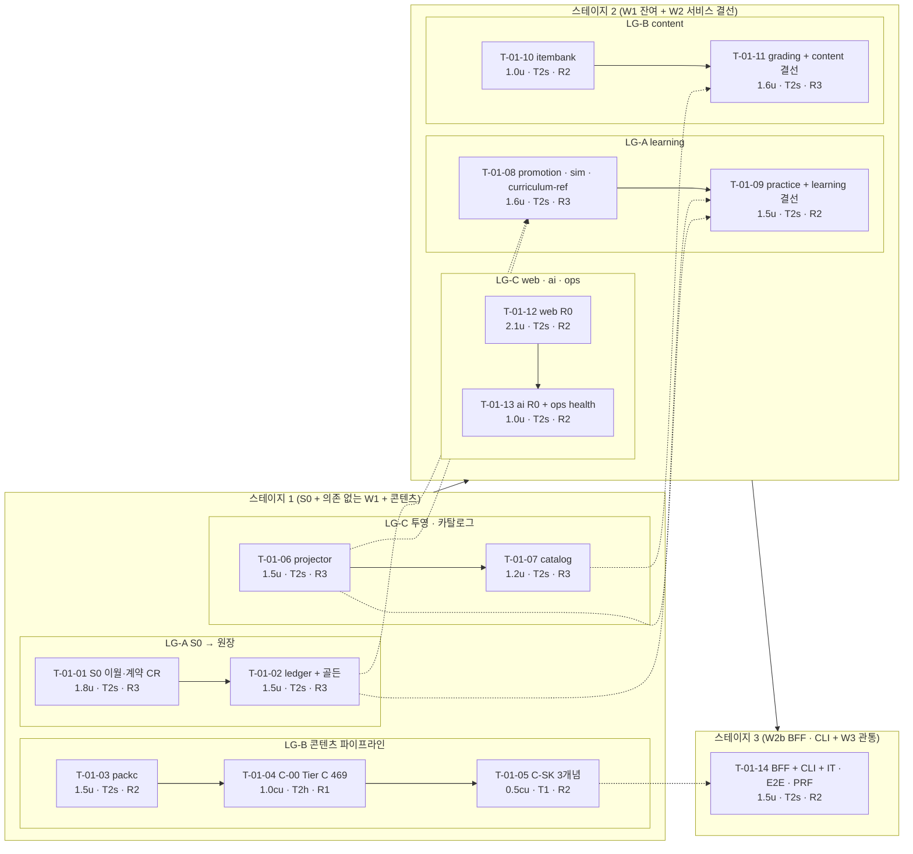

# IT-01 반복 계획 — INT-1 → INT-1b (워킹 스켈레톤 관통 루프)

> **문서 ID**: PLAN-IT-01 · **작성일**: 2026-10-02 · **작성 주체**: T1(상위 모델, P0 계획)
> **입력(정본)**: WBS-01 §2·§5(5.1~5.5)·§12(WP-C-00·WP-C-SK)·§13·§17 · ADR-000 · STD-01 §17 · TST-01 §11.2·§11.3~11.6 · DCP-01 §6.11·§6.14·§9 · BRIEF-01 · RTM-01
> **이전 기록**: `docs/40-impl/plans/IT-00-plan.md` · `IT-00-carryover-notes.md` · 완료 보고 `docs/40-impl/reports/tasks/T-00-01~15.json`(15건, T-00-16 보고 없음) · `docs/40-impl/{int,retro}/` **0건**(INT-1a 미수행).
> **표기**: 티어는 별칭만 — **T1** 상위 · **T2s** 하위 상급 · **T2h** 하위 경량 · **T0** 결정적 도구. 실제 모델 ID는 오케스트레이터 메타데이터에만 둔다(STD-AGT-02).

---

## 0. 요약

1. **목표**: OFFLINE에서 **인출 → 결정적 채점 → 원장 append → FSRS·Elo 투영 → 세션 리포트**를 서비스 경계를 계약 호출로 관통해 1회 완주하고, 원장만 리플레이한 상태 = 라이브, `pnpm sim promo|ldi`가 돈다(WBS §5.1). 게이트는 이 반복부터 **병합 차단**.
2. **WP 20개(WP-01-00~19) + 콘텐츠 WP 2개(WP-C-00·WP-C-SK) + IT-00 이월 → Task 14개**(T-01-01~14), **3 스테이지**, 스테이지당 레인 그룹 3개. 콘텐츠 파이프라인(packc → C-00 → C-SK)은 스테이지 1의 **독립 레인 그룹 LG-B**로 코드 레인과 동시에 돈다.
3. **용량**: 코드 = WBS 16.2u + IT-00 이월 흡수 1.7u = **17.9u**(+10.5%, VC-1 재투영 입력), 콘텐츠 **1.5cu**. 임계 경로 벽시계 ≈ **7.9u**(3.3 + 3.1 + 1.5).
4. **티어**: T2s 12건(코드), T2h 1건(T-01-04 콘텐츠 기반 = 스크립트 + DCP 사양 전사), **T1 1건(T-01-05 워킹 스켈레톤 3개념 = Tier A 콘텐츠)**. WBS가 T2h로 둔 코드 WP(01-00·01-11·01-12·01-14·01-18)는 T2s Task에 합쳐 T2s로 수행(§10 D-P01-12).
5. **설계 핵심**: ① 스테이지 1에서 S0(이월·계약 가산·게이트 차단 준비)와 의존 없는 W1(packc·projector·catalog)을 병렬로 돌린다 ② ledger↔projection, catalog pack-load↔itembank ingest는 **포트로 분리**하고 결선은 서비스 결선 Task가 composition root(`config.ts`)에서 한다 ③ 서비스별 `config.ts`·`infra/events/handlers.ts`·`infra/db/open.ts`(핫스팟)는 그 서비스 결선 Task가 독점한다.
6. **VC-1은 IT-01 Task가 아니다** — WBS §5.5·§14가 "INT-1b 직후(T1)"로 둔다. 통합 단계(P3 통과 직후)의 T1 체크포인트로 기록한다(§8).
7. **컷 라인 미적용**: 실측 속도가 없다(INT-1a 기록·RETRO 0건, 첫 측정점 = VC-1).

---

## 1. 목표 (Outcome) · 기준선 스토리

| # | 목표 (WBS §5.1·§5.4) | 담당 Task | 판정 |
|---|---|---|---|
| ① | OFFLINE 세션 1회 완주(외부 호출 0), 첫 문항 ≤ 2s | T-01-12 · T-01-09 · T-01-11 · T-01-14 | E1-1 · E1-2 |
| ② | 원장만 리플레이 = 라이브(FSRS 카드·Elo θ, 정정 경로 포함) | T-01-02 · T-01-06 · T-01-14 | E1-3 |
| ③ | T1 `event_loop_order` 예측 정답 = 실제 `node` 실행 100% | T-01-10 | E1-4 |
| ④ | 모든 서비스 경계에 계약 기반 호출 ≥ 1, 경계 위반 0 | T-01-09 · T-01-11 · T-01-13 · T-01-14 | E1-5 |
| ⑤ | `verdict.issued` 크래시 주입 정확히 1건 | T-01-11 · T-01-02 · T-01-14 | E1-7 |
| ⑥ | 시뮬레이터: 같은 시드 → 같은 로그, `pnpm sim promo`·`sim ldi` | T-01-08 | E1-8 → VC-1 |
| ⑦ | 콘텐츠: Tier C 469 골격 + 스켈레톤 3개념 팩 빌드, `catalog.pack.activated` → `curriculum_ref` | T-01-03~05 · T-01-07 · T-01-08 · T-01-14 | E1-12 |

기준선 스토리: ST-A1-01 · ST-A2-01 · ST-A3-01·07 · ST-A4-01~04 · ST-A5-01·02 · ST-A7-01·02 · ST-A8-01(최소) · ST-A9-01 · ST-A10-02~05 · ST-X-02 · ST-X-08(골격).

---

## 2. 진입 조건 점검 (2026-10-02 저장소 실사)

| 조건 (WBS §5.1) | 판정 | 증거 · 조치 |
|---|---|---|
| **INT-1a pass** | **미충족(진행 중)** | `docs/40-impl/int/INT-1a.md` 없음, `tests/` 디렉터리 없음, T-00-16 완료 보고 없음(작업 트리에 `packages/testkit/src/chaos.ts`·`test/unit/spawn-stack/` 미추적 파일만 존재). → **IT-01 P1은 INT-1a P3 `pass` 기록 뒤에만 시작**. Brief 작성(다음 단계)은 병행 가능하되, 각 Brief §0에 "INT-1a 기록 대조 후 확정" 표시 |
| 게이트 차단 모드 전환(`--warn-only` 해제), INT-1a 오탐 → `fixtures/<check>/clean` | INT-1a 담당 | 미반영 잔여분은 T-01-01이 흡수(§3, Brief에서 "INT-1a closed → N/A" 판정) |
| `frozen.lock` `pending`(freeze_at INT-1a 16건) → `files` | INT-1a P3(T1) | IT-01은 확정 해시를 전제. `packages/testkit/src/golden-ledgers/**`(CR-65, freeze_at **INT-1b**) 소유 = **T-01-02** |
| IT-00 Task 상태 | 13 done · 2 partial | T-00-07·T-00-14 `partial` = 둘 다 `biome.json` tailwindDirectives·루트 `version` 미해결 → INT-1a 또는 T-01-01 |
| 기반 산출물 존재(실사) | 충족 | `packages/contracts`(라우트 386·이벤트 23·`registry.gen.ts`), `shared-kernel` 17모듈, 서비스 5개 골격 + DDL(content 6·learning 6·ai 5·ops 4 마이그레이션), supervisor, `apps/cli`(up·down·status·open), `apps/web` 셸(라우트 19·`renderers/registry.ts` 41키), `policy/*@v1.yaml` 12 + `policy.lock.json`, `tools/gates` 20종, `tools/packc/src/policy/lock-cli.ts`만 존재(packc 본체 0) |
| 계획 대상 미존재 확인 | 충족 | `tools/packc/src/{cli,parse,validate,lint,emit,scaffold,schemas}` 없음 · `content/` 없음 · `services/learning/src/infra/{ledger,projection}` 없음 · `services/learning/sim/` 없음 · BC `domain/**`·`http/**`(gateway 셸 제외) 없음 · `apps/web/src/features/{insight,practice/player}` 없음 · `apps/cli/src/commands/{seed,pack}.ts` 없음 |
| graphify | 미구축 | `graphify-out/` 없음(IT-00 §5.3 스테이지 4 기준 그래프 미실행) → INT-1a P3에서 T0 `graphify extract . --code-only`. IT-01 P0 `pnpm graph:update`는 그 뒤. 없으면 Brief 컨텍스트 팩 = `rg` 결과, 보고 `graphify: "unavailable"` |
| 도구 | 충족 | Node 22.22.2 · pnpm 10.33.0 · graphify(`/root/.local/bin/graphify`) · 루트 스크립트 `content:{check,scaffold,schemas}`·`packs:build`·`sim`·`test:perf` 이미 선언(T-00-01) |

---

## 3. IT-00 이월 흡수 (완료 보고 15건 + 이월 메모 전수 대조)

처리 규칙: **INT-1a에서 닫힌 항목은 Brief 작성 시 N/A로 표시**하고, 남은 항목만 수행한다. CR 번호는 S0 착수 전 T1이 대장(`docs/02-design/cr/README.md`, 다음 **CR-69**)에 부여한다.

| # | 출처 | 항목 | 처리 | 담당 |
|---|---|---|---|---|
| CO-01 | T-00-07·14 esc. · 이월 메모 | `biome.json` `css.parser.tailwindDirectives=true` + `tokens.css`·`typography.css` 포매터 제외(DS-01 §14 바이트 동일), `app.css`(@source) 파싱 | 설정 수정(비동결 파일) | INT-1a → 잔여 **T-01-01** |
| CO-02 | T-00-10·13 dev. | `biome.json` 무시: `packages/contracts/.snapshots/**`, `services/ai-gateway/assets/empty-mcp.json`(AI-01 §4.2 바이트 정확 복원 가능) | 설정 수정 | **T-01-01** |
| CO-03 | T-00-14 esc. | 루트 `package.json` `version` 부재 → `APP_VERSION` 0.0.0·supervisor `app_version` 불일치 | 루트 `version` 추가 | INT-1a → 잔여 **T-01-01** |
| CO-04 | T-00-01 esc. | `engines.node >=22.15.0` vs TS 타입 스트리핑(≥ 22.18) | CR 후보(엔진 하한 22.18) | **T-01-01**(CR 승인 시) |
| CO-05 | T-00-06 notes | `check:deps` 10건: `react-is`·`@testing-library/dom`·`@types/react`·`@types/react-dom`(web·ui), `@types/d3-force`(packc), `vite`(루트·testkit) 허용표 누락 | `deps.json` 가산 = **CR 후보**(ARC §17.1 표 가산, 새 설치 0) | **T-01-01** |
| CO-06 | T-00-08 esc. | `check:sql-typed`가 **import된** `*.sql.ts` 상수를 `sql/dynamic-arg`로 오탐(`getAliasedSymbol` 미사용, ≈ 40곳) — 차단 모드에서 IT-01 전 저장소 코드가 막힘 | 게이트 버그 수정 + fixture | **T-01-01**(1순위) |
| CO-07 | T-00-08 esc. | `check:sql` `pragma_allow`에 `packages/shared-kernel/src/service/maintenance.sql.ts` 필요 | `sql.json` + STD-SQL-04 문구 **CR 후보** | **T-01-01** |
| CO-08 | T-00-06 esc. | `check:db-paths`가 `packages/contracts/src/{db-hooks,admin/epoch-manifest,admin/admin-routes}.ts`의 DB 파일명 41건 탐지 | `sql.json` `db_paths_exempt` 가산 **CR 후보** | **T-01-01** |
| CO-09 | T-00-03 esc. | testkit `preload/egress-recorder.mjs`: `process.env` biome-ignore 2건 + `process.getBuiltinModule('node:child_process')` 우회 | `boundaries.json` `builtin_restricted.child_process` += preload, biome override → 정적 import 복귀 **CR 후보** | **T-01-01** |
| CO-10 | T-00-06 esc. | `check:ng-g` `ng-g1/reward-vocab`가 lucide `Sparkles` 식별자 탐지 | T-00-07의 별칭(`AiMark`) 유지 + `ng-g.json` 예외 불필요 판정(T1) — 재발 시 fixture `clean` 추가 | T1 판정 · fixture **T-01-01** |
| CO-11 | T-00-12 esc.(**security**) | `shared-kernel/service/pipeline.ts`가 인증 분류를 **raw `req.url` 접두**로 함 → `/%69nternal/…`·`/%61pi/…`로 learning·ai-gateway·ops 인증 우회 | **근본 수정**(매칭된 라우트 기준 분류 + 비정준 인코딩 거부 + `/api` 호출자 ⊂ `allowedCallers`) + 교차 회귀 SEC | **T-01-01**(R3, 결선 Task보다 먼저) |
| CO-12 | T-00-12 esc. | 잘못된 `%` 시퀀스가 Fastify 기본 JSON(400)으로 응답 — problem+json 아님 | `createFastify` `routerOptions.onBadUrl`/`frameworkErrors` | **T-01-01** |
| CO-13 | T-00-12 esc. | shutdown 순서(`waitIdle` → hooks) 때문에 열린 SSE가 grace 전체를 기다림 | 장수 스트림 종료 hook을 `waitIdle` 전에, hijack 요청 in-flight 제외 | **T-01-01** |
| CO-14 | T-00-04 리뷰 minor | http-client `probeInFlight` try/finally, 재시도 중 `circuit_open`이 마지막 실패를 가림, `serveJob` invariant 미처리, migrate I/O 오류 사유 코드, job 자식 env에 `*_API_KEY` 전달 | 수정(마지막은 CR 후보: job 허용 env 축소) | **T-01-01** |
| CO-15 | T-00-08 esc.(contract) | testkit `checkRouteContract` C4가 `allowedCallers` 전원에 같은 본문으로 2xx 기대 → `common.inbox.deliver`(caller = producer) 4건 오탐 | 호출자별 본문 또는 라우트별 C4 면제 표 | **T-01-01**(W2 결선 Task 전에) |
| CO-16 | T-00-10 esc.(contract) | `HomeAlert.action.href` 정규식이 `//evil.example`(프로토콜 상대) 허용 | 동결 블록 → **CR 후보**(`/^\/(?!\/)…/`), `contracts:gen` | **T-01-01** |
| CO-17 | T-00-15 esc.(contract) | `ComposerPolicyV1`에 `path_weights` 없음(CR-52·DCP DN-22 승인분 미전사) | contracts 가산 + `composer_policy@v1.yaml` `path_weights: {}` + `pnpm policy:lock` | **T-01-01**(= WP-01-00 가산분) |
| CO-18 | T-00-15 esc. | `FsrsParamsV1.request_retention` 키 = 콘텐츠 tier A·B·C ↔ FR-PRG-005 보존 tier(core·standard·breadth·archive) | IT-01은 A→core .92 · B→standard .90 · C→breadth .85 매핑을 **잠정 유지**(projector는 정책 값만 읽음), CR 판정 = VC-1 | T1(VC-1) · 사용 T-01-06 |
| CO-19 | T-00-10·11 notes | `contracts_hash`: supervisor는 `.snapshots/*.json`(평면)에서, `CONTRACTS_HASH`는 `registry.gen.ts` — 서비스 `config.ts`는 `contractsHash: null` | supervisor 쪽(동결) = INT-1a(E0-1) 처리. 서비스 `contractsHash`를 `CONTRACTS_HASH`로 = 각 서비스 결선 Task(`config.ts` 소유) | INT-1a · T-01-09/11/13/14 |
| CO-20 | T-00-13 notes | 첫 기동 시드 이연: learning `lr_device`·`policy.switched`·`lr_projection_meta`, ai `ai_provider`·`ai_gold_item`, ops `op_tripwire_state`·`op_host_state` | `lr_device`·초기 `policy.switched` = T-01-02(지연 생성) · `lr_projection_meta` = T-01-06 · `ai_provider` = T-01-13 · `ai_gold_item` = IT-04 · `op_*_state` = IT-03/07 | 분산 |
| CO-21 | T-00-11 notes | CLI의 gateway 응답 읽기(open_url·status)가 가드 기반 → `@fathom/contracts/http/gateway/v1/{session,cli}` 스키마로 | `apps/cli/src/lib/gateway-client.ts` | **T-01-14** |
| CO-22 | T-00-11 notes | `UT-SUP-060~066` 제목에 요구 ID 없음(`[AP-12][CR-07]`만) | 제목 위생(`[FR-SET-001]` 등 추가) | INT-1a(C-11) → 잔여 **T-01-01** |
| CO-23 | T-00-09·10 esc. | contracts의 `biome-ignore lint/suspicious/noImportCycles`(Brief D1·E1 순환 19곳) | **수용**(T1 판정, §10 D-P01-11). 무순환 재배치는 ADR 사안이 아님 — 다음 contracts 개정 때 검토 | — |
| CO-24 | T-00-05 esc. | `fr-iteration.json` `{assignments:{…}}` 제3 형태 | **수용**(T1 판정 — si-docs가 이미 처리, UT-SID-022 유지) | — |
| CO-25 | T-00-01 esc. | must_bands 6행의 `first_int`가 범위 밖(FR-CUR-016 등) | RTM 문서 정정 = T1(P3, RTM 소유) | T1 |
| CO-26 | T-00-08 notes | `inbox_dedupe`에 상관 열 없음 → `AdminEventsView.inbox` 항상 [] | DB 가산 CR 후보 → IT-03(타임라인 FR-SET-016) | 이연 |
| CO-27 | T-00-08 notes | 컨테이너 모드(ADR-014 §4) 미구현 → exit 78 | CR 후보 → IT-07 | 이연 |
| CO-28 | T-00-14 esc. | 버전 불일치 시 부트 화면 처리(gateway 409 `GW-CONFLICT-010`) | CO-03로 실사용 불일치 0. 표현 결정 = IF-GW·셸 레인 → IT-02 | 이연 |
| CO-29 | IT-00 plan §10 | UT-WEB-200·201·203(배지 매핑·상태 다음 행동·모션 0)을 web 기능 WP로 | 대역 배정 | **T-01-12** |
| CO-30 | IT-00 plan §10 · CR-65 | 골든 원장 경로 동결(freeze_at INT-1b) | 생성·`--update-golden` + 트레일러 `Golden:` | **T-01-02** |

---

## 4. Task 표

u = WBS §5.2 WP u(+ 이월 추정). 위험도 = 묶인 WP 최고 등급. 리뷰: R3 = T1 전수, R2 = T1 요약, R1 = T0 + T1 표본. 콘텐츠 = T1′(V7) 리뷰.

| Task | 제목 | WPs | 레인(LG · WBS 레인) | 티어 | R | u | deps | 스테이지·LG |
|---|---|---|---|---|---|---|---|---|
| **T-01-01** | S0 — IT-00 이월 흡수 + 계약 가산 CR + 차단 모드 준비 | 01-00 + CO-01~17·22 | A · S0 직렬(L-CONTRACTS·L-PLAT·L-TEST) | T2s | R3 | 1.8 | — | S1 · LG-A |
| **T-01-02** | learning ledger(유일 writer·체인·앵커·upcaster) + 골든 원장 | 01-05 | A · L-LR-LED | T2s | R3 | 1.5 | T-01-01 | S1 · LG-A |
| **T-01-03** | packc — `content:{check,scaffold,schemas}`·`packs:build`·V1·V2 lint | 01-01 | B · L-PACKC | T2s | R2 | 1.5 | — | S1 · LG-B |
| **T-01-04** | 콘텐츠 기반 — Tier C 469 골격·템플릿·레지스트리 40·`pack.yaml` 20 | C-00 | B · L-CONTENT | **T2h** | R1 | 1.0cu | T-01-03 | S1 · LG-B |
| **T-01-05** | 워킹 스켈레톤 3개념(`net.tcp-handshake`·`k8s.probes`·`lang.js-event-loop`) | C-SK | B · L-CONTENT(T1) | **T1** | R2 | 0.5cu | T-01-04 | S1 · LG-B |
| **T-01-06** | learner-model 투영기(FSRS·Elo·최소 숙달·replay-verify·rebuild) | 01-06 | C · L-LR-MOD | T2s | R3 | 1.5 | — | S1 · LG-C |
| **T-01-07** | content catalog — PackInstaller·pack-load·CatalogQuery·CurriculumExport | 01-02 | C · L-CT-CAT | T2s | R3 | 1.2 | — | S1 · LG-C |
| **T-01-08** | promotion 이식 + 시뮬레이터 + curriculum-ref | 01-07, 01-08 | A · L-LR-MOD | T2s | R3 | 1.6 | T-01-02, T-01-06 | S2 · LG-A |
| **T-01-09** | learning practice R0 + learning 결선(W2) | 01-09, 01-16 | A · L-LR-PRA/L-LR-LED(결선) | T2s | R2 | 1.5 | T-01-02, T-01-06, T-01-08 | S2 · LG-A |
| **T-01-10** | content itembank — `selectItems`·T2 OX/MCQ·T1 생성기 2종 | 01-03 | B · L-CT-ITB | T2s | R2 | 1.0 | — | S2 · LG-B |
| **T-01-11** | content grading D 경로·Verdict + content 결선(W2) | 01-04, 01-15 | B · L-CT-GRD/L-CT-CAT(결선) | T2s | R3 | 1.6 | T-01-07, T-01-10 | S2 · LG-B |
| **T-01-12** | web R0 — 홈 1 CTA · 플레이어·OX/MCQ/LESSON·리포트 · BN-1 | 01-12, 01-13, 01-14 | C · L-WEB-insight/L-WEB-practice | T2s | R2 | 2.1 | — | S2 · LG-C |
| **T-01-13** | ai-gateway R0-AI-1(OFFLINE 모드·레지스트리) + ops 헬스 보드 | 01-10, 01-11 | C · L-AI/L-OPS | T2s | R2 | 1.0 | — | S2 · LG-C |
| **T-01-14** | gateway BFF R0 + CLI seed·pack + 관통 검증(IT·E2E·PRF) | 01-17, 01-18, 01-19 | A · L-GW/L-CLI/L-TEST | T2s | R2 | 1.5 | T-01-05, T-01-06, T-01-08, T-01-09, T-01-11, T-01-12, T-01-13 | S3 · LG-A |
| | **합계** | 20 WP + 콘텐츠 2 + 이월 | | | | **17.9u + 1.5cu** | | |

### 4.1 Brief 경로 (다음 단계에서 작성)

`docs/40-impl/briefs/IT-01/T-01-01.md` … `docs/40-impl/briefs/IT-01/T-01-14.md` (14개). STD-01 §17.3 템플릿, `allowed_paths:`는 `check-scope.mjs`가 읽는 YAML 목록(한 줄 한 경로·glob, 부정 패턴 미지원). 다중 WP Brief는 §4·§5를 **WP별 하위 절**로 나누고 완료 보고 `rtmUpdates[]`를 WP·PGM별로 남긴다(D-P00-03 승계). 콘텐츠 Brief(T-01-04·05)는 DCP-01 §9.5 콘텐츠 Brief 템플릿을 따른다.

### 4.2 Task별 allowed_paths · 테스트 ID 하위 범위 · PGM · 참조 구현

테스트 ID 대역 정본 = TST-01 §11.2. "선정의" = TST §11.3~11.6에 이미 번호가 있는 케이스(이 Task가 구현), "신규" = 이 Task 전용 미사용 하위 범위. 거울 번호(CT 001~199·5nn·6nn·7nn·8nn·E2E SCN)는 IF·SCN 번호를 그대로 쓴다. 실사 결과 기존 사용: UT-SK ~199 · UT-TK ~069 · UT-CON ~239 · UT-GATE ~199·230~239 · UT-AI 090~097 · UT-OP 190~198 · UT-PACKC 050~059 · UT-GW 001~029·050~067·100~116·150~157 · UT-CLI 001~039 · UT-WEB 001~044·202·440~459 · IT 100~113·210~228·310~325·410~423·510~534·610~619·650~659(그 밖의 일치는 `tools/si-docs` 테스트 fixture 문자열 — 런타임 변환이라 중복 검사 대상 아님).

**T-01-01 — S0 이월 흡수 + 계약 가산** (WP-01-00 + CO-01~17·22)
- allowed_paths: `packages/contracts/src/policy/composer_policy.ts` · `packages/contracts/src/http/learning/v1/insight.ts` · `packages/contracts/src/http/content/v1/pre-submit/item.ts`(WP-01-00 가산분이 있을 때만) · `packages/contracts/.snapshots/**` · `packages/contracts/src/events/{registry.gen.ts, routing.gen.ts}` · `packages/contracts/test/unit/s0-it01/**` · `policy/composer_policy@v1.yaml` · `policy/policy.lock.json` · `packages/shared-kernel/src/{service,http-client,jobs}/**` · `packages/shared-kernel/src/sqlite/migrate.ts` · `packages/shared-kernel/test/{unit,integration}/{service,http-client,jobs,sqlite}/**` · `packages/testkit/src/{contract.ts, preload/egress-recorder.mjs}` · `packages/testkit/test/unit/contract/**` · `packages/testkit/test/integration/**` · `tools/gates/{check-*.mjs, run-gates.mjs}` · `tools/gates/{lib,config,fixtures,test}/**` · `tools/biome-plugins/**` · `biome.json` · `package.json`(루트: `version`·`engines`만) · `tests/security/encoded-path.spec.ts` · `services/ops/test/unit/supervisor/**`(제목 위생만, CO-22)
- 테스트: 신규 UT-CON-240~259 · UT-SK-200~239 · UT-TK-070~079 · UT-GATE-240~269(오탐 회귀 `fixtures/<check>/clean` 포함) · SEC-SYS-010~019(인코딩 경로 우회: learning·ai-gateway·ops·content·gateway 전 서비스)
- PGM: PGM-CON-005(part)·007·008·017(part) · PGM-SK-007·013·014·015 · PGM-TK-008 · PGM-GATE-002·005·010·011·015 · PGM-SYS-101 · PGM-PACKC-010(재잠금만)
- 순서(체크포인트): ① 게이트·루트 설정(CO-01~10 — 다른 Task의 G1을 푸는 항목 먼저) ② 커널 보안(CO-11~14) ③ 계약 CR + `contracts:gen` + `policy:lock`(CO-16·17) ④ testkit(CO-15).
- 참조 구현: `packages/shared-kernel/src/service/pipeline.ts`(수정 대상, `pathOf(req.url)` 분류 149~213행) · `services/gateway/src/domain/session/path.ts`·`services/content/src/config.ts`(`registerGuarded` — 정준 경로 가드 우회 구현, 근본 수정 뒤 중복 방어로 존치) · `tools/gates/check-sql-typed.mjs` · `tools/gates/config/{sql,boundaries,deps}.json` · `packages/contracts/scripts/gen.ts` · `tools/packc/src/policy/lock-cli.ts` · `packages/testkit/src/contract.ts`.
- 비고: 동결 파일 변경 커밋은 `CR:` 트레일러 필수. CO-05·07·08·09·16·04 = CR 후보(번호는 T1이 S0 착수 전 부여), CO-17 = 기존 CR-52 이행.

**T-01-02 — learning ledger + 골든 원장** (WP-01-05)
- allowed_paths: `services/learning/src/infra/ledger/**` · `services/learning/src/{application,domain}/ledger/**` · `services/learning/src/infra/db/ledger-*.ts` · `services/learning/test/{unit,golden,integration}/ledger/**` · `services/learning/test/contract/ledger/**` · `services/learning/test/contract/events/grading-verdict-issued.spec.ts` · `packages/testkit/src/golden-ledgers/**`
- 테스트: 선정의 UT-LR-001~012 + 신규 UT-LR-030~069 · 골든 신규 UT-LR-610~629 · CT-LR-801~817(IF-LG 거울) · CT-LR-505(IF-EV-05 소비, halt) · 신규 IT-330~339
- PGM: PGM-LR-060~064
- 필수: `ledger-writer.ts` 유일 writer(`INSERT OR IGNORE`만), 같은 tx의 **투영 증분 포트**(`ProjectionApplier`, `application/ledger/ports.ts`에 정의 — 구현은 T-01-06, 결선은 T-01-09) + outbox, `lr_device` 지연 생성(CO-20, `infra/db/open.ts` 무변경), 총순서 리더(`LedgerReplaySource` 구현 — 포트는 T-01-06), 체인 헤드 앵커, inbox `grading-verdict-issued` 핸들러 파일(등록은 T-01-09). SP-3 `ledger.ts` 이식(`// ported-from:`).
- 참조 구현: `spikes/sp3-replay-determinism/src/ledger.ts` · `services/learning/migrations/ledger/0001_ledger_core.sql` · `packages/contracts/src/ledger/{envelope,types,versions}.ts` · `packages/shared-kernel/src/eventing/{outbox,inbox}.ts` · `services/learning/src/infra/events/wiring.ts` · `packages/shared-kernel/src/sqlite/sqlite.ts`(`tx()`).

**T-01-03 — packc** (WP-01-01)
- allowed_paths: `tools/packc/src/{cli.ts, format-map.ts}` · `tools/packc/src/{parse,validate,lint,emit,scaffold,schemas}/**` · `tools/packc/fixtures/**` · `tools/packc/test/{unit,integration}/{cli,parse,validate,lint,emit,scaffold,schemas}/**`
- 테스트: 선정의 UT-PACKC-001~004·007·008 + 신규 UT-PACKC-010~049·065~099 · 신규 IT-660~669(실제 `content/` 트리·종료 코드 0/1/2)
- PGM: PGM-PACKC-001~005·011·012
- 순서: ① `scaffold`(R4 §5 → 469 골격·간선 518) + `check` V1·V2 → **T-01-04 해제 조건** ② `emit`(`.fpack` manifest·merkle·bundle·report → `dist/packs/<id>@<ver>.fpack`) ③ `schemas`. R-POOL = `structuralFeasibility()` import(재구현 금지). UT-PACKC-005(오라클)·006(KPI)은 IT-05·IT-02 WP.
- 참조 구현: `tools/packc/src/policy/lock-cli.ts`(CLI 진입·정준 YAML·stdout/stderr 규약) · `packages/contracts/src/pack/{manifest,records,delta,feasibility}.ts` · `tools/gates/lib/common.mjs`(종료 0/1/2·`isMain` realpath) · `docs/00-research/R4-curriculum-taxonomy.md` · DCP-01 §6·§7.

**T-01-04 — 콘텐츠 기반 (T2h)** (WP-C-00 = DCP WP-00)
- allowed_paths: `content/README.md` · `content/templates/**` · `content/sources/registry.yaml` · `content/packs/*/pack.yaml` · `content/packs/*/concepts/*.md` · `content/packs/data/**` · `content/.schemas/**`(생성물, `pnpm content:schemas`)
- 테스트: 없음(콘텐츠). 완료 = `pnpm content:scaffold` 결과 커밋(골격 469·간선 518·태그·트랙 기본 출처 `link_only`) + T2 범용 템플릿 5·디깅 8·공용 루브릭 6(DCP §6.11·§6.9) + 레지스트리 40(§6.14·§8.6) + `pack.yaml` 20 + `pnpm content:check` exit 0
- PGM: — (DCP WP-00)
- 참조 구현: DCP-01 §6.9·§6.11·§6.14·§8.6, T-01-03 산출 `tools/packc/src/scaffold/**`.

**T-01-05 — 워킹 스켈레톤 3개념 (T1)** (WP-C-SK)
- allowed_paths: `content/packs/net/{concepts,kus,misconceptions,items,item-models}/net.tcp-handshake.*` · `content/packs/k8s/{concepts,kus,misconceptions,items,item-models}/k8s.probes.*` · `content/packs/lang/{concepts,kus,misconceptions,items,item-models}/lang.js-event-loop.*` · `content/sources/requests/WP-C-SK.yaml`
- 테스트: 없음. 완료 = 개념당 파일 5종·문항 21(Tier A 하한) · `pnpm content:check --pack {net,k8s,lang}` exit 0 · DCP §7.4 자기 점검표 · cu 실측 기록(SP-5 파일럿 → VC-1)
- PGM: — · 리뷰 = **WP-REV 배치 1**(T1′, `content/review/V7/**`, P2 — §10 D-P01-09)
- 비고: `lang.js-event-loop`은 T1 `event_loop_order` 생성기(T-01-10)의 item-model을 포함. 3개념의 `concepts/*.md`는 T-01-04가 만든 골격을 **순차 인계**받는다(D-P01-05).
- 참조 구현: DCP-01 §13 견본(`docker.dockerfile` L1 FULL: concept·kus·misconceptions·items) · §9.5 Brief 템플릿.

**T-01-06 — learner-model 투영기** (WP-01-06)
- allowed_paths: `services/learning/src/domain/learner-model/{fsrs,elo,mastery}/**` · `services/learning/src/application/learner-model/**` · `services/learning/src/infra/projection/**` · `services/learning/src/jobs/{replay-verify.ts, rebuild.ts}` · `services/learning/src/infra/db/learner-model-*.ts` · `services/learning/test/{unit,property,golden,integration}/learner-model/**`
- 테스트: 선정의 UT-LR-100~109·111·115 + 신규 UT-LR-120~159 · 속성 선정의 UT-LR-500~504 + 신규 UT-LR-510~529 · 골든 선정의 UT-LR-600·601 + 신규 UT-LR-630~639 · 신규 IT-360~369(job 자식)
- PGM: PGM-LR-090~094
- 필수: 순수 리듀서 `apply(state, event, params)`는 `@fathom/contracts/ledger/envelope`(`LedgerEventEnvelope`)만 입력으로 받는다 — ledger 코드 import 0(D-P01-03). 포트 2개를 `application/learner-model/ports.ts`에 정의: `LedgerReplaySource`(T-01-02 구현) · `ProjectionApplier` 구현체 `infra/projection/applier.ts`. `lr_projection_meta` 기록(`fsrs_impl = ts-fsrs@5.4.2`, CO-20). 골든 해시 기대값은 T-01-02의 골든 원장으로 계산(같은 스테이지 다른 LG이므로 **골든 파일 경로·형식은 Brief가 고정**, 실제 대조는 INT-1b G2).
- 참조 구현: `spikes/sp3-replay-determinism/src/projection.ts` · `services/learning/migrations/learner-model/0001_projections.sql` · `packages/contracts/src/policy/{fsrs_params,mastery_rules}.ts` + `policy/{fsrs_params,mastery_rules}@v1.yaml` · `packages/shared-kernel/src/jobs/**`(`defineJob`) · `services/learning/src/jobs/snapshot.ts`(job 골격).

**T-01-07 — content catalog** (WP-01-02)
- allowed_paths: `services/content/src/{application,domain}/catalog/**` · `services/content/src/infra/packs/**` · `services/content/src/infra/db/ct-*.ts` · `services/content/src/jobs/pack-load.ts` · `services/content/test/{unit,integration}/catalog/**` · `services/content/test/contract/events/{catalog-pack-activated,catalog-concept-changed}.spec.ts`
- 테스트: 선정의 UT-CT-001 + 신규 UT-CT-020~049 · 신규 IT-230~239(blue/green·pack-load 500행 배치·포인터 1 tx) · CT-CT-501·502(IF-EV-01·02 생산)
- PGM: PGM-CT-001~004
- 필수: pack-load가 BC별 수입을 **`IngestRegistry` 포트**(`application/catalog/ports.ts`)로 호출 — itembank·grading 수입 구현은 각 BC, 등록은 T-01-11(content 결선, `config.ts`). `application/catalog/ingest/**`는 catalog 서빙 테이블만.
- 참조 구현: `services/content/migrations/catalog/{0001_catalog_core,0002_catalog_search}.sql` · `packages/contracts/src/pack/{manifest,records}.ts` · `packages/contracts/src/http/content/v1/catalog.ts` · `services/content/src/jobs/snapshot.ts` · `services/content/src/infra/events/outbox.ts`.

**T-01-08 — promotion·sim + curriculum-ref** (WP-01-07, WP-01-08)
- allowed_paths: `services/learning/src/domain/learner-model/promotion/**` · `services/learning/sim/**` · `services/learning/test/unit/{promotion,sim}/**` · `services/learning/src/{application,domain}/curriculum-ref/**` · `services/learning/src/infra/db/curriculum-ref-*.ts` · `services/learning/test/unit/curriculum-ref/**` · `services/learning/test/contract/events/{catalog-pack-activated,catalog-concept-changed}.spec.ts`
- 테스트: 선정의 UT-LR-200~209 + 신규 UT-LR-220~239 · sim 선정의 UT-LR-650·651 + 신규 UT-LR-660~679 · curriculum-ref 선정의 UT-LR-450 + 신규 UT-LR-460~479 · CT-LR-501·502(IF-EV-01·02 소비)
- PGM: PGM-LR-110·111·160·161·180~182
- 필수: SP-6 `promotion.ts`·`policy.ts`·`inventory.ts`·`sim.ts` 이식(`decidePromotion`·`reconcileProvisional` 강등 0, CR-18~21 파라미터 인자). 시뮬레이터의 θ·FSRS는 **T-01-06의 운영 리듀서를 import**(VC-1 SIM-PROMO 판정 충실도), 합성 원장은 T-01-02의 체인 규칙을 따른다. `pnpm sim promo`·`pnpm sim ldi` 같은 시드 → 같은 로그. curriculum-ref inbox 핸들러 파일은 여기서, 목록 등록은 T-01-09.
- 참조 구현: `spikes/sp6-promotion-reachability/src/{promotion,policy,inventory,sim}.ts` · `spikes/sp3-replay-determinism/src/{sim,ldi}.ts` · `policy/{mastery_rules,ldi_params}@v1.yaml` · `services/learning/migrations/curriculum-ref/0001_curriculum_ref.sql` · `packages/contracts/src/http/content/v1/catalog.ts`(IF-CT-007 export).

**T-01-09 — practice R0 + learning 결선** (WP-01-09, WP-01-16)
- allowed_paths: `services/learning/src/application/practice/**` · `services/learning/src/domain/practice/session/**` · `services/learning/src/infra/db/practice-*.ts` · `services/learning/src/http/**` · `services/learning/src/config.ts` · `services/learning/src/infra/events/handlers.ts` · `services/learning/src/infra/db/open.ts` · `services/learning/src/infra/clients/content.client.ts` · `services/learning/test/unit/practice/**` · `services/learning/test/contract/http/**` · `services/learning/test/contract/events/{learning-evidence-recorded,learning-session-completed}.spec.ts` · `services/learning/test/integration/practice/**`
- 테스트: 선정의 UT-LR-306 + 신규 UT-LR-320~349 · CT-LR-001·003·004·009·010·011·014·016(거울) + 선정의 CT-LR-201·202 + 신규 CT-LR-210~229 · CT-LR-508·509(IF-EV-08·09 생산) · 신규 IT-340~359
- PGM: PGM-LR-001~004·174
- 필수: composition root 결선 — `ProjectionApplier`(T-01-06) → ledger writer(T-01-02), `LedgerReplaySource` → replay-verify·rebuild job 등록, `INBOX_HANDLERS`에 `grading-verdict-issued`(T-01-02)·curriculum-ref 2종(T-01-08) 등록, `contractsHash: CONTRACTS_HASH`(CO-19). AttemptProcess는 같은 `Idempotency-Key`로 grading 호출 → 원장 append, `items:select` 1회 prefetch(`lr_block`).
- 참조 구현: `services/learning/src/{config.ts, application/practice/{ports,register}.ts}` · `packages/contracts/src/http/learning/v1/{sessions,attempts}.ts`·`pre-submit/block.ts` · `packages/shared-kernel/src/http-client/**`(`PeerClient`) · `packages/testkit/src/{contract.ts, fakes/peers/peers.ts}` · `services/gateway/src/http/cli/routes.ts`(라우트 등록 패턴) · `services/learning/migrations/practice/0001_practice_core.sql`.

**T-01-10 — content itembank** (WP-01-03)
- allowed_paths: `services/content/src/{application,domain}/itembank/**` · `services/content/src/infra/db/ib-*.ts` · `services/content/test/unit/itembank/**`
- 테스트: 선정의 UT-CT-200(R0 부분집합: `event_loop_order`·`http_status` × 시드 50, 실제 `node` 자식 대조 = E1-4, 파일 `t1-*.spec.ts`)·202·205 + 신규 UT-CT-220~249
- PGM: PGM-CT-080~082
- 필수: `ItemDelivery`(pre-submit) 정답·해설 필드 0, 출제 가능 `gate_status` 3종 필터, `application/itembank/ingest/**` = `IngestRegistry` 구현(등록은 T-01-11).
- 참조 구현: `services/content/migrations/itembank/0001_itembank_core.sql` · `packages/contracts/src/http/content/v1/{itembank.ts, pre-submit/item.ts}` · `services/content/src/application/runner/ports.ts`(`RunnerPort` — IT-01 T1 생성기는 실행 불필요, D-WBS-18).

**T-01-11 — grading D 경로 + content 결선** (WP-01-04, WP-01-15)
- allowed_paths: `services/content/src/{application,domain}/grading/**` · `services/content/src/infra/db/gr-*.ts` · `services/content/test/unit/grading/**` · `services/content/test/contract/events/grading-verdict-issued.spec.ts` · `services/content/src/http/**` · `services/content/test/contract/http/**` · `services/content/src/config.ts` · `services/content/src/infra/db/open.ts` · `services/content/src/infra/events/inbox.ts` · `services/content/test/integration/{grading,http}/**`
- 테스트: 선정의 UT-CT-304·306 + 신규 UT-CT-320~349 · CT-CT-001~007·040·041·045·055(거울) + 선정의 CT-CT-201·203 + 신규 CT-CT-210~229 · CT-CT-505(IF-EV-05 생산) · 신규 IT-240~259
- PGM: PGM-CT-130~133·204
- 필수: `issueVerdict` = `gr_verdict` + `grading.verdict.issued` 한 tx(리플레이 입력 전부·`item_n_options`), CBM 점수(FR-QST-024), 자기채점 S. 결선: IF-CT-001~007·040·041·045·055, `IngestRegistry`에 itembank·grading 수입 등록, job `pack-load` 등록, `contractsHash`(CO-19).
- 참조 구현: `services/content/migrations/grading/0001_grading_core.sql` · `packages/contracts/src/http/content/v1/{grading.ts, post-submit/grading.ts}` · `policy/cbm_params@v1.yaml` · `services/content/src/config.ts` · `packages/testkit/src/contract.ts`.

**T-01-12 — web R0** (WP-01-12, WP-01-13, WP-01-14)
- allowed_paths: `apps/web/src/routing/{index.tsx, session.$sessionId.tsx, notes.$blockId.tsx}` · `apps/web/src/features/insight/{home,hooks,api}/**` · `apps/web/src/features/practice/{player,report,components,hooks,api,blank-note}/**` · `apps/web/src/features/practice/renderers/{ox,mcq,lesson}/**` · `apps/web/src/features/practice/renderers/registry.ts`(ox·mcq·lesson·items의 `component` 값만, 키 목록 불변) · `apps/web/test/component/{insight,practice}/**` · `apps/web/test/component/support/**`
- 테스트: 선정의 UT-WEB-200·201·203(CO-29) + 신규 UT-WEB-210~229(홈) · UT-WEB-230~299(플레이어·렌더러·리포트) · UT-WEB-300~319(BN-1: 제출 전 AI import 0)
- PGM: PGM-WEB-010~013
- 순서: 플레이어·OX/MCQ/LESSON → 리포트 3줄 + `DepthRise` → 홈 1 CTA → BN-1(2.1u, R-09). C-12 디자인 루브릭 ≥ 4.0 대상 화면(SCR-01·02·06).
- 참조 구현: `apps/web/src/lib/{api-client,attempt-queue,sse,invalidation-map,query-keys,idempotency}.ts` · `apps/web/src/features/practice/renderers/registry.ts` · `apps/web/src/routing/index.tsx`(스텁) · `packages/ui/src/components/*.tsx` · `apps/web/test/unit/lib/**`(happy-dom 하네스) · `packages/contracts/src/http/gateway/v1/{home,sessions}.ts`.

**T-01-13 — ai R0-AI-1 + ops 헬스 보드** (WP-01-10, WP-01-11)
- allowed_paths: `services/ai-gateway/src/{domain,application}/control/**` · `services/ai-gateway/src/domain/routing/task-registry.ts` · `services/ai-gateway/src/domain/generate/prompt-registry.ts` · `services/ai-gateway/src/application/{routing,judge,generate}/register.ts` · `services/ai-gateway/src/http/**` · `services/ai-gateway/src/infra/db/ai-*.ts` · `services/ai-gateway/src/config.ts` · `services/ai-gateway/test/{unit/{control,routing,generate},contract,integration/control}/**` · `services/ops/src/{http,application,domain}/health/**` · `services/ops/src/http/**` · `services/ops/src/infra/db/op-*.ts` · `services/ops/src/config.ts` · `services/ops/test/{unit,contract,integration}/health/**`
- 테스트: 선정의 UT-AI-001·003 + 신규 UT-AI-010~039 · UT-AI-110~119 · UT-AI-310~319 · CT-AI-001·002·025·039(거울) + 선정의 CT-AI-202 + 신규 CT-AI-210~219 · CT-AI-514(IF-EV-14 생산) · 신규 IT-430~439 · 선정의 UT-OP-100 + 신규 UT-OP-110~129 · CT-OP-001·002(거울) + CT-OP-521(IF-EV-21 생산) + 신규 CT-OP-210~219 · 신규 IT-540~549
- PGM: PGM-AI-001·020·070 · PGM-OP-004·010·011
- 필수: 동의 0 → OFFLINE, judge·generate `unavailable{offline}` 200 즉답, `prompts.lock.json` 불일치 과업만 비활성 + doctor 항목, `ai_provider` 시드(CO-20), 헬스 보드 15s 수집(supervisor `status` IPC·AI 모드·outbox 적체), `ops.health.changed`, `contractsHash`(CO-19).
- 참조 구현: `services/ai-gateway/assets/{tasks.yaml, prompts.lock.json}` · `services/ai-gateway/test/unit/assets/assets.spec.ts` · `services/ai-gateway/migrations/control/0001_control_core.sql` · `packages/contracts/src/http/ai-gateway/v1/{mode,judge,generate,providers}.ts` · `services/ops/src/infra/supervisor-ipc/{client,channel}.ts` · `services/ops/migrations/health/0001_health_core.sql` · `packages/contracts/src/http/ops/v1/health.ts`.

**T-01-14 — BFF R0 + CLI seed·pack + 관통 검증** (WP-01-17, WP-01-18, WP-01-19)
- allowed_paths: `services/gateway/src/{http/api,application/bff}/{home,sessions,concepts,ai,ops}.ts` · `services/gateway/src/{http,application}/cli/packs.ts` · `services/gateway/src/http/cli/routes.ts` · `services/gateway/src/application/cli/register.ts` · `services/gateway/src/config.ts` · `services/gateway/test/{contract/http,unit/bff,integration/bff}/**` · `apps/cli/src/commands/{seed,pack}.ts` · `apps/cli/src/{run.ts, lib/args.ts, lib/gateway-client.ts}` · `apps/cli/test/{unit/{seed,pack},integration/seed}/**` · `tests/integration/{outbox-exactly-once,ledger-only-replay,curriculum-ref}.spec.ts` · `tests/e2e/{zero-ai,walking-skeleton}.spec.ts` · `tests/e2e/mode-schedule.json` · `tests/perf/{first-item,journal-size,run-all}.ts` · `tests/contract/{boundary-coverage,pack-records}.spec.ts` · `tests/{vitest.config.ts, playwright.config.ts}` · `packages/testkit/src/fakes/{content,learning,ai,ops}/**`
- 테스트: 신규 UT-GW-070~099(BFF) · UT-GW-120~139(cli packs) · CT-GW-010·015·017·018·020·021·025·028·030·043·105·135·189~191(거울) + 선정의 CT-GW-201 + CT-GW-521(IF-EV-21 소비 → SSE) + 신규 CT-GW-210~239 · 신규 IT-120~139 · 신규 UT-CLI-040~059 · IT-620~629 · 선정의 IT-001(E1-7)·IT-013(R0 규모)·IT-016(E1-12) + 신규 IT-060~079 · E2E-021(E1-1)·E2E-101(R0 범위) · PRF-001·003(E1-2) + 신규 PRF-020~024(E1-11 `journal_size_limit`) · CT-SYS-013 + 신규 CT-SYS-020~029(E1-5 경계별 계약 호출 ≥ 1) · 신규 UT-TK-080~099
- PGM: PGM-GW-010~013 · PGM-CLI-004 · PGM-SYS-002~004 · PGM-TK-003(추가분)
- 순서(체크포인트): ① BFF R0(deadline·`Idempotency-Key` 전파) ② CLI `seed`(`dist/packs/*.fpack` 설치)·`pack install` + CO-21 ③ 교차 IT·E2E·PRF.
- 참조 구현: `services/gateway/src/application/bff/register.ts` · `services/gateway/src/http/api/{home,sessions}.ts`(스텁) · `services/gateway/src/infra/peers/{peers,failure,error-registry}.ts` · `services/gateway/src/http/cli/routes.ts` · `apps/cli/src/{run.ts, commands/up.ts, lib/gateway-client.ts}` · `packages/testkit/src/{spawn-stack.ts, chaos.ts, playwright/stack-fixture.ts}` · `tests/e2e/{boot-shell,zero-ai}.spec.ts`(T-00-16 산출, INT-1a 후).

---

## 5. 쓰기 소유 충돌 해소 (PR-1 교차 검사, C-02)

WBS §5.2·§12.1의 WP 경로를 Task 단위로 합친 뒤 교집합을 검사했다. 아래는 WBS 표 자체의 공백·겹침과 그 해소다(Task 간 교집합 = O-6의 의도된 순차 인계 3파일만).

| # | 겹침 · 공백 | 해소 |
|---|---|---|
| O-1 | 서비스 composition root(`src/config.ts`)·`infra/events/handlers.ts`·`infra/db/open.ts`가 IT-01 WP 어디에도 없음(포트 결선·job 등록·inbox 등록·`contractsHash`에 필요) | **서비스 결선 Task 독점**: learning T-01-09 · content T-01-11 · ai·ops T-01-13 · gateway T-01-14(D-P01-04) |
| O-2 | ledger "같은 tx 투영 증분"(ARC §5 LedgerWriter) ↔ 투영기(WP-01-06)·job 등록 | 포트 분리: `ProjectionApplier`(ledger 포트, 투영기 구현) · `LedgerReplaySource`(투영기 포트, ledger 구현). 연결은 O-1(D-P01-03) |
| O-3 | catalog `pack-load` job이 itembank·grading 서빙 테이블 수입을 호출 | `IngestRegistry` 포트(catalog) ← 각 BC `application/<bc>/ingest/**` 구현 ← T-01-11 등록 |
| O-4 | WP-01-10 `services/ai-gateway/test/{unit,contract}/**` ⊃ IT-00 소유 `test/unit/assets/**` | `test/unit/{control,routing,generate}/**`로 축소(assets 테스트 불변) |
| O-5 | WP-01-01 `tools/packc/test/**` ⊃ IT-00 `test/unit/policy/**` | `test/{unit,integration}/{cli,parse,validate,lint,emit,scaffold,schemas}/**`로 축소 |
| O-6 | WP-C-00 `content/packs/*/concepts/*.md`(469 최초 생성) ⊃ WP-C-SK 3개념 `.md` | **순차 인계**(WBS §12.1 "이후 소유는 트랙 WP로 이관"): 같은 LG-B에서 T-01-04 병합 후 T-01-05 시작. `check-scope`는 Task 커밋 diff 기준이라 양쪽 모두 통과(D-P01-05) |
| O-7 | WP-01-17 경로에 CLI 라우트 등록 파일(`http/cli/routes.ts`·`application/cli/register.ts`) 누락, WP-01-18에 명령 분기(`run.ts`·`lib/args.ts`) 누락 | T-01-14에 명시(같은 Task) |
| O-8 | WP-01-12~14 렌더러 구현 ↔ 핫스팟 `renderers/registry.ts`(PR-4, "feature WP는 component 값만") | web Task가 IT-01에 1개뿐 → T-01-12에 `component` 값 변경만 허용 |
| O-9 | 이벤트 계약 테스트 5nn 위치(PR-3: 생산자·핸들러 BC W1 WP) | 파일 단위로 배정: `content/test/contract/events/{catalog-*}`=T-01-07 · `grading-verdict-issued`=T-01-11 · `learning/test/contract/events/grading-verdict-issued`=T-01-02 · `catalog-*`=T-01-08 · `learning-*`=T-01-09 |
| O-10 | `tests/security/**`(IT-00 T-00-16) ↔ T-01-01 인코딩 경로 회귀 | 새 파일 `tests/security/encoded-path.spec.ts`만 T-01-01. `tests/` 나머지 IT-01 소유 = T-01-14 |

- 루트 `package.json`은 IT-01에서 **T-01-01만**(`version`·`engines`), 의존·스크립트·lockfile 변경 0(PR-6 — 필요 시 `dependency` 에스컬레이션 → T1이 T-01-01 보완 라운드).
- `packages/contracts/**`는 T-01-01만(PR-2). 다른 Task가 계약 변경이 필요하면 즉시 중단 + `contract_change` 에스컬레이션.
- `graphify-out/`·`dist/packs/`·`content/review/V7/**`는 어떤 Task에도 없다(T0·WP-INT·WP-REV).

---

## 6. 스테이지 · 레인 그룹

### 6.1 다이어그램

### 6.2 스테이지 표 (하드 규칙 검증)

| 스테이지 | LG | Task(순서) | LG u | 같은 스테이지 내 의존 | 이전 스테이지 의존 |
|---|---|---|---|---|---|
| 1 | LG-A | T-01-01 → T-01-02 | **3.3** | 02←01 (같은 LG) | — |
| 1 | LG-B | T-01-03 → T-01-04 → T-01-05 | 3.0 | 04←03, 05←04 (같은 LG) | — |
| 1 | LG-C | T-01-06 → T-01-07 | 2.7 | — (순서만) | — |
| 2 | LG-A | T-01-08 → T-01-09 | **3.1** | 09←08 (같은 LG) | 02, 06 |
| 2 | LG-B | T-01-10 → T-01-11 | 2.6 | 11←10 (같은 LG) | 07 |
| 2 | LG-C | T-01-12 → T-01-13 | **3.1** | — (순서만) | — |
| 3 | LG-A | T-01-14 | 1.5 | — | 05, 06, 08, 09, 11, 12, 13 |

- 레인 그룹 사이 같은 스테이지 의존 0(하드 규칙 충족). 임계 경로 = 3.3 + 3.1 + 1.5 = **7.9u**. 이론 하한(S1+S2 작업 17.8u ÷ 3 LG = 5.93u + 1.5u) 대비 +0.47u.
- 기각한 대안: ① BFF·CLI(0.9u)와 관통 테스트(0.6u)를 별도 Task로 → Task 15개(상한 14 초과). ② projector를 ledger 뒤(LG-A)에 → S2 LG-A 4.5u, 벽시계 8.3u+. ③ itembank + grading 한 Task(2.2u) + content 결선을 BFF와 묶음 → 2.0u 상한 초과·벽시계 8.3u. ④ curriculum-ref를 practice 결선 Task에 합침(handlers.ts 귀속은 자연스러우나 S2 LG-A 3.6u) — 현 배치(ref 먼저, 같은 LG)로 같은 효과.
- 스테이지 1의 W1 Task(T-01-03·06·07)는 S0와 병렬이다. 이들의 G1 중 S0 이월 항목(CO-01·03·05 lint·deps) 때문에 붉어지는 단계는 `blocked_by: T-01-01`로 보고하고, 스테이지 1 종료 후 T0가 재실행한다(D-P01-02). 병합(차단 모드)은 P2 이후이므로 S0가 먼저 병합된다.

### 6.3 스테이지 경계의 T0 동작

| 시점 | T0 동작 |
|---|---|
| 스테이지 1 전(P0 끝) | INT-1a `pass` 확인 · `int-1a` 태그 · `frozen.lock` pending(INT-1a) → files 확정 확인 · `pnpm graph:update`(기준 그래프 존재 시) · `run-gates` 기본 모드(차단) 확인 |
| 스테이지 1 후 | T-01-03·06·07 **G1 재실행**(D-P01-02) · `pnpm contracts:gen` diff 0 + `check:frozen`(T-01-01 `CR:` 트레일러) · `pnpm policy:lock` 검증 · `pnpm graph:update`(S0 병합 직후, WBS §2.5) · `pnpm content:check`(전 팩) · `pnpm packs:build`(→ `dist/packs/`, 스테이지 3 `fathom seed`·E2E 입력) |
| 스테이지 2 후 | `pnpm graph:update`(W1·결선 반영 → T-01-14의 `affected`) · `pnpm test:contract`(content·learning·ai·ops) · `check:consumers` · `lint:hooks` |
| 스테이지 3 후 → P2 · P3 | G2 → INT-1b G3(§7) · `graphify update .` → `pnpm graph:snapshot --int INT-1b` → `pnpm audit:graph` · `frozen.lock` pending(골든 원장, CR-65) → files(T1) · WP-INT `packs:build` · **VC-1**(§8) |

---

## 7. 통합 종료 조건 — INT-1b (WBS §2.7 + §5.4 복사, 게이트 **차단 모드**)

### 7.1 공통 C-01~C-17

| # | 항목 | 명령·근거 |
|---|---|---|
| C-01 | 반복의 모든 Task 완료 보고가 `done`(이월은 사유·다음 반복 배정과 함께 INT 기록에) | STD-AGT-17 |
| C-02 | WP 간 쓰기 경로 교집합 0, `graphify-out/`·`spikes/`·생성물 수기 변경 0 | `check:scope`(Task별), P0 T1 교차 검사(이 문서 §5) |
| C-03 | 설치·빌드·타입: `pnpm i --frozen-lockfile --ignore-scripts` · `pnpm build` · `pnpm typecheck` · `pnpm lint` | ADR-008 |
| C-04 | 정적 게이트 `node tools/gates/run-gates.mjs --stage=g3` exit 0(**차단**, exit 2는 항상 실패) · `check:gate-selftest` · `pnpm --filter @fathom/tool-gates test`(= `node --test "test/*.test.mjs"`) | ADR-010, AP-15 |
| C-05 | `pnpm test` · `test:contract` · `test:integration` · `test:security` · `test:e2e`(반복 범위) · 같은 커밋 2회 실행 결과 동일 | STD-TST-03 |
| C-06 | domain 라인 커버리지 ≥ 80%, 직전 INT 대비 감소 ≤ 2%p | STD-TST-09 |
| C-07 | `pnpm audit --prod --audit-level high` 0, 설치 스크립트 0(`onlyBuiltDependencies: []`), 네이티브 애드온 0 | ARC §12.8 |
| C-08 | `pnpm contracts:gen` 후 diff 0, `check:frozen` · `check:consumers` 0, 동결 파일 변경 커밋에 `CR:`/`ADR:` 트레일러 | ADR-008 §8 |
| C-09 | `tests/e2e/stderr-clean.spec.ts`: 모든 서비스 stderr에 ExperimentalWarning·경고 0 | ARC §9.3 |
| C-10 | `graphify update .` → `pnpm graph:snapshot --int INT-1b` → `pnpm audit:graph`: 교차 서비스 파일 엣지 0(비차단, >0이면 T1 판정) | WBS §2.5 |
| C-11 | RTM·PGM 갱신(`tools/si-docs`), `check:rtm`(INT-3부터 차단), UTR·ITR 생성 `docs/40-impl/reports/` | R6 §4.10 |
| C-12 | 반복 화면(SCR-01·02·06)의 디자인 루브릭 평균 ≥ 4.0(차원 < 3 없음), `/_design` 스크린샷 기준선 갱신 | NFR-UX-012, DS-01 |
| C-13 | OFFLINE 기본: 신규 설치 첫 기동 외부 소켓 0(`tests/e2e/zero-ai.spec.ts` 해당 범위) | QAS-12 |
| C-14 | 오케스트레이터 메타데이터의 실제 모델 ID와 완료 보고 `model_id` 대조, R3 Task 리뷰어 = T1 | STD-AGT-01·02 |
| C-15 | STD-01 부록 A 표본 리뷰(T1, 반복당 Task 20% 또는 최소 5건) | NFR-MAINT-010 |
| C-16 | (경보, 비차단) 콘텐츠 진척 = WBS §12.3 IT-01 마일스톤(Tier C 469 골격·Tier A 3·레지스트리 40·템플릿·정책 12) 대비 | DCP §9.1 ⑤ |
| C-17 | INT 기록 `docs/40-impl/int/INT-1b.md`: 판정·게이트 통계(1회 통과율·보완 라운드)·이월·u 실측·graphify 지표 | R6 §7 |

### 7.2 INT-1b 종료 조건 E1-1~E1-12

| # | 종료 조건 | 측정 | 담당 Task |
|---|---|---|---|
| E1-1 | OFFLINE 세션 1회 완주, 외부 호출 0 | `tests/e2e/walking-skeleton.spec.ts`(E2E-021 = SCN-01 OFFLINE) · `zero-ai.spec.ts`(E2E-101, R0 범위) | T-01-14(← 09·11·12·13·05) |
| E1-2 | 세션 시작 → 첫 문항 ≤ 2s(p95, 컨테이너) | `tests/perf/first-item.ts`(초판, PRF-001) | T-01-14 · T-01-09(prefetch) |
| E1-3 | 원장만 리플레이한 FSRS 카드·Elo θ = 라이브 상태(content.db·ai.db 삭제 후), 정정 경로 결정성 포함 | `tests/integration/ledger-only-replay.spec.ts`(IT-013 R0), `services/learning/test/property/**` | T-01-14 · T-01-06 · T-01-02 |
| E1-4 | T1 출력 예측 정답 = 실제 실행 결과 100%(`event_loop_order`) | `services/content/test/unit/itembank/t1-*.spec.ts`(실제 `node` 자식 대조) | T-01-10 |
| E1-5 | 모든 서비스 경계에 계약 기반 호출 ≥ 1, `check:boundaries --engine=both` 0 | CT-SYS(020~029)·`audit:graph` | T-01-14 · 결선 Task 전원 |
| E1-6 | NG-G1~G7 lint, 127.0.0.1 바인딩·Host 검증 통과 | `check:ng-g`, SEC-GW · SEC-SYS-010~019(인코딩 경로) | T-01-01 · T-01-12(BN-1 NG-G7) |
| E1-7 | `verdict.issued` 크래시 주입 정확히 1건, outbox 재전송 정확히 1회 | `tests/integration/outbox-exactly-once.spec.ts`(IT-001) | T-01-14 · T-01-11 · T-01-02 |
| E1-8 | 시뮬레이터: 같은 시드 → 같은 로그, `pnpm sim promo`·`pnpm sim ldi` 실행 가능 | `services/learning/test/unit/sim/**`(UT-LR-650·651) | T-01-08 |
| E1-9 | `lint:hooks` 0, FR-CUR-016 Case 스키마(파라미터화 필드) 동결 확인 | `check-hooks.mjs`, `check:frozen` | T1(P3) |
| E1-10 | Jev 스파이크(SP-1)는 V-live — 키 없음 → 사전 확정 대응(w 0.7, 숙달 산입 유지)을 INT 기록에 명시 | INT-1b 기록 | T1(P3) |
| E1-11 | `journal_size_limit` 실측(SP-4 §9.3 "INT-1b 측정 후 확정") → 값 확정 또는 CR | `tests/perf/journal-size.ts`(PRF-020~024) → INT 기록 | T-01-14 → T1 판정 |
| E1-12 | 콘텐츠 경보: Tier C 469 골격 + 스켈레톤 3개념 팩 빌드, `catalog.pack.activated` → `curriculum_ref` 반영 | `pnpm packs:build`, `tests/integration/curriculum-ref.spec.ts`(IT-016) | T-01-03~05 · T-01-07 · T-01-08 · T-01-14 |

추가 판정(이 계획): ① `frozen.lock` pending `packages/testkit/src/golden-ledgers/**`(CR-65, freeze_at INT-1b)를 T1이 sha256으로 확정해 `files`로 옮긴다. ② §3 이월 표의 "INT-1a → 잔여 T-01-01" 항목이 모두 closed 또는 사유 있는 이연인지 INT-1b 기록에 남긴다. ③ 콘텐츠 V7 배치 1 레코드(WP-REV) 존재.

---

## 8. VC-1 (통합 단계 체크포인트 — IT-01 Task 아님)

WBS §5.5·§14는 VC-1을 **INT-1b 직후 T1** 작업으로 둔다. IT-01 반복 안의 Task가 아니라 P3(INT-1b `pass`) 직후 오케스트레이터가 T1 컨텍스트로 실행한다. 입력은 이 반복이 만든다.

| 단계 | 입력(IT-01 산출) | 산출 · 판정 |
|---|---|---|
| ① 속도 | INT-1a·1b 실측 u/런(계획 23.4u·17.9u), Task 1회 통과율, 보완 라운드 수, cu 실측(T-01-05 = SP-5 파일럿) | `docs/40-impl/retro/VC-1.md` |
| ② 재투영 | WBS §3.2(115% 규칙) | cut 결정표(§13 1단계 즉시 / 2단계 후보) |
| ③ SIM-PROMO | `pnpm sim promo`(T-01-08, 운영 리듀서 T-01-06 사용) | pass → `mastery_rules@v1` CR-18~22 확정 / fail → `theta_shrink_n0`·`accuracy_min_correct`만 조정 재실행. **INT-2 진입 조건** |
| ④ SIM-LDI | `pnpm sim ldi` | `ldi_params@v1` 유지 또는 `@v2`(WP-02-00) |
| ⑤ graphify | god-nodes top 10, INT-1a 대비 `metrics.json` 차분 | 이탈 안건 |
| ⑥ 디자인 기준선 | SCR-01·02·06 + 셸 루브릭 | 점수 기록 |
| (추가) | CO-18 `request_retention` tier CR 판정 · E1-11 `journal_size_limit` 값 확정 | CR 또는 유지 |

---

## 9. graphify · 리뷰 운용

- T2는 `graphify-out/graph.json`을 **읽기만** 한다. 기준 그래프가 INT-1a에서 만들어지지 않았으면 스테이지 1 Brief 컨텍스트 팩 = `rg` 결과, 보고 `graphify: "unavailable"`. 스테이지 2부터는 §6.3의 T0 갱신 그래프로 `query`/`explain`/`affected --depth 2`를 돌리고, `affected`가 `allowed_paths` 밖이면 `scope` 에스컬레이션.
- **T1 리뷰 부하**: R3 Task 6건(T-01-01·02·06·07·08·11) + R2 7건 + R1 1건 + 콘텐츠 T1′ 1건. P2에서 T1 리뷰 컨텍스트 2개 병렬: ① 원장·투영·시뮬레이터·S0 커널(T-01-01·02·06·08) ② content·결선·BFF(T-01-07·11·09·14 요약). T-01-05(T1 작성)의 리뷰어는 **T1′**(다른 컨텍스트, V7 레코드 = WP-REV 배치 1). T-01-04(R1)는 T0(`content:check`) + C-15 표본.
- 결선 Task(T-01-09·11·13·14)는 W1 포트 시그니처를 Brief에서 받는다 — 같은 스테이지 LG 사이에 그래프 갱신이 없으므로(§6.3) 포트 이름·타입은 **Brief가 고정**한다(R-05).

---

## 10. 계획 결정 메모 (Design notes)

| ID | 문제 | 결정 | 이유 |
|---|---|---|---|
| D-P01-01 | 오케스트레이터 제약 "Task = 같은 레인 WP 1~5개" vs Task 14 상한 | D-P00-01 승계: 레인 = 실행 레인 그룹. 교차 레인 Task = T-01-01(S0 직렬 그룹 = STD-DIR-41의 단일 직렬 레인), T-01-09·11(서비스 결선 = D-WBS-22 대표 레인, PR-3 "서비스 WP 1개면 http도 소유"와 같은 취지), T-01-12(web 기능 3 레인, 화면 1 흐름), T-01-13(R0 상태 보고 2서비스, 0.6+0.4u), T-01-14(W2b·W3 직렬 꼬리). 쓰기 경로 서로소는 WP 단위로 유지 | 22 WP를 14 Task·3 스테이지에 담으면서 벽시계 최소 |
| D-P01-02 | 스테이지 1 W1 Task가 S0(게이트·biome·deps 이월)와 병렬 | 해당 G1 단계 실패가 S0 소유 항목 때문이면 `blocked_by: T-01-01`로 보고, 스테이지 1 종료 후 T0 재실행. 그 밖 실패는 Task 책임 | D-P00-07 선례. S0 뒤로 미루면 임계 경로 +1.8u |
| D-P01-03 | WBS "01-06 ← 01-05(타입만)" | 투영기는 `@fathom/contracts/ledger/envelope`만 입력 타입으로 쓰고 ledger 코드 import 0 → 스테이지 1 병렬. `ProjectionApplier`(ledger 포트)·`LedgerReplaySource`(투영기 포트)로 양방향 분리, 연결 = learning composition root(T-01-09). pack-load ↔ BC 수입도 `IngestRegistry`로 같은 방식 | ARC §5 "같은 tx 인라인 투영"을 지키면서 Task 서로소·병렬 |
| D-P01-04 | IT-01 WP 표에 composition root·inbox 목록·`open.ts` 소유자 없음(IT-00 주석 "서비스 결선 WP가 채운다") | 서비스 결선 Task 독점(§5 O-1). `contractsHash: CONTRACTS_HASH` 설정도 여기(CO-19) | PR-3·PR-5 취지, 핫스팟 단일 writer |
| D-P01-05 | WP-C-00 골격 469 ⊃ WP-C-SK 3개념 `concepts/*.md` | 같은 LG 순차 인계(유일한 의도적 Task 간 겹침, C-02 기록). `check-scope`는 부정 glob 미지원이라 경로 제외 대신 순서로 보장 | WBS §12.1 "이후 소유는 트랙 WP로 이관" 원문 |
| D-P01-06 | WP-01-00 "남은 가산 CR이 있을 때만 gen" | 실사 결과 가산 CR 존재: CR-52 `path_weights` 미전사(CO-17), `HomeAlert` 정규식(CO-16) → T-01-01이 수행 + gen. 없었으면 0u | IT-00 완료 보고 escalation |
| D-P01-07 | 테스트 ID 하위 범위 | TST §11.2 대역 안, 실사한 사용 번호를 피해 §4.2처럼 배정. 거울 번호는 IF·EV·LG 번호 그대로(예: IF-EV-08 → CT-LR-508) | WBS §2.4·CR-56 |
| D-P01-08 | VC-1의 Task 여부 | IT-01 Task 아님 — WBS §5.5·§14 "INT-1b 직후 T1". §8에 통합 단계 체크포인트로 기록 | 오케스트레이터 지시("WBS가 IT-01에 두면 Task, 아니면 통합 단계 메모") |
| D-P01-09 | WP-REV 배치 1 · WP-INT | WP-REV = P2의 T1′ 리뷰 활동(`content/review/V7/**`), WP-INT = P3 T1/T0(`packs:build`). Task로 세지 않는다 | WBS §12.1 "매 반복" 공용 활동, 소유 경로가 Task와 겹치지 않음 |
| D-P01-10 | T-01-14가 3 WP(1.5u)를 직렬로 담음 | Brief에 체크포인트 ①BFF ②CLI ③교차 검증. 보완 라운드에서 ③만 실패하면 T1이 `-r1`을 ③으로 한정 | Task 상한 14, 스테이지 3은 어차피 단일 직렬 꼬리 |
| D-P01-11 | IT-00 escalation 중 T1 판정 사안 | 수용: contracts `noImportCycles` biome-ignore(Brief D1·E1) · `fr-iteration` 제3 형태 · UT-GATE-238 단언 완화 · UT-UI-092 텍스트 채널 · T-00-11 LoC 초과 기록. 이연: CO-26(IT-03)·CO-27(IT-07)·CO-28(IT-02)·CO-18(VC-1) | 구조 영향 0, 동결 문서 수정 불필요 |
| D-P01-12 | WBS가 T2h로 둔 코드 WP(01-00·01-11·01-12·01-14·01-18) | 묶인 Task의 티어(T2s)로 수행. 순수 전사·fixture만으로 된 코드 Task가 없어 코드 T2h 0건. 콘텐츠 C-00만 T2h(스크립트 실행 + DCP §6.9·§6.11·§6.14·§8.6 사양 전사) | 오케스트레이터 규칙 "T2h = 사소한 전사·fixture만" |
| D-P01-13 | 시뮬레이터 충실도(SIM-PROMO 기준 (2) θ 상승 ≤ 0.02) | sim은 SP-6 학습자 모형 + **운영 리듀서(T-01-06)** 사용 → T-01-08을 T-01-06 뒤 스테이지에 둔다 | VC-1 판정이 운영 코드와 같은 수치를 보게 |

---

## 11. 리스크

| ID | 리스크 | 영향 | 대응 |
|---|---|---|---|
| R-01 | INT-1a 미통과(T-00-16 보고 없음, `tests/` 부재) | IT-01 P1 시작 불가 | Brief는 작성하되 실행은 INT-1a `pass` 뒤. INT-1a가 이연한 항목은 §3 처리 규칙으로 T-01-01이 흡수 |
| R-02 | T-01-01이 이질적 1.8u R3(게이트·커널 보안·계약·testkit) | S1 LG-A 지연 → T-01-02 지연 | 체크포인트 순서 고정(게이트 → 커널 → 계약 → testkit), 보완 2회 초과 시 T1이 체크포인트 단위로 분할 |
| R-03 | 차단 모드 첫 반복 + `check:sql-typed` alias 오탐(CO-06) | IT-01 신규 리포지토리 코드 전부 G2 차단 | CO-06을 T-01-01 1순위, 스테이지 1 종료 G2 사전 점검. 수정 불가 시 T1이 그 규칙만 `--warn-only`로 한시 강등하고 INT 기록 |
| R-04 | 인코딩 경로 인증 우회(CO-11)가 learning·ai·ops에 남은 채 결선 | 보안 결함이 W2에 고착 | 결선 Task 전원이 스테이지 2 이후(T-01-01 병합 뒤), SEC-SYS-010~019 회귀를 전 서비스에 |
| R-05 | 같은 스테이지 다른 LG의 포트 정의·구현 불일치(ledger↔projection, catalog↔itembank) | 결선 Task에서 타입 오류·재작업 | 포트 이름·시그니처를 T1이 Brief에 **코드로** 고정(양쪽 Brief 동일 블록), 결선 Task가 계약 테스트로 검증 |
| R-06 | packc 1.5u 범위(V1 + V2 9규칙 + emit + scaffold + schemas) | 콘텐츠 LG 전체 지연 | 체크포인트 ①scaffold+check(→ C-00 해제) ②emit ③schemas, `structuralFeasibility()`는 import만 |
| R-07 | T1 콘텐츠 cu 미지(SP-5 파일럿) | 콘텐츠 일정 재투영 오차 | T-01-05 완료 보고에 cu 실측 필수, VC-1 ①에 입력. 콘텐츠 미달은 코드 INT 비차단(C-16) |
| R-08 | 스테이지 3 단일 직렬 꼬리(T-01-14)의 E2E·PRF 불안정(컨테이너 성능) | INT-1b 판정 지연 | PRF는 p95·워밍업 5회 고정, E2E는 `run-offline.mjs` 탐침. 실패는 ③ 체크포인트 한정 보완(D-P01-10) |
| R-09 | T-01-12 2.1u(상한 2.0 초과) | 보완 라운드 증가 | 순서 고정(플레이어 → 렌더러 → 리포트 → 홈 → BN-1), BN-1은 `-r1` 분리 가능 |
| R-10 | 골든 원장(T-01-02)과 골든 투영 해시(T-01-06)가 같은 스테이지 다른 LG | 해시 기대값 확정 시점 불일치 | 골든 파일 경로·형식을 Brief가 고정, 기대값 대조는 스테이지 1 후 T0 + INT-1b G2. `frozen.lock` 확정은 INT-1b |
| R-11 | 콘텐츠 순차 인계(O-6) 중 T-01-04가 3개념 `.md`를 늦게 바꿈 | 소유 혼선 | T-01-04 병합 = T-01-05 시작 조건(오케스트레이터 체크포인트) |
| R-12 | `request_retention` tier 매핑(CO-18) 잠정 | 투영 수치가 VC-1 뒤 바뀔 수 있음 | 정책 값만 읽는 구조(코드 상수 0), 변경 시 `@v2` + 리플레이 비교 |
| R-13 | 결정성(TZ 3종·sim 시드·ts-fsrs 5.4.2 fuzz off) | E1-3·E1-8 실패 | UT-LR-503(TZ 자식)·UT-LR-650 필수, 같은 커밋 2회 실행 동일(C-05) |
| R-14 | T1 리뷰 병목(R3 6 + T1′ 콘텐츠) | P2 지연 | 리뷰 컨텍스트 2개 병렬(§9), 스테이지 종료마다 R3 리뷰 순차 투입 |

---

## 12. 이월 · 컷 결정

| 항목 | 결정 | 사유 |
|---|---|---|
| WBS §13 컷 라인 | **미적용** | 실측 속도 없음 — INT-1a 기록·RETRO 0건. IT-00 정성 신호(완료 보고 15/16, `partial` 2, 보완 라운드 r1~r2 6건)는 속도 측정이 아니다. §3.2 재투영 첫 시점 = VC-1 |
| 용량 증가(+1.7u 이월) | IT-01에 흡수, VC-1 재투영 입력으로 기록 | 차단 모드 전환·보안 결함(CO-11)은 다음 반복으로 미룰 수 없음 |
| VC-1 | 통합 단계(INT-1b 직후, T1) | WBS §5.5·§14(D-P01-08) |
| WP-REV 배치 1 · WP-INT | P2(T1′) · P3(T1/T0) 활동 | D-P01-09 |
| UT-PACKC-005(오라클)·006(KPI) | IT-05(WP-05-12)·IT-02(WP-02-14) | PGM-PACKC-007·008 소유 WP |
| UT-LR-110·112~114(Lifecycle·CBM 점수표·leech·suspend) | IT-02~03 learner-model WP | IT-01 투영 범위 = FSRS·Elo·최소 숙달(WP-01-06) |
| CO-18 `request_retention` tier CR | VC-1 판정 | 투영은 정책 값만 사용, 구조 영향 0 |
| CO-26 `inbox_dedupe` 상관 열 | IT-03(타임라인 FR-SET-016) CR 후보 | DB 가산, IT-01 경로 무관 |
| CO-27 컨테이너 모드 | IT-07 CR 후보 | ADR-014 §4, V-build 무관 |
| CO-28 버전 불일치 부트 표현 | IT-02(셸 레인) | CO-03 뒤 실사용 불일치 0 |
| CO-25 must_bands `first_int` | T1 RTM 정정(P3) | 문서 데이터, 코드 무관 |
| T-00-11 Windows `cli.token` icacls | V-ci INT-3·4 | WBS §16 |
| `ai_gold_item`·`op_*_state` 시드 | IT-04 · IT-03/07 | 소비 기능 반복에서 |

*끝. PLAN-IT-01 — P0(T1) 산출. Brief 14건은 `docs/40-impl/briefs/IT-01/T-01-01.md` ~ `T-01-14.md`(다음 단계).*
