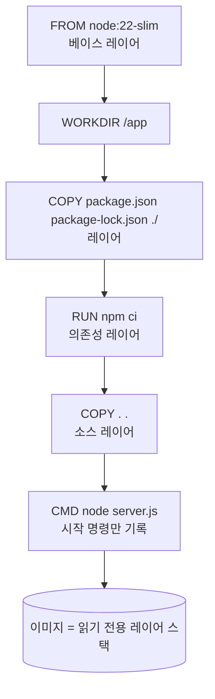

## 이론

### 왜 필요한가

이미지를 손으로 만들면 무엇을 어떤 순서로 설치했는지가 사람의 기억에만 남는다. Dockerfile은 그 과정을 텍스트 파일 한 장으로 고정해, 누가 언제 빌드해도 같은 절차를 밟게 하는 빌드 레시피(build recipe)다. 파일이 저장소에 코드처럼 남으므로 리뷰·이력 추적·자동 빌드가 가능해진다.

### 메커니즘

`docker build`는 Dockerfile을 위에서 아래로 한 줄씩 실행한다. 첫 명령 `FROM`이 베이스 이미지를 고르고, 그 위에 `RUN`·`COPY`·`ADD`가 실행 결과를 레이어(layer)로 하나씩 쌓는다. `CMD`·`ENV`·`EXPOSE` 같은 명령은 파일을 바꾸지 않고 이미지 설정(메타데이터)만 기록한다. 완성된 이미지는 읽기 전용 레이어의 스택이고, 컨테이너는 그 위에 얇은 쓰기 층을 얹어 실행된다.



가장 흔한 혼동은 시점이다. `RUN npm ci`는 빌드할 때 한 번 실행되고 그 결과(설치된 패키지)가 레이어에 굳는다. 반면 `CMD ["node", "server.js"]`는 빌드 때 실행되지 않고, 컨테이너가 시작될 때 실행할 기본 명령으로만 저장된다. CMD를 여러 번 쓰면 마지막 하나만 남는다. CMD를 `["node", "server.js"]`처럼 exec 형식으로 쓰면 셸을 거치지 않으므로 `docker stop`이 보내는 종료 신호를 앱이 직접 받는다.

::embed[docker.dockerfile.i13]

`COPY`의 원본 경로는 빌드 컨텍스트(build context, 보통 `docker build .`의 `.`)를 기준으로 한다. 컨텍스트 밖 파일은 가져올 수 없고, `.dockerignore`에 적은 경로는 아예 컨텍스트에서 빠진다. 명령 순서는 빌드 캐시에도 영향을 준다. 앞쪽 레이어가 바뀌면 그 뒤 레이어는 모두 다시 만들어지므로, 자주 바뀌는 소스 코드 복사는 의존성 설치 뒤에 둔다. 베이스 이미지는 `latest` 대신 버전 태그로 고정해야 같은 파일이 언제나 같은 결과를 낸다.

## 코드

### Worked example

Node 22 서버를 실행하는 최소 Dockerfile이다. 주석의 번호가 작성 순서(서브골)다.

```dockerfile
# ① 베이스 이미지를 고른다 — 버전 태그로 고정(latest 금지)
FROM node:22-slim
# ② 작업 디렉터리를 정한다 — 이후 상대 경로의 기준
WORKDIR /app
# ③ 의존성 정의만 먼저 복사한다 — 소스가 바뀌어도 다음 레이어 캐시가 유지된다
COPY package.json package-lock.json ./
# ④ 빌드 시점에 한 번 실행한다 — 설치 결과가 레이어로 남는다
RUN npm ci --omit=dev
# ⑤ 소스를 복사한다 — 가장 자주 바뀌므로 뒤에 둔다
COPY . .
# ⑥ 실행 시점 기본 명령 — exec 형식이라 종료 신호를 node가 직접 받는다
CMD ["node", "server.js"]
```

빌드 컨텍스트에서 빼야 할 경로는 같은 폴더의 `.dockerignore`에 적는다.

```text
node_modules
.git
*.log
```

### 단계 과제

단계 과제는 랩 WP에서 추가한다.

## 핵심

### 언제 쓰지 않나

- 공식 이미지를 그대로 쓰고 설정만 바꾸면 될 때는 새 Dockerfile 대신 환경 변수·마운트로 해결한다.
- 토큰·비밀번호를 `ENV`나 `COPY`로 넣지 않는다. 레이어에 영구히 남아 이미지를 받은 누구나 꺼낼 수 있다(→ [이미지 보안](concept:docker.image-security)).
- 개발 중 파일을 저장할 때마다 다시 빌드하지 않는다. 그 단계에서는 바인드 마운트가 맞다(→ [개발 환경](concept:docker.dev-environment)).

### 대조

| | RUN | CMD |
|---|---|---|
| 실행 시점 | 빌드할 때 한 번 | 컨테이너가 시작될 때마다 |
| 결과 | 파일 변경이 레이어로 남음 | 시작 명령만 메타데이터로 기록 |
| 여러 번 쓰면 | 각각 실행되어 레이어가 쌓임 | 마지막 하나만 유효 |

::ku-list
